<div align="center">


</div>

# PMP Station (Rain, Pmax24h): 28035010

Probable Maximum Precipitation (PMP) is the greatest amount of rainfall for a specific duration that is meteorologically possible for a given location, acting as a "worst-case" scenario for extreme storms, crucial for designing safety-critical infrastructure like bridges, river deviations, dams, spillways, and nuclear plants to prevent catastrophic failure. PMP is calculated by hydrologists using meteorological data to determine the upper limit of extreme rainfall, often leading to the Probable Maximum Flood (PMF) for flood control design, and is increasingly being studied for climate change impacts. Probable Maximum Precipitation (PMP) is the theoretical upper limit of rainfall, a deterministic estimate for extreme events, while probability distributions (like GEV, Gumbel) describe the likelihood and frequency of various precipitation amounts, including rare ones, showing how often events occur, with PMP representing the extreme end of these distributions, used for critical infrastructure design to ensure safety against the worst conceivable weather, unlike standard statistical forecasts which cover typical probabilities.

The most common probability distributions in hydrology, used for analyzing floods, rainfall, and streamflow, include the Normal, Log-Normal, Gumbel, Gamma (including Log-Pearson Type III), and Generalized Extreme Value (GEV) distributions, often chosen based on the data´s skewness and whether modeling extremes or general conditions, with Gumbel and GEV popular for extreme events like floods, while the Normal distribution serves as a baseline, though often requiring transformations for skewed hydrological data. These distributions help in designing water infrastructure, managing water resources, and forecasting hydrologic events.

> Hydrological data often isn´t perfectly normal (it´s skewed), so different distributions are needed for different applications, such as: **Flood Frequency Analysis**: Using Gumbel, GEV, or Log-Pearson Type III for predicting extreme flood magnitudes and their return periods, **Rainfall Analysis**: Normal for annual totals, but Log-Normal, Weibull, or GEV for intensity or extreme daily rainfall, **Streamflow Modeling**: Gamma and Log-Normal for maximum flows, GEV for minimum flows, and Kappa for daily flows.

<div align="center">

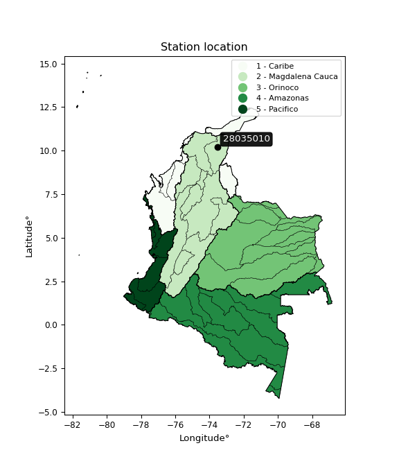</img>

</div>


## A. General information


### 1. General running parameters

• app_version: _v20260103_. • runtime: _2026-01-06 18:56:15.422800_. • Python version: _3.14.0_. • SciPy version: _1.16.3_. • Pandas version: _2.3.3_. • NumPy version: _2.3.5_. • Stations dataset (station_dataset_file): _dataset/pmax24h_in/conventional_cesarcolombia_1959_2022.csv_. • Stations catalog (station_catalog_file): _dataset/CNE.xls_. • Minimum year to eval til year_max (date_min): _1900_. • Maximum year to eval since year_min (date_max): _2024_. • Creates, save and include plots into reports (create_plot): _True_. • Plot only fit distributions with Δo > Δ (plot_only_fit): _True_. • Plot only simple graphs avoiding multiple CDFs and multiple Extreme values plots (plot_only_simple): _False_. • Eval low extreme values, if False, evaluates high extreme values (low_extreme): _False_. • Eval every SciPy distribution as logarithmic (pdist_logarithmic_on): _True_. • Standard deviation normalized (ddof): _1.0_. • Return periods to eval in years (Tr): _[2, 2.33, 5, 10, 15, 20, 25, 50, 75, 100, 200, 250, 500, 750, 1000]_. • Minimum data sample per station, 0 means any (minimum_sample): _5_. • Z-Score maximum threshold to adjust a value, 0 means disable (zscore_max): _3.5_. • Z-Score minimum threshold to adjust a value, 0 means disable (zscore_min): _-2.5_. • Avoid zeros, e.g. rain = 0 (avoid_zeros): _True_. • Avoid null values (avoid_nans): _True_. 

:file_folder:File: [Dataset values](../../dataset/pmax24h_in/conventional_cesarcolombia_1959_2022.csv)

> Delta Degrees of Freedom (DDOF): is a parameter used in the formulas for calculating variance and standard deviation. When ddof=0, the divisor is $N$ (the total number of observations) and this is used when your data set is the entire population. When ddof=1, the divisor is $N-1$ and this is used when your data set is a sample drawn from a larger population. Using $N-1$ provides an unbiased estimate of the population variance (known as Bessel´s correction).


### 2. Station info and location

|   id |   CODIGO | NOMBRE                | CATEGORIA               | TECNOLOGIA   | ESTADO   | FECHA_INSTALACION   |   FECHA_SUSPENSION |   ALTITUD |   LATITUD |   LONGITUD | DEPARTAMENTO   | MUNICIPIO   | AREA_OPERATIVA                                         | ENTIDAD                                                     | AREA_HIDROGRAFICA   | ZONA_HIDROGRAFICA   | SUBZONA_HIDROGRAFICA   |   CORRIENTE | Catalogo   |   Version |
|-----:|---------:|:----------------------|:------------------------|:-------------|:---------|:--------------------|-------------------:|----------:|----------:|-----------:|:---------------|:------------|:-------------------------------------------------------|:------------------------------------------------------------|:--------------------|:--------------------|:-----------------------|------------:|:-----------|----------:|
|    0 | 28035010 | VILLA ROSA [28035010] | Climatológica Ordinaria | Convencional | Activa   | 15/03/1968          |                nan |        70 |   10.1907 |   -73.5474 | Cesar          | Valledupar  | Area Operativa 05 - Magdalena-Cesar-Guajira-San Andrés | INSTITUTO DE HIDROLOGIA METEOROLOGIA Y ESTUDIOS AMBIENTALES | Magdalena Cauca     | Cesar               | Medio Cesar            |         nan | CNE_IDEAM  |  20251226 |

<div align="center">

Dynamic map: [:earth_americas:Google](http://maps.google.com/maps?q=10.19066667,-73.54738889) [:earth_americas:OSM](https://www.openstreetmap.org/#map=18/10.19066667/-73.54738889&layers=P) [:earth_americas:Bing](https://www.bing.com/maps?cp=10.19066667~-73.54738889&lvl=18) [:earth_americas:Apple](https://maps.apple.com/frame?center=10.19066667%2C-73.54738889&span=0.003%2C0.006)

</div>


<div align="center">

```geojson
{
  "type": "Feature",
  "geometry": {
    "type": "Point", 
    "coordinates": [-73.54738889, 10.19066667]
  }, 
  "properties": {
    "Name": "28035010"
  }
}
```

</div>


### 3. Discrete values table and plot

<div align="center">

|               |           0 |          1 |         2 |          3 |           4 |            5 |           6 |           7 |           8 |           9 |          10 |           11 |          12 |         13 |          14 |          15 |          16 |          17 |         18 |          19 |          20 |          21 |         22 |        23 |          24 |          25 |         26 |          27 |         28 |         29 |          30 |         31 |        32 |          33 |         34 |          35 |         36 |          37 |          38 |         39 |           40 |          41 |         42 |          43 |          44 |          45 |         46 |          47 |           48 |         49 |          50 |          51 |
|:--------------|------------:|-----------:|----------:|-----------:|------------:|-------------:|------------:|------------:|------------:|------------:|------------:|-------------:|------------:|-----------:|------------:|------------:|------------:|------------:|-----------:|------------:|------------:|------------:|-----------:|----------:|------------:|------------:|-----------:|------------:|-----------:|-----------:|------------:|-----------:|----------:|------------:|-----------:|------------:|-----------:|------------:|------------:|-----------:|-------------:|------------:|-----------:|------------:|------------:|------------:|-----------:|------------:|-------------:|-----------:|------------:|------------:|
| Date          | 1968        | 1969       | 1970      | 1971       | 1972        | 1973         | 1974        | 1975        | 1976        | 1977        | 1978        | 1979         | 1980        | 1981       | 1982        | 1983        | 1984        | 1985        | 1986       | 1987        | 1988        | 1989        | 1990       | 1991      | 1992        | 1993        | 1994       | 1995        | 1996       | 1997       | 1998        | 1999       | 2000      | 2001        | 2002       | 2003        | 2004       | 2005        | 2006        | 2007       | 2008         | 2009        | 2010       | 2011        | 2012        | 2013        | 2014       | 2015        | 2016         | 2017       | 2018        | 2022        |
| Value         |   64.2      |   55.925   |   73.0782 |  146.9     |   64.7      |   82.9       |   94        |   90        |   67        |   87        |   76.5      |   86         |   71        |  110.7     |   90        |   98.2      |   68.3435   |   78        |  109       |   76        |   94        |   66        |  123       |   56      |   70        |   74        |   58.5047  |   90        |  143       |   63       |   75        |  110       |   56      |   68        |  117       |   90        |   53.7526  |  102        |   70        |  120.4     |   82.5       |   62.3      |  134       |   90.5      |   67        |   79        |   60.8     |   68.5      |   85         |  101       |   78        |   99        |
| Value_initial |   64.2      |   55.925   |   73.0782 |  146.9     |   64.7      |   82.9       |   94        |   90        |   67        |   87        |   76.5      |   86         |   71        |  110.7     |   90        |   98.2      |   68.3435   |   78        |  109       |   76        |   94        |   66        |  123       |   56      |   70        |   74        |   58.5047  |   90        |  143       |   63       |   75        |  110       |   56      |   68        |  117       |   90        |   53.7526  |  102        |   70        |  120.4     |   82.5       |   62.3      |  134       |   90.5      |   67        |   79        |   60.8     |   68.5      |   85         |  101       |   78        |   99        |
| count         |   52        |   52       |   52      |   52       |   52        |   52         |   52        |   52        |   52        |   52        |   52        |   52         |   52        |   52       |   52        |   52        |   52        |   52        |   52       |   52        |   52        |   52        |   52       |   52      |   52        |   52        |   52       |   52        |   52       |   52       |   52        |   52       |   52      |   52        |   52       |   52        |   52       |   52        |   52        |   52       |   52         |   52        |   52       |   52        |   52        |   52        |   52       |   52        |   52         |   52       |   52        |   52        |
| mean          |   84.552    |   84.552   |   84.552  |   84.552   |   84.552    |   84.552     |   84.552    |   84.552    |   84.552    |   84.552    |   84.552    |   84.552     |   84.552    |   84.552   |   84.552    |   84.552    |   84.552    |   84.552    |   84.552   |   84.552    |   84.552    |   84.552    |   84.552   |   84.552  |   84.552    |   84.552    |   84.552   |   84.552    |   84.552   |   84.552   |   84.552    |   84.552   |   84.552  |   84.552    |   84.552   |   84.552    |   84.552   |   84.552    |   84.552    |   84.552   |   84.552     |   84.552    |   84.552   |   84.552    |   84.552    |   84.552    |   84.552   |   84.552    |   84.552     |   84.552   |   84.552    |   84.552    |
| std           |   22.6532   |   22.6532  |   22.6532 |   22.6532  |   22.6532   |   22.6532    |   22.6532   |   22.6532   |   22.6532   |   22.6532   |   22.6532   |   22.6532    |   22.6532   |   22.6532  |   22.6532   |   22.6532   |   22.6532   |   22.6532   |   22.6532  |   22.6532   |   22.6532   |   22.6532   |   22.6532  |   22.6532 |   22.6532   |   22.6532   |   22.6532  |   22.6532   |   22.6532  |   22.6532  |   22.6532   |   22.6532  |   22.6532 |   22.6532   |   22.6532  |   22.6532   |   22.6532  |   22.6532   |   22.6532   |   22.6532  |   22.6532    |   22.6532   |   22.6532  |   22.6532   |   22.6532   |   22.6532   |   22.6532  |   22.6532   |   22.6532    |   22.6532  |   22.6532   |   22.6532   |
| zscore        |   -0.898418 |   -1.26371 |   -0.5065 |    2.75229 |   -0.876346 |   -0.0729258 |    0.417072 |    0.240496 |   -0.774814 |    0.108064 |   -0.355447 |    0.0639204 |   -0.598239 |    1.15428 |    0.240496 |    0.602477 |   -0.715507 |   -0.289231 |    1.07923 |   -0.377519 |    0.417072 |   -0.818958 |    1.69725 |   -1.2604 |   -0.642383 |   -0.465807 |   -1.14983 |    0.240496 |    2.58013 |   -0.95139 |   -0.421663 |    1.12338 |   -1.2604 |   -0.730671 |    1.43238 |    0.240496 |   -1.35961 |    0.770224 |   -0.642383 |    1.58247 |   -0.0905834 |   -0.982291 |    2.18283 |    0.262568 |   -0.774814 |   -0.245087 |   -1.04851 |   -0.708599 |    0.0197765 |    0.72608 |   -0.289231 |    0.637792 |


</div>


<div align="center">

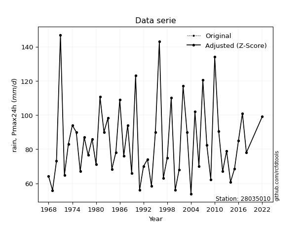</img>

</div>


> The initial value (value_initial) correspond to the initial obtained or null completed value, and value (value) is adjusted only when the initial value is outside the valid range (outlier) definite through the Z-Score value. If Z-Score is active, values out of range or outliers are replaced with the station mean value. A Z-Score (or standard score) measures how many standard deviations a data point is from the mean of a dataset, indicating its relative position; positive scores mean above the mean, negative mean below, and a score of zero is exactly at the mean, allowing for comparison of values from different distributions. It´s calculated using the formula $z=(x–μ)/σ$, where $x$ is the data point, $μ$ is the mean, and $σ$ is the standard deviation, helping identify outliers and understand probability.
>
> <sub>**Note**: In this study, "completing" (filling gaps in) and "extending" (forecasting or lengthening the historical record) rainfall data series are avoided for certain critical analyses because they introduce artificial bias and uncertainty, which can distort the statistics of rare events (extremes), alter day-to-day variability, and compromise the integrity and homogeneity of the original data. Some reasons against Completing/Extending rainfall data are: **Distortion of Extremes and Variability**: The primary issue is that most gap-filling or extension methods rely on averaging or regression with nearby stations, which inherently smooths the data. Rainfall is highly variable in space and time, with a large percentage of zero values and occasional large storms. Infilling methods often underestimate the highest values and overestimate the lowest (zero) values, which severely distorts analyses focused on flood frequency, drought severity, and intensity-duration-frequency (IDF) curves, **Loss of Data Homogeneity**: Infilled or extended data are synthetic estimates, not actual measurements. Combining these estimates with observed data can violate the assumption of data homogeneity, which requires that the data properties do not change over time. Inhomogeneity can lead to incorrect conclusions about long-term trends or changes in climate patterns, **Propagation of Errors**: Errors and biases from the original data (e.g., wind-induced undercatch, instrument errors, site changes) or the data used for imputation can propagate through the analysis, leading to unreliable hydrological models and inaccurate predictions, **Compromised Statistical Integrity**: For statistical analyses, especially those involving the frequency of events, using artificial data can introduce time bias or autocorrelation that doesn´t exist in reality, making it difficult to assess the true probability of events, **Difficulty in Validation**: It is difficult to accurately validate the quality of filled or extended data, especially for past periods where ground-truth measurements are unavailable. The reliability of imputation techniques heavily depends on the density of the surrounding station network and the complexity of the local topography.</sub>


### 4. Active continuous probability distributions from SciPy (44 of 104 available)

A Probability Density Function (PDF) describes the relative likelihood of a continuous random variable falling within a specific range, where the total area under its curve equals 1, and the area over any interval gives the actual probability for that range. Unlike discrete probabilities (like rolling a die), a PDF shows density, not direct probability for a single point (which is zero), with higher points indicating higher likelihood, often visualized as a bell curve for normal distributions.

A log of a probability density function (log-PDF) is simply the logarithm of the PDF´s value, denoted as $log(f(x))$, useful for converting multiplication of probabilities into addition, improving numerical stability with tiny numbers, and connecting to information theory concepts like entropy. Instead of dealing with very small probabilities (e.g., 0.000001), log-PDFs use negative numbers (e.g., $log(0.00001) ≈ -11.51$ that are easier for computers to handle, preventing underflow errors and simplifying complex calculations. In this study, each active probability distribution from SciPy is also evaluated in the $log$ form.

[scipy.stats](https://docs.scipy.org/doc/scipy/reference/stats.html) is a Python´s powerful submodule within the SciPy library for comprehensive statistical analysis, offering over 130 probability distributions (like Normal, Poisson), functions for descriptive stats (mean, variance), hypothesis testing (t-tests, chi-square), random variable generation, and statistical tests, making it essential for data science, modeling, and research. It provides tools to explore, model, and draw conclusions from data efficiently, working seamlessly with NumPy.

<div align="center">

|   id | p_dist             |   n_parameter | fit_method   | label                                                                       | active   | ref                                                                                                        |
|-----:|:-------------------|--------------:|:-------------|:----------------------------------------------------------------------------|:---------|:-----------------------------------------------------------------------------------------------------------|
|    0 | alpha              |             3 | MLE          | Alpha                                                                       | True     | [:mortar_board:](https://docs.scipy.org/doc/scipy/reference/generated/scipy.stats.alpha.html)              |
|    1 | betaprime          |             4 | MLE          | Beta prime                                                                  | True     | [:mortar_board:](https://docs.scipy.org/doc/scipy/reference/generated/scipy.stats.betaprime.html)          |
|    2 | chi2               |             3 | MLE          | Chi²                                                                        | True     | [:mortar_board:](https://docs.scipy.org/doc/scipy/reference/generated/scipy.stats.chi2.html)               |
|    3 | crystalball        |             4 | MLE          | Crystalball                                                                 | True     | [:mortar_board:](https://docs.scipy.org/doc/scipy/reference/generated/scipy.stats.crystalball.html)        |
|    4 | erlang             |             3 | MLE          | Erlang                                                                      | True     | [:mortar_board:](https://docs.scipy.org/doc/scipy/reference/generated/scipy.stats.erlang.html)             |
|    5 | expon              |             2 | MLE          | Exponential                                                                 | True     | [:mortar_board:](https://docs.scipy.org/doc/scipy/reference/generated/scipy.stats.expon.html)              |
|    6 | exponnorm          |             3 | MLE          | Exponentially modified Normal                                               | True     | [:mortar_board:](https://docs.scipy.org/doc/scipy/reference/generated/scipy.stats.exponnorm.html)          |
|    7 | f                  |             4 | MLE          | F                                                                           | True     | [:mortar_board:](https://docs.scipy.org/doc/scipy/reference/generated/scipy.stats.f.html)                  |
|    8 | fatiguelife        |             3 | MLE          | Fatigue-life (Birnbaum-Saunders)                                            | True     | [:mortar_board:](https://docs.scipy.org/doc/scipy/reference/generated/scipy.stats.fatiguelife.html)        |
|    9 | fisk               |             3 | MLE          | Fisk                                                                        | True     | [:mortar_board:](https://docs.scipy.org/doc/scipy/reference/generated/scipy.stats.fisk.html)               |
|   10 | gamma              |             3 | MLE          | Gamma                                                                       | True     | [:mortar_board:](https://docs.scipy.org/doc/scipy/reference/generated/scipy.stats.gamma.html)              |
|   11 | genexpon           |             5 | MLE          | Generalized exponential                                                     | True     | [:mortar_board:](https://docs.scipy.org/doc/scipy/reference/generated/scipy.stats.genexpon.html)           |
|   12 | genlogistic        |             3 | MLE          | Generalized logistic                                                        | True     | [:mortar_board:](https://docs.scipy.org/doc/scipy/reference/generated/scipy.stats.genlogistic.html)        |
|   13 | gibrat             |             2 | MM           | Gibrat                                                                      | True     | [:mortar_board:](https://docs.scipy.org/doc/scipy/reference/generated/scipy.stats.gibrat.html)             |
|   14 | gompertz           |             3 | MLE          | Gompertz (or truncated Gumbel)                                              | True     | [:mortar_board:](https://docs.scipy.org/doc/scipy/reference/generated/scipy.stats.gompertz.html)           |
|   15 | gumbel_l           |             2 | MM           | Gumbel Left Skew                                                            | True     | [:mortar_board:](https://docs.scipy.org/doc/scipy/reference/generated/scipy.stats.gumbel_l.html)           |
|   16 | gumbel_r           |             2 | MM           | Gumbel Right Skew                                                           | True     | [:mortar_board:](https://docs.scipy.org/doc/scipy/reference/generated/scipy.stats.gumbel_r.html)           |
|   17 | halflogistic       |             2 | MM           | Half-logistic                                                               | True     | [:mortar_board:](https://docs.scipy.org/doc/scipy/reference/generated/scipy.stats.halflogistic.html)       |
|   18 | halfnorm           |             2 | MM           | Half Normal                                                                 | True     | [:mortar_board:](https://docs.scipy.org/doc/scipy/reference/generated/scipy.stats.halfnorm.html)           |
|   19 | hypsecant          |             2 | MM           | hyperbolic secant                                                           | True     | [:mortar_board:](https://docs.scipy.org/doc/scipy/reference/generated/scipy.stats.hypsecant.html)          |
|   20 | invgamma           |             3 | MLE          | Inverted gamma                                                              | True     | [:mortar_board:](https://docs.scipy.org/doc/scipy/reference/generated/scipy.stats.invgamma.html)           |
|   21 | invgauss           |             3 | MLE          | Inverse Gaussian                                                            | True     | [:mortar_board:](https://docs.scipy.org/doc/scipy/reference/generated/scipy.stats.invgauss.html)           |
|   22 | invweibull         |             3 | MLE          | Inverted Weibull                                                            | True     | [:mortar_board:](https://docs.scipy.org/doc/scipy/reference/generated/scipy.stats.invweibull.html)         |
|   23 | johnsonsu          |             4 | MLE          | Johnson Su                                                                  | True     | [:mortar_board:](https://docs.scipy.org/doc/scipy/reference/generated/scipy.stats.johnsonsu.html)          |
|   24 | kstwobign          |             2 | MLE          | Limiting distribution of scaled Kolmogorov-Smirnov two-sided test statistic | True     | [:mortar_board:](https://docs.scipy.org/doc/scipy/reference/generated/scipy.stats.kstwobign.html)          |
|   25 | laplace            |             2 | MM           | Laplace                                                                     | True     | [:mortar_board:](https://docs.scipy.org/doc/scipy/reference/generated/scipy.stats.laplace.html)            |
|   26 | laplace_asymmetric |             3 | MLE          | Asymmetric Laplace                                                          | True     | [:mortar_board:](https://docs.scipy.org/doc/scipy/reference/generated/scipy.stats.laplace_asymmetric.html) |
|   27 | loggamma           |             3 | MLE          | Log gamma                                                                   | True     | [:mortar_board:](https://docs.scipy.org/doc/scipy/reference/generated/scipy.stats.loggamma.html)           |
|   28 | logistic           |             2 | MM           | Logistic (or Sech-squared)                                                  | True     | [:mortar_board:](https://docs.scipy.org/doc/scipy/reference/generated/scipy.stats.logistic.html)           |
|   29 | lognorm            |             3 | MLE          | Log Normal                                                                  | True     | [:mortar_board:](https://docs.scipy.org/doc/scipy/reference/generated/scipy.stats.lognorm.html)            |
|   30 | maxwell            |             2 | MM           | Maxwell                                                                     | True     | [:mortar_board:](https://docs.scipy.org/doc/scipy/reference/generated/scipy.stats.maxwell.html)            |
|   31 | mielke             |             4 | MLE          | Mielke Beta-Kappa / Dagum                                                   | True     | [:mortar_board:](https://docs.scipy.org/doc/scipy/reference/generated/scipy.stats.mielke.html)             |
|   32 | moyal              |             2 | MM           | Moyal                                                                       | True     | [:mortar_board:](https://docs.scipy.org/doc/scipy/reference/generated/scipy.stats.moyal.html)              |
|   33 | nakagami           |             3 | MLE          | Nakagami                                                                    | True     | [:mortar_board:](https://docs.scipy.org/doc/scipy/reference/generated/scipy.stats.nakagami.html)           |
|   34 | ncf                |             5 | MLE          | Non-central F distribution                                                  | True     | [:mortar_board:](https://docs.scipy.org/doc/scipy/reference/generated/scipy.stats.ncf.html)                |
|   35 | nct                |             4 | MLE          | Non-central Student’s t                                                     | True     | [:mortar_board:](https://docs.scipy.org/doc/scipy/reference/generated/scipy.stats.nct.html)                |
|   36 | norm               |             2 | MM           | Normal                                                                      | True     | [:mortar_board:](https://docs.scipy.org/doc/scipy/reference/generated/scipy.stats.norm.html)               |
|   37 | pearson3           |             3 | MM           | Pearson type III                                                            | True     | [:mortar_board:](https://docs.scipy.org/doc/scipy/reference/generated/scipy.stats.pearson3.html)           |
|   38 | rayleigh           |             2 | MM           | Rayleigh                                                                    | True     | [:mortar_board:](https://docs.scipy.org/doc/scipy/reference/generated/scipy.stats.rayleigh.html)           |
|   39 | rice               |             3 | MLE          | Rice                                                                        | True     | [:mortar_board:](https://docs.scipy.org/doc/scipy/reference/generated/scipy.stats.rice.html)               |
|   40 | t                  |             3 | MLE          | Student’s t                                                                 | True     | [:mortar_board:](https://docs.scipy.org/doc/scipy/reference/generated/scipy.stats.t.html)                  |
|   41 | truncnorm          |             4 | MLE          | Truncated normal                                                            | True     | [:mortar_board:](https://docs.scipy.org/doc/scipy/reference/generated/scipy.stats.truncnorm.html)          |
|   42 | wald               |             2 | MM           | Wald                                                                        | True     | [:mortar_board:](https://docs.scipy.org/doc/scipy/reference/generated/scipy.stats.wald.html)               |
|   43 | weibull_min        |             3 | MLE          | Weibull minimum                                                             | True     | [:mortar_board:](https://docs.scipy.org/doc/scipy/reference/generated/scipy.stats.weibull_min.html)        |

</div>

> **n_parameter:** # arguments & localization & scale.
>
> **Fit methods:** (MLE) maximum likelihood, (MM) L-moments.
>
>**Inactive** (With the only purpose of prevent loops, zero divisions, infinite values, over high estimated values or horizontal trending for recurrence intervals estimations, the follow distributions were disabled.)**:** foldnorm, gennorm, norminvgauss, powernorm, powerlognorm, skewnorm, genextreme, anglit, arcsine, argus, beta, bradford, burr, burr12, cauchy, cosine, halfcauchy, foldcauchy, skewcauchy, wrapcauchy, dgamma, gengamma, exponweib, exponpow, truncexpon, gausshyper, genhalflogistic, genhyperbolic, geninvgauss, halfgennorm, johnsonsb, kappa4, kappa3, ksone, kstwo, loglaplace, levy, levy_l, levy_stable, ncx2, pareto, genpareto, truncpareto, lomax, powerlaw, rdist, rel_breitwigner, recipinvgauss, semicircular, studentized_range, trapezoid, triang, truncweibull_min, tukeylambda, uniform, loguniform, vonmises, vonmises_line, weibull_max, dweibull, 


## B. Probability (PDF) vs. Empirical (EDF) distributions functions

A continuous probability distribution (CPD) describes probabilities for variables that can take any value within a range (like rain any time), unlike discrete variables with specific outcomes (like temperature). It uses a Probability Density Function (PDF), a curve where the total area under it equals 1, and the probability of the variable falling within an interval (a to b) is found by calculating the area under the curve between those points. A key feature is that the probability of hitting any single exact value is zero, so probabilities are always expressed for ranges, e.g., $P(a ≤ X ≤ b)$.

<div align="center">

Distributions parameters from station values
|    |   station | p_dist                |   n |             loc |          scale | shape                 | shape1               | shape2                 | shape3   |
|---:|----------:|:----------------------|----:|----------------:|---------------:|:----------------------|:---------------------|:-----------------------|:---------|
|  0 |  28035010 | alpha                 |  52 |    -3.13669     |  360.445       | 4.35681958200308      |                      |                        |          |
|  1 |  28035010 | betaprime             |  52 |    -1.12755     |    2.44473     | 583.0357020993281     | 17.65265742174391    |                        |          |
|  2 |  28035010 | chi2                  |  52 |    53.7526      |   21.8256      | 1.5898511787829124    |                      |                        |          |
|  3 |  28035010 | crystalball           |  52 |    84.552       |   22.4343      | 7703.441418677241     | 46.8592929858668     |                        |          |
|  4 |  28035010 | erlang                |  52 |    52.3353      |   17.8564      | 1.8042095483533953    |                      |                        |          |
|  5 |  28035010 | expon                 |  52 |    53.7526      |   30.7994      |                       |                      |                        |          |
|  6 |  28035010 | exponnorm             |  52 |    59.8521      |    5.99851     | 4.1176860930523755    |                      |                        |          |
|  7 |  28035010 | f                     |  52 |    28.7996      |   48.0872      | 6569.0839876515565    | 14.157320070826579   |                        |          |
|  8 |  28035010 | fatiguelife           |  52 |    42.4376      |   36.4517      | 0.5567610803231522    |                      |                        |          |
|  9 |  28035010 | fisk                  |  52 |    45.9969      |   32.9817      | 2.806439565711419     |                      |                        |          |
| 10 |  28035010 | gamma                 |  52 |    52.3353      |   17.8564      | 1.8042099329650627    |                      |                        |          |
| 11 |  28035010 | genexpon              |  52 |    53.7526      |    2.04651     | 0.03972526836381593   | 0.028136410233090492 | 1.2677337710748016     |          |
| 12 |  28035010 | genlogistic           |  52 |   -39.7502      |   16.7295      | 920.5097229857154     |                      |                        |          |
| 13 |  28035010 | gibrat                |  52 |    67.4375      |   10.3805      |                       |                      |                        |          |
| 14 |  28035010 | gompertz              |  52 |    53.7526      |   52.9934      | 1.0112959483851025    |                      |                        |          |
| 15 |  28035010 | gumbel_l              |  52 |    94.6486      |   17.4919      |                       |                      |                        |          |
| 16 |  28035010 | gumbel_r              |  52 |    74.4554      |   17.4919      |                       |                      |                        |          |
| 17 |  28035010 | halflogistic          |  52 |    57.9622      |   19.1805      |                       |                      |                        |          |
| 18 |  28035010 | halfnorm              |  52 |    54.8578      |   37.2162      |                       |                      |                        |          |
| 19 |  28035010 | hypsecant             |  52 |    84.552       |   14.2821      |                       |                      |                        |          |
| 20 |  28035010 | invgamma              |  52 |    28.7397      |  340.911       | 7.081389623380369     |                      |                        |          |
| 21 |  28035010 | invgauss              |  52 |    40.7797      |  146.99        | 0.2977901907148198    |                      |                        |          |
| 22 |  28035010 | invweibull            |  52 |   -59.3938      |  132.783       | 8.368874675642584     |                      |                        |          |
| 23 |  28035010 | johnsonsu             |  52 |    42.1678      |    1.05204     | -7.92803315607742     | 1.8651741425888795   |                        |          |
| 24 |  28035010 | kstwobign             |  52 |    14.6114      |   80.5393      |                       |                      |                        |          |
| 25 |  28035010 | laplace               |  52 |    84.552       |   15.8634      |                       |                      |                        |          |
| 26 |  28035010 | laplace_asymmetric    |  52 |    64.7         |   11.8795      | 0.46757529863982983   |                      |                        |          |
| 27 |  28035010 | loggamma              |  52 | -7520.53        | 1005.39        | 1928.5931779621778    |                      |                        |          |
| 28 |  28035010 | logistic              |  52 |    84.552       |   12.3687      |                       |                      |                        |          |
| 29 |  28035010 | lognorm               |  52 |    42.173       |   36.8829      | 0.5362658340107079    |                      |                        |          |
| 30 |  28035010 | maxwell               |  52 |    31.3922      |   33.313       |                       |                      |                        |          |
| 31 |  28035010 | mielke                |  52 |     0.522315    |   29.8047      | 308.83018297427043    | 4.72035053577182     |                        |          |
| 32 |  28035010 | moyal                 |  52 |    71.7226      |   10.099       |                       |                      |                        |          |
| 33 |  28035010 | nakagami              |  52 |    53.7526      |   37.2294      | 0.47858863110884375   |                      |                        |          |
| 34 |  28035010 | ncf                   |  52 |    -0.719059    |   84.8963      | 33.81835559129868     | 491.41198101523696   | 0.00045955529962852707 |          |
| 35 |  28035010 | nct                   |  52 |    -0.301298    |    1.24889     | 9.073547233374136     | 62.1527060848297     |                        |          |
| 36 |  28035010 | norm                  |  52 |    84.552       |   22.4343      |                       |                      |                        |          |
| 37 |  28035010 | pearson3              |  52 |    84.552       |   22.4343      | 0.9453453865586428    |                      |                        |          |
| 38 |  28035010 | rayleigh              |  52 |    41.6339      |   34.2437      |                       |                      |                        |          |
| 39 |  28035010 | rice                  |  52 |    46.709       |   31.1078      | 0.0007116096090103311 |                      |                        |          |
| 40 |  28035010 | t                     |  52 |    84.6005      |   22.4806      | 42.98049395479356     |                      |                        |          |
| 41 |  28035010 | truncnorm             |  52 |    84.552       |   22.4343      | -1563.7636046801144   | 35.36989125958589    |                        |          |
| 42 |  28035010 | wald                  |  52 |    62.1177      |   22.4343      |                       |                      |                        |          |
| 43 |  28035010 | weibull_min           |  52 |    53.161       |   34.2784      | 1.3797206954785146    |                      |                        |          |
| 44 |  28035010 | logalpha              |  52 |     1.87123     |   25.8334      | 10.308463154783514    |                      |                        |          |
| 45 |  28035010 | logbetaprime          |  52 |    -5.78808     |   11.332       | 1010.5396729042527    | 1125.1063048295032   |                        |          |
| 46 |  28035010 | logchi2               |  52 |     3.98439     |    0.255839    | 1.538077453431551     |                      |                        |          |
| 47 |  28035010 | logcrystalball        |  52 |     4.40495     |    0.250498    | 7.8631411620513045    | 7.518761419153889    |                        |          |
| 48 |  28035010 | logerlang             |  52 |     3.81513     |    0.113659    | 5.189389696341686     |                      |                        |          |
| 49 |  28035010 | logexpon              |  52 |     3.98439     |    0.420554    |                       |                      |                        |          |
| 50 |  28035010 | logexponnorm          |  52 |     4.21521     |    0.176203    | 1.0768048086645337    |                      |                        |          |
| 51 |  28035010 | logf                  |  52 |     3.80845     |    0.594677    | 10.820276497125821    | 538.2695076532493    |                        |          |
| 52 |  28035010 | logfatiguelife        |  52 |     3.48994     |    0.880874    | 0.27836013483255795   |                      |                        |          |
| 53 |  28035010 | logfisk               |  52 |     3.56126     |    0.810868    | 5.631454144650524     |                      |                        |          |
| 54 |  28035010 | loggamma              |  52 |     3.81513     |    0.113659    | 5.189382525722348     |                      |                        |          |
| 55 |  28035010 | loggenexpon           |  52 |     3.98307     |    0.018136    | 0.011457225883122105  | 4.174226510365498    | 0.00048341360112633537 |          |
| 56 |  28035010 | loggenlogistic        |  52 |     3.21768     |    0.211176    | 157.69739278960515    |                      |                        |          |
| 57 |  28035010 | loggibrat             |  52 |     4.21387     |    0.115897    |                       |                      |                        |          |
| 58 |  28035010 | loggompertz           |  52 |     3.98439     |    0.72024     | 1.1522795648618698    |                      |                        |          |
| 59 |  28035010 | loggumbel_l           |  52 |     4.51768     |    0.195312    |                       |                      |                        |          |
| 60 |  28035010 | loggumbel_r           |  52 |     4.29221     |    0.195312    |                       |                      |                        |          |
| 61 |  28035010 | loghalflogistic       |  52 |     4.10805     |    0.214164    |                       |                      |                        |          |
| 62 |  28035010 | loghalfnorm           |  52 |     4.07341     |    0.415522    |                       |                      |                        |          |
| 63 |  28035010 | loghypsecant          |  52 |     4.40495     |    0.159472    |                       |                      |                        |          |
| 64 |  28035010 | loginvgamma           |  52 |     3.06267     |   38.3996      | 29.601392722668074    |                      |                        |          |
| 65 |  28035010 | loginvgauss           |  52 |     3.4706      |   12.3947      | 0.07538261486456188   |                      |                        |          |
| 66 |  28035010 | loginvweibull         |  52 |    -8.24932e+06 |    8.24933e+06 | 38917969.40672867     |                      |                        |          |
| 67 |  28035010 | logjohnsonsu          |  52 |     3.44811     |    0.103017    | -11.051325655305249   | 3.8229627133262962   |                        |          |
| 68 |  28035010 | logkstwobign          |  52 |     3.53421     |    0.998594    |                       |                      |                        |          |
| 69 |  28035010 | loglaplace            |  52 |     4.40495     |    0.177129    |                       |                      |                        |          |
| 70 |  28035010 | loglaplace_asymmetric |  52 |     4.21951     |    0.172475    | 0.5977953197374628    |                      |                        |          |
| 71 |  28035010 | logloggamma           |  52 |   -63.4934      |    9.39819     | 1373.2432025270846    |                      |                        |          |
| 72 |  28035010 | loglogistic           |  52 |     4.40495     |    0.138107    |                       |                      |                        |          |
| 73 |  28035010 | loglognorm            |  52 |     3.44131     |    0.93158     | 0.26135149845180533   |                      |                        |          |
| 74 |  28035010 | logmaxwell            |  52 |     3.81137     |    0.371968    |                       |                      |                        |          |
| 75 |  28035010 | logmielke             |  52 |    -1.9823e+06  |    1.9823e+06  | 281555992.3653326     | 9535723.889496602    |                        |          |
| 76 |  28035010 | logmoyal              |  52 |     4.2617      |    0.112764    |                       |                      |                        |          |
| 77 |  28035010 | lognakagami           |  52 |     3.96726     |    0.504311    | 0.7844512215643538    |                      |                        |          |
| 78 |  28035010 | logncf                |  52 |     2.44389     |    1.47797     | 128.3501112870966     | 2181.146039884777    | 41.153804823157785     |          |
| 79 |  28035010 | lognct                |  52 |    -0.229102    |    0.0939317   | 205.39369271113816    | 49.15147092464494    |                        |          |
| 80 |  28035010 | lognorm               |  52 |     4.40495     |    0.250498    |                       |                      |                        |          |
| 81 |  28035010 | logpearson3           |  52 |     4.40495     |    0.250498    | 0.43590528241267956   |                      |                        |          |
| 82 |  28035010 | lograyleigh           |  52 |     3.92573     |    0.38236     |                       |                      |                        |          |
| 83 |  28035010 | logrice               |  52 |     3.92931     |    0.337718    | 0.7305617130913262    |                      |                        |          |
| 84 |  28035010 | logt                  |  52 |     4.40495     |    0.250498    | 409408080.6888025     |                      |                        |          |
| 85 |  28035010 | logtruncnorm          |  52 |    -0.0693038   |    1.40857     | 2.877883596792021     | 6.602063654722343    |                        |          |
| 86 |  28035010 | logwald               |  52 |     4.15441     |    0.250534    |                       |                      |                        |          |
| 87 |  28035010 | logweibull_min        |  52 |     3.9449      |    0.517753    | 1.8946771932327784    |                      |                        |          |

</div>

> **loc** (Location parameter): This shifts the distribution along the x-axis. For many common distributions, like the normal (Gaussian) distribution, loc represents the mean $μ$. For others, like the uniform distribution, it might represent the minimum value, or for the beta distribution, the left end of the support interval.
>
> **scale** (Scale parameter): This determines the width or spread of the distribution. For the normal distribution, scale represents the standard deviation $σ$. For a uniform distribution, it defines the length of the interval (from $loc$ to $loc + scale$).
>
> **shape** (Shape parameters): Refers to parameters that define the specific form of a probability distribution, distinct from its location (loc) and scale (scale). These parameters are required arguments for most distribution functions. For example, a normal (Gaussian) distribution is fully defined by its location (mean) and scale (standard deviation), so it has no specific shape parameters beyond loc and scale. However, other distributions have intrinsic properties that need specification, as Gamma distribution that takes a shape parameter, often named $a$ or $alpha$.


### 0. Cumulative distribution values - CDF (88 evaluated)

Cumulative Distribution Function (CDF), denoted as $F$<sub>$X$</sub>$(x)$, is a function that gives the probability that a random variable $X$ will take a value less than or equal to a specific value, $x$ (i.e., $(P(X≥x)$. It essentially "accumulates" probabilities from a given point up to the far right (positive infinity), providing a complete picture of the distribution´s probabilities for both discrete (like rain) and continuous (like temperature) variables, helping to find probabilities over ranges or above certain values. Each station is evaluated separately ordering the $x$ values ascending, calculating the CDF and PDF values for the activated distributions and their logarithmic forms.

<div align="center">

CDF ordered by x ascending and calculating $log(f(x))$ separately
|   id |   Station |   date |        x |   count |   mean |     std |     zscore |   Value_initial |   station |   m |     alpha |   alpha_pdf |   betaprime |   betaprime_pdf |        chi2 |    chi2_pdf |   crystalball |   crystalball_pdf |     erlang |   erlang_pdf |     expon |   expon_pdf |   exponnorm |   exponnorm_pdf |         f |      f_pdf |   fatiguelife |   fatiguelife_pdf |      fisk |   fisk_pdf |      gamma |   gamma_pdf |    genexpon |   genexpon_pdf |   genlogistic |   genlogistic_pdf |     gibrat |   gibrat_pdf |    gompertz |   gompertz_pdf |   gumbel_l |   gumbel_l_pdf |   gumbel_r |   gumbel_r_pdf |   halflogistic |   halflogistic_pdf |   halfnorm |   halfnorm_pdf |   hypsecant |   hypsecant_pdf |   invgamma |   invgamma_pdf |   invgauss |   invgauss_pdf |   invweibull |   invweibull_pdf |   johnsonsu |   johnsonsu_pdf |   kstwobign |   kstwobign_pdf |   laplace |   laplace_pdf |   laplace_asymmetric |   laplace_asymmetric_pdf |   loggamma |   loggamma_pdf |   logistic |   logistic_pdf |   lognorm |   lognorm_pdf |   maxwell |   maxwell_pdf |    mielke |   mielke_pdf |     moyal |   moyal_pdf |   nakagami |   nakagami_pdf |       ncf |     ncf_pdf |       nct |     nct_pdf |      norm |    norm_pdf |   pearson3 |   pearson3_pdf |   rayleigh |   rayleigh_pdf |      rice |    rice_pdf |         t |       t_pdf |   truncnorm |   truncnorm_pdf |        wald |    wald_pdf |   weibull_min |   weibull_min_pdf |   logalpha |   logalpha_pdf |   logbetaprime |   logbetaprime_pdf |     logchi2 |   logchi2_pdf |   logcrystalball |   logcrystalball_pdf |   logerlang |   logerlang_pdf |   logexpon |   logexpon_pdf |   logexponnorm |   logexponnorm_pdf |      logf |   logf_pdf |   logfatiguelife |   logfatiguelife_pdf |   logfisk |   logfisk_pdf |   loggenexpon |   loggenexpon_pdf |   loggenlogistic |   loggenlogistic_pdf |   loggibrat |   loggibrat_pdf |   loggompertz |   loggompertz_pdf |   loggumbel_l |   loggumbel_l_pdf |   loggumbel_r |   loggumbel_r_pdf |   loghalflogistic |   loghalflogistic_pdf |   loghalfnorm |   loghalfnorm_pdf |   loghypsecant |   loghypsecant_pdf |   loginvgamma |   loginvgamma_pdf |   loginvgauss |   loginvgauss_pdf |   loginvweibull |   loginvweibull_pdf |   logjohnsonsu |   logjohnsonsu_pdf |   logkstwobign |   logkstwobign_pdf |   loglaplace |   loglaplace_pdf |   loglaplace_asymmetric |   loglaplace_asymmetric_pdf |   logloggamma |   logloggamma_pdf |   loglogistic |   loglogistic_pdf |   loglognorm |   loglognorm_pdf |   logmaxwell |   logmaxwell_pdf |   logmielke |   logmielke_pdf |    logmoyal |   logmoyal_pdf |   lognakagami |   lognakagami_pdf |    logncf |   logncf_pdf |    lognct |   lognct_pdf |   logpearson3 |   logpearson3_pdf |   lograyleigh |   lograyleigh_pdf |   logrice |   logrice_pdf |      logt |   logt_pdf |   logtruncnorm |   logtruncnorm_pdf |     logwald |   logwald_pdf |   logweibull_min |   logweibull_min_pdf |
|-----:|----------:|-------:|---------:|--------:|-------:|--------:|-----------:|----------------:|----------:|----:|----------:|------------:|------------:|----------------:|------------:|------------:|--------------:|------------------:|-----------:|-------------:|----------:|------------:|------------:|----------------:|----------:|-----------:|--------------:|------------------:|----------:|-----------:|-----------:|------------:|------------:|---------------:|--------------:|------------------:|-----------:|-------------:|------------:|---------------:|-----------:|---------------:|-----------:|---------------:|---------------:|-------------------:|-----------:|---------------:|------------:|----------------:|-----------:|---------------:|-----------:|---------------:|-------------:|-----------------:|------------:|----------------:|------------:|----------------:|----------:|--------------:|---------------------:|-------------------------:|-----------:|---------------:|-----------:|---------------:|----------:|--------------:|----------:|--------------:|----------:|-------------:|----------:|------------:|-----------:|---------------:|----------:|------------:|----------:|------------:|----------:|------------:|-----------:|---------------:|-----------:|---------------:|----------:|------------:|----------:|------------:|------------:|----------------:|------------:|------------:|--------------:|------------------:|-----------:|---------------:|---------------:|-------------------:|------------:|--------------:|-----------------:|---------------------:|------------:|----------------:|-----------:|---------------:|---------------:|-------------------:|----------:|-----------:|-----------------:|---------------------:|----------:|--------------:|--------------:|------------------:|-----------------:|---------------------:|------------:|----------------:|--------------:|------------------:|--------------:|------------------:|--------------:|------------------:|------------------:|----------------------:|--------------:|------------------:|---------------:|-------------------:|--------------:|------------------:|--------------:|------------------:|----------------:|--------------------:|---------------:|-------------------:|---------------:|-------------------:|-------------:|-----------------:|------------------------:|----------------------------:|--------------:|------------------:|--------------:|------------------:|-------------:|-----------------:|-------------:|-----------------:|------------:|----------------:|------------:|---------------:|--------------:|------------------:|----------:|-------------:|----------:|-------------:|--------------:|------------------:|--------------:|------------------:|----------:|--------------:|----------:|-----------:|---------------:|-------------------:|------------:|--------------:|-----------------:|---------------------:|
|    0 |  28035010 |   2004 |  53.7526 |      52 | 84.552 | 22.6532 | -1.35961   |         53.7526 |  28035010 |   1 | 0.0239036 |  0.00626868 |   0.038083  |     0.0070526   | 3.02613e-13 | 33.8551     |     0.0848963 |       0.00692986  | 0.00584484 |   0.00723103 | 0         |  0.0324682  |   0.0176447 |      0.00554541 | 0.0190718 | 0.00620356 |     0.0131057 |        0.00629286 | 0.0169168 | 0.00601787 | 0.00584467 |  0.00723094 | 3.99837e-09 |     0.0194113  |     0.0322324 |       0.00660541  | 0          |  0           | 6.36222e-11 |    0.0190834   |  0.0920096 |    0.00501034  |  0.0381597 |    0.00712492  |      0         |        0           |  0         |     0          |   0.0733494 |     0.00509042  |  0.0190727 |     0.00620276 |  0.0142099 |     0.00626438 |    0.0220098 |      0.00621272  |   0.0155081 |      0.00624847 |   0.0277939 |     0.00670818  | 0.071742  |   0.00452248  |            0.0249972 |               0.0045003  |  0.0139401 |       0.328441 |  0.0765544 |    0.00571555  | 0.0465884 |      0.389091 | 0.0703852 |   0.00861445  | 0.0165197 |   0.0058263  | 0.0149172 | 0.00496773  | 7.1348e-16 |    0.0961134   | 0.0570413 | 0.00734585  | 0.0292801 | 0.00670557  | 0.0848964 | 0.00692986  |  0.0428783 |    0.0083795   |  0.0607011 |    0.00970734  | 0.0253089 | 0.00709457  | 0.0885601 | 0.00687219  |   0.0848964 |     0.00692987  | 0           | 0           |    0.00368769 |        0.0085846  |  0.0276492 |       0.367814 |       0.174331 |           0.606565 | 2.82913e-12 |   4899.26     |        0.0465884 |             0.389091 |   0.0139401 |        0.328441 |  0         |       2.37782  |      0.0296985 |           0.344739 | 0.014094  |   0.327843 |        0.0177139 |             0.330581 | 0.0250193 |      0.324647 |   0.000841447 |          0.639323 |        0.0161761 |             0.311821 |  0          |       0         |    1.7588e-08 |          1.59986  |     0.0631103 |       0.312707    |    0.00794124 |          0.196615 |         0         |              0        |     0         |          0        |      0.0454813 |           0.28423  |     0.0211307 |          0.336321 |     0.0180023 |          0.331173 |       0.0159913 |            0.312008 |      0.0197157 |           0.334865 |      0.0128468 |           0.317917 |    0.0465405 |         0.26275  |               0.0269193 |                    0.261087 |     0.0496586 |          0.398435 |     0.0454278 |          0.31399  |    0.0194739 |         0.333495 |    0.0250947 |         0.416521 |   0.0171506 |        0.31336  | 0.000626705 |      0.0349315 |     0.0044189 |          0.404476 | 0.0366989 |     0.387529 | 0.0376836 |     0.380447 |     0.0309059 |          0.378929 |     0.0117004 |          0.396559 | 0.0101368 |      0.366256 | 0.0465889 |   0.389094 |    1.81949e-09 |           2.2504   | 0           |   0           |       0.00760195 |             0.36328  |
|    1 |  28035010 |   1969 |  55.925  |      52 | 84.552 | 22.6532 | -1.26371   |         55.925  |  28035010 |   2 | 0.0404021 |  0.00897702 |   0.0555749 |     0.00907485  | 0.0968564   |  0.0344698  |     0.100971  |       0.00787811  | 0.0289311  |   0.0135184  | 0.068102  |  0.0302571  |   0.0333067 |      0.00902947 | 0.0359597 | 0.00940497 |     0.0314277 |        0.0106044  | 0.0332663 | 0.00909081 | 0.0289307  |  0.0135183  | 0.0541      |     0.0279799  |     0.048938  |       0.00881163  | 0          |  0           | 0.0414342   |    0.0190582   |  0.103525  |    0.00560092  |  0.0558801 |    0.00921503  |      0         |        0           |  0.0228768 |     0.0214304  |   0.0852656 |     0.00589896  |  0.035958  |     0.00940334 |  0.0321549 |     0.0102976  |    0.0385901 |      0.0091151   |   0.0330738 |      0.00997056 |   0.0449556 |     0.00911565  | 0.0822708 |   0.00518619  |            0.0369607 |               0.00665411 |  0.0313886 |       0.559394 |  0.0899309 |    0.00661699  | 0.0641657 |      0.501115 | 0.0905031 |   0.00990439  | 0.0328667 |   0.00931841 | 0.0288047 | 0.00791612  | 0.0522622  |    0.0230025   | 0.0745562 | 0.00879123  | 0.0464437 | 0.00913295  | 0.100971  | 0.00787812  |  0.0633392 |    0.0104528   |  0.0834    |    0.0111708   | 0.0429359 | 0.00911474  | 0.104479  | 0.00779321  |   0.100971  |     0.00787812  | 0           | 0           |    0.0305191  |        0.0149999  |  0.0453664 |       0.531817 |       0.199356 |           0.656497 | 0.146409    |      2.71954  |        0.0641657 |             0.501115 |   0.0313886 |        0.559394 |  0.0899038 |       2.16404  |      0.0461137 |           0.489236 | 0.0314852 |   0.557198 |        0.034654  |             0.531756 | 0.0407482 |      0.475677 |   0.0305292   |          0.85583  |        0.032506  |             0.521721 |  0          |       0         |    0.0630818  |          1.5837   |     0.076745  |       0.377455    |    0.0192957  |          0.390026 |         0         |              0        |     0         |          0        |      0.0582441 |           0.363197 |     0.0378954 |          0.516514 |     0.0349271 |          0.530325 |       0.0323658 |            0.523835 |      0.0365869 |           0.523605 |      0.0302968 |           0.572533 |    0.0582062 |         0.32861  |               0.0395314 |                    0.383411 |     0.0675652 |          0.508214 |     0.0596212 |          0.405965 |    0.0363013 |         0.522801 |    0.0450872 |         0.595315 |   0.0334006 |        0.515886 | 0.00411979  |      0.165681  |     0.0288194 |          0.792311 | 0.0547006 |     0.525081 | 0.0552618 |     0.510546 |     0.0488301 |          0.530142 |     0.0324947 |          0.650398 | 0.0296783 |      0.617769 | 0.0641663 |   0.501117 |    0.0856329   |           2.0746   | 0           |   0           |       0.0280567  |             0.662398 |
|    2 |  28035010 |   2000 |  56      |      52 | 84.552 | 22.6532 | -1.2604    |         56      |  28035010 |   3 | 0.0410793 |  0.00907585 |   0.0562584 |     0.00914685  | 0.0994312   |  0.0341719  |     0.101563  |       0.00791176  | 0.0299516  |   0.0136875  | 0.0703692 |  0.0301834  |   0.0339892 |      0.00916554 | 0.0366696 | 0.00952081 |     0.0322289 |        0.0107537  | 0.0339525 | 0.0092022  | 0.0299513  |  0.0136874  | 0.0562026   |     0.0280711  |     0.049602  |       0.00889137  | 0          |  0           | 0.0428639   |    0.0190567   |  0.103946  |    0.00562235  |  0.0565743 |    0.00928957  |      0         |        0           |  0.0244846 |     0.0214291  |   0.0857093 |     0.00592891  |  0.0366678 |     0.00951915 |  0.0329327 |     0.0104389  |    0.0392779 |      0.00922121  |   0.0338268 |      0.0101023  |   0.0456427 |     0.00920074  | 0.0826608 |   0.00521078  |            0.0374633 |               0.00674459 |  0.0321442 |       0.567852 |  0.0904286 |    0.00664997  | 0.0648402 |      0.505202 | 0.0912478 |   0.00994852  | 0.0335707 |   0.00944766 | 0.0294028 | 0.0080275   | 0.0539866  |    0.0229664   | 0.0752177 | 0.00884227  | 0.0471321 | 0.00922017  | 0.101563  | 0.00791176  |  0.064126  |    0.0105235   |  0.0842399 |    0.0112191   | 0.0436222 | 0.00918235  | 0.105065  | 0.00782595  |   0.101563  |     0.00791176  | 0           | 0           |    0.0316495  |        0.0151355  |  0.0460834 |       0.537893 |       0.200238 |           0.658153 | 0.150036    |      2.69166  |        0.0648402 |             0.505202 |   0.0321441 |        0.567851 |  0.0928003 |       2.15715  |      0.0467732 |           0.494676 | 0.0322378 |   0.565614 |        0.0353719 |             0.539261 | 0.0413898 |      0.481448 |   0.0316811   |          0.862768 |        0.0332107 |             0.529731 |  0          |       0         |    0.0652044  |          1.58305  |     0.0772526 |       0.379846    |    0.0198239  |          0.397961 |         0         |              0        |     0         |          0        |      0.0587331 |           0.366211 |     0.0385924 |          0.523262 |     0.035643  |          0.537757 |       0.0330734 |            0.531914 |      0.0372936 |           0.530662 |      0.0310707 |           0.582018 |    0.0586484 |         0.331106 |               0.0400488 |                    0.388429 |     0.0682492 |          0.512206 |     0.0601678 |          0.409449 |    0.0370069 |         0.52988  |    0.0458894 |         0.601601 |   0.0340974 |        0.523629 | 0.00434672  |      0.172906  |     0.0298884 |          0.802524 | 0.0554079 |     0.530128 | 0.0559494 |     0.515318 |     0.0495445 |          0.535683 |     0.0333722 |          0.658672 | 0.030512  |      0.625999 | 0.0648409 |   0.505205 |    0.0884102   |           2.06886  | 0           |   0           |       0.028951   |             0.671813 |
|    3 |  28035010 |   1991 |  56      |      52 | 84.552 | 22.6532 | -1.2604    |         56      |  28035010 |   4 | 0.0410793 |  0.00907585 |   0.0562584 |     0.00914685  | 0.0994312   |  0.0341719  |     0.101563  |       0.00791176  | 0.0299516  |   0.0136875  | 0.0703692 |  0.0301834  |   0.0339892 |      0.00916554 | 0.0366696 | 0.00952081 |     0.0322289 |        0.0107537  | 0.0339525 | 0.0092022  | 0.0299513  |  0.0136874  | 0.0562026   |     0.0280711  |     0.049602  |       0.00889137  | 0          |  0           | 0.0428639   |    0.0190567   |  0.103946  |    0.00562235  |  0.0565743 |    0.00928957  |      0         |        0           |  0.0244846 |     0.0214291  |   0.0857093 |     0.00592891  |  0.0366678 |     0.00951915 |  0.0329327 |     0.0104389  |    0.0392779 |      0.00922121  |   0.0338268 |      0.0101023  |   0.0456427 |     0.00920074  | 0.0826608 |   0.00521078  |            0.0374633 |               0.00674459 |  0.0321442 |       0.567852 |  0.0904286 |    0.00664997  | 0.0648402 |      0.505202 | 0.0912478 |   0.00994852  | 0.0335707 |   0.00944766 | 0.0294028 | 0.0080275   | 0.0539866  |    0.0229664   | 0.0752177 | 0.00884227  | 0.0471321 | 0.00922017  | 0.101563  | 0.00791176  |  0.064126  |    0.0105235   |  0.0842399 |    0.0112191   | 0.0436222 | 0.00918235  | 0.105065  | 0.00782595  |   0.101563  |     0.00791176  | 0           | 0           |    0.0316495  |        0.0151355  |  0.0460834 |       0.537893 |       0.200238 |           0.658153 | 0.150036    |      2.69166  |        0.0648402 |             0.505202 |   0.0321441 |        0.567851 |  0.0928003 |       2.15715  |      0.0467732 |           0.494676 | 0.0322378 |   0.565614 |        0.0353719 |             0.539261 | 0.0413898 |      0.481448 |   0.0316811   |          0.862768 |        0.0332107 |             0.529731 |  0          |       0         |    0.0652044  |          1.58305  |     0.0772526 |       0.379846    |    0.0198239  |          0.397961 |         0         |              0        |     0         |          0        |      0.0587331 |           0.366211 |     0.0385924 |          0.523262 |     0.035643  |          0.537757 |       0.0330734 |            0.531914 |      0.0372936 |           0.530662 |      0.0310707 |           0.582018 |    0.0586484 |         0.331106 |               0.0400488 |                    0.388429 |     0.0682492 |          0.512206 |     0.0601678 |          0.409449 |    0.0370069 |         0.52988  |    0.0458894 |         0.601601 |   0.0340974 |        0.523629 | 0.00434672  |      0.172906  |     0.0298884 |          0.802524 | 0.0554079 |     0.530128 | 0.0559494 |     0.515318 |     0.0495445 |          0.535683 |     0.0333722 |          0.658672 | 0.030512  |      0.625999 | 0.0648409 |   0.505205 |    0.0884102   |           2.06886  | 0           |   0           |       0.028951   |             0.671813 |
|    4 |  28035010 |   1994 |  58.5047 |      52 | 84.552 | 22.6532 | -1.14983   |         58.5047 |  28035010 |   5 | 0.0680291 |  0.0124597  |   0.0822103 |     0.0115805   | 0.175865    |  0.0276731  |     0.122811  |       0.00906307  | 0.0702055  |   0.0180851  | 0.142977  |  0.027826   |   0.0629947 |      0.0140947  | 0.0653925 | 0.0134029  |     0.0651541 |        0.0154081  | 0.0617378 | 0.0129972  | 0.070205   |  0.0180851  | 0.127639    |     0.0282956  |     0.0752721 |       0.0116219   | 0          |  0           | 0.0905141   |    0.0189844   |  0.118959  |    0.00637921  |  0.0829916 |    0.0118093   |      0.0141412 |        0.0260629   |  0.078062  |     0.0213365  |   0.101882  |     0.00701234  |  0.0653855 |     0.0134004  |  0.0648218 |     0.0149287  |    0.0668946 |      0.0128428   |   0.0645509 |      0.0143686  |   0.0722425 |     0.0120268   | 0.096799  |   0.00610202  |            0.0588085 |               0.0105874  |  0.0631946 |       0.853216 |  0.108524  |    0.00782188  | 0.0900105 |      0.648328 | 0.117987  |   0.0113921   | 0.0627373 |   0.0138464  | 0.0543513 | 0.0119396   | 0.110336   |    0.0221074   | 0.0995189 | 0.0105672   | 0.0739181 | 0.012174    | 0.122811  | 0.00906308  |  0.0933774 |    0.0128039   |  0.114286  |    0.0127429   | 0.0693683 | 0.0113439   | 0.126062  | 0.00894874  |   0.122811  |     0.00906308  | 0           | 0           |    0.074081   |        0.0184009  |  0.0741826 |       0.750702 |       0.230194 |           0.710566 | 0.253027    |      2.08924  |        0.0900105 |             0.648328 |   0.0631946 |        0.853216 |  0.182443  |       1.944    |      0.0725721 |           0.69008  | 0.0631696 |   0.850235 |        0.0645771 |             0.799762 | 0.0669152 |      0.692359 |   0.0741504   |          1.07304  |        0.0624584 |             0.81306  |  0          |       0         |    0.133959   |          1.55848  |     0.0956949 |       0.465729    |    0.0435465  |          0.698735 |         0         |              0        |     0         |          0        |      0.0771162 |           0.478856 |     0.0665733 |          0.760542 |     0.064732  |          0.796029 |       0.0624618 |            0.817199 |      0.0658133 |           0.777505 |      0.0635087 |           0.902304 |    0.0750824 |         0.423886 |               0.0612201 |                    0.593768 |     0.0936483 |          0.651573 |     0.080784  |          0.537685 |    0.0655088 |         0.777469 |    0.0767598 |         0.810059 |   0.0628948 |        0.798935 | 0.0188285   |      0.526653  |     0.0714426 |          1.08095  | 0.0823896 |     0.706776 | 0.082079  |     0.682525 |     0.0771222 |          0.728296 |     0.0678903 |          0.914118 | 0.063589  |      0.881377 | 0.0900113 |   0.648331 |    0.174953    |           1.88932  | 0           |   0           |       0.0647032  |             0.954323 |
|    5 |  28035010 |   2014 |  60.8    |      52 | 84.552 | 22.6532 | -1.04851   |         60.8    |  28035010 |   6 | 0.100148  |  0.0154911  |   0.111321  |     0.0137671   | 0.235171    |  0.0242171  |     0.14486   |       0.010153    | 0.114738   |   0.0205101  | 0.204524  |  0.0258277  |   0.100708  |      0.0187074  | 0.100018  | 0.0166951  |     0.104589  |        0.0187883  | 0.0954971 | 0.0163758  | 0.114737   |  0.0205101  | 0.190855    |     0.0266897  |     0.104828  |       0.0141154   | 0          |  0           | 0.133974    |    0.0188774   |  0.134467  |    0.00714567  |  0.112711  |    0.0140659   |      0.0738419 |        0.025926    |  0.126857  |     0.0211676  |   0.119261  |     0.00815641  |  0.100005  |     0.0166923  |  0.103144  |     0.0183196  |    0.100099  |      0.0160414   |   0.101528  |      0.0177354  |   0.102681  |     0.0144548   | 0.111869  |   0.007052    |            0.0889003 |               0.0160049  |  0.100806  |       1.09826  |  0.127824  |    0.00901351  | 0.117601  |      0.787262 | 0.145586  |   0.0126417   | 0.0989377 |   0.0176096  | 0.0859163 | 0.0155262   | 0.160407   |    0.0215351   | 0.12559   | 0.0121443   | 0.10491   | 0.0147998   | 0.14486   | 0.010153    |  0.124977  |    0.0146905   |  0.14498   |    0.0139749   | 0.0975053 | 0.0131416   | 0.147822  | 0.0100164   |   0.14486   |     0.010153    | 0           | 0           |    0.118403   |        0.0200663  |  0.10692   |       0.951622 |       0.258374 |           0.753353 | 0.327063    |      1.7773   |        0.117601  |             0.787262 |   0.100805  |        1.09826  |  0.253933  |       1.77401  |      0.102821  |           0.884681 | 0.100669  |   1.09557  |        0.0999237 |             1.0363   | 0.0976392 |      0.908172 |   0.118539    |          1.22911  |        0.098803  |             1.07504  |  0          |       0         |    0.193425   |          1.53113  |     0.11529   |       0.554868    |    0.0762707  |          1.00495  |         0         |              0        |     0.0655593 |          1.91371  |      0.0978675 |           0.604074 |     0.100117  |          0.983285 |     0.0999073 |          1.03127  |       0.0989856 |            1.08004  |      0.100135  |           1.00615  |      0.103493  |           1.17033  |    0.0933023 |         0.526749 |               0.0889183 |                    0.862409 |     0.121285  |          0.78629  |     0.104042  |          0.674967 |    0.0998398 |         1.00666  |    0.111435  |         0.990685 |   0.0986056 |        1.05686  | 0.0476548   |      0.98588   |     0.116659  |          1.26041  | 0.112818  |     0.876076 | 0.111412  |     0.843499 |     0.108615  |          0.909271 |     0.106947  |          1.11089  | 0.101422  |      1.08041  | 0.117602  |   0.787264 |    0.24481     |           1.74294  | 0           |   0           |       0.105548   |             1.1619   |
|    6 |  28035010 |   2009 |  62.3    |      52 | 84.552 | 22.6532 | -0.982291  |         62.3    |  28035010 |   7 | 0.124767  |  0.0173058  |   0.132993  |     0.0151139   | 0.270164    |  0.0224912  |     0.160629  |       0.0108734   | 0.146297   |   0.0215014  | 0.242338  |  0.0245999  |   0.130812  |      0.0213596  | 0.126491  | 0.018557   |     0.134071  |        0.020448   | 0.121595  | 0.0183863  | 0.146296   |  0.0215014  | 0.229985    |     0.0254804  |     0.127171  |       0.0156587   | 0          |  0           | 0.162224    |    0.0187859   |  0.145587  |    0.00768546  |  0.134858  |    0.0154467   |      0.112599  |        0.0257376   |  0.158498  |     0.0210148  |   0.132111  |     0.00898678  |  0.126474  |     0.0185541  |  0.131967  |     0.0200441  |    0.125596  |      0.0179195   |   0.129515  |      0.0195216  |   0.125453  |     0.015883    | 0.122963  |   0.00775136  |            0.116462  |               0.0209669  |  0.129321  |       1.23939  |  0.141965  |    0.00984837  | 0.137907  |      0.879471 | 0.165128  |   0.0134064   | 0.12697   |   0.0197098  | 0.11084   | 0.0176688   | 0.192448   |    0.0211861   | 0.144562  | 0.0131464   | 0.128312  | 0.0163811   | 0.160629  | 0.0108734   |  0.147847  |    0.0157835   |  0.166488  |    0.0146896   | 0.11803   | 0.0142098   | 0.163377  | 0.0107248   |   0.160629  |     0.0108734   | 3.65877e-28 | 1.24473e-25 |    0.149038   |        0.0207336  |  0.131667  |       1.07873  |       0.277043 |           0.778441 | 0.368475    |      1.62543  |        0.137907  |             0.879471 |   0.129321  |        1.23939  |  0.295939  |       1.67413  |      0.125951  |           1.01378  | 0.129125  |   1.23722  |        0.126936  |             1.17886  | 0.121536  |      1.05351  |   0.149537    |          1.31259  |        0.126948  |             1.23267  |  0          |       0         |    0.2305     |          1.51102  |     0.129576  |       0.61846     |    0.10315    |          1.19968  |         0.0557607 |              2.3274   |     0.112061  |          1.90123  |      0.11371   |           0.69797  |     0.125783  |          1.12208  |     0.126792  |          1.1735   |       0.127253  |            1.23765  |      0.126383  |           1.14672  |      0.13386   |           1.31814  |    0.107065  |         0.604449 |               0.112629  |                    1.09237  |     0.141531  |          0.875521 |     0.121679  |          0.773844 |    0.126104  |         1.14747  |    0.136912  |         1.09905  |   0.126298  |        1.21405  | 0.0754735   |      1.29548   |     0.148497  |          1.34934  | 0.135509  |     0.986096 | 0.133249  |     0.948724 |     0.132181  |          1.02432  |     0.135373  |          1.21966  | 0.129135  |      1.19173  | 0.137908  |   0.879473 |    0.286215    |           1.65552  | 0           |   0           |       0.135249   |             1.27274  |
|    7 |  28035010 |   1997 |  63      |      52 | 84.552 | 22.6532 | -0.95139   |         63      |  28035010 |   8 | 0.137157  |  0.0180869  |   0.143782  |     0.0157098   | 0.285656    |  0.021779   |     0.168358  |       0.0112097   | 0.161469   |   0.021835   | 0.259363  |  0.0240471  |   0.146145  |      0.0224286  | 0.139755  | 0.0193281  |     0.14861   |        0.0210749  | 0.134769  | 0.0192465  | 0.161469   |  0.021835   | 0.247623    |     0.024915   |     0.138373  |       0.0163412   | 0          |  0           | 0.175357    |    0.0187373   |  0.151058  |    0.00794803  |  0.145885  |    0.0160542   |      0.130577  |        0.0256237   |  0.17318   |     0.0209322  |   0.138544  |     0.00939714  |  0.139735  |     0.0193253  |  0.146236  |     0.0207108  |    0.138422  |      0.0187162   |   0.143433  |      0.020232   |   0.136787  |     0.0164961   | 0.128511  |   0.00810106  |            0.132104  |               0.0237829  |  0.143505  |       1.29889  |  0.149     |    0.0102516   | 0.147973  |      0.922359 | 0.174632  |   0.0137468   | 0.141071  |   0.0205648  | 0.123532  | 0.0185833   | 0.207221   |    0.0210242   | 0.153924  | 0.0136011   | 0.140022  | 0.0170677   | 0.168358  | 0.0112097   |  0.159061  |    0.0162509   |  0.176879  |    0.0149978   | 0.128142  | 0.0146776   | 0.171001  | 0.0110562   |   0.168358  |     0.0112097   | 1.22614e-06 | 1.82928e-05 |    0.163632   |        0.0209572  |  0.144039  |       1.13565  |       0.285802 |           0.789352 | 0.386288    |      1.56374  |        0.147973  |             0.922359 |   0.143505  |        1.29889  |  0.314399  |       1.63023  |      0.137611  |           1.0733   | 0.143286  |   1.29701  |        0.140455  |             1.24057  | 0.133684  |      1.12084  |   0.164396    |          1.3467   |        0.141102  |             1.30037  |  0          |       0         |    0.247328   |          1.50109  |     0.136659  |       0.649544    |    0.117037   |          1.28551  |         0.0817218 |              2.31906  |     0.133261  |          1.89335  |      0.121769  |           0.745089 |     0.138665  |          1.18346  |     0.140251  |          1.23518  |       0.141462  |            1.30521  |      0.139542  |           1.20835  |      0.148929  |           1.37838  |    0.114036  |         0.643806 |               0.12552   |                    1.2174   |     0.151545  |          0.916997 |     0.130593  |          0.822108 |    0.139271  |         1.20917  |    0.149459  |         1.1464   |   0.140246  |        1.28212  | 0.0907117   |      1.43101   |     0.163772  |          1.38433  | 0.146808  |     1.03643  | 0.14412   |     0.997073 |     0.143916  |          1.07618  |     0.149257  |          1.26509  | 0.142715  |      1.23861  | 0.147974  |   0.92236  |    0.304495    |           1.61676  | 0           |   0           |       0.149727   |             1.3181   |
|    8 |  28035010 |   1968 |  64.2    |      52 | 84.552 | 22.6532 | -0.898418  |         64.2    |  28035010 |   9 | 0.159612  |  0.0193112  |   0.16322   |     0.0166733   | 0.31111     |  0.0206648  |     0.182155  |       0.0117839   | 0.187936   |   0.0222438  | 0.287665  |  0.0231282  |   0.174016  |      0.0239557  | 0.163668  | 0.0204926  |     0.174445  |        0.021942   | 0.158685  | 0.0205829  | 0.187935   |  0.0222438  | 0.276947    |     0.0239609  |     0.158652  |       0.0174419   | 0          |  0           | 0.197788    |    0.0186451   |  0.160873  |    0.00841401  |  0.165744  |    0.0170303   |      0.16119   |        0.0253908   |  0.198206  |     0.0207742  |   0.150259  |     0.0101344   |  0.163645  |     0.02049    |  0.17168   |     0.0216542  |    0.161637  |      0.019946    |   0.168355  |      0.0212651  |   0.157172  |     0.0174599   | 0.138609  |   0.00873765  |            0.16396   |               0.0295182  |  0.168897  |       1.39071  |  0.161725  |    0.0109608   | 0.166062  |      0.99508  | 0.191466  |   0.0143035   | 0.166534  |   0.0218286  | 0.146702  | 0.0199998   | 0.232283   |    0.0207446   | 0.170702  | 0.0143562   | 0.161167  | 0.0181557   | 0.182155  | 0.0117839   |  0.179011  |    0.0169853   |  0.195176  |    0.015488    | 0.146214  | 0.0154321   | 0.184608  | 0.0116232   |   0.182155  |     0.0117839   | 0.00268796  | 0.00746772  |    0.188958   |        0.0212303  |  0.166351  |       1.22847  |       0.300863 |           0.806865 | 0.414879    |      1.46854  |        0.166062  |             0.99508  |   0.168897  |        1.39072  |  0.344479  |       1.55871  |      0.158805  |           1.17288  | 0.168647  |   1.38936  |        0.164797  |             1.338    | 0.155899  |      1.23358  |   0.190304    |          1.39825  |        0.166654  |             1.40606  |  0          |       0         |    0.275485   |          1.48328  |     0.149431  |       0.704841    |    0.1426     |          1.42205  |         0.125294  |              2.298    |     0.168838  |          1.87704  |      0.136623  |           0.830659 |     0.161939  |          1.28228  |     0.164492  |          1.33276  |       0.167101  |            1.41046  |      0.163283  |           1.30678  |      0.175809  |           1.46822  |    0.126855  |         0.716172 |               0.150727  |                    1.46188  |     0.16951   |          0.987306 |     0.146903  |          0.907432 |    0.163028  |         1.30767  |    0.171814  |         1.22229  |   0.165465  |        1.38918  | 0.119736    |      1.64079   |     0.190392  |          1.43566  | 0.167158  |     1.12034  | 0.163699  |     1.07803  |     0.165032  |          1.16142  |     0.173803  |          1.33522  | 0.166786  |      1.31153  | 0.166063  |   0.995082 |    0.334397    |           1.55314  | 2.46981e-08 |   5.51729e-05 |       0.175262   |             1.38687  |
|    9 |  28035010 |   1972 |  64.7    |      52 | 84.552 | 22.6532 | -0.876346  |         64.7    |  28035010 |  10 | 0.169384  |  0.0197748  |   0.171652  |     0.0170508   | 0.321334    |  0.0202346  |     0.188106  |       0.0120216   | 0.199088   |   0.0223596  | 0.299136  |  0.0227558  |   0.186125  |      0.0244689  | 0.174022  | 0.0209173  |     0.18549   |        0.0222299  | 0.169103  | 0.0210835  | 0.199087   |  0.0223596  | 0.288829    |     0.0235712  |     0.167481  |       0.0178714   | 0          |  0           | 0.2071      |    0.0186034   |  0.16513   |    0.00861407  |  0.174355  |    0.0174103   |      0.173858  |        0.0252802   |  0.208575  |     0.0207024  |   0.155405  |     0.010454    |  0.173998  |     0.0209148  |  0.182589  |     0.0219756  |    0.171726  |      0.0204044   |   0.17908   |      0.0216276  |   0.165995  |     0.0178274   | 0.143048  |   0.00901744  |            0.179404  |               0.0322985  |  0.179821  |       1.42508  |  0.167281  |    0.0112622   | 0.173898  |      1.02493  | 0.198673  |   0.0145249   | 0.177562  |   0.0222776  | 0.156836  | 0.020529    | 0.242626   |    0.0206268   | 0.177957  | 0.0146603   | 0.17035   | 0.0185729   | 0.188107  | 0.0120216   |  0.187575  |    0.0172656   |  0.202967  |    0.0156779   | 0.154004  | 0.0157284   | 0.190479  | 0.0118583   |   0.188107  |     0.0120216   | 0.00829492  | 0.0151754   |    0.199593   |        0.0213073  |  0.176024  |       1.26511  |       0.30715  |           0.813716 | 0.42613     |      1.43223  |        0.173898  |             1.02493  |   0.179821  |        1.42508  |  0.35646   |       1.53022  |      0.168061  |           1.21311  | 0.179561  |   1.42394  |        0.175322  |             1.37524  | 0.165646  |      1.27906  |   0.201226    |          1.41722  |        0.177718  |             1.44591  |  0          |       0         |    0.286963   |          1.4756   |     0.154991  |       0.728608    |    0.153836   |          1.47436  |         0.14308   |              2.28686  |     0.18337   |          1.86926  |      0.143212  |           0.868045 |     0.172037  |          1.32077  |     0.174978  |          1.37012  |       0.178199  |            1.45007  |      0.173569  |           1.34483  |      0.187327  |           1.50067  |    0.132534  |         0.748237 |               0.162505  |                    1.57612  |     0.177282  |          1.01617  |     0.154083  |          0.943775 |    0.173322  |         1.34573  |    0.181412  |         1.25185  |   0.176402  |        1.42984  | 0.132769    |      1.71816   |     0.201602  |          1.45404  | 0.175982  |     1.15421  | 0.17219   |     1.11084  |     0.174174  |          1.19535  |     0.184264  |          1.3616   | 0.177069  |      1.33918  | 0.173899  |   1.02493  |    0.346347    |           1.52763  | 0.00014134  |   0.0790713   |       0.186121   |             1.41228  |
|   10 |  28035010 |   1989 |  66      |      52 | 84.552 | 22.6532 | -0.818958  |         66      |  28035010 |  11 | 0.195808  |  0.0208432  |   0.19442   |     0.0179596   | 0.346951    |  0.019194   |     0.204133  |       0.0126329   | 0.228286   |   0.0225301  | 0.328103  |  0.0218153  |   0.218629  |      0.0254521  | 0.201849  | 0.0218528  |     0.214782  |        0.0227917  | 0.197276  | 0.0222177  | 0.228285   |  0.0225301  | 0.318825    |     0.0225828  |     0.191396  |       0.0188991   | 0          |  0           | 0.231209    |    0.0184857   |  0.176675  |    0.00915036  |  0.197591  |    0.0183173   |      0.206517  |        0.0249563   |  0.235359  |     0.0204995  |   0.169552  |     0.0113182   |  0.201821  |     0.0218505  |  0.211608  |     0.022625   |    0.19895   |      0.0214401   |   0.207718  |      0.0223889  |   0.189744  |     0.0186858   | 0.155264  |   0.00978753  |            0.220336  |               0.0306875  |  0.208975  |       1.50358  |  0.182438  |    0.012059    | 0.195044  |      1.1008   | 0.217914  |   0.0150693   | 0.207176  |   0.0232307  | 0.18433   | 0.0217264   | 0.269239   |    0.0203153   | 0.197513  | 0.0154177   | 0.195148  | 0.0195512   | 0.204133  | 0.0126329   |  0.210458  |    0.0179222   |  0.22365   |    0.0161318   | 0.174927  | 0.0164478   | 0.206289  | 0.012464    |   0.204133  |     0.0126329   | 0.0411622   | 0.0342484   |    0.227378   |        0.0214186  |  0.202088  |       1.35394  |       0.323505 |           0.830304 | 0.453745    |      1.34555  |        0.195044  |             1.1008   |   0.208975  |        1.50358  |  0.386193  |       1.45952  |      0.193197  |           1.31313  | 0.208699  |   1.50301  |        0.203568  |             1.46231  | 0.192221  |      1.39149  |   0.229859    |          1.45992  |        0.207418  |             1.53735  |  0          |       0         |    0.316114   |          1.4549   |     0.170112  |       0.792295    |    0.18441    |          1.59622  |         0.188241  |              2.25193  |     0.220336  |          1.84651  |      0.161478  |           0.969702 |     0.199243  |          1.41266  |     0.203125  |          1.45765  |       0.207975  |            1.54076  |      0.201237  |           1.43489  |      0.217916  |           1.57166  |    0.148287  |         0.837173 |               0.197089  |                    1.91155  |     0.198229  |          1.08953  |     0.173807  |          1.03976  |    0.201007  |         1.43577  |    0.207033  |         1.32274  |   0.205807  |        1.52388  | 0.168713    |      1.88851   |     0.230943  |          1.49419  | 0.199788  |     1.23854  | 0.195111  |     1.19297  |     0.198791  |          1.27857  |     0.211974  |          1.42258  | 0.204367  |      1.40371  | 0.195045  |   1.1008   |    0.376099    |           1.46391  | 0.0196814   |   2.187       |       0.214807   |             1.46986  |
|   11 |  28035010 |   2012 |  67      |      52 | 84.552 | 22.6532 | -0.774814  |         67      |  28035010 |  12 | 0.217002  |  0.0215252  |   0.212697  |     0.0185824   | 0.365774    |  0.0184598  |     0.216997  |       0.0130942   | 0.250832   |   0.022548   | 0.349568  |  0.0211184  |   0.244314  |      0.0258696  | 0.223991  | 0.0224081  |     0.237717  |        0.0230558  | 0.219857  | 0.0229185  | 0.250832   |  0.022548   | 0.341039    |     0.0218485  |     0.210651  |       0.0195955   | 0          |  0           | 0.249646    |    0.0183861   |  0.186038  |    0.00957853  |  0.216221  |    0.0189306   |      0.231335  |        0.0246731   |  0.255774  |     0.0203279  |   0.181216  |     0.012014    |  0.223961  |     0.022406   |  0.234409  |     0.0229544  |    0.220721  |      0.0220805   |   0.230327  |      0.0228051  |   0.208718  |     0.019249    | 0.165367  |   0.0104244   |            0.250427  |               0.0295031  |  0.23197   |       1.55343  |  0.194808  |    0.0126818   | 0.212022  |      1.15699  | 0.233179  |   0.0154559   | 0.230685  |   0.0237575  | 0.206441  | 0.022468    | 0.289432   |    0.0200697   | 0.213206  | 0.0159637   | 0.215029  | 0.0201943   | 0.216997  | 0.0130942   |  0.228602  |    0.0183556   |  0.239939  |    0.0164415   | 0.19163   | 0.0169502   | 0.218983  | 0.0129223   |   0.216997  |     0.0130942   | 0.0802025   | 0.042921    |    0.248806   |        0.0214262  |  0.222917  |       1.4154   |       0.336079 |           0.841863 | 0.473522    |      1.28542  |        0.212022  |             1.15699  |   0.23197   |        1.55343  |  0.407753  |       1.40825  |      0.213487  |           1.38465  | 0.231689  |   1.55325  |        0.225997  |             1.51944  | 0.213751  |      1.4709   |   0.252019    |          1.48652  |        0.230986  |             1.59544  |  0          |       0         |    0.337869   |          1.43834  |     0.182405  |       0.843031    |    0.209022   |          1.67519  |         0.221869  |              2.21973  |     0.247958  |          1.82671  |      0.176672  |           1.05185  |     0.220962  |          1.47478  |     0.225488  |          1.51526  |       0.231589  |            1.5982   |      0.223276  |           1.49504  |      0.241879  |           1.61373  |    0.161427  |         0.911352 |               0.228037  |                    2.21171  |     0.215023  |          1.14391  |     0.190002  |          1.11436  |    0.223059  |         1.49586  |    0.227294  |         1.37127  |   0.22919   |        1.58436  | 0.197896    |      1.98846   |     0.2536    |          1.51813  | 0.218874  |     1.29922  | 0.213501  |     1.25249  |     0.218464  |          1.33717  |     0.233672  |          1.46223  | 0.225803  |      1.4463   | 0.212023  |   1.157    |    0.397762    |           1.41733  | 0.0643824   |   3.60563     |       0.237191   |             1.5062   |
|   12 |  28035010 |   1976 |  67      |      52 | 84.552 | 22.6532 | -0.774814  |         67      |  28035010 |  13 | 0.217002  |  0.0215252  |   0.212697  |     0.0185824   | 0.365774    |  0.0184598  |     0.216997  |       0.0130942   | 0.250832   |   0.022548   | 0.349568  |  0.0211184  |   0.244314  |      0.0258696  | 0.223991  | 0.0224081  |     0.237717  |        0.0230558  | 0.219857  | 0.0229185  | 0.250832   |  0.022548   | 0.341039    |     0.0218485  |     0.210651  |       0.0195955   | 0          |  0           | 0.249646    |    0.0183861   |  0.186038  |    0.00957853  |  0.216221  |    0.0189306   |      0.231335  |        0.0246731   |  0.255774  |     0.0203279  |   0.181216  |     0.012014    |  0.223961  |     0.022406   |  0.234409  |     0.0229544  |    0.220721  |      0.0220805   |   0.230327  |      0.0228051  |   0.208718  |     0.019249    | 0.165367  |   0.0104244   |            0.250427  |               0.0295031  |  0.23197   |       1.55343  |  0.194808  |    0.0126818   | 0.212022  |      1.15699  | 0.233179  |   0.0154559   | 0.230685  |   0.0237575  | 0.206441  | 0.022468    | 0.289432   |    0.0200697   | 0.213206  | 0.0159637   | 0.215029  | 0.0201943   | 0.216997  | 0.0130942   |  0.228602  |    0.0183556   |  0.239939  |    0.0164415   | 0.19163   | 0.0169502   | 0.218983  | 0.0129223   |   0.216997  |     0.0130942   | 0.0802025   | 0.042921    |    0.248806   |        0.0214262  |  0.222917  |       1.4154   |       0.336079 |           0.841863 | 0.473522    |      1.28542  |        0.212022  |             1.15699  |   0.23197   |        1.55343  |  0.407753  |       1.40825  |      0.213487  |           1.38465  | 0.231689  |   1.55325  |        0.225997  |             1.51944  | 0.213751  |      1.4709   |   0.252019    |          1.48652  |        0.230986  |             1.59544  |  0          |       0         |    0.337869   |          1.43834  |     0.182405  |       0.843031    |    0.209022   |          1.67519  |         0.221869  |              2.21973  |     0.247958  |          1.82671  |      0.176672  |           1.05185  |     0.220962  |          1.47478  |     0.225488  |          1.51526  |       0.231589  |            1.5982   |      0.223276  |           1.49504  |      0.241879  |           1.61373  |    0.161427  |         0.911352 |               0.228037  |                    2.21171  |     0.215023  |          1.14391  |     0.190002  |          1.11436  |    0.223059  |         1.49586  |    0.227294  |         1.37127  |   0.22919   |        1.58436  | 0.197896    |      1.98846   |     0.2536    |          1.51813  | 0.218874  |     1.29922  | 0.213501  |     1.25249  |     0.218464  |          1.33717  |     0.233672  |          1.46223  | 0.225803  |      1.4463   | 0.212023  |   1.157    |    0.397762    |           1.41733  | 0.0643824   |   3.60563     |       0.237191   |             1.5062   |
|   13 |  28035010 |   2001 |  68      |      52 | 84.552 | 22.6532 | -0.730671  |         68      |  28035010 |  14 | 0.238817  |  0.0220833  |   0.231561  |     0.0191348   | 0.383887    |  0.0177744  |     0.230318  |       0.0135455   | 0.273353   |   0.0224816  | 0.370347  |  0.0204437  |   0.270277  |      0.0260139  | 0.246619  | 0.0228249  |     0.26085   |        0.0231897  | 0.243062  | 0.0234666  | 0.273353   |  0.0224816  | 0.36253     |     0.0211371  |     0.230558  |       0.0202049   | 0.00177678 |  0.0101221   | 0.267978    |    0.0182785   |  0.195836  |    0.01002     |  0.235426  |    0.0194667   |      0.255854  |        0.0243617   |  0.27601   |     0.0201432  |   0.193588  |     0.0127343   |  0.246587  |     0.0228232  |  0.257472  |     0.0231497  |    0.243065  |      0.0225851   |   0.253283  |      0.0230841  |   0.228214  |     0.0197277   | 0.176126  |   0.0111027   |            0.279357  |               0.0283644  |  0.255298  |       1.59438  |  0.207803  |    0.0133095   | 0.229564  |      1.21089  | 0.248817  |   0.0158133   | 0.254634  |   0.0241136  | 0.229214  | 0.0230537   | 0.309376   |    0.0198182   | 0.229428  | 0.0164744   | 0.235504  | 0.0207393   | 0.230318  | 0.0135455   |  0.247148  |    0.0187265   |  0.256521  |    0.0167168   | 0.208812  | 0.0174075   | 0.232131  | 0.0133714   |   0.230318  |     0.0135455   | 0.125437    | 0.0469065   |    0.270211   |        0.0213745  |  0.244301  |       1.47044  |       0.34863  |           0.852388 | 0.492151    |      1.23011  |        0.229564  |             1.21089  |   0.255298  |        1.59438  |  0.428254  |       1.35951  |      0.234495  |           1.45063  | 0.255016  |   1.59455  |        0.248877  |             1.56795  | 0.236084  |      1.54291  |   0.274207    |          1.50799  |        0.254986  |             1.64292  |  0.00125267 |       0.73379   |    0.359053   |          1.42126  |     0.195278  |       0.895146    |    0.234342   |          1.74093  |         0.254491  |              2.18345  |     0.274863  |          1.8051   |      0.19288   |           1.13682  |     0.243222  |          1.52911  |     0.24831   |          1.56432  |       0.255625  |            1.64499  |      0.24582   |           1.54702  |      0.266034  |           1.64564  |    0.175509  |         0.990856 |               0.263275  |                    2.55348  |     0.232359  |          1.1961   |     0.207062  |          1.18885  |    0.245614  |         1.54776  |    0.247936  |         1.41451  |   0.253045  |        1.63441  | 0.227931    |      2.0621    |     0.276234  |          1.53655  | 0.238545  |     1.35575  | 0.232475  |     1.30836  |     0.238676  |          1.39067  |     0.255591  |          1.49584  | 0.247508  |      1.48297  | 0.229565  |   1.21089  |    0.418428    |           1.37274  | 0.122947    |   4.18944     |       0.259734   |             1.53604  |
|   14 |  28035010 |   1984 |  68.3435 |      52 | 84.552 | 22.6532 | -0.715507  |         68.3435 |  28035010 |  15 | 0.246431  |  0.0222465  |   0.238164  |     0.0193079   | 0.389954    |  0.0175492  |     0.234997  |       0.0136978   | 0.281069   |   0.0224413  | 0.37733   |  0.020217   |   0.279212  |      0.0260056  | 0.254479  | 0.0229373  |     0.26882   |        0.0232082  | 0.25115   | 0.0236196  | 0.281069   |  0.0224413  | 0.36975     |     0.0208979  |     0.237532  |       0.0203936   | 0.00737138 |  0.0225121   | 0.274251    |    0.0182398   |  0.199304  |    0.0101746   |  0.242142  |    0.0196327   |      0.264203  |        0.0242485   |  0.282918  |     0.0200768  |   0.198006  |     0.0129869   |  0.254447  |     0.0229356  |  0.265431  |     0.0231882  |    0.250849  |      0.0227276   |   0.261224  |      0.0231502  |   0.235016  |     0.0198728   | 0.179982  |   0.0113457   |            0.289035  |               0.0279835  |  0.263363  |       1.60646  |  0.212412  |    0.0135256   | 0.235711  |      1.22881  | 0.254268  |   0.015929    | 0.262932  |   0.0241984  | 0.237162  | 0.0232195   | 0.316169   |    0.0197304   | 0.235116  | 0.0166411   | 0.242657  | 0.0209038   | 0.234997  | 0.0136978   |  0.253601  |    0.0188396   |  0.262279  |    0.0168035   | 0.214817  | 0.0175541   | 0.23675   | 0.0135231   |   0.234997  |     0.0136978   | 0.14166     | 0.047493    |    0.277548   |        0.0213442  |  0.251755  |       1.48782  |       0.352934 |           0.855766 | 0.498304    |      1.2121   |        0.235711  |             1.22881  |   0.263363  |        1.60646  |  0.435063  |       1.34332  |      0.241859  |           1.4719   | 0.263082  |   1.60674  |        0.256815  |             1.58265  | 0.243916  |      1.56577  |   0.281821    |          1.51423  |        0.2633    |             1.65682  |  0.00855414 |       2.17684   |    0.366199   |          1.41528  |     0.199835  |       0.913339    |    0.243164   |          1.76046  |         0.26546   |              2.17013  |     0.283939  |          1.79729  |      0.198683  |           1.16654  |     0.25097   |          1.54595  |     0.25623   |          1.57921  |       0.263949  |            1.65865  |      0.253655  |           1.56298  |      0.274349  |           1.6544   |    0.180573  |         1.01945  |               0.27603   |                    2.50928  |     0.23843   |          1.21347  |     0.213117  |          1.21426  |    0.253454  |         1.56369  |    0.255098  |         1.42813  |   0.261318  |        1.64922  | 0.238372    |      2.08162   |     0.283989  |          1.54168  | 0.245423  |     1.37415  | 0.239113  |     1.32664  |     0.245727  |          1.40782  |     0.263154  |          1.50604  | 0.255009  |      1.49424  | 0.235712  |   1.22881  |    0.425307    |           1.35786  | 0.144252    |   4.25855     |       0.267496   |             1.54486  |
|   15 |  28035010 |   2015 |  68.5    |      52 | 84.552 | 22.6532 | -0.708599  |         68.5    |  28035010 |  16 | 0.249918  |  0.022316   |   0.241192  |     0.0193838   | 0.392692    |  0.0174481  |     0.237146  |       0.0137666   | 0.28458    |   0.0224202  | 0.380486  |  0.0201145  |   0.283281  |      0.0259928  | 0.258072  | 0.0229834  |     0.272452  |        0.0232123  | 0.254851  | 0.0236833  | 0.284579   |  0.0224202  | 0.373012    |     0.0207899  |     0.24073   |       0.020476    | 0.0113245  |  0.0279546   | 0.277104    |    0.0182218   |  0.200902  |    0.0102456   |  0.24522   |    0.0197051   |      0.267994  |        0.0241959   |  0.286058  |     0.0200461  |   0.200047  |     0.0131028   |  0.25804   |     0.0229818  |  0.269061  |     0.0232012  |    0.25441   |      0.0227874   |   0.264849  |      0.0231755  |   0.23813   |     0.0199356   | 0.181766  |   0.0114582   |            0.293401  |               0.0278116  |  0.267043  |       1.61163  |  0.214536  |    0.013624    | 0.238531  |      1.23686  | 0.256765  |   0.0159806   | 0.266722  |   0.024231   | 0.240801  | 0.0232891   | 0.319254   |    0.0196901   | 0.237726  | 0.0167155   | 0.245934  | 0.0209748   | 0.237146  | 0.0137666   |  0.256553  |    0.0188887   |  0.264911  |    0.0168416   | 0.217569  | 0.0176191   | 0.238872  | 0.0135918   |   0.237146  |     0.0137666   | 0.149106    | 0.0476572   |    0.280887   |        0.0213285  |  0.255166  |       1.49547  |       0.354893 |           0.857265 | 0.501067    |      1.20406  |        0.238531  |             1.23686  |   0.267043  |        1.61163  |  0.438127  |       1.33603  |      0.245236  |           1.48135  | 0.266763  |   1.61196  |        0.260442  |             1.58901  | 0.247509  |      1.57585  |   0.285288    |          1.51689  |        0.267096  |             1.66276  |  0.0142507  |       2.79461   |    0.369433   |          1.41254  |     0.201933  |       0.921674    |    0.247201   |          1.76884  |         0.270416  |              2.16393  |     0.288046  |          1.79367  |      0.201367  |           1.18016  |     0.254514  |          1.55332  |     0.259849  |          1.58567  |       0.267749  |            1.66448  |      0.257238  |           1.56994  |      0.278137  |           1.65804  |    0.18292   |         1.0327   |               0.281746  |                    2.48946  |     0.241214  |          1.22128  |     0.215907  |          1.2258   |    0.257038  |         1.57063  |    0.258371  |         1.43413  |   0.265097  |        1.65557  | 0.243142    |      2.08958   |     0.287518  |          1.54382  | 0.248575  |     1.38235  | 0.242157  |     1.33481  |     0.248955  |          1.41542  |     0.266603  |          1.51046  | 0.258433  |      1.49915  | 0.238532  |   1.23686  |    0.428405    |           1.35115  | 0.154012    |   4.27436     |       0.271034   |             1.54865  |
|   16 |  28035010 |   2006 |  70      |      52 | 84.552 | 22.6532 | -0.642383  |         70      |  28035010 |  17 | 0.283813  |  0.022832   |   0.270766  |     0.0200198   | 0.418163    |  0.0165272  |     0.258282  |       0.014409    | 0.318016   |   0.0221386  | 0.409935  |  0.0191584  |   0.32204   |      0.0256118  | 0.292797  | 0.0232707  |     0.307232  |        0.0231237  | 0.290737  | 0.02411    | 0.318016   |  0.0221387  | 0.403434    |     0.0197816  |     0.271977  |       0.0211527   | 0.0809149  |  0.0585167   | 0.304302    |    0.0180397   |  0.216789  |    0.010941    |  0.275247  |    0.0203003   |      0.303893  |        0.0236607   |  0.315898  |     0.0197361  |   0.220547  |     0.014236    |  0.292763  |     0.0232695  |  0.303884  |     0.02319    |    0.288937  |      0.0232017   |   0.299718  |      0.0232741  |   0.268432  |     0.0204367   | 0.199792  |   0.0125945   |            0.333911  |               0.0262172  |  0.302412  |       1.65116  |  0.235678  |    0.0145637   | 0.266129  |      1.31039  | 0.281086  |   0.0164357   | 0.303205  |   0.02436    | 0.276141  | 0.023776    | 0.348495   |    0.0192964   | 0.263308  | 0.0173785   | 0.277843  | 0.021534    | 0.258282  | 0.014409    |  0.285199  |    0.0192836   |  0.290426  |    0.0171647   | 0.244436  | 0.0181853   | 0.259745  | 0.0142334   |   0.258282  |     0.014409    | 0.220477    | 0.0469192   |    0.312735   |        0.021119   |  0.288289  |       1.56037  |       0.373608 |           0.870382 | 0.526352    |      1.13156  |        0.266129  |             1.31039  |   0.302412  |        1.65116  |  0.466335  |       1.26896  |      0.27824   |           1.56363  | 0.302144  |   1.65188  |        0.295443  |             1.63975  | 0.282604  |      1.66131  |   0.318377    |          1.53663  |        0.303635  |             1.70733  |  0.113518   |       5.55378   |    0.399743   |          1.3857   |     0.22277   |       1.00289     |    0.286263   |          1.83332  |         0.316619  |              2.10061  |     0.32651   |          1.75708  |      0.228352  |           1.31223  |     0.288849  |          1.61407  |     0.294788  |          1.63734  |       0.304313  |            1.70801  |      0.291889  |           1.62653  |      0.314347  |           1.68224  |    0.206715  |         1.16703  |               0.333697  |                    2.3094   |     0.268451  |          1.29264  |     0.243639  |          1.33432  |    0.291702  |         1.62706  |    0.290008  |         1.48508  |   0.301523  |        1.70413  | 0.289017    |      2.13819   |     0.321136  |          1.55851  | 0.279322  |     1.45498  | 0.271876  |     1.4077   |     0.28035   |          1.48137  |     0.299728  |          1.546    | 0.291363  |      1.53946  | 0.26613   |   1.31039  |    0.456996    |           1.28909  | 0.245688    |   4.11701     |       0.304917   |             1.57777  |
|   17 |  28035010 |   1992 |  70      |      52 | 84.552 | 22.6532 | -0.642383  |         70      |  28035010 |  18 | 0.283813  |  0.022832   |   0.270766  |     0.0200198   | 0.418163    |  0.0165272  |     0.258282  |       0.014409    | 0.318016   |   0.0221386  | 0.409935  |  0.0191584  |   0.32204   |      0.0256118  | 0.292797  | 0.0232707  |     0.307232  |        0.0231237  | 0.290737  | 0.02411    | 0.318016   |  0.0221387  | 0.403434    |     0.0197816  |     0.271977  |       0.0211527   | 0.0809149  |  0.0585167   | 0.304302    |    0.0180397   |  0.216789  |    0.010941    |  0.275247  |    0.0203003   |      0.303893  |        0.0236607   |  0.315898  |     0.0197361  |   0.220547  |     0.014236    |  0.292763  |     0.0232695  |  0.303884  |     0.02319    |    0.288937  |      0.0232017   |   0.299718  |      0.0232741  |   0.268432  |     0.0204367   | 0.199792  |   0.0125945   |            0.333911  |               0.0262172  |  0.302412  |       1.65116  |  0.235678  |    0.0145637   | 0.266129  |      1.31039  | 0.281086  |   0.0164357   | 0.303205  |   0.02436    | 0.276141  | 0.023776    | 0.348495   |    0.0192964   | 0.263308  | 0.0173785   | 0.277843  | 0.021534    | 0.258282  | 0.014409    |  0.285199  |    0.0192836   |  0.290426  |    0.0171647   | 0.244436  | 0.0181853   | 0.259745  | 0.0142334   |   0.258282  |     0.014409    | 0.220477    | 0.0469192   |    0.312735   |        0.021119   |  0.288289  |       1.56037  |       0.373608 |           0.870382 | 0.526352    |      1.13156  |        0.266129  |             1.31039  |   0.302412  |        1.65116  |  0.466335  |       1.26896  |      0.27824   |           1.56363  | 0.302144  |   1.65188  |        0.295443  |             1.63975  | 0.282604  |      1.66131  |   0.318377    |          1.53663  |        0.303635  |             1.70733  |  0.113518   |       5.55378   |    0.399743   |          1.3857   |     0.22277   |       1.00289     |    0.286263   |          1.83332  |         0.316619  |              2.10061  |     0.32651   |          1.75708  |      0.228352  |           1.31223  |     0.288849  |          1.61407  |     0.294788  |          1.63734  |       0.304313  |            1.70801  |      0.291889  |           1.62653  |      0.314347  |           1.68224  |    0.206715  |         1.16703  |               0.333697  |                    2.3094   |     0.268451  |          1.29264  |     0.243639  |          1.33432  |    0.291702  |         1.62706  |    0.290008  |         1.48508  |   0.301523  |        1.70413  | 0.289017    |      2.13819   |     0.321136  |          1.55851  | 0.279322  |     1.45498  | 0.271876  |     1.4077   |     0.28035   |          1.48137  |     0.299728  |          1.546    | 0.291363  |      1.53946  | 0.26613   |   1.31039  |    0.456996    |           1.28909  | 0.245688    |   4.11701     |       0.304917   |             1.57777  |
|   18 |  28035010 |   1980 |  71      |      52 | 84.552 | 22.6532 | -0.598239  |         71      |  28035010 |  19 | 0.306753  |  0.0230298  |   0.290957  |     0.0203505   | 0.434402    |  0.0159562  |     0.272897  |       0.014817    | 0.34003    |   0.0218807  | 0.428786  |  0.0185463  |   0.347429  |      0.0251425  | 0.3161    | 0.0233166  |     0.330276  |        0.0229504  | 0.314912  | 0.0242157  | 0.340029   |  0.0218808  | 0.422891    |     0.0191366  |     0.293306  |       0.0214897   | 0.14243    |  0.0632109   | 0.322277    |    0.0179084   |  0.227968  |    0.0114194   |  0.295702  |    0.0205972   |      0.327363  |        0.0232745   |  0.335524  |     0.0195144  |   0.235168  |     0.0150084   |  0.316064  |     0.0233157  |  0.327017  |     0.0230604  |    0.312211  |      0.023326    |   0.322967  |      0.0232076  |   0.288993  |     0.020672    | 0.212792  |   0.013414    |            0.359619  |               0.0252053  |  0.325961  |       1.66797  |  0.250552  |    0.0151816   | 0.285039  |      1.35539  | 0.297657  |   0.0166992   | 0.327534  |   0.0242777  | 0.300004  | 0.0239285   | 0.367657   |    0.0190257   | 0.280885  | 0.0177673   | 0.299511  | 0.0217867   | 0.272897  | 0.014817    |  0.304582  |    0.0194724   |  0.30768   |    0.0173377   | 0.262785  | 0.0185055   | 0.274184  | 0.0146418   |   0.272897  |     0.014817    | 0.266507    | 0.0450239   |    0.333761   |        0.0209263  |  0.310676  |       1.59511  |       0.386008 |           0.877886 | 0.542087    |      1.0874   |        0.285039  |             1.35539  |   0.325961  |        1.66797  |  0.484034  |       1.22687  |      0.300754  |           1.60981  | 0.325704  |   1.66887  |        0.31888   |             1.66364  | 0.3065    |      1.70655  |   0.340233    |          1.54436  |        0.32799   |             1.72531  |  0.1936     |       5.62356   |    0.419269   |          1.36729  |     0.237386  |       1.05816     |    0.312478   |          1.86102  |         0.346096  |              2.05501  |     0.351251  |          1.73098  |      0.247592  |           1.40068  |     0.31197   |          1.64485  |     0.318196  |          1.66187  |       0.328674  |            1.72532  |      0.315167  |           1.65441  |      0.338263  |           1.68862  |    0.22395   |         1.26434  |               0.365663  |                    2.19861  |     0.2871    |          1.33642  |     0.26306   |          1.40369  |    0.314987  |         1.65481  |    0.311274  |         1.51255  |   0.325852  |        1.72469  | 0.319421    |      2.14578   |     0.343279  |          1.56282  | 0.300265  |     1.49714  | 0.292153  |     1.45062  |     0.301631  |          1.5183   |     0.321784  |          1.56311  | 0.31335   |      1.55977  | 0.28504   |   1.35539  |    0.475002    |           1.24984  | 0.302334    |   3.85979     |       0.327393   |             1.59042  |
|   19 |  28035010 |   1970 |  73.0782 |      52 | 84.552 | 22.6532 | -0.5065    |         73.0782 |  28035010 |  20 | 0.354759  |  0.0230962  |   0.333772  |     0.0208015   | 0.466406    |  0.0148635  |     0.304521  |       0.0156026   | 0.384827   |   0.0212026  | 0.466057  |  0.0173362  |   0.398354  |      0.0238023  | 0.364388  | 0.0230877  |     0.377402  |        0.0223563  | 0.365127  | 0.0240225  | 0.384827   |  0.0212026  | 0.461321    |     0.0178624  |     0.338462  |       0.0219047   | 0.270956   |  0.0587217   | 0.359189    |    0.0176102   |  0.25276   |    0.012447    |  0.338946  |    0.0209645   |      0.374843  |        0.0224054   |  0.375571  |     0.0190178  |   0.268041  |     0.0166269   |  0.364352  |     0.0230874  |  0.374449  |     0.0225362  |    0.36067   |      0.0232362   |   0.370819  |      0.0227862  |   0.33227   |     0.0209254   | 0.242577  |   0.0152916   |            0.409915  |               0.0232257  |  0.374337  |       1.68116  |  0.283401  |    0.0164193   | 0.325358  |      1.43745  | 0.332845  |   0.0171418   | 0.377514  |   0.0237482  | 0.349742  | 0.0238569   | 0.406595   |    0.0184429   | 0.318533  | 0.0184312   | 0.345097  | 0.0220208   | 0.304521  | 0.0156026   |  0.345309  |    0.0196831   |  0.343998  |    0.0175908   | 0.301816  | 0.0190251   | 0.305447  | 0.0154306   |   0.304521  |     0.0156026   | 0.354835    | 0.039844    |    0.376741   |        0.0204129  |  0.357492  |       1.64587  |       0.411525 |           0.890404 | 0.572243    |      1.00464  |        0.325358  |             1.43745  |   0.374337  |        1.68116  |  0.518243  |       1.14553  |      0.348317  |           1.68248  | 0.37411   |   1.68229  |        0.367327  |             1.69     | 0.35674   |      1.7696   |   0.384877    |          1.54788  |        0.378001  |             1.73604  |  0.344459   |       4.7413    |    0.458153   |          1.32787  |     0.269584  |       1.1748      |    0.366599   |          1.88353  |         0.403946  |              1.9537   |     0.400369  |          1.67306  |      0.290594  |           1.57945  |     0.360078  |          1.68523  |     0.36661   |          1.68952  |       0.378666  |            1.73481  |      0.363463  |           1.68876  |      0.386932  |           1.68094  |    0.263565  |         1.48798  |               0.426024  |                    1.9894   |     0.326843  |          1.41655  |     0.305503  |          1.53628  |    0.363291  |         1.6889   |    0.355551  |         1.55366  |   0.375916  |        1.74025  | 0.38098     |      2.11165   |     0.388356  |          1.55949  | 0.34453   |     1.56804  | 0.335113  |     1.52445  |     0.346334  |          1.57699  |     0.367217  |          1.58327  | 0.358781  |      1.58648  | 0.325359  |   1.43744  |    0.509945    |           1.17329  | 0.405081    |   3.2613      |       0.373479   |             1.60121  |
|   20 |  28035010 |   1993 |  74      |      52 | 84.552 | 22.6532 | -0.465807  |         74      |  28035010 |  21 | 0.376007  |  0.0229905  |   0.352998  |     0.0209024   | 0.479899    |  0.0144145  |     0.319052  |       0.0159206   | 0.404213   |   0.0208524  | 0.481801  |  0.016825   |   0.41998   |      0.0231112  | 0.385574  | 0.0228647  |     0.397855  |        0.0220111  | 0.387166  | 0.0237788  | 0.404212   |  0.0208524  | 0.477538    |     0.0173247  |     0.35869   |       0.0219707   | 0.323277   |  0.0547244   | 0.375357    |    0.0174671   |  0.264449  |    0.0129153   |  0.358303  |    0.0210242   |      0.395308  |        0.0219945   |  0.392994  |     0.0187828  |   0.283696  |     0.0173364   |  0.385537  |     0.0228646  |  0.395079  |     0.0222133  |    0.382015  |      0.0230632   |   0.391695  |      0.0224965  |   0.351572  |     0.0209436   | 0.257091  |   0.0162065   |            0.430941  |               0.0223981  |  0.395401  |       1.67867  |  0.298778  |    0.0169387   | 0.343575  |      1.46855  | 0.348718  |   0.0172922   | 0.399243  |   0.0233853  | 0.371658  | 0.0236786   | 0.423473   |    0.0181757   | 0.335632  | 0.0186612   | 0.365395  | 0.0220075   | 0.319052  | 0.0159206   |  0.363466  |    0.0197024   |  0.360247  |    0.017658    | 0.319435  | 0.0191933   | 0.31982   | 0.0157506   |   0.319052  |     0.0159206   | 0.390453    | 0.0374382   |    0.395435   |        0.0201437  |  0.378214  |       1.65949  |       0.422714 |           0.894671 | 0.584626    |      0.971309 |        0.343575  |             1.46855  |   0.395401  |        1.67867  |  0.53239   |       1.11189  |      0.369552  |           1.70456  | 0.395188  |   1.67983  |        0.388533  |             1.69254  | 0.379023  |      1.78437  |   0.404262    |          1.54453  |        0.399735  |             1.73066  |  0.401026   |       4.28614   |    0.474686   |          1.30996  |     0.284636  |       1.22686     |    0.390196   |          1.88015  |         0.428144  |              1.9067   |     0.421173  |          1.64602  |      0.310863  |           1.65391  |     0.381261  |          1.6936   |     0.387813  |          1.6926   |       0.400382  |            1.72897  |      0.384675  |           1.69459  |      0.407938  |           1.66992  |    0.282893  |         1.5971   |               0.450428  |                    1.90481  |     0.344794  |          1.44708  |     0.325093  |          1.58868  |    0.384503  |         1.69461  |    0.375104  |         1.56532  |   0.397714  |        1.73673  | 0.40726     |      2.07978   |     0.407868  |          1.55329  | 0.364342  |     1.59216  | 0.35439   |     1.55039  |     0.366222  |          1.59536  |     0.387085  |          1.58611  | 0.378707  |      1.59213  | 0.343576  |   1.46854  |    0.524452    |           1.14136  | 0.444382    |   3.01142     |       0.393546   |             1.59998  |
|   21 |  28035010 |   1998 |  75      |      52 | 84.552 | 22.6532 | -0.421663  |         75      |  28035010 |  22 | 0.398905  |  0.0227924  |   0.373928  |     0.020946    | 0.494079    |  0.0139494  |     0.335135  |       0.0162417   | 0.424864   |   0.0204453  | 0.498356  |  0.0162875  |   0.442702  |      0.0223287  | 0.408287  | 0.0225513  |     0.41966   |        0.0215918  | 0.410773  | 0.0234205  | 0.424863   |  0.0204453  | 0.494579    |     0.0167596  |     0.380664  |       0.0219652   | 0.375726   |  0.050172    | 0.392744    |    0.0173044   |  0.277622  |    0.0134303   |  0.379332  |    0.0210213   |      0.417074  |        0.0215336   |  0.411646  |     0.0185183  |   0.30141   |     0.0180887   |  0.408251  |     0.0225516  |  0.417096  |     0.0218128  |    0.404951  |      0.0227957   |   0.41401   |      0.0221238  |   0.3725    |     0.0209035   | 0.273819  |   0.017261    |            0.452904  |               0.0215336  |  0.417887  |       1.67091  |  0.315987  |    0.0174747   | 0.363492  |      1.49843  | 0.366079  |   0.0174233   | 0.422402  |   0.0229204  | 0.395204  | 0.0233988   | 0.441502   |    0.0178802   | 0.354399  | 0.018865    | 0.387364  | 0.0219185   | 0.335135  | 0.0162417   |  0.383159  |    0.0196751   |  0.377929  |    0.0177005   | 0.338702  | 0.0193334   | 0.335735  | 0.0160745   |   0.335135  |     0.0162417   | 0.426613    | 0.0348997   |    0.415423   |        0.0198275  |  0.400556  |       1.66842  |       0.434749 |           0.89844  | 0.597433    |      0.937213 |        0.363492  |             1.49843  |   0.417887  |        1.67091  |  0.54708   |       1.07696  |      0.392554  |           1.72157  | 0.41769   |   1.67206  |        0.411239  |             1.68962  | 0.403033  |      1.79167  |   0.424953    |          1.53783  |        0.422893  |             1.71878  |  0.455428   |       3.82596   |    0.492138   |          1.29026  |     0.301482  |       1.2832      |    0.415364   |          1.86849  |         0.45339   |              1.85474  |     0.443067  |          1.61592  |      0.333576  |           1.72937  |     0.404021  |          1.69662  |     0.410523  |          1.69023  |       0.423514  |            1.71663  |      0.40743   |           1.69499  |      0.430249  |           1.65358  |    0.305164  |         1.72284  |               0.475411  |                    1.81822  |     0.364419  |          1.47653  |     0.346769  |          1.64018  |    0.407258  |         1.69489  |    0.396176  |         1.57365  |   0.420966  |        1.72664  | 0.434896    |      2.0366    |     0.428657  |          1.54368  | 0.38586   |     1.61325  | 0.375362  |     1.57376  |     0.387742  |          1.61015  |     0.408375  |          1.58533  | 0.400097  |      1.59429  | 0.363493  |   1.49843  |    0.539547    |           1.10804  | 0.483103    |   2.76123     |       0.414993   |             1.5949   |
|   22 |  28035010 |   1987 |  76      |      52 | 84.552 | 22.6532 | -0.377519  |         76      |  28035010 |  23 | 0.421566  |  0.0225161  |   0.394869  |     0.0209241   | 0.507805    |  0.0135055  |     0.351526  |       0.0165365   | 0.445096   |   0.0200149  | 0.514381  |  0.0157672  |   0.464632  |      0.021531   | 0.430655  | 0.0221732  |     0.441026  |        0.0211338  | 0.433978  | 0.0229769  | 0.445095   |  0.0200149  | 0.511064    |     0.016213   |     0.402595  |       0.0218841   | 0.423662   |  0.0457362   | 0.409964    |    0.017134    |  0.291312  |    0.013951    |  0.400324  |    0.0209519   |      0.438371  |        0.0210587   |  0.430028  |     0.0182444  |   0.319864  |     0.0188127   |  0.430619  |     0.0221737  |  0.43869   |     0.0213684  |    0.427582  |      0.0224547   |   0.435925  |      0.021699   |   0.393359  |     0.0208057   | 0.291636  |   0.0183842   |            0.474019  |               0.0207025  |  0.439941  |       1.65841  |  0.333716  |    0.0179768   | 0.383514  |      1.52422  | 0.383554  |   0.0175212   | 0.445064  |   0.022394   | 0.418429  | 0.0230404   | 0.459232   |    0.017579    | 0.373346  | 0.0190211   | 0.409208  | 0.0217577   | 0.351527  | 0.0165365   |  0.4028    |    0.0196004   |  0.395638  |    0.017712    | 0.358087  | 0.01943     | 0.35196   | 0.0163723   |   0.351527  |     0.0165365   | 0.460294    | 0.0324848   |    0.435083   |        0.0194892  |  0.422681  |       1.67161  |       0.446669 |           0.901339 | 0.609632    |      0.905076 |        0.383514  |             1.52422  |   0.439941  |        1.65841  |  0.561122  |       1.04357  |      0.41543   |           1.73156  | 0.439759  |   1.65951  |        0.433569  |             1.68133  | 0.426765  |      1.79039  |   0.445261    |          1.52819  |        0.445549  |             1.70134  |  0.503324   |       3.41355   |    0.509097   |          1.27033  |     0.318849  |       1.3391      |    0.439995   |          1.84951  |         0.477609  |              1.8021   |     0.464267  |          1.58514  |      0.356942  |           1.79781  |     0.426481  |          1.69377  |     0.432865  |          1.68244  |       0.446139  |            1.6988   |      0.429852  |           1.68971  |      0.452021  |           1.63331  |    0.328858  |         1.85661  |               0.498949  |                    1.73664  |     0.38415   |          1.5021   |     0.368801  |          1.68556  |    0.429678  |         1.6895   |    0.417051  |         1.57772  |   0.443737  |        1.71074  | 0.461547    |      1.98643   |     0.449025  |          1.53132  | 0.407339  |     1.62913  | 0.396335  |     1.59222  |     0.409138  |          1.61977  |     0.429347  |          1.58083  | 0.421207  |      1.59261  | 0.383515  |   1.52421  |    0.554011    |           1.07601  | 0.51815     |   2.53402     |       0.436065   |             1.58626  |
|   23 |  28035010 |   1978 |  76.5    |      52 | 84.552 | 22.6532 | -0.355447  |         76.5    |  28035010 |  24 | 0.432783  |  0.0223512  |   0.405323  |     0.0208896   | 0.514504    |  0.013291   |     0.359829  |       0.0166734   | 0.455048   |   0.0197922  | 0.522201  |  0.0155133  |   0.475298  |      0.0211314  | 0.441689  | 0.0219627  |     0.451533  |        0.0208927  | 0.445405  | 0.022727   | 0.455047   |  0.0197922  | 0.519103    |     0.0159464  |     0.413521  |       0.0218168   | 0.445997   |  0.0436173   | 0.418509    |    0.0170459   |  0.298353  |    0.0142129   |  0.410786  |    0.0208936   |      0.44884   |        0.0208165   |  0.439115  |     0.018104   |   0.329357  |     0.0191607   |  0.441653  |     0.0219633  |  0.449315  |     0.0211322  |    0.438761  |      0.0222596   |   0.446718  |      0.0214698  |   0.403746  |     0.0207367   | 0.300975  |   0.0189728   |            0.484269  |               0.0202991  |  0.45079   |       1.65055  |  0.342764  |    0.0182135   | 0.393547  |      1.53556  | 0.392324  |   0.0175577   | 0.456191  |   0.0221114  | 0.429899  | 0.0228353   | 0.467983   |    0.0174264   | 0.382872  | 0.0190813   | 0.420061  | 0.0216524   | 0.359829  | 0.0166734   |  0.412587  |    0.0195461   |  0.404492  |    0.0177064   | 0.36781   | 0.0194623   | 0.360181  | 0.0165109   |   0.359829  |     0.0166734   | 0.476246    | 0.0313322   |    0.444784   |        0.0193127  |  0.433642  |       1.67116  |       0.452584 |           0.902472 | 0.615517    |      0.889688 |        0.393547  |             1.53556  |   0.450791  |        1.65055  |  0.567912  |       1.02743  |      0.426793  |           1.734    | 0.450616  |   1.65162  |        0.444575  |             1.67533  | 0.438494  |      1.78673  |   0.455264    |          1.52235  |        0.456671  |             1.69075  |  0.525086   |       3.22591   |    0.517394   |          1.26028  |     0.32772   |       1.36678     |    0.452085   |          1.83759  |         0.48934   |              1.77561  |     0.474611  |          1.56953  |      0.368834  |           1.82895  |     0.437577  |          1.6903   |     0.443879  |          1.67669  |       0.457244  |            1.68805  |      0.440918  |           1.6851   |      0.462694  |           1.62189  |    0.341261  |         1.92663  |               0.510208  |                    1.69761  |     0.394037  |          1.5134   |     0.379921  |          1.70579  |    0.440742  |         1.68485  |    0.427399  |         1.57823  |   0.454923  |        1.70084  | 0.474484    |      1.95928   |     0.459043  |          1.52419  | 0.418042  |     1.63515  | 0.4068    |     1.59963  |     0.419769  |          1.62273  |     0.439702  |          1.57728  | 0.431643  |      1.59041  | 0.393548  |   1.53555  |    0.561015    |           1.06046  | 0.534419    |   2.42886     |       0.446449   |             1.58071  |
|   24 |  28035010 |   1985 |  78      |      52 | 84.552 | 22.6532 | -0.289231  |         78      |  28035010 |  25 | 0.465886  |  0.0217633  |   0.436529  |     0.0206979   | 0.533973    |  0.0126749  |     0.385123  |       0.0170403   | 0.484221   |   0.0191006  | 0.544914  |  0.0147758  |   0.506102  |      0.0199456  | 0.474118  | 0.021259   |     0.482307  |        0.0201306  | 0.478879  | 0.0218841  | 0.484221   |  0.0191006  | 0.542438    |     0.0151727  |     0.446039  |       0.021516    | 0.506935   |  0.037764    | 0.443873    |    0.0167704   |  0.320264  |    0.0150019   |  0.441945  |    0.0206312   |      0.479511  |        0.0200743   |  0.465948  |     0.0176702  |   0.358842  |     0.0201315   |  0.474083  |     0.0212599  |  0.480456  |     0.0203784  |    0.471663  |      0.0215901   |   0.478375  |      0.0207267  |   0.434653  |     0.0204558   | 0.330823  |   0.0208544   |            0.513837  |               0.0191353  |  0.482571  |       1.6213   |  0.370581  |    0.0188582   | 0.423648  |      1.56334  | 0.418715  |   0.0176182   | 0.488686  |   0.0212025  | 0.46364   | 0.0221324   | 0.493775   |    0.0169609   | 0.41159   | 0.0191912   | 0.452251  | 0.0212459   | 0.385123  | 0.0170403   |  0.441749  |    0.0193204   |  0.431015  |    0.0176456   | 0.397041  | 0.019497    | 0.385235  | 0.0168827   |   0.385123  |     0.0170403   | 0.520782    | 0.0281083   |    0.473341   |        0.0187578  |  0.466024  |       1.66223  |       0.470132 |           0.904648 | 0.632364    |      0.846026 |        0.423648  |             1.56334  |   0.482571  |        1.6213   |  0.587409  |       0.981065 |      0.460465  |           1.73168  | 0.482415  |   1.62223  |        0.476884  |             1.65075  | 0.473002  |      1.76473  |   0.484627    |          1.50109  |        0.489148  |             1.65262  |  0.582791   |       2.73254   |    0.541572   |          1.22985  |     0.355054  |       1.44827     |    0.487359   |          1.79349  |         0.523048  |              1.69594  |     0.504629  |          1.52197  |      0.405151  |           1.90807  |     0.470244  |          1.67246  |     0.476221  |          1.65274  |       0.489664  |            1.64949  |      0.473453  |           1.66418  |      0.493824  |           1.58327  |    0.3808    |         2.14985  |               0.542088  |                    1.58712  |     0.42371   |          1.54136  |     0.413557  |          1.75609  |    0.473271  |         1.66379  |    0.458018  |         1.57404  |   0.487613  |        1.66439  | 0.511696    |      1.87186   |     0.488408  |          1.49941  | 0.449915  |     1.64583  | 0.438026  |     1.61477  |     0.451314  |          1.62451  |     0.470191  |          1.56182  | 0.462425  |      1.57877  | 0.423649  |   1.56334  |    0.581169    |           1.01561  | 0.57876     |   2.14481     |       0.476949   |             1.55957  |
|   25 |  28035010 |   2018 |  78      |      52 | 84.552 | 22.6532 | -0.289231  |         78      |  28035010 |  26 | 0.465886  |  0.0217633  |   0.436529  |     0.0206979   | 0.533973    |  0.0126749  |     0.385123  |       0.0170403   | 0.484221   |   0.0191006  | 0.544914  |  0.0147758  |   0.506102  |      0.0199456  | 0.474118  | 0.021259   |     0.482307  |        0.0201306  | 0.478879  | 0.0218841  | 0.484221   |  0.0191006  | 0.542438    |     0.0151727  |     0.446039  |       0.021516    | 0.506935   |  0.037764    | 0.443873    |    0.0167704   |  0.320264  |    0.0150019   |  0.441945  |    0.0206312   |      0.479511  |        0.0200743   |  0.465948  |     0.0176702  |   0.358842  |     0.0201315   |  0.474083  |     0.0212599  |  0.480456  |     0.0203784  |    0.471663  |      0.0215901   |   0.478375  |      0.0207267  |   0.434653  |     0.0204558   | 0.330823  |   0.0208544   |            0.513837  |               0.0191353  |  0.482571  |       1.6213   |  0.370581  |    0.0188582   | 0.423648  |      1.56334  | 0.418715  |   0.0176182   | 0.488686  |   0.0212025  | 0.46364   | 0.0221324   | 0.493775   |    0.0169609   | 0.41159   | 0.0191912   | 0.452251  | 0.0212459   | 0.385123  | 0.0170403   |  0.441749  |    0.0193204   |  0.431015  |    0.0176456   | 0.397041  | 0.019497    | 0.385235  | 0.0168827   |   0.385123  |     0.0170403   | 0.520782    | 0.0281083   |    0.473341   |        0.0187578  |  0.466024  |       1.66223  |       0.470132 |           0.904648 | 0.632364    |      0.846026 |        0.423648  |             1.56334  |   0.482571  |        1.6213   |  0.587409  |       0.981065 |      0.460465  |           1.73168  | 0.482415  |   1.62223  |        0.476884  |             1.65075  | 0.473002  |      1.76473  |   0.484627    |          1.50109  |        0.489148  |             1.65262  |  0.582791   |       2.73254   |    0.541572   |          1.22985  |     0.355054  |       1.44827     |    0.487359   |          1.79349  |         0.523048  |              1.69594  |     0.504629  |          1.52197  |      0.405151  |           1.90807  |     0.470244  |          1.67246  |     0.476221  |          1.65274  |       0.489664  |            1.64949  |      0.473453  |           1.66418  |      0.493824  |           1.58327  |    0.3808    |         2.14985  |               0.542088  |                    1.58712  |     0.42371   |          1.54136  |     0.413557  |          1.75609  |    0.473271  |         1.66379  |    0.458018  |         1.57404  |   0.487613  |        1.66439  | 0.511696    |      1.87186   |     0.488408  |          1.49941  | 0.449915  |     1.64583  | 0.438026  |     1.61477  |     0.451314  |          1.62451  |     0.470191  |          1.56182  | 0.462425  |      1.57877  | 0.423649  |   1.56334  |    0.581169    |           1.01561  | 0.57876     |   2.14481     |       0.476949   |             1.55957  |
|   26 |  28035010 |   2013 |  79      |      52 | 84.552 | 22.6532 | -0.245087  |         79      |  28035010 |  27 | 0.487423  |  0.021304   |   0.457133  |     0.0205015   | 0.546452    |  0.0122856  |     0.402269  |       0.0172464   | 0.503084   |   0.0186241  | 0.559452  |  0.0143038  |   0.525661  |      0.0191754  | 0.49512   | 0.0207398  |     0.502172  |        0.0195975  | 0.500454  | 0.0212589  | 0.503084   |  0.0186241  | 0.557362    |     0.0146778  |     0.467421  |       0.0212403   | 0.542939   |  0.0343031   | 0.460548    |    0.0165775   |  0.335529  |    0.0155278   |  0.46246   |    0.0203892   |      0.499333  |        0.0195685   |  0.483469  |     0.0173712  |   0.379265  |     0.0207032   |  0.495087  |     0.0207408  |  0.50057   |     0.0198462  |    0.493004  |      0.0210846   |   0.498837  |      0.020194   |   0.454991  |     0.0202129   | 0.352349  |   0.0222114   |            0.5326    |               0.0183968  |  0.503078  |       1.59767  |  0.389628  |    0.0192275   | 0.443653  |      1.57669  | 0.436336  |   0.0176184   | 0.509568  |   0.0205579  | 0.485511  | 0.0216034   | 0.510578   |    0.0166447   | 0.430792  | 0.0192064   | 0.473332  | 0.0209074   | 0.402269  | 0.0172464   |  0.460973  |    0.0191212   |  0.448624  |    0.0175697   | 0.416528  | 0.0194699   | 0.402225  | 0.0170921   |   0.402269  |     0.0172464   | 0.547901    | 0.0261545   |    0.491906   |        0.0183699  |  0.487129  |       1.65046  |       0.48166  |           0.905118 | 0.642967    |      0.818836 |        0.443653  |             1.57669  |   0.503078  |        1.59767  |  0.59972   |       0.951793 |      0.482473  |           1.72257  | 0.502933  |   1.59847  |        0.497782  |             1.6295   | 0.495344  |      1.74184  |   0.503644    |          1.4841   |        0.510014  |             1.62267  |  0.615799   |       2.45542   |    0.557109   |          1.20937  |     0.373839  |       1.50086     |    0.509987   |          1.75826  |         0.544315  |              1.64295  |     0.523814  |          1.48979  |      0.429721  |           1.94757  |     0.491443  |          1.65499  |     0.497147  |          1.63185  |       0.510489  |            1.61934  |      0.494535  |           1.64495  |      0.513813  |           1.55451  |    0.409196  |         2.31016  |               0.561866  |                    1.51857  |     0.443436  |          1.55505  |     0.436091  |          1.78062  |    0.494348  |         1.64448  |    0.478027  |         1.56679  |   0.508634  |        1.63528  | 0.535152    |      1.81022   |     0.50739   |          1.48035  | 0.470893  |     1.64701  | 0.458629  |     1.61914  |     0.471985  |          1.62017  |     0.490002  |          1.54786  | 0.482466  |      1.56714  | 0.443654  |   1.57668  |    0.593925    |           0.98711  | 0.605012    |   1.97923     |       0.496708   |             1.54212  |
|   27 |  28035010 |   2008 |  82.5    |      52 | 84.552 | 22.6532 | -0.0905834 |         82.5    |  28035010 |  28 | 0.55876   |  0.0193949  |   0.527199  |     0.0194495   | 0.587224    |  0.0110411  |     0.463561  |       0.0177085   | 0.565276   |   0.0169054  | 0.606776  |  0.0127673  |   0.588292  |      0.0166651  | 0.564246  | 0.0187198  |     0.567378  |        0.0176496  | 0.570697  | 0.0188363  | 0.565275   |  0.0169054  | 0.605865    |     0.0130694  |     0.539559  |       0.0198929   | 0.645158   |  0.0247126   | 0.517313    |    0.0158458   |  0.393051  |    0.0173255   |  0.531877  |    0.0191972   |      0.564665  |        0.0177564   |  0.542365  |     0.016271   |   0.454423  |     0.0220592   |  0.564216  |     0.0187213  |  0.566622  |     0.0178794  |    0.563359  |      0.0190668   |   0.566055  |      0.0181896  |   0.523869  |     0.0190807   | 0.439331  |   0.0276946   |            0.592751  |               0.0160293  |  0.570236  |       1.49569  |  0.458619  |    0.0200739   | 0.512502  |      1.59182  | 0.497685  |   0.0173772   | 0.577397  |   0.0181837  | 0.557541  | 0.0195076   | 0.566856   |    0.0155068   | 0.497655  | 0.0189141   | 0.543989  | 0.019394    | 0.463561  | 0.0177085   |  0.526332  |    0.0181656   |  0.509383  |    0.017098    | 0.484119  | 0.0190803   | 0.462996  | 0.0175646   |   0.463561  |     0.0177085   | 0.628962    | 0.0204403   |    0.553715   |        0.0169326  |  0.557293  |       1.57898  |       0.520841 |           0.901062 | 0.676585    |      0.734009 |        0.512502  |             1.59182  |   0.570236  |        1.49569  |  0.638925  |       0.85857  |      0.5558    |           1.65037  | 0.570115  |   1.49596  |        0.566433  |             1.53182  | 0.568471  |      1.62231  |   0.566465    |          1.41032  |        0.57777   |             1.49829  |  0.705491   |       1.73311   |    0.60798    |          1.13687  |     0.44261   |       1.66804     |    0.583135   |          1.61027  |         0.611602  |              1.46136  |     0.585944  |          1.37557  |      0.515665  |           1.99361  |     0.561413  |          1.56614  |     0.56592   |          1.53503  |       0.578091  |            1.49461  |      0.563967  |           1.55178  |      0.57882   |           1.44117  |    0.521679  |         2.70042  |               0.62299   |                    1.30671  |     0.511394  |          1.57264  |     0.514209  |          1.80873  |    0.563755  |         1.55115  |    0.54501   |         1.51741  |   0.576974  |        1.51228  | 0.608853    |      1.5882    |     0.569919  |          1.40097  | 0.541836  |     1.61752  | 0.528616  |     1.60153  |     0.541401  |          1.57477  |     0.55574   |          1.48007  | 0.549193  |      1.50604  | 0.512503  |   1.59181  |    0.634701    |           0.895448 | 0.680319    |   1.5196      |       0.561967   |             1.46414  |
|   28 |  28035010 |   1973 |  82.9    |      52 | 84.552 | 22.6532 | -0.0729258 |         82.9    |  28035010 |  29 | 0.56647   |  0.0191558  |   0.534949  |     0.0192988   | 0.591614    |  0.0109094  |     0.470649  |       0.0177346   | 0.571998   |   0.016707   | 0.61185   |  0.0126025  |   0.594905  |      0.0163982  | 0.571685  | 0.0184767  |     0.574393  |        0.0174237  | 0.578173  | 0.0185475  | 0.571998   |  0.016707   | 0.611058    |     0.0128972  |     0.547479  |       0.0197084   | 0.654866   |  0.0238313   | 0.523634    |    0.0157568   |  0.400021  |    0.0175227   |  0.539523  |    0.019033    |      0.571725  |        0.0175472   |  0.548848  |     0.0161407  |   0.463263  |     0.022139    |  0.571656  |     0.0184781  |  0.573728  |     0.0176497  |    0.570936  |      0.0188203   |   0.573283  |      0.017953   |   0.531471  |     0.0189286   | 0.45055   |   0.0284018   |            0.599112  |               0.0157789  |  0.577438  |       1.48261  |  0.466659  |    0.0201225   | 0.520198  |      1.59056  | 0.504626  |   0.0173268   | 0.584616  |   0.0179089  | 0.565294  | 0.0192533   | 0.573032   |    0.0153741   | 0.505208  | 0.0188485   | 0.551707  | 0.0191958   | 0.47065   | 0.0177346   |  0.533572  |    0.0180345   |  0.516207  |    0.0170252   | 0.491737  | 0.0190086   | 0.470027  | 0.0175916   |   0.47065   |     0.0177346   | 0.637027    | 0.0198863   |    0.560454   |        0.0167629  |  0.564905  |       1.56833  |       0.525197 |           0.900074 | 0.680114    |      0.72522  |        0.520198  |             1.59056  |   0.577439  |        1.48261  |  0.643054  |       0.848752 |      0.563755  |           1.63875  | 0.577319  |   1.48281  |        0.573811  |             1.51888  | 0.576278  |      1.60571  |   0.573263    |          1.40072  |        0.584979  |             1.48275  |  0.713719   |       1.66967   |    0.613458   |          1.12854  |     0.450719  |       1.68499     |    0.590879   |          1.59175  |         0.618621  |              1.4412   |     0.592566  |          1.36246  |      0.525299  |           1.98972  |     0.568958  |          1.5538   |     0.573313  |          1.52215  |       0.585283  |            1.47906  |      0.571442  |           1.53912  |      0.585757  |           1.42739  |    0.534563  |         2.62767  |               0.629258  |                    1.28499  |     0.518999  |          1.57177  |     0.522952  |          1.80638  |    0.571227  |         1.53849  |    0.552331  |         1.50971  |   0.584252  |        1.49677  | 0.616474    |      1.56307   |     0.576671  |          1.39089  | 0.549644  |     1.61116  | 0.536351  |     1.59655  |     0.548999  |          1.56699  |     0.562876  |          1.47076  | 0.556456  |      1.49734  | 0.520199  |   1.59055  |    0.639008    |           0.885712 | 0.687565    |   1.47681     |       0.569024   |             1.45387  |
|   29 |  28035010 |   2016 |  85      |      52 | 84.552 | 22.6532 |  0.0197765 |         85      |  28035010 |  30 | 0.605348  |  0.0178622  |   0.574583  |     0.0184272   | 0.613822    |  0.0102497  |     0.507966  |       0.0177792   | 0.605991   |   0.0156686  | 0.637433  |  0.0117719  |   0.62792   |      0.0150634  | 0.609132  | 0.0171848  |     0.609741  |        0.0162427  | 0.615527  | 0.0170282  | 0.605991   |  0.0156686  | 0.637221    |     0.0120297  |     0.587791  |       0.0186648   | 0.7005     |  0.0197825   | 0.55622     |    0.0152723   |  0.437872  |    0.0185114   |  0.578532  |    0.0181002   |      0.607422  |        0.01645     |  0.582015  |     0.0154442  |   0.509983  |     0.0222764   |  0.609107  |     0.0171863  |  0.609526  |     0.0164455  |    0.60908   |      0.0175027   |   0.609676  |      0.0167066  |   0.570338  |     0.0180725   | 0.513923  |   0.0306413   |            0.630915  |               0.0145271  |  0.613642  |       1.41076  |  0.509054  |    0.0202057   | 0.559822  |      1.57466  | 0.540681  |   0.0169917   | 0.620718  |   0.0164798  | 0.604307  | 0.017899    | 0.604582   |    0.0146716   | 0.544354  | 0.0184066   | 0.590881  | 0.0180981   | 0.507966  | 0.0177792   |  0.570677  |    0.0172886   |  0.551515  |    0.0165858   | 0.531198  | 0.0185502   | 0.507048  | 0.0176403   |   0.507966  |     0.0177792   | 0.675951    | 0.0172596   |    0.594712   |        0.0158621  |  0.603383  |       1.506    |       0.547634 |           0.893285 | 0.697705    |      0.68172  |        0.559822  |             1.57466  |   0.613643  |        1.41076  |  0.663667  |       0.799737 |      0.60391   |           1.56903  | 0.613524  |   1.41064  |        0.610923  |             1.4469   | 0.615303  |      1.51237  |   0.607649    |          1.34735  |        0.621033  |             1.39881  |  0.751773   |       1.38373   |    0.641144   |          1.08474  |     0.493898  |       1.76468     |    0.629461   |          1.49183  |         0.653379  |              1.33798  |     0.625793  |          1.29383  |      0.574567  |           1.94151  |     0.606973  |          1.48382  |     0.610511  |          1.4504   |       0.621245  |            1.39518  |      0.609074  |           1.46798  |      0.62055   |           1.35361  |    0.595867  |         2.28158  |               0.660049  |                    1.17827  |     0.55818   |          1.55817  |     0.567831  |          1.77688  |    0.608843  |         1.46732  |    0.589543  |         1.46361  |   0.620655  |        1.41264  | 0.65396     |      1.43431   |     0.610783  |          1.33545  | 0.589455  |     1.56919  | 0.575886  |     1.56177  |     0.587625  |          1.51899  |     0.599022  |          1.41775  | 0.593303  |      1.44702  | 0.559822  |   1.57465  |    0.660549    |           0.836863 | 0.721945    |   1.27772     |       0.60469    |             1.39651  |
|   30 |  28035010 |   1979 |  86      |      52 | 84.552 | 22.6532 |  0.0639204 |         86      |  28035010 |  31 | 0.622896  |  0.0172327  |   0.592784  |     0.0179722   | 0.623922    |  0.00995309 |     0.525731  |       0.0177457   | 0.621414   |   0.0151789  | 0.649016  |  0.0113958  |   0.642683  |      0.014466   | 0.626009  | 0.0165678  |     0.625705  |        0.0156872  | 0.632196  | 0.0163129  | 0.621414   |  0.0151789  | 0.649053    |     0.0116373  |     0.606192  |       0.0181328   | 0.719453   |  0.0181517   | 0.571372    |    0.0150319   |  0.456603  |    0.0189474   |  0.596394  |    0.0176223   |      0.623612  |        0.0159305   |  0.597291  |     0.0151063  |   0.532217  |     0.0221733   |  0.625984  |     0.0165694  |  0.625687  |     0.0158775  |    0.626267  |      0.0168697   |   0.626087  |      0.0161163  |   0.588194  |     0.017637    | 0.543619  |   0.0287694   |            0.64516   |               0.0139664  |  0.629936  |       1.37519  |  0.529234  |    0.0201433   | 0.578168  |      1.56193  | 0.557575  |   0.0167925   | 0.636864  |   0.0158139  | 0.621882  | 0.0172514   | 0.619085   |    0.0143341   | 0.562631  | 0.0181425   | 0.608706  | 0.0175499   | 0.525731  | 0.0177457   |  0.587775  |    0.0169039   |  0.567982  |    0.0163453   | 0.549618  | 0.0182867   | 0.524675  | 0.0176082   |   0.525732  |     0.0177457   | 0.692652    | 0.0161585   |    0.610359   |        0.0154298  |  0.620807  |       1.47318  |       0.558058 |           0.889163 | 0.705565    |      0.662447 |        0.578168  |             1.56193  |   0.629936  |        1.37519  |  0.672892  |       0.777802 |      0.622045  |           1.53155  | 0.629815  |   1.37491  |        0.627637  |             1.4108   | 0.632719  |      1.46533  |   0.623252    |          1.32047  |        0.637156  |             1.35802  |  0.767286   |       1.27096   |    0.65371    |          1.06389  |     0.514727  |       1.79647     |    0.646627   |          1.44343  |         0.66875   |              1.29054  |     0.640736  |          1.26137  |      0.597064  |           1.90394  |     0.624121  |          1.44803  |     0.627266  |          1.41435  |       0.637325  |            1.35445  |      0.626034  |           1.43192  |      0.636174  |           1.31801  |    0.62169   |         2.13579  |               0.673555  |                    1.13146  |     0.57634   |          1.54667  |     0.588483  |          1.7535   |    0.625795  |         1.43127  |    0.606518  |         1.43874  |   0.636938  |        1.37159  | 0.67039     |      1.37537   |     0.626242  |          1.30783  | 0.607668  |     1.54468  | 0.594032  |     1.54058  |     0.605238  |          1.49245  |     0.615446  |          1.39045  | 0.610075  |      1.4207   | 0.578168  |   1.56192  |    0.670208    |           0.81487  | 0.736405    |   1.19604     |       0.620856   |             1.36753  |
|   31 |  28035010 |   1977 |  87      |      52 | 84.552 | 22.6532 |  0.108064  |         87      |  28035010 |  32 | 0.639813  |  0.0166007  |   0.610521  |     0.017497    | 0.633731    |  0.00966693 |     0.543446  |       0.0176772   | 0.63635    |   0.0146941  | 0.660229  |  0.0110318  |   0.65686   |      0.0138922  | 0.642269  | 0.0159543  |     0.641117  |        0.0151388  | 0.648156  | 0.0156088  | 0.63635    |  0.0146941  | 0.6605      |     0.0112578  |     0.624051  |       0.0175845   | 0.736858   |  0.0166835   | 0.586281    |    0.0147854   |  0.475757  |    0.019355    |  0.613771  |    0.017128    |      0.639284  |        0.0154145   |  0.612227  |     0.0147651  |   0.554294  |     0.0219639   |  0.642247  |     0.015956   |  0.641283  |     0.015316   |    0.64282   |      0.0162386   |   0.64191   |      0.0155316  |   0.605607  |     0.0171876   | 0.5715    |   0.0270118   |            0.658855  |               0.0134274  |  0.645626  |       1.33906  |  0.549319  |    0.0200157   | 0.596137  |      1.54613  | 0.574258  |   0.0165695   | 0.652351  |   0.0151614  | 0.638811  | 0.0166074   | 0.633249   |    0.0139953   | 0.580628  | 0.0178471   | 0.625977  | 0.0169911   | 0.543446  | 0.0176771   |  0.60448   |    0.0165038   |  0.5842    |    0.0160863   | 0.567762  | 0.0179967   | 0.542253  | 0.0175407   |   0.543446  |     0.0176771   | 0.708296    | 0.0151426   |    0.625572   |        0.0149972  |  0.637641  |       1.43878  |       0.568311 |           0.884508 | 0.713117    |      0.644022 |        0.596137  |             1.54613  |   0.645626  |        1.33906  |  0.681762  |       0.756712 |      0.639524  |           1.49194  | 0.645501  |   1.33863  |        0.643734  |             1.3739   | 0.649383  |      1.41734  |   0.638359    |          1.29285  |        0.65262   |             1.31708  |  0.781389   |       1.17051   |    0.665889   |          1.04308  |     0.535658  |       1.82381     |    0.663035   |          1.39499  |         0.683402  |              1.24428  |     0.655133  |          1.22912  |      0.61882   |           1.85857  |     0.640649  |          1.4111   |     0.643405  |          1.37747  |       0.652748  |            1.31359  |      0.642375  |           1.39487  |      0.651206  |           1.28236  |    0.645593  |         2.00084  |               0.686376  |                    1.08702  |     0.59414   |          1.53216  |     0.608594  |          1.72481  |    0.642129  |         1.39424  |    0.623     |         1.41227  |   0.652557  |        1.3303   | 0.685959    |      1.31823   |     0.641199  |          1.27963  | 0.625372  |     1.51764  | 0.611707  |     1.51676  |     0.622329  |          1.46393  |     0.631358  |          1.36206  | 0.626341  |      1.39311  | 0.596137  |   1.54612  |    0.679505    |           0.793645 | 0.749796    |   1.12156     |       0.636494   |             1.33771  |
|   32 |  28035010 |   2003 |  90      |      52 | 84.552 | 22.6532 |  0.240496  |         90      |  28035010 |  33 | 0.686788  |  0.0147252  |   0.660769  |     0.0159848   | 0.661511    |  0.00886639 |     0.595936  |       0.017266    | 0.678294   |   0.0132791  | 0.691763  |  0.0100079  |   0.696105  |      0.0123034  | 0.687421  | 0.0141611  |     0.684127  |        0.0135497  | 0.691921  | 0.0135954  | 0.678293   |  0.0132791  | 0.692647    |     0.0101917  |     0.674265  |       0.0158817   | 0.781233   |  0.013081    | 0.62949     |    0.0140124   |  0.535421  |    0.0203612   |  0.662854  |    0.0155824   |      0.68324   |        0.0138991   |  0.65497   |     0.0137274  |   0.618579  |     0.0207586   |  0.687403  |     0.0141627  |  0.684764  |     0.0136865  |    0.688738  |      0.0143871   |   0.685931  |      0.0138313  |   0.65508   |     0.0157831   | 0.645334  |   0.0223575   |            0.69685   |               0.0119319  |  0.689174  |       1.22929  |  0.60837   |    0.0192628   | 0.647544  |      1.4824   | 0.622816  |   0.0157726   | 0.695007  |   0.0133028  | 0.685788  | 0.0147262   | 0.673706   |    0.0129751   | 0.632653  | 0.0167983   | 0.674399  | 0.015287    | 0.595936  | 0.017266    |  0.652109  |    0.0152346   |  0.631181  |    0.0152122   | 0.620286  | 0.0169869   | 0.594336  | 0.0171304   |   0.595936  |     0.017266    | 0.749658    | 0.0125334   |    0.668625   |        0.0137079  |  0.684589  |       1.32892  |       0.598025 |           0.867643 | 0.734077    |      0.593338 |        0.647544  |             1.4824   |   0.689175  |        1.22929  |  0.706409  |       0.698106 |      0.687983  |           1.36443  | 0.689028  |   1.22848  |        0.68841   |             1.26074  | 0.69498   |      1.27193  |   0.680749    |          1.20683  |        0.695211  |             1.19543  |  0.816761   |       0.927964  |    0.700204   |          0.981061 |     0.598499  |       1.87591     |    0.707903   |          1.25206  |         0.723341  |              1.11311  |     0.695193  |          1.13418  |      0.679078  |           1.68839  |     0.686562  |          1.29612  |     0.688201  |          1.26421  |       0.695227  |            1.19229  |      0.687742  |           1.28033  |      0.692887  |           1.17643  |    0.707329  |         1.65231  |               0.721145  |                    0.966508 |     0.645142  |          1.47252  |     0.665273  |          1.61241  |    0.687476  |         1.27977  |    0.66944   |         1.32533  |   0.695574  |        1.20723  | 0.727907    |      1.15858   |     0.683122  |          1.19263  | 0.675293  |     1.42413  | 0.661753  |     1.43221  |     0.670393  |          1.36904  |     0.676035  |          1.27211  | 0.672097  |      1.30449  | 0.647544  |   1.48239  |    0.705392    |           0.734253 | 0.784517    |   0.933855    |       0.68029    |             1.2448   |
|   33 |  28035010 |   1995 |  90      |      52 | 84.552 | 22.6532 |  0.240496  |         90      |  28035010 |  34 | 0.686788  |  0.0147252  |   0.660769  |     0.0159848   | 0.661511    |  0.00886639 |     0.595936  |       0.017266    | 0.678294   |   0.0132791  | 0.691763  |  0.0100079  |   0.696105  |      0.0123034  | 0.687421  | 0.0141611  |     0.684127  |        0.0135497  | 0.691921  | 0.0135954  | 0.678293   |  0.0132791  | 0.692647    |     0.0101917  |     0.674265  |       0.0158817   | 0.781233   |  0.013081    | 0.62949     |    0.0140124   |  0.535421  |    0.0203612   |  0.662854  |    0.0155824   |      0.68324   |        0.0138991   |  0.65497   |     0.0137274  |   0.618579  |     0.0207586   |  0.687403  |     0.0141627  |  0.684764  |     0.0136865  |    0.688738  |      0.0143871   |   0.685931  |      0.0138313  |   0.65508   |     0.0157831   | 0.645334  |   0.0223575   |            0.69685   |               0.0119319  |  0.689174  |       1.22929  |  0.60837   |    0.0192628   | 0.647544  |      1.4824   | 0.622816  |   0.0157726   | 0.695007  |   0.0133028  | 0.685788  | 0.0147262   | 0.673706   |    0.0129751   | 0.632653  | 0.0167983   | 0.674399  | 0.015287    | 0.595936  | 0.017266    |  0.652109  |    0.0152346   |  0.631181  |    0.0152122   | 0.620286  | 0.0169869   | 0.594336  | 0.0171304   |   0.595936  |     0.017266    | 0.749658    | 0.0125334   |    0.668625   |        0.0137079  |  0.684589  |       1.32892  |       0.598025 |           0.867643 | 0.734077    |      0.593338 |        0.647544  |             1.4824   |   0.689175  |        1.22929  |  0.706409  |       0.698106 |      0.687983  |           1.36443  | 0.689028  |   1.22848  |        0.68841   |             1.26074  | 0.69498   |      1.27193  |   0.680749    |          1.20683  |        0.695211  |             1.19543  |  0.816761   |       0.927964  |    0.700204   |          0.981061 |     0.598499  |       1.87591     |    0.707903   |          1.25206  |         0.723341  |              1.11311  |     0.695193  |          1.13418  |      0.679078  |           1.68839  |     0.686562  |          1.29612  |     0.688201  |          1.26421  |       0.695227  |            1.19229  |      0.687742  |           1.28033  |      0.692887  |           1.17643  |    0.707329  |         1.65231  |               0.721145  |                    0.966508 |     0.645142  |          1.47252  |     0.665273  |          1.61241  |    0.687476  |         1.27977  |    0.66944   |         1.32533  |   0.695574  |        1.20723  | 0.727907    |      1.15858   |     0.683122  |          1.19263  | 0.675293  |     1.42413  | 0.661753  |     1.43221  |     0.670393  |          1.36904  |     0.676035  |          1.27211  | 0.672097  |      1.30449  | 0.647544  |   1.48239  |    0.705392    |           0.734253 | 0.784517    |   0.933855    |       0.68029    |             1.2448   |
|   34 |  28035010 |   1975 |  90      |      52 | 84.552 | 22.6532 |  0.240496  |         90      |  28035010 |  35 | 0.686788  |  0.0147252  |   0.660769  |     0.0159848   | 0.661511    |  0.00886639 |     0.595936  |       0.017266    | 0.678294   |   0.0132791  | 0.691763  |  0.0100079  |   0.696105  |      0.0123034  | 0.687421  | 0.0141611  |     0.684127  |        0.0135497  | 0.691921  | 0.0135954  | 0.678293   |  0.0132791  | 0.692647    |     0.0101917  |     0.674265  |       0.0158817   | 0.781233   |  0.013081    | 0.62949     |    0.0140124   |  0.535421  |    0.0203612   |  0.662854  |    0.0155824   |      0.68324   |        0.0138991   |  0.65497   |     0.0137274  |   0.618579  |     0.0207586   |  0.687403  |     0.0141627  |  0.684764  |     0.0136865  |    0.688738  |      0.0143871   |   0.685931  |      0.0138313  |   0.65508   |     0.0157831   | 0.645334  |   0.0223575   |            0.69685   |               0.0119319  |  0.689174  |       1.22929  |  0.60837   |    0.0192628   | 0.647544  |      1.4824   | 0.622816  |   0.0157726   | 0.695007  |   0.0133028  | 0.685788  | 0.0147262   | 0.673706   |    0.0129751   | 0.632653  | 0.0167983   | 0.674399  | 0.015287    | 0.595936  | 0.017266    |  0.652109  |    0.0152346   |  0.631181  |    0.0152122   | 0.620286  | 0.0169869   | 0.594336  | 0.0171304   |   0.595936  |     0.017266    | 0.749658    | 0.0125334   |    0.668625   |        0.0137079  |  0.684589  |       1.32892  |       0.598025 |           0.867643 | 0.734077    |      0.593338 |        0.647544  |             1.4824   |   0.689175  |        1.22929  |  0.706409  |       0.698106 |      0.687983  |           1.36443  | 0.689028  |   1.22848  |        0.68841   |             1.26074  | 0.69498   |      1.27193  |   0.680749    |          1.20683  |        0.695211  |             1.19543  |  0.816761   |       0.927964  |    0.700204   |          0.981061 |     0.598499  |       1.87591     |    0.707903   |          1.25206  |         0.723341  |              1.11311  |     0.695193  |          1.13418  |      0.679078  |           1.68839  |     0.686562  |          1.29612  |     0.688201  |          1.26421  |       0.695227  |            1.19229  |      0.687742  |           1.28033  |      0.692887  |           1.17643  |    0.707329  |         1.65231  |               0.721145  |                    0.966508 |     0.645142  |          1.47252  |     0.665273  |          1.61241  |    0.687476  |         1.27977  |    0.66944   |         1.32533  |   0.695574  |        1.20723  | 0.727907    |      1.15858   |     0.683122  |          1.19263  | 0.675293  |     1.42413  | 0.661753  |     1.43221  |     0.670393  |          1.36904  |     0.676035  |          1.27211  | 0.672097  |      1.30449  | 0.647544  |   1.48239  |    0.705392    |           0.734253 | 0.784517    |   0.933855    |       0.68029    |             1.2448   |
|   35 |  28035010 |   1982 |  90      |      52 | 84.552 | 22.6532 |  0.240496  |         90      |  28035010 |  36 | 0.686788  |  0.0147252  |   0.660769  |     0.0159848   | 0.661511    |  0.00886639 |     0.595936  |       0.017266    | 0.678294   |   0.0132791  | 0.691763  |  0.0100079  |   0.696105  |      0.0123034  | 0.687421  | 0.0141611  |     0.684127  |        0.0135497  | 0.691921  | 0.0135954  | 0.678293   |  0.0132791  | 0.692647    |     0.0101917  |     0.674265  |       0.0158817   | 0.781233   |  0.013081    | 0.62949     |    0.0140124   |  0.535421  |    0.0203612   |  0.662854  |    0.0155824   |      0.68324   |        0.0138991   |  0.65497   |     0.0137274  |   0.618579  |     0.0207586   |  0.687403  |     0.0141627  |  0.684764  |     0.0136865  |    0.688738  |      0.0143871   |   0.685931  |      0.0138313  |   0.65508   |     0.0157831   | 0.645334  |   0.0223575   |            0.69685   |               0.0119319  |  0.689174  |       1.22929  |  0.60837   |    0.0192628   | 0.647544  |      1.4824   | 0.622816  |   0.0157726   | 0.695007  |   0.0133028  | 0.685788  | 0.0147262   | 0.673706   |    0.0129751   | 0.632653  | 0.0167983   | 0.674399  | 0.015287    | 0.595936  | 0.017266    |  0.652109  |    0.0152346   |  0.631181  |    0.0152122   | 0.620286  | 0.0169869   | 0.594336  | 0.0171304   |   0.595936  |     0.017266    | 0.749658    | 0.0125334   |    0.668625   |        0.0137079  |  0.684589  |       1.32892  |       0.598025 |           0.867643 | 0.734077    |      0.593338 |        0.647544  |             1.4824   |   0.689175  |        1.22929  |  0.706409  |       0.698106 |      0.687983  |           1.36443  | 0.689028  |   1.22848  |        0.68841   |             1.26074  | 0.69498   |      1.27193  |   0.680749    |          1.20683  |        0.695211  |             1.19543  |  0.816761   |       0.927964  |    0.700204   |          0.981061 |     0.598499  |       1.87591     |    0.707903   |          1.25206  |         0.723341  |              1.11311  |     0.695193  |          1.13418  |      0.679078  |           1.68839  |     0.686562  |          1.29612  |     0.688201  |          1.26421  |       0.695227  |            1.19229  |      0.687742  |           1.28033  |      0.692887  |           1.17643  |    0.707329  |         1.65231  |               0.721145  |                    0.966508 |     0.645142  |          1.47252  |     0.665273  |          1.61241  |    0.687476  |         1.27977  |    0.66944   |         1.32533  |   0.695574  |        1.20723  | 0.727907    |      1.15858   |     0.683122  |          1.19263  | 0.675293  |     1.42413  | 0.661753  |     1.43221  |     0.670393  |          1.36904  |     0.676035  |          1.27211  | 0.672097  |      1.30449  | 0.647544  |   1.48239  |    0.705392    |           0.734253 | 0.784517    |   0.933855    |       0.68029    |             1.2448   |
|   36 |  28035010 |   2011 |  90.5    |      52 | 84.552 | 22.6532 |  0.262568  |         90.5    |  28035010 |  37 | 0.694074  |  0.0144195  |   0.668697  |     0.0157245   | 0.665912    |  0.00874082 |     0.604545  |       0.0171686   | 0.684876   |   0.0130501  | 0.696727  |  0.00984674 |   0.702195  |      0.0120569  | 0.694429  | 0.0138718  |     0.690838  |        0.0132945  | 0.698639  | 0.0132772  | 0.684876   |  0.0130501  | 0.697701    |     0.0100242  |     0.682134  |       0.0155941   | 0.787646   |  0.0125784   | 0.636463    |    0.013879    |  0.545635  |    0.020491    |  0.670579  |    0.0153198   |      0.690128  |        0.0136525   |  0.66179   |     0.0135531  |   0.628891  |     0.020485    |  0.694412  |     0.0138734  |  0.691542  |     0.0134246  |    0.695857  |      0.0140878   |   0.692778  |      0.0135578  |   0.662912  |     0.0155438   | 0.656338  |   0.0216638   |            0.702758  |               0.0116994  |  0.695934  |       1.21101  |  0.617959  |    0.0190874   | 0.655721  |      1.46967  | 0.630665  |   0.015623    | 0.701585  |   0.0130093  | 0.693075  | 0.0144231   | 0.680151   |    0.0128051   | 0.641003  | 0.0166031   | 0.681971  | 0.0150031   | 0.604545  | 0.0171686   |  0.659672  |    0.0150159   |  0.638748  |    0.0150542   | 0.628733  | 0.0168009   | 0.602877  | 0.0170328   |   0.604545  |     0.0171686   | 0.755829    | 0.0121543   |    0.675426   |        0.0134955  |  0.691899  |       1.30998  |       0.602823 |           0.864446 | 0.737343    |      0.5855   |        0.655721  |             1.46967  |   0.695934  |        1.21101  |  0.710251  |       0.68897  |      0.695481  |           1.34239  | 0.695783  |   1.21014  |        0.695343  |             1.24177  | 0.701961  |      1.24794  |   0.687395    |          1.19218  |        0.701779  |             1.17554  |  0.821809   |       0.894522  |    0.705611   |          0.970807 |     0.608903  |       1.87987     |    0.714776   |          1.22886  |         0.72945   |              1.09239  |     0.701434  |          1.11866  |      0.688345  |           1.65669  |     0.693689  |          1.27665  |     0.695152  |          1.24521  |       0.701778  |            1.17248  |      0.694782  |           1.26103  |      0.699357  |           1.15906  |    0.716341  |         1.60143  |               0.726449  |                    0.948126 |     0.653267  |          1.46049  |     0.674146  |          1.59061  |    0.694513  |         1.26049  |    0.67674   |         1.30999  |   0.702206  |        1.18707  | 0.734257    |      1.13375   |     0.689689  |          1.17792  | 0.683136  |     1.40709  | 0.669644  |     1.41654  |     0.677932  |          1.35219  |     0.68304   |          1.25662  | 0.679282  |      1.28907  | 0.655721  |   1.46967  |    0.709434    |           0.724939 | 0.789616    |   0.906981    |       0.687143   |             1.229    |
|   37 |  28035010 |   1974 |  94      |      52 | 84.552 | 22.6532 |  0.417072  |         94      |  28035010 |  38 | 0.740904  |  0.012369   |   0.720512  |     0.0138824   | 0.695038    |  0.00791821 |     0.663174  |       0.0162736   | 0.727825   |   0.0115115  | 0.729304  |  0.00878901 |   0.741541  |      0.0104639  | 0.739557  | 0.0119463  |     0.73435   |        0.0115959  | 0.741406  | 0.0112088  | 0.727824   |  0.0115116  | 0.730826    |     0.00892573 |     0.733206  |       0.0135985   | 0.826282   |  0.00965926  | 0.683366    |    0.0129137   |  0.618482  |    0.0210171   |  0.720979  |    0.0134842   |      0.734964  |        0.0119868   |  0.707087  |     0.0123311  |   0.696705  |     0.0181655   |  0.739545  |     0.0119478  |  0.73543   |     0.0116815  |    0.741621  |      0.0120946   |   0.736997  |      0.0117389  |   0.714368  |     0.0138596   | 0.72438   |   0.0173746   |            0.741011  |               0.0101938  |  0.7395    |       1.08525  |  0.682192  |    0.0175286   | 0.709626  |      1.36732  | 0.683374  |   0.0144669   | 0.743695  |   0.0110956  | 0.739972  | 0.0124082   | 0.722893   |    0.0116219   | 0.696566  | 0.0151157   | 0.731047  | 0.0130552   | 0.663174  | 0.0162736   |  0.709512  |    0.0134593   |  0.689402  |    0.0138704   | 0.685116  | 0.0153883   | 0.661028  | 0.0161365   |   0.663174  |     0.0162736   | 0.794185    | 0.00986147  |    0.720096   |        0.0120409  |  0.739079  |       1.17574  |       0.635167 |           0.839438 | 0.758583    |      0.534895 |        0.709626  |             1.36732  |   0.7395    |        1.08525  |  0.735249  |       0.629529 |      0.743487  |           1.18696  | 0.73931   |   1.08407  |        0.739978  |             1.11072  | 0.746221  |      1.08596  |   0.730686    |          1.08888  |        0.743826  |             1.04144  |  0.851909   |       0.701738  |    0.741106   |          0.899937 |     0.680217  |       1.8667      |    0.758436   |          1.07369  |         0.76829   |              0.95658  |     0.741874  |          1.01312  |      0.746871  |           1.42521  |     0.739566  |          1.14099  |     0.739911  |          1.11379  |       0.743718  |            1.03889  |      0.740096  |           1.12707  |      0.741092  |           1.04111  |    0.771039  |         1.29262  |               0.76016   |                    0.831283 |     0.706913  |          1.36291  |     0.731402  |          1.42247  |    0.739809  |         1.12668  |    0.724362  |         1.19837  |   0.744652  |        1.05088  | 0.774189    |      0.974086  |     0.732439  |          1.07479  | 0.734171  |     1.28017  | 0.721203  |     1.29805  |     0.726945  |          1.22932  |     0.728648  |          1.14623  | 0.726118  |      1.1782   | 0.709626  |   1.36732  |    0.73577     |           0.663969 | 0.820863    |   0.746368    |       0.731679   |             1.11767  |
|   38 |  28035010 |   1988 |  94      |      52 | 84.552 | 22.6532 |  0.417072  |         94      |  28035010 |  39 | 0.740904  |  0.012369   |   0.720512  |     0.0138824   | 0.695038    |  0.00791821 |     0.663174  |       0.0162736   | 0.727825   |   0.0115115  | 0.729304  |  0.00878901 |   0.741541  |      0.0104639  | 0.739557  | 0.0119463  |     0.73435   |        0.0115959  | 0.741406  | 0.0112088  | 0.727824   |  0.0115116  | 0.730826    |     0.00892573 |     0.733206  |       0.0135985   | 0.826282   |  0.00965926  | 0.683366    |    0.0129137   |  0.618482  |    0.0210171   |  0.720979  |    0.0134842   |      0.734964  |        0.0119868   |  0.707087  |     0.0123311  |   0.696705  |     0.0181655   |  0.739545  |     0.0119478  |  0.73543   |     0.0116815  |    0.741621  |      0.0120946   |   0.736997  |      0.0117389  |   0.714368  |     0.0138596   | 0.72438   |   0.0173746   |            0.741011  |               0.0101938  |  0.7395    |       1.08525  |  0.682192  |    0.0175286   | 0.709626  |      1.36732  | 0.683374  |   0.0144669   | 0.743695  |   0.0110956  | 0.739972  | 0.0124082   | 0.722893   |    0.0116219   | 0.696566  | 0.0151157   | 0.731047  | 0.0130552   | 0.663174  | 0.0162736   |  0.709512  |    0.0134593   |  0.689402  |    0.0138704   | 0.685116  | 0.0153883   | 0.661028  | 0.0161365   |   0.663174  |     0.0162736   | 0.794185    | 0.00986147  |    0.720096   |        0.0120409  |  0.739079  |       1.17574  |       0.635167 |           0.839438 | 0.758583    |      0.534895 |        0.709626  |             1.36732  |   0.7395    |        1.08525  |  0.735249  |       0.629529 |      0.743487  |           1.18696  | 0.73931   |   1.08407  |        0.739978  |             1.11072  | 0.746221  |      1.08596  |   0.730686    |          1.08888  |        0.743826  |             1.04144  |  0.851909   |       0.701738  |    0.741106   |          0.899937 |     0.680217  |       1.8667      |    0.758436   |          1.07369  |         0.76829   |              0.95658  |     0.741874  |          1.01312  |      0.746871  |           1.42521  |     0.739566  |          1.14099  |     0.739911  |          1.11379  |       0.743718  |            1.03889  |      0.740096  |           1.12707  |      0.741092  |           1.04111  |    0.771039  |         1.29262  |               0.76016   |                    0.831283 |     0.706913  |          1.36291  |     0.731402  |          1.42247  |    0.739809  |         1.12668  |    0.724362  |         1.19837  |   0.744652  |        1.05088  | 0.774189    |      0.974086  |     0.732439  |          1.07479  | 0.734171  |     1.28017  | 0.721203  |     1.29805  |     0.726945  |          1.22932  |     0.728648  |          1.14623  | 0.726118  |      1.1782   | 0.709626  |   1.36732  |    0.73577     |           0.663969 | 0.820863    |   0.746368    |       0.731679   |             1.11767  |
|   39 |  28035010 |   1983 |  98.2    |      52 | 84.552 | 22.6532 |  0.602477  |         98.2    |  28035010 |  40 | 0.788125  |  0.0101689  |   0.774242  |     0.0117223   | 0.726424    |  0.00704693 |     0.728524  |       0.0147786   | 0.772575   |   0.00982941 | 0.763812  |  0.00766861 |   0.781956  |      0.00882771 | 0.785323  | 0.00989707 |     0.779144  |        0.00977514 | 0.783924  | 0.00910625 | 0.772575   |  0.00982942 | 0.765821    |     0.00776532 |     0.785497  |       0.0113347   | 0.861342   |  0.00718806  | 0.735066    |    0.0116964   |  0.706274  |    0.0205721   |  0.773126  |    0.011373    |      0.781388  |        0.0101518   |  0.755822  |     0.0108815  |   0.766269  |     0.0149338   |  0.785318  |     0.00989829 |  0.780485  |     0.00981558 |    0.787859  |      0.00997582  |   0.782131  |      0.00979947 |   0.768395  |     0.0118822   | 0.788492  |   0.0133331   |            0.780473  |               0.00864055 |  0.783812  |       0.943135 |  0.750903  |    0.0151227   | 0.766323  |      1.22294  | 0.740887  |   0.0128949   | 0.786042  |   0.00912817 | 0.787484  | 0.0102692   | 0.768776   |    0.010235    | 0.755979  | 0.013157    | 0.781241  | 0.0108837   | 0.728524  | 0.0147786   |  0.762119  |    0.011601    |  0.74445   |    0.0123274   | 0.745872  | 0.0135221   | 0.725802  | 0.0146422   |   0.728524  |     0.0147786   | 0.830999    | 0.00777066  |    0.767168   |        0.0103953  |  0.787018  |       1.01783  |       0.671118 |           0.804452 | 0.7808      |      0.48263  |        0.766323  |             1.22294  |   0.783812  |        0.943135 |  0.761385  |       0.567383 |      0.791427  |           1.00743  | 0.783565  |   0.941772 |        0.785257  |             0.961906 | 0.789814  |      0.911399 |   0.775613    |          0.96648  |        0.786112  |             0.895168 |  0.878849   |       0.539717  |    0.778645   |          0.817593 |     0.759751  |       1.75419     |    0.801675   |          0.907323 |         0.806939  |              0.814444 |     0.783552  |          0.894532 |      0.803244  |           1.15672  |     0.786023  |          0.985356 |     0.785313  |          0.964412 |       0.785906  |            0.893246 |      0.786002  |           0.974164 |      0.783709  |           0.909925 |    0.82111   |         1.00994  |               0.793878  |                    0.714417 |     0.763531  |          1.22361  |     0.788891  |          1.2059   |    0.785702  |         0.973972 |    0.773757  |         1.0606   |   0.787295  |        0.902066 | 0.813161    |      0.813142  |     0.776774  |          0.953627 | 0.78665   |     1.11924  | 0.774635  |     1.14451  |     0.777397  |          1.0781   |     0.775867  |          1.01378  | 0.774687  |      1.04329  | 0.766323  |   1.22293  |    0.763363    |           0.599522 | 0.850202    |   0.602295    |       0.777668   |             0.986405 |
|   40 |  28035010 |   2022 |  99      |      52 | 84.552 | 22.6532 |  0.637792  |         99      |  28035010 |  41 | 0.796106  |  0.00978583 |   0.783461  |     0.0113267   | 0.732       |  0.00689369 |     0.740217  |       0.0144522   | 0.780319   |   0.00953037 | 0.769868  |  0.00747199 |   0.788905  |      0.00854637 | 0.793098  | 0.0095408  |     0.786836  |        0.00945579 | 0.791066  | 0.00875137 | 0.780319   |  0.00953038 | 0.771952    |     0.00756203 |     0.794402  |       0.0109281   | 0.86694    |  0.00681092  | 0.744328    |    0.0114592   |  0.72264   |    0.0203349   |  0.782071  |    0.0109903   |      0.789378  |        0.00982462  |  0.764418  |     0.01061    |   0.777968  |     0.0143158   |  0.793093  |     0.00954198 |  0.788206  |     0.00948886 |    0.795692  |      0.00960821  |   0.789835  |      0.00946122 |   0.777755  |     0.0115175   | 0.798894  |   0.0126774   |            0.787278  |               0.00837272 |  0.79136   |       0.917479 |  0.762804  |    0.0146284   | 0.776128  |      1.19386  | 0.751078  |   0.012581    | 0.793209  |   0.00879269 | 0.79555   | 0.0098978   | 0.776861   |    0.00997694  | 0.766352  | 0.012775    | 0.789793  | 0.0104969   | 0.740217  | 0.0144522   |  0.771262  |    0.0112555   |  0.754191  |    0.0120252   | 0.756543  | 0.0131556   | 0.737386  | 0.0143168   |   0.740217  |     0.0144522   | 0.83708     | 0.0074363   |    0.775365   |        0.0100966  |  0.795159  |       0.988809 |       0.677616 |           0.797304 | 0.784679    |      0.473573 |        0.776128  |             1.19386  |   0.79136   |        0.917479 |  0.765944  |       0.556541 |      0.799469  |           0.975    | 0.791102  |   0.916102 |        0.792952  |             0.935011 | 0.797085  |      0.881002 |   0.783362    |          0.943712 |        0.79327   |             0.869321 |  0.883127   |       0.514992  |    0.785217   |          0.802308 |     0.773853  |       1.72126     |    0.808919   |          0.878268 |         0.813447  |              0.789824 |     0.790722  |          0.873035 |      0.812436  |           1.10927  |     0.793903  |          0.957118 |     0.793028  |          0.937401 |       0.793049  |            0.867514 |      0.793794  |           0.946479 |      0.790996  |           0.886378 |    0.829119  |         0.964726 |               0.799594  |                    0.694606 |     0.773345  |          1.19538  |     0.798509  |          1.16499  |    0.793492  |         0.946326 |    0.782257  |         1.03451  |   0.794507  |        0.875754 | 0.819648    |      0.78593   |     0.78442   |          0.931178 | 0.795606  |     1.08851  | 0.783801  |     1.11485  |     0.786029  |          1.0496   |     0.783992  |          0.989017 | 0.783049  |      1.01788  | 0.776127  |   1.19385  |    0.768181    |           0.588204 | 0.854995    |   0.579412    |       0.785573   |             0.962083 |
|   41 |  28035010 |   2017 | 101      |      52 | 84.552 | 22.6532 |  0.72608   |        101      |  28035010 |  42 | 0.814759  |  0.00887954 |   0.805148  |     0.0103677   | 0.745416    |  0.00652682 |     0.768271  |       0.0135917   | 0.798655   |   0.008813   | 0.784337  |  0.0070022  |   0.805324  |      0.00788163 | 0.811325  | 0.00869759 |     0.804978  |        0.00869527 | 0.807728  | 0.0079241  | 0.798655   |  0.00881301 | 0.786585    |     0.00707679 |     0.815272  |       0.00995175  | 0.879699   |  0.00597077  | 0.766649    |    0.010861    |  0.762547  |    0.0195179   |  0.803119  |    0.0100667   |      0.808234  |        0.00903932  |  0.784966  |     0.00994048 |   0.805083  |     0.0128106   |  0.811322  |     0.00869866 |  0.806397  |     0.00871167 |    0.814027  |      0.00873941  |   0.807944  |      0.00865875 |   0.799895  |     0.0106279   | 0.822715  |   0.0111757   |            0.803381  |               0.0077389  |  0.809087  |       0.855537 |  0.790809  |    0.0133749   | 0.799272  |      1.12006  | 0.775446  |   0.0117853   | 0.809996  |   0.00800584 | 0.814455  | 0.00901891  | 0.796177   |    0.00934226  | 0.790946  | 0.01182     | 0.809851  | 0.00957179  | 0.768271  | 0.0135917   |  0.792922  |    0.01041     |  0.777482  |    0.0112653   | 0.781934  | 0.0122343   | 0.765173  | 0.0134603   |   0.768271  |     0.0135917   | 0.851174    | 0.00667409  |    0.794828   |        0.00937253 |  0.814227  |       0.918264 |       0.69338  |           0.778897 | 0.793933    |      0.452042 |        0.799272  |             1.12006  |   0.809087  |        0.855537 |  0.776815  |       0.530693 |      0.818184  |           0.897031 | 0.808802  |   0.854147 |        0.811     |             0.870077 | 0.813979  |      0.809117 |   0.801678    |          0.887861 |        0.810035  |             0.807585 |  0.892862   |       0.459817  |    0.800887   |          0.764715 |     0.807347  |       1.62444     |    0.825789   |          0.809316 |         0.828655  |              0.731519 |     0.80766   |          0.820884 |      0.833489  |           0.997168 |     0.81236   |          0.888863 |     0.811121  |          0.872176 |       0.809781  |            0.806056 |      0.812052  |           0.879608 |      0.808153  |           0.829604 |    0.847365  |         0.861718 |               0.813016  |                    0.648086 |     0.796539  |          1.12352  |     0.820806  |          1.065    |    0.811748  |         0.879549 |    0.802303  |         0.970042 |   0.811389  |        0.812903 | 0.834722    |      0.722277  |     0.802494  |          0.876198 | 0.816617  |     1.01244  | 0.805362  |     1.04103  |     0.80632   |          0.979473 |     0.803164  |          0.928165 | 0.802781  |      0.955217 | 0.799272  |   1.12006  |    0.779673    |           0.56113  | 0.866053    |   0.527349    |       0.804219   |             0.902559 |
|   42 |  28035010 |   2005 | 102      |      52 | 84.552 | 22.6532 |  0.770224  |        102      |  28035010 |  43 | 0.823424  |  0.00845376 |   0.815283  |     0.00990587  | 0.751855    |  0.00635165 |     0.781638  |       0.0131417   | 0.807296   |   0.00847045 | 0.791226  |  0.0067785  |   0.813048  |      0.00756891 | 0.819823  | 0.00830099 |     0.813492  |        0.00833495 | 0.815459  | 0.00754118 | 0.807296   |  0.00847046 | 0.793546    |     0.00684597 |     0.824989  |       0.00948618  | 0.885481   |  0.00559925  | 0.77736     |    0.0105599   |  0.781807  |    0.01899     |  0.812964  |    0.00962383  |      0.817085  |        0.00866432  |  0.794742  |     0.0096113  |   0.817531  |     0.0120878   |  0.819821  |     0.008302   |  0.814924  |     0.00834394 |    0.822561  |      0.00833148  |   0.816413  |      0.00828023 |   0.810306  |     0.0101961   | 0.833546  |   0.0104929   |            0.810969  |               0.00744021 |  0.817369  |       0.825778 |  0.80387   |    0.012747    | 0.810124  |      1.08287  | 0.787031  |   0.0113839   | 0.817817  |   0.00763908 | 0.823266  | 0.00860557  | 0.805364   |    0.00903113  | 0.802529  | 0.0113457   | 0.819202  | 0.00913216  | 0.781638  | 0.0131417   |  0.803126  |    0.00999839  |  0.788557  |    0.0108849   | 0.793937  | 0.0117738   | 0.77841   | 0.0130133   |   0.781638  |     0.0131417   | 0.857673    | 0.00632866  |    0.804026   |        0.009023   |  0.823106  |       0.88417  |       0.701008 |           0.769442 | 0.798336    |      0.441836 |        0.810124  |             1.08287  |   0.817369  |        0.825778 |  0.781983  |       0.518405 |      0.826838  |           0.859821 | 0.81707   |   0.824393 |        0.819419  |             0.838891 | 0.821784  |      0.775354 |   0.810291    |          0.860576 |        0.817846  |             0.778253 |  0.897271   |       0.435351  |    0.808331   |          0.746267 |     0.823082  |       1.56894     |    0.833601   |          0.776783 |         0.835726  |              0.704043 |     0.815623  |          0.795674 |      0.843053  |           0.944769 |     0.820955  |          0.856055 |     0.819559  |          0.840845 |       0.817578  |            0.776856 |      0.820559  |           0.847484 |      0.816192  |           0.802345 |    0.855623  |         0.815096 |               0.819293  |                    0.626329 |     0.80743   |          1.08718  |     0.83106   |          1.0166   |    0.820255  |         0.847471 |    0.811704  |         0.93835  |   0.819251  |        0.783042 | 0.841692    |      0.692663  |     0.810994  |          0.849378 | 0.826407  |     0.975033 | 0.815438  |     1.00452  |     0.815801  |          0.945152 |     0.812162  |          0.898395 | 0.81204   |      0.924459 | 0.810124  |   1.08287  |    0.785137    |           0.548215 | 0.871131    |   0.503786    |       0.812968   |             0.873556 |
|   43 |  28035010 |   1986 | 109      |      52 | 84.552 | 22.6532 |  1.07923   |        109      |  28035010 |  44 | 0.873379  |  0.00595418 |   0.874231  |     0.0070496   | 0.792372    |  0.00526231 |     0.862091  |       0.00982016  | 0.858924   |   0.00636369 | 0.83367   |  0.00540043 |   0.859185  |      0.00570103 | 0.869306  | 0.00595819 |     0.863884  |        0.00616086 | 0.860135  | 0.00535882 | 0.858924   |  0.0063637  | 0.836312    |     0.00542784 |     0.881077  |       0.00666759  | 0.917321   |  0.00366694  | 0.843881    |    0.00845043  |  0.896846  |    0.0133957   |  0.870422  |    0.00690572  |      0.869362  |        0.0063661   |  0.854276  |     0.00744092 |   0.886288  |     0.00779356  |  0.86931   |     0.00595882 |  0.865238  |     0.0061338  |    0.872042  |      0.00593385  |   0.866094  |      0.00602492 |   0.871789  |     0.00745665  | 0.892933  |   0.00674929  |            0.856492  |               0.00564845 |  0.865879  |       0.640569 |  0.878319  |    0.00864076  | 0.873549  |      0.828423 | 0.856948  |   0.00861761  | 0.863421  |   0.00551125 | 0.874512  | 0.00616144  | 0.861293   |    0.00699169  | 0.870743  | 0.00821236  | 0.873431  | 0.00648628  | 0.862091  | 0.00982016  |  0.863656  |    0.00737632  |  0.855583  |    0.00829659  | 0.86532   | 0.00866944  | 0.858094  | 0.00973526  |   0.862091  |     0.00982016  | 0.894857    | 0.00443049  |    0.859224   |        0.00681974 |  0.874529  |       0.670417 |       0.749829 |           0.700169 | 0.825532    |      0.379346 |        0.873549  |             0.828423 |   0.865879  |        0.640569 |  0.813814  |       0.442716 |      0.876172  |           0.634478 | 0.865493  |   0.639398 |        0.868507  |             0.645269 | 0.866383  |      0.576871 |   0.861466    |          0.683839 |        0.863404  |             0.600217 |  0.921587   |       0.306669  |    0.853788   |          0.624235 |     0.912234  |       1.09333     |    0.878479   |          0.58275  |         0.876808  |              0.539789 |     0.863021  |          0.635489 |      0.895293  |           0.644808 |     0.87084   |          0.65247  |     0.868745  |          0.646298 |       0.863069  |            0.599602 |      0.870022  |           0.648204 |      0.863667  |           0.632202 |    0.900744  |         0.560359 |               0.85643   |                    0.497612 |     0.871292  |          0.836752 |     0.888327  |          0.7183   |    0.869726  |         0.648466 |    0.867031  |         0.731242 |   0.865018  |        0.601902 | 0.881705    |      0.520665  |     0.861538  |          0.676079 | 0.882946  |     0.732187 | 0.874056  |     0.764438 |     0.871074  |          0.72394  |     0.865299  |          0.705402 | 0.866658  |      0.723707 | 0.873548  |   0.828422 |    0.8188      |           0.468021 | 0.900013    |   0.374152    |       0.864662   |             0.687036 |
|   44 |  28035010 |   1999 | 110      |      52 | 84.552 | 22.6532 |  1.12338   |        110      |  28035010 |  45 | 0.879185  |  0.00566029 |   0.881103  |     0.00669769  | 0.797565    |  0.00512424 |     0.871673  |       0.00934525  | 0.865157   |   0.00610236 | 0.838984  |  0.0052279  |   0.864772  |      0.00547483 | 0.875124  | 0.00568012 |     0.869912  |        0.00589635 | 0.865368  | 0.00510863 | 0.865157   |  0.00610236 | 0.841651    |     0.00525081 |     0.887574  |       0.00632708  | 0.920885   |  0.00346363  | 0.852183    |    0.00815349  |  0.909751  |    0.0124095   |  0.87716   |    0.00657249  |      0.875586  |        0.006083    |  0.861573  |     0.00715308 |   0.893831  |     0.00729664  |  0.875128  |     0.00568071 |  0.871237  |     0.00586611 |    0.877834  |      0.00565093  |   0.871983  |      0.00575448 |   0.879071  |     0.00710857  | 0.899474  |   0.00633696  |            0.862031  |               0.00543044 |  0.871622  |       0.617355 |  0.886699  |    0.00812246  | 0.880957  |      0.794074 | 0.865376  |   0.00824025  | 0.868807  |   0.00526254 | 0.880527  | 0.00587071  | 0.86815    |    0.00672247  | 0.87875   | 0.00780343  | 0.879757  | 0.00616786  | 0.871673  | 0.00934525  |  0.870865  |    0.00704259  |  0.863704  |    0.00794629  | 0.873781  | 0.0082552   | 0.867596  | 0.00926958  |   0.871673  |     0.00934525  | 0.899181    | 0.00421884  |    0.865903   |        0.00654011 |  0.880529  |       0.643582 |       0.756177 |           0.690013 | 0.82896     |      0.371532 |        0.880957  |             0.794074 |   0.871622  |        0.617355 |  0.817813  |       0.433206 |      0.881841  |           0.607238 | 0.871226  |   0.616233 |        0.874289  |             0.621091 | 0.871544  |      0.553423 |   0.867605    |          0.66081  |        0.868785  |             0.578419 |  0.924324   |       0.292896  |    0.859414   |          0.607874 |     0.921883  |       1.01971     |    0.883694   |          0.55943  |         0.881647  |              0.519925 |     0.868731  |          0.614905 |      0.901025  |           0.610691 |     0.876682  |          0.627108 |     0.874536  |          0.622004 |       0.868446  |            0.577894 |      0.875828  |           0.623367 |      0.869342  |           0.610737 |    0.905732  |         0.5322   |               0.860904  |                    0.482107 |     0.878777  |          0.802708 |     0.89472   |          0.682051 |    0.875535  |         0.62366  |    0.873585  |         0.704163 |   0.870413  |        0.579747 | 0.886367    |      0.500434  |     0.867609  |          0.653532 | 0.889489  |     0.700836 | 0.880894  |     0.733066 |     0.877555  |          0.695462 |     0.871627  |          0.680287 | 0.873147  |      0.697442 | 0.880957  |   0.794073 |    0.823028    |           0.457868 | 0.903363    |   0.359617    |       0.870825   |             0.662919 |
|   45 |  28035010 |   1981 | 110.7    |      52 | 84.552 | 22.6532 |  1.15428   |        110.7    |  28035010 |  46 | 0.883078  |  0.00546305 |   0.885708  |     0.00645969  | 0.801119    |  0.00502995 |     0.878099  |       0.00901588  | 0.869366   |   0.00592498 | 0.842602  |  0.00511043 |   0.86855   |      0.00532185 | 0.879034  | 0.00549308 |     0.873977  |        0.00571748 | 0.868885  | 0.00494135 | 0.869366   |  0.00592499 | 0.845284    |     0.00513033 |     0.891922  |       0.00609756  | 0.923262   |  0.0033296   | 0.857818    |    0.00794694  |  0.918192  |    0.011708    |  0.881682  |    0.00634721  |      0.879776  |        0.00589124  |  0.86651   |     0.00695525 |   0.898822  |     0.00696555  |  0.879039  |     0.00549363 |  0.87528   |     0.00568526 |    0.881722  |      0.00546085  |   0.875947  |      0.00557217 |   0.883964  |     0.00687155  | 0.903813  |   0.00606341  |            0.86578   |               0.00528287 |  0.875488  |       0.60157  |  0.892261  |    0.00777214  | 0.885919  |      0.770453 | 0.871053  |   0.00798015  | 0.872432  |   0.00509562 | 0.884567  | 0.00567503  | 0.872791   |    0.00653757  | 0.884115  | 0.00752419  | 0.883999  | 0.0059533   | 0.878099  | 0.00901588  |  0.875715  |    0.00681533  |  0.869181  |    0.00770502  | 0.87946   | 0.00797097  | 0.873971  | 0.00894705  |   0.878099  |     0.00901588  | 0.902084    | 0.00407783  |    0.870415   |        0.00634953 |  0.884553  |       0.625347 |       0.760532 |           0.682888 | 0.8313      |      0.366208 |        0.885919  |             0.770453 |   0.875488  |        0.60157  |  0.820541  |       0.426721 |      0.885635  |           0.588869 | 0.875085  |   0.600483 |        0.878176  |             0.604665 | 0.875004  |      0.537659 |   0.871747    |          0.645034 |        0.872407  |             0.563658 |  0.926153   |       0.28378   |    0.863234   |          0.596587 |     0.928189  |       0.968348    |    0.887193   |          0.543696 |         0.884902  |              0.506499 |     0.872587  |          0.600831 |      0.904826  |           0.587953 |     0.880605  |          0.609892 |     0.878429  |          0.6055   |       0.872065  |            0.563193 |      0.879728  |           0.606503 |      0.87317   |           0.596112 |    0.909048  |         0.513478 |               0.863928  |                    0.471623 |     0.883795  |          0.779266 |     0.898969  |          0.657633 |    0.879437  |         0.606817 |    0.877993  |         0.685617 |   0.874043  |        0.564748 | 0.889498    |      0.486826  |     0.871705  |          0.638088 | 0.893867  |     0.679443 | 0.885476  |     0.711609 |     0.881905  |          0.676024 |     0.875887  |          0.663094 | 0.877514  |      0.679447 | 0.885919  |   0.770453 |    0.82591     |           0.450933 | 0.905613    |   0.349915    |       0.874978   |             0.646424 |
|   46 |  28035010 |   2002 | 117      |      52 | 84.552 | 22.6532 |  1.43238   |        117      |  28035010 |  47 | 0.91254   |  0.00397021 |   0.920317  |     0.00461379  | 0.830314    |  0.00426126 |     0.925961  |       0.00624794  | 0.902096   |   0.00452129 | 0.871719  |  0.00416507 |   0.898144  |      0.00412374 | 0.908909  | 0.00406309 |     0.905405  |        0.00432121 | 0.895846  | 0.00368799 | 0.902096   |  0.0045213  | 0.874453    |     0.00416312 |     0.924514  |       0.00433723  | 0.94101    |  0.00237172  | 0.902173    |    0.00615805  |  0.972368  |    0.00566923  |  0.915908  |    0.00459944  |      0.911953  |        0.00438835  |  0.905034  |     0.00531836 |   0.934588  |     0.00454785  |  0.908917  |     0.0040634  |  0.906467  |     0.00427889 |    0.911334  |      0.00401445  |   0.906411  |      0.00416609 |   0.921075  |     0.00498231  | 0.93534   |   0.00407607  |            0.895257  |               0.00412267 |  0.905204  |       0.475731 |  0.932353  |    0.00509927  | 0.923076  |      0.576103 | 0.914346  |   0.0058225   | 0.900333  |   0.00382769 | 0.91536   | 0.00417475  | 0.909036   |    0.00501085  | 0.924212  | 0.00529096  | 0.916062  | 0.00430765  | 0.925962  | 0.00624794  |  0.912729  |    0.00500532  |  0.91125   |    0.00570408  | 0.922143  | 0.00565533  | 0.921616  | 0.00624952  |   0.925962  |     0.00624794  | 0.924283    | 0.0030306   |    0.905427   |        0.00482044 |  0.915044  |       0.480802 |       0.79657  |           0.618815 | 0.85035     |      0.323105 |        0.923076  |             0.576103 |   0.905204  |        0.475731 |  0.842672  |       0.374098 |      0.91416   |           0.447387 | 0.904751  |   0.475005 |        0.907928  |             0.474255 | 0.901293  |      0.41718  |   0.903801    |          0.515838 |        0.900291  |             0.447647 |  0.939924   |       0.217471  |    0.893589   |          0.501254 |     0.969699  |       0.542457    |    0.913789   |          0.421802 |         0.909935  |              0.401603 |     0.902599  |          0.486085 |      0.932485  |           0.420199 |     0.910479  |          0.473757 |     0.908211  |          0.474502 |       0.899936  |            0.447626 |      0.90949   |           0.472972 |      0.902826  |           0.478483 |    0.933457  |         0.375674 |               0.887682  |                    0.389295 |     0.921461  |          0.585395 |     0.929994  |          0.47141  |    0.909221  |         0.473432 |    0.911663  |         0.534314 |   0.901937  |        0.447019 | 0.913439    |      0.382307  |     0.903452  |          0.511613 | 0.926595  |     0.507868 | 0.91994   |     0.538021 |     0.91488   |          0.519555 |     0.908623  |          0.522793 | 0.910963  |      0.532276 | 0.923075  |   0.576103 |    0.849272    |           0.394377 | 0.922876    |   0.277174    |       0.906961   |             0.512209 |
|   47 |  28035010 |   2007 | 120.4    |      52 | 84.552 | 22.6532 |  1.58247   |        120.4    |  28035010 |  48 | 0.924945  |  0.00334538 |   0.934619  |     0.00382137  | 0.844178    |  0.00389985 |     0.944969  |       0.0049608   | 0.916379   |   0.00389464 | 0.885126  |  0.00372975 |   0.911242  |      0.00359344 | 0.921661  | 0.00345481 |     0.919031  |        0.00370898 | 0.907473  | 0.00316714 | 0.916379   |  0.00389464 | 0.887839    |     0.00371924 |     0.937955  |       0.00359108  | 0.948413   |  0.00199639  | 0.921574    |    0.00526394  |  0.987206  |    0.00318818  |  0.930231  |    0.00384616  |      0.925724  |        0.00372864  |  0.921782  |     0.0045469  |   0.948376  |     0.00359876  |  0.921669  |     0.00345502 |  0.919947  |     0.00366559 |    0.923914  |      0.00340329  |   0.919519  |      0.00356021 |   0.936547  |     0.00413896  | 0.947814  |   0.00328972  |            0.908377  |               0.00360629 |  0.918005  |       0.418912 |  0.947762  |    0.0040028   | 0.938271  |      0.486224 | 0.932399  |   0.00481693  | 0.912409  |   0.00329103 | 0.928435  | 0.00353366  | 0.924831   |    0.00429249  | 0.940477  | 0.00430198  | 0.929486  | 0.00360827  | 0.944969  | 0.0049608   |  0.928343  |    0.00419839  |  0.929021  |    0.00476766  | 0.939543  | 0.00460386  | 0.940695  | 0.00500137  |   0.944969  |     0.0049608   | 0.93383     | 0.00259801  |    0.920613   |        0.00412693 |  0.927877  |       0.416364 |       0.81381  |           0.584792 | 0.859314    |      0.302972 |        0.938271  |             0.486224 |   0.918005  |        0.418912 |  0.853031  |       0.349465 |      0.926087  |           0.386687 | 0.917533  |   0.41839  |        0.920662  |             0.415757 | 0.91249   |      0.365727 |   0.917702    |          0.45546  |        0.912363  |             0.396137 |  0.94576    |       0.1907    |    0.907274   |          0.454514 |     0.982559  |       0.361561    |    0.925097   |          0.368768 |         0.920764  |              0.355319 |     0.915747  |          0.432566 |      0.943522  |           0.352302 |     0.923166  |          0.413114 |     0.920948  |          0.415765 |       0.91201   |            0.396289 |      0.92217   |           0.413342 |      0.91575   |           0.424577 |    0.943394  |         0.319577 |               0.898297  |                    0.3525   |     0.936918  |          0.495136 |     0.942352  |          0.393355 |    0.921914  |         0.413853 |    0.925952  |         0.464301 |   0.913981  |        0.394855 | 0.92373     |      0.337152  |     0.91725   |          0.452465 | 0.940019  |     0.430737 | 0.934202  |     0.459067 |     0.928729  |          0.448528 |     0.922653  |          0.457677 | 0.925217  |      0.463872 | 0.938271  |   0.486225 |    0.860184    |           0.367728 | 0.930367    |   0.246576    |       0.920731   |             0.450061 |
|   48 |  28035010 |   1990 | 123      |      52 | 84.552 | 22.6532 |  1.69725   |        123      |  28035010 |  49 | 0.933101  |  0.00293752 |   0.943862  |     0.00330002  | 0.853983    |  0.00364562 |     0.956718  |       0.00409457  | 0.925943   |   0.00346996 | 0.894425  |  0.00342782 |   0.92011   |      0.00323441 | 0.930111  | 0.00305362 |     0.92813   |        0.00329797 | 0.915255  | 0.00282685 | 0.925943   |  0.00346996 | 0.897104    |     0.00341202 |     0.946643  |       0.00310268  | 0.953286   |  0.00175798  | 0.934418    |    0.00462317  |  0.993637  |    0.00183966  |  0.939569  |    0.00334821  |      0.934833  |        0.00328684  |  0.932897  |     0.00401072 |   0.956939  |     0.00300581  |  0.93012   |     0.00305377 |  0.928933  |     0.00325518 |    0.932229  |      0.00300173  |   0.928241  |      0.00315755 |   0.946557  |     0.00357184  | 0.955703  |   0.00279241  |            0.917289  |               0.00325549 |  0.926535  |       0.380099 |  0.957242  |    0.00330915  | 0.947995  |      0.424814 | 0.944014  |   0.00412945  | 0.920496  |   0.00293709 | 0.93706   | 0.00310969  | 0.935333   |    0.00379326  | 0.95079   | 0.00364537  | 0.938257  | 0.00314896  | 0.956718  | 0.00409457  |  0.93854   |    0.00365586  |  0.940567  |    0.00412393  | 0.950576  | 0.00389652  | 0.952586  | 0.00416225  |   0.956718  |     0.00409457  | 0.940209    | 0.00231533  |    0.930718   |        0.0036539  |  0.936301  |       0.372804 |       0.826032 |           0.559271 | 0.865634    |      0.288832 |        0.947995  |             0.424814 |   0.926535  |        0.380099 |  0.860311  |       0.332155 |      0.933912  |           0.34646  | 0.926054  |   0.379731 |        0.929113  |             0.375967 | 0.919933  |      0.331589 |   0.92698     |          0.413479 |        0.920449  |             0.361214 |  0.949645   |       0.173351  |    0.916624   |          0.420986 |     0.989078  |       0.252594    |    0.93259    |          0.333235 |         0.928016  |              0.324016 |     0.924587  |          0.395299 |      0.950573  |           0.308698 |     0.931547  |          0.372065 |     0.929398  |          0.375827 |       0.9201    |            0.361471 |      0.930563  |           0.372907 |      0.924419  |           0.387389 |    0.949826  |         0.283265 |               0.905556  |                    0.327341 |     0.946827  |          0.43324  |     0.950203  |          0.342615 |    0.930319  |         0.373444 |    0.93535   |         0.416047 |   0.922035  |        0.359536 | 0.930606    |      0.306922  |     0.926473  |          0.411303 | 0.948656  |     0.378637 | 0.943428  |     0.40538  |     0.937788  |          0.400123 |     0.931945  |          0.412641 | 0.934617  |      0.416577 | 0.947994  |   0.424815 |    0.867838    |           0.348938 | 0.935415    |   0.226307    |       0.929882   |             0.407087 |
|   49 |  28035010 |   2010 | 134      |      52 | 84.552 | 22.6532 |  2.18283   |        134      |  28035010 |  50 | 0.958053  |  0.00171674 |   0.970746  |     0.00174256  | 0.88891     |  0.00274916 |     0.986242  |       0.00156697  | 0.956027   |   0.00210532 | 0.926133  |  0.00239833 |   0.948822  |      0.00207197 | 0.956343  | 0.00182642 |     0.956677  |        0.0019979  | 0.940155  | 0.00179425 | 0.956027   |  0.00210532 | 0.928552    |     0.00236919 |     0.971988  |       0.00165069  | 0.968431   |  0.0010663   | 0.972298    |    0.00240334  |  0.999924  |    4.12108e-05 |  0.96731   |    0.00183797  |      0.962746  |        0.00190613  |  0.966543  |     0.0022347  |   0.980042  |     0.00139647  |  0.956352  |     0.00182638 |  0.957056  |     0.00196489 |    0.957923  |      0.00178199  |   0.955507  |      0.00190757 |   0.975317  |     0.00181716  | 0.977857  |   0.00139583  |            0.946355  |               0.00211147 |  0.953328  |       0.252671 |  0.981976  |    0.00143099  | 0.975446  |      0.229819 | 0.976531  |   0.00197861  | 0.946285  |   0.00184687 | 0.963465  | 0.00180757  | 0.967297   |    0.00213634  | 0.979051  | 0.0016971   | 0.964569  | 0.00176759  | 0.986242  | 0.00156696  |  0.968656  |    0.00196949  |  0.973689  |    0.00207249  | 0.980494  | 0.00175952  | 0.983286  | 0.00169725  |   0.986242  |     0.00156696  | 0.960512    | 0.00145275  |    0.961861   |        0.00212631 |  0.961889  |       0.233637 |       0.869578 |           0.458077 | 0.88816     |      0.238818 |        0.975446  |             0.229819 |   0.953328  |        0.252671 |  0.886051  |       0.270949 |      0.957866  |           0.221782 | 0.95284   |   0.252863 |        0.955448  |             0.246548 | 0.94345   |      0.224791 |   0.956021    |          0.271612 |        0.94624   |             0.247564 |  0.962069   |       0.120657  |    0.947327   |          0.299544 |     0.999091  |       0.0325864   |    0.955986   |          0.220317 |         0.951166  |              0.222452 |     0.952753  |          0.268242 |      0.971075  |           0.18113  |     0.957411  |          0.240039 |     0.955702  |          0.246032 |       0.945925  |            0.248083 |      0.95657   |           0.242291 |      0.951989  |           0.262606 |    0.969064  |         0.174654 |               0.929816  |                    0.243257 |     0.974884  |          0.235412 |     0.972587  |          0.193053 |    0.956374  |         0.242859 |    0.963785  |         0.256967 |   0.947636  |        0.244958 | 0.952502    |      0.210358  |     0.95544   |          0.271833 | 0.973575  |     0.214804 | 0.970333  |     0.234349 |     0.964953  |          0.243957 |     0.960517  |          0.262531 | 0.963203  |      0.259508 | 0.975446  |   0.22982  |    0.894771    |           0.282112 | 0.951882    |   0.162271    |       0.95828    |             0.263513 |
|   50 |  28035010 |   1996 | 143      |      52 | 84.552 | 22.6532 |  2.58013   |        143      |  28035010 |  51 | 0.970649  |  0.00112796 |   0.982895  |     0.00101977  | 0.91103     |  0.00218872 |     0.99541   |       0.000597165 | 0.971511   |   0.00138337 | 0.94485   |  0.00179062 |   0.96445   |      0.00143926 | 0.969827  | 0.00121471 |     0.971407  |        0.00132131 | 0.953804  | 0.00127478 | 0.971511   |  0.00138337 | 0.946987    |     0.00175788 |     0.983546  |       0.000975365 | 0.97643    |  0.000736149 | 0.988172    |    0.00121611  |  1         |    1.16659e-07 |  0.980328  |    0.0011135   |      0.976534  |        0.00120907  |  0.982134  |     0.00129771 |   0.98937   |     0.000744155 |  0.969836  |     0.00121461 |  0.971536  |     0.00129872 |    0.971049  |      0.00117961  |   0.969614  |      0.00127198 |   0.98759   |     0.000982543 | 0.987444  |   0.000791476 |            0.962357  |               0.00148163 |  0.96735   |       0.182076 |  0.991212  |    0.000704298 | 0.987032  |      0.133354 | 0.989428  |   0.000982079 | 0.960232  |   0.00129057 | 0.976597  | 0.00115837  | 0.982281   |    0.00125585  | 0.990121  | 0.000848851 | 0.977264  | 0.00110653  | 0.99541   | 0.000597165 |  0.982383  |    0.00114766  |  0.98749   |    0.00108142  | 0.991694  | 0.000826521 | 0.993601  | 0.000714105 |   0.99541   |     0.000597165 | 0.971476    | 0.00101338  |    0.977146   |        0.00132623 |  0.974561  |       0.160286 |       0.89696  |           0.385212 | 0.902625    |      0.207013 |        0.987032  |             0.133354 |   0.96735   |        0.182076 |  0.902371  |       0.232144 |      0.970081  |           0.157629 | 0.966885  |   0.182585 |        0.969065  |             0.175887 | 0.956138  |      0.168505 |   0.970933    |          0.190819 |        0.960194  |             0.184671 |  0.96898    |       0.0933977 |    0.964226   |          0.222659 |     0.999943  |       0.00286065  |    0.968246   |          0.15997  |         0.963719  |              0.166336 |     0.967688  |          0.194272 |      0.980751  |           0.120631 |     0.970594  |          0.169257 |     0.969281  |          0.175273 |       0.959916  |            0.185262 |      0.96991   |           0.171756 |      0.966639  |           0.19118  |    0.978567  |         0.121003 |               0.943974  |                    0.194186 |     0.986761  |          0.136768 |     0.9827    |          0.123096 |    0.96975   |         0.172288 |    0.977534  |         0.170621 |   0.961412  |        0.181873 | 0.964387    |      0.157804  |     0.970401  |          0.191983 | 0.984698  |     0.132783 | 0.982553  |     0.147072 |     0.977981  |          0.161539 |     0.974741  |          0.179184 | 0.977125  |      0.173276 | 0.987031  |   0.133355 |    0.911689    |           0.239487 | 0.961245    |   0.127402    |       0.972672   |             0.183105 |
|   51 |  28035010 |   1971 | 146.9    |      52 | 84.552 | 22.6532 |  2.75229   |        146.9    |  28035010 |  52 | 0.974682  |  0.000946   |   0.986441  |     0.000807012 | 0.91916     |  0.00198417 |     0.997275  |       0.00037397  | 0.976438   |   0.00115026 | 0.95141   |  0.00157765 |   0.969643  |      0.00122904 | 0.974177  | 0.00102201 |     0.976124  |        0.00110392 | 0.95844   | 0.00110787 | 0.976438   |  0.00115026 | 0.953418    |     0.00154463 |     0.986945  |       0.000775218 | 0.979093   |  0.000632667 | 0.992198    |    0.000863419 |  1         |    2.77109e-09 |  0.984228  |    0.000894507 |      0.98081   |        0.000990881 |  0.986608  |     0.00100694 |   0.99191   |     0.000566398 |  0.974185  |     0.0010219  |  0.976173  |     0.0010855  |    0.97527   |      0.000990747 |   0.974168  |      0.00106973 |   0.990929  |     0.00073997  | 0.990181  |   0.000618966 |            0.967713  |               0.00127079 |  0.971923  |       0.158344 |  0.993573  |    0.000516279 | 0.990217  |      0.104377 | 0.992694  |   0.000705771 | 0.964906  |   0.00111131 | 0.980705  | 0.000955101 | 0.986624   |    0.000980551 | 0.992961  | 0.000618501 | 0.981174  | 0.000905371 | 0.997275  | 0.00037397  |  0.98636   |    0.000900897 |  0.991128  |    0.000796454 | 0.994409  | 0.000578824 | 0.995891  | 0.00047483  |   0.997275  |     0.00037397  | 0.975143    | 0.000871193 |    0.981809   |        0.00107283 |  0.978546  |       0.136491 |       0.906939 |           0.356623 | 0.908034    |      0.195182 |        0.990217  |             0.104377 |   0.971923  |        0.158344 |  0.908421  |       0.217757 |      0.974036  |           0.136814 | 0.971474  |   0.158952 |        0.973474  |             0.152349 | 0.960416  |      0.149873 |   0.975692    |          0.163484 |        0.964871  |             0.163375 |  0.971369   |       0.0843595 |    0.969838   |          0.194876 |     0.999986  |       0.000775577 |    0.972276   |          0.139962 |         0.967934  |              0.147328 |     0.972566  |          0.168773 |      0.983738  |           0.101928 |     0.974828  |          0.145954 |     0.973674  |          0.151727 |       0.964609  |            0.163974 |      0.974211  |           0.148422 |      0.971447  |           0.166706 |    0.981588  |         0.103949 |               0.948963  |                    0.176894 |     0.990028  |          0.107032 |     0.985719  |          0.101928 |    0.974065  |         0.148931 |    0.981737  |         0.142465 |   0.966014  |        0.160583 | 0.96839     |      0.140086  |     0.975194  |          0.164859 | 0.987921  |     0.107491 | 0.986134  |     0.119839 |     0.981962  |          0.135026 |     0.979182  |          0.151513 | 0.981398  |      0.144961 | 0.990217  |   0.104378 |    0.917918    |           0.223647 | 0.96451     |   0.11553     |       0.977229   |             0.156176 |


</div>

An Empirical Distribution Function (EDF) is a step-function estimate of a true cumulative distribution function (CDF) based on observed sample data, representing the proportion of data points less than or equal to a given value. It is calculated by ordering your data and jumping up by $1/n$ (where $n$ is sample size) at each unique data point, allowing analysis without assuming an underlying population distribution, and it gets closer to the true CDF as the sample size grows. For the empirical probability calculations, the parameter $m$ correspond to the order number which means the position of the $x$ values in an ascending order list.

The Kolmogorov-Smirnov (K-S) test is a non-parametric statistical test used to determine if a sample data set comes from a specific theoretical distribution (one-sample) or if two different samples come from the same underlying distribution (two-sample), by comparing their cumulative distribution functions (CDFs). It calculates the maximum vertical difference (D statistic) between these functions, with a small p-value indicating a significant difference and rejection of the null hypothesis (that the data/samples match).


### 1. EDF California (1923)

California´s estimates the true probability distribution of water-related data (like rainfall, streamflow) using observed samples, crucial for risk assessment.

<div align="center">


$P=m/n$


</div>


**1.1. Empirical values**

<div align="center">

|                | 0                    | 1                    | 2                    | 3                   | 4                   | 5                   | 6                  | 7                   | 8                   | 9                   | 10                  | 11                  | 12                 | 13                 | 14                  | 15                 | 16                 | 17                  | 18                  | 19                  | 20                  | 21                 | 22                 | 23                  | 24                 | 25             | 26                 | 27                 | 28                 | 29                 | 30                 | 31                 | 32                 | 33                 | 34                 | 35                 | 36                 | 37                 | 38             | 39                 | 40                 | 41                 | 42                 | 43                 | 44                 | 45                 | 46                 | 47                 | 48                 | 49                 | 50                 | 51             |
|:---------------|:---------------------|:---------------------|:---------------------|:--------------------|:--------------------|:--------------------|:-------------------|:--------------------|:--------------------|:--------------------|:--------------------|:--------------------|:-------------------|:-------------------|:--------------------|:-------------------|:-------------------|:--------------------|:--------------------|:--------------------|:--------------------|:-------------------|:-------------------|:--------------------|:-------------------|:---------------|:-------------------|:-------------------|:-------------------|:-------------------|:-------------------|:-------------------|:-------------------|:-------------------|:-------------------|:-------------------|:-------------------|:-------------------|:---------------|:-------------------|:-------------------|:-------------------|:-------------------|:-------------------|:-------------------|:-------------------|:-------------------|:-------------------|:-------------------|:-------------------|:-------------------|:---------------|
| date           | 2004                 | 1969                 | 2000                 | 1991                | 1994                | 2014                | 2009               | 1997                | 1968                | 1972                | 1989                | 2012                | 1976               | 2001               | 1984                | 2015               | 2006               | 1992                | 1980                | 1970                | 1993                | 1998               | 1987               | 1978                | 1985               | 2018           | 2013               | 2008               | 1973               | 2016               | 1979               | 1977               | 2003               | 1995               | 1975               | 1982               | 2011               | 1974               | 1988           | 1983               | 2022               | 2017               | 2005               | 1986               | 1999               | 1981               | 2002               | 2007               | 1990               | 2010               | 1996               | 1971           |
| x              | 53.75264075          | 55.92497723          | 56.0                 | 56.0                | 58.50469062         | 60.8                | 62.3               | 63.0                | 64.2                | 64.7                | 66.0                | 67.0                | 67.0               | 68.0               | 68.34350579         | 68.5               | 70.0               | 70.0                | 71.0                | 73.07817535         | 74.0                | 75.0               | 76.0               | 76.5                | 78.0               | 78.0           | 79.0               | 82.5               | 82.9               | 85.0               | 86.0               | 87.0               | 90.0               | 90.0               | 90.0               | 90.0               | 90.5               | 94.0               | 94.0           | 98.2               | 99.0               | 101.0              | 102.0              | 109.0              | 110.0              | 110.7              | 117.0              | 120.4              | 123.0              | 134.0              | 143.0              | 146.9          |
| m              | 1                    | 2                    | 3                    | 4                   | 5                   | 6                   | 7                  | 8                   | 9                   | 10                  | 11                  | 12                  | 13                 | 14                 | 15                  | 16                 | 17                 | 18                  | 19                  | 20                  | 21                  | 22                 | 23                 | 24                  | 25                 | 26             | 27                 | 28                 | 29                 | 30                 | 31                 | 32                 | 33                 | 34                 | 35                 | 36                 | 37                 | 38                 | 39             | 40                 | 41                 | 42                 | 43                 | 44                 | 45                 | 46                 | 47                 | 48                 | 49                 | 50                 | 51                 | 52             |
| empirical_dist | edf_california       | edf_california       | edf_california       | edf_california      | edf_california      | edf_california      | edf_california     | edf_california      | edf_california      | edf_california      | edf_california      | edf_california      | edf_california     | edf_california     | edf_california      | edf_california     | edf_california     | edf_california      | edf_california      | edf_california      | edf_california      | edf_california     | edf_california     | edf_california      | edf_california     | edf_california | edf_california     | edf_california     | edf_california     | edf_california     | edf_california     | edf_california     | edf_california     | edf_california     | edf_california     | edf_california     | edf_california     | edf_california     | edf_california | edf_california     | edf_california     | edf_california     | edf_california     | edf_california     | edf_california     | edf_california     | edf_california     | edf_california     | edf_california     | edf_california     | edf_california     | edf_california |
| empirical      | 0.019230769230769232 | 0.038461538461538464 | 0.057692307692307696 | 0.07692307692307693 | 0.09615384615384616 | 0.11538461538461539 | 0.1346153846153846 | 0.15384615384615385 | 0.17307692307692307 | 0.19230769230769232 | 0.21153846153846154 | 0.23076923076923078 | 0.25               | 0.2692307692307692 | 0.28846153846153844 | 0.3076923076923077 | 0.3269230769230769 | 0.34615384615384615 | 0.36538461538461536 | 0.38461538461538464 | 0.40384615384615385 | 0.4230769230769231 | 0.4423076923076923 | 0.46153846153846156 | 0.4807692307692308 | 0.5            | 0.5192307692307693 | 0.5384615384615384 | 0.5576923076923077 | 0.5769230769230769 | 0.5961538461538461 | 0.6153846153846154 | 0.6346153846153846 | 0.6538461538461539 | 0.6730769230769231 | 0.6923076923076923 | 0.7115384615384616 | 0.7307692307692307 | 0.75           | 0.7692307692307693 | 0.7884615384615384 | 0.8076923076923077 | 0.8269230769230769 | 0.8461538461538461 | 0.8653846153846154 | 0.8846153846153846 | 0.9038461538461539 | 0.9230769230769231 | 0.9423076923076923 | 0.9615384615384616 | 0.9807692307692307 | 1.0            |
| empirical_tr   | 1.019607843137255    | 1.04                 | 1.0612244897959184   | 1.0833333333333333  | 1.1063829787234043  | 1.1304347826086958  | 1.1555555555555554 | 1.1818181818181819  | 1.2093023255813955  | 1.2380952380952381  | 1.2682926829268293  | 1.3                 | 1.3333333333333333 | 1.3684210526315788 | 1.4054054054054053  | 1.4444444444444444 | 1.4857142857142855 | 1.5294117647058822  | 1.575757575757576   | 1.625               | 1.6774193548387097  | 1.7333333333333334 | 1.793103448275862  | 1.8571428571428572  | 1.9259259259259263 | 2.0            | 2.08               | 2.1666666666666665 | 2.2608695652173916 | 2.3636363636363633 | 2.4761904761904763 | 2.6                | 2.7368421052631575 | 2.888888888888889  | 3.0588235294117654 | 3.25               | 3.466666666666667  | 3.7142857142857135 | 4.0            | 4.333333333333334  | 4.727272727272727  | 5.2                | 5.777777777777776  | 6.5                | 7.428571428571431  | 8.666666666666664  | 10.4               | 13.000000000000009 | 17.33333333333333  | 26.000000000000018 | 51.999999999999886 | inf            |

</div>


**1.2. Kolmogorov-Smirnov fit test (sorted by Δ)**


<div align="center">

|                | 0                    | 1                   | 2                   | 3                   | 4                    | 5                    | 6                    | 7                   | 8                   | 9                   | 10                   | 11                  | 12                  | 13                  | 14                   | 15                   | 16                  | 17                  | 18                  | 19                  | 20                  | 21                  | 22                  | 23                  | 24                  | 25                  | 26                  | 27                   | 28                  | 29                   | 30                  | 31                   | 32                   | 33                   | 34                  | 35                  | 36                   | 37                  | 38                  | 39                  | 40                  | 41                  | 42                  | 43                  | 44                  | 45                  | 46                  | 47                  | 48                  | 49                  | 50                  | 51                  | 52                  | 53                  | 54                  | 55                  | 56                  | 57                  | 58                    | 59                  | 60                  | 61                  | 62                  | 63                  | 64                  | 65                  | 66                  | 67                  | 68                  | 69                  | 70                  | 71                  | 72                  | 73                  | 74                  | 75                  | 76                  | 77                  | 78                  | 79                  | 80                  | 81                  | 82                  | 83                  | 84                  | 85                  | 86                  | 87                  |
|:---------------|:---------------------|:--------------------|:--------------------|:--------------------|:---------------------|:---------------------|:---------------------|:--------------------|:--------------------|:--------------------|:---------------------|:--------------------|:--------------------|:--------------------|:---------------------|:---------------------|:--------------------|:--------------------|:--------------------|:--------------------|:--------------------|:--------------------|:--------------------|:--------------------|:--------------------|:--------------------|:--------------------|:---------------------|:--------------------|:---------------------|:--------------------|:---------------------|:---------------------|:---------------------|:--------------------|:--------------------|:---------------------|:--------------------|:--------------------|:--------------------|:--------------------|:--------------------|:--------------------|:--------------------|:--------------------|:--------------------|:--------------------|:--------------------|:--------------------|:--------------------|:--------------------|:--------------------|:--------------------|:--------------------|:--------------------|:--------------------|:--------------------|:--------------------|:----------------------|:--------------------|:--------------------|:--------------------|:--------------------|:--------------------|:--------------------|:--------------------|:--------------------|:--------------------|:--------------------|:--------------------|:--------------------|:--------------------|:--------------------|:--------------------|:--------------------|:--------------------|:--------------------|:--------------------|:--------------------|:--------------------|:--------------------|:--------------------|:--------------------|:--------------------|:--------------------|:--------------------|:--------------------|:--------------------|
| station        | 28035010             | 28035010            | 28035010            | 28035010            | 28035010             | 28035010             | 28035010             | 28035010            | 28035010            | 28035010            | 28035010             | 28035010            | 28035010            | 28035010            | 28035010             | 28035010             | 28035010            | 28035010            | 28035010            | 28035010            | 28035010            | 28035010            | 28035010            | 28035010            | 28035010            | 28035010            | 28035010            | 28035010             | 28035010            | 28035010             | 28035010            | 28035010             | 28035010             | 28035010             | 28035010            | 28035010            | 28035010             | 28035010            | 28035010            | 28035010            | 28035010            | 28035010            | 28035010            | 28035010            | 28035010            | 28035010            | 28035010            | 28035010            | 28035010            | 28035010            | 28035010            | 28035010            | 28035010            | 28035010            | 28035010            | 28035010            | 28035010            | 28035010            | 28035010              | 28035010            | 28035010            | 28035010            | 28035010            | 28035010            | 28035010            | 28035010            | 28035010            | 28035010            | 28035010            | 28035010            | 28035010            | 28035010            | 28035010            | 28035010            | 28035010            | 28035010            | 28035010            | 28035010            | 28035010            | 28035010            | 28035010            | 28035010            | 28035010            | 28035010            | 28035010            | 28035010            | 28035010            | 28035010            |
| empirical_dist | edf_california       | edf_california      | edf_california      | edf_california      | edf_california       | edf_california       | edf_california       | edf_california      | edf_california      | edf_california      | edf_california       | edf_california      | edf_california      | edf_california      | edf_california       | edf_california       | edf_california      | edf_california      | edf_california      | edf_california      | edf_california      | edf_california      | edf_california      | edf_california      | edf_california      | edf_california      | edf_california      | edf_california       | edf_california      | edf_california       | edf_california      | edf_california       | edf_california       | edf_california       | edf_california      | edf_california      | edf_california       | edf_california      | edf_california      | edf_california      | edf_california      | edf_california      | edf_california      | edf_california      | edf_california      | edf_california      | edf_california      | edf_california      | edf_california      | edf_california      | edf_california      | edf_california      | edf_california      | edf_california      | edf_california      | edf_california      | edf_california      | edf_california      | edf_california        | edf_california      | edf_california      | edf_california      | edf_california      | edf_california      | edf_california      | edf_california      | edf_california      | edf_california      | edf_california      | edf_california      | edf_california      | edf_california      | edf_california      | edf_california      | edf_california      | edf_california      | edf_california      | edf_california      | edf_california      | edf_california      | edf_california      | edf_california      | edf_california      | edf_california      | edf_california      | edf_california      | edf_california      | edf_california      |
| p_dist         | weibull_min          | loggenexpon         | lograyleigh         | erlang              | gamma                | logweibull_min       | lognakagami          | fatiguelife         | invgauss            | johnsonsu           | halfnorm             | f                   | invgamma            | loginvgauss         | logfatiguelife       | logjohnsonsu         | logf                | loglognorm          | loggamma            | loggamma            | logerlang           | logrice             | logmaxwell          | invweibull          | loginvgamma         | fisk                | logalpha            | logkstwobign         | nakagami            | mielke               | loggenlogistic      | loginvweibull        | pearson3             | logmielke            | exponnorm           | laplace_asymmetric  | alpha                | logfisk             | logpearson3         | logncf              | logexponnorm        | nct                 | moyal               | gumbel_r            | rayleigh            | loggumbel_r         | genlogistic         | lognct              | gompertz            | betaprime           | kstwobign           | logloggamma         | logt                | lognorm             | lognorm             | logcrystalball      | halflogistic        | maxwell             | loglaplace_asymmetric | ncf                 | logmoyal            | loghalfnorm         | loglogistic         | rice                | loggompertz         | genexpon            | loghalflogistic     | truncnorm           | norm                | crystalball         | t                   | loghypsecant        | expon               | logistic            | chi2                | hypsecant           | loglaplace          | loggumbel_l         | logbetaprime        | logtruncnorm        | laplace             | logexpon            | gumbel_l            | wald                | logwald             | logchi2             | loggibrat           | gibrat              |
| delta          | 0.045273535028138044 | 0.0461337808914446  | 0.04642590144013542 | 0.04697144947305244 | 0.046971787150282135 | 0.047972040487146775 | 0.048506748140350164 | 0.04951139965819962 | 0.05014869980555503 | 0.05131585358041135 | 0.052438515513953954 | 0.05335705837220245 | 0.05339127815004774 | 0.05358522445747904 | 0.053795058944656304 | 0.054265141640853054 | 0.05441251236997746 | 0.05445197166213933 | 0.05455900644053213 | 0.05455900644053213 | 0.05455921000424069 | 0.0547904964148892  | 0.05614598002503102 | 0.05721670291534303 | 0.05730513090493172 | 0.05730526363925226 | 0.05786527283372578 | 0.058271943393198966 | 0.05920588733462581 | 0.060391427132178266 | 0.0605960383343761  | 0.060612013359081396 | 0.060954744110659376 | 0.060958633573436116 | 0.06148987271983919 | 0.06223494309151745 | 0.062341032718484124 | 0.06354990293100676 | 0.0658039128303411  | 0.06683151980915086 | 0.06791432173406114 | 0.06831111856021099 | 0.0700132581759687  | 0.07090721290450536 | 0.0727905348591702  | 0.07328779768778149 | 0.07417699789617443 | 0.07427824114363968 | 0.07507552117754279 | 0.0753883385359227  | 0.07772140852147957 | 0.07828457862590266 | 0.0803448407228225  | 0.08034579688398191 | 0.08034579688398191 | 0.08034579891072419 | 0.08201264973752992 | 0.08289467009714013 | 0.086529947646237     | 0.08843833004190621 | 0.09329146972119728 | 0.09615384615384616 | 0.10251497652312308 | 0.10295854901076573 | 0.10710022805954944 | 0.11026991317807505 | 0.11538461538461539 | 0.11696172493271606 | 0.1169617345202939  | 0.11696189297518816 | 0.11700584002261843 | 0.11780187964786501 | 0.11879844130750933 | 0.12960273268495098 | 0.13803288430552807 | 0.1411584682808002  | 0.1414344253263032  | 0.14539166609792192 | 0.1608949115974049  | 0.16699240228407908 | 0.1691772070787848  | 0.1769842334044463  | 0.18370224177577454 | 0.18401277258784737 | 0.1921663518361282  | 0.2427527885768614  | 0.29344156792765436 | 0.29636777467111675 |
| deltao         | 0.18859806671657792  | 0.18859806671657792 | 0.18859806671657792 | 0.18859806671657792 | 0.18859806671657792  | 0.18859806671657792  | 0.18859806671657792  | 0.18859806671657792 | 0.18859806671657792 | 0.18859806671657792 | 0.18859806671657792  | 0.18859806671657792 | 0.18859806671657792 | 0.18859806671657792 | 0.18859806671657792  | 0.18859806671657792  | 0.18859806671657792 | 0.18859806671657792 | 0.18859806671657792 | 0.18859806671657792 | 0.18859806671657792 | 0.18859806671657792 | 0.18859806671657792 | 0.18859806671657792 | 0.18859806671657792 | 0.18859806671657792 | 0.18859806671657792 | 0.18859806671657792  | 0.18859806671657792 | 0.18859806671657792  | 0.18859806671657792 | 0.18859806671657792  | 0.18859806671657792  | 0.18859806671657792  | 0.18859806671657792 | 0.18859806671657792 | 0.18859806671657792  | 0.18859806671657792 | 0.18859806671657792 | 0.18859806671657792 | 0.18859806671657792 | 0.18859806671657792 | 0.18859806671657792 | 0.18859806671657792 | 0.18859806671657792 | 0.18859806671657792 | 0.18859806671657792 | 0.18859806671657792 | 0.18859806671657792 | 0.18859806671657792 | 0.18859806671657792 | 0.18859806671657792 | 0.18859806671657792 | 0.18859806671657792 | 0.18859806671657792 | 0.18859806671657792 | 0.18859806671657792 | 0.18859806671657792 | 0.18859806671657792   | 0.18859806671657792 | 0.18859806671657792 | 0.18859806671657792 | 0.18859806671657792 | 0.18859806671657792 | 0.18859806671657792 | 0.18859806671657792 | 0.18859806671657792 | 0.18859806671657792 | 0.18859806671657792 | 0.18859806671657792 | 0.18859806671657792 | 0.18859806671657792 | 0.18859806671657792 | 0.18859806671657792 | 0.18859806671657792 | 0.18859806671657792 | 0.18859806671657792 | 0.18859806671657792 | 0.18859806671657792 | 0.18859806671657792 | 0.18859806671657792 | 0.18859806671657792 | 0.18859806671657792 | 0.18859806671657792 | 0.18859806671657792 | 0.18859806671657792 | 0.18859806671657792 | 0.18859806671657792 |
| eval           | Δo > Δ               | Δo > Δ              | Δo > Δ              | Δo > Δ              | Δo > Δ               | Δo > Δ               | Δo > Δ               | Δo > Δ              | Δo > Δ              | Δo > Δ              | Δo > Δ               | Δo > Δ              | Δo > Δ              | Δo > Δ              | Δo > Δ               | Δo > Δ               | Δo > Δ              | Δo > Δ              | Δo > Δ              | Δo > Δ              | Δo > Δ              | Δo > Δ              | Δo > Δ              | Δo > Δ              | Δo > Δ              | Δo > Δ              | Δo > Δ              | Δo > Δ               | Δo > Δ              | Δo > Δ               | Δo > Δ              | Δo > Δ               | Δo > Δ               | Δo > Δ               | Δo > Δ              | Δo > Δ              | Δo > Δ               | Δo > Δ              | Δo > Δ              | Δo > Δ              | Δo > Δ              | Δo > Δ              | Δo > Δ              | Δo > Δ              | Δo > Δ              | Δo > Δ              | Δo > Δ              | Δo > Δ              | Δo > Δ              | Δo > Δ              | Δo > Δ              | Δo > Δ              | Δo > Δ              | Δo > Δ              | Δo > Δ              | Δo > Δ              | Δo > Δ              | Δo > Δ              | Δo > Δ                | Δo > Δ              | Δo > Δ              | Δo > Δ              | Δo > Δ              | Δo > Δ              | Δo > Δ              | Δo > Δ              | Δo > Δ              | Δo > Δ              | Δo > Δ              | Δo > Δ              | Δo > Δ              | Δo > Δ              | Δo > Δ              | Δo > Δ              | Δo > Δ              | Δo > Δ              | Δo > Δ              | Δo > Δ              | Δo > Δ              | Δo > Δ              | Δo > Δ              | Δo > Δ              | Δo > Δ              | Δo > Δ              | Δo <= Δ             | Δo <= Δ             | Δo <= Δ             | Δo <= Δ             |
| fit            | 1                    | 1                   | 1                   | 1                   | 1                    | 1                    | 1                    | 1                   | 1                   | 1                   | 1                    | 1                   | 1                   | 1                   | 1                    | 1                    | 1                   | 1                   | 1                   | 1                   | 1                   | 1                   | 1                   | 1                   | 1                   | 1                   | 1                   | 1                    | 1                   | 1                    | 1                   | 1                    | 1                    | 1                    | 1                   | 1                   | 1                    | 1                   | 1                   | 1                   | 1                   | 1                   | 1                   | 1                   | 1                   | 1                   | 1                   | 1                   | 1                   | 1                   | 1                   | 1                   | 1                   | 1                   | 1                   | 1                   | 1                   | 1                   | 1                     | 1                   | 1                   | 1                   | 1                   | 1                   | 1                   | 1                   | 1                   | 1                   | 1                   | 1                   | 1                   | 1                   | 1                   | 1                   | 1                   | 1                   | 1                   | 1                   | 1                   | 1                   | 1                   | 1                   | 1                   | 1                   | 0                   | 0                   | 0                   | 0                   |
| n              | 52                   | 52                  | 52                  | 52                  | 52                   | 52                   | 52                   | 52                  | 52                  | 52                  | 52                   | 52                  | 52                  | 52                  | 52                   | 52                   | 52                  | 52                  | 52                  | 52                  | 52                  | 52                  | 52                  | 52                  | 52                  | 52                  | 52                  | 52                   | 52                  | 52                   | 52                  | 52                   | 52                   | 52                   | 52                  | 52                  | 52                   | 52                  | 52                  | 52                  | 52                  | 52                  | 52                  | 52                  | 52                  | 52                  | 52                  | 52                  | 52                  | 52                  | 52                  | 52                  | 52                  | 52                  | 52                  | 52                  | 52                  | 52                  | 52                    | 52                  | 52                  | 52                  | 52                  | 52                  | 52                  | 52                  | 52                  | 52                  | 52                  | 52                  | 52                  | 52                  | 52                  | 52                  | 52                  | 52                  | 52                  | 52                  | 52                  | 52                  | 52                  | 52                  | 52                  | 52                  | 52                  | 52                  | 52                  | 52                  |
| best_fit       | 1                    | 0                   | 0                   | 0                   | 0                    | 0                    | 0                    | 0                   | 0                   | 0                   | 0                    | 0                   | 0                   | 0                   | 0                    | 0                    | 0                   | 0                   | 0                   | 0                   | 0                   | 0                   | 0                   | 0                   | 0                   | 0                   | 0                   | 0                    | 0                   | 0                    | 0                   | 0                    | 0                    | 0                    | 0                   | 0                   | 0                    | 0                   | 0                   | 0                   | 0                   | 0                   | 0                   | 0                   | 0                   | 0                   | 0                   | 0                   | 0                   | 0                   | 0                   | 0                   | 0                   | 0                   | 0                   | 0                   | 0                   | 0                   | 0                     | 0                   | 0                   | 0                   | 0                   | 0                   | 0                   | 0                   | 0                   | 0                   | 0                   | 0                   | 0                   | 0                   | 0                   | 0                   | 0                   | 0                   | 0                   | 0                   | 0                   | 0                   | 0                   | 0                   | 0                   | 0                   | 0                   | 0                   | 0                   | 0                   |
| best_fit_sort  | 1                    | 2                   | 3                   | 4                   | 5                    | 6                    | 7                    | 8                   | 9                   | 10                  | 11                   | 12                  | 13                  | 14                  | 15                   | 16                   | 17                  | 18                  | 19                  | 20                  | 21                  | 22                  | 23                  | 24                  | 25                  | 26                  | 27                  | 28                   | 29                  | 30                   | 31                  | 32                   | 33                   | 34                   | 35                  | 36                  | 37                   | 38                  | 39                  | 40                  | 41                  | 42                  | 43                  | 44                  | 45                  | 46                  | 47                  | 48                  | 49                  | 50                  | 51                  | 52                  | 53                  | 54                  | 55                  | 56                  | 57                  | 58                  | 59                    | 60                  | 61                  | 62                  | 63                  | 64                  | 65                  | 66                  | 67                  | 68                  | 69                  | 70                  | 71                  | 72                  | 73                  | 74                  | 75                  | 76                  | 77                  | 78                  | 79                  | 80                  | 81                  | 82                  | 83                  | 84                  | 85                  | 86                  | 87                  | 88                  |

</div>


<div align="center">

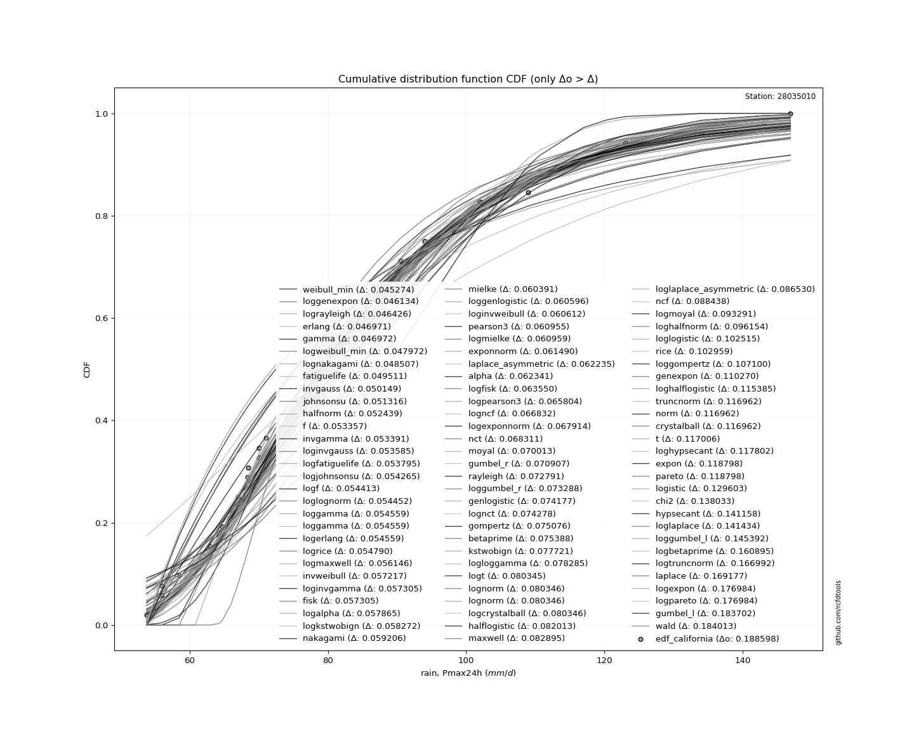</img>

</div>


**1.3. Best fit**

<div align="center">

|   id |   station | empirical_dist   | p_dist      |     delta |   deltao | eval   |   fit |   n |   best_fit |   best_fit_sort |
|-----:|----------:|:-----------------|:------------|----------:|---------:|:-------|------:|----:|-----------:|----------------:|
|    0 |  28035010 | edf_california   | weibull_min | 0.0452735 | 0.188598 | Δo > Δ |     1 |  52 |          1 |               1 |

</div>


<div align="center">

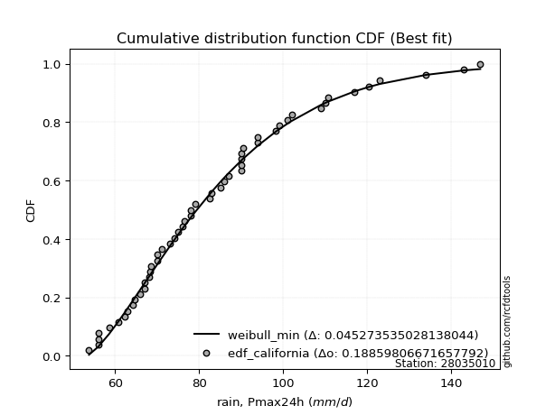</img>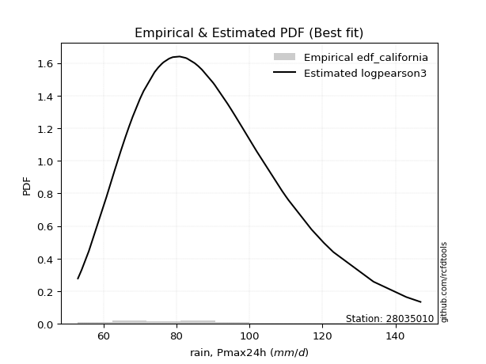</img>

</div>


### 2. EDF Hazen (1930)

Hazen method for plotting positions is a formula used to estimate the empirical cumulative probability distribution of flood events or other hydrological data. This formula often results in biased estimations, particularly when extrapolating to extreme events (high return periods).

<div align="center">


$P=(m-0.5)/n$


</div>


**2.1. Empirical values**

<div align="center">

|                | 0                    | 1                    | 2                   | 3                  | 4                   | 5                   | 6                  | 7                   | 8                   | 9                   | 10                  | 11                  | 12                 | 13                  | 14                  | 15                 | 16                 | 17                  | 18                 | 19          | 20                 | 21                  | 22                 | 23                 | 24                  | 25                  | 26                 | 27                 | 28                 | 29                 | 30                 | 31                 | 32                 | 33                 | 34                 | 35                 | 36                 | 37                 | 38                 | 39                 | 40                 | 41                 | 42                 | 43                 | 44                 | 45        | 46                 | 47                 | 48                 | 49                 | 50                 | 51                 |
|:---------------|:---------------------|:---------------------|:--------------------|:-------------------|:--------------------|:--------------------|:-------------------|:--------------------|:--------------------|:--------------------|:--------------------|:--------------------|:-------------------|:--------------------|:--------------------|:-------------------|:-------------------|:--------------------|:-------------------|:------------|:-------------------|:--------------------|:-------------------|:-------------------|:--------------------|:--------------------|:-------------------|:-------------------|:-------------------|:-------------------|:-------------------|:-------------------|:-------------------|:-------------------|:-------------------|:-------------------|:-------------------|:-------------------|:-------------------|:-------------------|:-------------------|:-------------------|:-------------------|:-------------------|:-------------------|:----------|:-------------------|:-------------------|:-------------------|:-------------------|:-------------------|:-------------------|
| date           | 2004                 | 1969                 | 2000                | 1991               | 1994                | 2014                | 2009               | 1997                | 1968                | 1972                | 1989                | 2012                | 1976               | 2001                | 1984                | 2015               | 2006               | 1992                | 1980               | 1970        | 1993               | 1998                | 1987               | 1978               | 1985                | 2018                | 2013               | 2008               | 1973               | 2016               | 1979               | 1977               | 2003               | 1995               | 1975               | 1982               | 2011               | 1974               | 1988               | 1983               | 2022               | 2017               | 2005               | 1986               | 1999               | 1981      | 2002               | 2007               | 1990               | 2010               | 1996               | 1971               |
| x              | 53.75264075          | 55.92497723          | 56.0                | 56.0               | 58.50469062         | 60.8                | 62.3               | 63.0                | 64.2                | 64.7                | 66.0                | 67.0                | 67.0               | 68.0                | 68.34350579         | 68.5               | 70.0               | 70.0                | 71.0               | 73.07817535 | 74.0               | 75.0                | 76.0               | 76.5               | 78.0                | 78.0                | 79.0               | 82.5               | 82.9               | 85.0               | 86.0               | 87.0               | 90.0               | 90.0               | 90.0               | 90.0               | 90.5               | 94.0               | 94.0               | 98.2               | 99.0               | 101.0              | 102.0              | 109.0              | 110.0              | 110.7     | 117.0              | 120.4              | 123.0              | 134.0              | 143.0              | 146.9              |
| m              | 1                    | 2                    | 3                   | 4                  | 5                   | 6                   | 7                  | 8                   | 9                   | 10                  | 11                  | 12                  | 13                 | 14                  | 15                  | 16                 | 17                 | 18                  | 19                 | 20          | 21                 | 22                  | 23                 | 24                 | 25                  | 26                  | 27                 | 28                 | 29                 | 30                 | 31                 | 32                 | 33                 | 34                 | 35                 | 36                 | 37                 | 38                 | 39                 | 40                 | 41                 | 42                 | 43                 | 44                 | 45                 | 46        | 47                 | 48                 | 49                 | 50                 | 51                 | 52                 |
| empirical_dist | edf_hazen            | edf_hazen            | edf_hazen           | edf_hazen          | edf_hazen           | edf_hazen           | edf_hazen          | edf_hazen           | edf_hazen           | edf_hazen           | edf_hazen           | edf_hazen           | edf_hazen          | edf_hazen           | edf_hazen           | edf_hazen          | edf_hazen          | edf_hazen           | edf_hazen          | edf_hazen   | edf_hazen          | edf_hazen           | edf_hazen          | edf_hazen          | edf_hazen           | edf_hazen           | edf_hazen          | edf_hazen          | edf_hazen          | edf_hazen          | edf_hazen          | edf_hazen          | edf_hazen          | edf_hazen          | edf_hazen          | edf_hazen          | edf_hazen          | edf_hazen          | edf_hazen          | edf_hazen          | edf_hazen          | edf_hazen          | edf_hazen          | edf_hazen          | edf_hazen          | edf_hazen | edf_hazen          | edf_hazen          | edf_hazen          | edf_hazen          | edf_hazen          | edf_hazen          |
| empirical      | 0.009615384615384616 | 0.028846153846153848 | 0.04807692307692308 | 0.0673076923076923 | 0.08653846153846154 | 0.10576923076923077 | 0.125              | 0.14423076923076922 | 0.16346153846153846 | 0.18269230769230768 | 0.20192307692307693 | 0.22115384615384615 | 0.2403846153846154 | 0.25961538461538464 | 0.27884615384615385 | 0.2980769230769231 | 0.3173076923076923 | 0.33653846153846156 | 0.3557692307692308 | 0.375       | 0.3942307692307692 | 0.41346153846153844 | 0.4326923076923077 | 0.4519230769230769 | 0.47115384615384615 | 0.49038461538461536 | 0.5096153846153846 | 0.5288461538461539 | 0.5480769230769231 | 0.5673076923076923 | 0.5865384615384616 | 0.6057692307692307 | 0.625              | 0.6442307692307693 | 0.6634615384615384 | 0.6826923076923077 | 0.7019230769230769 | 0.7211538461538461 | 0.7403846153846154 | 0.7596153846153846 | 0.7788461538461539 | 0.7980769230769231 | 0.8173076923076923 | 0.8365384615384616 | 0.8557692307692307 | 0.875     | 0.8942307692307693 | 0.9134615384615384 | 0.9326923076923077 | 0.9519230769230769 | 0.9711538461538461 | 0.9903846153846154 |
| empirical_tr   | 1.0097087378640777   | 1.0297029702970297   | 1.0505050505050506  | 1.0721649484536082 | 1.0947368421052632  | 1.118279569892473   | 1.1428571428571428 | 1.1685393258426966  | 1.1954022988505746  | 1.223529411764706   | 1.253012048192771   | 1.2839506172839505  | 1.3164556962025318 | 1.3506493506493507  | 1.3866666666666667  | 1.4246575342465755 | 1.4647887323943662 | 1.5072463768115942  | 1.5522388059701495 | 1.6         | 1.6507936507936507 | 1.7049180327868851  | 1.7627118644067796 | 1.8245614035087718 | 1.8909090909090909  | 1.9622641509433965  | 2.0392156862745097 | 2.122448979591837  | 2.2127659574468086 | 2.311111111111111  | 2.418604651162791  | 2.536585365853658  | 2.6666666666666665 | 2.810810810810811  | 2.971428571428571  | 3.151515151515152  | 3.3548387096774186 | 3.586206896551724  | 3.8518518518518525 | 4.159999999999999  | 4.521739130434783  | 4.952380952380953  | 5.473684210526315  | 6.117647058823531  | 6.933333333333331  | 8.0       | 9.454545454545459  | 11.555555555555552 | 14.857142857142861 | 20.79999999999998  | 34.66666666666666  | 104.00000000000037 |

</div>


**2.2. Kolmogorov-Smirnov fit test (sorted by Δ)**


<div align="center">

|                | 0                   | 1                   | 2                    | 3                   | 4                   | 5                    | 6                    | 7                    | 8                   | 9                   | 10                  | 11                  | 12                   | 13                  | 14                  | 15                  | 16                  | 17                  | 18                   | 19                   | 20                  | 21                   | 22                  | 23                  | 24                  | 25                  | 26                  | 27                  | 28                  | 29                  | 30                  | 31                  | 32                  | 33                  | 34                  | 35                  | 36                  | 37                  | 38                  | 39                  | 40                  | 41                  | 42                  | 43                  | 44                  | 45                  | 46                  | 47                  | 48                  | 49                  | 50                  | 51                  | 52                  | 53                  | 54                  | 55                  | 56                  | 57                  | 58                  | 59                  | 60                  | 61                  | 62                    | 63                  | 64                  | 65                  | 66                  | 67                  | 68                  | 69                  | 70                  | 71                  | 72                  | 73                  | 74                  | 75                  | 76                  | 77                  | 78                  | 79                  | 80                  | 81                  | 82                  | 83                  | 84                  | 85                  | 86                  | 87                  |
|:---------------|:--------------------|:--------------------|:---------------------|:--------------------|:--------------------|:---------------------|:---------------------|:---------------------|:--------------------|:--------------------|:--------------------|:--------------------|:---------------------|:--------------------|:--------------------|:--------------------|:--------------------|:--------------------|:---------------------|:---------------------|:--------------------|:---------------------|:--------------------|:--------------------|:--------------------|:--------------------|:--------------------|:--------------------|:--------------------|:--------------------|:--------------------|:--------------------|:--------------------|:--------------------|:--------------------|:--------------------|:--------------------|:--------------------|:--------------------|:--------------------|:--------------------|:--------------------|:--------------------|:--------------------|:--------------------|:--------------------|:--------------------|:--------------------|:--------------------|:--------------------|:--------------------|:--------------------|:--------------------|:--------------------|:--------------------|:--------------------|:--------------------|:--------------------|:--------------------|:--------------------|:--------------------|:--------------------|:----------------------|:--------------------|:--------------------|:--------------------|:--------------------|:--------------------|:--------------------|:--------------------|:--------------------|:--------------------|:--------------------|:--------------------|:--------------------|:--------------------|:--------------------|:--------------------|:--------------------|:--------------------|:--------------------|:--------------------|:--------------------|:--------------------|:--------------------|:--------------------|:--------------------|:--------------------|
| station        | 28035010            | 28035010            | 28035010             | 28035010            | 28035010            | 28035010             | 28035010             | 28035010             | 28035010            | 28035010            | 28035010            | 28035010            | 28035010             | 28035010            | 28035010            | 28035010            | 28035010            | 28035010            | 28035010             | 28035010             | 28035010            | 28035010             | 28035010            | 28035010            | 28035010            | 28035010            | 28035010            | 28035010            | 28035010            | 28035010            | 28035010            | 28035010            | 28035010            | 28035010            | 28035010            | 28035010            | 28035010            | 28035010            | 28035010            | 28035010            | 28035010            | 28035010            | 28035010            | 28035010            | 28035010            | 28035010            | 28035010            | 28035010            | 28035010            | 28035010            | 28035010            | 28035010            | 28035010            | 28035010            | 28035010            | 28035010            | 28035010            | 28035010            | 28035010            | 28035010            | 28035010            | 28035010            | 28035010              | 28035010            | 28035010            | 28035010            | 28035010            | 28035010            | 28035010            | 28035010            | 28035010            | 28035010            | 28035010            | 28035010            | 28035010            | 28035010            | 28035010            | 28035010            | 28035010            | 28035010            | 28035010            | 28035010            | 28035010            | 28035010            | 28035010            | 28035010            | 28035010            | 28035010            |
| empirical_dist | edf_hazen           | edf_hazen           | edf_hazen            | edf_hazen           | edf_hazen           | edf_hazen            | edf_hazen            | edf_hazen            | edf_hazen           | edf_hazen           | edf_hazen           | edf_hazen           | edf_hazen            | edf_hazen           | edf_hazen           | edf_hazen           | edf_hazen           | edf_hazen           | edf_hazen            | edf_hazen            | edf_hazen           | edf_hazen            | edf_hazen           | edf_hazen           | edf_hazen           | edf_hazen           | edf_hazen           | edf_hazen           | edf_hazen           | edf_hazen           | edf_hazen           | edf_hazen           | edf_hazen           | edf_hazen           | edf_hazen           | edf_hazen           | edf_hazen           | edf_hazen           | edf_hazen           | edf_hazen           | edf_hazen           | edf_hazen           | edf_hazen           | edf_hazen           | edf_hazen           | edf_hazen           | edf_hazen           | edf_hazen           | edf_hazen           | edf_hazen           | edf_hazen           | edf_hazen           | edf_hazen           | edf_hazen           | edf_hazen           | edf_hazen           | edf_hazen           | edf_hazen           | edf_hazen           | edf_hazen           | edf_hazen           | edf_hazen           | edf_hazen             | edf_hazen           | edf_hazen           | edf_hazen           | edf_hazen           | edf_hazen           | edf_hazen           | edf_hazen           | edf_hazen           | edf_hazen           | edf_hazen           | edf_hazen           | edf_hazen           | edf_hazen           | edf_hazen           | edf_hazen           | edf_hazen           | edf_hazen           | edf_hazen           | edf_hazen           | edf_hazen           | edf_hazen           | edf_hazen           | edf_hazen           | edf_hazen           | edf_hazen           |
| p_dist         | halfnorm            | weibull_min         | logmaxwell           | logrice             | lograyleigh         | pearson3             | gamma                | erlang               | logweibull_min      | loggenexpon         | logpearson3         | logncf              | lognakagami          | nct                 | fatiguelife         | logalpha            | invgauss            | moyal               | johnsonsu            | gumbel_r             | loginvgamma         | alpha                | invgamma            | f                   | loglognorm          | logjohnsonsu        | logexponnorm        | rayleigh            | loginvgauss         | logfatiguelife      | invweibull          | logf                | loggamma            | loggamma            | logerlang           | genlogistic         | lognct              | gompertz            | betaprime           | fisk                | logkstwobign        | kstwobign           | logloggamma         | nakagami            | logfisk             | mielke              | loggenlogistic      | loginvweibull       | logmielke           | logt                | lognorm             | lognorm             | logcrystalball      | exponnorm           | laplace_asymmetric  | halflogistic        | maxwell             | ncf                 | loggumbel_r         | loghalfnorm         | loglogistic         | rice                | loglaplace_asymmetric | logmoyal            | loghalflogistic     | truncnorm           | norm                | crystalball         | t                   | loghypsecant        | loggompertz         | genexpon            | logistic            | expon               | hypsecant           | loglaplace          | loggumbel_l         | chi2                | laplace             | logbetaprime        | gumbel_l            | wald                | logtruncnorm        | logwald             | logexpon            | logchi2             | loggibrat           | gibrat              |
| delta          | 0.04282313089856933 | 0.04362474989546827 | 0.046530595409646436 | 0.04709730145122615 | 0.05103486706976157 | 0.051339359495274794 | 0.053293452683620623 | 0.053293697072927415 | 0.05529043450097182 | 0.05574916550682918 | 0.05618852821495651 | 0.05721613519376628 | 0.058122132755734746 | 0.05869573394482641 | 0.0591267842735842  | 0.05958890633524194 | 0.05976408442093961 | 0.06078802255011184 | 0.060931238195795934 | 0.061291828289120776 | 0.0615619056893727  | 0.061787909696897625 | 0.06240290485825928 | 0.06242059275970269 | 0.06247595180966181 | 0.0627424237264339  | 0.06298292180849274 | 0.0631751502437855  | 0.06320060907286362 | 0.06341044356004089 | 0.06373834767196884 | 0.06402789698536204 | 0.06417439105591671 | 0.06417439105591671 | 0.06417459461962527 | 0.06456161328078985 | 0.0646628565282551  | 0.0654601365621581  | 0.06577295392053811 | 0.06692064825463684 | 0.06788732800858355 | 0.06810602390609499 | 0.06866919401051808 | 0.06882127195001042 | 0.06998033623572197 | 0.07000681174756285 | 0.07021142294976068 | 0.07022739797446598 | 0.0705740181888207  | 0.07072945610743792 | 0.07073041226859733 | 0.07073041226859733 | 0.0707304142953396  | 0.07110525733522377 | 0.07185032770690203 | 0.07239726512214531 | 0.07327928548175544 | 0.07882294542652152 | 0.08290318230316607 | 0.08653846153846154 | 0.0928995919077385  | 0.0933431643953811  | 0.09614533226162159   | 0.10290685433658187 | 0.10576923076923077 | 0.10734634031733137 | 0.10734634990490921 | 0.10734650835980347 | 0.10739045540723374 | 0.10818649503248043 | 0.11671561267493408 | 0.11988529779345969 | 0.11998734806956629 | 0.12841382592289396 | 0.13154308366541556 | 0.13181904071091863 | 0.13577628148253723 | 0.14764826892091268 | 0.15956182246340017 | 0.1705102962127895  | 0.17408685716038985 | 0.17439738797246274 | 0.17660778689946371 | 0.18255096722074357 | 0.18659961801983094 | 0.252368173192246   | 0.2838261833122697  | 0.2867523900557321  |
| deltao         | 0.18859806671657792 | 0.18859806671657792 | 0.18859806671657792  | 0.18859806671657792 | 0.18859806671657792 | 0.18859806671657792  | 0.18859806671657792  | 0.18859806671657792  | 0.18859806671657792 | 0.18859806671657792 | 0.18859806671657792 | 0.18859806671657792 | 0.18859806671657792  | 0.18859806671657792 | 0.18859806671657792 | 0.18859806671657792 | 0.18859806671657792 | 0.18859806671657792 | 0.18859806671657792  | 0.18859806671657792  | 0.18859806671657792 | 0.18859806671657792  | 0.18859806671657792 | 0.18859806671657792 | 0.18859806671657792 | 0.18859806671657792 | 0.18859806671657792 | 0.18859806671657792 | 0.18859806671657792 | 0.18859806671657792 | 0.18859806671657792 | 0.18859806671657792 | 0.18859806671657792 | 0.18859806671657792 | 0.18859806671657792 | 0.18859806671657792 | 0.18859806671657792 | 0.18859806671657792 | 0.18859806671657792 | 0.18859806671657792 | 0.18859806671657792 | 0.18859806671657792 | 0.18859806671657792 | 0.18859806671657792 | 0.18859806671657792 | 0.18859806671657792 | 0.18859806671657792 | 0.18859806671657792 | 0.18859806671657792 | 0.18859806671657792 | 0.18859806671657792 | 0.18859806671657792 | 0.18859806671657792 | 0.18859806671657792 | 0.18859806671657792 | 0.18859806671657792 | 0.18859806671657792 | 0.18859806671657792 | 0.18859806671657792 | 0.18859806671657792 | 0.18859806671657792 | 0.18859806671657792 | 0.18859806671657792   | 0.18859806671657792 | 0.18859806671657792 | 0.18859806671657792 | 0.18859806671657792 | 0.18859806671657792 | 0.18859806671657792 | 0.18859806671657792 | 0.18859806671657792 | 0.18859806671657792 | 0.18859806671657792 | 0.18859806671657792 | 0.18859806671657792 | 0.18859806671657792 | 0.18859806671657792 | 0.18859806671657792 | 0.18859806671657792 | 0.18859806671657792 | 0.18859806671657792 | 0.18859806671657792 | 0.18859806671657792 | 0.18859806671657792 | 0.18859806671657792 | 0.18859806671657792 | 0.18859806671657792 | 0.18859806671657792 |
| eval           | Δo > Δ              | Δo > Δ              | Δo > Δ               | Δo > Δ              | Δo > Δ              | Δo > Δ               | Δo > Δ               | Δo > Δ               | Δo > Δ              | Δo > Δ              | Δo > Δ              | Δo > Δ              | Δo > Δ               | Δo > Δ              | Δo > Δ              | Δo > Δ              | Δo > Δ              | Δo > Δ              | Δo > Δ               | Δo > Δ               | Δo > Δ              | Δo > Δ               | Δo > Δ              | Δo > Δ              | Δo > Δ              | Δo > Δ              | Δo > Δ              | Δo > Δ              | Δo > Δ              | Δo > Δ              | Δo > Δ              | Δo > Δ              | Δo > Δ              | Δo > Δ              | Δo > Δ              | Δo > Δ              | Δo > Δ              | Δo > Δ              | Δo > Δ              | Δo > Δ              | Δo > Δ              | Δo > Δ              | Δo > Δ              | Δo > Δ              | Δo > Δ              | Δo > Δ              | Δo > Δ              | Δo > Δ              | Δo > Δ              | Δo > Δ              | Δo > Δ              | Δo > Δ              | Δo > Δ              | Δo > Δ              | Δo > Δ              | Δo > Δ              | Δo > Δ              | Δo > Δ              | Δo > Δ              | Δo > Δ              | Δo > Δ              | Δo > Δ              | Δo > Δ                | Δo > Δ              | Δo > Δ              | Δo > Δ              | Δo > Δ              | Δo > Δ              | Δo > Δ              | Δo > Δ              | Δo > Δ              | Δo > Δ              | Δo > Δ              | Δo > Δ              | Δo > Δ              | Δo > Δ              | Δo > Δ              | Δo > Δ              | Δo > Δ              | Δo > Δ              | Δo > Δ              | Δo > Δ              | Δo > Δ              | Δo > Δ              | Δo > Δ              | Δo <= Δ             | Δo <= Δ             | Δo <= Δ             |
| fit            | 1                   | 1                   | 1                    | 1                   | 1                   | 1                    | 1                    | 1                    | 1                   | 1                   | 1                   | 1                   | 1                    | 1                   | 1                   | 1                   | 1                   | 1                   | 1                    | 1                    | 1                   | 1                    | 1                   | 1                   | 1                   | 1                   | 1                   | 1                   | 1                   | 1                   | 1                   | 1                   | 1                   | 1                   | 1                   | 1                   | 1                   | 1                   | 1                   | 1                   | 1                   | 1                   | 1                   | 1                   | 1                   | 1                   | 1                   | 1                   | 1                   | 1                   | 1                   | 1                   | 1                   | 1                   | 1                   | 1                   | 1                   | 1                   | 1                   | 1                   | 1                   | 1                   | 1                     | 1                   | 1                   | 1                   | 1                   | 1                   | 1                   | 1                   | 1                   | 1                   | 1                   | 1                   | 1                   | 1                   | 1                   | 1                   | 1                   | 1                   | 1                   | 1                   | 1                   | 1                   | 1                   | 0                   | 0                   | 0                   |
| n              | 52                  | 52                  | 52                   | 52                  | 52                  | 52                   | 52                   | 52                   | 52                  | 52                  | 52                  | 52                  | 52                   | 52                  | 52                  | 52                  | 52                  | 52                  | 52                   | 52                   | 52                  | 52                   | 52                  | 52                  | 52                  | 52                  | 52                  | 52                  | 52                  | 52                  | 52                  | 52                  | 52                  | 52                  | 52                  | 52                  | 52                  | 52                  | 52                  | 52                  | 52                  | 52                  | 52                  | 52                  | 52                  | 52                  | 52                  | 52                  | 52                  | 52                  | 52                  | 52                  | 52                  | 52                  | 52                  | 52                  | 52                  | 52                  | 52                  | 52                  | 52                  | 52                  | 52                    | 52                  | 52                  | 52                  | 52                  | 52                  | 52                  | 52                  | 52                  | 52                  | 52                  | 52                  | 52                  | 52                  | 52                  | 52                  | 52                  | 52                  | 52                  | 52                  | 52                  | 52                  | 52                  | 52                  | 52                  | 52                  |
| best_fit       | 1                   | 0                   | 0                    | 0                   | 0                   | 0                    | 0                    | 0                    | 0                   | 0                   | 0                   | 0                   | 0                    | 0                   | 0                   | 0                   | 0                   | 0                   | 0                    | 0                    | 0                   | 0                    | 0                   | 0                   | 0                   | 0                   | 0                   | 0                   | 0                   | 0                   | 0                   | 0                   | 0                   | 0                   | 0                   | 0                   | 0                   | 0                   | 0                   | 0                   | 0                   | 0                   | 0                   | 0                   | 0                   | 0                   | 0                   | 0                   | 0                   | 0                   | 0                   | 0                   | 0                   | 0                   | 0                   | 0                   | 0                   | 0                   | 0                   | 0                   | 0                   | 0                   | 0                     | 0                   | 0                   | 0                   | 0                   | 0                   | 0                   | 0                   | 0                   | 0                   | 0                   | 0                   | 0                   | 0                   | 0                   | 0                   | 0                   | 0                   | 0                   | 0                   | 0                   | 0                   | 0                   | 0                   | 0                   | 0                   |
| best_fit_sort  | 1                   | 2                   | 3                    | 4                   | 5                   | 6                    | 7                    | 8                    | 9                   | 10                  | 11                  | 12                  | 13                   | 14                  | 15                  | 16                  | 17                  | 18                  | 19                   | 20                   | 21                  | 22                   | 23                  | 24                  | 25                  | 26                  | 27                  | 28                  | 29                  | 30                  | 31                  | 32                  | 33                  | 34                  | 35                  | 36                  | 37                  | 38                  | 39                  | 40                  | 41                  | 42                  | 43                  | 44                  | 45                  | 46                  | 47                  | 48                  | 49                  | 50                  | 51                  | 52                  | 53                  | 54                  | 55                  | 56                  | 57                  | 58                  | 59                  | 60                  | 61                  | 62                  | 63                    | 64                  | 65                  | 66                  | 67                  | 68                  | 69                  | 70                  | 71                  | 72                  | 73                  | 74                  | 75                  | 76                  | 77                  | 78                  | 79                  | 80                  | 81                  | 82                  | 83                  | 84                  | 85                  | 86                  | 87                  | 88                  |

</div>


<div align="center">

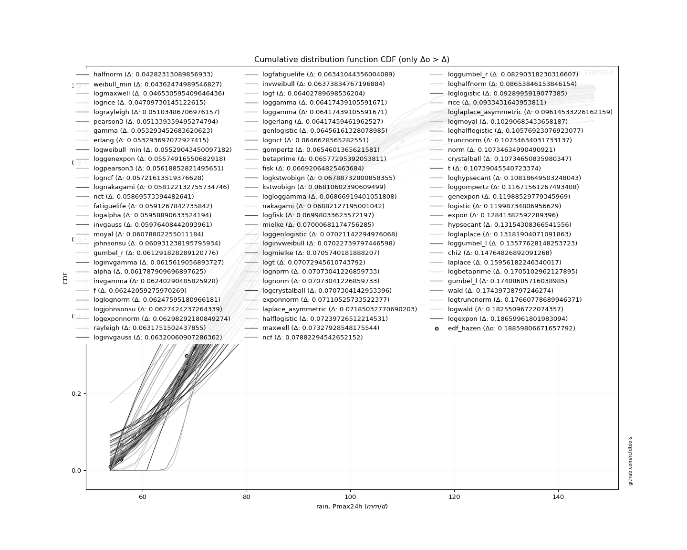</img>

</div>


**2.3. Best fit**

<div align="center">

|   id |   station | empirical_dist   | p_dist   |     delta |   deltao | eval   |   fit |   n |   best_fit |   best_fit_sort |
|-----:|----------:|:-----------------|:---------|----------:|---------:|:-------|------:|----:|-----------:|----------------:|
|    0 |  28035010 | edf_hazen        | halfnorm | 0.0428231 | 0.188598 | Δo > Δ |     1 |  52 |          1 |               1 |

</div>


<div align="center">

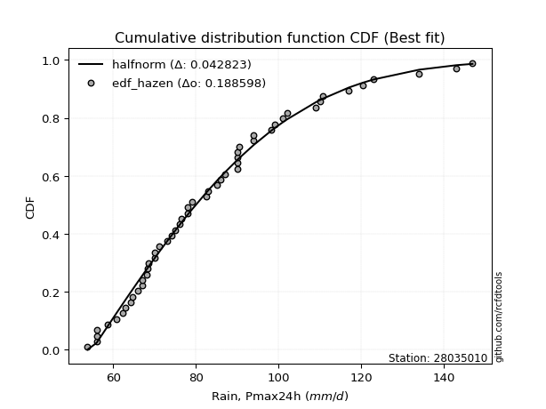</img>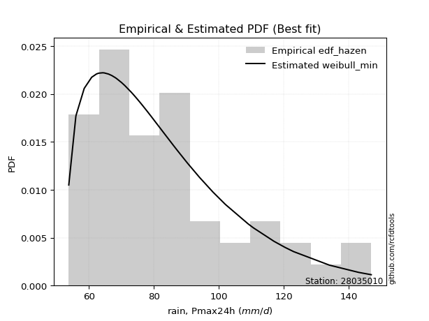</img>

</div>


### 3. EDF Weibull (1939)

Weibull plotting position formula is an empirical method used to estimate the non-exceedance probability or plotting position for a set of observed data, is often recommended or widely used in practice, particularly in flood frequency analysis.

<div align="center">


$P=m/(n+1)$


</div>


**3.1. Empirical values**

<div align="center">

|                | 0                    | 1                   | 2                   | 3                   | 4                   | 5                   | 6                  | 7                  | 8                   | 9                   | 10                  | 11                  | 12                  | 13                 | 14                 | 15                 | 16                  | 17                  | 18                 | 19                  | 20                  | 21                  | 22                 | 23                 | 24                 | 25                  | 26                 | 27                 | 28                 | 29                 | 30                 | 31                 | 32                 | 33                 | 34                | 35                 | 36                 | 37                 | 38                 | 39                 | 40                 | 41                 | 42                 | 43                 | 44                 | 45                 | 46                 | 47                 | 48                 | 49                 | 50                 | 51                 |
|:---------------|:---------------------|:--------------------|:--------------------|:--------------------|:--------------------|:--------------------|:-------------------|:-------------------|:--------------------|:--------------------|:--------------------|:--------------------|:--------------------|:-------------------|:-------------------|:-------------------|:--------------------|:--------------------|:-------------------|:--------------------|:--------------------|:--------------------|:-------------------|:-------------------|:-------------------|:--------------------|:-------------------|:-------------------|:-------------------|:-------------------|:-------------------|:-------------------|:-------------------|:-------------------|:------------------|:-------------------|:-------------------|:-------------------|:-------------------|:-------------------|:-------------------|:-------------------|:-------------------|:-------------------|:-------------------|:-------------------|:-------------------|:-------------------|:-------------------|:-------------------|:-------------------|:-------------------|
| date           | 2004                 | 1969                | 2000                | 1991                | 1994                | 2014                | 2009               | 1997               | 1968                | 1972                | 1989                | 2012                | 1976                | 2001               | 1984               | 2015               | 2006                | 1992                | 1980               | 1970                | 1993                | 1998                | 1987               | 1978               | 1985               | 2018                | 2013               | 2008               | 1973               | 2016               | 1979               | 1977               | 2003               | 1995               | 1975              | 1982               | 2011               | 1974               | 1988               | 1983               | 2022               | 2017               | 2005               | 1986               | 1999               | 1981               | 2002               | 2007               | 1990               | 2010               | 1996               | 1971               |
| x              | 53.75264075          | 55.92497723         | 56.0                | 56.0                | 58.50469062         | 60.8                | 62.3               | 63.0               | 64.2                | 64.7                | 66.0                | 67.0                | 67.0                | 68.0               | 68.34350579        | 68.5               | 70.0                | 70.0                | 71.0               | 73.07817535         | 74.0                | 75.0                | 76.0               | 76.5               | 78.0               | 78.0                | 79.0               | 82.5               | 82.9               | 85.0               | 86.0               | 87.0               | 90.0               | 90.0               | 90.0              | 90.0               | 90.5               | 94.0               | 94.0               | 98.2               | 99.0               | 101.0              | 102.0              | 109.0              | 110.0              | 110.7              | 117.0              | 120.4              | 123.0              | 134.0              | 143.0              | 146.9              |
| m              | 1                    | 2                   | 3                   | 4                   | 5                   | 6                   | 7                  | 8                  | 9                   | 10                  | 11                  | 12                  | 13                  | 14                 | 15                 | 16                 | 17                  | 18                  | 19                 | 20                  | 21                  | 22                  | 23                 | 24                 | 25                 | 26                  | 27                 | 28                 | 29                 | 30                 | 31                 | 32                 | 33                 | 34                 | 35                | 36                 | 37                 | 38                 | 39                 | 40                 | 41                 | 42                 | 43                 | 44                 | 45                 | 46                 | 47                 | 48                 | 49                 | 50                 | 51                 | 52                 |
| empirical_dist | edf_weibull          | edf_weibull         | edf_weibull         | edf_weibull         | edf_weibull         | edf_weibull         | edf_weibull        | edf_weibull        | edf_weibull         | edf_weibull         | edf_weibull         | edf_weibull         | edf_weibull         | edf_weibull        | edf_weibull        | edf_weibull        | edf_weibull         | edf_weibull         | edf_weibull        | edf_weibull         | edf_weibull         | edf_weibull         | edf_weibull        | edf_weibull        | edf_weibull        | edf_weibull         | edf_weibull        | edf_weibull        | edf_weibull        | edf_weibull        | edf_weibull        | edf_weibull        | edf_weibull        | edf_weibull        | edf_weibull       | edf_weibull        | edf_weibull        | edf_weibull        | edf_weibull        | edf_weibull        | edf_weibull        | edf_weibull        | edf_weibull        | edf_weibull        | edf_weibull        | edf_weibull        | edf_weibull        | edf_weibull        | edf_weibull        | edf_weibull        | edf_weibull        | edf_weibull        |
| empirical      | 0.018867924528301886 | 0.03773584905660377 | 0.05660377358490566 | 0.07547169811320754 | 0.09433962264150944 | 0.11320754716981132 | 0.1320754716981132 | 0.1509433962264151 | 0.16981132075471697 | 0.18867924528301888 | 0.20754716981132076 | 0.22641509433962265 | 0.24528301886792453 | 0.2641509433962264 | 0.2830188679245283 | 0.3018867924528302 | 0.32075471698113206 | 0.33962264150943394 | 0.3584905660377358 | 0.37735849056603776 | 0.39622641509433965 | 0.41509433962264153 | 0.4339622641509434 | 0.4528301886792453 | 0.4716981132075472 | 0.49056603773584906 | 0.5094339622641509 | 0.5283018867924528 | 0.5471698113207547 | 0.5660377358490566 | 0.5849056603773585 | 0.6037735849056604 | 0.6226415094339622 | 0.6415094339622641 | 0.660377358490566 | 0.6792452830188679 | 0.6981132075471698 | 0.7169811320754716 | 0.7358490566037735 | 0.7547169811320755 | 0.7735849056603774 | 0.7924528301886793 | 0.8113207547169812 | 0.8301886792452831 | 0.8490566037735849 | 0.8679245283018868 | 0.8867924528301887 | 0.9056603773584906 | 0.9245283018867925 | 0.9433962264150944 | 0.9622641509433962 | 0.9811320754716981 |
| empirical_tr   | 1.0192307692307692   | 1.0392156862745099  | 1.06                | 1.0816326530612246  | 1.1041666666666667  | 1.127659574468085   | 1.1521739130434783 | 1.1777777777777778 | 1.2045454545454546  | 1.2325581395348837  | 1.2619047619047619  | 1.292682926829268   | 1.325               | 1.3589743589743588 | 1.394736842105263  | 1.4324324324324322 | 1.472222222222222   | 1.514285714285714   | 1.5588235294117645 | 1.6060606060606062  | 1.65625             | 1.7096774193548387  | 1.7666666666666666 | 1.8275862068965518 | 1.8928571428571428 | 1.962962962962963   | 2.0384615384615383 | 2.12               | 2.2083333333333335 | 2.3043478260869565 | 2.409090909090909  | 2.5238095238095237 | 2.65               | 2.789473684210526  | 2.944444444444444 | 3.117647058823529  | 3.3124999999999996 | 3.5333333333333328 | 3.785714285714285  | 4.0769230769230775 | 4.416666666666668  | 4.818181818181819  | 5.300000000000002  | 5.88888888888889   | 6.625000000000002  | 7.571428571428573  | 8.833333333333336  | 10.600000000000003 | 13.250000000000004 | 17.66666666666667  | 26.500000000000007 | 53.000000000000014 |

</div>


**3.2. Kolmogorov-Smirnov fit test (sorted by Δ)**


<div align="center">

|                | 0                    | 1                   | 2                    | 3                   | 4                   | 5                   | 6                   | 7                   | 8                   | 9                   | 10                  | 11                  | 12                  | 13                   | 14                  | 15                   | 16                  | 17                   | 18                   | 19                  | 20                  | 21                  | 22                  | 23                  | 24                  | 25                  | 26                  | 27                  | 28                  | 29                  | 30                  | 31                  | 32                  | 33                  | 34                  | 35                  | 36                  | 37                  | 38                  | 39                  | 40                  | 41                  | 42                  | 43                  | 44                  | 45                  | 46                  | 47                  | 48                  | 49                  | 50                  | 51                  | 52                  | 53                  | 54                  | 55                  | 56                  | 57                  | 58                  | 59                  | 60                  | 61                  | 62                    | 63                  | 64                  | 65                  | 66                  | 67                  | 68                  | 69                  | 70                  | 71                  | 72                  | 73                  | 74                  | 75                  | 76                  | 77                  | 78                  | 79                  | 80                  | 81                  | 82                  | 83                  | 84                  | 85                  | 86                  | 87                  |
|:---------------|:---------------------|:--------------------|:---------------------|:--------------------|:--------------------|:--------------------|:--------------------|:--------------------|:--------------------|:--------------------|:--------------------|:--------------------|:--------------------|:---------------------|:--------------------|:---------------------|:--------------------|:---------------------|:---------------------|:--------------------|:--------------------|:--------------------|:--------------------|:--------------------|:--------------------|:--------------------|:--------------------|:--------------------|:--------------------|:--------------------|:--------------------|:--------------------|:--------------------|:--------------------|:--------------------|:--------------------|:--------------------|:--------------------|:--------------------|:--------------------|:--------------------|:--------------------|:--------------------|:--------------------|:--------------------|:--------------------|:--------------------|:--------------------|:--------------------|:--------------------|:--------------------|:--------------------|:--------------------|:--------------------|:--------------------|:--------------------|:--------------------|:--------------------|:--------------------|:--------------------|:--------------------|:--------------------|:----------------------|:--------------------|:--------------------|:--------------------|:--------------------|:--------------------|:--------------------|:--------------------|:--------------------|:--------------------|:--------------------|:--------------------|:--------------------|:--------------------|:--------------------|:--------------------|:--------------------|:--------------------|:--------------------|:--------------------|:--------------------|:--------------------|:--------------------|:--------------------|:--------------------|:--------------------|
| station        | 28035010             | 28035010            | 28035010             | 28035010            | 28035010            | 28035010            | 28035010            | 28035010            | 28035010            | 28035010            | 28035010            | 28035010            | 28035010            | 28035010             | 28035010            | 28035010             | 28035010            | 28035010             | 28035010             | 28035010            | 28035010            | 28035010            | 28035010            | 28035010            | 28035010            | 28035010            | 28035010            | 28035010            | 28035010            | 28035010            | 28035010            | 28035010            | 28035010            | 28035010            | 28035010            | 28035010            | 28035010            | 28035010            | 28035010            | 28035010            | 28035010            | 28035010            | 28035010            | 28035010            | 28035010            | 28035010            | 28035010            | 28035010            | 28035010            | 28035010            | 28035010            | 28035010            | 28035010            | 28035010            | 28035010            | 28035010            | 28035010            | 28035010            | 28035010            | 28035010            | 28035010            | 28035010            | 28035010              | 28035010            | 28035010            | 28035010            | 28035010            | 28035010            | 28035010            | 28035010            | 28035010            | 28035010            | 28035010            | 28035010            | 28035010            | 28035010            | 28035010            | 28035010            | 28035010            | 28035010            | 28035010            | 28035010            | 28035010            | 28035010            | 28035010            | 28035010            | 28035010            | 28035010            |
| empirical_dist | edf_weibull          | edf_weibull         | edf_weibull          | edf_weibull         | edf_weibull         | edf_weibull         | edf_weibull         | edf_weibull         | edf_weibull         | edf_weibull         | edf_weibull         | edf_weibull         | edf_weibull         | edf_weibull          | edf_weibull         | edf_weibull          | edf_weibull         | edf_weibull          | edf_weibull          | edf_weibull         | edf_weibull         | edf_weibull         | edf_weibull         | edf_weibull         | edf_weibull         | edf_weibull         | edf_weibull         | edf_weibull         | edf_weibull         | edf_weibull         | edf_weibull         | edf_weibull         | edf_weibull         | edf_weibull         | edf_weibull         | edf_weibull         | edf_weibull         | edf_weibull         | edf_weibull         | edf_weibull         | edf_weibull         | edf_weibull         | edf_weibull         | edf_weibull         | edf_weibull         | edf_weibull         | edf_weibull         | edf_weibull         | edf_weibull         | edf_weibull         | edf_weibull         | edf_weibull         | edf_weibull         | edf_weibull         | edf_weibull         | edf_weibull         | edf_weibull         | edf_weibull         | edf_weibull         | edf_weibull         | edf_weibull         | edf_weibull         | edf_weibull           | edf_weibull         | edf_weibull         | edf_weibull         | edf_weibull         | edf_weibull         | edf_weibull         | edf_weibull         | edf_weibull         | edf_weibull         | edf_weibull         | edf_weibull         | edf_weibull         | edf_weibull         | edf_weibull         | edf_weibull         | edf_weibull         | edf_weibull         | edf_weibull         | edf_weibull         | edf_weibull         | edf_weibull         | edf_weibull         | edf_weibull         | edf_weibull         | edf_weibull         |
| p_dist         | weibull_min          | logrice             | logmaxwell           | halfnorm            | lograyleigh         | pearson3            | gamma               | erlang              | logweibull_min      | loggenexpon         | logpearson3         | logncf              | lognakagami         | rayleigh             | fatiguelife         | gompertz             | nct                 | logalpha             | invgauss             | nakagami            | johnsonsu           | moyal               | loginvgamma         | alpha               | gumbel_r            | invgamma            | f                   | loglognorm          | logjohnsonsu        | logexponnorm        | loginvgauss         | logfatiguelife      | invweibull          | logf                | loggamma            | loggamma            | logerlang           | genlogistic         | lognct              | betaprime           | fisk                | logkstwobign        | kstwobign           | logloggamma         | logfisk             | mielke              | loggenlogistic      | loginvweibull       | logmielke           | maxwell             | exponnorm           | logt                | lognorm             | lognorm             | logcrystalball      | laplace_asymmetric  | ncf                 | halflogistic        | loggumbel_r         | loghalfnorm         | rice                | loglogistic         | loglaplace_asymmetric | logmoyal            | truncnorm           | norm                | crystalball         | t                   | loghypsecant        | loggompertz         | loghalflogistic     | genexpon            | logistic            | expon               | hypsecant           | loglaplace          | loggumbel_l         | chi2                | laplace             | logbetaprime        | logtruncnorm        | gumbel_l            | wald                | logexpon            | logwald             | logchi2             | loggibrat           | gibrat              |
| delta          | 0.045983240461506036 | 0.04945579201726391 | 0.049614775380618814 | 0.05098713670408457 | 0.05339335763579933 | 0.05442353946624717 | 0.05565194324965839 | 0.05565218763896518 | 0.05764892506700958 | 0.05810765607286694 | 0.05927270818592889 | 0.06030031516473866 | 0.06048062332177251 | 0.060809483541524934 | 0.06148527483962196 | 0.061650267186250995 | 0.06177991391579879 | 0.061947396901279705 | 0.062122574986977375 | 0.06301687401431194 | 0.0632897287618337  | 0.0634820535315565  | 0.06392039625541046 | 0.06414640026293539 | 0.06437600826009315 | 0.06476139542429704 | 0.06477908332574045 | 0.06483444237569957 | 0.06510091429247167 | 0.0653414123745305  | 0.06555909963890139 | 0.06576893412607865 | 0.0660968382380066  | 0.0663863875513998  | 0.06653288162195448 | 0.06653288162195448 | 0.06653308518566303 | 0.06764579325176223 | 0.06774703649922748 | 0.06885713389151049 | 0.0692791388206746  | 0.07024581857462131 | 0.07119020387706737 | 0.07139052927902312 | 0.07233882680175974 | 0.07236530231360061 | 0.07256991351579845 | 0.07258588854050374 | 0.07293250875485846 | 0.0730978631305218  | 0.07346374790126153 | 0.07349269716050877 | 0.07349366645221328 | 0.07349366645221328 | 0.0734936685746923  | 0.07420881827293979 | 0.07897619300639769 | 0.08019842622519321 | 0.08526167286920383 | 0.09433962264150944 | 0.09570571537644229 | 0.09598377187871088 | 0.09850382282765935   | 0.10526534490261963 | 0.10716491796609773 | 0.10716492755367557 | 0.10716508600856983 | 0.1072090330560001  | 0.1112706750034528  | 0.11145436448915758 | 0.11320754716981132 | 0.11462404960768319 | 0.11998511189976152 | 0.12315257773711746 | 0.13172450601664926 | 0.13454037597942367 | 0.1355948591313036  | 0.14129848662773417 | 0.15974324481463387 | 0.1616206010023396  | 0.1713465387136872  | 0.1739054348091562  | 0.18038432556317394 | 0.18133836983405444 | 0.18853790481145477 | 0.24710692500646952 | 0.2876360526881768  | 0.2905622594316392  |
| deltao         | 0.18859806671657792  | 0.18859806671657792 | 0.18859806671657792  | 0.18859806671657792 | 0.18859806671657792 | 0.18859806671657792 | 0.18859806671657792 | 0.18859806671657792 | 0.18859806671657792 | 0.18859806671657792 | 0.18859806671657792 | 0.18859806671657792 | 0.18859806671657792 | 0.18859806671657792  | 0.18859806671657792 | 0.18859806671657792  | 0.18859806671657792 | 0.18859806671657792  | 0.18859806671657792  | 0.18859806671657792 | 0.18859806671657792 | 0.18859806671657792 | 0.18859806671657792 | 0.18859806671657792 | 0.18859806671657792 | 0.18859806671657792 | 0.18859806671657792 | 0.18859806671657792 | 0.18859806671657792 | 0.18859806671657792 | 0.18859806671657792 | 0.18859806671657792 | 0.18859806671657792 | 0.18859806671657792 | 0.18859806671657792 | 0.18859806671657792 | 0.18859806671657792 | 0.18859806671657792 | 0.18859806671657792 | 0.18859806671657792 | 0.18859806671657792 | 0.18859806671657792 | 0.18859806671657792 | 0.18859806671657792 | 0.18859806671657792 | 0.18859806671657792 | 0.18859806671657792 | 0.18859806671657792 | 0.18859806671657792 | 0.18859806671657792 | 0.18859806671657792 | 0.18859806671657792 | 0.18859806671657792 | 0.18859806671657792 | 0.18859806671657792 | 0.18859806671657792 | 0.18859806671657792 | 0.18859806671657792 | 0.18859806671657792 | 0.18859806671657792 | 0.18859806671657792 | 0.18859806671657792 | 0.18859806671657792   | 0.18859806671657792 | 0.18859806671657792 | 0.18859806671657792 | 0.18859806671657792 | 0.18859806671657792 | 0.18859806671657792 | 0.18859806671657792 | 0.18859806671657792 | 0.18859806671657792 | 0.18859806671657792 | 0.18859806671657792 | 0.18859806671657792 | 0.18859806671657792 | 0.18859806671657792 | 0.18859806671657792 | 0.18859806671657792 | 0.18859806671657792 | 0.18859806671657792 | 0.18859806671657792 | 0.18859806671657792 | 0.18859806671657792 | 0.18859806671657792 | 0.18859806671657792 | 0.18859806671657792 | 0.18859806671657792 |
| eval           | Δo > Δ               | Δo > Δ              | Δo > Δ               | Δo > Δ              | Δo > Δ              | Δo > Δ              | Δo > Δ              | Δo > Δ              | Δo > Δ              | Δo > Δ              | Δo > Δ              | Δo > Δ              | Δo > Δ              | Δo > Δ               | Δo > Δ              | Δo > Δ               | Δo > Δ              | Δo > Δ               | Δo > Δ               | Δo > Δ              | Δo > Δ              | Δo > Δ              | Δo > Δ              | Δo > Δ              | Δo > Δ              | Δo > Δ              | Δo > Δ              | Δo > Δ              | Δo > Δ              | Δo > Δ              | Δo > Δ              | Δo > Δ              | Δo > Δ              | Δo > Δ              | Δo > Δ              | Δo > Δ              | Δo > Δ              | Δo > Δ              | Δo > Δ              | Δo > Δ              | Δo > Δ              | Δo > Δ              | Δo > Δ              | Δo > Δ              | Δo > Δ              | Δo > Δ              | Δo > Δ              | Δo > Δ              | Δo > Δ              | Δo > Δ              | Δo > Δ              | Δo > Δ              | Δo > Δ              | Δo > Δ              | Δo > Δ              | Δo > Δ              | Δo > Δ              | Δo > Δ              | Δo > Δ              | Δo > Δ              | Δo > Δ              | Δo > Δ              | Δo > Δ                | Δo > Δ              | Δo > Δ              | Δo > Δ              | Δo > Δ              | Δo > Δ              | Δo > Δ              | Δo > Δ              | Δo > Δ              | Δo > Δ              | Δo > Δ              | Δo > Δ              | Δo > Δ              | Δo > Δ              | Δo > Δ              | Δo > Δ              | Δo > Δ              | Δo > Δ              | Δo > Δ              | Δo > Δ              | Δo > Δ              | Δo > Δ              | Δo > Δ              | Δo <= Δ             | Δo <= Δ             | Δo <= Δ             |
| fit            | 1                    | 1                   | 1                    | 1                   | 1                   | 1                   | 1                   | 1                   | 1                   | 1                   | 1                   | 1                   | 1                   | 1                    | 1                   | 1                    | 1                   | 1                    | 1                    | 1                   | 1                   | 1                   | 1                   | 1                   | 1                   | 1                   | 1                   | 1                   | 1                   | 1                   | 1                   | 1                   | 1                   | 1                   | 1                   | 1                   | 1                   | 1                   | 1                   | 1                   | 1                   | 1                   | 1                   | 1                   | 1                   | 1                   | 1                   | 1                   | 1                   | 1                   | 1                   | 1                   | 1                   | 1                   | 1                   | 1                   | 1                   | 1                   | 1                   | 1                   | 1                   | 1                   | 1                     | 1                   | 1                   | 1                   | 1                   | 1                   | 1                   | 1                   | 1                   | 1                   | 1                   | 1                   | 1                   | 1                   | 1                   | 1                   | 1                   | 1                   | 1                   | 1                   | 1                   | 1                   | 1                   | 0                   | 0                   | 0                   |
| n              | 52                   | 52                  | 52                   | 52                  | 52                  | 52                  | 52                  | 52                  | 52                  | 52                  | 52                  | 52                  | 52                  | 52                   | 52                  | 52                   | 52                  | 52                   | 52                   | 52                  | 52                  | 52                  | 52                  | 52                  | 52                  | 52                  | 52                  | 52                  | 52                  | 52                  | 52                  | 52                  | 52                  | 52                  | 52                  | 52                  | 52                  | 52                  | 52                  | 52                  | 52                  | 52                  | 52                  | 52                  | 52                  | 52                  | 52                  | 52                  | 52                  | 52                  | 52                  | 52                  | 52                  | 52                  | 52                  | 52                  | 52                  | 52                  | 52                  | 52                  | 52                  | 52                  | 52                    | 52                  | 52                  | 52                  | 52                  | 52                  | 52                  | 52                  | 52                  | 52                  | 52                  | 52                  | 52                  | 52                  | 52                  | 52                  | 52                  | 52                  | 52                  | 52                  | 52                  | 52                  | 52                  | 52                  | 52                  | 52                  |
| best_fit       | 1                    | 0                   | 0                    | 0                   | 0                   | 0                   | 0                   | 0                   | 0                   | 0                   | 0                   | 0                   | 0                   | 0                    | 0                   | 0                    | 0                   | 0                    | 0                    | 0                   | 0                   | 0                   | 0                   | 0                   | 0                   | 0                   | 0                   | 0                   | 0                   | 0                   | 0                   | 0                   | 0                   | 0                   | 0                   | 0                   | 0                   | 0                   | 0                   | 0                   | 0                   | 0                   | 0                   | 0                   | 0                   | 0                   | 0                   | 0                   | 0                   | 0                   | 0                   | 0                   | 0                   | 0                   | 0                   | 0                   | 0                   | 0                   | 0                   | 0                   | 0                   | 0                   | 0                     | 0                   | 0                   | 0                   | 0                   | 0                   | 0                   | 0                   | 0                   | 0                   | 0                   | 0                   | 0                   | 0                   | 0                   | 0                   | 0                   | 0                   | 0                   | 0                   | 0                   | 0                   | 0                   | 0                   | 0                   | 0                   |
| best_fit_sort  | 1                    | 2                   | 3                    | 4                   | 5                   | 6                   | 7                   | 8                   | 9                   | 10                  | 11                  | 12                  | 13                  | 14                   | 15                  | 16                   | 17                  | 18                   | 19                   | 20                  | 21                  | 22                  | 23                  | 24                  | 25                  | 26                  | 27                  | 28                  | 29                  | 30                  | 31                  | 32                  | 33                  | 34                  | 35                  | 36                  | 37                  | 38                  | 39                  | 40                  | 41                  | 42                  | 43                  | 44                  | 45                  | 46                  | 47                  | 48                  | 49                  | 50                  | 51                  | 52                  | 53                  | 54                  | 55                  | 56                  | 57                  | 58                  | 59                  | 60                  | 61                  | 62                  | 63                    | 64                  | 65                  | 66                  | 67                  | 68                  | 69                  | 70                  | 71                  | 72                  | 73                  | 74                  | 75                  | 76                  | 77                  | 78                  | 79                  | 80                  | 81                  | 82                  | 83                  | 84                  | 85                  | 86                  | 87                  | 88                  |

</div>


<div align="center">

</img>

</div>


**3.3. Best fit**

<div align="center">

|   id |   station | empirical_dist   | p_dist      |     delta |   deltao | eval   |   fit |   n |   best_fit |   best_fit_sort |
|-----:|----------:|:-----------------|:------------|----------:|---------:|:-------|------:|----:|-----------:|----------------:|
|    0 |  28035010 | edf_weibull      | weibull_min | 0.0459832 | 0.188598 | Δo > Δ |     1 |  52 |          1 |               1 |

</div>


<div align="center">

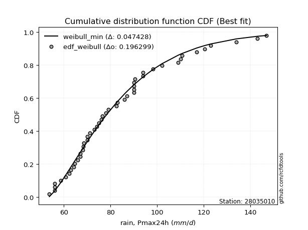</img>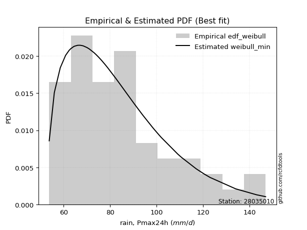</img>

</div>


### 4. EDF Beard (1943)

The Beard formula (or Beard´s plotting position formula) in hydrology is used to estimate the empirical non-exceedance probability _(P)_ of a flood event (or other extreme hydrological data point) within a given dataset.

<div align="center">


$P=(m-0.31)/(n+0.38)$


</div>


**4.1. Empirical values**

<div align="center">

|                | 0                    | 1                   | 2                   | 3                  | 4                   | 5                   | 6                  | 7                   | 8                   | 9                   | 10                  | 11                 | 12                  | 13                  | 14                 | 15                 | 16                 | 17                 | 18                 | 19                 | 20                  | 21                  | 22                  | 23                  | 24                 | 25                 | 26                 | 27                 | 28                 | 29                 | 30                 | 31                 | 32                 | 33                 | 34                 | 35                 | 36                 | 37                 | 38                 | 39                 | 40                 | 41                | 42                 | 43                 | 44                 | 45                 | 46                 | 47                 | 48                 | 49                 | 50                 | 51                 |
|:---------------|:---------------------|:--------------------|:--------------------|:-------------------|:--------------------|:--------------------|:-------------------|:--------------------|:--------------------|:--------------------|:--------------------|:-------------------|:--------------------|:--------------------|:-------------------|:-------------------|:-------------------|:-------------------|:-------------------|:-------------------|:--------------------|:--------------------|:--------------------|:--------------------|:-------------------|:-------------------|:-------------------|:-------------------|:-------------------|:-------------------|:-------------------|:-------------------|:-------------------|:-------------------|:-------------------|:-------------------|:-------------------|:-------------------|:-------------------|:-------------------|:-------------------|:------------------|:-------------------|:-------------------|:-------------------|:-------------------|:-------------------|:-------------------|:-------------------|:-------------------|:-------------------|:-------------------|
| date           | 2004                 | 1969                | 2000                | 1991               | 1994                | 2014                | 2009               | 1997                | 1968                | 1972                | 1989                | 2012               | 1976                | 2001                | 1984               | 2015               | 2006               | 1992               | 1980               | 1970               | 1993                | 1998                | 1987                | 1978                | 1985               | 2018               | 2013               | 2008               | 1973               | 2016               | 1979               | 1977               | 2003               | 1995               | 1975               | 1982               | 2011               | 1974               | 1988               | 1983               | 2022               | 2017              | 2005               | 1986               | 1999               | 1981               | 2002               | 2007               | 1990               | 2010               | 1996               | 1971               |
| x              | 53.75264075          | 55.92497723         | 56.0                | 56.0               | 58.50469062         | 60.8                | 62.3               | 63.0                | 64.2                | 64.7                | 66.0                | 67.0               | 67.0                | 68.0                | 68.34350579        | 68.5               | 70.0               | 70.0               | 71.0               | 73.07817535        | 74.0                | 75.0                | 76.0                | 76.5                | 78.0               | 78.0               | 79.0               | 82.5               | 82.9               | 85.0               | 86.0               | 87.0               | 90.0               | 90.0               | 90.0               | 90.0               | 90.5               | 94.0               | 94.0               | 98.2               | 99.0               | 101.0             | 102.0              | 109.0              | 110.0              | 110.7              | 117.0              | 120.4              | 123.0              | 134.0              | 143.0              | 146.9              |
| m              | 1                    | 2                   | 3                   | 4                  | 5                   | 6                   | 7                  | 8                   | 9                   | 10                  | 11                  | 12                 | 13                  | 14                  | 15                 | 16                 | 17                 | 18                 | 19                 | 20                 | 21                  | 22                  | 23                  | 24                  | 25                 | 26                 | 27                 | 28                 | 29                 | 30                 | 31                 | 32                 | 33                 | 34                 | 35                 | 36                 | 37                 | 38                 | 39                 | 40                 | 41                 | 42                | 43                 | 44                 | 45                 | 46                 | 47                 | 48                 | 49                 | 50                 | 51                 | 52                 |
| empirical_dist | edf_beard            | edf_beard           | edf_beard           | edf_beard          | edf_beard           | edf_beard           | edf_beard          | edf_beard           | edf_beard           | edf_beard           | edf_beard           | edf_beard          | edf_beard           | edf_beard           | edf_beard          | edf_beard          | edf_beard          | edf_beard          | edf_beard          | edf_beard          | edf_beard           | edf_beard           | edf_beard           | edf_beard           | edf_beard          | edf_beard          | edf_beard          | edf_beard          | edf_beard          | edf_beard          | edf_beard          | edf_beard          | edf_beard          | edf_beard          | edf_beard          | edf_beard          | edf_beard          | edf_beard          | edf_beard          | edf_beard          | edf_beard          | edf_beard         | edf_beard          | edf_beard          | edf_beard          | edf_beard          | edf_beard          | edf_beard          | edf_beard          | edf_beard          | edf_beard          | edf_beard          |
| empirical      | 0.013172966781214202 | 0.03226422298587247 | 0.05135547919053073 | 0.070446735395189  | 0.08953799159984727 | 0.10862924780450554 | 0.1277205040091638 | 0.14681176021382206 | 0.16590301641848032 | 0.18499427262313858 | 0.20408552882779685 | 0.2231767850324551 | 0.24226804123711337 | 0.26135929744177167 | 0.2804505536464299 | 0.2995418098510882 | 0.3186330660557465 | 0.3377243222604047 | 0.356815578465063  | 0.3759068346697213 | 0.39499809087437954 | 0.41408934707903783 | 0.43318060328369606 | 0.45227185948835436 | 0.4713631156930126 | 0.4904543718976709 | 0.5095456281023292 | 0.5286368843069874 | 0.5477281405116456 | 0.5668193967163039 | 0.5859106529209622 | 0.6050019091256205 | 0.6240931653302787 | 0.6431844215349369 | 0.6622756777395952 | 0.6813669339442534 | 0.7004581901489118 | 0.71954944635357   | 0.7386407025582282 | 0.7577319587628866 | 0.7768232149675448 | 0.795914471172203 | 0.8150057273768613 | 0.8340969835815196 | 0.8531882397861779 | 0.8722794959908361 | 0.8913707521954943 | 0.9104620084001527 | 0.9295532646048109 | 0.9486445208094691 | 0.9677357770141274 | 0.9868270332187857 |
| empirical_tr   | 1.0133488102147417   | 1.0333399092523181  | 1.054135640974039   | 1.0757855822550833 | 1.0983434682323339  | 1.1218676376097665  | 1.1464215364412345 | 1.172074289550235   | 1.1989013504234378  | 1.2269852424455376  | 1.2564164068121852  | 1.287294175473089  | 1.3197278911564627  | 1.3538382010855519  | 1.3897585566463253 | 1.4276369582992643 | 1.4676379938358084 | 1.5099452291726723 | 1.5547640249332149 | 1.602324869990823  | 1.652887346165983   | 1.7067448680351909  | 1.7642303805995283  | 1.8257232485186476  | 1.8916576381365113 | 1.9625327838141624 | 2.0389256520046715 | 2.1215066828675577 | 2.211059518784297  | 2.308505949757602  | 2.4149377593361    | 2.5316578057032384 | 2.6602336211274755 | 2.8025682182985547 | 2.9609949123798747 | 3.138406231276212  | 3.3384321223709366 | 3.5656909462219186 | 3.826150474799122  | 4.127659574468085  | 4.480752780153977  | 4.899906454630494 | 5.405572755417953  | 6.027617951668583  | 6.811443433029906  | 7.8295964125560475 | 9.205623901581712  | 11.1684434968017   | 14.195121951219496 | 19.472118959107764 | 30.994082840236548 | 75.9130434782605   |

</div>


**4.2. Kolmogorov-Smirnov fit test (sorted by Δ)**


<div align="center">

|                | 0                    | 1                   | 2                   | 3                   | 4                   | 5                   | 6                    | 7                   | 8                   | 9                   | 10                  | 11                  | 12                  | 13                   | 14                  | 15                   | 16                  | 17                   | 18                   | 19                   | 20                  | 21                  | 22                  | 23                  | 24                  | 25                  | 26                  | 27                  | 28                  | 29                  | 30                  | 31                  | 32                  | 33                  | 34                  | 35                  | 36                  | 37                  | 38                  | 39                  | 40                  | 41                  | 42                  | 43                  | 44                  | 45                  | 46                  | 47                  | 48                  | 49                  | 50                  | 51                  | 52                  | 53                  | 54                  | 55                  | 56                  | 57                  | 58                  | 59                  | 60                  | 61                  | 62                    | 63                  | 64                  | 65                  | 66                  | 67                  | 68                  | 69                  | 70                  | 71                  | 72                  | 73                  | 74                  | 75                  | 76                  | 77                  | 78                  | 79                  | 80                  | 81                  | 82                  | 83                  | 84                  | 85                  | 86                  | 87                  |
|:---------------|:---------------------|:--------------------|:--------------------|:--------------------|:--------------------|:--------------------|:---------------------|:--------------------|:--------------------|:--------------------|:--------------------|:--------------------|:--------------------|:---------------------|:--------------------|:---------------------|:--------------------|:---------------------|:---------------------|:---------------------|:--------------------|:--------------------|:--------------------|:--------------------|:--------------------|:--------------------|:--------------------|:--------------------|:--------------------|:--------------------|:--------------------|:--------------------|:--------------------|:--------------------|:--------------------|:--------------------|:--------------------|:--------------------|:--------------------|:--------------------|:--------------------|:--------------------|:--------------------|:--------------------|:--------------------|:--------------------|:--------------------|:--------------------|:--------------------|:--------------------|:--------------------|:--------------------|:--------------------|:--------------------|:--------------------|:--------------------|:--------------------|:--------------------|:--------------------|:--------------------|:--------------------|:--------------------|:----------------------|:--------------------|:--------------------|:--------------------|:--------------------|:--------------------|:--------------------|:--------------------|:--------------------|:--------------------|:--------------------|:--------------------|:--------------------|:--------------------|:--------------------|:--------------------|:--------------------|:--------------------|:--------------------|:--------------------|:--------------------|:--------------------|:--------------------|:--------------------|:--------------------|:--------------------|
| station        | 28035010             | 28035010            | 28035010            | 28035010            | 28035010            | 28035010            | 28035010             | 28035010            | 28035010            | 28035010            | 28035010            | 28035010            | 28035010            | 28035010             | 28035010            | 28035010             | 28035010            | 28035010             | 28035010             | 28035010             | 28035010            | 28035010            | 28035010            | 28035010            | 28035010            | 28035010            | 28035010            | 28035010            | 28035010            | 28035010            | 28035010            | 28035010            | 28035010            | 28035010            | 28035010            | 28035010            | 28035010            | 28035010            | 28035010            | 28035010            | 28035010            | 28035010            | 28035010            | 28035010            | 28035010            | 28035010            | 28035010            | 28035010            | 28035010            | 28035010            | 28035010            | 28035010            | 28035010            | 28035010            | 28035010            | 28035010            | 28035010            | 28035010            | 28035010            | 28035010            | 28035010            | 28035010            | 28035010              | 28035010            | 28035010            | 28035010            | 28035010            | 28035010            | 28035010            | 28035010            | 28035010            | 28035010            | 28035010            | 28035010            | 28035010            | 28035010            | 28035010            | 28035010            | 28035010            | 28035010            | 28035010            | 28035010            | 28035010            | 28035010            | 28035010            | 28035010            | 28035010            | 28035010            |
| empirical_dist | edf_beard            | edf_beard           | edf_beard           | edf_beard           | edf_beard           | edf_beard           | edf_beard            | edf_beard           | edf_beard           | edf_beard           | edf_beard           | edf_beard           | edf_beard           | edf_beard            | edf_beard           | edf_beard            | edf_beard           | edf_beard            | edf_beard            | edf_beard            | edf_beard           | edf_beard           | edf_beard           | edf_beard           | edf_beard           | edf_beard           | edf_beard           | edf_beard           | edf_beard           | edf_beard           | edf_beard           | edf_beard           | edf_beard           | edf_beard           | edf_beard           | edf_beard           | edf_beard           | edf_beard           | edf_beard           | edf_beard           | edf_beard           | edf_beard           | edf_beard           | edf_beard           | edf_beard           | edf_beard           | edf_beard           | edf_beard           | edf_beard           | edf_beard           | edf_beard           | edf_beard           | edf_beard           | edf_beard           | edf_beard           | edf_beard           | edf_beard           | edf_beard           | edf_beard           | edf_beard           | edf_beard           | edf_beard           | edf_beard             | edf_beard           | edf_beard           | edf_beard           | edf_beard           | edf_beard           | edf_beard           | edf_beard           | edf_beard           | edf_beard           | edf_beard           | edf_beard           | edf_beard           | edf_beard           | edf_beard           | edf_beard           | edf_beard           | edf_beard           | edf_beard           | edf_beard           | edf_beard           | edf_beard           | edf_beard           | edf_beard           | edf_beard           | edf_beard           |
| p_dist         | weibull_min          | halfnorm            | logmaxwell          | logrice             | lograyleigh         | pearson3            | gamma                | erlang              | logweibull_min      | loggenexpon         | logpearson3         | logncf              | lognakagami         | nct                  | fatiguelife         | logalpha             | invgauss            | moyal                | rayleigh             | johnsonsu            | loginvgamma         | gumbel_r            | alpha               | invgamma            | f                   | loglognorm          | logjohnsonsu        | logexponnorm        | gompertz            | loginvgauss         | logfatiguelife      | invweibull          | logf                | loggamma            | loggamma            | logerlang           | genlogistic         | lognct              | nakagami            | betaprime           | fisk                | logkstwobign        | kstwobign           | logloggamma         | logfisk             | mielke              | loggenlogistic      | loginvweibull       | logmielke           | logt                | lognorm             | lognorm             | logcrystalball      | exponnorm           | laplace_asymmetric  | maxwell             | halflogistic        | ncf                 | loggumbel_r         | loghalfnorm         | rice                | loglogistic         | loglaplace_asymmetric | logmoyal            | truncnorm           | norm                | crystalball         | t                   | loghalflogistic     | loghypsecant        | loggompertz         | genexpon            | logistic            | expon               | hypsecant           | loglaplace          | loggumbel_l         | chi2                | laplace             | logbetaprime        | gumbel_l            | logtruncnorm        | wald                | logexpon            | logwald             | logchi2             | loggibrat           | gibrat              |
| delta          | 0.044531584565189575 | 0.04596217398606603 | 0.04771645613158959 | 0.04800413612094745 | 0.05194170173948287 | 0.05252522021721795 | 0.054200287353341925 | 0.05420053174264872 | 0.05619726917069312 | 0.05665600017655048 | 0.05737438893689967 | 0.05840199591570944 | 0.05902896742545605 | 0.059881594666769566 | 0.0600336189433055  | 0.060495741004963244 | 0.06067091909066091 | 0.061694857219833144 | 0.061710263469620386 | 0.061838072865517235 | 0.062468740359094   | 0.06247768901106393 | 0.06269474436661893 | 0.06330973952798058 | 0.06332742742942399 | 0.06338278647938311 | 0.0636492583961552  | 0.06388975647821404 | 0.06399524978799298 | 0.06410744374258492 | 0.06431727822976219 | 0.06464518234169014 | 0.06493473165508334 | 0.06508122572563801 | 0.06508122572563801 | 0.06508142928934657 | 0.06574747400273301 | 0.06584871725019825 | 0.06637979399306856 | 0.06695881464248127 | 0.06782748292435814 | 0.06879416267830485 | 0.06929188462803815 | 0.0697155417063503  | 0.07088717090544328 | 0.07091364641728415 | 0.07111825761948198 | 0.07113423264418728 | 0.071480852858542   | 0.07177580380327014 | 0.07177675996442956 | 0.07177675996442956 | 0.07177676199117183 | 0.07201209200494507 | 0.07275716237662333 | 0.07320952896870003 | 0.07539679518353104 | 0.07886452716821951 | 0.08381001697288737 | 0.08953799159984727 | 0.09403072780376948 | 0.09408545262968165 | 0.09705216693134289   | 0.10381368900630317 | 0.10727658380427596 | 0.1072765933918538  | 0.10727675184674806 | 0.10732069889417833 | 0.10862924780450554 | 0.10937235575442358 | 0.11469267379632511 | 0.11786235891485072 | 0.11991759155651088 | 0.126390887044285   | 0.13161284017847108 | 0.13286538840675086 | 0.13570652496948182 | 0.14520679096397082 | 0.1596315789764557  | 0.1670922270730709  | 0.17401710064733444 | 0.17458484802085475 | 0.17669935290329364 | 0.18457667914122197 | 0.18485293215157447 | 0.2503452343136371  | 0.28529107008643484 | 0.28821727682989723 |
| deltao         | 0.18859806671657792  | 0.18859806671657792 | 0.18859806671657792 | 0.18859806671657792 | 0.18859806671657792 | 0.18859806671657792 | 0.18859806671657792  | 0.18859806671657792 | 0.18859806671657792 | 0.18859806671657792 | 0.18859806671657792 | 0.18859806671657792 | 0.18859806671657792 | 0.18859806671657792  | 0.18859806671657792 | 0.18859806671657792  | 0.18859806671657792 | 0.18859806671657792  | 0.18859806671657792  | 0.18859806671657792  | 0.18859806671657792 | 0.18859806671657792 | 0.18859806671657792 | 0.18859806671657792 | 0.18859806671657792 | 0.18859806671657792 | 0.18859806671657792 | 0.18859806671657792 | 0.18859806671657792 | 0.18859806671657792 | 0.18859806671657792 | 0.18859806671657792 | 0.18859806671657792 | 0.18859806671657792 | 0.18859806671657792 | 0.18859806671657792 | 0.18859806671657792 | 0.18859806671657792 | 0.18859806671657792 | 0.18859806671657792 | 0.18859806671657792 | 0.18859806671657792 | 0.18859806671657792 | 0.18859806671657792 | 0.18859806671657792 | 0.18859806671657792 | 0.18859806671657792 | 0.18859806671657792 | 0.18859806671657792 | 0.18859806671657792 | 0.18859806671657792 | 0.18859806671657792 | 0.18859806671657792 | 0.18859806671657792 | 0.18859806671657792 | 0.18859806671657792 | 0.18859806671657792 | 0.18859806671657792 | 0.18859806671657792 | 0.18859806671657792 | 0.18859806671657792 | 0.18859806671657792 | 0.18859806671657792   | 0.18859806671657792 | 0.18859806671657792 | 0.18859806671657792 | 0.18859806671657792 | 0.18859806671657792 | 0.18859806671657792 | 0.18859806671657792 | 0.18859806671657792 | 0.18859806671657792 | 0.18859806671657792 | 0.18859806671657792 | 0.18859806671657792 | 0.18859806671657792 | 0.18859806671657792 | 0.18859806671657792 | 0.18859806671657792 | 0.18859806671657792 | 0.18859806671657792 | 0.18859806671657792 | 0.18859806671657792 | 0.18859806671657792 | 0.18859806671657792 | 0.18859806671657792 | 0.18859806671657792 | 0.18859806671657792 |
| eval           | Δo > Δ               | Δo > Δ              | Δo > Δ              | Δo > Δ              | Δo > Δ              | Δo > Δ              | Δo > Δ               | Δo > Δ              | Δo > Δ              | Δo > Δ              | Δo > Δ              | Δo > Δ              | Δo > Δ              | Δo > Δ               | Δo > Δ              | Δo > Δ               | Δo > Δ              | Δo > Δ               | Δo > Δ               | Δo > Δ               | Δo > Δ              | Δo > Δ              | Δo > Δ              | Δo > Δ              | Δo > Δ              | Δo > Δ              | Δo > Δ              | Δo > Δ              | Δo > Δ              | Δo > Δ              | Δo > Δ              | Δo > Δ              | Δo > Δ              | Δo > Δ              | Δo > Δ              | Δo > Δ              | Δo > Δ              | Δo > Δ              | Δo > Δ              | Δo > Δ              | Δo > Δ              | Δo > Δ              | Δo > Δ              | Δo > Δ              | Δo > Δ              | Δo > Δ              | Δo > Δ              | Δo > Δ              | Δo > Δ              | Δo > Δ              | Δo > Δ              | Δo > Δ              | Δo > Δ              | Δo > Δ              | Δo > Δ              | Δo > Δ              | Δo > Δ              | Δo > Δ              | Δo > Δ              | Δo > Δ              | Δo > Δ              | Δo > Δ              | Δo > Δ                | Δo > Δ              | Δo > Δ              | Δo > Δ              | Δo > Δ              | Δo > Δ              | Δo > Δ              | Δo > Δ              | Δo > Δ              | Δo > Δ              | Δo > Δ              | Δo > Δ              | Δo > Δ              | Δo > Δ              | Δo > Δ              | Δo > Δ              | Δo > Δ              | Δo > Δ              | Δo > Δ              | Δo > Δ              | Δo > Δ              | Δo > Δ              | Δo > Δ              | Δo <= Δ             | Δo <= Δ             | Δo <= Δ             |
| fit            | 1                    | 1                   | 1                   | 1                   | 1                   | 1                   | 1                    | 1                   | 1                   | 1                   | 1                   | 1                   | 1                   | 1                    | 1                   | 1                    | 1                   | 1                    | 1                    | 1                    | 1                   | 1                   | 1                   | 1                   | 1                   | 1                   | 1                   | 1                   | 1                   | 1                   | 1                   | 1                   | 1                   | 1                   | 1                   | 1                   | 1                   | 1                   | 1                   | 1                   | 1                   | 1                   | 1                   | 1                   | 1                   | 1                   | 1                   | 1                   | 1                   | 1                   | 1                   | 1                   | 1                   | 1                   | 1                   | 1                   | 1                   | 1                   | 1                   | 1                   | 1                   | 1                   | 1                     | 1                   | 1                   | 1                   | 1                   | 1                   | 1                   | 1                   | 1                   | 1                   | 1                   | 1                   | 1                   | 1                   | 1                   | 1                   | 1                   | 1                   | 1                   | 1                   | 1                   | 1                   | 1                   | 0                   | 0                   | 0                   |
| n              | 52                   | 52                  | 52                  | 52                  | 52                  | 52                  | 52                   | 52                  | 52                  | 52                  | 52                  | 52                  | 52                  | 52                   | 52                  | 52                   | 52                  | 52                   | 52                   | 52                   | 52                  | 52                  | 52                  | 52                  | 52                  | 52                  | 52                  | 52                  | 52                  | 52                  | 52                  | 52                  | 52                  | 52                  | 52                  | 52                  | 52                  | 52                  | 52                  | 52                  | 52                  | 52                  | 52                  | 52                  | 52                  | 52                  | 52                  | 52                  | 52                  | 52                  | 52                  | 52                  | 52                  | 52                  | 52                  | 52                  | 52                  | 52                  | 52                  | 52                  | 52                  | 52                  | 52                    | 52                  | 52                  | 52                  | 52                  | 52                  | 52                  | 52                  | 52                  | 52                  | 52                  | 52                  | 52                  | 52                  | 52                  | 52                  | 52                  | 52                  | 52                  | 52                  | 52                  | 52                  | 52                  | 52                  | 52                  | 52                  |
| best_fit       | 1                    | 0                   | 0                   | 0                   | 0                   | 0                   | 0                    | 0                   | 0                   | 0                   | 0                   | 0                   | 0                   | 0                    | 0                   | 0                    | 0                   | 0                    | 0                    | 0                    | 0                   | 0                   | 0                   | 0                   | 0                   | 0                   | 0                   | 0                   | 0                   | 0                   | 0                   | 0                   | 0                   | 0                   | 0                   | 0                   | 0                   | 0                   | 0                   | 0                   | 0                   | 0                   | 0                   | 0                   | 0                   | 0                   | 0                   | 0                   | 0                   | 0                   | 0                   | 0                   | 0                   | 0                   | 0                   | 0                   | 0                   | 0                   | 0                   | 0                   | 0                   | 0                   | 0                     | 0                   | 0                   | 0                   | 0                   | 0                   | 0                   | 0                   | 0                   | 0                   | 0                   | 0                   | 0                   | 0                   | 0                   | 0                   | 0                   | 0                   | 0                   | 0                   | 0                   | 0                   | 0                   | 0                   | 0                   | 0                   |
| best_fit_sort  | 1                    | 2                   | 3                   | 4                   | 5                   | 6                   | 7                    | 8                   | 9                   | 10                  | 11                  | 12                  | 13                  | 14                   | 15                  | 16                   | 17                  | 18                   | 19                   | 20                   | 21                  | 22                  | 23                  | 24                  | 25                  | 26                  | 27                  | 28                  | 29                  | 30                  | 31                  | 32                  | 33                  | 34                  | 35                  | 36                  | 37                  | 38                  | 39                  | 40                  | 41                  | 42                  | 43                  | 44                  | 45                  | 46                  | 47                  | 48                  | 49                  | 50                  | 51                  | 52                  | 53                  | 54                  | 55                  | 56                  | 57                  | 58                  | 59                  | 60                  | 61                  | 62                  | 63                    | 64                  | 65                  | 66                  | 67                  | 68                  | 69                  | 70                  | 71                  | 72                  | 73                  | 74                  | 75                  | 76                  | 77                  | 78                  | 79                  | 80                  | 81                  | 82                  | 83                  | 84                  | 85                  | 86                  | 87                  | 88                  |

</div>


<div align="center">

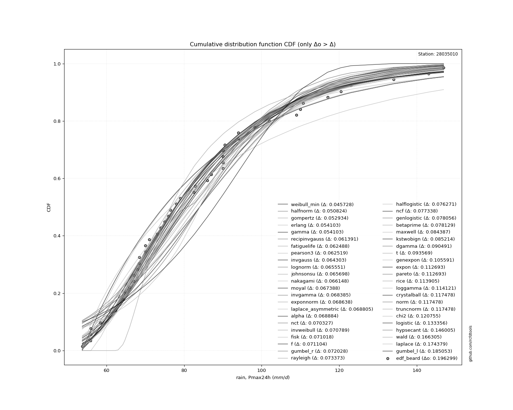</img>

</div>


**4.3. Best fit**

<div align="center">

|   id |   station | empirical_dist   | p_dist      |     delta |   deltao | eval   |   fit |   n |   best_fit |   best_fit_sort |
|-----:|----------:|:-----------------|:------------|----------:|---------:|:-------|------:|----:|-----------:|----------------:|
|    0 |  28035010 | edf_beard        | weibull_min | 0.0445316 | 0.188598 | Δo > Δ |     1 |  52 |          1 |               1 |

</div>


<div align="center">

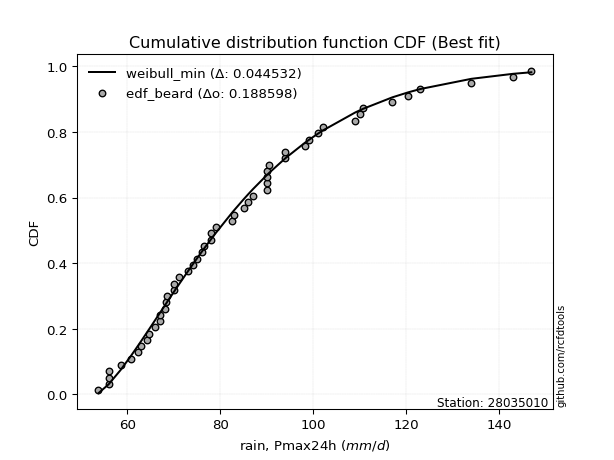</img></img>

</div>


### 5. EDF Chegodayev (1955)

The Chegodayev formula is an empirical plotting position formula used in hydrological frequency analysis to estimate the exceedance probability or return period of a specific event from a set of observed data. It is primarily used for plotting observed data points on probability paper to fit a theoretical distribution, particularly for analyzing extreme events like maximum flood flows or rainfall intensities. The constant _b_ value in the generalized plotting position formula is 0.3.

<div align="center">


$P=(m-b)/(n+1-2b)$


</div>


**5.1. Empirical values**

<div align="center">

|                | 0                    | 1                   | 2                   | 3                   | 4                   | 5                   | 6                   | 7                   | 8                   | 9                  | 10                  | 11                 | 12                  | 13                  | 14                  | 15                 | 16                 | 17                 | 18                 | 19                  | 20                 | 21                  | 22                 | 23                  | 24                 | 25                 | 26                 | 27                 | 28                 | 29                 | 30                 | 31                 | 32                 | 33                 | 34                 | 35                 | 36                 | 37                 | 38                 | 39                 | 40                 | 41                 | 42                 | 43                 | 44                 | 45                 | 46                 | 47                 | 48                 | 49                 | 50                 | 51                 |
|:---------------|:---------------------|:--------------------|:--------------------|:--------------------|:--------------------|:--------------------|:--------------------|:--------------------|:--------------------|:-------------------|:--------------------|:-------------------|:--------------------|:--------------------|:--------------------|:-------------------|:-------------------|:-------------------|:-------------------|:--------------------|:-------------------|:--------------------|:-------------------|:--------------------|:-------------------|:-------------------|:-------------------|:-------------------|:-------------------|:-------------------|:-------------------|:-------------------|:-------------------|:-------------------|:-------------------|:-------------------|:-------------------|:-------------------|:-------------------|:-------------------|:-------------------|:-------------------|:-------------------|:-------------------|:-------------------|:-------------------|:-------------------|:-------------------|:-------------------|:-------------------|:-------------------|:-------------------|
| date           | 2004                 | 1969                | 2000                | 1991                | 1994                | 2014                | 2009                | 1997                | 1968                | 1972               | 1989                | 2012               | 1976                | 2001                | 1984                | 2015               | 2006               | 1992               | 1980               | 1970                | 1993               | 1998                | 1987               | 1978                | 1985               | 2018               | 2013               | 2008               | 1973               | 2016               | 1979               | 1977               | 2003               | 1995               | 1975               | 1982               | 2011               | 1974               | 1988               | 1983               | 2022               | 2017               | 2005               | 1986               | 1999               | 1981               | 2002               | 2007               | 1990               | 2010               | 1996               | 1971               |
| x              | 53.75264075          | 55.92497723         | 56.0                | 56.0                | 58.50469062         | 60.8                | 62.3                | 63.0                | 64.2                | 64.7               | 66.0                | 67.0               | 67.0                | 68.0                | 68.34350579         | 68.5               | 70.0               | 70.0               | 71.0               | 73.07817535         | 74.0               | 75.0                | 76.0               | 76.5                | 78.0               | 78.0               | 79.0               | 82.5               | 82.9               | 85.0               | 86.0               | 87.0               | 90.0               | 90.0               | 90.0               | 90.0               | 90.5               | 94.0               | 94.0               | 98.2               | 99.0               | 101.0              | 102.0              | 109.0              | 110.0              | 110.7              | 117.0              | 120.4              | 123.0              | 134.0              | 143.0              | 146.9              |
| m              | 1                    | 2                   | 3                   | 4                   | 5                   | 6                   | 7                   | 8                   | 9                   | 10                 | 11                  | 12                 | 13                  | 14                  | 15                  | 16                 | 17                 | 18                 | 19                 | 20                  | 21                 | 22                  | 23                 | 24                  | 25                 | 26                 | 27                 | 28                 | 29                 | 30                 | 31                 | 32                 | 33                 | 34                 | 35                 | 36                 | 37                 | 38                 | 39                 | 40                 | 41                 | 42                 | 43                 | 44                 | 45                 | 46                 | 47                 | 48                 | 49                 | 50                 | 51                 | 52                 |
| empirical_dist | edf_chegodayev       | edf_chegodayev      | edf_chegodayev      | edf_chegodayev      | edf_chegodayev      | edf_chegodayev      | edf_chegodayev      | edf_chegodayev      | edf_chegodayev      | edf_chegodayev     | edf_chegodayev      | edf_chegodayev     | edf_chegodayev      | edf_chegodayev      | edf_chegodayev      | edf_chegodayev     | edf_chegodayev     | edf_chegodayev     | edf_chegodayev     | edf_chegodayev      | edf_chegodayev     | edf_chegodayev      | edf_chegodayev     | edf_chegodayev      | edf_chegodayev     | edf_chegodayev     | edf_chegodayev     | edf_chegodayev     | edf_chegodayev     | edf_chegodayev     | edf_chegodayev     | edf_chegodayev     | edf_chegodayev     | edf_chegodayev     | edf_chegodayev     | edf_chegodayev     | edf_chegodayev     | edf_chegodayev     | edf_chegodayev     | edf_chegodayev     | edf_chegodayev     | edf_chegodayev     | edf_chegodayev     | edf_chegodayev     | edf_chegodayev     | edf_chegodayev     | edf_chegodayev     | edf_chegodayev     | edf_chegodayev     | edf_chegodayev     | edf_chegodayev     | edf_chegodayev     |
| empirical      | 0.013358778625954198 | 0.03244274809160305 | 0.05152671755725191 | 0.07061068702290077 | 0.08969465648854963 | 0.10877862595419847 | 0.12786259541984735 | 0.14694656488549618 | 0.16603053435114504 | 0.1851145038167939 | 0.20419847328244273 | 0.2232824427480916 | 0.24236641221374045 | 0.26145038167938933 | 0.28053435114503816 | 0.299618320610687  | 0.3187022900763359 | 0.3377862595419847 | 0.3568702290076336 | 0.37595419847328243 | 0.3950381679389313 | 0.41412213740458015 | 0.433206106870229  | 0.45229007633587787 | 0.4713740458015267 | 0.4904580152671756 | 0.5095419847328244 | 0.5286259541984732 | 0.5477099236641222 | 0.566793893129771  | 0.5858778625954199 | 0.6049618320610687 | 0.6240458015267176 | 0.6431297709923665 | 0.6622137404580153 | 0.6812977099236642 | 0.7003816793893131 | 0.7194656488549619 | 0.7385496183206107 | 0.7576335877862597 | 0.7767175572519085 | 0.7958015267175573 | 0.8148854961832062 | 0.833969465648855  | 0.8530534351145039 | 0.8721374045801528 | 0.8912213740458016 | 0.9103053435114504 | 0.9293893129770994 | 0.9484732824427482 | 0.967557251908397  | 0.9866412213740459 |
| empirical_tr   | 1.0135396518375241   | 1.0335305719921104  | 1.0543259557344065  | 1.0759753593429158  | 1.09853249475891    | 1.1220556745182013  | 1.1466083150984683  | 1.1722595078299776  | 1.1990846681922196  | 1.2271662763466042 | 1.2565947242206235  | 1.2874692874692875 | 1.3198992443324937  | 1.3540051679586564  | 1.389920424403183   | 1.4277929155313351 | 1.4677871148459385 | 1.510086455331412  | 1.5548961424332344 | 1.602446483180428   | 1.6529968454258677 | 1.706840390879479   | 1.7643097643097643 | 1.8257839721254356  | 1.8916967509025273 | 1.9625468164794009 | 2.0389105058365757 | 2.1214574898785425 | 2.210970464135021  | 2.3083700440528636 | 2.414746543778802  | 2.5314009661835746 | 2.659898477157361  | 2.8021390374331556 | 2.96045197740113   | 3.137724550898205  | 3.337579617834396  | 3.564625850340137  | 3.824817518248176  | 4.125984251968506  | 4.4786324786324805 | 4.897196261682245  | 5.402061855670104  | 6.0229885057471275 | 6.805194805194811  | 7.820895522388065  | 9.192982456140356  | 11.148936170212771 | 14.162162162162188 | 19.407407407407447 | 30.823529411764785 | 74.8571428571432   |

</div>


**5.2. Kolmogorov-Smirnov fit test (sorted by Δ)**


<div align="center">

|                | 0                   | 1                    | 2                    | 3                   | 4                    | 5                   | 6                   | 7                   | 8                    | 9                    | 10                  | 11                  | 12                  | 13                  | 14                   | 15                  | 16                  | 17                   | 18                  | 19                  | 20                  | 21                  | 22                  | 23                  | 24                  | 25                  | 26                  | 27                  | 28                  | 29                  | 30                  | 31                  | 32                  | 33                  | 34                  | 35                  | 36                  | 37                  | 38                  | 39                  | 40                  | 41                  | 42                  | 43                  | 44                  | 45                  | 46                  | 47                  | 48                  | 49                  | 50                  | 51                  | 52                  | 53                  | 54                  | 55                  | 56                  | 57                  | 58                  | 59                  | 60                  | 61                  | 62                    | 63                  | 64                  | 65                  | 66                  | 67                  | 68                  | 69                  | 70                  | 71                  | 72                  | 73                  | 74                  | 75                  | 76                  | 77                  | 78                  | 79                  | 80                  | 81                  | 82                  | 83                  | 84                  | 85                  | 86                  | 87                  |
|:---------------|:--------------------|:---------------------|:---------------------|:--------------------|:---------------------|:--------------------|:--------------------|:--------------------|:---------------------|:---------------------|:--------------------|:--------------------|:--------------------|:--------------------|:---------------------|:--------------------|:--------------------|:---------------------|:--------------------|:--------------------|:--------------------|:--------------------|:--------------------|:--------------------|:--------------------|:--------------------|:--------------------|:--------------------|:--------------------|:--------------------|:--------------------|:--------------------|:--------------------|:--------------------|:--------------------|:--------------------|:--------------------|:--------------------|:--------------------|:--------------------|:--------------------|:--------------------|:--------------------|:--------------------|:--------------------|:--------------------|:--------------------|:--------------------|:--------------------|:--------------------|:--------------------|:--------------------|:--------------------|:--------------------|:--------------------|:--------------------|:--------------------|:--------------------|:--------------------|:--------------------|:--------------------|:--------------------|:----------------------|:--------------------|:--------------------|:--------------------|:--------------------|:--------------------|:--------------------|:--------------------|:--------------------|:--------------------|:--------------------|:--------------------|:--------------------|:--------------------|:--------------------|:--------------------|:--------------------|:--------------------|:--------------------|:--------------------|:--------------------|:--------------------|:--------------------|:--------------------|:--------------------|:--------------------|
| station        | 28035010            | 28035010             | 28035010             | 28035010            | 28035010             | 28035010            | 28035010            | 28035010            | 28035010             | 28035010             | 28035010            | 28035010            | 28035010            | 28035010            | 28035010             | 28035010            | 28035010            | 28035010             | 28035010            | 28035010            | 28035010            | 28035010            | 28035010            | 28035010            | 28035010            | 28035010            | 28035010            | 28035010            | 28035010            | 28035010            | 28035010            | 28035010            | 28035010            | 28035010            | 28035010            | 28035010            | 28035010            | 28035010            | 28035010            | 28035010            | 28035010            | 28035010            | 28035010            | 28035010            | 28035010            | 28035010            | 28035010            | 28035010            | 28035010            | 28035010            | 28035010            | 28035010            | 28035010            | 28035010            | 28035010            | 28035010            | 28035010            | 28035010            | 28035010            | 28035010            | 28035010            | 28035010            | 28035010              | 28035010            | 28035010            | 28035010            | 28035010            | 28035010            | 28035010            | 28035010            | 28035010            | 28035010            | 28035010            | 28035010            | 28035010            | 28035010            | 28035010            | 28035010            | 28035010            | 28035010            | 28035010            | 28035010            | 28035010            | 28035010            | 28035010            | 28035010            | 28035010            | 28035010            |
| empirical_dist | edf_chegodayev      | edf_chegodayev       | edf_chegodayev       | edf_chegodayev      | edf_chegodayev       | edf_chegodayev      | edf_chegodayev      | edf_chegodayev      | edf_chegodayev       | edf_chegodayev       | edf_chegodayev      | edf_chegodayev      | edf_chegodayev      | edf_chegodayev      | edf_chegodayev       | edf_chegodayev      | edf_chegodayev      | edf_chegodayev       | edf_chegodayev      | edf_chegodayev      | edf_chegodayev      | edf_chegodayev      | edf_chegodayev      | edf_chegodayev      | edf_chegodayev      | edf_chegodayev      | edf_chegodayev      | edf_chegodayev      | edf_chegodayev      | edf_chegodayev      | edf_chegodayev      | edf_chegodayev      | edf_chegodayev      | edf_chegodayev      | edf_chegodayev      | edf_chegodayev      | edf_chegodayev      | edf_chegodayev      | edf_chegodayev      | edf_chegodayev      | edf_chegodayev      | edf_chegodayev      | edf_chegodayev      | edf_chegodayev      | edf_chegodayev      | edf_chegodayev      | edf_chegodayev      | edf_chegodayev      | edf_chegodayev      | edf_chegodayev      | edf_chegodayev      | edf_chegodayev      | edf_chegodayev      | edf_chegodayev      | edf_chegodayev      | edf_chegodayev      | edf_chegodayev      | edf_chegodayev      | edf_chegodayev      | edf_chegodayev      | edf_chegodayev      | edf_chegodayev      | edf_chegodayev        | edf_chegodayev      | edf_chegodayev      | edf_chegodayev      | edf_chegodayev      | edf_chegodayev      | edf_chegodayev      | edf_chegodayev      | edf_chegodayev      | edf_chegodayev      | edf_chegodayev      | edf_chegodayev      | edf_chegodayev      | edf_chegodayev      | edf_chegodayev      | edf_chegodayev      | edf_chegodayev      | edf_chegodayev      | edf_chegodayev      | edf_chegodayev      | edf_chegodayev      | edf_chegodayev      | edf_chegodayev      | edf_chegodayev      | edf_chegodayev      | edf_chegodayev      |
| p_dist         | weibull_min         | halfnorm             | logmaxwell           | logrice             | lograyleigh          | pearson3            | gamma               | erlang              | logweibull_min       | loggenexpon          | logpearson3         | logncf              | lognakagami         | nct                 | fatiguelife          | logalpha            | invgauss            | rayleigh             | moyal               | johnsonsu           | loginvgamma         | gumbel_r            | alpha               | invgamma            | f                   | loglognorm          | logjohnsonsu        | gompertz            | logexponnorm        | loginvgauss         | logfatiguelife      | invweibull          | logf                | loggamma            | loggamma            | logerlang           | genlogistic         | lognct              | nakagami            | betaprime           | fisk                | logkstwobign        | kstwobign           | logloggamma         | logfisk             | mielke              | loggenlogistic      | loginvweibull       | logmielke           | logt                | lognorm             | lognorm             | logcrystalball      | exponnorm           | laplace_asymmetric  | maxwell             | halflogistic        | ncf                 | loggumbel_r         | loghalfnorm         | rice                | loglogistic         | loglaplace_asymmetric | logmoyal            | truncnorm           | norm                | crystalball         | t                   | loghalflogistic     | loghypsecant        | loggompertz         | genexpon            | logistic            | expon               | hypsecant           | loglaplace          | loggumbel_l         | chi2                | laplace             | logbetaprime        | gumbel_l            | logtruncnorm        | wald                | logexpon            | logwald             | logchi2             | loggibrat           | gibrat              |
| delta          | 0.04457894836875065 | 0.046126125613777796 | 0.047778393413169584 | 0.04805149992450852 | 0.051989065543043944 | 0.05258715749879794 | 0.054247651156903   | 0.05424789554620979 | 0.056244632974254194 | 0.056703363980111554 | 0.05743632621847966 | 0.05846393319728943 | 0.05907633122901712 | 0.05994353194834956 | 0.060080982746866574 | 0.06054310480852432 | 0.06071828289422199 | 0.061633752710021694 | 0.06174222102339422 | 0.06188543666907831 | 0.06251610416265507 | 0.06253962629264392 | 0.06274210817018    | 0.06335710333154165 | 0.06337479123298506 | 0.06343015028294419 | 0.06369662219971628 | 0.06391873902839429 | 0.06393712028177512 | 0.064154807546146   | 0.06436464203332326 | 0.06469254614525122 | 0.06498209545864442 | 0.06512858952919909 | 0.06512858952919909 | 0.06512879309290764 | 0.065809411284313   | 0.06591065453177825 | 0.06625227606040385 | 0.06702075192406126 | 0.06787484672791921 | 0.06884152648186592 | 0.06935382190961814 | 0.06977019224892089 | 0.07093453470900435 | 0.07096101022084522 | 0.07116562142304306 | 0.07118159644774835 | 0.07152821666210307 | 0.07183045434584073 | 0.07183141050700015 | 0.07183141050700015 | 0.07183141253374242 | 0.07205945580850615 | 0.0728045261801844  | 0.07320588559919528 | 0.0755534600722334  | 0.07886817053772421 | 0.08385738077644844 | 0.08969465648854963 | 0.09408537834634007 | 0.09414738991126165 | 0.09709953073490396   | 0.10386105280986424 | 0.1072729404347712  | 0.10727295002234905 | 0.1072731084772433  | 0.10731705552467358 | 0.10877862595419847 | 0.10943429303600358 | 0.11458701608068864 | 0.11775670119921425 | 0.11991394818700613 | 0.12628522932864852 | 0.13161648354797578 | 0.13292003894932145 | 0.13570288159997707 | 0.1450792730313061  | 0.1596352223459604  | 0.16691370196734032 | 0.1740134572778297  | 0.17447919030521827 | 0.17681958409694895 | 0.1844710214255855  | 0.18497316334522979 | 0.25023957659800056 | 0.28536758084603364 | 0.28829378758949603 |
| deltao         | 0.18859806671657792 | 0.18859806671657792  | 0.18859806671657792  | 0.18859806671657792 | 0.18859806671657792  | 0.18859806671657792 | 0.18859806671657792 | 0.18859806671657792 | 0.18859806671657792  | 0.18859806671657792  | 0.18859806671657792 | 0.18859806671657792 | 0.18859806671657792 | 0.18859806671657792 | 0.18859806671657792  | 0.18859806671657792 | 0.18859806671657792 | 0.18859806671657792  | 0.18859806671657792 | 0.18859806671657792 | 0.18859806671657792 | 0.18859806671657792 | 0.18859806671657792 | 0.18859806671657792 | 0.18859806671657792 | 0.18859806671657792 | 0.18859806671657792 | 0.18859806671657792 | 0.18859806671657792 | 0.18859806671657792 | 0.18859806671657792 | 0.18859806671657792 | 0.18859806671657792 | 0.18859806671657792 | 0.18859806671657792 | 0.18859806671657792 | 0.18859806671657792 | 0.18859806671657792 | 0.18859806671657792 | 0.18859806671657792 | 0.18859806671657792 | 0.18859806671657792 | 0.18859806671657792 | 0.18859806671657792 | 0.18859806671657792 | 0.18859806671657792 | 0.18859806671657792 | 0.18859806671657792 | 0.18859806671657792 | 0.18859806671657792 | 0.18859806671657792 | 0.18859806671657792 | 0.18859806671657792 | 0.18859806671657792 | 0.18859806671657792 | 0.18859806671657792 | 0.18859806671657792 | 0.18859806671657792 | 0.18859806671657792 | 0.18859806671657792 | 0.18859806671657792 | 0.18859806671657792 | 0.18859806671657792   | 0.18859806671657792 | 0.18859806671657792 | 0.18859806671657792 | 0.18859806671657792 | 0.18859806671657792 | 0.18859806671657792 | 0.18859806671657792 | 0.18859806671657792 | 0.18859806671657792 | 0.18859806671657792 | 0.18859806671657792 | 0.18859806671657792 | 0.18859806671657792 | 0.18859806671657792 | 0.18859806671657792 | 0.18859806671657792 | 0.18859806671657792 | 0.18859806671657792 | 0.18859806671657792 | 0.18859806671657792 | 0.18859806671657792 | 0.18859806671657792 | 0.18859806671657792 | 0.18859806671657792 | 0.18859806671657792 |
| eval           | Δo > Δ              | Δo > Δ               | Δo > Δ               | Δo > Δ              | Δo > Δ               | Δo > Δ              | Δo > Δ              | Δo > Δ              | Δo > Δ               | Δo > Δ               | Δo > Δ              | Δo > Δ              | Δo > Δ              | Δo > Δ              | Δo > Δ               | Δo > Δ              | Δo > Δ              | Δo > Δ               | Δo > Δ              | Δo > Δ              | Δo > Δ              | Δo > Δ              | Δo > Δ              | Δo > Δ              | Δo > Δ              | Δo > Δ              | Δo > Δ              | Δo > Δ              | Δo > Δ              | Δo > Δ              | Δo > Δ              | Δo > Δ              | Δo > Δ              | Δo > Δ              | Δo > Δ              | Δo > Δ              | Δo > Δ              | Δo > Δ              | Δo > Δ              | Δo > Δ              | Δo > Δ              | Δo > Δ              | Δo > Δ              | Δo > Δ              | Δo > Δ              | Δo > Δ              | Δo > Δ              | Δo > Δ              | Δo > Δ              | Δo > Δ              | Δo > Δ              | Δo > Δ              | Δo > Δ              | Δo > Δ              | Δo > Δ              | Δo > Δ              | Δo > Δ              | Δo > Δ              | Δo > Δ              | Δo > Δ              | Δo > Δ              | Δo > Δ              | Δo > Δ                | Δo > Δ              | Δo > Δ              | Δo > Δ              | Δo > Δ              | Δo > Δ              | Δo > Δ              | Δo > Δ              | Δo > Δ              | Δo > Δ              | Δo > Δ              | Δo > Δ              | Δo > Δ              | Δo > Δ              | Δo > Δ              | Δo > Δ              | Δo > Δ              | Δo > Δ              | Δo > Δ              | Δo > Δ              | Δo > Δ              | Δo > Δ              | Δo > Δ              | Δo <= Δ             | Δo <= Δ             | Δo <= Δ             |
| fit            | 1                   | 1                    | 1                    | 1                   | 1                    | 1                   | 1                   | 1                   | 1                    | 1                    | 1                   | 1                   | 1                   | 1                   | 1                    | 1                   | 1                   | 1                    | 1                   | 1                   | 1                   | 1                   | 1                   | 1                   | 1                   | 1                   | 1                   | 1                   | 1                   | 1                   | 1                   | 1                   | 1                   | 1                   | 1                   | 1                   | 1                   | 1                   | 1                   | 1                   | 1                   | 1                   | 1                   | 1                   | 1                   | 1                   | 1                   | 1                   | 1                   | 1                   | 1                   | 1                   | 1                   | 1                   | 1                   | 1                   | 1                   | 1                   | 1                   | 1                   | 1                   | 1                   | 1                     | 1                   | 1                   | 1                   | 1                   | 1                   | 1                   | 1                   | 1                   | 1                   | 1                   | 1                   | 1                   | 1                   | 1                   | 1                   | 1                   | 1                   | 1                   | 1                   | 1                   | 1                   | 1                   | 0                   | 0                   | 0                   |
| n              | 52                  | 52                   | 52                   | 52                  | 52                   | 52                  | 52                  | 52                  | 52                   | 52                   | 52                  | 52                  | 52                  | 52                  | 52                   | 52                  | 52                  | 52                   | 52                  | 52                  | 52                  | 52                  | 52                  | 52                  | 52                  | 52                  | 52                  | 52                  | 52                  | 52                  | 52                  | 52                  | 52                  | 52                  | 52                  | 52                  | 52                  | 52                  | 52                  | 52                  | 52                  | 52                  | 52                  | 52                  | 52                  | 52                  | 52                  | 52                  | 52                  | 52                  | 52                  | 52                  | 52                  | 52                  | 52                  | 52                  | 52                  | 52                  | 52                  | 52                  | 52                  | 52                  | 52                    | 52                  | 52                  | 52                  | 52                  | 52                  | 52                  | 52                  | 52                  | 52                  | 52                  | 52                  | 52                  | 52                  | 52                  | 52                  | 52                  | 52                  | 52                  | 52                  | 52                  | 52                  | 52                  | 52                  | 52                  | 52                  |
| best_fit       | 1                   | 0                    | 0                    | 0                   | 0                    | 0                   | 0                   | 0                   | 0                    | 0                    | 0                   | 0                   | 0                   | 0                   | 0                    | 0                   | 0                   | 0                    | 0                   | 0                   | 0                   | 0                   | 0                   | 0                   | 0                   | 0                   | 0                   | 0                   | 0                   | 0                   | 0                   | 0                   | 0                   | 0                   | 0                   | 0                   | 0                   | 0                   | 0                   | 0                   | 0                   | 0                   | 0                   | 0                   | 0                   | 0                   | 0                   | 0                   | 0                   | 0                   | 0                   | 0                   | 0                   | 0                   | 0                   | 0                   | 0                   | 0                   | 0                   | 0                   | 0                   | 0                   | 0                     | 0                   | 0                   | 0                   | 0                   | 0                   | 0                   | 0                   | 0                   | 0                   | 0                   | 0                   | 0                   | 0                   | 0                   | 0                   | 0                   | 0                   | 0                   | 0                   | 0                   | 0                   | 0                   | 0                   | 0                   | 0                   |
| best_fit_sort  | 1                   | 2                    | 3                    | 4                   | 5                    | 6                   | 7                   | 8                   | 9                    | 10                   | 11                  | 12                  | 13                  | 14                  | 15                   | 16                  | 17                  | 18                   | 19                  | 20                  | 21                  | 22                  | 23                  | 24                  | 25                  | 26                  | 27                  | 28                  | 29                  | 30                  | 31                  | 32                  | 33                  | 34                  | 35                  | 36                  | 37                  | 38                  | 39                  | 40                  | 41                  | 42                  | 43                  | 44                  | 45                  | 46                  | 47                  | 48                  | 49                  | 50                  | 51                  | 52                  | 53                  | 54                  | 55                  | 56                  | 57                  | 58                  | 59                  | 60                  | 61                  | 62                  | 63                    | 64                  | 65                  | 66                  | 67                  | 68                  | 69                  | 70                  | 71                  | 72                  | 73                  | 74                  | 75                  | 76                  | 77                  | 78                  | 79                  | 80                  | 81                  | 82                  | 83                  | 84                  | 85                  | 86                  | 87                  | 88                  |

</div>


<div align="center">

</img>

</div>


**5.3. Best fit**

<div align="center">

|   id |   station | empirical_dist   | p_dist      |     delta |   deltao | eval   |   fit |   n |   best_fit |   best_fit_sort |
|-----:|----------:|:-----------------|:------------|----------:|---------:|:-------|------:|----:|-----------:|----------------:|
|    0 |  28035010 | edf_chegodayev   | weibull_min | 0.0445789 | 0.188598 | Δo > Δ |     1 |  52 |          1 |               1 |

</div>


<div align="center">

</img>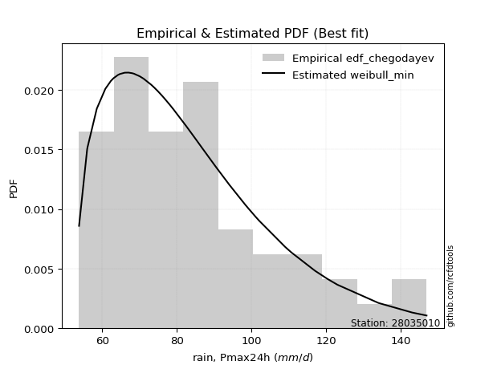</img>

</div>


### 6. EDF Blom (1958)

The Blom formula is a specific "plotting position" formula used in hydrology and statistical analysis to estimate the empirical cumulative probability (or non-exceedance probability) of a data series. It is particularly recommended for data that are approximately normally distributed. The constant _a_ is set to 0.375 (or 3/8).

<div align="center">


$P=(m-a)/(n+1-2a)$


</div>


**6.1. Empirical values**

<div align="center">

|                | 0                    | 1                   | 2                    | 3                   | 4                   | 5                  | 6                   | 7                  | 8                   | 9                   | 10                  | 11                  | 12                  | 13                 | 14                 | 15                  | 16                 | 17                 | 18                  | 19                  | 20                  | 21                 | 22                  | 23                  | 24                  | 25                 | 26                 | 27                 | 28                 | 29                 | 30                 | 31                 | 32                 | 33                 | 34                 | 35                 | 36                 | 37                 | 38                 | 39                 | 40                | 41                 | 42                 | 43                 | 44                | 45                 | 46                 | 47                 | 48                 | 49                 | 50                 | 51                 |
|:---------------|:---------------------|:--------------------|:---------------------|:--------------------|:--------------------|:-------------------|:--------------------|:-------------------|:--------------------|:--------------------|:--------------------|:--------------------|:--------------------|:-------------------|:-------------------|:--------------------|:-------------------|:-------------------|:--------------------|:--------------------|:--------------------|:-------------------|:--------------------|:--------------------|:--------------------|:-------------------|:-------------------|:-------------------|:-------------------|:-------------------|:-------------------|:-------------------|:-------------------|:-------------------|:-------------------|:-------------------|:-------------------|:-------------------|:-------------------|:-------------------|:------------------|:-------------------|:-------------------|:-------------------|:------------------|:-------------------|:-------------------|:-------------------|:-------------------|:-------------------|:-------------------|:-------------------|
| date           | 2004                 | 1969                | 2000                 | 1991                | 1994                | 2014               | 2009                | 1997               | 1968                | 1972                | 1989                | 2012                | 1976                | 2001               | 1984               | 2015                | 2006               | 1992               | 1980                | 1970                | 1993                | 1998               | 1987                | 1978                | 1985                | 2018               | 2013               | 2008               | 1973               | 2016               | 1979               | 1977               | 2003               | 1995               | 1975               | 1982               | 2011               | 1974               | 1988               | 1983               | 2022              | 2017               | 2005               | 1986               | 1999              | 1981               | 2002               | 2007               | 1990               | 2010               | 1996               | 1971               |
| x              | 53.75264075          | 55.92497723         | 56.0                 | 56.0                | 58.50469062         | 60.8               | 62.3                | 63.0               | 64.2                | 64.7                | 66.0                | 67.0                | 67.0                | 68.0               | 68.34350579        | 68.5                | 70.0               | 70.0               | 71.0                | 73.07817535         | 74.0                | 75.0               | 76.0                | 76.5                | 78.0                | 78.0               | 79.0               | 82.5               | 82.9               | 85.0               | 86.0               | 87.0               | 90.0               | 90.0               | 90.0               | 90.0               | 90.5               | 94.0               | 94.0               | 98.2               | 99.0              | 101.0              | 102.0              | 109.0              | 110.0             | 110.7              | 117.0              | 120.4              | 123.0              | 134.0              | 143.0              | 146.9              |
| m              | 1                    | 2                   | 3                    | 4                   | 5                   | 6                  | 7                   | 8                  | 9                   | 10                  | 11                  | 12                  | 13                  | 14                 | 15                 | 16                  | 17                 | 18                 | 19                  | 20                  | 21                  | 22                 | 23                  | 24                  | 25                  | 26                 | 27                 | 28                 | 29                 | 30                 | 31                 | 32                 | 33                 | 34                 | 35                 | 36                 | 37                 | 38                 | 39                 | 40                 | 41                | 42                 | 43                 | 44                 | 45                | 46                 | 47                 | 48                 | 49                 | 50                 | 51                 | 52                 |
| empirical_dist | edf_blom             | edf_blom            | edf_blom             | edf_blom            | edf_blom            | edf_blom           | edf_blom            | edf_blom           | edf_blom            | edf_blom            | edf_blom            | edf_blom            | edf_blom            | edf_blom           | edf_blom           | edf_blom            | edf_blom           | edf_blom           | edf_blom            | edf_blom            | edf_blom            | edf_blom           | edf_blom            | edf_blom            | edf_blom            | edf_blom           | edf_blom           | edf_blom           | edf_blom           | edf_blom           | edf_blom           | edf_blom           | edf_blom           | edf_blom           | edf_blom           | edf_blom           | edf_blom           | edf_blom           | edf_blom           | edf_blom           | edf_blom          | edf_blom           | edf_blom           | edf_blom           | edf_blom          | edf_blom           | edf_blom           | edf_blom           | edf_blom           | edf_blom           | edf_blom           | edf_blom           |
| empirical      | 0.011961722488038277 | 0.03110047846889952 | 0.050239234449760764 | 0.06937799043062201 | 0.08851674641148326 | 0.1076555023923445 | 0.12679425837320574 | 0.145933014354067  | 0.16507177033492823 | 0.18421052631578946 | 0.20334928229665072 | 0.22248803827751196 | 0.24162679425837322 | 0.2607655502392344 | 0.2799043062200957 | 0.29904306220095694 | 0.3181818181818182 | 0.3373205741626794 | 0.35645933014354064 | 0.37559808612440193 | 0.39473684210526316 | 0.4138755980861244 | 0.43301435406698563 | 0.45215311004784686 | 0.47129186602870815 | 0.4904306220095694 | 0.5095693779904307 | 0.5287081339712919 | 0.5478468899521531 | 0.5669856459330144 | 0.5861244019138756 | 0.6052631578947368 | 0.6244019138755981 | 0.6435406698564593 | 0.6626794258373205 | 0.6818181818181818 | 0.7009569377990431 | 0.7200956937799043 | 0.7392344497607656 | 0.7583732057416268 | 0.777511961722488 | 0.7966507177033493 | 0.8157894736842105 | 0.8349282296650717 | 0.854066985645933 | 0.8732057416267942 | 0.8923444976076556 | 0.9114832535885168 | 0.930622009569378  | 0.9497607655502392 | 0.9688995215311005 | 0.9880382775119617 |
| empirical_tr   | 1.0121065375302662   | 1.0320987654320988  | 1.052896725440806    | 1.0745501285347043  | 1.0971128608923884  | 1.1206434316353886 | 1.1452054794520548  | 1.1708683473389356 | 1.1977077363896849  | 1.2258064516129032  | 1.2552552552552552  | 1.2861538461538462  | 1.3186119873817035  | 1.3527508090614886 | 1.388704318936877  | 1.4266211604095564  | 1.4666666666666666 | 1.5090252707581229 | 1.553903345724907   | 1.6015325670498084  | 1.6521739130434783  | 1.7061224489795919 | 1.7637130801687764  | 1.8253275109170304  | 1.8914027149321269  | 1.9624413145539905 | 2.0390243902439025 | 2.121827411167513  | 2.2116402116402116 | 2.3093922651933703 | 2.416184971098266  | 2.533333333333333  | 2.662420382165605  | 2.8053691275167782 | 2.964539007092198  | 3.1428571428571423 | 3.3440000000000007 | 3.5726495726495733 | 3.8348623853211015 | 4.138613861386139  | 4.494623655913979 | 4.917647058823529  | 5.428571428571428  | 6.057971014492753  | 6.852459016393441 | 7.886792452830186  | 9.288888888888893  | 11.297297297297302 | 14.413793103448281 | 19.904761904761912 | 32.15384615384616  | 83.59999999999995  |

</div>


**6.2. Kolmogorov-Smirnov fit test (sorted by Δ)**


<div align="center">

|                | 0                    | 1                   | 2                   | 3                   | 4                   | 5                   | 6                    | 7                    | 8                   | 9                   | 10                  | 11                  | 12                   | 13                  | 14                  | 15                  | 16                  | 17                  | 18                   | 19                  | 20                  | 21                   | 22                   | 23                  | 24                  | 25                  | 26                  | 27                  | 28                  | 29                  | 30                  | 31                  | 32                  | 33                  | 34                  | 35                  | 36                  | 37                  | 38                  | 39                  | 40                  | 41                  | 42                  | 43                  | 44                  | 45                  | 46                  | 47                  | 48                  | 49                  | 50                  | 51                  | 52                  | 53                  | 54                  | 55                  | 56                  | 57                  | 58                  | 59                  | 60                  | 61                  | 62                    | 63                  | 64                  | 65                  | 66                  | 67                  | 68                  | 69                  | 70                  | 71                  | 72                  | 73                  | 74                  | 75                  | 76                  | 77                  | 78                  | 79                  | 80                  | 81                  | 82                  | 83                  | 84                  | 85                  | 86                  | 87                  |
|:---------------|:---------------------|:--------------------|:--------------------|:--------------------|:--------------------|:--------------------|:---------------------|:---------------------|:--------------------|:--------------------|:--------------------|:--------------------|:---------------------|:--------------------|:--------------------|:--------------------|:--------------------|:--------------------|:---------------------|:--------------------|:--------------------|:---------------------|:---------------------|:--------------------|:--------------------|:--------------------|:--------------------|:--------------------|:--------------------|:--------------------|:--------------------|:--------------------|:--------------------|:--------------------|:--------------------|:--------------------|:--------------------|:--------------------|:--------------------|:--------------------|:--------------------|:--------------------|:--------------------|:--------------------|:--------------------|:--------------------|:--------------------|:--------------------|:--------------------|:--------------------|:--------------------|:--------------------|:--------------------|:--------------------|:--------------------|:--------------------|:--------------------|:--------------------|:--------------------|:--------------------|:--------------------|:--------------------|:----------------------|:--------------------|:--------------------|:--------------------|:--------------------|:--------------------|:--------------------|:--------------------|:--------------------|:--------------------|:--------------------|:--------------------|:--------------------|:--------------------|:--------------------|:--------------------|:--------------------|:--------------------|:--------------------|:--------------------|:--------------------|:--------------------|:--------------------|:--------------------|:--------------------|:--------------------|
| station        | 28035010             | 28035010            | 28035010            | 28035010            | 28035010            | 28035010            | 28035010             | 28035010             | 28035010            | 28035010            | 28035010            | 28035010            | 28035010             | 28035010            | 28035010            | 28035010            | 28035010            | 28035010            | 28035010             | 28035010            | 28035010            | 28035010             | 28035010             | 28035010            | 28035010            | 28035010            | 28035010            | 28035010            | 28035010            | 28035010            | 28035010            | 28035010            | 28035010            | 28035010            | 28035010            | 28035010            | 28035010            | 28035010            | 28035010            | 28035010            | 28035010            | 28035010            | 28035010            | 28035010            | 28035010            | 28035010            | 28035010            | 28035010            | 28035010            | 28035010            | 28035010            | 28035010            | 28035010            | 28035010            | 28035010            | 28035010            | 28035010            | 28035010            | 28035010            | 28035010            | 28035010            | 28035010            | 28035010              | 28035010            | 28035010            | 28035010            | 28035010            | 28035010            | 28035010            | 28035010            | 28035010            | 28035010            | 28035010            | 28035010            | 28035010            | 28035010            | 28035010            | 28035010            | 28035010            | 28035010            | 28035010            | 28035010            | 28035010            | 28035010            | 28035010            | 28035010            | 28035010            | 28035010            |
| empirical_dist | edf_blom             | edf_blom            | edf_blom            | edf_blom            | edf_blom            | edf_blom            | edf_blom             | edf_blom             | edf_blom            | edf_blom            | edf_blom            | edf_blom            | edf_blom             | edf_blom            | edf_blom            | edf_blom            | edf_blom            | edf_blom            | edf_blom             | edf_blom            | edf_blom            | edf_blom             | edf_blom             | edf_blom            | edf_blom            | edf_blom            | edf_blom            | edf_blom            | edf_blom            | edf_blom            | edf_blom            | edf_blom            | edf_blom            | edf_blom            | edf_blom            | edf_blom            | edf_blom            | edf_blom            | edf_blom            | edf_blom            | edf_blom            | edf_blom            | edf_blom            | edf_blom            | edf_blom            | edf_blom            | edf_blom            | edf_blom            | edf_blom            | edf_blom            | edf_blom            | edf_blom            | edf_blom            | edf_blom            | edf_blom            | edf_blom            | edf_blom            | edf_blom            | edf_blom            | edf_blom            | edf_blom            | edf_blom            | edf_blom              | edf_blom            | edf_blom            | edf_blom            | edf_blom            | edf_blom            | edf_blom            | edf_blom            | edf_blom            | edf_blom            | edf_blom            | edf_blom            | edf_blom            | edf_blom            | edf_blom            | edf_blom            | edf_blom            | edf_blom            | edf_blom            | edf_blom            | edf_blom            | edf_blom            | edf_blom            | edf_blom            | edf_blom            | edf_blom            |
| p_dist         | weibull_min          | halfnorm            | logmaxwell          | logrice             | lograyleigh         | pearson3            | gamma                | erlang               | logweibull_min      | loggenexpon         | logpearson3         | logncf              | lognakagami          | nct                 | fatiguelife         | logalpha            | invgauss            | moyal               | johnsonsu            | gumbel_r            | loginvgamma         | rayleigh             | alpha                | invgamma            | f                   | loglognorm          | logjohnsonsu        | logexponnorm        | loginvgauss         | logfatiguelife      | invweibull          | gompertz            | logf                | loggamma            | loggamma            | logerlang           | genlogistic         | lognct              | betaprime           | nakagami            | fisk                | logkstwobign        | kstwobign           | logloggamma         | logfisk             | mielke              | loggenlogistic      | loginvweibull       | logmielke           | logt                | lognorm             | lognorm             | logcrystalball      | exponnorm           | laplace_asymmetric  | maxwell             | halflogistic        | ncf                 | loggumbel_r         | loghalfnorm         | rice                | loglogistic         | loglaplace_asymmetric | logmoyal            | truncnorm           | norm                | crystalball         | t                   | loghalflogistic     | loghypsecant        | loggompertz         | genexpon            | logistic            | expon               | hypsecant           | loglaplace          | loggumbel_l         | chi2                | laplace             | logbetaprime        | gumbel_l            | logtruncnorm        | wald                | logwald             | logexpon            | logchi2             | loggibrat           | gibrat              |
| delta          | 0.044222836019870204 | 0.04489342902149904 | 0.04731270803386428 | 0.04769538757562808 | 0.0516329531941635  | 0.05212147211949264 | 0.053891538808022554 | 0.053891783197329346 | 0.05588852062537375 | 0.05634725163123111 | 0.05697064083917436 | 0.05799824781798413 | 0.058720218880136676 | 0.05947784656904426 | 0.05972487039798613 | 0.06018699245964387 | 0.06036217054534154 | 0.06138610867451377 | 0.061529324320197865 | 0.06207394091333862 | 0.06215999181377463 | 0.062209011119751745 | 0.062385995821299556 | 0.06300099098266121 | 0.06301867888410462 | 0.06307403793406374 | 0.06334050985083584 | 0.06358100793289467 | 0.06379869519726555 | 0.06400852968444282 | 0.06433643379637077 | 0.06449399743812434 | 0.06462598310976397 | 0.06477247718031864 | 0.06477247718031864 | 0.0647726807440272  | 0.0653437259050077  | 0.06544496915247294 | 0.06655506654475596 | 0.06721104007662065 | 0.06751873437903877 | 0.06848541413298548 | 0.06888813653031284 | 0.06935929338482794 | 0.0705784223601239  | 0.07060489787196478 | 0.07080950907416261 | 0.07082548409886791 | 0.07117210431322263 | 0.07141955548174778 | 0.07142051164290719 | 0.07142051164290719 | 0.07142051366964947 | 0.0717033434596257  | 0.07244841383130396 | 0.07323327885680153 | 0.07437554999516702 | 0.07884077728011801 | 0.083501268427568   | 0.08851674641148326 | 0.09367447948224711 | 0.09368170453195634 | 0.09674341838602352   | 0.1035049404609838  | 0.10730033369237746 | 0.1073003432799553  | 0.10730050173484956 | 0.10734444878227983 | 0.1076555023923445  | 0.10896860765669827 | 0.11538142055126827 | 0.11855110566979388 | 0.11994134144461238 | 0.12707963379922815 | 0.13158909029036958 | 0.1325091400852285  | 0.13573027485758332 | 0.1460380370475229  | 0.1596078290883542  | 0.16825597159004385 | 0.17404085053543594 | 0.1752735947757979  | 0.17591560659594452 | 0.18406918584422535 | 0.18526542589616513 | 0.2510339810685802  | 0.2847923224363036  | 0.287718529179766   |
| deltao         | 0.18859806671657792  | 0.18859806671657792 | 0.18859806671657792 | 0.18859806671657792 | 0.18859806671657792 | 0.18859806671657792 | 0.18859806671657792  | 0.18859806671657792  | 0.18859806671657792 | 0.18859806671657792 | 0.18859806671657792 | 0.18859806671657792 | 0.18859806671657792  | 0.18859806671657792 | 0.18859806671657792 | 0.18859806671657792 | 0.18859806671657792 | 0.18859806671657792 | 0.18859806671657792  | 0.18859806671657792 | 0.18859806671657792 | 0.18859806671657792  | 0.18859806671657792  | 0.18859806671657792 | 0.18859806671657792 | 0.18859806671657792 | 0.18859806671657792 | 0.18859806671657792 | 0.18859806671657792 | 0.18859806671657792 | 0.18859806671657792 | 0.18859806671657792 | 0.18859806671657792 | 0.18859806671657792 | 0.18859806671657792 | 0.18859806671657792 | 0.18859806671657792 | 0.18859806671657792 | 0.18859806671657792 | 0.18859806671657792 | 0.18859806671657792 | 0.18859806671657792 | 0.18859806671657792 | 0.18859806671657792 | 0.18859806671657792 | 0.18859806671657792 | 0.18859806671657792 | 0.18859806671657792 | 0.18859806671657792 | 0.18859806671657792 | 0.18859806671657792 | 0.18859806671657792 | 0.18859806671657792 | 0.18859806671657792 | 0.18859806671657792 | 0.18859806671657792 | 0.18859806671657792 | 0.18859806671657792 | 0.18859806671657792 | 0.18859806671657792 | 0.18859806671657792 | 0.18859806671657792 | 0.18859806671657792   | 0.18859806671657792 | 0.18859806671657792 | 0.18859806671657792 | 0.18859806671657792 | 0.18859806671657792 | 0.18859806671657792 | 0.18859806671657792 | 0.18859806671657792 | 0.18859806671657792 | 0.18859806671657792 | 0.18859806671657792 | 0.18859806671657792 | 0.18859806671657792 | 0.18859806671657792 | 0.18859806671657792 | 0.18859806671657792 | 0.18859806671657792 | 0.18859806671657792 | 0.18859806671657792 | 0.18859806671657792 | 0.18859806671657792 | 0.18859806671657792 | 0.18859806671657792 | 0.18859806671657792 | 0.18859806671657792 |
| eval           | Δo > Δ               | Δo > Δ              | Δo > Δ              | Δo > Δ              | Δo > Δ              | Δo > Δ              | Δo > Δ               | Δo > Δ               | Δo > Δ              | Δo > Δ              | Δo > Δ              | Δo > Δ              | Δo > Δ               | Δo > Δ              | Δo > Δ              | Δo > Δ              | Δo > Δ              | Δo > Δ              | Δo > Δ               | Δo > Δ              | Δo > Δ              | Δo > Δ               | Δo > Δ               | Δo > Δ              | Δo > Δ              | Δo > Δ              | Δo > Δ              | Δo > Δ              | Δo > Δ              | Δo > Δ              | Δo > Δ              | Δo > Δ              | Δo > Δ              | Δo > Δ              | Δo > Δ              | Δo > Δ              | Δo > Δ              | Δo > Δ              | Δo > Δ              | Δo > Δ              | Δo > Δ              | Δo > Δ              | Δo > Δ              | Δo > Δ              | Δo > Δ              | Δo > Δ              | Δo > Δ              | Δo > Δ              | Δo > Δ              | Δo > Δ              | Δo > Δ              | Δo > Δ              | Δo > Δ              | Δo > Δ              | Δo > Δ              | Δo > Δ              | Δo > Δ              | Δo > Δ              | Δo > Δ              | Δo > Δ              | Δo > Δ              | Δo > Δ              | Δo > Δ                | Δo > Δ              | Δo > Δ              | Δo > Δ              | Δo > Δ              | Δo > Δ              | Δo > Δ              | Δo > Δ              | Δo > Δ              | Δo > Δ              | Δo > Δ              | Δo > Δ              | Δo > Δ              | Δo > Δ              | Δo > Δ              | Δo > Δ              | Δo > Δ              | Δo > Δ              | Δo > Δ              | Δo > Δ              | Δo > Δ              | Δo > Δ              | Δo > Δ              | Δo <= Δ             | Δo <= Δ             | Δo <= Δ             |
| fit            | 1                    | 1                   | 1                   | 1                   | 1                   | 1                   | 1                    | 1                    | 1                   | 1                   | 1                   | 1                   | 1                    | 1                   | 1                   | 1                   | 1                   | 1                   | 1                    | 1                   | 1                   | 1                    | 1                    | 1                   | 1                   | 1                   | 1                   | 1                   | 1                   | 1                   | 1                   | 1                   | 1                   | 1                   | 1                   | 1                   | 1                   | 1                   | 1                   | 1                   | 1                   | 1                   | 1                   | 1                   | 1                   | 1                   | 1                   | 1                   | 1                   | 1                   | 1                   | 1                   | 1                   | 1                   | 1                   | 1                   | 1                   | 1                   | 1                   | 1                   | 1                   | 1                   | 1                     | 1                   | 1                   | 1                   | 1                   | 1                   | 1                   | 1                   | 1                   | 1                   | 1                   | 1                   | 1                   | 1                   | 1                   | 1                   | 1                   | 1                   | 1                   | 1                   | 1                   | 1                   | 1                   | 0                   | 0                   | 0                   |
| n              | 52                   | 52                  | 52                  | 52                  | 52                  | 52                  | 52                   | 52                   | 52                  | 52                  | 52                  | 52                  | 52                   | 52                  | 52                  | 52                  | 52                  | 52                  | 52                   | 52                  | 52                  | 52                   | 52                   | 52                  | 52                  | 52                  | 52                  | 52                  | 52                  | 52                  | 52                  | 52                  | 52                  | 52                  | 52                  | 52                  | 52                  | 52                  | 52                  | 52                  | 52                  | 52                  | 52                  | 52                  | 52                  | 52                  | 52                  | 52                  | 52                  | 52                  | 52                  | 52                  | 52                  | 52                  | 52                  | 52                  | 52                  | 52                  | 52                  | 52                  | 52                  | 52                  | 52                    | 52                  | 52                  | 52                  | 52                  | 52                  | 52                  | 52                  | 52                  | 52                  | 52                  | 52                  | 52                  | 52                  | 52                  | 52                  | 52                  | 52                  | 52                  | 52                  | 52                  | 52                  | 52                  | 52                  | 52                  | 52                  |
| best_fit       | 1                    | 0                   | 0                   | 0                   | 0                   | 0                   | 0                    | 0                    | 0                   | 0                   | 0                   | 0                   | 0                    | 0                   | 0                   | 0                   | 0                   | 0                   | 0                    | 0                   | 0                   | 0                    | 0                    | 0                   | 0                   | 0                   | 0                   | 0                   | 0                   | 0                   | 0                   | 0                   | 0                   | 0                   | 0                   | 0                   | 0                   | 0                   | 0                   | 0                   | 0                   | 0                   | 0                   | 0                   | 0                   | 0                   | 0                   | 0                   | 0                   | 0                   | 0                   | 0                   | 0                   | 0                   | 0                   | 0                   | 0                   | 0                   | 0                   | 0                   | 0                   | 0                   | 0                     | 0                   | 0                   | 0                   | 0                   | 0                   | 0                   | 0                   | 0                   | 0                   | 0                   | 0                   | 0                   | 0                   | 0                   | 0                   | 0                   | 0                   | 0                   | 0                   | 0                   | 0                   | 0                   | 0                   | 0                   | 0                   |
| best_fit_sort  | 1                    | 2                   | 3                   | 4                   | 5                   | 6                   | 7                    | 8                    | 9                   | 10                  | 11                  | 12                  | 13                   | 14                  | 15                  | 16                  | 17                  | 18                  | 19                   | 20                  | 21                  | 22                   | 23                   | 24                  | 25                  | 26                  | 27                  | 28                  | 29                  | 30                  | 31                  | 32                  | 33                  | 34                  | 35                  | 36                  | 37                  | 38                  | 39                  | 40                  | 41                  | 42                  | 43                  | 44                  | 45                  | 46                  | 47                  | 48                  | 49                  | 50                  | 51                  | 52                  | 53                  | 54                  | 55                  | 56                  | 57                  | 58                  | 59                  | 60                  | 61                  | 62                  | 63                    | 64                  | 65                  | 66                  | 67                  | 68                  | 69                  | 70                  | 71                  | 72                  | 73                  | 74                  | 75                  | 76                  | 77                  | 78                  | 79                  | 80                  | 81                  | 82                  | 83                  | 84                  | 85                  | 86                  | 87                  | 88                  |

</div>


<div align="center">

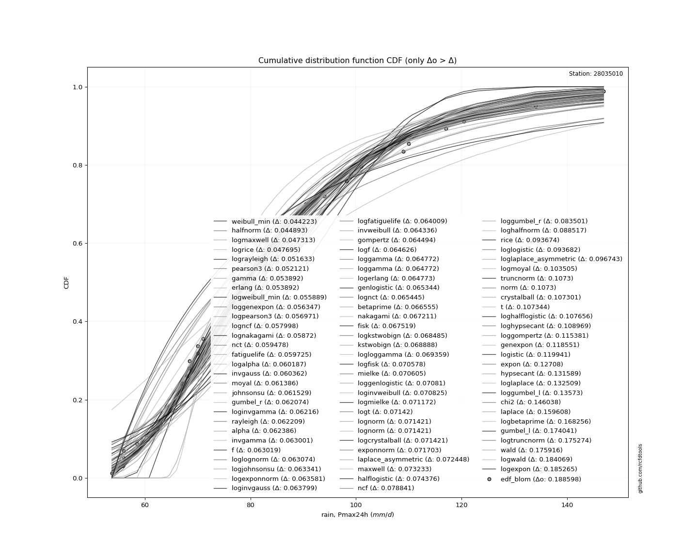</img>

</div>


**6.3. Best fit**

<div align="center">

|   id |   station | empirical_dist   | p_dist      |     delta |   deltao | eval   |   fit |   n |   best_fit |   best_fit_sort |
|-----:|----------:|:-----------------|:------------|----------:|---------:|:-------|------:|----:|-----------:|----------------:|
|    0 |  28035010 | edf_blom         | weibull_min | 0.0442228 | 0.188598 | Δo > Δ |     1 |  52 |          1 |               1 |

</div>


<div align="center">

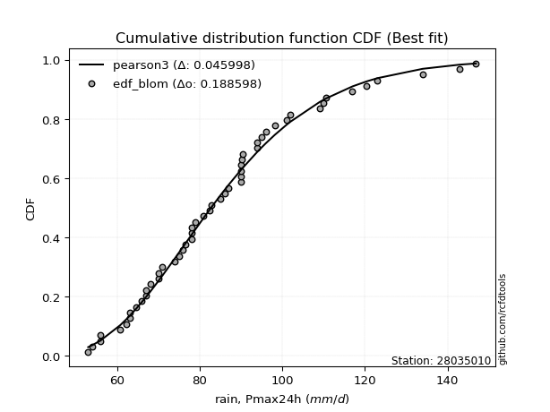</img></img>

</div>


### 7. EDF Tukey (1962)

In hydrology, the Tukey formula is used as a plotting position formula to estimate the empirical probability or frequency of a flood event (or other hydrological data). The formula parameter is given as _c=0.333_ (or 1/3).

<div align="center">


$P=(m-c)/(n+1-2c)$


</div>


**7.1. Empirical values**

<div align="center">

|                | 0                    | 1                   | 2                    | 3                   | 4                   | 5                   | 6                   | 7                  | 8                   | 9                   | 10                  | 11                 | 12                  | 13                 | 14                 | 15                  | 16                 | 17                 | 18                  | 19                  | 20                  | 21                 | 22                  | 23                  | 24                 | 25                  | 26                 | 27                 | 28                 | 29                 | 30                 | 31                 | 32                 | 33                 | 34                 | 35                 | 36                 | 37                 | 38                 | 39                 | 40                 | 41                 | 42                 | 43                 | 44                 | 45                 | 46                | 47                 | 48                 | 49                 | 50                 | 51                 |
|:---------------|:---------------------|:--------------------|:---------------------|:--------------------|:--------------------|:--------------------|:--------------------|:-------------------|:--------------------|:--------------------|:--------------------|:-------------------|:--------------------|:-------------------|:-------------------|:--------------------|:-------------------|:-------------------|:--------------------|:--------------------|:--------------------|:-------------------|:--------------------|:--------------------|:-------------------|:--------------------|:-------------------|:-------------------|:-------------------|:-------------------|:-------------------|:-------------------|:-------------------|:-------------------|:-------------------|:-------------------|:-------------------|:-------------------|:-------------------|:-------------------|:-------------------|:-------------------|:-------------------|:-------------------|:-------------------|:-------------------|:------------------|:-------------------|:-------------------|:-------------------|:-------------------|:-------------------|
| date           | 2004                 | 1969                | 2000                 | 1991                | 1994                | 2014                | 2009                | 1997               | 1968                | 1972                | 1989                | 2012               | 1976                | 2001               | 1984               | 2015                | 2006               | 1992               | 1980                | 1970                | 1993                | 1998               | 1987                | 1978                | 1985               | 2018                | 2013               | 2008               | 1973               | 2016               | 1979               | 1977               | 2003               | 1995               | 1975               | 1982               | 2011               | 1974               | 1988               | 1983               | 2022               | 2017               | 2005               | 1986               | 1999               | 1981               | 2002              | 2007               | 1990               | 2010               | 1996               | 1971               |
| x              | 53.75264075          | 55.92497723         | 56.0                 | 56.0                | 58.50469062         | 60.8                | 62.3                | 63.0               | 64.2                | 64.7                | 66.0                | 67.0               | 67.0                | 68.0               | 68.34350579        | 68.5                | 70.0               | 70.0               | 71.0                | 73.07817535         | 74.0                | 75.0               | 76.0                | 76.5                | 78.0               | 78.0                | 79.0               | 82.5               | 82.9               | 85.0               | 86.0               | 87.0               | 90.0               | 90.0               | 90.0               | 90.0               | 90.5               | 94.0               | 94.0               | 98.2               | 99.0               | 101.0              | 102.0              | 109.0              | 110.0              | 110.7              | 117.0             | 120.4              | 123.0              | 134.0              | 143.0              | 146.9              |
| m              | 1                    | 2                   | 3                    | 4                   | 5                   | 6                   | 7                   | 8                  | 9                   | 10                  | 11                  | 12                 | 13                  | 14                 | 15                 | 16                  | 17                 | 18                 | 19                  | 20                  | 21                  | 22                 | 23                  | 24                  | 25                 | 26                  | 27                 | 28                 | 29                 | 30                 | 31                 | 32                 | 33                 | 34                 | 35                 | 36                 | 37                 | 38                 | 39                 | 40                 | 41                 | 42                 | 43                 | 44                 | 45                 | 46                 | 47                | 48                 | 49                 | 50                 | 51                 | 52                 |
| empirical_dist | edf_tukey            | edf_tukey           | edf_tukey            | edf_tukey           | edf_tukey           | edf_tukey           | edf_tukey           | edf_tukey          | edf_tukey           | edf_tukey           | edf_tukey           | edf_tukey          | edf_tukey           | edf_tukey          | edf_tukey          | edf_tukey           | edf_tukey          | edf_tukey          | edf_tukey           | edf_tukey           | edf_tukey           | edf_tukey          | edf_tukey           | edf_tukey           | edf_tukey          | edf_tukey           | edf_tukey          | edf_tukey          | edf_tukey          | edf_tukey          | edf_tukey          | edf_tukey          | edf_tukey          | edf_tukey          | edf_tukey          | edf_tukey          | edf_tukey          | edf_tukey          | edf_tukey          | edf_tukey          | edf_tukey          | edf_tukey          | edf_tukey          | edf_tukey          | edf_tukey          | edf_tukey          | edf_tukey         | edf_tukey          | edf_tukey          | edf_tukey          | edf_tukey          | edf_tukey          |
| empirical      | 0.012738853503184714 | 0.03184713375796178 | 0.050955414012738856 | 0.07006369426751592 | 0.08917197452229299 | 0.10828025477707007 | 0.12738853503184713 | 0.1464968152866242 | 0.16560509554140126 | 0.18471337579617833 | 0.20382165605095542 | 0.2229299363057325 | 0.24203821656050956 | 0.2611464968152866 | 0.2802547770700637 | 0.29936305732484075 | 0.3184713375796178 | 0.3375796178343949 | 0.35668789808917195 | 0.37579617834394907 | 0.39490445859872614 | 0.4140127388535032 | 0.43312101910828027 | 0.45222929936305734 | 0.4713375796178344 | 0.49044585987261147 | 0.5095541401273885 | 0.5286624203821656 | 0.5477707006369427 | 0.5668789808917197 | 0.5859872611464968 | 0.6050955414012739 | 0.6242038216560509 | 0.643312101910828  | 0.6624203821656051 | 0.6815286624203821 | 0.7006369426751592 | 0.7197452229299363 | 0.7388535031847133 | 0.7579617834394905 | 0.7770700636942676 | 0.7961783439490446 | 0.8152866242038217 | 0.8343949044585988 | 0.8535031847133758 | 0.8726114649681529 | 0.89171974522293  | 0.910828025477707  | 0.9299363057324841 | 0.9490445859872612 | 0.9681528662420382 | 0.9872611464968153 |
| empirical_tr   | 1.0129032258064516   | 1.0328947368421053  | 1.0536912751677852   | 1.0753424657534247  | 1.097902097902098   | 1.1214285714285714  | 1.145985401459854   | 1.171641791044776  | 1.198473282442748   | 1.2265625           | 1.256               | 1.2868852459016393 | 1.319327731092437   | 1.353448275862069  | 1.3893805309734513 | 1.427272727272727   | 1.467289719626168  | 1.5096153846153844 | 1.5544554455445543  | 1.6020408163265307  | 1.6526315789473685  | 1.7065217391304348 | 1.7640449438202248  | 1.8255813953488373  | 1.891566265060241  | 1.9625              | 2.038961038961039  | 2.1216216216216215 | 2.211267605633803  | 2.3088235294117645 | 2.4153846153846152 | 2.532258064516129  | 2.6610169491525424 | 2.8035714285714284 | 2.962264150943396  | 3.1399999999999997 | 3.340425531914893  | 3.5681818181818175 | 3.8292682926829262 | 4.131578947368422  | 4.485714285714287  | 4.906250000000001  | 5.413793103448277  | 6.03846153846154   | 6.826086956521741  | 7.850000000000001  | 9.235294117647062 | 11.214285714285717 | 14.272727272727275 | 19.625000000000004 | 31.400000000000006 | 78.50000000000001  |

</div>


**7.2. Kolmogorov-Smirnov fit test (sorted by Δ)**


<div align="center">

|                | 0                    | 1                   | 2                   | 3                   | 4                   | 5                    | 6                    | 7                   | 8                   | 9                   | 10                  | 11                  | 12                  | 13                  | 14                  | 15                   | 16                   | 17                   | 18                   | 19                   | 20                   | 21                  | 22                  | 23                  | 24                  | 25                  | 26                  | 27                  | 28                  | 29                  | 30                  | 31                  | 32                  | 33                  | 34                  | 35                  | 36                  | 37                  | 38                  | 39                  | 40                  | 41                  | 42                  | 43                  | 44                  | 45                  | 46                  | 47                  | 48                  | 49                  | 50                  | 51                  | 52                  | 53                  | 54                  | 55                  | 56                  | 57                  | 58                  | 59                  | 60                  | 61                  | 62                    | 63                  | 64                  | 65                  | 66                  | 67                  | 68                  | 69                  | 70                  | 71                  | 72                  | 73                  | 74                  | 75                  | 76                  | 77                  | 78                  | 79                  | 80                  | 81                  | 82                  | 83                  | 84                  | 85                  | 86                  | 87                  |
|:---------------|:---------------------|:--------------------|:--------------------|:--------------------|:--------------------|:---------------------|:---------------------|:--------------------|:--------------------|:--------------------|:--------------------|:--------------------|:--------------------|:--------------------|:--------------------|:---------------------|:---------------------|:---------------------|:---------------------|:---------------------|:---------------------|:--------------------|:--------------------|:--------------------|:--------------------|:--------------------|:--------------------|:--------------------|:--------------------|:--------------------|:--------------------|:--------------------|:--------------------|:--------------------|:--------------------|:--------------------|:--------------------|:--------------------|:--------------------|:--------------------|:--------------------|:--------------------|:--------------------|:--------------------|:--------------------|:--------------------|:--------------------|:--------------------|:--------------------|:--------------------|:--------------------|:--------------------|:--------------------|:--------------------|:--------------------|:--------------------|:--------------------|:--------------------|:--------------------|:--------------------|:--------------------|:--------------------|:----------------------|:--------------------|:--------------------|:--------------------|:--------------------|:--------------------|:--------------------|:--------------------|:--------------------|:--------------------|:--------------------|:--------------------|:--------------------|:--------------------|:--------------------|:--------------------|:--------------------|:--------------------|:--------------------|:--------------------|:--------------------|:--------------------|:--------------------|:--------------------|:--------------------|:--------------------|
| station        | 28035010             | 28035010            | 28035010            | 28035010            | 28035010            | 28035010             | 28035010             | 28035010            | 28035010            | 28035010            | 28035010            | 28035010            | 28035010            | 28035010            | 28035010            | 28035010             | 28035010             | 28035010             | 28035010             | 28035010             | 28035010             | 28035010            | 28035010            | 28035010            | 28035010            | 28035010            | 28035010            | 28035010            | 28035010            | 28035010            | 28035010            | 28035010            | 28035010            | 28035010            | 28035010            | 28035010            | 28035010            | 28035010            | 28035010            | 28035010            | 28035010            | 28035010            | 28035010            | 28035010            | 28035010            | 28035010            | 28035010            | 28035010            | 28035010            | 28035010            | 28035010            | 28035010            | 28035010            | 28035010            | 28035010            | 28035010            | 28035010            | 28035010            | 28035010            | 28035010            | 28035010            | 28035010            | 28035010              | 28035010            | 28035010            | 28035010            | 28035010            | 28035010            | 28035010            | 28035010            | 28035010            | 28035010            | 28035010            | 28035010            | 28035010            | 28035010            | 28035010            | 28035010            | 28035010            | 28035010            | 28035010            | 28035010            | 28035010            | 28035010            | 28035010            | 28035010            | 28035010            | 28035010            |
| empirical_dist | edf_tukey            | edf_tukey           | edf_tukey           | edf_tukey           | edf_tukey           | edf_tukey            | edf_tukey            | edf_tukey           | edf_tukey           | edf_tukey           | edf_tukey           | edf_tukey           | edf_tukey           | edf_tukey           | edf_tukey           | edf_tukey            | edf_tukey            | edf_tukey            | edf_tukey            | edf_tukey            | edf_tukey            | edf_tukey           | edf_tukey           | edf_tukey           | edf_tukey           | edf_tukey           | edf_tukey           | edf_tukey           | edf_tukey           | edf_tukey           | edf_tukey           | edf_tukey           | edf_tukey           | edf_tukey           | edf_tukey           | edf_tukey           | edf_tukey           | edf_tukey           | edf_tukey           | edf_tukey           | edf_tukey           | edf_tukey           | edf_tukey           | edf_tukey           | edf_tukey           | edf_tukey           | edf_tukey           | edf_tukey           | edf_tukey           | edf_tukey           | edf_tukey           | edf_tukey           | edf_tukey           | edf_tukey           | edf_tukey           | edf_tukey           | edf_tukey           | edf_tukey           | edf_tukey           | edf_tukey           | edf_tukey           | edf_tukey           | edf_tukey             | edf_tukey           | edf_tukey           | edf_tukey           | edf_tukey           | edf_tukey           | edf_tukey           | edf_tukey           | edf_tukey           | edf_tukey           | edf_tukey           | edf_tukey           | edf_tukey           | edf_tukey           | edf_tukey           | edf_tukey           | edf_tukey           | edf_tukey           | edf_tukey           | edf_tukey           | edf_tukey           | edf_tukey           | edf_tukey           | edf_tukey           | edf_tukey           | edf_tukey           |
| p_dist         | weibull_min          | halfnorm            | logmaxwell          | logrice             | lograyleigh         | pearson3             | gamma                | erlang              | logweibull_min      | loggenexpon         | logpearson3         | logncf              | lognakagami         | nct                 | fatiguelife         | logalpha             | invgauss             | moyal                | johnsonsu            | rayleigh             | gumbel_r             | loginvgamma         | alpha               | invgamma            | f                   | loglognorm          | logjohnsonsu        | logexponnorm        | loginvgauss         | gompertz            | logfatiguelife      | invweibull          | logf                | loggamma            | loggamma            | logerlang           | genlogistic         | lognct              | nakagami            | betaprime           | fisk                | logkstwobign        | kstwobign           | logloggamma         | logfisk             | mielke              | loggenlogistic      | loginvweibull       | logmielke           | logt                | lognorm             | lognorm             | logcrystalball      | exponnorm           | laplace_asymmetric  | maxwell             | halflogistic        | ncf                 | loggumbel_r         | loghalfnorm         | rice                | loglogistic         | loglaplace_asymmetric | logmoyal            | truncnorm           | norm                | crystalball         | t                   | loghalflogistic     | loghypsecant        | loggompertz         | genexpon            | logistic            | expon               | hypsecant           | loglaplace          | loggumbel_l         | chi2                | laplace             | logbetaprime        | gumbel_l            | logtruncnorm        | wald                | logwald             | logexpon            | logchi2             | loggibrat           | gibrat              |
| delta          | 0.044420928239417345 | 0.04557913285839295 | 0.04757175170557976 | 0.04789347979517522 | 0.05183104541371064 | 0.052380515791208115 | 0.054089631027569696 | 0.05408987541687649 | 0.05608661284492089 | 0.05654534385077825 | 0.05722968451088983 | 0.0582572914896996  | 0.05891831109968382 | 0.05973689024075973 | 0.05992296261753327 | 0.060385084679191015 | 0.060560262764888684 | 0.061584200894060914 | 0.061727416539745006 | 0.061889015995867824 | 0.062332984585054096 | 0.06235808403332177 | 0.0625840880408467  | 0.06319908320220835 | 0.06321677110365176 | 0.06327213015361088 | 0.06353860207038298 | 0.06377910015244181 | 0.0639967874168127  | 0.06417400231424042 | 0.06420662190398996 | 0.06453452601591791 | 0.06482407532931111 | 0.06497056939986579 | 0.06497056939986579 | 0.06497077296357434 | 0.06560276957672317 | 0.06570401282418842 | 0.06667771487014762 | 0.06681411021647143 | 0.06771682659858591 | 0.06868350635253262 | 0.06914718020202831 | 0.06958786133045924 | 0.07077651457967105 | 0.07080299009151192 | 0.07100760129370975 | 0.07102357631841505 | 0.07137019653276977 | 0.07164812342737908 | 0.0716490795885385  | 0.0716490795885385  | 0.07164908161528077 | 0.07190143567917284 | 0.0726465060508511  | 0.07321804099375939 | 0.07503077810597675 | 0.0788560151431601  | 0.08369936064711514 | 0.08917197452229299 | 0.09390304742787842 | 0.09394074820367182 | 0.09694151060557066   | 0.10370303268053094 | 0.10728509582933532 | 0.10728510541691316 | 0.10728526387180742 | 0.1073292109192377  | 0.10828025477707007 | 0.10922765132841375 | 0.11493952252304773 | 0.11810920764157334 | 0.11992610358157024 | 0.12663773577100762 | 0.13160432815341166 | 0.1327377080308598  | 0.13571503699454118 | 0.14550471184104988 | 0.15962306695139628 | 0.1675093163009816  | 0.1740256126723938  | 0.17483169674757737 | 0.17641845607633339 | 0.18457203532461422 | 0.1848235278679446  | 0.2505920830403597  | 0.2851123175601874  | 0.2880385243036498  |
| deltao         | 0.18859806671657792  | 0.18859806671657792 | 0.18859806671657792 | 0.18859806671657792 | 0.18859806671657792 | 0.18859806671657792  | 0.18859806671657792  | 0.18859806671657792 | 0.18859806671657792 | 0.18859806671657792 | 0.18859806671657792 | 0.18859806671657792 | 0.18859806671657792 | 0.18859806671657792 | 0.18859806671657792 | 0.18859806671657792  | 0.18859806671657792  | 0.18859806671657792  | 0.18859806671657792  | 0.18859806671657792  | 0.18859806671657792  | 0.18859806671657792 | 0.18859806671657792 | 0.18859806671657792 | 0.18859806671657792 | 0.18859806671657792 | 0.18859806671657792 | 0.18859806671657792 | 0.18859806671657792 | 0.18859806671657792 | 0.18859806671657792 | 0.18859806671657792 | 0.18859806671657792 | 0.18859806671657792 | 0.18859806671657792 | 0.18859806671657792 | 0.18859806671657792 | 0.18859806671657792 | 0.18859806671657792 | 0.18859806671657792 | 0.18859806671657792 | 0.18859806671657792 | 0.18859806671657792 | 0.18859806671657792 | 0.18859806671657792 | 0.18859806671657792 | 0.18859806671657792 | 0.18859806671657792 | 0.18859806671657792 | 0.18859806671657792 | 0.18859806671657792 | 0.18859806671657792 | 0.18859806671657792 | 0.18859806671657792 | 0.18859806671657792 | 0.18859806671657792 | 0.18859806671657792 | 0.18859806671657792 | 0.18859806671657792 | 0.18859806671657792 | 0.18859806671657792 | 0.18859806671657792 | 0.18859806671657792   | 0.18859806671657792 | 0.18859806671657792 | 0.18859806671657792 | 0.18859806671657792 | 0.18859806671657792 | 0.18859806671657792 | 0.18859806671657792 | 0.18859806671657792 | 0.18859806671657792 | 0.18859806671657792 | 0.18859806671657792 | 0.18859806671657792 | 0.18859806671657792 | 0.18859806671657792 | 0.18859806671657792 | 0.18859806671657792 | 0.18859806671657792 | 0.18859806671657792 | 0.18859806671657792 | 0.18859806671657792 | 0.18859806671657792 | 0.18859806671657792 | 0.18859806671657792 | 0.18859806671657792 | 0.18859806671657792 |
| eval           | Δo > Δ               | Δo > Δ              | Δo > Δ              | Δo > Δ              | Δo > Δ              | Δo > Δ               | Δo > Δ               | Δo > Δ              | Δo > Δ              | Δo > Δ              | Δo > Δ              | Δo > Δ              | Δo > Δ              | Δo > Δ              | Δo > Δ              | Δo > Δ               | Δo > Δ               | Δo > Δ               | Δo > Δ               | Δo > Δ               | Δo > Δ               | Δo > Δ              | Δo > Δ              | Δo > Δ              | Δo > Δ              | Δo > Δ              | Δo > Δ              | Δo > Δ              | Δo > Δ              | Δo > Δ              | Δo > Δ              | Δo > Δ              | Δo > Δ              | Δo > Δ              | Δo > Δ              | Δo > Δ              | Δo > Δ              | Δo > Δ              | Δo > Δ              | Δo > Δ              | Δo > Δ              | Δo > Δ              | Δo > Δ              | Δo > Δ              | Δo > Δ              | Δo > Δ              | Δo > Δ              | Δo > Δ              | Δo > Δ              | Δo > Δ              | Δo > Δ              | Δo > Δ              | Δo > Δ              | Δo > Δ              | Δo > Δ              | Δo > Δ              | Δo > Δ              | Δo > Δ              | Δo > Δ              | Δo > Δ              | Δo > Δ              | Δo > Δ              | Δo > Δ                | Δo > Δ              | Δo > Δ              | Δo > Δ              | Δo > Δ              | Δo > Δ              | Δo > Δ              | Δo > Δ              | Δo > Δ              | Δo > Δ              | Δo > Δ              | Δo > Δ              | Δo > Δ              | Δo > Δ              | Δo > Δ              | Δo > Δ              | Δo > Δ              | Δo > Δ              | Δo > Δ              | Δo > Δ              | Δo > Δ              | Δo > Δ              | Δo > Δ              | Δo <= Δ             | Δo <= Δ             | Δo <= Δ             |
| fit            | 1                    | 1                   | 1                   | 1                   | 1                   | 1                    | 1                    | 1                   | 1                   | 1                   | 1                   | 1                   | 1                   | 1                   | 1                   | 1                    | 1                    | 1                    | 1                    | 1                    | 1                    | 1                   | 1                   | 1                   | 1                   | 1                   | 1                   | 1                   | 1                   | 1                   | 1                   | 1                   | 1                   | 1                   | 1                   | 1                   | 1                   | 1                   | 1                   | 1                   | 1                   | 1                   | 1                   | 1                   | 1                   | 1                   | 1                   | 1                   | 1                   | 1                   | 1                   | 1                   | 1                   | 1                   | 1                   | 1                   | 1                   | 1                   | 1                   | 1                   | 1                   | 1                   | 1                     | 1                   | 1                   | 1                   | 1                   | 1                   | 1                   | 1                   | 1                   | 1                   | 1                   | 1                   | 1                   | 1                   | 1                   | 1                   | 1                   | 1                   | 1                   | 1                   | 1                   | 1                   | 1                   | 0                   | 0                   | 0                   |
| n              | 52                   | 52                  | 52                  | 52                  | 52                  | 52                   | 52                   | 52                  | 52                  | 52                  | 52                  | 52                  | 52                  | 52                  | 52                  | 52                   | 52                   | 52                   | 52                   | 52                   | 52                   | 52                  | 52                  | 52                  | 52                  | 52                  | 52                  | 52                  | 52                  | 52                  | 52                  | 52                  | 52                  | 52                  | 52                  | 52                  | 52                  | 52                  | 52                  | 52                  | 52                  | 52                  | 52                  | 52                  | 52                  | 52                  | 52                  | 52                  | 52                  | 52                  | 52                  | 52                  | 52                  | 52                  | 52                  | 52                  | 52                  | 52                  | 52                  | 52                  | 52                  | 52                  | 52                    | 52                  | 52                  | 52                  | 52                  | 52                  | 52                  | 52                  | 52                  | 52                  | 52                  | 52                  | 52                  | 52                  | 52                  | 52                  | 52                  | 52                  | 52                  | 52                  | 52                  | 52                  | 52                  | 52                  | 52                  | 52                  |
| best_fit       | 1                    | 0                   | 0                   | 0                   | 0                   | 0                    | 0                    | 0                   | 0                   | 0                   | 0                   | 0                   | 0                   | 0                   | 0                   | 0                    | 0                    | 0                    | 0                    | 0                    | 0                    | 0                   | 0                   | 0                   | 0                   | 0                   | 0                   | 0                   | 0                   | 0                   | 0                   | 0                   | 0                   | 0                   | 0                   | 0                   | 0                   | 0                   | 0                   | 0                   | 0                   | 0                   | 0                   | 0                   | 0                   | 0                   | 0                   | 0                   | 0                   | 0                   | 0                   | 0                   | 0                   | 0                   | 0                   | 0                   | 0                   | 0                   | 0                   | 0                   | 0                   | 0                   | 0                     | 0                   | 0                   | 0                   | 0                   | 0                   | 0                   | 0                   | 0                   | 0                   | 0                   | 0                   | 0                   | 0                   | 0                   | 0                   | 0                   | 0                   | 0                   | 0                   | 0                   | 0                   | 0                   | 0                   | 0                   | 0                   |
| best_fit_sort  | 1                    | 2                   | 3                   | 4                   | 5                   | 6                    | 7                    | 8                   | 9                   | 10                  | 11                  | 12                  | 13                  | 14                  | 15                  | 16                   | 17                   | 18                   | 19                   | 20                   | 21                   | 22                  | 23                  | 24                  | 25                  | 26                  | 27                  | 28                  | 29                  | 30                  | 31                  | 32                  | 33                  | 34                  | 35                  | 36                  | 37                  | 38                  | 39                  | 40                  | 41                  | 42                  | 43                  | 44                  | 45                  | 46                  | 47                  | 48                  | 49                  | 50                  | 51                  | 52                  | 53                  | 54                  | 55                  | 56                  | 57                  | 58                  | 59                  | 60                  | 61                  | 62                  | 63                    | 64                  | 65                  | 66                  | 67                  | 68                  | 69                  | 70                  | 71                  | 72                  | 73                  | 74                  | 75                  | 76                  | 77                  | 78                  | 79                  | 80                  | 81                  | 82                  | 83                  | 84                  | 85                  | 86                  | 87                  | 88                  |

</div>


<div align="center">

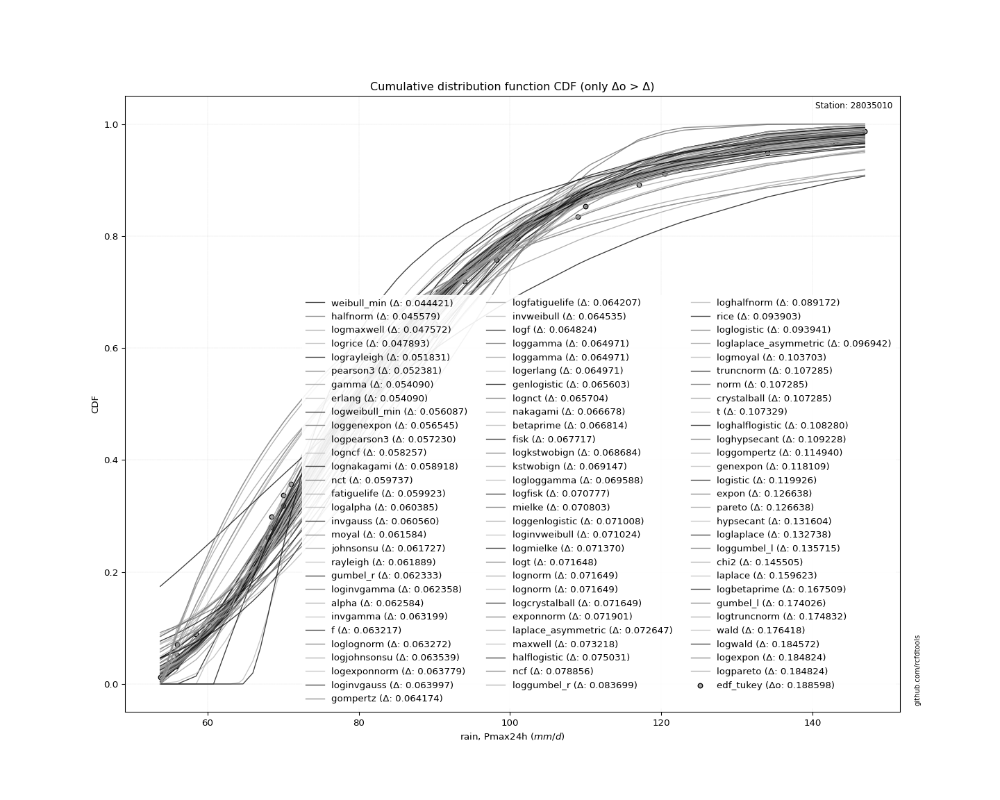</img>

</div>


**7.3. Best fit**

<div align="center">

|   id |   station | empirical_dist   | p_dist      |     delta |   deltao | eval   |   fit |   n |   best_fit |   best_fit_sort |
|-----:|----------:|:-----------------|:------------|----------:|---------:|:-------|------:|----:|-----------:|----------------:|
|    0 |  28035010 | edf_tukey        | weibull_min | 0.0444209 | 0.188598 | Δo > Δ |     1 |  52 |          1 |               1 |

</div>


<div align="center">

</img>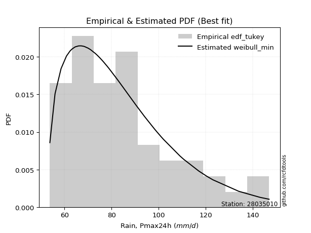</img>

</div>


### 8. EDF Gringorten (1963)

Gringorten plotting position formula is essential for estimating the probability and return periods of extreme events like floods and heavy rainfall. The constant _a=0.44_.

<div align="center">


$P=(m-a)/(n+1-2a)$


</div>


**8.1. Empirical values**

<div align="center">

|                | 0                    | 1                    | 2                  | 3                   | 4                   | 5                  | 6                   | 7                   | 8                   | 9                   | 10                  | 11                  | 12                  | 13                 | 14                 | 15                  | 16                 | 17                  | 18                 | 19                 | 20                  | 21                 | 22                 | 23                  | 24                 | 25                 | 26                 | 27                 | 28                 | 29                 | 30                 | 31                 | 32                 | 33                 | 34                 | 35                 | 36                 | 37                | 38                 | 39                 | 40                 | 41                | 42                 | 43                 | 44                 | 45                 | 46                 | 47                 | 48                 | 49                 | 50                | 51                 |
|:---------------|:---------------------|:---------------------|:-------------------|:--------------------|:--------------------|:-------------------|:--------------------|:--------------------|:--------------------|:--------------------|:--------------------|:--------------------|:--------------------|:-------------------|:-------------------|:--------------------|:-------------------|:--------------------|:-------------------|:-------------------|:--------------------|:-------------------|:-------------------|:--------------------|:-------------------|:-------------------|:-------------------|:-------------------|:-------------------|:-------------------|:-------------------|:-------------------|:-------------------|:-------------------|:-------------------|:-------------------|:-------------------|:------------------|:-------------------|:-------------------|:-------------------|:------------------|:-------------------|:-------------------|:-------------------|:-------------------|:-------------------|:-------------------|:-------------------|:-------------------|:------------------|:-------------------|
| date           | 2004                 | 1969                 | 2000               | 1991                | 1994                | 2014               | 2009                | 1997                | 1968                | 1972                | 1989                | 2012                | 1976                | 2001               | 1984               | 2015                | 2006               | 1992                | 1980               | 1970               | 1993                | 1998               | 1987               | 1978                | 1985               | 2018               | 2013               | 2008               | 1973               | 2016               | 1979               | 1977               | 2003               | 1995               | 1975               | 1982               | 2011               | 1974              | 1988               | 1983               | 2022               | 2017              | 2005               | 1986               | 1999               | 1981               | 2002               | 2007               | 1990               | 2010               | 1996              | 1971               |
| x              | 53.75264075          | 55.92497723          | 56.0               | 56.0                | 58.50469062         | 60.8               | 62.3                | 63.0                | 64.2                | 64.7                | 66.0                | 67.0                | 67.0                | 68.0               | 68.34350579        | 68.5                | 70.0               | 70.0                | 71.0               | 73.07817535        | 74.0                | 75.0               | 76.0               | 76.5                | 78.0               | 78.0               | 79.0               | 82.5               | 82.9               | 85.0               | 86.0               | 87.0               | 90.0               | 90.0               | 90.0               | 90.0               | 90.5               | 94.0              | 94.0               | 98.2               | 99.0               | 101.0             | 102.0              | 109.0              | 110.0              | 110.7              | 117.0              | 120.4              | 123.0              | 134.0              | 143.0             | 146.9              |
| m              | 1                    | 2                    | 3                  | 4                   | 5                   | 6                  | 7                   | 8                   | 9                   | 10                  | 11                  | 12                  | 13                  | 14                 | 15                 | 16                  | 17                 | 18                  | 19                 | 20                 | 21                  | 22                 | 23                 | 24                  | 25                 | 26                 | 27                 | 28                 | 29                 | 30                 | 31                 | 32                 | 33                 | 34                 | 35                 | 36                 | 37                 | 38                | 39                 | 40                 | 41                 | 42                | 43                 | 44                 | 45                 | 46                 | 47                 | 48                 | 49                 | 50                 | 51                | 52                 |
| empirical_dist | edf_gringorten       | edf_gringorten       | edf_gringorten     | edf_gringorten      | edf_gringorten      | edf_gringorten     | edf_gringorten      | edf_gringorten      | edf_gringorten      | edf_gringorten      | edf_gringorten      | edf_gringorten      | edf_gringorten      | edf_gringorten     | edf_gringorten     | edf_gringorten      | edf_gringorten     | edf_gringorten      | edf_gringorten     | edf_gringorten     | edf_gringorten      | edf_gringorten     | edf_gringorten     | edf_gringorten      | edf_gringorten     | edf_gringorten     | edf_gringorten     | edf_gringorten     | edf_gringorten     | edf_gringorten     | edf_gringorten     | edf_gringorten     | edf_gringorten     | edf_gringorten     | edf_gringorten     | edf_gringorten     | edf_gringorten     | edf_gringorten    | edf_gringorten     | edf_gringorten     | edf_gringorten     | edf_gringorten    | edf_gringorten     | edf_gringorten     | edf_gringorten     | edf_gringorten     | edf_gringorten     | edf_gringorten     | edf_gringorten     | edf_gringorten     | edf_gringorten    | edf_gringorten     |
| empirical      | 0.010744435917114353 | 0.029930928626247126 | 0.0491174213353799 | 0.06830391404451266 | 0.08749040675364543 | 0.1066768994627782 | 0.12586339217191098 | 0.14504988488104376 | 0.16423637759017654 | 0.18342287029930932 | 0.20260936300844207 | 0.22179585571757485 | 0.24098234842670763 | 0.2601688411358404 | 0.2793553338449732 | 0.29854182655410594 | 0.3177283192632387 | 0.33691481197237144 | 0.3561013046815042 | 0.375287797390637  | 0.39447429009976975 | 0.4136607828089025 | 0.4328472755180353 | 0.45203376822716806 | 0.4712202609363008 | 0.4904067536454336 | 0.5095932463545664 | 0.5287797390636991 | 0.5479662317728319 | 0.5671527244819647 | 0.5863392171910975 | 0.6055257099002302 | 0.6247122026093631 | 0.6438986953184959 | 0.6630851880276286 | 0.6822716807367614 | 0.7014581734458941 | 0.720644666155027 | 0.7398311588641597 | 0.7590176515732925 | 0.7782041442824252 | 0.797390636991558 | 0.8165771297006909 | 0.8357636224098236 | 0.8549501151189564 | 0.8741366078280891 | 0.8933231005372219 | 0.9125095932463546 | 0.9316960859554875 | 0.9508825786646202 | 0.970069071373753 | 0.9892555640828857 |
| empirical_tr   | 1.0108611326609775   | 1.0308544303797469   | 1.0516545601291365 | 1.07331136738056    | 1.0958788898233809  | 1.1194158075601375 | 1.1439859525899914  | 1.1696588868940754  | 1.1965105601469237  | 1.224624060150376   | 1.2540904716073147  | 1.2850098619329389  | 1.3174924165824065  | 1.3516597510373445 | 1.3876464323748672 | 1.4256017505470462  | 1.4656917885264344 | 1.5081018518518519  | 1.5530393325387366 | 1.6007371007371007 | 1.6514575411913814  | 1.7054973821989527 | 1.7631935047361298 | 1.8249299719887953  | 1.8911465892597965 | 1.9623493975903614 | 2.0391236306729263 | 2.1221498371335503 | 2.2122241086587433 | 2.3102836879432624 | 2.417439703153989  | 2.535019455252918  | 2.6646216768916164 | 2.8081896551724146 | 2.9681093394077456 | 3.147342995169083  | 3.34961439588689   | 3.579670329670331 | 3.843657817109146  | 4.149681528662422  | 4.508650519031143  | 4.935606060606061 | 5.451882845188289  | 6.088785046728977  | 6.894179894179899  | 7.945121951219518  | 9.374100719424465  | 11.429824561403514 | 14.640449438202277 | 20.35937500000005  | 33.41025641025652 | 93.07142857142928  |

</div>


**8.2. Kolmogorov-Smirnov fit test (sorted by Δ)**


<div align="center">

|                | 0                   | 1                    | 2                    | 3                   | 4                   | 5                   | 6                    | 7                    | 8                   | 9                   | 10                  | 11                  | 12                   | 13                  | 14                  | 15                  | 16                  | 17                  | 18                   | 19                  | 20                  | 21                   | 22                  | 23                  | 24                  | 25                  | 26                  | 27                  | 28                  | 29                  | 30                  | 31                  | 32                  | 33                  | 34                  | 35                  | 36                  | 37                  | 38                  | 39                  | 40                  | 41                  | 42                  | 43                  | 44                  | 45                  | 46                  | 47                  | 48                  | 49                  | 50                  | 51                  | 52                  | 53                  | 54                  | 55                  | 56                  | 57                  | 58                  | 59                  | 60                  | 61                  | 62                    | 63                  | 64                  | 65                  | 66                  | 67                  | 68                  | 69                  | 70                  | 71                  | 72                  | 73                  | 74                  | 75                  | 76                  | 77                  | 78                  | 79                  | 80                  | 81                  | 82                  | 83                  | 84                  | 85                  | 86                  | 87                  |
|:---------------|:--------------------|:---------------------|:---------------------|:--------------------|:--------------------|:--------------------|:---------------------|:---------------------|:--------------------|:--------------------|:--------------------|:--------------------|:---------------------|:--------------------|:--------------------|:--------------------|:--------------------|:--------------------|:---------------------|:--------------------|:--------------------|:---------------------|:--------------------|:--------------------|:--------------------|:--------------------|:--------------------|:--------------------|:--------------------|:--------------------|:--------------------|:--------------------|:--------------------|:--------------------|:--------------------|:--------------------|:--------------------|:--------------------|:--------------------|:--------------------|:--------------------|:--------------------|:--------------------|:--------------------|:--------------------|:--------------------|:--------------------|:--------------------|:--------------------|:--------------------|:--------------------|:--------------------|:--------------------|:--------------------|:--------------------|:--------------------|:--------------------|:--------------------|:--------------------|:--------------------|:--------------------|:--------------------|:----------------------|:--------------------|:--------------------|:--------------------|:--------------------|:--------------------|:--------------------|:--------------------|:--------------------|:--------------------|:--------------------|:--------------------|:--------------------|:--------------------|:--------------------|:--------------------|:--------------------|:--------------------|:--------------------|:--------------------|:--------------------|:--------------------|:--------------------|:--------------------|:--------------------|:--------------------|
| station        | 28035010            | 28035010             | 28035010             | 28035010            | 28035010            | 28035010            | 28035010             | 28035010             | 28035010            | 28035010            | 28035010            | 28035010            | 28035010             | 28035010            | 28035010            | 28035010            | 28035010            | 28035010            | 28035010             | 28035010            | 28035010            | 28035010             | 28035010            | 28035010            | 28035010            | 28035010            | 28035010            | 28035010            | 28035010            | 28035010            | 28035010            | 28035010            | 28035010            | 28035010            | 28035010            | 28035010            | 28035010            | 28035010            | 28035010            | 28035010            | 28035010            | 28035010            | 28035010            | 28035010            | 28035010            | 28035010            | 28035010            | 28035010            | 28035010            | 28035010            | 28035010            | 28035010            | 28035010            | 28035010            | 28035010            | 28035010            | 28035010            | 28035010            | 28035010            | 28035010            | 28035010            | 28035010            | 28035010              | 28035010            | 28035010            | 28035010            | 28035010            | 28035010            | 28035010            | 28035010            | 28035010            | 28035010            | 28035010            | 28035010            | 28035010            | 28035010            | 28035010            | 28035010            | 28035010            | 28035010            | 28035010            | 28035010            | 28035010            | 28035010            | 28035010            | 28035010            | 28035010            | 28035010            |
| empirical_dist | edf_gringorten      | edf_gringorten       | edf_gringorten       | edf_gringorten      | edf_gringorten      | edf_gringorten      | edf_gringorten       | edf_gringorten       | edf_gringorten      | edf_gringorten      | edf_gringorten      | edf_gringorten      | edf_gringorten       | edf_gringorten      | edf_gringorten      | edf_gringorten      | edf_gringorten      | edf_gringorten      | edf_gringorten       | edf_gringorten      | edf_gringorten      | edf_gringorten       | edf_gringorten      | edf_gringorten      | edf_gringorten      | edf_gringorten      | edf_gringorten      | edf_gringorten      | edf_gringorten      | edf_gringorten      | edf_gringorten      | edf_gringorten      | edf_gringorten      | edf_gringorten      | edf_gringorten      | edf_gringorten      | edf_gringorten      | edf_gringorten      | edf_gringorten      | edf_gringorten      | edf_gringorten      | edf_gringorten      | edf_gringorten      | edf_gringorten      | edf_gringorten      | edf_gringorten      | edf_gringorten      | edf_gringorten      | edf_gringorten      | edf_gringorten      | edf_gringorten      | edf_gringorten      | edf_gringorten      | edf_gringorten      | edf_gringorten      | edf_gringorten      | edf_gringorten      | edf_gringorten      | edf_gringorten      | edf_gringorten      | edf_gringorten      | edf_gringorten      | edf_gringorten        | edf_gringorten      | edf_gringorten      | edf_gringorten      | edf_gringorten      | edf_gringorten      | edf_gringorten      | edf_gringorten      | edf_gringorten      | edf_gringorten      | edf_gringorten      | edf_gringorten      | edf_gringorten      | edf_gringorten      | edf_gringorten      | edf_gringorten      | edf_gringorten      | edf_gringorten      | edf_gringorten      | edf_gringorten      | edf_gringorten      | edf_gringorten      | edf_gringorten      | edf_gringorten      | edf_gringorten      | edf_gringorten      |
| p_dist         | halfnorm            | weibull_min          | logmaxwell           | logrice             | lograyleigh         | pearson3            | gamma                | erlang               | logweibull_min      | loggenexpon         | logpearson3         | logncf              | lognakagami          | nct                 | fatiguelife         | logalpha            | invgauss            | moyal               | johnsonsu            | gumbel_r            | loginvgamma         | alpha                | invgamma            | f                   | rayleigh            | loglognorm          | logjohnsonsu        | logexponnorm        | loginvgauss         | logfatiguelife      | invweibull          | logf                | loggamma            | loggamma            | logerlang           | genlogistic         | gompertz            | lognct              | betaprime           | fisk                | nakagami            | logkstwobign        | kstwobign           | logloggamma         | logfisk             | mielke              | loggenlogistic      | loginvweibull       | logmielke           | logt                | lognorm             | lognorm             | logcrystalball      | exponnorm           | laplace_asymmetric  | maxwell             | halflogistic        | ncf                 | loggumbel_r         | loghalfnorm         | loglogistic         | rice                | loglaplace_asymmetric | logmoyal            | loghalflogistic     | truncnorm           | norm                | crystalball         | t                   | loghypsecant        | loggompertz         | genexpon            | logistic            | expon               | hypsecant           | loglaplace          | loggumbel_l         | chi2                | laplace             | logbetaprime        | gumbel_l            | wald                | logtruncnorm        | logwald             | logexpon            | logchi2             | loggibrat           | gibrat              |
| delta          | 0.04381935263538969 | 0.043912547286105164 | 0.046906945843556314 | 0.04738509884186304 | 0.05132266446039846 | 0.05171570992918467 | 0.053581250074257514 | 0.053581494463564305 | 0.05557823189160871 | 0.05603696289746607 | 0.05656487864886639 | 0.05759248562767616 | 0.058409930146371636 | 0.05907208437873629 | 0.05941458166422109 | 0.05987670372587883 | 0.0600518818115765  | 0.06107581994074873 | 0.061219035586432824 | 0.06166817872303065 | 0.06184970308000959 | 0.062075707087534515 | 0.06269070224889617 | 0.06270839015033958 | 0.06271024676660275 | 0.0627637492002987  | 0.0630302211170708  | 0.06327071919912963 | 0.06348840646350051 | 0.06369824095067778 | 0.06402614506260573 | 0.06431569437599893 | 0.0644621884465536  | 0.0644621884465536  | 0.06446239201026216 | 0.06493796371469973 | 0.06499523308497535 | 0.06503920696216497 | 0.06614930435444799 | 0.06720844564527373 | 0.06804643282137235 | 0.06817512539922044 | 0.06848237434000487 | 0.06900126792279149 | 0.07026813362635886 | 0.07029460913819974 | 0.07049922034039757 | 0.07051519536510287 | 0.07086181557945759 | 0.07106153001971133 | 0.07106248618087074 | 0.07106248618087074 | 0.07106248820761302 | 0.07139305472586066 | 0.07213812509753892 | 0.07325714722093724 | 0.07334921033732919 | 0.07881690891598225 | 0.08319097969380296 | 0.08749040675364543 | 0.09327594234164838 | 0.09336530265619936 | 0.09643312965225848   | 0.10319465172721876 | 0.1066768994627782  | 0.10732420205651316 | 0.107324211644091   | 0.10732437009898527 | 0.10736831714641554 | 0.1085628454663903  | 0.11607360311120538 | 0.11924328822973099 | 0.11996520980874809 | 0.12777181635916526 | 0.13156522192623382 | 0.13215111462319204 | 0.13575414322171903 | 0.1468734297922746  | 0.15958396072421843 | 0.16942552143269624 | 0.17406471889957165 | 0.17512795057946437 | 0.175965777335735   | 0.1832815298277452  | 0.18595760845610224 | 0.2517261636285173  | 0.2842910867894526  | 0.287217293532915   |
| deltao         | 0.18859806671657792 | 0.18859806671657792  | 0.18859806671657792  | 0.18859806671657792 | 0.18859806671657792 | 0.18859806671657792 | 0.18859806671657792  | 0.18859806671657792  | 0.18859806671657792 | 0.18859806671657792 | 0.18859806671657792 | 0.18859806671657792 | 0.18859806671657792  | 0.18859806671657792 | 0.18859806671657792 | 0.18859806671657792 | 0.18859806671657792 | 0.18859806671657792 | 0.18859806671657792  | 0.18859806671657792 | 0.18859806671657792 | 0.18859806671657792  | 0.18859806671657792 | 0.18859806671657792 | 0.18859806671657792 | 0.18859806671657792 | 0.18859806671657792 | 0.18859806671657792 | 0.18859806671657792 | 0.18859806671657792 | 0.18859806671657792 | 0.18859806671657792 | 0.18859806671657792 | 0.18859806671657792 | 0.18859806671657792 | 0.18859806671657792 | 0.18859806671657792 | 0.18859806671657792 | 0.18859806671657792 | 0.18859806671657792 | 0.18859806671657792 | 0.18859806671657792 | 0.18859806671657792 | 0.18859806671657792 | 0.18859806671657792 | 0.18859806671657792 | 0.18859806671657792 | 0.18859806671657792 | 0.18859806671657792 | 0.18859806671657792 | 0.18859806671657792 | 0.18859806671657792 | 0.18859806671657792 | 0.18859806671657792 | 0.18859806671657792 | 0.18859806671657792 | 0.18859806671657792 | 0.18859806671657792 | 0.18859806671657792 | 0.18859806671657792 | 0.18859806671657792 | 0.18859806671657792 | 0.18859806671657792   | 0.18859806671657792 | 0.18859806671657792 | 0.18859806671657792 | 0.18859806671657792 | 0.18859806671657792 | 0.18859806671657792 | 0.18859806671657792 | 0.18859806671657792 | 0.18859806671657792 | 0.18859806671657792 | 0.18859806671657792 | 0.18859806671657792 | 0.18859806671657792 | 0.18859806671657792 | 0.18859806671657792 | 0.18859806671657792 | 0.18859806671657792 | 0.18859806671657792 | 0.18859806671657792 | 0.18859806671657792 | 0.18859806671657792 | 0.18859806671657792 | 0.18859806671657792 | 0.18859806671657792 | 0.18859806671657792 |
| eval           | Δo > Δ              | Δo > Δ               | Δo > Δ               | Δo > Δ              | Δo > Δ              | Δo > Δ              | Δo > Δ               | Δo > Δ               | Δo > Δ              | Δo > Δ              | Δo > Δ              | Δo > Δ              | Δo > Δ               | Δo > Δ              | Δo > Δ              | Δo > Δ              | Δo > Δ              | Δo > Δ              | Δo > Δ               | Δo > Δ              | Δo > Δ              | Δo > Δ               | Δo > Δ              | Δo > Δ              | Δo > Δ              | Δo > Δ              | Δo > Δ              | Δo > Δ              | Δo > Δ              | Δo > Δ              | Δo > Δ              | Δo > Δ              | Δo > Δ              | Δo > Δ              | Δo > Δ              | Δo > Δ              | Δo > Δ              | Δo > Δ              | Δo > Δ              | Δo > Δ              | Δo > Δ              | Δo > Δ              | Δo > Δ              | Δo > Δ              | Δo > Δ              | Δo > Δ              | Δo > Δ              | Δo > Δ              | Δo > Δ              | Δo > Δ              | Δo > Δ              | Δo > Δ              | Δo > Δ              | Δo > Δ              | Δo > Δ              | Δo > Δ              | Δo > Δ              | Δo > Δ              | Δo > Δ              | Δo > Δ              | Δo > Δ              | Δo > Δ              | Δo > Δ                | Δo > Δ              | Δo > Δ              | Δo > Δ              | Δo > Δ              | Δo > Δ              | Δo > Δ              | Δo > Δ              | Δo > Δ              | Δo > Δ              | Δo > Δ              | Δo > Δ              | Δo > Δ              | Δo > Δ              | Δo > Δ              | Δo > Δ              | Δo > Δ              | Δo > Δ              | Δo > Δ              | Δo > Δ              | Δo > Δ              | Δo > Δ              | Δo > Δ              | Δo <= Δ             | Δo <= Δ             | Δo <= Δ             |
| fit            | 1                   | 1                    | 1                    | 1                   | 1                   | 1                   | 1                    | 1                    | 1                   | 1                   | 1                   | 1                   | 1                    | 1                   | 1                   | 1                   | 1                   | 1                   | 1                    | 1                   | 1                   | 1                    | 1                   | 1                   | 1                   | 1                   | 1                   | 1                   | 1                   | 1                   | 1                   | 1                   | 1                   | 1                   | 1                   | 1                   | 1                   | 1                   | 1                   | 1                   | 1                   | 1                   | 1                   | 1                   | 1                   | 1                   | 1                   | 1                   | 1                   | 1                   | 1                   | 1                   | 1                   | 1                   | 1                   | 1                   | 1                   | 1                   | 1                   | 1                   | 1                   | 1                   | 1                     | 1                   | 1                   | 1                   | 1                   | 1                   | 1                   | 1                   | 1                   | 1                   | 1                   | 1                   | 1                   | 1                   | 1                   | 1                   | 1                   | 1                   | 1                   | 1                   | 1                   | 1                   | 1                   | 0                   | 0                   | 0                   |
| n              | 52                  | 52                   | 52                   | 52                  | 52                  | 52                  | 52                   | 52                   | 52                  | 52                  | 52                  | 52                  | 52                   | 52                  | 52                  | 52                  | 52                  | 52                  | 52                   | 52                  | 52                  | 52                   | 52                  | 52                  | 52                  | 52                  | 52                  | 52                  | 52                  | 52                  | 52                  | 52                  | 52                  | 52                  | 52                  | 52                  | 52                  | 52                  | 52                  | 52                  | 52                  | 52                  | 52                  | 52                  | 52                  | 52                  | 52                  | 52                  | 52                  | 52                  | 52                  | 52                  | 52                  | 52                  | 52                  | 52                  | 52                  | 52                  | 52                  | 52                  | 52                  | 52                  | 52                    | 52                  | 52                  | 52                  | 52                  | 52                  | 52                  | 52                  | 52                  | 52                  | 52                  | 52                  | 52                  | 52                  | 52                  | 52                  | 52                  | 52                  | 52                  | 52                  | 52                  | 52                  | 52                  | 52                  | 52                  | 52                  |
| best_fit       | 1                   | 0                    | 0                    | 0                   | 0                   | 0                   | 0                    | 0                    | 0                   | 0                   | 0                   | 0                   | 0                    | 0                   | 0                   | 0                   | 0                   | 0                   | 0                    | 0                   | 0                   | 0                    | 0                   | 0                   | 0                   | 0                   | 0                   | 0                   | 0                   | 0                   | 0                   | 0                   | 0                   | 0                   | 0                   | 0                   | 0                   | 0                   | 0                   | 0                   | 0                   | 0                   | 0                   | 0                   | 0                   | 0                   | 0                   | 0                   | 0                   | 0                   | 0                   | 0                   | 0                   | 0                   | 0                   | 0                   | 0                   | 0                   | 0                   | 0                   | 0                   | 0                   | 0                     | 0                   | 0                   | 0                   | 0                   | 0                   | 0                   | 0                   | 0                   | 0                   | 0                   | 0                   | 0                   | 0                   | 0                   | 0                   | 0                   | 0                   | 0                   | 0                   | 0                   | 0                   | 0                   | 0                   | 0                   | 0                   |
| best_fit_sort  | 1                   | 2                    | 3                    | 4                   | 5                   | 6                   | 7                    | 8                    | 9                   | 10                  | 11                  | 12                  | 13                   | 14                  | 15                  | 16                  | 17                  | 18                  | 19                   | 20                  | 21                  | 22                   | 23                  | 24                  | 25                  | 26                  | 27                  | 28                  | 29                  | 30                  | 31                  | 32                  | 33                  | 34                  | 35                  | 36                  | 37                  | 38                  | 39                  | 40                  | 41                  | 42                  | 43                  | 44                  | 45                  | 46                  | 47                  | 48                  | 49                  | 50                  | 51                  | 52                  | 53                  | 54                  | 55                  | 56                  | 57                  | 58                  | 59                  | 60                  | 61                  | 62                  | 63                    | 64                  | 65                  | 66                  | 67                  | 68                  | 69                  | 70                  | 71                  | 72                  | 73                  | 74                  | 75                  | 76                  | 77                  | 78                  | 79                  | 80                  | 81                  | 82                  | 83                  | 84                  | 85                  | 86                  | 87                  | 88                  |

</div>


<div align="center">

</img>

</div>


**8.3. Best fit**

<div align="center">

|   id |   station | empirical_dist   | p_dist   |     delta |   deltao | eval   |   fit |   n |   best_fit |   best_fit_sort |
|-----:|----------:|:-----------------|:---------|----------:|---------:|:-------|------:|----:|-----------:|----------------:|
|    0 |  28035010 | edf_gringorten   | halfnorm | 0.0438194 | 0.188598 | Δo > Δ |     1 |  52 |          1 |               1 |

</div>


<div align="center">

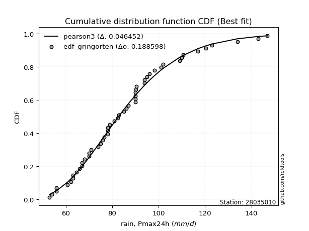</img>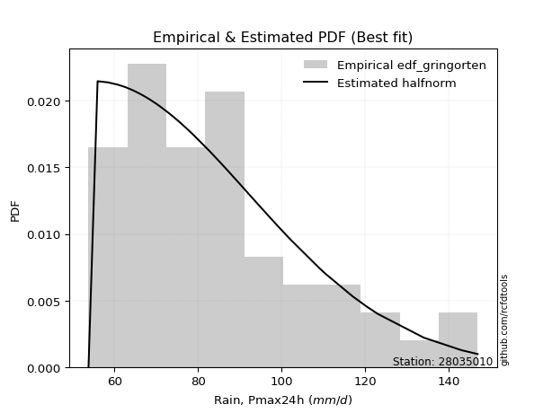</img>

</div>


### 9. EDF Filliben (1975)

The specific values of the constants (0.3175) (often denoted as $alpha$) and (0.365) are derived from a method proposed by James J. Filliben in a 1975 paper. This particular formula is the mean value of the $i$-th order statistic of the normal distribution and is considered a robust and effective plotting position formula for the normal probability plot correlation coefficient test for normality.

<div align="center">


$P=(m-0.3175)/(n+0.365)$


</div>


**9.1. Empirical values**

<div align="center">

|                | 0                    | 1                   | 2                   | 3                   | 4                   | 5                   | 6                   | 7                  | 8                   | 9                  | 10                  | 11                 | 12                  | 13                 | 14                  | 15                 | 16                  | 17                 | 18                 | 19                 | 20                  | 21                 | 22                  | 23                 | 24                 | 25                  | 26                 | 27                 | 28                 | 29                 | 30                 | 31                 | 32                 | 33                 | 34                 | 35                 | 36                 | 37                 | 38                 | 39                 | 40                 | 41                 | 42                 | 43                 | 44                 | 45                 | 46                 | 47                 | 48                 | 49                 | 50                 | 51               |
|:---------------|:---------------------|:--------------------|:--------------------|:--------------------|:--------------------|:--------------------|:--------------------|:-------------------|:--------------------|:-------------------|:--------------------|:-------------------|:--------------------|:-------------------|:--------------------|:-------------------|:--------------------|:-------------------|:-------------------|:-------------------|:--------------------|:-------------------|:--------------------|:-------------------|:-------------------|:--------------------|:-------------------|:-------------------|:-------------------|:-------------------|:-------------------|:-------------------|:-------------------|:-------------------|:-------------------|:-------------------|:-------------------|:-------------------|:-------------------|:-------------------|:-------------------|:-------------------|:-------------------|:-------------------|:-------------------|:-------------------|:-------------------|:-------------------|:-------------------|:-------------------|:-------------------|:-----------------|
| date           | 2004                 | 1969                | 2000                | 1991                | 1994                | 2014                | 2009                | 1997               | 1968                | 1972               | 1989                | 2012               | 1976                | 2001               | 1984                | 2015               | 2006                | 1992               | 1980               | 1970               | 1993                | 1998               | 1987                | 1978               | 1985               | 2018                | 2013               | 2008               | 1973               | 2016               | 1979               | 1977               | 2003               | 1995               | 1975               | 1982               | 2011               | 1974               | 1988               | 1983               | 2022               | 2017               | 2005               | 1986               | 1999               | 1981               | 2002               | 2007               | 1990               | 2010               | 1996               | 1971             |
| x              | 53.75264075          | 55.92497723         | 56.0                | 56.0                | 58.50469062         | 60.8                | 62.3                | 63.0               | 64.2                | 64.7               | 66.0                | 67.0               | 67.0                | 68.0               | 68.34350579         | 68.5               | 70.0                | 70.0               | 71.0               | 73.07817535        | 74.0                | 75.0               | 76.0                | 76.5               | 78.0               | 78.0                | 79.0               | 82.5               | 82.9               | 85.0               | 86.0               | 87.0               | 90.0               | 90.0               | 90.0               | 90.0               | 90.5               | 94.0               | 94.0               | 98.2               | 99.0               | 101.0              | 102.0              | 109.0              | 110.0              | 110.7              | 117.0              | 120.4              | 123.0              | 134.0              | 143.0              | 146.9            |
| m              | 1                    | 2                   | 3                   | 4                   | 5                   | 6                   | 7                   | 8                  | 9                   | 10                 | 11                  | 12                 | 13                  | 14                 | 15                  | 16                 | 17                  | 18                 | 19                 | 20                 | 21                  | 22                 | 23                  | 24                 | 25                 | 26                  | 27                 | 28                 | 29                 | 30                 | 31                 | 32                 | 33                 | 34                 | 35                 | 36                 | 37                 | 38                 | 39                 | 40                 | 41                 | 42                 | 43                 | 44                 | 45                 | 46                 | 47                 | 48                 | 49                 | 50                 | 51                 | 52               |
| empirical_dist | edf_filliben         | edf_filliben        | edf_filliben        | edf_filliben        | edf_filliben        | edf_filliben        | edf_filliben        | edf_filliben       | edf_filliben        | edf_filliben       | edf_filliben        | edf_filliben       | edf_filliben        | edf_filliben       | edf_filliben        | edf_filliben       | edf_filliben        | edf_filliben       | edf_filliben       | edf_filliben       | edf_filliben        | edf_filliben       | edf_filliben        | edf_filliben       | edf_filliben       | edf_filliben        | edf_filliben       | edf_filliben       | edf_filliben       | edf_filliben       | edf_filliben       | edf_filliben       | edf_filliben       | edf_filliben       | edf_filliben       | edf_filliben       | edf_filliben       | edf_filliben       | edf_filliben       | edf_filliben       | edf_filliben       | edf_filliben       | edf_filliben       | edf_filliben       | edf_filliben       | edf_filliben       | edf_filliben       | edf_filliben       | edf_filliben       | edf_filliben       | edf_filliben       | edf_filliben     |
| empirical      | 0.013033514752219994 | 0.03213023966389764 | 0.05122696457557529 | 0.07032368948725294 | 0.08942041439893059 | 0.10851713931060823 | 0.12761386422228588 | 0.1467105891339635 | 0.16580731404564114 | 0.1849040389573188 | 0.20400076386899643 | 0.2230974887806741 | 0.24219421369235175 | 0.2612909386040294 | 0.28038766351570704 | 0.2994843884273847 | 0.31858111333906236 | 0.33767783825074   | 0.3567745631624176 | 0.3758712880740953 | 0.39496801298577294 | 0.4140647378974506 | 0.43316146280912826 | 0.4522581877208059 | 0.4713549126324835 | 0.49045163754416116 | 0.5095483624558388 | 0.5286450873675165 | 0.5477418122791942 | 0.5668385371908717 | 0.5859352621025494 | 0.605031987014227  | 0.6241287119259047 | 0.6432254368375823 | 0.66232216174926   | 0.6814188866609375 | 0.7005156115726152 | 0.7196123364842929 | 0.7387090613959705 | 0.7578057863076482 | 0.7769025112193259 | 0.7959992361310034 | 0.8150959610426811 | 0.8341926859543587 | 0.8532894108660364 | 0.8723861357777141 | 0.8914828606893916 | 0.9105795856010693 | 0.929676310512747  | 0.9487730354244246 | 0.9678697603361023 | 0.98696648524778 |
| empirical_tr   | 1.0132056305325787   | 1.0331968628224732  | 1.0539928546268806  | 1.075643198274534   | 1.098201646306297   | 1.121726557060997   | 1.1462813987850928  | 1.171935321434566  | 1.1987638070165396  | 1.2268494113512562 | 1.2562826126072093  | 1.2871627849812572 | 1.3195993195993196  | 1.3537129192787436 | 1.3896370994493463  | 1.4275199345737069 | 1.4675260982274225  | 1.5098392561089886 | 1.554664885326208  | 1.6022336112598485 | 1.6528051763591887  | 1.7066731850403325 | 1.7641708077149836  | 1.8256776780266712 | 1.8916282850176105 | 1.9625222524126302  | 2.038937019371167  | 2.1215436037678517 | 2.211126359125937  | 2.3086079576766227 | 2.415081286751989  | 2.5318505983319226 | 2.660485202591134  | 2.802890405459654  | 2.9614025166124693 | 3.138918027873519  | 3.339072214251553  | 3.566490720245189  | 3.8271514708569323 | 4.128917800118272  | 4.482345388401455  | 4.901942429206644  | 5.40821068938807   | 6.03109703426432   | 6.816140579238525  | 7.836139169472499  | 9.215134183897922  | 11.183128670581944 | 14.219959266802434 | 19.520969245107132 | 31.123328380386255 | 76.7252747252745 |

</div>


**9.2. Kolmogorov-Smirnov fit test (sorted by Δ)**


<div align="center">

|                | 0                    | 1                   | 2                    | 3                   | 4                   | 5                   | 6                    | 7                    | 8                   | 9                   | 10                  | 11                  | 12                  | 13                  | 14                  | 15                  | 16                  | 17                  | 18                  | 19                   | 20                   | 21                  | 22                  | 23                  | 24                  | 25                  | 26                  | 27                  | 28                  | 29                  | 30                  | 31                  | 32                  | 33                  | 34                  | 35                  | 36                  | 37                  | 38                  | 39                  | 40                  | 41                  | 42                  | 43                  | 44                  | 45                  | 46                  | 47                  | 48                  | 49                  | 50                  | 51                  | 52                  | 53                  | 54                  | 55                  | 56                  | 57                  | 58                  | 59                  | 60                  | 61                  | 62                    | 63                  | 64                  | 65                  | 66                  | 67                  | 68                  | 69                  | 70                  | 71                  | 72                  | 73                  | 74                  | 75                  | 76                  | 77                  | 78                  | 79                  | 80                  | 81                  | 82                  | 83                  | 84                  | 85                  | 86                  | 87                  |
|:---------------|:---------------------|:--------------------|:---------------------|:--------------------|:--------------------|:--------------------|:---------------------|:---------------------|:--------------------|:--------------------|:--------------------|:--------------------|:--------------------|:--------------------|:--------------------|:--------------------|:--------------------|:--------------------|:--------------------|:---------------------|:---------------------|:--------------------|:--------------------|:--------------------|:--------------------|:--------------------|:--------------------|:--------------------|:--------------------|:--------------------|:--------------------|:--------------------|:--------------------|:--------------------|:--------------------|:--------------------|:--------------------|:--------------------|:--------------------|:--------------------|:--------------------|:--------------------|:--------------------|:--------------------|:--------------------|:--------------------|:--------------------|:--------------------|:--------------------|:--------------------|:--------------------|:--------------------|:--------------------|:--------------------|:--------------------|:--------------------|:--------------------|:--------------------|:--------------------|:--------------------|:--------------------|:--------------------|:----------------------|:--------------------|:--------------------|:--------------------|:--------------------|:--------------------|:--------------------|:--------------------|:--------------------|:--------------------|:--------------------|:--------------------|:--------------------|:--------------------|:--------------------|:--------------------|:--------------------|:--------------------|:--------------------|:--------------------|:--------------------|:--------------------|:--------------------|:--------------------|:--------------------|:--------------------|
| station        | 28035010             | 28035010            | 28035010             | 28035010            | 28035010            | 28035010            | 28035010             | 28035010             | 28035010            | 28035010            | 28035010            | 28035010            | 28035010            | 28035010            | 28035010            | 28035010            | 28035010            | 28035010            | 28035010            | 28035010             | 28035010             | 28035010            | 28035010            | 28035010            | 28035010            | 28035010            | 28035010            | 28035010            | 28035010            | 28035010            | 28035010            | 28035010            | 28035010            | 28035010            | 28035010            | 28035010            | 28035010            | 28035010            | 28035010            | 28035010            | 28035010            | 28035010            | 28035010            | 28035010            | 28035010            | 28035010            | 28035010            | 28035010            | 28035010            | 28035010            | 28035010            | 28035010            | 28035010            | 28035010            | 28035010            | 28035010            | 28035010            | 28035010            | 28035010            | 28035010            | 28035010            | 28035010            | 28035010              | 28035010            | 28035010            | 28035010            | 28035010            | 28035010            | 28035010            | 28035010            | 28035010            | 28035010            | 28035010            | 28035010            | 28035010            | 28035010            | 28035010            | 28035010            | 28035010            | 28035010            | 28035010            | 28035010            | 28035010            | 28035010            | 28035010            | 28035010            | 28035010            | 28035010            |
| empirical_dist | edf_filliben         | edf_filliben        | edf_filliben         | edf_filliben        | edf_filliben        | edf_filliben        | edf_filliben         | edf_filliben         | edf_filliben        | edf_filliben        | edf_filliben        | edf_filliben        | edf_filliben        | edf_filliben        | edf_filliben        | edf_filliben        | edf_filliben        | edf_filliben        | edf_filliben        | edf_filliben         | edf_filliben         | edf_filliben        | edf_filliben        | edf_filliben        | edf_filliben        | edf_filliben        | edf_filliben        | edf_filliben        | edf_filliben        | edf_filliben        | edf_filliben        | edf_filliben        | edf_filliben        | edf_filliben        | edf_filliben        | edf_filliben        | edf_filliben        | edf_filliben        | edf_filliben        | edf_filliben        | edf_filliben        | edf_filliben        | edf_filliben        | edf_filliben        | edf_filliben        | edf_filliben        | edf_filliben        | edf_filliben        | edf_filliben        | edf_filliben        | edf_filliben        | edf_filliben        | edf_filliben        | edf_filliben        | edf_filliben        | edf_filliben        | edf_filliben        | edf_filliben        | edf_filliben        | edf_filliben        | edf_filliben        | edf_filliben        | edf_filliben          | edf_filliben        | edf_filliben        | edf_filliben        | edf_filliben        | edf_filliben        | edf_filliben        | edf_filliben        | edf_filliben        | edf_filliben        | edf_filliben        | edf_filliben        | edf_filliben        | edf_filliben        | edf_filliben        | edf_filliben        | edf_filliben        | edf_filliben        | edf_filliben        | edf_filliben        | edf_filliben        | edf_filliben        | edf_filliben        | edf_filliben        | edf_filliben        | edf_filliben        |
| p_dist         | weibull_min          | halfnorm            | logmaxwell           | logrice             | lograyleigh         | pearson3            | gamma                | erlang               | logweibull_min      | loggenexpon         | logpearson3         | logncf              | lognakagami         | nct                 | fatiguelife         | logalpha            | invgauss            | moyal               | rayleigh            | johnsonsu            | gumbel_r             | loginvgamma         | alpha               | invgamma            | f                   | loglognorm          | logjohnsonsu        | logexponnorm        | gompertz            | loginvgauss         | logfatiguelife      | invweibull          | logf                | loggamma            | loggamma            | logerlang           | genlogistic         | lognct              | nakagami            | betaprime           | fisk                | logkstwobign        | kstwobign           | logloggamma         | logfisk             | mielke              | loggenlogistic      | loginvweibull       | logmielke           | logt                | lognorm             | lognorm             | logcrystalball      | exponnorm           | laplace_asymmetric  | maxwell             | halflogistic        | ncf                 | loggumbel_r         | loghalfnorm         | rice                | loglogistic         | loglaplace_asymmetric | logmoyal            | truncnorm           | norm                | crystalball         | t                   | loghalflogistic     | loghypsecant        | loggompertz         | genexpon            | logistic            | expon               | hypsecant           | loglaplace          | loggumbel_l         | chi2                | laplace             | logbetaprime        | gumbel_l            | logtruncnorm        | wald                | logexpon            | logwald             | logchi2             | loggibrat           | gibrat              |
| delta          | 0.044496037969563584 | 0.04583912807812997 | 0.047669972121924864 | 0.04796858952532146 | 0.05190615514385688 | 0.05247873620755322 | 0.054164740757715935 | 0.054164985147022726 | 0.05616172257506713 | 0.05662045358092449 | 0.05732790492723494 | 0.05835551190604471 | 0.05899342082983006 | 0.05983511065710484 | 0.05999807234767951 | 0.06046019440933725 | 0.06063537249503492 | 0.06165931062420715 | 0.06176768489332385 | 0.061802526269891245 | 0.062431205001399204 | 0.06243319376346801 | 0.06265919777099294 | 0.06327419293235459 | 0.063291880833798   | 0.06334723988375712 | 0.06361371180052922 | 0.06385420988258805 | 0.06405267121169644 | 0.06407189714695893 | 0.0642817316341362  | 0.06460963574606415 | 0.06489918505945735 | 0.06504567913001202 | 0.06504567913001202 | 0.06504588269372058 | 0.06570098999306828 | 0.06580223324053353 | 0.06647549636590774 | 0.06691233063281654 | 0.06779193632873215 | 0.06875861608267886 | 0.06924540061837342 | 0.06967452640370492 | 0.07085162430981728 | 0.07087809982165816 | 0.071082711023856   | 0.07109868604856129 | 0.07144530626291601 | 0.07173478850062476 | 0.07173574466178417 | 0.07173574466178417 | 0.07173574668852645 | 0.07197654540931908 | 0.07272161578099734 | 0.07321226332220965 | 0.07527921798261436 | 0.07886179281470979 | 0.08377447037726138 | 0.08942041439893059 | 0.09398971250112409 | 0.09403896862001693 | 0.0970166203357169    | 0.10377814241067718 | 0.10727931815778557 | 0.10727932774536342 | 0.10727948620025768 | 0.10732343324768795 | 0.10851713931060823 | 0.10932587174475886 | 0.11477197004810613 | 0.11794165516663174 | 0.1199203259100205  | 0.12647018329606602 | 0.13161010582496135 | 0.13282437310410547 | 0.13570925932299144 | 0.14530249333681    | 0.15962884462294596 | 0.16722621039504573 | 0.17401983500084406 | 0.17466414427263577 | 0.17660911923747385 | 0.184655975393003   | 0.1847626984857547  | 0.2504245305654181  | 0.2852336486627313  | 0.2881598554061937  |
| deltao         | 0.18859806671657792  | 0.18859806671657792 | 0.18859806671657792  | 0.18859806671657792 | 0.18859806671657792 | 0.18859806671657792 | 0.18859806671657792  | 0.18859806671657792  | 0.18859806671657792 | 0.18859806671657792 | 0.18859806671657792 | 0.18859806671657792 | 0.18859806671657792 | 0.18859806671657792 | 0.18859806671657792 | 0.18859806671657792 | 0.18859806671657792 | 0.18859806671657792 | 0.18859806671657792 | 0.18859806671657792  | 0.18859806671657792  | 0.18859806671657792 | 0.18859806671657792 | 0.18859806671657792 | 0.18859806671657792 | 0.18859806671657792 | 0.18859806671657792 | 0.18859806671657792 | 0.18859806671657792 | 0.18859806671657792 | 0.18859806671657792 | 0.18859806671657792 | 0.18859806671657792 | 0.18859806671657792 | 0.18859806671657792 | 0.18859806671657792 | 0.18859806671657792 | 0.18859806671657792 | 0.18859806671657792 | 0.18859806671657792 | 0.18859806671657792 | 0.18859806671657792 | 0.18859806671657792 | 0.18859806671657792 | 0.18859806671657792 | 0.18859806671657792 | 0.18859806671657792 | 0.18859806671657792 | 0.18859806671657792 | 0.18859806671657792 | 0.18859806671657792 | 0.18859806671657792 | 0.18859806671657792 | 0.18859806671657792 | 0.18859806671657792 | 0.18859806671657792 | 0.18859806671657792 | 0.18859806671657792 | 0.18859806671657792 | 0.18859806671657792 | 0.18859806671657792 | 0.18859806671657792 | 0.18859806671657792   | 0.18859806671657792 | 0.18859806671657792 | 0.18859806671657792 | 0.18859806671657792 | 0.18859806671657792 | 0.18859806671657792 | 0.18859806671657792 | 0.18859806671657792 | 0.18859806671657792 | 0.18859806671657792 | 0.18859806671657792 | 0.18859806671657792 | 0.18859806671657792 | 0.18859806671657792 | 0.18859806671657792 | 0.18859806671657792 | 0.18859806671657792 | 0.18859806671657792 | 0.18859806671657792 | 0.18859806671657792 | 0.18859806671657792 | 0.18859806671657792 | 0.18859806671657792 | 0.18859806671657792 | 0.18859806671657792 |
| eval           | Δo > Δ               | Δo > Δ              | Δo > Δ               | Δo > Δ              | Δo > Δ              | Δo > Δ              | Δo > Δ               | Δo > Δ               | Δo > Δ              | Δo > Δ              | Δo > Δ              | Δo > Δ              | Δo > Δ              | Δo > Δ              | Δo > Δ              | Δo > Δ              | Δo > Δ              | Δo > Δ              | Δo > Δ              | Δo > Δ               | Δo > Δ               | Δo > Δ              | Δo > Δ              | Δo > Δ              | Δo > Δ              | Δo > Δ              | Δo > Δ              | Δo > Δ              | Δo > Δ              | Δo > Δ              | Δo > Δ              | Δo > Δ              | Δo > Δ              | Δo > Δ              | Δo > Δ              | Δo > Δ              | Δo > Δ              | Δo > Δ              | Δo > Δ              | Δo > Δ              | Δo > Δ              | Δo > Δ              | Δo > Δ              | Δo > Δ              | Δo > Δ              | Δo > Δ              | Δo > Δ              | Δo > Δ              | Δo > Δ              | Δo > Δ              | Δo > Δ              | Δo > Δ              | Δo > Δ              | Δo > Δ              | Δo > Δ              | Δo > Δ              | Δo > Δ              | Δo > Δ              | Δo > Δ              | Δo > Δ              | Δo > Δ              | Δo > Δ              | Δo > Δ                | Δo > Δ              | Δo > Δ              | Δo > Δ              | Δo > Δ              | Δo > Δ              | Δo > Δ              | Δo > Δ              | Δo > Δ              | Δo > Δ              | Δo > Δ              | Δo > Δ              | Δo > Δ              | Δo > Δ              | Δo > Δ              | Δo > Δ              | Δo > Δ              | Δo > Δ              | Δo > Δ              | Δo > Δ              | Δo > Δ              | Δo > Δ              | Δo > Δ              | Δo <= Δ             | Δo <= Δ             | Δo <= Δ             |
| fit            | 1                    | 1                   | 1                    | 1                   | 1                   | 1                   | 1                    | 1                    | 1                   | 1                   | 1                   | 1                   | 1                   | 1                   | 1                   | 1                   | 1                   | 1                   | 1                   | 1                    | 1                    | 1                   | 1                   | 1                   | 1                   | 1                   | 1                   | 1                   | 1                   | 1                   | 1                   | 1                   | 1                   | 1                   | 1                   | 1                   | 1                   | 1                   | 1                   | 1                   | 1                   | 1                   | 1                   | 1                   | 1                   | 1                   | 1                   | 1                   | 1                   | 1                   | 1                   | 1                   | 1                   | 1                   | 1                   | 1                   | 1                   | 1                   | 1                   | 1                   | 1                   | 1                   | 1                     | 1                   | 1                   | 1                   | 1                   | 1                   | 1                   | 1                   | 1                   | 1                   | 1                   | 1                   | 1                   | 1                   | 1                   | 1                   | 1                   | 1                   | 1                   | 1                   | 1                   | 1                   | 1                   | 0                   | 0                   | 0                   |
| n              | 52                   | 52                  | 52                   | 52                  | 52                  | 52                  | 52                   | 52                   | 52                  | 52                  | 52                  | 52                  | 52                  | 52                  | 52                  | 52                  | 52                  | 52                  | 52                  | 52                   | 52                   | 52                  | 52                  | 52                  | 52                  | 52                  | 52                  | 52                  | 52                  | 52                  | 52                  | 52                  | 52                  | 52                  | 52                  | 52                  | 52                  | 52                  | 52                  | 52                  | 52                  | 52                  | 52                  | 52                  | 52                  | 52                  | 52                  | 52                  | 52                  | 52                  | 52                  | 52                  | 52                  | 52                  | 52                  | 52                  | 52                  | 52                  | 52                  | 52                  | 52                  | 52                  | 52                    | 52                  | 52                  | 52                  | 52                  | 52                  | 52                  | 52                  | 52                  | 52                  | 52                  | 52                  | 52                  | 52                  | 52                  | 52                  | 52                  | 52                  | 52                  | 52                  | 52                  | 52                  | 52                  | 52                  | 52                  | 52                  |
| best_fit       | 1                    | 0                   | 0                    | 0                   | 0                   | 0                   | 0                    | 0                    | 0                   | 0                   | 0                   | 0                   | 0                   | 0                   | 0                   | 0                   | 0                   | 0                   | 0                   | 0                    | 0                    | 0                   | 0                   | 0                   | 0                   | 0                   | 0                   | 0                   | 0                   | 0                   | 0                   | 0                   | 0                   | 0                   | 0                   | 0                   | 0                   | 0                   | 0                   | 0                   | 0                   | 0                   | 0                   | 0                   | 0                   | 0                   | 0                   | 0                   | 0                   | 0                   | 0                   | 0                   | 0                   | 0                   | 0                   | 0                   | 0                   | 0                   | 0                   | 0                   | 0                   | 0                   | 0                     | 0                   | 0                   | 0                   | 0                   | 0                   | 0                   | 0                   | 0                   | 0                   | 0                   | 0                   | 0                   | 0                   | 0                   | 0                   | 0                   | 0                   | 0                   | 0                   | 0                   | 0                   | 0                   | 0                   | 0                   | 0                   |
| best_fit_sort  | 1                    | 2                   | 3                    | 4                   | 5                   | 6                   | 7                    | 8                    | 9                   | 10                  | 11                  | 12                  | 13                  | 14                  | 15                  | 16                  | 17                  | 18                  | 19                  | 20                   | 21                   | 22                  | 23                  | 24                  | 25                  | 26                  | 27                  | 28                  | 29                  | 30                  | 31                  | 32                  | 33                  | 34                  | 35                  | 36                  | 37                  | 38                  | 39                  | 40                  | 41                  | 42                  | 43                  | 44                  | 45                  | 46                  | 47                  | 48                  | 49                  | 50                  | 51                  | 52                  | 53                  | 54                  | 55                  | 56                  | 57                  | 58                  | 59                  | 60                  | 61                  | 62                  | 63                    | 64                  | 65                  | 66                  | 67                  | 68                  | 69                  | 70                  | 71                  | 72                  | 73                  | 74                  | 75                  | 76                  | 77                  | 78                  | 79                  | 80                  | 81                  | 82                  | 83                  | 84                  | 85                  | 86                  | 87                  | 88                  |

</div>


<div align="center">

</img>

</div>


**9.3. Best fit**

<div align="center">

|   id |   station | empirical_dist   | p_dist      |    delta |   deltao | eval   |   fit |   n |   best_fit |   best_fit_sort |
|-----:|----------:|:-----------------|:------------|---------:|---------:|:-------|------:|----:|-----------:|----------------:|
|    0 |  28035010 | edf_filliben     | weibull_min | 0.044496 | 0.188598 | Δo > Δ |     1 |  52 |          1 |               1 |

</div>


<div align="center">

</img>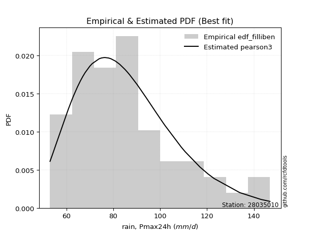</img>

</div>


### 10. EDF Jenkinson (1977)

The Jenkinson formula in hydrology is an empirical plotting position formula used to estimate the non-exceedance probability _(P)_ or return period _(T)_ of a given ordered observation within a sample. It is a widely used method in the frequency analysis of extreme events such as floods and rainfall, as it provides a distribution-free way to plot data. _a≈0.31_ and _b≈0.38_ are constants derived to approximate the median of the probability distribution for the given rank.

<div align="center">


$P=(m-a)/(n+b)$


</div>


**10.1. Empirical values**

<div align="center">

|                | 0                    | 1                   | 2                   | 3                  | 4                   | 5                   | 6                  | 7                   | 8                   | 9                   | 10                  | 11                 | 12                  | 13                  | 14                 | 15                 | 16                 | 17                 | 18                 | 19                 | 20                  | 21                  | 22                  | 23                  | 24                 | 25                 | 26                 | 27                 | 28                 | 29                 | 30                 | 31                 | 32                 | 33                 | 34                 | 35                 | 36                 | 37                 | 38                 | 39                 | 40                 | 41                | 42                 | 43                 | 44                 | 45                 | 46                 | 47                 | 48                 | 49                 | 50                 | 51                 |
|:---------------|:---------------------|:--------------------|:--------------------|:-------------------|:--------------------|:--------------------|:-------------------|:--------------------|:--------------------|:--------------------|:--------------------|:-------------------|:--------------------|:--------------------|:-------------------|:-------------------|:-------------------|:-------------------|:-------------------|:-------------------|:--------------------|:--------------------|:--------------------|:--------------------|:-------------------|:-------------------|:-------------------|:-------------------|:-------------------|:-------------------|:-------------------|:-------------------|:-------------------|:-------------------|:-------------------|:-------------------|:-------------------|:-------------------|:-------------------|:-------------------|:-------------------|:------------------|:-------------------|:-------------------|:-------------------|:-------------------|:-------------------|:-------------------|:-------------------|:-------------------|:-------------------|:-------------------|
| date           | 2004                 | 1969                | 2000                | 1991               | 1994                | 2014                | 2009               | 1997                | 1968                | 1972                | 1989                | 2012               | 1976                | 2001                | 1984               | 2015               | 2006               | 1992               | 1980               | 1970               | 1993                | 1998                | 1987                | 1978                | 1985               | 2018               | 2013               | 2008               | 1973               | 2016               | 1979               | 1977               | 2003               | 1995               | 1975               | 1982               | 2011               | 1974               | 1988               | 1983               | 2022               | 2017              | 2005               | 1986               | 1999               | 1981               | 2002               | 2007               | 1990               | 2010               | 1996               | 1971               |
| x              | 53.75264075          | 55.92497723         | 56.0                | 56.0               | 58.50469062         | 60.8                | 62.3               | 63.0                | 64.2                | 64.7                | 66.0                | 67.0               | 67.0                | 68.0                | 68.34350579        | 68.5               | 70.0               | 70.0               | 71.0               | 73.07817535        | 74.0                | 75.0                | 76.0                | 76.5                | 78.0               | 78.0               | 79.0               | 82.5               | 82.9               | 85.0               | 86.0               | 87.0               | 90.0               | 90.0               | 90.0               | 90.0               | 90.5               | 94.0               | 94.0               | 98.2               | 99.0               | 101.0             | 102.0              | 109.0              | 110.0              | 110.7              | 117.0              | 120.4              | 123.0              | 134.0              | 143.0              | 146.9              |
| m              | 1                    | 2                   | 3                   | 4                  | 5                   | 6                   | 7                  | 8                   | 9                   | 10                  | 11                  | 12                 | 13                  | 14                  | 15                 | 16                 | 17                 | 18                 | 19                 | 20                 | 21                  | 22                  | 23                  | 24                  | 25                 | 26                 | 27                 | 28                 | 29                 | 30                 | 31                 | 32                 | 33                 | 34                 | 35                 | 36                 | 37                 | 38                 | 39                 | 40                 | 41                 | 42                | 43                 | 44                 | 45                 | 46                 | 47                 | 48                 | 49                 | 50                 | 51                 | 52                 |
| empirical_dist | edf_jenkinson        | edf_jenkinson       | edf_jenkinson       | edf_jenkinson      | edf_jenkinson       | edf_jenkinson       | edf_jenkinson      | edf_jenkinson       | edf_jenkinson       | edf_jenkinson       | edf_jenkinson       | edf_jenkinson      | edf_jenkinson       | edf_jenkinson       | edf_jenkinson      | edf_jenkinson      | edf_jenkinson      | edf_jenkinson      | edf_jenkinson      | edf_jenkinson      | edf_jenkinson       | edf_jenkinson       | edf_jenkinson       | edf_jenkinson       | edf_jenkinson      | edf_jenkinson      | edf_jenkinson      | edf_jenkinson      | edf_jenkinson      | edf_jenkinson      | edf_jenkinson      | edf_jenkinson      | edf_jenkinson      | edf_jenkinson      | edf_jenkinson      | edf_jenkinson      | edf_jenkinson      | edf_jenkinson      | edf_jenkinson      | edf_jenkinson      | edf_jenkinson      | edf_jenkinson     | edf_jenkinson      | edf_jenkinson      | edf_jenkinson      | edf_jenkinson      | edf_jenkinson      | edf_jenkinson      | edf_jenkinson      | edf_jenkinson      | edf_jenkinson      | edf_jenkinson      |
| empirical      | 0.013172966781214202 | 0.03226422298587247 | 0.05135547919053073 | 0.070446735395189  | 0.08953799159984727 | 0.10862924780450554 | 0.1277205040091638 | 0.14681176021382206 | 0.16590301641848032 | 0.18499427262313858 | 0.20408552882779685 | 0.2231767850324551 | 0.24226804123711337 | 0.26135929744177167 | 0.2804505536464299 | 0.2995418098510882 | 0.3186330660557465 | 0.3377243222604047 | 0.356815578465063  | 0.3759068346697213 | 0.39499809087437954 | 0.41408934707903783 | 0.43318060328369606 | 0.45227185948835436 | 0.4713631156930126 | 0.4904543718976709 | 0.5095456281023292 | 0.5286368843069874 | 0.5477281405116456 | 0.5668193967163039 | 0.5859106529209622 | 0.6050019091256205 | 0.6240931653302787 | 0.6431844215349369 | 0.6622756777395952 | 0.6813669339442534 | 0.7004581901489118 | 0.71954944635357   | 0.7386407025582282 | 0.7577319587628866 | 0.7768232149675448 | 0.795914471172203 | 0.8150057273768613 | 0.8340969835815196 | 0.8531882397861779 | 0.8722794959908361 | 0.8913707521954943 | 0.9104620084001527 | 0.9295532646048109 | 0.9486445208094691 | 0.9677357770141274 | 0.9868270332187857 |
| empirical_tr   | 1.0133488102147417   | 1.0333399092523181  | 1.054135640974039   | 1.0757855822550833 | 1.0983434682323339  | 1.1218676376097665  | 1.1464215364412345 | 1.172074289550235   | 1.1989013504234378  | 1.2269852424455376  | 1.2564164068121852  | 1.287294175473089  | 1.3197278911564627  | 1.3538382010855519  | 1.3897585566463253 | 1.4276369582992643 | 1.4676379938358084 | 1.5099452291726723 | 1.5547640249332149 | 1.602324869990823  | 1.652887346165983   | 1.7067448680351909  | 1.7642303805995283  | 1.8257232485186476  | 1.8916576381365113 | 1.9625327838141624 | 2.0389256520046715 | 2.1215066828675577 | 2.211059518784297  | 2.308505949757602  | 2.4149377593361    | 2.5316578057032384 | 2.6602336211274755 | 2.8025682182985547 | 2.9609949123798747 | 3.138406231276212  | 3.3384321223709366 | 3.5656909462219186 | 3.826150474799122  | 4.127659574468085  | 4.480752780153977  | 4.899906454630494 | 5.405572755417953  | 6.027617951668583  | 6.811443433029906  | 7.8295964125560475 | 9.205623901581712  | 11.1684434968017   | 14.195121951219496 | 19.472118959107764 | 30.994082840236548 | 75.9130434782605   |

</div>


**10.2. Kolmogorov-Smirnov fit test (sorted by Δ)**


<div align="center">

|                | 0                    | 1                   | 2                   | 3                   | 4                   | 5                   | 6                    | 7                   | 8                   | 9                   | 10                  | 11                  | 12                  | 13                   | 14                  | 15                   | 16                  | 17                   | 18                   | 19                   | 20                  | 21                  | 22                  | 23                  | 24                  | 25                  | 26                  | 27                  | 28                  | 29                  | 30                  | 31                  | 32                  | 33                  | 34                  | 35                  | 36                  | 37                  | 38                  | 39                  | 40                  | 41                  | 42                  | 43                  | 44                  | 45                  | 46                  | 47                  | 48                  | 49                  | 50                  | 51                  | 52                  | 53                  | 54                  | 55                  | 56                  | 57                  | 58                  | 59                  | 60                  | 61                  | 62                    | 63                  | 64                  | 65                  | 66                  | 67                  | 68                  | 69                  | 70                  | 71                  | 72                  | 73                  | 74                  | 75                  | 76                  | 77                  | 78                  | 79                  | 80                  | 81                  | 82                  | 83                  | 84                  | 85                  | 86                  | 87                  |
|:---------------|:---------------------|:--------------------|:--------------------|:--------------------|:--------------------|:--------------------|:---------------------|:--------------------|:--------------------|:--------------------|:--------------------|:--------------------|:--------------------|:---------------------|:--------------------|:---------------------|:--------------------|:---------------------|:---------------------|:---------------------|:--------------------|:--------------------|:--------------------|:--------------------|:--------------------|:--------------------|:--------------------|:--------------------|:--------------------|:--------------------|:--------------------|:--------------------|:--------------------|:--------------------|:--------------------|:--------------------|:--------------------|:--------------------|:--------------------|:--------------------|:--------------------|:--------------------|:--------------------|:--------------------|:--------------------|:--------------------|:--------------------|:--------------------|:--------------------|:--------------------|:--------------------|:--------------------|:--------------------|:--------------------|:--------------------|:--------------------|:--------------------|:--------------------|:--------------------|:--------------------|:--------------------|:--------------------|:----------------------|:--------------------|:--------------------|:--------------------|:--------------------|:--------------------|:--------------------|:--------------------|:--------------------|:--------------------|:--------------------|:--------------------|:--------------------|:--------------------|:--------------------|:--------------------|:--------------------|:--------------------|:--------------------|:--------------------|:--------------------|:--------------------|:--------------------|:--------------------|:--------------------|:--------------------|
| station        | 28035010             | 28035010            | 28035010            | 28035010            | 28035010            | 28035010            | 28035010             | 28035010            | 28035010            | 28035010            | 28035010            | 28035010            | 28035010            | 28035010             | 28035010            | 28035010             | 28035010            | 28035010             | 28035010             | 28035010             | 28035010            | 28035010            | 28035010            | 28035010            | 28035010            | 28035010            | 28035010            | 28035010            | 28035010            | 28035010            | 28035010            | 28035010            | 28035010            | 28035010            | 28035010            | 28035010            | 28035010            | 28035010            | 28035010            | 28035010            | 28035010            | 28035010            | 28035010            | 28035010            | 28035010            | 28035010            | 28035010            | 28035010            | 28035010            | 28035010            | 28035010            | 28035010            | 28035010            | 28035010            | 28035010            | 28035010            | 28035010            | 28035010            | 28035010            | 28035010            | 28035010            | 28035010            | 28035010              | 28035010            | 28035010            | 28035010            | 28035010            | 28035010            | 28035010            | 28035010            | 28035010            | 28035010            | 28035010            | 28035010            | 28035010            | 28035010            | 28035010            | 28035010            | 28035010            | 28035010            | 28035010            | 28035010            | 28035010            | 28035010            | 28035010            | 28035010            | 28035010            | 28035010            |
| empirical_dist | edf_jenkinson        | edf_jenkinson       | edf_jenkinson       | edf_jenkinson       | edf_jenkinson       | edf_jenkinson       | edf_jenkinson        | edf_jenkinson       | edf_jenkinson       | edf_jenkinson       | edf_jenkinson       | edf_jenkinson       | edf_jenkinson       | edf_jenkinson        | edf_jenkinson       | edf_jenkinson        | edf_jenkinson       | edf_jenkinson        | edf_jenkinson        | edf_jenkinson        | edf_jenkinson       | edf_jenkinson       | edf_jenkinson       | edf_jenkinson       | edf_jenkinson       | edf_jenkinson       | edf_jenkinson       | edf_jenkinson       | edf_jenkinson       | edf_jenkinson       | edf_jenkinson       | edf_jenkinson       | edf_jenkinson       | edf_jenkinson       | edf_jenkinson       | edf_jenkinson       | edf_jenkinson       | edf_jenkinson       | edf_jenkinson       | edf_jenkinson       | edf_jenkinson       | edf_jenkinson       | edf_jenkinson       | edf_jenkinson       | edf_jenkinson       | edf_jenkinson       | edf_jenkinson       | edf_jenkinson       | edf_jenkinson       | edf_jenkinson       | edf_jenkinson       | edf_jenkinson       | edf_jenkinson       | edf_jenkinson       | edf_jenkinson       | edf_jenkinson       | edf_jenkinson       | edf_jenkinson       | edf_jenkinson       | edf_jenkinson       | edf_jenkinson       | edf_jenkinson       | edf_jenkinson         | edf_jenkinson       | edf_jenkinson       | edf_jenkinson       | edf_jenkinson       | edf_jenkinson       | edf_jenkinson       | edf_jenkinson       | edf_jenkinson       | edf_jenkinson       | edf_jenkinson       | edf_jenkinson       | edf_jenkinson       | edf_jenkinson       | edf_jenkinson       | edf_jenkinson       | edf_jenkinson       | edf_jenkinson       | edf_jenkinson       | edf_jenkinson       | edf_jenkinson       | edf_jenkinson       | edf_jenkinson       | edf_jenkinson       | edf_jenkinson       | edf_jenkinson       |
| p_dist         | weibull_min          | halfnorm            | logmaxwell          | logrice             | lograyleigh         | pearson3            | gamma                | erlang              | logweibull_min      | loggenexpon         | logpearson3         | logncf              | lognakagami         | nct                  | fatiguelife         | logalpha             | invgauss            | moyal                | rayleigh             | johnsonsu            | loginvgamma         | gumbel_r            | alpha               | invgamma            | f                   | loglognorm          | logjohnsonsu        | logexponnorm        | gompertz            | loginvgauss         | logfatiguelife      | invweibull          | logf                | loggamma            | loggamma            | logerlang           | genlogistic         | lognct              | nakagami            | betaprime           | fisk                | logkstwobign        | kstwobign           | logloggamma         | logfisk             | mielke              | loggenlogistic      | loginvweibull       | logmielke           | logt                | lognorm             | lognorm             | logcrystalball      | exponnorm           | laplace_asymmetric  | maxwell             | halflogistic        | ncf                 | loggumbel_r         | loghalfnorm         | rice                | loglogistic         | loglaplace_asymmetric | logmoyal            | truncnorm           | norm                | crystalball         | t                   | loghalflogistic     | loghypsecant        | loggompertz         | genexpon            | logistic            | expon               | hypsecant           | loglaplace          | loggumbel_l         | chi2                | laplace             | logbetaprime        | gumbel_l            | logtruncnorm        | wald                | logexpon            | logwald             | logchi2             | loggibrat           | gibrat              |
| delta          | 0.044531584565189575 | 0.04596217398606603 | 0.04771645613158959 | 0.04800413612094745 | 0.05194170173948287 | 0.05252522021721795 | 0.054200287353341925 | 0.05420053174264872 | 0.05619726917069312 | 0.05665600017655048 | 0.05737438893689967 | 0.05840199591570944 | 0.05902896742545605 | 0.059881594666769566 | 0.0600336189433055  | 0.060495741004963244 | 0.06067091909066091 | 0.061694857219833144 | 0.061710263469620386 | 0.061838072865517235 | 0.062468740359094   | 0.06247768901106393 | 0.06269474436661893 | 0.06330973952798058 | 0.06332742742942399 | 0.06338278647938311 | 0.0636492583961552  | 0.06388975647821404 | 0.06399524978799298 | 0.06410744374258492 | 0.06431727822976219 | 0.06464518234169014 | 0.06493473165508334 | 0.06508122572563801 | 0.06508122572563801 | 0.06508142928934657 | 0.06574747400273301 | 0.06584871725019825 | 0.06637979399306856 | 0.06695881464248127 | 0.06782748292435814 | 0.06879416267830485 | 0.06929188462803815 | 0.0697155417063503  | 0.07088717090544328 | 0.07091364641728415 | 0.07111825761948198 | 0.07113423264418728 | 0.071480852858542   | 0.07177580380327014 | 0.07177675996442956 | 0.07177675996442956 | 0.07177676199117183 | 0.07201209200494507 | 0.07275716237662333 | 0.07320952896870003 | 0.07539679518353104 | 0.07886452716821951 | 0.08381001697288737 | 0.08953799159984727 | 0.09403072780376948 | 0.09408545262968165 | 0.09705216693134289   | 0.10381368900630317 | 0.10727658380427596 | 0.1072765933918538  | 0.10727675184674806 | 0.10732069889417833 | 0.10862924780450554 | 0.10937235575442358 | 0.11469267379632511 | 0.11786235891485072 | 0.11991759155651088 | 0.126390887044285   | 0.13161284017847108 | 0.13286538840675086 | 0.13570652496948182 | 0.14520679096397082 | 0.1596315789764557  | 0.1670922270730709  | 0.17401710064733444 | 0.17458484802085475 | 0.17669935290329364 | 0.18457667914122197 | 0.18485293215157447 | 0.2503452343136371  | 0.28529107008643484 | 0.28821727682989723 |
| deltao         | 0.18859806671657792  | 0.18859806671657792 | 0.18859806671657792 | 0.18859806671657792 | 0.18859806671657792 | 0.18859806671657792 | 0.18859806671657792  | 0.18859806671657792 | 0.18859806671657792 | 0.18859806671657792 | 0.18859806671657792 | 0.18859806671657792 | 0.18859806671657792 | 0.18859806671657792  | 0.18859806671657792 | 0.18859806671657792  | 0.18859806671657792 | 0.18859806671657792  | 0.18859806671657792  | 0.18859806671657792  | 0.18859806671657792 | 0.18859806671657792 | 0.18859806671657792 | 0.18859806671657792 | 0.18859806671657792 | 0.18859806671657792 | 0.18859806671657792 | 0.18859806671657792 | 0.18859806671657792 | 0.18859806671657792 | 0.18859806671657792 | 0.18859806671657792 | 0.18859806671657792 | 0.18859806671657792 | 0.18859806671657792 | 0.18859806671657792 | 0.18859806671657792 | 0.18859806671657792 | 0.18859806671657792 | 0.18859806671657792 | 0.18859806671657792 | 0.18859806671657792 | 0.18859806671657792 | 0.18859806671657792 | 0.18859806671657792 | 0.18859806671657792 | 0.18859806671657792 | 0.18859806671657792 | 0.18859806671657792 | 0.18859806671657792 | 0.18859806671657792 | 0.18859806671657792 | 0.18859806671657792 | 0.18859806671657792 | 0.18859806671657792 | 0.18859806671657792 | 0.18859806671657792 | 0.18859806671657792 | 0.18859806671657792 | 0.18859806671657792 | 0.18859806671657792 | 0.18859806671657792 | 0.18859806671657792   | 0.18859806671657792 | 0.18859806671657792 | 0.18859806671657792 | 0.18859806671657792 | 0.18859806671657792 | 0.18859806671657792 | 0.18859806671657792 | 0.18859806671657792 | 0.18859806671657792 | 0.18859806671657792 | 0.18859806671657792 | 0.18859806671657792 | 0.18859806671657792 | 0.18859806671657792 | 0.18859806671657792 | 0.18859806671657792 | 0.18859806671657792 | 0.18859806671657792 | 0.18859806671657792 | 0.18859806671657792 | 0.18859806671657792 | 0.18859806671657792 | 0.18859806671657792 | 0.18859806671657792 | 0.18859806671657792 |
| eval           | Δo > Δ               | Δo > Δ              | Δo > Δ              | Δo > Δ              | Δo > Δ              | Δo > Δ              | Δo > Δ               | Δo > Δ              | Δo > Δ              | Δo > Δ              | Δo > Δ              | Δo > Δ              | Δo > Δ              | Δo > Δ               | Δo > Δ              | Δo > Δ               | Δo > Δ              | Δo > Δ               | Δo > Δ               | Δo > Δ               | Δo > Δ              | Δo > Δ              | Δo > Δ              | Δo > Δ              | Δo > Δ              | Δo > Δ              | Δo > Δ              | Δo > Δ              | Δo > Δ              | Δo > Δ              | Δo > Δ              | Δo > Δ              | Δo > Δ              | Δo > Δ              | Δo > Δ              | Δo > Δ              | Δo > Δ              | Δo > Δ              | Δo > Δ              | Δo > Δ              | Δo > Δ              | Δo > Δ              | Δo > Δ              | Δo > Δ              | Δo > Δ              | Δo > Δ              | Δo > Δ              | Δo > Δ              | Δo > Δ              | Δo > Δ              | Δo > Δ              | Δo > Δ              | Δo > Δ              | Δo > Δ              | Δo > Δ              | Δo > Δ              | Δo > Δ              | Δo > Δ              | Δo > Δ              | Δo > Δ              | Δo > Δ              | Δo > Δ              | Δo > Δ                | Δo > Δ              | Δo > Δ              | Δo > Δ              | Δo > Δ              | Δo > Δ              | Δo > Δ              | Δo > Δ              | Δo > Δ              | Δo > Δ              | Δo > Δ              | Δo > Δ              | Δo > Δ              | Δo > Δ              | Δo > Δ              | Δo > Δ              | Δo > Δ              | Δo > Δ              | Δo > Δ              | Δo > Δ              | Δo > Δ              | Δo > Δ              | Δo > Δ              | Δo <= Δ             | Δo <= Δ             | Δo <= Δ             |
| fit            | 1                    | 1                   | 1                   | 1                   | 1                   | 1                   | 1                    | 1                   | 1                   | 1                   | 1                   | 1                   | 1                   | 1                    | 1                   | 1                    | 1                   | 1                    | 1                    | 1                    | 1                   | 1                   | 1                   | 1                   | 1                   | 1                   | 1                   | 1                   | 1                   | 1                   | 1                   | 1                   | 1                   | 1                   | 1                   | 1                   | 1                   | 1                   | 1                   | 1                   | 1                   | 1                   | 1                   | 1                   | 1                   | 1                   | 1                   | 1                   | 1                   | 1                   | 1                   | 1                   | 1                   | 1                   | 1                   | 1                   | 1                   | 1                   | 1                   | 1                   | 1                   | 1                   | 1                     | 1                   | 1                   | 1                   | 1                   | 1                   | 1                   | 1                   | 1                   | 1                   | 1                   | 1                   | 1                   | 1                   | 1                   | 1                   | 1                   | 1                   | 1                   | 1                   | 1                   | 1                   | 1                   | 0                   | 0                   | 0                   |
| n              | 52                   | 52                  | 52                  | 52                  | 52                  | 52                  | 52                   | 52                  | 52                  | 52                  | 52                  | 52                  | 52                  | 52                   | 52                  | 52                   | 52                  | 52                   | 52                   | 52                   | 52                  | 52                  | 52                  | 52                  | 52                  | 52                  | 52                  | 52                  | 52                  | 52                  | 52                  | 52                  | 52                  | 52                  | 52                  | 52                  | 52                  | 52                  | 52                  | 52                  | 52                  | 52                  | 52                  | 52                  | 52                  | 52                  | 52                  | 52                  | 52                  | 52                  | 52                  | 52                  | 52                  | 52                  | 52                  | 52                  | 52                  | 52                  | 52                  | 52                  | 52                  | 52                  | 52                    | 52                  | 52                  | 52                  | 52                  | 52                  | 52                  | 52                  | 52                  | 52                  | 52                  | 52                  | 52                  | 52                  | 52                  | 52                  | 52                  | 52                  | 52                  | 52                  | 52                  | 52                  | 52                  | 52                  | 52                  | 52                  |
| best_fit       | 1                    | 0                   | 0                   | 0                   | 0                   | 0                   | 0                    | 0                   | 0                   | 0                   | 0                   | 0                   | 0                   | 0                    | 0                   | 0                    | 0                   | 0                    | 0                    | 0                    | 0                   | 0                   | 0                   | 0                   | 0                   | 0                   | 0                   | 0                   | 0                   | 0                   | 0                   | 0                   | 0                   | 0                   | 0                   | 0                   | 0                   | 0                   | 0                   | 0                   | 0                   | 0                   | 0                   | 0                   | 0                   | 0                   | 0                   | 0                   | 0                   | 0                   | 0                   | 0                   | 0                   | 0                   | 0                   | 0                   | 0                   | 0                   | 0                   | 0                   | 0                   | 0                   | 0                     | 0                   | 0                   | 0                   | 0                   | 0                   | 0                   | 0                   | 0                   | 0                   | 0                   | 0                   | 0                   | 0                   | 0                   | 0                   | 0                   | 0                   | 0                   | 0                   | 0                   | 0                   | 0                   | 0                   | 0                   | 0                   |
| best_fit_sort  | 1                    | 2                   | 3                   | 4                   | 5                   | 6                   | 7                    | 8                   | 9                   | 10                  | 11                  | 12                  | 13                  | 14                   | 15                  | 16                   | 17                  | 18                   | 19                   | 20                   | 21                  | 22                  | 23                  | 24                  | 25                  | 26                  | 27                  | 28                  | 29                  | 30                  | 31                  | 32                  | 33                  | 34                  | 35                  | 36                  | 37                  | 38                  | 39                  | 40                  | 41                  | 42                  | 43                  | 44                  | 45                  | 46                  | 47                  | 48                  | 49                  | 50                  | 51                  | 52                  | 53                  | 54                  | 55                  | 56                  | 57                  | 58                  | 59                  | 60                  | 61                  | 62                  | 63                    | 64                  | 65                  | 66                  | 67                  | 68                  | 69                  | 70                  | 71                  | 72                  | 73                  | 74                  | 75                  | 76                  | 77                  | 78                  | 79                  | 80                  | 81                  | 82                  | 83                  | 84                  | 85                  | 86                  | 87                  | 88                  |

</div>


<div align="center">

</img>

</div>


**10.3. Best fit**

<div align="center">

|   id |   station | empirical_dist   | p_dist      |     delta |   deltao | eval   |   fit |   n |   best_fit |   best_fit_sort |
|-----:|----------:|:-----------------|:------------|----------:|---------:|:-------|------:|----:|-----------:|----------------:|
|    0 |  28035010 | edf_jenkinson    | weibull_min | 0.0445316 | 0.188598 | Δo > Δ |     1 |  52 |          1 |               1 |

</div>


<div align="center">

</img>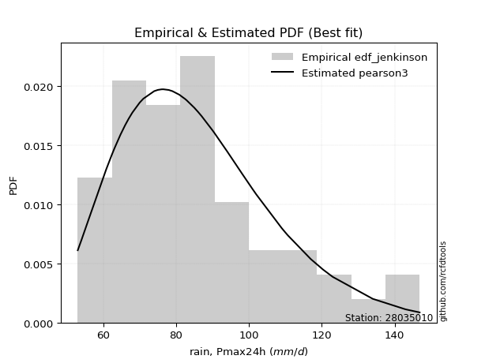</img>

</div>


### 11. EDF Cunnane (1978)

Cunnane´s work in statistical hydrology has focused on the performance and evaluation of different probability distributions (such as GEV, Gumbel, Lognormal) for flood frequency estimation. _b_ is a constant, typically set to 0.4.

<div align="center">


$P=(m-b)/(n+1-2b)$


</div>


**11.1. Empirical values**

<div align="center">

|                | 0                    | 1                   | 2                   | 3                   | 4                   | 5                   | 6                  | 7                   | 8                  | 9                   | 10                  | 11                 | 12                  | 13                  | 14                 | 15                  | 16                  | 17                 | 18                 | 19                  | 20                 | 21                  | 22                 | 23                 | 24                  | 25                 | 26                 | 27                 | 28                 | 29                 | 30                 | 31                 | 32                 | 33                 | 34                 | 35                 | 36                 | 37                 | 38                 | 39                 | 40                 | 41                 | 42                 | 43                 | 44                 | 45                 | 46               | 47                 | 48                 | 49                 | 50                 | 51                 |
|:---------------|:---------------------|:--------------------|:--------------------|:--------------------|:--------------------|:--------------------|:-------------------|:--------------------|:-------------------|:--------------------|:--------------------|:-------------------|:--------------------|:--------------------|:-------------------|:--------------------|:--------------------|:-------------------|:-------------------|:--------------------|:-------------------|:--------------------|:-------------------|:-------------------|:--------------------|:-------------------|:-------------------|:-------------------|:-------------------|:-------------------|:-------------------|:-------------------|:-------------------|:-------------------|:-------------------|:-------------------|:-------------------|:-------------------|:-------------------|:-------------------|:-------------------|:-------------------|:-------------------|:-------------------|:-------------------|:-------------------|:-----------------|:-------------------|:-------------------|:-------------------|:-------------------|:-------------------|
| date           | 2004                 | 1969                | 2000                | 1991                | 1994                | 2014                | 2009               | 1997                | 1968               | 1972                | 1989                | 2012               | 1976                | 2001                | 1984               | 2015                | 2006                | 1992               | 1980               | 1970                | 1993               | 1998                | 1987               | 1978               | 1985                | 2018               | 2013               | 2008               | 1973               | 2016               | 1979               | 1977               | 2003               | 1995               | 1975               | 1982               | 2011               | 1974               | 1988               | 1983               | 2022               | 2017               | 2005               | 1986               | 1999               | 1981               | 2002             | 2007               | 1990               | 2010               | 1996               | 1971               |
| x              | 53.75264075          | 55.92497723         | 56.0                | 56.0                | 58.50469062         | 60.8                | 62.3               | 63.0                | 64.2               | 64.7                | 66.0                | 67.0               | 67.0                | 68.0                | 68.34350579        | 68.5                | 70.0                | 70.0               | 71.0               | 73.07817535         | 74.0               | 75.0                | 76.0               | 76.5               | 78.0                | 78.0               | 79.0               | 82.5               | 82.9               | 85.0               | 86.0               | 87.0               | 90.0               | 90.0               | 90.0               | 90.0               | 90.5               | 94.0               | 94.0               | 98.2               | 99.0               | 101.0              | 102.0              | 109.0              | 110.0              | 110.7              | 117.0            | 120.4              | 123.0              | 134.0              | 143.0              | 146.9              |
| m              | 1                    | 2                   | 3                   | 4                   | 5                   | 6                   | 7                  | 8                   | 9                  | 10                  | 11                  | 12                 | 13                  | 14                  | 15                 | 16                  | 17                  | 18                 | 19                 | 20                  | 21                 | 22                  | 23                 | 24                 | 25                  | 26                 | 27                 | 28                 | 29                 | 30                 | 31                 | 32                 | 33                 | 34                 | 35                 | 36                 | 37                 | 38                 | 39                 | 40                 | 41                 | 42                 | 43                 | 44                 | 45                 | 46                 | 47               | 48                 | 49                 | 50                 | 51                 | 52                 |
| empirical_dist | edf_cunnane          | edf_cunnane         | edf_cunnane         | edf_cunnane         | edf_cunnane         | edf_cunnane         | edf_cunnane        | edf_cunnane         | edf_cunnane        | edf_cunnane         | edf_cunnane         | edf_cunnane        | edf_cunnane         | edf_cunnane         | edf_cunnane        | edf_cunnane         | edf_cunnane         | edf_cunnane        | edf_cunnane        | edf_cunnane         | edf_cunnane        | edf_cunnane         | edf_cunnane        | edf_cunnane        | edf_cunnane         | edf_cunnane        | edf_cunnane        | edf_cunnane        | edf_cunnane        | edf_cunnane        | edf_cunnane        | edf_cunnane        | edf_cunnane        | edf_cunnane        | edf_cunnane        | edf_cunnane        | edf_cunnane        | edf_cunnane        | edf_cunnane        | edf_cunnane        | edf_cunnane        | edf_cunnane        | edf_cunnane        | edf_cunnane        | edf_cunnane        | edf_cunnane        | edf_cunnane      | edf_cunnane        | edf_cunnane        | edf_cunnane        | edf_cunnane        | edf_cunnane        |
| empirical      | 0.011494252873563216 | 0.03065134099616858 | 0.04980842911877394 | 0.06896551724137931 | 0.08812260536398467 | 0.10727969348659003 | 0.1264367816091954 | 0.14559386973180075 | 0.1647509578544061 | 0.18390804597701146 | 0.20306513409961685 | 0.2222222222222222 | 0.24137931034482757 | 0.26053639846743293 | 0.2796934865900383 | 0.29885057471264365 | 0.31800766283524906 | 0.3371647509578544 | 0.3563218390804598 | 0.37547892720306514 | 0.3946360153256705 | 0.41379310344827586 | 0.4329501915708812 | 0.4521072796934866 | 0.47126436781609193 | 0.4904214559386973 | 0.5095785440613027 | 0.5287356321839081 | 0.5478927203065134 | 0.5670498084291188 | 0.5862068965517241 | 0.6053639846743295 | 0.6245210727969348 | 0.6436781609195402 | 0.6628352490421456 | 0.6819923371647509 | 0.7011494252873564 | 0.7203065134099617 | 0.7394636015325671 | 0.7586206896551724 | 0.7777777777777778 | 0.7969348659003831 | 0.8160919540229885 | 0.8352490421455938 | 0.8544061302681992 | 0.8735632183908045 | 0.89272030651341 | 0.9118773946360152 | 0.9310344827586207 | 0.9501915708812261 | 0.9693486590038314 | 0.9885057471264368 |
| empirical_tr   | 1.0116279069767442   | 1.0316205533596838  | 1.0524193548387097  | 1.0740740740740742  | 1.0966386554621848  | 1.1201716738197425  | 1.144736842105263  | 1.1704035874439462  | 1.1972477064220182 | 1.2253521126760563  | 1.2548076923076923  | 1.2857142857142856 | 1.3181818181818183  | 1.3523316062176165  | 1.3882978723404253 | 1.4262295081967213  | 1.4662921348314608  | 1.5086705202312138 | 1.5535714285714286 | 1.6012269938650308  | 1.6518987341772151 | 1.7058823529411762  | 1.7635135135135134 | 1.8251748251748252 | 1.891304347826087   | 1.9624060150375937 | 2.0390625          | 2.1219512195121952 | 2.211864406779661  | 2.3097345132743365 | 2.4166666666666665 | 2.533980582524272  | 2.6632653061224487 | 2.8064516129032255 | 2.9659090909090913 | 3.144578313253012  | 3.3461538461538467 | 3.5753424657534243 | 3.838235294117647  | 4.142857142857142  | 4.5                | 4.924528301886792  | 5.4375             | 6.069767441860463  | 6.868421052631579  | 7.909090909090905  | 9.32142857142857 | 11.347826086956513 | 14.499999999999995 | 20.076923076923087 | 32.624999999999964 | 87.0000000000001   |

</div>


**11.2. Kolmogorov-Smirnov fit test (sorted by Δ)**


<div align="center">

|                | 0                   | 1                    | 2                   | 3                   | 4                   | 5                   | 6                   | 7                   | 8                   | 9                   | 10                  | 11                  | 12                  | 13                  | 14                  | 15                   | 16                   | 17                   | 18                  | 19                  | 20                  | 21                  | 22                  | 23                  | 24                  | 25                  | 26                  | 27                  | 28                  | 29                  | 30                  | 31                  | 32                  | 33                  | 34                  | 35                  | 36                  | 37                  | 38                  | 39                  | 40                  | 41                  | 42                  | 43                  | 44                  | 45                  | 46                  | 47                  | 48                  | 49                  | 50                  | 51                  | 52                  | 53                  | 54                  | 55                  | 56                  | 57                  | 58                  | 59                  | 60                  | 61                  | 62                    | 63                  | 64                  | 65                  | 66                  | 67                  | 68                  | 69                  | 70                  | 71                  | 72                  | 73                  | 74                  | 75                  | 76                  | 77                  | 78                  | 79                  | 80                  | 81                  | 82                  | 83                  | 84                  | 85                  | 86                  | 87                  |
|:---------------|:--------------------|:---------------------|:--------------------|:--------------------|:--------------------|:--------------------|:--------------------|:--------------------|:--------------------|:--------------------|:--------------------|:--------------------|:--------------------|:--------------------|:--------------------|:---------------------|:---------------------|:---------------------|:--------------------|:--------------------|:--------------------|:--------------------|:--------------------|:--------------------|:--------------------|:--------------------|:--------------------|:--------------------|:--------------------|:--------------------|:--------------------|:--------------------|:--------------------|:--------------------|:--------------------|:--------------------|:--------------------|:--------------------|:--------------------|:--------------------|:--------------------|:--------------------|:--------------------|:--------------------|:--------------------|:--------------------|:--------------------|:--------------------|:--------------------|:--------------------|:--------------------|:--------------------|:--------------------|:--------------------|:--------------------|:--------------------|:--------------------|:--------------------|:--------------------|:--------------------|:--------------------|:--------------------|:----------------------|:--------------------|:--------------------|:--------------------|:--------------------|:--------------------|:--------------------|:--------------------|:--------------------|:--------------------|:--------------------|:--------------------|:--------------------|:--------------------|:--------------------|:--------------------|:--------------------|:--------------------|:--------------------|:--------------------|:--------------------|:--------------------|:--------------------|:--------------------|:--------------------|:--------------------|
| station        | 28035010            | 28035010             | 28035010            | 28035010            | 28035010            | 28035010            | 28035010            | 28035010            | 28035010            | 28035010            | 28035010            | 28035010            | 28035010            | 28035010            | 28035010            | 28035010             | 28035010             | 28035010             | 28035010            | 28035010            | 28035010            | 28035010            | 28035010            | 28035010            | 28035010            | 28035010            | 28035010            | 28035010            | 28035010            | 28035010            | 28035010            | 28035010            | 28035010            | 28035010            | 28035010            | 28035010            | 28035010            | 28035010            | 28035010            | 28035010            | 28035010            | 28035010            | 28035010            | 28035010            | 28035010            | 28035010            | 28035010            | 28035010            | 28035010            | 28035010            | 28035010            | 28035010            | 28035010            | 28035010            | 28035010            | 28035010            | 28035010            | 28035010            | 28035010            | 28035010            | 28035010            | 28035010            | 28035010              | 28035010            | 28035010            | 28035010            | 28035010            | 28035010            | 28035010            | 28035010            | 28035010            | 28035010            | 28035010            | 28035010            | 28035010            | 28035010            | 28035010            | 28035010            | 28035010            | 28035010            | 28035010            | 28035010            | 28035010            | 28035010            | 28035010            | 28035010            | 28035010            | 28035010            |
| empirical_dist | edf_cunnane         | edf_cunnane          | edf_cunnane         | edf_cunnane         | edf_cunnane         | edf_cunnane         | edf_cunnane         | edf_cunnane         | edf_cunnane         | edf_cunnane         | edf_cunnane         | edf_cunnane         | edf_cunnane         | edf_cunnane         | edf_cunnane         | edf_cunnane          | edf_cunnane          | edf_cunnane          | edf_cunnane         | edf_cunnane         | edf_cunnane         | edf_cunnane         | edf_cunnane         | edf_cunnane         | edf_cunnane         | edf_cunnane         | edf_cunnane         | edf_cunnane         | edf_cunnane         | edf_cunnane         | edf_cunnane         | edf_cunnane         | edf_cunnane         | edf_cunnane         | edf_cunnane         | edf_cunnane         | edf_cunnane         | edf_cunnane         | edf_cunnane         | edf_cunnane         | edf_cunnane         | edf_cunnane         | edf_cunnane         | edf_cunnane         | edf_cunnane         | edf_cunnane         | edf_cunnane         | edf_cunnane         | edf_cunnane         | edf_cunnane         | edf_cunnane         | edf_cunnane         | edf_cunnane         | edf_cunnane         | edf_cunnane         | edf_cunnane         | edf_cunnane         | edf_cunnane         | edf_cunnane         | edf_cunnane         | edf_cunnane         | edf_cunnane         | edf_cunnane           | edf_cunnane         | edf_cunnane         | edf_cunnane         | edf_cunnane         | edf_cunnane         | edf_cunnane         | edf_cunnane         | edf_cunnane         | edf_cunnane         | edf_cunnane         | edf_cunnane         | edf_cunnane         | edf_cunnane         | edf_cunnane         | edf_cunnane         | edf_cunnane         | edf_cunnane         | edf_cunnane         | edf_cunnane         | edf_cunnane         | edf_cunnane         | edf_cunnane         | edf_cunnane         | edf_cunnane         | edf_cunnane         |
| p_dist         | weibull_min         | halfnorm             | logmaxwell          | logrice             | lograyleigh         | pearson3            | gamma               | erlang              | logweibull_min      | loggenexpon         | logpearson3         | logncf              | lognakagami         | nct                 | fatiguelife         | logalpha             | invgauss             | moyal                | johnsonsu           | gumbel_r            | loginvgamma         | alpha               | rayleigh            | invgamma            | f                   | loglognorm          | logjohnsonsu        | logexponnorm        | loginvgauss         | logfatiguelife      | invweibull          | logf                | loggamma            | loggamma            | logerlang           | gompertz            | genlogistic         | lognct              | betaprime           | fisk                | nakagami            | logkstwobign        | kstwobign           | logloggamma         | logfisk             | mielke              | loggenlogistic      | loginvweibull       | logmielke           | logt                | lognorm             | lognorm             | logcrystalball      | exponnorm           | laplace_asymmetric  | maxwell             | halflogistic        | ncf                 | loggumbel_r         | loghalfnorm         | loglogistic         | rice                | loglaplace_asymmetric | logmoyal            | loghalflogistic     | truncnorm           | norm                | crystalball         | t                   | loghypsecant        | loggompertz         | genexpon            | logistic            | expon               | hypsecant           | loglaplace          | loggumbel_l         | chi2                | laplace             | logbetaprime        | gumbel_l            | logtruncnorm        | wald                | logwald             | logexpon            | logchi2             | loggibrat           | gibrat              |
| delta          | 0.04410367709853347 | 0.044480955832256336 | 0.04715688482903929 | 0.04757622865429134 | 0.05151379427282676 | 0.05196564891466765 | 0.05377237988668582 | 0.05377262427599261 | 0.05576936170403701 | 0.05622809270989437 | 0.05681481763434937 | 0.05784242461315914 | 0.05860105995879994 | 0.05932202336421927 | 0.05960571147664939 | 0.060067833538307136 | 0.060243011624004805 | 0.061266949753177036 | 0.06141016539886113 | 0.06191811770851363 | 0.06204083289243789 | 0.06226683689996282 | 0.06240149860806499 | 0.06288183206132447 | 0.06289951996276788 | 0.062954879012727   | 0.0632213509294991  | 0.06346184901155794 | 0.06367953627592882 | 0.06388937076310608 | 0.06421727487503404 | 0.06450682418842724 | 0.0646533182589819  | 0.0646533182589819  | 0.06465352182269046 | 0.06468648492643758 | 0.06518790270018271 | 0.06528914594764795 | 0.06639924333993097 | 0.06739957545770203 | 0.06753185255714278 | 0.06836625521164874 | 0.06873231332548785 | 0.06922180232174707 | 0.07045926343878717 | 0.07048573895062804 | 0.07069035015282588 | 0.07070632517753117 | 0.07105294539188589 | 0.07128206441866691 | 0.07128302057982633 | 0.07128302057982633 | 0.0712830226065686  | 0.07158418453828896 | 0.07232925490996722 | 0.07324244492767351 | 0.07398140894766844 | 0.07883161120924592 | 0.08338210950623126 | 0.08812260536398467 | 0.09352588132713135 | 0.09353698841916624 | 0.09662425946468678   | 0.10338578153964706 | 0.10727969348659003 | 0.10730949976324944 | 0.10730950935082728 | 0.10730966780572154 | 0.10735361485315181 | 0.10881278445187328 | 0.11564723660655801 | 0.11881692172508362 | 0.11995050751548436 | 0.1273454498545179  | 0.1315799242194975  | 0.13237164902214762 | 0.1357394409284553  | 0.14635884952804504 | 0.1595986630174821  | 0.16870510906277478 | 0.17405001660630792 | 0.17553941083108765 | 0.17561312625716652 | 0.18376670550544735 | 0.18553124195145487 | 0.25129979712386996 | 0.2845998349479903  | 0.2875260416914527  |
| deltao         | 0.18859806671657792 | 0.18859806671657792  | 0.18859806671657792 | 0.18859806671657792 | 0.18859806671657792 | 0.18859806671657792 | 0.18859806671657792 | 0.18859806671657792 | 0.18859806671657792 | 0.18859806671657792 | 0.18859806671657792 | 0.18859806671657792 | 0.18859806671657792 | 0.18859806671657792 | 0.18859806671657792 | 0.18859806671657792  | 0.18859806671657792  | 0.18859806671657792  | 0.18859806671657792 | 0.18859806671657792 | 0.18859806671657792 | 0.18859806671657792 | 0.18859806671657792 | 0.18859806671657792 | 0.18859806671657792 | 0.18859806671657792 | 0.18859806671657792 | 0.18859806671657792 | 0.18859806671657792 | 0.18859806671657792 | 0.18859806671657792 | 0.18859806671657792 | 0.18859806671657792 | 0.18859806671657792 | 0.18859806671657792 | 0.18859806671657792 | 0.18859806671657792 | 0.18859806671657792 | 0.18859806671657792 | 0.18859806671657792 | 0.18859806671657792 | 0.18859806671657792 | 0.18859806671657792 | 0.18859806671657792 | 0.18859806671657792 | 0.18859806671657792 | 0.18859806671657792 | 0.18859806671657792 | 0.18859806671657792 | 0.18859806671657792 | 0.18859806671657792 | 0.18859806671657792 | 0.18859806671657792 | 0.18859806671657792 | 0.18859806671657792 | 0.18859806671657792 | 0.18859806671657792 | 0.18859806671657792 | 0.18859806671657792 | 0.18859806671657792 | 0.18859806671657792 | 0.18859806671657792 | 0.18859806671657792   | 0.18859806671657792 | 0.18859806671657792 | 0.18859806671657792 | 0.18859806671657792 | 0.18859806671657792 | 0.18859806671657792 | 0.18859806671657792 | 0.18859806671657792 | 0.18859806671657792 | 0.18859806671657792 | 0.18859806671657792 | 0.18859806671657792 | 0.18859806671657792 | 0.18859806671657792 | 0.18859806671657792 | 0.18859806671657792 | 0.18859806671657792 | 0.18859806671657792 | 0.18859806671657792 | 0.18859806671657792 | 0.18859806671657792 | 0.18859806671657792 | 0.18859806671657792 | 0.18859806671657792 | 0.18859806671657792 |
| eval           | Δo > Δ              | Δo > Δ               | Δo > Δ              | Δo > Δ              | Δo > Δ              | Δo > Δ              | Δo > Δ              | Δo > Δ              | Δo > Δ              | Δo > Δ              | Δo > Δ              | Δo > Δ              | Δo > Δ              | Δo > Δ              | Δo > Δ              | Δo > Δ               | Δo > Δ               | Δo > Δ               | Δo > Δ              | Δo > Δ              | Δo > Δ              | Δo > Δ              | Δo > Δ              | Δo > Δ              | Δo > Δ              | Δo > Δ              | Δo > Δ              | Δo > Δ              | Δo > Δ              | Δo > Δ              | Δo > Δ              | Δo > Δ              | Δo > Δ              | Δo > Δ              | Δo > Δ              | Δo > Δ              | Δo > Δ              | Δo > Δ              | Δo > Δ              | Δo > Δ              | Δo > Δ              | Δo > Δ              | Δo > Δ              | Δo > Δ              | Δo > Δ              | Δo > Δ              | Δo > Δ              | Δo > Δ              | Δo > Δ              | Δo > Δ              | Δo > Δ              | Δo > Δ              | Δo > Δ              | Δo > Δ              | Δo > Δ              | Δo > Δ              | Δo > Δ              | Δo > Δ              | Δo > Δ              | Δo > Δ              | Δo > Δ              | Δo > Δ              | Δo > Δ                | Δo > Δ              | Δo > Δ              | Δo > Δ              | Δo > Δ              | Δo > Δ              | Δo > Δ              | Δo > Δ              | Δo > Δ              | Δo > Δ              | Δo > Δ              | Δo > Δ              | Δo > Δ              | Δo > Δ              | Δo > Δ              | Δo > Δ              | Δo > Δ              | Δo > Δ              | Δo > Δ              | Δo > Δ              | Δo > Δ              | Δo > Δ              | Δo > Δ              | Δo <= Δ             | Δo <= Δ             | Δo <= Δ             |
| fit            | 1                   | 1                    | 1                   | 1                   | 1                   | 1                   | 1                   | 1                   | 1                   | 1                   | 1                   | 1                   | 1                   | 1                   | 1                   | 1                    | 1                    | 1                    | 1                   | 1                   | 1                   | 1                   | 1                   | 1                   | 1                   | 1                   | 1                   | 1                   | 1                   | 1                   | 1                   | 1                   | 1                   | 1                   | 1                   | 1                   | 1                   | 1                   | 1                   | 1                   | 1                   | 1                   | 1                   | 1                   | 1                   | 1                   | 1                   | 1                   | 1                   | 1                   | 1                   | 1                   | 1                   | 1                   | 1                   | 1                   | 1                   | 1                   | 1                   | 1                   | 1                   | 1                   | 1                     | 1                   | 1                   | 1                   | 1                   | 1                   | 1                   | 1                   | 1                   | 1                   | 1                   | 1                   | 1                   | 1                   | 1                   | 1                   | 1                   | 1                   | 1                   | 1                   | 1                   | 1                   | 1                   | 0                   | 0                   | 0                   |
| n              | 52                  | 52                   | 52                  | 52                  | 52                  | 52                  | 52                  | 52                  | 52                  | 52                  | 52                  | 52                  | 52                  | 52                  | 52                  | 52                   | 52                   | 52                   | 52                  | 52                  | 52                  | 52                  | 52                  | 52                  | 52                  | 52                  | 52                  | 52                  | 52                  | 52                  | 52                  | 52                  | 52                  | 52                  | 52                  | 52                  | 52                  | 52                  | 52                  | 52                  | 52                  | 52                  | 52                  | 52                  | 52                  | 52                  | 52                  | 52                  | 52                  | 52                  | 52                  | 52                  | 52                  | 52                  | 52                  | 52                  | 52                  | 52                  | 52                  | 52                  | 52                  | 52                  | 52                    | 52                  | 52                  | 52                  | 52                  | 52                  | 52                  | 52                  | 52                  | 52                  | 52                  | 52                  | 52                  | 52                  | 52                  | 52                  | 52                  | 52                  | 52                  | 52                  | 52                  | 52                  | 52                  | 52                  | 52                  | 52                  |
| best_fit       | 1                   | 0                    | 0                   | 0                   | 0                   | 0                   | 0                   | 0                   | 0                   | 0                   | 0                   | 0                   | 0                   | 0                   | 0                   | 0                    | 0                    | 0                    | 0                   | 0                   | 0                   | 0                   | 0                   | 0                   | 0                   | 0                   | 0                   | 0                   | 0                   | 0                   | 0                   | 0                   | 0                   | 0                   | 0                   | 0                   | 0                   | 0                   | 0                   | 0                   | 0                   | 0                   | 0                   | 0                   | 0                   | 0                   | 0                   | 0                   | 0                   | 0                   | 0                   | 0                   | 0                   | 0                   | 0                   | 0                   | 0                   | 0                   | 0                   | 0                   | 0                   | 0                   | 0                     | 0                   | 0                   | 0                   | 0                   | 0                   | 0                   | 0                   | 0                   | 0                   | 0                   | 0                   | 0                   | 0                   | 0                   | 0                   | 0                   | 0                   | 0                   | 0                   | 0                   | 0                   | 0                   | 0                   | 0                   | 0                   |
| best_fit_sort  | 1                   | 2                    | 3                   | 4                   | 5                   | 6                   | 7                   | 8                   | 9                   | 10                  | 11                  | 12                  | 13                  | 14                  | 15                  | 16                   | 17                   | 18                   | 19                  | 20                  | 21                  | 22                  | 23                  | 24                  | 25                  | 26                  | 27                  | 28                  | 29                  | 30                  | 31                  | 32                  | 33                  | 34                  | 35                  | 36                  | 37                  | 38                  | 39                  | 40                  | 41                  | 42                  | 43                  | 44                  | 45                  | 46                  | 47                  | 48                  | 49                  | 50                  | 51                  | 52                  | 53                  | 54                  | 55                  | 56                  | 57                  | 58                  | 59                  | 60                  | 61                  | 62                  | 63                    | 64                  | 65                  | 66                  | 67                  | 68                  | 69                  | 70                  | 71                  | 72                  | 73                  | 74                  | 75                  | 76                  | 77                  | 78                  | 79                  | 80                  | 81                  | 82                  | 83                  | 84                  | 85                  | 86                  | 87                  | 88                  |

</div>


<div align="center">

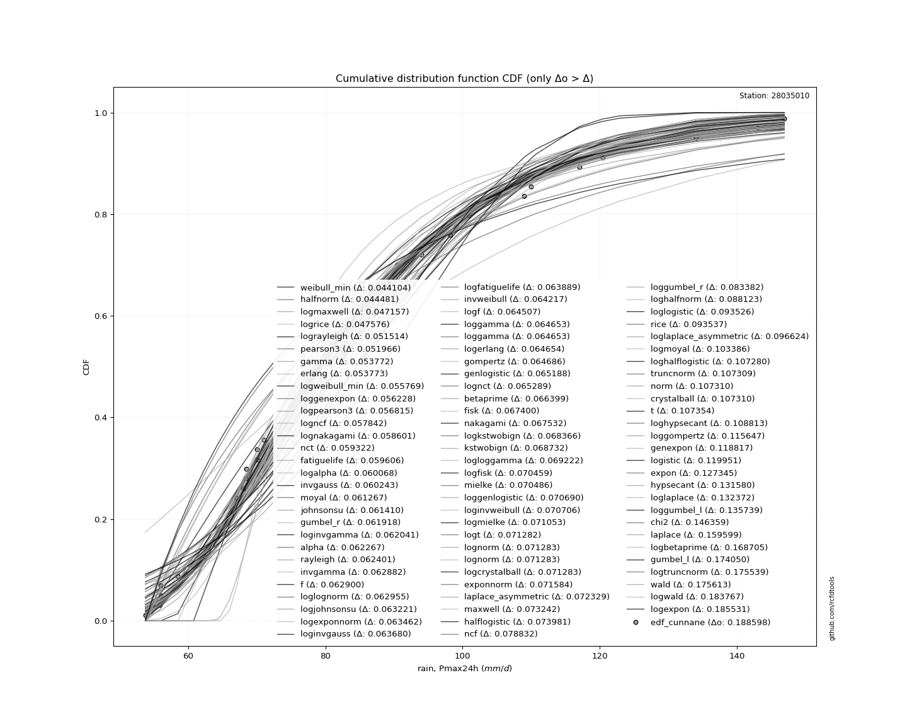</img>

</div>


**11.3. Best fit**

<div align="center">

|   id |   station | empirical_dist   | p_dist      |     delta |   deltao | eval   |   fit |   n |   best_fit |   best_fit_sort |
|-----:|----------:|:-----------------|:------------|----------:|---------:|:-------|------:|----:|-----------:|----------------:|
|    0 |  28035010 | edf_cunnane      | weibull_min | 0.0441037 | 0.188598 | Δo > Δ |     1 |  52 |          1 |               1 |

</div>


<div align="center">

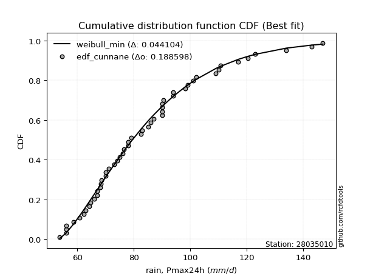</img></img>

</div>


### 12. EDF Adamowski (1981)

The Adamowski formula in hydrology refers to a specific plotting position formula used for estimating the non-parametric empirical distribution of hydrological events (like flood peaks) to calculate their return periods. This formula provides an alternative to traditional parametric methods (like the Gumbel or Log Pearson Type III distributions). 

<div align="center">


$P=(m-0.25)/(n+0.5)$


</div>


**12.1. Empirical values**

<div align="center">

|                | 0                    | 1                   | 2                   | 3                   | 4                   | 5                   | 6                   | 7                   | 8                   | 9                   | 10                  | 11                  | 12                  | 13                 | 14                  | 15                 | 16                 | 17                 | 18                  | 19                 | 20                 | 21                 | 22                  | 23                 | 24                 | 25                  | 26                 | 27                 | 28                 | 29                 | 30                 | 31                 | 32                 | 33                 | 34                 | 35                 | 36                | 37                | 38                 | 39                 | 40                 | 41                 | 42                 | 43                 | 44                 | 45                 | 46                 | 47                 | 48                 | 49                 | 50                 | 51                 |
|:---------------|:---------------------|:--------------------|:--------------------|:--------------------|:--------------------|:--------------------|:--------------------|:--------------------|:--------------------|:--------------------|:--------------------|:--------------------|:--------------------|:-------------------|:--------------------|:-------------------|:-------------------|:-------------------|:--------------------|:-------------------|:-------------------|:-------------------|:--------------------|:-------------------|:-------------------|:--------------------|:-------------------|:-------------------|:-------------------|:-------------------|:-------------------|:-------------------|:-------------------|:-------------------|:-------------------|:-------------------|:------------------|:------------------|:-------------------|:-------------------|:-------------------|:-------------------|:-------------------|:-------------------|:-------------------|:-------------------|:-------------------|:-------------------|:-------------------|:-------------------|:-------------------|:-------------------|
| date           | 2004                 | 1969                | 2000                | 1991                | 1994                | 2014                | 2009                | 1997                | 1968                | 1972                | 1989                | 2012                | 1976                | 2001               | 1984                | 2015               | 2006               | 1992               | 1980                | 1970               | 1993               | 1998               | 1987                | 1978               | 1985               | 2018                | 2013               | 2008               | 1973               | 2016               | 1979               | 1977               | 2003               | 1995               | 1975               | 1982               | 2011              | 1974              | 1988               | 1983               | 2022               | 2017               | 2005               | 1986               | 1999               | 1981               | 2002               | 2007               | 1990               | 2010               | 1996               | 1971               |
| x              | 53.75264075          | 55.92497723         | 56.0                | 56.0                | 58.50469062         | 60.8                | 62.3                | 63.0                | 64.2                | 64.7                | 66.0                | 67.0                | 67.0                | 68.0               | 68.34350579         | 68.5               | 70.0               | 70.0               | 71.0                | 73.07817535        | 74.0               | 75.0               | 76.0                | 76.5               | 78.0               | 78.0                | 79.0               | 82.5               | 82.9               | 85.0               | 86.0               | 87.0               | 90.0               | 90.0               | 90.0               | 90.0               | 90.5              | 94.0              | 94.0               | 98.2               | 99.0               | 101.0              | 102.0              | 109.0              | 110.0              | 110.7              | 117.0              | 120.4              | 123.0              | 134.0              | 143.0              | 146.9              |
| m              | 1                    | 2                   | 3                   | 4                   | 5                   | 6                   | 7                   | 8                   | 9                   | 10                  | 11                  | 12                  | 13                  | 14                 | 15                  | 16                 | 17                 | 18                 | 19                  | 20                 | 21                 | 22                 | 23                  | 24                 | 25                 | 26                  | 27                 | 28                 | 29                 | 30                 | 31                 | 32                 | 33                 | 34                 | 35                 | 36                 | 37                | 38                | 39                 | 40                 | 41                 | 42                 | 43                 | 44                 | 45                 | 46                 | 47                 | 48                 | 49                 | 50                 | 51                 | 52                 |
| empirical_dist | edf_adamowski        | edf_adamowski       | edf_adamowski       | edf_adamowski       | edf_adamowski       | edf_adamowski       | edf_adamowski       | edf_adamowski       | edf_adamowski       | edf_adamowski       | edf_adamowski       | edf_adamowski       | edf_adamowski       | edf_adamowski      | edf_adamowski       | edf_adamowski      | edf_adamowski      | edf_adamowski      | edf_adamowski       | edf_adamowski      | edf_adamowski      | edf_adamowski      | edf_adamowski       | edf_adamowski      | edf_adamowski      | edf_adamowski       | edf_adamowski      | edf_adamowski      | edf_adamowski      | edf_adamowski      | edf_adamowski      | edf_adamowski      | edf_adamowski      | edf_adamowski      | edf_adamowski      | edf_adamowski      | edf_adamowski     | edf_adamowski     | edf_adamowski      | edf_adamowski      | edf_adamowski      | edf_adamowski      | edf_adamowski      | edf_adamowski      | edf_adamowski      | edf_adamowski      | edf_adamowski      | edf_adamowski      | edf_adamowski      | edf_adamowski      | edf_adamowski      | edf_adamowski      |
| empirical      | 0.014285714285714285 | 0.03333333333333333 | 0.05238095238095238 | 0.07142857142857142 | 0.09047619047619047 | 0.10952380952380952 | 0.12857142857142856 | 0.14761904761904762 | 0.16666666666666666 | 0.18571428571428572 | 0.20476190476190476 | 0.22380952380952382 | 0.24285714285714285 | 0.2619047619047619 | 0.28095238095238095 | 0.3                | 0.319047619047619  | 0.3380952380952381 | 0.35714285714285715 | 0.3761904761904762 | 0.3952380952380952 | 0.4142857142857143 | 0.43333333333333335 | 0.4523809523809524 | 0.4714285714285714 | 0.49047619047619045 | 0.5095238095238095 | 0.5285714285714286 | 0.5476190476190477 | 0.5666666666666667 | 0.5857142857142857 | 0.6047619047619047 | 0.6238095238095238 | 0.6428571428571429 | 0.6619047619047619 | 0.680952380952381  | 0.7               | 0.719047619047619 | 0.7380952380952381 | 0.7571428571428571 | 0.7761904761904762 | 0.7952380952380952 | 0.8142857142857143 | 0.8333333333333334 | 0.8523809523809524 | 0.8714285714285714 | 0.8904761904761904 | 0.9095238095238095 | 0.9285714285714286 | 0.9476190476190476 | 0.9666666666666667 | 0.9857142857142858 |
| empirical_tr   | 1.0144927536231882   | 1.0344827586206897  | 1.0552763819095479  | 1.0769230769230769  | 1.0994764397905759  | 1.1229946524064172  | 1.1475409836065573  | 1.1731843575418994  | 1.2                 | 1.2280701754385965  | 1.2574850299401197  | 1.2883435582822085  | 1.3207547169811322  | 1.3548387096774193 | 1.390728476821192   | 1.4285714285714286 | 1.4685314685314685 | 1.510791366906475  | 1.5555555555555558  | 1.6030534351145038 | 1.653543307086614  | 1.707317073170732  | 1.7647058823529411  | 1.826086956521739  | 1.8918918918918919 | 1.9626168224299068  | 2.0388349514563107 | 2.121212121212121  | 2.210526315789474  | 2.3076923076923075 | 2.4137931034482762 | 2.5301204819277108 | 2.6582278481012658 | 2.8000000000000003 | 2.957746478873239  | 3.1343283582089554 | 3.333333333333333 | 3.559322033898305 | 3.818181818181819  | 4.117647058823529  | 4.468085106382979  | 4.883720930232557  | 5.384615384615384  | 6.000000000000002  | 6.774193548387095  | 7.777777777777779  | 9.130434782608692  | 11.052631578947366 | 14.000000000000007 | 19.09090909090908  | 30.000000000000007 | 70.00000000000026  |

</div>


**12.2. Kolmogorov-Smirnov fit test (sorted by Δ)**


<div align="center">

|                | 0                   | 1                   | 2                   | 3                    | 4                    | 5                    | 6                   | 7                   | 8                    | 9                    | 10                   | 11                  | 12                  | 13                  | 14                   | 15                  | 16                  | 17                  | 18                  | 19                  | 20                  | 21                  | 22                  | 23                  | 24                  | 25                  | 26                  | 27                  | 28                  | 29                  | 30                  | 31                  | 32                  | 33                  | 34                  | 35                  | 36                  | 37                  | 38                  | 39                  | 40                  | 41                  | 42                  | 43                  | 44                  | 45                  | 46                  | 47                  | 48                  | 49                  | 50                  | 51                  | 52                  | 53                  | 54                  | 55                  | 56                  | 57                  | 58                  | 59                  | 60                  | 61                  | 62                    | 63                  | 64                  | 65                  | 66                  | 67                  | 68                  | 69                  | 70                  | 71                  | 72                  | 73                  | 74                  | 75                  | 76                  | 77                  | 78                  | 79                  | 80                  | 81                  | 82                  | 83                  | 84                  | 85                  | 86                  | 87                  |
|:---------------|:--------------------|:--------------------|:--------------------|:---------------------|:---------------------|:---------------------|:--------------------|:--------------------|:---------------------|:---------------------|:---------------------|:--------------------|:--------------------|:--------------------|:---------------------|:--------------------|:--------------------|:--------------------|:--------------------|:--------------------|:--------------------|:--------------------|:--------------------|:--------------------|:--------------------|:--------------------|:--------------------|:--------------------|:--------------------|:--------------------|:--------------------|:--------------------|:--------------------|:--------------------|:--------------------|:--------------------|:--------------------|:--------------------|:--------------------|:--------------------|:--------------------|:--------------------|:--------------------|:--------------------|:--------------------|:--------------------|:--------------------|:--------------------|:--------------------|:--------------------|:--------------------|:--------------------|:--------------------|:--------------------|:--------------------|:--------------------|:--------------------|:--------------------|:--------------------|:--------------------|:--------------------|:--------------------|:----------------------|:--------------------|:--------------------|:--------------------|:--------------------|:--------------------|:--------------------|:--------------------|:--------------------|:--------------------|:--------------------|:--------------------|:--------------------|:--------------------|:--------------------|:--------------------|:--------------------|:--------------------|:--------------------|:--------------------|:--------------------|:--------------------|:--------------------|:--------------------|:--------------------|:--------------------|
| station        | 28035010            | 28035010            | 28035010            | 28035010             | 28035010             | 28035010             | 28035010            | 28035010            | 28035010             | 28035010             | 28035010             | 28035010            | 28035010            | 28035010            | 28035010             | 28035010            | 28035010            | 28035010            | 28035010            | 28035010            | 28035010            | 28035010            | 28035010            | 28035010            | 28035010            | 28035010            | 28035010            | 28035010            | 28035010            | 28035010            | 28035010            | 28035010            | 28035010            | 28035010            | 28035010            | 28035010            | 28035010            | 28035010            | 28035010            | 28035010            | 28035010            | 28035010            | 28035010            | 28035010            | 28035010            | 28035010            | 28035010            | 28035010            | 28035010            | 28035010            | 28035010            | 28035010            | 28035010            | 28035010            | 28035010            | 28035010            | 28035010            | 28035010            | 28035010            | 28035010            | 28035010            | 28035010            | 28035010              | 28035010            | 28035010            | 28035010            | 28035010            | 28035010            | 28035010            | 28035010            | 28035010            | 28035010            | 28035010            | 28035010            | 28035010            | 28035010            | 28035010            | 28035010            | 28035010            | 28035010            | 28035010            | 28035010            | 28035010            | 28035010            | 28035010            | 28035010            | 28035010            | 28035010            |
| empirical_dist | edf_adamowski       | edf_adamowski       | edf_adamowski       | edf_adamowski        | edf_adamowski        | edf_adamowski        | edf_adamowski       | edf_adamowski       | edf_adamowski        | edf_adamowski        | edf_adamowski        | edf_adamowski       | edf_adamowski       | edf_adamowski       | edf_adamowski        | edf_adamowski       | edf_adamowski       | edf_adamowski       | edf_adamowski       | edf_adamowski       | edf_adamowski       | edf_adamowski       | edf_adamowski       | edf_adamowski       | edf_adamowski       | edf_adamowski       | edf_adamowski       | edf_adamowski       | edf_adamowski       | edf_adamowski       | edf_adamowski       | edf_adamowski       | edf_adamowski       | edf_adamowski       | edf_adamowski       | edf_adamowski       | edf_adamowski       | edf_adamowski       | edf_adamowski       | edf_adamowski       | edf_adamowski       | edf_adamowski       | edf_adamowski       | edf_adamowski       | edf_adamowski       | edf_adamowski       | edf_adamowski       | edf_adamowski       | edf_adamowski       | edf_adamowski       | edf_adamowski       | edf_adamowski       | edf_adamowski       | edf_adamowski       | edf_adamowski       | edf_adamowski       | edf_adamowski       | edf_adamowski       | edf_adamowski       | edf_adamowski       | edf_adamowski       | edf_adamowski       | edf_adamowski         | edf_adamowski       | edf_adamowski       | edf_adamowski       | edf_adamowski       | edf_adamowski       | edf_adamowski       | edf_adamowski       | edf_adamowski       | edf_adamowski       | edf_adamowski       | edf_adamowski       | edf_adamowski       | edf_adamowski       | edf_adamowski       | edf_adamowski       | edf_adamowski       | edf_adamowski       | edf_adamowski       | edf_adamowski       | edf_adamowski       | edf_adamowski       | edf_adamowski       | edf_adamowski       | edf_adamowski       | edf_adamowski       |
| p_dist         | weibull_min         | halfnorm            | logmaxwell          | logrice              | lograyleigh          | pearson3             | gamma               | erlang              | logweibull_min       | loggenexpon          | logpearson3          | logncf              | lognakagami         | nct                 | fatiguelife          | logalpha            | invgauss            | rayleigh            | moyal               | johnsonsu           | loginvgamma         | gumbel_r            | alpha               | gompertz            | invgamma            | f                   | loglognorm          | logjohnsonsu        | logexponnorm        | loginvgauss         | logfatiguelife      | invweibull          | logf                | loggamma            | loggamma            | logerlang           | nakagami            | genlogistic         | lognct              | betaprime           | fisk                | logkstwobign        | kstwobign           | logloggamma         | logfisk             | mielke              | loggenlogistic      | loginvweibull       | logmielke           | logt                | lognorm             | lognorm             | logcrystalball      | exponnorm           | laplace_asymmetric  | maxwell             | halflogistic        | ncf                 | loggumbel_r         | loghalfnorm         | rice                | loglogistic         | loglaplace_asymmetric | logmoyal            | truncnorm           | norm                | crystalball         | t                   | loghalflogistic     | loghypsecant        | loggompertz         | genexpon            | logistic            | expon               | hypsecant           | loglaplace          | loggumbel_l         | chi2                | laplace             | logbetaprime        | logtruncnorm        | gumbel_l            | wald                | logexpon            | logwald             | logchi2             | loggibrat           | gibrat              |
| delta          | 0.04481522608594446 | 0.04694401001944845 | 0.04808737196642299 | 0.048287777641702334 | 0.052225343260237755 | 0.052896136052051346 | 0.05448392887409681 | 0.0544841732634036  | 0.056480910691448005 | 0.056939641697305365 | 0.057745304771733064 | 0.05877291175054283 | 0.05931260894621093 | 0.06025251050160296 | 0.060317260464060385 | 0.06077938252571813 | 0.0609545606114158  | 0.06125207332070859 | 0.06197849874058803 | 0.06212171438627212 | 0.06275238187984888 | 0.06284860484589733 | 0.06297838588737381 | 0.06353705963908118 | 0.06359338104873546 | 0.06361106895017887 | 0.063666428000138   | 0.06393289991691009 | 0.06417339799896893 | 0.06439108526333981 | 0.06460091975051707 | 0.06492882386244503 | 0.06521837317583823 | 0.0653648672463929  | 0.0653648672463929  | 0.06536507081010146 | 0.06562244454441077 | 0.0661183898375664  | 0.06621963308503165 | 0.06732973047731466 | 0.06811112444511302 | 0.06907780419905973 | 0.06966280046287154 | 0.07004282038414444 | 0.07117081242619816 | 0.07119728793803903 | 0.07140189914023687 | 0.07141787416494216 | 0.07176449437929688 | 0.07210308248106428 | 0.0721040386422237  | 0.0721040386422237  | 0.07210404066896597 | 0.07229573352569996 | 0.07304080389737821 | 0.07318771039018035 | 0.07633499405987423 | 0.07888634574673908 | 0.08409365849364225 | 0.09047619047619047 | 0.09435800648156362 | 0.09445636846451505 | 0.09733580845209777   | 0.10409733052705805 | 0.10725476522575628 | 0.10725477481333412 | 0.10725493326822838 | 0.10729888031565865 | 0.10952380952380952 | 0.10974327158925698 | 0.1140599350192564  | 0.11722962013778201 | 0.1198957729779912  | 0.1257581482672163  | 0.13163465875699065 | 0.133192667084545   | 0.13568470639096214 | 0.14444314071578448 | 0.15965339755497526 | 0.16602311672561004 | 0.17395210924378604 | 0.17399528206881476 | 0.17741936599444078 | 0.18394394036415326 | 0.1855729452427216  | 0.24971249553656835 | 0.28574926023534664 | 0.288675466978809   |
| deltao         | 0.18859806671657792 | 0.18859806671657792 | 0.18859806671657792 | 0.18859806671657792  | 0.18859806671657792  | 0.18859806671657792  | 0.18859806671657792 | 0.18859806671657792 | 0.18859806671657792  | 0.18859806671657792  | 0.18859806671657792  | 0.18859806671657792 | 0.18859806671657792 | 0.18859806671657792 | 0.18859806671657792  | 0.18859806671657792 | 0.18859806671657792 | 0.18859806671657792 | 0.18859806671657792 | 0.18859806671657792 | 0.18859806671657792 | 0.18859806671657792 | 0.18859806671657792 | 0.18859806671657792 | 0.18859806671657792 | 0.18859806671657792 | 0.18859806671657792 | 0.18859806671657792 | 0.18859806671657792 | 0.18859806671657792 | 0.18859806671657792 | 0.18859806671657792 | 0.18859806671657792 | 0.18859806671657792 | 0.18859806671657792 | 0.18859806671657792 | 0.18859806671657792 | 0.18859806671657792 | 0.18859806671657792 | 0.18859806671657792 | 0.18859806671657792 | 0.18859806671657792 | 0.18859806671657792 | 0.18859806671657792 | 0.18859806671657792 | 0.18859806671657792 | 0.18859806671657792 | 0.18859806671657792 | 0.18859806671657792 | 0.18859806671657792 | 0.18859806671657792 | 0.18859806671657792 | 0.18859806671657792 | 0.18859806671657792 | 0.18859806671657792 | 0.18859806671657792 | 0.18859806671657792 | 0.18859806671657792 | 0.18859806671657792 | 0.18859806671657792 | 0.18859806671657792 | 0.18859806671657792 | 0.18859806671657792   | 0.18859806671657792 | 0.18859806671657792 | 0.18859806671657792 | 0.18859806671657792 | 0.18859806671657792 | 0.18859806671657792 | 0.18859806671657792 | 0.18859806671657792 | 0.18859806671657792 | 0.18859806671657792 | 0.18859806671657792 | 0.18859806671657792 | 0.18859806671657792 | 0.18859806671657792 | 0.18859806671657792 | 0.18859806671657792 | 0.18859806671657792 | 0.18859806671657792 | 0.18859806671657792 | 0.18859806671657792 | 0.18859806671657792 | 0.18859806671657792 | 0.18859806671657792 | 0.18859806671657792 | 0.18859806671657792 |
| eval           | Δo > Δ              | Δo > Δ              | Δo > Δ              | Δo > Δ               | Δo > Δ               | Δo > Δ               | Δo > Δ              | Δo > Δ              | Δo > Δ               | Δo > Δ               | Δo > Δ               | Δo > Δ              | Δo > Δ              | Δo > Δ              | Δo > Δ               | Δo > Δ              | Δo > Δ              | Δo > Δ              | Δo > Δ              | Δo > Δ              | Δo > Δ              | Δo > Δ              | Δo > Δ              | Δo > Δ              | Δo > Δ              | Δo > Δ              | Δo > Δ              | Δo > Δ              | Δo > Δ              | Δo > Δ              | Δo > Δ              | Δo > Δ              | Δo > Δ              | Δo > Δ              | Δo > Δ              | Δo > Δ              | Δo > Δ              | Δo > Δ              | Δo > Δ              | Δo > Δ              | Δo > Δ              | Δo > Δ              | Δo > Δ              | Δo > Δ              | Δo > Δ              | Δo > Δ              | Δo > Δ              | Δo > Δ              | Δo > Δ              | Δo > Δ              | Δo > Δ              | Δo > Δ              | Δo > Δ              | Δo > Δ              | Δo > Δ              | Δo > Δ              | Δo > Δ              | Δo > Δ              | Δo > Δ              | Δo > Δ              | Δo > Δ              | Δo > Δ              | Δo > Δ                | Δo > Δ              | Δo > Δ              | Δo > Δ              | Δo > Δ              | Δo > Δ              | Δo > Δ              | Δo > Δ              | Δo > Δ              | Δo > Δ              | Δo > Δ              | Δo > Δ              | Δo > Δ              | Δo > Δ              | Δo > Δ              | Δo > Δ              | Δo > Δ              | Δo > Δ              | Δo > Δ              | Δo > Δ              | Δo > Δ              | Δo > Δ              | Δo > Δ              | Δo <= Δ             | Δo <= Δ             | Δo <= Δ             |
| fit            | 1                   | 1                   | 1                   | 1                    | 1                    | 1                    | 1                   | 1                   | 1                    | 1                    | 1                    | 1                   | 1                   | 1                   | 1                    | 1                   | 1                   | 1                   | 1                   | 1                   | 1                   | 1                   | 1                   | 1                   | 1                   | 1                   | 1                   | 1                   | 1                   | 1                   | 1                   | 1                   | 1                   | 1                   | 1                   | 1                   | 1                   | 1                   | 1                   | 1                   | 1                   | 1                   | 1                   | 1                   | 1                   | 1                   | 1                   | 1                   | 1                   | 1                   | 1                   | 1                   | 1                   | 1                   | 1                   | 1                   | 1                   | 1                   | 1                   | 1                   | 1                   | 1                   | 1                     | 1                   | 1                   | 1                   | 1                   | 1                   | 1                   | 1                   | 1                   | 1                   | 1                   | 1                   | 1                   | 1                   | 1                   | 1                   | 1                   | 1                   | 1                   | 1                   | 1                   | 1                   | 1                   | 0                   | 0                   | 0                   |
| n              | 52                  | 52                  | 52                  | 52                   | 52                   | 52                   | 52                  | 52                  | 52                   | 52                   | 52                   | 52                  | 52                  | 52                  | 52                   | 52                  | 52                  | 52                  | 52                  | 52                  | 52                  | 52                  | 52                  | 52                  | 52                  | 52                  | 52                  | 52                  | 52                  | 52                  | 52                  | 52                  | 52                  | 52                  | 52                  | 52                  | 52                  | 52                  | 52                  | 52                  | 52                  | 52                  | 52                  | 52                  | 52                  | 52                  | 52                  | 52                  | 52                  | 52                  | 52                  | 52                  | 52                  | 52                  | 52                  | 52                  | 52                  | 52                  | 52                  | 52                  | 52                  | 52                  | 52                    | 52                  | 52                  | 52                  | 52                  | 52                  | 52                  | 52                  | 52                  | 52                  | 52                  | 52                  | 52                  | 52                  | 52                  | 52                  | 52                  | 52                  | 52                  | 52                  | 52                  | 52                  | 52                  | 52                  | 52                  | 52                  |
| best_fit       | 1                   | 0                   | 0                   | 0                    | 0                    | 0                    | 0                   | 0                   | 0                    | 0                    | 0                    | 0                   | 0                   | 0                   | 0                    | 0                   | 0                   | 0                   | 0                   | 0                   | 0                   | 0                   | 0                   | 0                   | 0                   | 0                   | 0                   | 0                   | 0                   | 0                   | 0                   | 0                   | 0                   | 0                   | 0                   | 0                   | 0                   | 0                   | 0                   | 0                   | 0                   | 0                   | 0                   | 0                   | 0                   | 0                   | 0                   | 0                   | 0                   | 0                   | 0                   | 0                   | 0                   | 0                   | 0                   | 0                   | 0                   | 0                   | 0                   | 0                   | 0                   | 0                   | 0                     | 0                   | 0                   | 0                   | 0                   | 0                   | 0                   | 0                   | 0                   | 0                   | 0                   | 0                   | 0                   | 0                   | 0                   | 0                   | 0                   | 0                   | 0                   | 0                   | 0                   | 0                   | 0                   | 0                   | 0                   | 0                   |
| best_fit_sort  | 1                   | 2                   | 3                   | 4                    | 5                    | 6                    | 7                   | 8                   | 9                    | 10                   | 11                   | 12                  | 13                  | 14                  | 15                   | 16                  | 17                  | 18                  | 19                  | 20                  | 21                  | 22                  | 23                  | 24                  | 25                  | 26                  | 27                  | 28                  | 29                  | 30                  | 31                  | 32                  | 33                  | 34                  | 35                  | 36                  | 37                  | 38                  | 39                  | 40                  | 41                  | 42                  | 43                  | 44                  | 45                  | 46                  | 47                  | 48                  | 49                  | 50                  | 51                  | 52                  | 53                  | 54                  | 55                  | 56                  | 57                  | 58                  | 59                  | 60                  | 61                  | 62                  | 63                    | 64                  | 65                  | 66                  | 67                  | 68                  | 69                  | 70                  | 71                  | 72                  | 73                  | 74                  | 75                  | 76                  | 77                  | 78                  | 79                  | 80                  | 81                  | 82                  | 83                  | 84                  | 85                  | 86                  | 87                  | 88                  |

</div>


<div align="center">

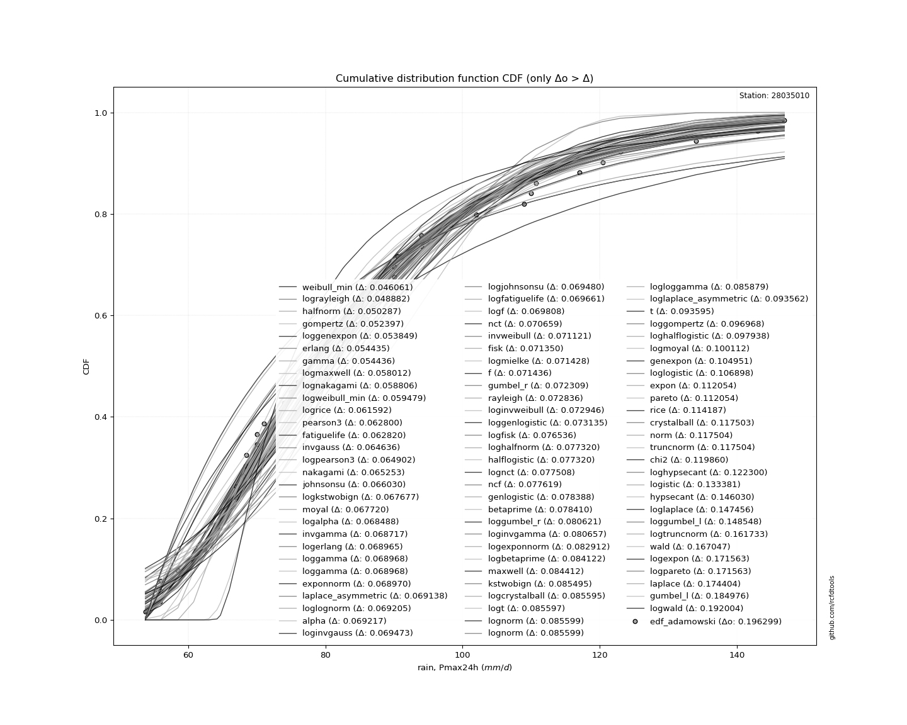</img>

</div>


**12.3. Best fit**

<div align="center">

|   id |   station | empirical_dist   | p_dist      |     delta |   deltao | eval   |   fit |   n |   best_fit |   best_fit_sort |
|-----:|----------:|:-----------------|:------------|----------:|---------:|:-------|------:|----:|-----------:|----------------:|
|    0 |  28035010 | edf_adamowski    | weibull_min | 0.0448152 | 0.188598 | Δo > Δ |     1 |  52 |          1 |               1 |

</div>


<div align="center">

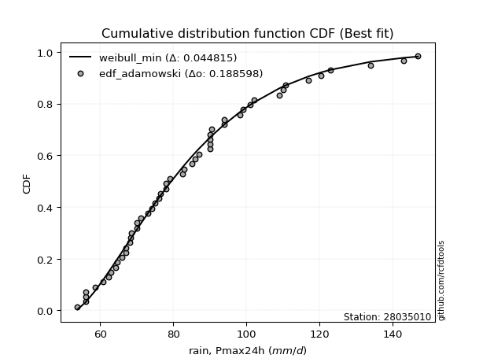</img>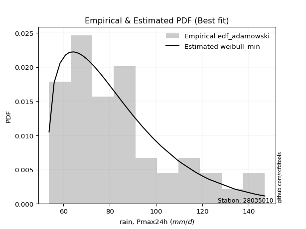</img>

</div>


## C. Best fit & Estimate extreme values for specific return periods - Tr

Best fit in probability distribution analysis means finding the theoretical distribution (like Normal, Poisson, Exponential) that most accurately mirrors your real-world data´s patterns (shape, center, spread) for better predictions, using methods like visual checks (Q-Q plots), goodness-of-fit tests (Kolmogorov-Smirnov, Chi-Squared), and information criteria (AIC) to score and select the simplest, most representative model.


### 1. Best fit (ordered by delta Δ)

:file_folder:Table: [bestfit_28035010.csv](table/bestfit_28035010.csv)

<div align="center">

|   id |   station | empirical_dist   | p_dist      |     delta |   deltao | eval   |   fit |   n |   best_fit |   best_fit_sort |
|-----:|----------:|:-----------------|:------------|----------:|---------:|:-------|------:|----:|-----------:|----------------:|
|    0 |  28035010 | edf_hazen        | halfnorm    | 0.0428231 | 0.188598 | Δo > Δ |     1 |  52 |          1 |               1 |
|    1 |  28035010 | edf_gringorten   | halfnorm    | 0.0438194 | 0.188598 | Δo > Δ |     1 |  52 |          1 |               2 |
|    2 |  28035010 | edf_cunnane      | weibull_min | 0.0441037 | 0.188598 | Δo > Δ |     1 |  52 |          1 |               3 |
|    3 |  28035010 | edf_blom         | weibull_min | 0.0442228 | 0.188598 | Δo > Δ |     1 |  52 |          1 |               4 |
|    4 |  28035010 | edf_tukey        | weibull_min | 0.0444209 | 0.188598 | Δo > Δ |     1 |  52 |          1 |               5 |
|    5 |  28035010 | edf_filliben     | weibull_min | 0.044496  | 0.188598 | Δo > Δ |     1 |  52 |          1 |               6 |
|    6 |  28035010 | edf_beard        | weibull_min | 0.0445316 | 0.188598 | Δo > Δ |     1 |  52 |          1 |               7 |
|    7 |  28035010 | edf_jenkinson    | weibull_min | 0.0445316 | 0.188598 | Δo > Δ |     1 |  52 |          1 |               8 |
|    8 |  28035010 | edf_chegodayev   | weibull_min | 0.0445789 | 0.188598 | Δo > Δ |     1 |  52 |          1 |               9 |
|    9 |  28035010 | edf_adamowski    | weibull_min | 0.0448152 | 0.188598 | Δo > Δ |     1 |  52 |          1 |              10 |
|   10 |  28035010 | edf_california   | weibull_min | 0.0452735 | 0.188598 | Δo > Δ |     1 |  52 |          1 |              11 |
|   11 |  28035010 | edf_weibull      | weibull_min | 0.0459832 | 0.188598 | Δo > Δ |     1 |  52 |          1 |              12 |

</div>


### 2. Extreme values

In hydrology, a return period (or recurrence interval $Tr$) is the statistical average time between extreme events like floods or droughts of a specific magnitude, indicating how rare an event is, with a 100-year flood, for example, having a 1% chance of occurring in any given year, not that it happens exactly every century. It is a key tool for infrastructure design (like bridges or dams) and risk assessment, calculated from historical data to determine the probability of future events, although it is important to remember it is statistical average, and events can cluster or be missed.

:file_folder:Table: [extreme_28035010.csv](table/extreme_28035010.csv)

> risk_rate: assuming the return period as the project useful life.

|   id |      tr |   prob_l |     prob_g |    alpha |   betaprime |     chi2 |   crystalball |   erlang |    expon |   exponnorm |        f |   fatiguelife |     fisk |    gamma |   genexpon |   genlogistic |   gibrat |   gompertz |   gumbel_l |   gumbel_r |   halflogistic |   halfnorm |   hypsecant |   invgamma |   invgauss |   invweibull |   johnsonsu |   kstwobign |   laplace |   laplace_asymmetric |   loggamma |   logistic |   lognorm |   maxwell |   mielke |    moyal |   nakagami |      ncf |      nct |     norm |   pearson3 |   rayleigh |     rice |        t |   truncnorm |     wald |   weibull_min |   logalpha |   logbetaprime |   logchi2 |   logcrystalball |   logerlang |   logexpon |   logexponnorm |     logf |   logfatiguelife |   logfisk |   loggenexpon |   loggenlogistic |   loggibrat |   loggompertz |   loggumbel_l |   loggumbel_r |   loghalflogistic |   loghalfnorm |   loghypsecant |   loginvgamma |   loginvgauss |   loginvweibull |   logjohnsonsu |   logkstwobign |   loglaplace |   loglaplace_asymmetric |   logloggamma |   loglogistic |   loglognorm |   logmaxwell |   logmielke |   logmoyal |   lognakagami |   logncf |   lognct |   logpearson3 |   lograyleigh |   logrice |     logt |   logtruncnorm |   logwald |   logweibull_min |   station |   n |   risk_rate |
|-----:|--------:|---------:|-----------:|---------:|------------:|---------:|--------------:|---------:|---------:|------------:|---------:|--------------:|---------:|---------:|-----------:|--------------:|---------:|-----------:|-----------:|-----------:|---------------:|-----------:|------------:|-----------:|-----------:|-------------:|------------:|------------:|----------:|---------------------:|-----------:|-----------:|----------:|----------:|---------:|---------:|-----------:|---------:|---------:|---------:|-----------:|-----------:|---------:|---------:|------------:|---------:|--------------:|-----------:|---------------:|----------:|-----------------:|------------:|-----------:|---------------:|---------:|-----------------:|----------:|--------------:|-----------------:|------------:|--------------:|--------------:|--------------:|------------------:|--------------:|---------------:|--------------:|--------------:|----------------:|---------------:|---------------:|-------------:|------------------------:|--------------:|--------------:|-------------:|-------------:|------------:|-----------:|--------------:|---------:|---------:|--------------:|--------------:|----------:|---------:|---------------:|----------:|-----------------:|----------:|----:|------------:|
|    0 |    2    | 0.5      | 0.5        |  79.5944 |     81.1189 |  75.4274 |       84.552  |  78.8347 |  75.1011 |     77.6959 |  79.236  |       78.8893 |  78.9786 |  78.8348 |    75.3252 |       80.5525 |  77.818  |    81.4155 |    88.2376 |    80.8664 |        79.0341 |    79.9597 |     84.552  |    79.2376 |    78.9713 |      79.3332 |     79.0576 |     81.2636 |   84.552  |              77.287  |    78.8481 |    84.552  |   81.8548 |   82.6333 |  78.5379 |  79.6766 |    78.3683 |  82.624  |  80.2908 |  84.552  |     81.068 |    81.9528 |  83.3356 |  84.6005 |     84.552  |  77.2797 |       79.4427 |    79.6202 |        80.6175 |   68.4394 |          81.8548 |     78.8481 |    71.9448 |        79.8105 |  78.8553 |          79.1077 |   79.2118 |       78.8065 |          78.5162 |     75.9263 |       75.46   |       85.2936 |       78.5546 |           76.9639 |       77.7637 |        81.8548 |       79.4105 |       79.1384 |         78.4924 |        79.2633 |        78.3057 |      81.8548 |                 76.0461 |       81.9045 |       81.8548 |      79.2725 |      80.1198 |     78.5856 |    77.5179 |       78.6076 |  80.4105 |  81.0455 |       80.3828 |       79.5133 |   79.8924 |  81.8548 |        72.467  |   75.4698 |          79.169  |  28035010 |  52 |    0.75     |
|    1 |    2.33 | 0.570815 | 0.429185   |  83.1277 |     84.7961 |  81.0463 |       88.5554 |  82.8293 |  79.8048 |     81.4729 |  82.853  |       82.6953 |  82.5063 |  82.8293 |    79.9308 |       84.1016 |  79.8459 |    85.963  |    91.7206 |    84.576  |        82.8482 |    84.2804 |     87.7559 |    82.8545 |    82.7354 |      82.8936 |     82.7629 |     85.0264 |   86.9747 |              81.1671 |    82.532  |    88.0793 |   85.5968 |   86.7925 |  82.1405 |  83.1882 |    82.7561 |  86.4527 |  83.9089 |  88.5554 |     85.008 |    86.1736 |  87.1699 |  88.6363 |     88.5554 |  79.9048 |       83.5231 |    83.2139 |        87.2468 |   72.9746 |          85.5968 |     82.532  |    76.7172 |        83.2591 |  82.5387 |          82.737  |   82.6195 |       82.7554 |          82.1198 |     77.6651 |       79.9075 |       88.6761 |       81.8767 |           80.3123 |       81.6071 |        84.8361 |       82.9993 |       82.7643 |         82.1014 |        82.8663 |        82.0455 |      84.0993 |                 79.4718 |       85.6937 |       85.143  |      82.8778 |      83.9284 |     82.1661 |    80.6177 |       82.5528 |  84.0033 |  84.7249 |       84.0716 |       83.3504 |   83.7037 |  85.5968 |        77.2177 |   77.7149 |          83.0023 |  28035010 |  52 |    0.729209 |
|    2 |    5    | 0.8      | 0.2        |  99.4018 |    100.509  | 110.478  |      103.433  | 101.153  | 103.322  |    100.334  |  99.7357 |      100.434  | 100.048  | 101.153  |   102.958  |       99.5184 |  91.5215 |   104.214  |   102.973  |   100.692  |       100.106  |   102.552  |    100.608  |    99.7362 |   100.277  |      99.4532 |    100.101  |    101.01   |   99.0875 |             100.567  |    99.9523 |   101.699  |  101.066  |  103.163  |  99.7866 |  99.4543 |   101.412  | 101.778  |  99.9947 | 103.433  |    101.689 |   103.071  | 102.52   | 103.71   |    103.433  |  94.6001 |      101.558  |    99.4903 |       117.654  |  102.386  |         101.066  |     99.9523 |   105.768  |        99.054  |  99.9829 |          99.7592 |   99.3304 |      100.81   |          99.7805 |     88.4787 |      100.883  |      100.548  |       98.0195 |           97.3799 |      100.075  |        97.9269 |       99.6402 |       99.749  |         99.8083 |        99.6591 |       100.028  |      96.2788 |                 99.058  |      101.313  |       99.1272 |      99.6918 |     100.761  |     99.6302 |    96.6739 |      100.714  |  99.4033 | 100.486  |      100.358  |      100.658  |  100.708  | 101.066  |       104.899  |   91.5748 |         100.533  |  28035010 |  52 |    0.67232  |
|    3 |   10    | 0.9      | 0.1        | 114.07   |    113.051  | 138.256  |      113.303  | 116.541  | 124.671  |    117.454  | 114.915  |      115.783  | 118.156  | 116.541  |   123.861  |      112.074  | 104.83   |   116.65   |   109.237  |   113.819  |       114.438  |   116.073  |    110.87   |   114.913  |   115.538  |     114.355  |    115.513  |    113.179  |  110.083  |             118.177  |   115.756  |   111.729  |  112.84   |  114.684  | 116.913  | 113.617  |   115.265  | 112.94   | 113.59   | 113.303  |    114.607 |   115.12   | 113.465  | 113.86   |    113.303  | 110.195  |      115.902  |   113.642  |       144.146  |  141.223  |         112.84   |    115.756  |   141.564  |       113.613  | 115.86   |         115.129  |  116.641  |      116.154  |         116.924  |    102.653  |      118.539  |      107.833  |      113.492  |          114.279  |      116.383  |       109.816  |      114.563  |      115.067  |        117.017  |       114.776  |       116.319  |     108.856  |                120.988  |      113.153  |      110.874  |     114.838  |     114.594  |    116.499  |   113.236  |      116.224  | 111.727  | 113.104  |      113.907  |      115.153  |  114.72   | 112.84   |       136.568  |  108.996  |         115.466  |  28035010 |  52 |    0.651322 |
|    4 |   15    | 0.933333 | 0.0666667  | 123.079  |    120.067  | 154.77   |      118.228  | 125.238  | 137.159  |    127.469  | 124.083  |      124.637  | 130.46   | 125.238  |   136.089  |      119.157  | 114.01   |   122.767  |   112.075  |   121.224  |       122.549  |   123.109  |    116.727  |   124.079  |   124.395  |     123.371  |    124.676  |    119.64   |  116.515  |             128.479  |   125.318  |   117.194  |  119.219  |  120.595  | 127.843  | 121.836  |   122.479  | 118.82   | 121.497  | 118.228  |    121.627 |   121.328  | 119.105  | 118.997  |    118.228  | 120.21   |      123.728  |   122.044  |       159.749  |  171.057  |         119.219  |    125.318  |   167.884  |       122.796  | 125.494  |         124.427  |  128.62   |      124.977  |         127.863  |    113.732  |      128.403  |      111.303  |      123.276  |          125.112  |      125.894  |       117.238  |      123.599  |      124.329  |        128.004  |       123.934  |       126.02   |     116.961  |                136.003  |      119.55   |      117.851  |     124.017  |     122.413  |    127.233  |   124.12   |      125.153  | 118.625  | 120.174  |      121.677  |      123.418  |  122.625  | 119.219  |       158.474  |  121.894  |         124.069  |  28035010 |  52 |    0.644736 |
|    5 |   20    | 0.95     | 0.05       | 129.77   |    124.966  | 166.573  |      121.453  | 131.311  | 146.019  |    134.575  | 130.779  |      130.89   | 140.169  | 131.311  |   144.764  |      124.117  | 121.211  |   126.715  |   113.841  |   126.41   |       128.231  |   127.8    |    120.858  |   130.775  |   130.676  |     129.961  |    131.288  |    123.992  |  121.079  |             135.788  |   132.301  |   120.971  |  123.591  |  124.518  | 136.099  | 127.657  |   127.291  | 122.785  | 127.15   | 121.453  |    126.436 |   125.454  | 122.853  | 122.392  |    121.453  | 127.672  |      129.086  |   128.132  |       170.962  |  196.198  |         123.591  |    132.301  |   189.476  |       129.711  | 132.543  |         131.222  |  138.25   |      131.217  |         136.125  |    123.253  |      135.225  |      113.52   |      130.624  |          133.307  |      132.664  |       122.773  |      130.22   |      131.096  |        136.305  |       130.642  |       133.007  |     123.076  |                147.773  |      123.926  |      122.927  |     130.742  |     127.894  |    135.329  |   132.455  |      131.47   | 123.442  | 125.116  |      127.181  |      129.237  |  128.155  | 123.591  |       175.717  |  132.488  |         130.162  |  28035010 |  52 |    0.641514 |
|    6 |   25    | 0.96     | 0.04       | 135.166  |    128.738  | 175.768  |      123.827  | 135.975  | 152.892  |    140.087  | 136.101  |      135.73   | 148.344  | 135.975  |   151.494  |      127.937  | 127.214  |   129.587  |   115.097  |   130.404  |       132.609  |   131.29   |    124.056  |   136.095  |   135.552  |     135.199  |    136.491  |    127.252  |  124.619  |             141.457  |   137.847  |   123.86   |  126.912  |  127.431  | 142.821  | 132.168  |   130.871  | 125.763  | 131.576  | 123.827  |    130.085 |   128.519  | 125.638  | 124.91   |    123.827  | 133.65   |      133.144  |   132.945  |       179.764  |  218.335  |         126.912  |    137.847  |   208.118  |       135.329  | 138.15   |         136.624  |  146.496  |      136.058  |         142.85   |    131.797  |      140.426  |      115.124  |      136.582  |          139.986  |      137.936  |       127.236  |      135.497  |      136.475  |        143.065  |       135.985  |       138.493  |     128.038  |                157.599  |      127.246  |      126.958  |     136.099  |     132.121  |    141.913  |   139.299  |      136.372  | 127.15   | 128.923  |      131.459  |      133.738  |  132.413  | 126.912  |       190.138  |  141.634  |         134.894  |  28035010 |  52 |    0.639603 |
|    7 |   50    | 0.98     | 0.02       | 153.361  |    140.378  | 204.514  |      130.626  | 150.25   | 174.24   |    157.207  | 153.45   |      150.731  | 177.983  | 150.25   |   172.397  |      139.704  | 148.375  |   137.628  |   118.509  |   142.708  |       146.099  |   141.436  |    133.97   |   153.44   |   150.747  |     152.261  |    153.133  |    136.824  |  135.614  |             159.068  |   155.898  |   132.689  |  136.921  |  135.877  | 165.692  | 146.175  |   141.278  | 134.571  | 145.645  | 130.626  |    141.046 |   137.419  | 133.722  | 132.214  |    130.626  | 153.167  |      145.287  |   148.527  |       207.82   |  305.079  |         136.921  |    155.898  |   278.554  |       154.358  | 156.451  |         154.239  |  177.621  |      151.168  |         165.729  |    166.921  |      156.13   |      119.594  |      156.696  |          162.742  |      154.479  |       142.129  |      152.815  |      154.014  |        166.068  |       153.493  |       155.945  |     144.764  |                192.49   |      137.235  |      140.111  |     153.657  |     145.189  |    164.27   |   162.881  |      151.668  | 138.59   | 140.684  |      144.877  |      147.71   |  145.534  | 136.921  |       241.376  |  176.125  |         149.683  |  28035010 |  52 |    0.63583  |
|    8 |   75    | 0.986667 | 0.0133333  | 165.245  |    147.182  | 221.434  |      134.275  | 158.481  | 186.729  |    167.222  | 164.249  |      159.496  | 198.868  | 158.481  |   184.625  |      146.544  | 162.667  |   141.822  |   120.234  |   149.859  |       153.94   |   146.958  |    139.763  |   164.236  |   159.679  |     162.858  |    163.242  |    142.091  |  142.047  |             169.369  |   167.102  |   137.788  |  142.614  |  140.469  | 180.638  | 154.366  |   146.944  | 139.473  | 154.158  | 134.275  |    147.245 |   142.26   | 138.12   | 136.197  |    134.275  | 165.176  |      152.113  |   158.167  |       224.815  |  371.541  |         142.614  |    167.101  |   330.343  |       166.703  | 167.851  |         165.203  |  200.853  |      160.094  |         180.674  |    195.8    |      165.036  |      121.92   |      169.722  |          177.633  |      164.304  |       151.627  |      163.697  |      164.931  |        181.102  |       164.464  |       166.468  |     155.543  |                216.378  |      142.902  |      148.319  |     164.663  |     152.828  |    178.846  |   178.48   |      160.702  | 145.27   | 147.566  |      152.864  |      155.914  |  153.174  | 142.614  |       276.373  |  201.404  |         158.436  |  28035010 |  52 |    0.634587 |
|    9 |  100    | 0.99     | 0.01       | 174.36   |    152.024  | 233.477  |      136.742  | 164.276  | 195.589  |    174.328  | 172.235  |      165.714  | 215.573  | 164.276  |   193.3    |      151.385  | 173.738  |   144.608  |   121.362  |   154.921  |       159.49   |   150.72   |    143.873  |   172.22   |   166.04   |     170.677  |    170.597  |    145.699  |  146.61   |             176.678  |   175.369  |   141.388  |  146.598  |  143.597  | 192.026  | 160.177  |   150.803  | 142.859  | 160.348  | 136.742  |    151.565 |   145.559  | 141.117  | 138.92   |    136.742  | 173.932  |      156.85   |   165.28   |       237.164  |  427.521  |         146.598  |    175.369  |   372.828  |       176.055  | 176.283  |         173.309  |  220.288  |      166.48   |         192.06   |    221.562  |      171.242  |      123.465  |      179.59   |          188.989  |      171.353  |       158.747  |      171.801  |      173.002  |        192.557  |       172.617  |       174.085  |     163.674  |                235.104  |      146.862  |      154.403  |     172.843  |     158.26   |    189.937  |   190.444  |      167.162  | 150.022  | 152.468  |      158.61   |      161.764  |  158.593  | 146.598  |       303.711  |  222.093  |         164.705  |  28035010 |  52 |    0.633968 |
|   10 |  200    | 0.995    | 0.005      | 199.196  |    163.785  | 262.601  |      142.339  | 178.112  | 216.937  |    191.449  | 192.691  |      180.701  | 263.471  | 178.112  |   214.203  |      163.023  | 203.86   |   150.775  |   123.815  |   167.089  |       172.833  |   159.325  |    153.773  |   192.669  |   181.45   |     190.619  |    188.978  |    154.01   |  157.606  |             194.289  |   196.47   |   150.023  |  156.052  |  150.754  | 222.436  | 174.177  |   159.629  | 150.753  | 175.841  | 142.339  |    161.748 |   153.106  | 147.973  | 145.189  |    142.339  | 195.743  |      167.941  |   183.471  |       268.002  |  600.401  |         156.052  |    196.47   |   499.008  |       200.8    | 197.878  |         194.065  |  280.61   |      182.081  |         222.453  |    310.135  |      185.853  |      126.893  |      205.726  |          219.351  |      188.631  |       177.303  |      192.795  |      193.671  |        223.152  |       193.663  |       192.982  |     185.055  |                287.152  |      156.241  |      170.032  |     193.963  |     171.425  |    219.494  |   222.669  |      182.938  | 161.549  | 164.384  |      172.77   |      175.986  |  171.681  | 156.052  |       379.104  |  283.345  |         180.043  |  28035010 |  52 |    0.633042 |
|   11 |  250    | 0.996    | 0.004      | 208.23   |    167.609  | 272.006  |      144.049  | 182.533  | 223.81   |    196.96   | 199.67   |      185.529  | 281.553  | 182.533  |   220.933  |      166.765  | 214.668  |   152.617  |   124.536  |   171.001  |       177.123  |   161.972  |    156.96   |   199.645  |   186.436  |     197.39   |    195.103  |    156.582  |  161.146  |             199.958  |   203.643  |   152.796  |  159.061  |  152.957  | 233.204  | 178.684  |   162.344  | 153.226  | 181.02   | 144.049  |    164.967 |   155.429  | 150.083  | 147.133  |    144.049  | 202.959  |      171.424  |   189.678  |       278.276  |  670.014  |         159.061  |    203.643  |   548.104  |       209.485  | 205.243  |         201.143  |  305.287  |      187.176  |         233.212  |    349.909  |      190.461  |      127.92   |      214.912  |          230.113  |      194.29   |       183.726  |      200.039  |      200.719  |        233.985  |       200.898  |       199.235  |     192.516  |                306.247  |      159.221  |      175.378  |     201.225  |     175.694  |    229.941  |   234.162  |      188.087  | 165.293  | 168.262  |      177.434  |      180.611  |  175.911  | 159.061  |       406.515  |  307.121  |         185.059  |  28035010 |  52 |    0.632858 |
|   12 |  500    | 0.998    | 0.002      | 240.458  |    179.639  | 301.29   |      149.122  | 196.179  | 245.159  |    214.081  | 222.688  |      200.539  | 347.762  | 196.179  |   241.836  |      178.378  | 252.018  |   157.961  |   126.605  |   183.143  |       190.437  |   169.864  |    166.86   |   222.654  |   202.001  |     219.597  |    214.812  |    164.291  |  172.141  |             217.569  |   227.208  |   161.394  |  168.329  |  159.53   | 270.065  | 192.684  |   170.439  | 160.728  | 197.764  | 149.122  |    174.811 |   162.36   | 156.38   | 152.979  |    149.122  | 225.902  |      182.008  |   210.186  |       311.347  |  942.973  |         168.329  |    227.208  |   733.606  |       238.929  | 229.525  |         224.473  |  405.467  |      203.251  |         270.031  |    530.962  |      204.511  |      130.909  |      246.116  |          266.996  |      212.187  |       205.2    |      224.245  |      223.958  |        271.074  |       224.969  |       219.216  |     217.665  |                374.046  |      168.382  |      193.05   |     225.39   |     189.075  |    265.636  |   273.783  |      204.324  | 177.054  | 180.47   |      192.288  |      195.145  |  189.127  | 168.329  |       502.677  |  396.811  |         200.907  |  28035010 |  52 |    0.632489 |
|   13 |  750    | 0.998667 | 0.00133333 | 262.961  |    186.798  | 318.466  |      151.939  | 204.108  | 257.647  |    224.096  | 237.163  |      209.329  | 394.75   | 204.108  |   254.064  |      185.166  | 276.72   |   160.854  |   127.71   |   190.242  |       198.221  |   174.274  |    172.651  |   237.123  |   211.16   |     233.459  |    226.839  |    168.621  |  178.573  |             227.87   |   241.955  |   166.417  |  173.709  |  163.207  | 294.263  | 200.874  |   174.961  | 165.006  | 208.056  | 151.939  |    180.473 |   166.236  | 159.901  | 156.283  |    151.939  | 239.658  |      188.048  |   223.134  |       331.545  | 1152.33   |         173.709  |    241.955  |   869.999  |       258.035  | 244.785  |         239.133  |  486.771  |      212.843  |         294.191  |    699.581  |      212.557  |      132.535  |      266.417  |          291.238  |      222.894  |       218.907  |      239.723  |      238.564  |        295.423  |       240.273  |       231.307  |     233.872  |                420.465  |      173.689  |      204.188  |     240.757  |     196.999  |    289.018  |   300      |      214.005  | 184.04   | 187.74   |      201.253  |      203.776  |  196.923  | 173.709  |       567.45   |  462.701  |         210.377  |  28035010 |  52 |    0.632366 |
|   14 | 1000    | 0.999    | 0.001      | 281.005  |    191.939  | 330.669  |      153.879  | 209.713  | 266.507  |    231.202  | 247.921  |      215.571  | 432.443  | 209.713  |   262.739  |      189.982  | 295.623  |   162.815  |   128.454  |   195.277  |       203.742  |   177.319  |    176.76   |   247.876  |   217.681  |     243.706  |    235.602  |    171.621  |  183.137  |             235.179  |   252.878  |   169.979  |  177.513  |  165.748  | 312.733  | 206.685  |   178.084  | 167.998  | 215.598  | 153.879  |    184.452 |   168.915  | 162.334  | 158.584  |    153.879  | 249.553  |      192.271  |   232.791  |       346.277  | 1328.8    |         177.513  |    252.877  |   981.888  |       272.512  | 256.12   |         250.021  |  558.704  |      219.738  |         312.629  |    863.963  |      218.194  |      133.641  |      281.824  |          309.757  |      230.603  |       229.184  |      251.357  |      249.414  |        314.01   |       251.731  |       240.073  |     246.099  |                456.854  |      177.436  |      212.473  |     252.263  |     202.668  |    306.841  |   320.109  |      220.96   | 189.051  | 192.964  |      207.746  |      209.963  |  202.489  | 177.513  |       617.626  |  516.764  |         217.192  |  28035010 |  52 |    0.632305 |

<div align="center">

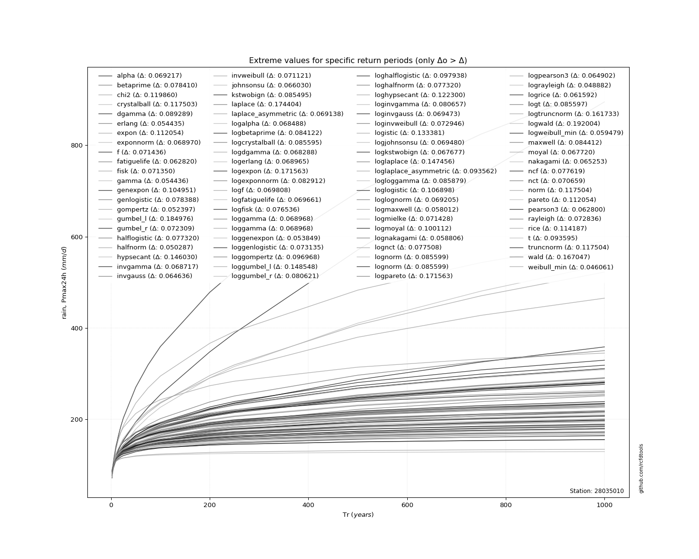</img>

</div>


<div align="center">

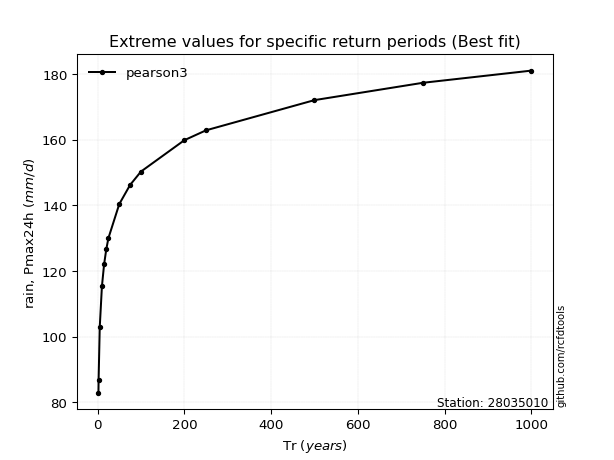</img>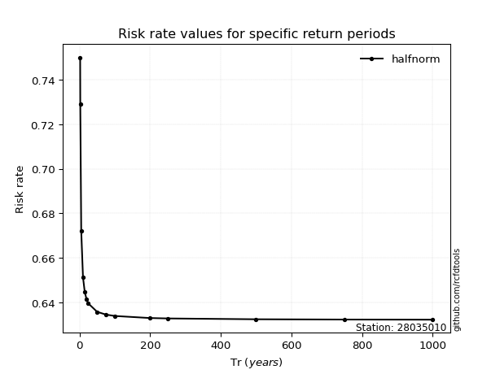</img>

</div>


<sub>**APP DISCLAIMER**: NO WARRANTY - This software is provided by [github.com/rcfdtools](https://github.com/rcfdtools) "as is", without any express or implied warranty, including warranties of merchantability, fitness for a particular purpose, or non-infringement. There is no guarantee that the software will be error-free or operate without interruption. LIMITATION OF LIABILITY - Neither the authors nor copyright holders will be liable for claims or damages arising from the software or its use. You are responsible for determining if the software is appropriate for your use and assume all associated risks, including errors, legal compliance, and data loss. NO PROFESSIONAL ADVICE - The software provides general information and does not offer professional advice. It should not replace consultation with professional advisors.</sub>