<div align="center">


</div>

# PMP Station (rain, Pmax24h): 28035040

Probable Maximum Precipitation (PMP) is the greatest amount of rainfall for a specific duration that is meteorologically possible for a given location, acting as a "worst-case" scenario for extreme storms, crucial for designing safety-critical infrastructure like bridges, river deviations, dams, spillways, and nuclear plants to prevent catastrophic failure. PMP is calculated by hydrologists using meteorological data to determine the upper limit of extreme rainfall, often leading to the Probable Maximum Flood (PMF) for flood control design, and is increasingly being studied for climate change impacts.

<div align="center">

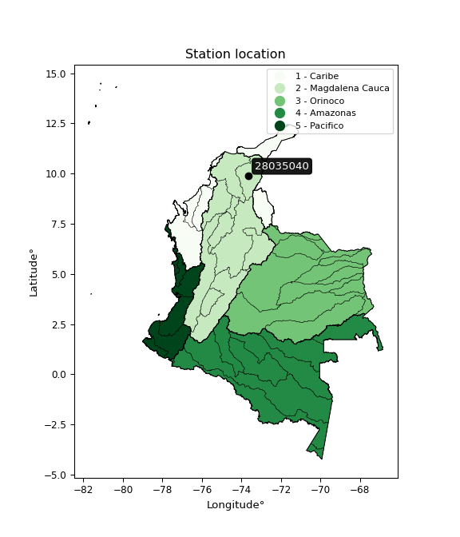</img>

</div>


## A. General information


### 1. General running parameters

• app_version: _v20251228_. • runtime: _2025-12-28 10:51:04.649952_. • Python version: _3.14.0_. • SciPy version: _1.16.3_. • Pandas version: _2.3.3_. • NumPy version: _2.3.5_. • Stations dataset (station_dataset_file): _dataset/pmax24h_in/conventional_cesarcolombia_1959_2022.csv_. • Stations catalog (station_catalog_file): _dataset/CNE_IDEAM.xls_. • Minimum year to eval til year_max (date_min): _1900_. • Maximum year to eval since year_min (date_max): _2024_. • Creates, save and include plots into reports (create_plot): _True_. • Plot only fit distributions with Δo > Δ (plot_only_fit): _True_. • Eval low extreme values, if False, evaluates high extreme values (low_extreme): _False_. • Eval every SciPy distribution as logarithmic (pdist_logarithmic_on): _True_. • Standard deviation normalized (ddof): _1.0_. • Return periods to eval in years (Tr): _[2, 2.33, 5, 10, 15, 20, 25, 50, 75, 100, 200, 250, 500, 750, 1000]_. • Minimum data sample per station, 0 means any (minimum_sample): _5_. • Z-Score maximum threshold to adjust a value, 0 means disable (zscore_max): _3.5_. • Z-Score minimum threshold to adjust a value, 0 means disable (zscore_min): _-2.5_. • Avoid zeros, e.g. rain = 0 (avoid_zeros): _True_. • Avoid null values (avoid_nans): _True_. [:file_folder:Dataset file.](../../dataset/pmax24h_in/conventional_cesarcolombia_1959_2022.csv)

> Delta Degrees of Freedom (DDOF): is a parameter used in the formulas for calculating variance and standard deviation. When ddof=0, the divisor is $N$ (the total number of observations) and this is used when your data set is the entire population. When ddof=1, the divisor is $N-1$ and this is used when your data set is a sample drawn from a larger population. Using $N-1$ provides an unbiased estimate of the population variance (known as Bessel´s correction).


### 2. Station info and location

|   id |   CODIGO | NOMBRE               | CATEGORIA     | TECNOLOGIA   | ESTADO   | FECHA_INSTALACION   |   FECHA_SUSPENSION |   ALTITUD |   LATITUD |   LONGITUD | DEPARTAMENTO   | MUNICIPIO   | AREA_OPERATIVA                                         | ENTIDAD                                                     | AREA_HIDROGRAFICA   | ZONA_HIDROGRAFICA   | SUBZONA_HIDROGRAFICA   |   CORRIENTE | Catalogo   |
|-----:|---------:|:---------------------|:--------------|:-------------|:---------|:--------------------|-------------------:|----------:|----------:|-----------:|:---------------|:------------|:-------------------------------------------------------|:------------------------------------------------------------|:--------------------|:--------------------|:-----------------------|------------:|:-----------|
|    0 | 28035040 | GUAYMARAL [28035040] | Pluviométrica | Convencional | Activa   | 15/08/1972          |                nan |        50 |   9.90492 |   -73.6475 | Cesar          | Valledupar  | Area Operativa 05 - Magdalena-Cesar-Guajira-San Andrés | INSTITUTO DE HIDROLOGIA METEOROLOGIA Y ESTUDIOS AMBIENTALES | Magdalena Cauca     | Cesar               | Medio Cesar            |         nan | CNE_IDEAM  |

<div align="center">

Map location in: [:earth_americas:Google](http://maps.google.com/maps?q=9.904916667,-73.64752778) [:earth_americas:OSM](https://www.openstreetmap.org/#map=18/9.904916667/-73.64752778&layers=P) [:earth_americas:Bing](https://www.bing.com/maps?cp=9.904916667~-73.64752778&lvl=18) [:earth_americas:Apple](https://maps.apple.com/frame?center=9.904916667%2C-73.64752778&span=0.003%2C0.006)

</div>


<div align="center">

```geojson
{
  "type": "Feature",
  "geometry": {
    "type": "Point", 
    "coordinates": [-73.64752778, 9.904916667]
  }, 
  "properties": {
    "Name": "28035040"
  }
}
```

</div>


### 3. Discrete values table and plot

|               |           0 |          1 |         2 |           3 |           4 |          5 |           6 |         7 |           8 |           9 |          10 |         11 |          12 |         13 |          14 |         15 |         16 |          17 |          18 |          19 |          20 |          21 |         22 |         23 |           24 |        25 |         26 |          27 |         28 |          29 |         30 |         31 |           32 |          33 |          34 |          35 |          36 |          37 |         38 |        39 |          40 |          41 |          42 |          43 |
|:--------------|------------:|-----------:|----------:|------------:|------------:|-----------:|------------:|----------:|------------:|------------:|------------:|-----------:|------------:|-----------:|------------:|-----------:|-----------:|------------:|------------:|------------:|------------:|------------:|-----------:|-----------:|-------------:|----------:|-----------:|------------:|-----------:|------------:|-----------:|-----------:|-------------:|------------:|------------:|------------:|------------:|------------:|-----------:|----------:|------------:|------------:|------------:|------------:|
| Date          | 1972        | 1973       | 1974      | 1975        | 1976        | 1977       | 1978        | 1979      | 1980        | 1981        | 1982        | 1983       | 1984        | 1985       | 1986        | 1987       | 1988       | 1989        | 1990        | 1991        | 1992        | 1993        | 1994       | 1995       | 1996         | 1997      | 1998       | 1999        | 2000       | 2001        | 2002       | 2003       | 2004         | 2005        | 2006        | 2007        | 2008        | 2009        | 2010       | 2011      | 2012        | 2013        | 2014        | 2015        |
| Value         |   75        |   52       |   65      |   73        |   67.5      |   64.6277  |   99        |  121      |   72.4      |   96        |  105.5      |   56       |   90.1      |  114.4     |  103.7      |   91.1     |  135       |   90        |   84        |   84        |   83        |   83        |   60.8411  |  127       |   85.7       |   65      |  108       |  100        |   81.8     |   90        |   59       |   55.5     |   85         |  104        |  104        |  101        |   96        |   84        |  110       |   81      |   82        |   80        |   74        |   71        |
| Value_initial |   75        |   52       |   65      |   73        |   67.5      |   64.6277  |   99        |  121      |   72.4      |   96        |  105.5      |   56       |   90.1      |  114.4     |  103.7      |   91.1     |  135       |   90        |   84        |   84        |   83        |   83        |   60.8411  |  127       |   85.7       |   65      |  108       |  100        |   81.8     |   90        |   59       |   55.5     |   85         |  104        |  104        |  101        |   96        |   84        |  110       |   81      |   82        |   80        |   74        |   71        |
| count         |   44        |   44       |   44      |   44        |   44        |   44       |   44        |   44      |   44        |   44        |   44        |   44       |   44        |   44       |   44        |   44       |   44       |   44        |   44        |   44        |   44        |   44        |   44       |   44       |   44         |   44      |   44       |   44        |   44       |   44        |   44       |   44       |   44         |   44        |   44        |   44        |   44        |   44        |   44       |   44      |   44        |   44        |   44        |   44        |
| mean          |   86.5947   |   86.5947  |   86.5947 |   86.5947   |   86.5947   |   86.5947  |   86.5947   |   86.5947 |   86.5947   |   86.5947   |   86.5947   |   86.5947  |   86.5947   |   86.5947  |   86.5947   |   86.5947  |   86.5947  |   86.5947   |   86.5947   |   86.5947   |   86.5947   |   86.5947   |   86.5947  |   86.5947  |   86.5947    |   86.5947 |   86.5947  |   86.5947   |   86.5947  |   86.5947   |   86.5947  |   86.5947  |   86.5947    |   86.5947   |   86.5947   |   86.5947   |   86.5947   |   86.5947   |   86.5947  |   86.5947 |   86.5947   |   86.5947   |   86.5947   |   86.5947   |
| std           |   19.5075   |   19.5075  |   19.5075 |   19.5075   |   19.5075   |   19.5075  |   19.5075   |   19.5075 |   19.5075   |   19.5075   |   19.5075   |   19.5075  |   19.5075   |   19.5075  |   19.5075   |   19.5075  |   19.5075  |   19.5075   |   19.5075   |   19.5075   |   19.5075   |   19.5075   |   19.5075  |   19.5075  |   19.5075    |   19.5075 |   19.5075  |   19.5075   |   19.5075  |   19.5075   |   19.5075  |   19.5075  |   19.5075    |   19.5075   |   19.5075   |   19.5075   |   19.5075   |   19.5075   |   19.5075  |   19.5075 |   19.5075   |   19.5075   |   19.5075   |   19.5075   |
| zscore        |   -0.594374 |   -1.77341 |   -1.107  |   -0.696899 |   -0.978842 |   -1.12608 |    0.635923 |    1.7637 |   -0.727657 |    0.482136 |    0.969129 |   -1.56836 |    0.179688 |    1.42536 |    0.876856 |    0.23095 |    2.48137 |    0.174561 |   -0.133013 |   -0.133013 |   -0.184275 |   -0.184275 |   -1.32019 |    2.07127 |   -0.0458668 |   -1.107  |    1.09728 |    0.687185 |   -0.24579 |    0.174561 |   -1.41457 |   -1.59399 |   -0.0817505 |    0.892235 |    0.892235 |    0.738448 |    0.482136 |   -0.133013 |    1.19981 |   -0.2868 |   -0.235538 |   -0.338062 |   -0.645637 |   -0.799424 |

<div align="center">

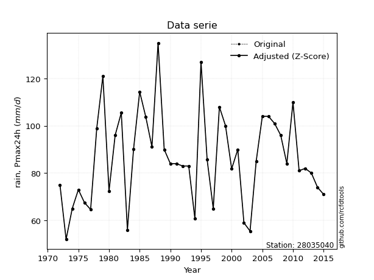</img>

</div>


> The initial value (value_initial) correspond to the initial obtained or null completed value, and value (value) is adjusted only when the initial value is outside the valid range definite through the Z-Score value. If Z-Score is active, values out of range or outliers are replaced with the station mean value


### 4. Active continuous probability distributions from SciPy (44 of 104 available)

[scipy.stats](https://docs.scipy.org/doc/scipy/reference/stats.html) is a Python´s powerful submodule within the SciPy library for comprehensive statistical analysis, offering over 130 probability distributions (like Normal, Poisson), functions for descriptive stats (mean, variance), hypothesis testing (t-tests, chi-square), random variable generation, and statistical tests, making it essential for data science, modeling, and research. It provides tools to explore, model, and draw conclusions from data efficiently, working seamlessly with NumPy.

<div align="center">

|   id | p_dist             |   n_parameter | fit_method   | label                                                                       | active   | ref                                                                                                        |
|-----:|:-------------------|--------------:|:-------------|:----------------------------------------------------------------------------|:---------|:-----------------------------------------------------------------------------------------------------------|
|    0 | alpha              |             3 | MLE          | Alpha                                                                       | True     | [:mortar_board:](https://docs.scipy.org/doc/scipy/reference/generated/scipy.stats.alpha.html)              |
|    1 | betaprime          |             4 | MLE          | Beta prime                                                                  | True     | [:mortar_board:](https://docs.scipy.org/doc/scipy/reference/generated/scipy.stats.betaprime.html)          |
|    2 | chi2               |             3 | MLE          | Chi²                                                                        | True     | [:mortar_board:](https://docs.scipy.org/doc/scipy/reference/generated/scipy.stats.chi2.html)               |
|    3 | crystalball        |             4 | MLE          | Crystalball                                                                 | True     | [:mortar_board:](https://docs.scipy.org/doc/scipy/reference/generated/scipy.stats.crystalball.html)        |
|    4 | erlang             |             3 | MLE          | Erlang                                                                      | True     | [:mortar_board:](https://docs.scipy.org/doc/scipy/reference/generated/scipy.stats.erlang.html)             |
|    5 | expon              |             2 | MLE          | Exponential                                                                 | True     | [:mortar_board:](https://docs.scipy.org/doc/scipy/reference/generated/scipy.stats.expon.html)              |
|    6 | exponnorm          |             3 | MLE          | Exponentially modified Normal                                               | True     | [:mortar_board:](https://docs.scipy.org/doc/scipy/reference/generated/scipy.stats.exponnorm.html)          |
|    7 | f                  |             4 | MLE          | F                                                                           | True     | [:mortar_board:](https://docs.scipy.org/doc/scipy/reference/generated/scipy.stats.f.html)                  |
|    8 | fatiguelife        |             3 | MLE          | Fatigue-life (Birnbaum-Saunders)                                            | True     | [:mortar_board:](https://docs.scipy.org/doc/scipy/reference/generated/scipy.stats.fatiguelife.html)        |
|    9 | fisk               |             3 | MLE          | Fisk                                                                        | True     | [:mortar_board:](https://docs.scipy.org/doc/scipy/reference/generated/scipy.stats.fisk.html)               |
|   10 | gamma              |             3 | MLE          | Gamma                                                                       | True     | [:mortar_board:](https://docs.scipy.org/doc/scipy/reference/generated/scipy.stats.gamma.html)              |
|   11 | genexpon           |             5 | MLE          | Generalized exponential                                                     | True     | [:mortar_board:](https://docs.scipy.org/doc/scipy/reference/generated/scipy.stats.genexpon.html)           |
|   12 | genlogistic        |             3 | MLE          | Generalized logistic                                                        | True     | [:mortar_board:](https://docs.scipy.org/doc/scipy/reference/generated/scipy.stats.genlogistic.html)        |
|   13 | gibrat             |             2 | MM           | Gibrat                                                                      | True     | [:mortar_board:](https://docs.scipy.org/doc/scipy/reference/generated/scipy.stats.gibrat.html)             |
|   14 | gompertz           |             3 | MLE          | Gompertz (or truncated Gumbel)                                              | True     | [:mortar_board:](https://docs.scipy.org/doc/scipy/reference/generated/scipy.stats.gompertz.html)           |
|   15 | gumbel_l           |             2 | MM           | Gumbel Left Skew                                                            | True     | [:mortar_board:](https://docs.scipy.org/doc/scipy/reference/generated/scipy.stats.gumbel_l.html)           |
|   16 | gumbel_r           |             2 | MM           | Gumbel Right Skew                                                           | True     | [:mortar_board:](https://docs.scipy.org/doc/scipy/reference/generated/scipy.stats.gumbel_r.html)           |
|   17 | halflogistic       |             2 | MM           | Half-logistic                                                               | True     | [:mortar_board:](https://docs.scipy.org/doc/scipy/reference/generated/scipy.stats.halflogistic.html)       |
|   18 | halfnorm           |             2 | MM           | Half Normal                                                                 | True     | [:mortar_board:](https://docs.scipy.org/doc/scipy/reference/generated/scipy.stats.halfnorm.html)           |
|   19 | hypsecant          |             2 | MM           | hyperbolic secant                                                           | True     | [:mortar_board:](https://docs.scipy.org/doc/scipy/reference/generated/scipy.stats.hypsecant.html)          |
|   20 | invgamma           |             3 | MLE          | Inverted gamma                                                              | True     | [:mortar_board:](https://docs.scipy.org/doc/scipy/reference/generated/scipy.stats.invgamma.html)           |
|   21 | invgauss           |             3 | MLE          | Inverse Gaussian                                                            | True     | [:mortar_board:](https://docs.scipy.org/doc/scipy/reference/generated/scipy.stats.invgauss.html)           |
|   22 | invweibull         |             3 | MLE          | Inverted Weibull                                                            | True     | [:mortar_board:](https://docs.scipy.org/doc/scipy/reference/generated/scipy.stats.invweibull.html)         |
|   23 | johnsonsu          |             4 | MLE          | Johnson Su                                                                  | True     | [:mortar_board:](https://docs.scipy.org/doc/scipy/reference/generated/scipy.stats.johnsonsu.html)          |
|   24 | kstwobign          |             2 | MLE          | Limiting distribution of scaled Kolmogorov-Smirnov two-sided test statistic | True     | [:mortar_board:](https://docs.scipy.org/doc/scipy/reference/generated/scipy.stats.kstwobign.html)          |
|   25 | laplace            |             2 | MM           | Laplace                                                                     | True     | [:mortar_board:](https://docs.scipy.org/doc/scipy/reference/generated/scipy.stats.laplace.html)            |
|   26 | laplace_asymmetric |             3 | MLE          | Asymmetric Laplace                                                          | True     | [:mortar_board:](https://docs.scipy.org/doc/scipy/reference/generated/scipy.stats.laplace_asymmetric.html) |
|   27 | loggamma           |             3 | MLE          | Log gamma                                                                   | True     | [:mortar_board:](https://docs.scipy.org/doc/scipy/reference/generated/scipy.stats.loggamma.html)           |
|   28 | logistic           |             2 | MM           | Logistic (or Sech-squared)                                                  | True     | [:mortar_board:](https://docs.scipy.org/doc/scipy/reference/generated/scipy.stats.logistic.html)           |
|   29 | lognorm            |             3 | MLE          | Log Normal                                                                  | True     | [:mortar_board:](https://docs.scipy.org/doc/scipy/reference/generated/scipy.stats.lognorm.html)            |
|   30 | maxwell            |             2 | MM           | Maxwell                                                                     | True     | [:mortar_board:](https://docs.scipy.org/doc/scipy/reference/generated/scipy.stats.maxwell.html)            |
|   31 | mielke             |             4 | MLE          | Mielke Beta-Kappa / Dagum                                                   | True     | [:mortar_board:](https://docs.scipy.org/doc/scipy/reference/generated/scipy.stats.mielke.html)             |
|   32 | moyal              |             2 | MM           | Moyal                                                                       | True     | [:mortar_board:](https://docs.scipy.org/doc/scipy/reference/generated/scipy.stats.moyal.html)              |
|   33 | nakagami           |             3 | MLE          | Nakagami                                                                    | True     | [:mortar_board:](https://docs.scipy.org/doc/scipy/reference/generated/scipy.stats.nakagami.html)           |
|   34 | ncf                |             5 | MLE          | Non-central F distribution                                                  | True     | [:mortar_board:](https://docs.scipy.org/doc/scipy/reference/generated/scipy.stats.ncf.html)                |
|   35 | nct                |             4 | MLE          | Non-central Student’s t                                                     | True     | [:mortar_board:](https://docs.scipy.org/doc/scipy/reference/generated/scipy.stats.nct.html)                |
|   36 | norm               |             2 | MM           | Normal                                                                      | True     | [:mortar_board:](https://docs.scipy.org/doc/scipy/reference/generated/scipy.stats.norm.html)               |
|   37 | pearson3           |             3 | MM           | Pearson type III                                                            | True     | [:mortar_board:](https://docs.scipy.org/doc/scipy/reference/generated/scipy.stats.pearson3.html)           |
|   38 | rayleigh           |             2 | MM           | Rayleigh                                                                    | True     | [:mortar_board:](https://docs.scipy.org/doc/scipy/reference/generated/scipy.stats.rayleigh.html)           |
|   39 | rice               |             3 | MLE          | Rice                                                                        | True     | [:mortar_board:](https://docs.scipy.org/doc/scipy/reference/generated/scipy.stats.rice.html)               |
|   40 | t                  |             3 | MLE          | Student’s t                                                                 | True     | [:mortar_board:](https://docs.scipy.org/doc/scipy/reference/generated/scipy.stats.t.html)                  |
|   41 | truncnorm          |             4 | MLE          | Truncated normal                                                            | True     | [:mortar_board:](https://docs.scipy.org/doc/scipy/reference/generated/scipy.stats.truncnorm.html)          |
|   42 | wald               |             2 | MM           | Wald                                                                        | True     | [:mortar_board:](https://docs.scipy.org/doc/scipy/reference/generated/scipy.stats.wald.html)               |
|   43 | weibull_min        |             3 | MLE          | Weibull minimum                                                             | True     | [:mortar_board:](https://docs.scipy.org/doc/scipy/reference/generated/scipy.stats.weibull_min.html)        |

</div>

> **n_parameter:** # arguments & localization & scale.
>
> **Fit methods:** (MLE) maximum likelihood, (MM) L-moments.
>
>**Inactive:** foldnorm, gennorm, norminvgauss, powernorm, powerlognorm, skewnorm, genextreme, anglit, arcsine, argus, beta, bradford, burr, burr12, cauchy, cosine, halfcauchy, foldcauchy, skewcauchy, wrapcauchy, dgamma, gengamma, exponweib, exponpow, truncexpon, gausshyper, genhalflogistic, genhyperbolic, geninvgauss, halfgennorm, johnsonsb, kappa4, kappa3, ksone, kstwo, loglaplace, levy, levy_l, levy_stable, ncx2, pareto, genpareto, truncpareto, lomax, powerlaw, rdist, rel_breitwigner, recipinvgauss, semicircular, studentized_range, trapezoid, triang, truncweibull_min, tukeylambda, uniform, loguniform, vonmises, vonmises_line, weibull_max, dweibull, 


## B. Probability distributions vs. Empirical distributions

A continuous probability distribution (CPD) describes probabilities for variables that can take any value within a range (like rain any time), unlike discrete variables with specific outcomes (like temperature). It uses a Probability Density Function (PDF), a curve where the total area under it equals 1, and the probability of the variable falling within an interval (a to b) is found by calculating the area under the curve between those points. A key feature is that the probability of hitting any single exact value is zero, so probabilities are always expressed for ranges, e.g., $P(a ≤ X ≤ b)$.

<div align="center">

Distributions parameters from station values
|    |   station | p_dist                |   n |              loc |           scale | shape                  | shape1              | shape2                | shape3   |
|---:|----------:|:----------------------|----:|-----------------:|----------------:|:-----------------------|:--------------------|:----------------------|:---------|
|  0 |  28035040 | alpha                 |  44 |   -169.524       |  3419.98        | 13.428582385422494     |                     |                       |          |
|  1 |  28035040 | betaprime             |  44 |     -0.845807    |    46.6194      | 57.87252729744911      | 31.83469633316713   |                       |          |
|  2 |  28035040 | chi2                  |  44 |     15.7098      |     2.67905     | 26.459004696403717     |                     |                       |          |
|  3 |  28035040 | crystalball           |  44 |     86.5947      |    19.2845      | 8038.94414317046       | 58.98950879181525   |                       |          |
|  4 |  28035040 | erlang                |  44 |     15.7099      |     5.3581      | 13.229478700490343     |                     |                       |          |
|  5 |  28035040 | expon                 |  44 |     52           |    34.5947      |                        |                     |                       |          |
|  6 |  28035040 | exponnorm             |  44 |     75.427       |    15.8979      | 0.7024710935163011     |                     |                       |          |
|  7 |  28035040 | f                     |  44 |     16.0715      |    70.524       | 26.29860480315419      | 4133.212732287252   |                       |          |
|  8 |  28035040 | fatiguelife           |  44 |    -26.9557      |   111.923       | 0.17051590429871205    |                     |                       |          |
|  9 |  28035040 | fisk                  |  44 |     -0.196934    |    85.1347      | 7.648162340132387      |                     |                       |          |
| 10 |  28035040 | gamma                 |  44 |     15.7099      |     5.3581      | 13.229472287818574     |                     |                       |          |
| 11 |  28035040 | genexpon              |  44 |     52           |     1.86817     | 0.032948027088979065   | 0.02195144441337077 | 1.2747031189714848    |          |
| 12 |  28035040 | genlogistic           |  44 |     62.6758      |    14.5825      | 3.4317720213996115     |                     |                       |          |
| 13 |  28035040 | gibrat                |  44 |     71.8831      |     8.92306     |                        |                     |                       |          |
| 14 |  28035040 | gompertz              |  44 |     60.5295      |     2.16912     | 4.785238483058872e-14  |                     |                       |          |
| 15 |  28035040 | gumbel_l              |  44 |     95.2738      |    15.0361      |                        |                     |                       |          |
| 16 |  28035040 | gumbel_r              |  44 |     77.9157      |    15.0361      |                        |                     |                       |          |
| 17 |  28035040 | halflogistic          |  44 |     63.738       |    16.4876      |                        |                     |                       |          |
| 18 |  28035040 | halfnorm              |  44 |     61.0696      |    31.9911      |                        |                     |                       |          |
| 19 |  28035040 | hypsecant             |  44 |     86.5947      |    12.2769      |                        |                     |                       |          |
| 20 |  28035040 | invgamma              |  44 |    -77.7253      | 11965.3         | 73.81416988858973      |                     |                       |          |
| 21 |  28035040 | invgauss              |  44 |     11.8251      |  1047.31        | 0.07153943680810554    |                     |                       |          |
| 22 |  28035040 | invweibull            |  44 |     -3.28047e+09 |     3.28047e+09 | 192078535.49817526     |                     |                       |          |
| 23 |  28035040 | johnsonsu             |  44 |    -28.5986      |    19.8443      | -14.833194970272416    | 6.064848718794089   |                       |          |
| 24 |  28035040 | kstwobign             |  44 |     16.6737      |    80.1778      |                        |                     |                       |          |
| 25 |  28035040 | laplace               |  44 |     86.5947      |    13.6362      |                        |                     |                       |          |
| 26 |  28035040 | laplace_asymmetric    |  44 |     83           |    15.0163      | 0.8874426673896925     |                     |                       |          |
| 27 |  28035040 | loggamma              |  44 |  -5253.06        |   733.997       | 1443.8230557844372     |                     |                       |          |
| 28 |  28035040 | logistic              |  44 |     86.5947      |    10.6321      |                        |                     |                       |          |
| 29 |  28035040 | lognorm               |  44 |    -32.1659      |   117.21        | 0.1623430029772766     |                     |                       |          |
| 30 |  28035040 | maxwell               |  44 |     40.8985      |    28.6359      |                        |                     |                       |          |
| 31 |  28035040 | mielke                |  44 |     -0.35959     |    89.9384      | 6.492879222964848      | 8.54919995293178    |                       |          |
| 32 |  28035040 | moyal                 |  44 |     75.5666      |     8.68109     |                        |                     |                       |          |
| 33 |  28035040 | nakagami              |  44 |     48.2477      |    42.9231      | 1.0124564806959766     |                     |                       |          |
| 34 |  28035040 | ncf                   |  44 |     -0.744901    |     3.92574e-07 | 4.1863409747925635e-07 | 375.4031948441357   | 92.6394796446781      |          |
| 35 |  28035040 | nct                   |  44 |     -0.172794    |    14.9376      | 29.572470352086675     | 5.660076613231423   |                       |          |
| 36 |  28035040 | norm                  |  44 |     86.5947      |    19.2845      |                        |                     |                       |          |
| 37 |  28035040 | pearson3              |  44 |     86.5947      |    19.2846      | 0.336805776963644      |                     |                       |          |
| 38 |  28035040 | rayleigh              |  44 |     49.7023      |    29.4359      |                        |                     |                       |          |
| 39 |  28035040 | rice                  |  44 |     47.339       |    23.5075      | 1.2089719260092726     |                     |                       |          |
| 40 |  28035040 | t                     |  44 |     86.5951      |    19.2841      | 5813424.862804316      |                     |                       |          |
| 41 |  28035040 | truncnorm             |  44 |     86.579       |    19.2813      | -214.61552985485275    | 3.341933505910708   |                       |          |
| 42 |  28035040 | wald                  |  44 |     67.3101      |    19.2846      |                        |                     |                       |          |
| 43 |  28035040 | weibull_min           |  44 |     46.5219      |    45.2188      | 2.1914805372901327     |                     |                       |          |
| 44 |  28035040 | logalpha              |  44 |     -3.93287     |   308.424       | 36.87594788454999      |                     |                       |          |
| 45 |  28035040 | logbetaprime          |  44 |      0.206912    |    17.1861      | 428.0139946415268      | 1740.701964694601   |                       |          |
| 46 |  28035040 | logchi2               |  44 |      3.95124     |     0.915338    | 1.1473494910348514     |                     |                       |          |
| 47 |  28035040 | logcrystalball        |  44 |      4.43613     |     0.225766    | 103.57969599097677     | 133.29669638315647  |                       |          |
| 48 |  28035040 | logerlang             |  44 |     -0.373117    |     0.0106909   | 449.7186970527815      |                     |                       |          |
| 49 |  28035040 | logexpon              |  44 |      3.95124     |     0.484881    |                        |                     |                       |          |
| 50 |  28035040 | logexponnorm          |  44 |      4.43591     |     0.225765    | 0.0009557858365536615  |                     |                       |          |
| 51 |  28035040 | logf                  |  44 |    -50.3735      |    54.8088      | 204292.87632428634     | 274314.45540706965  |                       |          |
| 52 |  28035040 | logfatiguelife        |  44 |    -36.2543      |    40.689       | 0.005547583963163599   |                     |                       |          |
| 53 |  28035040 | logfisk               |  44 |     -7.58819e+06 |     7.5882e+06  | 57898694.98724507      |                     |                       |          |
| 54 |  28035040 | loggamma              |  44 |     -0.467986    |     0.0104878   | 467.58595834287144     |                     |                       |          |
| 55 |  28035040 | loggenexpon           |  44 |      3.94657     |     0.00577747  | 0.001177568414453995   | 4.2828845969943     | 4.818960972484927e-05 |          |
| 56 |  28035040 | loggenlogistic        |  44 |      4.49587     |     0.117262    | 0.7561890140664207     |                     |                       |          |
| 57 |  28035040 | loggibrat             |  44 |      4.26389     |     0.104465    |                        |                     |                       |          |
| 58 |  28035040 | loggompertz           |  44 |      3.95034     |     0.252779    | 0.1124975664570735     |                     |                       |          |
| 59 |  28035040 | loggumbel_l           |  44 |      4.53773     |     0.176028    |                        |                     |                       |          |
| 60 |  28035040 | loggumbel_r           |  44 |      4.33452     |     0.176028    |                        |                     |                       |          |
| 61 |  28035040 | loghalflogistic       |  44 |      4.1685      |     0.19305     |                        |                     |                       |          |
| 62 |  28035040 | loghalfnorm           |  44 |      4.13727     |     0.374556    |                        |                     |                       |          |
| 63 |  28035040 | loghypsecant          |  44 |      4.43612     |     0.143727    |                        |                     |                       |          |
| 64 |  28035040 | loginvgamma           |  44 |     -3.48861     |  9635.73        | 1216.9788458925914     |                     |                       |          |
| 65 |  28035040 | loginvgauss           |  44 |      2.53114     |   125.908       | 0.015108902002682934   |                     |                       |          |
| 66 |  28035040 | loginvweibull         |  44 |     -2.404e+07   |     2.404e+07   | 108077305.83896348     |                     |                       |          |
| 67 |  28035040 | logjohnsonsu          |  44 |     -1.18088e+06 |     9.94166e+06 | -5257656.334725621     | 44366812.0152077    |                       |          |
| 68 |  28035040 | logkstwobign          |  44 |      3.52199     |     1.04749     |                        |                     |                       |          |
| 69 |  28035040 | loglaplace            |  44 |      4.43612     |     0.15964     |                        |                     |                       |          |
| 70 |  28035040 | loglaplace_asymmetric |  44 |      4.43082     |     0.17924     | 0.9860589916836958     |                     |                       |          |
| 71 |  28035040 | logloggamma           |  44 |      1.5348      |     0.985332    | 19.4993005583301       |                     |                       |          |
| 72 |  28035040 | loglogistic           |  44 |      4.43612     |     0.124471    |                        |                     |                       |          |
| 73 |  28035040 | loglognorm            |  44 | -65532           | 65536.5         | 3.4448805418777572e-06 |                     |                       |          |
| 74 |  28035040 | logmaxwell            |  44 |      3.90116     |     0.335242    |                        |                     |                       |          |
| 75 |  28035040 | logmielke             |  44 |     -0.23082     |     4.76054     | 26.93113414736906      | 43.64056759699676   |                       |          |
| 76 |  28035040 | logmoyal              |  44 |      4.30702     |     0.10163     |                        |                     |                       |          |
| 77 |  28035040 | lognakagami           |  44 |    -41.7463      |    46.1829      | 10454.783545994258     |                     |                       |          |
| 78 |  28035040 | logncf                |  44 |    -80.4545      |    80.3929      | 491546.86443435773     | 660750.0981037107   | 27501.56723003884     |          |
| 79 |  28035040 | lognct                |  44 |      1.09686     |     0.203345    | 525.5855986573902      | 16.397676185483057  |                       |          |
| 80 |  28035040 | lognorm               |  44 |      4.43612     |     0.225765    |                        |                     |                       |          |
| 81 |  28035040 | logpearson3           |  44 |      4.43612     |     0.225765    | -0.1662863393281815    |                     |                       |          |
| 82 |  28035040 | lograyleigh           |  44 |      4.00421     |     0.344619    |                        |                     |                       |          |
| 83 |  28035040 | logrice               |  44 |      3.87165     |     0.245738    | 2.029907594521376      |                     |                       |          |
| 84 |  28035040 | logt                  |  44 |      4.43612     |     0.225765    | 17245739962.1816       |                     |                       |          |
| 85 |  28035040 | logtruncnorm          |  44 |     -0.120747    |     1.52355     | 2.6726909052308443     | 5.723273411425385   |                       |          |
| 86 |  28035040 | logwald               |  44 |      4.21038     |     0.225742    |                        |                     |                       |          |
| 87 |  28035040 | logweibull_min        |  44 |      3.65498     |     0.863577    | 3.9450634376472093     |                     |                       |          |

</div>

> **loc** (Location parameter): This shifts the distribution along the x-axis. For many common distributions, like the normal (Gaussian) distribution, loc represents the mean $μ$. For others, like the uniform distribution, it might represent the minimum value, or for the beta distribution, the left end of the support interval.
>
> **scale** (Scale parameter): This determines the width or spread of the distribution. For the normal distribution, scale represents the standard deviation $σ$. For a uniform distribution, it defines the length of the interval (from $loc$ to $loc + scale$).
>
> **shape** (Shape parameters): Refers to parameters that define the specific form of a probability distribution, distinct from its location (loc) and scale (scale). These parameters are required arguments for most distribution functions. For example, a normal (Gaussian) distribution is fully defined by its location (mean) and scale (standard deviation), so it has no specific shape parameters beyond loc and scale. However, other distributions have intrinsic properties that need specification, as Gamma distribution that takes a shape parameter, often named $a$ or $alpha$.


### 0. Cumulative distribution values - CDF (88 evaluated)

Cumulative Distribution Function (CDF), denoted as $F$<sub>$X$</sub>$(x)$, is a function that gives the probability that a random variable $X$ will take a value less than or equal to a specific value, $x$ (i.e., $(P(X≥x)$. It essentially "accumulates" probabilities from a given point up to the far right (positive infinity), providing a complete picture of the distribution´s probabilities for both discrete (like rain) and continuous (like temperature) variables, helping to find probabilities over ranges or above certain values.

<div align="center">

CDF ordered by x ascending and calculating $log(f(x))$ separately
|   id |   Station |   date |        x |   count |    mean |     std |     zscore |   Value_initial |   station |   m |     alpha |   alpha_pdf |   betaprime |   betaprime_pdf |      chi2 |   chi2_pdf |   crystalball |   crystalball_pdf |    erlang |   erlang_pdf |     expon |   expon_pdf |   exponnorm |   exponnorm_pdf |         f |      f_pdf |   fatiguelife |   fatiguelife_pdf |      fisk |   fisk_pdf |     gamma |   gamma_pdf |    genexpon |   genexpon_pdf |   genlogistic |   genlogistic_pdf |     gibrat |   gibrat_pdf |    gompertz |   gompertz_pdf |   gumbel_l |   gumbel_l_pdf |   gumbel_r |   gumbel_r_pdf |   halflogistic |   halflogistic_pdf |   halfnorm |   halfnorm_pdf |   hypsecant |   hypsecant_pdf |   invgamma |   invgamma_pdf |   invgauss |   invgauss_pdf |   invweibull |   invweibull_pdf |   johnsonsu |   johnsonsu_pdf |   kstwobign |   kstwobign_pdf |   laplace |   laplace_pdf |   laplace_asymmetric |   laplace_asymmetric_pdf |   loggamma |   loggamma_pdf |   logistic |   logistic_pdf |   lognorm |   lognorm_pdf |   maxwell |   maxwell_pdf |    mielke |   mielke_pdf |       moyal |   moyal_pdf |   nakagami |   nakagami_pdf |       ncf |    ncf_pdf |       nct |    nct_pdf |      norm |    norm_pdf |   pearson3 |   pearson3_pdf |   rayleigh |   rayleigh_pdf |       rice |   rice_pdf |         t |       t_pdf |   truncnorm |   truncnorm_pdf |        wald |    wald_pdf |   weibull_min |   weibull_min_pdf |   logalpha |   logalpha_pdf |   logbetaprime |   logbetaprime_pdf |     logchi2 |   logchi2_pdf |   logcrystalball |   logcrystalball_pdf |   logerlang |   logerlang_pdf |   logexpon |   logexpon_pdf |   logexponnorm |   logexponnorm_pdf |      logf |   logf_pdf |   logfatiguelife |   logfatiguelife_pdf |   logfisk |   logfisk_pdf |   loggenexpon |   loggenexpon_pdf |   loggenlogistic |   loggenlogistic_pdf |   loggibrat |   loggibrat_pdf |   loggompertz |   loggompertz_pdf |   loggumbel_l |   loggumbel_l_pdf |   loggumbel_r |   loggumbel_r_pdf |   loghalflogistic |   loghalflogistic_pdf |   loghalfnorm |   loghalfnorm_pdf |   loghypsecant |   loghypsecant_pdf |   loginvgamma |   loginvgamma_pdf |   loginvgauss |   loginvgauss_pdf |   loginvweibull |   loginvweibull_pdf |   logjohnsonsu |   logjohnsonsu_pdf |   logkstwobign |   logkstwobign_pdf |   loglaplace |   loglaplace_pdf |   loglaplace_asymmetric |   loglaplace_asymmetric_pdf |   logloggamma |   logloggamma_pdf |   loglogistic |   loglogistic_pdf |   loglognorm |   loglognorm_pdf |   logmaxwell |   logmaxwell_pdf |   logmielke |   logmielke_pdf |    logmoyal |   logmoyal_pdf |   lognakagami |   lognakagami_pdf |    logncf |   logncf_pdf |    lognct |   lognct_pdf |   logpearson3 |   logpearson3_pdf |   lograyleigh |   lograyleigh_pdf |    logrice |   logrice_pdf |      logt |   logt_pdf |   logtruncnorm |   logtruncnorm_pdf |    logwald |   logwald_pdf |   logweibull_min |   logweibull_min_pdf |
|-----:|----------:|-------:|---------:|--------:|--------:|--------:|-----------:|----------------:|----------:|----:|----------:|------------:|------------:|----------------:|----------:|-----------:|--------------:|------------------:|----------:|-------------:|----------:|------------:|------------:|----------------:|----------:|-----------:|--------------:|------------------:|----------:|-----------:|----------:|------------:|------------:|---------------:|--------------:|------------------:|-----------:|-------------:|------------:|---------------:|-----------:|---------------:|-----------:|---------------:|---------------:|-------------------:|-----------:|---------------:|------------:|----------------:|-----------:|---------------:|-----------:|---------------:|-------------:|-----------------:|------------:|----------------:|------------:|----------------:|----------:|--------------:|---------------------:|-------------------------:|-----------:|---------------:|-----------:|---------------:|----------:|--------------:|----------:|--------------:|----------:|-------------:|------------:|------------:|-----------:|---------------:|----------:|-----------:|----------:|-----------:|----------:|------------:|-----------:|---------------:|-----------:|---------------:|-----------:|-----------:|----------:|------------:|------------:|----------------:|------------:|------------:|--------------:|------------------:|-----------:|---------------:|---------------:|-------------------:|------------:|--------------:|-----------------:|---------------------:|------------:|----------------:|-----------:|---------------:|---------------:|-------------------:|----------:|-----------:|-----------------:|---------------------:|----------:|--------------:|--------------:|------------------:|-----------------:|---------------------:|------------:|----------------:|--------------:|------------------:|--------------:|------------------:|--------------:|------------------:|------------------:|----------------------:|--------------:|------------------:|---------------:|-------------------:|--------------:|------------------:|--------------:|------------------:|----------------:|--------------------:|---------------:|-------------------:|---------------:|-------------------:|-------------:|-----------------:|------------------------:|----------------------------:|--------------:|------------------:|--------------:|------------------:|-------------:|-----------------:|-------------:|-----------------:|------------:|----------------:|------------:|---------------:|--------------:|------------------:|----------:|-------------:|----------:|-------------:|--------------:|------------------:|--------------:|------------------:|-----------:|--------------:|----------:|-----------:|---------------:|-------------------:|-----------:|--------------:|-----------------:|---------------------:|
|    0 |  28035040 |   1973 |  52      |      44 | 86.5947 | 19.5075 | -1.77341   |         52      |  28035040 |   1 | 0.0222248 |  0.00368933 |   0.0140546 |      0.00316348 | 0.0180847 | 0.00360183 |     0.0364136 |       0.004139    | 0.0180847 |   0.00360183 | 0         |  0.0289061  |   0.0280377 |      0.0037839  | 0.0179255 | 0.00359012 |     0.0198577 |        0.00362915 | 0.0231676 | 0.00331599 | 0.0180847 |  0.00360183 | 2.20983e-08 |     0.0176365  |     0.0210705 |        0.0033484  | 0          |  0           | 0           |    0           |  0.0546947 |    0.00353622  | 0.00368134 |     0.00137216 |      0         |         0          |  0         |     0          |   0.0379821 |      0.00308645 |  0.0213831 |     0.00365875 |  0.011976  |     0.00307171 |    0.0123603 |       0.00317951 |   0.0207157 |      0.00364471 |  0.00988692 |      0.00327739 | 0.0395527 |    0.00290056 |            0.0430266 |               0.00322875 |  0.0140241 |       0.168956 |  0.0371907 |    0.00336787  | 0.0158679 |      0.176042 | 0.0148161 |    0.0038845  | 0.0295996 |   0.00363488 | 0.000101953 | 9.39422e-05 | 0.00721593 |     0.00387908 | 0.0228549 | 0.00377136 | 0.022913  | 0.00362878 | 0.0364136 | 0.004139    |  0.0251517 |     0.00388257 | 0.00304182 |     0.0026437  | 0.00943983 | 0.00403975 | 0.0364088 | 0.00413864  |   0.03647   |     0.00414525  | 0           | 0           |     0.0097492 |        0.00388103 |  0.0124236 |       0.159707 |      0.0137784 |           0.169945 | 1.23651e-09 |   1.59732e+06 |        0.0158681 |             0.176043 |   0.0141573 |        0.17061  |   0        |       2.06236  |      0.0158679 |           0.176042 | 0.015941  |   0.17764  |        0.0155881 |             0.175494 | 0.0231191 |      0.172323 |    0.00101924 |          0.232472 |        0.0296184 |             0.189182 |   0         |        0        |   0.000403921 |          0.446462 |     0.0350988 |         0.195852  |   0.000147327 |        0.00738429 |       0           |              0        |     0         |          0        |      0.0218052 |           0.151594 |     0.01376   |          0.168329 |    0.00989542 |          0.153215 |      0.00507536 |            0.120553 |      0.0158257 |           0.175726 |     0.00394449 |           0.125826 |    0.0239812 |         0.15022  |               0.0326896 |                    0.184957 |     0.0213211 |          0.193938 |     0.0199273 |          0.156905 |    0.0158677 |         0.176041 |  0.000881111 |        0.0525388 |   0.0304634 |        0.195489 | 8.58495e-09 |    1.43962e-06 |     0.0157882 |          0.175847 | 0.0156755 |     0.17502  | 0.0149567 |     0.174741 |     0.0197436 |          0.190225 |   0           |          0        | 0.00686657 |      0.177058 | 0.0158679 |   0.176042 |    5.20379e-09 |           1.95641  | 0          |     0         |        0.0145827 |             0.192762 |
|    1 |  28035040 |   2003 |  55.5    |      44 | 86.5947 | 19.5075 | -1.59399   |         55.5    |  28035040 |   2 | 0.0383887 |  0.00562868 |   0.0289296 |      0.00545489 | 0.0343413 | 0.005779   |     0.0534353 |       0.0056382   | 0.0343413 |   0.00577901 | 0.0962219 |  0.0261247  |   0.0440893 |      0.0054562  | 0.0341489 | 0.0057722  |     0.0360166 |        0.00569206 | 0.0375003 | 0.00495634 | 0.0343413 |  0.00577901 | 0.0835186   |     0.0259438  |     0.0359391 |        0.00524885 | 0          |  0           | 0           |    0           |  0.0685283 |    0.00439773  | 0.0117887  |     0.00348156 |      0         |         0          |  0         |     0          |   0.0504656 |      0.00409341 |  0.0374963 |     0.00563231 |  0.0268489 |     0.00555661 |    0.027898  |       0.00584657 |   0.0368431 |      0.00565633 |  0.026866   |      0.00658877 | 0.0511265 |    0.00374932 |            0.0559502 |               0.00419855 |  0.0293666 |       0.312923 |  0.0509505 |    0.00454797  | 0.0314997 |      0.313805 | 0.032633  |    0.00636128 | 0.0448114 |   0.00512139 | 0.00149086  | 0.000940351 | 0.0271123  |     0.00746181 | 0.0392969 | 0.00570102 | 0.0387514 | 0.00550374 | 0.0534353 | 0.0056382   |  0.0418657 |     0.00573903 | 0.0192096  |     0.0065626  | 0.0287783  | 0.00699342 | 0.0534293 | 0.00563782  |   0.0535171 |     0.00564647  | 0           | 0           |     0.0285115 |        0.00685925 |  0.0272269 |       0.306363 |      0.0292999 |           0.317767 | 0.163485    |   1.40753     |        0.0314999 |             0.313806 |   0.0296463 |        0.31583  |   0.125708 |       1.80311  |      0.0314997 |           0.313805 | 0.0317232 |   0.316897 |        0.031231  |             0.314886 | 0.0374462 |      0.275019 |    0.0288686  |          0.617013 |        0.0448413 |             0.284403 |   0         |        0        |   0.0330326   |          0.558839 |     0.0504143 |         0.279055  |   0.00225649  |        0.0781175  |       0           |              0        |     0         |          0        |      0.0342877 |           0.238101 |     0.0291121 |          0.31406  |    0.0249188  |          0.322351 |      0.0194074  |            0.343951 |      0.0314345 |           0.313422 |     0.0208923  |           0.425806 |    0.0360645 |         0.225911 |               0.0472576 |                    0.267382 |     0.0377404 |          0.318212 |     0.0331754 |          0.257689 |    0.0314994 |         0.313805 |  0.0104248   |        0.265045  |   0.0460946 |        0.290285 | 2.93903e-05 |    0.0026556   |     0.0314183 |          0.313993 | 0.0312433 |     0.312912 | 0.0306772 |     0.318459 |     0.0360422 |          0.318677 |   0.000623776 |          0.102444 | 0.0240232  |      0.357048 | 0.0314997 |   0.313805 |    0.120392    |           1.74355  | 0          |     0         |        0.0316642 |             0.340116 |
|    2 |  28035040 |   1983 |  56      |      44 | 86.5947 | 19.5075 | -1.56836   |         56      |  28035040 |   3 | 0.0412817 |  0.0059447  |   0.0317523 |      0.00583804 | 0.0373188 | 0.00613268 |     0.0563139 |       0.00587694  | 0.0373188 |   0.00613268 | 0.10919   |  0.0257499  |   0.0468851 |      0.00572817 | 0.0371232 | 0.00612678 |     0.0389463 |        0.00602815 | 0.0400469 | 0.00523195 | 0.0373188 |  0.00613268 | 0.0964736   |     0.0258588  |     0.0386433 |        0.00557008 | 0          |  0           | 0           |    0           |  0.0707614 |    0.00453553  | 0.0136314  |     0.00389411 |      0         |         0          |  0         |     0          |   0.052554  |      0.0042613  |  0.0403925 |     0.00595406 |  0.0297304 |     0.00597139 |    0.0309329 |       0.00629557 |   0.0397528 |      0.00598429 |  0.0302954  |      0.00713053 | 0.0530359 |    0.00388934 |            0.0580893 |               0.00435907 |  0.0322845 |       0.337998 |  0.0532732 |    0.00474366  | 0.0344199 |      0.337593 | 0.0359088 |    0.00674306 | 0.0474329 |   0.00536577 | 0.00202674  | 0.00121174  | 0.0309671  |     0.00795664 | 0.0422252 | 0.0060133  | 0.0415797 | 0.0058112  | 0.0563139 | 0.00587693  |  0.0448096 |     0.006038   | 0.0226264  |     0.00710373 | 0.0323782  | 0.00740577 | 0.0563076 | 0.00587655  |   0.0563999 |     0.00588551  | 0           | 0           |     0.0320488 |        0.00729014 |  0.0300893 |       0.332172 |      0.0322643 |           0.343521 | 0.175731    |   1.3257      |        0.0344201 |             0.337594 |   0.0325912 |        0.341104 |   0.141731 |       1.77006  |      0.0344198 |           0.337593 | 0.0346722 |   0.340919 |        0.0341623 |             0.338989 | 0.0399924 |      0.292942 |    0.0346266  |          0.666856 |        0.0474642 |             0.300645 |   0         |        0        |   0.0381212   |          0.575975 |     0.0529784 |         0.292848  |   0.0030542   |        0.100482   |       0           |              0        |     0         |          0        |      0.0364908 |           0.253334 |     0.0320418 |          0.339478 |    0.0279437  |          0.352485 |      0.0226791  |            0.386049 |      0.0343512 |           0.337205 |     0.0249531  |           0.480115 |    0.0381486 |         0.238966 |               0.0497175 |                    0.281301 |     0.0406879 |          0.339247 |     0.0355659 |          0.275574 |    0.0344196 |         0.337593 |  0.0129793   |        0.304983  |   0.0487692 |        0.30628  | 6.39363e-05 |    0.00531114  |     0.0343405 |          0.337855 | 0.0341557 |     0.336741 | 0.033644  |     0.343355 |     0.0389974 |          0.340502 |   0.00188021  |          0.177691 | 0.0273524  |      0.385506 | 0.0344199 |   0.337593 |    0.135905    |           1.71587  | 0          |     0         |        0.0348227 |             0.364386 |
|    3 |  28035040 |   2002 |  59      |      44 | 86.5947 | 19.5075 | -1.41457   |         59      |  28035040 |   4 | 0.0621557 |  0.0080193  |   0.0529786 |      0.00837458 | 0.059097  | 0.00843197 |     0.0762256 |       0.00743158  | 0.059097  |   0.00843198 | 0.183185  |  0.023611   |   0.0666962 |      0.00752517 | 0.0588923 | 0.00843184 |     0.0602554 |        0.00822568 | 0.0584657 | 0.00711206 | 0.059097  |  0.00843198 | 0.171908    |     0.0242529  |     0.0585172 |        0.00774884 | 0          |  0           | 0           |    0           |  0.085699  |    0.00544804  | 0.0296455  |     0.00693705 |      0         |         0          |  0         |     0          |   0.0670056 |      0.00541763 |  0.0613485 |     0.00806483 |  0.0516387 |     0.00869208 |    0.0541507 |       0.00924554 |   0.0608569 |      0.00813337 |  0.0567497  |      0.0105301  | 0.066087  |    0.00484643 |            0.0727555 |               0.00545963 |  0.0542234 |       0.510255 |  0.0694341 |    0.00607716  | 0.056107  |      0.500544 | 0.0596715 |    0.00911736 | 0.0659191 |   0.00700949 | 0.00941687  | 0.00409942  | 0.059152   |     0.0107917  | 0.0632572 | 0.0080523  | 0.0619857 | 0.00784401 | 0.0762256 | 0.00743158  |  0.0657836 |     0.00798624 | 0.0486606  |     0.0102083  | 0.0582351  | 0.00981085 | 0.0762181 | 0.00743118  |   0.0763402 |     0.00744206  | 0           | 0           |     0.0577737 |        0.00984765 |  0.0518684 |       0.510425 |      0.0546036 |           0.520167 | 0.236163    |   1.02651     |        0.0561073 |             0.500545 |   0.0547237 |        0.514582 |   0.229305 |       1.58945  |      0.056107  |           0.500545 | 0.0565692 |   0.505252 |        0.0559774 |             0.50415  | 0.0584107 |      0.419647 |    0.0766083  |          0.935552 |        0.0659577 |             0.413666 |   0         |        0        |   0.0709338   |          0.683895 |     0.0706017 |         0.386577  |   0.0134947   |        0.330065   |       0           |              0        |     0         |          0        |      0.052404  |           0.362964 |     0.0541177 |          0.514128 |    0.0515182  |          0.559757 |      0.0500613  |            0.67395  |      0.0560181 |           0.500165 |     0.0588456  |           0.823229 |    0.052899  |         0.331364 |               0.0667947 |                    0.377923 |     0.0619667 |          0.482167 |     0.0531062 |          0.403997 |    0.0561068 |         0.500545 |  0.0356716   |        0.573668  |   0.0674958 |        0.416563 | 0.0019844   |    0.101725    |     0.0560542 |          0.50132  | 0.0558067 |     0.500037 | 0.0558206 |     0.513783 |     0.0604788 |          0.488911 |   0.0223836   |          0.603618 | 0.0521511  |      0.570342 | 0.056107  |   0.500545 |    0.221386    |           1.56224  | 0          |     0         |        0.0578766 |             0.5244   |
|    4 |  28035040 |   1994 |  60.8411 |      44 | 86.5947 | 19.5075 | -1.32019   |         60.8411 |  28035040 |   5 | 0.0781946 |  0.00941661 |   0.0699538 |      0.0100786  | 0.0760117 | 0.00995202 |     0.0908635 |       0.00848069  | 0.0760117 |   0.00995203 | 0.225519  |  0.0223872  |   0.0816698 |      0.00875528 | 0.0758099 | 0.00995532 |     0.07674   |        0.00969306 | 0.0727748 | 0.00845518 | 0.0760117 |  0.00995203 | 0.215439    |     0.0230335  |     0.0741698 |        0.0092757  | 0          |  0           | 7.39262e-15 |    2.54688e-14 |  0.0963073 |    0.00608625  | 0.0444692  |     0.00920657 |      0         |         0          |  0         |     0          |   0.0777465 |      0.00626997 |  0.0774914 |     0.00948373 |  0.0692864 |     0.0104875  |    0.0729493 |       0.0111823  |   0.0771467 |      0.0095744  |  0.0780575  |      0.0126027  | 0.0756402 |    0.00554701 |            0.0835347 |               0.00626851 |  0.0717344 |       0.631799 |  0.0814917 |    0.00704007  | 0.0732212 |      0.61561  | 0.0778259 |    0.0106037  | 0.0798751 |   0.00817006 | 0.0195281   | 0.00702173  | 0.0805131  |     0.0123932  | 0.0793282 | 0.00941728 | 0.0776874 | 0.00922731 | 0.0908635 | 0.00848069  |  0.0816769 |     0.00929002 | 0.0690934  |     0.0119671  | 0.0776004  | 0.0112155  | 0.0908553 | 0.00848031  |   0.0909985 |     0.00849237  | 0           | 0           |     0.0773072 |        0.0113619  |  0.0694543 |       0.636605 |      0.0724601 |           0.64435  | 0.265988    |   0.919926    |        0.0732215 |             0.615611 |   0.0723787 |        0.636834 |   0.276631 |       1.49185  |      0.0732212 |           0.615612 | 0.0738394 |   0.621045 |        0.0732254 |             0.620731 | 0.0727219 |      0.514524 |    0.107519   |          1.0736   |        0.0799161 |             0.49712  |   0         |        0        |   0.0930128   |          0.753941 |     0.0834902 |         0.453924  |   0.0268947   |        0.552448   |       0           |              0        |     0         |          0        |      0.0648176 |           0.447868 |     0.0717721 |          0.637264 |    0.0708979  |          0.703891 |      0.0736721  |            0.863839 |      0.0731211 |           0.61527  |     0.0872511  |           1.02338  |    0.0641272 |         0.401698 |               0.0794782 |                    0.449686 |     0.0782999 |          0.582946 |     0.0669806 |          0.502078 |    0.0732209 |         0.615612 |  0.0559967   |        0.750563  |   0.0815018 |        0.49715  | 0.00784522  |    0.304545    |     0.0731974 |          0.616731 | 0.0729093 |     0.615369 | 0.0734151 |     0.633639 |     0.0770761 |          0.593427 |   0.0445625   |          0.83713  | 0.0715469  |      0.693701 | 0.0732212 |   0.615611 |    0.268078    |           1.47749  | 0          |     0         |        0.0756293 |             0.632681 |
|    5 |  28035040 |   1977 |  64.6277 |      44 | 86.5947 | 19.5075 | -1.12608   |         64.6277 |  28035040 |   6 | 0.11955   |  0.012445   |   0.114943  |      0.0136778  | 0.119757  | 0.0131493  |     0.127331  |       0.0108129   | 0.119757  |   0.0131493  | 0.305816  |  0.0200662  |   0.119959  |      0.0115079  | 0.119578  | 0.0131577  |     0.119361  |        0.0128257  | 0.110613  | 0.0116069  | 0.119757  |  0.0131493  | 0.298033    |     0.020627   |     0.115703  |        0.0127047  | 0          |  0           | 2.68695e-13 |    1.45934e-13 |  0.122139  |    0.00760546  | 0.088928   |     0.0143122  |      0.0269737 |         0.0303037  |  0.0885609 |     0.0247871  |   0.105392  |      0.00842855 |  0.119173  |     0.0125472  |  0.116039  |     0.0141747  |    0.122777  |       0.0150778  |   0.119242  |      0.0126717  |  0.133206   |      0.0163823  | 0.0998507 |    0.00732246 |            0.110987  |               0.00832856 |  0.117929  |       0.904493 |  0.112436  |    0.00938608  | 0.118053  |      0.875879 | 0.123664  |    0.0135728  | 0.115839  |   0.010896   | 0.0604238   | 0.0148034   | 0.133087   |     0.0152762  | 0.120533  | 0.0123619  | 0.118325  | 0.012264   | 0.127331  | 0.0108129   |  0.122164  |     0.0121129  | 0.120629   |     0.0151476  | 0.125222   | 0.0138817  | 0.127321  | 0.0108126   |   0.127514  |     0.0108269   | 0           | 0           |     0.125891  |        0.0142354  |  0.116236  |       0.919065 |      0.119546  |           0.921071 | 0.316833    |   0.774801    |        0.118053  |             0.875879 |   0.118914  |        0.910641 |   0.361323 |       1.31718  |      0.118053  |           0.875882 | 0.11903   |   0.882146 |        0.118457  |             0.883938 | 0.110571  |      0.750383 |    0.17933    |          1.2931   |        0.115877  |             0.704038 |   0         |        0        |   0.143       |          0.904589 |     0.115608  |         0.617241  |   0.076848    |        1.1202     |       0.000371917 |              2.59001  |     0.0667518 |          2.12275  |      0.0982143 |           0.67255  |     0.118387  |          0.91282  |    0.122658   |          1.01409  |      0.136952   |            1.22409  |      0.117937  |           0.8757   |     0.159471   |           1.35002  |    0.0936047 |         0.586348 |               0.111843  |                    0.632807 |     0.120271  |          0.814076 |     0.10443   |          0.751373 |    0.118053  |         0.875882 |  0.112003    |        1.10212   |   0.117221  |        0.695318 | 0.048222    |    1.10201     |     0.118117  |          0.877641 | 0.117743  |     0.876174 | 0.119597  |     0.902045 |     0.119904  |          0.831835 |   0.107595    |          1.23559  | 0.121313   |      0.958465 | 0.118053  |   0.875881 |    0.352533    |           1.32254  | 0          |     0         |        0.120846  |             0.869644 |
|    6 |  28035040 |   1997 |  65      |      44 | 86.5947 | 19.5075 | -1.107     |         65      |  28035040 |   7 | 0.124239  |  0.0127454  |   0.1201    |      0.0140243  | 0.12471   | 0.0134585  |     0.1314    |       0.0110512   | 0.12471   |   0.0134585  | 0.313246  |  0.0198514  |   0.124296  |      0.011789   | 0.124534  | 0.0134672  |     0.124193  |        0.0131323  | 0.114996  | 0.0119387  | 0.12471   |  0.0134585  | 0.305671    |     0.0204029  |     0.120497  |        0.0130511  | 0          |  0           | 3.27963e-13 |    1.73257e-13 |  0.125001  |    0.00777069  | 0.0943495  |     0.0148134  |      0.038251  |         0.0302814  |  0.0977823 |     0.0247533  |   0.108575  |      0.00867331 |  0.1239    |     0.01285    |  0.12138   |     0.0145214  |    0.128457  |       0.0154352  |   0.124016  |      0.0129766  |  0.139364   |      0.0167024  | 0.102614  |    0.00752512 |            0.114131  |               0.0085645  |  0.123203  |       0.93202  |  0.115978  |    0.00964311  | 0.12316   |      0.90239  | 0.128769  |    0.0138508  | 0.119949  |   0.0111856  | 0.0660836   | 0.0156022   | 0.138821   |     0.0155266  | 0.125189  | 0.0126533  | 0.122947  | 0.012568   | 0.1314    | 0.0110512   |  0.126726  |     0.0123936  | 0.12632    |     0.0154249  | 0.130435   | 0.0141249  | 0.131391  | 0.0110509   |   0.131589  |     0.0110655   | 0           | 0           |     0.131239  |        0.0144956  |  0.121597  |       0.947456 |      0.124916  |           0.948835 | 0.321252    |   0.763834    |        0.12316   |             0.902389 |   0.124223  |        0.93824  |   0.368844 |       1.30167  |      0.12316   |           0.902392 | 0.124173  |   0.908675 |        0.123611  |             0.910695 | 0.114955  |      0.77629  |    0.186807   |          1.31015  |        0.119986  |             0.726893 |   0         |        0        |   0.14824     |          0.919722 |     0.119205  |         0.63512   |   0.0834463   |        1.17733    |       0.0152471   |              2.58941  |     0.078936  |          2.11978  |      0.102152  |           0.698599 |     0.12371   |          0.940563 |    0.128569   |          1.04415  |      0.144072   |            1.2549   |      0.123042  |           0.902232 |     0.167297   |           1.3747   |    0.0970339 |         0.607829 |               0.115538  |                    0.65371  |     0.125015  |          0.83802  |     0.108825  |          0.779154 |    0.12316   |         0.902393 |  0.118426    |        1.13418   |   0.121277  |        0.717138 | 0.0548115   |    1.19254     |     0.123234  |          0.904203 | 0.122852  |     0.902729 | 0.124855  |     0.929124 |     0.124752  |          0.856396 |   0.114787    |          1.26845  | 0.126893   |      0.984508 | 0.12316   |   0.902391 |    0.360089    |           1.30857  | 0          |     0         |        0.125909  |             0.89342  |
|    7 |  28035040 |   1974 |  65      |      44 | 86.5947 | 19.5075 | -1.107     |         65      |  28035040 |   8 | 0.124239  |  0.0127454  |   0.1201    |      0.0140243  | 0.12471   | 0.0134585  |     0.1314    |       0.0110512   | 0.12471   |   0.0134585  | 0.313246  |  0.0198514  |   0.124296  |      0.011789   | 0.124534  | 0.0134672  |     0.124193  |        0.0131323  | 0.114996  | 0.0119387  | 0.12471   |  0.0134585  | 0.305671    |     0.0204029  |     0.120497  |        0.0130511  | 0          |  0           | 3.27963e-13 |    1.73257e-13 |  0.125001  |    0.00777069  | 0.0943495  |     0.0148134  |      0.038251  |         0.0302814  |  0.0977823 |     0.0247533  |   0.108575  |      0.00867331 |  0.1239    |     0.01285    |  0.12138   |     0.0145214  |    0.128457  |       0.0154352  |   0.124016  |      0.0129766  |  0.139364   |      0.0167024  | 0.102614  |    0.00752512 |            0.114131  |               0.0085645  |  0.123203  |       0.93202  |  0.115978  |    0.00964311  | 0.12316   |      0.90239  | 0.128769  |    0.0138508  | 0.119949  |   0.0111856  | 0.0660836   | 0.0156022   | 0.138821   |     0.0155266  | 0.125189  | 0.0126533  | 0.122947  | 0.012568   | 0.1314    | 0.0110512   |  0.126726  |     0.0123936  | 0.12632    |     0.0154249  | 0.130435   | 0.0141249  | 0.131391  | 0.0110509   |   0.131589  |     0.0110655   | 0           | 0           |     0.131239  |        0.0144956  |  0.121597  |       0.947456 |      0.124916  |           0.948835 | 0.321252    |   0.763834    |        0.12316   |             0.902389 |   0.124223  |        0.93824  |   0.368844 |       1.30167  |      0.12316   |           0.902392 | 0.124173  |   0.908675 |        0.123611  |             0.910695 | 0.114955  |      0.77629  |    0.186807   |          1.31015  |        0.119986  |             0.726893 |   0         |        0        |   0.14824     |          0.919722 |     0.119205  |         0.63512   |   0.0834463   |        1.17733    |       0.0152471   |              2.58941  |     0.078936  |          2.11978  |      0.102152  |           0.698599 |     0.12371   |          0.940563 |    0.128569   |          1.04415  |      0.144072   |            1.2549   |      0.123042  |           0.902232 |     0.167297   |           1.3747   |    0.0970339 |         0.607829 |               0.115538  |                    0.65371  |     0.125015  |          0.83802  |     0.108825  |          0.779154 |    0.12316   |         0.902393 |  0.118426    |        1.13418   |   0.121277  |        0.717138 | 0.0548115   |    1.19254     |     0.123234  |          0.904203 | 0.122852  |     0.902729 | 0.124855  |     0.929124 |     0.124752  |          0.856396 |   0.114787    |          1.26845  | 0.126893   |      0.984508 | 0.12316   |   0.902391 |    0.360089    |           1.30857  | 0          |     0         |        0.125909  |             0.89342  |
|    8 |  28035040 |   1976 |  67.5    |      44 | 86.5947 | 19.5075 | -0.978842  |         67.5    |  28035040 |   9 | 0.158596  |  0.0147264  |   0.157982  |      0.016246   | 0.160887  | 0.0154574  |     0.161048  |       0.0126709   | 0.160887  |   0.0154574  | 0.361124  |  0.0184674  |   0.156143  |      0.0136895  | 0.160735  | 0.0154669  |     0.15955   |        0.0151332  | 0.147681  | 0.0142205  | 0.160887  |  0.0154574  | 0.354851    |     0.0189586  |     0.156014  |        0.0153486  | 0          |  0           | 1.14206e-12 |    5.48571e-13 |  0.145883  |    0.00895733  | 0.135453   |     0.0180092  |      0.113592  |         0.0299345  |  0.159307  |     0.0244421  |   0.132457  |      0.0104804  |  0.158534  |     0.0148411  |  0.160472  |     0.0167049  |    0.169871  |       0.017632   |   0.158978  |      0.0149754  |  0.183553   |      0.0185627  | 0.123262  |    0.00903931 |            0.137683  |               0.0103318  |  0.161827  |       1.11505  |  0.142345  |    0.0114825   | 0.160558  |      1.08017  | 0.165644  |    0.0156182  | 0.150412  |   0.0132035  | 0.111522    | 0.0206149   | 0.179592   |     0.0170415  | 0.159242  | 0.0145752  | 0.156903  | 0.014586   | 0.161048  | 0.0126709   |  0.160047  |     0.0142534  | 0.167053   |     0.0171091  | 0.1677     | 0.0156566  | 0.161038  | 0.0126706   |   0.161275  |     0.0126864   | 1.86011e-23 | 5.02363e-21 |     0.169553  |        0.0161179  |  0.160899  |       1.13533  |      0.164192  |           1.13252  | 0.348833    |   0.700026    |        0.160558  |             1.08017  |   0.163088  |        1.12156  |   0.416106 |       1.2042   |      0.160558  |           1.08018  | 0.161805  |   1.08624  |        0.161349  |             1.0898   | 0.147652  |      0.960257 |    0.238135   |          1.40488  |        0.150439  |             0.890898 |   0         |        0        |   0.184864    |          1.0219   |     0.145536  |         0.763461  |   0.134756    |        1.53435    |       0.112518    |              2.55722  |     0.158405  |          2.08809  |      0.132051  |           0.892638 |     0.162677  |          1.12459  |    0.171651   |          1.23706  |      0.194935   |            1.43295  |      0.160437  |           1.08018  |     0.22182    |           1.50555  |    0.122912  |         0.769932 |               0.143041  |                    0.809323 |     0.159695  |          1.00131  |     0.1419    |          0.978257 |    0.160558  |         1.08018  |  0.165039    |        1.33187   |   0.151225  |        0.873721 | 0.110724    |    1.75486     |     0.160705  |          1.08224  | 0.160267  |     1.08074  | 0.163314  |     1.10922  |     0.160193  |          1.02304  |   0.166401    |          1.45939  | 0.167278   |      1.15519  | 0.160558  |   1.08017  |    0.407785    |           1.21993  | 1.4566e-29 |     5.448e-25 |        0.162615  |             1.0523   |
|    9 |  28035040 |   2015 |  71      |      44 | 86.5947 | 19.5075 | -0.799424  |         71      |  28035040 |  10 | 0.214682  |  0.0172583  |   0.219644  |      0.0188758  | 0.219407  | 0.0178967  |     0.209354  |       0.0149176   | 0.219407  |   0.0178967  | 0.422598  |  0.0166905  |   0.208627  |      0.0162701  | 0.219285  | 0.0179039  |     0.217015  |        0.0176271  | 0.203045  | 0.0173829  | 0.219407  |  0.0178967  | 0.417908    |     0.0171058  |     0.214991  |        0.018267   | 0          |  0           | 5.92629e-12 |    2.75418e-12 |  0.180463  |    0.0108473   | 0.205157   |     0.0216123  |      0.216732  |         0.0289013  |  0.243753  |     0.0237677  |   0.174252  |      0.0134951  |  0.215019  |     0.0173686  |  0.223503  |     0.0191838  |    0.235926  |       0.0199506  |   0.215923  |      0.0174927  |  0.251827   |      0.0202773  | 0.159331  |    0.0116844  |            0.179037  |               0.0134351  |  0.224273  |       1.35203  |  0.187436  |    0.0143249   | 0.221168  |      1.3155   | 0.224128  |    0.0177191  | 0.201735  |   0.0161252  | 0.193308    | 0.0256509   | 0.242235   |     0.0186539  | 0.21467   | 0.0170378  | 0.212631  | 0.0171988  | 0.209354  | 0.0149176   |  0.21425   |     0.0166679  | 0.230293   |     0.0189192  | 0.225786   | 0.017466   | 0.209343  | 0.0149175   |   0.209637  |     0.0149346   | 0.056111    | 0.0447562   |     0.229367  |        0.0179758  |  0.224466  |       1.37531  |      0.227485  |           1.36749  | 0.38242     |   0.631434    |        0.221168  |             1.31549  |   0.22586   |        1.35829  |   0.473916 |       1.08498  |      0.221169  |           1.3155   | 0.222694  |   1.32023  |        0.222469  |             1.32575  | 0.203038  |      1.23465  |    0.311394   |          1.48451  |        0.20174   |             1.14432  |   0         |        0        |   0.240092    |          1.16357  |     0.189094  |         0.965573  |   0.222246    |        1.89885    |       0.239201    |              2.44182  |     0.262239  |          2.01409  |      0.185058  |           1.21625  |     0.22561   |          1.36144  |    0.240161   |          1.46559  |      0.2718     |            1.59181  |      0.221054  |           1.31576  |     0.30063    |           1.59703  |    0.168702  |         1.05676  |               0.190405  |                    1.07731  |     0.216024  |          1.2273   |     0.198856  |          1.27992  |    0.221168  |         1.3155   |  0.238094    |        1.54742   |   0.201397  |        1.1171   | 0.21359     |    2.25274     |     0.221423  |          1.3176   | 0.220909  |     1.31611  | 0.225374  |     1.34273  |     0.217679  |          1.25071  |   0.245171    |          1.64279  | 0.231224   |      1.37059  | 0.221168  |   1.3155   |    0.466624    |           1.10947  | 0.0939945  |     4.43263   |        0.221195  |             1.26394  |
|   10 |  28035040 |   1980 |  72.4    |      44 | 86.5947 | 19.5075 | -0.727657  |         72.4    |  28035040 |  11 | 0.239473  |  0.0181438  |   0.246675  |      0.0197178  | 0.245045  | 0.0187114  |     0.230844  |       0.015778    | 0.245045  |   0.0187115  | 0.445498  |  0.0160285  |   0.232083  |      0.0172294  | 0.244932  | 0.0187166  |     0.2423    |        0.0184776  | 0.228211  | 0.0185556  | 0.245045  |  0.0187115  | 0.44137     |     0.0164163  |     0.241274  |        0.0192601  | 0.00219573 |  0.0133505   | 1.13436e-11 |    5.25164e-12 |  0.196225  |    0.0116768   | 0.236182   |     0.0226686  |      0.256801  |         0.0283259  |  0.276792  |     0.0234246  |   0.194083  |      0.0148473  |  0.23996   |     0.0182464  |  0.250909  |     0.0199438  |    0.264326  |       0.0205931  |   0.241031  |      0.0183602  |  0.280514   |      0.0206774  | 0.176558  |    0.0129477  |            0.19887   |               0.0149234  |  0.251501  |       1.43579  |  0.20832   |    0.0155118   | 0.247694  |      1.40063  | 0.249431  |    0.0184115  | 0.225115  |   0.0172686  | 0.230109    | 0.0268419   | 0.268694   |     0.0191283  | 0.239138  | 0.0179038  | 0.237365  | 0.0181221  | 0.230844  | 0.015778    |  0.238196  |     0.0175296  | 0.25717    |     0.0194588  | 0.250668   | 0.0180672  | 0.230833  | 0.0157779   |   0.231152  |     0.0157952   | 0.127262    | 0.0546645   |     0.254959  |        0.0185695  |  0.252148  |       1.45886  |      0.254998  |           1.44952  | 0.394526    |   0.608747    |        0.247694  |             1.40062  |   0.253207  |        1.44173  |   0.49468  |       1.04215  |      0.247695  |           1.40063  | 0.249305  |   1.40453  |        0.249193  |             1.41067  | 0.228214  |      1.34391  |    0.340555   |          1.50104  |        0.225108  |             1.24961  |   0.0408279 |        4.78413  |   0.26335     |          1.21855  |     0.20879   |         1.05264   |   0.260264    |        1.99019    |       0.286272    |              2.37775  |     0.301208  |          1.97656  |      0.210182  |           1.3584   |     0.253017  |          1.44462  |    0.269512   |          1.53907  |      0.303248   |            1.62672  |      0.247586  |           1.40099  |     0.33195    |           1.60885  |    0.190652  |         1.19426  |               0.212647  |                    1.20315  |     0.240829  |          1.31299  |     0.225031  |          1.40107  |    0.247694  |         1.40063  |  0.268956    |        1.6117    |   0.224202  |        1.21929  | 0.258547    |    2.34266     |     0.24799   |          1.40264  | 0.247446  |     1.40117  | 0.252409  |     1.42544  |     0.242938  |          1.33594  |   0.277737    |          1.69066  | 0.258726   |      1.44532  | 0.247694  |   1.40063  |    0.487893    |           1.06921  | 0.185202   |     4.74271   |        0.246643  |             1.34199  |
|   11 |  28035040 |   1975 |  73      |      44 | 86.5947 | 19.5075 | -0.696899  |         73      |  28035040 |  12 | 0.250466  |  0.0184954  |   0.258602  |      0.020037   | 0.256367  | 0.019028   |     0.240419  |       0.0161357   | 0.256368  |   0.019028   | 0.455032  |  0.0157529  |   0.242539  |      0.0176215  | 0.256257  | 0.0190321  |     0.253487  |        0.0188114  | 0.239488  | 0.0190307  | 0.256368  |  0.019028   | 0.451133    |     0.0161294  |     0.252947  |        0.0196467  | 0.0188501  |  0.0412244   | 1.49735e-11 |    6.92509e-12 |  0.203341  |    0.0120446   | 0.249899   |     0.0230469  |      0.273716  |         0.0280538  |  0.2908    |     0.0232654  |   0.203171  |      0.015448   |  0.251013  |     0.0185938  |  0.262961  |     0.0202256  |    0.276751  |       0.0208167  |   0.252151  |      0.0187022  |  0.292959   |      0.0208018  | 0.1845    |    0.0135301  |            0.208029  |               0.0156106  |  0.263489  |       1.46925  |  0.21778   |    0.0160224   | 0.259396  |      1.43501  | 0.260559  |    0.0186798  | 0.23562   |   0.0177454  | 0.246328    | 0.0272075   | 0.280224   |     0.0193018  | 0.249985  | 0.0182489  | 0.24835   | 0.0184903  | 0.240419  | 0.0161357   |  0.248819  |     0.0178757  | 0.268906   |     0.0196576  | 0.26158    | 0.0183019  | 0.240407  | 0.0161356   |   0.240736  |     0.016153    | 0.160413    | 0.055605    |     0.26617   |        0.0187964  |  0.264326  |       1.49197  |      0.267097  |           1.4821   | 0.399512    |   0.599678    |        0.259396  |             1.43501  |   0.265244  |        1.47501  |   0.503209 |       1.02456  |      0.259397  |           1.43502  | 0.261037  |   1.43851  |        0.260978  |             1.44489  | 0.239494  |      1.38972  |    0.352963   |          1.50572  |        0.235608  |             1.29475  |   0.0854748 |        5.88157  |   0.273502    |          1.24164  |     0.217635  |         1.09084   |   0.276815    |        2.0198     |       0.305773    |              2.34785  |     0.31745   |          1.9593   |      0.221649  |           1.42052  |     0.265077  |          1.47774  |    0.282331   |          1.56707  |      0.316718   |            1.63709  |      0.259292  |           1.43542  |     0.345235   |           1.6103   |    0.200767  |         1.25762  |               0.222813  |                    1.26067  |     0.251812  |          1.34841  |     0.236805  |          1.45197  |    0.259397  |         1.43502  |  0.282356    |        1.63536   |   0.234447  |        1.26338  | 0.277977    |    2.36426     |     0.259708  |          1.43697  | 0.259153  |     1.43551  | 0.264311  |     1.45852  |     0.254109  |          1.37094  |   0.29176     |          1.70706  | 0.270778   |      1.47496  | 0.259397  |   1.43502  |    0.496649    |           1.05259  | 0.224022   |     4.65127   |        0.257851  |             1.37391  |
|   12 |  28035040 |   2014 |  74      |      44 | 86.5947 | 19.5075 | -0.645637  |         74      |  28035040 |  13 | 0.269238  |  0.0190409  |   0.278882  |      0.0205111  | 0.275641  | 0.0195095  |     0.256846  |       0.0167139   | 0.275641  |   0.0195095  | 0.47056   |  0.0153041  |   0.260476  |      0.0182456  | 0.275534  | 0.0195118  |     0.27256   |        0.0193235  | 0.258897  | 0.0197777  | 0.275641  |  0.0195095  | 0.467028    |     0.0156623  |     0.272893  |        0.0202337  | 0.0751185  |  0.0669504   | 2.37713e-11 |    1.0981e-11  |  0.215699  |    0.0126732   | 0.273221   |     0.0235764  |      0.30153   |         0.0275686  |  0.313926  |     0.0229846  |   0.219129  |      0.0164721  |  0.26988   |     0.0191312  |  0.283398  |     0.0206357  |    0.297727  |       0.0211209  |   0.271121  |      0.0192294  |  0.313841   |      0.0209492  | 0.198539  |    0.0145597  |            0.22424   |               0.0168272  |  0.283839  |       1.52144  |  0.234227  |    0.0168701   | 0.279293  |      1.4892   | 0.279447  |    0.0190875  | 0.253753  |   0.0185154  | 0.273767    | 0.0276331   | 0.299655   |     0.0195512  | 0.268507  | 0.0187861  | 0.267131  | 0.0190635  | 0.256846  | 0.0167139   |  0.266969  |     0.0184183  | 0.288713   |     0.019946   | 0.280065   | 0.0186615  | 0.256834  | 0.0167139   |   0.257181  |     0.0167314   | 0.215787    | 0.0547512   |     0.285141  |        0.0191374  |  0.284979  |       1.54327  |      0.28761   |           1.53265  | 0.407573    |   0.585342    |        0.279293  |             1.4892   |   0.28567   |        1.52688  |   0.516955 |       0.996214 |      0.279294  |           1.48921  | 0.280977  |   1.49198  |        0.281006  |             1.4987   | 0.25891   |      1.46403  |    0.373487   |          1.51052  |        0.253732  |             1.36945  |   0.169624  |        6.29011  |   0.290652    |          1.27937  |     0.232914  |         1.15548   |   0.304565    |        2.05699    |       0.337364    |              2.29523  |     0.343905  |          1.92913  |      0.241682  |           1.52457  |     0.285538  |          1.52927  |    0.303943   |          1.60893  |      0.339078   |            1.64868  |      0.279195  |           1.48968  |     0.367137   |           1.60845  |    0.218628  |         1.36951  |               0.240642  |                    1.36155  |     0.270547  |          1.40535  |     0.257124  |          1.53459  |    0.279293  |         1.48921  |  0.304847    |        1.66965   |   0.252134  |        1.33676  | 0.310281    |    2.38039     |     0.279631  |          1.49103  | 0.279055  |     1.48959  | 0.284511  |     1.51018  |     0.273145  |          1.42694  |   0.315143    |          1.72916  | 0.291163   |      1.52094  | 0.279293  |   1.48921  |    0.510786    |           1.02568  | 0.285559   |     4.37685   |        0.276893  |             1.42484  |
|   13 |  28035040 |   1972 |  75      |      44 | 86.5947 | 19.5075 | -0.594374  |         75      |  28035040 |  14 | 0.28853   |  0.0195323  |   0.2996    |      0.0209111  | 0.295367  | 0.0199313  |     0.273838  |       0.0172664   | 0.295367  |   0.0199313  | 0.485645  |  0.014868   |   0.279016  |      0.0188283  | 0.295261  | 0.0199316  |     0.292115  |        0.019778   | 0.279022  | 0.0204605  | 0.295367  |  0.0199313  | 0.482462    |     0.0152087  |     0.293389  |        0.0207448  | 0.146444   |  0.0736141   | 3.77218e-11 |    1.74124e-11 |  0.228694  |    0.0133203   | 0.29701    |     0.0239801  |      0.32884   |         0.0270465  |  0.336762  |     0.0226849  |   0.236122  |      0.0175171  |  0.289257  |     0.0196133  |  0.304207  |     0.0209706  |    0.318964  |       0.0213407  |   0.29059   |      0.0197     |  0.334834   |      0.0210254  | 0.213645  |    0.0156675  |            0.241715  |               0.0181385  |  0.304584  |       1.56891  |  0.251517  |    0.0177064   | 0.299622  |      1.53918  | 0.298717  |    0.0194449  | 0.272638  |   0.0192466  | 0.301523    | 0.027843    | 0.31931    |     0.0197515  | 0.28754   | 0.0192728  | 0.286459  | 0.0195822  | 0.273838  | 0.0172664   |  0.28564   |     0.0189148  | 0.308781   |     0.020181   | 0.298889   | 0.0189807  | 0.273827  | 0.0172665   |   0.274191  |     0.017284    | 0.269362    | 0.0522135   |     0.304429  |        0.0194313  |  0.306009  |       1.58947  |      0.308494  |           1.5783   | 0.415339    |   0.571889    |        0.299622  |             1.53918  |   0.306486  |        1.57397  |   0.530144 |       0.969013 |      0.299623  |           1.53919  | 0.301338  |   1.54118  |        0.30146   |             1.54817  | 0.279041  |      1.535    |    0.393774   |          1.51177  |        0.272607  |             1.44279  |   0.252267  |        5.95745  |   0.308072    |          1.31601  |     0.248863  |         1.22111   |   0.332345    |        2.07981    |       0.367804    |              2.23963  |     0.369589  |          1.89737  |      0.26284   |           1.6279   |     0.306383  |          1.57594  |    0.325787   |          1.64472  |      0.361248   |            1.65362  |      0.299531  |           1.53973  |     0.388688   |           1.60176  |    0.237806  |         1.48964  |               0.25963   |                    1.46898  |     0.289776  |          1.45934  |     0.278256  |          1.61347  |    0.299623  |         1.53919  |  0.327453    |        1.69763   |   0.270566  |        1.40943  | 0.342218    |    2.3748      |     0.299983  |          1.54086  | 0.299389  |     1.53945  | 0.305102  |     1.55724  |     0.292655  |          1.47965  |   0.338466    |          1.74504  | 0.311861   |      1.56245  | 0.299623  |   1.53919  |    0.524379    |           0.999733 | 0.342097   |     4.042     |        0.296342  |             1.47267  |
|   14 |  28035040 |   2013 |  80      |      44 | 86.5947 | 19.5075 | -0.338062  |         80      |  28035040 |  15 | 0.390726  |  0.0210861  |   0.407118  |      0.0217873  | 0.398604  | 0.0210998  |     0.366186  |       0.0195122   | 0.398604  |   0.0210998  | 0.554862  |  0.0128672  |   0.379083  |      0.0209629  | 0.398472  | 0.0210886  |     0.395017  |        0.0211182  | 0.387705  | 0.0226392  | 0.398604  |  0.0210998  | 0.553183    |     0.0131305  |     0.401282  |        0.0220616  | 0.462279   |  0.0489298   | 3.78592e-10 |    1.74559e-10 |  0.303793  |    0.0167665   | 0.418718   |     0.0242429  |      0.456718  |         0.0240001  |  0.445976  |     0.0209351  |   0.33669   |      0.0225893  |  0.39172   |     0.0211097  |  0.411248  |     0.0215498  |    0.426277  |       0.0212821  |   0.393321  |      0.0211283  |  0.439214   |      0.0204972  | 0.308274  |    0.022607   |            0.351764  |               0.0263967  |  0.411648  |       1.7284   |  0.349721  |    0.0213895   | 0.405312  |      1.71706  | 0.399003  |    0.0204513  | 0.376509  |   0.022015   | 0.438548    | 0.0263715   | 0.419284   |     0.0200472  | 0.388478  | 0.0208571  | 0.389208  | 0.0212485  | 0.366186  | 0.0195122   |  0.385021  |     0.0206073  | 0.411221   |     0.0205877  | 0.396651   | 0.0199461  | 0.366176  | 0.0195125   |   0.366625  |     0.0195287   | 0.487995    | 0.0354601   |     0.403973  |        0.0201896  |  0.414091  |       1.73827  |      0.415829  |           1.72702  | 0.450353    |   0.51517     |        0.405311  |             1.71705  |   0.413802  |        1.731    |   0.588699 |       0.848251 |      0.405313  |           1.71706  | 0.40702   |   1.71472  |        0.407612  |             1.722    | 0.387748  |      1.81138  |    0.490477   |          1.47326  |        0.376435  |             1.76064  |   0.548936  |        3.35157  |   0.398372    |          1.4771   |     0.338273  |         1.55219   |   0.466049    |        2.02133    |       0.502792    |              1.93525  |     0.486537  |          1.72068  |      0.382922  |           2.06656  |     0.413741  |          1.73015  |    0.43557    |          1.73406  |      0.466843   |            1.59879  |      0.405264  |           1.71785  |     0.489687   |           1.51467  |    0.356285  |         2.2318   |               0.37406   |                    2.11642  |     0.39134   |          1.67336  |     0.393022  |          1.91656  |    0.405312  |         1.71706  |  0.439441    |        1.75041   |   0.372396  |        1.7355   | 0.489311    |    2.13705     |     0.405749  |          1.71765  | 0.40507   |     1.71646  | 0.41139   |     1.71653  |     0.395227  |          1.68318  |   0.451723    |          1.74423  | 0.417691   |      1.69831  | 0.405312  |   1.71706  |    0.585061    |           0.882882 | 0.552465   |     2.5667    |        0.397798  |             1.65723  |
|   15 |  28035040 |   2011 |  81      |      44 | 86.5947 | 19.5075 | -0.2868    |         81      |  28035040 |  16 | 0.411878  |  0.0212062  |   0.42889   |      0.0217464  | 0.419732  | 0.0211447  |     0.385864  |       0.0198346   | 0.419732  |   0.0211447  | 0.567545  |  0.0125006  |   0.400175  |      0.0212095  | 0.419587  | 0.0211312  |     0.416179  |        0.0211953  | 0.410429  | 0.0227925  | 0.419732  |  0.0211447  | 0.566123    |     0.0127502  |     0.423356  |        0.0220744  | 0.508572   |  0.0437485   | 6.00356e-10 |    2.76796e-10 |  0.320916  |    0.0174788   | 0.442842   |     0.0239899  |      0.480383  |         0.0233276  |  0.466715  |     0.0205414  |   0.359717  |      0.0234501  |  0.412889  |     0.0212178  |  0.432759  |     0.0214619  |    0.447457  |       0.021069   |   0.414502  |      0.0212222  |  0.459588   |      0.0202428  | 0.33173   |    0.0243271  |            0.379177  |               0.0284537  |  0.433222  |       1.74417  |  0.371401  |    0.0219582   | 0.426772  |      1.73721  | 0.419481  |    0.0204966  | 0.398693  |   0.0223372  | 0.464601    | 0.0257216   | 0.439298   |     0.0199738  | 0.409409  | 0.0209936  | 0.41053   | 0.0213838  | 0.385864  | 0.0198346   |  0.405717  |     0.0207746  | 0.431781   |     0.0205245  | 0.416632   | 0.0200103  | 0.385853  | 0.0198349   |   0.386318  |     0.0198506   | 0.522003    | 0.0325965   |     0.424172  |        0.0202015  |  0.435771  |       1.75134  |      0.437373  |           1.74054  | 0.456692    |   0.505522    |        0.426772  |             1.73721  |   0.435405  |        1.74621  |   0.599102 |       0.826795 |      0.426773  |           1.73722  | 0.428446  |   1.73401  |        0.429127  |             1.74114  | 0.410475  |      1.84637  |    0.508687   |          1.45821  |        0.398612  |             1.80884  |   0.588216  |        2.98067  |   0.416888    |          1.50375  |     0.357954  |         1.61614   |   0.490935    |        1.98418    |       0.526442    |              1.87221  |     0.507678  |          1.68287  |      0.408968  |           2.12474  |     0.43533   |          1.74472  |    0.457124   |          1.73514  |      0.486565   |            1.57582  |      0.426735  |           1.73804  |     0.508351   |           1.48972  |    0.385117  |         2.41241  |               0.401297  |                    2.27053  |     0.412316  |          1.70314  |     0.417067  |          1.95324  |    0.426773  |         1.73722  |  0.46116     |        1.74547   |   0.394285  |        1.78766  | 0.515424    |    2.06641     |     0.427215  |          1.73755  | 0.426522  |     1.73642  | 0.432819  |     1.7326   |     0.416309  |          1.71026  |   0.47331     |          1.73065  | 0.438871   |      1.71087  | 0.426773  |   1.73722  |    0.595897    |           0.861832 | 0.582986   |     2.35061   |        0.418543  |             1.682    |
|   16 |  28035040 |   2000 |  81.8    |      44 | 86.5947 | 19.5075 | -0.24579   |         81.8    |  28035040 |  17 | 0.428865  |  0.0212563  |   0.446258  |      0.021666   | 0.436647  | 0.0211369  |     0.401823  |       0.0200575   | 0.436647  |   0.0211369  | 0.577431  |  0.0122148  |   0.417205  |      0.0213595  | 0.43649   | 0.0211217  |     0.433144  |        0.021212   | 0.428688  | 0.0228441  | 0.436647  |  0.0211369  | 0.576204    |     0.012454   |     0.441     |        0.0220274  | 0.54205    |  0.0400049   | 8.68147e-10 |    4.00252e-10 |  0.335127  |    0.0180482   | 0.461932   |     0.0237274  |      0.498827  |         0.0227799  |  0.48302   |     0.0202175  |   0.378729  |      0.0240685  |  0.429882  |     0.0212584  |  0.449885  |     0.0213479  |    0.464231  |       0.0208585  |   0.431494  |      0.0212517  |  0.475691   |      0.0200111  | 0.351774  |    0.0257971  |            0.402637  |               0.0302142  |  0.45041   |       1.75297  |  0.389131  |    0.0223575   | 0.443909  |      1.74957  | 0.43588   |    0.0204965  | 0.416643  |   0.0225299  | 0.484952    | 0.0251484   | 0.455243   |     0.0198858  | 0.426232  | 0.0210588  | 0.427664  | 0.0214437  | 0.401823  | 0.0200575   |  0.422376  |     0.020866   | 0.44817    |     0.0204421  | 0.432651   | 0.0200308  | 0.401813  | 0.0200578   |   0.40229   |     0.0200731   | 0.547224    | 0.0304827   |     0.440326  |        0.0201788  |  0.453019  |       1.75792  |      0.454516  |           1.74756  | 0.461624    |   0.498135    |        0.443909  |             1.74957  |   0.45261   |        1.75454  |   0.607147 |       0.810206 |      0.44391   |           1.74958  | 0.445548  |   1.7457   |        0.446299  |             1.75265  | 0.428735  |      1.86877  |    0.522954   |          1.44474  |        0.416559  |             1.84254  |   0.616208  |        2.72033  |   0.431765    |          1.52348  |     0.374083  |         1.66601   |   0.510273    |        1.95035    |       0.544595    |              1.82185  |     0.524067  |          1.65225  |      0.430037  |           2.16141  |     0.452518  |          1.75255  |    0.474166   |          1.73239  |      0.501953   |            1.55539  |      0.44388   |           1.75042  |     0.522889   |           1.46855  |    0.409571  |         2.56559  |               0.424244  |                    2.40037  |     0.429158  |          1.72354  |     0.436381  |          1.97598  |    0.44391   |         1.74957  |  0.478282    |        1.73831   |   0.41204   |        1.82499  | 0.535446    |    2.00763     |     0.444355  |          1.7497   | 0.44365   |     1.74863  | 0.449894  |     1.74169  |     0.433209  |          1.72843  |   0.490255    |          1.71715  | 0.45572    |      1.71748  | 0.44391   |   1.74957  |    0.604287    |           0.845495 | 0.60531    |     2.19452   |        0.435158  |             1.69872  |
|   17 |  28035040 |   2012 |  82      |      44 | 86.5947 | 19.5075 | -0.235538  |         82      |  28035040 |  18 | 0.433117  |  0.0212624  |   0.450589  |      0.0216394  | 0.440874  | 0.021129   |     0.405839  |       0.0201082   | 0.440874  |   0.021129   | 0.579867  |  0.0121444  |   0.42148   |      0.0213903  | 0.440714  | 0.0211134  |     0.437387  |        0.02121    | 0.433257  | 0.0228472  | 0.440874  |  0.021129   | 0.578687    |     0.012381   |     0.445404  |        0.0220079  | 0.549963   |  0.0391237   | 9.52004e-10 |    4.38911e-10 |  0.338751  |    0.0181902   | 0.46667    |     0.0236541  |      0.503369  |         0.0226418  |  0.487055  |     0.0201354  |   0.383557  |      0.024212   |  0.434135  |     0.0212622  |  0.454151  |     0.0213135  |    0.468397  |       0.0208007  |   0.435745  |      0.0212529  |  0.479687   |      0.0199496  | 0.356972  |    0.0261782  |            0.408725  |               0.0306711  |  0.454693  |       1.75464  |  0.393611  |    0.0224491   | 0.448185  |      1.75214  | 0.439979  |    0.0204915  | 0.421153  |   0.0225688  | 0.489967    | 0.0249989   | 0.459218   |     0.0198599  | 0.430445  | 0.021069   | 0.431953  | 0.021452   | 0.405839  | 0.0201082   |  0.426551  |     0.020883   | 0.452256   |     0.0204171  | 0.436657   | 0.0200317  | 0.405829  | 0.0201086   |   0.40631   |     0.0201237   | 0.55327     | 0.0299783   |     0.444361  |        0.0201687  |  0.457313  |       1.75903  |      0.458785  |           1.7488   | 0.462838    |   0.496333    |        0.448184  |             1.75214  |   0.456897  |        1.7561   |   0.60912  |       0.806135 |      0.448186  |           1.75214  | 0.449814  |   1.7481   |        0.450582  |             1.75501  | 0.433305  |      1.87358  |    0.526478   |          1.4412   |        0.421068  |             1.85026  |   0.622777  |        2.65983  |   0.435491    |          1.52818  |     0.378166  |         1.67826   |   0.515024    |        1.94139    |       0.549029    |              1.8093   |     0.528093  |          1.64455  |      0.435325  |           2.16913  |     0.4568    |          1.75398  |    0.478395   |          1.73121  |      0.505745   |            1.55003  |      0.448158  |           1.75299  |     0.526468   |           1.46312  |    0.415885  |         2.60514  |               0.430147  |                    2.43376  |     0.433372  |          1.72816  |     0.441212  |          1.98074  |    0.448185  |         1.75214  |  0.482524    |        1.73609   |   0.416508  |        1.83367  | 0.54033     |    1.99272     |     0.44863   |          1.75222  | 0.447923  |     1.75116  | 0.45415   |     1.74345  |     0.437435  |          1.73248  |   0.494443    |          1.71344  | 0.459916   |      1.71867  | 0.448185  |   1.75214  |    0.606347    |           0.841479 | 0.610624   |     2.15765   |        0.439311  |             1.70247  |
|   18 |  28035040 |   1993 |  83      |      44 | 86.5947 | 19.5075 | -0.184275  |         83      |  28035040 |  19 | 0.454382  |  0.0212557  |   0.472148  |      0.0214699  | 0.46197   | 0.0210546  |     0.426063  |       0.0203309   | 0.46197   |   0.0210546  | 0.591837  |  0.0117984  |   0.442933  |      0.0215044  | 0.461794  | 0.021037   |     0.458579  |        0.0211639  | 0.456091  | 0.0228049  | 0.46197   |  0.0210546  | 0.590888    |     0.0120224  |     0.467347  |        0.0218659  | 0.586997   |  0.0350295   | 1.50961e-09 |    6.95975e-10 |  0.357294  |    0.0188959   | 0.490125   |     0.0232445  |      0.525664  |         0.0219461  |  0.506983  |     0.0197182  |   0.408101  |      0.0248544  |  0.455393  |     0.0212442  |  0.475367  |     0.0211085  |    0.489042  |       0.0204824  |   0.456987  |      0.0212216  |  0.499475   |      0.0196218  | 0.384134  |    0.0281701  |            0.440576  |               0.0330612  |  0.475999  |       1.75993  |  0.41627   |    0.0228543   | 0.469487  |      1.7619   | 0.460447  |    0.0204371  | 0.443799  |   0.0227066  | 0.51458     | 0.0242196   | 0.479004   |     0.0197071  | 0.451527  | 0.0210841  | 0.453412  | 0.0214542  | 0.426063  | 0.0203309   |  0.447464  |     0.0209324  | 0.472601   |     0.0202674  | 0.456682   | 0.0200105  | 0.426054  | 0.0203312   |   0.426549  |     0.0203457   | 0.582037    | 0.0275939   |     0.464495  |        0.0200924  |  0.478655  |       1.76151  |      0.480007  |           1.75195  | 0.468801    |   0.487567    |        0.469487  |             1.76189  |   0.478217  |        1.76081  |   0.61877  |       0.786233 |      0.469488  |           1.7619   | 0.471063  |   1.75706  |        0.471912  |             1.76368  | 0.45614   |      1.89285  |    0.543835   |          1.42242  |        0.443709  |             1.88437  |   0.653298  |        2.38216  |   0.454151    |          1.55025  |     0.398873  |         1.73803   |   0.538274    |        1.89401    |       0.570581    |              1.7468   |     0.547793  |          1.60587  |      0.461812  |           2.19877  |     0.47809   |          1.75808  |    0.499332   |          1.72258  |      0.524365   |            1.52186  |      0.46947   |           1.76276  |     0.544036   |           1.43518  |    0.448692  |         2.81065  |               0.460682  |                    2.60653  |     0.454447  |          1.74831  |     0.46534   |          1.99885  |    0.469488  |         1.7619   |  0.50349     |        1.72261   |   0.438979  |        1.8729   | 0.56403     |    1.91735     |     0.469932  |          1.76171  | 0.469213  |     1.76073  | 0.475323  |     1.7492   |     0.458544  |          1.74977  |   0.515092    |          1.69295  | 0.480772   |      1.72183  | 0.469488  |   1.7619   |    0.616427    |           0.821791 | 0.635715   |     1.98524   |        0.460049  |             1.71859  |
|   19 |  28035040 |   1992 |  83      |      44 | 86.5947 | 19.5075 | -0.184275  |         83      |  28035040 |  20 | 0.454382  |  0.0212557  |   0.472148  |      0.0214699  | 0.46197   | 0.0210546  |     0.426063  |       0.0203309   | 0.46197   |   0.0210546  | 0.591837  |  0.0117984  |   0.442933  |      0.0215044  | 0.461794  | 0.021037   |     0.458579  |        0.0211639  | 0.456091  | 0.0228049  | 0.46197   |  0.0210546  | 0.590888    |     0.0120224  |     0.467347  |        0.0218659  | 0.586997   |  0.0350295   | 1.50961e-09 |    6.95975e-10 |  0.357294  |    0.0188959   | 0.490125   |     0.0232445  |      0.525664  |         0.0219461  |  0.506983  |     0.0197182  |   0.408101  |      0.0248544  |  0.455393  |     0.0212442  |  0.475367  |     0.0211085  |    0.489042  |       0.0204824  |   0.456987  |      0.0212216  |  0.499475   |      0.0196218  | 0.384134  |    0.0281701  |            0.440576  |               0.0330612  |  0.475999  |       1.75993  |  0.41627   |    0.0228543   | 0.469487  |      1.7619   | 0.460447  |    0.0204371  | 0.443799  |   0.0227066  | 0.51458     | 0.0242196   | 0.479004   |     0.0197071  | 0.451527  | 0.0210841  | 0.453412  | 0.0214542  | 0.426063  | 0.0203309   |  0.447464  |     0.0209324  | 0.472601   |     0.0202674  | 0.456682   | 0.0200105  | 0.426054  | 0.0203312   |   0.426549  |     0.0203457   | 0.582037    | 0.0275939   |     0.464495  |        0.0200924  |  0.478655  |       1.76151  |      0.480007  |           1.75195  | 0.468801    |   0.487567    |        0.469487  |             1.76189  |   0.478217  |        1.76081  |   0.61877  |       0.786233 |      0.469488  |           1.7619   | 0.471063  |   1.75706  |        0.471912  |             1.76368  | 0.45614   |      1.89285  |    0.543835   |          1.42242  |        0.443709  |             1.88437  |   0.653298  |        2.38216  |   0.454151    |          1.55025  |     0.398873  |         1.73803   |   0.538274    |        1.89401    |       0.570581    |              1.7468   |     0.547793  |          1.60587  |      0.461812  |           2.19877  |     0.47809   |          1.75808  |    0.499332   |          1.72258  |      0.524365   |            1.52186  |      0.46947   |           1.76276  |     0.544036   |           1.43518  |    0.448692  |         2.81065  |               0.460682  |                    2.60653  |     0.454447  |          1.74831  |     0.46534   |          1.99885  |    0.469488  |         1.7619   |  0.50349     |        1.72261   |   0.438979  |        1.8729   | 0.56403     |    1.91735     |     0.469932  |          1.76171  | 0.469213  |     1.76073  | 0.475323  |     1.7492   |     0.458544  |          1.74977  |   0.515092    |          1.69295  | 0.480772   |      1.72183  | 0.469488  |   1.7619   |    0.616427    |           0.821791 | 0.635715   |     1.98524   |        0.460049  |             1.71859  |
|   20 |  28035040 |   1990 |  84      |      44 | 86.5947 | 19.5075 | -0.133013  |         84      |  28035040 |  21 | 0.475608  |  0.0211876  |   0.493509  |      0.0212416  | 0.482964  | 0.0209239  |     0.446484  |       0.0205008   | 0.482964  |   0.0209239  | 0.603467  |  0.0114622  |   0.464466  |      0.0215511  | 0.482769  | 0.0209045  |     0.479695  |        0.0210589  | 0.478835  | 0.0226685  | 0.482964  |  0.0209239  | 0.602736    |     0.0116743  |     0.489112  |        0.0216529  | 0.620183   |  0.0314189   | 2.39379e-09 |    1.1036e-09  |  0.376539  |    0.0195906   | 0.513137   |     0.02277    |      0.547259  |         0.0212435  |  0.526488  |     0.0192907  |   0.43322   |      0.025359   |  0.476603  |     0.0211654  |  0.496351  |     0.020851   |    0.509347  |       0.0201196  |   0.478168  |      0.0211302  |  0.51892    |      0.0192635  | 0.413362  |    0.0303136  |            0.47268   |               0.031164   |  0.497082  |       1.7602   |  0.439289  |    0.023167    | 0.490621  |      1.76658  | 0.480837  |    0.0203351  | 0.466535  |   0.0227492  | 0.538392    | 0.0233985   | 0.49862    |     0.0195175  | 0.472594  | 0.0210399  | 0.47484   | 0.0213918  | 0.446484  | 0.0205008   |  0.468396  |     0.0209236  | 0.492777   |     0.0200775  | 0.476664   | 0.0199475  | 0.446474  | 0.0205011   |   0.446984  |     0.0205149   | 0.60853     | 0.0254269   |     0.484531  |        0.019974   |  0.499741  |       1.75899  |      0.500983  |           1.75018  | 0.47459     |   0.479193    |        0.49062   |             1.76657  |   0.499308  |        1.7605   |   0.628071 |       0.767051 |      0.490622  |           1.76658  | 0.492134  |   1.76098  |        0.493061  |             1.76728  | 0.478884  |      1.90412  |    0.56075    |          1.40208  |        0.466442  |             1.91076  |   0.680354  |        2.14135  |   0.472837    |          1.56983  |     0.420031  |         1.79491   |   0.560656    |        1.84301    |       0.591131    |              1.68497  |     0.566793  |          1.56693  |      0.488247  |           2.21318  |     0.499145  |          1.75718  |    0.519888   |          1.70958  |      0.542413   |            1.49172  |      0.490615  |           1.76745  |     0.561051   |           1.40617  |    0.483648  |         3.02961  |               0.492981  |                    2.78927  |     0.475481  |          1.76356  |     0.48934   |          2.00759  |    0.490622  |         1.76658  |  0.524021    |        1.70537   |   0.461607  |        1.90478  | 0.586539    |    1.84139     |     0.491062  |          1.76614  | 0.490331  |     1.76523  | 0.496281  |     1.75001  |     0.479579  |          1.76212  |   0.53523     |          1.66951  | 0.501389   |      1.7205   | 0.490622  |   1.76658  |    0.626154    |           0.802743 | 0.658552   |     1.83096   |        0.480705  |             1.73033  |
|   21 |  28035040 |   1991 |  84      |      44 | 86.5947 | 19.5075 | -0.133013  |         84      |  28035040 |  22 | 0.475608  |  0.0211876  |   0.493509  |      0.0212416  | 0.482964  | 0.0209239  |     0.446484  |       0.0205008   | 0.482964  |   0.0209239  | 0.603467  |  0.0114622  |   0.464466  |      0.0215511  | 0.482769  | 0.0209045  |     0.479695  |        0.0210589  | 0.478835  | 0.0226685  | 0.482964  |  0.0209239  | 0.602736    |     0.0116743  |     0.489112  |        0.0216529  | 0.620183   |  0.0314189   | 2.39379e-09 |    1.1036e-09  |  0.376539  |    0.0195906   | 0.513137   |     0.02277    |      0.547259  |         0.0212435  |  0.526488  |     0.0192907  |   0.43322   |      0.025359   |  0.476603  |     0.0211654  |  0.496351  |     0.020851   |    0.509347  |       0.0201196  |   0.478168  |      0.0211302  |  0.51892    |      0.0192635  | 0.413362  |    0.0303136  |            0.47268   |               0.031164   |  0.497082  |       1.7602   |  0.439289  |    0.023167    | 0.490621  |      1.76658  | 0.480837  |    0.0203351  | 0.466535  |   0.0227492  | 0.538392    | 0.0233985   | 0.49862    |     0.0195175  | 0.472594  | 0.0210399  | 0.47484   | 0.0213918  | 0.446484  | 0.0205008   |  0.468396  |     0.0209236  | 0.492777   |     0.0200775  | 0.476664   | 0.0199475  | 0.446474  | 0.0205011   |   0.446984  |     0.0205149   | 0.60853     | 0.0254269   |     0.484531  |        0.019974   |  0.499741  |       1.75899  |      0.500983  |           1.75018  | 0.47459     |   0.479193    |        0.49062   |             1.76657  |   0.499308  |        1.7605   |   0.628071 |       0.767051 |      0.490622  |           1.76658  | 0.492134  |   1.76098  |        0.493061  |             1.76728  | 0.478884  |      1.90412  |    0.56075    |          1.40208  |        0.466442  |             1.91076  |   0.680354  |        2.14135  |   0.472837    |          1.56983  |     0.420031  |         1.79491   |   0.560656    |        1.84301    |       0.591131    |              1.68497  |     0.566793  |          1.56693  |      0.488247  |           2.21318  |     0.499145  |          1.75718  |    0.519888   |          1.70958  |      0.542413   |            1.49172  |      0.490615  |           1.76745  |     0.561051   |           1.40617  |    0.483648  |         3.02961  |               0.492981  |                    2.78927  |     0.475481  |          1.76356  |     0.48934   |          2.00759  |    0.490622  |         1.76658  |  0.524021    |        1.70537   |   0.461607  |        1.90478  | 0.586539    |    1.84139     |     0.491062  |          1.76614  | 0.490331  |     1.76523  | 0.496281  |     1.75001  |     0.479579  |          1.76212  |   0.53523     |          1.66951  | 0.501389   |      1.7205   | 0.490622  |   1.76658  |    0.626154    |           0.802743 | 0.658552   |     1.83096   |        0.480705  |             1.73033  |
|   22 |  28035040 |   2009 |  84      |      44 | 86.5947 | 19.5075 | -0.133013  |         84      |  28035040 |  23 | 0.475608  |  0.0211876  |   0.493509  |      0.0212416  | 0.482964  | 0.0209239  |     0.446484  |       0.0205008   | 0.482964  |   0.0209239  | 0.603467  |  0.0114622  |   0.464466  |      0.0215511  | 0.482769  | 0.0209045  |     0.479695  |        0.0210589  | 0.478835  | 0.0226685  | 0.482964  |  0.0209239  | 0.602736    |     0.0116743  |     0.489112  |        0.0216529  | 0.620183   |  0.0314189   | 2.39379e-09 |    1.1036e-09  |  0.376539  |    0.0195906   | 0.513137   |     0.02277    |      0.547259  |         0.0212435  |  0.526488  |     0.0192907  |   0.43322   |      0.025359   |  0.476603  |     0.0211654  |  0.496351  |     0.020851   |    0.509347  |       0.0201196  |   0.478168  |      0.0211302  |  0.51892    |      0.0192635  | 0.413362  |    0.0303136  |            0.47268   |               0.031164   |  0.497082  |       1.7602   |  0.439289  |    0.023167    | 0.490621  |      1.76658  | 0.480837  |    0.0203351  | 0.466535  |   0.0227492  | 0.538392    | 0.0233985   | 0.49862    |     0.0195175  | 0.472594  | 0.0210399  | 0.47484   | 0.0213918  | 0.446484  | 0.0205008   |  0.468396  |     0.0209236  | 0.492777   |     0.0200775  | 0.476664   | 0.0199475  | 0.446474  | 0.0205011   |   0.446984  |     0.0205149   | 0.60853     | 0.0254269   |     0.484531  |        0.019974   |  0.499741  |       1.75899  |      0.500983  |           1.75018  | 0.47459     |   0.479193    |        0.49062   |             1.76657  |   0.499308  |        1.7605   |   0.628071 |       0.767051 |      0.490622  |           1.76658  | 0.492134  |   1.76098  |        0.493061  |             1.76728  | 0.478884  |      1.90412  |    0.56075    |          1.40208  |        0.466442  |             1.91076  |   0.680354  |        2.14135  |   0.472837    |          1.56983  |     0.420031  |         1.79491   |   0.560656    |        1.84301    |       0.591131    |              1.68497  |     0.566793  |          1.56693  |      0.488247  |           2.21318  |     0.499145  |          1.75718  |    0.519888   |          1.70958  |      0.542413   |            1.49172  |      0.490615  |           1.76745  |     0.561051   |           1.40617  |    0.483648  |         3.02961  |               0.492981  |                    2.78927  |     0.475481  |          1.76356  |     0.48934   |          2.00759  |    0.490622  |         1.76658  |  0.524021    |        1.70537   |   0.461607  |        1.90478  | 0.586539    |    1.84139     |     0.491062  |          1.76614  | 0.490331  |     1.76523  | 0.496281  |     1.75001  |     0.479579  |          1.76212  |   0.53523     |          1.66951  | 0.501389   |      1.7205   | 0.490622  |   1.76658  |    0.626154    |           0.802743 | 0.658552   |     1.83096   |        0.480705  |             1.73033  |
|   23 |  28035040 |   2004 |  85      |      44 | 86.5947 | 19.5075 | -0.0817505 |         85      |  28035040 |  24 | 0.496737  |  0.0210601  |   0.514614  |      0.020959   | 0.5038    | 0.0207395  |     0.467047  |       0.0206166   | 0.5038    |   0.0207395  | 0.614765  |  0.0111356  |   0.486013  |      0.0215309  | 0.503585  | 0.0207185  |     0.500678  |        0.0208977  | 0.501398  | 0.0224424  | 0.5038    |  0.0207395  | 0.61424     |     0.0113362  |     0.510631  |        0.0213738  | 0.649978   |  0.028239    | 3.79582e-09 |    1.74996e-09 |  0.39647   |    0.0202685   | 0.535646   |     0.0222394  |      0.568149  |         0.0205368  |  0.545561  |     0.0188541  |   0.458768  |      0.0257103  |  0.497704  |     0.021028   |  0.517053  |     0.0205452  |    0.529268  |       0.0197176  |   0.499228  |      0.0209811  |  0.537993   |      0.0188787  | 0.444815  |    0.0326201  |            0.502941  |               0.0293756  |  0.517891  |       1.75565  |  0.462572  |    0.0233819   | 0.511531  |      1.76633  | 0.501102  |    0.0201872  | 0.489265  |   0.0226965  | 0.561368    | 0.0225485   | 0.518028   |     0.019293   | 0.493587  | 0.0209381  | 0.496175  | 0.0212668  | 0.467047  | 0.0206166   |  0.489292  |     0.0208577  | 0.512744   |     0.0198495  | 0.496563   | 0.0198435  | 0.467038  | 0.020617    |   0.467561  |     0.0206299   | 0.632958    | 0.023459    |     0.504429  |        0.019815   |  0.520519  |       1.7517   |      0.521662  |           1.7437   | 0.480213    |   0.471183    |        0.51153   |             1.76632  |   0.520117  |        1.75539  |   0.637039 |       0.748557 |      0.511532  |           1.76633  | 0.512974  |   1.76003  |        0.513973  |             1.76595  | 0.501446  |      1.90751  |    0.577216   |          1.38033  |        0.489172  |             1.92915  |   0.704431  |        1.93187  |   0.491517    |          1.58677  |     0.441593  |         1.84837   |   0.582152    |        1.78925    |       0.610711    |              1.62402  |     0.585106  |          1.52784  |      0.514449  |           2.21241  |     0.519911  |          1.7515   |    0.540024   |          1.69254  |      0.559881   |            1.45998  |      0.511535  |           1.7672   |     0.577517   |           1.37633  |    0.520028  |         3.00658  |               0.524939  |                    2.61347  |     0.496417  |          1.77388  |     0.513105  |          2.00712  |    0.511531  |         1.76633  |  0.544084    |        1.68469   |   0.484299  |        1.92887  | 0.607883    |    1.76571     |     0.511965  |          1.76563  | 0.511224  |     1.76482  | 0.516973  |     1.74605  |     0.500481  |          1.76956  |   0.554836    |          1.64344  | 0.521721   |      1.71487  | 0.511531  |   1.76633  |    0.635545    |           0.784305 | 0.679389   |     1.69261   |        0.501231  |             1.73771  |
|   24 |  28035040 |   1996 |  85.7    |      44 | 86.5947 | 19.5075 | -0.0458668 |         85.7    |  28035040 |  25 | 0.511438  |  0.0209369  |   0.529207  |      0.020731   | 0.518263  | 0.0205801  |     0.481497  |       0.0206649   | 0.518263  |   0.0205801  | 0.622482  |  0.0109126  |   0.501068  |      0.0214773  | 0.518033  | 0.0205581  |     0.515257  |        0.0207528  | 0.517037  | 0.0222339  | 0.518263  |  0.0205801  | 0.622094    |     0.0111054  |     0.525513  |        0.021142   | 0.669036   |  0.0262412   | 5.24154e-09 |    2.41646e-09 |  0.41082   |    0.0207295   | 0.551075   |     0.0218393  |      0.582352  |         0.0200413  |  0.55865   |     0.0185435  |   0.476822  |      0.0258588  |  0.51238   |     0.0208983  |  0.531352  |     0.0203048  |    0.542966  |       0.0194155  |   0.513868  |      0.0208438  |  0.55111    |      0.0185956  | 0.468245  |    0.0343384  |            0.523084  |               0.0281851  |  0.532267  |       1.74972  |  0.478974  |    0.0234721   | 0.526007  |      1.76331  | 0.515189  |    0.0200574  | 0.505123  |   0.0226038  | 0.57694     | 0.0219424   | 0.531472   |     0.0191161  | 0.508209  | 0.0208337  | 0.51102   | 0.0211435  | 0.481497  | 0.0206649   |  0.503866  |     0.0207783  | 0.526576   |     0.0196685  | 0.510421   | 0.0197468  | 0.481488  | 0.0206653   |   0.48202   |     0.0206777   | 0.64893     | 0.02219     |     0.518254  |        0.0196805  |  0.534855  |       1.74391  |      0.535935  |           1.7365   | 0.484055    |   0.465778    |        0.526006  |             1.76331  |   0.534489  |        1.74906  |   0.643127 |       0.736002 |      0.526008  |           1.76331  | 0.527396  |   1.75656  |        0.528442  |             1.76218  | 0.517084  |      1.9053   |    0.588472   |          1.36436  |        0.505029  |             1.93717  |   0.719732  |        1.80133  |   0.504574    |          1.59701  |     0.456897  |         1.88345   |   0.596668    |        1.75038    |       0.623858    |              1.58198  |     0.597524  |          1.50045  |      0.532561  |           2.20311  |     0.53425   |          1.74482  |    0.553848   |          1.6784   |      0.571761   |            1.43699  |      0.526018  |           1.76418  |     0.588718   |           1.35505  |    0.544064  |         2.85602  |               0.545897  |                    2.49817  |     0.510985  |          1.77819  |     0.529546  |          2.00149  |    0.526007  |         1.76331  |  0.557835    |        1.66834   |   0.500171  |        1.94093  | 0.62215     |    1.71328     |     0.526435  |          1.76245  | 0.525687  |     1.76169  | 0.531272  |     1.74057  |     0.515006  |          1.77189  |   0.568235    |          1.62379  | 0.535761   |      1.70848  | 0.526007  |   1.76331  |    0.641926    |           0.771749 | 0.692904   |     1.6042    |        0.515495  |             1.7403   |
|   25 |  28035040 |   1989 |  90      |      44 | 86.5947 | 19.5075 |  0.174561  |         90      |  28035040 |  26 | 0.598975  |  0.0196305  |   0.614629  |      0.0188865  | 0.6039    | 0.0191245  |     0.570081  |       0.0203672   | 0.6039    |   0.0191245  | 0.666607  |  0.00963711 |   0.591666  |      0.0204763  | 0.603566  | 0.0190992  |     0.601779  |        0.0193544  | 0.60868   | 0.020197   | 0.6039    |  0.0191245  | 0.666954    |     0.00978713 |     0.612509  |        0.0191866  | 0.760591   |  0.0171362   | 3.80535e-08 |    1.75433e-08 |  0.505478  |    0.0231593   | 0.639112   |     0.0190285  |      0.662027  |         0.0170346  |  0.634179  |     0.0165701  |   0.587179  |      0.0249612  |  0.599683  |     0.0195635  |  0.614872  |     0.0184446  |    0.622023  |       0.0172918  |   0.600856  |      0.0194748  |  0.627037   |      0.016677   | 0.610491  |    0.0285643  |            0.630106  |               0.0218602  |  0.616264  |       1.66932  |  0.579392  |    0.0229208   | 0.61106   |      1.69814  | 0.599054  |    0.0188345  | 0.599649  |   0.021114   | 0.663216    | 0.0182021   | 0.610849   |     0.0177213  | 0.595562  | 0.0196485  | 0.599399  | 0.0198079  | 0.570081  | 0.0203672   |  0.591301  |     0.0197383  | 0.608229   |     0.0182204  | 0.593427   | 0.0187498  | 0.570074  | 0.0203677   |   0.570651  |     0.020376    | 0.730139    | 0.0159961   |     0.600511  |        0.0184761  |  0.618316  |       1.65366  |      0.619125  |           1.65007  | 0.506109    |   0.43577     |        0.611059  |             1.69814  |   0.618399  |        1.66648  |   0.6774   |       0.665318 |      0.611062  |           1.69814  | 0.612064  |   1.68935  |        0.613336  |             1.69286  | 0.608714  |      1.81735  |    0.652699   |          1.25609  |        0.599568  |             1.90073  |   0.792358  |        1.21352  |   0.58375     |          1.62853  |     0.553446  |         2.04518   |   0.676368    |        1.50244    |       0.695275    |              1.33798  |     0.666913  |          1.33348  |      0.636641  |           2.01375  |     0.617907  |          1.66056  |    0.633319   |          1.5588   |      0.638527   |            1.28775  |      0.611112  |           1.69892  |     0.651817   |           1.22109  |    0.66448   |         2.10173  |               0.653114  |                    1.90833  |     0.597799  |          1.75401  |     0.625192  |          1.88258  |    0.611061  |         1.69814  |  0.636586    |        1.54087   |   0.595459  |        1.92656  | 0.698517    |    1.41054     |     0.611423  |          1.69638  | 0.610649  |     1.69608  | 0.614895  |     1.66329  |     0.601236  |          1.73683  |   0.644447    |          1.48374  | 0.617752   |      1.62981  | 0.611061  |   1.69814  |    0.677938    |           0.700451 | 0.760406   |     1.18013   |        0.600303  |             1.71163  |
|   26 |  28035040 |   2001 |  90      |      44 | 86.5947 | 19.5075 |  0.174561  |         90      |  28035040 |  27 | 0.598975  |  0.0196305  |   0.614629  |      0.0188865  | 0.6039    | 0.0191245  |     0.570081  |       0.0203672   | 0.6039    |   0.0191245  | 0.666607  |  0.00963711 |   0.591666  |      0.0204763  | 0.603566  | 0.0190992  |     0.601779  |        0.0193544  | 0.60868   | 0.020197   | 0.6039    |  0.0191245  | 0.666954    |     0.00978713 |     0.612509  |        0.0191866  | 0.760591   |  0.0171362   | 3.80535e-08 |    1.75433e-08 |  0.505478  |    0.0231593   | 0.639112   |     0.0190285  |      0.662027  |         0.0170346  |  0.634179  |     0.0165701  |   0.587179  |      0.0249612  |  0.599683  |     0.0195635  |  0.614872  |     0.0184446  |    0.622023  |       0.0172918  |   0.600856  |      0.0194748  |  0.627037   |      0.016677   | 0.610491  |    0.0285643  |            0.630106  |               0.0218602  |  0.616264  |       1.66932  |  0.579392  |    0.0229208   | 0.61106   |      1.69814  | 0.599054  |    0.0188345  | 0.599649  |   0.021114   | 0.663216    | 0.0182021   | 0.610849   |     0.0177213  | 0.595562  | 0.0196485  | 0.599399  | 0.0198079  | 0.570081  | 0.0203672   |  0.591301  |     0.0197383  | 0.608229   |     0.0182204  | 0.593427   | 0.0187498  | 0.570074  | 0.0203677   |   0.570651  |     0.020376    | 0.730139    | 0.0159961   |     0.600511  |        0.0184761  |  0.618316  |       1.65366  |      0.619125  |           1.65007  | 0.506109    |   0.43577     |        0.611059  |             1.69814  |   0.618399  |        1.66648  |   0.6774   |       0.665318 |      0.611062  |           1.69814  | 0.612064  |   1.68935  |        0.613336  |             1.69286  | 0.608714  |      1.81735  |    0.652699   |          1.25609  |        0.599568  |             1.90073  |   0.792358  |        1.21352  |   0.58375     |          1.62853  |     0.553446  |         2.04518   |   0.676368    |        1.50244    |       0.695275    |              1.33798  |     0.666913  |          1.33348  |      0.636641  |           2.01375  |     0.617907  |          1.66056  |    0.633319   |          1.5588   |      0.638527   |            1.28775  |      0.611112  |           1.69892  |     0.651817   |           1.22109  |    0.66448   |         2.10173  |               0.653114  |                    1.90833  |     0.597799  |          1.75401  |     0.625192  |          1.88258  |    0.611061  |         1.69814  |  0.636586    |        1.54087   |   0.595459  |        1.92656  | 0.698517    |    1.41054     |     0.611423  |          1.69638  | 0.610649  |     1.69608  | 0.614895  |     1.66329  |     0.601236  |          1.73683  |   0.644447    |          1.48374  | 0.617752   |      1.62981  | 0.611061  |   1.69814  |    0.677938    |           0.700451 | 0.760406   |     1.18013   |        0.600303  |             1.71163  |
|   27 |  28035040 |   1984 |  90.1    |      44 | 86.5947 | 19.5075 |  0.179688  |         90.1    |  28035040 |  28 | 0.600936  |  0.0195902  |   0.616515  |      0.0188362  | 0.60581   | 0.0190823  |     0.572116  |       0.0203482   | 0.60581   |   0.0190823  | 0.667569  |  0.00960929 |   0.593712  |      0.0204403  | 0.605474  | 0.0190569  |     0.603712  |        0.0193128  | 0.610697  | 0.0201371  | 0.60581   |  0.0190823  | 0.667931    |     0.00975841 |     0.614425  |        0.0191325  | 0.762297   |  0.0169756   | 3.98489e-08 |    1.8371e-08  |  0.507797  |    0.0232045   | 0.641012   |     0.0189586  |      0.663728  |         0.0169662  |  0.635833  |     0.0165233  |   0.589672  |      0.0249055  |  0.601637  |     0.0195228  |  0.616714  |     0.0183951  |    0.62375   |       0.0172385  |   0.602801  |      0.0194335  |  0.628703   |      0.0166298  | 0.613337  |    0.0283556  |            0.632286  |               0.0217314  |  0.618117  |       1.66666  |  0.581683  |    0.0228861   | 0.612945  |      1.69577  | 0.600935  |    0.0187983  | 0.601758  |   0.0210628  | 0.665032    | 0.0181172   | 0.612619   |     0.0176834  | 0.597525  | 0.0196109  | 0.601378  | 0.0197664  | 0.572116  | 0.0203482   |  0.593274  |     0.0197037  | 0.610049   |     0.0181808  | 0.595301   | 0.018719   | 0.57211   | 0.0203487   |   0.572687  |     0.020357    | 0.731733    | 0.0158793   |     0.602356  |        0.0184411  |  0.620151  |       1.65081  |      0.620956  |           1.64731  | 0.506592    |   0.43513     |        0.612944  |             1.69576  |   0.620249  |        1.66378  |   0.678138 |       0.663796 |      0.612946  |           1.69577  | 0.613939  |   1.68694  |        0.615215  |             1.6904   | 0.61073   |      1.81397  |    0.654093   |          1.25342  |        0.601677  |             1.89823  |   0.7937    |        1.20321  |   0.585559    |          1.62859  |     0.555719  |         2.04765   |   0.678033    |        1.49667    |       0.696758    |              1.33263  |     0.668392  |          1.32965  |      0.638874  |           2.00724  |     0.61975   |          1.65782  |    0.635048   |          1.55548  |      0.639955   |            1.2842   |      0.612997  |           1.69654  |     0.653171   |           1.21796  |    0.666806  |         2.08716  |               0.655226  |                    1.89671  |     0.599746  |          1.75247  |     0.62728   |          1.87835  |    0.612945  |         1.69576  |  0.638295    |        1.53746   |   0.597597  |        1.92447  | 0.70008     |    1.404       |     0.613306  |          1.69399  | 0.612532  |     1.6937   | 0.616741  |     1.6607   |     0.603163  |          1.73506  |   0.646093    |          1.48018  | 0.61956    |      1.62727  | 0.612945  |   1.69577  |    0.678715    |           0.698904 | 0.761712   |     1.17224   |        0.602203  |             1.71009  |
|   28 |  28035040 |   1987 |  91.1    |      44 | 86.5947 | 19.5075 |  0.23095   |         91.1    |  28035040 |  29 | 0.620317  |  0.0191659  |   0.635095  |      0.0183195  | 0.624675  | 0.0186422  |     0.59236   |       0.0201303   | 0.624675  |   0.0186422  | 0.677041  |  0.0093355  |   0.613962  |      0.020052   | 0.624314  | 0.0186168  |     0.62281   |        0.018878   | 0.630527  | 0.0195159  | 0.624675  |  0.0186422  | 0.677547    |     0.00947582 |     0.633282  |        0.0185756  | 0.778504   |  0.0154679   | 6.31878e-08 |    2.91306e-08 |  0.531215  |    0.0236203   | 0.659619   |     0.0182536  |      0.680354  |         0.0162885  |  0.652122  |     0.0160533  |   0.614273  |      0.0242746  |  0.620949  |     0.0190949  |  0.634857  |     0.0178883  |    0.64072   |       0.0167005  |   0.622021  |      0.0190011  |  0.645095   |      0.016154   | 0.640678  |    0.0263506  |            0.653388  |               0.0204844  |  0.63636   |       1.63836  |  0.604378  |    0.022489    | 0.631524  |      1.67014  | 0.619547  |    0.0184193  | 0.622552  |   0.0205165  | 0.682728    | 0.0172786   | 0.630109   |     0.0172926  | 0.616941  | 0.019214   | 0.620929  | 0.0193294  | 0.59236   | 0.0201303   |  0.612797  |     0.019336   | 0.628027   |     0.0177719  | 0.613859   | 0.0183933  | 0.592354  | 0.0201308   |   0.592939  |     0.020138    | 0.747048    | 0.014768    |     0.620618  |        0.0180764  |  0.638209  |       1.62075  |      0.63898   |           1.61809  | 0.51136     |   0.428864    |        0.631523  |             1.67014  |   0.638457  |        1.63504  |   0.685382 |       0.648857 |      0.631525  |           1.67014  | 0.632419  |   1.66105  |        0.63373   |             1.66397  | 0.630556  |      1.77747  |    0.667779   |          1.22639  |        0.622477  |             1.8696   |   0.806437  |        1.10644  |   0.603531    |          1.6275   |     0.578442  |         2.06865   |   0.694236    |        1.43929    |       0.711176    |              1.28006  |     0.682858  |          1.29159  |      0.660656  |           1.93854  |     0.637892  |          1.62886  |    0.65203    |          1.52117  |      0.653934   |            1.24872  |      0.631585  |           1.67088  |     0.666443   |           1.18672  |    0.689065  |         1.94773  |               0.675539  |                    1.78497  |     0.618995  |          1.73474  |     0.647768  |          1.83308  |    0.631525  |         1.67014  |  0.655074    |        1.50254   |   0.618708  |        1.89955  | 0.715222    |    1.33998     |     0.631864  |          1.6682   | 0.631088  |     1.66803  | 0.634922  |     1.63316  |     0.622209  |          1.7153   |   0.662233    |          1.44407  | 0.637375   |      1.60032  | 0.631525  |   1.67014  |    0.686345    |           0.683694 | 0.774231   |     1.09719   |        0.620986  |             1.69275  |
|   29 |  28035040 |   2008 |  96      |      44 | 86.5947 | 19.5075 |  0.482136  |         96      |  28035040 |  30 | 0.708316  |  0.0166496  |   0.718173  |      0.0155392  | 0.710077  | 0.0161354  |     0.687122  |       0.0183675   | 0.710077  |   0.0161354  | 0.719693  |  0.00810259 |   0.706407  |      0.0175302  | 0.709597  | 0.0161132  |     0.709366  |        0.0163615  | 0.717952  | 0.0160996  | 0.710077  |  0.0161354  | 0.720791    |     0.00820504 |     0.717097  |        0.0155856  | 0.839955   |  0.0100907   | 6.04917e-07 |    2.78877e-07 |  0.649881  |    0.0244375   | 0.740541   |     0.0147937  |      0.752359  |         0.0131601  |  0.725115  |     0.0137413  |   0.722998  |      0.019821   |  0.708584  |     0.0165759  |  0.716033  |     0.0152049  |    0.71596   |       0.0140071  |   0.709172  |      0.0164763  |  0.718441   |      0.0137799  | 0.749143  |    0.0183964  |            0.740535  |               0.0153341  |  0.717893  |       1.4642   |  0.707776  |    0.0194532   | 0.714965  |      1.50386  | 0.704579  |    0.0162005  | 0.715283  |   0.0171935  | 0.757903    | 0.0135079   | 0.709703   |     0.0151389  | 0.705469  | 0.01681    | 0.709544  | 0.0167346  | 0.687122  | 0.0183675   |  0.702208  |     0.0170376  | 0.709717   |     0.0155105  | 0.699354   | 0.016404   | 0.687119  | 0.018368    |   0.687727  |     0.0183702   | 0.808293    | 0.0105246   |     0.7042    |        0.0159586  |  0.718657  |       1.44127  |      0.719384  |           1.44204  | 0.53309     |   0.401192    |        0.714964  |             1.50386  |   0.719769  |        1.4592   |   0.717603 |       0.582404 |      0.714966  |           1.50386  | 0.715369  |   1.4945   |        0.716765  |             1.49482  | 0.717956  |      1.54506  |    0.728501   |          1.08975  |        0.715242  |             1.6513   |   0.854618  |        0.759931 |   0.687806    |          1.5767   |     0.687527  |         2.06489   |   0.762617    |        1.17406    |       0.771996    |              1.04642  |     0.745806  |          1.11201  |      0.752412  |           1.55411  |     0.718869  |          1.45285  |    0.726963   |          1.33358  |      0.714898   |            1.07866  |      0.715059  |           1.50437  |     0.724711   |           1.03781  |    0.776054  |         1.40282  |               0.756784  |                    1.33801  |     0.706605  |          1.59515  |     0.736944  |          1.55745  |    0.714966  |         1.50386  |  0.729039    |        1.31627   |   0.713317  |        1.68889  | 0.777979    |    1.06366     |     0.715189  |          1.50144  | 0.714419  |     1.50187  | 0.716277  |     1.46255  |     0.708605  |          1.56921  |   0.733116    |          1.25875  | 0.717151   |      1.43587  | 0.714966  |   1.50386  |    0.720348    |           0.615453 | 0.823785   |     0.812076  |        0.706559  |             1.56082  |
|   30 |  28035040 |   1981 |  96      |      44 | 86.5947 | 19.5075 |  0.482136  |         96      |  28035040 |  31 | 0.708316  |  0.0166496  |   0.718173  |      0.0155392  | 0.710077  | 0.0161354  |     0.687122  |       0.0183675   | 0.710077  |   0.0161354  | 0.719693  |  0.00810259 |   0.706407  |      0.0175302  | 0.709597  | 0.0161132  |     0.709366  |        0.0163615  | 0.717952  | 0.0160996  | 0.710077  |  0.0161354  | 0.720791    |     0.00820504 |     0.717097  |        0.0155856  | 0.839955   |  0.0100907   | 6.04917e-07 |    2.78877e-07 |  0.649881  |    0.0244375   | 0.740541   |     0.0147937  |      0.752359  |         0.0131601  |  0.725115  |     0.0137413  |   0.722998  |      0.019821   |  0.708584  |     0.0165759  |  0.716033  |     0.0152049  |    0.71596   |       0.0140071  |   0.709172  |      0.0164763  |  0.718441   |      0.0137799  | 0.749143  |    0.0183964  |            0.740535  |               0.0153341  |  0.717893  |       1.4642   |  0.707776  |    0.0194532   | 0.714965  |      1.50386  | 0.704579  |    0.0162005  | 0.715283  |   0.0171935  | 0.757903    | 0.0135079   | 0.709703   |     0.0151389  | 0.705469  | 0.01681    | 0.709544  | 0.0167346  | 0.687122  | 0.0183675   |  0.702208  |     0.0170376  | 0.709717   |     0.0155105  | 0.699354   | 0.016404   | 0.687119  | 0.018368    |   0.687727  |     0.0183702   | 0.808293    | 0.0105246   |     0.7042    |        0.0159586  |  0.718657  |       1.44127  |      0.719384  |           1.44204  | 0.53309     |   0.401192    |        0.714964  |             1.50386  |   0.719769  |        1.4592   |   0.717603 |       0.582404 |      0.714966  |           1.50386  | 0.715369  |   1.4945   |        0.716765  |             1.49482  | 0.717956  |      1.54506  |    0.728501   |          1.08975  |        0.715242  |             1.6513   |   0.854618  |        0.759931 |   0.687806    |          1.5767   |     0.687527  |         2.06489   |   0.762617    |        1.17406    |       0.771996    |              1.04642  |     0.745806  |          1.11201  |      0.752412  |           1.55411  |     0.718869  |          1.45285  |    0.726963   |          1.33358  |      0.714898   |            1.07866  |      0.715059  |           1.50437  |     0.724711   |           1.03781  |    0.776054  |         1.40282  |               0.756784  |                    1.33801  |     0.706605  |          1.59515  |     0.736944  |          1.55745  |    0.714966  |         1.50386  |  0.729039    |        1.31627   |   0.713317  |        1.68889  | 0.777979    |    1.06366     |     0.715189  |          1.50144  | 0.714419  |     1.50187  | 0.716277  |     1.46255  |     0.708605  |          1.56921  |   0.733116    |          1.25875  | 0.717151   |      1.43587  | 0.714966  |   1.50386  |    0.720348    |           0.615453 | 0.823785   |     0.812076  |        0.706559  |             1.56082  |
|   31 |  28035040 |   1978 |  99      |      44 | 86.5947 | 19.5075 |  0.635923  |         99      |  28035040 |  32 | 0.755648  |  0.0148892  |   0.762123  |      0.0137612  | 0.75595   | 0.0144362  |     0.739977  |       0.0168207   | 0.75595   |   0.0144362  | 0.742977  |  0.00742955 |   0.756211  |      0.0156452  | 0.755409  | 0.0144181  |     0.755878  |        0.0146342  | 0.763     | 0.0139422  | 0.75595   |  0.0144362  | 0.744352    |     0.00751265 |     0.761018  |        0.0136999  | 0.866827   |  0.00793215  | 2.41183e-06 |    1.11189e-06 |  0.722303  |    0.0236626   | 0.781888   |     0.0127944  |      0.789215  |         0.0114371  |  0.764242  |     0.0123495  |   0.777731  |      0.0166688  |  0.755706  |     0.0148236  |  0.7591    |     0.0135086  |    0.755553  |       0.0124005  |   0.756004  |      0.0147318  |  0.757624   |      0.0123492  | 0.798683  |    0.0147634  |            0.78269   |               0.0128428  |  0.761051  |       1.33865  |  0.762561  |    0.0170297   | 0.759361  |      1.37897  | 0.750869  |    0.0146435  | 0.763464  |   0.0149213  | 0.795386    | 0.0115232   | 0.752974   |     0.013699   | 0.753353  | 0.0150934  | 0.757054  | 0.0149237  | 0.739977  | 0.0168207   |  0.750827  |     0.0153516  | 0.753991   |     0.0139966  | 0.746412   | 0.0149445  | 0.739975  | 0.0168212   |   0.740585  |     0.0168205   | 0.836957    | 0.00865872  |     0.749875  |        0.0144749  |  0.761094  |       1.31509  |      0.761868  |           1.31721  | 0.545204    |   0.386354    |        0.75936   |             1.37897  |   0.762763  |        1.33301  |   0.734968 |       0.546592 |      0.759362  |           1.37897  | 0.759485  |   1.3702   |        0.760868  |             1.3691   | 0.762989  |      1.3798   |    0.760745   |          1.00562  |        0.763445  |             1.47789  |   0.87574   |        0.618911 |   0.735362    |          1.50954  |     0.749786  |         1.96932   |   0.796494    |        1.02955    |       0.80227     |              0.922984 |     0.778435  |          1.00916  |      0.796618  |           1.32073  |     0.761674  |          1.32722  |    0.766131   |          1.21125  |      0.746579   |            0.980927 |      0.759468  |           1.37932  |     0.755319   |           0.951921 |    0.815315  |         1.15688  |               0.79466   |                    1.12964  |     0.753919  |          1.47606  |     0.782001  |          1.3696   |    0.759361  |         1.37897  |  0.767717    |        1.19688   |   0.762642  |        1.51245  | 0.808515    |    0.92377     |     0.759509  |          1.3765   | 0.758758  |     1.37729  | 0.759413  |     1.33885  |     0.7551    |          1.44914  |   0.770088    |          1.14394  | 0.759545   |      1.31747  | 0.759362  |   1.37897  |    0.738709    |           0.578273 | 0.846779   |     0.686702  |        0.752932  |             1.44949  |
|   32 |  28035040 |   1999 | 100      |      44 | 86.5947 | 19.5075 |  0.687185  |        100      |  28035040 |  33 | 0.770236  |  0.0142873  |   0.77559   |      0.0131737  | 0.770099  | 0.0138607  |     0.756513  |       0.016247    | 0.770099  |   0.0138607  | 0.7503    |  0.00721787 |   0.771529  |      0.0149878  | 0.76954   | 0.0138444  |     0.770219  |        0.014047   | 0.776591  | 0.0132433  | 0.770099  |  0.0138607  | 0.751755    |     0.00729509 |     0.774409  |        0.0130833  | 0.87446    |  0.00734341  | 3.8244e-06  |    1.76311e-06 |  0.745723  |    0.0231569   | 0.794365   |     0.0121622  |      0.800381  |         0.0108988  |  0.776364  |     0.0118944  |   0.793883  |      0.0156401  |  0.77023   |     0.0142254  |  0.772329  |     0.0129495  |    0.767694  |       0.0118832  |   0.770439  |      0.0141377  |  0.76974    |      0.0118836  | 0.812918  |    0.0137195  |            0.79516   |               0.0121058  |  0.774287  |       1.29516  |  0.779168  |    0.0161835   | 0.773001  |      1.33509  | 0.765245  |    0.0141068  | 0.778007  |   0.0141665  | 0.806604    | 0.0109182   | 0.766429   |     0.0132102  | 0.768151  | 0.0145012  | 0.771669  | 0.0143059  | 0.756513  | 0.016247    |  0.765886  |     0.0147639  | 0.767731   |     0.0134829  | 0.7611     | 0.0144316  | 0.756511  | 0.0162475   |   0.75712   |     0.016246    | 0.845347    | 0.00812825  |     0.764094  |        0.0139625  |  0.774095  |       1.27179  |      0.774891  |           1.27422  | 0.549064    |   0.38171     |        0.773     |             1.33509  |   0.775941  |        1.28938  |   0.740405 |       0.535379 |      0.773002  |           1.33508  | 0.773038  |   1.32661  |        0.774408  |             1.32509  | 0.776576  |      1.32387  |    0.770712   |          0.977894 |        0.777995  |             1.41729  |   0.881763  |        0.580059 |   0.750396    |          1.48154  |     0.769348  |         1.92202   |   0.806616    |        0.984774   |       0.811354    |              0.885017 |     0.788411  |          0.976247 |      0.809522  |           1.24759  |     0.774796  |          1.28387  |    0.7781     |          1.17039  |      0.75628    |            0.949775 |      0.773111  |           1.33538  |     0.764748   |           0.924387 |    0.826584  |         1.08629  |               0.805705  |                    1.06888  |     0.768537  |          1.4324   |     0.795452  |          1.3072   |    0.773001  |         1.33508  |  0.779547    |        1.15716   |   0.77753   |        1.44994  | 0.817586    |    0.881638    |     0.773124  |          1.33264  | 0.772381  |     1.33354  | 0.772654  |     1.29592  |     0.769447  |          1.40564  |   0.781396    |          1.10618  | 0.772581   |      1.27638  | 0.773001  |   1.33509  |    0.744462    |           0.566572 | 0.853499   |     0.650946  |        0.767296  |             1.40865  |
|   33 |  28035040 |   2007 | 101      |      44 | 86.5947 | 19.5075 |  0.738448  |        101      |  28035040 |  34 | 0.784222  |  0.0136832  |   0.788472  |      0.0125928  | 0.783671  | 0.0132853  |     0.772464  |       0.0156508   | 0.783672  |   0.0132853  | 0.757414  |  0.00701221 |   0.786185  |      0.0143235  | 0.783098  | 0.0132707  |     0.783972  |        0.0134591  | 0.789492  | 0.0125605  | 0.783672  |  0.0132853  | 0.758944    |     0.00708383 |     0.787188  |        0.0124772  | 0.881532   |  0.00680824  | 6.06428e-06 |    2.79572e-06 |  0.768575  |    0.0225252   | 0.806219   |     0.0115495  |      0.811019  |         0.010379   |  0.788033  |     0.0114448  |   0.80902   |      0.0146394  |  0.784156  |     0.0136256  |  0.785001  |     0.012397   |    0.779324  |       0.0113771  |   0.784279  |      0.0135424  |  0.781394   |      0.0114252  | 0.826147  |    0.0127494  |            0.806915  |               0.0114111  |  0.786956  |       1.25124  |  0.794926  |    0.0153326   | 0.786064  |      1.29049  | 0.779081  |    0.0135656  | 0.7918    |   0.0134222  | 0.817231    | 0.0103407   | 0.779394   |     0.01272    | 0.782354  | 0.0139044  | 0.785666  | 0.0136869  | 0.772464  | 0.0156508   |  0.780353  |     0.014169   | 0.780957   |     0.012968   | 0.775272   | 0.0139094  | 0.772462  | 0.0156512   |   0.773069  |     0.0156489   | 0.853226    | 0.00763677  |     0.777798  |        0.013445   |  0.786533  |       1.22823  |      0.787355  |           1.2309   | 0.55284     |   0.377205    |        0.786063  |             1.29049  |   0.788553  |        1.24534  |   0.745678 |       0.524504 |      0.786065  |           1.29049  | 0.786018  |   1.28236  |        0.787372  |             1.28044  | 0.789472  |      1.26817  |    0.780306   |          0.95042  |        0.791795  |             1.35625  |   0.887355  |        0.544548 |   0.764987    |          1.45093  |     0.788208  |         1.8675    |   0.816199    |        0.941709   |       0.819978    |              0.848579 |     0.797965  |          0.944048 |      0.821585  |           1.17736  |     0.787354  |          1.24015  |    0.789543   |          1.12974  |      0.765579   |            0.919392 |      0.786177  |           1.29073  |     0.773811   |           0.897433 |    0.837063  |         1.02065  |               0.816055  |                    1.01194  |     0.782566  |          1.38724  |     0.808153  |          1.24561  |    0.786064  |         1.29049  |  0.790865    |        1.11769   |   0.791644  |        1.38667  | 0.826158    |    0.841604    |     0.786163  |          1.28808  | 0.78543   |     1.28909  | 0.785333  |     1.25251  |     0.783213  |          1.36085  |   0.792217    |          1.06883  | 0.785075   |      1.23483  | 0.786065  |   1.29049  |    0.750043    |           0.555198 | 0.85981    |     0.617747  |        0.781104  |             1.36635  |
|   34 |  28035040 |   1986 | 103.7    |      44 | 86.5947 | 19.5075 |  0.876856  |        103.7    |  28035040 |  35 | 0.818973  |  0.0120642  |   0.820402  |      0.0110723  | 0.817461  | 0.0117505  |     0.812459  |       0.0139591   | 0.817461  |   0.0117505  | 0.775627  |  0.00648575 |   0.822429  |      0.0125274  | 0.816854  | 0.011741   |     0.818182  |        0.0118879  | 0.821016  | 0.0108173  | 0.817461  |  0.0117505  | 0.777332    |     0.00654349 |     0.818733  |        0.0109079  | 0.898199   |  0.00558813  | 2.10553e-05 |    9.70673e-06 |  0.826464  |    0.0202131   | 0.835275   |     0.00999894 |      0.837242  |         0.0090682  |  0.817328  |     0.0102639  |   0.845086  |      0.0121261  |  0.818769  |     0.0120193  |  0.816504  |     0.0109509  |    0.808261  |       0.0100742  |   0.818686  |      0.0119503  |  0.810613   |      0.0102292  | 0.857376  |    0.0104592  |            0.835393  |               0.00972809 |  0.8184    |       1.13205  |  0.833249  |    0.0130685   | 0.818508  |      1.1683   | 0.813727  |    0.0120985  | 0.82541   |   0.0114981  | 0.843184    | 0.00891486  | 0.811955   |     0.011402   | 0.817717  | 0.0122935  | 0.820378  | 0.0120328  | 0.812459  | 0.0139591   |  0.816425  |     0.0125511  | 0.814099   |     0.0115852  | 0.810893   | 0.0124718  | 0.812459  | 0.0139595   |   0.813057  |     0.0139553   | 0.872231    | 0.00647901  |     0.8122    |        0.0120375  |  0.81739   |       1.11077  |      0.818289  |           1.1138   | 0.562637    |   0.365682    |        0.818507  |             1.1683   |   0.819838  |        1.12598  |   0.759145 |       0.496729 |      0.818509  |           1.1683   | 0.818261  |   1.16125  |        0.819551  |             1.15841  | 0.820985  |      1.12138  |    0.80442    |          0.87782  |        0.825419  |             1.19283  |   0.900605  |        0.462703 |   0.802061    |          1.35648  |     0.835214  |         1.68795   |   0.8396      |        0.833882   |       0.841146    |              0.757508 |     0.821765  |          0.860779 |      0.850311  |           1.00352  |     0.818516  |          1.12179  |    0.817926   |          1.02206  |      0.788796   |            0.841329 |      0.818625  |           1.1684   |     0.796561   |           0.827643 |    0.861882  |         0.865183 |               0.840905  |                    0.875233 |     0.817506  |          1.25993  |     0.838891  |          1.08582  |    0.818508  |         1.1683   |  0.818971    |        1.01323   |   0.825981  |        1.21629  | 0.847039    |    0.743249    |     0.818545  |          1.16606  | 0.817843  |     1.16735  | 0.816827  |     1.13451  |     0.817479  |          1.23553  |   0.819115    |          0.970649 | 0.816167   |      1.12173  | 0.818508  |   1.1683   |    0.764302    |           0.526026 | 0.875042   |     0.539149  |        0.815594  |             1.24672  |
|   35 |  28035040 |   2005 | 104      |      44 | 86.5947 | 19.5075 |  0.892235  |        104      |  28035040 |  36 | 0.822566  |  0.0118869  |   0.823699  |      0.0109087  | 0.820961  | 0.0115829  |     0.816618  |       0.0137662   | 0.820961  |   0.0115829  | 0.777565  |  0.00642975 |   0.826158  |      0.0123299  | 0.820352  | 0.011574   |     0.821722  |        0.0117162  | 0.824234  | 0.0106338  | 0.820961  |  0.0115829  | 0.779286    |     0.00648606 |     0.821981  |        0.0107405  | 0.899858   |  0.00547003  | 2.41783e-05 |    1.11465e-05 |  0.832482  |    0.0199054   | 0.83825    |     0.00983633 |      0.839942  |         0.00893088 |  0.820388  |     0.010136   |   0.848685  |      0.0118662  |  0.822348  |     0.0118435  |  0.819766  |     0.0107951  |    0.811263  |       0.00993551 |   0.822245  |      0.0117762  |  0.813662   |      0.0101004  | 0.86048   |    0.0102316  |            0.838285  |               0.00955713 |  0.821651  |       1.11886  |  0.837132  |    0.0128236   | 0.821863  |      1.15469  | 0.817332  |    0.0119363  | 0.828829  |   0.0112939  | 0.845836    | 0.00876797  | 0.815354   |     0.011257   | 0.821379  | 0.0121161  | 0.823961  | 0.0118522  | 0.816618  | 0.0137662   |  0.820163  |     0.012372   | 0.817552   |     0.0114332  | 0.81461    | 0.012311   | 0.816617  | 0.0137665   |   0.817214  |     0.0137622   | 0.874157    | 0.00636389  |     0.815788  |        0.0118814  |  0.82058   |       1.09783  |      0.821487  |           1.10088  | 0.563692    |   0.364456    |        0.821862  |             1.15469  |   0.823072  |        1.11278  |   0.760576 |       0.493779 |      0.821864  |           1.15468  | 0.821596  |   1.14777  |        0.822878  |             1.14484  | 0.824202  |      1.10555  |    0.806945   |          0.869918 |        0.828839  |             1.17504  |   0.90193   |        0.454702 |   0.805963    |          1.34502  |     0.840058  |         1.66544   |   0.841993    |        0.822647   |       0.843321    |              0.748021 |     0.824238  |          0.851863 |      0.853184  |           0.985658 |     0.821737  |          1.10872  |    0.820861   |          1.01035  |      0.791215   |            0.833019 |      0.82198   |           1.15477  |     0.798941   |           0.820162 |    0.864359  |         0.849667 |               0.843413  |                    0.861433 |     0.821125  |          1.24546  |     0.842003  |          1.06879  |    0.821863  |         1.15468  |  0.821882    |        1.00187   |   0.829468  |        1.19768  | 0.849172    |    0.733143    |     0.821894  |          1.15247  | 0.821195  |     1.15379  | 0.820086  |     1.12144  |     0.821028  |          1.22136  |   0.821904    |          0.960017 | 0.81939    |      1.10918  | 0.821864  |   1.15468  |    0.765817    |           0.522916 | 0.876588   |     0.531296  |        0.819175  |             1.23308  |
|   36 |  28035040 |   2006 | 104      |      44 | 86.5947 | 19.5075 |  0.892235  |        104      |  28035040 |  37 | 0.822566  |  0.0118869  |   0.823699  |      0.0109087  | 0.820961  | 0.0115829  |     0.816618  |       0.0137662   | 0.820961  |   0.0115829  | 0.777565  |  0.00642975 |   0.826158  |      0.0123299  | 0.820352  | 0.011574   |     0.821722  |        0.0117162  | 0.824234  | 0.0106338  | 0.820961  |  0.0115829  | 0.779286    |     0.00648606 |     0.821981  |        0.0107405  | 0.899858   |  0.00547003  | 2.41783e-05 |    1.11465e-05 |  0.832482  |    0.0199054   | 0.83825    |     0.00983633 |      0.839942  |         0.00893088 |  0.820388  |     0.010136   |   0.848685  |      0.0118662  |  0.822348  |     0.0118435  |  0.819766  |     0.0107951  |    0.811263  |       0.00993551 |   0.822245  |      0.0117762  |  0.813662   |      0.0101004  | 0.86048   |    0.0102316  |            0.838285  |               0.00955713 |  0.821651  |       1.11886  |  0.837132  |    0.0128236   | 0.821863  |      1.15469  | 0.817332  |    0.0119363  | 0.828829  |   0.0112939  | 0.845836    | 0.00876797  | 0.815354   |     0.011257   | 0.821379  | 0.0121161  | 0.823961  | 0.0118522  | 0.816618  | 0.0137662   |  0.820163  |     0.012372   | 0.817552   |     0.0114332  | 0.81461    | 0.012311   | 0.816617  | 0.0137665   |   0.817214  |     0.0137622   | 0.874157    | 0.00636389  |     0.815788  |        0.0118814  |  0.82058   |       1.09783  |      0.821487  |           1.10088  | 0.563692    |   0.364456    |        0.821862  |             1.15469  |   0.823072  |        1.11278  |   0.760576 |       0.493779 |      0.821864  |           1.15468  | 0.821596  |   1.14777  |        0.822878  |             1.14484  | 0.824202  |      1.10555  |    0.806945   |          0.869918 |        0.828839  |             1.17504  |   0.90193   |        0.454702 |   0.805963    |          1.34502  |     0.840058  |         1.66544   |   0.841993    |        0.822647   |       0.843321    |              0.748021 |     0.824238  |          0.851863 |      0.853184  |           0.985658 |     0.821737  |          1.10872  |    0.820861   |          1.01035  |      0.791215   |            0.833019 |      0.82198   |           1.15477  |     0.798941   |           0.820162 |    0.864359  |         0.849667 |               0.843413  |                    0.861433 |     0.821125  |          1.24546  |     0.842003  |          1.06879  |    0.821863  |         1.15468  |  0.821882    |        1.00187   |   0.829468  |        1.19768  | 0.849172    |    0.733143    |     0.821894  |          1.15247  | 0.821195  |     1.15379  | 0.820086  |     1.12144  |     0.821028  |          1.22136  |   0.821904    |          0.960017 | 0.81939    |      1.10918  | 0.821864  |   1.15468  |    0.765817    |           0.522916 | 0.876588   |     0.531296  |        0.819175  |             1.23308  |
|   37 |  28035040 |   1982 | 105.5    |      44 | 86.5947 | 19.5075 |  0.969129  |        105.5    |  28035040 |  38 | 0.839738  |  0.0110131  |   0.839459  |      0.010109   | 0.837713  | 0.0107575  |     0.836539  |       0.0127941   | 0.837713  |   0.0107575  | 0.787003  |  0.00615692 |   0.843918  |      0.0113552  | 0.837093  | 0.0107515  |     0.838659  |        0.0108701  | 0.839514  | 0.009749   | 0.837713  |  0.0107575  | 0.788804    |     0.00620636 |     0.837476  |        0.00992722 | 0.907645   |  0.00492406  | 4.82776e-05 |    2.22562e-05 |  0.861113  |    0.0182345   | 0.852411   |     0.0090528  |      0.852836  |         0.00826893 |  0.835118  |     0.0095074  |   0.865543  |      0.0106292  |  0.839461  |     0.0109771  |  0.835384  |     0.0100335  |    0.825656  |       0.00926157 |   0.839263  |      0.0109184  |  0.828337   |      0.00946985 | 0.875013  |    0.0091658  |            0.852004  |               0.00874638 |  0.837205  |       1.05339  |  0.855465  |    0.0116293   | 0.837913  |      1.08687  | 0.834631  |    0.0111314  | 0.845022  |   0.0103069  | 0.858455    | 0.00806642  | 0.831699   |     0.0105386  | 0.838893  | 0.0112391  | 0.841069  | 0.0109633  | 0.836539  | 0.0127941   |  0.838053  |     0.0114836  | 0.834136   |     0.0106811  | 0.832473   | 0.0115074  | 0.836539  | 0.0127944   |   0.837129  |     0.0127893   | 0.883291    | 0.00582388  |     0.833027  |        0.0111052  |  0.835842  |       1.03376  |      0.836793  |           1.03682  | 0.568868    |   0.358477    |        0.837912  |             1.08687  |   0.838538  |        1.04731  |   0.767544 |       0.479409 |      0.837914  |           1.08687  | 0.837552  |   1.08064  |        0.838789  |             1.0773   | 0.839477  |      1.0282   |    0.819123   |          0.830966 |        0.845039  |             1.08777  |   0.908171  |        0.41749  |   0.824801    |          1.28522  |     0.86307   |         1.54666   |   0.853383    |        0.768633   |       0.853703    |              0.702388 |     0.836124  |          0.808299 |      0.866683  |           0.900689 |     0.83715   |          1.04388  |    0.834916   |          0.952716 |      0.802853   |            0.792569 |      0.838031  |           1.08689  |     0.810423   |           0.783581 |    0.875996  |         0.776769 |               0.855276  |                    0.796175 |     0.83844   |          1.17263  |     0.856713  |          0.986218 |    0.837913  |         1.08687  |  0.835827    |        0.945935  |   0.845962  |        1.10633  | 0.859321    |    0.684895    |     0.837914  |          1.08479  | 0.837234  |     1.08625  | 0.83568   |     1.0565   |     0.83801   |          1.15021  |   0.835276    |          0.907795 | 0.834827   |      1.04677  | 0.837914  |   1.08687  |    0.773196    |           0.507746 | 0.883927   |     0.494335  |        0.836343  |             1.16425  |
|   38 |  28035040 |   1998 | 108      |      44 | 86.5947 | 19.5075 |  1.09728   |        108      |  28035040 |  39 | 0.865507  |  0.00961606 |   0.863139  |      0.008852   | 0.862943  | 0.00943918 |     0.866494  |       0.011173    | 0.862943  |   0.00943917 | 0.801852  |  0.00572768 |   0.87034   |      0.0097982  | 0.862313  | 0.00943791 |     0.864128  |        0.00951823 | 0.862167  | 0.00840013 | 0.862943  |  0.00943917 | 0.803763    |     0.00576675 |     0.860691  |        0.00866378 | 0.918962   |  0.00415655  | 0.00015285  |    7.04609e-05 |  0.902819  |    0.0150668   | 0.873518   |     0.00785593 |      0.872218  |         0.00725499 |  0.85762   |     0.00850355 |   0.88977   |      0.00880028 |  0.865155  |     0.00959222 |  0.858948  |     0.00883324 |    0.847479  |       0.00821187 |   0.864829  |      0.00954799 |  0.850749   |      0.00847076 | 0.89595   |    0.00763042 |            0.872331  |               0.00754506 |  0.860627  |       0.947025 |  0.882183  |    0.0097757   | 0.862067  |      0.975941 | 0.860816  |    0.00982515 | 0.868866  |   0.00879676 | 0.877275    | 0.00701253  | 0.856581   |     0.00937558 | 0.865211  | 0.00982776 | 0.866689  | 0.00954746 | 0.866494  | 0.011173    |  0.864952  |     0.0100459  | 0.859308   |     0.00946599 | 0.859583   | 0.0101854  | 0.866495  | 0.0111732   |   0.867071  |     0.011167    | 0.896843    | 0.00504071  |     0.859199  |        0.00983942 |  0.858836  |       0.930161 |      0.859856  |           0.932989 | 0.577152    |   0.34904     |        0.862066  |             0.975943 |   0.861819  |        0.94104  |   0.778505 |       0.456803 |      0.862068  |           0.975938 | 0.861574  |   0.970905 |        0.862727  |             0.96705  | 0.862124  |      0.906963 |    0.837847   |          0.768284 |        0.86889   |             0.950325 |   0.91731   |        0.364438 |   0.853664    |          1.1777   |     0.896815  |         1.33136   |   0.870406    |        0.686301   |       0.869325    |              0.632672 |     0.854242  |          0.739466 |      0.88627   |           0.774566 |     0.860363  |          0.938733 |    0.856144   |          0.860618 |      0.820666   |            0.729189 |      0.862185  |           0.975855 |     0.828091   |           0.725666 |    0.892917  |         0.670777 |               0.872771  |                    0.699927 |     0.864484  |          1.05109  |     0.878299  |          0.858757 |    0.862067  |         0.975938 |  0.856928    |        0.856421  |   0.870171  |        0.9624   | 0.874497    |    0.612332    |     0.862022  |          0.97413  | 0.861379  |     0.975781 | 0.859183  |     0.950836 |     0.863567  |          1.03206  |   0.855556    |          0.824517 | 0.858148   |      0.944947 | 0.862068  |   0.975939 |    0.784805    |           0.483784 | 0.894857   |     0.440301  |        0.862262  |             1.04874  |
|   39 |  28035040 |   2010 | 110      |      44 | 86.5947 | 19.5075 |  1.19981   |        110      |  28035040 |  40 | 0.883678  |  0.00856531 |   0.879901  |      0.00792071 | 0.880819  | 0.00844685 |     0.887565  |       0.00990464  | 0.880819  |   0.00844685 | 0.812983  |  0.00540594 |   0.888758  |      0.00863338 | 0.88019   | 0.00844914 |     0.882137  |        0.00850102 | 0.877986  | 0.00743508 | 0.880819  |  0.00844685 | 0.814965    |     0.00543758 |     0.877081  |        0.00773969 | 0.926752   |  0.00364728  | 0.000384281 |    0.000177126 |  0.93025   |    0.0123525   | 0.888355   |     0.00699431 |      0.885983  |         0.00652106 |  0.87386   |     0.00774322 |   0.906081  |      0.00753956 |  0.883287  |     0.00855047 |  0.875712  |     0.00794071 |    0.86312   |       0.00743921 |   0.882884  |      0.00851739 |  0.866933   |      0.00772045 | 0.910144  |    0.00658949 |            0.886564  |               0.00670394 |  0.877252  |       0.865394 |  0.900373  |    0.00843686  | 0.879187  |      0.890281 | 0.879459  |    0.00882499 | 0.885359  |   0.00771608 | 0.890539    | 0.00626487  | 0.874435   |     0.00848509 | 0.883788  | 0.00875918 | 0.884712  | 0.00848732 | 0.887565  | 0.00990464  |  0.883939  |     0.00895124 | 0.877305   |     0.00853833 | 0.878921   | 0.00915923 | 0.887566  | 0.00990479  |   0.888129  |     0.00989816  | 0.906375    | 0.00450335  |     0.877896  |        0.00886457 |  0.875174  |       0.850992 |      0.876243  |           0.853477 | 0.583491    |   0.341925    |        0.879186  |             0.890284 |   0.878335  |        0.859564 |   0.78673  |       0.43984  |      0.879187  |           0.890278 | 0.87861   |   0.886218 |        0.879689  |             0.882073 | 0.877938  |      0.817663 |    0.851503   |          0.720327 |        0.885388  |             0.848957 |   0.923661  |        0.328631 |   0.874446    |          1.08653  |     0.919602  |         1.15132   |   0.882447    |        0.626918   |       0.880465    |              0.582184 |     0.867334  |          0.687777 |      0.899661  |           0.686617 |     0.876846  |          0.858163 |    0.871293   |          0.790972 |      0.83361    |            0.682041 |      0.879302  |           0.890123 |     0.841004   |           0.682047 |    0.904544  |         0.597943 |               0.884987  |                    0.632722 |     0.882893  |          0.955513 |     0.893198  |          0.766406 |    0.879186  |         0.890278 |  0.872016    |        0.788556  |   0.886848  |        0.856419 | 0.885252    |    0.56063     |     0.87911   |          0.888709 | 0.878499  |     0.890487 | 0.875882  |     0.869612 |     0.881654  |          0.93952  |   0.870104    |          0.761542 | 0.874764   |      0.866393 | 0.879187  |   0.890279 |    0.793516    |           0.465727 | 0.902587   |     0.402839  |        0.880666  |             0.957244 |
|   40 |  28035040 |   1985 | 114.4    |      44 | 86.5947 | 19.5075 |  1.42536   |        114.4    |  28035040 |  41 | 0.916695  |  0.00650257 |   0.910659  |      0.00611712 | 0.913562  | 0.00649072 |     0.925327  |       0.00731596  | 0.913562  |   0.00649072 | 0.835319  |  0.0047603  |   0.921625  |      0.006381   | 0.912959  | 0.00649968 |     0.915013  |        0.0064992  | 0.90661   | 0.00565071 | 0.913562  |  0.00649072 | 0.837408    |     0.00477805 |     0.907126  |        0.00597824 | 0.940769   |  0.0027736   | 0.00291777  |    0.00134318  |  0.971789  |    0.0066944   | 0.915441   |     0.005379   |      0.911507  |         0.00512974 |  0.904494  |     0.00621517 |   0.934125  |      0.00532751 |  0.916277  |     0.0065039  |  0.906709  |     0.00620026 |    0.892464  |       0.0059451  |   0.915777  |      0.00649214 |  0.897539   |      0.00622797 | 0.934925  |    0.00477219 |            0.912538  |               0.0051689  |  0.9079    |       0.699834 |  0.931834  |    0.00597427  | 0.910631  |      0.715534 | 0.913755  |    0.00681045 | 0.914749  |   0.00572951 | 0.914937    | 0.00488075  | 0.90772    |     0.00668313 | 0.917549  | 0.00664486 | 0.917367  | 0.00641918 | 0.925327  | 0.00731596  |  0.918406  |     0.00677266 | 0.91067    |     0.00667007 | 0.914512   | 0.00706    | 0.925328  | 0.00731601  |   0.925861  |     0.00730907  | 0.923975    | 0.00354203  |     0.912452  |        0.00688422 |  0.905367  |       0.691109 |      0.906514  |           0.692514 | 0.596615    |   0.327476    |        0.910631  |             0.715537 |   0.908764  |        0.694526 |   0.803302 |       0.405663 |      0.910632  |           0.715531 | 0.909936  |   0.713507 |        0.910845  |             0.709077 | 0.906557  |      0.646355 |    0.877809   |          0.622166 |        0.914781  |             0.655492 |   0.935261  |        0.26565  |   0.913029    |          0.878966 |     0.957143  |         0.766886  |   0.904766    |        0.514392   |       0.901359    |              0.485763 |     0.892249  |          0.584367 |      0.923358  |           0.528112 |     0.907257  |          0.695018 |    0.899537   |          0.651613 |      0.858498   |            0.588857 |      0.910738  |           0.715253 |     0.866008   |           0.594275 |    0.925337  |         0.467694 |               0.907308  |                    0.509926 |     0.916437  |          0.757002 |     0.919748  |          0.593001 |    0.910631  |         0.715532 |  0.900226    |        0.652112  |   0.916372  |        0.655197 | 0.905283    |    0.463792    |     0.910504  |          0.714509 | 0.909967  |     0.716473 | 0.906707  |     0.704547 |     0.914707  |          0.748014 |   0.897454    |          0.635066 | 0.905556   |      0.705849 | 0.910632  |   0.715532 |    0.811056    |           0.42915  | 0.917002   |     0.334706  |        0.914415  |             0.765172 |
|   41 |  28035040 |   1979 | 121      |      44 | 86.5947 | 19.5075 |  1.7637    |        121      |  28035040 |  42 | 0.951222  |  0.00409719 |   0.943748  |      0.00402729 | 0.948365  | 0.00417981 |     0.962795  |       0.0042124   | 0.948365  |   0.00417981 | 0.863921  |  0.00393351 |   0.954856  |      0.0038566  | 0.947844  | 0.00419494 |     0.949716  |        0.00414653 | 0.937097  | 0.0037198  | 0.948365  |  0.00417981 | 0.866073    |     0.00393567 |     0.939591  |        0.00397863 | 0.955955   |  0.00189675  | 0.0594134   |    0.0265603   |  0.996051  |    0.0014535   | 0.944631   |     0.00357851 |      0.939821  |         0.00354012 |  0.93898   |     0.00431367 |   0.961429  |      0.0031341  |  0.950864  |     0.00411184 |  0.940519  |     0.00415372 |    0.92561   |       0.00418953 |   0.950363  |      0.00412089 |  0.932327   |      0.0043925  | 0.959894  |    0.00294115 |            0.940786  |               0.00349946 |  0.941174  |       0.493382 |  0.962166  |    0.00342385  | 0.944431  |      0.496757 | 0.95022   |    0.0043592  | 0.945101  |   0.0036229  | 0.941777    | 0.00334745  | 0.94414    |     0.00445159 | 0.952735  | 0.00415568 | 0.951392  | 0.00403178 | 0.962795  | 0.0042124   |  0.954129  |     0.0041943  | 0.946782   |     0.00437901 | 0.952134   | 0.00446128 | 0.962797  | 0.00421235  |   0.963286  |     0.00420647  | 0.943736    | 0.00251432  |     0.94945   |        0.0044396  |  0.938376  |       0.492402 |      0.939549  |           0.491921 | 0.614441    |   0.308425    |        0.94443   |             0.49676  |   0.941769  |        0.489094 |   0.824788 |       0.36135  |      0.944431  |           0.496753 | 0.943693  |   0.497169 |        0.944358  |             0.492987 | 0.937043  |      0.450127 |    0.909048   |          0.494433 |        0.945131  |             0.438281 |   0.948195  |        0.199453 |   0.953896    |          0.581706 |     0.986858  |         0.323424  |   0.929814    |        0.384389   |       0.925301    |              0.372488 |     0.921275  |          0.454166 |      0.947986  |           0.360288 |     0.940356  |          0.49183  |    0.931093   |          0.479182 |      0.888194   |            0.47344  |      0.944518  |           0.496384 |     0.896122   |           0.482168 |    0.947457  |         0.329134 |               0.931918  |                    0.37454  |     0.951607  |          0.505077 |     0.947328  |          0.40088  |    0.94443   |         0.496756 |  0.931877    |        0.48165   |   0.946515  |        0.432172 | 0.928052    |    0.353008    |     0.944267  |          0.496471 | 0.943842  |     0.498489 | 0.940249  |     0.49807  |     0.949642  |          0.505272 |   0.928499    |          0.476571 | 0.939287   |      0.502937 | 0.944431  |   0.496755 |    0.833762    |           0.381336 | 0.933558   |     0.2594    |        0.950173  |             0.516788 |
|   42 |  28035040 |   1995 | 127      |      44 | 86.5947 | 19.5075 |  2.07127   |        127      |  28035040 |  43 | 0.970955  |  0.00257643 |   0.963647  |      0.00268443 | 0.968698  | 0.00268649 |     0.981924  |       0.00230377  | 0.968698  |   0.00268649 | 0.885589  |  0.00330717 |   0.973151  |      0.00235138 | 0.968275  | 0.00270335 |     0.969799  |        0.00263945 | 0.95567   | 0.00254733 | 0.968698  |  0.00268649 | 0.887722    |     0.00329947 |     0.959427  |        0.00270869 | 0.965683   |  0.00137943  | 0.622311    |    0.169539    |  0.999738  |    0.000143565 | 0.962503   |     0.00244648 |      0.957791  |         0.00250602 |  0.960688  |     0.00298276 |   0.976322  |      0.0019269  |  0.970696  |     0.00259371 |  0.961194  |     0.00281207 |    0.94705   |       0.00301674 |   0.970277  |      0.00261062 |  0.954667   |      0.00311191 | 0.97417   |    0.0018942  |            0.958464  |               0.00245473 |  0.961442  |       0.34969  |  0.978125  |    0.00201242  | 0.964655  |      0.345025 | 0.971245  |    0.00274204 | 0.962865  |   0.00238596 | 0.958771    | 0.00237252  | 0.966051   |     0.00292982 | 0.972628  | 0.00257511 | 0.970809  | 0.00253705 | 0.981924  | 0.00230377  |  0.974074  |     0.00255874 | 0.968186   |     0.00283811 | 0.973431   | 0.00273771 | 0.981925  | 0.0023037   |   0.982385  |     0.00229948  | 0.956778    | 0.00186933  |     0.970904  |        0.00280248 |  0.958728  |       0.353881 |      0.959841  |           0.351936 | 0.628997    |   0.293327    |        0.964654  |             0.345028 |   0.961852  |        0.346356 |   0.841432 |       0.327025 |      0.964655  |           0.345022 | 0.963974  |   0.346835 |        0.96445   |             0.343272 | 0.955619  |      0.323604 |    0.930588   |          0.397954 |        0.96289   |             0.30289  |   0.956798  |        0.158059 |   0.976479    |          0.359396 |     0.996663  |         0.108103  |   0.946222    |        0.297142   |       0.94138     |              0.294755 |     0.940886  |          0.358865 |      0.962816  |           0.258126 |     0.960604  |          0.35033  |    0.951245   |          0.357842 |      0.909026   |            0.389799 |      0.964724  |           0.344642 |     0.917378   |           0.398161 |    0.961198  |         0.243059 |               0.947832  |                    0.286992 |     0.971677  |          0.331769 |     0.963679  |          0.281202 |    0.964654  |         0.345026 |  0.952153    |        0.360292  |   0.963938  |        0.295561 | 0.943267    |    0.278644    |     0.96449   |          0.345225 | 0.96416   |     0.34711  | 0.960733  |     0.353896 |     0.969864  |          0.337395 |   0.948721    |          0.362681 | 0.960032   |      0.359524 | 0.964655  |   0.345024 |    0.8513      |           0.34401  | 0.944866   |     0.209925  |        0.970794  |             0.342344 |
|   43 |  28035040 |   1988 | 135      |      44 | 86.5947 | 19.5075 |  2.48137   |        135      |  28035040 |  44 | 0.986026  |  0.00131401 |   0.980056  |      0.00151806 | 0.984621  | 0.00141074 |     0.993964  |       0.000886319 | 0.984621  |   0.00141074 | 0.90921   |  0.00262438 |   0.986759  |      0.0011776  | 0.984328  | 0.00142594 |     0.985347  |        0.00136697 | 0.97173   | 0.00155406 | 0.984621  |  0.00141074 | 0.911245    |     0.00260822 |     0.976295  |        0.00160058 | 0.974788   |  0.000932559 | 1           |    2.24854e-16 |  0.999999  |    7.44573e-07 | 0.977801   |     0.0014599  |      0.973805  |         0.00156796 |  0.979166  |     0.0017267  |   0.987655  |      0.0010053  |  0.985893  |     0.00132742 |  0.978532  |     0.00161966 |    0.966518  |       0.00192727 |   0.985615  |      0.00134439 |  0.97434    |      0.00188925 | 0.985634  |    0.0010535  |            0.974112  |               0.00152994 |  0.978418  |       0.214291 |  0.989572  |    0.000970611 | 0.981147  |      0.203965 | 0.987134  |    0.00135985 | 0.97755   |   0.00138117 | 0.973986    | 0.00149778  | 0.983568   |     0.00156283 | 0.987491  | 0.00127043 | 0.98569   | 0.00130394 | 0.993964  | 0.000886319 |  0.988653  |     0.0012229  | 0.984981   |     0.00147848 | 0.988952   | 0.0012857  | 0.993965  | 0.000886263 |   0.994399  |     0.000884086 | 0.969217    | 0.00128222  |     0.98714   |        0.00138673 |  0.976092  |       0.222277 |      0.977045  |           0.219139 | 0.646373    |   0.275808    |        0.981147  |             0.203967 |   0.978659  |        0.212056 |   0.860202 |       0.288314 |      0.981148  |           0.203962 | 0.980606  |   0.206552 |        0.980894  |             0.203971 | 0.971685  |      0.209927 |    0.951654   |          0.295297 |        0.977567  |             0.186336 |   0.965221  |        0.119851 |   0.991817    |          0.159214 |     0.999687  |         0.0143574 |   0.961684    |        0.213447   |       0.956938    |              0.218257 |     0.959678  |          0.2603   |      0.975675  |           0.16908  |     0.977676  |          0.216597 |    0.969302   |          0.239514 |      0.930088   |            0.303052 |      0.981194  |           0.203633 |     0.938866   |           0.308259 |    0.973535  |         0.165777 |               0.962722  |                    0.205078 |     0.986857  |          0.176705 |     0.977449  |          0.177092 |    0.981147  |         0.203966 |  0.970324    |        0.240631  |   0.97819   |        0.180045 | 0.957978    |    0.206549    |     0.981007  |          0.204506 | 0.980783  |     0.206064 | 0.977939  |     0.217607 |     0.985494  |          0.185104 |   0.96723     |          0.248628 | 0.977561   |      0.22231  | 0.981147  |   0.203964 |    0.870994    |           0.301631 | 0.956162   |     0.16224   |        0.986505  |             0.183334 |


</div>

An Empirical Distribution Function (EDF) is a step-function estimate of a true cumulative distribution function (CDF) based on observed sample data, representing the proportion of data points less than or equal to a given value. It is calculated by ordering your data and jumping up by $1/n$ (where $n$ is sample size) at each unique data point, allowing analysis without assuming an underlying population distribution, and it gets closer to the true CDF as the sample size grows.


### 1. Empirical - EDF California (1923)

California´s estimates the true probability distribution of water-related data (like rainfall, streamflow) using observed samples, crucial for risk assessment.

<div align="center">


$P=m/n$


</div>


**1.1. Empirical values**

<div align="center">

|                | 0                    | 1                    | 2                   | 3                   | 4                   | 5                   | 6                  | 7                   | 8                   | 9                   | 10                 | 11                 | 12                  | 13                 | 14                 | 15                  | 16                  | 17                 | 18                 | 19                  | 20                 | 21             | 22                 | 23                 | 24                 | 25                 | 26                 | 27                 | 28                 | 29                 | 30                 | 31                 | 32             | 33                 | 34                 | 35                 | 36                 | 37                 | 38                 | 39                 | 40                 | 41                 | 42                 | 43             |
|:---------------|:---------------------|:---------------------|:--------------------|:--------------------|:--------------------|:--------------------|:-------------------|:--------------------|:--------------------|:--------------------|:-------------------|:-------------------|:--------------------|:-------------------|:-------------------|:--------------------|:--------------------|:-------------------|:-------------------|:--------------------|:-------------------|:---------------|:-------------------|:-------------------|:-------------------|:-------------------|:-------------------|:-------------------|:-------------------|:-------------------|:-------------------|:-------------------|:---------------|:-------------------|:-------------------|:-------------------|:-------------------|:-------------------|:-------------------|:-------------------|:-------------------|:-------------------|:-------------------|:---------------|
| date           | 1973                 | 2003                 | 1983                | 2002                | 1994                | 1977                | 1997               | 1974                | 1976                | 2015                | 1980               | 1975               | 2014                | 1972               | 2013               | 2011                | 2000                | 2012               | 1993               | 1992                | 1990               | 1991           | 2009               | 2004               | 1996               | 1989               | 2001               | 1984               | 1987               | 2008               | 1981               | 1978               | 1999           | 2007               | 1986               | 2005               | 2006               | 1982               | 1998               | 2010               | 1985               | 1979               | 1995               | 1988           |
| x              | 52.0                 | 55.5                 | 56.0                | 59.0                | 60.84110278         | 64.62772669         | 65.0               | 65.0                | 67.5                | 71.0                | 72.4               | 73.0               | 74.0                | 75.0               | 80.0               | 81.0                | 81.8                | 82.0               | 83.0               | 83.0                | 84.0               | 84.0           | 84.0               | 85.0               | 85.7               | 90.0               | 90.0               | 90.1               | 91.1               | 96.0               | 96.0               | 99.0               | 100.0          | 101.0              | 103.7              | 104.0              | 104.0              | 105.5              | 108.0              | 110.0              | 114.4              | 121.0              | 127.0              | 135.0          |
| m              | 1                    | 2                    | 3                   | 4                   | 5                   | 6                   | 7                  | 8                   | 9                   | 10                  | 11                 | 12                 | 13                  | 14                 | 15                 | 16                  | 17                  | 18                 | 19                 | 20                  | 21                 | 22             | 23                 | 24                 | 25                 | 26                 | 27                 | 28                 | 29                 | 30                 | 31                 | 32                 | 33             | 34                 | 35                 | 36                 | 37                 | 38                 | 39                 | 40                 | 41                 | 42                 | 43                 | 44             |
| empirical_dist | edf_california       | edf_california       | edf_california      | edf_california      | edf_california      | edf_california      | edf_california     | edf_california      | edf_california      | edf_california      | edf_california     | edf_california     | edf_california      | edf_california     | edf_california     | edf_california      | edf_california      | edf_california     | edf_california     | edf_california      | edf_california     | edf_california | edf_california     | edf_california     | edf_california     | edf_california     | edf_california     | edf_california     | edf_california     | edf_california     | edf_california     | edf_california     | edf_california | edf_california     | edf_california     | edf_california     | edf_california     | edf_california     | edf_california     | edf_california     | edf_california     | edf_california     | edf_california     | edf_california |
| empirical      | 0.022727272727272728 | 0.045454545454545456 | 0.06818181818181818 | 0.09090909090909091 | 0.11363636363636363 | 0.13636363636363635 | 0.1590909090909091 | 0.18181818181818182 | 0.20454545454545456 | 0.22727272727272727 | 0.25               | 0.2727272727272727 | 0.29545454545454547 | 0.3181818181818182 | 0.3409090909090909 | 0.36363636363636365 | 0.38636363636363635 | 0.4090909090909091 | 0.4318181818181818 | 0.45454545454545453 | 0.4772727272727273 | 0.5            | 0.5227272727272727 | 0.5454545454545454 | 0.5681818181818182 | 0.5909090909090909 | 0.6136363636363636 | 0.6363636363636364 | 0.6590909090909091 | 0.6818181818181818 | 0.7045454545454546 | 0.7272727272727273 | 0.75           | 0.7727272727272727 | 0.7954545454545454 | 0.8181818181818182 | 0.8409090909090909 | 0.8636363636363636 | 0.8863636363636364 | 0.9090909090909091 | 0.9318181818181818 | 0.9545454545454546 | 0.9772727272727273 | 1.0            |
| empirical_tr   | 1.0232558139534884   | 1.0476190476190477   | 1.073170731707317   | 1.1                 | 1.1282051282051282  | 1.1578947368421053  | 1.1891891891891893 | 1.2222222222222223  | 1.2571428571428571  | 1.2941176470588236  | 1.3333333333333333 | 1.375              | 1.4193548387096773  | 1.4666666666666666 | 1.5172413793103448 | 1.5714285714285714  | 1.6296296296296295  | 1.6923076923076925 | 1.7600000000000002 | 1.8333333333333335  | 1.9130434782608696 | 2.0            | 2.0952380952380953 | 2.1999999999999997 | 2.3157894736842106 | 2.4444444444444446 | 2.588235294117647  | 2.75               | 2.933333333333333  | 3.1428571428571423 | 3.384615384615385  | 3.666666666666667  | 4.0            | 4.3999999999999995 | 4.8888888888888875 | 5.500000000000002  | 6.2857142857142865 | 7.333333333333334  | 8.799999999999999  | 10.999999999999996 | 14.666666666666655 | 22.00000000000002  | 44.00000000000004  | inf            |

</div>


**1.2. Kolmogorov-Smirnov fit test (sorted by Δ)**


<div align="center">

|                | 0                    | 1                    | 2                   | 3                   | 4                   | 5                    | 6                   | 7                    | 8                    | 9                   | 10                  | 11                  | 12                  | 13                   | 14                   | 15                  | 16                  | 17                  | 18                  | 19                  | 20                  | 21                  | 22                  | 23                  | 24                  | 25                  | 26                  | 27                  | 28                  | 29                  | 30                  | 31                  | 32                  | 33                  | 34                  | 35                  | 36                  | 37                  | 38                  | 39                  | 40                  | 41                  | 42                  | 43                  | 44                  | 45                  | 46                  | 47                    | 48                  | 49                  | 50                  | 51                  | 52                  | 53                  | 54                  | 55                  | 56                  | 57                  | 58                  | 59                  | 60                  | 61                  | 62                  | 63                  | 64                  | 65                  | 66                  | 67                  | 68                  | 69                  | 70                  | 71                  | 72                  | 73                  | 74                  | 75                  | 76                  | 77                  | 78                  | 79                  | 80                  | 81                  | 82                  | 83                  | 84                  | 85                  | 86                  | 87                  |
|:---------------|:---------------------|:---------------------|:--------------------|:--------------------|:--------------------|:---------------------|:--------------------|:---------------------|:---------------------|:--------------------|:--------------------|:--------------------|:--------------------|:---------------------|:---------------------|:--------------------|:--------------------|:--------------------|:--------------------|:--------------------|:--------------------|:--------------------|:--------------------|:--------------------|:--------------------|:--------------------|:--------------------|:--------------------|:--------------------|:--------------------|:--------------------|:--------------------|:--------------------|:--------------------|:--------------------|:--------------------|:--------------------|:--------------------|:--------------------|:--------------------|:--------------------|:--------------------|:--------------------|:--------------------|:--------------------|:--------------------|:--------------------|:----------------------|:--------------------|:--------------------|:--------------------|:--------------------|:--------------------|:--------------------|:--------------------|:--------------------|:--------------------|:--------------------|:--------------------|:--------------------|:--------------------|:--------------------|:--------------------|:--------------------|:--------------------|:--------------------|:--------------------|:--------------------|:--------------------|:--------------------|:--------------------|:--------------------|:--------------------|:--------------------|:--------------------|:--------------------|:--------------------|:--------------------|:--------------------|:--------------------|:--------------------|:--------------------|:--------------------|:--------------------|:--------------------|:--------------------|:--------------------|:--------------------|
| station        | 28035040             | 28035040             | 28035040            | 28035040            | 28035040            | 28035040             | 28035040            | 28035040             | 28035040             | 28035040            | 28035040            | 28035040            | 28035040            | 28035040             | 28035040             | 28035040            | 28035040            | 28035040            | 28035040            | 28035040            | 28035040            | 28035040            | 28035040            | 28035040            | 28035040            | 28035040            | 28035040            | 28035040            | 28035040            | 28035040            | 28035040            | 28035040            | 28035040            | 28035040            | 28035040            | 28035040            | 28035040            | 28035040            | 28035040            | 28035040            | 28035040            | 28035040            | 28035040            | 28035040            | 28035040            | 28035040            | 28035040            | 28035040              | 28035040            | 28035040            | 28035040            | 28035040            | 28035040            | 28035040            | 28035040            | 28035040            | 28035040            | 28035040            | 28035040            | 28035040            | 28035040            | 28035040            | 28035040            | 28035040            | 28035040            | 28035040            | 28035040            | 28035040            | 28035040            | 28035040            | 28035040            | 28035040            | 28035040            | 28035040            | 28035040            | 28035040            | 28035040            | 28035040            | 28035040            | 28035040            | 28035040            | 28035040            | 28035040            | 28035040            | 28035040            | 28035040            | 28035040            | 28035040            |
| empirical_dist | edf_california       | edf_california       | edf_california      | edf_california      | edf_california      | edf_california       | edf_california      | edf_california       | edf_california       | edf_california      | edf_california      | edf_california      | edf_california      | edf_california       | edf_california       | edf_california      | edf_california      | edf_california      | edf_california      | edf_california      | edf_california      | edf_california      | edf_california      | edf_california      | edf_california      | edf_california      | edf_california      | edf_california      | edf_california      | edf_california      | edf_california      | edf_california      | edf_california      | edf_california      | edf_california      | edf_california      | edf_california      | edf_california      | edf_california      | edf_california      | edf_california      | edf_california      | edf_california      | edf_california      | edf_california      | edf_california      | edf_california      | edf_california        | edf_california      | edf_california      | edf_california      | edf_california      | edf_california      | edf_california      | edf_california      | edf_california      | edf_california      | edf_california      | edf_california      | edf_california      | edf_california      | edf_california      | edf_california      | edf_california      | edf_california      | edf_california      | edf_california      | edf_california      | edf_california      | edf_california      | edf_california      | edf_california      | edf_california      | edf_california      | edf_california      | edf_california      | edf_california      | edf_california      | edf_california      | edf_california      | edf_california      | edf_california      | edf_california      | edf_california      | edf_california      | edf_california      | edf_california      | edf_california      |
| p_dist         | logweibull_min       | logpearson3          | logloggamma         | f                   | alpha               | fatiguelife          | chi2                | gamma                | erlang               | rice                | johnsonsu           | invgamma            | maxwell             | nct                  | ncf                  | genlogistic         | mielke              | weibull_min         | loggenlogistic      | loggompertz         | logncf              | pearson3            | logjohnsonsu        | logcrystalball      | lognorm             | lognorm             | logt                | loglognorm          | logexponnorm        | lognakagami         | logf                | betaprime           | logfatiguelife      | fisk                | logfisk             | exponnorm           | logmielke           | rayleigh            | invgauss            | lognct              | loggamma            | loggamma            | loginvgamma         | logerlang           | loglogistic         | logalpha            | logbetaprime        | loglaplace_asymmetric | laplace_asymmetric  | logrice             | nakagami            | loghypsecant        | invweibull          | truncnorm           | crystalball         | norm                | t                   | gumbel_r            | logistic            | hypsecant           | loglaplace          | loginvgauss         | kstwobign           | logmaxwell          | laplace             | lograyleigh         | loggumbel_l         | halfnorm            | moyal               | loginvweibull       | loggumbel_r         | halflogistic        | loghalfnorm         | logkstwobign        | loggenexpon         | logmoyal            | gumbel_l            | loghalflogistic     | wald                | genexpon            | expon               | logwald             | loggibrat           | logtruncnorm        | logexpon            | gibrat              | logchi2             | gompertz            |
| delta          | 0.056888518681272926 | 0.057065794833417505 | 0.05719662223636912 | 0.05756247428496575 | 0.05757898608105827 | 0.057625334052817834 | 0.05769520887351548 | 0.057695331775928616 | 0.057695342896466106 | 0.05776118730789692 | 0.05780207729814191 | 0.05791796317967961 | 0.0580935143488292  | 0.058870753588465344 | 0.059972643656841296 | 0.06132103436927988 | 0.06305867996675785 | 0.06306344372361533 | 0.0631524202707795  | 0.06360750282809968 | 0.06416061785386545 | 0.06431589055699194 | 0.06435503702306827 | 0.06440225531615668 | 0.06440257911450664 | 0.06440257911450664 | 0.06440305586360479 | 0.06440323509407958 | 0.06440346610629072 | 0.06483994710287583 | 0.06611089428527372 | 0.06620884610989947 | 0.06670262723468962 | 0.06682233088927411 | 0.06686303626132732 | 0.06711421262448358 | 0.0680107577997584  | 0.07031236121326151 | 0.07033871204841907 | 0.07048124328614136 | 0.07073873557485477 | 0.07073873557485477 | 0.07283183107268065 | 0.07289244486166269 | 0.07299337337154338 | 0.07318191365525994 | 0.07492038281609031 | 0.07496580221989546   | 0.07646726111660185 | 0.07678142558446893 | 0.07837461761425452 | 0.07966652602063778 | 0.08536793230587819 | 0.08616195676189908 | 0.08668493570849789 | 0.0866849446335316  | 0.08669361551481952 | 0.08746871071859008 | 0.08920816854564995 | 0.0913598591899914  | 0.09423546088322665 | 0.09466110256644655 | 0.09830504954309816 | 0.09853200760471292 | 0.10936486685047958 | 0.11081348913798023 | 0.11128466868727183 | 0.11363636363636363 | 0.11573459290213516 | 0.12593419857697574 | 0.12729878610872336 | 0.14356716812787138 | 0.14562749335223107 | 0.14877839079611316 | 0.14956793528335027 | 0.15178784170321402 | 0.1573617896695435  | 0.16657109550521443 | 0.20454545454545456 | 0.21227418305200557 | 0.21395314158440576 | 0.2193492316934822  | 0.22984469829444587 | 0.24415162761596237 | 0.2477898162278565  | 0.2538771367652749  | 0.35362725685014873 | 0.9289004072299322  |
| deltao         | 0.20502771431287928  | 0.20502771431287928  | 0.20502771431287928 | 0.20502771431287928 | 0.20502771431287928 | 0.20502771431287928  | 0.20502771431287928 | 0.20502771431287928  | 0.20502771431287928  | 0.20502771431287928 | 0.20502771431287928 | 0.20502771431287928 | 0.20502771431287928 | 0.20502771431287928  | 0.20502771431287928  | 0.20502771431287928 | 0.20502771431287928 | 0.20502771431287928 | 0.20502771431287928 | 0.20502771431287928 | 0.20502771431287928 | 0.20502771431287928 | 0.20502771431287928 | 0.20502771431287928 | 0.20502771431287928 | 0.20502771431287928 | 0.20502771431287928 | 0.20502771431287928 | 0.20502771431287928 | 0.20502771431287928 | 0.20502771431287928 | 0.20502771431287928 | 0.20502771431287928 | 0.20502771431287928 | 0.20502771431287928 | 0.20502771431287928 | 0.20502771431287928 | 0.20502771431287928 | 0.20502771431287928 | 0.20502771431287928 | 0.20502771431287928 | 0.20502771431287928 | 0.20502771431287928 | 0.20502771431287928 | 0.20502771431287928 | 0.20502771431287928 | 0.20502771431287928 | 0.20502771431287928   | 0.20502771431287928 | 0.20502771431287928 | 0.20502771431287928 | 0.20502771431287928 | 0.20502771431287928 | 0.20502771431287928 | 0.20502771431287928 | 0.20502771431287928 | 0.20502771431287928 | 0.20502771431287928 | 0.20502771431287928 | 0.20502771431287928 | 0.20502771431287928 | 0.20502771431287928 | 0.20502771431287928 | 0.20502771431287928 | 0.20502771431287928 | 0.20502771431287928 | 0.20502771431287928 | 0.20502771431287928 | 0.20502771431287928 | 0.20502771431287928 | 0.20502771431287928 | 0.20502771431287928 | 0.20502771431287928 | 0.20502771431287928 | 0.20502771431287928 | 0.20502771431287928 | 0.20502771431287928 | 0.20502771431287928 | 0.20502771431287928 | 0.20502771431287928 | 0.20502771431287928 | 0.20502771431287928 | 0.20502771431287928 | 0.20502771431287928 | 0.20502771431287928 | 0.20502771431287928 | 0.20502771431287928 | 0.20502771431287928 |
| eval           | Δo > Δ               | Δo > Δ               | Δo > Δ              | Δo > Δ              | Δo > Δ              | Δo > Δ               | Δo > Δ              | Δo > Δ               | Δo > Δ               | Δo > Δ              | Δo > Δ              | Δo > Δ              | Δo > Δ              | Δo > Δ               | Δo > Δ               | Δo > Δ              | Δo > Δ              | Δo > Δ              | Δo > Δ              | Δo > Δ              | Δo > Δ              | Δo > Δ              | Δo > Δ              | Δo > Δ              | Δo > Δ              | Δo > Δ              | Δo > Δ              | Δo > Δ              | Δo > Δ              | Δo > Δ              | Δo > Δ              | Δo > Δ              | Δo > Δ              | Δo > Δ              | Δo > Δ              | Δo > Δ              | Δo > Δ              | Δo > Δ              | Δo > Δ              | Δo > Δ              | Δo > Δ              | Δo > Δ              | Δo > Δ              | Δo > Δ              | Δo > Δ              | Δo > Δ              | Δo > Δ              | Δo > Δ                | Δo > Δ              | Δo > Δ              | Δo > Δ              | Δo > Δ              | Δo > Δ              | Δo > Δ              | Δo > Δ              | Δo > Δ              | Δo > Δ              | Δo > Δ              | Δo > Δ              | Δo > Δ              | Δo > Δ              | Δo > Δ              | Δo > Δ              | Δo > Δ              | Δo > Δ              | Δo > Δ              | Δo > Δ              | Δo > Δ              | Δo > Δ              | Δo > Δ              | Δo > Δ              | Δo > Δ              | Δo > Δ              | Δo > Δ              | Δo > Δ              | Δo > Δ              | Δo > Δ              | Δo > Δ              | Δo > Δ              | Δo <= Δ             | Δo <= Δ             | Δo <= Δ             | Δo <= Δ             | Δo <= Δ             | Δo <= Δ             | Δo <= Δ             | Δo <= Δ             | Δo <= Δ             |
| fit            | 1                    | 1                    | 1                   | 1                   | 1                   | 1                    | 1                   | 1                    | 1                    | 1                   | 1                   | 1                   | 1                   | 1                    | 1                    | 1                   | 1                   | 1                   | 1                   | 1                   | 1                   | 1                   | 1                   | 1                   | 1                   | 1                   | 1                   | 1                   | 1                   | 1                   | 1                   | 1                   | 1                   | 1                   | 1                   | 1                   | 1                   | 1                   | 1                   | 1                   | 1                   | 1                   | 1                   | 1                   | 1                   | 1                   | 1                   | 1                     | 1                   | 1                   | 1                   | 1                   | 1                   | 1                   | 1                   | 1                   | 1                   | 1                   | 1                   | 1                   | 1                   | 1                   | 1                   | 1                   | 1                   | 1                   | 1                   | 1                   | 1                   | 1                   | 1                   | 1                   | 1                   | 1                   | 1                   | 1                   | 1                   | 1                   | 1                   | 0                   | 0                   | 0                   | 0                   | 0                   | 0                   | 0                   | 0                   | 0                   |
| n              | 44                   | 44                   | 44                  | 44                  | 44                  | 44                   | 44                  | 44                   | 44                   | 44                  | 44                  | 44                  | 44                  | 44                   | 44                   | 44                  | 44                  | 44                  | 44                  | 44                  | 44                  | 44                  | 44                  | 44                  | 44                  | 44                  | 44                  | 44                  | 44                  | 44                  | 44                  | 44                  | 44                  | 44                  | 44                  | 44                  | 44                  | 44                  | 44                  | 44                  | 44                  | 44                  | 44                  | 44                  | 44                  | 44                  | 44                  | 44                    | 44                  | 44                  | 44                  | 44                  | 44                  | 44                  | 44                  | 44                  | 44                  | 44                  | 44                  | 44                  | 44                  | 44                  | 44                  | 44                  | 44                  | 44                  | 44                  | 44                  | 44                  | 44                  | 44                  | 44                  | 44                  | 44                  | 44                  | 44                  | 44                  | 44                  | 44                  | 44                  | 44                  | 44                  | 44                  | 44                  | 44                  | 44                  | 44                  | 44                  |
| best_fit       | 1                    | 0                    | 0                   | 0                   | 0                   | 0                    | 0                   | 0                    | 0                    | 0                   | 0                   | 0                   | 0                   | 0                    | 0                    | 0                   | 0                   | 0                   | 0                   | 0                   | 0                   | 0                   | 0                   | 0                   | 0                   | 0                   | 0                   | 0                   | 0                   | 0                   | 0                   | 0                   | 0                   | 0                   | 0                   | 0                   | 0                   | 0                   | 0                   | 0                   | 0                   | 0                   | 0                   | 0                   | 0                   | 0                   | 0                   | 0                     | 0                   | 0                   | 0                   | 0                   | 0                   | 0                   | 0                   | 0                   | 0                   | 0                   | 0                   | 0                   | 0                   | 0                   | 0                   | 0                   | 0                   | 0                   | 0                   | 0                   | 0                   | 0                   | 0                   | 0                   | 0                   | 0                   | 0                   | 0                   | 0                   | 0                   | 0                   | 0                   | 0                   | 0                   | 0                   | 0                   | 0                   | 0                   | 0                   | 0                   |
| best_fit_sort  | 1                    | 2                    | 3                   | 4                   | 5                   | 6                    | 7                   | 8                    | 9                    | 10                  | 11                  | 12                  | 13                  | 14                   | 15                   | 16                  | 17                  | 18                  | 19                  | 20                  | 21                  | 22                  | 23                  | 24                  | 25                  | 26                  | 27                  | 28                  | 29                  | 30                  | 31                  | 32                  | 33                  | 34                  | 35                  | 36                  | 37                  | 38                  | 39                  | 40                  | 41                  | 42                  | 43                  | 44                  | 45                  | 46                  | 47                  | 48                    | 49                  | 50                  | 51                  | 52                  | 53                  | 54                  | 55                  | 56                  | 57                  | 58                  | 59                  | 60                  | 61                  | 62                  | 63                  | 64                  | 65                  | 66                  | 67                  | 68                  | 69                  | 70                  | 71                  | 72                  | 73                  | 74                  | 75                  | 76                  | 77                  | 78                  | 79                  | 80                  | 81                  | 82                  | 83                  | 84                  | 85                  | 86                  | 87                  | 88                  |

</div>


<div align="center">

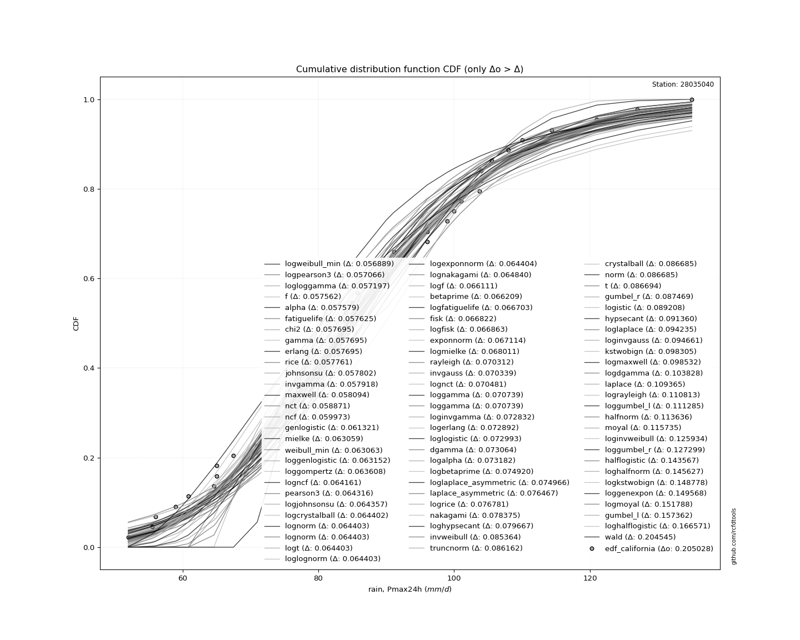</img>

</div>


**1.3. Best fit**

<div align="center">

|   id |   station | empirical_dist   | p_dist         |     delta |   deltao | eval   |   fit |   n |   best_fit |   best_fit_sort |
|-----:|----------:|:-----------------|:---------------|----------:|---------:|:-------|------:|----:|-----------:|----------------:|
|    0 |  28035040 | edf_california   | logweibull_min | 0.0568885 | 0.205028 | Δo > Δ |     1 |  44 |          1 |               1 |

</div>


<div align="center">

</img>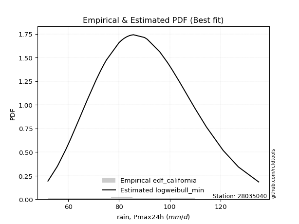</img>

</div>


### 2. Empirical - EDF Hazen (1930)

Hazen method for plotting positions is a formula used to estimate the empirical cumulative probability distribution of flood events or other hydrological data. This formula often results in biased estimations, particularly when extrapolating to extreme events (high return periods).

<div align="center">


$P=(m-0.5)/n$


</div>


**2.1. Empirical values**

<div align="center">

|                | 0                    | 1                   | 2                    | 3                   | 4                   | 5                  | 6                   | 7                   | 8                   | 9                  | 10                  | 11                  | 12                 | 13                 | 14                  | 15                 | 16        | 17                 | 18                  | 19                 | 20                 | 21                  | 22                 | 23                 | 24                 | 25                 | 26                 | 27                 | 28                 | 29                 | 30                 | 31                 | 32                 | 33                 | 34                 | 35                 | 36                 | 37                 | 38        | 39                 | 40                 | 41                 | 42                 | 43                 |
|:---------------|:---------------------|:--------------------|:---------------------|:--------------------|:--------------------|:-------------------|:--------------------|:--------------------|:--------------------|:-------------------|:--------------------|:--------------------|:-------------------|:-------------------|:--------------------|:-------------------|:----------|:-------------------|:--------------------|:-------------------|:-------------------|:--------------------|:-------------------|:-------------------|:-------------------|:-------------------|:-------------------|:-------------------|:-------------------|:-------------------|:-------------------|:-------------------|:-------------------|:-------------------|:-------------------|:-------------------|:-------------------|:-------------------|:----------|:-------------------|:-------------------|:-------------------|:-------------------|:-------------------|
| date           | 1973                 | 2003                | 1983                 | 2002                | 1994                | 1977               | 1997                | 1974                | 1976                | 2015               | 1980                | 1975                | 2014               | 1972               | 2013                | 2011               | 2000      | 2012               | 1993                | 1992               | 1990               | 1991                | 2009               | 2004               | 1996               | 1989               | 2001               | 1984               | 1987               | 2008               | 1981               | 1978               | 1999               | 2007               | 1986               | 2005               | 2006               | 1982               | 1998      | 2010               | 1985               | 1979               | 1995               | 1988               |
| x              | 52.0                 | 55.5                | 56.0                 | 59.0                | 60.84110278         | 64.62772669        | 65.0                | 65.0                | 67.5                | 71.0               | 72.4                | 73.0                | 74.0               | 75.0               | 80.0                | 81.0               | 81.8      | 82.0               | 83.0                | 83.0               | 84.0               | 84.0                | 84.0               | 85.0               | 85.7               | 90.0               | 90.0               | 90.1               | 91.1               | 96.0               | 96.0               | 99.0               | 100.0              | 101.0              | 103.7              | 104.0              | 104.0              | 105.5              | 108.0     | 110.0              | 114.4              | 121.0              | 127.0              | 135.0              |
| m              | 1                    | 2                   | 3                    | 4                   | 5                   | 6                  | 7                   | 8                   | 9                   | 10                 | 11                  | 12                  | 13                 | 14                 | 15                  | 16                 | 17        | 18                 | 19                  | 20                 | 21                 | 22                  | 23                 | 24                 | 25                 | 26                 | 27                 | 28                 | 29                 | 30                 | 31                 | 32                 | 33                 | 34                 | 35                 | 36                 | 37                 | 38                 | 39        | 40                 | 41                 | 42                 | 43                 | 44                 |
| empirical_dist | edf_hazen            | edf_hazen           | edf_hazen            | edf_hazen           | edf_hazen           | edf_hazen          | edf_hazen           | edf_hazen           | edf_hazen           | edf_hazen          | edf_hazen           | edf_hazen           | edf_hazen          | edf_hazen          | edf_hazen           | edf_hazen          | edf_hazen | edf_hazen          | edf_hazen           | edf_hazen          | edf_hazen          | edf_hazen           | edf_hazen          | edf_hazen          | edf_hazen          | edf_hazen          | edf_hazen          | edf_hazen          | edf_hazen          | edf_hazen          | edf_hazen          | edf_hazen          | edf_hazen          | edf_hazen          | edf_hazen          | edf_hazen          | edf_hazen          | edf_hazen          | edf_hazen | edf_hazen          | edf_hazen          | edf_hazen          | edf_hazen          | edf_hazen          |
| empirical      | 0.011363636363636364 | 0.03409090909090909 | 0.056818181818181816 | 0.07954545454545454 | 0.10227272727272728 | 0.125              | 0.14772727272727273 | 0.17045454545454544 | 0.19318181818181818 | 0.2159090909090909 | 0.23863636363636365 | 0.26136363636363635 | 0.2840909090909091 | 0.3068181818181818 | 0.32954545454545453 | 0.3522727272727273 | 0.375     | 0.3977272727272727 | 0.42045454545454547 | 0.4431818181818182 | 0.4659090909090909 | 0.48863636363636365 | 0.5113636363636364 | 0.5340909090909091 | 0.5568181818181818 | 0.5795454545454546 | 0.6022727272727273 | 0.625              | 0.6477272727272727 | 0.6704545454545454 | 0.6931818181818182 | 0.7159090909090909 | 0.7386363636363636 | 0.7613636363636364 | 0.7840909090909091 | 0.8068181818181818 | 0.8295454545454546 | 0.8522727272727273 | 0.875     | 0.8977272727272727 | 0.9204545454545454 | 0.9431818181818182 | 0.9659090909090909 | 0.9886363636363636 |
| empirical_tr   | 1.0114942528735633   | 1.0352941176470587  | 1.0602409638554215   | 1.0864197530864197  | 1.1139240506329113  | 1.1428571428571428 | 1.1733333333333333  | 1.2054794520547945  | 1.2394366197183098  | 1.2753623188405798 | 1.3134328358208955  | 1.353846153846154   | 1.396825396825397  | 1.4426229508196722 | 1.4915254237288136  | 1.5438596491228072 | 1.6       | 1.660377358490566  | 1.7254901960784312  | 1.7959183673469385 | 1.8723404255319147 | 1.9555555555555555  | 2.046511627906977  | 2.146341463414634  | 2.256410256410256  | 2.3783783783783785 | 2.5142857142857142 | 2.6666666666666665 | 2.8387096774193545 | 3.0344827586206895 | 3.25925925925926   | 3.5200000000000005 | 3.8260869565217392 | 4.190476190476191  | 4.63157894736842   | 5.176470588235293  | 5.866666666666668  | 6.76923076923077   | 8.0       | 9.777777777777775  | 12.571428571428566 | 17.600000000000016 | 29.33333333333336  | 88.00000000000009  |

</div>


**2.2. Kolmogorov-Smirnov fit test (sorted by Δ)**


<div align="center">

|                | 0                   | 1                   | 2                   | 3                   | 4                   | 5                    | 6                   | 7                   | 8                   | 9                   | 10                  | 11                   | 12                  | 13                  | 14                  | 15                  | 16                  | 17                  | 18                  | 19                  | 20                  | 21                  | 22                  | 23                  | 24                  | 25                  | 26                  | 27                  | 28                  | 29                  | 30                  | 31                  | 32                  | 33                  | 34                  | 35                  | 36                  | 37                  | 38                  | 39                  | 40                  | 41                  | 42                  | 43                  | 44                  | 45                  | 46                  | 47                  | 48                  | 49                  | 50                  | 51                  | 52                  | 53                  | 54                  | 55                    | 56                  | 57                  | 58                  | 59                  | 60                  | 61                  | 62                  | 63                  | 64                  | 65                  | 66                  | 67                  | 68                  | 69                  | 70                  | 71                  | 72                  | 73                  | 74                  | 75                  | 76                  | 77                  | 78                  | 79                  | 80                  | 81                  | 82                  | 83                  | 84                  | 85                  | 86                  | 87                  |
|:---------------|:--------------------|:--------------------|:--------------------|:--------------------|:--------------------|:---------------------|:--------------------|:--------------------|:--------------------|:--------------------|:--------------------|:---------------------|:--------------------|:--------------------|:--------------------|:--------------------|:--------------------|:--------------------|:--------------------|:--------------------|:--------------------|:--------------------|:--------------------|:--------------------|:--------------------|:--------------------|:--------------------|:--------------------|:--------------------|:--------------------|:--------------------|:--------------------|:--------------------|:--------------------|:--------------------|:--------------------|:--------------------|:--------------------|:--------------------|:--------------------|:--------------------|:--------------------|:--------------------|:--------------------|:--------------------|:--------------------|:--------------------|:--------------------|:--------------------|:--------------------|:--------------------|:--------------------|:--------------------|:--------------------|:--------------------|:----------------------|:--------------------|:--------------------|:--------------------|:--------------------|:--------------------|:--------------------|:--------------------|:--------------------|:--------------------|:--------------------|:--------------------|:--------------------|:--------------------|:--------------------|:--------------------|:--------------------|:--------------------|:--------------------|:--------------------|:--------------------|:--------------------|:--------------------|:--------------------|:--------------------|:--------------------|:--------------------|:--------------------|:--------------------|:--------------------|:--------------------|:--------------------|:--------------------|
| station        | 28035040            | 28035040            | 28035040            | 28035040            | 28035040            | 28035040             | 28035040            | 28035040            | 28035040            | 28035040            | 28035040            | 28035040             | 28035040            | 28035040            | 28035040            | 28035040            | 28035040            | 28035040            | 28035040            | 28035040            | 28035040            | 28035040            | 28035040            | 28035040            | 28035040            | 28035040            | 28035040            | 28035040            | 28035040            | 28035040            | 28035040            | 28035040            | 28035040            | 28035040            | 28035040            | 28035040            | 28035040            | 28035040            | 28035040            | 28035040            | 28035040            | 28035040            | 28035040            | 28035040            | 28035040            | 28035040            | 28035040            | 28035040            | 28035040            | 28035040            | 28035040            | 28035040            | 28035040            | 28035040            | 28035040            | 28035040              | 28035040            | 28035040            | 28035040            | 28035040            | 28035040            | 28035040            | 28035040            | 28035040            | 28035040            | 28035040            | 28035040            | 28035040            | 28035040            | 28035040            | 28035040            | 28035040            | 28035040            | 28035040            | 28035040            | 28035040            | 28035040            | 28035040            | 28035040            | 28035040            | 28035040            | 28035040            | 28035040            | 28035040            | 28035040            | 28035040            | 28035040            | 28035040            |
| empirical_dist | edf_hazen           | edf_hazen           | edf_hazen           | edf_hazen           | edf_hazen           | edf_hazen            | edf_hazen           | edf_hazen           | edf_hazen           | edf_hazen           | edf_hazen           | edf_hazen            | edf_hazen           | edf_hazen           | edf_hazen           | edf_hazen           | edf_hazen           | edf_hazen           | edf_hazen           | edf_hazen           | edf_hazen           | edf_hazen           | edf_hazen           | edf_hazen           | edf_hazen           | edf_hazen           | edf_hazen           | edf_hazen           | edf_hazen           | edf_hazen           | edf_hazen           | edf_hazen           | edf_hazen           | edf_hazen           | edf_hazen           | edf_hazen           | edf_hazen           | edf_hazen           | edf_hazen           | edf_hazen           | edf_hazen           | edf_hazen           | edf_hazen           | edf_hazen           | edf_hazen           | edf_hazen           | edf_hazen           | edf_hazen           | edf_hazen           | edf_hazen           | edf_hazen           | edf_hazen           | edf_hazen           | edf_hazen           | edf_hazen           | edf_hazen             | edf_hazen           | edf_hazen           | edf_hazen           | edf_hazen           | edf_hazen           | edf_hazen           | edf_hazen           | edf_hazen           | edf_hazen           | edf_hazen           | edf_hazen           | edf_hazen           | edf_hazen           | edf_hazen           | edf_hazen           | edf_hazen           | edf_hazen           | edf_hazen           | edf_hazen           | edf_hazen           | edf_hazen           | edf_hazen           | edf_hazen           | edf_hazen           | edf_hazen           | edf_hazen           | edf_hazen           | edf_hazen           | edf_hazen           | edf_hazen           | edf_hazen           | edf_hazen           |
| p_dist         | mielke              | loggenlogistic      | pearson3            | exponnorm           | logmielke           | fisk                 | logfisk             | ncf                 | nct                 | alpha               | logloggamma         | invgamma             | johnsonsu           | fatiguelife         | logpearson3         | loglogistic         | rice                | logweibull_min      | loggompertz         | f                   | chi2                | gamma               | erlang              | maxwell             | laplace_asymmetric  | genlogistic         | weibull_min         | truncnorm           | crystalball         | norm                | t                   | logncf              | logjohnsonsu        | logcrystalball      | lognorm             | lognorm             | logt                | loglognorm          | logexponnorm        | lognakagami         | logf                | betaprime           | logistic            | logfatiguelife      | hypsecant           | rayleigh            | invgauss            | lognct              | loghypsecant        | loggamma            | loggamma            | loginvgamma         | logerlang           | logalpha            | logbetaprime        | loglaplace_asymmetric | logrice             | nakagami            | gumbel_r            | invweibull          | laplace             | loggumbel_l         | loglaplace          | loginvgauss         | kstwobign           | logmaxwell          | moyal               | halfnorm            | lograyleigh         | halflogistic        | loginvweibull       | loggumbel_r         | gumbel_l            | loghalfnorm         | logkstwobign        | loggenexpon         | logmoyal            | loghalflogistic     | wald                | genexpon            | expon               | logwald             | loggibrat           | gibrat              | logtruncnorm        | logexpon            | logchi2             | gompertz            |
| delta          | 0.05169504360312138 | 0.05178878390714303 | 0.05547599482744936 | 0.05575057626084712 | 0.05664712143612194 | 0.058159513317358136 | 0.05820287469470825 | 0.05893299089038129 | 0.05966267549047383 | 0.06118079206102611 | 0.06179408223220706 | 0.062174744488417866 | 0.06377583298003481 | 0.0654712874806348  | 0.0656810587225401  | 0.06648965717764144 | 0.067105149017132   | 0.06825215504490928 | 0.06882618267312196 | 0.0689261106486021  | 0.06905884523715183 | 0.06905896813956497 | 0.06905897926010246 | 0.06945715071246555 | 0.07008008548588107 | 0.07173608020893835 | 0.07442708008725168 | 0.07479832039826262 | 0.07532129934486143 | 0.07532130826989514 | 0.07532997915118306 | 0.07552425421750181 | 0.07571867338670463 | 0.07576589167979303 | 0.075766215478143   | 0.075766215478143   | 0.07576669222724114 | 0.07576687145771593 | 0.07576710246992707 | 0.07620358346651218 | 0.07747453064891008 | 0.07757248247353582 | 0.07784453218201348 | 0.07806626359832597 | 0.07999622282635493 | 0.08167599757689786 | 0.08170234841205543 | 0.08184487964977771 | 0.08195787573619162 | 0.08210237193849113 | 0.08210237193849113 | 0.084195467436317   | 0.08425608122529904 | 0.0845455500188963  | 0.08628401917972667 | 0.08632943858353181   | 0.08814506194810529 | 0.08973825397789087 | 0.09056879418502534 | 0.09673156866951454 | 0.09800123048684323 | 0.09992103232363536 | 0.105599097246863   | 0.1060247389300829  | 0.10966868590673451 | 0.10989564396834928 | 0.11232868058878875 | 0.1164306667843577  | 0.12217712550161658 | 0.132203531764235   | 0.1372978349406121  | 0.13866242247235971 | 0.14599815330590704 | 0.15699112971586743 | 0.1601420271597495  | 0.16093157164698663 | 0.16315147806685038 | 0.17416945858705446 | 0.19318181818181818 | 0.22363781941564193 | 0.2253167779480421  | 0.23071286805711855 | 0.24120833465808222 | 0.24251350040163855 | 0.25551526397959873 | 0.25915345259149286 | 0.3422636204865124  | 0.9175367708662958  |
| deltao         | 0.20502771431287928 | 0.20502771431287928 | 0.20502771431287928 | 0.20502771431287928 | 0.20502771431287928 | 0.20502771431287928  | 0.20502771431287928 | 0.20502771431287928 | 0.20502771431287928 | 0.20502771431287928 | 0.20502771431287928 | 0.20502771431287928  | 0.20502771431287928 | 0.20502771431287928 | 0.20502771431287928 | 0.20502771431287928 | 0.20502771431287928 | 0.20502771431287928 | 0.20502771431287928 | 0.20502771431287928 | 0.20502771431287928 | 0.20502771431287928 | 0.20502771431287928 | 0.20502771431287928 | 0.20502771431287928 | 0.20502771431287928 | 0.20502771431287928 | 0.20502771431287928 | 0.20502771431287928 | 0.20502771431287928 | 0.20502771431287928 | 0.20502771431287928 | 0.20502771431287928 | 0.20502771431287928 | 0.20502771431287928 | 0.20502771431287928 | 0.20502771431287928 | 0.20502771431287928 | 0.20502771431287928 | 0.20502771431287928 | 0.20502771431287928 | 0.20502771431287928 | 0.20502771431287928 | 0.20502771431287928 | 0.20502771431287928 | 0.20502771431287928 | 0.20502771431287928 | 0.20502771431287928 | 0.20502771431287928 | 0.20502771431287928 | 0.20502771431287928 | 0.20502771431287928 | 0.20502771431287928 | 0.20502771431287928 | 0.20502771431287928 | 0.20502771431287928   | 0.20502771431287928 | 0.20502771431287928 | 0.20502771431287928 | 0.20502771431287928 | 0.20502771431287928 | 0.20502771431287928 | 0.20502771431287928 | 0.20502771431287928 | 0.20502771431287928 | 0.20502771431287928 | 0.20502771431287928 | 0.20502771431287928 | 0.20502771431287928 | 0.20502771431287928 | 0.20502771431287928 | 0.20502771431287928 | 0.20502771431287928 | 0.20502771431287928 | 0.20502771431287928 | 0.20502771431287928 | 0.20502771431287928 | 0.20502771431287928 | 0.20502771431287928 | 0.20502771431287928 | 0.20502771431287928 | 0.20502771431287928 | 0.20502771431287928 | 0.20502771431287928 | 0.20502771431287928 | 0.20502771431287928 | 0.20502771431287928 | 0.20502771431287928 |
| eval           | Δo > Δ              | Δo > Δ              | Δo > Δ              | Δo > Δ              | Δo > Δ              | Δo > Δ               | Δo > Δ              | Δo > Δ              | Δo > Δ              | Δo > Δ              | Δo > Δ              | Δo > Δ               | Δo > Δ              | Δo > Δ              | Δo > Δ              | Δo > Δ              | Δo > Δ              | Δo > Δ              | Δo > Δ              | Δo > Δ              | Δo > Δ              | Δo > Δ              | Δo > Δ              | Δo > Δ              | Δo > Δ              | Δo > Δ              | Δo > Δ              | Δo > Δ              | Δo > Δ              | Δo > Δ              | Δo > Δ              | Δo > Δ              | Δo > Δ              | Δo > Δ              | Δo > Δ              | Δo > Δ              | Δo > Δ              | Δo > Δ              | Δo > Δ              | Δo > Δ              | Δo > Δ              | Δo > Δ              | Δo > Δ              | Δo > Δ              | Δo > Δ              | Δo > Δ              | Δo > Δ              | Δo > Δ              | Δo > Δ              | Δo > Δ              | Δo > Δ              | Δo > Δ              | Δo > Δ              | Δo > Δ              | Δo > Δ              | Δo > Δ                | Δo > Δ              | Δo > Δ              | Δo > Δ              | Δo > Δ              | Δo > Δ              | Δo > Δ              | Δo > Δ              | Δo > Δ              | Δo > Δ              | Δo > Δ              | Δo > Δ              | Δo > Δ              | Δo > Δ              | Δo > Δ              | Δo > Δ              | Δo > Δ              | Δo > Δ              | Δo > Δ              | Δo > Δ              | Δo > Δ              | Δo > Δ              | Δo > Δ              | Δo > Δ              | Δo <= Δ             | Δo <= Δ             | Δo <= Δ             | Δo <= Δ             | Δo <= Δ             | Δo <= Δ             | Δo <= Δ             | Δo <= Δ             | Δo <= Δ             |
| fit            | 1                   | 1                   | 1                   | 1                   | 1                   | 1                    | 1                   | 1                   | 1                   | 1                   | 1                   | 1                    | 1                   | 1                   | 1                   | 1                   | 1                   | 1                   | 1                   | 1                   | 1                   | 1                   | 1                   | 1                   | 1                   | 1                   | 1                   | 1                   | 1                   | 1                   | 1                   | 1                   | 1                   | 1                   | 1                   | 1                   | 1                   | 1                   | 1                   | 1                   | 1                   | 1                   | 1                   | 1                   | 1                   | 1                   | 1                   | 1                   | 1                   | 1                   | 1                   | 1                   | 1                   | 1                   | 1                   | 1                     | 1                   | 1                   | 1                   | 1                   | 1                   | 1                   | 1                   | 1                   | 1                   | 1                   | 1                   | 1                   | 1                   | 1                   | 1                   | 1                   | 1                   | 1                   | 1                   | 1                   | 1                   | 1                   | 1                   | 0                   | 0                   | 0                   | 0                   | 0                   | 0                   | 0                   | 0                   | 0                   |
| n              | 44                  | 44                  | 44                  | 44                  | 44                  | 44                   | 44                  | 44                  | 44                  | 44                  | 44                  | 44                   | 44                  | 44                  | 44                  | 44                  | 44                  | 44                  | 44                  | 44                  | 44                  | 44                  | 44                  | 44                  | 44                  | 44                  | 44                  | 44                  | 44                  | 44                  | 44                  | 44                  | 44                  | 44                  | 44                  | 44                  | 44                  | 44                  | 44                  | 44                  | 44                  | 44                  | 44                  | 44                  | 44                  | 44                  | 44                  | 44                  | 44                  | 44                  | 44                  | 44                  | 44                  | 44                  | 44                  | 44                    | 44                  | 44                  | 44                  | 44                  | 44                  | 44                  | 44                  | 44                  | 44                  | 44                  | 44                  | 44                  | 44                  | 44                  | 44                  | 44                  | 44                  | 44                  | 44                  | 44                  | 44                  | 44                  | 44                  | 44                  | 44                  | 44                  | 44                  | 44                  | 44                  | 44                  | 44                  | 44                  |
| best_fit       | 1                   | 0                   | 0                   | 0                   | 0                   | 0                    | 0                   | 0                   | 0                   | 0                   | 0                   | 0                    | 0                   | 0                   | 0                   | 0                   | 0                   | 0                   | 0                   | 0                   | 0                   | 0                   | 0                   | 0                   | 0                   | 0                   | 0                   | 0                   | 0                   | 0                   | 0                   | 0                   | 0                   | 0                   | 0                   | 0                   | 0                   | 0                   | 0                   | 0                   | 0                   | 0                   | 0                   | 0                   | 0                   | 0                   | 0                   | 0                   | 0                   | 0                   | 0                   | 0                   | 0                   | 0                   | 0                   | 0                     | 0                   | 0                   | 0                   | 0                   | 0                   | 0                   | 0                   | 0                   | 0                   | 0                   | 0                   | 0                   | 0                   | 0                   | 0                   | 0                   | 0                   | 0                   | 0                   | 0                   | 0                   | 0                   | 0                   | 0                   | 0                   | 0                   | 0                   | 0                   | 0                   | 0                   | 0                   | 0                   |
| best_fit_sort  | 1                   | 2                   | 3                   | 4                   | 5                   | 6                    | 7                   | 8                   | 9                   | 10                  | 11                  | 12                   | 13                  | 14                  | 15                  | 16                  | 17                  | 18                  | 19                  | 20                  | 21                  | 22                  | 23                  | 24                  | 25                  | 26                  | 27                  | 28                  | 29                  | 30                  | 31                  | 32                  | 33                  | 34                  | 35                  | 36                  | 37                  | 38                  | 39                  | 40                  | 41                  | 42                  | 43                  | 44                  | 45                  | 46                  | 47                  | 48                  | 49                  | 50                  | 51                  | 52                  | 53                  | 54                  | 55                  | 56                    | 57                  | 58                  | 59                  | 60                  | 61                  | 62                  | 63                  | 64                  | 65                  | 66                  | 67                  | 68                  | 69                  | 70                  | 71                  | 72                  | 73                  | 74                  | 75                  | 76                  | 77                  | 78                  | 79                  | 80                  | 81                  | 82                  | 83                  | 84                  | 85                  | 86                  | 87                  | 88                  |

</div>


<div align="center">

</img>

</div>


**2.3. Best fit**

<div align="center">

|   id |   station | empirical_dist   | p_dist   |    delta |   deltao | eval   |   fit |   n |   best_fit |   best_fit_sort |
|-----:|----------:|:-----------------|:---------|---------:|---------:|:-------|------:|----:|-----------:|----------------:|
|    0 |  28035040 | edf_hazen        | mielke   | 0.051695 | 0.205028 | Δo > Δ |     1 |  44 |          1 |               1 |

</div>


<div align="center">

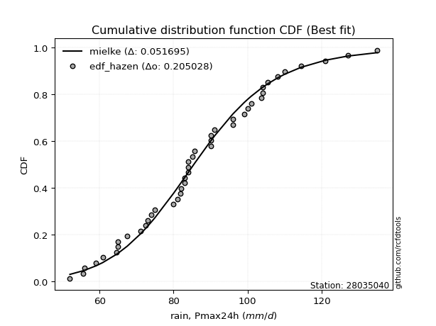</img>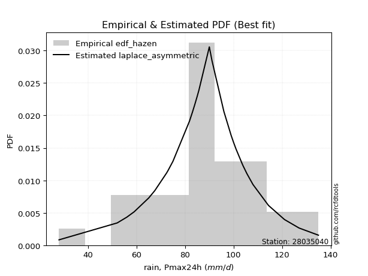</img>

</div>


### 3. Empirical - EDF Weibull (1939)

Weibull plotting position formula is an empirical method used to estimate the non-exceedance probability or plotting position for a set of observed data, is often recommended or widely used in practice, particularly in flood frequency analysis.

<div align="center">


$P=m/(n+1)$


</div>


**3.1. Empirical values**

<div align="center">

|                | 0                    | 1                    | 2                   | 3                   | 4                  | 5                   | 6                   | 7                   | 8           | 9                  | 10                  | 11                  | 12                  | 13                 | 14                 | 15                  | 16                  | 17                 | 18                 | 19                 | 20                 | 21                 | 22                 | 23                 | 24                 | 25                 | 26          | 27                 | 28                 | 29                 | 30                 | 31                 | 32                 | 33                 | 34                 | 35                | 36                 | 37                 | 38                 | 39                 | 40                 | 41                 | 42                 | 43                 |
|:---------------|:---------------------|:---------------------|:--------------------|:--------------------|:-------------------|:--------------------|:--------------------|:--------------------|:------------|:-------------------|:--------------------|:--------------------|:--------------------|:-------------------|:-------------------|:--------------------|:--------------------|:-------------------|:-------------------|:-------------------|:-------------------|:-------------------|:-------------------|:-------------------|:-------------------|:-------------------|:------------|:-------------------|:-------------------|:-------------------|:-------------------|:-------------------|:-------------------|:-------------------|:-------------------|:------------------|:-------------------|:-------------------|:-------------------|:-------------------|:-------------------|:-------------------|:-------------------|:-------------------|
| date           | 1973                 | 2003                 | 1983                | 2002                | 1994               | 1977                | 1997                | 1974                | 1976        | 2015               | 1980                | 1975                | 2014                | 1972               | 2013               | 2011                | 2000                | 2012               | 1993               | 1992               | 1990               | 1991               | 2009               | 2004               | 1996               | 1989               | 2001        | 1984               | 1987               | 2008               | 1981               | 1978               | 1999               | 2007               | 1986               | 2005              | 2006               | 1982               | 1998               | 2010               | 1985               | 1979               | 1995               | 1988               |
| x              | 52.0                 | 55.5                 | 56.0                | 59.0                | 60.84110278        | 64.62772669         | 65.0                | 65.0                | 67.5        | 71.0               | 72.4                | 73.0                | 74.0                | 75.0               | 80.0               | 81.0                | 81.8                | 82.0               | 83.0               | 83.0               | 84.0               | 84.0               | 84.0               | 85.0               | 85.7               | 90.0               | 90.0        | 90.1               | 91.1               | 96.0               | 96.0               | 99.0               | 100.0              | 101.0              | 103.7              | 104.0             | 104.0              | 105.5              | 108.0              | 110.0              | 114.4              | 121.0              | 127.0              | 135.0              |
| m              | 1                    | 2                    | 3                   | 4                   | 5                  | 6                   | 7                   | 8                   | 9           | 10                 | 11                  | 12                  | 13                  | 14                 | 15                 | 16                  | 17                  | 18                 | 19                 | 20                 | 21                 | 22                 | 23                 | 24                 | 25                 | 26                 | 27          | 28                 | 29                 | 30                 | 31                 | 32                 | 33                 | 34                 | 35                 | 36                | 37                 | 38                 | 39                 | 40                 | 41                 | 42                 | 43                 | 44                 |
| empirical_dist | edf_weibull          | edf_weibull          | edf_weibull         | edf_weibull         | edf_weibull        | edf_weibull         | edf_weibull         | edf_weibull         | edf_weibull | edf_weibull        | edf_weibull         | edf_weibull         | edf_weibull         | edf_weibull        | edf_weibull        | edf_weibull         | edf_weibull         | edf_weibull        | edf_weibull        | edf_weibull        | edf_weibull        | edf_weibull        | edf_weibull        | edf_weibull        | edf_weibull        | edf_weibull        | edf_weibull | edf_weibull        | edf_weibull        | edf_weibull        | edf_weibull        | edf_weibull        | edf_weibull        | edf_weibull        | edf_weibull        | edf_weibull       | edf_weibull        | edf_weibull        | edf_weibull        | edf_weibull        | edf_weibull        | edf_weibull        | edf_weibull        | edf_weibull        |
| empirical      | 0.022222222222222223 | 0.044444444444444446 | 0.06666666666666667 | 0.08888888888888889 | 0.1111111111111111 | 0.13333333333333333 | 0.15555555555555556 | 0.17777777777777778 | 0.2         | 0.2222222222222222 | 0.24444444444444444 | 0.26666666666666666 | 0.28888888888888886 | 0.3111111111111111 | 0.3333333333333333 | 0.35555555555555557 | 0.37777777777777777 | 0.4                | 0.4222222222222222 | 0.4444444444444444 | 0.4666666666666667 | 0.4888888888888889 | 0.5111111111111111 | 0.5333333333333333 | 0.5555555555555556 | 0.5777777777777777 | 0.6         | 0.6222222222222222 | 0.6444444444444445 | 0.6666666666666666 | 0.6888888888888889 | 0.7111111111111111 | 0.7333333333333333 | 0.7555555555555555 | 0.7777777777777778 | 0.8               | 0.8222222222222222 | 0.8444444444444444 | 0.8666666666666667 | 0.8888888888888888 | 0.9111111111111111 | 0.9333333333333333 | 0.9555555555555556 | 0.9777777777777777 |
| empirical_tr   | 1.0227272727272727   | 1.0465116279069766   | 1.0714285714285714  | 1.0975609756097562  | 1.125              | 1.1538461538461537  | 1.1842105263157894  | 1.2162162162162162  | 1.25        | 1.2857142857142856 | 1.3235294117647058  | 1.3636363636363635  | 1.40625             | 1.4516129032258065 | 1.4999999999999998 | 1.5517241379310347  | 1.6071428571428572  | 1.6666666666666667 | 1.7307692307692308 | 1.7999999999999998 | 1.875              | 1.956521739130435  | 2.0454545454545454 | 2.142857142857143  | 2.25               | 2.3684210526315788 | 2.5         | 2.6470588235294117 | 2.8125000000000004 | 2.9999999999999996 | 3.2142857142857144 | 3.4615384615384617 | 3.749999999999999  | 4.090909090909091  | 4.5                | 5.000000000000001 | 5.624999999999999  | 6.428571428571429  | 7.500000000000002  | 8.999999999999996  | 11.249999999999998 | 15.000000000000004 | 22.500000000000025 | 44.999999999999936 |

</div>


**3.2. Kolmogorov-Smirnov fit test (sorted by Δ)**


<div align="center">

|                | 0                   | 1                   | 2                   | 3                   | 4                    | 5                   | 6                   | 7                   | 8                    | 9                   | 10                  | 11                   | 12                  | 13                  | 14                  | 15                  | 16                  | 17                  | 18                  | 19                  | 20                  | 21                  | 22                  | 23                  | 24                  | 25                  | 26                  | 27                  | 28                  | 29                  | 30                  | 31                  | 32                  | 33                  | 34                  | 35                  | 36                  | 37                  | 38                  | 39                  | 40                  | 41                  | 42                  | 43                  | 44                  | 45                  | 46                  | 47                  | 48                  | 49                  | 50                  | 51                  | 52                  | 53                  | 54                  | 55                  | 56                  | 57                  | 58                    | 59                  | 60                  | 61                  | 62                  | 63                  | 64                  | 65                  | 66                  | 67                  | 68                  | 69                  | 70                  | 71                  | 72                  | 73                  | 74                  | 75                  | 76                  | 77                  | 78                  | 79                  | 80                  | 81                  | 82                  | 83                  | 84                  | 85                  | 86                  | 87                  |
|:---------------|:--------------------|:--------------------|:--------------------|:--------------------|:---------------------|:--------------------|:--------------------|:--------------------|:---------------------|:--------------------|:--------------------|:---------------------|:--------------------|:--------------------|:--------------------|:--------------------|:--------------------|:--------------------|:--------------------|:--------------------|:--------------------|:--------------------|:--------------------|:--------------------|:--------------------|:--------------------|:--------------------|:--------------------|:--------------------|:--------------------|:--------------------|:--------------------|:--------------------|:--------------------|:--------------------|:--------------------|:--------------------|:--------------------|:--------------------|:--------------------|:--------------------|:--------------------|:--------------------|:--------------------|:--------------------|:--------------------|:--------------------|:--------------------|:--------------------|:--------------------|:--------------------|:--------------------|:--------------------|:--------------------|:--------------------|:--------------------|:--------------------|:--------------------|:----------------------|:--------------------|:--------------------|:--------------------|:--------------------|:--------------------|:--------------------|:--------------------|:--------------------|:--------------------|:--------------------|:--------------------|:--------------------|:--------------------|:--------------------|:--------------------|:--------------------|:--------------------|:--------------------|:--------------------|:--------------------|:--------------------|:--------------------|:--------------------|:--------------------|:--------------------|:--------------------|:--------------------|:--------------------|:--------------------|
| station        | 28035040            | 28035040            | 28035040            | 28035040            | 28035040             | 28035040            | 28035040            | 28035040            | 28035040             | 28035040            | 28035040            | 28035040             | 28035040            | 28035040            | 28035040            | 28035040            | 28035040            | 28035040            | 28035040            | 28035040            | 28035040            | 28035040            | 28035040            | 28035040            | 28035040            | 28035040            | 28035040            | 28035040            | 28035040            | 28035040            | 28035040            | 28035040            | 28035040            | 28035040            | 28035040            | 28035040            | 28035040            | 28035040            | 28035040            | 28035040            | 28035040            | 28035040            | 28035040            | 28035040            | 28035040            | 28035040            | 28035040            | 28035040            | 28035040            | 28035040            | 28035040            | 28035040            | 28035040            | 28035040            | 28035040            | 28035040            | 28035040            | 28035040            | 28035040              | 28035040            | 28035040            | 28035040            | 28035040            | 28035040            | 28035040            | 28035040            | 28035040            | 28035040            | 28035040            | 28035040            | 28035040            | 28035040            | 28035040            | 28035040            | 28035040            | 28035040            | 28035040            | 28035040            | 28035040            | 28035040            | 28035040            | 28035040            | 28035040            | 28035040            | 28035040            | 28035040            | 28035040            | 28035040            |
| empirical_dist | edf_weibull         | edf_weibull         | edf_weibull         | edf_weibull         | edf_weibull          | edf_weibull         | edf_weibull         | edf_weibull         | edf_weibull          | edf_weibull         | edf_weibull         | edf_weibull          | edf_weibull         | edf_weibull         | edf_weibull         | edf_weibull         | edf_weibull         | edf_weibull         | edf_weibull         | edf_weibull         | edf_weibull         | edf_weibull         | edf_weibull         | edf_weibull         | edf_weibull         | edf_weibull         | edf_weibull         | edf_weibull         | edf_weibull         | edf_weibull         | edf_weibull         | edf_weibull         | edf_weibull         | edf_weibull         | edf_weibull         | edf_weibull         | edf_weibull         | edf_weibull         | edf_weibull         | edf_weibull         | edf_weibull         | edf_weibull         | edf_weibull         | edf_weibull         | edf_weibull         | edf_weibull         | edf_weibull         | edf_weibull         | edf_weibull         | edf_weibull         | edf_weibull         | edf_weibull         | edf_weibull         | edf_weibull         | edf_weibull         | edf_weibull         | edf_weibull         | edf_weibull         | edf_weibull           | edf_weibull         | edf_weibull         | edf_weibull         | edf_weibull         | edf_weibull         | edf_weibull         | edf_weibull         | edf_weibull         | edf_weibull         | edf_weibull         | edf_weibull         | edf_weibull         | edf_weibull         | edf_weibull         | edf_weibull         | edf_weibull         | edf_weibull         | edf_weibull         | edf_weibull         | edf_weibull         | edf_weibull         | edf_weibull         | edf_weibull         | edf_weibull         | edf_weibull         | edf_weibull         | edf_weibull         | edf_weibull         | edf_weibull         |
| p_dist         | pearson3            | exponnorm           | ncf                 | nct                 | logmielke            | alpha               | loggenlogistic      | mielke              | logloggamma          | invgamma            | johnsonsu           | fatiguelife          | logpearson3         | fisk                | logfisk             | rice                | logweibull_min      | loggompertz         | f                   | chi2                | gamma               | erlang              | maxwell             | genlogistic         | weibull_min         | loglogistic         | logncf              | logjohnsonsu        | logcrystalball      | lognorm             | lognorm             | logt                | loglognorm          | logexponnorm        | lognakagami         | truncnorm           | logf                | betaprime           | laplace_asymmetric  | crystalball         | norm                | t                   | logfatiguelife      | logistic            | rayleigh            | invgauss            | lognct              | loggamma            | loggamma            | hypsecant           | loginvgamma         | logerlang           | logalpha            | logbetaprime        | logrice             | loghypsecant        | nakagami            | gumbel_r            | loglaplace_asymmetric | invweibull          | laplace             | loggumbel_l         | loginvgauss         | kstwobign           | logmaxwell          | loglaplace          | moyal               | halfnorm            | lograyleigh         | loginvweibull       | loggumbel_r         | halflogistic        | gumbel_l            | loghalfnorm         | logkstwobign        | loggenexpon         | logmoyal            | loghalflogistic     | wald                | genexpon            | expon               | logwald             | loggibrat           | gibrat              | logtruncnorm        | logexpon            | logchi2             | gompertz            |
| delta          | 0.05168962793072929 | 0.05448794999822093 | 0.0551451121025025  | 0.05587479670259504 | 0.056500697559148244 | 0.05739291327314733 | 0.05779170387797329 | 0.05782911144515995 | 0.058006203444328275 | 0.05838686570053908 | 0.05998795419215602 | 0.061683408692756014 | 0.06189317993466131 | 0.06278192684887007 | 0.06282263222092328 | 0.06331727022925321 | 0.0644642762570305  | 0.06503830388524318 | 0.06513823186072332 | 0.06527096644927305 | 0.06527108935168618 | 0.06527110047222368 | 0.06566927192458677 | 0.06794820142105956 | 0.0706392012993729  | 0.07088990725178412 | 0.07173637542962302 | 0.07193079459882584 | 0.07197801289191424 | 0.07197833669026421 | 0.07197833669026421 | 0.07197881343936235 | 0.07197899266983715 | 0.07197922368204829 | 0.0724157046786334  | 0.07353569413563643 | 0.0736866518610313  | 0.07378460368565704 | 0.07386796427375986 | 0.07405867308223524 | 0.07405868200726895 | 0.07406735288855687 | 0.07427838481044718 | 0.0765819059193873  | 0.07788811878901908 | 0.07791446962417664 | 0.07805700086189893 | 0.07831449315061234 | 0.07831449315061234 | 0.07873359656372875 | 0.08040758864843822 | 0.08046820243742026 | 0.08075767123101751 | 0.08249614039184788 | 0.0843571831602265  | 0.0857457545240704  | 0.08595037519001208 | 0.08728596590219706 | 0.0901173173714106    | 0.09294368988163576 | 0.09774870523431795 | 0.09865840606100917 | 0.10223686014220412 | 0.10588080711885572 | 0.10610776518047049 | 0.10938697603474179 | 0.11169418886173112 | 0.11264278799647892 | 0.1183892467137378  | 0.1335099561527333  | 0.13537959418953144 | 0.13952676408746734 | 0.14473552704328085 | 0.15320325092798864 | 0.15635414837187073 | 0.15714369285910784 | 0.1598686497840221  | 0.17088663030422618 | 0.2                 | 0.21984994062776314 | 0.22152889916016333 | 0.22753247721644787 | 0.23843055688030446 | 0.24781653070466886 | 0.25172738519171994 | 0.2553655738036141  | 0.3314050346279265  | 0.9081933365228615  |
| deltao         | 0.20502771431287928 | 0.20502771431287928 | 0.20502771431287928 | 0.20502771431287928 | 0.20502771431287928  | 0.20502771431287928 | 0.20502771431287928 | 0.20502771431287928 | 0.20502771431287928  | 0.20502771431287928 | 0.20502771431287928 | 0.20502771431287928  | 0.20502771431287928 | 0.20502771431287928 | 0.20502771431287928 | 0.20502771431287928 | 0.20502771431287928 | 0.20502771431287928 | 0.20502771431287928 | 0.20502771431287928 | 0.20502771431287928 | 0.20502771431287928 | 0.20502771431287928 | 0.20502771431287928 | 0.20502771431287928 | 0.20502771431287928 | 0.20502771431287928 | 0.20502771431287928 | 0.20502771431287928 | 0.20502771431287928 | 0.20502771431287928 | 0.20502771431287928 | 0.20502771431287928 | 0.20502771431287928 | 0.20502771431287928 | 0.20502771431287928 | 0.20502771431287928 | 0.20502771431287928 | 0.20502771431287928 | 0.20502771431287928 | 0.20502771431287928 | 0.20502771431287928 | 0.20502771431287928 | 0.20502771431287928 | 0.20502771431287928 | 0.20502771431287928 | 0.20502771431287928 | 0.20502771431287928 | 0.20502771431287928 | 0.20502771431287928 | 0.20502771431287928 | 0.20502771431287928 | 0.20502771431287928 | 0.20502771431287928 | 0.20502771431287928 | 0.20502771431287928 | 0.20502771431287928 | 0.20502771431287928 | 0.20502771431287928   | 0.20502771431287928 | 0.20502771431287928 | 0.20502771431287928 | 0.20502771431287928 | 0.20502771431287928 | 0.20502771431287928 | 0.20502771431287928 | 0.20502771431287928 | 0.20502771431287928 | 0.20502771431287928 | 0.20502771431287928 | 0.20502771431287928 | 0.20502771431287928 | 0.20502771431287928 | 0.20502771431287928 | 0.20502771431287928 | 0.20502771431287928 | 0.20502771431287928 | 0.20502771431287928 | 0.20502771431287928 | 0.20502771431287928 | 0.20502771431287928 | 0.20502771431287928 | 0.20502771431287928 | 0.20502771431287928 | 0.20502771431287928 | 0.20502771431287928 | 0.20502771431287928 | 0.20502771431287928 |
| eval           | Δo > Δ              | Δo > Δ              | Δo > Δ              | Δo > Δ              | Δo > Δ               | Δo > Δ              | Δo > Δ              | Δo > Δ              | Δo > Δ               | Δo > Δ              | Δo > Δ              | Δo > Δ               | Δo > Δ              | Δo > Δ              | Δo > Δ              | Δo > Δ              | Δo > Δ              | Δo > Δ              | Δo > Δ              | Δo > Δ              | Δo > Δ              | Δo > Δ              | Δo > Δ              | Δo > Δ              | Δo > Δ              | Δo > Δ              | Δo > Δ              | Δo > Δ              | Δo > Δ              | Δo > Δ              | Δo > Δ              | Δo > Δ              | Δo > Δ              | Δo > Δ              | Δo > Δ              | Δo > Δ              | Δo > Δ              | Δo > Δ              | Δo > Δ              | Δo > Δ              | Δo > Δ              | Δo > Δ              | Δo > Δ              | Δo > Δ              | Δo > Δ              | Δo > Δ              | Δo > Δ              | Δo > Δ              | Δo > Δ              | Δo > Δ              | Δo > Δ              | Δo > Δ              | Δo > Δ              | Δo > Δ              | Δo > Δ              | Δo > Δ              | Δo > Δ              | Δo > Δ              | Δo > Δ                | Δo > Δ              | Δo > Δ              | Δo > Δ              | Δo > Δ              | Δo > Δ              | Δo > Δ              | Δo > Δ              | Δo > Δ              | Δo > Δ              | Δo > Δ              | Δo > Δ              | Δo > Δ              | Δo > Δ              | Δo > Δ              | Δo > Δ              | Δo > Δ              | Δo > Δ              | Δo > Δ              | Δo > Δ              | Δo > Δ              | Δo <= Δ             | Δo <= Δ             | Δo <= Δ             | Δo <= Δ             | Δo <= Δ             | Δo <= Δ             | Δo <= Δ             | Δo <= Δ             | Δo <= Δ             |
| fit            | 1                   | 1                   | 1                   | 1                   | 1                    | 1                   | 1                   | 1                   | 1                    | 1                   | 1                   | 1                    | 1                   | 1                   | 1                   | 1                   | 1                   | 1                   | 1                   | 1                   | 1                   | 1                   | 1                   | 1                   | 1                   | 1                   | 1                   | 1                   | 1                   | 1                   | 1                   | 1                   | 1                   | 1                   | 1                   | 1                   | 1                   | 1                   | 1                   | 1                   | 1                   | 1                   | 1                   | 1                   | 1                   | 1                   | 1                   | 1                   | 1                   | 1                   | 1                   | 1                   | 1                   | 1                   | 1                   | 1                   | 1                   | 1                   | 1                     | 1                   | 1                   | 1                   | 1                   | 1                   | 1                   | 1                   | 1                   | 1                   | 1                   | 1                   | 1                   | 1                   | 1                   | 1                   | 1                   | 1                   | 1                   | 1                   | 1                   | 0                   | 0                   | 0                   | 0                   | 0                   | 0                   | 0                   | 0                   | 0                   |
| n              | 44                  | 44                  | 44                  | 44                  | 44                   | 44                  | 44                  | 44                  | 44                   | 44                  | 44                  | 44                   | 44                  | 44                  | 44                  | 44                  | 44                  | 44                  | 44                  | 44                  | 44                  | 44                  | 44                  | 44                  | 44                  | 44                  | 44                  | 44                  | 44                  | 44                  | 44                  | 44                  | 44                  | 44                  | 44                  | 44                  | 44                  | 44                  | 44                  | 44                  | 44                  | 44                  | 44                  | 44                  | 44                  | 44                  | 44                  | 44                  | 44                  | 44                  | 44                  | 44                  | 44                  | 44                  | 44                  | 44                  | 44                  | 44                  | 44                    | 44                  | 44                  | 44                  | 44                  | 44                  | 44                  | 44                  | 44                  | 44                  | 44                  | 44                  | 44                  | 44                  | 44                  | 44                  | 44                  | 44                  | 44                  | 44                  | 44                  | 44                  | 44                  | 44                  | 44                  | 44                  | 44                  | 44                  | 44                  | 44                  |
| best_fit       | 1                   | 0                   | 0                   | 0                   | 0                    | 0                   | 0                   | 0                   | 0                    | 0                   | 0                   | 0                    | 0                   | 0                   | 0                   | 0                   | 0                   | 0                   | 0                   | 0                   | 0                   | 0                   | 0                   | 0                   | 0                   | 0                   | 0                   | 0                   | 0                   | 0                   | 0                   | 0                   | 0                   | 0                   | 0                   | 0                   | 0                   | 0                   | 0                   | 0                   | 0                   | 0                   | 0                   | 0                   | 0                   | 0                   | 0                   | 0                   | 0                   | 0                   | 0                   | 0                   | 0                   | 0                   | 0                   | 0                   | 0                   | 0                   | 0                     | 0                   | 0                   | 0                   | 0                   | 0                   | 0                   | 0                   | 0                   | 0                   | 0                   | 0                   | 0                   | 0                   | 0                   | 0                   | 0                   | 0                   | 0                   | 0                   | 0                   | 0                   | 0                   | 0                   | 0                   | 0                   | 0                   | 0                   | 0                   | 0                   |
| best_fit_sort  | 1                   | 2                   | 3                   | 4                   | 5                    | 6                   | 7                   | 8                   | 9                    | 10                  | 11                  | 12                   | 13                  | 14                  | 15                  | 16                  | 17                  | 18                  | 19                  | 20                  | 21                  | 22                  | 23                  | 24                  | 25                  | 26                  | 27                  | 28                  | 29                  | 30                  | 31                  | 32                  | 33                  | 34                  | 35                  | 36                  | 37                  | 38                  | 39                  | 40                  | 41                  | 42                  | 43                  | 44                  | 45                  | 46                  | 47                  | 48                  | 49                  | 50                  | 51                  | 52                  | 53                  | 54                  | 55                  | 56                  | 57                  | 58                  | 59                    | 60                  | 61                  | 62                  | 63                  | 64                  | 65                  | 66                  | 67                  | 68                  | 69                  | 70                  | 71                  | 72                  | 73                  | 74                  | 75                  | 76                  | 77                  | 78                  | 79                  | 80                  | 81                  | 82                  | 83                  | 84                  | 85                  | 86                  | 87                  | 88                  |

</div>


<div align="center">

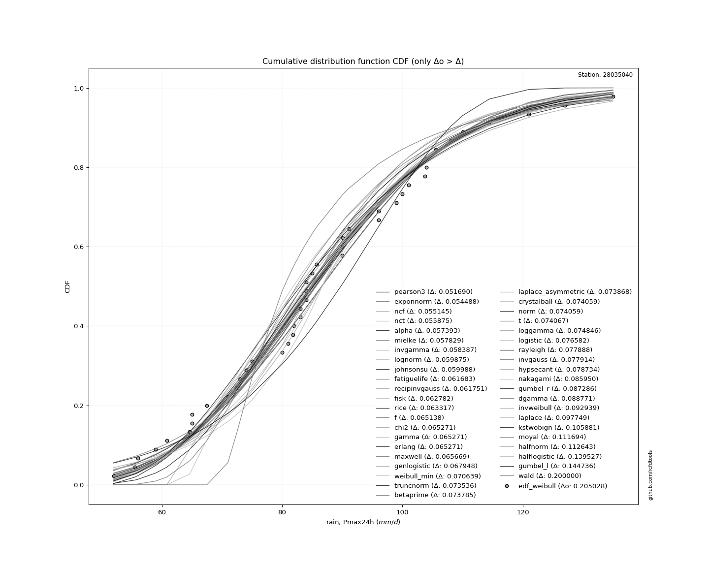</img>

</div>


**3.3. Best fit**

<div align="center">

|   id |   station | empirical_dist   | p_dist   |     delta |   deltao | eval   |   fit |   n |   best_fit |   best_fit_sort |
|-----:|----------:|:-----------------|:---------|----------:|---------:|:-------|------:|----:|-----------:|----------------:|
|    0 |  28035040 | edf_weibull      | pearson3 | 0.0516896 | 0.205028 | Δo > Δ |     1 |  44 |          1 |               1 |

</div>


<div align="center">

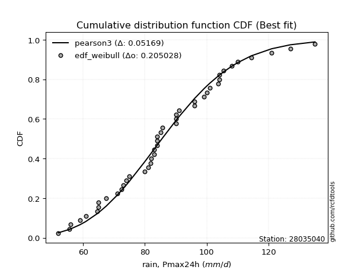</img>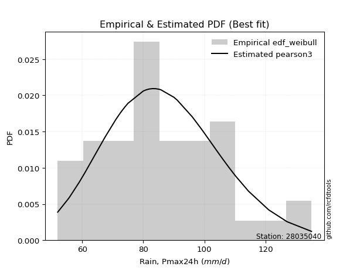</img>

</div>


### 4. Empirical - EDF Beard (1943)

The Beard formula (or Beard´s plotting position formula) in hydrology is used to estimate the empirical non-exceedance probability _(P)_ of a flood event (or other extreme hydrological data point) within a given dataset.

<div align="center">


$P=(m-0.31)/(n+0.38)$


</div>


**4.1. Empirical values**

<div align="center">

|                | 0                    | 1                  | 2                   | 3                   | 4                   | 5                   | 6                   | 7                  | 8                   | 9                   | 10                 | 11                  | 12                 | 13                 | 14                  | 15                 | 16                 | 17                 | 18                  | 19                 | 20                 | 21                  | 22                 | 23                 | 24                 | 25                 | 26                 | 27                 | 28                 | 29                 | 30                 | 31                 | 32                 | 33                 | 34                 | 35                 | 36                 | 37                 | 38                 | 39                 | 40                 | 41                 | 42                 | 43                 |
|:---------------|:---------------------|:-------------------|:--------------------|:--------------------|:--------------------|:--------------------|:--------------------|:-------------------|:--------------------|:--------------------|:-------------------|:--------------------|:-------------------|:-------------------|:--------------------|:-------------------|:-------------------|:-------------------|:--------------------|:-------------------|:-------------------|:--------------------|:-------------------|:-------------------|:-------------------|:-------------------|:-------------------|:-------------------|:-------------------|:-------------------|:-------------------|:-------------------|:-------------------|:-------------------|:-------------------|:-------------------|:-------------------|:-------------------|:-------------------|:-------------------|:-------------------|:-------------------|:-------------------|:-------------------|
| date           | 1973                 | 2003               | 1983                | 2002                | 1994                | 1977                | 1997                | 1974               | 1976                | 2015                | 1980               | 1975                | 2014               | 1972               | 2013                | 2011               | 2000               | 2012               | 1993                | 1992               | 1990               | 1991                | 2009               | 2004               | 1996               | 1989               | 2001               | 1984               | 1987               | 2008               | 1981               | 1978               | 1999               | 2007               | 1986               | 2005               | 2006               | 1982               | 1998               | 2010               | 1985               | 1979               | 1995               | 1988               |
| x              | 52.0                 | 55.5               | 56.0                | 59.0                | 60.84110278         | 64.62772669         | 65.0                | 65.0               | 67.5                | 71.0                | 72.4               | 73.0                | 74.0               | 75.0               | 80.0                | 81.0               | 81.8               | 82.0               | 83.0                | 83.0               | 84.0               | 84.0                | 84.0               | 85.0               | 85.7               | 90.0               | 90.0               | 90.1               | 91.1               | 96.0               | 96.0               | 99.0               | 100.0              | 101.0              | 103.7              | 104.0              | 104.0              | 105.5              | 108.0              | 110.0              | 114.4              | 121.0              | 127.0              | 135.0              |
| m              | 1                    | 2                  | 3                   | 4                   | 5                   | 6                   | 7                   | 8                  | 9                   | 10                  | 11                 | 12                  | 13                 | 14                 | 15                  | 16                 | 17                 | 18                 | 19                  | 20                 | 21                 | 22                  | 23                 | 24                 | 25                 | 26                 | 27                 | 28                 | 29                 | 30                 | 31                 | 32                 | 33                 | 34                 | 35                 | 36                 | 37                 | 38                 | 39                 | 40                 | 41                 | 42                 | 43                 | 44                 |
| empirical_dist | edf_beard            | edf_beard          | edf_beard           | edf_beard           | edf_beard           | edf_beard           | edf_beard           | edf_beard          | edf_beard           | edf_beard           | edf_beard          | edf_beard           | edf_beard          | edf_beard          | edf_beard           | edf_beard          | edf_beard          | edf_beard          | edf_beard           | edf_beard          | edf_beard          | edf_beard           | edf_beard          | edf_beard          | edf_beard          | edf_beard          | edf_beard          | edf_beard          | edf_beard          | edf_beard          | edf_beard          | edf_beard          | edf_beard          | edf_beard          | edf_beard          | edf_beard          | edf_beard          | edf_beard          | edf_beard          | edf_beard          | edf_beard          | edf_beard          | edf_beard          | edf_beard          |
| empirical      | 0.015547543938711128 | 0.0380802163136548 | 0.06061288868859846 | 0.08314556106354214 | 0.10567823343848581 | 0.12821090581342948 | 0.15074357818837314 | 0.1732762505633168 | 0.19580892293826047 | 0.21834159531320413 | 0.2408742676881478 | 0.26340694006309145 | 0.2859396124380351 | 0.3084722848129788 | 0.33100495718792244 | 0.3535376295628661 | 0.3760703019378098 | 0.3986029743127535 | 0.42113564668769715 | 0.4436683190626408 | 0.4662009914375845 | 0.48873366381252814 | 0.5112663361874719 | 0.5337990085624155 | 0.5563316809373592 | 0.5788643533123028 | 0.6013970256872465 | 0.6239296980621901 | 0.6464623704371338 | 0.6689950428120776 | 0.6915277151870212 | 0.7140603875619649 | 0.7365930599369084 | 0.7591257323118521 | 0.7816584046867957 | 0.8041910770617394 | 0.8267237494366831 | 0.8492564218116267 | 0.8717890941865705 | 0.8943217665615141 | 0.9168544389364578 | 0.9393871113114014 | 0.9619197836863451 | 0.9844524560612887 |
| empirical_tr   | 1.0157930876630807   | 1.0395877254626376 | 1.0645238666346846  | 1.0906856721553206  | 1.1181657848324515  | 1.1470664254329286  | 1.1775006633059166  | 1.2095938947942217 | 1.2434855701877277  | 1.279331219371577   | 1.317304838230929  | 1.3576017130620983  | 1.4004417797412432 | 1.4460736396220268 | 1.4947793869989894  | 1.5468804461484835 | 1.6027446731672081 | 1.6627950543274634 | 1.7275204359673026  | 1.7974888618874039 | 1.8733642887294215 | 1.9559277214631996  | 2.046104195481789  | 2.1449975833736104 | 2.2539360081259523 | 2.374531835205992  | 2.5087620124364047 | 2.6590772917914913 | 2.8285532186105797 | 3.021102791014296  | 3.2417823228634037 | 3.497241922773838  | 3.7964071856287407 | 4.151543498596818  | 4.579979360165115  | 5.107019562715763  | 5.771131339401819  | 6.633781763826602  | 7.799648506151139  | 9.462686567164168  | 12.0271002710027   | 16.498141263940486 | 26.260355029585742 | 64.31884057970956  |

</div>


**4.2. Kolmogorov-Smirnov fit test (sorted by Δ)**


<div align="center">

|                | 0                   | 1                   | 2                    | 3                    | 4                    | 5                    | 6                   | 7                   | 8                   | 9                   | 10                   | 11                  | 12                   | 13                  | 14                  | 15                  | 16                  | 17                  | 18                  | 19                  | 20                  | 21                  | 22                  | 23                  | 24                  | 25                  | 26                  | 27                  | 28                  | 29                  | 30                  | 31                  | 32                  | 33                  | 34                  | 35                  | 36                  | 37                  | 38                  | 39                  | 40                  | 41                  | 42                  | 43                  | 44                  | 45                  | 46                  | 47                  | 48                  | 49                  | 50                  | 51                  | 52                  | 53                  | 54                  | 55                  | 56                    | 57                  | 58                  | 59                  | 60                  | 61                  | 62                  | 63                  | 64                  | 65                  | 66                  | 67                  | 68                  | 69                  | 70                  | 71                  | 72                  | 73                  | 74                  | 75                  | 76                  | 77                  | 78                  | 79                  | 80                  | 81                  | 82                  | 83                  | 84                  | 85                  | 86                  | 87                  |
|:---------------|:--------------------|:--------------------|:---------------------|:---------------------|:---------------------|:---------------------|:--------------------|:--------------------|:--------------------|:--------------------|:---------------------|:--------------------|:---------------------|:--------------------|:--------------------|:--------------------|:--------------------|:--------------------|:--------------------|:--------------------|:--------------------|:--------------------|:--------------------|:--------------------|:--------------------|:--------------------|:--------------------|:--------------------|:--------------------|:--------------------|:--------------------|:--------------------|:--------------------|:--------------------|:--------------------|:--------------------|:--------------------|:--------------------|:--------------------|:--------------------|:--------------------|:--------------------|:--------------------|:--------------------|:--------------------|:--------------------|:--------------------|:--------------------|:--------------------|:--------------------|:--------------------|:--------------------|:--------------------|:--------------------|:--------------------|:--------------------|:----------------------|:--------------------|:--------------------|:--------------------|:--------------------|:--------------------|:--------------------|:--------------------|:--------------------|:--------------------|:--------------------|:--------------------|:--------------------|:--------------------|:--------------------|:--------------------|:--------------------|:--------------------|:--------------------|:--------------------|:--------------------|:--------------------|:--------------------|:--------------------|:--------------------|:--------------------|:--------------------|:--------------------|:--------------------|:--------------------|:--------------------|:--------------------|
| station        | 28035040            | 28035040            | 28035040             | 28035040             | 28035040             | 28035040             | 28035040            | 28035040            | 28035040            | 28035040            | 28035040             | 28035040            | 28035040             | 28035040            | 28035040            | 28035040            | 28035040            | 28035040            | 28035040            | 28035040            | 28035040            | 28035040            | 28035040            | 28035040            | 28035040            | 28035040            | 28035040            | 28035040            | 28035040            | 28035040            | 28035040            | 28035040            | 28035040            | 28035040            | 28035040            | 28035040            | 28035040            | 28035040            | 28035040            | 28035040            | 28035040            | 28035040            | 28035040            | 28035040            | 28035040            | 28035040            | 28035040            | 28035040            | 28035040            | 28035040            | 28035040            | 28035040            | 28035040            | 28035040            | 28035040            | 28035040            | 28035040              | 28035040            | 28035040            | 28035040            | 28035040            | 28035040            | 28035040            | 28035040            | 28035040            | 28035040            | 28035040            | 28035040            | 28035040            | 28035040            | 28035040            | 28035040            | 28035040            | 28035040            | 28035040            | 28035040            | 28035040            | 28035040            | 28035040            | 28035040            | 28035040            | 28035040            | 28035040            | 28035040            | 28035040            | 28035040            | 28035040            | 28035040            |
| empirical_dist | edf_beard           | edf_beard           | edf_beard            | edf_beard            | edf_beard            | edf_beard            | edf_beard           | edf_beard           | edf_beard           | edf_beard           | edf_beard            | edf_beard           | edf_beard            | edf_beard           | edf_beard           | edf_beard           | edf_beard           | edf_beard           | edf_beard           | edf_beard           | edf_beard           | edf_beard           | edf_beard           | edf_beard           | edf_beard           | edf_beard           | edf_beard           | edf_beard           | edf_beard           | edf_beard           | edf_beard           | edf_beard           | edf_beard           | edf_beard           | edf_beard           | edf_beard           | edf_beard           | edf_beard           | edf_beard           | edf_beard           | edf_beard           | edf_beard           | edf_beard           | edf_beard           | edf_beard           | edf_beard           | edf_beard           | edf_beard           | edf_beard           | edf_beard           | edf_beard           | edf_beard           | edf_beard           | edf_beard           | edf_beard           | edf_beard           | edf_beard             | edf_beard           | edf_beard           | edf_beard           | edf_beard           | edf_beard           | edf_beard           | edf_beard           | edf_beard           | edf_beard           | edf_beard           | edf_beard           | edf_beard           | edf_beard           | edf_beard           | edf_beard           | edf_beard           | edf_beard           | edf_beard           | edf_beard           | edf_beard           | edf_beard           | edf_beard           | edf_beard           | edf_beard           | edf_beard           | edf_beard           | edf_beard           | edf_beard           | edf_beard           | edf_beard           | edf_beard           |
| p_dist         | loggenlogistic      | mielke              | pearson3             | exponnorm            | logmielke            | ncf                  | nct                 | fisk                | logfisk             | alpha               | logloggamma          | invgamma            | johnsonsu            | fatiguelife         | logpearson3         | rice                | logweibull_min      | loggompertz         | f                   | chi2                | gamma               | erlang              | loglogistic         | maxwell             | genlogistic         | laplace_asymmetric  | weibull_min         | logncf              | logjohnsonsu        | logcrystalball      | lognorm             | lognorm             | logt                | loglognorm          | logexponnorm        | truncnorm           | lognakagami         | crystalball         | norm                | t                   | logf                | betaprime           | logfatiguelife      | logistic            | hypsecant           | rayleigh            | invgauss            | lognct              | loggamma            | loggamma            | loginvgamma         | logerlang           | logalpha            | loghypsecant        | logbetaprime        | logrice             | loglaplace_asymmetric | nakagami            | gumbel_r            | invweibull          | laplace             | loggumbel_l         | loginvgauss         | loglaplace          | kstwobign           | logmaxwell          | moyal               | halfnorm            | lograyleigh         | halflogistic        | loginvweibull       | loggumbel_r         | gumbel_l            | loghalfnorm         | logkstwobign        | loggenexpon         | logmoyal            | loghalflogistic     | wald                | genexpon            | expon               | logwald             | loggibrat           | gibrat              | logtruncnorm        | logexpon            | logchi2             | gompertz            |
| delta          | 0.05329017666351231 | 0.05332758423069897 | 0.054016492184981446 | 0.055264075380024535 | 0.056160620555299356 | 0.057473488247913374 | 0.05820317284800591 | 0.05828039963440909 | 0.0583211050064623  | 0.0597212894185582  | 0.060334579589739146 | 0.06071524184594995 | 0.062316330337566894 | 0.06401178483816689 | 0.06422155608007218 | 0.06564564637466408 | 0.06679265240244137 | 0.06736668003065405 | 0.06746660800613419 | 0.06759934259468392 | 0.06759946549709706 | 0.06759947661763455 | 0.0679491598201093  | 0.06799764806999764 | 0.07027657756647043 | 0.07153958812834893 | 0.07296757744478377 | 0.0740647515750339  | 0.07425917074423671 | 0.07430638903732512 | 0.07430671283567508 | 0.07430671283567508 | 0.07430718958477323 | 0.07430736881524802 | 0.07430759982745916 | 0.07431181951744004 | 0.07474408082404427 | 0.07483479846403884 | 0.07483480738907256 | 0.07484347827036048 | 0.07601502800644216 | 0.0761129798310679  | 0.07660676095585806 | 0.0773580313011909  | 0.07950972194553235 | 0.08021649493442995 | 0.08024284576958751 | 0.0803853770073098  | 0.08064286929602321 | 0.08064286929602321 | 0.08273596479384909 | 0.08279657858283113 | 0.08308604737642838 | 0.08341737837865948 | 0.08482451653725875 | 0.08668555930563737 | 0.08778894122599967   | 0.08827875133542296 | 0.08930389189488652 | 0.09527206602704663 | 0.09790393031067873 | 0.09943453144281278 | 0.104565236287615   | 0.10705859988933086 | 0.1082091832642666  | 0.10843614132588136 | 0.11106377829864994 | 0.11497116414188979 | 0.12071762285914867 | 0.13502523687300635 | 0.13583833229814418 | 0.1373975201822209  | 0.14551165242508446 | 0.15553162707339951 | 0.1586825245172816  | 0.1594720690045187  | 0.16188657577671156 | 0.17290455629691565 | 0.19580892293826047 | 0.222178316773174   | 0.2238572753055742  | 0.22944796576697973 | 0.2401380327202724  | 0.24455680410109365 | 0.2540557613371308  | 0.25769394994902495 | 0.33807971291143746 | 0.9139366643482082  |
| deltao         | 0.20502771431287928 | 0.20502771431287928 | 0.20502771431287928  | 0.20502771431287928  | 0.20502771431287928  | 0.20502771431287928  | 0.20502771431287928 | 0.20502771431287928 | 0.20502771431287928 | 0.20502771431287928 | 0.20502771431287928  | 0.20502771431287928 | 0.20502771431287928  | 0.20502771431287928 | 0.20502771431287928 | 0.20502771431287928 | 0.20502771431287928 | 0.20502771431287928 | 0.20502771431287928 | 0.20502771431287928 | 0.20502771431287928 | 0.20502771431287928 | 0.20502771431287928 | 0.20502771431287928 | 0.20502771431287928 | 0.20502771431287928 | 0.20502771431287928 | 0.20502771431287928 | 0.20502771431287928 | 0.20502771431287928 | 0.20502771431287928 | 0.20502771431287928 | 0.20502771431287928 | 0.20502771431287928 | 0.20502771431287928 | 0.20502771431287928 | 0.20502771431287928 | 0.20502771431287928 | 0.20502771431287928 | 0.20502771431287928 | 0.20502771431287928 | 0.20502771431287928 | 0.20502771431287928 | 0.20502771431287928 | 0.20502771431287928 | 0.20502771431287928 | 0.20502771431287928 | 0.20502771431287928 | 0.20502771431287928 | 0.20502771431287928 | 0.20502771431287928 | 0.20502771431287928 | 0.20502771431287928 | 0.20502771431287928 | 0.20502771431287928 | 0.20502771431287928 | 0.20502771431287928   | 0.20502771431287928 | 0.20502771431287928 | 0.20502771431287928 | 0.20502771431287928 | 0.20502771431287928 | 0.20502771431287928 | 0.20502771431287928 | 0.20502771431287928 | 0.20502771431287928 | 0.20502771431287928 | 0.20502771431287928 | 0.20502771431287928 | 0.20502771431287928 | 0.20502771431287928 | 0.20502771431287928 | 0.20502771431287928 | 0.20502771431287928 | 0.20502771431287928 | 0.20502771431287928 | 0.20502771431287928 | 0.20502771431287928 | 0.20502771431287928 | 0.20502771431287928 | 0.20502771431287928 | 0.20502771431287928 | 0.20502771431287928 | 0.20502771431287928 | 0.20502771431287928 | 0.20502771431287928 | 0.20502771431287928 | 0.20502771431287928 |
| eval           | Δo > Δ              | Δo > Δ              | Δo > Δ               | Δo > Δ               | Δo > Δ               | Δo > Δ               | Δo > Δ              | Δo > Δ              | Δo > Δ              | Δo > Δ              | Δo > Δ               | Δo > Δ              | Δo > Δ               | Δo > Δ              | Δo > Δ              | Δo > Δ              | Δo > Δ              | Δo > Δ              | Δo > Δ              | Δo > Δ              | Δo > Δ              | Δo > Δ              | Δo > Δ              | Δo > Δ              | Δo > Δ              | Δo > Δ              | Δo > Δ              | Δo > Δ              | Δo > Δ              | Δo > Δ              | Δo > Δ              | Δo > Δ              | Δo > Δ              | Δo > Δ              | Δo > Δ              | Δo > Δ              | Δo > Δ              | Δo > Δ              | Δo > Δ              | Δo > Δ              | Δo > Δ              | Δo > Δ              | Δo > Δ              | Δo > Δ              | Δo > Δ              | Δo > Δ              | Δo > Δ              | Δo > Δ              | Δo > Δ              | Δo > Δ              | Δo > Δ              | Δo > Δ              | Δo > Δ              | Δo > Δ              | Δo > Δ              | Δo > Δ              | Δo > Δ                | Δo > Δ              | Δo > Δ              | Δo > Δ              | Δo > Δ              | Δo > Δ              | Δo > Δ              | Δo > Δ              | Δo > Δ              | Δo > Δ              | Δo > Δ              | Δo > Δ              | Δo > Δ              | Δo > Δ              | Δo > Δ              | Δo > Δ              | Δo > Δ              | Δo > Δ              | Δo > Δ              | Δo > Δ              | Δo > Δ              | Δo > Δ              | Δo > Δ              | Δo <= Δ             | Δo <= Δ             | Δo <= Δ             | Δo <= Δ             | Δo <= Δ             | Δo <= Δ             | Δo <= Δ             | Δo <= Δ             | Δo <= Δ             |
| fit            | 1                   | 1                   | 1                    | 1                    | 1                    | 1                    | 1                   | 1                   | 1                   | 1                   | 1                    | 1                   | 1                    | 1                   | 1                   | 1                   | 1                   | 1                   | 1                   | 1                   | 1                   | 1                   | 1                   | 1                   | 1                   | 1                   | 1                   | 1                   | 1                   | 1                   | 1                   | 1                   | 1                   | 1                   | 1                   | 1                   | 1                   | 1                   | 1                   | 1                   | 1                   | 1                   | 1                   | 1                   | 1                   | 1                   | 1                   | 1                   | 1                   | 1                   | 1                   | 1                   | 1                   | 1                   | 1                   | 1                   | 1                     | 1                   | 1                   | 1                   | 1                   | 1                   | 1                   | 1                   | 1                   | 1                   | 1                   | 1                   | 1                   | 1                   | 1                   | 1                   | 1                   | 1                   | 1                   | 1                   | 1                   | 1                   | 1                   | 0                   | 0                   | 0                   | 0                   | 0                   | 0                   | 0                   | 0                   | 0                   |
| n              | 44                  | 44                  | 44                   | 44                   | 44                   | 44                   | 44                  | 44                  | 44                  | 44                  | 44                   | 44                  | 44                   | 44                  | 44                  | 44                  | 44                  | 44                  | 44                  | 44                  | 44                  | 44                  | 44                  | 44                  | 44                  | 44                  | 44                  | 44                  | 44                  | 44                  | 44                  | 44                  | 44                  | 44                  | 44                  | 44                  | 44                  | 44                  | 44                  | 44                  | 44                  | 44                  | 44                  | 44                  | 44                  | 44                  | 44                  | 44                  | 44                  | 44                  | 44                  | 44                  | 44                  | 44                  | 44                  | 44                  | 44                    | 44                  | 44                  | 44                  | 44                  | 44                  | 44                  | 44                  | 44                  | 44                  | 44                  | 44                  | 44                  | 44                  | 44                  | 44                  | 44                  | 44                  | 44                  | 44                  | 44                  | 44                  | 44                  | 44                  | 44                  | 44                  | 44                  | 44                  | 44                  | 44                  | 44                  | 44                  |
| best_fit       | 1                   | 0                   | 0                    | 0                    | 0                    | 0                    | 0                   | 0                   | 0                   | 0                   | 0                    | 0                   | 0                    | 0                   | 0                   | 0                   | 0                   | 0                   | 0                   | 0                   | 0                   | 0                   | 0                   | 0                   | 0                   | 0                   | 0                   | 0                   | 0                   | 0                   | 0                   | 0                   | 0                   | 0                   | 0                   | 0                   | 0                   | 0                   | 0                   | 0                   | 0                   | 0                   | 0                   | 0                   | 0                   | 0                   | 0                   | 0                   | 0                   | 0                   | 0                   | 0                   | 0                   | 0                   | 0                   | 0                   | 0                     | 0                   | 0                   | 0                   | 0                   | 0                   | 0                   | 0                   | 0                   | 0                   | 0                   | 0                   | 0                   | 0                   | 0                   | 0                   | 0                   | 0                   | 0                   | 0                   | 0                   | 0                   | 0                   | 0                   | 0                   | 0                   | 0                   | 0                   | 0                   | 0                   | 0                   | 0                   |
| best_fit_sort  | 1                   | 2                   | 3                    | 4                    | 5                    | 6                    | 7                   | 8                   | 9                   | 10                  | 11                   | 12                  | 13                   | 14                  | 15                  | 16                  | 17                  | 18                  | 19                  | 20                  | 21                  | 22                  | 23                  | 24                  | 25                  | 26                  | 27                  | 28                  | 29                  | 30                  | 31                  | 32                  | 33                  | 34                  | 35                  | 36                  | 37                  | 38                  | 39                  | 40                  | 41                  | 42                  | 43                  | 44                  | 45                  | 46                  | 47                  | 48                  | 49                  | 50                  | 51                  | 52                  | 53                  | 54                  | 55                  | 56                  | 57                    | 58                  | 59                  | 60                  | 61                  | 62                  | 63                  | 64                  | 65                  | 66                  | 67                  | 68                  | 69                  | 70                  | 71                  | 72                  | 73                  | 74                  | 75                  | 76                  | 77                  | 78                  | 79                  | 80                  | 81                  | 82                  | 83                  | 84                  | 85                  | 86                  | 87                  | 88                  |

</div>


<div align="center">

</img>

</div>


**4.3. Best fit**

<div align="center">

|   id |   station | empirical_dist   | p_dist         |     delta |   deltao | eval   |   fit |   n |   best_fit |   best_fit_sort |
|-----:|----------:|:-----------------|:---------------|----------:|---------:|:-------|------:|----:|-----------:|----------------:|
|    0 |  28035040 | edf_beard        | loggenlogistic | 0.0532902 | 0.205028 | Δo > Δ |     1 |  44 |          1 |               1 |

</div>


<div align="center">

</img>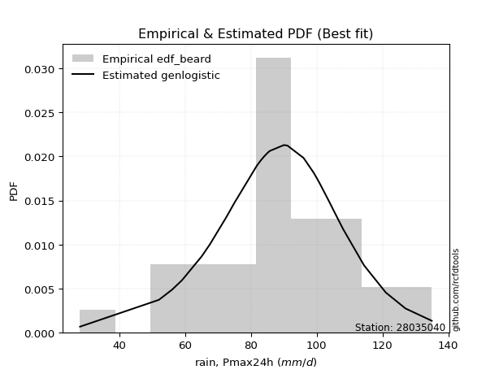</img>

</div>


### 5. Empirical - EDF Chegodayev (1955)

The Chegodayev formula is an empirical plotting position formula used in hydrological frequency analysis to estimate the exceedance probability or return period of a specific event from a set of observed data. It is primarily used for plotting observed data points on probability paper to fit a theoretical distribution, particularly for analyzing extreme events like maximum flood flows or rainfall intensities. The constant _b_ value in the generalized plotting position formula is 0.3.

<div align="center">


$P=(m-b)/(n+1-2b)$


</div>


**5.1. Empirical values**

<div align="center">

|                | 0                    | 1                    | 2                    | 3                   | 4                   | 5                  | 6                   | 7                   | 8                   | 9                   | 10                  | 11                 | 12                  | 13                  | 14                 | 15                 | 16                 | 17                  | 18                  | 19                 | 20                  | 21                  | 22                 | 23                 | 24                 | 25                 | 26                 | 27                 | 28                 | 29                 | 30                 | 31                 | 32                 | 33                 | 34                 | 35                 | 36                 | 37                 | 38                 | 39                 | 40                 | 41                 | 42                 | 43                 |
|:---------------|:---------------------|:---------------------|:---------------------|:--------------------|:--------------------|:-------------------|:--------------------|:--------------------|:--------------------|:--------------------|:--------------------|:-------------------|:--------------------|:--------------------|:-------------------|:-------------------|:-------------------|:--------------------|:--------------------|:-------------------|:--------------------|:--------------------|:-------------------|:-------------------|:-------------------|:-------------------|:-------------------|:-------------------|:-------------------|:-------------------|:-------------------|:-------------------|:-------------------|:-------------------|:-------------------|:-------------------|:-------------------|:-------------------|:-------------------|:-------------------|:-------------------|:-------------------|:-------------------|:-------------------|
| date           | 1973                 | 2003                 | 1983                 | 2002                | 1994                | 1977               | 1997                | 1974                | 1976                | 2015                | 1980                | 1975               | 2014                | 1972                | 2013               | 2011               | 2000               | 2012                | 1993                | 1992               | 1990                | 1991                | 2009               | 2004               | 1996               | 1989               | 2001               | 1984               | 1987               | 2008               | 1981               | 1978               | 1999               | 2007               | 1986               | 2005               | 2006               | 1982               | 1998               | 2010               | 1985               | 1979               | 1995               | 1988               |
| x              | 52.0                 | 55.5                 | 56.0                 | 59.0                | 60.84110278         | 64.62772669        | 65.0                | 65.0                | 67.5                | 71.0                | 72.4                | 73.0               | 74.0                | 75.0                | 80.0               | 81.0               | 81.8               | 82.0                | 83.0                | 83.0               | 84.0                | 84.0                | 84.0               | 85.0               | 85.7               | 90.0               | 90.0               | 90.1               | 91.1               | 96.0               | 96.0               | 99.0               | 100.0              | 101.0              | 103.7              | 104.0              | 104.0              | 105.5              | 108.0              | 110.0              | 114.4              | 121.0              | 127.0              | 135.0              |
| m              | 1                    | 2                    | 3                    | 4                   | 5                   | 6                  | 7                   | 8                   | 9                   | 10                  | 11                  | 12                 | 13                  | 14                  | 15                 | 16                 | 17                 | 18                  | 19                  | 20                 | 21                  | 22                  | 23                 | 24                 | 25                 | 26                 | 27                 | 28                 | 29                 | 30                 | 31                 | 32                 | 33                 | 34                 | 35                 | 36                 | 37                 | 38                 | 39                 | 40                 | 41                 | 42                 | 43                 | 44                 |
| empirical_dist | edf_chegodayev       | edf_chegodayev       | edf_chegodayev       | edf_chegodayev      | edf_chegodayev      | edf_chegodayev     | edf_chegodayev      | edf_chegodayev      | edf_chegodayev      | edf_chegodayev      | edf_chegodayev      | edf_chegodayev     | edf_chegodayev      | edf_chegodayev      | edf_chegodayev     | edf_chegodayev     | edf_chegodayev     | edf_chegodayev      | edf_chegodayev      | edf_chegodayev     | edf_chegodayev      | edf_chegodayev      | edf_chegodayev     | edf_chegodayev     | edf_chegodayev     | edf_chegodayev     | edf_chegodayev     | edf_chegodayev     | edf_chegodayev     | edf_chegodayev     | edf_chegodayev     | edf_chegodayev     | edf_chegodayev     | edf_chegodayev     | edf_chegodayev     | edf_chegodayev     | edf_chegodayev     | edf_chegodayev     | edf_chegodayev     | edf_chegodayev     | edf_chegodayev     | edf_chegodayev     | edf_chegodayev     | edf_chegodayev     |
| empirical      | 0.015765765765765764 | 0.038288288288288286 | 0.060810810810810814 | 0.08333333333333334 | 0.10585585585585586 | 0.1283783783783784 | 0.15090090090090091 | 0.17342342342342343 | 0.19594594594594594 | 0.21846846846846846 | 0.24099099099099097 | 0.2635135135135135 | 0.28603603603603606 | 0.30855855855855857 | 0.3310810810810811 | 0.3536036036036036 | 0.3761261261261261 | 0.39864864864864863 | 0.42117117117117114 | 0.4436936936936937 | 0.46621621621621623 | 0.48873873873873874 | 0.5112612612612613 | 0.5337837837837838 | 0.5563063063063063 | 0.5788288288288288 | 0.6013513513513513 | 0.6238738738738738 | 0.6463963963963965 | 0.668918918918919  | 0.6914414414414415 | 0.713963963963964  | 0.7364864864864866 | 0.7590090090090091 | 0.7815315315315317 | 0.8040540540540542 | 0.8265765765765767 | 0.8490990990990992 | 0.8716216216216217 | 0.8941441441441442 | 0.9166666666666667 | 0.9391891891891893 | 0.9617117117117118 | 0.9842342342342343 |
| empirical_tr   | 1.0160183066361554   | 1.0398126463700235   | 1.064748201438849    | 1.090909090909091   | 1.1183879093198992  | 1.1472868217054264 | 1.1777188328912467  | 1.2098092643051772  | 1.2436974789915967  | 1.2795389048991355  | 1.317507418397626   | 1.3577981651376145 | 1.4006309148264986  | 1.446254071661238   | 1.494949494949495  | 1.5470383275261326 | 1.6028880866425994 | 1.6629213483146068  | 1.727626459143969   | 1.7975708502024292 | 1.8734177215189873  | 1.9559471365638768  | 2.046082949308756  | 2.144927536231884  | 2.253807106598985  | 2.3743315508021388 | 2.5084745762711864 | 2.6586826347305386 | 2.8280254777070066 | 3.0204081632653064 | 3.2408759124087596 | 3.4960629921259847 | 3.794871794871797  | 4.1495327102803765 | 4.577319587628868  | 5.103448275862072  | 5.7662337662337695 | 6.626865671641795  | 7.789473684210532  | 9.446808510638306  | 12.00000000000001  | 16.44444444444446  | 26.117647058823568 | 63.42857142857163  |

</div>


**5.2. Kolmogorov-Smirnov fit test (sorted by Δ)**


<div align="center">

|                | 0                    | 1                   | 2                    | 3                    | 4                   | 5                   | 6                   | 7                   | 8                   | 9                   | 10                   | 11                  | 12                  | 13                  | 14                  | 15                  | 16                  | 17                  | 18                  | 19                  | 20                  | 21                  | 22                  | 23                  | 24                  | 25                  | 26                  | 27                  | 28                  | 29                  | 30                  | 31                  | 32                  | 33                  | 34                  | 35                  | 36                  | 37                  | 38                  | 39                  | 40                  | 41                  | 42                  | 43                  | 44                  | 45                  | 46                  | 47                  | 48                  | 49                  | 50                  | 51                  | 52                  | 53                  | 54                  | 55                  | 56                    | 57                  | 58                  | 59                  | 60                  | 61                  | 62                  | 63                  | 64                  | 65                  | 66                  | 67                  | 68                  | 69                  | 70                  | 71                  | 72                  | 73                  | 74                  | 75                  | 76                  | 77                  | 78                  | 79                  | 80                  | 81                  | 82                  | 83                  | 84                  | 85                  | 86                  | 87                  |
|:---------------|:---------------------|:--------------------|:---------------------|:---------------------|:--------------------|:--------------------|:--------------------|:--------------------|:--------------------|:--------------------|:---------------------|:--------------------|:--------------------|:--------------------|:--------------------|:--------------------|:--------------------|:--------------------|:--------------------|:--------------------|:--------------------|:--------------------|:--------------------|:--------------------|:--------------------|:--------------------|:--------------------|:--------------------|:--------------------|:--------------------|:--------------------|:--------------------|:--------------------|:--------------------|:--------------------|:--------------------|:--------------------|:--------------------|:--------------------|:--------------------|:--------------------|:--------------------|:--------------------|:--------------------|:--------------------|:--------------------|:--------------------|:--------------------|:--------------------|:--------------------|:--------------------|:--------------------|:--------------------|:--------------------|:--------------------|:--------------------|:----------------------|:--------------------|:--------------------|:--------------------|:--------------------|:--------------------|:--------------------|:--------------------|:--------------------|:--------------------|:--------------------|:--------------------|:--------------------|:--------------------|:--------------------|:--------------------|:--------------------|:--------------------|:--------------------|:--------------------|:--------------------|:--------------------|:--------------------|:--------------------|:--------------------|:--------------------|:--------------------|:--------------------|:--------------------|:--------------------|:--------------------|:--------------------|
| station        | 28035040             | 28035040            | 28035040             | 28035040             | 28035040            | 28035040            | 28035040            | 28035040            | 28035040            | 28035040            | 28035040             | 28035040            | 28035040            | 28035040            | 28035040            | 28035040            | 28035040            | 28035040            | 28035040            | 28035040            | 28035040            | 28035040            | 28035040            | 28035040            | 28035040            | 28035040            | 28035040            | 28035040            | 28035040            | 28035040            | 28035040            | 28035040            | 28035040            | 28035040            | 28035040            | 28035040            | 28035040            | 28035040            | 28035040            | 28035040            | 28035040            | 28035040            | 28035040            | 28035040            | 28035040            | 28035040            | 28035040            | 28035040            | 28035040            | 28035040            | 28035040            | 28035040            | 28035040            | 28035040            | 28035040            | 28035040            | 28035040              | 28035040            | 28035040            | 28035040            | 28035040            | 28035040            | 28035040            | 28035040            | 28035040            | 28035040            | 28035040            | 28035040            | 28035040            | 28035040            | 28035040            | 28035040            | 28035040            | 28035040            | 28035040            | 28035040            | 28035040            | 28035040            | 28035040            | 28035040            | 28035040            | 28035040            | 28035040            | 28035040            | 28035040            | 28035040            | 28035040            | 28035040            |
| empirical_dist | edf_chegodayev       | edf_chegodayev      | edf_chegodayev       | edf_chegodayev       | edf_chegodayev      | edf_chegodayev      | edf_chegodayev      | edf_chegodayev      | edf_chegodayev      | edf_chegodayev      | edf_chegodayev       | edf_chegodayev      | edf_chegodayev      | edf_chegodayev      | edf_chegodayev      | edf_chegodayev      | edf_chegodayev      | edf_chegodayev      | edf_chegodayev      | edf_chegodayev      | edf_chegodayev      | edf_chegodayev      | edf_chegodayev      | edf_chegodayev      | edf_chegodayev      | edf_chegodayev      | edf_chegodayev      | edf_chegodayev      | edf_chegodayev      | edf_chegodayev      | edf_chegodayev      | edf_chegodayev      | edf_chegodayev      | edf_chegodayev      | edf_chegodayev      | edf_chegodayev      | edf_chegodayev      | edf_chegodayev      | edf_chegodayev      | edf_chegodayev      | edf_chegodayev      | edf_chegodayev      | edf_chegodayev      | edf_chegodayev      | edf_chegodayev      | edf_chegodayev      | edf_chegodayev      | edf_chegodayev      | edf_chegodayev      | edf_chegodayev      | edf_chegodayev      | edf_chegodayev      | edf_chegodayev      | edf_chegodayev      | edf_chegodayev      | edf_chegodayev      | edf_chegodayev        | edf_chegodayev      | edf_chegodayev      | edf_chegodayev      | edf_chegodayev      | edf_chegodayev      | edf_chegodayev      | edf_chegodayev      | edf_chegodayev      | edf_chegodayev      | edf_chegodayev      | edf_chegodayev      | edf_chegodayev      | edf_chegodayev      | edf_chegodayev      | edf_chegodayev      | edf_chegodayev      | edf_chegodayev      | edf_chegodayev      | edf_chegodayev      | edf_chegodayev      | edf_chegodayev      | edf_chegodayev      | edf_chegodayev      | edf_chegodayev      | edf_chegodayev      | edf_chegodayev      | edf_chegodayev      | edf_chegodayev      | edf_chegodayev      | edf_chegodayev      | edf_chegodayev      |
| p_dist         | loggenlogistic       | mielke              | pearson3             | exponnorm            | logmielke           | ncf                 | nct                 | fisk                | logfisk             | alpha               | logloggamma          | invgamma            | johnsonsu           | fatiguelife         | logpearson3         | rice                | logweibull_min      | loggompertz         | f                   | chi2                | gamma               | erlang              | maxwell             | loglogistic         | genlogistic         | laplace_asymmetric  | weibull_min         | logncf              | logjohnsonsu        | logcrystalball      | lognorm             | lognorm             | logt                | loglognorm          | logexponnorm        | truncnorm           | lognakagami         | crystalball         | norm                | t                   | logf                | betaprime           | logfatiguelife      | logistic            | hypsecant           | rayleigh            | invgauss            | lognct              | loggamma            | loggamma            | loginvgamma         | logerlang           | logalpha            | loghypsecant        | logbetaprime        | logrice             | loglaplace_asymmetric | nakagami            | gumbel_r            | invweibull          | laplace             | loggumbel_l         | loginvgauss         | loglaplace          | kstwobign           | logmaxwell          | moyal               | halfnorm            | lograyleigh         | halflogistic        | loginvweibull       | loggumbel_r         | gumbel_l            | loghalfnorm         | logkstwobign        | loggenexpon         | logmoyal            | loghalflogistic     | wald                | genexpon            | expon               | logwald             | loggibrat           | gibrat              | logtruncnorm        | logexpon            | logchi2             | gompertz            |
| delta          | 0.053437349523618935 | 0.0534747570908056  | 0.053940368291822804 | 0.055238700748971636 | 0.05613524592424646 | 0.05739736435475473 | 0.05812704895484727 | 0.05842757249451572 | 0.05846827786656893 | 0.05964516552539956 | 0.060258455696580504 | 0.06063911795279131 | 0.06224020644440825 | 0.06393566094500824 | 0.06414543218691354 | 0.06556952248150544 | 0.06671652850928272 | 0.0672905561374954  | 0.06739048411297555 | 0.06752321870152528 | 0.06752334160393841 | 0.0675233527244759  | 0.067921524176839   | 0.06803705439893126 | 0.07020045367331179 | 0.07161571202150752 | 0.07289145355162513 | 0.07398862768187525 | 0.07418304685107807 | 0.07423026514416647 | 0.07423058894251644 | 0.07423058894251644 | 0.07423106569161458 | 0.07423124492208938 | 0.07423147593430052 | 0.07428644488638714 | 0.07466795693088563 | 0.07480942383298594 | 0.07480943275801966 | 0.07481810363930758 | 0.07593890411328352 | 0.07603685593790926 | 0.07653063706269941 | 0.077332656670138   | 0.07948434731447945 | 0.08014037104127131 | 0.08016672187642887 | 0.08030925311415116 | 0.08056674540286457 | 0.08056674540286457 | 0.08265984090069045 | 0.08272045468967248 | 0.08300992348326974 | 0.08349350227181807 | 0.08474839264410011 | 0.08660943541247873 | 0.08786506511915826   | 0.08820262744226431 | 0.08923791785414903 | 0.09519594213388799 | 0.09789885538446813 | 0.09940915681175988 | 0.10448911239445635 | 0.10713472378248945 | 0.10813305937110795 | 0.10836001743272272 | 0.11099780425791245 | 0.11489504024873115 | 0.12064149896599002 | 0.13517240973311298 | 0.13576220840498554 | 0.1373315461414834  | 0.14548627779403156 | 0.15545550318024087 | 0.15860640062412296 | 0.15939594511136007 | 0.16182060173597407 | 0.17283858225617815 | 0.19594594594594594 | 0.22210219288001537 | 0.22378115141241556 | 0.22938199172624224 | 0.2400822085319561  | 0.24466337755151568 | 0.2539796374439722  | 0.2576178260558663  | 0.337861491084383   | 0.9137488920784171  |
| deltao         | 0.20502771431287928  | 0.20502771431287928 | 0.20502771431287928  | 0.20502771431287928  | 0.20502771431287928 | 0.20502771431287928 | 0.20502771431287928 | 0.20502771431287928 | 0.20502771431287928 | 0.20502771431287928 | 0.20502771431287928  | 0.20502771431287928 | 0.20502771431287928 | 0.20502771431287928 | 0.20502771431287928 | 0.20502771431287928 | 0.20502771431287928 | 0.20502771431287928 | 0.20502771431287928 | 0.20502771431287928 | 0.20502771431287928 | 0.20502771431287928 | 0.20502771431287928 | 0.20502771431287928 | 0.20502771431287928 | 0.20502771431287928 | 0.20502771431287928 | 0.20502771431287928 | 0.20502771431287928 | 0.20502771431287928 | 0.20502771431287928 | 0.20502771431287928 | 0.20502771431287928 | 0.20502771431287928 | 0.20502771431287928 | 0.20502771431287928 | 0.20502771431287928 | 0.20502771431287928 | 0.20502771431287928 | 0.20502771431287928 | 0.20502771431287928 | 0.20502771431287928 | 0.20502771431287928 | 0.20502771431287928 | 0.20502771431287928 | 0.20502771431287928 | 0.20502771431287928 | 0.20502771431287928 | 0.20502771431287928 | 0.20502771431287928 | 0.20502771431287928 | 0.20502771431287928 | 0.20502771431287928 | 0.20502771431287928 | 0.20502771431287928 | 0.20502771431287928 | 0.20502771431287928   | 0.20502771431287928 | 0.20502771431287928 | 0.20502771431287928 | 0.20502771431287928 | 0.20502771431287928 | 0.20502771431287928 | 0.20502771431287928 | 0.20502771431287928 | 0.20502771431287928 | 0.20502771431287928 | 0.20502771431287928 | 0.20502771431287928 | 0.20502771431287928 | 0.20502771431287928 | 0.20502771431287928 | 0.20502771431287928 | 0.20502771431287928 | 0.20502771431287928 | 0.20502771431287928 | 0.20502771431287928 | 0.20502771431287928 | 0.20502771431287928 | 0.20502771431287928 | 0.20502771431287928 | 0.20502771431287928 | 0.20502771431287928 | 0.20502771431287928 | 0.20502771431287928 | 0.20502771431287928 | 0.20502771431287928 | 0.20502771431287928 |
| eval           | Δo > Δ               | Δo > Δ              | Δo > Δ               | Δo > Δ               | Δo > Δ              | Δo > Δ              | Δo > Δ              | Δo > Δ              | Δo > Δ              | Δo > Δ              | Δo > Δ               | Δo > Δ              | Δo > Δ              | Δo > Δ              | Δo > Δ              | Δo > Δ              | Δo > Δ              | Δo > Δ              | Δo > Δ              | Δo > Δ              | Δo > Δ              | Δo > Δ              | Δo > Δ              | Δo > Δ              | Δo > Δ              | Δo > Δ              | Δo > Δ              | Δo > Δ              | Δo > Δ              | Δo > Δ              | Δo > Δ              | Δo > Δ              | Δo > Δ              | Δo > Δ              | Δo > Δ              | Δo > Δ              | Δo > Δ              | Δo > Δ              | Δo > Δ              | Δo > Δ              | Δo > Δ              | Δo > Δ              | Δo > Δ              | Δo > Δ              | Δo > Δ              | Δo > Δ              | Δo > Δ              | Δo > Δ              | Δo > Δ              | Δo > Δ              | Δo > Δ              | Δo > Δ              | Δo > Δ              | Δo > Δ              | Δo > Δ              | Δo > Δ              | Δo > Δ                | Δo > Δ              | Δo > Δ              | Δo > Δ              | Δo > Δ              | Δo > Δ              | Δo > Δ              | Δo > Δ              | Δo > Δ              | Δo > Δ              | Δo > Δ              | Δo > Δ              | Δo > Δ              | Δo > Δ              | Δo > Δ              | Δo > Δ              | Δo > Δ              | Δo > Δ              | Δo > Δ              | Δo > Δ              | Δo > Δ              | Δo > Δ              | Δo > Δ              | Δo <= Δ             | Δo <= Δ             | Δo <= Δ             | Δo <= Δ             | Δo <= Δ             | Δo <= Δ             | Δo <= Δ             | Δo <= Δ             | Δo <= Δ             |
| fit            | 1                    | 1                   | 1                    | 1                    | 1                   | 1                   | 1                   | 1                   | 1                   | 1                   | 1                    | 1                   | 1                   | 1                   | 1                   | 1                   | 1                   | 1                   | 1                   | 1                   | 1                   | 1                   | 1                   | 1                   | 1                   | 1                   | 1                   | 1                   | 1                   | 1                   | 1                   | 1                   | 1                   | 1                   | 1                   | 1                   | 1                   | 1                   | 1                   | 1                   | 1                   | 1                   | 1                   | 1                   | 1                   | 1                   | 1                   | 1                   | 1                   | 1                   | 1                   | 1                   | 1                   | 1                   | 1                   | 1                   | 1                     | 1                   | 1                   | 1                   | 1                   | 1                   | 1                   | 1                   | 1                   | 1                   | 1                   | 1                   | 1                   | 1                   | 1                   | 1                   | 1                   | 1                   | 1                   | 1                   | 1                   | 1                   | 1                   | 0                   | 0                   | 0                   | 0                   | 0                   | 0                   | 0                   | 0                   | 0                   |
| n              | 44                   | 44                  | 44                   | 44                   | 44                  | 44                  | 44                  | 44                  | 44                  | 44                  | 44                   | 44                  | 44                  | 44                  | 44                  | 44                  | 44                  | 44                  | 44                  | 44                  | 44                  | 44                  | 44                  | 44                  | 44                  | 44                  | 44                  | 44                  | 44                  | 44                  | 44                  | 44                  | 44                  | 44                  | 44                  | 44                  | 44                  | 44                  | 44                  | 44                  | 44                  | 44                  | 44                  | 44                  | 44                  | 44                  | 44                  | 44                  | 44                  | 44                  | 44                  | 44                  | 44                  | 44                  | 44                  | 44                  | 44                    | 44                  | 44                  | 44                  | 44                  | 44                  | 44                  | 44                  | 44                  | 44                  | 44                  | 44                  | 44                  | 44                  | 44                  | 44                  | 44                  | 44                  | 44                  | 44                  | 44                  | 44                  | 44                  | 44                  | 44                  | 44                  | 44                  | 44                  | 44                  | 44                  | 44                  | 44                  |
| best_fit       | 1                    | 0                   | 0                    | 0                    | 0                   | 0                   | 0                   | 0                   | 0                   | 0                   | 0                    | 0                   | 0                   | 0                   | 0                   | 0                   | 0                   | 0                   | 0                   | 0                   | 0                   | 0                   | 0                   | 0                   | 0                   | 0                   | 0                   | 0                   | 0                   | 0                   | 0                   | 0                   | 0                   | 0                   | 0                   | 0                   | 0                   | 0                   | 0                   | 0                   | 0                   | 0                   | 0                   | 0                   | 0                   | 0                   | 0                   | 0                   | 0                   | 0                   | 0                   | 0                   | 0                   | 0                   | 0                   | 0                   | 0                     | 0                   | 0                   | 0                   | 0                   | 0                   | 0                   | 0                   | 0                   | 0                   | 0                   | 0                   | 0                   | 0                   | 0                   | 0                   | 0                   | 0                   | 0                   | 0                   | 0                   | 0                   | 0                   | 0                   | 0                   | 0                   | 0                   | 0                   | 0                   | 0                   | 0                   | 0                   |
| best_fit_sort  | 1                    | 2                   | 3                    | 4                    | 5                   | 6                   | 7                   | 8                   | 9                   | 10                  | 11                   | 12                  | 13                  | 14                  | 15                  | 16                  | 17                  | 18                  | 19                  | 20                  | 21                  | 22                  | 23                  | 24                  | 25                  | 26                  | 27                  | 28                  | 29                  | 30                  | 31                  | 32                  | 33                  | 34                  | 35                  | 36                  | 37                  | 38                  | 39                  | 40                  | 41                  | 42                  | 43                  | 44                  | 45                  | 46                  | 47                  | 48                  | 49                  | 50                  | 51                  | 52                  | 53                  | 54                  | 55                  | 56                  | 57                    | 58                  | 59                  | 60                  | 61                  | 62                  | 63                  | 64                  | 65                  | 66                  | 67                  | 68                  | 69                  | 70                  | 71                  | 72                  | 73                  | 74                  | 75                  | 76                  | 77                  | 78                  | 79                  | 80                  | 81                  | 82                  | 83                  | 84                  | 85                  | 86                  | 87                  | 88                  |

</div>


<div align="center">

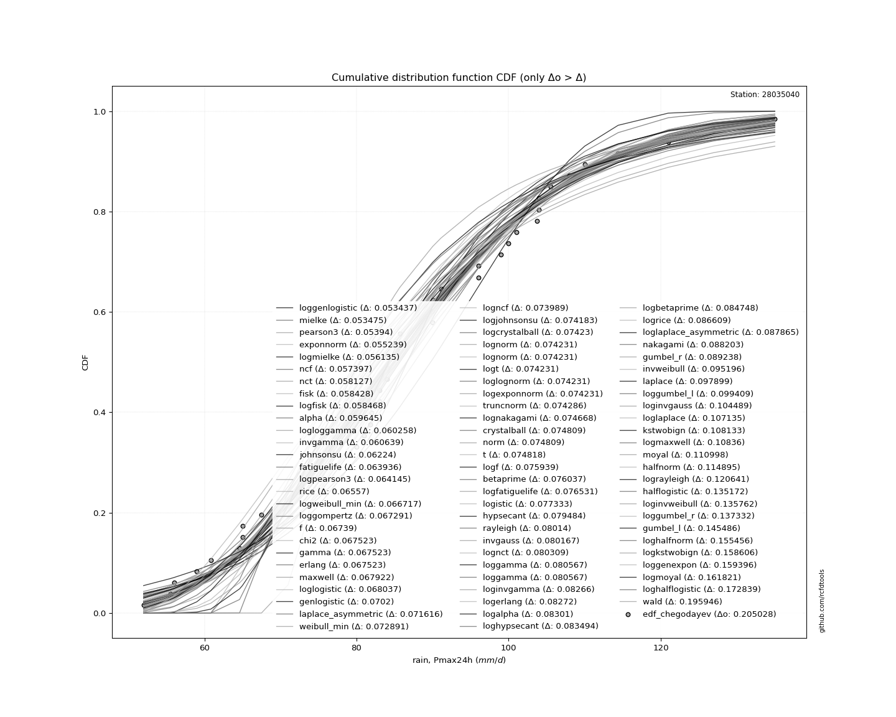</img>

</div>


**5.3. Best fit**

<div align="center">

|   id |   station | empirical_dist   | p_dist         |     delta |   deltao | eval   |   fit |   n |   best_fit |   best_fit_sort |
|-----:|----------:|:-----------------|:---------------|----------:|---------:|:-------|------:|----:|-----------:|----------------:|
|    0 |  28035040 | edf_chegodayev   | loggenlogistic | 0.0534373 | 0.205028 | Δo > Δ |     1 |  44 |          1 |               1 |

</div>


<div align="center">

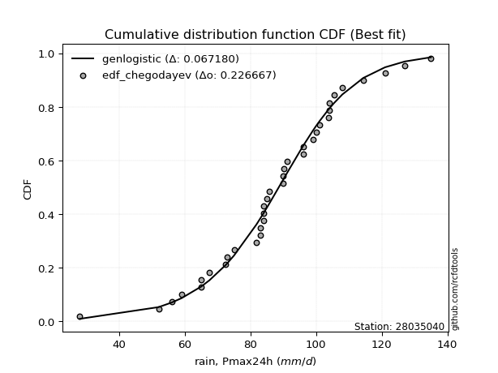</img>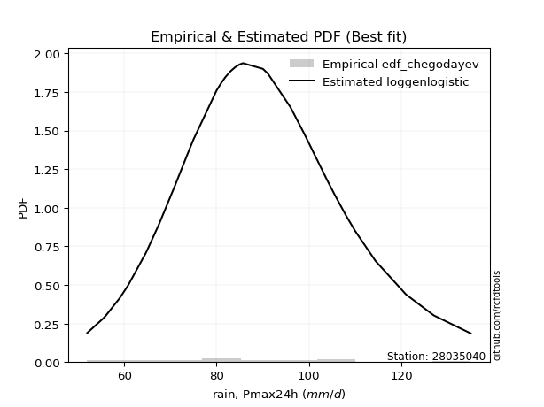</img>

</div>


### 6. Empirical - EDF Blom (1958)

The Blom formula is a specific "plotting position" formula used in hydrology and statistical analysis to estimate the empirical cumulative probability (or non-exceedance probability) of a data series. It is particularly recommended for data that are approximately normally distributed. The constant _a_ is set to 0.375 (or 3/8).

<div align="center">


$P=(m-a)/(n+1-2a)$


</div>


**6.1. Empirical values**

<div align="center">

|                | 0                    | 1                   | 2                    | 3                   | 4                   | 5                  | 6                  | 7                   | 8                   | 9                  | 10                 | 11                 | 12                 | 13                 | 14                 | 15                 | 16                 | 17                 | 18                 | 19                 | 20                 | 21                 | 22                 | 23                 | 24                 | 25                 | 26                 | 27                 | 28                 | 29                 | 30                 | 31                 | 32                 | 33                 | 34                 | 35                 | 36                | 37                 | 38                 | 39                 | 40                 | 41                 | 42                 | 43                 |
|:---------------|:---------------------|:--------------------|:---------------------|:--------------------|:--------------------|:-------------------|:-------------------|:--------------------|:--------------------|:-------------------|:-------------------|:-------------------|:-------------------|:-------------------|:-------------------|:-------------------|:-------------------|:-------------------|:-------------------|:-------------------|:-------------------|:-------------------|:-------------------|:-------------------|:-------------------|:-------------------|:-------------------|:-------------------|:-------------------|:-------------------|:-------------------|:-------------------|:-------------------|:-------------------|:-------------------|:-------------------|:------------------|:-------------------|:-------------------|:-------------------|:-------------------|:-------------------|:-------------------|:-------------------|
| date           | 1973                 | 2003                | 1983                 | 2002                | 1994                | 1977               | 1997               | 1974                | 1976                | 2015               | 1980               | 1975               | 2014               | 1972               | 2013               | 2011               | 2000               | 2012               | 1993               | 1992               | 1990               | 1991               | 2009               | 2004               | 1996               | 1989               | 2001               | 1984               | 1987               | 2008               | 1981               | 1978               | 1999               | 2007               | 1986               | 2005               | 2006              | 1982               | 1998               | 2010               | 1985               | 1979               | 1995               | 1988               |
| x              | 52.0                 | 55.5                | 56.0                 | 59.0                | 60.84110278         | 64.62772669        | 65.0               | 65.0                | 67.5                | 71.0               | 72.4               | 73.0               | 74.0               | 75.0               | 80.0               | 81.0               | 81.8               | 82.0               | 83.0               | 83.0               | 84.0               | 84.0               | 84.0               | 85.0               | 85.7               | 90.0               | 90.0               | 90.1               | 91.1               | 96.0               | 96.0               | 99.0               | 100.0              | 101.0              | 103.7              | 104.0              | 104.0             | 105.5              | 108.0              | 110.0              | 114.4              | 121.0              | 127.0              | 135.0              |
| m              | 1                    | 2                   | 3                    | 4                   | 5                   | 6                  | 7                  | 8                   | 9                   | 10                 | 11                 | 12                 | 13                 | 14                 | 15                 | 16                 | 17                 | 18                 | 19                 | 20                 | 21                 | 22                 | 23                 | 24                 | 25                 | 26                 | 27                 | 28                 | 29                 | 30                 | 31                 | 32                 | 33                 | 34                 | 35                 | 36                 | 37                | 38                 | 39                 | 40                 | 41                 | 42                 | 43                 | 44                 |
| empirical_dist | edf_blom             | edf_blom            | edf_blom             | edf_blom            | edf_blom            | edf_blom           | edf_blom           | edf_blom            | edf_blom            | edf_blom           | edf_blom           | edf_blom           | edf_blom           | edf_blom           | edf_blom           | edf_blom           | edf_blom           | edf_blom           | edf_blom           | edf_blom           | edf_blom           | edf_blom           | edf_blom           | edf_blom           | edf_blom           | edf_blom           | edf_blom           | edf_blom           | edf_blom           | edf_blom           | edf_blom           | edf_blom           | edf_blom           | edf_blom           | edf_blom           | edf_blom           | edf_blom          | edf_blom           | edf_blom           | edf_blom           | edf_blom           | edf_blom           | edf_blom           | edf_blom           |
| empirical      | 0.014124293785310734 | 0.03672316384180791 | 0.059322033898305086 | 0.08192090395480225 | 0.10451977401129943 | 0.1271186440677966 | 0.1497175141242938 | 0.17231638418079095 | 0.19491525423728814 | 0.2175141242937853 | 0.2401129943502825 | 0.2627118644067797 | 0.2853107344632768 | 0.307909604519774  | 0.3305084745762712 | 0.3531073446327684 | 0.3757062146892655 | 0.3983050847457627 | 0.4209039548022599 | 0.4435028248587571 | 0.4661016949152542 | 0.4887005649717514 | 0.5112994350282486 | 0.5338983050847458 | 0.556497175141243  | 0.5790960451977402 | 0.6016949152542372 | 0.6242937853107344 | 0.6468926553672316 | 0.6694915254237288 | 0.692090395480226  | 0.7146892655367232 | 0.7372881355932204 | 0.7598870056497176 | 0.7824858757062146 | 0.8050847457627118 | 0.827683615819209 | 0.8502824858757062 | 0.8728813559322034 | 0.8954802259887006 | 0.9180790960451978 | 0.940677966101695  | 0.963276836158192  | 0.9858757062146892 |
| empirical_tr   | 1.0143266475644699   | 1.0381231671554252  | 1.063063063063063    | 1.0892307692307692  | 1.1167192429022081  | 1.145631067961165  | 1.176079734219269  | 1.2081911262798635  | 1.2421052631578948  | 1.2779783393501805 | 1.3159851301115242 | 1.3563218390804597 | 1.3992094861660078 | 1.4448979591836735 | 1.4936708860759493 | 1.5458515283842795 | 1.6018099547511313 | 1.6619718309859157 | 1.7268292682926831 | 1.7969543147208125 | 1.873015873015873  | 1.9558011049723756 | 2.046242774566474  | 2.1454545454545455 | 2.2547770700636947 | 2.375838926174497  | 2.5106382978723403 | 2.661654135338346  | 2.832              | 3.0256410256410255 | 3.2477064220183487 | 3.5049504950495054 | 3.8064516129032264 | 4.164705882352942  | 4.5974025974025965 | 5.1304347826086945 | 5.803278688524589 | 6.679245283018868  | 7.866666666666667  | 9.56756756756757   | 12.206896551724142 | 16.857142857142872 | 27.230769230769194 | 70.79999999999981  |

</div>


**6.2. Kolmogorov-Smirnov fit test (sorted by Δ)**


<div align="center">

|                | 0                   | 1                   | 2                    | 3                   | 4                    | 5                    | 6                   | 7                    | 8                   | 9                   | 10                   | 11                  | 12                  | 13                  | 14                  | 15                  | 16                  | 17                  | 18                  | 19                  | 20                  | 21                  | 22                  | 23                  | 24                  | 25                  | 26                  | 27                  | 28                  | 29                  | 30                  | 31                  | 32                  | 33                  | 34                  | 35                  | 36                  | 37                  | 38                  | 39                  | 40                  | 41                  | 42                  | 43                  | 44                  | 45                  | 46                  | 47                  | 48                  | 49                  | 50                  | 51                  | 52                  | 53                  | 54                  | 55                  | 56                    | 57                  | 58                  | 59                  | 60                  | 61                  | 62                  | 63                  | 64                  | 65                  | 66                  | 67                  | 68                  | 69                  | 70                  | 71                  | 72                  | 73                  | 74                  | 75                  | 76                  | 77                  | 78                  | 79                  | 80                  | 81                  | 82                  | 83                  | 84                  | 85                  | 86                  | 87                  |
|:---------------|:--------------------|:--------------------|:---------------------|:--------------------|:---------------------|:---------------------|:--------------------|:---------------------|:--------------------|:--------------------|:---------------------|:--------------------|:--------------------|:--------------------|:--------------------|:--------------------|:--------------------|:--------------------|:--------------------|:--------------------|:--------------------|:--------------------|:--------------------|:--------------------|:--------------------|:--------------------|:--------------------|:--------------------|:--------------------|:--------------------|:--------------------|:--------------------|:--------------------|:--------------------|:--------------------|:--------------------|:--------------------|:--------------------|:--------------------|:--------------------|:--------------------|:--------------------|:--------------------|:--------------------|:--------------------|:--------------------|:--------------------|:--------------------|:--------------------|:--------------------|:--------------------|:--------------------|:--------------------|:--------------------|:--------------------|:--------------------|:----------------------|:--------------------|:--------------------|:--------------------|:--------------------|:--------------------|:--------------------|:--------------------|:--------------------|:--------------------|:--------------------|:--------------------|:--------------------|:--------------------|:--------------------|:--------------------|:--------------------|:--------------------|:--------------------|:--------------------|:--------------------|:--------------------|:--------------------|:--------------------|:--------------------|:--------------------|:--------------------|:--------------------|:--------------------|:--------------------|:--------------------|:--------------------|
| station        | 28035040            | 28035040            | 28035040             | 28035040            | 28035040             | 28035040             | 28035040            | 28035040             | 28035040            | 28035040            | 28035040             | 28035040            | 28035040            | 28035040            | 28035040            | 28035040            | 28035040            | 28035040            | 28035040            | 28035040            | 28035040            | 28035040            | 28035040            | 28035040            | 28035040            | 28035040            | 28035040            | 28035040            | 28035040            | 28035040            | 28035040            | 28035040            | 28035040            | 28035040            | 28035040            | 28035040            | 28035040            | 28035040            | 28035040            | 28035040            | 28035040            | 28035040            | 28035040            | 28035040            | 28035040            | 28035040            | 28035040            | 28035040            | 28035040            | 28035040            | 28035040            | 28035040            | 28035040            | 28035040            | 28035040            | 28035040            | 28035040              | 28035040            | 28035040            | 28035040            | 28035040            | 28035040            | 28035040            | 28035040            | 28035040            | 28035040            | 28035040            | 28035040            | 28035040            | 28035040            | 28035040            | 28035040            | 28035040            | 28035040            | 28035040            | 28035040            | 28035040            | 28035040            | 28035040            | 28035040            | 28035040            | 28035040            | 28035040            | 28035040            | 28035040            | 28035040            | 28035040            | 28035040            |
| empirical_dist | edf_blom            | edf_blom            | edf_blom             | edf_blom            | edf_blom             | edf_blom             | edf_blom            | edf_blom             | edf_blom            | edf_blom            | edf_blom             | edf_blom            | edf_blom            | edf_blom            | edf_blom            | edf_blom            | edf_blom            | edf_blom            | edf_blom            | edf_blom            | edf_blom            | edf_blom            | edf_blom            | edf_blom            | edf_blom            | edf_blom            | edf_blom            | edf_blom            | edf_blom            | edf_blom            | edf_blom            | edf_blom            | edf_blom            | edf_blom            | edf_blom            | edf_blom            | edf_blom            | edf_blom            | edf_blom            | edf_blom            | edf_blom            | edf_blom            | edf_blom            | edf_blom            | edf_blom            | edf_blom            | edf_blom            | edf_blom            | edf_blom            | edf_blom            | edf_blom            | edf_blom            | edf_blom            | edf_blom            | edf_blom            | edf_blom            | edf_blom              | edf_blom            | edf_blom            | edf_blom            | edf_blom            | edf_blom            | edf_blom            | edf_blom            | edf_blom            | edf_blom            | edf_blom            | edf_blom            | edf_blom            | edf_blom            | edf_blom            | edf_blom            | edf_blom            | edf_blom            | edf_blom            | edf_blom            | edf_blom            | edf_blom            | edf_blom            | edf_blom            | edf_blom            | edf_blom            | edf_blom            | edf_blom            | edf_blom            | edf_blom            | edf_blom            | edf_blom            |
| p_dist         | loggenlogistic      | mielke              | pearson3             | exponnorm           | logmielke            | fisk                 | logfisk             | ncf                  | nct                 | alpha               | logloggamma          | invgamma            | johnsonsu           | fatiguelife         | logpearson3         | rice                | logweibull_min      | loglogistic         | loggompertz         | f                   | chi2                | gamma               | erlang              | maxwell             | genlogistic         | laplace_asymmetric  | weibull_min         | truncnorm           | logncf              | logjohnsonsu        | logcrystalball      | lognorm             | lognorm             | logt                | loglognorm          | logexponnorm        | crystalball         | norm                | t                   | lognakagami         | logf                | betaprime           | logfatiguelife      | logistic            | hypsecant           | rayleigh            | invgauss            | lognct              | loggamma            | loggamma            | loghypsecant        | loginvgamma         | logerlang           | logalpha            | logbetaprime        | logrice             | loglaplace_asymmetric | nakagami            | gumbel_r            | invweibull          | laplace             | loggumbel_l         | loginvgauss         | loglaplace          | kstwobign           | logmaxwell          | moyal               | halfnorm            | lograyleigh         | halflogistic        | loginvweibull       | loggumbel_r         | gumbel_l            | loghalfnorm         | logkstwobign        | loggenexpon         | logmoyal            | loghalflogistic     | wald                | genexpon            | expon               | logwald             | loggibrat           | gibrat              | logtruncnorm        | logexpon            | logchi2             | gompertz            |
| delta          | 0.05233031028098646 | 0.05236771784817312 | 0.054512974796632696 | 0.05542956958390832 | 0.056326114759183143 | 0.057321702212550285 | 0.05736771618764447 | 0.057969970859564623 | 0.05869965545965716 | 0.06021777203020945 | 0.060831062201390396 | 0.0612117244576012  | 0.06281281294921814 | 0.06450826744981814 | 0.06471803869172343 | 0.06614212898631533 | 0.06728913501409262 | 0.06745267720845805 | 0.0678631626423053  | 0.06796309061778544 | 0.06809582520633517 | 0.0680959481087483  | 0.0680959592292858  | 0.06849413068164889 | 0.07077306017812168 | 0.07104310551669768 | 0.07346406005643502 | 0.07447731372132382 | 0.07456123418668514 | 0.07475565335588796 | 0.07480287164897637 | 0.07480319544732633 | 0.07480319544732633 | 0.07480367219642448 | 0.07480385142689927 | 0.07480408243911041 | 0.07500029266792263 | 0.07500030159295634 | 0.07500897247424426 | 0.07524056343569552 | 0.07651151061809341 | 0.07660946244271916 | 0.0771032435675093  | 0.07752352550507469 | 0.07967521614941614 | 0.0807129775460812  | 0.08073932838123876 | 0.08088185961896105 | 0.08113935190767446 | 0.08113935190767446 | 0.08292089576700823 | 0.08323244740550034 | 0.08329306119448238 | 0.08358252998807963 | 0.08532099914891    | 0.08718204191728862 | 0.08729245861434842   | 0.0887752339470742  | 0.08973417682498425 | 0.09576854863869788 | 0.09793702915145547 | 0.09960002564669657 | 0.10506171889926624 | 0.10656211727767961 | 0.10870566587591785 | 0.10893262393753261 | 0.11149406322874766 | 0.11546764675354104 | 0.12121410547079992 | 0.1340653704904805  | 0.13633481490979543 | 0.13782780511231862 | 0.14567714662896825 | 0.15602810968505076 | 0.15917900712893285 | 0.15996855161616996 | 0.16231686070680929 | 0.17333484122701337 | 0.19491525423728814 | 0.22267479938482526 | 0.22435375791722545 | 0.22987825069707746 | 0.2405021199688167  | 0.24386172844478188 | 0.25455224394878206 | 0.2581904325606762  | 0.33950296306483796 | 0.9151613214569482  |
| deltao         | 0.20502771431287928 | 0.20502771431287928 | 0.20502771431287928  | 0.20502771431287928 | 0.20502771431287928  | 0.20502771431287928  | 0.20502771431287928 | 0.20502771431287928  | 0.20502771431287928 | 0.20502771431287928 | 0.20502771431287928  | 0.20502771431287928 | 0.20502771431287928 | 0.20502771431287928 | 0.20502771431287928 | 0.20502771431287928 | 0.20502771431287928 | 0.20502771431287928 | 0.20502771431287928 | 0.20502771431287928 | 0.20502771431287928 | 0.20502771431287928 | 0.20502771431287928 | 0.20502771431287928 | 0.20502771431287928 | 0.20502771431287928 | 0.20502771431287928 | 0.20502771431287928 | 0.20502771431287928 | 0.20502771431287928 | 0.20502771431287928 | 0.20502771431287928 | 0.20502771431287928 | 0.20502771431287928 | 0.20502771431287928 | 0.20502771431287928 | 0.20502771431287928 | 0.20502771431287928 | 0.20502771431287928 | 0.20502771431287928 | 0.20502771431287928 | 0.20502771431287928 | 0.20502771431287928 | 0.20502771431287928 | 0.20502771431287928 | 0.20502771431287928 | 0.20502771431287928 | 0.20502771431287928 | 0.20502771431287928 | 0.20502771431287928 | 0.20502771431287928 | 0.20502771431287928 | 0.20502771431287928 | 0.20502771431287928 | 0.20502771431287928 | 0.20502771431287928 | 0.20502771431287928   | 0.20502771431287928 | 0.20502771431287928 | 0.20502771431287928 | 0.20502771431287928 | 0.20502771431287928 | 0.20502771431287928 | 0.20502771431287928 | 0.20502771431287928 | 0.20502771431287928 | 0.20502771431287928 | 0.20502771431287928 | 0.20502771431287928 | 0.20502771431287928 | 0.20502771431287928 | 0.20502771431287928 | 0.20502771431287928 | 0.20502771431287928 | 0.20502771431287928 | 0.20502771431287928 | 0.20502771431287928 | 0.20502771431287928 | 0.20502771431287928 | 0.20502771431287928 | 0.20502771431287928 | 0.20502771431287928 | 0.20502771431287928 | 0.20502771431287928 | 0.20502771431287928 | 0.20502771431287928 | 0.20502771431287928 | 0.20502771431287928 |
| eval           | Δo > Δ              | Δo > Δ              | Δo > Δ               | Δo > Δ              | Δo > Δ               | Δo > Δ               | Δo > Δ              | Δo > Δ               | Δo > Δ              | Δo > Δ              | Δo > Δ               | Δo > Δ              | Δo > Δ              | Δo > Δ              | Δo > Δ              | Δo > Δ              | Δo > Δ              | Δo > Δ              | Δo > Δ              | Δo > Δ              | Δo > Δ              | Δo > Δ              | Δo > Δ              | Δo > Δ              | Δo > Δ              | Δo > Δ              | Δo > Δ              | Δo > Δ              | Δo > Δ              | Δo > Δ              | Δo > Δ              | Δo > Δ              | Δo > Δ              | Δo > Δ              | Δo > Δ              | Δo > Δ              | Δo > Δ              | Δo > Δ              | Δo > Δ              | Δo > Δ              | Δo > Δ              | Δo > Δ              | Δo > Δ              | Δo > Δ              | Δo > Δ              | Δo > Δ              | Δo > Δ              | Δo > Δ              | Δo > Δ              | Δo > Δ              | Δo > Δ              | Δo > Δ              | Δo > Δ              | Δo > Δ              | Δo > Δ              | Δo > Δ              | Δo > Δ                | Δo > Δ              | Δo > Δ              | Δo > Δ              | Δo > Δ              | Δo > Δ              | Δo > Δ              | Δo > Δ              | Δo > Δ              | Δo > Δ              | Δo > Δ              | Δo > Δ              | Δo > Δ              | Δo > Δ              | Δo > Δ              | Δo > Δ              | Δo > Δ              | Δo > Δ              | Δo > Δ              | Δo > Δ              | Δo > Δ              | Δo > Δ              | Δo > Δ              | Δo <= Δ             | Δo <= Δ             | Δo <= Δ             | Δo <= Δ             | Δo <= Δ             | Δo <= Δ             | Δo <= Δ             | Δo <= Δ             | Δo <= Δ             |
| fit            | 1                   | 1                   | 1                    | 1                   | 1                    | 1                    | 1                   | 1                    | 1                   | 1                   | 1                    | 1                   | 1                   | 1                   | 1                   | 1                   | 1                   | 1                   | 1                   | 1                   | 1                   | 1                   | 1                   | 1                   | 1                   | 1                   | 1                   | 1                   | 1                   | 1                   | 1                   | 1                   | 1                   | 1                   | 1                   | 1                   | 1                   | 1                   | 1                   | 1                   | 1                   | 1                   | 1                   | 1                   | 1                   | 1                   | 1                   | 1                   | 1                   | 1                   | 1                   | 1                   | 1                   | 1                   | 1                   | 1                   | 1                     | 1                   | 1                   | 1                   | 1                   | 1                   | 1                   | 1                   | 1                   | 1                   | 1                   | 1                   | 1                   | 1                   | 1                   | 1                   | 1                   | 1                   | 1                   | 1                   | 1                   | 1                   | 1                   | 0                   | 0                   | 0                   | 0                   | 0                   | 0                   | 0                   | 0                   | 0                   |
| n              | 44                  | 44                  | 44                   | 44                  | 44                   | 44                   | 44                  | 44                   | 44                  | 44                  | 44                   | 44                  | 44                  | 44                  | 44                  | 44                  | 44                  | 44                  | 44                  | 44                  | 44                  | 44                  | 44                  | 44                  | 44                  | 44                  | 44                  | 44                  | 44                  | 44                  | 44                  | 44                  | 44                  | 44                  | 44                  | 44                  | 44                  | 44                  | 44                  | 44                  | 44                  | 44                  | 44                  | 44                  | 44                  | 44                  | 44                  | 44                  | 44                  | 44                  | 44                  | 44                  | 44                  | 44                  | 44                  | 44                  | 44                    | 44                  | 44                  | 44                  | 44                  | 44                  | 44                  | 44                  | 44                  | 44                  | 44                  | 44                  | 44                  | 44                  | 44                  | 44                  | 44                  | 44                  | 44                  | 44                  | 44                  | 44                  | 44                  | 44                  | 44                  | 44                  | 44                  | 44                  | 44                  | 44                  | 44                  | 44                  |
| best_fit       | 1                   | 0                   | 0                    | 0                   | 0                    | 0                    | 0                   | 0                    | 0                   | 0                   | 0                    | 0                   | 0                   | 0                   | 0                   | 0                   | 0                   | 0                   | 0                   | 0                   | 0                   | 0                   | 0                   | 0                   | 0                   | 0                   | 0                   | 0                   | 0                   | 0                   | 0                   | 0                   | 0                   | 0                   | 0                   | 0                   | 0                   | 0                   | 0                   | 0                   | 0                   | 0                   | 0                   | 0                   | 0                   | 0                   | 0                   | 0                   | 0                   | 0                   | 0                   | 0                   | 0                   | 0                   | 0                   | 0                   | 0                     | 0                   | 0                   | 0                   | 0                   | 0                   | 0                   | 0                   | 0                   | 0                   | 0                   | 0                   | 0                   | 0                   | 0                   | 0                   | 0                   | 0                   | 0                   | 0                   | 0                   | 0                   | 0                   | 0                   | 0                   | 0                   | 0                   | 0                   | 0                   | 0                   | 0                   | 0                   |
| best_fit_sort  | 1                   | 2                   | 3                    | 4                   | 5                    | 6                    | 7                   | 8                    | 9                   | 10                  | 11                   | 12                  | 13                  | 14                  | 15                  | 16                  | 17                  | 18                  | 19                  | 20                  | 21                  | 22                  | 23                  | 24                  | 25                  | 26                  | 27                  | 28                  | 29                  | 30                  | 31                  | 32                  | 33                  | 34                  | 35                  | 36                  | 37                  | 38                  | 39                  | 40                  | 41                  | 42                  | 43                  | 44                  | 45                  | 46                  | 47                  | 48                  | 49                  | 50                  | 51                  | 52                  | 53                  | 54                  | 55                  | 56                  | 57                    | 58                  | 59                  | 60                  | 61                  | 62                  | 63                  | 64                  | 65                  | 66                  | 67                  | 68                  | 69                  | 70                  | 71                  | 72                  | 73                  | 74                  | 75                  | 76                  | 77                  | 78                  | 79                  | 80                  | 81                  | 82                  | 83                  | 84                  | 85                  | 86                  | 87                  | 88                  |

</div>


<div align="center">

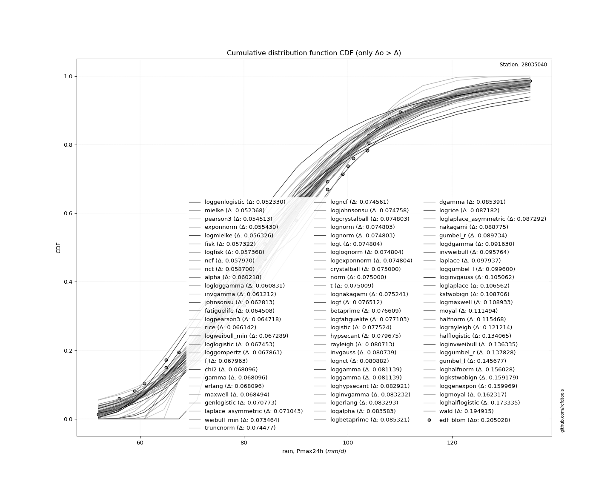</img>

</div>


**6.3. Best fit**

<div align="center">

|   id |   station | empirical_dist   | p_dist         |     delta |   deltao | eval   |   fit |   n |   best_fit |   best_fit_sort |
|-----:|----------:|:-----------------|:---------------|----------:|---------:|:-------|------:|----:|-----------:|----------------:|
|    0 |  28035040 | edf_blom         | loggenlogistic | 0.0523303 | 0.205028 | Δo > Δ |     1 |  44 |          1 |               1 |

</div>


<div align="center">

</img></img>

</div>


### 7. Empirical - EDF Tukey (1962)

In hydrology, the Tukey formula is used as a plotting position formula to estimate the empirical probability or frequency of a flood event (or other hydrological data). The formula parameter is given as _c=0.333_ (or 1/3).

<div align="center">


$P=(m-c)/(n+1-2c)$


</div>


**7.1. Empirical values**

<div align="center">

|                | 0                    | 1                   | 2                   | 3                   | 4                   | 5                   | 6                   | 7                   | 8                   | 9                   | 10                  | 11                 | 12                 | 13                 | 14                 | 15                 | 16                  | 17                  | 18                  | 19                  | 20                  | 21                  | 22                 | 23                 | 24                | 25                 | 26                 | 27                 | 28                 | 29                 | 30                 | 31                 | 32                 | 33                 | 34                 | 35                 | 36                 | 37                | 38                 | 39                 | 40                 | 41                 | 42                 | 43                 |
|:---------------|:---------------------|:--------------------|:--------------------|:--------------------|:--------------------|:--------------------|:--------------------|:--------------------|:--------------------|:--------------------|:--------------------|:-------------------|:-------------------|:-------------------|:-------------------|:-------------------|:--------------------|:--------------------|:--------------------|:--------------------|:--------------------|:--------------------|:-------------------|:-------------------|:------------------|:-------------------|:-------------------|:-------------------|:-------------------|:-------------------|:-------------------|:-------------------|:-------------------|:-------------------|:-------------------|:-------------------|:-------------------|:------------------|:-------------------|:-------------------|:-------------------|:-------------------|:-------------------|:-------------------|
| date           | 1973                 | 2003                | 1983                | 2002                | 1994                | 1977                | 1997                | 1974                | 1976                | 2015                | 1980                | 1975               | 2014               | 1972               | 2013               | 2011               | 2000                | 2012                | 1993                | 1992                | 1990                | 1991                | 2009               | 2004               | 1996              | 1989               | 2001               | 1984               | 1987               | 2008               | 1981               | 1978               | 1999               | 2007               | 1986               | 2005               | 2006               | 1982              | 1998               | 2010               | 1985               | 1979               | 1995               | 1988               |
| x              | 52.0                 | 55.5                | 56.0                | 59.0                | 60.84110278         | 64.62772669         | 65.0                | 65.0                | 67.5                | 71.0                | 72.4                | 73.0               | 74.0               | 75.0               | 80.0               | 81.0               | 81.8                | 82.0                | 83.0                | 83.0                | 84.0                | 84.0                | 84.0               | 85.0               | 85.7              | 90.0               | 90.0               | 90.1               | 91.1               | 96.0               | 96.0               | 99.0               | 100.0              | 101.0              | 103.7              | 104.0              | 104.0              | 105.5             | 108.0              | 110.0              | 114.4              | 121.0              | 127.0              | 135.0              |
| m              | 1                    | 2                   | 3                   | 4                   | 5                   | 6                   | 7                   | 8                   | 9                   | 10                  | 11                  | 12                 | 13                 | 14                 | 15                 | 16                 | 17                  | 18                  | 19                  | 20                  | 21                  | 22                  | 23                 | 24                 | 25                | 26                 | 27                 | 28                 | 29                 | 30                 | 31                 | 32                 | 33                 | 34                 | 35                 | 36                 | 37                 | 38                | 39                 | 40                 | 41                 | 42                 | 43                 | 44                 |
| empirical_dist | edf_tukey            | edf_tukey           | edf_tukey           | edf_tukey           | edf_tukey           | edf_tukey           | edf_tukey           | edf_tukey           | edf_tukey           | edf_tukey           | edf_tukey           | edf_tukey          | edf_tukey          | edf_tukey          | edf_tukey          | edf_tukey          | edf_tukey           | edf_tukey           | edf_tukey           | edf_tukey           | edf_tukey           | edf_tukey           | edf_tukey          | edf_tukey          | edf_tukey         | edf_tukey          | edf_tukey          | edf_tukey          | edf_tukey          | edf_tukey          | edf_tukey          | edf_tukey          | edf_tukey          | edf_tukey          | edf_tukey          | edf_tukey          | edf_tukey          | edf_tukey         | edf_tukey          | edf_tukey          | edf_tukey          | edf_tukey          | edf_tukey          | edf_tukey          |
| empirical      | 0.015037593984962405 | 0.03759398496240601 | 0.06015037593984962 | 0.08270676691729323 | 0.10526315789473684 | 0.12781954887218044 | 0.15037593984962405 | 0.17293233082706766 | 0.19548872180451127 | 0.21804511278195488 | 0.24060150375939848 | 0.2631578947368421 | 0.2857142857142857 | 0.3082706766917293 | 0.3308270676691729 | 0.3533834586466165 | 0.37593984962406013 | 0.39849624060150374 | 0.42105263157894735 | 0.44360902255639095 | 0.46616541353383456 | 0.48872180451127817 | 0.5112781954887218 | 0.5338345864661654 | 0.556390977443609 | 0.5789473684210527 | 0.6015037593984962 | 0.6240601503759399 | 0.6466165413533834 | 0.6691729323308271 | 0.6917293233082706 | 0.7142857142857143 | 0.7368421052631579 | 0.7593984962406015 | 0.7819548872180451 | 0.8045112781954887 | 0.8270676691729323 | 0.849624060150376 | 0.8721804511278195 | 0.8947368421052632 | 0.9172932330827067 | 0.9398496240601504 | 0.9624060150375939 | 0.9849624060150376 |
| empirical_tr   | 1.015267175572519    | 1.0390625           | 1.064               | 1.0901639344262295  | 1.1176470588235294  | 1.146551724137931   | 1.176991150442478   | 1.209090909090909   | 1.2429906542056075  | 1.278846153846154   | 1.316831683168317   | 1.357142857142857  | 1.4                | 1.4456521739130435 | 1.49438202247191   | 1.5465116279069766 | 1.6024096385542168  | 1.6625              | 1.7272727272727273  | 1.7972972972972971  | 1.8732394366197183  | 1.9558823529411766  | 2.046153846153846  | 2.145161290322581  | 2.254237288135593 | 2.375              | 2.5094339622641506 | 2.66               | 2.829787234042553  | 3.022727272727273  | 3.24390243902439   | 3.5                | 3.7999999999999994 | 4.15625            | 4.586206896551723  | 5.115384615384616  | 5.782608695652172  | 6.65              | 7.823529411764703  | 9.5                | 12.090909090909083 | 16.625             | 26.599999999999962 | 66.5               |

</div>


**7.2. Kolmogorov-Smirnov fit test (sorted by Δ)**


<div align="center">

|                | 0                    | 1                   | 2                    | 3                   | 4                   | 5                    | 6                   | 7                   | 8                   | 9                   | 10                   | 11                  | 12                   | 13                  | 14                  | 15                  | 16                  | 17                  | 18                  | 19                  | 20                  | 21                  | 22                  | 23                  | 24                  | 25                  | 26                  | 27                  | 28                  | 29                  | 30                  | 31                  | 32                  | 33                  | 34                  | 35                  | 36                  | 37                  | 38                  | 39                  | 40                  | 41                  | 42                  | 43                  | 44                  | 45                  | 46                  | 47                  | 48                  | 49                  | 50                  | 51                  | 52                  | 53                  | 54                  | 55                  | 56                    | 57                  | 58                  | 59                  | 60                  | 61                  | 62                  | 63                  | 64                  | 65                  | 66                  | 67                  | 68                  | 69                  | 70                  | 71                  | 72                  | 73                  | 74                  | 75                  | 76                  | 77                  | 78                  | 79                  | 80                  | 81                  | 82                  | 83                  | 84                  | 85                  | 86                  | 87                  |
|:---------------|:---------------------|:--------------------|:---------------------|:--------------------|:--------------------|:---------------------|:--------------------|:--------------------|:--------------------|:--------------------|:---------------------|:--------------------|:---------------------|:--------------------|:--------------------|:--------------------|:--------------------|:--------------------|:--------------------|:--------------------|:--------------------|:--------------------|:--------------------|:--------------------|:--------------------|:--------------------|:--------------------|:--------------------|:--------------------|:--------------------|:--------------------|:--------------------|:--------------------|:--------------------|:--------------------|:--------------------|:--------------------|:--------------------|:--------------------|:--------------------|:--------------------|:--------------------|:--------------------|:--------------------|:--------------------|:--------------------|:--------------------|:--------------------|:--------------------|:--------------------|:--------------------|:--------------------|:--------------------|:--------------------|:--------------------|:--------------------|:----------------------|:--------------------|:--------------------|:--------------------|:--------------------|:--------------------|:--------------------|:--------------------|:--------------------|:--------------------|:--------------------|:--------------------|:--------------------|:--------------------|:--------------------|:--------------------|:--------------------|:--------------------|:--------------------|:--------------------|:--------------------|:--------------------|:--------------------|:--------------------|:--------------------|:--------------------|:--------------------|:--------------------|:--------------------|:--------------------|:--------------------|:--------------------|
| station        | 28035040             | 28035040            | 28035040             | 28035040            | 28035040            | 28035040             | 28035040            | 28035040            | 28035040            | 28035040            | 28035040             | 28035040            | 28035040             | 28035040            | 28035040            | 28035040            | 28035040            | 28035040            | 28035040            | 28035040            | 28035040            | 28035040            | 28035040            | 28035040            | 28035040            | 28035040            | 28035040            | 28035040            | 28035040            | 28035040            | 28035040            | 28035040            | 28035040            | 28035040            | 28035040            | 28035040            | 28035040            | 28035040            | 28035040            | 28035040            | 28035040            | 28035040            | 28035040            | 28035040            | 28035040            | 28035040            | 28035040            | 28035040            | 28035040            | 28035040            | 28035040            | 28035040            | 28035040            | 28035040            | 28035040            | 28035040            | 28035040              | 28035040            | 28035040            | 28035040            | 28035040            | 28035040            | 28035040            | 28035040            | 28035040            | 28035040            | 28035040            | 28035040            | 28035040            | 28035040            | 28035040            | 28035040            | 28035040            | 28035040            | 28035040            | 28035040            | 28035040            | 28035040            | 28035040            | 28035040            | 28035040            | 28035040            | 28035040            | 28035040            | 28035040            | 28035040            | 28035040            | 28035040            |
| empirical_dist | edf_tukey            | edf_tukey           | edf_tukey            | edf_tukey           | edf_tukey           | edf_tukey            | edf_tukey           | edf_tukey           | edf_tukey           | edf_tukey           | edf_tukey            | edf_tukey           | edf_tukey            | edf_tukey           | edf_tukey           | edf_tukey           | edf_tukey           | edf_tukey           | edf_tukey           | edf_tukey           | edf_tukey           | edf_tukey           | edf_tukey           | edf_tukey           | edf_tukey           | edf_tukey           | edf_tukey           | edf_tukey           | edf_tukey           | edf_tukey           | edf_tukey           | edf_tukey           | edf_tukey           | edf_tukey           | edf_tukey           | edf_tukey           | edf_tukey           | edf_tukey           | edf_tukey           | edf_tukey           | edf_tukey           | edf_tukey           | edf_tukey           | edf_tukey           | edf_tukey           | edf_tukey           | edf_tukey           | edf_tukey           | edf_tukey           | edf_tukey           | edf_tukey           | edf_tukey           | edf_tukey           | edf_tukey           | edf_tukey           | edf_tukey           | edf_tukey             | edf_tukey           | edf_tukey           | edf_tukey           | edf_tukey           | edf_tukey           | edf_tukey           | edf_tukey           | edf_tukey           | edf_tukey           | edf_tukey           | edf_tukey           | edf_tukey           | edf_tukey           | edf_tukey           | edf_tukey           | edf_tukey           | edf_tukey           | edf_tukey           | edf_tukey           | edf_tukey           | edf_tukey           | edf_tukey           | edf_tukey           | edf_tukey           | edf_tukey           | edf_tukey           | edf_tukey           | edf_tukey           | edf_tukey           | edf_tukey           | edf_tukey           |
| p_dist         | loggenlogistic       | mielke              | pearson3             | exponnorm           | logmielke           | ncf                  | fisk                | logfisk             | nct                 | alpha               | logloggamma          | invgamma            | johnsonsu            | fatiguelife         | logpearson3         | rice                | logweibull_min      | loggompertz         | f                   | loglogistic         | chi2                | gamma               | erlang              | maxwell             | genlogistic         | laplace_asymmetric  | weibull_min         | logncf              | truncnorm           | logjohnsonsu        | logcrystalball      | lognorm             | lognorm             | logt                | loglognorm          | logexponnorm        | crystalball         | norm                | t                   | lognakagami         | logf                | betaprime           | logfatiguelife      | logistic            | hypsecant           | rayleigh            | invgauss            | lognct              | loggamma            | loggamma            | loginvgamma         | logerlang           | loghypsecant        | logalpha            | logbetaprime        | logrice             | loglaplace_asymmetric | nakagami            | gumbel_r            | invweibull          | laplace             | loggumbel_l         | loginvgauss         | loglaplace          | kstwobign           | logmaxwell          | moyal               | halfnorm            | lograyleigh         | halflogistic        | loginvweibull       | loggumbel_r         | gumbel_l            | loghalfnorm         | logkstwobign        | loggenexpon         | logmoyal            | loghalflogistic     | wald                | genexpon            | expon               | logwald             | loggibrat           | gibrat              | logtruncnorm        | logexpon            | logchi2             | gompertz            |
| delta          | 0.052946256927263166 | 0.05298366449444983 | 0.054194381703730976 | 0.05532337188627434 | 0.05621991706154916 | 0.057651377766662903 | 0.05793647989815995 | 0.05797718527021316 | 0.05838106236675544 | 0.05989917893730773 | 0.060512469108488676 | 0.06089313136469948 | 0.062494219856316424 | 0.06418967435691642 | 0.06439944559882171 | 0.06582353589341361 | 0.0669705419211909  | 0.06754456954940358 | 0.06764449752488372 | 0.06777127030135977 | 0.06777723211343345 | 0.06777735501584659 | 0.06777736613638408 | 0.06817553758874717 | 0.07045446708521996 | 0.0713616986095994  | 0.0731454669635333  | 0.07424264109378342 | 0.07437111602368984 | 0.07443706026298624 | 0.07448427855607465 | 0.07448460235442461 | 0.07448460235442461 | 0.07448507910352276 | 0.07448525833399755 | 0.07448548934620869 | 0.07489409497028865 | 0.07489410389532236 | 0.07490277477661028 | 0.0749219703427938  | 0.0761929175251917  | 0.07629086934981744 | 0.07678465047460759 | 0.0774173278074407  | 0.07956901845178216 | 0.08039438445317948 | 0.08042073528833704 | 0.08056326652605933 | 0.08082075881477274 | 0.08082075881477274 | 0.08291385431259862 | 0.08297446810158066 | 0.08323948885990995 | 0.08326393689517791 | 0.08500240605600828 | 0.0868634488243869  | 0.08761105170725014   | 0.08845664085417249 | 0.08945806281113611 | 0.09544995554579616 | 0.09791578961192865 | 0.09949382794906259 | 0.10474312580636452 | 0.10688071037058133 | 0.10838707278301613 | 0.1086140308446309  | 0.11121794921489953 | 0.11514905366063932 | 0.1208955123778982  | 0.1346813171367572  | 0.1360162218168937  | 0.13755169109847049 | 0.14557094893133427 | 0.15570951659214904 | 0.15886041403603113 | 0.15964995852326824 | 0.16204074669296115 | 0.17305872721316523 | 0.19548872180451127 | 0.22235620629192354 | 0.22403516482432373 | 0.22960213668322932 | 0.2402684850340221  | 0.24430775877484429 | 0.25423365085588034 | 0.2578718394677745  | 0.3385896628651863  | 0.9143754584944571  |
| deltao         | 0.20502771431287928  | 0.20502771431287928 | 0.20502771431287928  | 0.20502771431287928 | 0.20502771431287928 | 0.20502771431287928  | 0.20502771431287928 | 0.20502771431287928 | 0.20502771431287928 | 0.20502771431287928 | 0.20502771431287928  | 0.20502771431287928 | 0.20502771431287928  | 0.20502771431287928 | 0.20502771431287928 | 0.20502771431287928 | 0.20502771431287928 | 0.20502771431287928 | 0.20502771431287928 | 0.20502771431287928 | 0.20502771431287928 | 0.20502771431287928 | 0.20502771431287928 | 0.20502771431287928 | 0.20502771431287928 | 0.20502771431287928 | 0.20502771431287928 | 0.20502771431287928 | 0.20502771431287928 | 0.20502771431287928 | 0.20502771431287928 | 0.20502771431287928 | 0.20502771431287928 | 0.20502771431287928 | 0.20502771431287928 | 0.20502771431287928 | 0.20502771431287928 | 0.20502771431287928 | 0.20502771431287928 | 0.20502771431287928 | 0.20502771431287928 | 0.20502771431287928 | 0.20502771431287928 | 0.20502771431287928 | 0.20502771431287928 | 0.20502771431287928 | 0.20502771431287928 | 0.20502771431287928 | 0.20502771431287928 | 0.20502771431287928 | 0.20502771431287928 | 0.20502771431287928 | 0.20502771431287928 | 0.20502771431287928 | 0.20502771431287928 | 0.20502771431287928 | 0.20502771431287928   | 0.20502771431287928 | 0.20502771431287928 | 0.20502771431287928 | 0.20502771431287928 | 0.20502771431287928 | 0.20502771431287928 | 0.20502771431287928 | 0.20502771431287928 | 0.20502771431287928 | 0.20502771431287928 | 0.20502771431287928 | 0.20502771431287928 | 0.20502771431287928 | 0.20502771431287928 | 0.20502771431287928 | 0.20502771431287928 | 0.20502771431287928 | 0.20502771431287928 | 0.20502771431287928 | 0.20502771431287928 | 0.20502771431287928 | 0.20502771431287928 | 0.20502771431287928 | 0.20502771431287928 | 0.20502771431287928 | 0.20502771431287928 | 0.20502771431287928 | 0.20502771431287928 | 0.20502771431287928 | 0.20502771431287928 | 0.20502771431287928 |
| eval           | Δo > Δ               | Δo > Δ              | Δo > Δ               | Δo > Δ              | Δo > Δ              | Δo > Δ               | Δo > Δ              | Δo > Δ              | Δo > Δ              | Δo > Δ              | Δo > Δ               | Δo > Δ              | Δo > Δ               | Δo > Δ              | Δo > Δ              | Δo > Δ              | Δo > Δ              | Δo > Δ              | Δo > Δ              | Δo > Δ              | Δo > Δ              | Δo > Δ              | Δo > Δ              | Δo > Δ              | Δo > Δ              | Δo > Δ              | Δo > Δ              | Δo > Δ              | Δo > Δ              | Δo > Δ              | Δo > Δ              | Δo > Δ              | Δo > Δ              | Δo > Δ              | Δo > Δ              | Δo > Δ              | Δo > Δ              | Δo > Δ              | Δo > Δ              | Δo > Δ              | Δo > Δ              | Δo > Δ              | Δo > Δ              | Δo > Δ              | Δo > Δ              | Δo > Δ              | Δo > Δ              | Δo > Δ              | Δo > Δ              | Δo > Δ              | Δo > Δ              | Δo > Δ              | Δo > Δ              | Δo > Δ              | Δo > Δ              | Δo > Δ              | Δo > Δ                | Δo > Δ              | Δo > Δ              | Δo > Δ              | Δo > Δ              | Δo > Δ              | Δo > Δ              | Δo > Δ              | Δo > Δ              | Δo > Δ              | Δo > Δ              | Δo > Δ              | Δo > Δ              | Δo > Δ              | Δo > Δ              | Δo > Δ              | Δo > Δ              | Δo > Δ              | Δo > Δ              | Δo > Δ              | Δo > Δ              | Δo > Δ              | Δo > Δ              | Δo <= Δ             | Δo <= Δ             | Δo <= Δ             | Δo <= Δ             | Δo <= Δ             | Δo <= Δ             | Δo <= Δ             | Δo <= Δ             | Δo <= Δ             |
| fit            | 1                    | 1                   | 1                    | 1                   | 1                   | 1                    | 1                   | 1                   | 1                   | 1                   | 1                    | 1                   | 1                    | 1                   | 1                   | 1                   | 1                   | 1                   | 1                   | 1                   | 1                   | 1                   | 1                   | 1                   | 1                   | 1                   | 1                   | 1                   | 1                   | 1                   | 1                   | 1                   | 1                   | 1                   | 1                   | 1                   | 1                   | 1                   | 1                   | 1                   | 1                   | 1                   | 1                   | 1                   | 1                   | 1                   | 1                   | 1                   | 1                   | 1                   | 1                   | 1                   | 1                   | 1                   | 1                   | 1                   | 1                     | 1                   | 1                   | 1                   | 1                   | 1                   | 1                   | 1                   | 1                   | 1                   | 1                   | 1                   | 1                   | 1                   | 1                   | 1                   | 1                   | 1                   | 1                   | 1                   | 1                   | 1                   | 1                   | 0                   | 0                   | 0                   | 0                   | 0                   | 0                   | 0                   | 0                   | 0                   |
| n              | 44                   | 44                  | 44                   | 44                  | 44                  | 44                   | 44                  | 44                  | 44                  | 44                  | 44                   | 44                  | 44                   | 44                  | 44                  | 44                  | 44                  | 44                  | 44                  | 44                  | 44                  | 44                  | 44                  | 44                  | 44                  | 44                  | 44                  | 44                  | 44                  | 44                  | 44                  | 44                  | 44                  | 44                  | 44                  | 44                  | 44                  | 44                  | 44                  | 44                  | 44                  | 44                  | 44                  | 44                  | 44                  | 44                  | 44                  | 44                  | 44                  | 44                  | 44                  | 44                  | 44                  | 44                  | 44                  | 44                  | 44                    | 44                  | 44                  | 44                  | 44                  | 44                  | 44                  | 44                  | 44                  | 44                  | 44                  | 44                  | 44                  | 44                  | 44                  | 44                  | 44                  | 44                  | 44                  | 44                  | 44                  | 44                  | 44                  | 44                  | 44                  | 44                  | 44                  | 44                  | 44                  | 44                  | 44                  | 44                  |
| best_fit       | 1                    | 0                   | 0                    | 0                   | 0                   | 0                    | 0                   | 0                   | 0                   | 0                   | 0                    | 0                   | 0                    | 0                   | 0                   | 0                   | 0                   | 0                   | 0                   | 0                   | 0                   | 0                   | 0                   | 0                   | 0                   | 0                   | 0                   | 0                   | 0                   | 0                   | 0                   | 0                   | 0                   | 0                   | 0                   | 0                   | 0                   | 0                   | 0                   | 0                   | 0                   | 0                   | 0                   | 0                   | 0                   | 0                   | 0                   | 0                   | 0                   | 0                   | 0                   | 0                   | 0                   | 0                   | 0                   | 0                   | 0                     | 0                   | 0                   | 0                   | 0                   | 0                   | 0                   | 0                   | 0                   | 0                   | 0                   | 0                   | 0                   | 0                   | 0                   | 0                   | 0                   | 0                   | 0                   | 0                   | 0                   | 0                   | 0                   | 0                   | 0                   | 0                   | 0                   | 0                   | 0                   | 0                   | 0                   | 0                   |
| best_fit_sort  | 1                    | 2                   | 3                    | 4                   | 5                   | 6                    | 7                   | 8                   | 9                   | 10                  | 11                   | 12                  | 13                   | 14                  | 15                  | 16                  | 17                  | 18                  | 19                  | 20                  | 21                  | 22                  | 23                  | 24                  | 25                  | 26                  | 27                  | 28                  | 29                  | 30                  | 31                  | 32                  | 33                  | 34                  | 35                  | 36                  | 37                  | 38                  | 39                  | 40                  | 41                  | 42                  | 43                  | 44                  | 45                  | 46                  | 47                  | 48                  | 49                  | 50                  | 51                  | 52                  | 53                  | 54                  | 55                  | 56                  | 57                    | 58                  | 59                  | 60                  | 61                  | 62                  | 63                  | 64                  | 65                  | 66                  | 67                  | 68                  | 69                  | 70                  | 71                  | 72                  | 73                  | 74                  | 75                  | 76                  | 77                  | 78                  | 79                  | 80                  | 81                  | 82                  | 83                  | 84                  | 85                  | 86                  | 87                  | 88                  |

</div>


<div align="center">

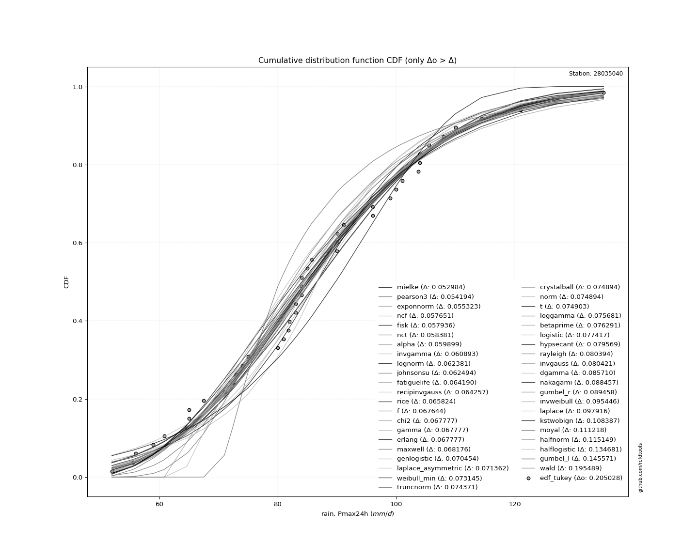</img>

</div>


**7.3. Best fit**

<div align="center">

|   id |   station | empirical_dist   | p_dist         |     delta |   deltao | eval   |   fit |   n |   best_fit |   best_fit_sort |
|-----:|----------:|:-----------------|:---------------|----------:|---------:|:-------|------:|----:|-----------:|----------------:|
|    0 |  28035040 | edf_tukey        | loggenlogistic | 0.0529463 | 0.205028 | Δo > Δ |     1 |  44 |          1 |               1 |

</div>


<div align="center">

</img>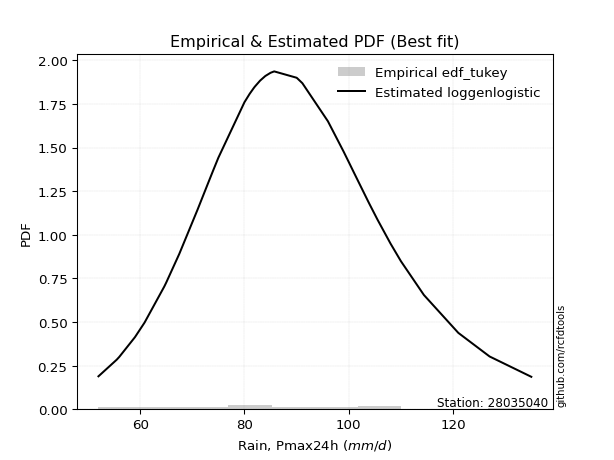</img>

</div>


### 8. Empirical - EDF Gringorten (1963)

Gringorten plotting position formula is essential for estimating the probability and return periods of extreme events like floods and heavy rainfall. The constant _a=0.44_.

<div align="center">


$P=(m-a)/(n+1-2a)$


</div>


**8.1. Empirical values**

<div align="center">

|                | 0                    | 1                   | 2                    | 3                   | 4                   | 5                   | 6                  | 7                   | 8                   | 9                   | 10                  | 11                 | 12                 | 13                  | 14                 | 15                  | 16                  | 17                 | 18                  | 19                 | 20                  | 21                 | 22                 | 23                 | 24                 | 25                 | 26                 | 27                 | 28                 | 29                 | 30                 | 31                 | 32                 | 33                 | 34                 | 35                 | 36                | 37                 | 38                 | 39                 | 40                 | 41                 | 42                 | 43                |
|:---------------|:---------------------|:--------------------|:---------------------|:--------------------|:--------------------|:--------------------|:-------------------|:--------------------|:--------------------|:--------------------|:--------------------|:-------------------|:-------------------|:--------------------|:-------------------|:--------------------|:--------------------|:-------------------|:--------------------|:-------------------|:--------------------|:-------------------|:-------------------|:-------------------|:-------------------|:-------------------|:-------------------|:-------------------|:-------------------|:-------------------|:-------------------|:-------------------|:-------------------|:-------------------|:-------------------|:-------------------|:------------------|:-------------------|:-------------------|:-------------------|:-------------------|:-------------------|:-------------------|:------------------|
| date           | 1973                 | 2003                | 1983                 | 2002                | 1994                | 1977                | 1997               | 1974                | 1976                | 2015                | 1980                | 1975               | 2014               | 1972                | 2013               | 2011                | 2000                | 2012               | 1993                | 1992               | 1990                | 1991               | 2009               | 2004               | 1996               | 1989               | 2001               | 1984               | 1987               | 2008               | 1981               | 1978               | 1999               | 2007               | 1986               | 2005               | 2006              | 1982               | 1998               | 2010               | 1985               | 1979               | 1995               | 1988              |
| x              | 52.0                 | 55.5                | 56.0                 | 59.0                | 60.84110278         | 64.62772669         | 65.0               | 65.0                | 67.5                | 71.0                | 72.4                | 73.0               | 74.0               | 75.0                | 80.0               | 81.0                | 81.8                | 82.0               | 83.0                | 83.0               | 84.0                | 84.0               | 84.0               | 85.0               | 85.7               | 90.0               | 90.0               | 90.1               | 91.1               | 96.0               | 96.0               | 99.0               | 100.0              | 101.0              | 103.7              | 104.0              | 104.0             | 105.5              | 108.0              | 110.0              | 114.4              | 121.0              | 127.0              | 135.0             |
| m              | 1                    | 2                   | 3                    | 4                   | 5                   | 6                   | 7                  | 8                   | 9                   | 10                  | 11                  | 12                 | 13                 | 14                  | 15                 | 16                  | 17                  | 18                 | 19                  | 20                 | 21                  | 22                 | 23                 | 24                 | 25                 | 26                 | 27                 | 28                 | 29                 | 30                 | 31                 | 32                 | 33                 | 34                 | 35                 | 36                 | 37                | 38                 | 39                 | 40                 | 41                 | 42                 | 43                 | 44                |
| empirical_dist | edf_gringorten       | edf_gringorten      | edf_gringorten       | edf_gringorten      | edf_gringorten      | edf_gringorten      | edf_gringorten     | edf_gringorten      | edf_gringorten      | edf_gringorten      | edf_gringorten      | edf_gringorten     | edf_gringorten     | edf_gringorten      | edf_gringorten     | edf_gringorten      | edf_gringorten      | edf_gringorten     | edf_gringorten      | edf_gringorten     | edf_gringorten      | edf_gringorten     | edf_gringorten     | edf_gringorten     | edf_gringorten     | edf_gringorten     | edf_gringorten     | edf_gringorten     | edf_gringorten     | edf_gringorten     | edf_gringorten     | edf_gringorten     | edf_gringorten     | edf_gringorten     | edf_gringorten     | edf_gringorten     | edf_gringorten    | edf_gringorten     | edf_gringorten     | edf_gringorten     | edf_gringorten     | edf_gringorten     | edf_gringorten     | edf_gringorten    |
| empirical      | 0.012692656391659113 | 0.03535811423390753 | 0.058023572076155945 | 0.08068902991840436 | 0.10335448776065276 | 0.12601994560290117 | 0.1486854034451496 | 0.17135086128739802 | 0.19401631912964645 | 0.21668177697189486 | 0.23934723481414327 | 0.2620126926563917 | 0.2846781504986401 | 0.30734360834088853 | 0.3300090661831369 | 0.35267452402538535 | 0.37533998186763373 | 0.3980054397098821 | 0.42067089755213055 | 0.443336355394379  | 0.46600181323662737 | 0.4886672710788758 | 0.5113327289211242 | 0.5339981867633726 | 0.556663644605621  | 0.5793291024478695 | 0.6019945602901179 | 0.6246600181323663 | 0.6473254759746147 | 0.6699909338168631 | 0.6926563916591115 | 0.7153218495013599 | 0.7379873073436084 | 0.7606527651858569 | 0.7833182230281053 | 0.8059836808703537 | 0.828649138712602 | 0.8513145965548505 | 0.8739800543970989 | 0.8966455122393473 | 0.9193109700815958 | 0.9419764279238442 | 0.9646418857660926 | 0.987307343608341 |
| empirical_tr   | 1.0128558310376492   | 1.0366541353383458  | 1.0615976900866217   | 1.0877712031558184  | 1.115267947421638   | 1.1441908713692945  | 1.174653887113951  | 1.2067833698030634  | 1.2407199100112487  | 1.2766203703703705  | 1.3146603098927294  | 1.3550368550368552 | 1.3979721166032955 | 1.443717277486911   | 1.49255751014885   | 1.5448179271708684  | 1.6008708272859216  | 1.661144578313253  | 1.7261345852895147  | 1.7964169381107493 | 1.8726655348047538  | 1.955673758865248  | 2.046382189239332  | 2.1459143968871595 | 2.2556237218813906 | 2.3771551724137936 | 2.5125284738041005 | 2.6642512077294684 | 2.8354755784061694 | 3.0302197802197806 | 3.2536873156342185 | 3.5127388535031843 | 3.8166089965397934 | 4.178030303030305  | 4.6150627615062785 | 5.154205607476637  | 5.835978835978837 | 6.725609756097566  | 7.935251798561157  | 9.675438596491235  | 12.393258426966314 | 17.234375000000032 | 28.282051282051345 | 78.78571428571527 |

</div>


**8.2. Kolmogorov-Smirnov fit test (sorted by Δ)**


<div align="center">

|                | 0                    | 1                    | 2                   | 3                   | 4                   | 5                   | 6                   | 7                    | 8                    | 9                   | 10                  | 11                   | 12                  | 13                  | 14                  | 15                  | 16                  | 17                  | 18                  | 19                  | 20                  | 21                  | 22                  | 23                  | 24                  | 25                  | 26                  | 27                  | 28                  | 29                  | 30                  | 31                  | 32                  | 33                  | 34                  | 35                  | 36                  | 37                  | 38                  | 39                  | 40                  | 41                  | 42                  | 43                  | 44                  | 45                  | 46                  | 47                  | 48                  | 49                  | 50                  | 51                  | 52                  | 53                  | 54                  | 55                    | 56                  | 57                  | 58                  | 59                  | 60                  | 61                  | 62                  | 63                  | 64                  | 65                  | 66                  | 67                  | 68                  | 69                  | 70                  | 71                  | 72                  | 73                  | 74                  | 75                  | 76                  | 77                  | 78                  | 79                  | 80                  | 81                  | 82                  | 83                  | 84                  | 85                  | 86                  | 87                  |
|:---------------|:---------------------|:---------------------|:--------------------|:--------------------|:--------------------|:--------------------|:--------------------|:---------------------|:---------------------|:--------------------|:--------------------|:---------------------|:--------------------|:--------------------|:--------------------|:--------------------|:--------------------|:--------------------|:--------------------|:--------------------|:--------------------|:--------------------|:--------------------|:--------------------|:--------------------|:--------------------|:--------------------|:--------------------|:--------------------|:--------------------|:--------------------|:--------------------|:--------------------|:--------------------|:--------------------|:--------------------|:--------------------|:--------------------|:--------------------|:--------------------|:--------------------|:--------------------|:--------------------|:--------------------|:--------------------|:--------------------|:--------------------|:--------------------|:--------------------|:--------------------|:--------------------|:--------------------|:--------------------|:--------------------|:--------------------|:----------------------|:--------------------|:--------------------|:--------------------|:--------------------|:--------------------|:--------------------|:--------------------|:--------------------|:--------------------|:--------------------|:--------------------|:--------------------|:--------------------|:--------------------|:--------------------|:--------------------|:--------------------|:--------------------|:--------------------|:--------------------|:--------------------|:--------------------|:--------------------|:--------------------|:--------------------|:--------------------|:--------------------|:--------------------|:--------------------|:--------------------|:--------------------|:--------------------|
| station        | 28035040             | 28035040             | 28035040            | 28035040            | 28035040            | 28035040            | 28035040            | 28035040             | 28035040             | 28035040            | 28035040            | 28035040             | 28035040            | 28035040            | 28035040            | 28035040            | 28035040            | 28035040            | 28035040            | 28035040            | 28035040            | 28035040            | 28035040            | 28035040            | 28035040            | 28035040            | 28035040            | 28035040            | 28035040            | 28035040            | 28035040            | 28035040            | 28035040            | 28035040            | 28035040            | 28035040            | 28035040            | 28035040            | 28035040            | 28035040            | 28035040            | 28035040            | 28035040            | 28035040            | 28035040            | 28035040            | 28035040            | 28035040            | 28035040            | 28035040            | 28035040            | 28035040            | 28035040            | 28035040            | 28035040            | 28035040              | 28035040            | 28035040            | 28035040            | 28035040            | 28035040            | 28035040            | 28035040            | 28035040            | 28035040            | 28035040            | 28035040            | 28035040            | 28035040            | 28035040            | 28035040            | 28035040            | 28035040            | 28035040            | 28035040            | 28035040            | 28035040            | 28035040            | 28035040            | 28035040            | 28035040            | 28035040            | 28035040            | 28035040            | 28035040            | 28035040            | 28035040            | 28035040            |
| empirical_dist | edf_gringorten       | edf_gringorten       | edf_gringorten      | edf_gringorten      | edf_gringorten      | edf_gringorten      | edf_gringorten      | edf_gringorten       | edf_gringorten       | edf_gringorten      | edf_gringorten      | edf_gringorten       | edf_gringorten      | edf_gringorten      | edf_gringorten      | edf_gringorten      | edf_gringorten      | edf_gringorten      | edf_gringorten      | edf_gringorten      | edf_gringorten      | edf_gringorten      | edf_gringorten      | edf_gringorten      | edf_gringorten      | edf_gringorten      | edf_gringorten      | edf_gringorten      | edf_gringorten      | edf_gringorten      | edf_gringorten      | edf_gringorten      | edf_gringorten      | edf_gringorten      | edf_gringorten      | edf_gringorten      | edf_gringorten      | edf_gringorten      | edf_gringorten      | edf_gringorten      | edf_gringorten      | edf_gringorten      | edf_gringorten      | edf_gringorten      | edf_gringorten      | edf_gringorten      | edf_gringorten      | edf_gringorten      | edf_gringorten      | edf_gringorten      | edf_gringorten      | edf_gringorten      | edf_gringorten      | edf_gringorten      | edf_gringorten      | edf_gringorten        | edf_gringorten      | edf_gringorten      | edf_gringorten      | edf_gringorten      | edf_gringorten      | edf_gringorten      | edf_gringorten      | edf_gringorten      | edf_gringorten      | edf_gringorten      | edf_gringorten      | edf_gringorten      | edf_gringorten      | edf_gringorten      | edf_gringorten      | edf_gringorten      | edf_gringorten      | edf_gringorten      | edf_gringorten      | edf_gringorten      | edf_gringorten      | edf_gringorten      | edf_gringorten      | edf_gringorten      | edf_gringorten      | edf_gringorten      | edf_gringorten      | edf_gringorten      | edf_gringorten      | edf_gringorten      | edf_gringorten      | edf_gringorten      |
| p_dist         | mielke               | loggenlogistic       | pearson3            | exponnorm           | logmielke           | fisk                | logfisk             | ncf                  | nct                  | alpha               | logloggamma         | invgamma             | johnsonsu           | fatiguelife         | logpearson3         | rice                | loglogistic         | logweibull_min      | loggompertz         | f                   | chi2                | gamma               | erlang              | maxwell             | laplace_asymmetric  | genlogistic         | weibull_min         | truncnorm           | logncf              | crystalball         | norm                | t                   | logjohnsonsu        | logcrystalball      | lognorm             | lognorm             | logt                | loglognorm          | logexponnorm        | lognakagami         | logf                | betaprime           | logfatiguelife      | logistic            | hypsecant           | rayleigh            | invgauss            | lognct              | loggamma            | loggamma            | loghypsecant        | loginvgamma         | logerlang           | logalpha            | logbetaprime        | loglaplace_asymmetric | logrice             | nakagami            | gumbel_r            | invweibull          | laplace             | loggumbel_l         | loginvgauss         | loglaplace          | kstwobign           | logmaxwell          | moyal               | halfnorm            | lograyleigh         | halflogistic        | loginvweibull       | loggumbel_r         | gumbel_l            | loghalfnorm         | logkstwobign        | loggenexpon         | logmoyal            | loghalflogistic     | wald                | genexpon            | expon               | logwald             | loggibrat           | gibrat              | logtruncnorm        | logexpon            | logchi2             | gompertz            |
| delta          | 0.051540506390560625 | 0.051634246694582275 | 0.05501238318976698 | 0.05559603904828636 | 0.05649258422356118 | 0.05775452281993332 | 0.0578005367950275  | 0.058469379252698905 | 0.059199063852791445 | 0.06071718042334373 | 0.06133047059452468 | 0.061711132850735484 | 0.06331222134235243 | 0.06500767584295242 | 0.06521744708485772 | 0.06664153737944961 | 0.06695326881532371 | 0.0677885434072269  | 0.06836257103543958 | 0.06846249901091972 | 0.06859523359946945 | 0.06859535650188259 | 0.06859536762242008 | 0.06899353907478317 | 0.07054369712356334 | 0.07127246857125596 | 0.0739634684495693  | 0.07464378318570186 | 0.07506064257981943 | 0.07516676213230067 | 0.07516677105733438 | 0.0751754419386223  | 0.07525506174902225 | 0.07530228004211065 | 0.07530260384046061 | 0.07530260384046061 | 0.07530308058955876 | 0.07530325982003355 | 0.07530349083224469 | 0.0757399718288298  | 0.0770109190112277  | 0.07710887083585344 | 0.07760265196064359 | 0.07768999496945272 | 0.07984168561379418 | 0.08121238593921548 | 0.08123873677437304 | 0.08138126801209533 | 0.08163876030080874 | 0.08163876030080874 | 0.08242148737387389 | 0.08373185579863462 | 0.08379246958761666 | 0.08408193838121392 | 0.08582040754204429 | 0.08679305022121409   | 0.0876814503104229  | 0.08927464234020849 | 0.09016699743236728 | 0.09626795703183216 | 0.09797032304433112 | 0.0997664951110746  | 0.10556112729240053 | 0.10606270888454528 | 0.10920507426905213 | 0.1094320323306669  | 0.1119268838361307  | 0.11596705514667532 | 0.1217135138639342  | 0.13309984759708757 | 0.13683422330292971 | 0.13826062571970166 | 0.14584361609334628 | 0.15652751807818505 | 0.15967841552206713 | 0.16046796000930424 | 0.16274968131419232 | 0.1737676618343964  | 0.19401631912964645 | 0.22317420777795954 | 0.22485316631035973 | 0.2303110713044605  | 0.2408683527904485  | 0.2431625566943939  | 0.25505165234191635 | 0.2586898409538105  | 0.3409346004584898  | 0.9163931954933462  |
| deltao         | 0.20502771431287928  | 0.20502771431287928  | 0.20502771431287928 | 0.20502771431287928 | 0.20502771431287928 | 0.20502771431287928 | 0.20502771431287928 | 0.20502771431287928  | 0.20502771431287928  | 0.20502771431287928 | 0.20502771431287928 | 0.20502771431287928  | 0.20502771431287928 | 0.20502771431287928 | 0.20502771431287928 | 0.20502771431287928 | 0.20502771431287928 | 0.20502771431287928 | 0.20502771431287928 | 0.20502771431287928 | 0.20502771431287928 | 0.20502771431287928 | 0.20502771431287928 | 0.20502771431287928 | 0.20502771431287928 | 0.20502771431287928 | 0.20502771431287928 | 0.20502771431287928 | 0.20502771431287928 | 0.20502771431287928 | 0.20502771431287928 | 0.20502771431287928 | 0.20502771431287928 | 0.20502771431287928 | 0.20502771431287928 | 0.20502771431287928 | 0.20502771431287928 | 0.20502771431287928 | 0.20502771431287928 | 0.20502771431287928 | 0.20502771431287928 | 0.20502771431287928 | 0.20502771431287928 | 0.20502771431287928 | 0.20502771431287928 | 0.20502771431287928 | 0.20502771431287928 | 0.20502771431287928 | 0.20502771431287928 | 0.20502771431287928 | 0.20502771431287928 | 0.20502771431287928 | 0.20502771431287928 | 0.20502771431287928 | 0.20502771431287928 | 0.20502771431287928   | 0.20502771431287928 | 0.20502771431287928 | 0.20502771431287928 | 0.20502771431287928 | 0.20502771431287928 | 0.20502771431287928 | 0.20502771431287928 | 0.20502771431287928 | 0.20502771431287928 | 0.20502771431287928 | 0.20502771431287928 | 0.20502771431287928 | 0.20502771431287928 | 0.20502771431287928 | 0.20502771431287928 | 0.20502771431287928 | 0.20502771431287928 | 0.20502771431287928 | 0.20502771431287928 | 0.20502771431287928 | 0.20502771431287928 | 0.20502771431287928 | 0.20502771431287928 | 0.20502771431287928 | 0.20502771431287928 | 0.20502771431287928 | 0.20502771431287928 | 0.20502771431287928 | 0.20502771431287928 | 0.20502771431287928 | 0.20502771431287928 | 0.20502771431287928 |
| eval           | Δo > Δ               | Δo > Δ               | Δo > Δ              | Δo > Δ              | Δo > Δ              | Δo > Δ              | Δo > Δ              | Δo > Δ               | Δo > Δ               | Δo > Δ              | Δo > Δ              | Δo > Δ               | Δo > Δ              | Δo > Δ              | Δo > Δ              | Δo > Δ              | Δo > Δ              | Δo > Δ              | Δo > Δ              | Δo > Δ              | Δo > Δ              | Δo > Δ              | Δo > Δ              | Δo > Δ              | Δo > Δ              | Δo > Δ              | Δo > Δ              | Δo > Δ              | Δo > Δ              | Δo > Δ              | Δo > Δ              | Δo > Δ              | Δo > Δ              | Δo > Δ              | Δo > Δ              | Δo > Δ              | Δo > Δ              | Δo > Δ              | Δo > Δ              | Δo > Δ              | Δo > Δ              | Δo > Δ              | Δo > Δ              | Δo > Δ              | Δo > Δ              | Δo > Δ              | Δo > Δ              | Δo > Δ              | Δo > Δ              | Δo > Δ              | Δo > Δ              | Δo > Δ              | Δo > Δ              | Δo > Δ              | Δo > Δ              | Δo > Δ                | Δo > Δ              | Δo > Δ              | Δo > Δ              | Δo > Δ              | Δo > Δ              | Δo > Δ              | Δo > Δ              | Δo > Δ              | Δo > Δ              | Δo > Δ              | Δo > Δ              | Δo > Δ              | Δo > Δ              | Δo > Δ              | Δo > Δ              | Δo > Δ              | Δo > Δ              | Δo > Δ              | Δo > Δ              | Δo > Δ              | Δo > Δ              | Δo > Δ              | Δo > Δ              | Δo <= Δ             | Δo <= Δ             | Δo <= Δ             | Δo <= Δ             | Δo <= Δ             | Δo <= Δ             | Δo <= Δ             | Δo <= Δ             | Δo <= Δ             |
| fit            | 1                    | 1                    | 1                   | 1                   | 1                   | 1                   | 1                   | 1                    | 1                    | 1                   | 1                   | 1                    | 1                   | 1                   | 1                   | 1                   | 1                   | 1                   | 1                   | 1                   | 1                   | 1                   | 1                   | 1                   | 1                   | 1                   | 1                   | 1                   | 1                   | 1                   | 1                   | 1                   | 1                   | 1                   | 1                   | 1                   | 1                   | 1                   | 1                   | 1                   | 1                   | 1                   | 1                   | 1                   | 1                   | 1                   | 1                   | 1                   | 1                   | 1                   | 1                   | 1                   | 1                   | 1                   | 1                   | 1                     | 1                   | 1                   | 1                   | 1                   | 1                   | 1                   | 1                   | 1                   | 1                   | 1                   | 1                   | 1                   | 1                   | 1                   | 1                   | 1                   | 1                   | 1                   | 1                   | 1                   | 1                   | 1                   | 1                   | 0                   | 0                   | 0                   | 0                   | 0                   | 0                   | 0                   | 0                   | 0                   |
| n              | 44                   | 44                   | 44                  | 44                  | 44                  | 44                  | 44                  | 44                   | 44                   | 44                  | 44                  | 44                   | 44                  | 44                  | 44                  | 44                  | 44                  | 44                  | 44                  | 44                  | 44                  | 44                  | 44                  | 44                  | 44                  | 44                  | 44                  | 44                  | 44                  | 44                  | 44                  | 44                  | 44                  | 44                  | 44                  | 44                  | 44                  | 44                  | 44                  | 44                  | 44                  | 44                  | 44                  | 44                  | 44                  | 44                  | 44                  | 44                  | 44                  | 44                  | 44                  | 44                  | 44                  | 44                  | 44                  | 44                    | 44                  | 44                  | 44                  | 44                  | 44                  | 44                  | 44                  | 44                  | 44                  | 44                  | 44                  | 44                  | 44                  | 44                  | 44                  | 44                  | 44                  | 44                  | 44                  | 44                  | 44                  | 44                  | 44                  | 44                  | 44                  | 44                  | 44                  | 44                  | 44                  | 44                  | 44                  | 44                  |
| best_fit       | 1                    | 0                    | 0                   | 0                   | 0                   | 0                   | 0                   | 0                    | 0                    | 0                   | 0                   | 0                    | 0                   | 0                   | 0                   | 0                   | 0                   | 0                   | 0                   | 0                   | 0                   | 0                   | 0                   | 0                   | 0                   | 0                   | 0                   | 0                   | 0                   | 0                   | 0                   | 0                   | 0                   | 0                   | 0                   | 0                   | 0                   | 0                   | 0                   | 0                   | 0                   | 0                   | 0                   | 0                   | 0                   | 0                   | 0                   | 0                   | 0                   | 0                   | 0                   | 0                   | 0                   | 0                   | 0                   | 0                     | 0                   | 0                   | 0                   | 0                   | 0                   | 0                   | 0                   | 0                   | 0                   | 0                   | 0                   | 0                   | 0                   | 0                   | 0                   | 0                   | 0                   | 0                   | 0                   | 0                   | 0                   | 0                   | 0                   | 0                   | 0                   | 0                   | 0                   | 0                   | 0                   | 0                   | 0                   | 0                   |
| best_fit_sort  | 1                    | 2                    | 3                   | 4                   | 5                   | 6                   | 7                   | 8                    | 9                    | 10                  | 11                  | 12                   | 13                  | 14                  | 15                  | 16                  | 17                  | 18                  | 19                  | 20                  | 21                  | 22                  | 23                  | 24                  | 25                  | 26                  | 27                  | 28                  | 29                  | 30                  | 31                  | 32                  | 33                  | 34                  | 35                  | 36                  | 37                  | 38                  | 39                  | 40                  | 41                  | 42                  | 43                  | 44                  | 45                  | 46                  | 47                  | 48                  | 49                  | 50                  | 51                  | 52                  | 53                  | 54                  | 55                  | 56                    | 57                  | 58                  | 59                  | 60                  | 61                  | 62                  | 63                  | 64                  | 65                  | 66                  | 67                  | 68                  | 69                  | 70                  | 71                  | 72                  | 73                  | 74                  | 75                  | 76                  | 77                  | 78                  | 79                  | 80                  | 81                  | 82                  | 83                  | 84                  | 85                  | 86                  | 87                  | 88                  |

</div>


<div align="center">

</img>

</div>


**8.3. Best fit**

<div align="center">

|   id |   station | empirical_dist   | p_dist   |     delta |   deltao | eval   |   fit |   n |   best_fit |   best_fit_sort |
|-----:|----------:|:-----------------|:---------|----------:|---------:|:-------|------:|----:|-----------:|----------------:|
|    0 |  28035040 | edf_gringorten   | mielke   | 0.0515405 | 0.205028 | Δo > Δ |     1 |  44 |          1 |               1 |

</div>


<div align="center">

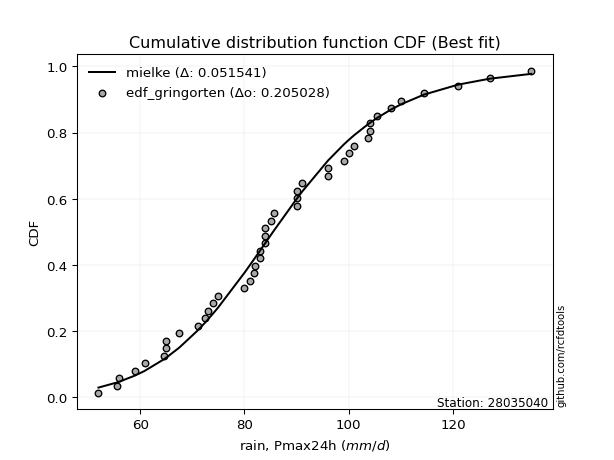</img>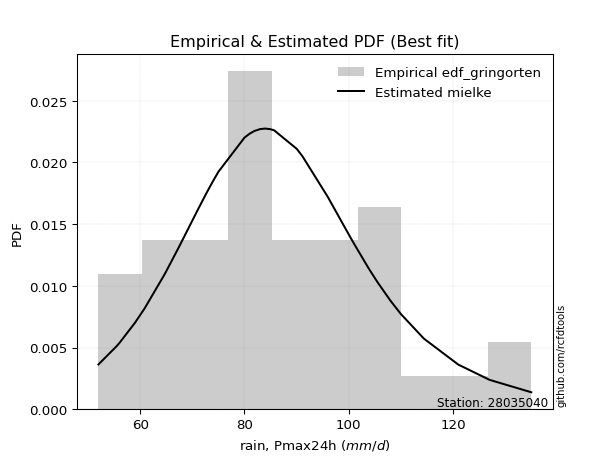</img>

</div>


### 9. Empirical - EDF Filliben (1975)

The specific values of the constants (0.3175) (often denoted as $alpha$) and (0.365) are derived from a method proposed by James J. Filliben in a 1975 paper. This particular formula is the mean value of the $i$-th order statistic of the normal distribution and is considered a robust and effective plotting position formula for the normal probability plot correlation coefficient test for normality.

<div align="center">


$P=(m-0.3175)/(n+0.365)$


</div>


**9.1. Empirical values**

<div align="center">

|                | 0                   | 1                   | 2                   | 3                  | 4                   | 5                   | 6                   | 7                  | 8                   | 9                   | 10                 | 11                 | 12                  | 13                  | 14                | 15                  | 16                 | 17                  | 18                  | 19                 | 20                  | 21                 | 22                 | 23                 | 24                 | 25                 | 26                 | 27                 | 28                | 29                 | 30                 | 31                 | 32                 | 33                 | 34                 | 35                 | 36                 | 37                 | 38                 | 39                 | 40                 | 41                | 42                 | 43                 |
|:---------------|:--------------------|:--------------------|:--------------------|:-------------------|:--------------------|:--------------------|:--------------------|:-------------------|:--------------------|:--------------------|:-------------------|:-------------------|:--------------------|:--------------------|:------------------|:--------------------|:-------------------|:--------------------|:--------------------|:-------------------|:--------------------|:-------------------|:-------------------|:-------------------|:-------------------|:-------------------|:-------------------|:-------------------|:------------------|:-------------------|:-------------------|:-------------------|:-------------------|:-------------------|:-------------------|:-------------------|:-------------------|:-------------------|:-------------------|:-------------------|:-------------------|:------------------|:-------------------|:-------------------|
| date           | 1973                | 2003                | 1983                | 2002               | 1994                | 1977                | 1997                | 1974               | 1976                | 2015                | 1980               | 1975               | 2014                | 1972                | 2013              | 2011                | 2000               | 2012                | 1993                | 1992               | 1990                | 1991               | 2009               | 2004               | 1996               | 1989               | 2001               | 1984               | 1987              | 2008               | 1981               | 1978               | 1999               | 2007               | 1986               | 2005               | 2006               | 1982               | 1998               | 2010               | 1985               | 1979              | 1995               | 1988               |
| x              | 52.0                | 55.5                | 56.0                | 59.0               | 60.84110278         | 64.62772669         | 65.0                | 65.0               | 67.5                | 71.0                | 72.4               | 73.0               | 74.0                | 75.0                | 80.0              | 81.0                | 81.8               | 82.0                | 83.0                | 83.0               | 84.0                | 84.0               | 84.0               | 85.0               | 85.7               | 90.0               | 90.0               | 90.1               | 91.1              | 96.0               | 96.0               | 99.0               | 100.0              | 101.0              | 103.7              | 104.0              | 104.0              | 105.5              | 108.0              | 110.0              | 114.4              | 121.0             | 127.0              | 135.0              |
| m              | 1                   | 2                   | 3                   | 4                  | 5                   | 6                   | 7                   | 8                  | 9                   | 10                  | 11                 | 12                 | 13                  | 14                  | 15                | 16                  | 17                 | 18                  | 19                  | 20                 | 21                  | 22                 | 23                 | 24                 | 25                 | 26                 | 27                 | 28                 | 29                | 30                 | 31                 | 32                 | 33                 | 34                 | 35                 | 36                 | 37                 | 38                 | 39                 | 40                 | 41                 | 42                | 43                 | 44                 |
| empirical_dist | edf_filliben        | edf_filliben        | edf_filliben        | edf_filliben       | edf_filliben        | edf_filliben        | edf_filliben        | edf_filliben       | edf_filliben        | edf_filliben        | edf_filliben       | edf_filliben       | edf_filliben        | edf_filliben        | edf_filliben      | edf_filliben        | edf_filliben       | edf_filliben        | edf_filliben        | edf_filliben       | edf_filliben        | edf_filliben       | edf_filliben       | edf_filliben       | edf_filliben       | edf_filliben       | edf_filliben       | edf_filliben       | edf_filliben      | edf_filliben       | edf_filliben       | edf_filliben       | edf_filliben       | edf_filliben       | edf_filliben       | edf_filliben       | edf_filliben       | edf_filliben       | edf_filliben       | edf_filliben       | edf_filliben       | edf_filliben      | edf_filliben       | edf_filliben       |
| empirical      | 0.01538374845035501 | 0.03792403922010594 | 0.06046432998985687 | 0.0830046207596078 | 0.10554491152935873 | 0.12808520229910966 | 0.15062549306886058 | 0.1731657838386115 | 0.19570607460836242 | 0.21824636537811334 | 0.2407866561478643 | 0.2633269469176152 | 0.28586723768736616 | 0.30840752845711705 | 0.330947819226868 | 0.35348810999661895 | 0.3760284007663699 | 0.39856869153612084 | 0.42110898230587174 | 0.4436492730756227 | 0.46618956384537363 | 0.4887298546151245 | 0.5112701453848755 | 0.5338104361546264 | 0.5563507269243774 | 0.5788910176941282 | 0.6014313084638792 | 0.6239715992336301 | 0.646511890003381 | 0.669052180773132  | 0.691592471542883  | 0.7141327623126338 | 0.7366730530823846 | 0.7592133438521356 | 0.7817536346218865 | 0.8042939253916375 | 0.8268342161613884 | 0.8493745069311394 | 0.8719147977008902 | 0.8944550884706411 | 0.9169953792403921 | 0.939535670010143 | 0.962075960779894  | 0.9846162515496449 |
| empirical_tr   | 1.0156241057631776  | 1.0394189656182276  | 1.0643555448929407  | 1.0905180360105697 | 1.117999117999118   | 1.1469010534479416  | 1.1773369601273802  | 1.2094322906017856 | 1.2433265606389687  | 1.2791753766308658  | 1.3171528241668522 | 1.357454295112063  | 1.4002998500749624  | 1.4459382384095167  | 1.494651730817822 | 1.5467619628693454  | 1.6026370450645715 | 1.66270027171367    | 1.7274408644018302  | 1.7974273270535808 | 1.8733241845244382  | 1.9559131489033394 | 2.0461201429724434 | 2.1450501631814336 | 2.2540327702273597 | 2.3746821892145054 | 2.508977802912484  | 2.6593735950846695 | 2.828949465965248 | 3.0216243827686022 | 3.2424630001827155 | 3.4981273408239693 | 3.7975604536700174 | 4.153054060379122  | 4.581977794990961  | 5.1097034264324765 | 5.774812886430197  | 6.638982416760192  | 7.807303123625156  | 9.474639615589952  | 12.047522063815327 | 16.5386766076421  | 26.368499257057902 | 65.00366300366278  |

</div>


**9.2. Kolmogorov-Smirnov fit test (sorted by Δ)**


<div align="center">

|                | 0                   | 1                   | 2                   | 3                   | 4                   | 5                   | 6                   | 7                   | 8                    | 9                   | 10                  | 11                   | 12                  | 13                  | 14                  | 15                  | 16                  | 17                  | 18                  | 19                  | 20                  | 21                  | 22                  | 23                  | 24                  | 25                  | 26                  | 27                  | 28                  | 29                  | 30                  | 31                  | 32                  | 33                  | 34                  | 35                  | 36                  | 37                  | 38                  | 39                  | 40                  | 41                  | 42                  | 43                  | 44                  | 45                  | 46                  | 47                  | 48                  | 49                  | 50                  | 51                  | 52                  | 53                  | 54                  | 55                  | 56                    | 57                  | 58                  | 59                  | 60                  | 61                  | 62                  | 63                  | 64                  | 65                  | 66                  | 67                  | 68                  | 69                  | 70                  | 71                  | 72                  | 73                  | 74                  | 75                  | 76                  | 77                  | 78                  | 79                  | 80                  | 81                  | 82                  | 83                  | 84                  | 85                  | 86                  | 87                  |
|:---------------|:--------------------|:--------------------|:--------------------|:--------------------|:--------------------|:--------------------|:--------------------|:--------------------|:---------------------|:--------------------|:--------------------|:---------------------|:--------------------|:--------------------|:--------------------|:--------------------|:--------------------|:--------------------|:--------------------|:--------------------|:--------------------|:--------------------|:--------------------|:--------------------|:--------------------|:--------------------|:--------------------|:--------------------|:--------------------|:--------------------|:--------------------|:--------------------|:--------------------|:--------------------|:--------------------|:--------------------|:--------------------|:--------------------|:--------------------|:--------------------|:--------------------|:--------------------|:--------------------|:--------------------|:--------------------|:--------------------|:--------------------|:--------------------|:--------------------|:--------------------|:--------------------|:--------------------|:--------------------|:--------------------|:--------------------|:--------------------|:----------------------|:--------------------|:--------------------|:--------------------|:--------------------|:--------------------|:--------------------|:--------------------|:--------------------|:--------------------|:--------------------|:--------------------|:--------------------|:--------------------|:--------------------|:--------------------|:--------------------|:--------------------|:--------------------|:--------------------|:--------------------|:--------------------|:--------------------|:--------------------|:--------------------|:--------------------|:--------------------|:--------------------|:--------------------|:--------------------|:--------------------|:--------------------|
| station        | 28035040            | 28035040            | 28035040            | 28035040            | 28035040            | 28035040            | 28035040            | 28035040            | 28035040             | 28035040            | 28035040            | 28035040             | 28035040            | 28035040            | 28035040            | 28035040            | 28035040            | 28035040            | 28035040            | 28035040            | 28035040            | 28035040            | 28035040            | 28035040            | 28035040            | 28035040            | 28035040            | 28035040            | 28035040            | 28035040            | 28035040            | 28035040            | 28035040            | 28035040            | 28035040            | 28035040            | 28035040            | 28035040            | 28035040            | 28035040            | 28035040            | 28035040            | 28035040            | 28035040            | 28035040            | 28035040            | 28035040            | 28035040            | 28035040            | 28035040            | 28035040            | 28035040            | 28035040            | 28035040            | 28035040            | 28035040            | 28035040              | 28035040            | 28035040            | 28035040            | 28035040            | 28035040            | 28035040            | 28035040            | 28035040            | 28035040            | 28035040            | 28035040            | 28035040            | 28035040            | 28035040            | 28035040            | 28035040            | 28035040            | 28035040            | 28035040            | 28035040            | 28035040            | 28035040            | 28035040            | 28035040            | 28035040            | 28035040            | 28035040            | 28035040            | 28035040            | 28035040            | 28035040            |
| empirical_dist | edf_filliben        | edf_filliben        | edf_filliben        | edf_filliben        | edf_filliben        | edf_filliben        | edf_filliben        | edf_filliben        | edf_filliben         | edf_filliben        | edf_filliben        | edf_filliben         | edf_filliben        | edf_filliben        | edf_filliben        | edf_filliben        | edf_filliben        | edf_filliben        | edf_filliben        | edf_filliben        | edf_filliben        | edf_filliben        | edf_filliben        | edf_filliben        | edf_filliben        | edf_filliben        | edf_filliben        | edf_filliben        | edf_filliben        | edf_filliben        | edf_filliben        | edf_filliben        | edf_filliben        | edf_filliben        | edf_filliben        | edf_filliben        | edf_filliben        | edf_filliben        | edf_filliben        | edf_filliben        | edf_filliben        | edf_filliben        | edf_filliben        | edf_filliben        | edf_filliben        | edf_filliben        | edf_filliben        | edf_filliben        | edf_filliben        | edf_filliben        | edf_filliben        | edf_filliben        | edf_filliben        | edf_filliben        | edf_filliben        | edf_filliben        | edf_filliben          | edf_filliben        | edf_filliben        | edf_filliben        | edf_filliben        | edf_filliben        | edf_filliben        | edf_filliben        | edf_filliben        | edf_filliben        | edf_filliben        | edf_filliben        | edf_filliben        | edf_filliben        | edf_filliben        | edf_filliben        | edf_filliben        | edf_filliben        | edf_filliben        | edf_filliben        | edf_filliben        | edf_filliben        | edf_filliben        | edf_filliben        | edf_filliben        | edf_filliben        | edf_filliben        | edf_filliben        | edf_filliben        | edf_filliben        | edf_filliben        | edf_filliben        |
| p_dist         | loggenlogistic      | mielke              | pearson3            | exponnorm           | logmielke           | ncf                 | fisk                | logfisk             | nct                  | alpha               | logloggamma         | invgamma             | johnsonsu           | fatiguelife         | logpearson3         | rice                | logweibull_min      | loggompertz         | f                   | chi2                | gamma               | erlang              | loglogistic         | maxwell             | genlogistic         | laplace_asymmetric  | weibull_min         | logncf              | logjohnsonsu        | truncnorm           | logcrystalball      | lognorm             | lognorm             | logt                | loglognorm          | logexponnorm        | lognakagami         | crystalball         | norm                | t                   | logf                | betaprime           | logfatiguelife      | logistic            | hypsecant           | rayleigh            | invgauss            | lognct              | loggamma            | loggamma            | loginvgamma         | logerlang           | logalpha            | loghypsecant        | logbetaprime        | logrice             | loglaplace_asymmetric | nakagami            | gumbel_r            | invweibull          | laplace             | loggumbel_l         | loginvgauss         | loglaplace          | kstwobign           | logmaxwell          | moyal               | halfnorm            | lograyleigh         | halflogistic        | loginvweibull       | loggumbel_r         | gumbel_l            | loghalfnorm         | logkstwobign        | loggenexpon         | logmoyal            | loghalflogistic     | wald                | genexpon            | expon               | logwald             | loggibrat           | gibrat              | logtruncnorm        | logexpon            | logchi2             | gompertz            |
| delta          | 0.05317970993880701 | 0.05321711750599367 | 0.05407363014603589 | 0.05528312136704272 | 0.05617966654231754 | 0.05753062620896782 | 0.05816993290970379 | 0.058210638281757   | 0.058260310809060356 | 0.05977842737961264 | 0.06039171755079359 | 0.060772379807004395 | 0.06237346829862134 | 0.06406892279922133 | 0.06427869404112663 | 0.06570278433571852 | 0.06684979036349581 | 0.06742381799170849 | 0.06752374596718863 | 0.06765648055573836 | 0.0676566034581515  | 0.06765661457868899 | 0.06789202185905485 | 0.06805478603105208 | 0.07033371552752488 | 0.07148245016729449 | 0.07302471540583821 | 0.07412188953608834 | 0.07431630870529116 | 0.07433086550445822 | 0.07436352699837956 | 0.07436385079672952 | 0.07436385079672952 | 0.07436432754582767 | 0.07436450677630246 | 0.0743647377885136  | 0.07480121878509871 | 0.07485384445105703 | 0.07485385337609074 | 0.07486252425737866 | 0.07607216596749661 | 0.07617011779212235 | 0.0766638989169125  | 0.07737707728820908 | 0.07952876793255054 | 0.08027363289548439 | 0.08029998373064196 | 0.08044251496836424 | 0.08070000725707765 | 0.08070000725707765 | 0.08279310275490354 | 0.08285371654388557 | 0.08314318533748283 | 0.08336024041760504 | 0.0848816544983132  | 0.08674269726669182 | 0.08773180326494523   | 0.0883358892964774  | 0.08935341146113368 | 0.09532920398810107 | 0.09790773950808235 | 0.09945357742983096 | 0.10462237424866944 | 0.10700146192827642 | 0.10826632122532104 | 0.1084932792869358  | 0.1111132978648971  | 0.11502830210294424 | 0.12077476082020311 | 0.13491477014830106 | 0.13589547025919863 | 0.13744703974846806 | 0.14553069841210264 | 0.15558876503445396 | 0.15873966247833604 | 0.15952920696557316 | 0.16193609534295872 | 0.1729540758631628  | 0.19570607460836242 | 0.22223545473422845 | 0.22391441326662864 | 0.2294974853332269  | 0.24017993389171233 | 0.2444768109556174  | 0.25411289929818526 | 0.2577510879100794  | 0.33824350839979367 | 0.9140776046521425  |
| deltao         | 0.20502771431287928 | 0.20502771431287928 | 0.20502771431287928 | 0.20502771431287928 | 0.20502771431287928 | 0.20502771431287928 | 0.20502771431287928 | 0.20502771431287928 | 0.20502771431287928  | 0.20502771431287928 | 0.20502771431287928 | 0.20502771431287928  | 0.20502771431287928 | 0.20502771431287928 | 0.20502771431287928 | 0.20502771431287928 | 0.20502771431287928 | 0.20502771431287928 | 0.20502771431287928 | 0.20502771431287928 | 0.20502771431287928 | 0.20502771431287928 | 0.20502771431287928 | 0.20502771431287928 | 0.20502771431287928 | 0.20502771431287928 | 0.20502771431287928 | 0.20502771431287928 | 0.20502771431287928 | 0.20502771431287928 | 0.20502771431287928 | 0.20502771431287928 | 0.20502771431287928 | 0.20502771431287928 | 0.20502771431287928 | 0.20502771431287928 | 0.20502771431287928 | 0.20502771431287928 | 0.20502771431287928 | 0.20502771431287928 | 0.20502771431287928 | 0.20502771431287928 | 0.20502771431287928 | 0.20502771431287928 | 0.20502771431287928 | 0.20502771431287928 | 0.20502771431287928 | 0.20502771431287928 | 0.20502771431287928 | 0.20502771431287928 | 0.20502771431287928 | 0.20502771431287928 | 0.20502771431287928 | 0.20502771431287928 | 0.20502771431287928 | 0.20502771431287928 | 0.20502771431287928   | 0.20502771431287928 | 0.20502771431287928 | 0.20502771431287928 | 0.20502771431287928 | 0.20502771431287928 | 0.20502771431287928 | 0.20502771431287928 | 0.20502771431287928 | 0.20502771431287928 | 0.20502771431287928 | 0.20502771431287928 | 0.20502771431287928 | 0.20502771431287928 | 0.20502771431287928 | 0.20502771431287928 | 0.20502771431287928 | 0.20502771431287928 | 0.20502771431287928 | 0.20502771431287928 | 0.20502771431287928 | 0.20502771431287928 | 0.20502771431287928 | 0.20502771431287928 | 0.20502771431287928 | 0.20502771431287928 | 0.20502771431287928 | 0.20502771431287928 | 0.20502771431287928 | 0.20502771431287928 | 0.20502771431287928 | 0.20502771431287928 |
| eval           | Δo > Δ              | Δo > Δ              | Δo > Δ              | Δo > Δ              | Δo > Δ              | Δo > Δ              | Δo > Δ              | Δo > Δ              | Δo > Δ               | Δo > Δ              | Δo > Δ              | Δo > Δ               | Δo > Δ              | Δo > Δ              | Δo > Δ              | Δo > Δ              | Δo > Δ              | Δo > Δ              | Δo > Δ              | Δo > Δ              | Δo > Δ              | Δo > Δ              | Δo > Δ              | Δo > Δ              | Δo > Δ              | Δo > Δ              | Δo > Δ              | Δo > Δ              | Δo > Δ              | Δo > Δ              | Δo > Δ              | Δo > Δ              | Δo > Δ              | Δo > Δ              | Δo > Δ              | Δo > Δ              | Δo > Δ              | Δo > Δ              | Δo > Δ              | Δo > Δ              | Δo > Δ              | Δo > Δ              | Δo > Δ              | Δo > Δ              | Δo > Δ              | Δo > Δ              | Δo > Δ              | Δo > Δ              | Δo > Δ              | Δo > Δ              | Δo > Δ              | Δo > Δ              | Δo > Δ              | Δo > Δ              | Δo > Δ              | Δo > Δ              | Δo > Δ                | Δo > Δ              | Δo > Δ              | Δo > Δ              | Δo > Δ              | Δo > Δ              | Δo > Δ              | Δo > Δ              | Δo > Δ              | Δo > Δ              | Δo > Δ              | Δo > Δ              | Δo > Δ              | Δo > Δ              | Δo > Δ              | Δo > Δ              | Δo > Δ              | Δo > Δ              | Δo > Δ              | Δo > Δ              | Δo > Δ              | Δo > Δ              | Δo > Δ              | Δo <= Δ             | Δo <= Δ             | Δo <= Δ             | Δo <= Δ             | Δo <= Δ             | Δo <= Δ             | Δo <= Δ             | Δo <= Δ             | Δo <= Δ             |
| fit            | 1                   | 1                   | 1                   | 1                   | 1                   | 1                   | 1                   | 1                   | 1                    | 1                   | 1                   | 1                    | 1                   | 1                   | 1                   | 1                   | 1                   | 1                   | 1                   | 1                   | 1                   | 1                   | 1                   | 1                   | 1                   | 1                   | 1                   | 1                   | 1                   | 1                   | 1                   | 1                   | 1                   | 1                   | 1                   | 1                   | 1                   | 1                   | 1                   | 1                   | 1                   | 1                   | 1                   | 1                   | 1                   | 1                   | 1                   | 1                   | 1                   | 1                   | 1                   | 1                   | 1                   | 1                   | 1                   | 1                   | 1                     | 1                   | 1                   | 1                   | 1                   | 1                   | 1                   | 1                   | 1                   | 1                   | 1                   | 1                   | 1                   | 1                   | 1                   | 1                   | 1                   | 1                   | 1                   | 1                   | 1                   | 1                   | 1                   | 0                   | 0                   | 0                   | 0                   | 0                   | 0                   | 0                   | 0                   | 0                   |
| n              | 44                  | 44                  | 44                  | 44                  | 44                  | 44                  | 44                  | 44                  | 44                   | 44                  | 44                  | 44                   | 44                  | 44                  | 44                  | 44                  | 44                  | 44                  | 44                  | 44                  | 44                  | 44                  | 44                  | 44                  | 44                  | 44                  | 44                  | 44                  | 44                  | 44                  | 44                  | 44                  | 44                  | 44                  | 44                  | 44                  | 44                  | 44                  | 44                  | 44                  | 44                  | 44                  | 44                  | 44                  | 44                  | 44                  | 44                  | 44                  | 44                  | 44                  | 44                  | 44                  | 44                  | 44                  | 44                  | 44                  | 44                    | 44                  | 44                  | 44                  | 44                  | 44                  | 44                  | 44                  | 44                  | 44                  | 44                  | 44                  | 44                  | 44                  | 44                  | 44                  | 44                  | 44                  | 44                  | 44                  | 44                  | 44                  | 44                  | 44                  | 44                  | 44                  | 44                  | 44                  | 44                  | 44                  | 44                  | 44                  |
| best_fit       | 1                   | 0                   | 0                   | 0                   | 0                   | 0                   | 0                   | 0                   | 0                    | 0                   | 0                   | 0                    | 0                   | 0                   | 0                   | 0                   | 0                   | 0                   | 0                   | 0                   | 0                   | 0                   | 0                   | 0                   | 0                   | 0                   | 0                   | 0                   | 0                   | 0                   | 0                   | 0                   | 0                   | 0                   | 0                   | 0                   | 0                   | 0                   | 0                   | 0                   | 0                   | 0                   | 0                   | 0                   | 0                   | 0                   | 0                   | 0                   | 0                   | 0                   | 0                   | 0                   | 0                   | 0                   | 0                   | 0                   | 0                     | 0                   | 0                   | 0                   | 0                   | 0                   | 0                   | 0                   | 0                   | 0                   | 0                   | 0                   | 0                   | 0                   | 0                   | 0                   | 0                   | 0                   | 0                   | 0                   | 0                   | 0                   | 0                   | 0                   | 0                   | 0                   | 0                   | 0                   | 0                   | 0                   | 0                   | 0                   |
| best_fit_sort  | 1                   | 2                   | 3                   | 4                   | 5                   | 6                   | 7                   | 8                   | 9                    | 10                  | 11                  | 12                   | 13                  | 14                  | 15                  | 16                  | 17                  | 18                  | 19                  | 20                  | 21                  | 22                  | 23                  | 24                  | 25                  | 26                  | 27                  | 28                  | 29                  | 30                  | 31                  | 32                  | 33                  | 34                  | 35                  | 36                  | 37                  | 38                  | 39                  | 40                  | 41                  | 42                  | 43                  | 44                  | 45                  | 46                  | 47                  | 48                  | 49                  | 50                  | 51                  | 52                  | 53                  | 54                  | 55                  | 56                  | 57                    | 58                  | 59                  | 60                  | 61                  | 62                  | 63                  | 64                  | 65                  | 66                  | 67                  | 68                  | 69                  | 70                  | 71                  | 72                  | 73                  | 74                  | 75                  | 76                  | 77                  | 78                  | 79                  | 80                  | 81                  | 82                  | 83                  | 84                  | 85                  | 86                  | 87                  | 88                  |

</div>


<div align="center">

</img>

</div>


**9.3. Best fit**

<div align="center">

|   id |   station | empirical_dist   | p_dist         |     delta |   deltao | eval   |   fit |   n |   best_fit |   best_fit_sort |
|-----:|----------:|:-----------------|:---------------|----------:|---------:|:-------|------:|----:|-----------:|----------------:|
|    0 |  28035040 | edf_filliben     | loggenlogistic | 0.0531797 | 0.205028 | Δo > Δ |     1 |  44 |          1 |               1 |

</div>


<div align="center">

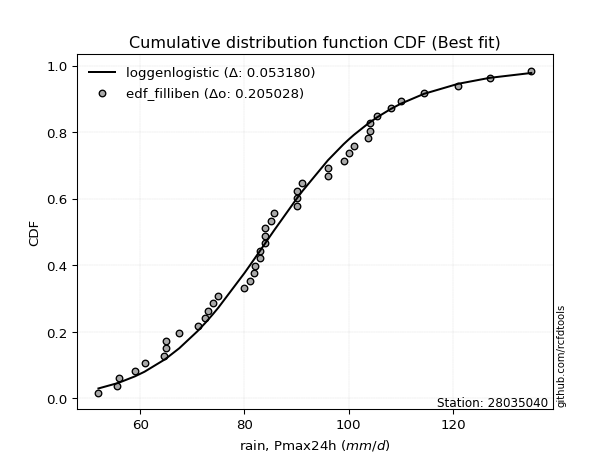</img>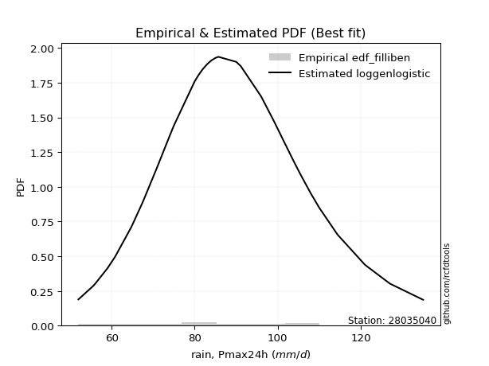</img>

</div>


### 10. Empirical - EDF Jenkinson (1977)

The Jenkinson formula in hydrology is an empirical plotting position formula used to estimate the non-exceedance probability _(P)_ or return period _(T)_ of a given ordered observation within a sample. It is a widely used method in the frequency analysis of extreme events such as floods and rainfall, as it provides a distribution-free way to plot data. _a≈0.31_ and _b≈0.38_ are constants derived to approximate the median of the probability distribution for the given rank.

<div align="center">


$P=(m-a)/(n+b)$


</div>


**10.1. Empirical values**

<div align="center">

|                | 0                    | 1                  | 2                   | 3                   | 4                   | 5                   | 6                   | 7                  | 8                   | 9                   | 10                 | 11                  | 12                 | 13                 | 14                  | 15                 | 16                 | 17                 | 18                  | 19                 | 20                 | 21                  | 22                 | 23                 | 24                 | 25                 | 26                 | 27                 | 28                 | 29                 | 30                 | 31                 | 32                 | 33                 | 34                 | 35                 | 36                 | 37                 | 38                 | 39                 | 40                 | 41                 | 42                 | 43                 |
|:---------------|:---------------------|:-------------------|:--------------------|:--------------------|:--------------------|:--------------------|:--------------------|:-------------------|:--------------------|:--------------------|:-------------------|:--------------------|:-------------------|:-------------------|:--------------------|:-------------------|:-------------------|:-------------------|:--------------------|:-------------------|:-------------------|:--------------------|:-------------------|:-------------------|:-------------------|:-------------------|:-------------------|:-------------------|:-------------------|:-------------------|:-------------------|:-------------------|:-------------------|:-------------------|:-------------------|:-------------------|:-------------------|:-------------------|:-------------------|:-------------------|:-------------------|:-------------------|:-------------------|:-------------------|
| date           | 1973                 | 2003               | 1983                | 2002                | 1994                | 1977                | 1997                | 1974               | 1976                | 2015                | 1980               | 1975                | 2014               | 1972               | 2013                | 2011               | 2000               | 2012               | 1993                | 1992               | 1990               | 1991                | 2009               | 2004               | 1996               | 1989               | 2001               | 1984               | 1987               | 2008               | 1981               | 1978               | 1999               | 2007               | 1986               | 2005               | 2006               | 1982               | 1998               | 2010               | 1985               | 1979               | 1995               | 1988               |
| x              | 52.0                 | 55.5               | 56.0                | 59.0                | 60.84110278         | 64.62772669         | 65.0                | 65.0               | 67.5                | 71.0                | 72.4               | 73.0                | 74.0               | 75.0               | 80.0                | 81.0               | 81.8               | 82.0               | 83.0                | 83.0               | 84.0               | 84.0                | 84.0               | 85.0               | 85.7               | 90.0               | 90.0               | 90.1               | 91.1               | 96.0               | 96.0               | 99.0               | 100.0              | 101.0              | 103.7              | 104.0              | 104.0              | 105.5              | 108.0              | 110.0              | 114.4              | 121.0              | 127.0              | 135.0              |
| m              | 1                    | 2                  | 3                   | 4                   | 5                   | 6                   | 7                   | 8                  | 9                   | 10                  | 11                 | 12                  | 13                 | 14                 | 15                  | 16                 | 17                 | 18                 | 19                  | 20                 | 21                 | 22                  | 23                 | 24                 | 25                 | 26                 | 27                 | 28                 | 29                 | 30                 | 31                 | 32                 | 33                 | 34                 | 35                 | 36                 | 37                 | 38                 | 39                 | 40                 | 41                 | 42                 | 43                 | 44                 |
| empirical_dist | edf_jenkinson        | edf_jenkinson      | edf_jenkinson       | edf_jenkinson       | edf_jenkinson       | edf_jenkinson       | edf_jenkinson       | edf_jenkinson      | edf_jenkinson       | edf_jenkinson       | edf_jenkinson      | edf_jenkinson       | edf_jenkinson      | edf_jenkinson      | edf_jenkinson       | edf_jenkinson      | edf_jenkinson      | edf_jenkinson      | edf_jenkinson       | edf_jenkinson      | edf_jenkinson      | edf_jenkinson       | edf_jenkinson      | edf_jenkinson      | edf_jenkinson      | edf_jenkinson      | edf_jenkinson      | edf_jenkinson      | edf_jenkinson      | edf_jenkinson      | edf_jenkinson      | edf_jenkinson      | edf_jenkinson      | edf_jenkinson      | edf_jenkinson      | edf_jenkinson      | edf_jenkinson      | edf_jenkinson      | edf_jenkinson      | edf_jenkinson      | edf_jenkinson      | edf_jenkinson      | edf_jenkinson      | edf_jenkinson      |
| empirical      | 0.015547543938711128 | 0.0380802163136548 | 0.06061288868859846 | 0.08314556106354214 | 0.10567823343848581 | 0.12821090581342948 | 0.15074357818837314 | 0.1732762505633168 | 0.19580892293826047 | 0.21834159531320413 | 0.2408742676881478 | 0.26340694006309145 | 0.2859396124380351 | 0.3084722848129788 | 0.33100495718792244 | 0.3535376295628661 | 0.3760703019378098 | 0.3986029743127535 | 0.42113564668769715 | 0.4436683190626408 | 0.4662009914375845 | 0.48873366381252814 | 0.5112663361874719 | 0.5337990085624155 | 0.5563316809373592 | 0.5788643533123028 | 0.6013970256872465 | 0.6239296980621901 | 0.6464623704371338 | 0.6689950428120776 | 0.6915277151870212 | 0.7140603875619649 | 0.7365930599369084 | 0.7591257323118521 | 0.7816584046867957 | 0.8041910770617394 | 0.8267237494366831 | 0.8492564218116267 | 0.8717890941865705 | 0.8943217665615141 | 0.9168544389364578 | 0.9393871113114014 | 0.9619197836863451 | 0.9844524560612887 |
| empirical_tr   | 1.0157930876630807   | 1.0395877254626376 | 1.0645238666346846  | 1.0906856721553206  | 1.1181657848324515  | 1.1470664254329286  | 1.1775006633059166  | 1.2095938947942217 | 1.2434855701877277  | 1.279331219371577   | 1.317304838230929  | 1.3576017130620983  | 1.4004417797412432 | 1.4460736396220268 | 1.4947793869989894  | 1.5468804461484835 | 1.6027446731672081 | 1.6627950543274634 | 1.7275204359673026  | 1.7974888618874039 | 1.8733642887294215 | 1.9559277214631996  | 2.046104195481789  | 2.1449975833736104 | 2.2539360081259523 | 2.374531835205992  | 2.5087620124364047 | 2.6590772917914913 | 2.8285532186105797 | 3.021102791014296  | 3.2417823228634037 | 3.497241922773838  | 3.7964071856287407 | 4.151543498596818  | 4.579979360165115  | 5.107019562715763  | 5.771131339401819  | 6.633781763826602  | 7.799648506151139  | 9.462686567164168  | 12.0271002710027   | 16.498141263940486 | 26.260355029585742 | 64.31884057970956  |

</div>


**10.2. Kolmogorov-Smirnov fit test (sorted by Δ)**


<div align="center">

|                | 0                   | 1                   | 2                    | 3                    | 4                    | 5                    | 6                   | 7                   | 8                   | 9                   | 10                   | 11                  | 12                   | 13                  | 14                  | 15                  | 16                  | 17                  | 18                  | 19                  | 20                  | 21                  | 22                  | 23                  | 24                  | 25                  | 26                  | 27                  | 28                  | 29                  | 30                  | 31                  | 32                  | 33                  | 34                  | 35                  | 36                  | 37                  | 38                  | 39                  | 40                  | 41                  | 42                  | 43                  | 44                  | 45                  | 46                  | 47                  | 48                  | 49                  | 50                  | 51                  | 52                  | 53                  | 54                  | 55                  | 56                    | 57                  | 58                  | 59                  | 60                  | 61                  | 62                  | 63                  | 64                  | 65                  | 66                  | 67                  | 68                  | 69                  | 70                  | 71                  | 72                  | 73                  | 74                  | 75                  | 76                  | 77                  | 78                  | 79                  | 80                  | 81                  | 82                  | 83                  | 84                  | 85                  | 86                  | 87                  |
|:---------------|:--------------------|:--------------------|:---------------------|:---------------------|:---------------------|:---------------------|:--------------------|:--------------------|:--------------------|:--------------------|:---------------------|:--------------------|:---------------------|:--------------------|:--------------------|:--------------------|:--------------------|:--------------------|:--------------------|:--------------------|:--------------------|:--------------------|:--------------------|:--------------------|:--------------------|:--------------------|:--------------------|:--------------------|:--------------------|:--------------------|:--------------------|:--------------------|:--------------------|:--------------------|:--------------------|:--------------------|:--------------------|:--------------------|:--------------------|:--------------------|:--------------------|:--------------------|:--------------------|:--------------------|:--------------------|:--------------------|:--------------------|:--------------------|:--------------------|:--------------------|:--------------------|:--------------------|:--------------------|:--------------------|:--------------------|:--------------------|:----------------------|:--------------------|:--------------------|:--------------------|:--------------------|:--------------------|:--------------------|:--------------------|:--------------------|:--------------------|:--------------------|:--------------------|:--------------------|:--------------------|:--------------------|:--------------------|:--------------------|:--------------------|:--------------------|:--------------------|:--------------------|:--------------------|:--------------------|:--------------------|:--------------------|:--------------------|:--------------------|:--------------------|:--------------------|:--------------------|:--------------------|:--------------------|
| station        | 28035040            | 28035040            | 28035040             | 28035040             | 28035040             | 28035040             | 28035040            | 28035040            | 28035040            | 28035040            | 28035040             | 28035040            | 28035040             | 28035040            | 28035040            | 28035040            | 28035040            | 28035040            | 28035040            | 28035040            | 28035040            | 28035040            | 28035040            | 28035040            | 28035040            | 28035040            | 28035040            | 28035040            | 28035040            | 28035040            | 28035040            | 28035040            | 28035040            | 28035040            | 28035040            | 28035040            | 28035040            | 28035040            | 28035040            | 28035040            | 28035040            | 28035040            | 28035040            | 28035040            | 28035040            | 28035040            | 28035040            | 28035040            | 28035040            | 28035040            | 28035040            | 28035040            | 28035040            | 28035040            | 28035040            | 28035040            | 28035040              | 28035040            | 28035040            | 28035040            | 28035040            | 28035040            | 28035040            | 28035040            | 28035040            | 28035040            | 28035040            | 28035040            | 28035040            | 28035040            | 28035040            | 28035040            | 28035040            | 28035040            | 28035040            | 28035040            | 28035040            | 28035040            | 28035040            | 28035040            | 28035040            | 28035040            | 28035040            | 28035040            | 28035040            | 28035040            | 28035040            | 28035040            |
| empirical_dist | edf_jenkinson       | edf_jenkinson       | edf_jenkinson        | edf_jenkinson        | edf_jenkinson        | edf_jenkinson        | edf_jenkinson       | edf_jenkinson       | edf_jenkinson       | edf_jenkinson       | edf_jenkinson        | edf_jenkinson       | edf_jenkinson        | edf_jenkinson       | edf_jenkinson       | edf_jenkinson       | edf_jenkinson       | edf_jenkinson       | edf_jenkinson       | edf_jenkinson       | edf_jenkinson       | edf_jenkinson       | edf_jenkinson       | edf_jenkinson       | edf_jenkinson       | edf_jenkinson       | edf_jenkinson       | edf_jenkinson       | edf_jenkinson       | edf_jenkinson       | edf_jenkinson       | edf_jenkinson       | edf_jenkinson       | edf_jenkinson       | edf_jenkinson       | edf_jenkinson       | edf_jenkinson       | edf_jenkinson       | edf_jenkinson       | edf_jenkinson       | edf_jenkinson       | edf_jenkinson       | edf_jenkinson       | edf_jenkinson       | edf_jenkinson       | edf_jenkinson       | edf_jenkinson       | edf_jenkinson       | edf_jenkinson       | edf_jenkinson       | edf_jenkinson       | edf_jenkinson       | edf_jenkinson       | edf_jenkinson       | edf_jenkinson       | edf_jenkinson       | edf_jenkinson         | edf_jenkinson       | edf_jenkinson       | edf_jenkinson       | edf_jenkinson       | edf_jenkinson       | edf_jenkinson       | edf_jenkinson       | edf_jenkinson       | edf_jenkinson       | edf_jenkinson       | edf_jenkinson       | edf_jenkinson       | edf_jenkinson       | edf_jenkinson       | edf_jenkinson       | edf_jenkinson       | edf_jenkinson       | edf_jenkinson       | edf_jenkinson       | edf_jenkinson       | edf_jenkinson       | edf_jenkinson       | edf_jenkinson       | edf_jenkinson       | edf_jenkinson       | edf_jenkinson       | edf_jenkinson       | edf_jenkinson       | edf_jenkinson       | edf_jenkinson       | edf_jenkinson       |
| p_dist         | loggenlogistic      | mielke              | pearson3             | exponnorm            | logmielke            | ncf                  | nct                 | fisk                | logfisk             | alpha               | logloggamma          | invgamma            | johnsonsu            | fatiguelife         | logpearson3         | rice                | logweibull_min      | loggompertz         | f                   | chi2                | gamma               | erlang              | loglogistic         | maxwell             | genlogistic         | laplace_asymmetric  | weibull_min         | logncf              | logjohnsonsu        | logcrystalball      | lognorm             | lognorm             | logt                | loglognorm          | logexponnorm        | truncnorm           | lognakagami         | crystalball         | norm                | t                   | logf                | betaprime           | logfatiguelife      | logistic            | hypsecant           | rayleigh            | invgauss            | lognct              | loggamma            | loggamma            | loginvgamma         | logerlang           | logalpha            | loghypsecant        | logbetaprime        | logrice             | loglaplace_asymmetric | nakagami            | gumbel_r            | invweibull          | laplace             | loggumbel_l         | loginvgauss         | loglaplace          | kstwobign           | logmaxwell          | moyal               | halfnorm            | lograyleigh         | halflogistic        | loginvweibull       | loggumbel_r         | gumbel_l            | loghalfnorm         | logkstwobign        | loggenexpon         | logmoyal            | loghalflogistic     | wald                | genexpon            | expon               | logwald             | loggibrat           | gibrat              | logtruncnorm        | logexpon            | logchi2             | gompertz            |
| delta          | 0.05329017666351231 | 0.05332758423069897 | 0.054016492184981446 | 0.055264075380024535 | 0.056160620555299356 | 0.057473488247913374 | 0.05820317284800591 | 0.05828039963440909 | 0.0583211050064623  | 0.0597212894185582  | 0.060334579589739146 | 0.06071524184594995 | 0.062316330337566894 | 0.06401178483816689 | 0.06422155608007218 | 0.06564564637466408 | 0.06679265240244137 | 0.06736668003065405 | 0.06746660800613419 | 0.06759934259468392 | 0.06759946549709706 | 0.06759947661763455 | 0.0679491598201093  | 0.06799764806999764 | 0.07027657756647043 | 0.07153958812834893 | 0.07296757744478377 | 0.0740647515750339  | 0.07425917074423671 | 0.07430638903732512 | 0.07430671283567508 | 0.07430671283567508 | 0.07430718958477323 | 0.07430736881524802 | 0.07430759982745916 | 0.07431181951744004 | 0.07474408082404427 | 0.07483479846403884 | 0.07483480738907256 | 0.07484347827036048 | 0.07601502800644216 | 0.0761129798310679  | 0.07660676095585806 | 0.0773580313011909  | 0.07950972194553235 | 0.08021649493442995 | 0.08024284576958751 | 0.0803853770073098  | 0.08064286929602321 | 0.08064286929602321 | 0.08273596479384909 | 0.08279657858283113 | 0.08308604737642838 | 0.08341737837865948 | 0.08482451653725875 | 0.08668555930563737 | 0.08778894122599967   | 0.08827875133542296 | 0.08930389189488652 | 0.09527206602704663 | 0.09790393031067873 | 0.09943453144281278 | 0.104565236287615   | 0.10705859988933086 | 0.1082091832642666  | 0.10843614132588136 | 0.11106377829864994 | 0.11497116414188979 | 0.12071762285914867 | 0.13502523687300635 | 0.13583833229814418 | 0.1373975201822209  | 0.14551165242508446 | 0.15553162707339951 | 0.1586825245172816  | 0.1594720690045187  | 0.16188657577671156 | 0.17290455629691565 | 0.19580892293826047 | 0.222178316773174   | 0.2238572753055742  | 0.22944796576697973 | 0.2401380327202724  | 0.24455680410109365 | 0.2540557613371308  | 0.25769394994902495 | 0.33807971291143746 | 0.9139366643482082  |
| deltao         | 0.20502771431287928 | 0.20502771431287928 | 0.20502771431287928  | 0.20502771431287928  | 0.20502771431287928  | 0.20502771431287928  | 0.20502771431287928 | 0.20502771431287928 | 0.20502771431287928 | 0.20502771431287928 | 0.20502771431287928  | 0.20502771431287928 | 0.20502771431287928  | 0.20502771431287928 | 0.20502771431287928 | 0.20502771431287928 | 0.20502771431287928 | 0.20502771431287928 | 0.20502771431287928 | 0.20502771431287928 | 0.20502771431287928 | 0.20502771431287928 | 0.20502771431287928 | 0.20502771431287928 | 0.20502771431287928 | 0.20502771431287928 | 0.20502771431287928 | 0.20502771431287928 | 0.20502771431287928 | 0.20502771431287928 | 0.20502771431287928 | 0.20502771431287928 | 0.20502771431287928 | 0.20502771431287928 | 0.20502771431287928 | 0.20502771431287928 | 0.20502771431287928 | 0.20502771431287928 | 0.20502771431287928 | 0.20502771431287928 | 0.20502771431287928 | 0.20502771431287928 | 0.20502771431287928 | 0.20502771431287928 | 0.20502771431287928 | 0.20502771431287928 | 0.20502771431287928 | 0.20502771431287928 | 0.20502771431287928 | 0.20502771431287928 | 0.20502771431287928 | 0.20502771431287928 | 0.20502771431287928 | 0.20502771431287928 | 0.20502771431287928 | 0.20502771431287928 | 0.20502771431287928   | 0.20502771431287928 | 0.20502771431287928 | 0.20502771431287928 | 0.20502771431287928 | 0.20502771431287928 | 0.20502771431287928 | 0.20502771431287928 | 0.20502771431287928 | 0.20502771431287928 | 0.20502771431287928 | 0.20502771431287928 | 0.20502771431287928 | 0.20502771431287928 | 0.20502771431287928 | 0.20502771431287928 | 0.20502771431287928 | 0.20502771431287928 | 0.20502771431287928 | 0.20502771431287928 | 0.20502771431287928 | 0.20502771431287928 | 0.20502771431287928 | 0.20502771431287928 | 0.20502771431287928 | 0.20502771431287928 | 0.20502771431287928 | 0.20502771431287928 | 0.20502771431287928 | 0.20502771431287928 | 0.20502771431287928 | 0.20502771431287928 |
| eval           | Δo > Δ              | Δo > Δ              | Δo > Δ               | Δo > Δ               | Δo > Δ               | Δo > Δ               | Δo > Δ              | Δo > Δ              | Δo > Δ              | Δo > Δ              | Δo > Δ               | Δo > Δ              | Δo > Δ               | Δo > Δ              | Δo > Δ              | Δo > Δ              | Δo > Δ              | Δo > Δ              | Δo > Δ              | Δo > Δ              | Δo > Δ              | Δo > Δ              | Δo > Δ              | Δo > Δ              | Δo > Δ              | Δo > Δ              | Δo > Δ              | Δo > Δ              | Δo > Δ              | Δo > Δ              | Δo > Δ              | Δo > Δ              | Δo > Δ              | Δo > Δ              | Δo > Δ              | Δo > Δ              | Δo > Δ              | Δo > Δ              | Δo > Δ              | Δo > Δ              | Δo > Δ              | Δo > Δ              | Δo > Δ              | Δo > Δ              | Δo > Δ              | Δo > Δ              | Δo > Δ              | Δo > Δ              | Δo > Δ              | Δo > Δ              | Δo > Δ              | Δo > Δ              | Δo > Δ              | Δo > Δ              | Δo > Δ              | Δo > Δ              | Δo > Δ                | Δo > Δ              | Δo > Δ              | Δo > Δ              | Δo > Δ              | Δo > Δ              | Δo > Δ              | Δo > Δ              | Δo > Δ              | Δo > Δ              | Δo > Δ              | Δo > Δ              | Δo > Δ              | Δo > Δ              | Δo > Δ              | Δo > Δ              | Δo > Δ              | Δo > Δ              | Δo > Δ              | Δo > Δ              | Δo > Δ              | Δo > Δ              | Δo > Δ              | Δo <= Δ             | Δo <= Δ             | Δo <= Δ             | Δo <= Δ             | Δo <= Δ             | Δo <= Δ             | Δo <= Δ             | Δo <= Δ             | Δo <= Δ             |
| fit            | 1                   | 1                   | 1                    | 1                    | 1                    | 1                    | 1                   | 1                   | 1                   | 1                   | 1                    | 1                   | 1                    | 1                   | 1                   | 1                   | 1                   | 1                   | 1                   | 1                   | 1                   | 1                   | 1                   | 1                   | 1                   | 1                   | 1                   | 1                   | 1                   | 1                   | 1                   | 1                   | 1                   | 1                   | 1                   | 1                   | 1                   | 1                   | 1                   | 1                   | 1                   | 1                   | 1                   | 1                   | 1                   | 1                   | 1                   | 1                   | 1                   | 1                   | 1                   | 1                   | 1                   | 1                   | 1                   | 1                   | 1                     | 1                   | 1                   | 1                   | 1                   | 1                   | 1                   | 1                   | 1                   | 1                   | 1                   | 1                   | 1                   | 1                   | 1                   | 1                   | 1                   | 1                   | 1                   | 1                   | 1                   | 1                   | 1                   | 0                   | 0                   | 0                   | 0                   | 0                   | 0                   | 0                   | 0                   | 0                   |
| n              | 44                  | 44                  | 44                   | 44                   | 44                   | 44                   | 44                  | 44                  | 44                  | 44                  | 44                   | 44                  | 44                   | 44                  | 44                  | 44                  | 44                  | 44                  | 44                  | 44                  | 44                  | 44                  | 44                  | 44                  | 44                  | 44                  | 44                  | 44                  | 44                  | 44                  | 44                  | 44                  | 44                  | 44                  | 44                  | 44                  | 44                  | 44                  | 44                  | 44                  | 44                  | 44                  | 44                  | 44                  | 44                  | 44                  | 44                  | 44                  | 44                  | 44                  | 44                  | 44                  | 44                  | 44                  | 44                  | 44                  | 44                    | 44                  | 44                  | 44                  | 44                  | 44                  | 44                  | 44                  | 44                  | 44                  | 44                  | 44                  | 44                  | 44                  | 44                  | 44                  | 44                  | 44                  | 44                  | 44                  | 44                  | 44                  | 44                  | 44                  | 44                  | 44                  | 44                  | 44                  | 44                  | 44                  | 44                  | 44                  |
| best_fit       | 1                   | 0                   | 0                    | 0                    | 0                    | 0                    | 0                   | 0                   | 0                   | 0                   | 0                    | 0                   | 0                    | 0                   | 0                   | 0                   | 0                   | 0                   | 0                   | 0                   | 0                   | 0                   | 0                   | 0                   | 0                   | 0                   | 0                   | 0                   | 0                   | 0                   | 0                   | 0                   | 0                   | 0                   | 0                   | 0                   | 0                   | 0                   | 0                   | 0                   | 0                   | 0                   | 0                   | 0                   | 0                   | 0                   | 0                   | 0                   | 0                   | 0                   | 0                   | 0                   | 0                   | 0                   | 0                   | 0                   | 0                     | 0                   | 0                   | 0                   | 0                   | 0                   | 0                   | 0                   | 0                   | 0                   | 0                   | 0                   | 0                   | 0                   | 0                   | 0                   | 0                   | 0                   | 0                   | 0                   | 0                   | 0                   | 0                   | 0                   | 0                   | 0                   | 0                   | 0                   | 0                   | 0                   | 0                   | 0                   |
| best_fit_sort  | 1                   | 2                   | 3                    | 4                    | 5                    | 6                    | 7                   | 8                   | 9                   | 10                  | 11                   | 12                  | 13                   | 14                  | 15                  | 16                  | 17                  | 18                  | 19                  | 20                  | 21                  | 22                  | 23                  | 24                  | 25                  | 26                  | 27                  | 28                  | 29                  | 30                  | 31                  | 32                  | 33                  | 34                  | 35                  | 36                  | 37                  | 38                  | 39                  | 40                  | 41                  | 42                  | 43                  | 44                  | 45                  | 46                  | 47                  | 48                  | 49                  | 50                  | 51                  | 52                  | 53                  | 54                  | 55                  | 56                  | 57                    | 58                  | 59                  | 60                  | 61                  | 62                  | 63                  | 64                  | 65                  | 66                  | 67                  | 68                  | 69                  | 70                  | 71                  | 72                  | 73                  | 74                  | 75                  | 76                  | 77                  | 78                  | 79                  | 80                  | 81                  | 82                  | 83                  | 84                  | 85                  | 86                  | 87                  | 88                  |

</div>


<div align="center">

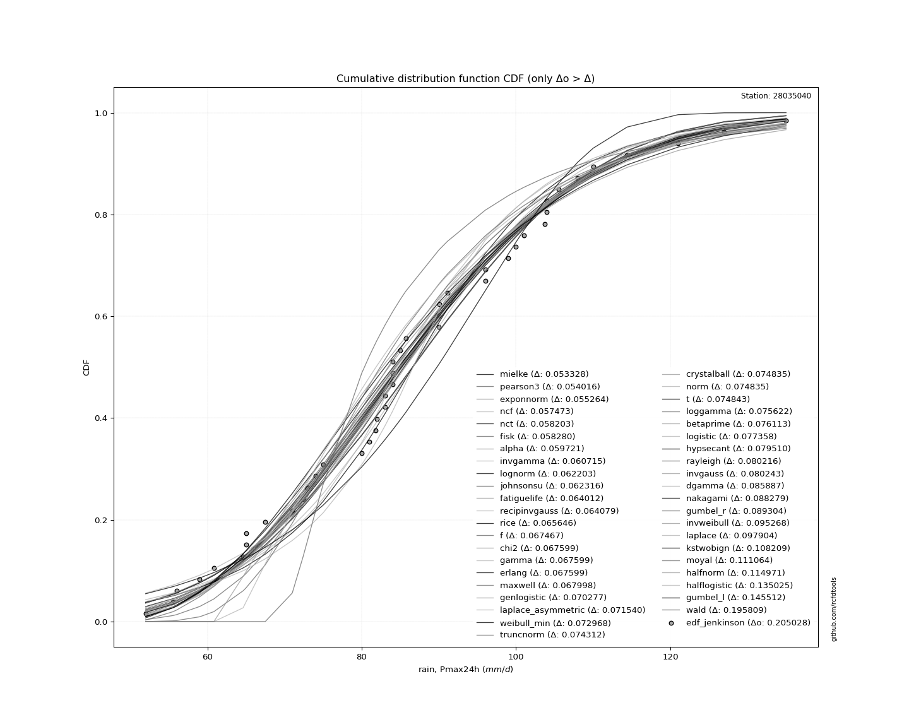</img>

</div>


**10.3. Best fit**

<div align="center">

|   id |   station | empirical_dist   | p_dist         |     delta |   deltao | eval   |   fit |   n |   best_fit |   best_fit_sort |
|-----:|----------:|:-----------------|:---------------|----------:|---------:|:-------|------:|----:|-----------:|----------------:|
|    0 |  28035040 | edf_jenkinson    | loggenlogistic | 0.0532902 | 0.205028 | Δo > Δ |     1 |  44 |          1 |               1 |

</div>


<div align="center">

</img>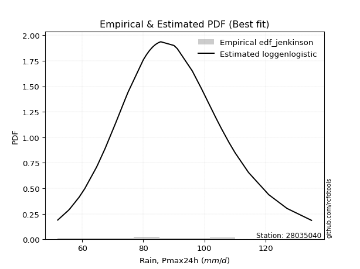</img>

</div>


### 11. Empirical - EDF Cunnane (1978)

Cunnane´s work in statistical hydrology has focused on the performance and evaluation of different probability distributions (such as GEV, Gumbel, Lognormal) for flood frequency estimation. _b_ is a constant, typically set to 0.4.

<div align="center">


$P=(m-b)/(n+1-2b)$


</div>


**11.1. Empirical values**

<div align="center">

|                | 0                    | 1                   | 2                    | 3                   | 4                   | 5                   | 6                   | 7                   | 8                  | 9                   | 10                  | 11                 | 12                 | 13                  | 14                  | 15                 | 16                 | 17                 | 18                  | 19                 | 20                 | 21                  | 22                 | 23                 | 24                 | 25                 | 26                 | 27                 | 28                 | 29                 | 30                 | 31                 | 32                 | 33                 | 34                 | 35                 | 36                 | 37                 | 38                 | 39                 | 40                 | 41                 | 42                 | 43                 |
|:---------------|:---------------------|:--------------------|:---------------------|:--------------------|:--------------------|:--------------------|:--------------------|:--------------------|:-------------------|:--------------------|:--------------------|:-------------------|:-------------------|:--------------------|:--------------------|:-------------------|:-------------------|:-------------------|:--------------------|:-------------------|:-------------------|:--------------------|:-------------------|:-------------------|:-------------------|:-------------------|:-------------------|:-------------------|:-------------------|:-------------------|:-------------------|:-------------------|:-------------------|:-------------------|:-------------------|:-------------------|:-------------------|:-------------------|:-------------------|:-------------------|:-------------------|:-------------------|:-------------------|:-------------------|
| date           | 1973                 | 2003                | 1983                 | 2002                | 1994                | 1977                | 1997                | 1974                | 1976               | 2015                | 1980                | 1975               | 2014               | 1972                | 2013                | 2011               | 2000               | 2012               | 1993                | 1992               | 1990               | 1991                | 2009               | 2004               | 1996               | 1989               | 2001               | 1984               | 1987               | 2008               | 1981               | 1978               | 1999               | 2007               | 1986               | 2005               | 2006               | 1982               | 1998               | 2010               | 1985               | 1979               | 1995               | 1988               |
| x              | 52.0                 | 55.5                | 56.0                 | 59.0                | 60.84110278         | 64.62772669         | 65.0                | 65.0                | 67.5               | 71.0                | 72.4                | 73.0               | 74.0               | 75.0                | 80.0                | 81.0               | 81.8               | 82.0               | 83.0                | 83.0               | 84.0               | 84.0                | 84.0               | 85.0               | 85.7               | 90.0               | 90.0               | 90.1               | 91.1               | 96.0               | 96.0               | 99.0               | 100.0              | 101.0              | 103.7              | 104.0              | 104.0              | 105.5              | 108.0              | 110.0              | 114.4              | 121.0              | 127.0              | 135.0              |
| m              | 1                    | 2                   | 3                    | 4                   | 5                   | 6                   | 7                   | 8                   | 9                  | 10                  | 11                  | 12                 | 13                 | 14                  | 15                  | 16                 | 17                 | 18                 | 19                  | 20                 | 21                 | 22                  | 23                 | 24                 | 25                 | 26                 | 27                 | 28                 | 29                 | 30                 | 31                 | 32                 | 33                 | 34                 | 35                 | 36                 | 37                 | 38                 | 39                 | 40                 | 41                 | 42                 | 43                 | 44                 |
| empirical_dist | edf_cunnane          | edf_cunnane         | edf_cunnane          | edf_cunnane         | edf_cunnane         | edf_cunnane         | edf_cunnane         | edf_cunnane         | edf_cunnane        | edf_cunnane         | edf_cunnane         | edf_cunnane        | edf_cunnane        | edf_cunnane         | edf_cunnane         | edf_cunnane        | edf_cunnane        | edf_cunnane        | edf_cunnane         | edf_cunnane        | edf_cunnane        | edf_cunnane         | edf_cunnane        | edf_cunnane        | edf_cunnane        | edf_cunnane        | edf_cunnane        | edf_cunnane        | edf_cunnane        | edf_cunnane        | edf_cunnane        | edf_cunnane        | edf_cunnane        | edf_cunnane        | edf_cunnane        | edf_cunnane        | edf_cunnane        | edf_cunnane        | edf_cunnane        | edf_cunnane        | edf_cunnane        | edf_cunnane        | edf_cunnane        | edf_cunnane        |
| empirical      | 0.013574660633484162 | 0.03619909502262443 | 0.058823529411764705 | 0.08144796380090498 | 0.10407239819004524 | 0.12669683257918551 | 0.14932126696832576 | 0.17194570135746604 | 0.1945701357466063 | 0.21719457013574658 | 0.23981900452488686 | 0.2624434389140271 | 0.2850678733031674 | 0.30769230769230765 | 0.33031674208144796 | 0.3529411764705882 | 0.3755656108597285 | 0.3981900452488688 | 0.42081447963800905 | 0.4434389140271493 | 0.4660633484162896 | 0.48868778280542985 | 0.5113122171945701 | 0.5339366515837104 | 0.5565610859728507 | 0.5791855203619909 | 0.6018099547511312 | 0.6244343891402715 | 0.6470588235294118 | 0.669683257918552  | 0.6923076923076923 | 0.7149321266968326 | 0.7375565610859728 | 0.7601809954751131 | 0.7828054298642534 | 0.8054298642533937 | 0.8280542986425339 | 0.8506787330316742 | 0.8733031674208145 | 0.8959276018099547 | 0.918552036199095  | 0.9411764705882353 | 0.9638009049773756 | 0.9864253393665158 |
| empirical_tr   | 1.0137614678899083   | 1.0375586854460093  | 1.0625               | 1.0886699507389164  | 1.1161616161616161  | 1.145077720207254   | 1.175531914893617   | 1.2076502732240437  | 1.2415730337078652 | 1.277456647398844   | 1.3154761904761905  | 1.3558282208588956 | 1.3987341772151898 | 1.4444444444444444  | 1.4932432432432432  | 1.5454545454545454 | 1.6014492753623188 | 1.661654135338346  | 1.7265625000000002  | 1.7967479674796747 | 1.8728813559322035 | 1.9557522123893807  | 2.0462962962962963 | 2.145631067961165  | 2.2551020408163267 | 2.376344086021505  | 2.5113636363636362 | 2.6626506024096384 | 2.8333333333333335 | 3.0273972602739723 | 3.25               | 3.507936507936508  | 3.810344827586206  | 4.169811320754716  | 4.604166666666667  | 5.1395348837209305 | 5.815789473684209  | 6.6969696969696955 | 7.892857142857143  | 9.608695652173907  | 12.277777777777771 | 16.999999999999996 | 27.625000000000014 | 73.66666666666633  |

</div>


**11.2. Kolmogorov-Smirnov fit test (sorted by Δ)**


<div align="center">

|                | 0                   | 1                    | 2                    | 3                   | 4                   | 5                    | 6                   | 7                   | 8                   | 9                   | 10                   | 11                  | 12                  | 13                  | 14                  | 15                  | 16                  | 17                  | 18                  | 19                  | 20                  | 21                  | 22                  | 23                  | 24                  | 25                  | 26                  | 27                  | 28                  | 29                  | 30                  | 31                  | 32                  | 33                  | 34                  | 35                  | 36                  | 37                  | 38                  | 39                  | 40                  | 41                  | 42                  | 43                  | 44                  | 45                  | 46                  | 47                  | 48                  | 49                  | 50                  | 51                  | 52                  | 53                  | 54                  | 55                    | 56                  | 57                  | 58                  | 59                  | 60                  | 61                  | 62                  | 63                  | 64                  | 65                  | 66                  | 67                  | 68                  | 69                  | 70                  | 71                  | 72                  | 73                  | 74                  | 75                  | 76                  | 77                  | 78                  | 79                  | 80                  | 81                  | 82                  | 83                  | 84                  | 85                  | 86                  | 87                  |
|:---------------|:--------------------|:---------------------|:---------------------|:--------------------|:--------------------|:---------------------|:--------------------|:--------------------|:--------------------|:--------------------|:---------------------|:--------------------|:--------------------|:--------------------|:--------------------|:--------------------|:--------------------|:--------------------|:--------------------|:--------------------|:--------------------|:--------------------|:--------------------|:--------------------|:--------------------|:--------------------|:--------------------|:--------------------|:--------------------|:--------------------|:--------------------|:--------------------|:--------------------|:--------------------|:--------------------|:--------------------|:--------------------|:--------------------|:--------------------|:--------------------|:--------------------|:--------------------|:--------------------|:--------------------|:--------------------|:--------------------|:--------------------|:--------------------|:--------------------|:--------------------|:--------------------|:--------------------|:--------------------|:--------------------|:--------------------|:----------------------|:--------------------|:--------------------|:--------------------|:--------------------|:--------------------|:--------------------|:--------------------|:--------------------|:--------------------|:--------------------|:--------------------|:--------------------|:--------------------|:--------------------|:--------------------|:--------------------|:--------------------|:--------------------|:--------------------|:--------------------|:--------------------|:--------------------|:--------------------|:--------------------|:--------------------|:--------------------|:--------------------|:--------------------|:--------------------|:--------------------|:--------------------|:--------------------|
| station        | 28035040            | 28035040             | 28035040             | 28035040            | 28035040            | 28035040             | 28035040            | 28035040            | 28035040            | 28035040            | 28035040             | 28035040            | 28035040            | 28035040            | 28035040            | 28035040            | 28035040            | 28035040            | 28035040            | 28035040            | 28035040            | 28035040            | 28035040            | 28035040            | 28035040            | 28035040            | 28035040            | 28035040            | 28035040            | 28035040            | 28035040            | 28035040            | 28035040            | 28035040            | 28035040            | 28035040            | 28035040            | 28035040            | 28035040            | 28035040            | 28035040            | 28035040            | 28035040            | 28035040            | 28035040            | 28035040            | 28035040            | 28035040            | 28035040            | 28035040            | 28035040            | 28035040            | 28035040            | 28035040            | 28035040            | 28035040              | 28035040            | 28035040            | 28035040            | 28035040            | 28035040            | 28035040            | 28035040            | 28035040            | 28035040            | 28035040            | 28035040            | 28035040            | 28035040            | 28035040            | 28035040            | 28035040            | 28035040            | 28035040            | 28035040            | 28035040            | 28035040            | 28035040            | 28035040            | 28035040            | 28035040            | 28035040            | 28035040            | 28035040            | 28035040            | 28035040            | 28035040            | 28035040            |
| empirical_dist | edf_cunnane         | edf_cunnane          | edf_cunnane          | edf_cunnane         | edf_cunnane         | edf_cunnane          | edf_cunnane         | edf_cunnane         | edf_cunnane         | edf_cunnane         | edf_cunnane          | edf_cunnane         | edf_cunnane         | edf_cunnane         | edf_cunnane         | edf_cunnane         | edf_cunnane         | edf_cunnane         | edf_cunnane         | edf_cunnane         | edf_cunnane         | edf_cunnane         | edf_cunnane         | edf_cunnane         | edf_cunnane         | edf_cunnane         | edf_cunnane         | edf_cunnane         | edf_cunnane         | edf_cunnane         | edf_cunnane         | edf_cunnane         | edf_cunnane         | edf_cunnane         | edf_cunnane         | edf_cunnane         | edf_cunnane         | edf_cunnane         | edf_cunnane         | edf_cunnane         | edf_cunnane         | edf_cunnane         | edf_cunnane         | edf_cunnane         | edf_cunnane         | edf_cunnane         | edf_cunnane         | edf_cunnane         | edf_cunnane         | edf_cunnane         | edf_cunnane         | edf_cunnane         | edf_cunnane         | edf_cunnane         | edf_cunnane         | edf_cunnane           | edf_cunnane         | edf_cunnane         | edf_cunnane         | edf_cunnane         | edf_cunnane         | edf_cunnane         | edf_cunnane         | edf_cunnane         | edf_cunnane         | edf_cunnane         | edf_cunnane         | edf_cunnane         | edf_cunnane         | edf_cunnane         | edf_cunnane         | edf_cunnane         | edf_cunnane         | edf_cunnane         | edf_cunnane         | edf_cunnane         | edf_cunnane         | edf_cunnane         | edf_cunnane         | edf_cunnane         | edf_cunnane         | edf_cunnane         | edf_cunnane         | edf_cunnane         | edf_cunnane         | edf_cunnane         | edf_cunnane         | edf_cunnane         |
| p_dist         | loggenlogistic      | mielke               | pearson3             | exponnorm           | logmielke           | fisk                 | logfisk             | ncf                 | nct                 | alpha               | logloggamma          | invgamma            | johnsonsu           | fatiguelife         | logpearson3         | rice                | loglogistic         | logweibull_min      | loggompertz         | f                   | chi2                | gamma               | erlang              | maxwell             | laplace_asymmetric  | genlogistic         | weibull_min         | truncnorm           | logncf              | logjohnsonsu        | logcrystalball      | lognorm             | lognorm             | logt                | loglognorm          | logexponnorm        | crystalball         | norm                | t                   | lognakagami         | logf                | betaprime           | logfatiguelife      | logistic            | hypsecant           | rayleigh            | invgauss            | lognct              | loggamma            | loggamma            | loghypsecant        | loginvgamma         | logerlang           | logalpha            | logbetaprime        | loglaplace_asymmetric | logrice             | nakagami            | gumbel_r            | invweibull          | laplace             | loggumbel_l         | loginvgauss         | loglaplace          | kstwobign           | logmaxwell          | moyal               | halfnorm            | lograyleigh         | halflogistic        | loginvweibull       | loggumbel_r         | gumbel_l            | loghalfnorm         | logkstwobign        | loggenexpon         | logmoyal            | loghalflogistic     | wald                | genexpon            | expon               | logwald             | loggibrat           | gibrat              | logtruncnorm        | logexpon            | logchi2             | gompertz            |
| delta          | 0.05195962745766154 | 0.051997035024848204 | 0.054704707291455934 | 0.05549348041551605 | 0.05639002559079087 | 0.057487870374730465 | 0.05753388434982465 | 0.05816170335438786 | 0.0588913879544804  | 0.06040950452503269 | 0.061022794696213634 | 0.06140345695242444 | 0.06300454544404138 | 0.06469999994464137 | 0.06490977118654667 | 0.06633386148113857 | 0.06726094471363486 | 0.06748086750891585 | 0.06805489513712853 | 0.06815482311260868 | 0.06828755770115841 | 0.06828768060357154 | 0.06828769172410903 | 0.06868586317647213 | 0.0708513730218745  | 0.07096479267294492 | 0.07365579255125826 | 0.07454122455293155 | 0.07475296668150838 | 0.0749473858507112  | 0.0749946041437996  | 0.07499492794214957 | 0.07499492794214957 | 0.07499540469124771 | 0.07499558392172251 | 0.07499581493393365 | 0.07506420349953036 | 0.07506421242456407 | 0.07507288330585199 | 0.07543229593051876 | 0.07670324311291665 | 0.0768011949375424  | 0.07729497606233254 | 0.07758743633668241 | 0.07973912698102387 | 0.08090471004090444 | 0.080931060876062   | 0.08107359211378429 | 0.0813310844024977  | 0.0813310844024977  | 0.08272916327218505 | 0.08342417990032358 | 0.08348479368930561 | 0.08377426248290287 | 0.08551273164373324 | 0.08710072611952524   | 0.08737377441211186 | 0.08896696644189744 | 0.08990034498716443 | 0.09596028113352112 | 0.09794981131777697 | 0.0996639364783043  | 0.10525345139408948 | 0.10637038478285643 | 0.10889739837074108 | 0.10912435643235585 | 0.11166023139092784 | 0.11565937924836428 | 0.12140583796562315 | 0.1336946876671556  | 0.13652654740461867 | 0.1379939732744988  | 0.14574105746057597 | 0.156219842179874   | 0.15937073962375609 | 0.1601602841109932  | 0.16248302886898947 | 0.17350100938919355 | 0.1945701357466063  | 0.2228665318796485  | 0.2245454904120487  | 0.23004441885925764 | 0.24064272379835372 | 0.2435933029520293  | 0.2547439764436053  | 0.25838216505549944 | 0.3400525962166645  | 0.9156342616108454  |
| deltao         | 0.20502771431287928 | 0.20502771431287928  | 0.20502771431287928  | 0.20502771431287928 | 0.20502771431287928 | 0.20502771431287928  | 0.20502771431287928 | 0.20502771431287928 | 0.20502771431287928 | 0.20502771431287928 | 0.20502771431287928  | 0.20502771431287928 | 0.20502771431287928 | 0.20502771431287928 | 0.20502771431287928 | 0.20502771431287928 | 0.20502771431287928 | 0.20502771431287928 | 0.20502771431287928 | 0.20502771431287928 | 0.20502771431287928 | 0.20502771431287928 | 0.20502771431287928 | 0.20502771431287928 | 0.20502771431287928 | 0.20502771431287928 | 0.20502771431287928 | 0.20502771431287928 | 0.20502771431287928 | 0.20502771431287928 | 0.20502771431287928 | 0.20502771431287928 | 0.20502771431287928 | 0.20502771431287928 | 0.20502771431287928 | 0.20502771431287928 | 0.20502771431287928 | 0.20502771431287928 | 0.20502771431287928 | 0.20502771431287928 | 0.20502771431287928 | 0.20502771431287928 | 0.20502771431287928 | 0.20502771431287928 | 0.20502771431287928 | 0.20502771431287928 | 0.20502771431287928 | 0.20502771431287928 | 0.20502771431287928 | 0.20502771431287928 | 0.20502771431287928 | 0.20502771431287928 | 0.20502771431287928 | 0.20502771431287928 | 0.20502771431287928 | 0.20502771431287928   | 0.20502771431287928 | 0.20502771431287928 | 0.20502771431287928 | 0.20502771431287928 | 0.20502771431287928 | 0.20502771431287928 | 0.20502771431287928 | 0.20502771431287928 | 0.20502771431287928 | 0.20502771431287928 | 0.20502771431287928 | 0.20502771431287928 | 0.20502771431287928 | 0.20502771431287928 | 0.20502771431287928 | 0.20502771431287928 | 0.20502771431287928 | 0.20502771431287928 | 0.20502771431287928 | 0.20502771431287928 | 0.20502771431287928 | 0.20502771431287928 | 0.20502771431287928 | 0.20502771431287928 | 0.20502771431287928 | 0.20502771431287928 | 0.20502771431287928 | 0.20502771431287928 | 0.20502771431287928 | 0.20502771431287928 | 0.20502771431287928 | 0.20502771431287928 |
| eval           | Δo > Δ              | Δo > Δ               | Δo > Δ               | Δo > Δ              | Δo > Δ              | Δo > Δ               | Δo > Δ              | Δo > Δ              | Δo > Δ              | Δo > Δ              | Δo > Δ               | Δo > Δ              | Δo > Δ              | Δo > Δ              | Δo > Δ              | Δo > Δ              | Δo > Δ              | Δo > Δ              | Δo > Δ              | Δo > Δ              | Δo > Δ              | Δo > Δ              | Δo > Δ              | Δo > Δ              | Δo > Δ              | Δo > Δ              | Δo > Δ              | Δo > Δ              | Δo > Δ              | Δo > Δ              | Δo > Δ              | Δo > Δ              | Δo > Δ              | Δo > Δ              | Δo > Δ              | Δo > Δ              | Δo > Δ              | Δo > Δ              | Δo > Δ              | Δo > Δ              | Δo > Δ              | Δo > Δ              | Δo > Δ              | Δo > Δ              | Δo > Δ              | Δo > Δ              | Δo > Δ              | Δo > Δ              | Δo > Δ              | Δo > Δ              | Δo > Δ              | Δo > Δ              | Δo > Δ              | Δo > Δ              | Δo > Δ              | Δo > Δ                | Δo > Δ              | Δo > Δ              | Δo > Δ              | Δo > Δ              | Δo > Δ              | Δo > Δ              | Δo > Δ              | Δo > Δ              | Δo > Δ              | Δo > Δ              | Δo > Δ              | Δo > Δ              | Δo > Δ              | Δo > Δ              | Δo > Δ              | Δo > Δ              | Δo > Δ              | Δo > Δ              | Δo > Δ              | Δo > Δ              | Δo > Δ              | Δo > Δ              | Δo > Δ              | Δo <= Δ             | Δo <= Δ             | Δo <= Δ             | Δo <= Δ             | Δo <= Δ             | Δo <= Δ             | Δo <= Δ             | Δo <= Δ             | Δo <= Δ             |
| fit            | 1                   | 1                    | 1                    | 1                   | 1                   | 1                    | 1                   | 1                   | 1                   | 1                   | 1                    | 1                   | 1                   | 1                   | 1                   | 1                   | 1                   | 1                   | 1                   | 1                   | 1                   | 1                   | 1                   | 1                   | 1                   | 1                   | 1                   | 1                   | 1                   | 1                   | 1                   | 1                   | 1                   | 1                   | 1                   | 1                   | 1                   | 1                   | 1                   | 1                   | 1                   | 1                   | 1                   | 1                   | 1                   | 1                   | 1                   | 1                   | 1                   | 1                   | 1                   | 1                   | 1                   | 1                   | 1                   | 1                     | 1                   | 1                   | 1                   | 1                   | 1                   | 1                   | 1                   | 1                   | 1                   | 1                   | 1                   | 1                   | 1                   | 1                   | 1                   | 1                   | 1                   | 1                   | 1                   | 1                   | 1                   | 1                   | 1                   | 0                   | 0                   | 0                   | 0                   | 0                   | 0                   | 0                   | 0                   | 0                   |
| n              | 44                  | 44                   | 44                   | 44                  | 44                  | 44                   | 44                  | 44                  | 44                  | 44                  | 44                   | 44                  | 44                  | 44                  | 44                  | 44                  | 44                  | 44                  | 44                  | 44                  | 44                  | 44                  | 44                  | 44                  | 44                  | 44                  | 44                  | 44                  | 44                  | 44                  | 44                  | 44                  | 44                  | 44                  | 44                  | 44                  | 44                  | 44                  | 44                  | 44                  | 44                  | 44                  | 44                  | 44                  | 44                  | 44                  | 44                  | 44                  | 44                  | 44                  | 44                  | 44                  | 44                  | 44                  | 44                  | 44                    | 44                  | 44                  | 44                  | 44                  | 44                  | 44                  | 44                  | 44                  | 44                  | 44                  | 44                  | 44                  | 44                  | 44                  | 44                  | 44                  | 44                  | 44                  | 44                  | 44                  | 44                  | 44                  | 44                  | 44                  | 44                  | 44                  | 44                  | 44                  | 44                  | 44                  | 44                  | 44                  |
| best_fit       | 1                   | 0                    | 0                    | 0                   | 0                   | 0                    | 0                   | 0                   | 0                   | 0                   | 0                    | 0                   | 0                   | 0                   | 0                   | 0                   | 0                   | 0                   | 0                   | 0                   | 0                   | 0                   | 0                   | 0                   | 0                   | 0                   | 0                   | 0                   | 0                   | 0                   | 0                   | 0                   | 0                   | 0                   | 0                   | 0                   | 0                   | 0                   | 0                   | 0                   | 0                   | 0                   | 0                   | 0                   | 0                   | 0                   | 0                   | 0                   | 0                   | 0                   | 0                   | 0                   | 0                   | 0                   | 0                   | 0                     | 0                   | 0                   | 0                   | 0                   | 0                   | 0                   | 0                   | 0                   | 0                   | 0                   | 0                   | 0                   | 0                   | 0                   | 0                   | 0                   | 0                   | 0                   | 0                   | 0                   | 0                   | 0                   | 0                   | 0                   | 0                   | 0                   | 0                   | 0                   | 0                   | 0                   | 0                   | 0                   |
| best_fit_sort  | 1                   | 2                    | 3                    | 4                   | 5                   | 6                    | 7                   | 8                   | 9                   | 10                  | 11                   | 12                  | 13                  | 14                  | 15                  | 16                  | 17                  | 18                  | 19                  | 20                  | 21                  | 22                  | 23                  | 24                  | 25                  | 26                  | 27                  | 28                  | 29                  | 30                  | 31                  | 32                  | 33                  | 34                  | 35                  | 36                  | 37                  | 38                  | 39                  | 40                  | 41                  | 42                  | 43                  | 44                  | 45                  | 46                  | 47                  | 48                  | 49                  | 50                  | 51                  | 52                  | 53                  | 54                  | 55                  | 56                    | 57                  | 58                  | 59                  | 60                  | 61                  | 62                  | 63                  | 64                  | 65                  | 66                  | 67                  | 68                  | 69                  | 70                  | 71                  | 72                  | 73                  | 74                  | 75                  | 76                  | 77                  | 78                  | 79                  | 80                  | 81                  | 82                  | 83                  | 84                  | 85                  | 86                  | 87                  | 88                  |

</div>


<div align="center">

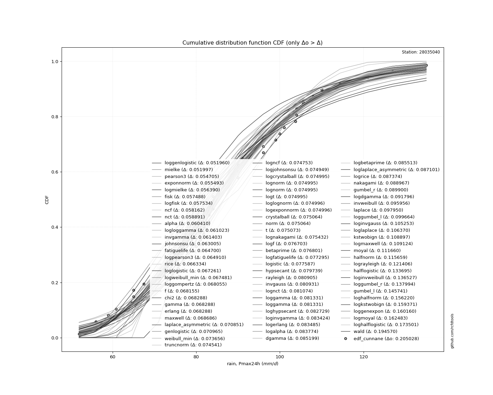</img>

</div>


**11.3. Best fit**

<div align="center">

|   id |   station | empirical_dist   | p_dist         |     delta |   deltao | eval   |   fit |   n |   best_fit |   best_fit_sort |
|-----:|----------:|:-----------------|:---------------|----------:|---------:|:-------|------:|----:|-----------:|----------------:|
|    0 |  28035040 | edf_cunnane      | loggenlogistic | 0.0519596 | 0.205028 | Δo > Δ |     1 |  44 |          1 |               1 |

</div>


<div align="center">

</img>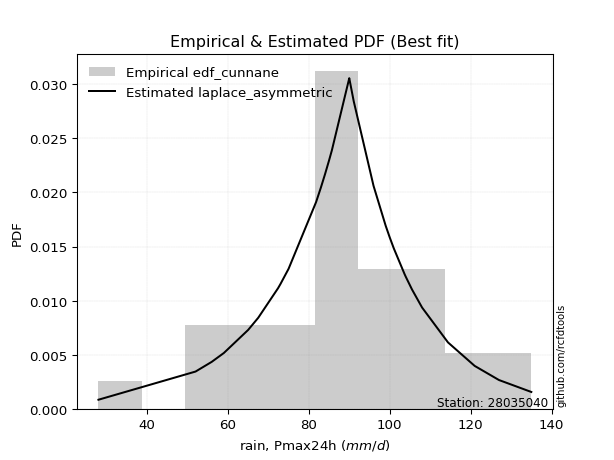</img>

</div>


### 12. Empirical - EDF Adamowski (1981)

The Adamowski formula in hydrology refers to a specific plotting position formula used for estimating the non-parametric empirical distribution of hydrological events (like flood peaks) to calculate their return periods. This formula provides an alternative to traditional parametric methods (like the Gumbel or Log Pearson Type III distributions). 

<div align="center">


$P=(m-0.25)/(n+0.5)$


</div>


**12.1. Empirical values**

<div align="center">

|                | 0                    | 1                   | 2                   | 3                   | 4                   | 5                   | 6                   | 7                   | 8                   | 9                   | 10                  | 11                 | 12                  | 13                 | 14                  | 15                 | 16                  | 17                 | 18                  | 19                 | 20                  | 21                 | 22                 | 23                 | 24                 | 25                 | 26                | 27                 | 28                 | 29                 | 30                 | 31                 | 32                 | 33                 | 34                 | 35                 | 36                 | 37                | 38                 | 39                 | 40                 | 41                 | 42                 | 43                 |
|:---------------|:---------------------|:--------------------|:--------------------|:--------------------|:--------------------|:--------------------|:--------------------|:--------------------|:--------------------|:--------------------|:--------------------|:-------------------|:--------------------|:-------------------|:--------------------|:-------------------|:--------------------|:-------------------|:--------------------|:-------------------|:--------------------|:-------------------|:-------------------|:-------------------|:-------------------|:-------------------|:------------------|:-------------------|:-------------------|:-------------------|:-------------------|:-------------------|:-------------------|:-------------------|:-------------------|:-------------------|:-------------------|:------------------|:-------------------|:-------------------|:-------------------|:-------------------|:-------------------|:-------------------|
| date           | 1973                 | 2003                | 1983                | 2002                | 1994                | 1977                | 1997                | 1974                | 1976                | 2015                | 1980                | 1975               | 2014                | 1972               | 2013                | 2011               | 2000                | 2012               | 1993                | 1992               | 1990                | 1991               | 2009               | 2004               | 1996               | 1989               | 2001              | 1984               | 1987               | 2008               | 1981               | 1978               | 1999               | 2007               | 1986               | 2005               | 2006               | 1982              | 1998               | 2010               | 1985               | 1979               | 1995               | 1988               |
| x              | 52.0                 | 55.5                | 56.0                | 59.0                | 60.84110278         | 64.62772669         | 65.0                | 65.0                | 67.5                | 71.0                | 72.4                | 73.0               | 74.0                | 75.0               | 80.0                | 81.0               | 81.8                | 82.0               | 83.0                | 83.0               | 84.0                | 84.0               | 84.0               | 85.0               | 85.7               | 90.0               | 90.0              | 90.1               | 91.1               | 96.0               | 96.0               | 99.0               | 100.0              | 101.0              | 103.7              | 104.0              | 104.0              | 105.5             | 108.0              | 110.0              | 114.4              | 121.0              | 127.0              | 135.0              |
| m              | 1                    | 2                   | 3                   | 4                   | 5                   | 6                   | 7                   | 8                   | 9                   | 10                  | 11                  | 12                 | 13                  | 14                 | 15                  | 16                 | 17                  | 18                 | 19                  | 20                 | 21                  | 22                 | 23                 | 24                 | 25                 | 26                 | 27                | 28                 | 29                 | 30                 | 31                 | 32                 | 33                 | 34                 | 35                 | 36                 | 37                 | 38                | 39                 | 40                 | 41                 | 42                 | 43                 | 44                 |
| empirical_dist | edf_adamowski        | edf_adamowski       | edf_adamowski       | edf_adamowski       | edf_adamowski       | edf_adamowski       | edf_adamowski       | edf_adamowski       | edf_adamowski       | edf_adamowski       | edf_adamowski       | edf_adamowski      | edf_adamowski       | edf_adamowski      | edf_adamowski       | edf_adamowski      | edf_adamowski       | edf_adamowski      | edf_adamowski       | edf_adamowski      | edf_adamowski       | edf_adamowski      | edf_adamowski      | edf_adamowski      | edf_adamowski      | edf_adamowski      | edf_adamowski     | edf_adamowski      | edf_adamowski      | edf_adamowski      | edf_adamowski      | edf_adamowski      | edf_adamowski      | edf_adamowski      | edf_adamowski      | edf_adamowski      | edf_adamowski      | edf_adamowski     | edf_adamowski      | edf_adamowski      | edf_adamowski      | edf_adamowski      | edf_adamowski      | edf_adamowski      |
| empirical      | 0.016853932584269662 | 0.03932584269662921 | 0.06179775280898876 | 0.08426966292134831 | 0.10674157303370786 | 0.12921348314606743 | 0.15168539325842698 | 0.17415730337078653 | 0.19662921348314608 | 0.21910112359550563 | 0.24157303370786518 | 0.2640449438202247 | 0.28651685393258425 | 0.3089887640449438 | 0.33146067415730335 | 0.3539325842696629 | 0.37640449438202245 | 0.398876404494382  | 0.42134831460674155 | 0.4438202247191011 | 0.46629213483146065 | 0.4887640449438202 | 0.5112359550561798 | 0.5337078651685393 | 0.5561797752808989 | 0.5786516853932584 | 0.601123595505618 | 0.6235955056179775 | 0.6460674157303371 | 0.6685393258426966 | 0.6910112359550562 | 0.7134831460674157 | 0.7359550561797753 | 0.7584269662921348 | 0.7808988764044944 | 0.8033707865168539 | 0.8258426966292135 | 0.848314606741573 | 0.8707865168539326 | 0.8932584269662921 | 0.9157303370786517 | 0.9382022471910112 | 0.9606741573033708 | 0.9831460674157303 |
| empirical_tr   | 1.0171428571428571   | 1.04093567251462    | 1.0658682634730539  | 1.0920245398773005  | 1.119496855345912   | 1.1483870967741936  | 1.1788079470198676  | 1.2108843537414966  | 1.2447552447552448  | 1.2805755395683454  | 1.3185185185185186  | 1.3587786259541985 | 1.4015748031496063  | 1.4471544715447153 | 1.495798319327731   | 1.5478260869565217 | 1.6036036036036034  | 1.6635514018691588 | 1.7281553398058254  | 1.7979797979797978 | 1.8736842105263154  | 1.956043956043956  | 2.045977011494253  | 2.144578313253012  | 2.2531645569620253 | 2.373333333333333  | 2.507042253521127 | 2.6567164179104474 | 2.8253968253968256 | 3.0169491525423724 | 3.2363636363636368 | 3.490196078431372  | 3.787234042553192  | 4.13953488372093   | 4.564102564102565  | 5.0857142857142845 | 5.741935483870968  | 6.592592592592591 | 7.739130434782609  | 9.368421052631575  | 11.866666666666669 | 16.181818181818173 | 25.428571428571438 | 59.33333333333319  |

</div>


**12.2. Kolmogorov-Smirnov fit test (sorted by Δ)**


<div align="center">

|                | 0                   | 1                   | 2                    | 3                   | 4                    | 5                   | 6                   | 7                    | 8                    | 9                    | 10                  | 11                  | 12                  | 13                  | 14                  | 15                  | 16                  | 17                  | 18                  | 19                  | 20                  | 21                  | 22                  | 23                  | 24                  | 25                  | 26                  | 27                  | 28                  | 29                  | 30                  | 31                  | 32                  | 33                  | 34                  | 35                  | 36                  | 37                  | 38                  | 39                  | 40                  | 41                  | 42                  | 43                  | 44                  | 45                  | 46                  | 47                  | 48                  | 49                  | 50                  | 51                  | 52                  | 53                  | 54                  | 55                  | 56                  | 57                    | 58                  | 59                  | 60                  | 61                  | 62                  | 63                  | 64                  | 65                  | 66                  | 67                  | 68                  | 69                  | 70                  | 71                  | 72                  | 73                  | 74                  | 75                  | 76                  | 77                  | 78                  | 79                  | 80                  | 81                  | 82                  | 83                  | 84                  | 85                  | 86                  | 87                  |
|:---------------|:--------------------|:--------------------|:---------------------|:--------------------|:---------------------|:--------------------|:--------------------|:---------------------|:---------------------|:---------------------|:--------------------|:--------------------|:--------------------|:--------------------|:--------------------|:--------------------|:--------------------|:--------------------|:--------------------|:--------------------|:--------------------|:--------------------|:--------------------|:--------------------|:--------------------|:--------------------|:--------------------|:--------------------|:--------------------|:--------------------|:--------------------|:--------------------|:--------------------|:--------------------|:--------------------|:--------------------|:--------------------|:--------------------|:--------------------|:--------------------|:--------------------|:--------------------|:--------------------|:--------------------|:--------------------|:--------------------|:--------------------|:--------------------|:--------------------|:--------------------|:--------------------|:--------------------|:--------------------|:--------------------|:--------------------|:--------------------|:--------------------|:----------------------|:--------------------|:--------------------|:--------------------|:--------------------|:--------------------|:--------------------|:--------------------|:--------------------|:--------------------|:--------------------|:--------------------|:--------------------|:--------------------|:--------------------|:--------------------|:--------------------|:--------------------|:--------------------|:--------------------|:--------------------|:--------------------|:--------------------|:--------------------|:--------------------|:--------------------|:--------------------|:--------------------|:--------------------|:--------------------|:--------------------|
| station        | 28035040            | 28035040            | 28035040             | 28035040            | 28035040             | 28035040            | 28035040            | 28035040             | 28035040             | 28035040             | 28035040            | 28035040            | 28035040            | 28035040            | 28035040            | 28035040            | 28035040            | 28035040            | 28035040            | 28035040            | 28035040            | 28035040            | 28035040            | 28035040            | 28035040            | 28035040            | 28035040            | 28035040            | 28035040            | 28035040            | 28035040            | 28035040            | 28035040            | 28035040            | 28035040            | 28035040            | 28035040            | 28035040            | 28035040            | 28035040            | 28035040            | 28035040            | 28035040            | 28035040            | 28035040            | 28035040            | 28035040            | 28035040            | 28035040            | 28035040            | 28035040            | 28035040            | 28035040            | 28035040            | 28035040            | 28035040            | 28035040            | 28035040              | 28035040            | 28035040            | 28035040            | 28035040            | 28035040            | 28035040            | 28035040            | 28035040            | 28035040            | 28035040            | 28035040            | 28035040            | 28035040            | 28035040            | 28035040            | 28035040            | 28035040            | 28035040            | 28035040            | 28035040            | 28035040            | 28035040            | 28035040            | 28035040            | 28035040            | 28035040            | 28035040            | 28035040            | 28035040            | 28035040            |
| empirical_dist | edf_adamowski       | edf_adamowski       | edf_adamowski        | edf_adamowski       | edf_adamowski        | edf_adamowski       | edf_adamowski       | edf_adamowski        | edf_adamowski        | edf_adamowski        | edf_adamowski       | edf_adamowski       | edf_adamowski       | edf_adamowski       | edf_adamowski       | edf_adamowski       | edf_adamowski       | edf_adamowski       | edf_adamowski       | edf_adamowski       | edf_adamowski       | edf_adamowski       | edf_adamowski       | edf_adamowski       | edf_adamowski       | edf_adamowski       | edf_adamowski       | edf_adamowski       | edf_adamowski       | edf_adamowski       | edf_adamowski       | edf_adamowski       | edf_adamowski       | edf_adamowski       | edf_adamowski       | edf_adamowski       | edf_adamowski       | edf_adamowski       | edf_adamowski       | edf_adamowski       | edf_adamowski       | edf_adamowski       | edf_adamowski       | edf_adamowski       | edf_adamowski       | edf_adamowski       | edf_adamowski       | edf_adamowski       | edf_adamowski       | edf_adamowski       | edf_adamowski       | edf_adamowski       | edf_adamowski       | edf_adamowski       | edf_adamowski       | edf_adamowski       | edf_adamowski       | edf_adamowski         | edf_adamowski       | edf_adamowski       | edf_adamowski       | edf_adamowski       | edf_adamowski       | edf_adamowski       | edf_adamowski       | edf_adamowski       | edf_adamowski       | edf_adamowski       | edf_adamowski       | edf_adamowski       | edf_adamowski       | edf_adamowski       | edf_adamowski       | edf_adamowski       | edf_adamowski       | edf_adamowski       | edf_adamowski       | edf_adamowski       | edf_adamowski       | edf_adamowski       | edf_adamowski       | edf_adamowski       | edf_adamowski       | edf_adamowski       | edf_adamowski       | edf_adamowski       | edf_adamowski       | edf_adamowski       |
| p_dist         | pearson3            | loggenlogistic      | mielke               | exponnorm           | logmielke            | ncf                 | nct                 | fisk                 | logfisk              | alpha                | logloggamma         | invgamma            | johnsonsu           | fatiguelife         | logpearson3         | rice                | logweibull_min      | loggompertz         | f                   | chi2                | gamma               | erlang              | maxwell             | loglogistic         | genlogistic         | laplace_asymmetric  | weibull_min         | logncf              | logjohnsonsu        | logcrystalball      | lognorm             | lognorm             | logt                | loglognorm          | logexponnorm        | truncnorm           | lognakagami         | crystalball         | norm                | t                   | logf                | betaprime           | logfatiguelife      | logistic            | hypsecant           | rayleigh            | invgauss            | lognct              | loggamma            | loggamma            | loginvgamma         | logerlang           | logalpha            | loghypsecant        | logbetaprime        | logrice             | nakagami            | loglaplace_asymmetric | gumbel_r            | invweibull          | laplace             | loggumbel_l         | loginvgauss         | loglaplace          | kstwobign           | logmaxwell          | moyal               | halfnorm            | lograyleigh         | loginvweibull       | halflogistic        | loggumbel_r         | gumbel_l            | loghalfnorm         | logkstwobign        | loggenexpon         | logmoyal            | loghalflogistic     | wald                | genexpon            | expon               | logwald             | loggibrat           | gibrat              | logtruncnorm        | logexpon            | logchi2             | gompertz            |
| delta          | 0.05356077521560054 | 0.05417122947098203 | 0.054208637038168694 | 0.05511216972356425 | 0.056008714898839074 | 0.05701777127853247 | 0.05774745587862501 | 0.059161452441878815 | 0.059202157813932024 | 0.059265572449177295 | 0.05987886262035824 | 0.06025952487656905 | 0.06186061336818599 | 0.06355606786878598 | 0.06376583911069128 | 0.06518992940528318 | 0.06633693543306046 | 0.06691096306127314 | 0.06701089103675328 | 0.06714362562530302 | 0.06714374852771615 | 0.06714375964825364 | 0.06754193110061674 | 0.06851787229547956 | 0.06982086059708953 | 0.07199530509772989 | 0.07251186047540287 | 0.07360903460565299 | 0.07380345377485581 | 0.07385067206794421 | 0.07385099586629418 | 0.07385099586629418 | 0.07385147261539232 | 0.07385165184586712 | 0.07385188285807825 | 0.07415991386097975 | 0.07428836385466336 | 0.07468289280757856 | 0.07468290173261227 | 0.07469157261390019 | 0.07555931103706126 | 0.075657262861687   | 0.07615104398647715 | 0.07720612564473062 | 0.07935781628907207 | 0.07976077796504905 | 0.07978712880020661 | 0.0799296600379289  | 0.08018715232664231 | 0.08018715232664231 | 0.08228024782446819 | 0.08234086161345022 | 0.08263033040704748 | 0.08387309534804044 | 0.08436879956787785 | 0.08622984233625647 | 0.08782303436604205 | 0.08824465819538063   | 0.08890893718808973 | 0.09481634905766573 | 0.09787354917938668 | 0.0992826257863525  | 0.10410951931823409 | 0.10751431685871182 | 0.10775346629488569 | 0.10798042435650046 | 0.11066882359185315 | 0.11451544717250889 | 0.12026190588976776 | 0.13538261532876328 | 0.13590628968047608 | 0.1370025654754241  | 0.14535974676862418 | 0.1550759101040186  | 0.1582268075479007  | 0.1590163520351378  | 0.16149162106991477 | 0.17250960159011886 | 0.19662921348314608 | 0.2217225998037931  | 0.2234015583361933  | 0.22905301106018294 | 0.23980384027605978 | 0.2451948078582269  | 0.2536000443677499  | 0.25723823297964404 | 0.336773324265879   | 0.9128125624904021  |
| deltao         | 0.20502771431287928 | 0.20502771431287928 | 0.20502771431287928  | 0.20502771431287928 | 0.20502771431287928  | 0.20502771431287928 | 0.20502771431287928 | 0.20502771431287928  | 0.20502771431287928  | 0.20502771431287928  | 0.20502771431287928 | 0.20502771431287928 | 0.20502771431287928 | 0.20502771431287928 | 0.20502771431287928 | 0.20502771431287928 | 0.20502771431287928 | 0.20502771431287928 | 0.20502771431287928 | 0.20502771431287928 | 0.20502771431287928 | 0.20502771431287928 | 0.20502771431287928 | 0.20502771431287928 | 0.20502771431287928 | 0.20502771431287928 | 0.20502771431287928 | 0.20502771431287928 | 0.20502771431287928 | 0.20502771431287928 | 0.20502771431287928 | 0.20502771431287928 | 0.20502771431287928 | 0.20502771431287928 | 0.20502771431287928 | 0.20502771431287928 | 0.20502771431287928 | 0.20502771431287928 | 0.20502771431287928 | 0.20502771431287928 | 0.20502771431287928 | 0.20502771431287928 | 0.20502771431287928 | 0.20502771431287928 | 0.20502771431287928 | 0.20502771431287928 | 0.20502771431287928 | 0.20502771431287928 | 0.20502771431287928 | 0.20502771431287928 | 0.20502771431287928 | 0.20502771431287928 | 0.20502771431287928 | 0.20502771431287928 | 0.20502771431287928 | 0.20502771431287928 | 0.20502771431287928 | 0.20502771431287928   | 0.20502771431287928 | 0.20502771431287928 | 0.20502771431287928 | 0.20502771431287928 | 0.20502771431287928 | 0.20502771431287928 | 0.20502771431287928 | 0.20502771431287928 | 0.20502771431287928 | 0.20502771431287928 | 0.20502771431287928 | 0.20502771431287928 | 0.20502771431287928 | 0.20502771431287928 | 0.20502771431287928 | 0.20502771431287928 | 0.20502771431287928 | 0.20502771431287928 | 0.20502771431287928 | 0.20502771431287928 | 0.20502771431287928 | 0.20502771431287928 | 0.20502771431287928 | 0.20502771431287928 | 0.20502771431287928 | 0.20502771431287928 | 0.20502771431287928 | 0.20502771431287928 | 0.20502771431287928 | 0.20502771431287928 |
| eval           | Δo > Δ              | Δo > Δ              | Δo > Δ               | Δo > Δ              | Δo > Δ               | Δo > Δ              | Δo > Δ              | Δo > Δ               | Δo > Δ               | Δo > Δ               | Δo > Δ              | Δo > Δ              | Δo > Δ              | Δo > Δ              | Δo > Δ              | Δo > Δ              | Δo > Δ              | Δo > Δ              | Δo > Δ              | Δo > Δ              | Δo > Δ              | Δo > Δ              | Δo > Δ              | Δo > Δ              | Δo > Δ              | Δo > Δ              | Δo > Δ              | Δo > Δ              | Δo > Δ              | Δo > Δ              | Δo > Δ              | Δo > Δ              | Δo > Δ              | Δo > Δ              | Δo > Δ              | Δo > Δ              | Δo > Δ              | Δo > Δ              | Δo > Δ              | Δo > Δ              | Δo > Δ              | Δo > Δ              | Δo > Δ              | Δo > Δ              | Δo > Δ              | Δo > Δ              | Δo > Δ              | Δo > Δ              | Δo > Δ              | Δo > Δ              | Δo > Δ              | Δo > Δ              | Δo > Δ              | Δo > Δ              | Δo > Δ              | Δo > Δ              | Δo > Δ              | Δo > Δ                | Δo > Δ              | Δo > Δ              | Δo > Δ              | Δo > Δ              | Δo > Δ              | Δo > Δ              | Δo > Δ              | Δo > Δ              | Δo > Δ              | Δo > Δ              | Δo > Δ              | Δo > Δ              | Δo > Δ              | Δo > Δ              | Δo > Δ              | Δo > Δ              | Δo > Δ              | Δo > Δ              | Δo > Δ              | Δo > Δ              | Δo > Δ              | Δo <= Δ             | Δo <= Δ             | Δo <= Δ             | Δo <= Δ             | Δo <= Δ             | Δo <= Δ             | Δo <= Δ             | Δo <= Δ             | Δo <= Δ             |
| fit            | 1                   | 1                   | 1                    | 1                   | 1                    | 1                   | 1                   | 1                    | 1                    | 1                    | 1                   | 1                   | 1                   | 1                   | 1                   | 1                   | 1                   | 1                   | 1                   | 1                   | 1                   | 1                   | 1                   | 1                   | 1                   | 1                   | 1                   | 1                   | 1                   | 1                   | 1                   | 1                   | 1                   | 1                   | 1                   | 1                   | 1                   | 1                   | 1                   | 1                   | 1                   | 1                   | 1                   | 1                   | 1                   | 1                   | 1                   | 1                   | 1                   | 1                   | 1                   | 1                   | 1                   | 1                   | 1                   | 1                   | 1                   | 1                     | 1                   | 1                   | 1                   | 1                   | 1                   | 1                   | 1                   | 1                   | 1                   | 1                   | 1                   | 1                   | 1                   | 1                   | 1                   | 1                   | 1                   | 1                   | 1                   | 1                   | 1                   | 0                   | 0                   | 0                   | 0                   | 0                   | 0                   | 0                   | 0                   | 0                   |
| n              | 44                  | 44                  | 44                   | 44                  | 44                   | 44                  | 44                  | 44                   | 44                   | 44                   | 44                  | 44                  | 44                  | 44                  | 44                  | 44                  | 44                  | 44                  | 44                  | 44                  | 44                  | 44                  | 44                  | 44                  | 44                  | 44                  | 44                  | 44                  | 44                  | 44                  | 44                  | 44                  | 44                  | 44                  | 44                  | 44                  | 44                  | 44                  | 44                  | 44                  | 44                  | 44                  | 44                  | 44                  | 44                  | 44                  | 44                  | 44                  | 44                  | 44                  | 44                  | 44                  | 44                  | 44                  | 44                  | 44                  | 44                  | 44                    | 44                  | 44                  | 44                  | 44                  | 44                  | 44                  | 44                  | 44                  | 44                  | 44                  | 44                  | 44                  | 44                  | 44                  | 44                  | 44                  | 44                  | 44                  | 44                  | 44                  | 44                  | 44                  | 44                  | 44                  | 44                  | 44                  | 44                  | 44                  | 44                  | 44                  |
| best_fit       | 1                   | 0                   | 0                    | 0                   | 0                    | 0                   | 0                   | 0                    | 0                    | 0                    | 0                   | 0                   | 0                   | 0                   | 0                   | 0                   | 0                   | 0                   | 0                   | 0                   | 0                   | 0                   | 0                   | 0                   | 0                   | 0                   | 0                   | 0                   | 0                   | 0                   | 0                   | 0                   | 0                   | 0                   | 0                   | 0                   | 0                   | 0                   | 0                   | 0                   | 0                   | 0                   | 0                   | 0                   | 0                   | 0                   | 0                   | 0                   | 0                   | 0                   | 0                   | 0                   | 0                   | 0                   | 0                   | 0                   | 0                   | 0                     | 0                   | 0                   | 0                   | 0                   | 0                   | 0                   | 0                   | 0                   | 0                   | 0                   | 0                   | 0                   | 0                   | 0                   | 0                   | 0                   | 0                   | 0                   | 0                   | 0                   | 0                   | 0                   | 0                   | 0                   | 0                   | 0                   | 0                   | 0                   | 0                   | 0                   |
| best_fit_sort  | 1                   | 2                   | 3                    | 4                   | 5                    | 6                   | 7                   | 8                    | 9                    | 10                   | 11                  | 12                  | 13                  | 14                  | 15                  | 16                  | 17                  | 18                  | 19                  | 20                  | 21                  | 22                  | 23                  | 24                  | 25                  | 26                  | 27                  | 28                  | 29                  | 30                  | 31                  | 32                  | 33                  | 34                  | 35                  | 36                  | 37                  | 38                  | 39                  | 40                  | 41                  | 42                  | 43                  | 44                  | 45                  | 46                  | 47                  | 48                  | 49                  | 50                  | 51                  | 52                  | 53                  | 54                  | 55                  | 56                  | 57                  | 58                    | 59                  | 60                  | 61                  | 62                  | 63                  | 64                  | 65                  | 66                  | 67                  | 68                  | 69                  | 70                  | 71                  | 72                  | 73                  | 74                  | 75                  | 76                  | 77                  | 78                  | 79                  | 80                  | 81                  | 82                  | 83                  | 84                  | 85                  | 86                  | 87                  | 88                  |

</div>


<div align="center">

</img>

</div>


**12.3. Best fit**

<div align="center">

|   id |   station | empirical_dist   | p_dist   |     delta |   deltao | eval   |   fit |   n |   best_fit |   best_fit_sort |
|-----:|----------:|:-----------------|:---------|----------:|---------:|:-------|------:|----:|-----------:|----------------:|
|    0 |  28035040 | edf_adamowski    | pearson3 | 0.0535608 | 0.205028 | Δo > Δ |     1 |  44 |          1 |               1 |

</div>


<div align="center">

</img></img>

</div>


## C. Best fit & Estimate extreme values for specific return periods - Tr


### 1. Best fit (ordered by delta Δ)

<div align="center">

|   id |   station | empirical_dist   | p_dist         |     delta |   deltao | eval   |   fit |   n |   best_fit |   best_fit_sort |
|-----:|----------:|:-----------------|:---------------|----------:|---------:|:-------|------:|----:|-----------:|----------------:|
|    0 |  28035040 | edf_gringorten   | mielke         | 0.0515405 | 0.205028 | Δo > Δ |     1 |  44 |          1 |               1 |
|    1 |  28035040 | edf_weibull      | pearson3       | 0.0516896 | 0.205028 | Δo > Δ |     1 |  44 |          1 |               2 |
|    2 |  28035040 | edf_hazen        | mielke         | 0.051695  | 0.205028 | Δo > Δ |     1 |  44 |          1 |               3 |
|    3 |  28035040 | edf_cunnane      | loggenlogistic | 0.0519596 | 0.205028 | Δo > Δ |     1 |  44 |          1 |               4 |
|    4 |  28035040 | edf_blom         | loggenlogistic | 0.0523303 | 0.205028 | Δo > Δ |     1 |  44 |          1 |               5 |
|    5 |  28035040 | edf_tukey        | loggenlogistic | 0.0529463 | 0.205028 | Δo > Δ |     1 |  44 |          1 |               6 |
|    6 |  28035040 | edf_filliben     | loggenlogistic | 0.0531797 | 0.205028 | Δo > Δ |     1 |  44 |          1 |               7 |
|    7 |  28035040 | edf_jenkinson    | loggenlogistic | 0.0532902 | 0.205028 | Δo > Δ |     1 |  44 |          1 |               8 |
|    8 |  28035040 | edf_beard        | loggenlogistic | 0.0532902 | 0.205028 | Δo > Δ |     1 |  44 |          1 |               9 |
|    9 |  28035040 | edf_chegodayev   | loggenlogistic | 0.0534373 | 0.205028 | Δo > Δ |     1 |  44 |          1 |              10 |
|   10 |  28035040 | edf_adamowski    | pearson3       | 0.0535608 | 0.205028 | Δo > Δ |     1 |  44 |          1 |              11 |
|   11 |  28035040 | edf_california   | logweibull_min | 0.0568885 | 0.205028 | Δo > Δ |     1 |  44 |          1 |              12 |

</div>

:file_folder:Tables: [bestfit_28035040.csv](table/bestfit_28035040.csv) | [extreme_28035040.csv](table/extreme_28035040.csv)


### 2. Extreme values

In hydrology, a return period (or recurrence interval $Tr$) is the statistical average time between extreme events like floods or droughts of a specific magnitude, indicating how rare an event is, with a 100-year flood, for example, having a 1% chance of occurring in any given year, not that it happens exactly every century. It is a key tool for infrastructure design (like bridges or dams) and risk assessment, calculated from historical data to determine the probability of future events, although it is important to remember it is statistical average, and events can cluster or be missed.

> risk_rate: assuming the return period as the project useful life.

|   id |      tr |   prob_l |     prob_g |   alpha |   betaprime |     chi2 |   crystalball |   erlang |    expon |   exponnorm |        f |   fatiguelife |     fisk |    gamma |   genexpon |   genlogistic |   gibrat |   gompertz |   gumbel_l |   gumbel_r |   halflogistic |   halfnorm |   hypsecant |   invgamma |   invgauss |   invweibull |   johnsonsu |   kstwobign |   laplace |   laplace_asymmetric |   loggamma |   logistic |   lognorm |   maxwell |   mielke |    moyal |   nakagami |      ncf |     nct |     norm |   pearson3 |   rayleigh |     rice |        t |   truncnorm |     wald |   weibull_min |   logalpha |   logbetaprime |          logchi2 |   logcrystalball |   logerlang |   logexpon |   logexponnorm |     logf |   logfatiguelife |   logfisk |   loggenexpon |   loggenlogistic |   loggibrat |   loggompertz |   loggumbel_l |   loggumbel_r |   loghalflogistic |   loghalfnorm |   loghypsecant |   loginvgamma |   loginvgauss |   loginvweibull |   logjohnsonsu |   logkstwobign |   loglaplace |   loglaplace_asymmetric |   logloggamma |   loglogistic |   loglognorm |   logmaxwell |   logmielke |   logmoyal |   lognakagami |   logncf |   lognct |   logpearson3 |   lograyleigh |   logrice |     logt |   logtruncnorm |   logwald |   logweibull_min |   station |   n |   risk_rate |
|-----:|--------:|---------:|-----------:|--------:|------------:|---------:|--------------:|---------:|---------:|------------:|---------:|--------------:|---------:|---------:|-----------:|--------------:|---------:|-----------:|-----------:|-----------:|---------------:|-----------:|------------:|-----------:|-----------:|-------------:|------------:|------------:|----------:|---------------------:|-----------:|-----------:|----------:|----------:|---------:|---------:|-----------:|---------:|--------:|---------:|-----------:|-----------:|---------:|---------:|------------:|---------:|--------------:|-----------:|---------------:|-----------------:|-----------------:|------------:|-----------:|---------------:|---------:|-----------------:|----------:|--------------:|-----------------:|------------:|--------------:|--------------:|--------------:|------------------:|--------------:|---------------:|--------------:|--------------:|----------------:|---------------:|---------------:|-------------:|------------------------:|--------------:|--------------:|-------------:|-------------:|------------:|-----------:|--------------:|---------:|---------:|--------------:|--------------:|----------:|---------:|---------------:|----------:|-----------------:|----------:|----:|------------:|
|    0 |    2    | 0.5      | 0.5        |  85.155 |     84.3062 |  84.8169 |       86.5947 |  84.8169 |  75.9793 |     85.6503 |  84.8271 |       84.9676 |  84.9377 |  84.8169 |    76.1731 |       84.5044 |  80.8062 |    126.263 |    89.7629 |    83.4266 |        81.8515 |    82.6472 |     86.5947 |    85.1092 |    84.1752 |      83.5375 |     85.0368 |     83.0268 |   86.5947 |              84.9002 |    84.1394 |    86.5947 |   84.4471 |   84.9454 |  85.4735 |  82.4038 |    84.0707 |  85.3066 |  85.18  |  86.5947 |    85.5141 |    84.3604 |  85.1733 |  86.5951 |     86.5689 |  80.3435 |       84.7767 |    84.0124 |        83.9528 |     88.7586      |          84.4471 |      84.033 |    72.7725 |        84.447  |  84.376  |          84.3304 |   84.9356 |       80.5201 |          85.4777 |     78.9139 |       85.4546 |       87.638  |       81.3723 |           79.8849 |       80.6328 |        84.4471 |       84.0409 |       83.0322 |         81.6974 |        84.4472 |         80.549 |      84.4471 |                 84.2131 |       85.1718 |       84.4471 |      84.447  |      82.8321 |     85.6924 |    80.4038 |       84.4261 |  84.4613 |  84.1787 |       84.9769 |       82.2668 |   83.9322 |  84.447  |        73.2335 |   78.4883 |          84.9398 |  28035040 |  44 |    0.75     |
|    1 |    2.33 | 0.570815 | 0.429185   |  88.585 |     87.7447 |  88.3004 |       90.0361 |  88.3004 |  81.2626 |     88.9902 |  88.3151 |       88.4255 |  88.1721 |  88.3004 |    81.3701 |       87.8869 |  82.5494 |    126.695 |    92.7569 |    86.6154 |        85.1301 |    86.3613 |     89.3488 |    88.5453 |    87.6806 |      87.1594 |     88.4807 |     86.7726 |   88.6773 |              87.4844 |    87.6226 |    89.6268 |   87.9187 |   88.5207 |  88.6549 |  85.4224 |    87.7907 |  88.7546 |  88.577 |  90.0361 |    88.9709 |    87.9886 |  88.8052 |  90.0364 |     90.0081 |  82.6    |       88.4154 |    87.4997 |        87.4515 |    106.076       |          87.9188 |      87.511 |    78.3659 |        87.9187 |  87.8578 |          87.7984 |   88.1702 |       84.608  |          88.6589 |     80.541  |       89.2878 |       90.7643 |       84.4675 |           83.0111 |       84.2165 |        87.2142 |       87.5281 |       86.5759 |         85.6436 |        87.9171 |         84.589 |      86.5312 |                 86.5837 |       88.6331 |       87.4985 |      87.9187 |      86.3728 |     88.862  |    83.296  |       87.8985 |  87.9372 |  87.6831 |       88.4479 |       85.8365 |   87.4886 |  87.9187 |        78.739  |   80.5891 |          88.4717 |  28035040 |  44 |    0.729209 |
|    2 |    5    | 0.8      | 0.2        | 102.184 |    101.935  | 102.264  |      102.825  | 102.263  | 107.678  |    101.987  | 102.311  |      102.223  | 101.856  | 102.263  |   107.354  |      102.053  |  92.5857 |    128.09  |   102.429  |   100.469  |        99.965  |   102.068  |    100.396  |   102.194  |   102.244  |     102.895  |    102.192  |    102.684  |   99.0895 |             100.405  |   102.079  |   101.334  |  102.118  |  102.593  | 101.621  |  99.4048 |   102.674  | 102.306  | 102.073 | 102.825  |   102.43   |   102.514  | 102.842  | 102.825  |    102.784  |  95.2321 |      102.708  |   102.137  |       102.063  |    293.565       |         102.119  |     101.949 |   113.48   |       102.118  | 102.13   |         102.019  |  101.858  |      103.183  |         101.622  |     90.5828 |      103.543  |      101.646  |       99.3402 |           98.7581 |      101.219  |        99.2557 |      102.055  |      101.956  |        105.123  |       102.109  |        104.135 |      97.7489 |                 99.4753 |      102.306  |      100.351  |     102.118  |     101.841  |    101.619  |    98.1104 |      102.112  | 102.172  | 102.215  |      102.281  |      101.748  |  102.255  | 102.118  |       111.565  |   93.4319 |         102.44   |  28035040 |  44 |    0.67232  |
|    3 |   10    | 0.9      | 0.1        | 112.025 |    112.743  | 112.435  |      111.309  | 112.435  | 131.657  |    111.361  | 112.52   |      112.244  | 113.271  | 112.435  |   130.941  |      113.249  | 104.026  |    128.867 |   107.814  |   111.752  |       112.285  |   113.69   |    109.218  |   112.079  |   113.35   |     115.711  |    112.14   |    114.799  |  108.541  |             112.133  |   113.155  |   109.956  |  112.782  |  112.496  | 112.029  | 111.579  |   113.281  | 111.963  | 111.909 | 111.309  |   111.9    |   112.871  | 112.465  | 111.309  |    111.248  | 108.638  |      112.683  |   113.534  |       113.356  |    820.674       |         112.782  |     113.014 |   158.812  |       112.782  | 112.878  |         112.736  |  113.28   |      118.887  |         112.024  |    103.565  |      112.787  |      108.261  |      113.369  |          114.083  |      115.973  |       110.054  |      113.245  |      114.482  |        124.22   |       112.766  |        121.993 |     109.186  |                112.833  |      112.095  |      111.009  |     112.782  |     114.36   |    111.796  |   113.139  |      112.798  | 112.88   | 113.344  |      112.296  |      114.864  |  113.522  | 112.782  |       150.384  |  109.307  |         112.377  |  28035040 |  44 |    0.651322 |
|    4 |   15    | 0.933333 | 0.0666667  | 117.207 |    118.61   | 117.789  |      115.542  | 117.789  | 145.684  |    116.37   | 117.898  |      117.515  | 120.019  | 117.789  |   144.738  |      119.5    | 111.917  |    129.219 |   110.253  |   118.118  |       119.257  |   119.738  |    114.252  |   117.282  |   119.358  |     122.942  |    117.379  |    121.231  |  114.07   |             118.994  |   119.185  |   114.654  |  118.512  |  117.577  | 118.072  | 118.644  |   118.746  | 116.989  | 117.123 | 115.542  |   116.789  |   118.207  | 117.328  | 115.542  |    115.464  | 117.246  |      117.766  |   119.806  |       119.539  |   1537.45        |         118.513  |     119.04  |   193.316  |       118.512  | 118.666  |         118.509  |  120.033  |      127.894  |         118.065  |    113.588  |      117.299  |      111.397  |      122.141  |          123.786  |      124.484  |       116.736  |      119.36   |      121.575  |        136.487  |       118.493  |        132.686 |     116.488  |                121.463  |      117.198  |      117.285  |     118.513  |     121.37   |    117.726  |   122.894  |      118.545  | 118.641  | 119.403  |      117.551  |      122.269  |  119.628  | 118.512  |       177.867  |  120.895  |         117.524  |  28035040 |  44 |    0.644736 |
|    5 |   20    | 0.95     | 0.05       | 120.705 |    122.638  | 121.397  |      118.315  | 121.397  | 155.637  |    119.8    | 121.523  |      121.069  | 124.916  | 121.397  |   154.528  |      123.861  | 118.107  |    129.438 |   111.771  |   122.576  |       124.141  |   123.771  |    117.804  |   120.792  |   123.466  |     128.005  |    120.912  |    125.563  |  117.993  |             123.862  |   123.33   |   117.9    |  122.422  |  120.95   | 122.42   | 123.647  |   122.378  | 120.358  | 120.659 | 118.315  |   120.051  |   121.754  | 120.53   | 118.315  |    118.22   | 123.661  |      121.124  |   124.145  |       123.804  |   2420.69        |         122.422  |     123.183 |   222.253  |       122.422  | 122.619  |         122.453  |  124.935  |      134.256  |         122.412  |    122.125  |      120.215  |      113.394  |      128.684  |          131.072  |      130.502  |       121.692  |      123.572  |      126.564  |        145.79   |       122.4    |        140.413 |     121.962  |                127.984  |      120.62   |      121.829  |     122.422  |     126.257  |    122.012  |   130.308  |      122.467  | 122.574  | 123.568  |      121.086  |      127.453  |  123.812  | 122.422  |       199.805  |  130.323  |         120.96   |  28035040 |  44 |    0.641514 |
|    6 |   25    | 0.96     | 0.04       | 123.335 |    125.701  | 124.104  |      120.356  | 124.104  | 163.356  |    122.411  | 124.246  |      123.736  | 128.797  | 124.104  |   162.121  |      127.213  | 123.267  |    129.594 |   112.851  |   126.009  |       127.905  |   126.771  |    120.552  |   123.429  |   126.581  |     131.905  |    123.567  |    128.808  |  121.036  |             127.638  |   126.485  |   120.384  |  125.383  |  123.453  | 125.847  | 127.526  |   125.076  | 122.877  | 123.327 | 120.356  |   122.483  |   124.389  | 122.895  | 120.356  |    120.246  | 128.799  |      123.611  |   127.463  |       127.057  |   3456.29        |         125.383  |     126.336 |   247.65   |       125.382  | 125.614  |         125.442  |  128.819  |      139.189  |         125.837  |    129.731  |      122.34   |      114.837  |      133.961  |          136.977  |      135.168  |       125.671  |      126.783  |      130.423  |        153.386  |       125.358  |        146.494 |     126.385  |                133.282  |      123.18   |      125.424  |     125.383  |     130.012  |    125.402  |   136.361  |      125.437  | 125.554  | 126.739  |      123.737  |      131.447  |  126.989  | 125.382  |       218.341  |  138.402  |         123.522  |  28035040 |  44 |    0.639603 |
|    7 |   50    | 0.98     | 0.02       | 131.138 |    134.963  | 132.104  |      126.2    | 132.104  | 187.335  |    130.348  | 132.292  |      131.622  | 141.415  | 132.104  |   185.708  |      137.514  | 141.457  |    130.017 |   115.784  |   136.586  |       139.501  |   135.492  |    129.074  |   131.241  |   135.937  |     143.918  |    131.428  |    138.338  |  130.488  |             139.366  |   136.034  |   127.973  |  134.262  |  130.714  | 136.889  | 139.566  |   132.909  | 130.28   | 131.29  | 126.2    |   129.59   |   132.039  | 129.698  | 126.2    |    126.017  | 145.576  |      130.785  |   137.586  |       136.944  |  10641           |         134.262  |     135.881 |   346.579  |       134.261  | 134.61   |         134.421  |  141.451  |      154.561  |         136.876  |    160.52   |      128.327  |      118.848  |      151.619  |          156.896  |      149.698  |       138.856  |      136.526  |      142.431  |        179.364  |       134.231  |        165.916 |     141.173  |                151.178  |      130.702  |      137.077  |     134.262  |     141.547  |    136.424  |   157.002  |      134.352  | 134.497  | 136.34   |      131.554  |      143.762  |  136.563  | 134.262  |       285.4    |  168.435  |         131.01   |  28035040 |  44 |    0.63583  |
|    8 |   75    | 0.986667 | 0.0133333  | 135.498 |    140.25   | 136.547  |      129.336  | 136.547  | 201.362  |    134.922  | 136.765  |      136.008  | 149.258  | 136.547  |   199.506  |      143.491  | 153.742  |    130.231 |   117.267  |   142.733  |       146.241  |   140.239  |    134.054  |   135.598  |   141.23   |     150.901  |    135.81   |    143.581  |  136.017  |             146.227  |   141.489  |   132.356  |  139.282  |  134.661  | 143.688  | 146.607  |   137.17   | 134.37   | 135.774 | 129.336  |   133.492  |   136.201  | 133.365  | 129.336  |    129.085  | 155.9    |      134.664  |   143.424  |       142.62   |  20756.5         |         139.283  |     141.335 |   421.877  |       139.282  | 139.704  |         139.507  |  149.304  |      163.628  |         143.674  |    185.35   |      131.479  |      120.929  |      162.933  |          169.781  |      158.254  |       147.192  |      142.111  |      149.515  |        196.441  |       139.248  |        177.679 |     150.613  |                162.742  |      134.856  |      144.294  |     139.283  |     148.242  |    143.289  |   170.492  |      139.395  | 139.558  | 141.828  |      135.889  |      150.94   |  142.005  | 139.282  |       332.133  |  190.07   |         135.12   |  28035040 |  44 |    0.634587 |
|    9 |  100    | 0.99     | 0.01       | 138.52  |    143.96   | 139.613  |      131.457  | 139.613  | 211.315  |    138.151  | 139.852  |      139.036  | 155.055  | 139.613  |   209.295  |      147.717  | 163.259  |    130.37  |   118.237  |   147.084  |       151.012  |   143.473  |    137.587  |   138.614  |   144.921  |     155.843  |    138.84   |    147.173  |  139.94   |             151.095  |   145.318  |   135.451  |  142.784  |  137.35   | 148.685  | 151.602  |   140.073  | 137.184  | 138.897 | 131.457  |   136.166  |   139.036  | 135.851  | 131.457  |    131.141  | 163.426  |      137.297  |   147.545  |       146.614  |  33470.6         |         142.784  |     145.164 |   485.027  |       142.784  | 143.26   |         143.059  |  155.109  |      170.11   |         148.672  |    207.196  |      133.587  |      122.31   |      171.447  |          179.535  |      164.361  |       153.407  |      146.038  |      154.583  |        209.5    |       142.747  |        186.217 |     157.692  |                171.478  |      137.712  |      149.618  |     142.784  |     152.982  |    148.378  |   180.759  |      142.914  | 143.09   | 145.681  |      138.877  |      156.035  |  145.812  | 142.784  |       369.092  |  207.577  |         137.936  |  28035040 |  44 |    0.633968 |
|   10 |  200    | 0.995    | 0.005      | 145.601 |    152.797  | 146.749  |      136.268  | 146.749  | 235.294  |    145.909  | 147.041  |      146.094  | 169.894  | 146.749  |   232.882  |      157.873  | 189.152  |    130.675 |   120.345  |   157.544  |       162.482  |   150.87   |    146.097  |   145.664  |   153.631  |     167.724  |    145.92   |    155.447  |  149.392  |             162.824  |   154.441  |   142.874  |  151.057  |  143.502  | 161.383  | 163.637  |   146.716  | 143.711  | 146.264 | 136.268  |   142.337  |   145.523  | 141.506  | 136.268  |    135.712  | 182.175  |      143.295  |   157.443  |       156.17   | 106973           |         151.057  |     154.288 |   678.781  |       151.057  | 151.672  |         151.463  |  169.972  |      185.926  |         161.371  |    280.562  |      138.297  |      125.366  |      193.782  |          205.34   |      179.229  |       169.479  |      155.421  |      166.987  |        244.561  |       151.014  |        207.474 |     176.143  |                194.504  |      144.334  |      163.202  |     151.057  |     164.406  |    161.468  |   208.108  |      151.231  | 151.441  | 154.868  |      145.822  |      168.347  |  154.841  | 151.057  |       472.794  |  258.519  |         144.431  |  28035040 |  44 |    0.633042 |
|   11 |  250    | 0.996    | 0.004      | 147.831 |    155.62   | 148.981  |      137.739  | 148.981  | 243.014  |    148.403  | 149.291  |      148.304  | 174.953  | 148.981  |   240.476  |      161.136  | 198.442  |    130.764 |   120.965  |   160.907  |       166.169  |   153.145  |    148.837  |   147.879  |   156.388  |     171.544  |    148.142  |    158.008  |  152.435  |             166.599  |   157.356  |   145.257  |  153.68   |  145.396  | 165.683  | 167.511  |   148.76   | 145.746  | 148.598 | 137.739  |   144.253  |   147.52   | 143.238  | 137.738  |    137.069  | 188.377  |      145.133  |   160.628  |       159.234  | 155928           |         153.68   |     157.203 |   756.344  |       153.679  | 154.342  |         154.131  |  175.039  |      191.085  |         165.672  |    312.799  |      139.717  |      126.28   |      201.563  |          214.399  |      184.068  |       175.002  |      158.427  |      171.047  |        257.034  |       153.634  |        214.532 |     182.531  |                202.556  |      146.397  |      167.819  |     153.68   |     168.092  |    165.955  |   217.765  |      153.868  | 154.09   | 157.806  |      147.991  |      172.33   |  157.713  | 153.68   |       511.068  |  277.987  |         146.446  |  28035040 |  44 |    0.632858 |
|   12 |  500    | 0.998    | 0.002      | 154.632 |    164.35   | 155.739  |      142.099  | 155.739  | 266.993  |    156.146  | 156.106  |      155.005  | 191.619  | 155.739  |   264.063  |      171.263  | 230.549  |    131.021 |   122.743  |   171.344  |       177.614  |   159.929  |    157.347  |   154.619  |   164.831  |     183.399  |    154.896  |    165.681  |  161.887  |             178.328  |   166.368  |   152.648  |  161.728  |  151.046  | 179.755  | 179.545  |   154.861  | 151.896  | 155.765 | 142.099  |   150.014  |   153.479  | 148.383  | 142.098  |    140.916  | 208.099  |      150.601  |   170.549  |       168.741  | 506257           |         161.728  |     166.218 |  1058.48   |       161.727  | 162.543  |         162.329  |  191.735  |      207.348  |         179.749  |    455.523  |      143.876  |      128.936  |      227.76   |          245.144  |      199.285  |       193.335  |      167.741  |      183.899  |        299.949  |       161.676  |        237.155 |     203.888  |                229.755  |      152.624  |      182.987  |     161.728  |     179.588  |    180.833  |   250.712  |      161.966  | 162.224  | 166.893  |      154.554  |      184.78   |  166.555  | 161.728  |       647.369  |  350.176  |         152.502  |  28035040 |  44 |    0.632489 |
|   13 |  750    | 0.998667 | 0.00133333 | 158.537 |    169.443  | 159.585  |      144.521  | 159.585  | 281.02   |    160.674  | 159.986  |      158.824  | 202.08   | 159.585  |   277.86   |      177.182  | 251.782  |    131.158 |   123.694  |   177.446  |       184.305  |   163.72   |    162.325  |   158.478  |   169.697  |     190.329  |    158.758  |    169.992  |  167.416  |             185.189  |   171.623  |   156.966  |  166.379  |  154.207  | 188.521  | 186.585  |   158.273  | 155.388  | 159.911 | 144.521  |   153.268  |   156.811  | 151.247  | 144.52   |    142.885  | 219.924  |      153.646  |   176.384  |       174.307  |      1.01262e+06 |         166.38   |     171.476 |  1288.45   |       166.379  | 167.289  |         167.075  |  202.218  |      217.041  |         188.519  |    584.078  |      146.153  |      130.379  |      244.624  |          265.121  |      208.328  |       204.937  |      173.187  |      191.603  |        328.282  |       166.324  |        250.894 |     217.522  |                247.328  |      156.154  |      192.475  |     166.38   |     186.357  |    190.253  |   272.25   |      166.648  | 166.929  | 172.197  |      158.283  |      192.131  |  171.684  | 166.379  |       740.732  |  402.162  |         155.92   |  28035040 |  44 |    0.632366 |
|   14 | 1000    | 0.999    | 0.001      | 161.281 |    173.054  | 162.271  |      146.188  | 162.271  | 290.972  |    163.887  | 162.697  |      161.495  | 209.842  | 162.271  |   287.65   |      181.38   | 268.031  |    131.25  |   124.333  |   181.774  |       189.051  |   166.337  |    165.857  |   161.184  |   173.122  |     195.245  |    161.463  |    172.978  |  171.339  |             190.057  |   175.349  |   160.028  |  169.659  |  156.391  | 194.993  | 191.58   |   160.63   | 157.823  | 162.839 | 146.188  |   155.53   |   159.113  | 153.221  | 146.188  |    144.143  | 228.43   |      155.746  |   180.543  |       178.263  |      1.65882e+06 |         169.66   |     175.204 |  1481.31   |       169.659  | 170.639  |         170.425  |  209.997  |      224.003  |         194.996  |    706.46   |      147.707  |      131.359  |      257.338  |          280.27   |      214.811  |       213.588  |      177.056  |      197.16   |        349.989  |       169.601  |        260.877 |     227.745  |                260.606  |      158.614  |      199.5    |     169.66   |     191.184  |    197.285  |   288.644  |      169.951  | 170.249  | 175.96   |      160.886  |      197.38   |  175.309  | 169.659  |       813.798  |  444.267  |         158.294  |  28035040 |  44 |    0.632305 |

<div align="center">

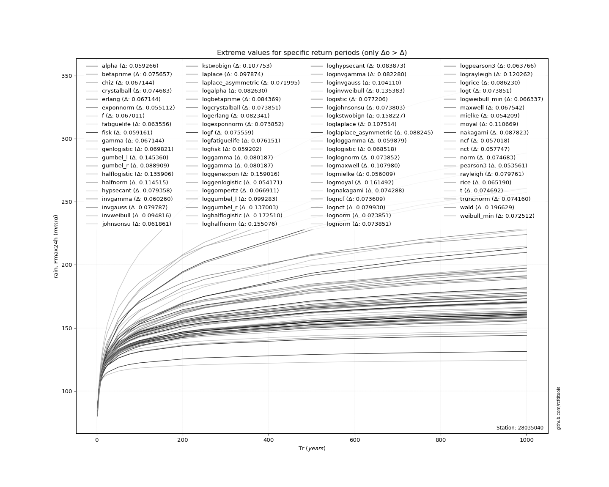</img>

</div>


<div align="center">

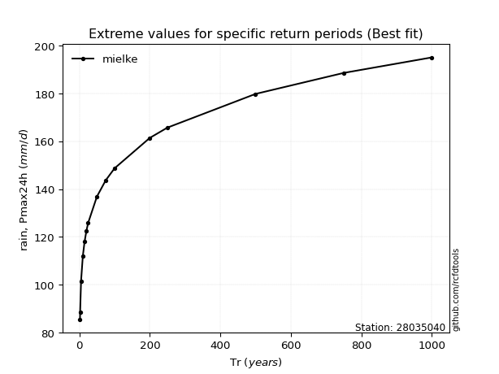</img>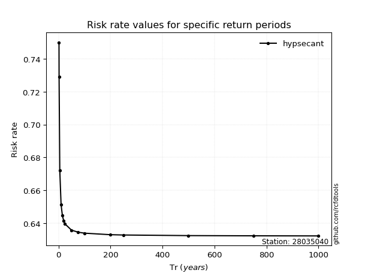</img>

</div>


<sub>**APP DISCLAIMER**: NO WARRANTY - This software is provided by [github.com/rcfdtools](https://github.com/rcfdtools) "as is", without any express or implied warranty, including warranties of merchantability, fitness for a particular purpose, or non-infringement. There is no guarantee that the software will be error-free or operate without interruption. LIMITATION OF LIABILITY - Neither the authors nor copyright holders will be liable for claims or damages arising from the software or its use. You are responsible for determining if the software is appropriate for your use and assume all associated risks, including errors, legal compliance, and data loss. NO PROFESSIONAL ADVICE - The software provides general information and does not offer professional advice. It should not replace consultation with professional advisors.</sub>