<div align="center">


</div>

# PMax24h Station (Rain): 28035060

Maximum Precipitation in 24 hours (PMax24h) is the greatest amount of rainfall for a specific duration that is meteorologically possible for a given location, acting as a "worst-case" scenario for extreme storms, crucial for designing safety-critical infrastructure like bridges, river deviations, dams, spillways, and nuclear plants to prevent catastrophic failure. The PMax24h is related with the Probable Maximum Precipitation (PMP) and it is calculated by hydrologists using meteorological data to determine the upper limit of extreme rainfall, often leading to the Probable Maximum Flood (PMF) for flood control design, and is increasingly being studied for climate change impacts. Probable Maximum Precipitation (PMP) is the theoretical upper limit of rainfall, a deterministic estimate for extreme events, while probability distributions (like GEV, Gumbel) describe the likelihood and frequency of various precipitation amounts, including rare ones, showing how often events occur, with PMP representing the extreme end of these distributions, used for critical infrastructure design to ensure safety against the worst conceivable weather, unlike standard statistical forecasts which cover typical probabilities.

The most common probability distributions in hydrology, used for analyzing floods, rainfall, and streamflow, include the Normal, Log-Normal, Gumbel, Gamma (including Log-Pearson Type III), and Generalized Extreme Value (GEV) distributions, often chosen based on the data´s skewness and whether modeling extremes or general conditions, with Gumbel and GEV popular for extreme events like floods, while the Normal distribution serves as a baseline, though often requiring transformations for skewed hydrological data. These distributions help in designing water infrastructure, managing water resources, and forecasting hydrologic events.

> Hydrological data often isn´t perfectly normal (it´s skewed), so different distributions are needed for different applications, such as: **Flood Frequency Analysis**: Using Gumbel, GEV, or Log-Pearson Type III for predicting extreme flood magnitudes and their return periods, **Rainfall Analysis**: Normal for annual totals, but Log-Normal, Weibull, or GEV for intensity or extreme daily rainfall, **Streamflow Modeling**: Gamma and Log-Normal for maximum flows, GEV for minimum flows, and Kappa for daily flows.

<div align="center">

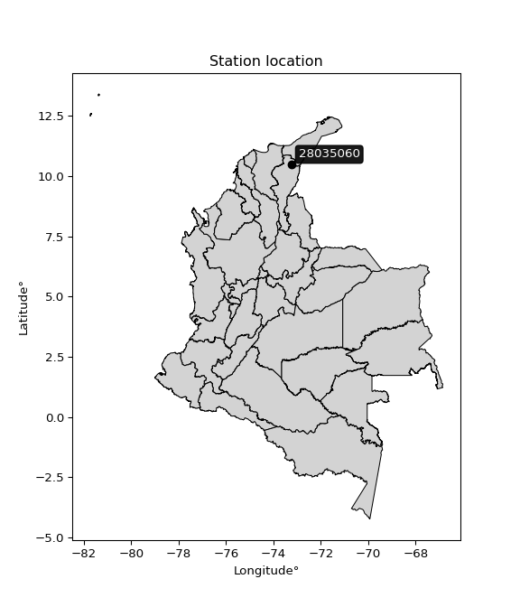</img>

</div>


## A. General information


### 1. General running parameters

• app_version: _v20260312_. • runtime: _2026-03-12 07:15:23.203550_. • Python version: _3.14.0_. • SciPy version: _1.16.3_. • Pandas version: _2.3.3_. • NumPy version: _2.3.5_. • Stations dataset (station_dataset_file): _dataset/pmax24h_in/automatic_colombia_2003_2025.csv_. • Stations catalog (station_catalog_file): _dataset/CNE.xls_. • Minimum year to eval til year_max (date_min): _1900_. • Maximum year to eval since year_min (date_max): _2025_. • Creates, save and include plots into reports (create_plot): _True_. • Plot only fit distributions with Δo > Δ (plot_only_fit): _True_. • Plot only simple graphs avoiding multiple CDFs and multiple Extreme values plots (plot_only_simple): _True_. • Eval low extreme values, if False, evaluates high extreme values (low_extreme): _False_. • Eval every SciPy distribution as logarithmic (pdist_logarithmic_on): _True_. • Standard deviation normalized (ddof): _1.0_. • Return periods to eval in years (Tr): _[2, 2.33, 5, 10, 15, 20, 25, 50, 75, 100, 200, 250, 500, 750, 1000]_. • Minimum data sample per station, 0 means any (minimum_sample): _5_. • Z-Score maximum threshold to adjust a value, 0 means disable (zscore_max): _3.5_. • Z-Score minimum threshold to adjust a value, 0 means disable (zscore_min): _-2.5_. • Avoid zeros, e.g. rain = 0 (avoid_zeros): _True_. • Avoid null values (avoid_nans): _True_. 

:file_folder:Table: [dataset.csv](../../dataset/pmax24h_in/automatic_colombia_2003_2025.csv)

> Delta Degrees of Freedom (DDOF): is a parameter used in the formulas for calculating variance and standard deviation. When ddof=0, the divisor is $N$ (the total number of observations) and this is used when your data set is the entire population. When ddof=1, the divisor is $N-1$ and this is used when your data set is a sample drawn from a larger population. Using $N-1$ provides an unbiased estimate of the population variance (known as Bessel´s correction).


### 2. Station info and location

|   id |   CODIGO | NOMBRE                     | CATEGORIA               | TECNOLOGIA                | ESTADO   | FECHA_INSTALACION   |   FECHA_SUSPENSION |   ALTITUD |   LATITUD |   LONGITUD | DEPARTAMENTO   | MUNICIPIO   | AREA_OPERATIVA                                         | ENTIDAD                                                     | AREA_HIDROGRAFICA   | ZONA_HIDROGRAFICA   | SUBZONA_HIDROGRAFICA   |   CORRIENTE | Catalogo   |   Version |
|-----:|---------:|:---------------------------|:------------------------|:--------------------------|:---------|:--------------------|-------------------:|----------:|----------:|-----------:|:---------------|:------------|:-------------------------------------------------------|:------------------------------------------------------------|:--------------------|:--------------------|:-----------------------|------------:|:-----------|----------:|
|    0 | 28035060 | FEDEARROZ - AUT [28035060] | Climatológica Principal | Automática con Telemetría | Activa   | 16/08/2005          |                nan |       184 |   10.4636 |   -73.2481 | Cesar          | Valledupar  | Area Operativa 05 - Magdalena-Cesar-Guajira-San Andrés | INSTITUTO DE HIDROLOGIA METEOROLOGIA Y ESTUDIOS AMBIENTALES | Magdalena Cauca     | Cesar               | Medio Cesar            |         nan | CNE_IDEAM  |  20251226 |

<div align="center">

Dynamic map: [:earth_americas:Google](http://maps.google.com/maps?q=10.46361111,-73.24805556) [:earth_americas:OSM](https://www.openstreetmap.org/#map=18/10.46361111/-73.24805556&layers=P) [:earth_americas:Bing](https://www.bing.com/maps?cp=10.46361111~-73.24805556&lvl=18) [:earth_americas:Apple](https://maps.apple.com/frame?center=10.46361111%2C-73.24805556&span=0.003%2C0.006)

</div>


<div align="center">

```geojson
{
  "type": "Feature",
  "geometry": {
    "type": "Point", 
    "coordinates": [-73.24805556, 10.46361111]
  }, 
  "properties": {
    "Name": "28035060"
  }
}
```

</div>


### 3. Discrete values table and plot

<div align="center">

|               |         0 |           1 |           2 |          3 |          4 |            5 |           6 |         7 |           8 |
|:--------------|----------:|------------:|------------:|-----------:|-----------:|-------------:|------------:|----------:|------------:|
| Date          | 2017      | 2018        | 2019        | 2020       | 2021       | 2022         | 2023        | 2024      | 2025        |
| Value         |   67.8    |   44        |   71.4      |    3.2     |   11.6     |   51.7       |   44.9      |  145      |   36.5      |
| Value_initial |   67.8    |   44        |   71.4      |    3.2     |   11.6     |   51.7       |   44.9      |  145      |   36.5      |
| count         |    9      |    9        |    9        |    9       |    9       |    9         |    9        |    9      |    9        |
| mean          |   52.9    |   52.9      |   52.9      |   52.9     |   52.9     |   52.9       |   52.9      |   52.9    |   52.9      |
| std           |   41.2857 |   41.2857   |   41.2857   |   41.2857  |   41.2857  |   41.2857    |   41.2857   |   41.2857 |   41.2857   |
| zscore        |    0.3609 |   -0.215571 |    0.448097 |   -1.20381 |   -1.00035 |   -0.0290658 |   -0.193772 |    2.2308 |   -0.397232 |


</div>


<div align="center">

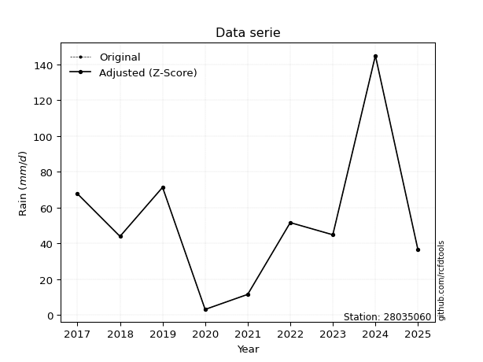</img>

</div>


> The initial value (value_initial) correspond to the initial obtained or null completed value, and value (value) is adjusted only when the initial value is outside the valid range (outlier) definite through the Z-Score value. If Z-Score is active, values out of range or outliers are replaced with the station mean value. A Z-Score (or standard score) measures how many standard deviations a data point is from the mean of a dataset, indicating its relative position; positive scores mean above the mean, negative mean below, and a score of zero is exactly at the mean, allowing for comparison of values from different distributions. It´s calculated using the formula $z=(x–μ)/σ$, where $x$ is the data point, $μ$ is the mean, and $σ$ is the standard deviation, helping identify outliers and understand probability.
>
> <sub>**Note**: In this study, "completing" (filling gaps in) and "extending" (forecasting or lengthening the historical record) rainfall data series are avoided for certain critical analyses because they introduce artificial bias and uncertainty, which can distort the statistics of rare events (extremes), alter day-to-day variability, and compromise the integrity and homogeneity of the original data. Some reasons against Completing/Extending rainfall data are: **Distortion of Extremes and Variability**: The primary issue is that most gap-filling or extension methods rely on averaging or regression with nearby stations, which inherently smooths the data. Rainfall is highly variable in space and time, with a large percentage of zero values and occasional large storms. Infilling methods often underestimate the highest values and overestimate the lowest (zero) values, which severely distorts analyses focused on flood frequency, drought severity, and intensity-duration-frequency (IDF) curves, **Loss of Data Homogeneity**: Infilled or extended data are synthetic estimates, not actual measurements. Combining these estimates with observed data can violate the assumption of data homogeneity, which requires that the data properties do not change over time. Inhomogeneity can lead to incorrect conclusions about long-term trends or changes in climate patterns, **Propagation of Errors**: Errors and biases from the original data (e.g., wind-induced undercatch, instrument errors, site changes) or the data used for imputation can propagate through the analysis, leading to unreliable hydrological models and inaccurate predictions, **Compromised Statistical Integrity**: For statistical analyses, especially those involving the frequency of events, using artificial data can introduce time bias or autocorrelation that doesn´t exist in reality, making it difficult to assess the true probability of events, **Difficulty in Validation**: It is difficult to accurately validate the quality of filled or extended data, especially for past periods where ground-truth measurements are unavailable. The reliability of imputation techniques heavily depends on the density of the surrounding station network and the complexity of the local topography.</sub>


### 4. Active continuous probability distributions from SciPy (80 of 104 available)

A Probability Density Function (PDF) describes the relative likelihood of a continuous random variable falling within a specific range, where the total area under its curve equals 1, and the area over any interval gives the actual probability for that range. Unlike discrete probabilities (like rolling a die), a PDF shows density, not direct probability for a single point (which is zero), with higher points indicating higher likelihood, often visualized as a bell curve for normal distributions.

A log of a probability density function (log-PDF) is simply the logarithm of the PDF´s value, denoted as $log(f(x))$, useful for converting multiplication of probabilities into addition, improving numerical stability with tiny numbers, and connecting to information theory concepts like entropy. Instead of dealing with very small probabilities (e.g., 0.000001), log-PDFs use negative numbers (e.g., $log(0.00001) ≈ -11.51$ that are easier for computers to handle, preventing underflow errors and simplifying complex calculations. In this study, each active probability distribution from SciPy is also evaluated in the $log$ form.

[scipy.stats](https://docs.scipy.org/doc/scipy/reference/stats.html) is a Python´s powerful submodule within the SciPy library for comprehensive statistical analysis, offering over 130 probability distributions (like Normal, Poisson, etc.), functions for descriptive stats (mean, variance), hypothesis testing (t-tests, chi-square), random variable generation, and statistical tests, making it essential for data science, modeling, and research. It provides tools to explore, model, and draw conclusions from data efficiently, working seamlessly with [NumPy](https://numpy.org/).

<div align="center">

|   id | p_dist           |   n_parameter | fit_method   | label                                                                       | active   | ref                                                                                                      |
|-----:|:-----------------|--------------:|:-------------|:----------------------------------------------------------------------------|:---------|:---------------------------------------------------------------------------------------------------------|
|    0 | alpha            |             3 | MLE          | Alpha                                                                       | True     | [:mortar_board:](https://docs.scipy.org/doc/scipy/reference/generated/scipy.stats.alpha.html)            |
|    1 | anglit           |             2 | MM           | Anglit                                                                      | True     | [:mortar_board:](https://docs.scipy.org/doc/scipy/reference/generated/scipy.stats.anglit.html)           |
|    2 | arcsine          |             2 | MM           | Arcsine                                                                     | True     | [:mortar_board:](https://docs.scipy.org/doc/scipy/reference/generated/scipy.stats.arcsine.html)          |
|    3 | argus            |             3 | MLE          | Argus                                                                       | True     | [:mortar_board:](https://docs.scipy.org/doc/scipy/reference/generated/scipy.stats.argus.html)            |
|    4 | beta             |             4 | MLE          | Beta                                                                        | True     | [:mortar_board:](https://docs.scipy.org/doc/scipy/reference/generated/scipy.stats.beta.html)             |
|    5 | betaprime        |             4 | MLE          | Beta prime                                                                  | True     | [:mortar_board:](https://docs.scipy.org/doc/scipy/reference/generated/scipy.stats.betaprime.html)        |
|    6 | bradford         |             3 | MLE          | Bradford                                                                    | True     | [:mortar_board:](https://docs.scipy.org/doc/scipy/reference/generated/scipy.stats.bradford.html)         |
|    7 | burr             |             4 | MLE          | Burr (Type III)                                                             | True     | [:mortar_board:](https://docs.scipy.org/doc/scipy/reference/generated/scipy.stats.burr.html)             |
|    8 | burr12           |             4 | MLE          | Burr (Type III) 12                                                          | True     | [:mortar_board:](https://docs.scipy.org/doc/scipy/reference/generated/scipy.stats.burr12.html)           |
|    9 | cosine           |             2 | MLE          | Cosine                                                                      | True     | [:mortar_board:](https://docs.scipy.org/doc/scipy/reference/generated/scipy.stats.cosine.html)           |
|   10 | crystalball      |             4 | MLE          | Crystalball                                                                 | True     | [:mortar_board:](https://docs.scipy.org/doc/scipy/reference/generated/scipy.stats.crystalball.html)      |
|   11 | dgamma           |             3 | MLE          | Double gamma                                                                | True     | [:mortar_board:](https://docs.scipy.org/doc/scipy/reference/generated/scipy.stats.dgamma.html)           |
|   12 | dweibull         |             3 | MLE          | Double Weibull                                                              | True     | [:mortar_board:](https://docs.scipy.org/doc/scipy/reference/generated/scipy.stats.dweibull.html)         |
|   13 | erlang           |             3 | MLE          | Erlang                                                                      | True     | [:mortar_board:](https://docs.scipy.org/doc/scipy/reference/generated/scipy.stats.erlang.html)           |
|   14 | exponnorm        |             3 | MLE          | Exponentially modified Normal                                               | True     | [:mortar_board:](https://docs.scipy.org/doc/scipy/reference/generated/scipy.stats.exponnorm.html)        |
|   15 | exponpow         |             3 | MLE          | Exponential power                                                           | True     | [:mortar_board:](https://docs.scipy.org/doc/scipy/reference/generated/scipy.stats.exponpow.html)         |
|   16 | exponweib        |             4 | MLE          | Exponentiated Weibull                                                       | True     | [:mortar_board:](https://docs.scipy.org/doc/scipy/reference/generated/scipy.stats.exponweib.html)        |
|   17 | f                |             4 | MLE          | F                                                                           | True     | [:mortar_board:](https://docs.scipy.org/doc/scipy/reference/generated/scipy.stats.f.html)                |
|   18 | fatiguelife      |             3 | MLE          | Fatigue-life (Birnbaum-Saunders)                                            | True     | [:mortar_board:](https://docs.scipy.org/doc/scipy/reference/generated/scipy.stats.fatiguelife.html)      |
|   19 | foldnorm         |             3 | MM           | Fold Normal                                                                 | True     | [:mortar_board:](https://docs.scipy.org/doc/scipy/reference/generated/scipy.stats.foldnorm.html)         |
|   20 | gamma            |             3 | MLE          | Gamma                                                                       | True     | [:mortar_board:](https://docs.scipy.org/doc/scipy/reference/generated/scipy.stats.gamma.html)            |
|   21 | gausshyper       |             6 | MLE          | Gauss hypergeometric                                                        | True     | [:mortar_board:](https://docs.scipy.org/doc/scipy/reference/generated/scipy.stats.gausshyper.html)       |
|   22 | genexpon         |             5 | MLE          | Generalized exponential                                                     | True     | [:mortar_board:](https://docs.scipy.org/doc/scipy/reference/generated/scipy.stats.genexpon.html)         |
|   23 | genextreme       |             3 | MLE          | Generalized exponential                                                     | True     | [:mortar_board:](https://docs.scipy.org/doc/scipy/reference/generated/scipy.stats.genextreme.html)       |
|   24 | gengamma         |             4 | MLE          | Generalized gamma                                                           | True     | [:mortar_board:](https://docs.scipy.org/doc/scipy/reference/generated/scipy.stats.gengamma.html)         |
|   25 | genhalflogistic  |             3 | MLE          | Generalized half-logistic                                                   | True     | [:mortar_board:](https://docs.scipy.org/doc/scipy/reference/generated/scipy.stats.genhalflogistic.html)  |
|   26 | genlogistic      |             3 | MLE          | Generalized logistic                                                        | True     | [:mortar_board:](https://docs.scipy.org/doc/scipy/reference/generated/scipy.stats.genlogistic.html)      |
|   27 | gennorm          |             3 | MLE          | Generalized Normal                                                          | True     | [:mortar_board:](https://docs.scipy.org/doc/scipy/reference/generated/scipy.stats.gennorm.html)          |
|   28 | genpareto        |             3 | MLE          | Generalized Pareto                                                          | True     | [:mortar_board:](https://docs.scipy.org/doc/scipy/reference/generated/scipy.stats.genpareto.html)        |
|   29 | gompertz         |             3 | MLE          | Gompertz (or truncated Gumbel)                                              | True     | [:mortar_board:](https://docs.scipy.org/doc/scipy/reference/generated/scipy.stats.gompertz.html)         |
|   30 | gumbel_l         |             2 | MM           | Gumbel Left Skew                                                            | True     | [:mortar_board:](https://docs.scipy.org/doc/scipy/reference/generated/scipy.stats.gumbel_l.html)         |
|   31 | gumbel_r         |             2 | MM           | Gumbel Right Skew                                                           | True     | [:mortar_board:](https://docs.scipy.org/doc/scipy/reference/generated/scipy.stats.gumbel_r.html)         |
|   32 | halfgennorm      |             3 | MLE          | Upper half of a generalized normal                                          | True     | [:mortar_board:](https://docs.scipy.org/doc/scipy/reference/generated/scipy.stats.halfgennorm.html)      |
|   33 | halflogistic     |             2 | MM           | Half-logistic                                                               | True     | [:mortar_board:](https://docs.scipy.org/doc/scipy/reference/generated/scipy.stats.halflogistic.html)     |
|   34 | halfnorm         |             2 | MM           | Half Normal                                                                 | True     | [:mortar_board:](https://docs.scipy.org/doc/scipy/reference/generated/scipy.stats.halfnorm.html)         |
|   35 | hypsecant        |             2 | MM           | hyperbolic secant                                                           | True     | [:mortar_board:](https://docs.scipy.org/doc/scipy/reference/generated/scipy.stats.hypsecant.html)        |
|   36 | invgamma         |             3 | MLE          | Inverted gamma                                                              | True     | [:mortar_board:](https://docs.scipy.org/doc/scipy/reference/generated/scipy.stats.invgamma.html)         |
|   37 | invgauss         |             3 | MLE          | Inverse Gaussian                                                            | True     | [:mortar_board:](https://docs.scipy.org/doc/scipy/reference/generated/scipy.stats.invgauss.html)         |
|   38 | invweibull       |             3 | MLE          | Inverted Weibull                                                            | True     | [:mortar_board:](https://docs.scipy.org/doc/scipy/reference/generated/scipy.stats.invweibull.html)       |
|   39 | johnsonsb        |             4 | MLE          | Johnson SB                                                                  | True     | [:mortar_board:](https://docs.scipy.org/doc/scipy/reference/generated/scipy.stats.johnsonsb.html)        |
|   40 | johnsonsu        |             4 | MLE          | Johnson Su                                                                  | True     | [:mortar_board:](https://docs.scipy.org/doc/scipy/reference/generated/scipy.stats.johnsonsu.html)        |
|   41 | kappa3           |             3 | MLE          | Kappa 3                                                                     | True     | [:mortar_board:](https://docs.scipy.org/doc/scipy/reference/generated/scipy.stats.kappa3.html)           |
|   42 | kappa4           |             4 | MLE          | Kappa 4                                                                     | True     | [:mortar_board:](https://docs.scipy.org/doc/scipy/reference/generated/scipy.stats.kappa4.html)           |
|   43 | ksone            |             3 | MLE          | Kolmogorov-Smirnov one-sided test statistic distribution                    | True     | [:mortar_board:](https://docs.scipy.org/doc/scipy/reference/generated/scipy.stats.ksone.html)            |
|   44 | kstwobign        |             2 | MLE          | Limiting distribution of scaled Kolmogorov-Smirnov two-sided test statistic | True     | [:mortar_board:](https://docs.scipy.org/doc/scipy/reference/generated/scipy.stats.kstwobign.html)        |
|   45 | laplace          |             2 | MM           | Laplace                                                                     | True     | [:mortar_board:](https://docs.scipy.org/doc/scipy/reference/generated/scipy.stats.laplace.html)          |
|   46 | levy_l           |             2 | MLE          | Left-skewed Levy                                                            | True     | [:mortar_board:](https://docs.scipy.org/doc/scipy/reference/generated/scipy.stats.levy_l.html)           |
|   47 | loggamma         |             3 | MLE          | Log gamma                                                                   | True     | [:mortar_board:](https://docs.scipy.org/doc/scipy/reference/generated/scipy.stats.loggamma.html)         |
|   48 | logistic         |             2 | MM           | Logistic (or Sech-squared)                                                  | True     | [:mortar_board:](https://docs.scipy.org/doc/scipy/reference/generated/scipy.stats.logistic.html)         |
|   49 | loglaplace       |             3 | MLE          | Log-Laplace                                                                 | True     | [:mortar_board:](https://docs.scipy.org/doc/scipy/reference/generated/scipy.stats.loglaplace.html)       |
|   50 | lomax            |             3 | MLE          | Lomax (Pareto of the second kind)                                           | True     | [:mortar_board:](https://docs.scipy.org/doc/scipy/reference/generated/scipy.stats.lomax.html)            |
|   51 | maxwell          |             2 | MM           | Maxwell                                                                     | True     | [:mortar_board:](https://docs.scipy.org/doc/scipy/reference/generated/scipy.stats.maxwell.html)          |
|   52 | mielke           |             4 | MLE          | Mielke Beta-Kappa / Dagum                                                   | True     | [:mortar_board:](https://docs.scipy.org/doc/scipy/reference/generated/scipy.stats.mielke.html)           |
|   53 | moyal            |             2 | MM           | Moyal                                                                       | True     | [:mortar_board:](https://docs.scipy.org/doc/scipy/reference/generated/scipy.stats.moyal.html)            |
|   54 | nakagami         |             3 | MLE          | Nakagami                                                                    | True     | [:mortar_board:](https://docs.scipy.org/doc/scipy/reference/generated/scipy.stats.nakagami.html)         |
|   55 | ncf              |             5 | MLE          | Non-central F distribution                                                  | True     | [:mortar_board:](https://docs.scipy.org/doc/scipy/reference/generated/scipy.stats.ncf.html)              |
|   56 | nct              |             4 | MLE          | Non-central Student’s t                                                     | True     | [:mortar_board:](https://docs.scipy.org/doc/scipy/reference/generated/scipy.stats.nct.html)              |
|   57 | norm             |             2 | MM           | Normal                                                                      | True     | [:mortar_board:](https://docs.scipy.org/doc/scipy/reference/generated/scipy.stats.norm.html)             |
|   58 | pearson3         |             3 | MM           | Pearson type III                                                            | True     | [:mortar_board:](https://docs.scipy.org/doc/scipy/reference/generated/scipy.stats.pearson3.html)         |
|   59 | powerlaw         |             3 | MLE          | Power-function                                                              | True     | [:mortar_board:](https://docs.scipy.org/doc/scipy/reference/generated/scipy.stats.powerlaw.html)         |
|   60 | rayleigh         |             2 | MM           | Rayleigh                                                                    | True     | [:mortar_board:](https://docs.scipy.org/doc/scipy/reference/generated/scipy.stats.rayleigh.html)         |
|   61 | rdist            |             3 | MLE          | R-distributed (symmetric beta)                                              | True     | [:mortar_board:](https://docs.scipy.org/doc/scipy/reference/generated/scipy.stats.rdist.html)            |
|   62 | rice             |             3 | MLE          | Rice                                                                        | True     | [:mortar_board:](https://docs.scipy.org/doc/scipy/reference/generated/scipy.stats.rice.html)             |
|   63 | semicircular     |             2 | MM           | Semicircular                                                                | True     | [:mortar_board:](https://docs.scipy.org/doc/scipy/reference/generated/scipy.stats.semicircular.html)     |
|   64 | skewnorm         |             3 | MLE          | Skew normal                                                                 | True     | [:mortar_board:](https://docs.scipy.org/doc/scipy/reference/generated/scipy.stats.skewnorm.html)         |
|   65 | t                |             3 | MLE          | Student’s t                                                                 | True     | [:mortar_board:](https://docs.scipy.org/doc/scipy/reference/generated/scipy.stats.t.html)                |
|   66 | trapezoid        |             4 | MLE          | Trapezoid                                                                   | True     | [:mortar_board:](https://docs.scipy.org/doc/scipy/reference/generated/scipy.stats.trapezoid.html)        |
|   67 | triang           |             3 | MLE          | Triangular                                                                  | True     | [:mortar_board:](https://docs.scipy.org/doc/scipy/reference/generated/scipy.stats.triang.html)           |
|   68 | truncexpon       |             3 | MLE          | Truncated exponential                                                       | True     | [:mortar_board:](https://docs.scipy.org/doc/scipy/reference/generated/scipy.stats.truncexpon.html)       |
|   69 | truncnorm        |             4 | MLE          | Truncated normal                                                            | True     | [:mortar_board:](https://docs.scipy.org/doc/scipy/reference/generated/scipy.stats.truncnorm.html)        |
|   70 | truncpareto      |             4 | MLE          | Upper truncated Pareto                                                      | True     | [:mortar_board:](https://docs.scipy.org/doc/scipy/reference/generated/scipy.stats.truncpareto.html)      |
|   71 | truncweibull_min |             5 | MLE          | Doubly truncated Weibull minimum                                            | True     | [:mortar_board:](https://docs.scipy.org/doc/scipy/reference/generated/scipy.stats.truncweibull_min.html) |
|   72 | tukeylambda      |             3 | MLE          | Tukey-Lamdba                                                                | True     | [:mortar_board:](https://docs.scipy.org/doc/scipy/reference/generated/scipy.stats.tukeylambda.html)      |
|   73 | uniform          |             2 | MLE          | Uniform                                                                     | True     | [:mortar_board:](https://docs.scipy.org/doc/scipy/reference/generated/scipy.stats.uniform.html)          |
|   74 | vonmises         |             3 | MLE          | Von Mises                                                                   | True     | [:mortar_board:](https://docs.scipy.org/doc/scipy/reference/generated/scipy.stats.vonmises.html)         |
|   75 | vonmises_line    |             3 | MLE          | Von Mises line                                                              | True     | [:mortar_board:](https://docs.scipy.org/doc/scipy/reference/generated/scipy.stats.vonmises_line.html)    |
|   76 | wald             |             2 | MM           | Wald                                                                        | True     | [:mortar_board:](https://docs.scipy.org/doc/scipy/reference/generated/scipy.stats.wald.html)             |
|   77 | weibull_max      |             3 | MLE          | Weibull maximum                                                             | True     | [:mortar_board:](https://docs.scipy.org/doc/scipy/reference/generated/scipy.stats.weibull_max.html)      |
|   78 | weibull_min      |             3 | MLE          | Weibull minimum                                                             | True     | [:mortar_board:](https://docs.scipy.org/doc/scipy/reference/generated/scipy.stats.weibull_min.html)      |
|   79 | wrapcauchy       |             3 | MLE          | Wrapped  Cauchy                                                             | True     | [:mortar_board:](https://docs.scipy.org/doc/scipy/reference/generated/scipy.stats.wrapcauchy.html)       |

</div>

> **n_parameter:** # arguments & localization & scale.
>
> **Fit methods:** (MLE) maximum likelihood, (MM) L-moments.
>
>**Inactive** (With the only purpose of prevent loops, zero divisions, infinite values, over high estimated values or horizontal trending for recurrence intervals estimations, the follow distributions were disabled.)**:** lognorm, norminvgauss, powernorm, powerlognorm, cauchy, halfcauchy, foldcauchy, skewcauchy, chi2, expon, fisk, genhyperbolic, geninvgauss, gibrat, kstwo, laplace_asymmetric, levy, levy_stable, ncx2, pareto, rel_breitwigner, recipinvgauss, studentized_range, loguniform, 


## B. Probability (PDF) vs. Empirical (EDF) distributions functions

A continuous probability distribution (CPD) describes probabilities for variables that can take any value within a range (like rain any time), unlike discrete variables with specific outcomes (like temperature). It uses a Probability Density Function (PDF), a curve where the total area under it equals 1, and the probability of the variable falling within an interval (a to b) is found by calculating the area under the curve between those points. A key feature is that the probability of hitting any single exact value is zero, so probabilities are always expressed for ranges, e.g., $P(a ≤ X ≤ b)$.

<div align="center">

Distributions parameters from station values
|     |   station | p_dist              |   n |              loc |           scale | shape                  | shape1                 | shape2                 | shape3             |
|----:|----------:|:--------------------|----:|-----------------:|----------------:|:-----------------------|:-----------------------|:-----------------------|:-------------------|
|   0 |  28035060 | alpha               |   9 |     -0.0222804   |     9.22343     | 1.182863721684525e-11  |                        |                        |                    |
|   1 |  28035060 | anglit              |   9 |     52.9         |   113.87        |                        |                        |                        |                    |
|   2 |  28035060 | arcsine             |   9 |     -2.1476      |   110.095       |                        |                        |                        |                    |
|   3 |  28035060 | argus               |   9 |    -44.3828      |   195.297       | 1.1173932201912711e-06 |                        |                        |                    |
|   4 |  28035060 | beta                |   9 |      3.2         |   388.082       | 0.9531235569746617     | 7.965823426456867      |                        |                    |
|   5 |  28035060 | betaprime           |   9 |     -3.64111     |     6.704e+06   | 1.958169498516237      | 235779.1729104875      |                        |                    |
|   6 |  28035060 | bradford            |   9 |      3.2         |   141.8         | 1.5294540950770528     |                        |                        |                    |
|   7 |  28035060 | burr                |   9 |      2.71523     |    89.3525      | 3.2273804773502786     | 0.297794579350662      |                        |                    |
|   8 |  28035060 | burr12              |   9 |      1.6026      |  3699.71        | 1.2134579630410882     | 168.6589646804785      |                        |                    |
|   9 |  28035060 | cosine              |   9 |     60.0779      |    35.8908      |                        |                        |                        |                    |
|  10 |  28035060 | crystalball         |   9 |     52.9         |    38.9245      | 45471.486930639796     | 336.51949200135084     |                        |                    |
|  11 |  28035060 | dgamma              |   9 |     44           |    36.5384      | 0.6509022614369958     |                        |                        |                    |
|  12 |  28035060 | dweibull            |   9 |     44           |    28.0012      | 0.760313738265397      |                        |                        |                    |
|  13 |  28035060 | erlang              |   9 |      3.2         |    53.3423      | 0.49332507977510526    |                        |                        |                    |
|  14 |  28035060 | exponnorm           |   9 |     19.554       |    19.0355      | 1.751778837481692      |                        |                        |                    |
|  15 |  28035060 | exponpow            |   9 |      3.2         |    78.9071      | 0.8098377650911133     |                        |                        |                    |
|  16 |  28035060 | exponweib           |   9 |      3.2         |     5.19289     | 2.365257165336539      | 0.3240967465645943     |                        |                    |
|  17 |  28035060 | f                   |   9 |      3.2         |    59.708       | 1.4207864602479419     | 2289.78675362907       |                        |                    |
|  18 |  28035060 | fatiguelife         |   9 |    -28.6502      |    73.0463      | 0.48223974739113423    |                        |                        |                    |
|  19 |  28035060 | foldnorm            |   9 |      0.617745    |    65.2453      | 0.05487811910954504    |                        |                        |                    |
|  20 |  28035060 | gamma               |   9 |      3.2         |    71.0141      | 0.4167294242679017     |                        |                        |                    |
|  21 |  28035060 | gausshyper          |   9 |    -11.1448      |   156.145       | 1.0524750683280502     | 0.8808650585583229     | 1.1523351290356731     | 0.9942100556998295 |
|  22 |  28035060 | genexpon            |   9 |      3.2         |     2.36678     | 0.04764990689906402    | 8.300772833282746e-07  | 1.996359065625938      |                    |
|  23 |  28035060 | genextreme          |   9 |      3.35436     |     0.955363    | -6.188973008572429     |                        |                        |                    |
|  24 |  28035060 | gengamma            |   9 |      3.2         |    77.983       | 0.4336980189274038     | 1.6459915602048254     |                        |                    |
|  25 |  28035060 | genhalflogistic     |   9 |    -11.3441      |   161.999       | 1.036172009265756      |                        |                        |                    |
|  26 |  28035060 | genlogistic         |   9 |   -136.409       |    29.0569      | 373.0710715942896      |                        |                        |                    |
|  27 |  28035060 | gennorm             |   9 |     44           |     2.59968     | 0.44474837902147424    |                        |                        |                    |
|  28 |  28035060 | genpareto           |   9 |      3.19978     |    66.6732      | -0.33289994096462805   |                        |                        |                    |
|  29 |  28035060 | gompertz            |   9 |      3.2         |   140.879       | 2.064198515811836      |                        |                        |                    |
|  30 |  28035060 | gumbel_l            |   9 |     70.4181      |    30.3493      |                        |                        |                        |                    |
|  31 |  28035060 | gumbel_r            |   9 |     35.3819      |    30.3493      |                        |                        |                        |                    |
|  32 |  28035060 | halfgennorm         |   9 |      3.2         |     4.16749     | 0.4341782334152984     |                        |                        |                    |
|  33 |  28035060 | halflogistic        |   9 |      6.76542     |    33.2791      |                        |                        |                        |                    |
|  34 |  28035060 | halfnorm            |   9 |      1.3792      |    64.5717      |                        |                        |                        |                    |
|  35 |  28035060 | hypsecant           |   9 |     52.9         |    24.7801      |                        |                        |                        |                    |
|  36 |  28035060 | invgamma            |   9 |    -59.4655      |   993.023       | 9.828923945893603      |                        |                        |                    |
|  37 |  28035060 | invgauss            |   9 |    -31.8988      |   383.159       | 0.22131459067980597    |                        |                        |                    |
|  38 |  28035060 | invweibull          |   9 |   -466.172       |   500.913       | 17.567783672307105     |                        |                        |                    |
|  39 |  28035060 | johnsonsb           |   9 |      3.2         |   141.8         | -0.7442816616054149    | 0.10119087651158673    |                        |                    |
|  40 |  28035060 | johnsonsu           |   9 |    -30.5979      |     4.32311     | -7.80640831985663      | 2.197429877811819      |                        |                    |
|  41 |  28035060 | kappa3              |   9 |      3.2         |    55.9741      | 3.742528802528099      |                        |                        |                    |
|  42 |  28035060 | kappa4              |   9 |    -11.5505      |   151.137       | 1.1079161769669859     | 0.9608599680853378     |                        |                    |
|  43 |  28035060 | ksone               |   9 |    -10.98        |   170.16        | 1.0                    |                        |                        |                    |
|  44 |  28035060 | kstwobign           |   9 |    -69.9476      |   141.847       |                        |                        |                        |                    |
|  45 |  28035060 | laplace             |   9 |     52.9         |    27.5238      |                        |                        |                        |                    |
|  46 |  28035060 | levy_l              |   9 |    156.082       |    55.3196      |                        |                        |                        |                    |
|  47 |  28035060 | loggamma            |   9 |  -6705.32        |  1034.62        | 687.2876606387208      |                        |                        |                    |
|  48 |  28035060 | logistic            |   9 |     52.9         |    21.4602      |                        |                        |                        |                    |
|  49 |  28035060 | loglaplace          |   9 |     -0.118278    |    45.0183      | 1.4139486292372394     |                        |                        |                    |
|  50 |  28035060 | lomax               |   9 |      3.2         |     1.09335e+11 | 2228423708.7641463     |                        |                        |                    |
|  51 |  28035060 | maxwell             |   9 |    -39.3348      |    57.7996      |                        |                        |                        |                    |
|  52 |  28035060 | mielke              |   9 |     -0.345534    |    81.0962      | 1.1079725751126421     | 3.8700394585199867     |                        |                    |
|  53 |  28035060 | moyal               |   9 |     30.6405      |    17.5222      |                        |                        |                        |                    |
|  54 |  28035060 | nakagami            |   9 |      3.2         |    68.6284      | 0.27155223139246304    |                        |                        |                    |
|  55 |  28035060 | ncf                 |   9 |      0.57729     |    14.0774      | 1.561131266350023      | 276.2761128654199      | 4.270152010431393      |                    |
|  56 |  28035060 | nct                 |   9 |     -0.152871    |    24.926       | 4.660290908031618      | 1.753503942247122      |                        |                    |
|  57 |  28035060 | norm                |   9 |     52.9         |    38.9245      |                        |                        |                        |                    |
|  58 |  28035060 | pearson3            |   9 |     52.9         |    38.9245      | 1.115412864833795      |                        |                        |                    |
|  59 |  28035060 | powerlaw            |   9 |      3.2         |   141.8         | 0.18130301740813284    |                        |                        |                    |
|  60 |  28035060 | rayleigh            |   9 |    -21.5649      |    59.4144      |                        |                        |                        |                    |
|  61 |  28035060 | rdist               |   9 |    -10.8009      |    82.2009      | 1.0201181077791226     |                        |                        |                    |
|  62 |  28035060 | rice                |   9 |    -13.1652      |    54.2205      | 0.000380998521794794   |                        |                        |                    |
|  63 |  28035060 | semicircular        |   9 |     52.9         |    77.8491      |                        |                        |                        |                    |
|  64 |  28035060 | skewnorm            |   9 |      3.19999     |    63.1292      | 29940882.120222434     |                        |                        |                    |
|  65 |  28035060 | t                   |   9 |     46.5663      |    22.8194      | 2.3013518113387716     |                        |                        |                    |
|  66 |  28035060 | trapezoid           |   9 |    -11.529       |   170.16        | 1.0                    | 1.0                    |                        |                    |
|  67 |  28035060 | triang              |   9 |    -11.8018      |   156.802       | 0.999999847768658      |                        |                        |                    |
|  68 |  28035060 | truncexpon          |   9 |      3.19999     |   191.361       | 0.7410377292592247     |                        |                        |                    |
|  69 |  28035060 | truncnorm           |   9 |     -6.71978     |     5.33808     | -1.3304399959562825    | 28.42215887059748      |                        |                    |
|  70 |  28035060 | truncpareto         |   9 |   -334.742       |   337.942       | 4.3350001807137        | 1.419598521602742      |                        |                    |
|  71 |  28035060 | truncweibull_min    |   9 |     -0.354453    |   140.685       | 1.1491623816174097     | 2.4429180851665885e-13 | 1.033190462899959      |                    |
|  72 |  28035060 | tukeylambda         |   9 |     37.3         |    47.6163      | 1.3963715625557307     |                        |                        |                    |
|  73 |  28035060 | uniform             |   9 |      3.2         |   141.8         |                        |                        |                        |                    |
|  74 |  28035060 | vonmises            |   9 |      0.113316    |     1           | 0.49752111505887925    |                        |                        |                    |
|  75 |  28035060 | vonmises_line       |   9 |     47.502       |    31.0346      | 1.3357040299853074     |                        |                        |                    |
|  76 |  28035060 | wald                |   9 |     13.9754      |    38.9245      |                        |                        |                        |                    |
|  77 |  28035060 | weibull_max         |   9 |    145           |     1.66798     | 0.19379598821575306    |                        |                        |                    |
|  78 |  28035060 | weibull_min         |   9 |      3.2         |    31.5583      | 0.7844637219201405     |                        |                        |                    |
|  79 |  28035060 | wrapcauchy          |   9 |      2.88942     |    22.6176      | 0.025992064058893576   |                        |                        |                    |
|  80 |  28035060 | logalpha            |   9 |    -24.6411      |   720.216       | 25.57112661624241      |                        |                        |                    |
|  81 |  28035060 | loganglit           |   9 |      3.57857     |     3.10998     |                        |                        |                        |                    |
|  82 |  28035060 | logarcsine          |   9 |      2.07511     |     3.00691     |                        |                        |                        |                    |
|  83 |  28035060 | logargus            |   9 |      0.238974    |     4.83018     | 1.8838035909816675     |                        |                        |                    |
|  84 |  28035060 | logbeta             |   9 |      0.76675     |     4.20998     | 1.8335309653091127     | 0.65705512371522       |                        |                    |
|  85 |  28035060 | logbetaprime        |   9 |    -20.6739      |   105.568       | 578.4509909971989      | 2520.189393967767      |                        |                    |
|  86 |  28035060 | logbradford         |   9 |      1.16314     |     3.81364     | 0.8079652574679681     |                        |                        |                    |
|  87 |  28035060 | logburr             |   9 | -58411.3         | 58415.7         | 228009.38402357438     | 0.27577549230577625    |                        |                    |
|  88 |  28035060 | logburr12           |   9 |  -4627.45        |  4642.84        | 5769.702156028572      | 1373555.0791395556     |                        |                    |
|  89 |  28035060 | logcosine           |   9 |      3.39303     |     0.956067    |                        |                        |                        |                    |
|  90 |  28035060 | logcrystalball      |   9 |      3.57857     |     1.06309     | 43.54934707192656      | 632.4295242700709      |                        |                    |
|  91 |  28035060 | logdgamma           |   9 |      3.78419     |     0.853808    | 0.9209649857688549     |                        |                        |                    |
|  92 |  28035060 | logdweibull         |   9 |      3.78419     |     0.841472    | 0.9316310461290833     |                        |                        |                    |
|  93 |  28035060 | logerlang           |   9 |    -15.81        |     0.0626783   | 308.9916070452688      |                        |                        |                    |
|  94 |  28035060 | logexponnorm        |   9 |      3.57788     |     1.0631      | 0.0006516128273961089  |                        |                        |                    |
|  95 |  28035060 | logexponpow         |   9 |     -7.044       |    11.5329      | 10.221284467344748     |                        |                        |                    |
|  96 |  28035060 | logexponweib        |   9 |    -11.5073      |    15.9616      | 0.46207293939133476    | 32.45333848641312      |                        |                    |
|  97 |  28035060 | logf                |   9 |  -2344.06        |  2347.64        | 29583321.092891946     | 14496071.857805356     |                        |                    |
|  98 |  28035060 | logfatiguelife      |   9 |   -666.76        |   670.337       | 0.0015836399268790158  |                        |                        |                    |
|  99 |  28035060 | logfoldnorm         |   9 |     -4.03865     |     0.978387    | 7.8005538340032246     |                        |                        |                    |
| 100 |  28035060 | loggamma            |   9 |    -16.1324      |     0.0614429   | 320.5699575274473      |                        |                        |                    |
| 101 |  28035060 | loggausshyper       |   9 |      0.936843    |     4.03989     | 1.1683538048131825     | 0.7071972612402682     | 1.086248604020053      | 0.8718018217694647 |
| 102 |  28035060 | loggenexpon         |   9 |      1.13823     |     0.0577853   | 0.005747439229256112   | 6.881937544369122      | 0.00010366210387115446 |                    |
| 103 |  28035060 | loggenextreme       |   9 |      3.45031     |     1.17973     | 0.7355553329075962     |                        |                        |                    |
| 104 |  28035060 | loggengamma         |   9 |     -8.92518e+07 |     8.92518e+07 | 8.134152904391144      | 31941118.66897843      |                        |                    |
| 105 |  28035060 | loggenhalflogistic  |   9 |      0.779222    |     4.42154     | 1.0533706670881309     |                        |                        |                    |
| 106 |  28035060 | loggenlogistic      |   9 |      4.4044      |     0.257646    | 0.2777297060447592     |                        |                        |                    |
| 107 |  28035060 | loggennorm          |   9 |      3.78419     |     0.0735205   | 0.4534969288324141     |                        |                        |                    |
| 108 |  28035060 | loggenpareto        |   9 |     -0.143437    |     9.1847      | -1.7938266989816298    |                        |                        |                    |
| 109 |  28035060 | loggompertz         |   9 |      1.16314     |     0.815891    | 0.031011391937635795   |                        |                        |                    |
| 110 |  28035060 | loggumbel_l         |   9 |      4.05702     |     0.828891    |                        |                        |                        |                    |
| 111 |  28035060 | loggumbel_r         |   9 |      3.10012     |     0.828891    |                        |                        |                        |                    |
| 112 |  28035060 | loghalfgennorm      |   9 |      1.16315     |     1.11624     | 0.6778859236153554     |                        |                        |                    |
| 113 |  28035060 | loghalflogistic     |   9 |      2.31858     |     0.908898    |                        |                        |                        |                    |
| 114 |  28035060 | loghalfnorm         |   9 |      2.17142     |     1.76359     |                        |                        |                        |                    |
| 115 |  28035060 | loghypsecant        |   9 |      3.57857     |     0.676787    |                        |                        |                        |                    |
| 116 |  28035060 | loginvgamma         |   9 |    -20.3325      | 11013.8         | 461.71570825566175     |                        |                        |                    |
| 117 |  28035060 | loginvgauss         |   9 |     -7.74483     |  1096.02        | 0.010333670732594197   |                        |                        |                    |
| 118 |  28035060 | loginvweibull       |   9 |     -4.64683e+06 |     4.64684e+06 | 3747585.325505765      |                        |                        |                    |
| 119 |  28035060 | logjohnsonsb        |   9 |      1.16315     |     3.81359     | 0.3716184238738538     | 0.1729750800674867     |                        |                    |
| 120 |  28035060 | logjohnsonsu        |   9 |      4.10644     |     0.368261    | 0.5067190057298456     | 0.7920484843129523     |                        |                    |
| 121 |  28035060 | logkappa3           |   9 |      1.16315     |     3.8133      | 24041.975774505554     |                        |                        |                    |
| 122 |  28035060 | logkappa4           |   9 |      0.794001    |     4.27089     | 1.0947038123289483     | 1.01997423489061       |                        |                    |
| 123 |  28035060 | logksone            |   9 |      0.781793    |     4.5763      | 1.0                    |                        |                        |                    |
| 124 |  28035060 | logkstwobign        |   9 |     -1.49162     |     5.80573     |                        |                        |                        |                    |
| 125 |  28035060 | loglaplace          |   9 |      3.57857     |     0.751721    |                        |                        |                        |                    |
| 126 |  28035060 | loglevy_l           |   9 |      5.11322     |     0.677359    |                        |                        |                        |                    |
| 127 |  28035060 | logloggamma         |   9 |      4.47692     |     0.523353    | 0.5546552668213733     |                        |                        |                    |
| 128 |  28035060 | loglogistic         |   9 |      3.57857     |     0.586115    |                        |                        |                        |                    |
| 129 |  28035060 | logloglaplace       |   9 |     -0.0177948   |     3.82224     | 4.101586996269063      |                        |                        |                    |
| 130 |  28035060 | loglomax            |   9 |      1.16314     | 35363.9         | 12761.864976512288     |                        |                        |                    |
| 131 |  28035060 | logmaxwell          |   9 |      1.05948     |     1.5786      |                        |                        |                        |                    |
| 132 |  28035060 | logmielke           |   9 | -44103.4         | 44107.8         | 47137.69404774209      | 172684.05493359896     |                        |                    |
| 133 |  28035060 | logmoyal            |   9 |      2.97063     |     0.478561    |                        |                        |                        |                    |
| 134 |  28035060 | lognakagami         |   9 |      1.78454     |     2.1697      | 2.156262735932323      |                        |                        |                    |
| 135 |  28035060 | logncf              |   9 |    -35.2293      |    38.804       | 2928.1180343925116     | 18658.583474040825     | 0.0011439493232095407  |                    |
| 136 |  28035060 | lognct              |   9 |    -56.5146      |     1.03861     | 30647.618631398123     | 57.857656967524065     |                        |                    |
| 137 |  28035060 | lognorm             |   9 |      3.57857     |     1.06309     |                        |                        |                        |                    |
| 138 |  28035060 | logpearson3         |   9 |      3.57857     |     1.06309     | -1.122206664253613     |                        |                        |                    |
| 139 |  28035060 | logpowerlaw         |   9 |      1.16315     |     3.81358     | 0.22276020857516804    |                        |                        |                    |
| 140 |  28035060 | lograyleigh         |   9 |      1.54484     |     1.62268     |                        |                        |                        |                    |
| 141 |  28035060 | logrdist            |   9 |      1.81503     |     2.13043     | 1.0888327969941276     |                        |                        |                    |
| 142 |  28035060 | logrice             |   9 |   -804.304       |     1.063       | 760.0017285497918      |                        |                        |                    |
| 143 |  28035060 | logsemicircular     |   9 |      3.57857     |     2.12618     |                        |                        |                        |                    |
| 144 |  28035060 | logskewnorm         |   9 |      4.97673     |     1.75661     | -18778611.299858704    |                        |                        |                    |
| 145 |  28035060 | logt                |   9 |      3.90722     |     0.36949     | 1.1736258229870495     |                        |                        |                    |
| 146 |  28035060 | logtrapezoid        |   9 |      0.571687    |     4.51033     | 1.0                    | 1.0                    |                        |                    |
| 147 |  28035060 | logtriang           |   9 |      0.582007    |     4.39475     | 0.9999989662431417     |                        |                        |                    |
| 148 |  28035060 | logtruncexpon       |   9 |      1.16314     |     6.07436     | 0.6278188265513391     |                        |                        |                    |
| 149 |  28035060 | logtruncnorm        |   9 |      1.20869     |     4.06968     | -0.011559591038117201  | 0.925882804041401      |                        |                    |
| 150 |  28035060 | logtruncpareto      |   9 |      1.16282     |     0.000326141 | 0.1251476149355353     | 11694.03723584677      |                        |                    |
| 151 |  28035060 | logtruncweibull_min |   9 |      0.990777    |     6.51084     | 1.563881224020573      | 0.0006783048451430322  | 0.6122034734154576     |                    |
| 152 |  28035060 | logtukeylambda      |   9 |      3.35258     |     1.05722     | 1.1545327055418189     |                        |                        |                    |
| 153 |  28035060 | loguniform          |   9 |      1.16315     |     3.81358     |                        |                        |                        |                    |
| 154 |  28035060 | logvonmises         |   9 |     -2.43734     |     1           | 1.5668568846585276     |                        |                        |                    |
| 155 |  28035060 | logvonmises_line    |   9 |      3.77293     |     0.830717    | 1.247163412722158      |                        |                        |                    |
| 156 |  28035060 | logwald             |   9 |      2.51543     |     1.06314     |                        |                        |                        |                    |
| 157 |  28035060 | logweibull_max      |   9 |      4.97673     |     1.09345     | 0.759418277925231      |                        |                        |                    |
| 158 |  28035060 | logweibull_min      |   9 |     -4.93671e+07 |     4.93671e+07 | 64743567.98737673      |                        |                        |                    |
| 159 |  28035060 | logwrapcauchy       |   9 |      1.16315     |     0.607281    | 0.055058094195080697   |                        |                        |                    |

</div>

> **loc** (Location parameter): This shifts the distribution along the x-axis. For many common distributions, like the normal (Gaussian) distribution, loc represents the mean $μ$. For others, like the uniform distribution, it might represent the minimum value, or for the beta distribution, the left end of the support interval.
>
> **scale** (Scale parameter): This determines the width or spread of the distribution. For the normal distribution, scale represents the standard deviation $σ$. For a uniform distribution, it defines the length of the interval (from $loc$ to $loc + scale$).
>
> **shape** (Shape parameters): Refers to parameters that define the specific form of a probability distribution, distinct from its location (loc) and scale (scale). These parameters are required arguments for most distribution functions. For example, a normal (Gaussian) distribution is fully defined by its location (mean) and scale (standard deviation), so it has no specific shape parameters beyond loc and scale. However, other distributions have intrinsic properties that need specification, as Gamma distribution that takes a shape parameter, often named $a$ or $alpha$.


### 0. Cumulative distribution values - CDF (160 evaluated)

Cumulative Distribution Function (CDF), denoted as $F$<sub>$X$</sub>$(x)$, is a function that gives the probability that a random variable $X$ will take a value less than or equal to a specific value, $x$ (i.e., $(P(X≥x)$. It essentially "accumulates" probabilities from a given point up to the far right (positive infinity), providing a complete picture of the distribution´s probabilities for both discrete (like rain) and continuous (like temperature) variables, helping to find probabilities over ranges or above certain values. Each station is evaluated separately ordering the $x$ values ascending, calculating the CDF and PDF values for the activated distributions and their logarithmic forms.

<div align="center">

CDF ordered by x ascending and calculating $log(f(x))$ separately
|   id |   Station |   date |     x |   count |   mean |     std |     zscore |   Value_initial |   station |   m |      alpha |   alpha_pdf |   anglit |   anglit_pdf |   arcsine |   arcsine_pdf |     argus |   argus_pdf |        beta |    beta_pdf |   betaprime |   betaprime_pdf |    bradford |   bradford_pdf |       burr |   burr_pdf |    burr12 |   burr12_pdf |    cosine |   cosine_pdf |   crystalball |   crystalball_pdf |    dgamma |     dgamma_pdf |   dweibull |   dweibull_pdf |      erlang |   erlang_pdf |   exponnorm |   exponnorm_pdf |    exponpow |   exponpow_pdf |   exponweib |   exponweib_pdf |           f |        f_pdf |   fatiguelife |   fatiguelife_pdf |   foldnorm |   foldnorm_pdf |       gamma |   gamma_pdf |   gausshyper |   gausshyper_pdf |    genexpon |   genexpon_pdf |   genextreme |   genextreme_pdf |    gengamma |   gengamma_pdf |   genhalflogistic |   genhalflogistic_pdf |   genlogistic |   genlogistic_pdf |   gennorm |   gennorm_pdf |   genpareto |   genpareto_pdf |    gompertz |   gompertz_pdf |   gumbel_l |   gumbel_l_pdf |   gumbel_r |   gumbel_r_pdf |   halfgennorm |   halfgennorm_pdf |   halflogistic |   halflogistic_pdf |   halfnorm |   halfnorm_pdf |   hypsecant |   hypsecant_pdf |   invgamma |   invgamma_pdf |   invgauss |   invgauss_pdf |   invweibull |   invweibull_pdf |   johnsonsb |   johnsonsb_pdf |   johnsonsu |   johnsonsu_pdf |      kappa3 |   kappa3_pdf |      kappa4 |   kappa4_pdf |     ksone |   ksone_pdf |   kstwobign |   kstwobign_pdf |   laplace |   laplace_pdf |   levy_l |   levy_l_pdf |   loggamma |   loggamma_pdf |   logistic |   logistic_pdf |   loglaplace |   loglaplace_pdf |      lomax |   lomax_pdf |   maxwell |   maxwell_pdf |    mielke |   mielke_pdf |     moyal |   moyal_pdf |    nakagami |    nakagami_pdf |       ncf |    ncf_pdf |       nct |     nct_pdf |     norm |    norm_pdf |   pearson3 |   pearson3_pdf |    powerlaw |   powerlaw_pdf |   rayleigh |   rayleigh_pdf |    rdist |       rdist_pdf |      rice |    rice_pdf |   semicircular |   semicircular_pdf |   skewnorm |   skewnorm_pdf |         t |       t_pdf |   trapezoid |   trapezoid_pdf |     triang |   triang_pdf |   truncexpon |   truncexpon_pdf |   truncnorm |   truncnorm_pdf |   truncpareto |   truncpareto_pdf |   truncweibull_min |   truncweibull_min_pdf |   tukeylambda |   tukeylambda_pdf |   uniform |   uniform_pdf |   vonmises |   vonmises_pdf |   vonmises_line |   vonmises_line_pdf |     wald |    wald_pdf |   weibull_max |   weibull_max_pdf |   weibull_min |   weibull_min_pdf |   wrapcauchy |   wrapcauchy_pdf |   logalpha |   logalpha_pdf |   loganglit |   loganglit_pdf |   logarcsine |   logarcsine_pdf |   logargus |   logargus_pdf |    logbeta |   logbeta_pdf |   logbetaprime |   logbetaprime_pdf |   logbradford |   logbradford_pdf |   logburr |   logburr_pdf |   logburr12 |   logburr12_pdf |   logcosine |   logcosine_pdf |   logcrystalball |   logcrystalball_pdf |   logdgamma |   logdgamma_pdf |   logdweibull |   logdweibull_pdf |   logerlang |   logerlang_pdf |   logexponnorm |   logexponnorm_pdf |   logexponpow |   logexponpow_pdf |   logexponweib |   logexponweib_pdf |      logf |   logf_pdf |   logfatiguelife |   logfatiguelife_pdf |   logfoldnorm |   logfoldnorm_pdf |   loggausshyper |   loggausshyper_pdf |   loggenexpon |   loggenexpon_pdf |   loggenextreme |   loggenextreme_pdf |   loggengamma |   loggengamma_pdf |   loggenhalflogistic |   loggenhalflogistic_pdf |   loggenlogistic |   loggenlogistic_pdf |   loggennorm |   loggennorm_pdf |   loggenpareto |   loggenpareto_pdf |   loggompertz |   loggompertz_pdf |   loggumbel_l |   loggumbel_l_pdf |   loggumbel_r |   loggumbel_r_pdf |   loghalfgennorm |   loghalfgennorm_pdf |   loghalflogistic |   loghalflogistic_pdf |   loghalfnorm |   loghalfnorm_pdf |   loghypsecant |   loghypsecant_pdf |   loginvgamma |   loginvgamma_pdf |   loginvgauss |   loginvgauss_pdf |   loginvweibull |   loginvweibull_pdf |   logjohnsonsb |   logjohnsonsb_pdf |   logjohnsonsu |   logjohnsonsu_pdf |   logkappa3 |   logkappa3_pdf |   logkappa4 |   logkappa4_pdf |   logksone |   logksone_pdf |   logkstwobign |   logkstwobign_pdf |   loglevy_l |   loglevy_l_pdf |   logloggamma |   logloggamma_pdf |   loglogistic |   loglogistic_pdf |   logloglaplace |   logloglaplace_pdf |   loglomax |   loglomax_pdf |   logmaxwell |   logmaxwell_pdf |   logmielke |   logmielke_pdf |    logmoyal |   logmoyal_pdf |   lognakagami |   lognakagami_pdf |   logncf |   logncf_pdf |    lognct |   lognct_pdf |   lognorm |   lognorm_pdf |   logpearson3 |   logpearson3_pdf |   logpowerlaw |   logpowerlaw_pdf |   lograyleigh |   lograyleigh_pdf |   logrdist |   logrdist_pdf |   logrice |   logrice_pdf |   logsemicircular |   logsemicircular_pdf |   logskewnorm |   logskewnorm_pdf |      logt |   logt_pdf |   logtrapezoid |   logtrapezoid_pdf |   logtriang |   logtriang_pdf |   logtruncexpon |   logtruncexpon_pdf |   logtruncnorm |   logtruncnorm_pdf |   logtruncpareto |   logtruncpareto_pdf |   logtruncweibull_min |   logtruncweibull_min_pdf |   logtukeylambda |   logtukeylambda_pdf |   loguniform |   loguniform_pdf |   logvonmises |   logvonmises_pdf |   logvonmises_line |   logvonmises_line_pdf |   logwald |   logwald_pdf |   logweibull_max |   logweibull_max_pdf |   logweibull_min |   logweibull_min_pdf |   logwrapcauchy |   logwrapcauchy_pdf |
|-----:|----------:|-------:|------:|--------:|-------:|--------:|-----------:|----------------:|----------:|----:|-----------:|------------:|---------:|-------------:|----------:|--------------:|----------:|------------:|------------:|------------:|------------:|----------------:|------------:|---------------:|-----------:|-----------:|----------:|-------------:|----------:|-------------:|--------------:|------------------:|----------:|---------------:|-----------:|---------------:|------------:|-------------:|------------:|----------------:|------------:|---------------:|------------:|----------------:|------------:|-------------:|--------------:|------------------:|-----------:|---------------:|------------:|------------:|-------------:|-----------------:|------------:|---------------:|-------------:|-----------------:|------------:|---------------:|------------------:|----------------------:|--------------:|------------------:|----------:|--------------:|------------:|----------------:|------------:|---------------:|-----------:|---------------:|-----------:|---------------:|--------------:|------------------:|---------------:|-------------------:|-----------:|---------------:|------------:|----------------:|-----------:|---------------:|-----------:|---------------:|-------------:|-----------------:|------------:|----------------:|------------:|----------------:|------------:|-------------:|------------:|-------------:|----------:|------------:|------------:|----------------:|----------:|--------------:|---------:|-------------:|-----------:|---------------:|-----------:|---------------:|-------------:|-----------------:|-----------:|------------:|----------:|--------------:|----------:|-------------:|----------:|------------:|------------:|----------------:|----------:|-----------:|----------:|------------:|---------:|------------:|-----------:|---------------:|------------:|---------------:|-----------:|---------------:|---------:|----------------:|----------:|------------:|---------------:|-------------------:|-----------:|---------------:|----------:|------------:|------------:|----------------:|-----------:|-------------:|-------------:|-----------------:|------------:|----------------:|--------------:|------------------:|-------------------:|-----------------------:|--------------:|------------------:|----------:|--------------:|-----------:|---------------:|----------------:|--------------------:|---------:|------------:|--------------:|------------------:|--------------:|------------------:|-------------:|-----------------:|-----------:|---------------:|------------:|----------------:|-------------:|-----------------:|-----------:|---------------:|-----------:|--------------:|---------------:|-------------------:|--------------:|------------------:|----------:|--------------:|------------:|----------------:|------------:|----------------:|-----------------:|---------------------:|------------:|----------------:|--------------:|------------------:|------------:|----------------:|---------------:|-------------------:|--------------:|------------------:|---------------:|-------------------:|----------:|-----------:|-----------------:|---------------------:|--------------:|------------------:|----------------:|--------------------:|--------------:|------------------:|----------------:|--------------------:|--------------:|------------------:|---------------------:|-------------------------:|-----------------:|---------------------:|-------------:|-----------------:|---------------:|-------------------:|--------------:|------------------:|--------------:|------------------:|--------------:|------------------:|-----------------:|---------------------:|------------------:|----------------------:|--------------:|------------------:|---------------:|-------------------:|--------------:|------------------:|--------------:|------------------:|----------------:|--------------------:|---------------:|-------------------:|---------------:|-------------------:|------------:|----------------:|------------:|----------------:|-----------:|---------------:|---------------:|-------------------:|------------:|----------------:|--------------:|------------------:|--------------:|------------------:|----------------:|--------------------:|-----------:|---------------:|-------------:|-----------------:|------------:|----------------:|------------:|---------------:|--------------:|------------------:|---------:|-------------:|----------:|-------------:|----------:|--------------:|--------------:|------------------:|--------------:|------------------:|--------------:|------------------:|-----------:|---------------:|----------:|--------------:|------------------:|----------------------:|--------------:|------------------:|----------:|-----------:|---------------:|-------------------:|------------:|----------------:|----------------:|--------------------:|---------------:|-------------------:|-----------------:|---------------------:|----------------------:|--------------------------:|-----------------:|---------------------:|-------------:|-----------------:|--------------:|------------------:|-------------------:|-----------------------:|----------:|--------------:|-----------------:|---------------------:|-----------------:|---------------------:|----------------:|--------------------:|
|    0 |  28035060 |   2020 |   3.2 |       9 |   52.9 | 41.2857 | -1.20381   |             3.2 |  28035060 |   1 | 0.00420454 | 0.0117857   | 0.116893 |   0.00564317 |  0.141467 |    0.0134493  | 0.0877083 |  0.00362987 | 5.82993e-17 | 0.125125    |   0.0272653 |     0.00718277  | 5.14639e-08 |     0.0116228  | 0.00664615 | 0.0131765  | 0.0138351 |   0.0104363  | 0.0886396 |   0.00437255 |      0.100831 |       0.004536    | 0.0947599 |    0.00311672  |   0.132057 |    0.00327638  | 4.23405e-09 |  4.70348e+06 |   0.0483674 |     0.00440134  | 1.07296e-14 |   19.5665      | 4.81684e-13 |    831.465      | 5.84926e-13 | 935.685      |     0.0382738 |       0.00588546  |  0.0315226 |     0.0122011  | 7.63784e-08 | 7.16728e+07 |     0.106584 |       0.00749112 | 7.08816e-08 |     0.0201328  |   0.00091108 |   1135.45        | 3.63528e-12 |  417.402       |         0.0470818 |            0.00339546 |     0.0476656 |       0.00497239  |  0.094241 |   0.00251542  | 3.33885e-06 |      0.0149985  | 5.01815e-14 |     0.0146523  |   0.103425 |    0.00322519  |  0.0557166 |    0.00530096  |   2.18173e-11 |       0.0891207   |      0         |        0           |  0.0224959 |     0.0123516  |   0.0851609 |     0.00339581  |  0.0419321 |    0.00527057  |  0.0389697 |    0.00575942  |    0.0435126 |      0.00510518  | 7.07883e-07 |     8.08956e+08 |   0.0395879 |      0.00551087 | 6.85839e-09 |  0.0125563   | 3.97614e-15 |   0.236015   | 0.0833333 |  0.00587682 |   0.0469794 |     0.00531691  | 0.0821788 |   0.00298574  | 0.452516 |   0.00130991 |  0.0119266 |      0.0308096 |  0.0898135 |    0.00380924  |    0.0201141 |        0.0267574 | 3.9592e-13 |  0.0203816  | 0.0903274 |   0.00570241  | 0.0311825 |  0.00974443  | 0.0286644 | 0.00454733  | 3.59343e-10 | 439462          | 0.0313673 | 0.0104587  | 0.0521373 | 0.00414723  | 0.100831 | 0.004536    |  0.0494302 |     0.00625104 | 0.000670555 |     2.7376e+11 |  0.0832018 |    0.00643172  | 0.555232 |      0.00398311 | 0.0445279 | 0.00531878  |       0.123178 |         0.00629425 |   0        |     0.0126389  | 0.0904189 | 0.00331285  |  0.00749258 |      0.00101739 | 0.00915341 |   0.00122031 |  7.43213e-08 |       0.00998455 |    0.965251 |    0.0146357    |      0        |        0.0164238  |          0.0224335 |             0.00719999 |   4.91625e-11 |         0.0209995 | 0         |    0.00705219 |   0.994999 |      0.0911181 |       0.0946802 |         0.00414203  | 0        | 0           |     0.0939005 |       0.000303573 |   6.03249e-14 |     106.561       |   0.00230215 |       0.0074123  | 0.00965133 |       0.027948 | 7.61982e-05 |      0.00561344 |     0        |         0        |  0.0247239 |       0.05475  | 0.00749472 |     0.0350926 |      0.0131521 |          0.0328517 |   3.93676e-06 |          0.357752 |  0.03046  |     0.0327893 |   0.0276166 |       0.0339451 |   0.0136042 |       0.0515974 |        0.0115413 |            0.0284029 |   0.0197862 |       0.0236467 |     0.0280105 |         0.0286939 |   0.0122177 |       0.0314539 |      0.0115418 |          0.0284038 |     0.0308867 |         0.0384543 |      0.0313415 |          0.0370831 | 0.0116973 |  0.0287329 |        0.0113779 |             0.028195 |    0.00649861 |         0.0186514 |       0.0358637 |            0.18224  |    0.00254226 |          0.104521 |       0.0355658 |           0.0414599 |     0.0151103 |         0.0291704 |            0.0454999 |                 0.12421  |         0.030382 |            0.0327501 |    0.0253298 |        0.0177739 |       0.151462 |         0.124039   |   3.19648e-07 |         0.0380096 |     0.0300033 |         0.0356484 |    3.2047e-05 |       0.000400092 |      2.01563e-10 |            0.685683  |         0         |              0        |      0        |          0        |      0.0179386 |          0.0264915 |     0.0109582 |         0.0298796 |     0.0101572 |         0.0300919 |       0.0124728 |           0.0441012 |      0.0210889 |       2485.5       |      0.0453578 |          0.0254719 | 2.34996e-07 |        0.26213  | 2.66475e-15 |        5.63005  |  0.0833333 |       0.218517 |      0.0150132 |          0.0610788 |    0.3212   |       0.0383862 |      0.033534 |         0.0354991 |      0.015968 |         0.0268088 |      0.00404389 |            0.014045 | 3.7349e-06 |      0.360871  |  7.52226e-05 |       0.00217499 |   0.0311137 |       0.0332533 | 3.86621e-11 |    1.80316e-09 |     0         |         0         | 0.011977 |     0.030006 | 0.0116617 |    0.0286807 | 0.0115412 |     0.0284029 |     0.0307318 |          0.038126 |   0.000241831 |        2.4261e+11 |      0        |          0        |   0.3952   |    0.165673    | 0.0115351 |     0.0283922 |          0        |              0        |     0.0299315 |         0.0430331 | 0.0313285 |  0.0132073 |      0.0171965 |           0.058149 |   0.0174864 |       0.0601792 |     3.48461e-06 |            0.353089 |     0.00045167 |           0.299433 |         0        |          555.856     |            0.00915253 |                 0.0831659 |       0          |             0        |     0        |         0.262221 |       1.0094  |         0.0227813 |        1.02438e-11 |              0.0385392 |  0        |     0         |        0.0755989 |            0.0388752 |        0.0225615 |            0.0292525 |     1.33034e-09 |            0.292619 |
|    1 |  28035060 |   2021 |  11.6 |       9 |   52.9 | 41.2857 | -1.00035   |            11.6 |  28035060 |   2 | 0.427429   | 0.0397641   | 0.168286 |   0.00657102 |  0.229928 |    0.00874614 | 0.120689  |  0.00421858 | 0.176895    | 0.0185415   |   0.108342  |     0.0115167   | 0.0934589   |     0.0106572  | 0.108759   | 0.011758   | 0.120962  |   0.0137506  | 0.129712  |   0.00540253 |      0.144339 |       0.0058375   | 0.125411  |    0.00425099  |   0.163577 |    0.00428893  | 0.430917    |  0.0227498   |   0.0968876 |     0.00723149  | 0.162241    |    0.0154947   | 0.414646    |      0.0199405  | 0.205207    |   0.0163616  |     0.10488   |       0.00977893  |  0.133471  |     0.0120393  | 0.447861    | 0.0204268   |     0.168812 |       0.00731588 | 0.155591    |     0.0170006  |   0.591995   |      0.00596987  | 0.228262    |    0.0190555   |         0.0764341 |            0.00359615 |     0.102102  |       0.0079934   |  0.119206 |   0.00350433  | 0.120771    |      0.0137645  | 0.11911     |     0.0137001  |   0.1341   |    0.00410809  |  0.111989  |    0.00807873  |   0.30518     |       0.022973    |      0.0725095 |        0.0149455   |  0.125769  |     0.0122027  |   0.118843  |     0.00468525  |  0.101166  |    0.00878474  |  0.104054  |    0.0095758   |    0.100719  |      0.00850098  | 0.152897    |     0.00302384  |   0.10188   |      0.00921569 | 0.105467    |  0.0125528   | 0.0804046   |   0.00862883 | 0.132699  |  0.00587682 |   0.104327  |     0.00827151  | 0.111507  |   0.0040513   | 0.463935 |   0.00141087 |  0.155517  |      0.225669  |  0.127361  |    0.00517891  |    0.111567  |        0.148416  | 0.157352   |  0.0171746  | 0.144937  |   0.00727052  | 0.119762  |  0.0111015   | 0.0851201 | 0.0089041   | 0.248393    |      0.0160086  | 0.121943  | 0.0113244  | 0.0981988 | 0.00693508  | 0.144339 | 0.0058375   |  0.114988  |     0.00920241 | 0.599058    |     0.0129299  |  0.144262  |    0.00803963  | 0.589051 |      0.00407735 | 0.0990542 | 0.0075895   |       0.178854 |         0.00693197 |   0.105854 |     0.0125275  | 0.124549  | 0.00492669  |  0.0184756  |      0.00159761 | 0.0222738  |   0.0019036  |  0.0820561   |       0.00955574 |    0.99967  |    0.000227895  |      0.129271 |        0.0144074  |          0.0884464 |             0.00825459 |   0.136011    |         0.015031  | 0.0592384 |    0.00705219 |   2.25652  |      0.189343  |       0.136356  |         0.00585745  | 0        | 0           |     0.0965504 |       0.000327891 |   0.298159    |       0.0232057   |   0.0644792  |       0.0073827  | 0.155563   |       0.234379 | 0.168384    |      0.240649   |     0.230063 |         0.320078 |  0.157941  |       0.161366 | 0.11577    |     0.13498   |      0.159014  |          0.225052  |   0.407391    |          0.281064 |  0.121828 |     0.131078  |   0.13014   |       0.151135  |   0.210535  |       0.258459  |        0.144425  |            0.213823  |   0.0930281 |       0.112732  |     0.107698  |         0.115544  |   0.157542  |       0.227349  |      0.144427  |          0.213823  |     0.136607  |         0.146089  |      0.133449  |          0.142447  | 0.145482  |  0.214721  |        0.144313  |             0.214377 |    0.121496   |         0.20625   |       0.303803  |            0.219344 |    0.269865   |          0.277162 |       0.144892  |           0.146178  |     0.132917  |         0.188236  |            0.236547  |                 0.177417 |         0.121747 |            0.131171  |    0.0714444 |        0.0675462 |       0.325605 |         0.148849   |   0.112475    |         0.163528  |     0.134162  |         0.150478  |    0.112109   |       0.29597     |      0.478092    |            0.227833  |         0.0727213 |              0.547207 |      0.125961 |          0.446771 |      0.118913  |          0.171643  |     0.156314  |         0.229473  |     0.162274  |         0.237568  |       0.211879  |           0.265156  |      0.600681  |          0.0783142 |      0.107048  |          0.0861177 | 0.337586    |        0.26213  | 0.365169    |        0.260135 |  0.364752  |       0.218517 |      0.254299  |          0.280598  |    0.38603  |       0.0665586 |      0.130407 |         0.136365  |      0.127439 |         0.18972   |      0.0832448  |            0.1383   | 0.371705   |      0.226726  |  0.145045    |       0.2663     |   0.123214  |       0.131622  | 0.0852525   |    0.326289    |     0.0121128 |         0.0734066 | 0.150378 |     0.218913 | 0.145239  |    0.214334  | 0.144425  |     0.213823  |     0.139422  |          0.152537 |   0.785192    |        0.135815   |      0.144376 |          0.294457 |   0.602169 |    0.165298    | 0.144403  |     0.21382   |          0.178955 |              0.253846 |     0.150478  |         0.16156   | 0.0645349 |  0.0494867 |      0.173614  |           0.184763 |   0.180863  |       0.19354   |     0.40976     |            0.285633 |     0.380404   |           0.285819 |         0.934732 |            0.0499217 |            0.247772   |                 0.252787  |       0.00941427 |             0.637031 |     0.337702 |         0.262221 |       1.07959 |         0.122116  |        0.0832165   |              0.130747  |  0        |     0         |        0.151301  |            0.0859111 |        0.11622   |            0.143197  |     0.352032    |            0.24636  |
|    2 |  28035060 |   2025 |  36.5 |       9 |   52.9 | 41.2857 | -0.397232  |            36.5 |  28035060 |   3 | 0.800622   | 0.00534402  | 0.357959 |   0.00842015 |  0.403706 |    0.00605752 | 0.245914  |  0.00579064 | 0.532446    | 0.0108368   |   0.425377  |     0.0121333   | 0.330685    |     0.00855137 | 0.387758   | 0.0105727  | 0.443938  |   0.0113278  | 0.298251  |   0.0079459  |      0.336758 |       0.00937863  | 0.316913  |    0.0140054   |   0.346303 |    0.0128944   | 0.739995    |  0.00709865  |   0.370604  |     0.0132767   | 0.474916    |    0.0104403   | 0.660169    |      0.00532652 | 0.485827    |   0.00816357 |     0.406192  |       0.0123654   |  0.417085  |     0.0105016  | 0.723286    | 0.00644212  |     0.343419 |       0.00671272 | 0.488513    |     0.0102978  |   0.657272   |      0.00133837  | 0.572174    |    0.0103021   |         0.174475  |            0.00431204 |     0.378996  |       0.0126385   |  0.299655 |   0.0152265   | 0.420877    |      0.0104182  | 0.423289    |     0.0107034  |   0.278965 |    0.00777042  |  0.381429  |    0.0121134   |   0.627285    |       0.00757378  |      0.419221  |        0.012384    |  0.413492  |     0.0106576  |   0.303219  |     0.0104679   |  0.394055  |    0.0127533   |  0.403596  |    0.0124317   |    0.390527  |      0.0128331   | 0.193847    |     0.001091    |   0.399266  |      0.0126203  | 0.413953    |  0.0119729   | 0.277737    |   0.00748553 | 0.279031  |  0.00587682 |   0.373576  |     0.0118667   | 0.275547  |   0.0100112   | 0.503592 |   0.00180051 |  0.519364  |      0.361779  |  0.317734  |    0.0101014   |    0.512311  |        0.648763  | 0.492728   |  0.010339   | 0.367818  |   0.0100485   | 0.411771  |  0.011824    | 0.397537  | 0.0134673   | 0.518224    |      0.00803628 | 0.41426   | 0.0112228  | 0.370805  | 0.0134729   | 0.336758 | 0.00937863  |  0.394     |     0.0117461  | 0.768986    |     0.00418677 |  0.379695  |    0.0102032   | 0.697614 |      0.0047811  | 0.342634  | 0.0111053   |       0.366886 |         0.0079941  |   0.402146 |     0.0109974  | 0.348579  | 0.013756    |  0.0796695  |      0.00331756 | 0.0948907  |   0.00392908 |  0.305164    |       0.00838984 |    1        |    4.79248e-16  |      0.428433 |        0.00994776 |          0.298907  |             0.00835629 |   0.488943    |         0.0138216 | 0.234838  |    0.00705219 |   6.2147   |      0.170042  |       0.360685  |         0.0119783   | 0.430084 | 0.0199721   |     0.105828  |       0.000424535 |   0.647619    |       0.00865851  |   0.24477    |       0.00705831 | 0.526424   |       0.359533 | 0.506026    |      0.321523   |     0.503968 |         0.211735 |  0.42777   |       0.321907 | 0.334238   |     0.25603   |      0.518276  |          0.356232  |   0.702265    |          0.23603  |  0.413723 |     0.427195  |   0.441015  |       0.405063  |   0.567753  |       0.329151  |        0.507032  |            0.375207  |   0.385118  |       0.504158  |     0.390904  |         0.47968   |   0.522116  |       0.361003  |      0.507032  |          0.375204  |     0.424047  |         0.377176  |      0.420834  |          0.383922  | 0.510931  |  0.374708  |        0.507807  |             0.37572  |    0.50163    |         0.407752  |       0.564547  |            0.239111 |    0.589184   |          0.256218 |       0.415825  |           0.340502  |     0.483834  |         0.398028  |            0.484021  |                 0.26349  |         0.414013 |            0.427637  |    0.30555   |        0.606485  |       0.518636 |         0.194534   |   0.441023    |         0.41974   |     0.4369    |         0.390144  |    0.57758    |       0.382485    |      0.672989    |            0.125715  |         0.606555  |              0.347724 |      0.581205 |          0.326283 |      0.508813  |          0.470145  |     0.520963  |         0.357333  |     0.525837  |         0.345727  |       0.540297  |           0.268257  |      0.680772  |          0.0701845 |      0.349549  |          0.466673  | 0.638068    |        0.26213  | 0.655935    |        0.249024 |  0.615239  |       0.218517 |      0.57407   |          0.249476  |    0.496157 |       0.140695  |      0.414903 |         0.389475  |      0.507993 |         0.426429  |      0.397855   |            0.451393 | 0.584551   |      0.149914  |  0.539788    |       0.358778   |   0.414901  |       0.425742  | 0.603366    |    0.378438    |     0.396202  |         0.549437  | 0.51097  |     0.365416 | 0.507444  |    0.373953  | 0.507032  |     0.375207  |     0.432233  |          0.369174 |   0.904827    |        0.0828044  |      0.550643 |          0.350269 |   0.829088 |    0.274114    | 0.507032  |     0.375241  |          0.505611 |              0.299408 |     0.432291  |         0.333703  | 0.2691    |  0.532468  |      0.450002  |           0.29746  |   0.470755  |       0.312244  |     0.708143    |            0.236511 |     0.690335   |           0.25207  |         0.974076 |            0.0243929 |            0.572227   |                 0.303962  |       0.629018   |             0.528778 |     0.638287 |         0.262221 |       1.39121 |         0.423861  |        0.418769    |              0.454064  |  0.675045 |     0.365482  |        0.303325  |            0.199212  |        0.426246  |            0.418034  |     0.625049    |            0.24321  |
|    3 |  28035060 |   2018 |  44   |       9 |   52.9 | 41.2857 | -0.215571  |            44   |  28035060 |   4 | 0.834044   | 0.00371497  | 0.422158 |   0.00867489 |  0.448309 |    0.00585954 | 0.290898  |  0.00619918 | 0.607621    | 0.00924973  |   0.512193  |     0.0109826   | 0.392984    |     0.008071   | 0.464991   | 0.00999749 | 0.524274  |   0.0100931  | 0.359768  |   0.0084313  |      0.409571 |       0.00998469  | 0.5       | 2371.44        |   0.5      |   74.2736      | 0.787166    |  0.00556438  |   0.469501  |     0.0129241   | 0.549355    |    0.00942227  | 0.695727    |      0.00422668 | 0.54268     |   0.00703995 |     0.495502  |       0.0113863   |  0.493252  |     0.00979544 | 0.766484    | 0.00514882  |     0.39313  |       0.00654527 | 0.560198    |     0.00885459 |   0.666239   |      0.0010715   | 0.643722    |    0.00881437  |         0.207773  |            0.00457143 |     0.472494  |       0.0121791   |  0.5      |   0.0755392   | 0.49555     |      0.00950164 | 0.500117    |     0.0097848  |   0.342135 |    0.00907713  |  0.471049  |    0.011684    |   0.677985    |       0.00603389  |      0.507554  |        0.011154    |  0.49078   |     0.00993786 |   0.388058  |     0.0120592   |  0.487071  |    0.0119532   |  0.49355   |    0.0114861   |    0.484393  |      0.0120907   | 0.201576    |     0.000979447 |   0.490888  |      0.0117289  | 0.501645    |  0.0113653   | 0.333232    |   0.00731857 | 0.323108  |  0.00587682 |   0.461242  |     0.0114294   | 0.361858  |   0.0131471   | 0.517657 |   0.00195375 |  0.586166  |      0.351509  |  0.397781  |    0.0111626   |    0.619655  |        0.505966  | 0.564635   |  0.00887345 | 0.443777  |   0.010149    | 0.498961  |  0.0113672   | 0.494588  | 0.0123156   | 0.574827    |      0.00709306 | 0.495383  | 0.0103767  | 0.471372  | 0.013164    | 0.409571 | 0.00998469  |  0.480018  |     0.0111247  | 0.797833    |     0.00354533 |  0.456038  |    0.0101031   | 0.735059 |      0.00523635 | 0.426378  | 0.011154    |       0.427378 |         0.008124   |   0.481911 |     0.0102567  | 0.459759  | 0.0155866   |  0.106494   |      0.00383561 | 0.126647   |   0.00453916 |  0.366871    |       0.00806738 |    1        |    2.04906e-21  |      0.499186 |        0.00894095 |          0.36089   |             0.00816418 |   0.592728    |         0.0138786 | 0.287729  |    0.00705219 |   7.47647  |      0.245716  |       0.454547  |         0.0129055   | 0.558784 | 0.0146248   |     0.109156  |       0.000463916 |   0.705719    |       0.00692117  |   0.297256   |       0.00693919 | 0.592493   |       0.346001 | 0.565923    |      0.318739   |     0.543671 |         0.213727 |  0.490936  |       0.354222 | 0.384624   |     0.283868  |      0.584089  |          0.346545  |   0.745807    |          0.230021 |  0.499968 |     0.494602  |   0.520068  |       0.438932  |   0.628428  |       0.319198  |        0.576683  |            0.368311  |   0.5       |       8.98333   |     0.5       |         6.13318   |   0.588735  |       0.350334  |      0.576682  |          0.368308  |     0.498604  |         0.419972  |      0.496898  |          0.42922   | 0.577997  |  0.367574  |        0.57753   |             0.36857  |    0.57734    |         0.400069  |       0.609808  |            0.24555  |    0.635735   |          0.241662 |       0.482828  |           0.376328  |     0.558889  |         0.40285   |            0.535141  |                 0.284043 |         0.500318 |            0.494758  |    0.5       |        2.79052   |       0.556157 |         0.207479   |   0.522573    |         0.450782  |     0.513021  |         0.422731  |    0.645253   |       0.34105     |      0.695483    |            0.115214  |         0.66752   |              0.304994 |      0.639535 |          0.297816 |      0.595253  |          0.449423  |     0.586801  |         0.34572   |     0.589313  |         0.332272  |       0.588896  |           0.25148   |      0.694215  |          0.0740078 |      0.45257   |          0.641149  | 0.687054    |        0.26213  | 0.702384    |        0.24812  |  0.656075  |       0.218517 |      0.619201  |          0.233338  |    0.524715 |       0.16609   |      0.492344 |         0.438311  |      0.586815 |         0.413679  |      0.489221   |            0.527772 | 0.611642   |      0.140137  |  0.605149    |       0.339504   |   0.500833  |       0.492743  | 0.66908     |    0.325199    |     0.49936   |         0.548711  | 0.578645 |     0.357128 | 0.576847  |    0.36694   | 0.576683  |     0.368311  |     0.504381  |          0.401892 |   0.919859    |        0.0781782  |      0.614124 |          0.328173 |   0.888411 |    0.381033    | 0.576689  |     0.368343  |          0.56147  |              0.298016 |     0.497207  |         0.360731  | 0.394387  |  0.804188  |      0.507307  |           0.315833 |   0.530914  |       0.331595  |     0.751669    |            0.229345 |     0.736796   |           0.245109 |         0.978448 |            0.0224452 |            0.629383   |                 0.307545  |       0.7283     |             0.534452 |     0.68729  |         0.262221 |       1.4726  |         0.443444  |        0.505258    |              0.466794  |  0.735271 |     0.283352  |        0.343662  |            0.233748  |        0.508282  |            0.457764  |     0.6711      |            0.249902 |
|    4 |  28035060 |   2023 |  44.9 |       9 |   52.9 | 41.2857 | -0.193772  |            44.9 |  28035060 |   5 | 0.837322   | 0.00357071  | 0.429975 |   0.00869542 |  0.453576 |    0.0058445  | 0.296498  |  0.00624578 | 0.615867    | 0.00907475  |   0.52201   |     0.0108329   | 0.400224    |     0.00801696 | 0.473954   | 0.00991814 | 0.533292  |   0.00994516 | 0.367377  |   0.0084782  |      0.418581 |       0.0100349   | 0.549365  |    0.0351723   |   0.535323 |    0.028761    | 0.792105    |  0.00541113  |   0.481085  |     0.0128173   | 0.557782    |    0.00930451  | 0.699483    |      0.00412034 | 0.548962    |   0.00692108 |     0.505687  |       0.0112466   |  0.502027  |     0.00970535 | 0.77106     | 0.00501969  |     0.399012 |       0.00652592 | 0.568096    |     0.00869559 |   0.667191   |      0.00104618  | 0.651581    |    0.00864993  |         0.211902  |            0.00460417 |     0.483412  |       0.0120812   |  0.544604 |   0.040491    | 0.504054    |      0.00939449 | 0.508874    |     0.009675   |   0.350375 |    0.00923323  |  0.481525  |    0.0115949   |   0.683347    |       0.00588121  |      0.517524  |        0.0110004   |  0.499683  |     0.0098459  |   0.398977  |     0.0122039   |  0.497771  |    0.0118222   |  0.503826  |    0.0113482   |    0.495218  |      0.0119629   | 0.202453    |     0.00096944  |   0.501383  |      0.0115925  | 0.511833    |  0.0112733   | 0.339811    |   0.00730051 | 0.328397  |  0.00587682 |   0.471492  |     0.0113467   | 0.373886  |   0.0135841   | 0.519425 |   0.00197357 |  0.593266  |      0.349819  |  0.407869  |    0.0112539   |    0.629763  |        0.492519  | 0.572548   |  0.00871216 | 0.452907  |   0.010138    | 0.509156  |  0.0112883   | 0.505596  | 0.0121443   | 0.581166    |      0.00699271 | 0.504671  | 0.0102633  | 0.483173  | 0.0130592   | 0.418581 | 0.0100349   |  0.489986  |     0.0110255  | 0.800996    |     0.00348256 |  0.465117  |    0.0100709   | 0.739803 |      0.00530569 | 0.436407  | 0.0111315   |       0.434695 |         0.00813432 |   0.491099 |     0.0101616  | 0.473826  | 0.0156683   |  0.109974   |      0.00389778 | 0.130765   |   0.00461237 |  0.374114    |       0.00802953 |    1        |    4.07065e-22  |      0.507182 |        0.00882845 |          0.368226  |             0.00813808 |   0.605226    |         0.0138956 | 0.294076  |    0.00705219 |   7.68827  |      0.211449  |       0.466186  |         0.0129547   | 0.571706 | 0.0140936   |     0.109576  |       0.000469073 |   0.711868    |       0.00674476  |   0.303495   |       0.00692555 | 0.599478   |       0.343998 | 0.572371    |      0.31816    |     0.548002 |         0.214149 |  0.498144  |       0.35775  | 0.390405   |     0.287136  |      0.59109   |          0.344942  |   0.750458    |          0.229389 |  0.510051 |     0.501238  |   0.528985  |       0.44178   |   0.634877  |       0.317761  |        0.584126  |            0.36689   |   0.51626   |       0.730475  |     0.515285  |         0.692399  |   0.595811  |       0.348607  |      0.584125  |          0.366887  |     0.507151  |         0.424258  |      0.505634  |          0.433717  | 0.585422  |  0.366132  |        0.584978  |             0.36712  |    0.585423   |         0.398371  |       0.614788  |            0.246355 |    0.640612   |          0.239974 |       0.490486  |           0.380094  |     0.567042  |         0.402503  |            0.540917  |                 0.286432 |         0.510403 |            0.501344  |    0.538837  |        1.59892   |       0.560374 |         0.209057   |   0.531726    |         0.45325   |     0.521609  |         0.425545  |    0.652111   |       0.336357    |      0.697805    |            0.114144  |         0.67365   |              0.300471 |      0.645533 |          0.294686 |      0.604312  |          0.445296  |     0.593783  |         0.34392   |     0.596021  |         0.33035   |       0.593968  |           0.249538  |      0.695719  |          0.0745456 |      0.465754  |          0.66102   | 0.692362    |        0.26213  | 0.707407    |        0.248035 |  0.6605    |       0.218517 |      0.623907  |          0.231528  |    0.52811  |       0.16929   |      0.501268 |         0.443142  |      0.595166 |         0.411086  |      0.499996   |            0.536539 | 0.61447    |      0.139117  |  0.611998    |       0.336996   |   0.510877  |       0.499353  | 0.675608    |    0.319599    |     0.510449  |         0.546572  | 0.585861 |     0.35562  | 0.584263  |    0.365514  | 0.584126  |     0.36689   |     0.51255   |          0.404998 |   0.921437    |        0.077712   |      0.620741 |          0.325461 |   0.896352 |    0.404141    | 0.584133  |     0.366922  |          0.567501 |              0.297726 |     0.504539  |         0.363541  | 0.410912  |  0.827614  |      0.513722  |           0.317824 |   0.53765   |       0.333692  |     0.756305    |            0.228582 |     0.741751   |           0.244335 |         0.978901 |            0.0222517 |            0.635613   |                 0.307868  |       0.739131   |             0.535344 |     0.6926   |         0.262221 |       1.48159 |         0.444169  |        0.514707    |              0.466428  |  0.740932 |     0.27589   |        0.348438  |            0.237975  |        0.517585  |            0.461188  |     0.676168    |            0.25072  |
|    5 |  28035060 |   2022 |  51.7 |       9 |   52.9 | 41.2857 | -0.0290658 |            51.7 |  28035060 |   6 | 0.858467   | 0.00270752  | 0.489462 |   0.00878002 |  0.493061 |    0.00578382 | 0.340123  |  0.00657956 | 0.673313    | 0.00784836  |   0.591742  |     0.00967026  | 0.453405    |     0.00763091 | 0.539191   | 0.00924976 | 0.597163  |   0.00884788 | 0.426034  |   0.00874858 |      0.487703 |       0.0102443   | 0.685868  |    0.0138016   |   0.656258 |    0.0127186   | 0.825358    |  0.00441249  |   0.564682  |     0.011686    | 0.618086    |    0.00843851  | 0.72508     |      0.00344186 | 0.593186    |   0.00610987 |     0.578359  |       0.010108    |  0.565637  |     0.00899564 | 0.802205    | 0.00417662  |     0.442904 |       0.00638516 | 0.623357    |     0.00758301 |   0.673734   |      0.000886416 | 0.706377    |    0.00749012  |         0.244081  |            0.00486385 |     0.562517  |       0.0111294   |  0.703362 |   0.014942    | 0.565231    |      0.00860461 | 0.571857    |     0.00885136 |   0.417073 |    0.010366    |  0.557605  |    0.0107317   |   0.719823    |       0.00489151  |      0.588336  |        0.0098239   |  0.564197  |     0.00912057 |   0.484592  |     0.0128303   |  0.57441   |    0.0106811   |  0.577206  |    0.0102118   |    0.572848  |      0.0108267   | 0.20883     |     0.000910883 |   0.576399  |      0.0104418  | 0.585808    |  0.0104461   | 0.389015    |   0.00717431 | 0.368359  |  0.00587682 |   0.546152  |     0.0105725   | 0.478669  |   0.0173911   | 0.533381 |   0.00213465 |  0.641624  |      0.335207  |  0.486024  |    0.0116404   |    0.693092  |        0.408273  | 0.627869   |  0.00758464 | 0.521202  |   0.00990637  | 0.583495  |  0.0105295   | 0.583488  | 0.0107413   | 0.626299    |      0.00629958 | 0.571423  | 0.00935744 | 0.568434  | 0.01193     | 0.487703 | 0.0102443   |  0.562113  |     0.0101576  | 0.823237    |     0.00307743 |  0.532469  |    0.00970339  | 0.778028 |      0.00599232 | 0.511098  | 0.0107871   |       0.490187 |         0.00817664 |   0.55767  |     0.00940897 | 0.579785  | 0.0151735   |  0.138076   |      0.00436748 | 0.16401    |   0.00516551 |  0.427756    |       0.00774921 |    1        |    8.08112e-28  |      0.564452 |        0.00803066 |          0.422855  |             0.00792508 |   0.700349    |         0.0141085 | 0.342031  |    0.00705219 |   8.78679  |      0.169325  |       0.554418  |         0.0128578   | 0.655513 | 0.0107367   |     0.112906  |       0.000511535 |   0.753621    |       0.0055826   |   0.350258   |       0.00683065 | 0.646876   |       0.327494 | 0.616879    |      0.312637   |     0.57847  |         0.218319 |  0.55032   |       0.382157 | 0.432585   |     0.311604  |      0.638808  |          0.331043  |   0.782501    |          0.225077 |  0.583606 |     0.539077  |   0.592397  |       0.455716  |   0.67889   |       0.305913  |        0.634995  |            0.35357   |   0.6017    |       0.525595  |     0.596555  |         0.500084  |   0.643981  |       0.333772  |      0.634993  |          0.353568  |     0.568928  |         0.450797  |      0.568821  |          0.461153  | 0.636171  |  0.352683  |        0.635865  |             0.353599 |    0.640548   |         0.382181  |       0.649959  |            0.252687 |    0.673599   |          0.227733 |       0.545883  |           0.405201  |     0.623391  |         0.395231  |            0.582532  |                 0.304081 |         0.583944 |            0.53873   |    0.678137  |        0.6694    |       0.590689 |         0.221257   |   0.59655     |         0.464185  |     0.582751  |         0.439992  |    0.697221   |       0.303363    |      0.713394    |            0.10703   |         0.713841  |              0.269794 |      0.685547 |          0.272782 |      0.664676  |          0.408776  |     0.641266  |         0.328762  |     0.641553  |         0.314784  |       0.62818   |           0.23554   |      0.706536  |          0.0791319 |      0.567752  |          0.774834  | 0.729327    |        0.26213  | 0.742347    |        0.247523 |  0.691315  |       0.218517 |      0.655657  |          0.218707  |    0.553706 |       0.194684  |      0.565924 |         0.472381  |      0.651573 |         0.38734   |      0.56904    |            0.446002 | 0.633597   |      0.132214  |  0.658194    |       0.317648   |   0.584162  |       0.537178  | 0.717999    |    0.282048    |     0.585972  |         0.521738  | 0.635116 |     0.342063 | 0.634937  |    0.352204  | 0.634995  |     0.35357   |     0.571029  |          0.423329 |   0.932176    |        0.0746329  |      0.665236 |          0.305207 |   1        |    1.56373e+06 | 0.635006  |     0.353598  |          0.609305 |              0.294928 |     0.557147  |         0.382316  | 0.533806  |  0.878376  |      0.559519  |           0.331688 |   0.585737  |       0.348295  |     0.788168    |            0.223337 |     0.775823   |           0.238851 |         0.981948 |            0.020987  |            0.67917    |                 0.309775  |       0.815171   |             0.543834 |     0.729578 |         0.262221 |       1.54419 |         0.441325  |        0.579831    |              0.454501  |  0.776491 |     0.230123  |        0.38423   |            0.270638  |        0.583987  |            0.478503  |     0.711947    |            0.256817 |
|    6 |  28035060 |   2017 |  67.8 |       9 |   52.9 | 41.2857 |  0.3609    |            67.8 |  28035060 |   7 | 0.891826   | 0.00158516  | 0.629363 |   0.00848295 |  0.587247 |    0.00600667 | 0.451533  |  0.00722282 | 0.77995     | 0.00552081  |   0.725577  |     0.00701111  | 0.569749    |     0.00684993 | 0.672973   | 0.00730925 | 0.7202    |   0.00650808 | 0.568222  |   0.00876661 |      0.649063 |       0.00952507  | 0.831097  |    0.0059907   |   0.793382 |    0.0058332   | 0.882444    |  0.00282181  |   0.724278  |     0.00809968  | 0.738325    |    0.00652985  | 0.771334    |      0.00240397 | 0.679035    |   0.00464285 |     0.718434  |       0.00732706  |  0.696115  |     0.00719777 | 0.857564    | 0.00281677  |     0.543271 |       0.00609268 | 0.727632    |     0.00548363 |   0.685884   |      0.000646836 | 0.807977    |    0.00523653  |         0.327935  |            0.00557839 |     0.718425  |       0.0081727   |  0.844069 |   0.00519497  | 0.689564    |      0.00687295 | 0.69908     |     0.00697436 |   0.600424 |    0.0120778   |  0.709185  |    0.00802994  |   0.784859    |       0.00332948  |      0.724481  |        0.00713854  |  0.696349  |     0.00728008 |   0.680807  |     0.0108282   |  0.721881  |    0.00764361  |  0.718688  |    0.00739264  |    0.72226   |      0.00773161  | 0.222937    |     0.000858399 |   0.720678  |      0.00750142 | 0.733551    |  0.00779432  | 0.502447    |   0.00692574 | 0.462976  |  0.00587682 |   0.697727  |     0.00819068  | 0.709019  |   0.010572    | 0.571403 |   0.00261499 |  0.727413  |      0.295486  |  0.666925  |    0.0103511   |    0.786016  |        0.284659  | 0.731969   |  0.0054629  | 0.670798  |   0.008511    | 0.732889  |  0.00789139  | 0.729093  | 0.00742624  | 0.716587    |      0.00497551 | 0.703988  | 0.00711893 | 0.731437  | 0.00825553  | 0.649063 | 0.00952507  |  0.706295  |     0.00771829 | 0.867152    |     0.0024337  |  0.677338  |    0.00816829  | 0.908302 |      0.0130859  | 0.672055  | 0.00903175  |       0.621099 |         0.00802644 |   0.693833 |     0.00748732 | 0.780463  | 0.00928418  |  0.217345   |      0.00547958 | 0.257717   |   0.00647516 |  0.547414    |       0.00712391 |    1        |    3.95448e-44  |      0.680551 |        0.00645919 |          0.545904  |             0.00734802 |   0.938285    |         0.016073  | 0.455571  |    0.00705219 |  11.1955   |      0.160703  |       0.741486  |         0.00987991  | 0.785483 | 0.00597779  |     0.122141  |       0.000644675 |   0.826942    |       0.00368632  |   0.458927   |       0.00669236 | 0.730256   |       0.285823 | 0.699436    |      0.29486    |     0.639498 |         0.233815 |  0.659944  |       0.425148 | 0.524599   |     0.37039   |      0.723695  |          0.293052  |   0.842443    |          0.217227 |  0.732021 |     0.533718  |   0.715784  |       0.445402  |   0.757848  |       0.274906  |        0.725789  |            0.313424  |   0.718643  |       0.353917  |     0.707973  |         0.338375  |   0.729344  |       0.293818  |      0.725787  |          0.313423  |     0.695363  |         0.474042  |      0.697872  |          0.481873  | 0.726705  |  0.312419  |        0.726618  |             0.313105 |    0.737943   |         0.332877  |       0.720613  |            0.269918 |    0.731953   |          0.202463 |       0.661349  |           0.443834  |     0.726172  |         0.358197  |            0.670177  |                 0.34397  |         0.732122 |            0.532389  |    0.798396  |        0.299175  |       0.65469  |         0.253231   |   0.72132     |         0.447007  |     0.702472  |         0.435132  |    0.771018   |       0.241887    |      0.740717    |            0.0948483 |         0.779507  |              0.215849 |      0.753806 |          0.230955 |      0.763499  |          0.318172  |     0.725284  |         0.289119  |     0.721894  |         0.276383  |       0.688237  |           0.207379  |      0.729776  |          0.0940075 |      0.770401  |          0.625093  | 0.800392    |        0.26213  | 0.809363    |        0.246969 |  0.750556  |       0.218517 |      0.711551  |          0.193615  |    0.615235 |       0.265057  |      0.698072 |         0.492389  |      0.748101 |         0.321517  |      0.67147    |            0.318229 | 0.667743   |      0.119892  |  0.7385      |       0.273636   |   0.732161  |       0.532734  | 0.78558     |    0.218553    |     0.716724  |         0.436304  | 0.722918 |     0.303226 | 0.725385  |    0.312277  | 0.725789  |     0.313424  |     0.688306  |          0.435943 |   0.951684    |        0.0694297  |      0.74217  |          0.261612 |   1        |    0           | 0.725806  |     0.313442  |          0.68812  |              0.285622 |     0.665196  |         0.413618  | 0.730595  |  0.533271  |      0.653054  |           0.358341 |   0.683967  |       0.376369  |     0.847385    |            0.213588 |     0.839101   |           0.227881 |         0.987346 |            0.0189026 |            0.76348    |                 0.311866  |       0.967538   |             0.597255 |     0.800667 |         0.262221 |       1.65919 |         0.399858  |        0.695614    |              0.392424  |  0.829553 |     0.165662  |        0.468254  |            0.354933  |        0.713924  |            0.469537  |     0.783299    |            0.269684 |
|    7 |  28035060 |   2019 |  71.4 |       9 |   52.9 | 41.2857 |  0.448097  |            71.4 |  28035060 |   8 | 0.897247   | 0.00143068  | 0.659623 |   0.00832243 |  0.609099 |    0.00613955 | 0.477739  |  0.00733393 | 0.799047    | 0.00509381  |   0.749845  |     0.00647527  | 0.594131    |     0.00669668 | 0.69845    | 0.00684481 | 0.742793  |   0.00604757 | 0.599585  |   0.00865003 |      0.682706 |       0.00915452  | 0.851135  |    0.00516812  |   0.813025 |    0.00510339  | 0.892134    |  0.00256616  |   0.752053  |     0.00733876  | 0.761109    |    0.00612976  | 0.779688    |      0.00224016 | 0.695268    |   0.00437889 |     0.743773  |       0.00675479  |  0.721294  |     0.00679109 | 0.867296    | 0.00259417  |     0.565101 |       0.00603558 | 0.746674    |     0.00510024 |   0.688144   |      0.000609348 | 0.826061    |    0.00481461  |         0.348343  |            0.00576076 |     0.746639  |       0.00750469  |  0.861222 |   0.00436931  | 0.713655    |      0.00651238 | 0.723466    |     0.00657505 |   0.644021 |    0.0121151   |  0.736975  |    0.00741122  |   0.796386    |       0.00307868  |      0.749187  |        0.00659151  |  0.721807  |     0.00686365 |   0.718216  |     0.00994326  |  0.748237  |    0.00700377  |  0.744244  |    0.0068096   |    0.748905  |      0.00707652  | 0.226028    |     0.000859548 |   0.746573  |      0.00688935 | 0.760448    |  0.00714912  | 0.52729     |   0.00687651 | 0.484133  |  0.00587682 |   0.72621   |     0.00763375  | 0.744694  |   0.00927583  | 0.581051 |   0.00274667 |  0.742471  |      0.286592  |  0.703091  |    0.00972749  |    0.800247  |        0.265727  | 0.750932   |  0.00507642 | 0.700681  |   0.00808551  | 0.760116  |  0.00723515  | 0.754645  | 0.0067763   | 0.734039    |      0.00472178 | 0.728749  | 0.00663972 | 0.759706  | 0.00745683  | 0.682706 | 0.00915452  |  0.733091  |     0.00717044 | 0.87572     |     0.00232802 |  0.705984  |    0.00774295  | 1        | 130554          | 0.703663  | 0.00852412  |       0.64985  |         0.00794336 |   0.720002 |     0.00705143 | 0.811401  | 0.00792601  |  0.237519   |      0.00572824 | 0.281555   |   0.006768   |  0.572821    |       0.00699114 |    1        |    2.56803e-48  |      0.703259 |        0.00615955 |          0.572111  |             0.00721104 |   1           |         0.0209984 | 0.480959  |    0.00705219 |  11.9047   |      0.113031  |       0.775352  |         0.00892918  | 0.80575  | 0.00529818  |     0.124529  |       0.000683082 |   0.839644    |       0.00337605  |   0.482999   |       0.00668233 | 0.744811   |       0.276826 | 0.714578    |      0.29043    |     0.651707 |         0.238272 |  0.68212   |       0.432029 | 0.544114   |     0.384189  |      0.738637  |          0.284513  |   0.853645    |          0.215791 |  0.759205 |     0.516263  |   0.738617  |       0.436884  |   0.771891  |       0.267915  |        0.741763  |            0.304043  |   0.73633   |       0.330146  |     0.7249    |         0.316308  |   0.744316  |       0.284909  |      0.741761  |          0.304041  |     0.71985   |         0.472171  |      0.722732  |          0.478723  | 0.742627  |  0.303035  |        0.742574  |             0.303669 |    0.75487    |         0.321401  |       0.734689  |            0.274325 |    0.742299   |          0.197481 |       0.684446  |           0.448926  |     0.744445  |         0.348035  |            0.688196  |                 0.352689 |         0.759236 |            0.514849  |    0.812991  |        0.266022  |       0.667995 |         0.261254   |   0.744201    |         0.437166  |     0.724818  |         0.428372  |    0.783246   |       0.230855    |      0.745569    |            0.0927233 |         0.790429  |              0.206416 |      0.765552 |          0.223135 |      0.779498  |          0.300368  |     0.740018  |         0.280401  |     0.735981  |         0.268164  |       0.698826  |           0.201964  |      0.734747  |          0.0982683 |      0.800806  |          0.549905  | 0.813953    |        0.26213  | 0.822139    |        0.246941 |  0.761861  |       0.218517 |      0.721444  |          0.188843  |    0.629408 |       0.283145  |      0.723453 |         0.488295  |      0.764368 |         0.307294  |      0.687433   |            0.299111 | 0.673888   |      0.117674  |  0.752424    |       0.264602   |   0.759301  |       0.51554   | 0.796608    |    0.20784     |     0.738784  |         0.416372  | 0.738377 |     0.294328 | 0.741302  |    0.302963  | 0.741763  |     0.304043  |     0.710813  |          0.433873 |   0.955253    |        0.0685289  |      0.75548  |          0.252912 |   1        |    0           | 0.741782  |     0.304059  |          0.702836 |              0.283228 |     0.686729  |         0.418742  | 0.756372  |  0.46447   |      0.671725  |           0.363427 |   0.703577  |       0.381726  |     0.858388    |            0.211777 |     0.850835   |           0.225732 |         0.988314 |            0.0185487 |            0.77962    |                 0.312044  |       1          |             0.939756 |     0.814234 |         0.262221 |       1.67956 |         0.387533  |        0.715507    |              0.376438  |  0.837871 |     0.156008  |        0.487142  |            0.375565  |        0.737986  |            0.460235  |     0.797315    |            0.272151 |
|    8 |  28035060 |   2024 | 145   |       9 |   52.9 | 41.2857 |  2.2308    |           145   |  28035060 |   9 | 0.949289   | 0.000349209 | 1        |   0          |  1        |    0          | 0.985432  |  0.00363807 | 0.97557     | 0.000796385 |   0.968524  |     0.000936519 | 1           |     0.00459498 | 0.941861   | 0.00115916 | 0.960644  |   0.00106715 | 0.987997  |   0.00126783 |      0.991012 |       0.000623713 | 0.985466  |    0.000437256 |   0.964752 |    0.000703742 | 0.979326    |  0.000445647 |   0.972649  |     0.000820207 | 0.981507    |    0.000847267 | 0.877183    |      0.00078898 | 0.889228    |   0.00147631 |     0.96801   |       0.000938468 |  0.972866  |     0.00106308 | 0.965022    | 0.000600444 |     1        |       0.307015   | 0.942437    |     0.00115892 |   0.71744    |      0.000271466 | 0.983456    |    0.000599652 |         1         |            0.0445123  |     0.977054  |       0.000780554 |  0.973989 |   0.000464422 | 0.975225    |      0.00127262 | 0.972227    |     0.00111343 |   0.999991 |    3.27133e-06 |  0.97336   |    0.000865974 |   0.919866    |       0.000874083 |      0.969076  |        0.000914854 |  0.973865  |     0.00104148 |   0.984524  |     0.000624284 |  0.96901   |    0.000857021 |  0.968464  |    0.000925116 |    0.970109  |      0.000846234 | 0.960835    |     3.39873e+06 |   0.968333  |      0.0008902  | 0.971231    |  0.000708842 | 0.996203    |   0.00532184 | 0.916667  |  0.00587682 |   0.979747  |     0.000865464 | 0.982391  |   0.000639775 | 0.974531 |   0.00662933 |  0.898474  |      0.15403   |  0.986503  |    0.000620464 |    0.92216   |        0.10355   | 0.94443    |  0.0011326  | 0.982833  |   0.000868496 | 0.971933  |  0.000701302 | 0.969478  | 0.000870523 | 0.94057     |      0.00138627 | 0.964649  | 0.00106413 | 0.972175  | 0.000718013 | 0.991012 | 0.000623713 |  0.972946  |     0.00092543 | 1           |     0.00127858 |  0.980349  |    0.000927204 | 1        |      0          | 0.985802  | 0.000763852 |       1        |         0          |   0.975308 |     0.0010142  | 0.980742  | 0.000411881 |  0.846203   |      0.0108121  | 0.999999   |   0.0127549  |  0.999972    |       0.00475897 |    1        |    3.15935e-177 |      1        |        0.0025332  |          1         |             0.00449956 |   1           |         0         | 1         |    0.00705219 |  23.5909   |      0.237974  |       1         |         0.000900094 | 0.96542  | 0.000722495 |     0.997856  |       1.46041e+10 |   0.961234    |       0.000697043 |   1          |       0.00741234 | 0.895106   |       0.149183 | 0.891398    |      0.200091   |     0.880165 |         0.57588  |  0.981615  |       0.287616 | 1          | 56770.2       |      0.894717  |          0.155874  |   0.99999     |          0.197877 |  0.972111 |     0.102003  |   0.960943  |       0.157746  |   0.922207  |       0.152223  |        0.905775  |            0.15803   |   0.88966   |       0.134095  |     0.874691  |         0.135467  |   0.899231  |       0.152809  |      0.905773  |          0.158031  |     0.972823  |         0.162535  |      0.972683  |          0.155468  | 0.906029  |  0.157414  |        0.906183  |             0.157423 |    0.921316   |         0.150054  |       1         |         5945.58     |    0.858029   |          0.130149 |       0.98389   |           0.280524  |     0.927709  |         0.162843  |            1         |                 2.90952  |         0.971807 |            0.102501  |    0.918138  |        0.0811486 |       1        |         1.2513e+06 |   0.962805    |         0.151471  |     0.951832  |         0.176256  |    0.901285   |       0.113011    |      0.802251    |            0.0687542 |         0.898097  |              0.106404 |      0.888319 |          0.127674 |      0.919764  |          0.117303  |     0.893316  |         0.153118  |     0.884137  |         0.151334  |       0.816779  |           0.133315  |      1         |      36634.3       |      0.961653  |          0.0697869 | 0.999656    |        0.262064 | 0.998766    |        0.267688 |  0.916667  |       0.218517 |      0.833042  |          0.127934  |    0.9741   |       0.544543  |      0.973261 |         0.150543  |      0.915713 |         0.131685  |      0.833098   |            0.137063 | 0.74745    |      0.0911285 |  0.895814    |       0.143207   |   0.972207  |       0.101932  | 0.902147    |    0.101723    |     0.934959  |         0.151565  | 0.898813 |     0.157967 | 0.904964  |    0.158125  | 0.905776  |     0.15803   |     0.960073  |          0.206623 |   1           |        0.0584123  |      0.893169 |          0.13924  |   1        |    0           | 0.905795  |     0.158019  |          0.886121 |              0.225575 |     1         |         0.454219  | 0.909465  |  0.0908549 |      0.953861  |           0.433076 |   0.999991  |       0.455087  |     1           |            0.188463 |     1          |           0.195063 |         1        |            0.0147198 |            1          |                 0.308309  |       1          |             0        |     1        |         0.262221 |       1.88082 |         0.180901  |        0.899888    |              0.156056  |  0.914725 |     0.0733215 |        1         |         2965.72      |        0.966343  |            0.149702  |     0.999393    |            0.292618 |


</div>

An Empirical Distribution Function (EDF) is a step-function estimate of a true cumulative distribution function (CDF) based on observed sample data, representing the proportion of data points less than or equal to a given value. It is calculated by ordering your data and jumping up by $1/n$ (where $n$ is sample size) at each unique data point, allowing analysis without assuming an underlying population distribution, and it gets closer to the true CDF as the sample size grows. For the empirical probability calculations, the parameter $m$ correspond to the order number which means the position of the $x$ values in an ascending order list.

The Kolmogorov-Smirnov (K-S) test is a non-parametric statistical test used to determine if a sample data set comes from a specific theoretical distribution (one-sample) or if two different samples come from the same underlying distribution (two-sample), by comparing their cumulative distribution functions (CDFs). It calculates the maximum vertical difference (D statistic) between these functions, with a small p-value indicating a significant difference and rejection of the null hypothesis (that the data/samples match).


### 1. EDF California (1923)

California´s estimates the true probability distribution of water-related data (like rainfall, streamflow) using observed samples, crucial for risk assessment.

<div align="center">


$P=m/n$


</div>


**1.1. Empirical values**

<div align="center">

|                | 0                  | 1                  | 2                  | 3                  | 4                  | 5                  | 6                  | 7                  | 8              |
|:---------------|:-------------------|:-------------------|:-------------------|:-------------------|:-------------------|:-------------------|:-------------------|:-------------------|:---------------|
| date           | 2020               | 2021               | 2025               | 2018               | 2023               | 2022               | 2017               | 2019               | 2024           |
| x              | 3.2                | 11.6               | 36.5               | 44.0               | 44.9               | 51.7               | 67.8               | 71.4               | 145.0          |
| m              | 1                  | 2                  | 3                  | 4                  | 5                  | 6                  | 7                  | 8                  | 9              |
| empirical_dist | edf_california     | edf_california     | edf_california     | edf_california     | edf_california     | edf_california     | edf_california     | edf_california     | edf_california |
| empirical      | 0.1111111111111111 | 0.2222222222222222 | 0.3333333333333333 | 0.4444444444444444 | 0.5555555555555556 | 0.6666666666666666 | 0.7777777777777778 | 0.8888888888888888 | 1.0            |
| empirical_tr   | 1.125              | 1.2857142857142856 | 1.4999999999999998 | 1.7999999999999998 | 2.25               | 2.9999999999999996 | 4.5                | 8.999999999999996  | inf            |

</div>


**1.2. Kolmogorov-Smirnov fit test (sorted by Δ)**


<div align="center">

|                | 0                   | 1                   | 2                   | 3                   | 4                   | 5                   | 6                   | 7                   | 8                   | 9                   | 10                  | 11                  | 12                  | 13                  | 14                  | 15                  | 16                  | 17                  | 18                  | 19                  | 20                  | 21                  | 22                  | 23                  | 24                  | 25                  | 26                  | 27                  | 28                  | 29                  | 30                  | 31                  | 32                  | 33                  | 34                  | 35                  | 36                  | 37                  | 38                  | 39                  | 40                  | 41                  | 42                  | 43                  | 44                  | 45                  | 46                  | 47                  | 48                  | 49                  | 50                  | 51                  | 52                  | 53                  | 54                  | 55                  | 56                  | 57                  | 58                  | 59                  | 60                  | 61                  | 62                  | 63                  | 64                  | 65                  | 66                  | 67                  | 68                  | 69                  | 70                  | 71                  | 72                  | 73                  | 74                  | 75                  | 76                  | 77                  | 78                  | 79                  | 80                  | 81                  | 82                  | 83                  | 84                  | 85                  | 86                  | 87                  | 88                  | 89                  | 90                  | 91                  | 92                  | 93                  | 94                  | 95                  | 96                  | 97                  | 98                  | 99                  | 100                 | 101                 | 102                 | 103                 | 104                 | 105                 | 106                 | 107                 | 108                 | 109                 | 110                 | 111                 | 112                 | 113                 | 114                 | 115                 | 116                 | 117                 | 118                 | 119                 | 120                 | 121                 | 122                 | 123                 | 124                 | 125                 | 126                 | 127                 | 128                 | 129                 | 130                 | 131                 | 132                 | 133                 | 134                 | 135                 | 136                 | 137                 | 138                 | 139                 | 140                 | 141                 | 142                 | 143                 | 144                 | 145                 | 146                 | 147                 | 148                 | 149                 | 150                 | 151                 | 152                 | 153                 | 154                 | 155                 | 156                 | 157                 | 158                 | 159                 |
|:---------------|:--------------------|:--------------------|:--------------------|:--------------------|:--------------------|:--------------------|:--------------------|:--------------------|:--------------------|:--------------------|:--------------------|:--------------------|:--------------------|:--------------------|:--------------------|:--------------------|:--------------------|:--------------------|:--------------------|:--------------------|:--------------------|:--------------------|:--------------------|:--------------------|:--------------------|:--------------------|:--------------------|:--------------------|:--------------------|:--------------------|:--------------------|:--------------------|:--------------------|:--------------------|:--------------------|:--------------------|:--------------------|:--------------------|:--------------------|:--------------------|:--------------------|:--------------------|:--------------------|:--------------------|:--------------------|:--------------------|:--------------------|:--------------------|:--------------------|:--------------------|:--------------------|:--------------------|:--------------------|:--------------------|:--------------------|:--------------------|:--------------------|:--------------------|:--------------------|:--------------------|:--------------------|:--------------------|:--------------------|:--------------------|:--------------------|:--------------------|:--------------------|:--------------------|:--------------------|:--------------------|:--------------------|:--------------------|:--------------------|:--------------------|:--------------------|:--------------------|:--------------------|:--------------------|:--------------------|:--------------------|:--------------------|:--------------------|:--------------------|:--------------------|:--------------------|:--------------------|:--------------------|:--------------------|:--------------------|:--------------------|:--------------------|:--------------------|:--------------------|:--------------------|:--------------------|:--------------------|:--------------------|:--------------------|:--------------------|:--------------------|:--------------------|:--------------------|:--------------------|:--------------------|:--------------------|:--------------------|:--------------------|:--------------------|:--------------------|:--------------------|:--------------------|:--------------------|:--------------------|:--------------------|:--------------------|:--------------------|:--------------------|:--------------------|:--------------------|:--------------------|:--------------------|:--------------------|:--------------------|:--------------------|:--------------------|:--------------------|:--------------------|:--------------------|:--------------------|:--------------------|:--------------------|:--------------------|:--------------------|:--------------------|:--------------------|:--------------------|:--------------------|:--------------------|:--------------------|:--------------------|:--------------------|:--------------------|:--------------------|:--------------------|:--------------------|:--------------------|:--------------------|:--------------------|:--------------------|:--------------------|:--------------------|:--------------------|:--------------------|:--------------------|:--------------------|:--------------------|:--------------------|:--------------------|:--------------------|:--------------------|
| station        | 28035060            | 28035060            | 28035060            | 28035060            | 28035060            | 28035060            | 28035060            | 28035060            | 28035060            | 28035060            | 28035060            | 28035060            | 28035060            | 28035060            | 28035060            | 28035060            | 28035060            | 28035060            | 28035060            | 28035060            | 28035060            | 28035060            | 28035060            | 28035060            | 28035060            | 28035060            | 28035060            | 28035060            | 28035060            | 28035060            | 28035060            | 28035060            | 28035060            | 28035060            | 28035060            | 28035060            | 28035060            | 28035060            | 28035060            | 28035060            | 28035060            | 28035060            | 28035060            | 28035060            | 28035060            | 28035060            | 28035060            | 28035060            | 28035060            | 28035060            | 28035060            | 28035060            | 28035060            | 28035060            | 28035060            | 28035060            | 28035060            | 28035060            | 28035060            | 28035060            | 28035060            | 28035060            | 28035060            | 28035060            | 28035060            | 28035060            | 28035060            | 28035060            | 28035060            | 28035060            | 28035060            | 28035060            | 28035060            | 28035060            | 28035060            | 28035060            | 28035060            | 28035060            | 28035060            | 28035060            | 28035060            | 28035060            | 28035060            | 28035060            | 28035060            | 28035060            | 28035060            | 28035060            | 28035060            | 28035060            | 28035060            | 28035060            | 28035060            | 28035060            | 28035060            | 28035060            | 28035060            | 28035060            | 28035060            | 28035060            | 28035060            | 28035060            | 28035060            | 28035060            | 28035060            | 28035060            | 28035060            | 28035060            | 28035060            | 28035060            | 28035060            | 28035060            | 28035060            | 28035060            | 28035060            | 28035060            | 28035060            | 28035060            | 28035060            | 28035060            | 28035060            | 28035060            | 28035060            | 28035060            | 28035060            | 28035060            | 28035060            | 28035060            | 28035060            | 28035060            | 28035060            | 28035060            | 28035060            | 28035060            | 28035060            | 28035060            | 28035060            | 28035060            | 28035060            | 28035060            | 28035060            | 28035060            | 28035060            | 28035060            | 28035060            | 28035060            | 28035060            | 28035060            | 28035060            | 28035060            | 28035060            | 28035060            | 28035060            | 28035060            | 28035060            | 28035060            | 28035060            | 28035060            | 28035060            | 28035060            |
| empirical_dist | edf_california      | edf_california      | edf_california      | edf_california      | edf_california      | edf_california      | edf_california      | edf_california      | edf_california      | edf_california      | edf_california      | edf_california      | edf_california      | edf_california      | edf_california      | edf_california      | edf_california      | edf_california      | edf_california      | edf_california      | edf_california      | edf_california      | edf_california      | edf_california      | edf_california      | edf_california      | edf_california      | edf_california      | edf_california      | edf_california      | edf_california      | edf_california      | edf_california      | edf_california      | edf_california      | edf_california      | edf_california      | edf_california      | edf_california      | edf_california      | edf_california      | edf_california      | edf_california      | edf_california      | edf_california      | edf_california      | edf_california      | edf_california      | edf_california      | edf_california      | edf_california      | edf_california      | edf_california      | edf_california      | edf_california      | edf_california      | edf_california      | edf_california      | edf_california      | edf_california      | edf_california      | edf_california      | edf_california      | edf_california      | edf_california      | edf_california      | edf_california      | edf_california      | edf_california      | edf_california      | edf_california      | edf_california      | edf_california      | edf_california      | edf_california      | edf_california      | edf_california      | edf_california      | edf_california      | edf_california      | edf_california      | edf_california      | edf_california      | edf_california      | edf_california      | edf_california      | edf_california      | edf_california      | edf_california      | edf_california      | edf_california      | edf_california      | edf_california      | edf_california      | edf_california      | edf_california      | edf_california      | edf_california      | edf_california      | edf_california      | edf_california      | edf_california      | edf_california      | edf_california      | edf_california      | edf_california      | edf_california      | edf_california      | edf_california      | edf_california      | edf_california      | edf_california      | edf_california      | edf_california      | edf_california      | edf_california      | edf_california      | edf_california      | edf_california      | edf_california      | edf_california      | edf_california      | edf_california      | edf_california      | edf_california      | edf_california      | edf_california      | edf_california      | edf_california      | edf_california      | edf_california      | edf_california      | edf_california      | edf_california      | edf_california      | edf_california      | edf_california      | edf_california      | edf_california      | edf_california      | edf_california      | edf_california      | edf_california      | edf_california      | edf_california      | edf_california      | edf_california      | edf_california      | edf_california      | edf_california      | edf_california      | edf_california      | edf_california      | edf_california      | edf_california      | edf_california      | edf_california      | edf_california      | edf_california      | edf_california      |
| p_dist         | dweibull            | dgamma              | t                   | gennorm             | vonmises_line       | logjohnsonsu        | kappa3              | mielke              | nct                 | logmielke           | loggenlogistic      | logburr             | exponnorm           | moyal               | betaprime           | invweibull          | invgamma            | exponpow            | genlogistic         | johnsonsu           | invgauss            | loggompertz         | fatiguelife         | burr12              | halflogistic        | logburr12           | loggengamma         | loggennorm          | logweibull_min      | gumbel_r            | logdgamma           | genexpon            | pearson3            | logt                | lomax               | ncf                 | tukeylambda         | kstwobign           | logdweibull         | loggumbel_l         | gompertz            | logloggamma         | logexponweib        | halfnorm            | foldnorm            | logfoldnorm         | skewnorm            | logexponpow         | logvonmises_line    | logexponnorm        | lognorm             | logcrystalball      | logrice             | lognct              | loganglit           | logfatiguelife      | loglogistic         | genpareto           | loghypsecant        | logf                | logncf              | logpearson3         | loglaplace          | loglaplace          | hypsecant           | rayleigh            | nakagami            | logbetaprime        | rice                | logtriang           | truncpareto         | logistic            | loggamma            | loggamma            | logsemicircular     | loginvgamma         | laplace             | maxwell             | logerlang           | burr                | loginvgauss         | logalpha            | f                   | beta                | loggenhalflogistic  | logloglaplace       | logskewnorm         | loggenextreme       | norm                | crystalball         | logmaxwell          | logargus            | loginvweibull       | lognakagami         | logtrapezoid        | lograyleigh         | loggenpareto        | wald                | anglit              | loggausshyper       | logcosine           | logarcsine          | gengamma            | logtruncweibull_min | semicircular        | logkstwobign        | loggumbel_r         | loghalfnorm         | gumbel_l            | loglomax            | loggenexpon         | loglevy_l           | logmoyal            | loghalflogistic     | arcsine             | logksone            | cosine              | logwrapcauchy       | halfgennorm         | bradford            | logtukeylambda      | logkappa3           | loguniform          | weibull_min         | truncexpon          | truncweibull_min    | logkappa4           | gausshyper          | exponweib           | loghalfgennorm      | levy_l              | logwald             | logbeta             | logtruncnorm        | kappa4              | logbradford         | genextreme          | logtruncexpon       | logjohnsonsb        | gamma               | logweibull_max      | ksone               | wrapcauchy          | erlang              | uniform             | argus               | powerlaw            | rdist               | alpha               | logrdist            | genhalflogistic     | logpowerlaw         | triang              | trapezoid           | johnsonsb           | logtruncpareto      | weibull_max         | truncnorm           | logvonmises         | vonmises            |
| delta          | 0.07586362183553697 | 0.09681141651806865 | 0.09767292849332056 | 0.10301576190727944 | 0.11353697427928167 | 0.11517408657919337 | 0.12844083684425633 | 0.12877265662890114 | 0.1291824783602804  | 0.12958739244814776 | 0.12965332731489965 | 0.12968345680598292 | 0.13683567537692376 | 0.13710216068071474 | 0.13904417645442158 | 0.13998379922022408 | 0.1406519999927156  | 0.1415824143737488  | 0.1422503490616024  | 0.14231580575361147 | 0.14464522332082907 | 0.14468743613482893 | 0.14511581229122505 | 0.14609580185347215 | 0.1497127430396809  | 0.15027231819215514 | 0.15050113252903263 | 0.15077781668043766 | 0.15090248961317765 | 0.151913699568188   | 0.15255920205614892 | 0.15517966883913864 | 0.1557974329331564  | 0.1576873033890333  | 0.15939497847268175 | 0.1601400916432899  | 0.16050678202960078 | 0.16267907078285437 | 0.16398910994200477 | 0.1640713287331863  | 0.165422769499739   | 0.1654354032479225  | 0.16615682256070263 | 0.1670818844957921  | 0.16759458288985263 | 0.1682971322498979  | 0.16888698625877763 | 0.16903884716446915 | 0.17338213249138335 | 0.1736983306885304  | 0.17369890341951638 | 0.1736989264545425  | 0.17369904545271736 | 0.1741106457963117  | 0.1743113199052968  | 0.1744734726434614  | 0.17465945233278607 | 0.1752342668015272  | 0.17547959873857072 | 0.17759767121183606 | 0.17763700881173045 | 0.17807585907796364 | 0.17897753524437227 | 0.17897753524437227 | 0.18207509624433788 | 0.1829045839779999  | 0.18489092697892845 | 0.18494228009506547 | 0.1852255530205693  | 0.18531198664762072 | 0.1856296371877818  | 0.18579790415484898 | 0.18603066479903502 | 0.18603066479903502 | 0.18605306156776602 | 0.1876301557148759  | 0.18799761289194095 | 0.18820823012682286 | 0.18878306471901812 | 0.1904388840198148  | 0.19250330229415374 | 0.1930909489240275  | 0.1936208925430699  | 0.19911248422888034 | 0.20069254145147475 | 0.20145551808172413 | 0.2021602000206657  | 0.20444240432657834 | 0.20618298818245528 | 0.20618299287253694 | 0.20645474567605676 | 0.2067688202174225  | 0.20696334295547197 | 0.21010944297182835 | 0.2171641505193359  | 0.2173097144043285  | 0.22089375297995717 | 0.2222222222222222  | 0.22926632400963298 | 0.2312139764385372  | 0.23441999091573867 | 0.23718190875133538 | 0.23884080907565747 | 0.23889368570144393 | 0.23903911418302348 | 0.24073618000205005 | 0.2442469054315744  | 0.24787211889018018 | 0.2495939910250896  | 0.25255008057964634 | 0.25585043790356893 | 0.2594809254479187  | 0.2700327332967171  | 0.2732212853521974  | 0.2797900078006994  | 0.28190606091301834 | 0.28930381004562944 | 0.291715926949414   | 0.2939521434511921  | 0.29475763861378645 | 0.2956847005217635  | 0.30473430201766133 | 0.30495393976228874 | 0.3142856090843755  | 0.316068098281976   | 0.3167782746732737  | 0.32260185966161475 | 0.32378805530761656 | 0.3268359579662878  | 0.33965612844813936 | 0.34140517721909874 | 0.34171161902137    | 0.3447751881901643  | 0.35700196950907054 | 0.3615986063986547  | 0.36893137252715297 | 0.3697724283898901  | 0.3748100903464137  | 0.378459158620561   | 0.3899526908781385  | 0.401746883498201   | 0.4047563077887478  | 0.40588992297804627 | 0.40666194536544414 | 0.4079297915687196  | 0.41115024600425587 | 0.43565250205670464 | 0.4441212351865241  | 0.46728829244457754 | 0.4957551573177012  | 0.5405459323268109  | 0.5714932776338704  | 0.6073341170170108  | 0.6513701366260224  | 0.6628610902262193  | 0.7125095097995894  | 0.7643594484139575  | 0.8541400541694997  | 1.0578791752626884  | 22.590919292476926  |
| deltao         | 0.41761268023100007 | 0.41761268023100007 | 0.41761268023100007 | 0.41761268023100007 | 0.41761268023100007 | 0.41761268023100007 | 0.41761268023100007 | 0.41761268023100007 | 0.41761268023100007 | 0.41761268023100007 | 0.41761268023100007 | 0.41761268023100007 | 0.41761268023100007 | 0.41761268023100007 | 0.41761268023100007 | 0.41761268023100007 | 0.41761268023100007 | 0.41761268023100007 | 0.41761268023100007 | 0.41761268023100007 | 0.41761268023100007 | 0.41761268023100007 | 0.41761268023100007 | 0.41761268023100007 | 0.41761268023100007 | 0.41761268023100007 | 0.41761268023100007 | 0.41761268023100007 | 0.41761268023100007 | 0.41761268023100007 | 0.41761268023100007 | 0.41761268023100007 | 0.41761268023100007 | 0.41761268023100007 | 0.41761268023100007 | 0.41761268023100007 | 0.41761268023100007 | 0.41761268023100007 | 0.41761268023100007 | 0.41761268023100007 | 0.41761268023100007 | 0.41761268023100007 | 0.41761268023100007 | 0.41761268023100007 | 0.41761268023100007 | 0.41761268023100007 | 0.41761268023100007 | 0.41761268023100007 | 0.41761268023100007 | 0.41761268023100007 | 0.41761268023100007 | 0.41761268023100007 | 0.41761268023100007 | 0.41761268023100007 | 0.41761268023100007 | 0.41761268023100007 | 0.41761268023100007 | 0.41761268023100007 | 0.41761268023100007 | 0.41761268023100007 | 0.41761268023100007 | 0.41761268023100007 | 0.41761268023100007 | 0.41761268023100007 | 0.41761268023100007 | 0.41761268023100007 | 0.41761268023100007 | 0.41761268023100007 | 0.41761268023100007 | 0.41761268023100007 | 0.41761268023100007 | 0.41761268023100007 | 0.41761268023100007 | 0.41761268023100007 | 0.41761268023100007 | 0.41761268023100007 | 0.41761268023100007 | 0.41761268023100007 | 0.41761268023100007 | 0.41761268023100007 | 0.41761268023100007 | 0.41761268023100007 | 0.41761268023100007 | 0.41761268023100007 | 0.41761268023100007 | 0.41761268023100007 | 0.41761268023100007 | 0.41761268023100007 | 0.41761268023100007 | 0.41761268023100007 | 0.41761268023100007 | 0.41761268023100007 | 0.41761268023100007 | 0.41761268023100007 | 0.41761268023100007 | 0.41761268023100007 | 0.41761268023100007 | 0.41761268023100007 | 0.41761268023100007 | 0.41761268023100007 | 0.41761268023100007 | 0.41761268023100007 | 0.41761268023100007 | 0.41761268023100007 | 0.41761268023100007 | 0.41761268023100007 | 0.41761268023100007 | 0.41761268023100007 | 0.41761268023100007 | 0.41761268023100007 | 0.41761268023100007 | 0.41761268023100007 | 0.41761268023100007 | 0.41761268023100007 | 0.41761268023100007 | 0.41761268023100007 | 0.41761268023100007 | 0.41761268023100007 | 0.41761268023100007 | 0.41761268023100007 | 0.41761268023100007 | 0.41761268023100007 | 0.41761268023100007 | 0.41761268023100007 | 0.41761268023100007 | 0.41761268023100007 | 0.41761268023100007 | 0.41761268023100007 | 0.41761268023100007 | 0.41761268023100007 | 0.41761268023100007 | 0.41761268023100007 | 0.41761268023100007 | 0.41761268023100007 | 0.41761268023100007 | 0.41761268023100007 | 0.41761268023100007 | 0.41761268023100007 | 0.41761268023100007 | 0.41761268023100007 | 0.41761268023100007 | 0.41761268023100007 | 0.41761268023100007 | 0.41761268023100007 | 0.41761268023100007 | 0.41761268023100007 | 0.41761268023100007 | 0.41761268023100007 | 0.41761268023100007 | 0.41761268023100007 | 0.41761268023100007 | 0.41761268023100007 | 0.41761268023100007 | 0.41761268023100007 | 0.41761268023100007 | 0.41761268023100007 | 0.41761268023100007 | 0.41761268023100007 | 0.41761268023100007 | 0.41761268023100007 |
| eval           | Δo > Δ              | Δo > Δ              | Δo > Δ              | Δo > Δ              | Δo > Δ              | Δo > Δ              | Δo > Δ              | Δo > Δ              | Δo > Δ              | Δo > Δ              | Δo > Δ              | Δo > Δ              | Δo > Δ              | Δo > Δ              | Δo > Δ              | Δo > Δ              | Δo > Δ              | Δo > Δ              | Δo > Δ              | Δo > Δ              | Δo > Δ              | Δo > Δ              | Δo > Δ              | Δo > Δ              | Δo > Δ              | Δo > Δ              | Δo > Δ              | Δo > Δ              | Δo > Δ              | Δo > Δ              | Δo > Δ              | Δo > Δ              | Δo > Δ              | Δo > Δ              | Δo > Δ              | Δo > Δ              | Δo > Δ              | Δo > Δ              | Δo > Δ              | Δo > Δ              | Δo > Δ              | Δo > Δ              | Δo > Δ              | Δo > Δ              | Δo > Δ              | Δo > Δ              | Δo > Δ              | Δo > Δ              | Δo > Δ              | Δo > Δ              | Δo > Δ              | Δo > Δ              | Δo > Δ              | Δo > Δ              | Δo > Δ              | Δo > Δ              | Δo > Δ              | Δo > Δ              | Δo > Δ              | Δo > Δ              | Δo > Δ              | Δo > Δ              | Δo > Δ              | Δo > Δ              | Δo > Δ              | Δo > Δ              | Δo > Δ              | Δo > Δ              | Δo > Δ              | Δo > Δ              | Δo > Δ              | Δo > Δ              | Δo > Δ              | Δo > Δ              | Δo > Δ              | Δo > Δ              | Δo > Δ              | Δo > Δ              | Δo > Δ              | Δo > Δ              | Δo > Δ              | Δo > Δ              | Δo > Δ              | Δo > Δ              | Δo > Δ              | Δo > Δ              | Δo > Δ              | Δo > Δ              | Δo > Δ              | Δo > Δ              | Δo > Δ              | Δo > Δ              | Δo > Δ              | Δo > Δ              | Δo > Δ              | Δo > Δ              | Δo > Δ              | Δo > Δ              | Δo > Δ              | Δo > Δ              | Δo > Δ              | Δo > Δ              | Δo > Δ              | Δo > Δ              | Δo > Δ              | Δo > Δ              | Δo > Δ              | Δo > Δ              | Δo > Δ              | Δo > Δ              | Δo > Δ              | Δo > Δ              | Δo > Δ              | Δo > Δ              | Δo > Δ              | Δo > Δ              | Δo > Δ              | Δo > Δ              | Δo > Δ              | Δo > Δ              | Δo > Δ              | Δo > Δ              | Δo > Δ              | Δo > Δ              | Δo > Δ              | Δo > Δ              | Δo > Δ              | Δo > Δ              | Δo > Δ              | Δo > Δ              | Δo > Δ              | Δo > Δ              | Δo > Δ              | Δo > Δ              | Δo > Δ              | Δo > Δ              | Δo > Δ              | Δo > Δ              | Δo > Δ              | Δo > Δ              | Δo > Δ              | Δo > Δ              | Δo > Δ              | Δo > Δ              | Δo > Δ              | Δo > Δ              | Δo <= Δ             | Δo <= Δ             | Δo <= Δ             | Δo <= Δ             | Δo <= Δ             | Δo <= Δ             | Δo <= Δ             | Δo <= Δ             | Δo <= Δ             | Δo <= Δ             | Δo <= Δ             | Δo <= Δ             | Δo <= Δ             | Δo <= Δ             |
| fit            | 1                   | 1                   | 1                   | 1                   | 1                   | 1                   | 1                   | 1                   | 1                   | 1                   | 1                   | 1                   | 1                   | 1                   | 1                   | 1                   | 1                   | 1                   | 1                   | 1                   | 1                   | 1                   | 1                   | 1                   | 1                   | 1                   | 1                   | 1                   | 1                   | 1                   | 1                   | 1                   | 1                   | 1                   | 1                   | 1                   | 1                   | 1                   | 1                   | 1                   | 1                   | 1                   | 1                   | 1                   | 1                   | 1                   | 1                   | 1                   | 1                   | 1                   | 1                   | 1                   | 1                   | 1                   | 1                   | 1                   | 1                   | 1                   | 1                   | 1                   | 1                   | 1                   | 1                   | 1                   | 1                   | 1                   | 1                   | 1                   | 1                   | 1                   | 1                   | 1                   | 1                   | 1                   | 1                   | 1                   | 1                   | 1                   | 1                   | 1                   | 1                   | 1                   | 1                   | 1                   | 1                   | 1                   | 1                   | 1                   | 1                   | 1                   | 1                   | 1                   | 1                   | 1                   | 1                   | 1                   | 1                   | 1                   | 1                   | 1                   | 1                   | 1                   | 1                   | 1                   | 1                   | 1                   | 1                   | 1                   | 1                   | 1                   | 1                   | 1                   | 1                   | 1                   | 1                   | 1                   | 1                   | 1                   | 1                   | 1                   | 1                   | 1                   | 1                   | 1                   | 1                   | 1                   | 1                   | 1                   | 1                   | 1                   | 1                   | 1                   | 1                   | 1                   | 1                   | 1                   | 1                   | 1                   | 1                   | 1                   | 1                   | 1                   | 1                   | 1                   | 1                   | 1                   | 0                   | 0                   | 0                   | 0                   | 0                   | 0                   | 0                   | 0                   | 0                   | 0                   | 0                   | 0                   | 0                   | 0                   |
| n              | 9                   | 9                   | 9                   | 9                   | 9                   | 9                   | 9                   | 9                   | 9                   | 9                   | 9                   | 9                   | 9                   | 9                   | 9                   | 9                   | 9                   | 9                   | 9                   | 9                   | 9                   | 9                   | 9                   | 9                   | 9                   | 9                   | 9                   | 9                   | 9                   | 9                   | 9                   | 9                   | 9                   | 9                   | 9                   | 9                   | 9                   | 9                   | 9                   | 9                   | 9                   | 9                   | 9                   | 9                   | 9                   | 9                   | 9                   | 9                   | 9                   | 9                   | 9                   | 9                   | 9                   | 9                   | 9                   | 9                   | 9                   | 9                   | 9                   | 9                   | 9                   | 9                   | 9                   | 9                   | 9                   | 9                   | 9                   | 9                   | 9                   | 9                   | 9                   | 9                   | 9                   | 9                   | 9                   | 9                   | 9                   | 9                   | 9                   | 9                   | 9                   | 9                   | 9                   | 9                   | 9                   | 9                   | 9                   | 9                   | 9                   | 9                   | 9                   | 9                   | 9                   | 9                   | 9                   | 9                   | 9                   | 9                   | 9                   | 9                   | 9                   | 9                   | 9                   | 9                   | 9                   | 9                   | 9                   | 9                   | 9                   | 9                   | 9                   | 9                   | 9                   | 9                   | 9                   | 9                   | 9                   | 9                   | 9                   | 9                   | 9                   | 9                   | 9                   | 9                   | 9                   | 9                   | 9                   | 9                   | 9                   | 9                   | 9                   | 9                   | 9                   | 9                   | 9                   | 9                   | 9                   | 9                   | 9                   | 9                   | 9                   | 9                   | 9                   | 9                   | 9                   | 9                   | 9                   | 9                   | 9                   | 9                   | 9                   | 9                   | 9                   | 9                   | 9                   | 9                   | 9                   | 9                   | 9                   | 9                   |
| best_fit       | 1                   | 0                   | 0                   | 0                   | 0                   | 0                   | 0                   | 0                   | 0                   | 0                   | 0                   | 0                   | 0                   | 0                   | 0                   | 0                   | 0                   | 0                   | 0                   | 0                   | 0                   | 0                   | 0                   | 0                   | 0                   | 0                   | 0                   | 0                   | 0                   | 0                   | 0                   | 0                   | 0                   | 0                   | 0                   | 0                   | 0                   | 0                   | 0                   | 0                   | 0                   | 0                   | 0                   | 0                   | 0                   | 0                   | 0                   | 0                   | 0                   | 0                   | 0                   | 0                   | 0                   | 0                   | 0                   | 0                   | 0                   | 0                   | 0                   | 0                   | 0                   | 0                   | 0                   | 0                   | 0                   | 0                   | 0                   | 0                   | 0                   | 0                   | 0                   | 0                   | 0                   | 0                   | 0                   | 0                   | 0                   | 0                   | 0                   | 0                   | 0                   | 0                   | 0                   | 0                   | 0                   | 0                   | 0                   | 0                   | 0                   | 0                   | 0                   | 0                   | 0                   | 0                   | 0                   | 0                   | 0                   | 0                   | 0                   | 0                   | 0                   | 0                   | 0                   | 0                   | 0                   | 0                   | 0                   | 0                   | 0                   | 0                   | 0                   | 0                   | 0                   | 0                   | 0                   | 0                   | 0                   | 0                   | 0                   | 0                   | 0                   | 0                   | 0                   | 0                   | 0                   | 0                   | 0                   | 0                   | 0                   | 0                   | 0                   | 0                   | 0                   | 0                   | 0                   | 0                   | 0                   | 0                   | 0                   | 0                   | 0                   | 0                   | 0                   | 0                   | 0                   | 0                   | 0                   | 0                   | 0                   | 0                   | 0                   | 0                   | 0                   | 0                   | 0                   | 0                   | 0                   | 0                   | 0                   | 0                   |
| best_fit_sort  | 1                   | 2                   | 3                   | 4                   | 5                   | 6                   | 7                   | 8                   | 9                   | 10                  | 11                  | 12                  | 13                  | 14                  | 15                  | 16                  | 17                  | 18                  | 19                  | 20                  | 21                  | 22                  | 23                  | 24                  | 25                  | 26                  | 27                  | 28                  | 29                  | 30                  | 31                  | 32                  | 33                  | 34                  | 35                  | 36                  | 37                  | 38                  | 39                  | 40                  | 41                  | 42                  | 43                  | 44                  | 45                  | 46                  | 47                  | 48                  | 49                  | 50                  | 51                  | 52                  | 53                  | 54                  | 55                  | 56                  | 57                  | 58                  | 59                  | 60                  | 61                  | 62                  | 63                  | 64                  | 65                  | 66                  | 67                  | 68                  | 69                  | 70                  | 71                  | 72                  | 73                  | 74                  | 75                  | 76                  | 77                  | 78                  | 79                  | 80                  | 81                  | 82                  | 83                  | 84                  | 85                  | 86                  | 87                  | 88                  | 89                  | 90                  | 91                  | 92                  | 93                  | 94                  | 95                  | 96                  | 97                  | 98                  | 99                  | 100                 | 101                 | 102                 | 103                 | 104                 | 105                 | 106                 | 107                 | 108                 | 109                 | 110                 | 111                 | 112                 | 113                 | 114                 | 115                 | 116                 | 117                 | 118                 | 119                 | 120                 | 121                 | 122                 | 123                 | 124                 | 125                 | 126                 | 127                 | 128                 | 129                 | 130                 | 131                 | 132                 | 133                 | 134                 | 135                 | 136                 | 137                 | 138                 | 139                 | 140                 | 141                 | 142                 | 143                 | 144                 | 145                 | 146                 | 147                 | 148                 | 149                 | 150                 | 151                 | 152                 | 153                 | 154                 | 155                 | 156                 | 157                 | 158                 | 159                 | 160                 |

</div>


**1.3. Best fit**

<div align="center">

|   id |   station | empirical_dist   | p_dist   |     delta |   deltao | eval   |   fit |   n |   best_fit |   best_fit_sort |
|-----:|----------:|:-----------------|:---------|----------:|---------:|:-------|------:|----:|-----------:|----------------:|
|    0 |  28035060 | edf_california   | dweibull | 0.0758636 | 0.417613 | Δo > Δ |     1 |   9 |          1 |               1 |

</div>


<div align="center">

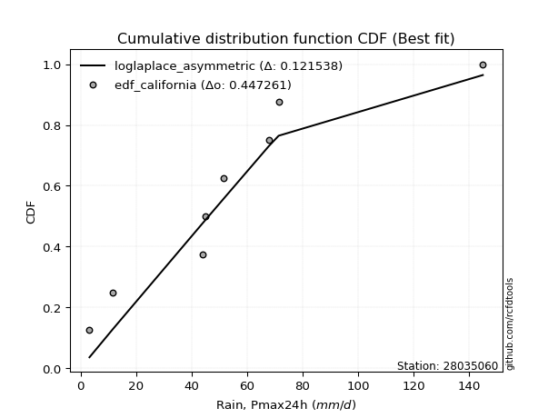</img>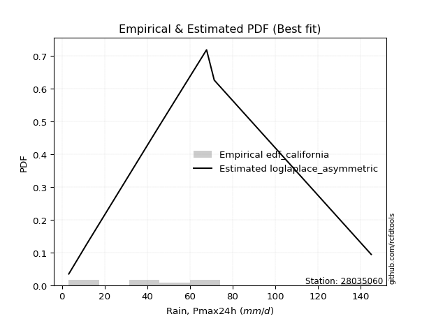</img>

</div>


### 2. EDF Hazen (1930)

Hazen method for plotting positions is a formula used to estimate the empirical cumulative probability distribution of flood events or other hydrological data. This formula often results in biased estimations, particularly when extrapolating to extreme events (high return periods).

<div align="center">


$P=(m-0.5)/n$


</div>


**2.1. Empirical values**

<div align="center">

|                | 0                   | 1                   | 2                  | 3                  | 4         | 5                  | 6                  | 7                  | 8                  |
|:---------------|:--------------------|:--------------------|:-------------------|:-------------------|:----------|:-------------------|:-------------------|:-------------------|:-------------------|
| date           | 2020                | 2021                | 2025               | 2018               | 2023      | 2022               | 2017               | 2019               | 2024               |
| x              | 3.2                 | 11.6                | 36.5               | 44.0               | 44.9      | 51.7               | 67.8               | 71.4               | 145.0              |
| m              | 1                   | 2                   | 3                  | 4                  | 5         | 6                  | 7                  | 8                  | 9                  |
| empirical_dist | edf_hazen           | edf_hazen           | edf_hazen          | edf_hazen          | edf_hazen | edf_hazen          | edf_hazen          | edf_hazen          | edf_hazen          |
| empirical      | 0.05555555555555555 | 0.16666666666666666 | 0.2777777777777778 | 0.3888888888888889 | 0.5       | 0.6111111111111112 | 0.7222222222222222 | 0.8333333333333334 | 0.9444444444444444 |
| empirical_tr   | 1.0588235294117647  | 1.2                 | 1.3846153846153846 | 1.6363636363636362 | 2.0       | 2.5714285714285716 | 3.5999999999999996 | 6.000000000000002  | 17.999999999999993 |

</div>


**2.2. Kolmogorov-Smirnov fit test (sorted by Δ)**


<div align="center">

|                | 0                   | 1                   | 2                   | 3                   | 4                   | 5                   | 6                   | 7                   | 8                   | 9                   | 10                  | 11                  | 12                  | 13                  | 14                  | 15                  | 16                  | 17                  | 18                  | 19                  | 20                  | 21                  | 22                  | 23                  | 24                  | 25                  | 26                  | 27                  | 28                  | 29                  | 30                  | 31                  | 32                  | 33                  | 34                  | 35                  | 36                  | 37                  | 38                  | 39                  | 40                  | 41                  | 42                  | 43                  | 44                  | 45                  | 46                  | 47                  | 48                  | 49                  | 50                  | 51                  | 52                  | 53                  | 54                  | 55                  | 56                  | 57                  | 58                  | 59                  | 60                  | 61                  | 62                  | 63                  | 64                  | 65                  | 66                  | 67                  | 68                  | 69                  | 70                  | 71                  | 72                  | 73                  | 74                  | 75                  | 76                  | 77                  | 78                  | 79                  | 80                  | 81                  | 82                  | 83                  | 84                  | 85                  | 86                  | 87                  | 88                  | 89                  | 90                  | 91                  | 92                  | 93                  | 94                  | 95                  | 96                  | 97                  | 98                  | 99                  | 100                 | 101                 | 102                 | 103                 | 104                 | 105                 | 106                 | 107                 | 108                 | 109                 | 110                 | 111                 | 112                 | 113                 | 114                 | 115                 | 116                 | 117                 | 118                 | 119                 | 120                 | 121                 | 122                 | 123                 | 124                 | 125                 | 126                 | 127                 | 128                 | 129                 | 130                 | 131                 | 132                 | 133                 | 134                 | 135                 | 136                 | 137                 | 138                 | 139                 | 140                 | 141                 | 142                 | 143                 | 144                 | 145                 | 146                 | 147                 | 148                 | 149                 | 150                 | 151                 | 152                 | 153                 | 154                 | 155                 | 156                 | 157                 | 158                 | 159                 |
|:---------------|:--------------------|:--------------------|:--------------------|:--------------------|:--------------------|:--------------------|:--------------------|:--------------------|:--------------------|:--------------------|:--------------------|:--------------------|:--------------------|:--------------------|:--------------------|:--------------------|:--------------------|:--------------------|:--------------------|:--------------------|:--------------------|:--------------------|:--------------------|:--------------------|:--------------------|:--------------------|:--------------------|:--------------------|:--------------------|:--------------------|:--------------------|:--------------------|:--------------------|:--------------------|:--------------------|:--------------------|:--------------------|:--------------------|:--------------------|:--------------------|:--------------------|:--------------------|:--------------------|:--------------------|:--------------------|:--------------------|:--------------------|:--------------------|:--------------------|:--------------------|:--------------------|:--------------------|:--------------------|:--------------------|:--------------------|:--------------------|:--------------------|:--------------------|:--------------------|:--------------------|:--------------------|:--------------------|:--------------------|:--------------------|:--------------------|:--------------------|:--------------------|:--------------------|:--------------------|:--------------------|:--------------------|:--------------------|:--------------------|:--------------------|:--------------------|:--------------------|:--------------------|:--------------------|:--------------------|:--------------------|:--------------------|:--------------------|:--------------------|:--------------------|:--------------------|:--------------------|:--------------------|:--------------------|:--------------------|:--------------------|:--------------------|:--------------------|:--------------------|:--------------------|:--------------------|:--------------------|:--------------------|:--------------------|:--------------------|:--------------------|:--------------------|:--------------------|:--------------------|:--------------------|:--------------------|:--------------------|:--------------------|:--------------------|:--------------------|:--------------------|:--------------------|:--------------------|:--------------------|:--------------------|:--------------------|:--------------------|:--------------------|:--------------------|:--------------------|:--------------------|:--------------------|:--------------------|:--------------------|:--------------------|:--------------------|:--------------------|:--------------------|:--------------------|:--------------------|:--------------------|:--------------------|:--------------------|:--------------------|:--------------------|:--------------------|:--------------------|:--------------------|:--------------------|:--------------------|:--------------------|:--------------------|:--------------------|:--------------------|:--------------------|:--------------------|:--------------------|:--------------------|:--------------------|:--------------------|:--------------------|:--------------------|:--------------------|:--------------------|:--------------------|:--------------------|:--------------------|:--------------------|:--------------------|:--------------------|:--------------------|
| station        | 28035060            | 28035060            | 28035060            | 28035060            | 28035060            | 28035060            | 28035060            | 28035060            | 28035060            | 28035060            | 28035060            | 28035060            | 28035060            | 28035060            | 28035060            | 28035060            | 28035060            | 28035060            | 28035060            | 28035060            | 28035060            | 28035060            | 28035060            | 28035060            | 28035060            | 28035060            | 28035060            | 28035060            | 28035060            | 28035060            | 28035060            | 28035060            | 28035060            | 28035060            | 28035060            | 28035060            | 28035060            | 28035060            | 28035060            | 28035060            | 28035060            | 28035060            | 28035060            | 28035060            | 28035060            | 28035060            | 28035060            | 28035060            | 28035060            | 28035060            | 28035060            | 28035060            | 28035060            | 28035060            | 28035060            | 28035060            | 28035060            | 28035060            | 28035060            | 28035060            | 28035060            | 28035060            | 28035060            | 28035060            | 28035060            | 28035060            | 28035060            | 28035060            | 28035060            | 28035060            | 28035060            | 28035060            | 28035060            | 28035060            | 28035060            | 28035060            | 28035060            | 28035060            | 28035060            | 28035060            | 28035060            | 28035060            | 28035060            | 28035060            | 28035060            | 28035060            | 28035060            | 28035060            | 28035060            | 28035060            | 28035060            | 28035060            | 28035060            | 28035060            | 28035060            | 28035060            | 28035060            | 28035060            | 28035060            | 28035060            | 28035060            | 28035060            | 28035060            | 28035060            | 28035060            | 28035060            | 28035060            | 28035060            | 28035060            | 28035060            | 28035060            | 28035060            | 28035060            | 28035060            | 28035060            | 28035060            | 28035060            | 28035060            | 28035060            | 28035060            | 28035060            | 28035060            | 28035060            | 28035060            | 28035060            | 28035060            | 28035060            | 28035060            | 28035060            | 28035060            | 28035060            | 28035060            | 28035060            | 28035060            | 28035060            | 28035060            | 28035060            | 28035060            | 28035060            | 28035060            | 28035060            | 28035060            | 28035060            | 28035060            | 28035060            | 28035060            | 28035060            | 28035060            | 28035060            | 28035060            | 28035060            | 28035060            | 28035060            | 28035060            | 28035060            | 28035060            | 28035060            | 28035060            | 28035060            | 28035060            |
| empirical_dist | edf_hazen           | edf_hazen           | edf_hazen           | edf_hazen           | edf_hazen           | edf_hazen           | edf_hazen           | edf_hazen           | edf_hazen           | edf_hazen           | edf_hazen           | edf_hazen           | edf_hazen           | edf_hazen           | edf_hazen           | edf_hazen           | edf_hazen           | edf_hazen           | edf_hazen           | edf_hazen           | edf_hazen           | edf_hazen           | edf_hazen           | edf_hazen           | edf_hazen           | edf_hazen           | edf_hazen           | edf_hazen           | edf_hazen           | edf_hazen           | edf_hazen           | edf_hazen           | edf_hazen           | edf_hazen           | edf_hazen           | edf_hazen           | edf_hazen           | edf_hazen           | edf_hazen           | edf_hazen           | edf_hazen           | edf_hazen           | edf_hazen           | edf_hazen           | edf_hazen           | edf_hazen           | edf_hazen           | edf_hazen           | edf_hazen           | edf_hazen           | edf_hazen           | edf_hazen           | edf_hazen           | edf_hazen           | edf_hazen           | edf_hazen           | edf_hazen           | edf_hazen           | edf_hazen           | edf_hazen           | edf_hazen           | edf_hazen           | edf_hazen           | edf_hazen           | edf_hazen           | edf_hazen           | edf_hazen           | edf_hazen           | edf_hazen           | edf_hazen           | edf_hazen           | edf_hazen           | edf_hazen           | edf_hazen           | edf_hazen           | edf_hazen           | edf_hazen           | edf_hazen           | edf_hazen           | edf_hazen           | edf_hazen           | edf_hazen           | edf_hazen           | edf_hazen           | edf_hazen           | edf_hazen           | edf_hazen           | edf_hazen           | edf_hazen           | edf_hazen           | edf_hazen           | edf_hazen           | edf_hazen           | edf_hazen           | edf_hazen           | edf_hazen           | edf_hazen           | edf_hazen           | edf_hazen           | edf_hazen           | edf_hazen           | edf_hazen           | edf_hazen           | edf_hazen           | edf_hazen           | edf_hazen           | edf_hazen           | edf_hazen           | edf_hazen           | edf_hazen           | edf_hazen           | edf_hazen           | edf_hazen           | edf_hazen           | edf_hazen           | edf_hazen           | edf_hazen           | edf_hazen           | edf_hazen           | edf_hazen           | edf_hazen           | edf_hazen           | edf_hazen           | edf_hazen           | edf_hazen           | edf_hazen           | edf_hazen           | edf_hazen           | edf_hazen           | edf_hazen           | edf_hazen           | edf_hazen           | edf_hazen           | edf_hazen           | edf_hazen           | edf_hazen           | edf_hazen           | edf_hazen           | edf_hazen           | edf_hazen           | edf_hazen           | edf_hazen           | edf_hazen           | edf_hazen           | edf_hazen           | edf_hazen           | edf_hazen           | edf_hazen           | edf_hazen           | edf_hazen           | edf_hazen           | edf_hazen           | edf_hazen           | edf_hazen           | edf_hazen           | edf_hazen           | edf_hazen           | edf_hazen           | edf_hazen           | edf_hazen           |
| p_dist         | t                   | logjohnsonsu        | vonmises_line       | exponnorm           | nct                 | genlogistic         | logt                | gumbel_r            | kstwobign           | loggennorm          | dgamma              | logdgamma           | dweibull            | invweibull          | logdweibull         | pearson3            | invgamma            | moyal               | johnsonsu           | gennorm             | skewnorm            | invgauss            | hypsecant           | rayleigh            | fatiguelife         | rice                | logistic            | laplace             | maxwell             | mielke              | burr                | halfnorm            | logburr             | kappa3              | loggenlogistic      | ncf                 | logmielke           | logloggamma         | foldnorm            | logvonmises_line    | halflogistic        | logexponweib        | genpareto           | gompertz            | logloglaplace       | logexponpow         | betaprime           | logweibull_min      | loggenextreme       | norm                | crystalball         | truncpareto         | logargus            | logpearson3         | logskewnorm         | lognakagami         | loggumbel_l         | logburr12           | loggompertz         | burr12              | wald                | logtrapezoid        | anglit              | semicircular        | logtriang           | gumbel_l            | exponpow            | loggengamma         | loggenhalflogistic  | f                   | genexpon            | lomax               | tukeylambda         | logfoldnorm         | arcsine             | logarcsine          | logsemicircular     | loganglit           | logexponnorm        | lognorm             | logcrystalball      | logrice             | lognct              | logfatiguelife      | loglogistic         | loghypsecant        | logf                | logncf              | cosine              | loglaplace          | loglaplace          | bradford            | nakagami            | logbetaprime        | loggenpareto        | loggamma            | loggamma            | loginvgamma         | logerlang           | loginvgauss         | logalpha            | beta                | truncexpon          | truncweibull_min    | logmaxwell          | loginvweibull       | loglevy_l           | gausshyper          | lograyleigh         | loggausshyper       | logbeta             | logcosine           | gengamma            | logtruncweibull_min | logkstwobign        | loggumbel_r         | loghalfnorm         | kappa4              | loglomax            | loggenexpon         | logmoyal            | loghalflogistic     | logksone            | logweibull_max      | logwrapcauchy       | ksone               | halfgennorm         | wrapcauchy          | logtukeylambda      | uniform             | argus               | logkappa3           | loguniform          | weibull_min         | logkappa4           | exponweib           | loghalfgennorm      | levy_l              | logwald             | logtruncnorm        | logbradford         | genextreme          | logtruncexpon       | logjohnsonsb        | gamma               | erlang              | genhalflogistic     | powerlaw            | rdist               | alpha               | logrdist            | triang              | trapezoid           | johnsonsb           | logpowerlaw         | weibull_max         | logtruncpareto      | truncnorm           | logvonmises         | vonmises            |
| delta          | 0.0708696267982098  | 0.07177104999535738 | 0.08290737359234718 | 0.09282631745986286 | 0.09302765248481049 | 0.10121837485049728 | 0.10213174783347775 | 0.1036517096119906  | 0.1071235152272989  | 0.1111111069634933  | 0.11111111105933646 | 0.11111111111110678 | 0.11111111111180522 | 0.11274881374647538 | 0.11312576400589147 | 0.11622216554364712 | 0.11627746744196521 | 0.11975958229365802 | 0.12148820043856728 | 0.12184667303979646 | 0.12436849991581561 | 0.12581819688582785 | 0.1265195406887824  | 0.12734902842244444 | 0.12841419077274513 | 0.12966999746501384 | 0.1302423485992935  | 0.13244205733638548 | 0.1326526745712674  | 0.13399280115488305 | 0.13488332846425932 | 0.13571435614548183 | 0.1359453996772098  | 0.13617491909033674 | 0.13623506194872204 | 0.13648240164544556 | 0.1371233047748009  | 0.1371249607656394  | 0.13930697639162298 | 0.1409909555349873  | 0.1414427914610692  | 0.14305615262800564 | 0.14309967297813952 | 0.14551117649201906 | 0.14589996252616866 | 0.14626971202689565 | 0.14759936211667746 | 0.1484686112386695  | 0.14888684877102287 | 0.15062743262689982 | 0.15062743731698147 | 0.1506551092202949  | 0.15121326466186702 | 0.15445516934093828 | 0.1545134377854938  | 0.1545538874162728  | 0.1591222368044526  | 0.16323763712958506 | 0.1632447446963734  | 0.16616050831875073 | 0.1698955842080559  | 0.17222391310052243 | 0.1737107684540775  | 0.183483558627468   | 0.19297723724617355 | 0.19403843546953414 | 0.19713796992930432 | 0.20605668808458816 | 0.20624323911256792 | 0.20804951040450304 | 0.21073522439469417 | 0.21495053402823727 | 0.21606233758515636 | 0.22385268780545342 | 0.22423445224514393 | 0.22619066788633202 | 0.22783308024675475 | 0.22824796052649454 | 0.22925388624408594 | 0.2292544589750719  | 0.22925448201009802 | 0.22925460100827288 | 0.22966620135186722 | 0.23002902819901694 | 0.2302150078883416  | 0.23103515429412624 | 0.23315322676739159 | 0.23319256436728597 | 0.23374825449007397 | 0.2345330907999278  | 0.2345330907999278  | 0.23920208305823099 | 0.24044648253448397 | 0.240497835650621   | 0.24085829365707068 | 0.24158622035459054 | 0.24158622035459054 | 0.24318571127043143 | 0.24433862027457365 | 0.24805885784970927 | 0.24864650447958303 | 0.25466803978443586 | 0.26051254272642055 | 0.2612227191177182  | 0.2620103012316123  | 0.2625188985110275  | 0.2656447115724172  | 0.2682324997520611  | 0.272865269959884   | 0.2867695319940927  | 0.2892196326346088  | 0.2899755464712942  | 0.294396364631213   | 0.29444924125699945 | 0.2962917355576056  | 0.2998024609871299  | 0.3034276744457357  | 0.30604305084309924 | 0.30677295564744245 | 0.31140599345912445 | 0.32558828885227264 | 0.32877684090775294 | 0.33746161646857387 | 0.3461913279426455  | 0.34727148250496953 | 0.34920075223319236 | 0.3495076990067476  | 0.3503343674224908  | 0.351240256077319   | 0.35237423601316414 | 0.3555946904487004  | 0.36028985757321685 | 0.36050949531784426 | 0.369841164639931   | 0.3781574152171703  | 0.3823915135218433  | 0.3952116840036949  | 0.39696073277465427 | 0.3972671745769255  | 0.41255752506462606 | 0.4244869280827085  | 0.4253279839454457  | 0.43036564590196924 | 0.4340147141761166  | 0.445508246433694   | 0.46221750092099967 | 0.4849903767712554  | 0.49120805761226016 | 0.4996767907420796  | 0.5228438480001331  | 0.5513107128732567  | 0.5517785614614554  | 0.5958145810704669  | 0.6073055346706638  | 0.6270488331894258  | 0.7088038928584021  | 0.768065065355145   | 0.9096956097250551  | 1.113434730818244   | 22.646474848032483  |
| deltao         | 0.41761268023100007 | 0.41761268023100007 | 0.41761268023100007 | 0.41761268023100007 | 0.41761268023100007 | 0.41761268023100007 | 0.41761268023100007 | 0.41761268023100007 | 0.41761268023100007 | 0.41761268023100007 | 0.41761268023100007 | 0.41761268023100007 | 0.41761268023100007 | 0.41761268023100007 | 0.41761268023100007 | 0.41761268023100007 | 0.41761268023100007 | 0.41761268023100007 | 0.41761268023100007 | 0.41761268023100007 | 0.41761268023100007 | 0.41761268023100007 | 0.41761268023100007 | 0.41761268023100007 | 0.41761268023100007 | 0.41761268023100007 | 0.41761268023100007 | 0.41761268023100007 | 0.41761268023100007 | 0.41761268023100007 | 0.41761268023100007 | 0.41761268023100007 | 0.41761268023100007 | 0.41761268023100007 | 0.41761268023100007 | 0.41761268023100007 | 0.41761268023100007 | 0.41761268023100007 | 0.41761268023100007 | 0.41761268023100007 | 0.41761268023100007 | 0.41761268023100007 | 0.41761268023100007 | 0.41761268023100007 | 0.41761268023100007 | 0.41761268023100007 | 0.41761268023100007 | 0.41761268023100007 | 0.41761268023100007 | 0.41761268023100007 | 0.41761268023100007 | 0.41761268023100007 | 0.41761268023100007 | 0.41761268023100007 | 0.41761268023100007 | 0.41761268023100007 | 0.41761268023100007 | 0.41761268023100007 | 0.41761268023100007 | 0.41761268023100007 | 0.41761268023100007 | 0.41761268023100007 | 0.41761268023100007 | 0.41761268023100007 | 0.41761268023100007 | 0.41761268023100007 | 0.41761268023100007 | 0.41761268023100007 | 0.41761268023100007 | 0.41761268023100007 | 0.41761268023100007 | 0.41761268023100007 | 0.41761268023100007 | 0.41761268023100007 | 0.41761268023100007 | 0.41761268023100007 | 0.41761268023100007 | 0.41761268023100007 | 0.41761268023100007 | 0.41761268023100007 | 0.41761268023100007 | 0.41761268023100007 | 0.41761268023100007 | 0.41761268023100007 | 0.41761268023100007 | 0.41761268023100007 | 0.41761268023100007 | 0.41761268023100007 | 0.41761268023100007 | 0.41761268023100007 | 0.41761268023100007 | 0.41761268023100007 | 0.41761268023100007 | 0.41761268023100007 | 0.41761268023100007 | 0.41761268023100007 | 0.41761268023100007 | 0.41761268023100007 | 0.41761268023100007 | 0.41761268023100007 | 0.41761268023100007 | 0.41761268023100007 | 0.41761268023100007 | 0.41761268023100007 | 0.41761268023100007 | 0.41761268023100007 | 0.41761268023100007 | 0.41761268023100007 | 0.41761268023100007 | 0.41761268023100007 | 0.41761268023100007 | 0.41761268023100007 | 0.41761268023100007 | 0.41761268023100007 | 0.41761268023100007 | 0.41761268023100007 | 0.41761268023100007 | 0.41761268023100007 | 0.41761268023100007 | 0.41761268023100007 | 0.41761268023100007 | 0.41761268023100007 | 0.41761268023100007 | 0.41761268023100007 | 0.41761268023100007 | 0.41761268023100007 | 0.41761268023100007 | 0.41761268023100007 | 0.41761268023100007 | 0.41761268023100007 | 0.41761268023100007 | 0.41761268023100007 | 0.41761268023100007 | 0.41761268023100007 | 0.41761268023100007 | 0.41761268023100007 | 0.41761268023100007 | 0.41761268023100007 | 0.41761268023100007 | 0.41761268023100007 | 0.41761268023100007 | 0.41761268023100007 | 0.41761268023100007 | 0.41761268023100007 | 0.41761268023100007 | 0.41761268023100007 | 0.41761268023100007 | 0.41761268023100007 | 0.41761268023100007 | 0.41761268023100007 | 0.41761268023100007 | 0.41761268023100007 | 0.41761268023100007 | 0.41761268023100007 | 0.41761268023100007 | 0.41761268023100007 | 0.41761268023100007 | 0.41761268023100007 | 0.41761268023100007 | 0.41761268023100007 |
| eval           | Δo > Δ              | Δo > Δ              | Δo > Δ              | Δo > Δ              | Δo > Δ              | Δo > Δ              | Δo > Δ              | Δo > Δ              | Δo > Δ              | Δo > Δ              | Δo > Δ              | Δo > Δ              | Δo > Δ              | Δo > Δ              | Δo > Δ              | Δo > Δ              | Δo > Δ              | Δo > Δ              | Δo > Δ              | Δo > Δ              | Δo > Δ              | Δo > Δ              | Δo > Δ              | Δo > Δ              | Δo > Δ              | Δo > Δ              | Δo > Δ              | Δo > Δ              | Δo > Δ              | Δo > Δ              | Δo > Δ              | Δo > Δ              | Δo > Δ              | Δo > Δ              | Δo > Δ              | Δo > Δ              | Δo > Δ              | Δo > Δ              | Δo > Δ              | Δo > Δ              | Δo > Δ              | Δo > Δ              | Δo > Δ              | Δo > Δ              | Δo > Δ              | Δo > Δ              | Δo > Δ              | Δo > Δ              | Δo > Δ              | Δo > Δ              | Δo > Δ              | Δo > Δ              | Δo > Δ              | Δo > Δ              | Δo > Δ              | Δo > Δ              | Δo > Δ              | Δo > Δ              | Δo > Δ              | Δo > Δ              | Δo > Δ              | Δo > Δ              | Δo > Δ              | Δo > Δ              | Δo > Δ              | Δo > Δ              | Δo > Δ              | Δo > Δ              | Δo > Δ              | Δo > Δ              | Δo > Δ              | Δo > Δ              | Δo > Δ              | Δo > Δ              | Δo > Δ              | Δo > Δ              | Δo > Δ              | Δo > Δ              | Δo > Δ              | Δo > Δ              | Δo > Δ              | Δo > Δ              | Δo > Δ              | Δo > Δ              | Δo > Δ              | Δo > Δ              | Δo > Δ              | Δo > Δ              | Δo > Δ              | Δo > Δ              | Δo > Δ              | Δo > Δ              | Δo > Δ              | Δo > Δ              | Δo > Δ              | Δo > Δ              | Δo > Δ              | Δo > Δ              | Δo > Δ              | Δo > Δ              | Δo > Δ              | Δo > Δ              | Δo > Δ              | Δo > Δ              | Δo > Δ              | Δo > Δ              | Δo > Δ              | Δo > Δ              | Δo > Δ              | Δo > Δ              | Δo > Δ              | Δo > Δ              | Δo > Δ              | Δo > Δ              | Δo > Δ              | Δo > Δ              | Δo > Δ              | Δo > Δ              | Δo > Δ              | Δo > Δ              | Δo > Δ              | Δo > Δ              | Δo > Δ              | Δo > Δ              | Δo > Δ              | Δo > Δ              | Δo > Δ              | Δo > Δ              | Δo > Δ              | Δo > Δ              | Δo > Δ              | Δo > Δ              | Δo > Δ              | Δo > Δ              | Δo > Δ              | Δo > Δ              | Δo > Δ              | Δo > Δ              | Δo > Δ              | Δo > Δ              | Δo <= Δ             | Δo <= Δ             | Δo <= Δ             | Δo <= Δ             | Δo <= Δ             | Δo <= Δ             | Δo <= Δ             | Δo <= Δ             | Δo <= Δ             | Δo <= Δ             | Δo <= Δ             | Δo <= Δ             | Δo <= Δ             | Δo <= Δ             | Δo <= Δ             | Δo <= Δ             | Δo <= Δ             | Δo <= Δ             | Δo <= Δ             | Δo <= Δ             |
| fit            | 1                   | 1                   | 1                   | 1                   | 1                   | 1                   | 1                   | 1                   | 1                   | 1                   | 1                   | 1                   | 1                   | 1                   | 1                   | 1                   | 1                   | 1                   | 1                   | 1                   | 1                   | 1                   | 1                   | 1                   | 1                   | 1                   | 1                   | 1                   | 1                   | 1                   | 1                   | 1                   | 1                   | 1                   | 1                   | 1                   | 1                   | 1                   | 1                   | 1                   | 1                   | 1                   | 1                   | 1                   | 1                   | 1                   | 1                   | 1                   | 1                   | 1                   | 1                   | 1                   | 1                   | 1                   | 1                   | 1                   | 1                   | 1                   | 1                   | 1                   | 1                   | 1                   | 1                   | 1                   | 1                   | 1                   | 1                   | 1                   | 1                   | 1                   | 1                   | 1                   | 1                   | 1                   | 1                   | 1                   | 1                   | 1                   | 1                   | 1                   | 1                   | 1                   | 1                   | 1                   | 1                   | 1                   | 1                   | 1                   | 1                   | 1                   | 1                   | 1                   | 1                   | 1                   | 1                   | 1                   | 1                   | 1                   | 1                   | 1                   | 1                   | 1                   | 1                   | 1                   | 1                   | 1                   | 1                   | 1                   | 1                   | 1                   | 1                   | 1                   | 1                   | 1                   | 1                   | 1                   | 1                   | 1                   | 1                   | 1                   | 1                   | 1                   | 1                   | 1                   | 1                   | 1                   | 1                   | 1                   | 1                   | 1                   | 1                   | 1                   | 1                   | 1                   | 1                   | 1                   | 1                   | 1                   | 1                   | 1                   | 0                   | 0                   | 0                   | 0                   | 0                   | 0                   | 0                   | 0                   | 0                   | 0                   | 0                   | 0                   | 0                   | 0                   | 0                   | 0                   | 0                   | 0                   | 0                   | 0                   |
| n              | 9                   | 9                   | 9                   | 9                   | 9                   | 9                   | 9                   | 9                   | 9                   | 9                   | 9                   | 9                   | 9                   | 9                   | 9                   | 9                   | 9                   | 9                   | 9                   | 9                   | 9                   | 9                   | 9                   | 9                   | 9                   | 9                   | 9                   | 9                   | 9                   | 9                   | 9                   | 9                   | 9                   | 9                   | 9                   | 9                   | 9                   | 9                   | 9                   | 9                   | 9                   | 9                   | 9                   | 9                   | 9                   | 9                   | 9                   | 9                   | 9                   | 9                   | 9                   | 9                   | 9                   | 9                   | 9                   | 9                   | 9                   | 9                   | 9                   | 9                   | 9                   | 9                   | 9                   | 9                   | 9                   | 9                   | 9                   | 9                   | 9                   | 9                   | 9                   | 9                   | 9                   | 9                   | 9                   | 9                   | 9                   | 9                   | 9                   | 9                   | 9                   | 9                   | 9                   | 9                   | 9                   | 9                   | 9                   | 9                   | 9                   | 9                   | 9                   | 9                   | 9                   | 9                   | 9                   | 9                   | 9                   | 9                   | 9                   | 9                   | 9                   | 9                   | 9                   | 9                   | 9                   | 9                   | 9                   | 9                   | 9                   | 9                   | 9                   | 9                   | 9                   | 9                   | 9                   | 9                   | 9                   | 9                   | 9                   | 9                   | 9                   | 9                   | 9                   | 9                   | 9                   | 9                   | 9                   | 9                   | 9                   | 9                   | 9                   | 9                   | 9                   | 9                   | 9                   | 9                   | 9                   | 9                   | 9                   | 9                   | 9                   | 9                   | 9                   | 9                   | 9                   | 9                   | 9                   | 9                   | 9                   | 9                   | 9                   | 9                   | 9                   | 9                   | 9                   | 9                   | 9                   | 9                   | 9                   | 9                   |
| best_fit       | 1                   | 0                   | 0                   | 0                   | 0                   | 0                   | 0                   | 0                   | 0                   | 0                   | 0                   | 0                   | 0                   | 0                   | 0                   | 0                   | 0                   | 0                   | 0                   | 0                   | 0                   | 0                   | 0                   | 0                   | 0                   | 0                   | 0                   | 0                   | 0                   | 0                   | 0                   | 0                   | 0                   | 0                   | 0                   | 0                   | 0                   | 0                   | 0                   | 0                   | 0                   | 0                   | 0                   | 0                   | 0                   | 0                   | 0                   | 0                   | 0                   | 0                   | 0                   | 0                   | 0                   | 0                   | 0                   | 0                   | 0                   | 0                   | 0                   | 0                   | 0                   | 0                   | 0                   | 0                   | 0                   | 0                   | 0                   | 0                   | 0                   | 0                   | 0                   | 0                   | 0                   | 0                   | 0                   | 0                   | 0                   | 0                   | 0                   | 0                   | 0                   | 0                   | 0                   | 0                   | 0                   | 0                   | 0                   | 0                   | 0                   | 0                   | 0                   | 0                   | 0                   | 0                   | 0                   | 0                   | 0                   | 0                   | 0                   | 0                   | 0                   | 0                   | 0                   | 0                   | 0                   | 0                   | 0                   | 0                   | 0                   | 0                   | 0                   | 0                   | 0                   | 0                   | 0                   | 0                   | 0                   | 0                   | 0                   | 0                   | 0                   | 0                   | 0                   | 0                   | 0                   | 0                   | 0                   | 0                   | 0                   | 0                   | 0                   | 0                   | 0                   | 0                   | 0                   | 0                   | 0                   | 0                   | 0                   | 0                   | 0                   | 0                   | 0                   | 0                   | 0                   | 0                   | 0                   | 0                   | 0                   | 0                   | 0                   | 0                   | 0                   | 0                   | 0                   | 0                   | 0                   | 0                   | 0                   | 0                   |
| best_fit_sort  | 1                   | 2                   | 3                   | 4                   | 5                   | 6                   | 7                   | 8                   | 9                   | 10                  | 11                  | 12                  | 13                  | 14                  | 15                  | 16                  | 17                  | 18                  | 19                  | 20                  | 21                  | 22                  | 23                  | 24                  | 25                  | 26                  | 27                  | 28                  | 29                  | 30                  | 31                  | 32                  | 33                  | 34                  | 35                  | 36                  | 37                  | 38                  | 39                  | 40                  | 41                  | 42                  | 43                  | 44                  | 45                  | 46                  | 47                  | 48                  | 49                  | 50                  | 51                  | 52                  | 53                  | 54                  | 55                  | 56                  | 57                  | 58                  | 59                  | 60                  | 61                  | 62                  | 63                  | 64                  | 65                  | 66                  | 67                  | 68                  | 69                  | 70                  | 71                  | 72                  | 73                  | 74                  | 75                  | 76                  | 77                  | 78                  | 79                  | 80                  | 81                  | 82                  | 83                  | 84                  | 85                  | 86                  | 87                  | 88                  | 89                  | 90                  | 91                  | 92                  | 93                  | 94                  | 95                  | 96                  | 97                  | 98                  | 99                  | 100                 | 101                 | 102                 | 103                 | 104                 | 105                 | 106                 | 107                 | 108                 | 109                 | 110                 | 111                 | 112                 | 113                 | 114                 | 115                 | 116                 | 117                 | 118                 | 119                 | 120                 | 121                 | 122                 | 123                 | 124                 | 125                 | 126                 | 127                 | 128                 | 129                 | 130                 | 131                 | 132                 | 133                 | 134                 | 135                 | 136                 | 137                 | 138                 | 139                 | 140                 | 141                 | 142                 | 143                 | 144                 | 145                 | 146                 | 147                 | 148                 | 149                 | 150                 | 151                 | 152                 | 153                 | 154                 | 155                 | 156                 | 157                 | 158                 | 159                 | 160                 |

</div>


**2.3. Best fit**

<div align="center">

|   id |   station | empirical_dist   | p_dist   |     delta |   deltao | eval   |   fit |   n |   best_fit |   best_fit_sort |
|-----:|----------:|:-----------------|:---------|----------:|---------:|:-------|------:|----:|-----------:|----------------:|
|    0 |  28035060 | edf_hazen        | t        | 0.0708696 | 0.417613 | Δo > Δ |     1 |   9 |          1 |               1 |

</div>


<div align="center">

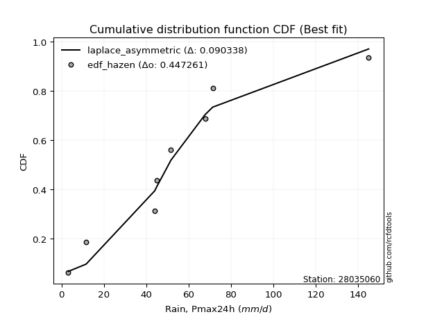</img>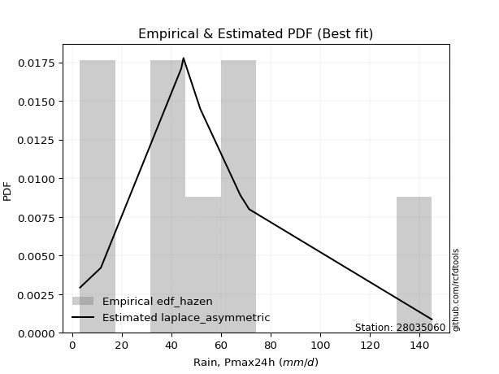</img>

</div>


### 3. EDF Weibull (1939)

Weibull plotting position formula is an empirical method used to estimate the non-exceedance probability or plotting position for a set of observed data, is often recommended or widely used in practice, particularly in flood frequency analysis.

<div align="center">


$P=m/(n+1)$


</div>


**3.1. Empirical values**

<div align="center">

|                | 0                  | 1           | 2                  | 3                  | 4           | 5           | 6                 | 7                 | 8                  |
|:---------------|:-------------------|:------------|:-------------------|:-------------------|:------------|:------------|:------------------|:------------------|:-------------------|
| date           | 2020               | 2021        | 2025               | 2018               | 2023        | 2022        | 2017              | 2019              | 2024               |
| x              | 3.2                | 11.6        | 36.5               | 44.0               | 44.9        | 51.7        | 67.8              | 71.4              | 145.0              |
| m              | 1                  | 2           | 3                  | 4                  | 5           | 6           | 7                 | 8                 | 9                  |
| empirical_dist | edf_weibull        | edf_weibull | edf_weibull        | edf_weibull        | edf_weibull | edf_weibull | edf_weibull       | edf_weibull       | edf_weibull        |
| empirical      | 0.1                | 0.2         | 0.3                | 0.4                | 0.5         | 0.6         | 0.7               | 0.8               | 0.9                |
| empirical_tr   | 1.1111111111111112 | 1.25        | 1.4285714285714286 | 1.6666666666666667 | 2.0         | 2.5         | 3.333333333333333 | 5.000000000000001 | 10.000000000000002 |

</div>


**3.2. Kolmogorov-Smirnov fit test (sorted by Δ)**


<div align="center">

|                | 0                   | 1                   | 2                   | 3                   | 4                   | 5                   | 6                   | 7                   | 8                   | 9                   | 10                  | 11                  | 12                  | 13                  | 14                  | 15                  | 16                  | 17                  | 18                  | 19                  | 20                  | 21                  | 22                  | 23                  | 24                  | 25                  | 26                  | 27                  | 28                  | 29                  | 30                  | 31                  | 32                  | 33                  | 34                  | 35                  | 36                  | 37                  | 38                  | 39                  | 40                  | 41                  | 42                  | 43                  | 44                  | 45                  | 46                  | 47                  | 48                  | 49                  | 50                  | 51                  | 52                  | 53                  | 54                  | 55                  | 56                  | 57                  | 58                  | 59                  | 60                  | 61                  | 62                  | 63                  | 64                  | 65                  | 66                  | 67                  | 68                  | 69                  | 70                  | 71                  | 72                  | 73                  | 74                  | 75                  | 76                  | 77                  | 78                  | 79                  | 80                  | 81                  | 82                  | 83                  | 84                  | 85                  | 86                  | 87                  | 88                  | 89                  | 90                  | 91                  | 92                  | 93                  | 94                  | 95                  | 96                  | 97                  | 98                  | 99                  | 100                 | 101                 | 102                 | 103                 | 104                 | 105                 | 106                 | 107                 | 108                 | 109                 | 110                 | 111                 | 112                 | 113                 | 114                 | 115                 | 116                 | 117                 | 118                 | 119                 | 120                 | 121                 | 122                 | 123                 | 124                 | 125                 | 126                 | 127                 | 128                 | 129                 | 130                 | 131                 | 132                 | 133                 | 134                 | 135                 | 136                 | 137                 | 138                 | 139                 | 140                 | 141                 | 142                 | 143                 | 144                 | 145                 | 146                 | 147                 | 148                 | 149                 | 150                 | 151                 | 152                 | 153                 | 154                 | 155                 | 156                 | 157                 | 158                 | 159                 |
|:---------------|:--------------------|:--------------------|:--------------------|:--------------------|:--------------------|:--------------------|:--------------------|:--------------------|:--------------------|:--------------------|:--------------------|:--------------------|:--------------------|:--------------------|:--------------------|:--------------------|:--------------------|:--------------------|:--------------------|:--------------------|:--------------------|:--------------------|:--------------------|:--------------------|:--------------------|:--------------------|:--------------------|:--------------------|:--------------------|:--------------------|:--------------------|:--------------------|:--------------------|:--------------------|:--------------------|:--------------------|:--------------------|:--------------------|:--------------------|:--------------------|:--------------------|:--------------------|:--------------------|:--------------------|:--------------------|:--------------------|:--------------------|:--------------------|:--------------------|:--------------------|:--------------------|:--------------------|:--------------------|:--------------------|:--------------------|:--------------------|:--------------------|:--------------------|:--------------------|:--------------------|:--------------------|:--------------------|:--------------------|:--------------------|:--------------------|:--------------------|:--------------------|:--------------------|:--------------------|:--------------------|:--------------------|:--------------------|:--------------------|:--------------------|:--------------------|:--------------------|:--------------------|:--------------------|:--------------------|:--------------------|:--------------------|:--------------------|:--------------------|:--------------------|:--------------------|:--------------------|:--------------------|:--------------------|:--------------------|:--------------------|:--------------------|:--------------------|:--------------------|:--------------------|:--------------------|:--------------------|:--------------------|:--------------------|:--------------------|:--------------------|:--------------------|:--------------------|:--------------------|:--------------------|:--------------------|:--------------------|:--------------------|:--------------------|:--------------------|:--------------------|:--------------------|:--------------------|:--------------------|:--------------------|:--------------------|:--------------------|:--------------------|:--------------------|:--------------------|:--------------------|:--------------------|:--------------------|:--------------------|:--------------------|:--------------------|:--------------------|:--------------------|:--------------------|:--------------------|:--------------------|:--------------------|:--------------------|:--------------------|:--------------------|:--------------------|:--------------------|:--------------------|:--------------------|:--------------------|:--------------------|:--------------------|:--------------------|:--------------------|:--------------------|:--------------------|:--------------------|:--------------------|:--------------------|:--------------------|:--------------------|:--------------------|:--------------------|:--------------------|:--------------------|:--------------------|:--------------------|:--------------------|:--------------------|:--------------------|:--------------------|
| station        | 28035060            | 28035060            | 28035060            | 28035060            | 28035060            | 28035060            | 28035060            | 28035060            | 28035060            | 28035060            | 28035060            | 28035060            | 28035060            | 28035060            | 28035060            | 28035060            | 28035060            | 28035060            | 28035060            | 28035060            | 28035060            | 28035060            | 28035060            | 28035060            | 28035060            | 28035060            | 28035060            | 28035060            | 28035060            | 28035060            | 28035060            | 28035060            | 28035060            | 28035060            | 28035060            | 28035060            | 28035060            | 28035060            | 28035060            | 28035060            | 28035060            | 28035060            | 28035060            | 28035060            | 28035060            | 28035060            | 28035060            | 28035060            | 28035060            | 28035060            | 28035060            | 28035060            | 28035060            | 28035060            | 28035060            | 28035060            | 28035060            | 28035060            | 28035060            | 28035060            | 28035060            | 28035060            | 28035060            | 28035060            | 28035060            | 28035060            | 28035060            | 28035060            | 28035060            | 28035060            | 28035060            | 28035060            | 28035060            | 28035060            | 28035060            | 28035060            | 28035060            | 28035060            | 28035060            | 28035060            | 28035060            | 28035060            | 28035060            | 28035060            | 28035060            | 28035060            | 28035060            | 28035060            | 28035060            | 28035060            | 28035060            | 28035060            | 28035060            | 28035060            | 28035060            | 28035060            | 28035060            | 28035060            | 28035060            | 28035060            | 28035060            | 28035060            | 28035060            | 28035060            | 28035060            | 28035060            | 28035060            | 28035060            | 28035060            | 28035060            | 28035060            | 28035060            | 28035060            | 28035060            | 28035060            | 28035060            | 28035060            | 28035060            | 28035060            | 28035060            | 28035060            | 28035060            | 28035060            | 28035060            | 28035060            | 28035060            | 28035060            | 28035060            | 28035060            | 28035060            | 28035060            | 28035060            | 28035060            | 28035060            | 28035060            | 28035060            | 28035060            | 28035060            | 28035060            | 28035060            | 28035060            | 28035060            | 28035060            | 28035060            | 28035060            | 28035060            | 28035060            | 28035060            | 28035060            | 28035060            | 28035060            | 28035060            | 28035060            | 28035060            | 28035060            | 28035060            | 28035060            | 28035060            | 28035060            | 28035060            |
| empirical_dist | edf_weibull         | edf_weibull         | edf_weibull         | edf_weibull         | edf_weibull         | edf_weibull         | edf_weibull         | edf_weibull         | edf_weibull         | edf_weibull         | edf_weibull         | edf_weibull         | edf_weibull         | edf_weibull         | edf_weibull         | edf_weibull         | edf_weibull         | edf_weibull         | edf_weibull         | edf_weibull         | edf_weibull         | edf_weibull         | edf_weibull         | edf_weibull         | edf_weibull         | edf_weibull         | edf_weibull         | edf_weibull         | edf_weibull         | edf_weibull         | edf_weibull         | edf_weibull         | edf_weibull         | edf_weibull         | edf_weibull         | edf_weibull         | edf_weibull         | edf_weibull         | edf_weibull         | edf_weibull         | edf_weibull         | edf_weibull         | edf_weibull         | edf_weibull         | edf_weibull         | edf_weibull         | edf_weibull         | edf_weibull         | edf_weibull         | edf_weibull         | edf_weibull         | edf_weibull         | edf_weibull         | edf_weibull         | edf_weibull         | edf_weibull         | edf_weibull         | edf_weibull         | edf_weibull         | edf_weibull         | edf_weibull         | edf_weibull         | edf_weibull         | edf_weibull         | edf_weibull         | edf_weibull         | edf_weibull         | edf_weibull         | edf_weibull         | edf_weibull         | edf_weibull         | edf_weibull         | edf_weibull         | edf_weibull         | edf_weibull         | edf_weibull         | edf_weibull         | edf_weibull         | edf_weibull         | edf_weibull         | edf_weibull         | edf_weibull         | edf_weibull         | edf_weibull         | edf_weibull         | edf_weibull         | edf_weibull         | edf_weibull         | edf_weibull         | edf_weibull         | edf_weibull         | edf_weibull         | edf_weibull         | edf_weibull         | edf_weibull         | edf_weibull         | edf_weibull         | edf_weibull         | edf_weibull         | edf_weibull         | edf_weibull         | edf_weibull         | edf_weibull         | edf_weibull         | edf_weibull         | edf_weibull         | edf_weibull         | edf_weibull         | edf_weibull         | edf_weibull         | edf_weibull         | edf_weibull         | edf_weibull         | edf_weibull         | edf_weibull         | edf_weibull         | edf_weibull         | edf_weibull         | edf_weibull         | edf_weibull         | edf_weibull         | edf_weibull         | edf_weibull         | edf_weibull         | edf_weibull         | edf_weibull         | edf_weibull         | edf_weibull         | edf_weibull         | edf_weibull         | edf_weibull         | edf_weibull         | edf_weibull         | edf_weibull         | edf_weibull         | edf_weibull         | edf_weibull         | edf_weibull         | edf_weibull         | edf_weibull         | edf_weibull         | edf_weibull         | edf_weibull         | edf_weibull         | edf_weibull         | edf_weibull         | edf_weibull         | edf_weibull         | edf_weibull         | edf_weibull         | edf_weibull         | edf_weibull         | edf_weibull         | edf_weibull         | edf_weibull         | edf_weibull         | edf_weibull         | edf_weibull         | edf_weibull         | edf_weibull         |
| p_dist         | t                   | gumbel_r            | logjohnsonsu        | pearson3            | rayleigh            | kstwobign           | genlogistic         | invgamma            | johnsonsu           | invweibull          | maxwell             | vonmises_line       | logdweibull         | dweibull            | rice                | burr                | nct                 | skewnorm            | exponnorm           | invgauss            | fatiguelife         | logdgamma           | mielke              | halfnorm            | logburr             | kappa3              | logistic            | loggenlogistic      | ncf                 | moyal               | logmielke           | logloggamma         | hypsecant           | loggenextreme       | logloglaplace       | foldnorm            | norm                | crystalball         | logvonmises_line    | logexponweib        | genpareto           | gompertz            | logexponpow         | betaprime           | laplace             | logweibull_min      | halflogistic        | logargus            | truncpareto         | loggennorm          | dgamma              | logpearson3         | logskewnorm         | logt                | loggumbel_l         | anglit              | logburr12           | loggompertz         | burr12              | gennorm             | logtrapezoid        | semicircular        | logtriang           | exponpow            | gumbel_l            | loggengamma         | loggenhalflogistic  | f                   | lognakagami         | genexpon            | arcsine             | lomax               | wald                | cosine              | logfoldnorm         | logarcsine          | logsemicircular     | bradford            | loganglit           | logexponnorm        | lognorm             | logcrystalball      | logrice             | lognct              | logfatiguelife      | loglogistic         | loghypsecant        | logf                | logncf              | nakagami            | logbetaprime        | loggenpareto        | loggamma            | loggamma            | loglaplace          | loglaplace          | loginvgamma         | loglevy_l           | logerlang           | loginvgauss         | logalpha            | truncexpon          | truncweibull_min    | beta                | gausshyper          | tukeylambda         | logmaxwell          | loginvweibull       | lograyleigh         | logbeta             | loggausshyper       | logcosine           | gengamma            | logtruncweibull_min | kappa4              | logkstwobign        | loggumbel_r         | loghalfnorm         | loglomax            | loggenexpon         | logmoyal            | loghalflogistic     | logweibull_max      | logksone            | ksone               | wrapcauchy          | uniform             | argus               | logwrapcauchy       | halfgennorm         | logtukeylambda      | logkappa3           | loguniform          | weibull_min         | levy_l              | logkappa4           | exponweib           | loghalfgennorm      | logwald             | logtruncnorm        | genextreme          | logjohnsonsb        | logbradford         | logtruncexpon       | gamma               | erlang              | genhalflogistic     | rdist               | powerlaw            | alpha               | triang              | logrdist            | trapezoid           | johnsonsb           | logpowerlaw         | weibull_max         | logtruncpareto      | truncnorm           | logvonmises         | vonmises            |
| delta          | 0.08074209570085922 | 0.08801071495823413 | 0.09295186435697117 | 0.09399994332142492 | 0.09401569508911112 | 0.09567285747568505 | 0.09789802561739883 | 0.09883398824816644 | 0.09926597821634509 | 0.09928138606448451 | 0.09931934123793407 | 0.09999999999840159 | 0.10000000000000286 | 0.10000000000069409 | 0.10094582065277805 | 0.101549995130926   | 0.10180122429201352 | 0.10214627769359341 | 0.103112447639291   | 0.10359597466360565 | 0.10619196855052293 | 0.10697193720225595 | 0.11177057893266085 | 0.11349213392325963 | 0.11372317745498761 | 0.11395269686811454 | 0.11397571907798304 | 0.11401283972649984 | 0.11426017942322336 | 0.11487993845849254 | 0.11490108255257869 | 0.1149027385434172  | 0.11540842957767122 | 0.11582489513531175 | 0.11675522939183905 | 0.11708475416940078 | 0.11729409929356649 | 0.11729410398364815 | 0.1187687333127651  | 0.12083393040578344 | 0.12087745075591733 | 0.12328895426979686 | 0.12404748980467345 | 0.12537713989445526 | 0.12611419056715573 | 0.1262463890164473  | 0.1274905208174587  | 0.12776998460833916 | 0.1284328869980727  | 0.12855559445821546 | 0.13109732713737587 | 0.13223294711871608 | 0.1322912155632716  | 0.1354650811668111  | 0.1369000145822304  | 0.1403774351207442  | 0.14101541490736286 | 0.1410225224741512  | 0.14393828609652853 | 0.14406889526201871 | 0.15000169087830023 | 0.1501502252941347  | 0.17075501502395135 | 0.17491574770708213 | 0.18292732435842296 | 0.18383446586236596 | 0.18402101689034572 | 0.18582728818228084 | 0.18788722074960615 | 0.18851300217247197 | 0.1909011189118106  | 0.19272831180601507 | 0.2                 | 0.20041492115674064 | 0.20163046558323122 | 0.20396844566410982 | 0.20561085802453255 | 0.20586874972489766 | 0.20602573830427234 | 0.20703166402186374 | 0.2070322367528497  | 0.20703225978787582 | 0.20703237878605069 | 0.20744397912964502 | 0.20780680597679474 | 0.2079927856661194  | 0.20881293207190404 | 0.2109310045451694  | 0.21097034214506377 | 0.21822426031226178 | 0.2182756134283988  | 0.21863607143484848 | 0.21936399813236834 | 0.21936399813236834 | 0.21965494719550838 | 0.21965494719550838 | 0.22096348904820923 | 0.22120026712797278 | 0.22211639805235145 | 0.22583663562748707 | 0.22642428225736083 | 0.22717920939308722 | 0.2278893857843849  | 0.23244581756221366 | 0.23489916641872777 | 0.23828455980737862 | 0.2397880790093901  | 0.2402966762888053  | 0.25064304773766183 | 0.2558862993012755  | 0.2645473097718705  | 0.267753324249072   | 0.2721741424089908  | 0.27222701903477725 | 0.2727097175097659  | 0.2740695133353834  | 0.2775802387649077  | 0.2812054522235135  | 0.28455073342522025 | 0.28918377123690225 | 0.30336606663005045 | 0.30655461868553074 | 0.3128579946093122  | 0.31523939424635167 | 0.31586741889985903 | 0.3170010340891575  | 0.3190409026798308  | 0.3222613571153671  | 0.32504926028274733 | 0.3272854767845254  | 0.3290180338550968  | 0.33806763535099466 | 0.33828727309562207 | 0.3476189424177088  | 0.35251628833020987 | 0.3559351929949481  | 0.3601692912996211  | 0.3729894617814727  | 0.3750449523547033  | 0.39033530284240386 | 0.3919946506121123  | 0.4006813808427832  | 0.4022647058604863  | 0.40814342367974704 | 0.4232860242114718  | 0.43999527869877747 | 0.45165704343792207 | 0.4552323462976352  | 0.46898583539003796 | 0.5006216257779108  | 0.518445228128122   | 0.5290884906510345  | 0.5624812477371336  | 0.5739722013373305  | 0.6048266109672036  | 0.6754705595250687  | 0.7347317320218116  | 0.8652511652806107  | 1.0912125085960216  | 22.690919292476927  |
| deltao         | 0.41761268023100007 | 0.41761268023100007 | 0.41761268023100007 | 0.41761268023100007 | 0.41761268023100007 | 0.41761268023100007 | 0.41761268023100007 | 0.41761268023100007 | 0.41761268023100007 | 0.41761268023100007 | 0.41761268023100007 | 0.41761268023100007 | 0.41761268023100007 | 0.41761268023100007 | 0.41761268023100007 | 0.41761268023100007 | 0.41761268023100007 | 0.41761268023100007 | 0.41761268023100007 | 0.41761268023100007 | 0.41761268023100007 | 0.41761268023100007 | 0.41761268023100007 | 0.41761268023100007 | 0.41761268023100007 | 0.41761268023100007 | 0.41761268023100007 | 0.41761268023100007 | 0.41761268023100007 | 0.41761268023100007 | 0.41761268023100007 | 0.41761268023100007 | 0.41761268023100007 | 0.41761268023100007 | 0.41761268023100007 | 0.41761268023100007 | 0.41761268023100007 | 0.41761268023100007 | 0.41761268023100007 | 0.41761268023100007 | 0.41761268023100007 | 0.41761268023100007 | 0.41761268023100007 | 0.41761268023100007 | 0.41761268023100007 | 0.41761268023100007 | 0.41761268023100007 | 0.41761268023100007 | 0.41761268023100007 | 0.41761268023100007 | 0.41761268023100007 | 0.41761268023100007 | 0.41761268023100007 | 0.41761268023100007 | 0.41761268023100007 | 0.41761268023100007 | 0.41761268023100007 | 0.41761268023100007 | 0.41761268023100007 | 0.41761268023100007 | 0.41761268023100007 | 0.41761268023100007 | 0.41761268023100007 | 0.41761268023100007 | 0.41761268023100007 | 0.41761268023100007 | 0.41761268023100007 | 0.41761268023100007 | 0.41761268023100007 | 0.41761268023100007 | 0.41761268023100007 | 0.41761268023100007 | 0.41761268023100007 | 0.41761268023100007 | 0.41761268023100007 | 0.41761268023100007 | 0.41761268023100007 | 0.41761268023100007 | 0.41761268023100007 | 0.41761268023100007 | 0.41761268023100007 | 0.41761268023100007 | 0.41761268023100007 | 0.41761268023100007 | 0.41761268023100007 | 0.41761268023100007 | 0.41761268023100007 | 0.41761268023100007 | 0.41761268023100007 | 0.41761268023100007 | 0.41761268023100007 | 0.41761268023100007 | 0.41761268023100007 | 0.41761268023100007 | 0.41761268023100007 | 0.41761268023100007 | 0.41761268023100007 | 0.41761268023100007 | 0.41761268023100007 | 0.41761268023100007 | 0.41761268023100007 | 0.41761268023100007 | 0.41761268023100007 | 0.41761268023100007 | 0.41761268023100007 | 0.41761268023100007 | 0.41761268023100007 | 0.41761268023100007 | 0.41761268023100007 | 0.41761268023100007 | 0.41761268023100007 | 0.41761268023100007 | 0.41761268023100007 | 0.41761268023100007 | 0.41761268023100007 | 0.41761268023100007 | 0.41761268023100007 | 0.41761268023100007 | 0.41761268023100007 | 0.41761268023100007 | 0.41761268023100007 | 0.41761268023100007 | 0.41761268023100007 | 0.41761268023100007 | 0.41761268023100007 | 0.41761268023100007 | 0.41761268023100007 | 0.41761268023100007 | 0.41761268023100007 | 0.41761268023100007 | 0.41761268023100007 | 0.41761268023100007 | 0.41761268023100007 | 0.41761268023100007 | 0.41761268023100007 | 0.41761268023100007 | 0.41761268023100007 | 0.41761268023100007 | 0.41761268023100007 | 0.41761268023100007 | 0.41761268023100007 | 0.41761268023100007 | 0.41761268023100007 | 0.41761268023100007 | 0.41761268023100007 | 0.41761268023100007 | 0.41761268023100007 | 0.41761268023100007 | 0.41761268023100007 | 0.41761268023100007 | 0.41761268023100007 | 0.41761268023100007 | 0.41761268023100007 | 0.41761268023100007 | 0.41761268023100007 | 0.41761268023100007 | 0.41761268023100007 | 0.41761268023100007 | 0.41761268023100007 | 0.41761268023100007 |
| eval           | Δo > Δ              | Δo > Δ              | Δo > Δ              | Δo > Δ              | Δo > Δ              | Δo > Δ              | Δo > Δ              | Δo > Δ              | Δo > Δ              | Δo > Δ              | Δo > Δ              | Δo > Δ              | Δo > Δ              | Δo > Δ              | Δo > Δ              | Δo > Δ              | Δo > Δ              | Δo > Δ              | Δo > Δ              | Δo > Δ              | Δo > Δ              | Δo > Δ              | Δo > Δ              | Δo > Δ              | Δo > Δ              | Δo > Δ              | Δo > Δ              | Δo > Δ              | Δo > Δ              | Δo > Δ              | Δo > Δ              | Δo > Δ              | Δo > Δ              | Δo > Δ              | Δo > Δ              | Δo > Δ              | Δo > Δ              | Δo > Δ              | Δo > Δ              | Δo > Δ              | Δo > Δ              | Δo > Δ              | Δo > Δ              | Δo > Δ              | Δo > Δ              | Δo > Δ              | Δo > Δ              | Δo > Δ              | Δo > Δ              | Δo > Δ              | Δo > Δ              | Δo > Δ              | Δo > Δ              | Δo > Δ              | Δo > Δ              | Δo > Δ              | Δo > Δ              | Δo > Δ              | Δo > Δ              | Δo > Δ              | Δo > Δ              | Δo > Δ              | Δo > Δ              | Δo > Δ              | Δo > Δ              | Δo > Δ              | Δo > Δ              | Δo > Δ              | Δo > Δ              | Δo > Δ              | Δo > Δ              | Δo > Δ              | Δo > Δ              | Δo > Δ              | Δo > Δ              | Δo > Δ              | Δo > Δ              | Δo > Δ              | Δo > Δ              | Δo > Δ              | Δo > Δ              | Δo > Δ              | Δo > Δ              | Δo > Δ              | Δo > Δ              | Δo > Δ              | Δo > Δ              | Δo > Δ              | Δo > Δ              | Δo > Δ              | Δo > Δ              | Δo > Δ              | Δo > Δ              | Δo > Δ              | Δo > Δ              | Δo > Δ              | Δo > Δ              | Δo > Δ              | Δo > Δ              | Δo > Δ              | Δo > Δ              | Δo > Δ              | Δo > Δ              | Δo > Δ              | Δo > Δ              | Δo > Δ              | Δo > Δ              | Δo > Δ              | Δo > Δ              | Δo > Δ              | Δo > Δ              | Δo > Δ              | Δo > Δ              | Δo > Δ              | Δo > Δ              | Δo > Δ              | Δo > Δ              | Δo > Δ              | Δo > Δ              | Δo > Δ              | Δo > Δ              | Δo > Δ              | Δo > Δ              | Δo > Δ              | Δo > Δ              | Δo > Δ              | Δo > Δ              | Δo > Δ              | Δo > Δ              | Δo > Δ              | Δo > Δ              | Δo > Δ              | Δo > Δ              | Δo > Δ              | Δo > Δ              | Δo > Δ              | Δo > Δ              | Δo > Δ              | Δo > Δ              | Δo > Δ              | Δo > Δ              | Δo > Δ              | Δo > Δ              | Δo > Δ              | Δo <= Δ             | Δo <= Δ             | Δo <= Δ             | Δo <= Δ             | Δo <= Δ             | Δo <= Δ             | Δo <= Δ             | Δo <= Δ             | Δo <= Δ             | Δo <= Δ             | Δo <= Δ             | Δo <= Δ             | Δo <= Δ             | Δo <= Δ             | Δo <= Δ             | Δo <= Δ             |
| fit            | 1                   | 1                   | 1                   | 1                   | 1                   | 1                   | 1                   | 1                   | 1                   | 1                   | 1                   | 1                   | 1                   | 1                   | 1                   | 1                   | 1                   | 1                   | 1                   | 1                   | 1                   | 1                   | 1                   | 1                   | 1                   | 1                   | 1                   | 1                   | 1                   | 1                   | 1                   | 1                   | 1                   | 1                   | 1                   | 1                   | 1                   | 1                   | 1                   | 1                   | 1                   | 1                   | 1                   | 1                   | 1                   | 1                   | 1                   | 1                   | 1                   | 1                   | 1                   | 1                   | 1                   | 1                   | 1                   | 1                   | 1                   | 1                   | 1                   | 1                   | 1                   | 1                   | 1                   | 1                   | 1                   | 1                   | 1                   | 1                   | 1                   | 1                   | 1                   | 1                   | 1                   | 1                   | 1                   | 1                   | 1                   | 1                   | 1                   | 1                   | 1                   | 1                   | 1                   | 1                   | 1                   | 1                   | 1                   | 1                   | 1                   | 1                   | 1                   | 1                   | 1                   | 1                   | 1                   | 1                   | 1                   | 1                   | 1                   | 1                   | 1                   | 1                   | 1                   | 1                   | 1                   | 1                   | 1                   | 1                   | 1                   | 1                   | 1                   | 1                   | 1                   | 1                   | 1                   | 1                   | 1                   | 1                   | 1                   | 1                   | 1                   | 1                   | 1                   | 1                   | 1                   | 1                   | 1                   | 1                   | 1                   | 1                   | 1                   | 1                   | 1                   | 1                   | 1                   | 1                   | 1                   | 1                   | 1                   | 1                   | 1                   | 1                   | 1                   | 1                   | 0                   | 0                   | 0                   | 0                   | 0                   | 0                   | 0                   | 0                   | 0                   | 0                   | 0                   | 0                   | 0                   | 0                   | 0                   | 0                   |
| n              | 9                   | 9                   | 9                   | 9                   | 9                   | 9                   | 9                   | 9                   | 9                   | 9                   | 9                   | 9                   | 9                   | 9                   | 9                   | 9                   | 9                   | 9                   | 9                   | 9                   | 9                   | 9                   | 9                   | 9                   | 9                   | 9                   | 9                   | 9                   | 9                   | 9                   | 9                   | 9                   | 9                   | 9                   | 9                   | 9                   | 9                   | 9                   | 9                   | 9                   | 9                   | 9                   | 9                   | 9                   | 9                   | 9                   | 9                   | 9                   | 9                   | 9                   | 9                   | 9                   | 9                   | 9                   | 9                   | 9                   | 9                   | 9                   | 9                   | 9                   | 9                   | 9                   | 9                   | 9                   | 9                   | 9                   | 9                   | 9                   | 9                   | 9                   | 9                   | 9                   | 9                   | 9                   | 9                   | 9                   | 9                   | 9                   | 9                   | 9                   | 9                   | 9                   | 9                   | 9                   | 9                   | 9                   | 9                   | 9                   | 9                   | 9                   | 9                   | 9                   | 9                   | 9                   | 9                   | 9                   | 9                   | 9                   | 9                   | 9                   | 9                   | 9                   | 9                   | 9                   | 9                   | 9                   | 9                   | 9                   | 9                   | 9                   | 9                   | 9                   | 9                   | 9                   | 9                   | 9                   | 9                   | 9                   | 9                   | 9                   | 9                   | 9                   | 9                   | 9                   | 9                   | 9                   | 9                   | 9                   | 9                   | 9                   | 9                   | 9                   | 9                   | 9                   | 9                   | 9                   | 9                   | 9                   | 9                   | 9                   | 9                   | 9                   | 9                   | 9                   | 9                   | 9                   | 9                   | 9                   | 9                   | 9                   | 9                   | 9                   | 9                   | 9                   | 9                   | 9                   | 9                   | 9                   | 9                   | 9                   |
| best_fit       | 1                   | 0                   | 0                   | 0                   | 0                   | 0                   | 0                   | 0                   | 0                   | 0                   | 0                   | 0                   | 0                   | 0                   | 0                   | 0                   | 0                   | 0                   | 0                   | 0                   | 0                   | 0                   | 0                   | 0                   | 0                   | 0                   | 0                   | 0                   | 0                   | 0                   | 0                   | 0                   | 0                   | 0                   | 0                   | 0                   | 0                   | 0                   | 0                   | 0                   | 0                   | 0                   | 0                   | 0                   | 0                   | 0                   | 0                   | 0                   | 0                   | 0                   | 0                   | 0                   | 0                   | 0                   | 0                   | 0                   | 0                   | 0                   | 0                   | 0                   | 0                   | 0                   | 0                   | 0                   | 0                   | 0                   | 0                   | 0                   | 0                   | 0                   | 0                   | 0                   | 0                   | 0                   | 0                   | 0                   | 0                   | 0                   | 0                   | 0                   | 0                   | 0                   | 0                   | 0                   | 0                   | 0                   | 0                   | 0                   | 0                   | 0                   | 0                   | 0                   | 0                   | 0                   | 0                   | 0                   | 0                   | 0                   | 0                   | 0                   | 0                   | 0                   | 0                   | 0                   | 0                   | 0                   | 0                   | 0                   | 0                   | 0                   | 0                   | 0                   | 0                   | 0                   | 0                   | 0                   | 0                   | 0                   | 0                   | 0                   | 0                   | 0                   | 0                   | 0                   | 0                   | 0                   | 0                   | 0                   | 0                   | 0                   | 0                   | 0                   | 0                   | 0                   | 0                   | 0                   | 0                   | 0                   | 0                   | 0                   | 0                   | 0                   | 0                   | 0                   | 0                   | 0                   | 0                   | 0                   | 0                   | 0                   | 0                   | 0                   | 0                   | 0                   | 0                   | 0                   | 0                   | 0                   | 0                   | 0                   |
| best_fit_sort  | 1                   | 2                   | 3                   | 4                   | 5                   | 6                   | 7                   | 8                   | 9                   | 10                  | 11                  | 12                  | 13                  | 14                  | 15                  | 16                  | 17                  | 18                  | 19                  | 20                  | 21                  | 22                  | 23                  | 24                  | 25                  | 26                  | 27                  | 28                  | 29                  | 30                  | 31                  | 32                  | 33                  | 34                  | 35                  | 36                  | 37                  | 38                  | 39                  | 40                  | 41                  | 42                  | 43                  | 44                  | 45                  | 46                  | 47                  | 48                  | 49                  | 50                  | 51                  | 52                  | 53                  | 54                  | 55                  | 56                  | 57                  | 58                  | 59                  | 60                  | 61                  | 62                  | 63                  | 64                  | 65                  | 66                  | 67                  | 68                  | 69                  | 70                  | 71                  | 72                  | 73                  | 74                  | 75                  | 76                  | 77                  | 78                  | 79                  | 80                  | 81                  | 82                  | 83                  | 84                  | 85                  | 86                  | 87                  | 88                  | 89                  | 90                  | 91                  | 92                  | 93                  | 94                  | 95                  | 96                  | 97                  | 98                  | 99                  | 100                 | 101                 | 102                 | 103                 | 104                 | 105                 | 106                 | 107                 | 108                 | 109                 | 110                 | 111                 | 112                 | 113                 | 114                 | 115                 | 116                 | 117                 | 118                 | 119                 | 120                 | 121                 | 122                 | 123                 | 124                 | 125                 | 126                 | 127                 | 128                 | 129                 | 130                 | 131                 | 132                 | 133                 | 134                 | 135                 | 136                 | 137                 | 138                 | 139                 | 140                 | 141                 | 142                 | 143                 | 144                 | 145                 | 146                 | 147                 | 148                 | 149                 | 150                 | 151                 | 152                 | 153                 | 154                 | 155                 | 156                 | 157                 | 158                 | 159                 | 160                 |

</div>


**3.3. Best fit**

<div align="center">

|   id |   station | empirical_dist   | p_dist   |     delta |   deltao | eval   |   fit |   n |   best_fit |   best_fit_sort |
|-----:|----------:|:-----------------|:---------|----------:|---------:|:-------|------:|----:|-----------:|----------------:|
|    0 |  28035060 | edf_weibull      | t        | 0.0807421 | 0.417613 | Δo > Δ |     1 |   9 |          1 |               1 |

</div>


<div align="center">

</img>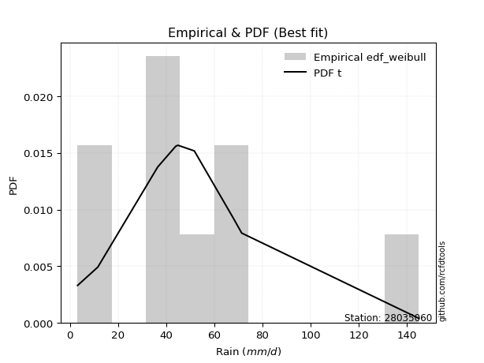</img>

</div>


### 4. EDF Beard (1943)

The Beard formula (or Beard´s plotting position formula) in hydrology is used to estimate the empirical non-exceedance probability _(P)_ of a flood event (or other extreme hydrological data point) within a given dataset.

<div align="center">


$P=(m-0.31)/(n+0.38)$


</div>


**4.1. Empirical values**

<div align="center">

|                | 0                   | 1                   | 2                  | 3                   | 4         | 5                  | 6                  | 7                  | 8                  |
|:---------------|:--------------------|:--------------------|:-------------------|:--------------------|:----------|:-------------------|:-------------------|:-------------------|:-------------------|
| date           | 2020                | 2021                | 2025               | 2018                | 2023      | 2022               | 2017               | 2019               | 2024               |
| x              | 3.2                 | 11.6                | 36.5               | 44.0                | 44.9      | 51.7               | 67.8               | 71.4               | 145.0              |
| m              | 1                   | 2                   | 3                  | 4                   | 5         | 6                  | 7                  | 8                  | 9                  |
| empirical_dist | edf_beard           | edf_beard           | edf_beard          | edf_beard           | edf_beard | edf_beard          | edf_beard          | edf_beard          | edf_beard          |
| empirical      | 0.07356076759061833 | 0.18017057569296374 | 0.2867803837953091 | 0.39339019189765456 | 0.5       | 0.6066098081023454 | 0.7132196162046908 | 0.8198294243070362 | 0.9264392324093815 |
| empirical_tr   | 1.0794016110471807  | 1.2197659297789336  | 1.4020926756352765 | 1.6485061511423549  | 2.0       | 2.542005420054201  | 3.486988847583642  | 5.550295857988164  | 13.5942028985507   |

</div>


**4.2. Kolmogorov-Smirnov fit test (sorted by Δ)**


<div align="center">

|                | 0                   | 1                   | 2                   | 3                   | 4                   | 5                   | 6                   | 7                   | 8                   | 9                   | 10                  | 11                  | 12                  | 13                  | 14                  | 15                  | 16                  | 17                  | 18                  | 19                  | 20                  | 21                  | 22                  | 23                  | 24                  | 25                  | 26                  | 27                  | 28                  | 29                  | 30                  | 31                  | 32                  | 33                  | 34                  | 35                  | 36                  | 37                  | 38                  | 39                  | 40                  | 41                  | 42                  | 43                  | 44                  | 45                  | 46                  | 47                  | 48                  | 49                  | 50                  | 51                  | 52                  | 53                  | 54                  | 55                  | 56                  | 57                  | 58                  | 59                  | 60                  | 61                  | 62                  | 63                  | 64                  | 65                  | 66                  | 67                  | 68                  | 69                  | 70                  | 71                  | 72                  | 73                  | 74                  | 75                  | 76                  | 77                  | 78                  | 79                  | 80                  | 81                  | 82                  | 83                  | 84                  | 85                  | 86                  | 87                  | 88                  | 89                  | 90                  | 91                  | 92                  | 93                  | 94                  | 95                  | 96                  | 97                  | 98                  | 99                  | 100                 | 101                 | 102                 | 103                 | 104                 | 105                 | 106                 | 107                 | 108                 | 109                 | 110                 | 111                 | 112                 | 113                 | 114                 | 115                 | 116                 | 117                 | 118                 | 119                 | 120                 | 121                 | 122                 | 123                 | 124                 | 125                 | 126                 | 127                 | 128                 | 129                 | 130                 | 131                 | 132                 | 133                 | 134                 | 135                 | 136                 | 137                 | 138                 | 139                 | 140                 | 141                 | 142                 | 143                 | 144                 | 145                 | 146                 | 147                 | 148                 | 149                 | 150                 | 151                 | 152                 | 153                 | 154                 | 155                 | 156                 | 157                 | 158                 | 159                 |
|:---------------|:--------------------|:--------------------|:--------------------|:--------------------|:--------------------|:--------------------|:--------------------|:--------------------|:--------------------|:--------------------|:--------------------|:--------------------|:--------------------|:--------------------|:--------------------|:--------------------|:--------------------|:--------------------|:--------------------|:--------------------|:--------------------|:--------------------|:--------------------|:--------------------|:--------------------|:--------------------|:--------------------|:--------------------|:--------------------|:--------------------|:--------------------|:--------------------|:--------------------|:--------------------|:--------------------|:--------------------|:--------------------|:--------------------|:--------------------|:--------------------|:--------------------|:--------------------|:--------------------|:--------------------|:--------------------|:--------------------|:--------------------|:--------------------|:--------------------|:--------------------|:--------------------|:--------------------|:--------------------|:--------------------|:--------------------|:--------------------|:--------------------|:--------------------|:--------------------|:--------------------|:--------------------|:--------------------|:--------------------|:--------------------|:--------------------|:--------------------|:--------------------|:--------------------|:--------------------|:--------------------|:--------------------|:--------------------|:--------------------|:--------------------|:--------------------|:--------------------|:--------------------|:--------------------|:--------------------|:--------------------|:--------------------|:--------------------|:--------------------|:--------------------|:--------------------|:--------------------|:--------------------|:--------------------|:--------------------|:--------------------|:--------------------|:--------------------|:--------------------|:--------------------|:--------------------|:--------------------|:--------------------|:--------------------|:--------------------|:--------------------|:--------------------|:--------------------|:--------------------|:--------------------|:--------------------|:--------------------|:--------------------|:--------------------|:--------------------|:--------------------|:--------------------|:--------------------|:--------------------|:--------------------|:--------------------|:--------------------|:--------------------|:--------------------|:--------------------|:--------------------|:--------------------|:--------------------|:--------------------|:--------------------|:--------------------|:--------------------|:--------------------|:--------------------|:--------------------|:--------------------|:--------------------|:--------------------|:--------------------|:--------------------|:--------------------|:--------------------|:--------------------|:--------------------|:--------------------|:--------------------|:--------------------|:--------------------|:--------------------|:--------------------|:--------------------|:--------------------|:--------------------|:--------------------|:--------------------|:--------------------|:--------------------|:--------------------|:--------------------|:--------------------|:--------------------|:--------------------|:--------------------|:--------------------|:--------------------|:--------------------|
| station        | 28035060            | 28035060            | 28035060            | 28035060            | 28035060            | 28035060            | 28035060            | 28035060            | 28035060            | 28035060            | 28035060            | 28035060            | 28035060            | 28035060            | 28035060            | 28035060            | 28035060            | 28035060            | 28035060            | 28035060            | 28035060            | 28035060            | 28035060            | 28035060            | 28035060            | 28035060            | 28035060            | 28035060            | 28035060            | 28035060            | 28035060            | 28035060            | 28035060            | 28035060            | 28035060            | 28035060            | 28035060            | 28035060            | 28035060            | 28035060            | 28035060            | 28035060            | 28035060            | 28035060            | 28035060            | 28035060            | 28035060            | 28035060            | 28035060            | 28035060            | 28035060            | 28035060            | 28035060            | 28035060            | 28035060            | 28035060            | 28035060            | 28035060            | 28035060            | 28035060            | 28035060            | 28035060            | 28035060            | 28035060            | 28035060            | 28035060            | 28035060            | 28035060            | 28035060            | 28035060            | 28035060            | 28035060            | 28035060            | 28035060            | 28035060            | 28035060            | 28035060            | 28035060            | 28035060            | 28035060            | 28035060            | 28035060            | 28035060            | 28035060            | 28035060            | 28035060            | 28035060            | 28035060            | 28035060            | 28035060            | 28035060            | 28035060            | 28035060            | 28035060            | 28035060            | 28035060            | 28035060            | 28035060            | 28035060            | 28035060            | 28035060            | 28035060            | 28035060            | 28035060            | 28035060            | 28035060            | 28035060            | 28035060            | 28035060            | 28035060            | 28035060            | 28035060            | 28035060            | 28035060            | 28035060            | 28035060            | 28035060            | 28035060            | 28035060            | 28035060            | 28035060            | 28035060            | 28035060            | 28035060            | 28035060            | 28035060            | 28035060            | 28035060            | 28035060            | 28035060            | 28035060            | 28035060            | 28035060            | 28035060            | 28035060            | 28035060            | 28035060            | 28035060            | 28035060            | 28035060            | 28035060            | 28035060            | 28035060            | 28035060            | 28035060            | 28035060            | 28035060            | 28035060            | 28035060            | 28035060            | 28035060            | 28035060            | 28035060            | 28035060            | 28035060            | 28035060            | 28035060            | 28035060            | 28035060            | 28035060            |
| empirical_dist | edf_beard           | edf_beard           | edf_beard           | edf_beard           | edf_beard           | edf_beard           | edf_beard           | edf_beard           | edf_beard           | edf_beard           | edf_beard           | edf_beard           | edf_beard           | edf_beard           | edf_beard           | edf_beard           | edf_beard           | edf_beard           | edf_beard           | edf_beard           | edf_beard           | edf_beard           | edf_beard           | edf_beard           | edf_beard           | edf_beard           | edf_beard           | edf_beard           | edf_beard           | edf_beard           | edf_beard           | edf_beard           | edf_beard           | edf_beard           | edf_beard           | edf_beard           | edf_beard           | edf_beard           | edf_beard           | edf_beard           | edf_beard           | edf_beard           | edf_beard           | edf_beard           | edf_beard           | edf_beard           | edf_beard           | edf_beard           | edf_beard           | edf_beard           | edf_beard           | edf_beard           | edf_beard           | edf_beard           | edf_beard           | edf_beard           | edf_beard           | edf_beard           | edf_beard           | edf_beard           | edf_beard           | edf_beard           | edf_beard           | edf_beard           | edf_beard           | edf_beard           | edf_beard           | edf_beard           | edf_beard           | edf_beard           | edf_beard           | edf_beard           | edf_beard           | edf_beard           | edf_beard           | edf_beard           | edf_beard           | edf_beard           | edf_beard           | edf_beard           | edf_beard           | edf_beard           | edf_beard           | edf_beard           | edf_beard           | edf_beard           | edf_beard           | edf_beard           | edf_beard           | edf_beard           | edf_beard           | edf_beard           | edf_beard           | edf_beard           | edf_beard           | edf_beard           | edf_beard           | edf_beard           | edf_beard           | edf_beard           | edf_beard           | edf_beard           | edf_beard           | edf_beard           | edf_beard           | edf_beard           | edf_beard           | edf_beard           | edf_beard           | edf_beard           | edf_beard           | edf_beard           | edf_beard           | edf_beard           | edf_beard           | edf_beard           | edf_beard           | edf_beard           | edf_beard           | edf_beard           | edf_beard           | edf_beard           | edf_beard           | edf_beard           | edf_beard           | edf_beard           | edf_beard           | edf_beard           | edf_beard           | edf_beard           | edf_beard           | edf_beard           | edf_beard           | edf_beard           | edf_beard           | edf_beard           | edf_beard           | edf_beard           | edf_beard           | edf_beard           | edf_beard           | edf_beard           | edf_beard           | edf_beard           | edf_beard           | edf_beard           | edf_beard           | edf_beard           | edf_beard           | edf_beard           | edf_beard           | edf_beard           | edf_beard           | edf_beard           | edf_beard           | edf_beard           | edf_beard           | edf_beard           | edf_beard           | edf_beard           |
| p_dist         | t                   | logjohnsonsu        | vonmises_line       | exponnorm           | nct                 | genlogistic         | kstwobign           | gumbel_r            | invweibull          | logdgamma           | logdweibull         | dweibull            | pearson3            | invgamma            | loggennorm          | moyal               | johnsonsu           | rayleigh            | skewnorm            | logt                | rice                | invgauss            | dgamma              | maxwell             | fatiguelife         | logistic            | burr                | hypsecant           | mielke              | halfnorm            | logburr             | kappa3              | loggenlogistic      | ncf                 | laplace             | logmielke           | logloggamma         | foldnorm            | gennorm             | logvonmises_line    | logloglaplace       | halflogistic        | logexponweib        | genpareto           | loggenextreme       | gompertz            | norm                | crystalball         | logexponpow         | betaprime           | logweibull_min      | logargus            | truncpareto         | logpearson3         | logskewnorm         | loggumbel_l         | logburr12           | loggompertz         | burr12              | anglit              | logtrapezoid        | lognakagami         | semicircular        | wald                | logtriang           | exponpow            | gumbel_l            | loggengamma         | loggenhalflogistic  | f                   | genexpon            | lomax               | arcsine             | logfoldnorm         | logarcsine          | logsemicircular     | loganglit           | cosine              | logexponnorm        | lognorm             | logcrystalball      | logrice             | lognct              | logfatiguelife      | loglogistic         | loghypsecant        | logf                | logncf              | tukeylambda         | bradford            | loglaplace          | loglaplace          | nakagami            | logbetaprime        | loggenpareto        | loggamma            | loggamma            | loginvgamma         | logerlang           | loginvgauss         | logalpha            | beta                | truncexpon          | loglevy_l           | truncweibull_min    | logmaxwell          | loginvweibull       | gausshyper          | lograyleigh         | logbeta             | loggausshyper       | logcosine           | gengamma            | logtruncweibull_min | logkstwobign        | loggumbel_r         | kappa4              | loghalfnorm         | loglomax            | loggenexpon         | logmoyal            | loghalflogistic     | logksone            | logweibull_max      | ksone               | wrapcauchy          | logwrapcauchy       | uniform             | halfgennorm         | argus               | logtukeylambda      | logkappa3           | loguniform          | weibull_min         | logkappa4           | exponweib           | levy_l              | loghalfgennorm      | logwald             | logtruncnorm        | genextreme          | logbradford         | logjohnsonsb        | logtruncexpon       | gamma               | erlang              | genhalflogistic     | rdist               | powerlaw            | alpha               | triang              | logrdist            | trapezoid           | johnsonsb           | logpowerlaw         | weibull_max         | logtruncpareto      | truncnorm           | logvonmises         | vonmises            |
| delta          | 0.06724314848905799 | 0.0731224400499349  | 0.07390476757481584 | 0.08382371144233153 | 0.08402504646727915 | 0.09221576883296595 | 0.09361960620100174 | 0.09464910359445927 | 0.10374620772894405 | 0.10660980810234111 | 0.10660980810234832 | 0.10660980810303955 | 0.10721955952611578 | 0.10727486142443388 | 0.10872617015117919 | 0.11075697627612668 | 0.11248559442103595 | 0.11384511939614728 | 0.11536589389828428 | 0.11563565685977484 | 0.11616608843871667 | 0.11681559086829651 | 0.11787771093268506 | 0.11914876554497023 | 0.1194115847552138  | 0.1205855271803285  | 0.12137941943796215 | 0.12201823768001668 | 0.12499019513735171 | 0.1267117501279505  | 0.12694279365967848 | 0.1271723130728054  | 0.1272324559311907  | 0.12747979562791423 | 0.12794075432761975 | 0.12812069875726956 | 0.12812235474810807 | 0.13030437037409165 | 0.1308492790573279  | 0.13198834951745597 | 0.1323960534998715  | 0.13244018544353786 | 0.1340535466104743  | 0.1340970669606082  | 0.1353829397447257  | 0.13650857047448772 | 0.13712352360060265 | 0.1371235282906843  | 0.13726710600936431 | 0.13859675609914612 | 0.13946600522113817 | 0.14098960081303002 | 0.14165250320276357 | 0.14545256332340695 | 0.14551083176796248 | 0.15011963078692125 | 0.15423503111205372 | 0.15424213867884207 | 0.1571579023012194  | 0.16020685942778035 | 0.1632213070829911  | 0.16805779644256988 | 0.16997964960117085 | 0.18017057569296374 | 0.18397463122864222 | 0.188135363911773   | 0.18953713246076842 | 0.19705408206705682 | 0.1972406330950366  | 0.1990469043869717  | 0.20173261837716283 | 0.20594792801070594 | 0.21073054321884677 | 0.2148500817879221  | 0.21718806186880069 | 0.21883047422922342 | 0.2192453545089632  | 0.2202443454637768  | 0.2202512802265546  | 0.22025185295754057 | 0.22025187599256668 | 0.22025199499074155 | 0.22066359533433588 | 0.2210264221814856  | 0.22121240187081026 | 0.2220325482765949  | 0.22415062074986025 | 0.22418995834975464 | 0.2250649436026878  | 0.22569817403193382 | 0.22626475529785384 | 0.22626475529785384 | 0.23144387651695264 | 0.23149522963308966 | 0.23185568763953934 | 0.2325836143370592  | 0.2325836143370592  | 0.2341831052529001  | 0.23533601425704231 | 0.23905625183217794 | 0.2396438984620517  | 0.24566543376690453 | 0.24700863370012338 | 0.24763949953735445 | 0.24771881009142105 | 0.25300769521408095 | 0.25351629249349616 | 0.2547285907257639  | 0.2638626639423527  | 0.27571572360831165 | 0.2777669259765614  | 0.28097294045376286 | 0.28539375861368166 | 0.2854466352394681  | 0.28728912954007424 | 0.2907998549695986  | 0.2925391418168021  | 0.2944250684282044  | 0.2977703496299111  | 0.3024033874415931  | 0.3165856828347413  | 0.3197742348902216  | 0.32845901045104253 | 0.33268741891634834 | 0.3356968432068952  | 0.33683045839619363 | 0.3382688764874382  | 0.338870326986867   | 0.3405050929892163  | 0.34209078142240323 | 0.3422376500597877  | 0.3512872515556855  | 0.35150688930031293 | 0.36083855862239966 | 0.36915480919963894 | 0.373388907504312   | 0.3789555207395915  | 0.38620907798616355 | 0.3882645685593942  | 0.40355491904709473 | 0.4118240749191486  | 0.41548432206517716 | 0.4205108051498195  | 0.4213630398844379  | 0.4365056404161627  | 0.45321489490346833 | 0.4714864677449582  | 0.4816715787070168  | 0.48220545159472883 | 0.5138412419826017  | 0.5382746524351583  | 0.5423081068557254  | 0.5823106720441698  | 0.5938016256443667  | 0.6180462271718945  | 0.6952999838321049  | 0.7545611563288479  | 0.8916903976899924  | 1.1044321248007125  | 22.664480060067543  |
| deltao         | 0.41761268023100007 | 0.41761268023100007 | 0.41761268023100007 | 0.41761268023100007 | 0.41761268023100007 | 0.41761268023100007 | 0.41761268023100007 | 0.41761268023100007 | 0.41761268023100007 | 0.41761268023100007 | 0.41761268023100007 | 0.41761268023100007 | 0.41761268023100007 | 0.41761268023100007 | 0.41761268023100007 | 0.41761268023100007 | 0.41761268023100007 | 0.41761268023100007 | 0.41761268023100007 | 0.41761268023100007 | 0.41761268023100007 | 0.41761268023100007 | 0.41761268023100007 | 0.41761268023100007 | 0.41761268023100007 | 0.41761268023100007 | 0.41761268023100007 | 0.41761268023100007 | 0.41761268023100007 | 0.41761268023100007 | 0.41761268023100007 | 0.41761268023100007 | 0.41761268023100007 | 0.41761268023100007 | 0.41761268023100007 | 0.41761268023100007 | 0.41761268023100007 | 0.41761268023100007 | 0.41761268023100007 | 0.41761268023100007 | 0.41761268023100007 | 0.41761268023100007 | 0.41761268023100007 | 0.41761268023100007 | 0.41761268023100007 | 0.41761268023100007 | 0.41761268023100007 | 0.41761268023100007 | 0.41761268023100007 | 0.41761268023100007 | 0.41761268023100007 | 0.41761268023100007 | 0.41761268023100007 | 0.41761268023100007 | 0.41761268023100007 | 0.41761268023100007 | 0.41761268023100007 | 0.41761268023100007 | 0.41761268023100007 | 0.41761268023100007 | 0.41761268023100007 | 0.41761268023100007 | 0.41761268023100007 | 0.41761268023100007 | 0.41761268023100007 | 0.41761268023100007 | 0.41761268023100007 | 0.41761268023100007 | 0.41761268023100007 | 0.41761268023100007 | 0.41761268023100007 | 0.41761268023100007 | 0.41761268023100007 | 0.41761268023100007 | 0.41761268023100007 | 0.41761268023100007 | 0.41761268023100007 | 0.41761268023100007 | 0.41761268023100007 | 0.41761268023100007 | 0.41761268023100007 | 0.41761268023100007 | 0.41761268023100007 | 0.41761268023100007 | 0.41761268023100007 | 0.41761268023100007 | 0.41761268023100007 | 0.41761268023100007 | 0.41761268023100007 | 0.41761268023100007 | 0.41761268023100007 | 0.41761268023100007 | 0.41761268023100007 | 0.41761268023100007 | 0.41761268023100007 | 0.41761268023100007 | 0.41761268023100007 | 0.41761268023100007 | 0.41761268023100007 | 0.41761268023100007 | 0.41761268023100007 | 0.41761268023100007 | 0.41761268023100007 | 0.41761268023100007 | 0.41761268023100007 | 0.41761268023100007 | 0.41761268023100007 | 0.41761268023100007 | 0.41761268023100007 | 0.41761268023100007 | 0.41761268023100007 | 0.41761268023100007 | 0.41761268023100007 | 0.41761268023100007 | 0.41761268023100007 | 0.41761268023100007 | 0.41761268023100007 | 0.41761268023100007 | 0.41761268023100007 | 0.41761268023100007 | 0.41761268023100007 | 0.41761268023100007 | 0.41761268023100007 | 0.41761268023100007 | 0.41761268023100007 | 0.41761268023100007 | 0.41761268023100007 | 0.41761268023100007 | 0.41761268023100007 | 0.41761268023100007 | 0.41761268023100007 | 0.41761268023100007 | 0.41761268023100007 | 0.41761268023100007 | 0.41761268023100007 | 0.41761268023100007 | 0.41761268023100007 | 0.41761268023100007 | 0.41761268023100007 | 0.41761268023100007 | 0.41761268023100007 | 0.41761268023100007 | 0.41761268023100007 | 0.41761268023100007 | 0.41761268023100007 | 0.41761268023100007 | 0.41761268023100007 | 0.41761268023100007 | 0.41761268023100007 | 0.41761268023100007 | 0.41761268023100007 | 0.41761268023100007 | 0.41761268023100007 | 0.41761268023100007 | 0.41761268023100007 | 0.41761268023100007 | 0.41761268023100007 | 0.41761268023100007 | 0.41761268023100007 | 0.41761268023100007 |
| eval           | Δo > Δ              | Δo > Δ              | Δo > Δ              | Δo > Δ              | Δo > Δ              | Δo > Δ              | Δo > Δ              | Δo > Δ              | Δo > Δ              | Δo > Δ              | Δo > Δ              | Δo > Δ              | Δo > Δ              | Δo > Δ              | Δo > Δ              | Δo > Δ              | Δo > Δ              | Δo > Δ              | Δo > Δ              | Δo > Δ              | Δo > Δ              | Δo > Δ              | Δo > Δ              | Δo > Δ              | Δo > Δ              | Δo > Δ              | Δo > Δ              | Δo > Δ              | Δo > Δ              | Δo > Δ              | Δo > Δ              | Δo > Δ              | Δo > Δ              | Δo > Δ              | Δo > Δ              | Δo > Δ              | Δo > Δ              | Δo > Δ              | Δo > Δ              | Δo > Δ              | Δo > Δ              | Δo > Δ              | Δo > Δ              | Δo > Δ              | Δo > Δ              | Δo > Δ              | Δo > Δ              | Δo > Δ              | Δo > Δ              | Δo > Δ              | Δo > Δ              | Δo > Δ              | Δo > Δ              | Δo > Δ              | Δo > Δ              | Δo > Δ              | Δo > Δ              | Δo > Δ              | Δo > Δ              | Δo > Δ              | Δo > Δ              | Δo > Δ              | Δo > Δ              | Δo > Δ              | Δo > Δ              | Δo > Δ              | Δo > Δ              | Δo > Δ              | Δo > Δ              | Δo > Δ              | Δo > Δ              | Δo > Δ              | Δo > Δ              | Δo > Δ              | Δo > Δ              | Δo > Δ              | Δo > Δ              | Δo > Δ              | Δo > Δ              | Δo > Δ              | Δo > Δ              | Δo > Δ              | Δo > Δ              | Δo > Δ              | Δo > Δ              | Δo > Δ              | Δo > Δ              | Δo > Δ              | Δo > Δ              | Δo > Δ              | Δo > Δ              | Δo > Δ              | Δo > Δ              | Δo > Δ              | Δo > Δ              | Δo > Δ              | Δo > Δ              | Δo > Δ              | Δo > Δ              | Δo > Δ              | Δo > Δ              | Δo > Δ              | Δo > Δ              | Δo > Δ              | Δo > Δ              | Δo > Δ              | Δo > Δ              | Δo > Δ              | Δo > Δ              | Δo > Δ              | Δo > Δ              | Δo > Δ              | Δo > Δ              | Δo > Δ              | Δo > Δ              | Δo > Δ              | Δo > Δ              | Δo > Δ              | Δo > Δ              | Δo > Δ              | Δo > Δ              | Δo > Δ              | Δo > Δ              | Δo > Δ              | Δo > Δ              | Δo > Δ              | Δo > Δ              | Δo > Δ              | Δo > Δ              | Δo > Δ              | Δo > Δ              | Δo > Δ              | Δo > Δ              | Δo > Δ              | Δo > Δ              | Δo > Δ              | Δo > Δ              | Δo > Δ              | Δo > Δ              | Δo > Δ              | Δo > Δ              | Δo > Δ              | Δo <= Δ             | Δo <= Δ             | Δo <= Δ             | Δo <= Δ             | Δo <= Δ             | Δo <= Δ             | Δo <= Δ             | Δo <= Δ             | Δo <= Δ             | Δo <= Δ             | Δo <= Δ             | Δo <= Δ             | Δo <= Δ             | Δo <= Δ             | Δo <= Δ             | Δo <= Δ             | Δo <= Δ             | Δo <= Δ             |
| fit            | 1                   | 1                   | 1                   | 1                   | 1                   | 1                   | 1                   | 1                   | 1                   | 1                   | 1                   | 1                   | 1                   | 1                   | 1                   | 1                   | 1                   | 1                   | 1                   | 1                   | 1                   | 1                   | 1                   | 1                   | 1                   | 1                   | 1                   | 1                   | 1                   | 1                   | 1                   | 1                   | 1                   | 1                   | 1                   | 1                   | 1                   | 1                   | 1                   | 1                   | 1                   | 1                   | 1                   | 1                   | 1                   | 1                   | 1                   | 1                   | 1                   | 1                   | 1                   | 1                   | 1                   | 1                   | 1                   | 1                   | 1                   | 1                   | 1                   | 1                   | 1                   | 1                   | 1                   | 1                   | 1                   | 1                   | 1                   | 1                   | 1                   | 1                   | 1                   | 1                   | 1                   | 1                   | 1                   | 1                   | 1                   | 1                   | 1                   | 1                   | 1                   | 1                   | 1                   | 1                   | 1                   | 1                   | 1                   | 1                   | 1                   | 1                   | 1                   | 1                   | 1                   | 1                   | 1                   | 1                   | 1                   | 1                   | 1                   | 1                   | 1                   | 1                   | 1                   | 1                   | 1                   | 1                   | 1                   | 1                   | 1                   | 1                   | 1                   | 1                   | 1                   | 1                   | 1                   | 1                   | 1                   | 1                   | 1                   | 1                   | 1                   | 1                   | 1                   | 1                   | 1                   | 1                   | 1                   | 1                   | 1                   | 1                   | 1                   | 1                   | 1                   | 1                   | 1                   | 1                   | 1                   | 1                   | 1                   | 1                   | 1                   | 1                   | 0                   | 0                   | 0                   | 0                   | 0                   | 0                   | 0                   | 0                   | 0                   | 0                   | 0                   | 0                   | 0                   | 0                   | 0                   | 0                   | 0                   | 0                   |
| n              | 9                   | 9                   | 9                   | 9                   | 9                   | 9                   | 9                   | 9                   | 9                   | 9                   | 9                   | 9                   | 9                   | 9                   | 9                   | 9                   | 9                   | 9                   | 9                   | 9                   | 9                   | 9                   | 9                   | 9                   | 9                   | 9                   | 9                   | 9                   | 9                   | 9                   | 9                   | 9                   | 9                   | 9                   | 9                   | 9                   | 9                   | 9                   | 9                   | 9                   | 9                   | 9                   | 9                   | 9                   | 9                   | 9                   | 9                   | 9                   | 9                   | 9                   | 9                   | 9                   | 9                   | 9                   | 9                   | 9                   | 9                   | 9                   | 9                   | 9                   | 9                   | 9                   | 9                   | 9                   | 9                   | 9                   | 9                   | 9                   | 9                   | 9                   | 9                   | 9                   | 9                   | 9                   | 9                   | 9                   | 9                   | 9                   | 9                   | 9                   | 9                   | 9                   | 9                   | 9                   | 9                   | 9                   | 9                   | 9                   | 9                   | 9                   | 9                   | 9                   | 9                   | 9                   | 9                   | 9                   | 9                   | 9                   | 9                   | 9                   | 9                   | 9                   | 9                   | 9                   | 9                   | 9                   | 9                   | 9                   | 9                   | 9                   | 9                   | 9                   | 9                   | 9                   | 9                   | 9                   | 9                   | 9                   | 9                   | 9                   | 9                   | 9                   | 9                   | 9                   | 9                   | 9                   | 9                   | 9                   | 9                   | 9                   | 9                   | 9                   | 9                   | 9                   | 9                   | 9                   | 9                   | 9                   | 9                   | 9                   | 9                   | 9                   | 9                   | 9                   | 9                   | 9                   | 9                   | 9                   | 9                   | 9                   | 9                   | 9                   | 9                   | 9                   | 9                   | 9                   | 9                   | 9                   | 9                   | 9                   |
| best_fit       | 1                   | 0                   | 0                   | 0                   | 0                   | 0                   | 0                   | 0                   | 0                   | 0                   | 0                   | 0                   | 0                   | 0                   | 0                   | 0                   | 0                   | 0                   | 0                   | 0                   | 0                   | 0                   | 0                   | 0                   | 0                   | 0                   | 0                   | 0                   | 0                   | 0                   | 0                   | 0                   | 0                   | 0                   | 0                   | 0                   | 0                   | 0                   | 0                   | 0                   | 0                   | 0                   | 0                   | 0                   | 0                   | 0                   | 0                   | 0                   | 0                   | 0                   | 0                   | 0                   | 0                   | 0                   | 0                   | 0                   | 0                   | 0                   | 0                   | 0                   | 0                   | 0                   | 0                   | 0                   | 0                   | 0                   | 0                   | 0                   | 0                   | 0                   | 0                   | 0                   | 0                   | 0                   | 0                   | 0                   | 0                   | 0                   | 0                   | 0                   | 0                   | 0                   | 0                   | 0                   | 0                   | 0                   | 0                   | 0                   | 0                   | 0                   | 0                   | 0                   | 0                   | 0                   | 0                   | 0                   | 0                   | 0                   | 0                   | 0                   | 0                   | 0                   | 0                   | 0                   | 0                   | 0                   | 0                   | 0                   | 0                   | 0                   | 0                   | 0                   | 0                   | 0                   | 0                   | 0                   | 0                   | 0                   | 0                   | 0                   | 0                   | 0                   | 0                   | 0                   | 0                   | 0                   | 0                   | 0                   | 0                   | 0                   | 0                   | 0                   | 0                   | 0                   | 0                   | 0                   | 0                   | 0                   | 0                   | 0                   | 0                   | 0                   | 0                   | 0                   | 0                   | 0                   | 0                   | 0                   | 0                   | 0                   | 0                   | 0                   | 0                   | 0                   | 0                   | 0                   | 0                   | 0                   | 0                   | 0                   |
| best_fit_sort  | 1                   | 2                   | 3                   | 4                   | 5                   | 6                   | 7                   | 8                   | 9                   | 10                  | 11                  | 12                  | 13                  | 14                  | 15                  | 16                  | 17                  | 18                  | 19                  | 20                  | 21                  | 22                  | 23                  | 24                  | 25                  | 26                  | 27                  | 28                  | 29                  | 30                  | 31                  | 32                  | 33                  | 34                  | 35                  | 36                  | 37                  | 38                  | 39                  | 40                  | 41                  | 42                  | 43                  | 44                  | 45                  | 46                  | 47                  | 48                  | 49                  | 50                  | 51                  | 52                  | 53                  | 54                  | 55                  | 56                  | 57                  | 58                  | 59                  | 60                  | 61                  | 62                  | 63                  | 64                  | 65                  | 66                  | 67                  | 68                  | 69                  | 70                  | 71                  | 72                  | 73                  | 74                  | 75                  | 76                  | 77                  | 78                  | 79                  | 80                  | 81                  | 82                  | 83                  | 84                  | 85                  | 86                  | 87                  | 88                  | 89                  | 90                  | 91                  | 92                  | 93                  | 94                  | 95                  | 96                  | 97                  | 98                  | 99                  | 100                 | 101                 | 102                 | 103                 | 104                 | 105                 | 106                 | 107                 | 108                 | 109                 | 110                 | 111                 | 112                 | 113                 | 114                 | 115                 | 116                 | 117                 | 118                 | 119                 | 120                 | 121                 | 122                 | 123                 | 124                 | 125                 | 126                 | 127                 | 128                 | 129                 | 130                 | 131                 | 132                 | 133                 | 134                 | 135                 | 136                 | 137                 | 138                 | 139                 | 140                 | 141                 | 142                 | 143                 | 144                 | 145                 | 146                 | 147                 | 148                 | 149                 | 150                 | 151                 | 152                 | 153                 | 154                 | 155                 | 156                 | 157                 | 158                 | 159                 | 160                 |

</div>


**4.3. Best fit**

<div align="center">

|   id |   station | empirical_dist   | p_dist   |     delta |   deltao | eval   |   fit |   n |   best_fit |   best_fit_sort |
|-----:|----------:|:-----------------|:---------|----------:|---------:|:-------|------:|----:|-----------:|----------------:|
|    0 |  28035060 | edf_beard        | t        | 0.0672431 | 0.417613 | Δo > Δ |     1 |   9 |          1 |               1 |

</div>


<div align="center">

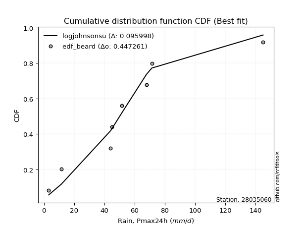</img></img>

</div>


### 5. EDF Chegodayev (1955)

The Chegodayev formula is an empirical plotting position formula used in hydrological frequency analysis to estimate the exceedance probability or return period of a specific event from a set of observed data. It is primarily used for plotting observed data points on probability paper to fit a theoretical distribution, particularly for analyzing extreme events like maximum flood flows or rainfall intensities. The constant _b_ value in the generalized plotting position formula is 0.3.

<div align="center">


$P=(m-b)/(n+1-2b)$


</div>


**5.1. Empirical values**

<div align="center">

|                | 0                   | 1                   | 2                  | 3                   | 4              | 5                  | 6                  | 7                  | 8                  |
|:---------------|:--------------------|:--------------------|:-------------------|:--------------------|:---------------|:-------------------|:-------------------|:-------------------|:-------------------|
| date           | 2020                | 2021                | 2025               | 2018                | 2023           | 2022               | 2017               | 2019               | 2024               |
| x              | 3.2                 | 11.6                | 36.5               | 44.0                | 44.9           | 51.7               | 67.8               | 71.4               | 145.0              |
| m              | 1                   | 2                   | 3                  | 4                   | 5              | 6                  | 7                  | 8                  | 9                  |
| empirical_dist | edf_chegodayev      | edf_chegodayev      | edf_chegodayev     | edf_chegodayev      | edf_chegodayev | edf_chegodayev     | edf_chegodayev     | edf_chegodayev     | edf_chegodayev     |
| empirical      | 0.07446808510638298 | 0.18085106382978722 | 0.2872340425531915 | 0.39361702127659576 | 0.5            | 0.6063829787234043 | 0.7127659574468085 | 0.8191489361702128 | 0.9255319148936169 |
| empirical_tr   | 1.0804597701149425  | 1.2207792207792207  | 1.4029850746268657 | 1.6491228070175437  | 2.0            | 2.540540540540541  | 3.481481481481481  | 5.529411764705883  | 13.428571428571399 |

</div>


**5.2. Kolmogorov-Smirnov fit test (sorted by Δ)**


<div align="center">

|                | 0                   | 1                   | 2                   | 3                   | 4                   | 5                   | 6                   | 7                   | 8                   | 9                   | 10                  | 11                  | 12                  | 13                  | 14                  | 15                  | 16                  | 17                  | 18                  | 19                  | 20                  | 21                  | 22                  | 23                  | 24                  | 25                  | 26                  | 27                  | 28                  | 29                  | 30                  | 31                  | 32                  | 33                  | 34                  | 35                  | 36                  | 37                  | 38                  | 39                  | 40                  | 41                  | 42                  | 43                  | 44                  | 45                  | 46                  | 47                  | 48                  | 49                  | 50                  | 51                  | 52                  | 53                  | 54                  | 55                  | 56                  | 57                  | 58                  | 59                  | 60                  | 61                  | 62                  | 63                  | 64                  | 65                  | 66                  | 67                  | 68                  | 69                  | 70                  | 71                  | 72                  | 73                  | 74                  | 75                  | 76                  | 77                  | 78                  | 79                  | 80                  | 81                  | 82                  | 83                  | 84                  | 85                  | 86                  | 87                  | 88                  | 89                  | 90                  | 91                  | 92                  | 93                  | 94                  | 95                  | 96                  | 97                  | 98                  | 99                  | 100                 | 101                 | 102                 | 103                 | 104                 | 105                 | 106                 | 107                 | 108                 | 109                 | 110                 | 111                 | 112                 | 113                 | 114                 | 115                 | 116                 | 117                 | 118                 | 119                 | 120                 | 121                 | 122                 | 123                 | 124                 | 125                 | 126                 | 127                 | 128                 | 129                 | 130                 | 131                 | 132                 | 133                 | 134                 | 135                 | 136                 | 137                 | 138                 | 139                 | 140                 | 141                 | 142                 | 143                 | 144                 | 145                 | 146                 | 147                 | 148                 | 149                 | 150                 | 151                 | 152                 | 153                 | 154                 | 155                 | 156                 | 157                 | 158                 | 159                 |
|:---------------|:--------------------|:--------------------|:--------------------|:--------------------|:--------------------|:--------------------|:--------------------|:--------------------|:--------------------|:--------------------|:--------------------|:--------------------|:--------------------|:--------------------|:--------------------|:--------------------|:--------------------|:--------------------|:--------------------|:--------------------|:--------------------|:--------------------|:--------------------|:--------------------|:--------------------|:--------------------|:--------------------|:--------------------|:--------------------|:--------------------|:--------------------|:--------------------|:--------------------|:--------------------|:--------------------|:--------------------|:--------------------|:--------------------|:--------------------|:--------------------|:--------------------|:--------------------|:--------------------|:--------------------|:--------------------|:--------------------|:--------------------|:--------------------|:--------------------|:--------------------|:--------------------|:--------------------|:--------------------|:--------------------|:--------------------|:--------------------|:--------------------|:--------------------|:--------------------|:--------------------|:--------------------|:--------------------|:--------------------|:--------------------|:--------------------|:--------------------|:--------------------|:--------------------|:--------------------|:--------------------|:--------------------|:--------------------|:--------------------|:--------------------|:--------------------|:--------------------|:--------------------|:--------------------|:--------------------|:--------------------|:--------------------|:--------------------|:--------------------|:--------------------|:--------------------|:--------------------|:--------------------|:--------------------|:--------------------|:--------------------|:--------------------|:--------------------|:--------------------|:--------------------|:--------------------|:--------------------|:--------------------|:--------------------|:--------------------|:--------------------|:--------------------|:--------------------|:--------------------|:--------------------|:--------------------|:--------------------|:--------------------|:--------------------|:--------------------|:--------------------|:--------------------|:--------------------|:--------------------|:--------------------|:--------------------|:--------------------|:--------------------|:--------------------|:--------------------|:--------------------|:--------------------|:--------------------|:--------------------|:--------------------|:--------------------|:--------------------|:--------------------|:--------------------|:--------------------|:--------------------|:--------------------|:--------------------|:--------------------|:--------------------|:--------------------|:--------------------|:--------------------|:--------------------|:--------------------|:--------------------|:--------------------|:--------------------|:--------------------|:--------------------|:--------------------|:--------------------|:--------------------|:--------------------|:--------------------|:--------------------|:--------------------|:--------------------|:--------------------|:--------------------|:--------------------|:--------------------|:--------------------|:--------------------|:--------------------|:--------------------|
| station        | 28035060            | 28035060            | 28035060            | 28035060            | 28035060            | 28035060            | 28035060            | 28035060            | 28035060            | 28035060            | 28035060            | 28035060            | 28035060            | 28035060            | 28035060            | 28035060            | 28035060            | 28035060            | 28035060            | 28035060            | 28035060            | 28035060            | 28035060            | 28035060            | 28035060            | 28035060            | 28035060            | 28035060            | 28035060            | 28035060            | 28035060            | 28035060            | 28035060            | 28035060            | 28035060            | 28035060            | 28035060            | 28035060            | 28035060            | 28035060            | 28035060            | 28035060            | 28035060            | 28035060            | 28035060            | 28035060            | 28035060            | 28035060            | 28035060            | 28035060            | 28035060            | 28035060            | 28035060            | 28035060            | 28035060            | 28035060            | 28035060            | 28035060            | 28035060            | 28035060            | 28035060            | 28035060            | 28035060            | 28035060            | 28035060            | 28035060            | 28035060            | 28035060            | 28035060            | 28035060            | 28035060            | 28035060            | 28035060            | 28035060            | 28035060            | 28035060            | 28035060            | 28035060            | 28035060            | 28035060            | 28035060            | 28035060            | 28035060            | 28035060            | 28035060            | 28035060            | 28035060            | 28035060            | 28035060            | 28035060            | 28035060            | 28035060            | 28035060            | 28035060            | 28035060            | 28035060            | 28035060            | 28035060            | 28035060            | 28035060            | 28035060            | 28035060            | 28035060            | 28035060            | 28035060            | 28035060            | 28035060            | 28035060            | 28035060            | 28035060            | 28035060            | 28035060            | 28035060            | 28035060            | 28035060            | 28035060            | 28035060            | 28035060            | 28035060            | 28035060            | 28035060            | 28035060            | 28035060            | 28035060            | 28035060            | 28035060            | 28035060            | 28035060            | 28035060            | 28035060            | 28035060            | 28035060            | 28035060            | 28035060            | 28035060            | 28035060            | 28035060            | 28035060            | 28035060            | 28035060            | 28035060            | 28035060            | 28035060            | 28035060            | 28035060            | 28035060            | 28035060            | 28035060            | 28035060            | 28035060            | 28035060            | 28035060            | 28035060            | 28035060            | 28035060            | 28035060            | 28035060            | 28035060            | 28035060            | 28035060            |
| empirical_dist | edf_chegodayev      | edf_chegodayev      | edf_chegodayev      | edf_chegodayev      | edf_chegodayev      | edf_chegodayev      | edf_chegodayev      | edf_chegodayev      | edf_chegodayev      | edf_chegodayev      | edf_chegodayev      | edf_chegodayev      | edf_chegodayev      | edf_chegodayev      | edf_chegodayev      | edf_chegodayev      | edf_chegodayev      | edf_chegodayev      | edf_chegodayev      | edf_chegodayev      | edf_chegodayev      | edf_chegodayev      | edf_chegodayev      | edf_chegodayev      | edf_chegodayev      | edf_chegodayev      | edf_chegodayev      | edf_chegodayev      | edf_chegodayev      | edf_chegodayev      | edf_chegodayev      | edf_chegodayev      | edf_chegodayev      | edf_chegodayev      | edf_chegodayev      | edf_chegodayev      | edf_chegodayev      | edf_chegodayev      | edf_chegodayev      | edf_chegodayev      | edf_chegodayev      | edf_chegodayev      | edf_chegodayev      | edf_chegodayev      | edf_chegodayev      | edf_chegodayev      | edf_chegodayev      | edf_chegodayev      | edf_chegodayev      | edf_chegodayev      | edf_chegodayev      | edf_chegodayev      | edf_chegodayev      | edf_chegodayev      | edf_chegodayev      | edf_chegodayev      | edf_chegodayev      | edf_chegodayev      | edf_chegodayev      | edf_chegodayev      | edf_chegodayev      | edf_chegodayev      | edf_chegodayev      | edf_chegodayev      | edf_chegodayev      | edf_chegodayev      | edf_chegodayev      | edf_chegodayev      | edf_chegodayev      | edf_chegodayev      | edf_chegodayev      | edf_chegodayev      | edf_chegodayev      | edf_chegodayev      | edf_chegodayev      | edf_chegodayev      | edf_chegodayev      | edf_chegodayev      | edf_chegodayev      | edf_chegodayev      | edf_chegodayev      | edf_chegodayev      | edf_chegodayev      | edf_chegodayev      | edf_chegodayev      | edf_chegodayev      | edf_chegodayev      | edf_chegodayev      | edf_chegodayev      | edf_chegodayev      | edf_chegodayev      | edf_chegodayev      | edf_chegodayev      | edf_chegodayev      | edf_chegodayev      | edf_chegodayev      | edf_chegodayev      | edf_chegodayev      | edf_chegodayev      | edf_chegodayev      | edf_chegodayev      | edf_chegodayev      | edf_chegodayev      | edf_chegodayev      | edf_chegodayev      | edf_chegodayev      | edf_chegodayev      | edf_chegodayev      | edf_chegodayev      | edf_chegodayev      | edf_chegodayev      | edf_chegodayev      | edf_chegodayev      | edf_chegodayev      | edf_chegodayev      | edf_chegodayev      | edf_chegodayev      | edf_chegodayev      | edf_chegodayev      | edf_chegodayev      | edf_chegodayev      | edf_chegodayev      | edf_chegodayev      | edf_chegodayev      | edf_chegodayev      | edf_chegodayev      | edf_chegodayev      | edf_chegodayev      | edf_chegodayev      | edf_chegodayev      | edf_chegodayev      | edf_chegodayev      | edf_chegodayev      | edf_chegodayev      | edf_chegodayev      | edf_chegodayev      | edf_chegodayev      | edf_chegodayev      | edf_chegodayev      | edf_chegodayev      | edf_chegodayev      | edf_chegodayev      | edf_chegodayev      | edf_chegodayev      | edf_chegodayev      | edf_chegodayev      | edf_chegodayev      | edf_chegodayev      | edf_chegodayev      | edf_chegodayev      | edf_chegodayev      | edf_chegodayev      | edf_chegodayev      | edf_chegodayev      | edf_chegodayev      | edf_chegodayev      | edf_chegodayev      | edf_chegodayev      | edf_chegodayev      | edf_chegodayev      |
| p_dist         | t                   | logjohnsonsu        | vonmises_line       | nct                 | exponnorm           | genlogistic         | kstwobign           | gumbel_r            | invweibull          | logdgamma           | logdweibull         | dweibull            | pearson3            | invgamma            | loggennorm          | moyal               | johnsonsu           | rayleigh            | skewnorm            | rice                | logt                | invgauss            | dgamma              | maxwell             | fatiguelife         | logistic            | burr                | hypsecant           | mielke              | halfnorm            | logburr             | kappa3              | loggenlogistic      | ncf                 | logmielke           | logloggamma         | laplace             | foldnorm            | gennorm             | logvonmises_line    | logloglaplace       | halflogistic        | logexponweib        | genpareto           | loggenextreme       | gompertz            | norm                | crystalball         | logexponpow         | betaprime           | logweibull_min      | logargus            | truncpareto         | logpearson3         | logskewnorm         | loggumbel_l         | logburr12           | loggompertz         | burr12              | anglit              | logtrapezoid        | lognakagami         | semicircular        | wald                | logtriang           | exponpow            | gumbel_l            | loggengamma         | loggenhalflogistic  | f                   | genexpon            | lomax               | arcsine             | logfoldnorm         | logarcsine          | logsemicircular     | loganglit           | cosine              | logexponnorm        | lognorm             | logcrystalball      | logrice             | lognct              | logfatiguelife      | loglogistic         | loghypsecant        | logf                | logncf              | bradford            | tukeylambda         | loglaplace          | loglaplace          | nakagami            | logbetaprime        | loggenpareto        | loggamma            | loggamma            | loginvgamma         | logerlang           | loginvgauss         | logalpha            | beta                | truncexpon          | loglevy_l           | truncweibull_min    | logmaxwell          | loginvweibull       | gausshyper          | lograyleigh         | logbeta             | loggausshyper       | logcosine           | gengamma            | logtruncweibull_min | logkstwobign        | loggumbel_r         | kappa4              | loghalfnorm         | loglomax            | loggenexpon         | logmoyal            | loghalflogistic     | logksone            | logweibull_max      | ksone               | wrapcauchy          | logwrapcauchy       | uniform             | halfgennorm         | argus               | logtukeylambda      | logkappa3           | loguniform          | weibull_min         | logkappa4           | exponweib           | levy_l              | loghalfgennorm      | logwald             | logtruncnorm        | genextreme          | logbradford         | logjohnsonsb        | logtruncexpon       | gamma               | erlang              | genhalflogistic     | rdist               | powerlaw            | alpha               | triang              | logrdist            | trapezoid           | johnsonsb           | logpowerlaw         | weibull_max         | logtruncpareto      | truncnorm           | logvonmises         | vonmises            |
| delta          | 0.06769680724694027 | 0.07380292818675838 | 0.07446808510478475 | 0.08357138770939676 | 0.08396351146907821 | 0.09176211007508356 | 0.09293911806417832 | 0.09419544483657688 | 0.10329254897106166 | 0.10638297872339991 | 0.10638297872340713 | 0.10638297872409835 | 0.10676590076823339 | 0.10682120266655148 | 0.10940665828800267 | 0.11030331751824429 | 0.11203193566315356 | 0.11316463125932386 | 0.11491223514040189 | 0.11548560030189325 | 0.11631614499659831 | 0.11636193211041412 | 0.11833136969056735 | 0.1184682774081468  | 0.1189579259973314  | 0.12035869780138736 | 0.12069893130113873 | 0.12179140830107554 | 0.12453653637946932 | 0.1262580913700681  | 0.12648913490179609 | 0.12671865431492302 | 0.1267787971733083  | 0.12702613687003184 | 0.12766703999938717 | 0.12766869599022568 | 0.12771392494867861 | 0.12985071161620926 | 0.13130293781521019 | 0.13153469075957358 | 0.13171556536304807 | 0.13198652668565547 | 0.13359988785259191 | 0.1336434082027258  | 0.13470245160790228 | 0.13605491171660533 | 0.13644303546377923 | 0.13644304015386088 | 0.13681344725148192 | 0.13814309734126373 | 0.13901234646325578 | 0.14053594205514763 | 0.14119884444488118 | 0.14499890456552456 | 0.1450571730100801  | 0.14966597202903886 | 0.15378137235417133 | 0.15378847992095968 | 0.156704243543337   | 0.15952637129095693 | 0.1627676483251087  | 0.16873828457939336 | 0.16929916146434743 | 0.18085106382978722 | 0.18352097247075982 | 0.1876817051538906  | 0.18931030308182728 | 0.19660042330917443 | 0.1967869743371542  | 0.1985932456290893  | 0.20127895961928044 | 0.20549426925282355 | 0.21005005508202335 | 0.2143964230300397  | 0.2167344031109183  | 0.21837681547134102 | 0.21879169575108082 | 0.21956385732695338 | 0.2197976214686722  | 0.21979819419965818 | 0.2197982172346843  | 0.21979833623285916 | 0.2202099365764535  | 0.2205727634236032  | 0.22075874311292787 | 0.22157888951871252 | 0.22369696199197786 | 0.22373629959187225 | 0.2250176858951104  | 0.2255186023605701  | 0.22603792591891264 | 0.22603792591891264 | 0.23099021775907025 | 0.23104157087520727 | 0.23140202888165695 | 0.23212995557917682 | 0.23212995557917682 | 0.2337294464950177  | 0.23488235549915992 | 0.23860259307429554 | 0.2391902397041693  | 0.24521177500902214 | 0.24632814556329996 | 0.2467321820215898  | 0.24703832195459763 | 0.25255403645619856 | 0.2530626337356138  | 0.2540481025889405  | 0.2634090051844703  | 0.2750352354714882  | 0.277313267218679   | 0.2805192816958805  | 0.28494009985579927 | 0.2849929764815857  | 0.28683547078219185 | 0.2903461962117162  | 0.29185865367997865 | 0.293971409670322   | 0.2973166908720287  | 0.3019497286837107  | 0.3161320240768589  | 0.3193205761323392  | 0.32800535169316014 | 0.3320069307795249  | 0.33501635507007177 | 0.3361499702593702  | 0.3378152177295558  | 0.33818983885004356 | 0.3400514342313339  | 0.3414102932855798  | 0.3417839913019053  | 0.35083359279780313 | 0.35105323054243054 | 0.36038489986451727 | 0.36870115044175655 | 0.3729352487464296  | 0.3780482032238269  | 0.38575541922828116 | 0.3878109098015118  | 0.40310126028921234 | 0.4111435867823251  | 0.41503066330729477 | 0.419830317012996   | 0.4209093811265555  | 0.4360519816582803  | 0.45276123614558594 | 0.4708059796081348  | 0.4807642611912522  | 0.48175179283684644 | 0.5133875832247193  | 0.5375941642983348  | 0.541854448097843   | 0.5816301839073463  | 0.5931211375075433  | 0.6175925684140121  | 0.6946194956952815  | 0.7538806681920244  | 0.8907830801742278  | 1.1039784660428302  | 22.665387377583308  |
| deltao         | 0.41761268023100007 | 0.41761268023100007 | 0.41761268023100007 | 0.41761268023100007 | 0.41761268023100007 | 0.41761268023100007 | 0.41761268023100007 | 0.41761268023100007 | 0.41761268023100007 | 0.41761268023100007 | 0.41761268023100007 | 0.41761268023100007 | 0.41761268023100007 | 0.41761268023100007 | 0.41761268023100007 | 0.41761268023100007 | 0.41761268023100007 | 0.41761268023100007 | 0.41761268023100007 | 0.41761268023100007 | 0.41761268023100007 | 0.41761268023100007 | 0.41761268023100007 | 0.41761268023100007 | 0.41761268023100007 | 0.41761268023100007 | 0.41761268023100007 | 0.41761268023100007 | 0.41761268023100007 | 0.41761268023100007 | 0.41761268023100007 | 0.41761268023100007 | 0.41761268023100007 | 0.41761268023100007 | 0.41761268023100007 | 0.41761268023100007 | 0.41761268023100007 | 0.41761268023100007 | 0.41761268023100007 | 0.41761268023100007 | 0.41761268023100007 | 0.41761268023100007 | 0.41761268023100007 | 0.41761268023100007 | 0.41761268023100007 | 0.41761268023100007 | 0.41761268023100007 | 0.41761268023100007 | 0.41761268023100007 | 0.41761268023100007 | 0.41761268023100007 | 0.41761268023100007 | 0.41761268023100007 | 0.41761268023100007 | 0.41761268023100007 | 0.41761268023100007 | 0.41761268023100007 | 0.41761268023100007 | 0.41761268023100007 | 0.41761268023100007 | 0.41761268023100007 | 0.41761268023100007 | 0.41761268023100007 | 0.41761268023100007 | 0.41761268023100007 | 0.41761268023100007 | 0.41761268023100007 | 0.41761268023100007 | 0.41761268023100007 | 0.41761268023100007 | 0.41761268023100007 | 0.41761268023100007 | 0.41761268023100007 | 0.41761268023100007 | 0.41761268023100007 | 0.41761268023100007 | 0.41761268023100007 | 0.41761268023100007 | 0.41761268023100007 | 0.41761268023100007 | 0.41761268023100007 | 0.41761268023100007 | 0.41761268023100007 | 0.41761268023100007 | 0.41761268023100007 | 0.41761268023100007 | 0.41761268023100007 | 0.41761268023100007 | 0.41761268023100007 | 0.41761268023100007 | 0.41761268023100007 | 0.41761268023100007 | 0.41761268023100007 | 0.41761268023100007 | 0.41761268023100007 | 0.41761268023100007 | 0.41761268023100007 | 0.41761268023100007 | 0.41761268023100007 | 0.41761268023100007 | 0.41761268023100007 | 0.41761268023100007 | 0.41761268023100007 | 0.41761268023100007 | 0.41761268023100007 | 0.41761268023100007 | 0.41761268023100007 | 0.41761268023100007 | 0.41761268023100007 | 0.41761268023100007 | 0.41761268023100007 | 0.41761268023100007 | 0.41761268023100007 | 0.41761268023100007 | 0.41761268023100007 | 0.41761268023100007 | 0.41761268023100007 | 0.41761268023100007 | 0.41761268023100007 | 0.41761268023100007 | 0.41761268023100007 | 0.41761268023100007 | 0.41761268023100007 | 0.41761268023100007 | 0.41761268023100007 | 0.41761268023100007 | 0.41761268023100007 | 0.41761268023100007 | 0.41761268023100007 | 0.41761268023100007 | 0.41761268023100007 | 0.41761268023100007 | 0.41761268023100007 | 0.41761268023100007 | 0.41761268023100007 | 0.41761268023100007 | 0.41761268023100007 | 0.41761268023100007 | 0.41761268023100007 | 0.41761268023100007 | 0.41761268023100007 | 0.41761268023100007 | 0.41761268023100007 | 0.41761268023100007 | 0.41761268023100007 | 0.41761268023100007 | 0.41761268023100007 | 0.41761268023100007 | 0.41761268023100007 | 0.41761268023100007 | 0.41761268023100007 | 0.41761268023100007 | 0.41761268023100007 | 0.41761268023100007 | 0.41761268023100007 | 0.41761268023100007 | 0.41761268023100007 | 0.41761268023100007 | 0.41761268023100007 | 0.41761268023100007 |
| eval           | Δo > Δ              | Δo > Δ              | Δo > Δ              | Δo > Δ              | Δo > Δ              | Δo > Δ              | Δo > Δ              | Δo > Δ              | Δo > Δ              | Δo > Δ              | Δo > Δ              | Δo > Δ              | Δo > Δ              | Δo > Δ              | Δo > Δ              | Δo > Δ              | Δo > Δ              | Δo > Δ              | Δo > Δ              | Δo > Δ              | Δo > Δ              | Δo > Δ              | Δo > Δ              | Δo > Δ              | Δo > Δ              | Δo > Δ              | Δo > Δ              | Δo > Δ              | Δo > Δ              | Δo > Δ              | Δo > Δ              | Δo > Δ              | Δo > Δ              | Δo > Δ              | Δo > Δ              | Δo > Δ              | Δo > Δ              | Δo > Δ              | Δo > Δ              | Δo > Δ              | Δo > Δ              | Δo > Δ              | Δo > Δ              | Δo > Δ              | Δo > Δ              | Δo > Δ              | Δo > Δ              | Δo > Δ              | Δo > Δ              | Δo > Δ              | Δo > Δ              | Δo > Δ              | Δo > Δ              | Δo > Δ              | Δo > Δ              | Δo > Δ              | Δo > Δ              | Δo > Δ              | Δo > Δ              | Δo > Δ              | Δo > Δ              | Δo > Δ              | Δo > Δ              | Δo > Δ              | Δo > Δ              | Δo > Δ              | Δo > Δ              | Δo > Δ              | Δo > Δ              | Δo > Δ              | Δo > Δ              | Δo > Δ              | Δo > Δ              | Δo > Δ              | Δo > Δ              | Δo > Δ              | Δo > Δ              | Δo > Δ              | Δo > Δ              | Δo > Δ              | Δo > Δ              | Δo > Δ              | Δo > Δ              | Δo > Δ              | Δo > Δ              | Δo > Δ              | Δo > Δ              | Δo > Δ              | Δo > Δ              | Δo > Δ              | Δo > Δ              | Δo > Δ              | Δo > Δ              | Δo > Δ              | Δo > Δ              | Δo > Δ              | Δo > Δ              | Δo > Δ              | Δo > Δ              | Δo > Δ              | Δo > Δ              | Δo > Δ              | Δo > Δ              | Δo > Δ              | Δo > Δ              | Δo > Δ              | Δo > Δ              | Δo > Δ              | Δo > Δ              | Δo > Δ              | Δo > Δ              | Δo > Δ              | Δo > Δ              | Δo > Δ              | Δo > Δ              | Δo > Δ              | Δo > Δ              | Δo > Δ              | Δo > Δ              | Δo > Δ              | Δo > Δ              | Δo > Δ              | Δo > Δ              | Δo > Δ              | Δo > Δ              | Δo > Δ              | Δo > Δ              | Δo > Δ              | Δo > Δ              | Δo > Δ              | Δo > Δ              | Δo > Δ              | Δo > Δ              | Δo > Δ              | Δo > Δ              | Δo > Δ              | Δo > Δ              | Δo > Δ              | Δo > Δ              | Δo > Δ              | Δo > Δ              | Δo > Δ              | Δo <= Δ             | Δo <= Δ             | Δo <= Δ             | Δo <= Δ             | Δo <= Δ             | Δo <= Δ             | Δo <= Δ             | Δo <= Δ             | Δo <= Δ             | Δo <= Δ             | Δo <= Δ             | Δo <= Δ             | Δo <= Δ             | Δo <= Δ             | Δo <= Δ             | Δo <= Δ             | Δo <= Δ             | Δo <= Δ             |
| fit            | 1                   | 1                   | 1                   | 1                   | 1                   | 1                   | 1                   | 1                   | 1                   | 1                   | 1                   | 1                   | 1                   | 1                   | 1                   | 1                   | 1                   | 1                   | 1                   | 1                   | 1                   | 1                   | 1                   | 1                   | 1                   | 1                   | 1                   | 1                   | 1                   | 1                   | 1                   | 1                   | 1                   | 1                   | 1                   | 1                   | 1                   | 1                   | 1                   | 1                   | 1                   | 1                   | 1                   | 1                   | 1                   | 1                   | 1                   | 1                   | 1                   | 1                   | 1                   | 1                   | 1                   | 1                   | 1                   | 1                   | 1                   | 1                   | 1                   | 1                   | 1                   | 1                   | 1                   | 1                   | 1                   | 1                   | 1                   | 1                   | 1                   | 1                   | 1                   | 1                   | 1                   | 1                   | 1                   | 1                   | 1                   | 1                   | 1                   | 1                   | 1                   | 1                   | 1                   | 1                   | 1                   | 1                   | 1                   | 1                   | 1                   | 1                   | 1                   | 1                   | 1                   | 1                   | 1                   | 1                   | 1                   | 1                   | 1                   | 1                   | 1                   | 1                   | 1                   | 1                   | 1                   | 1                   | 1                   | 1                   | 1                   | 1                   | 1                   | 1                   | 1                   | 1                   | 1                   | 1                   | 1                   | 1                   | 1                   | 1                   | 1                   | 1                   | 1                   | 1                   | 1                   | 1                   | 1                   | 1                   | 1                   | 1                   | 1                   | 1                   | 1                   | 1                   | 1                   | 1                   | 1                   | 1                   | 1                   | 1                   | 1                   | 1                   | 0                   | 0                   | 0                   | 0                   | 0                   | 0                   | 0                   | 0                   | 0                   | 0                   | 0                   | 0                   | 0                   | 0                   | 0                   | 0                   | 0                   | 0                   |
| n              | 9                   | 9                   | 9                   | 9                   | 9                   | 9                   | 9                   | 9                   | 9                   | 9                   | 9                   | 9                   | 9                   | 9                   | 9                   | 9                   | 9                   | 9                   | 9                   | 9                   | 9                   | 9                   | 9                   | 9                   | 9                   | 9                   | 9                   | 9                   | 9                   | 9                   | 9                   | 9                   | 9                   | 9                   | 9                   | 9                   | 9                   | 9                   | 9                   | 9                   | 9                   | 9                   | 9                   | 9                   | 9                   | 9                   | 9                   | 9                   | 9                   | 9                   | 9                   | 9                   | 9                   | 9                   | 9                   | 9                   | 9                   | 9                   | 9                   | 9                   | 9                   | 9                   | 9                   | 9                   | 9                   | 9                   | 9                   | 9                   | 9                   | 9                   | 9                   | 9                   | 9                   | 9                   | 9                   | 9                   | 9                   | 9                   | 9                   | 9                   | 9                   | 9                   | 9                   | 9                   | 9                   | 9                   | 9                   | 9                   | 9                   | 9                   | 9                   | 9                   | 9                   | 9                   | 9                   | 9                   | 9                   | 9                   | 9                   | 9                   | 9                   | 9                   | 9                   | 9                   | 9                   | 9                   | 9                   | 9                   | 9                   | 9                   | 9                   | 9                   | 9                   | 9                   | 9                   | 9                   | 9                   | 9                   | 9                   | 9                   | 9                   | 9                   | 9                   | 9                   | 9                   | 9                   | 9                   | 9                   | 9                   | 9                   | 9                   | 9                   | 9                   | 9                   | 9                   | 9                   | 9                   | 9                   | 9                   | 9                   | 9                   | 9                   | 9                   | 9                   | 9                   | 9                   | 9                   | 9                   | 9                   | 9                   | 9                   | 9                   | 9                   | 9                   | 9                   | 9                   | 9                   | 9                   | 9                   | 9                   |
| best_fit       | 1                   | 0                   | 0                   | 0                   | 0                   | 0                   | 0                   | 0                   | 0                   | 0                   | 0                   | 0                   | 0                   | 0                   | 0                   | 0                   | 0                   | 0                   | 0                   | 0                   | 0                   | 0                   | 0                   | 0                   | 0                   | 0                   | 0                   | 0                   | 0                   | 0                   | 0                   | 0                   | 0                   | 0                   | 0                   | 0                   | 0                   | 0                   | 0                   | 0                   | 0                   | 0                   | 0                   | 0                   | 0                   | 0                   | 0                   | 0                   | 0                   | 0                   | 0                   | 0                   | 0                   | 0                   | 0                   | 0                   | 0                   | 0                   | 0                   | 0                   | 0                   | 0                   | 0                   | 0                   | 0                   | 0                   | 0                   | 0                   | 0                   | 0                   | 0                   | 0                   | 0                   | 0                   | 0                   | 0                   | 0                   | 0                   | 0                   | 0                   | 0                   | 0                   | 0                   | 0                   | 0                   | 0                   | 0                   | 0                   | 0                   | 0                   | 0                   | 0                   | 0                   | 0                   | 0                   | 0                   | 0                   | 0                   | 0                   | 0                   | 0                   | 0                   | 0                   | 0                   | 0                   | 0                   | 0                   | 0                   | 0                   | 0                   | 0                   | 0                   | 0                   | 0                   | 0                   | 0                   | 0                   | 0                   | 0                   | 0                   | 0                   | 0                   | 0                   | 0                   | 0                   | 0                   | 0                   | 0                   | 0                   | 0                   | 0                   | 0                   | 0                   | 0                   | 0                   | 0                   | 0                   | 0                   | 0                   | 0                   | 0                   | 0                   | 0                   | 0                   | 0                   | 0                   | 0                   | 0                   | 0                   | 0                   | 0                   | 0                   | 0                   | 0                   | 0                   | 0                   | 0                   | 0                   | 0                   | 0                   |
| best_fit_sort  | 1                   | 2                   | 3                   | 4                   | 5                   | 6                   | 7                   | 8                   | 9                   | 10                  | 11                  | 12                  | 13                  | 14                  | 15                  | 16                  | 17                  | 18                  | 19                  | 20                  | 21                  | 22                  | 23                  | 24                  | 25                  | 26                  | 27                  | 28                  | 29                  | 30                  | 31                  | 32                  | 33                  | 34                  | 35                  | 36                  | 37                  | 38                  | 39                  | 40                  | 41                  | 42                  | 43                  | 44                  | 45                  | 46                  | 47                  | 48                  | 49                  | 50                  | 51                  | 52                  | 53                  | 54                  | 55                  | 56                  | 57                  | 58                  | 59                  | 60                  | 61                  | 62                  | 63                  | 64                  | 65                  | 66                  | 67                  | 68                  | 69                  | 70                  | 71                  | 72                  | 73                  | 74                  | 75                  | 76                  | 77                  | 78                  | 79                  | 80                  | 81                  | 82                  | 83                  | 84                  | 85                  | 86                  | 87                  | 88                  | 89                  | 90                  | 91                  | 92                  | 93                  | 94                  | 95                  | 96                  | 97                  | 98                  | 99                  | 100                 | 101                 | 102                 | 103                 | 104                 | 105                 | 106                 | 107                 | 108                 | 109                 | 110                 | 111                 | 112                 | 113                 | 114                 | 115                 | 116                 | 117                 | 118                 | 119                 | 120                 | 121                 | 122                 | 123                 | 124                 | 125                 | 126                 | 127                 | 128                 | 129                 | 130                 | 131                 | 132                 | 133                 | 134                 | 135                 | 136                 | 137                 | 138                 | 139                 | 140                 | 141                 | 142                 | 143                 | 144                 | 145                 | 146                 | 147                 | 148                 | 149                 | 150                 | 151                 | 152                 | 153                 | 154                 | 155                 | 156                 | 157                 | 158                 | 159                 | 160                 |

</div>


**5.3. Best fit**

<div align="center">

|   id |   station | empirical_dist   | p_dist   |     delta |   deltao | eval   |   fit |   n |   best_fit |   best_fit_sort |
|-----:|----------:|:-----------------|:---------|----------:|---------:|:-------|------:|----:|-----------:|----------------:|
|    0 |  28035060 | edf_chegodayev   | t        | 0.0676968 | 0.417613 | Δo > Δ |     1 |   9 |          1 |               1 |

</div>


<div align="center">

</img>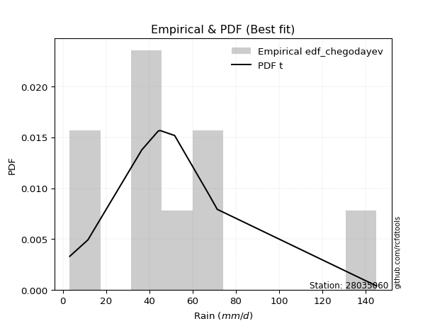</img>

</div>


### 6. EDF Blom (1958)

The Blom formula is a specific "plotting position" formula used in hydrology and statistical analysis to estimate the empirical cumulative probability (or non-exceedance probability) of a data series. It is particularly recommended for data that are approximately normally distributed. The constant _a_ is set to 0.375 (or 3/8).

<div align="center">


$P=(m-a)/(n+1-2a)$


</div>


**6.1. Empirical values**

<div align="center">

|                | 0                   | 1                   | 2                   | 3                  | 4        | 5                  | 6                  | 7                  | 8                  |
|:---------------|:--------------------|:--------------------|:--------------------|:-------------------|:---------|:-------------------|:-------------------|:-------------------|:-------------------|
| date           | 2020                | 2021                | 2025                | 2018               | 2023     | 2022               | 2017               | 2019               | 2024               |
| x              | 3.2                 | 11.6                | 36.5                | 44.0               | 44.9     | 51.7               | 67.8               | 71.4               | 145.0              |
| m              | 1                   | 2                   | 3                   | 4                  | 5        | 6                  | 7                  | 8                  | 9                  |
| empirical_dist | edf_blom            | edf_blom            | edf_blom            | edf_blom           | edf_blom | edf_blom           | edf_blom           | edf_blom           | edf_blom           |
| empirical      | 0.06756756756756757 | 0.17567567567567569 | 0.28378378378378377 | 0.3918918918918919 | 0.5      | 0.6081081081081081 | 0.7162162162162162 | 0.8243243243243243 | 0.9324324324324325 |
| empirical_tr   | 1.072463768115942   | 1.2131147540983607  | 1.3962264150943395  | 1.6444444444444444 | 2.0      | 2.5517241379310347 | 3.523809523809524  | 5.6923076923076925 | 14.800000000000006 |

</div>


**6.2. Kolmogorov-Smirnov fit test (sorted by Δ)**


<div align="center">

|                | 0                   | 1                   | 2                   | 3                   | 4                   | 5                   | 6                   | 7                   | 8                   | 9                   | 10                  | 11                  | 12                  | 13                  | 14                  | 15                  | 16                  | 17                  | 18                  | 19                  | 20                  | 21                  | 22                  | 23                  | 24                  | 25                  | 26                  | 27                  | 28                  | 29                  | 30                  | 31                  | 32                  | 33                  | 34                  | 35                  | 36                  | 37                  | 38                  | 39                  | 40                  | 41                  | 42                  | 43                  | 44                  | 45                  | 46                  | 47                  | 48                  | 49                  | 50                  | 51                  | 52                  | 53                  | 54                  | 55                  | 56                  | 57                  | 58                  | 59                  | 60                  | 61                  | 62                  | 63                  | 64                  | 65                  | 66                  | 67                  | 68                  | 69                  | 70                  | 71                  | 72                  | 73                  | 74                  | 75                  | 76                  | 77                  | 78                  | 79                  | 80                  | 81                  | 82                  | 83                  | 84                  | 85                  | 86                  | 87                  | 88                  | 89                  | 90                  | 91                  | 92                  | 93                  | 94                  | 95                  | 96                  | 97                  | 98                  | 99                  | 100                 | 101                 | 102                 | 103                 | 104                 | 105                 | 106                 | 107                 | 108                 | 109                 | 110                 | 111                 | 112                 | 113                 | 114                 | 115                 | 116                 | 117                 | 118                 | 119                 | 120                 | 121                 | 122                 | 123                 | 124                 | 125                 | 126                 | 127                 | 128                 | 129                 | 130                 | 131                 | 132                 | 133                 | 134                 | 135                 | 136                 | 137                 | 138                 | 139                 | 140                 | 141                 | 142                 | 143                 | 144                 | 145                 | 146                 | 147                 | 148                 | 149                 | 150                 | 151                 | 152                 | 153                 | 154                 | 155                 | 156                 | 157                 | 158                 | 159                 |
|:---------------|:--------------------|:--------------------|:--------------------|:--------------------|:--------------------|:--------------------|:--------------------|:--------------------|:--------------------|:--------------------|:--------------------|:--------------------|:--------------------|:--------------------|:--------------------|:--------------------|:--------------------|:--------------------|:--------------------|:--------------------|:--------------------|:--------------------|:--------------------|:--------------------|:--------------------|:--------------------|:--------------------|:--------------------|:--------------------|:--------------------|:--------------------|:--------------------|:--------------------|:--------------------|:--------------------|:--------------------|:--------------------|:--------------------|:--------------------|:--------------------|:--------------------|:--------------------|:--------------------|:--------------------|:--------------------|:--------------------|:--------------------|:--------------------|:--------------------|:--------------------|:--------------------|:--------------------|:--------------------|:--------------------|:--------------------|:--------------------|:--------------------|:--------------------|:--------------------|:--------------------|:--------------------|:--------------------|:--------------------|:--------------------|:--------------------|:--------------------|:--------------------|:--------------------|:--------------------|:--------------------|:--------------------|:--------------------|:--------------------|:--------------------|:--------------------|:--------------------|:--------------------|:--------------------|:--------------------|:--------------------|:--------------------|:--------------------|:--------------------|:--------------------|:--------------------|:--------------------|:--------------------|:--------------------|:--------------------|:--------------------|:--------------------|:--------------------|:--------------------|:--------------------|:--------------------|:--------------------|:--------------------|:--------------------|:--------------------|:--------------------|:--------------------|:--------------------|:--------------------|:--------------------|:--------------------|:--------------------|:--------------------|:--------------------|:--------------------|:--------------------|:--------------------|:--------------------|:--------------------|:--------------------|:--------------------|:--------------------|:--------------------|:--------------------|:--------------------|:--------------------|:--------------------|:--------------------|:--------------------|:--------------------|:--------------------|:--------------------|:--------------------|:--------------------|:--------------------|:--------------------|:--------------------|:--------------------|:--------------------|:--------------------|:--------------------|:--------------------|:--------------------|:--------------------|:--------------------|:--------------------|:--------------------|:--------------------|:--------------------|:--------------------|:--------------------|:--------------------|:--------------------|:--------------------|:--------------------|:--------------------|:--------------------|:--------------------|:--------------------|:--------------------|:--------------------|:--------------------|:--------------------|:--------------------|:--------------------|:--------------------|
| station        | 28035060            | 28035060            | 28035060            | 28035060            | 28035060            | 28035060            | 28035060            | 28035060            | 28035060            | 28035060            | 28035060            | 28035060            | 28035060            | 28035060            | 28035060            | 28035060            | 28035060            | 28035060            | 28035060            | 28035060            | 28035060            | 28035060            | 28035060            | 28035060            | 28035060            | 28035060            | 28035060            | 28035060            | 28035060            | 28035060            | 28035060            | 28035060            | 28035060            | 28035060            | 28035060            | 28035060            | 28035060            | 28035060            | 28035060            | 28035060            | 28035060            | 28035060            | 28035060            | 28035060            | 28035060            | 28035060            | 28035060            | 28035060            | 28035060            | 28035060            | 28035060            | 28035060            | 28035060            | 28035060            | 28035060            | 28035060            | 28035060            | 28035060            | 28035060            | 28035060            | 28035060            | 28035060            | 28035060            | 28035060            | 28035060            | 28035060            | 28035060            | 28035060            | 28035060            | 28035060            | 28035060            | 28035060            | 28035060            | 28035060            | 28035060            | 28035060            | 28035060            | 28035060            | 28035060            | 28035060            | 28035060            | 28035060            | 28035060            | 28035060            | 28035060            | 28035060            | 28035060            | 28035060            | 28035060            | 28035060            | 28035060            | 28035060            | 28035060            | 28035060            | 28035060            | 28035060            | 28035060            | 28035060            | 28035060            | 28035060            | 28035060            | 28035060            | 28035060            | 28035060            | 28035060            | 28035060            | 28035060            | 28035060            | 28035060            | 28035060            | 28035060            | 28035060            | 28035060            | 28035060            | 28035060            | 28035060            | 28035060            | 28035060            | 28035060            | 28035060            | 28035060            | 28035060            | 28035060            | 28035060            | 28035060            | 28035060            | 28035060            | 28035060            | 28035060            | 28035060            | 28035060            | 28035060            | 28035060            | 28035060            | 28035060            | 28035060            | 28035060            | 28035060            | 28035060            | 28035060            | 28035060            | 28035060            | 28035060            | 28035060            | 28035060            | 28035060            | 28035060            | 28035060            | 28035060            | 28035060            | 28035060            | 28035060            | 28035060            | 28035060            | 28035060            | 28035060            | 28035060            | 28035060            | 28035060            | 28035060            |
| empirical_dist | edf_blom            | edf_blom            | edf_blom            | edf_blom            | edf_blom            | edf_blom            | edf_blom            | edf_blom            | edf_blom            | edf_blom            | edf_blom            | edf_blom            | edf_blom            | edf_blom            | edf_blom            | edf_blom            | edf_blom            | edf_blom            | edf_blom            | edf_blom            | edf_blom            | edf_blom            | edf_blom            | edf_blom            | edf_blom            | edf_blom            | edf_blom            | edf_blom            | edf_blom            | edf_blom            | edf_blom            | edf_blom            | edf_blom            | edf_blom            | edf_blom            | edf_blom            | edf_blom            | edf_blom            | edf_blom            | edf_blom            | edf_blom            | edf_blom            | edf_blom            | edf_blom            | edf_blom            | edf_blom            | edf_blom            | edf_blom            | edf_blom            | edf_blom            | edf_blom            | edf_blom            | edf_blom            | edf_blom            | edf_blom            | edf_blom            | edf_blom            | edf_blom            | edf_blom            | edf_blom            | edf_blom            | edf_blom            | edf_blom            | edf_blom            | edf_blom            | edf_blom            | edf_blom            | edf_blom            | edf_blom            | edf_blom            | edf_blom            | edf_blom            | edf_blom            | edf_blom            | edf_blom            | edf_blom            | edf_blom            | edf_blom            | edf_blom            | edf_blom            | edf_blom            | edf_blom            | edf_blom            | edf_blom            | edf_blom            | edf_blom            | edf_blom            | edf_blom            | edf_blom            | edf_blom            | edf_blom            | edf_blom            | edf_blom            | edf_blom            | edf_blom            | edf_blom            | edf_blom            | edf_blom            | edf_blom            | edf_blom            | edf_blom            | edf_blom            | edf_blom            | edf_blom            | edf_blom            | edf_blom            | edf_blom            | edf_blom            | edf_blom            | edf_blom            | edf_blom            | edf_blom            | edf_blom            | edf_blom            | edf_blom            | edf_blom            | edf_blom            | edf_blom            | edf_blom            | edf_blom            | edf_blom            | edf_blom            | edf_blom            | edf_blom            | edf_blom            | edf_blom            | edf_blom            | edf_blom            | edf_blom            | edf_blom            | edf_blom            | edf_blom            | edf_blom            | edf_blom            | edf_blom            | edf_blom            | edf_blom            | edf_blom            | edf_blom            | edf_blom            | edf_blom            | edf_blom            | edf_blom            | edf_blom            | edf_blom            | edf_blom            | edf_blom            | edf_blom            | edf_blom            | edf_blom            | edf_blom            | edf_blom            | edf_blom            | edf_blom            | edf_blom            | edf_blom            | edf_blom            | edf_blom            | edf_blom            | edf_blom            |
| p_dist         | t                   | logjohnsonsu        | vonmises_line       | exponnorm           | nct                 | genlogistic         | gumbel_r            | kstwobign           | invweibull          | loggennorm          | logdgamma           | logdweibull         | dweibull            | pearson3            | invgamma            | logt                | moyal               | dgamma              | johnsonsu           | rayleigh            | skewnorm            | invgauss            | rice                | logistic            | fatiguelife         | hypsecant           | maxwell             | burr                | gennorm             | mielke              | laplace             | halfnorm            | logburr             | kappa3              | loggenlogistic      | ncf                 | logmielke           | logloggamma         | foldnorm            | logvonmises_line    | halflogistic        | logloglaplace       | logexponweib        | genpareto           | gompertz            | loggenextreme       | logexponpow         | betaprime           | norm                | crystalball         | logweibull_min      | logargus            | truncpareto         | logpearson3         | logskewnorm         | loggumbel_l         | logburr12           | loggompertz         | burr12              | lognakagami         | anglit              | logtrapezoid        | semicircular        | wald                | logtriang           | gumbel_l            | exponpow            | loggengamma         | loggenhalflogistic  | f                   | genexpon            | lomax               | arcsine             | logfoldnorm         | logarcsine          | logsemicircular     | tukeylambda         | loganglit           | logexponnorm        | lognorm             | logcrystalball      | logrice             | lognct              | logfatiguelife      | loglogistic         | cosine              | loghypsecant        | logf                | logncf              | loglaplace          | loglaplace          | bradford            | nakagami            | logbetaprime        | loggenpareto        | loggamma            | loggamma            | loginvgamma         | logerlang           | loginvgauss         | logalpha            | beta                | truncexpon          | truncweibull_min    | loglevy_l           | logmaxwell          | loginvweibull       | gausshyper          | lograyleigh         | logbeta             | loggausshyper       | logcosine           | gengamma            | logtruncweibull_min | logkstwobign        | loggumbel_r         | kappa4              | loghalfnorm         | loglomax            | loggenexpon         | logmoyal            | loghalflogistic     | logksone            | logweibull_max      | ksone               | logwrapcauchy       | wrapcauchy          | uniform             | halfgennorm         | logtukeylambda      | argus               | logkappa3           | loguniform          | weibull_min         | logkappa4           | exponweib           | levy_l              | loghalfgennorm      | logwald             | logtruncnorm        | genextreme          | logbradford         | logtruncexpon       | logjohnsonsb        | gamma               | erlang              | genhalflogistic     | powerlaw            | rdist               | alpha               | triang              | logrdist            | trapezoid           | johnsonsb           | logpowerlaw         | weibull_max         | logtruncpareto      | truncnorm           | logvonmises         | vonmises            |
| delta          | 0.0678666237952068  | 0.06862754003264684 | 0.0769013675863412  | 0.08682031145385688 | 0.0870216464788045  | 0.0952123688444913  | 0.09764570360598462 | 0.09811450621828988 | 0.1067428077404694  | 0.10810810396049031 | 0.10810810810810378 | 0.108108108108111   | 0.10810810810880223 | 0.11021615953764113 | 0.11027146143595923 | 0.11114075684248678 | 0.11375357628765204 | 0.1148811109211596  | 0.1154821944325613  | 0.11834001941343542 | 0.11836249390980963 | 0.11981219087982187 | 0.12066098845600481 | 0.12208382718609118 | 0.12240818476673915 | 0.12351653768577936 | 0.12364366556225836 | 0.1258743194552503  | 0.12785267904580244 | 0.12798679514887706 | 0.12943905433338243 | 0.12970835013947585 | 0.12993939367120383 | 0.13016891308433076 | 0.13022905594271605 | 0.13047639563943958 | 0.1311172987687949  | 0.13111895475963342 | 0.133300970385617   | 0.13498494952898132 | 0.1354367854550632  | 0.13689095351715963 | 0.13705014662199966 | 0.13709366697213354 | 0.13950517048601307 | 0.13987783976201384 | 0.14026370602088967 | 0.14159335611067148 | 0.1416184236178908  | 0.14161842830797244 | 0.14246260523266352 | 0.14398620082455538 | 0.14464910321428892 | 0.1484491633349323  | 0.14850743177948783 | 0.1531162307984466  | 0.15723163112357907 | 0.15723873869036742 | 0.16015450231274475 | 0.16356289642528182 | 0.16470175944506849 | 0.16621790709451645 | 0.17447454961845899 | 0.17567567567567569 | 0.18697123124016757 | 0.1910354324665311  | 0.19113196392329834 | 0.20005068207858218 | 0.20023723310656194 | 0.20204350439849705 | 0.20472921838868818 | 0.2089445280222313  | 0.2152254432361349  | 0.21784668179944744 | 0.22018466188032604 | 0.22182707424074877 | 0.22206834359116234 | 0.22224195452048856 | 0.22324788023807995 | 0.22324845296906592 | 0.22324847600409203 | 0.2232485950022669  | 0.22366019534586123 | 0.22402302219301096 | 0.2242090018823356  | 0.22473924548106494 | 0.22502914828812026 | 0.2271472207613856  | 0.22718655836128    | 0.2285270847939218  | 0.2285270847939218  | 0.23019307404922196 | 0.234440476528478   | 0.234491829644615   | 0.2348522876510647  | 0.23558021434858456 | 0.23558021434858456 | 0.23717970526442544 | 0.23833261426856767 | 0.2420528518437033  | 0.24264049847357705 | 0.24866203377842988 | 0.2515035337174115  | 0.2522137101087092  | 0.25363269956040524 | 0.2560042952256063  | 0.2565128925050215  | 0.25922349074305207 | 0.26685926395387805 | 0.2802106236255998  | 0.28076352598808674 | 0.2839695404652882  | 0.288390358625207   | 0.28844323525099347 | 0.2902857295515996  | 0.29379645498112394 | 0.2970340418340902  | 0.2974216684397297  | 0.30076694964143647 | 0.30539998745311847 | 0.31958228284626666 | 0.32277083490174696 | 0.3314556104625679  | 0.3371823189336365  | 0.34019174322418333 | 0.34126547649896355 | 0.34132535841348177 | 0.3433652270041551  | 0.3435016930007416  | 0.34523425007131303 | 0.3465856814396914  | 0.3542838515672109  | 0.3545034893118383  | 0.363835158633925   | 0.3721514092111643  | 0.3763855075158373  | 0.3849487207626423  | 0.3892056779976889  | 0.3912611685709195  | 0.4065515190586201  | 0.41631897493643666 | 0.4184809220767025  | 0.42435963989596326 | 0.42500570516710756 | 0.43950224042768804 | 0.4562114949149937  | 0.47598136776224637 | 0.4852020516062542  | 0.48766477873006764 | 0.5168378419941271  | 0.5427695524524463  | 0.5453047068672507  | 0.5868055720614579  | 0.5982965256616548  | 0.6210428271834199  | 0.699794883849393   | 0.7590560563461359  | 0.8976835977130432  | 1.1074287248122379  | 22.658486860044494  |
| deltao         | 0.41761268023100007 | 0.41761268023100007 | 0.41761268023100007 | 0.41761268023100007 | 0.41761268023100007 | 0.41761268023100007 | 0.41761268023100007 | 0.41761268023100007 | 0.41761268023100007 | 0.41761268023100007 | 0.41761268023100007 | 0.41761268023100007 | 0.41761268023100007 | 0.41761268023100007 | 0.41761268023100007 | 0.41761268023100007 | 0.41761268023100007 | 0.41761268023100007 | 0.41761268023100007 | 0.41761268023100007 | 0.41761268023100007 | 0.41761268023100007 | 0.41761268023100007 | 0.41761268023100007 | 0.41761268023100007 | 0.41761268023100007 | 0.41761268023100007 | 0.41761268023100007 | 0.41761268023100007 | 0.41761268023100007 | 0.41761268023100007 | 0.41761268023100007 | 0.41761268023100007 | 0.41761268023100007 | 0.41761268023100007 | 0.41761268023100007 | 0.41761268023100007 | 0.41761268023100007 | 0.41761268023100007 | 0.41761268023100007 | 0.41761268023100007 | 0.41761268023100007 | 0.41761268023100007 | 0.41761268023100007 | 0.41761268023100007 | 0.41761268023100007 | 0.41761268023100007 | 0.41761268023100007 | 0.41761268023100007 | 0.41761268023100007 | 0.41761268023100007 | 0.41761268023100007 | 0.41761268023100007 | 0.41761268023100007 | 0.41761268023100007 | 0.41761268023100007 | 0.41761268023100007 | 0.41761268023100007 | 0.41761268023100007 | 0.41761268023100007 | 0.41761268023100007 | 0.41761268023100007 | 0.41761268023100007 | 0.41761268023100007 | 0.41761268023100007 | 0.41761268023100007 | 0.41761268023100007 | 0.41761268023100007 | 0.41761268023100007 | 0.41761268023100007 | 0.41761268023100007 | 0.41761268023100007 | 0.41761268023100007 | 0.41761268023100007 | 0.41761268023100007 | 0.41761268023100007 | 0.41761268023100007 | 0.41761268023100007 | 0.41761268023100007 | 0.41761268023100007 | 0.41761268023100007 | 0.41761268023100007 | 0.41761268023100007 | 0.41761268023100007 | 0.41761268023100007 | 0.41761268023100007 | 0.41761268023100007 | 0.41761268023100007 | 0.41761268023100007 | 0.41761268023100007 | 0.41761268023100007 | 0.41761268023100007 | 0.41761268023100007 | 0.41761268023100007 | 0.41761268023100007 | 0.41761268023100007 | 0.41761268023100007 | 0.41761268023100007 | 0.41761268023100007 | 0.41761268023100007 | 0.41761268023100007 | 0.41761268023100007 | 0.41761268023100007 | 0.41761268023100007 | 0.41761268023100007 | 0.41761268023100007 | 0.41761268023100007 | 0.41761268023100007 | 0.41761268023100007 | 0.41761268023100007 | 0.41761268023100007 | 0.41761268023100007 | 0.41761268023100007 | 0.41761268023100007 | 0.41761268023100007 | 0.41761268023100007 | 0.41761268023100007 | 0.41761268023100007 | 0.41761268023100007 | 0.41761268023100007 | 0.41761268023100007 | 0.41761268023100007 | 0.41761268023100007 | 0.41761268023100007 | 0.41761268023100007 | 0.41761268023100007 | 0.41761268023100007 | 0.41761268023100007 | 0.41761268023100007 | 0.41761268023100007 | 0.41761268023100007 | 0.41761268023100007 | 0.41761268023100007 | 0.41761268023100007 | 0.41761268023100007 | 0.41761268023100007 | 0.41761268023100007 | 0.41761268023100007 | 0.41761268023100007 | 0.41761268023100007 | 0.41761268023100007 | 0.41761268023100007 | 0.41761268023100007 | 0.41761268023100007 | 0.41761268023100007 | 0.41761268023100007 | 0.41761268023100007 | 0.41761268023100007 | 0.41761268023100007 | 0.41761268023100007 | 0.41761268023100007 | 0.41761268023100007 | 0.41761268023100007 | 0.41761268023100007 | 0.41761268023100007 | 0.41761268023100007 | 0.41761268023100007 | 0.41761268023100007 | 0.41761268023100007 | 0.41761268023100007 |
| eval           | Δo > Δ              | Δo > Δ              | Δo > Δ              | Δo > Δ              | Δo > Δ              | Δo > Δ              | Δo > Δ              | Δo > Δ              | Δo > Δ              | Δo > Δ              | Δo > Δ              | Δo > Δ              | Δo > Δ              | Δo > Δ              | Δo > Δ              | Δo > Δ              | Δo > Δ              | Δo > Δ              | Δo > Δ              | Δo > Δ              | Δo > Δ              | Δo > Δ              | Δo > Δ              | Δo > Δ              | Δo > Δ              | Δo > Δ              | Δo > Δ              | Δo > Δ              | Δo > Δ              | Δo > Δ              | Δo > Δ              | Δo > Δ              | Δo > Δ              | Δo > Δ              | Δo > Δ              | Δo > Δ              | Δo > Δ              | Δo > Δ              | Δo > Δ              | Δo > Δ              | Δo > Δ              | Δo > Δ              | Δo > Δ              | Δo > Δ              | Δo > Δ              | Δo > Δ              | Δo > Δ              | Δo > Δ              | Δo > Δ              | Δo > Δ              | Δo > Δ              | Δo > Δ              | Δo > Δ              | Δo > Δ              | Δo > Δ              | Δo > Δ              | Δo > Δ              | Δo > Δ              | Δo > Δ              | Δo > Δ              | Δo > Δ              | Δo > Δ              | Δo > Δ              | Δo > Δ              | Δo > Δ              | Δo > Δ              | Δo > Δ              | Δo > Δ              | Δo > Δ              | Δo > Δ              | Δo > Δ              | Δo > Δ              | Δo > Δ              | Δo > Δ              | Δo > Δ              | Δo > Δ              | Δo > Δ              | Δo > Δ              | Δo > Δ              | Δo > Δ              | Δo > Δ              | Δo > Δ              | Δo > Δ              | Δo > Δ              | Δo > Δ              | Δo > Δ              | Δo > Δ              | Δo > Δ              | Δo > Δ              | Δo > Δ              | Δo > Δ              | Δo > Δ              | Δo > Δ              | Δo > Δ              | Δo > Δ              | Δo > Δ              | Δo > Δ              | Δo > Δ              | Δo > Δ              | Δo > Δ              | Δo > Δ              | Δo > Δ              | Δo > Δ              | Δo > Δ              | Δo > Δ              | Δo > Δ              | Δo > Δ              | Δo > Δ              | Δo > Δ              | Δo > Δ              | Δo > Δ              | Δo > Δ              | Δo > Δ              | Δo > Δ              | Δo > Δ              | Δo > Δ              | Δo > Δ              | Δo > Δ              | Δo > Δ              | Δo > Δ              | Δo > Δ              | Δo > Δ              | Δo > Δ              | Δo > Δ              | Δo > Δ              | Δo > Δ              | Δo > Δ              | Δo > Δ              | Δo > Δ              | Δo > Δ              | Δo > Δ              | Δo > Δ              | Δo > Δ              | Δo > Δ              | Δo > Δ              | Δo > Δ              | Δo > Δ              | Δo > Δ              | Δo > Δ              | Δo > Δ              | Δo > Δ              | Δo <= Δ             | Δo <= Δ             | Δo <= Δ             | Δo <= Δ             | Δo <= Δ             | Δo <= Δ             | Δo <= Δ             | Δo <= Δ             | Δo <= Δ             | Δo <= Δ             | Δo <= Δ             | Δo <= Δ             | Δo <= Δ             | Δo <= Δ             | Δo <= Δ             | Δo <= Δ             | Δo <= Δ             | Δo <= Δ             | Δo <= Δ             |
| fit            | 1                   | 1                   | 1                   | 1                   | 1                   | 1                   | 1                   | 1                   | 1                   | 1                   | 1                   | 1                   | 1                   | 1                   | 1                   | 1                   | 1                   | 1                   | 1                   | 1                   | 1                   | 1                   | 1                   | 1                   | 1                   | 1                   | 1                   | 1                   | 1                   | 1                   | 1                   | 1                   | 1                   | 1                   | 1                   | 1                   | 1                   | 1                   | 1                   | 1                   | 1                   | 1                   | 1                   | 1                   | 1                   | 1                   | 1                   | 1                   | 1                   | 1                   | 1                   | 1                   | 1                   | 1                   | 1                   | 1                   | 1                   | 1                   | 1                   | 1                   | 1                   | 1                   | 1                   | 1                   | 1                   | 1                   | 1                   | 1                   | 1                   | 1                   | 1                   | 1                   | 1                   | 1                   | 1                   | 1                   | 1                   | 1                   | 1                   | 1                   | 1                   | 1                   | 1                   | 1                   | 1                   | 1                   | 1                   | 1                   | 1                   | 1                   | 1                   | 1                   | 1                   | 1                   | 1                   | 1                   | 1                   | 1                   | 1                   | 1                   | 1                   | 1                   | 1                   | 1                   | 1                   | 1                   | 1                   | 1                   | 1                   | 1                   | 1                   | 1                   | 1                   | 1                   | 1                   | 1                   | 1                   | 1                   | 1                   | 1                   | 1                   | 1                   | 1                   | 1                   | 1                   | 1                   | 1                   | 1                   | 1                   | 1                   | 1                   | 1                   | 1                   | 1                   | 1                   | 1                   | 1                   | 1                   | 1                   | 1                   | 1                   | 0                   | 0                   | 0                   | 0                   | 0                   | 0                   | 0                   | 0                   | 0                   | 0                   | 0                   | 0                   | 0                   | 0                   | 0                   | 0                   | 0                   | 0                   | 0                   |
| n              | 9                   | 9                   | 9                   | 9                   | 9                   | 9                   | 9                   | 9                   | 9                   | 9                   | 9                   | 9                   | 9                   | 9                   | 9                   | 9                   | 9                   | 9                   | 9                   | 9                   | 9                   | 9                   | 9                   | 9                   | 9                   | 9                   | 9                   | 9                   | 9                   | 9                   | 9                   | 9                   | 9                   | 9                   | 9                   | 9                   | 9                   | 9                   | 9                   | 9                   | 9                   | 9                   | 9                   | 9                   | 9                   | 9                   | 9                   | 9                   | 9                   | 9                   | 9                   | 9                   | 9                   | 9                   | 9                   | 9                   | 9                   | 9                   | 9                   | 9                   | 9                   | 9                   | 9                   | 9                   | 9                   | 9                   | 9                   | 9                   | 9                   | 9                   | 9                   | 9                   | 9                   | 9                   | 9                   | 9                   | 9                   | 9                   | 9                   | 9                   | 9                   | 9                   | 9                   | 9                   | 9                   | 9                   | 9                   | 9                   | 9                   | 9                   | 9                   | 9                   | 9                   | 9                   | 9                   | 9                   | 9                   | 9                   | 9                   | 9                   | 9                   | 9                   | 9                   | 9                   | 9                   | 9                   | 9                   | 9                   | 9                   | 9                   | 9                   | 9                   | 9                   | 9                   | 9                   | 9                   | 9                   | 9                   | 9                   | 9                   | 9                   | 9                   | 9                   | 9                   | 9                   | 9                   | 9                   | 9                   | 9                   | 9                   | 9                   | 9                   | 9                   | 9                   | 9                   | 9                   | 9                   | 9                   | 9                   | 9                   | 9                   | 9                   | 9                   | 9                   | 9                   | 9                   | 9                   | 9                   | 9                   | 9                   | 9                   | 9                   | 9                   | 9                   | 9                   | 9                   | 9                   | 9                   | 9                   | 9                   |
| best_fit       | 1                   | 0                   | 0                   | 0                   | 0                   | 0                   | 0                   | 0                   | 0                   | 0                   | 0                   | 0                   | 0                   | 0                   | 0                   | 0                   | 0                   | 0                   | 0                   | 0                   | 0                   | 0                   | 0                   | 0                   | 0                   | 0                   | 0                   | 0                   | 0                   | 0                   | 0                   | 0                   | 0                   | 0                   | 0                   | 0                   | 0                   | 0                   | 0                   | 0                   | 0                   | 0                   | 0                   | 0                   | 0                   | 0                   | 0                   | 0                   | 0                   | 0                   | 0                   | 0                   | 0                   | 0                   | 0                   | 0                   | 0                   | 0                   | 0                   | 0                   | 0                   | 0                   | 0                   | 0                   | 0                   | 0                   | 0                   | 0                   | 0                   | 0                   | 0                   | 0                   | 0                   | 0                   | 0                   | 0                   | 0                   | 0                   | 0                   | 0                   | 0                   | 0                   | 0                   | 0                   | 0                   | 0                   | 0                   | 0                   | 0                   | 0                   | 0                   | 0                   | 0                   | 0                   | 0                   | 0                   | 0                   | 0                   | 0                   | 0                   | 0                   | 0                   | 0                   | 0                   | 0                   | 0                   | 0                   | 0                   | 0                   | 0                   | 0                   | 0                   | 0                   | 0                   | 0                   | 0                   | 0                   | 0                   | 0                   | 0                   | 0                   | 0                   | 0                   | 0                   | 0                   | 0                   | 0                   | 0                   | 0                   | 0                   | 0                   | 0                   | 0                   | 0                   | 0                   | 0                   | 0                   | 0                   | 0                   | 0                   | 0                   | 0                   | 0                   | 0                   | 0                   | 0                   | 0                   | 0                   | 0                   | 0                   | 0                   | 0                   | 0                   | 0                   | 0                   | 0                   | 0                   | 0                   | 0                   | 0                   |
| best_fit_sort  | 1                   | 2                   | 3                   | 4                   | 5                   | 6                   | 7                   | 8                   | 9                   | 10                  | 11                  | 12                  | 13                  | 14                  | 15                  | 16                  | 17                  | 18                  | 19                  | 20                  | 21                  | 22                  | 23                  | 24                  | 25                  | 26                  | 27                  | 28                  | 29                  | 30                  | 31                  | 32                  | 33                  | 34                  | 35                  | 36                  | 37                  | 38                  | 39                  | 40                  | 41                  | 42                  | 43                  | 44                  | 45                  | 46                  | 47                  | 48                  | 49                  | 50                  | 51                  | 52                  | 53                  | 54                  | 55                  | 56                  | 57                  | 58                  | 59                  | 60                  | 61                  | 62                  | 63                  | 64                  | 65                  | 66                  | 67                  | 68                  | 69                  | 70                  | 71                  | 72                  | 73                  | 74                  | 75                  | 76                  | 77                  | 78                  | 79                  | 80                  | 81                  | 82                  | 83                  | 84                  | 85                  | 86                  | 87                  | 88                  | 89                  | 90                  | 91                  | 92                  | 93                  | 94                  | 95                  | 96                  | 97                  | 98                  | 99                  | 100                 | 101                 | 102                 | 103                 | 104                 | 105                 | 106                 | 107                 | 108                 | 109                 | 110                 | 111                 | 112                 | 113                 | 114                 | 115                 | 116                 | 117                 | 118                 | 119                 | 120                 | 121                 | 122                 | 123                 | 124                 | 125                 | 126                 | 127                 | 128                 | 129                 | 130                 | 131                 | 132                 | 133                 | 134                 | 135                 | 136                 | 137                 | 138                 | 139                 | 140                 | 141                 | 142                 | 143                 | 144                 | 145                 | 146                 | 147                 | 148                 | 149                 | 150                 | 151                 | 152                 | 153                 | 154                 | 155                 | 156                 | 157                 | 158                 | 159                 | 160                 |

</div>


**6.3. Best fit**

<div align="center">

|   id |   station | empirical_dist   | p_dist   |     delta |   deltao | eval   |   fit |   n |   best_fit |   best_fit_sort |
|-----:|----------:|:-----------------|:---------|----------:|---------:|:-------|------:|----:|-----------:|----------------:|
|    0 |  28035060 | edf_blom         | t        | 0.0678666 | 0.417613 | Δo > Δ |     1 |   9 |          1 |               1 |

</div>


<div align="center">

</img>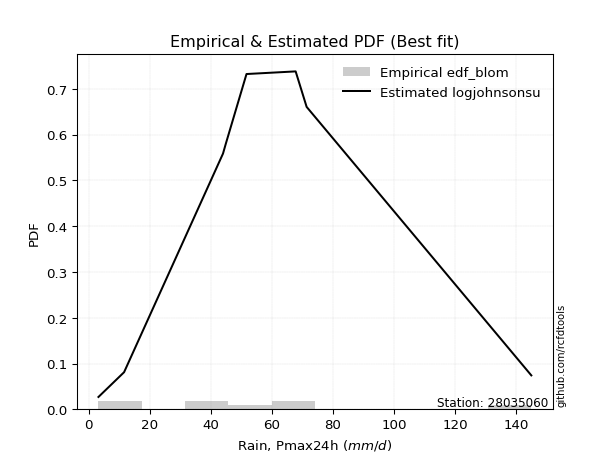</img>

</div>


### 7. EDF Tukey (1962)

In hydrology, the Tukey formula is used as a plotting position formula to estimate the empirical probability or frequency of a flood event (or other hydrological data). The formula parameter is given as _c=0.333_ (or 1/3).

<div align="center">


$P=(m-c)/(n+1-2c)$


</div>


**7.1. Empirical values**

<div align="center">

|                | 0                   | 1                   | 2                  | 3                   | 4         | 5                  | 6                  | 7                  | 8                  |
|:---------------|:--------------------|:--------------------|:-------------------|:--------------------|:----------|:-------------------|:-------------------|:-------------------|:-------------------|
| date           | 2020                | 2021                | 2025               | 2018                | 2023      | 2022               | 2017               | 2019               | 2024               |
| x              | 3.2                 | 11.6                | 36.5               | 44.0                | 44.9      | 51.7               | 67.8               | 71.4               | 145.0              |
| m              | 1                   | 2                   | 3                  | 4                   | 5         | 6                  | 7                  | 8                  | 9                  |
| empirical_dist | edf_tukey           | edf_tukey           | edf_tukey          | edf_tukey           | edf_tukey | edf_tukey          | edf_tukey          | edf_tukey          | edf_tukey          |
| empirical      | 0.07142857142857142 | 0.17857142857142858 | 0.2857142857142857 | 0.39285714285714285 | 0.5       | 0.6071428571428571 | 0.7142857142857143 | 0.8214285714285714 | 0.9285714285714286 |
| empirical_tr   | 1.0769230769230769  | 1.2173913043478262  | 1.4                | 1.6470588235294117  | 2.0       | 2.545454545454545  | 3.5                | 5.599999999999999  | 14.000000000000007 |

</div>


**7.2. Kolmogorov-Smirnov fit test (sorted by Δ)**


<div align="center">

|                | 0                   | 1                   | 2                   | 3                   | 4                   | 5                   | 6                   | 7                   | 8                   | 9                   | 10                  | 11                  | 12                  | 13                  | 14                  | 15                  | 16                  | 17                  | 18                  | 19                  | 20                  | 21                  | 22                  | 23                  | 24                  | 25                  | 26                  | 27                  | 28                  | 29                  | 30                  | 31                  | 32                  | 33                  | 34                  | 35                  | 36                  | 37                  | 38                  | 39                  | 40                  | 41                  | 42                  | 43                  | 44                  | 45                  | 46                  | 47                  | 48                  | 49                  | 50                  | 51                  | 52                  | 53                  | 54                  | 55                  | 56                  | 57                  | 58                  | 59                  | 60                  | 61                  | 62                  | 63                  | 64                  | 65                  | 66                  | 67                  | 68                  | 69                  | 70                  | 71                  | 72                  | 73                  | 74                  | 75                  | 76                  | 77                  | 78                  | 79                  | 80                  | 81                  | 82                  | 83                  | 84                  | 85                  | 86                  | 87                  | 88                  | 89                  | 90                  | 91                  | 92                  | 93                  | 94                  | 95                  | 96                  | 97                  | 98                  | 99                  | 100                 | 101                 | 102                 | 103                 | 104                 | 105                 | 106                 | 107                 | 108                 | 109                 | 110                 | 111                 | 112                 | 113                 | 114                 | 115                 | 116                 | 117                 | 118                 | 119                 | 120                 | 121                 | 122                 | 123                 | 124                 | 125                 | 126                 | 127                 | 128                 | 129                 | 130                 | 131                 | 132                 | 133                 | 134                 | 135                 | 136                 | 137                 | 138                 | 139                 | 140                 | 141                 | 142                 | 143                 | 144                 | 145                 | 146                 | 147                 | 148                 | 149                 | 150                 | 151                 | 152                 | 153                 | 154                 | 155                 | 156                 | 157                 | 158                 | 159                 |
|:---------------|:--------------------|:--------------------|:--------------------|:--------------------|:--------------------|:--------------------|:--------------------|:--------------------|:--------------------|:--------------------|:--------------------|:--------------------|:--------------------|:--------------------|:--------------------|:--------------------|:--------------------|:--------------------|:--------------------|:--------------------|:--------------------|:--------------------|:--------------------|:--------------------|:--------------------|:--------------------|:--------------------|:--------------------|:--------------------|:--------------------|:--------------------|:--------------------|:--------------------|:--------------------|:--------------------|:--------------------|:--------------------|:--------------------|:--------------------|:--------------------|:--------------------|:--------------------|:--------------------|:--------------------|:--------------------|:--------------------|:--------------------|:--------------------|:--------------------|:--------------------|:--------------------|:--------------------|:--------------------|:--------------------|:--------------------|:--------------------|:--------------------|:--------------------|:--------------------|:--------------------|:--------------------|:--------------------|:--------------------|:--------------------|:--------------------|:--------------------|:--------------------|:--------------------|:--------------------|:--------------------|:--------------------|:--------------------|:--------------------|:--------------------|:--------------------|:--------------------|:--------------------|:--------------------|:--------------------|:--------------------|:--------------------|:--------------------|:--------------------|:--------------------|:--------------------|:--------------------|:--------------------|:--------------------|:--------------------|:--------------------|:--------------------|:--------------------|:--------------------|:--------------------|:--------------------|:--------------------|:--------------------|:--------------------|:--------------------|:--------------------|:--------------------|:--------------------|:--------------------|:--------------------|:--------------------|:--------------------|:--------------------|:--------------------|:--------------------|:--------------------|:--------------------|:--------------------|:--------------------|:--------------------|:--------------------|:--------------------|:--------------------|:--------------------|:--------------------|:--------------------|:--------------------|:--------------------|:--------------------|:--------------------|:--------------------|:--------------------|:--------------------|:--------------------|:--------------------|:--------------------|:--------------------|:--------------------|:--------------------|:--------------------|:--------------------|:--------------------|:--------------------|:--------------------|:--------------------|:--------------------|:--------------------|:--------------------|:--------------------|:--------------------|:--------------------|:--------------------|:--------------------|:--------------------|:--------------------|:--------------------|:--------------------|:--------------------|:--------------------|:--------------------|:--------------------|:--------------------|:--------------------|:--------------------|:--------------------|:--------------------|
| station        | 28035060            | 28035060            | 28035060            | 28035060            | 28035060            | 28035060            | 28035060            | 28035060            | 28035060            | 28035060            | 28035060            | 28035060            | 28035060            | 28035060            | 28035060            | 28035060            | 28035060            | 28035060            | 28035060            | 28035060            | 28035060            | 28035060            | 28035060            | 28035060            | 28035060            | 28035060            | 28035060            | 28035060            | 28035060            | 28035060            | 28035060            | 28035060            | 28035060            | 28035060            | 28035060            | 28035060            | 28035060            | 28035060            | 28035060            | 28035060            | 28035060            | 28035060            | 28035060            | 28035060            | 28035060            | 28035060            | 28035060            | 28035060            | 28035060            | 28035060            | 28035060            | 28035060            | 28035060            | 28035060            | 28035060            | 28035060            | 28035060            | 28035060            | 28035060            | 28035060            | 28035060            | 28035060            | 28035060            | 28035060            | 28035060            | 28035060            | 28035060            | 28035060            | 28035060            | 28035060            | 28035060            | 28035060            | 28035060            | 28035060            | 28035060            | 28035060            | 28035060            | 28035060            | 28035060            | 28035060            | 28035060            | 28035060            | 28035060            | 28035060            | 28035060            | 28035060            | 28035060            | 28035060            | 28035060            | 28035060            | 28035060            | 28035060            | 28035060            | 28035060            | 28035060            | 28035060            | 28035060            | 28035060            | 28035060            | 28035060            | 28035060            | 28035060            | 28035060            | 28035060            | 28035060            | 28035060            | 28035060            | 28035060            | 28035060            | 28035060            | 28035060            | 28035060            | 28035060            | 28035060            | 28035060            | 28035060            | 28035060            | 28035060            | 28035060            | 28035060            | 28035060            | 28035060            | 28035060            | 28035060            | 28035060            | 28035060            | 28035060            | 28035060            | 28035060            | 28035060            | 28035060            | 28035060            | 28035060            | 28035060            | 28035060            | 28035060            | 28035060            | 28035060            | 28035060            | 28035060            | 28035060            | 28035060            | 28035060            | 28035060            | 28035060            | 28035060            | 28035060            | 28035060            | 28035060            | 28035060            | 28035060            | 28035060            | 28035060            | 28035060            | 28035060            | 28035060            | 28035060            | 28035060            | 28035060            | 28035060            |
| empirical_dist | edf_tukey           | edf_tukey           | edf_tukey           | edf_tukey           | edf_tukey           | edf_tukey           | edf_tukey           | edf_tukey           | edf_tukey           | edf_tukey           | edf_tukey           | edf_tukey           | edf_tukey           | edf_tukey           | edf_tukey           | edf_tukey           | edf_tukey           | edf_tukey           | edf_tukey           | edf_tukey           | edf_tukey           | edf_tukey           | edf_tukey           | edf_tukey           | edf_tukey           | edf_tukey           | edf_tukey           | edf_tukey           | edf_tukey           | edf_tukey           | edf_tukey           | edf_tukey           | edf_tukey           | edf_tukey           | edf_tukey           | edf_tukey           | edf_tukey           | edf_tukey           | edf_tukey           | edf_tukey           | edf_tukey           | edf_tukey           | edf_tukey           | edf_tukey           | edf_tukey           | edf_tukey           | edf_tukey           | edf_tukey           | edf_tukey           | edf_tukey           | edf_tukey           | edf_tukey           | edf_tukey           | edf_tukey           | edf_tukey           | edf_tukey           | edf_tukey           | edf_tukey           | edf_tukey           | edf_tukey           | edf_tukey           | edf_tukey           | edf_tukey           | edf_tukey           | edf_tukey           | edf_tukey           | edf_tukey           | edf_tukey           | edf_tukey           | edf_tukey           | edf_tukey           | edf_tukey           | edf_tukey           | edf_tukey           | edf_tukey           | edf_tukey           | edf_tukey           | edf_tukey           | edf_tukey           | edf_tukey           | edf_tukey           | edf_tukey           | edf_tukey           | edf_tukey           | edf_tukey           | edf_tukey           | edf_tukey           | edf_tukey           | edf_tukey           | edf_tukey           | edf_tukey           | edf_tukey           | edf_tukey           | edf_tukey           | edf_tukey           | edf_tukey           | edf_tukey           | edf_tukey           | edf_tukey           | edf_tukey           | edf_tukey           | edf_tukey           | edf_tukey           | edf_tukey           | edf_tukey           | edf_tukey           | edf_tukey           | edf_tukey           | edf_tukey           | edf_tukey           | edf_tukey           | edf_tukey           | edf_tukey           | edf_tukey           | edf_tukey           | edf_tukey           | edf_tukey           | edf_tukey           | edf_tukey           | edf_tukey           | edf_tukey           | edf_tukey           | edf_tukey           | edf_tukey           | edf_tukey           | edf_tukey           | edf_tukey           | edf_tukey           | edf_tukey           | edf_tukey           | edf_tukey           | edf_tukey           | edf_tukey           | edf_tukey           | edf_tukey           | edf_tukey           | edf_tukey           | edf_tukey           | edf_tukey           | edf_tukey           | edf_tukey           | edf_tukey           | edf_tukey           | edf_tukey           | edf_tukey           | edf_tukey           | edf_tukey           | edf_tukey           | edf_tukey           | edf_tukey           | edf_tukey           | edf_tukey           | edf_tukey           | edf_tukey           | edf_tukey           | edf_tukey           | edf_tukey           | edf_tukey           | edf_tukey           | edf_tukey           |
| p_dist         | t                   | logjohnsonsu        | vonmises_line       | exponnorm           | nct                 | genlogistic         | kstwobign           | gumbel_r            | invweibull          | loggennorm          | logdgamma           | logdweibull         | dweibull            | pearson3            | invgamma            | moyal               | johnsonsu           | logt                | rayleigh            | skewnorm            | dgamma              | rice                | invgauss            | fatiguelife         | maxwell             | logistic            | hypsecant           | burr                | mielke              | halfnorm            | logburr             | kappa3              | loggenlogistic      | laplace             | ncf                 | logmielke           | logloggamma         | gennorm             | foldnorm            | logvonmises_line    | halflogistic        | logloglaplace       | logexponweib        | genpareto           | loggenextreme       | gompertz            | logexponpow         | norm                | crystalball         | betaprime           | logweibull_min      | logargus            | truncpareto         | logpearson3         | logskewnorm         | loggumbel_l         | logburr12           | loggompertz         | burr12              | anglit              | logtrapezoid        | lognakagami         | semicircular        | wald                | logtriang           | exponpow            | gumbel_l            | loggengamma         | loggenhalflogistic  | f                   | genexpon            | lomax               | arcsine             | logfoldnorm         | logarcsine          | logsemicircular     | loganglit           | logexponnorm        | lognorm             | logcrystalball      | logrice             | lognct              | cosine              | logfatiguelife      | loglogistic         | loghypsecant        | tukeylambda         | logf                | logncf              | loglaplace          | loglaplace          | bradford            | nakagami            | logbetaprime        | loggenpareto        | loggamma            | loggamma            | loginvgamma         | logerlang           | loginvgauss         | logalpha            | beta                | truncexpon          | truncweibull_min    | loglevy_l           | logmaxwell          | loginvweibull       | gausshyper          | lograyleigh         | logbeta             | loggausshyper       | logcosine           | gengamma            | logtruncweibull_min | logkstwobign        | loggumbel_r         | kappa4              | loghalfnorm         | loglomax            | loggenexpon         | logmoyal            | loghalflogistic     | logksone            | logweibull_max      | ksone               | wrapcauchy          | logwrapcauchy       | uniform             | halfgennorm         | logtukeylambda      | argus               | logkappa3           | loguniform          | weibull_min         | logkappa4           | exponweib           | levy_l              | loghalfgennorm      | logwald             | logtruncnorm        | genextreme          | logbradford         | logjohnsonsb        | logtruncexpon       | gamma               | erlang              | genhalflogistic     | powerlaw            | rdist               | alpha               | triang              | logrdist            | trapezoid           | johnsonsb           | logpowerlaw         | weibull_max         | logtruncpareto      | truncnorm           | logvonmises         | vonmises            |
| delta          | 0.06690137282995584 | 0.07152329292839973 | 0.07497086565583927 | 0.08488980952335495 | 0.08509114454830258 | 0.09328186691398938 | 0.09521875332253693 | 0.0957152016754827  | 0.10481230580996748 | 0.10714285299523935 | 0.10714285714285282 | 0.10714285714286004 | 0.10714285714355126 | 0.10828565760713921 | 0.1083409595054573  | 0.11182307435715011 | 0.11355169250205938 | 0.11403650973823967 | 0.11544426651768247 | 0.1164319919793077  | 0.11681161285166153 | 0.11776523556025187 | 0.11788168894931994 | 0.12047768283623722 | 0.12074791266650542 | 0.12111857622084016 | 0.12255128672052834 | 0.12297856655949735 | 0.12605629321837514 | 0.12777784820897392 | 0.1280088917407019  | 0.12823841115382884 | 0.12829855401221413 | 0.1284738033681314  | 0.12854589370893765 | 0.12918679683829298 | 0.1291884528291315  | 0.12978318097630437 | 0.13137046845511507 | 0.1330544475984794  | 0.1335062835245613  | 0.13399520062140668 | 0.13511964469149773 | 0.13516316504163162 | 0.1369820868662609  | 0.13757466855551115 | 0.13833320409038774 | 0.13872267072213784 | 0.1387226754122195  | 0.13966285418016955 | 0.1405321033021616  | 0.14205569889405345 | 0.142718601283787   | 0.14651866140443037 | 0.1465769298489859  | 0.15118572886794468 | 0.15530112919307715 | 0.1553082367598655  | 0.15822400038224282 | 0.16180600654931554 | 0.16428740516401452 | 0.1664586493210347  | 0.17157879672270604 | 0.17857142857142858 | 0.18504072930966564 | 0.18920146199279642 | 0.19007018150128008 | 0.19812018014808025 | 0.19830673117606    | 0.20011300246799513 | 0.20279871645818626 | 0.20701402609172936 | 0.21232969034038196 | 0.2159161798689455  | 0.2182541599498241  | 0.21989657231024684 | 0.22031145258998663 | 0.22131737830757803 | 0.221317951038564   | 0.2213179740735901  | 0.22131809307176498 | 0.2217296934153593  | 0.221843492585312   | 0.22209252026250903 | 0.22227849995183369 | 0.22309864635761834 | 0.22399884552166427 | 0.22521671883088368 | 0.22525605643077806 | 0.22679780433836555 | 0.22679780433836555 | 0.227297321153469   | 0.23250997459797607 | 0.2325613277141131  | 0.23292178572056277 | 0.23364971241808263 | 0.23364971241808263 | 0.23524920333392352 | 0.23640211233806574 | 0.24012234991320136 | 0.24070999654307512 | 0.24673153184792795 | 0.24860778082165857 | 0.24931795721295624 | 0.24977169569940136 | 0.2540737932951044  | 0.2545823905745196  | 0.2563277378472991  | 0.2649287620233761  | 0.27731487072984684 | 0.2788330240575848  | 0.2820390385347863  | 0.2864598566947051  | 0.28651273332049154 | 0.28835522762109767 | 0.291865953050622   | 0.29413828893833727 | 0.2954911665092278  | 0.29883644771093454 | 0.30346948552261654 | 0.31765178091576474 | 0.32084033297124503 | 0.32952510853206596 | 0.33428656603788354 | 0.3372959903284304  | 0.3384296055177288  | 0.3393349745684616  | 0.34046947410840217 | 0.3415711910702397  | 0.3433037481408111  | 0.3436899285439384  | 0.35235334963670895 | 0.35257298738133636 | 0.3619046567034231  | 0.37022090728066237 | 0.3744550055853354  | 0.38108771690163845 | 0.387275176067187   | 0.3893306666404176  | 0.40462101712811815 | 0.4134232220406837  | 0.4165504201462006  | 0.4221099522713546  | 0.42242913796546133 | 0.4375717384971861  | 0.45428099298449176 | 0.4730856148664934  | 0.48327154967575225 | 0.4838037748690638  | 0.5149073400636252  | 0.5398737995566933  | 0.5433742049367488  | 0.583909819165705   | 0.5954007727659019  | 0.6191123252529179  | 0.6968991309536401  | 0.756160303450383   | 0.8938225938520393  | 1.105498222881736   | 22.6623478639055    |
| deltao         | 0.41761268023100007 | 0.41761268023100007 | 0.41761268023100007 | 0.41761268023100007 | 0.41761268023100007 | 0.41761268023100007 | 0.41761268023100007 | 0.41761268023100007 | 0.41761268023100007 | 0.41761268023100007 | 0.41761268023100007 | 0.41761268023100007 | 0.41761268023100007 | 0.41761268023100007 | 0.41761268023100007 | 0.41761268023100007 | 0.41761268023100007 | 0.41761268023100007 | 0.41761268023100007 | 0.41761268023100007 | 0.41761268023100007 | 0.41761268023100007 | 0.41761268023100007 | 0.41761268023100007 | 0.41761268023100007 | 0.41761268023100007 | 0.41761268023100007 | 0.41761268023100007 | 0.41761268023100007 | 0.41761268023100007 | 0.41761268023100007 | 0.41761268023100007 | 0.41761268023100007 | 0.41761268023100007 | 0.41761268023100007 | 0.41761268023100007 | 0.41761268023100007 | 0.41761268023100007 | 0.41761268023100007 | 0.41761268023100007 | 0.41761268023100007 | 0.41761268023100007 | 0.41761268023100007 | 0.41761268023100007 | 0.41761268023100007 | 0.41761268023100007 | 0.41761268023100007 | 0.41761268023100007 | 0.41761268023100007 | 0.41761268023100007 | 0.41761268023100007 | 0.41761268023100007 | 0.41761268023100007 | 0.41761268023100007 | 0.41761268023100007 | 0.41761268023100007 | 0.41761268023100007 | 0.41761268023100007 | 0.41761268023100007 | 0.41761268023100007 | 0.41761268023100007 | 0.41761268023100007 | 0.41761268023100007 | 0.41761268023100007 | 0.41761268023100007 | 0.41761268023100007 | 0.41761268023100007 | 0.41761268023100007 | 0.41761268023100007 | 0.41761268023100007 | 0.41761268023100007 | 0.41761268023100007 | 0.41761268023100007 | 0.41761268023100007 | 0.41761268023100007 | 0.41761268023100007 | 0.41761268023100007 | 0.41761268023100007 | 0.41761268023100007 | 0.41761268023100007 | 0.41761268023100007 | 0.41761268023100007 | 0.41761268023100007 | 0.41761268023100007 | 0.41761268023100007 | 0.41761268023100007 | 0.41761268023100007 | 0.41761268023100007 | 0.41761268023100007 | 0.41761268023100007 | 0.41761268023100007 | 0.41761268023100007 | 0.41761268023100007 | 0.41761268023100007 | 0.41761268023100007 | 0.41761268023100007 | 0.41761268023100007 | 0.41761268023100007 | 0.41761268023100007 | 0.41761268023100007 | 0.41761268023100007 | 0.41761268023100007 | 0.41761268023100007 | 0.41761268023100007 | 0.41761268023100007 | 0.41761268023100007 | 0.41761268023100007 | 0.41761268023100007 | 0.41761268023100007 | 0.41761268023100007 | 0.41761268023100007 | 0.41761268023100007 | 0.41761268023100007 | 0.41761268023100007 | 0.41761268023100007 | 0.41761268023100007 | 0.41761268023100007 | 0.41761268023100007 | 0.41761268023100007 | 0.41761268023100007 | 0.41761268023100007 | 0.41761268023100007 | 0.41761268023100007 | 0.41761268023100007 | 0.41761268023100007 | 0.41761268023100007 | 0.41761268023100007 | 0.41761268023100007 | 0.41761268023100007 | 0.41761268023100007 | 0.41761268023100007 | 0.41761268023100007 | 0.41761268023100007 | 0.41761268023100007 | 0.41761268023100007 | 0.41761268023100007 | 0.41761268023100007 | 0.41761268023100007 | 0.41761268023100007 | 0.41761268023100007 | 0.41761268023100007 | 0.41761268023100007 | 0.41761268023100007 | 0.41761268023100007 | 0.41761268023100007 | 0.41761268023100007 | 0.41761268023100007 | 0.41761268023100007 | 0.41761268023100007 | 0.41761268023100007 | 0.41761268023100007 | 0.41761268023100007 | 0.41761268023100007 | 0.41761268023100007 | 0.41761268023100007 | 0.41761268023100007 | 0.41761268023100007 | 0.41761268023100007 | 0.41761268023100007 | 0.41761268023100007 |
| eval           | Δo > Δ              | Δo > Δ              | Δo > Δ              | Δo > Δ              | Δo > Δ              | Δo > Δ              | Δo > Δ              | Δo > Δ              | Δo > Δ              | Δo > Δ              | Δo > Δ              | Δo > Δ              | Δo > Δ              | Δo > Δ              | Δo > Δ              | Δo > Δ              | Δo > Δ              | Δo > Δ              | Δo > Δ              | Δo > Δ              | Δo > Δ              | Δo > Δ              | Δo > Δ              | Δo > Δ              | Δo > Δ              | Δo > Δ              | Δo > Δ              | Δo > Δ              | Δo > Δ              | Δo > Δ              | Δo > Δ              | Δo > Δ              | Δo > Δ              | Δo > Δ              | Δo > Δ              | Δo > Δ              | Δo > Δ              | Δo > Δ              | Δo > Δ              | Δo > Δ              | Δo > Δ              | Δo > Δ              | Δo > Δ              | Δo > Δ              | Δo > Δ              | Δo > Δ              | Δo > Δ              | Δo > Δ              | Δo > Δ              | Δo > Δ              | Δo > Δ              | Δo > Δ              | Δo > Δ              | Δo > Δ              | Δo > Δ              | Δo > Δ              | Δo > Δ              | Δo > Δ              | Δo > Δ              | Δo > Δ              | Δo > Δ              | Δo > Δ              | Δo > Δ              | Δo > Δ              | Δo > Δ              | Δo > Δ              | Δo > Δ              | Δo > Δ              | Δo > Δ              | Δo > Δ              | Δo > Δ              | Δo > Δ              | Δo > Δ              | Δo > Δ              | Δo > Δ              | Δo > Δ              | Δo > Δ              | Δo > Δ              | Δo > Δ              | Δo > Δ              | Δo > Δ              | Δo > Δ              | Δo > Δ              | Δo > Δ              | Δo > Δ              | Δo > Δ              | Δo > Δ              | Δo > Δ              | Δo > Δ              | Δo > Δ              | Δo > Δ              | Δo > Δ              | Δo > Δ              | Δo > Δ              | Δo > Δ              | Δo > Δ              | Δo > Δ              | Δo > Δ              | Δo > Δ              | Δo > Δ              | Δo > Δ              | Δo > Δ              | Δo > Δ              | Δo > Δ              | Δo > Δ              | Δo > Δ              | Δo > Δ              | Δo > Δ              | Δo > Δ              | Δo > Δ              | Δo > Δ              | Δo > Δ              | Δo > Δ              | Δo > Δ              | Δo > Δ              | Δo > Δ              | Δo > Δ              | Δo > Δ              | Δo > Δ              | Δo > Δ              | Δo > Δ              | Δo > Δ              | Δo > Δ              | Δo > Δ              | Δo > Δ              | Δo > Δ              | Δo > Δ              | Δo > Δ              | Δo > Δ              | Δo > Δ              | Δo > Δ              | Δo > Δ              | Δo > Δ              | Δo > Δ              | Δo > Δ              | Δo > Δ              | Δo > Δ              | Δo > Δ              | Δo > Δ              | Δo > Δ              | Δo > Δ              | Δo > Δ              | Δo <= Δ             | Δo <= Δ             | Δo <= Δ             | Δo <= Δ             | Δo <= Δ             | Δo <= Δ             | Δo <= Δ             | Δo <= Δ             | Δo <= Δ             | Δo <= Δ             | Δo <= Δ             | Δo <= Δ             | Δo <= Δ             | Δo <= Δ             | Δo <= Δ             | Δo <= Δ             | Δo <= Δ             | Δo <= Δ             |
| fit            | 1                   | 1                   | 1                   | 1                   | 1                   | 1                   | 1                   | 1                   | 1                   | 1                   | 1                   | 1                   | 1                   | 1                   | 1                   | 1                   | 1                   | 1                   | 1                   | 1                   | 1                   | 1                   | 1                   | 1                   | 1                   | 1                   | 1                   | 1                   | 1                   | 1                   | 1                   | 1                   | 1                   | 1                   | 1                   | 1                   | 1                   | 1                   | 1                   | 1                   | 1                   | 1                   | 1                   | 1                   | 1                   | 1                   | 1                   | 1                   | 1                   | 1                   | 1                   | 1                   | 1                   | 1                   | 1                   | 1                   | 1                   | 1                   | 1                   | 1                   | 1                   | 1                   | 1                   | 1                   | 1                   | 1                   | 1                   | 1                   | 1                   | 1                   | 1                   | 1                   | 1                   | 1                   | 1                   | 1                   | 1                   | 1                   | 1                   | 1                   | 1                   | 1                   | 1                   | 1                   | 1                   | 1                   | 1                   | 1                   | 1                   | 1                   | 1                   | 1                   | 1                   | 1                   | 1                   | 1                   | 1                   | 1                   | 1                   | 1                   | 1                   | 1                   | 1                   | 1                   | 1                   | 1                   | 1                   | 1                   | 1                   | 1                   | 1                   | 1                   | 1                   | 1                   | 1                   | 1                   | 1                   | 1                   | 1                   | 1                   | 1                   | 1                   | 1                   | 1                   | 1                   | 1                   | 1                   | 1                   | 1                   | 1                   | 1                   | 1                   | 1                   | 1                   | 1                   | 1                   | 1                   | 1                   | 1                   | 1                   | 1                   | 1                   | 0                   | 0                   | 0                   | 0                   | 0                   | 0                   | 0                   | 0                   | 0                   | 0                   | 0                   | 0                   | 0                   | 0                   | 0                   | 0                   | 0                   | 0                   |
| n              | 9                   | 9                   | 9                   | 9                   | 9                   | 9                   | 9                   | 9                   | 9                   | 9                   | 9                   | 9                   | 9                   | 9                   | 9                   | 9                   | 9                   | 9                   | 9                   | 9                   | 9                   | 9                   | 9                   | 9                   | 9                   | 9                   | 9                   | 9                   | 9                   | 9                   | 9                   | 9                   | 9                   | 9                   | 9                   | 9                   | 9                   | 9                   | 9                   | 9                   | 9                   | 9                   | 9                   | 9                   | 9                   | 9                   | 9                   | 9                   | 9                   | 9                   | 9                   | 9                   | 9                   | 9                   | 9                   | 9                   | 9                   | 9                   | 9                   | 9                   | 9                   | 9                   | 9                   | 9                   | 9                   | 9                   | 9                   | 9                   | 9                   | 9                   | 9                   | 9                   | 9                   | 9                   | 9                   | 9                   | 9                   | 9                   | 9                   | 9                   | 9                   | 9                   | 9                   | 9                   | 9                   | 9                   | 9                   | 9                   | 9                   | 9                   | 9                   | 9                   | 9                   | 9                   | 9                   | 9                   | 9                   | 9                   | 9                   | 9                   | 9                   | 9                   | 9                   | 9                   | 9                   | 9                   | 9                   | 9                   | 9                   | 9                   | 9                   | 9                   | 9                   | 9                   | 9                   | 9                   | 9                   | 9                   | 9                   | 9                   | 9                   | 9                   | 9                   | 9                   | 9                   | 9                   | 9                   | 9                   | 9                   | 9                   | 9                   | 9                   | 9                   | 9                   | 9                   | 9                   | 9                   | 9                   | 9                   | 9                   | 9                   | 9                   | 9                   | 9                   | 9                   | 9                   | 9                   | 9                   | 9                   | 9                   | 9                   | 9                   | 9                   | 9                   | 9                   | 9                   | 9                   | 9                   | 9                   | 9                   |
| best_fit       | 1                   | 0                   | 0                   | 0                   | 0                   | 0                   | 0                   | 0                   | 0                   | 0                   | 0                   | 0                   | 0                   | 0                   | 0                   | 0                   | 0                   | 0                   | 0                   | 0                   | 0                   | 0                   | 0                   | 0                   | 0                   | 0                   | 0                   | 0                   | 0                   | 0                   | 0                   | 0                   | 0                   | 0                   | 0                   | 0                   | 0                   | 0                   | 0                   | 0                   | 0                   | 0                   | 0                   | 0                   | 0                   | 0                   | 0                   | 0                   | 0                   | 0                   | 0                   | 0                   | 0                   | 0                   | 0                   | 0                   | 0                   | 0                   | 0                   | 0                   | 0                   | 0                   | 0                   | 0                   | 0                   | 0                   | 0                   | 0                   | 0                   | 0                   | 0                   | 0                   | 0                   | 0                   | 0                   | 0                   | 0                   | 0                   | 0                   | 0                   | 0                   | 0                   | 0                   | 0                   | 0                   | 0                   | 0                   | 0                   | 0                   | 0                   | 0                   | 0                   | 0                   | 0                   | 0                   | 0                   | 0                   | 0                   | 0                   | 0                   | 0                   | 0                   | 0                   | 0                   | 0                   | 0                   | 0                   | 0                   | 0                   | 0                   | 0                   | 0                   | 0                   | 0                   | 0                   | 0                   | 0                   | 0                   | 0                   | 0                   | 0                   | 0                   | 0                   | 0                   | 0                   | 0                   | 0                   | 0                   | 0                   | 0                   | 0                   | 0                   | 0                   | 0                   | 0                   | 0                   | 0                   | 0                   | 0                   | 0                   | 0                   | 0                   | 0                   | 0                   | 0                   | 0                   | 0                   | 0                   | 0                   | 0                   | 0                   | 0                   | 0                   | 0                   | 0                   | 0                   | 0                   | 0                   | 0                   | 0                   |
| best_fit_sort  | 1                   | 2                   | 3                   | 4                   | 5                   | 6                   | 7                   | 8                   | 9                   | 10                  | 11                  | 12                  | 13                  | 14                  | 15                  | 16                  | 17                  | 18                  | 19                  | 20                  | 21                  | 22                  | 23                  | 24                  | 25                  | 26                  | 27                  | 28                  | 29                  | 30                  | 31                  | 32                  | 33                  | 34                  | 35                  | 36                  | 37                  | 38                  | 39                  | 40                  | 41                  | 42                  | 43                  | 44                  | 45                  | 46                  | 47                  | 48                  | 49                  | 50                  | 51                  | 52                  | 53                  | 54                  | 55                  | 56                  | 57                  | 58                  | 59                  | 60                  | 61                  | 62                  | 63                  | 64                  | 65                  | 66                  | 67                  | 68                  | 69                  | 70                  | 71                  | 72                  | 73                  | 74                  | 75                  | 76                  | 77                  | 78                  | 79                  | 80                  | 81                  | 82                  | 83                  | 84                  | 85                  | 86                  | 87                  | 88                  | 89                  | 90                  | 91                  | 92                  | 93                  | 94                  | 95                  | 96                  | 97                  | 98                  | 99                  | 100                 | 101                 | 102                 | 103                 | 104                 | 105                 | 106                 | 107                 | 108                 | 109                 | 110                 | 111                 | 112                 | 113                 | 114                 | 115                 | 116                 | 117                 | 118                 | 119                 | 120                 | 121                 | 122                 | 123                 | 124                 | 125                 | 126                 | 127                 | 128                 | 129                 | 130                 | 131                 | 132                 | 133                 | 134                 | 135                 | 136                 | 137                 | 138                 | 139                 | 140                 | 141                 | 142                 | 143                 | 144                 | 145                 | 146                 | 147                 | 148                 | 149                 | 150                 | 151                 | 152                 | 153                 | 154                 | 155                 | 156                 | 157                 | 158                 | 159                 | 160                 |

</div>


**7.3. Best fit**

<div align="center">

|   id |   station | empirical_dist   | p_dist   |     delta |   deltao | eval   |   fit |   n |   best_fit |   best_fit_sort |
|-----:|----------:|:-----------------|:---------|----------:|---------:|:-------|------:|----:|-----------:|----------------:|
|    0 |  28035060 | edf_tukey        | t        | 0.0669014 | 0.417613 | Δo > Δ |     1 |   9 |          1 |               1 |

</div>


<div align="center">

</img>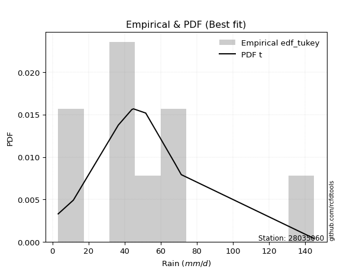</img>

</div>


### 8. EDF Gringorten (1963)

Gringorten plotting position formula is essential for estimating the probability and return periods of extreme events like floods and heavy rainfall. The constant _a=0.44_.

<div align="center">


$P=(m-a)/(n+1-2a)$


</div>


**8.1. Empirical values**

<div align="center">

|                | 0                    | 1                  | 2                   | 3                  | 4              | 5                  | 6                  | 7                  | 8                  |
|:---------------|:---------------------|:-------------------|:--------------------|:-------------------|:---------------|:-------------------|:-------------------|:-------------------|:-------------------|
| date           | 2020                 | 2021               | 2025                | 2018               | 2023           | 2022               | 2017               | 2019               | 2024               |
| x              | 3.2                  | 11.6               | 36.5                | 44.0               | 44.9           | 51.7               | 67.8               | 71.4               | 145.0              |
| m              | 1                    | 2                  | 3                   | 4                  | 5              | 6                  | 7                  | 8                  | 9                  |
| empirical_dist | edf_gringorten       | edf_gringorten     | edf_gringorten      | edf_gringorten     | edf_gringorten | edf_gringorten     | edf_gringorten     | edf_gringorten     | edf_gringorten     |
| empirical      | 0.061403508771929835 | 0.1710526315789474 | 0.28070175438596495 | 0.3903508771929825 | 0.5            | 0.6096491228070176 | 0.7192982456140351 | 0.8289473684210527 | 0.9385964912280703 |
| empirical_tr   | 1.0654205607476634   | 1.2063492063492063 | 1.3902439024390243  | 1.6402877697841727 | 2.0            | 2.561797752808989  | 3.5625             | 5.846153846153847  | 16.285714285714324 |

</div>


**8.2. Kolmogorov-Smirnov fit test (sorted by Δ)**


<div align="center">

|                | 0                   | 1                   | 2                   | 3                   | 4                   | 5                   | 6                   | 7                   | 8                   | 9                   | 10                  | 11                  | 12                  | 13                  | 14                  | 15                  | 16                  | 17                  | 18                  | 19                  | 20                  | 21                  | 22                  | 23                  | 24                  | 25                  | 26                  | 27                  | 28                  | 29                  | 30                  | 31                  | 32                  | 33                  | 34                  | 35                  | 36                  | 37                  | 38                  | 39                  | 40                  | 41                  | 42                  | 43                  | 44                  | 45                  | 46                  | 47                  | 48                  | 49                  | 50                  | 51                  | 52                  | 53                  | 54                  | 55                  | 56                  | 57                  | 58                  | 59                  | 60                  | 61                  | 62                  | 63                  | 64                  | 65                  | 66                  | 67                  | 68                  | 69                  | 70                  | 71                  | 72                  | 73                  | 74                  | 75                  | 76                  | 77                  | 78                  | 79                  | 80                  | 81                  | 82                  | 83                  | 84                  | 85                  | 86                  | 87                  | 88                  | 89                  | 90                  | 91                  | 92                  | 93                  | 94                  | 95                  | 96                  | 97                  | 98                  | 99                  | 100                 | 101                 | 102                 | 103                 | 104                 | 105                 | 106                 | 107                 | 108                 | 109                 | 110                 | 111                 | 112                 | 113                 | 114                 | 115                 | 116                 | 117                 | 118                 | 119                 | 120                 | 121                 | 122                 | 123                 | 124                 | 125                 | 126                 | 127                 | 128                 | 129                 | 130                 | 131                 | 132                 | 133                 | 134                 | 135                 | 136                 | 137                 | 138                 | 139                 | 140                 | 141                 | 142                 | 143                 | 144                 | 145                 | 146                 | 147                 | 148                 | 149                 | 150                 | 151                 | 152                 | 153                 | 154                 | 155                 | 156                 | 157                 | 158                 | 159                 |
|:---------------|:--------------------|:--------------------|:--------------------|:--------------------|:--------------------|:--------------------|:--------------------|:--------------------|:--------------------|:--------------------|:--------------------|:--------------------|:--------------------|:--------------------|:--------------------|:--------------------|:--------------------|:--------------------|:--------------------|:--------------------|:--------------------|:--------------------|:--------------------|:--------------------|:--------------------|:--------------------|:--------------------|:--------------------|:--------------------|:--------------------|:--------------------|:--------------------|:--------------------|:--------------------|:--------------------|:--------------------|:--------------------|:--------------------|:--------------------|:--------------------|:--------------------|:--------------------|:--------------------|:--------------------|:--------------------|:--------------------|:--------------------|:--------------------|:--------------------|:--------------------|:--------------------|:--------------------|:--------------------|:--------------------|:--------------------|:--------------------|:--------------------|:--------------------|:--------------------|:--------------------|:--------------------|:--------------------|:--------------------|:--------------------|:--------------------|:--------------------|:--------------------|:--------------------|:--------------------|:--------------------|:--------------------|:--------------------|:--------------------|:--------------------|:--------------------|:--------------------|:--------------------|:--------------------|:--------------------|:--------------------|:--------------------|:--------------------|:--------------------|:--------------------|:--------------------|:--------------------|:--------------------|:--------------------|:--------------------|:--------------------|:--------------------|:--------------------|:--------------------|:--------------------|:--------------------|:--------------------|:--------------------|:--------------------|:--------------------|:--------------------|:--------------------|:--------------------|:--------------------|:--------------------|:--------------------|:--------------------|:--------------------|:--------------------|:--------------------|:--------------------|:--------------------|:--------------------|:--------------------|:--------------------|:--------------------|:--------------------|:--------------------|:--------------------|:--------------------|:--------------------|:--------------------|:--------------------|:--------------------|:--------------------|:--------------------|:--------------------|:--------------------|:--------------------|:--------------------|:--------------------|:--------------------|:--------------------|:--------------------|:--------------------|:--------------------|:--------------------|:--------------------|:--------------------|:--------------------|:--------------------|:--------------------|:--------------------|:--------------------|:--------------------|:--------------------|:--------------------|:--------------------|:--------------------|:--------------------|:--------------------|:--------------------|:--------------------|:--------------------|:--------------------|:--------------------|:--------------------|:--------------------|:--------------------|:--------------------|:--------------------|
| station        | 28035060            | 28035060            | 28035060            | 28035060            | 28035060            | 28035060            | 28035060            | 28035060            | 28035060            | 28035060            | 28035060            | 28035060            | 28035060            | 28035060            | 28035060            | 28035060            | 28035060            | 28035060            | 28035060            | 28035060            | 28035060            | 28035060            | 28035060            | 28035060            | 28035060            | 28035060            | 28035060            | 28035060            | 28035060            | 28035060            | 28035060            | 28035060            | 28035060            | 28035060            | 28035060            | 28035060            | 28035060            | 28035060            | 28035060            | 28035060            | 28035060            | 28035060            | 28035060            | 28035060            | 28035060            | 28035060            | 28035060            | 28035060            | 28035060            | 28035060            | 28035060            | 28035060            | 28035060            | 28035060            | 28035060            | 28035060            | 28035060            | 28035060            | 28035060            | 28035060            | 28035060            | 28035060            | 28035060            | 28035060            | 28035060            | 28035060            | 28035060            | 28035060            | 28035060            | 28035060            | 28035060            | 28035060            | 28035060            | 28035060            | 28035060            | 28035060            | 28035060            | 28035060            | 28035060            | 28035060            | 28035060            | 28035060            | 28035060            | 28035060            | 28035060            | 28035060            | 28035060            | 28035060            | 28035060            | 28035060            | 28035060            | 28035060            | 28035060            | 28035060            | 28035060            | 28035060            | 28035060            | 28035060            | 28035060            | 28035060            | 28035060            | 28035060            | 28035060            | 28035060            | 28035060            | 28035060            | 28035060            | 28035060            | 28035060            | 28035060            | 28035060            | 28035060            | 28035060            | 28035060            | 28035060            | 28035060            | 28035060            | 28035060            | 28035060            | 28035060            | 28035060            | 28035060            | 28035060            | 28035060            | 28035060            | 28035060            | 28035060            | 28035060            | 28035060            | 28035060            | 28035060            | 28035060            | 28035060            | 28035060            | 28035060            | 28035060            | 28035060            | 28035060            | 28035060            | 28035060            | 28035060            | 28035060            | 28035060            | 28035060            | 28035060            | 28035060            | 28035060            | 28035060            | 28035060            | 28035060            | 28035060            | 28035060            | 28035060            | 28035060            | 28035060            | 28035060            | 28035060            | 28035060            | 28035060            | 28035060            |
| empirical_dist | edf_gringorten      | edf_gringorten      | edf_gringorten      | edf_gringorten      | edf_gringorten      | edf_gringorten      | edf_gringorten      | edf_gringorten      | edf_gringorten      | edf_gringorten      | edf_gringorten      | edf_gringorten      | edf_gringorten      | edf_gringorten      | edf_gringorten      | edf_gringorten      | edf_gringorten      | edf_gringorten      | edf_gringorten      | edf_gringorten      | edf_gringorten      | edf_gringorten      | edf_gringorten      | edf_gringorten      | edf_gringorten      | edf_gringorten      | edf_gringorten      | edf_gringorten      | edf_gringorten      | edf_gringorten      | edf_gringorten      | edf_gringorten      | edf_gringorten      | edf_gringorten      | edf_gringorten      | edf_gringorten      | edf_gringorten      | edf_gringorten      | edf_gringorten      | edf_gringorten      | edf_gringorten      | edf_gringorten      | edf_gringorten      | edf_gringorten      | edf_gringorten      | edf_gringorten      | edf_gringorten      | edf_gringorten      | edf_gringorten      | edf_gringorten      | edf_gringorten      | edf_gringorten      | edf_gringorten      | edf_gringorten      | edf_gringorten      | edf_gringorten      | edf_gringorten      | edf_gringorten      | edf_gringorten      | edf_gringorten      | edf_gringorten      | edf_gringorten      | edf_gringorten      | edf_gringorten      | edf_gringorten      | edf_gringorten      | edf_gringorten      | edf_gringorten      | edf_gringorten      | edf_gringorten      | edf_gringorten      | edf_gringorten      | edf_gringorten      | edf_gringorten      | edf_gringorten      | edf_gringorten      | edf_gringorten      | edf_gringorten      | edf_gringorten      | edf_gringorten      | edf_gringorten      | edf_gringorten      | edf_gringorten      | edf_gringorten      | edf_gringorten      | edf_gringorten      | edf_gringorten      | edf_gringorten      | edf_gringorten      | edf_gringorten      | edf_gringorten      | edf_gringorten      | edf_gringorten      | edf_gringorten      | edf_gringorten      | edf_gringorten      | edf_gringorten      | edf_gringorten      | edf_gringorten      | edf_gringorten      | edf_gringorten      | edf_gringorten      | edf_gringorten      | edf_gringorten      | edf_gringorten      | edf_gringorten      | edf_gringorten      | edf_gringorten      | edf_gringorten      | edf_gringorten      | edf_gringorten      | edf_gringorten      | edf_gringorten      | edf_gringorten      | edf_gringorten      | edf_gringorten      | edf_gringorten      | edf_gringorten      | edf_gringorten      | edf_gringorten      | edf_gringorten      | edf_gringorten      | edf_gringorten      | edf_gringorten      | edf_gringorten      | edf_gringorten      | edf_gringorten      | edf_gringorten      | edf_gringorten      | edf_gringorten      | edf_gringorten      | edf_gringorten      | edf_gringorten      | edf_gringorten      | edf_gringorten      | edf_gringorten      | edf_gringorten      | edf_gringorten      | edf_gringorten      | edf_gringorten      | edf_gringorten      | edf_gringorten      | edf_gringorten      | edf_gringorten      | edf_gringorten      | edf_gringorten      | edf_gringorten      | edf_gringorten      | edf_gringorten      | edf_gringorten      | edf_gringorten      | edf_gringorten      | edf_gringorten      | edf_gringorten      | edf_gringorten      | edf_gringorten      | edf_gringorten      | edf_gringorten      | edf_gringorten      | edf_gringorten      |
| p_dist         | logjohnsonsu        | t                   | vonmises_line       | exponnorm           | nct                 | genlogistic         | gumbel_r            | kstwobign           | logt                | loggennorm          | logdgamma           | dweibull            | invweibull          | logdweibull         | dgamma              | pearson3            | invgamma            | moyal               | johnsonsu           | skewnorm            | invgauss            | rayleigh            | gennorm             | hypsecant           | rice                | fatiguelife         | logistic            | maxwell             | burr                | laplace             | mielke              | halfnorm            | logburr             | kappa3              | loggenlogistic      | ncf                 | logmielke           | logloggamma         | foldnorm            | logvonmises_line    | halflogistic        | logexponweib        | genpareto           | logloglaplace       | gompertz            | logexponpow         | loggenextreme       | betaprime           | logweibull_min      | norm                | crystalball         | logargus            | truncpareto         | logpearson3         | logskewnorm         | loggumbel_l         | lognakagami         | logburr12           | loggompertz         | burr12              | logtrapezoid        | anglit              | wald                | semicircular        | logtriang           | gumbel_l            | exponpow            | loggengamma         | loggenhalflogistic  | f                   | genexpon            | lomax               | tukeylambda         | arcsine             | logfoldnorm         | logarcsine          | logsemicircular     | loganglit           | logexponnorm        | lognorm             | logcrystalball      | logrice             | lognct              | logfatiguelife      | loglogistic         | loghypsecant        | cosine              | logf                | logncf              | loglaplace          | loglaplace          | bradford            | nakagami            | logbetaprime        | loggenpareto        | loggamma            | loggamma            | loginvgamma         | logerlang           | loginvgauss         | logalpha            | beta                | truncexpon          | truncweibull_min    | logmaxwell          | loginvweibull       | loglevy_l           | gausshyper          | lograyleigh         | loggausshyper       | logbeta             | logcosine           | gengamma            | logtruncweibull_min | logkstwobign        | loggumbel_r         | loghalfnorm         | kappa4              | loglomax            | loggenexpon         | logmoyal            | loghalflogistic     | logksone            | logweibull_max      | logwrapcauchy       | ksone               | wrapcauchy          | halfgennorm         | uniform             | logtukeylambda      | argus               | logkappa3           | loguniform          | weibull_min         | logkappa4           | exponweib           | levy_l              | loghalfgennorm      | logwald             | logtruncnorm        | genextreme          | logbradford         | logtruncexpon       | logjohnsonsb        | gamma               | erlang              | genhalflogistic     | powerlaw            | rdist               | alpha               | triang              | logrdist            | trapezoid           | johnsonsb           | logpowerlaw         | weibull_max         | logtruncpareto      | truncnorm           | logvonmises         | vonmises            |
| delta          | 0.06884707338717022 | 0.06940763849411619 | 0.07998339698416002 | 0.0899023408516757  | 0.09010367587662332 | 0.09829439824231012 | 0.10072773300380344 | 0.10273755031501819 | 0.1065177127457585  | 0.10964911865939969 | 0.10964912280701317 | 0.10964912280771161 | 0.10982483713828822 | 0.11020178739770431 | 0.11179908152334073 | 0.11329818893545995 | 0.11335349083377805 | 0.11683560568547086 | 0.11856422383038012 | 0.12144452330762845 | 0.12289422027764069 | 0.12296306351016373 | 0.12477064964798357 | 0.1250575523846888  | 0.12528403255273313 | 0.12549021416455797 | 0.1258563836870128  | 0.12826670965898668 | 0.1304973635519786  | 0.13098006903229187 | 0.13106882454669588 | 0.13279037953729467 | 0.13302142306902265 | 0.13325094248214958 | 0.13331108534053487 | 0.1335584250372584  | 0.13419932816661373 | 0.13420098415745224 | 0.13638299978343582 | 0.13806697892680014 | 0.13851881485288203 | 0.14013217601981848 | 0.14017569636995236 | 0.14151399761388794 | 0.1425871998838319  | 0.1433457354187085  | 0.14450088385874216 | 0.1446753855084903  | 0.14554463463048234 | 0.1462414677146191  | 0.14624147240470076 | 0.1470682302223742  | 0.14773113261210774 | 0.15153119273275112 | 0.15158946117730665 | 0.15619826019626543 | 0.15893985232855354 | 0.1603136605213979  | 0.16032076808818624 | 0.16323653171056357 | 0.16929993649233527 | 0.1693248035417968  | 0.1710526315789474  | 0.1790975937151873  | 0.1900532606379864  | 0.19257644716544053 | 0.19421399332111716 | 0.203132711476401   | 0.20331926250438076 | 0.20512553379631587 | 0.207811247786507   | 0.2120265574200501  | 0.21898631419334347 | 0.21984848733286322 | 0.22092871119726626 | 0.22326669127814486 | 0.2249091036385676  | 0.22532398391830738 | 0.22632990963589877 | 0.22633048236688474 | 0.22633050540191085 | 0.22633062440008572 | 0.22674222474368005 | 0.22710505159082978 | 0.22729103128015443 | 0.22811117768593908 | 0.22936228957779325 | 0.23022925015920442 | 0.2302685877590988  | 0.23160911419174063 | 0.23160911419174063 | 0.23481611814595027 | 0.2375225059262968  | 0.23757385904243383 | 0.23793431704888351 | 0.23866224374640338 | 0.23866224374640338 | 0.24026173466224426 | 0.24141464366638649 | 0.2451348812415221  | 0.24572252787139587 | 0.2517440631762487  | 0.25612657781413983 | 0.2568367542054375  | 0.2590863246234251  | 0.25959492190284034 | 0.25979675835604293 | 0.2638465348397804  | 0.26994129335169686 | 0.28384555538590556 | 0.2848336677223281  | 0.28705156986310704 | 0.29147238802302583 | 0.2915252646488123  | 0.2933677589494184  | 0.29687848437894276 | 0.30050369783754854 | 0.3016570859308185  | 0.3038489790392553  | 0.3084820168509373  | 0.3226643122440855  | 0.3258528642995658  | 0.3345376398603867  | 0.3418053630303648  | 0.34434750589678237 | 0.34481478732091164 | 0.3459484025102101  | 0.34658372239856045 | 0.34798827110088343 | 0.34831627946913185 | 0.3512087255364197  | 0.3573658809650297  | 0.3575855187096571  | 0.36691718803174384 | 0.3752334386089831  | 0.37946753691365614 | 0.39111277955828    | 0.3922877073955077  | 0.39434319796873835 | 0.4096335484564389  | 0.4209420190331649  | 0.42156295147452133 | 0.4274416692937821  | 0.4296287492638358  | 0.44258426982550686 | 0.4592935243128125  | 0.4806044118589747  | 0.488284081004073   | 0.49382883752570533 | 0.519919871391946   | 0.5473925965491746  | 0.5483867362650696  | 0.5914286161581862  | 0.6029195697583831  | 0.6241248565812387  | 0.7044179279461213  | 0.7636791004428642  | 0.9038476565086809  | 1.1105107542100567  | 22.652322801248854  |
| deltao         | 0.41761268023100007 | 0.41761268023100007 | 0.41761268023100007 | 0.41761268023100007 | 0.41761268023100007 | 0.41761268023100007 | 0.41761268023100007 | 0.41761268023100007 | 0.41761268023100007 | 0.41761268023100007 | 0.41761268023100007 | 0.41761268023100007 | 0.41761268023100007 | 0.41761268023100007 | 0.41761268023100007 | 0.41761268023100007 | 0.41761268023100007 | 0.41761268023100007 | 0.41761268023100007 | 0.41761268023100007 | 0.41761268023100007 | 0.41761268023100007 | 0.41761268023100007 | 0.41761268023100007 | 0.41761268023100007 | 0.41761268023100007 | 0.41761268023100007 | 0.41761268023100007 | 0.41761268023100007 | 0.41761268023100007 | 0.41761268023100007 | 0.41761268023100007 | 0.41761268023100007 | 0.41761268023100007 | 0.41761268023100007 | 0.41761268023100007 | 0.41761268023100007 | 0.41761268023100007 | 0.41761268023100007 | 0.41761268023100007 | 0.41761268023100007 | 0.41761268023100007 | 0.41761268023100007 | 0.41761268023100007 | 0.41761268023100007 | 0.41761268023100007 | 0.41761268023100007 | 0.41761268023100007 | 0.41761268023100007 | 0.41761268023100007 | 0.41761268023100007 | 0.41761268023100007 | 0.41761268023100007 | 0.41761268023100007 | 0.41761268023100007 | 0.41761268023100007 | 0.41761268023100007 | 0.41761268023100007 | 0.41761268023100007 | 0.41761268023100007 | 0.41761268023100007 | 0.41761268023100007 | 0.41761268023100007 | 0.41761268023100007 | 0.41761268023100007 | 0.41761268023100007 | 0.41761268023100007 | 0.41761268023100007 | 0.41761268023100007 | 0.41761268023100007 | 0.41761268023100007 | 0.41761268023100007 | 0.41761268023100007 | 0.41761268023100007 | 0.41761268023100007 | 0.41761268023100007 | 0.41761268023100007 | 0.41761268023100007 | 0.41761268023100007 | 0.41761268023100007 | 0.41761268023100007 | 0.41761268023100007 | 0.41761268023100007 | 0.41761268023100007 | 0.41761268023100007 | 0.41761268023100007 | 0.41761268023100007 | 0.41761268023100007 | 0.41761268023100007 | 0.41761268023100007 | 0.41761268023100007 | 0.41761268023100007 | 0.41761268023100007 | 0.41761268023100007 | 0.41761268023100007 | 0.41761268023100007 | 0.41761268023100007 | 0.41761268023100007 | 0.41761268023100007 | 0.41761268023100007 | 0.41761268023100007 | 0.41761268023100007 | 0.41761268023100007 | 0.41761268023100007 | 0.41761268023100007 | 0.41761268023100007 | 0.41761268023100007 | 0.41761268023100007 | 0.41761268023100007 | 0.41761268023100007 | 0.41761268023100007 | 0.41761268023100007 | 0.41761268023100007 | 0.41761268023100007 | 0.41761268023100007 | 0.41761268023100007 | 0.41761268023100007 | 0.41761268023100007 | 0.41761268023100007 | 0.41761268023100007 | 0.41761268023100007 | 0.41761268023100007 | 0.41761268023100007 | 0.41761268023100007 | 0.41761268023100007 | 0.41761268023100007 | 0.41761268023100007 | 0.41761268023100007 | 0.41761268023100007 | 0.41761268023100007 | 0.41761268023100007 | 0.41761268023100007 | 0.41761268023100007 | 0.41761268023100007 | 0.41761268023100007 | 0.41761268023100007 | 0.41761268023100007 | 0.41761268023100007 | 0.41761268023100007 | 0.41761268023100007 | 0.41761268023100007 | 0.41761268023100007 | 0.41761268023100007 | 0.41761268023100007 | 0.41761268023100007 | 0.41761268023100007 | 0.41761268023100007 | 0.41761268023100007 | 0.41761268023100007 | 0.41761268023100007 | 0.41761268023100007 | 0.41761268023100007 | 0.41761268023100007 | 0.41761268023100007 | 0.41761268023100007 | 0.41761268023100007 | 0.41761268023100007 | 0.41761268023100007 | 0.41761268023100007 | 0.41761268023100007 |
| eval           | Δo > Δ              | Δo > Δ              | Δo > Δ              | Δo > Δ              | Δo > Δ              | Δo > Δ              | Δo > Δ              | Δo > Δ              | Δo > Δ              | Δo > Δ              | Δo > Δ              | Δo > Δ              | Δo > Δ              | Δo > Δ              | Δo > Δ              | Δo > Δ              | Δo > Δ              | Δo > Δ              | Δo > Δ              | Δo > Δ              | Δo > Δ              | Δo > Δ              | Δo > Δ              | Δo > Δ              | Δo > Δ              | Δo > Δ              | Δo > Δ              | Δo > Δ              | Δo > Δ              | Δo > Δ              | Δo > Δ              | Δo > Δ              | Δo > Δ              | Δo > Δ              | Δo > Δ              | Δo > Δ              | Δo > Δ              | Δo > Δ              | Δo > Δ              | Δo > Δ              | Δo > Δ              | Δo > Δ              | Δo > Δ              | Δo > Δ              | Δo > Δ              | Δo > Δ              | Δo > Δ              | Δo > Δ              | Δo > Δ              | Δo > Δ              | Δo > Δ              | Δo > Δ              | Δo > Δ              | Δo > Δ              | Δo > Δ              | Δo > Δ              | Δo > Δ              | Δo > Δ              | Δo > Δ              | Δo > Δ              | Δo > Δ              | Δo > Δ              | Δo > Δ              | Δo > Δ              | Δo > Δ              | Δo > Δ              | Δo > Δ              | Δo > Δ              | Δo > Δ              | Δo > Δ              | Δo > Δ              | Δo > Δ              | Δo > Δ              | Δo > Δ              | Δo > Δ              | Δo > Δ              | Δo > Δ              | Δo > Δ              | Δo > Δ              | Δo > Δ              | Δo > Δ              | Δo > Δ              | Δo > Δ              | Δo > Δ              | Δo > Δ              | Δo > Δ              | Δo > Δ              | Δo > Δ              | Δo > Δ              | Δo > Δ              | Δo > Δ              | Δo > Δ              | Δo > Δ              | Δo > Δ              | Δo > Δ              | Δo > Δ              | Δo > Δ              | Δo > Δ              | Δo > Δ              | Δo > Δ              | Δo > Δ              | Δo > Δ              | Δo > Δ              | Δo > Δ              | Δo > Δ              | Δo > Δ              | Δo > Δ              | Δo > Δ              | Δo > Δ              | Δo > Δ              | Δo > Δ              | Δo > Δ              | Δo > Δ              | Δo > Δ              | Δo > Δ              | Δo > Δ              | Δo > Δ              | Δo > Δ              | Δo > Δ              | Δo > Δ              | Δo > Δ              | Δo > Δ              | Δo > Δ              | Δo > Δ              | Δo > Δ              | Δo > Δ              | Δo > Δ              | Δo > Δ              | Δo > Δ              | Δo > Δ              | Δo > Δ              | Δo > Δ              | Δo > Δ              | Δo > Δ              | Δo > Δ              | Δo > Δ              | Δo > Δ              | Δo > Δ              | Δo > Δ              | Δo > Δ              | Δo <= Δ             | Δo <= Δ             | Δo <= Δ             | Δo <= Δ             | Δo <= Δ             | Δo <= Δ             | Δo <= Δ             | Δo <= Δ             | Δo <= Δ             | Δo <= Δ             | Δo <= Δ             | Δo <= Δ             | Δo <= Δ             | Δo <= Δ             | Δo <= Δ             | Δo <= Δ             | Δo <= Δ             | Δo <= Δ             | Δo <= Δ             | Δo <= Δ             |
| fit            | 1                   | 1                   | 1                   | 1                   | 1                   | 1                   | 1                   | 1                   | 1                   | 1                   | 1                   | 1                   | 1                   | 1                   | 1                   | 1                   | 1                   | 1                   | 1                   | 1                   | 1                   | 1                   | 1                   | 1                   | 1                   | 1                   | 1                   | 1                   | 1                   | 1                   | 1                   | 1                   | 1                   | 1                   | 1                   | 1                   | 1                   | 1                   | 1                   | 1                   | 1                   | 1                   | 1                   | 1                   | 1                   | 1                   | 1                   | 1                   | 1                   | 1                   | 1                   | 1                   | 1                   | 1                   | 1                   | 1                   | 1                   | 1                   | 1                   | 1                   | 1                   | 1                   | 1                   | 1                   | 1                   | 1                   | 1                   | 1                   | 1                   | 1                   | 1                   | 1                   | 1                   | 1                   | 1                   | 1                   | 1                   | 1                   | 1                   | 1                   | 1                   | 1                   | 1                   | 1                   | 1                   | 1                   | 1                   | 1                   | 1                   | 1                   | 1                   | 1                   | 1                   | 1                   | 1                   | 1                   | 1                   | 1                   | 1                   | 1                   | 1                   | 1                   | 1                   | 1                   | 1                   | 1                   | 1                   | 1                   | 1                   | 1                   | 1                   | 1                   | 1                   | 1                   | 1                   | 1                   | 1                   | 1                   | 1                   | 1                   | 1                   | 1                   | 1                   | 1                   | 1                   | 1                   | 1                   | 1                   | 1                   | 1                   | 1                   | 1                   | 1                   | 1                   | 1                   | 1                   | 1                   | 1                   | 1                   | 1                   | 0                   | 0                   | 0                   | 0                   | 0                   | 0                   | 0                   | 0                   | 0                   | 0                   | 0                   | 0                   | 0                   | 0                   | 0                   | 0                   | 0                   | 0                   | 0                   | 0                   |
| n              | 9                   | 9                   | 9                   | 9                   | 9                   | 9                   | 9                   | 9                   | 9                   | 9                   | 9                   | 9                   | 9                   | 9                   | 9                   | 9                   | 9                   | 9                   | 9                   | 9                   | 9                   | 9                   | 9                   | 9                   | 9                   | 9                   | 9                   | 9                   | 9                   | 9                   | 9                   | 9                   | 9                   | 9                   | 9                   | 9                   | 9                   | 9                   | 9                   | 9                   | 9                   | 9                   | 9                   | 9                   | 9                   | 9                   | 9                   | 9                   | 9                   | 9                   | 9                   | 9                   | 9                   | 9                   | 9                   | 9                   | 9                   | 9                   | 9                   | 9                   | 9                   | 9                   | 9                   | 9                   | 9                   | 9                   | 9                   | 9                   | 9                   | 9                   | 9                   | 9                   | 9                   | 9                   | 9                   | 9                   | 9                   | 9                   | 9                   | 9                   | 9                   | 9                   | 9                   | 9                   | 9                   | 9                   | 9                   | 9                   | 9                   | 9                   | 9                   | 9                   | 9                   | 9                   | 9                   | 9                   | 9                   | 9                   | 9                   | 9                   | 9                   | 9                   | 9                   | 9                   | 9                   | 9                   | 9                   | 9                   | 9                   | 9                   | 9                   | 9                   | 9                   | 9                   | 9                   | 9                   | 9                   | 9                   | 9                   | 9                   | 9                   | 9                   | 9                   | 9                   | 9                   | 9                   | 9                   | 9                   | 9                   | 9                   | 9                   | 9                   | 9                   | 9                   | 9                   | 9                   | 9                   | 9                   | 9                   | 9                   | 9                   | 9                   | 9                   | 9                   | 9                   | 9                   | 9                   | 9                   | 9                   | 9                   | 9                   | 9                   | 9                   | 9                   | 9                   | 9                   | 9                   | 9                   | 9                   | 9                   |
| best_fit       | 1                   | 0                   | 0                   | 0                   | 0                   | 0                   | 0                   | 0                   | 0                   | 0                   | 0                   | 0                   | 0                   | 0                   | 0                   | 0                   | 0                   | 0                   | 0                   | 0                   | 0                   | 0                   | 0                   | 0                   | 0                   | 0                   | 0                   | 0                   | 0                   | 0                   | 0                   | 0                   | 0                   | 0                   | 0                   | 0                   | 0                   | 0                   | 0                   | 0                   | 0                   | 0                   | 0                   | 0                   | 0                   | 0                   | 0                   | 0                   | 0                   | 0                   | 0                   | 0                   | 0                   | 0                   | 0                   | 0                   | 0                   | 0                   | 0                   | 0                   | 0                   | 0                   | 0                   | 0                   | 0                   | 0                   | 0                   | 0                   | 0                   | 0                   | 0                   | 0                   | 0                   | 0                   | 0                   | 0                   | 0                   | 0                   | 0                   | 0                   | 0                   | 0                   | 0                   | 0                   | 0                   | 0                   | 0                   | 0                   | 0                   | 0                   | 0                   | 0                   | 0                   | 0                   | 0                   | 0                   | 0                   | 0                   | 0                   | 0                   | 0                   | 0                   | 0                   | 0                   | 0                   | 0                   | 0                   | 0                   | 0                   | 0                   | 0                   | 0                   | 0                   | 0                   | 0                   | 0                   | 0                   | 0                   | 0                   | 0                   | 0                   | 0                   | 0                   | 0                   | 0                   | 0                   | 0                   | 0                   | 0                   | 0                   | 0                   | 0                   | 0                   | 0                   | 0                   | 0                   | 0                   | 0                   | 0                   | 0                   | 0                   | 0                   | 0                   | 0                   | 0                   | 0                   | 0                   | 0                   | 0                   | 0                   | 0                   | 0                   | 0                   | 0                   | 0                   | 0                   | 0                   | 0                   | 0                   | 0                   |
| best_fit_sort  | 1                   | 2                   | 3                   | 4                   | 5                   | 6                   | 7                   | 8                   | 9                   | 10                  | 11                  | 12                  | 13                  | 14                  | 15                  | 16                  | 17                  | 18                  | 19                  | 20                  | 21                  | 22                  | 23                  | 24                  | 25                  | 26                  | 27                  | 28                  | 29                  | 30                  | 31                  | 32                  | 33                  | 34                  | 35                  | 36                  | 37                  | 38                  | 39                  | 40                  | 41                  | 42                  | 43                  | 44                  | 45                  | 46                  | 47                  | 48                  | 49                  | 50                  | 51                  | 52                  | 53                  | 54                  | 55                  | 56                  | 57                  | 58                  | 59                  | 60                  | 61                  | 62                  | 63                  | 64                  | 65                  | 66                  | 67                  | 68                  | 69                  | 70                  | 71                  | 72                  | 73                  | 74                  | 75                  | 76                  | 77                  | 78                  | 79                  | 80                  | 81                  | 82                  | 83                  | 84                  | 85                  | 86                  | 87                  | 88                  | 89                  | 90                  | 91                  | 92                  | 93                  | 94                  | 95                  | 96                  | 97                  | 98                  | 99                  | 100                 | 101                 | 102                 | 103                 | 104                 | 105                 | 106                 | 107                 | 108                 | 109                 | 110                 | 111                 | 112                 | 113                 | 114                 | 115                 | 116                 | 117                 | 118                 | 119                 | 120                 | 121                 | 122                 | 123                 | 124                 | 125                 | 126                 | 127                 | 128                 | 129                 | 130                 | 131                 | 132                 | 133                 | 134                 | 135                 | 136                 | 137                 | 138                 | 139                 | 140                 | 141                 | 142                 | 143                 | 144                 | 145                 | 146                 | 147                 | 148                 | 149                 | 150                 | 151                 | 152                 | 153                 | 154                 | 155                 | 156                 | 157                 | 158                 | 159                 | 160                 |

</div>


**8.3. Best fit**

<div align="center">

|   id |   station | empirical_dist   | p_dist       |     delta |   deltao | eval   |   fit |   n |   best_fit |   best_fit_sort |
|-----:|----------:|:-----------------|:-------------|----------:|---------:|:-------|------:|----:|-----------:|----------------:|
|    0 |  28035060 | edf_gringorten   | logjohnsonsu | 0.0688471 | 0.417613 | Δo > Δ |     1 |   9 |          1 |               1 |

</div>


<div align="center">

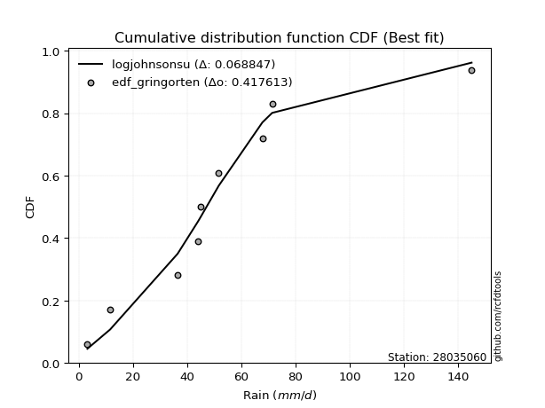</img>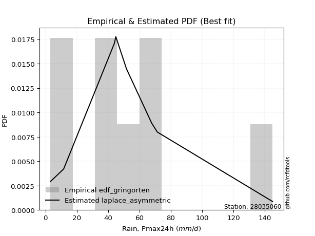</img>

</div>


### 9. EDF Filliben (1975)

The specific values of the constants (0.3175) (often denoted as $alpha$) and (0.365) are derived from a method proposed by James J. Filliben in a 1975 paper. This particular formula is the mean value of the $i$-th order statistic of the normal distribution and is considered a robust and effective plotting position formula for the normal probability plot correlation coefficient test for normality.

<div align="center">


$P=(m-0.3175)/(n+0.365)$


</div>


**9.1. Empirical values**

<div align="center">

|                | 0                   | 1                  | 2                   | 3                   | 4            | 5                  | 6                  | 7                  | 8                  |
|:---------------|:--------------------|:-------------------|:--------------------|:--------------------|:-------------|:-------------------|:-------------------|:-------------------|:-------------------|
| date           | 2020                | 2021               | 2025                | 2018                | 2023         | 2022               | 2017               | 2019               | 2024               |
| x              | 3.2                 | 11.6               | 36.5                | 44.0                | 44.9         | 51.7               | 67.8               | 71.4               | 145.0              |
| m              | 1                   | 2                  | 3                   | 4                   | 5            | 6                  | 7                  | 8                  | 9                  |
| empirical_dist | edf_filliben        | edf_filliben       | edf_filliben        | edf_filliben        | edf_filliben | edf_filliben       | edf_filliben       | edf_filliben       | edf_filliben       |
| empirical      | 0.07287773625200214 | 0.1796583021890016 | 0.28643886812600106 | 0.39321943406300053 | 0.5          | 0.6067805659369995 | 0.7135611318739989 | 0.8203416978109984 | 0.9271222637479978 |
| empirical_tr   | 1.0786063921681543  | 1.219004230393752  | 1.401421623643846   | 1.6480422349318082  | 2.0          | 2.5431093007467753 | 3.491146318732526  | 5.566121842496286  | 13.721611721611705 |

</div>


**9.2. Kolmogorov-Smirnov fit test (sorted by Δ)**


<div align="center">

|                | 0                   | 1                   | 2                   | 3                   | 4                   | 5                   | 6                   | 7                   | 8                   | 9                   | 10                  | 11                  | 12                  | 13                  | 14                  | 15                  | 16                  | 17                  | 18                  | 19                  | 20                  | 21                  | 22                  | 23                  | 24                  | 25                  | 26                  | 27                  | 28                  | 29                  | 30                  | 31                  | 32                  | 33                  | 34                  | 35                  | 36                  | 37                  | 38                  | 39                  | 40                  | 41                  | 42                  | 43                  | 44                  | 45                  | 46                  | 47                  | 48                  | 49                  | 50                  | 51                  | 52                  | 53                  | 54                  | 55                  | 56                  | 57                  | 58                  | 59                  | 60                  | 61                  | 62                  | 63                  | 64                  | 65                  | 66                  | 67                  | 68                  | 69                  | 70                  | 71                  | 72                  | 73                  | 74                  | 75                  | 76                  | 77                  | 78                  | 79                  | 80                  | 81                  | 82                  | 83                  | 84                  | 85                  | 86                  | 87                  | 88                  | 89                  | 90                  | 91                  | 92                  | 93                  | 94                  | 95                  | 96                  | 97                  | 98                  | 99                  | 100                 | 101                 | 102                 | 103                 | 104                 | 105                 | 106                 | 107                 | 108                 | 109                 | 110                 | 111                 | 112                 | 113                 | 114                 | 115                 | 116                 | 117                 | 118                 | 119                 | 120                 | 121                 | 122                 | 123                 | 124                 | 125                 | 126                 | 127                 | 128                 | 129                 | 130                 | 131                 | 132                 | 133                 | 134                 | 135                 | 136                 | 137                 | 138                 | 139                 | 140                 | 141                 | 142                 | 143                 | 144                 | 145                 | 146                 | 147                 | 148                 | 149                 | 150                 | 151                 | 152                 | 153                 | 154                 | 155                 | 156                 | 157                 | 158                 | 159                 |
|:---------------|:--------------------|:--------------------|:--------------------|:--------------------|:--------------------|:--------------------|:--------------------|:--------------------|:--------------------|:--------------------|:--------------------|:--------------------|:--------------------|:--------------------|:--------------------|:--------------------|:--------------------|:--------------------|:--------------------|:--------------------|:--------------------|:--------------------|:--------------------|:--------------------|:--------------------|:--------------------|:--------------------|:--------------------|:--------------------|:--------------------|:--------------------|:--------------------|:--------------------|:--------------------|:--------------------|:--------------------|:--------------------|:--------------------|:--------------------|:--------------------|:--------------------|:--------------------|:--------------------|:--------------------|:--------------------|:--------------------|:--------------------|:--------------------|:--------------------|:--------------------|:--------------------|:--------------------|:--------------------|:--------------------|:--------------------|:--------------------|:--------------------|:--------------------|:--------------------|:--------------------|:--------------------|:--------------------|:--------------------|:--------------------|:--------------------|:--------------------|:--------------------|:--------------------|:--------------------|:--------------------|:--------------------|:--------------------|:--------------------|:--------------------|:--------------------|:--------------------|:--------------------|:--------------------|:--------------------|:--------------------|:--------------------|:--------------------|:--------------------|:--------------------|:--------------------|:--------------------|:--------------------|:--------------------|:--------------------|:--------------------|:--------------------|:--------------------|:--------------------|:--------------------|:--------------------|:--------------------|:--------------------|:--------------------|:--------------------|:--------------------|:--------------------|:--------------------|:--------------------|:--------------------|:--------------------|:--------------------|:--------------------|:--------------------|:--------------------|:--------------------|:--------------------|:--------------------|:--------------------|:--------------------|:--------------------|:--------------------|:--------------------|:--------------------|:--------------------|:--------------------|:--------------------|:--------------------|:--------------------|:--------------------|:--------------------|:--------------------|:--------------------|:--------------------|:--------------------|:--------------------|:--------------------|:--------------------|:--------------------|:--------------------|:--------------------|:--------------------|:--------------------|:--------------------|:--------------------|:--------------------|:--------------------|:--------------------|:--------------------|:--------------------|:--------------------|:--------------------|:--------------------|:--------------------|:--------------------|:--------------------|:--------------------|:--------------------|:--------------------|:--------------------|:--------------------|:--------------------|:--------------------|:--------------------|:--------------------|:--------------------|
| station        | 28035060            | 28035060            | 28035060            | 28035060            | 28035060            | 28035060            | 28035060            | 28035060            | 28035060            | 28035060            | 28035060            | 28035060            | 28035060            | 28035060            | 28035060            | 28035060            | 28035060            | 28035060            | 28035060            | 28035060            | 28035060            | 28035060            | 28035060            | 28035060            | 28035060            | 28035060            | 28035060            | 28035060            | 28035060            | 28035060            | 28035060            | 28035060            | 28035060            | 28035060            | 28035060            | 28035060            | 28035060            | 28035060            | 28035060            | 28035060            | 28035060            | 28035060            | 28035060            | 28035060            | 28035060            | 28035060            | 28035060            | 28035060            | 28035060            | 28035060            | 28035060            | 28035060            | 28035060            | 28035060            | 28035060            | 28035060            | 28035060            | 28035060            | 28035060            | 28035060            | 28035060            | 28035060            | 28035060            | 28035060            | 28035060            | 28035060            | 28035060            | 28035060            | 28035060            | 28035060            | 28035060            | 28035060            | 28035060            | 28035060            | 28035060            | 28035060            | 28035060            | 28035060            | 28035060            | 28035060            | 28035060            | 28035060            | 28035060            | 28035060            | 28035060            | 28035060            | 28035060            | 28035060            | 28035060            | 28035060            | 28035060            | 28035060            | 28035060            | 28035060            | 28035060            | 28035060            | 28035060            | 28035060            | 28035060            | 28035060            | 28035060            | 28035060            | 28035060            | 28035060            | 28035060            | 28035060            | 28035060            | 28035060            | 28035060            | 28035060            | 28035060            | 28035060            | 28035060            | 28035060            | 28035060            | 28035060            | 28035060            | 28035060            | 28035060            | 28035060            | 28035060            | 28035060            | 28035060            | 28035060            | 28035060            | 28035060            | 28035060            | 28035060            | 28035060            | 28035060            | 28035060            | 28035060            | 28035060            | 28035060            | 28035060            | 28035060            | 28035060            | 28035060            | 28035060            | 28035060            | 28035060            | 28035060            | 28035060            | 28035060            | 28035060            | 28035060            | 28035060            | 28035060            | 28035060            | 28035060            | 28035060            | 28035060            | 28035060            | 28035060            | 28035060            | 28035060            | 28035060            | 28035060            | 28035060            | 28035060            |
| empirical_dist | edf_filliben        | edf_filliben        | edf_filliben        | edf_filliben        | edf_filliben        | edf_filliben        | edf_filliben        | edf_filliben        | edf_filliben        | edf_filliben        | edf_filliben        | edf_filliben        | edf_filliben        | edf_filliben        | edf_filliben        | edf_filliben        | edf_filliben        | edf_filliben        | edf_filliben        | edf_filliben        | edf_filliben        | edf_filliben        | edf_filliben        | edf_filliben        | edf_filliben        | edf_filliben        | edf_filliben        | edf_filliben        | edf_filliben        | edf_filliben        | edf_filliben        | edf_filliben        | edf_filliben        | edf_filliben        | edf_filliben        | edf_filliben        | edf_filliben        | edf_filliben        | edf_filliben        | edf_filliben        | edf_filliben        | edf_filliben        | edf_filliben        | edf_filliben        | edf_filliben        | edf_filliben        | edf_filliben        | edf_filliben        | edf_filliben        | edf_filliben        | edf_filliben        | edf_filliben        | edf_filliben        | edf_filliben        | edf_filliben        | edf_filliben        | edf_filliben        | edf_filliben        | edf_filliben        | edf_filliben        | edf_filliben        | edf_filliben        | edf_filliben        | edf_filliben        | edf_filliben        | edf_filliben        | edf_filliben        | edf_filliben        | edf_filliben        | edf_filliben        | edf_filliben        | edf_filliben        | edf_filliben        | edf_filliben        | edf_filliben        | edf_filliben        | edf_filliben        | edf_filliben        | edf_filliben        | edf_filliben        | edf_filliben        | edf_filliben        | edf_filliben        | edf_filliben        | edf_filliben        | edf_filliben        | edf_filliben        | edf_filliben        | edf_filliben        | edf_filliben        | edf_filliben        | edf_filliben        | edf_filliben        | edf_filliben        | edf_filliben        | edf_filliben        | edf_filliben        | edf_filliben        | edf_filliben        | edf_filliben        | edf_filliben        | edf_filliben        | edf_filliben        | edf_filliben        | edf_filliben        | edf_filliben        | edf_filliben        | edf_filliben        | edf_filliben        | edf_filliben        | edf_filliben        | edf_filliben        | edf_filliben        | edf_filliben        | edf_filliben        | edf_filliben        | edf_filliben        | edf_filliben        | edf_filliben        | edf_filliben        | edf_filliben        | edf_filliben        | edf_filliben        | edf_filliben        | edf_filliben        | edf_filliben        | edf_filliben        | edf_filliben        | edf_filliben        | edf_filliben        | edf_filliben        | edf_filliben        | edf_filliben        | edf_filliben        | edf_filliben        | edf_filliben        | edf_filliben        | edf_filliben        | edf_filliben        | edf_filliben        | edf_filliben        | edf_filliben        | edf_filliben        | edf_filliben        | edf_filliben        | edf_filliben        | edf_filliben        | edf_filliben        | edf_filliben        | edf_filliben        | edf_filliben        | edf_filliben        | edf_filliben        | edf_filliben        | edf_filliben        | edf_filliben        | edf_filliben        | edf_filliben        | edf_filliben        | edf_filliben        |
| p_dist         | t                   | logjohnsonsu        | vonmises_line       | exponnorm           | nct                 | genlogistic         | kstwobign           | gumbel_r            | invweibull          | logdgamma           | logdweibull         | dweibull            | pearson3            | invgamma            | loggennorm          | moyal               | johnsonsu           | rayleigh            | logt                | skewnorm            | rice                | invgauss            | dgamma              | maxwell             | fatiguelife         | logistic            | burr                | hypsecant           | mielke              | halfnorm            | logburr             | kappa3              | loggenlogistic      | ncf                 | laplace             | logmielke           | logloggamma         | gennorm             | foldnorm            | logvonmises_line    | halflogistic        | logloglaplace       | logexponweib        | genpareto           | loggenextreme       | gompertz            | logexponpow         | norm                | crystalball         | betaprime           | logweibull_min      | logargus            | truncpareto         | logpearson3         | logskewnorm         | loggumbel_l         | logburr12           | loggompertz         | burr12              | anglit              | logtrapezoid        | lognakagami         | semicircular        | wald                | logtriang           | exponpow            | gumbel_l            | loggengamma         | loggenhalflogistic  | f                   | genexpon            | lomax               | arcsine             | logfoldnorm         | logarcsine          | logsemicircular     | loganglit           | logexponnorm        | lognorm             | logcrystalball      | logrice             | cosine              | lognct              | logfatiguelife      | loglogistic         | loghypsecant        | logf                | logncf              | tukeylambda         | bradford            | loglaplace          | loglaplace          | nakagami            | logbetaprime        | loggenpareto        | loggamma            | loggamma            | loginvgamma         | logerlang           | loginvgauss         | logalpha            | beta                | truncexpon          | truncweibull_min    | loglevy_l           | logmaxwell          | loginvweibull       | gausshyper          | lograyleigh         | logbeta             | loggausshyper       | logcosine           | gengamma            | logtruncweibull_min | logkstwobign        | loggumbel_r         | kappa4              | loghalfnorm         | loglomax            | loggenexpon         | logmoyal            | loghalflogistic     | logksone            | logweibull_max      | ksone               | wrapcauchy          | logwrapcauchy       | uniform             | halfgennorm         | logtukeylambda      | argus               | logkappa3           | loguniform          | weibull_min         | logkappa4           | exponweib           | levy_l              | loghalfgennorm      | logwald             | logtruncnorm        | genextreme          | logbradford         | logjohnsonsb        | logtruncexpon       | gamma               | erlang              | genhalflogistic     | rdist               | powerlaw            | alpha               | triang              | logrdist            | trapezoid           | johnsonsb           | logpowerlaw         | weibull_max         | logtruncpareto      | truncnorm           | logvonmises         | vonmises            |
| delta          | 0.06690163281974981 | 0.07261016654597277 | 0.07424628324412391 | 0.0841652271116396  | 0.08436656213658722 | 0.09255728450227402 | 0.09413187970496395 | 0.09499061926376734 | 0.10408772339825212 | 0.10678056593699514 | 0.10678056593700236 | 0.10678056593769358 | 0.10756107519542385 | 0.10761637709374194 | 0.10821389664721706 | 0.11109849194543475 | 0.11282711009034402 | 0.11435739290010949 | 0.11512338335581271 | 0.11570740956759235 | 0.11667836194267889 | 0.11715710653760458 | 0.11753619526337689 | 0.11966103904893244 | 0.11975310042452186 | 0.12075628501498253 | 0.12189169294192437 | 0.12218899551467072 | 0.12533171080665978 | 0.12705326579725856 | 0.12728430932898654 | 0.12751382874211348 | 0.12757397160049877 | 0.1278213112972223  | 0.1281115121622738  | 0.12846221442657763 | 0.12846387041741614 | 0.13050776338801973 | 0.13064588604339972 | 0.13232986518676404 | 0.13278170111284593 | 0.1329083270038337  | 0.13439506227978237 | 0.13443858262991626 | 0.13589521324868792 | 0.1368500861437958  | 0.13760862167867238 | 0.13763579710456486 | 0.13763580179464652 | 0.1389382717684542  | 0.13980752089044624 | 0.1413311164823381  | 0.14199401887207164 | 0.14579407899271501 | 0.14585234743727055 | 0.15046114645622932 | 0.1545765467813618  | 0.15458365434815013 | 0.15749941797052747 | 0.16071913293174256 | 0.16356282275229916 | 0.16754552293860775 | 0.17049192310513306 | 0.1796583021890016  | 0.18431614689795028 | 0.18847687958108106 | 0.18970789029542245 | 0.1973955977363649  | 0.19758214876434466 | 0.19938842005627977 | 0.2020741340464709  | 0.206289443680014   | 0.21124281672280898 | 0.21519159745723015 | 0.21752957753810875 | 0.21917198989853148 | 0.21958687017827128 | 0.22059279589586267 | 0.22059336862684864 | 0.22059339166187475 | 0.22059351066004962 | 0.22075661896773902 | 0.22100511100364395 | 0.22136793785079367 | 0.22155391754011833 | 0.22237406394590298 | 0.22449213641916832 | 0.2245314740190627  | 0.22472342793337963 | 0.22621044753589603 | 0.22643551313250787 | 0.22643551313250787 | 0.2317853921862607  | 0.23183674530239773 | 0.2321972033088474  | 0.23292513000636728 | 0.23292513000636728 | 0.23452462092220816 | 0.23567752992635038 | 0.239397767501486   | 0.23998541413135976 | 0.2460069494362126  | 0.2475209072040856  | 0.24823108359538326 | 0.24832253087597064 | 0.253349210883389   | 0.25385780816280423 | 0.25524086422972614 | 0.26420417961166076 | 0.27622799711227386 | 0.27810844164586945 | 0.28131445612307093 | 0.2857352742829897  | 0.2857881509087762  | 0.2876306452093823  | 0.29114137063890666 | 0.2930514153207643  | 0.29476658409751244 | 0.2981118652992192  | 0.3027449031109012  | 0.3169271985040494  | 0.3201157505595297  | 0.3288005261203506  | 0.33319969242031056 | 0.3362091167108574  | 0.33734273190015585 | 0.33861039215674626 | 0.3393826004908292  | 0.34084660865852434 | 0.34257916572909575 | 0.34260305492636545 | 0.3516287672249936  | 0.351848404969621   | 0.36118007429170773 | 0.369496324868947   | 0.37373042317362004 | 0.37963855207820774 | 0.3865505936554716  | 0.38860608422870224 | 0.4038964347164028  | 0.41233634842311073 | 0.4158258377344852  | 0.42102307865378163 | 0.421704555553746   | 0.43684715608547076 | 0.4535564105727764  | 0.47199874124892044 | 0.48235461004563307 | 0.4825469672640369  | 0.5141827576519098  | 0.5387869259391205  | 0.5426496225250335  | 0.582822945548132   | 0.5943138991483289  | 0.6183877428412026  | 0.6958122573360671  | 0.75507342983281    | 0.8923734290286086  | 1.1047736404700206  | 22.66379702872893   |
| deltao         | 0.41761268023100007 | 0.41761268023100007 | 0.41761268023100007 | 0.41761268023100007 | 0.41761268023100007 | 0.41761268023100007 | 0.41761268023100007 | 0.41761268023100007 | 0.41761268023100007 | 0.41761268023100007 | 0.41761268023100007 | 0.41761268023100007 | 0.41761268023100007 | 0.41761268023100007 | 0.41761268023100007 | 0.41761268023100007 | 0.41761268023100007 | 0.41761268023100007 | 0.41761268023100007 | 0.41761268023100007 | 0.41761268023100007 | 0.41761268023100007 | 0.41761268023100007 | 0.41761268023100007 | 0.41761268023100007 | 0.41761268023100007 | 0.41761268023100007 | 0.41761268023100007 | 0.41761268023100007 | 0.41761268023100007 | 0.41761268023100007 | 0.41761268023100007 | 0.41761268023100007 | 0.41761268023100007 | 0.41761268023100007 | 0.41761268023100007 | 0.41761268023100007 | 0.41761268023100007 | 0.41761268023100007 | 0.41761268023100007 | 0.41761268023100007 | 0.41761268023100007 | 0.41761268023100007 | 0.41761268023100007 | 0.41761268023100007 | 0.41761268023100007 | 0.41761268023100007 | 0.41761268023100007 | 0.41761268023100007 | 0.41761268023100007 | 0.41761268023100007 | 0.41761268023100007 | 0.41761268023100007 | 0.41761268023100007 | 0.41761268023100007 | 0.41761268023100007 | 0.41761268023100007 | 0.41761268023100007 | 0.41761268023100007 | 0.41761268023100007 | 0.41761268023100007 | 0.41761268023100007 | 0.41761268023100007 | 0.41761268023100007 | 0.41761268023100007 | 0.41761268023100007 | 0.41761268023100007 | 0.41761268023100007 | 0.41761268023100007 | 0.41761268023100007 | 0.41761268023100007 | 0.41761268023100007 | 0.41761268023100007 | 0.41761268023100007 | 0.41761268023100007 | 0.41761268023100007 | 0.41761268023100007 | 0.41761268023100007 | 0.41761268023100007 | 0.41761268023100007 | 0.41761268023100007 | 0.41761268023100007 | 0.41761268023100007 | 0.41761268023100007 | 0.41761268023100007 | 0.41761268023100007 | 0.41761268023100007 | 0.41761268023100007 | 0.41761268023100007 | 0.41761268023100007 | 0.41761268023100007 | 0.41761268023100007 | 0.41761268023100007 | 0.41761268023100007 | 0.41761268023100007 | 0.41761268023100007 | 0.41761268023100007 | 0.41761268023100007 | 0.41761268023100007 | 0.41761268023100007 | 0.41761268023100007 | 0.41761268023100007 | 0.41761268023100007 | 0.41761268023100007 | 0.41761268023100007 | 0.41761268023100007 | 0.41761268023100007 | 0.41761268023100007 | 0.41761268023100007 | 0.41761268023100007 | 0.41761268023100007 | 0.41761268023100007 | 0.41761268023100007 | 0.41761268023100007 | 0.41761268023100007 | 0.41761268023100007 | 0.41761268023100007 | 0.41761268023100007 | 0.41761268023100007 | 0.41761268023100007 | 0.41761268023100007 | 0.41761268023100007 | 0.41761268023100007 | 0.41761268023100007 | 0.41761268023100007 | 0.41761268023100007 | 0.41761268023100007 | 0.41761268023100007 | 0.41761268023100007 | 0.41761268023100007 | 0.41761268023100007 | 0.41761268023100007 | 0.41761268023100007 | 0.41761268023100007 | 0.41761268023100007 | 0.41761268023100007 | 0.41761268023100007 | 0.41761268023100007 | 0.41761268023100007 | 0.41761268023100007 | 0.41761268023100007 | 0.41761268023100007 | 0.41761268023100007 | 0.41761268023100007 | 0.41761268023100007 | 0.41761268023100007 | 0.41761268023100007 | 0.41761268023100007 | 0.41761268023100007 | 0.41761268023100007 | 0.41761268023100007 | 0.41761268023100007 | 0.41761268023100007 | 0.41761268023100007 | 0.41761268023100007 | 0.41761268023100007 | 0.41761268023100007 | 0.41761268023100007 | 0.41761268023100007 | 0.41761268023100007 |
| eval           | Δo > Δ              | Δo > Δ              | Δo > Δ              | Δo > Δ              | Δo > Δ              | Δo > Δ              | Δo > Δ              | Δo > Δ              | Δo > Δ              | Δo > Δ              | Δo > Δ              | Δo > Δ              | Δo > Δ              | Δo > Δ              | Δo > Δ              | Δo > Δ              | Δo > Δ              | Δo > Δ              | Δo > Δ              | Δo > Δ              | Δo > Δ              | Δo > Δ              | Δo > Δ              | Δo > Δ              | Δo > Δ              | Δo > Δ              | Δo > Δ              | Δo > Δ              | Δo > Δ              | Δo > Δ              | Δo > Δ              | Δo > Δ              | Δo > Δ              | Δo > Δ              | Δo > Δ              | Δo > Δ              | Δo > Δ              | Δo > Δ              | Δo > Δ              | Δo > Δ              | Δo > Δ              | Δo > Δ              | Δo > Δ              | Δo > Δ              | Δo > Δ              | Δo > Δ              | Δo > Δ              | Δo > Δ              | Δo > Δ              | Δo > Δ              | Δo > Δ              | Δo > Δ              | Δo > Δ              | Δo > Δ              | Δo > Δ              | Δo > Δ              | Δo > Δ              | Δo > Δ              | Δo > Δ              | Δo > Δ              | Δo > Δ              | Δo > Δ              | Δo > Δ              | Δo > Δ              | Δo > Δ              | Δo > Δ              | Δo > Δ              | Δo > Δ              | Δo > Δ              | Δo > Δ              | Δo > Δ              | Δo > Δ              | Δo > Δ              | Δo > Δ              | Δo > Δ              | Δo > Δ              | Δo > Δ              | Δo > Δ              | Δo > Δ              | Δo > Δ              | Δo > Δ              | Δo > Δ              | Δo > Δ              | Δo > Δ              | Δo > Δ              | Δo > Δ              | Δo > Δ              | Δo > Δ              | Δo > Δ              | Δo > Δ              | Δo > Δ              | Δo > Δ              | Δo > Δ              | Δo > Δ              | Δo > Δ              | Δo > Δ              | Δo > Δ              | Δo > Δ              | Δo > Δ              | Δo > Δ              | Δo > Δ              | Δo > Δ              | Δo > Δ              | Δo > Δ              | Δo > Δ              | Δo > Δ              | Δo > Δ              | Δo > Δ              | Δo > Δ              | Δo > Δ              | Δo > Δ              | Δo > Δ              | Δo > Δ              | Δo > Δ              | Δo > Δ              | Δo > Δ              | Δo > Δ              | Δo > Δ              | Δo > Δ              | Δo > Δ              | Δo > Δ              | Δo > Δ              | Δo > Δ              | Δo > Δ              | Δo > Δ              | Δo > Δ              | Δo > Δ              | Δo > Δ              | Δo > Δ              | Δo > Δ              | Δo > Δ              | Δo > Δ              | Δo > Δ              | Δo > Δ              | Δo > Δ              | Δo > Δ              | Δo > Δ              | Δo > Δ              | Δo > Δ              | Δo > Δ              | Δo > Δ              | Δo > Δ              | Δo <= Δ             | Δo <= Δ             | Δo <= Δ             | Δo <= Δ             | Δo <= Δ             | Δo <= Δ             | Δo <= Δ             | Δo <= Δ             | Δo <= Δ             | Δo <= Δ             | Δo <= Δ             | Δo <= Δ             | Δo <= Δ             | Δo <= Δ             | Δo <= Δ             | Δo <= Δ             | Δo <= Δ             | Δo <= Δ             |
| fit            | 1                   | 1                   | 1                   | 1                   | 1                   | 1                   | 1                   | 1                   | 1                   | 1                   | 1                   | 1                   | 1                   | 1                   | 1                   | 1                   | 1                   | 1                   | 1                   | 1                   | 1                   | 1                   | 1                   | 1                   | 1                   | 1                   | 1                   | 1                   | 1                   | 1                   | 1                   | 1                   | 1                   | 1                   | 1                   | 1                   | 1                   | 1                   | 1                   | 1                   | 1                   | 1                   | 1                   | 1                   | 1                   | 1                   | 1                   | 1                   | 1                   | 1                   | 1                   | 1                   | 1                   | 1                   | 1                   | 1                   | 1                   | 1                   | 1                   | 1                   | 1                   | 1                   | 1                   | 1                   | 1                   | 1                   | 1                   | 1                   | 1                   | 1                   | 1                   | 1                   | 1                   | 1                   | 1                   | 1                   | 1                   | 1                   | 1                   | 1                   | 1                   | 1                   | 1                   | 1                   | 1                   | 1                   | 1                   | 1                   | 1                   | 1                   | 1                   | 1                   | 1                   | 1                   | 1                   | 1                   | 1                   | 1                   | 1                   | 1                   | 1                   | 1                   | 1                   | 1                   | 1                   | 1                   | 1                   | 1                   | 1                   | 1                   | 1                   | 1                   | 1                   | 1                   | 1                   | 1                   | 1                   | 1                   | 1                   | 1                   | 1                   | 1                   | 1                   | 1                   | 1                   | 1                   | 1                   | 1                   | 1                   | 1                   | 1                   | 1                   | 1                   | 1                   | 1                   | 1                   | 1                   | 1                   | 1                   | 1                   | 1                   | 1                   | 0                   | 0                   | 0                   | 0                   | 0                   | 0                   | 0                   | 0                   | 0                   | 0                   | 0                   | 0                   | 0                   | 0                   | 0                   | 0                   | 0                   | 0                   |
| n              | 9                   | 9                   | 9                   | 9                   | 9                   | 9                   | 9                   | 9                   | 9                   | 9                   | 9                   | 9                   | 9                   | 9                   | 9                   | 9                   | 9                   | 9                   | 9                   | 9                   | 9                   | 9                   | 9                   | 9                   | 9                   | 9                   | 9                   | 9                   | 9                   | 9                   | 9                   | 9                   | 9                   | 9                   | 9                   | 9                   | 9                   | 9                   | 9                   | 9                   | 9                   | 9                   | 9                   | 9                   | 9                   | 9                   | 9                   | 9                   | 9                   | 9                   | 9                   | 9                   | 9                   | 9                   | 9                   | 9                   | 9                   | 9                   | 9                   | 9                   | 9                   | 9                   | 9                   | 9                   | 9                   | 9                   | 9                   | 9                   | 9                   | 9                   | 9                   | 9                   | 9                   | 9                   | 9                   | 9                   | 9                   | 9                   | 9                   | 9                   | 9                   | 9                   | 9                   | 9                   | 9                   | 9                   | 9                   | 9                   | 9                   | 9                   | 9                   | 9                   | 9                   | 9                   | 9                   | 9                   | 9                   | 9                   | 9                   | 9                   | 9                   | 9                   | 9                   | 9                   | 9                   | 9                   | 9                   | 9                   | 9                   | 9                   | 9                   | 9                   | 9                   | 9                   | 9                   | 9                   | 9                   | 9                   | 9                   | 9                   | 9                   | 9                   | 9                   | 9                   | 9                   | 9                   | 9                   | 9                   | 9                   | 9                   | 9                   | 9                   | 9                   | 9                   | 9                   | 9                   | 9                   | 9                   | 9                   | 9                   | 9                   | 9                   | 9                   | 9                   | 9                   | 9                   | 9                   | 9                   | 9                   | 9                   | 9                   | 9                   | 9                   | 9                   | 9                   | 9                   | 9                   | 9                   | 9                   | 9                   |
| best_fit       | 1                   | 0                   | 0                   | 0                   | 0                   | 0                   | 0                   | 0                   | 0                   | 0                   | 0                   | 0                   | 0                   | 0                   | 0                   | 0                   | 0                   | 0                   | 0                   | 0                   | 0                   | 0                   | 0                   | 0                   | 0                   | 0                   | 0                   | 0                   | 0                   | 0                   | 0                   | 0                   | 0                   | 0                   | 0                   | 0                   | 0                   | 0                   | 0                   | 0                   | 0                   | 0                   | 0                   | 0                   | 0                   | 0                   | 0                   | 0                   | 0                   | 0                   | 0                   | 0                   | 0                   | 0                   | 0                   | 0                   | 0                   | 0                   | 0                   | 0                   | 0                   | 0                   | 0                   | 0                   | 0                   | 0                   | 0                   | 0                   | 0                   | 0                   | 0                   | 0                   | 0                   | 0                   | 0                   | 0                   | 0                   | 0                   | 0                   | 0                   | 0                   | 0                   | 0                   | 0                   | 0                   | 0                   | 0                   | 0                   | 0                   | 0                   | 0                   | 0                   | 0                   | 0                   | 0                   | 0                   | 0                   | 0                   | 0                   | 0                   | 0                   | 0                   | 0                   | 0                   | 0                   | 0                   | 0                   | 0                   | 0                   | 0                   | 0                   | 0                   | 0                   | 0                   | 0                   | 0                   | 0                   | 0                   | 0                   | 0                   | 0                   | 0                   | 0                   | 0                   | 0                   | 0                   | 0                   | 0                   | 0                   | 0                   | 0                   | 0                   | 0                   | 0                   | 0                   | 0                   | 0                   | 0                   | 0                   | 0                   | 0                   | 0                   | 0                   | 0                   | 0                   | 0                   | 0                   | 0                   | 0                   | 0                   | 0                   | 0                   | 0                   | 0                   | 0                   | 0                   | 0                   | 0                   | 0                   | 0                   |
| best_fit_sort  | 1                   | 2                   | 3                   | 4                   | 5                   | 6                   | 7                   | 8                   | 9                   | 10                  | 11                  | 12                  | 13                  | 14                  | 15                  | 16                  | 17                  | 18                  | 19                  | 20                  | 21                  | 22                  | 23                  | 24                  | 25                  | 26                  | 27                  | 28                  | 29                  | 30                  | 31                  | 32                  | 33                  | 34                  | 35                  | 36                  | 37                  | 38                  | 39                  | 40                  | 41                  | 42                  | 43                  | 44                  | 45                  | 46                  | 47                  | 48                  | 49                  | 50                  | 51                  | 52                  | 53                  | 54                  | 55                  | 56                  | 57                  | 58                  | 59                  | 60                  | 61                  | 62                  | 63                  | 64                  | 65                  | 66                  | 67                  | 68                  | 69                  | 70                  | 71                  | 72                  | 73                  | 74                  | 75                  | 76                  | 77                  | 78                  | 79                  | 80                  | 81                  | 82                  | 83                  | 84                  | 85                  | 86                  | 87                  | 88                  | 89                  | 90                  | 91                  | 92                  | 93                  | 94                  | 95                  | 96                  | 97                  | 98                  | 99                  | 100                 | 101                 | 102                 | 103                 | 104                 | 105                 | 106                 | 107                 | 108                 | 109                 | 110                 | 111                 | 112                 | 113                 | 114                 | 115                 | 116                 | 117                 | 118                 | 119                 | 120                 | 121                 | 122                 | 123                 | 124                 | 125                 | 126                 | 127                 | 128                 | 129                 | 130                 | 131                 | 132                 | 133                 | 134                 | 135                 | 136                 | 137                 | 138                 | 139                 | 140                 | 141                 | 142                 | 143                 | 144                 | 145                 | 146                 | 147                 | 148                 | 149                 | 150                 | 151                 | 152                 | 153                 | 154                 | 155                 | 156                 | 157                 | 158                 | 159                 | 160                 |

</div>


**9.3. Best fit**

<div align="center">

|   id |   station | empirical_dist   | p_dist   |     delta |   deltao | eval   |   fit |   n |   best_fit |   best_fit_sort |
|-----:|----------:|:-----------------|:---------|----------:|---------:|:-------|------:|----:|-----------:|----------------:|
|    0 |  28035060 | edf_filliben     | t        | 0.0669016 | 0.417613 | Δo > Δ |     1 |   9 |          1 |               1 |

</div>


<div align="center">

</img></img>

</div>


### 10. EDF Jenkinson (1977)

The Jenkinson formula in hydrology is an empirical plotting position formula used to estimate the non-exceedance probability _(P)_ or return period _(T)_ of a given ordered observation within a sample. It is a widely used method in the frequency analysis of extreme events such as floods and rainfall, as it provides a distribution-free way to plot data. _a≈0.31_ and _b≈0.38_ are constants derived to approximate the median of the probability distribution for the given rank.

<div align="center">


$P=(m-a)/(n+b)$


</div>


**10.1. Empirical values**

<div align="center">

|                | 0                   | 1                   | 2                  | 3                   | 4             | 5                  | 6                  | 7                  | 8                  |
|:---------------|:--------------------|:--------------------|:-------------------|:--------------------|:--------------|:-------------------|:-------------------|:-------------------|:-------------------|
| date           | 2020                | 2021                | 2025               | 2018                | 2023          | 2022               | 2017               | 2019               | 2024               |
| x              | 3.2                 | 11.6                | 36.5               | 44.0                | 44.9          | 51.7               | 67.8               | 71.4               | 145.0              |
| m              | 1                   | 2                   | 3                  | 4                   | 5             | 6                  | 7                  | 8                  | 9                  |
| empirical_dist | edf_jenkinson       | edf_jenkinson       | edf_jenkinson      | edf_jenkinson       | edf_jenkinson | edf_jenkinson      | edf_jenkinson      | edf_jenkinson      | edf_jenkinson      |
| empirical      | 0.07356076759061833 | 0.18017057569296374 | 0.2867803837953091 | 0.39339019189765456 | 0.5           | 0.6066098081023454 | 0.7132196162046908 | 0.8198294243070362 | 0.9264392324093815 |
| empirical_tr   | 1.0794016110471807  | 1.2197659297789336  | 1.4020926756352765 | 1.6485061511423549  | 2.0           | 2.542005420054201  | 3.486988847583642  | 5.550295857988164  | 13.5942028985507   |

</div>


**10.2. Kolmogorov-Smirnov fit test (sorted by Δ)**


<div align="center">

|                | 0                   | 1                   | 2                   | 3                   | 4                   | 5                   | 6                   | 7                   | 8                   | 9                   | 10                  | 11                  | 12                  | 13                  | 14                  | 15                  | 16                  | 17                  | 18                  | 19                  | 20                  | 21                  | 22                  | 23                  | 24                  | 25                  | 26                  | 27                  | 28                  | 29                  | 30                  | 31                  | 32                  | 33                  | 34                  | 35                  | 36                  | 37                  | 38                  | 39                  | 40                  | 41                  | 42                  | 43                  | 44                  | 45                  | 46                  | 47                  | 48                  | 49                  | 50                  | 51                  | 52                  | 53                  | 54                  | 55                  | 56                  | 57                  | 58                  | 59                  | 60                  | 61                  | 62                  | 63                  | 64                  | 65                  | 66                  | 67                  | 68                  | 69                  | 70                  | 71                  | 72                  | 73                  | 74                  | 75                  | 76                  | 77                  | 78                  | 79                  | 80                  | 81                  | 82                  | 83                  | 84                  | 85                  | 86                  | 87                  | 88                  | 89                  | 90                  | 91                  | 92                  | 93                  | 94                  | 95                  | 96                  | 97                  | 98                  | 99                  | 100                 | 101                 | 102                 | 103                 | 104                 | 105                 | 106                 | 107                 | 108                 | 109                 | 110                 | 111                 | 112                 | 113                 | 114                 | 115                 | 116                 | 117                 | 118                 | 119                 | 120                 | 121                 | 122                 | 123                 | 124                 | 125                 | 126                 | 127                 | 128                 | 129                 | 130                 | 131                 | 132                 | 133                 | 134                 | 135                 | 136                 | 137                 | 138                 | 139                 | 140                 | 141                 | 142                 | 143                 | 144                 | 145                 | 146                 | 147                 | 148                 | 149                 | 150                 | 151                 | 152                 | 153                 | 154                 | 155                 | 156                 | 157                 | 158                 | 159                 |
|:---------------|:--------------------|:--------------------|:--------------------|:--------------------|:--------------------|:--------------------|:--------------------|:--------------------|:--------------------|:--------------------|:--------------------|:--------------------|:--------------------|:--------------------|:--------------------|:--------------------|:--------------------|:--------------------|:--------------------|:--------------------|:--------------------|:--------------------|:--------------------|:--------------------|:--------------------|:--------------------|:--------------------|:--------------------|:--------------------|:--------------------|:--------------------|:--------------------|:--------------------|:--------------------|:--------------------|:--------------------|:--------------------|:--------------------|:--------------------|:--------------------|:--------------------|:--------------------|:--------------------|:--------------------|:--------------------|:--------------------|:--------------------|:--------------------|:--------------------|:--------------------|:--------------------|:--------------------|:--------------------|:--------------------|:--------------------|:--------------------|:--------------------|:--------------------|:--------------------|:--------------------|:--------------------|:--------------------|:--------------------|:--------------------|:--------------------|:--------------------|:--------------------|:--------------------|:--------------------|:--------------------|:--------------------|:--------------------|:--------------------|:--------------------|:--------------------|:--------------------|:--------------------|:--------------------|:--------------------|:--------------------|:--------------------|:--------------------|:--------------------|:--------------------|:--------------------|:--------------------|:--------------------|:--------------------|:--------------------|:--------------------|:--------------------|:--------------------|:--------------------|:--------------------|:--------------------|:--------------------|:--------------------|:--------------------|:--------------------|:--------------------|:--------------------|:--------------------|:--------------------|:--------------------|:--------------------|:--------------------|:--------------------|:--------------------|:--------------------|:--------------------|:--------------------|:--------------------|:--------------------|:--------------------|:--------------------|:--------------------|:--------------------|:--------------------|:--------------------|:--------------------|:--------------------|:--------------------|:--------------------|:--------------------|:--------------------|:--------------------|:--------------------|:--------------------|:--------------------|:--------------------|:--------------------|:--------------------|:--------------------|:--------------------|:--------------------|:--------------------|:--------------------|:--------------------|:--------------------|:--------------------|:--------------------|:--------------------|:--------------------|:--------------------|:--------------------|:--------------------|:--------------------|:--------------------|:--------------------|:--------------------|:--------------------|:--------------------|:--------------------|:--------------------|:--------------------|:--------------------|:--------------------|:--------------------|:--------------------|:--------------------|
| station        | 28035060            | 28035060            | 28035060            | 28035060            | 28035060            | 28035060            | 28035060            | 28035060            | 28035060            | 28035060            | 28035060            | 28035060            | 28035060            | 28035060            | 28035060            | 28035060            | 28035060            | 28035060            | 28035060            | 28035060            | 28035060            | 28035060            | 28035060            | 28035060            | 28035060            | 28035060            | 28035060            | 28035060            | 28035060            | 28035060            | 28035060            | 28035060            | 28035060            | 28035060            | 28035060            | 28035060            | 28035060            | 28035060            | 28035060            | 28035060            | 28035060            | 28035060            | 28035060            | 28035060            | 28035060            | 28035060            | 28035060            | 28035060            | 28035060            | 28035060            | 28035060            | 28035060            | 28035060            | 28035060            | 28035060            | 28035060            | 28035060            | 28035060            | 28035060            | 28035060            | 28035060            | 28035060            | 28035060            | 28035060            | 28035060            | 28035060            | 28035060            | 28035060            | 28035060            | 28035060            | 28035060            | 28035060            | 28035060            | 28035060            | 28035060            | 28035060            | 28035060            | 28035060            | 28035060            | 28035060            | 28035060            | 28035060            | 28035060            | 28035060            | 28035060            | 28035060            | 28035060            | 28035060            | 28035060            | 28035060            | 28035060            | 28035060            | 28035060            | 28035060            | 28035060            | 28035060            | 28035060            | 28035060            | 28035060            | 28035060            | 28035060            | 28035060            | 28035060            | 28035060            | 28035060            | 28035060            | 28035060            | 28035060            | 28035060            | 28035060            | 28035060            | 28035060            | 28035060            | 28035060            | 28035060            | 28035060            | 28035060            | 28035060            | 28035060            | 28035060            | 28035060            | 28035060            | 28035060            | 28035060            | 28035060            | 28035060            | 28035060            | 28035060            | 28035060            | 28035060            | 28035060            | 28035060            | 28035060            | 28035060            | 28035060            | 28035060            | 28035060            | 28035060            | 28035060            | 28035060            | 28035060            | 28035060            | 28035060            | 28035060            | 28035060            | 28035060            | 28035060            | 28035060            | 28035060            | 28035060            | 28035060            | 28035060            | 28035060            | 28035060            | 28035060            | 28035060            | 28035060            | 28035060            | 28035060            | 28035060            |
| empirical_dist | edf_jenkinson       | edf_jenkinson       | edf_jenkinson       | edf_jenkinson       | edf_jenkinson       | edf_jenkinson       | edf_jenkinson       | edf_jenkinson       | edf_jenkinson       | edf_jenkinson       | edf_jenkinson       | edf_jenkinson       | edf_jenkinson       | edf_jenkinson       | edf_jenkinson       | edf_jenkinson       | edf_jenkinson       | edf_jenkinson       | edf_jenkinson       | edf_jenkinson       | edf_jenkinson       | edf_jenkinson       | edf_jenkinson       | edf_jenkinson       | edf_jenkinson       | edf_jenkinson       | edf_jenkinson       | edf_jenkinson       | edf_jenkinson       | edf_jenkinson       | edf_jenkinson       | edf_jenkinson       | edf_jenkinson       | edf_jenkinson       | edf_jenkinson       | edf_jenkinson       | edf_jenkinson       | edf_jenkinson       | edf_jenkinson       | edf_jenkinson       | edf_jenkinson       | edf_jenkinson       | edf_jenkinson       | edf_jenkinson       | edf_jenkinson       | edf_jenkinson       | edf_jenkinson       | edf_jenkinson       | edf_jenkinson       | edf_jenkinson       | edf_jenkinson       | edf_jenkinson       | edf_jenkinson       | edf_jenkinson       | edf_jenkinson       | edf_jenkinson       | edf_jenkinson       | edf_jenkinson       | edf_jenkinson       | edf_jenkinson       | edf_jenkinson       | edf_jenkinson       | edf_jenkinson       | edf_jenkinson       | edf_jenkinson       | edf_jenkinson       | edf_jenkinson       | edf_jenkinson       | edf_jenkinson       | edf_jenkinson       | edf_jenkinson       | edf_jenkinson       | edf_jenkinson       | edf_jenkinson       | edf_jenkinson       | edf_jenkinson       | edf_jenkinson       | edf_jenkinson       | edf_jenkinson       | edf_jenkinson       | edf_jenkinson       | edf_jenkinson       | edf_jenkinson       | edf_jenkinson       | edf_jenkinson       | edf_jenkinson       | edf_jenkinson       | edf_jenkinson       | edf_jenkinson       | edf_jenkinson       | edf_jenkinson       | edf_jenkinson       | edf_jenkinson       | edf_jenkinson       | edf_jenkinson       | edf_jenkinson       | edf_jenkinson       | edf_jenkinson       | edf_jenkinson       | edf_jenkinson       | edf_jenkinson       | edf_jenkinson       | edf_jenkinson       | edf_jenkinson       | edf_jenkinson       | edf_jenkinson       | edf_jenkinson       | edf_jenkinson       | edf_jenkinson       | edf_jenkinson       | edf_jenkinson       | edf_jenkinson       | edf_jenkinson       | edf_jenkinson       | edf_jenkinson       | edf_jenkinson       | edf_jenkinson       | edf_jenkinson       | edf_jenkinson       | edf_jenkinson       | edf_jenkinson       | edf_jenkinson       | edf_jenkinson       | edf_jenkinson       | edf_jenkinson       | edf_jenkinson       | edf_jenkinson       | edf_jenkinson       | edf_jenkinson       | edf_jenkinson       | edf_jenkinson       | edf_jenkinson       | edf_jenkinson       | edf_jenkinson       | edf_jenkinson       | edf_jenkinson       | edf_jenkinson       | edf_jenkinson       | edf_jenkinson       | edf_jenkinson       | edf_jenkinson       | edf_jenkinson       | edf_jenkinson       | edf_jenkinson       | edf_jenkinson       | edf_jenkinson       | edf_jenkinson       | edf_jenkinson       | edf_jenkinson       | edf_jenkinson       | edf_jenkinson       | edf_jenkinson       | edf_jenkinson       | edf_jenkinson       | edf_jenkinson       | edf_jenkinson       | edf_jenkinson       | edf_jenkinson       | edf_jenkinson       | edf_jenkinson       |
| p_dist         | t                   | logjohnsonsu        | vonmises_line       | exponnorm           | nct                 | genlogistic         | kstwobign           | gumbel_r            | invweibull          | logdgamma           | logdweibull         | dweibull            | pearson3            | invgamma            | loggennorm          | moyal               | johnsonsu           | rayleigh            | skewnorm            | logt                | rice                | invgauss            | dgamma              | maxwell             | fatiguelife         | logistic            | burr                | hypsecant           | mielke              | halfnorm            | logburr             | kappa3              | loggenlogistic      | ncf                 | laplace             | logmielke           | logloggamma         | foldnorm            | gennorm             | logvonmises_line    | logloglaplace       | halflogistic        | logexponweib        | genpareto           | loggenextreme       | gompertz            | norm                | crystalball         | logexponpow         | betaprime           | logweibull_min      | logargus            | truncpareto         | logpearson3         | logskewnorm         | loggumbel_l         | logburr12           | loggompertz         | burr12              | anglit              | logtrapezoid        | lognakagami         | semicircular        | wald                | logtriang           | exponpow            | gumbel_l            | loggengamma         | loggenhalflogistic  | f                   | genexpon            | lomax               | arcsine             | logfoldnorm         | logarcsine          | logsemicircular     | loganglit           | cosine              | logexponnorm        | lognorm             | logcrystalball      | logrice             | lognct              | logfatiguelife      | loglogistic         | loghypsecant        | logf                | logncf              | tukeylambda         | bradford            | loglaplace          | loglaplace          | nakagami            | logbetaprime        | loggenpareto        | loggamma            | loggamma            | loginvgamma         | logerlang           | loginvgauss         | logalpha            | beta                | truncexpon          | loglevy_l           | truncweibull_min    | logmaxwell          | loginvweibull       | gausshyper          | lograyleigh         | logbeta             | loggausshyper       | logcosine           | gengamma            | logtruncweibull_min | logkstwobign        | loggumbel_r         | kappa4              | loghalfnorm         | loglomax            | loggenexpon         | logmoyal            | loghalflogistic     | logksone            | logweibull_max      | ksone               | wrapcauchy          | logwrapcauchy       | uniform             | halfgennorm         | argus               | logtukeylambda      | logkappa3           | loguniform          | weibull_min         | logkappa4           | exponweib           | levy_l              | loghalfgennorm      | logwald             | logtruncnorm        | genextreme          | logbradford         | logjohnsonsb        | logtruncexpon       | gamma               | erlang              | genhalflogistic     | rdist               | powerlaw            | alpha               | triang              | logrdist            | trapezoid           | johnsonsb           | logpowerlaw         | weibull_max         | logtruncpareto      | truncnorm           | logvonmises         | vonmises            |
| delta          | 0.06724314848905799 | 0.0731224400499349  | 0.07390476757481584 | 0.08382371144233153 | 0.08402504646727915 | 0.09221576883296595 | 0.09361960620100174 | 0.09464910359445927 | 0.10374620772894405 | 0.10660980810234111 | 0.10660980810234832 | 0.10660980810303955 | 0.10721955952611578 | 0.10727486142443388 | 0.10872617015117919 | 0.11075697627612668 | 0.11248559442103595 | 0.11384511939614728 | 0.11536589389828428 | 0.11563565685977484 | 0.11616608843871667 | 0.11681559086829651 | 0.11787771093268506 | 0.11914876554497023 | 0.1194115847552138  | 0.1205855271803285  | 0.12137941943796215 | 0.12201823768001668 | 0.12499019513735171 | 0.1267117501279505  | 0.12694279365967848 | 0.1271723130728054  | 0.1272324559311907  | 0.12747979562791423 | 0.12794075432761975 | 0.12812069875726956 | 0.12812235474810807 | 0.13030437037409165 | 0.1308492790573279  | 0.13198834951745597 | 0.1323960534998715  | 0.13244018544353786 | 0.1340535466104743  | 0.1340970669606082  | 0.1353829397447257  | 0.13650857047448772 | 0.13712352360060265 | 0.1371235282906843  | 0.13726710600936431 | 0.13859675609914612 | 0.13946600522113817 | 0.14098960081303002 | 0.14165250320276357 | 0.14545256332340695 | 0.14551083176796248 | 0.15011963078692125 | 0.15423503111205372 | 0.15424213867884207 | 0.1571579023012194  | 0.16020685942778035 | 0.1632213070829911  | 0.16805779644256988 | 0.16997964960117085 | 0.18017057569296374 | 0.18397463122864222 | 0.188135363911773   | 0.18953713246076842 | 0.19705408206705682 | 0.1972406330950366  | 0.1990469043869717  | 0.20173261837716283 | 0.20594792801070594 | 0.21073054321884677 | 0.2148500817879221  | 0.21718806186880069 | 0.21883047422922342 | 0.2192453545089632  | 0.2202443454637768  | 0.2202512802265546  | 0.22025185295754057 | 0.22025187599256668 | 0.22025199499074155 | 0.22066359533433588 | 0.2210264221814856  | 0.22121240187081026 | 0.2220325482765949  | 0.22415062074986025 | 0.22418995834975464 | 0.2250649436026878  | 0.22569817403193382 | 0.22626475529785384 | 0.22626475529785384 | 0.23144387651695264 | 0.23149522963308966 | 0.23185568763953934 | 0.2325836143370592  | 0.2325836143370592  | 0.2341831052529001  | 0.23533601425704231 | 0.23905625183217794 | 0.2396438984620517  | 0.24566543376690453 | 0.24700863370012338 | 0.24763949953735445 | 0.24771881009142105 | 0.25300769521408095 | 0.25351629249349616 | 0.2547285907257639  | 0.2638626639423527  | 0.27571572360831165 | 0.2777669259765614  | 0.28097294045376286 | 0.28539375861368166 | 0.2854466352394681  | 0.28728912954007424 | 0.2907998549695986  | 0.2925391418168021  | 0.2944250684282044  | 0.2977703496299111  | 0.3024033874415931  | 0.3165856828347413  | 0.3197742348902216  | 0.32845901045104253 | 0.33268741891634834 | 0.3356968432068952  | 0.33683045839619363 | 0.3382688764874382  | 0.338870326986867   | 0.3405050929892163  | 0.34209078142240323 | 0.3422376500597877  | 0.3512872515556855  | 0.35150688930031293 | 0.36083855862239966 | 0.36915480919963894 | 0.373388907504312   | 0.3789555207395915  | 0.38620907798616355 | 0.3882645685593942  | 0.40355491904709473 | 0.4118240749191486  | 0.41548432206517716 | 0.4205108051498195  | 0.4213630398844379  | 0.4365056404161627  | 0.45321489490346833 | 0.4714864677449582  | 0.4816715787070168  | 0.48220545159472883 | 0.5138412419826017  | 0.5382746524351583  | 0.5423081068557254  | 0.5823106720441698  | 0.5938016256443667  | 0.6180462271718945  | 0.6952999838321049  | 0.7545611563288479  | 0.8916903976899924  | 1.1044321248007125  | 22.664480060067543  |
| deltao         | 0.41761268023100007 | 0.41761268023100007 | 0.41761268023100007 | 0.41761268023100007 | 0.41761268023100007 | 0.41761268023100007 | 0.41761268023100007 | 0.41761268023100007 | 0.41761268023100007 | 0.41761268023100007 | 0.41761268023100007 | 0.41761268023100007 | 0.41761268023100007 | 0.41761268023100007 | 0.41761268023100007 | 0.41761268023100007 | 0.41761268023100007 | 0.41761268023100007 | 0.41761268023100007 | 0.41761268023100007 | 0.41761268023100007 | 0.41761268023100007 | 0.41761268023100007 | 0.41761268023100007 | 0.41761268023100007 | 0.41761268023100007 | 0.41761268023100007 | 0.41761268023100007 | 0.41761268023100007 | 0.41761268023100007 | 0.41761268023100007 | 0.41761268023100007 | 0.41761268023100007 | 0.41761268023100007 | 0.41761268023100007 | 0.41761268023100007 | 0.41761268023100007 | 0.41761268023100007 | 0.41761268023100007 | 0.41761268023100007 | 0.41761268023100007 | 0.41761268023100007 | 0.41761268023100007 | 0.41761268023100007 | 0.41761268023100007 | 0.41761268023100007 | 0.41761268023100007 | 0.41761268023100007 | 0.41761268023100007 | 0.41761268023100007 | 0.41761268023100007 | 0.41761268023100007 | 0.41761268023100007 | 0.41761268023100007 | 0.41761268023100007 | 0.41761268023100007 | 0.41761268023100007 | 0.41761268023100007 | 0.41761268023100007 | 0.41761268023100007 | 0.41761268023100007 | 0.41761268023100007 | 0.41761268023100007 | 0.41761268023100007 | 0.41761268023100007 | 0.41761268023100007 | 0.41761268023100007 | 0.41761268023100007 | 0.41761268023100007 | 0.41761268023100007 | 0.41761268023100007 | 0.41761268023100007 | 0.41761268023100007 | 0.41761268023100007 | 0.41761268023100007 | 0.41761268023100007 | 0.41761268023100007 | 0.41761268023100007 | 0.41761268023100007 | 0.41761268023100007 | 0.41761268023100007 | 0.41761268023100007 | 0.41761268023100007 | 0.41761268023100007 | 0.41761268023100007 | 0.41761268023100007 | 0.41761268023100007 | 0.41761268023100007 | 0.41761268023100007 | 0.41761268023100007 | 0.41761268023100007 | 0.41761268023100007 | 0.41761268023100007 | 0.41761268023100007 | 0.41761268023100007 | 0.41761268023100007 | 0.41761268023100007 | 0.41761268023100007 | 0.41761268023100007 | 0.41761268023100007 | 0.41761268023100007 | 0.41761268023100007 | 0.41761268023100007 | 0.41761268023100007 | 0.41761268023100007 | 0.41761268023100007 | 0.41761268023100007 | 0.41761268023100007 | 0.41761268023100007 | 0.41761268023100007 | 0.41761268023100007 | 0.41761268023100007 | 0.41761268023100007 | 0.41761268023100007 | 0.41761268023100007 | 0.41761268023100007 | 0.41761268023100007 | 0.41761268023100007 | 0.41761268023100007 | 0.41761268023100007 | 0.41761268023100007 | 0.41761268023100007 | 0.41761268023100007 | 0.41761268023100007 | 0.41761268023100007 | 0.41761268023100007 | 0.41761268023100007 | 0.41761268023100007 | 0.41761268023100007 | 0.41761268023100007 | 0.41761268023100007 | 0.41761268023100007 | 0.41761268023100007 | 0.41761268023100007 | 0.41761268023100007 | 0.41761268023100007 | 0.41761268023100007 | 0.41761268023100007 | 0.41761268023100007 | 0.41761268023100007 | 0.41761268023100007 | 0.41761268023100007 | 0.41761268023100007 | 0.41761268023100007 | 0.41761268023100007 | 0.41761268023100007 | 0.41761268023100007 | 0.41761268023100007 | 0.41761268023100007 | 0.41761268023100007 | 0.41761268023100007 | 0.41761268023100007 | 0.41761268023100007 | 0.41761268023100007 | 0.41761268023100007 | 0.41761268023100007 | 0.41761268023100007 | 0.41761268023100007 | 0.41761268023100007 | 0.41761268023100007 |
| eval           | Δo > Δ              | Δo > Δ              | Δo > Δ              | Δo > Δ              | Δo > Δ              | Δo > Δ              | Δo > Δ              | Δo > Δ              | Δo > Δ              | Δo > Δ              | Δo > Δ              | Δo > Δ              | Δo > Δ              | Δo > Δ              | Δo > Δ              | Δo > Δ              | Δo > Δ              | Δo > Δ              | Δo > Δ              | Δo > Δ              | Δo > Δ              | Δo > Δ              | Δo > Δ              | Δo > Δ              | Δo > Δ              | Δo > Δ              | Δo > Δ              | Δo > Δ              | Δo > Δ              | Δo > Δ              | Δo > Δ              | Δo > Δ              | Δo > Δ              | Δo > Δ              | Δo > Δ              | Δo > Δ              | Δo > Δ              | Δo > Δ              | Δo > Δ              | Δo > Δ              | Δo > Δ              | Δo > Δ              | Δo > Δ              | Δo > Δ              | Δo > Δ              | Δo > Δ              | Δo > Δ              | Δo > Δ              | Δo > Δ              | Δo > Δ              | Δo > Δ              | Δo > Δ              | Δo > Δ              | Δo > Δ              | Δo > Δ              | Δo > Δ              | Δo > Δ              | Δo > Δ              | Δo > Δ              | Δo > Δ              | Δo > Δ              | Δo > Δ              | Δo > Δ              | Δo > Δ              | Δo > Δ              | Δo > Δ              | Δo > Δ              | Δo > Δ              | Δo > Δ              | Δo > Δ              | Δo > Δ              | Δo > Δ              | Δo > Δ              | Δo > Δ              | Δo > Δ              | Δo > Δ              | Δo > Δ              | Δo > Δ              | Δo > Δ              | Δo > Δ              | Δo > Δ              | Δo > Δ              | Δo > Δ              | Δo > Δ              | Δo > Δ              | Δo > Δ              | Δo > Δ              | Δo > Δ              | Δo > Δ              | Δo > Δ              | Δo > Δ              | Δo > Δ              | Δo > Δ              | Δo > Δ              | Δo > Δ              | Δo > Δ              | Δo > Δ              | Δo > Δ              | Δo > Δ              | Δo > Δ              | Δo > Δ              | Δo > Δ              | Δo > Δ              | Δo > Δ              | Δo > Δ              | Δo > Δ              | Δo > Δ              | Δo > Δ              | Δo > Δ              | Δo > Δ              | Δo > Δ              | Δo > Δ              | Δo > Δ              | Δo > Δ              | Δo > Δ              | Δo > Δ              | Δo > Δ              | Δo > Δ              | Δo > Δ              | Δo > Δ              | Δo > Δ              | Δo > Δ              | Δo > Δ              | Δo > Δ              | Δo > Δ              | Δo > Δ              | Δo > Δ              | Δo > Δ              | Δo > Δ              | Δo > Δ              | Δo > Δ              | Δo > Δ              | Δo > Δ              | Δo > Δ              | Δo > Δ              | Δo > Δ              | Δo > Δ              | Δo > Δ              | Δo > Δ              | Δo > Δ              | Δo > Δ              | Δo > Δ              | Δo <= Δ             | Δo <= Δ             | Δo <= Δ             | Δo <= Δ             | Δo <= Δ             | Δo <= Δ             | Δo <= Δ             | Δo <= Δ             | Δo <= Δ             | Δo <= Δ             | Δo <= Δ             | Δo <= Δ             | Δo <= Δ             | Δo <= Δ             | Δo <= Δ             | Δo <= Δ             | Δo <= Δ             | Δo <= Δ             |
| fit            | 1                   | 1                   | 1                   | 1                   | 1                   | 1                   | 1                   | 1                   | 1                   | 1                   | 1                   | 1                   | 1                   | 1                   | 1                   | 1                   | 1                   | 1                   | 1                   | 1                   | 1                   | 1                   | 1                   | 1                   | 1                   | 1                   | 1                   | 1                   | 1                   | 1                   | 1                   | 1                   | 1                   | 1                   | 1                   | 1                   | 1                   | 1                   | 1                   | 1                   | 1                   | 1                   | 1                   | 1                   | 1                   | 1                   | 1                   | 1                   | 1                   | 1                   | 1                   | 1                   | 1                   | 1                   | 1                   | 1                   | 1                   | 1                   | 1                   | 1                   | 1                   | 1                   | 1                   | 1                   | 1                   | 1                   | 1                   | 1                   | 1                   | 1                   | 1                   | 1                   | 1                   | 1                   | 1                   | 1                   | 1                   | 1                   | 1                   | 1                   | 1                   | 1                   | 1                   | 1                   | 1                   | 1                   | 1                   | 1                   | 1                   | 1                   | 1                   | 1                   | 1                   | 1                   | 1                   | 1                   | 1                   | 1                   | 1                   | 1                   | 1                   | 1                   | 1                   | 1                   | 1                   | 1                   | 1                   | 1                   | 1                   | 1                   | 1                   | 1                   | 1                   | 1                   | 1                   | 1                   | 1                   | 1                   | 1                   | 1                   | 1                   | 1                   | 1                   | 1                   | 1                   | 1                   | 1                   | 1                   | 1                   | 1                   | 1                   | 1                   | 1                   | 1                   | 1                   | 1                   | 1                   | 1                   | 1                   | 1                   | 1                   | 1                   | 0                   | 0                   | 0                   | 0                   | 0                   | 0                   | 0                   | 0                   | 0                   | 0                   | 0                   | 0                   | 0                   | 0                   | 0                   | 0                   | 0                   | 0                   |
| n              | 9                   | 9                   | 9                   | 9                   | 9                   | 9                   | 9                   | 9                   | 9                   | 9                   | 9                   | 9                   | 9                   | 9                   | 9                   | 9                   | 9                   | 9                   | 9                   | 9                   | 9                   | 9                   | 9                   | 9                   | 9                   | 9                   | 9                   | 9                   | 9                   | 9                   | 9                   | 9                   | 9                   | 9                   | 9                   | 9                   | 9                   | 9                   | 9                   | 9                   | 9                   | 9                   | 9                   | 9                   | 9                   | 9                   | 9                   | 9                   | 9                   | 9                   | 9                   | 9                   | 9                   | 9                   | 9                   | 9                   | 9                   | 9                   | 9                   | 9                   | 9                   | 9                   | 9                   | 9                   | 9                   | 9                   | 9                   | 9                   | 9                   | 9                   | 9                   | 9                   | 9                   | 9                   | 9                   | 9                   | 9                   | 9                   | 9                   | 9                   | 9                   | 9                   | 9                   | 9                   | 9                   | 9                   | 9                   | 9                   | 9                   | 9                   | 9                   | 9                   | 9                   | 9                   | 9                   | 9                   | 9                   | 9                   | 9                   | 9                   | 9                   | 9                   | 9                   | 9                   | 9                   | 9                   | 9                   | 9                   | 9                   | 9                   | 9                   | 9                   | 9                   | 9                   | 9                   | 9                   | 9                   | 9                   | 9                   | 9                   | 9                   | 9                   | 9                   | 9                   | 9                   | 9                   | 9                   | 9                   | 9                   | 9                   | 9                   | 9                   | 9                   | 9                   | 9                   | 9                   | 9                   | 9                   | 9                   | 9                   | 9                   | 9                   | 9                   | 9                   | 9                   | 9                   | 9                   | 9                   | 9                   | 9                   | 9                   | 9                   | 9                   | 9                   | 9                   | 9                   | 9                   | 9                   | 9                   | 9                   |
| best_fit       | 1                   | 0                   | 0                   | 0                   | 0                   | 0                   | 0                   | 0                   | 0                   | 0                   | 0                   | 0                   | 0                   | 0                   | 0                   | 0                   | 0                   | 0                   | 0                   | 0                   | 0                   | 0                   | 0                   | 0                   | 0                   | 0                   | 0                   | 0                   | 0                   | 0                   | 0                   | 0                   | 0                   | 0                   | 0                   | 0                   | 0                   | 0                   | 0                   | 0                   | 0                   | 0                   | 0                   | 0                   | 0                   | 0                   | 0                   | 0                   | 0                   | 0                   | 0                   | 0                   | 0                   | 0                   | 0                   | 0                   | 0                   | 0                   | 0                   | 0                   | 0                   | 0                   | 0                   | 0                   | 0                   | 0                   | 0                   | 0                   | 0                   | 0                   | 0                   | 0                   | 0                   | 0                   | 0                   | 0                   | 0                   | 0                   | 0                   | 0                   | 0                   | 0                   | 0                   | 0                   | 0                   | 0                   | 0                   | 0                   | 0                   | 0                   | 0                   | 0                   | 0                   | 0                   | 0                   | 0                   | 0                   | 0                   | 0                   | 0                   | 0                   | 0                   | 0                   | 0                   | 0                   | 0                   | 0                   | 0                   | 0                   | 0                   | 0                   | 0                   | 0                   | 0                   | 0                   | 0                   | 0                   | 0                   | 0                   | 0                   | 0                   | 0                   | 0                   | 0                   | 0                   | 0                   | 0                   | 0                   | 0                   | 0                   | 0                   | 0                   | 0                   | 0                   | 0                   | 0                   | 0                   | 0                   | 0                   | 0                   | 0                   | 0                   | 0                   | 0                   | 0                   | 0                   | 0                   | 0                   | 0                   | 0                   | 0                   | 0                   | 0                   | 0                   | 0                   | 0                   | 0                   | 0                   | 0                   | 0                   |
| best_fit_sort  | 1                   | 2                   | 3                   | 4                   | 5                   | 6                   | 7                   | 8                   | 9                   | 10                  | 11                  | 12                  | 13                  | 14                  | 15                  | 16                  | 17                  | 18                  | 19                  | 20                  | 21                  | 22                  | 23                  | 24                  | 25                  | 26                  | 27                  | 28                  | 29                  | 30                  | 31                  | 32                  | 33                  | 34                  | 35                  | 36                  | 37                  | 38                  | 39                  | 40                  | 41                  | 42                  | 43                  | 44                  | 45                  | 46                  | 47                  | 48                  | 49                  | 50                  | 51                  | 52                  | 53                  | 54                  | 55                  | 56                  | 57                  | 58                  | 59                  | 60                  | 61                  | 62                  | 63                  | 64                  | 65                  | 66                  | 67                  | 68                  | 69                  | 70                  | 71                  | 72                  | 73                  | 74                  | 75                  | 76                  | 77                  | 78                  | 79                  | 80                  | 81                  | 82                  | 83                  | 84                  | 85                  | 86                  | 87                  | 88                  | 89                  | 90                  | 91                  | 92                  | 93                  | 94                  | 95                  | 96                  | 97                  | 98                  | 99                  | 100                 | 101                 | 102                 | 103                 | 104                 | 105                 | 106                 | 107                 | 108                 | 109                 | 110                 | 111                 | 112                 | 113                 | 114                 | 115                 | 116                 | 117                 | 118                 | 119                 | 120                 | 121                 | 122                 | 123                 | 124                 | 125                 | 126                 | 127                 | 128                 | 129                 | 130                 | 131                 | 132                 | 133                 | 134                 | 135                 | 136                 | 137                 | 138                 | 139                 | 140                 | 141                 | 142                 | 143                 | 144                 | 145                 | 146                 | 147                 | 148                 | 149                 | 150                 | 151                 | 152                 | 153                 | 154                 | 155                 | 156                 | 157                 | 158                 | 159                 | 160                 |

</div>


**10.3. Best fit**

<div align="center">

|   id |   station | empirical_dist   | p_dist   |     delta |   deltao | eval   |   fit |   n |   best_fit |   best_fit_sort |
|-----:|----------:|:-----------------|:---------|----------:|---------:|:-------|------:|----:|-----------:|----------------:|
|    0 |  28035060 | edf_jenkinson    | t        | 0.0672431 | 0.417613 | Δo > Δ |     1 |   9 |          1 |               1 |

</div>


<div align="center">

</img></img>

</div>


### 11. EDF Cunnane (1978)

Cunnane´s work in statistical hydrology has focused on the performance and evaluation of different probability distributions (such as GEV, Gumbel, Lognormal) for flood frequency estimation. _b_ is a constant, typically set to 0.4.

<div align="center">


$P=(m-b)/(n+1-2b)$


</div>


**11.1. Empirical values**

<div align="center">

|                | 0                   | 1                  | 2                   | 3                  | 4           | 5                  | 6                 | 7                  | 8                  |
|:---------------|:--------------------|:-------------------|:--------------------|:-------------------|:------------|:-------------------|:------------------|:-------------------|:-------------------|
| date           | 2020                | 2021               | 2025                | 2018               | 2023        | 2022               | 2017              | 2019               | 2024               |
| x              | 3.2                 | 11.6               | 36.5                | 44.0               | 44.9        | 51.7               | 67.8              | 71.4               | 145.0              |
| m              | 1                   | 2                  | 3                   | 4                  | 5           | 6                  | 7                 | 8                  | 9                  |
| empirical_dist | edf_cunnane         | edf_cunnane        | edf_cunnane         | edf_cunnane        | edf_cunnane | edf_cunnane        | edf_cunnane       | edf_cunnane        | edf_cunnane        |
| empirical      | 0.06521739130434782 | 0.1739130434782609 | 0.28260869565217395 | 0.391304347826087  | 0.5         | 0.6086956521739131 | 0.717391304347826 | 0.8260869565217391 | 0.9347826086956522 |
| empirical_tr   | 1.069767441860465   | 1.2105263157894737 | 1.393939393939394   | 1.6428571428571428 | 2.0         | 2.555555555555556  | 3.538461538461538 | 5.75               | 15.333333333333343 |

</div>


**11.2. Kolmogorov-Smirnov fit test (sorted by Δ)**


<div align="center">

|                | 0                   | 1                   | 2                   | 3                   | 4                   | 5                   | 6                   | 7                   | 8                   | 9                   | 10                  | 11                  | 12                  | 13                  | 14                  | 15                  | 16                  | 17                  | 18                  | 19                  | 20                  | 21                  | 22                  | 23                  | 24                  | 25                  | 26                  | 27                  | 28                  | 29                  | 30                  | 31                  | 32                  | 33                  | 34                  | 35                  | 36                  | 37                  | 38                  | 39                  | 40                  | 41                  | 42                  | 43                  | 44                  | 45                  | 46                  | 47                  | 48                  | 49                  | 50                  | 51                  | 52                  | 53                  | 54                  | 55                  | 56                  | 57                  | 58                  | 59                  | 60                  | 61                  | 62                  | 63                  | 64                  | 65                  | 66                  | 67                  | 68                  | 69                  | 70                  | 71                  | 72                  | 73                  | 74                  | 75                  | 76                  | 77                  | 78                  | 79                  | 80                  | 81                  | 82                  | 83                  | 84                  | 85                  | 86                  | 87                  | 88                  | 89                  | 90                  | 91                  | 92                  | 93                  | 94                  | 95                  | 96                  | 97                  | 98                  | 99                  | 100                 | 101                 | 102                 | 103                 | 104                 | 105                 | 106                 | 107                 | 108                 | 109                 | 110                 | 111                 | 112                 | 113                 | 114                 | 115                 | 116                 | 117                 | 118                 | 119                 | 120                 | 121                 | 122                 | 123                 | 124                 | 125                 | 126                 | 127                 | 128                 | 129                 | 130                 | 131                 | 132                 | 133                 | 134                 | 135                 | 136                 | 137                 | 138                 | 139                 | 140                 | 141                 | 142                 | 143                 | 144                 | 145                 | 146                 | 147                 | 148                 | 149                 | 150                 | 151                 | 152                 | 153                 | 154                 | 155                 | 156                 | 157                 | 158                 | 159                 |
|:---------------|:--------------------|:--------------------|:--------------------|:--------------------|:--------------------|:--------------------|:--------------------|:--------------------|:--------------------|:--------------------|:--------------------|:--------------------|:--------------------|:--------------------|:--------------------|:--------------------|:--------------------|:--------------------|:--------------------|:--------------------|:--------------------|:--------------------|:--------------------|:--------------------|:--------------------|:--------------------|:--------------------|:--------------------|:--------------------|:--------------------|:--------------------|:--------------------|:--------------------|:--------------------|:--------------------|:--------------------|:--------------------|:--------------------|:--------------------|:--------------------|:--------------------|:--------------------|:--------------------|:--------------------|:--------------------|:--------------------|:--------------------|:--------------------|:--------------------|:--------------------|:--------------------|:--------------------|:--------------------|:--------------------|:--------------------|:--------------------|:--------------------|:--------------------|:--------------------|:--------------------|:--------------------|:--------------------|:--------------------|:--------------------|:--------------------|:--------------------|:--------------------|:--------------------|:--------------------|:--------------------|:--------------------|:--------------------|:--------------------|:--------------------|:--------------------|:--------------------|:--------------------|:--------------------|:--------------------|:--------------------|:--------------------|:--------------------|:--------------------|:--------------------|:--------------------|:--------------------|:--------------------|:--------------------|:--------------------|:--------------------|:--------------------|:--------------------|:--------------------|:--------------------|:--------------------|:--------------------|:--------------------|:--------------------|:--------------------|:--------------------|:--------------------|:--------------------|:--------------------|:--------------------|:--------------------|:--------------------|:--------------------|:--------------------|:--------------------|:--------------------|:--------------------|:--------------------|:--------------------|:--------------------|:--------------------|:--------------------|:--------------------|:--------------------|:--------------------|:--------------------|:--------------------|:--------------------|:--------------------|:--------------------|:--------------------|:--------------------|:--------------------|:--------------------|:--------------------|:--------------------|:--------------------|:--------------------|:--------------------|:--------------------|:--------------------|:--------------------|:--------------------|:--------------------|:--------------------|:--------------------|:--------------------|:--------------------|:--------------------|:--------------------|:--------------------|:--------------------|:--------------------|:--------------------|:--------------------|:--------------------|:--------------------|:--------------------|:--------------------|:--------------------|:--------------------|:--------------------|:--------------------|:--------------------|:--------------------|:--------------------|
| station        | 28035060            | 28035060            | 28035060            | 28035060            | 28035060            | 28035060            | 28035060            | 28035060            | 28035060            | 28035060            | 28035060            | 28035060            | 28035060            | 28035060            | 28035060            | 28035060            | 28035060            | 28035060            | 28035060            | 28035060            | 28035060            | 28035060            | 28035060            | 28035060            | 28035060            | 28035060            | 28035060            | 28035060            | 28035060            | 28035060            | 28035060            | 28035060            | 28035060            | 28035060            | 28035060            | 28035060            | 28035060            | 28035060            | 28035060            | 28035060            | 28035060            | 28035060            | 28035060            | 28035060            | 28035060            | 28035060            | 28035060            | 28035060            | 28035060            | 28035060            | 28035060            | 28035060            | 28035060            | 28035060            | 28035060            | 28035060            | 28035060            | 28035060            | 28035060            | 28035060            | 28035060            | 28035060            | 28035060            | 28035060            | 28035060            | 28035060            | 28035060            | 28035060            | 28035060            | 28035060            | 28035060            | 28035060            | 28035060            | 28035060            | 28035060            | 28035060            | 28035060            | 28035060            | 28035060            | 28035060            | 28035060            | 28035060            | 28035060            | 28035060            | 28035060            | 28035060            | 28035060            | 28035060            | 28035060            | 28035060            | 28035060            | 28035060            | 28035060            | 28035060            | 28035060            | 28035060            | 28035060            | 28035060            | 28035060            | 28035060            | 28035060            | 28035060            | 28035060            | 28035060            | 28035060            | 28035060            | 28035060            | 28035060            | 28035060            | 28035060            | 28035060            | 28035060            | 28035060            | 28035060            | 28035060            | 28035060            | 28035060            | 28035060            | 28035060            | 28035060            | 28035060            | 28035060            | 28035060            | 28035060            | 28035060            | 28035060            | 28035060            | 28035060            | 28035060            | 28035060            | 28035060            | 28035060            | 28035060            | 28035060            | 28035060            | 28035060            | 28035060            | 28035060            | 28035060            | 28035060            | 28035060            | 28035060            | 28035060            | 28035060            | 28035060            | 28035060            | 28035060            | 28035060            | 28035060            | 28035060            | 28035060            | 28035060            | 28035060            | 28035060            | 28035060            | 28035060            | 28035060            | 28035060            | 28035060            | 28035060            |
| empirical_dist | edf_cunnane         | edf_cunnane         | edf_cunnane         | edf_cunnane         | edf_cunnane         | edf_cunnane         | edf_cunnane         | edf_cunnane         | edf_cunnane         | edf_cunnane         | edf_cunnane         | edf_cunnane         | edf_cunnane         | edf_cunnane         | edf_cunnane         | edf_cunnane         | edf_cunnane         | edf_cunnane         | edf_cunnane         | edf_cunnane         | edf_cunnane         | edf_cunnane         | edf_cunnane         | edf_cunnane         | edf_cunnane         | edf_cunnane         | edf_cunnane         | edf_cunnane         | edf_cunnane         | edf_cunnane         | edf_cunnane         | edf_cunnane         | edf_cunnane         | edf_cunnane         | edf_cunnane         | edf_cunnane         | edf_cunnane         | edf_cunnane         | edf_cunnane         | edf_cunnane         | edf_cunnane         | edf_cunnane         | edf_cunnane         | edf_cunnane         | edf_cunnane         | edf_cunnane         | edf_cunnane         | edf_cunnane         | edf_cunnane         | edf_cunnane         | edf_cunnane         | edf_cunnane         | edf_cunnane         | edf_cunnane         | edf_cunnane         | edf_cunnane         | edf_cunnane         | edf_cunnane         | edf_cunnane         | edf_cunnane         | edf_cunnane         | edf_cunnane         | edf_cunnane         | edf_cunnane         | edf_cunnane         | edf_cunnane         | edf_cunnane         | edf_cunnane         | edf_cunnane         | edf_cunnane         | edf_cunnane         | edf_cunnane         | edf_cunnane         | edf_cunnane         | edf_cunnane         | edf_cunnane         | edf_cunnane         | edf_cunnane         | edf_cunnane         | edf_cunnane         | edf_cunnane         | edf_cunnane         | edf_cunnane         | edf_cunnane         | edf_cunnane         | edf_cunnane         | edf_cunnane         | edf_cunnane         | edf_cunnane         | edf_cunnane         | edf_cunnane         | edf_cunnane         | edf_cunnane         | edf_cunnane         | edf_cunnane         | edf_cunnane         | edf_cunnane         | edf_cunnane         | edf_cunnane         | edf_cunnane         | edf_cunnane         | edf_cunnane         | edf_cunnane         | edf_cunnane         | edf_cunnane         | edf_cunnane         | edf_cunnane         | edf_cunnane         | edf_cunnane         | edf_cunnane         | edf_cunnane         | edf_cunnane         | edf_cunnane         | edf_cunnane         | edf_cunnane         | edf_cunnane         | edf_cunnane         | edf_cunnane         | edf_cunnane         | edf_cunnane         | edf_cunnane         | edf_cunnane         | edf_cunnane         | edf_cunnane         | edf_cunnane         | edf_cunnane         | edf_cunnane         | edf_cunnane         | edf_cunnane         | edf_cunnane         | edf_cunnane         | edf_cunnane         | edf_cunnane         | edf_cunnane         | edf_cunnane         | edf_cunnane         | edf_cunnane         | edf_cunnane         | edf_cunnane         | edf_cunnane         | edf_cunnane         | edf_cunnane         | edf_cunnane         | edf_cunnane         | edf_cunnane         | edf_cunnane         | edf_cunnane         | edf_cunnane         | edf_cunnane         | edf_cunnane         | edf_cunnane         | edf_cunnane         | edf_cunnane         | edf_cunnane         | edf_cunnane         | edf_cunnane         | edf_cunnane         | edf_cunnane         | edf_cunnane         | edf_cunnane         |
| p_dist         | logjohnsonsu        | t                   | vonmises_line       | exponnorm           | nct                 | genlogistic         | gumbel_r            | kstwobign           | invweibull          | loggennorm          | logdgamma           | logdweibull         | dweibull            | logt                | pearson3            | invgamma            | dgamma              | moyal               | johnsonsu           | skewnorm            | rayleigh            | invgauss            | rice                | logistic            | fatiguelife         | hypsecant           | maxwell             | gennorm             | burr                | mielke              | laplace             | halfnorm            | logburr             | kappa3              | loggenlogistic      | ncf                 | logmielke           | logloggamma         | foldnorm            | logvonmises_line    | halflogistic        | logexponweib        | genpareto           | logloglaplace       | gompertz            | logexponpow         | loggenextreme       | betaprime           | norm                | crystalball         | logweibull_min      | logargus            | truncpareto         | logpearson3         | logskewnorm         | loggumbel_l         | logburr12           | loggompertz         | burr12              | lognakagami         | anglit              | logtrapezoid        | wald                | semicircular        | logtriang           | gumbel_l            | exponpow            | loggengamma         | loggenhalflogistic  | f                   | genexpon            | lomax               | arcsine             | logfoldnorm         | tukeylambda         | logarcsine          | logsemicircular     | loganglit           | logexponnorm        | lognorm             | logcrystalball      | logrice             | lognct              | logfatiguelife      | loglogistic         | loghypsecant        | cosine              | logf                | logncf              | loglaplace          | loglaplace          | bradford            | nakagami            | logbetaprime        | loggenpareto        | loggamma            | loggamma            | loginvgamma         | logerlang           | loginvgauss         | logalpha            | beta                | truncexpon          | truncweibull_min    | loglevy_l           | logmaxwell          | loginvweibull       | gausshyper          | lograyleigh         | loggausshyper       | logbeta             | logcosine           | gengamma            | logtruncweibull_min | logkstwobign        | loggumbel_r         | loghalfnorm         | kappa4              | loglomax            | loggenexpon         | logmoyal            | loghalflogistic     | logksone            | logweibull_max      | ksone               | logwrapcauchy       | wrapcauchy          | halfgennorm         | uniform             | logtukeylambda      | argus               | logkappa3           | loguniform          | weibull_min         | logkappa4           | exponweib           | levy_l              | loghalfgennorm      | logwald             | logtruncnorm        | genextreme          | logbradford         | logtruncexpon       | logjohnsonsb        | gamma               | erlang              | genhalflogistic     | powerlaw            | rdist               | alpha               | triang              | logrdist            | trapezoid           | johnsonsb           | logpowerlaw         | weibull_max         | logtruncpareto      | truncnorm           | logvonmises         | vonmises            |
| delta          | 0.06694013212096123 | 0.06845416786101172 | 0.07807645571795102 | 0.0879953995854667  | 0.08819673461041433 | 0.09638745697610113 | 0.09882079173759445 | 0.09987713841570467 | 0.10791789587207923 | 0.10869564802629522 | 0.1086956521739087  | 0.10869565217391591 | 0.10869565217460714 | 0.10937812464507199 | 0.11139124766925096 | 0.11144654956756905 | 0.11370602278954978 | 0.11492866441926186 | 0.11665728256417113 | 0.11953758204141945 | 0.12010265161085021 | 0.12098727901143169 | 0.12242362065341961 | 0.12299597178769928 | 0.12358327289834897 | 0.12410408175158433 | 0.12540629775967316 | 0.12667759091419262 | 0.1276369516526651  | 0.1291618832804869  | 0.1300265983991874  | 0.13088343827108567 | 0.13111448180281365 | 0.1313440012159406  | 0.13140414407432588 | 0.1316514837710494  | 0.13229238690040473 | 0.13229404289124325 | 0.13447605851722683 | 0.13616003766059115 | 0.13661187358667304 | 0.13822523475360948 | 0.13826875510374337 | 0.13865358571457442 | 0.1406802586176229  | 0.1414387941524995  | 0.14164047195942864 | 0.1427684442422813  | 0.14338105581530558 | 0.14338106050538724 | 0.14363769336427334 | 0.1451612889561652  | 0.14582419134589875 | 0.14962425146654212 | 0.14968251991109766 | 0.15429131893005643 | 0.1584067192551889  | 0.15841382682197724 | 0.16132959044435458 | 0.16180026422786703 | 0.16646439164248328 | 0.16739299522612627 | 0.1739130434782609  | 0.17623718181587378 | 0.1881463193717774  | 0.19162297653233606 | 0.19230705205490817 | 0.201225770210192   | 0.20141232123817177 | 0.20321859253010688 | 0.205904306520298   | 0.21011961615384112 | 0.2169880754335497  | 0.21902176993105726 | 0.22089325545955252 | 0.22135975001193586 | 0.2230021623723586  | 0.22341704265209839 | 0.22442296836968978 | 0.22442354110067575 | 0.22442356413570186 | 0.22442368313387673 | 0.22483528347747106 | 0.22519811032462078 | 0.22538409001394544 | 0.2262042364197301  | 0.22650187767847973 | 0.22832230889299543 | 0.2283616464928898  | 0.22970217292553163 | 0.22970217292553163 | 0.23195570624663675 | 0.23561556466008782 | 0.23566691777622484 | 0.23602737578267452 | 0.23675530248019439 | 0.23675530248019439 | 0.23835479339603527 | 0.2395077024001775  | 0.2432279399753131  | 0.24381558660518687 | 0.2498371219100397  | 0.2532661659148263  | 0.253976342306124   | 0.25598287582362494 | 0.25717938335721613 | 0.25768798063663134 | 0.26098612294046686 | 0.26803435208548787 | 0.28193861411969656 | 0.2819732558230146  | 0.28514462859689804 | 0.28956544675681684 | 0.2896183233826033  | 0.2914608176832094  | 0.29497154311273377 | 0.29859675657133955 | 0.298796674031505   | 0.3019420377730463  | 0.3065750755847283  | 0.3207573709778765  | 0.3239459230333568  | 0.3326306985941777  | 0.3389449511310513  | 0.3419543754215981  | 0.3424405646305734  | 0.34308799061089656 | 0.34467678113235145 | 0.3451278592015699  | 0.34640933820292286 | 0.34834831363710617 | 0.3554589396988207  | 0.3556785774434481  | 0.36501024676553484 | 0.3733264973427741  | 0.37756059564744715 | 0.387298897025862   | 0.39038076612929873 | 0.39243625670252935 | 0.4077266071902299  | 0.41808160713385145 | 0.41965601020831234 | 0.4255347280275731  | 0.42676833736452235 | 0.44067732855929787 | 0.4573865830466035  | 0.47774399995966116 | 0.486377139737864   | 0.49001495499328734 | 0.5180129301257369  | 0.5445321846498612  | 0.5464797949988606  | 0.5885682042588727  | 0.6000591578590696  | 0.6222179153150297  | 0.7015575160468078  | 0.7608186885435507  | 0.9000337739762629  | 1.1086038129438478  | 22.656136683781273  |
| deltao         | 0.41761268023100007 | 0.41761268023100007 | 0.41761268023100007 | 0.41761268023100007 | 0.41761268023100007 | 0.41761268023100007 | 0.41761268023100007 | 0.41761268023100007 | 0.41761268023100007 | 0.41761268023100007 | 0.41761268023100007 | 0.41761268023100007 | 0.41761268023100007 | 0.41761268023100007 | 0.41761268023100007 | 0.41761268023100007 | 0.41761268023100007 | 0.41761268023100007 | 0.41761268023100007 | 0.41761268023100007 | 0.41761268023100007 | 0.41761268023100007 | 0.41761268023100007 | 0.41761268023100007 | 0.41761268023100007 | 0.41761268023100007 | 0.41761268023100007 | 0.41761268023100007 | 0.41761268023100007 | 0.41761268023100007 | 0.41761268023100007 | 0.41761268023100007 | 0.41761268023100007 | 0.41761268023100007 | 0.41761268023100007 | 0.41761268023100007 | 0.41761268023100007 | 0.41761268023100007 | 0.41761268023100007 | 0.41761268023100007 | 0.41761268023100007 | 0.41761268023100007 | 0.41761268023100007 | 0.41761268023100007 | 0.41761268023100007 | 0.41761268023100007 | 0.41761268023100007 | 0.41761268023100007 | 0.41761268023100007 | 0.41761268023100007 | 0.41761268023100007 | 0.41761268023100007 | 0.41761268023100007 | 0.41761268023100007 | 0.41761268023100007 | 0.41761268023100007 | 0.41761268023100007 | 0.41761268023100007 | 0.41761268023100007 | 0.41761268023100007 | 0.41761268023100007 | 0.41761268023100007 | 0.41761268023100007 | 0.41761268023100007 | 0.41761268023100007 | 0.41761268023100007 | 0.41761268023100007 | 0.41761268023100007 | 0.41761268023100007 | 0.41761268023100007 | 0.41761268023100007 | 0.41761268023100007 | 0.41761268023100007 | 0.41761268023100007 | 0.41761268023100007 | 0.41761268023100007 | 0.41761268023100007 | 0.41761268023100007 | 0.41761268023100007 | 0.41761268023100007 | 0.41761268023100007 | 0.41761268023100007 | 0.41761268023100007 | 0.41761268023100007 | 0.41761268023100007 | 0.41761268023100007 | 0.41761268023100007 | 0.41761268023100007 | 0.41761268023100007 | 0.41761268023100007 | 0.41761268023100007 | 0.41761268023100007 | 0.41761268023100007 | 0.41761268023100007 | 0.41761268023100007 | 0.41761268023100007 | 0.41761268023100007 | 0.41761268023100007 | 0.41761268023100007 | 0.41761268023100007 | 0.41761268023100007 | 0.41761268023100007 | 0.41761268023100007 | 0.41761268023100007 | 0.41761268023100007 | 0.41761268023100007 | 0.41761268023100007 | 0.41761268023100007 | 0.41761268023100007 | 0.41761268023100007 | 0.41761268023100007 | 0.41761268023100007 | 0.41761268023100007 | 0.41761268023100007 | 0.41761268023100007 | 0.41761268023100007 | 0.41761268023100007 | 0.41761268023100007 | 0.41761268023100007 | 0.41761268023100007 | 0.41761268023100007 | 0.41761268023100007 | 0.41761268023100007 | 0.41761268023100007 | 0.41761268023100007 | 0.41761268023100007 | 0.41761268023100007 | 0.41761268023100007 | 0.41761268023100007 | 0.41761268023100007 | 0.41761268023100007 | 0.41761268023100007 | 0.41761268023100007 | 0.41761268023100007 | 0.41761268023100007 | 0.41761268023100007 | 0.41761268023100007 | 0.41761268023100007 | 0.41761268023100007 | 0.41761268023100007 | 0.41761268023100007 | 0.41761268023100007 | 0.41761268023100007 | 0.41761268023100007 | 0.41761268023100007 | 0.41761268023100007 | 0.41761268023100007 | 0.41761268023100007 | 0.41761268023100007 | 0.41761268023100007 | 0.41761268023100007 | 0.41761268023100007 | 0.41761268023100007 | 0.41761268023100007 | 0.41761268023100007 | 0.41761268023100007 | 0.41761268023100007 | 0.41761268023100007 | 0.41761268023100007 | 0.41761268023100007 |
| eval           | Δo > Δ              | Δo > Δ              | Δo > Δ              | Δo > Δ              | Δo > Δ              | Δo > Δ              | Δo > Δ              | Δo > Δ              | Δo > Δ              | Δo > Δ              | Δo > Δ              | Δo > Δ              | Δo > Δ              | Δo > Δ              | Δo > Δ              | Δo > Δ              | Δo > Δ              | Δo > Δ              | Δo > Δ              | Δo > Δ              | Δo > Δ              | Δo > Δ              | Δo > Δ              | Δo > Δ              | Δo > Δ              | Δo > Δ              | Δo > Δ              | Δo > Δ              | Δo > Δ              | Δo > Δ              | Δo > Δ              | Δo > Δ              | Δo > Δ              | Δo > Δ              | Δo > Δ              | Δo > Δ              | Δo > Δ              | Δo > Δ              | Δo > Δ              | Δo > Δ              | Δo > Δ              | Δo > Δ              | Δo > Δ              | Δo > Δ              | Δo > Δ              | Δo > Δ              | Δo > Δ              | Δo > Δ              | Δo > Δ              | Δo > Δ              | Δo > Δ              | Δo > Δ              | Δo > Δ              | Δo > Δ              | Δo > Δ              | Δo > Δ              | Δo > Δ              | Δo > Δ              | Δo > Δ              | Δo > Δ              | Δo > Δ              | Δo > Δ              | Δo > Δ              | Δo > Δ              | Δo > Δ              | Δo > Δ              | Δo > Δ              | Δo > Δ              | Δo > Δ              | Δo > Δ              | Δo > Δ              | Δo > Δ              | Δo > Δ              | Δo > Δ              | Δo > Δ              | Δo > Δ              | Δo > Δ              | Δo > Δ              | Δo > Δ              | Δo > Δ              | Δo > Δ              | Δo > Δ              | Δo > Δ              | Δo > Δ              | Δo > Δ              | Δo > Δ              | Δo > Δ              | Δo > Δ              | Δo > Δ              | Δo > Δ              | Δo > Δ              | Δo > Δ              | Δo > Δ              | Δo > Δ              | Δo > Δ              | Δo > Δ              | Δo > Δ              | Δo > Δ              | Δo > Δ              | Δo > Δ              | Δo > Δ              | Δo > Δ              | Δo > Δ              | Δo > Δ              | Δo > Δ              | Δo > Δ              | Δo > Δ              | Δo > Δ              | Δo > Δ              | Δo > Δ              | Δo > Δ              | Δo > Δ              | Δo > Δ              | Δo > Δ              | Δo > Δ              | Δo > Δ              | Δo > Δ              | Δo > Δ              | Δo > Δ              | Δo > Δ              | Δo > Δ              | Δo > Δ              | Δo > Δ              | Δo > Δ              | Δo > Δ              | Δo > Δ              | Δo > Δ              | Δo > Δ              | Δo > Δ              | Δo > Δ              | Δo > Δ              | Δo > Δ              | Δo > Δ              | Δo > Δ              | Δo > Δ              | Δo > Δ              | Δo > Δ              | Δo > Δ              | Δo > Δ              | Δo > Δ              | Δo <= Δ             | Δo <= Δ             | Δo <= Δ             | Δo <= Δ             | Δo <= Δ             | Δo <= Δ             | Δo <= Δ             | Δo <= Δ             | Δo <= Δ             | Δo <= Δ             | Δo <= Δ             | Δo <= Δ             | Δo <= Δ             | Δo <= Δ             | Δo <= Δ             | Δo <= Δ             | Δo <= Δ             | Δo <= Δ             | Δo <= Δ             | Δo <= Δ             |
| fit            | 1                   | 1                   | 1                   | 1                   | 1                   | 1                   | 1                   | 1                   | 1                   | 1                   | 1                   | 1                   | 1                   | 1                   | 1                   | 1                   | 1                   | 1                   | 1                   | 1                   | 1                   | 1                   | 1                   | 1                   | 1                   | 1                   | 1                   | 1                   | 1                   | 1                   | 1                   | 1                   | 1                   | 1                   | 1                   | 1                   | 1                   | 1                   | 1                   | 1                   | 1                   | 1                   | 1                   | 1                   | 1                   | 1                   | 1                   | 1                   | 1                   | 1                   | 1                   | 1                   | 1                   | 1                   | 1                   | 1                   | 1                   | 1                   | 1                   | 1                   | 1                   | 1                   | 1                   | 1                   | 1                   | 1                   | 1                   | 1                   | 1                   | 1                   | 1                   | 1                   | 1                   | 1                   | 1                   | 1                   | 1                   | 1                   | 1                   | 1                   | 1                   | 1                   | 1                   | 1                   | 1                   | 1                   | 1                   | 1                   | 1                   | 1                   | 1                   | 1                   | 1                   | 1                   | 1                   | 1                   | 1                   | 1                   | 1                   | 1                   | 1                   | 1                   | 1                   | 1                   | 1                   | 1                   | 1                   | 1                   | 1                   | 1                   | 1                   | 1                   | 1                   | 1                   | 1                   | 1                   | 1                   | 1                   | 1                   | 1                   | 1                   | 1                   | 1                   | 1                   | 1                   | 1                   | 1                   | 1                   | 1                   | 1                   | 1                   | 1                   | 1                   | 1                   | 1                   | 1                   | 1                   | 1                   | 1                   | 1                   | 0                   | 0                   | 0                   | 0                   | 0                   | 0                   | 0                   | 0                   | 0                   | 0                   | 0                   | 0                   | 0                   | 0                   | 0                   | 0                   | 0                   | 0                   | 0                   | 0                   |
| n              | 9                   | 9                   | 9                   | 9                   | 9                   | 9                   | 9                   | 9                   | 9                   | 9                   | 9                   | 9                   | 9                   | 9                   | 9                   | 9                   | 9                   | 9                   | 9                   | 9                   | 9                   | 9                   | 9                   | 9                   | 9                   | 9                   | 9                   | 9                   | 9                   | 9                   | 9                   | 9                   | 9                   | 9                   | 9                   | 9                   | 9                   | 9                   | 9                   | 9                   | 9                   | 9                   | 9                   | 9                   | 9                   | 9                   | 9                   | 9                   | 9                   | 9                   | 9                   | 9                   | 9                   | 9                   | 9                   | 9                   | 9                   | 9                   | 9                   | 9                   | 9                   | 9                   | 9                   | 9                   | 9                   | 9                   | 9                   | 9                   | 9                   | 9                   | 9                   | 9                   | 9                   | 9                   | 9                   | 9                   | 9                   | 9                   | 9                   | 9                   | 9                   | 9                   | 9                   | 9                   | 9                   | 9                   | 9                   | 9                   | 9                   | 9                   | 9                   | 9                   | 9                   | 9                   | 9                   | 9                   | 9                   | 9                   | 9                   | 9                   | 9                   | 9                   | 9                   | 9                   | 9                   | 9                   | 9                   | 9                   | 9                   | 9                   | 9                   | 9                   | 9                   | 9                   | 9                   | 9                   | 9                   | 9                   | 9                   | 9                   | 9                   | 9                   | 9                   | 9                   | 9                   | 9                   | 9                   | 9                   | 9                   | 9                   | 9                   | 9                   | 9                   | 9                   | 9                   | 9                   | 9                   | 9                   | 9                   | 9                   | 9                   | 9                   | 9                   | 9                   | 9                   | 9                   | 9                   | 9                   | 9                   | 9                   | 9                   | 9                   | 9                   | 9                   | 9                   | 9                   | 9                   | 9                   | 9                   | 9                   |
| best_fit       | 1                   | 0                   | 0                   | 0                   | 0                   | 0                   | 0                   | 0                   | 0                   | 0                   | 0                   | 0                   | 0                   | 0                   | 0                   | 0                   | 0                   | 0                   | 0                   | 0                   | 0                   | 0                   | 0                   | 0                   | 0                   | 0                   | 0                   | 0                   | 0                   | 0                   | 0                   | 0                   | 0                   | 0                   | 0                   | 0                   | 0                   | 0                   | 0                   | 0                   | 0                   | 0                   | 0                   | 0                   | 0                   | 0                   | 0                   | 0                   | 0                   | 0                   | 0                   | 0                   | 0                   | 0                   | 0                   | 0                   | 0                   | 0                   | 0                   | 0                   | 0                   | 0                   | 0                   | 0                   | 0                   | 0                   | 0                   | 0                   | 0                   | 0                   | 0                   | 0                   | 0                   | 0                   | 0                   | 0                   | 0                   | 0                   | 0                   | 0                   | 0                   | 0                   | 0                   | 0                   | 0                   | 0                   | 0                   | 0                   | 0                   | 0                   | 0                   | 0                   | 0                   | 0                   | 0                   | 0                   | 0                   | 0                   | 0                   | 0                   | 0                   | 0                   | 0                   | 0                   | 0                   | 0                   | 0                   | 0                   | 0                   | 0                   | 0                   | 0                   | 0                   | 0                   | 0                   | 0                   | 0                   | 0                   | 0                   | 0                   | 0                   | 0                   | 0                   | 0                   | 0                   | 0                   | 0                   | 0                   | 0                   | 0                   | 0                   | 0                   | 0                   | 0                   | 0                   | 0                   | 0                   | 0                   | 0                   | 0                   | 0                   | 0                   | 0                   | 0                   | 0                   | 0                   | 0                   | 0                   | 0                   | 0                   | 0                   | 0                   | 0                   | 0                   | 0                   | 0                   | 0                   | 0                   | 0                   | 0                   |
| best_fit_sort  | 1                   | 2                   | 3                   | 4                   | 5                   | 6                   | 7                   | 8                   | 9                   | 10                  | 11                  | 12                  | 13                  | 14                  | 15                  | 16                  | 17                  | 18                  | 19                  | 20                  | 21                  | 22                  | 23                  | 24                  | 25                  | 26                  | 27                  | 28                  | 29                  | 30                  | 31                  | 32                  | 33                  | 34                  | 35                  | 36                  | 37                  | 38                  | 39                  | 40                  | 41                  | 42                  | 43                  | 44                  | 45                  | 46                  | 47                  | 48                  | 49                  | 50                  | 51                  | 52                  | 53                  | 54                  | 55                  | 56                  | 57                  | 58                  | 59                  | 60                  | 61                  | 62                  | 63                  | 64                  | 65                  | 66                  | 67                  | 68                  | 69                  | 70                  | 71                  | 72                  | 73                  | 74                  | 75                  | 76                  | 77                  | 78                  | 79                  | 80                  | 81                  | 82                  | 83                  | 84                  | 85                  | 86                  | 87                  | 88                  | 89                  | 90                  | 91                  | 92                  | 93                  | 94                  | 95                  | 96                  | 97                  | 98                  | 99                  | 100                 | 101                 | 102                 | 103                 | 104                 | 105                 | 106                 | 107                 | 108                 | 109                 | 110                 | 111                 | 112                 | 113                 | 114                 | 115                 | 116                 | 117                 | 118                 | 119                 | 120                 | 121                 | 122                 | 123                 | 124                 | 125                 | 126                 | 127                 | 128                 | 129                 | 130                 | 131                 | 132                 | 133                 | 134                 | 135                 | 136                 | 137                 | 138                 | 139                 | 140                 | 141                 | 142                 | 143                 | 144                 | 145                 | 146                 | 147                 | 148                 | 149                 | 150                 | 151                 | 152                 | 153                 | 154                 | 155                 | 156                 | 157                 | 158                 | 159                 | 160                 |

</div>


**11.3. Best fit**

<div align="center">

|   id |   station | empirical_dist   | p_dist       |     delta |   deltao | eval   |   fit |   n |   best_fit |   best_fit_sort |
|-----:|----------:|:-----------------|:-------------|----------:|---------:|:-------|------:|----:|-----------:|----------------:|
|    0 |  28035060 | edf_cunnane      | logjohnsonsu | 0.0669401 | 0.417613 | Δo > Δ |     1 |   9 |          1 |               1 |

</div>


<div align="center">

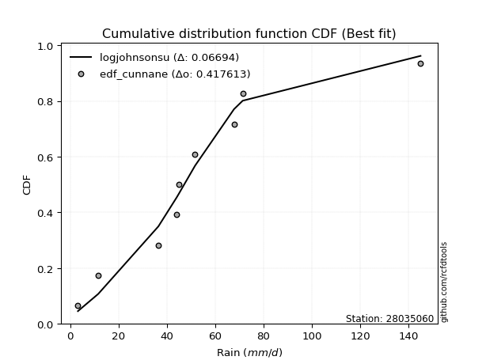</img>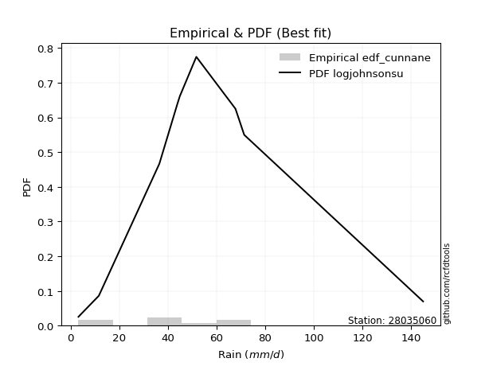</img>

</div>


### 12. EDF Adamowski (1981)

The Adamowski formula in hydrology refers to a specific plotting position formula used for estimating the non-parametric empirical distribution of hydrological events (like flood peaks) to calculate their return periods. This formula provides an alternative to traditional parametric methods (like the Gumbel or Log Pearson Type III distributions). 

<div align="center">


$P=(m-0.25)/(n+0.5)$


</div>


**12.1. Empirical values**

<div align="center">

|                | 0                   | 1                   | 2                  | 3                   | 4             | 5                  | 6                  | 7                  | 8                  |
|:---------------|:--------------------|:--------------------|:-------------------|:--------------------|:--------------|:-------------------|:-------------------|:-------------------|:-------------------|
| date           | 2020                | 2021                | 2025               | 2018                | 2023          | 2022               | 2017               | 2019               | 2024               |
| x              | 3.2                 | 11.6                | 36.5               | 44.0                | 44.9          | 51.7               | 67.8               | 71.4               | 145.0              |
| m              | 1                   | 2                   | 3                  | 4                   | 5             | 6                  | 7                  | 8                  | 9                  |
| empirical_dist | edf_adamowski       | edf_adamowski       | edf_adamowski      | edf_adamowski       | edf_adamowski | edf_adamowski      | edf_adamowski      | edf_adamowski      | edf_adamowski      |
| empirical      | 0.07894736842105263 | 0.18421052631578946 | 0.2894736842105263 | 0.39473684210526316 | 0.5           | 0.6052631578947368 | 0.7105263157894737 | 0.8157894736842105 | 0.9210526315789473 |
| empirical_tr   | 1.0857142857142856  | 1.2258064516129032  | 1.4074074074074074 | 1.6521739130434783  | 2.0           | 2.533333333333333  | 3.4545454545454546 | 5.428571428571428  | 12.666666666666663 |

</div>


**12.2. Kolmogorov-Smirnov fit test (sorted by Δ)**


<div align="center">

|                | 0                   | 1                   | 2                   | 3                   | 4                   | 5                   | 6                   | 7                   | 8                   | 9                   | 10                  | 11                  | 12                  | 13                  | 14                  | 15                  | 16                  | 17                  | 18                  | 19                  | 20                  | 21                  | 22                  | 23                  | 24                  | 25                  | 26                  | 27                  | 28                  | 29                  | 30                  | 31                  | 32                  | 33                  | 34                  | 35                  | 36                  | 37                  | 38                  | 39                  | 40                  | 41                  | 42                  | 43                  | 44                  | 45                  | 46                  | 47                  | 48                  | 49                  | 50                  | 51                  | 52                  | 53                  | 54                  | 55                  | 56                  | 57                  | 58                  | 59                  | 60                  | 61                  | 62                  | 63                  | 64                  | 65                  | 66                  | 67                  | 68                  | 69                  | 70                  | 71                  | 72                  | 73                  | 74                  | 75                  | 76                  | 77                  | 78                  | 79                  | 80                  | 81                  | 82                  | 83                  | 84                  | 85                  | 86                  | 87                  | 88                  | 89                  | 90                  | 91                  | 92                  | 93                  | 94                  | 95                  | 96                  | 97                  | 98                  | 99                  | 100                 | 101                 | 102                 | 103                 | 104                 | 105                 | 106                 | 107                 | 108                 | 109                 | 110                 | 111                 | 112                 | 113                 | 114                 | 115                 | 116                 | 117                 | 118                 | 119                 | 120                 | 121                 | 122                 | 123                 | 124                 | 125                 | 126                 | 127                 | 128                 | 129                 | 130                 | 131                 | 132                 | 133                 | 134                 | 135                 | 136                 | 137                 | 138                 | 139                 | 140                 | 141                 | 142                 | 143                 | 144                 | 145                 | 146                 | 147                 | 148                 | 149                 | 150                 | 151                 | 152                 | 153                 | 154                 | 155                 | 156                 | 157                 | 158                 | 159                 |
|:---------------|:--------------------|:--------------------|:--------------------|:--------------------|:--------------------|:--------------------|:--------------------|:--------------------|:--------------------|:--------------------|:--------------------|:--------------------|:--------------------|:--------------------|:--------------------|:--------------------|:--------------------|:--------------------|:--------------------|:--------------------|:--------------------|:--------------------|:--------------------|:--------------------|:--------------------|:--------------------|:--------------------|:--------------------|:--------------------|:--------------------|:--------------------|:--------------------|:--------------------|:--------------------|:--------------------|:--------------------|:--------------------|:--------------------|:--------------------|:--------------------|:--------------------|:--------------------|:--------------------|:--------------------|:--------------------|:--------------------|:--------------------|:--------------------|:--------------------|:--------------------|:--------------------|:--------------------|:--------------------|:--------------------|:--------------------|:--------------------|:--------------------|:--------------------|:--------------------|:--------------------|:--------------------|:--------------------|:--------------------|:--------------------|:--------------------|:--------------------|:--------------------|:--------------------|:--------------------|:--------------------|:--------------------|:--------------------|:--------------------|:--------------------|:--------------------|:--------------------|:--------------------|:--------------------|:--------------------|:--------------------|:--------------------|:--------------------|:--------------------|:--------------------|:--------------------|:--------------------|:--------------------|:--------------------|:--------------------|:--------------------|:--------------------|:--------------------|:--------------------|:--------------------|:--------------------|:--------------------|:--------------------|:--------------------|:--------------------|:--------------------|:--------------------|:--------------------|:--------------------|:--------------------|:--------------------|:--------------------|:--------------------|:--------------------|:--------------------|:--------------------|:--------------------|:--------------------|:--------------------|:--------------------|:--------------------|:--------------------|:--------------------|:--------------------|:--------------------|:--------------------|:--------------------|:--------------------|:--------------------|:--------------------|:--------------------|:--------------------|:--------------------|:--------------------|:--------------------|:--------------------|:--------------------|:--------------------|:--------------------|:--------------------|:--------------------|:--------------------|:--------------------|:--------------------|:--------------------|:--------------------|:--------------------|:--------------------|:--------------------|:--------------------|:--------------------|:--------------------|:--------------------|:--------------------|:--------------------|:--------------------|:--------------------|:--------------------|:--------------------|:--------------------|:--------------------|:--------------------|:--------------------|:--------------------|:--------------------|:--------------------|
| station        | 28035060            | 28035060            | 28035060            | 28035060            | 28035060            | 28035060            | 28035060            | 28035060            | 28035060            | 28035060            | 28035060            | 28035060            | 28035060            | 28035060            | 28035060            | 28035060            | 28035060            | 28035060            | 28035060            | 28035060            | 28035060            | 28035060            | 28035060            | 28035060            | 28035060            | 28035060            | 28035060            | 28035060            | 28035060            | 28035060            | 28035060            | 28035060            | 28035060            | 28035060            | 28035060            | 28035060            | 28035060            | 28035060            | 28035060            | 28035060            | 28035060            | 28035060            | 28035060            | 28035060            | 28035060            | 28035060            | 28035060            | 28035060            | 28035060            | 28035060            | 28035060            | 28035060            | 28035060            | 28035060            | 28035060            | 28035060            | 28035060            | 28035060            | 28035060            | 28035060            | 28035060            | 28035060            | 28035060            | 28035060            | 28035060            | 28035060            | 28035060            | 28035060            | 28035060            | 28035060            | 28035060            | 28035060            | 28035060            | 28035060            | 28035060            | 28035060            | 28035060            | 28035060            | 28035060            | 28035060            | 28035060            | 28035060            | 28035060            | 28035060            | 28035060            | 28035060            | 28035060            | 28035060            | 28035060            | 28035060            | 28035060            | 28035060            | 28035060            | 28035060            | 28035060            | 28035060            | 28035060            | 28035060            | 28035060            | 28035060            | 28035060            | 28035060            | 28035060            | 28035060            | 28035060            | 28035060            | 28035060            | 28035060            | 28035060            | 28035060            | 28035060            | 28035060            | 28035060            | 28035060            | 28035060            | 28035060            | 28035060            | 28035060            | 28035060            | 28035060            | 28035060            | 28035060            | 28035060            | 28035060            | 28035060            | 28035060            | 28035060            | 28035060            | 28035060            | 28035060            | 28035060            | 28035060            | 28035060            | 28035060            | 28035060            | 28035060            | 28035060            | 28035060            | 28035060            | 28035060            | 28035060            | 28035060            | 28035060            | 28035060            | 28035060            | 28035060            | 28035060            | 28035060            | 28035060            | 28035060            | 28035060            | 28035060            | 28035060            | 28035060            | 28035060            | 28035060            | 28035060            | 28035060            | 28035060            | 28035060            |
| empirical_dist | edf_adamowski       | edf_adamowski       | edf_adamowski       | edf_adamowski       | edf_adamowski       | edf_adamowski       | edf_adamowski       | edf_adamowski       | edf_adamowski       | edf_adamowski       | edf_adamowski       | edf_adamowski       | edf_adamowski       | edf_adamowski       | edf_adamowski       | edf_adamowski       | edf_adamowski       | edf_adamowski       | edf_adamowski       | edf_adamowski       | edf_adamowski       | edf_adamowski       | edf_adamowski       | edf_adamowski       | edf_adamowski       | edf_adamowski       | edf_adamowski       | edf_adamowski       | edf_adamowski       | edf_adamowski       | edf_adamowski       | edf_adamowski       | edf_adamowski       | edf_adamowski       | edf_adamowski       | edf_adamowski       | edf_adamowski       | edf_adamowski       | edf_adamowski       | edf_adamowski       | edf_adamowski       | edf_adamowski       | edf_adamowski       | edf_adamowski       | edf_adamowski       | edf_adamowski       | edf_adamowski       | edf_adamowski       | edf_adamowski       | edf_adamowski       | edf_adamowski       | edf_adamowski       | edf_adamowski       | edf_adamowski       | edf_adamowski       | edf_adamowski       | edf_adamowski       | edf_adamowski       | edf_adamowski       | edf_adamowski       | edf_adamowski       | edf_adamowski       | edf_adamowski       | edf_adamowski       | edf_adamowski       | edf_adamowski       | edf_adamowski       | edf_adamowski       | edf_adamowski       | edf_adamowski       | edf_adamowski       | edf_adamowski       | edf_adamowski       | edf_adamowski       | edf_adamowski       | edf_adamowski       | edf_adamowski       | edf_adamowski       | edf_adamowski       | edf_adamowski       | edf_adamowski       | edf_adamowski       | edf_adamowski       | edf_adamowski       | edf_adamowski       | edf_adamowski       | edf_adamowski       | edf_adamowski       | edf_adamowski       | edf_adamowski       | edf_adamowski       | edf_adamowski       | edf_adamowski       | edf_adamowski       | edf_adamowski       | edf_adamowski       | edf_adamowski       | edf_adamowski       | edf_adamowski       | edf_adamowski       | edf_adamowski       | edf_adamowski       | edf_adamowski       | edf_adamowski       | edf_adamowski       | edf_adamowski       | edf_adamowski       | edf_adamowski       | edf_adamowski       | edf_adamowski       | edf_adamowski       | edf_adamowski       | edf_adamowski       | edf_adamowski       | edf_adamowski       | edf_adamowski       | edf_adamowski       | edf_adamowski       | edf_adamowski       | edf_adamowski       | edf_adamowski       | edf_adamowski       | edf_adamowski       | edf_adamowski       | edf_adamowski       | edf_adamowski       | edf_adamowski       | edf_adamowski       | edf_adamowski       | edf_adamowski       | edf_adamowski       | edf_adamowski       | edf_adamowski       | edf_adamowski       | edf_adamowski       | edf_adamowski       | edf_adamowski       | edf_adamowski       | edf_adamowski       | edf_adamowski       | edf_adamowski       | edf_adamowski       | edf_adamowski       | edf_adamowski       | edf_adamowski       | edf_adamowski       | edf_adamowski       | edf_adamowski       | edf_adamowski       | edf_adamowski       | edf_adamowski       | edf_adamowski       | edf_adamowski       | edf_adamowski       | edf_adamowski       | edf_adamowski       | edf_adamowski       | edf_adamowski       | edf_adamowski       | edf_adamowski       |
| p_dist         | t                   | logjohnsonsu        | vonmises_line       | nct                 | exponnorm           | genlogistic         | kstwobign           | gumbel_r            | invweibull          | pearson3            | invgamma            | logdgamma           | logdweibull         | dweibull            | moyal               | johnsonsu           | rayleigh            | rice                | skewnorm            | loggennorm          | invgauss            | maxwell             | fatiguelife         | burr                | logistic            | logt                | dgamma              | hypsecant           | mielke              | halfnorm            | logburr             | kappa3              | loggenlogistic      | ncf                 | logmielke           | logloggamma         | laplace             | foldnorm            | logloglaplace       | logvonmises_line    | halflogistic        | loggenextreme       | logexponweib        | genpareto           | norm                | crystalball         | gennorm             | gompertz            | logexponpow         | betaprime           | logweibull_min      | logargus            | truncpareto         | logpearson3         | logskewnorm         | loggumbel_l         | logburr12           | loggompertz         | burr12              | anglit              | logtrapezoid        | semicircular        | lognakagami         | logtriang           | wald                | exponpow            | gumbel_l            | loggengamma         | loggenhalflogistic  | f                   | genexpon            | lomax               | arcsine             | logfoldnorm         | logarcsine          | logsemicircular     | cosine              | loganglit           | logexponnorm        | lognorm             | logcrystalball      | logrice             | lognct              | logfatiguelife      | loglogistic         | loghypsecant        | logf                | logncf              | bradford            | loglaplace          | loglaplace          | tukeylambda         | nakagami            | logbetaprime        | loggenpareto        | loggamma            | loggamma            | loginvgamma         | logerlang           | loginvgauss         | logalpha            | loglevy_l           | truncexpon          | beta                | truncweibull_min    | logmaxwell          | gausshyper          | loginvweibull       | lograyleigh         | logbeta             | loggausshyper       | logcosine           | gengamma            | logtruncweibull_min | logkstwobign        | loggumbel_r         | kappa4              | loghalfnorm         | loglomax            | loggenexpon         | logmoyal            | loghalflogistic     | logksone            | logweibull_max      | ksone               | wrapcauchy          | uniform             | logwrapcauchy       | halfgennorm         | argus               | logtukeylambda      | logkappa3           | loguniform          | weibull_min         | logkappa4           | exponweib           | levy_l              | loghalfgennorm      | logwald             | logtruncnorm        | genextreme          | logbradford         | logjohnsonsb        | logtruncexpon       | gamma               | erlang              | genhalflogistic     | rdist               | powerlaw            | alpha               | triang              | logrdist            | trapezoid           | johnsonsb           | logpowerlaw         | weibull_max         | logtruncpareto      | truncnorm           | logvonmises         | vonmises            |
| delta          | 0.06993644890427508 | 0.07716239067276062 | 0.07894736841945427 | 0.08601175060780297 | 0.08732297395508046 | 0.08952246841774875 | 0.08957965557817604 | 0.09195580317924207 | 0.10105290731372685 | 0.10452625911089858 | 0.10458156100921667 | 0.1052631578947325  | 0.10526315789473972 | 0.10526315789543095 | 0.10806367586090948 | 0.10979229400581875 | 0.10980516877332158 | 0.11212613781589098 | 0.11267259348306707 | 0.11276612077400491 | 0.11412229045307931 | 0.11510881492214453 | 0.11671828433999659 | 0.11733946881513646 | 0.1192388769727199  | 0.11967560748260056 | 0.12057101134790216 | 0.12067158747240808 | 0.12229689472213451 | 0.12401844971273329 | 0.12424949324446127 | 0.1244790126575882  | 0.1245391555159735  | 0.12478649521269702 | 0.12542739834205235 | 0.12542905433289087 | 0.12659410412001115 | 0.12761106995887445 | 0.1283561028770458  | 0.12929504910223877 | 0.12974688502832066 | 0.1313429891219     | 0.1313602461952571  | 0.131403766545391   | 0.13308357297777695 | 0.1330835776678586  | 0.133542579472545   | 0.13381527005927052 | 0.1345738055941471  | 0.13590345568392892 | 0.13677270480592096 | 0.13829630039781282 | 0.13895920278754637 | 0.14275926290818974 | 0.14281753135274527 | 0.14742633037170405 | 0.15154173069683652 | 0.15154883826362486 | 0.1544646018860022  | 0.15616690880495465 | 0.1605280066677739  | 0.16593969897834515 | 0.1720977470653956  | 0.181281330813425   | 0.18421052631578946 | 0.1854420634965558  | 0.18819048225315982 | 0.19436078165183962 | 0.19454733267981938 | 0.1963536039717545  | 0.19903931796194563 | 0.20325462759548873 | 0.20669059259602107 | 0.21215678137270488 | 0.21449476145358348 | 0.2161371738140062  | 0.2162043948409511  | 0.216552054093746   | 0.2175579798113374  | 0.21755855254232337 | 0.21755857557734948 | 0.21755869457552435 | 0.21797029491911868 | 0.2183331217662684  | 0.21851910145559306 | 0.2193392478613777  | 0.22145732033464305 | 0.22149665793453743 | 0.22165822340910812 | 0.22491810509024524 | 0.22491810509024524 | 0.2277582440179049  | 0.22875057610173544 | 0.22880192921787246 | 0.22916238722432214 | 0.229890313921842   | 0.229890313921842   | 0.2314898048376829  | 0.2326427138418251  | 0.23636295141696073 | 0.2369505980468345  | 0.24225289870692016 | 0.2429686830772977  | 0.24297213335168732 | 0.24367885946859535 | 0.25031439479886375 | 0.25068864010293823 | 0.25082299207827896 | 0.2611693635271355  | 0.27167577298548595 | 0.2750736255613442  | 0.27827964003854566 | 0.28270045819846445 | 0.2827533348242509  | 0.28459582912485704 | 0.2881065545543814  | 0.2884991911939764  | 0.29173176801298717 | 0.2950770492146939  | 0.2997100870263759  | 0.3138923824195241  | 0.3170809344750044  | 0.32576571003582533 | 0.32864746829352265 | 0.3316568925840695  | 0.33279050777336794 | 0.3348303763640413  | 0.335575576072221   | 0.33781179257399907 | 0.33805083079957754 | 0.3395443496445705  | 0.3485939511404683  | 0.3488135888850957  | 0.35814525820718246 | 0.36646150878442174 | 0.37069560708909477 | 0.3735689199091572  | 0.38351577757094635 | 0.38557126814417697 | 0.4008616186318775  | 0.4077841242963228  | 0.41279102164995995 | 0.41647085452699373 | 0.4186697394692207  | 0.4338123400009455  | 0.45052159448825113 | 0.46744651712213253 | 0.4762849778765825  | 0.4795121511795116  | 0.5111479415673845  | 0.5342347018123326  | 0.5396148064405082  | 0.5782707214213441  | 0.589761675021541   | 0.6153529267566773  | 0.6912600332092792  | 0.7505212057060221  | 0.8863037968595581  | 1.1017388243854953  | 22.669866660897977  |
| deltao         | 0.41761268023100007 | 0.41761268023100007 | 0.41761268023100007 | 0.41761268023100007 | 0.41761268023100007 | 0.41761268023100007 | 0.41761268023100007 | 0.41761268023100007 | 0.41761268023100007 | 0.41761268023100007 | 0.41761268023100007 | 0.41761268023100007 | 0.41761268023100007 | 0.41761268023100007 | 0.41761268023100007 | 0.41761268023100007 | 0.41761268023100007 | 0.41761268023100007 | 0.41761268023100007 | 0.41761268023100007 | 0.41761268023100007 | 0.41761268023100007 | 0.41761268023100007 | 0.41761268023100007 | 0.41761268023100007 | 0.41761268023100007 | 0.41761268023100007 | 0.41761268023100007 | 0.41761268023100007 | 0.41761268023100007 | 0.41761268023100007 | 0.41761268023100007 | 0.41761268023100007 | 0.41761268023100007 | 0.41761268023100007 | 0.41761268023100007 | 0.41761268023100007 | 0.41761268023100007 | 0.41761268023100007 | 0.41761268023100007 | 0.41761268023100007 | 0.41761268023100007 | 0.41761268023100007 | 0.41761268023100007 | 0.41761268023100007 | 0.41761268023100007 | 0.41761268023100007 | 0.41761268023100007 | 0.41761268023100007 | 0.41761268023100007 | 0.41761268023100007 | 0.41761268023100007 | 0.41761268023100007 | 0.41761268023100007 | 0.41761268023100007 | 0.41761268023100007 | 0.41761268023100007 | 0.41761268023100007 | 0.41761268023100007 | 0.41761268023100007 | 0.41761268023100007 | 0.41761268023100007 | 0.41761268023100007 | 0.41761268023100007 | 0.41761268023100007 | 0.41761268023100007 | 0.41761268023100007 | 0.41761268023100007 | 0.41761268023100007 | 0.41761268023100007 | 0.41761268023100007 | 0.41761268023100007 | 0.41761268023100007 | 0.41761268023100007 | 0.41761268023100007 | 0.41761268023100007 | 0.41761268023100007 | 0.41761268023100007 | 0.41761268023100007 | 0.41761268023100007 | 0.41761268023100007 | 0.41761268023100007 | 0.41761268023100007 | 0.41761268023100007 | 0.41761268023100007 | 0.41761268023100007 | 0.41761268023100007 | 0.41761268023100007 | 0.41761268023100007 | 0.41761268023100007 | 0.41761268023100007 | 0.41761268023100007 | 0.41761268023100007 | 0.41761268023100007 | 0.41761268023100007 | 0.41761268023100007 | 0.41761268023100007 | 0.41761268023100007 | 0.41761268023100007 | 0.41761268023100007 | 0.41761268023100007 | 0.41761268023100007 | 0.41761268023100007 | 0.41761268023100007 | 0.41761268023100007 | 0.41761268023100007 | 0.41761268023100007 | 0.41761268023100007 | 0.41761268023100007 | 0.41761268023100007 | 0.41761268023100007 | 0.41761268023100007 | 0.41761268023100007 | 0.41761268023100007 | 0.41761268023100007 | 0.41761268023100007 | 0.41761268023100007 | 0.41761268023100007 | 0.41761268023100007 | 0.41761268023100007 | 0.41761268023100007 | 0.41761268023100007 | 0.41761268023100007 | 0.41761268023100007 | 0.41761268023100007 | 0.41761268023100007 | 0.41761268023100007 | 0.41761268023100007 | 0.41761268023100007 | 0.41761268023100007 | 0.41761268023100007 | 0.41761268023100007 | 0.41761268023100007 | 0.41761268023100007 | 0.41761268023100007 | 0.41761268023100007 | 0.41761268023100007 | 0.41761268023100007 | 0.41761268023100007 | 0.41761268023100007 | 0.41761268023100007 | 0.41761268023100007 | 0.41761268023100007 | 0.41761268023100007 | 0.41761268023100007 | 0.41761268023100007 | 0.41761268023100007 | 0.41761268023100007 | 0.41761268023100007 | 0.41761268023100007 | 0.41761268023100007 | 0.41761268023100007 | 0.41761268023100007 | 0.41761268023100007 | 0.41761268023100007 | 0.41761268023100007 | 0.41761268023100007 | 0.41761268023100007 | 0.41761268023100007 | 0.41761268023100007 |
| eval           | Δo > Δ              | Δo > Δ              | Δo > Δ              | Δo > Δ              | Δo > Δ              | Δo > Δ              | Δo > Δ              | Δo > Δ              | Δo > Δ              | Δo > Δ              | Δo > Δ              | Δo > Δ              | Δo > Δ              | Δo > Δ              | Δo > Δ              | Δo > Δ              | Δo > Δ              | Δo > Δ              | Δo > Δ              | Δo > Δ              | Δo > Δ              | Δo > Δ              | Δo > Δ              | Δo > Δ              | Δo > Δ              | Δo > Δ              | Δo > Δ              | Δo > Δ              | Δo > Δ              | Δo > Δ              | Δo > Δ              | Δo > Δ              | Δo > Δ              | Δo > Δ              | Δo > Δ              | Δo > Δ              | Δo > Δ              | Δo > Δ              | Δo > Δ              | Δo > Δ              | Δo > Δ              | Δo > Δ              | Δo > Δ              | Δo > Δ              | Δo > Δ              | Δo > Δ              | Δo > Δ              | Δo > Δ              | Δo > Δ              | Δo > Δ              | Δo > Δ              | Δo > Δ              | Δo > Δ              | Δo > Δ              | Δo > Δ              | Δo > Δ              | Δo > Δ              | Δo > Δ              | Δo > Δ              | Δo > Δ              | Δo > Δ              | Δo > Δ              | Δo > Δ              | Δo > Δ              | Δo > Δ              | Δo > Δ              | Δo > Δ              | Δo > Δ              | Δo > Δ              | Δo > Δ              | Δo > Δ              | Δo > Δ              | Δo > Δ              | Δo > Δ              | Δo > Δ              | Δo > Δ              | Δo > Δ              | Δo > Δ              | Δo > Δ              | Δo > Δ              | Δo > Δ              | Δo > Δ              | Δo > Δ              | Δo > Δ              | Δo > Δ              | Δo > Δ              | Δo > Δ              | Δo > Δ              | Δo > Δ              | Δo > Δ              | Δo > Δ              | Δo > Δ              | Δo > Δ              | Δo > Δ              | Δo > Δ              | Δo > Δ              | Δo > Δ              | Δo > Δ              | Δo > Δ              | Δo > Δ              | Δo > Δ              | Δo > Δ              | Δo > Δ              | Δo > Δ              | Δo > Δ              | Δo > Δ              | Δo > Δ              | Δo > Δ              | Δo > Δ              | Δo > Δ              | Δo > Δ              | Δo > Δ              | Δo > Δ              | Δo > Δ              | Δo > Δ              | Δo > Δ              | Δo > Δ              | Δo > Δ              | Δo > Δ              | Δo > Δ              | Δo > Δ              | Δo > Δ              | Δo > Δ              | Δo > Δ              | Δo > Δ              | Δo > Δ              | Δo > Δ              | Δo > Δ              | Δo > Δ              | Δo > Δ              | Δo > Δ              | Δo > Δ              | Δo > Δ              | Δo > Δ              | Δo > Δ              | Δo > Δ              | Δo > Δ              | Δo > Δ              | Δo > Δ              | Δo > Δ              | Δo > Δ              | Δo > Δ              | Δo > Δ              | Δo <= Δ             | Δo <= Δ             | Δo <= Δ             | Δo <= Δ             | Δo <= Δ             | Δo <= Δ             | Δo <= Δ             | Δo <= Δ             | Δo <= Δ             | Δo <= Δ             | Δo <= Δ             | Δo <= Δ             | Δo <= Δ             | Δo <= Δ             | Δo <= Δ             | Δo <= Δ             | Δo <= Δ             |
| fit            | 1                   | 1                   | 1                   | 1                   | 1                   | 1                   | 1                   | 1                   | 1                   | 1                   | 1                   | 1                   | 1                   | 1                   | 1                   | 1                   | 1                   | 1                   | 1                   | 1                   | 1                   | 1                   | 1                   | 1                   | 1                   | 1                   | 1                   | 1                   | 1                   | 1                   | 1                   | 1                   | 1                   | 1                   | 1                   | 1                   | 1                   | 1                   | 1                   | 1                   | 1                   | 1                   | 1                   | 1                   | 1                   | 1                   | 1                   | 1                   | 1                   | 1                   | 1                   | 1                   | 1                   | 1                   | 1                   | 1                   | 1                   | 1                   | 1                   | 1                   | 1                   | 1                   | 1                   | 1                   | 1                   | 1                   | 1                   | 1                   | 1                   | 1                   | 1                   | 1                   | 1                   | 1                   | 1                   | 1                   | 1                   | 1                   | 1                   | 1                   | 1                   | 1                   | 1                   | 1                   | 1                   | 1                   | 1                   | 1                   | 1                   | 1                   | 1                   | 1                   | 1                   | 1                   | 1                   | 1                   | 1                   | 1                   | 1                   | 1                   | 1                   | 1                   | 1                   | 1                   | 1                   | 1                   | 1                   | 1                   | 1                   | 1                   | 1                   | 1                   | 1                   | 1                   | 1                   | 1                   | 1                   | 1                   | 1                   | 1                   | 1                   | 1                   | 1                   | 1                   | 1                   | 1                   | 1                   | 1                   | 1                   | 1                   | 1                   | 1                   | 1                   | 1                   | 1                   | 1                   | 1                   | 1                   | 1                   | 1                   | 1                   | 1                   | 1                   | 0                   | 0                   | 0                   | 0                   | 0                   | 0                   | 0                   | 0                   | 0                   | 0                   | 0                   | 0                   | 0                   | 0                   | 0                   | 0                   | 0                   |
| n              | 9                   | 9                   | 9                   | 9                   | 9                   | 9                   | 9                   | 9                   | 9                   | 9                   | 9                   | 9                   | 9                   | 9                   | 9                   | 9                   | 9                   | 9                   | 9                   | 9                   | 9                   | 9                   | 9                   | 9                   | 9                   | 9                   | 9                   | 9                   | 9                   | 9                   | 9                   | 9                   | 9                   | 9                   | 9                   | 9                   | 9                   | 9                   | 9                   | 9                   | 9                   | 9                   | 9                   | 9                   | 9                   | 9                   | 9                   | 9                   | 9                   | 9                   | 9                   | 9                   | 9                   | 9                   | 9                   | 9                   | 9                   | 9                   | 9                   | 9                   | 9                   | 9                   | 9                   | 9                   | 9                   | 9                   | 9                   | 9                   | 9                   | 9                   | 9                   | 9                   | 9                   | 9                   | 9                   | 9                   | 9                   | 9                   | 9                   | 9                   | 9                   | 9                   | 9                   | 9                   | 9                   | 9                   | 9                   | 9                   | 9                   | 9                   | 9                   | 9                   | 9                   | 9                   | 9                   | 9                   | 9                   | 9                   | 9                   | 9                   | 9                   | 9                   | 9                   | 9                   | 9                   | 9                   | 9                   | 9                   | 9                   | 9                   | 9                   | 9                   | 9                   | 9                   | 9                   | 9                   | 9                   | 9                   | 9                   | 9                   | 9                   | 9                   | 9                   | 9                   | 9                   | 9                   | 9                   | 9                   | 9                   | 9                   | 9                   | 9                   | 9                   | 9                   | 9                   | 9                   | 9                   | 9                   | 9                   | 9                   | 9                   | 9                   | 9                   | 9                   | 9                   | 9                   | 9                   | 9                   | 9                   | 9                   | 9                   | 9                   | 9                   | 9                   | 9                   | 9                   | 9                   | 9                   | 9                   | 9                   |
| best_fit       | 1                   | 0                   | 0                   | 0                   | 0                   | 0                   | 0                   | 0                   | 0                   | 0                   | 0                   | 0                   | 0                   | 0                   | 0                   | 0                   | 0                   | 0                   | 0                   | 0                   | 0                   | 0                   | 0                   | 0                   | 0                   | 0                   | 0                   | 0                   | 0                   | 0                   | 0                   | 0                   | 0                   | 0                   | 0                   | 0                   | 0                   | 0                   | 0                   | 0                   | 0                   | 0                   | 0                   | 0                   | 0                   | 0                   | 0                   | 0                   | 0                   | 0                   | 0                   | 0                   | 0                   | 0                   | 0                   | 0                   | 0                   | 0                   | 0                   | 0                   | 0                   | 0                   | 0                   | 0                   | 0                   | 0                   | 0                   | 0                   | 0                   | 0                   | 0                   | 0                   | 0                   | 0                   | 0                   | 0                   | 0                   | 0                   | 0                   | 0                   | 0                   | 0                   | 0                   | 0                   | 0                   | 0                   | 0                   | 0                   | 0                   | 0                   | 0                   | 0                   | 0                   | 0                   | 0                   | 0                   | 0                   | 0                   | 0                   | 0                   | 0                   | 0                   | 0                   | 0                   | 0                   | 0                   | 0                   | 0                   | 0                   | 0                   | 0                   | 0                   | 0                   | 0                   | 0                   | 0                   | 0                   | 0                   | 0                   | 0                   | 0                   | 0                   | 0                   | 0                   | 0                   | 0                   | 0                   | 0                   | 0                   | 0                   | 0                   | 0                   | 0                   | 0                   | 0                   | 0                   | 0                   | 0                   | 0                   | 0                   | 0                   | 0                   | 0                   | 0                   | 0                   | 0                   | 0                   | 0                   | 0                   | 0                   | 0                   | 0                   | 0                   | 0                   | 0                   | 0                   | 0                   | 0                   | 0                   | 0                   |
| best_fit_sort  | 1                   | 2                   | 3                   | 4                   | 5                   | 6                   | 7                   | 8                   | 9                   | 10                  | 11                  | 12                  | 13                  | 14                  | 15                  | 16                  | 17                  | 18                  | 19                  | 20                  | 21                  | 22                  | 23                  | 24                  | 25                  | 26                  | 27                  | 28                  | 29                  | 30                  | 31                  | 32                  | 33                  | 34                  | 35                  | 36                  | 37                  | 38                  | 39                  | 40                  | 41                  | 42                  | 43                  | 44                  | 45                  | 46                  | 47                  | 48                  | 49                  | 50                  | 51                  | 52                  | 53                  | 54                  | 55                  | 56                  | 57                  | 58                  | 59                  | 60                  | 61                  | 62                  | 63                  | 64                  | 65                  | 66                  | 67                  | 68                  | 69                  | 70                  | 71                  | 72                  | 73                  | 74                  | 75                  | 76                  | 77                  | 78                  | 79                  | 80                  | 81                  | 82                  | 83                  | 84                  | 85                  | 86                  | 87                  | 88                  | 89                  | 90                  | 91                  | 92                  | 93                  | 94                  | 95                  | 96                  | 97                  | 98                  | 99                  | 100                 | 101                 | 102                 | 103                 | 104                 | 105                 | 106                 | 107                 | 108                 | 109                 | 110                 | 111                 | 112                 | 113                 | 114                 | 115                 | 116                 | 117                 | 118                 | 119                 | 120                 | 121                 | 122                 | 123                 | 124                 | 125                 | 126                 | 127                 | 128                 | 129                 | 130                 | 131                 | 132                 | 133                 | 134                 | 135                 | 136                 | 137                 | 138                 | 139                 | 140                 | 141                 | 142                 | 143                 | 144                 | 145                 | 146                 | 147                 | 148                 | 149                 | 150                 | 151                 | 152                 | 153                 | 154                 | 155                 | 156                 | 157                 | 158                 | 159                 | 160                 |

</div>


**12.3. Best fit**

<div align="center">

|   id |   station | empirical_dist   | p_dist   |     delta |   deltao | eval   |   fit |   n |   best_fit |   best_fit_sort |
|-----:|----------:|:-----------------|:---------|----------:|---------:|:-------|------:|----:|-----------:|----------------:|
|    0 |  28035060 | edf_adamowski    | t        | 0.0699364 | 0.417613 | Δo > Δ |     1 |   9 |          1 |               1 |

</div>


<div align="center">

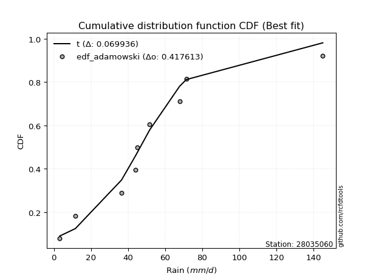</img></img>

</div>


## C. Best fit & Estimate extreme values for specific return periods - Tr

Best fit in probability distribution analysis means finding the theoretical distribution (like Normal, Poisson, Exponential, etc.) that most accurately mirrors your real-world data´s patterns (shape, center, spread) for better predictions, using methods like visual checks (Q-Q plots), goodness-of-fit tests (Kolmogorov-Smirnov, Chi-Squared), and information criteria (AIC) to score and select the simplest, most representative model.


### 1. Best fit (ordered by delta Δ)

:file_folder:Table: [bestfit_28035060.csv](table/bestfit_28035060.csv)

<div align="center">

|   id |   station | empirical_dist   | p_dist       |     delta |   deltao | eval   |   fit |   n |   best_fit |   best_fit_sort |
|-----:|----------:|:-----------------|:-------------|----------:|---------:|:-------|------:|----:|-----------:|----------------:|
|    0 |  28035060 | edf_tukey        | t            | 0.0669014 | 0.417613 | Δo > Δ |     1 |   9 |          1 |               1 |
|    1 |  28035060 | edf_filliben     | t            | 0.0669016 | 0.417613 | Δo > Δ |     1 |   9 |          1 |               2 |
|    2 |  28035060 | edf_cunnane      | logjohnsonsu | 0.0669401 | 0.417613 | Δo > Δ |     1 |   9 |          1 |               3 |
|    3 |  28035060 | edf_jenkinson    | t            | 0.0672431 | 0.417613 | Δo > Δ |     1 |   9 |          1 |               4 |
|    4 |  28035060 | edf_beard        | t            | 0.0672431 | 0.417613 | Δo > Δ |     1 |   9 |          1 |               5 |
|    5 |  28035060 | edf_chegodayev   | t            | 0.0676968 | 0.417613 | Δo > Δ |     1 |   9 |          1 |               6 |
|    6 |  28035060 | edf_blom         | t            | 0.0678666 | 0.417613 | Δo > Δ |     1 |   9 |          1 |               7 |
|    7 |  28035060 | edf_gringorten   | logjohnsonsu | 0.0688471 | 0.417613 | Δo > Δ |     1 |   9 |          1 |               8 |
|    8 |  28035060 | edf_adamowski    | t            | 0.0699364 | 0.417613 | Δo > Δ |     1 |   9 |          1 |               9 |
|    9 |  28035060 | edf_hazen        | t            | 0.0708696 | 0.417613 | Δo > Δ |     1 |   9 |          1 |              10 |
|   10 |  28035060 | edf_california   | dweibull     | 0.0758636 | 0.417613 | Δo > Δ |     1 |   9 |          1 |              11 |
|   11 |  28035060 | edf_weibull      | t            | 0.0807421 | 0.417613 | Δo > Δ |     1 |   9 |          1 |              12 |

</div>


### 2. Extreme values and % difference analysis

In hydrology, a return period (or recurrence interval $Tr$) is the statistical average time between extreme events like floods or droughts of a specific magnitude, indicating how rare an event is, with a 100-year flood, for example, having a 1% chance of occurring in any given year, not that it happens exactly every century. It is a key tool for infrastructure design (like bridges or dams) and risk assessment, calculated from historical data to determine the probability of future events, although it is important to remember it is statistical average, and events can cluster or be missed.

The extreme value porcentage difference is evaluated as $pdiff = 1 - (ETrBf / ETr) * 100$, where _ETrBf_ correspond to the bestfit extreme value for a specific recurrence interval and _ETr_ correspond to the extreme value for one of the most used PDFsused in hydrology.

> risk_rate: assuming the return period as the project useful life.

:file_folder:Table: [extreme_28035060.csv](table/extreme_28035060.csv), all PDFs.  
:file_folder:Table: [extremepdiff_28035060.csv](table/extremepdiff_28035060.csv), % difference between bestfit and most used PDFs in Hydrology.

<div align="center">

Extreme values table for only best fit PDFs
|   id |      tr |   prob_l |     prob_g |     alpha |   anglit |   arcsine |   argus |     beta |   betaprime |   bradford |     burr |   burr12 |   cosine |   crystalball |   dgamma |   dweibull |   erlang |   exponnorm |   exponpow |   exponweib |        f |   fatiguelife |   foldnorm |    gamma |   gausshyper |   genexpon |       genextreme |   gengamma |   genhalflogistic |   genlogistic |   gennorm |   genpareto |   gompertz |   gumbel_l |   gumbel_r |   halfgennorm |   halflogistic |   halfnorm |   hypsecant |   invgamma |   invgauss |   invweibull |   johnsonsb |   johnsonsu |   kappa3 |   kappa4 |   ksone |   kstwobign |   laplace |   levy_l |   loggamma |   logistic |   loglaplace |    lomax |   maxwell |   mielke |    moyal |   nakagami |      ncf |      nct |     norm |   pearson3 |   powerlaw |   rayleigh |    rdist |     rice |   semicircular |   skewnorm |        t |   trapezoid |   triang |   truncexpon |   truncnorm |   truncpareto |   truncweibull_min |   tukeylambda |   uniform |   vonmises |   vonmises_line |     wald |   weibull_max |   weibull_min |   wrapcauchy |   logalpha |   loganglit |   logarcsine |   logargus |   logbeta |   logbetaprime |   logbradford |   logburr |   logburr12 |   logcosine |   logcrystalball |   logdgamma |   logdweibull |   logerlang |   logexponnorm |   logexponpow |   logexponweib |     logf |   logfatiguelife |   logfoldnorm |   loggausshyper |   loggenexpon |   loggenextreme |   loggengamma |   loggenhalflogistic |   loggenlogistic |   loggennorm |   loggenpareto |   loggompertz |   loggumbel_l |   loggumbel_r |   loghalfgennorm |   loghalflogistic |   loghalfnorm |   loghypsecant |   loginvgamma |   loginvgauss |   loginvweibull |   logjohnsonsb |   logjohnsonsu |   logkappa3 |   logkappa4 |   logksone |   logkstwobign |   loglevy_l |   logloggamma |   loglogistic |    logloglaplace |         loglomax |   logmaxwell |   logmielke |   logmoyal |   lognakagami |    logncf |   lognct |   lognorm |   logpearson3 |   logpowerlaw |   lograyleigh |   logrdist |   logrice |   logsemicircular |   logskewnorm |            logt |   logtrapezoid |   logtriang |   logtruncexpon |   logtruncnorm |   logtruncpareto |   logtruncweibull_min |   logtukeylambda |   loguniform |   logvonmises |   logvonmises_line |    logwald |   logweibull_max |   logweibull_min |   logwrapcauchy |   station |   n |   risk_rate |
|-----:|--------:|---------:|-----------:|----------:|---------:|----------:|--------:|---------:|------------:|-----------:|---------:|---------:|---------:|--------------:|---------:|-----------:|---------:|------------:|-----------:|------------:|---------:|--------------:|-----------:|---------:|-------------:|-----------:|-----------------:|-----------:|------------------:|--------------:|----------:|------------:|-----------:|-----------:|-----------:|--------------:|---------------:|-----------:|------------:|-----------:|-----------:|-------------:|------------:|------------:|---------:|---------:|--------:|------------:|----------:|---------:|-----------:|-----------:|-------------:|---------:|----------:|---------:|---------:|-----------:|---------:|---------:|---------:|-----------:|-----------:|-----------:|---------:|---------:|---------------:|-----------:|---------:|------------:|---------:|-------------:|------------:|--------------:|-------------------:|--------------:|----------:|-----------:|----------------:|---------:|--------------:|--------------:|-------------:|-----------:|------------:|-------------:|-----------:|----------:|---------------:|--------------:|----------:|------------:|------------:|-----------------:|------------:|--------------:|------------:|---------------:|--------------:|---------------:|---------:|-----------------:|--------------:|----------------:|--------------:|----------------:|--------------:|---------------------:|-----------------:|-------------:|---------------:|--------------:|--------------:|--------------:|-----------------:|------------------:|--------------:|---------------:|--------------:|--------------:|----------------:|---------------:|---------------:|------------:|------------:|-----------:|---------------:|------------:|--------------:|--------------:|-----------------:|-----------------:|-------------:|------------:|-----------:|--------------:|----------:|---------:|----------:|--------------:|--------------:|--------------:|-----------:|----------:|------------------:|--------------:|----------------:|---------------:|------------:|----------------:|---------------:|-----------------:|----------------------:|-----------------:|-------------:|--------------:|-------------------:|-----------:|-----------------:|-----------------:|----------------:|----------:|----:|------------:|
|    0 |    2    | 0.5      | 0.5        |   13.6524 |  52.9    |   52.9    |  74.418 |  33.5965 |     42.8988 |    57.94   |  47.5588 |  41.6404 |  60.0779 |       52.9    |  44      |    44      |  15.0287 |     46.3871 |    38.9425 |     16.9279 |  38.2677 |       44.3961 |    44.6914 |  14.4415 |      60.7663 |    37.6282 |      4.69168     |    29.9615 |           94.9157 |       46.2823 |   44      |     44.4697 |    43.9881 |    59.2947 |    46.5053 |       23.2937 |        43.3262 |    44.9322 |     52.9    |    45.0888 |    44.5636 |      45.3007 |     144.909 |     44.7808 |  43.8553 |  67.4468 |  74.1   |     47.4409 |   52.9    |  34.4838 |    34.6008 |    52.9    |      35.8223 |  37.2084 |   49.5709 |  44.0915 |  44.4409 |    34.2768 |  44.4462 |  46.1969 |  52.9    |    45.8126 |    6.29961 |    48.3902 | -10.8009 |  50.6746 |        52.9    |    45.78   |  46.5663 |     108.792 |  99.0739 |      61.2575 |    -6.10502 |       44.0911 |            61.6492 |       37.3    |   74.1    |   0.113316 |         47.502  |  40.2823 |       144.748 |       22.979  |      73.9447 |    33.9237 |     35.8223 |      35.8222 |    45.1333 |   63.3451 |        34.6774 |       16.2762 |   44.0028 |     42.0181 |     29.7561 |          35.8223 |     44      |       44      |     34.3354 |        35.8224 |       44.1464 |        44.3186 |  35.6836 |          35.7495 |       36.3543 |         27.7466 |       26.135  |         46.0312 |       38.0084 |              38.7543 |          43.9717 |      44      |        33.117  |       41.835  |       42.6583 |       30.0819 |     12.8061      |           27.5804 |       28.8165 |        35.8223 |       34.4254 |       33.8836 |         31.509  |        4.76642 |        47.2022 |       3.2   |     19.6163 |    21.5407 |        27.4689 |     37.499  |       44.7716 |       35.8223 |     44.9004      |     21.8445      |      32.709  |     43.9256 |    28.4327 |       44.0514 |   35.4211 |  35.7807 |   35.8223 |       43.5219 |       3.79226 |       31.6711 |    6.14125 |   35.8224 |           35.8224 |       44.3415 |    49.7606      |        42.9901 |     40.0273 |         16.0458 |        17.7596 |          3.22984 |               28.7126 |          28.5764 |      21.5407 |     0.0873931 |            43.5072 |    25.3794 |          73.8396 |          43.2084 |         21.563  |  28035060 |   9 |    0.75     |
|    1 |    2.33 | 0.570815 | 0.429185   |   16.2491 |  60.9909 |   65.0458 |  83.834 |  40.1796 |     49.5762 |    67.9557 |  55.1909 |  48.7978 |  68.0959 |       59.8461 |  45.5845 |    46.3648 |  19.5026 |     52.2272 |    46.3147 |     23.5031 |  48.1544 |       50.9585 |    52.2776 |  19.3814 |      72.348  |    45.2138 |      8.74243     |    36.3683 |          104.241  |       52.4498 |   45.6125 |     52.3518 |    51.5825 |    65.3379 |    52.9417 |       29.8441 |        49.9438 |    52.4288 |     58.459  |    51.3644 |    51.0775 |      51.5126 |     144.984 |     51.1677 |  50.2779 |  77.7685 |  86.15  |     54.068  |   57.1035 |  67.5751 |    42.1286 |    59.02   |      40.1803 |  44.7015 |   56.7875 |  50.5046 |  50.5337 |    43.4369 |  51.6351 |  51.8999 |  59.8461 |    52.5619 |    9.63572 |    55.7135 |   7.0948 |  57.3577 |        61.5777 |    53.1092 |  51.1112 |     117.031 | 106.666  |      71.1134 |    -5.22645 |       52.4968 |            71.2205 |       42.4197 |   84.1416 |   0.402854 |         52.9805 |  44.8369 |       144.916 |       28.6943 |      84.5265 |    41.349  |     44.681  |      49.9137 |    54.5143 |   76.4073 |        42.3531 |       21.36   |   50.4822 |     49.3004 |     36.8413 |          43.3056 |     48.8863 |       49.2124 |     41.8181 |        43.3057 |       51.9167 |        51.9239 |  43.1496 |          43.207  |       43.2894 |         37.4678 |       33.9986 |         54.9394 |       45.323  |              49.7297 |          50.4496 |      45.9218 |        47.1772 |       48.9041 |       50.3134 |       35.8631 |     18.4105      |           33.044  |       35.3641 |        41.6956 |       42.0225 |       41.6345 |         40.9862 |        8.19597 |        51.9046 |       3.2   |     25.9696 |    29.7853 |        36.028  |     56.2328 |       52.2372 |       42.3395 |     51.9067      |     33.3538      |      39.835  |     50.4251 |    33.5805 |       50.2288 |   43.0479 |  43.2837 |   43.3056 |       51.674  |       4.35319 |       38.6835 |    9.57411 |   43.3049 |           45.4028 |       53.5706 |    53.959       |        53.482  |     49.5182 |         20.9633 |        23.051  |          3.2566  |               36.3309 |          32.6894 |      28.2192 |     0.102586  |            50.6875 |    28.7414 |          87.0362 |          50.293  |         29.1212 |  28035060 |   9 |    0.729209 |
|    2 |    5    | 0.8      | 0.2        |   36.384  |  89.5376 |   97.4344 | 114.037 |  71.5875 |     79.9246 |   105.275  |  89.0908 |  81.9435 |  96.9899 |       85.6597 |  63.1157 |    68.9598 |  46.3928 |     78.626  |    78.1447 |     81.3271 | 101.36   |       80.6634 |    84.3589 |  51.1757 |     111.893  |    83.1398 |   1663.34        |    66.3028 |          128.956  |       79.2345 |   60.7995 |     86.2736 |    84.408  |    84.8609 |    80.9041 |       72.589  |        79.887  |    84.1312 |     80.7572 |    79.5853 |    80.5064 |      79.3874 |     145     |     80.0073 |  77.3715 | 112.609  | 125.148 |     82.2183 |   78.1198 | 122.4    |    88.5661 |    82.6502 |      71.3336 |  82.1651 |   85.1911 |  77.352  |  78.7562 |    87.0367 |  83.5189 |  77.2875 |  85.6597 |    81.838  |   44.6149  |    85.0318 |  55.2193 |  84.113  |        91.191  |    84.1034 |  70.0061 |     140.667 | 128.446  |     107.013  |    -1.86722 |       88.9598 |           106.27   |       58.6672 |  116.64   |   1.51406  |         74.2852 |  70.3338 |       144.999 |       61.0859 |     117.687  |    88.4699 |     97.4372 |     120.891  |    93.0716 |  119.977  |        90.0716 |       55.9026 |   77.4945 |     82.6258 |     79.5436 |          87.645  |     89.1853 |       94.66   |     88.0338 |        87.6458 |       84.9384 |        84.2697 |  87.4249 |          87.4069 |       82.8263 |         89.674  |       98.0194 |         92.024  |       84.5178 |              95.7701 |          77.5086 |      68.1668 |       108.999  |       81.5241 |       85.7536 |       76.9696 |    140.36        |           74.861  |       84.0621 |        76.6616 |       89.9289 |       92.5532 |        128.467  |      114.482   |        71.2956 |       3.2   |     65.2779 |    85.0154 |       114.032  |    110.035  |       83.9078 |       80.7291 |    116.889       |    276.795       |      86.5306 |     77.4859 |    72.5843 |       83.7256 |   89.4355 |  87.8629 |   87.645  |       88.165  |      12.9835  |       86.1538 |   32.6117  |   87.6381 |          101.937  |       92.9167 |    79.5749      |       100.068  |     91.1756 |         54.5254 |        57.2569 |          3.90881 |               76.2178 |          50.275  |      67.6277 |     0.19061   |            91.9343 |    57.6697 |         124.589  |          82.1351 |         72.1073 |  28035060 |   9 |    0.67232  |
|    3 |   10    | 0.9      | 0.1        |   73.3769 | 105.695  |  105.253  | 128.602 |  97.8497 |    105.185  |   124.216  | 119.24   | 109.71   | 114.447  |      102.784  |  83.1677 |    96.3605 |  74.5945 |    101.769  |   101.492  |    179.35   | 152.694  |      105.596  |   108.098  |  86.1757 |     129.419  |   117.568  | 172655           |    90.6263 |          137.603  |      101.044  |   82.6034 |    110.425  |   108.758  |    95.7304 |   103.679  |      125.366  |       104.754  |   107.59   |     98.5631 |   103.711  |   105.238  |     103.196  |     145     |    104.54   |  99.9158 | 128.622  | 142.164 |    103.651  |   97.1978 | 135.636  |   146.452  |   100.053  |     120.112  | 116.174  |  105.18   |  99.6308 | 103.328  |   121.693  | 109.264  |  99.6311 | 102.784  |   105.094  |   82.504   |   105.936  |  67.1389 | 103.19   |       106.386  |   107.038  |  87.2198 |     149.899 | 136.954  |     125.068  |     0.41004 |      112.4    |           124.358  |       65.3658 |  130.82   |   2.2441   |         90.5536 |  97.3921 |       145     |       94.5799 |     131.466  |   149.927  |    151.488  |     149.671  |   116.559  |  135.878  |       150.097  |       88.7736 |   99.7405 |    110.151  |    126.637  |         139.908  |    157.24   |      178.863  |    145.733  |       139.909  |      109.005  |       108.205  | 139.673  |         139.544  |      127.379  |        120.749  |      209.236  |        115.327  |      124.631  |             120.054  |          99.8548 |     119.352  |       133.543  |      108.685  |      115.393  |      143.371  |   1151.64        |          147.64   |      159.536  |       124.675  |      151.634  |      162.002  |        325.762  |      142.171   |        92.4781 |       3.2   |     97.841  |   134.352  |       274.161  |    129.394  |      107.533  |      129.852  |    281.776       |   1889.99        |     149.371  |     99.7203 |   142.004  |      119.567  |  146.098  | 140.601  |  139.908  |      115.672  |      34.4519  |      152.485  |   45.3013  |  139.891  |          154.371  |      116.279  |   131.809       |       127.812  |    115.726  |         87.1854 |        89.1852 |          6.86664 |              105.02   |          60.2958 |      99.0253 |     0.303801  |           145.104  |   120.756  |         137.038  |         107.927  |        103.013  |  28035060 |   9 |    0.651322 |
|    4 |   15    | 0.933333 | 0.0666667  |  110.238  | 112.595  |  106.745  | 134.139 | 112.245  |    119.403  |   130.931  | 138.236  | 125.293  | 122.398  |      111.329  |  95.648  |   114.363  |  92.064  |    115.29   |   113.387  |    261.921  | 183.491  |      119.768  |   120.452  | 108.247  |     135.065  |   137.707  |      2.37225e+06 |   103.841  |          140.227  |      113.348  |   98.6396 |    122.175  |   121.267  |   100.653  |   116.528  |      162.331  |       118.826  |   119.798  |    108.725  |   117.813  |   119.333  |     117.085  |     145     |    118.745  | 113.596  | 134.125  | 147.836 |    115.029  |  108.358  | 139.634  |   188.8    |   109.535  |     162.913  | 136.067  |  115.436  | 113.129  | 117.589  |   140.028  | 123.517  | 113.229  | 111.329  |   117.895  |  100.119   |   116.707  |  69.4667 | 113.02   |       112.312  |   118.974  |  98.6215 |     152.861 | 139.683  |     131.486  |     1.55498 |      121.962  |           130.913  |       67.491  |  135.547  |   2.55185  |         99.7917 | 114.768  |       145     |      115.569  |     135.993  |   196.485  |    182.901  |     155.893  |   126.359  |  140.023  |       194.256  |      104.213  |  113.162  |    125.47   |    156.514  |         176.685  |    219.856  |      262.204  |    187.99   |       176.688  |      121.279  |       120.618  | 176.469  |         176.257  |      157.899  |        130.735  |      309.462  |        125.181  |      150.246  |             128.484  |         113.358  |     179.727  |       139.346  |      123.861  |      131.998  |      203.644  |   4353.1         |          216.829  |      222.672  |       164.554  |      197.879  |      216.194  |        550.675  |      144.196   |       109.964  |       3.2   |    111.907  |   156.492  |       436.778  |    135.887  |      119.901  |      168.235  |    507.305       |   5814.54        |     197.659  |    113.118  |   209.628  |      143.469  |  186.96   | 177.805  |  176.685  |      129.548  |      52.5098  |      204.636  |   48.5413  |  176.66   |          181.489  |      125.185  |   204.714       |       138.252  |    124.928  |        102.813  |       104.297  |         11.2834  |              116.903  |          63.9444 |     112.448  |     0.395773  |           187.762  |   194.095  |         140.386  |         122.135  |        115.622  |  28035060 |   9 |    0.644736 |
|    5 |   20    | 0.95     | 0.05       |  147.066  | 116.654  |  107.27   | 137.178 | 122.042  |    129.311  |   134.367  | 152.695  | 136.119  | 127.289  |      116.925  | 104.719  |   127.865  | 104.773  |    124.883  |   121.196  |    333.59   | 205.591  |      129.708  |   128.689  | 124.424  |     137.797  |   151.996  |      1.48576e+07 |   112.835  |          141.489  |      121.962  |  111.46   |    129.6    |   129.513  |   103.717  |   125.525  |      191.285  |       128.685  |   127.938  |    115.893  |   127.916  |   129.239  |     127.01   |     145     |    128.847  | 123.798  | 136.923  | 150.672 |    122.694  |  116.276  | 141.682  |   223.211  |   116.088  |     202.244  | 150.182  |  122.243  | 123.18   | 127.688  |   152.306  | 133.367  | 123.267  | 116.925  |   126.72   |  110.058   |   123.866  |  70.2983 | 119.553  |       115.598  |   126.931  | 107.613  |     154.322 | 141.03   |     134.777  |     2.30706 |      127.177  |           134.306  |       68.523  |  137.91   |   2.71863  |        106.273  | 127.716  |       145     |      131.002  |     138.249  |   235.187  |    204.343  |     158.146  |   131.945  |  141.772  |       230.253  |      113.047  |  123.136  |    136.064  |    178.29   |         205.862  |    279.164  |      345.173  |    222.347  |       205.865  |      129.349  |       128.873  | 205.675  |         205.397  |      181.747  |        135.323  |      401.485  |        130.808  |      169.406  |             132.717  |         123.4    |     249.041  |       141.598  |      134.377  |      143.52   |      260.367  |  11643           |          283.832  |      278.105  |       200.142  |      236.037  |      262.048  |        795.302  |      144.649   |       126.15   |       3.2   |    119.646  |   168.895  |       597.731  |    139.337  |      128.174  |      201.21   |    798.709       |  12906.4         |     238.042  |    123.068  |   276.212  |      161.888  |  219.865  | 207.365  |  205.862  |      138.492  |      66.1798  |      248.827  |   49.8105  |  205.83   |          198.534  |      129.876  |   309.012       |       143.712  |    129.733  |        111.839  |       113.007  |         16.4792  |              123.353  |          65.8135 |     119.828  |     0.477949  |           224.415  |   276.442  |         141.861  |         131.909  |        122.445  |  28035060 |   9 |    0.641514 |
|    6 |   25    | 0.96     | 0.04       |  183.882  | 119.404  |  107.514  | 139.138 | 129.411  |    136.911  |   136.454  | 164.592  | 144.401  | 130.718  |      121.045  | 111.853  |   138.714  | 114.781  |    132.324  |   126.938  |    397.353  | 222.853  |      137.367  |   134.817  | 137.217  |     139.393  |   163.08   |      6.10503e+07 |   119.616  |          142.228  |      128.598  |  122.223  |    134.889  |   135.593  |   105.897  |   132.455  |      215.307  |       136.282  |   133.993  |    121.441  |   135.835  |   136.883  |     134.771  |     145     |    136.717  | 132.078  | 138.621  | 152.374 |    128.435  |  122.418  | 142.967  |   252.628  |   121.102  |     239.18   | 161.13   |  127.296  | 131.324  | 135.517  |   161.458  | 140.881  | 131.322  | 121.045  |   133.442  |  116.412   |   129.186  |  70.6881 | 124.407  |       117.731  |   132.852  | 115.217  |     155.193 | 141.832  |     136.78   |     2.86169 |      130.464  |           136.381  |       69.1298 |  139.328  |   2.82233  |        111.19   | 138.087  |       145     |      143.26   |     139.601  |   268.841  |    220.285  |     159.201  |   135.625  |  142.696  |       261.096  |      118.749  |  131.209  |    144.143  |    195.344  |         230.377  |    336.128  |      427.972  |    251.733  |       230.381  |      135.29   |       135.004  | 230.222  |         229.889  |      201.575  |        137.87   |      487.204  |        134.509  |      184.838  |             135.252  |         131.533  |     327.296  |       142.712  |      142.406  |      152.326  |      314.618  |  25528           |          349.271  |      328.126  |       232.886  |      269.032  |      302.431  |       1055.59   |      144.81    |       141.7    |       3.2   |    124.524  |   176.804  |       756.064  |    141.547  |      134.344  |      230.736  |   1161.71        |  23956           |     273.269  |    131.118  |   342.054  |      177.064  |  247.813  | 232.228  |  230.377  |      144.949  |      76.5673  |      287.732  |   50.4369  |  230.339  |          210.439  |      132.772  |   458.138       |       147.067  |    132.683  |        117.697  |       118.656  |         21.9809  |              127.398  |          66.9447 |     124.486  |     0.553712  |           256.328  |   366.965  |         142.669  |         139.336  |        126.718  |  28035060 |   9 |    0.639603 |
|    7 |   50    | 0.98     | 0.02       |  367.901  | 126.175  |  107.839  | 143.582 | 151.063  |    160.131  |   140.688  | 206.221  | 169.584  | 139.698  |      132.841  | 134.432  |   174.296  | 146.538  |    155.438  |   143.279  |    646.124  | 277.017  |      160.951  |   152.629  | 178.06   |     142.433  |   197.508  |      4.74596e+09 |   139.723  |          143.663  |      149.037  |  160.212  |    149.023  |   152.96   |   111.816  |   153.803  |      298.674  |       159.687  |   151.596  |    138.642  |   161.044  |   160.489  |     159.32   |     145     |    161.467  | 160.369  | 142.08   | 155.777 |    145.294  |  141.496  | 145.86   |   361.057  |   136.419  |     402.731  | 195.139  |  141.952  | 159.072  | 159.818  |   188.097  | 163.653  | 158.145  | 132.841  |   153.764  |  130.048   |   144.626  |  71.2169 | 138.498  |       122.601  |   150.061  | 143.245  |     156.921 | 143.424  |     140.849  |     4.45381 |      137.434  |           140.624  |       70.3068 |  142.164  |   3.03612  |        124.807  | 171.949  |       145     |      182.79   |     142.301  |   396.927  |    265.03   |     160.623  |   144.198  |  144.195  |       375.229  |      131.145  |  158.66   |    168.577  |    248.134  |         317.952  |    599.584  |      841.693  |    360.132  |       317.959  |      152.239  |       152.773  | 317.966  |         317.44   |      271.151  |        142.278  |      854.748  |        143.057  |      235.996  |             140.268  |         159.21   |     855.531  |       144.336  |      166.737  |      179.052  |      563.634  | 328337           |          661.874  |      530.675  |       372.535  |      393.237  |      459.661  |       2525.12   |      144.967   |       216.735  |     134.525 |    134.812  |   193.749  |      1507.43   |    146.652  |      152.344  |      350.593  |   4274.13        | 163614           |     407.777  |    158.474  |   664.275  |      229.559  |  349.606  | 321.217  |  317.952  |      162.574  |     104.177   |      438.661  |   51.3428  |  317.89   |          240.381  |      138.753  |  2821.65        |       153.959  |    138.738  |        130.521  |       131.023  |         47.1988  |              135.904  |          69.2124 |     134.352  |     0.864787  |           364.805  |   925.322  |         144.072  |         161.676  |        135.699  |  28035060 |   9 |    0.63583  |
|    8 |   75    | 0.986667 | 0.0133333  |  551.895  | 129.155  |  107.899  | 145.344 | 162.904  |    173.492  |   142.116  | 234.529  | 183.987  | 143.986  |      139.171  | 147.868  |   196.3    | 165.495  |    168.958  |   151.948  |    831.238  | 309.012  |      174.642  |   162.326  | 202.576  |     143.378  |   217.647  |      5.95983e+10 |   150.899  |          144.124  |      160.917  |  185.626  |    155.899  |   162.208  |   114.809  |   166.211  |      353.616  |       173.292  |   161.177  |    148.694  |   176.312  |   174.241  |     174.048  |     145     |    176.223  | 179.113  | 143.261  | 156.911 |    154.57   |  152.656  | 147.05   |   438.013  |   145.266  |     546.244  | 215.032  |  149.919  | 177.383  | 174.03   |   202.6    | 176.648  | 175.321  | 139.171  |   165.333  |  134.881   |   153.026  |  71.3173 | 146.164  |       124.547  |   159.428  | 163.517  |     157.493 | 143.951  |     142.224  |     5.31009 |      139.885  |           142.068  |       70.6847 |  143.109  |   3.10873  |        130.861  | 192.787  |       145     |      206.847  |     143.201  |   491.267  |    287.502  |     160.888  |   147.686  |  144.565  |       456.579  |      135.594  |  176.742  |    182.468  |    278.162  |         377.955  |    842.04   |     1256.67   |    437.135  |       377.963  |      161.259  |       162.418  | 378.123  |         377.473  |      317.912  |        143.459  |     1160.77   |        146.476  |      268.209  |             141.906  |         177.459  |    1623.09   |       144.679  |      180.599  |      194.303  |      790.997  |      1.57947e+06 |          959.735  |      689.421  |       490.226  |      483.538  |      578.359  |       4192.25   |      144.987   |       292.779  |     137.99  |    138.389  |   199.752  |      2203.52   |    148.803  |      162.183  |      446.414  |  10207.5         | 503430           |     506.911  |    176.484  |   979.294  |      264.335  |  420.887  | 382.319  |  377.955  |      171.357  |     116.015   |      551.779  |   51.53    |  377.875  |          253.502  |      140.805  | 15077.1         |       156.311  |    140.802  |        135.152  |       135.491  |         65.4237  |              138.868  |          69.9619 |     137.811  |     1.08672   |           423.373  |  1634.79   |         144.458  |         174.303  |        138.828  |  28035060 |   9 |    0.634587 |
|    9 |  100    | 0.99     | 0.01       |  735.882  | 130.927  |  107.92   | 146.328 | 170.954  |    182.891  |   142.834  | 256.722  | 194.081  | 146.674  |      143.452  | 157.481  |   212.395  | 179.084  |    178.551  |   157.761  |    982.218  | 331.827  |      184.322  |   168.931  | 220.195  |     143.829  |   231.936  |      3.57273e+11 |   158.599  |          144.351  |      169.325  |  205.089  |    160.245  |   168.42   |   116.767  |   174.993  |      395.382  |       182.922  |   167.705  |    155.824  |   187.414  |   183.985  |     184.68   |     145     |    186.84   | 193.577  | 143.86   | 157.478 |    160.925  |  160.574  | 147.745  |   499.477  |   151.512  |     678.119  | 229.147  |  155.347  | 191.475  | 184.112  |   212.476  | 185.749  | 188.274  | 143.452  |   173.424  |  137.353   |   158.749  |  71.3529 | 151.386  |       125.637  |   165.81   | 180.06   |     157.778 | 144.214  |     142.916  |     5.88989 |      141.137  |           142.795  |       70.8698 |  143.582  |   3.14519  |        134.188  | 207.979  |       145     |      224.301  |     143.651  |   568.443  |    301.757  |     160.981  |   149.655  |  144.719  |       521.721  |      137.882  |  190.643  |    192.168  |    298.808  |         424.835  |   1071.85   |     1673.43   |    498.671  |       424.844  |      167.319  |       168.979  | 425.143  |         424.4    |      354.03   |        143.972  |     1429.97   |        148.379  |      292.1    |             142.712  |         191.496  |    2647.66   |       144.808  |      190.289  |      204.975  |     1005.41   |      4.97347e+06 |         1248.45   |      823.969  |       595.624  |      556.779  |      676.946  |       6001.67   |      144.993   |       372.285  |     139.756 |    140.202  |   202.822  |      2858.15   |    150.075  |      168.901  |      529.45   |  19987.6         |      1.11757e+06 |     587.902  |    190.324  |  1289.74   |      290.983  |  477.339  | 430.121  |  424.834  |      176.984  |     122.548   |      645.127  |   51.5997  |  424.741  |          261.159  |      141.843  | 74074.1         |       157.497  |    141.844  |        137.539  |       137.795  |         78.3115  |              140.375  |          70.3329 |     139.574  |     1.24506   |           458.634  |  2475.54   |         144.629  |         183.09   |        140.419  |  28035060 |   9 |    0.633968 |
|   10 |  200    | 0.995    | 0.005      | 1471.82   | 134.275  |  107.941  | 148.038 | 189.217  |    205.304  |   143.914  | 318.652  | 218.024  | 152.139  |      153.163  | 180.863  |   252.693  | 212.214  |    201.665  |   170.771  |   1419.55   | 387.13   |      207.562  |   184.039  | 263.286  |     144.466  |   266.364  |      2.64745e+13 |   176.46   |          144.684  |      189.539  |  256.88   |    169.154  |   182.35   |   121.022  |   196.106  |      505.584  |       206.072  |   182.634  |    173.002  |   215.197  |   207.448  |     210.971  |     145     |    212.988  | 233.047  | 144.775  | 158.329 |    175.563  |  179.652  | 149.062  |   674.057  |   166.495  |    1141.82   | 263.155  |  167.763  | 229.774  | 208.404  |   235.039  | 207.34   | 222.461  | 153.163  |   192.582  |  141.133   |   171.844  |  71.3879 | 163.336  |       127.537  |   180.406  | 229.056  |     158.205 | 144.608  |     143.958  |     7.20678 |      143.048  |           143.893  |       71.1413 |  144.291  |   3.20001  |        139.484  | 245.822  |       145     |      267.571  |     144.325  |   795.566  |    330.646  |     161.07   |   153.114  |  144.902  |       707.42   |      141.394  |  228.374  |    215.067  |    345.635  |         553.866  |   1919.04   |     3357.27   |    673.595  |       553.879  |      180.917  |       183.966  | 554.634  |         553.659  |      451.905  |        144.613  |     2305.04   |        151.648  |      353.237  |             143.896  |         229.626  |    9699.39   |       144.945  |      213.199  |      230.236  |     1789.65   |      8.7669e+07  |         2349.45   |     1238.78   |       952.19   |      769.545  |      973.38   |      14219.7    |      144.998   |       737.18   |     142.447 |    142.94   |   207.516  |      5203.32   |    152.514  |      184.313  |      797.16   | 124169           |      7.63432e+06 |     825.246  |    227.874  |  2503.99   |      362.474  |  635.75   | 561.938  |  553.865  |      188.721  |     133.204   |      922.488  |   51.6719  |  553.73   |          275.067  |      143.413  |     2.67964e+07 |       159.29   |    143.416  |        141.212  |       141.341  |        104.948   |              142.668  |          70.8805 |     142.261  |     1.56905   |           519.888  |  6959.05   |         144.852  |         203.749  |        142.839  |  28035060 |   9 |    0.633042 |
|   11 |  250    | 0.996    | 0.004      | 1839.78   | 135.126  |  107.943  | 148.438 | 194.771  |    212.458  |   144.131  | 341.5    | 225.631  | 153.637  |      156.131  | 188.446  |   266.093  | 222.981  |    209.106  |   174.695  |   1584.2    | 405.02   |      215.025  |   188.686  | 277.323  |     144.586  |   277.447  |      1.0567e+14  |   182.021  |          144.75   |      196.038  |  275.031  |    171.611  |   186.556  |   122.274  |   202.894  |      543.959  |       213.515  |   187.227  |    178.532  |   224.477  |   215.003  |     219.646  |     145     |    221.589  | 247.324  | 144.962  | 158.499 |    180.093  |  185.793  | 149.404  |   739.108  |   171.306  |    1350.35   | 274.104  |  171.585  | 243.575  | 216.224  |   241.973  | 214.203  | 234.461  | 156.131  |   198.661  |  141.9     |   175.874  |  71.3922 | 167.014  |       127.982  |   184.896  | 248.123  |     158.29  | 144.686  |     144.167  |     7.60964 |      143.435  |           144.114  |       71.1944 |  144.433  |   3.21098  |        140.576  | 258.341  |       145     |      281.845  |     144.46   |   882.925  |    338.43   |     161.081  |   153.93   |  144.93   |       776.83   |      142.109  |  241.955  |    222.311  |    359.708  |         600.626  |   2315.41   |     4207.95   |    738.82   |       600.641  |      185.028  |       188.573  | 601.585  |         600.534  |      486.903  |        144.718  |     2670.13   |        152.4    |      374.004  |             144.127  |         243.359  |   15271.6    |       144.963  |      220.455  |      238.245  |     2154.15   |      2.27682e+08 |         2879.02   |     1404.34   |      1107.42   |      850.428  |     1089.51   |      18764      |      144.999   |       951.156  |     142.992 |    143.489  |   208.468  |      6263.32   |    153.156  |      189.066  |      909.079  | 239474           |      1.41719e+07 |     916.05   |    241.384  |  3100.19   |      387.83   |  694.146  | 609.788  |  600.626  |      192.01   |     135.467   |     1029.84   |   51.6814  |  600.475  |          278.435  |      143.729  |     4.2553e+08  |       159.65   |    143.733  |        141.96   |       142.064  |        111.672   |              143.131  |          70.9879 |     142.805  |     1.64874   |           533.386  |  9796.08   |         144.889  |         210.26   |        143.328  |  28035060 |   9 |    0.632858 |
|   12 |  500    | 0.998    | 0.002      | 3679.59   | 137.239  |  107.946  | 149.358 | 211.077  |    234.522  |   144.565  | 423.235  | 248.985  | 157.624  |      164.931  | 212.144  |   308.948  | 256.687  |    232.22   |   186.173  |   2177.02   | 460.821  |      238.164  |   202.543  | 321.35   |     144.811  |   311.876  |      7.75733e+15 |   198.779  |          144.878  |      216.208  |  336.031  |    178.178  |   198.874  |   125.863  |   223.961  |      672.254  |       236.616  |   200.921  |    195.708  |   254.451  |   238.488  |     247.287  |     145     |    248.921  | 297.37   | 145.341  | 158.84  |    193.669  |  204.872  | 150.289  |   972.729  |   186.224  |    2273.72   | 308.112  |  182.991  | 291.76   | 240.515  |   262.619  | 235.297  | 275.262  | 164.931  |   217.313  |  143.443   |   187.901  |  71.398  | 177.99   |       129.008  |   198.284  | 320.351  |     158.461 | 144.843  |     144.586  |     8.8053  |      144.214  |           144.556  |       71.299  |  144.716  |   3.23294  |        142.781  | 298.148  |       145     |      327.184  |     144.73   |  1207.52   |    358.53   |     161.095  |   155.817  |  144.976  |      1026.89   |      143.55   |  289.318  |    244.456  |    400.013  |         763.818  |   4151.59   |     8527.33   |    973.229  |       763.839  |      197.083  |       202.308  | 765.526  |         764.242  |      607.45   |        144.894  |     4141.08   |        154.095  |      441.926  |             144.579  |         291.289  |   69963.1    |       144.989  |      242.662  |      262.782  |     3829.65   |      4.83361e+09 |         5410.6    |     2041.27   |      1770.31   |     1147.12   |     1529.21   |      44374      |      145       |      2377.22   |     144.087 |    144.584  |   210.385  |     10917.4    |    154.825  |      203.273  |     1366.31   |      2.35006e+06 |      9.68245e+07 |    1250.85   |    288.483  |  6018.83   |      474.526  |  901.544  | 777.063  |  763.818  |      200.921  |     140.136   |     1430.28   |   51.6948  |  763.609  |          286.349  |      144.363  |     1.6279e+14  |       160.373  |    144.367  |        143.471  |       143.523  |        126.919   |              144.063  |          71.1993 |     143.898  |     1.82449   |           561.633  | 29056.4    |         144.956  |         230.101  |        144.311  |  28035060 |   9 |    0.632489 |
|   13 |  750    | 0.998667 | 0.00133333 | 5519.4    | 138.174  |  107.947  | 149.728 | 219.985  |    247.33   |   144.71   | 479.743  | 262.471  | 159.556  |      169.82   | 226.092  |   334.829  | 276.562  |    245.74   |   192.445  |   2585.07   | 493.605  |      251.677  |   210.285  | 347.362  |     144.881  |   332.015  |      9.55946e+16 |   208.251  |          144.92   |      227.999  |  374.968  |    181.373  |   205.61   |   127.782  |   236.276  |      753.728  |       250.12   |   208.571  |    205.756  |   272.845  |   252.244  |     263.959  |     145     |    265.365  | 331.17   | 145.471  | 158.953 |    201.295  |  216.031  | 150.709  |  1134.13   |   194.94   |    3083.95   | 328.006  |  189.37   | 324.151  | 254.724  |   274.136  | 247.499  | 301.878  | 169.82   |   228.08   |  143.96    |   194.626  |  71.3991 | 184.127  |       129.421  |   205.763  | 373.691  |     158.518 | 144.895  |     144.726  |     9.47007 |      144.475  |           144.704  |       71.3332 |  144.811  |   3.24027  |        143.519  | 322.016  |       145     |      354.367  |     144.82   |  1440.8    |    367.806  |     161.098  |   156.579  |  144.987  |      1200.27   |      144.034  |  321.117  |    257.183  |    421.139  |         872.927  |   5844.22   |    12929.6    |   1135.31   |       872.951  |      203.688  |       209.982  | 875.198  |         873.787  |      686.875  |        144.94   |     5293.29   |        154.757  |      484.076  |             144.725  |         323.494  |  184380      |       144.995  |      255.441  |      276.916  |     5360.92   |      3.07038e+10 |         7823.96   |     2515.61   |      2329.3    |     1357.17   |     1851.88   |      73392.9    |      145       |      4477.36   |     144.454 |    144.946  |   211.028  |     14917      |    155.623  |      211.231  |     1733.52   |      1.08114e+07 |      2.97982e+08 |    1488.91   |    320.09   |  8872.65   |      531.209  | 1043.02   | 889.118  |  872.926  |      205.328  |     141.735   |     1718.66   |   51.6975  |  872.677  |          289.597  |      144.575  |     2.38042e+19 |       160.614  |    144.578  |        143.979  |       144.013  |        132.602   |              144.374  |          71.2681 |     144.265  |     1.88799   |           571.416  | 55764.2    |         144.974  |         241.462  |        144.64   |  28035060 |   9 |    0.632366 |
|   14 | 1000    | 0.999    | 0.001      | 7359.21   | 138.732  |  107.947  | 149.935 | 226.039  |    256.379  |   144.783  | 524.334  | 271.97   | 160.775  |      173.186  | 236.02   |   353.536  | 290.726  |    255.333  |   196.718  |   2904      | 516.922  |      261.258  |   215.631  | 365.919  |     144.914  |   346.304  |      5.67707e+17 |   214.838  |          144.941  |      236.363  |  404.059  |    183.392  |   210.201  |   129.073  |   245.012  |      814.435  |       259.7    |   213.854  |    212.885  |   286.308  |   262.015  |     276.021  |     145     |    277.245  | 357.449  | 145.536  | 159.01  |    206.579  |  223.95   | 150.973  |  1261.06   |   201.12   |    3828.49   | 342.121  |  193.779  | 349.259  | 264.806  |   282.082  | 256.105  | 322.131  | 173.186  |   235.662  |  144.22    |   199.274  |  71.3995 | 188.368  |       129.653  |   210.928  | 417.601  |     158.546 | 144.922  |     144.796  |     9.92799 |      144.606  |           144.778  |       71.3502 |  144.858  |   3.24393  |        143.889  | 339.185  |       145     |      373.935  |     144.865  |  1628.99   |    373.448  |     161.099  |   157.008  |  144.992  |      1336.92   |      144.277  |  345.748  |    266.119  |    435.036  |         956.979  |   7450.14   |    17394.1    |   1262.83   |       957.007  |      208.195  |       215.285  | 959.715  |         958.221  |      747.517  |        144.96   |     6272.14   |        155.121  |      515.076  |             144.797  |         348.451  |  379896      |       144.997  |      264.42   |      286.854  |     6805.5    |      1.17064e+11 |        10163.6    |     2906.1    |      2829.98   |     1524.96   |     2115.57   |     104873      |      145       |      7365.77   |     144.638 |    145.127  |   211.35   |     18518.3    |    156.126  |      216.735  |     2052.31   |      3.51162e+07 |      6.61588e+08 |    1679.44   |    344.566  | 11685.2    |      574.296  | 1153.38   | 975.545  |  956.978  |      208.139  |     142.543   |     1951.25   |   51.6985  |  956.697  |          291.438  |      144.681  |     1.94084e+24 |       160.735  |    144.684  |        144.233  |       144.259  |        135.568   |              144.53   |          71.3021 |     144.448  |     1.92066   |           576.375  | 89126.5    |         144.982  |         249.422  |        144.805  |  28035060 |   9 |    0.632305 |


</div>


<div align="center">

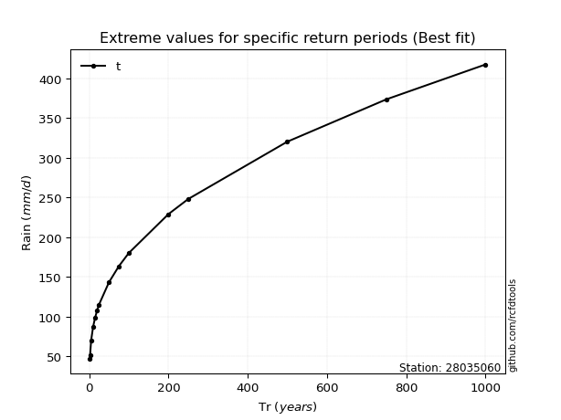</img>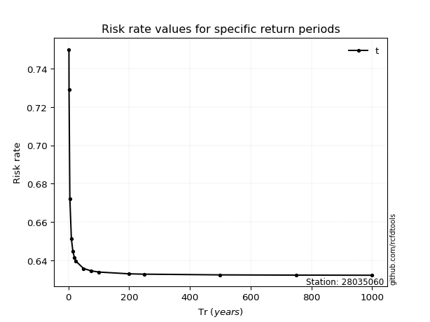</img>

</div>


<sub>**APP DISCLAIMER**: NO WARRANTY - This software is provided by [github.com/rcfdtools](https://github.com/rcfdtools) "as is", without any express or implied warranty, including warranties of merchantability, fitness for a particular purpose, or non-infringement. There is no guarantee that the software will be error-free or operate without interruption. LIMITATION OF LIABILITY - Neither the authors nor copyright holders will be liable for claims or damages arising from the software or its use. You are responsible for determining if the software is appropriate for your use and assume all associated risks, including errors, legal compliance, and data loss. NO PROFESSIONAL ADVICE - The software provides general information and does not offer professional advice. It should not replace consultation with professional advisors.</sub>