<div align="center">


</div>

# PMP Station (Rain, Pmax24h): 28035070

Probable Maximum Precipitation (PMP) is the greatest amount of rainfall for a specific duration that is meteorologically possible for a given location, acting as a "worst-case" scenario for extreme storms, crucial for designing safety-critical infrastructure like bridges, river deviations, dams, spillways, and nuclear plants to prevent catastrophic failure. PMP is calculated by hydrologists using meteorological data to determine the upper limit of extreme rainfall, often leading to the Probable Maximum Flood (PMF) for flood control design, and is increasingly being studied for climate change impacts. Probable Maximum Precipitation (PMP) is the theoretical upper limit of rainfall, a deterministic estimate for extreme events, while probability distributions (like GEV, Gumbel) describe the likelihood and frequency of various precipitation amounts, including rare ones, showing how often events occur, with PMP representing the extreme end of these distributions, used for critical infrastructure design to ensure safety against the worst conceivable weather, unlike standard statistical forecasts which cover typical probabilities.

The most common probability distributions in hydrology, used for analyzing floods, rainfall, and streamflow, include the Normal, Log-Normal, Gumbel, Gamma (including Log-Pearson Type III), and Generalized Extreme Value (GEV) distributions, often chosen based on the data´s skewness and whether modeling extremes or general conditions, with Gumbel and GEV popular for extreme events like floods, while the Normal distribution serves as a baseline, though often requiring transformations for skewed hydrological data. These distributions help in designing water infrastructure, managing water resources, and forecasting hydrologic events.

> Hydrological data often isn´t perfectly normal (it´s skewed), so different distributions are needed for different applications, such as: **Flood Frequency Analysis**: Using Gumbel, GEV, or Log-Pearson Type III for predicting extreme flood magnitudes and their return periods, **Rainfall Analysis**: Normal for annual totals, but Log-Normal, Weibull, or GEV for intensity or extreme daily rainfall, **Streamflow Modeling**: Gamma and Log-Normal for maximum flows, GEV for minimum flows, and Kappa for daily flows.

<div align="center">

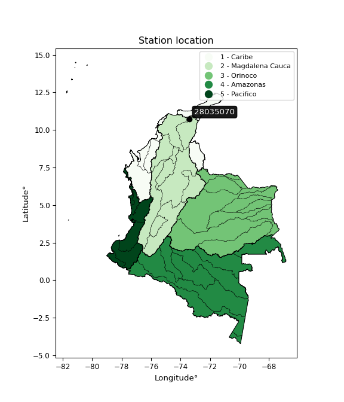</img>

</div>


## A. General information


### 1. General running parameters

• app_version: _v20260103_. • runtime: _2026-01-05 16:20:51.132608_. • Python version: _3.14.0_. • SciPy version: _1.16.3_. • Pandas version: _2.3.3_. • NumPy version: _2.3.5_. • Stations dataset (station_dataset_file): _dataset/pmax24h_in/automatic_colombia_2003_2024.csv_. • Stations catalog (station_catalog_file): _dataset/CNE.xls_. • Minimum year to eval til year_max (date_min): _1900_. • Maximum year to eval since year_min (date_max): _2024_. • Creates, save and include plots into reports (create_plot): _True_. • Plot only fit distributions with Δo > Δ (plot_only_fit): _True_. • Plot only simple graphs avoiding multiple CDFs and multiple Extreme values plots (plot_only_simple): _True_. • Eval low extreme values, if False, evaluates high extreme values (low_extreme): _False_. • Eval every SciPy distribution as logarithmic (pdist_logarithmic_on): _True_. • Standard deviation normalized (ddof): _1.0_. • Return periods to eval in years (Tr): _[2, 2.33, 5, 10, 15, 20, 25, 50, 75, 100, 200, 250, 500, 750, 1000]_. • Minimum data sample per station, 0 means any (minimum_sample): _5_. • Z-Score maximum threshold to adjust a value, 0 means disable (zscore_max): _3.5_. • Z-Score minimum threshold to adjust a value, 0 means disable (zscore_min): _-2.5_. • Avoid zeros, e.g. rain = 0 (avoid_zeros): _True_. • Avoid null values (avoid_nans): _True_. 

[:file_folder:Dataset file](../../dataset/pmax24h_in/automatic_colombia_2003_2024.csv)

> Delta Degrees of Freedom (DDOF): is a parameter used in the formulas for calculating variance and standard deviation. When ddof=0, the divisor is $N$ (the total number of observations) and this is used when your data set is the entire population. When ddof=1, the divisor is $N-1$ and this is used when your data set is a sample drawn from a larger population. Using $N-1$ provides an unbiased estimate of the population variance (known as Bessel´s correction).


### 2. Station info and location

|   id |   CODIGO | NOMBRE                     | CATEGORIA               | TECNOLOGIA                              | ESTADO           | FECHA_INSTALACION   | FECHA_SUSPENSION   |   ALTITUD |   LATITUD |   LONGITUD | DEPARTAMENTO   | MUNICIPIO   | AREA_OPERATIVA                                         | ENTIDAD                                                     | AREA_HIDROGRAFICA   | ZONA_HIDROGRAFICA   | SUBZONA_HIDROGRAFICA   |   CORRIENTE | Catalogo   |   Version |
|-----:|---------:|:---------------------------|:------------------------|:----------------------------------------|:-----------------|:--------------------|:-------------------|----------:|----------:|-----------:|:---------------|:------------|:-------------------------------------------------------|:------------------------------------------------------------|:--------------------|:--------------------|:-----------------------|------------:|:-----------|----------:|
|    0 | 28035070 | GUATAPURI - AUT [28035070] | Climatológica Principal | Automática con Telemetría, Convencional | En Mantenimiento | 26/02/2006          | 06/11/2018         |      1315 |   10.7321 |   -73.3924 | Cesar          | Valledupar  | Area Operativa 05 - Magdalena-Cesar-Guajira-San Andrés | INSTITUTO DE HIDROLOGIA METEOROLOGIA Y ESTUDIOS AMBIENTALES | Magdalena Cauca     | Cesar               | Alto Cesar             |         nan | CNE_IDEAM  |  20251226 |

<div align="center">

Dynamic map: [:earth_americas:Google](http://maps.google.com/maps?q=10.73213889,-73.39241667) [:earth_americas:OSM](https://www.openstreetmap.org/#map=18/10.73213889/-73.39241667&layers=P) [:earth_americas:Bing](https://www.bing.com/maps?cp=10.73213889~-73.39241667&lvl=18) [:earth_americas:Apple](https://maps.apple.com/frame?center=10.73213889%2C-73.39241667&span=0.003%2C0.006)

</div>


<div align="center">

```geojson
{
  "type": "Feature",
  "geometry": {
    "type": "Point", 
    "coordinates": [-73.39241667, 10.73213889]
  }, 
  "properties": {
    "Name": "28035070"
  }
}
```

</div>


### 3. Discrete values table and plot

<div align="center">

|               |          0 |           1 |          2 |           3 |           4 |
|:--------------|-----------:|------------:|-----------:|------------:|------------:|
| Date          | 2019       | 2020        | 2021       | 2022        | 2023        |
| Value         |  109.8     |   36.6      |   50.2     |   85        |   44        |
| Value_initial |  109.8     |   36.6      |   50.2     |   85        |   44        |
| count         |    5       |    5        |    5       |    5        |    5        |
| mean          |   65.12    |   65.12     |   65.12    |   65.12     |   65.12     |
| std           |   31.119   |   31.119    |   31.119   |   31.119    |   31.119    |
| zscore        |    1.43578 |   -0.916482 |   -0.47945 |    0.638838 |   -0.678685 |


</div>


<div align="center">

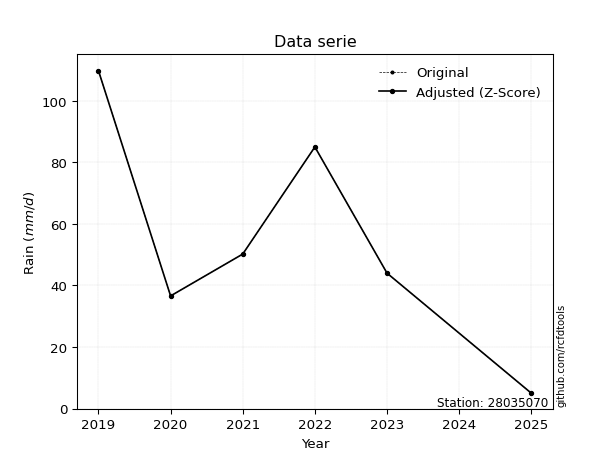</img>

</div>


> The initial value (value_initial) correspond to the initial obtained or null completed value, and value (value) is adjusted only when the initial value is outside the valid range (outlier) definite through the Z-Score value. If Z-Score is active, values out of range or outliers are replaced with the station mean value. A Z-Score (or standard score) measures how many standard deviations a data point is from the mean of a dataset, indicating its relative position; positive scores mean above the mean, negative mean below, and a score of zero is exactly at the mean, allowing for comparison of values from different distributions. It´s calculated using the formula $z=(x–μ)/σ$, where $x$ is the data point, $μ$ is the mean, and $σ$ is the standard deviation, helping identify outliers and understand probability.
>
> <sub>**Note**: In this study, "completing" (filling gaps in) and "extending" (forecasting or lengthening the historical record) rainfall data series are avoided for certain critical analyses because they introduce artificial bias and uncertainty, which can distort the statistics of rare events (extremes), alter day-to-day variability, and compromise the integrity and homogeneity of the original data. Some reasons against Completing/Extending rainfall data are: **Distortion of Extremes and Variability**: The primary issue is that most gap-filling or extension methods rely on averaging or regression with nearby stations, which inherently smooths the data. Rainfall is highly variable in space and time, with a large percentage of zero values and occasional large storms. Infilling methods often underestimate the highest values and overestimate the lowest (zero) values, which severely distorts analyses focused on flood frequency, drought severity, and intensity-duration-frequency (IDF) curves, **Loss of Data Homogeneity**: Infilled or extended data are synthetic estimates, not actual measurements. Combining these estimates with observed data can violate the assumption of data homogeneity, which requires that the data properties do not change over time. Inhomogeneity can lead to incorrect conclusions about long-term trends or changes in climate patterns, **Propagation of Errors**: Errors and biases from the original data (e.g., wind-induced undercatch, instrument errors, site changes) or the data used for imputation can propagate through the analysis, leading to unreliable hydrological models and inaccurate predictions, **Compromised Statistical Integrity**: For statistical analyses, especially those involving the frequency of events, using artificial data can introduce time bias or autocorrelation that doesn´t exist in reality, making it difficult to assess the true probability of events, **Difficulty in Validation**: It is difficult to accurately validate the quality of filled or extended data, especially for past periods where ground-truth measurements are unavailable. The reliability of imputation techniques heavily depends on the density of the surrounding station network and the complexity of the local topography.</sub>


### 4. Active continuous probability distributions from SciPy (44 of 104 available)

A Probability Density Function (PDF) describes the relative likelihood of a continuous random variable falling within a specific range, where the total area under its curve equals 1, and the area over any interval gives the actual probability for that range. Unlike discrete probabilities (like rolling a die), a PDF shows density, not direct probability for a single point (which is zero), with higher points indicating higher likelihood, often visualized as a bell curve for normal distributions.

A log of a probability density function (log-PDF) is simply the logarithm of the PDF´s value, denoted as $log(f(x))$, useful for converting multiplication of probabilities into addition, improving numerical stability with tiny numbers, and connecting to information theory concepts like entropy. Instead of dealing with very small probabilities (e.g., 0.000001), log-PDFs use negative numbers (e.g., $log(0.00001) ≈ -11.51$ that are easier for computers to handle, preventing underflow errors and simplifying complex calculations. In this study, each active probability distribution from SciPy is also evaluated in the $log$ form.

[scipy.stats](https://docs.scipy.org/doc/scipy/reference/stats.html) is a Python´s powerful submodule within the SciPy library for comprehensive statistical analysis, offering over 130 probability distributions (like Normal, Poisson), functions for descriptive stats (mean, variance), hypothesis testing (t-tests, chi-square), random variable generation, and statistical tests, making it essential for data science, modeling, and research. It provides tools to explore, model, and draw conclusions from data efficiently, working seamlessly with NumPy.

<div align="center">

|   id | p_dist             |   n_parameter | fit_method   | label                                                                       | active   | ref                                                                                                        |
|-----:|:-------------------|--------------:|:-------------|:----------------------------------------------------------------------------|:---------|:-----------------------------------------------------------------------------------------------------------|
|    0 | alpha              |             3 | MLE          | Alpha                                                                       | True     | [:mortar_board:](https://docs.scipy.org/doc/scipy/reference/generated/scipy.stats.alpha.html)              |
|    1 | betaprime          |             4 | MLE          | Beta prime                                                                  | True     | [:mortar_board:](https://docs.scipy.org/doc/scipy/reference/generated/scipy.stats.betaprime.html)          |
|    2 | chi2               |             3 | MLE          | Chi²                                                                        | True     | [:mortar_board:](https://docs.scipy.org/doc/scipy/reference/generated/scipy.stats.chi2.html)               |
|    3 | crystalball        |             4 | MLE          | Crystalball                                                                 | True     | [:mortar_board:](https://docs.scipy.org/doc/scipy/reference/generated/scipy.stats.crystalball.html)        |
|    4 | erlang             |             3 | MLE          | Erlang                                                                      | True     | [:mortar_board:](https://docs.scipy.org/doc/scipy/reference/generated/scipy.stats.erlang.html)             |
|    5 | expon              |             2 | MLE          | Exponential                                                                 | True     | [:mortar_board:](https://docs.scipy.org/doc/scipy/reference/generated/scipy.stats.expon.html)              |
|    6 | exponnorm          |             3 | MLE          | Exponentially modified Normal                                               | True     | [:mortar_board:](https://docs.scipy.org/doc/scipy/reference/generated/scipy.stats.exponnorm.html)          |
|    7 | f                  |             4 | MLE          | F                                                                           | True     | [:mortar_board:](https://docs.scipy.org/doc/scipy/reference/generated/scipy.stats.f.html)                  |
|    8 | fatiguelife        |             3 | MLE          | Fatigue-life (Birnbaum-Saunders)                                            | True     | [:mortar_board:](https://docs.scipy.org/doc/scipy/reference/generated/scipy.stats.fatiguelife.html)        |
|    9 | fisk               |             3 | MLE          | Fisk                                                                        | True     | [:mortar_board:](https://docs.scipy.org/doc/scipy/reference/generated/scipy.stats.fisk.html)               |
|   10 | gamma              |             3 | MLE          | Gamma                                                                       | True     | [:mortar_board:](https://docs.scipy.org/doc/scipy/reference/generated/scipy.stats.gamma.html)              |
|   11 | genexpon           |             5 | MLE          | Generalized exponential                                                     | True     | [:mortar_board:](https://docs.scipy.org/doc/scipy/reference/generated/scipy.stats.genexpon.html)           |
|   12 | genlogistic        |             3 | MLE          | Generalized logistic                                                        | True     | [:mortar_board:](https://docs.scipy.org/doc/scipy/reference/generated/scipy.stats.genlogistic.html)        |
|   13 | gibrat             |             2 | MM           | Gibrat                                                                      | True     | [:mortar_board:](https://docs.scipy.org/doc/scipy/reference/generated/scipy.stats.gibrat.html)             |
|   14 | gompertz           |             3 | MLE          | Gompertz (or truncated Gumbel)                                              | True     | [:mortar_board:](https://docs.scipy.org/doc/scipy/reference/generated/scipy.stats.gompertz.html)           |
|   15 | gumbel_l           |             2 | MM           | Gumbel Left Skew                                                            | True     | [:mortar_board:](https://docs.scipy.org/doc/scipy/reference/generated/scipy.stats.gumbel_l.html)           |
|   16 | gumbel_r           |             2 | MM           | Gumbel Right Skew                                                           | True     | [:mortar_board:](https://docs.scipy.org/doc/scipy/reference/generated/scipy.stats.gumbel_r.html)           |
|   17 | halflogistic       |             2 | MM           | Half-logistic                                                               | True     | [:mortar_board:](https://docs.scipy.org/doc/scipy/reference/generated/scipy.stats.halflogistic.html)       |
|   18 | halfnorm           |             2 | MM           | Half Normal                                                                 | True     | [:mortar_board:](https://docs.scipy.org/doc/scipy/reference/generated/scipy.stats.halfnorm.html)           |
|   19 | hypsecant          |             2 | MM           | hyperbolic secant                                                           | True     | [:mortar_board:](https://docs.scipy.org/doc/scipy/reference/generated/scipy.stats.hypsecant.html)          |
|   20 | invgamma           |             3 | MLE          | Inverted gamma                                                              | True     | [:mortar_board:](https://docs.scipy.org/doc/scipy/reference/generated/scipy.stats.invgamma.html)           |
|   21 | invgauss           |             3 | MLE          | Inverse Gaussian                                                            | True     | [:mortar_board:](https://docs.scipy.org/doc/scipy/reference/generated/scipy.stats.invgauss.html)           |
|   22 | invweibull         |             3 | MLE          | Inverted Weibull                                                            | True     | [:mortar_board:](https://docs.scipy.org/doc/scipy/reference/generated/scipy.stats.invweibull.html)         |
|   23 | johnsonsu          |             4 | MLE          | Johnson Su                                                                  | True     | [:mortar_board:](https://docs.scipy.org/doc/scipy/reference/generated/scipy.stats.johnsonsu.html)          |
|   24 | kstwobign          |             2 | MLE          | Limiting distribution of scaled Kolmogorov-Smirnov two-sided test statistic | True     | [:mortar_board:](https://docs.scipy.org/doc/scipy/reference/generated/scipy.stats.kstwobign.html)          |
|   25 | laplace            |             2 | MM           | Laplace                                                                     | True     | [:mortar_board:](https://docs.scipy.org/doc/scipy/reference/generated/scipy.stats.laplace.html)            |
|   26 | laplace_asymmetric |             3 | MLE          | Asymmetric Laplace                                                          | True     | [:mortar_board:](https://docs.scipy.org/doc/scipy/reference/generated/scipy.stats.laplace_asymmetric.html) |
|   27 | loggamma           |             3 | MLE          | Log gamma                                                                   | True     | [:mortar_board:](https://docs.scipy.org/doc/scipy/reference/generated/scipy.stats.loggamma.html)           |
|   28 | logistic           |             2 | MM           | Logistic (or Sech-squared)                                                  | True     | [:mortar_board:](https://docs.scipy.org/doc/scipy/reference/generated/scipy.stats.logistic.html)           |
|   29 | lognorm            |             3 | MLE          | Log Normal                                                                  | True     | [:mortar_board:](https://docs.scipy.org/doc/scipy/reference/generated/scipy.stats.lognorm.html)            |
|   30 | maxwell            |             2 | MM           | Maxwell                                                                     | True     | [:mortar_board:](https://docs.scipy.org/doc/scipy/reference/generated/scipy.stats.maxwell.html)            |
|   31 | mielke             |             4 | MLE          | Mielke Beta-Kappa / Dagum                                                   | True     | [:mortar_board:](https://docs.scipy.org/doc/scipy/reference/generated/scipy.stats.mielke.html)             |
|   32 | moyal              |             2 | MM           | Moyal                                                                       | True     | [:mortar_board:](https://docs.scipy.org/doc/scipy/reference/generated/scipy.stats.moyal.html)              |
|   33 | nakagami           |             3 | MLE          | Nakagami                                                                    | True     | [:mortar_board:](https://docs.scipy.org/doc/scipy/reference/generated/scipy.stats.nakagami.html)           |
|   34 | ncf                |             5 | MLE          | Non-central F distribution                                                  | True     | [:mortar_board:](https://docs.scipy.org/doc/scipy/reference/generated/scipy.stats.ncf.html)                |
|   35 | nct                |             4 | MLE          | Non-central Student’s t                                                     | True     | [:mortar_board:](https://docs.scipy.org/doc/scipy/reference/generated/scipy.stats.nct.html)                |
|   36 | norm               |             2 | MM           | Normal                                                                      | True     | [:mortar_board:](https://docs.scipy.org/doc/scipy/reference/generated/scipy.stats.norm.html)               |
|   37 | pearson3           |             3 | MM           | Pearson type III                                                            | True     | [:mortar_board:](https://docs.scipy.org/doc/scipy/reference/generated/scipy.stats.pearson3.html)           |
|   38 | rayleigh           |             2 | MM           | Rayleigh                                                                    | True     | [:mortar_board:](https://docs.scipy.org/doc/scipy/reference/generated/scipy.stats.rayleigh.html)           |
|   39 | rice               |             3 | MLE          | Rice                                                                        | True     | [:mortar_board:](https://docs.scipy.org/doc/scipy/reference/generated/scipy.stats.rice.html)               |
|   40 | t                  |             3 | MLE          | Student’s t                                                                 | True     | [:mortar_board:](https://docs.scipy.org/doc/scipy/reference/generated/scipy.stats.t.html)                  |
|   41 | truncnorm          |             4 | MLE          | Truncated normal                                                            | True     | [:mortar_board:](https://docs.scipy.org/doc/scipy/reference/generated/scipy.stats.truncnorm.html)          |
|   42 | wald               |             2 | MM           | Wald                                                                        | True     | [:mortar_board:](https://docs.scipy.org/doc/scipy/reference/generated/scipy.stats.wald.html)               |
|   43 | weibull_min        |             3 | MLE          | Weibull minimum                                                             | True     | [:mortar_board:](https://docs.scipy.org/doc/scipy/reference/generated/scipy.stats.weibull_min.html)        |

</div>

> **n_parameter:** # arguments & localization & scale.
>
> **Fit methods:** (MLE) maximum likelihood, (MM) L-moments.
>
>**Inactive** (With the only purpose of prevent loops, zero divisions, infinite values, over high estimated values or horizontal trending for recurrence intervals estimations, the follow distributions were disabled.)**:** foldnorm, gennorm, norminvgauss, powernorm, powerlognorm, skewnorm, genextreme, anglit, arcsine, argus, beta, bradford, burr, burr12, cauchy, cosine, halfcauchy, foldcauchy, skewcauchy, wrapcauchy, dgamma, gengamma, exponweib, exponpow, truncexpon, gausshyper, genhalflogistic, genhyperbolic, geninvgauss, halfgennorm, johnsonsb, kappa4, kappa3, ksone, kstwo, loglaplace, levy, levy_l, levy_stable, ncx2, pareto, genpareto, truncpareto, lomax, powerlaw, rdist, rel_breitwigner, recipinvgauss, semicircular, studentized_range, trapezoid, triang, truncweibull_min, tukeylambda, uniform, loguniform, vonmises, vonmises_line, weibull_max, dweibull, 


## B. Probability (PDF) vs. Empirical (EDF) distributions functions

A continuous probability distribution (CPD) describes probabilities for variables that can take any value within a range (like rain any time), unlike discrete variables with specific outcomes (like temperature). It uses a Probability Density Function (PDF), a curve where the total area under it equals 1, and the probability of the variable falling within an interval (a to b) is found by calculating the area under the curve between those points. A key feature is that the probability of hitting any single exact value is zero, so probabilities are always expressed for ranges, e.g., $P(a ≤ X ≤ b)$.

<div align="center">

Distributions parameters from station values
|    |   station | p_dist                |   n |             loc |           scale | shape                  | shape1             | shape2              | shape3   |
|---:|----------:|:----------------------|----:|----------------:|----------------:|:-----------------------|:-------------------|:--------------------|:---------|
|  0 |  28035070 | alpha                 |   5 |    29.0649      |    14.197       | 1.4547371452960557e-10 |                    |                     |          |
|  1 |  28035070 | betaprime             |   5 |    -0.288053    |     1.45699     | 251.4624869458001      | 6.589014565349142  |                     |          |
|  2 |  28035070 | chi2                  |   5 |    36.6         |     1.64582     | 0.20003248136990892    |                    |                     |          |
|  3 |  28035070 | crystalball           |   5 |    65.12        |    27.8337      | 2917.7553865459136     | 11726.573995610132 |                     |          |
|  4 |  28035070 | erlang                |   5 |    36.6         |    25.6298      | 0.7207086774184204     |                    |                     |          |
|  5 |  28035070 | expon                 |   5 |    36.6         |    28.52        |                        |                    |                     |          |
|  6 |  28035070 | exponnorm             |   5 |    36.5696      |     0.00827248  | 3450.7711762486124     |                    |                     |          |
|  7 |  28035070 | f                     |   5 |    30           |    16.4994      | 4621.914526550864      | 2.9156168703695027 |                     |          |
|  8 |  28035070 | fatiguelife           |   5 |    36.6         |     2.29808e-05 | 1596.14440824114       |                    |                     |          |
|  9 |  28035070 | fisk                  |   5 |    36.6         |     9.5338      | 0.6925266070901392     |                    |                     |          |
| 10 |  28035070 | gamma                 |   5 |    36.6         |    42.4602      | 0.13495284001773705    |                    |                     |          |
| 11 |  28035070 | genexpon              |   5 |    36.6         |    59.3715      | 2.0513672315362568     | 1.4089778092486716 | 0.04673578486991175 |          |
| 12 |  28035070 | genlogistic           |   5 |   -98.163       |    20.4339      | 1570.579900264423      |                    |                     |          |
| 13 |  28035070 | gibrat                |   5 |    43.8864      |    12.8788      |                        |                    |                     |          |
| 14 |  28035070 | gompertz              |   5 |    36.6         |   614.42        | 20.577748422389966     |                    |                     |          |
| 15 |  28035070 | gumbel_l              |   5 |    77.6466      |    21.7018      |                        |                    |                     |          |
| 16 |  28035070 | gumbel_r              |   5 |    52.5934      |    21.7018      |                        |                    |                     |          |
| 17 |  28035070 | halflogistic          |   5 |    32.1306      |    23.7968      |                        |                    |                     |          |
| 18 |  28035070 | halfnorm              |   5 |    28.2791      |    46.1732      |                        |                    |                     |          |
| 19 |  28035070 | hypsecant             |   5 |    65.12        |    17.7195      |                        |                    |                     |          |
| 20 |  28035070 | invgamma              |   5 |    29.9946      |    24.06        | 1.4580125161377184     |                    |                     |          |
| 21 |  28035070 | invgauss              |   5 |    32.7842      |    17.4732      | 1.8505936826482396     |                    |                     |          |
| 22 |  28035070 | invweibull            |   5 |    36.6         |     1.37013     | 0.04474712888722794    |                    |                     |          |
| 23 |  28035070 | johnsonsu             |   5 |     4.74826e+08 |     4.30934e+06 | 90638212.93889639      | 16799374.59900269  |                     |          |
| 24 |  28035070 | kstwobign             |   5 |   -18.4899      |    95.7713      |                        |                    |                     |          |
| 25 |  28035070 | laplace               |   5 |    65.12        |    19.6814      |                        |                    |                     |          |
| 26 |  28035070 | laplace_asymmetric    |   5 |    36.6         |     0.00427795  | 0.00014998105443393114 |                    |                     |          |
| 27 |  28035070 | loggamma              |   5 | -7099.81        |  1004.53        | 1252.3515501604893     |                    |                     |          |
| 28 |  28035070 | logistic              |   5 |    65.12        |    15.3455      |                        |                    |                     |          |
| 29 |  28035070 | lognorm               |   5 |    36.6         |     0.0190873   | 14.333619543622294     |                    |                     |          |
| 30 |  28035070 | maxwell               |   5 |    -0.834129    |    41.3306      |                        |                    |                     |          |
| 31 |  28035070 | mielke                |   5 |    -0.435617    |    11.3452      | 256.3396968364789      | 3.024494540100072  |                     |          |
| 32 |  28035070 | moyal                 |   5 |    49.2029      |    12.5296      |                        |                    |                     |          |
| 33 |  28035070 | nakagami              |   5 |    36.6         |    36.1714      | 0.313563937106194      |                    |                     |          |
| 34 |  28035070 | ncf                   |   5 |    -1.00709     |     0.0851281   | 0.6918567004444967     | 13.73737913505613  | 459.6534253153153   |          |
| 35 |  28035070 | nct                   |   5 |     0.887365    |     0.425707    | 3.5800495749578207     | 117.71484102843405 |                     |          |
| 36 |  28035070 | norm                  |   5 |    65.12        |    27.8337      |                        |                    |                     |          |
| 37 |  28035070 | pearson3              |   5 |    65.12        |    27.8336      | 0.5668326471356299     |                    |                     |          |
| 38 |  28035070 | rayleigh              |   5 |    11.8726      |    42.4853      |                        |                    |                     |          |
| 39 |  28035070 | rice                  |   5 |    19.8059      |    37.6037      | 0.001085969562918016   |                    |                     |          |
| 40 |  28035070 | t                     |   5 |    65.1189      |    27.8335      | 24830698.11965864      |                    |                     |          |
| 41 |  28035070 | truncnorm             |   5 |    65.12        |    27.8337      | -1278.0570969437035    | 747.9177780195351  |                     |          |
| 42 |  28035070 | wald                  |   5 |    37.2863      |    27.8337      |                        |                    |                     |          |
| 43 |  28035070 | weibull_min           |   5 |    36.6         |    49.8199      | 0.7730918039349728     |                    |                     |          |
| 44 |  28035070 | logalpha              |   5 |     2.48348     |     6.09453     | 4.051936391979712      |                    |                     |          |
| 45 |  28035070 | logbetaprime          |   5 |    -2.44465     |     4.7667      | 581.6003468967373      | 425.31746260650374 |                     |          |
| 46 |  28035070 | logchi2               |   5 |     3.60005     |     1.02764     | 1.059066935624851      |                    |                     |          |
| 47 |  28035070 | logcrystalball        |   5 |     4.69867     |     5.90864e-06 | 9.812702905866413e-06  | 72.50915723663337  |                     |          |
| 48 |  28035070 | logerlang             |   5 |     3.60005     |     0.460696    | 0.6975503763066908     |                    |                     |          |
| 49 |  28035070 | logexpon              |   5 |     3.60005     |     0.488265    |                        |                    |                     |          |
| 50 |  28035070 | logexponnorm          |   5 |     3.59954     |     0.000145372 | 3350.6386972698383     |                    |                     |          |
| 51 |  28035070 | logf                  |   5 |     2.78666     |     1.26603     | 48.32198468909951      | 32.81451660745293  |                     |          |
| 52 |  28035070 | logfatiguelife        |   5 |     3.60005     |     4.16328e-06 | 330.3852181822831      |                    |                     |          |
| 53 |  28035070 | logfisk               |   5 |     3.60005     |     0.528765    | 0.22384252190503862    |                    |                     |          |
| 54 |  28035070 | loggamma              |   5 |     3.60005     |     0.517865    | 0.43940220604660274    |                    |                     |          |
| 55 |  28035070 | loggenexpon           |   5 |     3.60005     |     0.752621    | 1.3492412537262686     | 1.8131852321902184 | 0.2052497772566049  |          |
| 56 |  28035070 | loggenlogistic        |   5 |     1.65839     |     0.328821    | 887.632491939553       |                    |                     |          |
| 57 |  28035070 | loggibrat             |   5 |     3.77215     |     0.19176     |                        |                    |                     |          |
| 58 |  28035070 | loggompertz           |   5 |     3.60005     |     0.854116    | 0.9794546950085858     |                    |                     |          |
| 59 |  28035070 | loggumbel_l           |   5 |     4.27482     |     0.323111    |                        |                    |                     |          |
| 60 |  28035070 | loggumbel_r           |   5 |     3.90181     |     0.323111    |                        |                    |                     |          |
| 61 |  28035070 | loghalflogistic       |   5 |     3.59715     |     0.354302    |                        |                    |                     |          |
| 62 |  28035070 | loghalfnorm           |   5 |     3.5398      |     0.687456    |                        |                    |                     |          |
| 63 |  28035070 | loghypsecant          |   5 |     4.08831     |     0.263819    |                        |                    |                     |          |
| 64 |  28035070 | loginvgamma           |   5 |     3.24177     |     2.63789     | 4.024030758788745      |                    |                     |          |
| 65 |  28035070 | loginvgauss           |   5 |     3.44472     |     0.903149    | 0.7126171649282507     |                    |                     |          |
| 66 |  28035070 | loginvweibull         |   5 |     2.72972     |     1.11826     | 3.8828460935836064     |                    |                     |          |
| 67 |  28035070 | logjohnsonsu          |   5 |     8.92936e+06 | 20478.2         | 142234514.83150423     | 21006771.7969113   |                     |          |
| 68 |  28035070 | logkstwobign          |   5 |     2.76165     |     1.51625     |                        |                    |                     |          |
| 69 |  28035070 | loglaplace            |   5 |     4.08831     |     0.293029    |                        |                    |                     |          |
| 70 |  28035070 | loglaplace_asymmetric |   5 |     3.78419     |     0.259666    | 0.5731777133873188     |                    |                     |          |
| 71 |  28035070 | logloggamma           |   5 |  -102.955       |    14.979       | 1269.7066050566973     |                    |                     |          |
| 72 |  28035070 | loglogistic           |   5 |     4.08831     |     0.228474    |                        |                    |                     |          |
| 73 |  28035070 | loglognorm            |   5 |     3.60005     |     0.000473965 | 13.863184388018768     |                    |                     |          |
| 74 |  28035070 | logmaxwell            |   5 |     3.10635     |     0.615357    |                        |                    |                     |          |
| 75 |  28035070 | logmielke             |   5 |    -3.19029     |     5.95435     | 1025.6584406501447     | 22.178636910545677 |                     |          |
| 76 |  28035070 | logmoyal              |   5 |     3.85133     |     0.186548    |                        |                    |                     |          |
| 77 |  28035070 | lognakagami           |   5 |     3.60005     |     0.943544    | 0.27710028087495586    |                    |                     |          |
| 78 |  28035070 | logncf                |   5 |     2.47528     |     0.0368231   | 1.3436358968189204     | 444.6945959164814  | 57.144496653777395  |          |
| 79 |  28035070 | lognct                |   5 |    -0.272963    |     0.0984812   | 61.06409765259764      | 43.72469271704509  |                     |          |
| 80 |  28035070 | lognorm               |   5 |     4.08831     |     0.414406    |                        |                    |                     |          |
| 81 |  28035070 | logpearson3           |   5 |     4.08831     |     0.414406    | 0.34342285245153814    |                    |                     |          |
| 82 |  28035070 | lograyleigh           |   5 |     3.29553     |     0.632549    |                        |                    |                     |          |
| 83 |  28035070 | logrice               |   5 |     3.37682     |     0.56192     | 0.38354616670568187    |                    |                     |          |
| 84 |  28035070 | logt                  |   5 |     4.08831     |     0.414403    | 902965608.9219542      |                    |                     |          |
| 85 |  28035070 | logtruncnorm          |   5 |    -0.0569574   |     0.851894    | 5.281875950424068      | 5.582427365123012  |                     |          |
| 86 |  28035070 | logwald               |   5 |     3.6739      |     0.414415    |                        |                    |                     |          |
| 87 |  28035070 | logweibull_min        |   5 |     3.60005     |     0.612044    | 0.14317539278461322    |                    |                     |          |

</div>

> **loc** (Location parameter): This shifts the distribution along the x-axis. For many common distributions, like the normal (Gaussian) distribution, loc represents the mean $μ$. For others, like the uniform distribution, it might represent the minimum value, or for the beta distribution, the left end of the support interval.
>
> **scale** (Scale parameter): This determines the width or spread of the distribution. For the normal distribution, scale represents the standard deviation $σ$. For a uniform distribution, it defines the length of the interval (from $loc$ to $loc + scale$).
>
> **shape** (Shape parameters): Refers to parameters that define the specific form of a probability distribution, distinct from its location (loc) and scale (scale). These parameters are required arguments for most distribution functions. For example, a normal (Gaussian) distribution is fully defined by its location (mean) and scale (standard deviation), so it has no specific shape parameters beyond loc and scale. However, other distributions have intrinsic properties that need specification, as Gamma distribution that takes a shape parameter, often named $a$ or $alpha$.


### 0. Cumulative distribution values - CDF (88 evaluated)

Cumulative Distribution Function (CDF), denoted as $F$<sub>$X$</sub>$(x)$, is a function that gives the probability that a random variable $X$ will take a value less than or equal to a specific value, $x$ (i.e., $(P(X≥x)$. It essentially "accumulates" probabilities from a given point up to the far right (positive infinity), providing a complete picture of the distribution´s probabilities for both discrete (like rain) and continuous (like temperature) variables, helping to find probabilities over ranges or above certain values. Each station is evaluated separately ordering the $x$ values ascending, calculating the CDF and PDF values for the activated distributions and their logarithmic forms.

<div align="center">

CDF ordered by x ascending and calculating $log(f(x))$ separately
|   id |   Station |   date |     x |   count |   mean |    std |    zscore |   Value_initial |   station |   m |     alpha |   alpha_pdf |   betaprime |   betaprime_pdf |      chi2 |    chi2_pdf |   crystalball |   crystalball_pdf |      erlang |   erlang_pdf |    expon |   expon_pdf |   exponnorm |   exponnorm_pdf |         f |      f_pdf |   fatiguelife |   fatiguelife_pdf |       fisk |      fisk_pdf |     gamma |   gamma_pdf |    genexpon |   genexpon_pdf |   genlogistic |   genlogistic_pdf |      gibrat |   gibrat_pdf |   gompertz |   gompertz_pdf |   gumbel_l |   gumbel_l_pdf |   gumbel_r |   gumbel_r_pdf |   halflogistic |   halflogistic_pdf |   halfnorm |   halfnorm_pdf |   hypsecant |   hypsecant_pdf |   invgamma |   invgamma_pdf |   invgauss |   invgauss_pdf |   invweibull |   invweibull_pdf |   johnsonsu |   johnsonsu_pdf |   kstwobign |   kstwobign_pdf |   laplace |   laplace_pdf |   laplace_asymmetric |   laplace_asymmetric_pdf |    loggamma |   loggamma_pdf |   logistic |   logistic_pdf |   lognorm |   lognorm_pdf |   maxwell |   maxwell_pdf |    mielke |   mielke_pdf |    moyal |   moyal_pdf |    nakagami |   nakagami_pdf |      ncf |    ncf_pdf |      nct |    nct_pdf |     norm |   norm_pdf |   pearson3 |   pearson3_pdf |   rayleigh |   rayleigh_pdf |     rice |   rice_pdf |        t |      t_pdf |   truncnorm |   truncnorm_pdf |     wald |   wald_pdf |   weibull_min |   weibull_min_pdf |   logalpha |   logalpha_pdf |   logbetaprime |   logbetaprime_pdf |     logchi2 |   logchi2_pdf |   logcrystalball |   logcrystalball_pdf |   logerlang |   logerlang_pdf |   logexpon |   logexpon_pdf |   logexponnorm |   logexponnorm_pdf |      logf |   logf_pdf |   logfatiguelife |   logfatiguelife_pdf |     logfisk |   logfisk_pdf |   loggenexpon |   loggenexpon_pdf |   loggenlogistic |   loggenlogistic_pdf |   loggibrat |   loggibrat_pdf |   loggompertz |   loggompertz_pdf |   loggumbel_l |   loggumbel_l_pdf |   loggumbel_r |   loggumbel_r_pdf |   loghalflogistic |   loghalflogistic_pdf |   loghalfnorm |   loghalfnorm_pdf |   loghypsecant |   loghypsecant_pdf |   loginvgamma |   loginvgamma_pdf |   loginvgauss |   loginvgauss_pdf |   loginvweibull |   loginvweibull_pdf |   logjohnsonsu |   logjohnsonsu_pdf |   logkstwobign |   logkstwobign_pdf |   loglaplace |   loglaplace_pdf |   loglaplace_asymmetric |   loglaplace_asymmetric_pdf |   logloggamma |   logloggamma_pdf |   loglogistic |   loglogistic_pdf |   loglognorm |   loglognorm_pdf |   logmaxwell |   logmaxwell_pdf |   logmielke |   logmielke_pdf |   logmoyal |   logmoyal_pdf |   lognakagami |   lognakagami_pdf |   logncf |   logncf_pdf |   lognct |   lognct_pdf |   logpearson3 |   logpearson3_pdf |   lograyleigh |   lograyleigh_pdf |   logrice |   logrice_pdf |     logt |   logt_pdf |   logtruncnorm |   logtruncnorm_pdf |   logwald |   logwald_pdf |   logweibull_min |   logweibull_min_pdf |
|-----:|----------:|-------:|------:|--------:|-------:|-------:|----------:|----------------:|----------:|----:|----------:|------------:|------------:|----------------:|----------:|------------:|--------------:|------------------:|------------:|-------------:|---------:|------------:|------------:|----------------:|----------:|-----------:|--------------:|------------------:|-----------:|--------------:|----------:|------------:|------------:|---------------:|--------------:|------------------:|------------:|-------------:|-----------:|---------------:|-----------:|---------------:|-----------:|---------------:|---------------:|-------------------:|-----------:|---------------:|------------:|----------------:|-----------:|---------------:|-----------:|---------------:|-------------:|-----------------:|------------:|----------------:|------------:|----------------:|----------:|--------------:|---------------------:|-------------------------:|------------:|---------------:|-----------:|---------------:|----------:|--------------:|----------:|--------------:|----------:|-------------:|---------:|------------:|------------:|---------------:|---------:|-----------:|---------:|-----------:|---------:|-----------:|-----------:|---------------:|-----------:|---------------:|---------:|-----------:|---------:|-----------:|------------:|----------------:|---------:|-----------:|--------------:|------------------:|-----------:|---------------:|---------------:|-------------------:|------------:|--------------:|-----------------:|---------------------:|------------:|----------------:|-----------:|---------------:|---------------:|-------------------:|----------:|-----------:|-----------------:|---------------------:|------------:|--------------:|--------------:|------------------:|-----------------:|---------------------:|------------:|----------------:|--------------:|------------------:|--------------:|------------------:|--------------:|------------------:|------------------:|----------------------:|--------------:|------------------:|---------------:|-------------------:|--------------:|------------------:|--------------:|------------------:|----------------:|--------------------:|---------------:|-------------------:|---------------:|-------------------:|-------------:|-----------------:|------------------------:|----------------------------:|--------------:|------------------:|--------------:|------------------:|-------------:|-----------------:|-------------:|-----------------:|------------:|----------------:|-----------:|---------------:|--------------:|------------------:|---------:|-------------:|---------:|-------------:|--------------:|------------------:|--------------:|------------------:|----------:|--------------:|---------:|-----------:|---------------:|-------------------:|----------:|--------------:|-----------------:|---------------------:|
|    0 |  28035070 |   2020 |  36.6 |       5 |  65.12 | 31.119 | -0.916482 |            36.6 |  28035070 |   1 | 0.0595504 |  0.0338153  |    0.109084 |      0.01459    | 0.0358791 | 5.05036e+11 |      0.152762 |        0.00847913 | 6.72175e-12 | 681.792      | 0        |  0.0350631  |  0.00106524 |      0.0349892  | 0.0594532 | 0.0294803  |     0.0193454 |       2.30567e+10 | 3.3395e-11 | 3254.83       | 0.0079186 | 1.50397e+11 | 1.29674e-12 |     0.0345514  |      0.116989 |        0.0122761  | 0           |   0          | 2.3797e-16 |     0.0334913  |   0.140034 |     0.00597812 |   0.12374  |     0.0119144  |       0.093632 |         0.020827   |   0.143012 |     0.0170019  |    0.125655 |      0.00690859 |  0.0594386 |     0.0294764  |  0.0542178 |     0.0376875  |    0.0128126 |      3.51586e+11 |    0.156499 |      0.00848394 |    0.104707 |      0.0122727  |  0.117392 |    0.00596465 |          2.25239e-08 |               0.0350591  | 2.70579e-07 |    2.67724e+08 |   0.134875 |     0.00760378 |  0.119353 |      0.480879 |  0.155403 |    0.0105081  | 0.0968741 |   0.0182154  | 0.098218 |  0.0134171  | 1.09608e-10 |  9674.02       | 0.111352 | 0.014423   | 0.104275 | 0.016942   | 0.152762 | 0.00847913 |   0.147348 |     0.0104166  |   0.155808 |     0.0115649  | 0.094917 |  0.0107494 | 0.15277  | 0.00847946 |    0.152762 |      0.00847913 | 0        | 0          |   5.61994e-13 |       61.1467     |  0.0798134 |       0.72547  |       0.117555 |           0.512904 | 5.70766e-09 |   6.80583e+06 |              nan |                  nan | 3.69362e-11 |    58017.3      |   0        |       2.04807  |     0.00104645 |           2.05041  | 0.0794427 |   0.574018 |        0.0355231 |          6.03171e+09 | 0.000421904 |    2.1257e+11 |   4.14728e-10 |          1.79272  |        0.0892417 |             0.654918 |  0          |        0        |   1.10184e-09 |          1.14675  |      0.116524 |          0.338753 |     0.0785147 |          0.618297 |         0.0040956 |              1.4112   |      0.069834 |          1.15619  |      0.0992133 |           0.370007 |     0.0661306 |          0.88284  |     0.0565201 |          1.16206  |       0.0708906 |            0.837041 |       0.125355 |           0.48524  |      0.0801661 |           0.67604  |    0.0944755 |         0.32241  |               0.0717609 |                    0.482152 |      0.123815 |          0.481147 |      0.105546 |          0.413201 |    0.0228682 |      8.80809e+12 |     0.113638 |         0.604943 |   0.0868211 |        0.675038 |  0.0498681 |       0.613047 |   2.49074e-09 |       3.10831e+06 | 0.124055 |     0.575428 | 0.109712 |     0.551954 |      0.113078 |          0.538403 |      0.109417 |          0.677795 |  0.070698 |      0.610532 | 0.119352 |   0.480879 |    0           |            0       |  0        |      0        |        0.0067756 |          2.17705e+12 |
|    1 |  28035070 |   2023 |  44   |       5 |  65.12 | 31.119 | -0.678685 |            44   |  28035070 |   2 | 0.34182   |  0.0323225  |    0.235626 |      0.0188479  | 0.995917  | 0.00162684  |      0.223988 |        0.0107476  | 0.398027    |   0.032656   | 0.228537 |  0.0270499  |  0.229174   |      0.0270025  | 0.315934  | 0.0318416  |     0.638899  |       0.00899632  | 0.456247   |    0.023217   | 0.825347  | 0.0128998   | 0.226006    |     0.0268493  |      0.224453 |        0.0164038  | 1.12039e-06 |   4.8572e-05 | 0.220681   |     0.0264167  |   0.191166 |     0.00790734 |   0.226314 |     0.0154948  |       0.244345 |         0.0197568  |   0.266502 |     0.0163071  |    0.187672 |      0.00998823 |  0.315916  |     0.0318433  |  0.344123  |     0.0318443  |    0.395617  |      0.00221836  |    0.227486 |      0.0106766  |    0.211855 |      0.0162578  |  0.170974 |    0.0086871  |          0.228514    |               0.0270476  | 0.646423    |    1.19845     |   0.201604 |     0.0104891  |  0.231511 |      0.735417 |  0.241407 |    0.012613   | 0.25837   |   0.023611   | 0.218415 |  0.0183747  | 0.286065    |     0.024002   | 0.236005 | 0.0185518  | 0.251759 | 0.0216089  | 0.223988 | 0.0107476  |   0.234292 |     0.0129463  |   0.248677 |     0.0133729  | 0.186963 |  0.013911  | 0.223998 | 0.010748   |    0.223988 |      0.0107476  | 0.103645 | 0.0366792  |   0.204635    |        0.0190245  |  0.263174  |       1.17578  |       0.237087 |           0.778577 | 0.304575    |   0.825736    |              nan |                  nan | 0.496317    |        1.47522  |   0.314176 |       1.40462  |     0.315518   |           1.40525  | 0.221931  |   0.937634 |        0.737789  |          0.563107    | 0.441243    |    0.299704   |   0.288991    |          1.35854  |        0.251309  |             1.05469  |  0.00281663 |        0.718176 |   0.209946    |          1.12397  |      0.196719 |          0.544579 |     0.23714   |          1.0562   |         0.257996  |              1.31729  |      0.277781 |          1.08956  |      0.194711  |           0.692876 |     0.288848  |          1.33815  |     0.325731  |          1.42424  |       0.28474   |            1.31709  |       0.237173 |           0.726616 |      0.246656  |           1.06747  |    0.177106  |         0.604397 |               0.24729   |                    1.66151  |      0.235158 |          0.726289 |      0.208976 |          0.723519 |    0.666433  |      0.142472    |     0.250209 |         0.857692 |   0.255121  |        1.09201  |  0.231244  |       1.25043  |   0.313662    |       0.936239    | 0.255022 |     0.830795 | 0.240043 |     0.84931  |      0.239073 |          0.818662 |      0.257993 |          0.906204 |  0.216697 |      0.939563 | 0.231511 |   0.735421 |    0           |            0       |  0.129592 |      2.54917  |        0.569155  |          0.282068    |
|    2 |  28035070 |   2021 |  50.2 |       5 |  65.12 | 31.119 | -0.47945  |            50.2 |  28035070 |   3 | 0.501759  |  0.020237   |    0.35477  |      0.0191702  | 0.999603  | 0.00014304  |      0.295965 |        0.0124149  | 0.562556    |   0.0216315  | 0.37927  |  0.0217647  |  0.379657   |      0.021731   | 0.481429  | 0.0219114  |     0.685084  |       0.00629384  | 0.561193   |    0.0125396  | 0.882041  | 0.0065846   | 0.37601     |     0.0217174  |      0.331804 |        0.0179075  | 0.237962    |   0.0490093  | 0.36907    |     0.0216036  |   0.245967 |     0.00980923 |   0.327393 |     0.0168449  |       0.362412 |         0.0182516  |   0.365037 |     0.0154386  |    0.258983 |      0.0130557  |  0.481422  |     0.0219131  |  0.503633  |     0.0206204  |    0.405597  |      0.00120425  |    0.298818 |      0.0122789  |    0.317603 |      0.017554   |  0.234283 |    0.0119038  |          0.379235    |               0.0217634  | 0.765908    |    0.686459    |   0.274428 |     0.0129756  |  0.338789 |      0.882973 |  0.323413 |    0.013733   | 0.40089   |   0.0217701  | 0.336556 |  0.0192822  | 0.415925    |     0.0185414  | 0.35346  | 0.0189377  | 0.384344 | 0.0206475  | 0.295965 | 0.0124149  |   0.319181 |     0.0143042  |   0.334304 |     0.0141354  | 0.278666 |  0.0155047 | 0.295977 | 0.0124153  |    0.295965 |      0.0124149  | 0.332448 | 0.0332763  |   0.306848    |        0.0144411  |  0.419799  |       1.16079  |       0.349391 |           0.913036 | 0.396753    |   0.600711    |              nan |                  nan | 0.651814    |        0.941162 |   0.47645  |       1.07227  |     0.477814   |           1.07206  | 0.353262  |   1.02889  |        0.797811  |          0.371836    | 0.471217    |    0.176522   |   0.450263    |          1.09487  |        0.396467  |             1.11491  |  0.386904   |        2.66092  |   0.35496     |          1.07082  |      0.280649 |          0.733367 |     0.384049  |          1.13747  |         0.421896  |              1.16003  |      0.415795 |          0.999223 |      0.305489  |           0.988201 |     0.455716  |          1.16082  |     0.4919    |          1.09401  |       0.451545  |            1.17509  |       0.342629 |           0.864525 |      0.391863  |           1.10561  |    0.277721  |         0.947761 |               0.43733   |                    1.24202  |      0.34088  |          0.869062 |      0.319923 |          0.952286 |    0.680476  |      0.0815897   |     0.369993 |         0.944576 |   0.404021  |        1.13165  |  0.400448  |       1.26271  |   0.421208    |       0.721007    | 0.371938 |     0.927959 | 0.361264 |     0.972593 |      0.35626  |          0.944408 |      0.381903 |          0.958517 |  0.348182 |      1.03538  | 0.338789 |   0.882979 |    0           |            0       |  0.434394 |      1.85926  |        0.597347  |          0.165976    |
|    3 |  28035070 |   2022 |  85   |       5 |  65.12 | 31.119 |  0.638838 |            85   |  28035070 |   4 | 0.799641  |  0.00350572 |    0.811908 |      0.00699224 | 1         | 1.16906e-09 |      0.762461 |        0.0111061  | 0.909676    |   0.00390328 | 0.816778 |  0.00642435 |  0.816685   |      0.00642164 | 0.819823  | 0.00397    |     0.818382  |       0.00247852  | 0.754937   |    0.00264716 | 0.972978  | 0.000967564 | 0.816197    |     0.0065137  |      0.817927 |        0.00804438 | 0.877129    |   0.0049471  | 0.81484    |     0.0067095  |   0.754219 |     0.015893   |   0.798806 |     0.00826851 |       0.804363 |         0.00741697 |   0.780717 |     0.00812573 |    0.799579 |      0.0105781  |  0.819839  |     0.0039701  |  0.831054  |     0.00414885 |    0.42632   |      0.000336034 |    0.759088 |      0.011021   |    0.806626 |      0.00870368 |  0.817907 |    0.00925203 |          0.816742    |               0.00642486 | 0.940537    |    0.143272    |   0.785075 |     0.0109955  |  0.803739 |      0.667921 |  0.770408 |    0.00963597 | 0.828052  |   0.00552476 | 0.810589 |  0.00741497 | 0.82447     |     0.00688662 | 0.810297 | 0.00707063 | 0.820072 | 0.00602191 | 0.762461 | 0.0111061  |   0.777627 |     0.0094535  |   0.772666 |     0.00921016 | 0.777512 |  0.0102578 | 0.762475 | 0.0111059  |    0.762461 |      0.0111061  | 0.848308 | 0.00550313 |   0.623898    |        0.00587467 |  0.826711  |       0.40679  |       0.804682 |           0.626005 | 0.614178    |   0.293071    |              nan |                  nan | 0.908228    |        0.223034 |   0.821953 |       0.364652 |     0.82288    |           0.363631 | 0.789721  |   0.529716 |        0.913349  |          0.127559    | 0.526051    |    0.0662337  |   0.822166    |          0.406764 |        0.829802  |             0.470768 |  0.894674   |        0.271804 |   0.807437    |          0.592217 |      0.813826 |          0.968623 |     0.829011  |          0.481127 |         0.831568  |              0.435355 |      0.810924 |          0.489957 |      0.837449  |           0.589713 |     0.823577  |          0.355191 |     0.825985  |          0.331565 |       0.826176  |            0.357599 |       0.797757 |           0.663043 |      0.828934  |           0.499379 |    0.850786  |         0.509213 |               0.824048  |                    0.388391 |      0.800983 |          0.669207 |      0.825043 |          0.631789 |    0.705327  |      0.0295226   |     0.806172 |         0.578552 |   0.829371  |        0.449945 |  0.837598  |       0.429221 |   0.697326    |       0.385089    | 0.803219 |     0.570242 | 0.813113 |     0.578234 |      0.808687 |          0.600025 |      0.806866 |          0.553706 |  0.812704 |      0.589961 | 0.803741 |   0.66792  |    6.75837e-05 |            7.86783 |  0.868163 |      0.312872 |        0.648953  |          0.0624437   |
|    4 |  28035070 |   2019 | 109.8 |       5 |  65.12 | 31.119 |  1.43578  |           109.8 |  28035070 |   5 | 0.860415  |  0.00171118 |    0.923458 |      0.00268047 | 1         | 4.30599e-13 |      0.945781 |        0.00395174 | 0.968558    |   0.00132135 | 0.923205 |  0.00269266 |  0.923105   |      0.00269369 | 0.886879  | 0.00182206 |     0.868249  |       0.00163072  | 0.80402    |    0.00149075 | 0.988331  | 0.000377224 | 0.924094    |     0.00272351 |      0.942032 |        0.00275292 | 0.94874     |   0.00159603 | 0.925992   |     0.00279224 |   0.987722 |     0.00248927 |   0.930861 |     0.00307309 |       0.926336 |         0.00298154 |   0.922528 |     0.00363638 |    0.948965 |      0.00286783 |  0.886895  |     0.00182202 |  0.902769  |     0.00198686 |    0.433039  |      0.000221549 |    0.943034 |      0.00404616 |    0.944736 |      0.0030917  |  0.948352 |    0.00262418 |          0.923183    |               0.00269315 | 0.967502    |    0.0753133   |   0.948417 |     0.00318805 |  0.929601 |      0.32542  |  0.933188 |    0.00384572 | 0.916363  |   0.00219482 | 0.929014 |  0.00282524 | 0.940374    |     0.00286505 | 0.92328  | 0.00271547 | 0.916573 | 0.00238331 | 0.945781 | 0.00395174 |   0.93354  |     0.00361539 |   0.929803 |     0.00380843 | 0.942946 |  0.0036311 | 0.945786 | 0.00395145 |    0.945781 |      0.00395174 | 0.934256 | 0.00207868 |   0.739837    |        0.0036996  |  0.903339  |       0.212658 |       0.923356 |           0.314041 | 0.680401    |   0.228386    |              nan |                  nan | 0.950404    |        0.118082 |   0.894604 |       0.215858 |     0.895285   |           0.214981 | 0.892432  |   0.290089 |        0.940007  |          0.0842888   | 0.540831    |    0.0505979  |   0.902626    |          0.235297 |        0.917914  |             0.239087 |  0.942392   |        0.124531 |   0.923111    |          0.319112 |      0.975588 |          0.280501 |     0.918597  |          0.241391 |         0.914523  |              0.230945 |      0.90815  |          0.28031  |      0.937234  |           0.236375 |     0.892205  |          0.197901 |     0.891699  |          0.195307 |       0.894777  |            0.196183 |       0.924486 |           0.334754 |      0.923534  |           0.257659 |    0.937715  |         0.212555 |               0.900006  |                    0.220723 |      0.927946 |          0.33102  |      0.935319 |          0.264791 |    0.711892  |      0.0224062   |     0.917749 |         0.305237 |   0.913837  |        0.231261 |  0.917804  |       0.219527 |   0.78367     |       0.293101    | 0.91326  |     0.302594 | 0.921901 |     0.289116 |      0.92226  |          0.302228 |      0.914586 |          0.29953  |  0.924171 |      0.296843 | 0.929603 |   0.325416 |    0.999969    |            1.53776 |  0.926057 |      0.159666 |        0.662896  |          0.0477708   |


</div>

An Empirical Distribution Function (EDF) is a step-function estimate of a true cumulative distribution function (CDF) based on observed sample data, representing the proportion of data points less than or equal to a given value. It is calculated by ordering your data and jumping up by $1/n$ (where $n$ is sample size) at each unique data point, allowing analysis without assuming an underlying population distribution, and it gets closer to the true CDF as the sample size grows. For the empirical probability calculations, the parameter $m$ correspond to the order number which means the position of the $x$ values in an ascending order list.

The Kolmogorov-Smirnov (K-S) test is a non-parametric statistical test used to determine if a sample data set comes from a specific theoretical distribution (one-sample) or if two different samples come from the same underlying distribution (two-sample), by comparing their cumulative distribution functions (CDFs). It calculates the maximum vertical difference (D statistic) between these functions, with a small p-value indicating a significant difference and rejection of the null hypothesis (that the data/samples match).


### 1. EDF California (1923)

California´s estimates the true probability distribution of water-related data (like rainfall, streamflow) using observed samples, crucial for risk assessment.

<div align="center">


$P=m/n$


</div>


**1.1. Empirical values**

<div align="center">

|                | 0              | 1                  | 2              | 3                 | 4              |
|:---------------|:---------------|:-------------------|:---------------|:------------------|:---------------|
| date           | 2020           | 2023               | 2021           | 2022              | 2019           |
| x              | 36.6           | 44.0               | 50.2           | 85.0              | 109.8          |
| m              | 1              | 2                  | 3              | 4                 | 5              |
| empirical_dist | edf_california | edf_california     | edf_california | edf_california    | edf_california |
| empirical      | 0.2            | 0.4                | 0.6            | 0.8               | 1.0            |
| empirical_tr   | 1.25           | 1.6666666666666667 | 2.5            | 5.000000000000001 | inf            |

</div>


**1.2. Kolmogorov-Smirnov fit test (sorted by Δ)**


<div align="center">

|                | 0                   | 1                  | 2                  | 3                  | 4                  | 5                   | 6                   | 7                     | 8                  | 9                  | 10                  | 11                  | 12                 | 13                  | 14                  | 15                 | 16                  | 17                  | 18                  | 19                  | 20                 | 21                  | 22                  | 23                  | 24                  | 25                  | 26                  | 27                 | 28                 | 29                  | 30                  | 31                  | 32                  | 33                  | 34                 | 35                  | 36                 | 37                  | 38                  | 39                  | 40                  | 41                  | 42                  | 43                  | 44                 | 45                 | 46                  | 47                 | 48                  | 49                  | 50                  | 51                  | 52                  | 53                 | 54                  | 55                  | 56                 | 57                 | 58                  | 59                  | 60                 | 61                 | 62                 | 63                  | 64                  | 65                 | 66                  | 67                  | 68                 | 69                 | 70                  | 71                 | 72                 | 73                  | 74                  | 75                 | 76                  | 77                 | 78                 | 79                 | 80                  | 81                  | 82                  | 83                  | 84                 | 85                 | 86                 | 87                 |
|:---------------|:--------------------|:-------------------|:-------------------|:-------------------|:-------------------|:--------------------|:--------------------|:----------------------|:-------------------|:-------------------|:--------------------|:--------------------|:-------------------|:--------------------|:--------------------|:-------------------|:--------------------|:--------------------|:--------------------|:--------------------|:-------------------|:--------------------|:--------------------|:--------------------|:--------------------|:--------------------|:--------------------|:-------------------|:-------------------|:--------------------|:--------------------|:--------------------|:--------------------|:--------------------|:-------------------|:--------------------|:-------------------|:--------------------|:--------------------|:--------------------|:--------------------|:--------------------|:--------------------|:--------------------|:-------------------|:-------------------|:--------------------|:-------------------|:--------------------|:--------------------|:--------------------|:--------------------|:--------------------|:-------------------|:--------------------|:--------------------|:-------------------|:-------------------|:--------------------|:--------------------|:-------------------|:-------------------|:-------------------|:--------------------|:--------------------|:-------------------|:--------------------|:--------------------|:-------------------|:-------------------|:--------------------|:-------------------|:-------------------|:--------------------|:--------------------|:-------------------|:--------------------|:-------------------|:-------------------|:-------------------|:--------------------|:--------------------|:--------------------|:--------------------|:-------------------|:-------------------|:-------------------|:-------------------|
| station        | 28035070            | 28035070           | 28035070           | 28035070           | 28035070           | 28035070            | 28035070            | 28035070              | 28035070           | 28035070           | 28035070            | 28035070            | 28035070           | 28035070            | 28035070            | 28035070           | 28035070            | 28035070            | 28035070            | 28035070            | 28035070           | 28035070            | 28035070            | 28035070            | 28035070            | 28035070            | 28035070            | 28035070           | 28035070           | 28035070            | 28035070            | 28035070            | 28035070            | 28035070            | 28035070           | 28035070            | 28035070           | 28035070            | 28035070            | 28035070            | 28035070            | 28035070            | 28035070            | 28035070            | 28035070           | 28035070           | 28035070            | 28035070           | 28035070            | 28035070            | 28035070            | 28035070            | 28035070            | 28035070           | 28035070            | 28035070            | 28035070           | 28035070           | 28035070            | 28035070            | 28035070           | 28035070           | 28035070           | 28035070            | 28035070            | 28035070           | 28035070            | 28035070            | 28035070           | 28035070           | 28035070            | 28035070           | 28035070           | 28035070            | 28035070            | 28035070           | 28035070            | 28035070           | 28035070           | 28035070           | 28035070            | 28035070            | 28035070            | 28035070            | 28035070           | 28035070           | 28035070           | 28035070           |
| empirical_dist | edf_california      | edf_california     | edf_california     | edf_california     | edf_california     | edf_california      | edf_california      | edf_california        | edf_california     | edf_california     | edf_california      | edf_california      | edf_california     | edf_california      | edf_california      | edf_california     | edf_california      | edf_california      | edf_california      | edf_california      | edf_california     | edf_california      | edf_california      | edf_california      | edf_california      | edf_california      | edf_california      | edf_california     | edf_california     | edf_california      | edf_california      | edf_california      | edf_california      | edf_california      | edf_california     | edf_california      | edf_california     | edf_california      | edf_california      | edf_california      | edf_california      | edf_california      | edf_california      | edf_california      | edf_california     | edf_california     | edf_california      | edf_california     | edf_california      | edf_california      | edf_california      | edf_california      | edf_california      | edf_california     | edf_california      | edf_california      | edf_california     | edf_california     | edf_california      | edf_california      | edf_california     | edf_california     | edf_california     | edf_california      | edf_california      | edf_california     | edf_california      | edf_california      | edf_california     | edf_california     | edf_california      | edf_california     | edf_california     | edf_california      | edf_california      | edf_california     | edf_california      | edf_california     | edf_california     | edf_california     | edf_california      | edf_california      | edf_california      | edf_california      | edf_california     | edf_california     | edf_california     | edf_california     |
| p_dist         | alpha               | f                  | invgamma           | loginvgauss        | loginvgamma        | invgauss            | loginvweibull       | loglaplace_asymmetric | logalpha           | loghalfnorm        | loghalflogistic     | logmielke           | logexponnorm       | mielke              | logmoyal            | loggenexpon        | nakagami            | logerlang           | fisk                | erlang              | logexpon           | loggenlogistic      | logkstwobign        | nct                 | loggumbel_r         | lognakagami         | lograyleigh         | exponnorm          | expon              | laplace_asymmetric  | genexpon            | logncf              | logmaxwell          | gompertz            | halfnorm           | halflogistic        | lognct             | fatiguelife         | logpearson3         | loggompertz         | betaprime           | loggamma            | loggamma            | ncf                 | logf               | logbetaprime       | logrice             | logjohnsonsu       | logloggamma         | logt                | lognorm             | lognorm             | moyal               | rayleigh           | genlogistic         | logwald             | gumbel_r           | maxwell            | loglogistic         | pearson3            | kstwobign          | loglognorm         | weibull_min        | loghypsecant        | wald                | johnsonsu          | t                   | crystalball         | norm               | truncnorm          | loggumbel_l         | logchi2            | rice               | loglaplace          | logistic            | logweibull_min     | logfatiguelife      | hypsecant          | gumbel_l           | laplace            | loggibrat           | gibrat              | gamma               | logfisk             | invweibull         | chi2               | logtruncnorm       | logcrystalball     |
| delta          | 0.14044957305250083 | 0.1405468267126645 | 0.14056137362862   | 0.1434799251924589 | 0.144284218854548  | 0.14578220200568717 | 0.14845501412291234 | 0.1626697145434871    | 0.1802012080384135 | 0.1842046657781517 | 0.19590439676233068 | 0.19597853898679213 | 0.1989535459232578 | 0.19910970098075265 | 0.19955215725797182 | 0.1999999995852715 | 0.19999999989039233 | 0.19999999996306383 | 0.19999999996660497 | 0.19999999999327825 | 0.2                | 0.20353302704878623 | 0.20813653127127252 | 0.21565616076628813 | 0.21595066881354652 | 0.21632989288487303 | 0.21809744551433036 | 0.2203429428303615 | 0.2207304526251092 | 0.22076457698746932 | 0.22399034623305158 | 0.22806163012739755 | 0.23000721169587973 | 0.23092985948224493 | 0.2349627718849358 | 0.23758809130580205 | 0.2387364918732306 | 0.23889857841647566 | 0.24374026776853164 | 0.24504033492988508 | 0.24522953121225122 | 0.24642263942296727 | 0.24642263942296727 | 0.24654005596446538 | 0.2467377942820071 | 0.2506092800022379 | 0.25181809708094716 | 0.257371230732772  | 0.25912015700142127 | 0.26121114630047426 | 0.26121129856054337 | 0.26121129856054337 | 0.26344377728382395 | 0.2656955306456136 | 0.26819593003458786 | 0.27040830013052564 | 0.2726073685106035 | 0.276586956154647  | 0.28007698538402015 | 0.28081865972755876 | 0.2823968645827014 | 0.2881078084704891 | 0.2931519202584231 | 0.29451102402528867 | 0.29635455814074696 | 0.3011823052888474 | 0.30402308490377056 | 0.30403498636667503 | 0.3040349883312857 | 0.3040350066783233 | 0.31935060640213414 | 0.3195993914979255 | 0.3213343820189252 | 0.32227851296505067 | 0.32557198995983627 | 0.3371035866843902 | 0.33778870514062276 | 0.3410171938932958 | 0.3540326140149238 | 0.3657166560314743 | 0.39718336740381505 | 0.39999887960532793 | 0.42534685118994897 | 0.45916940989982646 | 0.5669613101460287 | 0.5959171576838272 | 0.799932416251977  | nan                |
| deltao         | 0.5865427407550001  | 0.5865427407550001 | 0.5865427407550001 | 0.5865427407550001 | 0.5865427407550001 | 0.5865427407550001  | 0.5865427407550001  | 0.5865427407550001    | 0.5865427407550001 | 0.5865427407550001 | 0.5865427407550001  | 0.5865427407550001  | 0.5865427407550001 | 0.5865427407550001  | 0.5865427407550001  | 0.5865427407550001 | 0.5865427407550001  | 0.5865427407550001  | 0.5865427407550001  | 0.5865427407550001  | 0.5865427407550001 | 0.5865427407550001  | 0.5865427407550001  | 0.5865427407550001  | 0.5865427407550001  | 0.5865427407550001  | 0.5865427407550001  | 0.5865427407550001 | 0.5865427407550001 | 0.5865427407550001  | 0.5865427407550001  | 0.5865427407550001  | 0.5865427407550001  | 0.5865427407550001  | 0.5865427407550001 | 0.5865427407550001  | 0.5865427407550001 | 0.5865427407550001  | 0.5865427407550001  | 0.5865427407550001  | 0.5865427407550001  | 0.5865427407550001  | 0.5865427407550001  | 0.5865427407550001  | 0.5865427407550001 | 0.5865427407550001 | 0.5865427407550001  | 0.5865427407550001 | 0.5865427407550001  | 0.5865427407550001  | 0.5865427407550001  | 0.5865427407550001  | 0.5865427407550001  | 0.5865427407550001 | 0.5865427407550001  | 0.5865427407550001  | 0.5865427407550001 | 0.5865427407550001 | 0.5865427407550001  | 0.5865427407550001  | 0.5865427407550001 | 0.5865427407550001 | 0.5865427407550001 | 0.5865427407550001  | 0.5865427407550001  | 0.5865427407550001 | 0.5865427407550001  | 0.5865427407550001  | 0.5865427407550001 | 0.5865427407550001 | 0.5865427407550001  | 0.5865427407550001 | 0.5865427407550001 | 0.5865427407550001  | 0.5865427407550001  | 0.5865427407550001 | 0.5865427407550001  | 0.5865427407550001 | 0.5865427407550001 | 0.5865427407550001 | 0.5865427407550001  | 0.5865427407550001  | 0.5865427407550001  | 0.5865427407550001  | 0.5865427407550001 | 0.5865427407550001 | 0.5865427407550001 | 0.5865427407550001 |
| eval           | Δo > Δ              | Δo > Δ             | Δo > Δ             | Δo > Δ             | Δo > Δ             | Δo > Δ              | Δo > Δ              | Δo > Δ                | Δo > Δ             | Δo > Δ             | Δo > Δ              | Δo > Δ              | Δo > Δ             | Δo > Δ              | Δo > Δ              | Δo > Δ             | Δo > Δ              | Δo > Δ              | Δo > Δ              | Δo > Δ              | Δo > Δ             | Δo > Δ              | Δo > Δ              | Δo > Δ              | Δo > Δ              | Δo > Δ              | Δo > Δ              | Δo > Δ             | Δo > Δ             | Δo > Δ              | Δo > Δ              | Δo > Δ              | Δo > Δ              | Δo > Δ              | Δo > Δ             | Δo > Δ              | Δo > Δ             | Δo > Δ              | Δo > Δ              | Δo > Δ              | Δo > Δ              | Δo > Δ              | Δo > Δ              | Δo > Δ              | Δo > Δ             | Δo > Δ             | Δo > Δ              | Δo > Δ             | Δo > Δ              | Δo > Δ              | Δo > Δ              | Δo > Δ              | Δo > Δ              | Δo > Δ             | Δo > Δ              | Δo > Δ              | Δo > Δ             | Δo > Δ             | Δo > Δ              | Δo > Δ              | Δo > Δ             | Δo > Δ             | Δo > Δ             | Δo > Δ              | Δo > Δ              | Δo > Δ             | Δo > Δ              | Δo > Δ              | Δo > Δ             | Δo > Δ             | Δo > Δ              | Δo > Δ             | Δo > Δ             | Δo > Δ              | Δo > Δ              | Δo > Δ             | Δo > Δ              | Δo > Δ             | Δo > Δ             | Δo > Δ             | Δo > Δ              | Δo > Δ              | Δo > Δ              | Δo > Δ              | Δo > Δ             | Δo <= Δ            | Δo <= Δ            | Δo <= Δ            |
| fit            | 1                   | 1                  | 1                  | 1                  | 1                  | 1                   | 1                   | 1                     | 1                  | 1                  | 1                   | 1                   | 1                  | 1                   | 1                   | 1                  | 1                   | 1                   | 1                   | 1                   | 1                  | 1                   | 1                   | 1                   | 1                   | 1                   | 1                   | 1                  | 1                  | 1                   | 1                   | 1                   | 1                   | 1                   | 1                  | 1                   | 1                  | 1                   | 1                   | 1                   | 1                   | 1                   | 1                   | 1                   | 1                  | 1                  | 1                   | 1                  | 1                   | 1                   | 1                   | 1                   | 1                   | 1                  | 1                   | 1                   | 1                  | 1                  | 1                   | 1                   | 1                  | 1                  | 1                  | 1                   | 1                   | 1                  | 1                   | 1                   | 1                  | 1                  | 1                   | 1                  | 1                  | 1                   | 1                   | 1                  | 1                   | 1                  | 1                  | 1                  | 1                   | 1                   | 1                   | 1                   | 1                  | 0                  | 0                  | 0                  |
| n              | 5                   | 5                  | 5                  | 5                  | 5                  | 5                   | 5                   | 5                     | 5                  | 5                  | 5                   | 5                   | 5                  | 5                   | 5                   | 5                  | 5                   | 5                   | 5                   | 5                   | 5                  | 5                   | 5                   | 5                   | 5                   | 5                   | 5                   | 5                  | 5                  | 5                   | 5                   | 5                   | 5                   | 5                   | 5                  | 5                   | 5                  | 5                   | 5                   | 5                   | 5                   | 5                   | 5                   | 5                   | 5                  | 5                  | 5                   | 5                  | 5                   | 5                   | 5                   | 5                   | 5                   | 5                  | 5                   | 5                   | 5                  | 5                  | 5                   | 5                   | 5                  | 5                  | 5                  | 5                   | 5                   | 5                  | 5                   | 5                   | 5                  | 5                  | 5                   | 5                  | 5                  | 5                   | 5                   | 5                  | 5                   | 5                  | 5                  | 5                  | 5                   | 5                   | 5                   | 5                   | 5                  | 5                  | 5                  | 5                  |
| best_fit       | 1                   | 0                  | 0                  | 0                  | 0                  | 0                   | 0                   | 0                     | 0                  | 0                  | 0                   | 0                   | 0                  | 0                   | 0                   | 0                  | 0                   | 0                   | 0                   | 0                   | 0                  | 0                   | 0                   | 0                   | 0                   | 0                   | 0                   | 0                  | 0                  | 0                   | 0                   | 0                   | 0                   | 0                   | 0                  | 0                   | 0                  | 0                   | 0                   | 0                   | 0                   | 0                   | 0                   | 0                   | 0                  | 0                  | 0                   | 0                  | 0                   | 0                   | 0                   | 0                   | 0                   | 0                  | 0                   | 0                   | 0                  | 0                  | 0                   | 0                   | 0                  | 0                  | 0                  | 0                   | 0                   | 0                  | 0                   | 0                   | 0                  | 0                  | 0                   | 0                  | 0                  | 0                   | 0                   | 0                  | 0                   | 0                  | 0                  | 0                  | 0                   | 0                   | 0                   | 0                   | 0                  | 0                  | 0                  | 0                  |
| best_fit_sort  | 1                   | 2                  | 3                  | 4                  | 5                  | 6                   | 7                   | 8                     | 9                  | 10                 | 11                  | 12                  | 13                 | 14                  | 15                  | 16                 | 17                  | 18                  | 19                  | 20                  | 21                 | 22                  | 23                  | 24                  | 25                  | 26                  | 27                  | 28                 | 29                 | 30                  | 31                  | 32                  | 33                  | 34                  | 35                 | 36                  | 37                 | 38                  | 39                  | 40                  | 41                  | 42                  | 43                  | 44                  | 45                 | 46                 | 47                  | 48                 | 49                  | 50                  | 51                  | 52                  | 53                  | 54                 | 55                  | 56                  | 57                 | 58                 | 59                  | 60                  | 61                 | 62                 | 63                 | 64                  | 65                  | 66                 | 67                  | 68                  | 69                 | 70                 | 71                  | 72                 | 73                 | 74                  | 75                  | 76                 | 77                  | 78                 | 79                 | 80                 | 81                  | 82                  | 83                  | 84                  | 85                 | 86                 | 87                 | 88                 |

</div>


**1.3. Best fit**

<div align="center">

|   id |   station | empirical_dist   | p_dist   |   delta |   deltao | eval   |   fit |   n |   best_fit |   best_fit_sort |
|-----:|----------:|:-----------------|:---------|--------:|---------:|:-------|------:|----:|-----------:|----------------:|
|    0 |  28035070 | edf_california   | alpha    | 0.14045 | 0.586543 | Δo > Δ |     1 |   5 |          1 |               1 |

</div>


<div align="center">

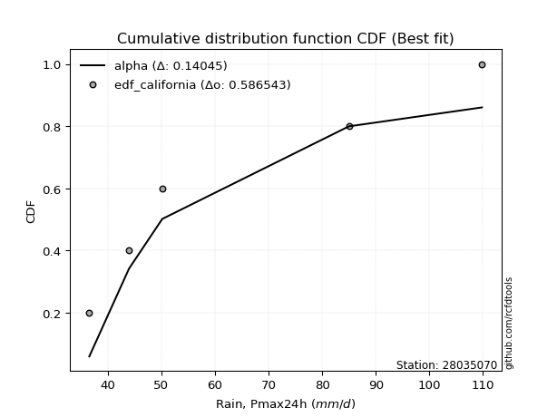</img>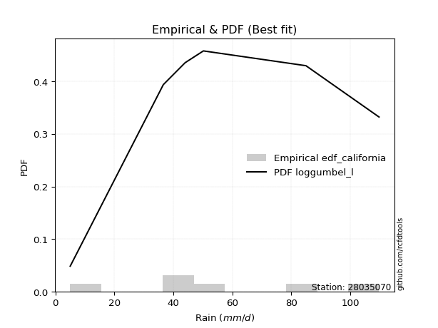</img>

</div>


### 2. EDF Hazen (1930)

Hazen method for plotting positions is a formula used to estimate the empirical cumulative probability distribution of flood events or other hydrological data. This formula often results in biased estimations, particularly when extrapolating to extreme events (high return periods).

<div align="center">


$P=(m-0.5)/n$


</div>


**2.1. Empirical values**

<div align="center">

|                | 0                  | 1                  | 2         | 3                 | 4                  |
|:---------------|:-------------------|:-------------------|:----------|:------------------|:-------------------|
| date           | 2020               | 2023               | 2021      | 2022              | 2019               |
| x              | 36.6               | 44.0               | 50.2      | 85.0              | 109.8              |
| m              | 1                  | 2                  | 3         | 4                 | 5                  |
| empirical_dist | edf_hazen          | edf_hazen          | edf_hazen | edf_hazen         | edf_hazen          |
| empirical      | 0.1                | 0.3                | 0.5       | 0.7               | 0.9                |
| empirical_tr   | 1.1111111111111112 | 1.4285714285714286 | 2.0       | 3.333333333333333 | 10.000000000000002 |

</div>


**2.2. Kolmogorov-Smirnov fit test (sorted by Δ)**


<div align="center">

|                | 0                  | 1                  | 2                   | 3                   | 4                   | 5                   | 6                   | 7                   | 8                   | 9                   | 10                 | 11                 | 12                 | 13                  | 14                  | 15                    | 16                  | 17                  | 18                  | 19                  | 20                 | 21                  | 22                  | 23                  | 24                 | 25                 | 26                  | 27                  | 28                  | 29                  | 30                  | 31                  | 32                  | 33                  | 34                  | 35                 | 36                  | 37                 | 38                  | 39                  | 40                  | 41                 | 42                  | 43                 | 44                  | 45                 | 46                 | 47                  | 48                 | 49                  | 50                  | 51                  | 52                  | 53                  | 54                  | 55                  | 56                  | 57                 | 58                  | 59                 | 60                  | 61                  | 62                  | 63                 | 64                 | 65                  | 66                  | 67                 | 68                  | 69                 | 70                 | 71                  | 72                  | 73                 | 74                  | 75                 | 76                 | 77                 | 78                 | 79                 | 80                 | 81                  | 82                 | 83                 | 84                 | 85                 | 86                 | 87                 |
|:---------------|:-------------------|:-------------------|:--------------------|:--------------------|:--------------------|:--------------------|:--------------------|:--------------------|:--------------------|:--------------------|:-------------------|:-------------------|:-------------------|:--------------------|:--------------------|:----------------------|:--------------------|:--------------------|:--------------------|:--------------------|:-------------------|:--------------------|:--------------------|:--------------------|:-------------------|:-------------------|:--------------------|:--------------------|:--------------------|:--------------------|:--------------------|:--------------------|:--------------------|:--------------------|:--------------------|:-------------------|:--------------------|:-------------------|:--------------------|:--------------------|:--------------------|:-------------------|:--------------------|:-------------------|:--------------------|:-------------------|:-------------------|:--------------------|:-------------------|:--------------------|:--------------------|:--------------------|:--------------------|:--------------------|:--------------------|:--------------------|:--------------------|:-------------------|:--------------------|:-------------------|:--------------------|:--------------------|:--------------------|:-------------------|:-------------------|:--------------------|:--------------------|:-------------------|:--------------------|:-------------------|:-------------------|:--------------------|:--------------------|:-------------------|:--------------------|:-------------------|:-------------------|:-------------------|:-------------------|:-------------------|:-------------------|:--------------------|:-------------------|:-------------------|:-------------------|:-------------------|:-------------------|:-------------------|
| station        | 28035070           | 28035070           | 28035070            | 28035070            | 28035070            | 28035070            | 28035070            | 28035070            | 28035070            | 28035070            | 28035070           | 28035070           | 28035070           | 28035070            | 28035070            | 28035070              | 28035070            | 28035070            | 28035070            | 28035070            | 28035070           | 28035070            | 28035070            | 28035070            | 28035070           | 28035070           | 28035070            | 28035070            | 28035070            | 28035070            | 28035070            | 28035070            | 28035070            | 28035070            | 28035070            | 28035070           | 28035070            | 28035070           | 28035070            | 28035070            | 28035070            | 28035070           | 28035070            | 28035070           | 28035070            | 28035070           | 28035070           | 28035070            | 28035070           | 28035070            | 28035070            | 28035070            | 28035070            | 28035070            | 28035070            | 28035070            | 28035070            | 28035070           | 28035070            | 28035070           | 28035070            | 28035070            | 28035070            | 28035070           | 28035070           | 28035070            | 28035070            | 28035070           | 28035070            | 28035070           | 28035070           | 28035070            | 28035070            | 28035070           | 28035070            | 28035070           | 28035070           | 28035070           | 28035070           | 28035070           | 28035070           | 28035070            | 28035070           | 28035070           | 28035070           | 28035070           | 28035070           | 28035070           |
| empirical_dist | edf_hazen          | edf_hazen          | edf_hazen           | edf_hazen           | edf_hazen           | edf_hazen           | edf_hazen           | edf_hazen           | edf_hazen           | edf_hazen           | edf_hazen          | edf_hazen          | edf_hazen          | edf_hazen           | edf_hazen           | edf_hazen             | edf_hazen           | edf_hazen           | edf_hazen           | edf_hazen           | edf_hazen          | edf_hazen           | edf_hazen           | edf_hazen           | edf_hazen          | edf_hazen          | edf_hazen           | edf_hazen           | edf_hazen           | edf_hazen           | edf_hazen           | edf_hazen           | edf_hazen           | edf_hazen           | edf_hazen           | edf_hazen          | edf_hazen           | edf_hazen          | edf_hazen           | edf_hazen           | edf_hazen           | edf_hazen          | edf_hazen           | edf_hazen          | edf_hazen           | edf_hazen          | edf_hazen          | edf_hazen           | edf_hazen          | edf_hazen           | edf_hazen           | edf_hazen           | edf_hazen           | edf_hazen           | edf_hazen           | edf_hazen           | edf_hazen           | edf_hazen          | edf_hazen           | edf_hazen          | edf_hazen           | edf_hazen           | edf_hazen           | edf_hazen          | edf_hazen          | edf_hazen           | edf_hazen           | edf_hazen          | edf_hazen           | edf_hazen          | edf_hazen          | edf_hazen           | edf_hazen           | edf_hazen          | edf_hazen           | edf_hazen          | edf_hazen          | edf_hazen          | edf_hazen          | edf_hazen          | edf_hazen          | edf_hazen           | edf_hazen          | edf_hazen          | edf_hazen          | edf_hazen          | edf_hazen          | edf_hazen          |
| p_dist         | alpha              | loghalfnorm        | lognakagami         | lograyleigh         | f                   | invgamma            | nct                 | exponnorm           | expon               | laplace_asymmetric  | logexpon           | loggenexpon        | logexponnorm       | loginvgamma         | genexpon            | loglaplace_asymmetric | nakagami            | loginvgauss         | loginvweibull       | logalpha            | mielke             | logncf              | logkstwobign        | loggumbel_r         | logmielke          | loggenlogistic     | logmaxwell          | gompertz            | invgauss            | loghalflogistic     | halfnorm            | halflogistic        | logmoyal            | lognct              | logpearson3         | loggompertz        | betaprime           | ncf                | logf                | logbetaprime        | logrice             | fisk               | logjohnsonsu        | logloggamma        | logt                | lognorm            | lognorm            | moyal               | rayleigh           | genlogistic         | logwald             | gumbel_r            | maxwell             | loglogistic         | pearson3            | kstwobign           | weibull_min         | loghypsecant       | wald                | johnsonsu          | t                   | crystalball         | norm                | truncnorm          | logerlang          | erlang              | loggumbel_l         | logchi2            | rice                | loglaplace         | logistic           | hypsecant           | gumbel_l            | laplace            | logweibull_min      | loggibrat          | gibrat             | fatiguelife        | loggamma           | loggamma           | logfisk            | loglognorm          | logfatiguelife     | invweibull         | gamma              | chi2               | logtruncnorm       | logcrystalball     |
| delta          | 0.0996413464265018 | 0.1109244300616119 | 0.11632989288487305 | 0.11809744551433038 | 0.11982287975770545 | 0.11983889844213924 | 0.12007155355714261 | 0.12034294283036151 | 0.12073045262510923 | 0.12076457698746934 | 0.1219533135662263 | 0.1221656985835976 | 0.1228796164685364 | 0.12357701361278028 | 0.12399034623305161 | 0.12404772772129702   | 0.12446977801736558 | 0.12598494633479662 | 0.12617605583814584 | 0.12671079488576564 | 0.1280515890502386 | 0.12806163012739757 | 0.12893369226021822 | 0.12901141369377178 | 0.1293707950539511 | 0.1298019956226798 | 0.13000721169587975 | 0.13092985948224495 | 0.13105426714749857 | 0.13156819268811182 | 0.13496277188493583 | 0.13758809130580207 | 0.13759777789477257 | 0.13873649187323062 | 0.14374026776853166 | 0.1450403349298851 | 0.14522953121225124 | 0.1465400559644654 | 0.14673779428200712 | 0.15060928000223794 | 0.15181809708094718 | 0.1562469423112191 | 0.15737123073277204 | 0.1591201570014213 | 0.16121114630047428 | 0.1612112985605434 | 0.1612112985605434 | 0.16344377728382398 | 0.1656955306456136 | 0.16819593003458788 | 0.17040830013052563 | 0.17260736851060354 | 0.17658695615464703 | 0.18007698538402017 | 0.18081865972755878 | 0.18239686458270143 | 0.19315192025842315 | 0.1945110240252887 | 0.19635455814074693 | 0.2011823052888474 | 0.20402308490377058 | 0.20403498636667505 | 0.20403498833128575 | 0.2040350066783233 | 0.2082284406353686 | 0.20967580343484882 | 0.21935060640213416 | 0.2195993914979255 | 0.22133438201892525 | 0.2222785129650507 | 0.2255719899598363 | 0.24101719389329584 | 0.25403261401492383 | 0.2657166560314743 | 0.26915463369582354 | 0.297183367403815  | 0.2999988796053279 | 0.3388985784164757 | 0.3464226394229673 | 0.3464226394229673 | 0.3591694098998265 | 0.36643252848604596 | 0.4377887051406228 | 0.4669613101460287 | 0.5253468511899491 | 0.6959171576838272 | 0.6999324162519769 | nan                |
| deltao         | 0.5865427407550001 | 0.5865427407550001 | 0.5865427407550001  | 0.5865427407550001  | 0.5865427407550001  | 0.5865427407550001  | 0.5865427407550001  | 0.5865427407550001  | 0.5865427407550001  | 0.5865427407550001  | 0.5865427407550001 | 0.5865427407550001 | 0.5865427407550001 | 0.5865427407550001  | 0.5865427407550001  | 0.5865427407550001    | 0.5865427407550001  | 0.5865427407550001  | 0.5865427407550001  | 0.5865427407550001  | 0.5865427407550001 | 0.5865427407550001  | 0.5865427407550001  | 0.5865427407550001  | 0.5865427407550001 | 0.5865427407550001 | 0.5865427407550001  | 0.5865427407550001  | 0.5865427407550001  | 0.5865427407550001  | 0.5865427407550001  | 0.5865427407550001  | 0.5865427407550001  | 0.5865427407550001  | 0.5865427407550001  | 0.5865427407550001 | 0.5865427407550001  | 0.5865427407550001 | 0.5865427407550001  | 0.5865427407550001  | 0.5865427407550001  | 0.5865427407550001 | 0.5865427407550001  | 0.5865427407550001 | 0.5865427407550001  | 0.5865427407550001 | 0.5865427407550001 | 0.5865427407550001  | 0.5865427407550001 | 0.5865427407550001  | 0.5865427407550001  | 0.5865427407550001  | 0.5865427407550001  | 0.5865427407550001  | 0.5865427407550001  | 0.5865427407550001  | 0.5865427407550001  | 0.5865427407550001 | 0.5865427407550001  | 0.5865427407550001 | 0.5865427407550001  | 0.5865427407550001  | 0.5865427407550001  | 0.5865427407550001 | 0.5865427407550001 | 0.5865427407550001  | 0.5865427407550001  | 0.5865427407550001 | 0.5865427407550001  | 0.5865427407550001 | 0.5865427407550001 | 0.5865427407550001  | 0.5865427407550001  | 0.5865427407550001 | 0.5865427407550001  | 0.5865427407550001 | 0.5865427407550001 | 0.5865427407550001 | 0.5865427407550001 | 0.5865427407550001 | 0.5865427407550001 | 0.5865427407550001  | 0.5865427407550001 | 0.5865427407550001 | 0.5865427407550001 | 0.5865427407550001 | 0.5865427407550001 | 0.5865427407550001 |
| eval           | Δo > Δ             | Δo > Δ             | Δo > Δ              | Δo > Δ              | Δo > Δ              | Δo > Δ              | Δo > Δ              | Δo > Δ              | Δo > Δ              | Δo > Δ              | Δo > Δ             | Δo > Δ             | Δo > Δ             | Δo > Δ              | Δo > Δ              | Δo > Δ                | Δo > Δ              | Δo > Δ              | Δo > Δ              | Δo > Δ              | Δo > Δ             | Δo > Δ              | Δo > Δ              | Δo > Δ              | Δo > Δ             | Δo > Δ             | Δo > Δ              | Δo > Δ              | Δo > Δ              | Δo > Δ              | Δo > Δ              | Δo > Δ              | Δo > Δ              | Δo > Δ              | Δo > Δ              | Δo > Δ             | Δo > Δ              | Δo > Δ             | Δo > Δ              | Δo > Δ              | Δo > Δ              | Δo > Δ             | Δo > Δ              | Δo > Δ             | Δo > Δ              | Δo > Δ             | Δo > Δ             | Δo > Δ              | Δo > Δ             | Δo > Δ              | Δo > Δ              | Δo > Δ              | Δo > Δ              | Δo > Δ              | Δo > Δ              | Δo > Δ              | Δo > Δ              | Δo > Δ             | Δo > Δ              | Δo > Δ             | Δo > Δ              | Δo > Δ              | Δo > Δ              | Δo > Δ             | Δo > Δ             | Δo > Δ              | Δo > Δ              | Δo > Δ             | Δo > Δ              | Δo > Δ             | Δo > Δ             | Δo > Δ              | Δo > Δ              | Δo > Δ             | Δo > Δ              | Δo > Δ             | Δo > Δ             | Δo > Δ             | Δo > Δ             | Δo > Δ             | Δo > Δ             | Δo > Δ              | Δo > Δ             | Δo > Δ             | Δo > Δ             | Δo <= Δ            | Δo <= Δ            | Δo <= Δ            |
| fit            | 1                  | 1                  | 1                   | 1                   | 1                   | 1                   | 1                   | 1                   | 1                   | 1                   | 1                  | 1                  | 1                  | 1                   | 1                   | 1                     | 1                   | 1                   | 1                   | 1                   | 1                  | 1                   | 1                   | 1                   | 1                  | 1                  | 1                   | 1                   | 1                   | 1                   | 1                   | 1                   | 1                   | 1                   | 1                   | 1                  | 1                   | 1                  | 1                   | 1                   | 1                   | 1                  | 1                   | 1                  | 1                   | 1                  | 1                  | 1                   | 1                  | 1                   | 1                   | 1                   | 1                   | 1                   | 1                   | 1                   | 1                   | 1                  | 1                   | 1                  | 1                   | 1                   | 1                   | 1                  | 1                  | 1                   | 1                   | 1                  | 1                   | 1                  | 1                  | 1                   | 1                   | 1                  | 1                   | 1                  | 1                  | 1                  | 1                  | 1                  | 1                  | 1                   | 1                  | 1                  | 1                  | 0                  | 0                  | 0                  |
| n              | 5                  | 5                  | 5                   | 5                   | 5                   | 5                   | 5                   | 5                   | 5                   | 5                   | 5                  | 5                  | 5                  | 5                   | 5                   | 5                     | 5                   | 5                   | 5                   | 5                   | 5                  | 5                   | 5                   | 5                   | 5                  | 5                  | 5                   | 5                   | 5                   | 5                   | 5                   | 5                   | 5                   | 5                   | 5                   | 5                  | 5                   | 5                  | 5                   | 5                   | 5                   | 5                  | 5                   | 5                  | 5                   | 5                  | 5                  | 5                   | 5                  | 5                   | 5                   | 5                   | 5                   | 5                   | 5                   | 5                   | 5                   | 5                  | 5                   | 5                  | 5                   | 5                   | 5                   | 5                  | 5                  | 5                   | 5                   | 5                  | 5                   | 5                  | 5                  | 5                   | 5                   | 5                  | 5                   | 5                  | 5                  | 5                  | 5                  | 5                  | 5                  | 5                   | 5                  | 5                  | 5                  | 5                  | 5                  | 5                  |
| best_fit       | 1                  | 0                  | 0                   | 0                   | 0                   | 0                   | 0                   | 0                   | 0                   | 0                   | 0                  | 0                  | 0                  | 0                   | 0                   | 0                     | 0                   | 0                   | 0                   | 0                   | 0                  | 0                   | 0                   | 0                   | 0                  | 0                  | 0                   | 0                   | 0                   | 0                   | 0                   | 0                   | 0                   | 0                   | 0                   | 0                  | 0                   | 0                  | 0                   | 0                   | 0                   | 0                  | 0                   | 0                  | 0                   | 0                  | 0                  | 0                   | 0                  | 0                   | 0                   | 0                   | 0                   | 0                   | 0                   | 0                   | 0                   | 0                  | 0                   | 0                  | 0                   | 0                   | 0                   | 0                  | 0                  | 0                   | 0                   | 0                  | 0                   | 0                  | 0                  | 0                   | 0                   | 0                  | 0                   | 0                  | 0                  | 0                  | 0                  | 0                  | 0                  | 0                   | 0                  | 0                  | 0                  | 0                  | 0                  | 0                  |
| best_fit_sort  | 1                  | 2                  | 3                   | 4                   | 5                   | 6                   | 7                   | 8                   | 9                   | 10                  | 11                 | 12                 | 13                 | 14                  | 15                  | 16                    | 17                  | 18                  | 19                  | 20                  | 21                 | 22                  | 23                  | 24                  | 25                 | 26                 | 27                  | 28                  | 29                  | 30                  | 31                  | 32                  | 33                  | 34                  | 35                  | 36                 | 37                  | 38                 | 39                  | 40                  | 41                  | 42                 | 43                  | 44                 | 45                  | 46                 | 47                 | 48                  | 49                 | 50                  | 51                  | 52                  | 53                  | 54                  | 55                  | 56                  | 57                  | 58                 | 59                  | 60                 | 61                  | 62                  | 63                  | 64                 | 65                 | 66                  | 67                  | 68                 | 69                  | 70                 | 71                 | 72                  | 73                  | 74                 | 75                  | 76                 | 77                 | 78                 | 79                 | 80                 | 81                 | 82                  | 83                 | 84                 | 85                 | 86                 | 87                 | 88                 |

</div>


**2.3. Best fit**

<div align="center">

|   id |   station | empirical_dist   | p_dist   |     delta |   deltao | eval   |   fit |   n |   best_fit |   best_fit_sort |
|-----:|----------:|:-----------------|:---------|----------:|---------:|:-------|------:|----:|-----------:|----------------:|
|    0 |  28035070 | edf_hazen        | alpha    | 0.0996413 | 0.586543 | Δo > Δ |     1 |   5 |          1 |               1 |

</div>


<div align="center">

</img>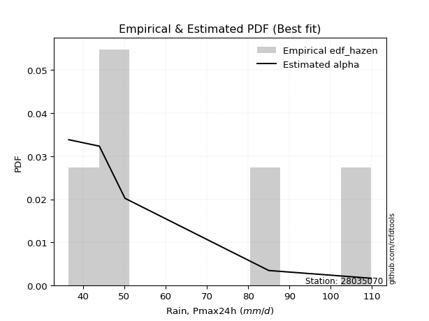</img>

</div>


### 3. EDF Weibull (1939)

Weibull plotting position formula is an empirical method used to estimate the non-exceedance probability or plotting position for a set of observed data, is often recommended or widely used in practice, particularly in flood frequency analysis.

<div align="center">


$P=m/(n+1)$


</div>


**3.1. Empirical values**

<div align="center">

|                | 0                   | 1                  | 2           | 3                  | 4                  |
|:---------------|:--------------------|:-------------------|:------------|:-------------------|:-------------------|
| date           | 2020                | 2023               | 2021        | 2022               | 2019               |
| x              | 36.6                | 44.0               | 50.2        | 85.0               | 109.8              |
| m              | 1                   | 2                  | 3           | 4                  | 5                  |
| empirical_dist | edf_weibull         | edf_weibull        | edf_weibull | edf_weibull        | edf_weibull        |
| empirical      | 0.16666666666666666 | 0.3333333333333333 | 0.5         | 0.6666666666666666 | 0.8333333333333334 |
| empirical_tr   | 1.2                 | 1.4999999999999998 | 2.0         | 2.9999999999999996 | 6.000000000000002  |

</div>


**3.2. Kolmogorov-Smirnov fit test (sorted by Δ)**


<div align="center">

|                | 0                   | 1                   | 2                   | 3                  | 4                   | 5                   | 6                   | 7                   | 8                   | 9                  | 10                 | 11                  | 12                  | 13                  | 14                  | 15                  | 16                  | 17                 | 18                  | 19                    | 20                 | 21                  | 22                  | 23                  | 24                  | 25                 | 26                 | 27                  | 28                  | 29                 | 30                  | 31                  | 32                  | 33                 | 34                  | 35                 | 36                  | 37                 | 38                  | 39                  | 40                 | 41                  | 42                  | 43                  | 44                  | 45                  | 46                 | 47                  | 48                  | 49                  | 50                 | 51                  | 52                  | 53                  | 54                  | 55                  | 56                  | 57                 | 58                 | 59                  | 60                  | 61                  | 62                  | 63                 | 64                  | 65                  | 66                 | 67                 | 68                  | 69                  | 70                  | 71                  | 72                  | 73                  | 74                 | 75                  | 76                  | 77                 | 78                 | 79                  | 80                  | 81                 | 82                  | 83                  | 84                 | 85                 | 86                 | 87                 |
|:---------------|:--------------------|:--------------------|:--------------------|:-------------------|:--------------------|:--------------------|:--------------------|:--------------------|:--------------------|:-------------------|:-------------------|:--------------------|:--------------------|:--------------------|:--------------------|:--------------------|:--------------------|:-------------------|:--------------------|:----------------------|:-------------------|:--------------------|:--------------------|:--------------------|:--------------------|:-------------------|:-------------------|:--------------------|:--------------------|:-------------------|:--------------------|:--------------------|:--------------------|:-------------------|:--------------------|:-------------------|:--------------------|:-------------------|:--------------------|:--------------------|:-------------------|:--------------------|:--------------------|:--------------------|:--------------------|:--------------------|:-------------------|:--------------------|:--------------------|:--------------------|:-------------------|:--------------------|:--------------------|:--------------------|:--------------------|:--------------------|:--------------------|:-------------------|:-------------------|:--------------------|:--------------------|:--------------------|:--------------------|:-------------------|:--------------------|:--------------------|:-------------------|:-------------------|:--------------------|:--------------------|:--------------------|:--------------------|:--------------------|:--------------------|:-------------------|:--------------------|:--------------------|:-------------------|:-------------------|:--------------------|:--------------------|:-------------------|:--------------------|:--------------------|:-------------------|:-------------------|:-------------------|:-------------------|
| station        | 28035070            | 28035070            | 28035070            | 28035070           | 28035070            | 28035070            | 28035070            | 28035070            | 28035070            | 28035070           | 28035070           | 28035070            | 28035070            | 28035070            | 28035070            | 28035070            | 28035070            | 28035070           | 28035070            | 28035070              | 28035070           | 28035070            | 28035070            | 28035070            | 28035070            | 28035070           | 28035070           | 28035070            | 28035070            | 28035070           | 28035070            | 28035070            | 28035070            | 28035070           | 28035070            | 28035070           | 28035070            | 28035070           | 28035070            | 28035070            | 28035070           | 28035070            | 28035070            | 28035070            | 28035070            | 28035070            | 28035070           | 28035070            | 28035070            | 28035070            | 28035070           | 28035070            | 28035070            | 28035070            | 28035070            | 28035070            | 28035070            | 28035070           | 28035070           | 28035070            | 28035070            | 28035070            | 28035070            | 28035070           | 28035070            | 28035070            | 28035070           | 28035070           | 28035070            | 28035070            | 28035070            | 28035070            | 28035070            | 28035070            | 28035070           | 28035070            | 28035070            | 28035070           | 28035070           | 28035070            | 28035070            | 28035070           | 28035070            | 28035070            | 28035070           | 28035070           | 28035070           | 28035070           |
| empirical_dist | edf_weibull         | edf_weibull         | edf_weibull         | edf_weibull        | edf_weibull         | edf_weibull         | edf_weibull         | edf_weibull         | edf_weibull         | edf_weibull        | edf_weibull        | edf_weibull         | edf_weibull         | edf_weibull         | edf_weibull         | edf_weibull         | edf_weibull         | edf_weibull        | edf_weibull         | edf_weibull           | edf_weibull        | edf_weibull         | edf_weibull         | edf_weibull         | edf_weibull         | edf_weibull        | edf_weibull        | edf_weibull         | edf_weibull         | edf_weibull        | edf_weibull         | edf_weibull         | edf_weibull         | edf_weibull        | edf_weibull         | edf_weibull        | edf_weibull         | edf_weibull        | edf_weibull         | edf_weibull         | edf_weibull        | edf_weibull         | edf_weibull         | edf_weibull         | edf_weibull         | edf_weibull         | edf_weibull        | edf_weibull         | edf_weibull         | edf_weibull         | edf_weibull        | edf_weibull         | edf_weibull         | edf_weibull         | edf_weibull         | edf_weibull         | edf_weibull         | edf_weibull        | edf_weibull        | edf_weibull         | edf_weibull         | edf_weibull         | edf_weibull         | edf_weibull        | edf_weibull         | edf_weibull         | edf_weibull        | edf_weibull        | edf_weibull         | edf_weibull         | edf_weibull         | edf_weibull         | edf_weibull         | edf_weibull         | edf_weibull        | edf_weibull         | edf_weibull         | edf_weibull        | edf_weibull        | edf_weibull         | edf_weibull         | edf_weibull        | edf_weibull         | edf_weibull         | edf_weibull        | edf_weibull        | edf_weibull        | edf_weibull        |
| p_dist         | alpha               | halfnorm            | logncf              | halflogistic       | logmaxwell          | lograyleigh         | logpearson3         | loghalfnorm         | betaprime           | lognct             | ncf                | logf                | logbetaprime        | logrice             | f                   | invgamma            | nct                 | loginvgamma        | logjohnsonsu        | loglaplace_asymmetric | logloggamma        | loginvgauss         | loginvweibull       | logalpha            | logt                | lognorm            | lognorm            | mielke              | logkstwobign        | loggumbel_r        | logmielke           | loggenlogistic      | moyal               | invgauss           | loghalflogistic     | exponnorm          | logexponnorm        | rayleigh           | laplace_asymmetric  | logchi2             | lognakagami        | loggompertz         | loggenexpon         | nakagami            | fisk                | genexpon            | gompertz           | expon               | logexpon            | genlogistic         | logmoyal           | gumbel_r            | maxwell             | loglogistic         | pearson3            | kstwobign           | weibull_min         | loghypsecant       | johnsonsu          | logwald             | t                   | crystalball         | norm                | truncnorm          | loggumbel_l         | rice                | loglaplace         | logistic           | wald                | logweibull_min      | hypsecant           | logerlang           | erlang              | gumbel_l            | laplace            | logfisk             | fatiguelife         | loggamma           | loggamma           | loggibrat           | loglognorm          | gibrat             | invweibull          | logfatiguelife      | gamma              | chi2               | logtruncnorm       | logcrystalball     |
| delta          | 0.13297467975983512 | 0.13496277188493583 | 0.13655251161745063 | 0.1376960952104832 | 0.13950500896968443 | 0.14019965850836758 | 0.14374026776853166 | 0.14425776339494523 | 0.14524104955082684 | 0.1464466110434075 | 0.1465400559644654 | 0.14673779428200712 | 0.15060928000223794 | 0.15181809708094718 | 0.15315621309103877 | 0.15317223177547257 | 0.15340488689047593 | 0.1569103469461136 | 0.15737123073277204 | 0.15738106105463034   | 0.1591201570014213 | 0.15931827966812995 | 0.15950938917147917 | 0.16004412821909897 | 0.16121114630047428 | 0.1612112985605434 | 0.1612112985605434 | 0.16138492238357194 | 0.16226702559355155 | 0.1623447470271051 | 0.16270412838728443 | 0.16313532895601313 | 0.16344377728382398 | 0.1643876004808319 | 0.16490152602144514 | 0.165601427750294  | 0.16562021258992446 | 0.1656955306456136 | 0.16666664414281232 | 0.16666666095900773 | 0.1666666641759314 | 0.16666666556483062 | 0.16666666625193816 | 0.16666666655705897 | 0.16666666663327162 | 0.16666666666536992 | 0.1666666666666664 | 0.16666666666666666 | 0.16666666666666666 | 0.16819593003458788 | 0.1709311112281059 | 0.17260736851060354 | 0.17658695615464703 | 0.18007698538402017 | 0.18081865972755878 | 0.18239686458270143 | 0.19315192025842315 | 0.1945110240252887 | 0.2011823052888474 | 0.20374163346385896 | 0.20402308490377058 | 0.20403498636667505 | 0.20403498833128575 | 0.2040350066783233 | 0.21935060640213416 | 0.22133438201892525 | 0.2222785129650507 | 0.2255719899598363 | 0.22968789147408025 | 0.23582130036249022 | 0.24101719389329584 | 0.24156177396870193 | 0.24300913676818214 | 0.25403261401492383 | 0.2657166560314743 | 0.29250274323315983 | 0.30556524508314237 | 0.313089306089634  | 0.313089306089634  | 0.33051670073714834 | 0.33309919515271263 | 0.3333322129386612 | 0.40029464347936206 | 0.40445537180728947 | 0.4920135178566157 | 0.662583824350494  | 0.6665990829186436 | nan                |
| deltao         | 0.5865427407550001  | 0.5865427407550001  | 0.5865427407550001  | 0.5865427407550001 | 0.5865427407550001  | 0.5865427407550001  | 0.5865427407550001  | 0.5865427407550001  | 0.5865427407550001  | 0.5865427407550001 | 0.5865427407550001 | 0.5865427407550001  | 0.5865427407550001  | 0.5865427407550001  | 0.5865427407550001  | 0.5865427407550001  | 0.5865427407550001  | 0.5865427407550001 | 0.5865427407550001  | 0.5865427407550001    | 0.5865427407550001 | 0.5865427407550001  | 0.5865427407550001  | 0.5865427407550001  | 0.5865427407550001  | 0.5865427407550001 | 0.5865427407550001 | 0.5865427407550001  | 0.5865427407550001  | 0.5865427407550001 | 0.5865427407550001  | 0.5865427407550001  | 0.5865427407550001  | 0.5865427407550001 | 0.5865427407550001  | 0.5865427407550001 | 0.5865427407550001  | 0.5865427407550001 | 0.5865427407550001  | 0.5865427407550001  | 0.5865427407550001 | 0.5865427407550001  | 0.5865427407550001  | 0.5865427407550001  | 0.5865427407550001  | 0.5865427407550001  | 0.5865427407550001 | 0.5865427407550001  | 0.5865427407550001  | 0.5865427407550001  | 0.5865427407550001 | 0.5865427407550001  | 0.5865427407550001  | 0.5865427407550001  | 0.5865427407550001  | 0.5865427407550001  | 0.5865427407550001  | 0.5865427407550001 | 0.5865427407550001 | 0.5865427407550001  | 0.5865427407550001  | 0.5865427407550001  | 0.5865427407550001  | 0.5865427407550001 | 0.5865427407550001  | 0.5865427407550001  | 0.5865427407550001 | 0.5865427407550001 | 0.5865427407550001  | 0.5865427407550001  | 0.5865427407550001  | 0.5865427407550001  | 0.5865427407550001  | 0.5865427407550001  | 0.5865427407550001 | 0.5865427407550001  | 0.5865427407550001  | 0.5865427407550001 | 0.5865427407550001 | 0.5865427407550001  | 0.5865427407550001  | 0.5865427407550001 | 0.5865427407550001  | 0.5865427407550001  | 0.5865427407550001 | 0.5865427407550001 | 0.5865427407550001 | 0.5865427407550001 |
| eval           | Δo > Δ              | Δo > Δ              | Δo > Δ              | Δo > Δ             | Δo > Δ              | Δo > Δ              | Δo > Δ              | Δo > Δ              | Δo > Δ              | Δo > Δ             | Δo > Δ             | Δo > Δ              | Δo > Δ              | Δo > Δ              | Δo > Δ              | Δo > Δ              | Δo > Δ              | Δo > Δ             | Δo > Δ              | Δo > Δ                | Δo > Δ             | Δo > Δ              | Δo > Δ              | Δo > Δ              | Δo > Δ              | Δo > Δ             | Δo > Δ             | Δo > Δ              | Δo > Δ              | Δo > Δ             | Δo > Δ              | Δo > Δ              | Δo > Δ              | Δo > Δ             | Δo > Δ              | Δo > Δ             | Δo > Δ              | Δo > Δ             | Δo > Δ              | Δo > Δ              | Δo > Δ             | Δo > Δ              | Δo > Δ              | Δo > Δ              | Δo > Δ              | Δo > Δ              | Δo > Δ             | Δo > Δ              | Δo > Δ              | Δo > Δ              | Δo > Δ             | Δo > Δ              | Δo > Δ              | Δo > Δ              | Δo > Δ              | Δo > Δ              | Δo > Δ              | Δo > Δ             | Δo > Δ             | Δo > Δ              | Δo > Δ              | Δo > Δ              | Δo > Δ              | Δo > Δ             | Δo > Δ              | Δo > Δ              | Δo > Δ             | Δo > Δ             | Δo > Δ              | Δo > Δ              | Δo > Δ              | Δo > Δ              | Δo > Δ              | Δo > Δ              | Δo > Δ             | Δo > Δ              | Δo > Δ              | Δo > Δ             | Δo > Δ             | Δo > Δ              | Δo > Δ              | Δo > Δ             | Δo > Δ              | Δo > Δ              | Δo > Δ             | Δo <= Δ            | Δo <= Δ            | Δo <= Δ            |
| fit            | 1                   | 1                   | 1                   | 1                  | 1                   | 1                   | 1                   | 1                   | 1                   | 1                  | 1                  | 1                   | 1                   | 1                   | 1                   | 1                   | 1                   | 1                  | 1                   | 1                     | 1                  | 1                   | 1                   | 1                   | 1                   | 1                  | 1                  | 1                   | 1                   | 1                  | 1                   | 1                   | 1                   | 1                  | 1                   | 1                  | 1                   | 1                  | 1                   | 1                   | 1                  | 1                   | 1                   | 1                   | 1                   | 1                   | 1                  | 1                   | 1                   | 1                   | 1                  | 1                   | 1                   | 1                   | 1                   | 1                   | 1                   | 1                  | 1                  | 1                   | 1                   | 1                   | 1                   | 1                  | 1                   | 1                   | 1                  | 1                  | 1                   | 1                   | 1                   | 1                   | 1                   | 1                   | 1                  | 1                   | 1                   | 1                  | 1                  | 1                   | 1                   | 1                  | 1                   | 1                   | 1                  | 0                  | 0                  | 0                  |
| n              | 5                   | 5                   | 5                   | 5                  | 5                   | 5                   | 5                   | 5                   | 5                   | 5                  | 5                  | 5                   | 5                   | 5                   | 5                   | 5                   | 5                   | 5                  | 5                   | 5                     | 5                  | 5                   | 5                   | 5                   | 5                   | 5                  | 5                  | 5                   | 5                   | 5                  | 5                   | 5                   | 5                   | 5                  | 5                   | 5                  | 5                   | 5                  | 5                   | 5                   | 5                  | 5                   | 5                   | 5                   | 5                   | 5                   | 5                  | 5                   | 5                   | 5                   | 5                  | 5                   | 5                   | 5                   | 5                   | 5                   | 5                   | 5                  | 5                  | 5                   | 5                   | 5                   | 5                   | 5                  | 5                   | 5                   | 5                  | 5                  | 5                   | 5                   | 5                   | 5                   | 5                   | 5                   | 5                  | 5                   | 5                   | 5                  | 5                  | 5                   | 5                   | 5                  | 5                   | 5                   | 5                  | 5                  | 5                  | 5                  |
| best_fit       | 1                   | 0                   | 0                   | 0                  | 0                   | 0                   | 0                   | 0                   | 0                   | 0                  | 0                  | 0                   | 0                   | 0                   | 0                   | 0                   | 0                   | 0                  | 0                   | 0                     | 0                  | 0                   | 0                   | 0                   | 0                   | 0                  | 0                  | 0                   | 0                   | 0                  | 0                   | 0                   | 0                   | 0                  | 0                   | 0                  | 0                   | 0                  | 0                   | 0                   | 0                  | 0                   | 0                   | 0                   | 0                   | 0                   | 0                  | 0                   | 0                   | 0                   | 0                  | 0                   | 0                   | 0                   | 0                   | 0                   | 0                   | 0                  | 0                  | 0                   | 0                   | 0                   | 0                   | 0                  | 0                   | 0                   | 0                  | 0                  | 0                   | 0                   | 0                   | 0                   | 0                   | 0                   | 0                  | 0                   | 0                   | 0                  | 0                  | 0                   | 0                   | 0                  | 0                   | 0                   | 0                  | 0                  | 0                  | 0                  |
| best_fit_sort  | 1                   | 2                   | 3                   | 4                  | 5                   | 6                   | 7                   | 8                   | 9                   | 10                 | 11                 | 12                  | 13                  | 14                  | 15                  | 16                  | 17                  | 18                 | 19                  | 20                    | 21                 | 22                  | 23                  | 24                  | 25                  | 26                 | 27                 | 28                  | 29                  | 30                 | 31                  | 32                  | 33                  | 34                 | 35                  | 36                 | 37                  | 38                 | 39                  | 40                  | 41                 | 42                  | 43                  | 44                  | 45                  | 46                  | 47                 | 48                  | 49                  | 50                  | 51                 | 52                  | 53                  | 54                  | 55                  | 56                  | 57                  | 58                 | 59                 | 60                  | 61                  | 62                  | 63                  | 64                 | 65                  | 66                  | 67                 | 68                 | 69                  | 70                  | 71                  | 72                  | 73                  | 74                  | 75                 | 76                  | 77                  | 78                 | 79                 | 80                  | 81                  | 82                 | 83                  | 84                  | 85                 | 86                 | 87                 | 88                 |

</div>


**3.3. Best fit**

<div align="center">

|   id |   station | empirical_dist   | p_dist   |    delta |   deltao | eval   |   fit |   n |   best_fit |   best_fit_sort |
|-----:|----------:|:-----------------|:---------|---------:|---------:|:-------|------:|----:|-----------:|----------------:|
|    0 |  28035070 | edf_weibull      | alpha    | 0.132975 | 0.586543 | Δo > Δ |     1 |   5 |          1 |               1 |

</div>


<div align="center">

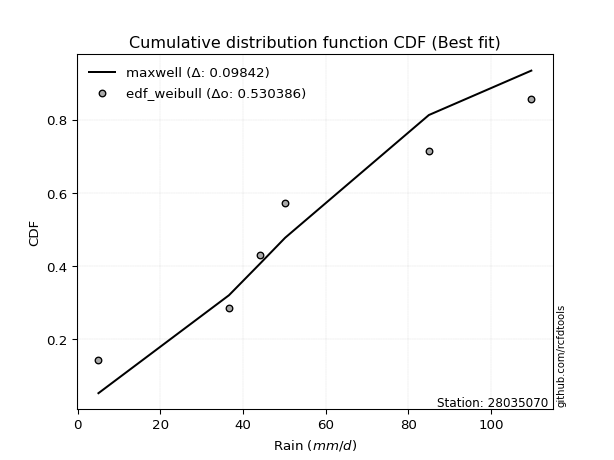</img></img>

</div>


### 4. EDF Beard (1943)

The Beard formula (or Beard´s plotting position formula) in hydrology is used to estimate the empirical non-exceedance probability _(P)_ of a flood event (or other extreme hydrological data point) within a given dataset.

<div align="center">


$P=(m-0.31)/(n+0.38)$


</div>


**4.1. Empirical values**

<div align="center">

|                | 0                   | 1                  | 2         | 3                  | 4                  |
|:---------------|:--------------------|:-------------------|:----------|:-------------------|:-------------------|
| date           | 2020                | 2023               | 2021      | 2022               | 2019               |
| x              | 36.6                | 44.0               | 50.2      | 85.0               | 109.8              |
| m              | 1                   | 2                  | 3         | 4                  | 5                  |
| empirical_dist | edf_beard           | edf_beard          | edf_beard | edf_beard          | edf_beard          |
| empirical      | 0.12825278810408922 | 0.3141263940520446 | 0.5       | 0.6858736059479554 | 0.8717472118959109 |
| empirical_tr   | 1.1471215351812367  | 1.4579945799457996 | 2.0       | 3.183431952662722  | 7.797101449275368  |

</div>


**4.2. Kolmogorov-Smirnov fit test (sorted by Δ)**


<div align="center">

|                | 0                   | 1                   | 2                   | 3                   | 4                   | 5                   | 6                  | 7                   | 8                   | 9                   | 10                  | 11                  | 12                  | 13                  | 14                  | 15                  | 16                  | 17                  | 18                  | 19                 | 20                    | 21                 | 22                  | 23                  | 24                  | 25                  | 26                  | 27                  | 28                  | 29                 | 30                  | 31                  | 32                  | 33                 | 34                 | 35                  | 36                  | 37                 | 38                  | 39                  | 40                 | 41                  | 42                  | 43                 | 44                  | 45                 | 46                 | 47                  | 48                 | 49                  | 50                  | 51                  | 52                  | 53                  | 54                  | 55                  | 56                  | 57                  | 58                 | 59                 | 60                  | 61                  | 62                  | 63                 | 64                  | 65                  | 66                  | 67                 | 68                  | 69                  | 70                 | 71                  | 72                  | 73                 | 74                 | 75                  | 76                  | 77                  | 78                  | 79                  | 80                  | 81                  | 82                  | 83                  | 84                 | 85                 | 86                 | 87                 |
|:---------------|:--------------------|:--------------------|:--------------------|:--------------------|:--------------------|:--------------------|:-------------------|:--------------------|:--------------------|:--------------------|:--------------------|:--------------------|:--------------------|:--------------------|:--------------------|:--------------------|:--------------------|:--------------------|:--------------------|:-------------------|:----------------------|:-------------------|:--------------------|:--------------------|:--------------------|:--------------------|:--------------------|:--------------------|:--------------------|:-------------------|:--------------------|:--------------------|:--------------------|:-------------------|:-------------------|:--------------------|:--------------------|:-------------------|:--------------------|:--------------------|:-------------------|:--------------------|:--------------------|:-------------------|:--------------------|:-------------------|:-------------------|:--------------------|:-------------------|:--------------------|:--------------------|:--------------------|:--------------------|:--------------------|:--------------------|:--------------------|:--------------------|:--------------------|:-------------------|:-------------------|:--------------------|:--------------------|:--------------------|:-------------------|:--------------------|:--------------------|:--------------------|:-------------------|:--------------------|:--------------------|:-------------------|:--------------------|:--------------------|:-------------------|:-------------------|:--------------------|:--------------------|:--------------------|:--------------------|:--------------------|:--------------------|:--------------------|:--------------------|:--------------------|:-------------------|:-------------------|:-------------------|:-------------------|
| station        | 28035070            | 28035070            | 28035070            | 28035070            | 28035070            | 28035070            | 28035070           | 28035070            | 28035070            | 28035070            | 28035070            | 28035070            | 28035070            | 28035070            | 28035070            | 28035070            | 28035070            | 28035070            | 28035070            | 28035070           | 28035070              | 28035070           | 28035070            | 28035070            | 28035070            | 28035070            | 28035070            | 28035070            | 28035070            | 28035070           | 28035070            | 28035070            | 28035070            | 28035070           | 28035070           | 28035070            | 28035070            | 28035070           | 28035070            | 28035070            | 28035070           | 28035070            | 28035070            | 28035070           | 28035070            | 28035070           | 28035070           | 28035070            | 28035070           | 28035070            | 28035070            | 28035070            | 28035070            | 28035070            | 28035070            | 28035070            | 28035070            | 28035070            | 28035070           | 28035070           | 28035070            | 28035070            | 28035070            | 28035070           | 28035070            | 28035070            | 28035070            | 28035070           | 28035070            | 28035070            | 28035070           | 28035070            | 28035070            | 28035070           | 28035070           | 28035070            | 28035070            | 28035070            | 28035070            | 28035070            | 28035070            | 28035070            | 28035070            | 28035070            | 28035070           | 28035070           | 28035070           | 28035070           |
| empirical_dist | edf_beard           | edf_beard           | edf_beard           | edf_beard           | edf_beard           | edf_beard           | edf_beard          | edf_beard           | edf_beard           | edf_beard           | edf_beard           | edf_beard           | edf_beard           | edf_beard           | edf_beard           | edf_beard           | edf_beard           | edf_beard           | edf_beard           | edf_beard          | edf_beard             | edf_beard          | edf_beard           | edf_beard           | edf_beard           | edf_beard           | edf_beard           | edf_beard           | edf_beard           | edf_beard          | edf_beard           | edf_beard           | edf_beard           | edf_beard          | edf_beard          | edf_beard           | edf_beard           | edf_beard          | edf_beard           | edf_beard           | edf_beard          | edf_beard           | edf_beard           | edf_beard          | edf_beard           | edf_beard          | edf_beard          | edf_beard           | edf_beard          | edf_beard           | edf_beard           | edf_beard           | edf_beard           | edf_beard           | edf_beard           | edf_beard           | edf_beard           | edf_beard           | edf_beard          | edf_beard          | edf_beard           | edf_beard           | edf_beard           | edf_beard          | edf_beard           | edf_beard           | edf_beard           | edf_beard          | edf_beard           | edf_beard           | edf_beard          | edf_beard           | edf_beard           | edf_beard          | edf_beard          | edf_beard           | edf_beard           | edf_beard           | edf_beard           | edf_beard           | edf_beard           | edf_beard           | edf_beard           | edf_beard           | edf_beard          | edf_beard          | edf_beard          | edf_beard          |
| p_dist         | alpha               | lograyleigh         | loghalfnorm         | logncf              | lognakagami         | logmaxwell          | genexpon           | exponnorm           | laplace_asymmetric  | expon               | gompertz            | f                   | invgamma            | nct                 | halfnorm            | logexpon            | loggenexpon         | logexponnorm        | halflogistic        | loginvgamma        | loglaplace_asymmetric | nakagami           | lognct              | loginvgauss         | loginvweibull       | logalpha            | fisk                | mielke              | logkstwobign        | loggumbel_r        | logmielke           | logpearson3         | loggenlogistic      | loggompertz        | invgauss           | betaprime           | loghalflogistic     | ncf                | logf                | logbetaprime        | logmoyal           | logrice             | logjohnsonsu        | logloggamma        | logt                | lognorm            | lognorm            | moyal               | rayleigh           | genlogistic         | gumbel_r            | maxwell             | loglogistic         | pearson3            | kstwobign           | logwald             | logchi2             | weibull_min         | loghypsecant       | johnsonsu          | t                   | crystalball         | norm                | truncnorm          | wald                | loggumbel_l         | rice                | loglaplace         | logerlang           | erlang              | logistic           | hypsecant           | gumbel_l            | logweibull_min     | laplace            | loggibrat           | gibrat              | fatiguelife         | logfisk             | loggamma            | loggamma            | loglognorm          | logfatiguelife      | invweibull          | gamma              | chi2               | logtruncnorm       | logcrystalball     |
| delta          | 0.11376774047854632 | 0.12099271922707877 | 0.12505082411365642 | 0.12806163012739757 | 0.12825278561335396 | 0.13000721169587975 | 0.1303237443472115 | 0.13081150607421665 | 0.13086815922562423 | 0.13090401878395497 | 0.13092985948224495 | 0.13394927380974997 | 0.13396529249418376 | 0.13419794760918713 | 0.13496277188493583 | 0.13607970761827082 | 0.13629209263564213 | 0.13700601052058092 | 0.13758809130580207 | 0.1377034076648248 | 0.13817412177334154   | 0.1385961720694101 | 0.13873649187323062 | 0.14011134038684114 | 0.14030244989019036 | 0.14083718893781016 | 0.14212054825917447 | 0.14217798310228313 | 0.14306008631226275 | 0.1431378077458163 | 0.14349718910599563 | 0.14374026776853166 | 0.14392838967472432 | 0.1450403349298851 | 0.1451806611995431 | 0.14522953121225124 | 0.14569458674015634 | 0.1465400559644654 | 0.14673779428200712 | 0.15060928000223794 | 0.1517241719468171 | 0.15181809708094718 | 0.15737123073277204 | 0.1591201570014213 | 0.16121114630047428 | 0.1612112985605434 | 0.1612112985605434 | 0.16344377728382398 | 0.1656955306456136 | 0.16819593003458788 | 0.17260736851060354 | 0.17658695615464703 | 0.18007698538402017 | 0.18081865972755878 | 0.18239686458270143 | 0.18453469418257026 | 0.19134660339383636 | 0.19315192025842315 | 0.1945110240252887 | 0.2011823052888474 | 0.20402308490377058 | 0.20403498636667505 | 0.20403498833128575 | 0.2040350066783233 | 0.21048095219279156 | 0.21935060640213416 | 0.22133438201892525 | 0.2222785129650507 | 0.22235483468741313 | 0.22380219748689334 | 0.2255719899598363 | 0.24101719389329584 | 0.25403261401492383 | 0.2550282396437789 | 0.2657166560314743 | 0.31130976145585965 | 0.31412527365737253 | 0.32477218436443106 | 0.33091662179573733 | 0.33229624537092267 | 0.33229624537092267 | 0.35230613443400133 | 0.42366231108857816 | 0.43870852204193955 | 0.5112204571379044 | 0.6817907636317826 | 0.6858060221999324 | nan                |
| deltao         | 0.5865427407550001  | 0.5865427407550001  | 0.5865427407550001  | 0.5865427407550001  | 0.5865427407550001  | 0.5865427407550001  | 0.5865427407550001 | 0.5865427407550001  | 0.5865427407550001  | 0.5865427407550001  | 0.5865427407550001  | 0.5865427407550001  | 0.5865427407550001  | 0.5865427407550001  | 0.5865427407550001  | 0.5865427407550001  | 0.5865427407550001  | 0.5865427407550001  | 0.5865427407550001  | 0.5865427407550001 | 0.5865427407550001    | 0.5865427407550001 | 0.5865427407550001  | 0.5865427407550001  | 0.5865427407550001  | 0.5865427407550001  | 0.5865427407550001  | 0.5865427407550001  | 0.5865427407550001  | 0.5865427407550001 | 0.5865427407550001  | 0.5865427407550001  | 0.5865427407550001  | 0.5865427407550001 | 0.5865427407550001 | 0.5865427407550001  | 0.5865427407550001  | 0.5865427407550001 | 0.5865427407550001  | 0.5865427407550001  | 0.5865427407550001 | 0.5865427407550001  | 0.5865427407550001  | 0.5865427407550001 | 0.5865427407550001  | 0.5865427407550001 | 0.5865427407550001 | 0.5865427407550001  | 0.5865427407550001 | 0.5865427407550001  | 0.5865427407550001  | 0.5865427407550001  | 0.5865427407550001  | 0.5865427407550001  | 0.5865427407550001  | 0.5865427407550001  | 0.5865427407550001  | 0.5865427407550001  | 0.5865427407550001 | 0.5865427407550001 | 0.5865427407550001  | 0.5865427407550001  | 0.5865427407550001  | 0.5865427407550001 | 0.5865427407550001  | 0.5865427407550001  | 0.5865427407550001  | 0.5865427407550001 | 0.5865427407550001  | 0.5865427407550001  | 0.5865427407550001 | 0.5865427407550001  | 0.5865427407550001  | 0.5865427407550001 | 0.5865427407550001 | 0.5865427407550001  | 0.5865427407550001  | 0.5865427407550001  | 0.5865427407550001  | 0.5865427407550001  | 0.5865427407550001  | 0.5865427407550001  | 0.5865427407550001  | 0.5865427407550001  | 0.5865427407550001 | 0.5865427407550001 | 0.5865427407550001 | 0.5865427407550001 |
| eval           | Δo > Δ              | Δo > Δ              | Δo > Δ              | Δo > Δ              | Δo > Δ              | Δo > Δ              | Δo > Δ             | Δo > Δ              | Δo > Δ              | Δo > Δ              | Δo > Δ              | Δo > Δ              | Δo > Δ              | Δo > Δ              | Δo > Δ              | Δo > Δ              | Δo > Δ              | Δo > Δ              | Δo > Δ              | Δo > Δ             | Δo > Δ                | Δo > Δ             | Δo > Δ              | Δo > Δ              | Δo > Δ              | Δo > Δ              | Δo > Δ              | Δo > Δ              | Δo > Δ              | Δo > Δ             | Δo > Δ              | Δo > Δ              | Δo > Δ              | Δo > Δ             | Δo > Δ             | Δo > Δ              | Δo > Δ              | Δo > Δ             | Δo > Δ              | Δo > Δ              | Δo > Δ             | Δo > Δ              | Δo > Δ              | Δo > Δ             | Δo > Δ              | Δo > Δ             | Δo > Δ             | Δo > Δ              | Δo > Δ             | Δo > Δ              | Δo > Δ              | Δo > Δ              | Δo > Δ              | Δo > Δ              | Δo > Δ              | Δo > Δ              | Δo > Δ              | Δo > Δ              | Δo > Δ             | Δo > Δ             | Δo > Δ              | Δo > Δ              | Δo > Δ              | Δo > Δ             | Δo > Δ              | Δo > Δ              | Δo > Δ              | Δo > Δ             | Δo > Δ              | Δo > Δ              | Δo > Δ             | Δo > Δ              | Δo > Δ              | Δo > Δ             | Δo > Δ             | Δo > Δ              | Δo > Δ              | Δo > Δ              | Δo > Δ              | Δo > Δ              | Δo > Δ              | Δo > Δ              | Δo > Δ              | Δo > Δ              | Δo > Δ             | Δo <= Δ            | Δo <= Δ            | Δo <= Δ            |
| fit            | 1                   | 1                   | 1                   | 1                   | 1                   | 1                   | 1                  | 1                   | 1                   | 1                   | 1                   | 1                   | 1                   | 1                   | 1                   | 1                   | 1                   | 1                   | 1                   | 1                  | 1                     | 1                  | 1                   | 1                   | 1                   | 1                   | 1                   | 1                   | 1                   | 1                  | 1                   | 1                   | 1                   | 1                  | 1                  | 1                   | 1                   | 1                  | 1                   | 1                   | 1                  | 1                   | 1                   | 1                  | 1                   | 1                  | 1                  | 1                   | 1                  | 1                   | 1                   | 1                   | 1                   | 1                   | 1                   | 1                   | 1                   | 1                   | 1                  | 1                  | 1                   | 1                   | 1                   | 1                  | 1                   | 1                   | 1                   | 1                  | 1                   | 1                   | 1                  | 1                   | 1                   | 1                  | 1                  | 1                   | 1                   | 1                   | 1                   | 1                   | 1                   | 1                   | 1                   | 1                   | 1                  | 0                  | 0                  | 0                  |
| n              | 5                   | 5                   | 5                   | 5                   | 5                   | 5                   | 5                  | 5                   | 5                   | 5                   | 5                   | 5                   | 5                   | 5                   | 5                   | 5                   | 5                   | 5                   | 5                   | 5                  | 5                     | 5                  | 5                   | 5                   | 5                   | 5                   | 5                   | 5                   | 5                   | 5                  | 5                   | 5                   | 5                   | 5                  | 5                  | 5                   | 5                   | 5                  | 5                   | 5                   | 5                  | 5                   | 5                   | 5                  | 5                   | 5                  | 5                  | 5                   | 5                  | 5                   | 5                   | 5                   | 5                   | 5                   | 5                   | 5                   | 5                   | 5                   | 5                  | 5                  | 5                   | 5                   | 5                   | 5                  | 5                   | 5                   | 5                   | 5                  | 5                   | 5                   | 5                  | 5                   | 5                   | 5                  | 5                  | 5                   | 5                   | 5                   | 5                   | 5                   | 5                   | 5                   | 5                   | 5                   | 5                  | 5                  | 5                  | 5                  |
| best_fit       | 1                   | 0                   | 0                   | 0                   | 0                   | 0                   | 0                  | 0                   | 0                   | 0                   | 0                   | 0                   | 0                   | 0                   | 0                   | 0                   | 0                   | 0                   | 0                   | 0                  | 0                     | 0                  | 0                   | 0                   | 0                   | 0                   | 0                   | 0                   | 0                   | 0                  | 0                   | 0                   | 0                   | 0                  | 0                  | 0                   | 0                   | 0                  | 0                   | 0                   | 0                  | 0                   | 0                   | 0                  | 0                   | 0                  | 0                  | 0                   | 0                  | 0                   | 0                   | 0                   | 0                   | 0                   | 0                   | 0                   | 0                   | 0                   | 0                  | 0                  | 0                   | 0                   | 0                   | 0                  | 0                   | 0                   | 0                   | 0                  | 0                   | 0                   | 0                  | 0                   | 0                   | 0                  | 0                  | 0                   | 0                   | 0                   | 0                   | 0                   | 0                   | 0                   | 0                   | 0                   | 0                  | 0                  | 0                  | 0                  |
| best_fit_sort  | 1                   | 2                   | 3                   | 4                   | 5                   | 6                   | 7                  | 8                   | 9                   | 10                  | 11                  | 12                  | 13                  | 14                  | 15                  | 16                  | 17                  | 18                  | 19                  | 20                 | 21                    | 22                 | 23                  | 24                  | 25                  | 26                  | 27                  | 28                  | 29                  | 30                 | 31                  | 32                  | 33                  | 34                 | 35                 | 36                  | 37                  | 38                 | 39                  | 40                  | 41                 | 42                  | 43                  | 44                 | 45                  | 46                 | 47                 | 48                  | 49                 | 50                  | 51                  | 52                  | 53                  | 54                  | 55                  | 56                  | 57                  | 58                  | 59                 | 60                 | 61                  | 62                  | 63                  | 64                 | 65                  | 66                  | 67                  | 68                 | 69                  | 70                  | 71                 | 72                  | 73                  | 74                 | 75                 | 76                  | 77                  | 78                  | 79                  | 80                  | 81                  | 82                  | 83                  | 84                  | 85                 | 86                 | 87                 | 88                 |

</div>


**4.3. Best fit**

<div align="center">

|   id |   station | empirical_dist   | p_dist   |    delta |   deltao | eval   |   fit |   n |   best_fit |   best_fit_sort |
|-----:|----------:|:-----------------|:---------|---------:|---------:|:-------|------:|----:|-----------:|----------------:|
|    0 |  28035070 | edf_beard        | alpha    | 0.113768 | 0.586543 | Δo > Δ |     1 |   5 |          1 |               1 |

</div>


<div align="center">

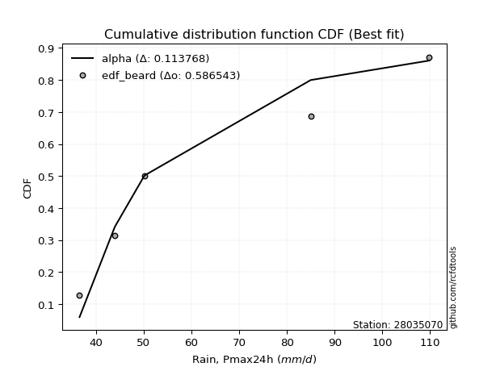</img></img>

</div>


### 5. EDF Chegodayev (1955)

The Chegodayev formula is an empirical plotting position formula used in hydrological frequency analysis to estimate the exceedance probability or return period of a specific event from a set of observed data. It is primarily used for plotting observed data points on probability paper to fit a theoretical distribution, particularly for analyzing extreme events like maximum flood flows or rainfall intensities. The constant _b_ value in the generalized plotting position formula is 0.3.

<div align="center">


$P=(m-b)/(n+1-2b)$


</div>


**5.1. Empirical values**

<div align="center">

|                | 0                   | 1                   | 2              | 3                  | 4                  |
|:---------------|:--------------------|:--------------------|:---------------|:-------------------|:-------------------|
| date           | 2020                | 2023                | 2021           | 2022               | 2019               |
| x              | 36.6                | 44.0                | 50.2           | 85.0               | 109.8              |
| m              | 1                   | 2                   | 3              | 4                  | 5                  |
| empirical_dist | edf_chegodayev      | edf_chegodayev      | edf_chegodayev | edf_chegodayev     | edf_chegodayev     |
| empirical      | 0.12962962962962962 | 0.31481481481481477 | 0.5            | 0.6851851851851851 | 0.8703703703703703 |
| empirical_tr   | 1.148936170212766   | 1.4594594594594594  | 2.0            | 3.1764705882352935 | 7.714285714285713  |

</div>


**5.2. Kolmogorov-Smirnov fit test (sorted by Δ)**


<div align="center">

|                | 0                   | 1                   | 2                   | 3                   | 4                   | 5                   | 6                   | 7                   | 8                   | 9                   | 10                  | 11                  | 12                  | 13                  | 14                  | 15                  | 16                  | 17                  | 18                  | 19                  | 20                  | 21                    | 22                  | 23                  | 24                  | 25                  | 26                  | 27                  | 28                  | 29                  | 30                  | 31                  | 32                  | 33                 | 34                  | 35                 | 36                  | 37                 | 38                  | 39                  | 40                  | 41                 | 42                  | 43                 | 44                  | 45                 | 46                 | 47                  | 48                 | 49                  | 50                  | 51                  | 52                  | 53                  | 54                  | 55                 | 56                  | 57                  | 58                 | 59                 | 60                  | 61                  | 62                  | 63                 | 64                 | 65                  | 66                  | 67                 | 68                  | 69                  | 70                 | 71                  | 72                  | 73                  | 74                 | 75                 | 76                 | 77                 | 78                 | 79                 | 80                 | 81                 | 82                 | 83                  | 84                 | 85                 | 86                 | 87                 |
|:---------------|:--------------------|:--------------------|:--------------------|:--------------------|:--------------------|:--------------------|:--------------------|:--------------------|:--------------------|:--------------------|:--------------------|:--------------------|:--------------------|:--------------------|:--------------------|:--------------------|:--------------------|:--------------------|:--------------------|:--------------------|:--------------------|:----------------------|:--------------------|:--------------------|:--------------------|:--------------------|:--------------------|:--------------------|:--------------------|:--------------------|:--------------------|:--------------------|:--------------------|:-------------------|:--------------------|:-------------------|:--------------------|:-------------------|:--------------------|:--------------------|:--------------------|:-------------------|:--------------------|:-------------------|:--------------------|:-------------------|:-------------------|:--------------------|:-------------------|:--------------------|:--------------------|:--------------------|:--------------------|:--------------------|:--------------------|:-------------------|:--------------------|:--------------------|:-------------------|:-------------------|:--------------------|:--------------------|:--------------------|:-------------------|:-------------------|:--------------------|:--------------------|:-------------------|:--------------------|:--------------------|:-------------------|:--------------------|:--------------------|:--------------------|:-------------------|:-------------------|:-------------------|:-------------------|:-------------------|:-------------------|:-------------------|:-------------------|:-------------------|:--------------------|:-------------------|:-------------------|:-------------------|:-------------------|
| station        | 28035070            | 28035070            | 28035070            | 28035070            | 28035070            | 28035070            | 28035070            | 28035070            | 28035070            | 28035070            | 28035070            | 28035070            | 28035070            | 28035070            | 28035070            | 28035070            | 28035070            | 28035070            | 28035070            | 28035070            | 28035070            | 28035070              | 28035070            | 28035070            | 28035070            | 28035070            | 28035070            | 28035070            | 28035070            | 28035070            | 28035070            | 28035070            | 28035070            | 28035070           | 28035070            | 28035070           | 28035070            | 28035070           | 28035070            | 28035070            | 28035070            | 28035070           | 28035070            | 28035070           | 28035070            | 28035070           | 28035070           | 28035070            | 28035070           | 28035070            | 28035070            | 28035070            | 28035070            | 28035070            | 28035070            | 28035070           | 28035070            | 28035070            | 28035070           | 28035070           | 28035070            | 28035070            | 28035070            | 28035070           | 28035070           | 28035070            | 28035070            | 28035070           | 28035070            | 28035070            | 28035070           | 28035070            | 28035070            | 28035070            | 28035070           | 28035070           | 28035070           | 28035070           | 28035070           | 28035070           | 28035070           | 28035070           | 28035070           | 28035070            | 28035070           | 28035070           | 28035070           | 28035070           |
| empirical_dist | edf_chegodayev      | edf_chegodayev      | edf_chegodayev      | edf_chegodayev      | edf_chegodayev      | edf_chegodayev      | edf_chegodayev      | edf_chegodayev      | edf_chegodayev      | edf_chegodayev      | edf_chegodayev      | edf_chegodayev      | edf_chegodayev      | edf_chegodayev      | edf_chegodayev      | edf_chegodayev      | edf_chegodayev      | edf_chegodayev      | edf_chegodayev      | edf_chegodayev      | edf_chegodayev      | edf_chegodayev        | edf_chegodayev      | edf_chegodayev      | edf_chegodayev      | edf_chegodayev      | edf_chegodayev      | edf_chegodayev      | edf_chegodayev      | edf_chegodayev      | edf_chegodayev      | edf_chegodayev      | edf_chegodayev      | edf_chegodayev     | edf_chegodayev      | edf_chegodayev     | edf_chegodayev      | edf_chegodayev     | edf_chegodayev      | edf_chegodayev      | edf_chegodayev      | edf_chegodayev     | edf_chegodayev      | edf_chegodayev     | edf_chegodayev      | edf_chegodayev     | edf_chegodayev     | edf_chegodayev      | edf_chegodayev     | edf_chegodayev      | edf_chegodayev      | edf_chegodayev      | edf_chegodayev      | edf_chegodayev      | edf_chegodayev      | edf_chegodayev     | edf_chegodayev      | edf_chegodayev      | edf_chegodayev     | edf_chegodayev     | edf_chegodayev      | edf_chegodayev      | edf_chegodayev      | edf_chegodayev     | edf_chegodayev     | edf_chegodayev      | edf_chegodayev      | edf_chegodayev     | edf_chegodayev      | edf_chegodayev      | edf_chegodayev     | edf_chegodayev      | edf_chegodayev      | edf_chegodayev      | edf_chegodayev     | edf_chegodayev     | edf_chegodayev     | edf_chegodayev     | edf_chegodayev     | edf_chegodayev     | edf_chegodayev     | edf_chegodayev     | edf_chegodayev     | edf_chegodayev      | edf_chegodayev     | edf_chegodayev     | edf_chegodayev     | edf_chegodayev     |
| p_dist         | alpha               | lograyleigh         | loghalfnorm         | logncf              | lognakagami         | logmaxwell          | gompertz            | genexpon            | exponnorm           | laplace_asymmetric  | expon               | f                   | invgamma            | nct                 | halfnorm            | logexpon            | loggenexpon         | halflogistic        | logexponnorm        | loginvgamma         | lognct              | loglaplace_asymmetric | nakagami            | loginvgauss         | loginvweibull       | fisk                | logalpha            | mielke              | logpearson3         | logkstwobign        | loggumbel_r         | logmielke           | loggenlogistic      | loggompertz        | betaprime           | invgauss           | loghalflogistic     | ncf                | logf                | logbetaprime        | logrice             | logmoyal           | logjohnsonsu        | logloggamma        | logt                | lognorm            | lognorm            | moyal               | rayleigh           | genlogistic         | gumbel_r            | maxwell             | loglogistic         | pearson3            | kstwobign           | logwald            | logchi2             | weibull_min         | loghypsecant       | johnsonsu          | t                   | crystalball         | norm                | truncnorm          | wald               | loggumbel_l         | rice                | loglaplace         | logerlang           | erlang              | logistic           | hypsecant           | gumbel_l            | logweibull_min      | laplace            | loggibrat          | gibrat             | fatiguelife        | logfisk            | loggamma           | loggamma           | loglognorm         | logfatiguelife     | invweibull          | gamma              | chi2               | logtruncnorm       | logcrystalball     |
| delta          | 0.11445616124131663 | 0.12168113998984909 | 0.12573924487642674 | 0.12806163012739757 | 0.12962962713889437 | 0.13000721169587975 | 0.13092985948224495 | 0.13101216510998182 | 0.13149992683698697 | 0.13155657998839454 | 0.13159243954672528 | 0.13463769457252028 | 0.13465371325695408 | 0.13488636837195744 | 0.13496277188493583 | 0.13676812838104113 | 0.13698051339841244 | 0.13758809130580207 | 0.13769443128335124 | 0.13839182842759512 | 0.13873649187323062 | 0.13886254253611185   | 0.13928459283218042 | 0.14079976114961146 | 0.14099087065296068 | 0.14143212749640433 | 0.14152560970058048 | 0.14286640386505345 | 0.14374026776853166 | 0.14374850707503306 | 0.14382622850858662 | 0.14418560986876594 | 0.14461681043749464 | 0.1450403349298851 | 0.14522953121225124 | 0.1458690819623134 | 0.14638300750292665 | 0.1465400559644654 | 0.14673779428200712 | 0.15060928000223794 | 0.15181809708094718 | 0.1524125927095874 | 0.15737123073277204 | 0.1591201570014213 | 0.16121114630047428 | 0.1612112985605434 | 0.1612112985605434 | 0.16344377728382398 | 0.1656955306456136 | 0.16819593003458788 | 0.17260736851060354 | 0.17658695615464703 | 0.18007698538402017 | 0.18081865972755878 | 0.18239686458270143 | 0.1852231149453404 | 0.18996976186829584 | 0.19315192025842315 | 0.1945110240252887 | 0.2011823052888474 | 0.20402308490377058 | 0.20403498636667505 | 0.20403498833128575 | 0.2040350066783233 | 0.2111693729555617 | 0.21935060640213416 | 0.22133438201892525 | 0.2222785129650507 | 0.22304325545018344 | 0.22449061824966365 | 0.2255719899598363 | 0.24101719389329584 | 0.25403261401492383 | 0.25433981888100876 | 0.2657166560314743 | 0.3119981822186298 | 0.3148136944201427 | 0.3240837636016609 | 0.3295397802701968 | 0.3316078246081525 | 0.3316078246081525 | 0.3516177136712312 | 0.422973890325808  | 0.43733168051639904 | 0.5105320363751342 | 0.6811023428690125 | 0.685117601437162  | nan                |
| deltao         | 0.5865427407550001  | 0.5865427407550001  | 0.5865427407550001  | 0.5865427407550001  | 0.5865427407550001  | 0.5865427407550001  | 0.5865427407550001  | 0.5865427407550001  | 0.5865427407550001  | 0.5865427407550001  | 0.5865427407550001  | 0.5865427407550001  | 0.5865427407550001  | 0.5865427407550001  | 0.5865427407550001  | 0.5865427407550001  | 0.5865427407550001  | 0.5865427407550001  | 0.5865427407550001  | 0.5865427407550001  | 0.5865427407550001  | 0.5865427407550001    | 0.5865427407550001  | 0.5865427407550001  | 0.5865427407550001  | 0.5865427407550001  | 0.5865427407550001  | 0.5865427407550001  | 0.5865427407550001  | 0.5865427407550001  | 0.5865427407550001  | 0.5865427407550001  | 0.5865427407550001  | 0.5865427407550001 | 0.5865427407550001  | 0.5865427407550001 | 0.5865427407550001  | 0.5865427407550001 | 0.5865427407550001  | 0.5865427407550001  | 0.5865427407550001  | 0.5865427407550001 | 0.5865427407550001  | 0.5865427407550001 | 0.5865427407550001  | 0.5865427407550001 | 0.5865427407550001 | 0.5865427407550001  | 0.5865427407550001 | 0.5865427407550001  | 0.5865427407550001  | 0.5865427407550001  | 0.5865427407550001  | 0.5865427407550001  | 0.5865427407550001  | 0.5865427407550001 | 0.5865427407550001  | 0.5865427407550001  | 0.5865427407550001 | 0.5865427407550001 | 0.5865427407550001  | 0.5865427407550001  | 0.5865427407550001  | 0.5865427407550001 | 0.5865427407550001 | 0.5865427407550001  | 0.5865427407550001  | 0.5865427407550001 | 0.5865427407550001  | 0.5865427407550001  | 0.5865427407550001 | 0.5865427407550001  | 0.5865427407550001  | 0.5865427407550001  | 0.5865427407550001 | 0.5865427407550001 | 0.5865427407550001 | 0.5865427407550001 | 0.5865427407550001 | 0.5865427407550001 | 0.5865427407550001 | 0.5865427407550001 | 0.5865427407550001 | 0.5865427407550001  | 0.5865427407550001 | 0.5865427407550001 | 0.5865427407550001 | 0.5865427407550001 |
| eval           | Δo > Δ              | Δo > Δ              | Δo > Δ              | Δo > Δ              | Δo > Δ              | Δo > Δ              | Δo > Δ              | Δo > Δ              | Δo > Δ              | Δo > Δ              | Δo > Δ              | Δo > Δ              | Δo > Δ              | Δo > Δ              | Δo > Δ              | Δo > Δ              | Δo > Δ              | Δo > Δ              | Δo > Δ              | Δo > Δ              | Δo > Δ              | Δo > Δ                | Δo > Δ              | Δo > Δ              | Δo > Δ              | Δo > Δ              | Δo > Δ              | Δo > Δ              | Δo > Δ              | Δo > Δ              | Δo > Δ              | Δo > Δ              | Δo > Δ              | Δo > Δ             | Δo > Δ              | Δo > Δ             | Δo > Δ              | Δo > Δ             | Δo > Δ              | Δo > Δ              | Δo > Δ              | Δo > Δ             | Δo > Δ              | Δo > Δ             | Δo > Δ              | Δo > Δ             | Δo > Δ             | Δo > Δ              | Δo > Δ             | Δo > Δ              | Δo > Δ              | Δo > Δ              | Δo > Δ              | Δo > Δ              | Δo > Δ              | Δo > Δ             | Δo > Δ              | Δo > Δ              | Δo > Δ             | Δo > Δ             | Δo > Δ              | Δo > Δ              | Δo > Δ              | Δo > Δ             | Δo > Δ             | Δo > Δ              | Δo > Δ              | Δo > Δ             | Δo > Δ              | Δo > Δ              | Δo > Δ             | Δo > Δ              | Δo > Δ              | Δo > Δ              | Δo > Δ             | Δo > Δ             | Δo > Δ             | Δo > Δ             | Δo > Δ             | Δo > Δ             | Δo > Δ             | Δo > Δ             | Δo > Δ             | Δo > Δ              | Δo > Δ             | Δo <= Δ            | Δo <= Δ            | Δo <= Δ            |
| fit            | 1                   | 1                   | 1                   | 1                   | 1                   | 1                   | 1                   | 1                   | 1                   | 1                   | 1                   | 1                   | 1                   | 1                   | 1                   | 1                   | 1                   | 1                   | 1                   | 1                   | 1                   | 1                     | 1                   | 1                   | 1                   | 1                   | 1                   | 1                   | 1                   | 1                   | 1                   | 1                   | 1                   | 1                  | 1                   | 1                  | 1                   | 1                  | 1                   | 1                   | 1                   | 1                  | 1                   | 1                  | 1                   | 1                  | 1                  | 1                   | 1                  | 1                   | 1                   | 1                   | 1                   | 1                   | 1                   | 1                  | 1                   | 1                   | 1                  | 1                  | 1                   | 1                   | 1                   | 1                  | 1                  | 1                   | 1                   | 1                  | 1                   | 1                   | 1                  | 1                   | 1                   | 1                   | 1                  | 1                  | 1                  | 1                  | 1                  | 1                  | 1                  | 1                  | 1                  | 1                   | 1                  | 0                  | 0                  | 0                  |
| n              | 5                   | 5                   | 5                   | 5                   | 5                   | 5                   | 5                   | 5                   | 5                   | 5                   | 5                   | 5                   | 5                   | 5                   | 5                   | 5                   | 5                   | 5                   | 5                   | 5                   | 5                   | 5                     | 5                   | 5                   | 5                   | 5                   | 5                   | 5                   | 5                   | 5                   | 5                   | 5                   | 5                   | 5                  | 5                   | 5                  | 5                   | 5                  | 5                   | 5                   | 5                   | 5                  | 5                   | 5                  | 5                   | 5                  | 5                  | 5                   | 5                  | 5                   | 5                   | 5                   | 5                   | 5                   | 5                   | 5                  | 5                   | 5                   | 5                  | 5                  | 5                   | 5                   | 5                   | 5                  | 5                  | 5                   | 5                   | 5                  | 5                   | 5                   | 5                  | 5                   | 5                   | 5                   | 5                  | 5                  | 5                  | 5                  | 5                  | 5                  | 5                  | 5                  | 5                  | 5                   | 5                  | 5                  | 5                  | 5                  |
| best_fit       | 1                   | 0                   | 0                   | 0                   | 0                   | 0                   | 0                   | 0                   | 0                   | 0                   | 0                   | 0                   | 0                   | 0                   | 0                   | 0                   | 0                   | 0                   | 0                   | 0                   | 0                   | 0                     | 0                   | 0                   | 0                   | 0                   | 0                   | 0                   | 0                   | 0                   | 0                   | 0                   | 0                   | 0                  | 0                   | 0                  | 0                   | 0                  | 0                   | 0                   | 0                   | 0                  | 0                   | 0                  | 0                   | 0                  | 0                  | 0                   | 0                  | 0                   | 0                   | 0                   | 0                   | 0                   | 0                   | 0                  | 0                   | 0                   | 0                  | 0                  | 0                   | 0                   | 0                   | 0                  | 0                  | 0                   | 0                   | 0                  | 0                   | 0                   | 0                  | 0                   | 0                   | 0                   | 0                  | 0                  | 0                  | 0                  | 0                  | 0                  | 0                  | 0                  | 0                  | 0                   | 0                  | 0                  | 0                  | 0                  |
| best_fit_sort  | 1                   | 2                   | 3                   | 4                   | 5                   | 6                   | 7                   | 8                   | 9                   | 10                  | 11                  | 12                  | 13                  | 14                  | 15                  | 16                  | 17                  | 18                  | 19                  | 20                  | 21                  | 22                    | 23                  | 24                  | 25                  | 26                  | 27                  | 28                  | 29                  | 30                  | 31                  | 32                  | 33                  | 34                 | 35                  | 36                 | 37                  | 38                 | 39                  | 40                  | 41                  | 42                 | 43                  | 44                 | 45                  | 46                 | 47                 | 48                  | 49                 | 50                  | 51                  | 52                  | 53                  | 54                  | 55                  | 56                 | 57                  | 58                  | 59                 | 60                 | 61                  | 62                  | 63                  | 64                 | 65                 | 66                  | 67                  | 68                 | 69                  | 70                  | 71                 | 72                  | 73                  | 74                  | 75                 | 76                 | 77                 | 78                 | 79                 | 80                 | 81                 | 82                 | 83                 | 84                  | 85                 | 86                 | 87                 | 88                 |

</div>


**5.3. Best fit**

<div align="center">

|   id |   station | empirical_dist   | p_dist   |    delta |   deltao | eval   |   fit |   n |   best_fit |   best_fit_sort |
|-----:|----------:|:-----------------|:---------|---------:|---------:|:-------|------:|----:|-----------:|----------------:|
|    0 |  28035070 | edf_chegodayev   | alpha    | 0.114456 | 0.586543 | Δo > Δ |     1 |   5 |          1 |               1 |

</div>


<div align="center">

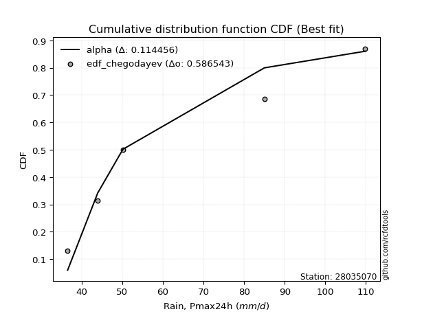</img>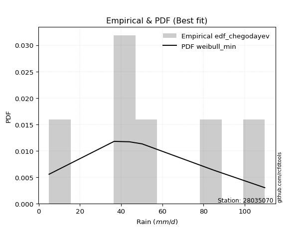</img>

</div>


### 6. EDF Blom (1958)

The Blom formula is a specific "plotting position" formula used in hydrology and statistical analysis to estimate the empirical cumulative probability (or non-exceedance probability) of a data series. It is particularly recommended for data that are approximately normally distributed. The constant _a_ is set to 0.375 (or 3/8).

<div align="center">


$P=(m-a)/(n+1-2a)$


</div>


**6.1. Empirical values**

<div align="center">

|                | 0                   | 1                   | 2        | 3                  | 4                  |
|:---------------|:--------------------|:--------------------|:---------|:-------------------|:-------------------|
| date           | 2020                | 2023                | 2021     | 2022               | 2019               |
| x              | 36.6                | 44.0                | 50.2     | 85.0               | 109.8              |
| m              | 1                   | 2                   | 3        | 4                  | 5                  |
| empirical_dist | edf_blom            | edf_blom            | edf_blom | edf_blom           | edf_blom           |
| empirical      | 0.11904761904761904 | 0.30952380952380953 | 0.5      | 0.6904761904761905 | 0.8809523809523809 |
| empirical_tr   | 1.135135135135135   | 1.4482758620689655  | 2.0      | 3.230769230769231  | 8.399999999999999  |

</div>


**6.2. Kolmogorov-Smirnov fit test (sorted by Δ)**


<div align="center">

|                | 0                   | 1                   | 2                  | 3                   | 4                   | 5                   | 6                  | 7                   | 8                   | 9                   | 10                  | 11                 | 12                  | 13                  | 14                  | 15                 | 16                 | 17                  | 18                    | 19                  | 20                  | 21                 | 22                  | 23                  | 24                 | 25                  | 26                  | 27                  | 28                  | 29                 | 30                 | 31                  | 32                 | 33                  | 34                 | 35                  | 36                 | 37                  | 38                  | 39                  | 40                  | 41                  | 42                  | 43                 | 44                  | 45                 | 46                 | 47                  | 48                 | 49                  | 50                  | 51                  | 52                  | 53                  | 54                  | 55                  | 56                  | 57                 | 58                  | 59                 | 60                  | 61                  | 62                  | 63                 | 64                  | 65                 | 66                 | 67                  | 68                  | 69                 | 70                 | 71                  | 72                  | 73                 | 74                 | 75                  | 76                  | 77                  | 78                  | 79                  | 80                 | 81                 | 82                  | 83                 | 84                 | 85                 | 86                 | 87                 |
|:---------------|:--------------------|:--------------------|:-------------------|:--------------------|:--------------------|:--------------------|:-------------------|:--------------------|:--------------------|:--------------------|:--------------------|:-------------------|:--------------------|:--------------------|:--------------------|:-------------------|:-------------------|:--------------------|:----------------------|:--------------------|:--------------------|:-------------------|:--------------------|:--------------------|:-------------------|:--------------------|:--------------------|:--------------------|:--------------------|:-------------------|:-------------------|:--------------------|:-------------------|:--------------------|:-------------------|:--------------------|:-------------------|:--------------------|:--------------------|:--------------------|:--------------------|:--------------------|:--------------------|:-------------------|:--------------------|:-------------------|:-------------------|:--------------------|:-------------------|:--------------------|:--------------------|:--------------------|:--------------------|:--------------------|:--------------------|:--------------------|:--------------------|:-------------------|:--------------------|:-------------------|:--------------------|:--------------------|:--------------------|:-------------------|:--------------------|:-------------------|:-------------------|:--------------------|:--------------------|:-------------------|:-------------------|:--------------------|:--------------------|:-------------------|:-------------------|:--------------------|:--------------------|:--------------------|:--------------------|:--------------------|:-------------------|:-------------------|:--------------------|:-------------------|:-------------------|:-------------------|:-------------------|:-------------------|
| station        | 28035070            | 28035070            | 28035070           | 28035070            | 28035070            | 28035070            | 28035070           | 28035070            | 28035070            | 28035070            | 28035070            | 28035070           | 28035070            | 28035070            | 28035070            | 28035070           | 28035070           | 28035070            | 28035070              | 28035070            | 28035070            | 28035070           | 28035070            | 28035070            | 28035070           | 28035070            | 28035070            | 28035070            | 28035070            | 28035070           | 28035070           | 28035070            | 28035070           | 28035070            | 28035070           | 28035070            | 28035070           | 28035070            | 28035070            | 28035070            | 28035070            | 28035070            | 28035070            | 28035070           | 28035070            | 28035070           | 28035070           | 28035070            | 28035070           | 28035070            | 28035070            | 28035070            | 28035070            | 28035070            | 28035070            | 28035070            | 28035070            | 28035070           | 28035070            | 28035070           | 28035070            | 28035070            | 28035070            | 28035070           | 28035070            | 28035070           | 28035070           | 28035070            | 28035070            | 28035070           | 28035070           | 28035070            | 28035070            | 28035070           | 28035070           | 28035070            | 28035070            | 28035070            | 28035070            | 28035070            | 28035070           | 28035070           | 28035070            | 28035070           | 28035070           | 28035070           | 28035070           | 28035070           |
| empirical_dist | edf_blom            | edf_blom            | edf_blom           | edf_blom            | edf_blom            | edf_blom            | edf_blom           | edf_blom            | edf_blom            | edf_blom            | edf_blom            | edf_blom           | edf_blom            | edf_blom            | edf_blom            | edf_blom           | edf_blom           | edf_blom            | edf_blom              | edf_blom            | edf_blom            | edf_blom           | edf_blom            | edf_blom            | edf_blom           | edf_blom            | edf_blom            | edf_blom            | edf_blom            | edf_blom           | edf_blom           | edf_blom            | edf_blom           | edf_blom            | edf_blom           | edf_blom            | edf_blom           | edf_blom            | edf_blom            | edf_blom            | edf_blom            | edf_blom            | edf_blom            | edf_blom           | edf_blom            | edf_blom           | edf_blom           | edf_blom            | edf_blom           | edf_blom            | edf_blom            | edf_blom            | edf_blom            | edf_blom            | edf_blom            | edf_blom            | edf_blom            | edf_blom           | edf_blom            | edf_blom           | edf_blom            | edf_blom            | edf_blom            | edf_blom           | edf_blom            | edf_blom           | edf_blom           | edf_blom            | edf_blom            | edf_blom           | edf_blom           | edf_blom            | edf_blom            | edf_blom           | edf_blom           | edf_blom            | edf_blom            | edf_blom            | edf_blom            | edf_blom            | edf_blom           | edf_blom           | edf_blom            | edf_blom           | edf_blom           | edf_blom           | edf_blom           | edf_blom           |
| p_dist         | alpha               | lograyleigh         | lognakagami        | loghalfnorm         | genexpon            | exponnorm           | laplace_asymmetric | expon               | logncf              | f                   | invgamma            | nct                | logmaxwell          | gompertz            | logexpon            | loggenexpon        | logexponnorm       | loginvgamma         | loglaplace_asymmetric | nakagami            | halfnorm            | loginvgauss        | loginvweibull       | logalpha            | mielke             | halflogistic        | logkstwobign        | loggumbel_r         | lognct              | logmielke          | loggenlogistic     | invgauss            | loghalflogistic    | logpearson3         | loggompertz        | betaprime           | ncf                | fisk                | logf                | logmoyal            | logbetaprime        | logrice             | logjohnsonsu        | logloggamma        | logt                | lognorm            | lognorm            | moyal               | rayleigh           | genlogistic         | gumbel_r            | maxwell             | logwald             | loglogistic         | pearson3            | kstwobign           | weibull_min         | loghypsecant       | logchi2             | johnsonsu          | t                   | crystalball         | norm                | truncnorm          | wald                | logerlang          | erlang             | loggumbel_l         | rice                | loglaplace         | logistic           | hypsecant           | gumbel_l            | logweibull_min     | laplace            | loggibrat           | gibrat              | fatiguelife         | loggamma            | loggamma            | logfisk            | loglognorm         | logfatiguelife      | invweibull         | gamma              | chi2               | logtruncnorm       | logcrystalball     |
| delta          | 0.10916515595031129 | 0.11809744551433038 | 0.1190476165568838 | 0.12044823958542139 | 0.12572115981897647 | 0.12620892154598162 | 0.1262655746973892 | 0.12630143425571994 | 0.12806163012739757 | 0.12934668928151494 | 0.12936270796594873 | 0.1295953630809521 | 0.13000721169587975 | 0.13092985948224495 | 0.13147712309003579 | 0.1316895081074071 | 0.1324034259923459 | 0.13310082313658977 | 0.1335715372451065    | 0.13399358754117507 | 0.13496277188493583 | 0.1355087558586061 | 0.13569986536195533 | 0.13623460440957513 | 0.1375753985740481 | 0.13758809130580207 | 0.13845750178402771 | 0.13853522321758127 | 0.13873649187323062 | 0.1388946045777606 | 0.1393258051464893 | 0.14057807667130806 | 0.1410920022119213 | 0.14374026776853166 | 0.1450403349298851 | 0.14522953121225124 | 0.1465400559644654 | 0.14672313278740956 | 0.14673779428200712 | 0.14712158741858206 | 0.15060928000223794 | 0.15181809708094718 | 0.15737123073277204 | 0.1591201570014213 | 0.16121114630047428 | 0.1612112985605434 | 0.1612112985605434 | 0.16344377728382398 | 0.1656955306456136 | 0.16819593003458788 | 0.17260736851060354 | 0.17658695615464703 | 0.17993210965433518 | 0.18007698538402017 | 0.18081865972755878 | 0.18239686458270143 | 0.19315192025842315 | 0.1945110240252887 | 0.20055177245030642 | 0.2011823052888474 | 0.20402308490377058 | 0.20403498636667505 | 0.20403498833128575 | 0.2040350066783233 | 0.20587836766455647 | 0.2177522501591781 | 0.2191996129586583 | 0.21935060640213416 | 0.22133438201892525 | 0.2222785129650507 | 0.2255719899598363 | 0.24101719389329584 | 0.25403261401492383 | 0.259630824172014  | 0.2657166560314743 | 0.30670717692762456 | 0.30952268912913744 | 0.32937476889266615 | 0.33689882989915776 | 0.33689882989915776 | 0.3401217908522074 | 0.3569087189622364 | 0.42826489561681325 | 0.4479136910984096 | 0.5158230416661395 | 0.6863933481600177 | 0.6904086067281674 | nan                |
| deltao         | 0.5865427407550001  | 0.5865427407550001  | 0.5865427407550001 | 0.5865427407550001  | 0.5865427407550001  | 0.5865427407550001  | 0.5865427407550001 | 0.5865427407550001  | 0.5865427407550001  | 0.5865427407550001  | 0.5865427407550001  | 0.5865427407550001 | 0.5865427407550001  | 0.5865427407550001  | 0.5865427407550001  | 0.5865427407550001 | 0.5865427407550001 | 0.5865427407550001  | 0.5865427407550001    | 0.5865427407550001  | 0.5865427407550001  | 0.5865427407550001 | 0.5865427407550001  | 0.5865427407550001  | 0.5865427407550001 | 0.5865427407550001  | 0.5865427407550001  | 0.5865427407550001  | 0.5865427407550001  | 0.5865427407550001 | 0.5865427407550001 | 0.5865427407550001  | 0.5865427407550001 | 0.5865427407550001  | 0.5865427407550001 | 0.5865427407550001  | 0.5865427407550001 | 0.5865427407550001  | 0.5865427407550001  | 0.5865427407550001  | 0.5865427407550001  | 0.5865427407550001  | 0.5865427407550001  | 0.5865427407550001 | 0.5865427407550001  | 0.5865427407550001 | 0.5865427407550001 | 0.5865427407550001  | 0.5865427407550001 | 0.5865427407550001  | 0.5865427407550001  | 0.5865427407550001  | 0.5865427407550001  | 0.5865427407550001  | 0.5865427407550001  | 0.5865427407550001  | 0.5865427407550001  | 0.5865427407550001 | 0.5865427407550001  | 0.5865427407550001 | 0.5865427407550001  | 0.5865427407550001  | 0.5865427407550001  | 0.5865427407550001 | 0.5865427407550001  | 0.5865427407550001 | 0.5865427407550001 | 0.5865427407550001  | 0.5865427407550001  | 0.5865427407550001 | 0.5865427407550001 | 0.5865427407550001  | 0.5865427407550001  | 0.5865427407550001 | 0.5865427407550001 | 0.5865427407550001  | 0.5865427407550001  | 0.5865427407550001  | 0.5865427407550001  | 0.5865427407550001  | 0.5865427407550001 | 0.5865427407550001 | 0.5865427407550001  | 0.5865427407550001 | 0.5865427407550001 | 0.5865427407550001 | 0.5865427407550001 | 0.5865427407550001 |
| eval           | Δo > Δ              | Δo > Δ              | Δo > Δ             | Δo > Δ              | Δo > Δ              | Δo > Δ              | Δo > Δ             | Δo > Δ              | Δo > Δ              | Δo > Δ              | Δo > Δ              | Δo > Δ             | Δo > Δ              | Δo > Δ              | Δo > Δ              | Δo > Δ             | Δo > Δ             | Δo > Δ              | Δo > Δ                | Δo > Δ              | Δo > Δ              | Δo > Δ             | Δo > Δ              | Δo > Δ              | Δo > Δ             | Δo > Δ              | Δo > Δ              | Δo > Δ              | Δo > Δ              | Δo > Δ             | Δo > Δ             | Δo > Δ              | Δo > Δ             | Δo > Δ              | Δo > Δ             | Δo > Δ              | Δo > Δ             | Δo > Δ              | Δo > Δ              | Δo > Δ              | Δo > Δ              | Δo > Δ              | Δo > Δ              | Δo > Δ             | Δo > Δ              | Δo > Δ             | Δo > Δ             | Δo > Δ              | Δo > Δ             | Δo > Δ              | Δo > Δ              | Δo > Δ              | Δo > Δ              | Δo > Δ              | Δo > Δ              | Δo > Δ              | Δo > Δ              | Δo > Δ             | Δo > Δ              | Δo > Δ             | Δo > Δ              | Δo > Δ              | Δo > Δ              | Δo > Δ             | Δo > Δ              | Δo > Δ             | Δo > Δ             | Δo > Δ              | Δo > Δ              | Δo > Δ             | Δo > Δ             | Δo > Δ              | Δo > Δ              | Δo > Δ             | Δo > Δ             | Δo > Δ              | Δo > Δ              | Δo > Δ              | Δo > Δ              | Δo > Δ              | Δo > Δ             | Δo > Δ             | Δo > Δ              | Δo > Δ             | Δo > Δ             | Δo <= Δ            | Δo <= Δ            | Δo <= Δ            |
| fit            | 1                   | 1                   | 1                  | 1                   | 1                   | 1                   | 1                  | 1                   | 1                   | 1                   | 1                   | 1                  | 1                   | 1                   | 1                   | 1                  | 1                  | 1                   | 1                     | 1                   | 1                   | 1                  | 1                   | 1                   | 1                  | 1                   | 1                   | 1                   | 1                   | 1                  | 1                  | 1                   | 1                  | 1                   | 1                  | 1                   | 1                  | 1                   | 1                   | 1                   | 1                   | 1                   | 1                   | 1                  | 1                   | 1                  | 1                  | 1                   | 1                  | 1                   | 1                   | 1                   | 1                   | 1                   | 1                   | 1                   | 1                   | 1                  | 1                   | 1                  | 1                   | 1                   | 1                   | 1                  | 1                   | 1                  | 1                  | 1                   | 1                   | 1                  | 1                  | 1                   | 1                   | 1                  | 1                  | 1                   | 1                   | 1                   | 1                   | 1                   | 1                  | 1                  | 1                   | 1                  | 1                  | 0                  | 0                  | 0                  |
| n              | 5                   | 5                   | 5                  | 5                   | 5                   | 5                   | 5                  | 5                   | 5                   | 5                   | 5                   | 5                  | 5                   | 5                   | 5                   | 5                  | 5                  | 5                   | 5                     | 5                   | 5                   | 5                  | 5                   | 5                   | 5                  | 5                   | 5                   | 5                   | 5                   | 5                  | 5                  | 5                   | 5                  | 5                   | 5                  | 5                   | 5                  | 5                   | 5                   | 5                   | 5                   | 5                   | 5                   | 5                  | 5                   | 5                  | 5                  | 5                   | 5                  | 5                   | 5                   | 5                   | 5                   | 5                   | 5                   | 5                   | 5                   | 5                  | 5                   | 5                  | 5                   | 5                   | 5                   | 5                  | 5                   | 5                  | 5                  | 5                   | 5                   | 5                  | 5                  | 5                   | 5                   | 5                  | 5                  | 5                   | 5                   | 5                   | 5                   | 5                   | 5                  | 5                  | 5                   | 5                  | 5                  | 5                  | 5                  | 5                  |
| best_fit       | 1                   | 0                   | 0                  | 0                   | 0                   | 0                   | 0                  | 0                   | 0                   | 0                   | 0                   | 0                  | 0                   | 0                   | 0                   | 0                  | 0                  | 0                   | 0                     | 0                   | 0                   | 0                  | 0                   | 0                   | 0                  | 0                   | 0                   | 0                   | 0                   | 0                  | 0                  | 0                   | 0                  | 0                   | 0                  | 0                   | 0                  | 0                   | 0                   | 0                   | 0                   | 0                   | 0                   | 0                  | 0                   | 0                  | 0                  | 0                   | 0                  | 0                   | 0                   | 0                   | 0                   | 0                   | 0                   | 0                   | 0                   | 0                  | 0                   | 0                  | 0                   | 0                   | 0                   | 0                  | 0                   | 0                  | 0                  | 0                   | 0                   | 0                  | 0                  | 0                   | 0                   | 0                  | 0                  | 0                   | 0                   | 0                   | 0                   | 0                   | 0                  | 0                  | 0                   | 0                  | 0                  | 0                  | 0                  | 0                  |
| best_fit_sort  | 1                   | 2                   | 3                  | 4                   | 5                   | 6                   | 7                  | 8                   | 9                   | 10                  | 11                  | 12                 | 13                  | 14                  | 15                  | 16                 | 17                 | 18                  | 19                    | 20                  | 21                  | 22                 | 23                  | 24                  | 25                 | 26                  | 27                  | 28                  | 29                  | 30                 | 31                 | 32                  | 33                 | 34                  | 35                 | 36                  | 37                 | 38                  | 39                  | 40                  | 41                  | 42                  | 43                  | 44                 | 45                  | 46                 | 47                 | 48                  | 49                 | 50                  | 51                  | 52                  | 53                  | 54                  | 55                  | 56                  | 57                  | 58                 | 59                  | 60                 | 61                  | 62                  | 63                  | 64                 | 65                  | 66                 | 67                 | 68                  | 69                  | 70                 | 71                 | 72                  | 73                  | 74                 | 75                 | 76                  | 77                  | 78                  | 79                  | 80                  | 81                 | 82                 | 83                  | 84                 | 85                 | 86                 | 87                 | 88                 |

</div>


**6.3. Best fit**

<div align="center">

|   id |   station | empirical_dist   | p_dist   |    delta |   deltao | eval   |   fit |   n |   best_fit |   best_fit_sort |
|-----:|----------:|:-----------------|:---------|---------:|---------:|:-------|------:|----:|-----------:|----------------:|
|    0 |  28035070 | edf_blom         | alpha    | 0.109165 | 0.586543 | Δo > Δ |     1 |   5 |          1 |               1 |

</div>


<div align="center">

</img>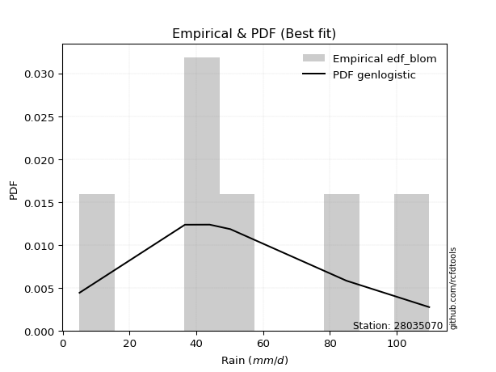</img>

</div>


### 7. EDF Tukey (1962)

In hydrology, the Tukey formula is used as a plotting position formula to estimate the empirical probability or frequency of a flood event (or other hydrological data). The formula parameter is given as _c=0.333_ (or 1/3).

<div align="center">


$P=(m-c)/(n+1-2c)$


</div>


**7.1. Empirical values**

<div align="center">

|                | 0                  | 1                  | 2         | 3         | 4         |
|:---------------|:-------------------|:-------------------|:----------|:----------|:----------|
| date           | 2020               | 2023               | 2021      | 2022      | 2019      |
| x              | 36.6               | 44.0               | 50.2      | 85.0      | 109.8     |
| m              | 1                  | 2                  | 3         | 4         | 5         |
| empirical_dist | edf_tukey          | edf_tukey          | edf_tukey | edf_tukey | edf_tukey |
| empirical      | 0.125              | 0.3125             | 0.5       | 0.6875    | 0.875     |
| empirical_tr   | 1.1428571428571428 | 1.4545454545454546 | 2.0       | 3.2       | 8.0       |

</div>


**7.2. Kolmogorov-Smirnov fit test (sorted by Δ)**


<div align="center">

|                | 0                   | 1                  | 2                   | 3                   | 4                   | 5                   | 6                  | 7                   | 8                  | 9                   | 10                  | 11                 | 12                 | 13                  | 14                  | 15                  | 16                  | 17                  | 18                  | 19                    | 20                  | 21                  | 22                  | 23                 | 24                  | 25                 | 26                  | 27                  | 28                  | 29                  | 30                  | 31                  | 32                  | 33                 | 34                  | 35                 | 36                  | 37                 | 38                  | 39                  | 40                  | 41                  | 42                  | 43                 | 44                  | 45                 | 46                 | 47                  | 48                 | 49                  | 50                  | 51                  | 52                  | 53                  | 54                  | 55                  | 56                  | 57                 | 58                 | 59                 | 60                  | 61                  | 62                  | 63                 | 64                  | 65                  | 66                  | 67                  | 68                  | 69                 | 70                 | 71                  | 72                  | 73                  | 74                 | 75                 | 76                 | 77                 | 78                 | 79                 | 80                  | 81                  | 82                 | 83                 | 84                 | 85                 | 86                 | 87                 |
|:---------------|:--------------------|:-------------------|:--------------------|:--------------------|:--------------------|:--------------------|:-------------------|:--------------------|:-------------------|:--------------------|:--------------------|:-------------------|:-------------------|:--------------------|:--------------------|:--------------------|:--------------------|:--------------------|:--------------------|:----------------------|:--------------------|:--------------------|:--------------------|:-------------------|:--------------------|:-------------------|:--------------------|:--------------------|:--------------------|:--------------------|:--------------------|:--------------------|:--------------------|:-------------------|:--------------------|:-------------------|:--------------------|:-------------------|:--------------------|:--------------------|:--------------------|:--------------------|:--------------------|:-------------------|:--------------------|:-------------------|:-------------------|:--------------------|:-------------------|:--------------------|:--------------------|:--------------------|:--------------------|:--------------------|:--------------------|:--------------------|:--------------------|:-------------------|:-------------------|:-------------------|:--------------------|:--------------------|:--------------------|:-------------------|:--------------------|:--------------------|:--------------------|:--------------------|:--------------------|:-------------------|:-------------------|:--------------------|:--------------------|:--------------------|:-------------------|:-------------------|:-------------------|:-------------------|:-------------------|:-------------------|:--------------------|:--------------------|:-------------------|:-------------------|:-------------------|:-------------------|:-------------------|:-------------------|
| station        | 28035070            | 28035070           | 28035070            | 28035070            | 28035070            | 28035070            | 28035070           | 28035070            | 28035070           | 28035070            | 28035070            | 28035070           | 28035070           | 28035070            | 28035070            | 28035070            | 28035070            | 28035070            | 28035070            | 28035070              | 28035070            | 28035070            | 28035070            | 28035070           | 28035070            | 28035070           | 28035070            | 28035070            | 28035070            | 28035070            | 28035070            | 28035070            | 28035070            | 28035070           | 28035070            | 28035070           | 28035070            | 28035070           | 28035070            | 28035070            | 28035070            | 28035070            | 28035070            | 28035070           | 28035070            | 28035070           | 28035070           | 28035070            | 28035070           | 28035070            | 28035070            | 28035070            | 28035070            | 28035070            | 28035070            | 28035070            | 28035070            | 28035070           | 28035070           | 28035070           | 28035070            | 28035070            | 28035070            | 28035070           | 28035070            | 28035070            | 28035070            | 28035070            | 28035070            | 28035070           | 28035070           | 28035070            | 28035070            | 28035070            | 28035070           | 28035070           | 28035070           | 28035070           | 28035070           | 28035070           | 28035070            | 28035070            | 28035070           | 28035070           | 28035070           | 28035070           | 28035070           | 28035070           |
| empirical_dist | edf_tukey           | edf_tukey          | edf_tukey           | edf_tukey           | edf_tukey           | edf_tukey           | edf_tukey          | edf_tukey           | edf_tukey          | edf_tukey           | edf_tukey           | edf_tukey          | edf_tukey          | edf_tukey           | edf_tukey           | edf_tukey           | edf_tukey           | edf_tukey           | edf_tukey           | edf_tukey             | edf_tukey           | edf_tukey           | edf_tukey           | edf_tukey          | edf_tukey           | edf_tukey          | edf_tukey           | edf_tukey           | edf_tukey           | edf_tukey           | edf_tukey           | edf_tukey           | edf_tukey           | edf_tukey          | edf_tukey           | edf_tukey          | edf_tukey           | edf_tukey          | edf_tukey           | edf_tukey           | edf_tukey           | edf_tukey           | edf_tukey           | edf_tukey          | edf_tukey           | edf_tukey          | edf_tukey          | edf_tukey           | edf_tukey          | edf_tukey           | edf_tukey           | edf_tukey           | edf_tukey           | edf_tukey           | edf_tukey           | edf_tukey           | edf_tukey           | edf_tukey          | edf_tukey          | edf_tukey          | edf_tukey           | edf_tukey           | edf_tukey           | edf_tukey          | edf_tukey           | edf_tukey           | edf_tukey           | edf_tukey           | edf_tukey           | edf_tukey          | edf_tukey          | edf_tukey           | edf_tukey           | edf_tukey           | edf_tukey          | edf_tukey          | edf_tukey          | edf_tukey          | edf_tukey          | edf_tukey          | edf_tukey           | edf_tukey           | edf_tukey          | edf_tukey          | edf_tukey          | edf_tukey          | edf_tukey          | edf_tukey          |
| p_dist         | alpha               | lograyleigh        | loghalfnorm         | lognakagami         | logncf              | genexpon            | exponnorm          | laplace_asymmetric  | expon              | logmaxwell          | gompertz            | f                  | invgamma           | nct                 | logexpon            | loggenexpon         | halfnorm            | logexponnorm        | loginvgamma         | loglaplace_asymmetric | nakagami            | halflogistic        | loginvgauss         | loginvweibull      | lognct              | logalpha           | mielke              | logkstwobign        | loggumbel_r         | logmielke           | loggenlogistic      | invgauss            | logpearson3         | fisk               | loghalflogistic     | loggompertz        | betaprime           | ncf                | logf                | logmoyal            | logbetaprime        | logrice             | logjohnsonsu        | logloggamma        | logt                | lognorm            | lognorm            | moyal               | rayleigh           | genlogistic         | gumbel_r            | maxwell             | loglogistic         | pearson3            | kstwobign           | logwald             | weibull_min         | loghypsecant       | logchi2            | johnsonsu          | t                   | crystalball         | norm                | truncnorm          | wald                | loggumbel_l         | logerlang           | rice                | erlang              | loglaplace         | logistic           | hypsecant           | gumbel_l            | logweibull_min      | laplace            | loggibrat          | gibrat             | fatiguelife        | loggamma           | loggamma           | logfisk             | loglognorm          | logfatiguelife     | invweibull         | gamma              | chi2               | logtruncnorm       | logcrystalball     |
| delta          | 0.11214134642650175 | 0.1193663251750342 | 0.12342443006161186 | 0.12499999750926476 | 0.12806163012739757 | 0.12869735029516693 | 0.1291851120221721 | 0.12924176517357966 | 0.1292776247319104 | 0.13000721169587975 | 0.13092985948224495 | 0.1323228797577054 | 0.1323388984421392 | 0.13257155355714256 | 0.13445331356622625 | 0.13466569858359756 | 0.13496277188493583 | 0.13537961646853636 | 0.13607701361278024 | 0.13654772772129697   | 0.13696977801736554 | 0.13758809130580207 | 0.13848494633479658 | 0.1386760558381458 | 0.13873649187323062 | 0.1392107948857656 | 0.14055158905023857 | 0.14143369226021818 | 0.14151141369377174 | 0.14187079505395106 | 0.14230199562267976 | 0.14355426714749853 | 0.14374026776853166 | 0.1437469423112191 | 0.14406819268811177 | 0.1450403349298851 | 0.14522953121225124 | 0.1465400559644654 | 0.14673779428200712 | 0.15009777789477252 | 0.15060928000223794 | 0.15181809708094718 | 0.15737123073277204 | 0.1591201570014213 | 0.16121114630047428 | 0.1612112985605434 | 0.1612112985605434 | 0.16344377728382398 | 0.1656955306456136 | 0.16819593003458788 | 0.17260736851060354 | 0.17658695615464703 | 0.18007698538402017 | 0.18081865972755878 | 0.18239686458270143 | 0.18290830013052564 | 0.19315192025842315 | 0.1945110240252887 | 0.1945993914979255 | 0.2011823052888474 | 0.20402308490377058 | 0.20403498636667505 | 0.20403498833128575 | 0.2040350066783233 | 0.20885455814074694 | 0.21935060640213416 | 0.22072844063536856 | 0.22133438201892525 | 0.22217580343484877 | 0.2222785129650507 | 0.2255719899598363 | 0.24101719389329584 | 0.25403261401492383 | 0.25665463369582353 | 0.2657166560314743 | 0.309683367403815  | 0.3124988796053279 | 0.3263985784164757 | 0.3339226394229673 | 0.3339226394229673 | 0.33416940989982646 | 0.35393252848604595 | 0.4252887051406228 | 0.4419613101460287 | 0.512846851189949  | 0.6834171576838273 | 0.6874324162519769 | nan                |
| deltao         | 0.5865427407550001  | 0.5865427407550001 | 0.5865427407550001  | 0.5865427407550001  | 0.5865427407550001  | 0.5865427407550001  | 0.5865427407550001 | 0.5865427407550001  | 0.5865427407550001 | 0.5865427407550001  | 0.5865427407550001  | 0.5865427407550001 | 0.5865427407550001 | 0.5865427407550001  | 0.5865427407550001  | 0.5865427407550001  | 0.5865427407550001  | 0.5865427407550001  | 0.5865427407550001  | 0.5865427407550001    | 0.5865427407550001  | 0.5865427407550001  | 0.5865427407550001  | 0.5865427407550001 | 0.5865427407550001  | 0.5865427407550001 | 0.5865427407550001  | 0.5865427407550001  | 0.5865427407550001  | 0.5865427407550001  | 0.5865427407550001  | 0.5865427407550001  | 0.5865427407550001  | 0.5865427407550001 | 0.5865427407550001  | 0.5865427407550001 | 0.5865427407550001  | 0.5865427407550001 | 0.5865427407550001  | 0.5865427407550001  | 0.5865427407550001  | 0.5865427407550001  | 0.5865427407550001  | 0.5865427407550001 | 0.5865427407550001  | 0.5865427407550001 | 0.5865427407550001 | 0.5865427407550001  | 0.5865427407550001 | 0.5865427407550001  | 0.5865427407550001  | 0.5865427407550001  | 0.5865427407550001  | 0.5865427407550001  | 0.5865427407550001  | 0.5865427407550001  | 0.5865427407550001  | 0.5865427407550001 | 0.5865427407550001 | 0.5865427407550001 | 0.5865427407550001  | 0.5865427407550001  | 0.5865427407550001  | 0.5865427407550001 | 0.5865427407550001  | 0.5865427407550001  | 0.5865427407550001  | 0.5865427407550001  | 0.5865427407550001  | 0.5865427407550001 | 0.5865427407550001 | 0.5865427407550001  | 0.5865427407550001  | 0.5865427407550001  | 0.5865427407550001 | 0.5865427407550001 | 0.5865427407550001 | 0.5865427407550001 | 0.5865427407550001 | 0.5865427407550001 | 0.5865427407550001  | 0.5865427407550001  | 0.5865427407550001 | 0.5865427407550001 | 0.5865427407550001 | 0.5865427407550001 | 0.5865427407550001 | 0.5865427407550001 |
| eval           | Δo > Δ              | Δo > Δ             | Δo > Δ              | Δo > Δ              | Δo > Δ              | Δo > Δ              | Δo > Δ             | Δo > Δ              | Δo > Δ             | Δo > Δ              | Δo > Δ              | Δo > Δ             | Δo > Δ             | Δo > Δ              | Δo > Δ              | Δo > Δ              | Δo > Δ              | Δo > Δ              | Δo > Δ              | Δo > Δ                | Δo > Δ              | Δo > Δ              | Δo > Δ              | Δo > Δ             | Δo > Δ              | Δo > Δ             | Δo > Δ              | Δo > Δ              | Δo > Δ              | Δo > Δ              | Δo > Δ              | Δo > Δ              | Δo > Δ              | Δo > Δ             | Δo > Δ              | Δo > Δ             | Δo > Δ              | Δo > Δ             | Δo > Δ              | Δo > Δ              | Δo > Δ              | Δo > Δ              | Δo > Δ              | Δo > Δ             | Δo > Δ              | Δo > Δ             | Δo > Δ             | Δo > Δ              | Δo > Δ             | Δo > Δ              | Δo > Δ              | Δo > Δ              | Δo > Δ              | Δo > Δ              | Δo > Δ              | Δo > Δ              | Δo > Δ              | Δo > Δ             | Δo > Δ             | Δo > Δ             | Δo > Δ              | Δo > Δ              | Δo > Δ              | Δo > Δ             | Δo > Δ              | Δo > Δ              | Δo > Δ              | Δo > Δ              | Δo > Δ              | Δo > Δ             | Δo > Δ             | Δo > Δ              | Δo > Δ              | Δo > Δ              | Δo > Δ             | Δo > Δ             | Δo > Δ             | Δo > Δ             | Δo > Δ             | Δo > Δ             | Δo > Δ              | Δo > Δ              | Δo > Δ             | Δo > Δ             | Δo > Δ             | Δo <= Δ            | Δo <= Δ            | Δo <= Δ            |
| fit            | 1                   | 1                  | 1                   | 1                   | 1                   | 1                   | 1                  | 1                   | 1                  | 1                   | 1                   | 1                  | 1                  | 1                   | 1                   | 1                   | 1                   | 1                   | 1                   | 1                     | 1                   | 1                   | 1                   | 1                  | 1                   | 1                  | 1                   | 1                   | 1                   | 1                   | 1                   | 1                   | 1                   | 1                  | 1                   | 1                  | 1                   | 1                  | 1                   | 1                   | 1                   | 1                   | 1                   | 1                  | 1                   | 1                  | 1                  | 1                   | 1                  | 1                   | 1                   | 1                   | 1                   | 1                   | 1                   | 1                   | 1                   | 1                  | 1                  | 1                  | 1                   | 1                   | 1                   | 1                  | 1                   | 1                   | 1                   | 1                   | 1                   | 1                  | 1                  | 1                   | 1                   | 1                   | 1                  | 1                  | 1                  | 1                  | 1                  | 1                  | 1                   | 1                   | 1                  | 1                  | 1                  | 0                  | 0                  | 0                  |
| n              | 5                   | 5                  | 5                   | 5                   | 5                   | 5                   | 5                  | 5                   | 5                  | 5                   | 5                   | 5                  | 5                  | 5                   | 5                   | 5                   | 5                   | 5                   | 5                   | 5                     | 5                   | 5                   | 5                   | 5                  | 5                   | 5                  | 5                   | 5                   | 5                   | 5                   | 5                   | 5                   | 5                   | 5                  | 5                   | 5                  | 5                   | 5                  | 5                   | 5                   | 5                   | 5                   | 5                   | 5                  | 5                   | 5                  | 5                  | 5                   | 5                  | 5                   | 5                   | 5                   | 5                   | 5                   | 5                   | 5                   | 5                   | 5                  | 5                  | 5                  | 5                   | 5                   | 5                   | 5                  | 5                   | 5                   | 5                   | 5                   | 5                   | 5                  | 5                  | 5                   | 5                   | 5                   | 5                  | 5                  | 5                  | 5                  | 5                  | 5                  | 5                   | 5                   | 5                  | 5                  | 5                  | 5                  | 5                  | 5                  |
| best_fit       | 1                   | 0                  | 0                   | 0                   | 0                   | 0                   | 0                  | 0                   | 0                  | 0                   | 0                   | 0                  | 0                  | 0                   | 0                   | 0                   | 0                   | 0                   | 0                   | 0                     | 0                   | 0                   | 0                   | 0                  | 0                   | 0                  | 0                   | 0                   | 0                   | 0                   | 0                   | 0                   | 0                   | 0                  | 0                   | 0                  | 0                   | 0                  | 0                   | 0                   | 0                   | 0                   | 0                   | 0                  | 0                   | 0                  | 0                  | 0                   | 0                  | 0                   | 0                   | 0                   | 0                   | 0                   | 0                   | 0                   | 0                   | 0                  | 0                  | 0                  | 0                   | 0                   | 0                   | 0                  | 0                   | 0                   | 0                   | 0                   | 0                   | 0                  | 0                  | 0                   | 0                   | 0                   | 0                  | 0                  | 0                  | 0                  | 0                  | 0                  | 0                   | 0                   | 0                  | 0                  | 0                  | 0                  | 0                  | 0                  |
| best_fit_sort  | 1                   | 2                  | 3                   | 4                   | 5                   | 6                   | 7                  | 8                   | 9                  | 10                  | 11                  | 12                 | 13                 | 14                  | 15                  | 16                  | 17                  | 18                  | 19                  | 20                    | 21                  | 22                  | 23                  | 24                 | 25                  | 26                 | 27                  | 28                  | 29                  | 30                  | 31                  | 32                  | 33                  | 34                 | 35                  | 36                 | 37                  | 38                 | 39                  | 40                  | 41                  | 42                  | 43                  | 44                 | 45                  | 46                 | 47                 | 48                  | 49                 | 50                  | 51                  | 52                  | 53                  | 54                  | 55                  | 56                  | 57                  | 58                 | 59                 | 60                 | 61                  | 62                  | 63                  | 64                 | 65                  | 66                  | 67                  | 68                  | 69                  | 70                 | 71                 | 72                  | 73                  | 74                  | 75                 | 76                 | 77                 | 78                 | 79                 | 80                 | 81                  | 82                  | 83                 | 84                 | 85                 | 86                 | 87                 | 88                 |

</div>


**7.3. Best fit**

<div align="center">

|   id |   station | empirical_dist   | p_dist   |    delta |   deltao | eval   |   fit |   n |   best_fit |   best_fit_sort |
|-----:|----------:|:-----------------|:---------|---------:|---------:|:-------|------:|----:|-----------:|----------------:|
|    0 |  28035070 | edf_tukey        | alpha    | 0.112141 | 0.586543 | Δo > Δ |     1 |   5 |          1 |               1 |

</div>


<div align="center">

</img></img>

</div>


### 8. EDF Gringorten (1963)

Gringorten plotting position formula is essential for estimating the probability and return periods of extreme events like floods and heavy rainfall. The constant _a=0.44_.

<div align="center">


$P=(m-a)/(n+1-2a)$


</div>


**8.1. Empirical values**

<div align="center">

|                | 0                   | 1                  | 2              | 3                 | 4                  |
|:---------------|:--------------------|:-------------------|:---------------|:------------------|:-------------------|
| date           | 2020                | 2023               | 2021           | 2022              | 2019               |
| x              | 36.6                | 44.0               | 50.2           | 85.0              | 109.8              |
| m              | 1                   | 2                  | 3              | 4                 | 5                  |
| empirical_dist | edf_gringorten      | edf_gringorten     | edf_gringorten | edf_gringorten    | edf_gringorten     |
| empirical      | 0.10937500000000001 | 0.3046875          | 0.5            | 0.6953125         | 0.8906249999999999 |
| empirical_tr   | 1.1228070175438596  | 1.4382022471910112 | 2.0            | 3.282051282051282 | 9.142857142857133  |

</div>


**8.2. Kolmogorov-Smirnov fit test (sorted by Δ)**


<div align="center">

|                | 0                   | 1                   | 2                   | 3                   | 4                   | 5                   | 6                  | 7                   | 8                  | 9                  | 10                  | 11                  | 12                  | 13                  | 14                  | 15                  | 16                    | 17                  | 18                  | 19                  | 20                 | 21                  | 22                 | 23                  | 24                  | 25                  | 26                  | 27                  | 28                  | 29                  | 30                  | 31                  | 32                  | 33                  | 34                  | 35                 | 36                  | 37                 | 38                  | 39                  | 40                 | 41                  | 42                  | 43                 | 44                  | 45                 | 46                 | 47                  | 48                 | 49                  | 50                  | 51                  | 52                  | 53                  | 54                  | 55                  | 56                  | 57                 | 58                  | 59                 | 60                  | 61                  | 62                  | 63                 | 64                  | 65                  | 66                  | 67                  | 68                  | 69                 | 70                 | 71                  | 72                  | 73                  | 74                 | 75                 | 76                 | 77                 | 78                 | 79                 | 80                  | 81                  | 82                 | 83                 | 84                 | 85                 | 86                 | 87                 |
|:---------------|:--------------------|:--------------------|:--------------------|:--------------------|:--------------------|:--------------------|:-------------------|:--------------------|:-------------------|:-------------------|:--------------------|:--------------------|:--------------------|:--------------------|:--------------------|:--------------------|:----------------------|:--------------------|:--------------------|:--------------------|:-------------------|:--------------------|:-------------------|:--------------------|:--------------------|:--------------------|:--------------------|:--------------------|:--------------------|:--------------------|:--------------------|:--------------------|:--------------------|:--------------------|:--------------------|:-------------------|:--------------------|:-------------------|:--------------------|:--------------------|:-------------------|:--------------------|:--------------------|:-------------------|:--------------------|:-------------------|:-------------------|:--------------------|:-------------------|:--------------------|:--------------------|:--------------------|:--------------------|:--------------------|:--------------------|:--------------------|:--------------------|:-------------------|:--------------------|:-------------------|:--------------------|:--------------------|:--------------------|:-------------------|:--------------------|:--------------------|:--------------------|:--------------------|:--------------------|:-------------------|:-------------------|:--------------------|:--------------------|:--------------------|:-------------------|:-------------------|:-------------------|:-------------------|:-------------------|:-------------------|:--------------------|:--------------------|:-------------------|:-------------------|:-------------------|:-------------------|:-------------------|:-------------------|
| station        | 28035070            | 28035070            | 28035070            | 28035070            | 28035070            | 28035070            | 28035070           | 28035070            | 28035070           | 28035070           | 28035070            | 28035070            | 28035070            | 28035070            | 28035070            | 28035070            | 28035070              | 28035070            | 28035070            | 28035070            | 28035070           | 28035070            | 28035070           | 28035070            | 28035070            | 28035070            | 28035070            | 28035070            | 28035070            | 28035070            | 28035070            | 28035070            | 28035070            | 28035070            | 28035070            | 28035070           | 28035070            | 28035070           | 28035070            | 28035070            | 28035070           | 28035070            | 28035070            | 28035070           | 28035070            | 28035070           | 28035070           | 28035070            | 28035070           | 28035070            | 28035070            | 28035070            | 28035070            | 28035070            | 28035070            | 28035070            | 28035070            | 28035070           | 28035070            | 28035070           | 28035070            | 28035070            | 28035070            | 28035070           | 28035070            | 28035070            | 28035070            | 28035070            | 28035070            | 28035070           | 28035070           | 28035070            | 28035070            | 28035070            | 28035070           | 28035070           | 28035070           | 28035070           | 28035070           | 28035070           | 28035070            | 28035070            | 28035070           | 28035070           | 28035070           | 28035070           | 28035070           | 28035070           |
| empirical_dist | edf_gringorten      | edf_gringorten      | edf_gringorten      | edf_gringorten      | edf_gringorten      | edf_gringorten      | edf_gringorten     | edf_gringorten      | edf_gringorten     | edf_gringorten     | edf_gringorten      | edf_gringorten      | edf_gringorten      | edf_gringorten      | edf_gringorten      | edf_gringorten      | edf_gringorten        | edf_gringorten      | edf_gringorten      | edf_gringorten      | edf_gringorten     | edf_gringorten      | edf_gringorten     | edf_gringorten      | edf_gringorten      | edf_gringorten      | edf_gringorten      | edf_gringorten      | edf_gringorten      | edf_gringorten      | edf_gringorten      | edf_gringorten      | edf_gringorten      | edf_gringorten      | edf_gringorten      | edf_gringorten     | edf_gringorten      | edf_gringorten     | edf_gringorten      | edf_gringorten      | edf_gringorten     | edf_gringorten      | edf_gringorten      | edf_gringorten     | edf_gringorten      | edf_gringorten     | edf_gringorten     | edf_gringorten      | edf_gringorten     | edf_gringorten      | edf_gringorten      | edf_gringorten      | edf_gringorten      | edf_gringorten      | edf_gringorten      | edf_gringorten      | edf_gringorten      | edf_gringorten     | edf_gringorten      | edf_gringorten     | edf_gringorten      | edf_gringorten      | edf_gringorten      | edf_gringorten     | edf_gringorten      | edf_gringorten      | edf_gringorten      | edf_gringorten      | edf_gringorten      | edf_gringorten     | edf_gringorten     | edf_gringorten      | edf_gringorten      | edf_gringorten      | edf_gringorten     | edf_gringorten     | edf_gringorten     | edf_gringorten     | edf_gringorten     | edf_gringorten     | edf_gringorten      | edf_gringorten      | edf_gringorten     | edf_gringorten     | edf_gringorten     | edf_gringorten     | edf_gringorten     | edf_gringorten     |
| p_dist         | alpha               | lognakagami         | loghalfnorm         | lograyleigh         | exponnorm           | laplace_asymmetric  | expon              | genexpon            | f                  | invgamma           | nct                 | logexpon            | loggenexpon         | logexponnorm        | logncf              | loginvgamma         | loglaplace_asymmetric | nakagami            | logmaxwell          | loginvgauss         | loginvweibull      | gompertz            | logalpha           | mielke              | logkstwobign        | loggumbel_r         | logmielke           | loggenlogistic      | halfnorm            | invgauss            | loghalflogistic     | halflogistic        | lognct              | logmoyal            | logpearson3         | loggompertz        | betaprime           | ncf                | logf                | logbetaprime        | fisk               | logrice             | logjohnsonsu        | logloggamma        | logt                | lognorm            | lognorm            | moyal               | rayleigh           | genlogistic         | gumbel_r            | logwald             | maxwell             | loglogistic         | pearson3            | kstwobign           | weibull_min         | loghypsecant       | wald                | johnsonsu          | t                   | crystalball         | norm                | truncnorm          | logchi2             | logerlang           | erlang              | loggumbel_l         | rice                | loglaplace         | logistic           | hypsecant           | gumbel_l            | logweibull_min      | laplace            | loggibrat          | gibrat             | fatiguelife        | loggamma           | loggamma           | logfisk             | loglognorm          | logfatiguelife     | invweibull         | gamma              | chi2               | logtruncnorm       | logcrystalball     |
| delta          | 0.10432884642650175 | 0.10937499750926477 | 0.11561193006161186 | 0.11809744551433038 | 0.12137261202217209 | 0.12142926517357966 | 0.1214651247319104 | 0.12399034623305161 | 0.1245103797577054 | 0.1245263984421392 | 0.12475905355714256 | 0.12664081356622625 | 0.12685319858359756 | 0.12756711646853636 | 0.12806163012739757 | 0.12826451361278024 | 0.12873522772129697   | 0.12915727801736554 | 0.13000721169587975 | 0.13067244633479658 | 0.1308635558381458 | 0.13092985948224495 | 0.1313982948857656 | 0.13273908905023857 | 0.13362119226021818 | 0.13369891369377174 | 0.13405829505395106 | 0.13448949562267976 | 0.13496277188493583 | 0.13574176714749853 | 0.13625569268811177 | 0.13758809130580207 | 0.13873649187323062 | 0.14228527789477252 | 0.14374026776853166 | 0.1450403349298851 | 0.14522953121225124 | 0.1465400559644654 | 0.14673779428200712 | 0.15060928000223794 | 0.1515594423112191 | 0.15181809708094718 | 0.15737123073277204 | 0.1591201570014213 | 0.16121114630047428 | 0.1612112985605434 | 0.1612112985605434 | 0.16344377728382398 | 0.1656955306456136 | 0.16819593003458788 | 0.17260736851060354 | 0.17509580013052564 | 0.17658695615464703 | 0.18007698538402017 | 0.18081865972755878 | 0.18239686458270143 | 0.19315192025842315 | 0.1945110240252887 | 0.20104205814074694 | 0.2011823052888474 | 0.20402308490377058 | 0.20403498636667505 | 0.20403498833128575 | 0.2040350066783233 | 0.21022439149792538 | 0.21291594063536856 | 0.21436330343484877 | 0.21935060640213416 | 0.22133438201892525 | 0.2222785129650507 | 0.2255719899598363 | 0.24101719389329584 | 0.25403261401492383 | 0.26446713369582353 | 0.2657166560314743 | 0.301870867403815  | 0.3046863796053279 | 0.3342110784164757 | 0.3417351394229673 | 0.3417351394229673 | 0.34979440989982635 | 0.36174502848604595 | 0.4331012051406228 | 0.4575863101460286 | 0.520659351189949  | 0.6912296576838273 | 0.6952449162519769 | nan                |
| deltao         | 0.5865427407550001  | 0.5865427407550001  | 0.5865427407550001  | 0.5865427407550001  | 0.5865427407550001  | 0.5865427407550001  | 0.5865427407550001 | 0.5865427407550001  | 0.5865427407550001 | 0.5865427407550001 | 0.5865427407550001  | 0.5865427407550001  | 0.5865427407550001  | 0.5865427407550001  | 0.5865427407550001  | 0.5865427407550001  | 0.5865427407550001    | 0.5865427407550001  | 0.5865427407550001  | 0.5865427407550001  | 0.5865427407550001 | 0.5865427407550001  | 0.5865427407550001 | 0.5865427407550001  | 0.5865427407550001  | 0.5865427407550001  | 0.5865427407550001  | 0.5865427407550001  | 0.5865427407550001  | 0.5865427407550001  | 0.5865427407550001  | 0.5865427407550001  | 0.5865427407550001  | 0.5865427407550001  | 0.5865427407550001  | 0.5865427407550001 | 0.5865427407550001  | 0.5865427407550001 | 0.5865427407550001  | 0.5865427407550001  | 0.5865427407550001 | 0.5865427407550001  | 0.5865427407550001  | 0.5865427407550001 | 0.5865427407550001  | 0.5865427407550001 | 0.5865427407550001 | 0.5865427407550001  | 0.5865427407550001 | 0.5865427407550001  | 0.5865427407550001  | 0.5865427407550001  | 0.5865427407550001  | 0.5865427407550001  | 0.5865427407550001  | 0.5865427407550001  | 0.5865427407550001  | 0.5865427407550001 | 0.5865427407550001  | 0.5865427407550001 | 0.5865427407550001  | 0.5865427407550001  | 0.5865427407550001  | 0.5865427407550001 | 0.5865427407550001  | 0.5865427407550001  | 0.5865427407550001  | 0.5865427407550001  | 0.5865427407550001  | 0.5865427407550001 | 0.5865427407550001 | 0.5865427407550001  | 0.5865427407550001  | 0.5865427407550001  | 0.5865427407550001 | 0.5865427407550001 | 0.5865427407550001 | 0.5865427407550001 | 0.5865427407550001 | 0.5865427407550001 | 0.5865427407550001  | 0.5865427407550001  | 0.5865427407550001 | 0.5865427407550001 | 0.5865427407550001 | 0.5865427407550001 | 0.5865427407550001 | 0.5865427407550001 |
| eval           | Δo > Δ              | Δo > Δ              | Δo > Δ              | Δo > Δ              | Δo > Δ              | Δo > Δ              | Δo > Δ             | Δo > Δ              | Δo > Δ             | Δo > Δ             | Δo > Δ              | Δo > Δ              | Δo > Δ              | Δo > Δ              | Δo > Δ              | Δo > Δ              | Δo > Δ                | Δo > Δ              | Δo > Δ              | Δo > Δ              | Δo > Δ             | Δo > Δ              | Δo > Δ             | Δo > Δ              | Δo > Δ              | Δo > Δ              | Δo > Δ              | Δo > Δ              | Δo > Δ              | Δo > Δ              | Δo > Δ              | Δo > Δ              | Δo > Δ              | Δo > Δ              | Δo > Δ              | Δo > Δ             | Δo > Δ              | Δo > Δ             | Δo > Δ              | Δo > Δ              | Δo > Δ             | Δo > Δ              | Δo > Δ              | Δo > Δ             | Δo > Δ              | Δo > Δ             | Δo > Δ             | Δo > Δ              | Δo > Δ             | Δo > Δ              | Δo > Δ              | Δo > Δ              | Δo > Δ              | Δo > Δ              | Δo > Δ              | Δo > Δ              | Δo > Δ              | Δo > Δ             | Δo > Δ              | Δo > Δ             | Δo > Δ              | Δo > Δ              | Δo > Δ              | Δo > Δ             | Δo > Δ              | Δo > Δ              | Δo > Δ              | Δo > Δ              | Δo > Δ              | Δo > Δ             | Δo > Δ             | Δo > Δ              | Δo > Δ              | Δo > Δ              | Δo > Δ             | Δo > Δ             | Δo > Δ             | Δo > Δ             | Δo > Δ             | Δo > Δ             | Δo > Δ              | Δo > Δ              | Δo > Δ             | Δo > Δ             | Δo > Δ             | Δo <= Δ            | Δo <= Δ            | Δo <= Δ            |
| fit            | 1                   | 1                   | 1                   | 1                   | 1                   | 1                   | 1                  | 1                   | 1                  | 1                  | 1                   | 1                   | 1                   | 1                   | 1                   | 1                   | 1                     | 1                   | 1                   | 1                   | 1                  | 1                   | 1                  | 1                   | 1                   | 1                   | 1                   | 1                   | 1                   | 1                   | 1                   | 1                   | 1                   | 1                   | 1                   | 1                  | 1                   | 1                  | 1                   | 1                   | 1                  | 1                   | 1                   | 1                  | 1                   | 1                  | 1                  | 1                   | 1                  | 1                   | 1                   | 1                   | 1                   | 1                   | 1                   | 1                   | 1                   | 1                  | 1                   | 1                  | 1                   | 1                   | 1                   | 1                  | 1                   | 1                   | 1                   | 1                   | 1                   | 1                  | 1                  | 1                   | 1                   | 1                   | 1                  | 1                  | 1                  | 1                  | 1                  | 1                  | 1                   | 1                   | 1                  | 1                  | 1                  | 0                  | 0                  | 0                  |
| n              | 5                   | 5                   | 5                   | 5                   | 5                   | 5                   | 5                  | 5                   | 5                  | 5                  | 5                   | 5                   | 5                   | 5                   | 5                   | 5                   | 5                     | 5                   | 5                   | 5                   | 5                  | 5                   | 5                  | 5                   | 5                   | 5                   | 5                   | 5                   | 5                   | 5                   | 5                   | 5                   | 5                   | 5                   | 5                   | 5                  | 5                   | 5                  | 5                   | 5                   | 5                  | 5                   | 5                   | 5                  | 5                   | 5                  | 5                  | 5                   | 5                  | 5                   | 5                   | 5                   | 5                   | 5                   | 5                   | 5                   | 5                   | 5                  | 5                   | 5                  | 5                   | 5                   | 5                   | 5                  | 5                   | 5                   | 5                   | 5                   | 5                   | 5                  | 5                  | 5                   | 5                   | 5                   | 5                  | 5                  | 5                  | 5                  | 5                  | 5                  | 5                   | 5                   | 5                  | 5                  | 5                  | 5                  | 5                  | 5                  |
| best_fit       | 1                   | 0                   | 0                   | 0                   | 0                   | 0                   | 0                  | 0                   | 0                  | 0                  | 0                   | 0                   | 0                   | 0                   | 0                   | 0                   | 0                     | 0                   | 0                   | 0                   | 0                  | 0                   | 0                  | 0                   | 0                   | 0                   | 0                   | 0                   | 0                   | 0                   | 0                   | 0                   | 0                   | 0                   | 0                   | 0                  | 0                   | 0                  | 0                   | 0                   | 0                  | 0                   | 0                   | 0                  | 0                   | 0                  | 0                  | 0                   | 0                  | 0                   | 0                   | 0                   | 0                   | 0                   | 0                   | 0                   | 0                   | 0                  | 0                   | 0                  | 0                   | 0                   | 0                   | 0                  | 0                   | 0                   | 0                   | 0                   | 0                   | 0                  | 0                  | 0                   | 0                   | 0                   | 0                  | 0                  | 0                  | 0                  | 0                  | 0                  | 0                   | 0                   | 0                  | 0                  | 0                  | 0                  | 0                  | 0                  |
| best_fit_sort  | 1                   | 2                   | 3                   | 4                   | 5                   | 6                   | 7                  | 8                   | 9                  | 10                 | 11                  | 12                  | 13                  | 14                  | 15                  | 16                  | 17                    | 18                  | 19                  | 20                  | 21                 | 22                  | 23                 | 24                  | 25                  | 26                  | 27                  | 28                  | 29                  | 30                  | 31                  | 32                  | 33                  | 34                  | 35                  | 36                 | 37                  | 38                 | 39                  | 40                  | 41                 | 42                  | 43                  | 44                 | 45                  | 46                 | 47                 | 48                  | 49                 | 50                  | 51                  | 52                  | 53                  | 54                  | 55                  | 56                  | 57                  | 58                 | 59                  | 60                 | 61                  | 62                  | 63                  | 64                 | 65                  | 66                  | 67                  | 68                  | 69                  | 70                 | 71                 | 72                  | 73                  | 74                  | 75                 | 76                 | 77                 | 78                 | 79                 | 80                 | 81                  | 82                  | 83                 | 84                 | 85                 | 86                 | 87                 | 88                 |

</div>


**8.3. Best fit**

<div align="center">

|   id |   station | empirical_dist   | p_dist   |    delta |   deltao | eval   |   fit |   n |   best_fit |   best_fit_sort |
|-----:|----------:|:-----------------|:---------|---------:|---------:|:-------|------:|----:|-----------:|----------------:|
|    0 |  28035070 | edf_gringorten   | alpha    | 0.104329 | 0.586543 | Δo > Δ |     1 |   5 |          1 |               1 |

</div>


<div align="center">

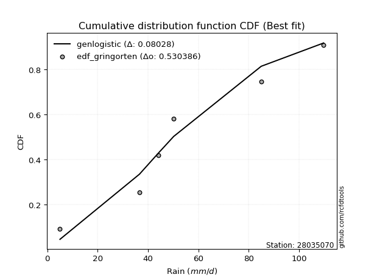</img>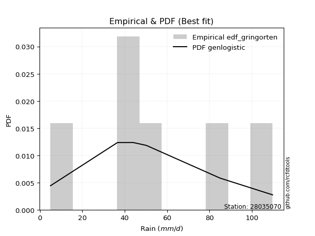</img>

</div>


### 9. EDF Filliben (1975)

The specific values of the constants (0.3175) (often denoted as $alpha$) and (0.365) are derived from a method proposed by James J. Filliben in a 1975 paper. This particular formula is the mean value of the $i$-th order statistic of the normal distribution and is considered a robust and effective plotting position formula for the normal probability plot correlation coefficient test for normality.

<div align="center">


$P=(m-0.3175)/(n+0.365)$


</div>


**9.1. Empirical values**

<div align="center">

|                | 0                   | 1                  | 2            | 3                  | 4                  |
|:---------------|:--------------------|:-------------------|:-------------|:-------------------|:-------------------|
| date           | 2020                | 2023               | 2021         | 2022               | 2019               |
| x              | 36.6                | 44.0               | 50.2         | 85.0               | 109.8              |
| m              | 1                   | 2                  | 3            | 4                  | 5                  |
| empirical_dist | edf_filliben        | edf_filliben       | edf_filliben | edf_filliben       | edf_filliben       |
| empirical      | 0.12721342031686858 | 0.3136067101584343 | 0.5          | 0.6863932898415657 | 0.8727865796831314 |
| empirical_tr   | 1.1457554725040042  | 1.456890699253225  | 2.0          | 3.188707280832095  | 7.860805860805863  |

</div>


**9.2. Kolmogorov-Smirnov fit test (sorted by Δ)**


<div align="center">

|                | 0                   | 1                   | 2                   | 3                   | 4                   | 5                   | 6                   | 7                   | 8                  | 9                   | 10                  | 11                  | 12                  | 13                 | 14                  | 15                  | 16                 | 17                 | 18                  | 19                  | 20                    | 21                  | 22                  | 23                 | 24                  | 25                  | 26                 | 27                 | 28                  | 29                  | 30                 | 31                 | 32                  | 33                  | 34                 | 35                 | 36                  | 37                 | 38                  | 39                  | 40                  | 41                  | 42                  | 43                 | 44                  | 45                 | 46                 | 47                  | 48                 | 49                  | 50                  | 51                  | 52                  | 53                  | 54                  | 55                  | 56                  | 57                  | 58                 | 59                 | 60                  | 61                  | 62                  | 63                 | 64                  | 65                  | 66                  | 67                 | 68                 | 69                 | 70                 | 71                  | 72                  | 73                  | 74                 | 75                 | 76                 | 77                 | 78                 | 79                 | 80                 | 81                 | 82                 | 83                  | 84                 | 85                 | 86                 | 87                 |
|:---------------|:--------------------|:--------------------|:--------------------|:--------------------|:--------------------|:--------------------|:--------------------|:--------------------|:-------------------|:--------------------|:--------------------|:--------------------|:--------------------|:-------------------|:--------------------|:--------------------|:-------------------|:-------------------|:--------------------|:--------------------|:----------------------|:--------------------|:--------------------|:-------------------|:--------------------|:--------------------|:-------------------|:-------------------|:--------------------|:--------------------|:-------------------|:-------------------|:--------------------|:--------------------|:-------------------|:-------------------|:--------------------|:-------------------|:--------------------|:--------------------|:--------------------|:--------------------|:--------------------|:-------------------|:--------------------|:-------------------|:-------------------|:--------------------|:-------------------|:--------------------|:--------------------|:--------------------|:--------------------|:--------------------|:--------------------|:--------------------|:--------------------|:--------------------|:-------------------|:-------------------|:--------------------|:--------------------|:--------------------|:-------------------|:--------------------|:--------------------|:--------------------|:-------------------|:-------------------|:-------------------|:-------------------|:--------------------|:--------------------|:--------------------|:-------------------|:-------------------|:-------------------|:-------------------|:-------------------|:-------------------|:-------------------|:-------------------|:-------------------|:--------------------|:-------------------|:-------------------|:-------------------|:-------------------|
| station        | 28035070            | 28035070            | 28035070            | 28035070            | 28035070            | 28035070            | 28035070            | 28035070            | 28035070           | 28035070            | 28035070            | 28035070            | 28035070            | 28035070           | 28035070            | 28035070            | 28035070           | 28035070           | 28035070            | 28035070            | 28035070              | 28035070            | 28035070            | 28035070           | 28035070            | 28035070            | 28035070           | 28035070           | 28035070            | 28035070            | 28035070           | 28035070           | 28035070            | 28035070            | 28035070           | 28035070           | 28035070            | 28035070           | 28035070            | 28035070            | 28035070            | 28035070            | 28035070            | 28035070           | 28035070            | 28035070           | 28035070           | 28035070            | 28035070           | 28035070            | 28035070            | 28035070            | 28035070            | 28035070            | 28035070            | 28035070            | 28035070            | 28035070            | 28035070           | 28035070           | 28035070            | 28035070            | 28035070            | 28035070           | 28035070            | 28035070            | 28035070            | 28035070           | 28035070           | 28035070           | 28035070           | 28035070            | 28035070            | 28035070            | 28035070           | 28035070           | 28035070           | 28035070           | 28035070           | 28035070           | 28035070           | 28035070           | 28035070           | 28035070            | 28035070           | 28035070           | 28035070           | 28035070           |
| empirical_dist | edf_filliben        | edf_filliben        | edf_filliben        | edf_filliben        | edf_filliben        | edf_filliben        | edf_filliben        | edf_filliben        | edf_filliben       | edf_filliben        | edf_filliben        | edf_filliben        | edf_filliben        | edf_filliben       | edf_filliben        | edf_filliben        | edf_filliben       | edf_filliben       | edf_filliben        | edf_filliben        | edf_filliben          | edf_filliben        | edf_filliben        | edf_filliben       | edf_filliben        | edf_filliben        | edf_filliben       | edf_filliben       | edf_filliben        | edf_filliben        | edf_filliben       | edf_filliben       | edf_filliben        | edf_filliben        | edf_filliben       | edf_filliben       | edf_filliben        | edf_filliben       | edf_filliben        | edf_filliben        | edf_filliben        | edf_filliben        | edf_filliben        | edf_filliben       | edf_filliben        | edf_filliben       | edf_filliben       | edf_filliben        | edf_filliben       | edf_filliben        | edf_filliben        | edf_filliben        | edf_filliben        | edf_filliben        | edf_filliben        | edf_filliben        | edf_filliben        | edf_filliben        | edf_filliben       | edf_filliben       | edf_filliben        | edf_filliben        | edf_filliben        | edf_filliben       | edf_filliben        | edf_filliben        | edf_filliben        | edf_filliben       | edf_filliben       | edf_filliben       | edf_filliben       | edf_filliben        | edf_filliben        | edf_filliben        | edf_filliben       | edf_filliben       | edf_filliben       | edf_filliben       | edf_filliben       | edf_filliben       | edf_filliben       | edf_filliben       | edf_filliben       | edf_filliben        | edf_filliben       | edf_filliben       | edf_filliben       | edf_filliben       |
| p_dist         | alpha               | lograyleigh         | loghalfnorm         | lognakagami         | logncf              | genexpon            | logmaxwell          | exponnorm           | laplace_asymmetric | expon               | gompertz            | f                   | invgamma            | nct                | halfnorm            | logexpon            | loggenexpon        | logexponnorm       | loginvgamma         | halflogistic        | loglaplace_asymmetric | nakagami            | lognct              | loginvgauss        | loginvweibull       | logalpha            | mielke             | logkstwobign       | loggumbel_r         | fisk                | logmielke          | loggenlogistic     | logpearson3         | invgauss            | loggompertz        | loghalflogistic    | betaprime           | ncf                | logf                | logbetaprime        | logmoyal            | logrice             | logjohnsonsu        | logloggamma        | logt                | lognorm            | lognorm            | moyal               | rayleigh           | genlogistic         | gumbel_r            | maxwell             | loglogistic         | pearson3            | kstwobign           | logwald             | logchi2             | weibull_min         | loghypsecant       | johnsonsu          | t                   | crystalball         | norm                | truncnorm          | wald                | loggumbel_l         | rice                | logerlang          | loglaplace         | erlang             | logistic           | hypsecant           | gumbel_l            | logweibull_min      | laplace            | loggibrat          | gibrat             | fatiguelife        | logfisk            | loggamma           | loggamma           | loglognorm         | logfatiguelife     | invweibull          | gamma              | chi2               | logtruncnorm       | logcrystalball     |
| delta          | 0.11324805658493609 | 0.12047303533346854 | 0.12453114022004619 | 0.12721341782613332 | 0.12806163012739757 | 0.12980406045360127 | 0.13000721169587975 | 0.13029182218060642 | 0.130348475332014  | 0.13038433489034473 | 0.13092985948224495 | 0.13342958991613973 | 0.13344560860057353 | 0.1336782637155769 | 0.13496277188493583 | 0.13556002372466058 | 0.1357724087420319 | 0.1364863266269707 | 0.13718372377121457 | 0.13758809130580207 | 0.1376544378797313    | 0.13807648817579987 | 0.13873649187323062 | 0.1395916564932309 | 0.13978276599658013 | 0.14031750504419993 | 0.1416582992086729 | 0.1425404024186525 | 0.14261812385220607 | 0.14264023215278482 | 0.1429775052123854 | 0.1434087057811141 | 0.14374026776853166 | 0.14466097730593286 | 0.1450403349298851 | 0.1451749028465461 | 0.14522953121225124 | 0.1465400559644654 | 0.14673779428200712 | 0.15060928000223794 | 0.15120448805320685 | 0.15181809708094718 | 0.15737123073277204 | 0.1591201570014213 | 0.16121114630047428 | 0.1612112985605434 | 0.1612112985605434 | 0.16344377728382398 | 0.1656955306456136 | 0.16819593003458788 | 0.17260736851060354 | 0.17658695615464703 | 0.18007698538402017 | 0.18081865972755878 | 0.18239686458270143 | 0.18401501028895992 | 0.19238597118105694 | 0.19315192025842315 | 0.1945110240252887 | 0.2011823052888474 | 0.20402308490377058 | 0.20403498636667505 | 0.20403498833128575 | 0.2040350066783233 | 0.20996126829918121 | 0.21935060640213416 | 0.22133438201892525 | 0.2218351507938029 | 0.2222785129650507 | 0.2232825135932831 | 0.2255719899598363 | 0.24101719389329584 | 0.25403261401492383 | 0.25554792353738925 | 0.2657166560314743 | 0.3107900775622493 | 0.3136055897637622 | 0.3252918682580414 | 0.3319559895829579 | 0.332815929264533  | 0.332815929264533  | 0.3528258183276117 | 0.4241819949821885 | 0.43974788982916013 | 0.5117401410315148 | 0.6823104475253929 | 0.6863257060935426 | nan                |
| deltao         | 0.5865427407550001  | 0.5865427407550001  | 0.5865427407550001  | 0.5865427407550001  | 0.5865427407550001  | 0.5865427407550001  | 0.5865427407550001  | 0.5865427407550001  | 0.5865427407550001 | 0.5865427407550001  | 0.5865427407550001  | 0.5865427407550001  | 0.5865427407550001  | 0.5865427407550001 | 0.5865427407550001  | 0.5865427407550001  | 0.5865427407550001 | 0.5865427407550001 | 0.5865427407550001  | 0.5865427407550001  | 0.5865427407550001    | 0.5865427407550001  | 0.5865427407550001  | 0.5865427407550001 | 0.5865427407550001  | 0.5865427407550001  | 0.5865427407550001 | 0.5865427407550001 | 0.5865427407550001  | 0.5865427407550001  | 0.5865427407550001 | 0.5865427407550001 | 0.5865427407550001  | 0.5865427407550001  | 0.5865427407550001 | 0.5865427407550001 | 0.5865427407550001  | 0.5865427407550001 | 0.5865427407550001  | 0.5865427407550001  | 0.5865427407550001  | 0.5865427407550001  | 0.5865427407550001  | 0.5865427407550001 | 0.5865427407550001  | 0.5865427407550001 | 0.5865427407550001 | 0.5865427407550001  | 0.5865427407550001 | 0.5865427407550001  | 0.5865427407550001  | 0.5865427407550001  | 0.5865427407550001  | 0.5865427407550001  | 0.5865427407550001  | 0.5865427407550001  | 0.5865427407550001  | 0.5865427407550001  | 0.5865427407550001 | 0.5865427407550001 | 0.5865427407550001  | 0.5865427407550001  | 0.5865427407550001  | 0.5865427407550001 | 0.5865427407550001  | 0.5865427407550001  | 0.5865427407550001  | 0.5865427407550001 | 0.5865427407550001 | 0.5865427407550001 | 0.5865427407550001 | 0.5865427407550001  | 0.5865427407550001  | 0.5865427407550001  | 0.5865427407550001 | 0.5865427407550001 | 0.5865427407550001 | 0.5865427407550001 | 0.5865427407550001 | 0.5865427407550001 | 0.5865427407550001 | 0.5865427407550001 | 0.5865427407550001 | 0.5865427407550001  | 0.5865427407550001 | 0.5865427407550001 | 0.5865427407550001 | 0.5865427407550001 |
| eval           | Δo > Δ              | Δo > Δ              | Δo > Δ              | Δo > Δ              | Δo > Δ              | Δo > Δ              | Δo > Δ              | Δo > Δ              | Δo > Δ             | Δo > Δ              | Δo > Δ              | Δo > Δ              | Δo > Δ              | Δo > Δ             | Δo > Δ              | Δo > Δ              | Δo > Δ             | Δo > Δ             | Δo > Δ              | Δo > Δ              | Δo > Δ                | Δo > Δ              | Δo > Δ              | Δo > Δ             | Δo > Δ              | Δo > Δ              | Δo > Δ             | Δo > Δ             | Δo > Δ              | Δo > Δ              | Δo > Δ             | Δo > Δ             | Δo > Δ              | Δo > Δ              | Δo > Δ             | Δo > Δ             | Δo > Δ              | Δo > Δ             | Δo > Δ              | Δo > Δ              | Δo > Δ              | Δo > Δ              | Δo > Δ              | Δo > Δ             | Δo > Δ              | Δo > Δ             | Δo > Δ             | Δo > Δ              | Δo > Δ             | Δo > Δ              | Δo > Δ              | Δo > Δ              | Δo > Δ              | Δo > Δ              | Δo > Δ              | Δo > Δ              | Δo > Δ              | Δo > Δ              | Δo > Δ             | Δo > Δ             | Δo > Δ              | Δo > Δ              | Δo > Δ              | Δo > Δ             | Δo > Δ              | Δo > Δ              | Δo > Δ              | Δo > Δ             | Δo > Δ             | Δo > Δ             | Δo > Δ             | Δo > Δ              | Δo > Δ              | Δo > Δ              | Δo > Δ             | Δo > Δ             | Δo > Δ             | Δo > Δ             | Δo > Δ             | Δo > Δ             | Δo > Δ             | Δo > Δ             | Δo > Δ             | Δo > Δ              | Δo > Δ             | Δo <= Δ            | Δo <= Δ            | Δo <= Δ            |
| fit            | 1                   | 1                   | 1                   | 1                   | 1                   | 1                   | 1                   | 1                   | 1                  | 1                   | 1                   | 1                   | 1                   | 1                  | 1                   | 1                   | 1                  | 1                  | 1                   | 1                   | 1                     | 1                   | 1                   | 1                  | 1                   | 1                   | 1                  | 1                  | 1                   | 1                   | 1                  | 1                  | 1                   | 1                   | 1                  | 1                  | 1                   | 1                  | 1                   | 1                   | 1                   | 1                   | 1                   | 1                  | 1                   | 1                  | 1                  | 1                   | 1                  | 1                   | 1                   | 1                   | 1                   | 1                   | 1                   | 1                   | 1                   | 1                   | 1                  | 1                  | 1                   | 1                   | 1                   | 1                  | 1                   | 1                   | 1                   | 1                  | 1                  | 1                  | 1                  | 1                   | 1                   | 1                   | 1                  | 1                  | 1                  | 1                  | 1                  | 1                  | 1                  | 1                  | 1                  | 1                   | 1                  | 0                  | 0                  | 0                  |
| n              | 5                   | 5                   | 5                   | 5                   | 5                   | 5                   | 5                   | 5                   | 5                  | 5                   | 5                   | 5                   | 5                   | 5                  | 5                   | 5                   | 5                  | 5                  | 5                   | 5                   | 5                     | 5                   | 5                   | 5                  | 5                   | 5                   | 5                  | 5                  | 5                   | 5                   | 5                  | 5                  | 5                   | 5                   | 5                  | 5                  | 5                   | 5                  | 5                   | 5                   | 5                   | 5                   | 5                   | 5                  | 5                   | 5                  | 5                  | 5                   | 5                  | 5                   | 5                   | 5                   | 5                   | 5                   | 5                   | 5                   | 5                   | 5                   | 5                  | 5                  | 5                   | 5                   | 5                   | 5                  | 5                   | 5                   | 5                   | 5                  | 5                  | 5                  | 5                  | 5                   | 5                   | 5                   | 5                  | 5                  | 5                  | 5                  | 5                  | 5                  | 5                  | 5                  | 5                  | 5                   | 5                  | 5                  | 5                  | 5                  |
| best_fit       | 1                   | 0                   | 0                   | 0                   | 0                   | 0                   | 0                   | 0                   | 0                  | 0                   | 0                   | 0                   | 0                   | 0                  | 0                   | 0                   | 0                  | 0                  | 0                   | 0                   | 0                     | 0                   | 0                   | 0                  | 0                   | 0                   | 0                  | 0                  | 0                   | 0                   | 0                  | 0                  | 0                   | 0                   | 0                  | 0                  | 0                   | 0                  | 0                   | 0                   | 0                   | 0                   | 0                   | 0                  | 0                   | 0                  | 0                  | 0                   | 0                  | 0                   | 0                   | 0                   | 0                   | 0                   | 0                   | 0                   | 0                   | 0                   | 0                  | 0                  | 0                   | 0                   | 0                   | 0                  | 0                   | 0                   | 0                   | 0                  | 0                  | 0                  | 0                  | 0                   | 0                   | 0                   | 0                  | 0                  | 0                  | 0                  | 0                  | 0                  | 0                  | 0                  | 0                  | 0                   | 0                  | 0                  | 0                  | 0                  |
| best_fit_sort  | 1                   | 2                   | 3                   | 4                   | 5                   | 6                   | 7                   | 8                   | 9                  | 10                  | 11                  | 12                  | 13                  | 14                 | 15                  | 16                  | 17                 | 18                 | 19                  | 20                  | 21                    | 22                  | 23                  | 24                 | 25                  | 26                  | 27                 | 28                 | 29                  | 30                  | 31                 | 32                 | 33                  | 34                  | 35                 | 36                 | 37                  | 38                 | 39                  | 40                  | 41                  | 42                  | 43                  | 44                 | 45                  | 46                 | 47                 | 48                  | 49                 | 50                  | 51                  | 52                  | 53                  | 54                  | 55                  | 56                  | 57                  | 58                  | 59                 | 60                 | 61                  | 62                  | 63                  | 64                 | 65                  | 66                  | 67                  | 68                 | 69                 | 70                 | 71                 | 72                  | 73                  | 74                  | 75                 | 76                 | 77                 | 78                 | 79                 | 80                 | 81                 | 82                 | 83                 | 84                  | 85                 | 86                 | 87                 | 88                 |

</div>


**9.3. Best fit**

<div align="center">

|   id |   station | empirical_dist   | p_dist   |    delta |   deltao | eval   |   fit |   n |   best_fit |   best_fit_sort |
|-----:|----------:|:-----------------|:---------|---------:|---------:|:-------|------:|----:|-----------:|----------------:|
|    0 |  28035070 | edf_filliben     | alpha    | 0.113248 | 0.586543 | Δo > Δ |     1 |   5 |          1 |               1 |

</div>


<div align="center">

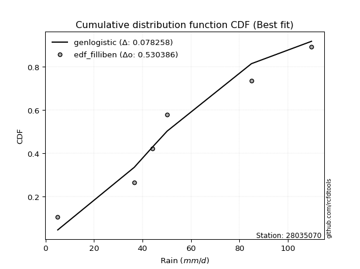</img></img>

</div>


### 10. EDF Jenkinson (1977)

The Jenkinson formula in hydrology is an empirical plotting position formula used to estimate the non-exceedance probability _(P)_ or return period _(T)_ of a given ordered observation within a sample. It is a widely used method in the frequency analysis of extreme events such as floods and rainfall, as it provides a distribution-free way to plot data. _a≈0.31_ and _b≈0.38_ are constants derived to approximate the median of the probability distribution for the given rank.

<div align="center">


$P=(m-a)/(n+b)$


</div>


**10.1. Empirical values**

<div align="center">

|                | 0                   | 1                  | 2             | 3                  | 4                  |
|:---------------|:--------------------|:-------------------|:--------------|:-------------------|:-------------------|
| date           | 2020                | 2023               | 2021          | 2022               | 2019               |
| x              | 36.6                | 44.0               | 50.2          | 85.0               | 109.8              |
| m              | 1                   | 2                  | 3             | 4                  | 5                  |
| empirical_dist | edf_jenkinson       | edf_jenkinson      | edf_jenkinson | edf_jenkinson      | edf_jenkinson      |
| empirical      | 0.12825278810408922 | 0.3141263940520446 | 0.5           | 0.6858736059479554 | 0.8717472118959109 |
| empirical_tr   | 1.1471215351812367  | 1.4579945799457996 | 2.0           | 3.183431952662722  | 7.797101449275368  |

</div>


**10.2. Kolmogorov-Smirnov fit test (sorted by Δ)**


<div align="center">

|                | 0                   | 1                   | 2                   | 3                   | 4                   | 5                   | 6                  | 7                   | 8                   | 9                   | 10                  | 11                  | 12                  | 13                  | 14                  | 15                  | 16                  | 17                  | 18                  | 19                 | 20                    | 21                 | 22                  | 23                  | 24                  | 25                  | 26                  | 27                  | 28                  | 29                 | 30                  | 31                  | 32                  | 33                 | 34                 | 35                  | 36                  | 37                 | 38                  | 39                  | 40                 | 41                  | 42                  | 43                 | 44                  | 45                 | 46                 | 47                  | 48                 | 49                  | 50                  | 51                  | 52                  | 53                  | 54                  | 55                  | 56                  | 57                  | 58                 | 59                 | 60                  | 61                  | 62                  | 63                 | 64                  | 65                  | 66                  | 67                 | 68                  | 69                  | 70                 | 71                  | 72                  | 73                 | 74                 | 75                  | 76                  | 77                  | 78                  | 79                  | 80                  | 81                  | 82                  | 83                  | 84                 | 85                 | 86                 | 87                 |
|:---------------|:--------------------|:--------------------|:--------------------|:--------------------|:--------------------|:--------------------|:-------------------|:--------------------|:--------------------|:--------------------|:--------------------|:--------------------|:--------------------|:--------------------|:--------------------|:--------------------|:--------------------|:--------------------|:--------------------|:-------------------|:----------------------|:-------------------|:--------------------|:--------------------|:--------------------|:--------------------|:--------------------|:--------------------|:--------------------|:-------------------|:--------------------|:--------------------|:--------------------|:-------------------|:-------------------|:--------------------|:--------------------|:-------------------|:--------------------|:--------------------|:-------------------|:--------------------|:--------------------|:-------------------|:--------------------|:-------------------|:-------------------|:--------------------|:-------------------|:--------------------|:--------------------|:--------------------|:--------------------|:--------------------|:--------------------|:--------------------|:--------------------|:--------------------|:-------------------|:-------------------|:--------------------|:--------------------|:--------------------|:-------------------|:--------------------|:--------------------|:--------------------|:-------------------|:--------------------|:--------------------|:-------------------|:--------------------|:--------------------|:-------------------|:-------------------|:--------------------|:--------------------|:--------------------|:--------------------|:--------------------|:--------------------|:--------------------|:--------------------|:--------------------|:-------------------|:-------------------|:-------------------|:-------------------|
| station        | 28035070            | 28035070            | 28035070            | 28035070            | 28035070            | 28035070            | 28035070           | 28035070            | 28035070            | 28035070            | 28035070            | 28035070            | 28035070            | 28035070            | 28035070            | 28035070            | 28035070            | 28035070            | 28035070            | 28035070           | 28035070              | 28035070           | 28035070            | 28035070            | 28035070            | 28035070            | 28035070            | 28035070            | 28035070            | 28035070           | 28035070            | 28035070            | 28035070            | 28035070           | 28035070           | 28035070            | 28035070            | 28035070           | 28035070            | 28035070            | 28035070           | 28035070            | 28035070            | 28035070           | 28035070            | 28035070           | 28035070           | 28035070            | 28035070           | 28035070            | 28035070            | 28035070            | 28035070            | 28035070            | 28035070            | 28035070            | 28035070            | 28035070            | 28035070           | 28035070           | 28035070            | 28035070            | 28035070            | 28035070           | 28035070            | 28035070            | 28035070            | 28035070           | 28035070            | 28035070            | 28035070           | 28035070            | 28035070            | 28035070           | 28035070           | 28035070            | 28035070            | 28035070            | 28035070            | 28035070            | 28035070            | 28035070            | 28035070            | 28035070            | 28035070           | 28035070           | 28035070           | 28035070           |
| empirical_dist | edf_jenkinson       | edf_jenkinson       | edf_jenkinson       | edf_jenkinson       | edf_jenkinson       | edf_jenkinson       | edf_jenkinson      | edf_jenkinson       | edf_jenkinson       | edf_jenkinson       | edf_jenkinson       | edf_jenkinson       | edf_jenkinson       | edf_jenkinson       | edf_jenkinson       | edf_jenkinson       | edf_jenkinson       | edf_jenkinson       | edf_jenkinson       | edf_jenkinson      | edf_jenkinson         | edf_jenkinson      | edf_jenkinson       | edf_jenkinson       | edf_jenkinson       | edf_jenkinson       | edf_jenkinson       | edf_jenkinson       | edf_jenkinson       | edf_jenkinson      | edf_jenkinson       | edf_jenkinson       | edf_jenkinson       | edf_jenkinson      | edf_jenkinson      | edf_jenkinson       | edf_jenkinson       | edf_jenkinson      | edf_jenkinson       | edf_jenkinson       | edf_jenkinson      | edf_jenkinson       | edf_jenkinson       | edf_jenkinson      | edf_jenkinson       | edf_jenkinson      | edf_jenkinson      | edf_jenkinson       | edf_jenkinson      | edf_jenkinson       | edf_jenkinson       | edf_jenkinson       | edf_jenkinson       | edf_jenkinson       | edf_jenkinson       | edf_jenkinson       | edf_jenkinson       | edf_jenkinson       | edf_jenkinson      | edf_jenkinson      | edf_jenkinson       | edf_jenkinson       | edf_jenkinson       | edf_jenkinson      | edf_jenkinson       | edf_jenkinson       | edf_jenkinson       | edf_jenkinson      | edf_jenkinson       | edf_jenkinson       | edf_jenkinson      | edf_jenkinson       | edf_jenkinson       | edf_jenkinson      | edf_jenkinson      | edf_jenkinson       | edf_jenkinson       | edf_jenkinson       | edf_jenkinson       | edf_jenkinson       | edf_jenkinson       | edf_jenkinson       | edf_jenkinson       | edf_jenkinson       | edf_jenkinson      | edf_jenkinson      | edf_jenkinson      | edf_jenkinson      |
| p_dist         | alpha               | lograyleigh         | loghalfnorm         | logncf              | lognakagami         | logmaxwell          | genexpon           | exponnorm           | laplace_asymmetric  | expon               | gompertz            | f                   | invgamma            | nct                 | halfnorm            | logexpon            | loggenexpon         | logexponnorm        | halflogistic        | loginvgamma        | loglaplace_asymmetric | nakagami           | lognct              | loginvgauss         | loginvweibull       | logalpha            | fisk                | mielke              | logkstwobign        | loggumbel_r        | logmielke           | logpearson3         | loggenlogistic      | loggompertz        | invgauss           | betaprime           | loghalflogistic     | ncf                | logf                | logbetaprime        | logmoyal           | logrice             | logjohnsonsu        | logloggamma        | logt                | lognorm            | lognorm            | moyal               | rayleigh           | genlogistic         | gumbel_r            | maxwell             | loglogistic         | pearson3            | kstwobign           | logwald             | logchi2             | weibull_min         | loghypsecant       | johnsonsu          | t                   | crystalball         | norm                | truncnorm          | wald                | loggumbel_l         | rice                | loglaplace         | logerlang           | erlang              | logistic           | hypsecant           | gumbel_l            | logweibull_min     | laplace            | loggibrat           | gibrat              | fatiguelife         | logfisk             | loggamma            | loggamma            | loglognorm          | logfatiguelife      | invweibull          | gamma              | chi2               | logtruncnorm       | logcrystalball     |
| delta          | 0.11376774047854632 | 0.12099271922707877 | 0.12505082411365642 | 0.12806163012739757 | 0.12825278561335396 | 0.13000721169587975 | 0.1303237443472115 | 0.13081150607421665 | 0.13086815922562423 | 0.13090401878395497 | 0.13092985948224495 | 0.13394927380974997 | 0.13396529249418376 | 0.13419794760918713 | 0.13496277188493583 | 0.13607970761827082 | 0.13629209263564213 | 0.13700601052058092 | 0.13758809130580207 | 0.1377034076648248 | 0.13817412177334154   | 0.1385961720694101 | 0.13873649187323062 | 0.14011134038684114 | 0.14030244989019036 | 0.14083718893781016 | 0.14212054825917447 | 0.14217798310228313 | 0.14306008631226275 | 0.1431378077458163 | 0.14349718910599563 | 0.14374026776853166 | 0.14392838967472432 | 0.1450403349298851 | 0.1451806611995431 | 0.14522953121225124 | 0.14569458674015634 | 0.1465400559644654 | 0.14673779428200712 | 0.15060928000223794 | 0.1517241719468171 | 0.15181809708094718 | 0.15737123073277204 | 0.1591201570014213 | 0.16121114630047428 | 0.1612112985605434 | 0.1612112985605434 | 0.16344377728382398 | 0.1656955306456136 | 0.16819593003458788 | 0.17260736851060354 | 0.17658695615464703 | 0.18007698538402017 | 0.18081865972755878 | 0.18239686458270143 | 0.18453469418257026 | 0.19134660339383636 | 0.19315192025842315 | 0.1945110240252887 | 0.2011823052888474 | 0.20402308490377058 | 0.20403498636667505 | 0.20403498833128575 | 0.2040350066783233 | 0.21048095219279156 | 0.21935060640213416 | 0.22133438201892525 | 0.2222785129650507 | 0.22235483468741313 | 0.22380219748689334 | 0.2255719899598363 | 0.24101719389329584 | 0.25403261401492383 | 0.2550282396437789 | 0.2657166560314743 | 0.31130976145585965 | 0.31412527365737253 | 0.32477218436443106 | 0.33091662179573733 | 0.33229624537092267 | 0.33229624537092267 | 0.35230613443400133 | 0.42366231108857816 | 0.43870852204193955 | 0.5112204571379044 | 0.6817907636317826 | 0.6858060221999324 | nan                |
| deltao         | 0.5865427407550001  | 0.5865427407550001  | 0.5865427407550001  | 0.5865427407550001  | 0.5865427407550001  | 0.5865427407550001  | 0.5865427407550001 | 0.5865427407550001  | 0.5865427407550001  | 0.5865427407550001  | 0.5865427407550001  | 0.5865427407550001  | 0.5865427407550001  | 0.5865427407550001  | 0.5865427407550001  | 0.5865427407550001  | 0.5865427407550001  | 0.5865427407550001  | 0.5865427407550001  | 0.5865427407550001 | 0.5865427407550001    | 0.5865427407550001 | 0.5865427407550001  | 0.5865427407550001  | 0.5865427407550001  | 0.5865427407550001  | 0.5865427407550001  | 0.5865427407550001  | 0.5865427407550001  | 0.5865427407550001 | 0.5865427407550001  | 0.5865427407550001  | 0.5865427407550001  | 0.5865427407550001 | 0.5865427407550001 | 0.5865427407550001  | 0.5865427407550001  | 0.5865427407550001 | 0.5865427407550001  | 0.5865427407550001  | 0.5865427407550001 | 0.5865427407550001  | 0.5865427407550001  | 0.5865427407550001 | 0.5865427407550001  | 0.5865427407550001 | 0.5865427407550001 | 0.5865427407550001  | 0.5865427407550001 | 0.5865427407550001  | 0.5865427407550001  | 0.5865427407550001  | 0.5865427407550001  | 0.5865427407550001  | 0.5865427407550001  | 0.5865427407550001  | 0.5865427407550001  | 0.5865427407550001  | 0.5865427407550001 | 0.5865427407550001 | 0.5865427407550001  | 0.5865427407550001  | 0.5865427407550001  | 0.5865427407550001 | 0.5865427407550001  | 0.5865427407550001  | 0.5865427407550001  | 0.5865427407550001 | 0.5865427407550001  | 0.5865427407550001  | 0.5865427407550001 | 0.5865427407550001  | 0.5865427407550001  | 0.5865427407550001 | 0.5865427407550001 | 0.5865427407550001  | 0.5865427407550001  | 0.5865427407550001  | 0.5865427407550001  | 0.5865427407550001  | 0.5865427407550001  | 0.5865427407550001  | 0.5865427407550001  | 0.5865427407550001  | 0.5865427407550001 | 0.5865427407550001 | 0.5865427407550001 | 0.5865427407550001 |
| eval           | Δo > Δ              | Δo > Δ              | Δo > Δ              | Δo > Δ              | Δo > Δ              | Δo > Δ              | Δo > Δ             | Δo > Δ              | Δo > Δ              | Δo > Δ              | Δo > Δ              | Δo > Δ              | Δo > Δ              | Δo > Δ              | Δo > Δ              | Δo > Δ              | Δo > Δ              | Δo > Δ              | Δo > Δ              | Δo > Δ             | Δo > Δ                | Δo > Δ             | Δo > Δ              | Δo > Δ              | Δo > Δ              | Δo > Δ              | Δo > Δ              | Δo > Δ              | Δo > Δ              | Δo > Δ             | Δo > Δ              | Δo > Δ              | Δo > Δ              | Δo > Δ             | Δo > Δ             | Δo > Δ              | Δo > Δ              | Δo > Δ             | Δo > Δ              | Δo > Δ              | Δo > Δ             | Δo > Δ              | Δo > Δ              | Δo > Δ             | Δo > Δ              | Δo > Δ             | Δo > Δ             | Δo > Δ              | Δo > Δ             | Δo > Δ              | Δo > Δ              | Δo > Δ              | Δo > Δ              | Δo > Δ              | Δo > Δ              | Δo > Δ              | Δo > Δ              | Δo > Δ              | Δo > Δ             | Δo > Δ             | Δo > Δ              | Δo > Δ              | Δo > Δ              | Δo > Δ             | Δo > Δ              | Δo > Δ              | Δo > Δ              | Δo > Δ             | Δo > Δ              | Δo > Δ              | Δo > Δ             | Δo > Δ              | Δo > Δ              | Δo > Δ             | Δo > Δ             | Δo > Δ              | Δo > Δ              | Δo > Δ              | Δo > Δ              | Δo > Δ              | Δo > Δ              | Δo > Δ              | Δo > Δ              | Δo > Δ              | Δo > Δ             | Δo <= Δ            | Δo <= Δ            | Δo <= Δ            |
| fit            | 1                   | 1                   | 1                   | 1                   | 1                   | 1                   | 1                  | 1                   | 1                   | 1                   | 1                   | 1                   | 1                   | 1                   | 1                   | 1                   | 1                   | 1                   | 1                   | 1                  | 1                     | 1                  | 1                   | 1                   | 1                   | 1                   | 1                   | 1                   | 1                   | 1                  | 1                   | 1                   | 1                   | 1                  | 1                  | 1                   | 1                   | 1                  | 1                   | 1                   | 1                  | 1                   | 1                   | 1                  | 1                   | 1                  | 1                  | 1                   | 1                  | 1                   | 1                   | 1                   | 1                   | 1                   | 1                   | 1                   | 1                   | 1                   | 1                  | 1                  | 1                   | 1                   | 1                   | 1                  | 1                   | 1                   | 1                   | 1                  | 1                   | 1                   | 1                  | 1                   | 1                   | 1                  | 1                  | 1                   | 1                   | 1                   | 1                   | 1                   | 1                   | 1                   | 1                   | 1                   | 1                  | 0                  | 0                  | 0                  |
| n              | 5                   | 5                   | 5                   | 5                   | 5                   | 5                   | 5                  | 5                   | 5                   | 5                   | 5                   | 5                   | 5                   | 5                   | 5                   | 5                   | 5                   | 5                   | 5                   | 5                  | 5                     | 5                  | 5                   | 5                   | 5                   | 5                   | 5                   | 5                   | 5                   | 5                  | 5                   | 5                   | 5                   | 5                  | 5                  | 5                   | 5                   | 5                  | 5                   | 5                   | 5                  | 5                   | 5                   | 5                  | 5                   | 5                  | 5                  | 5                   | 5                  | 5                   | 5                   | 5                   | 5                   | 5                   | 5                   | 5                   | 5                   | 5                   | 5                  | 5                  | 5                   | 5                   | 5                   | 5                  | 5                   | 5                   | 5                   | 5                  | 5                   | 5                   | 5                  | 5                   | 5                   | 5                  | 5                  | 5                   | 5                   | 5                   | 5                   | 5                   | 5                   | 5                   | 5                   | 5                   | 5                  | 5                  | 5                  | 5                  |
| best_fit       | 1                   | 0                   | 0                   | 0                   | 0                   | 0                   | 0                  | 0                   | 0                   | 0                   | 0                   | 0                   | 0                   | 0                   | 0                   | 0                   | 0                   | 0                   | 0                   | 0                  | 0                     | 0                  | 0                   | 0                   | 0                   | 0                   | 0                   | 0                   | 0                   | 0                  | 0                   | 0                   | 0                   | 0                  | 0                  | 0                   | 0                   | 0                  | 0                   | 0                   | 0                  | 0                   | 0                   | 0                  | 0                   | 0                  | 0                  | 0                   | 0                  | 0                   | 0                   | 0                   | 0                   | 0                   | 0                   | 0                   | 0                   | 0                   | 0                  | 0                  | 0                   | 0                   | 0                   | 0                  | 0                   | 0                   | 0                   | 0                  | 0                   | 0                   | 0                  | 0                   | 0                   | 0                  | 0                  | 0                   | 0                   | 0                   | 0                   | 0                   | 0                   | 0                   | 0                   | 0                   | 0                  | 0                  | 0                  | 0                  |
| best_fit_sort  | 1                   | 2                   | 3                   | 4                   | 5                   | 6                   | 7                  | 8                   | 9                   | 10                  | 11                  | 12                  | 13                  | 14                  | 15                  | 16                  | 17                  | 18                  | 19                  | 20                 | 21                    | 22                 | 23                  | 24                  | 25                  | 26                  | 27                  | 28                  | 29                  | 30                 | 31                  | 32                  | 33                  | 34                 | 35                 | 36                  | 37                  | 38                 | 39                  | 40                  | 41                 | 42                  | 43                  | 44                 | 45                  | 46                 | 47                 | 48                  | 49                 | 50                  | 51                  | 52                  | 53                  | 54                  | 55                  | 56                  | 57                  | 58                  | 59                 | 60                 | 61                  | 62                  | 63                  | 64                 | 65                  | 66                  | 67                  | 68                 | 69                  | 70                  | 71                 | 72                  | 73                  | 74                 | 75                 | 76                  | 77                  | 78                  | 79                  | 80                  | 81                  | 82                  | 83                  | 84                  | 85                 | 86                 | 87                 | 88                 |

</div>


**10.3. Best fit**

<div align="center">

|   id |   station | empirical_dist   | p_dist   |    delta |   deltao | eval   |   fit |   n |   best_fit |   best_fit_sort |
|-----:|----------:|:-----------------|:---------|---------:|---------:|:-------|------:|----:|-----------:|----------------:|
|    0 |  28035070 | edf_jenkinson    | alpha    | 0.113768 | 0.586543 | Δo > Δ |     1 |   5 |          1 |               1 |

</div>


<div align="center">

</img>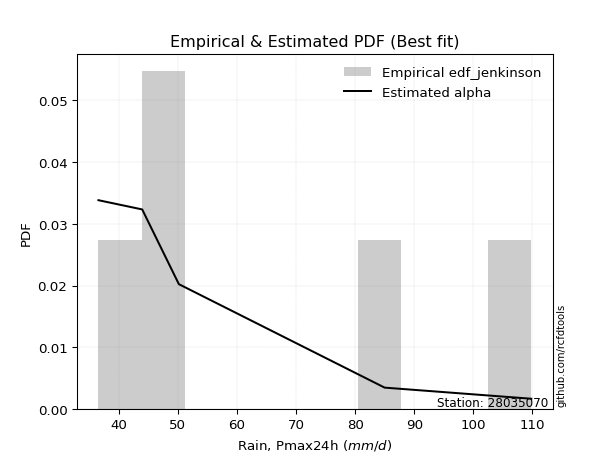</img>

</div>


### 11. EDF Cunnane (1978)

Cunnane´s work in statistical hydrology has focused on the performance and evaluation of different probability distributions (such as GEV, Gumbel, Lognormal) for flood frequency estimation. _b_ is a constant, typically set to 0.4.

<div align="center">


$P=(m-b)/(n+1-2b)$


</div>


**11.1. Empirical values**

<div align="center">

|                | 0                   | 1                  | 2           | 3                  | 4                  |
|:---------------|:--------------------|:-------------------|:------------|:-------------------|:-------------------|
| date           | 2020                | 2023               | 2021        | 2022               | 2019               |
| x              | 36.6                | 44.0               | 50.2        | 85.0               | 109.8              |
| m              | 1                   | 2                  | 3           | 4                  | 5                  |
| empirical_dist | edf_cunnane         | edf_cunnane        | edf_cunnane | edf_cunnane        | edf_cunnane        |
| empirical      | 0.11538461538461538 | 0.3076923076923077 | 0.5         | 0.6923076923076923 | 0.8846153846153845 |
| empirical_tr   | 1.1304347826086958  | 1.4444444444444444 | 2.0         | 3.25               | 8.666666666666655  |

</div>


**11.2. Kolmogorov-Smirnov fit test (sorted by Δ)**


<div align="center">

|                | 0                   | 1                   | 2                   | 3                   | 4                   | 5                  | 6                   | 7                   | 8                  | 9                  | 10                  | 11                  | 12                  | 13                  | 14                  | 15                  | 16                  | 17                  | 18                    | 19                  | 20                 | 21                 | 22                 | 23                  | 24                  | 25                 | 26                  | 27                  | 28                  | 29                  | 30                  | 31                  | 32                  | 33                  | 34                 | 35                  | 36                  | 37                 | 38                  | 39                  | 40                  | 41                  | 42                  | 43                 | 44                  | 45                 | 46                 | 47                  | 48                 | 49                  | 50                  | 51                  | 52                  | 53                  | 54                  | 55                  | 56                  | 57                 | 58                 | 59                  | 60                  | 61                  | 62                 | 63                  | 64                  | 65                  | 66                  | 67                  | 68                  | 69                 | 70                 | 71                  | 72                  | 73                 | 74                 | 75                  | 76                 | 77                 | 78                 | 79                 | 80                  | 81                  | 82                  | 83                  | 84                 | 85                 | 86                 | 87                 |
|:---------------|:--------------------|:--------------------|:--------------------|:--------------------|:--------------------|:-------------------|:--------------------|:--------------------|:-------------------|:-------------------|:--------------------|:--------------------|:--------------------|:--------------------|:--------------------|:--------------------|:--------------------|:--------------------|:----------------------|:--------------------|:-------------------|:-------------------|:-------------------|:--------------------|:--------------------|:-------------------|:--------------------|:--------------------|:--------------------|:--------------------|:--------------------|:--------------------|:--------------------|:--------------------|:-------------------|:--------------------|:--------------------|:-------------------|:--------------------|:--------------------|:--------------------|:--------------------|:--------------------|:-------------------|:--------------------|:-------------------|:-------------------|:--------------------|:-------------------|:--------------------|:--------------------|:--------------------|:--------------------|:--------------------|:--------------------|:--------------------|:--------------------|:-------------------|:-------------------|:--------------------|:--------------------|:--------------------|:-------------------|:--------------------|:--------------------|:--------------------|:--------------------|:--------------------|:--------------------|:-------------------|:-------------------|:--------------------|:--------------------|:-------------------|:-------------------|:--------------------|:-------------------|:-------------------|:-------------------|:-------------------|:--------------------|:--------------------|:--------------------|:--------------------|:-------------------|:-------------------|:-------------------|:-------------------|
| station        | 28035070            | 28035070            | 28035070            | 28035070            | 28035070            | 28035070           | 28035070            | 28035070            | 28035070           | 28035070           | 28035070            | 28035070            | 28035070            | 28035070            | 28035070            | 28035070            | 28035070            | 28035070            | 28035070              | 28035070            | 28035070           | 28035070           | 28035070           | 28035070            | 28035070            | 28035070           | 28035070            | 28035070            | 28035070            | 28035070            | 28035070            | 28035070            | 28035070            | 28035070            | 28035070           | 28035070            | 28035070            | 28035070           | 28035070            | 28035070            | 28035070            | 28035070            | 28035070            | 28035070           | 28035070            | 28035070           | 28035070           | 28035070            | 28035070           | 28035070            | 28035070            | 28035070            | 28035070            | 28035070            | 28035070            | 28035070            | 28035070            | 28035070           | 28035070           | 28035070            | 28035070            | 28035070            | 28035070           | 28035070            | 28035070            | 28035070            | 28035070            | 28035070            | 28035070            | 28035070           | 28035070           | 28035070            | 28035070            | 28035070           | 28035070           | 28035070            | 28035070           | 28035070           | 28035070           | 28035070           | 28035070            | 28035070            | 28035070            | 28035070            | 28035070           | 28035070           | 28035070           | 28035070           |
| empirical_dist | edf_cunnane         | edf_cunnane         | edf_cunnane         | edf_cunnane         | edf_cunnane         | edf_cunnane        | edf_cunnane         | edf_cunnane         | edf_cunnane        | edf_cunnane        | edf_cunnane         | edf_cunnane         | edf_cunnane         | edf_cunnane         | edf_cunnane         | edf_cunnane         | edf_cunnane         | edf_cunnane         | edf_cunnane           | edf_cunnane         | edf_cunnane        | edf_cunnane        | edf_cunnane        | edf_cunnane         | edf_cunnane         | edf_cunnane        | edf_cunnane         | edf_cunnane         | edf_cunnane         | edf_cunnane         | edf_cunnane         | edf_cunnane         | edf_cunnane         | edf_cunnane         | edf_cunnane        | edf_cunnane         | edf_cunnane         | edf_cunnane        | edf_cunnane         | edf_cunnane         | edf_cunnane         | edf_cunnane         | edf_cunnane         | edf_cunnane        | edf_cunnane         | edf_cunnane        | edf_cunnane        | edf_cunnane         | edf_cunnane        | edf_cunnane         | edf_cunnane         | edf_cunnane         | edf_cunnane         | edf_cunnane         | edf_cunnane         | edf_cunnane         | edf_cunnane         | edf_cunnane        | edf_cunnane        | edf_cunnane         | edf_cunnane         | edf_cunnane         | edf_cunnane        | edf_cunnane         | edf_cunnane         | edf_cunnane         | edf_cunnane         | edf_cunnane         | edf_cunnane         | edf_cunnane        | edf_cunnane        | edf_cunnane         | edf_cunnane         | edf_cunnane        | edf_cunnane        | edf_cunnane         | edf_cunnane        | edf_cunnane        | edf_cunnane        | edf_cunnane        | edf_cunnane         | edf_cunnane         | edf_cunnane         | edf_cunnane         | edf_cunnane        | edf_cunnane        | edf_cunnane        | edf_cunnane        |
| p_dist         | alpha               | lognakagami         | lograyleigh         | loghalfnorm         | genexpon            | exponnorm          | laplace_asymmetric  | expon               | f                  | invgamma           | nct                 | logncf              | logexpon            | loggenexpon         | logmaxwell          | logexponnorm        | gompertz            | loginvgamma         | loglaplace_asymmetric | nakagami            | loginvgauss        | loginvweibull      | logalpha           | halfnorm            | mielke              | logkstwobign       | loggumbel_r         | logmielke           | loggenlogistic      | halflogistic        | lognct              | invgauss            | loghalflogistic     | logpearson3         | loggompertz        | betaprime           | logmoyal            | ncf                | logf                | fisk                | logbetaprime        | logrice             | logjohnsonsu        | logloggamma        | logt                | lognorm            | lognorm            | moyal               | rayleigh           | genlogistic         | gumbel_r            | maxwell             | logwald             | loglogistic         | pearson3            | kstwobign           | weibull_min         | loghypsecant       | johnsonsu          | t                   | crystalball         | norm                | truncnorm          | wald                | logchi2             | logerlang           | erlang              | loggumbel_l         | rice                | loglaplace         | logistic           | hypsecant           | gumbel_l            | logweibull_min     | laplace            | loggibrat           | gibrat             | fatiguelife        | loggamma           | loggamma           | logfisk             | loglognorm          | logfatiguelife      | invweibull          | gamma              | chi2               | logtruncnorm       | logcrystalball     |
| delta          | 0.10733365411880946 | 0.11538461289388013 | 0.11809744551433038 | 0.11861673775391957 | 0.12399034623305161 | 0.1243774197144798 | 0.12443407286588737 | 0.12446993242421811 | 0.1275151874500131 | 0.1275312061344469 | 0.12776386124945027 | 0.12806163012739757 | 0.12964562125853396 | 0.12985800627590527 | 0.13000721169587975 | 0.13057192416084407 | 0.13092985948224495 | 0.13126932130508795 | 0.13174003541360468   | 0.13216208570967325 | 0.1336772540271043 | 0.1338683635304535 | 0.1344031025780733 | 0.13496277188493583 | 0.13574389674254628 | 0.1366259999525259 | 0.13670372138607945 | 0.13706310274625877 | 0.13749430331498746 | 0.13758809130580207 | 0.13873649187323062 | 0.13874657483980624 | 0.13926050038041948 | 0.14374026776853166 | 0.1450403349298851 | 0.14522953121225124 | 0.14529008558708023 | 0.1465400559644654 | 0.14673779428200712 | 0.14855463461891139 | 0.15060928000223794 | 0.15181809708094718 | 0.15737123073277204 | 0.1591201570014213 | 0.16121114630047428 | 0.1612112985605434 | 0.1612112985605434 | 0.16344377728382398 | 0.1656955306456136 | 0.16819593003458788 | 0.17260736851060354 | 0.17658695615464703 | 0.17810060782283335 | 0.18007698538402017 | 0.18081865972755878 | 0.18239686458270143 | 0.19315192025842315 | 0.1945110240252887 | 0.2011823052888474 | 0.20402308490377058 | 0.20403498636667505 | 0.20403498833128575 | 0.2040350066783233 | 0.20404686583305465 | 0.20421477611330996 | 0.21592074832767627 | 0.21736811112715648 | 0.21935060640213416 | 0.22133438201892525 | 0.2222785129650507 | 0.2255719899598363 | 0.24101719389329584 | 0.25403261401492383 | 0.2614623260035158 | 0.2657166560314743 | 0.30487567509612273 | 0.3076911872976356 | 0.331206270724168  | 0.3387303317306596 | 0.3387303317306596 | 0.34378479451521093 | 0.35874022079373824 | 0.43009639744831507 | 0.45157669476141316 | 0.5176545434976413 | 0.6882248499915196 | 0.6922401085596692 | nan                |
| deltao         | 0.5865427407550001  | 0.5865427407550001  | 0.5865427407550001  | 0.5865427407550001  | 0.5865427407550001  | 0.5865427407550001 | 0.5865427407550001  | 0.5865427407550001  | 0.5865427407550001 | 0.5865427407550001 | 0.5865427407550001  | 0.5865427407550001  | 0.5865427407550001  | 0.5865427407550001  | 0.5865427407550001  | 0.5865427407550001  | 0.5865427407550001  | 0.5865427407550001  | 0.5865427407550001    | 0.5865427407550001  | 0.5865427407550001 | 0.5865427407550001 | 0.5865427407550001 | 0.5865427407550001  | 0.5865427407550001  | 0.5865427407550001 | 0.5865427407550001  | 0.5865427407550001  | 0.5865427407550001  | 0.5865427407550001  | 0.5865427407550001  | 0.5865427407550001  | 0.5865427407550001  | 0.5865427407550001  | 0.5865427407550001 | 0.5865427407550001  | 0.5865427407550001  | 0.5865427407550001 | 0.5865427407550001  | 0.5865427407550001  | 0.5865427407550001  | 0.5865427407550001  | 0.5865427407550001  | 0.5865427407550001 | 0.5865427407550001  | 0.5865427407550001 | 0.5865427407550001 | 0.5865427407550001  | 0.5865427407550001 | 0.5865427407550001  | 0.5865427407550001  | 0.5865427407550001  | 0.5865427407550001  | 0.5865427407550001  | 0.5865427407550001  | 0.5865427407550001  | 0.5865427407550001  | 0.5865427407550001 | 0.5865427407550001 | 0.5865427407550001  | 0.5865427407550001  | 0.5865427407550001  | 0.5865427407550001 | 0.5865427407550001  | 0.5865427407550001  | 0.5865427407550001  | 0.5865427407550001  | 0.5865427407550001  | 0.5865427407550001  | 0.5865427407550001 | 0.5865427407550001 | 0.5865427407550001  | 0.5865427407550001  | 0.5865427407550001 | 0.5865427407550001 | 0.5865427407550001  | 0.5865427407550001 | 0.5865427407550001 | 0.5865427407550001 | 0.5865427407550001 | 0.5865427407550001  | 0.5865427407550001  | 0.5865427407550001  | 0.5865427407550001  | 0.5865427407550001 | 0.5865427407550001 | 0.5865427407550001 | 0.5865427407550001 |
| eval           | Δo > Δ              | Δo > Δ              | Δo > Δ              | Δo > Δ              | Δo > Δ              | Δo > Δ             | Δo > Δ              | Δo > Δ              | Δo > Δ             | Δo > Δ             | Δo > Δ              | Δo > Δ              | Δo > Δ              | Δo > Δ              | Δo > Δ              | Δo > Δ              | Δo > Δ              | Δo > Δ              | Δo > Δ                | Δo > Δ              | Δo > Δ             | Δo > Δ             | Δo > Δ             | Δo > Δ              | Δo > Δ              | Δo > Δ             | Δo > Δ              | Δo > Δ              | Δo > Δ              | Δo > Δ              | Δo > Δ              | Δo > Δ              | Δo > Δ              | Δo > Δ              | Δo > Δ             | Δo > Δ              | Δo > Δ              | Δo > Δ             | Δo > Δ              | Δo > Δ              | Δo > Δ              | Δo > Δ              | Δo > Δ              | Δo > Δ             | Δo > Δ              | Δo > Δ             | Δo > Δ             | Δo > Δ              | Δo > Δ             | Δo > Δ              | Δo > Δ              | Δo > Δ              | Δo > Δ              | Δo > Δ              | Δo > Δ              | Δo > Δ              | Δo > Δ              | Δo > Δ             | Δo > Δ             | Δo > Δ              | Δo > Δ              | Δo > Δ              | Δo > Δ             | Δo > Δ              | Δo > Δ              | Δo > Δ              | Δo > Δ              | Δo > Δ              | Δo > Δ              | Δo > Δ             | Δo > Δ             | Δo > Δ              | Δo > Δ              | Δo > Δ             | Δo > Δ             | Δo > Δ              | Δo > Δ             | Δo > Δ             | Δo > Δ             | Δo > Δ             | Δo > Δ              | Δo > Δ              | Δo > Δ              | Δo > Δ              | Δo > Δ             | Δo <= Δ            | Δo <= Δ            | Δo <= Δ            |
| fit            | 1                   | 1                   | 1                   | 1                   | 1                   | 1                  | 1                   | 1                   | 1                  | 1                  | 1                   | 1                   | 1                   | 1                   | 1                   | 1                   | 1                   | 1                   | 1                     | 1                   | 1                  | 1                  | 1                  | 1                   | 1                   | 1                  | 1                   | 1                   | 1                   | 1                   | 1                   | 1                   | 1                   | 1                   | 1                  | 1                   | 1                   | 1                  | 1                   | 1                   | 1                   | 1                   | 1                   | 1                  | 1                   | 1                  | 1                  | 1                   | 1                  | 1                   | 1                   | 1                   | 1                   | 1                   | 1                   | 1                   | 1                   | 1                  | 1                  | 1                   | 1                   | 1                   | 1                  | 1                   | 1                   | 1                   | 1                   | 1                   | 1                   | 1                  | 1                  | 1                   | 1                   | 1                  | 1                  | 1                   | 1                  | 1                  | 1                  | 1                  | 1                   | 1                   | 1                   | 1                   | 1                  | 0                  | 0                  | 0                  |
| n              | 5                   | 5                   | 5                   | 5                   | 5                   | 5                  | 5                   | 5                   | 5                  | 5                  | 5                   | 5                   | 5                   | 5                   | 5                   | 5                   | 5                   | 5                   | 5                     | 5                   | 5                  | 5                  | 5                  | 5                   | 5                   | 5                  | 5                   | 5                   | 5                   | 5                   | 5                   | 5                   | 5                   | 5                   | 5                  | 5                   | 5                   | 5                  | 5                   | 5                   | 5                   | 5                   | 5                   | 5                  | 5                   | 5                  | 5                  | 5                   | 5                  | 5                   | 5                   | 5                   | 5                   | 5                   | 5                   | 5                   | 5                   | 5                  | 5                  | 5                   | 5                   | 5                   | 5                  | 5                   | 5                   | 5                   | 5                   | 5                   | 5                   | 5                  | 5                  | 5                   | 5                   | 5                  | 5                  | 5                   | 5                  | 5                  | 5                  | 5                  | 5                   | 5                   | 5                   | 5                   | 5                  | 5                  | 5                  | 5                  |
| best_fit       | 1                   | 0                   | 0                   | 0                   | 0                   | 0                  | 0                   | 0                   | 0                  | 0                  | 0                   | 0                   | 0                   | 0                   | 0                   | 0                   | 0                   | 0                   | 0                     | 0                   | 0                  | 0                  | 0                  | 0                   | 0                   | 0                  | 0                   | 0                   | 0                   | 0                   | 0                   | 0                   | 0                   | 0                   | 0                  | 0                   | 0                   | 0                  | 0                   | 0                   | 0                   | 0                   | 0                   | 0                  | 0                   | 0                  | 0                  | 0                   | 0                  | 0                   | 0                   | 0                   | 0                   | 0                   | 0                   | 0                   | 0                   | 0                  | 0                  | 0                   | 0                   | 0                   | 0                  | 0                   | 0                   | 0                   | 0                   | 0                   | 0                   | 0                  | 0                  | 0                   | 0                   | 0                  | 0                  | 0                   | 0                  | 0                  | 0                  | 0                  | 0                   | 0                   | 0                   | 0                   | 0                  | 0                  | 0                  | 0                  |
| best_fit_sort  | 1                   | 2                   | 3                   | 4                   | 5                   | 6                  | 7                   | 8                   | 9                  | 10                 | 11                  | 12                  | 13                  | 14                  | 15                  | 16                  | 17                  | 18                  | 19                    | 20                  | 21                 | 22                 | 23                 | 24                  | 25                  | 26                 | 27                  | 28                  | 29                  | 30                  | 31                  | 32                  | 33                  | 34                  | 35                 | 36                  | 37                  | 38                 | 39                  | 40                  | 41                  | 42                  | 43                  | 44                 | 45                  | 46                 | 47                 | 48                  | 49                 | 50                  | 51                  | 52                  | 53                  | 54                  | 55                  | 56                  | 57                  | 58                 | 59                 | 60                  | 61                  | 62                  | 63                 | 64                  | 65                  | 66                  | 67                  | 68                  | 69                  | 70                 | 71                 | 72                  | 73                  | 74                 | 75                 | 76                  | 77                 | 78                 | 79                 | 80                 | 81                  | 82                  | 83                  | 84                  | 85                 | 86                 | 87                 | 88                 |

</div>


**11.3. Best fit**

<div align="center">

|   id |   station | empirical_dist   | p_dist   |    delta |   deltao | eval   |   fit |   n |   best_fit |   best_fit_sort |
|-----:|----------:|:-----------------|:---------|---------:|---------:|:-------|------:|----:|-----------:|----------------:|
|    0 |  28035070 | edf_cunnane      | alpha    | 0.107334 | 0.586543 | Δo > Δ |     1 |   5 |          1 |               1 |

</div>


<div align="center">

</img></img>

</div>


### 12. EDF Adamowski (1981)

The Adamowski formula in hydrology refers to a specific plotting position formula used for estimating the non-parametric empirical distribution of hydrological events (like flood peaks) to calculate their return periods. This formula provides an alternative to traditional parametric methods (like the Gumbel or Log Pearson Type III distributions). 

<div align="center">


$P=(m-0.25)/(n+0.5)$


</div>


**12.1. Empirical values**

<div align="center">

|                | 0                   | 1                  | 2             | 3                  | 4                  |
|:---------------|:--------------------|:-------------------|:--------------|:-------------------|:-------------------|
| date           | 2020                | 2023               | 2021          | 2022               | 2019               |
| x              | 36.6                | 44.0               | 50.2          | 85.0               | 109.8              |
| m              | 1                   | 2                  | 3             | 4                  | 5                  |
| empirical_dist | edf_adamowski       | edf_adamowski      | edf_adamowski | edf_adamowski      | edf_adamowski      |
| empirical      | 0.13636363636363635 | 0.3181818181818182 | 0.5           | 0.6818181818181818 | 0.8636363636363636 |
| empirical_tr   | 1.1578947368421053  | 1.4666666666666666 | 2.0           | 3.1428571428571423 | 7.333333333333334  |

</div>


**12.2. Kolmogorov-Smirnov fit test (sorted by Δ)**


<div align="center">

|                | 0                   | 1                   | 2                   | 3                  | 4                   | 5                   | 6                   | 7                   | 8                  | 9                  | 10                 | 11                  | 12                  | 13                  | 14                  | 15                  | 16                 | 17                  | 18                  | 19                 | 20                 | 21                  | 22                    | 23                  | 24                  | 25                 | 26                  | 27                  | 28                 | 29                  | 30                 | 31                 | 32                  | 33                 | 34                  | 35                 | 36                 | 37                  | 38                 | 39                  | 40                  | 41                  | 42                  | 43                 | 44                  | 45                 | 46                 | 47                  | 48                 | 49                  | 50                  | 51                  | 52                  | 53                  | 54                  | 55                  | 56                  | 57                  | 58                 | 59                 | 60                  | 61                  | 62                  | 63                 | 64                  | 65                  | 66                  | 67                 | 68                 | 69                 | 70                 | 71                  | 72                  | 73                  | 74                 | 75                 | 76                 | 77                 | 78                 | 79                 | 80                 | 81                 | 82                 | 83                  | 84                 | 85                 | 86                 | 87                 |
|:---------------|:--------------------|:--------------------|:--------------------|:-------------------|:--------------------|:--------------------|:--------------------|:--------------------|:-------------------|:-------------------|:-------------------|:--------------------|:--------------------|:--------------------|:--------------------|:--------------------|:-------------------|:--------------------|:--------------------|:-------------------|:-------------------|:--------------------|:----------------------|:--------------------|:--------------------|:-------------------|:--------------------|:--------------------|:-------------------|:--------------------|:-------------------|:-------------------|:--------------------|:-------------------|:--------------------|:-------------------|:-------------------|:--------------------|:-------------------|:--------------------|:--------------------|:--------------------|:--------------------|:-------------------|:--------------------|:-------------------|:-------------------|:--------------------|:-------------------|:--------------------|:--------------------|:--------------------|:--------------------|:--------------------|:--------------------|:--------------------|:--------------------|:--------------------|:-------------------|:-------------------|:--------------------|:--------------------|:--------------------|:-------------------|:--------------------|:--------------------|:--------------------|:-------------------|:-------------------|:-------------------|:-------------------|:--------------------|:--------------------|:--------------------|:-------------------|:-------------------|:-------------------|:-------------------|:-------------------|:-------------------|:-------------------|:-------------------|:-------------------|:--------------------|:-------------------|:-------------------|:-------------------|:-------------------|
| station        | 28035070            | 28035070            | 28035070            | 28035070           | 28035070            | 28035070            | 28035070            | 28035070            | 28035070           | 28035070           | 28035070           | 28035070            | 28035070            | 28035070            | 28035070            | 28035070            | 28035070           | 28035070            | 28035070            | 28035070           | 28035070           | 28035070            | 28035070              | 28035070            | 28035070            | 28035070           | 28035070            | 28035070            | 28035070           | 28035070            | 28035070           | 28035070           | 28035070            | 28035070           | 28035070            | 28035070           | 28035070           | 28035070            | 28035070           | 28035070            | 28035070            | 28035070            | 28035070            | 28035070           | 28035070            | 28035070           | 28035070           | 28035070            | 28035070           | 28035070            | 28035070            | 28035070            | 28035070            | 28035070            | 28035070            | 28035070            | 28035070            | 28035070            | 28035070           | 28035070           | 28035070            | 28035070            | 28035070            | 28035070           | 28035070            | 28035070            | 28035070            | 28035070           | 28035070           | 28035070           | 28035070           | 28035070            | 28035070            | 28035070            | 28035070           | 28035070           | 28035070           | 28035070           | 28035070           | 28035070           | 28035070           | 28035070           | 28035070           | 28035070            | 28035070           | 28035070           | 28035070           | 28035070           |
| empirical_dist | edf_adamowski       | edf_adamowski       | edf_adamowski       | edf_adamowski      | edf_adamowski       | edf_adamowski       | edf_adamowski       | edf_adamowski       | edf_adamowski      | edf_adamowski      | edf_adamowski      | edf_adamowski       | edf_adamowski       | edf_adamowski       | edf_adamowski       | edf_adamowski       | edf_adamowski      | edf_adamowski       | edf_adamowski       | edf_adamowski      | edf_adamowski      | edf_adamowski       | edf_adamowski         | edf_adamowski       | edf_adamowski       | edf_adamowski      | edf_adamowski       | edf_adamowski       | edf_adamowski      | edf_adamowski       | edf_adamowski      | edf_adamowski      | edf_adamowski       | edf_adamowski      | edf_adamowski       | edf_adamowski      | edf_adamowski      | edf_adamowski       | edf_adamowski      | edf_adamowski       | edf_adamowski       | edf_adamowski       | edf_adamowski       | edf_adamowski      | edf_adamowski       | edf_adamowski      | edf_adamowski      | edf_adamowski       | edf_adamowski      | edf_adamowski       | edf_adamowski       | edf_adamowski       | edf_adamowski       | edf_adamowski       | edf_adamowski       | edf_adamowski       | edf_adamowski       | edf_adamowski       | edf_adamowski      | edf_adamowski      | edf_adamowski       | edf_adamowski       | edf_adamowski       | edf_adamowski      | edf_adamowski       | edf_adamowski       | edf_adamowski       | edf_adamowski      | edf_adamowski      | edf_adamowski      | edf_adamowski      | edf_adamowski       | edf_adamowski       | edf_adamowski       | edf_adamowski      | edf_adamowski      | edf_adamowski      | edf_adamowski      | edf_adamowski      | edf_adamowski      | edf_adamowski      | edf_adamowski      | edf_adamowski      | edf_adamowski       | edf_adamowski      | edf_adamowski      | edf_adamowski      | edf_adamowski      |
| p_dist         | alpha               | lograyleigh         | logncf              | loghalfnorm        | logmaxwell          | halfnorm            | exponnorm           | laplace_asymmetric  | lognakagami        | genexpon           | gompertz           | expon               | halflogistic        | f                   | invgamma            | fisk                | nct                | lognct              | logexpon            | loggenexpon        | logexponnorm       | loginvgamma         | loglaplace_asymmetric | nakagami            | logpearson3         | loginvgauss        | loginvweibull       | logalpha            | loggompertz        | betaprime           | mielke             | ncf                | logf                | logkstwobign       | loggumbel_r         | logmielke          | loggenlogistic     | invgauss            | loghalflogistic    | logbetaprime        | logrice             | logmoyal            | logjohnsonsu        | logloggamma        | logt                | lognorm            | lognorm            | moyal               | rayleigh           | genlogistic         | gumbel_r            | maxwell             | loglogistic         | pearson3            | kstwobign           | logchi2             | logwald             | weibull_min         | loghypsecant       | johnsonsu          | t                   | crystalball         | norm                | truncnorm          | wald                | loggumbel_l         | rice                | loglaplace         | logistic           | logerlang          | erlang             | hypsecant           | logweibull_min      | gumbel_l            | laplace            | loggibrat          | gibrat             | fatiguelife        | logfisk            | loggamma           | loggamma           | loglognorm         | logfatiguelife     | invweibull          | gamma              | chi2               | logtruncnorm       | logcrystalball     |
| delta          | 0.11782316460831999 | 0.12504814335685244 | 0.12806163012739757 | 0.1291062482434301 | 0.13000721169587975 | 0.13496277188493583 | 0.13529839744726369 | 0.13636361383978202 | 0.1363636338729011 | 0.1363636363623396 | 0.1363636363636361 | 0.13636363636363635 | 0.13758809130580207 | 0.13800469793952364 | 0.13802071662395743 | 0.13806512412940092 | 0.1382533717389608 | 0.13873649187323062 | 0.14013513174804448 | 0.1403475167654158 | 0.1410614346503546 | 0.14175883179459847 | 0.1422295459031152    | 0.14265159619918377 | 0.14374026776853166 | 0.1441667645166148 | 0.14435787401996403 | 0.14489261306758383 | 0.1450403349298851 | 0.14522953121225124 | 0.1462334072320568 | 0.1465400559644654 | 0.14673779428200712 | 0.1471155104420364 | 0.14719323187558997 | 0.1475526132357693 | 0.147983813804498  | 0.14923608532931676 | 0.14975001086993   | 0.15060928000223794 | 0.15181809708094718 | 0.15577959607659075 | 0.15737123073277204 | 0.1591201570014213 | 0.16121114630047428 | 0.1612112985605434 | 0.1612112985605434 | 0.16344377728382398 | 0.1656955306456136 | 0.16819593003458788 | 0.17260736851060354 | 0.17658695615464703 | 0.18007698538402017 | 0.18081865972755878 | 0.18239686458270143 | 0.18323575513428914 | 0.18859011831234382 | 0.19315192025842315 | 0.1945110240252887 | 0.2011823052888474 | 0.20402308490377058 | 0.20403498636667505 | 0.20403498833128575 | 0.2040350066783233 | 0.21453637632256511 | 0.21935060640213416 | 0.22133438201892525 | 0.2222785129650507 | 0.2255719899598363 | 0.2264102588171868 | 0.227857621616667  | 0.24101719389329584 | 0.25097281551400535 | 0.25403261401492383 | 0.2657166560314743 | 0.3153651855856332 | 0.3181806977871461 | 0.3207167602346575 | 0.3228057735361901 | 0.3282408212411491 | 0.3282408212411491 | 0.3482507103042278 | 0.4196068869588046 | 0.43059767378239233 | 0.5071650330081308 | 0.6777353395020091 | 0.6817505980701587 | nan                |
| deltao         | 0.5865427407550001  | 0.5865427407550001  | 0.5865427407550001  | 0.5865427407550001 | 0.5865427407550001  | 0.5865427407550001  | 0.5865427407550001  | 0.5865427407550001  | 0.5865427407550001 | 0.5865427407550001 | 0.5865427407550001 | 0.5865427407550001  | 0.5865427407550001  | 0.5865427407550001  | 0.5865427407550001  | 0.5865427407550001  | 0.5865427407550001 | 0.5865427407550001  | 0.5865427407550001  | 0.5865427407550001 | 0.5865427407550001 | 0.5865427407550001  | 0.5865427407550001    | 0.5865427407550001  | 0.5865427407550001  | 0.5865427407550001 | 0.5865427407550001  | 0.5865427407550001  | 0.5865427407550001 | 0.5865427407550001  | 0.5865427407550001 | 0.5865427407550001 | 0.5865427407550001  | 0.5865427407550001 | 0.5865427407550001  | 0.5865427407550001 | 0.5865427407550001 | 0.5865427407550001  | 0.5865427407550001 | 0.5865427407550001  | 0.5865427407550001  | 0.5865427407550001  | 0.5865427407550001  | 0.5865427407550001 | 0.5865427407550001  | 0.5865427407550001 | 0.5865427407550001 | 0.5865427407550001  | 0.5865427407550001 | 0.5865427407550001  | 0.5865427407550001  | 0.5865427407550001  | 0.5865427407550001  | 0.5865427407550001  | 0.5865427407550001  | 0.5865427407550001  | 0.5865427407550001  | 0.5865427407550001  | 0.5865427407550001 | 0.5865427407550001 | 0.5865427407550001  | 0.5865427407550001  | 0.5865427407550001  | 0.5865427407550001 | 0.5865427407550001  | 0.5865427407550001  | 0.5865427407550001  | 0.5865427407550001 | 0.5865427407550001 | 0.5865427407550001 | 0.5865427407550001 | 0.5865427407550001  | 0.5865427407550001  | 0.5865427407550001  | 0.5865427407550001 | 0.5865427407550001 | 0.5865427407550001 | 0.5865427407550001 | 0.5865427407550001 | 0.5865427407550001 | 0.5865427407550001 | 0.5865427407550001 | 0.5865427407550001 | 0.5865427407550001  | 0.5865427407550001 | 0.5865427407550001 | 0.5865427407550001 | 0.5865427407550001 |
| eval           | Δo > Δ              | Δo > Δ              | Δo > Δ              | Δo > Δ             | Δo > Δ              | Δo > Δ              | Δo > Δ              | Δo > Δ              | Δo > Δ             | Δo > Δ             | Δo > Δ             | Δo > Δ              | Δo > Δ              | Δo > Δ              | Δo > Δ              | Δo > Δ              | Δo > Δ             | Δo > Δ              | Δo > Δ              | Δo > Δ             | Δo > Δ             | Δo > Δ              | Δo > Δ                | Δo > Δ              | Δo > Δ              | Δo > Δ             | Δo > Δ              | Δo > Δ              | Δo > Δ             | Δo > Δ              | Δo > Δ             | Δo > Δ             | Δo > Δ              | Δo > Δ             | Δo > Δ              | Δo > Δ             | Δo > Δ             | Δo > Δ              | Δo > Δ             | Δo > Δ              | Δo > Δ              | Δo > Δ              | Δo > Δ              | Δo > Δ             | Δo > Δ              | Δo > Δ             | Δo > Δ             | Δo > Δ              | Δo > Δ             | Δo > Δ              | Δo > Δ              | Δo > Δ              | Δo > Δ              | Δo > Δ              | Δo > Δ              | Δo > Δ              | Δo > Δ              | Δo > Δ              | Δo > Δ             | Δo > Δ             | Δo > Δ              | Δo > Δ              | Δo > Δ              | Δo > Δ             | Δo > Δ              | Δo > Δ              | Δo > Δ              | Δo > Δ             | Δo > Δ             | Δo > Δ             | Δo > Δ             | Δo > Δ              | Δo > Δ              | Δo > Δ              | Δo > Δ             | Δo > Δ             | Δo > Δ             | Δo > Δ             | Δo > Δ             | Δo > Δ             | Δo > Δ             | Δo > Δ             | Δo > Δ             | Δo > Δ              | Δo > Δ             | Δo <= Δ            | Δo <= Δ            | Δo <= Δ            |
| fit            | 1                   | 1                   | 1                   | 1                  | 1                   | 1                   | 1                   | 1                   | 1                  | 1                  | 1                  | 1                   | 1                   | 1                   | 1                   | 1                   | 1                  | 1                   | 1                   | 1                  | 1                  | 1                   | 1                     | 1                   | 1                   | 1                  | 1                   | 1                   | 1                  | 1                   | 1                  | 1                  | 1                   | 1                  | 1                   | 1                  | 1                  | 1                   | 1                  | 1                   | 1                   | 1                   | 1                   | 1                  | 1                   | 1                  | 1                  | 1                   | 1                  | 1                   | 1                   | 1                   | 1                   | 1                   | 1                   | 1                   | 1                   | 1                   | 1                  | 1                  | 1                   | 1                   | 1                   | 1                  | 1                   | 1                   | 1                   | 1                  | 1                  | 1                  | 1                  | 1                   | 1                   | 1                   | 1                  | 1                  | 1                  | 1                  | 1                  | 1                  | 1                  | 1                  | 1                  | 1                   | 1                  | 0                  | 0                  | 0                  |
| n              | 5                   | 5                   | 5                   | 5                  | 5                   | 5                   | 5                   | 5                   | 5                  | 5                  | 5                  | 5                   | 5                   | 5                   | 5                   | 5                   | 5                  | 5                   | 5                   | 5                  | 5                  | 5                   | 5                     | 5                   | 5                   | 5                  | 5                   | 5                   | 5                  | 5                   | 5                  | 5                  | 5                   | 5                  | 5                   | 5                  | 5                  | 5                   | 5                  | 5                   | 5                   | 5                   | 5                   | 5                  | 5                   | 5                  | 5                  | 5                   | 5                  | 5                   | 5                   | 5                   | 5                   | 5                   | 5                   | 5                   | 5                   | 5                   | 5                  | 5                  | 5                   | 5                   | 5                   | 5                  | 5                   | 5                   | 5                   | 5                  | 5                  | 5                  | 5                  | 5                   | 5                   | 5                   | 5                  | 5                  | 5                  | 5                  | 5                  | 5                  | 5                  | 5                  | 5                  | 5                   | 5                  | 5                  | 5                  | 5                  |
| best_fit       | 1                   | 0                   | 0                   | 0                  | 0                   | 0                   | 0                   | 0                   | 0                  | 0                  | 0                  | 0                   | 0                   | 0                   | 0                   | 0                   | 0                  | 0                   | 0                   | 0                  | 0                  | 0                   | 0                     | 0                   | 0                   | 0                  | 0                   | 0                   | 0                  | 0                   | 0                  | 0                  | 0                   | 0                  | 0                   | 0                  | 0                  | 0                   | 0                  | 0                   | 0                   | 0                   | 0                   | 0                  | 0                   | 0                  | 0                  | 0                   | 0                  | 0                   | 0                   | 0                   | 0                   | 0                   | 0                   | 0                   | 0                   | 0                   | 0                  | 0                  | 0                   | 0                   | 0                   | 0                  | 0                   | 0                   | 0                   | 0                  | 0                  | 0                  | 0                  | 0                   | 0                   | 0                   | 0                  | 0                  | 0                  | 0                  | 0                  | 0                  | 0                  | 0                  | 0                  | 0                   | 0                  | 0                  | 0                  | 0                  |
| best_fit_sort  | 1                   | 2                   | 3                   | 4                  | 5                   | 6                   | 7                   | 8                   | 9                  | 10                 | 11                 | 12                  | 13                  | 14                  | 15                  | 16                  | 17                 | 18                  | 19                  | 20                 | 21                 | 22                  | 23                    | 24                  | 25                  | 26                 | 27                  | 28                  | 29                 | 30                  | 31                 | 32                 | 33                  | 34                 | 35                  | 36                 | 37                 | 38                  | 39                 | 40                  | 41                  | 42                  | 43                  | 44                 | 45                  | 46                 | 47                 | 48                  | 49                 | 50                  | 51                  | 52                  | 53                  | 54                  | 55                  | 56                  | 57                  | 58                  | 59                 | 60                 | 61                  | 62                  | 63                  | 64                 | 65                  | 66                  | 67                  | 68                 | 69                 | 70                 | 71                 | 72                  | 73                  | 74                  | 75                 | 76                 | 77                 | 78                 | 79                 | 80                 | 81                 | 82                 | 83                 | 84                  | 85                 | 86                 | 87                 | 88                 |

</div>


**12.3. Best fit**

<div align="center">

|   id |   station | empirical_dist   | p_dist   |    delta |   deltao | eval   |   fit |   n |   best_fit |   best_fit_sort |
|-----:|----------:|:-----------------|:---------|---------:|---------:|:-------|------:|----:|-----------:|----------------:|
|    0 |  28035070 | edf_adamowski    | alpha    | 0.117823 | 0.586543 | Δo > Δ |     1 |   5 |          1 |               1 |

</div>


<div align="center">

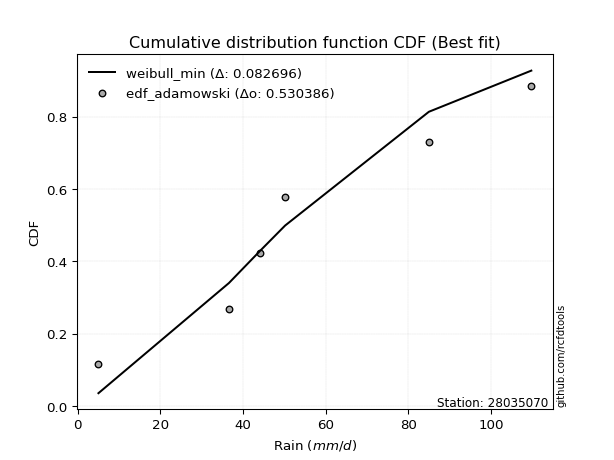</img></img>

</div>


## C. Best fit & Estimate extreme values for specific return periods - Tr

Best fit in probability distribution analysis means finding the theoretical distribution (like Normal, Poisson, Exponential) that most accurately mirrors your real-world data´s patterns (shape, center, spread) for better predictions, using methods like visual checks (Q-Q plots), goodness-of-fit tests (Kolmogorov-Smirnov, Chi-Squared), and information criteria (AIC) to score and select the simplest, most representative model.


### 1. Best fit (ordered by delta Δ)

<div align="center">

|   id |   station | empirical_dist   | p_dist   |     delta |   deltao | eval   |   fit |   n |   best_fit |   best_fit_sort |
|-----:|----------:|:-----------------|:---------|----------:|---------:|:-------|------:|----:|-----------:|----------------:|
|    0 |  28035070 | edf_hazen        | alpha    | 0.0996413 | 0.586543 | Δo > Δ |     1 |   5 |          1 |               1 |
|    1 |  28035070 | edf_gringorten   | alpha    | 0.104329  | 0.586543 | Δo > Δ |     1 |   5 |          1 |               2 |
|    2 |  28035070 | edf_cunnane      | alpha    | 0.107334  | 0.586543 | Δo > Δ |     1 |   5 |          1 |               3 |
|    3 |  28035070 | edf_blom         | alpha    | 0.109165  | 0.586543 | Δo > Δ |     1 |   5 |          1 |               4 |
|    4 |  28035070 | edf_tukey        | alpha    | 0.112141  | 0.586543 | Δo > Δ |     1 |   5 |          1 |               5 |
|    5 |  28035070 | edf_filliben     | alpha    | 0.113248  | 0.586543 | Δo > Δ |     1 |   5 |          1 |               6 |
|    6 |  28035070 | edf_beard        | alpha    | 0.113768  | 0.586543 | Δo > Δ |     1 |   5 |          1 |               7 |
|    7 |  28035070 | edf_jenkinson    | alpha    | 0.113768  | 0.586543 | Δo > Δ |     1 |   5 |          1 |               8 |
|    8 |  28035070 | edf_chegodayev   | alpha    | 0.114456  | 0.586543 | Δo > Δ |     1 |   5 |          1 |               9 |
|    9 |  28035070 | edf_adamowski    | alpha    | 0.117823  | 0.586543 | Δo > Δ |     1 |   5 |          1 |              10 |
|   10 |  28035070 | edf_weibull      | alpha    | 0.132975  | 0.586543 | Δo > Δ |     1 |   5 |          1 |              11 |
|   11 |  28035070 | edf_california   | alpha    | 0.14045   | 0.586543 | Δo > Δ |     1 |   5 |          1 |              12 |

</div>

:file_folder:Tables: [bestfit_28035070.csv](table/bestfit_28035070.csv) | [extreme_28035070.csv](table/extreme_28035070.csv)


### 2. Extreme values

In hydrology, a return period (or recurrence interval $Tr$) is the statistical average time between extreme events like floods or droughts of a specific magnitude, indicating how rare an event is, with a 100-year flood, for example, having a 1% chance of occurring in any given year, not that it happens exactly every century. It is a key tool for infrastructure design (like bridges or dams) and risk assessment, calculated from historical data to determine the probability of future events, although it is important to remember it is statistical average, and events can cluster or be missed.

> risk_rate: assuming the return period as the project useful life.

|   id |      tr |   prob_l |     prob_g |      alpha |   betaprime |    chi2 |   crystalball |   erlang |    expon |   exponnorm |         f |   fatiguelife |        fisk |    gamma |   genexpon |   genlogistic |   gibrat |   gompertz |   gumbel_l |   gumbel_r |   halflogistic |   halfnorm |   hypsecant |   invgamma |   invgauss |       invweibull |   johnsonsu |   kstwobign |   laplace |   laplace_asymmetric |   loggamma |   logistic |   lognorm |   maxwell |   mielke |    moyal |   nakagami |      ncf |      nct |     norm |   pearson3 |   rayleigh |     rice |        t |   truncnorm |     wald |   weibull_min |   logalpha |   logbetaprime |          logchi2 |   logcrystalball |   logerlang |   logexpon |   logexponnorm |     logf |   logfatiguelife |        logfisk |   loggenexpon |   loggenlogistic |   loggibrat |   loggompertz |   loggumbel_l |   loggumbel_r |   loghalflogistic |   loghalfnorm |   loghypsecant |   loginvgamma |   loginvgauss |   loginvweibull |   logjohnsonsu |   logkstwobign |   loglaplace |   loglaplace_asymmetric |   logloggamma |   loglogistic |    loglognorm |   logmaxwell |   logmielke |   logmoyal |   lognakagami |   logncf |   lognct |   logpearson3 |   lograyleigh |   logrice |     logt |   logtruncnorm |   logwald |   logweibull_min |   station |   n |   risk_rate |
|-----:|--------:|---------:|-----------:|-----------:|------------:|--------:|--------------:|---------:|---------:|------------:|----------:|--------------:|------------:|---------:|-----------:|--------------:|---------:|-----------:|-----------:|-----------:|---------------:|-----------:|------------:|-----------:|-----------:|-----------------:|------------:|------------:|----------:|---------------------:|-----------:|-----------:|----------:|----------:|---------:|---------:|-----------:|---------:|---------:|---------:|-----------:|-----------:|---------:|---------:|------------:|---------:|--------------:|-----------:|---------------:|-----------------:|-----------------:|------------:|-----------:|---------------:|---------:|-----------------:|---------------:|--------------:|-----------------:|------------:|--------------:|--------------:|--------------:|------------------:|--------------:|---------------:|--------------:|--------------:|----------------:|---------------:|---------------:|-------------:|------------------------:|--------------:|--------------:|--------------:|-------------:|------------:|-----------:|--------------:|---------:|---------:|--------------:|--------------:|----------:|---------:|---------------:|----------:|-----------------:|----------:|----:|------------:|
|    0 |    2    | 0.5      | 0.5        |    50.1133 |     58.1717 | 36.602  |       65.12   |  47.5369 |  56.3686 |     56.3564 |   51.0709 |       36.6    |     46.1338 |  36.7561 |    56.5543 |       59.6991 |  56.7652 |    56.9554 |    69.6926 |    60.5474 |        58.2741 |    59.4225 |     65.12   |    51.0711 |    50.0248 |   4979.29        |     65.1187 |     60.7679 |   65.12   |              56.3708 |    40.1055 |    65.12   |   59.6392 |   62.7395 |  55.0742 |  59.0712 |    55.0984 |  58.3257 |  56.1857 |  65.12   |    62.5034 |    61.8952 |  64.0809 |  65.1189 |     65.12   |  56.0975 |       67.6106 |    53.9238 |        58.8474 |     61.568       |                0 |     44.1105 |    51.3409 |        51.2729 |  58.0355 |          36.6002 |  62.1042       |       52.6304 |          55.2019 |     52.663  |       57.8076 |       63.8408 |       55.7141 |           53.8599 |       54.7887 |        59.6392 |       52.2206 |       50.5762 |         52.3882 |        59.6382 |        55.5044 |      59.6392 |                 52.9586 |       59.6648 |       59.6392 |  36.6174      |      57.5624 |     54.7728 |    54.5029 |       56.5569 |  57.548  |  57.7655 |       58.2437 |       56.8434 |   58.1417 |  59.6391 |        92.1636 |   52.1423 |    38.3735       |  28035070 |   5 |    0.75     |
|    1 |    2.33 | 0.570815 | 0.429185   |    54.1102 |     62.5806 | 36.6074 |       70.0869 |  50.5862 |  60.7242 |     60.7161 |   54.9039 |       38.4645 |     50.9915 |  37.0188 |    60.9225 |       64.0335 |  59.2813 |    61.351  |    74.0139 |    65.1498 |        63.0061 |    64.7831 |     69.095  |    54.9039 |    53.852  | 565321           |     70.1628 |     65.2423 |   68.1258 |              60.7269 |    41.6715 |    69.4962 |   64.2167 |   67.8998 |  59.1217 |  63.4279 |    59.8518 |  62.768  |  60.425  |  70.0869 |    67.4763 |    67.1318 |  68.7159 |  70.0858 |     70.0869 |  59.3543 |       76.7207 |    57.7927 |        63.4113 |     74.0968      |                0 |     46.5275 |    55.3156 |        55.2324 |  62.5889 |          37.1338 | 242.373        |       56.7174 |          59.1903 |     54.6734 |       62.2868 |       68.0833 |       59.6656 |           57.7914 |       59.3408 |        63.2753 |       56.0052 |       54.3157 |         56.1302 |        64.338  |        59.5789 |      62.3688 |                 56.7524 |       64.3093 |       63.6544 |  36.8065      |      62.1593 |     58.7199 |    58.1555 |       64.137  |  62.1884 |  62.164  |       62.7349 |       61.4526 |   62.4662 |  64.2166 |        93.6204 |   54.733  |    44.264        |  28035070 |   5 |    0.729209 |
|    2 |    5    | 0.8      | 0.2        |    85.1025 |     83.35   | 36.8285 |       88.5454 |  66.9322 |  82.5012 |     82.5133 |   80.4237 |       78.0709 |    107.172  |  42.2793 |    82.6154 |       82.8625 |  73.7669 |    82.8687 |    87.9742 |    85.1448 |        84.4175 |    87.4525 |     85.0398 |    80.4205 |    78.35   |      4.94847e+14 |     88.9077 |     84.2487 |   83.1539 |              82.5065 |    53.0243 |    86.3934 |   84.5282 |   88.2104 |  80.3846 |  83.6089 |    81.6267 |  83.5824 |  81.8685 |  88.5454 |    87.4563 |    88.0964 |  87.2716 |  88.5442 |     88.5454 |  77.5864 |      128.801  |    79.9866 |        84.3715 |    219.46        |                0 |     62.0754 |    80.3089 |        80.116  |  86.7017 |          50.4987 |   8.86755e+113 |       80.7203 |          80.1403 |     67.8338 |       83.9516 |       83.8124 |       80.3551 |           79.4897 |       83.1638 |        80.2296 |       79.9172 |       79.0623 |         79.4615 |        85.289  |        80.4963 |      78.0081 |                 80.2074 |       84.8755 |       81.8628 |   3.88664e+25 |      84.1076 |     80.0063 |    78.5384 |      116.297  |  84.5242 |  83.14   |       83.7967 |       83.965  |   83.2299 |  84.5279 |        99.9269 |   71.8028 |     8.78479e+08  |  28035070 |   5 |    0.67232  |
|    3 |   10    | 0.9      | 0.1        |   142.043  |    102.257  | 37.4763 |      100.79   |  82.6496 | 102.27   |    102.3    |  117.783  |      132.757  |    264.204  |  53.292  |   102.102  |       98.1974 |  90.2788 |   101.77   |    95.7467 |   101.43   |       102.199  |   104.227  |     97.7722 |   117.772  |   108.431  |      9.50088e+21 |    101.343  |     98.7196 |   96.796  |             102.277  |    68.8387 |    98.8375 |  101.433  |  102.504  | 103.168  | 101.18   |    98.5483 | 102.393  | 103.585  | 100.79   |   102.05   |   103.045  | 100.502  | 100.789  |    100.79   |  96.9348 |      183.132  |   108.122  |       102.707  |    671.325       |                0 |     82.0544 |   112.654  |       112.292  | 112.804  |          77.2013 | inf            |      108.596  |         102.571  |     86.74   |      102.808  |       94.0948 |      102.404  |          103.582  |      106.758  |        96.9756 |      114.418  |      114.786  |        112.856  |       102.827  |       101.222  |      95.5763 |                109.797  |      101.933  |       98.5261 | inf           |     104.054  |    103.872  |   102.022  |      186.337  | 105.357  | 102.567  |      102.749  |      104.895  |  102.101  | 101.432  |       104.008  |   95.7751 |     4.02397e+91  |  28035070 |   5 |    0.651322 |
|    4 |   15    | 0.933333 | 0.0666667  |   198.78   |    113.771  | 38.0422 |      106.901  |  92.0642 | 113.834  |    113.875  |  149.3    |      168.523  |    467.385  |  61.8966 |   113.414  |      106.849  | 101.668  |   112.563  |    99.2666 |   110.619  |       112.262  |   112.957  |    105.038  |   149.281  |   129.253  |      1.22162e+26 |    107.548  |    106.402  |  104.776  |             113.842  |    81.0775 |   105.618  |  111.093  |  109.838  | 118.744  | 111.377  |   107.455  | 113.793  | 117.858  | 106.901  |   109.743  |   110.747  | 107.319  | 106.899  |    106.901  | 109.36   |      217.337  |   130.65   |       113.549  |   1335.54        |                0 |     97.0238 |   137.317  |       136.811  | 130.824  |         101.904  | inf            |      128.134  |         117.894  |    102.77   |      113.563  |       99.1575 |      117.416  |          120.324  |      121.576  |       108.055  |      144.592  |      144.689  |        142.041  |       112.885  |       114.313  |     107.634  |                131.936  |      111.656  |      108.991  | inf           |     116.059  |    120.816  |   118.749  |      239.072  | 118.209  | 114.538  |      114.165  |      117.64   |  113.426  | 111.093  |       105.69   |  115.237  |     1.24726e+281 |  28035070 |   5 |    0.644736 |
|    5 |   20    | 0.95     | 0.05       |   255.467  |    122.221  | 38.5109 |      110.902  |  98.8151 | 122.038  |    122.087  |  177.579  |      195.003  |    706.131  |  68.7428 |   121.402  |      112.907  | 110.602  |   120.107  |   101.458  |   117.052  |       119.312  |   118.777  |    110.164  |   177.552  |   145.344  |      9.20605e+28 |    111.612  |    111.577  |  110.438  |             122.048  |    91.3827 |   110.304  |  117.913  |  114.705  | 131.021  | 118.599  |   113.412  | 122.136  | 128.842  | 110.902  |   114.931  |   115.866  | 111.85   | 110.901  |    110.902  | 118.618  |      242.551  |   150.679  |       121.361  |   2199.61        |                0 |    109.427  |   158.026  |       157.389  | 145.147  |         125.156  | inf            |      143.652  |         129.965  |    117.392  |      121.088  |      102.445  |      129.219  |          133.64   |      132.581  |       116.625  |      172.935  |      171.456  |        169.483  |       119.998  |       124.073  |     117.101  |                150.302  |      118.508  |      116.867  | inf           |     124.782  |    134.529  |   132.229  |      282.484  | 127.706  | 123.387  |      122.48   |      126.957  |  121.636  | 117.913  |       106.612  |  132.271  |   inf            |  28035070 |   5 |    0.641514 |
|    6 |   25    | 0.96     | 0.04       |   312.135  |    128.96   | 38.907  |      113.848  | 104.085  | 128.402  |    128.457  |  203.682  |      216.043  |    974.754  |  74.4078 |   127.577  |      117.573  | 118.05   |   125.896  |   103.017  |   122.007  |       124.744  |   123.107  |    114.132  |   203.647  |   158.526  |      1.51434e+31 |    114.603  |    115.453  |  114.83   |             128.413  |   100.439  |   113.889  |  123.2    |  118.318  | 141.333  | 124.196  |   117.85   | 128.776  | 137.911  | 113.848  |   118.826  |   119.669  | 115.217  | 113.847  |    113.848  | 126.035  |      262.607  |   169.273  |       127.507  |   3255.94        |                0 |    120.209  |   176.216  |       175.46   | 157.265  |         147.359  | inf            |      156.724  |         140.099  |    131.159  |      126.871  |      104.851  |      139.113  |          144.897  |      141.41   |       123.721  |      200.324  |      196.155  |        196.037  |       125.52   |       131.926  |     125.014  |                166.291  |      123.814  |      123.275  | inf           |     131.679  |    146.286  |   143.722  |      319.892  | 135.313  | 130.481  |      129.072  |      134.354  |  128.116  | 123.199  |       107.196  |  147.713  |   inf            |  28035070 |   5 |    0.639603 |
|    7 |   50    | 0.98     | 0.02       |   595.382  |    151.063  | 40.2838 |      122.283  | 120.609  | 148.171  |    148.244  |  315.573  |      283.548  |   2666.19   |  93.593  |   146.642  |      131.946  | 144.304  |   143.537  |   107.249  |   137.273  |       141.48   |   135.694  |    126.431  |   315.498  |   203.006  |      1.01656e+38 |    123.169  |    126.836  |  128.472  |             148.184  |   135.725  |   124.842  |  139.686  |  128.798  | 178.46   | 141.574  |   130.762  | 150.478  | 169.583  | 122.283  |   130.344  |   130.71   | 124.989  | 122.282  |    122.283  | 150.248  |      327.456  |   252.832  |       147.176  |  11269.8         |                0 |    161.445  |   247.188  |       245.928  | 201.63   |         248.845  | inf            |      203.816  |         176.557  |    193.895  |      144.558  |      111.671  |      174.612  |          185.9    |      170.556  |       148.585  |      332.963  |      302.406  |        325.206  |       142.777  |       157.978  |     153.168  |                227.637  |      140.324  |      145.11   | inf           |     153.913  |    190.396  |   186.16   |      459.404  | 160.439  | 153.97   |      150.449  |      158.359  |  148.932  | 139.685  |       108.44   |  211.831  |   inf            |  28035070 |   5 |    0.63583  |
|    8 |   75    | 0.986667 | 0.0133333  |   878.591  |    164.916  | 41.1709 |      126.81   | 130.361  | 159.735  |    159.818  |  410.354  |      324.202  |   4805.45   | 105.702  |   157.716  |      140.3    | 162.036  |   153.626  |   109.389  |   146.145  |       151.209  |   142.546  |    133.619  |   410.24   |   231.23   |      9.44485e+41 |    127.766  |    133.099  |  136.452  |             159.749  |   162.558  |   131.168  |  149.424  |  134.495  | 204.357  | 151.736  |   137.792  | 164.024  | 190.936  | 126.81   |   136.747  |   136.717  | 130.306  | 126.808  |    126.81   | 165.149  |      367.03   |   331.09   |       159.149  |  23609.7         |                0 |    192.173  |   301.306  |       299.626  | 233.311  |         341.171  | inf            |      236.531  |         201.963  |    252.482  |      154.733  |      115.287  |      199.272  |          214.875  |      188.873  |       165.368  |      466.888  |      393.211  |        456.53   |       152.996  |       174.445  |     172.492  |                273.538  |      150.051  |      159.442  | inf           |     167.539  |    222.773  |   216.569  |      559.471  | 176.299  | 168.856  |      163.661  |      173.174  |  161.633  | 149.423  |       108.88   |  264.445  |   inf            |  28035070 |   5 |    0.634587 |
|    9 |  100    | 0.99     | 0.01       |  1161.79   |    175.205  | 41.8291 |      129.871  | 137.312  | 167.939  |    168.031  |  495.503  |      353.454  |   7296.64   | 114.609  |   165.539  |      146.213  | 175.772  |   160.686  |   110.789  |   152.425  |       158.094  |   147.213  |    138.718  |   495.351  |   252.127  |      6.07626e+44 |    130.875  |    137.39   |  142.114  |             167.955  |   185.041  |   135.634  |  156.392  |  138.376  | 224.919  | 158.946  |   142.579  | 174.06   | 207.54   | 129.871  |   141.168  |   140.809  | 133.928  | 129.869  |    129.871  | 176.012  |      395.783  |   408.875  |       167.879  |  40091.6         |                0 |    217.596  |   346.745  |       344.695  | 258.921  |         428.134  | inf            |      262.379  |         222.123  |    309.78   |      161.883  |      117.715  |      218.802  |          238.072  |      202.466  |       178.41   |      605.855  |      475.515  |        593.624  |       160.318  |       186.707  |     187.663  |                311.615  |      157      |      170.405  | inf           |     177.505  |    249.4    |   241.109  |      639.814  | 188.123  | 179.989  |      173.382  |      184.053  |  170.897  | 156.391  |       109.105  |  310.872  |   inf            |  28035070 |   5 |    0.633968 |
|   10 |  200    | 0.995    | 0.005      |  2294.56   |    201.715  | 43.495  |      136.815  | 154.149  | 187.708  |    187.818  |  784.923  |      425.058  |  19933.3    | 136.944  |   184.273  |      160.428  | 213.143  |   177.369  |   113.832  |   167.522  |       174.649  |   157.889  |    151.001  |   784.629  |   305.096  |      3.43093e+51 |    137.926  |    147.273  |  155.756  |             187.725  |   253.938  |   146.348  |  173.426  |  147.255  | 283.202  | 176.316  |   153.52   | 199.829  | 253.238  | 136.815  |   151.463  |   150.173  | 142.215  | 136.813  |    136.815  | 203.072  |      467.207  |   740.551  |       189.783  | 145560           |                0 |    294.053  |   486.399  |       483.129  | 333.769  |         746.367  | inf            |      334.913  |         279.215  |    540.395  |      178.896  |      123.17   |      273.949  |          304.615  |      237.345  |       214.212  |     1229.22   |      760.378  |       1216.48   |       178.254  |       218.331  |     229.927  |                426.573  |      173.95   |      199.875  | inf           |     202.592  |    329.175  |   312.269  |      869.374  | 218.735  | 208.968  |      198.087  |      211.586  |  194.124  | 173.425  |       109.449  |  465.112  |   inf            |  28035070 |   5 |    0.633042 |
|   11 |  250    | 0.996    | 0.004      |  2860.94   |    210.808  | 44.0515 |      138.937  | 159.593  | 194.072  |    194.188  |  911.424  |      448.394  |  27537.6    | 144.356  |   190.27   |      164.998  | 226.552  |   182.644  |   114.727  |   172.376  |       179.971  |   161.173  |    154.955  |   911.062  |   322.856  |      5.0817e+53  |    140.081  |    150.331  |  160.148  |             194.09   |   281.496  |   149.788  |  178.993  |  149.988  | 304.971  | 181.908  |   156.883  | 208.64   | 269.872  | 138.937  |   154.684  |   153.055  | 144.766  | 138.935  |    138.937  | 212.024  |      490.809  |   925.671  |       197.114  | 221234           |                0 |    324.134  |   542.389  |       538.601  | 362.596  |         894.574  | inf            |      361.716  |         300.522  |    659.809  |      184.313  |      124.823  |      294.478  |          329.734  |      249.239  |       227.202  |     1585.24   |      887.216  |       1576.63   |       184.125  |       229.163  |     245.464  |                471.95   |      179.478  |      210.378  | inf           |     211.005  |    360.566  |   339.38   |      955.266  | 229.274  | 219.001  |      206.45   |      220.864  |  201.886  | 178.991  |       109.519  |  531.428  |   inf            |  28035070 |   5 |    0.632858 |
|   12 |  500    | 0.998    | 0.002      |  5692.83   |    240.962  | 45.8306 |      145.23   | 176.563  | 213.841  |    213.974  | 1454.01   |      521.599  |  75076.2    | 167.943  |   208.8    |      179.183  | 272.892  |   198.749  |   117.294  |   187.44   |       196.489  |   170.965  |    167.238  |  1453.33   |   379.933  |      2.77394e+60 |    146.472  |    159.497  |  173.79   |             213.861  |   388.801  |   160.456  |  196.574  |  158.144  | 383.762  | 199.277  |   166.901  | 237.765  | 328.517  | 145.23   |   164.445  |   161.655  | 152.378  | 145.228  |    145.23   | 240.489  |      565.885  |  2117.95   |       220.822  | 819510           |                0 |    439.175  |   760.839  |       754.91   | 470.932  |        1579.01   | inf            |      457.433  |         377.577  |   1315.46   |      200.973  |      129.685  |      368.519  |          421.67   |      288.358  |       272.791  |     3840.32   |     1445.2    |       3905.03   |       202.699  |       264.952  |     300.744  |                646.057  |      196.899  |      246.591  | inf           |     238.248  |    481.209  |   439.542  |     1264.67   | 264.336  | 252.595  |      233.802  |      251.034  |  226.925  | 196.572  |       109.66   |  811.905  |   inf            |  28035070 |   5 |    0.632489 |
|   13 |  750    | 0.998667 | 0.00133333 |  8524.71   |    260.046  | 46.9014 |      148.726  | 186.527  | 225.404  |    225.549  | 1913.79   |      564.851  | 134928      | 182.076  |   219.57   |      187.475  | 303.539  |   207.978  |   118.665  |   196.247  |       206.146  |   176.435  |    174.422  |  1912.82   |   414.519  |      2.40763e+64 |    150.022  |    164.646  |  181.77   |             225.426  |   470.484  |   166.688  |  207.076  |  162.705  | 438.929  | 209.438  |   172.492  | 256.13   | 368.369  | 148.726  |   170.002  |   166.464  | 156.635  | 148.724  |    148.726  | 257.556  |      610.975  |  3890.24   |       235.385  |      1.77272e+06 |                0 |    524.95   |   927.41   |       919.745  | 550.514  |        2208.94   | inf            |      523.303  |         431.475  |   2076.11   |      210.608  |      132.361  |      420.149  |          486.871  |      312.826  |       303.589  |     6941.07   |     1933.28   |       7189.52   |       213.815  |       287.457  |     338.686  |                776.328  |      207.28   |      270.567  | inf           |     254.991  |    572.07   |   511.328  |     1478.94   | 286.597  | 274.102  |      250.824  |      269.666  |  242.246  | 207.074  |       109.707  | 1046.8    |   inf            |  28035070 |   5 |    0.632366 |
|   14 | 1000    | 0.999    | 0.001      | 11356.6    |    274.283  | 47.6726 |      151.133  | 193.611  | 233.609  |    233.761  | 2326.9    |      595.704  | 204494      | 192.232  |   227.181  |      193.357  | 326.991  |   214.443  |   119.589  |   202.493  |       212.996  |   180.213  |    179.52   |  2325.65   |   439.535  |      1.49732e+67 |    152.466  |    168.214  |  187.432  |             233.632  |   539.02   |   171.108  |  214.631  |  165.858  | 482.799  | 216.647  |   176.35   | 269.8    | 399.474  | 151.133  |   173.885  |   169.787  | 159.576  | 151.131  |    151.133  | 269.833  |      643.464  |  6451      |       246.046  |      3.07134e+06 |                0 |    595.957  |  1067.27   |      1058.09   | 615.982  |        2806.65   | inf            |      575.057  |         474.309  |   2943.78   |      217.399  |      134.193  |      461.101  |          539.145  |      330.926  |       327.528  |    10965.5    |     2381.94   |      11541.2    |       221.82   |       304.159  |     368.475  |                884.395  |      214.736  |      288.971  | inf           |     267.245  |    647.993  |   569.264  |     1647.59   | 303.233  | 290.268  |      263.386  |      283.345  |  253.43   | 214.629  |       109.731  | 1256.75   |   inf            |  28035070 |   5 |    0.632305 |

<div align="center">

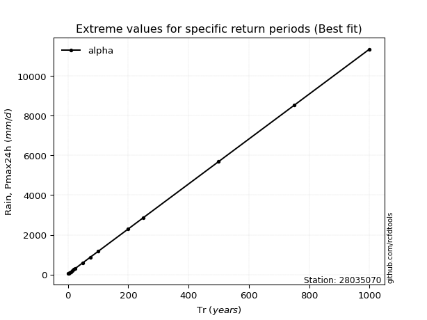</img>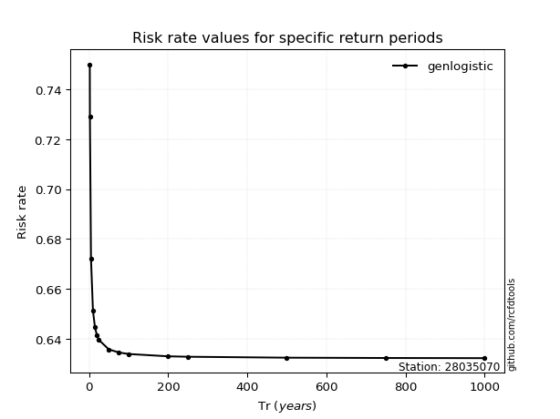</img>

</div>


<sub>**APP DISCLAIMER**: NO WARRANTY - This software is provided by [github.com/rcfdtools](https://github.com/rcfdtools) "as is", without any express or implied warranty, including warranties of merchantability, fitness for a particular purpose, or non-infringement. There is no guarantee that the software will be error-free or operate without interruption. LIMITATION OF LIABILITY - Neither the authors nor copyright holders will be liable for claims or damages arising from the software or its use. You are responsible for determining if the software is appropriate for your use and assume all associated risks, including errors, legal compliance, and data loss. NO PROFESSIONAL ADVICE - The software provides general information and does not offer professional advice. It should not replace consultation with professional advisors.</sub>