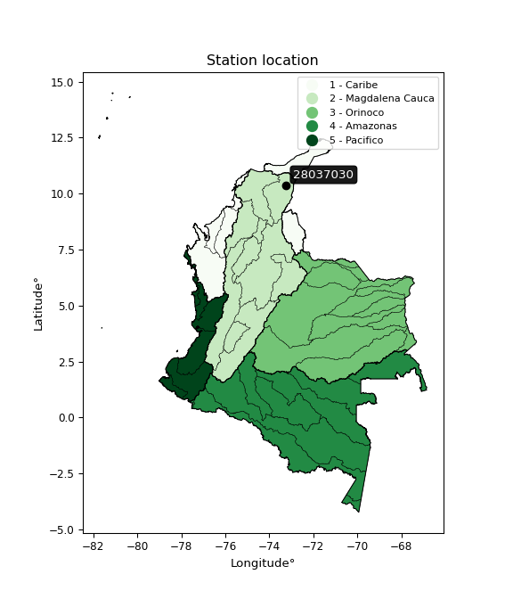

<div align="center">


</div>

# PMax24h Station (Rain): 28037030

Maximum Precipitation in 24 hours (PMax24h) is the greatest amount of rainfall for a specific duration that is meteorologically possible for a given location, acting as a "worst-case" scenario for extreme storms, crucial for designing safety-critical infrastructure like bridges, river deviations, dams, spillways, and nuclear plants to prevent catastrophic failure. The PMax24h is related with the Probable Maximum Precipitation (PMP) and it is calculated by hydrologists using meteorological data to determine the upper limit of extreme rainfall, often leading to the Probable Maximum Flood (PMF) for flood control design, and is increasingly being studied for climate change impacts. Probable Maximum Precipitation (PMP) is the theoretical upper limit of rainfall, a deterministic estimate for extreme events, while probability distributions (like GEV, Gumbel) describe the likelihood and frequency of various precipitation amounts, including rare ones, showing how often events occur, with PMP representing the extreme end of these distributions, used for critical infrastructure design to ensure safety against the worst conceivable weather, unlike standard statistical forecasts which cover typical probabilities.

The most common probability distributions in hydrology, used for analyzing floods, rainfall, and streamflow, include the Normal, Log-Normal, Gumbel, Gamma (including Log-Pearson Type III), and Generalized Extreme Value (GEV) distributions, often chosen based on the data´s skewness and whether modeling extremes or general conditions, with Gumbel and GEV popular for extreme events like floods, while the Normal distribution serves as a baseline, though often requiring transformations for skewed hydrological data. These distributions help in designing water infrastructure, managing water resources, and forecasting hydrologic events.

> Hydrological data often isn´t perfectly normal (it´s skewed), so different distributions are needed for different applications, such as: **Flood Frequency Analysis**: Using Gumbel, GEV, or Log-Pearson Type III for predicting extreme flood magnitudes and their return periods, **Rainfall Analysis**: Normal for annual totals, but Log-Normal, Weibull, or GEV for intensity or extreme daily rainfall, **Streamflow Modeling**: Gamma and Log-Normal for maximum flows, GEV for minimum flows, and Kappa for daily flows.

<div align="center">

</img>

</div>


## A. General information


### 1. General running parameters

• app_version: _v20260225_. • runtime: _2026-02-28 16:54:07.457399_. • Python version: _3.14.0_. • SciPy version: _1.16.3_. • Pandas version: _2.3.3_. • NumPy version: _2.3.5_. • Stations dataset (station_dataset_file): _dataset/pmax24h_in/automatic_colombia_2003_2025.csv_. • Stations catalog (station_catalog_file): _dataset/CNE.xls_. • Minimum year to eval til year_max (date_min): _1900_. • Maximum year to eval since year_min (date_max): _2025_. • Creates, save and include plots into reports (create_plot): _False_. • Plot only fit distributions with Δo > Δ (plot_only_fit): _True_. • Plot only simple graphs avoiding multiple CDFs and multiple Extreme values plots (plot_only_simple): _False_. • Eval low extreme values, if False, evaluates high extreme values (low_extreme): _False_. • Eval every SciPy distribution as logarithmic (pdist_logarithmic_on): _True_. • Standard deviation normalized (ddof): _1.0_. • Return periods to eval in years (Tr): _[2, 2.33, 5, 10, 15, 20, 25, 50, 75, 100, 200, 250, 500, 750, 1000]_. • Minimum data sample per station, 0 means any (minimum_sample): _5_. • Z-Score maximum threshold to adjust a value, 0 means disable (zscore_max): _3.5_. • Z-Score minimum threshold to adjust a value, 0 means disable (zscore_min): _-2.5_. • Avoid zeros, e.g. rain = 0 (avoid_zeros): _True_. • Avoid null values (avoid_nans): _True_. 

:file_folder:Table: [dataset.csv](../../dataset/pmax24h_in/automatic_colombia_2003_2025.csv)

> Delta Degrees of Freedom (DDOF): is a parameter used in the formulas for calculating variance and standard deviation. When ddof=0, the divisor is $N$ (the total number of observations) and this is used when your data set is the entire population. When ddof=1, the divisor is $N-1$ and this is used when your data set is a sample drawn from a larger population. Using $N-1$ provides an unbiased estimate of the population variance (known as Bessel´s correction).


### 2. Station info and location

|   id |   CODIGO | NOMBRE                            | CATEGORIA    | TECNOLOGIA                              | ESTADO   | FECHA_INSTALACION   |   FECHA_SUSPENSION |   ALTITUD |   LATITUD |   LONGITUD | DEPARTAMENTO   | MUNICIPIO   | AREA_OPERATIVA                                         | ENTIDAD                                                     | AREA_HIDROGRAFICA   | ZONA_HIDROGRAFICA   | SUBZONA_HIDROGRAFICA   | CORRIENTE   | Catalogo   |   Version |
|-----:|---------:|:----------------------------------|:-------------|:----------------------------------------|:---------|:--------------------|-------------------:|----------:|----------:|-----------:|:---------------|:------------|:-------------------------------------------------------|:------------------------------------------------------------|:--------------------|:--------------------|:-----------------------|:------------|:-----------|----------:|
|    0 | 28037030 | PUENTE SALGUERO  - AUT [28037030] | Limnigráfica | Automática con Telemetría, Convencional | Activa   | 15/12/1962          |                nan |       113 |   10.3841 |   -73.2325 | Cesar          | Valledupar  | Area Operativa 05 - Magdalena-Cesar-Guajira-San Andrés | INSTITUTO DE HIDROLOGIA METEOROLOGIA Y ESTUDIOS AMBIENTALES | Magdalena Cauca     | Cesar               | Medio Cesar            | Cesar       | CNE_IDEAM  |  20251226 |

<div align="center">

Dynamic map: [:earth_americas:Google](http://maps.google.com/maps?q=10.38411111,-73.23247222) [:earth_americas:OSM](https://www.openstreetmap.org/#map=18/10.38411111/-73.23247222&layers=P) [:earth_americas:Bing](https://www.bing.com/maps?cp=10.38411111~-73.23247222&lvl=18) [:earth_americas:Apple](https://maps.apple.com/frame?center=10.38411111%2C-73.23247222&span=0.003%2C0.006)

</div>


<div align="center">

```geojson
{
  "type": "Feature",
  "geometry": {
    "type": "Point", 
    "coordinates": [-73.23247222, 10.38411111]
  }, 
  "properties": {
    "Name": "28037030"
  }
}
```

</div>


### 3. Discrete values table and plot

<div align="center">

|               |          0 |           1 |           2 |           3 |           4 |
|:--------------|-----------:|------------:|------------:|------------:|------------:|
| Date          | 2019       | 2020        | 2021        | 2022        | 2025        |
| Value         |   85.2     |   55.4      |   10        |   10        |   12.2      |
| Value_initial |   85.2     |   55.4      |   10        |   10        |   12.2      |
| count         |    5       |    5        |    5        |    5        |    5        |
| mean          |   34.56    |   34.56     |   34.56     |   34.56     |   34.56     |
| std           |   34.2968  |   34.2968   |   34.2968   |   34.2968   |   34.2968   |
| zscore        |    1.47652 |    0.607638 |   -0.716103 |   -0.716103 |   -0.651957 |


</div>


> The initial value (value_initial) correspond to the initial obtained or null completed value, and value (value) is adjusted only when the initial value is outside the valid range (outlier) definite through the Z-Score value. If Z-Score is active, values out of range or outliers are replaced with the station mean value. A Z-Score (or standard score) measures how many standard deviations a data point is from the mean of a dataset, indicating its relative position; positive scores mean above the mean, negative mean below, and a score of zero is exactly at the mean, allowing for comparison of values from different distributions. It´s calculated using the formula $z=(x–μ)/σ$, where $x$ is the data point, $μ$ is the mean, and $σ$ is the standard deviation, helping identify outliers and understand probability.
>
> <sub>**Note**: In this study, "completing" (filling gaps in) and "extending" (forecasting or lengthening the historical record) rainfall data series are avoided for certain critical analyses because they introduce artificial bias and uncertainty, which can distort the statistics of rare events (extremes), alter day-to-day variability, and compromise the integrity and homogeneity of the original data. Some reasons against Completing/Extending rainfall data are: **Distortion of Extremes and Variability**: The primary issue is that most gap-filling or extension methods rely on averaging or regression with nearby stations, which inherently smooths the data. Rainfall is highly variable in space and time, with a large percentage of zero values and occasional large storms. Infilling methods often underestimate the highest values and overestimate the lowest (zero) values, which severely distorts analyses focused on flood frequency, drought severity, and intensity-duration-frequency (IDF) curves, **Loss of Data Homogeneity**: Infilled or extended data are synthetic estimates, not actual measurements. Combining these estimates with observed data can violate the assumption of data homogeneity, which requires that the data properties do not change over time. Inhomogeneity can lead to incorrect conclusions about long-term trends or changes in climate patterns, **Propagation of Errors**: Errors and biases from the original data (e.g., wind-induced undercatch, instrument errors, site changes) or the data used for imputation can propagate through the analysis, leading to unreliable hydrological models and inaccurate predictions, **Compromised Statistical Integrity**: For statistical analyses, especially those involving the frequency of events, using artificial data can introduce time bias or autocorrelation that doesn´t exist in reality, making it difficult to assess the true probability of events, **Difficulty in Validation**: It is difficult to accurately validate the quality of filled or extended data, especially for past periods where ground-truth measurements are unavailable. The reliability of imputation techniques heavily depends on the density of the surrounding station network and the complexity of the local topography.</sub>


### 4. Active continuous probability distributions from SciPy (80 of 104 available)

A Probability Density Function (PDF) describes the relative likelihood of a continuous random variable falling within a specific range, where the total area under its curve equals 1, and the area over any interval gives the actual probability for that range. Unlike discrete probabilities (like rolling a die), a PDF shows density, not direct probability for a single point (which is zero), with higher points indicating higher likelihood, often visualized as a bell curve for normal distributions.

A log of a probability density function (log-PDF) is simply the logarithm of the PDF´s value, denoted as $log(f(x))$, useful for converting multiplication of probabilities into addition, improving numerical stability with tiny numbers, and connecting to information theory concepts like entropy. Instead of dealing with very small probabilities (e.g., 0.000001), log-PDFs use negative numbers (e.g., $log(0.00001) ≈ -11.51$ that are easier for computers to handle, preventing underflow errors and simplifying complex calculations. In this study, each active probability distribution from SciPy is also evaluated in the $log$ form.

[scipy.stats](https://docs.scipy.org/doc/scipy/reference/stats.html) is a Python´s powerful submodule within the SciPy library for comprehensive statistical analysis, offering over 130 probability distributions (like Normal, Poisson, etc.), functions for descriptive stats (mean, variance), hypothesis testing (t-tests, chi-square), random variable generation, and statistical tests, making it essential for data science, modeling, and research. It provides tools to explore, model, and draw conclusions from data efficiently, working seamlessly with [NumPy](https://numpy.org/).

<div align="center">

|   id | p_dist           |   n_parameter | fit_method   | label                                                                       | active   | ref                                                                                                      |
|-----:|:-----------------|--------------:|:-------------|:----------------------------------------------------------------------------|:---------|:---------------------------------------------------------------------------------------------------------|
|    0 | alpha            |             3 | MLE          | Alpha                                                                       | True     | [:mortar_board:](https://docs.scipy.org/doc/scipy/reference/generated/scipy.stats.alpha.html)            |
|    1 | anglit           |             2 | MM           | Anglit                                                                      | True     | [:mortar_board:](https://docs.scipy.org/doc/scipy/reference/generated/scipy.stats.anglit.html)           |
|    2 | arcsine          |             2 | MM           | Arcsine                                                                     | True     | [:mortar_board:](https://docs.scipy.org/doc/scipy/reference/generated/scipy.stats.arcsine.html)          |
|    3 | argus            |             3 | MLE          | Argus                                                                       | True     | [:mortar_board:](https://docs.scipy.org/doc/scipy/reference/generated/scipy.stats.argus.html)            |
|    4 | beta             |             4 | MLE          | Beta                                                                        | True     | [:mortar_board:](https://docs.scipy.org/doc/scipy/reference/generated/scipy.stats.beta.html)             |
|    5 | betaprime        |             4 | MLE          | Beta prime                                                                  | True     | [:mortar_board:](https://docs.scipy.org/doc/scipy/reference/generated/scipy.stats.betaprime.html)        |
|    6 | bradford         |             3 | MLE          | Bradford                                                                    | True     | [:mortar_board:](https://docs.scipy.org/doc/scipy/reference/generated/scipy.stats.bradford.html)         |
|    7 | burr             |             4 | MLE          | Burr (Type III)                                                             | True     | [:mortar_board:](https://docs.scipy.org/doc/scipy/reference/generated/scipy.stats.burr.html)             |
|    8 | burr12           |             4 | MLE          | Burr (Type III) 12                                                          | True     | [:mortar_board:](https://docs.scipy.org/doc/scipy/reference/generated/scipy.stats.burr12.html)           |
|    9 | cosine           |             2 | MLE          | Cosine                                                                      | True     | [:mortar_board:](https://docs.scipy.org/doc/scipy/reference/generated/scipy.stats.cosine.html)           |
|   10 | crystalball      |             4 | MLE          | Crystalball                                                                 | True     | [:mortar_board:](https://docs.scipy.org/doc/scipy/reference/generated/scipy.stats.crystalball.html)      |
|   11 | dgamma           |             3 | MLE          | Double gamma                                                                | True     | [:mortar_board:](https://docs.scipy.org/doc/scipy/reference/generated/scipy.stats.dgamma.html)           |
|   12 | dweibull         |             3 | MLE          | Double Weibull                                                              | True     | [:mortar_board:](https://docs.scipy.org/doc/scipy/reference/generated/scipy.stats.dweibull.html)         |
|   13 | erlang           |             3 | MLE          | Erlang                                                                      | True     | [:mortar_board:](https://docs.scipy.org/doc/scipy/reference/generated/scipy.stats.erlang.html)           |
|   14 | exponnorm        |             3 | MLE          | Exponentially modified Normal                                               | True     | [:mortar_board:](https://docs.scipy.org/doc/scipy/reference/generated/scipy.stats.exponnorm.html)        |
|   15 | exponpow         |             3 | MLE          | Exponential power                                                           | True     | [:mortar_board:](https://docs.scipy.org/doc/scipy/reference/generated/scipy.stats.exponpow.html)         |
|   16 | exponweib        |             4 | MLE          | Exponentiated Weibull                                                       | True     | [:mortar_board:](https://docs.scipy.org/doc/scipy/reference/generated/scipy.stats.exponweib.html)        |
|   17 | f                |             4 | MLE          | F                                                                           | True     | [:mortar_board:](https://docs.scipy.org/doc/scipy/reference/generated/scipy.stats.f.html)                |
|   18 | fatiguelife      |             3 | MLE          | Fatigue-life (Birnbaum-Saunders)                                            | True     | [:mortar_board:](https://docs.scipy.org/doc/scipy/reference/generated/scipy.stats.fatiguelife.html)      |
|   19 | foldnorm         |             3 | MM           | Fold Normal                                                                 | True     | [:mortar_board:](https://docs.scipy.org/doc/scipy/reference/generated/scipy.stats.foldnorm.html)         |
|   20 | gamma            |             3 | MLE          | Gamma                                                                       | True     | [:mortar_board:](https://docs.scipy.org/doc/scipy/reference/generated/scipy.stats.gamma.html)            |
|   21 | gausshyper       |             6 | MLE          | Gauss hypergeometric                                                        | True     | [:mortar_board:](https://docs.scipy.org/doc/scipy/reference/generated/scipy.stats.gausshyper.html)       |
|   22 | genexpon         |             5 | MLE          | Generalized exponential                                                     | True     | [:mortar_board:](https://docs.scipy.org/doc/scipy/reference/generated/scipy.stats.genexpon.html)         |
|   23 | genextreme       |             3 | MLE          | Generalized exponential                                                     | True     | [:mortar_board:](https://docs.scipy.org/doc/scipy/reference/generated/scipy.stats.genextreme.html)       |
|   24 | gengamma         |             4 | MLE          | Generalized gamma                                                           | True     | [:mortar_board:](https://docs.scipy.org/doc/scipy/reference/generated/scipy.stats.gengamma.html)         |
|   25 | genhalflogistic  |             3 | MLE          | Generalized half-logistic                                                   | True     | [:mortar_board:](https://docs.scipy.org/doc/scipy/reference/generated/scipy.stats.genhalflogistic.html)  |
|   26 | genlogistic      |             3 | MLE          | Generalized logistic                                                        | True     | [:mortar_board:](https://docs.scipy.org/doc/scipy/reference/generated/scipy.stats.genlogistic.html)      |
|   27 | gennorm          |             3 | MLE          | Generalized Normal                                                          | True     | [:mortar_board:](https://docs.scipy.org/doc/scipy/reference/generated/scipy.stats.gennorm.html)          |
|   28 | genpareto        |             3 | MLE          | Generalized Pareto                                                          | True     | [:mortar_board:](https://docs.scipy.org/doc/scipy/reference/generated/scipy.stats.genpareto.html)        |
|   29 | gompertz         |             3 | MLE          | Gompertz (or truncated Gumbel)                                              | True     | [:mortar_board:](https://docs.scipy.org/doc/scipy/reference/generated/scipy.stats.gompertz.html)         |
|   30 | gumbel_l         |             2 | MM           | Gumbel Left Skew                                                            | True     | [:mortar_board:](https://docs.scipy.org/doc/scipy/reference/generated/scipy.stats.gumbel_l.html)         |
|   31 | gumbel_r         |             2 | MM           | Gumbel Right Skew                                                           | True     | [:mortar_board:](https://docs.scipy.org/doc/scipy/reference/generated/scipy.stats.gumbel_r.html)         |
|   32 | halfgennorm      |             3 | MLE          | Upper half of a generalized normal                                          | True     | [:mortar_board:](https://docs.scipy.org/doc/scipy/reference/generated/scipy.stats.halfgennorm.html)      |
|   33 | halflogistic     |             2 | MM           | Half-logistic                                                               | True     | [:mortar_board:](https://docs.scipy.org/doc/scipy/reference/generated/scipy.stats.halflogistic.html)     |
|   34 | halfnorm         |             2 | MM           | Half Normal                                                                 | True     | [:mortar_board:](https://docs.scipy.org/doc/scipy/reference/generated/scipy.stats.halfnorm.html)         |
|   35 | hypsecant        |             2 | MM           | hyperbolic secant                                                           | True     | [:mortar_board:](https://docs.scipy.org/doc/scipy/reference/generated/scipy.stats.hypsecant.html)        |
|   36 | invgamma         |             3 | MLE          | Inverted gamma                                                              | True     | [:mortar_board:](https://docs.scipy.org/doc/scipy/reference/generated/scipy.stats.invgamma.html)         |
|   37 | invgauss         |             3 | MLE          | Inverse Gaussian                                                            | True     | [:mortar_board:](https://docs.scipy.org/doc/scipy/reference/generated/scipy.stats.invgauss.html)         |
|   38 | invweibull       |             3 | MLE          | Inverted Weibull                                                            | True     | [:mortar_board:](https://docs.scipy.org/doc/scipy/reference/generated/scipy.stats.invweibull.html)       |
|   39 | johnsonsb        |             4 | MLE          | Johnson SB                                                                  | True     | [:mortar_board:](https://docs.scipy.org/doc/scipy/reference/generated/scipy.stats.johnsonsb.html)        |
|   40 | johnsonsu        |             4 | MLE          | Johnson Su                                                                  | True     | [:mortar_board:](https://docs.scipy.org/doc/scipy/reference/generated/scipy.stats.johnsonsu.html)        |
|   41 | kappa3           |             3 | MLE          | Kappa 3                                                                     | True     | [:mortar_board:](https://docs.scipy.org/doc/scipy/reference/generated/scipy.stats.kappa3.html)           |
|   42 | kappa4           |             4 | MLE          | Kappa 4                                                                     | True     | [:mortar_board:](https://docs.scipy.org/doc/scipy/reference/generated/scipy.stats.kappa4.html)           |
|   43 | ksone            |             3 | MLE          | Kolmogorov-Smirnov one-sided test statistic distribution                    | True     | [:mortar_board:](https://docs.scipy.org/doc/scipy/reference/generated/scipy.stats.ksone.html)            |
|   44 | kstwobign        |             2 | MLE          | Limiting distribution of scaled Kolmogorov-Smirnov two-sided test statistic | True     | [:mortar_board:](https://docs.scipy.org/doc/scipy/reference/generated/scipy.stats.kstwobign.html)        |
|   45 | laplace          |             2 | MM           | Laplace                                                                     | True     | [:mortar_board:](https://docs.scipy.org/doc/scipy/reference/generated/scipy.stats.laplace.html)          |
|   46 | levy_l           |             2 | MLE          | Left-skewed Levy                                                            | True     | [:mortar_board:](https://docs.scipy.org/doc/scipy/reference/generated/scipy.stats.levy_l.html)           |
|   47 | loggamma         |             3 | MLE          | Log gamma                                                                   | True     | [:mortar_board:](https://docs.scipy.org/doc/scipy/reference/generated/scipy.stats.loggamma.html)         |
|   48 | logistic         |             2 | MM           | Logistic (or Sech-squared)                                                  | True     | [:mortar_board:](https://docs.scipy.org/doc/scipy/reference/generated/scipy.stats.logistic.html)         |
|   49 | loglaplace       |             3 | MLE          | Log-Laplace                                                                 | True     | [:mortar_board:](https://docs.scipy.org/doc/scipy/reference/generated/scipy.stats.loglaplace.html)       |
|   50 | lomax            |             3 | MLE          | Lomax (Pareto of the second kind)                                           | True     | [:mortar_board:](https://docs.scipy.org/doc/scipy/reference/generated/scipy.stats.lomax.html)            |
|   51 | maxwell          |             2 | MM           | Maxwell                                                                     | True     | [:mortar_board:](https://docs.scipy.org/doc/scipy/reference/generated/scipy.stats.maxwell.html)          |
|   52 | mielke           |             4 | MLE          | Mielke Beta-Kappa / Dagum                                                   | True     | [:mortar_board:](https://docs.scipy.org/doc/scipy/reference/generated/scipy.stats.mielke.html)           |
|   53 | moyal            |             2 | MM           | Moyal                                                                       | True     | [:mortar_board:](https://docs.scipy.org/doc/scipy/reference/generated/scipy.stats.moyal.html)            |
|   54 | nakagami         |             3 | MLE          | Nakagami                                                                    | True     | [:mortar_board:](https://docs.scipy.org/doc/scipy/reference/generated/scipy.stats.nakagami.html)         |
|   55 | ncf              |             5 | MLE          | Non-central F distribution                                                  | True     | [:mortar_board:](https://docs.scipy.org/doc/scipy/reference/generated/scipy.stats.ncf.html)              |
|   56 | nct              |             4 | MLE          | Non-central Student’s t                                                     | True     | [:mortar_board:](https://docs.scipy.org/doc/scipy/reference/generated/scipy.stats.nct.html)              |
|   57 | norm             |             2 | MM           | Normal                                                                      | True     | [:mortar_board:](https://docs.scipy.org/doc/scipy/reference/generated/scipy.stats.norm.html)             |
|   58 | pearson3         |             3 | MM           | Pearson type III                                                            | True     | [:mortar_board:](https://docs.scipy.org/doc/scipy/reference/generated/scipy.stats.pearson3.html)         |
|   59 | powerlaw         |             3 | MLE          | Power-function                                                              | True     | [:mortar_board:](https://docs.scipy.org/doc/scipy/reference/generated/scipy.stats.powerlaw.html)         |
|   60 | rayleigh         |             2 | MM           | Rayleigh                                                                    | True     | [:mortar_board:](https://docs.scipy.org/doc/scipy/reference/generated/scipy.stats.rayleigh.html)         |
|   61 | rdist            |             3 | MLE          | R-distributed (symmetric beta)                                              | True     | [:mortar_board:](https://docs.scipy.org/doc/scipy/reference/generated/scipy.stats.rdist.html)            |
|   62 | rice             |             3 | MLE          | Rice                                                                        | True     | [:mortar_board:](https://docs.scipy.org/doc/scipy/reference/generated/scipy.stats.rice.html)             |
|   63 | semicircular     |             2 | MM           | Semicircular                                                                | True     | [:mortar_board:](https://docs.scipy.org/doc/scipy/reference/generated/scipy.stats.semicircular.html)     |
|   64 | skewnorm         |             3 | MLE          | Skew normal                                                                 | True     | [:mortar_board:](https://docs.scipy.org/doc/scipy/reference/generated/scipy.stats.skewnorm.html)         |
|   65 | t                |             3 | MLE          | Student’s t                                                                 | True     | [:mortar_board:](https://docs.scipy.org/doc/scipy/reference/generated/scipy.stats.t.html)                |
|   66 | trapezoid        |             4 | MLE          | Trapezoid                                                                   | True     | [:mortar_board:](https://docs.scipy.org/doc/scipy/reference/generated/scipy.stats.trapezoid.html)        |
|   67 | triang           |             3 | MLE          | Triangular                                                                  | True     | [:mortar_board:](https://docs.scipy.org/doc/scipy/reference/generated/scipy.stats.triang.html)           |
|   68 | truncexpon       |             3 | MLE          | Truncated exponential                                                       | True     | [:mortar_board:](https://docs.scipy.org/doc/scipy/reference/generated/scipy.stats.truncexpon.html)       |
|   69 | truncnorm        |             4 | MLE          | Truncated normal                                                            | True     | [:mortar_board:](https://docs.scipy.org/doc/scipy/reference/generated/scipy.stats.truncnorm.html)        |
|   70 | truncpareto      |             4 | MLE          | Upper truncated Pareto                                                      | True     | [:mortar_board:](https://docs.scipy.org/doc/scipy/reference/generated/scipy.stats.truncpareto.html)      |
|   71 | truncweibull_min |             5 | MLE          | Doubly truncated Weibull minimum                                            | True     | [:mortar_board:](https://docs.scipy.org/doc/scipy/reference/generated/scipy.stats.truncweibull_min.html) |
|   72 | tukeylambda      |             3 | MLE          | Tukey-Lamdba                                                                | True     | [:mortar_board:](https://docs.scipy.org/doc/scipy/reference/generated/scipy.stats.tukeylambda.html)      |
|   73 | uniform          |             2 | MLE          | Uniform                                                                     | True     | [:mortar_board:](https://docs.scipy.org/doc/scipy/reference/generated/scipy.stats.uniform.html)          |
|   74 | vonmises         |             3 | MLE          | Von Mises                                                                   | True     | [:mortar_board:](https://docs.scipy.org/doc/scipy/reference/generated/scipy.stats.vonmises.html)         |
|   75 | vonmises_line    |             3 | MLE          | Von Mises line                                                              | True     | [:mortar_board:](https://docs.scipy.org/doc/scipy/reference/generated/scipy.stats.vonmises_line.html)    |
|   76 | wald             |             2 | MM           | Wald                                                                        | True     | [:mortar_board:](https://docs.scipy.org/doc/scipy/reference/generated/scipy.stats.wald.html)             |
|   77 | weibull_max      |             3 | MLE          | Weibull maximum                                                             | True     | [:mortar_board:](https://docs.scipy.org/doc/scipy/reference/generated/scipy.stats.weibull_max.html)      |
|   78 | weibull_min      |             3 | MLE          | Weibull minimum                                                             | True     | [:mortar_board:](https://docs.scipy.org/doc/scipy/reference/generated/scipy.stats.weibull_min.html)      |
|   79 | wrapcauchy       |             3 | MLE          | Wrapped  Cauchy                                                             | True     | [:mortar_board:](https://docs.scipy.org/doc/scipy/reference/generated/scipy.stats.wrapcauchy.html)       |

</div>

> **n_parameter:** # arguments & localization & scale.
>
> **Fit methods:** (MLE) maximum likelihood, (MM) L-moments.
>
>**Inactive** (With the only purpose of prevent loops, zero divisions, infinite values, over high estimated values or horizontal trending for recurrence intervals estimations, the follow distributions were disabled.)**:** lognorm, norminvgauss, powernorm, powerlognorm, cauchy, halfcauchy, foldcauchy, skewcauchy, chi2, expon, fisk, genhyperbolic, geninvgauss, gibrat, kstwo, laplace_asymmetric, levy, levy_stable, ncx2, pareto, rel_breitwigner, recipinvgauss, studentized_range, loguniform, 


## B. Probability (PDF) vs. Empirical (EDF) distributions functions

A continuous probability distribution (CPD) describes probabilities for variables that can take any value within a range (like rain any time), unlike discrete variables with specific outcomes (like temperature). It uses a Probability Density Function (PDF), a curve where the total area under it equals 1, and the probability of the variable falling within an interval (a to b) is found by calculating the area under the curve between those points. A key feature is that the probability of hitting any single exact value is zero, so probabilities are always expressed for ranges, e.g., $P(a ≤ X ≤ b)$.

<div align="center">

Distributions parameters from station values
|     |   station | p_dist              |   n |             loc |           scale | shape                  | shape1                 | shape2                 | shape3             |
|----:|----------:|:--------------------|----:|----------------:|----------------:|:-----------------------|:-----------------------|:-----------------------|:-------------------|
|   0 |  28037030 | alpha               |   5 |     8.76762     |     1.88168     | 4.840977860129858e-05  |                        |                        |                    |
|   1 |  28037030 | anglit              |   5 |    34.56        |    89.7394      |                        |                        |                        |                    |
|   2 |  28037030 | arcsine             |   5 |    -8.82233     |    86.7647      |                        |                        |                        |                    |
|   3 |  28037030 | argus               |   5 |   -28.7284      |   120.311       | 2.632816522331776e-06  |                        |                        |                    |
|   4 |  28037030 | beta                |   5 |    10           |    75.2857      | 0.13037133988194138    | 0.2973104719724826     |                        |                    |
|   5 |  28037030 | betaprime           |   5 |     9.99376     |     1.83372e-05 | 47.69220875440158      | 0.16249315376528384    |                        |                    |
|   6 |  28037030 | bradford            |   5 |    10           |   274.121       | 3348.1841656377474     |                        |                        |                    |
|   7 |  28037030 | burr                |   5 |    10           |     0.0719977   | 0.8201229411214358     | 0.7087780108172345     |                        |                    |
|   8 |  28037030 | burr12              |   5 |    -0.875524    |    10.7274      | 340.84373311110164     | 0.00369935337036129    |                        |                    |
|   9 |  28037030 | cosine              |   5 |    37.5934      |    24.743       |                        |                        |                        |                    |
|  10 |  28037030 | crystalball         |   5 |    34.56        |    30.676       | 2855.926100757877      | 1327.94296874988       |                        |                    |
|  11 |  28037030 | dgamma              |   5 |    37.1343      |     2.97006     | 9.800072718448487      |                        |                        |                    |
|  12 |  28037030 | dweibull            |   5 |    41.0412      |    33.2205      | 3.5952953356049915     |                        |                        |                    |
|  13 |  28037030 | erlang              |   5 |    10           |    14.4005      | 0.612723481348538      |                        |                        |                    |
|  14 |  28037030 | exponnorm           |   5 |     9.97773     |     0.00616852  | 3952.6212946348023     |                        |                        |                    |
|  15 |  28037030 | exponpow            |   5 |    10           |    54.5856      | 0.7930252757949492     |                        |                        |                    |
|  16 |  28037030 | exponweib           |   5 |    10           |    14.8237      | 0.7146713215413305     | 0.42954688533016044    |                        |                    |
|  17 |  28037030 | f                   |   5 |    10           |     4.4932e-15  | 6781.619430460343      | 1.1507375049793254     |                        |                    |
|  18 |  28037030 | fatiguelife         |   5 |    10           |     1.68608e-06 | 5041.351887186658      |                        |                        |                    |
|  19 |  28037030 | foldnorm            |   5 |   -10.6458      |    37.9498      | 1.0355447170897234     |                        |                        |                    |
|  20 |  28037030 | gamma               |   5 |    10           |    18.1361      | 0.2709747480574208     |                        |                        |                    |
|  21 |  28037030 | gausshyper          |   5 |    -8.71932     |    93.9193      | 1.2222406437963564     | 0.7532938866750724     | 0.9300177410296018     | 1.1495776807124276 |
|  22 |  28037030 | genexpon            |   5 |    10           |   140.813       | 5.733419546414657      | 1.2666093600235462     | 1.0012116885882546e-10 |                    |
|  23 |  28037030 | genextreme          |   5 |    10.427       |     2.32304     | -5.440476071805401     |                        |                        |                    |
|  24 |  28037030 | gengamma            |   5 |    10           |    15.4988      | 0.8100611808262567     | 0.3194886168129909     |                        |                    |
|  25 |  28037030 | genhalflogistic     |   5 |     2.34778     |    89.6609      | 1.082178205354925      |                        |                        |                    |
|  26 |  28037030 | genlogistic         |   5 |  -146.327       |    21.3965      | 2441.679986804984      |                        |                        |                    |
|  27 |  28037030 | gennorm             |   5 |    10           |     1.28615e-13 | 0.08633047399754007    |                        |                        |                    |
|  28 |  28037030 | genpareto           |   5 |    -0.295652    |   120.741       | -1.412246218592361     |                        |                        |                    |
|  29 |  28037030 | gompertz            |   5 |    10           |     7.21152e+10 | 2875882266.85927       |                        |                        |                    |
|  30 |  28037030 | gumbel_l            |   5 |    48.3658      |    23.9179      |                        |                        |                        |                    |
|  31 |  28037030 | gumbel_r            |   5 |    20.7542      |    23.9179      |                        |                        |                        |                    |
|  32 |  28037030 | halfgennorm         |   5 |    10           |     1.00479e-09 | 0.10925528798752593    |                        |                        |                    |
|  33 |  28037030 | halflogistic        |   5 |    -1.79814     |    26.2269      |                        |                        |                        |                    |
|  34 |  28037030 | halfnorm            |   5 |    -6.04295     |    50.8882      |                        |                        |                        |                    |
|  35 |  28037030 | hypsecant           |   5 |    34.56        |    19.5289      |                        |                        |                        |                    |
|  36 |  28037030 | invgamma            |   5 |    10           |     8.56288e-10 | 0.3764204988942881     |                        |                        |                    |
|  37 |  28037030 | invgauss            |   5 |    10           |     1.62651e-09 | 268862.4170650657      |                        |                        |                    |
|  38 |  28037030 | invweibull          |   5 |    10           |     6.81661e-15 | 0.6269064646402165     |                        |                        |                    |
|  39 |  28037030 | johnsonsb           |   5 |    10           |   236.715       | 2.531775035345898      | 0.13505373081299565    |                        |                    |
|  40 |  28037030 | johnsonsu           |   5 |    10           |     6.15213e-12 | -0.7610441717891491    | 0.08760986814613213    |                        |                    |
|  41 |  28037030 | kappa3              |   5 |    10           |    30.0703      | 0.0071849087606797105  |                        |                        |                    |
|  42 |  28037030 | kappa4              |   5 |   -15.1484      |    96.6872      | 1.3462241940990456     | 0.92027871321503       |                        |                    |
|  43 |  28037030 | ksone               |   5 |   -18.5723      |   106.265       | 1.0                    |                        |                        |                    |
|  44 |  28037030 | kstwobign           |   5 |   -53.4921      |   100.993       |                        |                        |                        |                    |
|  45 |  28037030 | laplace             |   5 |    34.56        |    21.6912      |                        |                        |                        |                    |
|  46 |  28037030 | levy_l              |   5 |    89.8126      |    17.6182      |                        |                        |                        |                    |
|  47 |  28037030 | loggamma            |   5 | -9198.4         |  1248.81        | 1625.7840719168603     |                        |                        |                    |
|  48 |  28037030 | logistic            |   5 |    34.56        |    16.9125      |                        |                        |                        |                    |
|  49 |  28037030 | loglaplace          |   5 |    -0.0569204   |    12.2569      | 1.3003772562880105     |                        |                        |                    |
|  50 |  28037030 | lomax               |   5 |    10           |     1.20926e-10 | 0.22711771174186496    |                        |                        |                    |
|  51 |  28037030 | maxwell             |   5 |   -38.1291      |    45.5512      |                        |                        |                        |                    |
|  52 |  28037030 | mielke              |   5 |     6.73103     |     0.0117576   | 4288.2794831320625     | 1.3310375710234972     |                        |                    |
|  53 |  28037030 | moyal               |   5 |    17.0175      |    13.809       |                        |                        |                        |                    |
|  54 |  28037030 | nakagami            |   5 |    10           |    59.1875      | 0.10976731771960868    |                        |                        |                    |
|  55 |  28037030 | ncf                 |   5 |    10           |     7.18272e-12 | 382.16865586978736     | 0.6634297030377705     | 491.177034587118       |                    |
|  56 |  28037030 | nct                 |   5 |     0.346059    |     0.0830504   | 1.1957353397214407     | 157.98358184284518     |                        |                    |
|  57 |  28037030 | norm                |   5 |    34.56        |    30.676       |                        |                        |                        |                    |
|  58 |  28037030 | pearson3            |   5 |    34.56        |    30.676       | 0.6797122306719019     |                        |                        |                    |
|  59 |  28037030 | powerlaw            |   5 |    10           |    75.2         | 0.06203084586156714    |                        |                        |                    |
|  60 |  28037030 | rayleigh            |   5 |   -24.1249      |    46.8238      |                        |                        |                        |                    |
|  61 |  28037030 | rdist               |   5 |     4.20535     |     7.99465     | 1.5869281632241998     |                        |                        |                    |
|  62 |  28037030 | rice                |   5 |   -13.6998      |    40.4352      | 0.00032641119067628463 |                        |                        |                    |
|  63 |  28037030 | semicircular        |   5 |    34.56        |    61.3519      |                        |                        |                        |                    |
|  64 |  28037030 | skewnorm            |   5 |     9.99989     |    39.308       | 1806521.760544564      |                        |                        |                    |
|  65 |  28037030 | t                   |   5 |    10           |     3.58128e-08 | 0.4944573138697296     |                        |                        |                    |
|  66 |  28037030 | trapezoid           |   5 |     2.48        |    90.24        | 1.0                    | 1.0                    |                        |                    |
|  67 |  28037030 | triang              |   5 |     2.40031     |    82.7998      | 0.9999992250170229     |                        |                        |                    |
|  68 |  28037030 | truncexpon          |   5 |    10           |    57.4485      | 1.308999255826965      |                        |                        |                    |
|  69 |  28037030 | truncnorm           |   5 | -3082.87        |   298.778       | 10.351741016909127     | 270.8285541137259      |                        |                    |
|  70 |  28037030 | truncpareto         |   5 |    -4.29497e+09 |     4.29497e+09 | 174876444.65169984     | 1.0000000175088646     |                        |                    |
|  71 |  28037030 | truncweibull_min    |   5 |    -7.18079     |    95.1333      | 1.2082523899856525     | 0.0039042057419801275  | 0.9710664552014099     |                    |
|  72 |  28037030 | tukeylambda         |   5 |    50.6934      |    46.065       | 1.1320006919133023     |                        |                        |                    |
|  73 |  28037030 | uniform             |   5 |    10           |    75.2         |                        |                        |                        |                    |
|  74 |  28037030 | vonmises            |   5 |    -2.00506     |     1           | 1.5203345428233848     |                        |                        |                    |
|  75 |  28037030 | vonmises_line       |   5 |    47.6201      |    11.975       | 7.721431096499745e-06  |                        |                        |                    |
|  76 |  28037030 | wald                |   5 |     3.88404     |    30.676       |                        |                        |                        |                    |
|  77 |  28037030 | weibull_max         |   5 |    85.2         |     1.68294     | 0.2163685470104862     |                        |                        |                    |
|  78 |  28037030 | weibull_min         |   5 |    10           |    15.843       | 0.4394211595317542     |                        |                        |                    |
|  79 |  28037030 | wrapcauchy          |   5 |    10           |    11.9685      | 0.9999999718028939     |                        |                        |                    |
|  80 |  28037030 | logalpha            |   5 |     2.20984     |     0.142749    | 2.2502033360535345e-06 |                        |                        |                    |
|  81 |  28037030 | loganglit           |   5 |     3.11324     |     2.70489     |                        |                        |                        |                    |
|  82 |  28037030 | logarcsine          |   5 |     1.8056      |     2.61527     |                        |                        |                        |                    |
|  83 |  28037030 | logargus            |   5 |     1.28622     |     3.35756     | 0.000501259062287218   |                        |                        |                    |
|  84 |  28037030 | logbeta             |   5 |     1.95458     |     2.49042     | 1.2377276959543306     | 0.9832267852291224     |                        |                    |
|  85 |  28037030 | logbetaprime        |   5 |     2.11893     |     0.00305647  | 148.65540888875796     | 1.4892026276953065     |                        |                    |
|  86 |  28037030 | logbradford         |   5 |     2.29071     |     2.15429     | 51.851067616777016     |                        |                        |                    |
|  87 |  28037030 | logburr             |   5 |     2.30259     |     0.0284147   | 0.987980491070397      | 0.5407939861436941     |                        |                    |
|  88 |  28037030 | logburr12           |   5 |    -6.43972     |     8.73022     | 3217.7707668915887     | 0.0036668098692440925  |                        |                    |
|  89 |  28037030 | logcosine           |   5 |     3.17146     |     0.723799    |                        |                        |                        |                    |
|  90 |  28037030 | logcrystalball      |   5 |     3.11324     |     0.924622    | 7.655693349372509      | 955.5516447602017      |                        |                    |
|  91 |  28037030 | logdgamma           |   5 |     3.28009     |     0.0260199   | 35.61165567261776      |                        |                        |                    |
|  92 |  28037030 | logdweibull         |   5 |     3.33495     |     1.00243     | 7.72902550609447       |                        |                        |                    |
|  93 |  28037030 | logerlang           |   5 |     2.30259     |     0.483325    | 0.3998636476450742     |                        |                        |                    |
|  94 |  28037030 | logexponnorm        |   5 |     2.30173     |     0.000255043 | 3156.6051900779967     |                        |                        |                    |
|  95 |  28037030 | logexponpow         |   5 |     2.30259     |     1.41714     | 0.3267502947744896     |                        |                        |                    |
|  96 |  28037030 | logexponweib        |   5 |     2.30259     |     1.14305     | 0.6780651995317035     | 0.48473304990858673    |                        |                    |
|  97 |  28037030 | logf                |   5 |     2.30259     |     0.113839    | 0.42819515237893013    | 0.44174292830419826    |                        |                    |
|  98 |  28037030 | logfatiguelife      |   5 |     2.30259     |     7.18183e-07 | 901.2638581735994      |                        |                        |                    |
|  99 |  28037030 | logfoldnorm         |   5 |     1.57689     |     1.03959     | 1.4053627518197522     |                        |                        |                    |
| 100 |  28037030 | loggamma            |   5 |     2.30259     |     0.704121    | 0.18187395272978352    |                        |                        |                    |
| 101 |  28037030 | loggausshyper       |   5 |     2.24436     |     2.20064     | 1.1493356579993859     | 0.90671503520525       | 0.9929738894320412     | 0.929843771422532  |
| 102 |  28037030 | loggenexpon         |   5 |     2.30259     |     2.7776      | 3.4261202866464977     | 1.6997261983869504e-06 | 0.5198600163052502     |                    |
| 103 |  28037030 | loggenextreme       |   5 |     2.30418     |     0.0112943   | -7.085666449843815     |                        |                        |                    |
| 104 |  28037030 | loggengamma         |   5 |     2.30259     |     1.40126     | 0.22726803672597254    | 0.918914910255887      |                        |                    |
| 105 |  28037030 | loggenhalflogistic  |   5 |     2.17269     |     2.36991     | 1.0429496090646135     |                        |                        |                    |
| 106 |  28037030 | loggenlogistic      |   5 |    -2.58198     |     0.679078    | 2319.2811213801915     |                        |                        |                    |
| 107 |  28037030 | loggennorm          |   5 |     2.50143     |     9.0148e-08  | 0.13842678763077504    |                        |                        |                    |
| 108 |  28037030 | loggenpareto        |   5 |    -0.000760377 |     6.71241     | -1.5098446800722989    |                        |                        |                    |
| 109 |  28037030 | loggompertz         |   5 |     2.30259     |     5.46632e+11 | 702181849468.0737      |                        |                        |                    |
| 110 |  28037030 | loggumbel_l         |   5 |     3.52937     |     0.720925    |                        |                        |                        |                    |
| 111 |  28037030 | loggumbel_r         |   5 |     2.69711     |     0.720925    |                        |                        |                        |                    |
| 112 |  28037030 | loghalfgennorm      |   5 |     2.30259     |     0.930743    | 0.9714146936246346     |                        |                        |                    |
| 113 |  28037030 | loghalflogistic     |   5 |     2.01735     |     0.790519    |                        |                        |                        |                    |
| 114 |  28037030 | loghalfnorm         |   5 |     1.8894      |     1.53385     |                        |                        |                        |                    |
| 115 |  28037030 | loghypsecant        |   5 |     3.11324     |     0.588633    |                        |                        |                        |                    |
| 116 |  28037030 | loginvgamma         |   5 |     2.30259     |     6.57873e-12 | 0.41418401726064324    |                        |                        |                    |
| 117 |  28037030 | loginvgauss         |   5 |     2.30259     |     2.25441e-10 | 237925.48100706283     |                        |                        |                    |
| 118 |  28037030 | loginvweibull       |   5 |     2.30259     |     0.00286676  | 0.057917737648472134   |                        |                        |                    |
| 119 |  28037030 | logjohnsonsb        |   5 |     2.30259     |     4.39523     | 1.066011994110141      | 0.08542434771493046    |                        |                    |
| 120 |  28037030 | logjohnsonsu        |   5 |     1.47337e+07 | 14494.6         | 117656801.08568715     | 15446071.041687645     |                        |                    |
| 121 |  28037030 | logkappa3           |   5 |     2.28478     |     2.14103     | 239.37271284163404     |                        |                        |                    |
| 122 |  28037030 | logkappa4           |   5 |     1.85652     |     2.33318     | 1.2330854202523875     | 0.8879518490967773     |                        |                    |
| 123 |  28037030 | logksone            |   5 |     1.51175     |     3.20298     | 1.0                    |                        |                        |                    |
| 124 |  28037030 | logkstwobign        |   5 |     0.369075    |     3.13654     |                        |                        |                        |                    |
| 125 |  28037030 | loglaplace          |   5 |     3.11324     |     0.653806    |                        |                        |                        |                    |
| 126 |  28037030 | loglevy_l           |   5 |     4.54134     |     0.365998    |                        |                        |                        |                    |
| 127 |  28037030 | logloggamma         |   5 |  -258.547       |    35.8861      | 1468.0790259734513     |                        |                        |                    |
| 128 |  28037030 | loglogistic         |   5 |     3.11324     |     0.509771    |                        |                        |                        |                    |
| 129 |  28037030 | logloglaplace       |   5 |    -0.0191696   |     2.52061     | 4.143075717911358      |                        |                        |                    |
| 130 |  28037030 | loglomax            |   5 |     2.30244     |     7.99659e-05 | 0.16724316164476477    |                        |                        |                    |
| 131 |  28037030 | logmaxwell          |   5 |     0.922272    |     1.37298     |                        |                        |                        |                    |
| 132 |  28037030 | logmielke           |   5 |     2.30016     |     0.0118655   | 0.8961942392501578     | 0.66886066007363       |                        |                    |
| 133 |  28037030 | logmoyal            |   5 |     2.58448     |     0.416226    |                        |                        |                        |                    |
| 134 |  28037030 | lognakagami         |   5 |     2.30259     |     2.10107     | 0.23742329100671494    |                        |                        |                    |
| 135 |  28037030 | logncf              |   5 |    -0.544318    |     2.40799     | 141.79956421432894     | 42.561867490437436     | 63.51051425229812      |                    |
| 136 |  28037030 | lognct              |   5 |     0.0652766   |     0.032379    | 6.922223651342623      | 83.46974066244073      |                        |                    |
| 137 |  28037030 | lognorm             |   5 |     3.11324     |     0.924622    |                        |                        |                        |                    |
| 138 |  28037030 | logpearson3         |   5 |     3.11324     |     0.92462     | 0.4554021389859188     |                        |                        |                    |
| 139 |  28037030 | logpowerlaw         |   5 |     2.30259     |     2.14242     | 0.06682143327307058    |                        |                        |                    |
| 140 |  28037030 | lograyleigh         |   5 |     1.34438     |     1.41134     |                        |                        |                        |                    |
| 141 |  28037030 | logrdist            |   5 |     3.51378     |     1.21119     | 1.0244429112218554     |                        |                        |                    |
| 142 |  28037030 | logrice             |   5 |     1.62105     |     1.24128     | 0.0009997097106140393  |                        |                        |                    |
| 143 |  28037030 | logsemicircular     |   5 |     3.11324     |     1.84924     |                        |                        |                        |                    |
| 144 |  28037030 | logskewnorm         |   5 |     2.30258     |     1.22953     | 10919571.624550764     |                        |                        |                    |
| 145 |  28037030 | logt                |   5 |     3.11324     |     0.924622    | 13176545277.08144      |                        |                        |                    |
| 146 |  28037030 | logtrapezoid        |   5 |     2.08834     |     2.5709      | 1.0                    | 1.0                    |                        |                    |
| 147 |  28037030 | logtriang           |   5 |     1.07458     |     3.37043     | 0.999999997915481      |                        |                        |                    |
| 148 |  28037030 | logtruncexpon       |   5 |     2.30256     |     2.27257     | 0.94273924702338       |                        |                        |                    |
| 149 |  28037030 | logtruncnorm        |   5 |    -4.52181     |     2.63553     | 2.589384202141349      | 6.740332635072578      |                        |                    |
| 150 |  28037030 | logtruncpareto      |   5 |    -3.35544e+07 |     3.35544e+07 | 41391890.50310995      | 1.0000000638489825     |                        |                    |
| 151 |  28037030 | logtruncweibull_min |   5 |     2.3018      |     1.36804     | 1.429100930116867e-05  | 0.0005715984549993101  | 1.7061230938661143     |                    |
| 152 |  28037030 | logtukeylambda      |   5 |     3.37379     |     1.23081     | 1.1489915151823114     |                        |                        |                    |
| 153 |  28037030 | loguniform          |   5 |     2.30259     |     2.14242     |                        |                        |                        |                    |
| 154 |  28037030 | logvonmises         |   5 |     3.02568     |     1           | 1.5707672789378768     |                        |                        |                    |
| 155 |  28037030 | logvonmises_line    |   5 |     3.37825     |     0.342401    | 6.517490483523797e-06  |                        |                        |                    |
| 156 |  28037030 | logwald             |   5 |     2.18862     |     0.924622    |                        |                        |                        |                    |
| 157 |  28037030 | logweibull_max      |   5 |     4.445       |     2.04506     | 0.14139686200845708    |                        |                        |                    |
| 158 |  28037030 | logweibull_min      |   5 |     2.30259     |     1.05675     | 0.8075948924957745     |                        |                        |                    |
| 159 |  28037030 | logwrapcauchy       |   5 |     2.30259     |     0.340976    | 0.9999999675236833     |                        |                        |                    |

</div>

> **loc** (Location parameter): This shifts the distribution along the x-axis. For many common distributions, like the normal (Gaussian) distribution, loc represents the mean $μ$. For others, like the uniform distribution, it might represent the minimum value, or for the beta distribution, the left end of the support interval.
>
> **scale** (Scale parameter): This determines the width or spread of the distribution. For the normal distribution, scale represents the standard deviation $σ$. For a uniform distribution, it defines the length of the interval (from $loc$ to $loc + scale$).
>
> **shape** (Shape parameters): Refers to parameters that define the specific form of a probability distribution, distinct from its location (loc) and scale (scale). These parameters are required arguments for most distribution functions. For example, a normal (Gaussian) distribution is fully defined by its location (mean) and scale (standard deviation), so it has no specific shape parameters beyond loc and scale. However, other distributions have intrinsic properties that need specification, as Gamma distribution that takes a shape parameter, often named $a$ or $alpha$.


### 0. Cumulative distribution values - CDF (160 evaluated)

Cumulative Distribution Function (CDF), denoted as $F$<sub>$X$</sub>$(x)$, is a function that gives the probability that a random variable $X$ will take a value less than or equal to a specific value, $x$ (i.e., $(P(X≥x)$. It essentially "accumulates" probabilities from a given point up to the far right (positive infinity), providing a complete picture of the distribution´s probabilities for both discrete (like rain) and continuous (like temperature) variables, helping to find probabilities over ranges or above certain values. Each station is evaluated separately ordering the $x$ values ascending, calculating the CDF and PDF values for the activated distributions and their logarithmic forms.

<div align="center">

CDF ordered by x ascending and calculating $log(f(x))$ separately
|   id |   Station |   date |    x |   count |   mean |     std |    zscore |   Value_initial |   station |   m |    alpha |   alpha_pdf |   anglit |   anglit_pdf |   arcsine |   arcsine_pdf |    argus |   argus_pdf |       beta |    beta_pdf |   betaprime |   betaprime_pdf |   bradford |   bradford_pdf |        burr |       burr_pdf |    burr12 |   burr12_pdf |   cosine |   cosine_pdf |   crystalball |   crystalball_pdf |   dgamma |   dgamma_pdf |   dweibull |   dweibull_pdf |      erlang |      erlang_pdf |   exponnorm |   exponnorm_pdf |    exponpow |   exponpow_pdf |   exponweib |   exponweib_pdf |        f |       f_pdf |   fatiguelife |   fatiguelife_pdf |   foldnorm |   foldnorm_pdf |       gamma |   gamma_pdf |   gausshyper |   gausshyper_pdf |    genexpon |   genexpon_pdf |   genextreme |   genextreme_pdf |    gengamma |   gengamma_pdf |   genhalflogistic |   genhalflogistic_pdf |   genlogistic |   genlogistic_pdf |   gennorm |   gennorm_pdf |   genpareto |   genpareto_pdf |    gompertz |   gompertz_pdf |   gumbel_l |   gumbel_l_pdf |   gumbel_r |   gumbel_r_pdf |   halfgennorm |   halfgennorm_pdf |   halflogistic |   halflogistic_pdf |   halfnorm |   halfnorm_pdf |   hypsecant |   hypsecant_pdf |   invgamma |   invgamma_pdf |   invgauss |   invgauss_pdf |   invweibull |   invweibull_pdf |   johnsonsb |   johnsonsb_pdf |   johnsonsu |   johnsonsu_pdf |   kappa3 |   kappa3_pdf |      kappa4 |   kappa4_pdf |    ksone |   ksone_pdf |   kstwobign |   kstwobign_pdf |   laplace |   laplace_pdf |   levy_l |   levy_l_pdf |   loggamma |   loggamma_pdf |   logistic |   logistic_pdf |   loglaplace |   loglaplace_pdf |      lomax |   lomax_pdf |   maxwell |   maxwell_pdf |   mielke |   mielke_pdf |    moyal |   moyal_pdf |    nakagami |   nakagami_pdf |       ncf |     ncf_pdf |      nct |    nct_pdf |     norm |   norm_pdf |   pearson3 |   pearson3_pdf |   powerlaw |   powerlaw_pdf |   rayleigh |   rayleigh_pdf |    rdist |   rdist_pdf |     rice |   rice_pdf |   semicircular |   semicircular_pdf |    skewnorm |   skewnorm_pdf |        t |       t_pdf |   trapezoid |   trapezoid_pdf |     triang |   triang_pdf |   truncexpon |   truncexpon_pdf |   truncnorm |   truncnorm_pdf |   truncpareto |   truncpareto_pdf |   truncweibull_min |   truncweibull_min_pdf |   tukeylambda |   tukeylambda_pdf |   uniform |   uniform_pdf |   vonmises |   vonmises_pdf |   vonmises_line |   vonmises_line_pdf |      wald |   wald_pdf |   weibull_max |   weibull_max_pdf |   weibull_min |   weibull_min_pdf |   wrapcauchy |   wrapcauchy_pdf |   logalpha |   logalpha_pdf |   loganglit |   loganglit_pdf |   logarcsine |   logarcsine_pdf |   logargus |   logargus_pdf |   logbeta |   logbeta_pdf |   logbetaprime |   logbetaprime_pdf |   logbradford |   logbradford_pdf |     logburr |    logburr_pdf |   logburr12 |   logburr12_pdf |   logcosine |   logcosine_pdf |   logcrystalball |   logcrystalball_pdf |   logdgamma |   logdgamma_pdf |   logdweibull |   logdweibull_pdf |   logerlang |   logerlang_pdf |   logexponnorm |   logexponnorm_pdf |   logexponpow |   logexponpow_pdf |   logexponweib |   logexponweib_pdf |       logf |    logf_pdf |   logfatiguelife |   logfatiguelife_pdf |   logfoldnorm |   logfoldnorm_pdf |   loggausshyper |   loggausshyper_pdf |   loggenexpon |   loggenexpon_pdf |   loggenextreme |   loggenextreme_pdf |   loggengamma |   loggengamma_pdf |   loggenhalflogistic |   loggenhalflogistic_pdf |   loggenlogistic |   loggenlogistic_pdf |   loggennorm |   loggennorm_pdf |   loggenpareto |   loggenpareto_pdf |   loggompertz |   loggompertz_pdf |   loggumbel_l |   loggumbel_l_pdf |   loggumbel_r |   loggumbel_r_pdf |   loghalfgennorm |   loghalfgennorm_pdf |   loghalflogistic |   loghalflogistic_pdf |   loghalfnorm |   loghalfnorm_pdf |   loghypsecant |   loghypsecant_pdf |   loginvgamma |   loginvgamma_pdf |   loginvgauss |   loginvgauss_pdf |   loginvweibull |   loginvweibull_pdf |   logjohnsonsb |   logjohnsonsb_pdf |   logjohnsonsu |   logjohnsonsu_pdf |   logkappa3 |   logkappa3_pdf |   logkappa4 |   logkappa4_pdf |   logksone |   logksone_pdf |   logkstwobign |   logkstwobign_pdf |   loglevy_l |   loglevy_l_pdf |   logloggamma |   logloggamma_pdf |   loglogistic |   loglogistic_pdf |   logloglaplace |   logloglaplace_pdf |   loglomax |   loglomax_pdf |   logmaxwell |   logmaxwell_pdf |   logmielke |   logmielke_pdf |   logmoyal |   logmoyal_pdf |   lognakagami |   lognakagami_pdf |   logncf |   logncf_pdf |   lognct |   lognct_pdf |   lognorm |   lognorm_pdf |   logpearson3 |   logpearson3_pdf |   logpowerlaw |   logpowerlaw_pdf |   lograyleigh |   lograyleigh_pdf |    logrdist |   logrdist_pdf |   logrice |   logrice_pdf |   logsemicircular |   logsemicircular_pdf |   logskewnorm |   logskewnorm_pdf |     logt |   logt_pdf |   logtrapezoid |   logtrapezoid_pdf |   logtriang |   logtriang_pdf |   logtruncexpon |   logtruncexpon_pdf |   logtruncnorm |   logtruncnorm_pdf |   logtruncpareto |   logtruncpareto_pdf |   logtruncweibull_min |   logtruncweibull_min_pdf |   logtukeylambda |   logtukeylambda_pdf |   loguniform |   loguniform_pdf |   logvonmises |   logvonmises_pdf |   logvonmises_line |   logvonmises_line_pdf |   logwald |   logwald_pdf |   logweibull_max |   logweibull_max_pdf |   logweibull_min |   logweibull_min_pdf |   logwrapcauchy |   logwrapcauchy_pdf |
|-----:|----------:|-------:|-----:|--------:|-------:|--------:|----------:|----------------:|----------:|----:|---------:|------------:|---------:|-------------:|----------:|--------------:|---------:|------------:|-----------:|------------:|------------:|----------------:|-----------:|---------------:|------------:|---------------:|----------:|-------------:|---------:|-------------:|--------------:|------------------:|---------:|-------------:|-----------:|---------------:|------------:|----------------:|------------:|----------------:|------------:|---------------:|------------:|----------------:|---------:|------------:|--------------:|------------------:|-----------:|---------------:|------------:|------------:|-------------:|-----------------:|------------:|---------------:|-------------:|-----------------:|------------:|---------------:|------------------:|----------------------:|--------------:|------------------:|----------:|--------------:|------------:|----------------:|------------:|---------------:|-----------:|---------------:|-----------:|---------------:|--------------:|------------------:|---------------:|-------------------:|-----------:|---------------:|------------:|----------------:|-----------:|---------------:|-----------:|---------------:|-------------:|-----------------:|------------:|----------------:|------------:|----------------:|---------:|-------------:|------------:|-------------:|---------:|------------:|------------:|----------------:|----------:|--------------:|---------:|-------------:|-----------:|---------------:|-----------:|---------------:|-------------:|-----------------:|-----------:|------------:|----------:|--------------:|---------:|-------------:|---------:|------------:|------------:|---------------:|----------:|------------:|---------:|-----------:|---------:|-----------:|-----------:|---------------:|-----------:|---------------:|-----------:|---------------:|---------:|------------:|---------:|-----------:|---------------:|-------------------:|------------:|---------------:|---------:|------------:|------------:|----------------:|-----------:|-------------:|-------------:|-----------------:|------------:|----------------:|--------------:|------------------:|-------------------:|-----------------------:|--------------:|------------------:|----------:|--------------:|-----------:|---------------:|----------------:|--------------------:|----------:|-----------:|--------------:|------------------:|--------------:|------------------:|-------------:|-----------------:|-----------:|---------------:|------------:|----------------:|-------------:|-----------------:|-----------:|---------------:|----------:|--------------:|---------------:|-------------------:|--------------:|------------------:|------------:|---------------:|------------:|----------------:|------------:|----------------:|-----------------:|---------------------:|------------:|----------------:|--------------:|------------------:|------------:|----------------:|---------------:|-------------------:|--------------:|------------------:|---------------:|-------------------:|-----------:|------------:|-----------------:|---------------------:|--------------:|------------------:|----------------:|--------------------:|--------------:|------------------:|----------------:|--------------------:|--------------:|------------------:|---------------------:|-------------------------:|-----------------:|---------------------:|-------------:|-----------------:|---------------:|-------------------:|--------------:|------------------:|--------------:|------------------:|--------------:|------------------:|-----------------:|---------------------:|------------------:|----------------------:|--------------:|------------------:|---------------:|-------------------:|--------------:|------------------:|--------------:|------------------:|----------------:|--------------------:|---------------:|-------------------:|---------------:|-------------------:|------------:|----------------:|------------:|----------------:|-----------:|---------------:|---------------:|-------------------:|------------:|----------------:|--------------:|------------------:|--------------:|------------------:|----------------:|--------------------:|-----------:|---------------:|-------------:|-----------------:|------------:|----------------:|-----------:|---------------:|--------------:|------------------:|---------:|-------------:|---------:|-------------:|----------:|--------------:|--------------:|------------------:|--------------:|------------------:|--------------:|------------------:|------------:|---------------:|----------:|--------------:|------------------:|----------------------:|--------------:|------------------:|---------:|-----------:|---------------:|-------------------:|------------:|----------------:|----------------:|--------------------:|---------------:|-------------------:|-----------------:|---------------------:|----------------------:|--------------------------:|-----------------:|---------------------:|-------------:|-----------------:|--------------:|------------------:|-------------------:|-----------------------:|----------:|--------------:|-----------------:|---------------------:|-----------------:|---------------------:|----------------:|--------------------:|
|    0 |  28037030 |   2022 | 10   |       5 |  34.56 | 34.2968 | -0.716103 |            10   |  28037030 |   1 | 0.126799 | 0.308156    | 0.239782 |   0.00951533 |  0.30844  |    0.00890109 | 0.151332 |  0.00759947 | 0.00496148 | 3.64135e+11 |    0.233702 |    17.678       |   0        |     1.50487    | 0.000130878 | 5060.45        | 0.0171822 |   0.112895   | 0.179589 |   0.00926251 |      0.211674 |        0.00943887 | 0.271859 |   0.0222867  |   0.228395 |     0.0207271  | 1.99732e-10 | 68893.9         |  0.00091281 |      0.0409704  | 8.41313e-14 |    37.5591     | 1.29528e-05 |     2.23846e+09 | 0.106889 | 1.05262e+14 |     0.0632807 |       3.33761e+12 |   0.254428 |     0.0123355  | 5.08861e-05 | 7.76243e+09 |     0.14857  |       0.00915426 | 1.14183e-12 |     0.0407166  |   0.00159538 |     111.352      | 8.01775e-05 |    1.16814e+10 |         0.0447443 |            0.00613173 |      0.19423  |        0.0148707  |  0.499796 | 753.855       |   0.0868529 |      0.0085983  | 6.96804e-12 |     0.039879   |   0.182152 |     0.00687566 |   0.208518 |     0.0136676  |      0        |    1941.47        |       0.221207 |         0.0181316  |   0.247435 |     0.014919   |    0.176356 |      0.00857553 |   0.106023 |    1.84046e+08 |   0.109398 |    2.794e+08   |    0.0979331 |      8.03044e+13 |  0.00260675 |     6.12776e+11 |    0.253603 |     2.69594e+09 | 0        | 7.35298e+296 | 1.40812e-12 | 128.105      | 0.268879 |  0.00941047 |    0.175813 |      0.0145176  |  0.161152 |    0.0074294  | 0.361526 |   0.00210305 | 0.00186292 |    7.62948e+11 |   0.189667 |     0.00908753 |     0.144707 |        0.22133   | 0.00786382 | 1.79972e+09 |  0.226882 |    0.0111902  |      nan |          nan | 0.197297 |  0.0162233  | 0.000195343 |    2.41419e+10 | 0.0570942 | 2.63917e+10 | 0.172492 | 0.0487623  | 0.211674 | 0.00943886 |   0.220303 |     0.0119347  |   0.093032 |    3.2487e+12  |   0.233232 |     0.0119345  | 0.827998 |   0.0631218 | 0.157824 | 0.0122075  |       0.252133 |         0.00950882 | 2.28927e-06 |     0.0202983  | 0.519772 | 7.44506e+06 |  0.00694444 |      0.00184693 | 0.00842431 |   0.00221701 |  1.10913e-08 |       0.023848   | 5.92929e-05 |      0.0349625  |   4.07368e-08 |        0.0427157  |           0.190262 |             0.0126835  |   7.10543e-15 |         0.0214179 | 0         |     0.0132979 |    2.27286 |      0.345837  |     5.41341e-06 |           0.0132905 | 0.0631897 | 0.0292727  |      0.102765 |       0.000672764 |   9.79709e-08 |       2.42353e+07 |    0.0921094 |      1.12578e+06 |   0.123758 |      4.05049   |    0.217927 |        0.305253 |     0.287158 |         0.310233 |   0.134251 |       0.257783 | 0.0859657 |      0.306107 |       0.175797 |          1.99177   |     0.0633653 |          4.71799  | 0.000184859 | 33741.7        |   0.0162392 |       1.31245   |    0.16058  |        0.299477 |         0.190314 |             0.293786 |    0.176437 |        1.15355  |      0.142486 |          1.33916  | 1.09468e-06 |     9.85662e+08 |     0.00106646 |           1.24033  |   8.59176e-06 |       6.32161e+09 |    8.60669e-06 |        6.37001e+09 | 0.00290569 | 2.08088e+08 |        0.0130256 |          2.09004e+11 |      0.221974 |          0.340827 |       0.0200456 |            0.391752 |   1.58012e-08 |         1.23348   |     0.000419066 |      592175         |   0.000636029 |       2.99103e+11 |            0.0282124 |                 0.223592 |         0.174966 |             0.448962 |     0.201706 |        0.366278  |       0.383381 |           0.190625 |   2.62411e-14 |          1.28456  |      0.166713 |          0.210802 |      0.177553 |          0.4257   |      9.55214e-08 |             1.06083  |          0.178481 |              0.612348 |      0.212361 |          0.501648 |       0.157329 |           0.256529 |     0.0809191 |       2.80974e+10 |     0.0627082 |       2.01855e+09 |      0.00400674 |         2.88439e+12 |      0.0187511 |         8.8171e+12 |       0.197707 |           0.291466 |   0.008129  |        0.456497 | 1.15145e-13 |      434.202    |   0.246907 |       0.312209 |       0.158216 |           0.449485 |    0.31403  |       0.0663957 |      0.193721 |          0.290969 |      0.169352 |          0.275951 |        0.355721 |           0.63477   |   0.160778 |    615.396     |     0.201338 |         0.354346 |    0.16181  |      44.4716    |   0.160609 |       0.50257  |   2.81789e-08 |       3.01306e+07 | 0.186967 |     0.399324 | 0.177885 |    0.488567  |  0.190314 |      0.293786 |      0.193338 |          0.344102 |     0.0895386 |       1.34727e+13 |      0.205842 |          0.382032 | 4.32235e-09 |    8.23236e+06 |  0.139922 |      0.38044  |          0.230141 |              0.309419 |      0        |          0.648936 | 0.190314 |   0.293785 |     0.00694444 |          0.0648282 |    0.132749 |        0.216203 |     1.70494e-05 |            0.720833 |    2.66871e-11 |          1.102     |         0        |            1.32808   |           3.64223e-07 |               159.826     |      7.10543e-15 |             0.806186 |    0         |         0.466763 |      0.216197 |          0.300666 |        9.46319e-06 |               0.464817 | 0.0113464 |     0.44111   |         0.36546  |          0.0242791   |      3.81958e-13 |           694.607    |        0.181226 |         2.27563e+07 |
|    1 |  28037030 |   2021 | 10   |       5 |  34.56 | 34.2968 | -0.716103 |            10   |  28037030 |   2 | 0.126799 | 0.308156    | 0.239782 |   0.00951533 |  0.30844  |    0.00890109 | 0.151332 |  0.00759947 | 0.00496148 | 3.64135e+11 |    0.233702 |    17.678       |   0        |     1.50487    | 0.000130878 | 5060.45        | 0.0171822 |   0.112895   | 0.179589 |   0.00926251 |      0.211674 |        0.00943887 | 0.271859 |   0.0222867  |   0.228395 |     0.0207271  | 1.99732e-10 | 68893.9         |  0.00091281 |      0.0409704  | 8.41313e-14 |    37.5591     | 1.29528e-05 |     2.23846e+09 | 0.106889 | 1.05262e+14 |     0.0632807 |       3.33761e+12 |   0.254428 |     0.0123355  | 5.08861e-05 | 7.76243e+09 |     0.14857  |       0.00915426 | 1.14183e-12 |     0.0407166  |   0.00159538 |     111.352      | 8.01775e-05 |    1.16814e+10 |         0.0447443 |            0.00613173 |      0.19423  |        0.0148707  |  0.499796 | 753.855       |   0.0868529 |      0.0085983  | 6.96804e-12 |     0.039879   |   0.182152 |     0.00687566 |   0.208518 |     0.0136676  |      0        |    1941.47        |       0.221207 |         0.0181316  |   0.247435 |     0.014919   |    0.176356 |      0.00857553 |   0.106023 |    1.84046e+08 |   0.109398 |    2.794e+08   |    0.0979331 |      8.03044e+13 |  0.00260675 |     6.12776e+11 |    0.253603 |     2.69594e+09 | 0        | 7.35298e+296 | 1.40812e-12 | 128.105      | 0.268879 |  0.00941047 |    0.175813 |      0.0145176  |  0.161152 |    0.0074294  | 0.361526 |   0.00210305 | 0.00186292 |    7.62948e+11 |   0.189667 |     0.00908753 |     0.144707 |        0.22133   | 0.00786382 | 1.79972e+09 |  0.226882 |    0.0111902  |      nan |          nan | 0.197297 |  0.0162233  | 0.000195343 |    2.41419e+10 | 0.0570942 | 2.63917e+10 | 0.172492 | 0.0487623  | 0.211674 | 0.00943886 |   0.220303 |     0.0119347  |   0.093032 |    3.2487e+12  |   0.233232 |     0.0119345  | 0.827998 |   0.0631218 | 0.157824 | 0.0122075  |       0.252133 |         0.00950882 | 2.28927e-06 |     0.0202983  | 0.519772 | 7.44506e+06 |  0.00694444 |      0.00184693 | 0.00842431 |   0.00221701 |  1.10913e-08 |       0.023848   | 5.92929e-05 |      0.0349625  |   4.07368e-08 |        0.0427157  |           0.190262 |             0.0126835  |   7.10543e-15 |         0.0214179 | 0         |     0.0132979 |    2.27286 |      0.345837  |     5.41341e-06 |           0.0132905 | 0.0631897 | 0.0292727  |      0.102765 |       0.000672764 |   9.79709e-08 |       2.42353e+07 |    0.0921094 |      1.12578e+06 |   0.123758 |      4.05049   |    0.217927 |        0.305253 |     0.287158 |         0.310233 |   0.134251 |       0.257783 | 0.0859657 |      0.306107 |       0.175797 |          1.99177   |     0.0633653 |          4.71799  | 0.000184859 | 33741.7        |   0.0162392 |       1.31245   |    0.16058  |        0.299477 |         0.190314 |             0.293786 |    0.176437 |        1.15355  |      0.142486 |          1.33916  | 1.09468e-06 |     9.85662e+08 |     0.00106646 |           1.24033  |   8.59176e-06 |       6.32161e+09 |    8.60669e-06 |        6.37001e+09 | 0.00290569 | 2.08088e+08 |        0.0130256 |          2.09004e+11 |      0.221974 |          0.340827 |       0.0200456 |            0.391752 |   1.58012e-08 |         1.23348   |     0.000419066 |      592175         |   0.000636029 |       2.99103e+11 |            0.0282124 |                 0.223592 |         0.174966 |             0.448962 |     0.201706 |        0.366278  |       0.383381 |           0.190625 |   2.62411e-14 |          1.28456  |      0.166713 |          0.210802 |      0.177553 |          0.4257   |      9.55214e-08 |             1.06083  |          0.178481 |              0.612348 |      0.212361 |          0.501648 |       0.157329 |           0.256529 |     0.0809191 |       2.80974e+10 |     0.0627082 |       2.01855e+09 |      0.00400674 |         2.88439e+12 |      0.0187511 |         8.8171e+12 |       0.197707 |           0.291466 |   0.008129  |        0.456497 | 1.15145e-13 |      434.202    |   0.246907 |       0.312209 |       0.158216 |           0.449485 |    0.31403  |       0.0663957 |      0.193721 |          0.290969 |      0.169352 |          0.275951 |        0.355721 |           0.63477   |   0.160778 |    615.396     |     0.201338 |         0.354346 |    0.16181  |      44.4716    |   0.160609 |       0.50257  |   2.81789e-08 |       3.01306e+07 | 0.186967 |     0.399324 | 0.177885 |    0.488567  |  0.190314 |      0.293786 |      0.193338 |          0.344102 |     0.0895386 |       1.34727e+13 |      0.205842 |          0.382032 | 4.32235e-09 |    8.23236e+06 |  0.139922 |      0.38044  |          0.230141 |              0.309419 |      0        |          0.648936 | 0.190314 |   0.293785 |     0.00694444 |          0.0648282 |    0.132749 |        0.216203 |     1.70494e-05 |            0.720833 |    2.66871e-11 |          1.102     |         0        |            1.32808   |           3.64223e-07 |               159.826     |      7.10543e-15 |             0.806186 |    0         |         0.466763 |      0.216197 |          0.300666 |        9.46319e-06 |               0.464817 | 0.0113464 |     0.44111   |         0.36546  |          0.0242791   |      3.81958e-13 |           694.607    |        0.181226 |         2.27563e+07 |
|    2 |  28037030 |   2025 | 12.2 |       5 |  34.56 | 34.2968 | -0.651957 |            12.2 |  28037030 |   3 | 0.583554 | 0.109655    | 0.26102  |   0.00978813 |  0.327637 |    0.00856224 | 0.168468 |  0.00797674 | 0.461671   | 0.0278677   |    0.699011 |     0.0221607   |   0.409981 |     0.0539935  | 0.959196    |    0.014467    | 0.22088   |   0.0751323  | 0.200523 |   0.00976424 |      0.233028 |        0.00997102 | 0.321065 |   0.022212   |   0.273979 |     0.0205454  | 0.333782    |     0.0844715   |  0.087114   |      0.0374412  | 0.0782618   |     0.0281513  | 0.478381    |     0.0531216   | 1        | 7.54103e-10 |     0.589625  |       0.0200232   |   0.281551 |     0.0123199  | 0.610088    | 0.0682678   |     0.168832 |       0.00926352 | 0.0856817   |     0.0372279  |   0.477198   |       0.029496   | 0.514553    |    0.0444602   |         0.0584261 |            0.00630759 |      0.227947 |        0.0157479  |  0.883901 |   0.0216199   |   0.105851  |      0.00867315 | 0.0839954   |     0.0365294  |   0.197843 |     0.00739346 |   0.239318 |     0.0143079  |      0.701656 |       0.054382    |       0.260707 |         0.0177687  |   0.280024 |     0.0147033  |    0.196143 |      0.00942005 |   0.999677 |    5.52588e-05 |   0.999982 |    4.88475e-06 |    1         |      2.28605e-10 |  0.971362   |     0.00405654  |    0.948485 |     0.00420592  | 0.36231  | 0.00119694   | 0.0736997   |   0.0248541  | 0.289582 |  0.00941047 |    0.208705 |      0.0153504  |  0.178355 |    0.00822245 | 0.366244 |   0.00218625 | 0.825959   |    0.593519    |   0.21047  |     0.00982539 |     0.196145 |        0.300005  | 0.995325   | 0.00048264  |  0.251977 |    0.0116142  |      nan |          nan | 0.233822 |  0.0169319  | 0.401979    |    0.0401074   | 0.999842  | 2.38502e-05 | 0.276823 | 0.0450628  | 0.233028 | 0.00997102 |   0.247127 |     0.0124367  |   0.803262 |    0.0226487   |   0.25986  |     0.0122627  | 1        |  80.2021    | 0.185463 | 0.0129029  |       0.273225 |         0.00966284 | 0.0446352   |     0.0202665  | 0.999955 | 1.01732e-05 |  0.011602   |      0.00238725 | 0.0140077  |   0.00285881 |  0.0514737   |       0.022952   | 0.0741177   |      0.0323957  |   0.0898884   |        0.0390557  |           0.218248 |             0.0127506  |   0.0306987   |         0.0133403 | 0.0292553 |     0.0132979 |    2.94222 |      0.0861232 |     0.0292446   |           0.0132905 | 0.134831  | 0.0345824  |      0.104274 |       0.000698708 |   0.342943    |       0.0551182   |    0.5       |      2.22572e-08 |   0.624455 |      1.18827   |    0.281452 |        0.332515 |     0.345022 |         0.27543  |   0.189912 |       0.301466 | 0.150538  |      0.341386 |       0.495203 |          1.15714   |     0.454615  |          0.99911  | 0.928831    |     0.318473   |   0.2455    |       0.995655  |    0.225497 |        0.352101 |         0.254089 |             0.346637 |    0.414758 |        0.916795 |      0.393232 |          0.875885 | 0.707438    |     1.05297     |     0.219691   |           0.969243 |   0.499843    |       0.732366    |    0.489247    |        0.647796    | 0.552841   | 0.422026    |        0.720336  |          0.49389     |      0.292042 |          0.363493 |       0.106401  |            0.456337 |   0.217514    |         0.965183  |     0.602878    |           0.216524  |   0.708322    |       0.649063    |            0.0747794 |                 0.245286 |         0.272317 |             0.521483 |     0.500822 |      119.68      |       0.421907 |           0.197    |   0.225421    |          0.994993 |      0.213611 |          0.262125 |      0.269328 |          0.490081 |      0.188746    |             0.848546 |          0.296963 |              0.576718 |      0.31012  |          0.480378 |       0.216419 |           0.339985 |     0.999949  |       0.000107186 |     0.999977  |       6.70276e-05 |      0.457359   |         0.104209    |      0.789739  |         0.12977    |       0.26064  |           0.340479 |   0.0989037 |        0.456497 | 0.157096    |        0.636768 |   0.30899  |       0.312209 |       0.255528 |           0.519898 |    0.328127 |       0.0757312 |      0.256758 |          0.342095 |      0.231449 |          0.348941 |        0.5      |           0.821841  |   0.72959  |      0.227167  |     0.276295 |         0.396768 |    0.828708 |       0.482783  |   0.269202 |       0.575187 |   0.255124    |       0.608178    | 0.272543 |     0.456026 | 0.282133 |    0.548588  |  0.254089 |      0.346637 |      0.267237 |          0.396409 |     0.85313   |       0.286684    |      0.285417 |          0.415089 | 0.181114    |    0.47968     |  0.222384 |      0.444323 |          0.293289 |              0.324873 |      0.128482 |          0.640504 | 0.254088 |   0.346637 |     0.0258181  |          0.124999  |    0.179222 |        0.251212 |     0.137263    |            0.660441 |    0.198876    |          0.90385   |         0.234193 |            1.03919   |           0.69269     |                 0.626048  |      0.100337    |             0.479529 |    0.0928162 |         0.466763 |      0.282051 |          0.360725 |        0.0924387   |               0.464817 | 0.206704  |     1.148     |         0.370527 |          0.026763    |      0.228562    |             0.813022 |        0.5      |         9.17127e-08 |
|    3 |  28037030 |   2020 | 55.4 |       5 |  34.56 | 34.2968 |  0.607638 |            55.4 |  28037030 |   4 | 0.967814 | 0.00068983  | 0.723968 |   0.00996291 |  0.659501 |    0.0083658  | 0.634671 |  0.0124646  | 0.73198    | 0.00375631  |    0.815862 |     0.000658957 |   0.778653 |     0.00270891 | 0.996431    |    6.41891e-05 | 0.8763    |   0.0027716  | 0.719441 |   0.0112696  |      0.751545 |        0.010325   | 0.553447 |   0.0135603  |   0.523914 |     0.00584223 | 0.982932    |     0.00130241  |  0.844787   |      0.00636594 | 0.746593    |     0.00907494 | 0.853791    |     0.00231136  | 1        | 6.40322e-12 |     0.84833   |       0.00266261  |   0.75678  |     0.00842346 | 0.989758    | 0.000693952 |     0.597702 |       0.0106898  | 0.842532    |     0.00641156 |   0.654345   |       0.00112358 | 0.818099    |    0.00196837  |         0.440177  |            0.0125003  |      0.821689 |        0.00754178 |  0.978604 |   0.000342326 |   0.525882  |      0.0112657  | 0.836429    |     0.00652305 |   0.738655 |     0.0146627  |   0.790637 |     0.00776543 |      0.949044 |       0.000893166 |       0.797042 |         0.00695325 |   0.772725 |     0.0075641  |    0.78908  |      0.0100272  |   0.999897 |    8.56867e-07 |   0.999998 |    4.33619e-08 |    1         |      1.66073e-12 |  0.990294   |     9.55768e-05 |    0.97099  |     0.000127697 | 0.370282 | 5.80113e-05  | 0.682885    |   0.0107178  | 0.696114 |  0.00941047 |    0.804636 |      0.00831954 |  0.808699 |    0.00881931 | 0.525712 |   0.00642157 | 0.993377   |    0.0118909   |   0.774207 |     0.0103361  |     0.874035 |        0.192663  | 0.997649   | 1.17602e-05 |  0.76093  |    0.00897129 |      nan |          nan | 0.803256 |  0.00697756 | 0.776393    |    0.00354174  | 0.999942  | 4.87748e-07 | 0.85371  | 0.00311425 | 0.751545 | 0.010325   |   0.771781 |     0.00856377 |   0.969182 |    0.00132421  |   0.763607 |     0.00857442 | 1        |   0         | 0.767803 | 0.00981326 |       0.712013 |         0.00975955 | 0.751904    |     0.0104181  | 0.99999  | 1.10355e-07 |  0.343907   |      0.0129973  | 0.409722   |   0.0154613  |  0.74842     |       0.0108203  | 0.79788     |      0.00716894 |   0.883898    |        0.00672635 |           0.730826 |             0.0103096  |   0.555995    |         0.0119028 | 0.603723  |     0.0132979 |    9.81643 |      0.258525  |     0.603401    |           0.0132907 | 0.842851  | 0.00520858 |      0.155308 |       0.00210006  |   0.795711    |       0.00314037  |    0.5       |      2.08887e-10 |   0.936956 |      0.0348599 |    0.809101 |        0.290592 |     0.742079 |         0.335997 |   0.802029 |       0.423164 | 0.784909  |      0.479908 |       0.921496 |          0.055849  |     0.945009  |          0.14277  | 0.990696    |     0.00529841 |   0.88074   |       0.1346    |    0.831612 |        0.306719 |         0.835176 |             0.268284 |    0.550313 |        0.663304 |      0.524195 |          0.268385 | 0.994641    |     0.0126375   |     0.880875   |           0.147969 |   0.849996    |       0.0882269   |    0.787967    |        0.0774848   | 0.712525   | 0.0362238   |        0.956653  |          0.0460149   |      0.826172 |          0.247161 |       0.795562  |            0.445795 |   0.87897     |         0.149289  |     0.688356    |           0.0211915 |   0.954904    |       0.0419489   |            0.662713  |                 0.624639 |         0.869224 |             0.179393 |     0.926083 |        0.031612  |       0.787003 |           0.327753 |   0.889104    |          0.142453 |      0.859169 |          0.38292  |      0.851446 |          0.189935 |      0.828366    |             0.174023 |          0.851956 |              0.173413 |      0.834106 |          0.199209 |       0.864409 |           0.223446 |     0.999979  |       5.10402e-06 |     0.999994  |       2.5006e-06  |      0.501285   |         0.0117114   |      0.847937  |         0.019231   |       0.827653 |           0.267625 |   0.789649  |        0.456497 | 0.853611    |        0.357849 |   0.781407 |       0.312209 |       0.865864 |           0.198641 |    0.595467 |       0.44602   |      0.832533 |          0.269815 |      0.854225 |          0.244275 |        0.928725 |           0.0732068 |   0.811319 |      0.0184296 |     0.833446 |         0.233345 |    0.953812 |       0.01729   |   0.857595 |       0.169238 |   0.688858    |       0.16807     | 0.845832 |     0.201463 | 0.856174 |    0.167344  |  0.835176 |      0.268284 |      0.837807 |          0.232206 |     0.985125  |       0.0384508   |      0.832998 |          0.223872 | 0.637867    |    0.292824    |  0.844191 |      0.242043 |          0.79753  |              0.300598 |      0.836199 |          0.246151 | 0.835175 |   0.268285 |     0.56137    |          0.582867  |    0.760896 |        0.517616 |     0.866929    |            0.339366 |    0.87523     |          0.165982  |         0.946329 |            0.160712  |           0.96132     |                 0.0729691 |      0.790933    |             0.462246 |    0.799095  |         0.466763 |      0.852794 |          0.219555 |        0.79578     |               0.464819 | 0.88267   |     0.122226  |         0.448326 |          0.118152    |      0.771551    |             0.15911  |        0.5      |         2.17674e-08 |
|    4 |  28037030 |   2019 | 85.2 |       5 |  34.56 | 34.2968 |  1.47652  |            85.2 |  28037030 |   5 | 0.98036  | 0.000256912 | 0.951907 |   0.00476852 |  1        |    0          | 0.966802 |  0.00758885 | 0.957322   | 0.148151    |    0.830357 |     0.000366533 |   0.84074  |     0.0016366  | 0.997637    |    2.56937e-05 | 0.927614  |   0.00106037 | 0.955548 |   0.00420711 |      0.950611 |        0.00332929 | 0.982626 |   0.00296879 |   0.969055 |     0.00701015 | 0.998169    |     0.000135256 |  0.954278   |      0.00187525 | 0.927929    |     0.00355704 | 0.902181    |     0.00114622  | 1        | 2.8916e-12  |     0.907367  |       0.00146123  |   0.93171  |     0.00348255 | 0.998533    | 9.28863e-05 |     1        |      63.651      | 0.953201    |     0.00190551 |   0.679397   |       0.00064191 | 0.860819    |    0.00105817  |         1         |            0.363064   |      0.952387 |        0.00217141 |  0.985406 |   0.000153402 |   1         |    376.202      | 0.950158    |     0.00198764 |   0.990578 |     0.00183758 |   0.934654 |     0.00264083 |      0.966602 |       0.000390591 |       0.930024 |         0.00257474 |   0.927028 |     0.00314212 |    0.952476 |      0.00242449 |   0.999915 |    4.27814e-07 |   0.999999 |    1.79196e-08 |    1         |      7.30708e-13 |  0.99242    |     5.50207e-05 |    0.973795 |     7.08271e-05 | 0.371611 | 3.50222e-05  | 0.965499    |   0.00800084 | 0.976546 |  0.00941047 |    0.953981 |      0.00250294 |  0.951575 |    0.00223248 | 0.949342 |   0.0250359  | 0.996896   |    0.00537094  |   0.952313 |     0.00268518 |     0.934786 |        0.0997446 | 0.997904   | 6.33105e-06 |  0.937922 |    0.00328685 |      nan |          nan | 0.932508 |  0.00243792 | 0.858222    |    0.00213433  | 0.999951  | 2.82517e-07 | 0.912152 | 0.00122843 | 0.950611 | 0.00332929 |   0.936298 |     0.00303064 |   1        |    0.000824878 |   0.934499 |     0.00326616 | 1        |   0         | 0.949771 | 0.00303829 |       0.957377 |         0.00585802 | 0.944265    |     0.00325619 | 0.999992 | 5.19116e-08 |  0.840278   |      0.0203162  | 0.999999   |   0.0241547  |  1           |       0.00644112 | 0.930107    |      0.00250214 |   1           |        0.00199906 |           1        |             0.00778275 |   0.917595    |         0.0127099 | 1         |     0.0132979 |   14.21    |      0.28755   |     0.999461    |           0.0132905 | 0.936833  | 0.00180222 |      0.999099 |       1.37129e+10 |   0.862277    |       0.00159546  |    0.9597    |      1.12578e+06 |   0.949078 |      0.0227515 |    0.916556 |        0.204484 |     1        |         0        |   0.961051 |       0.284942 | 1         |      0.892321 |       0.940587 |          0.0350945 |     1         |          0.114785 | 0.992525    |     0.00341033 |   0.925912  |       0.0803112 |    0.936366 |        0.178636 |         0.925113 |             0.152919 |    0.964927 |        0.372016 |      0.944566 |          0.848916 | 0.998035    |     0.00453366  |     0.930207   |           0.086692 |   0.882479    |       0.064441    |    0.817046    |        0.0590055   | 0.726134   | 0.0277033   |        0.972342  |          0.0284433   |      0.912039 |          0.153609 |       1         |           10.3443   |   0.928826    |         0.0877914 |     0.696412    |           0.0165984 |   0.969373    |       0.0266798   |            1         |                 3.8311   |         0.928337 |             0.101653 |     0.937476 |        0.0222165 |       1        |       36363.9      |   0.936204    |          0.08195  |      0.971594 |          0.140318 |      0.915284 |          0.112386 |      0.888949    |             0.112077 |          0.911358 |              0.107161 |      0.904313 |          0.129824 |       0.93397  |           0.111372 |     0.999981  |       3.71679e-06 |     0.999995  |       1.75638e-06 |      0.505773   |         0.00932043  |      0.855819  |         0.017663   |       0.918667 |           0.157811 |   0.985991  |        0.440843 | 0.991238    |        0.252561 |   0.915788 |       0.312209 |       0.93173  |           0.113126 |    0.94872  |       1.20778   |      0.923431 |          0.15544  |      0.93166  |          0.124898 |        0.953172 |           0.0434602 |   0.818265 |      0.0141853 |     0.913556 |         0.142302 |    0.960013 |       0.0120328 |   0.914794 |       0.101965 |   0.754167    |       0.136643    | 0.91379  |     0.119669 | 0.912481 |    0.0998685 |  0.925113 |      0.152919 |      0.916453 |          0.137615 |     1         |       0.0311898   |      0.910476 |          0.139355 | 0.782903    |    0.413378    |  0.924821 |      0.137788 |          0.914979 |              0.238848 |      0.918574 |          0.142199 | 0.925113 |   0.152919 |     0.840278   |          0.71311   |    0.999998 |        0.593396 |     1           |            0.28081  |    0.930497    |          0.0965027 |         1        |            0.0945056 |           0.989339    |                 0.0583146 |      0.999999    |             0.724313 |    1         |         0.466763 |      0.923637 |          0.117368 |        0.995847    |               0.464817 | 0.923873  |     0.0739899 |         0.993295 |          1.06378e+12 |      0.8296      |             0.113667 |        0.888833 |         2.73075e+07 |


</div>

An Empirical Distribution Function (EDF) is a step-function estimate of a true cumulative distribution function (CDF) based on observed sample data, representing the proportion of data points less than or equal to a given value. It is calculated by ordering your data and jumping up by $1/n$ (where $n$ is sample size) at each unique data point, allowing analysis without assuming an underlying population distribution, and it gets closer to the true CDF as the sample size grows. For the empirical probability calculations, the parameter $m$ correspond to the order number which means the position of the $x$ values in an ascending order list.

The Kolmogorov-Smirnov (K-S) test is a non-parametric statistical test used to determine if a sample data set comes from a specific theoretical distribution (one-sample) or if two different samples come from the same underlying distribution (two-sample), by comparing their cumulative distribution functions (CDFs). It calculates the maximum vertical difference (D statistic) between these functions, with a small p-value indicating a significant difference and rejection of the null hypothesis (that the data/samples match).


### 1. EDF California (1923)

California´s estimates the true probability distribution of water-related data (like rainfall, streamflow) using observed samples, crucial for risk assessment.

<div align="center">


$P=m/n$


</div>


**1.1. Empirical values**

<div align="center">

|                | 0              | 1                  | 2              | 3                 | 4              |
|:---------------|:---------------|:-------------------|:---------------|:------------------|:---------------|
| date           | 2022           | 2021               | 2025           | 2020              | 2019           |
| x              | 10.0           | 10.0               | 12.2           | 55.4              | 85.2           |
| m              | 1              | 2                  | 3              | 4                 | 5              |
| empirical_dist | edf_california | edf_california     | edf_california | edf_california    | edf_california |
| empirical      | 0.2            | 0.4                | 0.6            | 0.8               | 1.0            |
| empirical_tr   | 1.25           | 1.6666666666666667 | 2.5            | 5.000000000000001 | inf            |

</div>


**1.2. Kolmogorov-Smirnov fit test (sorted by Δ)**


<div align="center">

|                | 0                   | 1                   | 2                   | 3                   | 4                   | 5                   | 6                   | 7                   | 8                  | 9                  | 10                  | 11                  | 12                  | 13                 | 14                  | 15                  | 16                  | 17                 | 18                 | 19                  | 20                 | 21                 | 22                  | 23                 | 24                 | 25                  | 26                  | 27                  | 28                  | 29                 | 30                  | 31                  | 32                 | 33                 | 34                 | 35                  | 36                 | 37                 | 38                 | 39                  | 40                  | 41                  | 42                  | 43                 | 44                 | 45                  | 46                  | 47                 | 48                 | 49                  | 50                  | 51                  | 52                  | 53                 | 54                 | 55                 | 56                 | 57                 | 58                 | 59                 | 60                 | 61                  | 62                  | 63                  | 64                 | 65                 | 66                 | 67                 | 68                 | 69                 | 70                 | 71                 | 72                  | 73                 | 74                 | 75                 | 76                  | 77                  | 78                 | 79                  | 80                  | 81                 | 82                 | 83                 | 84                 | 85                  | 86                 | 87                 | 88                 | 89                 | 90                  | 91                 | 92                  | 93                 | 94                 | 95                  | 96                 | 97                 | 98                 | 99                  | 100                | 101                 | 102                | 103                | 104                 | 105                | 106                | 107                 | 108                 | 109                | 110                | 111                | 112                | 113                | 114                | 115                 | 116                 | 117                 | 118                | 119                | 120                 | 121                 | 122                | 123                | 124                 | 125                 | 126                | 127                | 128                | 129                 | 130                 | 131                | 132                | 133                 | 134                | 135                | 136                | 137                | 138                | 139                | 140                | 141                | 142                | 143                | 144                | 145                | 146                | 147                | 148                | 149                | 150                | 151                | 152                | 153                | 154                | 155                | 156                | 157                | 158                | 159                |
|:---------------|:--------------------|:--------------------|:--------------------|:--------------------|:--------------------|:--------------------|:--------------------|:--------------------|:-------------------|:-------------------|:--------------------|:--------------------|:--------------------|:-------------------|:--------------------|:--------------------|:--------------------|:-------------------|:-------------------|:--------------------|:-------------------|:-------------------|:--------------------|:-------------------|:-------------------|:--------------------|:--------------------|:--------------------|:--------------------|:-------------------|:--------------------|:--------------------|:-------------------|:-------------------|:-------------------|:--------------------|:-------------------|:-------------------|:-------------------|:--------------------|:--------------------|:--------------------|:--------------------|:-------------------|:-------------------|:--------------------|:--------------------|:-------------------|:-------------------|:--------------------|:--------------------|:--------------------|:--------------------|:-------------------|:-------------------|:-------------------|:-------------------|:-------------------|:-------------------|:-------------------|:-------------------|:--------------------|:--------------------|:--------------------|:-------------------|:-------------------|:-------------------|:-------------------|:-------------------|:-------------------|:-------------------|:-------------------|:--------------------|:-------------------|:-------------------|:-------------------|:--------------------|:--------------------|:-------------------|:--------------------|:--------------------|:-------------------|:-------------------|:-------------------|:-------------------|:--------------------|:-------------------|:-------------------|:-------------------|:-------------------|:--------------------|:-------------------|:--------------------|:-------------------|:-------------------|:--------------------|:-------------------|:-------------------|:-------------------|:--------------------|:-------------------|:--------------------|:-------------------|:-------------------|:--------------------|:-------------------|:-------------------|:--------------------|:--------------------|:-------------------|:-------------------|:-------------------|:-------------------|:-------------------|:-------------------|:--------------------|:--------------------|:--------------------|:-------------------|:-------------------|:--------------------|:--------------------|:-------------------|:-------------------|:--------------------|:--------------------|:-------------------|:-------------------|:-------------------|:--------------------|:--------------------|:-------------------|:-------------------|:--------------------|:-------------------|:-------------------|:-------------------|:-------------------|:-------------------|:-------------------|:-------------------|:-------------------|:-------------------|:-------------------|:-------------------|:-------------------|:-------------------|:-------------------|:-------------------|:-------------------|:-------------------|:-------------------|:-------------------|:-------------------|:-------------------|:-------------------|:-------------------|:-------------------|:-------------------|:-------------------|
| station        | 28037030            | 28037030            | 28037030            | 28037030            | 28037030            | 28037030            | 28037030            | 28037030            | 28037030           | 28037030           | 28037030            | 28037030            | 28037030            | 28037030           | 28037030            | 28037030            | 28037030            | 28037030           | 28037030           | 28037030            | 28037030           | 28037030           | 28037030            | 28037030           | 28037030           | 28037030            | 28037030            | 28037030            | 28037030            | 28037030           | 28037030            | 28037030            | 28037030           | 28037030           | 28037030           | 28037030            | 28037030           | 28037030           | 28037030           | 28037030            | 28037030            | 28037030            | 28037030            | 28037030           | 28037030           | 28037030            | 28037030            | 28037030           | 28037030           | 28037030            | 28037030            | 28037030            | 28037030            | 28037030           | 28037030           | 28037030           | 28037030           | 28037030           | 28037030           | 28037030           | 28037030           | 28037030            | 28037030            | 28037030            | 28037030           | 28037030           | 28037030           | 28037030           | 28037030           | 28037030           | 28037030           | 28037030           | 28037030            | 28037030           | 28037030           | 28037030           | 28037030            | 28037030            | 28037030           | 28037030            | 28037030            | 28037030           | 28037030           | 28037030           | 28037030           | 28037030            | 28037030           | 28037030           | 28037030           | 28037030           | 28037030            | 28037030           | 28037030            | 28037030           | 28037030           | 28037030            | 28037030           | 28037030           | 28037030           | 28037030            | 28037030           | 28037030            | 28037030           | 28037030           | 28037030            | 28037030           | 28037030           | 28037030            | 28037030            | 28037030           | 28037030           | 28037030           | 28037030           | 28037030           | 28037030           | 28037030            | 28037030            | 28037030            | 28037030           | 28037030           | 28037030            | 28037030            | 28037030           | 28037030           | 28037030            | 28037030            | 28037030           | 28037030           | 28037030           | 28037030            | 28037030            | 28037030           | 28037030           | 28037030            | 28037030           | 28037030           | 28037030           | 28037030           | 28037030           | 28037030           | 28037030           | 28037030           | 28037030           | 28037030           | 28037030           | 28037030           | 28037030           | 28037030           | 28037030           | 28037030           | 28037030           | 28037030           | 28037030           | 28037030           | 28037030           | 28037030           | 28037030           | 28037030           | 28037030           | 28037030           |
| empirical_dist | edf_california      | edf_california      | edf_california      | edf_california      | edf_california      | edf_california      | edf_california      | edf_california      | edf_california     | edf_california     | edf_california      | edf_california      | edf_california      | edf_california     | edf_california      | edf_california      | edf_california      | edf_california     | edf_california     | edf_california      | edf_california     | edf_california     | edf_california      | edf_california     | edf_california     | edf_california      | edf_california      | edf_california      | edf_california      | edf_california     | edf_california      | edf_california      | edf_california     | edf_california     | edf_california     | edf_california      | edf_california     | edf_california     | edf_california     | edf_california      | edf_california      | edf_california      | edf_california      | edf_california     | edf_california     | edf_california      | edf_california      | edf_california     | edf_california     | edf_california      | edf_california      | edf_california      | edf_california      | edf_california     | edf_california     | edf_california     | edf_california     | edf_california     | edf_california     | edf_california     | edf_california     | edf_california      | edf_california      | edf_california      | edf_california     | edf_california     | edf_california     | edf_california     | edf_california     | edf_california     | edf_california     | edf_california     | edf_california      | edf_california     | edf_california     | edf_california     | edf_california      | edf_california      | edf_california     | edf_california      | edf_california      | edf_california     | edf_california     | edf_california     | edf_california     | edf_california      | edf_california     | edf_california     | edf_california     | edf_california     | edf_california      | edf_california     | edf_california      | edf_california     | edf_california     | edf_california      | edf_california     | edf_california     | edf_california     | edf_california      | edf_california     | edf_california      | edf_california     | edf_california     | edf_california      | edf_california     | edf_california     | edf_california      | edf_california      | edf_california     | edf_california     | edf_california     | edf_california     | edf_california     | edf_california     | edf_california      | edf_california      | edf_california      | edf_california     | edf_california     | edf_california      | edf_california      | edf_california     | edf_california     | edf_california      | edf_california      | edf_california     | edf_california     | edf_california     | edf_california      | edf_california      | edf_california     | edf_california     | edf_california      | edf_california     | edf_california     | edf_california     | edf_california     | edf_california     | edf_california     | edf_california     | edf_california     | edf_california     | edf_california     | edf_california     | edf_california     | edf_california     | edf_california     | edf_california     | edf_california     | edf_california     | edf_california     | edf_california     | edf_california     | edf_california     | edf_california     | edf_california     | edf_california     | edf_california     | edf_california     |
| p_dist         | logloglaplace       | betaprime           | loggenpareto        | loggennorm          | logbetaprime        | logmielke           | loglomax            | logdgamma           | logarcsine         | loglevy_l          | arcsine             | alpha               | levy_l              | logdweibull        | logalpha            | dgamma              | loghalfnorm         | logksone           | gennorm            | logwrapcauchy       | loghalflogistic    | logsemicircular    | powerlaw            | wrapcauchy         | logfoldnorm        | ksone               | logpowerlaw         | lograyleigh         | lognct              | logvonmises        | foldnorm            | loganglit           | halfnorm           | nct                | logmaxwell         | dweibull            | semicircular       | logncf             | loggenlogistic     | loggumbel_r         | logmoyal            | logpearson3         | logbradford         | fatiguelife        | anglit             | halflogistic        | logjohnsonsu        | rayleigh           | logloggamma        | logkstwobign        | lognorm             | logcrystalball      | logt                | maxwell            | johnsonsu          | logweibull_max     | pearson3           | gumbel_r           | moyal              | norm               | crystalball        | loglogistic         | genlogistic         | logcosine           | logrice            | logjohnsonsb       | truncweibull_min   | burr12             | loghypsecant       | logburr12          | loggumbel_l        | logfatiguelife     | logistic            | kstwobign          | logwald            | beta               | lomax               | logf                | johnsonsb          | loggamma            | loggamma            | genextreme         | logexponnorm       | loggengamma        | cosine             | loggenextreme       | invgamma           | nakagami           | logburr            | ncf                | burr                | gengamma           | loginvgamma         | gamma              | t                  | loginvgauss         | invgauss           | exponweib          | logexponweib       | logexponpow         | logerlang          | logtruncweibull_min | weibull_min        | lognakagami        | loggenexpon         | invweibull         | erlang             | logweibull_min      | loggompertz         | bradford           | logtruncpareto     | halfgennorm        | f                  | logtruncnorm       | gumbel_l           | loglaplace          | loglaplace          | hypsecant           | logargus           | loghalfgennorm     | rice                | logrdist            | logtriang          | laplace            | gausshyper          | argus               | logkappa4          | logbeta            | logtruncexpon      | wald                | logskewnorm         | loggausshyper      | genpareto          | loginvweibull       | logtukeylambda     | logkappa3          | loguniform         | logvonmises_line   | truncpareto        | exponnorm          | genexpon           | gompertz           | exponpow           | loggenhalflogistic | truncnorm          | kappa4             | genhalflogistic    | truncexpon         | skewnorm           | tukeylambda        | uniform            | vonmises_line      | logtrapezoid       | triang             | trapezoid          | rdist              | kappa3             | weibull_max        | vonmises           | mielke             |
| delta          | 0.15572108748120234 | 0.16964318647667964 | 0.18338142901755322 | 0.19829411435053262 | 0.22420281728376856 | 0.23818983359905943 | 0.23922163592867404 | 0.24968741182030574 | 0.2549781008666085 | 0.2718726496829279 | 0.27236307037131685 | 0.27320052081816615 | 0.27428827767060837 | 0.2758052490609325 | 0.27624210321240683 | 0.27893517346778113 | 0.28987950422634096 | 0.2910098279169857 | 0.2997964027732712 | 0.29999999292816604 | 0.3030373295499202 | 0.3067106057946598 | 0.30696796893034717 | 0.3078905697078819 | 0.3079575604546721 | 0.31041807420838136 | 0.31046136181751594 | 0.31458262174997587 | 0.31786685046551527 | 0.3179489018471484 | 0.31844890618422395 | 0.31854796981477335 | 0.3199763733095279 | 0.323177477333533  | 0.3237050589579397 | 0.32602072288043193 | 0.326775183887565  | 0.3274569528781586 | 0.3276830864467761 | 0.33067168406377995 | 0.33079832784493457 | 0.33276259687453474 | 0.33663466209050086 | 0.336719299769228  | 0.338980408245718  | 0.33929326448057356 | 0.33935981737926524 | 0.3401395803668931 | 0.3432419157518189 | 0.34447151508329116 | 0.34591102131850776 | 0.34591102179193767 | 0.34591169940273625 | 0.3480230489491402 | 0.3484851357283619 | 0.3516736780500498 | 0.3528733575449756 | 0.3606817567455709 | 0.3661782149931553 | 0.3669715161288252 | 0.3669715186256942 | 0.36855149225749656 | 0.37205296378801556 | 0.37450276605352306 | 0.3776161207055312 | 0.3812488967657132 | 0.3817521028145768 | 0.3828177538710248 | 0.3835810171345244 | 0.3837607634209202 | 0.3863886642486623 | 0.3869743752913753 | 0.38953017376226107 | 0.3912945715896406 | 0.3932959123294164 | 0.3950385235633949 | 0.39532486047523874 | 0.39709431364166287 | 0.3973932518079188 | 0.39813707754696837 | 0.39813707754696837 | 0.3984046194044708 | 0.3989335398113607 | 0.3993639709899457 | 0.3994766490947222 | 0.39958093413924023 | 0.3996770382225301 | 0.3998046570384074 | 0.3998151409066673 | 0.3998419243622032 | 0.39986912180252393 | 0.3999198224532287 | 0.39994853964779153 | 0.3999491139294668 | 0.3999547363442556 | 0.39997712850192635 | 0.3999818217895602 | 0.3999870472190808 | 0.3999913933143239 | 0.39999140824325047 | 0.3999989053223081 | 0.39999963577749476 | 0.3999999020291107 | 0.399999971821095  | 0.39999998419881716 | 0.3999999991977582 | 0.3999999998002685 | 0.39999999999961805 | 0.39999999999997377 | 0.4                | 0.4                | 0.4                | 0.4                | 0.4011239000367277 | 0.40215671470418   | 0.40385486499716566 | 0.40385486499716566 | 0.40385737807721583 | 0.4100878805542948 | 0.4112535604922608 | 0.41453677447330073 | 0.41888615211987384 | 0.4207776160300639 | 0.4216452990461666 | 0.43116754439808896 | 0.43153240887996647 | 0.4429040137010901 | 0.4494620615887502 | 0.4627367214242206 | 0.46516877114955024 | 0.47151844343601496 | 0.4935993001637397 | 0.4941490375741342 | 0.49422712503537725 | 0.4996633366458084 | 0.5010962726960717 | 0.5071838395953021 | 0.5075612559158045 | 0.5101115683720934 | 0.512885964200947  | 0.5143183459475926 | 0.516004634880466  | 0.5217381537236685 | 0.5252205721639469 | 0.5258823242827978 | 0.5263002800522875 | 0.5415738851546462 | 0.5485262502501679 | 0.5553647673208549 | 0.569301299545755  | 0.5707446808510638 | 0.5707554311608104 | 0.574181894643604  | 0.5859922943552386 | 0.5883979600497963 | 0.6279978319003845 | 0.6283888241796629 | 0.6446917414658558 | 13.210010199577784 | nan                |
| deltao         | 0.5865427407550001  | 0.5865427407550001  | 0.5865427407550001  | 0.5865427407550001  | 0.5865427407550001  | 0.5865427407550001  | 0.5865427407550001  | 0.5865427407550001  | 0.5865427407550001 | 0.5865427407550001 | 0.5865427407550001  | 0.5865427407550001  | 0.5865427407550001  | 0.5865427407550001 | 0.5865427407550001  | 0.5865427407550001  | 0.5865427407550001  | 0.5865427407550001 | 0.5865427407550001 | 0.5865427407550001  | 0.5865427407550001 | 0.5865427407550001 | 0.5865427407550001  | 0.5865427407550001 | 0.5865427407550001 | 0.5865427407550001  | 0.5865427407550001  | 0.5865427407550001  | 0.5865427407550001  | 0.5865427407550001 | 0.5865427407550001  | 0.5865427407550001  | 0.5865427407550001 | 0.5865427407550001 | 0.5865427407550001 | 0.5865427407550001  | 0.5865427407550001 | 0.5865427407550001 | 0.5865427407550001 | 0.5865427407550001  | 0.5865427407550001  | 0.5865427407550001  | 0.5865427407550001  | 0.5865427407550001 | 0.5865427407550001 | 0.5865427407550001  | 0.5865427407550001  | 0.5865427407550001 | 0.5865427407550001 | 0.5865427407550001  | 0.5865427407550001  | 0.5865427407550001  | 0.5865427407550001  | 0.5865427407550001 | 0.5865427407550001 | 0.5865427407550001 | 0.5865427407550001 | 0.5865427407550001 | 0.5865427407550001 | 0.5865427407550001 | 0.5865427407550001 | 0.5865427407550001  | 0.5865427407550001  | 0.5865427407550001  | 0.5865427407550001 | 0.5865427407550001 | 0.5865427407550001 | 0.5865427407550001 | 0.5865427407550001 | 0.5865427407550001 | 0.5865427407550001 | 0.5865427407550001 | 0.5865427407550001  | 0.5865427407550001 | 0.5865427407550001 | 0.5865427407550001 | 0.5865427407550001  | 0.5865427407550001  | 0.5865427407550001 | 0.5865427407550001  | 0.5865427407550001  | 0.5865427407550001 | 0.5865427407550001 | 0.5865427407550001 | 0.5865427407550001 | 0.5865427407550001  | 0.5865427407550001 | 0.5865427407550001 | 0.5865427407550001 | 0.5865427407550001 | 0.5865427407550001  | 0.5865427407550001 | 0.5865427407550001  | 0.5865427407550001 | 0.5865427407550001 | 0.5865427407550001  | 0.5865427407550001 | 0.5865427407550001 | 0.5865427407550001 | 0.5865427407550001  | 0.5865427407550001 | 0.5865427407550001  | 0.5865427407550001 | 0.5865427407550001 | 0.5865427407550001  | 0.5865427407550001 | 0.5865427407550001 | 0.5865427407550001  | 0.5865427407550001  | 0.5865427407550001 | 0.5865427407550001 | 0.5865427407550001 | 0.5865427407550001 | 0.5865427407550001 | 0.5865427407550001 | 0.5865427407550001  | 0.5865427407550001  | 0.5865427407550001  | 0.5865427407550001 | 0.5865427407550001 | 0.5865427407550001  | 0.5865427407550001  | 0.5865427407550001 | 0.5865427407550001 | 0.5865427407550001  | 0.5865427407550001  | 0.5865427407550001 | 0.5865427407550001 | 0.5865427407550001 | 0.5865427407550001  | 0.5865427407550001  | 0.5865427407550001 | 0.5865427407550001 | 0.5865427407550001  | 0.5865427407550001 | 0.5865427407550001 | 0.5865427407550001 | 0.5865427407550001 | 0.5865427407550001 | 0.5865427407550001 | 0.5865427407550001 | 0.5865427407550001 | 0.5865427407550001 | 0.5865427407550001 | 0.5865427407550001 | 0.5865427407550001 | 0.5865427407550001 | 0.5865427407550001 | 0.5865427407550001 | 0.5865427407550001 | 0.5865427407550001 | 0.5865427407550001 | 0.5865427407550001 | 0.5865427407550001 | 0.5865427407550001 | 0.5865427407550001 | 0.5865427407550001 | 0.5865427407550001 | 0.5865427407550001 | 0.5865427407550001 |
| eval           | Δo > Δ              | Δo > Δ              | Δo > Δ              | Δo > Δ              | Δo > Δ              | Δo > Δ              | Δo > Δ              | Δo > Δ              | Δo > Δ             | Δo > Δ             | Δo > Δ              | Δo > Δ              | Δo > Δ              | Δo > Δ             | Δo > Δ              | Δo > Δ              | Δo > Δ              | Δo > Δ             | Δo > Δ             | Δo > Δ              | Δo > Δ             | Δo > Δ             | Δo > Δ              | Δo > Δ             | Δo > Δ             | Δo > Δ              | Δo > Δ              | Δo > Δ              | Δo > Δ              | Δo > Δ             | Δo > Δ              | Δo > Δ              | Δo > Δ             | Δo > Δ             | Δo > Δ             | Δo > Δ              | Δo > Δ             | Δo > Δ             | Δo > Δ             | Δo > Δ              | Δo > Δ              | Δo > Δ              | Δo > Δ              | Δo > Δ             | Δo > Δ             | Δo > Δ              | Δo > Δ              | Δo > Δ             | Δo > Δ             | Δo > Δ              | Δo > Δ              | Δo > Δ              | Δo > Δ              | Δo > Δ             | Δo > Δ             | Δo > Δ             | Δo > Δ             | Δo > Δ             | Δo > Δ             | Δo > Δ             | Δo > Δ             | Δo > Δ              | Δo > Δ              | Δo > Δ              | Δo > Δ             | Δo > Δ             | Δo > Δ             | Δo > Δ             | Δo > Δ             | Δo > Δ             | Δo > Δ             | Δo > Δ             | Δo > Δ              | Δo > Δ             | Δo > Δ             | Δo > Δ             | Δo > Δ              | Δo > Δ              | Δo > Δ             | Δo > Δ              | Δo > Δ              | Δo > Δ             | Δo > Δ             | Δo > Δ             | Δo > Δ             | Δo > Δ              | Δo > Δ             | Δo > Δ             | Δo > Δ             | Δo > Δ             | Δo > Δ              | Δo > Δ             | Δo > Δ              | Δo > Δ             | Δo > Δ             | Δo > Δ              | Δo > Δ             | Δo > Δ             | Δo > Δ             | Δo > Δ              | Δo > Δ             | Δo > Δ              | Δo > Δ             | Δo > Δ             | Δo > Δ              | Δo > Δ             | Δo > Δ             | Δo > Δ              | Δo > Δ              | Δo > Δ             | Δo > Δ             | Δo > Δ             | Δo > Δ             | Δo > Δ             | Δo > Δ             | Δo > Δ              | Δo > Δ              | Δo > Δ              | Δo > Δ             | Δo > Δ             | Δo > Δ              | Δo > Δ              | Δo > Δ             | Δo > Δ             | Δo > Δ              | Δo > Δ              | Δo > Δ             | Δo > Δ             | Δo > Δ             | Δo > Δ              | Δo > Δ              | Δo > Δ             | Δo > Δ             | Δo > Δ              | Δo > Δ             | Δo > Δ             | Δo > Δ             | Δo > Δ             | Δo > Δ             | Δo > Δ             | Δo > Δ             | Δo > Δ             | Δo > Δ             | Δo > Δ             | Δo > Δ             | Δo > Δ             | Δo > Δ             | Δo > Δ             | Δo > Δ             | Δo > Δ             | Δo > Δ             | Δo > Δ             | Δo > Δ             | Δo > Δ             | Δo <= Δ            | Δo <= Δ            | Δo <= Δ            | Δo <= Δ            | Δo <= Δ            | Δo <= Δ            |
| fit            | 1                   | 1                   | 1                   | 1                   | 1                   | 1                   | 1                   | 1                   | 1                  | 1                  | 1                   | 1                   | 1                   | 1                  | 1                   | 1                   | 1                   | 1                  | 1                  | 1                   | 1                  | 1                  | 1                   | 1                  | 1                  | 1                   | 1                   | 1                   | 1                   | 1                  | 1                   | 1                   | 1                  | 1                  | 1                  | 1                   | 1                  | 1                  | 1                  | 1                   | 1                   | 1                   | 1                   | 1                  | 1                  | 1                   | 1                   | 1                  | 1                  | 1                   | 1                   | 1                   | 1                   | 1                  | 1                  | 1                  | 1                  | 1                  | 1                  | 1                  | 1                  | 1                   | 1                   | 1                   | 1                  | 1                  | 1                  | 1                  | 1                  | 1                  | 1                  | 1                  | 1                   | 1                  | 1                  | 1                  | 1                   | 1                   | 1                  | 1                   | 1                   | 1                  | 1                  | 1                  | 1                  | 1                   | 1                  | 1                  | 1                  | 1                  | 1                   | 1                  | 1                   | 1                  | 1                  | 1                   | 1                  | 1                  | 1                  | 1                   | 1                  | 1                   | 1                  | 1                  | 1                   | 1                  | 1                  | 1                   | 1                   | 1                  | 1                  | 1                  | 1                  | 1                  | 1                  | 1                   | 1                   | 1                   | 1                  | 1                  | 1                   | 1                   | 1                  | 1                  | 1                   | 1                   | 1                  | 1                  | 1                  | 1                   | 1                   | 1                  | 1                  | 1                   | 1                  | 1                  | 1                  | 1                  | 1                  | 1                  | 1                  | 1                  | 1                  | 1                  | 1                  | 1                  | 1                  | 1                  | 1                  | 1                  | 1                  | 1                  | 1                  | 1                  | 0                  | 0                  | 0                  | 0                  | 0                  | 0                  |
| n              | 5                   | 5                   | 5                   | 5                   | 5                   | 5                   | 5                   | 5                   | 5                  | 5                  | 5                   | 5                   | 5                   | 5                  | 5                   | 5                   | 5                   | 5                  | 5                  | 5                   | 5                  | 5                  | 5                   | 5                  | 5                  | 5                   | 5                   | 5                   | 5                   | 5                  | 5                   | 5                   | 5                  | 5                  | 5                  | 5                   | 5                  | 5                  | 5                  | 5                   | 5                   | 5                   | 5                   | 5                  | 5                  | 5                   | 5                   | 5                  | 5                  | 5                   | 5                   | 5                   | 5                   | 5                  | 5                  | 5                  | 5                  | 5                  | 5                  | 5                  | 5                  | 5                   | 5                   | 5                   | 5                  | 5                  | 5                  | 5                  | 5                  | 5                  | 5                  | 5                  | 5                   | 5                  | 5                  | 5                  | 5                   | 5                   | 5                  | 5                   | 5                   | 5                  | 5                  | 5                  | 5                  | 5                   | 5                  | 5                  | 5                  | 5                  | 5                   | 5                  | 5                   | 5                  | 5                  | 5                   | 5                  | 5                  | 5                  | 5                   | 5                  | 5                   | 5                  | 5                  | 5                   | 5                  | 5                  | 5                   | 5                   | 5                  | 5                  | 5                  | 5                  | 5                  | 5                  | 5                   | 5                   | 5                   | 5                  | 5                  | 5                   | 5                   | 5                  | 5                  | 5                   | 5                   | 5                  | 5                  | 5                  | 5                   | 5                   | 5                  | 5                  | 5                   | 5                  | 5                  | 5                  | 5                  | 5                  | 5                  | 5                  | 5                  | 5                  | 5                  | 5                  | 5                  | 5                  | 5                  | 5                  | 5                  | 5                  | 5                  | 5                  | 5                  | 5                  | 5                  | 5                  | 5                  | 5                  | 5                  |
| best_fit       | 1                   | 0                   | 0                   | 0                   | 0                   | 0                   | 0                   | 0                   | 0                  | 0                  | 0                   | 0                   | 0                   | 0                  | 0                   | 0                   | 0                   | 0                  | 0                  | 0                   | 0                  | 0                  | 0                   | 0                  | 0                  | 0                   | 0                   | 0                   | 0                   | 0                  | 0                   | 0                   | 0                  | 0                  | 0                  | 0                   | 0                  | 0                  | 0                  | 0                   | 0                   | 0                   | 0                   | 0                  | 0                  | 0                   | 0                   | 0                  | 0                  | 0                   | 0                   | 0                   | 0                   | 0                  | 0                  | 0                  | 0                  | 0                  | 0                  | 0                  | 0                  | 0                   | 0                   | 0                   | 0                  | 0                  | 0                  | 0                  | 0                  | 0                  | 0                  | 0                  | 0                   | 0                  | 0                  | 0                  | 0                   | 0                   | 0                  | 0                   | 0                   | 0                  | 0                  | 0                  | 0                  | 0                   | 0                  | 0                  | 0                  | 0                  | 0                   | 0                  | 0                   | 0                  | 0                  | 0                   | 0                  | 0                  | 0                  | 0                   | 0                  | 0                   | 0                  | 0                  | 0                   | 0                  | 0                  | 0                   | 0                   | 0                  | 0                  | 0                  | 0                  | 0                  | 0                  | 0                   | 0                   | 0                   | 0                  | 0                  | 0                   | 0                   | 0                  | 0                  | 0                   | 0                   | 0                  | 0                  | 0                  | 0                   | 0                   | 0                  | 0                  | 0                   | 0                  | 0                  | 0                  | 0                  | 0                  | 0                  | 0                  | 0                  | 0                  | 0                  | 0                  | 0                  | 0                  | 0                  | 0                  | 0                  | 0                  | 0                  | 0                  | 0                  | 0                  | 0                  | 0                  | 0                  | 0                  | 0                  |
| best_fit_sort  | 1                   | 2                   | 3                   | 4                   | 5                   | 6                   | 7                   | 8                   | 9                  | 10                 | 11                  | 12                  | 13                  | 14                 | 15                  | 16                  | 17                  | 18                 | 19                 | 20                  | 21                 | 22                 | 23                  | 24                 | 25                 | 26                  | 27                  | 28                  | 29                  | 30                 | 31                  | 32                  | 33                 | 34                 | 35                 | 36                  | 37                 | 38                 | 39                 | 40                  | 41                  | 42                  | 43                  | 44                 | 45                 | 46                  | 47                  | 48                 | 49                 | 50                  | 51                  | 52                  | 53                  | 54                 | 55                 | 56                 | 57                 | 58                 | 59                 | 60                 | 61                 | 62                  | 63                  | 64                  | 65                 | 66                 | 67                 | 68                 | 69                 | 70                 | 71                 | 72                 | 73                  | 74                 | 75                 | 76                 | 77                  | 78                  | 79                 | 80                  | 81                  | 82                 | 83                 | 84                 | 85                 | 86                  | 87                 | 88                 | 89                 | 90                 | 91                  | 92                 | 93                  | 94                 | 95                 | 96                  | 97                 | 98                 | 99                 | 100                 | 101                | 102                 | 103                | 104                | 105                 | 106                | 107                | 108                 | 109                 | 110                | 111                | 112                | 113                | 114                | 115                | 116                 | 117                 | 118                 | 119                | 120                | 121                 | 122                 | 123                | 124                | 125                 | 126                 | 127                | 128                | 129                | 130                 | 131                 | 132                | 133                | 134                 | 135                | 136                | 137                | 138                | 139                | 140                | 141                | 142                | 143                | 144                | 145                | 146                | 147                | 148                | 149                | 150                | 151                | 152                | 153                | 154                | 155                | 156                | 157                | 158                | 159                | 160                |

</div>


**1.3. Best fit**

<div align="center">

|   id |   station | empirical_dist   | p_dist        |    delta |   deltao | eval   |   fit |   n |   best_fit |   best_fit_sort |
|-----:|----------:|:-----------------|:--------------|---------:|---------:|:-------|------:|----:|-----------:|----------------:|
|    0 |  28037030 | edf_california   | logloglaplace | 0.155721 | 0.586543 | Δo > Δ |     1 |   5 |          1 |               1 |

</div>


### 2. EDF Hazen (1930)

Hazen method for plotting positions is a formula used to estimate the empirical cumulative probability distribution of flood events or other hydrological data. This formula often results in biased estimations, particularly when extrapolating to extreme events (high return periods).

<div align="center">


$P=(m-0.5)/n$


</div>


**2.1. Empirical values**

<div align="center">

|                | 0                  | 1                  | 2         | 3                 | 4                  |
|:---------------|:-------------------|:-------------------|:----------|:------------------|:-------------------|
| date           | 2022               | 2021               | 2025      | 2020              | 2019               |
| x              | 10.0               | 10.0               | 12.2      | 55.4              | 85.2               |
| m              | 1                  | 2                  | 3         | 4                 | 5                  |
| empirical_dist | edf_hazen          | edf_hazen          | edf_hazen | edf_hazen         | edf_hazen          |
| empirical      | 0.1                | 0.3                | 0.5       | 0.7               | 0.9                |
| empirical_tr   | 1.1111111111111112 | 1.4285714285714286 | 2.0       | 3.333333333333333 | 10.000000000000002 |

</div>


**2.2. Kolmogorov-Smirnov fit test (sorted by Δ)**


<div align="center">

|                | 0                   | 1                   | 2                   | 3                  | 4                   | 5                   | 6                   | 7                   | 8                  | 9                   | 10                 | 11                  | 12                 | 13                  | 14                 | 15                 | 16                 | 17                  | 18                  | 19                  | 20                 | 21                  | 22                  | 23                  | 24                  | 25                 | 26                 | 27                  | 28                 | 29                  | 30                  | 31                 | 32                  | 33                  | 34                 | 35                  | 36                 | 37                  | 38                  | 39                  | 40                  | 41                  | 42                  | 43                 | 44                  | 45                  | 46                  | 47                  | 48                 | 49                 | 50                  | 51                 | 52                  | 53                  | 54                  | 55                 | 56                 | 57                 | 58                 | 59                 | 60                  | 61                  | 62                  | 63                  | 64                  | 65                  | 66                 | 67                 | 68                 | 69                  | 70                 | 71                  | 72                 | 73                  | 74                  | 75                 | 76                 | 77                  | 78                 | 79                  | 80                  | 81                  | 82                  | 83                  | 84                  | 85                  | 86                  | 87                 | 88                 | 89                 | 90                  | 91                 | 92                 | 93                 | 94                  | 95                  | 96                 | 97                 | 98                 | 99                  | 100                | 101                 | 102                 | 103                 | 104                 | 105                | 106                | 107                | 108                 | 109                | 110                | 111                 | 112                | 113                | 114                 | 115                 | 116                | 117                 | 118                | 119                 | 120                 | 121                | 122                | 123                 | 124                 | 125                 | 126                 | 127                 | 128                | 129                | 130                | 131                | 132                | 133                | 134                 | 135                | 136                | 137                 | 138                | 139                 | 140                 | 141                | 142                | 143                 | 144                | 145                | 146                | 147                 | 148                | 149                | 150                | 151                | 152                | 153                 | 154                | 155                | 156                | 157                | 158                | 159                |
|:---------------|:--------------------|:--------------------|:--------------------|:-------------------|:--------------------|:--------------------|:--------------------|:--------------------|:-------------------|:--------------------|:-------------------|:--------------------|:-------------------|:--------------------|:-------------------|:-------------------|:-------------------|:--------------------|:--------------------|:--------------------|:-------------------|:--------------------|:--------------------|:--------------------|:--------------------|:-------------------|:-------------------|:--------------------|:-------------------|:--------------------|:--------------------|:-------------------|:--------------------|:--------------------|:-------------------|:--------------------|:-------------------|:--------------------|:--------------------|:--------------------|:--------------------|:--------------------|:--------------------|:-------------------|:--------------------|:--------------------|:--------------------|:--------------------|:-------------------|:-------------------|:--------------------|:-------------------|:--------------------|:--------------------|:--------------------|:-------------------|:-------------------|:-------------------|:-------------------|:-------------------|:--------------------|:--------------------|:--------------------|:--------------------|:--------------------|:--------------------|:-------------------|:-------------------|:-------------------|:--------------------|:-------------------|:--------------------|:-------------------|:--------------------|:--------------------|:-------------------|:-------------------|:--------------------|:-------------------|:--------------------|:--------------------|:--------------------|:--------------------|:--------------------|:--------------------|:--------------------|:--------------------|:-------------------|:-------------------|:-------------------|:--------------------|:-------------------|:-------------------|:-------------------|:--------------------|:--------------------|:-------------------|:-------------------|:-------------------|:--------------------|:-------------------|:--------------------|:--------------------|:--------------------|:--------------------|:-------------------|:-------------------|:-------------------|:--------------------|:-------------------|:-------------------|:--------------------|:-------------------|:-------------------|:--------------------|:--------------------|:-------------------|:--------------------|:-------------------|:--------------------|:--------------------|:-------------------|:-------------------|:--------------------|:--------------------|:--------------------|:--------------------|:--------------------|:-------------------|:-------------------|:-------------------|:-------------------|:-------------------|:-------------------|:--------------------|:-------------------|:-------------------|:--------------------|:-------------------|:--------------------|:--------------------|:-------------------|:-------------------|:--------------------|:-------------------|:-------------------|:-------------------|:--------------------|:-------------------|:-------------------|:-------------------|:-------------------|:-------------------|:--------------------|:-------------------|:-------------------|:-------------------|:-------------------|:-------------------|:-------------------|
| station        | 28037030            | 28037030            | 28037030            | 28037030           | 28037030            | 28037030            | 28037030            | 28037030            | 28037030           | 28037030            | 28037030           | 28037030            | 28037030           | 28037030            | 28037030           | 28037030           | 28037030           | 28037030            | 28037030            | 28037030            | 28037030           | 28037030            | 28037030            | 28037030            | 28037030            | 28037030           | 28037030           | 28037030            | 28037030           | 28037030            | 28037030            | 28037030           | 28037030            | 28037030            | 28037030           | 28037030            | 28037030           | 28037030            | 28037030            | 28037030            | 28037030            | 28037030            | 28037030            | 28037030           | 28037030            | 28037030            | 28037030            | 28037030            | 28037030           | 28037030           | 28037030            | 28037030           | 28037030            | 28037030            | 28037030            | 28037030           | 28037030           | 28037030           | 28037030           | 28037030           | 28037030            | 28037030            | 28037030            | 28037030            | 28037030            | 28037030            | 28037030           | 28037030           | 28037030           | 28037030            | 28037030           | 28037030            | 28037030           | 28037030            | 28037030            | 28037030           | 28037030           | 28037030            | 28037030           | 28037030            | 28037030            | 28037030            | 28037030            | 28037030            | 28037030            | 28037030            | 28037030            | 28037030           | 28037030           | 28037030           | 28037030            | 28037030           | 28037030           | 28037030           | 28037030            | 28037030            | 28037030           | 28037030           | 28037030           | 28037030            | 28037030           | 28037030            | 28037030            | 28037030            | 28037030            | 28037030           | 28037030           | 28037030           | 28037030            | 28037030           | 28037030           | 28037030            | 28037030           | 28037030           | 28037030            | 28037030            | 28037030           | 28037030            | 28037030           | 28037030            | 28037030            | 28037030           | 28037030           | 28037030            | 28037030            | 28037030            | 28037030            | 28037030            | 28037030           | 28037030           | 28037030           | 28037030           | 28037030           | 28037030           | 28037030            | 28037030           | 28037030           | 28037030            | 28037030           | 28037030            | 28037030            | 28037030           | 28037030           | 28037030            | 28037030           | 28037030           | 28037030           | 28037030            | 28037030           | 28037030           | 28037030           | 28037030           | 28037030           | 28037030            | 28037030           | 28037030           | 28037030           | 28037030           | 28037030           | 28037030           |
| empirical_dist | edf_hazen           | edf_hazen           | edf_hazen           | edf_hazen          | edf_hazen           | edf_hazen           | edf_hazen           | edf_hazen           | edf_hazen          | edf_hazen           | edf_hazen          | edf_hazen           | edf_hazen          | edf_hazen           | edf_hazen          | edf_hazen          | edf_hazen          | edf_hazen           | edf_hazen           | edf_hazen           | edf_hazen          | edf_hazen           | edf_hazen           | edf_hazen           | edf_hazen           | edf_hazen          | edf_hazen          | edf_hazen           | edf_hazen          | edf_hazen           | edf_hazen           | edf_hazen          | edf_hazen           | edf_hazen           | edf_hazen          | edf_hazen           | edf_hazen          | edf_hazen           | edf_hazen           | edf_hazen           | edf_hazen           | edf_hazen           | edf_hazen           | edf_hazen          | edf_hazen           | edf_hazen           | edf_hazen           | edf_hazen           | edf_hazen          | edf_hazen          | edf_hazen           | edf_hazen          | edf_hazen           | edf_hazen           | edf_hazen           | edf_hazen          | edf_hazen          | edf_hazen          | edf_hazen          | edf_hazen          | edf_hazen           | edf_hazen           | edf_hazen           | edf_hazen           | edf_hazen           | edf_hazen           | edf_hazen          | edf_hazen          | edf_hazen          | edf_hazen           | edf_hazen          | edf_hazen           | edf_hazen          | edf_hazen           | edf_hazen           | edf_hazen          | edf_hazen          | edf_hazen           | edf_hazen          | edf_hazen           | edf_hazen           | edf_hazen           | edf_hazen           | edf_hazen           | edf_hazen           | edf_hazen           | edf_hazen           | edf_hazen          | edf_hazen          | edf_hazen          | edf_hazen           | edf_hazen          | edf_hazen          | edf_hazen          | edf_hazen           | edf_hazen           | edf_hazen          | edf_hazen          | edf_hazen          | edf_hazen           | edf_hazen          | edf_hazen           | edf_hazen           | edf_hazen           | edf_hazen           | edf_hazen          | edf_hazen          | edf_hazen          | edf_hazen           | edf_hazen          | edf_hazen          | edf_hazen           | edf_hazen          | edf_hazen          | edf_hazen           | edf_hazen           | edf_hazen          | edf_hazen           | edf_hazen          | edf_hazen           | edf_hazen           | edf_hazen          | edf_hazen          | edf_hazen           | edf_hazen           | edf_hazen           | edf_hazen           | edf_hazen           | edf_hazen          | edf_hazen          | edf_hazen          | edf_hazen          | edf_hazen          | edf_hazen          | edf_hazen           | edf_hazen          | edf_hazen          | edf_hazen           | edf_hazen          | edf_hazen           | edf_hazen           | edf_hazen          | edf_hazen          | edf_hazen           | edf_hazen          | edf_hazen          | edf_hazen          | edf_hazen           | edf_hazen          | edf_hazen          | edf_hazen          | edf_hazen          | edf_hazen          | edf_hazen           | edf_hazen          | edf_hazen          | edf_hazen          | edf_hazen          | edf_hazen          | edf_hazen          |
| p_dist         | logdgamma           | logdweibull         | dgamma              | logarcsine         | loghalfnorm         | logksone            | betaprime           | logwrapcauchy       | loghalflogistic    | logsemicircular     | wrapcauchy         | logfoldnorm         | arcsine            | ksone               | loglevy_l          | lograyleigh        | lognct             | logvonmises         | foldnorm            | loganglit           | halfnorm           | logbetaprime        | nct                 | logmaxwell          | dweibull            | loggennorm         | semicircular       | logncf              | loggenlogistic     | loglomax            | loggumbel_r         | logmoyal           | logpearson3         | fatiguelife         | logalpha           | anglit              | halflogistic       | logjohnsonsu        | rayleigh            | logloggamma         | logkstwobign        | logbradford         | lognorm             | logcrystalball     | logt                | maxwell             | pearson3            | logloglaplace       | gumbel_r           | levy_l             | logweibull_max      | moyal              | norm                | crystalball         | alpha               | loglogistic        | genlogistic        | logcosine          | logrice            | truncweibull_min   | burr12              | loggenpareto        | loghypsecant        | logburr12           | loggumbel_l         | logfatiguelife      | logistic           | logjohnsonsb       | kstwobign          | logwald             | beta               | logf                | genextreme         | logexponnorm        | loggengamma         | cosine             | loggenextreme      | nakagami            | gengamma           | gamma               | exponweib           | logexponweib        | logexponpow         | logerlang           | logtruncweibull_min | weibull_min         | lognakagami         | loggenexpon        | erlang             | logweibull_min     | loggompertz         | bradford           | logtruncpareto     | halfgennorm        | logtruncnorm        | gumbel_l            | powerlaw           | loglaplace         | loglaplace         | hypsecant           | logargus           | loghalfgennorm      | rice                | logrdist            | logtriang           | laplace            | loggamma           | loggamma           | logmielke           | gausshyper         | argus              | logkappa4           | logbeta            | logpowerlaw        | logtruncexpon       | wald                | logskewnorm        | loggausshyper       | genpareto          | loginvweibull       | logtukeylambda      | gennorm            | logkappa3          | loguniform          | logvonmises_line    | truncpareto         | exponnorm           | genexpon            | gompertz           | exponpow           | loggenhalflogistic | truncnorm          | kappa4             | logburr            | genhalflogistic     | johnsonsu          | truncexpon         | skewnorm            | burr               | tukeylambda         | uniform             | vonmises_line      | johnsonsb          | logtrapezoid        | triang             | trapezoid          | lomax              | invgamma            | ncf                | loginvgamma        | t                  | loginvgauss        | invgauss           | invweibull          | f                  | kappa3             | weibull_max        | rdist              | vonmises           | mielke             |
| delta          | 0.14968741182030565 | 0.17580524906093242 | 0.17893517346778115 | 0.1871576314556003 | 0.18987950422634098 | 0.19100982791698573 | 0.19901128509224986 | 0.19999999292816595 | 0.2030373295499202 | 0.20671060579465983 | 0.2078905697078819 | 0.20795756045467212 | 0.2084403227755647 | 0.21041807420838138 | 0.2140301771067515 | 0.2145826217499759 | 0.2178668504655153 | 0.21794890184714844 | 0.21844890618422397 | 0.21854796981477337 | 0.2199763733095279 | 0.22149640692813133 | 0.22317747733353305 | 0.22370505895793974 | 0.22602072288043196 | 0.2260828591984323 | 0.226775183887565  | 0.22745695287815865 | 0.2276830864467761 | 0.22959044333941603 | 0.23067168406377997 | 0.2307983278449346 | 0.23276259687453477 | 0.23671929976922795 | 0.2369557420695867 | 0.23898040824571803 | 0.2392932644805736 | 0.23935981737926526 | 0.24013958036689315 | 0.24324191575181892 | 0.24447151508329118 | 0.24500852466263068 | 0.24591102131850778 | 0.2459110217919377 | 0.24591169940273627 | 0.24802304894914023 | 0.25287335754497564 | 0.25572108748120237 | 0.2606817567455709 | 0.2615263898082546 | 0.26546022948874515 | 0.2661782149931553 | 0.26697151612882525 | 0.26697151862569424 | 0.26781415763690974 | 0.2685514922574966 | 0.2720529637880156 | 0.2745027660535231 | 0.2776161207055312 | 0.2817521028145768 | 0.28281775387102476 | 0.28338142901755325 | 0.28358101713452444 | 0.28376076342092016 | 0.28638866424866233 | 0.28697437529137526 | 0.2895301737622611 | 0.2897393256349605 | 0.2912945715896406 | 0.29329591232941643 | 0.2950385235633949 | 0.29709431364166283 | 0.2984046194044708 | 0.29893353981136067 | 0.29936397098994566 | 0.2994766490947222 | 0.2995809341392402 | 0.29980465703840736 | 0.2999198224532287 | 0.29994911392946677 | 0.29998704721908076 | 0.29999139331432384 | 0.29999140824325043 | 0.29999890532230805 | 0.2999996357774947  | 0.29999990202911064 | 0.29999997182109495 | 0.2999999841988171 | 0.2999999998002685 | 0.299999999999618  | 0.29999999999997373 | 0.3                | 0.3                | 0.3                | 0.30112390003672773 | 0.30215671470418004 | 0.3032623081890352 | 0.3038548649971657 | 0.3038548649971657 | 0.30385737807721586 | 0.3100878805542948 | 0.31125356049226083 | 0.31453677447330075 | 0.31888615211987387 | 0.32077761603006394 | 0.3216452990461666 | 0.3259591546827276 | 0.3259591546827276 | 0.32870848397186836 | 0.331167544398089  | 0.3315324088799665 | 0.34290401370109014 | 0.3494620615887502 | 0.353129833333788  | 0.36273672142422064 | 0.36516877114955026 | 0.371518443436015  | 0.39359930016373973 | 0.3941490375741342 | 0.39422712503537727 | 0.39966333664580844 | 0.3997964027732712 | 0.4010962726960717 | 0.40718383959530213 | 0.40756125591580444 | 0.41011156837209334 | 0.41288596420094703 | 0.41431834594759265 | 0.416004634880466  | 0.4217381537236686 | 0.425220572163947  | 0.4258823242827978 | 0.4263002800522875 | 0.428831351690794  | 0.44157388515464624 | 0.4484851357283619 | 0.4485262502501679 | 0.45536476732085496 | 0.4591960859517781 | 0.46930129954575506 | 0.47074468085106386 | 0.4707554311608104 | 0.4713621583617901 | 0.47418189464360405 | 0.4859922943552386 | 0.4883979600497963 | 0.4953248604752387 | 0.49967703822253007 | 0.4998419243622032 | 0.4999485396477915 | 0.4999547363442556 | 0.4999771285019263 | 0.4999818217895602 | 0.49999999919775817 | 0.5                | 0.5283888241796629 | 0.5446917414658557 | 0.7279978319003845 | 13.310010199577784 | nan                |
| deltao         | 0.5865427407550001  | 0.5865427407550001  | 0.5865427407550001  | 0.5865427407550001 | 0.5865427407550001  | 0.5865427407550001  | 0.5865427407550001  | 0.5865427407550001  | 0.5865427407550001 | 0.5865427407550001  | 0.5865427407550001 | 0.5865427407550001  | 0.5865427407550001 | 0.5865427407550001  | 0.5865427407550001 | 0.5865427407550001 | 0.5865427407550001 | 0.5865427407550001  | 0.5865427407550001  | 0.5865427407550001  | 0.5865427407550001 | 0.5865427407550001  | 0.5865427407550001  | 0.5865427407550001  | 0.5865427407550001  | 0.5865427407550001 | 0.5865427407550001 | 0.5865427407550001  | 0.5865427407550001 | 0.5865427407550001  | 0.5865427407550001  | 0.5865427407550001 | 0.5865427407550001  | 0.5865427407550001  | 0.5865427407550001 | 0.5865427407550001  | 0.5865427407550001 | 0.5865427407550001  | 0.5865427407550001  | 0.5865427407550001  | 0.5865427407550001  | 0.5865427407550001  | 0.5865427407550001  | 0.5865427407550001 | 0.5865427407550001  | 0.5865427407550001  | 0.5865427407550001  | 0.5865427407550001  | 0.5865427407550001 | 0.5865427407550001 | 0.5865427407550001  | 0.5865427407550001 | 0.5865427407550001  | 0.5865427407550001  | 0.5865427407550001  | 0.5865427407550001 | 0.5865427407550001 | 0.5865427407550001 | 0.5865427407550001 | 0.5865427407550001 | 0.5865427407550001  | 0.5865427407550001  | 0.5865427407550001  | 0.5865427407550001  | 0.5865427407550001  | 0.5865427407550001  | 0.5865427407550001 | 0.5865427407550001 | 0.5865427407550001 | 0.5865427407550001  | 0.5865427407550001 | 0.5865427407550001  | 0.5865427407550001 | 0.5865427407550001  | 0.5865427407550001  | 0.5865427407550001 | 0.5865427407550001 | 0.5865427407550001  | 0.5865427407550001 | 0.5865427407550001  | 0.5865427407550001  | 0.5865427407550001  | 0.5865427407550001  | 0.5865427407550001  | 0.5865427407550001  | 0.5865427407550001  | 0.5865427407550001  | 0.5865427407550001 | 0.5865427407550001 | 0.5865427407550001 | 0.5865427407550001  | 0.5865427407550001 | 0.5865427407550001 | 0.5865427407550001 | 0.5865427407550001  | 0.5865427407550001  | 0.5865427407550001 | 0.5865427407550001 | 0.5865427407550001 | 0.5865427407550001  | 0.5865427407550001 | 0.5865427407550001  | 0.5865427407550001  | 0.5865427407550001  | 0.5865427407550001  | 0.5865427407550001 | 0.5865427407550001 | 0.5865427407550001 | 0.5865427407550001  | 0.5865427407550001 | 0.5865427407550001 | 0.5865427407550001  | 0.5865427407550001 | 0.5865427407550001 | 0.5865427407550001  | 0.5865427407550001  | 0.5865427407550001 | 0.5865427407550001  | 0.5865427407550001 | 0.5865427407550001  | 0.5865427407550001  | 0.5865427407550001 | 0.5865427407550001 | 0.5865427407550001  | 0.5865427407550001  | 0.5865427407550001  | 0.5865427407550001  | 0.5865427407550001  | 0.5865427407550001 | 0.5865427407550001 | 0.5865427407550001 | 0.5865427407550001 | 0.5865427407550001 | 0.5865427407550001 | 0.5865427407550001  | 0.5865427407550001 | 0.5865427407550001 | 0.5865427407550001  | 0.5865427407550001 | 0.5865427407550001  | 0.5865427407550001  | 0.5865427407550001 | 0.5865427407550001 | 0.5865427407550001  | 0.5865427407550001 | 0.5865427407550001 | 0.5865427407550001 | 0.5865427407550001  | 0.5865427407550001 | 0.5865427407550001 | 0.5865427407550001 | 0.5865427407550001 | 0.5865427407550001 | 0.5865427407550001  | 0.5865427407550001 | 0.5865427407550001 | 0.5865427407550001 | 0.5865427407550001 | 0.5865427407550001 | 0.5865427407550001 |
| eval           | Δo > Δ              | Δo > Δ              | Δo > Δ              | Δo > Δ             | Δo > Δ              | Δo > Δ              | Δo > Δ              | Δo > Δ              | Δo > Δ             | Δo > Δ              | Δo > Δ             | Δo > Δ              | Δo > Δ             | Δo > Δ              | Δo > Δ             | Δo > Δ             | Δo > Δ             | Δo > Δ              | Δo > Δ              | Δo > Δ              | Δo > Δ             | Δo > Δ              | Δo > Δ              | Δo > Δ              | Δo > Δ              | Δo > Δ             | Δo > Δ             | Δo > Δ              | Δo > Δ             | Δo > Δ              | Δo > Δ              | Δo > Δ             | Δo > Δ              | Δo > Δ              | Δo > Δ             | Δo > Δ              | Δo > Δ             | Δo > Δ              | Δo > Δ              | Δo > Δ              | Δo > Δ              | Δo > Δ              | Δo > Δ              | Δo > Δ             | Δo > Δ              | Δo > Δ              | Δo > Δ              | Δo > Δ              | Δo > Δ             | Δo > Δ             | Δo > Δ              | Δo > Δ             | Δo > Δ              | Δo > Δ              | Δo > Δ              | Δo > Δ             | Δo > Δ             | Δo > Δ             | Δo > Δ             | Δo > Δ             | Δo > Δ              | Δo > Δ              | Δo > Δ              | Δo > Δ              | Δo > Δ              | Δo > Δ              | Δo > Δ             | Δo > Δ             | Δo > Δ             | Δo > Δ              | Δo > Δ             | Δo > Δ              | Δo > Δ             | Δo > Δ              | Δo > Δ              | Δo > Δ             | Δo > Δ             | Δo > Δ              | Δo > Δ             | Δo > Δ              | Δo > Δ              | Δo > Δ              | Δo > Δ              | Δo > Δ              | Δo > Δ              | Δo > Δ              | Δo > Δ              | Δo > Δ             | Δo > Δ             | Δo > Δ             | Δo > Δ              | Δo > Δ             | Δo > Δ             | Δo > Δ             | Δo > Δ              | Δo > Δ              | Δo > Δ             | Δo > Δ             | Δo > Δ             | Δo > Δ              | Δo > Δ             | Δo > Δ              | Δo > Δ              | Δo > Δ              | Δo > Δ              | Δo > Δ             | Δo > Δ             | Δo > Δ             | Δo > Δ              | Δo > Δ             | Δo > Δ             | Δo > Δ              | Δo > Δ             | Δo > Δ             | Δo > Δ              | Δo > Δ              | Δo > Δ             | Δo > Δ              | Δo > Δ             | Δo > Δ              | Δo > Δ              | Δo > Δ             | Δo > Δ             | Δo > Δ              | Δo > Δ              | Δo > Δ              | Δo > Δ              | Δo > Δ              | Δo > Δ             | Δo > Δ             | Δo > Δ             | Δo > Δ             | Δo > Δ             | Δo > Δ             | Δo > Δ              | Δo > Δ             | Δo > Δ             | Δo > Δ              | Δo > Δ             | Δo > Δ              | Δo > Δ              | Δo > Δ             | Δo > Δ             | Δo > Δ              | Δo > Δ             | Δo > Δ             | Δo > Δ             | Δo > Δ              | Δo > Δ             | Δo > Δ             | Δo > Δ             | Δo > Δ             | Δo > Δ             | Δo > Δ              | Δo > Δ             | Δo > Δ             | Δo > Δ             | Δo <= Δ            | Δo <= Δ            | Δo <= Δ            |
| fit            | 1                   | 1                   | 1                   | 1                  | 1                   | 1                   | 1                   | 1                   | 1                  | 1                   | 1                  | 1                   | 1                  | 1                   | 1                  | 1                  | 1                  | 1                   | 1                   | 1                   | 1                  | 1                   | 1                   | 1                   | 1                   | 1                  | 1                  | 1                   | 1                  | 1                   | 1                   | 1                  | 1                   | 1                   | 1                  | 1                   | 1                  | 1                   | 1                   | 1                   | 1                   | 1                   | 1                   | 1                  | 1                   | 1                   | 1                   | 1                   | 1                  | 1                  | 1                   | 1                  | 1                   | 1                   | 1                   | 1                  | 1                  | 1                  | 1                  | 1                  | 1                   | 1                   | 1                   | 1                   | 1                   | 1                   | 1                  | 1                  | 1                  | 1                   | 1                  | 1                   | 1                  | 1                   | 1                   | 1                  | 1                  | 1                   | 1                  | 1                   | 1                   | 1                   | 1                   | 1                   | 1                   | 1                   | 1                   | 1                  | 1                  | 1                  | 1                   | 1                  | 1                  | 1                  | 1                   | 1                   | 1                  | 1                  | 1                  | 1                   | 1                  | 1                   | 1                   | 1                   | 1                   | 1                  | 1                  | 1                  | 1                   | 1                  | 1                  | 1                   | 1                  | 1                  | 1                   | 1                   | 1                  | 1                   | 1                  | 1                   | 1                   | 1                  | 1                  | 1                   | 1                   | 1                   | 1                   | 1                   | 1                  | 1                  | 1                  | 1                  | 1                  | 1                  | 1                   | 1                  | 1                  | 1                   | 1                  | 1                   | 1                   | 1                  | 1                  | 1                   | 1                  | 1                  | 1                  | 1                   | 1                  | 1                  | 1                  | 1                  | 1                  | 1                   | 1                  | 1                  | 1                  | 0                  | 0                  | 0                  |
| n              | 5                   | 5                   | 5                   | 5                  | 5                   | 5                   | 5                   | 5                   | 5                  | 5                   | 5                  | 5                   | 5                  | 5                   | 5                  | 5                  | 5                  | 5                   | 5                   | 5                   | 5                  | 5                   | 5                   | 5                   | 5                   | 5                  | 5                  | 5                   | 5                  | 5                   | 5                   | 5                  | 5                   | 5                   | 5                  | 5                   | 5                  | 5                   | 5                   | 5                   | 5                   | 5                   | 5                   | 5                  | 5                   | 5                   | 5                   | 5                   | 5                  | 5                  | 5                   | 5                  | 5                   | 5                   | 5                   | 5                  | 5                  | 5                  | 5                  | 5                  | 5                   | 5                   | 5                   | 5                   | 5                   | 5                   | 5                  | 5                  | 5                  | 5                   | 5                  | 5                   | 5                  | 5                   | 5                   | 5                  | 5                  | 5                   | 5                  | 5                   | 5                   | 5                   | 5                   | 5                   | 5                   | 5                   | 5                   | 5                  | 5                  | 5                  | 5                   | 5                  | 5                  | 5                  | 5                   | 5                   | 5                  | 5                  | 5                  | 5                   | 5                  | 5                   | 5                   | 5                   | 5                   | 5                  | 5                  | 5                  | 5                   | 5                  | 5                  | 5                   | 5                  | 5                  | 5                   | 5                   | 5                  | 5                   | 5                  | 5                   | 5                   | 5                  | 5                  | 5                   | 5                   | 5                   | 5                   | 5                   | 5                  | 5                  | 5                  | 5                  | 5                  | 5                  | 5                   | 5                  | 5                  | 5                   | 5                  | 5                   | 5                   | 5                  | 5                  | 5                   | 5                  | 5                  | 5                  | 5                   | 5                  | 5                  | 5                  | 5                  | 5                  | 5                   | 5                  | 5                  | 5                  | 5                  | 5                  | 5                  |
| best_fit       | 1                   | 0                   | 0                   | 0                  | 0                   | 0                   | 0                   | 0                   | 0                  | 0                   | 0                  | 0                   | 0                  | 0                   | 0                  | 0                  | 0                  | 0                   | 0                   | 0                   | 0                  | 0                   | 0                   | 0                   | 0                   | 0                  | 0                  | 0                   | 0                  | 0                   | 0                   | 0                  | 0                   | 0                   | 0                  | 0                   | 0                  | 0                   | 0                   | 0                   | 0                   | 0                   | 0                   | 0                  | 0                   | 0                   | 0                   | 0                   | 0                  | 0                  | 0                   | 0                  | 0                   | 0                   | 0                   | 0                  | 0                  | 0                  | 0                  | 0                  | 0                   | 0                   | 0                   | 0                   | 0                   | 0                   | 0                  | 0                  | 0                  | 0                   | 0                  | 0                   | 0                  | 0                   | 0                   | 0                  | 0                  | 0                   | 0                  | 0                   | 0                   | 0                   | 0                   | 0                   | 0                   | 0                   | 0                   | 0                  | 0                  | 0                  | 0                   | 0                  | 0                  | 0                  | 0                   | 0                   | 0                  | 0                  | 0                  | 0                   | 0                  | 0                   | 0                   | 0                   | 0                   | 0                  | 0                  | 0                  | 0                   | 0                  | 0                  | 0                   | 0                  | 0                  | 0                   | 0                   | 0                  | 0                   | 0                  | 0                   | 0                   | 0                  | 0                  | 0                   | 0                   | 0                   | 0                   | 0                   | 0                  | 0                  | 0                  | 0                  | 0                  | 0                  | 0                   | 0                  | 0                  | 0                   | 0                  | 0                   | 0                   | 0                  | 0                  | 0                   | 0                  | 0                  | 0                  | 0                   | 0                  | 0                  | 0                  | 0                  | 0                  | 0                   | 0                  | 0                  | 0                  | 0                  | 0                  | 0                  |
| best_fit_sort  | 1                   | 2                   | 3                   | 4                  | 5                   | 6                   | 7                   | 8                   | 9                  | 10                  | 11                 | 12                  | 13                 | 14                  | 15                 | 16                 | 17                 | 18                  | 19                  | 20                  | 21                 | 22                  | 23                  | 24                  | 25                  | 26                 | 27                 | 28                  | 29                 | 30                  | 31                  | 32                 | 33                  | 34                  | 35                 | 36                  | 37                 | 38                  | 39                  | 40                  | 41                  | 42                  | 43                  | 44                 | 45                  | 46                  | 47                  | 48                  | 49                 | 50                 | 51                  | 52                 | 53                  | 54                  | 55                  | 56                 | 57                 | 58                 | 59                 | 60                 | 61                  | 62                  | 63                  | 64                  | 65                  | 66                  | 67                 | 68                 | 69                 | 70                  | 71                 | 72                  | 73                 | 74                  | 75                  | 76                 | 77                 | 78                  | 79                 | 80                  | 81                  | 82                  | 83                  | 84                  | 85                  | 86                  | 87                  | 88                 | 89                 | 90                 | 91                  | 92                 | 93                 | 94                 | 95                  | 96                  | 97                 | 98                 | 99                 | 100                 | 101                | 102                 | 103                 | 104                 | 105                 | 106                | 107                | 108                | 109                 | 110                | 111                | 112                 | 113                | 114                | 115                 | 116                 | 117                | 118                 | 119                | 120                 | 121                 | 122                | 123                | 124                 | 125                 | 126                 | 127                 | 128                 | 129                | 130                | 131                | 132                | 133                | 134                | 135                 | 136                | 137                | 138                 | 139                | 140                 | 141                 | 142                | 143                | 144                 | 145                | 146                | 147                | 148                 | 149                | 150                | 151                | 152                | 153                | 154                 | 155                | 156                | 157                | 158                | 159                | 160                |

</div>


**2.3. Best fit**

<div align="center">

|   id |   station | empirical_dist   | p_dist    |    delta |   deltao | eval   |   fit |   n |   best_fit |   best_fit_sort |
|-----:|----------:|:-----------------|:----------|---------:|---------:|:-------|------:|----:|-----------:|----------------:|
|    0 |  28037030 | edf_hazen        | logdgamma | 0.149687 | 0.586543 | Δo > Δ |     1 |   5 |          1 |               1 |

</div>


### 3. EDF Weibull (1939)

Weibull plotting position formula is an empirical method used to estimate the non-exceedance probability or plotting position for a set of observed data, is often recommended or widely used in practice, particularly in flood frequency analysis.

<div align="center">


$P=m/(n+1)$


</div>


**3.1. Empirical values**

<div align="center">

|                | 0                   | 1                  | 2           | 3                  | 4                  |
|:---------------|:--------------------|:-------------------|:------------|:-------------------|:-------------------|
| date           | 2022                | 2021               | 2025        | 2020               | 2019               |
| x              | 10.0                | 10.0               | 12.2        | 55.4               | 85.2               |
| m              | 1                   | 2                  | 3           | 4                  | 5                  |
| empirical_dist | edf_weibull         | edf_weibull        | edf_weibull | edf_weibull        | edf_weibull        |
| empirical      | 0.16666666666666666 | 0.3333333333333333 | 0.5         | 0.6666666666666666 | 0.8333333333333334 |
| empirical_tr   | 1.2                 | 1.4999999999999998 | 2.0         | 2.9999999999999996 | 6.000000000000002  |

</div>


**3.2. Kolmogorov-Smirnov fit test (sorted by Δ)**


<div align="center">

|                | 0                   | 1                   | 2                   | 3                   | 4                   | 5                   | 6                   | 7                  | 8                   | 9                   | 10                  | 11                 | 12                  | 13                  | 14                  | 15                 | 16                  | 17                 | 18                  | 19                  | 20                  | 21                  | 22                 | 23                  | 24                  | 25                  | 26                 | 27                  | 28                 | 29                  | 30                  | 31                 | 32                  | 33                  | 34                 | 35                  | 36                  | 37                  | 38                  | 39                  | 40                  | 41                 | 42                  | 43                  | 44                  | 45                  | 46                 | 47                 | 48                  | 49                 | 50                  | 51                  | 52                 | 53                 | 54                 | 55                 | 56                 | 57                 | 58                 | 59                 | 60                  | 61                  | 62                 | 63                 | 64                 | 65                  | 66                  | 67                 | 68                 | 69                 | 70                  | 71                 | 72                  | 73                 | 74                 | 75                 | 76                 | 77                  | 78                 | 79                  | 80                 | 81                  | 82                  | 83                  | 84                 | 85                  | 86                  | 87                 | 88                 | 89                 | 90                 | 91                 | 92                 | 93                 | 94                 | 95                 | 96                  | 97                  | 98                 | 99                  | 100                 | 101                | 102                 | 103                 | 104                 | 105                | 106                | 107                 | 108                 | 109                | 110                | 111                | 112                 | 113                | 114                | 115                 | 116                 | 117                | 118                | 119                 | 120                | 121                 | 122                | 123                 | 124                 | 125                 | 126                 | 127                 | 128                | 129                | 130                | 131                | 132                | 133                | 134                 | 135                | 136                | 137                 | 138                | 139                | 140                 | 141                 | 142                | 143                | 144                 | 145                | 146                | 147                | 148                 | 149                | 150                | 151                | 152                | 153                | 154                 | 155                | 156                | 157                | 158                | 159                |
|:---------------|:--------------------|:--------------------|:--------------------|:--------------------|:--------------------|:--------------------|:--------------------|:-------------------|:--------------------|:--------------------|:--------------------|:-------------------|:--------------------|:--------------------|:--------------------|:-------------------|:--------------------|:-------------------|:--------------------|:--------------------|:--------------------|:--------------------|:-------------------|:--------------------|:--------------------|:--------------------|:-------------------|:--------------------|:-------------------|:--------------------|:--------------------|:-------------------|:--------------------|:--------------------|:-------------------|:--------------------|:--------------------|:--------------------|:--------------------|:--------------------|:--------------------|:-------------------|:--------------------|:--------------------|:--------------------|:--------------------|:-------------------|:-------------------|:--------------------|:-------------------|:--------------------|:--------------------|:-------------------|:-------------------|:-------------------|:-------------------|:-------------------|:-------------------|:-------------------|:-------------------|:--------------------|:--------------------|:-------------------|:-------------------|:-------------------|:--------------------|:--------------------|:-------------------|:-------------------|:-------------------|:--------------------|:-------------------|:--------------------|:-------------------|:-------------------|:-------------------|:-------------------|:--------------------|:-------------------|:--------------------|:-------------------|:--------------------|:--------------------|:--------------------|:-------------------|:--------------------|:--------------------|:-------------------|:-------------------|:-------------------|:-------------------|:-------------------|:-------------------|:-------------------|:-------------------|:-------------------|:--------------------|:--------------------|:-------------------|:--------------------|:--------------------|:-------------------|:--------------------|:--------------------|:--------------------|:-------------------|:-------------------|:--------------------|:--------------------|:-------------------|:-------------------|:-------------------|:--------------------|:-------------------|:-------------------|:--------------------|:--------------------|:-------------------|:-------------------|:--------------------|:-------------------|:--------------------|:-------------------|:--------------------|:--------------------|:--------------------|:--------------------|:--------------------|:-------------------|:-------------------|:-------------------|:-------------------|:-------------------|:-------------------|:--------------------|:-------------------|:-------------------|:--------------------|:-------------------|:-------------------|:--------------------|:--------------------|:-------------------|:-------------------|:--------------------|:-------------------|:-------------------|:-------------------|:--------------------|:-------------------|:-------------------|:-------------------|:-------------------|:-------------------|:--------------------|:-------------------|:-------------------|:-------------------|:-------------------|:-------------------|
| station        | 28037030            | 28037030            | 28037030            | 28037030            | 28037030            | 28037030            | 28037030            | 28037030           | 28037030            | 28037030            | 28037030            | 28037030           | 28037030            | 28037030            | 28037030            | 28037030           | 28037030            | 28037030           | 28037030            | 28037030            | 28037030            | 28037030            | 28037030           | 28037030            | 28037030            | 28037030            | 28037030           | 28037030            | 28037030           | 28037030            | 28037030            | 28037030           | 28037030            | 28037030            | 28037030           | 28037030            | 28037030            | 28037030            | 28037030            | 28037030            | 28037030            | 28037030           | 28037030            | 28037030            | 28037030            | 28037030            | 28037030           | 28037030           | 28037030            | 28037030           | 28037030            | 28037030            | 28037030           | 28037030           | 28037030           | 28037030           | 28037030           | 28037030           | 28037030           | 28037030           | 28037030            | 28037030            | 28037030           | 28037030           | 28037030           | 28037030            | 28037030            | 28037030           | 28037030           | 28037030           | 28037030            | 28037030           | 28037030            | 28037030           | 28037030           | 28037030           | 28037030           | 28037030            | 28037030           | 28037030            | 28037030           | 28037030            | 28037030            | 28037030            | 28037030           | 28037030            | 28037030            | 28037030           | 28037030           | 28037030           | 28037030           | 28037030           | 28037030           | 28037030           | 28037030           | 28037030           | 28037030            | 28037030            | 28037030           | 28037030            | 28037030            | 28037030           | 28037030            | 28037030            | 28037030            | 28037030           | 28037030           | 28037030            | 28037030            | 28037030           | 28037030           | 28037030           | 28037030            | 28037030           | 28037030           | 28037030            | 28037030            | 28037030           | 28037030           | 28037030            | 28037030           | 28037030            | 28037030           | 28037030            | 28037030            | 28037030            | 28037030            | 28037030            | 28037030           | 28037030           | 28037030           | 28037030           | 28037030           | 28037030           | 28037030            | 28037030           | 28037030           | 28037030            | 28037030           | 28037030           | 28037030            | 28037030            | 28037030           | 28037030           | 28037030            | 28037030           | 28037030           | 28037030           | 28037030            | 28037030           | 28037030           | 28037030           | 28037030           | 28037030           | 28037030            | 28037030           | 28037030           | 28037030           | 28037030           | 28037030           |
| empirical_dist | edf_weibull         | edf_weibull         | edf_weibull         | edf_weibull         | edf_weibull         | edf_weibull         | edf_weibull         | edf_weibull        | edf_weibull         | edf_weibull         | edf_weibull         | edf_weibull        | edf_weibull         | edf_weibull         | edf_weibull         | edf_weibull        | edf_weibull         | edf_weibull        | edf_weibull         | edf_weibull         | edf_weibull         | edf_weibull         | edf_weibull        | edf_weibull         | edf_weibull         | edf_weibull         | edf_weibull        | edf_weibull         | edf_weibull        | edf_weibull         | edf_weibull         | edf_weibull        | edf_weibull         | edf_weibull         | edf_weibull        | edf_weibull         | edf_weibull         | edf_weibull         | edf_weibull         | edf_weibull         | edf_weibull         | edf_weibull        | edf_weibull         | edf_weibull         | edf_weibull         | edf_weibull         | edf_weibull        | edf_weibull        | edf_weibull         | edf_weibull        | edf_weibull         | edf_weibull         | edf_weibull        | edf_weibull        | edf_weibull        | edf_weibull        | edf_weibull        | edf_weibull        | edf_weibull        | edf_weibull        | edf_weibull         | edf_weibull         | edf_weibull        | edf_weibull        | edf_weibull        | edf_weibull         | edf_weibull         | edf_weibull        | edf_weibull        | edf_weibull        | edf_weibull         | edf_weibull        | edf_weibull         | edf_weibull        | edf_weibull        | edf_weibull        | edf_weibull        | edf_weibull         | edf_weibull        | edf_weibull         | edf_weibull        | edf_weibull         | edf_weibull         | edf_weibull         | edf_weibull        | edf_weibull         | edf_weibull         | edf_weibull        | edf_weibull        | edf_weibull        | edf_weibull        | edf_weibull        | edf_weibull        | edf_weibull        | edf_weibull        | edf_weibull        | edf_weibull         | edf_weibull         | edf_weibull        | edf_weibull         | edf_weibull         | edf_weibull        | edf_weibull         | edf_weibull         | edf_weibull         | edf_weibull        | edf_weibull        | edf_weibull         | edf_weibull         | edf_weibull        | edf_weibull        | edf_weibull        | edf_weibull         | edf_weibull        | edf_weibull        | edf_weibull         | edf_weibull         | edf_weibull        | edf_weibull        | edf_weibull         | edf_weibull        | edf_weibull         | edf_weibull        | edf_weibull         | edf_weibull         | edf_weibull         | edf_weibull         | edf_weibull         | edf_weibull        | edf_weibull        | edf_weibull        | edf_weibull        | edf_weibull        | edf_weibull        | edf_weibull         | edf_weibull        | edf_weibull        | edf_weibull         | edf_weibull        | edf_weibull        | edf_weibull         | edf_weibull         | edf_weibull        | edf_weibull        | edf_weibull         | edf_weibull        | edf_weibull        | edf_weibull        | edf_weibull         | edf_weibull        | edf_weibull        | edf_weibull        | edf_weibull        | edf_weibull        | edf_weibull         | edf_weibull        | edf_weibull        | edf_weibull        | edf_weibull        | edf_weibull        |
| p_dist         | logdgamma           | logwrapcauchy       | logarcsine          | loglevy_l           | arcsine             | dgamma              | loghalfnorm         | logdweibull        | logksone            | levy_l              | betaprime           | loghalflogistic    | logsemicircular     | logfoldnorm         | ksone               | lograyleigh        | loggenpareto        | lognct             | logvonmises         | logweibull_max      | foldnorm            | loganglit           | halfnorm           | nct                 | logmaxwell          | dweibull            | semicircular       | logncf              | loggenlogistic     | loglomax            | loggumbel_r         | logmoyal           | logpearson3         | anglit              | halflogistic       | logjohnsonsu        | rayleigh            | wrapcauchy          | logloggamma         | logkstwobign        | lognorm             | logcrystalball     | logt                | maxwell             | pearson3            | logbetaprime        | loggennorm         | gumbel_r           | logloglaplace       | moyal              | norm                | crystalball         | loglogistic        | fatiguelife        | logalpha           | genlogistic        | logcosine          | logrice            | logbradford        | truncweibull_min   | loghypsecant        | loggumbel_l         | logistic           | kstwobign          | cosine             | alpha               | gumbel_l            | powerlaw           | loglaplace         | loglaplace         | hypsecant           | logargus           | rice                | logjohnsonsb       | burr12             | logburr12          | logfatiguelife     | logtriang           | laplace            | logwald             | beta               | logmielke           | loginvweibull       | logf                | gausshyper         | loggamma            | loggamma            | argus              | genextreme         | logexponnorm       | loggengamma        | loggenextreme      | nakagami           | gengamma           | gamma              | exponweib          | logexponweib        | logexponpow         | logerlang          | logtruncweibull_min | weibull_min         | loghalfgennorm     | lognakagami         | loggenexpon         | logrdist            | erlang             | logtruncnorm       | logweibull_min      | loggompertz         | logtruncpareto     | bradford           | halfgennorm        | logkappa4           | logbeta            | logpowerlaw        | logtruncexpon       | wald                | logskewnorm        | gennorm            | loggausshyper       | genpareto          | logtukeylambda      | logkappa3          | loguniform          | logvonmises_line    | truncpareto         | exponnorm           | genexpon            | gompertz           | exponpow           | loggenhalflogistic | truncnorm          | kappa4             | logburr            | genhalflogistic     | johnsonsu          | truncexpon         | skewnorm            | burr               | kappa3             | tukeylambda         | uniform             | vonmises_line      | johnsonsb          | logtrapezoid        | triang             | trapezoid          | lomax              | invgamma            | ncf                | loginvgamma        | t                  | loginvgauss        | invgauss           | invweibull          | f                  | weibull_max        | rdist              | vonmises           | mielke             |
| delta          | 0.15689626403961748 | 0.16666665959483262 | 0.16666666666666663 | 0.17187264968292792 | 0.17236307037131687 | 0.17893517346778115 | 0.18987950422634098 | 0.1908470480531309 | 0.19100982791698573 | 0.19485972314158792 | 0.19901128509224986 | 0.2030373295499202 | 0.20671060579465983 | 0.20795756045467212 | 0.21041807420838138 | 0.2145826217499759 | 0.21671476235088658 | 0.2178668504655153 | 0.21794890184714844 | 0.21834034471671637 | 0.21844890618422397 | 0.21854796981477337 | 0.2199763733095279 | 0.22317747733353305 | 0.22370505895793974 | 0.22602072288043196 | 0.226775183887565  | 0.22745695287815865 | 0.2276830864467761 | 0.22959044333941603 | 0.23067168406377997 | 0.2307983278449346 | 0.23276259687453477 | 0.23898040824571803 | 0.2392932644805736 | 0.23935981737926526 | 0.24013958036689315 | 0.24122390304121522 | 0.24324191575181892 | 0.24447151508329118 | 0.24591102131850778 | 0.2459110217919377 | 0.24591169940273627 | 0.24802304894914023 | 0.25287335754497564 | 0.25482974026146465 | 0.2594161925317656 | 0.2606817567455709 | 0.26205831088269715 | 0.2661782149931553 | 0.26697151612882525 | 0.26697151862569424 | 0.2685514922574966 | 0.2700526331025613 | 0.27028907540292   | 0.2720529637880156 | 0.2745027660535231 | 0.2776161207055312 | 0.278341857995964  | 0.2817521028145768 | 0.28358101713452444 | 0.28638866424866233 | 0.2895301737622611 | 0.2912945715896406 | 0.2994766490947222 | 0.30114749097024307 | 0.30215671470418004 | 0.3032623081890352 | 0.3038548649971657 | 0.3038548649971657 | 0.30385737807721586 | 0.3100878805542948 | 0.31453677447330075 | 0.3145822300990465 | 0.3161510872043581 | 0.3170940967542535 | 0.3203077086247086 | 0.32077761603006394 | 0.3216452990461666 | 0.32198697104606255 | 0.3283718568967282 | 0.32870848397186836 | 0.32932659702505657 | 0.33042764697499616 | 0.331167544398089  | 0.33147041088030166 | 0.33147041088030166 | 0.3315324088799665 | 0.3317379527378041 | 0.332266873144694  | 0.332697304323279  | 0.3329142674725735 | 0.3331379903717407 | 0.333253155786562  | 0.3332824472628001 | 0.3333203805524141 | 0.33332472664765717 | 0.33332474157658376 | 0.3333322386556414 | 0.33333296911082805 | 0.33333323536244397 | 0.3333332378119037 | 0.33333330515442827 | 0.33333331753215045 | 0.33333332901097834 | 0.3333333331336018 | 0.3333333333066462 | 0.33333333333295134 | 0.33333333333330706 | 0.3333333333333333 | 0.3333333333333333 | 0.3333333333333333 | 0.34290401370109014 | 0.3494620615887502 | 0.353129833333788  | 0.36273672142422064 | 0.36516877114955026 | 0.371518443436015  | 0.3839012964706928 | 0.39359930016373973 | 0.3941490375741342 | 0.39966333664580844 | 0.4010962726960717 | 0.40718383959530213 | 0.40756125591580444 | 0.41011156837209334 | 0.41288596420094703 | 0.41431834594759265 | 0.416004634880466  | 0.4217381537236686 | 0.425220572163947  | 0.4258823242827978 | 0.4263002800522875 | 0.428831351690794  | 0.44157388515464624 | 0.4484851357283619 | 0.4485262502501679 | 0.45536476732085496 | 0.4591960859517781 | 0.4617221575129963 | 0.46930129954575506 | 0.47074468085106386 | 0.4707554311608104 | 0.4713621583617901 | 0.47418189464360405 | 0.4859922943552386 | 0.4883979600497963 | 0.4953248604752387 | 0.49967703822253007 | 0.4998419243622032 | 0.4999485396477915 | 0.4999547363442556 | 0.4999771285019263 | 0.4999818217895602 | 0.49999999919775817 | 0.5                | 0.5113584081325224 | 0.6613311652337178 | 13.37667686624445  | nan                |
| deltao         | 0.5865427407550001  | 0.5865427407550001  | 0.5865427407550001  | 0.5865427407550001  | 0.5865427407550001  | 0.5865427407550001  | 0.5865427407550001  | 0.5865427407550001 | 0.5865427407550001  | 0.5865427407550001  | 0.5865427407550001  | 0.5865427407550001 | 0.5865427407550001  | 0.5865427407550001  | 0.5865427407550001  | 0.5865427407550001 | 0.5865427407550001  | 0.5865427407550001 | 0.5865427407550001  | 0.5865427407550001  | 0.5865427407550001  | 0.5865427407550001  | 0.5865427407550001 | 0.5865427407550001  | 0.5865427407550001  | 0.5865427407550001  | 0.5865427407550001 | 0.5865427407550001  | 0.5865427407550001 | 0.5865427407550001  | 0.5865427407550001  | 0.5865427407550001 | 0.5865427407550001  | 0.5865427407550001  | 0.5865427407550001 | 0.5865427407550001  | 0.5865427407550001  | 0.5865427407550001  | 0.5865427407550001  | 0.5865427407550001  | 0.5865427407550001  | 0.5865427407550001 | 0.5865427407550001  | 0.5865427407550001  | 0.5865427407550001  | 0.5865427407550001  | 0.5865427407550001 | 0.5865427407550001 | 0.5865427407550001  | 0.5865427407550001 | 0.5865427407550001  | 0.5865427407550001  | 0.5865427407550001 | 0.5865427407550001 | 0.5865427407550001 | 0.5865427407550001 | 0.5865427407550001 | 0.5865427407550001 | 0.5865427407550001 | 0.5865427407550001 | 0.5865427407550001  | 0.5865427407550001  | 0.5865427407550001 | 0.5865427407550001 | 0.5865427407550001 | 0.5865427407550001  | 0.5865427407550001  | 0.5865427407550001 | 0.5865427407550001 | 0.5865427407550001 | 0.5865427407550001  | 0.5865427407550001 | 0.5865427407550001  | 0.5865427407550001 | 0.5865427407550001 | 0.5865427407550001 | 0.5865427407550001 | 0.5865427407550001  | 0.5865427407550001 | 0.5865427407550001  | 0.5865427407550001 | 0.5865427407550001  | 0.5865427407550001  | 0.5865427407550001  | 0.5865427407550001 | 0.5865427407550001  | 0.5865427407550001  | 0.5865427407550001 | 0.5865427407550001 | 0.5865427407550001 | 0.5865427407550001 | 0.5865427407550001 | 0.5865427407550001 | 0.5865427407550001 | 0.5865427407550001 | 0.5865427407550001 | 0.5865427407550001  | 0.5865427407550001  | 0.5865427407550001 | 0.5865427407550001  | 0.5865427407550001  | 0.5865427407550001 | 0.5865427407550001  | 0.5865427407550001  | 0.5865427407550001  | 0.5865427407550001 | 0.5865427407550001 | 0.5865427407550001  | 0.5865427407550001  | 0.5865427407550001 | 0.5865427407550001 | 0.5865427407550001 | 0.5865427407550001  | 0.5865427407550001 | 0.5865427407550001 | 0.5865427407550001  | 0.5865427407550001  | 0.5865427407550001 | 0.5865427407550001 | 0.5865427407550001  | 0.5865427407550001 | 0.5865427407550001  | 0.5865427407550001 | 0.5865427407550001  | 0.5865427407550001  | 0.5865427407550001  | 0.5865427407550001  | 0.5865427407550001  | 0.5865427407550001 | 0.5865427407550001 | 0.5865427407550001 | 0.5865427407550001 | 0.5865427407550001 | 0.5865427407550001 | 0.5865427407550001  | 0.5865427407550001 | 0.5865427407550001 | 0.5865427407550001  | 0.5865427407550001 | 0.5865427407550001 | 0.5865427407550001  | 0.5865427407550001  | 0.5865427407550001 | 0.5865427407550001 | 0.5865427407550001  | 0.5865427407550001 | 0.5865427407550001 | 0.5865427407550001 | 0.5865427407550001  | 0.5865427407550001 | 0.5865427407550001 | 0.5865427407550001 | 0.5865427407550001 | 0.5865427407550001 | 0.5865427407550001  | 0.5865427407550001 | 0.5865427407550001 | 0.5865427407550001 | 0.5865427407550001 | 0.5865427407550001 |
| eval           | Δo > Δ              | Δo > Δ              | Δo > Δ              | Δo > Δ              | Δo > Δ              | Δo > Δ              | Δo > Δ              | Δo > Δ             | Δo > Δ              | Δo > Δ              | Δo > Δ              | Δo > Δ             | Δo > Δ              | Δo > Δ              | Δo > Δ              | Δo > Δ             | Δo > Δ              | Δo > Δ             | Δo > Δ              | Δo > Δ              | Δo > Δ              | Δo > Δ              | Δo > Δ             | Δo > Δ              | Δo > Δ              | Δo > Δ              | Δo > Δ             | Δo > Δ              | Δo > Δ             | Δo > Δ              | Δo > Δ              | Δo > Δ             | Δo > Δ              | Δo > Δ              | Δo > Δ             | Δo > Δ              | Δo > Δ              | Δo > Δ              | Δo > Δ              | Δo > Δ              | Δo > Δ              | Δo > Δ             | Δo > Δ              | Δo > Δ              | Δo > Δ              | Δo > Δ              | Δo > Δ             | Δo > Δ             | Δo > Δ              | Δo > Δ             | Δo > Δ              | Δo > Δ              | Δo > Δ             | Δo > Δ             | Δo > Δ             | Δo > Δ             | Δo > Δ             | Δo > Δ             | Δo > Δ             | Δo > Δ             | Δo > Δ              | Δo > Δ              | Δo > Δ             | Δo > Δ             | Δo > Δ             | Δo > Δ              | Δo > Δ              | Δo > Δ             | Δo > Δ             | Δo > Δ             | Δo > Δ              | Δo > Δ             | Δo > Δ              | Δo > Δ             | Δo > Δ             | Δo > Δ             | Δo > Δ             | Δo > Δ              | Δo > Δ             | Δo > Δ              | Δo > Δ             | Δo > Δ              | Δo > Δ              | Δo > Δ              | Δo > Δ             | Δo > Δ              | Δo > Δ              | Δo > Δ             | Δo > Δ             | Δo > Δ             | Δo > Δ             | Δo > Δ             | Δo > Δ             | Δo > Δ             | Δo > Δ             | Δo > Δ             | Δo > Δ              | Δo > Δ              | Δo > Δ             | Δo > Δ              | Δo > Δ              | Δo > Δ             | Δo > Δ              | Δo > Δ              | Δo > Δ              | Δo > Δ             | Δo > Δ             | Δo > Δ              | Δo > Δ              | Δo > Δ             | Δo > Δ             | Δo > Δ             | Δo > Δ              | Δo > Δ             | Δo > Δ             | Δo > Δ              | Δo > Δ              | Δo > Δ             | Δo > Δ             | Δo > Δ              | Δo > Δ             | Δo > Δ              | Δo > Δ             | Δo > Δ              | Δo > Δ              | Δo > Δ              | Δo > Δ              | Δo > Δ              | Δo > Δ             | Δo > Δ             | Δo > Δ             | Δo > Δ             | Δo > Δ             | Δo > Δ             | Δo > Δ              | Δo > Δ             | Δo > Δ             | Δo > Δ              | Δo > Δ             | Δo > Δ             | Δo > Δ              | Δo > Δ              | Δo > Δ             | Δo > Δ             | Δo > Δ              | Δo > Δ             | Δo > Δ             | Δo > Δ             | Δo > Δ              | Δo > Δ             | Δo > Δ             | Δo > Δ             | Δo > Δ             | Δo > Δ             | Δo > Δ              | Δo > Δ             | Δo > Δ             | Δo <= Δ            | Δo <= Δ            | Δo <= Δ            |
| fit            | 1                   | 1                   | 1                   | 1                   | 1                   | 1                   | 1                   | 1                  | 1                   | 1                   | 1                   | 1                  | 1                   | 1                   | 1                   | 1                  | 1                   | 1                  | 1                   | 1                   | 1                   | 1                   | 1                  | 1                   | 1                   | 1                   | 1                  | 1                   | 1                  | 1                   | 1                   | 1                  | 1                   | 1                   | 1                  | 1                   | 1                   | 1                   | 1                   | 1                   | 1                   | 1                  | 1                   | 1                   | 1                   | 1                   | 1                  | 1                  | 1                   | 1                  | 1                   | 1                   | 1                  | 1                  | 1                  | 1                  | 1                  | 1                  | 1                  | 1                  | 1                   | 1                   | 1                  | 1                  | 1                  | 1                   | 1                   | 1                  | 1                  | 1                  | 1                   | 1                  | 1                   | 1                  | 1                  | 1                  | 1                  | 1                   | 1                  | 1                   | 1                  | 1                   | 1                   | 1                   | 1                  | 1                   | 1                   | 1                  | 1                  | 1                  | 1                  | 1                  | 1                  | 1                  | 1                  | 1                  | 1                   | 1                   | 1                  | 1                   | 1                   | 1                  | 1                   | 1                   | 1                   | 1                  | 1                  | 1                   | 1                   | 1                  | 1                  | 1                  | 1                   | 1                  | 1                  | 1                   | 1                   | 1                  | 1                  | 1                   | 1                  | 1                   | 1                  | 1                   | 1                   | 1                   | 1                   | 1                   | 1                  | 1                  | 1                  | 1                  | 1                  | 1                  | 1                   | 1                  | 1                  | 1                   | 1                  | 1                  | 1                   | 1                   | 1                  | 1                  | 1                   | 1                  | 1                  | 1                  | 1                   | 1                  | 1                  | 1                  | 1                  | 1                  | 1                   | 1                  | 1                  | 0                  | 0                  | 0                  |
| n              | 5                   | 5                   | 5                   | 5                   | 5                   | 5                   | 5                   | 5                  | 5                   | 5                   | 5                   | 5                  | 5                   | 5                   | 5                   | 5                  | 5                   | 5                  | 5                   | 5                   | 5                   | 5                   | 5                  | 5                   | 5                   | 5                   | 5                  | 5                   | 5                  | 5                   | 5                   | 5                  | 5                   | 5                   | 5                  | 5                   | 5                   | 5                   | 5                   | 5                   | 5                   | 5                  | 5                   | 5                   | 5                   | 5                   | 5                  | 5                  | 5                   | 5                  | 5                   | 5                   | 5                  | 5                  | 5                  | 5                  | 5                  | 5                  | 5                  | 5                  | 5                   | 5                   | 5                  | 5                  | 5                  | 5                   | 5                   | 5                  | 5                  | 5                  | 5                   | 5                  | 5                   | 5                  | 5                  | 5                  | 5                  | 5                   | 5                  | 5                   | 5                  | 5                   | 5                   | 5                   | 5                  | 5                   | 5                   | 5                  | 5                  | 5                  | 5                  | 5                  | 5                  | 5                  | 5                  | 5                  | 5                   | 5                   | 5                  | 5                   | 5                   | 5                  | 5                   | 5                   | 5                   | 5                  | 5                  | 5                   | 5                   | 5                  | 5                  | 5                  | 5                   | 5                  | 5                  | 5                   | 5                   | 5                  | 5                  | 5                   | 5                  | 5                   | 5                  | 5                   | 5                   | 5                   | 5                   | 5                   | 5                  | 5                  | 5                  | 5                  | 5                  | 5                  | 5                   | 5                  | 5                  | 5                   | 5                  | 5                  | 5                   | 5                   | 5                  | 5                  | 5                   | 5                  | 5                  | 5                  | 5                   | 5                  | 5                  | 5                  | 5                  | 5                  | 5                   | 5                  | 5                  | 5                  | 5                  | 5                  |
| best_fit       | 1                   | 0                   | 0                   | 0                   | 0                   | 0                   | 0                   | 0                  | 0                   | 0                   | 0                   | 0                  | 0                   | 0                   | 0                   | 0                  | 0                   | 0                  | 0                   | 0                   | 0                   | 0                   | 0                  | 0                   | 0                   | 0                   | 0                  | 0                   | 0                  | 0                   | 0                   | 0                  | 0                   | 0                   | 0                  | 0                   | 0                   | 0                   | 0                   | 0                   | 0                   | 0                  | 0                   | 0                   | 0                   | 0                   | 0                  | 0                  | 0                   | 0                  | 0                   | 0                   | 0                  | 0                  | 0                  | 0                  | 0                  | 0                  | 0                  | 0                  | 0                   | 0                   | 0                  | 0                  | 0                  | 0                   | 0                   | 0                  | 0                  | 0                  | 0                   | 0                  | 0                   | 0                  | 0                  | 0                  | 0                  | 0                   | 0                  | 0                   | 0                  | 0                   | 0                   | 0                   | 0                  | 0                   | 0                   | 0                  | 0                  | 0                  | 0                  | 0                  | 0                  | 0                  | 0                  | 0                  | 0                   | 0                   | 0                  | 0                   | 0                   | 0                  | 0                   | 0                   | 0                   | 0                  | 0                  | 0                   | 0                   | 0                  | 0                  | 0                  | 0                   | 0                  | 0                  | 0                   | 0                   | 0                  | 0                  | 0                   | 0                  | 0                   | 0                  | 0                   | 0                   | 0                   | 0                   | 0                   | 0                  | 0                  | 0                  | 0                  | 0                  | 0                  | 0                   | 0                  | 0                  | 0                   | 0                  | 0                  | 0                   | 0                   | 0                  | 0                  | 0                   | 0                  | 0                  | 0                  | 0                   | 0                  | 0                  | 0                  | 0                  | 0                  | 0                   | 0                  | 0                  | 0                  | 0                  | 0                  |
| best_fit_sort  | 1                   | 2                   | 3                   | 4                   | 5                   | 6                   | 7                   | 8                  | 9                   | 10                  | 11                  | 12                 | 13                  | 14                  | 15                  | 16                 | 17                  | 18                 | 19                  | 20                  | 21                  | 22                  | 23                 | 24                  | 25                  | 26                  | 27                 | 28                  | 29                 | 30                  | 31                  | 32                 | 33                  | 34                  | 35                 | 36                  | 37                  | 38                  | 39                  | 40                  | 41                  | 42                 | 43                  | 44                  | 45                  | 46                  | 47                 | 48                 | 49                  | 50                 | 51                  | 52                  | 53                 | 54                 | 55                 | 56                 | 57                 | 58                 | 59                 | 60                 | 61                  | 62                  | 63                 | 64                 | 65                 | 66                  | 67                  | 68                 | 69                 | 70                 | 71                  | 72                 | 73                  | 74                 | 75                 | 76                 | 77                 | 78                  | 79                 | 80                  | 81                 | 82                  | 83                  | 84                  | 85                 | 86                  | 87                  | 88                 | 89                 | 90                 | 91                 | 92                 | 93                 | 94                 | 95                 | 96                 | 97                  | 98                  | 99                 | 100                 | 101                 | 102                | 103                 | 104                 | 105                 | 106                | 107                | 108                 | 109                 | 110                | 111                | 112                | 113                 | 114                | 115                | 116                 | 117                 | 118                | 119                | 120                 | 121                | 122                 | 123                | 124                 | 125                 | 126                 | 127                 | 128                 | 129                | 130                | 131                | 132                | 133                | 134                | 135                 | 136                | 137                | 138                 | 139                | 140                | 141                 | 142                 | 143                | 144                | 145                 | 146                | 147                | 148                | 149                 | 150                | 151                | 152                | 153                | 154                | 155                 | 156                | 157                | 158                | 159                | 160                |

</div>


**3.3. Best fit**

<div align="center">

|   id |   station | empirical_dist   | p_dist    |    delta |   deltao | eval   |   fit |   n |   best_fit |   best_fit_sort |
|-----:|----------:|:-----------------|:----------|---------:|---------:|:-------|------:|----:|-----------:|----------------:|
|    0 |  28037030 | edf_weibull      | logdgamma | 0.156896 | 0.586543 | Δo > Δ |     1 |   5 |          1 |               1 |

</div>


### 4. EDF Beard (1943)

The Beard formula (or Beard´s plotting position formula) in hydrology is used to estimate the empirical non-exceedance probability _(P)_ of a flood event (or other extreme hydrological data point) within a given dataset.

<div align="center">


$P=(m-0.31)/(n+0.38)$


</div>


**4.1. Empirical values**

<div align="center">

|                | 0                   | 1                  | 2         | 3                  | 4                  |
|:---------------|:--------------------|:-------------------|:----------|:-------------------|:-------------------|
| date           | 2022                | 2021               | 2025      | 2020               | 2019               |
| x              | 10.0                | 10.0               | 12.2      | 55.4               | 85.2               |
| m              | 1                   | 2                  | 3         | 4                  | 5                  |
| empirical_dist | edf_beard           | edf_beard          | edf_beard | edf_beard          | edf_beard          |
| empirical      | 0.12825278810408922 | 0.3141263940520446 | 0.5       | 0.6858736059479554 | 0.8717472118959109 |
| empirical_tr   | 1.1471215351812367  | 1.4579945799457996 | 2.0       | 3.183431952662722  | 7.797101449275368  |

</div>


**4.2. Kolmogorov-Smirnov fit test (sorted by Δ)**


<div align="center">

|                | 0                  | 1                  | 2                   | 3                   | 4                  | 5                  | 6                   | 7                   | 8                   | 9                   | 10                 | 11                  | 12                  | 13                  | 14                 | 15                 | 16                  | 17                  | 18                  | 19                 | 20                  | 21                  | 22                  | 23                  | 24                 | 25                  | 26                 | 27                  | 28                  | 29                 | 30                  | 31                  | 32                  | 33                  | 34                  | 35                 | 36                  | 37                  | 38                  | 39                  | 40                  | 41                  | 42                  | 43                 | 44                  | 45                  | 46                 | 47                 | 48                  | 49                 | 50                 | 51                 | 52                 | 53                  | 54                  | 55                 | 56                 | 57                 | 58                 | 59                 | 60                  | 61                  | 62                  | 63                 | 64                 | 65                 | 66                 | 67                 | 68                 | 69                 | 70                  | 71                  | 72                 | 73                 | 74                 | 75                  | 76                 | 77                 | 78                  | 79                 | 80                 | 81                 | 82                  | 83                 | 84                 | 85                 | 86                 | 87                 | 88                  | 89                 | 90                  | 91                 | 92                 | 93                 | 94                  | 95                 | 96                 | 97                  | 98                  | 99                 | 100                | 101                | 102                 | 103                 | 104                 | 105                | 106                | 107                | 108                 | 109                | 110                | 111                 | 112                | 113                | 114                 | 115                 | 116                | 117                | 118                | 119                 | 120                | 121                 | 122                | 123                 | 124                 | 125                 | 126                 | 127                 | 128                | 129                | 130                | 131                | 132                | 133                | 134                 | 135                | 136                | 137                 | 138                | 139                 | 140                 | 141                | 142                | 143                 | 144                | 145                | 146                | 147                 | 148                | 149                | 150                | 151                | 152                | 153                 | 154                | 155                | 156                | 157                | 158                | 159                |
|:---------------|:-------------------|:-------------------|:--------------------|:--------------------|:-------------------|:-------------------|:--------------------|:--------------------|:--------------------|:--------------------|:-------------------|:--------------------|:--------------------|:--------------------|:-------------------|:-------------------|:--------------------|:--------------------|:--------------------|:-------------------|:--------------------|:--------------------|:--------------------|:--------------------|:-------------------|:--------------------|:-------------------|:--------------------|:--------------------|:-------------------|:--------------------|:--------------------|:--------------------|:--------------------|:--------------------|:-------------------|:--------------------|:--------------------|:--------------------|:--------------------|:--------------------|:--------------------|:--------------------|:-------------------|:--------------------|:--------------------|:-------------------|:-------------------|:--------------------|:-------------------|:-------------------|:-------------------|:-------------------|:--------------------|:--------------------|:-------------------|:-------------------|:-------------------|:-------------------|:-------------------|:--------------------|:--------------------|:--------------------|:-------------------|:-------------------|:-------------------|:-------------------|:-------------------|:-------------------|:-------------------|:--------------------|:--------------------|:-------------------|:-------------------|:-------------------|:--------------------|:-------------------|:-------------------|:--------------------|:-------------------|:-------------------|:-------------------|:--------------------|:-------------------|:-------------------|:-------------------|:-------------------|:-------------------|:--------------------|:-------------------|:--------------------|:-------------------|:-------------------|:-------------------|:--------------------|:-------------------|:-------------------|:--------------------|:--------------------|:-------------------|:-------------------|:-------------------|:--------------------|:--------------------|:--------------------|:-------------------|:-------------------|:-------------------|:--------------------|:-------------------|:-------------------|:--------------------|:-------------------|:-------------------|:--------------------|:--------------------|:-------------------|:-------------------|:-------------------|:--------------------|:-------------------|:--------------------|:-------------------|:--------------------|:--------------------|:--------------------|:--------------------|:--------------------|:-------------------|:-------------------|:-------------------|:-------------------|:-------------------|:-------------------|:--------------------|:-------------------|:-------------------|:--------------------|:-------------------|:--------------------|:--------------------|:-------------------|:-------------------|:--------------------|:-------------------|:-------------------|:-------------------|:--------------------|:-------------------|:-------------------|:-------------------|:-------------------|:-------------------|:--------------------|:-------------------|:-------------------|:-------------------|:-------------------|:-------------------|:-------------------|
| station        | 28037030           | 28037030           | 28037030            | 28037030            | 28037030           | 28037030           | 28037030            | 28037030            | 28037030            | 28037030            | 28037030           | 28037030            | 28037030            | 28037030            | 28037030           | 28037030           | 28037030            | 28037030            | 28037030            | 28037030           | 28037030            | 28037030            | 28037030            | 28037030            | 28037030           | 28037030            | 28037030           | 28037030            | 28037030            | 28037030           | 28037030            | 28037030            | 28037030            | 28037030            | 28037030            | 28037030           | 28037030            | 28037030            | 28037030            | 28037030            | 28037030            | 28037030            | 28037030            | 28037030           | 28037030            | 28037030            | 28037030           | 28037030           | 28037030            | 28037030           | 28037030           | 28037030           | 28037030           | 28037030            | 28037030            | 28037030           | 28037030           | 28037030           | 28037030           | 28037030           | 28037030            | 28037030            | 28037030            | 28037030           | 28037030           | 28037030           | 28037030           | 28037030           | 28037030           | 28037030           | 28037030            | 28037030            | 28037030           | 28037030           | 28037030           | 28037030            | 28037030           | 28037030           | 28037030            | 28037030           | 28037030           | 28037030           | 28037030            | 28037030           | 28037030           | 28037030           | 28037030           | 28037030           | 28037030            | 28037030           | 28037030            | 28037030           | 28037030           | 28037030           | 28037030            | 28037030           | 28037030           | 28037030            | 28037030            | 28037030           | 28037030           | 28037030           | 28037030            | 28037030            | 28037030            | 28037030           | 28037030           | 28037030           | 28037030            | 28037030           | 28037030           | 28037030            | 28037030           | 28037030           | 28037030            | 28037030            | 28037030           | 28037030           | 28037030           | 28037030            | 28037030           | 28037030            | 28037030           | 28037030            | 28037030            | 28037030            | 28037030            | 28037030            | 28037030           | 28037030           | 28037030           | 28037030           | 28037030           | 28037030           | 28037030            | 28037030           | 28037030           | 28037030            | 28037030           | 28037030            | 28037030            | 28037030           | 28037030           | 28037030            | 28037030           | 28037030           | 28037030           | 28037030            | 28037030           | 28037030           | 28037030           | 28037030           | 28037030           | 28037030            | 28037030           | 28037030           | 28037030           | 28037030           | 28037030           | 28037030           |
| empirical_dist | edf_beard          | edf_beard          | edf_beard           | edf_beard           | edf_beard          | edf_beard          | edf_beard           | edf_beard           | edf_beard           | edf_beard           | edf_beard          | edf_beard           | edf_beard           | edf_beard           | edf_beard          | edf_beard          | edf_beard           | edf_beard           | edf_beard           | edf_beard          | edf_beard           | edf_beard           | edf_beard           | edf_beard           | edf_beard          | edf_beard           | edf_beard          | edf_beard           | edf_beard           | edf_beard          | edf_beard           | edf_beard           | edf_beard           | edf_beard           | edf_beard           | edf_beard          | edf_beard           | edf_beard           | edf_beard           | edf_beard           | edf_beard           | edf_beard           | edf_beard           | edf_beard          | edf_beard           | edf_beard           | edf_beard          | edf_beard          | edf_beard           | edf_beard          | edf_beard          | edf_beard          | edf_beard          | edf_beard           | edf_beard           | edf_beard          | edf_beard          | edf_beard          | edf_beard          | edf_beard          | edf_beard           | edf_beard           | edf_beard           | edf_beard          | edf_beard          | edf_beard          | edf_beard          | edf_beard          | edf_beard          | edf_beard          | edf_beard           | edf_beard           | edf_beard          | edf_beard          | edf_beard          | edf_beard           | edf_beard          | edf_beard          | edf_beard           | edf_beard          | edf_beard          | edf_beard          | edf_beard           | edf_beard          | edf_beard          | edf_beard          | edf_beard          | edf_beard          | edf_beard           | edf_beard          | edf_beard           | edf_beard          | edf_beard          | edf_beard          | edf_beard           | edf_beard          | edf_beard          | edf_beard           | edf_beard           | edf_beard          | edf_beard          | edf_beard          | edf_beard           | edf_beard           | edf_beard           | edf_beard          | edf_beard          | edf_beard          | edf_beard           | edf_beard          | edf_beard          | edf_beard           | edf_beard          | edf_beard          | edf_beard           | edf_beard           | edf_beard          | edf_beard          | edf_beard          | edf_beard           | edf_beard          | edf_beard           | edf_beard          | edf_beard           | edf_beard           | edf_beard           | edf_beard           | edf_beard           | edf_beard          | edf_beard          | edf_beard          | edf_beard          | edf_beard          | edf_beard          | edf_beard           | edf_beard          | edf_beard          | edf_beard           | edf_beard          | edf_beard           | edf_beard           | edf_beard          | edf_beard          | edf_beard           | edf_beard          | edf_beard          | edf_beard          | edf_beard           | edf_beard          | edf_beard          | edf_beard          | edf_beard          | edf_beard          | edf_beard           | edf_beard          | edf_beard          | edf_beard          | edf_beard          | edf_beard          | edf_beard          |
| p_dist         | logdgamma          | logarcsine         | logdweibull         | dgamma              | arcsine            | loglevy_l          | logwrapcauchy       | loghalfnorm         | logksone            | betaprime           | loghalflogistic    | logsemicircular     | logfoldnorm         | ksone               | lograyleigh        | lognct             | logvonmises         | foldnorm            | loganglit           | halfnorm           | wrapcauchy          | nct                 | logmaxwell          | dweibull            | semicircular       | logncf              | loggenlogistic     | loglomax            | loggumbel_r         | logmoyal           | logpearson3         | levy_l              | logbetaprime        | logweibull_max      | anglit              | halflogistic       | logjohnsonsu        | rayleigh            | loggennorm          | logloglaplace       | logloggamma         | logkstwobign        | lognorm             | logcrystalball     | logt                | maxwell             | fatiguelife        | logalpha           | pearson3            | loggenpareto       | logbradford        | gumbel_r           | moyal              | norm                | crystalball         | loglogistic        | genlogistic        | logcosine          | logrice            | truncweibull_min   | alpha               | loghypsecant        | loggumbel_l         | logistic           | kstwobign          | logjohnsonsb       | burr12             | logburr12          | cosine             | logfatiguelife     | gumbel_l            | logwald             | powerlaw           | loglaplace         | loglaplace         | hypsecant           | beta               | logargus           | logf                | genextreme         | logexponnorm       | loggengamma        | loggenextreme       | nakagami           | gengamma           | gamma              | exponweib          | logexponweib       | logexponpow         | logerlang          | logtruncweibull_min | weibull_min        | loghalfgennorm     | lognakagami        | loggenexpon         | erlang             | logtruncnorm       | logweibull_min      | loggompertz         | logtruncpareto     | bradford           | halfgennorm        | rice                | logrdist            | logtriang           | laplace            | loggamma           | loggamma           | logmielke           | gausshyper         | argus              | logkappa4           | logbeta            | logpowerlaw        | logtruncexpon       | wald                | loginvweibull      | logskewnorm        | gennorm            | loggausshyper       | genpareto          | logtukeylambda      | logkappa3          | loguniform          | logvonmises_line    | truncpareto         | exponnorm           | genexpon            | gompertz           | exponpow           | loggenhalflogistic | truncnorm          | kappa4             | logburr            | genhalflogistic     | johnsonsu          | truncexpon         | skewnorm            | burr               | tukeylambda         | uniform             | vonmises_line      | johnsonsb          | logtrapezoid        | triang             | trapezoid          | lomax              | invgamma            | ncf                | loginvgamma        | t                  | loginvgauss        | invgauss           | invweibull          | f                  | kappa3             | weibull_max        | rdist              | vonmises           | mielke             |
| delta          | 0.1376893247583288 | 0.1589048433515111 | 0.17164010877184221 | 0.17893517346778115 | 0.1801875346714755 | 0.1857773890026623 | 0.18587359887612143 | 0.18987950422634098 | 0.19100982791698573 | 0.19901128509224986 | 0.2030373295499202 | 0.20671060579465983 | 0.20795756045467212 | 0.21041807420838138 | 0.2145826217499759 | 0.2178668504655153 | 0.21794890184714844 | 0.21844890618422397 | 0.21854796981477337 | 0.2199763733095279 | 0.22201696375992652 | 0.22317747733353305 | 0.22370505895793974 | 0.22602072288043196 | 0.226775183887565  | 0.22745695287815865 | 0.2276830864467761 | 0.22959044333941603 | 0.23067168406377997 | 0.2307983278449346 | 0.23276259687453477 | 0.23327360170416536 | 0.23562280098017585 | 0.23754728399800518 | 0.23898040824571803 | 0.2392932644805736 | 0.23935981737926526 | 0.24013958036689315 | 0.24020925325047682 | 0.24285137160140835 | 0.24324191575181892 | 0.24447151508329118 | 0.24591102131850778 | 0.2459110217919377 | 0.24591169940273627 | 0.24802304894914023 | 0.2508456938212726 | 0.2510821361216312 | 0.25287335754497564 | 0.255128640913464  | 0.2591349187146752 | 0.2606817567455709 | 0.2661782149931553 | 0.26697151612882525 | 0.26697151862569424 | 0.2685514922574966 | 0.2720529637880156 | 0.2745027660535231 | 0.2776161207055312 | 0.2817521028145768 | 0.28194055168895427 | 0.28358101713452444 | 0.28638866424866233 | 0.2895301737622611 | 0.2912945715896406 | 0.2953752908177578 | 0.2969441479230694 | 0.2978871574729648 | 0.2994766490947222 | 0.3011007693434199 | 0.30215671470418004 | 0.30278003176477386 | 0.3032623081890352 | 0.3038548649971657 | 0.3038548649971657 | 0.30385737807721586 | 0.3091649176154395 | 0.3100878805542948 | 0.31122070769370747 | 0.3125310134565154 | 0.3130599338634053 | 0.3134903650419903 | 0.31370732819128483 | 0.313931051090452  | 0.3140462165052733 | 0.3140755079815114 | 0.3141134412711254 | 0.3141177873663685 | 0.31411780229529507 | 0.3141252993743527 | 0.31412602982953935 | 0.3141262960811553 | 0.314126298530615  | 0.3141263658731396 | 0.31412637825086176 | 0.3141263938523131 | 0.3141263940253575 | 0.31412639405166265 | 0.31412639405201837 | 0.3141263940520446 | 0.3141263940520446 | 0.3141263940520446 | 0.31453677447330075 | 0.31888615211987387 | 0.32077761603006394 | 0.3216452990461666 | 0.3259591546827276 | 0.3259591546827276 | 0.32870848397186836 | 0.331167544398089  | 0.3315324088799665 | 0.34290401370109014 | 0.3494620615887502 | 0.353129833333788  | 0.36273672142422064 | 0.36516877114955026 | 0.3659743369312881 | 0.371518443436015  | 0.3839012964706928 | 0.39359930016373973 | 0.3941490375741342 | 0.39966333664580844 | 0.4010962726960717 | 0.40718383959530213 | 0.40756125591580444 | 0.41011156837209334 | 0.41288596420094703 | 0.41431834594759265 | 0.416004634880466  | 0.4217381537236686 | 0.425220572163947  | 0.4258823242827978 | 0.4263002800522875 | 0.428831351690794  | 0.44157388515464624 | 0.4484851357283619 | 0.4485262502501679 | 0.45536476732085496 | 0.4591960859517781 | 0.46930129954575506 | 0.47074468085106386 | 0.4707554311608104 | 0.4713621583617901 | 0.47418189464360405 | 0.4859922943552386 | 0.4883979600497963 | 0.4953248604752387 | 0.49967703822253007 | 0.4998419243622032 | 0.4999485396477915 | 0.4999547363442556 | 0.4999771285019263 | 0.4999818217895602 | 0.49999999919775817 | 0.5                | 0.5001360360755738 | 0.5305653474138112 | 0.6997450437962952 | 13.338262987681873 | nan                |
| deltao         | 0.5865427407550001 | 0.5865427407550001 | 0.5865427407550001  | 0.5865427407550001  | 0.5865427407550001 | 0.5865427407550001 | 0.5865427407550001  | 0.5865427407550001  | 0.5865427407550001  | 0.5865427407550001  | 0.5865427407550001 | 0.5865427407550001  | 0.5865427407550001  | 0.5865427407550001  | 0.5865427407550001 | 0.5865427407550001 | 0.5865427407550001  | 0.5865427407550001  | 0.5865427407550001  | 0.5865427407550001 | 0.5865427407550001  | 0.5865427407550001  | 0.5865427407550001  | 0.5865427407550001  | 0.5865427407550001 | 0.5865427407550001  | 0.5865427407550001 | 0.5865427407550001  | 0.5865427407550001  | 0.5865427407550001 | 0.5865427407550001  | 0.5865427407550001  | 0.5865427407550001  | 0.5865427407550001  | 0.5865427407550001  | 0.5865427407550001 | 0.5865427407550001  | 0.5865427407550001  | 0.5865427407550001  | 0.5865427407550001  | 0.5865427407550001  | 0.5865427407550001  | 0.5865427407550001  | 0.5865427407550001 | 0.5865427407550001  | 0.5865427407550001  | 0.5865427407550001 | 0.5865427407550001 | 0.5865427407550001  | 0.5865427407550001 | 0.5865427407550001 | 0.5865427407550001 | 0.5865427407550001 | 0.5865427407550001  | 0.5865427407550001  | 0.5865427407550001 | 0.5865427407550001 | 0.5865427407550001 | 0.5865427407550001 | 0.5865427407550001 | 0.5865427407550001  | 0.5865427407550001  | 0.5865427407550001  | 0.5865427407550001 | 0.5865427407550001 | 0.5865427407550001 | 0.5865427407550001 | 0.5865427407550001 | 0.5865427407550001 | 0.5865427407550001 | 0.5865427407550001  | 0.5865427407550001  | 0.5865427407550001 | 0.5865427407550001 | 0.5865427407550001 | 0.5865427407550001  | 0.5865427407550001 | 0.5865427407550001 | 0.5865427407550001  | 0.5865427407550001 | 0.5865427407550001 | 0.5865427407550001 | 0.5865427407550001  | 0.5865427407550001 | 0.5865427407550001 | 0.5865427407550001 | 0.5865427407550001 | 0.5865427407550001 | 0.5865427407550001  | 0.5865427407550001 | 0.5865427407550001  | 0.5865427407550001 | 0.5865427407550001 | 0.5865427407550001 | 0.5865427407550001  | 0.5865427407550001 | 0.5865427407550001 | 0.5865427407550001  | 0.5865427407550001  | 0.5865427407550001 | 0.5865427407550001 | 0.5865427407550001 | 0.5865427407550001  | 0.5865427407550001  | 0.5865427407550001  | 0.5865427407550001 | 0.5865427407550001 | 0.5865427407550001 | 0.5865427407550001  | 0.5865427407550001 | 0.5865427407550001 | 0.5865427407550001  | 0.5865427407550001 | 0.5865427407550001 | 0.5865427407550001  | 0.5865427407550001  | 0.5865427407550001 | 0.5865427407550001 | 0.5865427407550001 | 0.5865427407550001  | 0.5865427407550001 | 0.5865427407550001  | 0.5865427407550001 | 0.5865427407550001  | 0.5865427407550001  | 0.5865427407550001  | 0.5865427407550001  | 0.5865427407550001  | 0.5865427407550001 | 0.5865427407550001 | 0.5865427407550001 | 0.5865427407550001 | 0.5865427407550001 | 0.5865427407550001 | 0.5865427407550001  | 0.5865427407550001 | 0.5865427407550001 | 0.5865427407550001  | 0.5865427407550001 | 0.5865427407550001  | 0.5865427407550001  | 0.5865427407550001 | 0.5865427407550001 | 0.5865427407550001  | 0.5865427407550001 | 0.5865427407550001 | 0.5865427407550001 | 0.5865427407550001  | 0.5865427407550001 | 0.5865427407550001 | 0.5865427407550001 | 0.5865427407550001 | 0.5865427407550001 | 0.5865427407550001  | 0.5865427407550001 | 0.5865427407550001 | 0.5865427407550001 | 0.5865427407550001 | 0.5865427407550001 | 0.5865427407550001 |
| eval           | Δo > Δ             | Δo > Δ             | Δo > Δ              | Δo > Δ              | Δo > Δ             | Δo > Δ             | Δo > Δ              | Δo > Δ              | Δo > Δ              | Δo > Δ              | Δo > Δ             | Δo > Δ              | Δo > Δ              | Δo > Δ              | Δo > Δ             | Δo > Δ             | Δo > Δ              | Δo > Δ              | Δo > Δ              | Δo > Δ             | Δo > Δ              | Δo > Δ              | Δo > Δ              | Δo > Δ              | Δo > Δ             | Δo > Δ              | Δo > Δ             | Δo > Δ              | Δo > Δ              | Δo > Δ             | Δo > Δ              | Δo > Δ              | Δo > Δ              | Δo > Δ              | Δo > Δ              | Δo > Δ             | Δo > Δ              | Δo > Δ              | Δo > Δ              | Δo > Δ              | Δo > Δ              | Δo > Δ              | Δo > Δ              | Δo > Δ             | Δo > Δ              | Δo > Δ              | Δo > Δ             | Δo > Δ             | Δo > Δ              | Δo > Δ             | Δo > Δ             | Δo > Δ             | Δo > Δ             | Δo > Δ              | Δo > Δ              | Δo > Δ             | Δo > Δ             | Δo > Δ             | Δo > Δ             | Δo > Δ             | Δo > Δ              | Δo > Δ              | Δo > Δ              | Δo > Δ             | Δo > Δ             | Δo > Δ             | Δo > Δ             | Δo > Δ             | Δo > Δ             | Δo > Δ             | Δo > Δ              | Δo > Δ              | Δo > Δ             | Δo > Δ             | Δo > Δ             | Δo > Δ              | Δo > Δ             | Δo > Δ             | Δo > Δ              | Δo > Δ             | Δo > Δ             | Δo > Δ             | Δo > Δ              | Δo > Δ             | Δo > Δ             | Δo > Δ             | Δo > Δ             | Δo > Δ             | Δo > Δ              | Δo > Δ             | Δo > Δ              | Δo > Δ             | Δo > Δ             | Δo > Δ             | Δo > Δ              | Δo > Δ             | Δo > Δ             | Δo > Δ              | Δo > Δ              | Δo > Δ             | Δo > Δ             | Δo > Δ             | Δo > Δ              | Δo > Δ              | Δo > Δ              | Δo > Δ             | Δo > Δ             | Δo > Δ             | Δo > Δ              | Δo > Δ             | Δo > Δ             | Δo > Δ              | Δo > Δ             | Δo > Δ             | Δo > Δ              | Δo > Δ              | Δo > Δ             | Δo > Δ             | Δo > Δ             | Δo > Δ              | Δo > Δ             | Δo > Δ              | Δo > Δ             | Δo > Δ              | Δo > Δ              | Δo > Δ              | Δo > Δ              | Δo > Δ              | Δo > Δ             | Δo > Δ             | Δo > Δ             | Δo > Δ             | Δo > Δ             | Δo > Δ             | Δo > Δ              | Δo > Δ             | Δo > Δ             | Δo > Δ              | Δo > Δ             | Δo > Δ              | Δo > Δ              | Δo > Δ             | Δo > Δ             | Δo > Δ              | Δo > Δ             | Δo > Δ             | Δo > Δ             | Δo > Δ              | Δo > Δ             | Δo > Δ             | Δo > Δ             | Δo > Δ             | Δo > Δ             | Δo > Δ              | Δo > Δ             | Δo > Δ             | Δo > Δ             | Δo <= Δ            | Δo <= Δ            | Δo <= Δ            |
| fit            | 1                  | 1                  | 1                   | 1                   | 1                  | 1                  | 1                   | 1                   | 1                   | 1                   | 1                  | 1                   | 1                   | 1                   | 1                  | 1                  | 1                   | 1                   | 1                   | 1                  | 1                   | 1                   | 1                   | 1                   | 1                  | 1                   | 1                  | 1                   | 1                   | 1                  | 1                   | 1                   | 1                   | 1                   | 1                   | 1                  | 1                   | 1                   | 1                   | 1                   | 1                   | 1                   | 1                   | 1                  | 1                   | 1                   | 1                  | 1                  | 1                   | 1                  | 1                  | 1                  | 1                  | 1                   | 1                   | 1                  | 1                  | 1                  | 1                  | 1                  | 1                   | 1                   | 1                   | 1                  | 1                  | 1                  | 1                  | 1                  | 1                  | 1                  | 1                   | 1                   | 1                  | 1                  | 1                  | 1                   | 1                  | 1                  | 1                   | 1                  | 1                  | 1                  | 1                   | 1                  | 1                  | 1                  | 1                  | 1                  | 1                   | 1                  | 1                   | 1                  | 1                  | 1                  | 1                   | 1                  | 1                  | 1                   | 1                   | 1                  | 1                  | 1                  | 1                   | 1                   | 1                   | 1                  | 1                  | 1                  | 1                   | 1                  | 1                  | 1                   | 1                  | 1                  | 1                   | 1                   | 1                  | 1                  | 1                  | 1                   | 1                  | 1                   | 1                  | 1                   | 1                   | 1                   | 1                   | 1                   | 1                  | 1                  | 1                  | 1                  | 1                  | 1                  | 1                   | 1                  | 1                  | 1                   | 1                  | 1                   | 1                   | 1                  | 1                  | 1                   | 1                  | 1                  | 1                  | 1                   | 1                  | 1                  | 1                  | 1                  | 1                  | 1                   | 1                  | 1                  | 1                  | 0                  | 0                  | 0                  |
| n              | 5                  | 5                  | 5                   | 5                   | 5                  | 5                  | 5                   | 5                   | 5                   | 5                   | 5                  | 5                   | 5                   | 5                   | 5                  | 5                  | 5                   | 5                   | 5                   | 5                  | 5                   | 5                   | 5                   | 5                   | 5                  | 5                   | 5                  | 5                   | 5                   | 5                  | 5                   | 5                   | 5                   | 5                   | 5                   | 5                  | 5                   | 5                   | 5                   | 5                   | 5                   | 5                   | 5                   | 5                  | 5                   | 5                   | 5                  | 5                  | 5                   | 5                  | 5                  | 5                  | 5                  | 5                   | 5                   | 5                  | 5                  | 5                  | 5                  | 5                  | 5                   | 5                   | 5                   | 5                  | 5                  | 5                  | 5                  | 5                  | 5                  | 5                  | 5                   | 5                   | 5                  | 5                  | 5                  | 5                   | 5                  | 5                  | 5                   | 5                  | 5                  | 5                  | 5                   | 5                  | 5                  | 5                  | 5                  | 5                  | 5                   | 5                  | 5                   | 5                  | 5                  | 5                  | 5                   | 5                  | 5                  | 5                   | 5                   | 5                  | 5                  | 5                  | 5                   | 5                   | 5                   | 5                  | 5                  | 5                  | 5                   | 5                  | 5                  | 5                   | 5                  | 5                  | 5                   | 5                   | 5                  | 5                  | 5                  | 5                   | 5                  | 5                   | 5                  | 5                   | 5                   | 5                   | 5                   | 5                   | 5                  | 5                  | 5                  | 5                  | 5                  | 5                  | 5                   | 5                  | 5                  | 5                   | 5                  | 5                   | 5                   | 5                  | 5                  | 5                   | 5                  | 5                  | 5                  | 5                   | 5                  | 5                  | 5                  | 5                  | 5                  | 5                   | 5                  | 5                  | 5                  | 5                  | 5                  | 5                  |
| best_fit       | 1                  | 0                  | 0                   | 0                   | 0                  | 0                  | 0                   | 0                   | 0                   | 0                   | 0                  | 0                   | 0                   | 0                   | 0                  | 0                  | 0                   | 0                   | 0                   | 0                  | 0                   | 0                   | 0                   | 0                   | 0                  | 0                   | 0                  | 0                   | 0                   | 0                  | 0                   | 0                   | 0                   | 0                   | 0                   | 0                  | 0                   | 0                   | 0                   | 0                   | 0                   | 0                   | 0                   | 0                  | 0                   | 0                   | 0                  | 0                  | 0                   | 0                  | 0                  | 0                  | 0                  | 0                   | 0                   | 0                  | 0                  | 0                  | 0                  | 0                  | 0                   | 0                   | 0                   | 0                  | 0                  | 0                  | 0                  | 0                  | 0                  | 0                  | 0                   | 0                   | 0                  | 0                  | 0                  | 0                   | 0                  | 0                  | 0                   | 0                  | 0                  | 0                  | 0                   | 0                  | 0                  | 0                  | 0                  | 0                  | 0                   | 0                  | 0                   | 0                  | 0                  | 0                  | 0                   | 0                  | 0                  | 0                   | 0                   | 0                  | 0                  | 0                  | 0                   | 0                   | 0                   | 0                  | 0                  | 0                  | 0                   | 0                  | 0                  | 0                   | 0                  | 0                  | 0                   | 0                   | 0                  | 0                  | 0                  | 0                   | 0                  | 0                   | 0                  | 0                   | 0                   | 0                   | 0                   | 0                   | 0                  | 0                  | 0                  | 0                  | 0                  | 0                  | 0                   | 0                  | 0                  | 0                   | 0                  | 0                   | 0                   | 0                  | 0                  | 0                   | 0                  | 0                  | 0                  | 0                   | 0                  | 0                  | 0                  | 0                  | 0                  | 0                   | 0                  | 0                  | 0                  | 0                  | 0                  | 0                  |
| best_fit_sort  | 1                  | 2                  | 3                   | 4                   | 5                  | 6                  | 7                   | 8                   | 9                   | 10                  | 11                 | 12                  | 13                  | 14                  | 15                 | 16                 | 17                  | 18                  | 19                  | 20                 | 21                  | 22                  | 23                  | 24                  | 25                 | 26                  | 27                 | 28                  | 29                  | 30                 | 31                  | 32                  | 33                  | 34                  | 35                  | 36                 | 37                  | 38                  | 39                  | 40                  | 41                  | 42                  | 43                  | 44                 | 45                  | 46                  | 47                 | 48                 | 49                  | 50                 | 51                 | 52                 | 53                 | 54                  | 55                  | 56                 | 57                 | 58                 | 59                 | 60                 | 61                  | 62                  | 63                  | 64                 | 65                 | 66                 | 67                 | 68                 | 69                 | 70                 | 71                  | 72                  | 73                 | 74                 | 75                 | 76                  | 77                 | 78                 | 79                  | 80                 | 81                 | 82                 | 83                  | 84                 | 85                 | 86                 | 87                 | 88                 | 89                  | 90                 | 91                  | 92                 | 93                 | 94                 | 95                  | 96                 | 97                 | 98                  | 99                  | 100                | 101                | 102                | 103                 | 104                 | 105                 | 106                | 107                | 108                | 109                 | 110                | 111                | 112                 | 113                | 114                | 115                 | 116                 | 117                | 118                | 119                | 120                 | 121                | 122                 | 123                | 124                 | 125                 | 126                 | 127                 | 128                 | 129                | 130                | 131                | 132                | 133                | 134                | 135                 | 136                | 137                | 138                 | 139                | 140                 | 141                 | 142                | 143                | 144                 | 145                | 146                | 147                | 148                 | 149                | 150                | 151                | 152                | 153                | 154                 | 155                | 156                | 157                | 158                | 159                | 160                |

</div>


**4.3. Best fit**

<div align="center">

|   id |   station | empirical_dist   | p_dist    |    delta |   deltao | eval   |   fit |   n |   best_fit |   best_fit_sort |
|-----:|----------:|:-----------------|:----------|---------:|---------:|:-------|------:|----:|-----------:|----------------:|
|    0 |  28037030 | edf_beard        | logdgamma | 0.137689 | 0.586543 | Δo > Δ |     1 |   5 |          1 |               1 |

</div>


### 5. EDF Chegodayev (1955)

The Chegodayev formula is an empirical plotting position formula used in hydrological frequency analysis to estimate the exceedance probability or return period of a specific event from a set of observed data. It is primarily used for plotting observed data points on probability paper to fit a theoretical distribution, particularly for analyzing extreme events like maximum flood flows or rainfall intensities. The constant _b_ value in the generalized plotting position formula is 0.3.

<div align="center">


$P=(m-b)/(n+1-2b)$


</div>


**5.1. Empirical values**

<div align="center">

|                | 0                   | 1                   | 2              | 3                  | 4                  |
|:---------------|:--------------------|:--------------------|:---------------|:-------------------|:-------------------|
| date           | 2022                | 2021                | 2025           | 2020               | 2019               |
| x              | 10.0                | 10.0                | 12.2           | 55.4               | 85.2               |
| m              | 1                   | 2                   | 3              | 4                  | 5                  |
| empirical_dist | edf_chegodayev      | edf_chegodayev      | edf_chegodayev | edf_chegodayev     | edf_chegodayev     |
| empirical      | 0.12962962962962962 | 0.31481481481481477 | 0.5            | 0.6851851851851851 | 0.8703703703703703 |
| empirical_tr   | 1.148936170212766   | 1.4594594594594594  | 2.0            | 3.1764705882352935 | 7.714285714285713  |

</div>


**5.2. Kolmogorov-Smirnov fit test (sorted by Δ)**


<div align="center">

|                | 0                   | 1                   | 2                   | 3                  | 4                   | 5                  | 6                  | 7                   | 8                   | 9                   | 10                 | 11                  | 12                  | 13                  | 14                 | 15                 | 16                  | 17                  | 18                  | 19                 | 20                  | 21                  | 22                  | 23                  | 24                 | 25                  | 26                 | 27                  | 28                  | 29                 | 30                  | 31                  | 32                  | 33                  | 34                  | 35                 | 36                  | 37                  | 38                  | 39                  | 40                  | 41                  | 42                  | 43                 | 44                  | 45                  | 46                  | 47                  | 48                  | 49                 | 50                 | 51                 | 52                 | 53                  | 54                  | 55                 | 56                 | 57                 | 58                 | 59                 | 60                 | 61                  | 62                  | 63                 | 64                 | 65                  | 66                  | 67                  | 68                 | 69                  | 70                  | 71                 | 72                 | 73                 | 74                 | 75                  | 76                  | 77                 | 78                 | 79                  | 80                  | 81                  | 82                 | 83                  | 84                  | 85                  | 86                  | 87                  | 88                 | 89                 | 90                  | 91                  | 92                 | 93                  | 94                 | 95                 | 96                  | 97                 | 98                 | 99                 | 100                 | 101                 | 102                 | 103                 | 104                 | 105                | 106                | 107                | 108                 | 109                | 110                | 111                 | 112                | 113                | 114                 | 115                | 116                 | 117                | 118                | 119                 | 120                | 121                 | 122                | 123                 | 124                 | 125                 | 126                 | 127                 | 128                | 129                | 130                | 131                | 132                | 133                | 134                 | 135                | 136                | 137                 | 138                | 139                 | 140                 | 141                | 142                | 143                 | 144                | 145                | 146                | 147                 | 148                 | 149                | 150                | 151                | 152                | 153                | 154                 | 155                | 156                | 157                | 158                | 159                |
|:---------------|:--------------------|:--------------------|:--------------------|:-------------------|:--------------------|:-------------------|:-------------------|:--------------------|:--------------------|:--------------------|:-------------------|:--------------------|:--------------------|:--------------------|:-------------------|:-------------------|:--------------------|:--------------------|:--------------------|:-------------------|:--------------------|:--------------------|:--------------------|:--------------------|:-------------------|:--------------------|:-------------------|:--------------------|:--------------------|:-------------------|:--------------------|:--------------------|:--------------------|:--------------------|:--------------------|:-------------------|:--------------------|:--------------------|:--------------------|:--------------------|:--------------------|:--------------------|:--------------------|:-------------------|:--------------------|:--------------------|:--------------------|:--------------------|:--------------------|:-------------------|:-------------------|:-------------------|:-------------------|:--------------------|:--------------------|:-------------------|:-------------------|:-------------------|:-------------------|:-------------------|:-------------------|:--------------------|:--------------------|:-------------------|:-------------------|:--------------------|:--------------------|:--------------------|:-------------------|:--------------------|:--------------------|:-------------------|:-------------------|:-------------------|:-------------------|:--------------------|:--------------------|:-------------------|:-------------------|:--------------------|:--------------------|:--------------------|:-------------------|:--------------------|:--------------------|:--------------------|:--------------------|:--------------------|:-------------------|:-------------------|:--------------------|:--------------------|:-------------------|:--------------------|:-------------------|:-------------------|:--------------------|:-------------------|:-------------------|:-------------------|:--------------------|:--------------------|:--------------------|:--------------------|:--------------------|:-------------------|:-------------------|:-------------------|:--------------------|:-------------------|:-------------------|:--------------------|:-------------------|:-------------------|:--------------------|:-------------------|:--------------------|:-------------------|:-------------------|:--------------------|:-------------------|:--------------------|:-------------------|:--------------------|:--------------------|:--------------------|:--------------------|:--------------------|:-------------------|:-------------------|:-------------------|:-------------------|:-------------------|:-------------------|:--------------------|:-------------------|:-------------------|:--------------------|:-------------------|:--------------------|:--------------------|:-------------------|:-------------------|:--------------------|:-------------------|:-------------------|:-------------------|:--------------------|:--------------------|:-------------------|:-------------------|:-------------------|:-------------------|:-------------------|:--------------------|:-------------------|:-------------------|:-------------------|:-------------------|:-------------------|
| station        | 28037030            | 28037030            | 28037030            | 28037030           | 28037030            | 28037030           | 28037030           | 28037030            | 28037030            | 28037030            | 28037030           | 28037030            | 28037030            | 28037030            | 28037030           | 28037030           | 28037030            | 28037030            | 28037030            | 28037030           | 28037030            | 28037030            | 28037030            | 28037030            | 28037030           | 28037030            | 28037030           | 28037030            | 28037030            | 28037030           | 28037030            | 28037030            | 28037030            | 28037030            | 28037030            | 28037030           | 28037030            | 28037030            | 28037030            | 28037030            | 28037030            | 28037030            | 28037030            | 28037030           | 28037030            | 28037030            | 28037030            | 28037030            | 28037030            | 28037030           | 28037030           | 28037030           | 28037030           | 28037030            | 28037030            | 28037030           | 28037030           | 28037030           | 28037030           | 28037030           | 28037030           | 28037030            | 28037030            | 28037030           | 28037030           | 28037030            | 28037030            | 28037030            | 28037030           | 28037030            | 28037030            | 28037030           | 28037030           | 28037030           | 28037030           | 28037030            | 28037030            | 28037030           | 28037030           | 28037030            | 28037030            | 28037030            | 28037030           | 28037030            | 28037030            | 28037030            | 28037030            | 28037030            | 28037030           | 28037030           | 28037030            | 28037030            | 28037030           | 28037030            | 28037030           | 28037030           | 28037030            | 28037030           | 28037030           | 28037030           | 28037030            | 28037030            | 28037030            | 28037030            | 28037030            | 28037030           | 28037030           | 28037030           | 28037030            | 28037030           | 28037030           | 28037030            | 28037030           | 28037030           | 28037030            | 28037030           | 28037030            | 28037030           | 28037030           | 28037030            | 28037030           | 28037030            | 28037030           | 28037030            | 28037030            | 28037030            | 28037030            | 28037030            | 28037030           | 28037030           | 28037030           | 28037030           | 28037030           | 28037030           | 28037030            | 28037030           | 28037030           | 28037030            | 28037030           | 28037030            | 28037030            | 28037030           | 28037030           | 28037030            | 28037030           | 28037030           | 28037030           | 28037030            | 28037030            | 28037030           | 28037030           | 28037030           | 28037030           | 28037030           | 28037030            | 28037030           | 28037030           | 28037030           | 28037030           | 28037030           |
| empirical_dist | edf_chegodayev      | edf_chegodayev      | edf_chegodayev      | edf_chegodayev     | edf_chegodayev      | edf_chegodayev     | edf_chegodayev     | edf_chegodayev      | edf_chegodayev      | edf_chegodayev      | edf_chegodayev     | edf_chegodayev      | edf_chegodayev      | edf_chegodayev      | edf_chegodayev     | edf_chegodayev     | edf_chegodayev      | edf_chegodayev      | edf_chegodayev      | edf_chegodayev     | edf_chegodayev      | edf_chegodayev      | edf_chegodayev      | edf_chegodayev      | edf_chegodayev     | edf_chegodayev      | edf_chegodayev     | edf_chegodayev      | edf_chegodayev      | edf_chegodayev     | edf_chegodayev      | edf_chegodayev      | edf_chegodayev      | edf_chegodayev      | edf_chegodayev      | edf_chegodayev     | edf_chegodayev      | edf_chegodayev      | edf_chegodayev      | edf_chegodayev      | edf_chegodayev      | edf_chegodayev      | edf_chegodayev      | edf_chegodayev     | edf_chegodayev      | edf_chegodayev      | edf_chegodayev      | edf_chegodayev      | edf_chegodayev      | edf_chegodayev     | edf_chegodayev     | edf_chegodayev     | edf_chegodayev     | edf_chegodayev      | edf_chegodayev      | edf_chegodayev     | edf_chegodayev     | edf_chegodayev     | edf_chegodayev     | edf_chegodayev     | edf_chegodayev     | edf_chegodayev      | edf_chegodayev      | edf_chegodayev     | edf_chegodayev     | edf_chegodayev      | edf_chegodayev      | edf_chegodayev      | edf_chegodayev     | edf_chegodayev      | edf_chegodayev      | edf_chegodayev     | edf_chegodayev     | edf_chegodayev     | edf_chegodayev     | edf_chegodayev      | edf_chegodayev      | edf_chegodayev     | edf_chegodayev     | edf_chegodayev      | edf_chegodayev      | edf_chegodayev      | edf_chegodayev     | edf_chegodayev      | edf_chegodayev      | edf_chegodayev      | edf_chegodayev      | edf_chegodayev      | edf_chegodayev     | edf_chegodayev     | edf_chegodayev      | edf_chegodayev      | edf_chegodayev     | edf_chegodayev      | edf_chegodayev     | edf_chegodayev     | edf_chegodayev      | edf_chegodayev     | edf_chegodayev     | edf_chegodayev     | edf_chegodayev      | edf_chegodayev      | edf_chegodayev      | edf_chegodayev      | edf_chegodayev      | edf_chegodayev     | edf_chegodayev     | edf_chegodayev     | edf_chegodayev      | edf_chegodayev     | edf_chegodayev     | edf_chegodayev      | edf_chegodayev     | edf_chegodayev     | edf_chegodayev      | edf_chegodayev     | edf_chegodayev      | edf_chegodayev     | edf_chegodayev     | edf_chegodayev      | edf_chegodayev     | edf_chegodayev      | edf_chegodayev     | edf_chegodayev      | edf_chegodayev      | edf_chegodayev      | edf_chegodayev      | edf_chegodayev      | edf_chegodayev     | edf_chegodayev     | edf_chegodayev     | edf_chegodayev     | edf_chegodayev     | edf_chegodayev     | edf_chegodayev      | edf_chegodayev     | edf_chegodayev     | edf_chegodayev      | edf_chegodayev     | edf_chegodayev      | edf_chegodayev      | edf_chegodayev     | edf_chegodayev     | edf_chegodayev      | edf_chegodayev     | edf_chegodayev     | edf_chegodayev     | edf_chegodayev      | edf_chegodayev      | edf_chegodayev     | edf_chegodayev     | edf_chegodayev     | edf_chegodayev     | edf_chegodayev     | edf_chegodayev      | edf_chegodayev     | edf_chegodayev     | edf_chegodayev     | edf_chegodayev     | edf_chegodayev     |
| p_dist         | logdgamma           | logarcsine          | logdweibull         | arcsine            | dgamma              | loglevy_l          | logwrapcauchy      | loghalfnorm         | logksone            | betaprime           | loghalflogistic    | logsemicircular     | logfoldnorm         | ksone               | lograyleigh        | lognct             | logvonmises         | foldnorm            | loganglit           | halfnorm           | wrapcauchy          | nct                 | logmaxwell          | dweibull            | semicircular       | logncf              | loggenlogistic     | loglomax            | loggumbel_r         | logmoyal           | levy_l              | logpearson3         | logbetaprime        | logweibull_max      | anglit              | halflogistic       | logjohnsonsu        | rayleigh            | loggennorm          | logloggamma         | logloglaplace       | logkstwobign        | lognorm             | logcrystalball     | logt                | maxwell             | fatiguelife         | logalpha            | pearson3            | loggenpareto       | logbradford        | gumbel_r           | moyal              | norm                | crystalball         | loglogistic        | genlogistic        | logcosine          | logrice            | truncweibull_min   | alpha              | loghypsecant        | loggumbel_l         | logistic           | kstwobign          | logjohnsonsb        | burr12              | logburr12           | cosine             | logfatiguelife      | gumbel_l            | powerlaw           | logwald            | loglaplace         | loglaplace         | hypsecant           | beta                | logargus           | logf               | genextreme          | logexponnorm        | loggengamma         | loggenextreme      | rice                | nakagami            | gengamma            | gamma               | exponweib           | logexponweib       | logexponpow        | logerlang           | logtruncweibull_min | weibull_min        | loghalfgennorm      | lognakagami        | loggenexpon        | erlang              | logtruncnorm       | logweibull_min     | loggompertz        | bradford            | halfgennorm         | logtruncpareto      | logrdist            | logtriang           | laplace            | loggamma           | loggamma           | logmielke           | gausshyper         | argus              | logkappa4           | logbeta            | logpowerlaw        | logtruncexpon       | loginvweibull      | wald                | logskewnorm        | gennorm            | loggausshyper       | genpareto          | logtukeylambda      | logkappa3          | loguniform          | logvonmises_line    | truncpareto         | exponnorm           | genexpon            | gompertz           | exponpow           | loggenhalflogistic | truncnorm          | kappa4             | logburr            | genhalflogistic     | johnsonsu          | truncexpon         | skewnorm            | burr               | tukeylambda         | uniform             | vonmises_line      | johnsonsb          | logtrapezoid        | triang             | trapezoid          | lomax              | kappa3              | invgamma            | ncf                | loginvgamma        | t                  | loginvgauss        | invgauss           | invweibull          | f                  | weibull_max        | rdist              | vonmises           | mielke             |
| delta          | 0.13837774552109894 | 0.15752800182597068 | 0.17232852953461236 | 0.1788106931459351 | 0.17893517346778115 | 0.1844005474771219 | 0.1851851781133511 | 0.18987950422634098 | 0.19100982791698573 | 0.19901128509224986 | 0.2030373295499202 | 0.20671060579465983 | 0.20795756045467212 | 0.21041807420838138 | 0.2145826217499759 | 0.2178668504655153 | 0.21794890184714844 | 0.21844890618422397 | 0.21854796981477337 | 0.2199763733095279 | 0.22270538452269667 | 0.22317747733353305 | 0.22370505895793974 | 0.22602072288043196 | 0.226775183887565  | 0.22745695287815865 | 0.2276830864467761 | 0.22959044333941603 | 0.23067168406377997 | 0.2307983278449346 | 0.23189676017862496 | 0.23276259687453477 | 0.23631122174294616 | 0.23685886323523486 | 0.23898040824571803 | 0.2392932644805736 | 0.23935981737926526 | 0.24013958036689315 | 0.24089767401324713 | 0.24324191575181892 | 0.24353979236417866 | 0.24447151508329118 | 0.24591102131850778 | 0.2459110217919377 | 0.24591169940273627 | 0.24802304894914023 | 0.25153411458404273 | 0.25177055688440153 | 0.25287335754497564 | 0.2537517993879236 | 0.2598233394774455 | 0.2606817567455709 | 0.2661782149931553 | 0.26697151612882525 | 0.26697151862569424 | 0.2685514922574966 | 0.2720529637880156 | 0.2745027660535231 | 0.2776161207055312 | 0.2817521028145768 | 0.2826289724517246 | 0.28358101713452444 | 0.28638866424866233 | 0.2895301737622611 | 0.2912945715896406 | 0.29606371158052797 | 0.29763256868583954 | 0.29857557823573494 | 0.2994766490947222 | 0.30178919010619004 | 0.30215671470418004 | 0.3032623081890352 | 0.303468452527544  | 0.3038548649971657 | 0.3038548649971657 | 0.30385737807721586 | 0.30985333837820966 | 0.3100878805542948 | 0.3119091284564776 | 0.31321943421928555 | 0.31374835462617545 | 0.31417878580476044 | 0.314395748954055  | 0.31453677447330075 | 0.31461947185322214 | 0.31473463726804346 | 0.31476392874428155 | 0.31480186203389554 | 0.3148062081291386 | 0.3148062230580652 | 0.31481372013712283 | 0.3148144505923095  | 0.3148147168439254 | 0.31481471929338517 | 0.3148147866359097 | 0.3148147990136319 | 0.31481481461508326 | 0.3148148147881277 | 0.3148148148144328 | 0.3148148148147885 | 0.31481481481481477 | 0.31481481481481477 | 0.31481481481481477 | 0.31888615211987387 | 0.32077761603006394 | 0.3216452990461666 | 0.3259591546827276 | 0.3259591546827276 | 0.32870848397186836 | 0.331167544398089  | 0.3315324088799665 | 0.34290401370109014 | 0.3494620615887502 | 0.353129833333788  | 0.36273672142422064 | 0.3645974954057476 | 0.36516877114955026 | 0.371518443436015  | 0.3839012964706928 | 0.39359930016373973 | 0.3941490375741342 | 0.39966333664580844 | 0.4010962726960717 | 0.40718383959530213 | 0.40756125591580444 | 0.41011156837209334 | 0.41288596420094703 | 0.41431834594759265 | 0.416004634880466  | 0.4217381537236686 | 0.425220572163947  | 0.4258823242827978 | 0.4263002800522875 | 0.428831351690794  | 0.44157388515464624 | 0.4484851357283619 | 0.4485262502501679 | 0.45536476732085496 | 0.4591960859517781 | 0.46930129954575506 | 0.47074468085106386 | 0.4707554311608104 | 0.4713621583617901 | 0.47418189464360405 | 0.4859922943552386 | 0.4883979600497963 | 0.4953248604752387 | 0.49875919455003326 | 0.49967703822253007 | 0.4998419243622032 | 0.4999485396477915 | 0.4999547363442556 | 0.4999771285019263 | 0.4999818217895602 | 0.49999999919775817 | 0.5                | 0.5298769266510409 | 0.6983682022707548 | 13.339639829207414 | nan                |
| deltao         | 0.5865427407550001  | 0.5865427407550001  | 0.5865427407550001  | 0.5865427407550001 | 0.5865427407550001  | 0.5865427407550001 | 0.5865427407550001 | 0.5865427407550001  | 0.5865427407550001  | 0.5865427407550001  | 0.5865427407550001 | 0.5865427407550001  | 0.5865427407550001  | 0.5865427407550001  | 0.5865427407550001 | 0.5865427407550001 | 0.5865427407550001  | 0.5865427407550001  | 0.5865427407550001  | 0.5865427407550001 | 0.5865427407550001  | 0.5865427407550001  | 0.5865427407550001  | 0.5865427407550001  | 0.5865427407550001 | 0.5865427407550001  | 0.5865427407550001 | 0.5865427407550001  | 0.5865427407550001  | 0.5865427407550001 | 0.5865427407550001  | 0.5865427407550001  | 0.5865427407550001  | 0.5865427407550001  | 0.5865427407550001  | 0.5865427407550001 | 0.5865427407550001  | 0.5865427407550001  | 0.5865427407550001  | 0.5865427407550001  | 0.5865427407550001  | 0.5865427407550001  | 0.5865427407550001  | 0.5865427407550001 | 0.5865427407550001  | 0.5865427407550001  | 0.5865427407550001  | 0.5865427407550001  | 0.5865427407550001  | 0.5865427407550001 | 0.5865427407550001 | 0.5865427407550001 | 0.5865427407550001 | 0.5865427407550001  | 0.5865427407550001  | 0.5865427407550001 | 0.5865427407550001 | 0.5865427407550001 | 0.5865427407550001 | 0.5865427407550001 | 0.5865427407550001 | 0.5865427407550001  | 0.5865427407550001  | 0.5865427407550001 | 0.5865427407550001 | 0.5865427407550001  | 0.5865427407550001  | 0.5865427407550001  | 0.5865427407550001 | 0.5865427407550001  | 0.5865427407550001  | 0.5865427407550001 | 0.5865427407550001 | 0.5865427407550001 | 0.5865427407550001 | 0.5865427407550001  | 0.5865427407550001  | 0.5865427407550001 | 0.5865427407550001 | 0.5865427407550001  | 0.5865427407550001  | 0.5865427407550001  | 0.5865427407550001 | 0.5865427407550001  | 0.5865427407550001  | 0.5865427407550001  | 0.5865427407550001  | 0.5865427407550001  | 0.5865427407550001 | 0.5865427407550001 | 0.5865427407550001  | 0.5865427407550001  | 0.5865427407550001 | 0.5865427407550001  | 0.5865427407550001 | 0.5865427407550001 | 0.5865427407550001  | 0.5865427407550001 | 0.5865427407550001 | 0.5865427407550001 | 0.5865427407550001  | 0.5865427407550001  | 0.5865427407550001  | 0.5865427407550001  | 0.5865427407550001  | 0.5865427407550001 | 0.5865427407550001 | 0.5865427407550001 | 0.5865427407550001  | 0.5865427407550001 | 0.5865427407550001 | 0.5865427407550001  | 0.5865427407550001 | 0.5865427407550001 | 0.5865427407550001  | 0.5865427407550001 | 0.5865427407550001  | 0.5865427407550001 | 0.5865427407550001 | 0.5865427407550001  | 0.5865427407550001 | 0.5865427407550001  | 0.5865427407550001 | 0.5865427407550001  | 0.5865427407550001  | 0.5865427407550001  | 0.5865427407550001  | 0.5865427407550001  | 0.5865427407550001 | 0.5865427407550001 | 0.5865427407550001 | 0.5865427407550001 | 0.5865427407550001 | 0.5865427407550001 | 0.5865427407550001  | 0.5865427407550001 | 0.5865427407550001 | 0.5865427407550001  | 0.5865427407550001 | 0.5865427407550001  | 0.5865427407550001  | 0.5865427407550001 | 0.5865427407550001 | 0.5865427407550001  | 0.5865427407550001 | 0.5865427407550001 | 0.5865427407550001 | 0.5865427407550001  | 0.5865427407550001  | 0.5865427407550001 | 0.5865427407550001 | 0.5865427407550001 | 0.5865427407550001 | 0.5865427407550001 | 0.5865427407550001  | 0.5865427407550001 | 0.5865427407550001 | 0.5865427407550001 | 0.5865427407550001 | 0.5865427407550001 |
| eval           | Δo > Δ              | Δo > Δ              | Δo > Δ              | Δo > Δ             | Δo > Δ              | Δo > Δ             | Δo > Δ             | Δo > Δ              | Δo > Δ              | Δo > Δ              | Δo > Δ             | Δo > Δ              | Δo > Δ              | Δo > Δ              | Δo > Δ             | Δo > Δ             | Δo > Δ              | Δo > Δ              | Δo > Δ              | Δo > Δ             | Δo > Δ              | Δo > Δ              | Δo > Δ              | Δo > Δ              | Δo > Δ             | Δo > Δ              | Δo > Δ             | Δo > Δ              | Δo > Δ              | Δo > Δ             | Δo > Δ              | Δo > Δ              | Δo > Δ              | Δo > Δ              | Δo > Δ              | Δo > Δ             | Δo > Δ              | Δo > Δ              | Δo > Δ              | Δo > Δ              | Δo > Δ              | Δo > Δ              | Δo > Δ              | Δo > Δ             | Δo > Δ              | Δo > Δ              | Δo > Δ              | Δo > Δ              | Δo > Δ              | Δo > Δ             | Δo > Δ             | Δo > Δ             | Δo > Δ             | Δo > Δ              | Δo > Δ              | Δo > Δ             | Δo > Δ             | Δo > Δ             | Δo > Δ             | Δo > Δ             | Δo > Δ             | Δo > Δ              | Δo > Δ              | Δo > Δ             | Δo > Δ             | Δo > Δ              | Δo > Δ              | Δo > Δ              | Δo > Δ             | Δo > Δ              | Δo > Δ              | Δo > Δ             | Δo > Δ             | Δo > Δ             | Δo > Δ             | Δo > Δ              | Δo > Δ              | Δo > Δ             | Δo > Δ             | Δo > Δ              | Δo > Δ              | Δo > Δ              | Δo > Δ             | Δo > Δ              | Δo > Δ              | Δo > Δ              | Δo > Δ              | Δo > Δ              | Δo > Δ             | Δo > Δ             | Δo > Δ              | Δo > Δ              | Δo > Δ             | Δo > Δ              | Δo > Δ             | Δo > Δ             | Δo > Δ              | Δo > Δ             | Δo > Δ             | Δo > Δ             | Δo > Δ              | Δo > Δ              | Δo > Δ              | Δo > Δ              | Δo > Δ              | Δo > Δ             | Δo > Δ             | Δo > Δ             | Δo > Δ              | Δo > Δ             | Δo > Δ             | Δo > Δ              | Δo > Δ             | Δo > Δ             | Δo > Δ              | Δo > Δ             | Δo > Δ              | Δo > Δ             | Δo > Δ             | Δo > Δ              | Δo > Δ             | Δo > Δ              | Δo > Δ             | Δo > Δ              | Δo > Δ              | Δo > Δ              | Δo > Δ              | Δo > Δ              | Δo > Δ             | Δo > Δ             | Δo > Δ             | Δo > Δ             | Δo > Δ             | Δo > Δ             | Δo > Δ              | Δo > Δ             | Δo > Δ             | Δo > Δ              | Δo > Δ             | Δo > Δ              | Δo > Δ              | Δo > Δ             | Δo > Δ             | Δo > Δ              | Δo > Δ             | Δo > Δ             | Δo > Δ             | Δo > Δ              | Δo > Δ              | Δo > Δ             | Δo > Δ             | Δo > Δ             | Δo > Δ             | Δo > Δ             | Δo > Δ              | Δo > Δ             | Δo > Δ             | Δo <= Δ            | Δo <= Δ            | Δo <= Δ            |
| fit            | 1                   | 1                   | 1                   | 1                  | 1                   | 1                  | 1                  | 1                   | 1                   | 1                   | 1                  | 1                   | 1                   | 1                   | 1                  | 1                  | 1                   | 1                   | 1                   | 1                  | 1                   | 1                   | 1                   | 1                   | 1                  | 1                   | 1                  | 1                   | 1                   | 1                  | 1                   | 1                   | 1                   | 1                   | 1                   | 1                  | 1                   | 1                   | 1                   | 1                   | 1                   | 1                   | 1                   | 1                  | 1                   | 1                   | 1                   | 1                   | 1                   | 1                  | 1                  | 1                  | 1                  | 1                   | 1                   | 1                  | 1                  | 1                  | 1                  | 1                  | 1                  | 1                   | 1                   | 1                  | 1                  | 1                   | 1                   | 1                   | 1                  | 1                   | 1                   | 1                  | 1                  | 1                  | 1                  | 1                   | 1                   | 1                  | 1                  | 1                   | 1                   | 1                   | 1                  | 1                   | 1                   | 1                   | 1                   | 1                   | 1                  | 1                  | 1                   | 1                   | 1                  | 1                   | 1                  | 1                  | 1                   | 1                  | 1                  | 1                  | 1                   | 1                   | 1                   | 1                   | 1                   | 1                  | 1                  | 1                  | 1                   | 1                  | 1                  | 1                   | 1                  | 1                  | 1                   | 1                  | 1                   | 1                  | 1                  | 1                   | 1                  | 1                   | 1                  | 1                   | 1                   | 1                   | 1                   | 1                   | 1                  | 1                  | 1                  | 1                  | 1                  | 1                  | 1                   | 1                  | 1                  | 1                   | 1                  | 1                   | 1                   | 1                  | 1                  | 1                   | 1                  | 1                  | 1                  | 1                   | 1                   | 1                  | 1                  | 1                  | 1                  | 1                  | 1                   | 1                  | 1                  | 0                  | 0                  | 0                  |
| n              | 5                   | 5                   | 5                   | 5                  | 5                   | 5                  | 5                  | 5                   | 5                   | 5                   | 5                  | 5                   | 5                   | 5                   | 5                  | 5                  | 5                   | 5                   | 5                   | 5                  | 5                   | 5                   | 5                   | 5                   | 5                  | 5                   | 5                  | 5                   | 5                   | 5                  | 5                   | 5                   | 5                   | 5                   | 5                   | 5                  | 5                   | 5                   | 5                   | 5                   | 5                   | 5                   | 5                   | 5                  | 5                   | 5                   | 5                   | 5                   | 5                   | 5                  | 5                  | 5                  | 5                  | 5                   | 5                   | 5                  | 5                  | 5                  | 5                  | 5                  | 5                  | 5                   | 5                   | 5                  | 5                  | 5                   | 5                   | 5                   | 5                  | 5                   | 5                   | 5                  | 5                  | 5                  | 5                  | 5                   | 5                   | 5                  | 5                  | 5                   | 5                   | 5                   | 5                  | 5                   | 5                   | 5                   | 5                   | 5                   | 5                  | 5                  | 5                   | 5                   | 5                  | 5                   | 5                  | 5                  | 5                   | 5                  | 5                  | 5                  | 5                   | 5                   | 5                   | 5                   | 5                   | 5                  | 5                  | 5                  | 5                   | 5                  | 5                  | 5                   | 5                  | 5                  | 5                   | 5                  | 5                   | 5                  | 5                  | 5                   | 5                  | 5                   | 5                  | 5                   | 5                   | 5                   | 5                   | 5                   | 5                  | 5                  | 5                  | 5                  | 5                  | 5                  | 5                   | 5                  | 5                  | 5                   | 5                  | 5                   | 5                   | 5                  | 5                  | 5                   | 5                  | 5                  | 5                  | 5                   | 5                   | 5                  | 5                  | 5                  | 5                  | 5                  | 5                   | 5                  | 5                  | 5                  | 5                  | 5                  |
| best_fit       | 1                   | 0                   | 0                   | 0                  | 0                   | 0                  | 0                  | 0                   | 0                   | 0                   | 0                  | 0                   | 0                   | 0                   | 0                  | 0                  | 0                   | 0                   | 0                   | 0                  | 0                   | 0                   | 0                   | 0                   | 0                  | 0                   | 0                  | 0                   | 0                   | 0                  | 0                   | 0                   | 0                   | 0                   | 0                   | 0                  | 0                   | 0                   | 0                   | 0                   | 0                   | 0                   | 0                   | 0                  | 0                   | 0                   | 0                   | 0                   | 0                   | 0                  | 0                  | 0                  | 0                  | 0                   | 0                   | 0                  | 0                  | 0                  | 0                  | 0                  | 0                  | 0                   | 0                   | 0                  | 0                  | 0                   | 0                   | 0                   | 0                  | 0                   | 0                   | 0                  | 0                  | 0                  | 0                  | 0                   | 0                   | 0                  | 0                  | 0                   | 0                   | 0                   | 0                  | 0                   | 0                   | 0                   | 0                   | 0                   | 0                  | 0                  | 0                   | 0                   | 0                  | 0                   | 0                  | 0                  | 0                   | 0                  | 0                  | 0                  | 0                   | 0                   | 0                   | 0                   | 0                   | 0                  | 0                  | 0                  | 0                   | 0                  | 0                  | 0                   | 0                  | 0                  | 0                   | 0                  | 0                   | 0                  | 0                  | 0                   | 0                  | 0                   | 0                  | 0                   | 0                   | 0                   | 0                   | 0                   | 0                  | 0                  | 0                  | 0                  | 0                  | 0                  | 0                   | 0                  | 0                  | 0                   | 0                  | 0                   | 0                   | 0                  | 0                  | 0                   | 0                  | 0                  | 0                  | 0                   | 0                   | 0                  | 0                  | 0                  | 0                  | 0                  | 0                   | 0                  | 0                  | 0                  | 0                  | 0                  |
| best_fit_sort  | 1                   | 2                   | 3                   | 4                  | 5                   | 6                  | 7                  | 8                   | 9                   | 10                  | 11                 | 12                  | 13                  | 14                  | 15                 | 16                 | 17                  | 18                  | 19                  | 20                 | 21                  | 22                  | 23                  | 24                  | 25                 | 26                  | 27                 | 28                  | 29                  | 30                 | 31                  | 32                  | 33                  | 34                  | 35                  | 36                 | 37                  | 38                  | 39                  | 40                  | 41                  | 42                  | 43                  | 44                 | 45                  | 46                  | 47                  | 48                  | 49                  | 50                 | 51                 | 52                 | 53                 | 54                  | 55                  | 56                 | 57                 | 58                 | 59                 | 60                 | 61                 | 62                  | 63                  | 64                 | 65                 | 66                  | 67                  | 68                  | 69                 | 70                  | 71                  | 72                 | 73                 | 74                 | 75                 | 76                  | 77                  | 78                 | 79                 | 80                  | 81                  | 82                  | 83                 | 84                  | 85                  | 86                  | 87                  | 88                  | 89                 | 90                 | 91                  | 92                  | 93                 | 94                  | 95                 | 96                 | 97                  | 98                 | 99                 | 100                | 101                 | 102                 | 103                 | 104                 | 105                 | 106                | 107                | 108                | 109                 | 110                | 111                | 112                 | 113                | 114                | 115                 | 116                | 117                 | 118                | 119                | 120                 | 121                | 122                 | 123                | 124                 | 125                 | 126                 | 127                 | 128                 | 129                | 130                | 131                | 132                | 133                | 134                | 135                 | 136                | 137                | 138                 | 139                | 140                 | 141                 | 142                | 143                | 144                 | 145                | 146                | 147                | 148                 | 149                 | 150                | 151                | 152                | 153                | 154                | 155                 | 156                | 157                | 158                | 159                | 160                |

</div>


**5.3. Best fit**

<div align="center">

|   id |   station | empirical_dist   | p_dist    |    delta |   deltao | eval   |   fit |   n |   best_fit |   best_fit_sort |
|-----:|----------:|:-----------------|:----------|---------:|---------:|:-------|------:|----:|-----------:|----------------:|
|    0 |  28037030 | edf_chegodayev   | logdgamma | 0.138378 | 0.586543 | Δo > Δ |     1 |   5 |          1 |               1 |

</div>


### 6. EDF Blom (1958)

The Blom formula is a specific "plotting position" formula used in hydrology and statistical analysis to estimate the empirical cumulative probability (or non-exceedance probability) of a data series. It is particularly recommended for data that are approximately normally distributed. The constant _a_ is set to 0.375 (or 3/8).

<div align="center">


$P=(m-a)/(n+1-2a)$


</div>


**6.1. Empirical values**

<div align="center">

|                | 0                   | 1                   | 2        | 3                  | 4                  |
|:---------------|:--------------------|:--------------------|:---------|:-------------------|:-------------------|
| date           | 2022                | 2021                | 2025     | 2020               | 2019               |
| x              | 10.0                | 10.0                | 12.2     | 55.4               | 85.2               |
| m              | 1                   | 2                   | 3        | 4                  | 5                  |
| empirical_dist | edf_blom            | edf_blom            | edf_blom | edf_blom           | edf_blom           |
| empirical      | 0.11904761904761904 | 0.30952380952380953 | 0.5      | 0.6904761904761905 | 0.8809523809523809 |
| empirical_tr   | 1.135135135135135   | 1.4482758620689655  | 2.0      | 3.230769230769231  | 8.399999999999999  |

</div>


**6.2. Kolmogorov-Smirnov fit test (sorted by Δ)**


<div align="center">

|                | 0                   | 1                   | 2                   | 3                   | 4                   | 5                   | 6                   | 7                   | 8                   | 9                   | 10                 | 11                  | 12                  | 13                  | 14                 | 15                  | 16                 | 17                  | 18                  | 19                  | 20                 | 21                  | 22                  | 23                  | 24                 | 25                  | 26                 | 27                  | 28                  | 29                 | 30                  | 31                  | 32                  | 33                  | 34                  | 35                 | 36                  | 37                  | 38                  | 39                  | 40                  | 41                  | 42                 | 43                  | 44                 | 45                  | 46                  | 47                  | 48                  | 49                  | 50                 | 51                  | 52                 | 53                  | 54                  | 55                 | 56                 | 57                 | 58                  | 59                 | 60                 | 61                  | 62                  | 63                 | 64                  | 65                 | 66                 | 67                 | 68                 | 69                 | 70                 | 71                  | 72                 | 73                 | 74                 | 75                  | 76                  | 77                 | 78                 | 79                 | 80                 | 81                  | 82                 | 83                 | 84                 | 85                 | 86                 | 87                 | 88                 | 89                  | 90                 | 91                 | 92                  | 93                 | 94                  | 95                  | 96                 | 97                  | 98                  | 99                  | 100                | 101                 | 102                 | 103                 | 104                 | 105                | 106                | 107                | 108                 | 109                | 110                | 111                 | 112                | 113                | 114                 | 115                 | 116                | 117                | 118                | 119                 | 120                | 121                 | 122                | 123                 | 124                 | 125                 | 126                 | 127                 | 128                | 129                | 130                | 131                | 132                | 133                | 134                 | 135                | 136                | 137                 | 138                | 139                 | 140                 | 141                | 142                | 143                 | 144                | 145                | 146                | 147                 | 148                | 149                | 150                | 151                | 152                | 153                 | 154                | 155                | 156                | 157                | 158                | 159                |
|:---------------|:--------------------|:--------------------|:--------------------|:--------------------|:--------------------|:--------------------|:--------------------|:--------------------|:--------------------|:--------------------|:-------------------|:--------------------|:--------------------|:--------------------|:-------------------|:--------------------|:-------------------|:--------------------|:--------------------|:--------------------|:-------------------|:--------------------|:--------------------|:--------------------|:-------------------|:--------------------|:-------------------|:--------------------|:--------------------|:-------------------|:--------------------|:--------------------|:--------------------|:--------------------|:--------------------|:-------------------|:--------------------|:--------------------|:--------------------|:--------------------|:--------------------|:--------------------|:-------------------|:--------------------|:-------------------|:--------------------|:--------------------|:--------------------|:--------------------|:--------------------|:-------------------|:--------------------|:-------------------|:--------------------|:--------------------|:-------------------|:-------------------|:-------------------|:--------------------|:-------------------|:-------------------|:--------------------|:--------------------|:-------------------|:--------------------|:-------------------|:-------------------|:-------------------|:-------------------|:-------------------|:-------------------|:--------------------|:-------------------|:-------------------|:-------------------|:--------------------|:--------------------|:-------------------|:-------------------|:-------------------|:-------------------|:--------------------|:-------------------|:-------------------|:-------------------|:-------------------|:-------------------|:-------------------|:-------------------|:--------------------|:-------------------|:-------------------|:--------------------|:-------------------|:--------------------|:--------------------|:-------------------|:--------------------|:--------------------|:--------------------|:-------------------|:--------------------|:--------------------|:--------------------|:--------------------|:-------------------|:-------------------|:-------------------|:--------------------|:-------------------|:-------------------|:--------------------|:-------------------|:-------------------|:--------------------|:--------------------|:-------------------|:-------------------|:-------------------|:--------------------|:-------------------|:--------------------|:-------------------|:--------------------|:--------------------|:--------------------|:--------------------|:--------------------|:-------------------|:-------------------|:-------------------|:-------------------|:-------------------|:-------------------|:--------------------|:-------------------|:-------------------|:--------------------|:-------------------|:--------------------|:--------------------|:-------------------|:-------------------|:--------------------|:-------------------|:-------------------|:-------------------|:--------------------|:-------------------|:-------------------|:-------------------|:-------------------|:-------------------|:--------------------|:-------------------|:-------------------|:-------------------|:-------------------|:-------------------|:-------------------|
| station        | 28037030            | 28037030            | 28037030            | 28037030            | 28037030            | 28037030            | 28037030            | 28037030            | 28037030            | 28037030            | 28037030           | 28037030            | 28037030            | 28037030            | 28037030           | 28037030            | 28037030           | 28037030            | 28037030            | 28037030            | 28037030           | 28037030            | 28037030            | 28037030            | 28037030           | 28037030            | 28037030           | 28037030            | 28037030            | 28037030           | 28037030            | 28037030            | 28037030            | 28037030            | 28037030            | 28037030           | 28037030            | 28037030            | 28037030            | 28037030            | 28037030            | 28037030            | 28037030           | 28037030            | 28037030           | 28037030            | 28037030            | 28037030            | 28037030            | 28037030            | 28037030           | 28037030            | 28037030           | 28037030            | 28037030            | 28037030           | 28037030           | 28037030           | 28037030            | 28037030           | 28037030           | 28037030            | 28037030            | 28037030           | 28037030            | 28037030           | 28037030           | 28037030           | 28037030           | 28037030           | 28037030           | 28037030            | 28037030           | 28037030           | 28037030           | 28037030            | 28037030            | 28037030           | 28037030           | 28037030           | 28037030           | 28037030            | 28037030           | 28037030           | 28037030           | 28037030           | 28037030           | 28037030           | 28037030           | 28037030            | 28037030           | 28037030           | 28037030            | 28037030           | 28037030            | 28037030            | 28037030           | 28037030            | 28037030            | 28037030            | 28037030           | 28037030            | 28037030            | 28037030            | 28037030            | 28037030           | 28037030           | 28037030           | 28037030            | 28037030           | 28037030           | 28037030            | 28037030           | 28037030           | 28037030            | 28037030            | 28037030           | 28037030           | 28037030           | 28037030            | 28037030           | 28037030            | 28037030           | 28037030            | 28037030            | 28037030            | 28037030            | 28037030            | 28037030           | 28037030           | 28037030           | 28037030           | 28037030           | 28037030           | 28037030            | 28037030           | 28037030           | 28037030            | 28037030           | 28037030            | 28037030            | 28037030           | 28037030           | 28037030            | 28037030           | 28037030           | 28037030           | 28037030            | 28037030           | 28037030           | 28037030           | 28037030           | 28037030           | 28037030            | 28037030           | 28037030           | 28037030           | 28037030           | 28037030           | 28037030           |
| empirical_dist | edf_blom            | edf_blom            | edf_blom            | edf_blom            | edf_blom            | edf_blom            | edf_blom            | edf_blom            | edf_blom            | edf_blom            | edf_blom           | edf_blom            | edf_blom            | edf_blom            | edf_blom           | edf_blom            | edf_blom           | edf_blom            | edf_blom            | edf_blom            | edf_blom           | edf_blom            | edf_blom            | edf_blom            | edf_blom           | edf_blom            | edf_blom           | edf_blom            | edf_blom            | edf_blom           | edf_blom            | edf_blom            | edf_blom            | edf_blom            | edf_blom            | edf_blom           | edf_blom            | edf_blom            | edf_blom            | edf_blom            | edf_blom            | edf_blom            | edf_blom           | edf_blom            | edf_blom           | edf_blom            | edf_blom            | edf_blom            | edf_blom            | edf_blom            | edf_blom           | edf_blom            | edf_blom           | edf_blom            | edf_blom            | edf_blom           | edf_blom           | edf_blom           | edf_blom            | edf_blom           | edf_blom           | edf_blom            | edf_blom            | edf_blom           | edf_blom            | edf_blom           | edf_blom           | edf_blom           | edf_blom           | edf_blom           | edf_blom           | edf_blom            | edf_blom           | edf_blom           | edf_blom           | edf_blom            | edf_blom            | edf_blom           | edf_blom           | edf_blom           | edf_blom           | edf_blom            | edf_blom           | edf_blom           | edf_blom           | edf_blom           | edf_blom           | edf_blom           | edf_blom           | edf_blom            | edf_blom           | edf_blom           | edf_blom            | edf_blom           | edf_blom            | edf_blom            | edf_blom           | edf_blom            | edf_blom            | edf_blom            | edf_blom           | edf_blom            | edf_blom            | edf_blom            | edf_blom            | edf_blom           | edf_blom           | edf_blom           | edf_blom            | edf_blom           | edf_blom           | edf_blom            | edf_blom           | edf_blom           | edf_blom            | edf_blom            | edf_blom           | edf_blom           | edf_blom           | edf_blom            | edf_blom           | edf_blom            | edf_blom           | edf_blom            | edf_blom            | edf_blom            | edf_blom            | edf_blom            | edf_blom           | edf_blom           | edf_blom           | edf_blom           | edf_blom           | edf_blom           | edf_blom            | edf_blom           | edf_blom           | edf_blom            | edf_blom           | edf_blom            | edf_blom            | edf_blom           | edf_blom           | edf_blom            | edf_blom           | edf_blom           | edf_blom           | edf_blom            | edf_blom           | edf_blom           | edf_blom           | edf_blom           | edf_blom           | edf_blom            | edf_blom           | edf_blom           | edf_blom           | edf_blom           | edf_blom           | edf_blom           |
| p_dist         | logdgamma           | logdweibull         | logarcsine          | dgamma              | arcsine             | loghalfnorm         | logwrapcauchy       | logksone            | loglevy_l           | betaprime           | loghalflogistic    | logsemicircular     | logfoldnorm         | ksone               | lograyleigh        | wrapcauchy          | lognct             | logvonmises         | foldnorm            | loganglit           | halfnorm           | nct                 | logmaxwell          | dweibull            | semicircular       | logncf              | loggenlogistic     | loglomax            | loggumbel_r         | logmoyal           | logbetaprime        | logpearson3         | loggennorm          | logloglaplace       | anglit              | halflogistic       | logjohnsonsu        | rayleigh            | levy_l              | logloggamma         | logkstwobign        | lognorm             | logcrystalball     | logt                | fatiguelife        | logweibull_max      | logalpha            | maxwell             | pearson3            | logbradford         | gumbel_r           | loggenpareto        | moyal              | norm                | crystalball         | loglogistic        | genlogistic        | logcosine          | alpha               | logrice            | truncweibull_min   | loghypsecant        | loggumbel_l         | logistic           | logjohnsonsb        | kstwobign          | burr12             | logburr12          | logfatiguelife     | logwald            | cosine             | gumbel_l            | powerlaw           | loglaplace         | loglaplace         | hypsecant           | beta                | logf               | genextreme         | logexponnorm       | loggengamma        | loggenextreme       | nakagami           | gengamma           | gamma              | exponweib          | logexponweib       | logexponpow        | logerlang          | logtruncweibull_min | weibull_min        | lognakagami        | loggenexpon         | erlang             | logtruncnorm        | logweibull_min      | loggompertz        | halfgennorm         | bradford            | logtruncpareto      | logargus           | loghalfgennorm      | rice                | logrdist            | logtriang           | laplace            | loggamma           | loggamma           | logmielke           | gausshyper         | argus              | logkappa4           | logbeta            | logpowerlaw        | logtruncexpon       | wald                | logskewnorm        | loginvweibull      | gennorm            | loggausshyper       | genpareto          | logtukeylambda      | logkappa3          | loguniform          | logvonmises_line    | truncpareto         | exponnorm           | genexpon            | gompertz           | exponpow           | loggenhalflogistic | truncnorm          | kappa4             | logburr            | genhalflogistic     | johnsonsu          | truncexpon         | skewnorm            | burr               | tukeylambda         | uniform             | vonmises_line      | johnsonsb          | logtrapezoid        | triang             | trapezoid          | lomax              | invgamma            | ncf                | loginvgamma        | t                  | loginvgauss        | invgauss           | invweibull          | f                  | kappa3             | weibull_max        | rdist              | vonmises           | mielke             |
| delta          | 0.14016360229649616 | 0.16703752424360713 | 0.16811001240798126 | 0.17893517346778115 | 0.18939270372794567 | 0.18987950422634098 | 0.19047618340435646 | 0.19100982791698573 | 0.19498255805913248 | 0.19901128509224986 | 0.2030373295499202 | 0.20671060579465983 | 0.20795756045467212 | 0.21041807420838138 | 0.2145826217499759 | 0.21741437923169143 | 0.2178668504655153 | 0.21794890184714844 | 0.21844890618422397 | 0.21854796981477337 | 0.2199763733095279 | 0.22317747733353305 | 0.22370505895793974 | 0.22602072288043196 | 0.226775183887565  | 0.22745695287815865 | 0.2276830864467761 | 0.22959044333941603 | 0.23067168406377997 | 0.2307983278449346 | 0.23102021645194082 | 0.23276259687453477 | 0.23560666872224179 | 0.23824878707317332 | 0.23898040824571803 | 0.2392932644805736 | 0.23935981737926526 | 0.24013958036689315 | 0.24247877076063554 | 0.24324191575181892 | 0.24447151508329118 | 0.24591102131850778 | 0.2459110217919377 | 0.24591169940273627 | 0.2462431092930375 | 0.24641261044112614 | 0.24647955159339618 | 0.24802304894914023 | 0.25287335754497564 | 0.25453233418644017 | 0.2606817567455709 | 0.26433380996993416 | 0.2661782149931553 | 0.26697151612882525 | 0.26697151862569424 | 0.2685514922574966 | 0.2720529637880156 | 0.2745027660535231 | 0.27733796716071923 | 0.2776161207055312 | 0.2817521028145768 | 0.28358101713452444 | 0.28638866424866233 | 0.2895301737622611 | 0.29077270628952273 | 0.2912945715896406 | 0.2923415633948343 | 0.2932845729447297 | 0.2964981848151848 | 0.2981774472365388 | 0.2994766490947222 | 0.30215671470418004 | 0.3032623081890352 | 0.3038548649971657 | 0.3038548649971657 | 0.30385737807721586 | 0.30456233308720443 | 0.3066181231654724 | 0.3079284289282803 | 0.3084573493351702 | 0.3088877805137552 | 0.30910474366304974 | 0.3093284665622169 | 0.3094436319770382 | 0.3094729234532763 | 0.3095108567428903 | 0.3095152028381334 | 0.30951521776706   | 0.3095227148461176 | 0.30952344530130427 | 0.3095237115529202 | 0.3095237813449045 | 0.30952379372262667 | 0.309523809324078  | 0.30952380949712244 | 0.30952380952342756 | 0.3095238095237833 | 0.30952380952380953 | 0.30952380952380953 | 0.30952380952380953 | 0.3100878805542948 | 0.31125356049226083 | 0.31453677447330075 | 0.31888615211987387 | 0.32077761603006394 | 0.3216452990461666 | 0.3259591546827276 | 0.3259591546827276 | 0.32870848397186836 | 0.331167544398089  | 0.3315324088799665 | 0.34290401370109014 | 0.3494620615887502 | 0.353129833333788  | 0.36273672142422064 | 0.36516877114955026 | 0.371518443436015  | 0.3751795059877582 | 0.3839012964706928 | 0.39359930016373973 | 0.3941490375741342 | 0.39966333664580844 | 0.4010962726960717 | 0.40718383959530213 | 0.40756125591580444 | 0.41011156837209334 | 0.41288596420094703 | 0.41431834594759265 | 0.416004634880466  | 0.4217381537236686 | 0.425220572163947  | 0.4258823242827978 | 0.4263002800522875 | 0.428831351690794  | 0.44157388515464624 | 0.4484851357283619 | 0.4485262502501679 | 0.45536476732085496 | 0.4591960859517781 | 0.46930129954575506 | 0.47074468085106386 | 0.4707554311608104 | 0.4713621583617901 | 0.47418189464360405 | 0.4859922943552386 | 0.4883979600497963 | 0.4953248604752387 | 0.49967703822253007 | 0.4998419243622032 | 0.4999485396477915 | 0.4999547363442556 | 0.4999771285019263 | 0.4999818217895602 | 0.49999999919775817 | 0.5                | 0.5093412051320438 | 0.5351679319420463 | 0.7089502128527654 | 13.329057818625403 | nan                |
| deltao         | 0.5865427407550001  | 0.5865427407550001  | 0.5865427407550001  | 0.5865427407550001  | 0.5865427407550001  | 0.5865427407550001  | 0.5865427407550001  | 0.5865427407550001  | 0.5865427407550001  | 0.5865427407550001  | 0.5865427407550001 | 0.5865427407550001  | 0.5865427407550001  | 0.5865427407550001  | 0.5865427407550001 | 0.5865427407550001  | 0.5865427407550001 | 0.5865427407550001  | 0.5865427407550001  | 0.5865427407550001  | 0.5865427407550001 | 0.5865427407550001  | 0.5865427407550001  | 0.5865427407550001  | 0.5865427407550001 | 0.5865427407550001  | 0.5865427407550001 | 0.5865427407550001  | 0.5865427407550001  | 0.5865427407550001 | 0.5865427407550001  | 0.5865427407550001  | 0.5865427407550001  | 0.5865427407550001  | 0.5865427407550001  | 0.5865427407550001 | 0.5865427407550001  | 0.5865427407550001  | 0.5865427407550001  | 0.5865427407550001  | 0.5865427407550001  | 0.5865427407550001  | 0.5865427407550001 | 0.5865427407550001  | 0.5865427407550001 | 0.5865427407550001  | 0.5865427407550001  | 0.5865427407550001  | 0.5865427407550001  | 0.5865427407550001  | 0.5865427407550001 | 0.5865427407550001  | 0.5865427407550001 | 0.5865427407550001  | 0.5865427407550001  | 0.5865427407550001 | 0.5865427407550001 | 0.5865427407550001 | 0.5865427407550001  | 0.5865427407550001 | 0.5865427407550001 | 0.5865427407550001  | 0.5865427407550001  | 0.5865427407550001 | 0.5865427407550001  | 0.5865427407550001 | 0.5865427407550001 | 0.5865427407550001 | 0.5865427407550001 | 0.5865427407550001 | 0.5865427407550001 | 0.5865427407550001  | 0.5865427407550001 | 0.5865427407550001 | 0.5865427407550001 | 0.5865427407550001  | 0.5865427407550001  | 0.5865427407550001 | 0.5865427407550001 | 0.5865427407550001 | 0.5865427407550001 | 0.5865427407550001  | 0.5865427407550001 | 0.5865427407550001 | 0.5865427407550001 | 0.5865427407550001 | 0.5865427407550001 | 0.5865427407550001 | 0.5865427407550001 | 0.5865427407550001  | 0.5865427407550001 | 0.5865427407550001 | 0.5865427407550001  | 0.5865427407550001 | 0.5865427407550001  | 0.5865427407550001  | 0.5865427407550001 | 0.5865427407550001  | 0.5865427407550001  | 0.5865427407550001  | 0.5865427407550001 | 0.5865427407550001  | 0.5865427407550001  | 0.5865427407550001  | 0.5865427407550001  | 0.5865427407550001 | 0.5865427407550001 | 0.5865427407550001 | 0.5865427407550001  | 0.5865427407550001 | 0.5865427407550001 | 0.5865427407550001  | 0.5865427407550001 | 0.5865427407550001 | 0.5865427407550001  | 0.5865427407550001  | 0.5865427407550001 | 0.5865427407550001 | 0.5865427407550001 | 0.5865427407550001  | 0.5865427407550001 | 0.5865427407550001  | 0.5865427407550001 | 0.5865427407550001  | 0.5865427407550001  | 0.5865427407550001  | 0.5865427407550001  | 0.5865427407550001  | 0.5865427407550001 | 0.5865427407550001 | 0.5865427407550001 | 0.5865427407550001 | 0.5865427407550001 | 0.5865427407550001 | 0.5865427407550001  | 0.5865427407550001 | 0.5865427407550001 | 0.5865427407550001  | 0.5865427407550001 | 0.5865427407550001  | 0.5865427407550001  | 0.5865427407550001 | 0.5865427407550001 | 0.5865427407550001  | 0.5865427407550001 | 0.5865427407550001 | 0.5865427407550001 | 0.5865427407550001  | 0.5865427407550001 | 0.5865427407550001 | 0.5865427407550001 | 0.5865427407550001 | 0.5865427407550001 | 0.5865427407550001  | 0.5865427407550001 | 0.5865427407550001 | 0.5865427407550001 | 0.5865427407550001 | 0.5865427407550001 | 0.5865427407550001 |
| eval           | Δo > Δ              | Δo > Δ              | Δo > Δ              | Δo > Δ              | Δo > Δ              | Δo > Δ              | Δo > Δ              | Δo > Δ              | Δo > Δ              | Δo > Δ              | Δo > Δ             | Δo > Δ              | Δo > Δ              | Δo > Δ              | Δo > Δ             | Δo > Δ              | Δo > Δ             | Δo > Δ              | Δo > Δ              | Δo > Δ              | Δo > Δ             | Δo > Δ              | Δo > Δ              | Δo > Δ              | Δo > Δ             | Δo > Δ              | Δo > Δ             | Δo > Δ              | Δo > Δ              | Δo > Δ             | Δo > Δ              | Δo > Δ              | Δo > Δ              | Δo > Δ              | Δo > Δ              | Δo > Δ             | Δo > Δ              | Δo > Δ              | Δo > Δ              | Δo > Δ              | Δo > Δ              | Δo > Δ              | Δo > Δ             | Δo > Δ              | Δo > Δ             | Δo > Δ              | Δo > Δ              | Δo > Δ              | Δo > Δ              | Δo > Δ              | Δo > Δ             | Δo > Δ              | Δo > Δ             | Δo > Δ              | Δo > Δ              | Δo > Δ             | Δo > Δ             | Δo > Δ             | Δo > Δ              | Δo > Δ             | Δo > Δ             | Δo > Δ              | Δo > Δ              | Δo > Δ             | Δo > Δ              | Δo > Δ             | Δo > Δ             | Δo > Δ             | Δo > Δ             | Δo > Δ             | Δo > Δ             | Δo > Δ              | Δo > Δ             | Δo > Δ             | Δo > Δ             | Δo > Δ              | Δo > Δ              | Δo > Δ             | Δo > Δ             | Δo > Δ             | Δo > Δ             | Δo > Δ              | Δo > Δ             | Δo > Δ             | Δo > Δ             | Δo > Δ             | Δo > Δ             | Δo > Δ             | Δo > Δ             | Δo > Δ              | Δo > Δ             | Δo > Δ             | Δo > Δ              | Δo > Δ             | Δo > Δ              | Δo > Δ              | Δo > Δ             | Δo > Δ              | Δo > Δ              | Δo > Δ              | Δo > Δ             | Δo > Δ              | Δo > Δ              | Δo > Δ              | Δo > Δ              | Δo > Δ             | Δo > Δ             | Δo > Δ             | Δo > Δ              | Δo > Δ             | Δo > Δ             | Δo > Δ              | Δo > Δ             | Δo > Δ             | Δo > Δ              | Δo > Δ              | Δo > Δ             | Δo > Δ             | Δo > Δ             | Δo > Δ              | Δo > Δ             | Δo > Δ              | Δo > Δ             | Δo > Δ              | Δo > Δ              | Δo > Δ              | Δo > Δ              | Δo > Δ              | Δo > Δ             | Δo > Δ             | Δo > Δ             | Δo > Δ             | Δo > Δ             | Δo > Δ             | Δo > Δ              | Δo > Δ             | Δo > Δ             | Δo > Δ              | Δo > Δ             | Δo > Δ              | Δo > Δ              | Δo > Δ             | Δo > Δ             | Δo > Δ              | Δo > Δ             | Δo > Δ             | Δo > Δ             | Δo > Δ              | Δo > Δ             | Δo > Δ             | Δo > Δ             | Δo > Δ             | Δo > Δ             | Δo > Δ              | Δo > Δ             | Δo > Δ             | Δo > Δ             | Δo <= Δ            | Δo <= Δ            | Δo <= Δ            |
| fit            | 1                   | 1                   | 1                   | 1                   | 1                   | 1                   | 1                   | 1                   | 1                   | 1                   | 1                  | 1                   | 1                   | 1                   | 1                  | 1                   | 1                  | 1                   | 1                   | 1                   | 1                  | 1                   | 1                   | 1                   | 1                  | 1                   | 1                  | 1                   | 1                   | 1                  | 1                   | 1                   | 1                   | 1                   | 1                   | 1                  | 1                   | 1                   | 1                   | 1                   | 1                   | 1                   | 1                  | 1                   | 1                  | 1                   | 1                   | 1                   | 1                   | 1                   | 1                  | 1                   | 1                  | 1                   | 1                   | 1                  | 1                  | 1                  | 1                   | 1                  | 1                  | 1                   | 1                   | 1                  | 1                   | 1                  | 1                  | 1                  | 1                  | 1                  | 1                  | 1                   | 1                  | 1                  | 1                  | 1                   | 1                   | 1                  | 1                  | 1                  | 1                  | 1                   | 1                  | 1                  | 1                  | 1                  | 1                  | 1                  | 1                  | 1                   | 1                  | 1                  | 1                   | 1                  | 1                   | 1                   | 1                  | 1                   | 1                   | 1                   | 1                  | 1                   | 1                   | 1                   | 1                   | 1                  | 1                  | 1                  | 1                   | 1                  | 1                  | 1                   | 1                  | 1                  | 1                   | 1                   | 1                  | 1                  | 1                  | 1                   | 1                  | 1                   | 1                  | 1                   | 1                   | 1                   | 1                   | 1                   | 1                  | 1                  | 1                  | 1                  | 1                  | 1                  | 1                   | 1                  | 1                  | 1                   | 1                  | 1                   | 1                   | 1                  | 1                  | 1                   | 1                  | 1                  | 1                  | 1                   | 1                  | 1                  | 1                  | 1                  | 1                  | 1                   | 1                  | 1                  | 1                  | 0                  | 0                  | 0                  |
| n              | 5                   | 5                   | 5                   | 5                   | 5                   | 5                   | 5                   | 5                   | 5                   | 5                   | 5                  | 5                   | 5                   | 5                   | 5                  | 5                   | 5                  | 5                   | 5                   | 5                   | 5                  | 5                   | 5                   | 5                   | 5                  | 5                   | 5                  | 5                   | 5                   | 5                  | 5                   | 5                   | 5                   | 5                   | 5                   | 5                  | 5                   | 5                   | 5                   | 5                   | 5                   | 5                   | 5                  | 5                   | 5                  | 5                   | 5                   | 5                   | 5                   | 5                   | 5                  | 5                   | 5                  | 5                   | 5                   | 5                  | 5                  | 5                  | 5                   | 5                  | 5                  | 5                   | 5                   | 5                  | 5                   | 5                  | 5                  | 5                  | 5                  | 5                  | 5                  | 5                   | 5                  | 5                  | 5                  | 5                   | 5                   | 5                  | 5                  | 5                  | 5                  | 5                   | 5                  | 5                  | 5                  | 5                  | 5                  | 5                  | 5                  | 5                   | 5                  | 5                  | 5                   | 5                  | 5                   | 5                   | 5                  | 5                   | 5                   | 5                   | 5                  | 5                   | 5                   | 5                   | 5                   | 5                  | 5                  | 5                  | 5                   | 5                  | 5                  | 5                   | 5                  | 5                  | 5                   | 5                   | 5                  | 5                  | 5                  | 5                   | 5                  | 5                   | 5                  | 5                   | 5                   | 5                   | 5                   | 5                   | 5                  | 5                  | 5                  | 5                  | 5                  | 5                  | 5                   | 5                  | 5                  | 5                   | 5                  | 5                   | 5                   | 5                  | 5                  | 5                   | 5                  | 5                  | 5                  | 5                   | 5                  | 5                  | 5                  | 5                  | 5                  | 5                   | 5                  | 5                  | 5                  | 5                  | 5                  | 5                  |
| best_fit       | 1                   | 0                   | 0                   | 0                   | 0                   | 0                   | 0                   | 0                   | 0                   | 0                   | 0                  | 0                   | 0                   | 0                   | 0                  | 0                   | 0                  | 0                   | 0                   | 0                   | 0                  | 0                   | 0                   | 0                   | 0                  | 0                   | 0                  | 0                   | 0                   | 0                  | 0                   | 0                   | 0                   | 0                   | 0                   | 0                  | 0                   | 0                   | 0                   | 0                   | 0                   | 0                   | 0                  | 0                   | 0                  | 0                   | 0                   | 0                   | 0                   | 0                   | 0                  | 0                   | 0                  | 0                   | 0                   | 0                  | 0                  | 0                  | 0                   | 0                  | 0                  | 0                   | 0                   | 0                  | 0                   | 0                  | 0                  | 0                  | 0                  | 0                  | 0                  | 0                   | 0                  | 0                  | 0                  | 0                   | 0                   | 0                  | 0                  | 0                  | 0                  | 0                   | 0                  | 0                  | 0                  | 0                  | 0                  | 0                  | 0                  | 0                   | 0                  | 0                  | 0                   | 0                  | 0                   | 0                   | 0                  | 0                   | 0                   | 0                   | 0                  | 0                   | 0                   | 0                   | 0                   | 0                  | 0                  | 0                  | 0                   | 0                  | 0                  | 0                   | 0                  | 0                  | 0                   | 0                   | 0                  | 0                  | 0                  | 0                   | 0                  | 0                   | 0                  | 0                   | 0                   | 0                   | 0                   | 0                   | 0                  | 0                  | 0                  | 0                  | 0                  | 0                  | 0                   | 0                  | 0                  | 0                   | 0                  | 0                   | 0                   | 0                  | 0                  | 0                   | 0                  | 0                  | 0                  | 0                   | 0                  | 0                  | 0                  | 0                  | 0                  | 0                   | 0                  | 0                  | 0                  | 0                  | 0                  | 0                  |
| best_fit_sort  | 1                   | 2                   | 3                   | 4                   | 5                   | 6                   | 7                   | 8                   | 9                   | 10                  | 11                 | 12                  | 13                  | 14                  | 15                 | 16                  | 17                 | 18                  | 19                  | 20                  | 21                 | 22                  | 23                  | 24                  | 25                 | 26                  | 27                 | 28                  | 29                  | 30                 | 31                  | 32                  | 33                  | 34                  | 35                  | 36                 | 37                  | 38                  | 39                  | 40                  | 41                  | 42                  | 43                 | 44                  | 45                 | 46                  | 47                  | 48                  | 49                  | 50                  | 51                 | 52                  | 53                 | 54                  | 55                  | 56                 | 57                 | 58                 | 59                  | 60                 | 61                 | 62                  | 63                  | 64                 | 65                  | 66                 | 67                 | 68                 | 69                 | 70                 | 71                 | 72                  | 73                 | 74                 | 75                 | 76                  | 77                  | 78                 | 79                 | 80                 | 81                 | 82                  | 83                 | 84                 | 85                 | 86                 | 87                 | 88                 | 89                 | 90                  | 91                 | 92                 | 93                  | 94                 | 95                  | 96                  | 97                 | 98                  | 99                  | 100                 | 101                | 102                 | 103                 | 104                 | 105                 | 106                | 107                | 108                | 109                 | 110                | 111                | 112                 | 113                | 114                | 115                 | 116                 | 117                | 118                | 119                | 120                 | 121                | 122                 | 123                | 124                 | 125                 | 126                 | 127                 | 128                 | 129                | 130                | 131                | 132                | 133                | 134                | 135                 | 136                | 137                | 138                 | 139                | 140                 | 141                 | 142                | 143                | 144                 | 145                | 146                | 147                | 148                 | 149                | 150                | 151                | 152                | 153                | 154                 | 155                | 156                | 157                | 158                | 159                | 160                |

</div>


**6.3. Best fit**

<div align="center">

|   id |   station | empirical_dist   | p_dist    |    delta |   deltao | eval   |   fit |   n |   best_fit |   best_fit_sort |
|-----:|----------:|:-----------------|:----------|---------:|---------:|:-------|------:|----:|-----------:|----------------:|
|    0 |  28037030 | edf_blom         | logdgamma | 0.140164 | 0.586543 | Δo > Δ |     1 |   5 |          1 |               1 |

</div>


### 7. EDF Tukey (1962)

In hydrology, the Tukey formula is used as a plotting position formula to estimate the empirical probability or frequency of a flood event (or other hydrological data). The formula parameter is given as _c=0.333_ (or 1/3).

<div align="center">


$P=(m-c)/(n+1-2c)$


</div>


**7.1. Empirical values**

<div align="center">

|                | 0                  | 1                  | 2         | 3         | 4         |
|:---------------|:-------------------|:-------------------|:----------|:----------|:----------|
| date           | 2022               | 2021               | 2025      | 2020      | 2019      |
| x              | 10.0               | 10.0               | 12.2      | 55.4      | 85.2      |
| m              | 1                  | 2                  | 3         | 4         | 5         |
| empirical_dist | edf_tukey          | edf_tukey          | edf_tukey | edf_tukey | edf_tukey |
| empirical      | 0.125              | 0.3125             | 0.5       | 0.6875    | 0.875     |
| empirical_tr   | 1.1428571428571428 | 1.4545454545454546 | 2.0       | 3.2       | 8.0       |

</div>


**7.2. Kolmogorov-Smirnov fit test (sorted by Δ)**


<div align="center">

|                | 0                  | 1                  | 2                  | 3                   | 4                  | 5                  | 6                   | 7                   | 8                   | 9                   | 10                 | 11                  | 12                  | 13                  | 14                 | 15                 | 16                  | 17                  | 18                  | 19                 | 20                 | 21                  | 22                  | 23                  | 24                 | 25                  | 26                 | 27                  | 28                  | 29                 | 30                  | 31                  | 32                  | 33                  | 34                  | 35                 | 36                  | 37                  | 38                  | 39                  | 40                  | 41                  | 42                  | 43                 | 44                  | 45                  | 46                  | 47                  | 48                  | 49                  | 50                  | 51                 | 52                 | 53                  | 54                  | 55                 | 56                 | 57                 | 58                 | 59                 | 60                 | 61                  | 62                  | 63                 | 64                 | 65                 | 66                  | 67                  | 68                  | 69                 | 70                  | 71                  | 72                 | 73                 | 74                 | 75                  | 76                 | 77                  | 78                 | 79                 | 80                 | 81                  | 82                 | 83                 | 84                 | 85                 | 86                  | 87                  | 88                  | 89                  | 90                  | 91                  | 92                 | 93                  | 94                  | 95                 | 96                 | 97                  | 98                  | 99                 | 100                | 101                | 102                 | 103                 | 104                 | 105                | 106                | 107                | 108                 | 109                | 110                | 111                 | 112                | 113                | 114                 | 115                 | 116                 | 117                | 118                | 119                 | 120                | 121                 | 122                | 123                 | 124                 | 125                 | 126                 | 127                 | 128                | 129                | 130                | 131                | 132                | 133                | 134                 | 135                | 136                | 137                 | 138                | 139                 | 140                 | 141                | 142                | 143                 | 144                | 145                | 146                | 147                 | 148                | 149                | 150                | 151                | 152                | 153                 | 154                | 155                | 156                | 157                | 158                | 159                |
|:---------------|:-------------------|:-------------------|:-------------------|:--------------------|:-------------------|:-------------------|:--------------------|:--------------------|:--------------------|:--------------------|:-------------------|:--------------------|:--------------------|:--------------------|:-------------------|:-------------------|:--------------------|:--------------------|:--------------------|:-------------------|:-------------------|:--------------------|:--------------------|:--------------------|:-------------------|:--------------------|:-------------------|:--------------------|:--------------------|:-------------------|:--------------------|:--------------------|:--------------------|:--------------------|:--------------------|:-------------------|:--------------------|:--------------------|:--------------------|:--------------------|:--------------------|:--------------------|:--------------------|:-------------------|:--------------------|:--------------------|:--------------------|:--------------------|:--------------------|:--------------------|:--------------------|:-------------------|:-------------------|:--------------------|:--------------------|:-------------------|:-------------------|:-------------------|:-------------------|:-------------------|:-------------------|:--------------------|:--------------------|:-------------------|:-------------------|:-------------------|:--------------------|:--------------------|:--------------------|:-------------------|:--------------------|:--------------------|:-------------------|:-------------------|:-------------------|:--------------------|:-------------------|:--------------------|:-------------------|:-------------------|:-------------------|:--------------------|:-------------------|:-------------------|:-------------------|:-------------------|:--------------------|:--------------------|:--------------------|:--------------------|:--------------------|:--------------------|:-------------------|:--------------------|:--------------------|:-------------------|:-------------------|:--------------------|:--------------------|:-------------------|:-------------------|:-------------------|:--------------------|:--------------------|:--------------------|:-------------------|:-------------------|:-------------------|:--------------------|:-------------------|:-------------------|:--------------------|:-------------------|:-------------------|:--------------------|:--------------------|:--------------------|:-------------------|:-------------------|:--------------------|:-------------------|:--------------------|:-------------------|:--------------------|:--------------------|:--------------------|:--------------------|:--------------------|:-------------------|:-------------------|:-------------------|:-------------------|:-------------------|:-------------------|:--------------------|:-------------------|:-------------------|:--------------------|:-------------------|:--------------------|:--------------------|:-------------------|:-------------------|:--------------------|:-------------------|:-------------------|:-------------------|:--------------------|:-------------------|:-------------------|:-------------------|:-------------------|:-------------------|:--------------------|:-------------------|:-------------------|:-------------------|:-------------------|:-------------------|:-------------------|
| station        | 28037030           | 28037030           | 28037030           | 28037030            | 28037030           | 28037030           | 28037030            | 28037030            | 28037030            | 28037030            | 28037030           | 28037030            | 28037030            | 28037030            | 28037030           | 28037030           | 28037030            | 28037030            | 28037030            | 28037030           | 28037030           | 28037030            | 28037030            | 28037030            | 28037030           | 28037030            | 28037030           | 28037030            | 28037030            | 28037030           | 28037030            | 28037030            | 28037030            | 28037030            | 28037030            | 28037030           | 28037030            | 28037030            | 28037030            | 28037030            | 28037030            | 28037030            | 28037030            | 28037030           | 28037030            | 28037030            | 28037030            | 28037030            | 28037030            | 28037030            | 28037030            | 28037030           | 28037030           | 28037030            | 28037030            | 28037030           | 28037030           | 28037030           | 28037030           | 28037030           | 28037030           | 28037030            | 28037030            | 28037030           | 28037030           | 28037030           | 28037030            | 28037030            | 28037030            | 28037030           | 28037030            | 28037030            | 28037030           | 28037030           | 28037030           | 28037030            | 28037030           | 28037030            | 28037030           | 28037030           | 28037030           | 28037030            | 28037030           | 28037030           | 28037030           | 28037030           | 28037030            | 28037030            | 28037030            | 28037030            | 28037030            | 28037030            | 28037030           | 28037030            | 28037030            | 28037030           | 28037030           | 28037030            | 28037030            | 28037030           | 28037030           | 28037030           | 28037030            | 28037030            | 28037030            | 28037030           | 28037030           | 28037030           | 28037030            | 28037030           | 28037030           | 28037030            | 28037030           | 28037030           | 28037030            | 28037030            | 28037030            | 28037030           | 28037030           | 28037030            | 28037030           | 28037030            | 28037030           | 28037030            | 28037030            | 28037030            | 28037030            | 28037030            | 28037030           | 28037030           | 28037030           | 28037030           | 28037030           | 28037030           | 28037030            | 28037030           | 28037030           | 28037030            | 28037030           | 28037030            | 28037030            | 28037030           | 28037030           | 28037030            | 28037030           | 28037030           | 28037030           | 28037030            | 28037030           | 28037030           | 28037030           | 28037030           | 28037030           | 28037030            | 28037030           | 28037030           | 28037030           | 28037030           | 28037030           | 28037030           |
| empirical_dist | edf_tukey          | edf_tukey          | edf_tukey          | edf_tukey           | edf_tukey          | edf_tukey          | edf_tukey           | edf_tukey           | edf_tukey           | edf_tukey           | edf_tukey          | edf_tukey           | edf_tukey           | edf_tukey           | edf_tukey          | edf_tukey          | edf_tukey           | edf_tukey           | edf_tukey           | edf_tukey          | edf_tukey          | edf_tukey           | edf_tukey           | edf_tukey           | edf_tukey          | edf_tukey           | edf_tukey          | edf_tukey           | edf_tukey           | edf_tukey          | edf_tukey           | edf_tukey           | edf_tukey           | edf_tukey           | edf_tukey           | edf_tukey          | edf_tukey           | edf_tukey           | edf_tukey           | edf_tukey           | edf_tukey           | edf_tukey           | edf_tukey           | edf_tukey          | edf_tukey           | edf_tukey           | edf_tukey           | edf_tukey           | edf_tukey           | edf_tukey           | edf_tukey           | edf_tukey          | edf_tukey          | edf_tukey           | edf_tukey           | edf_tukey          | edf_tukey          | edf_tukey          | edf_tukey          | edf_tukey          | edf_tukey          | edf_tukey           | edf_tukey           | edf_tukey          | edf_tukey          | edf_tukey          | edf_tukey           | edf_tukey           | edf_tukey           | edf_tukey          | edf_tukey           | edf_tukey           | edf_tukey          | edf_tukey          | edf_tukey          | edf_tukey           | edf_tukey          | edf_tukey           | edf_tukey          | edf_tukey          | edf_tukey          | edf_tukey           | edf_tukey          | edf_tukey          | edf_tukey          | edf_tukey          | edf_tukey           | edf_tukey           | edf_tukey           | edf_tukey           | edf_tukey           | edf_tukey           | edf_tukey          | edf_tukey           | edf_tukey           | edf_tukey          | edf_tukey          | edf_tukey           | edf_tukey           | edf_tukey          | edf_tukey          | edf_tukey          | edf_tukey           | edf_tukey           | edf_tukey           | edf_tukey          | edf_tukey          | edf_tukey          | edf_tukey           | edf_tukey          | edf_tukey          | edf_tukey           | edf_tukey          | edf_tukey          | edf_tukey           | edf_tukey           | edf_tukey           | edf_tukey          | edf_tukey          | edf_tukey           | edf_tukey          | edf_tukey           | edf_tukey          | edf_tukey           | edf_tukey           | edf_tukey           | edf_tukey           | edf_tukey           | edf_tukey          | edf_tukey          | edf_tukey          | edf_tukey          | edf_tukey          | edf_tukey          | edf_tukey           | edf_tukey          | edf_tukey          | edf_tukey           | edf_tukey          | edf_tukey           | edf_tukey           | edf_tukey          | edf_tukey          | edf_tukey           | edf_tukey          | edf_tukey          | edf_tukey          | edf_tukey           | edf_tukey          | edf_tukey          | edf_tukey          | edf_tukey          | edf_tukey          | edf_tukey           | edf_tukey          | edf_tukey          | edf_tukey          | edf_tukey          | edf_tukey          | edf_tukey          |
| p_dist         | logdgamma          | logarcsine         | logdweibull        | dgamma              | arcsine            | logwrapcauchy      | loglevy_l           | loghalfnorm         | logksone            | betaprime           | loghalflogistic    | logsemicircular     | logfoldnorm         | ksone               | lograyleigh        | lognct             | logvonmises         | foldnorm            | loganglit           | halfnorm           | wrapcauchy         | nct                 | logmaxwell          | dweibull            | semicircular       | logncf              | loggenlogistic     | loglomax            | loggumbel_r         | logmoyal           | logpearson3         | logbetaprime        | levy_l              | loggennorm          | anglit              | halflogistic       | logjohnsonsu        | rayleigh            | logweibull_max      | logloglaplace       | logloggamma         | logkstwobign        | lognorm             | logcrystalball     | logt                | maxwell             | fatiguelife         | logalpha            | pearson3            | logbradford         | loggenpareto        | gumbel_r           | moyal              | norm                | crystalball         | loglogistic        | genlogistic        | logcosine          | logrice            | alpha              | truncweibull_min   | loghypsecant        | loggumbel_l         | logistic           | kstwobign          | logjohnsonsb       | burr12              | logburr12           | logfatiguelife      | cosine             | logwald             | gumbel_l            | powerlaw           | loglaplace         | loglaplace         | hypsecant           | beta               | logf                | logargus           | genextreme         | logexponnorm       | loggengamma         | loggenextreme      | nakagami           | gengamma           | gamma              | exponweib           | logexponweib        | logexponpow         | logerlang           | logtruncweibull_min | weibull_min         | loghalfgennorm     | lognakagami         | loggenexpon         | erlang             | logtruncnorm       | logweibull_min      | loggompertz         | logtruncpareto     | bradford           | halfgennorm        | rice                | logrdist            | logtriang           | laplace            | loggamma           | loggamma           | logmielke           | gausshyper         | argus              | logkappa4           | logbeta            | logpowerlaw        | logtruncexpon       | wald                | loginvweibull       | logskewnorm        | gennorm            | loggausshyper       | genpareto          | logtukeylambda      | logkappa3          | loguniform          | logvonmises_line    | truncpareto         | exponnorm           | genexpon            | gompertz           | exponpow           | loggenhalflogistic | truncnorm          | kappa4             | logburr            | genhalflogistic     | johnsonsu          | truncexpon         | skewnorm            | burr               | tukeylambda         | uniform             | vonmises_line      | johnsonsb          | logtrapezoid        | triang             | trapezoid          | lomax              | invgamma            | ncf                | loginvgamma        | t                  | loginvgauss        | invgauss           | invweibull          | f                  | kappa3             | weibull_max        | rdist              | vonmises           | mielke             |
| delta          | 0.1371874118203057 | 0.1621576314556003 | 0.1700137147197976 | 0.17893517346778115 | 0.1834403227755647 | 0.187499992928166  | 0.18903017710675152 | 0.18987950422634098 | 0.19100982791698573 | 0.19901128509224986 | 0.2030373295499202 | 0.20671060579465983 | 0.20795756045467212 | 0.21041807420838138 | 0.2145826217499759 | 0.2178668504655153 | 0.21794890184714844 | 0.21844890618422397 | 0.21854796981477337 | 0.2199763733095279 | 0.2203905697078819 | 0.22317747733353305 | 0.22370505895793974 | 0.22602072288043196 | 0.226775183887565  | 0.22745695287815865 | 0.2276830864467761 | 0.22959044333941603 | 0.23067168406377997 | 0.2307983278449346 | 0.23276259687453477 | 0.23399640692813128 | 0.23652638980825458 | 0.23858285919843225 | 0.23898040824571803 | 0.2392932644805736 | 0.23935981737926526 | 0.24013958036689315 | 0.24046022948874518 | 0.24122497754936378 | 0.24324191575181892 | 0.24447151508329118 | 0.24591102131850778 | 0.2459110217919377 | 0.24591169940273627 | 0.24802304894914023 | 0.24921929976922796 | 0.24945574206958665 | 0.25287335754497564 | 0.25750852466263063 | 0.25838142901755323 | 0.2606817567455709 | 0.2661782149931553 | 0.26697151612882525 | 0.26697151862569424 | 0.2685514922574966 | 0.2720529637880156 | 0.2745027660535231 | 0.2776161207055312 | 0.2803141576369097 | 0.2817521028145768 | 0.28358101713452444 | 0.28638866424866233 | 0.2895301737622611 | 0.2912945715896406 | 0.2937488967657132 | 0.29531775387102477 | 0.29626076342092017 | 0.29947437529137527 | 0.2994766490947222 | 0.30115363771272924 | 0.30215671470418004 | 0.3032623081890352 | 0.3038548649971657 | 0.3038548649971657 | 0.30385737807721586 | 0.3075385235633949 | 0.30959431364166284 | 0.3100878805542948 | 0.3109046194044708 | 0.3114335398113607 | 0.31186397098994567 | 0.3120809341392402 | 0.3123046570384074 | 0.3124198224532287 | 0.3124491139294668 | 0.31248704721908077 | 0.31249139331432385 | 0.31249140824325045 | 0.31249890532230806 | 0.31249963577749473 | 0.31249990202911065 | 0.3124999044785704 | 0.31249997182109496 | 0.31249998419881714 | 0.3124999998002685 | 0.3124999999733129 | 0.31249999999961803 | 0.31249999999997374 | 0.3125             | 0.3125             | 0.3125             | 0.31453677447330075 | 0.31888615211987387 | 0.32077761603006394 | 0.3216452990461666 | 0.3259591546827276 | 0.3259591546827276 | 0.32870848397186836 | 0.331167544398089  | 0.3315324088799665 | 0.34290401370109014 | 0.3494620615887502 | 0.353129833333788  | 0.36273672142422064 | 0.36516877114955026 | 0.36922712503537725 | 0.371518443436015  | 0.3839012964706928 | 0.39359930016373973 | 0.3941490375741342 | 0.39966333664580844 | 0.4010962726960717 | 0.40718383959530213 | 0.40756125591580444 | 0.41011156837209334 | 0.41288596420094703 | 0.41431834594759265 | 0.416004634880466  | 0.4217381537236686 | 0.425220572163947  | 0.4258823242827978 | 0.4263002800522875 | 0.428831351690794  | 0.44157388515464624 | 0.4484851357283619 | 0.4485262502501679 | 0.45536476732085496 | 0.4591960859517781 | 0.46930129954575506 | 0.47074468085106386 | 0.4707554311608104 | 0.4713621583617901 | 0.47418189464360405 | 0.4859922943552386 | 0.4883979600497963 | 0.4953248604752387 | 0.49967703822253007 | 0.4998419243622032 | 0.4999485396477915 | 0.4999547363442556 | 0.4999771285019263 | 0.4999818217895602 | 0.49999999919775817 | 0.5                | 0.5033888241796629 | 0.5321917414658558 | 0.7029978319003845 | 13.335010199577784 | nan                |
| deltao         | 0.5865427407550001 | 0.5865427407550001 | 0.5865427407550001 | 0.5865427407550001  | 0.5865427407550001 | 0.5865427407550001 | 0.5865427407550001  | 0.5865427407550001  | 0.5865427407550001  | 0.5865427407550001  | 0.5865427407550001 | 0.5865427407550001  | 0.5865427407550001  | 0.5865427407550001  | 0.5865427407550001 | 0.5865427407550001 | 0.5865427407550001  | 0.5865427407550001  | 0.5865427407550001  | 0.5865427407550001 | 0.5865427407550001 | 0.5865427407550001  | 0.5865427407550001  | 0.5865427407550001  | 0.5865427407550001 | 0.5865427407550001  | 0.5865427407550001 | 0.5865427407550001  | 0.5865427407550001  | 0.5865427407550001 | 0.5865427407550001  | 0.5865427407550001  | 0.5865427407550001  | 0.5865427407550001  | 0.5865427407550001  | 0.5865427407550001 | 0.5865427407550001  | 0.5865427407550001  | 0.5865427407550001  | 0.5865427407550001  | 0.5865427407550001  | 0.5865427407550001  | 0.5865427407550001  | 0.5865427407550001 | 0.5865427407550001  | 0.5865427407550001  | 0.5865427407550001  | 0.5865427407550001  | 0.5865427407550001  | 0.5865427407550001  | 0.5865427407550001  | 0.5865427407550001 | 0.5865427407550001 | 0.5865427407550001  | 0.5865427407550001  | 0.5865427407550001 | 0.5865427407550001 | 0.5865427407550001 | 0.5865427407550001 | 0.5865427407550001 | 0.5865427407550001 | 0.5865427407550001  | 0.5865427407550001  | 0.5865427407550001 | 0.5865427407550001 | 0.5865427407550001 | 0.5865427407550001  | 0.5865427407550001  | 0.5865427407550001  | 0.5865427407550001 | 0.5865427407550001  | 0.5865427407550001  | 0.5865427407550001 | 0.5865427407550001 | 0.5865427407550001 | 0.5865427407550001  | 0.5865427407550001 | 0.5865427407550001  | 0.5865427407550001 | 0.5865427407550001 | 0.5865427407550001 | 0.5865427407550001  | 0.5865427407550001 | 0.5865427407550001 | 0.5865427407550001 | 0.5865427407550001 | 0.5865427407550001  | 0.5865427407550001  | 0.5865427407550001  | 0.5865427407550001  | 0.5865427407550001  | 0.5865427407550001  | 0.5865427407550001 | 0.5865427407550001  | 0.5865427407550001  | 0.5865427407550001 | 0.5865427407550001 | 0.5865427407550001  | 0.5865427407550001  | 0.5865427407550001 | 0.5865427407550001 | 0.5865427407550001 | 0.5865427407550001  | 0.5865427407550001  | 0.5865427407550001  | 0.5865427407550001 | 0.5865427407550001 | 0.5865427407550001 | 0.5865427407550001  | 0.5865427407550001 | 0.5865427407550001 | 0.5865427407550001  | 0.5865427407550001 | 0.5865427407550001 | 0.5865427407550001  | 0.5865427407550001  | 0.5865427407550001  | 0.5865427407550001 | 0.5865427407550001 | 0.5865427407550001  | 0.5865427407550001 | 0.5865427407550001  | 0.5865427407550001 | 0.5865427407550001  | 0.5865427407550001  | 0.5865427407550001  | 0.5865427407550001  | 0.5865427407550001  | 0.5865427407550001 | 0.5865427407550001 | 0.5865427407550001 | 0.5865427407550001 | 0.5865427407550001 | 0.5865427407550001 | 0.5865427407550001  | 0.5865427407550001 | 0.5865427407550001 | 0.5865427407550001  | 0.5865427407550001 | 0.5865427407550001  | 0.5865427407550001  | 0.5865427407550001 | 0.5865427407550001 | 0.5865427407550001  | 0.5865427407550001 | 0.5865427407550001 | 0.5865427407550001 | 0.5865427407550001  | 0.5865427407550001 | 0.5865427407550001 | 0.5865427407550001 | 0.5865427407550001 | 0.5865427407550001 | 0.5865427407550001  | 0.5865427407550001 | 0.5865427407550001 | 0.5865427407550001 | 0.5865427407550001 | 0.5865427407550001 | 0.5865427407550001 |
| eval           | Δo > Δ             | Δo > Δ             | Δo > Δ             | Δo > Δ              | Δo > Δ             | Δo > Δ             | Δo > Δ              | Δo > Δ              | Δo > Δ              | Δo > Δ              | Δo > Δ             | Δo > Δ              | Δo > Δ              | Δo > Δ              | Δo > Δ             | Δo > Δ             | Δo > Δ              | Δo > Δ              | Δo > Δ              | Δo > Δ             | Δo > Δ             | Δo > Δ              | Δo > Δ              | Δo > Δ              | Δo > Δ             | Δo > Δ              | Δo > Δ             | Δo > Δ              | Δo > Δ              | Δo > Δ             | Δo > Δ              | Δo > Δ              | Δo > Δ              | Δo > Δ              | Δo > Δ              | Δo > Δ             | Δo > Δ              | Δo > Δ              | Δo > Δ              | Δo > Δ              | Δo > Δ              | Δo > Δ              | Δo > Δ              | Δo > Δ             | Δo > Δ              | Δo > Δ              | Δo > Δ              | Δo > Δ              | Δo > Δ              | Δo > Δ              | Δo > Δ              | Δo > Δ             | Δo > Δ             | Δo > Δ              | Δo > Δ              | Δo > Δ             | Δo > Δ             | Δo > Δ             | Δo > Δ             | Δo > Δ             | Δo > Δ             | Δo > Δ              | Δo > Δ              | Δo > Δ             | Δo > Δ             | Δo > Δ             | Δo > Δ              | Δo > Δ              | Δo > Δ              | Δo > Δ             | Δo > Δ              | Δo > Δ              | Δo > Δ             | Δo > Δ             | Δo > Δ             | Δo > Δ              | Δo > Δ             | Δo > Δ              | Δo > Δ             | Δo > Δ             | Δo > Δ             | Δo > Δ              | Δo > Δ             | Δo > Δ             | Δo > Δ             | Δo > Δ             | Δo > Δ              | Δo > Δ              | Δo > Δ              | Δo > Δ              | Δo > Δ              | Δo > Δ              | Δo > Δ             | Δo > Δ              | Δo > Δ              | Δo > Δ             | Δo > Δ             | Δo > Δ              | Δo > Δ              | Δo > Δ             | Δo > Δ             | Δo > Δ             | Δo > Δ              | Δo > Δ              | Δo > Δ              | Δo > Δ             | Δo > Δ             | Δo > Δ             | Δo > Δ              | Δo > Δ             | Δo > Δ             | Δo > Δ              | Δo > Δ             | Δo > Δ             | Δo > Δ              | Δo > Δ              | Δo > Δ              | Δo > Δ             | Δo > Δ             | Δo > Δ              | Δo > Δ             | Δo > Δ              | Δo > Δ             | Δo > Δ              | Δo > Δ              | Δo > Δ              | Δo > Δ              | Δo > Δ              | Δo > Δ             | Δo > Δ             | Δo > Δ             | Δo > Δ             | Δo > Δ             | Δo > Δ             | Δo > Δ              | Δo > Δ             | Δo > Δ             | Δo > Δ              | Δo > Δ             | Δo > Δ              | Δo > Δ              | Δo > Δ             | Δo > Δ             | Δo > Δ              | Δo > Δ             | Δo > Δ             | Δo > Δ             | Δo > Δ              | Δo > Δ             | Δo > Δ             | Δo > Δ             | Δo > Δ             | Δo > Δ             | Δo > Δ              | Δo > Δ             | Δo > Δ             | Δo > Δ             | Δo <= Δ            | Δo <= Δ            | Δo <= Δ            |
| fit            | 1                  | 1                  | 1                  | 1                   | 1                  | 1                  | 1                   | 1                   | 1                   | 1                   | 1                  | 1                   | 1                   | 1                   | 1                  | 1                  | 1                   | 1                   | 1                   | 1                  | 1                  | 1                   | 1                   | 1                   | 1                  | 1                   | 1                  | 1                   | 1                   | 1                  | 1                   | 1                   | 1                   | 1                   | 1                   | 1                  | 1                   | 1                   | 1                   | 1                   | 1                   | 1                   | 1                   | 1                  | 1                   | 1                   | 1                   | 1                   | 1                   | 1                   | 1                   | 1                  | 1                  | 1                   | 1                   | 1                  | 1                  | 1                  | 1                  | 1                  | 1                  | 1                   | 1                   | 1                  | 1                  | 1                  | 1                   | 1                   | 1                   | 1                  | 1                   | 1                   | 1                  | 1                  | 1                  | 1                   | 1                  | 1                   | 1                  | 1                  | 1                  | 1                   | 1                  | 1                  | 1                  | 1                  | 1                   | 1                   | 1                   | 1                   | 1                   | 1                   | 1                  | 1                   | 1                   | 1                  | 1                  | 1                   | 1                   | 1                  | 1                  | 1                  | 1                   | 1                   | 1                   | 1                  | 1                  | 1                  | 1                   | 1                  | 1                  | 1                   | 1                  | 1                  | 1                   | 1                   | 1                   | 1                  | 1                  | 1                   | 1                  | 1                   | 1                  | 1                   | 1                   | 1                   | 1                   | 1                   | 1                  | 1                  | 1                  | 1                  | 1                  | 1                  | 1                   | 1                  | 1                  | 1                   | 1                  | 1                   | 1                   | 1                  | 1                  | 1                   | 1                  | 1                  | 1                  | 1                   | 1                  | 1                  | 1                  | 1                  | 1                  | 1                   | 1                  | 1                  | 1                  | 0                  | 0                  | 0                  |
| n              | 5                  | 5                  | 5                  | 5                   | 5                  | 5                  | 5                   | 5                   | 5                   | 5                   | 5                  | 5                   | 5                   | 5                   | 5                  | 5                  | 5                   | 5                   | 5                   | 5                  | 5                  | 5                   | 5                   | 5                   | 5                  | 5                   | 5                  | 5                   | 5                   | 5                  | 5                   | 5                   | 5                   | 5                   | 5                   | 5                  | 5                   | 5                   | 5                   | 5                   | 5                   | 5                   | 5                   | 5                  | 5                   | 5                   | 5                   | 5                   | 5                   | 5                   | 5                   | 5                  | 5                  | 5                   | 5                   | 5                  | 5                  | 5                  | 5                  | 5                  | 5                  | 5                   | 5                   | 5                  | 5                  | 5                  | 5                   | 5                   | 5                   | 5                  | 5                   | 5                   | 5                  | 5                  | 5                  | 5                   | 5                  | 5                   | 5                  | 5                  | 5                  | 5                   | 5                  | 5                  | 5                  | 5                  | 5                   | 5                   | 5                   | 5                   | 5                   | 5                   | 5                  | 5                   | 5                   | 5                  | 5                  | 5                   | 5                   | 5                  | 5                  | 5                  | 5                   | 5                   | 5                   | 5                  | 5                  | 5                  | 5                   | 5                  | 5                  | 5                   | 5                  | 5                  | 5                   | 5                   | 5                   | 5                  | 5                  | 5                   | 5                  | 5                   | 5                  | 5                   | 5                   | 5                   | 5                   | 5                   | 5                  | 5                  | 5                  | 5                  | 5                  | 5                  | 5                   | 5                  | 5                  | 5                   | 5                  | 5                   | 5                   | 5                  | 5                  | 5                   | 5                  | 5                  | 5                  | 5                   | 5                  | 5                  | 5                  | 5                  | 5                  | 5                   | 5                  | 5                  | 5                  | 5                  | 5                  | 5                  |
| best_fit       | 1                  | 0                  | 0                  | 0                   | 0                  | 0                  | 0                   | 0                   | 0                   | 0                   | 0                  | 0                   | 0                   | 0                   | 0                  | 0                  | 0                   | 0                   | 0                   | 0                  | 0                  | 0                   | 0                   | 0                   | 0                  | 0                   | 0                  | 0                   | 0                   | 0                  | 0                   | 0                   | 0                   | 0                   | 0                   | 0                  | 0                   | 0                   | 0                   | 0                   | 0                   | 0                   | 0                   | 0                  | 0                   | 0                   | 0                   | 0                   | 0                   | 0                   | 0                   | 0                  | 0                  | 0                   | 0                   | 0                  | 0                  | 0                  | 0                  | 0                  | 0                  | 0                   | 0                   | 0                  | 0                  | 0                  | 0                   | 0                   | 0                   | 0                  | 0                   | 0                   | 0                  | 0                  | 0                  | 0                   | 0                  | 0                   | 0                  | 0                  | 0                  | 0                   | 0                  | 0                  | 0                  | 0                  | 0                   | 0                   | 0                   | 0                   | 0                   | 0                   | 0                  | 0                   | 0                   | 0                  | 0                  | 0                   | 0                   | 0                  | 0                  | 0                  | 0                   | 0                   | 0                   | 0                  | 0                  | 0                  | 0                   | 0                  | 0                  | 0                   | 0                  | 0                  | 0                   | 0                   | 0                   | 0                  | 0                  | 0                   | 0                  | 0                   | 0                  | 0                   | 0                   | 0                   | 0                   | 0                   | 0                  | 0                  | 0                  | 0                  | 0                  | 0                  | 0                   | 0                  | 0                  | 0                   | 0                  | 0                   | 0                   | 0                  | 0                  | 0                   | 0                  | 0                  | 0                  | 0                   | 0                  | 0                  | 0                  | 0                  | 0                  | 0                   | 0                  | 0                  | 0                  | 0                  | 0                  | 0                  |
| best_fit_sort  | 1                  | 2                  | 3                  | 4                   | 5                  | 6                  | 7                   | 8                   | 9                   | 10                  | 11                 | 12                  | 13                  | 14                  | 15                 | 16                 | 17                  | 18                  | 19                  | 20                 | 21                 | 22                  | 23                  | 24                  | 25                 | 26                  | 27                 | 28                  | 29                  | 30                 | 31                  | 32                  | 33                  | 34                  | 35                  | 36                 | 37                  | 38                  | 39                  | 40                  | 41                  | 42                  | 43                  | 44                 | 45                  | 46                  | 47                  | 48                  | 49                  | 50                  | 51                  | 52                 | 53                 | 54                  | 55                  | 56                 | 57                 | 58                 | 59                 | 60                 | 61                 | 62                  | 63                  | 64                 | 65                 | 66                 | 67                  | 68                  | 69                  | 70                 | 71                  | 72                  | 73                 | 74                 | 75                 | 76                  | 77                 | 78                  | 79                 | 80                 | 81                 | 82                  | 83                 | 84                 | 85                 | 86                 | 87                  | 88                  | 89                  | 90                  | 91                  | 92                  | 93                 | 94                  | 95                  | 96                 | 97                 | 98                  | 99                  | 100                | 101                | 102                | 103                 | 104                 | 105                 | 106                | 107                | 108                | 109                 | 110                | 111                | 112                 | 113                | 114                | 115                 | 116                 | 117                 | 118                | 119                | 120                 | 121                | 122                 | 123                | 124                 | 125                 | 126                 | 127                 | 128                 | 129                | 130                | 131                | 132                | 133                | 134                | 135                 | 136                | 137                | 138                 | 139                | 140                 | 141                 | 142                | 143                | 144                 | 145                | 146                | 147                | 148                 | 149                | 150                | 151                | 152                | 153                | 154                 | 155                | 156                | 157                | 158                | 159                | 160                |

</div>


**7.3. Best fit**

<div align="center">

|   id |   station | empirical_dist   | p_dist    |    delta |   deltao | eval   |   fit |   n |   best_fit |   best_fit_sort |
|-----:|----------:|:-----------------|:----------|---------:|---------:|:-------|------:|----:|-----------:|----------------:|
|    0 |  28037030 | edf_tukey        | logdgamma | 0.137187 | 0.586543 | Δo > Δ |     1 |   5 |          1 |               1 |

</div>


### 8. EDF Gringorten (1963)

Gringorten plotting position formula is essential for estimating the probability and return periods of extreme events like floods and heavy rainfall. The constant _a=0.44_.

<div align="center">


$P=(m-a)/(n+1-2a)$


</div>


**8.1. Empirical values**

<div align="center">

|                | 0                   | 1                  | 2              | 3                 | 4                  |
|:---------------|:--------------------|:-------------------|:---------------|:------------------|:-------------------|
| date           | 2022                | 2021               | 2025           | 2020              | 2019               |
| x              | 10.0                | 10.0               | 12.2           | 55.4              | 85.2               |
| m              | 1                   | 2                  | 3              | 4                 | 5                  |
| empirical_dist | edf_gringorten      | edf_gringorten     | edf_gringorten | edf_gringorten    | edf_gringorten     |
| empirical      | 0.10937500000000001 | 0.3046875          | 0.5            | 0.6953125         | 0.8906249999999999 |
| empirical_tr   | 1.1228070175438596  | 1.4382022471910112 | 2.0            | 3.282051282051282 | 9.142857142857133  |

</div>


**8.2. Kolmogorov-Smirnov fit test (sorted by Δ)**


<div align="center">

|                | 0                  | 1                   | 2                  | 3                   | 4                   | 5                   | 6                  | 7                   | 8                  | 9                  | 10                  | 11                  | 12                  | 13                  | 14                 | 15                 | 16                 | 17                  | 18                  | 19                  | 20                 | 21                  | 22                  | 23                  | 24                  | 25                 | 26                  | 27                 | 28                  | 29                  | 30                  | 31                 | 32                  | 33                  | 34                 | 35                  | 36                  | 37                  | 38                  | 39                  | 40                  | 41                  | 42                 | 43                  | 44                  | 45                  | 46                  | 47                 | 48                  | 49                 | 50                 | 51                 | 52                  | 53                  | 54                 | 55                 | 56                 | 57                  | 58                 | 59                 | 60                 | 61                  | 62                  | 63                  | 64                  | 65                 | 66                 | 67                 | 68                  | 69                  | 70                 | 71                 | 72                  | 73                  | 74                 | 75                 | 76                 | 77                 | 78                 | 79                  | 80                  | 81                 | 82                 | 83                 | 84                 | 85                  | 86                  | 87                  | 88                  | 89                  | 90                  | 91                  | 92                  | 93                 | 94                 | 95                  | 96                  | 97                 | 98                 | 99                 | 100                | 101                 | 102                 | 103                 | 104                 | 105                | 106                | 107                | 108                 | 109                | 110                | 111                 | 112                | 113                | 114                 | 115                 | 116                | 117                 | 118                | 119                 | 120                | 121                 | 122                | 123                 | 124                 | 125                 | 126                 | 127                 | 128                | 129                | 130                | 131                | 132                | 133                | 134                 | 135                | 136                | 137                 | 138                | 139                 | 140                 | 141                | 142                | 143                 | 144                | 145                | 146                | 147                 | 148                | 149                | 150                | 151                | 152                | 153                 | 154                | 155                | 156                | 157                | 158                | 159                |
|:---------------|:-------------------|:--------------------|:-------------------|:--------------------|:--------------------|:--------------------|:-------------------|:--------------------|:-------------------|:-------------------|:--------------------|:--------------------|:--------------------|:--------------------|:-------------------|:-------------------|:-------------------|:--------------------|:--------------------|:--------------------|:-------------------|:--------------------|:--------------------|:--------------------|:--------------------|:-------------------|:--------------------|:-------------------|:--------------------|:--------------------|:--------------------|:-------------------|:--------------------|:--------------------|:-------------------|:--------------------|:--------------------|:--------------------|:--------------------|:--------------------|:--------------------|:--------------------|:-------------------|:--------------------|:--------------------|:--------------------|:--------------------|:-------------------|:--------------------|:-------------------|:-------------------|:-------------------|:--------------------|:--------------------|:-------------------|:-------------------|:-------------------|:--------------------|:-------------------|:-------------------|:-------------------|:--------------------|:--------------------|:--------------------|:--------------------|:-------------------|:-------------------|:-------------------|:--------------------|:--------------------|:-------------------|:-------------------|:--------------------|:--------------------|:-------------------|:-------------------|:-------------------|:-------------------|:-------------------|:--------------------|:--------------------|:-------------------|:-------------------|:-------------------|:-------------------|:--------------------|:--------------------|:--------------------|:--------------------|:--------------------|:--------------------|:--------------------|:--------------------|:-------------------|:-------------------|:--------------------|:--------------------|:-------------------|:-------------------|:-------------------|:-------------------|:--------------------|:--------------------|:--------------------|:--------------------|:-------------------|:-------------------|:-------------------|:--------------------|:-------------------|:-------------------|:--------------------|:-------------------|:-------------------|:--------------------|:--------------------|:-------------------|:--------------------|:-------------------|:--------------------|:-------------------|:--------------------|:-------------------|:--------------------|:--------------------|:--------------------|:--------------------|:--------------------|:-------------------|:-------------------|:-------------------|:-------------------|:-------------------|:-------------------|:--------------------|:-------------------|:-------------------|:--------------------|:-------------------|:--------------------|:--------------------|:-------------------|:-------------------|:--------------------|:-------------------|:-------------------|:-------------------|:--------------------|:-------------------|:-------------------|:-------------------|:-------------------|:-------------------|:--------------------|:-------------------|:-------------------|:-------------------|:-------------------|:-------------------|:-------------------|
| station        | 28037030           | 28037030            | 28037030           | 28037030            | 28037030            | 28037030            | 28037030           | 28037030            | 28037030           | 28037030           | 28037030            | 28037030            | 28037030            | 28037030            | 28037030           | 28037030           | 28037030           | 28037030            | 28037030            | 28037030            | 28037030           | 28037030            | 28037030            | 28037030            | 28037030            | 28037030           | 28037030            | 28037030           | 28037030            | 28037030            | 28037030            | 28037030           | 28037030            | 28037030            | 28037030           | 28037030            | 28037030            | 28037030            | 28037030            | 28037030            | 28037030            | 28037030            | 28037030           | 28037030            | 28037030            | 28037030            | 28037030            | 28037030           | 28037030            | 28037030           | 28037030           | 28037030           | 28037030            | 28037030            | 28037030           | 28037030           | 28037030           | 28037030            | 28037030           | 28037030           | 28037030           | 28037030            | 28037030            | 28037030            | 28037030            | 28037030           | 28037030           | 28037030           | 28037030            | 28037030            | 28037030           | 28037030           | 28037030            | 28037030            | 28037030           | 28037030           | 28037030           | 28037030           | 28037030           | 28037030            | 28037030            | 28037030           | 28037030           | 28037030           | 28037030           | 28037030            | 28037030            | 28037030            | 28037030            | 28037030            | 28037030            | 28037030            | 28037030            | 28037030           | 28037030           | 28037030            | 28037030            | 28037030           | 28037030           | 28037030           | 28037030           | 28037030            | 28037030            | 28037030            | 28037030            | 28037030           | 28037030           | 28037030           | 28037030            | 28037030           | 28037030           | 28037030            | 28037030           | 28037030           | 28037030            | 28037030            | 28037030           | 28037030            | 28037030           | 28037030            | 28037030           | 28037030            | 28037030           | 28037030            | 28037030            | 28037030            | 28037030            | 28037030            | 28037030           | 28037030           | 28037030           | 28037030           | 28037030           | 28037030           | 28037030            | 28037030           | 28037030           | 28037030            | 28037030           | 28037030            | 28037030            | 28037030           | 28037030           | 28037030            | 28037030           | 28037030           | 28037030           | 28037030            | 28037030           | 28037030           | 28037030           | 28037030           | 28037030           | 28037030            | 28037030           | 28037030           | 28037030           | 28037030           | 28037030           | 28037030           |
| empirical_dist | edf_gringorten     | edf_gringorten      | edf_gringorten     | edf_gringorten      | edf_gringorten      | edf_gringorten      | edf_gringorten     | edf_gringorten      | edf_gringorten     | edf_gringorten     | edf_gringorten      | edf_gringorten      | edf_gringorten      | edf_gringorten      | edf_gringorten     | edf_gringorten     | edf_gringorten     | edf_gringorten      | edf_gringorten      | edf_gringorten      | edf_gringorten     | edf_gringorten      | edf_gringorten      | edf_gringorten      | edf_gringorten      | edf_gringorten     | edf_gringorten      | edf_gringorten     | edf_gringorten      | edf_gringorten      | edf_gringorten      | edf_gringorten     | edf_gringorten      | edf_gringorten      | edf_gringorten     | edf_gringorten      | edf_gringorten      | edf_gringorten      | edf_gringorten      | edf_gringorten      | edf_gringorten      | edf_gringorten      | edf_gringorten     | edf_gringorten      | edf_gringorten      | edf_gringorten      | edf_gringorten      | edf_gringorten     | edf_gringorten      | edf_gringorten     | edf_gringorten     | edf_gringorten     | edf_gringorten      | edf_gringorten      | edf_gringorten     | edf_gringorten     | edf_gringorten     | edf_gringorten      | edf_gringorten     | edf_gringorten     | edf_gringorten     | edf_gringorten      | edf_gringorten      | edf_gringorten      | edf_gringorten      | edf_gringorten     | edf_gringorten     | edf_gringorten     | edf_gringorten      | edf_gringorten      | edf_gringorten     | edf_gringorten     | edf_gringorten      | edf_gringorten      | edf_gringorten     | edf_gringorten     | edf_gringorten     | edf_gringorten     | edf_gringorten     | edf_gringorten      | edf_gringorten      | edf_gringorten     | edf_gringorten     | edf_gringorten     | edf_gringorten     | edf_gringorten      | edf_gringorten      | edf_gringorten      | edf_gringorten      | edf_gringorten      | edf_gringorten      | edf_gringorten      | edf_gringorten      | edf_gringorten     | edf_gringorten     | edf_gringorten      | edf_gringorten      | edf_gringorten     | edf_gringorten     | edf_gringorten     | edf_gringorten     | edf_gringorten      | edf_gringorten      | edf_gringorten      | edf_gringorten      | edf_gringorten     | edf_gringorten     | edf_gringorten     | edf_gringorten      | edf_gringorten     | edf_gringorten     | edf_gringorten      | edf_gringorten     | edf_gringorten     | edf_gringorten      | edf_gringorten      | edf_gringorten     | edf_gringorten      | edf_gringorten     | edf_gringorten      | edf_gringorten     | edf_gringorten      | edf_gringorten     | edf_gringorten      | edf_gringorten      | edf_gringorten      | edf_gringorten      | edf_gringorten      | edf_gringorten     | edf_gringorten     | edf_gringorten     | edf_gringorten     | edf_gringorten     | edf_gringorten     | edf_gringorten      | edf_gringorten     | edf_gringorten     | edf_gringorten      | edf_gringorten     | edf_gringorten      | edf_gringorten      | edf_gringorten     | edf_gringorten     | edf_gringorten      | edf_gringorten     | edf_gringorten     | edf_gringorten     | edf_gringorten      | edf_gringorten     | edf_gringorten     | edf_gringorten     | edf_gringorten     | edf_gringorten     | edf_gringorten      | edf_gringorten     | edf_gringorten     | edf_gringorten     | edf_gringorten     | edf_gringorten     | edf_gringorten     |
| p_dist         | logdgamma          | logdweibull         | logarcsine         | dgamma              | loghalfnorm         | logksone            | logwrapcauchy      | betaprime           | arcsine            | loghalflogistic    | loglevy_l           | logsemicircular     | logfoldnorm         | ksone               | wrapcauchy         | lograyleigh        | lognct             | logvonmises         | foldnorm            | loganglit           | halfnorm           | nct                 | logmaxwell          | dweibull            | logbetaprime        | semicircular       | logncf              | loggenlogistic     | loglomax            | loggumbel_r         | loggennorm          | logmoyal           | logpearson3         | anglit              | halflogistic       | logjohnsonsu        | rayleigh            | fatiguelife         | logalpha            | logloggamma         | logkstwobign        | lognorm             | logcrystalball     | logt                | logloglaplace       | maxwell             | logbradford         | levy_l             | pearson3            | logweibull_max     | gumbel_r           | moyal              | norm                | crystalball         | loglogistic        | genlogistic        | alpha              | loggenpareto        | logcosine          | logrice            | truncweibull_min   | loghypsecant        | loggumbel_l         | burr12              | logburr12           | logistic           | logjohnsonsb       | kstwobign          | logfatiguelife      | logwald             | cosine             | beta               | logf                | gumbel_l            | genextreme         | powerlaw           | logexponnorm       | loglaplace         | loglaplace         | hypsecant           | loggengamma         | loggenextreme      | nakagami           | gengamma           | gamma              | exponweib           | logexponweib        | logexponpow         | logerlang           | logtruncweibull_min | weibull_min         | lognakagami         | loggenexpon         | erlang             | logtruncnorm       | logweibull_min      | loggompertz         | halfgennorm        | bradford           | logtruncpareto     | logargus           | loghalfgennorm      | rice                | logrdist            | logtriang           | laplace            | loggamma           | loggamma           | logmielke           | gausshyper         | argus              | logkappa4           | logbeta            | logpowerlaw        | logtruncexpon       | wald                | logskewnorm        | loginvweibull       | gennorm            | loggausshyper       | genpareto          | logtukeylambda      | logkappa3          | loguniform          | logvonmises_line    | truncpareto         | exponnorm           | genexpon            | gompertz           | exponpow           | loggenhalflogistic | truncnorm          | kappa4             | logburr            | genhalflogistic     | johnsonsu          | truncexpon         | skewnorm            | burr               | tukeylambda         | uniform             | vonmises_line      | johnsonsb          | logtrapezoid        | triang             | trapezoid          | lomax              | invgamma            | ncf                | loginvgamma        | t                  | loginvgauss        | invgauss           | invweibull          | f                  | kappa3             | weibull_max        | rdist              | vonmises           | mielke             |
| delta          | 0.1449999118203057 | 0.17111774906093247 | 0.1777826314556003 | 0.17893517346778115 | 0.18987950422634098 | 0.19100982791698573 | 0.195312492928166  | 0.19901128509224986 | 0.1990653227755647 | 0.2030373295499202 | 0.20465517710675152 | 0.20671060579465983 | 0.20795756045467212 | 0.21041807420838138 | 0.2125780697078819 | 0.2145826217499759 | 0.2178668504655153 | 0.21794890184714844 | 0.21844890618422397 | 0.21854796981477337 | 0.2199763733095279 | 0.22317747733353305 | 0.22370505895793974 | 0.22602072288043196 | 0.22618390692813128 | 0.226775183887565  | 0.22745695287815865 | 0.2276830864467761 | 0.22959044333941603 | 0.23067168406377997 | 0.23077035919843225 | 0.2307983278449346 | 0.23276259687453477 | 0.23898040824571803 | 0.2392932644805736 | 0.23935981737926526 | 0.24013958036689315 | 0.24140679976922796 | 0.24164324206958665 | 0.24324191575181892 | 0.24447151508329118 | 0.24591102131850778 | 0.2459110217919377 | 0.24591169940273627 | 0.24634608748120235 | 0.24802304894914023 | 0.24969602466263063 | 0.2521513898082546 | 0.25287335754497564 | 0.2560852294887452 | 0.2606817567455709 | 0.2661782149931553 | 0.26697151612882525 | 0.26697151862569424 | 0.2685514922574966 | 0.2720529637880156 | 0.2725016576369097 | 0.27400642901755323 | 0.2745027660535231 | 0.2776161207055312 | 0.2817521028145768 | 0.28358101713452444 | 0.28638866424866233 | 0.28750525387102477 | 0.28844826342092017 | 0.2895301737622611 | 0.2897393256349605 | 0.2912945715896406 | 0.29166187529137527 | 0.29334113771272924 | 0.2994766490947222 | 0.2997260235633949 | 0.30178181364166284 | 0.30215671470418004 | 0.3030921194044708 | 0.3032623081890352 | 0.3036210398113607 | 0.3038548649971657 | 0.3038548649971657 | 0.30385737807721586 | 0.30405147098994567 | 0.3042684341392402 | 0.3044921570384074 | 0.3046073224532287 | 0.3046366139294668 | 0.30467454721908077 | 0.30467889331432385 | 0.30467890824325045 | 0.30468640532230806 | 0.30468713577749473 | 0.30468740202911065 | 0.30468747182109496 | 0.30468748419881714 | 0.3046874998002685 | 0.3046874999733129 | 0.30468749999961803 | 0.30468749999997374 | 0.3046875          | 0.3046875          | 0.3046875          | 0.3100878805542948 | 0.31125356049226083 | 0.31453677447330075 | 0.31888615211987387 | 0.32077761603006394 | 0.3216452990461666 | 0.3259591546827276 | 0.3259591546827276 | 0.32870848397186836 | 0.331167544398089  | 0.3315324088799665 | 0.34290401370109014 | 0.3494620615887502 | 0.353129833333788  | 0.36273672142422064 | 0.36516877114955026 | 0.371518443436015  | 0.38485212503537714 | 0.3904214027732712 | 0.39359930016373973 | 0.3941490375741342 | 0.39966333664580844 | 0.4010962726960717 | 0.40718383959530213 | 0.40756125591580444 | 0.41011156837209334 | 0.41288596420094703 | 0.41431834594759265 | 0.416004634880466  | 0.4217381537236686 | 0.425220572163947  | 0.4258823242827978 | 0.4263002800522875 | 0.428831351690794  | 0.44157388515464624 | 0.4484851357283619 | 0.4485262502501679 | 0.45536476732085496 | 0.4591960859517781 | 0.46930129954575506 | 0.47074468085106386 | 0.4707554311608104 | 0.4713621583617901 | 0.47418189464360405 | 0.4859922943552386 | 0.4883979600497963 | 0.4953248604752387 | 0.49967703822253007 | 0.4998419243622032 | 0.4999485396477915 | 0.4999547363442556 | 0.4999771285019263 | 0.4999818217895602 | 0.49999999919775817 | 0.5                | 0.5190138241796628 | 0.5400042414658558 | 0.7186228319003845 | 13.319385199577784 | nan                |
| deltao         | 0.5865427407550001 | 0.5865427407550001  | 0.5865427407550001 | 0.5865427407550001  | 0.5865427407550001  | 0.5865427407550001  | 0.5865427407550001 | 0.5865427407550001  | 0.5865427407550001 | 0.5865427407550001 | 0.5865427407550001  | 0.5865427407550001  | 0.5865427407550001  | 0.5865427407550001  | 0.5865427407550001 | 0.5865427407550001 | 0.5865427407550001 | 0.5865427407550001  | 0.5865427407550001  | 0.5865427407550001  | 0.5865427407550001 | 0.5865427407550001  | 0.5865427407550001  | 0.5865427407550001  | 0.5865427407550001  | 0.5865427407550001 | 0.5865427407550001  | 0.5865427407550001 | 0.5865427407550001  | 0.5865427407550001  | 0.5865427407550001  | 0.5865427407550001 | 0.5865427407550001  | 0.5865427407550001  | 0.5865427407550001 | 0.5865427407550001  | 0.5865427407550001  | 0.5865427407550001  | 0.5865427407550001  | 0.5865427407550001  | 0.5865427407550001  | 0.5865427407550001  | 0.5865427407550001 | 0.5865427407550001  | 0.5865427407550001  | 0.5865427407550001  | 0.5865427407550001  | 0.5865427407550001 | 0.5865427407550001  | 0.5865427407550001 | 0.5865427407550001 | 0.5865427407550001 | 0.5865427407550001  | 0.5865427407550001  | 0.5865427407550001 | 0.5865427407550001 | 0.5865427407550001 | 0.5865427407550001  | 0.5865427407550001 | 0.5865427407550001 | 0.5865427407550001 | 0.5865427407550001  | 0.5865427407550001  | 0.5865427407550001  | 0.5865427407550001  | 0.5865427407550001 | 0.5865427407550001 | 0.5865427407550001 | 0.5865427407550001  | 0.5865427407550001  | 0.5865427407550001 | 0.5865427407550001 | 0.5865427407550001  | 0.5865427407550001  | 0.5865427407550001 | 0.5865427407550001 | 0.5865427407550001 | 0.5865427407550001 | 0.5865427407550001 | 0.5865427407550001  | 0.5865427407550001  | 0.5865427407550001 | 0.5865427407550001 | 0.5865427407550001 | 0.5865427407550001 | 0.5865427407550001  | 0.5865427407550001  | 0.5865427407550001  | 0.5865427407550001  | 0.5865427407550001  | 0.5865427407550001  | 0.5865427407550001  | 0.5865427407550001  | 0.5865427407550001 | 0.5865427407550001 | 0.5865427407550001  | 0.5865427407550001  | 0.5865427407550001 | 0.5865427407550001 | 0.5865427407550001 | 0.5865427407550001 | 0.5865427407550001  | 0.5865427407550001  | 0.5865427407550001  | 0.5865427407550001  | 0.5865427407550001 | 0.5865427407550001 | 0.5865427407550001 | 0.5865427407550001  | 0.5865427407550001 | 0.5865427407550001 | 0.5865427407550001  | 0.5865427407550001 | 0.5865427407550001 | 0.5865427407550001  | 0.5865427407550001  | 0.5865427407550001 | 0.5865427407550001  | 0.5865427407550001 | 0.5865427407550001  | 0.5865427407550001 | 0.5865427407550001  | 0.5865427407550001 | 0.5865427407550001  | 0.5865427407550001  | 0.5865427407550001  | 0.5865427407550001  | 0.5865427407550001  | 0.5865427407550001 | 0.5865427407550001 | 0.5865427407550001 | 0.5865427407550001 | 0.5865427407550001 | 0.5865427407550001 | 0.5865427407550001  | 0.5865427407550001 | 0.5865427407550001 | 0.5865427407550001  | 0.5865427407550001 | 0.5865427407550001  | 0.5865427407550001  | 0.5865427407550001 | 0.5865427407550001 | 0.5865427407550001  | 0.5865427407550001 | 0.5865427407550001 | 0.5865427407550001 | 0.5865427407550001  | 0.5865427407550001 | 0.5865427407550001 | 0.5865427407550001 | 0.5865427407550001 | 0.5865427407550001 | 0.5865427407550001  | 0.5865427407550001 | 0.5865427407550001 | 0.5865427407550001 | 0.5865427407550001 | 0.5865427407550001 | 0.5865427407550001 |
| eval           | Δo > Δ             | Δo > Δ              | Δo > Δ             | Δo > Δ              | Δo > Δ              | Δo > Δ              | Δo > Δ             | Δo > Δ              | Δo > Δ             | Δo > Δ             | Δo > Δ              | Δo > Δ              | Δo > Δ              | Δo > Δ              | Δo > Δ             | Δo > Δ             | Δo > Δ             | Δo > Δ              | Δo > Δ              | Δo > Δ              | Δo > Δ             | Δo > Δ              | Δo > Δ              | Δo > Δ              | Δo > Δ              | Δo > Δ             | Δo > Δ              | Δo > Δ             | Δo > Δ              | Δo > Δ              | Δo > Δ              | Δo > Δ             | Δo > Δ              | Δo > Δ              | Δo > Δ             | Δo > Δ              | Δo > Δ              | Δo > Δ              | Δo > Δ              | Δo > Δ              | Δo > Δ              | Δo > Δ              | Δo > Δ             | Δo > Δ              | Δo > Δ              | Δo > Δ              | Δo > Δ              | Δo > Δ             | Δo > Δ              | Δo > Δ             | Δo > Δ             | Δo > Δ             | Δo > Δ              | Δo > Δ              | Δo > Δ             | Δo > Δ             | Δo > Δ             | Δo > Δ              | Δo > Δ             | Δo > Δ             | Δo > Δ             | Δo > Δ              | Δo > Δ              | Δo > Δ              | Δo > Δ              | Δo > Δ             | Δo > Δ             | Δo > Δ             | Δo > Δ              | Δo > Δ              | Δo > Δ             | Δo > Δ             | Δo > Δ              | Δo > Δ              | Δo > Δ             | Δo > Δ             | Δo > Δ             | Δo > Δ             | Δo > Δ             | Δo > Δ              | Δo > Δ              | Δo > Δ             | Δo > Δ             | Δo > Δ             | Δo > Δ             | Δo > Δ              | Δo > Δ              | Δo > Δ              | Δo > Δ              | Δo > Δ              | Δo > Δ              | Δo > Δ              | Δo > Δ              | Δo > Δ             | Δo > Δ             | Δo > Δ              | Δo > Δ              | Δo > Δ             | Δo > Δ             | Δo > Δ             | Δo > Δ             | Δo > Δ              | Δo > Δ              | Δo > Δ              | Δo > Δ              | Δo > Δ             | Δo > Δ             | Δo > Δ             | Δo > Δ              | Δo > Δ             | Δo > Δ             | Δo > Δ              | Δo > Δ             | Δo > Δ             | Δo > Δ              | Δo > Δ              | Δo > Δ             | Δo > Δ              | Δo > Δ             | Δo > Δ              | Δo > Δ             | Δo > Δ              | Δo > Δ             | Δo > Δ              | Δo > Δ              | Δo > Δ              | Δo > Δ              | Δo > Δ              | Δo > Δ             | Δo > Δ             | Δo > Δ             | Δo > Δ             | Δo > Δ             | Δo > Δ             | Δo > Δ              | Δo > Δ             | Δo > Δ             | Δo > Δ              | Δo > Δ             | Δo > Δ              | Δo > Δ              | Δo > Δ             | Δo > Δ             | Δo > Δ              | Δo > Δ             | Δo > Δ             | Δo > Δ             | Δo > Δ              | Δo > Δ             | Δo > Δ             | Δo > Δ             | Δo > Δ             | Δo > Δ             | Δo > Δ              | Δo > Δ             | Δo > Δ             | Δo > Δ             | Δo <= Δ            | Δo <= Δ            | Δo <= Δ            |
| fit            | 1                  | 1                   | 1                  | 1                   | 1                   | 1                   | 1                  | 1                   | 1                  | 1                  | 1                   | 1                   | 1                   | 1                   | 1                  | 1                  | 1                  | 1                   | 1                   | 1                   | 1                  | 1                   | 1                   | 1                   | 1                   | 1                  | 1                   | 1                  | 1                   | 1                   | 1                   | 1                  | 1                   | 1                   | 1                  | 1                   | 1                   | 1                   | 1                   | 1                   | 1                   | 1                   | 1                  | 1                   | 1                   | 1                   | 1                   | 1                  | 1                   | 1                  | 1                  | 1                  | 1                   | 1                   | 1                  | 1                  | 1                  | 1                   | 1                  | 1                  | 1                  | 1                   | 1                   | 1                   | 1                   | 1                  | 1                  | 1                  | 1                   | 1                   | 1                  | 1                  | 1                   | 1                   | 1                  | 1                  | 1                  | 1                  | 1                  | 1                   | 1                   | 1                  | 1                  | 1                  | 1                  | 1                   | 1                   | 1                   | 1                   | 1                   | 1                   | 1                   | 1                   | 1                  | 1                  | 1                   | 1                   | 1                  | 1                  | 1                  | 1                  | 1                   | 1                   | 1                   | 1                   | 1                  | 1                  | 1                  | 1                   | 1                  | 1                  | 1                   | 1                  | 1                  | 1                   | 1                   | 1                  | 1                   | 1                  | 1                   | 1                  | 1                   | 1                  | 1                   | 1                   | 1                   | 1                   | 1                   | 1                  | 1                  | 1                  | 1                  | 1                  | 1                  | 1                   | 1                  | 1                  | 1                   | 1                  | 1                   | 1                   | 1                  | 1                  | 1                   | 1                  | 1                  | 1                  | 1                   | 1                  | 1                  | 1                  | 1                  | 1                  | 1                   | 1                  | 1                  | 1                  | 0                  | 0                  | 0                  |
| n              | 5                  | 5                   | 5                  | 5                   | 5                   | 5                   | 5                  | 5                   | 5                  | 5                  | 5                   | 5                   | 5                   | 5                   | 5                  | 5                  | 5                  | 5                   | 5                   | 5                   | 5                  | 5                   | 5                   | 5                   | 5                   | 5                  | 5                   | 5                  | 5                   | 5                   | 5                   | 5                  | 5                   | 5                   | 5                  | 5                   | 5                   | 5                   | 5                   | 5                   | 5                   | 5                   | 5                  | 5                   | 5                   | 5                   | 5                   | 5                  | 5                   | 5                  | 5                  | 5                  | 5                   | 5                   | 5                  | 5                  | 5                  | 5                   | 5                  | 5                  | 5                  | 5                   | 5                   | 5                   | 5                   | 5                  | 5                  | 5                  | 5                   | 5                   | 5                  | 5                  | 5                   | 5                   | 5                  | 5                  | 5                  | 5                  | 5                  | 5                   | 5                   | 5                  | 5                  | 5                  | 5                  | 5                   | 5                   | 5                   | 5                   | 5                   | 5                   | 5                   | 5                   | 5                  | 5                  | 5                   | 5                   | 5                  | 5                  | 5                  | 5                  | 5                   | 5                   | 5                   | 5                   | 5                  | 5                  | 5                  | 5                   | 5                  | 5                  | 5                   | 5                  | 5                  | 5                   | 5                   | 5                  | 5                   | 5                  | 5                   | 5                  | 5                   | 5                  | 5                   | 5                   | 5                   | 5                   | 5                   | 5                  | 5                  | 5                  | 5                  | 5                  | 5                  | 5                   | 5                  | 5                  | 5                   | 5                  | 5                   | 5                   | 5                  | 5                  | 5                   | 5                  | 5                  | 5                  | 5                   | 5                  | 5                  | 5                  | 5                  | 5                  | 5                   | 5                  | 5                  | 5                  | 5                  | 5                  | 5                  |
| best_fit       | 1                  | 0                   | 0                  | 0                   | 0                   | 0                   | 0                  | 0                   | 0                  | 0                  | 0                   | 0                   | 0                   | 0                   | 0                  | 0                  | 0                  | 0                   | 0                   | 0                   | 0                  | 0                   | 0                   | 0                   | 0                   | 0                  | 0                   | 0                  | 0                   | 0                   | 0                   | 0                  | 0                   | 0                   | 0                  | 0                   | 0                   | 0                   | 0                   | 0                   | 0                   | 0                   | 0                  | 0                   | 0                   | 0                   | 0                   | 0                  | 0                   | 0                  | 0                  | 0                  | 0                   | 0                   | 0                  | 0                  | 0                  | 0                   | 0                  | 0                  | 0                  | 0                   | 0                   | 0                   | 0                   | 0                  | 0                  | 0                  | 0                   | 0                   | 0                  | 0                  | 0                   | 0                   | 0                  | 0                  | 0                  | 0                  | 0                  | 0                   | 0                   | 0                  | 0                  | 0                  | 0                  | 0                   | 0                   | 0                   | 0                   | 0                   | 0                   | 0                   | 0                   | 0                  | 0                  | 0                   | 0                   | 0                  | 0                  | 0                  | 0                  | 0                   | 0                   | 0                   | 0                   | 0                  | 0                  | 0                  | 0                   | 0                  | 0                  | 0                   | 0                  | 0                  | 0                   | 0                   | 0                  | 0                   | 0                  | 0                   | 0                  | 0                   | 0                  | 0                   | 0                   | 0                   | 0                   | 0                   | 0                  | 0                  | 0                  | 0                  | 0                  | 0                  | 0                   | 0                  | 0                  | 0                   | 0                  | 0                   | 0                   | 0                  | 0                  | 0                   | 0                  | 0                  | 0                  | 0                   | 0                  | 0                  | 0                  | 0                  | 0                  | 0                   | 0                  | 0                  | 0                  | 0                  | 0                  | 0                  |
| best_fit_sort  | 1                  | 2                   | 3                  | 4                   | 5                   | 6                   | 7                  | 8                   | 9                  | 10                 | 11                  | 12                  | 13                  | 14                  | 15                 | 16                 | 17                 | 18                  | 19                  | 20                  | 21                 | 22                  | 23                  | 24                  | 25                  | 26                 | 27                  | 28                 | 29                  | 30                  | 31                  | 32                 | 33                  | 34                  | 35                 | 36                  | 37                  | 38                  | 39                  | 40                  | 41                  | 42                  | 43                 | 44                  | 45                  | 46                  | 47                  | 48                 | 49                  | 50                 | 51                 | 52                 | 53                  | 54                  | 55                 | 56                 | 57                 | 58                  | 59                 | 60                 | 61                 | 62                  | 63                  | 64                  | 65                  | 66                 | 67                 | 68                 | 69                  | 70                  | 71                 | 72                 | 73                  | 74                  | 75                 | 76                 | 77                 | 78                 | 79                 | 80                  | 81                  | 82                 | 83                 | 84                 | 85                 | 86                  | 87                  | 88                  | 89                  | 90                  | 91                  | 92                  | 93                  | 94                 | 95                 | 96                  | 97                  | 98                 | 99                 | 100                | 101                | 102                 | 103                 | 104                 | 105                 | 106                | 107                | 108                | 109                 | 110                | 111                | 112                 | 113                | 114                | 115                 | 116                 | 117                | 118                 | 119                | 120                 | 121                | 122                 | 123                | 124                 | 125                 | 126                 | 127                 | 128                 | 129                | 130                | 131                | 132                | 133                | 134                | 135                 | 136                | 137                | 138                 | 139                | 140                 | 141                 | 142                | 143                | 144                 | 145                | 146                | 147                | 148                 | 149                | 150                | 151                | 152                | 153                | 154                 | 155                | 156                | 157                | 158                | 159                | 160                |

</div>


**8.3. Best fit**

<div align="center">

|   id |   station | empirical_dist   | p_dist    |   delta |   deltao | eval   |   fit |   n |   best_fit |   best_fit_sort |
|-----:|----------:|:-----------------|:----------|--------:|---------:|:-------|------:|----:|-----------:|----------------:|
|    0 |  28037030 | edf_gringorten   | logdgamma |   0.145 | 0.586543 | Δo > Δ |     1 |   5 |          1 |               1 |

</div>


### 9. EDF Filliben (1975)

The specific values of the constants (0.3175) (often denoted as $alpha$) and (0.365) are derived from a method proposed by James J. Filliben in a 1975 paper. This particular formula is the mean value of the $i$-th order statistic of the normal distribution and is considered a robust and effective plotting position formula for the normal probability plot correlation coefficient test for normality.

<div align="center">


$P=(m-0.3175)/(n+0.365)$


</div>


**9.1. Empirical values**

<div align="center">

|                | 0                   | 1                  | 2            | 3                  | 4                  |
|:---------------|:--------------------|:-------------------|:-------------|:-------------------|:-------------------|
| date           | 2022                | 2021               | 2025         | 2020               | 2019               |
| x              | 10.0                | 10.0               | 12.2         | 55.4               | 85.2               |
| m              | 1                   | 2                  | 3            | 4                  | 5                  |
| empirical_dist | edf_filliben        | edf_filliben       | edf_filliben | edf_filliben       | edf_filliben       |
| empirical      | 0.12721342031686858 | 0.3136067101584343 | 0.5          | 0.6863932898415657 | 0.8727865796831314 |
| empirical_tr   | 1.1457554725040042  | 1.456890699253225  | 2.0          | 3.188707280832095  | 7.860805860805863  |

</div>


**9.2. Kolmogorov-Smirnov fit test (sorted by Δ)**


<div align="center">

|                | 0                   | 1                   | 2                   | 3                   | 4                   | 5                   | 6                   | 7                   | 8                   | 9                   | 10                 | 11                  | 12                  | 13                  | 14                 | 15                 | 16                  | 17                  | 18                  | 19                 | 20                  | 21                  | 22                  | 23                  | 24                 | 25                  | 26                 | 27                  | 28                  | 29                 | 30                  | 31                 | 32                  | 33                 | 34                  | 35                 | 36                  | 37                  | 38                  | 39                  | 40                  | 41                  | 42                  | 43                 | 44                  | 45                  | 46                  | 47                 | 48                  | 49                 | 50                  | 51                 | 52                 | 53                  | 54                  | 55                 | 56                 | 57                 | 58                 | 59                  | 60                 | 61                  | 62                  | 63                 | 64                 | 65                 | 66                  | 67                  | 68                 | 69                  | 70                  | 71                 | 72                 | 73                 | 74                 | 75                  | 76                  | 77                 | 78                 | 79                  | 80                  | 81                  | 82                 | 83                  | 84                  | 85                  | 86                  | 87                 | 88                 | 89                  | 90                  | 91                  | 92                 | 93                  | 94                 | 95                  | 96                 | 97                 | 98                 | 99                 | 100                | 101                | 102                 | 103                 | 104                 | 105                | 106                | 107                | 108                 | 109                | 110                | 111                 | 112                | 113                | 114                 | 115                 | 116                | 117                | 118                | 119                 | 120                | 121                 | 122                | 123                 | 124                 | 125                 | 126                 | 127                 | 128                | 129                | 130                | 131                | 132                | 133                | 134                 | 135                | 136                | 137                 | 138                | 139                 | 140                 | 141                | 142                | 143                 | 144                | 145                | 146                | 147                 | 148                | 149                | 150                | 151                | 152                | 153                 | 154                | 155                | 156                | 157                | 158                | 159                |
|:---------------|:--------------------|:--------------------|:--------------------|:--------------------|:--------------------|:--------------------|:--------------------|:--------------------|:--------------------|:--------------------|:-------------------|:--------------------|:--------------------|:--------------------|:-------------------|:-------------------|:--------------------|:--------------------|:--------------------|:-------------------|:--------------------|:--------------------|:--------------------|:--------------------|:-------------------|:--------------------|:-------------------|:--------------------|:--------------------|:-------------------|:--------------------|:-------------------|:--------------------|:-------------------|:--------------------|:-------------------|:--------------------|:--------------------|:--------------------|:--------------------|:--------------------|:--------------------|:--------------------|:-------------------|:--------------------|:--------------------|:--------------------|:-------------------|:--------------------|:-------------------|:--------------------|:-------------------|:-------------------|:--------------------|:--------------------|:-------------------|:-------------------|:-------------------|:-------------------|:--------------------|:-------------------|:--------------------|:--------------------|:-------------------|:-------------------|:-------------------|:--------------------|:--------------------|:-------------------|:--------------------|:--------------------|:-------------------|:-------------------|:-------------------|:-------------------|:--------------------|:--------------------|:-------------------|:-------------------|:--------------------|:--------------------|:--------------------|:-------------------|:--------------------|:--------------------|:--------------------|:--------------------|:-------------------|:-------------------|:--------------------|:--------------------|:--------------------|:-------------------|:--------------------|:-------------------|:--------------------|:-------------------|:-------------------|:-------------------|:-------------------|:-------------------|:-------------------|:--------------------|:--------------------|:--------------------|:-------------------|:-------------------|:-------------------|:--------------------|:-------------------|:-------------------|:--------------------|:-------------------|:-------------------|:--------------------|:--------------------|:-------------------|:-------------------|:-------------------|:--------------------|:-------------------|:--------------------|:-------------------|:--------------------|:--------------------|:--------------------|:--------------------|:--------------------|:-------------------|:-------------------|:-------------------|:-------------------|:-------------------|:-------------------|:--------------------|:-------------------|:-------------------|:--------------------|:-------------------|:--------------------|:--------------------|:-------------------|:-------------------|:--------------------|:-------------------|:-------------------|:-------------------|:--------------------|:-------------------|:-------------------|:-------------------|:-------------------|:-------------------|:--------------------|:-------------------|:-------------------|:-------------------|:-------------------|:-------------------|:-------------------|
| station        | 28037030            | 28037030            | 28037030            | 28037030            | 28037030            | 28037030            | 28037030            | 28037030            | 28037030            | 28037030            | 28037030           | 28037030            | 28037030            | 28037030            | 28037030           | 28037030           | 28037030            | 28037030            | 28037030            | 28037030           | 28037030            | 28037030            | 28037030            | 28037030            | 28037030           | 28037030            | 28037030           | 28037030            | 28037030            | 28037030           | 28037030            | 28037030           | 28037030            | 28037030           | 28037030            | 28037030           | 28037030            | 28037030            | 28037030            | 28037030            | 28037030            | 28037030            | 28037030            | 28037030           | 28037030            | 28037030            | 28037030            | 28037030           | 28037030            | 28037030           | 28037030            | 28037030           | 28037030           | 28037030            | 28037030            | 28037030           | 28037030           | 28037030           | 28037030           | 28037030            | 28037030           | 28037030            | 28037030            | 28037030           | 28037030           | 28037030           | 28037030            | 28037030            | 28037030           | 28037030            | 28037030            | 28037030           | 28037030           | 28037030           | 28037030           | 28037030            | 28037030            | 28037030           | 28037030           | 28037030            | 28037030            | 28037030            | 28037030           | 28037030            | 28037030            | 28037030            | 28037030            | 28037030           | 28037030           | 28037030            | 28037030            | 28037030            | 28037030           | 28037030            | 28037030           | 28037030            | 28037030           | 28037030           | 28037030           | 28037030           | 28037030           | 28037030           | 28037030            | 28037030            | 28037030            | 28037030           | 28037030           | 28037030           | 28037030            | 28037030           | 28037030           | 28037030            | 28037030           | 28037030           | 28037030            | 28037030            | 28037030           | 28037030           | 28037030           | 28037030            | 28037030           | 28037030            | 28037030           | 28037030            | 28037030            | 28037030            | 28037030            | 28037030            | 28037030           | 28037030           | 28037030           | 28037030           | 28037030           | 28037030           | 28037030            | 28037030           | 28037030           | 28037030            | 28037030           | 28037030            | 28037030            | 28037030           | 28037030           | 28037030            | 28037030           | 28037030           | 28037030           | 28037030            | 28037030           | 28037030           | 28037030           | 28037030           | 28037030           | 28037030            | 28037030           | 28037030           | 28037030           | 28037030           | 28037030           | 28037030           |
| empirical_dist | edf_filliben        | edf_filliben        | edf_filliben        | edf_filliben        | edf_filliben        | edf_filliben        | edf_filliben        | edf_filliben        | edf_filliben        | edf_filliben        | edf_filliben       | edf_filliben        | edf_filliben        | edf_filliben        | edf_filliben       | edf_filliben       | edf_filliben        | edf_filliben        | edf_filliben        | edf_filliben       | edf_filliben        | edf_filliben        | edf_filliben        | edf_filliben        | edf_filliben       | edf_filliben        | edf_filliben       | edf_filliben        | edf_filliben        | edf_filliben       | edf_filliben        | edf_filliben       | edf_filliben        | edf_filliben       | edf_filliben        | edf_filliben       | edf_filliben        | edf_filliben        | edf_filliben        | edf_filliben        | edf_filliben        | edf_filliben        | edf_filliben        | edf_filliben       | edf_filliben        | edf_filliben        | edf_filliben        | edf_filliben       | edf_filliben        | edf_filliben       | edf_filliben        | edf_filliben       | edf_filliben       | edf_filliben        | edf_filliben        | edf_filliben       | edf_filliben       | edf_filliben       | edf_filliben       | edf_filliben        | edf_filliben       | edf_filliben        | edf_filliben        | edf_filliben       | edf_filliben       | edf_filliben       | edf_filliben        | edf_filliben        | edf_filliben       | edf_filliben        | edf_filliben        | edf_filliben       | edf_filliben       | edf_filliben       | edf_filliben       | edf_filliben        | edf_filliben        | edf_filliben       | edf_filliben       | edf_filliben        | edf_filliben        | edf_filliben        | edf_filliben       | edf_filliben        | edf_filliben        | edf_filliben        | edf_filliben        | edf_filliben       | edf_filliben       | edf_filliben        | edf_filliben        | edf_filliben        | edf_filliben       | edf_filliben        | edf_filliben       | edf_filliben        | edf_filliben       | edf_filliben       | edf_filliben       | edf_filliben       | edf_filliben       | edf_filliben       | edf_filliben        | edf_filliben        | edf_filliben        | edf_filliben       | edf_filliben       | edf_filliben       | edf_filliben        | edf_filliben       | edf_filliben       | edf_filliben        | edf_filliben       | edf_filliben       | edf_filliben        | edf_filliben        | edf_filliben       | edf_filliben       | edf_filliben       | edf_filliben        | edf_filliben       | edf_filliben        | edf_filliben       | edf_filliben        | edf_filliben        | edf_filliben        | edf_filliben        | edf_filliben        | edf_filliben       | edf_filliben       | edf_filliben       | edf_filliben       | edf_filliben       | edf_filliben       | edf_filliben        | edf_filliben       | edf_filliben       | edf_filliben        | edf_filliben       | edf_filliben        | edf_filliben        | edf_filliben       | edf_filliben       | edf_filliben        | edf_filliben       | edf_filliben       | edf_filliben       | edf_filliben        | edf_filliben       | edf_filliben       | edf_filliben       | edf_filliben       | edf_filliben       | edf_filliben        | edf_filliben       | edf_filliben       | edf_filliben       | edf_filliben       | edf_filliben       | edf_filliben       |
| p_dist         | logdgamma           | logarcsine          | logdweibull         | dgamma              | arcsine             | logwrapcauchy       | loglevy_l           | loghalfnorm         | logksone            | betaprime           | loghalflogistic    | logsemicircular     | logfoldnorm         | ksone               | lograyleigh        | lognct             | logvonmises         | foldnorm            | loganglit           | halfnorm           | wrapcauchy          | nct                 | logmaxwell          | dweibull            | semicircular       | logncf              | loggenlogistic     | loglomax            | loggumbel_r         | logmoyal           | logpearson3         | levy_l             | logbetaprime        | logweibull_max     | anglit              | halflogistic       | logjohnsonsu        | loggennorm          | rayleigh            | logloglaplace       | logloggamma         | logkstwobign        | lognorm             | logcrystalball     | logt                | maxwell             | fatiguelife         | logalpha           | pearson3            | loggenpareto       | logbradford         | gumbel_r           | moyal              | norm                | crystalball         | loglogistic        | genlogistic        | logcosine          | logrice            | alpha               | truncweibull_min   | loghypsecant        | loggumbel_l         | logistic           | kstwobign          | logjohnsonsb       | burr12              | logburr12           | cosine             | logfatiguelife      | gumbel_l            | logwald            | powerlaw           | loglaplace         | loglaplace         | hypsecant           | beta                | logargus           | logf               | genextreme          | logexponnorm        | loggengamma         | loggenextreme      | nakagami            | gengamma            | gamma               | exponweib           | logexponweib       | logexponpow        | logerlang           | logtruncweibull_min | weibull_min         | loghalfgennorm     | lognakagami         | loggenexpon        | erlang              | logtruncnorm       | logweibull_min     | loggompertz        | logtruncpareto     | bradford           | halfgennorm        | rice                | logrdist            | logtriang           | laplace            | loggamma           | loggamma           | logmielke           | gausshyper         | argus              | logkappa4           | logbeta            | logpowerlaw        | logtruncexpon       | wald                | loginvweibull      | logskewnorm        | gennorm            | loggausshyper       | genpareto          | logtukeylambda      | logkappa3          | loguniform          | logvonmises_line    | truncpareto         | exponnorm           | genexpon            | gompertz           | exponpow           | loggenhalflogistic | truncnorm          | kappa4             | logburr            | genhalflogistic     | johnsonsu          | truncexpon         | skewnorm            | burr               | tukeylambda         | uniform             | vonmises_line      | johnsonsb          | logtrapezoid        | triang             | trapezoid          | lomax              | invgamma            | ncf                | loginvgamma        | t                  | loginvgauss        | invgauss           | invweibull          | f                  | kappa3             | weibull_max        | rdist              | vonmises           | mielke             |
| delta          | 0.13716964086471845 | 0.15994421113873172 | 0.17112042487823187 | 0.17893517346778115 | 0.18122690245869613 | 0.18639328276973166 | 0.18681675678988294 | 0.18987950422634098 | 0.19100982791698573 | 0.19901128509224986 | 0.2030373295499202 | 0.20671060579465983 | 0.20795756045467212 | 0.21041807420838138 | 0.2145826217499759 | 0.2178668504655153 | 0.21794890184714844 | 0.21844890618422397 | 0.21854796981477337 | 0.2199763733095279 | 0.22149727986631618 | 0.22317747733353305 | 0.22370505895793974 | 0.22602072288043196 | 0.226775183887565  | 0.22745695287815865 | 0.2276830864467761 | 0.22959044333941603 | 0.23067168406377997 | 0.2307983278449346 | 0.23276259687453477 | 0.234312969491386  | 0.23510311708656562 | 0.2382468091718766 | 0.23898040824571803 | 0.2392932644805736 | 0.23935981737926526 | 0.23968956935686658 | 0.24013958036689315 | 0.24233168770779812 | 0.24324191575181892 | 0.24447151508329118 | 0.24591102131850778 | 0.2459110217919377 | 0.24591169940273627 | 0.24802304894914023 | 0.25032600992766224 | 0.250562452228021  | 0.25287335754497564 | 0.2561680087006847 | 0.25861523482106497 | 0.2606817567455709 | 0.2661782149931553 | 0.26697151612882525 | 0.26697151862569424 | 0.2685514922574966 | 0.2720529637880156 | 0.2745027660535231 | 0.2776161207055312 | 0.28142086779534403 | 0.2817521028145768 | 0.28358101713452444 | 0.28638866424866233 | 0.2895301737622611 | 0.2912945715896406 | 0.2948556069241475 | 0.29642446402945904 | 0.29736747357935445 | 0.2994766490947222 | 0.30058108544980955 | 0.30215671470418004 | 0.3022603478711635 | 0.3032623081890352 | 0.3038548649971657 | 0.3038548649971657 | 0.30385737807721586 | 0.30864523372182917 | 0.3100878805542948 | 0.3107010238000971 | 0.31201132956290506 | 0.31254024996979496 | 0.31297068114837995 | 0.3131876442976745 | 0.31341136719684165 | 0.31352653261166297 | 0.31355582408790106 | 0.31359375737751505 | 0.3135981034727581 | 0.3135981184016847 | 0.31360561548074234 | 0.313606345935929   | 0.31360661218754493 | 0.3136066146370047 | 0.31360668197952923 | 0.3136066943572514 | 0.31360670995870277 | 0.3136067101317472 | 0.3136067101580523 | 0.313606710158408  | 0.3136067101584343 | 0.3136067101584343 | 0.3136067101584343 | 0.31453677447330075 | 0.31888615211987387 | 0.32077761603006394 | 0.3216452990461666 | 0.3259591546827276 | 0.3259591546827276 | 0.32870848397186836 | 0.331167544398089  | 0.3315324088799665 | 0.34290401370109014 | 0.3494620615887502 | 0.353129833333788  | 0.36273672142422064 | 0.36516877114955026 | 0.3670137047185087 | 0.371518443436015  | 0.3839012964706928 | 0.39359930016373973 | 0.3941490375741342 | 0.39966333664580844 | 0.4010962726960717 | 0.40718383959530213 | 0.40756125591580444 | 0.41011156837209334 | 0.41288596420094703 | 0.41431834594759265 | 0.416004634880466  | 0.4217381537236686 | 0.425220572163947  | 0.4258823242827978 | 0.4263002800522875 | 0.428831351690794  | 0.44157388515464624 | 0.4484851357283619 | 0.4485262502501679 | 0.45536476732085496 | 0.4591960859517781 | 0.46930129954575506 | 0.47074468085106386 | 0.4707554311608104 | 0.4713621583617901 | 0.47418189464360405 | 0.4859922943552386 | 0.4883979600497963 | 0.4953248604752387 | 0.49967703822253007 | 0.4998419243622032 | 0.4999485396477915 | 0.4999547363442556 | 0.4999771285019263 | 0.4999818217895602 | 0.49999999919775817 | 0.5                | 0.5011754038627944 | 0.5310850313074215 | 0.7007844115835159 | 13.337223619894653 | nan                |
| deltao         | 0.5865427407550001  | 0.5865427407550001  | 0.5865427407550001  | 0.5865427407550001  | 0.5865427407550001  | 0.5865427407550001  | 0.5865427407550001  | 0.5865427407550001  | 0.5865427407550001  | 0.5865427407550001  | 0.5865427407550001 | 0.5865427407550001  | 0.5865427407550001  | 0.5865427407550001  | 0.5865427407550001 | 0.5865427407550001 | 0.5865427407550001  | 0.5865427407550001  | 0.5865427407550001  | 0.5865427407550001 | 0.5865427407550001  | 0.5865427407550001  | 0.5865427407550001  | 0.5865427407550001  | 0.5865427407550001 | 0.5865427407550001  | 0.5865427407550001 | 0.5865427407550001  | 0.5865427407550001  | 0.5865427407550001 | 0.5865427407550001  | 0.5865427407550001 | 0.5865427407550001  | 0.5865427407550001 | 0.5865427407550001  | 0.5865427407550001 | 0.5865427407550001  | 0.5865427407550001  | 0.5865427407550001  | 0.5865427407550001  | 0.5865427407550001  | 0.5865427407550001  | 0.5865427407550001  | 0.5865427407550001 | 0.5865427407550001  | 0.5865427407550001  | 0.5865427407550001  | 0.5865427407550001 | 0.5865427407550001  | 0.5865427407550001 | 0.5865427407550001  | 0.5865427407550001 | 0.5865427407550001 | 0.5865427407550001  | 0.5865427407550001  | 0.5865427407550001 | 0.5865427407550001 | 0.5865427407550001 | 0.5865427407550001 | 0.5865427407550001  | 0.5865427407550001 | 0.5865427407550001  | 0.5865427407550001  | 0.5865427407550001 | 0.5865427407550001 | 0.5865427407550001 | 0.5865427407550001  | 0.5865427407550001  | 0.5865427407550001 | 0.5865427407550001  | 0.5865427407550001  | 0.5865427407550001 | 0.5865427407550001 | 0.5865427407550001 | 0.5865427407550001 | 0.5865427407550001  | 0.5865427407550001  | 0.5865427407550001 | 0.5865427407550001 | 0.5865427407550001  | 0.5865427407550001  | 0.5865427407550001  | 0.5865427407550001 | 0.5865427407550001  | 0.5865427407550001  | 0.5865427407550001  | 0.5865427407550001  | 0.5865427407550001 | 0.5865427407550001 | 0.5865427407550001  | 0.5865427407550001  | 0.5865427407550001  | 0.5865427407550001 | 0.5865427407550001  | 0.5865427407550001 | 0.5865427407550001  | 0.5865427407550001 | 0.5865427407550001 | 0.5865427407550001 | 0.5865427407550001 | 0.5865427407550001 | 0.5865427407550001 | 0.5865427407550001  | 0.5865427407550001  | 0.5865427407550001  | 0.5865427407550001 | 0.5865427407550001 | 0.5865427407550001 | 0.5865427407550001  | 0.5865427407550001 | 0.5865427407550001 | 0.5865427407550001  | 0.5865427407550001 | 0.5865427407550001 | 0.5865427407550001  | 0.5865427407550001  | 0.5865427407550001 | 0.5865427407550001 | 0.5865427407550001 | 0.5865427407550001  | 0.5865427407550001 | 0.5865427407550001  | 0.5865427407550001 | 0.5865427407550001  | 0.5865427407550001  | 0.5865427407550001  | 0.5865427407550001  | 0.5865427407550001  | 0.5865427407550001 | 0.5865427407550001 | 0.5865427407550001 | 0.5865427407550001 | 0.5865427407550001 | 0.5865427407550001 | 0.5865427407550001  | 0.5865427407550001 | 0.5865427407550001 | 0.5865427407550001  | 0.5865427407550001 | 0.5865427407550001  | 0.5865427407550001  | 0.5865427407550001 | 0.5865427407550001 | 0.5865427407550001  | 0.5865427407550001 | 0.5865427407550001 | 0.5865427407550001 | 0.5865427407550001  | 0.5865427407550001 | 0.5865427407550001 | 0.5865427407550001 | 0.5865427407550001 | 0.5865427407550001 | 0.5865427407550001  | 0.5865427407550001 | 0.5865427407550001 | 0.5865427407550001 | 0.5865427407550001 | 0.5865427407550001 | 0.5865427407550001 |
| eval           | Δo > Δ              | Δo > Δ              | Δo > Δ              | Δo > Δ              | Δo > Δ              | Δo > Δ              | Δo > Δ              | Δo > Δ              | Δo > Δ              | Δo > Δ              | Δo > Δ             | Δo > Δ              | Δo > Δ              | Δo > Δ              | Δo > Δ             | Δo > Δ             | Δo > Δ              | Δo > Δ              | Δo > Δ              | Δo > Δ             | Δo > Δ              | Δo > Δ              | Δo > Δ              | Δo > Δ              | Δo > Δ             | Δo > Δ              | Δo > Δ             | Δo > Δ              | Δo > Δ              | Δo > Δ             | Δo > Δ              | Δo > Δ             | Δo > Δ              | Δo > Δ             | Δo > Δ              | Δo > Δ             | Δo > Δ              | Δo > Δ              | Δo > Δ              | Δo > Δ              | Δo > Δ              | Δo > Δ              | Δo > Δ              | Δo > Δ             | Δo > Δ              | Δo > Δ              | Δo > Δ              | Δo > Δ             | Δo > Δ              | Δo > Δ             | Δo > Δ              | Δo > Δ             | Δo > Δ             | Δo > Δ              | Δo > Δ              | Δo > Δ             | Δo > Δ             | Δo > Δ             | Δo > Δ             | Δo > Δ              | Δo > Δ             | Δo > Δ              | Δo > Δ              | Δo > Δ             | Δo > Δ             | Δo > Δ             | Δo > Δ              | Δo > Δ              | Δo > Δ             | Δo > Δ              | Δo > Δ              | Δo > Δ             | Δo > Δ             | Δo > Δ             | Δo > Δ             | Δo > Δ              | Δo > Δ              | Δo > Δ             | Δo > Δ             | Δo > Δ              | Δo > Δ              | Δo > Δ              | Δo > Δ             | Δo > Δ              | Δo > Δ              | Δo > Δ              | Δo > Δ              | Δo > Δ             | Δo > Δ             | Δo > Δ              | Δo > Δ              | Δo > Δ              | Δo > Δ             | Δo > Δ              | Δo > Δ             | Δo > Δ              | Δo > Δ             | Δo > Δ             | Δo > Δ             | Δo > Δ             | Δo > Δ             | Δo > Δ             | Δo > Δ              | Δo > Δ              | Δo > Δ              | Δo > Δ             | Δo > Δ             | Δo > Δ             | Δo > Δ              | Δo > Δ             | Δo > Δ             | Δo > Δ              | Δo > Δ             | Δo > Δ             | Δo > Δ              | Δo > Δ              | Δo > Δ             | Δo > Δ             | Δo > Δ             | Δo > Δ              | Δo > Δ             | Δo > Δ              | Δo > Δ             | Δo > Δ              | Δo > Δ              | Δo > Δ              | Δo > Δ              | Δo > Δ              | Δo > Δ             | Δo > Δ             | Δo > Δ             | Δo > Δ             | Δo > Δ             | Δo > Δ             | Δo > Δ              | Δo > Δ             | Δo > Δ             | Δo > Δ              | Δo > Δ             | Δo > Δ              | Δo > Δ              | Δo > Δ             | Δo > Δ             | Δo > Δ              | Δo > Δ             | Δo > Δ             | Δo > Δ             | Δo > Δ              | Δo > Δ             | Δo > Δ             | Δo > Δ             | Δo > Δ             | Δo > Δ             | Δo > Δ              | Δo > Δ             | Δo > Δ             | Δo > Δ             | Δo <= Δ            | Δo <= Δ            | Δo <= Δ            |
| fit            | 1                   | 1                   | 1                   | 1                   | 1                   | 1                   | 1                   | 1                   | 1                   | 1                   | 1                  | 1                   | 1                   | 1                   | 1                  | 1                  | 1                   | 1                   | 1                   | 1                  | 1                   | 1                   | 1                   | 1                   | 1                  | 1                   | 1                  | 1                   | 1                   | 1                  | 1                   | 1                  | 1                   | 1                  | 1                   | 1                  | 1                   | 1                   | 1                   | 1                   | 1                   | 1                   | 1                   | 1                  | 1                   | 1                   | 1                   | 1                  | 1                   | 1                  | 1                   | 1                  | 1                  | 1                   | 1                   | 1                  | 1                  | 1                  | 1                  | 1                   | 1                  | 1                   | 1                   | 1                  | 1                  | 1                  | 1                   | 1                   | 1                  | 1                   | 1                   | 1                  | 1                  | 1                  | 1                  | 1                   | 1                   | 1                  | 1                  | 1                   | 1                   | 1                   | 1                  | 1                   | 1                   | 1                   | 1                   | 1                  | 1                  | 1                   | 1                   | 1                   | 1                  | 1                   | 1                  | 1                   | 1                  | 1                  | 1                  | 1                  | 1                  | 1                  | 1                   | 1                   | 1                   | 1                  | 1                  | 1                  | 1                   | 1                  | 1                  | 1                   | 1                  | 1                  | 1                   | 1                   | 1                  | 1                  | 1                  | 1                   | 1                  | 1                   | 1                  | 1                   | 1                   | 1                   | 1                   | 1                   | 1                  | 1                  | 1                  | 1                  | 1                  | 1                  | 1                   | 1                  | 1                  | 1                   | 1                  | 1                   | 1                   | 1                  | 1                  | 1                   | 1                  | 1                  | 1                  | 1                   | 1                  | 1                  | 1                  | 1                  | 1                  | 1                   | 1                  | 1                  | 1                  | 0                  | 0                  | 0                  |
| n              | 5                   | 5                   | 5                   | 5                   | 5                   | 5                   | 5                   | 5                   | 5                   | 5                   | 5                  | 5                   | 5                   | 5                   | 5                  | 5                  | 5                   | 5                   | 5                   | 5                  | 5                   | 5                   | 5                   | 5                   | 5                  | 5                   | 5                  | 5                   | 5                   | 5                  | 5                   | 5                  | 5                   | 5                  | 5                   | 5                  | 5                   | 5                   | 5                   | 5                   | 5                   | 5                   | 5                   | 5                  | 5                   | 5                   | 5                   | 5                  | 5                   | 5                  | 5                   | 5                  | 5                  | 5                   | 5                   | 5                  | 5                  | 5                  | 5                  | 5                   | 5                  | 5                   | 5                   | 5                  | 5                  | 5                  | 5                   | 5                   | 5                  | 5                   | 5                   | 5                  | 5                  | 5                  | 5                  | 5                   | 5                   | 5                  | 5                  | 5                   | 5                   | 5                   | 5                  | 5                   | 5                   | 5                   | 5                   | 5                  | 5                  | 5                   | 5                   | 5                   | 5                  | 5                   | 5                  | 5                   | 5                  | 5                  | 5                  | 5                  | 5                  | 5                  | 5                   | 5                   | 5                   | 5                  | 5                  | 5                  | 5                   | 5                  | 5                  | 5                   | 5                  | 5                  | 5                   | 5                   | 5                  | 5                  | 5                  | 5                   | 5                  | 5                   | 5                  | 5                   | 5                   | 5                   | 5                   | 5                   | 5                  | 5                  | 5                  | 5                  | 5                  | 5                  | 5                   | 5                  | 5                  | 5                   | 5                  | 5                   | 5                   | 5                  | 5                  | 5                   | 5                  | 5                  | 5                  | 5                   | 5                  | 5                  | 5                  | 5                  | 5                  | 5                   | 5                  | 5                  | 5                  | 5                  | 5                  | 5                  |
| best_fit       | 1                   | 0                   | 0                   | 0                   | 0                   | 0                   | 0                   | 0                   | 0                   | 0                   | 0                  | 0                   | 0                   | 0                   | 0                  | 0                  | 0                   | 0                   | 0                   | 0                  | 0                   | 0                   | 0                   | 0                   | 0                  | 0                   | 0                  | 0                   | 0                   | 0                  | 0                   | 0                  | 0                   | 0                  | 0                   | 0                  | 0                   | 0                   | 0                   | 0                   | 0                   | 0                   | 0                   | 0                  | 0                   | 0                   | 0                   | 0                  | 0                   | 0                  | 0                   | 0                  | 0                  | 0                   | 0                   | 0                  | 0                  | 0                  | 0                  | 0                   | 0                  | 0                   | 0                   | 0                  | 0                  | 0                  | 0                   | 0                   | 0                  | 0                   | 0                   | 0                  | 0                  | 0                  | 0                  | 0                   | 0                   | 0                  | 0                  | 0                   | 0                   | 0                   | 0                  | 0                   | 0                   | 0                   | 0                   | 0                  | 0                  | 0                   | 0                   | 0                   | 0                  | 0                   | 0                  | 0                   | 0                  | 0                  | 0                  | 0                  | 0                  | 0                  | 0                   | 0                   | 0                   | 0                  | 0                  | 0                  | 0                   | 0                  | 0                  | 0                   | 0                  | 0                  | 0                   | 0                   | 0                  | 0                  | 0                  | 0                   | 0                  | 0                   | 0                  | 0                   | 0                   | 0                   | 0                   | 0                   | 0                  | 0                  | 0                  | 0                  | 0                  | 0                  | 0                   | 0                  | 0                  | 0                   | 0                  | 0                   | 0                   | 0                  | 0                  | 0                   | 0                  | 0                  | 0                  | 0                   | 0                  | 0                  | 0                  | 0                  | 0                  | 0                   | 0                  | 0                  | 0                  | 0                  | 0                  | 0                  |
| best_fit_sort  | 1                   | 2                   | 3                   | 4                   | 5                   | 6                   | 7                   | 8                   | 9                   | 10                  | 11                 | 12                  | 13                  | 14                  | 15                 | 16                 | 17                  | 18                  | 19                  | 20                 | 21                  | 22                  | 23                  | 24                  | 25                 | 26                  | 27                 | 28                  | 29                  | 30                 | 31                  | 32                 | 33                  | 34                 | 35                  | 36                 | 37                  | 38                  | 39                  | 40                  | 41                  | 42                  | 43                  | 44                 | 45                  | 46                  | 47                  | 48                 | 49                  | 50                 | 51                  | 52                 | 53                 | 54                  | 55                  | 56                 | 57                 | 58                 | 59                 | 60                  | 61                 | 62                  | 63                  | 64                 | 65                 | 66                 | 67                  | 68                  | 69                 | 70                  | 71                  | 72                 | 73                 | 74                 | 75                 | 76                  | 77                  | 78                 | 79                 | 80                  | 81                  | 82                  | 83                 | 84                  | 85                  | 86                  | 87                  | 88                 | 89                 | 90                  | 91                  | 92                  | 93                 | 94                  | 95                 | 96                  | 97                 | 98                 | 99                 | 100                | 101                | 102                | 103                 | 104                 | 105                 | 106                | 107                | 108                | 109                 | 110                | 111                | 112                 | 113                | 114                | 115                 | 116                 | 117                | 118                | 119                | 120                 | 121                | 122                 | 123                | 124                 | 125                 | 126                 | 127                 | 128                 | 129                | 130                | 131                | 132                | 133                | 134                | 135                 | 136                | 137                | 138                 | 139                | 140                 | 141                 | 142                | 143                | 144                 | 145                | 146                | 147                | 148                 | 149                | 150                | 151                | 152                | 153                | 154                 | 155                | 156                | 157                | 158                | 159                | 160                |

</div>


**9.3. Best fit**

<div align="center">

|   id |   station | empirical_dist   | p_dist    |   delta |   deltao | eval   |   fit |   n |   best_fit |   best_fit_sort |
|-----:|----------:|:-----------------|:----------|--------:|---------:|:-------|------:|----:|-----------:|----------------:|
|    0 |  28037030 | edf_filliben     | logdgamma | 0.13717 | 0.586543 | Δo > Δ |     1 |   5 |          1 |               1 |

</div>


### 10. EDF Jenkinson (1977)

The Jenkinson formula in hydrology is an empirical plotting position formula used to estimate the non-exceedance probability _(P)_ or return period _(T)_ of a given ordered observation within a sample. It is a widely used method in the frequency analysis of extreme events such as floods and rainfall, as it provides a distribution-free way to plot data. _a≈0.31_ and _b≈0.38_ are constants derived to approximate the median of the probability distribution for the given rank.

<div align="center">


$P=(m-a)/(n+b)$


</div>


**10.1. Empirical values**

<div align="center">

|                | 0                   | 1                  | 2             | 3                  | 4                  |
|:---------------|:--------------------|:-------------------|:--------------|:-------------------|:-------------------|
| date           | 2022                | 2021               | 2025          | 2020               | 2019               |
| x              | 10.0                | 10.0               | 12.2          | 55.4               | 85.2               |
| m              | 1                   | 2                  | 3             | 4                  | 5                  |
| empirical_dist | edf_jenkinson       | edf_jenkinson      | edf_jenkinson | edf_jenkinson      | edf_jenkinson      |
| empirical      | 0.12825278810408922 | 0.3141263940520446 | 0.5           | 0.6858736059479554 | 0.8717472118959109 |
| empirical_tr   | 1.1471215351812367  | 1.4579945799457996 | 2.0           | 3.183431952662722  | 7.797101449275368  |

</div>


**10.2. Kolmogorov-Smirnov fit test (sorted by Δ)**


<div align="center">

|                | 0                  | 1                  | 2                   | 3                   | 4                  | 5                  | 6                   | 7                   | 8                   | 9                   | 10                 | 11                  | 12                  | 13                  | 14                 | 15                 | 16                  | 17                  | 18                  | 19                 | 20                  | 21                  | 22                  | 23                  | 24                 | 25                  | 26                 | 27                  | 28                  | 29                 | 30                  | 31                  | 32                  | 33                  | 34                  | 35                 | 36                  | 37                  | 38                  | 39                  | 40                  | 41                  | 42                  | 43                 | 44                  | 45                  | 46                 | 47                 | 48                  | 49                 | 50                 | 51                 | 52                 | 53                  | 54                  | 55                 | 56                 | 57                 | 58                 | 59                 | 60                  | 61                  | 62                  | 63                 | 64                 | 65                 | 66                 | 67                 | 68                 | 69                 | 70                  | 71                  | 72                 | 73                 | 74                 | 75                  | 76                 | 77                 | 78                  | 79                 | 80                 | 81                 | 82                  | 83                 | 84                 | 85                 | 86                 | 87                 | 88                  | 89                 | 90                  | 91                 | 92                 | 93                 | 94                  | 95                 | 96                 | 97                  | 98                  | 99                 | 100                | 101                | 102                 | 103                 | 104                 | 105                | 106                | 107                | 108                 | 109                | 110                | 111                 | 112                | 113                | 114                 | 115                 | 116                | 117                | 118                | 119                 | 120                | 121                 | 122                | 123                 | 124                 | 125                 | 126                 | 127                 | 128                | 129                | 130                | 131                | 132                | 133                | 134                 | 135                | 136                | 137                 | 138                | 139                 | 140                 | 141                | 142                | 143                 | 144                | 145                | 146                | 147                 | 148                | 149                | 150                | 151                | 152                | 153                 | 154                | 155                | 156                | 157                | 158                | 159                |
|:---------------|:-------------------|:-------------------|:--------------------|:--------------------|:-------------------|:-------------------|:--------------------|:--------------------|:--------------------|:--------------------|:-------------------|:--------------------|:--------------------|:--------------------|:-------------------|:-------------------|:--------------------|:--------------------|:--------------------|:-------------------|:--------------------|:--------------------|:--------------------|:--------------------|:-------------------|:--------------------|:-------------------|:--------------------|:--------------------|:-------------------|:--------------------|:--------------------|:--------------------|:--------------------|:--------------------|:-------------------|:--------------------|:--------------------|:--------------------|:--------------------|:--------------------|:--------------------|:--------------------|:-------------------|:--------------------|:--------------------|:-------------------|:-------------------|:--------------------|:-------------------|:-------------------|:-------------------|:-------------------|:--------------------|:--------------------|:-------------------|:-------------------|:-------------------|:-------------------|:-------------------|:--------------------|:--------------------|:--------------------|:-------------------|:-------------------|:-------------------|:-------------------|:-------------------|:-------------------|:-------------------|:--------------------|:--------------------|:-------------------|:-------------------|:-------------------|:--------------------|:-------------------|:-------------------|:--------------------|:-------------------|:-------------------|:-------------------|:--------------------|:-------------------|:-------------------|:-------------------|:-------------------|:-------------------|:--------------------|:-------------------|:--------------------|:-------------------|:-------------------|:-------------------|:--------------------|:-------------------|:-------------------|:--------------------|:--------------------|:-------------------|:-------------------|:-------------------|:--------------------|:--------------------|:--------------------|:-------------------|:-------------------|:-------------------|:--------------------|:-------------------|:-------------------|:--------------------|:-------------------|:-------------------|:--------------------|:--------------------|:-------------------|:-------------------|:-------------------|:--------------------|:-------------------|:--------------------|:-------------------|:--------------------|:--------------------|:--------------------|:--------------------|:--------------------|:-------------------|:-------------------|:-------------------|:-------------------|:-------------------|:-------------------|:--------------------|:-------------------|:-------------------|:--------------------|:-------------------|:--------------------|:--------------------|:-------------------|:-------------------|:--------------------|:-------------------|:-------------------|:-------------------|:--------------------|:-------------------|:-------------------|:-------------------|:-------------------|:-------------------|:--------------------|:-------------------|:-------------------|:-------------------|:-------------------|:-------------------|:-------------------|
| station        | 28037030           | 28037030           | 28037030            | 28037030            | 28037030           | 28037030           | 28037030            | 28037030            | 28037030            | 28037030            | 28037030           | 28037030            | 28037030            | 28037030            | 28037030           | 28037030           | 28037030            | 28037030            | 28037030            | 28037030           | 28037030            | 28037030            | 28037030            | 28037030            | 28037030           | 28037030            | 28037030           | 28037030            | 28037030            | 28037030           | 28037030            | 28037030            | 28037030            | 28037030            | 28037030            | 28037030           | 28037030            | 28037030            | 28037030            | 28037030            | 28037030            | 28037030            | 28037030            | 28037030           | 28037030            | 28037030            | 28037030           | 28037030           | 28037030            | 28037030           | 28037030           | 28037030           | 28037030           | 28037030            | 28037030            | 28037030           | 28037030           | 28037030           | 28037030           | 28037030           | 28037030            | 28037030            | 28037030            | 28037030           | 28037030           | 28037030           | 28037030           | 28037030           | 28037030           | 28037030           | 28037030            | 28037030            | 28037030           | 28037030           | 28037030           | 28037030            | 28037030           | 28037030           | 28037030            | 28037030           | 28037030           | 28037030           | 28037030            | 28037030           | 28037030           | 28037030           | 28037030           | 28037030           | 28037030            | 28037030           | 28037030            | 28037030           | 28037030           | 28037030           | 28037030            | 28037030           | 28037030           | 28037030            | 28037030            | 28037030           | 28037030           | 28037030           | 28037030            | 28037030            | 28037030            | 28037030           | 28037030           | 28037030           | 28037030            | 28037030           | 28037030           | 28037030            | 28037030           | 28037030           | 28037030            | 28037030            | 28037030           | 28037030           | 28037030           | 28037030            | 28037030           | 28037030            | 28037030           | 28037030            | 28037030            | 28037030            | 28037030            | 28037030            | 28037030           | 28037030           | 28037030           | 28037030           | 28037030           | 28037030           | 28037030            | 28037030           | 28037030           | 28037030            | 28037030           | 28037030            | 28037030            | 28037030           | 28037030           | 28037030            | 28037030           | 28037030           | 28037030           | 28037030            | 28037030           | 28037030           | 28037030           | 28037030           | 28037030           | 28037030            | 28037030           | 28037030           | 28037030           | 28037030           | 28037030           | 28037030           |
| empirical_dist | edf_jenkinson      | edf_jenkinson      | edf_jenkinson       | edf_jenkinson       | edf_jenkinson      | edf_jenkinson      | edf_jenkinson       | edf_jenkinson       | edf_jenkinson       | edf_jenkinson       | edf_jenkinson      | edf_jenkinson       | edf_jenkinson       | edf_jenkinson       | edf_jenkinson      | edf_jenkinson      | edf_jenkinson       | edf_jenkinson       | edf_jenkinson       | edf_jenkinson      | edf_jenkinson       | edf_jenkinson       | edf_jenkinson       | edf_jenkinson       | edf_jenkinson      | edf_jenkinson       | edf_jenkinson      | edf_jenkinson       | edf_jenkinson       | edf_jenkinson      | edf_jenkinson       | edf_jenkinson       | edf_jenkinson       | edf_jenkinson       | edf_jenkinson       | edf_jenkinson      | edf_jenkinson       | edf_jenkinson       | edf_jenkinson       | edf_jenkinson       | edf_jenkinson       | edf_jenkinson       | edf_jenkinson       | edf_jenkinson      | edf_jenkinson       | edf_jenkinson       | edf_jenkinson      | edf_jenkinson      | edf_jenkinson       | edf_jenkinson      | edf_jenkinson      | edf_jenkinson      | edf_jenkinson      | edf_jenkinson       | edf_jenkinson       | edf_jenkinson      | edf_jenkinson      | edf_jenkinson      | edf_jenkinson      | edf_jenkinson      | edf_jenkinson       | edf_jenkinson       | edf_jenkinson       | edf_jenkinson      | edf_jenkinson      | edf_jenkinson      | edf_jenkinson      | edf_jenkinson      | edf_jenkinson      | edf_jenkinson      | edf_jenkinson       | edf_jenkinson       | edf_jenkinson      | edf_jenkinson      | edf_jenkinson      | edf_jenkinson       | edf_jenkinson      | edf_jenkinson      | edf_jenkinson       | edf_jenkinson      | edf_jenkinson      | edf_jenkinson      | edf_jenkinson       | edf_jenkinson      | edf_jenkinson      | edf_jenkinson      | edf_jenkinson      | edf_jenkinson      | edf_jenkinson       | edf_jenkinson      | edf_jenkinson       | edf_jenkinson      | edf_jenkinson      | edf_jenkinson      | edf_jenkinson       | edf_jenkinson      | edf_jenkinson      | edf_jenkinson       | edf_jenkinson       | edf_jenkinson      | edf_jenkinson      | edf_jenkinson      | edf_jenkinson       | edf_jenkinson       | edf_jenkinson       | edf_jenkinson      | edf_jenkinson      | edf_jenkinson      | edf_jenkinson       | edf_jenkinson      | edf_jenkinson      | edf_jenkinson       | edf_jenkinson      | edf_jenkinson      | edf_jenkinson       | edf_jenkinson       | edf_jenkinson      | edf_jenkinson      | edf_jenkinson      | edf_jenkinson       | edf_jenkinson      | edf_jenkinson       | edf_jenkinson      | edf_jenkinson       | edf_jenkinson       | edf_jenkinson       | edf_jenkinson       | edf_jenkinson       | edf_jenkinson      | edf_jenkinson      | edf_jenkinson      | edf_jenkinson      | edf_jenkinson      | edf_jenkinson      | edf_jenkinson       | edf_jenkinson      | edf_jenkinson      | edf_jenkinson       | edf_jenkinson      | edf_jenkinson       | edf_jenkinson       | edf_jenkinson      | edf_jenkinson      | edf_jenkinson       | edf_jenkinson      | edf_jenkinson      | edf_jenkinson      | edf_jenkinson       | edf_jenkinson      | edf_jenkinson      | edf_jenkinson      | edf_jenkinson      | edf_jenkinson      | edf_jenkinson       | edf_jenkinson      | edf_jenkinson      | edf_jenkinson      | edf_jenkinson      | edf_jenkinson      | edf_jenkinson      |
| p_dist         | logdgamma          | logarcsine         | logdweibull         | dgamma              | arcsine            | loglevy_l          | logwrapcauchy       | loghalfnorm         | logksone            | betaprime           | loghalflogistic    | logsemicircular     | logfoldnorm         | ksone               | lograyleigh        | lognct             | logvonmises         | foldnorm            | loganglit           | halfnorm           | wrapcauchy          | nct                 | logmaxwell          | dweibull            | semicircular       | logncf              | loggenlogistic     | loglomax            | loggumbel_r         | logmoyal           | logpearson3         | levy_l              | logbetaprime        | logweibull_max      | anglit              | halflogistic       | logjohnsonsu        | rayleigh            | loggennorm          | logloglaplace       | logloggamma         | logkstwobign        | lognorm             | logcrystalball     | logt                | maxwell             | fatiguelife        | logalpha           | pearson3            | loggenpareto       | logbradford        | gumbel_r           | moyal              | norm                | crystalball         | loglogistic        | genlogistic        | logcosine          | logrice            | truncweibull_min   | alpha               | loghypsecant        | loggumbel_l         | logistic           | kstwobign          | logjohnsonsb       | burr12             | logburr12          | cosine             | logfatiguelife     | gumbel_l            | logwald             | powerlaw           | loglaplace         | loglaplace         | hypsecant           | beta               | logargus           | logf                | genextreme         | logexponnorm       | loggengamma        | loggenextreme       | nakagami           | gengamma           | gamma              | exponweib          | logexponweib       | logexponpow         | logerlang          | logtruncweibull_min | weibull_min        | loghalfgennorm     | lognakagami        | loggenexpon         | erlang             | logtruncnorm       | logweibull_min      | loggompertz         | logtruncpareto     | bradford           | halfgennorm        | rice                | logrdist            | logtriang           | laplace            | loggamma           | loggamma           | logmielke           | gausshyper         | argus              | logkappa4           | logbeta            | logpowerlaw        | logtruncexpon       | wald                | loginvweibull      | logskewnorm        | gennorm            | loggausshyper       | genpareto          | logtukeylambda      | logkappa3          | loguniform          | logvonmises_line    | truncpareto         | exponnorm           | genexpon            | gompertz           | exponpow           | loggenhalflogistic | truncnorm          | kappa4             | logburr            | genhalflogistic     | johnsonsu          | truncexpon         | skewnorm            | burr               | tukeylambda         | uniform             | vonmises_line      | johnsonsb          | logtrapezoid        | triang             | trapezoid          | lomax              | invgamma            | ncf                | loginvgamma        | t                  | loginvgauss        | invgauss           | invweibull          | f                  | kappa3             | weibull_max        | rdist              | vonmises           | mielke             |
| delta          | 0.1376893247583288 | 0.1589048433515111 | 0.17164010877184221 | 0.17893517346778115 | 0.1801875346714755 | 0.1857773890026623 | 0.18587359887612143 | 0.18987950422634098 | 0.19100982791698573 | 0.19901128509224986 | 0.2030373295499202 | 0.20671060579465983 | 0.20795756045467212 | 0.21041807420838138 | 0.2145826217499759 | 0.2178668504655153 | 0.21794890184714844 | 0.21844890618422397 | 0.21854796981477337 | 0.2199763733095279 | 0.22201696375992652 | 0.22317747733353305 | 0.22370505895793974 | 0.22602072288043196 | 0.226775183887565  | 0.22745695287815865 | 0.2276830864467761 | 0.22959044333941603 | 0.23067168406377997 | 0.2307983278449346 | 0.23276259687453477 | 0.23327360170416536 | 0.23562280098017585 | 0.23754728399800518 | 0.23898040824571803 | 0.2392932644805736 | 0.23935981737926526 | 0.24013958036689315 | 0.24020925325047682 | 0.24285137160140835 | 0.24324191575181892 | 0.24447151508329118 | 0.24591102131850778 | 0.2459110217919377 | 0.24591169940273627 | 0.24802304894914023 | 0.2508456938212726 | 0.2510821361216312 | 0.25287335754497564 | 0.255128640913464  | 0.2591349187146752 | 0.2606817567455709 | 0.2661782149931553 | 0.26697151612882525 | 0.26697151862569424 | 0.2685514922574966 | 0.2720529637880156 | 0.2745027660535231 | 0.2776161207055312 | 0.2817521028145768 | 0.28194055168895427 | 0.28358101713452444 | 0.28638866424866233 | 0.2895301737622611 | 0.2912945715896406 | 0.2953752908177578 | 0.2969441479230694 | 0.2978871574729648 | 0.2994766490947222 | 0.3011007693434199 | 0.30215671470418004 | 0.30278003176477386 | 0.3032623081890352 | 0.3038548649971657 | 0.3038548649971657 | 0.30385737807721586 | 0.3091649176154395 | 0.3100878805542948 | 0.31122070769370747 | 0.3125310134565154 | 0.3130599338634053 | 0.3134903650419903 | 0.31370732819128483 | 0.313931051090452  | 0.3140462165052733 | 0.3140755079815114 | 0.3141134412711254 | 0.3141177873663685 | 0.31411780229529507 | 0.3141252993743527 | 0.31412602982953935 | 0.3141262960811553 | 0.314126298530615  | 0.3141263658731396 | 0.31412637825086176 | 0.3141263938523131 | 0.3141263940253575 | 0.31412639405166265 | 0.31412639405201837 | 0.3141263940520446 | 0.3141263940520446 | 0.3141263940520446 | 0.31453677447330075 | 0.31888615211987387 | 0.32077761603006394 | 0.3216452990461666 | 0.3259591546827276 | 0.3259591546827276 | 0.32870848397186836 | 0.331167544398089  | 0.3315324088799665 | 0.34290401370109014 | 0.3494620615887502 | 0.353129833333788  | 0.36273672142422064 | 0.36516877114955026 | 0.3659743369312881 | 0.371518443436015  | 0.3839012964706928 | 0.39359930016373973 | 0.3941490375741342 | 0.39966333664580844 | 0.4010962726960717 | 0.40718383959530213 | 0.40756125591580444 | 0.41011156837209334 | 0.41288596420094703 | 0.41431834594759265 | 0.416004634880466  | 0.4217381537236686 | 0.425220572163947  | 0.4258823242827978 | 0.4263002800522875 | 0.428831351690794  | 0.44157388515464624 | 0.4484851357283619 | 0.4485262502501679 | 0.45536476732085496 | 0.4591960859517781 | 0.46930129954575506 | 0.47074468085106386 | 0.4707554311608104 | 0.4713621583617901 | 0.47418189464360405 | 0.4859922943552386 | 0.4883979600497963 | 0.4953248604752387 | 0.49967703822253007 | 0.4998419243622032 | 0.4999485396477915 | 0.4999547363442556 | 0.4999771285019263 | 0.4999818217895602 | 0.49999999919775817 | 0.5                | 0.5001360360755738 | 0.5305653474138112 | 0.6997450437962952 | 13.338262987681873 | nan                |
| deltao         | 0.5865427407550001 | 0.5865427407550001 | 0.5865427407550001  | 0.5865427407550001  | 0.5865427407550001 | 0.5865427407550001 | 0.5865427407550001  | 0.5865427407550001  | 0.5865427407550001  | 0.5865427407550001  | 0.5865427407550001 | 0.5865427407550001  | 0.5865427407550001  | 0.5865427407550001  | 0.5865427407550001 | 0.5865427407550001 | 0.5865427407550001  | 0.5865427407550001  | 0.5865427407550001  | 0.5865427407550001 | 0.5865427407550001  | 0.5865427407550001  | 0.5865427407550001  | 0.5865427407550001  | 0.5865427407550001 | 0.5865427407550001  | 0.5865427407550001 | 0.5865427407550001  | 0.5865427407550001  | 0.5865427407550001 | 0.5865427407550001  | 0.5865427407550001  | 0.5865427407550001  | 0.5865427407550001  | 0.5865427407550001  | 0.5865427407550001 | 0.5865427407550001  | 0.5865427407550001  | 0.5865427407550001  | 0.5865427407550001  | 0.5865427407550001  | 0.5865427407550001  | 0.5865427407550001  | 0.5865427407550001 | 0.5865427407550001  | 0.5865427407550001  | 0.5865427407550001 | 0.5865427407550001 | 0.5865427407550001  | 0.5865427407550001 | 0.5865427407550001 | 0.5865427407550001 | 0.5865427407550001 | 0.5865427407550001  | 0.5865427407550001  | 0.5865427407550001 | 0.5865427407550001 | 0.5865427407550001 | 0.5865427407550001 | 0.5865427407550001 | 0.5865427407550001  | 0.5865427407550001  | 0.5865427407550001  | 0.5865427407550001 | 0.5865427407550001 | 0.5865427407550001 | 0.5865427407550001 | 0.5865427407550001 | 0.5865427407550001 | 0.5865427407550001 | 0.5865427407550001  | 0.5865427407550001  | 0.5865427407550001 | 0.5865427407550001 | 0.5865427407550001 | 0.5865427407550001  | 0.5865427407550001 | 0.5865427407550001 | 0.5865427407550001  | 0.5865427407550001 | 0.5865427407550001 | 0.5865427407550001 | 0.5865427407550001  | 0.5865427407550001 | 0.5865427407550001 | 0.5865427407550001 | 0.5865427407550001 | 0.5865427407550001 | 0.5865427407550001  | 0.5865427407550001 | 0.5865427407550001  | 0.5865427407550001 | 0.5865427407550001 | 0.5865427407550001 | 0.5865427407550001  | 0.5865427407550001 | 0.5865427407550001 | 0.5865427407550001  | 0.5865427407550001  | 0.5865427407550001 | 0.5865427407550001 | 0.5865427407550001 | 0.5865427407550001  | 0.5865427407550001  | 0.5865427407550001  | 0.5865427407550001 | 0.5865427407550001 | 0.5865427407550001 | 0.5865427407550001  | 0.5865427407550001 | 0.5865427407550001 | 0.5865427407550001  | 0.5865427407550001 | 0.5865427407550001 | 0.5865427407550001  | 0.5865427407550001  | 0.5865427407550001 | 0.5865427407550001 | 0.5865427407550001 | 0.5865427407550001  | 0.5865427407550001 | 0.5865427407550001  | 0.5865427407550001 | 0.5865427407550001  | 0.5865427407550001  | 0.5865427407550001  | 0.5865427407550001  | 0.5865427407550001  | 0.5865427407550001 | 0.5865427407550001 | 0.5865427407550001 | 0.5865427407550001 | 0.5865427407550001 | 0.5865427407550001 | 0.5865427407550001  | 0.5865427407550001 | 0.5865427407550001 | 0.5865427407550001  | 0.5865427407550001 | 0.5865427407550001  | 0.5865427407550001  | 0.5865427407550001 | 0.5865427407550001 | 0.5865427407550001  | 0.5865427407550001 | 0.5865427407550001 | 0.5865427407550001 | 0.5865427407550001  | 0.5865427407550001 | 0.5865427407550001 | 0.5865427407550001 | 0.5865427407550001 | 0.5865427407550001 | 0.5865427407550001  | 0.5865427407550001 | 0.5865427407550001 | 0.5865427407550001 | 0.5865427407550001 | 0.5865427407550001 | 0.5865427407550001 |
| eval           | Δo > Δ             | Δo > Δ             | Δo > Δ              | Δo > Δ              | Δo > Δ             | Δo > Δ             | Δo > Δ              | Δo > Δ              | Δo > Δ              | Δo > Δ              | Δo > Δ             | Δo > Δ              | Δo > Δ              | Δo > Δ              | Δo > Δ             | Δo > Δ             | Δo > Δ              | Δo > Δ              | Δo > Δ              | Δo > Δ             | Δo > Δ              | Δo > Δ              | Δo > Δ              | Δo > Δ              | Δo > Δ             | Δo > Δ              | Δo > Δ             | Δo > Δ              | Δo > Δ              | Δo > Δ             | Δo > Δ              | Δo > Δ              | Δo > Δ              | Δo > Δ              | Δo > Δ              | Δo > Δ             | Δo > Δ              | Δo > Δ              | Δo > Δ              | Δo > Δ              | Δo > Δ              | Δo > Δ              | Δo > Δ              | Δo > Δ             | Δo > Δ              | Δo > Δ              | Δo > Δ             | Δo > Δ             | Δo > Δ              | Δo > Δ             | Δo > Δ             | Δo > Δ             | Δo > Δ             | Δo > Δ              | Δo > Δ              | Δo > Δ             | Δo > Δ             | Δo > Δ             | Δo > Δ             | Δo > Δ             | Δo > Δ              | Δo > Δ              | Δo > Δ              | Δo > Δ             | Δo > Δ             | Δo > Δ             | Δo > Δ             | Δo > Δ             | Δo > Δ             | Δo > Δ             | Δo > Δ              | Δo > Δ              | Δo > Δ             | Δo > Δ             | Δo > Δ             | Δo > Δ              | Δo > Δ             | Δo > Δ             | Δo > Δ              | Δo > Δ             | Δo > Δ             | Δo > Δ             | Δo > Δ              | Δo > Δ             | Δo > Δ             | Δo > Δ             | Δo > Δ             | Δo > Δ             | Δo > Δ              | Δo > Δ             | Δo > Δ              | Δo > Δ             | Δo > Δ             | Δo > Δ             | Δo > Δ              | Δo > Δ             | Δo > Δ             | Δo > Δ              | Δo > Δ              | Δo > Δ             | Δo > Δ             | Δo > Δ             | Δo > Δ              | Δo > Δ              | Δo > Δ              | Δo > Δ             | Δo > Δ             | Δo > Δ             | Δo > Δ              | Δo > Δ             | Δo > Δ             | Δo > Δ              | Δo > Δ             | Δo > Δ             | Δo > Δ              | Δo > Δ              | Δo > Δ             | Δo > Δ             | Δo > Δ             | Δo > Δ              | Δo > Δ             | Δo > Δ              | Δo > Δ             | Δo > Δ              | Δo > Δ              | Δo > Δ              | Δo > Δ              | Δo > Δ              | Δo > Δ             | Δo > Δ             | Δo > Δ             | Δo > Δ             | Δo > Δ             | Δo > Δ             | Δo > Δ              | Δo > Δ             | Δo > Δ             | Δo > Δ              | Δo > Δ             | Δo > Δ              | Δo > Δ              | Δo > Δ             | Δo > Δ             | Δo > Δ              | Δo > Δ             | Δo > Δ             | Δo > Δ             | Δo > Δ              | Δo > Δ             | Δo > Δ             | Δo > Δ             | Δo > Δ             | Δo > Δ             | Δo > Δ              | Δo > Δ             | Δo > Δ             | Δo > Δ             | Δo <= Δ            | Δo <= Δ            | Δo <= Δ            |
| fit            | 1                  | 1                  | 1                   | 1                   | 1                  | 1                  | 1                   | 1                   | 1                   | 1                   | 1                  | 1                   | 1                   | 1                   | 1                  | 1                  | 1                   | 1                   | 1                   | 1                  | 1                   | 1                   | 1                   | 1                   | 1                  | 1                   | 1                  | 1                   | 1                   | 1                  | 1                   | 1                   | 1                   | 1                   | 1                   | 1                  | 1                   | 1                   | 1                   | 1                   | 1                   | 1                   | 1                   | 1                  | 1                   | 1                   | 1                  | 1                  | 1                   | 1                  | 1                  | 1                  | 1                  | 1                   | 1                   | 1                  | 1                  | 1                  | 1                  | 1                  | 1                   | 1                   | 1                   | 1                  | 1                  | 1                  | 1                  | 1                  | 1                  | 1                  | 1                   | 1                   | 1                  | 1                  | 1                  | 1                   | 1                  | 1                  | 1                   | 1                  | 1                  | 1                  | 1                   | 1                  | 1                  | 1                  | 1                  | 1                  | 1                   | 1                  | 1                   | 1                  | 1                  | 1                  | 1                   | 1                  | 1                  | 1                   | 1                   | 1                  | 1                  | 1                  | 1                   | 1                   | 1                   | 1                  | 1                  | 1                  | 1                   | 1                  | 1                  | 1                   | 1                  | 1                  | 1                   | 1                   | 1                  | 1                  | 1                  | 1                   | 1                  | 1                   | 1                  | 1                   | 1                   | 1                   | 1                   | 1                   | 1                  | 1                  | 1                  | 1                  | 1                  | 1                  | 1                   | 1                  | 1                  | 1                   | 1                  | 1                   | 1                   | 1                  | 1                  | 1                   | 1                  | 1                  | 1                  | 1                   | 1                  | 1                  | 1                  | 1                  | 1                  | 1                   | 1                  | 1                  | 1                  | 0                  | 0                  | 0                  |
| n              | 5                  | 5                  | 5                   | 5                   | 5                  | 5                  | 5                   | 5                   | 5                   | 5                   | 5                  | 5                   | 5                   | 5                   | 5                  | 5                  | 5                   | 5                   | 5                   | 5                  | 5                   | 5                   | 5                   | 5                   | 5                  | 5                   | 5                  | 5                   | 5                   | 5                  | 5                   | 5                   | 5                   | 5                   | 5                   | 5                  | 5                   | 5                   | 5                   | 5                   | 5                   | 5                   | 5                   | 5                  | 5                   | 5                   | 5                  | 5                  | 5                   | 5                  | 5                  | 5                  | 5                  | 5                   | 5                   | 5                  | 5                  | 5                  | 5                  | 5                  | 5                   | 5                   | 5                   | 5                  | 5                  | 5                  | 5                  | 5                  | 5                  | 5                  | 5                   | 5                   | 5                  | 5                  | 5                  | 5                   | 5                  | 5                  | 5                   | 5                  | 5                  | 5                  | 5                   | 5                  | 5                  | 5                  | 5                  | 5                  | 5                   | 5                  | 5                   | 5                  | 5                  | 5                  | 5                   | 5                  | 5                  | 5                   | 5                   | 5                  | 5                  | 5                  | 5                   | 5                   | 5                   | 5                  | 5                  | 5                  | 5                   | 5                  | 5                  | 5                   | 5                  | 5                  | 5                   | 5                   | 5                  | 5                  | 5                  | 5                   | 5                  | 5                   | 5                  | 5                   | 5                   | 5                   | 5                   | 5                   | 5                  | 5                  | 5                  | 5                  | 5                  | 5                  | 5                   | 5                  | 5                  | 5                   | 5                  | 5                   | 5                   | 5                  | 5                  | 5                   | 5                  | 5                  | 5                  | 5                   | 5                  | 5                  | 5                  | 5                  | 5                  | 5                   | 5                  | 5                  | 5                  | 5                  | 5                  | 5                  |
| best_fit       | 1                  | 0                  | 0                   | 0                   | 0                  | 0                  | 0                   | 0                   | 0                   | 0                   | 0                  | 0                   | 0                   | 0                   | 0                  | 0                  | 0                   | 0                   | 0                   | 0                  | 0                   | 0                   | 0                   | 0                   | 0                  | 0                   | 0                  | 0                   | 0                   | 0                  | 0                   | 0                   | 0                   | 0                   | 0                   | 0                  | 0                   | 0                   | 0                   | 0                   | 0                   | 0                   | 0                   | 0                  | 0                   | 0                   | 0                  | 0                  | 0                   | 0                  | 0                  | 0                  | 0                  | 0                   | 0                   | 0                  | 0                  | 0                  | 0                  | 0                  | 0                   | 0                   | 0                   | 0                  | 0                  | 0                  | 0                  | 0                  | 0                  | 0                  | 0                   | 0                   | 0                  | 0                  | 0                  | 0                   | 0                  | 0                  | 0                   | 0                  | 0                  | 0                  | 0                   | 0                  | 0                  | 0                  | 0                  | 0                  | 0                   | 0                  | 0                   | 0                  | 0                  | 0                  | 0                   | 0                  | 0                  | 0                   | 0                   | 0                  | 0                  | 0                  | 0                   | 0                   | 0                   | 0                  | 0                  | 0                  | 0                   | 0                  | 0                  | 0                   | 0                  | 0                  | 0                   | 0                   | 0                  | 0                  | 0                  | 0                   | 0                  | 0                   | 0                  | 0                   | 0                   | 0                   | 0                   | 0                   | 0                  | 0                  | 0                  | 0                  | 0                  | 0                  | 0                   | 0                  | 0                  | 0                   | 0                  | 0                   | 0                   | 0                  | 0                  | 0                   | 0                  | 0                  | 0                  | 0                   | 0                  | 0                  | 0                  | 0                  | 0                  | 0                   | 0                  | 0                  | 0                  | 0                  | 0                  | 0                  |
| best_fit_sort  | 1                  | 2                  | 3                   | 4                   | 5                  | 6                  | 7                   | 8                   | 9                   | 10                  | 11                 | 12                  | 13                  | 14                  | 15                 | 16                 | 17                  | 18                  | 19                  | 20                 | 21                  | 22                  | 23                  | 24                  | 25                 | 26                  | 27                 | 28                  | 29                  | 30                 | 31                  | 32                  | 33                  | 34                  | 35                  | 36                 | 37                  | 38                  | 39                  | 40                  | 41                  | 42                  | 43                  | 44                 | 45                  | 46                  | 47                 | 48                 | 49                  | 50                 | 51                 | 52                 | 53                 | 54                  | 55                  | 56                 | 57                 | 58                 | 59                 | 60                 | 61                  | 62                  | 63                  | 64                 | 65                 | 66                 | 67                 | 68                 | 69                 | 70                 | 71                  | 72                  | 73                 | 74                 | 75                 | 76                  | 77                 | 78                 | 79                  | 80                 | 81                 | 82                 | 83                  | 84                 | 85                 | 86                 | 87                 | 88                 | 89                  | 90                 | 91                  | 92                 | 93                 | 94                 | 95                  | 96                 | 97                 | 98                  | 99                  | 100                | 101                | 102                | 103                 | 104                 | 105                 | 106                | 107                | 108                | 109                 | 110                | 111                | 112                 | 113                | 114                | 115                 | 116                 | 117                | 118                | 119                | 120                 | 121                | 122                 | 123                | 124                 | 125                 | 126                 | 127                 | 128                 | 129                | 130                | 131                | 132                | 133                | 134                | 135                 | 136                | 137                | 138                 | 139                | 140                 | 141                 | 142                | 143                | 144                 | 145                | 146                | 147                | 148                 | 149                | 150                | 151                | 152                | 153                | 154                 | 155                | 156                | 157                | 158                | 159                | 160                |

</div>


**10.3. Best fit**

<div align="center">

|   id |   station | empirical_dist   | p_dist    |    delta |   deltao | eval   |   fit |   n |   best_fit |   best_fit_sort |
|-----:|----------:|:-----------------|:----------|---------:|---------:|:-------|------:|----:|-----------:|----------------:|
|    0 |  28037030 | edf_jenkinson    | logdgamma | 0.137689 | 0.586543 | Δo > Δ |     1 |   5 |          1 |               1 |

</div>


### 11. EDF Cunnane (1978)

Cunnane´s work in statistical hydrology has focused on the performance and evaluation of different probability distributions (such as GEV, Gumbel, Lognormal) for flood frequency estimation. _b_ is a constant, typically set to 0.4.

<div align="center">


$P=(m-b)/(n+1-2b)$


</div>


**11.1. Empirical values**

<div align="center">

|                | 0                   | 1                  | 2           | 3                  | 4                  |
|:---------------|:--------------------|:-------------------|:------------|:-------------------|:-------------------|
| date           | 2022                | 2021               | 2025        | 2020               | 2019               |
| x              | 10.0                | 10.0               | 12.2        | 55.4               | 85.2               |
| m              | 1                   | 2                  | 3           | 4                  | 5                  |
| empirical_dist | edf_cunnane         | edf_cunnane        | edf_cunnane | edf_cunnane        | edf_cunnane        |
| empirical      | 0.11538461538461538 | 0.3076923076923077 | 0.5         | 0.6923076923076923 | 0.8846153846153845 |
| empirical_tr   | 1.1304347826086958  | 1.4444444444444444 | 2.0         | 3.25               | 8.666666666666655  |

</div>


**11.2. Kolmogorov-Smirnov fit test (sorted by Δ)**


<div align="center">

|                | 0                   | 1                   | 2                   | 3                   | 4                   | 5                   | 6                   | 7                   | 8                   | 9                   | 10                 | 11                  | 12                  | 13                  | 14                 | 15                 | 16                 | 17                  | 18                  | 19                  | 20                 | 21                  | 22                  | 23                  | 24                 | 25                  | 26                 | 27                 | 28                  | 29                  | 30                 | 31                  | 32                  | 33                  | 34                 | 35                  | 36                  | 37                  | 38                  | 39                  | 40                  | 41                  | 42                  | 43                 | 44                  | 45                  | 46                  | 47                 | 48                  | 49                  | 50                 | 51                 | 52                  | 53                  | 54                  | 55                 | 56                 | 57                 | 58                 | 59                 | 60                 | 61                  | 62                  | 63                 | 64                 | 65                 | 66                 | 67                 | 68                 | 69                  | 70                 | 71                  | 72                 | 73                 | 74                 | 75                 | 76                  | 77                  | 78                 | 79                 | 80                 | 81                 | 82                 | 83                 | 84                 | 85                 | 86                  | 87                  | 88                  | 89                  | 90                  | 91                  | 92                  | 93                 | 94                 | 95                  | 96                  | 97                 | 98                 | 99                 | 100                | 101                 | 102                 | 103                 | 104                 | 105                | 106                | 107                | 108                 | 109                | 110                | 111                 | 112                | 113                | 114                 | 115                 | 116                | 117                | 118                 | 119                 | 120                | 121                 | 122                | 123                 | 124                 | 125                 | 126                 | 127                 | 128                | 129                | 130                | 131                | 132                | 133                | 134                 | 135                | 136                | 137                 | 138                | 139                 | 140                 | 141                | 142                | 143                 | 144                | 145                | 146                | 147                 | 148                | 149                | 150                | 151                | 152                | 153                 | 154                | 155                | 156                | 157                | 158                | 159                |
|:---------------|:--------------------|:--------------------|:--------------------|:--------------------|:--------------------|:--------------------|:--------------------|:--------------------|:--------------------|:--------------------|:-------------------|:--------------------|:--------------------|:--------------------|:-------------------|:-------------------|:-------------------|:--------------------|:--------------------|:--------------------|:-------------------|:--------------------|:--------------------|:--------------------|:-------------------|:--------------------|:-------------------|:-------------------|:--------------------|:--------------------|:-------------------|:--------------------|:--------------------|:--------------------|:-------------------|:--------------------|:--------------------|:--------------------|:--------------------|:--------------------|:--------------------|:--------------------|:--------------------|:-------------------|:--------------------|:--------------------|:--------------------|:-------------------|:--------------------|:--------------------|:-------------------|:-------------------|:--------------------|:--------------------|:--------------------|:-------------------|:-------------------|:-------------------|:-------------------|:-------------------|:-------------------|:--------------------|:--------------------|:-------------------|:-------------------|:-------------------|:-------------------|:-------------------|:-------------------|:--------------------|:-------------------|:--------------------|:-------------------|:-------------------|:-------------------|:-------------------|:--------------------|:--------------------|:-------------------|:-------------------|:-------------------|:-------------------|:-------------------|:-------------------|:-------------------|:-------------------|:--------------------|:--------------------|:--------------------|:--------------------|:--------------------|:--------------------|:--------------------|:-------------------|:-------------------|:--------------------|:--------------------|:-------------------|:-------------------|:-------------------|:-------------------|:--------------------|:--------------------|:--------------------|:--------------------|:-------------------|:-------------------|:-------------------|:--------------------|:-------------------|:-------------------|:--------------------|:-------------------|:-------------------|:--------------------|:--------------------|:-------------------|:-------------------|:--------------------|:--------------------|:-------------------|:--------------------|:-------------------|:--------------------|:--------------------|:--------------------|:--------------------|:--------------------|:-------------------|:-------------------|:-------------------|:-------------------|:-------------------|:-------------------|:--------------------|:-------------------|:-------------------|:--------------------|:-------------------|:--------------------|:--------------------|:-------------------|:-------------------|:--------------------|:-------------------|:-------------------|:-------------------|:--------------------|:-------------------|:-------------------|:-------------------|:-------------------|:-------------------|:--------------------|:-------------------|:-------------------|:-------------------|:-------------------|:-------------------|:-------------------|
| station        | 28037030            | 28037030            | 28037030            | 28037030            | 28037030            | 28037030            | 28037030            | 28037030            | 28037030            | 28037030            | 28037030           | 28037030            | 28037030            | 28037030            | 28037030           | 28037030           | 28037030           | 28037030            | 28037030            | 28037030            | 28037030           | 28037030            | 28037030            | 28037030            | 28037030           | 28037030            | 28037030           | 28037030           | 28037030            | 28037030            | 28037030           | 28037030            | 28037030            | 28037030            | 28037030           | 28037030            | 28037030            | 28037030            | 28037030            | 28037030            | 28037030            | 28037030            | 28037030            | 28037030           | 28037030            | 28037030            | 28037030            | 28037030           | 28037030            | 28037030            | 28037030           | 28037030           | 28037030            | 28037030            | 28037030            | 28037030           | 28037030           | 28037030           | 28037030           | 28037030           | 28037030           | 28037030            | 28037030            | 28037030           | 28037030           | 28037030           | 28037030           | 28037030           | 28037030           | 28037030            | 28037030           | 28037030            | 28037030           | 28037030           | 28037030           | 28037030           | 28037030            | 28037030            | 28037030           | 28037030           | 28037030           | 28037030           | 28037030           | 28037030           | 28037030           | 28037030           | 28037030            | 28037030            | 28037030            | 28037030            | 28037030            | 28037030            | 28037030            | 28037030           | 28037030           | 28037030            | 28037030            | 28037030           | 28037030           | 28037030           | 28037030           | 28037030            | 28037030            | 28037030            | 28037030            | 28037030           | 28037030           | 28037030           | 28037030            | 28037030           | 28037030           | 28037030            | 28037030           | 28037030           | 28037030            | 28037030            | 28037030           | 28037030           | 28037030            | 28037030            | 28037030           | 28037030            | 28037030           | 28037030            | 28037030            | 28037030            | 28037030            | 28037030            | 28037030           | 28037030           | 28037030           | 28037030           | 28037030           | 28037030           | 28037030            | 28037030           | 28037030           | 28037030            | 28037030           | 28037030            | 28037030            | 28037030           | 28037030           | 28037030            | 28037030           | 28037030           | 28037030           | 28037030            | 28037030           | 28037030           | 28037030           | 28037030           | 28037030           | 28037030            | 28037030           | 28037030           | 28037030           | 28037030           | 28037030           | 28037030           |
| empirical_dist | edf_cunnane         | edf_cunnane         | edf_cunnane         | edf_cunnane         | edf_cunnane         | edf_cunnane         | edf_cunnane         | edf_cunnane         | edf_cunnane         | edf_cunnane         | edf_cunnane        | edf_cunnane         | edf_cunnane         | edf_cunnane         | edf_cunnane        | edf_cunnane        | edf_cunnane        | edf_cunnane         | edf_cunnane         | edf_cunnane         | edf_cunnane        | edf_cunnane         | edf_cunnane         | edf_cunnane         | edf_cunnane        | edf_cunnane         | edf_cunnane        | edf_cunnane        | edf_cunnane         | edf_cunnane         | edf_cunnane        | edf_cunnane         | edf_cunnane         | edf_cunnane         | edf_cunnane        | edf_cunnane         | edf_cunnane         | edf_cunnane         | edf_cunnane         | edf_cunnane         | edf_cunnane         | edf_cunnane         | edf_cunnane         | edf_cunnane        | edf_cunnane         | edf_cunnane         | edf_cunnane         | edf_cunnane        | edf_cunnane         | edf_cunnane         | edf_cunnane        | edf_cunnane        | edf_cunnane         | edf_cunnane         | edf_cunnane         | edf_cunnane        | edf_cunnane        | edf_cunnane        | edf_cunnane        | edf_cunnane        | edf_cunnane        | edf_cunnane         | edf_cunnane         | edf_cunnane        | edf_cunnane        | edf_cunnane        | edf_cunnane        | edf_cunnane        | edf_cunnane        | edf_cunnane         | edf_cunnane        | edf_cunnane         | edf_cunnane        | edf_cunnane        | edf_cunnane        | edf_cunnane        | edf_cunnane         | edf_cunnane         | edf_cunnane        | edf_cunnane        | edf_cunnane        | edf_cunnane        | edf_cunnane        | edf_cunnane        | edf_cunnane        | edf_cunnane        | edf_cunnane         | edf_cunnane         | edf_cunnane         | edf_cunnane         | edf_cunnane         | edf_cunnane         | edf_cunnane         | edf_cunnane        | edf_cunnane        | edf_cunnane         | edf_cunnane         | edf_cunnane        | edf_cunnane        | edf_cunnane        | edf_cunnane        | edf_cunnane         | edf_cunnane         | edf_cunnane         | edf_cunnane         | edf_cunnane        | edf_cunnane        | edf_cunnane        | edf_cunnane         | edf_cunnane        | edf_cunnane        | edf_cunnane         | edf_cunnane        | edf_cunnane        | edf_cunnane         | edf_cunnane         | edf_cunnane        | edf_cunnane        | edf_cunnane         | edf_cunnane         | edf_cunnane        | edf_cunnane         | edf_cunnane        | edf_cunnane         | edf_cunnane         | edf_cunnane         | edf_cunnane         | edf_cunnane         | edf_cunnane        | edf_cunnane        | edf_cunnane        | edf_cunnane        | edf_cunnane        | edf_cunnane        | edf_cunnane         | edf_cunnane        | edf_cunnane        | edf_cunnane         | edf_cunnane        | edf_cunnane         | edf_cunnane         | edf_cunnane        | edf_cunnane        | edf_cunnane         | edf_cunnane        | edf_cunnane        | edf_cunnane        | edf_cunnane         | edf_cunnane        | edf_cunnane        | edf_cunnane        | edf_cunnane        | edf_cunnane        | edf_cunnane         | edf_cunnane        | edf_cunnane        | edf_cunnane        | edf_cunnane        | edf_cunnane        | edf_cunnane        |
| p_dist         | logdgamma           | logdweibull         | logarcsine          | dgamma              | loghalfnorm         | logksone            | logwrapcauchy       | arcsine             | loglevy_l           | betaprime           | loghalflogistic    | logsemicircular     | logfoldnorm         | ksone               | lograyleigh        | wrapcauchy         | lognct             | logvonmises         | foldnorm            | loganglit           | halfnorm           | nct                 | logmaxwell          | dweibull            | semicircular       | logncf              | loggenlogistic     | logbetaprime       | loglomax            | loggumbel_r         | logmoyal           | logpearson3         | loggennorm          | anglit              | halflogistic       | logjohnsonsu        | rayleigh            | logloglaplace       | logloggamma         | fatiguelife         | logkstwobign        | logalpha            | lognorm             | logcrystalball     | logt                | levy_l              | maxwell             | logweibull_max     | logbradford         | pearson3            | gumbel_r           | moyal              | norm                | crystalball         | loggenpareto        | loglogistic        | genlogistic        | logcosine          | alpha              | logrice            | truncweibull_min   | loghypsecant        | loggumbel_l         | logistic           | logjohnsonsb       | burr12             | kstwobign          | logburr12          | logfatiguelife     | logwald             | cosine             | gumbel_l            | beta               | powerlaw           | loglaplace         | loglaplace         | hypsecant           | logf                | genextreme         | logexponnorm       | loggengamma        | loggenextreme      | nakagami           | gengamma           | gamma              | exponweib          | logexponweib        | logexponpow         | logerlang           | logtruncweibull_min | weibull_min         | lognakagami         | loggenexpon         | erlang             | logtruncnorm       | logweibull_min      | loggompertz         | halfgennorm        | bradford           | logtruncpareto     | logargus           | loghalfgennorm      | rice                | logrdist            | logtriang           | laplace            | loggamma           | loggamma           | logmielke           | gausshyper         | argus              | logkappa4           | logbeta            | logpowerlaw        | logtruncexpon       | wald                | logskewnorm        | loginvweibull      | gennorm             | loggausshyper       | genpareto          | logtukeylambda      | logkappa3          | loguniform          | logvonmises_line    | truncpareto         | exponnorm           | genexpon            | gompertz           | exponpow           | loggenhalflogistic | truncnorm          | kappa4             | logburr            | genhalflogistic     | johnsonsu          | truncexpon         | skewnorm            | burr               | tukeylambda         | uniform             | vonmises_line      | johnsonsb          | logtrapezoid        | triang             | trapezoid          | lomax              | invgamma            | ncf                | loginvgamma        | t                  | loginvgauss        | invgauss           | invweibull          | f                  | kappa3             | weibull_max        | rdist              | vonmises           | mielke             |
| delta          | 0.14199510412799798 | 0.16811294136862476 | 0.17177301607098494 | 0.17893517346778115 | 0.18987950422634098 | 0.19100982791698573 | 0.19230768523585828 | 0.19305570739094935 | 0.19864556172213615 | 0.19901128509224986 | 0.2030373295499202 | 0.20671060579465983 | 0.20795756045467212 | 0.21041807420838138 | 0.2145826217499759 | 0.2155828774001896 | 0.2178668504655153 | 0.21794890184714844 | 0.21844890618422397 | 0.21854796981477337 | 0.2199763733095279 | 0.22317747733353305 | 0.22370505895793974 | 0.22602072288043196 | 0.226775183887565  | 0.22745695287815865 | 0.2276830864467761 | 0.229188714620439  | 0.22959044333941603 | 0.23067168406377997 | 0.2307983278449346 | 0.23276259687453477 | 0.23377516689073996 | 0.23898040824571803 | 0.2392932644805736 | 0.23935981737926526 | 0.24013958036689315 | 0.24033647209658698 | 0.24324191575181892 | 0.24441160746153567 | 0.24447151508329118 | 0.24464804976189436 | 0.24591102131850778 | 0.2459110217919377 | 0.24591169940273627 | 0.24614177442363921 | 0.24802304894914023 | 0.2500756141041298 | 0.25270083235493834 | 0.25287335754497564 | 0.2606817567455709 | 0.2661782149931553 | 0.26697151612882525 | 0.26697151862569424 | 0.26799681363293787 | 0.2685514922574966 | 0.2720529637880156 | 0.2745027660535231 | 0.2755064653292174 | 0.2776161207055312 | 0.2817521028145768 | 0.28358101713452444 | 0.28638866424866233 | 0.2895301737622611 | 0.2897393256349605 | 0.2905100615633325 | 0.2912945715896406 | 0.2914530711132279 | 0.294666682983683  | 0.29634594540503695 | 0.2994766490947222 | 0.30215671470418004 | 0.3027308312557026 | 0.3032623081890352 | 0.3038548649971657 | 0.3038548649971657 | 0.30385737807721586 | 0.30478662133397055 | 0.3060969270967785 | 0.3066258475036684 | 0.3070562786822534 | 0.3072732418315479 | 0.3074969647307151 | 0.3076121301455364 | 0.3076414216217745 | 0.3076793549113885 | 0.30768370100663156 | 0.30768371593555816 | 0.30769121301461577 | 0.30769194346980244 | 0.30769220972141836 | 0.30769227951340267 | 0.30769229189112485 | 0.3076923074925762 | 0.3076923076656206 | 0.30769230769192574 | 0.30769230769228145 | 0.3076923076923077 | 0.3076923076923077 | 0.3076923076923077 | 0.3100878805542948 | 0.31125356049226083 | 0.31453677447330075 | 0.31888615211987387 | 0.32077761603006394 | 0.3216452990461666 | 0.3259591546827276 | 0.3259591546827276 | 0.32870848397186836 | 0.331167544398089  | 0.3315324088799665 | 0.34290401370109014 | 0.3494620615887502 | 0.353129833333788  | 0.36273672142422064 | 0.36516877114955026 | 0.371518443436015  | 0.3788425096507617 | 0.38441178738865583 | 0.39359930016373973 | 0.3941490375741342 | 0.39966333664580844 | 0.4010962726960717 | 0.40718383959530213 | 0.40756125591580444 | 0.41011156837209334 | 0.41288596420094703 | 0.41431834594759265 | 0.416004634880466  | 0.4217381537236686 | 0.425220572163947  | 0.4258823242827978 | 0.4263002800522875 | 0.428831351690794  | 0.44157388515464624 | 0.4484851357283619 | 0.4485262502501679 | 0.45536476732085496 | 0.4591960859517781 | 0.46930129954575506 | 0.47074468085106386 | 0.4707554311608104 | 0.4713621583617901 | 0.47418189464360405 | 0.4859922943552386 | 0.4883979600497963 | 0.4953248604752387 | 0.49967703822253007 | 0.4998419243622032 | 0.4999485396477915 | 0.4999547363442556 | 0.4999771285019263 | 0.4999818217895602 | 0.49999999919775817 | 0.5                | 0.5130042087950474 | 0.5369994337735481 | 0.712613216515769  | 13.325394814962399 | nan                |
| deltao         | 0.5865427407550001  | 0.5865427407550001  | 0.5865427407550001  | 0.5865427407550001  | 0.5865427407550001  | 0.5865427407550001  | 0.5865427407550001  | 0.5865427407550001  | 0.5865427407550001  | 0.5865427407550001  | 0.5865427407550001 | 0.5865427407550001  | 0.5865427407550001  | 0.5865427407550001  | 0.5865427407550001 | 0.5865427407550001 | 0.5865427407550001 | 0.5865427407550001  | 0.5865427407550001  | 0.5865427407550001  | 0.5865427407550001 | 0.5865427407550001  | 0.5865427407550001  | 0.5865427407550001  | 0.5865427407550001 | 0.5865427407550001  | 0.5865427407550001 | 0.5865427407550001 | 0.5865427407550001  | 0.5865427407550001  | 0.5865427407550001 | 0.5865427407550001  | 0.5865427407550001  | 0.5865427407550001  | 0.5865427407550001 | 0.5865427407550001  | 0.5865427407550001  | 0.5865427407550001  | 0.5865427407550001  | 0.5865427407550001  | 0.5865427407550001  | 0.5865427407550001  | 0.5865427407550001  | 0.5865427407550001 | 0.5865427407550001  | 0.5865427407550001  | 0.5865427407550001  | 0.5865427407550001 | 0.5865427407550001  | 0.5865427407550001  | 0.5865427407550001 | 0.5865427407550001 | 0.5865427407550001  | 0.5865427407550001  | 0.5865427407550001  | 0.5865427407550001 | 0.5865427407550001 | 0.5865427407550001 | 0.5865427407550001 | 0.5865427407550001 | 0.5865427407550001 | 0.5865427407550001  | 0.5865427407550001  | 0.5865427407550001 | 0.5865427407550001 | 0.5865427407550001 | 0.5865427407550001 | 0.5865427407550001 | 0.5865427407550001 | 0.5865427407550001  | 0.5865427407550001 | 0.5865427407550001  | 0.5865427407550001 | 0.5865427407550001 | 0.5865427407550001 | 0.5865427407550001 | 0.5865427407550001  | 0.5865427407550001  | 0.5865427407550001 | 0.5865427407550001 | 0.5865427407550001 | 0.5865427407550001 | 0.5865427407550001 | 0.5865427407550001 | 0.5865427407550001 | 0.5865427407550001 | 0.5865427407550001  | 0.5865427407550001  | 0.5865427407550001  | 0.5865427407550001  | 0.5865427407550001  | 0.5865427407550001  | 0.5865427407550001  | 0.5865427407550001 | 0.5865427407550001 | 0.5865427407550001  | 0.5865427407550001  | 0.5865427407550001 | 0.5865427407550001 | 0.5865427407550001 | 0.5865427407550001 | 0.5865427407550001  | 0.5865427407550001  | 0.5865427407550001  | 0.5865427407550001  | 0.5865427407550001 | 0.5865427407550001 | 0.5865427407550001 | 0.5865427407550001  | 0.5865427407550001 | 0.5865427407550001 | 0.5865427407550001  | 0.5865427407550001 | 0.5865427407550001 | 0.5865427407550001  | 0.5865427407550001  | 0.5865427407550001 | 0.5865427407550001 | 0.5865427407550001  | 0.5865427407550001  | 0.5865427407550001 | 0.5865427407550001  | 0.5865427407550001 | 0.5865427407550001  | 0.5865427407550001  | 0.5865427407550001  | 0.5865427407550001  | 0.5865427407550001  | 0.5865427407550001 | 0.5865427407550001 | 0.5865427407550001 | 0.5865427407550001 | 0.5865427407550001 | 0.5865427407550001 | 0.5865427407550001  | 0.5865427407550001 | 0.5865427407550001 | 0.5865427407550001  | 0.5865427407550001 | 0.5865427407550001  | 0.5865427407550001  | 0.5865427407550001 | 0.5865427407550001 | 0.5865427407550001  | 0.5865427407550001 | 0.5865427407550001 | 0.5865427407550001 | 0.5865427407550001  | 0.5865427407550001 | 0.5865427407550001 | 0.5865427407550001 | 0.5865427407550001 | 0.5865427407550001 | 0.5865427407550001  | 0.5865427407550001 | 0.5865427407550001 | 0.5865427407550001 | 0.5865427407550001 | 0.5865427407550001 | 0.5865427407550001 |
| eval           | Δo > Δ              | Δo > Δ              | Δo > Δ              | Δo > Δ              | Δo > Δ              | Δo > Δ              | Δo > Δ              | Δo > Δ              | Δo > Δ              | Δo > Δ              | Δo > Δ             | Δo > Δ              | Δo > Δ              | Δo > Δ              | Δo > Δ             | Δo > Δ             | Δo > Δ             | Δo > Δ              | Δo > Δ              | Δo > Δ              | Δo > Δ             | Δo > Δ              | Δo > Δ              | Δo > Δ              | Δo > Δ             | Δo > Δ              | Δo > Δ             | Δo > Δ             | Δo > Δ              | Δo > Δ              | Δo > Δ             | Δo > Δ              | Δo > Δ              | Δo > Δ              | Δo > Δ             | Δo > Δ              | Δo > Δ              | Δo > Δ              | Δo > Δ              | Δo > Δ              | Δo > Δ              | Δo > Δ              | Δo > Δ              | Δo > Δ             | Δo > Δ              | Δo > Δ              | Δo > Δ              | Δo > Δ             | Δo > Δ              | Δo > Δ              | Δo > Δ             | Δo > Δ             | Δo > Δ              | Δo > Δ              | Δo > Δ              | Δo > Δ             | Δo > Δ             | Δo > Δ             | Δo > Δ             | Δo > Δ             | Δo > Δ             | Δo > Δ              | Δo > Δ              | Δo > Δ             | Δo > Δ             | Δo > Δ             | Δo > Δ             | Δo > Δ             | Δo > Δ             | Δo > Δ              | Δo > Δ             | Δo > Δ              | Δo > Δ             | Δo > Δ             | Δo > Δ             | Δo > Δ             | Δo > Δ              | Δo > Δ              | Δo > Δ             | Δo > Δ             | Δo > Δ             | Δo > Δ             | Δo > Δ             | Δo > Δ             | Δo > Δ             | Δo > Δ             | Δo > Δ              | Δo > Δ              | Δo > Δ              | Δo > Δ              | Δo > Δ              | Δo > Δ              | Δo > Δ              | Δo > Δ             | Δo > Δ             | Δo > Δ              | Δo > Δ              | Δo > Δ             | Δo > Δ             | Δo > Δ             | Δo > Δ             | Δo > Δ              | Δo > Δ              | Δo > Δ              | Δo > Δ              | Δo > Δ             | Δo > Δ             | Δo > Δ             | Δo > Δ              | Δo > Δ             | Δo > Δ             | Δo > Δ              | Δo > Δ             | Δo > Δ             | Δo > Δ              | Δo > Δ              | Δo > Δ             | Δo > Δ             | Δo > Δ              | Δo > Δ              | Δo > Δ             | Δo > Δ              | Δo > Δ             | Δo > Δ              | Δo > Δ              | Δo > Δ              | Δo > Δ              | Δo > Δ              | Δo > Δ             | Δo > Δ             | Δo > Δ             | Δo > Δ             | Δo > Δ             | Δo > Δ             | Δo > Δ              | Δo > Δ             | Δo > Δ             | Δo > Δ              | Δo > Δ             | Δo > Δ              | Δo > Δ              | Δo > Δ             | Δo > Δ             | Δo > Δ              | Δo > Δ             | Δo > Δ             | Δo > Δ             | Δo > Δ              | Δo > Δ             | Δo > Δ             | Δo > Δ             | Δo > Δ             | Δo > Δ             | Δo > Δ              | Δo > Δ             | Δo > Δ             | Δo > Δ             | Δo <= Δ            | Δo <= Δ            | Δo <= Δ            |
| fit            | 1                   | 1                   | 1                   | 1                   | 1                   | 1                   | 1                   | 1                   | 1                   | 1                   | 1                  | 1                   | 1                   | 1                   | 1                  | 1                  | 1                  | 1                   | 1                   | 1                   | 1                  | 1                   | 1                   | 1                   | 1                  | 1                   | 1                  | 1                  | 1                   | 1                   | 1                  | 1                   | 1                   | 1                   | 1                  | 1                   | 1                   | 1                   | 1                   | 1                   | 1                   | 1                   | 1                   | 1                  | 1                   | 1                   | 1                   | 1                  | 1                   | 1                   | 1                  | 1                  | 1                   | 1                   | 1                   | 1                  | 1                  | 1                  | 1                  | 1                  | 1                  | 1                   | 1                   | 1                  | 1                  | 1                  | 1                  | 1                  | 1                  | 1                   | 1                  | 1                   | 1                  | 1                  | 1                  | 1                  | 1                   | 1                   | 1                  | 1                  | 1                  | 1                  | 1                  | 1                  | 1                  | 1                  | 1                   | 1                   | 1                   | 1                   | 1                   | 1                   | 1                   | 1                  | 1                  | 1                   | 1                   | 1                  | 1                  | 1                  | 1                  | 1                   | 1                   | 1                   | 1                   | 1                  | 1                  | 1                  | 1                   | 1                  | 1                  | 1                   | 1                  | 1                  | 1                   | 1                   | 1                  | 1                  | 1                   | 1                   | 1                  | 1                   | 1                  | 1                   | 1                   | 1                   | 1                   | 1                   | 1                  | 1                  | 1                  | 1                  | 1                  | 1                  | 1                   | 1                  | 1                  | 1                   | 1                  | 1                   | 1                   | 1                  | 1                  | 1                   | 1                  | 1                  | 1                  | 1                   | 1                  | 1                  | 1                  | 1                  | 1                  | 1                   | 1                  | 1                  | 1                  | 0                  | 0                  | 0                  |
| n              | 5                   | 5                   | 5                   | 5                   | 5                   | 5                   | 5                   | 5                   | 5                   | 5                   | 5                  | 5                   | 5                   | 5                   | 5                  | 5                  | 5                  | 5                   | 5                   | 5                   | 5                  | 5                   | 5                   | 5                   | 5                  | 5                   | 5                  | 5                  | 5                   | 5                   | 5                  | 5                   | 5                   | 5                   | 5                  | 5                   | 5                   | 5                   | 5                   | 5                   | 5                   | 5                   | 5                   | 5                  | 5                   | 5                   | 5                   | 5                  | 5                   | 5                   | 5                  | 5                  | 5                   | 5                   | 5                   | 5                  | 5                  | 5                  | 5                  | 5                  | 5                  | 5                   | 5                   | 5                  | 5                  | 5                  | 5                  | 5                  | 5                  | 5                   | 5                  | 5                   | 5                  | 5                  | 5                  | 5                  | 5                   | 5                   | 5                  | 5                  | 5                  | 5                  | 5                  | 5                  | 5                  | 5                  | 5                   | 5                   | 5                   | 5                   | 5                   | 5                   | 5                   | 5                  | 5                  | 5                   | 5                   | 5                  | 5                  | 5                  | 5                  | 5                   | 5                   | 5                   | 5                   | 5                  | 5                  | 5                  | 5                   | 5                  | 5                  | 5                   | 5                  | 5                  | 5                   | 5                   | 5                  | 5                  | 5                   | 5                   | 5                  | 5                   | 5                  | 5                   | 5                   | 5                   | 5                   | 5                   | 5                  | 5                  | 5                  | 5                  | 5                  | 5                  | 5                   | 5                  | 5                  | 5                   | 5                  | 5                   | 5                   | 5                  | 5                  | 5                   | 5                  | 5                  | 5                  | 5                   | 5                  | 5                  | 5                  | 5                  | 5                  | 5                   | 5                  | 5                  | 5                  | 5                  | 5                  | 5                  |
| best_fit       | 1                   | 0                   | 0                   | 0                   | 0                   | 0                   | 0                   | 0                   | 0                   | 0                   | 0                  | 0                   | 0                   | 0                   | 0                  | 0                  | 0                  | 0                   | 0                   | 0                   | 0                  | 0                   | 0                   | 0                   | 0                  | 0                   | 0                  | 0                  | 0                   | 0                   | 0                  | 0                   | 0                   | 0                   | 0                  | 0                   | 0                   | 0                   | 0                   | 0                   | 0                   | 0                   | 0                   | 0                  | 0                   | 0                   | 0                   | 0                  | 0                   | 0                   | 0                  | 0                  | 0                   | 0                   | 0                   | 0                  | 0                  | 0                  | 0                  | 0                  | 0                  | 0                   | 0                   | 0                  | 0                  | 0                  | 0                  | 0                  | 0                  | 0                   | 0                  | 0                   | 0                  | 0                  | 0                  | 0                  | 0                   | 0                   | 0                  | 0                  | 0                  | 0                  | 0                  | 0                  | 0                  | 0                  | 0                   | 0                   | 0                   | 0                   | 0                   | 0                   | 0                   | 0                  | 0                  | 0                   | 0                   | 0                  | 0                  | 0                  | 0                  | 0                   | 0                   | 0                   | 0                   | 0                  | 0                  | 0                  | 0                   | 0                  | 0                  | 0                   | 0                  | 0                  | 0                   | 0                   | 0                  | 0                  | 0                   | 0                   | 0                  | 0                   | 0                  | 0                   | 0                   | 0                   | 0                   | 0                   | 0                  | 0                  | 0                  | 0                  | 0                  | 0                  | 0                   | 0                  | 0                  | 0                   | 0                  | 0                   | 0                   | 0                  | 0                  | 0                   | 0                  | 0                  | 0                  | 0                   | 0                  | 0                  | 0                  | 0                  | 0                  | 0                   | 0                  | 0                  | 0                  | 0                  | 0                  | 0                  |
| best_fit_sort  | 1                   | 2                   | 3                   | 4                   | 5                   | 6                   | 7                   | 8                   | 9                   | 10                  | 11                 | 12                  | 13                  | 14                  | 15                 | 16                 | 17                 | 18                  | 19                  | 20                  | 21                 | 22                  | 23                  | 24                  | 25                 | 26                  | 27                 | 28                 | 29                  | 30                  | 31                 | 32                  | 33                  | 34                  | 35                 | 36                  | 37                  | 38                  | 39                  | 40                  | 41                  | 42                  | 43                  | 44                 | 45                  | 46                  | 47                  | 48                 | 49                  | 50                  | 51                 | 52                 | 53                  | 54                  | 55                  | 56                 | 57                 | 58                 | 59                 | 60                 | 61                 | 62                  | 63                  | 64                 | 65                 | 66                 | 67                 | 68                 | 69                 | 70                  | 71                 | 72                  | 73                 | 74                 | 75                 | 76                 | 77                  | 78                  | 79                 | 80                 | 81                 | 82                 | 83                 | 84                 | 85                 | 86                 | 87                  | 88                  | 89                  | 90                  | 91                  | 92                  | 93                  | 94                 | 95                 | 96                  | 97                  | 98                 | 99                 | 100                | 101                | 102                 | 103                 | 104                 | 105                 | 106                | 107                | 108                | 109                 | 110                | 111                | 112                 | 113                | 114                | 115                 | 116                 | 117                | 118                | 119                 | 120                 | 121                | 122                 | 123                | 124                 | 125                 | 126                 | 127                 | 128                 | 129                | 130                | 131                | 132                | 133                | 134                | 135                 | 136                | 137                | 138                 | 139                | 140                 | 141                 | 142                | 143                | 144                 | 145                | 146                | 147                | 148                 | 149                | 150                | 151                | 152                | 153                | 154                 | 155                | 156                | 157                | 158                | 159                | 160                |

</div>


**11.3. Best fit**

<div align="center">

|   id |   station | empirical_dist   | p_dist    |    delta |   deltao | eval   |   fit |   n |   best_fit |   best_fit_sort |
|-----:|----------:|:-----------------|:----------|---------:|---------:|:-------|------:|----:|-----------:|----------------:|
|    0 |  28037030 | edf_cunnane      | logdgamma | 0.141995 | 0.586543 | Δo > Δ |     1 |   5 |          1 |               1 |

</div>


### 12. EDF Adamowski (1981)

The Adamowski formula in hydrology refers to a specific plotting position formula used for estimating the non-parametric empirical distribution of hydrological events (like flood peaks) to calculate their return periods. This formula provides an alternative to traditional parametric methods (like the Gumbel or Log Pearson Type III distributions). 

<div align="center">


$P=(m-0.25)/(n+0.5)$


</div>


**12.1. Empirical values**

<div align="center">

|                | 0                   | 1                  | 2             | 3                  | 4                  |
|:---------------|:--------------------|:-------------------|:--------------|:-------------------|:-------------------|
| date           | 2022                | 2021               | 2025          | 2020               | 2019               |
| x              | 10.0                | 10.0               | 12.2          | 55.4               | 85.2               |
| m              | 1                   | 2                  | 3             | 4                  | 5                  |
| empirical_dist | edf_adamowski       | edf_adamowski      | edf_adamowski | edf_adamowski      | edf_adamowski      |
| empirical      | 0.13636363636363635 | 0.3181818181818182 | 0.5           | 0.6818181818181818 | 0.8636363636363636 |
| empirical_tr   | 1.1578947368421053  | 1.4666666666666666 | 2.0           | 3.1428571428571423 | 7.333333333333334  |

</div>


**12.2. Kolmogorov-Smirnov fit test (sorted by Δ)**


<div align="center">

|                | 0                   | 1                   | 2                   | 3                   | 4                   | 5                   | 6                   | 7                   | 8                   | 9                   | 10                 | 11                  | 12                  | 13                  | 14                 | 15                 | 16                  | 17                  | 18                  | 19                 | 20                  | 21                  | 22                  | 23                  | 24                  | 25                 | 26                  | 27                 | 28                  | 29                  | 30                 | 31                  | 32                 | 33                  | 34                 | 35                  | 36                  | 37                  | 38                  | 39                  | 40                  | 41                  | 42                 | 43                  | 44                  | 45                  | 46                  | 47                  | 48                  | 49                 | 50                 | 51                  | 52                 | 53                  | 54                  | 55                 | 56                 | 57                 | 58                 | 59                 | 60                  | 61                  | 62                  | 63                 | 64                 | 65                 | 66                 | 67                  | 68                  | 69                  | 70                 | 71                 | 72                 | 73                  | 74                  | 75                 | 76                 | 77                  | 78                  | 79                 | 80                  | 81                  | 82                  | 83                 | 84                  | 85                  | 86                  | 87                  | 88                 | 89                 | 90                  | 91                  | 92                  | 93                 | 94                  | 95                 | 96                  | 97                 | 98                 | 99                 | 100                | 101                | 102                | 103                 | 104                 | 105                | 106                | 107                | 108                 | 109                | 110                | 111                 | 112                | 113                | 114                | 115                 | 116                 | 117                | 118                | 119                 | 120                | 121                 | 122                | 123                 | 124                 | 125                 | 126                 | 127                 | 128                | 129                | 130                | 131                | 132                | 133                | 134                 | 135                | 136                | 137                 | 138                | 139                 | 140                 | 141                | 142                | 143                 | 144                | 145                | 146                 | 147                | 148                 | 149                | 150                | 151                | 152                | 153                | 154                 | 155                | 156                | 157                | 158                | 159                |
|:---------------|:--------------------|:--------------------|:--------------------|:--------------------|:--------------------|:--------------------|:--------------------|:--------------------|:--------------------|:--------------------|:-------------------|:--------------------|:--------------------|:--------------------|:-------------------|:-------------------|:--------------------|:--------------------|:--------------------|:-------------------|:--------------------|:--------------------|:--------------------|:--------------------|:--------------------|:-------------------|:--------------------|:-------------------|:--------------------|:--------------------|:-------------------|:--------------------|:-------------------|:--------------------|:-------------------|:--------------------|:--------------------|:--------------------|:--------------------|:--------------------|:--------------------|:--------------------|:-------------------|:--------------------|:--------------------|:--------------------|:--------------------|:--------------------|:--------------------|:-------------------|:-------------------|:--------------------|:-------------------|:--------------------|:--------------------|:-------------------|:-------------------|:-------------------|:-------------------|:-------------------|:--------------------|:--------------------|:--------------------|:-------------------|:-------------------|:-------------------|:-------------------|:--------------------|:--------------------|:--------------------|:-------------------|:-------------------|:-------------------|:--------------------|:--------------------|:-------------------|:-------------------|:--------------------|:--------------------|:-------------------|:--------------------|:--------------------|:--------------------|:-------------------|:--------------------|:--------------------|:--------------------|:--------------------|:-------------------|:-------------------|:--------------------|:--------------------|:--------------------|:-------------------|:--------------------|:-------------------|:--------------------|:-------------------|:-------------------|:-------------------|:-------------------|:-------------------|:-------------------|:--------------------|:--------------------|:-------------------|:-------------------|:-------------------|:--------------------|:-------------------|:-------------------|:--------------------|:-------------------|:-------------------|:-------------------|:--------------------|:--------------------|:-------------------|:-------------------|:--------------------|:-------------------|:--------------------|:-------------------|:--------------------|:--------------------|:--------------------|:--------------------|:--------------------|:-------------------|:-------------------|:-------------------|:-------------------|:-------------------|:-------------------|:--------------------|:-------------------|:-------------------|:--------------------|:-------------------|:--------------------|:--------------------|:-------------------|:-------------------|:--------------------|:-------------------|:-------------------|:--------------------|:-------------------|:--------------------|:-------------------|:-------------------|:-------------------|:-------------------|:-------------------|:--------------------|:-------------------|:-------------------|:-------------------|:-------------------|:-------------------|
| station        | 28037030            | 28037030            | 28037030            | 28037030            | 28037030            | 28037030            | 28037030            | 28037030            | 28037030            | 28037030            | 28037030           | 28037030            | 28037030            | 28037030            | 28037030           | 28037030           | 28037030            | 28037030            | 28037030            | 28037030           | 28037030            | 28037030            | 28037030            | 28037030            | 28037030            | 28037030           | 28037030            | 28037030           | 28037030            | 28037030            | 28037030           | 28037030            | 28037030           | 28037030            | 28037030           | 28037030            | 28037030            | 28037030            | 28037030            | 28037030            | 28037030            | 28037030            | 28037030           | 28037030            | 28037030            | 28037030            | 28037030            | 28037030            | 28037030            | 28037030           | 28037030           | 28037030            | 28037030           | 28037030            | 28037030            | 28037030           | 28037030           | 28037030           | 28037030           | 28037030           | 28037030            | 28037030            | 28037030            | 28037030           | 28037030           | 28037030           | 28037030           | 28037030            | 28037030            | 28037030            | 28037030           | 28037030           | 28037030           | 28037030            | 28037030            | 28037030           | 28037030           | 28037030            | 28037030            | 28037030           | 28037030            | 28037030            | 28037030            | 28037030           | 28037030            | 28037030            | 28037030            | 28037030            | 28037030           | 28037030           | 28037030            | 28037030            | 28037030            | 28037030           | 28037030            | 28037030           | 28037030            | 28037030           | 28037030           | 28037030           | 28037030           | 28037030           | 28037030           | 28037030            | 28037030            | 28037030           | 28037030           | 28037030           | 28037030            | 28037030           | 28037030           | 28037030            | 28037030           | 28037030           | 28037030           | 28037030            | 28037030            | 28037030           | 28037030           | 28037030            | 28037030           | 28037030            | 28037030           | 28037030            | 28037030            | 28037030            | 28037030            | 28037030            | 28037030           | 28037030           | 28037030           | 28037030           | 28037030           | 28037030           | 28037030            | 28037030           | 28037030           | 28037030            | 28037030           | 28037030            | 28037030            | 28037030           | 28037030           | 28037030            | 28037030           | 28037030           | 28037030            | 28037030           | 28037030            | 28037030           | 28037030           | 28037030           | 28037030           | 28037030           | 28037030            | 28037030           | 28037030           | 28037030           | 28037030           | 28037030           |
| empirical_dist | edf_adamowski       | edf_adamowski       | edf_adamowski       | edf_adamowski       | edf_adamowski       | edf_adamowski       | edf_adamowski       | edf_adamowski       | edf_adamowski       | edf_adamowski       | edf_adamowski      | edf_adamowski       | edf_adamowski       | edf_adamowski       | edf_adamowski      | edf_adamowski      | edf_adamowski       | edf_adamowski       | edf_adamowski       | edf_adamowski      | edf_adamowski       | edf_adamowski       | edf_adamowski       | edf_adamowski       | edf_adamowski       | edf_adamowski      | edf_adamowski       | edf_adamowski      | edf_adamowski       | edf_adamowski       | edf_adamowski      | edf_adamowski       | edf_adamowski      | edf_adamowski       | edf_adamowski      | edf_adamowski       | edf_adamowski       | edf_adamowski       | edf_adamowski       | edf_adamowski       | edf_adamowski       | edf_adamowski       | edf_adamowski      | edf_adamowski       | edf_adamowski       | edf_adamowski       | edf_adamowski       | edf_adamowski       | edf_adamowski       | edf_adamowski      | edf_adamowski      | edf_adamowski       | edf_adamowski      | edf_adamowski       | edf_adamowski       | edf_adamowski      | edf_adamowski      | edf_adamowski      | edf_adamowski      | edf_adamowski      | edf_adamowski       | edf_adamowski       | edf_adamowski       | edf_adamowski      | edf_adamowski      | edf_adamowski      | edf_adamowski      | edf_adamowski       | edf_adamowski       | edf_adamowski       | edf_adamowski      | edf_adamowski      | edf_adamowski      | edf_adamowski       | edf_adamowski       | edf_adamowski      | edf_adamowski      | edf_adamowski       | edf_adamowski       | edf_adamowski      | edf_adamowski       | edf_adamowski       | edf_adamowski       | edf_adamowski      | edf_adamowski       | edf_adamowski       | edf_adamowski       | edf_adamowski       | edf_adamowski      | edf_adamowski      | edf_adamowski       | edf_adamowski       | edf_adamowski       | edf_adamowski      | edf_adamowski       | edf_adamowski      | edf_adamowski       | edf_adamowski      | edf_adamowski      | edf_adamowski      | edf_adamowski      | edf_adamowski      | edf_adamowski      | edf_adamowski       | edf_adamowski       | edf_adamowski      | edf_adamowski      | edf_adamowski      | edf_adamowski       | edf_adamowski      | edf_adamowski      | edf_adamowski       | edf_adamowski      | edf_adamowski      | edf_adamowski      | edf_adamowski       | edf_adamowski       | edf_adamowski      | edf_adamowski      | edf_adamowski       | edf_adamowski      | edf_adamowski       | edf_adamowski      | edf_adamowski       | edf_adamowski       | edf_adamowski       | edf_adamowski       | edf_adamowski       | edf_adamowski      | edf_adamowski      | edf_adamowski      | edf_adamowski      | edf_adamowski      | edf_adamowski      | edf_adamowski       | edf_adamowski      | edf_adamowski      | edf_adamowski       | edf_adamowski      | edf_adamowski       | edf_adamowski       | edf_adamowski      | edf_adamowski      | edf_adamowski       | edf_adamowski      | edf_adamowski      | edf_adamowski       | edf_adamowski      | edf_adamowski       | edf_adamowski      | edf_adamowski      | edf_adamowski      | edf_adamowski      | edf_adamowski      | edf_adamowski       | edf_adamowski      | edf_adamowski      | edf_adamowski      | edf_adamowski      | edf_adamowski      |
| p_dist         | logdgamma           | logarcsine          | arcsine             | logdweibull         | loglevy_l           | dgamma              | logwrapcauchy       | loghalfnorm         | logksone            | betaprime           | loghalflogistic    | logsemicircular     | logfoldnorm         | ksone               | lograyleigh        | lognct             | logvonmises         | foldnorm            | loganglit           | halfnorm           | nct                 | logmaxwell          | levy_l              | dweibull            | wrapcauchy          | semicircular       | logncf              | loggenlogistic     | loglomax            | loggumbel_r         | logmoyal           | logpearson3         | logweibull_max     | anglit              | halflogistic       | logjohnsonsu        | logbetaprime        | rayleigh            | logloggamma         | loggennorm          | logkstwobign        | lognorm             | logcrystalball     | logt                | logloglaplace       | loggenpareto        | maxwell             | pearson3            | fatiguelife         | logalpha           | gumbel_r           | logbradford         | moyal              | norm                | crystalball         | loglogistic        | genlogistic        | logcosine          | logrice            | truncweibull_min   | loghypsecant        | alpha               | loggumbel_l         | logistic           | kstwobign          | logjohnsonsb       | cosine             | burr12              | logburr12           | gumbel_l            | powerlaw           | loglaplace         | loglaplace         | hypsecant           | logfatiguelife      | logwald            | logargus           | beta                | rice                | logf               | genextreme          | logexponnorm        | loggengamma         | loggenextreme      | nakagami            | gengamma            | gamma               | exponweib           | logexponweib       | logexponpow        | logerlang           | logtruncweibull_min | weibull_min         | loghalfgennorm     | lognakagami         | loggenexpon        | erlang              | logtruncnorm       | logweibull_min     | loggompertz        | bradford           | halfgennorm        | logtruncpareto     | logrdist            | logtriang           | laplace            | loggamma           | loggamma           | logmielke           | gausshyper         | argus              | logkappa4           | logbeta            | logpowerlaw        | loginvweibull      | logtruncexpon       | wald                | logskewnorm        | gennorm            | loggausshyper       | genpareto          | logtukeylambda      | logkappa3          | loguniform          | logvonmises_line    | truncpareto         | exponnorm           | genexpon            | gompertz           | exponpow           | loggenhalflogistic | truncnorm          | kappa4             | logburr            | genhalflogistic     | johnsonsu          | truncexpon         | skewnorm            | burr               | tukeylambda         | uniform             | vonmises_line      | johnsonsb          | logtrapezoid        | triang             | trapezoid          | kappa3              | lomax              | invgamma            | ncf                | loginvgamma        | t                  | loginvgauss        | invgauss           | invweibull          | f                  | weibull_max        | rdist              | vonmises           | mielke             |
| delta          | 0.14174474888810235 | 0.15497810086660851 | 0.17236307037131687 | 0.17569553290161577 | 0.17766654074311516 | 0.17893517346778115 | 0.18181817474634776 | 0.18987950422634098 | 0.19100982791698573 | 0.19901128509224986 | 0.2030373295499202 | 0.20671060579465983 | 0.20795756045467212 | 0.21041807420838138 | 0.2145826217499759 | 0.2178668504655153 | 0.21794890184714844 | 0.21844890618422397 | 0.21854796981477337 | 0.2199763733095279 | 0.22317747733353305 | 0.22370505895793974 | 0.22516275344461822 | 0.22602072288043196 | 0.22607238788970008 | 0.226775183887565  | 0.22745695287815865 | 0.2276830864467761 | 0.22959044333941603 | 0.23067168406377997 | 0.2307983278449346 | 0.23276259687453477 | 0.2334918598682315 | 0.23898040824571803 | 0.2392932644805736 | 0.23935981737926526 | 0.23967822510994952 | 0.24013958036689315 | 0.24324191575181892 | 0.24426467738025048 | 0.24447151508329118 | 0.24591102131850778 | 0.2459110217919377 | 0.24591169940273627 | 0.24690679573118202 | 0.24701779265391688 | 0.24802304894914023 | 0.25287335754497564 | 0.25490111795104614 | 0.2551375602514049 | 0.2606817567455709 | 0.26319034284444887 | 0.2661782149931553 | 0.26697151612882525 | 0.26697151862569424 | 0.2685514922574966 | 0.2720529637880156 | 0.2745027660535231 | 0.2776161207055312 | 0.2817521028145768 | 0.28358101713452444 | 0.28599597581872793 | 0.28638866424866233 | 0.2895301737622611 | 0.2912945715896406 | 0.2994307149475314 | 0.2994766490947222 | 0.30099957205284295 | 0.30194258160273835 | 0.30215671470418004 | 0.3032623081890352 | 0.3038548649971657 | 0.3038548649971657 | 0.30385737807721586 | 0.30515619347319345 | 0.3068354558945474 | 0.3100878805542948 | 0.31322034174521307 | 0.31453677447330075 | 0.315276131823481  | 0.31658643758628896 | 0.31711535799317886 | 0.31754578917176385 | 0.3177627523210584 | 0.31798647522022555 | 0.31810164063504687 | 0.31813093211128496 | 0.31816886540089895 | 0.318173211496142  | 0.3181732264250686 | 0.31818072350412624 | 0.3181814539593129  | 0.31818172021092883 | 0.3181817226603886 | 0.31818179000291313 | 0.3181818023806353 | 0.31818181798208667 | 0.3181818181551311 | 0.3181818181814362 | 0.3181818181817919 | 0.3181818181818182 | 0.3181818181818182 | 0.3181818181818182 | 0.31888615211987387 | 0.32077761603006394 | 0.3216452990461666 | 0.3259591546827276 | 0.3259591546827276 | 0.32870848397186836 | 0.331167544398089  | 0.3315324088799665 | 0.34290401370109014 | 0.3494620615887502 | 0.353129833333788  | 0.3578634886717409 | 0.36273672142422064 | 0.36516877114955026 | 0.371518443436015  | 0.3839012964706928 | 0.39359930016373973 | 0.3941490375741342 | 0.39966333664580844 | 0.4010962726960717 | 0.40718383959530213 | 0.40756125591580444 | 0.41011156837209334 | 0.41288596420094703 | 0.41431834594759265 | 0.416004634880466  | 0.4217381537236686 | 0.425220572163947  | 0.4258823242827978 | 0.4263002800522875 | 0.428831351690794  | 0.44157388515464624 | 0.4484851357283619 | 0.4485262502501679 | 0.45536476732085496 | 0.4591960859517781 | 0.46930129954575506 | 0.47074468085106386 | 0.4707554311608104 | 0.4713621583617901 | 0.47418189464360405 | 0.4859922943552386 | 0.4883979600497963 | 0.49202518781602655 | 0.4953248604752387 | 0.49967703822253007 | 0.4998419243622032 | 0.4999485396477915 | 0.4999547363442556 | 0.4999771285019263 | 0.4999818217895602 | 0.49999999919775817 | 0.5                | 0.5265099232840376 | 0.6916341955367481 | 13.34637383594142  | nan                |
| deltao         | 0.5865427407550001  | 0.5865427407550001  | 0.5865427407550001  | 0.5865427407550001  | 0.5865427407550001  | 0.5865427407550001  | 0.5865427407550001  | 0.5865427407550001  | 0.5865427407550001  | 0.5865427407550001  | 0.5865427407550001 | 0.5865427407550001  | 0.5865427407550001  | 0.5865427407550001  | 0.5865427407550001 | 0.5865427407550001 | 0.5865427407550001  | 0.5865427407550001  | 0.5865427407550001  | 0.5865427407550001 | 0.5865427407550001  | 0.5865427407550001  | 0.5865427407550001  | 0.5865427407550001  | 0.5865427407550001  | 0.5865427407550001 | 0.5865427407550001  | 0.5865427407550001 | 0.5865427407550001  | 0.5865427407550001  | 0.5865427407550001 | 0.5865427407550001  | 0.5865427407550001 | 0.5865427407550001  | 0.5865427407550001 | 0.5865427407550001  | 0.5865427407550001  | 0.5865427407550001  | 0.5865427407550001  | 0.5865427407550001  | 0.5865427407550001  | 0.5865427407550001  | 0.5865427407550001 | 0.5865427407550001  | 0.5865427407550001  | 0.5865427407550001  | 0.5865427407550001  | 0.5865427407550001  | 0.5865427407550001  | 0.5865427407550001 | 0.5865427407550001 | 0.5865427407550001  | 0.5865427407550001 | 0.5865427407550001  | 0.5865427407550001  | 0.5865427407550001 | 0.5865427407550001 | 0.5865427407550001 | 0.5865427407550001 | 0.5865427407550001 | 0.5865427407550001  | 0.5865427407550001  | 0.5865427407550001  | 0.5865427407550001 | 0.5865427407550001 | 0.5865427407550001 | 0.5865427407550001 | 0.5865427407550001  | 0.5865427407550001  | 0.5865427407550001  | 0.5865427407550001 | 0.5865427407550001 | 0.5865427407550001 | 0.5865427407550001  | 0.5865427407550001  | 0.5865427407550001 | 0.5865427407550001 | 0.5865427407550001  | 0.5865427407550001  | 0.5865427407550001 | 0.5865427407550001  | 0.5865427407550001  | 0.5865427407550001  | 0.5865427407550001 | 0.5865427407550001  | 0.5865427407550001  | 0.5865427407550001  | 0.5865427407550001  | 0.5865427407550001 | 0.5865427407550001 | 0.5865427407550001  | 0.5865427407550001  | 0.5865427407550001  | 0.5865427407550001 | 0.5865427407550001  | 0.5865427407550001 | 0.5865427407550001  | 0.5865427407550001 | 0.5865427407550001 | 0.5865427407550001 | 0.5865427407550001 | 0.5865427407550001 | 0.5865427407550001 | 0.5865427407550001  | 0.5865427407550001  | 0.5865427407550001 | 0.5865427407550001 | 0.5865427407550001 | 0.5865427407550001  | 0.5865427407550001 | 0.5865427407550001 | 0.5865427407550001  | 0.5865427407550001 | 0.5865427407550001 | 0.5865427407550001 | 0.5865427407550001  | 0.5865427407550001  | 0.5865427407550001 | 0.5865427407550001 | 0.5865427407550001  | 0.5865427407550001 | 0.5865427407550001  | 0.5865427407550001 | 0.5865427407550001  | 0.5865427407550001  | 0.5865427407550001  | 0.5865427407550001  | 0.5865427407550001  | 0.5865427407550001 | 0.5865427407550001 | 0.5865427407550001 | 0.5865427407550001 | 0.5865427407550001 | 0.5865427407550001 | 0.5865427407550001  | 0.5865427407550001 | 0.5865427407550001 | 0.5865427407550001  | 0.5865427407550001 | 0.5865427407550001  | 0.5865427407550001  | 0.5865427407550001 | 0.5865427407550001 | 0.5865427407550001  | 0.5865427407550001 | 0.5865427407550001 | 0.5865427407550001  | 0.5865427407550001 | 0.5865427407550001  | 0.5865427407550001 | 0.5865427407550001 | 0.5865427407550001 | 0.5865427407550001 | 0.5865427407550001 | 0.5865427407550001  | 0.5865427407550001 | 0.5865427407550001 | 0.5865427407550001 | 0.5865427407550001 | 0.5865427407550001 |
| eval           | Δo > Δ              | Δo > Δ              | Δo > Δ              | Δo > Δ              | Δo > Δ              | Δo > Δ              | Δo > Δ              | Δo > Δ              | Δo > Δ              | Δo > Δ              | Δo > Δ             | Δo > Δ              | Δo > Δ              | Δo > Δ              | Δo > Δ             | Δo > Δ             | Δo > Δ              | Δo > Δ              | Δo > Δ              | Δo > Δ             | Δo > Δ              | Δo > Δ              | Δo > Δ              | Δo > Δ              | Δo > Δ              | Δo > Δ             | Δo > Δ              | Δo > Δ             | Δo > Δ              | Δo > Δ              | Δo > Δ             | Δo > Δ              | Δo > Δ             | Δo > Δ              | Δo > Δ             | Δo > Δ              | Δo > Δ              | Δo > Δ              | Δo > Δ              | Δo > Δ              | Δo > Δ              | Δo > Δ              | Δo > Δ             | Δo > Δ              | Δo > Δ              | Δo > Δ              | Δo > Δ              | Δo > Δ              | Δo > Δ              | Δo > Δ             | Δo > Δ             | Δo > Δ              | Δo > Δ             | Δo > Δ              | Δo > Δ              | Δo > Δ             | Δo > Δ             | Δo > Δ             | Δo > Δ             | Δo > Δ             | Δo > Δ              | Δo > Δ              | Δo > Δ              | Δo > Δ             | Δo > Δ             | Δo > Δ             | Δo > Δ             | Δo > Δ              | Δo > Δ              | Δo > Δ              | Δo > Δ             | Δo > Δ             | Δo > Δ             | Δo > Δ              | Δo > Δ              | Δo > Δ             | Δo > Δ             | Δo > Δ              | Δo > Δ              | Δo > Δ             | Δo > Δ              | Δo > Δ              | Δo > Δ              | Δo > Δ             | Δo > Δ              | Δo > Δ              | Δo > Δ              | Δo > Δ              | Δo > Δ             | Δo > Δ             | Δo > Δ              | Δo > Δ              | Δo > Δ              | Δo > Δ             | Δo > Δ              | Δo > Δ             | Δo > Δ              | Δo > Δ             | Δo > Δ             | Δo > Δ             | Δo > Δ             | Δo > Δ             | Δo > Δ             | Δo > Δ              | Δo > Δ              | Δo > Δ             | Δo > Δ             | Δo > Δ             | Δo > Δ              | Δo > Δ             | Δo > Δ             | Δo > Δ              | Δo > Δ             | Δo > Δ             | Δo > Δ             | Δo > Δ              | Δo > Δ              | Δo > Δ             | Δo > Δ             | Δo > Δ              | Δo > Δ             | Δo > Δ              | Δo > Δ             | Δo > Δ              | Δo > Δ              | Δo > Δ              | Δo > Δ              | Δo > Δ              | Δo > Δ             | Δo > Δ             | Δo > Δ             | Δo > Δ             | Δo > Δ             | Δo > Δ             | Δo > Δ              | Δo > Δ             | Δo > Δ             | Δo > Δ              | Δo > Δ             | Δo > Δ              | Δo > Δ              | Δo > Δ             | Δo > Δ             | Δo > Δ              | Δo > Δ             | Δo > Δ             | Δo > Δ              | Δo > Δ             | Δo > Δ              | Δo > Δ             | Δo > Δ             | Δo > Δ             | Δo > Δ             | Δo > Δ             | Δo > Δ              | Δo > Δ             | Δo > Δ             | Δo <= Δ            | Δo <= Δ            | Δo <= Δ            |
| fit            | 1                   | 1                   | 1                   | 1                   | 1                   | 1                   | 1                   | 1                   | 1                   | 1                   | 1                  | 1                   | 1                   | 1                   | 1                  | 1                  | 1                   | 1                   | 1                   | 1                  | 1                   | 1                   | 1                   | 1                   | 1                   | 1                  | 1                   | 1                  | 1                   | 1                   | 1                  | 1                   | 1                  | 1                   | 1                  | 1                   | 1                   | 1                   | 1                   | 1                   | 1                   | 1                   | 1                  | 1                   | 1                   | 1                   | 1                   | 1                   | 1                   | 1                  | 1                  | 1                   | 1                  | 1                   | 1                   | 1                  | 1                  | 1                  | 1                  | 1                  | 1                   | 1                   | 1                   | 1                  | 1                  | 1                  | 1                  | 1                   | 1                   | 1                   | 1                  | 1                  | 1                  | 1                   | 1                   | 1                  | 1                  | 1                   | 1                   | 1                  | 1                   | 1                   | 1                   | 1                  | 1                   | 1                   | 1                   | 1                   | 1                  | 1                  | 1                   | 1                   | 1                   | 1                  | 1                   | 1                  | 1                   | 1                  | 1                  | 1                  | 1                  | 1                  | 1                  | 1                   | 1                   | 1                  | 1                  | 1                  | 1                   | 1                  | 1                  | 1                   | 1                  | 1                  | 1                  | 1                   | 1                   | 1                  | 1                  | 1                   | 1                  | 1                   | 1                  | 1                   | 1                   | 1                   | 1                   | 1                   | 1                  | 1                  | 1                  | 1                  | 1                  | 1                  | 1                   | 1                  | 1                  | 1                   | 1                  | 1                   | 1                   | 1                  | 1                  | 1                   | 1                  | 1                  | 1                   | 1                  | 1                   | 1                  | 1                  | 1                  | 1                  | 1                  | 1                   | 1                  | 1                  | 0                  | 0                  | 0                  |
| n              | 5                   | 5                   | 5                   | 5                   | 5                   | 5                   | 5                   | 5                   | 5                   | 5                   | 5                  | 5                   | 5                   | 5                   | 5                  | 5                  | 5                   | 5                   | 5                   | 5                  | 5                   | 5                   | 5                   | 5                   | 5                   | 5                  | 5                   | 5                  | 5                   | 5                   | 5                  | 5                   | 5                  | 5                   | 5                  | 5                   | 5                   | 5                   | 5                   | 5                   | 5                   | 5                   | 5                  | 5                   | 5                   | 5                   | 5                   | 5                   | 5                   | 5                  | 5                  | 5                   | 5                  | 5                   | 5                   | 5                  | 5                  | 5                  | 5                  | 5                  | 5                   | 5                   | 5                   | 5                  | 5                  | 5                  | 5                  | 5                   | 5                   | 5                   | 5                  | 5                  | 5                  | 5                   | 5                   | 5                  | 5                  | 5                   | 5                   | 5                  | 5                   | 5                   | 5                   | 5                  | 5                   | 5                   | 5                   | 5                   | 5                  | 5                  | 5                   | 5                   | 5                   | 5                  | 5                   | 5                  | 5                   | 5                  | 5                  | 5                  | 5                  | 5                  | 5                  | 5                   | 5                   | 5                  | 5                  | 5                  | 5                   | 5                  | 5                  | 5                   | 5                  | 5                  | 5                  | 5                   | 5                   | 5                  | 5                  | 5                   | 5                  | 5                   | 5                  | 5                   | 5                   | 5                   | 5                   | 5                   | 5                  | 5                  | 5                  | 5                  | 5                  | 5                  | 5                   | 5                  | 5                  | 5                   | 5                  | 5                   | 5                   | 5                  | 5                  | 5                   | 5                  | 5                  | 5                   | 5                  | 5                   | 5                  | 5                  | 5                  | 5                  | 5                  | 5                   | 5                  | 5                  | 5                  | 5                  | 5                  |
| best_fit       | 1                   | 0                   | 0                   | 0                   | 0                   | 0                   | 0                   | 0                   | 0                   | 0                   | 0                  | 0                   | 0                   | 0                   | 0                  | 0                  | 0                   | 0                   | 0                   | 0                  | 0                   | 0                   | 0                   | 0                   | 0                   | 0                  | 0                   | 0                  | 0                   | 0                   | 0                  | 0                   | 0                  | 0                   | 0                  | 0                   | 0                   | 0                   | 0                   | 0                   | 0                   | 0                   | 0                  | 0                   | 0                   | 0                   | 0                   | 0                   | 0                   | 0                  | 0                  | 0                   | 0                  | 0                   | 0                   | 0                  | 0                  | 0                  | 0                  | 0                  | 0                   | 0                   | 0                   | 0                  | 0                  | 0                  | 0                  | 0                   | 0                   | 0                   | 0                  | 0                  | 0                  | 0                   | 0                   | 0                  | 0                  | 0                   | 0                   | 0                  | 0                   | 0                   | 0                   | 0                  | 0                   | 0                   | 0                   | 0                   | 0                  | 0                  | 0                   | 0                   | 0                   | 0                  | 0                   | 0                  | 0                   | 0                  | 0                  | 0                  | 0                  | 0                  | 0                  | 0                   | 0                   | 0                  | 0                  | 0                  | 0                   | 0                  | 0                  | 0                   | 0                  | 0                  | 0                  | 0                   | 0                   | 0                  | 0                  | 0                   | 0                  | 0                   | 0                  | 0                   | 0                   | 0                   | 0                   | 0                   | 0                  | 0                  | 0                  | 0                  | 0                  | 0                  | 0                   | 0                  | 0                  | 0                   | 0                  | 0                   | 0                   | 0                  | 0                  | 0                   | 0                  | 0                  | 0                   | 0                  | 0                   | 0                  | 0                  | 0                  | 0                  | 0                  | 0                   | 0                  | 0                  | 0                  | 0                  | 0                  |
| best_fit_sort  | 1                   | 2                   | 3                   | 4                   | 5                   | 6                   | 7                   | 8                   | 9                   | 10                  | 11                 | 12                  | 13                  | 14                  | 15                 | 16                 | 17                  | 18                  | 19                  | 20                 | 21                  | 22                  | 23                  | 24                  | 25                  | 26                 | 27                  | 28                 | 29                  | 30                  | 31                 | 32                  | 33                 | 34                  | 35                 | 36                  | 37                  | 38                  | 39                  | 40                  | 41                  | 42                  | 43                 | 44                  | 45                  | 46                  | 47                  | 48                  | 49                  | 50                 | 51                 | 52                  | 53                 | 54                  | 55                  | 56                 | 57                 | 58                 | 59                 | 60                 | 61                  | 62                  | 63                  | 64                 | 65                 | 66                 | 67                 | 68                  | 69                  | 70                  | 71                 | 72                 | 73                 | 74                  | 75                  | 76                 | 77                 | 78                  | 79                  | 80                 | 81                  | 82                  | 83                  | 84                 | 85                  | 86                  | 87                  | 88                  | 89                 | 90                 | 91                  | 92                  | 93                  | 94                 | 95                  | 96                 | 97                  | 98                 | 99                 | 100                | 101                | 102                | 103                | 104                 | 105                 | 106                | 107                | 108                | 109                 | 110                | 111                | 112                 | 113                | 114                | 115                | 116                 | 117                 | 118                | 119                | 120                 | 121                | 122                 | 123                | 124                 | 125                 | 126                 | 127                 | 128                 | 129                | 130                | 131                | 132                | 133                | 134                | 135                 | 136                | 137                | 138                 | 139                | 140                 | 141                 | 142                | 143                | 144                 | 145                | 146                | 147                 | 148                | 149                 | 150                | 151                | 152                | 153                | 154                | 155                 | 156                | 157                | 158                | 159                | 160                |

</div>


**12.3. Best fit**

<div align="center">

|   id |   station | empirical_dist   | p_dist    |    delta |   deltao | eval   |   fit |   n |   best_fit |   best_fit_sort |
|-----:|----------:|:-----------------|:----------|---------:|---------:|:-------|------:|----:|-----------:|----------------:|
|    0 |  28037030 | edf_adamowski    | logdgamma | 0.141745 | 0.586543 | Δo > Δ |     1 |   5 |          1 |               1 |

</div>


## C. Best fit & Estimate extreme values for specific return periods - Tr

Best fit in probability distribution analysis means finding the theoretical distribution (like Normal, Poisson, Exponential, etc.) that most accurately mirrors your real-world data´s patterns (shape, center, spread) for better predictions, using methods like visual checks (Q-Q plots), goodness-of-fit tests (Kolmogorov-Smirnov, Chi-Squared), and information criteria (AIC) to score and select the simplest, most representative model.


### 1. Best fit (ordered by delta Δ)

:file_folder:Table: [bestfit_28037030.csv](table/bestfit_28037030.csv)

<div align="center">

|   id |   station | empirical_dist   | p_dist        |    delta |   deltao | eval   |   fit |   n |   best_fit |   best_fit_sort |
|-----:|----------:|:-----------------|:--------------|---------:|---------:|:-------|------:|----:|-----------:|----------------:|
|    0 |  28037030 | edf_filliben     | logdgamma     | 0.13717  | 0.586543 | Δo > Δ |     1 |   5 |          1 |               1 |
|    1 |  28037030 | edf_tukey        | logdgamma     | 0.137187 | 0.586543 | Δo > Δ |     1 |   5 |          1 |               2 |
|    2 |  28037030 | edf_jenkinson    | logdgamma     | 0.137689 | 0.586543 | Δo > Δ |     1 |   5 |          1 |               3 |
|    3 |  28037030 | edf_beard        | logdgamma     | 0.137689 | 0.586543 | Δo > Δ |     1 |   5 |          1 |               4 |
|    4 |  28037030 | edf_chegodayev   | logdgamma     | 0.138378 | 0.586543 | Δo > Δ |     1 |   5 |          1 |               5 |
|    5 |  28037030 | edf_blom         | logdgamma     | 0.140164 | 0.586543 | Δo > Δ |     1 |   5 |          1 |               6 |
|    6 |  28037030 | edf_adamowski    | logdgamma     | 0.141745 | 0.586543 | Δo > Δ |     1 |   5 |          1 |               7 |
|    7 |  28037030 | edf_cunnane      | logdgamma     | 0.141995 | 0.586543 | Δo > Δ |     1 |   5 |          1 |               8 |
|    8 |  28037030 | edf_gringorten   | logdgamma     | 0.145    | 0.586543 | Δo > Δ |     1 |   5 |          1 |               9 |
|    9 |  28037030 | edf_hazen        | logdgamma     | 0.149687 | 0.586543 | Δo > Δ |     1 |   5 |          1 |              10 |
|   10 |  28037030 | edf_california   | logloglaplace | 0.155721 | 0.586543 | Δo > Δ |     1 |   5 |          1 |              11 |
|   11 |  28037030 | edf_weibull      | logdgamma     | 0.156896 | 0.586543 | Δo > Δ |     1 |   5 |          1 |              12 |

</div>


### 2. Extreme values and % difference analysis

In hydrology, a return period (or recurrence interval $Tr$) is the statistical average time between extreme events like floods or droughts of a specific magnitude, indicating how rare an event is, with a 100-year flood, for example, having a 1% chance of occurring in any given year, not that it happens exactly every century. It is a key tool for infrastructure design (like bridges or dams) and risk assessment, calculated from historical data to determine the probability of future events, although it is important to remember it is statistical average, and events can cluster or be missed.

The extreme value porcentage difference is evaluated as $pdiff = 1 - (ETrBf / ETr) * 100$, where _ETrBf_ correspond to the bestfit extreme value for a specific recurrence interval and _ETr_ correspond to the extreme value for one of the most used PDFsused in hydrology.

> risk_rate: assuming the return period as the project useful life.

:file_folder:Table: [extreme_28037030.csv](table/extreme_28037030.csv), all PDFs.  
:file_folder:Table: [extremepdiff_28037030.csv](table/extremepdiff_28037030.csv), % difference between bestfit and most used PDFs in Hydrology.

<div align="center">

Extreme values table for only best fit PDFs
|   id |      tr |   prob_l |     prob_g |     alpha |   anglit |   arcsine |   argus |    beta |        betaprime |   bradford |     burr |   burr12 |   cosine |   crystalball |   dgamma |   dweibull |   erlang |   exponnorm |   exponpow |   exponweib |   f |   fatiguelife |   foldnorm |   gamma |   gausshyper |   genexpon |       genextreme |   gengamma |   genhalflogistic |   genlogistic |   gennorm |   genpareto |   gompertz |   gumbel_l |   gumbel_r |   halfgennorm |   halflogistic |   halfnorm |   hypsecant |   invgamma |   invgauss |   invweibull |   johnsonsb |        johnsonsu |         kappa3 |   kappa4 |   ksone |   kstwobign |   laplace |   levy_l |   loggamma |   logistic |   loglaplace |     lomax |   maxwell |   mielke |    moyal |   nakagami |     ncf |       nct |     norm |   pearson3 |   powerlaw |   rayleigh |    rdist |     rice |   semicircular |   skewnorm |       t |   trapezoid |   triang |   truncexpon |   truncnorm |   truncpareto |   truncweibull_min |   tukeylambda |   uniform |   vonmises |   vonmises_line |     wald |   weibull_max |   weibull_min |   wrapcauchy |         logalpha |   loganglit |   logarcsine |   logargus |   logbeta |    logbetaprime |   logbradford |         logburr |   logburr12 |   logcosine |   logcrystalball |   logdgamma |   logdweibull |   logerlang |   logexponnorm |      logexponpow |     logexponweib |            logf |   logfatiguelife |   logfoldnorm |   loggausshyper |   loggenexpon |   loggenextreme |   loggengamma |   loggenhalflogistic |   loggenlogistic |      loggennorm |   loggenpareto |   loggompertz |   loggumbel_l |   loggumbel_r |   loghalfgennorm |   loghalflogistic |   loghalfnorm |   loghypsecant |   loginvgamma |   loginvgauss |   loginvweibull |   logjohnsonsb |   logjohnsonsu |   logkappa3 |   logkappa4 |   logksone |   logkstwobign |   loglevy_l |   logloggamma |   loglogistic |   logloglaplace |      loglomax |   logmaxwell |         logmielke |   logmoyal |   lognakagami |    logncf |     lognct |   lognorm |   logpearson3 |   logpowerlaw |   lograyleigh |   logrdist |   logrice |   logsemicircular |   logskewnorm |     logt |   logtrapezoid |   logtriang |   logtruncexpon |   logtruncnorm |   logtruncpareto |   logtruncweibull_min |   logtukeylambda |   loguniform |   logvonmises |   logvonmises_line |    logwald |   logweibull_max |   logweibull_min |   logwrapcauchy |   station |   n |   risk_rate |
|-----:|--------:|---------:|-----------:|----------:|---------:|----------:|--------:|--------:|-----------------:|-----------:|---------:|---------:|---------:|--------------:|---------:|-----------:|---------:|------------:|-----------:|------------:|----:|--------------:|-----------:|--------:|-------------:|-----------:|-----------------:|-----------:|------------------:|--------------:|----------:|------------:|-----------:|-----------:|-----------:|--------------:|---------------:|-----------:|------------:|-----------:|-----------:|-------------:|------------:|-----------------:|---------------:|---------:|--------:|------------:|----------:|---------:|-----------:|-----------:|-------------:|----------:|----------:|---------:|---------:|-----------:|--------:|----------:|---------:|-----------:|-----------:|-----------:|---------:|---------:|---------------:|-----------:|--------:|------------:|---------:|-------------:|------------:|--------------:|-------------------:|--------------:|----------:|-----------:|----------------:|---------:|--------------:|--------------:|-------------:|-----------------:|------------:|-------------:|-----------:|----------:|----------------:|--------------:|----------------:|------------:|------------:|-----------------:|------------:|--------------:|------------:|---------------:|-----------------:|-----------------:|----------------:|-----------------:|--------------:|----------------:|--------------:|----------------:|--------------:|---------------------:|-----------------:|----------------:|---------------:|--------------:|--------------:|--------------:|-----------------:|------------------:|--------------:|---------------:|--------------:|--------------:|----------------:|---------------:|---------------:|------------:|------------:|-----------:|---------------:|------------:|--------------:|--------------:|----------------:|--------------:|-------------:|------------------:|-----------:|--------------:|----------:|-----------:|----------:|--------------:|--------------:|--------------:|-----------:|----------:|------------------:|--------------:|---------:|---------------:|------------:|----------------:|---------------:|-----------------:|----------------------:|-----------------:|-------------:|--------------:|-------------------:|-----------:|-----------------:|-----------------:|----------------:|----------:|----:|------------:|
|    0 |    2    | 0.5      | 0.5        |   11.5573 |  34.56   |   34.56   | 44.4581 | 13.9943 |     10.0901      |    14.6562 |  10.0388 |  17.7125 |  37.5934 |       34.56   |  37.1343 |    41.0412 |  14.712  |     26.8779 |    34.314  |     12.6409 |  10 |       10      |    30.2938 | 11.0038 |      46.0599 |    27.0237 |     13.1362      |    11.8939 |           59.9667 |       28.4142 |   10      |     53.077  |    27.3812 |    39.5996 |    29.5204 |       10.4536 |        27.015  |    28.2807 |     34.56   |    10      |    10      |           10 |     10      |     10           |   3.03089e+23  |  39.4614 | 34.56   |     30.0868 |   34.56   |  51.086  |    10.1021 |    34.56   |      22.4937 |   10      |   31.9364 |  13.4219 |  27.8935 |    15.9467 | 10      |   18.457  |  34.56   |    31.1096 |    10.0011 |    31.0059 |  4.20535 |  33.9091 |        34.56   |    36.5127 | 10      |     66.2893 |  60.9486 |      36.085  |     29.7606 |       25.9004 |            34.7181 |       50.6934 |   47.6    |  -2.00506  |         47.6201 |  24.6161 |       84.8907 |       16.8802 |         47.6 |     11.2625      |     22.4937 |      22.4937 |    27.9007 |   29.7084 |    12.251       |       12.8226 |    10.1085      |     16.7555 |     23.8423 |          22.4937 |     26.5781 |       28.077  |     10.7258 |        17.4573 |     12.2026      |     12.4117      |    11.1263      |          10      |       20.9935 |         28.5807 |       17.5408 |     10.2163     |       10.3402 |              41.3666 |          18.7088 |    12.1999      |        17.8835 |       17.1532 |       26.1837 |       19.3238 |          19.4501 |           17.9182 |       18.615  |        22.4937 |       10      |       10      |    49.8159      |        10.0002 |        22.4936 |     29.373  |     23.3438 |    22.4937 |        19.3906 |     41.965  |       22.5375 |       22.4937 |         12.2    |  10.0483      |      20.7835 |     10.1899       |    18.399  |       22.9753 |   19.7393 |    18.2722 |   22.4937 |       20.9739 |       10.0007 |       20.2086 |    33.5749 |   21.8139 |           22.4937 |       22.9172 |  22.4938 |        49.7119 |     31.748  |         22.8772 |        18.3475 |          16.5893 |               10.4283 |          29.1891 |      29.189  |       20.608  |            29.3194 |    16.6684 |          73.1053 |     19.5665      |          29.189 |  28037030 |   5 |    0.75     |
|    1 |    2.33 | 0.570815 | 0.429185   |   12.0871 |  40.9364 |   44.132  | 50.2587 | 20.4153 |     10.2416      |    18.3364 |  10.0573 |  20.106  |  43.121  |       40.0341 |  56.5815 |    60.7389 |  16.2018 |     30.6016 |    39.4457 |     14.6797 |  10 |       11.3646 |    36.5249 | 11.6843 |      52.8684 |    30.7746 |     19.9423      |    13.8625 |           64.8522 |       32.9525 |   10.0039 |     59.3091 |    31.2109 |    44.3621 |    34.5928 |       10.7805 |        32.2302 |    34.1887 |     38.941  |    10      |    10      |           10 |     10      |     10           |   2.13467e+36  |  45.3685 | 42.0852 |     34.8052 |   37.8727 |  61.6249 |    10.2156 |    39.3831 |      24.8557 |   10      |   37.6237 |  14.5777 |  32.6952 |    20.8848 | 10      |   21.4254 |  40.0341 |    36.5709 |    10.0089 |    36.7773 |  5.51147 |  38.8931 |        41.3988 |    41.0763 | 10      |     70.6584 |  64.9574 |      40.9623 |     34.0983 |       29.2915 |            40.7508 |       56.6449 |   52.9253 |  -1.8418   |         52.9483 |  28.2056 |       85.0839 |       20.8243 |         85.2 |     11.7244      |     27.2603 |      30.0168 |    32.8034 |   34.894  |    13.1342      |       14.1426 |    10.1562      |     18.9034 |     28.0267 |          26.529  |     56.9495 |       61.6225 |     11.0745 |        19.7412 |     13.7278      |     14.4085      |    12.7983      |          10.1875 |       25.2057 |         33.4411 |       19.8527 |     11.0092     |       10.6671 |              47.3611 |          21.6072 |    12.2537      |        24.6644 |       19.3187 |       30.2256 |       22.516  |          22.5609 |           20.9684 |       22.2434 |        25.6691 |       10      |       10      |     1.39903e+28 |        10.0014 |        26.6676 |     34.302  |     27.3061 |    28.2208 |        22.4509 |     52.2359 |       26.6344 |       26.0134 |         13.4111 |  10.1242      |      24.6698 |     10.2958       |    21.2643 |       30.4144 |   23.136  |    21.1879 |   26.529  |       24.7506 |       10.0049 |       24.0484 |    43.6724 |   25.4202 |           27.6429 |       26.4335 |  26.529  |        56.3013 |     37.3754 |         26.4731 |        20.8581 |          18.4485 |               10.7735 |          34.1562 |      33.9711 |       24.1848 |            34.1444 |    18.5729 |          82.3382 |     23.6062      |          85.2   |  28037030 |   5 |    0.729209 |
|    2 |    5    | 0.8      | 0.2        |   16.1947 |  63.4337 |   69.657  | 68.8652 | 71.7138 |     37.3003      |    64.004  |  10.242  |  37.569  |  63.0405 |       60.3775 |  67.6297 |    73.4637 |  24.5427 |     49.2188 |    61.7879 |     38.0957 |  10 |       40.3533 |    60.8309 | 17.3291 |      73.0542 |    49.5278 |   1504.27        |    47.2119 |           77.515  |       52.6676 |   10.4575 |     76.393  |    50.358  |    59.748  |    56.6297 |       15.3613 |        55.8281 |    59.173  |     56.514  |    10      |    10      |           10 |     10.0009 |     10.0003      |   1.24196e+92  |  66.8238 | 66.4394 |     54.8478 |   54.4354 |  79.0854 |    11.7339 |    58.0058 |      40.9485 |   10      |   60.0083 |  22.4101 |  54.937  |    62.5364 | 10      |   42.414  |  60.3775 |    58.8553 |    12.0603 |    59.8827 |  9.54912 |  58.846  |        64.7367 |    60.3751 | 10      |     83.1931 |  76.4586 |      60.3764 |     55.6973 |       45.3134 |            62.309  |       75.7223 |   70.16   |  -1.21005  |         70.1923 |  48.2994 |       85.1984 |       56.792  |         85.2 |     16.0113      |     53.7066 |      64.7889 |    55.1352 |   57.1654 |    20.7995      |       25.5914 |    10.5769      |     35.3883 |     50.192  |          48.9803 |     69.25   |       75.6492 |     13.6602 |        36.5046 |     34.808       |     65.2767      | 82771.8         |          15.1167 |       50.0649 |         55.9541 |       36.8692 |      3.7533e+29 |       14.9613 |              67.7117 |          40.3967 |    14.9542      |        57.6051 |       35.0052 |       48.0597 |       43.7483 |          47.6491 |           42.704  |       47.2339 |        43.596  |       10      |       10      |   inf           |        13.45   |        50.201  |     56.6706 |     47.8714 |    58.7995 |        41.8375 |     75.0754 |       49.434  |       45.601  |         22.7679 |  33.479       |      48.4382 |     11.6196       |    41.5722 |      122.784  |   45.2176 |    41.7391 |   48.9803 |       47.6563 |       10.7893 |       48.2552 |    88.6809 |   46.9019 |           55.8578 |       48.3413 |  48.9804 |        80.4653 |     59.6908 |         45.8536 |        38.6012 |          30.0911 |               16.0052 |          56.4963 |      55.5075 |       44.8913 |            55.9053 |    34.0341 |          85.1957 |     67.1911      |          85.2   |  28037030 |   5 |    0.67232  |
|    3 |   10    | 0.9      | 0.1        |   23.7413 |  76.1675 |   75.8191 | 77.8377 | 83.8019 |   1954.68        |   131.699  |  10.6712 |  65.7401 |  75.0752 |       73.8728 |  73.6413 |    78.9632 |  32.8403 |     66.119  |    78.313  |     83.3324 |  10 |       80.3794 |    77.3735 | 24.6533 |      80.3007 |    66.5515 |  88626.9         |   138.14   |           81.7765 |       68.7246 |   13.1255 |     81.891  |    67.7393 |    68.3142 |    74.5784 |       27.8943 |        75.4252 |    77.6608 |     70.5465 |    10      |    10      |           10 |     10.0226 |     10.0411      |   3.01681e+137 |  77.4971 | 77.0659 |     70.1076 |   69.4706 |  83.3008 |    14.7167 |    71.7207 |      64.4248 |   10      |   75.7614 |  34.2846 |  74.3019 |   108.271  | 10      |   76.4033 |  73.8728 |    75.424  |    23.7582 |    76.3573 | 11.08    |  73.0729 |        76.7118 |    74.6557 | 10      |     88.0892 |  80.951  |      71.4577 |     75.1786 |       57.9187 |            73.1221 |       83.8089 |   77.68   |  -0.733149 |         77.7164 |  69.6237 |       85.1999 |      115.716  |         85.2 |     28.3839      |     78.8346 |      78.0126 |    70.8231 |   70.0986 |    40.4625      |       41.5074 |    11.4407      |     64.833  |     71.3716 |          73.5664 |     76.2655 |       81.5358 |     17.2621 |        63.782  |    115.038       |    880.953       |     5.73882e+91 |          26.0674 |       79.0683 |         69.8051 |       64.6715 |    inf          |       25.3334 |              76.6779 |          67.2464 |    30.5814      |        74.2595 |       60.045  |       62.2178 |       75.1476 |          94.5296 |           77.0905 |       82.4641 |        66.5483 |       10      |       10      |   inf           |       584.916  |        76.3765 |     70.5495 |     63.2837 |    80.9985 |        67.2031 |     81.9461 |       74.3612 |       68.9456 |         40.3667 |   1.29873e+34 |      77.8757 |     16.4619       |    74.5241 |      383.219  |   76.5128 |    75.8375 |   73.5664 |       76.2544 |       15.5694 |       79.2871 |   105.787  |   72.5875 |           80.1386 |       75.5638 |  73.5666 |        92.5097 |     71.668  |         61.202  |        65.3366 |          43.2907 |               28.5147 |          69.8852 |      68.7695 |       71.4864 |            69.3244 |    64.7227 |          85.2    |    194.555       |          85.2   |  28037030 |   5 |    0.651322 |
|    4 |   15    | 0.933333 | 0.0666667  |   31.2611 |  81.6051 |   76.9943 | 81.2487 | 84.9025 |  23589.4         |   169.534  |  11.1613 | inf      |  80.5571 |       80.6072 |  76.6324 |    81.4087 |  37.8777 |     76.005  |    86.7658 |    122.218  |  10 |      106.557  |    85.6706 | 29.5446 |      82.3302 |    76.5097 | 886915           |   233.058  |           83.0336 |       77.7837 |   17.2687 |     83.3336 |    77.9066 |    72.1936 |    84.7048 |       41.9977 |        86.5154 |    87.2818 |     78.5548 |    10      |    10      |           10 |     10.1147 |     10.5031      |   1.19976e+163 |  81.3163 | 80.608  |     78.2088 |   78.2656 |  84.5742 |    17.3268 |    79.1932 |      83.9813 |   10      |   83.8441 |  44.6035 |  85.5405 |   134.313  | 10      |  107.4    |  80.6072 |    84.2411 |    34.7275 |    84.8458 | 11.5259  |  80.4032 |        81.3816 |    82.0873 | 10      |     89.6601 |  82.3925 |      75.6835 |     86.5198 |       64.1336 |            76.9884 |       86.4321 |   80.1867 |  -0.462187 |         80.2245 |  83.3172 |       85.2    |      162.913  |         85.2 |     50.2146      |     92.8746 |      80.8258 |    77.8964 |   74.9081 |    70.6194      |       51.1452 |    12.3856      |    inf      |     83.7856 |          90.1229 |     79.8724 |       84.1405 |     20.0211 |        88.4024 |    255.879       |   7191.76        |   inf           |          37.2277 |       99.333  |         74.9516 |       89.8405 |    inf          |       37.001  |              79.6145 |          89.6471 |    71.5623      |        79.0823 |       82.3304 |       69.9354 |      101.97   |         141.431  |          107.69   |      110.206  |        84.7165 |       10      |       10      |   inf           |       789.182  |        94.1684 |     75.8938 |     70.0008 |    90.125  |        86.4284 |     84.1429 |       91.1131 |       86.3623 |         59.1564 | inf           |      99.359  |     26.1278       |   104.571  |      702.195  |  102.362  |   108.367  |   90.1229 |       97.4606 |       21.446  |      102.405  |   109.513  |   90.9054 |           92.2512 |       95.3384 |  90.1231 |        96.744  |     75.9989 |         67.9786 |        87.7915 |          51.2901 |               39.2889 |          74.863  |      73.8602 |       93.0778 |            74.4784 |    97.7932 |          85.2    |    376.498       |          85.2   |  28037030 |   5 |    0.644736 |
|    5 |   20    | 0.95     | 0.05       |   38.7742 |  84.8037 |   77.4082 | 83.121  | 85.1398 | 138500           |   192.654  |  11.6929 | inf      |  83.9284 |       85.0175 |  78.6104 |    82.9353 |  41.511  |     83.0192 |    92.3256 |    155.836  |  10 |      125.938  |    91.1119 | 33.2135 |      83.2382 |    83.5753 |      4.44943e+06 |   324.421  |           83.6279 |       84.1267 |   22.2829 |     83.9567 |    85.1205 |    74.6083 |    91.7952 |       56.4912 |        94.2856 |    93.6962 |     84.2043 |    10      |    10      |           10 |     10.3323 |     12.5964      |   1.00359e+181 |  83.298  | 82.3791 |     83.666  |   84.5058 |  85.2263 |    19.6555 |    84.3579 |     101.36   |   10.0001 |   89.2084 |  54.0514 |  93.4998 |   152.087  | 10      |  136.664  |  85.0175 |    90.2166 |    42.8927 |    90.4878 | 11.7302  |  85.2755 |        83.9718 |    87.0421 | 10      |     90.4351 |  83.1035 |      77.9189 |     94.5425 |       67.9515 |            78.9783 |       87.7212 |   81.44   |  -0.269184 |         81.4785 |  93.5215 |       85.2    |      202.409  |         85.2 |     88.7914      |    102.275  |      81.8404 |    82.0748 |   77.4069 |   116.108       |       57.3911 |    13.4142      |    inf      |     92.4695 |         102.936  |     82.3049 |       85.7645 |     22.3243 |       111.442  |    466.073       |  41561.8         |   inf           |          48.4678 |      115.343  |         77.5893 |      113.439  |    inf          |       49.6358 |              81.0625 |         109.639  |   173.12        |        81.1858 |      102.996  |       75.2155 |      126.267  |         188.388  |          136.11   |      133.713  |       100.443  |       10      |       10      |   inf           |       806.583  |       108.01   |     78.7159 |     73.7951 |    95.0669 |       102.391  |     85.2905 |      104.057  |      100.91   |         79.4355 | inf           |     116.796  |     45.3752       |   132.924  |     1054.03   |  125.277  |   140.457  |  102.936  |      114.902  |       27.0292 |      121.388  |   110.88   |  105.571  |           99.7421 |      111.321  | 102.936  |        98.9037 |     78.2308 |         71.7779 |       107.718  |          56.6985 |               47.7633 |          77.4334 |      76.5451 |      112.363  |            77.1974 |   133.011  |          85.2    |    610.374       |          85.2   |  28037030 |   5 |    0.641514 |
|    6 |   25    | 0.96     | 0.04       |   46.2846 |  86.9714 |   77.6003 | 84.3284 | 85.2168 | 546792           |   208.105  |  12.2568 | inf      |  86.2926 |       88.264  |  80.0803 |    84.0271 |  44.3575 |     88.4598 |    96.4188 |    185.51   |  10 |      141.338  |    95.1202 | 36.1534 |      83.7399 |    89.0557 |      1.54105e+07 |   411.109  |           83.972  |       89.0124 |   27.8593 |     84.2928 |    90.716  |    76.3267 |    97.2566 |       70.9971 |       100.272  |    98.4687 |     88.5765 |    10      |    10      |           10 |     10.7263 |     18.6895      |   6.39538e+194 |  84.5175 | 83.4417 |     87.7536 |   89.346  |  85.6356 |    21.7812 |    88.309  |     117.281  |   10.0002 |   93.1908 |  62.9072 |  99.6691 |   165.44   | 10      |  164.721  |  88.264  |    94.7181 |    48.9415 |    94.6798 | 11.845   |  88.8955 |        85.6522 |    90.7286 | 10      |     90.8968 |  83.5271 |      79.3032 |    100.752  |       70.564  |            80.1916 |       88.4849 |   82.192  |  -0.119199 |         82.2309 | 101.695  |       85.2    |      236.585  |         85.2 |    156.973       |    109.18   |      82.3155 |    84.8874 |   78.9351 |   183.419       |       61.73   |    14.5324      |    inf      |     99.0909 |         113.518  |     84.1381 |       86.9252 |     24.3342 |       133.373  |    753.314       | 188782           |   inf           |          59.7719 |      128.757  |         79.1801 |      135.934  |    inf          |       63.1136 |              81.9219 |         128.028  |   419.598       |        82.3143 |      122.536  |       79.2138 |      148.861  |         235.408  |          163.025  |      154.4    |       114.592  |       10      |       10      |   inf           |       809.456  |       119.483  |     80.4593 |     76.2482 |    98.1611 |       116.251  |     86.0188 |      114.735  |      113.672  |        101.301  | inf           |     131.691  |     85.1053       |   160.089  |     1426.97   |  146.258  |   172.494  |  113.518  |      129.967  |       31.9959 |      137.737  |   111.528  |  117.98   |          104.924  |      124.926  | 113.518  |       100.213  |     79.5915 |         74.2058 |       125.898  |          60.6091 |               54.4117 |          78.9957 |      78.2027 |      130.142  |            78.8762 |   170.169  |          85.2    |    894.791       |          85.2   |  28037030 |   5 |    0.639603 |
|    7 |   50    | 0.98     | 0.02       |   83.8252 |  92.3074 |   77.8567 | 87.0659 | 85.279  |      3.8939e+07  |   243.035  |  15.4168 | inf      |  92.4833 |       97.5607 |  84.3704 |    87.0266 |  53.3262 |    105.36   |   108.089  |    298.7    |  10 |      190.746  |   106.607  | 45.7077 |      84.6174 |   106.079  |      7.07616e+08 |   784.327  |           84.6263 |      104.063  |   59.7823 |     84.8591 |   108.097  |    80.9912 |   114.081  |      140.679  |       118.717  |   112.341  |    102.132  |    10      |    10      |           10 |     16.6773 |    286.263       |   2.12757e+237 |  87.0534 | 85.567  |     99.757  |  104.381  |  86.5572 |    30.6265 |   100.381  |     184.52   |   10.0037 |  104.74   | 102.024  | 118.821  |   204.55   | 10      |  294.073  |  97.5607 |   108.096  |    64.2967 |   106.848  | 12.0516  |  99.4037 |        89.4909 |   101.444  | 10      |     91.813  |  84.3679 |      82.176  |    119.963  |       76.8075 |            82.6637 |       89.9811 |   83.696  |   0.328537 |         83.7358 | 128.381  |       85.2    |      363.166  |         85.2 |   2708.35        |    128.231  |      82.9543 |    91.6265 |   82.0504 |  1284.4         |       72.0598 |    21.7445      |    inf      |    118.763  |         150.232  |     89.6207 |       90.1133 |     32.0577 |       233.034  |   3568.84        |      4.90539e+07 |   inf           |         117.114  |      176.438  |         82.3336 |      238.439  |    inf          |      141.052  |              83.6097 |         206.422  | 28420.2         |        84.1753 |      210.189  |       91.1719 |      247.179  |         471.377  |          284.256  |      234.551  |       172.427  |       10      |       10      |   inf           |       810.599  |       159.534  |     84.0687 |     81.6808 |   104.655  |       168.771  |     87.6815 |      151.693  |      163.559  |        235.71   | inf           |     186.529  |   4951.99         |   285.147  |     3447.5    |  235.024  |   335.945  |  150.232  |      186.715  |       48.7165 |      198.764  |   112.416  |  162.893  |          117.794  |      174.669  | 150.232  |       102.864  |     82.3624 |         79.4297 |       201.52   |          70.5957 |               73.017  |          82.143  |      81.6264 |      203.209  |            82.3442 |   380.377  |          85.2    |   3053.61        |          85.2   |  28037030 |   5 |    0.63583  |
|    8 |   75    | 0.986667 | 0.0133333  |  121.361  |  94.6558 |   77.9043 | 88.1516 | 85.284  |      4.72138e+08 |   255.996  |  18.9699 | inf      |  95.4397 |      102.549  |  86.7294 |    88.5693 |  58.6445 |    115.246  |   114.292  |    380.322  |  10 |      220.501  |   112.773  | 51.5337 |      84.8597 |   116.038  |      6.54342e+09 |  1088.01   |           84.8314 |      112.811  |   94.2158 |     85.0077 |   118.265  |    83.35   |   123.859  |      204.851  |       129.44   |   119.892  |    110.054  |    10.0001 |    10      |           10 |     30.885  |   1777.75        |   1.10198e+262 |  87.9423 | 86.2755 |    106.361  |  113.176  |  86.9359 |    37.8431 |   107.353  |     240.532  |   10.0218 |  111.02   | 136.288  | 130.021  |   225.888  | 10      |  412.719  | 102.549  |   115.574  |    70.5675 |   113.468  | 12.1109  | 105.121  |        91.0244 |   107.277  | 10      |     92.1164 |  84.6462 |      83.1664 |    131.149  |       79.2994 |            83.5018 |       90.4663 |   84.1973 |   0.551695 |         84.2374 | 144.803  |       85.2    |      452.026  |         85.2 |  46710.2         |    137.637  |      83.0733 |    94.4452 |   83.1028 |  6594.6         |       76.0858 |    32.6238      |    inf      |    129.491  |         174.607  |     92.7238 |       91.7535 |     37.8346 |       322.987  |   9165.06        |      2.32789e+09 |   inf           |         175.602  |      208.934  |         83.3541 |      331.235  |    inf          |      233.623  |              84.1584 |         272.479  |     1.28819e+06 |        84.6429 |      288.199  |       97.89   |      331.909  |         708.552  |          392.705  |      294.502  |       218.929  |       10      |       10      |   inf           |       810.628  |       186.303  |     85.331  |     83.71   |   106.914  |       207.192  |     88.374  |      176.159  |      201.809  |        414.142  | inf           |     225.396  | 967263            |   399.647  |     5573.06   |  309.378  |   507.712  |  174.607  |      228.111  |       57.6913 |      242.659  |   112.586  |  194.142  |          123.367  |      209.63   | 174.607  |       103.756  |     83.3009 |         81.2889 |       262.957  |          74.8086 |               81.4236 |          83.1879 |      82.8006 |      255.464  |            83.5337 |   623.991  |          85.2    |   6420.21        |          85.2   |  28037030 |   5 |    0.634587 |
|    9 |  100    | 0.99     | 0.01       |  158.895  |  96.0522 |   77.9209 | 88.7577 | 85.2851 |      2.77303e+09 |   262.745  |  22.8021 | inf      |  97.2926 |      105.923  |  88.3501 |    89.5899 |  62.4441 |    122.26   |   118.455  |    445.421  |  10 |      241.912  |   116.945  | 55.7526 |      84.9677 |   123.103  |      3.1587e+10  |  1347.66   |           84.9305 |      119.002  |  129.179  |     85.0719 |   125.479  |    84.8928 |   130.78   |      264.385  |       137.029  |   125.036  |    115.673  |    10.0002 |    10      |           10 |     52.4436 |   6213.45        |   3.41733e+279 |  88.4003 | 86.6297 |    110.886  |  119.416  |  87.1573 |    44.1651 |   112.275  |     290.308  |   10.0774 |  115.297  | 167.75   | 137.967  |   240.407  | 10      |  524.922  | 105.923  |   120.753  |    73.9518 |   117.978  | 12.138   | 109.015  |        91.8831 |   111.25   | 10      |     92.2677 |  84.785  |      83.6681 |    139.063  |       80.647  |            83.9236 |       90.7049 |   84.448  |   0.682165 |         84.4882 | 156.776  |       85.2    |      521.918  |         85.2 | 805518           |    143.554  |      83.115  |    96.0561 |   83.6303 | 28465.6         |       78.2249 |    49.0308      |    inf      |    136.704  |         193.297  |     94.8939 |       92.839  |     42.6226 |       407.164  |  18087           |      4.73379e+10 |   inf           |         235.023  |      234.242  |         83.8513 |      418.24   |    inf          |      338.522  |              84.4285 |         331.644  |     4.20455e+07 |        84.8388 |      360.54   |      102.55   |      408.9    |         946.686  |          493.638  |      343.897  |       259.336  |       10      |       10      |   inf           |       810.631  |       206.91   |     85.9981 |     84.7866 |   108.061  |       238.454  |     88.7814 |      194.883  |      234.088  |        639.634  | inf           |     256.41   |      5.00344e+08  |   507.797  |     7728.73   |  375.847  |   688.55   |  193.297  |      261.807  |       63.1701 |      277.994  |   112.647  |  218.798  |          126.602  |      237.374  | 193.298  |       104.205  |     83.7729 |         82.242  |       316.413  |          77.1341 |               86.1741 |          83.7059 |      83.3941 |      292.816  |            84.1349 |   895.175  |          85.2    |  10990           |          85.2   |  28037030 |   5 |    0.633968 |
|   10 |  200    | 0.995    | 0.005      |  309.027  |  98.6903 |   77.937  | 89.811  | 85.2856 |      1.97481e+11 |   273.216  |  40.03   | inf      | 101.06   |      113.576  |  92.1064 |    91.8433 |  71.6732 |    139.16   |   127.787  |    627.665  |  10 |      294.32   |   126.41   | 66.1573 |      85.1074 |   140.127  |      1.39059e+12 |  2144.82   |           85.0731 |      133.887  |  266.214  |     85.1519 |   142.86   |    88.2463 |   147.419  |      470.903  |       155.273  |   136.802  |    129.211  |    10.0015 |    10      |           10 |    147.492  | 107001           | inf            |  89.1137 | 87.161  |    121.308  |  134.452  |  87.5767 |    64.8673 |   124.083  |     456.746  |   11.6367 |  125.082  | 278.287  | 157.111  |   273.51   | 10.0001 |  937.037  | 113.576  |   132.862  |    79.3623 |   128.298  | 12.1741  | 117.927  |        93.3802 |   120.339  | 10.0002 |     92.4941 |  84.9928 |      84.429  |    158.051  |       82.8181 |            84.5597 |       91.0555 |   84.824  |   0.90039  |         84.8644 | 186.599  |       85.2    |      714.327  |         85.2 |      7.12233e+10 |    155.435  |      83.1553 |    98.9217 |   84.4211 |     3.95499e+06 |       81.6035 |   252.811       |    inf      |    152.632  |         243.449  |    100.048  |       95.2376 |     57.056  |       711.41   |  95455.1         |      1.71824e+14 |   inf           |         479.689  |      303.6    |         84.569  |      733.625  |    inf          |      859.146  |              84.8257 |         531.909  |     5.50781e+12 |        85.073  |      618.442  |      113.458  |      675.188  |        1906.21   |          855.54   |      490.279  |       390.01   |       10      |       10.0001 |   inf           |       810.633  |       262.502  |     87.155  |     86.5166 |   109.806  |       329.59   |     89.5583 |      244.981  |      334.157  |       2081.81   | inf           |     344.373  |      7.04314e+22  |   904.253  |    16311      |  600.988  |  1499.44   |  243.449  |      360.378  |       72.9789 |      379.423  |   112.707  |  287.643  |          132.446  |      315.421  | 243.449  |       104.879  |     84.4844 |         83.7022 |       488.374  |          80.9433 |               94.0958 |          84.4719 |      84.2922 |      369.424  |            85.0448 |  2199.39   |          85.2    |  41453.4         |          85.2   |  28037030 |   5 |    0.633042 |
|   11 |  250    | 0.996    | 0.004      |  384.093  |  99.3618 |   77.9389 | 90.0575 | 85.2857 |      7.79686e+11 |   275.362  |  49.4786 | inf      | 102.093  |      115.915  |  93.2776 |    92.5164 |  74.6636 |    144.601  |   130.603  |    694.19   |  10 |      311.4    |   129.302  | 69.5685 |      85.1312 |   145.607  |      4.69484e+12 |  2458.58   |           85.1003 |      138.672  |  331.902  |     85.1649 |   148.455  |    89.233  |   152.768  |      561.142  |       161.139  |   140.422  |    133.569  |    10.0027 |    10.0001 |           10 |    177.84   | 255447           | inf            |  89.2623 | 87.2673 |    124.533  |  139.292  |  87.6858 |    73.6414 |   127.874  |     528.488  |   14.3718 |  128.095  | 327.972  | 163.274  |   283.656  | 10.0001 | 1129.23   | 115.915  |   136.663  |    80.4947 |   131.475  | 12.1805  | 120.67   |        93.7314 |   123.135  | 10.0003 |     92.5393 |  85.0343 |      84.5824 |    164.141  |       83.2764 |            84.6874 |       91.1241 |   84.8992 |   0.946669 |         84.9396 | 196.465  |       85.2    |      783.653  |         85.2 |      2.11776e+13 |    158.613  |      83.1601 |    99.6046 |   84.5787 |     3.37192e+07 |       82.3048 |   576.518       |    inf      |    157.314  |         261.23   |    101.692  |       95.9547 |     62.746  |       851.411  | 163965           |      3.1938e+15  |   inf           |         605.258  |      328.642  |         84.7062 |      879.104  |    inf          |     1171.23   |              84.9034 |         619.149  |     8.41963e+14 |        85.1093 |      735.768  |      116.883  |      793.316  |        2389.15   |         1020.99   |      546.796  |       444.756  |       10.0001 |       10.0001 |   inf           |       810.633  |       282.304  |     87.4459 |     86.887  |   110.158  |       364.316  |     89.7616 |      262.696  |      374.606  |       3180.77   | inf           |     377.103  |      3.46825e+31  |  1088.84   |    20517.5    |  699.404  |  1954.35   |  261.229  |      398.123  |       75.2093 |      417.548  |   112.714  |  312.915  |          133.855  |      344.248  | 261.23   |       105.014  |     84.6273 |         83.9987 |       559.736  |          81.7564 |               95.8063 |          84.6224 |      84.473  |      388.298  |            85.228  |  2961.13   |          85.2    |  64143.4         |          85.2   |  28037030 |   5 |    0.632858 |
|   12 |  500    | 0.998    | 0.002      |  759.421  | 101.027  |   77.9415 | 90.6243 | 85.2857 |      5.55252e+13 |   279.706  | 102.193  | inf      | 104.842  |      122.85   |  96.8174 |    94.4733 |  84.0026 |    161.501  |   138.853  |    926.085  |  10 |      364.98   |   137.881  | 80.3218 |      85.1726 |   162.631  |      2.04992e+14 |  3634.1    |           85.153  |      153.524  |  634.496  |     85.1868 |   165.837  |    92.0616 |   169.371  |      939.538  |       179.344  |   151.214  |    147.106  |    10.0173 |    10.0003 |           10 |    229.804  |      3.37329e+06 | inf            |  89.5698 | 87.4798 |    134.199  |  154.327  |  87.9677 |   110.077  |   139.631  |     831.477  |  102.49   |  137.083  | 547.884  | 182.417  |   313.784  | 10.001  | 2015.96   | 122.85   |   148.217  |    82.8117 |   140.953  | 12.1918  | 128.855  |        94.5401 |   131.471  | 10.001  |     92.6297 |  85.1172 |      84.8904 |    182.986  |       84.2194 |            84.9434 |       91.2589 |   85.0496 |   1.04095  |         85.0901 | 227.837  |       85.2    |     1022.57   |         85.2 |      4.92162e+25 |    166.775  |      83.1665 |   101.193  |   84.8925 |     3.10599e+11 |       83.7342 | 36453.5         |    inf      |    170.485  |         321.967  |    106.772  |       98.0415 |     84.5544 |      1487.61   | 889000           |      6.78814e+19 |   inf           |        1255.21   |      415.72   |         84.9697 |     1542.02   |    inf          |     3150.12   |              85.0561 |         992.005  |     6.8963e+23  |        85.1681 |     1262.08   |      127.285  |     1308.52   |        4825.13   |         1767.4    |      756.998  |       668.837  |       10.0003 |       10.0004 |   inf           |       810.633  |       350.251  |     88.2198 |     87.6692 |   110.866  |       491.866  |     90.2888 |      323.038  |      533.918  |      13864.4    | inf           |     494.451  |      2.06066e+87  |  1938.91   |    40619.8    | 1123.63   |  4677.02   |  321.967  |      537.847  |       79.9791 |      555.619  |   112.724  |  402.297  |          137.158  |      446.799  | 321.968  |       105.285  |     84.9134 |         84.5963 |       846.851  |          83.4385 |               99.3644 |          84.9185 |      84.8357 |      429.95   |            85.5955 |  7622.97   |          85.2    | 255587           |          85.2   |  28037030 |   5 |    0.632489 |
|   13 |  750    | 0.998667 | 0.00133333 | 1134.75   | 101.764  |   77.942  | 90.8521 | 85.2857 |      6.73247e+14 |   281.169  | 161.299  | inf      | 106.174  |      126.703  |  98.8283 |    95.5369 |  89.4961 |    171.387  |   143.365  |   1079.9    |  10 |      396.637  |   142.647  | 86.7074 |      85.184  |   172.589  |      1.86443e+15 |  4476.34   |           85.1697 |      162.207  |  904.755  |     85.1926 |   176.004  |    93.5733 |   179.077  |     1246.8    |       189.987  |   157.243  |    155.024  |    10.0509 |    10.0006 |           10 |    239.741  |      1.41467e+07 | inf            |  89.6771 | 87.5506 |    139.629  |  163.122  |  88.1014 |   139.919  |   146.5    |    1083.88   |  561.347  |  142.11   | 740.78   | 193.615  |   330.533  | 10.0036 | 2829.63   | 126.703  |   154.818  |    83.5998 |   146.253  | 12.1951  | 133.432  |        94.8656 |   136.128  | 10.0024 |     92.6598 |  85.1448 |      84.9934 |    193.96   |       84.5419 |            85.0288 |       91.3028 |   85.0997 |   1.07273  |         85.1403 | 246.647  |       85.2    |     1179.21   |         85.2 |      1.14373e+38 |    170.521  |      83.1677 |   101.838  |   84.9963 |     6.69541e+14 |       84.2187 |     2.36701e+06 |    inf      |    177.259  |         361.614  |    109.734  |       99.1772 |    100.859  |      2061.84   |      2.39907e+06 |      4.3079e+22  |   inf           |        1931.43   |      473.703  |         85.0526 |     2142.14   |    inf          |     5714.59   |              85.1057 |        1306.75   |     7.16484e+30 |        85.1827 |     1730.49   |      133.219  |     1753.21   |        7285.98   |         2435.86   |      907.853  |       849.129  |       10.0008 |       10.0008 |   inf           |       810.633  |       394.829  |     88.6183 |     87.949  |   111.103  |       582.218  |     90.5399 |      362.296  |      656.733  |      37034.4    | inf           |     575.35   |      2.46497e+159 |  2717.35   |    59445.4    | 1486.83   |  8090.35   |  361.614  |      637.914  |       81.6668 |      651.864  |   112.726  |  462.984  |          138.51   |      516.863  | 361.616  |       105.375  |     85.0089 |         84.7968 |      1072.15   |          84.0166 |              100.593  |          85.0151 |      84.957  |      445.009  |            85.7183 | 13438.5    |          85.2    | 583899           |          85.2   |  28037030 |   5 |    0.632366 |
|   14 | 1000    | 0.999    | 0.001      | 1510.08   | 102.203  |   77.9421 | 90.9799 | 85.2857 |      3.95422e+15 |   281.904  | 224.977  | inf      | 107.014  |      129.356  | 100.232  |    96.26   |  93.4057 |    178.402  |   146.441  |   1197.38   |  10 |      419.219  |   145.928  | 91.2749 |      85.1891 |   179.655  |      8.92617e+15 |  5149.63   |           85.1778 |      168.366  | 1152.33   |     85.195  |   183.218  |    94.5907 |   185.962  |     1512.63   |       197.536  |   161.406  |    160.642  |    10.1093 |    10.001  |           10 |    242.986  |      3.79592e+07 | inf            |  89.7323 | 87.5861 |    143.391  |  169.362  |  88.1855 |   166.184  |   151.371  |    1308.17   | 1966.73   |  145.585  | 917.998  | 201.56   |   342.064  | 10.0085 | 3599.2    | 129.356  |   159.439  |    83.9968 |   149.915  | 12.1966  | 136.595  |        95.0485 |   139.344  | 10.0042 |     92.6749 |  85.1586 |      85.045  |    201.725  |       84.7048 |            85.0716 |       91.3244 |   85.1248 |   1.08866  |         85.1653 | 260.178  |       85.2    |     1298.06   |         85.2 |      2.65786e+50 |    172.794  |      83.1681 |   102.202  |   85.0479 |     6.39978e+17 |       84.4625 |     1.56381e+08 |    inf      |    181.67   |         391.715  |    111.835  |       99.9501 |    114.382  |      2599.2    |      4.855e+06   |      5.55372e+24 |   inf           |        2626.56   |      518.26   |         85.0927 |     2704.82   |    inf          |     8778.76   |              85.1302 |        1588.86   |     6.37444e+36 |        85.1888 |     2164.87   |      137.367  |     2157.53   |        9764.45   |         3058.28   |     1029.25   |      1005.81   |       10.0015 |       10.0014 |   inf           |       810.633  |       428.778  |     88.8873 |     88.0949 |   111.222  |       654.371  |     90.6981 |      392.036  |      760.594  |      79014.4    | inf           |     638.877  |      4.18683e+244 |  3452.64   |    77302.3    | 1816.4    | 12154.2    |  391.715  |      718.49   |       82.5301 |      727.95   |   112.727  |  510.192  |          139.276  |      571.564  | 391.716  |       105.421  |     85.0567 |         84.8974 |      1264.13   |          84.309  |              101.215  |          85.0627 |      85.0177 |      452.759  |            85.7798 | 20205.4    |          85.2    |      1.05712e+06 |          85.2   |  28037030 |   5 |    0.632305 |


</div>


<sub>**APP DISCLAIMER**: NO WARRANTY - This software is provided by [github.com/rcfdtools](https://github.com/rcfdtools) "as is", without any express or implied warranty, including warranties of merchantability, fitness for a particular purpose, or non-infringement. There is no guarantee that the software will be error-free or operate without interruption. LIMITATION OF LIABILITY - Neither the authors nor copyright holders will be liable for claims or damages arising from the software or its use. You are responsible for determining if the software is appropriate for your use and assume all associated risks, including errors, legal compliance, and data loss. NO PROFESSIONAL ADVICE - The software provides general information and does not offer professional advice. It should not replace consultation with professional advisors.</sub>