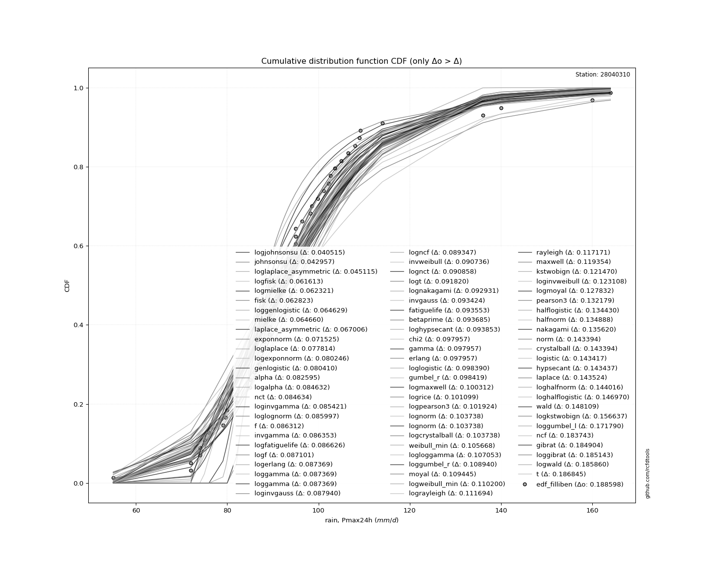
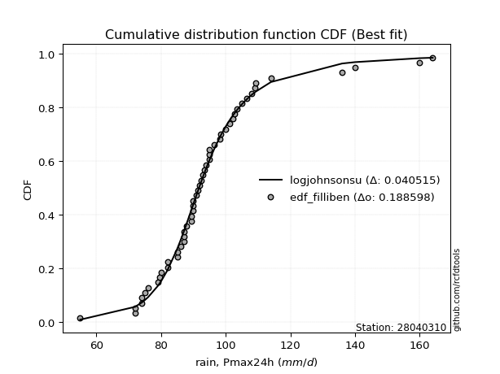
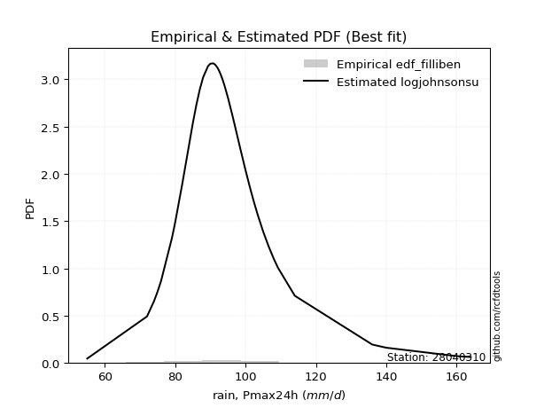

<div align="center">


</div>

# Station (rain, Pmax24h): 28040310

Probable Maximum Precipitation (PMP) is the greatest amount of rainfall for a specific duration that is meteorologically possible for a given location, acting as a "worst-case" scenario for extreme storms, crucial for designing safety-critical infrastructure like bridges, river deviations, dams, spillways, and nuclear plants to prevent catastrophic failure. PMP is calculated by hydrologists using meteorological data to determine the upper limit of extreme rainfall, often leading to the Probable Maximum Flood (PMF) for flood control design, and is increasingly being studied for climate change impacts.

<div align="center">

</img>

</div>


## A. General information


### 1. General running parameters

• app_version: _v20251225_. • runtime: _2025-12-26 15:25:57.471855_. • Python version: _3.14.0_. • SciPy version: _1.16.3_. • Pandas version: _2.3.3_. • NumPy version: _2.3.5_. • Stations dataset (station_dataset_file): _dataset/pmax24h_in/conventional_cesarcolombia_1970_2021.csv_. • Stations catalog (station_catalog_file): _dataset/CNE_IDEAM.xls_. • Minimum year to eval til year_max (date_min): _1970_. • Maximum year to eval since year_min (date_max): _2021_. • Creates, save and include plots into reports (create_plot): _True_. • Plot only fit distributions with Δo > Δ (plot_only_fit): _True_. • Eval low extreme values, if False, evaluates high extreme values (low_extreme): _False_. • Eval every SciPy distribution as logarithmic (pdist_logarithmic_on): _True_. • Standard deviation normalized (ddof): _1.0_. • Return periods to eval in years (Tr): _[2, 2.33, 5, 10, 15, 20, 25, 50, 75, 100, 200, 250, 500, 750, 1000]_. • Minimum data sample per station, 0 means any (minimum_sample): _5_. • Z-Score threshold to adjust a value, 0 means disable (zscore): _3.5_. • Avoid zeros, e.g. rain = 0 (avoid_zeros): _True_. • Avoid null values (avoid_nans): _True_. [:file_folder:Dataset file.](../../dataset/pmax24h_in/conventional_cesarcolombia_1970_2021.csv)


### 2. Station info and location

|   id |   CODIGO | NOMBRE               | CATEGORIA     | TECNOLOGIA   | ESTADO     | FECHA_INSTALACION   | FECHA_SUSPENSION   |   ALTITUD |   LATITUD |   LONGITUD | DEPARTAMENTO   | MUNICIPIO   | AREA_OPERATIVA                                         | ENTIDAD                                                     | AREA_HIDROGRAFICA   | ZONA_HIDROGRAFICA   | SUBZONA_HIDROGRAFICA   |   CORRIENTE |   OBSERVACION |   SUBRED | Catalogo   |
|-----:|---------:|:---------------------|:--------------|:-------------|:-----------|:--------------------|:-------------------|----------:|----------:|-----------:|:---------------|:------------|:-------------------------------------------------------|:------------------------------------------------------------|:--------------------|:--------------------|:-----------------------|------------:|--------------:|---------:|:-----------|
|    0 | 28040310 | MOLINO EL [28040310] | Pluviométrica | Convencional | Suspendida | 15/08/1972          | 06/01/2016         |       110 |   9.77606 |   -73.7434 | Cesar          | El Paso     | Area Operativa 05 - Magdalena-Cesar-Guajira-San Andrés | INSTITUTO DE HIDROLOGIA METEOROLOGIA Y ESTUDIOS AMBIENTALES | Magdalena Cauca     | Cesar               | Río Ariguaní           |         nan |           nan |      nan | CNE_IDEAM  |

<div align="center">

Map location in: [:earth_americas:Google](http://maps.google.com/maps?q=9.776055556,-73.74341667) [:earth_americas:OSM](https://www.openstreetmap.org/#map=18/9.776055556/-73.74341667&layers=P) [:earth_americas:Bing](https://www.bing.com/maps?cp=9.776055556~-73.74341667&lvl=18) [:earth_americas:Apple](https://maps.apple.com/frame?center=9.776055556%2C-73.74341667&span=0.003%2C0.006)

</div>


<div align="center">

```geojson
{
  "type": "Feature",
  "geometry": {
    "type": "Point", 
    "coordinates": [-73.74341667, 9.776055556]
  }, 
  "properties": {
    "Name": "28040310"
  }
}
```

</div>


### 3. Discrete values table and plot

|               |          0 |           1 |          2 |           3 |           4 |          5 |           6 |           7 |           8 |           9 |          10 |         11 |           12 |          13 |             14 |         15 |          16 |         17 |         18 |         19 |             20 |          21 |         22 |          23 |             24 |          25 |         26 |         27 |        28 |          29 |          30 |         31 |          32 |          33 |         34 |         35 |          36 |          37 |         38 |          39 |          40 |          41 |          42 |          43 |          44 |          45 |           46 |           47 |          48 |          49 |         50 |          51 |
|:--------------|-----------:|------------:|-----------:|------------:|------------:|-----------:|------------:|------------:|------------:|------------:|------------:|-----------:|-------------:|------------:|---------------:|-----------:|------------:|-----------:|-----------:|-----------:|---------------:|------------:|-----------:|------------:|---------------:|------------:|-----------:|-----------:|----------:|------------:|------------:|-----------:|------------:|------------:|-----------:|-----------:|------------:|------------:|-----------:|------------:|------------:|------------:|------------:|------------:|------------:|------------:|-------------:|-------------:|------------:|------------:|-----------:|------------:|
| Date          | 1970       | 1971        | 1972       | 1973        | 1974        | 1975       | 1976        | 1977        | 1978        | 1979        | 1980        | 1981       | 1982         | 1983        | 1984           | 1985       | 1986        | 1987       | 1988       | 1989       | 1990           | 1991        | 1992       | 1993        | 1994           | 1995        | 1996       | 1997       | 1998      | 1999        | 2000        | 2001       | 2002        | 2003        | 2004       | 2005       | 2006        | 2007        | 2008       | 2009        | 2010        | 2011        | 2012        | 2013        | 2014        | 2015        | 2016         | 2017         | 2018        | 2019        | 2020       | 2021        |
| Value         |  102.165   |   91.3412   |   79.0625  |  106.512    |   92.8491   |  101.132   |   87.002    |   76        |  107.997    |   98.5019   |  102.616    |  136       |   94         |  109        |   95           |   92       |   87        |   72       |  160       |   82       |   95           |   90        |   74       |  105        |   95           |   85        |  164       |   75       |   55      |  114        |   87        |   82       |   86        |   90        |   72       |   74       |   90        |   80        |  140       |   85        |  109.21     |   99.8556   |   89.3552   |   98.2518   |  103.545    |   79.6021   |   93.4188    |   96.4386    |   89.3537   |   87.9468   |   92.4706  |   90.8074   |
| Value_initial |  102.165   |   91.3412   |   79.0625  |  106.512    |   92.8491   |  101.132   |   87.002    |   76        |  107.997    |   98.5019   |  102.616    |  136       |   94         |  109        |   95           |   92       |   87        |   72       |  160       |   82       |   95           |   90        |   74       |  105        |   95           |   85        |  164       |   75       |   55      |  114        |   87        |   82       |   86        |   90        |   72       |   74       |   90        |   80        |  140       |   85        |  109.21     |   99.8556   |   89.3552   |   98.2518   |  103.545    |   79.6021   |   93.4188    |   96.4386    |   89.3537   |   87.9468   |   92.4706  |   90.8074   |
| count         |   52       |   52        |   52       |   52        |   52        |   52       |   52        |   52        |   52        |   52        |   52        |   52       |   52         |   52        |   52           |   52       |   52        |   52       |   52       |   52       |   52           |   52        |   52       |   52        |   52           |   52        |   52       |   52       |   52      |   52        |   52        |   52       |   52        |   52        |   52       |   52       |   52        |   52        |   52       |   52        |   52        |   52        |   52        |   52        |   52        |   52        |   52         |   52         |   52        |   52        |   52       |   52        |
| mean          |   95.0083  |   95.0083   |   95.0083  |   95.0083   |   95.0083   |   95.0083  |   95.0083   |   95.0083   |   95.0083   |   95.0083   |   95.0083   |   95.0083  |   95.0083    |   95.0083   |   95.0083      |   95.0083  |   95.0083   |   95.0083  |   95.0083  |   95.0083  |   95.0083      |   95.0083   |   95.0083  |   95.0083   |   95.0083      |   95.0083   |   95.0083  |   95.0083  |   95.0083 |   95.0083   |   95.0083   |   95.0083  |   95.0083   |   95.0083   |   95.0083  |   95.0083  |   95.0083   |   95.0083   |   95.0083  |   95.0083   |   95.0083   |   95.0083   |   95.0083   |   95.0083   |   95.0083   |   95.0083   |   95.0083    |   95.0083    |   95.0083   |   95.0083   |   95.0083  |   95.0083   |
| std           |   19.8977  |   19.8977   |   19.8977  |   19.8977   |   19.8977   |   19.8977  |   19.8977   |   19.8977   |   19.8977   |   19.8977   |   19.8977   |   19.8977  |   19.8977    |   19.8977   |   19.8977      |   19.8977  |   19.8977   |   19.8977  |   19.8977  |   19.8977  |   19.8977      |   19.8977   |   19.8977  |   19.8977   |   19.8977      |   19.8977   |   19.8977  |   19.8977  |   19.8977 |   19.8977   |   19.8977   |   19.8977  |   19.8977   |   19.8977   |   19.8977  |   19.8977  |   19.8977   |   19.8977   |   19.8977  |   19.8977   |   19.8977   |   19.8977   |   19.8977   |   19.8977   |   19.8977   |   19.8977   |   19.8977    |   19.8977    |   19.8977   |   19.8977   |   19.8977  |   19.8977   |
| zscore        |    0.35966 |   -0.184297 |   -0.80139 |    0.578119 |   -0.108515 |    0.30774 |   -0.402372 |   -0.955303 |    0.652777 |    0.175578 |    0.382335 |    2.06012 |   -0.0506754 |    0.703181 |   -0.000418275 |   -0.15119 |   -0.402475 |   -1.15633 |    3.26629 |   -0.65376 |   -0.000418275 |   -0.251704 |   -1.05582 |    0.502153 |   -0.000418275 |   -0.502989 |    3.46732 |   -1.00556 |   -2.0107 |    0.954466 |   -0.402475 |   -0.65376 |   -0.452732 |   -0.251704 |   -1.15633 |   -1.05582 |   -0.251704 |   -0.754274 |    2.26115 |   -0.502989 |    0.713714 |    0.243608 |   -0.284109 |    0.163006 |    0.429033 |   -0.774271 |   -0.0798863 |    0.0718813 |   -0.284187 |   -0.354893 |   -0.12754 |   -0.211127 |

<div align="center">

</img>

</div>

> If Z-Score is active, values out of range or outliers are replaced with the station mean value.


### 4. Active continuous probability distributions from SciPy (45 of 104 available)

[scipy.stats](https://docs.scipy.org/doc/scipy/reference/stats.html) is a Python´s powerful submodule within the SciPy library for comprehensive statistical analysis, offering over 130 probability distributions (like Normal, Poisson), functions for descriptive stats (mean, variance), hypothesis testing (t-tests, chi-square), random variable generation, and statistical tests, making it essential for data science, modeling, and research. It provides tools to explore, model, and draw conclusions from data efficiently, working seamlessly with NumPy.

<div align="center">

|   id | p_dist             |   n_parameter | fit_method   | label                                                                       | active   | ref                                                                                                        |
|-----:|:-------------------|--------------:|:-------------|:----------------------------------------------------------------------------|:---------|:-----------------------------------------------------------------------------------------------------------|
|    0 | alpha              |             3 | MLE          | Alpha                                                                       | True     | [:mortar_board:](https://docs.scipy.org/doc/scipy/reference/generated/scipy.stats.alpha.html)              |
|    1 | betaprime          |             4 | MLE          | Beta prime                                                                  | True     | [:mortar_board:](https://docs.scipy.org/doc/scipy/reference/generated/scipy.stats.betaprime.html)          |
|    2 | chi2               |             3 | MLE          | Chi²                                                                        | True     | [:mortar_board:](https://docs.scipy.org/doc/scipy/reference/generated/scipy.stats.chi2.html)               |
|    3 | crystalball        |             4 | MLE          | Crystalball                                                                 | True     | [:mortar_board:](https://docs.scipy.org/doc/scipy/reference/generated/scipy.stats.crystalball.html)        |
|    4 | erlang             |             3 | MLE          | Erlang                                                                      | True     | [:mortar_board:](https://docs.scipy.org/doc/scipy/reference/generated/scipy.stats.erlang.html)             |
|    5 | expon              |             2 | MLE          | Exponential                                                                 | True     | [:mortar_board:](https://docs.scipy.org/doc/scipy/reference/generated/scipy.stats.expon.html)              |
|    6 | exponnorm          |             3 | MLE          | Exponentially modified Normal                                               | True     | [:mortar_board:](https://docs.scipy.org/doc/scipy/reference/generated/scipy.stats.exponnorm.html)          |
|    7 | f                  |             4 | MLE          | F                                                                           | True     | [:mortar_board:](https://docs.scipy.org/doc/scipy/reference/generated/scipy.stats.f.html)                  |
|    8 | fatiguelife        |             3 | MLE          | Fatigue-life (Birnbaum-Saunders)                                            | True     | [:mortar_board:](https://docs.scipy.org/doc/scipy/reference/generated/scipy.stats.fatiguelife.html)        |
|    9 | fisk               |             3 | MLE          | Fisk                                                                        | True     | [:mortar_board:](https://docs.scipy.org/doc/scipy/reference/generated/scipy.stats.fisk.html)               |
|   10 | gamma              |             3 | MLE          | Gamma                                                                       | True     | [:mortar_board:](https://docs.scipy.org/doc/scipy/reference/generated/scipy.stats.gamma.html)              |
|   11 | genexpon           |             5 | MLE          | Generalized exponential                                                     | True     | [:mortar_board:](https://docs.scipy.org/doc/scipy/reference/generated/scipy.stats.genexpon.html)           |
|   12 | genlogistic        |             3 | MLE          | Generalized logistic                                                        | True     | [:mortar_board:](https://docs.scipy.org/doc/scipy/reference/generated/scipy.stats.genlogistic.html)        |
|   13 | gibrat             |             2 | MM           | Gibrat                                                                      | True     | [:mortar_board:](https://docs.scipy.org/doc/scipy/reference/generated/scipy.stats.gibrat.html)             |
|   14 | gompertz           |             3 | MLE          | Gompertz (or truncated Gumbel)                                              | True     | [:mortar_board:](https://docs.scipy.org/doc/scipy/reference/generated/scipy.stats.gompertz.html)           |
|   15 | gumbel_l           |             2 | MM           | Gumbel Left Skew                                                            | True     | [:mortar_board:](https://docs.scipy.org/doc/scipy/reference/generated/scipy.stats.gumbel_l.html)           |
|   16 | gumbel_r           |             2 | MM           | Gumbel Right Skew                                                           | True     | [:mortar_board:](https://docs.scipy.org/doc/scipy/reference/generated/scipy.stats.gumbel_r.html)           |
|   17 | halflogistic       |             2 | MM           | Half-logistic                                                               | True     | [:mortar_board:](https://docs.scipy.org/doc/scipy/reference/generated/scipy.stats.halflogistic.html)       |
|   18 | halfnorm           |             2 | MM           | Half Normal                                                                 | True     | [:mortar_board:](https://docs.scipy.org/doc/scipy/reference/generated/scipy.stats.halfnorm.html)           |
|   19 | hypsecant          |             2 | MM           | hyperbolic secant                                                           | True     | [:mortar_board:](https://docs.scipy.org/doc/scipy/reference/generated/scipy.stats.hypsecant.html)          |
|   20 | invgamma           |             3 | MLE          | Inverted gamma                                                              | True     | [:mortar_board:](https://docs.scipy.org/doc/scipy/reference/generated/scipy.stats.invgamma.html)           |
|   21 | invgauss           |             3 | MLE          | Inverse Gaussian                                                            | True     | [:mortar_board:](https://docs.scipy.org/doc/scipy/reference/generated/scipy.stats.invgauss.html)           |
|   22 | invweibull         |             3 | MLE          | Inverted Weibull                                                            | True     | [:mortar_board:](https://docs.scipy.org/doc/scipy/reference/generated/scipy.stats.invweibull.html)         |
|   23 | johnsonsu          |             4 | MLE          | Johnson Su                                                                  | True     | [:mortar_board:](https://docs.scipy.org/doc/scipy/reference/generated/scipy.stats.johnsonsu.html)          |
|   24 | kstwobign          |             2 | MLE          | Limiting distribution of scaled Kolmogorov-Smirnov two-sided test statistic | True     | [:mortar_board:](https://docs.scipy.org/doc/scipy/reference/generated/scipy.stats.kstwobign.html)          |
|   25 | laplace            |             2 | MM           | Laplace                                                                     | True     | [:mortar_board:](https://docs.scipy.org/doc/scipy/reference/generated/scipy.stats.laplace.html)            |
|   26 | laplace_asymmetric |             3 | MLE          | Asymmetric Laplace                                                          | True     | [:mortar_board:](https://docs.scipy.org/doc/scipy/reference/generated/scipy.stats.laplace_asymmetric.html) |
|   27 | loggamma           |             3 | MLE          | Log gamma                                                                   | True     | [:mortar_board:](https://docs.scipy.org/doc/scipy/reference/generated/scipy.stats.loggamma.html)           |
|   28 | logistic           |             2 | MM           | Logistic (or Sech-squared)                                                  | True     | [:mortar_board:](https://docs.scipy.org/doc/scipy/reference/generated/scipy.stats.logistic.html)           |
|   29 | lognorm            |             3 | MLE          | Log Normal                                                                  | True     | [:mortar_board:](https://docs.scipy.org/doc/scipy/reference/generated/scipy.stats.lognorm.html)            |
|   30 | maxwell            |             2 | MM           | Maxwell                                                                     | True     | [:mortar_board:](https://docs.scipy.org/doc/scipy/reference/generated/scipy.stats.maxwell.html)            |
|   31 | mielke             |             4 | MLE          | Mielke Beta-Kappa / Dagum                                                   | True     | [:mortar_board:](https://docs.scipy.org/doc/scipy/reference/generated/scipy.stats.mielke.html)             |
|   32 | moyal              |             2 | MM           | Moyal                                                                       | True     | [:mortar_board:](https://docs.scipy.org/doc/scipy/reference/generated/scipy.stats.moyal.html)              |
|   33 | nakagami           |             3 | MLE          | Nakagami                                                                    | True     | [:mortar_board:](https://docs.scipy.org/doc/scipy/reference/generated/scipy.stats.nakagami.html)           |
|   34 | ncf                |             5 | MLE          | Non-central F distribution                                                  | True     | [:mortar_board:](https://docs.scipy.org/doc/scipy/reference/generated/scipy.stats.ncf.html)                |
|   35 | nct                |             4 | MLE          | Non-central Student’s t                                                     | True     | [:mortar_board:](https://docs.scipy.org/doc/scipy/reference/generated/scipy.stats.nct.html)                |
|   36 | norm               |             2 | MM           | Normal                                                                      | True     | [:mortar_board:](https://docs.scipy.org/doc/scipy/reference/generated/scipy.stats.norm.html)               |
|   37 | pareto             |             3 | MLE          | Pareto                                                                      | True     | [:mortar_board:](https://docs.scipy.org/doc/scipy/reference/generated/scipy.stats.pareto.html)             |
|   38 | pearson3           |             3 | MM           | Pearson type III                                                            | True     | [:mortar_board:](https://docs.scipy.org/doc/scipy/reference/generated/scipy.stats.pearson3.html)           |
|   39 | rayleigh           |             2 | MM           | Rayleigh                                                                    | True     | [:mortar_board:](https://docs.scipy.org/doc/scipy/reference/generated/scipy.stats.rayleigh.html)           |
|   40 | rice               |             3 | MLE          | Rice                                                                        | True     | [:mortar_board:](https://docs.scipy.org/doc/scipy/reference/generated/scipy.stats.rice.html)               |
|   41 | t                  |             3 | MLE          | Student’s t                                                                 | True     | [:mortar_board:](https://docs.scipy.org/doc/scipy/reference/generated/scipy.stats.t.html)                  |
|   42 | truncnorm          |             4 | MLE          | Truncated normal                                                            | True     | [:mortar_board:](https://docs.scipy.org/doc/scipy/reference/generated/scipy.stats.truncnorm.html)          |
|   43 | wald               |             2 | MM           | Wald                                                                        | True     | [:mortar_board:](https://docs.scipy.org/doc/scipy/reference/generated/scipy.stats.wald.html)               |
|   44 | weibull_min        |             3 | MLE          | Weibull minimum                                                             | True     | [:mortar_board:](https://docs.scipy.org/doc/scipy/reference/generated/scipy.stats.weibull_min.html)        |

</div>

> **n_parameter:** # arguments & localization & scale.
>
> **Fit methods:** (MLE) maximum likelihood, (MM) L-moments.
>
>**Inactive:** foldnorm, gennorm, norminvgauss, powernorm, powerlognorm, skewnorm, genextreme, anglit, arcsine, argus, beta, bradford, burr, burr12, cauchy, cosine, halfcauchy, foldcauchy, skewcauchy, wrapcauchy, dgamma, gengamma, exponweib, exponpow, truncexpon, gausshyper, genhalflogistic, genhyperbolic, geninvgauss, halfgennorm, johnsonsb, kappa4, kappa3, ksone, kstwo, loglaplace, levy, levy_l, levy_stable, ncx2, genpareto, truncpareto, lomax, powerlaw, rdist, rel_breitwigner, recipinvgauss, semicircular, studentized_range, trapezoid, triang, truncweibull_min, tukeylambda, uniform, loguniform, vonmises, vonmises_line, weibull_max, dweibull, 


## B. Probability distributions vs. Empirical distributions

A continuous probability distribution (CPD) describes probabilities for variables that can take any value within a range (like rain any time), unlike discrete variables with specific outcomes (like temperature). It uses a Probability Density Function (PDF), a curve where the total area under it equals 1, and the probability of the variable falling within an interval (a to b) is found by calculating the area under the curve between those points. A key feature is that the probability of hitting any single exact value is zero, so probabilities are always expressed for ranges, e.g., $P(a ≤ X ≤ b)$.

<div align="center">

Distributions parameters
|    |   station | p_dist                |   n |              loc |           scale | shape                 | shape1                 | shape2                 | shape3   |
|---:|----------:|:----------------------|----:|-----------------:|----------------:|:----------------------|:-----------------------|:-----------------------|:---------|
|  0 |  28040310 | alpha                 |  52 |    -19.703       |   742.889       | 6.6408557738607925    |                        |                        |          |
|  1 |  28040310 | betaprime             |  52 |     -2.64386     |     5.4615      | 556.8051760406422     | 32.17373761744581      |                        |          |
|  2 |  28040310 | chi2                  |  52 |     40.8817      |     3.15782     | 17.14049712753839     |                        |                        |          |
|  3 |  28040310 | crystalball           |  52 |     95.0083      |    19.7054      | 8200.75817578369      | 40.354023346950896     |                        |          |
|  4 |  28040310 | erlang                |  52 |     40.8818      |     6.31566     | 8.570205921956521     |                        |                        |          |
|  5 |  28040310 | expon                 |  52 |     55           |    40.0083      |                       |                        |                        |          |
|  6 |  28040310 | exponnorm             |  52 |     79.5644      |     9.62263     | 1.6049654661287405    |                        |                        |          |
|  7 |  28040310 | f                     |  52 |     12.7956      |    78.3732      | 3038.293995117244     | 43.797742035028854     |                        |          |
|  8 |  28040310 | fatiguelife           |  52 |     24.5165      |    68.1803      | 0.2604789290208537    |                        |                        |          |
|  9 |  28040310 | fisk                  |  52 |     33.9032      |    58.0152      | 6.485183300098019     |                        |                        |          |
| 10 |  28040310 | gamma                 |  52 |     40.8817      |     6.31564     | 8.570259253425863     |                        |                        |          |
| 11 |  28040310 | genexpon              |  52 |     55           |     1.70765     | 0.4085810775255014    | 1.4079484534553353e-08 | 1.788355818054665      |          |
| 12 |  28040310 | genlogistic           |  52 |     72.5045      |    12.33        | 3.8436660924806176    |                        |                        |          |
| 13 |  28040310 | gibrat                |  52 |     79.9755      |     9.11784     |                       |                        |                        |          |
| 14 |  28040310 | gompertz              |  52 |     57.8495      |     4.16735     | 3.187917179245937e-10 |                        |                        |          |
| 15 |  28040310 | gumbel_l              |  52 |    103.877       |    15.3643      |                       |                        |                        |          |
| 16 |  28040310 | gumbel_r              |  52 |     86.1398      |    15.3643      |                       |                        |                        |          |
| 17 |  28040310 | halflogistic          |  52 |     71.6528      |    16.8475      |                       |                        |                        |          |
| 18 |  28040310 | halfnorm              |  52 |     68.926       |    32.6893      |                       |                        |                        |          |
| 19 |  28040310 | hypsecant             |  52 |     95.0083      |    12.5449      |                       |                        |                        |          |
| 20 |  28040310 | invgamma              |  52 |     12.2317      |  1727.78        | 21.89494878147239     |                        |                        |          |
| 21 |  28040310 | invgauss              |  52 |     24.479       |  1025.14        | 0.06881156935451546   |                        |                        |          |
| 22 |  28040310 | invweibull            |  52 |     -1.75919e+09 |     1.75919e+09 | 116834831.51050964    |                        |                        |          |
| 23 |  28040310 | johnsonsu             |  52 |     86.3918      |    11.3269      | -0.47671999988152886  | 1.051157822248462      |                        |          |
| 24 |  28040310 | kstwobign             |  52 |     27.3911      |    78.7053      |                       |                        |                        |          |
| 25 |  28040310 | laplace               |  52 |     95.0083      |    13.9339      |                       |                        |                        |          |
| 26 |  28040310 | laplace_asymmetric    |  52 |     89.3552      |    12.0721      | 0.7929076387105105    |                        |                        |          |
| 27 |  28040310 | loggamma              |  52 |  -4778.8         |   692.488       | 1139.6731817850268    |                        |                        |          |
| 28 |  28040310 | logistic              |  52 |     95.0083      |    10.8642      |                       |                        |                        |          |
| 29 |  28040310 | lognorm               |  52 |     28.0852      |    64.4298      | 0.2715259916880373    |                        |                        |          |
| 30 |  28040310 | maxwell               |  52 |     48.3147      |    29.2609      |                       |                        |                        |          |
| 31 |  28040310 | mielke                |  52 |     -0.23859     |    86.6484      | 14.056903170077224    | 9.078826067645252      |                        |          |
| 32 |  28040310 | moyal                 |  52 |     83.7395      |     8.87057     |                       |                        |                        |          |
| 33 |  28040310 | nakagami              |  52 |     72           |    29.6079      | 0.42932590999500375   |                        |                        |          |
| 34 |  28040310 | ncf                   |  52 |     -1.2819      |    96.1972      | 53.47316753831336     | 68.60050850126979      | 4.745108246843266e-11  |          |
| 35 |  28040310 | nct                   |  52 |     -0.240969    |     5.62124     | 17.141424391760225    | 16.17245042110202      |                        |          |
| 36 |  28040310 | norm                  |  52 |     95.0083      |    19.7054      |                       |                        |                        |          |
| 37 |  28040310 | pareto                |  52 |     -4.29497e+09 |     4.29497e+09 | 107351846.59800774    |                        |                        |          |
| 38 |  28040310 | pearson3              |  52 |     95.0083      |    19.7055      | 1.6059879849112675    |                        |                        |          |
| 39 |  28040310 | rayleigh              |  52 |     57.3107      |    30.0784      |                       |                        |                        |          |
| 40 |  28040310 | rice                  |  52 |     47.7997      |    19.7842      | 2.2962830572436435    |                        |                        |          |
| 41 |  28040310 | t                     |  52 |     96.7556      |    15.0344      | 3.933687760948545     |                        |                        |          |
| 42 |  28040310 | truncnorm             |  52 |     28.4535      |   105.204       | -4640.6193842202565   | 1.2884179422660145     |                        |          |
| 43 |  28040310 | wald                  |  52 |     75.3029      |    19.7054      |                       |                        |                        |          |
| 44 |  28040310 | weibull_min           |  52 |     71.5286      |    25.9105      | 1.2992352080001677    |                        |                        |          |
| 45 |  28040310 | logalpha              |  52 |      0.694564    |    78.7795      | 20.569898873507427    |                        |                        |          |
| 46 |  28040310 | logbetaprime          |  52 |      2.07474     |     2.14449     | 101.30274093265496    | 88.33921140721617      |                        |          |
| 47 |  28040310 | logchi2               |  52 |      4.00733     |     0.989146    | 1.0421151395538648    |                        |                        |          |
| 48 |  28040310 | logcrystalball        |  52 |      4.53504     |     0.189959    | 60.66486719703539     | 3338.221465148532      |                        |          |
| 49 |  28040310 | logerlang             |  52 |      3.17439     |     0.0259953   | 52.342523131949406    |                        |                        |          |
| 50 |  28040310 | logexpon              |  52 |      4.00733     |     0.527711    |                       |                        |                        |          |
| 51 |  28040310 | logexponnorm          |  52 |      4.40248     |     0.131279    | 1.0097684077134943    |                        |                        |          |
| 52 |  28040310 | logf                  |  52 |      3.13053     |     1.4035      | 116.36147763423381    | 2818.8297544797206     |                        |          |
| 53 |  28040310 | logfatiguelife        |  52 |      2.66893     |     1.85671     | 0.10064543048353694   |                        |                        |          |
| 54 |  28040310 | logfisk               |  52 |      3.1123      |     1.40798     | 14.621892966562461    |                        |                        |          |
| 55 |  28040310 | loggamma              |  52 |      3.17438     |     0.0259952   | 52.34261361488996     |                        |                        |          |
| 56 |  28040310 | loggenexpon           |  52 |      3.98277     |     0.00802519  | 4.933779772780113e-07 | 3.708449696841213      | 0.00010174677502868408 |          |
| 57 |  28040310 | loggenlogistic        |  52 |      4.45937     |     0.110381    | 1.5455411158333479    |                        |                        |          |
| 58 |  28040310 | loggibrat             |  52 |      4.3901      |     0.0879092   |                       |                        |                        |          |
| 59 |  28040310 | loggompertz           |  52 |      4.00733     |     0.794531    | 1.1102623616079483    |                        |                        |          |
| 60 |  28040310 | loggumbel_l           |  52 |      4.62054     |     0.14811     |                       |                        |                        |          |
| 61 |  28040310 | loggumbel_r           |  52 |      4.44955     |     0.14811     |                       |                        |                        |          |
| 62 |  28040310 | loghalflogistic       |  52 |      4.30994     |     0.162381    |                       |                        |                        |          |
| 63 |  28040310 | loghalfnorm           |  52 |      4.28363     |     0.315105    |                       |                        |                        |          |
| 64 |  28040310 | loghypsecant          |  52 |      4.53504     |     0.120932    |                       |                        |                        |          |
| 65 |  28040310 | loginvgamma           |  52 |      2.29417     |   320.365       | 143.9684044563287     |                        |                        |          |
| 66 |  28040310 | loginvgauss           |  52 |      2.98705     |   102.42        | 0.015114743040940588  |                        |                        |          |
| 67 |  28040310 | loginvweibull         |  52 | -43629.4         | 43633.9         | 234344.21089228458    |                        |                        |          |
| 68 |  28040310 | logjohnsonsu          |  52 |      4.48896     |     0.137589    | -0.24048370985631246  | 1.1081288703759125     |                        |          |
| 69 |  28040310 | logkstwobign          |  52 |      3.6954      |     0.976181    |                       |                        |                        |          |
| 70 |  28040310 | loglaplace            |  52 |      4.53504     |     0.134321    |                       |                        |                        |          |
| 71 |  28040310 | loglaplace_asymmetric |  52 |      4.49981     |     0.129215    | 0.8728512447229508    |                        |                        |          |
| 72 |  28040310 | logloggamma           |  52 |    -45.1509      |     6.93799     | 1289.3213358140133    |                        |                        |          |
| 73 |  28040310 | loglogistic           |  52 |      4.53504     |     0.10473     |                       |                        |                        |          |
| 74 |  28040310 | loglognorm            |  52 |      2.76332     |     1.76178     | 0.10583765532751367   |                        |                        |          |
| 75 |  28040310 | logmaxwell            |  52 |      4.08493     |     0.282068    |                       |                        |                        |          |
| 76 |  28040310 | logmielke             |  52 |      3.08642     |     1.43359     | 14.880178366207783    | 14.873359561880584     |                        |          |
| 77 |  28040310 | logmoyal              |  52 |      4.42641     |     0.0855116   |                       |                        |                        |          |
| 78 |  28040310 | lognakagami           |  52 |      3.40659     |     1.14433     | 9.081547987710753     |                        |                        |          |
| 79 |  28040310 | logncf                |  52 |      1.89856     |     2.63034     | 733.1296932924092     | 874.0184627473914      | 5.879054513097827e-11  |          |
| 80 |  28040310 | lognct                |  52 |     -0.509862    |     0.0455337   | 389.27576759084627    | 110.57430386144011     |                        |          |
| 81 |  28040310 | lognorm               |  52 |      4.53504     |     0.189959    |                       |                        |                        |          |
| 82 |  28040310 | logpareto             |  52 |     -3.35544e+07 |     3.35544e+07 | 63584910.18865962     |                        |                        |          |
| 83 |  28040310 | logpearson3           |  52 |      4.53504     |     0.189959    | 0.676882147653869     |                        |                        |          |
| 84 |  28040310 | lograyleigh           |  52 |      4.17166     |     0.289937    |                       |                        |                        |          |
| 85 |  28040310 | logrice               |  52 |      3.90775     |     0.196359    | 3.02346714889112      |                        |                        |          |
| 86 |  28040310 | logt                  |  52 |      4.52864     |     0.186703    | 9.0665674199332       |                        |                        |          |
| 87 |  28040310 | logtruncnorm          |  52 |     -0.157452    |     1.54796     | 2.6904940904639494    | 3.3962820371594082     |                        |          |
| 88 |  28040310 | logwald               |  52 |      4.3451      |     0.189944    |                       |                        |                        |          |
| 89 |  28040310 | logweibull_min        |  52 |      3.9199      |     0.681411    | 3.3073325937203855    |                        |                        |          |

</div>

> **loc** (Location parameter): This shifts the distribution along the x-axis. For many common distributions, like the normal (Gaussian) distribution, loc represents the mean $μ$. For others, like the uniform distribution, it might represent the minimum value, or for the beta distribution, the left end of the support interval.
>
> **scale** (Scale parameter): This determines the width or spread of the distribution. For the normal distribution, scale represents the standard deviation $σ$. For a uniform distribution, it defines the length of the interval (from $loc$ to $loc + scale$).
>
> **shape** (Shape parameters): Refers to parameters that define the specific form of a probability distribution, distinct from its location (loc) and scale (scale). These parameters are required arguments for most distribution functions. For example, a normal (Gaussian) distribution is fully defined by its location (mean) and scale (standard deviation), so it has no specific shape parameters beyond loc and scale. However, other distributions have intrinsic properties that need specification, as Gamma distribution that takes a shape parameter, often named $a$ or $alpha$.


### 0. Cumulative distribution values - CDF (90 evaluated)

> Ordered by x ascending and calculating $log(f(x))$ separately. 

|   id |   Station |   date |        x |   count |    mean |     std |       zscore |   Value_initial |   station |   m |       alpha |   alpha_pdf |   betaprime |   betaprime_pdf |       chi2 |    chi2_pdf |   crystalball |   crystalball_pdf |      erlang |   erlang_pdf |    expon |   expon_pdf |   exponnorm |   exponnorm_pdf |           f |       f_pdf |   fatiguelife |   fatiguelife_pdf |       fisk |    fisk_pdf |       gamma |   gamma_pdf |    genexpon |   genexpon_pdf |   genlogistic |   genlogistic_pdf |      gibrat |   gibrat_pdf |    gompertz |   gompertz_pdf |   gumbel_l |   gumbel_l_pdf |    gumbel_r |   gumbel_r_pdf |   halflogistic |   halflogistic_pdf |   halfnorm |   halfnorm_pdf |   hypsecant |   hypsecant_pdf |    invgamma |   invgamma_pdf |    invgauss |   invgauss_pdf |   invweibull |   invweibull_pdf |   johnsonsu |   johnsonsu_pdf |   kstwobign |   kstwobign_pdf |   laplace |   laplace_pdf |   laplace_asymmetric |   laplace_asymmetric_pdf |   loggamma |   loggamma_pdf |   logistic |   logistic_pdf |    lognorm |   lognorm_pdf |    maxwell |   maxwell_pdf |     mielke |   mielke_pdf |       moyal |   moyal_pdf |   nakagami |   nakagami_pdf |       ncf |    ncf_pdf |         nct |     nct_pdf |      norm |    norm_pdf |      pareto |   pareto_pdf |   pearson3 |   pearson3_pdf |   rayleigh |   rayleigh_pdf |       rice |    rice_pdf |         t |       t_pdf |   truncnorm |   truncnorm_pdf |        wald |    wald_pdf |   weibull_min |   weibull_min_pdf |    logalpha |   logalpha_pdf |   logbetaprime |   logbetaprime_pdf |     logchi2 |   logchi2_pdf |   logcrystalball |   logcrystalball_pdf |   logerlang |   logerlang_pdf |   logexpon |   logexpon_pdf |   logexponnorm |   logexponnorm_pdf |        logf |   logf_pdf |   logfatiguelife |   logfatiguelife_pdf |    logfisk |   logfisk_pdf |   loggenexpon |   loggenexpon_pdf |   loggenlogistic |   loggenlogistic_pdf |   loggibrat |   loggibrat_pdf |   loggompertz |   loggompertz_pdf |   loggumbel_l |   loggumbel_l_pdf |   loggumbel_r |   loggumbel_r_pdf |   loghalflogistic |   loghalflogistic_pdf |   loghalfnorm |   loghalfnorm_pdf |   loghypsecant |   loghypsecant_pdf |   loginvgamma |   loginvgamma_pdf |   loginvgauss |   loginvgauss_pdf |   loginvweibull |   loginvweibull_pdf |   logjohnsonsu |   logjohnsonsu_pdf |   logkstwobign |   logkstwobign_pdf |   loglaplace |   loglaplace_pdf |   loglaplace_asymmetric |   loglaplace_asymmetric_pdf |   logloggamma |   logloggamma_pdf |   loglogistic |   loglogistic_pdf |   loglognorm |   loglognorm_pdf |   logmaxwell |   logmaxwell_pdf |   logmielke |   logmielke_pdf |    logmoyal |   logmoyal_pdf |   lognakagami |   lognakagami_pdf |      logncf |   logncf_pdf |    lognct |   lognct_pdf |   logpareto |   logpareto_pdf |   logpearson3 |   logpearson3_pdf |   lograyleigh |   lograyleigh_pdf |    logrice |   logrice_pdf |      logt |   logt_pdf |   logtruncnorm |   logtruncnorm_pdf |   logwald |   logwald_pdf |   logweibull_min |   logweibull_min_pdf |
|-----:|----------:|-------:|---------:|--------:|--------:|--------:|-------------:|----------------:|----------:|----:|------------:|------------:|------------:|----------------:|-----------:|------------:|--------------:|------------------:|------------:|-------------:|---------:|------------:|------------:|----------------:|------------:|------------:|--------------:|------------------:|-----------:|------------:|------------:|------------:|------------:|---------------:|--------------:|------------------:|------------:|-------------:|------------:|---------------:|-----------:|---------------:|------------:|---------------:|---------------:|-------------------:|-----------:|---------------:|------------:|----------------:|------------:|---------------:|------------:|---------------:|-------------:|-----------------:|------------:|----------------:|------------:|----------------:|----------:|--------------:|---------------------:|-------------------------:|-----------:|---------------:|-----------:|---------------:|-----------:|--------------:|-----------:|--------------:|-----------:|-------------:|------------:|------------:|-----------:|---------------:|----------:|-----------:|------------:|------------:|----------:|------------:|------------:|-------------:|-----------:|---------------:|-----------:|---------------:|-----------:|------------:|----------:|------------:|------------:|----------------:|------------:|------------:|--------------:|------------------:|------------:|---------------:|---------------:|-------------------:|------------:|--------------:|-----------------:|---------------------:|------------:|----------------:|-----------:|---------------:|---------------:|-------------------:|------------:|-----------:|-----------------:|---------------------:|-----------:|--------------:|--------------:|------------------:|-----------------:|---------------------:|------------:|----------------:|--------------:|------------------:|--------------:|------------------:|--------------:|------------------:|------------------:|----------------------:|--------------:|------------------:|---------------:|-------------------:|--------------:|------------------:|--------------:|------------------:|----------------:|--------------------:|---------------:|-------------------:|---------------:|-------------------:|-------------:|-----------------:|------------------------:|----------------------------:|--------------:|------------------:|--------------:|------------------:|-------------:|-----------------:|-------------:|-----------------:|------------:|----------------:|------------:|---------------:|--------------:|------------------:|------------:|-------------:|----------:|-------------:|------------:|----------------:|--------------:|------------------:|--------------:|------------------:|-----------:|--------------:|----------:|-----------:|---------------:|-------------------:|----------:|--------------:|-----------------:|---------------------:|
|    0 |  28040310 |   1998 |  55      |      52 | 95.0083 | 19.8977 | -2.0107      |         55      |  28040310 |   1 | 0.000477068 | 0.000226517 |  0.00139613 |     0.00050653  | 0.00098093 | 0.00045997  |     0.0211621 |       0.00257751  | 0.000980924 |  0.000459968 | 0        |  0.0249948  | 0.000893082 |     0.000288161 | 0.000559215 | 0.000266936 |   0.000750588 |       0.000352459 | 0.00141342 | 0.000433875 | 0.000980934 | 0.000459971 | 1.84134e-08 |    0.239266    |    0.00185646 |       0.000466033 | 0           |  0           | 0           |    0           |   0.040685 |    0.00259341  | 0.000505721 |    0.000249812 |      0         |        0           |  0         |    0           |   0.0262165 |     0.00208746  | 0.000559893 |    0.00026719  | 0.000717362 |    0.000340294 |  0.000293188 |      0.000158397 |   0.0104581 |     0.00087292  |  0.00031615 |     0.00021816  | 0.0283125 |   0.00203192  |            0.0106629 |              0.00111396  | 0.00060911 |      0.0158301 |  0.0245403 |    0.0022034   | 0.00273454 |     0.0443032 | 0.00312269 |   0.00138671  | 0.00173953 |  0.000435361 | 4.35462e-07 | 6.49571e-07 | 0          |    0           | 0.0214631 | 0.00339163 | 0.000724942 | 0.000311168 | 0.0211621 | 0.00257751  | 2.38369e-08 |   0.0249948  |  0         |    0           |   0        |    0           | 0.00499702 | 0.00145783  | 0.0254503 | 0.00171227  |    0.665345 |      0.00407597 | 0           | 0           |    0          |       0           | 0.000662143 |      0.016539  |      0.0485583 |           0.358328 | 1.13488e-08 |   6.65787e+06 |       0.00273453 |            0.0443032 |  0.00060911 |       0.0158301 |   0        |       1.89498  |    0.000288558 |         0.00767718 | 0.000608002 |  0.0157609 |      0.000543789 |            0.0144504 | 0.00132577 |     0.02163   |    0.00176737 |          0.143701 |       0.00173822 |            0.0239397 |   0         |       0         |   2.29984e-08 |          1.39738  |     0.0157941 |       0.105791    |   2.51474e-09 |       3.36199e-07 |         0         |             0         |     0         |         0         |     0.00810442 |          0.0670093 |   0.000469711 |         0.012839  |    0.00038802 |         0.0114675 |      2.7886e-05 |          0.00157068 |     0.00778388 |          0.0473386 |    4.44018e-05 |         0.00329723 |   0.00983444 |        0.0732158 |              0.00548999 |                   0.0486762 |    0.00343389 |         0.0521313 |    0.00643993 |         0.0610949 |  0.000504657 |        0.0136144 |     0        |        0         |  0.00137818 |       0.022238  | 4.45684e-31 |    3.52824e-28 |    0.00102774 |         0.0235645 | 0.000953784 |    0.0213763 | 0.0011326 |    0.0240896 | 1.41187e-08 |        1.89498  |    1.0844e-08 |       2.66993e-06 |     0         |         0         | 0.00164477 |     0.0394916 | 0.0104177 |  0.0914966 |    3.77341e-07 |           2.14111  | 0         |     0         |       0.00112349 |            0.0424722 |
|    1 |  28040310 |   1987 |  72      |      52 | 95.0083 | 19.8977 | -1.15633     |         72      |  28040310 |   2 | 0.0721207   | 0.0121362   |  0.0805872  |     0.0118383   | 0.0861249  | 0.012362    |     0.121482  |       0.0102396   | 0.086125    |  0.012362    | 0.346172 |  0.0163423  | 0.0585797   |     0.0101867   | 0.075937    | 0.0122853   |   0.081288    |       0.0123652   | 0.061369   | 0.0098057   | 0.0861249   | 0.012362    | 0.98288     |    0.0040962   |    0.0643343  |       0.0102326   | 0           |  0           | 9.19129e-09 |    2.28205e-09 |   0.118023 |    0.00720939  | 0.0812636   |    0.013276    |      0.0103051 |        0.0296749   |  0.0749193 |    0.0243004   |   0.100854  |     0.00790564  | 0.0759491   |    0.0122853   | 0.0808095   |    0.0123623   |  0.072056    |      0.0125874   |   0.0557651 |     0.00645473  |  0.09502    |     0.0142305   | 0.0959047 |   0.00688285  |            0.062977  |              0.00657923  | 0.0770724  |      0.88491   |  0.107377  |    0.00882233  | 0.0868872  |     0.832743  | 0.116316   |   0.0128753   | 0.0591073  |  0.00965067  | 0.0526105   | 0.0133253   | 5.5129e-14 |    3.33102     | 0.150982  | 0.0121443  | 0.07511     | 0.0120324   | 0.121482  | 0.0102396   | 0.346172    |   0.0163423  |  0.0182954 |    0.0178294   |   0.112416 |    0.0144113   | 0.082092   | 0.00877283  | 0.0880934 | 0.00683627  |    0.732951 |      0.00386236 | 0           | 0           |    0.00547052 |       0.0150361   | 0.0774204   |      0.890354  |      0.222987  |           0.931289 | 0.380976    |   0.673388    |       0.0868871  |            0.832742  |  0.0770725  |       0.884911  |   0.399733 |       1.13749  |    0.0606651   |         0.816732   | 0.0768695   |  0.884002  |      0.0761019   |            0.886888  | 0.0585337  |     0.69203   |    0.223322   |          1.33489  |       0.059106   |            0.694844  |   0         |       0         |   0.361104    |          1.25304  |     0.093447  |       0.600485    |   0.0402264   |       0.872705    |         0         |             0         |     0         |         0         |     0.0748133  |          0.612961  |   0.0748358   |         0.889037  |    0.0764554  |         0.91156   |      0.0847019  |          1.123      |     0.0558528  |          0.493227  |    0.129753    |         1.33019    |   0.0730416  |        0.543783  |              0.0597954  |                   0.530167  |    0.0908657  |         0.835885  |    0.078198   |         0.688276  |  0.0754724   |        0.888031  |     0.072858 |        1.03743   |  0.0590669  |       0.694769  | 0.0163816   |    0.628158    |    0.0810477  |         0.871226  | 0.0780303   |    0.862786  | 0.0790496 |    0.857668  | 0.399733    |        1.13749  |    0.0624173  |       0.98333     |     0.0634759 |         1.16981   | 0.0869621  |     0.852377  | 0.104938  |  0.827254  |    0.458458    |           1.32057  | 0         |     0         |       0.110988   |            0.969546  |
|    2 |  28040310 |   2004 |  72      |      52 | 95.0083 | 19.8977 | -1.15633     |         72      |  28040310 |   3 | 0.0721207   | 0.0121362   |  0.0805872  |     0.0118383   | 0.0861249  | 0.012362    |     0.121482  |       0.0102396   | 0.086125    |  0.012362    | 0.346172 |  0.0163423  | 0.0585797   |     0.0101867   | 0.075937    | 0.0122853   |   0.081288    |       0.0123652   | 0.061369   | 0.0098057   | 0.0861249   | 0.012362    | 0.98288     |    0.0040962   |    0.0643343  |       0.0102326   | 0           |  0           | 9.19129e-09 |    2.28205e-09 |   0.118023 |    0.00720939  | 0.0812636   |    0.013276    |      0.0103051 |        0.0296749   |  0.0749193 |    0.0243004   |   0.100854  |     0.00790564  | 0.0759491   |    0.0122853   | 0.0808095   |    0.0123623   |  0.072056    |      0.0125874   |   0.0557651 |     0.00645473  |  0.09502    |     0.0142305   | 0.0959047 |   0.00688285  |            0.062977  |              0.00657923  | 0.0770724  |      0.88491   |  0.107377  |    0.00882233  | 0.0868872  |     0.832743  | 0.116316   |   0.0128753   | 0.0591073  |  0.00965067  | 0.0526105   | 0.0133253   | 5.5129e-14 |    3.33102     | 0.150982  | 0.0121443  | 0.07511     | 0.0120324   | 0.121482  | 0.0102396   | 0.346172    |   0.0163423  |  0.0182954 |    0.0178294   |   0.112416 |    0.0144113   | 0.082092   | 0.00877283  | 0.0880934 | 0.00683627  |    0.732951 |      0.00386236 | 0           | 0           |    0.00547052 |       0.0150361   | 0.0774204   |      0.890354  |      0.222987  |           0.931289 | 0.380976    |   0.673388    |       0.0868871  |            0.832742  |  0.0770725  |       0.884911  |   0.399733 |       1.13749  |    0.0606651   |         0.816732   | 0.0768695   |  0.884002  |      0.0761019   |            0.886888  | 0.0585337  |     0.69203   |    0.223322   |          1.33489  |       0.059106   |            0.694844  |   0         |       0         |   0.361104    |          1.25304  |     0.093447  |       0.600485    |   0.0402264   |       0.872705    |         0         |             0         |     0         |         0         |     0.0748133  |          0.612961  |   0.0748358   |         0.889037  |    0.0764554  |         0.91156   |      0.0847019  |          1.123      |     0.0558528  |          0.493227  |    0.129753    |         1.33019    |   0.0730416  |        0.543783  |              0.0597954  |                   0.530167  |    0.0908657  |         0.835885  |    0.078198   |         0.688276  |  0.0754724   |        0.888031  |     0.072858 |        1.03743   |  0.0590669  |       0.694769  | 0.0163816   |    0.628158    |    0.0810477  |         0.871226  | 0.0780303   |    0.862786  | 0.0790496 |    0.857668  | 0.399733    |        1.13749  |    0.0624173  |       0.98333     |     0.0634759 |         1.16981   | 0.0869621  |     0.852377  | 0.104938  |  0.827254  |    0.458458    |           1.32057  | 0         |     0         |       0.110988   |            0.969546  |
|    3 |  28040310 |   1992 |  74      |      52 | 95.0083 | 19.8977 | -1.05582     |         74      |  28040310 |   4 | 0.0990004   | 0.0147401   |  0.106483   |     0.014055    | 0.112932   | 0.0144328   |     0.143185  |       0.0114687   | 0.112932    |  0.0144328   | 0.378053 |  0.0155454  | 0.0816675   |     0.012942    | 0.102975    | 0.0147445   |   0.108274    |       0.0146091   | 0.0835016  | 0.0123777   | 0.112932    | 0.0144328   | 0.989391    |    0.00253839  |    0.0873188  |       0.0127857   | 0           |  0           | 1.5049e-08  |    3.68767e-09 |   0.133289 |    0.00806954  | 0.110395    |    0.0158339   |      0.069549  |        0.0295345   |  0.12335   |    0.0241159   |   0.117918  |     0.00918618  | 0.102986    |    0.014744    | 0.107804    |    0.0146204   |  0.0999442   |      0.0152875   |   0.0705857 |     0.00846077  |  0.125555   |     0.016259    | 0.110707  |   0.0079452   |            0.0776111 |              0.00810806  | 0.104074   |      1.08799   |  0.126339  |    0.0101598   | 0.112004   |     1.00276   | 0.1435     |   0.0142931   | 0.081018   |  0.0123141   | 0.0833658   | 0.0173925   | 0.077568   |    0.0332563   | 0.176237  | 0.0130965  | 0.10163     | 0.0144848   | 0.143185  | 0.0114687   | 0.378054    |   0.0155454  |  0.0619788 |    0.0248948   |   0.142673 |    0.0158153   | 0.100919   | 0.010064    | 0.102934  | 0.00803222  |    0.740645 |      0.00383139 | 0           | 0           |    0.0461185  |       0.023677    | 0.104613    |      1.09657   |      0.249152  |           0.977736 | 0.398874    |   0.634014    |       0.112004   |            1.00276   |  0.104074   |       1.08799   |   0.430103 |       1.07994  |    0.0863029   |         1.05928    | 0.103852    |  1.0875    |      0.103204    |            1.09339   | 0.080339   |     0.906499  |    0.26067    |          1.38892  |       0.0810166  |            0.91124   |   0         |       0         |   0.395097    |          1.22799  |     0.111341  |       0.708246    |   0.0692136   |       1.24798     |         0         |             0         |     0.0517155 |         2.5268    |     0.0935914  |          0.762817  |   0.102059    |         1.10017   |    0.104313   |         1.12354   |      0.11874    |          1.35886    |     0.0714829  |          0.656059  |    0.168305    |         1.4784     |   0.0895691  |        0.666827  |              0.0762378  |                   0.675952  |    0.115981   |         0.999357  |    0.0992603  |         0.853698  |  0.102637    |        1.09683   |     0.104384 |        1.26255   |  0.0809449  |       0.909024  | 0.0408569   |    1.1789      |    0.107481   |         1.06016   | 0.104324    |    1.05868   | 0.105155  |    1.05013   | 0.430103    |        1.07994  |    0.0930664  |       1.25412     |     0.0990173 |         1.41908   | 0.112648   |     1.02448   | 0.129752  |  0.986654  |    0.493736    |           1.25509  | 0         |     0         |       0.139517   |            1.11313   |
|    4 |  28040310 |   2005 |  74      |      52 | 95.0083 | 19.8977 | -1.05582     |         74      |  28040310 |   5 | 0.0990004   | 0.0147401   |  0.106483   |     0.014055    | 0.112932   | 0.0144328   |     0.143185  |       0.0114687   | 0.112932    |  0.0144328   | 0.378053 |  0.0155454  | 0.0816675   |     0.012942    | 0.102975    | 0.0147445   |   0.108274    |       0.0146091   | 0.0835016  | 0.0123777   | 0.112932    | 0.0144328   | 0.989391    |    0.00253839  |    0.0873188  |       0.0127857   | 0           |  0           | 1.5049e-08  |    3.68767e-09 |   0.133289 |    0.00806954  | 0.110395    |    0.0158339   |      0.069549  |        0.0295345   |  0.12335   |    0.0241159   |   0.117918  |     0.00918618  | 0.102986    |    0.014744    | 0.107804    |    0.0146204   |  0.0999442   |      0.0152875   |   0.0705857 |     0.00846077  |  0.125555   |     0.016259    | 0.110707  |   0.0079452   |            0.0776111 |              0.00810806  | 0.104074   |      1.08799   |  0.126339  |    0.0101598   | 0.112004   |     1.00276   | 0.1435     |   0.0142931   | 0.081018   |  0.0123141   | 0.0833658   | 0.0173925   | 0.077568   |    0.0332563   | 0.176237  | 0.0130965  | 0.10163     | 0.0144848   | 0.143185  | 0.0114687   | 0.378054    |   0.0155454  |  0.0619788 |    0.0248948   |   0.142673 |    0.0158153   | 0.100919   | 0.010064    | 0.102934  | 0.00803222  |    0.740645 |      0.00383139 | 0           | 0           |    0.0461185  |       0.023677    | 0.104613    |      1.09657   |      0.249152  |           0.977736 | 0.398874    |   0.634014    |       0.112004   |            1.00276   |  0.104074   |       1.08799   |   0.430103 |       1.07994  |    0.0863029   |         1.05928    | 0.103852    |  1.0875    |      0.103204    |            1.09339   | 0.080339   |     0.906499  |    0.26067    |          1.38892  |       0.0810166  |            0.91124   |   0         |       0         |   0.395097    |          1.22799  |     0.111341  |       0.708246    |   0.0692136   |       1.24798     |         0         |             0         |     0.0517155 |         2.5268    |     0.0935914  |          0.762817  |   0.102059    |         1.10017   |    0.104313   |         1.12354   |      0.11874    |          1.35886    |     0.0714829  |          0.656059  |    0.168305    |         1.4784     |   0.0895691  |        0.666827  |              0.0762378  |                   0.675952  |    0.115981   |         0.999357  |    0.0992603  |         0.853698  |  0.102637    |        1.09683   |     0.104384 |        1.26255   |  0.0809449  |       0.909024  | 0.0408569   |    1.1789      |    0.107481   |         1.06016   | 0.104324    |    1.05868   | 0.105155  |    1.05013   | 0.430103    |        1.07994  |    0.0930664  |       1.25412     |     0.0990173 |         1.41908   | 0.112648   |     1.02448   | 0.129752  |  0.986654  |    0.493736    |           1.25509  | 0         |     0         |       0.139517   |            1.11313   |
|    5 |  28040310 |   1997 |  75      |      52 | 95.0083 | 19.8977 | -1.00556     |         75      |  28040310 |   6 | 0.114381    | 0.0160162   |  0.121085   |     0.0151462   | 0.127866   | 0.0154308   |     0.154965  |       0.0120907   | 0.127866    |  0.0154308   | 0.393406 |  0.0151617  | 0.0953325   |     0.0143937   | 0.11832     | 0.01594     |   0.123428    |       0.0156919   | 0.0965692  | 0.0137673   | 0.127866    | 0.0154308   | 0.991648    |    0.00199823  |    0.100771   |       0.0141227   | 0           |  0           | 1.92167e-08 |    4.68776e-09 |   0.141587 |    0.00852977  | 0.12684     |    0.0170462   |      0.099014  |        0.0293871   |  0.147405  |    0.0239904   |   0.127453  |     0.00989044  | 0.118331    |    0.0159392   | 0.122972    |    0.0157101   |  0.115886    |      0.0165869   |   0.0796497 |     0.00969547  |  0.142272   |     0.017163    | 0.118945  |   0.00853637  |            0.0861578 |              0.00900094  | 0.119365   |      1.19057   |  0.136853  |    0.0108728   | 0.126047   |     1.09      | 0.15813    |   0.014963    | 0.0940471  |  0.013754    | 0.101717    | 0.019288    | 0.10979    |    0.0313271   | 0.189557  | 0.0135386  | 0.116719    | 0.0156877   | 0.154965  | 0.0120907   | 0.393406    |   0.0151617  |  0.0878934 |    0.0268108   |   0.158808 |    0.0164474   | 0.111315   | 0.01073     | 0.111294  | 0.00869514  |    0.744469 |      0.00381549 | 0           | 0           |    0.0707881  |       0.0255331   | 0.120031    |      1.20086   |      0.262417  |           0.998498 | 0.407266    |   0.616523    |       0.126047   |            1.09      |  0.119365   |       1.19057   |   0.444417 |       1.05282  |    0.101372    |         1.18664    | 0.119138    |  1.19034   |      0.118579    |            1.19767   | 0.0933008  |     1.02635   |    0.279459   |          1.41005  |       0.0940456  |            1.03155   |   0         |       0         |   0.411494    |          1.21506  |     0.121236  |       0.766798    |   0.087233    |       1.43661     |         0.0232478 |             3.07751   |     0.0855758 |         2.51755   |     0.104392   |          0.847843  |   0.117542    |         1.20679   |    0.120106   |         1.22966   |      0.137709   |          1.46633    |     0.0809434  |          0.756008  |    0.188562    |         1.53848    |   0.0989824  |        0.736908  |              0.0858731  |                   0.761382  |    0.129955   |         1.08304   |    0.111323   |         0.944619  |  0.118066    |        1.20226   |     0.122048 |        1.36879   |  0.0939393  |       1.02869   | 0.058676    |    1.47677     |    0.122353   |         1.15589   | 0.119202    |    1.15844   | 0.119908  |    1.14832   | 0.444417    |        1.05282  |    0.110781   |       1.38484     |     0.11881   |         1.52861   | 0.126987   |     1.11226   | 0.143552  |  1.06987   |    0.510375    |           1.22406  | 0         |     0         |       0.154931   |            1.18334   |
|    6 |  28040310 |   1977 |  76      |      52 | 95.0083 | 19.8977 | -0.955303    |         76      |  28040310 |   7 | 0.131019    | 0.0172513   |  0.136766   |     0.0162095   | 0.143781   | 0.0163908   |     0.167367  |       0.0127136   | 0.143781    |  0.0163908   | 0.40838  |  0.0147874  | 0.110463    |     0.0158684   | 0.13484     | 0.0170923   |   0.139644    |       0.0167323   | 0.111053   | 0.0152083   | 0.143781    | 0.0163908   | 0.993426    |    0.00157302  |    0.11557    |       0.015477    | 0           |  0           | 2.45148e-08 |    5.95907e-09 |   0.150355 |    0.00901041  | 0.144465    |    0.0181915   |      0.128306  |        0.0291895   |  0.171324  |    0.0238433   |   0.137714  |     0.0106384   | 0.13485     |    0.0170913   | 0.13921     |    0.016757    |  0.133098    |      0.0178265   |   0.0900359 |     0.011108    |  0.159853   |     0.0179841   | 0.127795  |   0.00917153  |            0.0956457 |              0.00999215  | 0.135808   |      1.29227   |  0.148094  |    0.0116126   | 0.141064   |     1.17775   | 0.173416   |   0.0156021   | 0.108543   |  0.0152439   | 0.12189     | 0.0210288   | 0.14041    |    0.0299759   | 0.203306  | 0.0139551  | 0.132994    | 0.0168542   | 0.167367  | 0.0127136   | 0.40838     |   0.0147874  |  0.115389  |    0.028091    |   0.175551 |    0.0170313   | 0.122382   | 0.0114055   | 0.120339  | 0.00940236  |    0.748276 |      0.0037993  | 2.82334e-07 | 5.90853e-06 |    0.0969793  |       0.026766    | 0.136621    |      1.30428   |      0.27577   |           1.0176   | 0.415324    |   0.600265    |       0.141064   |            1.17775   |  0.135808   |       1.29227   |   0.458188 |       1.02672  |    0.117941    |         1.31566    | 0.13558     |  1.29232   |      0.135127    |            1.30098   | 0.107728   |     1.15353   |    0.298255   |          1.42749  |       0.108541   |            1.15855   |   0         |       0         |   0.427501    |          1.20188  |     0.131797  |       0.828453    |   0.107473    |       1.61853     |         0.063949  |             3.06659   |     0.118836  |         2.50399   |     0.116222   |          0.939846  |   0.134225    |         1.31236   |    0.137086   |         1.33411   |      0.157792   |          1.56481    |     0.0916948  |          0.870168  |    0.209286    |         1.5894     |   0.10924    |        0.813276  |              0.0965738  |                   0.856258  |    0.144856   |         1.16713   |    0.124463   |         1.0405    |  0.134682    |        1.30669   |     0.14085  |        1.46946   |  0.108396   |       1.15561   | 0.0801671   |    1.76626     |    0.138294   |         1.25117   | 0.135204    |    1.25796   | 0.135767  |    1.24645   | 0.458188    |        1.02672  |    0.129956   |       1.50961     |     0.139725  |         1.62787   | 0.1423     |     1.20017   | 0.158281  |  1.15458   |    0.526388    |           1.19411  | 0         |     0         |       0.17106    |            1.25193   |
|    7 |  28040310 |   1972 |  79.0625 |      52 | 95.0083 | 19.8977 | -0.80139     |         79.0625 |  28040310 |   8 | 0.189189    | 0.0206122   |  0.191081   |     0.0191743   | 0.198123   | 0.0190062   |     0.209198  |       0.0145926   | 0.198123    |  0.0190062   | 0.451977 |  0.0136977  | 0.165911    |     0.0202856   | 0.192145    | 0.0202126   |   0.195359    |       0.0195478   | 0.164571   | 0.0197441   | 0.198123    | 0.0190062   | 0.99684     |    0.000755969 |    0.169247   |       0.0195253   | 0           |  0           | 5.1465e-08  |    1.24261e-08 |   0.18035  |    0.0106097   | 0.204931    |    0.0211421   |      0.216429  |        0.0282879   |  0.243504  |    0.0232624   |   0.174111  |     0.0131972   | 0.192151    |    0.0202108   | 0.195027    |    0.0195885   |  0.192913    |      0.0210825   |   0.132077  |     0.0166637   |  0.218151   |     0.0199468   | 0.159208  |   0.011426    |            0.131709  |              0.0137597   | 0.192745   |      1.58637   |  0.187286  |    0.0140103   | 0.192812   |     1.44146   | 0.223943   |   0.0173352   | 0.162353   |  0.0198839   | 0.19304     | 0.0250925   | 0.227637   |    0.0272062   | 0.247798  | 0.0150545  | 0.18968     | 0.0200548   | 0.209198  | 0.0145926   | 0.451977    |   0.0136977  |  0.204355  |    0.0295067   |   0.230095 |    0.0185108   | 0.160513   | 0.013498    | 0.152763  | 0.0118398   |    0.759834 |      0.00374806 | 0.0556394   | 0.0436724   |    0.18202    |       0.0283419   | 0.194132    |      1.60329   |      0.316968  |           1.06584  | 0.438156    |   0.556798    |       0.192812   |            1.44146   |  0.192745   |       1.58637   |   0.497268 |       0.952666 |    0.17757     |         1.70049    | 0.192537    |  1.58736   |      0.192492    |            1.59904   | 0.161434   |     1.57353   |    0.355382   |          1.45978  |       0.162352   |            1.57211   |   0         |       0         |   0.47417     |          1.16018  |     0.168507  |       1.03596     |   0.181173    |       2.08964     |         0.183576  |             2.97541   |     0.216581  |         2.43826   |     0.159515   |          1.26453   |   0.192159    |         1.61612   |    0.195758   |         1.63087   |      0.22459    |          1.80144    |     0.134377   |          1.31973   |    0.274347    |         1.69238    |   0.146593   |        1.09136   |              0.137082   |                   1.21542   |    0.195963   |         1.41968   |    0.171701   |         1.35797   |  0.192331    |        1.60756   |     0.204343 |        1.73519   |  0.162164   |       1.57452   | 0.164885    |    2.46996     |    0.193282   |         1.53007   | 0.190723    |    1.55008   | 0.190767  |    1.53573   | 0.497268    |        0.952666 |    0.19634    |       1.83818     |     0.209066  |         1.86836   | 0.194908   |     1.462     | 0.209022  |  1.41517   |    0.571854    |           1.10858  | 0.015389  |     2.53803   |       0.22444    |            1.44768   |
|    8 |  28040310 |   2015 |  79.6021 |      52 | 95.0083 | 19.8977 | -0.774271    |         79.6021 |  28040310 |   9 | 0.200449    | 0.0211186   |  0.201553   |     0.019636    | 0.208487   | 0.0194057   |     0.217159  |       0.0149139   | 0.208487    |  0.0194057   | 0.459318 |  0.0135142  | 0.177054    |     0.021012    | 0.20318     | 0.0206821   |   0.206023    |       0.0199732   | 0.175437   | 0.0205287   | 0.208487    | 0.0194057   | 0.997223    |    0.000664406 |    0.179964   |       0.0201926   | 0           |  0           | 5.86235e-08 |    1.41438e-08 |   0.186156 |    0.0109111   | 0.216454    |    0.0215602   |      0.231639  |        0.0280856   |  0.256024  |    0.0231405   |   0.181364  |     0.0136876   | 0.203184    |    0.0206801   | 0.205713    |    0.0200159   |  0.204418    |      0.0215534   |   0.141383  |     0.017835    |  0.228985   |     0.0202048   | 0.165495  |   0.0118772   |            0.139347  |              0.0145576   | 0.203697   |      1.63394   |  0.194964  |    0.0144468   | 0.202768   |     1.48599   | 0.23337    |   0.0176015   | 0.173297   |  0.0206749   | 0.206717    | 0.0255887   | 0.242212   |    0.0268204   | 0.255966  | 0.0152186  | 0.200634    | 0.0205427   | 0.217159  | 0.0149139   | 0.459318    |   0.0135142  |  0.220275  |    0.0294903   |   0.240141 |    0.0187224   | 0.167896   | 0.0138649   | 0.159278  | 0.0123093   |    0.761854 |      0.00373877 | 0.0807291   | 0.048949    |    0.19733    |       0.0283931   | 0.205202    |      1.65158   |      0.324242  |           1.07276  | 0.44192     |   0.549974    |       0.202768   |            1.48599   |  0.203698   |       1.63394   |   0.503706 |       0.940466 |    0.189352    |         1.7638     | 0.203497    |  1.63509   |      0.203532    |            1.6471    | 0.172395   |     1.64949   |    0.365321   |          1.46244  |       0.173296   |            1.64582   |   0         |       0         |   0.482036    |          1.15265  |     0.175686  |       1.07528     |   0.195611    |       2.15491     |         0.203733  |             2.95137   |     0.233115  |         2.42327   |     0.168331   |          1.32797   |   0.203318    |         1.66491   |    0.207012   |         1.67796   |      0.236951   |          1.83241    |     0.143675   |          1.41526   |    0.285896    |         1.70302    |   0.154208   |        1.14805   |              0.145603   |                   1.29097   |    0.205765   |         1.46236   |    0.181135   |         1.41627   |  0.203431    |        1.65598   |     0.21628  |        1.77456   |  0.173131   |       1.65025   | 0.181982    |    2.55531     |    0.203846   |         1.57585   | 0.20143     |    1.59806   | 0.201376  |    1.58348   | 0.503706    |        0.940466 |    0.209007   |       1.88602     |     0.221886  |         1.90103   | 0.205002   |     1.50584   | 0.2188    |  1.46003   |    0.579347    |           1.09441  | 0.0374683 |     3.8917    |       0.234395   |            1.4794    |
|    9 |  28040310 |   2007 |  80      |      52 | 95.0083 | 19.8977 | -0.754274    |         80      |  28040310 |  10 | 0.208923    | 0.0214729   |  0.209431   |     0.0199627   | 0.216265   | 0.0196871   |     0.223139  |       0.0151482   | 0.216265    |  0.0196871   | 0.464669 |  0.0133805  | 0.185518    |     0.0215316   | 0.211475    | 0.0210106   |   0.21403     |       0.0202716   | 0.183719   | 0.0210982   | 0.216265    | 0.0196871   | 0.997475    |    0.00060407  |    0.188094   |       0.0206709   | 1.60037e-09 |  3.97895e-07 | 6.45287e-08 |    1.55608e-08 |   0.190542 |    0.011137    | 0.22509     |    0.0218472   |      0.242783  |        0.0279287   |  0.265213  |    0.023047    |   0.186883  |     0.014056    | 0.211479    |    0.0210085   | 0.213738    |    0.0203157   |  0.213059    |      0.0218786   |   0.148657  |     0.0187314   |  0.237059   |     0.0203783   | 0.170289  |   0.0122212   |            0.145261  |              0.0151755   | 0.21193    |      1.66797   |  0.200776  |    0.0147701   | 0.210258   |     1.51827   | 0.240411   |   0.0177898   | 0.181637   |  0.0212463   | 0.216964    | 0.0259116   | 0.252829   |    0.0265468   | 0.262044  | 0.0153337  | 0.208877    | 0.0208855   | 0.223139  | 0.0151482   | 0.464669    |   0.0133805  |  0.232001  |    0.0294415   |   0.24762  |    0.018869    | 0.173466   | 0.0141341   | 0.164246  | 0.0126624   |    0.76334  |      0.00373188 | 0.100751    | 0.0515239   |    0.208629   |       0.0283993   | 0.213524    |      1.6861    |      0.329603  |           1.07756  | 0.44465     |   0.545081    |       0.210258   |            1.51827   |  0.21193    |       1.66797   |   0.508373 |       0.931622 |    0.19826     |         1.80916    | 0.211735    |  1.66924   |      0.211831    |            1.68144   | 0.180758   |     1.70531   |    0.372617   |          1.46387  |       0.181637   |            1.69977   |   0         |       0         |   0.487769    |          1.14707  |     0.181121  |       1.10477     |   0.206467    |       2.19921     |         0.218402  |             2.9323    |     0.245169  |         2.41162   |     0.175071   |          1.37579   |   0.211707    |         1.69973   |    0.215462   |         1.71146   |      0.24614    |          1.85317    |     0.150914   |          1.48871   |    0.294404    |         1.70957    |   0.16004    |        1.19147   |              0.152184   |                   1.34932   |    0.213133   |         1.4933    |    0.188305   |         1.45943   |  0.211774    |        1.69056   |     0.225197 |        1.80208   |  0.181498   |       1.70589   | 0.194863    |    2.61031     |    0.211785   |         1.60876   | 0.209484    |    1.63254   | 0.209357  |    1.61784   | 0.508373    |        0.931622 |    0.218495   |       1.9192      |     0.231421  |         1.92333   | 0.212589   |     1.53754   | 0.226161  |  1.49269   |    0.584778    |           1.08413  | 0.0587782 |     4.61652   |       0.241828   |            1.50216   |
|   10 |  28040310 |   2001 |  82      |      52 | 95.0083 | 19.8977 | -0.65376     |         82      |  28040310 |  11 | 0.253461    | 0.0229896   |  0.250861   |     0.0214112   | 0.256925   | 0.0209212   |     0.254582  |       0.0162815   | 0.256925    |  0.0209212   | 0.490772 |  0.012728   | 0.231014    |     0.0238859   | 0.254975    | 0.0224208   |   0.255925    |       0.0215644   | 0.228656   | 0.0237814   | 0.256925    | 0.0209212   | 0.998435    |    0.000374338 |    0.231686   |       0.0228556   | 0.066171    |  0.0635042   | 1.04471e-07 |    2.51455e-08 |   0.213985 |    0.0123179   | 0.270026    |    0.0230097   |      0.297784  |        0.0270463   |  0.310804  |    0.022532    |   0.216903  |     0.0159828   | 0.254974    |    0.0224184   | 0.255726    |    0.0216129   |  0.25824     |      0.0232198   |   0.190867  |     0.0235457   |  0.278536   |     0.0210415   | 0.196572  |   0.0141075   |            0.179016  |              0.0187018   | 0.255087   |      1.82381   |  0.231945  |    0.0163976   | 0.249667   |     1.67169   | 0.27686    |   0.0186285   | 0.226853   |  0.0239005   | 0.27002     | 0.0269991   | 0.304625   |    0.025273    | 0.293234  | 0.0158342  | 0.252202    | 0.0223722   | 0.254582  | 0.0162815   | 0.490772    |   0.012728   |  0.290353  |    0.0288162   |   0.286008 |    0.0194847   | 0.20307    | 0.0154604   | 0.191404  | 0.0145158   |    0.770769 |      0.00369661 | 0.208335    | 0.0538193   |    0.265209   |       0.0280954   | 0.257154    |      1.84383   |      0.356474  |           1.09797  | 0.457821    |   0.522115    |       0.249667   |            1.67169   |  0.255087   |       1.82381   |   0.530848 |       0.889033 |    0.245559    |         2.01651    | 0.254931    |  1.82562   |      0.255335    |            1.83822   | 0.226253   |     1.97752   |    0.408793   |          1.46454  |       0.226855   |            1.95996   |   0.0478584 |       5.99392   |   0.515745    |          1.11865  |     0.210275  |       1.25873     |   0.263065    |       2.37178     |         0.289491  |             2.82113   |     0.303936  |         2.34611   |     0.212099   |          1.62694   |   0.255684    |         1.85806   |    0.259641   |         1.86242   |      0.292952   |          1.93168    |     0.19252    |          1.89119   |    0.336885    |         1.72721    |   0.192338   |        1.43192   |              0.189431   |                   1.67956   |    0.251849   |         1.64065   |    0.227007   |         1.6755    |  0.255514    |        1.84811   |     0.27122  |        1.92049   |  0.226995   |       1.9772    | 0.261843    |    2.7894      |    0.253435   |         1.7616    | 0.25181     |    1.7924    | 0.251319  |    1.77782   | 0.530848    |        0.889033 |    0.267689   |       2.05811     |     0.280091  |         2.013     | 0.252432   |     1.6873    | 0.264976  |  1.64945   |    0.61093     |           1.03445  | 0.191876  |     5.62515   |       0.280253   |            1.60802   |
|   11 |  28040310 |   1989 |  82      |      52 | 95.0083 | 19.8977 | -0.65376     |         82      |  28040310 |  12 | 0.253461    | 0.0229896   |  0.250861   |     0.0214112   | 0.256925   | 0.0209212   |     0.254582  |       0.0162815   | 0.256925    |  0.0209212   | 0.490772 |  0.012728   | 0.231014    |     0.0238859   | 0.254975    | 0.0224208   |   0.255925    |       0.0215644   | 0.228656   | 0.0237814   | 0.256925    | 0.0209212   | 0.998435    |    0.000374338 |    0.231686   |       0.0228556   | 0.066171    |  0.0635042   | 1.04471e-07 |    2.51455e-08 |   0.213985 |    0.0123179   | 0.270026    |    0.0230097   |      0.297784  |        0.0270463   |  0.310804  |    0.022532    |   0.216903  |     0.0159828   | 0.254974    |    0.0224184   | 0.255726    |    0.0216129   |  0.25824     |      0.0232198   |   0.190867  |     0.0235457   |  0.278536   |     0.0210415   | 0.196572  |   0.0141075   |            0.179016  |              0.0187018   | 0.255087   |      1.82381   |  0.231945  |    0.0163976   | 0.249667   |     1.67169   | 0.27686    |   0.0186285   | 0.226853   |  0.0239005   | 0.27002     | 0.0269991   | 0.304625   |    0.025273    | 0.293234  | 0.0158342  | 0.252202    | 0.0223722   | 0.254582  | 0.0162815   | 0.490772    |   0.012728   |  0.290353  |    0.0288162   |   0.286008 |    0.0194847   | 0.20307    | 0.0154604   | 0.191404  | 0.0145158   |    0.770769 |      0.00369661 | 0.208335    | 0.0538193   |    0.265209   |       0.0280954   | 0.257154    |      1.84383   |      0.356474  |           1.09797  | 0.457821    |   0.522115    |       0.249667   |            1.67169   |  0.255087   |       1.82381   |   0.530848 |       0.889033 |    0.245559    |         2.01651    | 0.254931    |  1.82562   |      0.255335    |            1.83822   | 0.226253   |     1.97752   |    0.408793   |          1.46454  |       0.226855   |            1.95996   |   0.0478584 |       5.99392   |   0.515745    |          1.11865  |     0.210275  |       1.25873     |   0.263065    |       2.37178     |         0.289491  |             2.82113   |     0.303936  |         2.34611   |     0.212099   |          1.62694   |   0.255684    |         1.85806   |    0.259641   |         1.86242   |      0.292952   |          1.93168    |     0.19252    |          1.89119   |    0.336885    |         1.72721    |   0.192338   |        1.43192   |              0.189431   |                   1.67956   |    0.251849   |         1.64065   |    0.227007   |         1.6755    |  0.255514    |        1.84811   |     0.27122  |        1.92049   |  0.226995   |       1.9772    | 0.261843    |    2.7894      |    0.253435   |         1.7616    | 0.25181     |    1.7924    | 0.251319  |    1.77782   | 0.530848    |        0.889033 |    0.267689   |       2.05811     |     0.280091  |         2.013     | 0.252432   |     1.6873    | 0.264976  |  1.64945   |    0.61093     |           1.03445  | 0.191876  |     5.62515   |       0.280253   |            1.60802   |
|   12 |  28040310 |   1995 |  85      |      52 | 95.0083 | 19.8977 | -0.502989    |         85      |  28040310 |  13 | 0.32479     | 0.0243832   |  0.317558   |     0.022914    | 0.32175    | 0.0221726   |     0.305763  |       0.0177954   | 0.32175     |  0.0221726   | 0.52756  |  0.0118085  | 0.306745    |     0.0263646   | 0.324456    | 0.0237377   |   0.322709    |       0.0228194   | 0.305017   | 0.0269046   | 0.32175     | 0.0221726   | 0.999237    |    0.000182612 |    0.30414    |       0.025249    | 0.275616    |  0.0664827   | 2.1494e-07  |    5.16537e-08 |   0.253752 |    0.0142164   | 0.340613    |    0.0238764   |      0.376624  |        0.0254683   |  0.377082  |    0.0216287   |   0.269365  |     0.0189996   | 0.324448    |    0.023735    | 0.322658    |    0.0228677   |  0.329792    |      0.0242966   |   0.272405  |     0.0305904   |  0.342414   |     0.0214298   | 0.243797  |   0.0174967   |            0.244909  |              0.0255857   | 0.32402    |      2.0023    |  0.284709  |    0.0187451   | 0.313348   |     1.86587   | 0.334209   |   0.0195317   | 0.303372   |  0.0268742   | 0.351639    | 0.0271468   | 0.377814   |    0.0235438   | 0.341565  | 0.0163367  | 0.321713    | 0.023805    | 0.305763  | 0.0177954   | 0.52756     |   0.0118085  |  0.374373  |    0.0270781   |   0.345397 |    0.0200346   | 0.252277   | 0.017309    | 0.239326  | 0.0174473   |    0.781777 |      0.00364186 | 0.357994    | 0.0451245   |    0.347862   |       0.0268875   | 0.326826    |      2.02296   |      0.396312  |           1.11742  | 0.47603     |   0.491993    |       0.313348   |            1.86587   |  0.32402    |       2.0023    |   0.561729 |       0.830514 |    0.32244     |         2.24611    | 0.323941    |  2.0047    |      0.324782    |            2.01611   | 0.303808   |     2.32469   |    0.461174   |          1.44758  |       0.30338    |            2.28449   |   0.303419  |       6.65057   |   0.555166    |          1.07513  |     0.259838  |       1.50364     |   0.350745    |       2.48108     |         0.387327  |             2.61723   |     0.38621   |         2.22936   |     0.277511   |          2.01492   |   0.325847    |         2.03552   |    0.329746   |         2.02789   |      0.363391   |          1.97562    |     0.272013   |          2.53323   |    0.398832    |         1.7137     |   0.251329   |        1.8711    |              0.260502   |                   2.30971   |    0.314288   |         1.82829   |    0.292722   |         1.97686   |  0.325318    |        2.02581   |     0.342507 |        2.03573   |  0.304515   |       2.3231    | 0.363128    |    2.80581     |    0.32017    |         1.94375   | 0.319789    |    1.98143   | 0.318808  |    1.9691    | 0.561729    |        0.830514 |    0.344118   |       2.17976     |     0.353888  |         2.08282   | 0.316549   |     1.87416   | 0.327979  |  1.85036   |    0.646853    |           0.965761 | 0.376783  |     4.5325    |       0.340444   |            1.73669   |
|   13 |  28040310 |   2009 |  85      |      52 | 95.0083 | 19.8977 | -0.502989    |         85      |  28040310 |  14 | 0.32479     | 0.0243832   |  0.317558   |     0.022914    | 0.32175    | 0.0221726   |     0.305763  |       0.0177954   | 0.32175     |  0.0221726   | 0.52756  |  0.0118085  | 0.306745    |     0.0263646   | 0.324456    | 0.0237377   |   0.322709    |       0.0228194   | 0.305017   | 0.0269046   | 0.32175     | 0.0221726   | 0.999237    |    0.000182612 |    0.30414    |       0.025249    | 0.275616    |  0.0664827   | 2.1494e-07  |    5.16537e-08 |   0.253752 |    0.0142164   | 0.340613    |    0.0238764   |      0.376624  |        0.0254683   |  0.377082  |    0.0216287   |   0.269365  |     0.0189996   | 0.324448    |    0.023735    | 0.322658    |    0.0228677   |  0.329792    |      0.0242966   |   0.272405  |     0.0305904   |  0.342414   |     0.0214298   | 0.243797  |   0.0174967   |            0.244909  |              0.0255857   | 0.32402    |      2.0023    |  0.284709  |    0.0187451   | 0.313348   |     1.86587   | 0.334209   |   0.0195317   | 0.303372   |  0.0268742   | 0.351639    | 0.0271468   | 0.377814   |    0.0235438   | 0.341565  | 0.0163367  | 0.321713    | 0.023805    | 0.305763  | 0.0177954   | 0.52756     |   0.0118085  |  0.374373  |    0.0270781   |   0.345397 |    0.0200346   | 0.252277   | 0.017309    | 0.239326  | 0.0174473   |    0.781777 |      0.00364186 | 0.357994    | 0.0451245   |    0.347862   |       0.0268875   | 0.326826    |      2.02296   |      0.396312  |           1.11742  | 0.47603     |   0.491993    |       0.313348   |            1.86587   |  0.32402    |       2.0023    |   0.561729 |       0.830514 |    0.32244     |         2.24611    | 0.323941    |  2.0047    |      0.324782    |            2.01611   | 0.303808   |     2.32469   |    0.461174   |          1.44758  |       0.30338    |            2.28449   |   0.303419  |       6.65057   |   0.555166    |          1.07513  |     0.259838  |       1.50364     |   0.350745    |       2.48108     |         0.387327  |             2.61723   |     0.38621   |         2.22936   |     0.277511   |          2.01492   |   0.325847    |         2.03552   |    0.329746   |         2.02789   |      0.363391   |          1.97562    |     0.272013   |          2.53323   |    0.398832    |         1.7137     |   0.251329   |        1.8711    |              0.260502   |                   2.30971   |    0.314288   |         1.82829   |    0.292722   |         1.97686   |  0.325318    |        2.02581   |     0.342507 |        2.03573   |  0.304515   |       2.3231    | 0.363128    |    2.80581     |    0.32017    |         1.94375   | 0.319789    |    1.98143   | 0.318808  |    1.9691    | 0.561729    |        0.830514 |    0.344118   |       2.17976     |     0.353888  |         2.08282   | 0.316549   |     1.87416   | 0.327979  |  1.85036   |    0.646853    |           0.965761 | 0.376783  |     4.5325    |       0.340444   |            1.73669   |
|   14 |  28040310 |   2002 |  86      |      52 | 95.0083 | 19.8977 | -0.452732    |         86      |  28040310 |  15 | 0.349296    | 0.0246094   |  0.340636   |     0.0232258   | 0.344056   | 0.0224254   |     0.323782  |       0.0182366   | 0.344056    |  0.0224254   | 0.539222 |  0.0115171  | 0.333372    |     0.0268594   | 0.348314    | 0.0239614   |   0.345653    |       0.0230526   | 0.332294   | 0.0276197   | 0.344055    | 0.0224254   | 0.999399    |    0.000143753 |    0.329662   |       0.0257704   | 0.339289    |  0.0607716   | 2.73318e-07 |    6.56621e-08 |   0.268297 |    0.0148767   | 0.364532    |    0.0239428   |      0.401804  |        0.0248866   |  0.398546  |    0.0212958   |   0.288864  |     0.0199935   | 0.348303    |    0.0239587   | 0.345649    |    0.0230993   |  0.354158    |      0.0244151   |   0.303951  |     0.0324373   |  0.363842   |     0.021415    | 0.261936  |   0.0187986   |            0.271878  |              0.0284032   | 0.3477     |      2.04558   |  0.303819  |    0.0194689   | 0.335488   |     1.91895   | 0.353847   |   0.0197351   | 0.330586   |  0.0275225   | 0.378661    | 0.0268734   | 0.401082   |    0.0229924   | 0.357955  | 0.0164381  | 0.345657    | 0.0240639   | 0.323782  | 0.0182366   | 0.539222    |   0.0115171  |  0.401101  |    0.0263689   |   0.365479 |    0.0201214   | 0.269869   | 0.0178709   | 0.257264  | 0.0184274   |    0.785409 |      0.00362314 | 0.401427    | 0.0417549   |    0.374485   |       0.0263484   | 0.350746    |      2.06582   |      0.409405  |           1.12112  | 0.481731    |   0.482921    |       0.335487   |            1.91895   |  0.3477     |       2.04558   |   0.571336 |       0.812309 |    0.349024    |         2.29764    | 0.347649    |  2.0481    |      0.348619    |            2.0587    | 0.331537   |     2.4146    |    0.478049   |          1.4378   |       0.330596   |            2.36714   |   0.376902  |       5.91185   |   0.567655    |          1.06044  |     0.277913  |       1.58745     |   0.379788    |       2.48253     |         0.417504  |             2.54245   |     0.412036  |         2.18648   |     0.301803   |          2.13818   |   0.349907    |         2.07728   |    0.353694   |         2.06576   |      0.386492   |          1.97328    |     0.302793   |          2.72702   |    0.418803    |         1.70071    |   0.274194   |        2.04133   |              0.288967   |                   2.56209   |    0.335979   |         1.88002   |    0.316367   |         2.06511   |  0.349267    |        2.06799   |     0.366454 |        2.05804   |  0.332224   |       2.41267   | 0.395711    |    2.76259     |    0.343183   |         1.99025   | 0.34325     |    2.02907   | 0.342131  |    2.01796   | 0.571336    |        0.812309 |    0.369732   |       2.19845     |     0.378301  |         2.09062   | 0.338769   |     1.92449   | 0.349948  |  1.90529   |    0.658023    |           0.944291 | 0.427338  |     4.11592   |       0.36096    |            1.7708    |
|   15 |  28040310 |   1986 |  87      |      52 | 95.0083 | 19.8977 | -0.402475    |         87      |  28040310 |  16 | 0.37397     | 0.0247204   |  0.363978   |     0.0234426   | 0.366573   | 0.0225969   |     0.342224  |       0.0186406   | 0.366573    |  0.0225969   | 0.550596 |  0.0112328  | 0.360405    |     0.0271789   | 0.372344    | 0.024081    |   0.368784    |       0.0231956   | 0.360194   | 0.0281475   | 0.366573    | 0.0225969   | 0.999527    |    0.000113163 |    0.355632   |       0.0261456   | 0.39711     |  0.0548938   | 3.47528e-07 |    8.34696e-08 |   0.283508 |    0.0155471   | 0.388465    |    0.023907    |      0.42639   |        0.0242823   |  0.419669  |    0.0209485   |   0.309342  |     0.0209566   | 0.37233     |    0.0240783   | 0.368826    |    0.0232399   |  0.378585    |      0.024422    |   0.337132  |     0.0338439   |  0.385223   |     0.0213363   | 0.281426  |   0.0201973   |            0.301818  |              0.0315311   | 0.371558   |      2.0805    |  0.323632  |    0.0201483   | 0.357947   |     1.96556   | 0.373663   |   0.0198892   | 0.358354   |  0.0279817   | 0.405343    | 0.026472    | 0.423801   |    0.0224482   | 0.37443   | 0.0165069  | 0.369806    | 0.0242157   | 0.342224  | 0.0186406   | 0.550596    |   0.0112328  |  0.427098  |    0.0256197   |   0.385625 |    0.0201616   | 0.288007   | 0.0183989   | 0.276175  | 0.0193892   |    0.789023 |      0.00360419 | 0.441549    | 0.0385183   |    0.400543   |       0.0257607   | 0.374834    |      2.10002   |      0.422381  |           1.12351  | 0.487264    |   0.474272    |       0.357947   |            1.96556   |  0.371558   |       2.0805    |   0.580625 |       0.794707 |    0.375821    |         2.3361     | 0.371537    |  2.08309   |      0.372624    |            2.0927    | 0.359894   |     2.4885    |    0.494606   |          1.42621  |       0.358367   |            2.43463   |   0.441112  |       5.20536   |   0.579829    |          1.04568  |     0.296751  |       1.67155     |   0.408425    |       2.46926     |         0.446455  |             2.46543   |     0.437058  |         2.142     |     0.327197   |          2.25371   |   0.37412     |         2.11015   |    0.377752   |         2.09492   |      0.409256   |          1.96371    |     0.335318   |          2.89488   |    0.438373    |         1.68431    |   0.298839   |        2.22481   |              0.320158   |                   2.83864   |    0.357984   |         1.92572   |    0.34071    |         2.14482   |  0.373376    |        2.10144   |     0.390339 |        2.07272   |  0.360557   |       2.48629   | 0.427317    |    2.7025      |    0.366424   |         2.02924   | 0.366944    |    2.06861   | 0.365704  |    2.0589    | 0.580625    |        0.794707 |    0.395207   |       2.20712     |     0.402482  |         2.09148   | 0.361277   |     1.96828   | 0.372259  |  1.95325   |    0.668819    |           0.923486 | 0.472668  |     3.73122   |       0.381607   |            1.80033   |
|   16 |  28040310 |   2000 |  87      |      52 | 95.0083 | 19.8977 | -0.402475    |         87      |  28040310 |  17 | 0.37397     | 0.0247204   |  0.363978   |     0.0234426   | 0.366573   | 0.0225969   |     0.342224  |       0.0186406   | 0.366573    |  0.0225969   | 0.550596 |  0.0112328  | 0.360405    |     0.0271789   | 0.372344    | 0.024081    |   0.368784    |       0.0231956   | 0.360194   | 0.0281475   | 0.366573    | 0.0225969   | 0.999527    |    0.000113163 |    0.355632   |       0.0261456   | 0.39711     |  0.0548938   | 3.47528e-07 |    8.34696e-08 |   0.283508 |    0.0155471   | 0.388465    |    0.023907    |      0.42639   |        0.0242823   |  0.419669  |    0.0209485   |   0.309342  |     0.0209566   | 0.37233     |    0.0240783   | 0.368826    |    0.0232399   |  0.378585    |      0.024422    |   0.337132  |     0.0338439   |  0.385223   |     0.0213363   | 0.281426  |   0.0201973   |            0.301818  |              0.0315311   | 0.371558   |      2.0805    |  0.323632  |    0.0201483   | 0.357947   |     1.96556   | 0.373663   |   0.0198892   | 0.358354   |  0.0279817   | 0.405343    | 0.026472    | 0.423801   |    0.0224482   | 0.37443   | 0.0165069  | 0.369806    | 0.0242157   | 0.342224  | 0.0186406   | 0.550596    |   0.0112328  |  0.427098  |    0.0256197   |   0.385625 |    0.0201616   | 0.288007   | 0.0183989   | 0.276175  | 0.0193892   |    0.789023 |      0.00360419 | 0.441549    | 0.0385183   |    0.400543   |       0.0257607   | 0.374834    |      2.10002   |      0.422381  |           1.12351  | 0.487264    |   0.474272    |       0.357947   |            1.96556   |  0.371558   |       2.0805    |   0.580625 |       0.794707 |    0.375821    |         2.3361     | 0.371537    |  2.08309   |      0.372624    |            2.0927    | 0.359894   |     2.4885    |    0.494606   |          1.42621  |       0.358367   |            2.43463   |   0.441112  |       5.20536   |   0.579829    |          1.04568  |     0.296751  |       1.67155     |   0.408425    |       2.46926     |         0.446455  |             2.46543   |     0.437058  |         2.142     |     0.327197   |          2.25371   |   0.37412     |         2.11015   |    0.377752   |         2.09492   |      0.409256   |          1.96371    |     0.335318   |          2.89488   |    0.438373    |         1.68431    |   0.298839   |        2.22481   |              0.320158   |                   2.83864   |    0.357984   |         1.92572   |    0.34071    |         2.14482   |  0.373376    |        2.10144   |     0.390339 |        2.07272   |  0.360557   |       2.48629   | 0.427317    |    2.7025      |    0.366424   |         2.02924   | 0.366944    |    2.06861   | 0.365704  |    2.0589    | 0.580625    |        0.794707 |    0.395207   |       2.20712     |     0.402482  |         2.09148   | 0.361277   |     1.96828   | 0.372259  |  1.95325   |    0.668819    |           0.923486 | 0.472668  |     3.73122   |       0.381607   |            1.80033   |
|   17 |  28040310 |   1976 |  87.002  |      52 | 95.0083 | 19.8977 | -0.402372    |         87.002  |  28040310 |  18 | 0.374021    | 0.0247205   |  0.364026   |     0.023443    | 0.36662    | 0.0225972   |     0.342262  |       0.0186414   | 0.36662     |  0.0225972   | 0.550619 |  0.0112322  | 0.360461    |     0.0271793   | 0.372393    | 0.0240812   |   0.368832    |       0.0231958   | 0.360251   | 0.0281483   | 0.36662     | 0.0225972   | 0.999527    |    0.000113108 |    0.355685   |       0.0261462   | 0.397222    |  0.054882    | 3.47699e-07 |    8.35105e-08 |   0.28354  |    0.0155485   | 0.388514    |    0.0239068   |      0.426439  |        0.0242811   |  0.419712  |    0.0209478   |   0.309385  |     0.0209585   | 0.372379    |    0.0240784   | 0.368873    |    0.0232401   |  0.378635    |      0.024422    |   0.337202  |     0.0338463   |  0.385267   |     0.0213361   | 0.281467  |   0.0202002   |            0.301883  |              0.0315378   | 0.371607   |      2.08056   |  0.323673  |    0.0201496   | 0.357994   |     1.96565   | 0.373703   |   0.0198895   | 0.358411   |  0.0279824   | 0.405397    | 0.026471    | 0.423847   |    0.022447    | 0.374464  | 0.016507   | 0.369855    | 0.0242159   | 0.342262  | 0.0186414   | 0.550619    |   0.0112322  |  0.42715   |    0.0256181   |   0.385666 |    0.0201617   | 0.288045   | 0.0183999   | 0.276214  | 0.0193911   |    0.78903  |      0.00360415 | 0.441628    | 0.0385119   |    0.400595   |       0.0257595   | 0.374883    |      2.10008   |      0.422407  |           1.12351  | 0.487275    |   0.474254    |       0.357994   |            1.96565   |  0.371607   |       2.08056   |   0.580644 |       0.794671 |    0.375876    |         2.33616    | 0.371586    |  2.08316   |      0.372673    |            2.09276   | 0.359952   |     2.48863   |    0.49464    |          1.42619  |       0.358424   |            2.43475   |   0.441234  |       5.20399   |   0.579854    |          1.04565  |     0.29679   |       1.67172     |   0.408483    |       2.46922     |         0.446513  |             2.46527   |     0.437109  |         2.14191   |     0.32725    |          2.25394   |   0.374169    |         2.11021   |    0.377802   |         2.09497   |      0.409302   |          1.96369    |     0.335386   |          2.89519   |    0.438412    |         1.68427    |   0.298891   |        2.22519   |              0.320225   |                   2.83923   |    0.358029   |         1.92581   |    0.34076    |         2.14497   |  0.373425    |        2.1015    |     0.390387 |        2.07275   |  0.360615   |       2.48643   | 0.42738     |    2.70236     |    0.366472   |         2.02932   | 0.366993    |    2.06868   | 0.365753  |    2.05897   | 0.580644    |        0.794671 |    0.395259   |       2.20713     |     0.402531  |         2.09147   | 0.361323   |     1.96836   | 0.372304  |  1.95334   |    0.668841    |           0.923444 | 0.472755  |     3.73048   |       0.381649   |            1.80038   |
|   18 |  28040310 |   2019 |  87.9468 |      52 | 95.0083 | 19.8977 | -0.354893    |         87.9468 |  28040310 |  19 | 0.397384    | 0.0247238   |  0.386236   |     0.0235616   | 0.388015   | 0.0226859   |     0.360039  |       0.0189862   | 0.388015    |  0.0226858   | 0.561106 |  0.0109701  | 0.386217    |     0.0273204   | 0.39516     | 0.0241018   |   0.390777    |       0.0232502   | 0.387009   | 0.0284678   | 0.388015    | 0.0226859   | 0.999623    |    9.02246e-05 |    0.3805     |       0.0263659   | 0.446545    |  0.0495978   | 4.36252e-07 |    1.0476e-07  |   0.298531 |    0.0161886   | 0.411048    |    0.0237851   |      0.449101  |        0.0236922   |  0.439342  |    0.020607    |   0.329598  |     0.0218239   | 0.395144    |    0.0240991   | 0.390859    |    0.0232918   |  0.401672    |      0.0243322   |   0.369619  |     0.0347018   |  0.405367   |     0.0212076   | 0.301213  |   0.0216173   |            0.333197  |              0.0348093   | 0.39422    |      2.10585   |  0.342993  |    0.0207424   | 0.379432   |     2.00349   | 0.392544   |   0.01999     | 0.384982   |  0.0282396   | 0.430186    | 0.0259915   | 0.444813   |    0.0219377   | 0.390078  | 0.0165428  | 0.392762    | 0.0242639   | 0.360039  | 0.0189862   | 0.561106    |   0.0109701  |  0.451007  |    0.0248835   |   0.404714 |    0.0201581   | 0.30565    | 0.018864    | 0.294952  | 0.0202704   |    0.792427 |      0.00358604 | 0.476639    | 0.0356388   |    0.424654   |       0.0251679   | 0.397703    |      2.12443   |      0.434548  |           1.12462  | 0.492355    |   0.466443    |       0.379432   |            2.00349   |  0.39422    |       2.10585   |   0.589139 |       0.778573 |    0.401248    |         2.36049    | 0.394227    |  2.10849   |      0.395413    |            2.11703   | 0.387135   |     2.54261   |    0.509977   |          1.41372  |       0.384997   |            2.48381   |   0.494142  |       4.60475   |   0.591072    |          1.03166  |     0.315272  |       1.75092     |   0.435028    |       2.44475     |         0.472739  |             2.39104   |     0.460009  |         2.09862   |     0.352138   |          2.35323   |   0.397091    |         2.13315   |    0.40054    |         2.11464   |      0.430434   |          1.9487     |     0.367368   |          3.02188   |    0.456507    |         1.66602    |   0.323916   |        2.4115    |              0.352405   |                   3.12455   |    0.379035   |         1.9632    |    0.364292   |         2.21124   |  0.396256    |        2.12512   |     0.412818 |        2.07991   |  0.387773   |       2.5402    | 0.456204    |    2.63359     |    0.388555   |         2.05915   | 0.389502    |    2.09849   | 0.388165  |    2.09023   | 0.589139    |        0.778573 |    0.419101   |       2.20671     |     0.425097  |         2.08634   | 0.382777   |     2.00351   | 0.393614  |  1.99182   |    0.678711    |           0.904378 | 0.51124   |     3.40137   |       0.401225   |            1.82398   |
|   19 |  28040310 |   2018 |  89.3537 |      52 | 95.0083 | 19.8977 | -0.284187    |         89.3537 |  28040310 |  20 | 0.432073    | 0.0245569   |  0.419424   |     0.0235882   | 0.419953   | 0.0226907   |     0.387072  |       0.0194287   | 0.419953    |  0.0226907   | 0.576272 |  0.010591   | 0.424643    |     0.0272504   | 0.429001    | 0.0239759   |   0.423466    |       0.0231931   | 0.427211   | 0.028619    | 0.419953    | 0.0226907   | 0.999731    |    6.44366e-05 |    0.41769    |       0.026456    | 0.511227    |  0.0425228   | 6.11569e-07 |    1.46829e-07 |   0.321981 |    0.0171479   | 0.444301    |    0.0234597   |      0.481802  |        0.0227888   |  0.467965  |    0.0200788   |   0.361146  |     0.0229976   | 0.428981    |    0.0239733   | 0.423604    |    0.0232298   |  0.43572     |      0.0240403   |   0.418829  |     0.0350742   |  0.435019   |     0.0209284   | 0.333214  |   0.023914    |            0.385952  |              0.0403206   | 0.427853   |      2.12993   |  0.372738  |    0.0215207   | 0.411602   |     2.04838   | 0.420728   |   0.0200599   | 0.424805   |  0.0283097   | 0.466166    | 0.025131    | 0.475147   |    0.0211854   | 0.41336   | 0.0165447  | 0.426857    | 0.0241723   | 0.387072  | 0.0194287   | 0.576272    |   0.010591   |  0.485227  |    0.0237585   |   0.43303  |    0.020081    | 0.332637   | 0.0194863   | 0.324348  | 0.0215      |    0.797453 |      0.0035587  | 0.52398     | 0.0317378   |    0.459413   |       0.0242364   | 0.431616    |      2.14665   |      0.452397  |           1.12429  | 0.499669    |   0.455406    |       0.411602   |            2.04838   |  0.427853   |       2.12993   |   0.601311 |       0.755506 |    0.438864    |         2.3757     | 0.427902    |  2.13256   |      0.429209    |            2.13932   | 0.427936   |     2.5933    |    0.53225    |          1.39268  |       0.424823   |            2.52981   |   0.561014  |       3.84658   |   0.607279    |          1.01076  |     0.343984  |       1.86723     |   0.473422    |       2.39017     |         0.5098    |             2.27891   |     0.492793  |         2.03226   |     0.390513   |          2.47797   |   0.431125    |         2.15311   |    0.434245   |         2.13022   |      0.461124   |          1.91707    |     0.416387   |          3.1411    |    0.482705    |         1.63464    |   0.36454    |        2.71394   |              0.405652   |                   3.59665   |    0.410564   |         2.00816   |    0.400052   |         2.29171   |  0.430172    |        2.14627   |     0.445839 |        2.07924   |  0.428534   |       2.5907    | 0.497088    |    2.51575     |    0.421507   |         2.091     | 0.423071    |    2.12935   | 0.421622  |    2.12345   | 0.601311    |        0.755506 |    0.454027   |       2.19197     |     0.458085  |         2.06894   | 0.414916   |     2.04443   | 0.425598  |  2.03631   |    0.692846    |           0.876996 | 0.561732  |     2.97213   |       0.430401   |            1.85134   |
|   20 |  28040310 |   2012 |  89.3552 |      52 | 95.0083 | 19.8977 | -0.284109    |         89.3552 |  28040310 |  21 | 0.432111    | 0.0245566   |  0.41946    |     0.0235881   | 0.419988   | 0.0226906   |     0.387102  |       0.0194291   | 0.419988    |  0.0226906   | 0.576288 |  0.0105906  | 0.424685    |     0.0272502   | 0.429038    | 0.0239757   |   0.423502    |       0.023193    | 0.427256   | 0.028619    | 0.419988    | 0.0226906   | 0.999731    |    6.44128e-05 |    0.417731   |       0.0264559   | 0.511293    |  0.0425156   | 6.11795e-07 |    1.46883e-07 |   0.322008 |    0.0171489   | 0.444337    |    0.0234592   |      0.481837  |        0.0227878   |  0.467996  |    0.0200782   |   0.361181  |     0.0229987   | 0.429018    |    0.0239731   | 0.42364     |    0.0232296   |  0.435758    |      0.0240399   |   0.418883  |     0.035074    |  0.435051   |     0.0209281   | 0.333251  |   0.0239167   |            0.386014  |              0.0403271   | 0.42789    |      2.12995   |  0.372772  |    0.0215215   | 0.411638   |     2.04842   | 0.420759   |   0.0200599   | 0.424848   |  0.0283096   | 0.466205    | 0.02513     | 0.475179   |    0.0211846   | 0.413385  | 0.0165447  | 0.426894    | 0.0241721   | 0.387102  | 0.0194291   | 0.576288    |   0.0105906  |  0.485264  |    0.0237573   |   0.433061 |    0.0200808   | 0.332667   | 0.0194869   | 0.324381  | 0.0215013   |    0.797458 |      0.00355867 | 0.524029    | 0.0317337   |    0.459451   |       0.0242353   | 0.431653    |      2.14666   |      0.452416  |           1.12429  | 0.499677    |   0.455394    |       0.411638   |            2.04842   |  0.42789    |       2.12995   |   0.601324 |       0.755482 |    0.438905    |         2.37571    | 0.427939    |  2.13258   |      0.429246    |            2.13934   | 0.427981   |     2.59334   |    0.532275   |          1.39265  |       0.424867   |            2.52984   |   0.561081  |       3.84583   |   0.607297    |          1.01074  |     0.344016  |       1.86736     |   0.473463    |       2.3901      |         0.509839  |             2.27879   |     0.492828  |         2.03218   |     0.390555   |          2.47809   |   0.431162    |         2.15312   |    0.434282   |         2.13023   |      0.461157   |          1.91703    |     0.416441   |          3.14118   |    0.482733    |         1.6346     |   0.364587   |        2.71429   |              0.405714   |                   3.5972    |    0.410599   |         2.0082    |    0.400092   |         2.29178   |  0.430209    |        2.14628   |     0.445875 |        2.07924   |  0.428579   |       2.59073   | 0.497132    |    2.51562     |    0.421543   |         2.09102   | 0.423108    |    2.12938   | 0.421659  |    2.12348   | 0.601324    |        0.755482 |    0.454065   |       2.19195     |     0.458121  |         2.06891   | 0.414951   |     2.04447   | 0.425633  |  2.03635   |    0.692861    |           0.876966 | 0.561783  |     2.9717    |       0.430433   |            1.85137   |
|   21 |  28040310 |   1991 |  90      |      52 | 95.0083 | 19.8977 | -0.251704    |         90      |  28040310 |  22 | 0.447902    | 0.0244159   |  0.434657   |     0.0235425   | 0.434605   | 0.022644    |     0.399686  |       0.0196018   | 0.434605    |  0.0226439   | 0.583062 |  0.0104213  | 0.442214    |     0.0271115   | 0.444462    | 0.0238591   |   0.438433    |       0.0231143   | 0.445694   | 0.0285608   | 0.434605    | 0.022644    | 0.999769    |    5.5204e-05  |    0.434777   |       0.0264059   | 0.537761    |  0.0396185   | 7.14225e-07 |    1.71462e-07 |   0.333207 |    0.0175885   | 0.459401    |    0.0232577   |      0.496394  |        0.0223651   |  0.480862  |    0.0198284   |   0.376168  |     0.0234777   | 0.44444     |    0.0238566   | 0.438594    |    0.0231485   |  0.451198    |      0.0238482   |   0.441452  |     0.0348954   |  0.448495   |     0.0207683   | 0.349035  |   0.0250494   |            0.411474  |              0.0386548   | 0.443227   |      2.13568   |  0.38675   |    0.0218309   | 0.426425   |     2.06433   | 0.433695   |   0.0200605   | 0.443078   |  0.0282211   | 0.482267    | 0.0246883   | 0.488729   |    0.0208416   | 0.424048  | 0.0165257  | 0.442449    | 0.0240685   | 0.399686  | 0.0196018   | 0.583062    |   0.0104213  |  0.500414  |    0.0232343   |   0.44599  |    0.0200177   | 0.345316   | 0.0197423   | 0.338415  | 0.0220229   |    0.799749 |      0.003546   | 0.543959    | 0.0300988   |    0.474935   |       0.0237927   | 0.447107    |      2.15139   |      0.460497  |           1.12339  | 0.502934    |   0.450557    |       0.426425   |            2.06433   |  0.443227   |       2.13568   |   0.606719 |       0.745258 |    0.455985    |         2.37459    | 0.443295    |  2.13828   |      0.444648    |            2.14417   | 0.446672   |     2.60459   |    0.54225    |          1.38211  |       0.443098   |            2.54013   |   0.587647  |       3.54836   |   0.61453     |          1.00114  |     0.357631  |       1.91956     |   0.490539    |       2.35896     |         0.526039  |             2.22712   |     0.507328  |         2.00114   |     0.408544   |          2.52425   |   0.446658    |         2.15676   |    0.449607   |         2.13209   |      0.474879   |          1.89929    |     0.439126   |          3.16573   |    0.49443     |         1.61877    |   0.384635   |        2.86355   |              0.432421   |                   3.834     |    0.425098   |         2.02443   |    0.416677   |         2.3208    |  0.445658    |        2.15053   |     0.46081  |        2.07466   |  0.447251   |       2.60194   | 0.515011    |    2.45731     |    0.436614   |         2.10064   | 0.438452    |    2.13819   | 0.436964  |    2.13341   | 0.606719    |        0.745258 |    0.469785   |       2.18004     |     0.472956  |         2.05735   | 0.429704   |     2.05861   | 0.440331  |  2.05148   |    0.699122    |           0.864805 | 0.582517  |     2.79754   |       0.44378    |            1.86079   |
|   22 |  28040310 |   2003 |  90      |      52 | 95.0083 | 19.8977 | -0.251704    |         90      |  28040310 |  23 | 0.447902    | 0.0244159   |  0.434657   |     0.0235425   | 0.434605   | 0.022644    |     0.399686  |       0.0196018   | 0.434605    |  0.0226439   | 0.583062 |  0.0104213  | 0.442214    |     0.0271115   | 0.444462    | 0.0238591   |   0.438433    |       0.0231143   | 0.445694   | 0.0285608   | 0.434605    | 0.022644    | 0.999769    |    5.5204e-05  |    0.434777   |       0.0264059   | 0.537761    |  0.0396185   | 7.14225e-07 |    1.71462e-07 |   0.333207 |    0.0175885   | 0.459401    |    0.0232577   |      0.496394  |        0.0223651   |  0.480862  |    0.0198284   |   0.376168  |     0.0234777   | 0.44444     |    0.0238566   | 0.438594    |    0.0231485   |  0.451198    |      0.0238482   |   0.441452  |     0.0348954   |  0.448495   |     0.0207683   | 0.349035  |   0.0250494   |            0.411474  |              0.0386548   | 0.443227   |      2.13568   |  0.38675   |    0.0218309   | 0.426425   |     2.06433   | 0.433695   |   0.0200605   | 0.443078   |  0.0282211   | 0.482267    | 0.0246883   | 0.488729   |    0.0208416   | 0.424048  | 0.0165257  | 0.442449    | 0.0240685   | 0.399686  | 0.0196018   | 0.583062    |   0.0104213  |  0.500414  |    0.0232343   |   0.44599  |    0.0200177   | 0.345316   | 0.0197423   | 0.338415  | 0.0220229   |    0.799749 |      0.003546   | 0.543959    | 0.0300988   |    0.474935   |       0.0237927   | 0.447107    |      2.15139   |      0.460497  |           1.12339  | 0.502934    |   0.450557    |       0.426425   |            2.06433   |  0.443227   |       2.13568   |   0.606719 |       0.745258 |    0.455985    |         2.37459    | 0.443295    |  2.13828   |      0.444648    |            2.14417   | 0.446672   |     2.60459   |    0.54225    |          1.38211  |       0.443098   |            2.54013   |   0.587647  |       3.54836   |   0.61453     |          1.00114  |     0.357631  |       1.91956     |   0.490539    |       2.35896     |         0.526039  |             2.22712   |     0.507328  |         2.00114   |     0.408544   |          2.52425   |   0.446658    |         2.15676   |    0.449607   |         2.13209   |      0.474879   |          1.89929    |     0.439126   |          3.16573   |    0.49443     |         1.61877    |   0.384635   |        2.86355   |              0.432421   |                   3.834     |    0.425098   |         2.02443   |    0.416677   |         2.3208    |  0.445658    |        2.15053   |     0.46081  |        2.07466   |  0.447251   |       2.60194   | 0.515011    |    2.45731     |    0.436614   |         2.10064   | 0.438452    |    2.13819   | 0.436964  |    2.13341   | 0.606719    |        0.745258 |    0.469785   |       2.18004     |     0.472956  |         2.05735   | 0.429704   |     2.05861   | 0.440331  |  2.05148   |    0.699122    |           0.864805 | 0.582517  |     2.79754   |       0.44378    |            1.86079   |
|   23 |  28040310 |   2006 |  90      |      52 | 95.0083 | 19.8977 | -0.251704    |         90      |  28040310 |  24 | 0.447902    | 0.0244159   |  0.434657   |     0.0235425   | 0.434605   | 0.022644    |     0.399686  |       0.0196018   | 0.434605    |  0.0226439   | 0.583062 |  0.0104213  | 0.442214    |     0.0271115   | 0.444462    | 0.0238591   |   0.438433    |       0.0231143   | 0.445694   | 0.0285608   | 0.434605    | 0.022644    | 0.999769    |    5.5204e-05  |    0.434777   |       0.0264059   | 0.537761    |  0.0396185   | 7.14225e-07 |    1.71462e-07 |   0.333207 |    0.0175885   | 0.459401    |    0.0232577   |      0.496394  |        0.0223651   |  0.480862  |    0.0198284   |   0.376168  |     0.0234777   | 0.44444     |    0.0238566   | 0.438594    |    0.0231485   |  0.451198    |      0.0238482   |   0.441452  |     0.0348954   |  0.448495   |     0.0207683   | 0.349035  |   0.0250494   |            0.411474  |              0.0386548   | 0.443227   |      2.13568   |  0.38675   |    0.0218309   | 0.426425   |     2.06433   | 0.433695   |   0.0200605   | 0.443078   |  0.0282211   | 0.482267    | 0.0246883   | 0.488729   |    0.0208416   | 0.424048  | 0.0165257  | 0.442449    | 0.0240685   | 0.399686  | 0.0196018   | 0.583062    |   0.0104213  |  0.500414  |    0.0232343   |   0.44599  |    0.0200177   | 0.345316   | 0.0197423   | 0.338415  | 0.0220229   |    0.799749 |      0.003546   | 0.543959    | 0.0300988   |    0.474935   |       0.0237927   | 0.447107    |      2.15139   |      0.460497  |           1.12339  | 0.502934    |   0.450557    |       0.426425   |            2.06433   |  0.443227   |       2.13568   |   0.606719 |       0.745258 |    0.455985    |         2.37459    | 0.443295    |  2.13828   |      0.444648    |            2.14417   | 0.446672   |     2.60459   |    0.54225    |          1.38211  |       0.443098   |            2.54013   |   0.587647  |       3.54836   |   0.61453     |          1.00114  |     0.357631  |       1.91956     |   0.490539    |       2.35896     |         0.526039  |             2.22712   |     0.507328  |         2.00114   |     0.408544   |          2.52425   |   0.446658    |         2.15676   |    0.449607   |         2.13209   |      0.474879   |          1.89929    |     0.439126   |          3.16573   |    0.49443     |         1.61877    |   0.384635   |        2.86355   |              0.432421   |                   3.834     |    0.425098   |         2.02443   |    0.416677   |         2.3208    |  0.445658    |        2.15053   |     0.46081  |        2.07466   |  0.447251   |       2.60194   | 0.515011    |    2.45731     |    0.436614   |         2.10064   | 0.438452    |    2.13819   | 0.436964  |    2.13341   | 0.606719    |        0.745258 |    0.469785   |       2.18004     |     0.472956  |         2.05735   | 0.429704   |     2.05861   | 0.440331  |  2.05148   |    0.699122    |           0.864805 | 0.582517  |     2.79754   |       0.44378    |            1.86079   |
|   24 |  28040310 |   2021 |  90.8074 |      52 | 95.0083 | 19.8977 | -0.211127    |         90.8074 |  28040310 |  25 | 0.467526    | 0.0241872   |  0.453626   |     0.0234367   | 0.45285    | 0.0225442   |     0.415591  |       0.0197904   | 0.45285     |  0.0225442   | 0.591392 |  0.0102131  | 0.464004    |     0.0268499   | 0.463651    | 0.0236646   |   0.457041    |       0.022972    | 0.468689   | 0.02838     | 0.45285     | 0.0225442   | 0.99981     |    4.55066e-05 |    0.456045   |       0.0262664   | 0.568382    |  0.0362881   | 8.66981e-07 |    2.08118e-07 |   0.347629 |    0.0181366   | 0.478063    |    0.0229635   |      0.514236  |        0.02183     |  0.496743  |    0.0195092   |   0.395345  |     0.0240146   | 0.463627    |    0.0236622   | 0.457228    |    0.0230028   |  0.470341    |      0.0235621   |   0.469443  |     0.0343929   |  0.465174   |     0.0205427   | 0.369857  |   0.0265438   |            0.44187   |              0.0366584   | 0.462316   |      2.13831   |  0.404517  |    0.0221722   | 0.444935   |     2.08011   | 0.449883   |   0.020034    | 0.465785   |  0.0280098   | 0.501966    | 0.0241021   | 0.505383   |    0.0204135   | 0.437375  | 0.016485   | 0.461812    | 0.0238878   | 0.415591  | 0.0197904   | 0.591392    |   0.0102131  |  0.518908  |    0.0225767   |   0.462112 |    0.0199152   | 0.361375   | 0.020034    | 0.356445  | 0.0226305   |    0.802605 |      0.00353001 | 0.567477    | 0.0281822   |    0.493918   |       0.023228    | 0.46633     |      2.15264   |      0.470523  |           1.12162  | 0.506931    |   0.444683    |       0.444935   |            2.08011   |  0.462316   |       2.13831   |   0.613319 |       0.732751 |    0.477162    |         2.36641    | 0.462407    |  2.14086   |      0.463808    |            2.14563   | 0.469959   |     2.60826   |    0.554532   |          1.36818  |       0.465807   |            2.54372   |   0.61782   |       3.21499   |   0.623417    |          0.989116 |     0.375061  |       1.98355     |   0.511416    |       2.31544     |         0.545641  |             2.16243   |     0.525025  |         1.96181   |     0.431306   |          2.57109   |   0.465923    |         2.15664   |    0.468643   |         2.12997   |      0.491733   |          1.87459    |     0.467439   |          3.16973   |    0.508795    |         1.59787    |   0.411079   |        3.06041   |              0.465649   |                   3.60954   |    0.443255   |         2.04085   |    0.43754    |         2.34984   |  0.464871    |        2.15121   |     0.4793   |        2.06539   |  0.470514   |       2.60559   | 0.536622    |    2.38182     |    0.455413   |         2.10836   | 0.457581    |    2.14461   | 0.456056  |    2.14126   | 0.613319    |        0.732751 |    0.489173   |       2.16099     |     0.491255  |         2.03997   | 0.448153   |     2.07224   | 0.45872   |  2.06572   |    0.706779    |           0.849909 | 0.606595  |     2.59751   |       0.460441   |            1.86983   |
|   25 |  28040310 |   1971 |  91.3412 |      52 | 95.0083 | 19.8977 | -0.184297    |         91.3412 |  28040310 |  26 | 0.480392    | 0.0240058   |  0.466112   |     0.023338    | 0.464862   | 0.022454    |     0.426185  |       0.0198977   | 0.464862    |  0.022454    | 0.596808 |  0.0100777  | 0.478281    |     0.0266264   | 0.476243    | 0.023508    |   0.469274    |       0.0228524   | 0.483793   | 0.0281972   | 0.464862    | 0.022454    | 0.999833    |    4.00497e-05 |    0.470033   |       0.0261295   | 0.587207    |  0.0342585   | 9.85517e-07 |    2.36562e-07 |   0.357408 |    0.0184964   | 0.490264    |    0.0227453   |      0.525795  |        0.0214732   |  0.507101  |    0.0192945   |   0.40825   |     0.0243269   | 0.476218    |    0.0235056   | 0.469476    |    0.0228809   |  0.482863    |      0.0233468   |   0.487679  |     0.0339089   |  0.476097   |     0.0203792   | 0.384303  |   0.0275805   |            0.461102  |              0.0353953   | 0.474849   |      2.13737   |  0.416407  |    0.0223682   | 0.457153   |     2.08802   | 0.46057    |   0.0200001   | 0.480687   |  0.0278118   | 0.514726    | 0.0236976   | 0.516205   |    0.0201311   | 0.446167  | 0.0164479  | 0.474526    | 0.0237388   | 0.426185  | 0.0198977   | 0.596808    |   0.0100777  |  0.530844  |    0.0221415   |   0.472723 |    0.0198335   | 0.372118   | 0.0202091   | 0.368626  | 0.023001    |    0.804487 |      0.00351937 | 0.582202    | 0.0269914   |    0.506218   |       0.0228495   | 0.478944    |      2.15071   |      0.477093  |           1.12009  | 0.509527    |   0.440906    |       0.457153   |            2.08802   |  0.474849   |       2.13737   |   0.617591 |       0.724657 |    0.491007    |         2.35705    | 0.474954    |  2.13987   |      0.476381    |            2.14388   | 0.485239   |     2.60449   |    0.562524   |          1.35856  |       0.480711   |            2.54058   |   0.636076  |       3.01613   |   0.629192    |          0.98116  |     0.386809  |       2.02483     |   0.524898    |       2.28427     |         0.558191  |             2.11978   |     0.536449  |         1.93558   |     0.44645    |          2.59499   |   0.478558    |         2.15381   |    0.481118   |         2.12595   |      0.50267    |          1.8569     |     0.485987   |          3.15669   |    0.518119    |         1.58346    |   0.429416   |        3.19693   |              0.486395   |                   3.46941   |    0.455244   |         2.04933   |    0.451359   |         2.3645    |  0.477476    |        2.14893   |     0.491384 |        2.05722   |  0.485779   |       2.60183   | 0.550435    |    2.33086     |    0.46778    |         2.11087   | 0.470158    |    2.1461    | 0.468616  |    2.1437    | 0.617591    |        0.724657 |    0.501797   |       2.14606     |     0.503175  |         2.02681   | 0.46032    |     2.07877   | 0.470849  |  2.07226   |    0.711733    |           0.840257 | 0.62146   |     2.47539   |       0.471415   |            1.87415   |
|   26 |  28040310 |   1985 |  92      |      52 | 95.0083 | 19.8977 | -0.15119     |         92      |  28040310 |  27 | 0.496123    | 0.0237511   |  0.481438   |     0.0231862   | 0.47961    | 0.0223171   |     0.439331  |       0.0200107   | 0.47961     |  0.0223171   | 0.603392 |  0.00991313 | 0.495716    |     0.026299    | 0.491658    | 0.0232858   |   0.484272    |       0.0226782   | 0.502276   | 0.0279062   | 0.47961     | 0.0223171   | 0.999857    |    3.42095e-05 |    0.487178   |       0.025914    | 0.608998    |  0.0319314   | 1.15435e-06 |    2.77074e-07 |   0.369738 |    0.0189362   | 0.505153    |    0.0224525   |      0.539795  |        0.0210305   |  0.519723  |    0.0190259   |   0.424389  |     0.0246612   | 0.491631    |    0.0232835   | 0.484493    |    0.0227038   |  0.498148    |      0.0230548   |   0.509781  |     0.0331684   |  0.489452   |     0.0201628   | 0.402908  |   0.0289158   |            0.483921  |              0.0338965   | 0.490196   |      2.13335   |  0.431213  |    0.0225759   | 0.472185   |     2.09504   | 0.473727   |   0.0199408   | 0.498912   |  0.0275077   | 0.530168    | 0.0231832   | 0.529352   |    0.0197833   | 0.456984  | 0.0163914  | 0.490095    | 0.0235244   | 0.439331  | 0.0200107   | 0.603392    |   0.00991313 |  0.545254  |    0.0216053   |   0.485751 |    0.0197179   | 0.385497   | 0.020405    | 0.383919  | 0.0234202   |    0.806801 |      0.00350615 | 0.59952     | 0.0256017   |    0.521115   |       0.0223781   | 0.494382    |      2.14542   |      0.485134  |           1.11779  | 0.512679    |   0.436358    |       0.472185   |            2.09504   |  0.490196   |       2.13335   |   0.622763 |       0.714856 |    0.507892    |         2.34138    | 0.490319    |  2.13578   |      0.491771    |            2.13886   | 0.50392    |     2.59332   |    0.572243   |          1.34626  |       0.498937   |            2.53092   |   0.656932  |       2.792     |   0.636208    |          0.971343 |     0.401539  |       2.07444     |   0.541168    |       2.24353     |         0.573236  |             2.06736   |     0.550241  |         1.903     |     0.46518    |          2.61641   |   0.494015    |         2.14741   |    0.496369   |         2.11825   |      0.515932   |          1.83373    |     0.508566   |          3.12458   |    0.529433    |         1.5651     |   0.453015   |        3.37262   |              0.510731   |                   3.30502   |    0.470001   |         2.0572    |    0.468401   |         2.37756   |  0.4929      |        2.14322   |     0.506125 |        2.04499   |  0.50444    |       2.59068   | 0.566957    |    2.2673      |    0.482952   |         2.1112    | 0.485578    |    2.145     | 0.484024  |    2.14377   | 0.622763    |        0.714856 |    0.517146   |       2.12526     |     0.517677  |         2.00889   | 0.47528    |     2.08416   | 0.485761  |  2.07722   |    0.717729    |           0.828557 | 0.638738  |     2.33495   |       0.484897   |            1.87768   |
|   27 |  28040310 |   2020 |  92.4706 |      52 | 95.0083 | 19.8977 | -0.12754     |         92.4706 |  28040310 |  28 | 0.507253    | 0.0235495   |  0.492319   |     0.0230583   | 0.490086   | 0.0222027   |     0.448764  |       0.0200781   | 0.490086    |  0.0222027   | 0.60803  |  0.00979722 | 0.50803     |     0.0260326   | 0.502574    | 0.0231085   |   0.494911    |       0.0225365   | 0.515351   | 0.0276565   | 0.490086    | 0.0222027   | 0.999872    |    3.05668e-05 |    0.49933    |       0.0257302   | 0.623656    |  0.0303818   | 1.29237e-06 |    3.10195e-07 |   0.378721 |    0.0192468   | 0.515666    |    0.0222284   |      0.549616  |        0.0207129   |  0.52863   |    0.0188316   |   0.436042  |     0.0248632   | 0.502546    |    0.0231063   | 0.495143    |    0.0225601   |  0.508945    |      0.0228297   |   0.525248  |     0.0325563   |  0.498902   |     0.0199991   | 0.416747  |   0.029909    |            0.499628  |              0.0328648   | 0.501068   |      2.12862   |  0.441867  |    0.0227003   | 0.482882   |     2.09822   | 0.483098   |   0.0198868   | 0.511797   |  0.0272526   | 0.540989    | 0.0228074   | 0.538603   |    0.0195353   | 0.464686  | 0.016344   | 0.501125    | 0.0233517   | 0.448764  | 0.0200781   | 0.60803     |   0.00979722 |  0.55533   |    0.0212235   |   0.495008 |    0.0196256   | 0.395129   | 0.020531    | 0.395004  | 0.023692    |    0.808449 |      0.00349665 | 0.611344    | 0.0246605   |    0.531566   |       0.0220391   | 0.505314    |      2.13973   |      0.490832  |           1.11589  | 0.514897    |   0.433182    |       0.482882   |            2.09822   |  0.501068   |       2.12862   |   0.626392 |       0.707978 |    0.519803    |         2.32755    | 0.501204    |  2.13099   |      0.50267     |            2.13339   | 0.51712    |     2.58109   |    0.579089   |          1.33721  |       0.511823   |            2.52026   |   0.670798  |       2.64498   |   0.641145    |          0.964331 |     0.412211  |       2.10885     |   0.552537    |       2.21311     |         0.583688  |             2.03013   |     0.55989   |         1.8796    |     0.478555   |          2.62618   |   0.504955    |         2.14095   |    0.507158   |         2.11097   |      0.525243   |          1.81637    |     0.524427   |          3.09167   |    0.537383    |         1.55164    |   0.470552   |        3.50318   |              0.527305   |                   3.19306   |    0.480506   |         2.06108   |    0.480547   |         2.38348   |  0.50382     |        2.13726   |     0.516533 |        2.03488   |  0.517628   |       2.57848   | 0.578408    |    2.22165     |    0.493719   |         2.1096    | 0.496515    |    2.14228   | 0.494956  |    2.14188   | 0.626392    |        0.707978 |    0.527947   |       2.10891     |     0.527891  |         1.995     | 0.485918   |     2.08621   | 0.496363  |  2.07867   |    0.721935    |           0.820338 | 0.650409  |     2.24105   |       0.49448    |            1.87898   |
|   28 |  28040310 |   1974 |  92.8491 |      52 | 95.0083 | 19.8977 | -0.108515    |         92.8491 |  28040310 |  29 | 0.516135    | 0.0233761   |  0.501027   |     0.022944    | 0.498472   | 0.022101    |     0.456374  |       0.0201241   | 0.498472    |  0.022101    | 0.611721 |  0.00970496 | 0.517841    |     0.0257999   | 0.511293    | 0.0229554   |   0.503419    |       0.0224127   | 0.525778   | 0.0274317   | 0.498472    | 0.022101    | 0.999883    |    2.79199e-05 |    0.509039   |       0.0255652   | 0.634932    |  0.0291994   | 1.4153e-06  |    3.39692e-07 |   0.386054 |    0.0194941   | 0.524045    |    0.0220398   |      0.557409  |        0.0204569   |  0.535729  |    0.0186739   |   0.445482  |     0.0250024   | 0.511265    |    0.0229532   | 0.50366     |    0.0224346   |  0.517551    |      0.0226394   |   0.537472  |     0.0320211   |  0.506447   |     0.0198621   | 0.428224  |   0.0307327   |            0.511916  |              0.0320578   | 0.509755   |      2.12371   |  0.450477  |    0.0227857   | 0.491457   |     2.09967   | 0.490617   |   0.0198365   | 0.522071   |  0.0270258   | 0.549565    | 0.0225009   | 0.545961   |    0.0193361   | 0.470865  | 0.0163016  | 0.509937    | 0.0232014   | 0.456374  | 0.0201241   | 0.611721    |   0.00970496 |  0.563307  |    0.0209174   |   0.502423 |    0.0195457   | 0.402919   | 0.0206238   | 0.404012  | 0.0238928   |    0.809771 |      0.00348898 | 0.620541    | 0.0239332   |    0.539857   |       0.0217654   | 0.514044    |      2.13405   |      0.495388  |           1.11422  | 0.516662    |   0.430669    |       0.491457   |            2.09967   |  0.509755   |       2.12371   |   0.629274 |       0.702518 |    0.529286    |         2.3149     | 0.5099      |  2.12603   |      0.511375    |            2.12789   | 0.527641   |     2.56881   |    0.584537   |          1.32978  |       0.522098   |            2.50951   |   0.681375  |       2.53397   |   0.645074    |          0.958692 |     0.420882  |       2.13585     |   0.561528    |       2.18792     |         0.591921  |             2.00032   |     0.567531  |         1.86073   |     0.489294   |          2.63066   |   0.513689    |         2.13465   |    0.515769   |         2.10406   |      0.532634   |          1.80196    |     0.536994   |          3.05972   |    0.5437      |         1.54062    |   0.485084   |        3.61137   |              0.540172   |                   3.10614   |    0.488931   |         2.06315   |    0.490291   |         2.38619   |  0.512539    |        2.13137   |     0.524828 |        2.02596   |  0.528138   |       2.56623   | 0.58741     |    2.18489     |    0.502334   |         2.10723   | 0.505261    |    2.13895   | 0.503702  |    2.1392    | 0.629274    |        0.702518 |    0.536535   |       2.09491     |     0.536017  |         1.98321   | 0.494443   |     2.08679   | 0.504855  |  2.0786    |    0.725273    |           0.81381  | 0.659417  |     2.16915   |       0.502157   |            1.87931   |
|   29 |  28040310 |   2016 |  93.4188 |      52 | 95.0083 | 19.8977 | -0.0798863   |         93.4188 |  28040310 |  30 | 0.529373    | 0.0230974   |  0.514044   |     0.0227537   | 0.511014   | 0.0219322   |     0.467854  |       0.0201795   | 0.511014    |  0.0219322   | 0.61721  |  0.00956775 | 0.532432    |     0.025421    | 0.5243      | 0.022708    |   0.51613     |       0.0222103   | 0.5413     | 0.0270557   | 0.511014    | 0.0219322   | 0.999898    |    2.43624e-05 |    0.523526   |       0.0252896   | 0.651082    |  0.0275217   | 1.62265e-06 |    3.89449e-07 |   0.397264 |    0.0198611   | 0.536516    |    0.0217431   |      0.568952  |        0.0200711   |  0.546299  |    0.0184345   |   0.459775  |     0.0251714   | 0.524271    |    0.0227059   | 0.516382    |    0.0222296   |  0.530363    |      0.0223385   |   0.555469  |     0.0311556   |  0.5177     |     0.0196478   | 0.446094  |   0.0320151   |            0.52984   |              0.0308805   | 0.522718   |      2.11455   |  0.463487  |    0.0228887   | 0.504302   |     2.10003   | 0.501892   |   0.0197495   | 0.537362   |  0.0266506   | 0.56225     | 0.0220339   | 0.55689    |    0.0190368   | 0.480132  | 0.016231   | 0.523085    | 0.0229574   | 0.467854  | 0.0201795   | 0.61721     |   0.00956775 |  0.575092  |    0.0204591   |   0.51352  |    0.019416    | 0.414703   | 0.0207486   | 0.417701  | 0.0241639   |    0.811755 |      0.00347739 | 0.633874    | 0.0228864   |    0.552138   |       0.0213523   | 0.527067    |      2.12368   |      0.502195  |           1.11144  | 0.519284    |   0.426959    |       0.504302   |            2.10003   |  0.522718   |       2.11455   |   0.633546 |       0.694423 |    0.543381    |         2.29345    | 0.522877    |  2.11678   |      0.52436     |            2.11784   | 0.543287   |     2.54639   |    0.592635   |          1.31835  |       0.53739    |            2.48984   |   0.696391  |       2.37819   |   0.650911    |          0.95021  |     0.434067  |       2.17523     |   0.574792    |       2.149       |         0.60402   |             1.95577   |     0.578825  |         1.83224   |     0.505392   |          2.63177   |   0.526712    |         2.12337   |    0.528602   |         2.092     |      0.543588   |          1.77958    |     0.555541   |          3.00337   |    0.553072    |         1.52375    |   0.507567   |        3.66608   |              0.558783   |                   2.98042   |    0.501556   |         2.06454   |    0.50489    |         2.38686   |  0.525544    |        2.12071   |     0.537176 |        2.01125   |  0.543768   |       2.54387   | 0.600605    |    2.12966     |    0.515207   |         2.10189   | 0.518324    |    2.13207   | 0.516769  |    2.1333    | 0.633546    |        0.694423 |    0.549281   |       2.07252     |     0.548091  |         1.96448   | 0.507205   |     2.08589   | 0.517564  |  2.07641   |    0.730221    |           0.804122 | 0.672368  |     2.06669   |       0.513651   |            1.8786    |
|   30 |  28040310 |   1982 |  94      |      52 | 95.0083 | 19.8977 | -0.0506754   |         94      |  28040310 |  31 | 0.54271     | 0.0227925   |  0.527207   |     0.0225379   | 0.523707   | 0.0217414   |     0.479595  |       0.0202188   | 0.523707    |  0.0217414   | 0.622731 |  0.00942976 | 0.547087    |     0.0250018   | 0.537421    | 0.0224359   |   0.528975    |       0.0219851   | 0.556903   | 0.0266287   | 0.523707    | 0.0217414   | 0.999911    |    2.11994e-05 |    0.538135   |       0.0249766   | 0.666609    |  0.0259279   | 1.86556e-06 |    4.47737e-07 |   0.408915 |    0.0202281   | 0.549063    |    0.0214255   |      0.580504  |        0.019677    |  0.556942  |    0.0181876   |   0.474443  |     0.025292    | 0.53739     |    0.0224339   | 0.529237    |    0.0220018   |  0.543253    |      0.022015    |   0.573306  |     0.0302128   |  0.529054   |     0.0194197   | 0.465096  |   0.0333788   |            0.54745   |              0.0297238   | 0.535799   |      2.10308   |  0.476814  |    0.0229619   | 0.517323   |     2.09817   | 0.513342   |   0.0196469   | 0.552731   |  0.0262291   | 0.574917    | 0.021552    | 0.567866   |    0.0187319   | 0.489543  | 0.0161507  | 0.536351    | 0.0226875   | 0.479595  | 0.0202188   | 0.622731    |   0.00942976 |  0.586848  |    0.0199948   |   0.524765 |    0.0192726   | 0.426796   | 0.0208575   | 0.431817  | 0.0244      |    0.813773 |      0.00346549 | 0.646879    | 0.0218747   |    0.564426   |       0.0209299   | 0.5402      |      2.11094   |      0.509079  |           1.10832  | 0.521921    |   0.423256    |       0.517323   |            2.09817   |  0.535799   |       2.10308   |   0.637828 |       0.686308 |    0.557531    |         2.26872    | 0.535971    |  2.10522   |      0.537459    |            2.10546   | 0.558998   |     2.51893   |    0.600776   |          1.30642  |       0.55276    |            2.4657    |   0.710683  |       2.23202   |   0.656778    |          0.941562 |     0.447679  |       2.2137      |   0.587995    |       2.1082      |         0.616011  |             1.91072   |     0.590099  |         1.80311   |     0.521701   |          2.62603   |   0.539841    |         2.10974   |    0.541535   |         2.0777    |      0.554553   |          1.756      |     0.573968   |          2.93693   |    0.562469    |         1.50621    |   0.529789   |        3.50064   |              0.576887   |                   2.85813   |    0.51436    |         2.06383   |    0.519686   |         2.38339   |  0.538659    |        2.10771   |     0.5496   |        1.99474   |  0.559464   |       2.51648   | 0.61364     |    2.0736      |    0.528222   |         2.0943    | 0.53152     |    2.12281   | 0.529977  |    2.12501   | 0.637828    |        0.686308 |    0.562061   |       2.04816     |     0.560214  |         1.94423   | 0.520134   |     2.08282   | 0.530429  |  2.07168   |    0.735179    |           0.794404 | 0.68488   |     1.96877   |       0.525296   |            1.87641   |
|   31 |  28040310 |   1984 |  95      |      52 | 95.0083 | 19.8977 | -0.000418275 |         95      |  28040310 |  32 | 0.565223    | 0.0222243   |  0.54954    |     0.0221189   | 0.545268   | 0.0213718   |     0.499832  |       0.0202453   | 0.545268    |  0.0213718   | 0.632044 |  0.00919699 | 0.571701    |     0.0242134   | 0.559606    | 0.0219255   |   0.550749    |       0.0215564   | 0.583128   | 0.025803    | 0.545268    | 0.0213718   | 0.99993     |    1.66883e-05 |    0.562815   |       0.0243698   | 0.691267    |  0.0234393   | 2.37158e-06 |    5.69163e-07 |   0.429451 |    0.0208384   | 0.570203    |    0.0208483   |      0.599842  |        0.0189996   |  0.574915  |    0.0177575   |   0.499789  |     0.0253737   | 0.559573    |    0.0219237   | 0.551027    |    0.0215687   |  0.564976    |      0.0214241   |   0.602668  |     0.0284947   |  0.54827    |     0.0190072   | 0.499701  |   0.0358624   |            0.576219  |              0.0278343   | 0.557929   |      2.07859   |  0.499808  |    0.0230114   | 0.539488   |     2.08985   | 0.532888   |   0.019439    | 0.578565   |  0.0254233   | 0.596051    | 0.0207152   | 0.586337   |    0.0182088   | 0.505617  | 0.0159938  | 0.558788    | 0.022178    | 0.499832  | 0.0202453   | 0.632044    |   0.00919699 |  0.606447  |    0.0192056   |   0.543904 |    0.0190006   | 0.447729   | 0.0210004   | 0.45638   | 0.0247054   |    0.817228 |      0.00344487 | 0.667933    | 0.0202582   |    0.584992   |       0.0202032   | 0.562403    |      2.08423   |      0.520776  |           1.10226  | 0.526367    |   0.417074    |       0.539488   |            2.08985   |  0.557929   |       2.07859   |   0.645018 |       0.672683 |    0.581289    |         2.2201     | 0.558124    |  2.08055   |      0.559607    |            2.07943   | 0.585363   |     2.46184   |    0.614489   |          1.28527  |       0.578596   |            2.41534   |   0.733087  |       2.00729   |   0.666664    |          0.926705 |     0.471435  |       2.27538     |   0.609925    |       2.03604     |         0.635826  |             1.83435   |     0.608915  |         1.75291   |     0.549372   |          2.60055   |   0.562023    |         2.08159   |    0.563373   |         2.04871   |      0.572915   |          1.71391    |     0.604371   |          2.80581   |    0.578245    |         1.47541    |   0.565412   |        3.23544   |              0.606077   |                   2.66095   |    0.536173   |         2.05772   |    0.544836   |         2.3679    |  0.560825    |        2.08063   |     0.570545 |        1.96303   |  0.585803   |       2.45953   | 0.635078    |    1.97831     |    0.550295   |         2.07641   | 0.553879    |    2.10184   | 0.552367  |    2.10565   | 0.645018    |        0.672683 |    0.5835     |       2.00302     |     0.580593  |         1.90693   | 0.542127   |     2.07261   | 0.552285  |  2.05782   |    0.743498    |           0.778064 | 0.704884  |     1.81451   |       0.545119   |            1.86926   |
|   32 |  28040310 |   1994 |  95      |      52 | 95.0083 | 19.8977 | -0.000418275 |         95      |  28040310 |  33 | 0.565223    | 0.0222243   |  0.54954    |     0.0221189   | 0.545268   | 0.0213718   |     0.499832  |       0.0202453   | 0.545268    |  0.0213718   | 0.632044 |  0.00919699 | 0.571701    |     0.0242134   | 0.559606    | 0.0219255   |   0.550749    |       0.0215564   | 0.583128   | 0.025803    | 0.545268    | 0.0213718   | 0.99993     |    1.66883e-05 |    0.562815   |       0.0243698   | 0.691267    |  0.0234393   | 2.37158e-06 |    5.69163e-07 |   0.429451 |    0.0208384   | 0.570203    |    0.0208483   |      0.599842  |        0.0189996   |  0.574915  |    0.0177575   |   0.499789  |     0.0253737   | 0.559573    |    0.0219237   | 0.551027    |    0.0215687   |  0.564976    |      0.0214241   |   0.602668  |     0.0284947   |  0.54827    |     0.0190072   | 0.499701  |   0.0358624   |            0.576219  |              0.0278343   | 0.557929   |      2.07859   |  0.499808  |    0.0230114   | 0.539488   |     2.08985   | 0.532888   |   0.019439    | 0.578565   |  0.0254233   | 0.596051    | 0.0207152   | 0.586337   |    0.0182088   | 0.505617  | 0.0159938  | 0.558788    | 0.022178    | 0.499832  | 0.0202453   | 0.632044    |   0.00919699 |  0.606447  |    0.0192056   |   0.543904 |    0.0190006   | 0.447729   | 0.0210004   | 0.45638   | 0.0247054   |    0.817228 |      0.00344487 | 0.667933    | 0.0202582   |    0.584992   |       0.0202032   | 0.562403    |      2.08423   |      0.520776  |           1.10226  | 0.526367    |   0.417074    |       0.539488   |            2.08985   |  0.557929   |       2.07859   |   0.645018 |       0.672683 |    0.581289    |         2.2201     | 0.558124    |  2.08055   |      0.559607    |            2.07943   | 0.585363   |     2.46184   |    0.614489   |          1.28527  |       0.578596   |            2.41534   |   0.733087  |       2.00729   |   0.666664    |          0.926705 |     0.471435  |       2.27538     |   0.609925    |       2.03604     |         0.635826  |             1.83435   |     0.608915  |         1.75291   |     0.549372   |          2.60055   |   0.562023    |         2.08159   |    0.563373   |         2.04871   |      0.572915   |          1.71391    |     0.604371   |          2.80581   |    0.578245    |         1.47541    |   0.565412   |        3.23544   |              0.606077   |                   2.66095   |    0.536173   |         2.05772   |    0.544836   |         2.3679    |  0.560825    |        2.08063   |     0.570545 |        1.96303   |  0.585803   |       2.45953   | 0.635078    |    1.97831     |    0.550295   |         2.07641   | 0.553879    |    2.10184   | 0.552367  |    2.10565   | 0.645018    |        0.672683 |    0.5835     |       2.00302     |     0.580593  |         1.90693   | 0.542127   |     2.07261   | 0.552285  |  2.05782   |    0.743498    |           0.778064 | 0.704884  |     1.81451   |       0.545119   |            1.86926   |
|   33 |  28040310 |   1990 |  95      |      52 | 95.0083 | 19.8977 | -0.000418275 |         95      |  28040310 |  34 | 0.565223    | 0.0222243   |  0.54954    |     0.0221189   | 0.545268   | 0.0213718   |     0.499832  |       0.0202453   | 0.545268    |  0.0213718   | 0.632044 |  0.00919699 | 0.571701    |     0.0242134   | 0.559606    | 0.0219255   |   0.550749    |       0.0215564   | 0.583128   | 0.025803    | 0.545268    | 0.0213718   | 0.99993     |    1.66883e-05 |    0.562815   |       0.0243698   | 0.691267    |  0.0234393   | 2.37158e-06 |    5.69163e-07 |   0.429451 |    0.0208384   | 0.570203    |    0.0208483   |      0.599842  |        0.0189996   |  0.574915  |    0.0177575   |   0.499789  |     0.0253737   | 0.559573    |    0.0219237   | 0.551027    |    0.0215687   |  0.564976    |      0.0214241   |   0.602668  |     0.0284947   |  0.54827    |     0.0190072   | 0.499701  |   0.0358624   |            0.576219  |              0.0278343   | 0.557929   |      2.07859   |  0.499808  |    0.0230114   | 0.539488   |     2.08985   | 0.532888   |   0.019439    | 0.578565   |  0.0254233   | 0.596051    | 0.0207152   | 0.586337   |    0.0182088   | 0.505617  | 0.0159938  | 0.558788    | 0.022178    | 0.499832  | 0.0202453   | 0.632044    |   0.00919699 |  0.606447  |    0.0192056   |   0.543904 |    0.0190006   | 0.447729   | 0.0210004   | 0.45638   | 0.0247054   |    0.817228 |      0.00344487 | 0.667933    | 0.0202582   |    0.584992   |       0.0202032   | 0.562403    |      2.08423   |      0.520776  |           1.10226  | 0.526367    |   0.417074    |       0.539488   |            2.08985   |  0.557929   |       2.07859   |   0.645018 |       0.672683 |    0.581289    |         2.2201     | 0.558124    |  2.08055   |      0.559607    |            2.07943   | 0.585363   |     2.46184   |    0.614489   |          1.28527  |       0.578596   |            2.41534   |   0.733087  |       2.00729   |   0.666664    |          0.926705 |     0.471435  |       2.27538     |   0.609925    |       2.03604     |         0.635826  |             1.83435   |     0.608915  |         1.75291   |     0.549372   |          2.60055   |   0.562023    |         2.08159   |    0.563373   |         2.04871   |      0.572915   |          1.71391    |     0.604371   |          2.80581   |    0.578245    |         1.47541    |   0.565412   |        3.23544   |              0.606077   |                   2.66095   |    0.536173   |         2.05772   |    0.544836   |         2.3679    |  0.560825    |        2.08063   |     0.570545 |        1.96303   |  0.585803   |       2.45953   | 0.635078    |    1.97831     |    0.550295   |         2.07641   | 0.553879    |    2.10184   | 0.552367  |    2.10565   | 0.645018    |        0.672683 |    0.5835     |       2.00302     |     0.580593  |         1.90693   | 0.542127   |     2.07261   | 0.552285  |  2.05782   |    0.743498    |           0.778064 | 0.704884  |     1.81451   |       0.545119   |            1.86926   |
|   34 |  28040310 |   2017 |  96.4386 |      52 | 95.0083 | 19.8977 |  0.0718813   |         96.4386 |  28040310 |  35 | 0.596558    | 0.0213247   |  0.580871   |     0.0214215   | 0.575583   | 0.0207573   |     0.528931  |       0.020192    | 0.575583    |  0.0207573   | 0.64504  |  0.00887216 | 0.605647    |     0.0229605   | 0.590572    | 0.0211101   |   0.581269    |       0.0208589   | 0.619295   | 0.0244502   | 0.575583    | 0.0207573   | 0.999951    |    1.18284e-05 |    0.597169   |       0.0233672   | 0.722701    |  0.0203509   | 3.34947e-06 |    8.03817e-07 |   0.460027 |    0.0216574   | 0.599564    |    0.0199624   |      0.626476  |        0.0180302   |  0.600009  |    0.0171284   |   0.536213  |     0.0252097   | 0.590536    |    0.0211085   | 0.58156     |    0.020865    |  0.595149    |      0.0205118   |   0.641819  |     0.0259281   |  0.575164   |     0.0183758   | 0.548777  |   0.0323832   |            0.614428  |              0.0253247   | 0.588847   |      2.03374   |  0.532865  |    0.022912    | 0.570742   |     2.06704   | 0.5606     |   0.0190741   | 0.614219   |  0.0241186   | 0.624983    | 0.0195078   | 0.611993   |    0.0174599   | 0.528441  | 0.0157293  | 0.590115    | 0.021358    | 0.528931  | 0.020192    | 0.64504     |   0.00887216 |  0.633274  |    0.0180958   |   0.570926 |    0.0185571   | 0.47803    | 0.0211058   | 0.492102  | 0.0249103   |    0.822162 |      0.00341488 | 0.695549    | 0.0181808   |    0.613307   |       0.0191629   | 0.593381    |      2.03614   |      0.537269  |           1.09216  | 0.532571    |   0.408574    |       0.570742   |            2.06704   |  0.588847   |       2.03374   |   0.654986 |       0.653795 |    0.61406     |         2.13854    | 0.589069    |  2.03542   |      0.590521    |            2.03245   | 0.621632   |     2.36107   |    0.633571   |          1.25368  |       0.614251   |            2.32605   |   0.761141  |       1.73412   |   0.680432    |          0.905394 |     0.50623   |       2.35261     |   0.63973     |       1.92946     |         0.662589  |             1.72735   |     0.634719  |         1.68074   |     0.587989   |          2.53222   |   0.592947    |         2.03163   |    0.593798   |         1.99823   |      0.598204   |          1.65079    |     0.644969   |          2.59259   |    0.600081    |         1.43004    |   0.611417   |        2.89293   |              0.644107   |                   2.40406   |    0.56697    |         2.03851   |    0.580136   |         2.32577   |  0.591746    |        2.03217   |     0.599667 |        1.91091   |  0.62204    |       2.359     | 0.663806    |    1.84507     |    0.581248   |         2.04068   | 0.585179    |    2.06133   | 0.583741  |    2.06727   | 0.654986    |        0.653795 |    0.613081   |       1.9321      |     0.608822  |         1.84852   | 0.573104   |     2.04749   | 0.582991  |  2.02592   |    0.755021    |           0.755372 | 0.730661  |     1.62017   |       0.573092   |            1.85176   |
|   35 |  28040310 |   2013 |  98.2518 |      52 | 95.0083 | 19.8977 |  0.163006    |         98.2518 |  28040310 |  36 | 0.634115    | 0.0200858   |  0.618815   |     0.0204098   | 0.612428   | 0.0198643   |     0.565369  |       0.0199729   | 0.612428    |  0.0198643   | 0.660767 |  0.00847905 | 0.645744    |     0.0212502   | 0.627834    | 0.019975    |   0.618208    |       0.0198678   | 0.661933   | 0.0225528   | 0.612428    | 0.0198643   | 0.999968    |    7.66505e-06 |    0.638264   |       0.0219364   | 0.756588    |  0.0171406   | 5.17545e-06 |    1.24198e-06 |   0.500139 |    0.0225599   | 0.634696    |    0.0187798   |      0.658073  |        0.0168257   |  0.630337  |    0.0163221   |   0.581396  |     0.0245486   | 0.627796    |    0.0199738   | 0.618503    |    0.0198667   |  0.63124     |      0.0192875   |   0.685919  |     0.0227405   |  0.607724   |     0.0175306   | 0.603834  |   0.0284319   |            0.657717  |              0.0224814   | 0.626096   |      1.96321   |  0.574087  |    0.0225062   | 0.608849   |     2.02148   | 0.594692   |   0.0185129   | 0.656328   |  0.0223058   | 0.658987    | 0.0180059   | 0.6428     |    0.0165234   | 0.556614  | 0.0153367  | 0.627815    | 0.0202088   | 0.565369  | 0.0199729   | 0.660767    |   0.00847905 |  0.664854  |    0.0167478   |   0.604008 |    0.01792     | 0.516294   | 0.0210686   | 0.537204  | 0.0247631   |    0.828319 |      0.00337656 | 0.726411    | 0.0159225   |    0.646877   |       0.0178711   | 0.630637    |      1.96157   |      0.557478  |           1.0773   | 0.540087    |   0.398469    |       0.608849   |            2.02148   |  0.626096   |       1.96321   |   0.666951 |       0.63112  |    0.652821    |         2.02056    | 0.626346    |  1.9645    |      0.627723    |            1.95946   | 0.664247   |     2.21051   |    0.656541   |          1.21229  |       0.656361   |            2.1916    |   0.790764  |       1.45664   |   0.697048    |          0.878677 |     0.550787  |       2.42715     |   0.674409    |       1.79368     |         0.693553  |             1.59805   |     0.665185  |         1.59037   |     0.634016   |          2.40229   |   0.630101    |         1.95515   |    0.630331   |         1.92213   |      0.628193   |          1.56852    |     0.690624   |          2.30773   |    0.626178    |         1.37174    |   0.661734   |        2.51834   |              0.686184   |                   2.11983   |    0.604592   |         1.99802   |    0.622739   |         2.24325   |  0.628927    |        1.95744   |     0.63458  |        1.83606   |  0.664619   |       2.20875   | 0.696677    |    1.68555     |    0.618727   |         1.98069   | 0.622984    |    1.99501   | 0.621679  |    2.00325   | 0.666951    |        0.63112  |    0.64818    |       1.83513     |     0.642521  |         1.76849   | 0.610825   |     1.99978   | 0.620216  |  1.96765   |    0.768836    |           0.728071 | 0.758862  |     1.41366   |       0.607293   |            1.81834   |
|   36 |  28040310 |   1979 |  98.5019 |      52 | 95.0083 | 19.8977 |  0.175578    |         98.5019 |  28040310 |  37 | 0.639117    | 0.019908    |  0.623902   |     0.0202605   | 0.61738    | 0.0197322   |     0.57036   |       0.0199296   | 0.61738     |  0.0197322   | 0.662882 |  0.0084262  | 0.65103     |     0.0210073   | 0.632811    | 0.019811    |   0.62316     |       0.019723    | 0.66754    | 0.02228     | 0.61738     | 0.0197322   | 0.99997     |    7.21975e-06 |    0.643725   |       0.0217279   | 0.760826    |  0.0167485   | 5.49563e-06 |    1.31881e-06 |   0.505796 |    0.0226707   | 0.639373    |    0.0186127   |      0.662261  |        0.0166616   |  0.634406  |    0.0162099   |   0.587521  |     0.0244206   | 0.632772    |    0.0198099   | 0.623454    |    0.0197209   |  0.636043    |      0.0191141   |   0.691554  |     0.0223154   |  0.612094   |     0.0174106   | 0.610882  |   0.0279261   |            0.663295  |              0.0221151   | 0.631075   |      1.95241   |  0.579707  |    0.0224266   | 0.613979   |     2.01384   | 0.599312   |   0.0184274   | 0.661875   |  0.022046    | 0.663465    | 0.0178019   | 0.646917   |    0.016395    | 0.560443  | 0.0152778  | 0.63285     | 0.0200423   | 0.57036   | 0.0199296   | 0.662882    |   0.0084262  |  0.66902   |    0.0165667   |   0.608479 |    0.0178259   | 0.521561   | 0.0210486   | 0.543391  | 0.0247076   |    0.829163 |      0.00337123 | 0.730358    | 0.0156387   |    0.651326   |       0.0176952   | 0.63561     |      1.95023   |      0.560214  |           1.07508  | 0.541098    |   0.397125    |       0.613979   |            2.01384   |  0.631075   |       1.95241   |   0.668552 |       0.628086 |    0.657937    |         2.00326    | 0.631327    |  1.95365   |      0.632691    |            1.94834   | 0.66984    |     2.18822   |    0.659616   |          1.20647  |       0.661908   |            2.17159   |   0.794425  |       1.42319   |   0.699277    |          0.875006 |     0.556969  |       2.4352      |   0.678946    |       1.77501     |         0.697594  |             1.58073   |     0.669213  |         1.57799   |     0.640097   |          2.38129   |   0.635057    |         1.94359   |    0.635204   |         1.9107    |      0.632166   |          1.55703    |     0.696442   |          2.26844   |    0.629656    |         1.36365    |   0.668077   |        2.47111   |              0.691528   |                   2.08373   |    0.609664   |         1.99112   |    0.628425   |         2.22961   |  0.633889    |        1.94611   |     0.639235 |        1.82506   |  0.670207   |       2.1865    | 0.700936    |    1.66438     |    0.623751   |         1.97125   | 0.628044    |    1.98468   | 0.62676   |    1.9932    | 0.668552    |        0.628086 |    0.652829   |       1.82125     |     0.647003  |         1.75699   | 0.6159     |     1.99191   | 0.625207  |  1.9582    |    0.770682    |           0.724413 | 0.762424  |     1.38806   |       0.61191    |            1.81279   |
|   37 |  28040310 |   2011 |  99.8556 |      52 | 95.0083 | 19.8977 |  0.243608    |         99.8556 |  28040310 |  38 | 0.665404    | 0.0189249   |  0.650764   |     0.0194193   | 0.643591   | 0.0189861   |     0.597153  |       0.0196419   | 0.643591    |  0.0189861   | 0.674097 |  0.00814588 | 0.67857     |     0.0196804   | 0.659015    | 0.0189002   |   0.649314    |       0.0189115   | 0.696687   | 0.0207788   | 0.643591    | 0.0189861   | 0.999978    |    5.2223e-06  |    0.672357   |       0.0205662   | 0.782152    |  0.01481     | 7.6049e-06  |    1.82495e-06 |   0.536858 |    0.0232026   | 0.663951    |    0.0176981   |      0.684219  |        0.0157841   |  0.655936  |    0.0156005   |   0.620042  |     0.0235906   | 0.658976    |    0.0188992   | 0.649602    |    0.0189048   |  0.661276    |      0.0181638   |   0.720246  |     0.0201023   |  0.635217   |     0.0167508   | 0.646907  |   0.0253407   |            0.691939  |              0.0202337   | 0.657306   |      1.89013   |  0.609728  |    0.0219032   | 0.641158   |     1.96727   | 0.623928   |   0.0179331   | 0.690755   |  0.0206185   | 0.686825    | 0.0167166   | 0.668642   |    0.0157037   | 0.580899  | 0.0149413  | 0.659357    | 0.0191155   | 0.597153  | 0.0196419   | 0.674097    |   0.00814588 |  0.690793  |    0.0156087   |   0.632253 |    0.0172937   | 0.549951   | 0.0208791   | 0.576564  | 0.0242651   |    0.833707 |      0.00334219 | 0.75054     | 0.0142072   |    0.674641   |       0.0167557   | 0.661792    |      1.88509   |      0.574802  |           1.0624   | 0.54647     |   0.390045    |       0.641158   |            1.96727   |  0.657306   |       1.89013   |   0.677015 |       0.61205  |    0.684626    |         1.90649    | 0.657573    |  1.89106   |      0.658856    |            1.88446   | 0.698863   |     2.06328   |    0.675867   |          1.17459  |       0.690788   |            2.05884   |   0.812702  |       1.25914   |   0.711085    |          0.855215 |     0.590453  |       2.46846     |   0.702489    |       1.67488     |         0.718543  |             1.48939   |     0.690297  |         1.51148   |     0.671777   |          2.25808   |   0.661141    |         1.87742   |    0.660846   |         1.84558   |      0.652993   |          1.49465    |     0.725975   |          2.06007   |    0.64797     |         1.31977    |   0.700148   |        2.23235   |              0.718697   |                   1.9002    |    0.636561   |         1.94861   |    0.658314   |         2.14778   |  0.660015    |        1.88108   |     0.663727 |        1.76315   |  0.699208   |       2.06179   | 0.722891    |    1.55352     |    0.650287   |         1.91579   | 0.65473     |    1.92445   | 0.653572  |    1.93432   | 0.677015    |        0.61205  |    0.677168   |       1.74465     |     0.670553  |         1.69327   | 0.642773   |     1.94439   | 0.65156   |  1.90177   |    0.780437    |           0.705058 | 0.780478  |     1.26      |       0.63643    |            1.77912   |
|   38 |  28040310 |   1975 | 101.132  |      52 | 95.0083 | 19.8977 |  0.30774     |        101.132  |  28040310 |  39 | 0.68895     | 0.0179763   |  0.675015   |     0.0185841   | 0.667348   | 0.0182418   |     0.622002  |       0.0192911   | 0.667348    |  0.0182418   | 0.684328 |  0.00789016 | 0.702884    |     0.0184287   | 0.68257     | 0.0180145   |   0.672939    |       0.0181122   | 0.72229    | 0.0193496   | 0.667348    | 0.0182418   | 0.999984    |    3.84825e-06 |    0.697882   |       0.0194357   | 0.800021    |  0.0132323   | 1.03295e-05 |    2.47875e-06 |   0.566723 |    0.0235861   | 0.68598     |    0.016828    |      0.703843  |        0.0149757   |  0.675476  |    0.0150233   |   0.649545  |     0.0226246   | 0.68253     |    0.0180138   | 0.673216    |    0.0181015   |  0.683876    |      0.0172582   |   0.744648  |     0.0181707   |  0.656189   |     0.0161165   | 0.677806  |   0.0231231   |            0.716706  |              0.018607    | 0.680907   |      1.82627   |  0.637291  |    0.0212765   | 0.665821   |     1.91601   | 0.64649    |   0.0174231   | 0.716199   |  0.0192603   | 0.707521    | 0.0157268   | 0.688268   |    0.0150587   | 0.599749  | 0.0145988  | 0.683176    | 0.0182122   | 0.622002  | 0.0192911   | 0.684328    |   0.00789016 |  0.710153  |    0.0147405   |   0.653983 |    0.0167599   | 0.576442   | 0.0206263   | 0.60715   | 0.0236413   |    0.837954 |      0.00331455 | 0.767887    | 0.0130032   |    0.695468   |       0.0158913   | 0.685313    |      1.81871   |      0.588212  |           1.04951  | 0.551382    |   0.383659    |       0.665821   |            1.91601   |  0.680907   |       1.82627   |   0.684694 |       0.597498 |    0.708237    |         1.8118     | 0.681184    |  1.82692   |      0.682376    |            1.81929   | 0.724292   |     1.94126   |    0.690589   |          1.14407  |       0.716231   |            1.94775   |   0.827834  |       1.12722   |   0.721827    |          0.836683 |     0.621907  |       2.48287     |   0.723169    |       1.58252     |         0.736929  |             1.40698   |     0.709097  |         1.44967   |     0.699655   |          2.13113   |   0.68456     |         1.81035   |    0.683869   |         1.77993   |      0.6716     |          1.4359     |     0.750941   |          1.87373   |    0.664467    |         1.27847    |   0.727196   |        2.03098   |              0.74182    |                   1.74401   |    0.661011   |         1.90127   |    0.685041   |         2.06015   |  0.683487    |        1.81496   |     0.68573  |        1.70174   |  0.72462    |       1.93995   | 0.741987    |    1.45492     |    0.674251   |         1.85754   | 0.678775    |    1.86181   | 0.67775   |    1.8727    | 0.684694    |        0.597498 |    0.698855   |       1.67082     |     0.691663  |         1.63134   | 0.667142   |     1.89265   | 0.675333  |  1.8414    |    0.789278    |           0.687468 | 0.79579   |     1.1537    |       0.658792   |            1.7421    |
|   39 |  28040310 |   1970 | 102.165  |      52 | 95.0083 | 19.8977 |  0.35966     |        102.165  |  28040310 |  40 | 0.707121    | 0.0172013   |  0.693855   |     0.0178861   | 0.685872   | 0.0176167   |     0.641761  |       0.0189533   | 0.685872    |  0.0176166   | 0.692375 |  0.00768903 | 0.721404    |     0.0174291   | 0.700805    | 0.0172861   |   0.691308    |       0.0174474   | 0.741686   | 0.0182018   | 0.685872    | 0.0176167   | 0.999987    |    3.00547e-06 |    0.717483   |       0.0185085   | 0.813098    |  0.0121062   | 1.32357e-05 |    3.1761e-06  |   0.591209 |    0.023801    | 0.703001    |    0.0161241   |      0.718982  |        0.0143364   |  0.690754  |    0.0145555   |   0.672468  |     0.0217394   | 0.700764    |    0.0172856   | 0.691573    |    0.0174341   |  0.701327    |      0.0165249   |   0.762665  |     0.0167255   |  0.672571   |     0.0155977   | 0.700831  |   0.0214707   |            0.735291  |              0.0173863   | 0.699193   |      1.77162   |  0.658972  |    0.0206852   | 0.685064   |     1.86991   | 0.664264   |   0.0169825   | 0.735531   |  0.0181684   | 0.723366    | 0.0149524   | 0.703558   |    0.0145418   | 0.614681  | 0.0143058  | 0.701607    | 0.017468    | 0.641761  | 0.0189533   | 0.692375    |   0.00768903 |  0.72503   |    0.0140632   |   0.671066 |    0.0163081   | 0.597617   | 0.0203579   | 0.631254  | 0.0230045   |    0.841367 |      0.00329198 | 0.780858    | 0.0121196   |    0.711531   |       0.0152084   | 0.703513    |      1.76217   |      0.598823  |           1.03847  | 0.555256    |   0.378679    |       0.685064   |            1.86991   |  0.699193   |       1.77162   |   0.690709 |       0.5861   |    0.726257    |         1.73383    | 0.699476    |  1.77205   |      0.700587    |            1.76373   | 0.743516   |     1.84139   |    0.702091   |          1.11914  |       0.735563   |            1.85608   |   0.838808  |       1.03388   |   0.730255    |          0.821778 |     0.647146  |       2.48172     |   0.738882    |       1.50967     |         0.750903  |             1.34297   |     0.723581  |         1.40039   |     0.720773   |          2.02402   |   0.702673    |         1.75343   |    0.70168    |         1.72442   |      0.685954   |          1.38868    |     0.769259   |          1.73214   |    0.677291    |         1.24522    |   0.747076   |        1.88298   |              0.75895    |                   1.62829   |    0.680121   |         1.85835   |    0.705595   |         1.98349   |  0.70165     |        1.75871   |     0.702766 |        1.65036   |  0.743831   |       1.84023   | 0.756387    |    1.37933     |    0.692875   |         1.80682   | 0.697426    |    1.80766   | 0.696514  |    1.81919   | 0.690709    |        0.5861   |    0.71553    |       1.61046     |     0.707985  |         1.58029   | 0.686147   |     1.84646   | 0.693781  |  1.7883    |    0.796195    |           0.673674 | 0.807118  |     1.07648   |       0.676331   |            1.70872   |
|   40 |  28040310 |   1980 | 102.616  |      52 | 95.0083 | 19.8977 |  0.382335    |        102.616  |  28040310 |  41 | 0.714805    | 0.0168624   |  0.701855   |     0.0175767   | 0.693758   | 0.0173386   |     0.650276  |       0.0187914   | 0.693757    |  0.0173386   | 0.695824 |  0.00760281 | 0.729171    |     0.0169989   | 0.708532    | 0.0169663   |   0.699114    |       0.0171536   | 0.749786   | 0.0177066   | 0.693758    | 0.0173386   | 0.999989    |    2.69793e-06 |    0.725742   |       0.0181027   | 0.818457    |  0.0116521   | 1.47491e-05 |    3.53925e-06 |   0.601963 |    0.0238655   | 0.710207    |    0.015818    |      0.725389  |        0.0140618   |  0.697275  |    0.0143513   |   0.682185  |     0.0213299   | 0.708491    |    0.0169658   | 0.699373    |    0.0171391   |  0.70871     |      0.016206    |   0.770075  |     0.016128    |  0.679557   |     0.0153703   | 0.710363  |   0.0207866   |            0.74302   |              0.0168787   | 0.706946   |      1.74706   |  0.668242  |    0.020406    | 0.693257   |     1.84863   | 0.671882   |   0.0167832   | 0.743622   |  0.0176968   | 0.730038    | 0.0146223   | 0.710068   |    0.0143177   | 0.621106  | 0.0141739  | 0.709415    | 0.0171411   | 0.650276  | 0.0187914   | 0.695824    |   0.00760281 |  0.73131   |    0.0137747   |   0.678378 |    0.0161059   | 0.606772   | 0.0202235   | 0.641564  | 0.0226933   |    0.84285  |      0.00328207 | 0.786243    | 0.0117571   |    0.718327   |       0.0149152   | 0.711222    |      1.73684   |      0.603388  |           1.0335   | 0.55692     |   0.376556    |       0.693257   |            1.84863   |  0.706946   |       1.74706   |   0.69328  |       0.581227 |    0.733821    |         1.69963    | 0.70723     |  1.7474    |      0.708304    |            1.73882   | 0.751534   |     1.79783   |    0.706998   |          1.10821  |       0.743653   |            1.81586   |   0.84328   |       0.996423  |   0.733862    |          0.815299 |     0.658073  |       2.47749     |   0.745465    |       1.47848     |         0.75676   |             1.31578   |     0.729704  |         1.37911   |     0.729588   |          1.97665   |   0.710343    |         1.72799   |    0.709224   |         1.69966   |      0.692028   |          1.36821    |     0.776761   |          1.67315   |    0.682747    |         1.23077    |   0.755239   |        1.82221   |              0.76602    |                   1.58054   |    0.688266   |         1.83844   |    0.714259   |         1.94876   |  0.709344    |        1.73353   |     0.709988 |        1.62755   |  0.751844   |       1.79672   | 0.762395    |    1.3475      |    0.700786   |         1.7838    | 0.705337    |    1.7832    | 0.704477  |    1.79495   | 0.69328     |        0.581227 |    0.722568   |       1.58405     |     0.714899  |         1.55782   | 0.694236   |     1.82521   | 0.701608  |  1.7641    |    0.79915     |           0.66777  | 0.811792  |     1.04498   |       0.683827   |            1.69326   |
|   41 |  28040310 |   2014 | 103.545  |      52 | 95.0083 | 19.8977 |  0.429033    |        103.545  |  28040310 |  42 | 0.73015     | 0.0161661   |  0.717889   |     0.0169334   | 0.7096     | 0.0167585   |     0.667572  |       0.0184319   | 0.709599    |  0.0167585   | 0.702807 |  0.00742827 | 0.74456     |     0.0161286   | 0.723991    | 0.0163066   |   0.71477     |       0.0165437   | 0.765771   | 0.0167029   | 0.7096      | 0.0167585   | 0.999991    |    2.16011e-06 |    0.742175   |       0.0172691   | 0.828873    |  0.010782    | 1.84332e-05 |    4.42328e-06 |   0.624178 |    0.0239383   | 0.724614    |    0.0151918   |      0.738195  |        0.0135055   |  0.710415  |    0.0139313   |   0.7016    |     0.0204525   | 0.723949    |    0.0163063   | 0.715014    |    0.0165272   |  0.723465    |      0.0155533   |   0.784513  |     0.0149614   |  0.693621   |     0.0149014   | 0.729047  |   0.0194456   |            0.758235  |              0.0158793   | 0.722463   |      1.69541   |  0.686923  |    0.0197953   | 0.709717   |     1.80281   | 0.687281   |   0.0163606   | 0.759619   |  0.0167395   | 0.743314    | 0.0139586   | 0.723159   |    0.0138597   | 0.634148  | 0.0138953  | 0.725029    | 0.0164664   | 0.667572  | 0.0184319   | 0.702807    |   0.00742827 |  0.743838  |    0.0131946   |   0.693147 |    0.0156815   | 0.625424   | 0.0199148   | 0.662332  | 0.0219962   |    0.84589  |      0.00326157 | 0.796836    | 0.0110515   |    0.731909   |       0.0143217   | 0.72664     |      1.68367   |      0.612658  |           1.02298  | 0.560295    |   0.372276    |       0.709717   |            1.80281   |  0.722463   |       1.69541   |   0.698475 |       0.571383 |    0.748825    |         1.62923    | 0.72275     |  1.69556   |      0.723744    |            1.68651   | 0.767338   |     1.70874   |    0.716886   |          1.08564  |       0.75965    |            1.73316   |   0.851935  |       0.924937  |   0.741152    |          0.802016 |     0.680341  |       2.46148     |   0.758508    |       1.41552     |         0.768374  |             1.26124   |     0.741941  |         1.33575   |     0.746966   |          1.87887   |   0.725681    |         1.67469   |    0.724313   |         1.64786   |      0.704173   |          1.32642    |     0.791316   |          1.55729   |    0.693708    |         1.2012     |   0.771126   |        1.70393   |              0.779842   |                   1.48717   |    0.704646   |         1.79543   |    0.731497   |         1.87539   |  0.724734    |        1.68072   |     0.724446 |        1.58003   |  0.767639   |       1.70773   | 0.774254    |    1.28417     |    0.716647   |         1.73497   | 0.72118     |    1.73151   | 0.720427  |    1.74363   | 0.698475    |        0.571383 |    0.736603   |       1.52971     |     0.728733  |         1.51132   | 0.710486   |     1.77961   | 0.71728   |  1.71263   |    0.805116    |           0.655838 | 0.820933  |     0.983984  |       0.698941   |            1.65987   |
|   42 |  28040310 |   1993 | 105      |      52 | 95.0083 | 19.8977 |  0.502153    |        105      |  28040310 |  43 | 0.752883    | 0.0150872   |  0.741787   |     0.015917    | 0.733312   | 0.0158362   |     0.693941  |       0.0178031   | 0.733312    |  0.0158361   | 0.713421 |  0.00716299 | 0.767063    |     0.0148169   | 0.746966    | 0.0152777   |   0.738141    |       0.0155825   | 0.78896    | 0.0151877   | 0.733312    | 0.0158362   | 0.999994    |    1.52509e-06 |    0.766359   |       0.0159799   | 0.843661    |  0.00957635  | 2.6135e-05  |    6.27136e-06 |   0.658989 |    0.0238784   | 0.746012    |    0.0142273   |      0.757226  |        0.0126609   |  0.730207  |    0.0132768   |   0.730318  |     0.0190163   | 0.746924    |    0.0152776   | 0.738359    |    0.0155635   |  0.74536     |      0.0145481   |   0.805049  |     0.0133016   |  0.714767   |     0.0141685   | 0.755912  |   0.0175176   |            0.780268  |              0.0144322   | 0.745543   |      1.61229   |  0.714979  |    0.0187574   | 0.734346   |     1.72644   | 0.710586   |   0.0156707   | 0.782911   |  0.0152895   | 0.762893    | 0.0129643   | 0.742808   |    0.0131526   | 0.654037  | 0.0134429  | 0.748218    | 0.0154133   | 0.693941  | 0.0178031   | 0.713421    |   0.00716299 |  0.762396  |    0.0123243   |   0.715468 |    0.0149984   | 0.653999   | 0.0193503   | 0.693464  | 0.0207769   |    0.850612 |      0.00322923 | 0.812171    | 0.0100482   |    0.752086   |       0.0134211   | 0.749542    |      1.59845   |      0.626813  |           1.00582  | 0.565444    |   0.365818    |       0.734346   |            1.72644   |  0.745543   |       1.61229   |   0.706343 |       0.556473 |    0.770796    |         1.52001    | 0.74583     |  1.61215   |      0.746694    |            1.60257   | 0.790225   |     1.57224   |    0.731788   |          1.05024  |       0.782939   |            1.60524   |   0.864138  |       0.826464  |   0.752199    |          0.781391 |     0.714402  |       2.41646     |   0.777593    |       1.32067     |         0.7854    |             1.17978   |     0.760113  |         1.26925   |     0.772124   |          1.72746   |   0.748457    |         1.58949   |    0.746732   |         1.56523   |      0.722232   |          1.26222    |     0.811867   |          1.39119   |    0.710149    |         1.15548    |   0.793708   |        1.53581   |              0.799645   |                   1.3534    |    0.729202   |         1.7233    |    0.756845   |         1.75719   |  0.747599    |        1.59613   |     0.745968 |        1.5046    |  0.790513   |       1.57138   | 0.791515    |    1.19091     |    0.740305   |         1.65533   | 0.744761    |    1.64773   | 0.744179  |    1.66017   | 0.706343    |        0.556473 |    0.757358   |       1.44523     |     0.749312  |         1.43827   | 0.734796   |     1.70392   | 0.740596  |  1.62853   |    0.81414     |           0.637744 | 0.834051  |     0.897925  |       0.721716   |            1.60376   |
|   43 |  28040310 |   1973 | 106.512  |      52 | 95.0083 | 19.8977 |  0.578119    |        106.512  |  28040310 |  44 | 0.774856    | 0.0139913   |  0.765047   |     0.0148612   | 0.75652    | 0.0148701   |     0.720309  |       0.0170736   | 0.756519    |  0.0148701   | 0.724046 |  0.00689742 | 0.788477    |     0.0135309   | 0.76926     | 0.0142242   |   0.760941    |       0.014586    | 0.810783   | 0.0137026   | 0.75652     | 0.0148701   | 0.999996    |    1.06225e-06 |    0.789523   |       0.0146768   | 0.8573      |  0.00849701  | 3.75617e-05 |    9.01324e-06 |   0.694885 |    0.0235736   | 0.766777    |    0.0132532   |      0.775723  |        0.0118194   |  0.749766  |    0.0126028   |   0.75791   |     0.0174905   | 0.769218    |    0.0142243   | 0.761129    |    0.0145651   |  0.766579    |      0.0135332   |   0.823979  |     0.0117789   |  0.735612   |     0.0134133   | 0.781005  |   0.0157168   |            0.801035  |              0.0130682   | 0.767961   |      1.52413   |  0.742465  |    0.0176001   | 0.758428   |     1.64235   | 0.733713   |   0.0149247   | 0.804931   |  0.0138611   | 0.781745    | 0.0119906   | 0.762142   |    0.0124325   | 0.67399   | 0.0129559  | 0.770698    | 0.0143346   | 0.720309  | 0.0170736   | 0.724046    |   0.00689742 |  0.780372  |    0.011469    |   0.73759  |    0.0142707   | 0.682743   | 0.0186676   | 0.723833  | 0.0193888   |    0.855468 |      0.00319532 | 0.826645    | 0.00912153  |    0.77169    |       0.0125243   | 0.771748    |      1.50847   |      0.641057  |           0.987239 | 0.570627    |   0.359401    |       0.758428   |            1.64235   |  0.767961   |       1.52413   |   0.71419  |       0.541603 |    0.791728    |         1.40924    | 0.768244    |  1.52373   |      0.768968    |            1.51383   | 0.811719   |     1.43621   |    0.746537   |          1.01353  |       0.804957   |            1.47619   |   0.87531   |       0.738801  |   0.763216    |          0.760204 |     0.748454  |       2.34397     |   0.795797    |       1.22725     |         0.801689  |             1.10018   |     0.777774  |         1.20212   |     0.795723   |          1.57561   |   0.770537    |         1.4998    |    0.768485   |         1.47843   |      0.739808   |          1.1974     |     0.830635   |          1.23779   |    0.726331    |         1.10889    |   0.814532   |        1.38078   |              0.818085   |                   1.22884   |    0.753269   |         1.64336   |    0.781074   |         1.63275   |  0.769777    |        1.50691   |     0.766911 |        1.42566   |  0.811995   |       1.43546   | 0.80789     |    1.10134     |    0.763357   |         1.56963   | 0.767676    |    1.55823   | 0.767273  |    1.5707    | 0.71419     |        0.541603 |    0.777397   |       1.35894     |     0.769329  |         1.36265   | 0.758563   |     1.62094   | 0.76323   |  1.5381    |    0.823125    |           0.619675 | 0.846311  |     0.819099  |       0.744198   |            1.54128   |
|   44 |  28040310 |   1978 | 107.997  |      52 | 95.0083 | 19.8977 |  0.652777    |        107.997  |  28040310 |  45 | 0.794861    | 0.0129487   |  0.78636    |     0.0138359   | 0.777905   | 0.0139236   |     0.745099  |       0.0162922   | 0.777905    |  0.0139235   | 0.734104 |  0.00664601 | 0.807691    |     0.0123508   | 0.789636    | 0.0132139   |   0.781888    |       0.0136188   | 0.830116   | 0.0123433   | 0.777905    | 0.0139236   | 0.999997    |    7.44498e-07 |    0.810404   |       0.013446    | 0.869226    |  0.00758044  | 5.36482e-05 |    1.28732e-05 |   0.729524 |    0.0230188   | 0.785774    |    0.0123298   |      0.79269   |        0.0110296   |  0.768     |    0.0119489   |   0.782784  |     0.0160022   | 0.789595    |    0.0132143   | 0.782044    |    0.0135967   |  0.785964    |      0.0125718   |   0.840479  |     0.0104638   |  0.754993   |     0.0126817   | 0.803151  |   0.0141274   |            0.819531  |              0.0118533   | 0.788468   |      1.43684   |  0.767734  |    0.0164135   | 0.780584   |     1.55634   | 0.755326   |   0.0141706   | 0.824534   |  0.012546    | 0.798884    | 0.011093    | 0.780095   |    0.0117407   | 0.692873  | 0.0124646  | 0.791221    | 0.0133005   | 0.745099  | 0.0162922   | 0.734104    |   0.00664601 |  0.796815  |    0.0106762   |   0.758251 |    0.013544    | 0.709923   | 0.0179128   | 0.751575  | 0.0179526   |    0.860189 |      0.0031617  | 0.839581    | 0.00831063  |    0.789665   |       0.0116827   | 0.792028    |      1.41977   |      0.654601  |           0.968337 | 0.575563    |   0.353366    |       0.780584   |            1.55634   |  0.788468   |       1.43684   |   0.721594 |       0.527573 |    0.810516    |         1.30427    | 0.788744    |  1.43621   |      0.78933     |            1.42622   | 0.83073    |     1.30978   |    0.760327   |          0.977665 |       0.824557   |            1.35474   |   0.885018  |       0.664661  |   0.773603    |          0.739639 |     0.780285  |       2.24806     |   0.812192    |       1.14071     |         0.816415  |             1.02681   |     0.79398   |         1.13822   |     0.81656    |          1.43431   |   0.7907      |         1.41161   |    0.788373   |         1.39319   |      0.755965   |          1.13584    |     0.846841   |          1.10472   |    0.74138     |         1.06414    |   0.832703   |        1.2455    |              0.834333   |                   1.11908   |    0.775466   |         1.5611    |    0.802847   |         1.51135   |  0.790041    |        1.41899   |     0.786122 |        1.34826   |  0.830996   |       1.30911   | 0.822575    |    1.02016     |    0.784505   |         1.48367   | 0.788643    |    1.46907   | 0.788411  |    1.48131   | 0.721594    |        0.527573 |    0.795646   |       1.27625     |     0.787694  |         1.28914   | 0.780432   |     1.53635   | 0.783911  |  1.44776   |    0.83159     |           0.602604 | 0.857174  |     0.750599  |       0.765102   |            1.4765    |
|   45 |  28040310 |   1983 | 109      |      52 | 95.0083 | 19.8977 |  0.703181    |        109      |  28040310 |  46 | 0.807505    | 0.012268    |  0.799895   |     0.0131556   | 0.791552   | 0.0132908   |     0.761161  |       0.0157343   | 0.791552    |  0.0132908   | 0.740687 |  0.00648148 | 0.819699    |     0.0116026   | 0.802555    | 0.01255     |   0.795224    |       0.012977    | 0.842061   | 0.0114851   | 0.791552    | 0.0132908   | 0.999998    |    5.85663e-07 |    0.823487   |       0.0126483   | 0.876549    |  0.00703083  | 6.8245e-05  |    1.63756e-05 |   0.752358 |    0.0224971   | 0.797837    |    0.011728    |      0.803493  |        0.0105178   |  0.779765  |    0.0115132   |   0.798339  |     0.0150212   | 0.802513    |    0.0125505   | 0.795358    |    0.0129545   |  0.798257    |      0.0119457   |   0.850568  |     0.00966769  |  0.767467   |     0.0121957   | 0.816822  |   0.0131463   |            0.831036  |              0.0110977   | 0.801478   |      1.37805   |  0.783787  |    0.0155985   | 0.794698   |     1.49703   | 0.769279   |   0.0136536   | 0.836695   |  0.0117111   | 0.80972     | 0.0105197   | 0.79164    |    0.0112833   | 0.705205  | 0.0121278  | 0.804218    | 0.0126211   | 0.761161  | 0.0157343   | 0.740687    |   0.00648148 |  0.807265  |    0.0101671   |   0.771587 |    0.0130501   | 0.727615   | 0.0173624   | 0.769085  | 0.0169653   |    0.863349 |      0.00313885 | 0.847663    | 0.00781258  |    0.801107   |       0.0111372   | 0.804877    |      1.36022   |      0.663492  |           0.955274 | 0.578811    |   0.349434    |       0.794698   |            1.49703   |  0.801478   |       1.37805   |   0.726429 |       0.518412 |    0.822256    |         1.23606    | 0.801748    |  1.37729   |      0.802242    |            1.36735   | 0.842461   |     1.22898   |    0.769253   |          0.953638 |       0.836716   |            1.27631   |   0.890954  |       0.620306  |   0.780376    |          0.725906 |     0.800714  |       2.17035     |   0.822478    |       1.08527     |         0.825688  |             0.979915  |     0.804307  |         1.0963    |     0.829399   |          1.34415   |   0.803476    |         1.35253   |    0.800988   |         1.33612   |      0.766278   |          1.09557    |     0.856675   |          1.02398   |    0.751079    |         1.03457    |   0.843829   |        1.16267   |              0.844361   |                   1.05134   |    0.789634   |         1.50411   |    0.816446   |         1.43094   |  0.802885    |        1.36      |     0.798345 |        1.29643   |  0.842721   |       1.22836   | 0.831767    |    0.968975    |    0.79795    |         1.42521   | 0.801944    |    1.40877   | 0.801825  |    1.42072   | 0.726429    |        0.518412 |    0.807191   |       1.22185     |     0.799384  |         1.24022   | 0.794366   |     1.47814   | 0.797012  |  1.38665   |    0.837108    |           0.591448 | 0.863916  |     0.708729  |       0.778542   |            1.43128   |
|   46 |  28040310 |   2010 | 109.21   |      52 | 95.0083 | 19.8977 |  0.713714    |        109.21   |  28040310 |  47 | 0.810061    | 0.0121283   |  0.802637   |     0.013015    | 0.794324   | 0.0131595   |     0.764446  |       0.015615    | 0.794323    |  0.0131594   | 0.742042 |  0.00644761 | 0.822115    |     0.0114512   | 0.805171    | 0.0124134   |   0.79793     |       0.0128443   | 0.84445    | 0.0113119   | 0.794324    | 0.0131595   | 0.999998    |    5.57018e-07 |    0.826121   |       0.0124853   | 0.878011    |  0.00692233  | 7.17649e-05 |    1.72202e-05 |   0.75706  |    0.022373    | 0.800282    |    0.0116046   |      0.805687  |        0.0104131   |  0.782169  |    0.0114228   |   0.801466  |     0.0148196   | 0.805129    |    0.0124139   | 0.798059    |    0.0128217   |  0.800747    |      0.0118173   |   0.852578  |     0.00951001  |  0.770013   |     0.0120951   | 0.819557  |   0.01295     |            0.833346  |              0.010946    | 0.804113   |      1.36581   |  0.787038  |    0.0154277   | 0.797562   |     1.48455   | 0.772129   |   0.013545    | 0.839131   |  0.0115421   | 0.811912    | 0.0104032   | 0.793995   |    0.0111887   | 0.70774   | 0.0120571  | 0.806849    | 0.0124813   | 0.764446  | 0.015615    | 0.742042    |   0.00644761 |  0.809385  |    0.0100634   |   0.774312 |    0.0129467   | 0.731242   | 0.0172437   | 0.772619  | 0.0167586   |    0.864006 |      0.00313406 | 0.84929     | 0.00771313  |    0.803429   |       0.0110256   | 0.807478    |      1.34784   |      0.665325  |           0.952517 | 0.579482    |   0.348627    |       0.797562   |            1.48455   |  0.804114   |       1.36581   |   0.727423 |       0.516528 |    0.824617    |         1.2221     | 0.804381    |  1.36502   |      0.804857    |            1.35511   | 0.844806   |     1.21258   |    0.77108    |          0.94864  |       0.839152   |            1.26031   |   0.892137  |       0.611556  |   0.781768    |          0.723052 |     0.804867  |       2.15287     |   0.824552    |       1.07398     |         0.827561  |             0.970379  |     0.806405  |         1.08767   |     0.831964   |          1.32587   |   0.806062    |         1.34025   |    0.803543   |         1.32427   |      0.768375   |          1.08729    |     0.858626   |          1.00797   |    0.753061    |         1.02846    |   0.846047   |        1.14616   |              0.846368   |                   1.03779   |    0.792512   |         1.4921    |    0.819178   |         1.41435   |  0.805486    |        1.34774   |     0.800825 |        1.28567   |  0.845065   |       1.21197   | 0.833619    |    0.958633    |    0.800676   |         1.41299   | 0.804639    |    1.39619   | 0.804542  |    1.40807   | 0.727423    |        0.516528 |    0.809527   |       1.21065     |     0.801757  |         1.23008   | 0.797194   |     1.4659    | 0.799663  |  1.3739    |    0.838242    |           0.589153 | 0.86527   |     0.700385  |       0.781283   |            1.4217    |
|   47 |  28040310 |   1999 | 114      |      52 | 95.0083 | 19.8977 |  0.954466    |        114      |  28040310 |  48 | 0.860949    | 0.00920687  |  0.857589   |     0.00999509  | 0.850382   | 0.0102945   |     0.832421  |       0.012724    | 0.850382    |  0.0102945   | 0.771151 |  0.00572003 | 0.869429    |     0.00844329  | 0.857522    | 0.00952069  |   0.852465    |       0.00998455  | 0.89009    | 0.00792096  | 0.850382    | 0.0102945   | 0.999999    |    1.77047e-07 |    0.877613   |       0.00913606  | 0.906055    |  0.00492683  | 0.00022652  |    5.43497e-05 |   0.855232 |    0.0182099   | 0.849495    |    0.00901859  |      0.850175  |        0.00822684  |  0.832062  |    0.00943371  |   0.862109  |     0.0106512   | 0.857484    |    0.00952155  | 0.852487    |    0.00996334  |  0.850733    |      0.00913369  |   0.890665  |     0.00659472  |  0.82261    |     0.00989993  | 0.872053  |   0.00918249  |            0.878334  |              0.00799114  | 0.85691    |      1.09562   |  0.851713  |    0.0116252   | 0.855186   |     1.19882   | 0.831051   |   0.0110603   | 0.88602    |  0.00819673  | 0.855857    | 0.00803583  | 0.842587   |    0.00913355  | 0.761598  | 0.0104284  | 0.859369    | 0.0095267   | 0.832421  | 0.012724    | 0.771151    |   0.00572003 |  0.852302  |    0.00792786  |   0.830701 |    0.0106084   | 0.806901   | 0.0142766   | 0.841837  | 0.0122294   |    0.878755 |      0.00302327 | 0.881414    | 0.0058073   |    0.85049    |       0.0086917   | 0.859462    |      1.07624   |      0.704844  |           0.887658 | 0.594072    |   0.331367    |       0.855186   |            1.19882   |  0.85691    |       1.09562   |   0.748719 |       0.476172 |    0.870719    |         0.933682   | 0.857134    |  1.0944    |      0.857205    |            1.08576   | 0.889553   |     0.884651  |    0.809411   |          0.837294 |       0.886032   |            0.934236  |   0.91472   |       0.450722  |   0.811441    |          0.659422 |     0.887352  |       1.66069     |   0.865565    |       0.843723    |         0.864916  |             0.775709  |     0.849071  |         0.902706  |     0.880775   |          0.962995  |   0.857781    |         1.07166   |    0.854776   |         1.06487   |      0.811213   |          0.91154    |     0.895139   |          0.711461  |    0.794333    |         0.895585   |   0.888163   |        0.83261   |              0.885041   |                   0.776547  |    0.850653   |         1.21469   |    0.872216   |         1.06421   |  0.857521    |        1.07872   |     0.850902 |        1.04899   |  0.889788   |       0.884123  | 0.870179    |    0.752349    |    0.855441   |         1.13891   | 0.858553    |    1.11695   | 0.858917  |    1.1263    | 0.748719    |        0.476172 |    0.856287   |       0.971814    |     0.849771  |         1.00887   | 0.854148   |     1.1865    | 0.852563  |  1.09263   |    0.862463    |           0.539907 | 0.891749  |     0.5414    |       0.837541   |            1.1962    |
|   48 |  28040310 |   1981 | 136      |      52 | 95.0083 | 19.8977 |  2.06012     |        136      |  28040310 |  49 | 0.969235    | 0.00212898  |  0.973937   |     0.00214976  | 0.973175   | 0.00231519  |     0.981247  |       0.00232626  | 0.973175    |  0.00231519  | 0.867951 |  0.00330055 | 0.968573    |     0.00203487  | 0.970331    | 0.00220373  |   0.971729    |       0.00229811  | 0.975048   | 0.00154542  | 0.973175    | 0.00231519  | 1           |    9.16288e-10 |    0.978011   |       0.0017585   | 0.965281    |  0.00137013  | 0.0434749   |    0.0102021   |   0.999694 |    0.00016127  | 0.961789    |    0.0024389   |      0.95706   |        0.00249402  |  0.959817  |    0.00297381  |   0.975758  |     0.00193055  | 0.970315    |    0.00220453  | 0.971548    |    0.00229948  |  0.963193    |      0.00239892  |   0.965457  |     0.00157907  |  0.955637   |     0.00311116  | 0.973617  |   0.00189347  |            0.971317  |              0.00188392  | 0.970785   |      0.300937  |  0.977536  |    0.0020213   | 0.976586   |     0.291191  | 0.970443   |   0.00274751  | 0.975083   |  0.00162631  | 0.958079    | 0.00236073  | 0.963891   |    0.00274651  | 0.917742  | 0.00429844 | 0.971175    | 0.00215214  | 0.981247  | 0.00232626  | 0.867951    |   0.00330055 |  0.956101  |    0.00247283  |   0.967356 |    0.00283927  | 0.977572   | 0.00275047  | 0.969795  | 0.00208794  |    0.939495 |      0.00249535 | 0.956234    | 0.00185518  |    0.961939   |       0.00250704  | 0.970842    |      0.294235  |      0.835797  |           0.595495 | 0.647147    |   0.273198    |       0.976586   |            0.291191  |  0.970785   |       0.300936  |   0.820138 |       0.340835 |    0.965217    |         0.26201    | 0.970808    |  0.300259  |      0.970217    |            0.300848  | 0.97326    |     0.211367  |    0.919791   |          0.434415 |       0.975076   |            0.22115   |   0.962659  |       0.15592   |   0.905517    |          0.412593 |     0.999244  |       0.0366941   |   0.957087    |       0.283426    |         0.952296  |             0.286769  |     0.954093  |         0.345263  |     0.971977   |          0.231423  |   0.969454    |         0.29994   |    0.967349   |         0.310634  |      0.922098   |          0.401644   |     0.964235   |          0.195651  |    0.910789    |         0.455705   |   0.969935   |        0.223828  |              0.965096   |                   0.235778  |    0.975302   |         0.304868  |    0.973547   |         0.245903  |  0.969854    |        0.30032   |     0.965068 |        0.328656  |  0.973402   |       0.210862  | 0.953555    |    0.271263    |    0.973037   |         0.300799  | 0.973034    |    0.292414  | 0.973856  |    0.289863  | 0.820138    |        0.340835 |    0.961666   |       0.312251    |     0.961834  |         0.336423  | 0.975422   |     0.297465  | 0.965195  |  0.302485  |    0.942299    |           0.374102 | 0.952713  |     0.209892  |       0.968933   |            0.359302  |
|   49 |  28040310 |   2008 | 140      |      52 | 95.0083 | 19.8977 |  2.26115     |        140      |  28040310 |  50 | 0.976659    | 0.00160696  |  0.98131    |     0.00156532  | 0.981103   | 0.00167864  |     0.988791  |       0.00149391  | 0.981103    |  0.00167864  | 0.880514 |  0.00298652 | 0.975744    |     0.00157056  | 0.977982    | 0.00164692  |   0.97965     |       0.00169044  | 0.980445   | 0.00117195  | 0.981103    | 0.00167864  | 1           |    3.51872e-10 |    0.984042   |       0.0012812   | 0.970253    |  0.00112565  | 0.109585    |    0.0247995   |   0.999972 |    1.88649e-05 | 0.970416    |    0.00189673  |      0.965981  |        0.0019849   |  0.970312  |    0.00229627  |   0.982373  |     0.00140443  | 0.977969    |    0.00164761  | 0.979479    |    0.00169375  |  0.971657    |      0.00185542  |   0.971117  |     0.00126487  |  0.966662   |     0.00242418  | 0.9802    |   0.00142097  |            0.977944  |              0.00144865  | 0.978454   |      0.230655  |  0.984347  |    0.00141828  | 0.983841   |     0.212511  | 0.979822   |   0.00197569  | 0.980748   |  0.00122653  | 0.966536    | 0.00188515  | 0.973545   |    0.0021026   | 0.933409  | 0.00355376 | 0.978634    | 0.00160286  | 0.988791  | 0.00149391  | 0.880514    |   0.00298652 |  0.964981  |    0.00198419  |   0.977151 |    0.00208836  | 0.98652    | 0.00177862  | 0.976957  | 0.00152501  |    0.949283 |      0.00239849 | 0.962999    | 0.00153848  |    0.970825   |       0.00195664  | 0.978349    |      0.226153  |      0.852386  |           0.54927  | 0.65495     |   0.26519     |       0.983841   |            0.212511  |  0.978454   |       0.230655  |   0.829751 |       0.322617 |    0.972042    |         0.210753   | 0.97846     |  0.230164  |      0.977897    |            0.231537  | 0.978711   |     0.166541  |    0.931611   |          0.381872 |       0.980741   |            0.171703  |   0.966851  |       0.133976  |   0.916945    |          0.376164 |     0.99984   |       0.00943651  |   0.964578    |       0.23487     |         0.959939  |             0.241767  |     0.963224  |         0.286127  |     0.977945   |          0.182233  |   0.977131    |         0.232096  |    0.975333   |         0.242542  |      0.932943   |          0.347783   |     0.9694     |          0.161998  |    0.923204    |         0.40167    |   0.975771   |        0.180381  |              0.971303   |                   0.193849  |    0.982913   |         0.223453  |    0.979814   |         0.188856  |  0.977531    |        0.231747  |     0.973555 |        0.259045  |  0.978839   |       0.166062  | 0.96079     |    0.229083    |    0.980639   |         0.226394  | 0.980437    |    0.221052  | 0.981175  |    0.21786   | 0.829751    |        0.322617 |    0.969812   |       0.251635    |     0.970587  |         0.269408  | 0.982864   |     0.219033  | 0.972976  |  0.236796  |    0.952816    |           0.351784 | 0.958381  |     0.181944  |       0.978035   |            0.271477  |
|   50 |  28040310 |   1988 | 160      |      52 | 95.0083 | 19.8977 |  3.26629     |        160      |  28040310 |  51 | 0.99391     | 0.00039635  |  0.996643   |     0.000292915 | 0.997136   | 0.000284414 |     0.999513  |       8.79485e-05 | 0.997136    |  0.000284416 | 0.927521 |  0.00181161 | 0.993356    |     0.000430172 | 0.995113    | 0.000367643 |   0.99641     |       0.000322814 | 0.993534   | 0.000330391 | 0.997136    | 0.000284414 | 1           |    2.93867e-12 |    0.996823   |       0.000257176 | 0.985076    |  0.000471176 | 0.999999    |    2.564e-06   |   1        |    4.39625e-17 | 0.991863    |    0.000527436 |      0.989497  |        0.000620162 |  0.994665  |    0.000503528 |   0.99642   |     0.000285388 | 0.995109    |    0.000367896 | 0.996329    |    0.00032697  |  0.992412    |      0.000502063 |   0.986972  |     0.000473361 |  0.993157   |     0.000585989 | 0.995287  |   0.000338235 |            0.99407   |              0.000389464 | 0.995419   |      0.057052  |  0.997483  |    0.000231089 | 0.997768   |     0.0368662 | 0.997775   |   0.000272612 | 0.994197   |  0.000327231 | 0.989158    | 0.000611079 | 0.995464   |    0.000439871 | 0.978089  | 0.00125793 | 0.995236    | 0.000355076 | 0.999513  | 8.79485e-05 | 0.927521    |   0.00181161 |  0.988875  |    0.000644374 |   0.997056 |    0.000334188 | 0.999401   | 0.00010763  | 0.992945  | 0.000371902 |    0.99248  |      0.00192553 | 0.983349    | 0.000640972 |    0.992779   |       0.000522857 | 0.995148    |      0.057792  |      0.91264   |           0.360639 | 0.688108    |   0.232518    |       0.997768   |            0.0368662 |  0.995419   |       0.057052  |   0.867813 |       0.250492 |    0.989788    |         0.0770357  | 0.9954      |  0.0570685 |      0.995106    |            0.0590748 | 0.992295   |     0.0569515 |    0.969184   |          0.195866 |       0.994191   |            0.0523772 |   0.979974  |       0.0707535 |   0.957012    |          0.230331 |     1         |       6.46889e-08 |   0.985467    |       0.0974064   |         0.982197  |             0.10866   |     0.987995  |         0.107955  |     0.992686   |          0.060471  |   0.994628    |         0.0618069 |    0.993945   |         0.0676299 |      0.966685   |          0.175907   |     0.984171   |          0.0729872 |    0.963209    |         0.21308    |   0.991034   |        0.0667497 |              0.988356   |                   0.0786554 |    0.997636   |         0.0391916 |    0.994276   |         0.0543413 |  0.994876    |        0.0603978 |     0.99365  |        0.0734643 |  0.99237    |       0.0566309 | 0.982034    |    0.105031    |    0.996552   |         0.0487687 | 0.996218    |    0.0502293 | 0.996525  |    0.047615  | 0.867813    |        0.250492 |    0.990595   |       0.0856304   |     0.992214  |         0.0836814 | 0.997485   |     0.0401754 | 0.991649  |  0.073022  |    0.993659    |           0.263787 | 0.976369  |     0.0973507 |       0.996759   |            0.0531826 |
|   51 |  28040310 |   1996 | 164      |      52 | 95.0083 | 19.8977 |  3.46732     |        164      |  28040310 |  52 | 0.995296    | 0.000301437 |  0.997633   |     0.000207136 | 0.998081   | 0.000193856 |     0.999768  |       4.41087e-05 | 0.998081    |  0.000193858 | 0.934417 |  0.00163924 | 0.994872    |     0.000332017 | 0.996381    | 0.000271432 |   0.9975      |       0.000227441 | 0.994713   | 0.000262144 | 0.998081    | 0.000193856 | 1           |    1.12851e-12 |    0.997702   |       0.000186133 | 0.98682     |  0.000403155 | 1           |    9.21245e-16 |   1        |    5.93011e-22 | 0.993722    |    0.000407302 |      0.991707  |        0.000490183 |  0.996367  |    0.000355399 |   0.997397  |     0.000207474 | 0.996378    |    0.000271634 | 0.997435    |    0.000231052 |  0.994177    |      0.000385618 |   0.988708  |     0.000397095 |  0.995166   |     0.000426381 | 0.996463  |   0.000253831 |            0.99544   |              0.00029948  | 0.996644   |      0.0428093 |  0.998257  |    0.000160159 | 0.998527   |     0.0252603 | 0.99865    |   0.000171968 | 0.995356   |  0.000255719 | 0.991346    | 0.000487746 | 0.996945   |    0.000307225 | 0.982605  | 0.00100841 | 0.996461    | 0.000262312 | 0.999768  | 4.41087e-05 | 0.934417    |   0.00163924 |  0.99118   |    0.000512636 |   0.998147 |    0.000218558 | 0.999714   | 5.42213e-05 | 0.99426   | 0.000289571 |    1        |      0.0018348  | 0.985711    | 0.000543222 |    0.994606   |       0.00039582  | 0.996395    |      0.0438087 |      0.921175  |           0.330949 | 0.693783    |   0.227134    |       0.998527   |            0.0252603 |  0.996644   |       0.0428093 |   0.873855 |       0.239041 |    0.991523    |         0.0639439  | 0.996626    |  0.0428581 |      0.996379    |            0.0446875 | 0.993574   |     0.0469687 |    0.973707   |          0.170872 |       0.995351   |            0.0419588 |   0.981629  |       0.0634633 |   0.962417    |          0.207725 |     1         |       1.5369e-09  |   0.987685    |       0.0826341   |         0.984689  |             0.0935666 |     0.990413  |         0.0883931 |     0.994037   |          0.0493048 |   0.995968    |         0.0472928 |    0.995417   |         0.0522155 |      0.970762   |          0.154709   |     0.985856   |          0.0637114 |    0.968152    |         0.187752   |   0.99254    |        0.0555408 |              0.990145   |                   0.0665716 |    0.998443   |         0.0268516 |    0.995473   |         0.0430308 |  0.996182    |        0.0459508 |     0.995248 |        0.0565372 |  0.993641   |       0.0466766 | 0.984449    |    0.0909164   |    0.997582   |         0.0352867 | 0.997287    |    0.036966  | 0.997534  |    0.034711  | 0.873855    |        0.239041 |    0.992501   |       0.0692244   |     0.994051  |         0.0656907 | 0.998318   |     0.027889  | 0.993267  |  0.0585397 |    1           |           0.249908 | 0.978645  |     0.0871545 |       0.99786    |            0.0368648 |

An Empirical Distribution Function (EDF) is a step-function estimate of a true cumulative distribution function (CDF) based on observed sample data, representing the proportion of data points less than or equal to a given value. It is calculated by ordering your data and jumping up by $1/n$ (where $n$ is sample size) at each unique data point, allowing analysis without assuming an underlying population distribution, and it gets closer to the true CDF as the sample size grows.


### 1. Empirical - EDF California (1923)

California´s estimates the true probability distribution of water-related data (like rainfall, streamflow) using observed samples, crucial for risk assessment.

<div align="center">


$P=m/n$


</div>


**1.1. Empirical values**

<div align="center">

|                | 0                    | 1                    | 2                    | 3                   | 4                   | 5                   | 6                  | 7                   | 8                   | 9                   | 10                  | 11                  | 12                 | 13                 | 14                  | 15                 | 16                 | 17                  | 18                  | 19                  | 20                  | 21                 | 22                 | 23                  | 24                 | 25               | 26                 | 27                 | 28                 | 29                 | 30                 | 31                 | 32                 | 33                 | 34                 | 35                 | 36                 | 37                 | 38               | 39                 | 40                 | 41                 | 42                 | 43                 | 44                 | 45                 | 46                 | 47                 | 48                 | 49                 | 50                 | 51             |
|:---------------|:---------------------|:---------------------|:---------------------|:--------------------|:--------------------|:--------------------|:-------------------|:--------------------|:--------------------|:--------------------|:--------------------|:--------------------|:-------------------|:-------------------|:--------------------|:-------------------|:-------------------|:--------------------|:--------------------|:--------------------|:--------------------|:-------------------|:-------------------|:--------------------|:-------------------|:-----------------|:-------------------|:-------------------|:-------------------|:-------------------|:-------------------|:-------------------|:-------------------|:-------------------|:-------------------|:-------------------|:-------------------|:-------------------|:-----------------|:-------------------|:-------------------|:-------------------|:-------------------|:-------------------|:-------------------|:-------------------|:-------------------|:-------------------|:-------------------|:-------------------|:-------------------|:---------------|
| date           | 1998                 | 1987                 | 2004                 | 1992                | 2005                | 1997                | 1977               | 1972                | 2015                | 2007                | 2001                | 1989                | 1995               | 2009               | 2002                | 1986               | 2000               | 1976                | 2019                | 2018                | 2012                | 1991               | 2003               | 2006                | 2021               | 1971             | 1985               | 2020               | 1974               | 2016               | 1982               | 1984               | 1994               | 1990               | 2017               | 2013               | 1979               | 2011               | 1975             | 1970               | 1980               | 2014               | 1993               | 1973               | 1978               | 1983               | 2010               | 1999               | 1981               | 2008               | 1988               | 1996           |
| x              | 55.0                 | 72.0                 | 72.0                 | 74.0                | 74.0                | 75.0                | 76.0               | 79.0625069814158    | 79.6021059915605    | 80.0                | 82.0                | 82.0                | 85.0               | 85.0               | 86.0                | 87.0               | 87.0               | 87.0020428972839    | 87.9467686611542    | 89.3536604804073    | 89.3552034908147    | 90.0               | 90.0               | 90.0                | 90.8073818840259   | 91.3412425347067 | 92.0               | 92.4705645198943   | 92.8491184559896   | 93.4187700552609   | 94.0               | 95.0               | 95.0               | 95.0               | 96.4385943340154   | 98.2517680139391   | 98.5019112136958   | 99.855568394079    | 101.131633852208 | 102.164728657735   | 102.615903209001   | 103.545098423475   | 105.0              | 106.511548294782   | 107.99707270805    | 109.0              | 109.209587882056   | 114.0              | 136.0              | 140.0              | 160.0              | 164.0          |
| m              | 1                    | 2                    | 3                    | 4                   | 5                   | 6                   | 7                  | 8                   | 9                   | 10                  | 11                  | 12                  | 13                 | 14                 | 15                  | 16                 | 17                 | 18                  | 19                  | 20                  | 21                  | 22                 | 23                 | 24                  | 25                 | 26               | 27                 | 28                 | 29                 | 30                 | 31                 | 32                 | 33                 | 34                 | 35                 | 36                 | 37                 | 38                 | 39               | 40                 | 41                 | 42                 | 43                 | 44                 | 45                 | 46                 | 47                 | 48                 | 49                 | 50                 | 51                 | 52             |
| empirical_dist | edf_california       | edf_california       | edf_california       | edf_california      | edf_california      | edf_california      | edf_california     | edf_california      | edf_california      | edf_california      | edf_california      | edf_california      | edf_california     | edf_california     | edf_california      | edf_california     | edf_california     | edf_california      | edf_california      | edf_california      | edf_california      | edf_california     | edf_california     | edf_california      | edf_california     | edf_california   | edf_california     | edf_california     | edf_california     | edf_california     | edf_california     | edf_california     | edf_california     | edf_california     | edf_california     | edf_california     | edf_california     | edf_california     | edf_california   | edf_california     | edf_california     | edf_california     | edf_california     | edf_california     | edf_california     | edf_california     | edf_california     | edf_california     | edf_california     | edf_california     | edf_california     | edf_california |
| empirical      | 0.019230769230769232 | 0.038461538461538464 | 0.057692307692307696 | 0.07692307692307693 | 0.09615384615384616 | 0.11538461538461539 | 0.1346153846153846 | 0.15384615384615385 | 0.17307692307692307 | 0.19230769230769232 | 0.21153846153846154 | 0.23076923076923078 | 0.25               | 0.2692307692307692 | 0.28846153846153844 | 0.3076923076923077 | 0.3269230769230769 | 0.34615384615384615 | 0.36538461538461536 | 0.38461538461538464 | 0.40384615384615385 | 0.4230769230769231 | 0.4423076923076923 | 0.46153846153846156 | 0.4807692307692308 | 0.5              | 0.5192307692307693 | 0.5384615384615384 | 0.5576923076923077 | 0.5769230769230769 | 0.5961538461538461 | 0.6153846153846154 | 0.6346153846153846 | 0.6538461538461539 | 0.6730769230769231 | 0.6923076923076923 | 0.7115384615384616 | 0.7307692307692307 | 0.75             | 0.7692307692307693 | 0.7884615384615384 | 0.8076923076923077 | 0.8269230769230769 | 0.8461538461538461 | 0.8653846153846154 | 0.8846153846153846 | 0.9038461538461539 | 0.9230769230769231 | 0.9423076923076923 | 0.9615384615384616 | 0.9807692307692307 | 1.0            |
| empirical_tr   | 1.019607843137255    | 1.04                 | 1.0612244897959184   | 1.0833333333333333  | 1.1063829787234043  | 1.1304347826086958  | 1.1555555555555554 | 1.1818181818181819  | 1.2093023255813955  | 1.2380952380952381  | 1.2682926829268293  | 1.3                 | 1.3333333333333333 | 1.3684210526315788 | 1.4054054054054053  | 1.4444444444444444 | 1.4857142857142855 | 1.5294117647058822  | 1.575757575757576   | 1.625               | 1.6774193548387097  | 1.7333333333333334 | 1.793103448275862  | 1.8571428571428572  | 1.9259259259259263 | 2.0              | 2.08               | 2.1666666666666665 | 2.2608695652173916 | 2.3636363636363633 | 2.4761904761904763 | 2.6                | 2.7368421052631575 | 2.888888888888889  | 3.0588235294117654 | 3.25               | 3.466666666666667  | 3.7142857142857135 | 4.0              | 4.333333333333334  | 4.727272727272727  | 5.2                | 5.777777777777776  | 6.5                | 7.428571428571431  | 8.666666666666664  | 10.4               | 13.000000000000009 | 17.33333333333333  | 26.000000000000018 | 51.999999999999886 | inf            |

</div>


**1.2. Kolmogorov-Smirnov fit test (sorted by Δ)**


<div align="center">

|                | 0                    | 1                   | 2                     | 3                   | 4                   | 5                   | 6                   | 7                   | 8                   | 9                   | 10                  | 11                  | 12                  | 13                  | 14                  | 15                  | 16                  | 17                  | 18                  | 19                  | 20                  | 21                  | 22                  | 23                  | 24                  | 25                  | 26                  | 27                  | 28                  | 29                  | 30                  | 31                  | 32                  | 33                  | 34                  | 35                  | 36                  | 37                  | 38                  | 39                  | 40                  | 41                  | 42                  | 43                  | 44                  | 45                  | 46                  | 47                  | 48                  | 49                  | 50                  | 51                  | 52                  | 53                  | 54                  | 55                  | 56                  | 57                  | 58                  | 59                  | 60                  | 61                  | 62                  | 63                  | 64                  | 65                  | 66                  | 67                  | 68                  | 69                  | 70                  | 71                  | 72                  | 73                  | 74                  | 75                  | 76                  | 77                  | 78                  | 79                  | 80                  | 81                  | 82                  | 83                  | 84                  | 85                  | 86                  | 87                  | 88                  | 89                  |
|:---------------|:---------------------|:--------------------|:----------------------|:--------------------|:--------------------|:--------------------|:--------------------|:--------------------|:--------------------|:--------------------|:--------------------|:--------------------|:--------------------|:--------------------|:--------------------|:--------------------|:--------------------|:--------------------|:--------------------|:--------------------|:--------------------|:--------------------|:--------------------|:--------------------|:--------------------|:--------------------|:--------------------|:--------------------|:--------------------|:--------------------|:--------------------|:--------------------|:--------------------|:--------------------|:--------------------|:--------------------|:--------------------|:--------------------|:--------------------|:--------------------|:--------------------|:--------------------|:--------------------|:--------------------|:--------------------|:--------------------|:--------------------|:--------------------|:--------------------|:--------------------|:--------------------|:--------------------|:--------------------|:--------------------|:--------------------|:--------------------|:--------------------|:--------------------|:--------------------|:--------------------|:--------------------|:--------------------|:--------------------|:--------------------|:--------------------|:--------------------|:--------------------|:--------------------|:--------------------|:--------------------|:--------------------|:--------------------|:--------------------|:--------------------|:--------------------|:--------------------|:--------------------|:--------------------|:--------------------|:--------------------|:--------------------|:--------------------|:--------------------|:--------------------|:--------------------|:--------------------|:--------------------|:--------------------|:--------------------|:--------------------|
| station        | 28040310             | 28040310            | 28040310              | 28040310            | 28040310            | 28040310            | 28040310            | 28040310            | 28040310            | 28040310            | 28040310            | 28040310            | 28040310            | 28040310            | 28040310            | 28040310            | 28040310            | 28040310            | 28040310            | 28040310            | 28040310            | 28040310            | 28040310            | 28040310            | 28040310            | 28040310            | 28040310            | 28040310            | 28040310            | 28040310            | 28040310            | 28040310            | 28040310            | 28040310            | 28040310            | 28040310            | 28040310            | 28040310            | 28040310            | 28040310            | 28040310            | 28040310            | 28040310            | 28040310            | 28040310            | 28040310            | 28040310            | 28040310            | 28040310            | 28040310            | 28040310            | 28040310            | 28040310            | 28040310            | 28040310            | 28040310            | 28040310            | 28040310            | 28040310            | 28040310            | 28040310            | 28040310            | 28040310            | 28040310            | 28040310            | 28040310            | 28040310            | 28040310            | 28040310            | 28040310            | 28040310            | 28040310            | 28040310            | 28040310            | 28040310            | 28040310            | 28040310            | 28040310            | 28040310            | 28040310            | 28040310            | 28040310            | 28040310            | 28040310            | 28040310            | 28040310            | 28040310            | 28040310            | 28040310            | 28040310            |
| empirical_dist | edf_california       | edf_california      | edf_california        | edf_california      | edf_california      | edf_california      | edf_california      | edf_california      | edf_california      | edf_california      | edf_california      | edf_california      | edf_california      | edf_california      | edf_california      | edf_california      | edf_california      | edf_california      | edf_california      | edf_california      | edf_california      | edf_california      | edf_california      | edf_california      | edf_california      | edf_california      | edf_california      | edf_california      | edf_california      | edf_california      | edf_california      | edf_california      | edf_california      | edf_california      | edf_california      | edf_california      | edf_california      | edf_california      | edf_california      | edf_california      | edf_california      | edf_california      | edf_california      | edf_california      | edf_california      | edf_california      | edf_california      | edf_california      | edf_california      | edf_california      | edf_california      | edf_california      | edf_california      | edf_california      | edf_california      | edf_california      | edf_california      | edf_california      | edf_california      | edf_california      | edf_california      | edf_california      | edf_california      | edf_california      | edf_california      | edf_california      | edf_california      | edf_california      | edf_california      | edf_california      | edf_california      | edf_california      | edf_california      | edf_california      | edf_california      | edf_california      | edf_california      | edf_california      | edf_california      | edf_california      | edf_california      | edf_california      | edf_california      | edf_california      | edf_california      | edf_california      | edf_california      | edf_california      | edf_california      | edf_california      |
| p_dist         | logjohnsonsu         | johnsonsu           | loglaplace_asymmetric | logmielke           | logfisk             | fisk                | loggenlogistic      | mielke              | laplace_asymmetric  | logexponnorm        | exponnorm           | loglaplace          | genlogistic         | alpha               | logpearson3         | logalpha            | nct                 | loginvgamma         | loglognorm          | f                   | invgamma            | logfatiguelife      | logf                | logerlang           | loggamma            | loggamma            | logncf              | loginvgauss         | weibull_min         | loggumbel_r         | lognct              | moyal               | logmaxwell          | invweibull          | lognakagami         | gumbel_r            | lograyleigh         | logt                | betaprime           | loghypsecant        | invgauss            | fatiguelife         | loglogistic         | gamma               | chi2                | erlang              | logrice             | lognorm             | lognorm             | logcrystalball      | logloggamma         | logmoyal            | logweibull_min      | pearson3            | halflogistic        | halfnorm            | nakagami            | rayleigh            | maxwell             | kstwobign           | loginvweibull       | loghalfnorm         | loghalflogistic     | wald                | logkstwobign        | norm                | crystalball         | logistic            | hypsecant           | laplace             | logwald             | loggumbel_l         | gibrat              | loggibrat           | ncf                 | t                   | rice                | loggenexpon         | gumbel_l            | logbetaprime        | expon               | pareto              | loggompertz         | logchi2             | logexpon            | logpareto           | logtruncnorm        | truncnorm           | gompertz            | genexpon            |
| delta          | 0.049475308603932344 | 0.05126813971079991 | 0.057478540971986014  | 0.06804321430283555 | 0.06848356337918815 | 0.07071816910800366 | 0.07525021407227739 | 0.0752807820942828  | 0.07762715094929307 | 0.07922906941517094 | 0.08214521964885857 | 0.08843434465582545 | 0.09103090722518492 | 0.0937848998464974  | 0.09431883794477691 | 0.09636807728394003 | 0.09699741128621897 | 0.09778397105588787 | 0.09835997959823917 | 0.09867546811578987 | 0.09871671928897319 | 0.09898944891466899 | 0.09946465669518167 | 0.09973259438175064 | 0.0997326629823656  | 0.0997326629823656  | 0.09996747919260973 | 0.10030304174078175 | 0.1004169987150435  | 0.10074521227580008 | 0.10147910414632111 | 0.10163895199292006 | 0.10302066370967544 | 0.10309937926217116 | 0.10355155561741614 | 0.10356422803560406 | 0.10388820086605577 | 0.1041831551172564  | 0.10430571556687251 | 0.10447388291899562 | 0.10578745153559488 | 0.10591631513742439 | 0.109010587386276   | 0.10952248414596077 | 0.10952249248912493 | 0.10952272859643386 | 0.11171954841914289 | 0.1143585676349902  | 0.1143585676349902  | 0.11435863854141248 | 0.11767334497187687 | 0.11962434778176667 | 0.1225636246327948  | 0.1243733481050755  | 0.12662407163174627 | 0.12708227619043344 | 0.12781432051153913 | 0.12953458721022393 | 0.13171681874834607 | 0.13383343295905115 | 0.13547152792375383 | 0.13621003326624131 | 0.1387624759991431  | 0.13936505344225875 | 0.15078533113599646 | 0.15401464947925458 | 0.15401465309963347 | 0.15403767106640615 | 0.1540573317959819  | 0.15414471541427266 | 0.1771163926165133  | 0.18241093480586945 | 0.19230769070731848 | 0.19230769230769232 | 0.1961062600750737  | 0.19746602702272598 | 0.20611685799625817 | 0.21117360735430346 | 0.22439560816167237 | 0.2385213221477478  | 0.30771087380423645 | 0.30771089053694034 | 0.32264251007188216 | 0.3425143371629833  | 0.36127101390969363 | 0.36127102043438186 | 0.41999642889417366 | 0.6944897190745892  | 0.9228504034137683  | 0.9444185719319297  |
| deltao         | 0.18859806671657792  | 0.18859806671657792 | 0.18859806671657792   | 0.18859806671657792 | 0.18859806671657792 | 0.18859806671657792 | 0.18859806671657792 | 0.18859806671657792 | 0.18859806671657792 | 0.18859806671657792 | 0.18859806671657792 | 0.18859806671657792 | 0.18859806671657792 | 0.18859806671657792 | 0.18859806671657792 | 0.18859806671657792 | 0.18859806671657792 | 0.18859806671657792 | 0.18859806671657792 | 0.18859806671657792 | 0.18859806671657792 | 0.18859806671657792 | 0.18859806671657792 | 0.18859806671657792 | 0.18859806671657792 | 0.18859806671657792 | 0.18859806671657792 | 0.18859806671657792 | 0.18859806671657792 | 0.18859806671657792 | 0.18859806671657792 | 0.18859806671657792 | 0.18859806671657792 | 0.18859806671657792 | 0.18859806671657792 | 0.18859806671657792 | 0.18859806671657792 | 0.18859806671657792 | 0.18859806671657792 | 0.18859806671657792 | 0.18859806671657792 | 0.18859806671657792 | 0.18859806671657792 | 0.18859806671657792 | 0.18859806671657792 | 0.18859806671657792 | 0.18859806671657792 | 0.18859806671657792 | 0.18859806671657792 | 0.18859806671657792 | 0.18859806671657792 | 0.18859806671657792 | 0.18859806671657792 | 0.18859806671657792 | 0.18859806671657792 | 0.18859806671657792 | 0.18859806671657792 | 0.18859806671657792 | 0.18859806671657792 | 0.18859806671657792 | 0.18859806671657792 | 0.18859806671657792 | 0.18859806671657792 | 0.18859806671657792 | 0.18859806671657792 | 0.18859806671657792 | 0.18859806671657792 | 0.18859806671657792 | 0.18859806671657792 | 0.18859806671657792 | 0.18859806671657792 | 0.18859806671657792 | 0.18859806671657792 | 0.18859806671657792 | 0.18859806671657792 | 0.18859806671657792 | 0.18859806671657792 | 0.18859806671657792 | 0.18859806671657792 | 0.18859806671657792 | 0.18859806671657792 | 0.18859806671657792 | 0.18859806671657792 | 0.18859806671657792 | 0.18859806671657792 | 0.18859806671657792 | 0.18859806671657792 | 0.18859806671657792 | 0.18859806671657792 | 0.18859806671657792 |
| eval           | Δo > Δ               | Δo > Δ              | Δo > Δ                | Δo > Δ              | Δo > Δ              | Δo > Δ              | Δo > Δ              | Δo > Δ              | Δo > Δ              | Δo > Δ              | Δo > Δ              | Δo > Δ              | Δo > Δ              | Δo > Δ              | Δo > Δ              | Δo > Δ              | Δo > Δ              | Δo > Δ              | Δo > Δ              | Δo > Δ              | Δo > Δ              | Δo > Δ              | Δo > Δ              | Δo > Δ              | Δo > Δ              | Δo > Δ              | Δo > Δ              | Δo > Δ              | Δo > Δ              | Δo > Δ              | Δo > Δ              | Δo > Δ              | Δo > Δ              | Δo > Δ              | Δo > Δ              | Δo > Δ              | Δo > Δ              | Δo > Δ              | Δo > Δ              | Δo > Δ              | Δo > Δ              | Δo > Δ              | Δo > Δ              | Δo > Δ              | Δo > Δ              | Δo > Δ              | Δo > Δ              | Δo > Δ              | Δo > Δ              | Δo > Δ              | Δo > Δ              | Δo > Δ              | Δo > Δ              | Δo > Δ              | Δo > Δ              | Δo > Δ              | Δo > Δ              | Δo > Δ              | Δo > Δ              | Δo > Δ              | Δo > Δ              | Δo > Δ              | Δo > Δ              | Δo > Δ              | Δo > Δ              | Δo > Δ              | Δo > Δ              | Δo > Δ              | Δo > Δ              | Δo > Δ              | Δo > Δ              | Δo > Δ              | Δo <= Δ             | Δo <= Δ             | Δo <= Δ             | Δo <= Δ             | Δo <= Δ             | Δo <= Δ             | Δo <= Δ             | Δo <= Δ             | Δo <= Δ             | Δo <= Δ             | Δo <= Δ             | Δo <= Δ             | Δo <= Δ             | Δo <= Δ             | Δo <= Δ             | Δo <= Δ             | Δo <= Δ             | Δo <= Δ             |
| fit            | 1                    | 1                   | 1                     | 1                   | 1                   | 1                   | 1                   | 1                   | 1                   | 1                   | 1                   | 1                   | 1                   | 1                   | 1                   | 1                   | 1                   | 1                   | 1                   | 1                   | 1                   | 1                   | 1                   | 1                   | 1                   | 1                   | 1                   | 1                   | 1                   | 1                   | 1                   | 1                   | 1                   | 1                   | 1                   | 1                   | 1                   | 1                   | 1                   | 1                   | 1                   | 1                   | 1                   | 1                   | 1                   | 1                   | 1                   | 1                   | 1                   | 1                   | 1                   | 1                   | 1                   | 1                   | 1                   | 1                   | 1                   | 1                   | 1                   | 1                   | 1                   | 1                   | 1                   | 1                   | 1                   | 1                   | 1                   | 1                   | 1                   | 1                   | 1                   | 1                   | 0                   | 0                   | 0                   | 0                   | 0                   | 0                   | 0                   | 0                   | 0                   | 0                   | 0                   | 0                   | 0                   | 0                   | 0                   | 0                   | 0                   | 0                   |
| n              | 52                   | 52                  | 52                    | 52                  | 52                  | 52                  | 52                  | 52                  | 52                  | 52                  | 52                  | 52                  | 52                  | 52                  | 52                  | 52                  | 52                  | 52                  | 52                  | 52                  | 52                  | 52                  | 52                  | 52                  | 52                  | 52                  | 52                  | 52                  | 52                  | 52                  | 52                  | 52                  | 52                  | 52                  | 52                  | 52                  | 52                  | 52                  | 52                  | 52                  | 52                  | 52                  | 52                  | 52                  | 52                  | 52                  | 52                  | 52                  | 52                  | 52                  | 52                  | 52                  | 52                  | 52                  | 52                  | 52                  | 52                  | 52                  | 52                  | 52                  | 52                  | 52                  | 52                  | 52                  | 52                  | 52                  | 52                  | 52                  | 52                  | 52                  | 52                  | 52                  | 52                  | 52                  | 52                  | 52                  | 52                  | 52                  | 52                  | 52                  | 52                  | 52                  | 52                  | 52                  | 52                  | 52                  | 52                  | 52                  | 52                  | 52                  |
| best_fit       | 1                    | 0                   | 0                     | 0                   | 0                   | 0                   | 0                   | 0                   | 0                   | 0                   | 0                   | 0                   | 0                   | 0                   | 0                   | 0                   | 0                   | 0                   | 0                   | 0                   | 0                   | 0                   | 0                   | 0                   | 0                   | 0                   | 0                   | 0                   | 0                   | 0                   | 0                   | 0                   | 0                   | 0                   | 0                   | 0                   | 0                   | 0                   | 0                   | 0                   | 0                   | 0                   | 0                   | 0                   | 0                   | 0                   | 0                   | 0                   | 0                   | 0                   | 0                   | 0                   | 0                   | 0                   | 0                   | 0                   | 0                   | 0                   | 0                   | 0                   | 0                   | 0                   | 0                   | 0                   | 0                   | 0                   | 0                   | 0                   | 0                   | 0                   | 0                   | 0                   | 0                   | 0                   | 0                   | 0                   | 0                   | 0                   | 0                   | 0                   | 0                   | 0                   | 0                   | 0                   | 0                   | 0                   | 0                   | 0                   | 0                   | 0                   |
| best_fit_sort  | 1                    | 2                   | 3                     | 4                   | 5                   | 6                   | 7                   | 8                   | 9                   | 10                  | 11                  | 12                  | 13                  | 14                  | 15                  | 16                  | 17                  | 18                  | 19                  | 20                  | 21                  | 22                  | 23                  | 24                  | 25                  | 26                  | 27                  | 28                  | 29                  | 30                  | 31                  | 32                  | 33                  | 34                  | 35                  | 36                  | 37                  | 38                  | 39                  | 40                  | 41                  | 42                  | 43                  | 44                  | 45                  | 46                  | 47                  | 48                  | 49                  | 50                  | 51                  | 52                  | 53                  | 54                  | 55                  | 56                  | 57                  | 58                  | 59                  | 60                  | 61                  | 62                  | 63                  | 64                  | 65                  | 66                  | 67                  | 68                  | 69                  | 70                  | 71                  | 72                  | 73                  | 74                  | 75                  | 76                  | 77                  | 78                  | 79                  | 80                  | 81                  | 82                  | 83                  | 84                  | 85                  | 86                  | 87                  | 88                  | 89                  | 90                  |

</div>


<div align="center">

</img>

</div>


**1.3. Best fit**

<div align="center">

|   id |   station | empirical_dist   | p_dist       |     delta |   deltao | eval   |   fit |   n |   best_fit |   best_fit_sort |
|-----:|----------:|:-----------------|:-------------|----------:|---------:|:-------|------:|----:|-----------:|----------------:|
|    0 |  28040310 | edf_california   | logjohnsonsu | 0.0494753 | 0.188598 | Δo > Δ |     1 |  52 |          1 |               1 |

</div>


<div align="center">

</img></img>

</div>


### 2. Empirical - EDF Hazen (1930)

Hazen method for plotting positions is a formula used to estimate the empirical cumulative probability distribution of flood events or other hydrological data. This formula often results in biased estimations, particularly when extrapolating to extreme events (high return periods).

<div align="center">


$P=(m-0.5)/n$


</div>


**2.1. Empirical values**

<div align="center">

|                | 0                    | 1                    | 2                   | 3                  | 4                   | 5                   | 6                  | 7                   | 8                   | 9                   | 10                  | 11                  | 12                 | 13                  | 14                  | 15                 | 16                 | 17                  | 18                 | 19               | 20                 | 21                  | 22                 | 23                 | 24                  | 25                  | 26                 | 27                 | 28                 | 29                 | 30                 | 31                 | 32                 | 33                 | 34                 | 35                 | 36                 | 37                 | 38                 | 39                 | 40                 | 41                 | 42                 | 43                 | 44                 | 45        | 46                 | 47                 | 48                 | 49                 | 50                 | 51                 |
|:---------------|:---------------------|:---------------------|:--------------------|:-------------------|:--------------------|:--------------------|:-------------------|:--------------------|:--------------------|:--------------------|:--------------------|:--------------------|:-------------------|:--------------------|:--------------------|:-------------------|:-------------------|:--------------------|:-------------------|:-----------------|:-------------------|:--------------------|:-------------------|:-------------------|:--------------------|:--------------------|:-------------------|:-------------------|:-------------------|:-------------------|:-------------------|:-------------------|:-------------------|:-------------------|:-------------------|:-------------------|:-------------------|:-------------------|:-------------------|:-------------------|:-------------------|:-------------------|:-------------------|:-------------------|:-------------------|:----------|:-------------------|:-------------------|:-------------------|:-------------------|:-------------------|:-------------------|
| date           | 1998                 | 1987                 | 2004                | 1992               | 2005                | 1997                | 1977               | 1972                | 2015                | 2007                | 2001                | 1989                | 1995               | 2009                | 2002                | 1986               | 2000               | 1976                | 2019               | 2018             | 2012               | 1991                | 2003               | 2006               | 2021                | 1971                | 1985               | 2020               | 1974               | 2016               | 1982               | 1984               | 1994               | 1990               | 2017               | 2013               | 1979               | 2011               | 1975               | 1970               | 1980               | 2014               | 1993               | 1973               | 1978               | 1983      | 2010               | 1999               | 1981               | 2008               | 1988               | 1996               |
| x              | 55.0                 | 72.0                 | 72.0                | 74.0               | 74.0                | 75.0                | 76.0               | 79.0625069814158    | 79.6021059915605    | 80.0                | 82.0                | 82.0                | 85.0               | 85.0                | 86.0                | 87.0               | 87.0               | 87.0020428972839    | 87.9467686611542   | 89.3536604804073 | 89.3552034908147   | 90.0                | 90.0               | 90.0               | 90.8073818840259    | 91.3412425347067    | 92.0               | 92.4705645198943   | 92.8491184559896   | 93.4187700552609   | 94.0               | 95.0               | 95.0               | 95.0               | 96.4385943340154   | 98.2517680139391   | 98.5019112136958   | 99.855568394079    | 101.131633852208   | 102.164728657735   | 102.615903209001   | 103.545098423475   | 105.0              | 106.511548294782   | 107.99707270805    | 109.0     | 109.209587882056   | 114.0              | 136.0              | 140.0              | 160.0              | 164.0              |
| m              | 1                    | 2                    | 3                   | 4                  | 5                   | 6                   | 7                  | 8                   | 9                   | 10                  | 11                  | 12                  | 13                 | 14                  | 15                  | 16                 | 17                 | 18                  | 19                 | 20               | 21                 | 22                  | 23                 | 24                 | 25                  | 26                  | 27                 | 28                 | 29                 | 30                 | 31                 | 32                 | 33                 | 34                 | 35                 | 36                 | 37                 | 38                 | 39                 | 40                 | 41                 | 42                 | 43                 | 44                 | 45                 | 46        | 47                 | 48                 | 49                 | 50                 | 51                 | 52                 |
| empirical_dist | edf_hazen            | edf_hazen            | edf_hazen           | edf_hazen          | edf_hazen           | edf_hazen           | edf_hazen          | edf_hazen           | edf_hazen           | edf_hazen           | edf_hazen           | edf_hazen           | edf_hazen          | edf_hazen           | edf_hazen           | edf_hazen          | edf_hazen          | edf_hazen           | edf_hazen          | edf_hazen        | edf_hazen          | edf_hazen           | edf_hazen          | edf_hazen          | edf_hazen           | edf_hazen           | edf_hazen          | edf_hazen          | edf_hazen          | edf_hazen          | edf_hazen          | edf_hazen          | edf_hazen          | edf_hazen          | edf_hazen          | edf_hazen          | edf_hazen          | edf_hazen          | edf_hazen          | edf_hazen          | edf_hazen          | edf_hazen          | edf_hazen          | edf_hazen          | edf_hazen          | edf_hazen | edf_hazen          | edf_hazen          | edf_hazen          | edf_hazen          | edf_hazen          | edf_hazen          |
| empirical      | 0.009615384615384616 | 0.028846153846153848 | 0.04807692307692308 | 0.0673076923076923 | 0.08653846153846154 | 0.10576923076923077 | 0.125              | 0.14423076923076922 | 0.16346153846153846 | 0.18269230769230768 | 0.20192307692307693 | 0.22115384615384615 | 0.2403846153846154 | 0.25961538461538464 | 0.27884615384615385 | 0.2980769230769231 | 0.3173076923076923 | 0.33653846153846156 | 0.3557692307692308 | 0.375            | 0.3942307692307692 | 0.41346153846153844 | 0.4326923076923077 | 0.4519230769230769 | 0.47115384615384615 | 0.49038461538461536 | 0.5096153846153846 | 0.5288461538461539 | 0.5480769230769231 | 0.5673076923076923 | 0.5865384615384616 | 0.6057692307692307 | 0.625              | 0.6442307692307693 | 0.6634615384615384 | 0.6826923076923077 | 0.7019230769230769 | 0.7211538461538461 | 0.7403846153846154 | 0.7596153846153846 | 0.7788461538461539 | 0.7980769230769231 | 0.8173076923076923 | 0.8365384615384616 | 0.8557692307692307 | 0.875     | 0.8942307692307693 | 0.9134615384615384 | 0.9326923076923077 | 0.9519230769230769 | 0.9711538461538461 | 0.9903846153846154 |
| empirical_tr   | 1.0097087378640777   | 1.0297029702970297   | 1.0505050505050506  | 1.0721649484536082 | 1.0947368421052632  | 1.118279569892473   | 1.1428571428571428 | 1.1685393258426966  | 1.1954022988505746  | 1.223529411764706   | 1.253012048192771   | 1.2839506172839505  | 1.3164556962025318 | 1.3506493506493507  | 1.3866666666666667  | 1.4246575342465755 | 1.4647887323943662 | 1.5072463768115942  | 1.5522388059701495 | 1.6              | 1.6507936507936507 | 1.7049180327868851  | 1.7627118644067796 | 1.8245614035087718 | 1.8909090909090909  | 1.9622641509433965  | 2.0392156862745097 | 2.122448979591837  | 2.2127659574468086 | 2.311111111111111  | 2.418604651162791  | 2.536585365853658  | 2.6666666666666665 | 2.810810810810811  | 2.971428571428571  | 3.151515151515152  | 3.3548387096774186 | 3.586206896551724  | 3.8518518518518525 | 4.159999999999999  | 4.521739130434783  | 4.952380952380953  | 5.473684210526315  | 6.117647058823531  | 6.933333333333331  | 8.0       | 9.454545454545459  | 11.555555555555552 | 14.857142857142861 | 20.79999999999998  | 34.66666666666666  | 104.00000000000037 |

</div>


**2.2. Kolmogorov-Smirnov fit test (sorted by Δ)**


<div align="center">

|                | 0                   | 1                    | 2                     | 3                   | 4                   | 5                   | 6                   | 7                   | 8                   | 9                   | 10                  | 11                  | 12                  | 13                  | 14                  | 15                  | 16                  | 17                  | 18                  | 19                  | 20                  | 21                  | 22                  | 23                  | 24                  | 25                  | 26                  | 27                  | 28                  | 29                  | 30                  | 31                  | 32                  | 33                  | 34                  | 35                  | 36                  | 37                  | 38                  | 39                  | 40                  | 41                  | 42                  | 43                  | 44                  | 45                  | 46                  | 47                  | 48                  | 49                  | 50                  | 51                  | 52                  | 53                  | 54                  | 55                  | 56                  | 57                  | 58                  | 59                  | 60                  | 61                  | 62                  | 63                  | 64                  | 65                  | 66                  | 67                  | 68                  | 69                  | 70                  | 71                  | 72                  | 73                  | 74                  | 75                  | 76                  | 77                  | 78                  | 79                  | 80                  | 81                  | 82                  | 83                  | 84                  | 85                  | 86                  | 87                  | 88                  | 89                  |
|:---------------|:--------------------|:---------------------|:----------------------|:--------------------|:--------------------|:--------------------|:--------------------|:--------------------|:--------------------|:--------------------|:--------------------|:--------------------|:--------------------|:--------------------|:--------------------|:--------------------|:--------------------|:--------------------|:--------------------|:--------------------|:--------------------|:--------------------|:--------------------|:--------------------|:--------------------|:--------------------|:--------------------|:--------------------|:--------------------|:--------------------|:--------------------|:--------------------|:--------------------|:--------------------|:--------------------|:--------------------|:--------------------|:--------------------|:--------------------|:--------------------|:--------------------|:--------------------|:--------------------|:--------------------|:--------------------|:--------------------|:--------------------|:--------------------|:--------------------|:--------------------|:--------------------|:--------------------|:--------------------|:--------------------|:--------------------|:--------------------|:--------------------|:--------------------|:--------------------|:--------------------|:--------------------|:--------------------|:--------------------|:--------------------|:--------------------|:--------------------|:--------------------|:--------------------|:--------------------|:--------------------|:--------------------|:--------------------|:--------------------|:--------------------|:--------------------|:--------------------|:--------------------|:--------------------|:--------------------|:--------------------|:--------------------|:--------------------|:--------------------|:--------------------|:--------------------|:--------------------|:--------------------|:--------------------|:--------------------|:--------------------|
| station        | 28040310            | 28040310             | 28040310              | 28040310            | 28040310            | 28040310            | 28040310            | 28040310            | 28040310            | 28040310            | 28040310            | 28040310            | 28040310            | 28040310            | 28040310            | 28040310            | 28040310            | 28040310            | 28040310            | 28040310            | 28040310            | 28040310            | 28040310            | 28040310            | 28040310            | 28040310            | 28040310            | 28040310            | 28040310            | 28040310            | 28040310            | 28040310            | 28040310            | 28040310            | 28040310            | 28040310            | 28040310            | 28040310            | 28040310            | 28040310            | 28040310            | 28040310            | 28040310            | 28040310            | 28040310            | 28040310            | 28040310            | 28040310            | 28040310            | 28040310            | 28040310            | 28040310            | 28040310            | 28040310            | 28040310            | 28040310            | 28040310            | 28040310            | 28040310            | 28040310            | 28040310            | 28040310            | 28040310            | 28040310            | 28040310            | 28040310            | 28040310            | 28040310            | 28040310            | 28040310            | 28040310            | 28040310            | 28040310            | 28040310            | 28040310            | 28040310            | 28040310            | 28040310            | 28040310            | 28040310            | 28040310            | 28040310            | 28040310            | 28040310            | 28040310            | 28040310            | 28040310            | 28040310            | 28040310            | 28040310            |
| empirical_dist | edf_hazen           | edf_hazen            | edf_hazen             | edf_hazen           | edf_hazen           | edf_hazen           | edf_hazen           | edf_hazen           | edf_hazen           | edf_hazen           | edf_hazen           | edf_hazen           | edf_hazen           | edf_hazen           | edf_hazen           | edf_hazen           | edf_hazen           | edf_hazen           | edf_hazen           | edf_hazen           | edf_hazen           | edf_hazen           | edf_hazen           | edf_hazen           | edf_hazen           | edf_hazen           | edf_hazen           | edf_hazen           | edf_hazen           | edf_hazen           | edf_hazen           | edf_hazen           | edf_hazen           | edf_hazen           | edf_hazen           | edf_hazen           | edf_hazen           | edf_hazen           | edf_hazen           | edf_hazen           | edf_hazen           | edf_hazen           | edf_hazen           | edf_hazen           | edf_hazen           | edf_hazen           | edf_hazen           | edf_hazen           | edf_hazen           | edf_hazen           | edf_hazen           | edf_hazen           | edf_hazen           | edf_hazen           | edf_hazen           | edf_hazen           | edf_hazen           | edf_hazen           | edf_hazen           | edf_hazen           | edf_hazen           | edf_hazen           | edf_hazen           | edf_hazen           | edf_hazen           | edf_hazen           | edf_hazen           | edf_hazen           | edf_hazen           | edf_hazen           | edf_hazen           | edf_hazen           | edf_hazen           | edf_hazen           | edf_hazen           | edf_hazen           | edf_hazen           | edf_hazen           | edf_hazen           | edf_hazen           | edf_hazen           | edf_hazen           | edf_hazen           | edf_hazen           | edf_hazen           | edf_hazen           | edf_hazen           | edf_hazen           | edf_hazen           | edf_hazen           |
| p_dist         | logjohnsonsu        | johnsonsu            | loglaplace_asymmetric | logfisk             | logmielke           | fisk                | loggenlogistic      | mielke              | laplace_asymmetric  | exponnorm           | loglaplace          | genlogistic         | logexponnorm        | alpha               | logalpha            | nct                 | loginvgamma         | loglognorm          | f                   | invgamma            | logfatiguelife      | logf                | logerlang           | loggamma            | loggamma            | logncf              | loginvgauss         | lognct              | invweibull          | lognakagami         | logt                | betaprime           | loghypsecant        | invgauss            | fatiguelife         | loglogistic         | gamma               | chi2                | erlang              | gumbel_r            | logrice             | logmaxwell          | logpearson3         | lognorm             | lognorm             | logcrystalball      | weibull_min         | logloggamma         | loggumbel_r         | moyal               | logweibull_min      | lograyleigh         | rayleigh            | maxwell             | kstwobign           | loginvweibull       | logmoyal            | pearson3            | halflogistic        | halfnorm            | nakagami            | norm                | crystalball         | logistic            | hypsecant           | laplace             | loghalfnorm         | loghalflogistic     | wald                | logkstwobign        | loggumbel_l         | gibrat              | loggibrat           | ncf                 | logwald             | t                   | rice                | gumbel_l            | loggenexpon         | logbetaprime        | expon               | pareto              | loggompertz         | logchi2             | logexpon            | logpareto           | logtruncnorm        | truncnorm           | gompertz            | genexpon            |
| delta          | 0.04138672018283068 | 0.043828573359569745 | 0.04786315635660143   | 0.0634229391057882  | 0.0641303807515147  | 0.06463239579474908 | 0.06563482945689281 | 0.06566539747889821 | 0.06801176633390849 | 0.07252983503347399 | 0.07881896004044087 | 0.08141552260980034 | 0.08205540430341554 | 0.08440508587495396 | 0.08675269266855545 | 0.08738202667083439 | 0.0881685864405033  | 0.08874459498285459 | 0.08906008350040528 | 0.0891013346735886  | 0.0893740642992844  | 0.0898492720797971  | 0.09011720976636606 | 0.09011727836698102 | 0.09011727836698102 | 0.09035209457722515 | 0.09068765712539717 | 0.09186371953093653 | 0.09348399464678658 | 0.09393617100203155 | 0.09456777050187182 | 0.09469033095148793 | 0.09485849830361104 | 0.0961720669202103  | 0.09630093052203981 | 0.09939520277089142 | 0.0999070995305762  | 0.09990710787374035 | 0.09990734398104928 | 0.1002285280917016  | 0.10210416380375831 | 0.1021219438851588  | 0.1037332577874708  | 0.10474318301960561 | 0.10474318301960561 | 0.1047432539260279  | 0.10747749000525866 | 0.10805796035649229 | 0.11036059689118469 | 0.11125433660830467 | 0.11294824001741022 | 0.11350358548144038 | 0.11991920259483935 | 0.12210143413296148 | 0.12421804834366657 | 0.12585614330836925 | 0.1292397323971513  | 0.1339887327204601  | 0.13623945624713088 | 0.13669766080581805 | 0.13742970512692373 | 0.14439926486387    | 0.1443992684842489  | 0.14442228645102156 | 0.14444194718059733 | 0.14452933079888808 | 0.14582541788162592 | 0.14837786061452773 | 0.14898043805764338 | 0.15844694878264529 | 0.17279555019048487 | 0.18269230609193385 | 0.1860143157450369  | 0.18649087545968912 | 0.18673177723189793 | 0.1878506424073414  | 0.1965014733808736  | 0.21478022354628779 | 0.22078899196968807 | 0.2289059375323632  | 0.3173262584196211  | 0.3173262751523249  | 0.33225789468726674 | 0.3521297217783679  | 0.3708863985250782  | 0.37088640504976644 | 0.42961181350955824 | 0.7041051036899738  | 0.9132350187983836  | 0.9540339565473143  |
| deltao         | 0.18859806671657792 | 0.18859806671657792  | 0.18859806671657792   | 0.18859806671657792 | 0.18859806671657792 | 0.18859806671657792 | 0.18859806671657792 | 0.18859806671657792 | 0.18859806671657792 | 0.18859806671657792 | 0.18859806671657792 | 0.18859806671657792 | 0.18859806671657792 | 0.18859806671657792 | 0.18859806671657792 | 0.18859806671657792 | 0.18859806671657792 | 0.18859806671657792 | 0.18859806671657792 | 0.18859806671657792 | 0.18859806671657792 | 0.18859806671657792 | 0.18859806671657792 | 0.18859806671657792 | 0.18859806671657792 | 0.18859806671657792 | 0.18859806671657792 | 0.18859806671657792 | 0.18859806671657792 | 0.18859806671657792 | 0.18859806671657792 | 0.18859806671657792 | 0.18859806671657792 | 0.18859806671657792 | 0.18859806671657792 | 0.18859806671657792 | 0.18859806671657792 | 0.18859806671657792 | 0.18859806671657792 | 0.18859806671657792 | 0.18859806671657792 | 0.18859806671657792 | 0.18859806671657792 | 0.18859806671657792 | 0.18859806671657792 | 0.18859806671657792 | 0.18859806671657792 | 0.18859806671657792 | 0.18859806671657792 | 0.18859806671657792 | 0.18859806671657792 | 0.18859806671657792 | 0.18859806671657792 | 0.18859806671657792 | 0.18859806671657792 | 0.18859806671657792 | 0.18859806671657792 | 0.18859806671657792 | 0.18859806671657792 | 0.18859806671657792 | 0.18859806671657792 | 0.18859806671657792 | 0.18859806671657792 | 0.18859806671657792 | 0.18859806671657792 | 0.18859806671657792 | 0.18859806671657792 | 0.18859806671657792 | 0.18859806671657792 | 0.18859806671657792 | 0.18859806671657792 | 0.18859806671657792 | 0.18859806671657792 | 0.18859806671657792 | 0.18859806671657792 | 0.18859806671657792 | 0.18859806671657792 | 0.18859806671657792 | 0.18859806671657792 | 0.18859806671657792 | 0.18859806671657792 | 0.18859806671657792 | 0.18859806671657792 | 0.18859806671657792 | 0.18859806671657792 | 0.18859806671657792 | 0.18859806671657792 | 0.18859806671657792 | 0.18859806671657792 | 0.18859806671657792 |
| eval           | Δo > Δ              | Δo > Δ               | Δo > Δ                | Δo > Δ              | Δo > Δ              | Δo > Δ              | Δo > Δ              | Δo > Δ              | Δo > Δ              | Δo > Δ              | Δo > Δ              | Δo > Δ              | Δo > Δ              | Δo > Δ              | Δo > Δ              | Δo > Δ              | Δo > Δ              | Δo > Δ              | Δo > Δ              | Δo > Δ              | Δo > Δ              | Δo > Δ              | Δo > Δ              | Δo > Δ              | Δo > Δ              | Δo > Δ              | Δo > Δ              | Δo > Δ              | Δo > Δ              | Δo > Δ              | Δo > Δ              | Δo > Δ              | Δo > Δ              | Δo > Δ              | Δo > Δ              | Δo > Δ              | Δo > Δ              | Δo > Δ              | Δo > Δ              | Δo > Δ              | Δo > Δ              | Δo > Δ              | Δo > Δ              | Δo > Δ              | Δo > Δ              | Δo > Δ              | Δo > Δ              | Δo > Δ              | Δo > Δ              | Δo > Δ              | Δo > Δ              | Δo > Δ              | Δo > Δ              | Δo > Δ              | Δo > Δ              | Δo > Δ              | Δo > Δ              | Δo > Δ              | Δo > Δ              | Δo > Δ              | Δo > Δ              | Δo > Δ              | Δo > Δ              | Δo > Δ              | Δo > Δ              | Δo > Δ              | Δo > Δ              | Δo > Δ              | Δo > Δ              | Δo > Δ              | Δo > Δ              | Δo > Δ              | Δo > Δ              | Δo > Δ              | Δo > Δ              | Δo > Δ              | Δo <= Δ             | Δo <= Δ             | Δo <= Δ             | Δo <= Δ             | Δo <= Δ             | Δo <= Δ             | Δo <= Δ             | Δo <= Δ             | Δo <= Δ             | Δo <= Δ             | Δo <= Δ             | Δo <= Δ             | Δo <= Δ             | Δo <= Δ             |
| fit            | 1                   | 1                    | 1                     | 1                   | 1                   | 1                   | 1                   | 1                   | 1                   | 1                   | 1                   | 1                   | 1                   | 1                   | 1                   | 1                   | 1                   | 1                   | 1                   | 1                   | 1                   | 1                   | 1                   | 1                   | 1                   | 1                   | 1                   | 1                   | 1                   | 1                   | 1                   | 1                   | 1                   | 1                   | 1                   | 1                   | 1                   | 1                   | 1                   | 1                   | 1                   | 1                   | 1                   | 1                   | 1                   | 1                   | 1                   | 1                   | 1                   | 1                   | 1                   | 1                   | 1                   | 1                   | 1                   | 1                   | 1                   | 1                   | 1                   | 1                   | 1                   | 1                   | 1                   | 1                   | 1                   | 1                   | 1                   | 1                   | 1                   | 1                   | 1                   | 1                   | 1                   | 1                   | 1                   | 1                   | 0                   | 0                   | 0                   | 0                   | 0                   | 0                   | 0                   | 0                   | 0                   | 0                   | 0                   | 0                   | 0                   | 0                   |
| n              | 52                  | 52                   | 52                    | 52                  | 52                  | 52                  | 52                  | 52                  | 52                  | 52                  | 52                  | 52                  | 52                  | 52                  | 52                  | 52                  | 52                  | 52                  | 52                  | 52                  | 52                  | 52                  | 52                  | 52                  | 52                  | 52                  | 52                  | 52                  | 52                  | 52                  | 52                  | 52                  | 52                  | 52                  | 52                  | 52                  | 52                  | 52                  | 52                  | 52                  | 52                  | 52                  | 52                  | 52                  | 52                  | 52                  | 52                  | 52                  | 52                  | 52                  | 52                  | 52                  | 52                  | 52                  | 52                  | 52                  | 52                  | 52                  | 52                  | 52                  | 52                  | 52                  | 52                  | 52                  | 52                  | 52                  | 52                  | 52                  | 52                  | 52                  | 52                  | 52                  | 52                  | 52                  | 52                  | 52                  | 52                  | 52                  | 52                  | 52                  | 52                  | 52                  | 52                  | 52                  | 52                  | 52                  | 52                  | 52                  | 52                  | 52                  |
| best_fit       | 1                   | 0                    | 0                     | 0                   | 0                   | 0                   | 0                   | 0                   | 0                   | 0                   | 0                   | 0                   | 0                   | 0                   | 0                   | 0                   | 0                   | 0                   | 0                   | 0                   | 0                   | 0                   | 0                   | 0                   | 0                   | 0                   | 0                   | 0                   | 0                   | 0                   | 0                   | 0                   | 0                   | 0                   | 0                   | 0                   | 0                   | 0                   | 0                   | 0                   | 0                   | 0                   | 0                   | 0                   | 0                   | 0                   | 0                   | 0                   | 0                   | 0                   | 0                   | 0                   | 0                   | 0                   | 0                   | 0                   | 0                   | 0                   | 0                   | 0                   | 0                   | 0                   | 0                   | 0                   | 0                   | 0                   | 0                   | 0                   | 0                   | 0                   | 0                   | 0                   | 0                   | 0                   | 0                   | 0                   | 0                   | 0                   | 0                   | 0                   | 0                   | 0                   | 0                   | 0                   | 0                   | 0                   | 0                   | 0                   | 0                   | 0                   |
| best_fit_sort  | 1                   | 2                    | 3                     | 4                   | 5                   | 6                   | 7                   | 8                   | 9                   | 10                  | 11                  | 12                  | 13                  | 14                  | 15                  | 16                  | 17                  | 18                  | 19                  | 20                  | 21                  | 22                  | 23                  | 24                  | 25                  | 26                  | 27                  | 28                  | 29                  | 30                  | 31                  | 32                  | 33                  | 34                  | 35                  | 36                  | 37                  | 38                  | 39                  | 40                  | 41                  | 42                  | 43                  | 44                  | 45                  | 46                  | 47                  | 48                  | 49                  | 50                  | 51                  | 52                  | 53                  | 54                  | 55                  | 56                  | 57                  | 58                  | 59                  | 60                  | 61                  | 62                  | 63                  | 64                  | 65                  | 66                  | 67                  | 68                  | 69                  | 70                  | 71                  | 72                  | 73                  | 74                  | 75                  | 76                  | 77                  | 78                  | 79                  | 80                  | 81                  | 82                  | 83                  | 84                  | 85                  | 86                  | 87                  | 88                  | 89                  | 90                  |

</div>


<div align="center">

</img>

</div>


**2.3. Best fit**

<div align="center">

|   id |   station | empirical_dist   | p_dist       |     delta |   deltao | eval   |   fit |   n |   best_fit |   best_fit_sort |
|-----:|----------:|:-----------------|:-------------|----------:|---------:|:-------|------:|----:|-----------:|----------------:|
|    0 |  28040310 | edf_hazen        | logjohnsonsu | 0.0413867 | 0.188598 | Δo > Δ |     1 |  52 |          1 |               1 |

</div>


<div align="center">

</img></img>

</div>


### 3. Empirical - EDF Weibull (1939)

Weibull plotting position formula is an empirical method used to estimate the non-exceedance probability or plotting position for a set of observed data, is often recommended or widely used in practice, particularly in flood frequency analysis.

<div align="center">


$P=m/(n+1)$


</div>


**3.1. Empirical values**

<div align="center">

|                | 0                    | 1                   | 2                   | 3                   | 4                   | 5                   | 6                  | 7                  | 8                   | 9                   | 10                  | 11                  | 12                  | 13                 | 14                 | 15                 | 16                  | 17                  | 18                 | 19                  | 20                  | 21                  | 22                 | 23                 | 24                 | 25                  | 26                 | 27                 | 28                 | 29                 | 30                 | 31                 | 32                 | 33                 | 34                | 35                 | 36                 | 37                 | 38                 | 39                 | 40                 | 41                 | 42                 | 43                 | 44                 | 45                 | 46                 | 47                 | 48                 | 49                 | 50                 | 51                 |
|:---------------|:---------------------|:--------------------|:--------------------|:--------------------|:--------------------|:--------------------|:-------------------|:-------------------|:--------------------|:--------------------|:--------------------|:--------------------|:--------------------|:-------------------|:-------------------|:-------------------|:--------------------|:--------------------|:-------------------|:--------------------|:--------------------|:--------------------|:-------------------|:-------------------|:-------------------|:--------------------|:-------------------|:-------------------|:-------------------|:-------------------|:-------------------|:-------------------|:-------------------|:-------------------|:------------------|:-------------------|:-------------------|:-------------------|:-------------------|:-------------------|:-------------------|:-------------------|:-------------------|:-------------------|:-------------------|:-------------------|:-------------------|:-------------------|:-------------------|:-------------------|:-------------------|:-------------------|
| date           | 1998                 | 1987                | 2004                | 1992                | 2005                | 1997                | 1977               | 1972               | 2015                | 2007                | 2001                | 1989                | 1995                | 2009               | 2002               | 1986               | 2000                | 1976                | 2019               | 2018                | 2012                | 1991                | 2003               | 2006               | 2021               | 1971                | 1985               | 2020               | 1974               | 2016               | 1982               | 1984               | 1994               | 1990               | 2017              | 2013               | 1979               | 2011               | 1975               | 1970               | 1980               | 2014               | 1993               | 1973               | 1978               | 1983               | 2010               | 1999               | 1981               | 2008               | 1988               | 1996               |
| x              | 55.0                 | 72.0                | 72.0                | 74.0                | 74.0                | 75.0                | 76.0               | 79.0625069814158   | 79.6021059915605    | 80.0                | 82.0                | 82.0                | 85.0                | 85.0               | 86.0               | 87.0               | 87.0                | 87.0020428972839    | 87.9467686611542   | 89.3536604804073    | 89.3552034908147    | 90.0                | 90.0               | 90.0               | 90.8073818840259   | 91.3412425347067    | 92.0               | 92.4705645198943   | 92.8491184559896   | 93.4187700552609   | 94.0               | 95.0               | 95.0               | 95.0               | 96.4385943340154  | 98.2517680139391   | 98.5019112136958   | 99.855568394079    | 101.131633852208   | 102.164728657735   | 102.615903209001   | 103.545098423475   | 105.0              | 106.511548294782   | 107.99707270805    | 109.0              | 109.209587882056   | 114.0              | 136.0              | 140.0              | 160.0              | 164.0              |
| m              | 1                    | 2                   | 3                   | 4                   | 5                   | 6                   | 7                  | 8                  | 9                   | 10                  | 11                  | 12                  | 13                  | 14                 | 15                 | 16                 | 17                  | 18                  | 19                 | 20                  | 21                  | 22                  | 23                 | 24                 | 25                 | 26                  | 27                 | 28                 | 29                 | 30                 | 31                 | 32                 | 33                 | 34                 | 35                | 36                 | 37                 | 38                 | 39                 | 40                 | 41                 | 42                 | 43                 | 44                 | 45                 | 46                 | 47                 | 48                 | 49                 | 50                 | 51                 | 52                 |
| empirical_dist | edf_weibull          | edf_weibull         | edf_weibull         | edf_weibull         | edf_weibull         | edf_weibull         | edf_weibull        | edf_weibull        | edf_weibull         | edf_weibull         | edf_weibull         | edf_weibull         | edf_weibull         | edf_weibull        | edf_weibull        | edf_weibull        | edf_weibull         | edf_weibull         | edf_weibull        | edf_weibull         | edf_weibull         | edf_weibull         | edf_weibull        | edf_weibull        | edf_weibull        | edf_weibull         | edf_weibull        | edf_weibull        | edf_weibull        | edf_weibull        | edf_weibull        | edf_weibull        | edf_weibull        | edf_weibull        | edf_weibull       | edf_weibull        | edf_weibull        | edf_weibull        | edf_weibull        | edf_weibull        | edf_weibull        | edf_weibull        | edf_weibull        | edf_weibull        | edf_weibull        | edf_weibull        | edf_weibull        | edf_weibull        | edf_weibull        | edf_weibull        | edf_weibull        | edf_weibull        |
| empirical      | 0.018867924528301886 | 0.03773584905660377 | 0.05660377358490566 | 0.07547169811320754 | 0.09433962264150944 | 0.11320754716981132 | 0.1320754716981132 | 0.1509433962264151 | 0.16981132075471697 | 0.18867924528301888 | 0.20754716981132076 | 0.22641509433962265 | 0.24528301886792453 | 0.2641509433962264 | 0.2830188679245283 | 0.3018867924528302 | 0.32075471698113206 | 0.33962264150943394 | 0.3584905660377358 | 0.37735849056603776 | 0.39622641509433965 | 0.41509433962264153 | 0.4339622641509434 | 0.4528301886792453 | 0.4716981132075472 | 0.49056603773584906 | 0.5094339622641509 | 0.5283018867924528 | 0.5471698113207547 | 0.5660377358490566 | 0.5849056603773585 | 0.6037735849056604 | 0.6226415094339622 | 0.6415094339622641 | 0.660377358490566 | 0.6792452830188679 | 0.6981132075471698 | 0.7169811320754716 | 0.7358490566037735 | 0.7547169811320755 | 0.7735849056603774 | 0.7924528301886793 | 0.8113207547169812 | 0.8301886792452831 | 0.8490566037735849 | 0.8679245283018868 | 0.8867924528301887 | 0.9056603773584906 | 0.9245283018867925 | 0.9433962264150944 | 0.9622641509433962 | 0.9811320754716981 |
| empirical_tr   | 1.0192307692307692   | 1.0392156862745099  | 1.06                | 1.0816326530612246  | 1.1041666666666667  | 1.127659574468085   | 1.1521739130434783 | 1.1777777777777778 | 1.2045454545454546  | 1.2325581395348837  | 1.2619047619047619  | 1.292682926829268   | 1.325               | 1.3589743589743588 | 1.394736842105263  | 1.4324324324324322 | 1.472222222222222   | 1.514285714285714   | 1.5588235294117645 | 1.6060606060606062  | 1.65625             | 1.7096774193548387  | 1.7666666666666666 | 1.8275862068965518 | 1.8928571428571428 | 1.962962962962963   | 2.0384615384615383 | 2.12               | 2.2083333333333335 | 2.3043478260869565 | 2.409090909090909  | 2.5238095238095237 | 2.65               | 2.789473684210526  | 2.944444444444444 | 3.117647058823529  | 3.3124999999999996 | 3.5333333333333328 | 3.785714285714285  | 4.0769230769230775 | 4.416666666666668  | 4.818181818181819  | 5.300000000000002  | 5.88888888888889   | 6.625000000000002  | 7.571428571428573  | 8.833333333333336  | 10.600000000000003 | 13.250000000000004 | 17.66666666666667  | 26.500000000000007 | 53.000000000000014 |

</div>


**3.2. Kolmogorov-Smirnov fit test (sorted by Δ)**


<div align="center">

|                | 0                   | 1                     | 2                   | 3                   | 4                   | 5                   | 6                   | 7                   | 8                   | 9                   | 10                  | 11                  | 12                  | 13                  | 14                  | 15                  | 16                  | 17                  | 18                  | 19                  | 20                  | 21                  | 22                  | 23                  | 24                  | 25                  | 26                  | 27                  | 28                  | 29                  | 30                  | 31                  | 32                  | 33                  | 34                  | 35                  | 36                  | 37                  | 38                  | 39                  | 40                  | 41                  | 42                  | 43                  | 44                  | 45                  | 46                  | 47                  | 48                  | 49                  | 50                  | 51                  | 52                  | 53                  | 54                  | 55                  | 56                  | 57                  | 58                  | 59                  | 60                  | 61                  | 62                  | 63                  | 64                  | 65                  | 66                  | 67                  | 68                  | 69                  | 70                  | 71                  | 72                  | 73                  | 74                  | 75                  | 76                  | 77                  | 78                  | 79                  | 80                  | 81                  | 82                  | 83                  | 84                  | 85                  | 86                  | 87                  | 88                  | 89                  |
|:---------------|:--------------------|:----------------------|:--------------------|:--------------------|:--------------------|:--------------------|:--------------------|:--------------------|:--------------------|:--------------------|:--------------------|:--------------------|:--------------------|:--------------------|:--------------------|:--------------------|:--------------------|:--------------------|:--------------------|:--------------------|:--------------------|:--------------------|:--------------------|:--------------------|:--------------------|:--------------------|:--------------------|:--------------------|:--------------------|:--------------------|:--------------------|:--------------------|:--------------------|:--------------------|:--------------------|:--------------------|:--------------------|:--------------------|:--------------------|:--------------------|:--------------------|:--------------------|:--------------------|:--------------------|:--------------------|:--------------------|:--------------------|:--------------------|:--------------------|:--------------------|:--------------------|:--------------------|:--------------------|:--------------------|:--------------------|:--------------------|:--------------------|:--------------------|:--------------------|:--------------------|:--------------------|:--------------------|:--------------------|:--------------------|:--------------------|:--------------------|:--------------------|:--------------------|:--------------------|:--------------------|:--------------------|:--------------------|:--------------------|:--------------------|:--------------------|:--------------------|:--------------------|:--------------------|:--------------------|:--------------------|:--------------------|:--------------------|:--------------------|:--------------------|:--------------------|:--------------------|:--------------------|:--------------------|:--------------------|:--------------------|
| station        | 28040310            | 28040310              | 28040310            | 28040310            | 28040310            | 28040310            | 28040310            | 28040310            | 28040310            | 28040310            | 28040310            | 28040310            | 28040310            | 28040310            | 28040310            | 28040310            | 28040310            | 28040310            | 28040310            | 28040310            | 28040310            | 28040310            | 28040310            | 28040310            | 28040310            | 28040310            | 28040310            | 28040310            | 28040310            | 28040310            | 28040310            | 28040310            | 28040310            | 28040310            | 28040310            | 28040310            | 28040310            | 28040310            | 28040310            | 28040310            | 28040310            | 28040310            | 28040310            | 28040310            | 28040310            | 28040310            | 28040310            | 28040310            | 28040310            | 28040310            | 28040310            | 28040310            | 28040310            | 28040310            | 28040310            | 28040310            | 28040310            | 28040310            | 28040310            | 28040310            | 28040310            | 28040310            | 28040310            | 28040310            | 28040310            | 28040310            | 28040310            | 28040310            | 28040310            | 28040310            | 28040310            | 28040310            | 28040310            | 28040310            | 28040310            | 28040310            | 28040310            | 28040310            | 28040310            | 28040310            | 28040310            | 28040310            | 28040310            | 28040310            | 28040310            | 28040310            | 28040310            | 28040310            | 28040310            | 28040310            |
| empirical_dist | edf_weibull         | edf_weibull           | edf_weibull         | edf_weibull         | edf_weibull         | edf_weibull         | edf_weibull         | edf_weibull         | edf_weibull         | edf_weibull         | edf_weibull         | edf_weibull         | edf_weibull         | edf_weibull         | edf_weibull         | edf_weibull         | edf_weibull         | edf_weibull         | edf_weibull         | edf_weibull         | edf_weibull         | edf_weibull         | edf_weibull         | edf_weibull         | edf_weibull         | edf_weibull         | edf_weibull         | edf_weibull         | edf_weibull         | edf_weibull         | edf_weibull         | edf_weibull         | edf_weibull         | edf_weibull         | edf_weibull         | edf_weibull         | edf_weibull         | edf_weibull         | edf_weibull         | edf_weibull         | edf_weibull         | edf_weibull         | edf_weibull         | edf_weibull         | edf_weibull         | edf_weibull         | edf_weibull         | edf_weibull         | edf_weibull         | edf_weibull         | edf_weibull         | edf_weibull         | edf_weibull         | edf_weibull         | edf_weibull         | edf_weibull         | edf_weibull         | edf_weibull         | edf_weibull         | edf_weibull         | edf_weibull         | edf_weibull         | edf_weibull         | edf_weibull         | edf_weibull         | edf_weibull         | edf_weibull         | edf_weibull         | edf_weibull         | edf_weibull         | edf_weibull         | edf_weibull         | edf_weibull         | edf_weibull         | edf_weibull         | edf_weibull         | edf_weibull         | edf_weibull         | edf_weibull         | edf_weibull         | edf_weibull         | edf_weibull         | edf_weibull         | edf_weibull         | edf_weibull         | edf_weibull         | edf_weibull         | edf_weibull         | edf_weibull         | edf_weibull         |
| p_dist         | logjohnsonsu        | loglaplace_asymmetric | johnsonsu           | logfisk             | logmielke           | fisk                | loggenlogistic      | mielke              | laplace_asymmetric  | exponnorm           | loglaplace          | logexponnorm        | genlogistic         | alpha               | loginvgamma         | loglognorm          | logalpha            | f                   | logfatiguelife      | invgamma            | nct                 | logf                | logerlang           | loggamma            | loggamma            | loginvgauss         | invweibull          | logncf              | lognct              | logt                | invgauss            | fatiguelife         | lognakagami         | betaprime           | loghypsecant        | gumbel_r            | chi2                | gamma               | erlang              | loglogistic         | logmaxwell          | logpearson3         | logrice             | lognorm             | lognorm             | logcrystalball      | weibull_min         | logloggamma         | logweibull_min      | moyal               | loggumbel_r         | lograyleigh         | rayleigh            | maxwell             | kstwobign           | loginvweibull       | logmoyal            | pearson3            | halflogistic        | halfnorm            | nakagami            | loghalfnorm         | norm                | crystalball         | logistic            | hypsecant           | laplace             | loghalflogistic     | wald                | logkstwobign        | loggumbel_l         | ncf                 | logwald             | t                   | gibrat              | loggibrat           | rice                | gumbel_l            | loggenexpon         | logbetaprime        | expon               | pareto              | loggompertz         | logchi2             | logexpon            | logpareto           | logtruncnorm        | truncnorm           | gompertz            | genexpon            |
| delta          | 0.04038064538026906 | 0.04056743676855168   | 0.04203954199274898 | 0.05852453562247906 | 0.05923197726820556 | 0.05973399231143994 | 0.06291349418838765 | 0.06294406221039306 | 0.06529043106540333 | 0.06980849976496883 | 0.07609762477193571 | 0.0771570008201064  | 0.07869418734129519 | 0.07950668239164482 | 0.08073027003992272 | 0.08130627858227402 | 0.08154345233475357 | 0.08190364621507595 | 0.08193574789870384 | 0.08193658363530987 | 0.08272116747706881 | 0.0833857958770946  | 0.08357995437620513 | 0.08358008360353386 | 0.08358008360353386 | 0.0844632013032145  | 0.08604567824620601 | 0.08763075930872    | 0.08914238426243137 | 0.0892243517411363  | 0.09048280816383958 | 0.09076003197107785 | 0.0912148357335264  | 0.09196899568298278 | 0.09213716303510588 | 0.09533012460839246 | 0.09624117665222653 | 0.09624119182464408 | 0.09624125574097886 | 0.09667386750238627 | 0.09722354040184966 | 0.09883485430416167 | 0.09938282853525315 | 0.10202184775110046 | 0.10202184775110046 | 0.10202191865752275 | 0.10257908652194953 | 0.10533662508798713 | 0.10550992361682965 | 0.10635593312499553 | 0.10653776213453692 | 0.10860518199813124 | 0.11248088619425878 | 0.11466311773238091 | 0.116779731943086   | 0.11841782690778868 | 0.1254298630212442  | 0.12909032923715097 | 0.13134105276382174 | 0.1317992573225089  | 0.1325313016436146  | 0.14092701439831679 | 0.14167792959536485 | 0.14167793321574373 | 0.1417009511825164  | 0.14172061191209218 | 0.14180799553038292 | 0.14456799123862063 | 0.14662194749160562 | 0.15354854529933615 | 0.17007421492197972 | 0.17905255905910855 | 0.18437328666586017 | 0.18512930713883624 | 0.18867924368264505 | 0.18867924528301888 | 0.19378013811236844 | 0.21205888827778263 | 0.21589058848637893 | 0.22146762113178264 | 0.3084365632091712  | 0.308436579941875   | 0.32336819947681683 | 0.34324002656791797 | 0.3619967033146283  | 0.36199670983931653 | 0.42091105670882034 | 0.6952154084795239  | 0.9054338576953358  | 0.9451442613368644  |
| deltao         | 0.18859806671657792 | 0.18859806671657792   | 0.18859806671657792 | 0.18859806671657792 | 0.18859806671657792 | 0.18859806671657792 | 0.18859806671657792 | 0.18859806671657792 | 0.18859806671657792 | 0.18859806671657792 | 0.18859806671657792 | 0.18859806671657792 | 0.18859806671657792 | 0.18859806671657792 | 0.18859806671657792 | 0.18859806671657792 | 0.18859806671657792 | 0.18859806671657792 | 0.18859806671657792 | 0.18859806671657792 | 0.18859806671657792 | 0.18859806671657792 | 0.18859806671657792 | 0.18859806671657792 | 0.18859806671657792 | 0.18859806671657792 | 0.18859806671657792 | 0.18859806671657792 | 0.18859806671657792 | 0.18859806671657792 | 0.18859806671657792 | 0.18859806671657792 | 0.18859806671657792 | 0.18859806671657792 | 0.18859806671657792 | 0.18859806671657792 | 0.18859806671657792 | 0.18859806671657792 | 0.18859806671657792 | 0.18859806671657792 | 0.18859806671657792 | 0.18859806671657792 | 0.18859806671657792 | 0.18859806671657792 | 0.18859806671657792 | 0.18859806671657792 | 0.18859806671657792 | 0.18859806671657792 | 0.18859806671657792 | 0.18859806671657792 | 0.18859806671657792 | 0.18859806671657792 | 0.18859806671657792 | 0.18859806671657792 | 0.18859806671657792 | 0.18859806671657792 | 0.18859806671657792 | 0.18859806671657792 | 0.18859806671657792 | 0.18859806671657792 | 0.18859806671657792 | 0.18859806671657792 | 0.18859806671657792 | 0.18859806671657792 | 0.18859806671657792 | 0.18859806671657792 | 0.18859806671657792 | 0.18859806671657792 | 0.18859806671657792 | 0.18859806671657792 | 0.18859806671657792 | 0.18859806671657792 | 0.18859806671657792 | 0.18859806671657792 | 0.18859806671657792 | 0.18859806671657792 | 0.18859806671657792 | 0.18859806671657792 | 0.18859806671657792 | 0.18859806671657792 | 0.18859806671657792 | 0.18859806671657792 | 0.18859806671657792 | 0.18859806671657792 | 0.18859806671657792 | 0.18859806671657792 | 0.18859806671657792 | 0.18859806671657792 | 0.18859806671657792 | 0.18859806671657792 |
| eval           | Δo > Δ              | Δo > Δ                | Δo > Δ              | Δo > Δ              | Δo > Δ              | Δo > Δ              | Δo > Δ              | Δo > Δ              | Δo > Δ              | Δo > Δ              | Δo > Δ              | Δo > Δ              | Δo > Δ              | Δo > Δ              | Δo > Δ              | Δo > Δ              | Δo > Δ              | Δo > Δ              | Δo > Δ              | Δo > Δ              | Δo > Δ              | Δo > Δ              | Δo > Δ              | Δo > Δ              | Δo > Δ              | Δo > Δ              | Δo > Δ              | Δo > Δ              | Δo > Δ              | Δo > Δ              | Δo > Δ              | Δo > Δ              | Δo > Δ              | Δo > Δ              | Δo > Δ              | Δo > Δ              | Δo > Δ              | Δo > Δ              | Δo > Δ              | Δo > Δ              | Δo > Δ              | Δo > Δ              | Δo > Δ              | Δo > Δ              | Δo > Δ              | Δo > Δ              | Δo > Δ              | Δo > Δ              | Δo > Δ              | Δo > Δ              | Δo > Δ              | Δo > Δ              | Δo > Δ              | Δo > Δ              | Δo > Δ              | Δo > Δ              | Δo > Δ              | Δo > Δ              | Δo > Δ              | Δo > Δ              | Δo > Δ              | Δo > Δ              | Δo > Δ              | Δo > Δ              | Δo > Δ              | Δo > Δ              | Δo > Δ              | Δo > Δ              | Δo > Δ              | Δo > Δ              | Δo > Δ              | Δo > Δ              | Δo > Δ              | Δo > Δ              | Δo <= Δ             | Δo <= Δ             | Δo <= Δ             | Δo <= Δ             | Δo <= Δ             | Δo <= Δ             | Δo <= Δ             | Δo <= Δ             | Δo <= Δ             | Δo <= Δ             | Δo <= Δ             | Δo <= Δ             | Δo <= Δ             | Δo <= Δ             | Δo <= Δ             | Δo <= Δ             |
| fit            | 1                   | 1                     | 1                   | 1                   | 1                   | 1                   | 1                   | 1                   | 1                   | 1                   | 1                   | 1                   | 1                   | 1                   | 1                   | 1                   | 1                   | 1                   | 1                   | 1                   | 1                   | 1                   | 1                   | 1                   | 1                   | 1                   | 1                   | 1                   | 1                   | 1                   | 1                   | 1                   | 1                   | 1                   | 1                   | 1                   | 1                   | 1                   | 1                   | 1                   | 1                   | 1                   | 1                   | 1                   | 1                   | 1                   | 1                   | 1                   | 1                   | 1                   | 1                   | 1                   | 1                   | 1                   | 1                   | 1                   | 1                   | 1                   | 1                   | 1                   | 1                   | 1                   | 1                   | 1                   | 1                   | 1                   | 1                   | 1                   | 1                   | 1                   | 1                   | 1                   | 1                   | 1                   | 0                   | 0                   | 0                   | 0                   | 0                   | 0                   | 0                   | 0                   | 0                   | 0                   | 0                   | 0                   | 0                   | 0                   | 0                   | 0                   |
| n              | 52                  | 52                    | 52                  | 52                  | 52                  | 52                  | 52                  | 52                  | 52                  | 52                  | 52                  | 52                  | 52                  | 52                  | 52                  | 52                  | 52                  | 52                  | 52                  | 52                  | 52                  | 52                  | 52                  | 52                  | 52                  | 52                  | 52                  | 52                  | 52                  | 52                  | 52                  | 52                  | 52                  | 52                  | 52                  | 52                  | 52                  | 52                  | 52                  | 52                  | 52                  | 52                  | 52                  | 52                  | 52                  | 52                  | 52                  | 52                  | 52                  | 52                  | 52                  | 52                  | 52                  | 52                  | 52                  | 52                  | 52                  | 52                  | 52                  | 52                  | 52                  | 52                  | 52                  | 52                  | 52                  | 52                  | 52                  | 52                  | 52                  | 52                  | 52                  | 52                  | 52                  | 52                  | 52                  | 52                  | 52                  | 52                  | 52                  | 52                  | 52                  | 52                  | 52                  | 52                  | 52                  | 52                  | 52                  | 52                  | 52                  | 52                  |
| best_fit       | 1                   | 0                     | 0                   | 0                   | 0                   | 0                   | 0                   | 0                   | 0                   | 0                   | 0                   | 0                   | 0                   | 0                   | 0                   | 0                   | 0                   | 0                   | 0                   | 0                   | 0                   | 0                   | 0                   | 0                   | 0                   | 0                   | 0                   | 0                   | 0                   | 0                   | 0                   | 0                   | 0                   | 0                   | 0                   | 0                   | 0                   | 0                   | 0                   | 0                   | 0                   | 0                   | 0                   | 0                   | 0                   | 0                   | 0                   | 0                   | 0                   | 0                   | 0                   | 0                   | 0                   | 0                   | 0                   | 0                   | 0                   | 0                   | 0                   | 0                   | 0                   | 0                   | 0                   | 0                   | 0                   | 0                   | 0                   | 0                   | 0                   | 0                   | 0                   | 0                   | 0                   | 0                   | 0                   | 0                   | 0                   | 0                   | 0                   | 0                   | 0                   | 0                   | 0                   | 0                   | 0                   | 0                   | 0                   | 0                   | 0                   | 0                   |
| best_fit_sort  | 1                   | 2                     | 3                   | 4                   | 5                   | 6                   | 7                   | 8                   | 9                   | 10                  | 11                  | 12                  | 13                  | 14                  | 15                  | 16                  | 17                  | 18                  | 19                  | 20                  | 21                  | 22                  | 23                  | 24                  | 25                  | 26                  | 27                  | 28                  | 29                  | 30                  | 31                  | 32                  | 33                  | 34                  | 35                  | 36                  | 37                  | 38                  | 39                  | 40                  | 41                  | 42                  | 43                  | 44                  | 45                  | 46                  | 47                  | 48                  | 49                  | 50                  | 51                  | 52                  | 53                  | 54                  | 55                  | 56                  | 57                  | 58                  | 59                  | 60                  | 61                  | 62                  | 63                  | 64                  | 65                  | 66                  | 67                  | 68                  | 69                  | 70                  | 71                  | 72                  | 73                  | 74                  | 75                  | 76                  | 77                  | 78                  | 79                  | 80                  | 81                  | 82                  | 83                  | 84                  | 85                  | 86                  | 87                  | 88                  | 89                  | 90                  |

</div>


<div align="center">

</img>

</div>


**3.3. Best fit**

<div align="center">

|   id |   station | empirical_dist   | p_dist       |     delta |   deltao | eval   |   fit |   n |   best_fit |   best_fit_sort |
|-----:|----------:|:-----------------|:-------------|----------:|---------:|:-------|------:|----:|-----------:|----------------:|
|    0 |  28040310 | edf_weibull      | logjohnsonsu | 0.0403806 | 0.188598 | Δo > Δ |     1 |  52 |          1 |               1 |

</div>


<div align="center">

</img></img>

</div>


### 4. Empirical - EDF Beard (1943)

The Beard formula (or Beard´s plotting position formula) in hydrology is used to estimate the empirical non-exceedance probability _(P)_ of a flood event (or other extreme hydrological data point) within a given dataset.

<div align="center">


$P=(m-0.31)/(n+0.38)$


</div>


**4.1. Empirical values**

<div align="center">

|                | 0                    | 1                   | 2                   | 3                  | 4                   | 5                   | 6                  | 7                   | 8                   | 9                   | 10                  | 11                 | 12                  | 13                  | 14                 | 15                 | 16                 | 17                 | 18                 | 19                 | 20                  | 21                  | 22                  | 23                  | 24                 | 25                 | 26                 | 27                 | 28                 | 29                 | 30                 | 31                 | 32                 | 33                 | 34                 | 35                 | 36                 | 37                 | 38                 | 39                 | 40                 | 41                | 42                 | 43                 | 44                 | 45                 | 46                 | 47                 | 48                 | 49                 | 50                 | 51                 |
|:---------------|:---------------------|:--------------------|:--------------------|:-------------------|:--------------------|:--------------------|:-------------------|:--------------------|:--------------------|:--------------------|:--------------------|:-------------------|:--------------------|:--------------------|:-------------------|:-------------------|:-------------------|:-------------------|:-------------------|:-------------------|:--------------------|:--------------------|:--------------------|:--------------------|:-------------------|:-------------------|:-------------------|:-------------------|:-------------------|:-------------------|:-------------------|:-------------------|:-------------------|:-------------------|:-------------------|:-------------------|:-------------------|:-------------------|:-------------------|:-------------------|:-------------------|:------------------|:-------------------|:-------------------|:-------------------|:-------------------|:-------------------|:-------------------|:-------------------|:-------------------|:-------------------|:-------------------|
| date           | 1998                 | 1987                | 2004                | 1992               | 2005                | 1997                | 1977               | 1972                | 2015                | 2007                | 2001                | 1989               | 1995                | 2009                | 2002               | 1986               | 2000               | 1976               | 2019               | 2018               | 2012                | 1991                | 2003                | 2006                | 2021               | 1971               | 1985               | 2020               | 1974               | 2016               | 1982               | 1984               | 1994               | 1990               | 2017               | 2013               | 1979               | 2011               | 1975               | 1970               | 1980               | 2014              | 1993               | 1973               | 1978               | 1983               | 2010               | 1999               | 1981               | 2008               | 1988               | 1996               |
| x              | 55.0                 | 72.0                | 72.0                | 74.0               | 74.0                | 75.0                | 76.0               | 79.0625069814158    | 79.6021059915605    | 80.0                | 82.0                | 82.0               | 85.0                | 85.0                | 86.0               | 87.0               | 87.0               | 87.0020428972839   | 87.9467686611542   | 89.3536604804073   | 89.3552034908147    | 90.0                | 90.0                | 90.0                | 90.8073818840259   | 91.3412425347067   | 92.0               | 92.4705645198943   | 92.8491184559896   | 93.4187700552609   | 94.0               | 95.0               | 95.0               | 95.0               | 96.4385943340154   | 98.2517680139391   | 98.5019112136958   | 99.855568394079    | 101.131633852208   | 102.164728657735   | 102.615903209001   | 103.545098423475  | 105.0              | 106.511548294782   | 107.99707270805    | 109.0              | 109.209587882056   | 114.0              | 136.0              | 140.0              | 160.0              | 164.0              |
| m              | 1                    | 2                   | 3                   | 4                  | 5                   | 6                   | 7                  | 8                   | 9                   | 10                  | 11                  | 12                 | 13                  | 14                  | 15                 | 16                 | 17                 | 18                 | 19                 | 20                 | 21                  | 22                  | 23                  | 24                  | 25                 | 26                 | 27                 | 28                 | 29                 | 30                 | 31                 | 32                 | 33                 | 34                 | 35                 | 36                 | 37                 | 38                 | 39                 | 40                 | 41                 | 42                | 43                 | 44                 | 45                 | 46                 | 47                 | 48                 | 49                 | 50                 | 51                 | 52                 |
| empirical_dist | edf_beard            | edf_beard           | edf_beard           | edf_beard          | edf_beard           | edf_beard           | edf_beard          | edf_beard           | edf_beard           | edf_beard           | edf_beard           | edf_beard          | edf_beard           | edf_beard           | edf_beard          | edf_beard          | edf_beard          | edf_beard          | edf_beard          | edf_beard          | edf_beard           | edf_beard           | edf_beard           | edf_beard           | edf_beard          | edf_beard          | edf_beard          | edf_beard          | edf_beard          | edf_beard          | edf_beard          | edf_beard          | edf_beard          | edf_beard          | edf_beard          | edf_beard          | edf_beard          | edf_beard          | edf_beard          | edf_beard          | edf_beard          | edf_beard         | edf_beard          | edf_beard          | edf_beard          | edf_beard          | edf_beard          | edf_beard          | edf_beard          | edf_beard          | edf_beard          | edf_beard          |
| empirical      | 0.013172966781214202 | 0.03226422298587247 | 0.05135547919053073 | 0.070446735395189  | 0.08953799159984727 | 0.10862924780450554 | 0.1277205040091638 | 0.14681176021382206 | 0.16590301641848032 | 0.18499427262313858 | 0.20408552882779685 | 0.2231767850324551 | 0.24226804123711337 | 0.26135929744177167 | 0.2804505536464299 | 0.2995418098510882 | 0.3186330660557465 | 0.3377243222604047 | 0.356815578465063  | 0.3759068346697213 | 0.39499809087437954 | 0.41408934707903783 | 0.43318060328369606 | 0.45227185948835436 | 0.4713631156930126 | 0.4904543718976709 | 0.5095456281023292 | 0.5286368843069874 | 0.5477281405116456 | 0.5668193967163039 | 0.5859106529209622 | 0.6050019091256205 | 0.6240931653302787 | 0.6431844215349369 | 0.6622756777395952 | 0.6813669339442534 | 0.7004581901489118 | 0.71954944635357   | 0.7386407025582282 | 0.7577319587628866 | 0.7768232149675448 | 0.795914471172203 | 0.8150057273768613 | 0.8340969835815196 | 0.8531882397861779 | 0.8722794959908361 | 0.8913707521954943 | 0.9104620084001527 | 0.9295532646048109 | 0.9486445208094691 | 0.9677357770141274 | 0.9868270332187857 |
| empirical_tr   | 1.0133488102147417   | 1.0333399092523181  | 1.054135640974039   | 1.0757855822550833 | 1.0983434682323339  | 1.1218676376097665  | 1.1464215364412345 | 1.172074289550235   | 1.1989013504234378  | 1.2269852424455376  | 1.2564164068121852  | 1.287294175473089  | 1.3197278911564627  | 1.3538382010855519  | 1.3897585566463253 | 1.4276369582992643 | 1.4676379938358084 | 1.5099452291726723 | 1.5547640249332149 | 1.602324869990823  | 1.652887346165983   | 1.7067448680351909  | 1.7642303805995283  | 1.8257232485186476  | 1.8916576381365113 | 1.9625327838141624 | 2.0389256520046715 | 2.1215066828675577 | 2.211059518784297  | 2.308505949757602  | 2.4149377593361    | 2.5316578057032384 | 2.6602336211274755 | 2.8025682182985547 | 2.9609949123798747 | 3.138406231276212  | 3.3384321223709366 | 3.5656909462219186 | 3.826150474799122  | 4.127659574468085  | 4.480752780153977  | 4.899906454630494 | 5.405572755417953  | 6.027617951668583  | 6.811443433029906  | 7.8295964125560475 | 9.205623901581712  | 11.1684434968017   | 14.195121951219496 | 19.472118959107764 | 30.994082840236548 | 75.9130434782605   |

</div>


**4.2. Kolmogorov-Smirnov fit test (sorted by Δ)**


<div align="center">

|                | 0                   | 1                   | 2                     | 3                   | 4                    | 5                   | 6                   | 7                   | 8                   | 9                   | 10                  | 11                  | 12                  | 13                  | 14                  | 15                  | 16                  | 17                  | 18                  | 19                  | 20                  | 21                  | 22                  | 23                  | 24                  | 25                  | 26                  | 27                  | 28                  | 29                  | 30                  | 31                  | 32                  | 33                  | 34                  | 35                  | 36                  | 37                  | 38                  | 39                  | 40                  | 41                  | 42                  | 43                  | 44                  | 45                  | 46                  | 47                  | 48                  | 49                  | 50                  | 51                  | 52                  | 53                  | 54                  | 55                  | 56                  | 57                  | 58                  | 59                  | 60                  | 61                  | 62                  | 63                  | 64                  | 65                  | 66                  | 67                  | 68                  | 69                  | 70                  | 71                  | 72                  | 73                  | 74                  | 75                  | 76                  | 77                  | 78                  | 79                  | 80                  | 81                  | 82                  | 83                  | 84                  | 85                  | 86                  | 87                  | 88                  | 89                  |
|:---------------|:--------------------|:--------------------|:----------------------|:--------------------|:---------------------|:--------------------|:--------------------|:--------------------|:--------------------|:--------------------|:--------------------|:--------------------|:--------------------|:--------------------|:--------------------|:--------------------|:--------------------|:--------------------|:--------------------|:--------------------|:--------------------|:--------------------|:--------------------|:--------------------|:--------------------|:--------------------|:--------------------|:--------------------|:--------------------|:--------------------|:--------------------|:--------------------|:--------------------|:--------------------|:--------------------|:--------------------|:--------------------|:--------------------|:--------------------|:--------------------|:--------------------|:--------------------|:--------------------|:--------------------|:--------------------|:--------------------|:--------------------|:--------------------|:--------------------|:--------------------|:--------------------|:--------------------|:--------------------|:--------------------|:--------------------|:--------------------|:--------------------|:--------------------|:--------------------|:--------------------|:--------------------|:--------------------|:--------------------|:--------------------|:--------------------|:--------------------|:--------------------|:--------------------|:--------------------|:--------------------|:--------------------|:--------------------|:--------------------|:--------------------|:--------------------|:--------------------|:--------------------|:--------------------|:--------------------|:--------------------|:--------------------|:--------------------|:--------------------|:--------------------|:--------------------|:--------------------|:--------------------|:--------------------|:--------------------|:--------------------|
| station        | 28040310            | 28040310            | 28040310              | 28040310            | 28040310             | 28040310            | 28040310            | 28040310            | 28040310            | 28040310            | 28040310            | 28040310            | 28040310            | 28040310            | 28040310            | 28040310            | 28040310            | 28040310            | 28040310            | 28040310            | 28040310            | 28040310            | 28040310            | 28040310            | 28040310            | 28040310            | 28040310            | 28040310            | 28040310            | 28040310            | 28040310            | 28040310            | 28040310            | 28040310            | 28040310            | 28040310            | 28040310            | 28040310            | 28040310            | 28040310            | 28040310            | 28040310            | 28040310            | 28040310            | 28040310            | 28040310            | 28040310            | 28040310            | 28040310            | 28040310            | 28040310            | 28040310            | 28040310            | 28040310            | 28040310            | 28040310            | 28040310            | 28040310            | 28040310            | 28040310            | 28040310            | 28040310            | 28040310            | 28040310            | 28040310            | 28040310            | 28040310            | 28040310            | 28040310            | 28040310            | 28040310            | 28040310            | 28040310            | 28040310            | 28040310            | 28040310            | 28040310            | 28040310            | 28040310            | 28040310            | 28040310            | 28040310            | 28040310            | 28040310            | 28040310            | 28040310            | 28040310            | 28040310            | 28040310            | 28040310            |
| empirical_dist | edf_beard           | edf_beard           | edf_beard             | edf_beard           | edf_beard            | edf_beard           | edf_beard           | edf_beard           | edf_beard           | edf_beard           | edf_beard           | edf_beard           | edf_beard           | edf_beard           | edf_beard           | edf_beard           | edf_beard           | edf_beard           | edf_beard           | edf_beard           | edf_beard           | edf_beard           | edf_beard           | edf_beard           | edf_beard           | edf_beard           | edf_beard           | edf_beard           | edf_beard           | edf_beard           | edf_beard           | edf_beard           | edf_beard           | edf_beard           | edf_beard           | edf_beard           | edf_beard           | edf_beard           | edf_beard           | edf_beard           | edf_beard           | edf_beard           | edf_beard           | edf_beard           | edf_beard           | edf_beard           | edf_beard           | edf_beard           | edf_beard           | edf_beard           | edf_beard           | edf_beard           | edf_beard           | edf_beard           | edf_beard           | edf_beard           | edf_beard           | edf_beard           | edf_beard           | edf_beard           | edf_beard           | edf_beard           | edf_beard           | edf_beard           | edf_beard           | edf_beard           | edf_beard           | edf_beard           | edf_beard           | edf_beard           | edf_beard           | edf_beard           | edf_beard           | edf_beard           | edf_beard           | edf_beard           | edf_beard           | edf_beard           | edf_beard           | edf_beard           | edf_beard           | edf_beard           | edf_beard           | edf_beard           | edf_beard           | edf_beard           | edf_beard           | edf_beard           | edf_beard           | edf_beard           |
| p_dist         | logjohnsonsu        | johnsonsu           | loglaplace_asymmetric | logfisk             | logmielke            | fisk                | loggenlogistic      | mielke              | laplace_asymmetric  | exponnorm           | loglaplace          | logexponnorm        | genlogistic         | alpha               | nct                 | logalpha            | loginvgamma         | loglognorm          | f                   | invgamma            | logfatiguelife      | logf                | logerlang           | loggamma            | loggamma            | loginvgauss         | logncf              | invweibull          | lognct              | logt                | lognakagami         | invgauss            | fatiguelife         | betaprime           | loghypsecant        | chi2                | gamma               | erlang              | gumbel_r            | loglogistic         | logmaxwell          | logrice             | logpearson3         | lognorm             | lognorm             | logcrystalball      | weibull_min         | logloggamma         | loggumbel_r         | moyal               | logweibull_min      | lograyleigh         | rayleigh            | maxwell             | kstwobign           | loginvweibull       | logmoyal            | pearson3            | halflogistic        | halfnorm            | nakagami            | norm                | crystalball         | logistic            | hypsecant           | laplace             | loghalfnorm         | loghalflogistic     | wald                | logkstwobign        | loggumbel_l         | ncf                 | gibrat              | loggibrat           | logwald             | t                   | rice                | gumbel_l            | loggenexpon         | logbetaprime        | expon               | pareto              | loggompertz         | logchi2             | logexpon            | logpareto           | logtruncnorm        | truncnorm           | gompertz            | genexpon            |
| delta          | 0.04047988551310938 | 0.04292173868984844 | 0.04500313932132649   | 0.06153951325329021 | 0.062246954899016715 | 0.0627489699422511  | 0.06458848176106047 | 0.06461904978306587 | 0.06696541863807615 | 0.07148348733764165 | 0.07777261234460853 | 0.08017197845091756 | 0.080369174913968   | 0.08252166002245598 | 0.08452200963555945 | 0.08455842996556473 | 0.08530856940522835 | 0.08588457794757964 | 0.08620006646513034 | 0.08624131763831366 | 0.08651404726400946 | 0.08698925504452215 | 0.08725719273109112 | 0.08725726133170608 | 0.08725726133170608 | 0.08782764009012223 | 0.08930574688139281 | 0.09062397761151164 | 0.09081737183510419 | 0.09170775346659688 | 0.09288982330619922 | 0.09331204988493536 | 0.09344091348676486 | 0.0936439832556556  | 0.0938121506077787  | 0.09791616422489935 | 0.0979161793973169  | 0.09791624331365167 | 0.09834510223920362 | 0.09834885507505908 | 0.10023851803266082 | 0.10105781610792597 | 0.10184983193497282 | 0.10369683532377327 | 0.10369683532377327 | 0.10369690623019556 | 0.10559406415276068 | 0.10701161266065995 | 0.1088827447362789  | 0.10937091075580668 | 0.11008822298213528 | 0.1116201596289424  | 0.1170591855595644  | 0.11924141709768654 | 0.12135803130839162 | 0.12299612627309431 | 0.1277748456229862  | 0.13210530686796212 | 0.1343560303946329  | 0.13481423495332007 | 0.13554627927442575 | 0.14335291716803766 | 0.14335292078841655 | 0.14337593875518923 | 0.143395599484765   | 0.14348298310305574 | 0.14394199202912794 | 0.14691297384036262 | 0.14807360338792208 | 0.1565635229301473  | 0.17174920249465253 | 0.18363085842441418 | 0.18499427102276475 | 0.1851074810753156  | 0.18582494256217663 | 0.18680429471150906 | 0.19545512568504125 | 0.21373387585045545 | 0.2189055661171901  | 0.22604592049708827 | 0.3139081892799025  | 0.31390820601260633 | 0.32883982554754815 | 0.3487116526386493  | 0.3674683293853596  | 0.36746833591004785 | 0.42619374436983964 | 0.7006870345502552  | 0.9102354887369979  | 0.9506158874075956  |
| deltao         | 0.18859806671657792 | 0.18859806671657792 | 0.18859806671657792   | 0.18859806671657792 | 0.18859806671657792  | 0.18859806671657792 | 0.18859806671657792 | 0.18859806671657792 | 0.18859806671657792 | 0.18859806671657792 | 0.18859806671657792 | 0.18859806671657792 | 0.18859806671657792 | 0.18859806671657792 | 0.18859806671657792 | 0.18859806671657792 | 0.18859806671657792 | 0.18859806671657792 | 0.18859806671657792 | 0.18859806671657792 | 0.18859806671657792 | 0.18859806671657792 | 0.18859806671657792 | 0.18859806671657792 | 0.18859806671657792 | 0.18859806671657792 | 0.18859806671657792 | 0.18859806671657792 | 0.18859806671657792 | 0.18859806671657792 | 0.18859806671657792 | 0.18859806671657792 | 0.18859806671657792 | 0.18859806671657792 | 0.18859806671657792 | 0.18859806671657792 | 0.18859806671657792 | 0.18859806671657792 | 0.18859806671657792 | 0.18859806671657792 | 0.18859806671657792 | 0.18859806671657792 | 0.18859806671657792 | 0.18859806671657792 | 0.18859806671657792 | 0.18859806671657792 | 0.18859806671657792 | 0.18859806671657792 | 0.18859806671657792 | 0.18859806671657792 | 0.18859806671657792 | 0.18859806671657792 | 0.18859806671657792 | 0.18859806671657792 | 0.18859806671657792 | 0.18859806671657792 | 0.18859806671657792 | 0.18859806671657792 | 0.18859806671657792 | 0.18859806671657792 | 0.18859806671657792 | 0.18859806671657792 | 0.18859806671657792 | 0.18859806671657792 | 0.18859806671657792 | 0.18859806671657792 | 0.18859806671657792 | 0.18859806671657792 | 0.18859806671657792 | 0.18859806671657792 | 0.18859806671657792 | 0.18859806671657792 | 0.18859806671657792 | 0.18859806671657792 | 0.18859806671657792 | 0.18859806671657792 | 0.18859806671657792 | 0.18859806671657792 | 0.18859806671657792 | 0.18859806671657792 | 0.18859806671657792 | 0.18859806671657792 | 0.18859806671657792 | 0.18859806671657792 | 0.18859806671657792 | 0.18859806671657792 | 0.18859806671657792 | 0.18859806671657792 | 0.18859806671657792 | 0.18859806671657792 |
| eval           | Δo > Δ              | Δo > Δ              | Δo > Δ                | Δo > Δ              | Δo > Δ               | Δo > Δ              | Δo > Δ              | Δo > Δ              | Δo > Δ              | Δo > Δ              | Δo > Δ              | Δo > Δ              | Δo > Δ              | Δo > Δ              | Δo > Δ              | Δo > Δ              | Δo > Δ              | Δo > Δ              | Δo > Δ              | Δo > Δ              | Δo > Δ              | Δo > Δ              | Δo > Δ              | Δo > Δ              | Δo > Δ              | Δo > Δ              | Δo > Δ              | Δo > Δ              | Δo > Δ              | Δo > Δ              | Δo > Δ              | Δo > Δ              | Δo > Δ              | Δo > Δ              | Δo > Δ              | Δo > Δ              | Δo > Δ              | Δo > Δ              | Δo > Δ              | Δo > Δ              | Δo > Δ              | Δo > Δ              | Δo > Δ              | Δo > Δ              | Δo > Δ              | Δo > Δ              | Δo > Δ              | Δo > Δ              | Δo > Δ              | Δo > Δ              | Δo > Δ              | Δo > Δ              | Δo > Δ              | Δo > Δ              | Δo > Δ              | Δo > Δ              | Δo > Δ              | Δo > Δ              | Δo > Δ              | Δo > Δ              | Δo > Δ              | Δo > Δ              | Δo > Δ              | Δo > Δ              | Δo > Δ              | Δo > Δ              | Δo > Δ              | Δo > Δ              | Δo > Δ              | Δo > Δ              | Δo > Δ              | Δo > Δ              | Δo > Δ              | Δo > Δ              | Δo > Δ              | Δo > Δ              | Δo <= Δ             | Δo <= Δ             | Δo <= Δ             | Δo <= Δ             | Δo <= Δ             | Δo <= Δ             | Δo <= Δ             | Δo <= Δ             | Δo <= Δ             | Δo <= Δ             | Δo <= Δ             | Δo <= Δ             | Δo <= Δ             | Δo <= Δ             |
| fit            | 1                   | 1                   | 1                     | 1                   | 1                    | 1                   | 1                   | 1                   | 1                   | 1                   | 1                   | 1                   | 1                   | 1                   | 1                   | 1                   | 1                   | 1                   | 1                   | 1                   | 1                   | 1                   | 1                   | 1                   | 1                   | 1                   | 1                   | 1                   | 1                   | 1                   | 1                   | 1                   | 1                   | 1                   | 1                   | 1                   | 1                   | 1                   | 1                   | 1                   | 1                   | 1                   | 1                   | 1                   | 1                   | 1                   | 1                   | 1                   | 1                   | 1                   | 1                   | 1                   | 1                   | 1                   | 1                   | 1                   | 1                   | 1                   | 1                   | 1                   | 1                   | 1                   | 1                   | 1                   | 1                   | 1                   | 1                   | 1                   | 1                   | 1                   | 1                   | 1                   | 1                   | 1                   | 1                   | 1                   | 0                   | 0                   | 0                   | 0                   | 0                   | 0                   | 0                   | 0                   | 0                   | 0                   | 0                   | 0                   | 0                   | 0                   |
| n              | 52                  | 52                  | 52                    | 52                  | 52                   | 52                  | 52                  | 52                  | 52                  | 52                  | 52                  | 52                  | 52                  | 52                  | 52                  | 52                  | 52                  | 52                  | 52                  | 52                  | 52                  | 52                  | 52                  | 52                  | 52                  | 52                  | 52                  | 52                  | 52                  | 52                  | 52                  | 52                  | 52                  | 52                  | 52                  | 52                  | 52                  | 52                  | 52                  | 52                  | 52                  | 52                  | 52                  | 52                  | 52                  | 52                  | 52                  | 52                  | 52                  | 52                  | 52                  | 52                  | 52                  | 52                  | 52                  | 52                  | 52                  | 52                  | 52                  | 52                  | 52                  | 52                  | 52                  | 52                  | 52                  | 52                  | 52                  | 52                  | 52                  | 52                  | 52                  | 52                  | 52                  | 52                  | 52                  | 52                  | 52                  | 52                  | 52                  | 52                  | 52                  | 52                  | 52                  | 52                  | 52                  | 52                  | 52                  | 52                  | 52                  | 52                  |
| best_fit       | 1                   | 0                   | 0                     | 0                   | 0                    | 0                   | 0                   | 0                   | 0                   | 0                   | 0                   | 0                   | 0                   | 0                   | 0                   | 0                   | 0                   | 0                   | 0                   | 0                   | 0                   | 0                   | 0                   | 0                   | 0                   | 0                   | 0                   | 0                   | 0                   | 0                   | 0                   | 0                   | 0                   | 0                   | 0                   | 0                   | 0                   | 0                   | 0                   | 0                   | 0                   | 0                   | 0                   | 0                   | 0                   | 0                   | 0                   | 0                   | 0                   | 0                   | 0                   | 0                   | 0                   | 0                   | 0                   | 0                   | 0                   | 0                   | 0                   | 0                   | 0                   | 0                   | 0                   | 0                   | 0                   | 0                   | 0                   | 0                   | 0                   | 0                   | 0                   | 0                   | 0                   | 0                   | 0                   | 0                   | 0                   | 0                   | 0                   | 0                   | 0                   | 0                   | 0                   | 0                   | 0                   | 0                   | 0                   | 0                   | 0                   | 0                   |
| best_fit_sort  | 1                   | 2                   | 3                     | 4                   | 5                    | 6                   | 7                   | 8                   | 9                   | 10                  | 11                  | 12                  | 13                  | 14                  | 15                  | 16                  | 17                  | 18                  | 19                  | 20                  | 21                  | 22                  | 23                  | 24                  | 25                  | 26                  | 27                  | 28                  | 29                  | 30                  | 31                  | 32                  | 33                  | 34                  | 35                  | 36                  | 37                  | 38                  | 39                  | 40                  | 41                  | 42                  | 43                  | 44                  | 45                  | 46                  | 47                  | 48                  | 49                  | 50                  | 51                  | 52                  | 53                  | 54                  | 55                  | 56                  | 57                  | 58                  | 59                  | 60                  | 61                  | 62                  | 63                  | 64                  | 65                  | 66                  | 67                  | 68                  | 69                  | 70                  | 71                  | 72                  | 73                  | 74                  | 75                  | 76                  | 77                  | 78                  | 79                  | 80                  | 81                  | 82                  | 83                  | 84                  | 85                  | 86                  | 87                  | 88                  | 89                  | 90                  |

</div>


<div align="center">

</img>

</div>


**4.3. Best fit**

<div align="center">

|   id |   station | empirical_dist   | p_dist       |     delta |   deltao | eval   |   fit |   n |   best_fit |   best_fit_sort |
|-----:|----------:|:-----------------|:-------------|----------:|---------:|:-------|------:|----:|-----------:|----------------:|
|    0 |  28040310 | edf_beard        | logjohnsonsu | 0.0404799 | 0.188598 | Δo > Δ |     1 |  52 |          1 |               1 |

</div>


<div align="center">

</img></img>

</div>


### 5. Empirical - EDF Chegodayev (1955)

The Chegodayev formula is an empirical plotting position formula used in hydrological frequency analysis to estimate the exceedance probability or return period of a specific event from a set of observed data. It is primarily used for plotting observed data points on probability paper to fit a theoretical distribution, particularly for analyzing extreme events like maximum flood flows or rainfall intensities. The constant _b_ value in the generalized plotting position formula is 0.3.

<div align="center">


$P=(m-b)/(n+1-2b)$


</div>


**5.1. Empirical values**

<div align="center">

|                | 0                    | 1                   | 2                   | 3                   | 4                   | 5                   | 6                   | 7                   | 8                   | 9                  | 10                  | 11                 | 12                  | 13                  | 14                  | 15                 | 16                 | 17                 | 18                 | 19                  | 20                 | 21                  | 22                 | 23                  | 24                 | 25                 | 26                 | 27                 | 28                 | 29                 | 30                 | 31                 | 32                 | 33                 | 34                 | 35                 | 36                 | 37                 | 38                 | 39                 | 40                 | 41                 | 42                 | 43                 | 44                 | 45                 | 46                 | 47                 | 48                 | 49                 | 50                 | 51                 |
|:---------------|:---------------------|:--------------------|:--------------------|:--------------------|:--------------------|:--------------------|:--------------------|:--------------------|:--------------------|:-------------------|:--------------------|:-------------------|:--------------------|:--------------------|:--------------------|:-------------------|:-------------------|:-------------------|:-------------------|:--------------------|:-------------------|:--------------------|:-------------------|:--------------------|:-------------------|:-------------------|:-------------------|:-------------------|:-------------------|:-------------------|:-------------------|:-------------------|:-------------------|:-------------------|:-------------------|:-------------------|:-------------------|:-------------------|:-------------------|:-------------------|:-------------------|:-------------------|:-------------------|:-------------------|:-------------------|:-------------------|:-------------------|:-------------------|:-------------------|:-------------------|:-------------------|:-------------------|
| date           | 1998                 | 1987                | 2004                | 1992                | 2005                | 1997                | 1977                | 1972                | 2015                | 2007               | 2001                | 1989               | 1995                | 2009                | 2002                | 1986               | 2000               | 1976               | 2019               | 2018                | 2012               | 1991                | 2003               | 2006                | 2021               | 1971               | 1985               | 2020               | 1974               | 2016               | 1982               | 1984               | 1994               | 1990               | 2017               | 2013               | 1979               | 2011               | 1975               | 1970               | 1980               | 2014               | 1993               | 1973               | 1978               | 1983               | 2010               | 1999               | 1981               | 2008               | 1988               | 1996               |
| x              | 55.0                 | 72.0                | 72.0                | 74.0                | 74.0                | 75.0                | 76.0                | 79.0625069814158    | 79.6021059915605    | 80.0               | 82.0                | 82.0               | 85.0                | 85.0                | 86.0                | 87.0               | 87.0               | 87.0020428972839   | 87.9467686611542   | 89.3536604804073    | 89.3552034908147   | 90.0                | 90.0               | 90.0                | 90.8073818840259   | 91.3412425347067   | 92.0               | 92.4705645198943   | 92.8491184559896   | 93.4187700552609   | 94.0               | 95.0               | 95.0               | 95.0               | 96.4385943340154   | 98.2517680139391   | 98.5019112136958   | 99.855568394079    | 101.131633852208   | 102.164728657735   | 102.615903209001   | 103.545098423475   | 105.0              | 106.511548294782   | 107.99707270805    | 109.0              | 109.209587882056   | 114.0              | 136.0              | 140.0              | 160.0              | 164.0              |
| m              | 1                    | 2                   | 3                   | 4                   | 5                   | 6                   | 7                   | 8                   | 9                   | 10                 | 11                  | 12                 | 13                  | 14                  | 15                  | 16                 | 17                 | 18                 | 19                 | 20                  | 21                 | 22                  | 23                 | 24                  | 25                 | 26                 | 27                 | 28                 | 29                 | 30                 | 31                 | 32                 | 33                 | 34                 | 35                 | 36                 | 37                 | 38                 | 39                 | 40                 | 41                 | 42                 | 43                 | 44                 | 45                 | 46                 | 47                 | 48                 | 49                 | 50                 | 51                 | 52                 |
| empirical_dist | edf_chegodayev       | edf_chegodayev      | edf_chegodayev      | edf_chegodayev      | edf_chegodayev      | edf_chegodayev      | edf_chegodayev      | edf_chegodayev      | edf_chegodayev      | edf_chegodayev     | edf_chegodayev      | edf_chegodayev     | edf_chegodayev      | edf_chegodayev      | edf_chegodayev      | edf_chegodayev     | edf_chegodayev     | edf_chegodayev     | edf_chegodayev     | edf_chegodayev      | edf_chegodayev     | edf_chegodayev      | edf_chegodayev     | edf_chegodayev      | edf_chegodayev     | edf_chegodayev     | edf_chegodayev     | edf_chegodayev     | edf_chegodayev     | edf_chegodayev     | edf_chegodayev     | edf_chegodayev     | edf_chegodayev     | edf_chegodayev     | edf_chegodayev     | edf_chegodayev     | edf_chegodayev     | edf_chegodayev     | edf_chegodayev     | edf_chegodayev     | edf_chegodayev     | edf_chegodayev     | edf_chegodayev     | edf_chegodayev     | edf_chegodayev     | edf_chegodayev     | edf_chegodayev     | edf_chegodayev     | edf_chegodayev     | edf_chegodayev     | edf_chegodayev     | edf_chegodayev     |
| empirical      | 0.013358778625954198 | 0.03244274809160305 | 0.05152671755725191 | 0.07061068702290077 | 0.08969465648854963 | 0.10877862595419847 | 0.12786259541984735 | 0.14694656488549618 | 0.16603053435114504 | 0.1851145038167939 | 0.20419847328244273 | 0.2232824427480916 | 0.24236641221374045 | 0.26145038167938933 | 0.28053435114503816 | 0.299618320610687  | 0.3187022900763359 | 0.3377862595419847 | 0.3568702290076336 | 0.37595419847328243 | 0.3950381679389313 | 0.41412213740458015 | 0.433206106870229  | 0.45229007633587787 | 0.4713740458015267 | 0.4904580152671756 | 0.5095419847328244 | 0.5286259541984732 | 0.5477099236641222 | 0.566793893129771  | 0.5858778625954199 | 0.6049618320610687 | 0.6240458015267176 | 0.6431297709923665 | 0.6622137404580153 | 0.6812977099236642 | 0.7003816793893131 | 0.7194656488549619 | 0.7385496183206107 | 0.7576335877862597 | 0.7767175572519085 | 0.7958015267175573 | 0.8148854961832062 | 0.833969465648855  | 0.8530534351145039 | 0.8721374045801528 | 0.8912213740458016 | 0.9103053435114504 | 0.9293893129770994 | 0.9484732824427482 | 0.967557251908397  | 0.9866412213740459 |
| empirical_tr   | 1.0135396518375241   | 1.0335305719921104  | 1.0543259557344065  | 1.0759753593429158  | 1.09853249475891    | 1.1220556745182013  | 1.1466083150984683  | 1.1722595078299776  | 1.1990846681922196  | 1.2271662763466042 | 1.2565947242206235  | 1.2874692874692875 | 1.3198992443324937  | 1.3540051679586564  | 1.389920424403183   | 1.4277929155313351 | 1.4677871148459385 | 1.510086455331412  | 1.5548961424332344 | 1.602446483180428   | 1.6529968454258677 | 1.706840390879479   | 1.7643097643097643 | 1.8257839721254356  | 1.8916967509025273 | 1.9625468164794009 | 2.0389105058365757 | 2.1214574898785425 | 2.210970464135021  | 2.3083700440528636 | 2.414746543778802  | 2.5314009661835746 | 2.659898477157361  | 2.8021390374331556 | 2.96045197740113   | 3.137724550898205  | 3.337579617834396  | 3.564625850340137  | 3.824817518248176  | 4.125984251968506  | 4.4786324786324805 | 4.897196261682245  | 5.402061855670104  | 6.0229885057471275 | 6.805194805194811  | 7.820895522388065  | 9.192982456140356  | 11.148936170212771 | 14.162162162162188 | 19.407407407407447 | 30.823529411764785 | 74.8571428571432   |

</div>


**5.2. Kolmogorov-Smirnov fit test (sorted by Δ)**


<div align="center">

|                | 0                   | 1                    | 2                     | 3                   | 4                    | 5                   | 6                   | 7                   | 8                   | 9                   | 10                  | 11                  | 12                  | 13                  | 14                  | 15                  | 16                  | 17                  | 18                  | 19                  | 20                  | 21                  | 22                  | 23                  | 24                  | 25                  | 26                  | 27                  | 28                  | 29                  | 30                  | 31                  | 32                  | 33                  | 34                  | 35                  | 36                  | 37                  | 38                  | 39                  | 40                  | 41                  | 42                  | 43                  | 44                  | 45                  | 46                  | 47                  | 48                  | 49                  | 50                  | 51                  | 52                  | 53                  | 54                  | 55                  | 56                  | 57                  | 58                  | 59                  | 60                  | 61                  | 62                  | 63                  | 64                  | 65                  | 66                  | 67                  | 68                  | 69                  | 70                  | 71                  | 72                  | 73                  | 74                  | 75                  | 76                  | 77                  | 78                  | 79                  | 80                  | 81                  | 82                  | 83                  | 84                  | 85                  | 86                  | 87                  | 88                  | 89                  |
|:---------------|:--------------------|:---------------------|:----------------------|:--------------------|:---------------------|:--------------------|:--------------------|:--------------------|:--------------------|:--------------------|:--------------------|:--------------------|:--------------------|:--------------------|:--------------------|:--------------------|:--------------------|:--------------------|:--------------------|:--------------------|:--------------------|:--------------------|:--------------------|:--------------------|:--------------------|:--------------------|:--------------------|:--------------------|:--------------------|:--------------------|:--------------------|:--------------------|:--------------------|:--------------------|:--------------------|:--------------------|:--------------------|:--------------------|:--------------------|:--------------------|:--------------------|:--------------------|:--------------------|:--------------------|:--------------------|:--------------------|:--------------------|:--------------------|:--------------------|:--------------------|:--------------------|:--------------------|:--------------------|:--------------------|:--------------------|:--------------------|:--------------------|:--------------------|:--------------------|:--------------------|:--------------------|:--------------------|:--------------------|:--------------------|:--------------------|:--------------------|:--------------------|:--------------------|:--------------------|:--------------------|:--------------------|:--------------------|:--------------------|:--------------------|:--------------------|:--------------------|:--------------------|:--------------------|:--------------------|:--------------------|:--------------------|:--------------------|:--------------------|:--------------------|:--------------------|:--------------------|:--------------------|:--------------------|:--------------------|:--------------------|
| station        | 28040310            | 28040310             | 28040310              | 28040310            | 28040310             | 28040310            | 28040310            | 28040310            | 28040310            | 28040310            | 28040310            | 28040310            | 28040310            | 28040310            | 28040310            | 28040310            | 28040310            | 28040310            | 28040310            | 28040310            | 28040310            | 28040310            | 28040310            | 28040310            | 28040310            | 28040310            | 28040310            | 28040310            | 28040310            | 28040310            | 28040310            | 28040310            | 28040310            | 28040310            | 28040310            | 28040310            | 28040310            | 28040310            | 28040310            | 28040310            | 28040310            | 28040310            | 28040310            | 28040310            | 28040310            | 28040310            | 28040310            | 28040310            | 28040310            | 28040310            | 28040310            | 28040310            | 28040310            | 28040310            | 28040310            | 28040310            | 28040310            | 28040310            | 28040310            | 28040310            | 28040310            | 28040310            | 28040310            | 28040310            | 28040310            | 28040310            | 28040310            | 28040310            | 28040310            | 28040310            | 28040310            | 28040310            | 28040310            | 28040310            | 28040310            | 28040310            | 28040310            | 28040310            | 28040310            | 28040310            | 28040310            | 28040310            | 28040310            | 28040310            | 28040310            | 28040310            | 28040310            | 28040310            | 28040310            | 28040310            |
| empirical_dist | edf_chegodayev      | edf_chegodayev       | edf_chegodayev        | edf_chegodayev      | edf_chegodayev       | edf_chegodayev      | edf_chegodayev      | edf_chegodayev      | edf_chegodayev      | edf_chegodayev      | edf_chegodayev      | edf_chegodayev      | edf_chegodayev      | edf_chegodayev      | edf_chegodayev      | edf_chegodayev      | edf_chegodayev      | edf_chegodayev      | edf_chegodayev      | edf_chegodayev      | edf_chegodayev      | edf_chegodayev      | edf_chegodayev      | edf_chegodayev      | edf_chegodayev      | edf_chegodayev      | edf_chegodayev      | edf_chegodayev      | edf_chegodayev      | edf_chegodayev      | edf_chegodayev      | edf_chegodayev      | edf_chegodayev      | edf_chegodayev      | edf_chegodayev      | edf_chegodayev      | edf_chegodayev      | edf_chegodayev      | edf_chegodayev      | edf_chegodayev      | edf_chegodayev      | edf_chegodayev      | edf_chegodayev      | edf_chegodayev      | edf_chegodayev      | edf_chegodayev      | edf_chegodayev      | edf_chegodayev      | edf_chegodayev      | edf_chegodayev      | edf_chegodayev      | edf_chegodayev      | edf_chegodayev      | edf_chegodayev      | edf_chegodayev      | edf_chegodayev      | edf_chegodayev      | edf_chegodayev      | edf_chegodayev      | edf_chegodayev      | edf_chegodayev      | edf_chegodayev      | edf_chegodayev      | edf_chegodayev      | edf_chegodayev      | edf_chegodayev      | edf_chegodayev      | edf_chegodayev      | edf_chegodayev      | edf_chegodayev      | edf_chegodayev      | edf_chegodayev      | edf_chegodayev      | edf_chegodayev      | edf_chegodayev      | edf_chegodayev      | edf_chegodayev      | edf_chegodayev      | edf_chegodayev      | edf_chegodayev      | edf_chegodayev      | edf_chegodayev      | edf_chegodayev      | edf_chegodayev      | edf_chegodayev      | edf_chegodayev      | edf_chegodayev      | edf_chegodayev      | edf_chegodayev      | edf_chegodayev      |
| p_dist         | logjohnsonsu        | johnsonsu            | loglaplace_asymmetric | logfisk             | logmielke            | fisk                | loggenlogistic      | mielke              | laplace_asymmetric  | exponnorm           | loglaplace          | logexponnorm        | genlogistic         | alpha               | nct                 | logalpha            | loginvgamma         | loglognorm          | f                   | invgamma            | logfatiguelife      | logf                | logerlang           | loggamma            | loggamma            | loginvgauss         | logncf              | invweibull          | lognct              | logt                | lognakagami         | invgauss            | fatiguelife         | betaprime           | loghypsecant        | chi2                | gamma               | erlang              | gumbel_r            | loglogistic         | logmaxwell          | logrice             | logpearson3         | lognorm             | lognorm             | logcrystalball      | weibull_min         | logloggamma         | loggumbel_r         | moyal               | logweibull_min      | lograyleigh         | rayleigh            | maxwell             | kstwobign           | loginvweibull       | logmoyal            | pearson3            | halflogistic        | halfnorm            | nakagami            | norm                | crystalball         | logistic            | hypsecant           | laplace             | loghalfnorm         | loghalflogistic     | wald                | logkstwobign        | loggumbel_l         | ncf                 | gibrat              | loggibrat           | logwald             | t                   | rice                | gumbel_l            | loggenexpon         | logbetaprime        | expon               | pareto              | loggompertz         | logchi2             | logexpon            | logpareto           | logtruncnorm        | truncnorm           | gompertz            | genexpon            |
| delta          | 0.04043252170954825 | 0.042874374886287314 | 0.044853761171633755  | 0.06144114227666314 | 0.062148583922389644 | 0.06265059896562403 | 0.06453383121848999 | 0.0645643992404954  | 0.06691076809550567 | 0.07142883679507117 | 0.07771796180203805 | 0.08007360747429049 | 0.08031452437139752 | 0.0824232890458289  | 0.08437263148586671 | 0.08446005898893766 | 0.08515919125553562 | 0.08573519979788691 | 0.0860506883154376  | 0.08609193948862093 | 0.08636466911431673 | 0.08683987689482942 | 0.08710781458139838 | 0.08710788318201335 | 0.08710788318201335 | 0.08767826194042949 | 0.08925109633882233 | 0.0904745994618189  | 0.09076272129253371 | 0.09155837531690414 | 0.09283517276362874 | 0.09316267173524262 | 0.09329153533707213 | 0.09358933271308512 | 0.09375750006520822 | 0.09786151368232887 | 0.09786152885474642 | 0.0978615927710812  | 0.09824673126257655 | 0.0982942045324886  | 0.10014014705603375 | 0.10100316556535549 | 0.10175146095834575 | 0.1036421847812028  | 0.1036421847812028  | 0.10364225568762508 | 0.10549569317613361 | 0.10695696211808947 | 0.1088062339766801  | 0.10927253977917961 | 0.10993884483244254 | 0.11152178865231532 | 0.11690980740987167 | 0.1190920389479938  | 0.12120865315869889 | 0.12284674812340157 | 0.12769833486338739 | 0.13200693589133505 | 0.13425765941800583 | 0.134715863976693   | 0.13544790829779868 | 0.14329826662546719 | 0.14329827024584607 | 0.14332128821261875 | 0.1433409489421945  | 0.14342833256048526 | 0.14384362105250087 | 0.1468364630807638  | 0.14802623958436095 | 0.15646515195352023 | 0.17169455195208205 | 0.18348148027472144 | 0.18511450221642006 | 0.1851145038167939  | 0.1857775787586155  | 0.18674964416893858 | 0.19540047514247078 | 0.21367922530788497 | 0.21880719514056302 | 0.22589654234739553 | 0.3137296641741719  | 0.3137296809068757  | 0.3286613004418175  | 0.34853312753291865 | 0.367289804279629   | 0.3672898108043172  | 0.426015219264109   | 0.7005085094445246  | 0.9100788238482956  | 0.950437362301865   |
| deltao         | 0.18859806671657792 | 0.18859806671657792  | 0.18859806671657792   | 0.18859806671657792 | 0.18859806671657792  | 0.18859806671657792 | 0.18859806671657792 | 0.18859806671657792 | 0.18859806671657792 | 0.18859806671657792 | 0.18859806671657792 | 0.18859806671657792 | 0.18859806671657792 | 0.18859806671657792 | 0.18859806671657792 | 0.18859806671657792 | 0.18859806671657792 | 0.18859806671657792 | 0.18859806671657792 | 0.18859806671657792 | 0.18859806671657792 | 0.18859806671657792 | 0.18859806671657792 | 0.18859806671657792 | 0.18859806671657792 | 0.18859806671657792 | 0.18859806671657792 | 0.18859806671657792 | 0.18859806671657792 | 0.18859806671657792 | 0.18859806671657792 | 0.18859806671657792 | 0.18859806671657792 | 0.18859806671657792 | 0.18859806671657792 | 0.18859806671657792 | 0.18859806671657792 | 0.18859806671657792 | 0.18859806671657792 | 0.18859806671657792 | 0.18859806671657792 | 0.18859806671657792 | 0.18859806671657792 | 0.18859806671657792 | 0.18859806671657792 | 0.18859806671657792 | 0.18859806671657792 | 0.18859806671657792 | 0.18859806671657792 | 0.18859806671657792 | 0.18859806671657792 | 0.18859806671657792 | 0.18859806671657792 | 0.18859806671657792 | 0.18859806671657792 | 0.18859806671657792 | 0.18859806671657792 | 0.18859806671657792 | 0.18859806671657792 | 0.18859806671657792 | 0.18859806671657792 | 0.18859806671657792 | 0.18859806671657792 | 0.18859806671657792 | 0.18859806671657792 | 0.18859806671657792 | 0.18859806671657792 | 0.18859806671657792 | 0.18859806671657792 | 0.18859806671657792 | 0.18859806671657792 | 0.18859806671657792 | 0.18859806671657792 | 0.18859806671657792 | 0.18859806671657792 | 0.18859806671657792 | 0.18859806671657792 | 0.18859806671657792 | 0.18859806671657792 | 0.18859806671657792 | 0.18859806671657792 | 0.18859806671657792 | 0.18859806671657792 | 0.18859806671657792 | 0.18859806671657792 | 0.18859806671657792 | 0.18859806671657792 | 0.18859806671657792 | 0.18859806671657792 | 0.18859806671657792 |
| eval           | Δo > Δ              | Δo > Δ               | Δo > Δ                | Δo > Δ              | Δo > Δ               | Δo > Δ              | Δo > Δ              | Δo > Δ              | Δo > Δ              | Δo > Δ              | Δo > Δ              | Δo > Δ              | Δo > Δ              | Δo > Δ              | Δo > Δ              | Δo > Δ              | Δo > Δ              | Δo > Δ              | Δo > Δ              | Δo > Δ              | Δo > Δ              | Δo > Δ              | Δo > Δ              | Δo > Δ              | Δo > Δ              | Δo > Δ              | Δo > Δ              | Δo > Δ              | Δo > Δ              | Δo > Δ              | Δo > Δ              | Δo > Δ              | Δo > Δ              | Δo > Δ              | Δo > Δ              | Δo > Δ              | Δo > Δ              | Δo > Δ              | Δo > Δ              | Δo > Δ              | Δo > Δ              | Δo > Δ              | Δo > Δ              | Δo > Δ              | Δo > Δ              | Δo > Δ              | Δo > Δ              | Δo > Δ              | Δo > Δ              | Δo > Δ              | Δo > Δ              | Δo > Δ              | Δo > Δ              | Δo > Δ              | Δo > Δ              | Δo > Δ              | Δo > Δ              | Δo > Δ              | Δo > Δ              | Δo > Δ              | Δo > Δ              | Δo > Δ              | Δo > Δ              | Δo > Δ              | Δo > Δ              | Δo > Δ              | Δo > Δ              | Δo > Δ              | Δo > Δ              | Δo > Δ              | Δo > Δ              | Δo > Δ              | Δo > Δ              | Δo > Δ              | Δo > Δ              | Δo > Δ              | Δo <= Δ             | Δo <= Δ             | Δo <= Δ             | Δo <= Δ             | Δo <= Δ             | Δo <= Δ             | Δo <= Δ             | Δo <= Δ             | Δo <= Δ             | Δo <= Δ             | Δo <= Δ             | Δo <= Δ             | Δo <= Δ             | Δo <= Δ             |
| fit            | 1                   | 1                    | 1                     | 1                   | 1                    | 1                   | 1                   | 1                   | 1                   | 1                   | 1                   | 1                   | 1                   | 1                   | 1                   | 1                   | 1                   | 1                   | 1                   | 1                   | 1                   | 1                   | 1                   | 1                   | 1                   | 1                   | 1                   | 1                   | 1                   | 1                   | 1                   | 1                   | 1                   | 1                   | 1                   | 1                   | 1                   | 1                   | 1                   | 1                   | 1                   | 1                   | 1                   | 1                   | 1                   | 1                   | 1                   | 1                   | 1                   | 1                   | 1                   | 1                   | 1                   | 1                   | 1                   | 1                   | 1                   | 1                   | 1                   | 1                   | 1                   | 1                   | 1                   | 1                   | 1                   | 1                   | 1                   | 1                   | 1                   | 1                   | 1                   | 1                   | 1                   | 1                   | 1                   | 1                   | 0                   | 0                   | 0                   | 0                   | 0                   | 0                   | 0                   | 0                   | 0                   | 0                   | 0                   | 0                   | 0                   | 0                   |
| n              | 52                  | 52                   | 52                    | 52                  | 52                   | 52                  | 52                  | 52                  | 52                  | 52                  | 52                  | 52                  | 52                  | 52                  | 52                  | 52                  | 52                  | 52                  | 52                  | 52                  | 52                  | 52                  | 52                  | 52                  | 52                  | 52                  | 52                  | 52                  | 52                  | 52                  | 52                  | 52                  | 52                  | 52                  | 52                  | 52                  | 52                  | 52                  | 52                  | 52                  | 52                  | 52                  | 52                  | 52                  | 52                  | 52                  | 52                  | 52                  | 52                  | 52                  | 52                  | 52                  | 52                  | 52                  | 52                  | 52                  | 52                  | 52                  | 52                  | 52                  | 52                  | 52                  | 52                  | 52                  | 52                  | 52                  | 52                  | 52                  | 52                  | 52                  | 52                  | 52                  | 52                  | 52                  | 52                  | 52                  | 52                  | 52                  | 52                  | 52                  | 52                  | 52                  | 52                  | 52                  | 52                  | 52                  | 52                  | 52                  | 52                  | 52                  |
| best_fit       | 1                   | 0                    | 0                     | 0                   | 0                    | 0                   | 0                   | 0                   | 0                   | 0                   | 0                   | 0                   | 0                   | 0                   | 0                   | 0                   | 0                   | 0                   | 0                   | 0                   | 0                   | 0                   | 0                   | 0                   | 0                   | 0                   | 0                   | 0                   | 0                   | 0                   | 0                   | 0                   | 0                   | 0                   | 0                   | 0                   | 0                   | 0                   | 0                   | 0                   | 0                   | 0                   | 0                   | 0                   | 0                   | 0                   | 0                   | 0                   | 0                   | 0                   | 0                   | 0                   | 0                   | 0                   | 0                   | 0                   | 0                   | 0                   | 0                   | 0                   | 0                   | 0                   | 0                   | 0                   | 0                   | 0                   | 0                   | 0                   | 0                   | 0                   | 0                   | 0                   | 0                   | 0                   | 0                   | 0                   | 0                   | 0                   | 0                   | 0                   | 0                   | 0                   | 0                   | 0                   | 0                   | 0                   | 0                   | 0                   | 0                   | 0                   |
| best_fit_sort  | 1                   | 2                    | 3                     | 4                   | 5                    | 6                   | 7                   | 8                   | 9                   | 10                  | 11                  | 12                  | 13                  | 14                  | 15                  | 16                  | 17                  | 18                  | 19                  | 20                  | 21                  | 22                  | 23                  | 24                  | 25                  | 26                  | 27                  | 28                  | 29                  | 30                  | 31                  | 32                  | 33                  | 34                  | 35                  | 36                  | 37                  | 38                  | 39                  | 40                  | 41                  | 42                  | 43                  | 44                  | 45                  | 46                  | 47                  | 48                  | 49                  | 50                  | 51                  | 52                  | 53                  | 54                  | 55                  | 56                  | 57                  | 58                  | 59                  | 60                  | 61                  | 62                  | 63                  | 64                  | 65                  | 66                  | 67                  | 68                  | 69                  | 70                  | 71                  | 72                  | 73                  | 74                  | 75                  | 76                  | 77                  | 78                  | 79                  | 80                  | 81                  | 82                  | 83                  | 84                  | 85                  | 86                  | 87                  | 88                  | 89                  | 90                  |

</div>


<div align="center">

</img>

</div>


**5.3. Best fit**

<div align="center">

|   id |   station | empirical_dist   | p_dist       |     delta |   deltao | eval   |   fit |   n |   best_fit |   best_fit_sort |
|-----:|----------:|:-----------------|:-------------|----------:|---------:|:-------|------:|----:|-----------:|----------------:|
|    0 |  28040310 | edf_chegodayev   | logjohnsonsu | 0.0404325 | 0.188598 | Δo > Δ |     1 |  52 |          1 |               1 |

</div>


<div align="center">

</img></img>

</div>


### 6. Empirical - EDF Blom (1958)

The Blom formula is a specific "plotting position" formula used in hydrology and statistical analysis to estimate the empirical cumulative probability (or non-exceedance probability) of a data series. It is particularly recommended for data that are approximately normally distributed. The constant _a_ is set to 0.375 (or 3/8).

<div align="center">


$P=(m-a)/(n+1-2a)$


</div>


**6.1. Empirical values**

<div align="center">

|                | 0                    | 1                   | 2                    | 3                   | 4                   | 5                  | 6                   | 7                  | 8                   | 9                   | 10                  | 11                  | 12                  | 13                 | 14                 | 15                  | 16                 | 17                 | 18                  | 19                  | 20                  | 21                 | 22                  | 23                  | 24                  | 25                 | 26                 | 27                 | 28                 | 29                 | 30                 | 31                 | 32                 | 33                 | 34                 | 35                 | 36                 | 37                 | 38                 | 39                 | 40                | 41                 | 42                 | 43                 | 44                | 45                 | 46                 | 47                 | 48                 | 49                 | 50                 | 51                 |
|:---------------|:---------------------|:--------------------|:---------------------|:--------------------|:--------------------|:-------------------|:--------------------|:-------------------|:--------------------|:--------------------|:--------------------|:--------------------|:--------------------|:-------------------|:-------------------|:--------------------|:-------------------|:-------------------|:--------------------|:--------------------|:--------------------|:-------------------|:--------------------|:--------------------|:--------------------|:-------------------|:-------------------|:-------------------|:-------------------|:-------------------|:-------------------|:-------------------|:-------------------|:-------------------|:-------------------|:-------------------|:-------------------|:-------------------|:-------------------|:-------------------|:------------------|:-------------------|:-------------------|:-------------------|:------------------|:-------------------|:-------------------|:-------------------|:-------------------|:-------------------|:-------------------|:-------------------|
| date           | 1998                 | 1987                | 2004                 | 1992                | 2005                | 1997               | 1977                | 1972               | 2015                | 2007                | 2001                | 1989                | 1995                | 2009               | 2002               | 1986                | 2000               | 1976               | 2019                | 2018                | 2012                | 1991               | 2003                | 2006                | 2021                | 1971               | 1985               | 2020               | 1974               | 2016               | 1982               | 1984               | 1994               | 1990               | 2017               | 2013               | 1979               | 2011               | 1975               | 1970               | 1980              | 2014               | 1993               | 1973               | 1978              | 1983               | 2010               | 1999               | 1981               | 2008               | 1988               | 1996               |
| x              | 55.0                 | 72.0                | 72.0                 | 74.0                | 74.0                | 75.0               | 76.0                | 79.0625069814158   | 79.6021059915605    | 80.0                | 82.0                | 82.0                | 85.0                | 85.0               | 86.0               | 87.0                | 87.0               | 87.0020428972839   | 87.9467686611542    | 89.3536604804073    | 89.3552034908147    | 90.0               | 90.0                | 90.0                | 90.8073818840259    | 91.3412425347067   | 92.0               | 92.4705645198943   | 92.8491184559896   | 93.4187700552609   | 94.0               | 95.0               | 95.0               | 95.0               | 96.4385943340154   | 98.2517680139391   | 98.5019112136958   | 99.855568394079    | 101.131633852208   | 102.164728657735   | 102.615903209001  | 103.545098423475   | 105.0              | 106.511548294782   | 107.99707270805   | 109.0              | 109.209587882056   | 114.0              | 136.0              | 140.0              | 160.0              | 164.0              |
| m              | 1                    | 2                   | 3                    | 4                   | 5                   | 6                  | 7                   | 8                  | 9                   | 10                  | 11                  | 12                  | 13                  | 14                 | 15                 | 16                  | 17                 | 18                 | 19                  | 20                  | 21                  | 22                 | 23                  | 24                  | 25                  | 26                 | 27                 | 28                 | 29                 | 30                 | 31                 | 32                 | 33                 | 34                 | 35                 | 36                 | 37                 | 38                 | 39                 | 40                 | 41                | 42                 | 43                 | 44                 | 45                | 46                 | 47                 | 48                 | 49                 | 50                 | 51                 | 52                 |
| empirical_dist | edf_blom             | edf_blom            | edf_blom             | edf_blom            | edf_blom            | edf_blom           | edf_blom            | edf_blom           | edf_blom            | edf_blom            | edf_blom            | edf_blom            | edf_blom            | edf_blom           | edf_blom           | edf_blom            | edf_blom           | edf_blom           | edf_blom            | edf_blom            | edf_blom            | edf_blom           | edf_blom            | edf_blom            | edf_blom            | edf_blom           | edf_blom           | edf_blom           | edf_blom           | edf_blom           | edf_blom           | edf_blom           | edf_blom           | edf_blom           | edf_blom           | edf_blom           | edf_blom           | edf_blom           | edf_blom           | edf_blom           | edf_blom          | edf_blom           | edf_blom           | edf_blom           | edf_blom          | edf_blom           | edf_blom           | edf_blom           | edf_blom           | edf_blom           | edf_blom           | edf_blom           |
| empirical      | 0.011961722488038277 | 0.03110047846889952 | 0.050239234449760764 | 0.06937799043062201 | 0.08851674641148326 | 0.1076555023923445 | 0.12679425837320574 | 0.145933014354067  | 0.16507177033492823 | 0.18421052631578946 | 0.20334928229665072 | 0.22248803827751196 | 0.24162679425837322 | 0.2607655502392344 | 0.2799043062200957 | 0.29904306220095694 | 0.3181818181818182 | 0.3373205741626794 | 0.35645933014354064 | 0.37559808612440193 | 0.39473684210526316 | 0.4138755980861244 | 0.43301435406698563 | 0.45215311004784686 | 0.47129186602870815 | 0.4904306220095694 | 0.5095693779904307 | 0.5287081339712919 | 0.5478468899521531 | 0.5669856459330144 | 0.5861244019138756 | 0.6052631578947368 | 0.6244019138755981 | 0.6435406698564593 | 0.6626794258373205 | 0.6818181818181818 | 0.7009569377990431 | 0.7200956937799043 | 0.7392344497607656 | 0.7583732057416268 | 0.777511961722488 | 0.7966507177033493 | 0.8157894736842105 | 0.8349282296650717 | 0.854066985645933 | 0.8732057416267942 | 0.8923444976076556 | 0.9114832535885168 | 0.930622009569378  | 0.9497607655502392 | 0.9688995215311005 | 0.9880382775119617 |
| empirical_tr   | 1.0121065375302662   | 1.0320987654320988  | 1.052896725440806    | 1.0745501285347043  | 1.0971128608923884  | 1.1206434316353886 | 1.1452054794520548  | 1.1708683473389356 | 1.1977077363896849  | 1.2258064516129032  | 1.2552552552552552  | 1.2861538461538462  | 1.3186119873817035  | 1.3527508090614886 | 1.388704318936877  | 1.4266211604095564  | 1.4666666666666666 | 1.5090252707581229 | 1.553903345724907   | 1.6015325670498084  | 1.6521739130434783  | 1.7061224489795919 | 1.7637130801687764  | 1.8253275109170304  | 1.8914027149321269  | 1.9624413145539905 | 2.0390243902439025 | 2.121827411167513  | 2.2116402116402116 | 2.3093922651933703 | 2.416184971098266  | 2.533333333333333  | 2.662420382165605  | 2.8053691275167782 | 2.964539007092198  | 3.1428571428571423 | 3.3440000000000007 | 3.5726495726495733 | 3.8348623853211015 | 4.138613861386139  | 4.494623655913979 | 4.917647058823529  | 5.428571428571428  | 6.057971014492753  | 6.852459016393441 | 7.886792452830186  | 9.288888888888893  | 11.297297297297302 | 14.413793103448281 | 19.904761904761912 | 32.15384615384616  | 83.59999999999995  |

</div>


**6.2. Kolmogorov-Smirnov fit test (sorted by Δ)**


<div align="center">

|                | 0                   | 1                    | 2                     | 3                   | 4                   | 5                   | 6                   | 7                   | 8                   | 9                   | 10                  | 11                  | 12                  | 13                  | 14                  | 15                  | 16                  | 17                  | 18                  | 19                  | 20                  | 21                  | 22                  | 23                  | 24                  | 25                  | 26                  | 27                  | 28                  | 29                  | 30                  | 31                  | 32                  | 33                  | 34                  | 35                  | 36                  | 37                  | 38                  | 39                  | 40                  | 41                  | 42                  | 43                  | 44                  | 45                  | 46                  | 47                  | 48                  | 49                  | 50                  | 51                  | 52                  | 53                  | 54                  | 55                  | 56                  | 57                  | 58                  | 59                  | 60                  | 61                  | 62                  | 63                  | 64                  | 65                  | 66                  | 67                  | 68                  | 69                  | 70                  | 71                  | 72                  | 73                  | 74                  | 75                  | 76                  | 77                  | 78                  | 79                  | 80                  | 81                  | 82                  | 83                  | 84                  | 85                  | 86                  | 87                  | 88                  | 89                  |
|:---------------|:--------------------|:---------------------|:----------------------|:--------------------|:--------------------|:--------------------|:--------------------|:--------------------|:--------------------|:--------------------|:--------------------|:--------------------|:--------------------|:--------------------|:--------------------|:--------------------|:--------------------|:--------------------|:--------------------|:--------------------|:--------------------|:--------------------|:--------------------|:--------------------|:--------------------|:--------------------|:--------------------|:--------------------|:--------------------|:--------------------|:--------------------|:--------------------|:--------------------|:--------------------|:--------------------|:--------------------|:--------------------|:--------------------|:--------------------|:--------------------|:--------------------|:--------------------|:--------------------|:--------------------|:--------------------|:--------------------|:--------------------|:--------------------|:--------------------|:--------------------|:--------------------|:--------------------|:--------------------|:--------------------|:--------------------|:--------------------|:--------------------|:--------------------|:--------------------|:--------------------|:--------------------|:--------------------|:--------------------|:--------------------|:--------------------|:--------------------|:--------------------|:--------------------|:--------------------|:--------------------|:--------------------|:--------------------|:--------------------|:--------------------|:--------------------|:--------------------|:--------------------|:--------------------|:--------------------|:--------------------|:--------------------|:--------------------|:--------------------|:--------------------|:--------------------|:--------------------|:--------------------|:--------------------|:--------------------|:--------------------|
| station        | 28040310            | 28040310             | 28040310              | 28040310            | 28040310            | 28040310            | 28040310            | 28040310            | 28040310            | 28040310            | 28040310            | 28040310            | 28040310            | 28040310            | 28040310            | 28040310            | 28040310            | 28040310            | 28040310            | 28040310            | 28040310            | 28040310            | 28040310            | 28040310            | 28040310            | 28040310            | 28040310            | 28040310            | 28040310            | 28040310            | 28040310            | 28040310            | 28040310            | 28040310            | 28040310            | 28040310            | 28040310            | 28040310            | 28040310            | 28040310            | 28040310            | 28040310            | 28040310            | 28040310            | 28040310            | 28040310            | 28040310            | 28040310            | 28040310            | 28040310            | 28040310            | 28040310            | 28040310            | 28040310            | 28040310            | 28040310            | 28040310            | 28040310            | 28040310            | 28040310            | 28040310            | 28040310            | 28040310            | 28040310            | 28040310            | 28040310            | 28040310            | 28040310            | 28040310            | 28040310            | 28040310            | 28040310            | 28040310            | 28040310            | 28040310            | 28040310            | 28040310            | 28040310            | 28040310            | 28040310            | 28040310            | 28040310            | 28040310            | 28040310            | 28040310            | 28040310            | 28040310            | 28040310            | 28040310            | 28040310            |
| empirical_dist | edf_blom            | edf_blom             | edf_blom              | edf_blom            | edf_blom            | edf_blom            | edf_blom            | edf_blom            | edf_blom            | edf_blom            | edf_blom            | edf_blom            | edf_blom            | edf_blom            | edf_blom            | edf_blom            | edf_blom            | edf_blom            | edf_blom            | edf_blom            | edf_blom            | edf_blom            | edf_blom            | edf_blom            | edf_blom            | edf_blom            | edf_blom            | edf_blom            | edf_blom            | edf_blom            | edf_blom            | edf_blom            | edf_blom            | edf_blom            | edf_blom            | edf_blom            | edf_blom            | edf_blom            | edf_blom            | edf_blom            | edf_blom            | edf_blom            | edf_blom            | edf_blom            | edf_blom            | edf_blom            | edf_blom            | edf_blom            | edf_blom            | edf_blom            | edf_blom            | edf_blom            | edf_blom            | edf_blom            | edf_blom            | edf_blom            | edf_blom            | edf_blom            | edf_blom            | edf_blom            | edf_blom            | edf_blom            | edf_blom            | edf_blom            | edf_blom            | edf_blom            | edf_blom            | edf_blom            | edf_blom            | edf_blom            | edf_blom            | edf_blom            | edf_blom            | edf_blom            | edf_blom            | edf_blom            | edf_blom            | edf_blom            | edf_blom            | edf_blom            | edf_blom            | edf_blom            | edf_blom            | edf_blom            | edf_blom            | edf_blom            | edf_blom            | edf_blom            | edf_blom            | edf_blom            |
| p_dist         | logjohnsonsu        | johnsonsu            | loglaplace_asymmetric | logfisk             | logmielke           | fisk                | loggenlogistic      | mielke              | laplace_asymmetric  | exponnorm           | loglaplace          | genlogistic         | logexponnorm        | alpha               | logalpha            | nct                 | loginvgamma         | loglognorm          | f                   | invgamma            | logfatiguelife      | logf                | logerlang           | loggamma            | loggamma            | loginvgauss         | logncf              | lognct              | invweibull          | logt                | lognakagami         | betaprime           | loghypsecant        | invgauss            | fatiguelife         | chi2                | gamma               | erlang              | loglogistic         | gumbel_r            | logmaxwell          | logrice             | logpearson3         | lognorm             | lognorm             | logcrystalball      | weibull_min         | logloggamma         | loggumbel_r         | moyal               | logweibull_min      | lograyleigh         | rayleigh            | maxwell             | kstwobign           | loginvweibull       | logmoyal            | pearson3            | halflogistic        | halfnorm            | nakagami            | norm                | crystalball         | logistic            | hypsecant           | laplace             | loghalfnorm         | loghalflogistic     | wald                | logkstwobign        | loggumbel_l         | gibrat              | ncf                 | loggibrat           | logwald             | t                   | rice                | gumbel_l            | loggenexpon         | logbetaprime        | expon               | pareto              | loggompertz         | logchi2             | logexpon            | logpareto           | logtruncnorm        | truncnorm           | gompertz            | genexpon            |
| delta          | 0.04078863405842875 | 0.043230487235167814 | 0.04597688473348771   | 0.06218076023203037 | 0.06288820187775687 | 0.06339021692099125 | 0.06494473008258284 | 0.06497529810458824 | 0.06732166695959851 | 0.07183973565916402 | 0.0781288606661309  | 0.08072542323549037 | 0.08081322542965771 | 0.08316290700119613 | 0.08519967694430489 | 0.08549575504772067 | 0.08628231481738957 | 0.08685832335974086 | 0.08717381187729156 | 0.08721506305047488 | 0.08748779267617068 | 0.08796300045668337 | 0.08823093814325234 | 0.0882310067438673  | 0.0882310067438673  | 0.08880138550228345 | 0.08966199520291518 | 0.09117362015662656 | 0.09159772302367286 | 0.0926814988787581  | 0.09324607162772158 | 0.09400023157717796 | 0.09416839892930107 | 0.09428579529709658 | 0.09441465889892608 | 0.09827241254642172 | 0.09827242771883926 | 0.09827249163517404 | 0.09870510339658145 | 0.09898634921794378 | 0.10087976501140097 | 0.10141406442944834 | 0.10249107891371298 | 0.10405308364529564 | 0.10405308364529564 | 0.10405315455171793 | 0.10623531113150084 | 0.10736786098218232 | 0.10938149238641015 | 0.11001215773454684 | 0.1110619683942965  | 0.11226140660768255 | 0.11803293097172562 | 0.12021516250984776 | 0.12233177672055284 | 0.12396987168525553 | 0.12827359327311744 | 0.13274655384670228 | 0.13499727737337305 | 0.13545548193206022 | 0.1361875262531659  | 0.14370916548956003 | 0.14370916910993892 | 0.1437321870767116  | 0.14375184780628736 | 0.1438392314245781  | 0.1445832390078681  | 0.14741172149049386 | 0.14838235193324145 | 0.15720476990888746 | 0.1721054508161749  | 0.18421052471541563 | 0.1846046038365754  | 0.18541622962063498 | 0.186133691107496   | 0.18716054303303142 | 0.19581137400656362 | 0.2140901241719778  | 0.21954681309593024 | 0.2270196659092495  | 0.3150719337968754  | 0.31507195052957926 | 0.3300035700645211  | 0.3498753971556222  | 0.36863207390233255 | 0.3686320804270208  | 0.4273574888868126  | 0.7018507790672281  | 0.911256733925362   | 0.9517796319245686  |
| deltao         | 0.18859806671657792 | 0.18859806671657792  | 0.18859806671657792   | 0.18859806671657792 | 0.18859806671657792 | 0.18859806671657792 | 0.18859806671657792 | 0.18859806671657792 | 0.18859806671657792 | 0.18859806671657792 | 0.18859806671657792 | 0.18859806671657792 | 0.18859806671657792 | 0.18859806671657792 | 0.18859806671657792 | 0.18859806671657792 | 0.18859806671657792 | 0.18859806671657792 | 0.18859806671657792 | 0.18859806671657792 | 0.18859806671657792 | 0.18859806671657792 | 0.18859806671657792 | 0.18859806671657792 | 0.18859806671657792 | 0.18859806671657792 | 0.18859806671657792 | 0.18859806671657792 | 0.18859806671657792 | 0.18859806671657792 | 0.18859806671657792 | 0.18859806671657792 | 0.18859806671657792 | 0.18859806671657792 | 0.18859806671657792 | 0.18859806671657792 | 0.18859806671657792 | 0.18859806671657792 | 0.18859806671657792 | 0.18859806671657792 | 0.18859806671657792 | 0.18859806671657792 | 0.18859806671657792 | 0.18859806671657792 | 0.18859806671657792 | 0.18859806671657792 | 0.18859806671657792 | 0.18859806671657792 | 0.18859806671657792 | 0.18859806671657792 | 0.18859806671657792 | 0.18859806671657792 | 0.18859806671657792 | 0.18859806671657792 | 0.18859806671657792 | 0.18859806671657792 | 0.18859806671657792 | 0.18859806671657792 | 0.18859806671657792 | 0.18859806671657792 | 0.18859806671657792 | 0.18859806671657792 | 0.18859806671657792 | 0.18859806671657792 | 0.18859806671657792 | 0.18859806671657792 | 0.18859806671657792 | 0.18859806671657792 | 0.18859806671657792 | 0.18859806671657792 | 0.18859806671657792 | 0.18859806671657792 | 0.18859806671657792 | 0.18859806671657792 | 0.18859806671657792 | 0.18859806671657792 | 0.18859806671657792 | 0.18859806671657792 | 0.18859806671657792 | 0.18859806671657792 | 0.18859806671657792 | 0.18859806671657792 | 0.18859806671657792 | 0.18859806671657792 | 0.18859806671657792 | 0.18859806671657792 | 0.18859806671657792 | 0.18859806671657792 | 0.18859806671657792 | 0.18859806671657792 |
| eval           | Δo > Δ              | Δo > Δ               | Δo > Δ                | Δo > Δ              | Δo > Δ              | Δo > Δ              | Δo > Δ              | Δo > Δ              | Δo > Δ              | Δo > Δ              | Δo > Δ              | Δo > Δ              | Δo > Δ              | Δo > Δ              | Δo > Δ              | Δo > Δ              | Δo > Δ              | Δo > Δ              | Δo > Δ              | Δo > Δ              | Δo > Δ              | Δo > Δ              | Δo > Δ              | Δo > Δ              | Δo > Δ              | Δo > Δ              | Δo > Δ              | Δo > Δ              | Δo > Δ              | Δo > Δ              | Δo > Δ              | Δo > Δ              | Δo > Δ              | Δo > Δ              | Δo > Δ              | Δo > Δ              | Δo > Δ              | Δo > Δ              | Δo > Δ              | Δo > Δ              | Δo > Δ              | Δo > Δ              | Δo > Δ              | Δo > Δ              | Δo > Δ              | Δo > Δ              | Δo > Δ              | Δo > Δ              | Δo > Δ              | Δo > Δ              | Δo > Δ              | Δo > Δ              | Δo > Δ              | Δo > Δ              | Δo > Δ              | Δo > Δ              | Δo > Δ              | Δo > Δ              | Δo > Δ              | Δo > Δ              | Δo > Δ              | Δo > Δ              | Δo > Δ              | Δo > Δ              | Δo > Δ              | Δo > Δ              | Δo > Δ              | Δo > Δ              | Δo > Δ              | Δo > Δ              | Δo > Δ              | Δo > Δ              | Δo > Δ              | Δo > Δ              | Δo > Δ              | Δo > Δ              | Δo <= Δ             | Δo <= Δ             | Δo <= Δ             | Δo <= Δ             | Δo <= Δ             | Δo <= Δ             | Δo <= Δ             | Δo <= Δ             | Δo <= Δ             | Δo <= Δ             | Δo <= Δ             | Δo <= Δ             | Δo <= Δ             | Δo <= Δ             |
| fit            | 1                   | 1                    | 1                     | 1                   | 1                   | 1                   | 1                   | 1                   | 1                   | 1                   | 1                   | 1                   | 1                   | 1                   | 1                   | 1                   | 1                   | 1                   | 1                   | 1                   | 1                   | 1                   | 1                   | 1                   | 1                   | 1                   | 1                   | 1                   | 1                   | 1                   | 1                   | 1                   | 1                   | 1                   | 1                   | 1                   | 1                   | 1                   | 1                   | 1                   | 1                   | 1                   | 1                   | 1                   | 1                   | 1                   | 1                   | 1                   | 1                   | 1                   | 1                   | 1                   | 1                   | 1                   | 1                   | 1                   | 1                   | 1                   | 1                   | 1                   | 1                   | 1                   | 1                   | 1                   | 1                   | 1                   | 1                   | 1                   | 1                   | 1                   | 1                   | 1                   | 1                   | 1                   | 1                   | 1                   | 0                   | 0                   | 0                   | 0                   | 0                   | 0                   | 0                   | 0                   | 0                   | 0                   | 0                   | 0                   | 0                   | 0                   |
| n              | 52                  | 52                   | 52                    | 52                  | 52                  | 52                  | 52                  | 52                  | 52                  | 52                  | 52                  | 52                  | 52                  | 52                  | 52                  | 52                  | 52                  | 52                  | 52                  | 52                  | 52                  | 52                  | 52                  | 52                  | 52                  | 52                  | 52                  | 52                  | 52                  | 52                  | 52                  | 52                  | 52                  | 52                  | 52                  | 52                  | 52                  | 52                  | 52                  | 52                  | 52                  | 52                  | 52                  | 52                  | 52                  | 52                  | 52                  | 52                  | 52                  | 52                  | 52                  | 52                  | 52                  | 52                  | 52                  | 52                  | 52                  | 52                  | 52                  | 52                  | 52                  | 52                  | 52                  | 52                  | 52                  | 52                  | 52                  | 52                  | 52                  | 52                  | 52                  | 52                  | 52                  | 52                  | 52                  | 52                  | 52                  | 52                  | 52                  | 52                  | 52                  | 52                  | 52                  | 52                  | 52                  | 52                  | 52                  | 52                  | 52                  | 52                  |
| best_fit       | 1                   | 0                    | 0                     | 0                   | 0                   | 0                   | 0                   | 0                   | 0                   | 0                   | 0                   | 0                   | 0                   | 0                   | 0                   | 0                   | 0                   | 0                   | 0                   | 0                   | 0                   | 0                   | 0                   | 0                   | 0                   | 0                   | 0                   | 0                   | 0                   | 0                   | 0                   | 0                   | 0                   | 0                   | 0                   | 0                   | 0                   | 0                   | 0                   | 0                   | 0                   | 0                   | 0                   | 0                   | 0                   | 0                   | 0                   | 0                   | 0                   | 0                   | 0                   | 0                   | 0                   | 0                   | 0                   | 0                   | 0                   | 0                   | 0                   | 0                   | 0                   | 0                   | 0                   | 0                   | 0                   | 0                   | 0                   | 0                   | 0                   | 0                   | 0                   | 0                   | 0                   | 0                   | 0                   | 0                   | 0                   | 0                   | 0                   | 0                   | 0                   | 0                   | 0                   | 0                   | 0                   | 0                   | 0                   | 0                   | 0                   | 0                   |
| best_fit_sort  | 1                   | 2                    | 3                     | 4                   | 5                   | 6                   | 7                   | 8                   | 9                   | 10                  | 11                  | 12                  | 13                  | 14                  | 15                  | 16                  | 17                  | 18                  | 19                  | 20                  | 21                  | 22                  | 23                  | 24                  | 25                  | 26                  | 27                  | 28                  | 29                  | 30                  | 31                  | 32                  | 33                  | 34                  | 35                  | 36                  | 37                  | 38                  | 39                  | 40                  | 41                  | 42                  | 43                  | 44                  | 45                  | 46                  | 47                  | 48                  | 49                  | 50                  | 51                  | 52                  | 53                  | 54                  | 55                  | 56                  | 57                  | 58                  | 59                  | 60                  | 61                  | 62                  | 63                  | 64                  | 65                  | 66                  | 67                  | 68                  | 69                  | 70                  | 71                  | 72                  | 73                  | 74                  | 75                  | 76                  | 77                  | 78                  | 79                  | 80                  | 81                  | 82                  | 83                  | 84                  | 85                  | 86                  | 87                  | 88                  | 89                  | 90                  |

</div>


<div align="center">

</img>

</div>


**6.3. Best fit**

<div align="center">

|   id |   station | empirical_dist   | p_dist       |     delta |   deltao | eval   |   fit |   n |   best_fit |   best_fit_sort |
|-----:|----------:|:-----------------|:-------------|----------:|---------:|:-------|------:|----:|-----------:|----------------:|
|    0 |  28040310 | edf_blom         | logjohnsonsu | 0.0407886 | 0.188598 | Δo > Δ |     1 |  52 |          1 |               1 |

</div>


<div align="center">

</img></img>

</div>


### 7. Empirical - EDF Tukey (1962)

In hydrology, the Tukey formula is used as a plotting position formula to estimate the empirical probability or frequency of a flood event (or other hydrological data). The formula parameter is given as _c=0.333_ (or 1/3).

<div align="center">


$P=(m-c)/(n+1-2c)$


</div>


**7.1. Empirical values**

<div align="center">

|                | 0                    | 1                   | 2                    | 3                   | 4                   | 5                   | 6                   | 7                  | 8                   | 9                   | 10                  | 11                 | 12                  | 13                 | 14                 | 15                  | 16                 | 17                 | 18                  | 19                  | 20                  | 21                 | 22                  | 23                  | 24                 | 25                  | 26                 | 27                 | 28                 | 29                 | 30                 | 31                 | 32                 | 33                 | 34                 | 35                 | 36                 | 37                 | 38                 | 39                 | 40                 | 41                 | 42                 | 43                 | 44                 | 45                 | 46                | 47                 | 48                 | 49                 | 50                 | 51                 |
|:---------------|:---------------------|:--------------------|:---------------------|:--------------------|:--------------------|:--------------------|:--------------------|:-------------------|:--------------------|:--------------------|:--------------------|:-------------------|:--------------------|:-------------------|:-------------------|:--------------------|:-------------------|:-------------------|:--------------------|:--------------------|:--------------------|:-------------------|:--------------------|:--------------------|:-------------------|:--------------------|:-------------------|:-------------------|:-------------------|:-------------------|:-------------------|:-------------------|:-------------------|:-------------------|:-------------------|:-------------------|:-------------------|:-------------------|:-------------------|:-------------------|:-------------------|:-------------------|:-------------------|:-------------------|:-------------------|:-------------------|:------------------|:-------------------|:-------------------|:-------------------|:-------------------|:-------------------|
| date           | 1998                 | 1987                | 2004                 | 1992                | 2005                | 1997                | 1977                | 1972               | 2015                | 2007                | 2001                | 1989               | 1995                | 2009               | 2002               | 1986                | 2000               | 1976               | 2019                | 2018                | 2012                | 1991               | 2003                | 2006                | 2021               | 1971                | 1985               | 2020               | 1974               | 2016               | 1982               | 1984               | 1994               | 1990               | 2017               | 2013               | 1979               | 2011               | 1975               | 1970               | 1980               | 2014               | 1993               | 1973               | 1978               | 1983               | 2010              | 1999               | 1981               | 2008               | 1988               | 1996               |
| x              | 55.0                 | 72.0                | 72.0                 | 74.0                | 74.0                | 75.0                | 76.0                | 79.0625069814158   | 79.6021059915605    | 80.0                | 82.0                | 82.0               | 85.0                | 85.0               | 86.0               | 87.0                | 87.0               | 87.0020428972839   | 87.9467686611542    | 89.3536604804073    | 89.3552034908147    | 90.0               | 90.0                | 90.0                | 90.8073818840259   | 91.3412425347067    | 92.0               | 92.4705645198943   | 92.8491184559896   | 93.4187700552609   | 94.0               | 95.0               | 95.0               | 95.0               | 96.4385943340154   | 98.2517680139391   | 98.5019112136958   | 99.855568394079    | 101.131633852208   | 102.164728657735   | 102.615903209001   | 103.545098423475   | 105.0              | 106.511548294782   | 107.99707270805    | 109.0              | 109.209587882056  | 114.0              | 136.0              | 140.0              | 160.0              | 164.0              |
| m              | 1                    | 2                   | 3                    | 4                   | 5                   | 6                   | 7                   | 8                  | 9                   | 10                  | 11                  | 12                 | 13                  | 14                 | 15                 | 16                  | 17                 | 18                 | 19                  | 20                  | 21                  | 22                 | 23                  | 24                  | 25                 | 26                  | 27                 | 28                 | 29                 | 30                 | 31                 | 32                 | 33                 | 34                 | 35                 | 36                 | 37                 | 38                 | 39                 | 40                 | 41                 | 42                 | 43                 | 44                 | 45                 | 46                 | 47                | 48                 | 49                 | 50                 | 51                 | 52                 |
| empirical_dist | edf_tukey            | edf_tukey           | edf_tukey            | edf_tukey           | edf_tukey           | edf_tukey           | edf_tukey           | edf_tukey          | edf_tukey           | edf_tukey           | edf_tukey           | edf_tukey          | edf_tukey           | edf_tukey          | edf_tukey          | edf_tukey           | edf_tukey          | edf_tukey          | edf_tukey           | edf_tukey           | edf_tukey           | edf_tukey          | edf_tukey           | edf_tukey           | edf_tukey          | edf_tukey           | edf_tukey          | edf_tukey          | edf_tukey          | edf_tukey          | edf_tukey          | edf_tukey          | edf_tukey          | edf_tukey          | edf_tukey          | edf_tukey          | edf_tukey          | edf_tukey          | edf_tukey          | edf_tukey          | edf_tukey          | edf_tukey          | edf_tukey          | edf_tukey          | edf_tukey          | edf_tukey          | edf_tukey         | edf_tukey          | edf_tukey          | edf_tukey          | edf_tukey          | edf_tukey          |
| empirical      | 0.012738853503184714 | 0.03184713375796178 | 0.050955414012738856 | 0.07006369426751592 | 0.08917197452229299 | 0.10828025477707007 | 0.12738853503184713 | 0.1464968152866242 | 0.16560509554140126 | 0.18471337579617833 | 0.20382165605095542 | 0.2229299363057325 | 0.24203821656050956 | 0.2611464968152866 | 0.2802547770700637 | 0.29936305732484075 | 0.3184713375796178 | 0.3375796178343949 | 0.35668789808917195 | 0.37579617834394907 | 0.39490445859872614 | 0.4140127388535032 | 0.43312101910828027 | 0.45222929936305734 | 0.4713375796178344 | 0.49044585987261147 | 0.5095541401273885 | 0.5286624203821656 | 0.5477707006369427 | 0.5668789808917197 | 0.5859872611464968 | 0.6050955414012739 | 0.6242038216560509 | 0.643312101910828  | 0.6624203821656051 | 0.6815286624203821 | 0.7006369426751592 | 0.7197452229299363 | 0.7388535031847133 | 0.7579617834394905 | 0.7770700636942676 | 0.7961783439490446 | 0.8152866242038217 | 0.8343949044585988 | 0.8535031847133758 | 0.8726114649681529 | 0.89171974522293  | 0.910828025477707  | 0.9299363057324841 | 0.9490445859872612 | 0.9681528662420382 | 0.9872611464968153 |
| empirical_tr   | 1.0129032258064516   | 1.0328947368421053  | 1.0536912751677852   | 1.0753424657534247  | 1.097902097902098   | 1.1214285714285714  | 1.145985401459854   | 1.171641791044776  | 1.198473282442748   | 1.2265625           | 1.256               | 1.2868852459016393 | 1.319327731092437   | 1.353448275862069  | 1.3893805309734513 | 1.427272727272727   | 1.467289719626168  | 1.5096153846153844 | 1.5544554455445543  | 1.6020408163265307  | 1.6526315789473685  | 1.7065217391304348 | 1.7640449438202248  | 1.8255813953488373  | 1.891566265060241  | 1.9625              | 2.038961038961039  | 2.1216216216216215 | 2.211267605633803  | 2.3088235294117645 | 2.4153846153846152 | 2.532258064516129  | 2.6610169491525424 | 2.8035714285714284 | 2.962264150943396  | 3.1399999999999997 | 3.340425531914893  | 3.5681818181818175 | 3.8292682926829262 | 4.131578947368422  | 4.485714285714287  | 4.906250000000001  | 5.413793103448277  | 6.03846153846154   | 6.826086956521741  | 7.850000000000001  | 9.235294117647062 | 11.214285714285717 | 14.272727272727275 | 19.625000000000004 | 31.400000000000006 | 78.50000000000001  |

</div>


**7.2. Kolmogorov-Smirnov fit test (sorted by Δ)**


<div align="center">

|                | 0                   | 1                   | 2                     | 3                   | 4                    | 5                   | 6                   | 7                   | 8                   | 9                   | 10                  | 11                  | 12                  | 13                  | 14                  | 15                  | 16                  | 17                  | 18                  | 19                  | 20                  | 21                  | 22                  | 23                  | 24                  | 25                  | 26                  | 27                  | 28                  | 29                  | 30                  | 31                  | 32                  | 33                  | 34                  | 35                  | 36                  | 37                  | 38                  | 39                  | 40                  | 41                  | 42                  | 43                  | 44                  | 45                  | 46                  | 47                  | 48                  | 49                  | 50                  | 51                  | 52                  | 53                  | 54                  | 55                  | 56                  | 57                  | 58                  | 59                  | 60                  | 61                  | 62                  | 63                  | 64                  | 65                  | 66                  | 67                  | 68                  | 69                  | 70                  | 71                  | 72                  | 73                  | 74                  | 75                  | 76                  | 77                  | 78                  | 79                  | 80                  | 81                  | 82                  | 83                  | 84                  | 85                  | 86                  | 87                  | 88                  | 89                  |
|:---------------|:--------------------|:--------------------|:----------------------|:--------------------|:---------------------|:--------------------|:--------------------|:--------------------|:--------------------|:--------------------|:--------------------|:--------------------|:--------------------|:--------------------|:--------------------|:--------------------|:--------------------|:--------------------|:--------------------|:--------------------|:--------------------|:--------------------|:--------------------|:--------------------|:--------------------|:--------------------|:--------------------|:--------------------|:--------------------|:--------------------|:--------------------|:--------------------|:--------------------|:--------------------|:--------------------|:--------------------|:--------------------|:--------------------|:--------------------|:--------------------|:--------------------|:--------------------|:--------------------|:--------------------|:--------------------|:--------------------|:--------------------|:--------------------|:--------------------|:--------------------|:--------------------|:--------------------|:--------------------|:--------------------|:--------------------|:--------------------|:--------------------|:--------------------|:--------------------|:--------------------|:--------------------|:--------------------|:--------------------|:--------------------|:--------------------|:--------------------|:--------------------|:--------------------|:--------------------|:--------------------|:--------------------|:--------------------|:--------------------|:--------------------|:--------------------|:--------------------|:--------------------|:--------------------|:--------------------|:--------------------|:--------------------|:--------------------|:--------------------|:--------------------|:--------------------|:--------------------|:--------------------|:--------------------|:--------------------|:--------------------|
| station        | 28040310            | 28040310            | 28040310              | 28040310            | 28040310             | 28040310            | 28040310            | 28040310            | 28040310            | 28040310            | 28040310            | 28040310            | 28040310            | 28040310            | 28040310            | 28040310            | 28040310            | 28040310            | 28040310            | 28040310            | 28040310            | 28040310            | 28040310            | 28040310            | 28040310            | 28040310            | 28040310            | 28040310            | 28040310            | 28040310            | 28040310            | 28040310            | 28040310            | 28040310            | 28040310            | 28040310            | 28040310            | 28040310            | 28040310            | 28040310            | 28040310            | 28040310            | 28040310            | 28040310            | 28040310            | 28040310            | 28040310            | 28040310            | 28040310            | 28040310            | 28040310            | 28040310            | 28040310            | 28040310            | 28040310            | 28040310            | 28040310            | 28040310            | 28040310            | 28040310            | 28040310            | 28040310            | 28040310            | 28040310            | 28040310            | 28040310            | 28040310            | 28040310            | 28040310            | 28040310            | 28040310            | 28040310            | 28040310            | 28040310            | 28040310            | 28040310            | 28040310            | 28040310            | 28040310            | 28040310            | 28040310            | 28040310            | 28040310            | 28040310            | 28040310            | 28040310            | 28040310            | 28040310            | 28040310            | 28040310            |
| empirical_dist | edf_tukey           | edf_tukey           | edf_tukey             | edf_tukey           | edf_tukey            | edf_tukey           | edf_tukey           | edf_tukey           | edf_tukey           | edf_tukey           | edf_tukey           | edf_tukey           | edf_tukey           | edf_tukey           | edf_tukey           | edf_tukey           | edf_tukey           | edf_tukey           | edf_tukey           | edf_tukey           | edf_tukey           | edf_tukey           | edf_tukey           | edf_tukey           | edf_tukey           | edf_tukey           | edf_tukey           | edf_tukey           | edf_tukey           | edf_tukey           | edf_tukey           | edf_tukey           | edf_tukey           | edf_tukey           | edf_tukey           | edf_tukey           | edf_tukey           | edf_tukey           | edf_tukey           | edf_tukey           | edf_tukey           | edf_tukey           | edf_tukey           | edf_tukey           | edf_tukey           | edf_tukey           | edf_tukey           | edf_tukey           | edf_tukey           | edf_tukey           | edf_tukey           | edf_tukey           | edf_tukey           | edf_tukey           | edf_tukey           | edf_tukey           | edf_tukey           | edf_tukey           | edf_tukey           | edf_tukey           | edf_tukey           | edf_tukey           | edf_tukey           | edf_tukey           | edf_tukey           | edf_tukey           | edf_tukey           | edf_tukey           | edf_tukey           | edf_tukey           | edf_tukey           | edf_tukey           | edf_tukey           | edf_tukey           | edf_tukey           | edf_tukey           | edf_tukey           | edf_tukey           | edf_tukey           | edf_tukey           | edf_tukey           | edf_tukey           | edf_tukey           | edf_tukey           | edf_tukey           | edf_tukey           | edf_tukey           | edf_tukey           | edf_tukey           | edf_tukey           |
| p_dist         | logjohnsonsu        | johnsonsu           | loglaplace_asymmetric | logfisk             | logmielke            | fisk                | loggenlogistic      | mielke              | laplace_asymmetric  | exponnorm           | loglaplace          | logexponnorm        | genlogistic         | alpha               | logalpha            | nct                 | loginvgamma         | loglognorm          | f                   | invgamma            | logfatiguelife      | logf                | logerlang           | loggamma            | loggamma            | loginvgauss         | logncf              | lognct              | invweibull          | logt                | lognakagami         | invgauss            | betaprime           | fatiguelife         | loghypsecant        | chi2                | gamma               | erlang              | loglogistic         | gumbel_r            | logmaxwell          | logrice             | logpearson3         | lognorm             | lognorm             | logcrystalball      | weibull_min         | logloggamma         | loggumbel_r         | moyal               | logweibull_min      | lograyleigh         | rayleigh            | maxwell             | kstwobign           | loginvweibull       | logmoyal            | pearson3            | halflogistic        | halfnorm            | nakagami            | norm                | crystalball         | logistic            | hypsecant           | laplace             | loghalfnorm         | loghalflogistic     | wald                | logkstwobign        | loggumbel_l         | ncf                 | gibrat              | loggibrat           | logwald             | t                   | rice                | gumbel_l            | loggenexpon         | logbetaprime        | expon               | pareto              | loggompertz         | logchi2             | logexpon            | logpareto           | logtruncnorm        | truncnorm           | gompertz            | genexpon            |
| delta          | 0.04059054183888161 | 0.04303239501562067 | 0.04535213234876212   | 0.06176933792989403 | 0.062476779575620534 | 0.06297879461885492 | 0.06471616213695153 | 0.06474673015895693 | 0.0670930990139672  | 0.07161116771353271 | 0.07790029272049959 | 0.08040180312752138 | 0.08049685528985906 | 0.0827514846990598  | 0.08478825464216855 | 0.08487100266299508 | 0.08565756243266398 | 0.08623357097501527 | 0.08654905949256597 | 0.08659031066574929 | 0.08686304029144509 | 0.08733824807195778 | 0.08760618575852674 | 0.08760625435914171 | 0.08760625435914171 | 0.08817663311755786 | 0.08943342725728387 | 0.09094505221099525 | 0.09097297063894727 | 0.0920567464940325  | 0.09301750368209027 | 0.09366104291237098 | 0.09377166363154665 | 0.0937899065142005  | 0.09393983098366976 | 0.09804384460079041 | 0.09804385977320795 | 0.09804392368954273 | 0.09847653545095014 | 0.09857492691580744 | 0.10046834270926464 | 0.10118549648381703 | 0.10207965661157664 | 0.10382451569966433 | 0.10382451569966433 | 0.10382458660608662 | 0.1058238888293645  | 0.10713929303655101 | 0.10906149726252634 | 0.1096007354324105  | 0.1104372160095709  | 0.11184998430554621 | 0.11740817858700003 | 0.11959041012512217 | 0.12170702433582725 | 0.12334511930052994 | 0.12795359814923363 | 0.13233513154456594 | 0.13458585507123672 | 0.13504405962992388 | 0.13577610395102957 | 0.14348059754392872 | 0.1434806011643076  | 0.14350361913108028 | 0.14352327986065605 | 0.1436106634789468  | 0.14417181670573176 | 0.14709172636661005 | 0.1481842597136943  | 0.15679334760675112 | 0.1718768828705436  | 0.1839798514518498  | 0.1847133741958045  | 0.18521813740108783 | 0.18593559888794886 | 0.18693197508740012 | 0.1955828060609323  | 0.2138615562263465  | 0.2191353907937939  | 0.2263949135245239  | 0.31432527850781317 | 0.314325295240517   | 0.3292569147754588  | 0.34912874186655996 | 0.3678854186132703  | 0.3678854251379585  | 0.4266108335977503  | 0.7011041237781659  | 0.9106015058145522  | 0.9510329766355063  |
| deltao         | 0.18859806671657792 | 0.18859806671657792 | 0.18859806671657792   | 0.18859806671657792 | 0.18859806671657792  | 0.18859806671657792 | 0.18859806671657792 | 0.18859806671657792 | 0.18859806671657792 | 0.18859806671657792 | 0.18859806671657792 | 0.18859806671657792 | 0.18859806671657792 | 0.18859806671657792 | 0.18859806671657792 | 0.18859806671657792 | 0.18859806671657792 | 0.18859806671657792 | 0.18859806671657792 | 0.18859806671657792 | 0.18859806671657792 | 0.18859806671657792 | 0.18859806671657792 | 0.18859806671657792 | 0.18859806671657792 | 0.18859806671657792 | 0.18859806671657792 | 0.18859806671657792 | 0.18859806671657792 | 0.18859806671657792 | 0.18859806671657792 | 0.18859806671657792 | 0.18859806671657792 | 0.18859806671657792 | 0.18859806671657792 | 0.18859806671657792 | 0.18859806671657792 | 0.18859806671657792 | 0.18859806671657792 | 0.18859806671657792 | 0.18859806671657792 | 0.18859806671657792 | 0.18859806671657792 | 0.18859806671657792 | 0.18859806671657792 | 0.18859806671657792 | 0.18859806671657792 | 0.18859806671657792 | 0.18859806671657792 | 0.18859806671657792 | 0.18859806671657792 | 0.18859806671657792 | 0.18859806671657792 | 0.18859806671657792 | 0.18859806671657792 | 0.18859806671657792 | 0.18859806671657792 | 0.18859806671657792 | 0.18859806671657792 | 0.18859806671657792 | 0.18859806671657792 | 0.18859806671657792 | 0.18859806671657792 | 0.18859806671657792 | 0.18859806671657792 | 0.18859806671657792 | 0.18859806671657792 | 0.18859806671657792 | 0.18859806671657792 | 0.18859806671657792 | 0.18859806671657792 | 0.18859806671657792 | 0.18859806671657792 | 0.18859806671657792 | 0.18859806671657792 | 0.18859806671657792 | 0.18859806671657792 | 0.18859806671657792 | 0.18859806671657792 | 0.18859806671657792 | 0.18859806671657792 | 0.18859806671657792 | 0.18859806671657792 | 0.18859806671657792 | 0.18859806671657792 | 0.18859806671657792 | 0.18859806671657792 | 0.18859806671657792 | 0.18859806671657792 | 0.18859806671657792 |
| eval           | Δo > Δ              | Δo > Δ              | Δo > Δ                | Δo > Δ              | Δo > Δ               | Δo > Δ              | Δo > Δ              | Δo > Δ              | Δo > Δ              | Δo > Δ              | Δo > Δ              | Δo > Δ              | Δo > Δ              | Δo > Δ              | Δo > Δ              | Δo > Δ              | Δo > Δ              | Δo > Δ              | Δo > Δ              | Δo > Δ              | Δo > Δ              | Δo > Δ              | Δo > Δ              | Δo > Δ              | Δo > Δ              | Δo > Δ              | Δo > Δ              | Δo > Δ              | Δo > Δ              | Δo > Δ              | Δo > Δ              | Δo > Δ              | Δo > Δ              | Δo > Δ              | Δo > Δ              | Δo > Δ              | Δo > Δ              | Δo > Δ              | Δo > Δ              | Δo > Δ              | Δo > Δ              | Δo > Δ              | Δo > Δ              | Δo > Δ              | Δo > Δ              | Δo > Δ              | Δo > Δ              | Δo > Δ              | Δo > Δ              | Δo > Δ              | Δo > Δ              | Δo > Δ              | Δo > Δ              | Δo > Δ              | Δo > Δ              | Δo > Δ              | Δo > Δ              | Δo > Δ              | Δo > Δ              | Δo > Δ              | Δo > Δ              | Δo > Δ              | Δo > Δ              | Δo > Δ              | Δo > Δ              | Δo > Δ              | Δo > Δ              | Δo > Δ              | Δo > Δ              | Δo > Δ              | Δo > Δ              | Δo > Δ              | Δo > Δ              | Δo > Δ              | Δo > Δ              | Δo > Δ              | Δo <= Δ             | Δo <= Δ             | Δo <= Δ             | Δo <= Δ             | Δo <= Δ             | Δo <= Δ             | Δo <= Δ             | Δo <= Δ             | Δo <= Δ             | Δo <= Δ             | Δo <= Δ             | Δo <= Δ             | Δo <= Δ             | Δo <= Δ             |
| fit            | 1                   | 1                   | 1                     | 1                   | 1                    | 1                   | 1                   | 1                   | 1                   | 1                   | 1                   | 1                   | 1                   | 1                   | 1                   | 1                   | 1                   | 1                   | 1                   | 1                   | 1                   | 1                   | 1                   | 1                   | 1                   | 1                   | 1                   | 1                   | 1                   | 1                   | 1                   | 1                   | 1                   | 1                   | 1                   | 1                   | 1                   | 1                   | 1                   | 1                   | 1                   | 1                   | 1                   | 1                   | 1                   | 1                   | 1                   | 1                   | 1                   | 1                   | 1                   | 1                   | 1                   | 1                   | 1                   | 1                   | 1                   | 1                   | 1                   | 1                   | 1                   | 1                   | 1                   | 1                   | 1                   | 1                   | 1                   | 1                   | 1                   | 1                   | 1                   | 1                   | 1                   | 1                   | 1                   | 1                   | 0                   | 0                   | 0                   | 0                   | 0                   | 0                   | 0                   | 0                   | 0                   | 0                   | 0                   | 0                   | 0                   | 0                   |
| n              | 52                  | 52                  | 52                    | 52                  | 52                   | 52                  | 52                  | 52                  | 52                  | 52                  | 52                  | 52                  | 52                  | 52                  | 52                  | 52                  | 52                  | 52                  | 52                  | 52                  | 52                  | 52                  | 52                  | 52                  | 52                  | 52                  | 52                  | 52                  | 52                  | 52                  | 52                  | 52                  | 52                  | 52                  | 52                  | 52                  | 52                  | 52                  | 52                  | 52                  | 52                  | 52                  | 52                  | 52                  | 52                  | 52                  | 52                  | 52                  | 52                  | 52                  | 52                  | 52                  | 52                  | 52                  | 52                  | 52                  | 52                  | 52                  | 52                  | 52                  | 52                  | 52                  | 52                  | 52                  | 52                  | 52                  | 52                  | 52                  | 52                  | 52                  | 52                  | 52                  | 52                  | 52                  | 52                  | 52                  | 52                  | 52                  | 52                  | 52                  | 52                  | 52                  | 52                  | 52                  | 52                  | 52                  | 52                  | 52                  | 52                  | 52                  |
| best_fit       | 1                   | 0                   | 0                     | 0                   | 0                    | 0                   | 0                   | 0                   | 0                   | 0                   | 0                   | 0                   | 0                   | 0                   | 0                   | 0                   | 0                   | 0                   | 0                   | 0                   | 0                   | 0                   | 0                   | 0                   | 0                   | 0                   | 0                   | 0                   | 0                   | 0                   | 0                   | 0                   | 0                   | 0                   | 0                   | 0                   | 0                   | 0                   | 0                   | 0                   | 0                   | 0                   | 0                   | 0                   | 0                   | 0                   | 0                   | 0                   | 0                   | 0                   | 0                   | 0                   | 0                   | 0                   | 0                   | 0                   | 0                   | 0                   | 0                   | 0                   | 0                   | 0                   | 0                   | 0                   | 0                   | 0                   | 0                   | 0                   | 0                   | 0                   | 0                   | 0                   | 0                   | 0                   | 0                   | 0                   | 0                   | 0                   | 0                   | 0                   | 0                   | 0                   | 0                   | 0                   | 0                   | 0                   | 0                   | 0                   | 0                   | 0                   |
| best_fit_sort  | 1                   | 2                   | 3                     | 4                   | 5                    | 6                   | 7                   | 8                   | 9                   | 10                  | 11                  | 12                  | 13                  | 14                  | 15                  | 16                  | 17                  | 18                  | 19                  | 20                  | 21                  | 22                  | 23                  | 24                  | 25                  | 26                  | 27                  | 28                  | 29                  | 30                  | 31                  | 32                  | 33                  | 34                  | 35                  | 36                  | 37                  | 38                  | 39                  | 40                  | 41                  | 42                  | 43                  | 44                  | 45                  | 46                  | 47                  | 48                  | 49                  | 50                  | 51                  | 52                  | 53                  | 54                  | 55                  | 56                  | 57                  | 58                  | 59                  | 60                  | 61                  | 62                  | 63                  | 64                  | 65                  | 66                  | 67                  | 68                  | 69                  | 70                  | 71                  | 72                  | 73                  | 74                  | 75                  | 76                  | 77                  | 78                  | 79                  | 80                  | 81                  | 82                  | 83                  | 84                  | 85                  | 86                  | 87                  | 88                  | 89                  | 90                  |

</div>


<div align="center">

</img>

</div>


**7.3. Best fit**

<div align="center">

|   id |   station | empirical_dist   | p_dist       |     delta |   deltao | eval   |   fit |   n |   best_fit |   best_fit_sort |
|-----:|----------:|:-----------------|:-------------|----------:|---------:|:-------|------:|----:|-----------:|----------------:|
|    0 |  28040310 | edf_tukey        | logjohnsonsu | 0.0405905 | 0.188598 | Δo > Δ |     1 |  52 |          1 |               1 |

</div>


<div align="center">

</img></img>

</div>


### 8. Empirical - EDF Gringorten (1963)

Gringorten plotting position formula is essential for estimating the probability and return periods of extreme events like floods and heavy rainfall. The constant _a=0.44_.

<div align="center">


$P=(m-a)/(n+1-2a)$


</div>


**8.1. Empirical values**

<div align="center">

|                | 0                    | 1                    | 2                  | 3                   | 4                   | 5                  | 6                   | 7                   | 8                   | 9                   | 10                  | 11                  | 12                  | 13                 | 14                 | 15                  | 16                 | 17                  | 18                 | 19                 | 20                  | 21                 | 22                 | 23                  | 24                 | 25                 | 26                 | 27                 | 28                 | 29                 | 30                 | 31                 | 32                 | 33                 | 34                 | 35                 | 36                 | 37                | 38                 | 39                 | 40                 | 41                | 42                 | 43                 | 44                 | 45                 | 46                 | 47                 | 48                 | 49                 | 50                | 51                 |
|:---------------|:---------------------|:---------------------|:-------------------|:--------------------|:--------------------|:-------------------|:--------------------|:--------------------|:--------------------|:--------------------|:--------------------|:--------------------|:--------------------|:-------------------|:-------------------|:--------------------|:-------------------|:--------------------|:-------------------|:-------------------|:--------------------|:-------------------|:-------------------|:--------------------|:-------------------|:-------------------|:-------------------|:-------------------|:-------------------|:-------------------|:-------------------|:-------------------|:-------------------|:-------------------|:-------------------|:-------------------|:-------------------|:------------------|:-------------------|:-------------------|:-------------------|:------------------|:-------------------|:-------------------|:-------------------|:-------------------|:-------------------|:-------------------|:-------------------|:-------------------|:------------------|:-------------------|
| date           | 1998                 | 1987                 | 2004               | 1992                | 2005                | 1997               | 1977                | 1972                | 2015                | 2007                | 2001                | 1989                | 1995                | 2009               | 2002               | 1986                | 2000               | 1976                | 2019               | 2018               | 2012                | 1991               | 2003               | 2006                | 2021               | 1971               | 1985               | 2020               | 1974               | 2016               | 1982               | 1984               | 1994               | 1990               | 2017               | 2013               | 1979               | 2011              | 1975               | 1970               | 1980               | 2014              | 1993               | 1973               | 1978               | 1983               | 2010               | 1999               | 1981               | 2008               | 1988              | 1996               |
| x              | 55.0                 | 72.0                 | 72.0               | 74.0                | 74.0                | 75.0               | 76.0                | 79.0625069814158    | 79.6021059915605    | 80.0                | 82.0                | 82.0                | 85.0                | 85.0               | 86.0               | 87.0                | 87.0               | 87.0020428972839    | 87.9467686611542   | 89.3536604804073   | 89.3552034908147    | 90.0               | 90.0               | 90.0                | 90.8073818840259   | 91.3412425347067   | 92.0               | 92.4705645198943   | 92.8491184559896   | 93.4187700552609   | 94.0               | 95.0               | 95.0               | 95.0               | 96.4385943340154   | 98.2517680139391   | 98.5019112136958   | 99.855568394079   | 101.131633852208   | 102.164728657735   | 102.615903209001   | 103.545098423475  | 105.0              | 106.511548294782   | 107.99707270805    | 109.0              | 109.209587882056   | 114.0              | 136.0              | 140.0              | 160.0             | 164.0              |
| m              | 1                    | 2                    | 3                  | 4                   | 5                   | 6                  | 7                   | 8                   | 9                   | 10                  | 11                  | 12                  | 13                  | 14                 | 15                 | 16                  | 17                 | 18                  | 19                 | 20                 | 21                  | 22                 | 23                 | 24                  | 25                 | 26                 | 27                 | 28                 | 29                 | 30                 | 31                 | 32                 | 33                 | 34                 | 35                 | 36                 | 37                 | 38                | 39                 | 40                 | 41                 | 42                | 43                 | 44                 | 45                 | 46                 | 47                 | 48                 | 49                 | 50                 | 51                | 52                 |
| empirical_dist | edf_gringorten       | edf_gringorten       | edf_gringorten     | edf_gringorten      | edf_gringorten      | edf_gringorten     | edf_gringorten      | edf_gringorten      | edf_gringorten      | edf_gringorten      | edf_gringorten      | edf_gringorten      | edf_gringorten      | edf_gringorten     | edf_gringorten     | edf_gringorten      | edf_gringorten     | edf_gringorten      | edf_gringorten     | edf_gringorten     | edf_gringorten      | edf_gringorten     | edf_gringorten     | edf_gringorten      | edf_gringorten     | edf_gringorten     | edf_gringorten     | edf_gringorten     | edf_gringorten     | edf_gringorten     | edf_gringorten     | edf_gringorten     | edf_gringorten     | edf_gringorten     | edf_gringorten     | edf_gringorten     | edf_gringorten     | edf_gringorten    | edf_gringorten     | edf_gringorten     | edf_gringorten     | edf_gringorten    | edf_gringorten     | edf_gringorten     | edf_gringorten     | edf_gringorten     | edf_gringorten     | edf_gringorten     | edf_gringorten     | edf_gringorten     | edf_gringorten    | edf_gringorten     |
| empirical      | 0.010744435917114353 | 0.029930928626247126 | 0.0491174213353799 | 0.06830391404451266 | 0.08749040675364543 | 0.1066768994627782 | 0.12586339217191098 | 0.14504988488104376 | 0.16423637759017654 | 0.18342287029930932 | 0.20260936300844207 | 0.22179585571757485 | 0.24098234842670763 | 0.2601688411358404 | 0.2793553338449732 | 0.29854182655410594 | 0.3177283192632387 | 0.33691481197237144 | 0.3561013046815042 | 0.375287797390637  | 0.39447429009976975 | 0.4136607828089025 | 0.4328472755180353 | 0.45203376822716806 | 0.4712202609363008 | 0.4904067536454336 | 0.5095932463545664 | 0.5287797390636991 | 0.5479662317728319 | 0.5671527244819647 | 0.5863392171910975 | 0.6055257099002302 | 0.6247122026093631 | 0.6438986953184959 | 0.6630851880276286 | 0.6822716807367614 | 0.7014581734458941 | 0.720644666155027 | 0.7398311588641597 | 0.7590176515732925 | 0.7782041442824252 | 0.797390636991558 | 0.8165771297006909 | 0.8357636224098236 | 0.8549501151189564 | 0.8741366078280891 | 0.8933231005372219 | 0.9125095932463546 | 0.9316960859554875 | 0.9508825786646202 | 0.970069071373753 | 0.9892555640828857 |
| empirical_tr   | 1.0108611326609775   | 1.0308544303797469   | 1.0516545601291365 | 1.07331136738056    | 1.0958788898233809  | 1.1194158075601375 | 1.1439859525899914  | 1.1696588868940754  | 1.1965105601469237  | 1.224624060150376   | 1.2540904716073147  | 1.2850098619329389  | 1.3174924165824065  | 1.3516597510373445 | 1.3876464323748672 | 1.4256017505470462  | 1.4656917885264344 | 1.5081018518518519  | 1.5530393325387366 | 1.6007371007371007 | 1.6514575411913814  | 1.7054973821989527 | 1.7631935047361298 | 1.8249299719887953  | 1.8911465892597965 | 1.9623493975903614 | 2.0391236306729263 | 2.1221498371335503 | 2.2122241086587433 | 2.3102836879432624 | 2.417439703153989  | 2.535019455252918  | 2.6646216768916164 | 2.8081896551724146 | 2.9681093394077456 | 3.147342995169083  | 3.34961439588689   | 3.579670329670331 | 3.843657817109146  | 4.149681528662422  | 4.508650519031143  | 4.935606060606061 | 5.451882845188289  | 6.088785046728977  | 6.894179894179899  | 7.945121951219518  | 9.374100719424465  | 11.429824561403514 | 14.640449438202277 | 20.35937500000005  | 33.41025641025652 | 93.07142857142928  |

</div>


**8.2. Kolmogorov-Smirnov fit test (sorted by Δ)**


<div align="center">

|                | 0                   | 1                   | 2                     | 3                   | 4                   | 5                   | 6                   | 7                   | 8                   | 9                   | 10                  | 11                  | 12                  | 13                  | 14                  | 15                  | 16                  | 17                  | 18                  | 19                  | 20                  | 21                  | 22                  | 23                  | 24                  | 25                  | 26                  | 27                  | 28                  | 29                  | 30                  | 31                  | 32                  | 33                  | 34                  | 35                  | 36                  | 37                  | 38                  | 39                  | 40                  | 41                  | 42                  | 43                  | 44                  | 45                  | 46                  | 47                  | 48                  | 49                  | 50                  | 51                  | 52                  | 53                  | 54                  | 55                  | 56                  | 57                  | 58                  | 59                  | 60                  | 61                  | 62                  | 63                  | 64                  | 65                  | 66                  | 67                  | 68                  | 69                  | 70                  | 71                  | 72                  | 73                  | 74                  | 75                  | 76                  | 77                  | 78                  | 79                  | 80                  | 81                  | 82                  | 83                  | 84                  | 85                  | 86                  | 87                  | 88                  | 89                  |
|:---------------|:--------------------|:--------------------|:----------------------|:--------------------|:--------------------|:--------------------|:--------------------|:--------------------|:--------------------|:--------------------|:--------------------|:--------------------|:--------------------|:--------------------|:--------------------|:--------------------|:--------------------|:--------------------|:--------------------|:--------------------|:--------------------|:--------------------|:--------------------|:--------------------|:--------------------|:--------------------|:--------------------|:--------------------|:--------------------|:--------------------|:--------------------|:--------------------|:--------------------|:--------------------|:--------------------|:--------------------|:--------------------|:--------------------|:--------------------|:--------------------|:--------------------|:--------------------|:--------------------|:--------------------|:--------------------|:--------------------|:--------------------|:--------------------|:--------------------|:--------------------|:--------------------|:--------------------|:--------------------|:--------------------|:--------------------|:--------------------|:--------------------|:--------------------|:--------------------|:--------------------|:--------------------|:--------------------|:--------------------|:--------------------|:--------------------|:--------------------|:--------------------|:--------------------|:--------------------|:--------------------|:--------------------|:--------------------|:--------------------|:--------------------|:--------------------|:--------------------|:--------------------|:--------------------|:--------------------|:--------------------|:--------------------|:--------------------|:--------------------|:--------------------|:--------------------|:--------------------|:--------------------|:--------------------|:--------------------|:--------------------|
| station        | 28040310            | 28040310            | 28040310              | 28040310            | 28040310            | 28040310            | 28040310            | 28040310            | 28040310            | 28040310            | 28040310            | 28040310            | 28040310            | 28040310            | 28040310            | 28040310            | 28040310            | 28040310            | 28040310            | 28040310            | 28040310            | 28040310            | 28040310            | 28040310            | 28040310            | 28040310            | 28040310            | 28040310            | 28040310            | 28040310            | 28040310            | 28040310            | 28040310            | 28040310            | 28040310            | 28040310            | 28040310            | 28040310            | 28040310            | 28040310            | 28040310            | 28040310            | 28040310            | 28040310            | 28040310            | 28040310            | 28040310            | 28040310            | 28040310            | 28040310            | 28040310            | 28040310            | 28040310            | 28040310            | 28040310            | 28040310            | 28040310            | 28040310            | 28040310            | 28040310            | 28040310            | 28040310            | 28040310            | 28040310            | 28040310            | 28040310            | 28040310            | 28040310            | 28040310            | 28040310            | 28040310            | 28040310            | 28040310            | 28040310            | 28040310            | 28040310            | 28040310            | 28040310            | 28040310            | 28040310            | 28040310            | 28040310            | 28040310            | 28040310            | 28040310            | 28040310            | 28040310            | 28040310            | 28040310            | 28040310            |
| empirical_dist | edf_gringorten      | edf_gringorten      | edf_gringorten        | edf_gringorten      | edf_gringorten      | edf_gringorten      | edf_gringorten      | edf_gringorten      | edf_gringorten      | edf_gringorten      | edf_gringorten      | edf_gringorten      | edf_gringorten      | edf_gringorten      | edf_gringorten      | edf_gringorten      | edf_gringorten      | edf_gringorten      | edf_gringorten      | edf_gringorten      | edf_gringorten      | edf_gringorten      | edf_gringorten      | edf_gringorten      | edf_gringorten      | edf_gringorten      | edf_gringorten      | edf_gringorten      | edf_gringorten      | edf_gringorten      | edf_gringorten      | edf_gringorten      | edf_gringorten      | edf_gringorten      | edf_gringorten      | edf_gringorten      | edf_gringorten      | edf_gringorten      | edf_gringorten      | edf_gringorten      | edf_gringorten      | edf_gringorten      | edf_gringorten      | edf_gringorten      | edf_gringorten      | edf_gringorten      | edf_gringorten      | edf_gringorten      | edf_gringorten      | edf_gringorten      | edf_gringorten      | edf_gringorten      | edf_gringorten      | edf_gringorten      | edf_gringorten      | edf_gringorten      | edf_gringorten      | edf_gringorten      | edf_gringorten      | edf_gringorten      | edf_gringorten      | edf_gringorten      | edf_gringorten      | edf_gringorten      | edf_gringorten      | edf_gringorten      | edf_gringorten      | edf_gringorten      | edf_gringorten      | edf_gringorten      | edf_gringorten      | edf_gringorten      | edf_gringorten      | edf_gringorten      | edf_gringorten      | edf_gringorten      | edf_gringorten      | edf_gringorten      | edf_gringorten      | edf_gringorten      | edf_gringorten      | edf_gringorten      | edf_gringorten      | edf_gringorten      | edf_gringorten      | edf_gringorten      | edf_gringorten      | edf_gringorten      | edf_gringorten      | edf_gringorten      |
| p_dist         | logjohnsonsu        | johnsonsu           | loglaplace_asymmetric | logfisk             | logmielke           | fisk                | loggenlogistic      | mielke              | laplace_asymmetric  | exponnorm           | loglaplace          | genlogistic         | logexponnorm        | alpha               | logalpha            | nct                 | loginvgamma         | loglognorm          | f                   | invgamma            | logfatiguelife      | logf                | logerlang           | loggamma            | loggamma            | loginvgauss         | logncf              | lognct              | invweibull          | lognakagami         | logt                | betaprime           | loghypsecant        | invgauss            | fatiguelife         | gamma               | chi2                | erlang              | loglogistic         | gumbel_r            | logmaxwell          | logrice             | logpearson3         | lognorm             | lognorm             | logcrystalball      | weibull_min         | logloggamma         | loggumbel_r         | moyal               | logweibull_min      | lograyleigh         | rayleigh            | maxwell             | kstwobign           | loginvweibull       | logmoyal            | pearson3            | halflogistic        | halfnorm            | nakagami            | norm                | crystalball         | logistic            | hypsecant           | laplace             | loghalfnorm         | loghalflogistic     | wald                | logkstwobign        | loggumbel_l         | gibrat              | ncf                 | loggibrat           | logwald             | t                   | rice                | gumbel_l            | loggenexpon         | logbetaprime        | expon               | pareto              | loggompertz         | logchi2             | logexpon            | logpareto           | logtruncnorm        | truncnorm           | gompertz            | genexpon            |
| delta          | 0.04109892279219368 | 0.04354077596893274 | 0.04695548766305402   | 0.06282520606369596 | 0.06353264770942246 | 0.06403466275265685 | 0.0653027555446194  | 0.0653333235666248  | 0.06767969242163507 | 0.07219776112120058 | 0.07848688612816745 | 0.08108344869752693 | 0.0814576712613233  | 0.08380735283286173 | 0.08584502397500804 | 0.08647435797728698 | 0.08726091774695588 | 0.08783692628930717 | 0.08815241480685787 | 0.08819366598004119 | 0.08846639560573699 | 0.08894160338624968 | 0.08920954107281864 | 0.08920960967343361 | 0.08920960967343361 | 0.08977998843184976 | 0.09002002066495174 | 0.09153164561866312 | 0.09257632595323917 | 0.09360409708975814 | 0.0936601018083244  | 0.09435825703921452 | 0.09452642439133763 | 0.09526439822666288 | 0.09539326182849239 | 0.09899943083702878 | 0.09899943918019294 | 0.09899967528750186 | 0.09906312885861801 | 0.09963079504960937 | 0.10152421084306656 | 0.1017720898914849  | 0.10313552474537857 | 0.1044111091073322  | 0.1044111091073322  | 0.10441118001375449 | 0.10687975696316643 | 0.10772588644421888 | 0.10988272803326116 | 0.11065660356621243 | 0.1120405713238628  | 0.11290585243934814 | 0.11901153390129193 | 0.12119376543941407 | 0.12331037965011915 | 0.12494847461482184 | 0.12877482891996844 | 0.13339099967836787 | 0.13564172320503864 | 0.13609992776372581 | 0.1368319720848315  | 0.1440671909515966  | 0.14406719457197548 | 0.14409021253874815 | 0.14410987326832392 | 0.14419725688661467 | 0.1452276848395337  | 0.14791295713734487 | 0.14869264066700638 | 0.15784921574055305 | 0.17246347627821146 | 0.18342286869893548 | 0.1855832067661417  | 0.1857265183543999  | 0.18644397984126093 | 0.18751856849506798 | 0.19616939946860018 | 0.21444814963401437 | 0.22019125892759583 | 0.2279982688388158  | 0.3162414836395278  | 0.31624150037223164 | 0.33117311990717346 | 0.3510449469982746  | 0.36980162374498493 | 0.36980163026967316 | 0.42852703872946496 | 0.7030203289098805  | 0.9122830735831998  | 0.952949181767221   |
| deltao         | 0.18859806671657792 | 0.18859806671657792 | 0.18859806671657792   | 0.18859806671657792 | 0.18859806671657792 | 0.18859806671657792 | 0.18859806671657792 | 0.18859806671657792 | 0.18859806671657792 | 0.18859806671657792 | 0.18859806671657792 | 0.18859806671657792 | 0.18859806671657792 | 0.18859806671657792 | 0.18859806671657792 | 0.18859806671657792 | 0.18859806671657792 | 0.18859806671657792 | 0.18859806671657792 | 0.18859806671657792 | 0.18859806671657792 | 0.18859806671657792 | 0.18859806671657792 | 0.18859806671657792 | 0.18859806671657792 | 0.18859806671657792 | 0.18859806671657792 | 0.18859806671657792 | 0.18859806671657792 | 0.18859806671657792 | 0.18859806671657792 | 0.18859806671657792 | 0.18859806671657792 | 0.18859806671657792 | 0.18859806671657792 | 0.18859806671657792 | 0.18859806671657792 | 0.18859806671657792 | 0.18859806671657792 | 0.18859806671657792 | 0.18859806671657792 | 0.18859806671657792 | 0.18859806671657792 | 0.18859806671657792 | 0.18859806671657792 | 0.18859806671657792 | 0.18859806671657792 | 0.18859806671657792 | 0.18859806671657792 | 0.18859806671657792 | 0.18859806671657792 | 0.18859806671657792 | 0.18859806671657792 | 0.18859806671657792 | 0.18859806671657792 | 0.18859806671657792 | 0.18859806671657792 | 0.18859806671657792 | 0.18859806671657792 | 0.18859806671657792 | 0.18859806671657792 | 0.18859806671657792 | 0.18859806671657792 | 0.18859806671657792 | 0.18859806671657792 | 0.18859806671657792 | 0.18859806671657792 | 0.18859806671657792 | 0.18859806671657792 | 0.18859806671657792 | 0.18859806671657792 | 0.18859806671657792 | 0.18859806671657792 | 0.18859806671657792 | 0.18859806671657792 | 0.18859806671657792 | 0.18859806671657792 | 0.18859806671657792 | 0.18859806671657792 | 0.18859806671657792 | 0.18859806671657792 | 0.18859806671657792 | 0.18859806671657792 | 0.18859806671657792 | 0.18859806671657792 | 0.18859806671657792 | 0.18859806671657792 | 0.18859806671657792 | 0.18859806671657792 | 0.18859806671657792 |
| eval           | Δo > Δ              | Δo > Δ              | Δo > Δ                | Δo > Δ              | Δo > Δ              | Δo > Δ              | Δo > Δ              | Δo > Δ              | Δo > Δ              | Δo > Δ              | Δo > Δ              | Δo > Δ              | Δo > Δ              | Δo > Δ              | Δo > Δ              | Δo > Δ              | Δo > Δ              | Δo > Δ              | Δo > Δ              | Δo > Δ              | Δo > Δ              | Δo > Δ              | Δo > Δ              | Δo > Δ              | Δo > Δ              | Δo > Δ              | Δo > Δ              | Δo > Δ              | Δo > Δ              | Δo > Δ              | Δo > Δ              | Δo > Δ              | Δo > Δ              | Δo > Δ              | Δo > Δ              | Δo > Δ              | Δo > Δ              | Δo > Δ              | Δo > Δ              | Δo > Δ              | Δo > Δ              | Δo > Δ              | Δo > Δ              | Δo > Δ              | Δo > Δ              | Δo > Δ              | Δo > Δ              | Δo > Δ              | Δo > Δ              | Δo > Δ              | Δo > Δ              | Δo > Δ              | Δo > Δ              | Δo > Δ              | Δo > Δ              | Δo > Δ              | Δo > Δ              | Δo > Δ              | Δo > Δ              | Δo > Δ              | Δo > Δ              | Δo > Δ              | Δo > Δ              | Δo > Δ              | Δo > Δ              | Δo > Δ              | Δo > Δ              | Δo > Δ              | Δo > Δ              | Δo > Δ              | Δo > Δ              | Δo > Δ              | Δo > Δ              | Δo > Δ              | Δo > Δ              | Δo > Δ              | Δo <= Δ             | Δo <= Δ             | Δo <= Δ             | Δo <= Δ             | Δo <= Δ             | Δo <= Δ             | Δo <= Δ             | Δo <= Δ             | Δo <= Δ             | Δo <= Δ             | Δo <= Δ             | Δo <= Δ             | Δo <= Δ             | Δo <= Δ             |
| fit            | 1                   | 1                   | 1                     | 1                   | 1                   | 1                   | 1                   | 1                   | 1                   | 1                   | 1                   | 1                   | 1                   | 1                   | 1                   | 1                   | 1                   | 1                   | 1                   | 1                   | 1                   | 1                   | 1                   | 1                   | 1                   | 1                   | 1                   | 1                   | 1                   | 1                   | 1                   | 1                   | 1                   | 1                   | 1                   | 1                   | 1                   | 1                   | 1                   | 1                   | 1                   | 1                   | 1                   | 1                   | 1                   | 1                   | 1                   | 1                   | 1                   | 1                   | 1                   | 1                   | 1                   | 1                   | 1                   | 1                   | 1                   | 1                   | 1                   | 1                   | 1                   | 1                   | 1                   | 1                   | 1                   | 1                   | 1                   | 1                   | 1                   | 1                   | 1                   | 1                   | 1                   | 1                   | 1                   | 1                   | 0                   | 0                   | 0                   | 0                   | 0                   | 0                   | 0                   | 0                   | 0                   | 0                   | 0                   | 0                   | 0                   | 0                   |
| n              | 52                  | 52                  | 52                    | 52                  | 52                  | 52                  | 52                  | 52                  | 52                  | 52                  | 52                  | 52                  | 52                  | 52                  | 52                  | 52                  | 52                  | 52                  | 52                  | 52                  | 52                  | 52                  | 52                  | 52                  | 52                  | 52                  | 52                  | 52                  | 52                  | 52                  | 52                  | 52                  | 52                  | 52                  | 52                  | 52                  | 52                  | 52                  | 52                  | 52                  | 52                  | 52                  | 52                  | 52                  | 52                  | 52                  | 52                  | 52                  | 52                  | 52                  | 52                  | 52                  | 52                  | 52                  | 52                  | 52                  | 52                  | 52                  | 52                  | 52                  | 52                  | 52                  | 52                  | 52                  | 52                  | 52                  | 52                  | 52                  | 52                  | 52                  | 52                  | 52                  | 52                  | 52                  | 52                  | 52                  | 52                  | 52                  | 52                  | 52                  | 52                  | 52                  | 52                  | 52                  | 52                  | 52                  | 52                  | 52                  | 52                  | 52                  |
| best_fit       | 1                   | 0                   | 0                     | 0                   | 0                   | 0                   | 0                   | 0                   | 0                   | 0                   | 0                   | 0                   | 0                   | 0                   | 0                   | 0                   | 0                   | 0                   | 0                   | 0                   | 0                   | 0                   | 0                   | 0                   | 0                   | 0                   | 0                   | 0                   | 0                   | 0                   | 0                   | 0                   | 0                   | 0                   | 0                   | 0                   | 0                   | 0                   | 0                   | 0                   | 0                   | 0                   | 0                   | 0                   | 0                   | 0                   | 0                   | 0                   | 0                   | 0                   | 0                   | 0                   | 0                   | 0                   | 0                   | 0                   | 0                   | 0                   | 0                   | 0                   | 0                   | 0                   | 0                   | 0                   | 0                   | 0                   | 0                   | 0                   | 0                   | 0                   | 0                   | 0                   | 0                   | 0                   | 0                   | 0                   | 0                   | 0                   | 0                   | 0                   | 0                   | 0                   | 0                   | 0                   | 0                   | 0                   | 0                   | 0                   | 0                   | 0                   |
| best_fit_sort  | 1                   | 2                   | 3                     | 4                   | 5                   | 6                   | 7                   | 8                   | 9                   | 10                  | 11                  | 12                  | 13                  | 14                  | 15                  | 16                  | 17                  | 18                  | 19                  | 20                  | 21                  | 22                  | 23                  | 24                  | 25                  | 26                  | 27                  | 28                  | 29                  | 30                  | 31                  | 32                  | 33                  | 34                  | 35                  | 36                  | 37                  | 38                  | 39                  | 40                  | 41                  | 42                  | 43                  | 44                  | 45                  | 46                  | 47                  | 48                  | 49                  | 50                  | 51                  | 52                  | 53                  | 54                  | 55                  | 56                  | 57                  | 58                  | 59                  | 60                  | 61                  | 62                  | 63                  | 64                  | 65                  | 66                  | 67                  | 68                  | 69                  | 70                  | 71                  | 72                  | 73                  | 74                  | 75                  | 76                  | 77                  | 78                  | 79                  | 80                  | 81                  | 82                  | 83                  | 84                  | 85                  | 86                  | 87                  | 88                  | 89                  | 90                  |

</div>


<div align="center">

</img>

</div>


**8.3. Best fit**

<div align="center">

|   id |   station | empirical_dist   | p_dist       |     delta |   deltao | eval   |   fit |   n |   best_fit |   best_fit_sort |
|-----:|----------:|:-----------------|:-------------|----------:|---------:|:-------|------:|----:|-----------:|----------------:|
|    0 |  28040310 | edf_gringorten   | logjohnsonsu | 0.0410989 | 0.188598 | Δo > Δ |     1 |  52 |          1 |               1 |

</div>


<div align="center">

</img></img>

</div>


### 9. Empirical - EDF Filliben (1975)

The specific values of the constants (0.3175) (often denoted as $alpha$) and (0.365) are derived from a method proposed by James J. Filliben in a 1975 paper. This particular formula is the mean value of the $i$-th order statistic of the normal distribution and is considered a robust and effective plotting position formula for the normal probability plot correlation coefficient test for normality.

<div align="center">


$P=(m-0.3175)/(n+0.365)$


</div>


**9.1. Empirical values**

<div align="center">

|                | 0                    | 1                   | 2                   | 3                   | 4                   | 5                   | 6                   | 7                  | 8                   | 9                  | 10                  | 11                 | 12                  | 13                 | 14                  | 15                 | 16                  | 17                 | 18                 | 19                 | 20                  | 21                 | 22                  | 23                 | 24                 | 25                  | 26                 | 27                 | 28                 | 29                 | 30                 | 31                 | 32                 | 33                 | 34                 | 35                 | 36                 | 37                 | 38                 | 39                 | 40                 | 41                 | 42                 | 43                 | 44                 | 45                 | 46                 | 47                 | 48                 | 49                 | 50                 | 51               |
|:---------------|:---------------------|:--------------------|:--------------------|:--------------------|:--------------------|:--------------------|:--------------------|:-------------------|:--------------------|:-------------------|:--------------------|:-------------------|:--------------------|:-------------------|:--------------------|:-------------------|:--------------------|:-------------------|:-------------------|:-------------------|:--------------------|:-------------------|:--------------------|:-------------------|:-------------------|:--------------------|:-------------------|:-------------------|:-------------------|:-------------------|:-------------------|:-------------------|:-------------------|:-------------------|:-------------------|:-------------------|:-------------------|:-------------------|:-------------------|:-------------------|:-------------------|:-------------------|:-------------------|:-------------------|:-------------------|:-------------------|:-------------------|:-------------------|:-------------------|:-------------------|:-------------------|:-----------------|
| date           | 1998                 | 1987                | 2004                | 1992                | 2005                | 1997                | 1977                | 1972               | 2015                | 2007               | 2001                | 1989               | 1995                | 2009               | 2002                | 1986               | 2000                | 1976               | 2019               | 2018               | 2012                | 1991               | 2003                | 2006               | 2021               | 1971                | 1985               | 2020               | 1974               | 2016               | 1982               | 1984               | 1994               | 1990               | 2017               | 2013               | 1979               | 2011               | 1975               | 1970               | 1980               | 2014               | 1993               | 1973               | 1978               | 1983               | 2010               | 1999               | 1981               | 2008               | 1988               | 1996             |
| x              | 55.0                 | 72.0                | 72.0                | 74.0                | 74.0                | 75.0                | 76.0                | 79.0625069814158   | 79.6021059915605    | 80.0               | 82.0                | 82.0               | 85.0                | 85.0               | 86.0                | 87.0               | 87.0                | 87.0020428972839   | 87.9467686611542   | 89.3536604804073   | 89.3552034908147    | 90.0               | 90.0                | 90.0               | 90.8073818840259   | 91.3412425347067    | 92.0               | 92.4705645198943   | 92.8491184559896   | 93.4187700552609   | 94.0               | 95.0               | 95.0               | 95.0               | 96.4385943340154   | 98.2517680139391   | 98.5019112136958   | 99.855568394079    | 101.131633852208   | 102.164728657735   | 102.615903209001   | 103.545098423475   | 105.0              | 106.511548294782   | 107.99707270805    | 109.0              | 109.209587882056   | 114.0              | 136.0              | 140.0              | 160.0              | 164.0            |
| m              | 1                    | 2                   | 3                   | 4                   | 5                   | 6                   | 7                   | 8                  | 9                   | 10                 | 11                  | 12                 | 13                  | 14                 | 15                  | 16                 | 17                  | 18                 | 19                 | 20                 | 21                  | 22                 | 23                  | 24                 | 25                 | 26                  | 27                 | 28                 | 29                 | 30                 | 31                 | 32                 | 33                 | 34                 | 35                 | 36                 | 37                 | 38                 | 39                 | 40                 | 41                 | 42                 | 43                 | 44                 | 45                 | 46                 | 47                 | 48                 | 49                 | 50                 | 51                 | 52               |
| empirical_dist | edf_filliben         | edf_filliben        | edf_filliben        | edf_filliben        | edf_filliben        | edf_filliben        | edf_filliben        | edf_filliben       | edf_filliben        | edf_filliben       | edf_filliben        | edf_filliben       | edf_filliben        | edf_filliben       | edf_filliben        | edf_filliben       | edf_filliben        | edf_filliben       | edf_filliben       | edf_filliben       | edf_filliben        | edf_filliben       | edf_filliben        | edf_filliben       | edf_filliben       | edf_filliben        | edf_filliben       | edf_filliben       | edf_filliben       | edf_filliben       | edf_filliben       | edf_filliben       | edf_filliben       | edf_filliben       | edf_filliben       | edf_filliben       | edf_filliben       | edf_filliben       | edf_filliben       | edf_filliben       | edf_filliben       | edf_filliben       | edf_filliben       | edf_filliben       | edf_filliben       | edf_filliben       | edf_filliben       | edf_filliben       | edf_filliben       | edf_filliben       | edf_filliben       | edf_filliben     |
| empirical      | 0.013033514752219994 | 0.03213023966389764 | 0.05122696457557529 | 0.07032368948725294 | 0.08942041439893059 | 0.10851713931060823 | 0.12761386422228588 | 0.1467105891339635 | 0.16580731404564114 | 0.1849040389573188 | 0.20400076386899643 | 0.2230974887806741 | 0.24219421369235175 | 0.2612909386040294 | 0.28038766351570704 | 0.2994843884273847 | 0.31858111333906236 | 0.33767783825074   | 0.3567745631624176 | 0.3758712880740953 | 0.39496801298577294 | 0.4140647378974506 | 0.43316146280912826 | 0.4522581877208059 | 0.4713549126324835 | 0.49045163754416116 | 0.5095483624558388 | 0.5286450873675165 | 0.5477418122791942 | 0.5668385371908717 | 0.5859352621025494 | 0.605031987014227  | 0.6241287119259047 | 0.6432254368375823 | 0.66232216174926   | 0.6814188866609375 | 0.7005156115726152 | 0.7196123364842929 | 0.7387090613959705 | 0.7578057863076482 | 0.7769025112193259 | 0.7959992361310034 | 0.8150959610426811 | 0.8341926859543587 | 0.8532894108660364 | 0.8723861357777141 | 0.8914828606893916 | 0.9105795856010693 | 0.929676310512747  | 0.9487730354244246 | 0.9678697603361023 | 0.98696648524778 |
| empirical_tr   | 1.0132056305325787   | 1.0331968628224732  | 1.0539928546268806  | 1.075643198274534   | 1.098201646306297   | 1.121726557060997   | 1.1462813987850928  | 1.171935321434566  | 1.1987638070165396  | 1.2268494113512562 | 1.2562826126072093  | 1.2871627849812572 | 1.3195993195993196  | 1.3537129192787436 | 1.3896370994493463  | 1.4275199345737069 | 1.4675260982274225  | 1.5098392561089886 | 1.554664885326208  | 1.6022336112598485 | 1.6528051763591887  | 1.7066731850403325 | 1.7641708077149836  | 1.8256776780266712 | 1.8916282850176105 | 1.9625222524126302  | 2.038937019371167  | 2.1215436037678517 | 2.211126359125937  | 2.3086079576766227 | 2.415081286751989  | 2.5318505983319226 | 2.660485202591134  | 2.802890405459654  | 2.9614025166124693 | 3.138918027873519  | 3.339072214251553  | 3.566490720245189  | 3.8271514708569323 | 4.128917800118272  | 4.482345388401455  | 4.901942429206644  | 5.40821068938807   | 6.03109703426432   | 6.816140579238525  | 7.836139169472499  | 9.215134183897922  | 11.183128670581944 | 14.219959266802434 | 19.520969245107132 | 31.123328380386255 | 76.7252747252745 |

</div>


**9.2. Kolmogorov-Smirnov fit test (sorted by Δ)**


<div align="center">

|                | 0                   | 1                    | 2                     | 3                    | 4                   | 5                   | 6                   | 7                   | 8                   | 9                   | 10                  | 11                  | 12                  | 13                  | 14                  | 15                  | 16                  | 17                  | 18                  | 19                  | 20                  | 21                  | 22                  | 23                  | 24                  | 25                  | 26                  | 27                  | 28                  | 29                  | 30                  | 31                  | 32                  | 33                  | 34                  | 35                  | 36                  | 37                  | 38                  | 39                  | 40                  | 41                  | 42                  | 43                  | 44                  | 45                  | 46                  | 47                  | 48                  | 49                  | 50                  | 51                  | 52                  | 53                  | 54                  | 55                  | 56                  | 57                  | 58                  | 59                  | 60                  | 61                  | 62                  | 63                  | 64                  | 65                  | 66                  | 67                  | 68                  | 69                  | 70                  | 71                  | 72                  | 73                  | 74                  | 75                  | 76                  | 77                  | 78                  | 79                  | 80                  | 81                  | 82                  | 83                  | 84                  | 85                  | 86                  | 87                  | 88                  | 89                  |
|:---------------|:--------------------|:---------------------|:----------------------|:---------------------|:--------------------|:--------------------|:--------------------|:--------------------|:--------------------|:--------------------|:--------------------|:--------------------|:--------------------|:--------------------|:--------------------|:--------------------|:--------------------|:--------------------|:--------------------|:--------------------|:--------------------|:--------------------|:--------------------|:--------------------|:--------------------|:--------------------|:--------------------|:--------------------|:--------------------|:--------------------|:--------------------|:--------------------|:--------------------|:--------------------|:--------------------|:--------------------|:--------------------|:--------------------|:--------------------|:--------------------|:--------------------|:--------------------|:--------------------|:--------------------|:--------------------|:--------------------|:--------------------|:--------------------|:--------------------|:--------------------|:--------------------|:--------------------|:--------------------|:--------------------|:--------------------|:--------------------|:--------------------|:--------------------|:--------------------|:--------------------|:--------------------|:--------------------|:--------------------|:--------------------|:--------------------|:--------------------|:--------------------|:--------------------|:--------------------|:--------------------|:--------------------|:--------------------|:--------------------|:--------------------|:--------------------|:--------------------|:--------------------|:--------------------|:--------------------|:--------------------|:--------------------|:--------------------|:--------------------|:--------------------|:--------------------|:--------------------|:--------------------|:--------------------|:--------------------|:--------------------|
| station        | 28040310            | 28040310             | 28040310              | 28040310             | 28040310            | 28040310            | 28040310            | 28040310            | 28040310            | 28040310            | 28040310            | 28040310            | 28040310            | 28040310            | 28040310            | 28040310            | 28040310            | 28040310            | 28040310            | 28040310            | 28040310            | 28040310            | 28040310            | 28040310            | 28040310            | 28040310            | 28040310            | 28040310            | 28040310            | 28040310            | 28040310            | 28040310            | 28040310            | 28040310            | 28040310            | 28040310            | 28040310            | 28040310            | 28040310            | 28040310            | 28040310            | 28040310            | 28040310            | 28040310            | 28040310            | 28040310            | 28040310            | 28040310            | 28040310            | 28040310            | 28040310            | 28040310            | 28040310            | 28040310            | 28040310            | 28040310            | 28040310            | 28040310            | 28040310            | 28040310            | 28040310            | 28040310            | 28040310            | 28040310            | 28040310            | 28040310            | 28040310            | 28040310            | 28040310            | 28040310            | 28040310            | 28040310            | 28040310            | 28040310            | 28040310            | 28040310            | 28040310            | 28040310            | 28040310            | 28040310            | 28040310            | 28040310            | 28040310            | 28040310            | 28040310            | 28040310            | 28040310            | 28040310            | 28040310            | 28040310            |
| empirical_dist | edf_filliben        | edf_filliben         | edf_filliben          | edf_filliben         | edf_filliben        | edf_filliben        | edf_filliben        | edf_filliben        | edf_filliben        | edf_filliben        | edf_filliben        | edf_filliben        | edf_filliben        | edf_filliben        | edf_filliben        | edf_filliben        | edf_filliben        | edf_filliben        | edf_filliben        | edf_filliben        | edf_filliben        | edf_filliben        | edf_filliben        | edf_filliben        | edf_filliben        | edf_filliben        | edf_filliben        | edf_filliben        | edf_filliben        | edf_filliben        | edf_filliben        | edf_filliben        | edf_filliben        | edf_filliben        | edf_filliben        | edf_filliben        | edf_filliben        | edf_filliben        | edf_filliben        | edf_filliben        | edf_filliben        | edf_filliben        | edf_filliben        | edf_filliben        | edf_filliben        | edf_filliben        | edf_filliben        | edf_filliben        | edf_filliben        | edf_filliben        | edf_filliben        | edf_filliben        | edf_filliben        | edf_filliben        | edf_filliben        | edf_filliben        | edf_filliben        | edf_filliben        | edf_filliben        | edf_filliben        | edf_filliben        | edf_filliben        | edf_filliben        | edf_filliben        | edf_filliben        | edf_filliben        | edf_filliben        | edf_filliben        | edf_filliben        | edf_filliben        | edf_filliben        | edf_filliben        | edf_filliben        | edf_filliben        | edf_filliben        | edf_filliben        | edf_filliben        | edf_filliben        | edf_filliben        | edf_filliben        | edf_filliben        | edf_filliben        | edf_filliben        | edf_filliben        | edf_filliben        | edf_filliben        | edf_filliben        | edf_filliben        | edf_filliben        | edf_filliben        |
| p_dist         | logjohnsonsu        | johnsonsu            | loglaplace_asymmetric | logfisk              | logmielke           | fisk                | loggenlogistic      | mielke              | laplace_asymmetric  | exponnorm           | loglaplace          | logexponnorm        | genlogistic         | alpha               | logalpha            | nct                 | loginvgamma         | loglognorm          | f                   | invgamma            | logfatiguelife      | logf                | logerlang           | loggamma            | loggamma            | loginvgauss         | logncf              | invweibull          | lognct              | logt                | lognakagami         | invgauss            | fatiguelife         | betaprime           | loghypsecant        | chi2                | gamma               | erlang              | loglogistic         | gumbel_r            | logmaxwell          | logrice             | logpearson3         | lognorm             | lognorm             | logcrystalball      | weibull_min         | logloggamma         | loggumbel_r         | moyal               | logweibull_min      | lograyleigh         | rayleigh            | maxwell             | kstwobign           | loginvweibull       | logmoyal            | pearson3            | halflogistic        | halfnorm            | nakagami            | norm                | crystalball         | logistic            | hypsecant           | laplace             | loghalfnorm         | loghalflogistic     | wald                | logkstwobign        | loggumbel_l         | ncf                 | gibrat              | loggibrat           | logwald             | t                   | rice                | gumbel_l            | loggenexpon         | logbetaprime        | expon               | pareto              | loggompertz         | logchi2             | logexpon            | logpareto           | logtruncnorm        | truncnorm           | gompertz            | genexpon            |
| delta          | 0.04051543210873537 | 0.042957285285474434 | 0.0451152478152238    | 0.061613340798051836 | 0.06232078244377834 | 0.06282279748701272 | 0.0646294970637058  | 0.0646600650857112  | 0.06700643394072148 | 0.07152450264028698 | 0.07781362764725386 | 0.08024580599567918 | 0.08041019021661333 | 0.0825954875672176  | 0.08463225751032635 | 0.08463411812945676 | 0.08542067789912566 | 0.08599668644147695 | 0.08631217495902765 | 0.08635342613221098 | 0.08662615575790678 | 0.08710136353841946 | 0.08736930122498843 | 0.0873693698256034  | 0.0873693698256034  | 0.08793974858401954 | 0.08934676218403814 | 0.09073608610540895 | 0.09085838713774952 | 0.09181986196049419 | 0.09293083860884455 | 0.09342415837883267 | 0.09355302198066218 | 0.09368499855830092 | 0.09385316591042403 | 0.09795717952754468 | 0.09795719469996222 | 0.097957258616297   | 0.09838987037770441 | 0.09841892978396524 | 0.10031234557742244 | 0.1010988314105713  | 0.10192365947973445 | 0.1037378506264186  | 0.1037378506264186  | 0.1037379215328409  | 0.1056678916975223  | 0.10705262796330528 | 0.10894016615998242 | 0.1094447383005683  | 0.11020033147603259 | 0.11169398717370402 | 0.11717129405346172 | 0.11935352559158385 | 0.12147013980228893 | 0.12310823476699162 | 0.1278322670466897  | 0.13217913441272375 | 0.13442985793939452 | 0.1348880624980817  | 0.13562010681918737 | 0.143393932470683   | 0.14339393609106188 | 0.14341695405783456 | 0.14343661478741032 | 0.14352399840570107 | 0.14401581957388956 | 0.14697039526406613 | 0.14810914998354807 | 0.15663735047490893 | 0.17179021779729786 | 0.1837429669183115  | 0.18490403735694497 | 0.1851430276709416  | 0.18586048915780262 | 0.1868453100141544  | 0.19549614098768658 | 0.21377489115310078 | 0.2189793936619517  | 0.22615802899098558 | 0.3140421726018773  | 0.3140421893345811  | 0.32897380886952293 | 0.34884563596062407 | 0.3676023127073344  | 0.36760231923202263 | 0.42632772769181443 | 0.7008210178722301  | 0.9103530659379145  | 0.9507498707295705  |
| deltao         | 0.18859806671657792 | 0.18859806671657792  | 0.18859806671657792   | 0.18859806671657792  | 0.18859806671657792 | 0.18859806671657792 | 0.18859806671657792 | 0.18859806671657792 | 0.18859806671657792 | 0.18859806671657792 | 0.18859806671657792 | 0.18859806671657792 | 0.18859806671657792 | 0.18859806671657792 | 0.18859806671657792 | 0.18859806671657792 | 0.18859806671657792 | 0.18859806671657792 | 0.18859806671657792 | 0.18859806671657792 | 0.18859806671657792 | 0.18859806671657792 | 0.18859806671657792 | 0.18859806671657792 | 0.18859806671657792 | 0.18859806671657792 | 0.18859806671657792 | 0.18859806671657792 | 0.18859806671657792 | 0.18859806671657792 | 0.18859806671657792 | 0.18859806671657792 | 0.18859806671657792 | 0.18859806671657792 | 0.18859806671657792 | 0.18859806671657792 | 0.18859806671657792 | 0.18859806671657792 | 0.18859806671657792 | 0.18859806671657792 | 0.18859806671657792 | 0.18859806671657792 | 0.18859806671657792 | 0.18859806671657792 | 0.18859806671657792 | 0.18859806671657792 | 0.18859806671657792 | 0.18859806671657792 | 0.18859806671657792 | 0.18859806671657792 | 0.18859806671657792 | 0.18859806671657792 | 0.18859806671657792 | 0.18859806671657792 | 0.18859806671657792 | 0.18859806671657792 | 0.18859806671657792 | 0.18859806671657792 | 0.18859806671657792 | 0.18859806671657792 | 0.18859806671657792 | 0.18859806671657792 | 0.18859806671657792 | 0.18859806671657792 | 0.18859806671657792 | 0.18859806671657792 | 0.18859806671657792 | 0.18859806671657792 | 0.18859806671657792 | 0.18859806671657792 | 0.18859806671657792 | 0.18859806671657792 | 0.18859806671657792 | 0.18859806671657792 | 0.18859806671657792 | 0.18859806671657792 | 0.18859806671657792 | 0.18859806671657792 | 0.18859806671657792 | 0.18859806671657792 | 0.18859806671657792 | 0.18859806671657792 | 0.18859806671657792 | 0.18859806671657792 | 0.18859806671657792 | 0.18859806671657792 | 0.18859806671657792 | 0.18859806671657792 | 0.18859806671657792 | 0.18859806671657792 |
| eval           | Δo > Δ              | Δo > Δ               | Δo > Δ                | Δo > Δ               | Δo > Δ              | Δo > Δ              | Δo > Δ              | Δo > Δ              | Δo > Δ              | Δo > Δ              | Δo > Δ              | Δo > Δ              | Δo > Δ              | Δo > Δ              | Δo > Δ              | Δo > Δ              | Δo > Δ              | Δo > Δ              | Δo > Δ              | Δo > Δ              | Δo > Δ              | Δo > Δ              | Δo > Δ              | Δo > Δ              | Δo > Δ              | Δo > Δ              | Δo > Δ              | Δo > Δ              | Δo > Δ              | Δo > Δ              | Δo > Δ              | Δo > Δ              | Δo > Δ              | Δo > Δ              | Δo > Δ              | Δo > Δ              | Δo > Δ              | Δo > Δ              | Δo > Δ              | Δo > Δ              | Δo > Δ              | Δo > Δ              | Δo > Δ              | Δo > Δ              | Δo > Δ              | Δo > Δ              | Δo > Δ              | Δo > Δ              | Δo > Δ              | Δo > Δ              | Δo > Δ              | Δo > Δ              | Δo > Δ              | Δo > Δ              | Δo > Δ              | Δo > Δ              | Δo > Δ              | Δo > Δ              | Δo > Δ              | Δo > Δ              | Δo > Δ              | Δo > Δ              | Δo > Δ              | Δo > Δ              | Δo > Δ              | Δo > Δ              | Δo > Δ              | Δo > Δ              | Δo > Δ              | Δo > Δ              | Δo > Δ              | Δo > Δ              | Δo > Δ              | Δo > Δ              | Δo > Δ              | Δo > Δ              | Δo <= Δ             | Δo <= Δ             | Δo <= Δ             | Δo <= Δ             | Δo <= Δ             | Δo <= Δ             | Δo <= Δ             | Δo <= Δ             | Δo <= Δ             | Δo <= Δ             | Δo <= Δ             | Δo <= Δ             | Δo <= Δ             | Δo <= Δ             |
| fit            | 1                   | 1                    | 1                     | 1                    | 1                   | 1                   | 1                   | 1                   | 1                   | 1                   | 1                   | 1                   | 1                   | 1                   | 1                   | 1                   | 1                   | 1                   | 1                   | 1                   | 1                   | 1                   | 1                   | 1                   | 1                   | 1                   | 1                   | 1                   | 1                   | 1                   | 1                   | 1                   | 1                   | 1                   | 1                   | 1                   | 1                   | 1                   | 1                   | 1                   | 1                   | 1                   | 1                   | 1                   | 1                   | 1                   | 1                   | 1                   | 1                   | 1                   | 1                   | 1                   | 1                   | 1                   | 1                   | 1                   | 1                   | 1                   | 1                   | 1                   | 1                   | 1                   | 1                   | 1                   | 1                   | 1                   | 1                   | 1                   | 1                   | 1                   | 1                   | 1                   | 1                   | 1                   | 1                   | 1                   | 0                   | 0                   | 0                   | 0                   | 0                   | 0                   | 0                   | 0                   | 0                   | 0                   | 0                   | 0                   | 0                   | 0                   |
| n              | 52                  | 52                   | 52                    | 52                   | 52                  | 52                  | 52                  | 52                  | 52                  | 52                  | 52                  | 52                  | 52                  | 52                  | 52                  | 52                  | 52                  | 52                  | 52                  | 52                  | 52                  | 52                  | 52                  | 52                  | 52                  | 52                  | 52                  | 52                  | 52                  | 52                  | 52                  | 52                  | 52                  | 52                  | 52                  | 52                  | 52                  | 52                  | 52                  | 52                  | 52                  | 52                  | 52                  | 52                  | 52                  | 52                  | 52                  | 52                  | 52                  | 52                  | 52                  | 52                  | 52                  | 52                  | 52                  | 52                  | 52                  | 52                  | 52                  | 52                  | 52                  | 52                  | 52                  | 52                  | 52                  | 52                  | 52                  | 52                  | 52                  | 52                  | 52                  | 52                  | 52                  | 52                  | 52                  | 52                  | 52                  | 52                  | 52                  | 52                  | 52                  | 52                  | 52                  | 52                  | 52                  | 52                  | 52                  | 52                  | 52                  | 52                  |
| best_fit       | 1                   | 0                    | 0                     | 0                    | 0                   | 0                   | 0                   | 0                   | 0                   | 0                   | 0                   | 0                   | 0                   | 0                   | 0                   | 0                   | 0                   | 0                   | 0                   | 0                   | 0                   | 0                   | 0                   | 0                   | 0                   | 0                   | 0                   | 0                   | 0                   | 0                   | 0                   | 0                   | 0                   | 0                   | 0                   | 0                   | 0                   | 0                   | 0                   | 0                   | 0                   | 0                   | 0                   | 0                   | 0                   | 0                   | 0                   | 0                   | 0                   | 0                   | 0                   | 0                   | 0                   | 0                   | 0                   | 0                   | 0                   | 0                   | 0                   | 0                   | 0                   | 0                   | 0                   | 0                   | 0                   | 0                   | 0                   | 0                   | 0                   | 0                   | 0                   | 0                   | 0                   | 0                   | 0                   | 0                   | 0                   | 0                   | 0                   | 0                   | 0                   | 0                   | 0                   | 0                   | 0                   | 0                   | 0                   | 0                   | 0                   | 0                   |
| best_fit_sort  | 1                   | 2                    | 3                     | 4                    | 5                   | 6                   | 7                   | 8                   | 9                   | 10                  | 11                  | 12                  | 13                  | 14                  | 15                  | 16                  | 17                  | 18                  | 19                  | 20                  | 21                  | 22                  | 23                  | 24                  | 25                  | 26                  | 27                  | 28                  | 29                  | 30                  | 31                  | 32                  | 33                  | 34                  | 35                  | 36                  | 37                  | 38                  | 39                  | 40                  | 41                  | 42                  | 43                  | 44                  | 45                  | 46                  | 47                  | 48                  | 49                  | 50                  | 51                  | 52                  | 53                  | 54                  | 55                  | 56                  | 57                  | 58                  | 59                  | 60                  | 61                  | 62                  | 63                  | 64                  | 65                  | 66                  | 67                  | 68                  | 69                  | 70                  | 71                  | 72                  | 73                  | 74                  | 75                  | 76                  | 77                  | 78                  | 79                  | 80                  | 81                  | 82                  | 83                  | 84                  | 85                  | 86                  | 87                  | 88                  | 89                  | 90                  |

</div>


<div align="center">

</img>

</div>


**9.3. Best fit**

<div align="center">

|   id |   station | empirical_dist   | p_dist       |     delta |   deltao | eval   |   fit |   n |   best_fit |   best_fit_sort |
|-----:|----------:|:-----------------|:-------------|----------:|---------:|:-------|------:|----:|-----------:|----------------:|
|    0 |  28040310 | edf_filliben     | logjohnsonsu | 0.0405154 | 0.188598 | Δo > Δ |     1 |  52 |          1 |               1 |

</div>


<div align="center">

</img></img>

</div>


### 10. Empirical - EDF Jenkinson (1977)

The Jenkinson formula in hydrology is an empirical plotting position formula used to estimate the non-exceedance probability _(P)_ or return period _(T)_ of a given ordered observation within a sample. It is a widely used method in the frequency analysis of extreme events such as floods and rainfall, as it provides a distribution-free way to plot data. _a≈0.31_ and _b≈0.38_ are constants derived to approximate the median of the probability distribution for the given rank.

<div align="center">


$P=(m-a)/(n+b)$


</div>


**10.1. Empirical values**

<div align="center">

|                | 0                    | 1                   | 2                   | 3                  | 4                   | 5                   | 6                  | 7                   | 8                   | 9                   | 10                  | 11                 | 12                  | 13                  | 14                 | 15                 | 16                 | 17                 | 18                 | 19                 | 20                  | 21                  | 22                  | 23                  | 24                 | 25                 | 26                 | 27                 | 28                 | 29                 | 30                 | 31                 | 32                 | 33                 | 34                 | 35                 | 36                 | 37                 | 38                 | 39                 | 40                 | 41                | 42                 | 43                 | 44                 | 45                 | 46                 | 47                 | 48                 | 49                 | 50                 | 51                 |
|:---------------|:---------------------|:--------------------|:--------------------|:-------------------|:--------------------|:--------------------|:-------------------|:--------------------|:--------------------|:--------------------|:--------------------|:-------------------|:--------------------|:--------------------|:-------------------|:-------------------|:-------------------|:-------------------|:-------------------|:-------------------|:--------------------|:--------------------|:--------------------|:--------------------|:-------------------|:-------------------|:-------------------|:-------------------|:-------------------|:-------------------|:-------------------|:-------------------|:-------------------|:-------------------|:-------------------|:-------------------|:-------------------|:-------------------|:-------------------|:-------------------|:-------------------|:------------------|:-------------------|:-------------------|:-------------------|:-------------------|:-------------------|:-------------------|:-------------------|:-------------------|:-------------------|:-------------------|
| date           | 1998                 | 1987                | 2004                | 1992               | 2005                | 1997                | 1977               | 1972                | 2015                | 2007                | 2001                | 1989               | 1995                | 2009                | 2002               | 1986               | 2000               | 1976               | 2019               | 2018               | 2012                | 1991                | 2003                | 2006                | 2021               | 1971               | 1985               | 2020               | 1974               | 2016               | 1982               | 1984               | 1994               | 1990               | 2017               | 2013               | 1979               | 2011               | 1975               | 1970               | 1980               | 2014              | 1993               | 1973               | 1978               | 1983               | 2010               | 1999               | 1981               | 2008               | 1988               | 1996               |
| x              | 55.0                 | 72.0                | 72.0                | 74.0               | 74.0                | 75.0                | 76.0               | 79.0625069814158    | 79.6021059915605    | 80.0                | 82.0                | 82.0               | 85.0                | 85.0                | 86.0               | 87.0               | 87.0               | 87.0020428972839   | 87.9467686611542   | 89.3536604804073   | 89.3552034908147    | 90.0                | 90.0                | 90.0                | 90.8073818840259   | 91.3412425347067   | 92.0               | 92.4705645198943   | 92.8491184559896   | 93.4187700552609   | 94.0               | 95.0               | 95.0               | 95.0               | 96.4385943340154   | 98.2517680139391   | 98.5019112136958   | 99.855568394079    | 101.131633852208   | 102.164728657735   | 102.615903209001   | 103.545098423475  | 105.0              | 106.511548294782   | 107.99707270805    | 109.0              | 109.209587882056   | 114.0              | 136.0              | 140.0              | 160.0              | 164.0              |
| m              | 1                    | 2                   | 3                   | 4                  | 5                   | 6                   | 7                  | 8                   | 9                   | 10                  | 11                  | 12                 | 13                  | 14                  | 15                 | 16                 | 17                 | 18                 | 19                 | 20                 | 21                  | 22                  | 23                  | 24                  | 25                 | 26                 | 27                 | 28                 | 29                 | 30                 | 31                 | 32                 | 33                 | 34                 | 35                 | 36                 | 37                 | 38                 | 39                 | 40                 | 41                 | 42                | 43                 | 44                 | 45                 | 46                 | 47                 | 48                 | 49                 | 50                 | 51                 | 52                 |
| empirical_dist | edf_jenkinson        | edf_jenkinson       | edf_jenkinson       | edf_jenkinson      | edf_jenkinson       | edf_jenkinson       | edf_jenkinson      | edf_jenkinson       | edf_jenkinson       | edf_jenkinson       | edf_jenkinson       | edf_jenkinson      | edf_jenkinson       | edf_jenkinson       | edf_jenkinson      | edf_jenkinson      | edf_jenkinson      | edf_jenkinson      | edf_jenkinson      | edf_jenkinson      | edf_jenkinson       | edf_jenkinson       | edf_jenkinson       | edf_jenkinson       | edf_jenkinson      | edf_jenkinson      | edf_jenkinson      | edf_jenkinson      | edf_jenkinson      | edf_jenkinson      | edf_jenkinson      | edf_jenkinson      | edf_jenkinson      | edf_jenkinson      | edf_jenkinson      | edf_jenkinson      | edf_jenkinson      | edf_jenkinson      | edf_jenkinson      | edf_jenkinson      | edf_jenkinson      | edf_jenkinson     | edf_jenkinson      | edf_jenkinson      | edf_jenkinson      | edf_jenkinson      | edf_jenkinson      | edf_jenkinson      | edf_jenkinson      | edf_jenkinson      | edf_jenkinson      | edf_jenkinson      |
| empirical      | 0.013172966781214202 | 0.03226422298587247 | 0.05135547919053073 | 0.070446735395189  | 0.08953799159984727 | 0.10862924780450554 | 0.1277205040091638 | 0.14681176021382206 | 0.16590301641848032 | 0.18499427262313858 | 0.20408552882779685 | 0.2231767850324551 | 0.24226804123711337 | 0.26135929744177167 | 0.2804505536464299 | 0.2995418098510882 | 0.3186330660557465 | 0.3377243222604047 | 0.356815578465063  | 0.3759068346697213 | 0.39499809087437954 | 0.41408934707903783 | 0.43318060328369606 | 0.45227185948835436 | 0.4713631156930126 | 0.4904543718976709 | 0.5095456281023292 | 0.5286368843069874 | 0.5477281405116456 | 0.5668193967163039 | 0.5859106529209622 | 0.6050019091256205 | 0.6240931653302787 | 0.6431844215349369 | 0.6622756777395952 | 0.6813669339442534 | 0.7004581901489118 | 0.71954944635357   | 0.7386407025582282 | 0.7577319587628866 | 0.7768232149675448 | 0.795914471172203 | 0.8150057273768613 | 0.8340969835815196 | 0.8531882397861779 | 0.8722794959908361 | 0.8913707521954943 | 0.9104620084001527 | 0.9295532646048109 | 0.9486445208094691 | 0.9677357770141274 | 0.9868270332187857 |
| empirical_tr   | 1.0133488102147417   | 1.0333399092523181  | 1.054135640974039   | 1.0757855822550833 | 1.0983434682323339  | 1.1218676376097665  | 1.1464215364412345 | 1.172074289550235   | 1.1989013504234378  | 1.2269852424455376  | 1.2564164068121852  | 1.287294175473089  | 1.3197278911564627  | 1.3538382010855519  | 1.3897585566463253 | 1.4276369582992643 | 1.4676379938358084 | 1.5099452291726723 | 1.5547640249332149 | 1.602324869990823  | 1.652887346165983   | 1.7067448680351909  | 1.7642303805995283  | 1.8257232485186476  | 1.8916576381365113 | 1.9625327838141624 | 2.0389256520046715 | 2.1215066828675577 | 2.211059518784297  | 2.308505949757602  | 2.4149377593361    | 2.5316578057032384 | 2.6602336211274755 | 2.8025682182985547 | 2.9609949123798747 | 3.138406231276212  | 3.3384321223709366 | 3.5656909462219186 | 3.826150474799122  | 4.127659574468085  | 4.480752780153977  | 4.899906454630494 | 5.405572755417953  | 6.027617951668583  | 6.811443433029906  | 7.8295964125560475 | 9.205623901581712  | 11.1684434968017   | 14.195121951219496 | 19.472118959107764 | 30.994082840236548 | 75.9130434782605   |

</div>


**10.2. Kolmogorov-Smirnov fit test (sorted by Δ)**


<div align="center">

|                | 0                   | 1                   | 2                     | 3                   | 4                    | 5                   | 6                   | 7                   | 8                   | 9                   | 10                  | 11                  | 12                  | 13                  | 14                  | 15                  | 16                  | 17                  | 18                  | 19                  | 20                  | 21                  | 22                  | 23                  | 24                  | 25                  | 26                  | 27                  | 28                  | 29                  | 30                  | 31                  | 32                  | 33                  | 34                  | 35                  | 36                  | 37                  | 38                  | 39                  | 40                  | 41                  | 42                  | 43                  | 44                  | 45                  | 46                  | 47                  | 48                  | 49                  | 50                  | 51                  | 52                  | 53                  | 54                  | 55                  | 56                  | 57                  | 58                  | 59                  | 60                  | 61                  | 62                  | 63                  | 64                  | 65                  | 66                  | 67                  | 68                  | 69                  | 70                  | 71                  | 72                  | 73                  | 74                  | 75                  | 76                  | 77                  | 78                  | 79                  | 80                  | 81                  | 82                  | 83                  | 84                  | 85                  | 86                  | 87                  | 88                  | 89                  |
|:---------------|:--------------------|:--------------------|:----------------------|:--------------------|:---------------------|:--------------------|:--------------------|:--------------------|:--------------------|:--------------------|:--------------------|:--------------------|:--------------------|:--------------------|:--------------------|:--------------------|:--------------------|:--------------------|:--------------------|:--------------------|:--------------------|:--------------------|:--------------------|:--------------------|:--------------------|:--------------------|:--------------------|:--------------------|:--------------------|:--------------------|:--------------------|:--------------------|:--------------------|:--------------------|:--------------------|:--------------------|:--------------------|:--------------------|:--------------------|:--------------------|:--------------------|:--------------------|:--------------------|:--------------------|:--------------------|:--------------------|:--------------------|:--------------------|:--------------------|:--------------------|:--------------------|:--------------------|:--------------------|:--------------------|:--------------------|:--------------------|:--------------------|:--------------------|:--------------------|:--------------------|:--------------------|:--------------------|:--------------------|:--------------------|:--------------------|:--------------------|:--------------------|:--------------------|:--------------------|:--------------------|:--------------------|:--------------------|:--------------------|:--------------------|:--------------------|:--------------------|:--------------------|:--------------------|:--------------------|:--------------------|:--------------------|:--------------------|:--------------------|:--------------------|:--------------------|:--------------------|:--------------------|:--------------------|:--------------------|:--------------------|
| station        | 28040310            | 28040310            | 28040310              | 28040310            | 28040310             | 28040310            | 28040310            | 28040310            | 28040310            | 28040310            | 28040310            | 28040310            | 28040310            | 28040310            | 28040310            | 28040310            | 28040310            | 28040310            | 28040310            | 28040310            | 28040310            | 28040310            | 28040310            | 28040310            | 28040310            | 28040310            | 28040310            | 28040310            | 28040310            | 28040310            | 28040310            | 28040310            | 28040310            | 28040310            | 28040310            | 28040310            | 28040310            | 28040310            | 28040310            | 28040310            | 28040310            | 28040310            | 28040310            | 28040310            | 28040310            | 28040310            | 28040310            | 28040310            | 28040310            | 28040310            | 28040310            | 28040310            | 28040310            | 28040310            | 28040310            | 28040310            | 28040310            | 28040310            | 28040310            | 28040310            | 28040310            | 28040310            | 28040310            | 28040310            | 28040310            | 28040310            | 28040310            | 28040310            | 28040310            | 28040310            | 28040310            | 28040310            | 28040310            | 28040310            | 28040310            | 28040310            | 28040310            | 28040310            | 28040310            | 28040310            | 28040310            | 28040310            | 28040310            | 28040310            | 28040310            | 28040310            | 28040310            | 28040310            | 28040310            | 28040310            |
| empirical_dist | edf_jenkinson       | edf_jenkinson       | edf_jenkinson         | edf_jenkinson       | edf_jenkinson        | edf_jenkinson       | edf_jenkinson       | edf_jenkinson       | edf_jenkinson       | edf_jenkinson       | edf_jenkinson       | edf_jenkinson       | edf_jenkinson       | edf_jenkinson       | edf_jenkinson       | edf_jenkinson       | edf_jenkinson       | edf_jenkinson       | edf_jenkinson       | edf_jenkinson       | edf_jenkinson       | edf_jenkinson       | edf_jenkinson       | edf_jenkinson       | edf_jenkinson       | edf_jenkinson       | edf_jenkinson       | edf_jenkinson       | edf_jenkinson       | edf_jenkinson       | edf_jenkinson       | edf_jenkinson       | edf_jenkinson       | edf_jenkinson       | edf_jenkinson       | edf_jenkinson       | edf_jenkinson       | edf_jenkinson       | edf_jenkinson       | edf_jenkinson       | edf_jenkinson       | edf_jenkinson       | edf_jenkinson       | edf_jenkinson       | edf_jenkinson       | edf_jenkinson       | edf_jenkinson       | edf_jenkinson       | edf_jenkinson       | edf_jenkinson       | edf_jenkinson       | edf_jenkinson       | edf_jenkinson       | edf_jenkinson       | edf_jenkinson       | edf_jenkinson       | edf_jenkinson       | edf_jenkinson       | edf_jenkinson       | edf_jenkinson       | edf_jenkinson       | edf_jenkinson       | edf_jenkinson       | edf_jenkinson       | edf_jenkinson       | edf_jenkinson       | edf_jenkinson       | edf_jenkinson       | edf_jenkinson       | edf_jenkinson       | edf_jenkinson       | edf_jenkinson       | edf_jenkinson       | edf_jenkinson       | edf_jenkinson       | edf_jenkinson       | edf_jenkinson       | edf_jenkinson       | edf_jenkinson       | edf_jenkinson       | edf_jenkinson       | edf_jenkinson       | edf_jenkinson       | edf_jenkinson       | edf_jenkinson       | edf_jenkinson       | edf_jenkinson       | edf_jenkinson       | edf_jenkinson       | edf_jenkinson       |
| p_dist         | logjohnsonsu        | johnsonsu           | loglaplace_asymmetric | logfisk             | logmielke            | fisk                | loggenlogistic      | mielke              | laplace_asymmetric  | exponnorm           | loglaplace          | logexponnorm        | genlogistic         | alpha               | nct                 | logalpha            | loginvgamma         | loglognorm          | f                   | invgamma            | logfatiguelife      | logf                | logerlang           | loggamma            | loggamma            | loginvgauss         | logncf              | invweibull          | lognct              | logt                | lognakagami         | invgauss            | fatiguelife         | betaprime           | loghypsecant        | chi2                | gamma               | erlang              | gumbel_r            | loglogistic         | logmaxwell          | logrice             | logpearson3         | lognorm             | lognorm             | logcrystalball      | weibull_min         | logloggamma         | loggumbel_r         | moyal               | logweibull_min      | lograyleigh         | rayleigh            | maxwell             | kstwobign           | loginvweibull       | logmoyal            | pearson3            | halflogistic        | halfnorm            | nakagami            | norm                | crystalball         | logistic            | hypsecant           | laplace             | loghalfnorm         | loghalflogistic     | wald                | logkstwobign        | loggumbel_l         | ncf                 | gibrat              | loggibrat           | logwald             | t                   | rice                | gumbel_l            | loggenexpon         | logbetaprime        | expon               | pareto              | loggompertz         | logchi2             | logexpon            | logpareto           | logtruncnorm        | truncnorm           | gompertz            | genexpon            |
| delta          | 0.04047988551310938 | 0.04292173868984844 | 0.04500313932132649   | 0.06153951325329021 | 0.062246954899016715 | 0.0627489699422511  | 0.06458848176106047 | 0.06461904978306587 | 0.06696541863807615 | 0.07148348733764165 | 0.07777261234460853 | 0.08017197845091756 | 0.080369174913968   | 0.08252166002245598 | 0.08452200963555945 | 0.08455842996556473 | 0.08530856940522835 | 0.08588457794757964 | 0.08620006646513034 | 0.08624131763831366 | 0.08651404726400946 | 0.08698925504452215 | 0.08725719273109112 | 0.08725726133170608 | 0.08725726133170608 | 0.08782764009012223 | 0.08930574688139281 | 0.09062397761151164 | 0.09081737183510419 | 0.09170775346659688 | 0.09288982330619922 | 0.09331204988493536 | 0.09344091348676486 | 0.0936439832556556  | 0.0938121506077787  | 0.09791616422489935 | 0.0979161793973169  | 0.09791624331365167 | 0.09834510223920362 | 0.09834885507505908 | 0.10023851803266082 | 0.10105781610792597 | 0.10184983193497282 | 0.10369683532377327 | 0.10369683532377327 | 0.10369690623019556 | 0.10559406415276068 | 0.10701161266065995 | 0.1088827447362789  | 0.10937091075580668 | 0.11008822298213528 | 0.1116201596289424  | 0.1170591855595644  | 0.11924141709768654 | 0.12135803130839162 | 0.12299612627309431 | 0.1277748456229862  | 0.13210530686796212 | 0.1343560303946329  | 0.13481423495332007 | 0.13554627927442575 | 0.14335291716803766 | 0.14335292078841655 | 0.14337593875518923 | 0.143395599484765   | 0.14348298310305574 | 0.14394199202912794 | 0.14691297384036262 | 0.14807360338792208 | 0.1565635229301473  | 0.17174920249465253 | 0.18363085842441418 | 0.18499427102276475 | 0.1851074810753156  | 0.18582494256217663 | 0.18680429471150906 | 0.19545512568504125 | 0.21373387585045545 | 0.2189055661171901  | 0.22604592049708827 | 0.3139081892799025  | 0.31390820601260633 | 0.32883982554754815 | 0.3487116526386493  | 0.3674683293853596  | 0.36746833591004785 | 0.42619374436983964 | 0.7006870345502552  | 0.9102354887369979  | 0.9506158874075956  |
| deltao         | 0.18859806671657792 | 0.18859806671657792 | 0.18859806671657792   | 0.18859806671657792 | 0.18859806671657792  | 0.18859806671657792 | 0.18859806671657792 | 0.18859806671657792 | 0.18859806671657792 | 0.18859806671657792 | 0.18859806671657792 | 0.18859806671657792 | 0.18859806671657792 | 0.18859806671657792 | 0.18859806671657792 | 0.18859806671657792 | 0.18859806671657792 | 0.18859806671657792 | 0.18859806671657792 | 0.18859806671657792 | 0.18859806671657792 | 0.18859806671657792 | 0.18859806671657792 | 0.18859806671657792 | 0.18859806671657792 | 0.18859806671657792 | 0.18859806671657792 | 0.18859806671657792 | 0.18859806671657792 | 0.18859806671657792 | 0.18859806671657792 | 0.18859806671657792 | 0.18859806671657792 | 0.18859806671657792 | 0.18859806671657792 | 0.18859806671657792 | 0.18859806671657792 | 0.18859806671657792 | 0.18859806671657792 | 0.18859806671657792 | 0.18859806671657792 | 0.18859806671657792 | 0.18859806671657792 | 0.18859806671657792 | 0.18859806671657792 | 0.18859806671657792 | 0.18859806671657792 | 0.18859806671657792 | 0.18859806671657792 | 0.18859806671657792 | 0.18859806671657792 | 0.18859806671657792 | 0.18859806671657792 | 0.18859806671657792 | 0.18859806671657792 | 0.18859806671657792 | 0.18859806671657792 | 0.18859806671657792 | 0.18859806671657792 | 0.18859806671657792 | 0.18859806671657792 | 0.18859806671657792 | 0.18859806671657792 | 0.18859806671657792 | 0.18859806671657792 | 0.18859806671657792 | 0.18859806671657792 | 0.18859806671657792 | 0.18859806671657792 | 0.18859806671657792 | 0.18859806671657792 | 0.18859806671657792 | 0.18859806671657792 | 0.18859806671657792 | 0.18859806671657792 | 0.18859806671657792 | 0.18859806671657792 | 0.18859806671657792 | 0.18859806671657792 | 0.18859806671657792 | 0.18859806671657792 | 0.18859806671657792 | 0.18859806671657792 | 0.18859806671657792 | 0.18859806671657792 | 0.18859806671657792 | 0.18859806671657792 | 0.18859806671657792 | 0.18859806671657792 | 0.18859806671657792 |
| eval           | Δo > Δ              | Δo > Δ              | Δo > Δ                | Δo > Δ              | Δo > Δ               | Δo > Δ              | Δo > Δ              | Δo > Δ              | Δo > Δ              | Δo > Δ              | Δo > Δ              | Δo > Δ              | Δo > Δ              | Δo > Δ              | Δo > Δ              | Δo > Δ              | Δo > Δ              | Δo > Δ              | Δo > Δ              | Δo > Δ              | Δo > Δ              | Δo > Δ              | Δo > Δ              | Δo > Δ              | Δo > Δ              | Δo > Δ              | Δo > Δ              | Δo > Δ              | Δo > Δ              | Δo > Δ              | Δo > Δ              | Δo > Δ              | Δo > Δ              | Δo > Δ              | Δo > Δ              | Δo > Δ              | Δo > Δ              | Δo > Δ              | Δo > Δ              | Δo > Δ              | Δo > Δ              | Δo > Δ              | Δo > Δ              | Δo > Δ              | Δo > Δ              | Δo > Δ              | Δo > Δ              | Δo > Δ              | Δo > Δ              | Δo > Δ              | Δo > Δ              | Δo > Δ              | Δo > Δ              | Δo > Δ              | Δo > Δ              | Δo > Δ              | Δo > Δ              | Δo > Δ              | Δo > Δ              | Δo > Δ              | Δo > Δ              | Δo > Δ              | Δo > Δ              | Δo > Δ              | Δo > Δ              | Δo > Δ              | Δo > Δ              | Δo > Δ              | Δo > Δ              | Δo > Δ              | Δo > Δ              | Δo > Δ              | Δo > Δ              | Δo > Δ              | Δo > Δ              | Δo > Δ              | Δo <= Δ             | Δo <= Δ             | Δo <= Δ             | Δo <= Δ             | Δo <= Δ             | Δo <= Δ             | Δo <= Δ             | Δo <= Δ             | Δo <= Δ             | Δo <= Δ             | Δo <= Δ             | Δo <= Δ             | Δo <= Δ             | Δo <= Δ             |
| fit            | 1                   | 1                   | 1                     | 1                   | 1                    | 1                   | 1                   | 1                   | 1                   | 1                   | 1                   | 1                   | 1                   | 1                   | 1                   | 1                   | 1                   | 1                   | 1                   | 1                   | 1                   | 1                   | 1                   | 1                   | 1                   | 1                   | 1                   | 1                   | 1                   | 1                   | 1                   | 1                   | 1                   | 1                   | 1                   | 1                   | 1                   | 1                   | 1                   | 1                   | 1                   | 1                   | 1                   | 1                   | 1                   | 1                   | 1                   | 1                   | 1                   | 1                   | 1                   | 1                   | 1                   | 1                   | 1                   | 1                   | 1                   | 1                   | 1                   | 1                   | 1                   | 1                   | 1                   | 1                   | 1                   | 1                   | 1                   | 1                   | 1                   | 1                   | 1                   | 1                   | 1                   | 1                   | 1                   | 1                   | 0                   | 0                   | 0                   | 0                   | 0                   | 0                   | 0                   | 0                   | 0                   | 0                   | 0                   | 0                   | 0                   | 0                   |
| n              | 52                  | 52                  | 52                    | 52                  | 52                   | 52                  | 52                  | 52                  | 52                  | 52                  | 52                  | 52                  | 52                  | 52                  | 52                  | 52                  | 52                  | 52                  | 52                  | 52                  | 52                  | 52                  | 52                  | 52                  | 52                  | 52                  | 52                  | 52                  | 52                  | 52                  | 52                  | 52                  | 52                  | 52                  | 52                  | 52                  | 52                  | 52                  | 52                  | 52                  | 52                  | 52                  | 52                  | 52                  | 52                  | 52                  | 52                  | 52                  | 52                  | 52                  | 52                  | 52                  | 52                  | 52                  | 52                  | 52                  | 52                  | 52                  | 52                  | 52                  | 52                  | 52                  | 52                  | 52                  | 52                  | 52                  | 52                  | 52                  | 52                  | 52                  | 52                  | 52                  | 52                  | 52                  | 52                  | 52                  | 52                  | 52                  | 52                  | 52                  | 52                  | 52                  | 52                  | 52                  | 52                  | 52                  | 52                  | 52                  | 52                  | 52                  |
| best_fit       | 1                   | 0                   | 0                     | 0                   | 0                    | 0                   | 0                   | 0                   | 0                   | 0                   | 0                   | 0                   | 0                   | 0                   | 0                   | 0                   | 0                   | 0                   | 0                   | 0                   | 0                   | 0                   | 0                   | 0                   | 0                   | 0                   | 0                   | 0                   | 0                   | 0                   | 0                   | 0                   | 0                   | 0                   | 0                   | 0                   | 0                   | 0                   | 0                   | 0                   | 0                   | 0                   | 0                   | 0                   | 0                   | 0                   | 0                   | 0                   | 0                   | 0                   | 0                   | 0                   | 0                   | 0                   | 0                   | 0                   | 0                   | 0                   | 0                   | 0                   | 0                   | 0                   | 0                   | 0                   | 0                   | 0                   | 0                   | 0                   | 0                   | 0                   | 0                   | 0                   | 0                   | 0                   | 0                   | 0                   | 0                   | 0                   | 0                   | 0                   | 0                   | 0                   | 0                   | 0                   | 0                   | 0                   | 0                   | 0                   | 0                   | 0                   |
| best_fit_sort  | 1                   | 2                   | 3                     | 4                   | 5                    | 6                   | 7                   | 8                   | 9                   | 10                  | 11                  | 12                  | 13                  | 14                  | 15                  | 16                  | 17                  | 18                  | 19                  | 20                  | 21                  | 22                  | 23                  | 24                  | 25                  | 26                  | 27                  | 28                  | 29                  | 30                  | 31                  | 32                  | 33                  | 34                  | 35                  | 36                  | 37                  | 38                  | 39                  | 40                  | 41                  | 42                  | 43                  | 44                  | 45                  | 46                  | 47                  | 48                  | 49                  | 50                  | 51                  | 52                  | 53                  | 54                  | 55                  | 56                  | 57                  | 58                  | 59                  | 60                  | 61                  | 62                  | 63                  | 64                  | 65                  | 66                  | 67                  | 68                  | 69                  | 70                  | 71                  | 72                  | 73                  | 74                  | 75                  | 76                  | 77                  | 78                  | 79                  | 80                  | 81                  | 82                  | 83                  | 84                  | 85                  | 86                  | 87                  | 88                  | 89                  | 90                  |

</div>


<div align="center">

</img>

</div>


**10.3. Best fit**

<div align="center">

|   id |   station | empirical_dist   | p_dist       |     delta |   deltao | eval   |   fit |   n |   best_fit |   best_fit_sort |
|-----:|----------:|:-----------------|:-------------|----------:|---------:|:-------|------:|----:|-----------:|----------------:|
|    0 |  28040310 | edf_jenkinson    | logjohnsonsu | 0.0404799 | 0.188598 | Δo > Δ |     1 |  52 |          1 |               1 |

</div>


<div align="center">

</img></img>

</div>


### 11. Empirical - EDF Cunnane (1978)

Cunnane´s work in statistical hydrology has focused on the performance and evaluation of different probability distributions (such as GEV, Gumbel, Lognormal) for flood frequency estimation. _b_ is a constant, typically set to 0.4.

<div align="center">


$P=(m-b)/(n+1-2b)$


</div>


**11.1. Empirical values**

<div align="center">

|                | 0                    | 1                   | 2                   | 3                   | 4                   | 5                   | 6                  | 7                   | 8                  | 9                   | 10                  | 11                 | 12                  | 13                  | 14                 | 15                  | 16                  | 17                 | 18                 | 19                  | 20                 | 21                  | 22                 | 23                 | 24                  | 25                 | 26                 | 27                 | 28                 | 29                 | 30                 | 31                 | 32                 | 33                 | 34                 | 35                 | 36                 | 37                 | 38                 | 39                 | 40                 | 41                 | 42                 | 43                 | 44                 | 45                 | 46               | 47                 | 48                 | 49                 | 50                 | 51                 |
|:---------------|:---------------------|:--------------------|:--------------------|:--------------------|:--------------------|:--------------------|:-------------------|:--------------------|:-------------------|:--------------------|:--------------------|:-------------------|:--------------------|:--------------------|:-------------------|:--------------------|:--------------------|:-------------------|:-------------------|:--------------------|:-------------------|:--------------------|:-------------------|:-------------------|:--------------------|:-------------------|:-------------------|:-------------------|:-------------------|:-------------------|:-------------------|:-------------------|:-------------------|:-------------------|:-------------------|:-------------------|:-------------------|:-------------------|:-------------------|:-------------------|:-------------------|:-------------------|:-------------------|:-------------------|:-------------------|:-------------------|:-----------------|:-------------------|:-------------------|:-------------------|:-------------------|:-------------------|
| date           | 1998                 | 1987                | 2004                | 1992                | 2005                | 1997                | 1977               | 1972                | 2015               | 2007                | 2001                | 1989               | 1995                | 2009                | 2002               | 1986                | 2000                | 1976               | 2019               | 2018                | 2012               | 1991                | 2003               | 2006               | 2021                | 1971               | 1985               | 2020               | 1974               | 2016               | 1982               | 1984               | 1994               | 1990               | 2017               | 2013               | 1979               | 2011               | 1975               | 1970               | 1980               | 2014               | 1993               | 1973               | 1978               | 1983               | 2010             | 1999               | 1981               | 2008               | 1988               | 1996               |
| x              | 55.0                 | 72.0                | 72.0                | 74.0                | 74.0                | 75.0                | 76.0               | 79.0625069814158    | 79.6021059915605   | 80.0                | 82.0                | 82.0               | 85.0                | 85.0                | 86.0               | 87.0                | 87.0                | 87.0020428972839   | 87.9467686611542   | 89.3536604804073    | 89.3552034908147   | 90.0                | 90.0               | 90.0               | 90.8073818840259    | 91.3412425347067   | 92.0               | 92.4705645198943   | 92.8491184559896   | 93.4187700552609   | 94.0               | 95.0               | 95.0               | 95.0               | 96.4385943340154   | 98.2517680139391   | 98.5019112136958   | 99.855568394079    | 101.131633852208   | 102.164728657735   | 102.615903209001   | 103.545098423475   | 105.0              | 106.511548294782   | 107.99707270805    | 109.0              | 109.209587882056 | 114.0              | 136.0              | 140.0              | 160.0              | 164.0              |
| m              | 1                    | 2                   | 3                   | 4                   | 5                   | 6                   | 7                  | 8                   | 9                  | 10                  | 11                  | 12                 | 13                  | 14                  | 15                 | 16                  | 17                  | 18                 | 19                 | 20                  | 21                 | 22                  | 23                 | 24                 | 25                  | 26                 | 27                 | 28                 | 29                 | 30                 | 31                 | 32                 | 33                 | 34                 | 35                 | 36                 | 37                 | 38                 | 39                 | 40                 | 41                 | 42                 | 43                 | 44                 | 45                 | 46                 | 47               | 48                 | 49                 | 50                 | 51                 | 52                 |
| empirical_dist | edf_cunnane          | edf_cunnane         | edf_cunnane         | edf_cunnane         | edf_cunnane         | edf_cunnane         | edf_cunnane        | edf_cunnane         | edf_cunnane        | edf_cunnane         | edf_cunnane         | edf_cunnane        | edf_cunnane         | edf_cunnane         | edf_cunnane        | edf_cunnane         | edf_cunnane         | edf_cunnane        | edf_cunnane        | edf_cunnane         | edf_cunnane        | edf_cunnane         | edf_cunnane        | edf_cunnane        | edf_cunnane         | edf_cunnane        | edf_cunnane        | edf_cunnane        | edf_cunnane        | edf_cunnane        | edf_cunnane        | edf_cunnane        | edf_cunnane        | edf_cunnane        | edf_cunnane        | edf_cunnane        | edf_cunnane        | edf_cunnane        | edf_cunnane        | edf_cunnane        | edf_cunnane        | edf_cunnane        | edf_cunnane        | edf_cunnane        | edf_cunnane        | edf_cunnane        | edf_cunnane      | edf_cunnane        | edf_cunnane        | edf_cunnane        | edf_cunnane        | edf_cunnane        |
| empirical      | 0.011494252873563216 | 0.03065134099616858 | 0.04980842911877394 | 0.06896551724137931 | 0.08812260536398467 | 0.10727969348659003 | 0.1264367816091954 | 0.14559386973180075 | 0.1647509578544061 | 0.18390804597701146 | 0.20306513409961685 | 0.2222222222222222 | 0.24137931034482757 | 0.26053639846743293 | 0.2796934865900383 | 0.29885057471264365 | 0.31800766283524906 | 0.3371647509578544 | 0.3563218390804598 | 0.37547892720306514 | 0.3946360153256705 | 0.41379310344827586 | 0.4329501915708812 | 0.4521072796934866 | 0.47126436781609193 | 0.4904214559386973 | 0.5095785440613027 | 0.5287356321839081 | 0.5478927203065134 | 0.5670498084291188 | 0.5862068965517241 | 0.6053639846743295 | 0.6245210727969348 | 0.6436781609195402 | 0.6628352490421456 | 0.6819923371647509 | 0.7011494252873564 | 0.7203065134099617 | 0.7394636015325671 | 0.7586206896551724 | 0.7777777777777778 | 0.7969348659003831 | 0.8160919540229885 | 0.8352490421455938 | 0.8544061302681992 | 0.8735632183908045 | 0.89272030651341 | 0.9118773946360152 | 0.9310344827586207 | 0.9501915708812261 | 0.9693486590038314 | 0.9885057471264368 |
| empirical_tr   | 1.0116279069767442   | 1.0316205533596838  | 1.0524193548387097  | 1.0740740740740742  | 1.0966386554621848  | 1.1201716738197425  | 1.144736842105263  | 1.1704035874439462  | 1.1972477064220182 | 1.2253521126760563  | 1.2548076923076923  | 1.2857142857142856 | 1.3181818181818183  | 1.3523316062176165  | 1.3882978723404253 | 1.4262295081967213  | 1.4662921348314608  | 1.5086705202312138 | 1.5535714285714286 | 1.6012269938650308  | 1.6518987341772151 | 1.7058823529411762  | 1.7635135135135134 | 1.8251748251748252 | 1.891304347826087   | 1.9624060150375937 | 2.0390625          | 2.1219512195121952 | 2.211864406779661  | 2.3097345132743365 | 2.4166666666666665 | 2.533980582524272  | 2.6632653061224487 | 2.8064516129032255 | 2.9659090909090913 | 3.144578313253012  | 3.3461538461538467 | 3.5753424657534243 | 3.838235294117647  | 4.142857142857142  | 4.5                | 4.924528301886792  | 5.4375             | 6.069767441860463  | 6.868421052631579  | 7.909090909090905  | 9.32142857142857 | 11.347826086956513 | 14.499999999999995 | 20.076923076923087 | 32.624999999999964 | 87.0000000000001   |

</div>


**11.2. Kolmogorov-Smirnov fit test (sorted by Δ)**


<div align="center">

|                | 0                    | 1                    | 2                     | 3                   | 4                   | 5                   | 6                   | 7                   | 8                   | 9                   | 10                  | 11                  | 12                  | 13                  | 14                  | 15                  | 16                  | 17                  | 18                  | 19                  | 20                  | 21                  | 22                  | 23                  | 24                  | 25                  | 26                  | 27                  | 28                  | 29                  | 30                  | 31                  | 32                  | 33                  | 34                  | 35                  | 36                  | 37                  | 38                  | 39                  | 40                  | 41                  | 42                  | 43                  | 44                  | 45                  | 46                  | 47                  | 48                  | 49                  | 50                  | 51                  | 52                  | 53                  | 54                  | 55                  | 56                  | 57                  | 58                  | 59                  | 60                  | 61                  | 62                  | 63                  | 64                  | 65                  | 66                  | 67                  | 68                  | 69                  | 70                  | 71                  | 72                  | 73                  | 74                  | 75                  | 76                  | 77                  | 78                  | 79                  | 80                  | 81                  | 82                  | 83                  | 84                  | 85                  | 86                  | 87                  | 88                  | 89                  |
|:---------------|:---------------------|:---------------------|:----------------------|:--------------------|:--------------------|:--------------------|:--------------------|:--------------------|:--------------------|:--------------------|:--------------------|:--------------------|:--------------------|:--------------------|:--------------------|:--------------------|:--------------------|:--------------------|:--------------------|:--------------------|:--------------------|:--------------------|:--------------------|:--------------------|:--------------------|:--------------------|:--------------------|:--------------------|:--------------------|:--------------------|:--------------------|:--------------------|:--------------------|:--------------------|:--------------------|:--------------------|:--------------------|:--------------------|:--------------------|:--------------------|:--------------------|:--------------------|:--------------------|:--------------------|:--------------------|:--------------------|:--------------------|:--------------------|:--------------------|:--------------------|:--------------------|:--------------------|:--------------------|:--------------------|:--------------------|:--------------------|:--------------------|:--------------------|:--------------------|:--------------------|:--------------------|:--------------------|:--------------------|:--------------------|:--------------------|:--------------------|:--------------------|:--------------------|:--------------------|:--------------------|:--------------------|:--------------------|:--------------------|:--------------------|:--------------------|:--------------------|:--------------------|:--------------------|:--------------------|:--------------------|:--------------------|:--------------------|:--------------------|:--------------------|:--------------------|:--------------------|:--------------------|:--------------------|:--------------------|:--------------------|
| station        | 28040310             | 28040310             | 28040310              | 28040310            | 28040310            | 28040310            | 28040310            | 28040310            | 28040310            | 28040310            | 28040310            | 28040310            | 28040310            | 28040310            | 28040310            | 28040310            | 28040310            | 28040310            | 28040310            | 28040310            | 28040310            | 28040310            | 28040310            | 28040310            | 28040310            | 28040310            | 28040310            | 28040310            | 28040310            | 28040310            | 28040310            | 28040310            | 28040310            | 28040310            | 28040310            | 28040310            | 28040310            | 28040310            | 28040310            | 28040310            | 28040310            | 28040310            | 28040310            | 28040310            | 28040310            | 28040310            | 28040310            | 28040310            | 28040310            | 28040310            | 28040310            | 28040310            | 28040310            | 28040310            | 28040310            | 28040310            | 28040310            | 28040310            | 28040310            | 28040310            | 28040310            | 28040310            | 28040310            | 28040310            | 28040310            | 28040310            | 28040310            | 28040310            | 28040310            | 28040310            | 28040310            | 28040310            | 28040310            | 28040310            | 28040310            | 28040310            | 28040310            | 28040310            | 28040310            | 28040310            | 28040310            | 28040310            | 28040310            | 28040310            | 28040310            | 28040310            | 28040310            | 28040310            | 28040310            | 28040310            |
| empirical_dist | edf_cunnane          | edf_cunnane          | edf_cunnane           | edf_cunnane         | edf_cunnane         | edf_cunnane         | edf_cunnane         | edf_cunnane         | edf_cunnane         | edf_cunnane         | edf_cunnane         | edf_cunnane         | edf_cunnane         | edf_cunnane         | edf_cunnane         | edf_cunnane         | edf_cunnane         | edf_cunnane         | edf_cunnane         | edf_cunnane         | edf_cunnane         | edf_cunnane         | edf_cunnane         | edf_cunnane         | edf_cunnane         | edf_cunnane         | edf_cunnane         | edf_cunnane         | edf_cunnane         | edf_cunnane         | edf_cunnane         | edf_cunnane         | edf_cunnane         | edf_cunnane         | edf_cunnane         | edf_cunnane         | edf_cunnane         | edf_cunnane         | edf_cunnane         | edf_cunnane         | edf_cunnane         | edf_cunnane         | edf_cunnane         | edf_cunnane         | edf_cunnane         | edf_cunnane         | edf_cunnane         | edf_cunnane         | edf_cunnane         | edf_cunnane         | edf_cunnane         | edf_cunnane         | edf_cunnane         | edf_cunnane         | edf_cunnane         | edf_cunnane         | edf_cunnane         | edf_cunnane         | edf_cunnane         | edf_cunnane         | edf_cunnane         | edf_cunnane         | edf_cunnane         | edf_cunnane         | edf_cunnane         | edf_cunnane         | edf_cunnane         | edf_cunnane         | edf_cunnane         | edf_cunnane         | edf_cunnane         | edf_cunnane         | edf_cunnane         | edf_cunnane         | edf_cunnane         | edf_cunnane         | edf_cunnane         | edf_cunnane         | edf_cunnane         | edf_cunnane         | edf_cunnane         | edf_cunnane         | edf_cunnane         | edf_cunnane         | edf_cunnane         | edf_cunnane         | edf_cunnane         | edf_cunnane         | edf_cunnane         | edf_cunnane         |
| p_dist         | logjohnsonsu         | johnsonsu            | loglaplace_asymmetric | logfisk             | logmielke           | fisk                | loggenlogistic      | mielke              | laplace_asymmetric  | exponnorm           | loglaplace          | genlogistic         | logexponnorm        | alpha               | logalpha            | nct                 | loginvgamma         | loglognorm          | f                   | invgamma            | logfatiguelife      | logf                | logerlang           | loggamma            | loggamma            | loginvgauss         | logncf              | lognct              | invweibull          | logt                | lognakagami         | betaprime           | loghypsecant        | invgauss            | fatiguelife         | chi2                | gamma               | erlang              | loglogistic         | gumbel_r            | logmaxwell          | logrice             | logpearson3         | lognorm             | lognorm             | logcrystalball      | weibull_min         | logloggamma         | loggumbel_r         | moyal               | logweibull_min      | lograyleigh         | rayleigh            | maxwell             | kstwobign           | loginvweibull       | logmoyal            | pearson3            | halflogistic        | halfnorm            | nakagami            | norm                | crystalball         | logistic            | hypsecant           | laplace             | loghalfnorm         | loghalflogistic     | wald                | logkstwobign        | loggumbel_l         | gibrat              | ncf                 | loggibrat           | logwald             | t                   | rice                | gumbel_l            | loggenexpon         | logbetaprime        | expon               | pareto              | loggompertz         | logchi2             | logexpon            | logpareto           | logtruncnorm        | truncnorm           | gompertz            | genexpon            |
| delta          | 0.040907792979765545 | 0.043349646156504607 | 0.046352693639242104  | 0.06242824414557602 | 0.06313568579130252 | 0.0636377008345369  | 0.06508222114566375 | 0.06511278916766916 | 0.06745915802267943 | 0.07197722672224494 | 0.07826635172921181 | 0.08086291429857129 | 0.08106070934320336 | 0.08341039091474178 | 0.08544716085785053 | 0.08587156395347506 | 0.08665812372314396 | 0.08723413226549526 | 0.08754962078304596 | 0.08759087195622928 | 0.08786360158192508 | 0.08833880936243776 | 0.08860674704900673 | 0.0886068156496217  | 0.0886068156496217  | 0.08917719440803784 | 0.0897994862659961  | 0.09131111121970747 | 0.09197353192942725 | 0.09305730778451249 | 0.0933835626908025  | 0.09413772264025888 | 0.09430588999238199 | 0.09466160420285097 | 0.09479046780468048 | 0.09840990360950264 | 0.09840991878192018 | 0.09840998269825496 | 0.09884259445966237 | 0.09923383313148942 | 0.10112724892494662 | 0.10155155549252926 | 0.10273856282725863 | 0.10419057470837656 | 0.10419057470837656 | 0.10419064561479885 | 0.10648279504504649 | 0.10750535204526324 | 0.10957397987472345 | 0.11025964164809249 | 0.11143777730005089 | 0.1125088905212282  | 0.11840873987748002 | 0.12059097141560216 | 0.12270758562630724 | 0.12434568059100992 | 0.12846608076143073 | 0.13299403776024793 | 0.1352447612869187  | 0.13570296584560587 | 0.13643501016671156 | 0.14384665655264095 | 0.14384666017301984 | 0.1438696781397925  | 0.14388933886936828 | 0.14397672248765903 | 0.14483072292141375 | 0.14760420897880716 | 0.14850151085457824 | 0.1574522538224331  | 0.17224294187925582 | 0.18390804437663763 | 0.1849804127423298  | 0.18553538854197177 | 0.1862528500288328  | 0.18729803409611234 | 0.19594886506964454 | 0.21422761523505873 | 0.2197942970094759  | 0.22739547481500388 | 0.3155210712696064  | 0.3155210880023102  | 0.33045270753725203 | 0.35032453462835317 | 0.3690812113750635  | 0.36908121789975173 | 0.42780662635954353 | 0.702299916539959   | 0.9116508749728605  | 0.9522287693972995  |
| deltao         | 0.18859806671657792  | 0.18859806671657792  | 0.18859806671657792   | 0.18859806671657792 | 0.18859806671657792 | 0.18859806671657792 | 0.18859806671657792 | 0.18859806671657792 | 0.18859806671657792 | 0.18859806671657792 | 0.18859806671657792 | 0.18859806671657792 | 0.18859806671657792 | 0.18859806671657792 | 0.18859806671657792 | 0.18859806671657792 | 0.18859806671657792 | 0.18859806671657792 | 0.18859806671657792 | 0.18859806671657792 | 0.18859806671657792 | 0.18859806671657792 | 0.18859806671657792 | 0.18859806671657792 | 0.18859806671657792 | 0.18859806671657792 | 0.18859806671657792 | 0.18859806671657792 | 0.18859806671657792 | 0.18859806671657792 | 0.18859806671657792 | 0.18859806671657792 | 0.18859806671657792 | 0.18859806671657792 | 0.18859806671657792 | 0.18859806671657792 | 0.18859806671657792 | 0.18859806671657792 | 0.18859806671657792 | 0.18859806671657792 | 0.18859806671657792 | 0.18859806671657792 | 0.18859806671657792 | 0.18859806671657792 | 0.18859806671657792 | 0.18859806671657792 | 0.18859806671657792 | 0.18859806671657792 | 0.18859806671657792 | 0.18859806671657792 | 0.18859806671657792 | 0.18859806671657792 | 0.18859806671657792 | 0.18859806671657792 | 0.18859806671657792 | 0.18859806671657792 | 0.18859806671657792 | 0.18859806671657792 | 0.18859806671657792 | 0.18859806671657792 | 0.18859806671657792 | 0.18859806671657792 | 0.18859806671657792 | 0.18859806671657792 | 0.18859806671657792 | 0.18859806671657792 | 0.18859806671657792 | 0.18859806671657792 | 0.18859806671657792 | 0.18859806671657792 | 0.18859806671657792 | 0.18859806671657792 | 0.18859806671657792 | 0.18859806671657792 | 0.18859806671657792 | 0.18859806671657792 | 0.18859806671657792 | 0.18859806671657792 | 0.18859806671657792 | 0.18859806671657792 | 0.18859806671657792 | 0.18859806671657792 | 0.18859806671657792 | 0.18859806671657792 | 0.18859806671657792 | 0.18859806671657792 | 0.18859806671657792 | 0.18859806671657792 | 0.18859806671657792 | 0.18859806671657792 |
| eval           | Δo > Δ               | Δo > Δ               | Δo > Δ                | Δo > Δ              | Δo > Δ              | Δo > Δ              | Δo > Δ              | Δo > Δ              | Δo > Δ              | Δo > Δ              | Δo > Δ              | Δo > Δ              | Δo > Δ              | Δo > Δ              | Δo > Δ              | Δo > Δ              | Δo > Δ              | Δo > Δ              | Δo > Δ              | Δo > Δ              | Δo > Δ              | Δo > Δ              | Δo > Δ              | Δo > Δ              | Δo > Δ              | Δo > Δ              | Δo > Δ              | Δo > Δ              | Δo > Δ              | Δo > Δ              | Δo > Δ              | Δo > Δ              | Δo > Δ              | Δo > Δ              | Δo > Δ              | Δo > Δ              | Δo > Δ              | Δo > Δ              | Δo > Δ              | Δo > Δ              | Δo > Δ              | Δo > Δ              | Δo > Δ              | Δo > Δ              | Δo > Δ              | Δo > Δ              | Δo > Δ              | Δo > Δ              | Δo > Δ              | Δo > Δ              | Δo > Δ              | Δo > Δ              | Δo > Δ              | Δo > Δ              | Δo > Δ              | Δo > Δ              | Δo > Δ              | Δo > Δ              | Δo > Δ              | Δo > Δ              | Δo > Δ              | Δo > Δ              | Δo > Δ              | Δo > Δ              | Δo > Δ              | Δo > Δ              | Δo > Δ              | Δo > Δ              | Δo > Δ              | Δo > Δ              | Δo > Δ              | Δo > Δ              | Δo > Δ              | Δo > Δ              | Δo > Δ              | Δo > Δ              | Δo <= Δ             | Δo <= Δ             | Δo <= Δ             | Δo <= Δ             | Δo <= Δ             | Δo <= Δ             | Δo <= Δ             | Δo <= Δ             | Δo <= Δ             | Δo <= Δ             | Δo <= Δ             | Δo <= Δ             | Δo <= Δ             | Δo <= Δ             |
| fit            | 1                    | 1                    | 1                     | 1                   | 1                   | 1                   | 1                   | 1                   | 1                   | 1                   | 1                   | 1                   | 1                   | 1                   | 1                   | 1                   | 1                   | 1                   | 1                   | 1                   | 1                   | 1                   | 1                   | 1                   | 1                   | 1                   | 1                   | 1                   | 1                   | 1                   | 1                   | 1                   | 1                   | 1                   | 1                   | 1                   | 1                   | 1                   | 1                   | 1                   | 1                   | 1                   | 1                   | 1                   | 1                   | 1                   | 1                   | 1                   | 1                   | 1                   | 1                   | 1                   | 1                   | 1                   | 1                   | 1                   | 1                   | 1                   | 1                   | 1                   | 1                   | 1                   | 1                   | 1                   | 1                   | 1                   | 1                   | 1                   | 1                   | 1                   | 1                   | 1                   | 1                   | 1                   | 1                   | 1                   | 0                   | 0                   | 0                   | 0                   | 0                   | 0                   | 0                   | 0                   | 0                   | 0                   | 0                   | 0                   | 0                   | 0                   |
| n              | 52                   | 52                   | 52                    | 52                  | 52                  | 52                  | 52                  | 52                  | 52                  | 52                  | 52                  | 52                  | 52                  | 52                  | 52                  | 52                  | 52                  | 52                  | 52                  | 52                  | 52                  | 52                  | 52                  | 52                  | 52                  | 52                  | 52                  | 52                  | 52                  | 52                  | 52                  | 52                  | 52                  | 52                  | 52                  | 52                  | 52                  | 52                  | 52                  | 52                  | 52                  | 52                  | 52                  | 52                  | 52                  | 52                  | 52                  | 52                  | 52                  | 52                  | 52                  | 52                  | 52                  | 52                  | 52                  | 52                  | 52                  | 52                  | 52                  | 52                  | 52                  | 52                  | 52                  | 52                  | 52                  | 52                  | 52                  | 52                  | 52                  | 52                  | 52                  | 52                  | 52                  | 52                  | 52                  | 52                  | 52                  | 52                  | 52                  | 52                  | 52                  | 52                  | 52                  | 52                  | 52                  | 52                  | 52                  | 52                  | 52                  | 52                  |
| best_fit       | 1                    | 0                    | 0                     | 0                   | 0                   | 0                   | 0                   | 0                   | 0                   | 0                   | 0                   | 0                   | 0                   | 0                   | 0                   | 0                   | 0                   | 0                   | 0                   | 0                   | 0                   | 0                   | 0                   | 0                   | 0                   | 0                   | 0                   | 0                   | 0                   | 0                   | 0                   | 0                   | 0                   | 0                   | 0                   | 0                   | 0                   | 0                   | 0                   | 0                   | 0                   | 0                   | 0                   | 0                   | 0                   | 0                   | 0                   | 0                   | 0                   | 0                   | 0                   | 0                   | 0                   | 0                   | 0                   | 0                   | 0                   | 0                   | 0                   | 0                   | 0                   | 0                   | 0                   | 0                   | 0                   | 0                   | 0                   | 0                   | 0                   | 0                   | 0                   | 0                   | 0                   | 0                   | 0                   | 0                   | 0                   | 0                   | 0                   | 0                   | 0                   | 0                   | 0                   | 0                   | 0                   | 0                   | 0                   | 0                   | 0                   | 0                   |
| best_fit_sort  | 1                    | 2                    | 3                     | 4                   | 5                   | 6                   | 7                   | 8                   | 9                   | 10                  | 11                  | 12                  | 13                  | 14                  | 15                  | 16                  | 17                  | 18                  | 19                  | 20                  | 21                  | 22                  | 23                  | 24                  | 25                  | 26                  | 27                  | 28                  | 29                  | 30                  | 31                  | 32                  | 33                  | 34                  | 35                  | 36                  | 37                  | 38                  | 39                  | 40                  | 41                  | 42                  | 43                  | 44                  | 45                  | 46                  | 47                  | 48                  | 49                  | 50                  | 51                  | 52                  | 53                  | 54                  | 55                  | 56                  | 57                  | 58                  | 59                  | 60                  | 61                  | 62                  | 63                  | 64                  | 65                  | 66                  | 67                  | 68                  | 69                  | 70                  | 71                  | 72                  | 73                  | 74                  | 75                  | 76                  | 77                  | 78                  | 79                  | 80                  | 81                  | 82                  | 83                  | 84                  | 85                  | 86                  | 87                  | 88                  | 89                  | 90                  |

</div>


<div align="center">

</img>

</div>


**11.3. Best fit**

<div align="center">

|   id |   station | empirical_dist   | p_dist       |     delta |   deltao | eval   |   fit |   n |   best_fit |   best_fit_sort |
|-----:|----------:|:-----------------|:-------------|----------:|---------:|:-------|------:|----:|-----------:|----------------:|
|    0 |  28040310 | edf_cunnane      | logjohnsonsu | 0.0409078 | 0.188598 | Δo > Δ |     1 |  52 |          1 |               1 |

</div>


<div align="center">

</img></img>

</div>


### 12. Empirical - EDF Adamowski (1981)

The Adamowski formula in hydrology refers to a specific plotting position formula used for estimating the non-parametric empirical distribution of hydrological events (like flood peaks) to calculate their return periods. This formula provides an alternative to traditional parametric methods (like the Gumbel or Log Pearson Type III distributions). 

<div align="center">


$P=(m-0.25)/(n+0.5)$


</div>


**12.1. Empirical values**

<div align="center">

|                | 0                    | 1                   | 2                   | 3                   | 4                   | 5                   | 6                   | 7                   | 8                   | 9                   | 10                  | 11                  | 12                  | 13                 | 14                  | 15                 | 16                 | 17                 | 18                  | 19                 | 20                 | 21                 | 22                  | 23                 | 24                 | 25                  | 26                 | 27                 | 28                 | 29                 | 30                 | 31                 | 32                 | 33                 | 34                 | 35                 | 36                | 37                | 38                 | 39                 | 40                 | 41                 | 42                 | 43                 | 44                 | 45                 | 46                 | 47                 | 48                 | 49                 | 50                 | 51                 |
|:---------------|:---------------------|:--------------------|:--------------------|:--------------------|:--------------------|:--------------------|:--------------------|:--------------------|:--------------------|:--------------------|:--------------------|:--------------------|:--------------------|:-------------------|:--------------------|:-------------------|:-------------------|:-------------------|:--------------------|:-------------------|:-------------------|:-------------------|:--------------------|:-------------------|:-------------------|:--------------------|:-------------------|:-------------------|:-------------------|:-------------------|:-------------------|:-------------------|:-------------------|:-------------------|:-------------------|:-------------------|:------------------|:------------------|:-------------------|:-------------------|:-------------------|:-------------------|:-------------------|:-------------------|:-------------------|:-------------------|:-------------------|:-------------------|:-------------------|:-------------------|:-------------------|:-------------------|
| date           | 1998                 | 1987                | 2004                | 1992                | 2005                | 1997                | 1977                | 1972                | 2015                | 2007                | 2001                | 1989                | 1995                | 2009               | 2002                | 1986               | 2000               | 1976               | 2019                | 2018               | 2012               | 1991               | 2003                | 2006               | 2021               | 1971                | 1985               | 2020               | 1974               | 2016               | 1982               | 1984               | 1994               | 1990               | 2017               | 2013               | 1979              | 2011              | 1975               | 1970               | 1980               | 2014               | 1993               | 1973               | 1978               | 1983               | 2010               | 1999               | 1981               | 2008               | 1988               | 1996               |
| x              | 55.0                 | 72.0                | 72.0                | 74.0                | 74.0                | 75.0                | 76.0                | 79.0625069814158    | 79.6021059915605    | 80.0                | 82.0                | 82.0                | 85.0                | 85.0               | 86.0                | 87.0               | 87.0               | 87.0020428972839   | 87.9467686611542    | 89.3536604804073   | 89.3552034908147   | 90.0               | 90.0                | 90.0               | 90.8073818840259   | 91.3412425347067    | 92.0               | 92.4705645198943   | 92.8491184559896   | 93.4187700552609   | 94.0               | 95.0               | 95.0               | 95.0               | 96.4385943340154   | 98.2517680139391   | 98.5019112136958  | 99.855568394079   | 101.131633852208   | 102.164728657735   | 102.615903209001   | 103.545098423475   | 105.0              | 106.511548294782   | 107.99707270805    | 109.0              | 109.209587882056   | 114.0              | 136.0              | 140.0              | 160.0              | 164.0              |
| m              | 1                    | 2                   | 3                   | 4                   | 5                   | 6                   | 7                   | 8                   | 9                   | 10                  | 11                  | 12                  | 13                  | 14                 | 15                  | 16                 | 17                 | 18                 | 19                  | 20                 | 21                 | 22                 | 23                  | 24                 | 25                 | 26                  | 27                 | 28                 | 29                 | 30                 | 31                 | 32                 | 33                 | 34                 | 35                 | 36                 | 37                | 38                | 39                 | 40                 | 41                 | 42                 | 43                 | 44                 | 45                 | 46                 | 47                 | 48                 | 49                 | 50                 | 51                 | 52                 |
| empirical_dist | edf_adamowski        | edf_adamowski       | edf_adamowski       | edf_adamowski       | edf_adamowski       | edf_adamowski       | edf_adamowski       | edf_adamowski       | edf_adamowski       | edf_adamowski       | edf_adamowski       | edf_adamowski       | edf_adamowski       | edf_adamowski      | edf_adamowski       | edf_adamowski      | edf_adamowski      | edf_adamowski      | edf_adamowski       | edf_adamowski      | edf_adamowski      | edf_adamowski      | edf_adamowski       | edf_adamowski      | edf_adamowski      | edf_adamowski       | edf_adamowski      | edf_adamowski      | edf_adamowski      | edf_adamowski      | edf_adamowski      | edf_adamowski      | edf_adamowski      | edf_adamowski      | edf_adamowski      | edf_adamowski      | edf_adamowski     | edf_adamowski     | edf_adamowski      | edf_adamowski      | edf_adamowski      | edf_adamowski      | edf_adamowski      | edf_adamowski      | edf_adamowski      | edf_adamowski      | edf_adamowski      | edf_adamowski      | edf_adamowski      | edf_adamowski      | edf_adamowski      | edf_adamowski      |
| empirical      | 0.014285714285714285 | 0.03333333333333333 | 0.05238095238095238 | 0.07142857142857142 | 0.09047619047619047 | 0.10952380952380952 | 0.12857142857142856 | 0.14761904761904762 | 0.16666666666666666 | 0.18571428571428572 | 0.20476190476190476 | 0.22380952380952382 | 0.24285714285714285 | 0.2619047619047619 | 0.28095238095238095 | 0.3                | 0.319047619047619  | 0.3380952380952381 | 0.35714285714285715 | 0.3761904761904762 | 0.3952380952380952 | 0.4142857142857143 | 0.43333333333333335 | 0.4523809523809524 | 0.4714285714285714 | 0.49047619047619045 | 0.5095238095238095 | 0.5285714285714286 | 0.5476190476190477 | 0.5666666666666667 | 0.5857142857142857 | 0.6047619047619047 | 0.6238095238095238 | 0.6428571428571429 | 0.6619047619047619 | 0.680952380952381  | 0.7               | 0.719047619047619 | 0.7380952380952381 | 0.7571428571428571 | 0.7761904761904762 | 0.7952380952380952 | 0.8142857142857143 | 0.8333333333333334 | 0.8523809523809524 | 0.8714285714285714 | 0.8904761904761904 | 0.9095238095238095 | 0.9285714285714286 | 0.9476190476190476 | 0.9666666666666667 | 0.9857142857142858 |
| empirical_tr   | 1.0144927536231882   | 1.0344827586206897  | 1.0552763819095479  | 1.0769230769230769  | 1.0994764397905759  | 1.1229946524064172  | 1.1475409836065573  | 1.1731843575418994  | 1.2                 | 1.2280701754385965  | 1.2574850299401197  | 1.2883435582822085  | 1.3207547169811322  | 1.3548387096774193 | 1.390728476821192   | 1.4285714285714286 | 1.4685314685314685 | 1.510791366906475  | 1.5555555555555558  | 1.6030534351145038 | 1.653543307086614  | 1.707317073170732  | 1.7647058823529411  | 1.826086956521739  | 1.8918918918918919 | 1.9626168224299068  | 2.0388349514563107 | 2.121212121212121  | 2.210526315789474  | 2.3076923076923075 | 2.4137931034482762 | 2.5301204819277108 | 2.6582278481012658 | 2.8000000000000003 | 2.957746478873239  | 3.1343283582089554 | 3.333333333333333 | 3.559322033898305 | 3.818181818181819  | 4.117647058823529  | 4.468085106382979  | 4.883720930232557  | 5.384615384615384  | 6.000000000000002  | 6.774193548387095  | 7.777777777777779  | 9.130434782608692  | 11.052631578947366 | 14.000000000000007 | 19.09090909090908  | 30.000000000000007 | 70.00000000000026  |

</div>


**12.2. Kolmogorov-Smirnov fit test (sorted by Δ)**


<div align="center">

|                | 0                   | 1                   | 2                     | 3                   | 4                    | 5                   | 6                   | 7                   | 8                   | 9                   | 10                  | 11                  | 12                  | 13                  | 14                  | 15                  | 16                  | 17                  | 18                  | 19                  | 20                  | 21                  | 22                  | 23                  | 24                  | 25                  | 26                  | 27                  | 28                  | 29                  | 30                  | 31                  | 32                  | 33                  | 34                  | 35                  | 36                  | 37                  | 38                  | 39                  | 40                  | 41                  | 42                  | 43                  | 44                  | 45                  | 46                  | 47                  | 48                  | 49                  | 50                  | 51                  | 52                  | 53                  | 54                  | 55                  | 56                  | 57                  | 58                  | 59                  | 60                  | 61                  | 62                  | 63                  | 64                  | 65                  | 66                  | 67                  | 68                  | 69                  | 70                  | 71                  | 72                  | 73                  | 74                  | 75                  | 76                  | 77                  | 78                  | 79                  | 80                  | 81                  | 82                  | 83                  | 84                  | 85                  | 86                  | 87                  | 88                  | 89                  |
|:---------------|:--------------------|:--------------------|:----------------------|:--------------------|:---------------------|:--------------------|:--------------------|:--------------------|:--------------------|:--------------------|:--------------------|:--------------------|:--------------------|:--------------------|:--------------------|:--------------------|:--------------------|:--------------------|:--------------------|:--------------------|:--------------------|:--------------------|:--------------------|:--------------------|:--------------------|:--------------------|:--------------------|:--------------------|:--------------------|:--------------------|:--------------------|:--------------------|:--------------------|:--------------------|:--------------------|:--------------------|:--------------------|:--------------------|:--------------------|:--------------------|:--------------------|:--------------------|:--------------------|:--------------------|:--------------------|:--------------------|:--------------------|:--------------------|:--------------------|:--------------------|:--------------------|:--------------------|:--------------------|:--------------------|:--------------------|:--------------------|:--------------------|:--------------------|:--------------------|:--------------------|:--------------------|:--------------------|:--------------------|:--------------------|:--------------------|:--------------------|:--------------------|:--------------------|:--------------------|:--------------------|:--------------------|:--------------------|:--------------------|:--------------------|:--------------------|:--------------------|:--------------------|:--------------------|:--------------------|:--------------------|:--------------------|:--------------------|:--------------------|:--------------------|:--------------------|:--------------------|:--------------------|:--------------------|:--------------------|:--------------------|
| station        | 28040310            | 28040310            | 28040310              | 28040310            | 28040310             | 28040310            | 28040310            | 28040310            | 28040310            | 28040310            | 28040310            | 28040310            | 28040310            | 28040310            | 28040310            | 28040310            | 28040310            | 28040310            | 28040310            | 28040310            | 28040310            | 28040310            | 28040310            | 28040310            | 28040310            | 28040310            | 28040310            | 28040310            | 28040310            | 28040310            | 28040310            | 28040310            | 28040310            | 28040310            | 28040310            | 28040310            | 28040310            | 28040310            | 28040310            | 28040310            | 28040310            | 28040310            | 28040310            | 28040310            | 28040310            | 28040310            | 28040310            | 28040310            | 28040310            | 28040310            | 28040310            | 28040310            | 28040310            | 28040310            | 28040310            | 28040310            | 28040310            | 28040310            | 28040310            | 28040310            | 28040310            | 28040310            | 28040310            | 28040310            | 28040310            | 28040310            | 28040310            | 28040310            | 28040310            | 28040310            | 28040310            | 28040310            | 28040310            | 28040310            | 28040310            | 28040310            | 28040310            | 28040310            | 28040310            | 28040310            | 28040310            | 28040310            | 28040310            | 28040310            | 28040310            | 28040310            | 28040310            | 28040310            | 28040310            | 28040310            |
| empirical_dist | edf_adamowski       | edf_adamowski       | edf_adamowski         | edf_adamowski       | edf_adamowski        | edf_adamowski       | edf_adamowski       | edf_adamowski       | edf_adamowski       | edf_adamowski       | edf_adamowski       | edf_adamowski       | edf_adamowski       | edf_adamowski       | edf_adamowski       | edf_adamowski       | edf_adamowski       | edf_adamowski       | edf_adamowski       | edf_adamowski       | edf_adamowski       | edf_adamowski       | edf_adamowski       | edf_adamowski       | edf_adamowski       | edf_adamowski       | edf_adamowski       | edf_adamowski       | edf_adamowski       | edf_adamowski       | edf_adamowski       | edf_adamowski       | edf_adamowski       | edf_adamowski       | edf_adamowski       | edf_adamowski       | edf_adamowski       | edf_adamowski       | edf_adamowski       | edf_adamowski       | edf_adamowski       | edf_adamowski       | edf_adamowski       | edf_adamowski       | edf_adamowski       | edf_adamowski       | edf_adamowski       | edf_adamowski       | edf_adamowski       | edf_adamowski       | edf_adamowski       | edf_adamowski       | edf_adamowski       | edf_adamowski       | edf_adamowski       | edf_adamowski       | edf_adamowski       | edf_adamowski       | edf_adamowski       | edf_adamowski       | edf_adamowski       | edf_adamowski       | edf_adamowski       | edf_adamowski       | edf_adamowski       | edf_adamowski       | edf_adamowski       | edf_adamowski       | edf_adamowski       | edf_adamowski       | edf_adamowski       | edf_adamowski       | edf_adamowski       | edf_adamowski       | edf_adamowski       | edf_adamowski       | edf_adamowski       | edf_adamowski       | edf_adamowski       | edf_adamowski       | edf_adamowski       | edf_adamowski       | edf_adamowski       | edf_adamowski       | edf_adamowski       | edf_adamowski       | edf_adamowski       | edf_adamowski       | edf_adamowski       | edf_adamowski       |
| p_dist         | logjohnsonsu        | johnsonsu           | loglaplace_asymmetric | logfisk             | logmielke            | fisk                | loggenlogistic      | mielke              | laplace_asymmetric  | exponnorm           | loglaplace          | logexponnorm        | genlogistic         | alpha               | logalpha            | nct                 | loginvgamma         | loglognorm          | f                   | invgamma            | logfatiguelife      | logf                | logerlang           | loggamma            | loggamma            | loginvgauss         | logncf              | invweibull          | lognct              | logt                | invgauss            | fatiguelife         | lognakagami         | betaprime           | loghypsecant        | chi2                | gamma               | erlang              | gumbel_r            | loglogistic         | logmaxwell          | logrice             | logpearson3         | lognorm             | lognorm             | logcrystalball      | weibull_min         | logloggamma         | loggumbel_r         | moyal               | logweibull_min      | lograyleigh         | rayleigh            | maxwell             | kstwobign           | loginvweibull       | logmoyal            | pearson3            | halflogistic        | halfnorm            | nakagami            | norm                | crystalball         | logistic            | hypsecant           | laplace             | loghalfnorm         | loghalflogistic     | wald                | logkstwobign        | loggumbel_l         | ncf                 | logwald             | gibrat              | loggibrat           | t                   | rice                | gumbel_l            | loggenexpon         | logbetaprime        | expon               | pareto              | loggompertz         | logchi2             | logexpon            | logpareto           | logtruncnorm        | truncnorm           | gompertz            | genexpon            |
| delta          | 0.0401962439923545  | 0.04263809716909356 | 0.04410857760202258   | 0.06095041163326073 | 0.061657853278987235 | 0.06215986832222162 | 0.06426120308326644 | 0.06429177110527184 | 0.06663813996028212 | 0.07115620865984762 | 0.0774453336668145  | 0.07958287683088808 | 0.08004189623617397 | 0.0819325584024265  | 0.08396932834553525 | 0.0840688763719476  | 0.08441400768592444 | 0.08499001622827573 | 0.08530550474582643 | 0.08534675591900975 | 0.08561948554470555 | 0.08609469332521824 | 0.0863626310117872  | 0.08636269961240217 | 0.08636269961240217 | 0.08693307837081832 | 0.08897846820359878 | 0.08972941589220773 | 0.09049009315731016 | 0.09081319174729297 | 0.09241748816563145 | 0.09254635176746095 | 0.09256254462840519 | 0.09331670457786156 | 0.09348487192998467 | 0.09758888554710532 | 0.09758890071952286 | 0.09758896463585764 | 0.09775600061917414 | 0.09802157639726505 | 0.09964941641263134 | 0.10073053743013194 | 0.10126073031494334 | 0.10336955664597924 | 0.10336955664597924 | 0.10336962755240153 | 0.1050049625327312  | 0.10668433398286592 | 0.1084245545873671  | 0.1087818091357772  | 0.10919366126283137 | 0.11103105800891291 | 0.1161646238402605  | 0.11834685537838263 | 0.12046346958908771 | 0.1221015645537904  | 0.1273166554740744  | 0.13151620524793264 | 0.13376692877460342 | 0.13422513333329059 | 0.13495717765439627 | 0.14302563849024363 | 0.14302564211062252 | 0.1430486600773952  | 0.14306832080697096 | 0.1431557044252617  | 0.14335289040909846 | 0.14645478369145082 | 0.1477899618671672  | 0.15597442131011782 | 0.1714219238168585  | 0.18273629670511027 | 0.18554130104142175 | 0.1857142841139119  | 0.18571428571428572 | 0.18647701603371503 | 0.19512784700724722 | 0.21340659717266142 | 0.2183164644971606  | 0.22515135877778436 | 0.3128390789324416  | 0.31283909566514545 | 0.32777071520008727 | 0.3476425422911884  | 0.36639921903789874 | 0.36639922556258697 | 0.42512463402237877 | 0.6996179242027943  | 0.9092972898606547  | 0.9495467770601348  |
| deltao         | 0.18859806671657792 | 0.18859806671657792 | 0.18859806671657792   | 0.18859806671657792 | 0.18859806671657792  | 0.18859806671657792 | 0.18859806671657792 | 0.18859806671657792 | 0.18859806671657792 | 0.18859806671657792 | 0.18859806671657792 | 0.18859806671657792 | 0.18859806671657792 | 0.18859806671657792 | 0.18859806671657792 | 0.18859806671657792 | 0.18859806671657792 | 0.18859806671657792 | 0.18859806671657792 | 0.18859806671657792 | 0.18859806671657792 | 0.18859806671657792 | 0.18859806671657792 | 0.18859806671657792 | 0.18859806671657792 | 0.18859806671657792 | 0.18859806671657792 | 0.18859806671657792 | 0.18859806671657792 | 0.18859806671657792 | 0.18859806671657792 | 0.18859806671657792 | 0.18859806671657792 | 0.18859806671657792 | 0.18859806671657792 | 0.18859806671657792 | 0.18859806671657792 | 0.18859806671657792 | 0.18859806671657792 | 0.18859806671657792 | 0.18859806671657792 | 0.18859806671657792 | 0.18859806671657792 | 0.18859806671657792 | 0.18859806671657792 | 0.18859806671657792 | 0.18859806671657792 | 0.18859806671657792 | 0.18859806671657792 | 0.18859806671657792 | 0.18859806671657792 | 0.18859806671657792 | 0.18859806671657792 | 0.18859806671657792 | 0.18859806671657792 | 0.18859806671657792 | 0.18859806671657792 | 0.18859806671657792 | 0.18859806671657792 | 0.18859806671657792 | 0.18859806671657792 | 0.18859806671657792 | 0.18859806671657792 | 0.18859806671657792 | 0.18859806671657792 | 0.18859806671657792 | 0.18859806671657792 | 0.18859806671657792 | 0.18859806671657792 | 0.18859806671657792 | 0.18859806671657792 | 0.18859806671657792 | 0.18859806671657792 | 0.18859806671657792 | 0.18859806671657792 | 0.18859806671657792 | 0.18859806671657792 | 0.18859806671657792 | 0.18859806671657792 | 0.18859806671657792 | 0.18859806671657792 | 0.18859806671657792 | 0.18859806671657792 | 0.18859806671657792 | 0.18859806671657792 | 0.18859806671657792 | 0.18859806671657792 | 0.18859806671657792 | 0.18859806671657792 | 0.18859806671657792 |
| eval           | Δo > Δ              | Δo > Δ              | Δo > Δ                | Δo > Δ              | Δo > Δ               | Δo > Δ              | Δo > Δ              | Δo > Δ              | Δo > Δ              | Δo > Δ              | Δo > Δ              | Δo > Δ              | Δo > Δ              | Δo > Δ              | Δo > Δ              | Δo > Δ              | Δo > Δ              | Δo > Δ              | Δo > Δ              | Δo > Δ              | Δo > Δ              | Δo > Δ              | Δo > Δ              | Δo > Δ              | Δo > Δ              | Δo > Δ              | Δo > Δ              | Δo > Δ              | Δo > Δ              | Δo > Δ              | Δo > Δ              | Δo > Δ              | Δo > Δ              | Δo > Δ              | Δo > Δ              | Δo > Δ              | Δo > Δ              | Δo > Δ              | Δo > Δ              | Δo > Δ              | Δo > Δ              | Δo > Δ              | Δo > Δ              | Δo > Δ              | Δo > Δ              | Δo > Δ              | Δo > Δ              | Δo > Δ              | Δo > Δ              | Δo > Δ              | Δo > Δ              | Δo > Δ              | Δo > Δ              | Δo > Δ              | Δo > Δ              | Δo > Δ              | Δo > Δ              | Δo > Δ              | Δo > Δ              | Δo > Δ              | Δo > Δ              | Δo > Δ              | Δo > Δ              | Δo > Δ              | Δo > Δ              | Δo > Δ              | Δo > Δ              | Δo > Δ              | Δo > Δ              | Δo > Δ              | Δo > Δ              | Δo > Δ              | Δo > Δ              | Δo > Δ              | Δo > Δ              | Δo > Δ              | Δo <= Δ             | Δo <= Δ             | Δo <= Δ             | Δo <= Δ             | Δo <= Δ             | Δo <= Δ             | Δo <= Δ             | Δo <= Δ             | Δo <= Δ             | Δo <= Δ             | Δo <= Δ             | Δo <= Δ             | Δo <= Δ             | Δo <= Δ             |
| fit            | 1                   | 1                   | 1                     | 1                   | 1                    | 1                   | 1                   | 1                   | 1                   | 1                   | 1                   | 1                   | 1                   | 1                   | 1                   | 1                   | 1                   | 1                   | 1                   | 1                   | 1                   | 1                   | 1                   | 1                   | 1                   | 1                   | 1                   | 1                   | 1                   | 1                   | 1                   | 1                   | 1                   | 1                   | 1                   | 1                   | 1                   | 1                   | 1                   | 1                   | 1                   | 1                   | 1                   | 1                   | 1                   | 1                   | 1                   | 1                   | 1                   | 1                   | 1                   | 1                   | 1                   | 1                   | 1                   | 1                   | 1                   | 1                   | 1                   | 1                   | 1                   | 1                   | 1                   | 1                   | 1                   | 1                   | 1                   | 1                   | 1                   | 1                   | 1                   | 1                   | 1                   | 1                   | 1                   | 1                   | 0                   | 0                   | 0                   | 0                   | 0                   | 0                   | 0                   | 0                   | 0                   | 0                   | 0                   | 0                   | 0                   | 0                   |
| n              | 52                  | 52                  | 52                    | 52                  | 52                   | 52                  | 52                  | 52                  | 52                  | 52                  | 52                  | 52                  | 52                  | 52                  | 52                  | 52                  | 52                  | 52                  | 52                  | 52                  | 52                  | 52                  | 52                  | 52                  | 52                  | 52                  | 52                  | 52                  | 52                  | 52                  | 52                  | 52                  | 52                  | 52                  | 52                  | 52                  | 52                  | 52                  | 52                  | 52                  | 52                  | 52                  | 52                  | 52                  | 52                  | 52                  | 52                  | 52                  | 52                  | 52                  | 52                  | 52                  | 52                  | 52                  | 52                  | 52                  | 52                  | 52                  | 52                  | 52                  | 52                  | 52                  | 52                  | 52                  | 52                  | 52                  | 52                  | 52                  | 52                  | 52                  | 52                  | 52                  | 52                  | 52                  | 52                  | 52                  | 52                  | 52                  | 52                  | 52                  | 52                  | 52                  | 52                  | 52                  | 52                  | 52                  | 52                  | 52                  | 52                  | 52                  |
| best_fit       | 1                   | 0                   | 0                     | 0                   | 0                    | 0                   | 0                   | 0                   | 0                   | 0                   | 0                   | 0                   | 0                   | 0                   | 0                   | 0                   | 0                   | 0                   | 0                   | 0                   | 0                   | 0                   | 0                   | 0                   | 0                   | 0                   | 0                   | 0                   | 0                   | 0                   | 0                   | 0                   | 0                   | 0                   | 0                   | 0                   | 0                   | 0                   | 0                   | 0                   | 0                   | 0                   | 0                   | 0                   | 0                   | 0                   | 0                   | 0                   | 0                   | 0                   | 0                   | 0                   | 0                   | 0                   | 0                   | 0                   | 0                   | 0                   | 0                   | 0                   | 0                   | 0                   | 0                   | 0                   | 0                   | 0                   | 0                   | 0                   | 0                   | 0                   | 0                   | 0                   | 0                   | 0                   | 0                   | 0                   | 0                   | 0                   | 0                   | 0                   | 0                   | 0                   | 0                   | 0                   | 0                   | 0                   | 0                   | 0                   | 0                   | 0                   |
| best_fit_sort  | 1                   | 2                   | 3                     | 4                   | 5                    | 6                   | 7                   | 8                   | 9                   | 10                  | 11                  | 12                  | 13                  | 14                  | 15                  | 16                  | 17                  | 18                  | 19                  | 20                  | 21                  | 22                  | 23                  | 24                  | 25                  | 26                  | 27                  | 28                  | 29                  | 30                  | 31                  | 32                  | 33                  | 34                  | 35                  | 36                  | 37                  | 38                  | 39                  | 40                  | 41                  | 42                  | 43                  | 44                  | 45                  | 46                  | 47                  | 48                  | 49                  | 50                  | 51                  | 52                  | 53                  | 54                  | 55                  | 56                  | 57                  | 58                  | 59                  | 60                  | 61                  | 62                  | 63                  | 64                  | 65                  | 66                  | 67                  | 68                  | 69                  | 70                  | 71                  | 72                  | 73                  | 74                  | 75                  | 76                  | 77                  | 78                  | 79                  | 80                  | 81                  | 82                  | 83                  | 84                  | 85                  | 86                  | 87                  | 88                  | 89                  | 90                  |

</div>


<div align="center">

</img>

</div>


**12.3. Best fit**

<div align="center">

|   id |   station | empirical_dist   | p_dist       |     delta |   deltao | eval   |   fit |   n |   best_fit |   best_fit_sort |
|-----:|----------:|:-----------------|:-------------|----------:|---------:|:-------|------:|----:|-----------:|----------------:|
|    0 |  28040310 | edf_adamowski    | logjohnsonsu | 0.0401962 | 0.188598 | Δo > Δ |     1 |  52 |          1 |               1 |

</div>


<div align="center">

</img></img>

</div>


## C. Best fit & Estimate extreme values for specific return periods - Tr


### 1. Best fit (ordered by delta Δ)

<div align="center">

|   id |   station | empirical_dist   | p_dist       |     delta |   deltao | eval   |   fit |   n |   best_fit |   best_fit_sort |
|-----:|----------:|:-----------------|:-------------|----------:|---------:|:-------|------:|----:|-----------:|----------------:|
|    0 |  28040310 | edf_adamowski    | logjohnsonsu | 0.0401962 | 0.188598 | Δo > Δ |     1 |  52 |          1 |               1 |
|    1 |  28040310 | edf_weibull      | logjohnsonsu | 0.0403806 | 0.188598 | Δo > Δ |     1 |  52 |          1 |               2 |
|    2 |  28040310 | edf_chegodayev   | logjohnsonsu | 0.0404325 | 0.188598 | Δo > Δ |     1 |  52 |          1 |               3 |
|    3 |  28040310 | edf_jenkinson    | logjohnsonsu | 0.0404799 | 0.188598 | Δo > Δ |     1 |  52 |          1 |               4 |
|    4 |  28040310 | edf_beard        | logjohnsonsu | 0.0404799 | 0.188598 | Δo > Δ |     1 |  52 |          1 |               5 |
|    5 |  28040310 | edf_filliben     | logjohnsonsu | 0.0405154 | 0.188598 | Δo > Δ |     1 |  52 |          1 |               6 |
|    6 |  28040310 | edf_tukey        | logjohnsonsu | 0.0405905 | 0.188598 | Δo > Δ |     1 |  52 |          1 |               7 |
|    7 |  28040310 | edf_blom         | logjohnsonsu | 0.0407886 | 0.188598 | Δo > Δ |     1 |  52 |          1 |               8 |
|    8 |  28040310 | edf_cunnane      | logjohnsonsu | 0.0409078 | 0.188598 | Δo > Δ |     1 |  52 |          1 |               9 |
|    9 |  28040310 | edf_gringorten   | logjohnsonsu | 0.0410989 | 0.188598 | Δo > Δ |     1 |  52 |          1 |              10 |
|   10 |  28040310 | edf_hazen        | logjohnsonsu | 0.0413867 | 0.188598 | Δo > Δ |     1 |  52 |          1 |              11 |
|   11 |  28040310 | edf_california   | logjohnsonsu | 0.0494753 | 0.188598 | Δo > Δ |     1 |  52 |          1 |              12 |

</div>

:file_folder:Tables: [bestfit_28040310.csv](table/bestfit_28040310.csv) | [extreme_28040310.csv](table/extreme_28040310.csv)


### 2. Extreme values

In hydrology, a return period (or recurrence interval $Tr$) is the statistical average time between extreme events like floods or droughts of a specific magnitude, indicating how rare an event is, with a 100-year flood, for example, having a 1% chance of occurring in any given year, not that it happens exactly every century. It is a key tool for infrastructure design (like bridges or dams) and risk assessment, calculated from historical data to determine the probability of future events, although it is important to remember it is statistical average, and events can cluster or be missed.

> risk_rate: assuming the return period as the project useful life.

|   id |      tr |   prob_l |     prob_g |    alpha |   betaprime |     chi2 |   crystalball |   erlang |    expon |   exponnorm |        f |   fatiguelife |     fisk |    gamma |   genexpon |   genlogistic |   gibrat |   gompertz |   gumbel_l |   gumbel_r |   halflogistic |   halfnorm |   hypsecant |   invgamma |   invgauss |   invweibull |   johnsonsu |   kstwobign |   laplace |   laplace_asymmetric |   loggamma |   logistic |   lognorm |   maxwell |   mielke |    moyal |   nakagami |      ncf |      nct |     norm |   pareto |   pearson3 |   rayleigh |     rice |        t |   truncnorm |     wald |   weibull_min |   logalpha |   logbetaprime |          logchi2 |   logcrystalball |   logerlang |   logexpon |   logexponnorm |     logf |   logfatiguelife |   logfisk |   loggenexpon |   loggenlogistic |   loggibrat |   loggompertz |   loggumbel_l |   loggumbel_r |   loghalflogistic |   loghalfnorm |   loghypsecant |   loginvgamma |   loginvgauss |   loginvweibull |   logjohnsonsu |   logkstwobign |   loglaplace |   loglaplace_asymmetric |   logloggamma |   loglogistic |   loglognorm |   logmaxwell |   logmielke |   logmoyal |   lognakagami |   logncf |   lognct |   logpareto |   logpearson3 |   lograyleigh |   logrice |     logt |   logtruncnorm |   logwald |   logweibull_min |   station |   n |   risk_rate |
|-----:|--------:|---------:|-----------:|---------:|------------:|---------:|--------------:|---------:|---------:|------------:|---------:|--------------:|---------:|---------:|-----------:|--------------:|---------:|-----------:|-----------:|-----------:|---------------:|-----------:|------------:|-----------:|-----------:|-------------:|------------:|------------:|----------:|---------------------:|-----------:|-----------:|----------:|----------:|---------:|---------:|-----------:|---------:|---------:|---------:|---------:|-----------:|-----------:|---------:|---------:|------------:|---------:|--------------:|-----------:|---------------:|-----------------:|-----------------:|------------:|-----------:|---------------:|---------:|-----------------:|----------:|--------------:|-----------------:|------------:|--------------:|--------------:|--------------:|------------------:|--------------:|---------------:|--------------:|--------------:|----------------:|---------------:|---------------:|-------------:|------------------------:|--------------:|--------------:|-------------:|-------------:|------------:|-----------:|--------------:|---------:|---------:|------------:|--------------:|--------------:|----------:|---------:|---------------:|----------:|-----------------:|----------:|----:|------------:|
|    0 |    2    | 0.5      | 0.5        |  92.1634 |     92.8044 |  92.9183 |       95.0083 |  92.9183 |  82.7317 |     92.1632 |  92.3593 |       92.6967 |  91.9185 |  92.9183 |    57.897  |       92.4966 |  89.0934 |    147.447 |    98.2456 |    91.771  |        90.1616 |    90.9746 |     95.0083 |    92.3605 |    92.6862 |      92.0804 |     91.7067 |     92.5255 |   95.0083 |              92.4819 |    92.4242 |    95.0083 |   93.2276 |   93.323  |  92.0396 |  90.7259 |    90.5446 |  94.6494 |  92.4224 |  95.0083 |  82.7317 |    89.9822 |    92.7253 |  97.4792 |  96.7556 |     15.3929 |  88.6206 |       91.0703 |    92.2414 |        93.2346 |     89.4187      |          93.2276 |     92.4242 |    79.2902 |        91.691  |  92.4184 |          92.355  |   91.8611 |       87.3301 |          92.0387 |     88.0595 |       80.8622 |       96.1829 |       90.3631 |           88.9728 |       89.6723 |        93.2276 |       92.257  |       92.1579 |         91.2102 |        91.7487 |        90.311  |      93.2276 |                 91.705  |       93.3484 |       93.2276 |      92.3055 |      91.7252 |     91.8426 |    89.4573 |       92.7464 |  92.6212 |  92.6886 |     79.2902 |       91.2648 |       91.1984 |   93.0967 |  92.6325 |        74.372  |   87.6606 |          92.7426 |  28040310 |  52 |    0.75     |
|    1 |    2.33 | 0.570815 | 0.429185   |  95.2525 |     95.9718 |  96.2095 |       98.5248 |  96.2095 |  88.8418 |     94.9635 |  95.5145 |       95.9404 |  94.5266 |  96.2095 |    58.5353 |       95.3297 |  90.8747 |    148.277 |   101.305  |    95.0294 |        93.5117 |    94.7698 |     97.8225 |    95.5161 |    95.9269 |      95.2736 |     93.9177 |     96.2026 |   97.1363 |              94.8071 |    95.5932 |    98.1066 |   96.442  |   96.9763 |  94.6967 |  93.8104 |    94.1578 |  99.1845 |  95.546  |  98.5248 |  88.8418 |    93.2106 |    96.4326 | 100.859  |  99.6191 |     32.2567 |  90.9264 |       94.3069 |    95.3853 |        99.4822 |    106.567       |          96.442  |     95.5932 |    85.9449 |        94.5552 |  95.5836 |          95.5154 |   94.4441 |       91.9025 |          94.6955 |     89.585  |       86.2572 |       99.0617 |       93.2466 |           91.8926 |       93.0135 |        95.7914 |       95.4034 |       95.3467 |         94.8839 |        93.8994 |        94.5252 |      95.1598 |                 93.8019 |       96.6208 |       96.054  |      95.4588 |      95.0131 |     94.4269 |    92.1572 |       95.9484 |  95.7722 |  95.84   |     85.9449 |       94.4044 |       94.5165 |   96.3309 |  95.8628 |        78.9885 |   89.6308 |          96.3201 |  28040310 |  52 |    0.729209 |
|    2 |    5    | 0.8      | 0.2        | 108.398  |    109.008  | 109.645  |      111.593  | 109.645  | 119.391  |    107.386  | 108.798  |      109.371  | 105.745  | 109.645  |    61.7266 |      107.241  | 101.13   |    150.958 |   111.188  |   109.185  |       108.67   |   110.819  |    109.111  |   108.801  |   109.362  |     109.146  |    104.626  |    111.822  |  107.776  |             106.433  |   108.883  |   110.069  |  109.39   |  111.356  | 106.16   | 108.098  |   109.752  | 117.931  | 108.669  | 111.593  | 119.391  |   108.298  |   111.275  | 113.522  | 110.93   |     90.0709 | 103.834  |      108.901  |   108.613  |       128.617  |    299.749       |         109.39   |    108.883  |   128.593  |       107.149  | 108.862  |         108.822  |  105.668  |      112.747  |         106.158  |     98.8956 |      112.076  |      108.964  |      106.88   |          106.349  |      108.576  |       106.804  |      108.722  |      108.92   |        112.641  |       104.138  |       114.732  |     105.438  |                105.028  |      109.765  |      107.795  |     108.77   |     109.14   |    105.648  |   105.766  |      109.157  | 108.85   | 108.861  |    128.593  |      108.369  |      109.054  |  109.42   | 109.236  |       102.747  |  101.506  |         110.693  |  28040310 |  52 |    0.67232  |
|    3 |   10    | 0.9      | 0.1        | 118.914  |    118.905  | 119.641  |      120.262  | 119.641  | 147.123  |    118.123  | 119.19   |      119.57   | 115.314  | 119.641  |    64.6236 |      116.684  | 112.82   |    152.45  |   116.691  |   120.715  |       121.259  |   122.695  |    118.125  |   119.195  |   119.581  |     120.446  |    115.495  |    123.714  |  117.434  |             116.986  |   119.217  |   118.879  |  118.924  |  121.475  | 115.822  | 120.538  |   121.441  | 132.221  | 118.938  | 120.262  | 147.123  |   121.191  |   121.858  | 121.986  | 119.882  |    121.231  | 117.532  |      120.763  |   118.97   |       154.788  |    873.245       |         118.924  |    119.217  |   185.384  |       118.085  | 119.193  |         119.231  |  115.42   |      130.453  |         115.821  |    110.694  |      134.23   |      114.9    |      119.445  |          120.068  |      121.745  |       116.5    |      119.231  |      119.693  |        129.533  |       114.804  |       132.966  |     115.726  |                116.377  |      119.405  |      117.35   |     119.227  |     120.323  |    115.387  |   119.241  |      119.182  | 118.888  | 118.794  |    185.384  |      120.069  |      120.766  |  119.109  | 119.906  |       122.88   |  115.834  |         121.116  |  28040310 |  52 |    0.651322 |
|    4 |   15    | 0.933333 | 0.0666667  | 124.834  |    124.269  | 124.961  |      124.588  | 124.961  | 163.345  |    124.385  | 124.931  |      125.072  | 121.054  | 124.961  |    66.3182 |      121.963  | 120.883  |    153.126 |   119.183  |   127.22   |       128.383  |   128.875  |    123.269  |   124.936  |   125.101  |     126.821  |    122.702  |    130.028  |  123.084  |             123.159  |   124.898  |   123.68   |  123.988  |  126.667  | 121.521  | 127.757  |   127.542  | 139.979  | 124.621  | 124.588  | 163.345  |   128.537  |   127.311  | 126.224  | 125.133  |    133.56   | 126.329  |      127.309  |   124.698  |       170.589  |   1687.56        |         123.988  |    124.898  |   229.614  |       124.715  | 124.876  |         124.978  |  121.362  |      140.639  |         121.521  |    119.643  |      146.752  |      117.694  |      127.175  |          128.602  |      129.218  |       122.423  |      125.07   |      125.695  |        140.158  |       122.227  |       143.797  |     122.204  |                123.576  |      124.512  |      122.908  |     125.018  |     126.498  |    121.316  |   127.835  |      124.603  | 124.364  | 124.193  |    229.614  |      126.801  |      127.284  |  124.269  | 126.025  |       132.858  |  126.084  |         126.574  |  28040310 |  52 |    0.644736 |
|    5 |   20    | 0.95     | 0.05       | 128.994  |    127.948  | 128.567  |      127.421  | 128.567  | 174.854  |    128.828  | 128.91   |      128.829  | 125.256  | 128.567  |    67.5205 |      125.646  | 127.208  |    153.547 |   120.734  |   131.775  |       133.375  |   132.996  |    126.899  |   128.917  |   128.874  |     131.284  |    128.261  |    134.281  |  127.092  |             127.539  |   128.825  |   126.997  |  127.421  |  130.113  | 125.642  | 132.87   |   131.614  | 145.303  | 128.567  | 127.421  | 174.854  |   133.686  |   130.935  | 129.004  | 128.963  |    140.299  | 132.884  |      131.817  |   128.673  |       182.129  |   2722.36        |         127.421  |    128.825  |   267.258  |       129.596  | 128.806  |         128.96   |  125.759  |      147.849  |         125.643  |    127.166  |      155.471  |      119.467  |      132.883  |          134.94   |      134.454  |       126.781  |      129.134  |      129.878  |        148.111  |       128.189  |       151.585  |     127.018  |                128.953  |      127.968  |      126.902  |     129.04   |     130.771  |    125.702  |   134.293  |      128.314  | 128.135  | 127.903  |    267.258  |      131.575  |      131.809  |  127.773  | 130.399  |       138.893  |  134.307  |         130.239  |  28040310 |  52 |    0.641514 |
|    6 |   25    | 0.96     | 0.04       | 132.212  |    130.744  | 131.284  |      129.506  | 131.284  | 183.782  |    132.274  | 131.959  |      131.675  | 128.607  | 131.284  |    68.4532 |      128.478  | 132.481  |    153.847 |   121.838  |   135.283  |       137.22   |   136.062  |    129.707  |   131.965  |   131.732  |     134.722  |    132.847  |    137.466  |  130.201  |             130.936  |   131.826  |   129.535  |  130.009  |  132.671  | 128.897  | 136.833  |   134.644  | 149.352  | 131.594  | 129.506  | 183.782  |   137.649  |   133.628  | 131.052  | 132.019  |    144.573  | 138.134  |      135.244  |   131.721  |       191.299  |   3965.16        |         130.009  |    131.826  |   300.656  |       133.499  | 131.81   |         132.01   |  129.296  |      153.444  |         128.898  |    133.798  |      162.148  |      120.745  |      137.454  |          140.035  |      138.487  |       130.261  |      132.255  |      133.092  |        154.544  |       133.278  |       157.694  |     130.883  |                133.284  |      130.571  |      130.045  |     132.124  |     134.035  |    129.228  |   139.523  |      131.131  | 131.008  | 130.725  |    300.656  |      135.29   |      135.275  |  130.416  | 133.834  |       142.954  |  141.28   |         132.983  |  28040310 |  52 |    0.639603 |
|    7 |   50    | 0.98     | 0.02       | 142.249  |    139.19   | 139.36   |      135.478  | 139.36   | 211.513  |    142.979  | 141.284  |      140.208  | 139.625  | 139.36   |    71.3501 |      137.185  | 151.068  |    154.659 |   124.835  |   146.09   |       149.069  |   144.973  |    138.415  |   141.292  |   140.312  |     145.314  |    148.769  |    146.821  |  139.86   |             141.49   |   140.973  |   137.29   |  137.713  |  140.09   | 139.403  | 149.136  |   143.455  | 161.586  | 140.88   | 135.478  | 211.513  |   149.825  |   141.444  | 136.926  | 142.166  |    153.753  | 155.277  |      145.564  |   141.062  |       221.201  |  13048.8         |         137.713  |    140.973  |   433.438  |       146.359  | 140.971  |         141.335  |  141.124  |      170.922  |         139.408  |    160.058  |      182.456  |      124.284  |      152.547  |          156.977  |      150.908  |       141.667  |      141.848  |      142.984  |        176.171  |       152.272  |       177.094  |     143.654  |                147.687  |      138.305  |      140.139  |     141.579  |     143.973  |    141.012  |   157.091  |      139.611  | 139.726  | 139.267  |    433.438  |      146.959  |      145.862  |  138.298  | 144.878  |       152.339  |  166.664  |         141.056  |  28040310 |  52 |    0.63583  |
|    8 |   75    | 0.986667 | 0.0133333  | 148.201  |    144.006  | 143.875  |      138.683  | 143.875  | 227.735  |    149.241  | 146.681  |      145.027  | 146.564  | 143.875  |    73.0448 |      142.237  | 163.622  |    155.07  |   126.35   |   152.372  |       155.957  |   149.824  |    143.504  |   146.69   |   145.161  |     151.47   |    159.364  |    151.967  |  145.509  |             147.663  |   146.242  |   141.768  |  142.033  |  144.124  | 145.87   | 156.33   |   148.252  | 168.565  | 146.274  | 138.683  | 227.735  |   156.869  |   145.697  | 140.083  | 148.681  |    157.033  | 165.825  |      151.402  |   146.481  |       239.817  |  26536.3         |         142.033  |    146.242  |   536.849  |       154.442  | 146.252  |         146.727  |  148.737  |      181.256  |         145.879  |    180.652  |      194.066  |      126.112  |      162.069  |          167.751  |      158.132  |       148.79   |      147.432  |      148.745  |        190.106  |       166.177  |       188.768  |     151.695  |                156.823  |      142.632  |      146.322  |     147.064  |     149.681  |    148.589  |   168.373  |      144.427  | 144.722  | 144.148  |    536.849  |      153.915  |      151.965  |  142.726  | 151.699  |       155.929  |  184.502  |         145.52   |  28040310 |  52 |    0.634587 |
|    9 |  100    | 0.99     | 0.01       | 152.481  |    147.384  | 147.002  |      140.85   | 147.002  | 239.245  |    153.684  | 150.499  |      148.384  | 151.736  | 147.002  |    74.2471 |      145.81   | 173.347  |    155.339 |   127.341  |   156.818  |       160.832  |   153.128  |    147.114  |   150.509  |   148.541  |     155.827  |    167.505  |    155.494  |  149.518  |             152.043  |   149.959  |   144.931  |  145.032  |  146.872  | 150.62   | 161.434  |   151.519  | 173.459  | 150.1    | 140.85   | 239.245  |   161.838  |   148.594  | 142.219  | 153.617  |    158.722  | 173.517  |      155.468  |   150.321  |       253.588  |  44118.1         |         145.032  |    149.959  |   624.862  |       160.446  | 149.978  |         150.539  |  154.497  |      188.654  |         150.632  |    198.41   |      202.194  |      127.323  |      169.166  |          175.821  |      163.25   |       154.059  |      151.397  |      152.837  |        200.629  |       177.624  |       197.207  |     157.671  |                163.646  |      145.632  |      150.851  |     150.95   |     153.699  |    154.32   |   176.865  |      147.795  | 148.236  | 147.574  |    624.862  |      158.923  |      156.269  |  145.803  | 156.743  |       157.828  |  198.7    |         148.591  |  28040310 |  52 |    0.633968 |
|   10 |  200    | 0.995    | 0.005      | 163.048  |    155.423  | 154.315  |      145.766  | 154.315  | 266.977  |    164.389  | 159.697  |      156.294  | 165.129  | 154.315  |    77.1441 |      154.395  | 199.804  |    155.923 |   129.495  |   167.506  |       172.552  |   160.686  |    155.81   |   159.708  |   156.513  |     166.301  |    189.421  |    163.616  |  159.176  |             162.596  |   158.876  |   152.516  |  152.071  |  153.158  | 162.663  | 173.732  |   158.99   | 185.107  | 159.352  | 145.766  | 266.977  |   173.73   |   155.223  | 147.07   | 166.779  |    161.319  | 192.674  |      165.033  |   159.596  |       288.878  | 152191           |         152.071  |    158.876  |   900.825  |       175.887  | 158.924  |         159.717  |  169.773  |      206.741  |         162.684  |    256.063  |      221.446  |      129.995  |      187.526  |          196.848  |      175.587  |       167.53   |      160.997  |      162.747  |        228.376  |       212.119  |       218.108  |     173.056  |                181.33   |      152.66   |      162.294  |     160.332  |     163.3    |    169.503  |   199.125  |      155.779  | 156.634  | 155.744  |    900.826  |      171.278  |      166.581  |  153.033  | 169.74   |       160.82   |  239      |         155.715  |  28040310 |  52 |    0.633042 |
|   11 |  250    | 0.996    | 0.004      | 166.541  |    157.99   | 156.611  |      147.269  | 156.611  | 275.904  |    167.836  | 162.665  |      158.795  | 169.744  | 156.611  |    78.0767 |      157.155  | 209.297  |    156.095 |   130.129  |   170.942  |       176.32   |   163.011  |    158.609  |   162.677  |   159.035  |     169.669  |    197.217  |    166.129  |  162.285  |             165.994  |   161.743  |   154.951  |  154.289  |  155.093  | 166.732  | 177.691  |   161.288  | 188.825  | 162.349  | 147.269  | 275.904  |   177.537  |   157.264  | 148.554  | 171.451  |    161.848  | 199.012  |      168.05   |   162.597  |       300.924  | 227521           |         154.289  |    161.743  |  1013.4    |       181.167  | 161.802  |         162.677  |  175.16   |      212.652  |         166.756  |    280.606  |      227.551  |      130.791  |      193.842  |          204.128  |      179.567  |       172.113  |      164.111  |      165.961  |        238.087  |       225.818  |       225.015  |     178.322  |                187.42   |      154.872  |      166.149  |     163.366  |     166.374  |    174.853  |   206.871  |      158.317  | 159.325  | 158.357  |   1013.4    |      175.351  |      169.89   |  155.315  | 174.218  |       161.44   |  254.056  |         157.935  |  28040310 |  52 |    0.632858 |
|   12 |  500    | 0.998    | 0.002      | 177.732  |    165.922  | 163.589  |      151.724  | 163.589  | 303.636  |    178.541  | 171.936  |      166.445  | 185.114  | 163.589  |    80.9737 |      165.717  | 242.105  |    156.588 |   131.946  |   181.607  |       188.014  |   169.944  |    167.305  |   171.95   |   166.755  |     180.121  |    223.937  |    173.662  |  171.944  |             176.547  |   170.662  |   162.503  |  161.06   |  160.867  | 180.012  | 189.988  |   168.137  | 200.315  | 171.747  | 151.724  | 303.636  |   189.307  |   163.352  | 152.957  | 187.552  |    162.917  | 219.164  |      177.248  |   171.995  |       340.687  | 800538           |         161.06   |    170.662  |  1460.96   |       198.603  | 170.761  |         171.913  |  193.578  |      231.317  |         180.048  |    385.009  |      246.252  |      133.102  |      214.831  |          228.483  |      191.977  |       187.162  |      173.881  |      176.042  |        270.937  |       279.352  |       247.05   |     195.722  |                207.673  |      161.61   |      178.697  |     172.861  |     175.897  |    193.127  |   232.907  |      166.13   | 167.67   | 166.441  |   1460.96   |      188.333  |      180.159  |  162.285  | 189.217  |       162.704  |  308.526  |         164.641  |  28040310 |  52 |    0.632489 |
|   13 |  750    | 0.998667 | 0.00133333 | 184.55   |    170.546  | 167.577  |      154.199  | 167.577  | 319.858  |    184.803  | 177.407  |      170.848  | 194.886  | 167.577  |    82.6683 |      170.721  | 263.802  |    156.851 |   132.917  |   187.842  |       194.851  |   173.816  |    172.391  |   177.422  |   171.202  |     186.231  |    241.449  |    177.893  |  177.593  |             182.72   |   175.901  |   166.915  |  164.949  |  164.096  | 188.256  | 197.181  |   171.963  | 207.009  | 177.32   | 154.199  | 319.858  |   196.158  |   166.757  | 155.404  | 198.237  |    163.277  | 231.247  |      182.518  |   177.559  |       365.718  |      1.6802e+06  |         164.949  |    175.901  |  1809.52   |       209.57   | 176.027  |         177.358  |  205.682  |      242.462  |         188.3    |    474.592  |      257.023  |      134.354  |      228.139  |          244.046  |      199.279  |       196.568  |      179.68   |      182.022  |        292.202  |       320.746  |       260.363  |     206.677  |                220.52   |      165.473  |      186.461  |     178.476  |     181.459  |    205.123  |   249.631  |      170.661  | 172.555  | 171.161  |   1809.52   |      196.176  |      186.169  |  166.293  | 198.87   |       163.132  |  346.636  |         168.445  |  28040310 |  52 |    0.632366 |
|   14 | 1000    | 0.999    | 0.001      | 189.525  |    173.824  | 170.368  |      155.903  | 170.368  | 331.368  |    189.246  | 181.316  |      173.944  | 202.197  | 170.368  |    83.8707 |      174.271  | 280.406  |    157.029 |   133.57   |   192.265  |       199.7    |   176.491  |    176      |   181.331  |   174.33   |     190.565  |    254.778  |    180.825  |  181.602  |             187.1    |   179.632  |   170.045  |  167.681  |  166.328  | 194.33   | 202.285  |   174.604  | 211.754  | 181.313  | 155.903  | 331.368  |   201.005  |   169.11   | 157.09   | 206.464  |    163.457  | 239.939  |      186.212  |   181.542  |       384.335  |      2.84929e+06 |         167.681  |    179.632  |  2106.18   |       217.716  | 179.779  |         181.245  |  214.943  |      250.478  |         194.382  |    556.985  |      264.594  |      135.203  |      238.076  |          255.724  |      204.484  |       203.527  |      183.838  |      186.307  |        308.291  |       356.113  |       270.004  |     214.82   |                230.115  |      168.183  |      192.171  |     182.494  |     185.406  |    214.295  |   262.22   |      173.862  | 176.026  | 174.51   |   2106.18   |      201.86   |      190.44   |  169.111  | 206.172  |       163.348  |  376.928  |         171.097  |  28040310 |  52 |    0.632305 |

<div align="center">

</img>

</div>


<div align="center">

</img></img>

</div>


<sub>**APP DISCLAIMER**: NO WARRANTY - This software is provided by [github.com/rcfdtools](https://github.com/rcfdtools) "as is", without any express or implied warranty, including warranties of merchantability, fitness for a particular purpose, or non-infringement. There is no guarantee that the software will be error-free or operate without interruption. LIMITATION OF LIABILITY - Neither the authors nor copyright holders will be liable for claims or damages arising from the software or its use. You are responsible for determining if the software is appropriate for your use and assume all associated risks, including errors, legal compliance, and data loss. NO PROFESSIONAL ADVICE - The software provides general information and does not offer professional advice. It should not replace consultation with professional advisors.</sub>