<div align="center">


</div>

# Station (rain, Pmax24h): 28040310

Probable Maximum Precipitation (PMP) is the greatest amount of rainfall for a specific duration that is meteorologically possible for a given location, acting as a "worst-case" scenario for extreme storms, crucial for designing safety-critical infrastructure like bridges, river deviations, dams, spillways, and nuclear plants to prevent catastrophic failure. PMP is calculated by hydrologists using meteorological data to determine the upper limit of extreme rainfall, often leading to the Probable Maximum Flood (PMF) for flood control design, and is increasingly being studied for climate change impacts.

<div align="center">

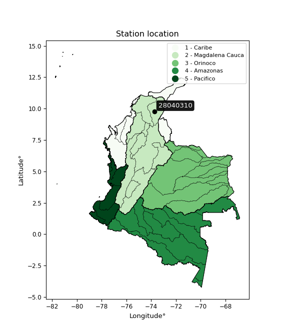</img>

</div>


## A. General information


### 1. General running parameters

• app_version: _v20251225_. • runtime: _2025-12-26 10:55:09.601438_. • Python version: _3.14.0_. • SciPy version: _1.16.3_. • Pandas version: _2.3.3_. • NumPy version: _2.3.5_. • Stations dataset (station_dataset_file): _dataset/pmax24h_in/conventional_cesarcolombia_1959_2015.csv_. • Stations catalog (station_catalog_file): _dataset/CNE_IDEAM.xls_. • Plot only fit distributions with Δo > Δ (plot_only_fit): _True_. • Eval low extreme values, if False, evaluates high extreme values (low_extreme): _False_. • Eval every SciPy distribution as logarithmic (pdist_logarithmic_on): _True_. • Standard deviation normalized (ddof): _1.0_. • Return periods to eval in years (Tr): _[2, 2.33, 5, 10, 15, 20, 25, 50, 75, 100, 200, 250, 500, 750, 1000]_. • Minimum data sample per station, 0 means any (minimum_sample): _5_. • Z-Score threshold to adjust a value, 0 means disable (zscore): _3.5_. • Avoid zeros, e.g. rain = 0 (avoid_zeros): _True_. • Avoid null values (avoid_nans): _True_. [:file_folder:Dataset file.](../../dataset/pmax24h_in/conventional_cesarcolombia_1959_2015.csv)


### 2. Station info and location

|   id |   CODIGO | NOMBRE               | CATEGORIA     | TECNOLOGIA   | ESTADO     | FECHA_INSTALACION   | FECHA_SUSPENSION   |   ALTITUD |   LATITUD |   LONGITUD | DEPARTAMENTO   | MUNICIPIO   | AREA_OPERATIVA                                         | ENTIDAD                                                     | AREA_HIDROGRAFICA   | ZONA_HIDROGRAFICA   | SUBZONA_HIDROGRAFICA   |   CORRIENTE |   OBSERVACION |   SUBRED |
|-----:|---------:|:---------------------|:--------------|:-------------|:-----------|:--------------------|:-------------------|----------:|----------:|-----------:|:---------------|:------------|:-------------------------------------------------------|:------------------------------------------------------------|:--------------------|:--------------------|:-----------------------|------------:|--------------:|---------:|
|    0 | 28040310 | MOLINO EL [28040310] | Pluviométrica | Convencional | Suspendida | 15/08/1972          | 06/01/2016         |       110 |   9.77606 |   -73.7434 | Cesar          | El Paso     | Area Operativa 05 - Magdalena-Cesar-Guajira-San Andrés | INSTITUTO DE HIDROLOGIA METEOROLOGIA Y ESTUDIOS AMBIENTALES | Magdalena Cauca     | Cesar               | Río Ariguaní           |         nan |           nan |      nan |

<div align="center">

Map location in: [:earth_americas:Google](http://maps.google.com/maps?q=9.776055556,-73.74341667) [:earth_americas:OSM](https://www.openstreetmap.org/#map=18/9.776055556/-73.74341667&layers=P) [:earth_americas:Bing](https://www.bing.com/maps?cp=9.776055556~-73.74341667&lvl=18) [:earth_americas:Apple](https://maps.apple.com/frame?center=9.776055556%2C-73.74341667&span=0.003%2C0.006)

</div>


<div align="center">

```geojson
{
  "type": "Feature",
  "geometry": {
    "type": "Point", 
    "coordinates": [-73.74341667, 9.776055556]
  }, 
  "properties": {
    "Name": "28040310"
  }
}
```

</div>


### 3. Discrete values table and plot

|               |          0 |          1 |          2 |            3 |           4 |           5 |          6 |           7 |          8 |           9 |          10 |          11 |           12 |          13 |          14 |         15 |          16 |          17 |          18 |          19 |          20 |          21 |          22 |         23 |          24 |         25 |          26 |          27 |          28 |         29 |          30 |          31 |          32 |          33 |          34 |         35 |          36 |         37 |          38 |         39 |          40 |        41 |         42 |
|:--------------|-----------:|-----------:|-----------:|-------------:|------------:|------------:|-----------:|------------:|-----------:|------------:|------------:|------------:|-------------:|------------:|------------:|-----------:|------------:|------------:|------------:|------------:|------------:|------------:|------------:|-----------:|------------:|-----------:|------------:|------------:|------------:|-----------:|------------:|------------:|------------:|------------:|------------:|-----------:|------------:|-----------:|------------:|-----------:|------------:|----------:|-----------:|
| Date          | 1973       | 1974       | 1975       | 1976         | 1977        | 1978        | 1979       | 1980        | 1981       | 1982        | 1983        | 1984        | 1985         | 1986        | 1987        | 1988       | 1989        | 1990        | 1991        | 1992        | 1993        | 1994        | 1995        | 1996       | 1997        | 1998       | 1999        | 2000        | 2001        | 2002       | 2003        | 2004        | 2005        | 2006        | 2007        | 2008       | 2009        | 2010       | 2011        | 2012       | 2013        | 2014      | 2015       |
| Value         |  140       |   62       |   86       |   91         |   76        |   85        |  130       |   67        |  136       |   94        |  109        |   95        |   92         |   87        |   72        |  160       |   82        |   95        |   90        |   74        |  105        |   95        |   85        |  164       |   75        |   55       |  114        |   87        |   82        |   86       |   90        |   72        |   74        |   90        |   80        |  140       |   85        |   76.2442  |   79.9523   |   65.1755  |   84.2587   |   65.8836 |   56.9235  |
| Value_initial |  140       |   62       |   86       |   91         |   76        |   85        |  130       |   67        |  136       |   94        |  109        |   95        |   92         |   87        |   72        |  160       |   82        |   95        |   90        |   74        |  105        |   95        |   85        |  164       |   75        |   55       |  114        |   87        |   82        |   86       |   90        |   72        |   74        |   90        |   80        |  140       |   85        |   76.2442  |   79.9523   |   65.1755  |   84.2587   |   65.8836 |   56.9235  |
| count         |   43       |   43       |   43       |   43         |   43        |   43        |   43       |   43        |   43       |   43        |   43        |   43        |   43         |   43        |   43        |   43       |   43        |   43        |   43        |   43        |   43        |   43        |   43        |   43       |   43        |   43       |   43        |   43        |   43        |   43       |   43        |   43        |   43        |   43        |   43        |   43       |   43        |   43       |   43        |   43       |   43        |   43      |   43       |
| mean          |   91.4055  |   91.4055  |   91.4055  |   91.4055    |   91.4055   |   91.4055   |   91.4055  |   91.4055   |   91.4055  |   91.4055   |   91.4055   |   91.4055   |   91.4055    |   91.4055   |   91.4055   |   91.4055  |   91.4055   |   91.4055   |   91.4055   |   91.4055   |   91.4055   |   91.4055   |   91.4055   |   91.4055  |   91.4055   |   91.4055  |   91.4055   |   91.4055   |   91.4055   |   91.4055  |   91.4055   |   91.4055   |   91.4055   |   91.4055   |   91.4055   |   91.4055  |   91.4055   |   91.4055  |   91.4055   |   91.4055  |   91.4055   |   91.4055 |   91.4055  |
| std           |   25.5194  |   25.5194  |   25.5194  |   25.5194    |   25.5194   |   25.5194   |   25.5194  |   25.5194   |   25.5194  |   25.5194   |   25.5194   |   25.5194   |   25.5194    |   25.5194   |   25.5194   |   25.5194  |   25.5194   |   25.5194   |   25.5194   |   25.5194   |   25.5194   |   25.5194   |   25.5194   |   25.5194  |   25.5194   |   25.5194  |   25.5194   |   25.5194   |   25.5194   |   25.5194  |   25.5194   |   25.5194   |   25.5194   |   25.5194   |   25.5194   |   25.5194  |   25.5194   |   25.5194  |   25.5194   |   25.5194  |   25.5194   |   25.5194 |   25.5194  |
| zscore        |    1.90422 |   -1.15228 |   -0.21182 |   -0.0158912 |   -0.603679 |   -0.251006 |    1.51236 |   -0.956352 |    1.74747 |    0.101666 |    0.689454 |    0.140852 |    0.0232947 |   -0.172635 |   -0.760422 |    2.68793 |   -0.368564 |    0.140852 |   -0.055077 |   -0.682051 |    0.532711 |    0.140852 |   -0.251006 |    2.84468 |   -0.642865 |   -1.42658 |    0.885383 |   -0.172635 |   -0.368564 |   -0.21182 |   -0.055077 |   -0.760422 |   -0.682051 |   -0.055077 |   -0.446936 |    1.90422 |   -0.251006 |   -0.59411 |   -0.448803 |   -1.02784 |   -0.280056 |   -1.0001 |   -1.35121 |

<div align="center">

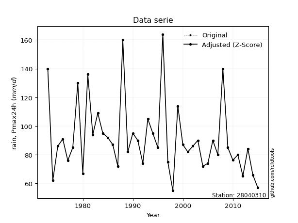</img>

</div>

> If Z-Score is active, values out of range or outliers are replaced with the station mean value.


### 4. Active continuous probability distributions from SciPy (45 of 104 available)

[scipy.stats](https://docs.scipy.org/doc/scipy/reference/stats.html) is a Python´s powerful submodule within the SciPy library for comprehensive statistical analysis, offering over 130 probability distributions (like Normal, Poisson), functions for descriptive stats (mean, variance), hypothesis testing (t-tests, chi-square), random variable generation, and statistical tests, making it essential for data science, modeling, and research. It provides tools to explore, model, and draw conclusions from data efficiently, working seamlessly with NumPy.

<div align="center">

|   id | p_dist             |   n_parameter | fit_method   | label                                                                       | active   | ref                                                                                                        |
|-----:|:-------------------|--------------:|:-------------|:----------------------------------------------------------------------------|:---------|:-----------------------------------------------------------------------------------------------------------|
|    0 | alpha              |             3 | MLE          | Alpha                                                                       | True     | [:mortar_board:](https://docs.scipy.org/doc/scipy/reference/generated/scipy.stats.alpha.html)              |
|    1 | betaprime          |             4 | MLE          | Beta prime                                                                  | True     | [:mortar_board:](https://docs.scipy.org/doc/scipy/reference/generated/scipy.stats.betaprime.html)          |
|    2 | chi2               |             3 | MLE          | Chi²                                                                        | True     | [:mortar_board:](https://docs.scipy.org/doc/scipy/reference/generated/scipy.stats.chi2.html)               |
|    3 | crystalball        |             4 | MLE          | Crystalball                                                                 | True     | [:mortar_board:](https://docs.scipy.org/doc/scipy/reference/generated/scipy.stats.crystalball.html)        |
|    4 | erlang             |             3 | MLE          | Erlang                                                                      | True     | [:mortar_board:](https://docs.scipy.org/doc/scipy/reference/generated/scipy.stats.erlang.html)             |
|    5 | expon              |             2 | MLE          | Exponential                                                                 | True     | [:mortar_board:](https://docs.scipy.org/doc/scipy/reference/generated/scipy.stats.expon.html)              |
|    6 | exponnorm          |             3 | MLE          | Exponentially modified Normal                                               | True     | [:mortar_board:](https://docs.scipy.org/doc/scipy/reference/generated/scipy.stats.exponnorm.html)          |
|    7 | f                  |             4 | MLE          | F                                                                           | True     | [:mortar_board:](https://docs.scipy.org/doc/scipy/reference/generated/scipy.stats.f.html)                  |
|    8 | fatiguelife        |             3 | MLE          | Fatigue-life (Birnbaum-Saunders)                                            | True     | [:mortar_board:](https://docs.scipy.org/doc/scipy/reference/generated/scipy.stats.fatiguelife.html)        |
|    9 | fisk               |             3 | MLE          | Fisk                                                                        | True     | [:mortar_board:](https://docs.scipy.org/doc/scipy/reference/generated/scipy.stats.fisk.html)               |
|   10 | gamma              |             3 | MLE          | Gamma                                                                       | True     | [:mortar_board:](https://docs.scipy.org/doc/scipy/reference/generated/scipy.stats.gamma.html)              |
|   11 | genexpon           |             5 | MLE          | Generalized exponential                                                     | True     | [:mortar_board:](https://docs.scipy.org/doc/scipy/reference/generated/scipy.stats.genexpon.html)           |
|   12 | genlogistic        |             3 | MLE          | Generalized logistic                                                        | True     | [:mortar_board:](https://docs.scipy.org/doc/scipy/reference/generated/scipy.stats.genlogistic.html)        |
|   13 | gibrat             |             2 | MM           | Gibrat                                                                      | True     | [:mortar_board:](https://docs.scipy.org/doc/scipy/reference/generated/scipy.stats.gibrat.html)             |
|   14 | gompertz           |             3 | MLE          | Gompertz (or truncated Gumbel)                                              | True     | [:mortar_board:](https://docs.scipy.org/doc/scipy/reference/generated/scipy.stats.gompertz.html)           |
|   15 | gumbel_l           |             2 | MM           | Gumbel Left Skew                                                            | True     | [:mortar_board:](https://docs.scipy.org/doc/scipy/reference/generated/scipy.stats.gumbel_l.html)           |
|   16 | gumbel_r           |             2 | MM           | Gumbel Right Skew                                                           | True     | [:mortar_board:](https://docs.scipy.org/doc/scipy/reference/generated/scipy.stats.gumbel_r.html)           |
|   17 | halflogistic       |             2 | MM           | Half-logistic                                                               | True     | [:mortar_board:](https://docs.scipy.org/doc/scipy/reference/generated/scipy.stats.halflogistic.html)       |
|   18 | halfnorm           |             2 | MM           | Half Normal                                                                 | True     | [:mortar_board:](https://docs.scipy.org/doc/scipy/reference/generated/scipy.stats.halfnorm.html)           |
|   19 | hypsecant          |             2 | MM           | hyperbolic secant                                                           | True     | [:mortar_board:](https://docs.scipy.org/doc/scipy/reference/generated/scipy.stats.hypsecant.html)          |
|   20 | invgamma           |             3 | MLE          | Inverted gamma                                                              | True     | [:mortar_board:](https://docs.scipy.org/doc/scipy/reference/generated/scipy.stats.invgamma.html)           |
|   21 | invgauss           |             3 | MLE          | Inverse Gaussian                                                            | True     | [:mortar_board:](https://docs.scipy.org/doc/scipy/reference/generated/scipy.stats.invgauss.html)           |
|   22 | invweibull         |             3 | MLE          | Inverted Weibull                                                            | True     | [:mortar_board:](https://docs.scipy.org/doc/scipy/reference/generated/scipy.stats.invweibull.html)         |
|   23 | johnsonsu          |             4 | MLE          | Johnson Su                                                                  | True     | [:mortar_board:](https://docs.scipy.org/doc/scipy/reference/generated/scipy.stats.johnsonsu.html)          |
|   24 | kstwobign          |             2 | MLE          | Limiting distribution of scaled Kolmogorov-Smirnov two-sided test statistic | True     | [:mortar_board:](https://docs.scipy.org/doc/scipy/reference/generated/scipy.stats.kstwobign.html)          |
|   25 | laplace            |             2 | MM           | Laplace                                                                     | True     | [:mortar_board:](https://docs.scipy.org/doc/scipy/reference/generated/scipy.stats.laplace.html)            |
|   26 | laplace_asymmetric |             3 | MLE          | Asymmetric Laplace                                                          | True     | [:mortar_board:](https://docs.scipy.org/doc/scipy/reference/generated/scipy.stats.laplace_asymmetric.html) |
|   27 | loggamma           |             3 | MLE          | Log gamma                                                                   | True     | [:mortar_board:](https://docs.scipy.org/doc/scipy/reference/generated/scipy.stats.loggamma.html)           |
|   28 | logistic           |             2 | MM           | Logistic (or Sech-squared)                                                  | True     | [:mortar_board:](https://docs.scipy.org/doc/scipy/reference/generated/scipy.stats.logistic.html)           |
|   29 | lognorm            |             3 | MLE          | Log Normal                                                                  | True     | [:mortar_board:](https://docs.scipy.org/doc/scipy/reference/generated/scipy.stats.lognorm.html)            |
|   30 | maxwell            |             2 | MM           | Maxwell                                                                     | True     | [:mortar_board:](https://docs.scipy.org/doc/scipy/reference/generated/scipy.stats.maxwell.html)            |
|   31 | mielke             |             4 | MLE          | Mielke Beta-Kappa / Dagum                                                   | True     | [:mortar_board:](https://docs.scipy.org/doc/scipy/reference/generated/scipy.stats.mielke.html)             |
|   32 | moyal              |             2 | MM           | Moyal                                                                       | True     | [:mortar_board:](https://docs.scipy.org/doc/scipy/reference/generated/scipy.stats.moyal.html)              |
|   33 | nakagami           |             3 | MLE          | Nakagami                                                                    | True     | [:mortar_board:](https://docs.scipy.org/doc/scipy/reference/generated/scipy.stats.nakagami.html)           |
|   34 | ncf                |             5 | MLE          | Non-central F distribution                                                  | True     | [:mortar_board:](https://docs.scipy.org/doc/scipy/reference/generated/scipy.stats.ncf.html)                |
|   35 | nct                |             4 | MLE          | Non-central Student’s t                                                     | True     | [:mortar_board:](https://docs.scipy.org/doc/scipy/reference/generated/scipy.stats.nct.html)                |
|   36 | norm               |             2 | MM           | Normal                                                                      | True     | [:mortar_board:](https://docs.scipy.org/doc/scipy/reference/generated/scipy.stats.norm.html)               |
|   37 | pareto             |             3 | MLE          | Pareto                                                                      | True     | [:mortar_board:](https://docs.scipy.org/doc/scipy/reference/generated/scipy.stats.pareto.html)             |
|   38 | pearson3           |             3 | MM           | Pearson type III                                                            | True     | [:mortar_board:](https://docs.scipy.org/doc/scipy/reference/generated/scipy.stats.pearson3.html)           |
|   39 | rayleigh           |             2 | MM           | Rayleigh                                                                    | True     | [:mortar_board:](https://docs.scipy.org/doc/scipy/reference/generated/scipy.stats.rayleigh.html)           |
|   40 | rice               |             3 | MLE          | Rice                                                                        | True     | [:mortar_board:](https://docs.scipy.org/doc/scipy/reference/generated/scipy.stats.rice.html)               |
|   41 | t                  |             3 | MLE          | Student’s t                                                                 | True     | [:mortar_board:](https://docs.scipy.org/doc/scipy/reference/generated/scipy.stats.t.html)                  |
|   42 | truncnorm          |             4 | MLE          | Truncated normal                                                            | True     | [:mortar_board:](https://docs.scipy.org/doc/scipy/reference/generated/scipy.stats.truncnorm.html)          |
|   43 | wald               |             2 | MM           | Wald                                                                        | True     | [:mortar_board:](https://docs.scipy.org/doc/scipy/reference/generated/scipy.stats.wald.html)               |
|   44 | weibull_min        |             3 | MLE          | Weibull minimum                                                             | True     | [:mortar_board:](https://docs.scipy.org/doc/scipy/reference/generated/scipy.stats.weibull_min.html)        |

</div>

> **n_parameter:** # arguments & localization & scale.
>
> **Fit methods:** (MLE) maximum likelihood, (MM) L-moments.
>
>**Inactive:** foldnorm, gennorm, norminvgauss, powernorm, powerlognorm, skewnorm, genextreme, anglit, arcsine, argus, beta, bradford, burr, burr12, cauchy, cosine, halfcauchy, foldcauchy, skewcauchy, wrapcauchy, dgamma, gengamma, exponweib, exponpow, truncexpon, gausshyper, genhalflogistic, genhyperbolic, geninvgauss, halfgennorm, johnsonsb, kappa4, kappa3, ksone, kstwo, loglaplace, levy, levy_l, levy_stable, ncx2, genpareto, truncpareto, lomax, powerlaw, rdist, rel_breitwigner, recipinvgauss, semicircular, studentized_range, trapezoid, triang, truncweibull_min, tukeylambda, uniform, loguniform, vonmises, vonmises_line, weibull_max, dweibull, 


## B. Probability distributions vs. Empirical distributions

A continuous probability distribution (CPD) describes probabilities for variables that can take any value within a range (like rain any time), unlike discrete variables with specific outcomes (like temperature). It uses a Probability Density Function (PDF), a curve where the total area under it equals 1, and the probability of the variable falling within an interval (a to b) is found by calculating the area under the curve between those points. A key feature is that the probability of hitting any single exact value is zero, so probabilities are always expressed for ranges, e.g., $P(a ≤ X ≤ b)$.

<div align="center">

Distributions parameters
|    |   station | p_dist                |   n |             loc |          scale | shape                 | shape1                | shape2             | shape3   |
|---:|----------:|:----------------------|----:|----------------:|---------------:|:----------------------|:----------------------|:-------------------|:---------|
|  0 |  28040310 | alpha                 |  43 |    -2.9108      |  391.047       | 4.399827900757551     |                       |                    |          |
|  1 |  28040310 | betaprime             |  43 |    -1.82579     |    3.61239     | 442.6006845788447     | 18.185383408631118    |                    |          |
|  2 |  28040310 | chi2                  |  43 |    50.3633      |    7.32232     | 5.605081063891593     |                       |                    |          |
|  3 |  28040310 | crystalball           |  43 |    91.4055      |   25.2209      | 7202.450482610677     | 2841.816540211177     |                    |          |
|  4 |  28040310 | erlang                |  43 |    50.3633      |   14.6446      | 2.802541670926198     |                       |                    |          |
|  5 |  28040310 | expon                 |  43 |    55           |   36.4055      |                       |                       |                    |          |
|  6 |  28040310 | exponnorm             |  43 |    68.7961      |    9.5675      | 2.3631511629603716    |                       |                    |          |
|  7 |  28040310 | f                     |  43 |    26.379       |   57.3705      | 2696.60511947357      | 16.996626899724532    |                    |          |
|  8 |  28040310 | fatiguelife           |  43 |    38.0863      |   48.3165      | 0.4552603152294699    |                       |                    |          |
|  9 |  28040310 | fisk                  |  43 |    43.1626      |   42.5481      | 3.623139367416763     |                       |                    |          |
| 10 |  28040310 | gamma                 |  43 |    50.3633      |   14.6446      | 2.8025485437867683    |                       |                    |          |
| 11 |  28040310 | genexpon              |  43 |    54.9922      |    1.01158     | 0.02512109580012216   | 0.0027196583434190183 | 2.2889544801493917 |          |
| 12 |  28040310 | genlogistic           |  43 |   -34.7145      |   17.7687      | 655.16393417224       |                       |                    |          |
| 13 |  28040310 | gibrat                |  43 |    72.1651      |   11.6699      |                       |                       |                    |          |
| 14 |  28040310 | gompertz              |  43 |    57.8494      |    4.16735     | 2.550921323018704e-10 |                       |                    |          |
| 15 |  28040310 | gumbel_l              |  43 |   102.756       |   19.6647      |                       |                       |                    |          |
| 16 |  28040310 | gumbel_r              |  43 |    80.0548      |   19.6647      |                       |                       |                    |          |
| 17 |  28040310 | halflogistic          |  43 |    61.5129      |   21.563       |                       |                       |                    |          |
| 18 |  28040310 | halfnorm              |  43 |    58.0229      |   41.8389      |                       |                       |                    |          |
| 19 |  28040310 | hypsecant             |  43 |    91.4055      |   16.0561      |                       |                       |                    |          |
| 20 |  28040310 | invgamma              |  43 |    26.1988      |  488.899       | 8.498242693953234     |                       |                    |          |
| 21 |  28040310 | invgauss              |  43 |    37.3131      |  257.785       | 0.20983572017857888   |                       |                    |          |
| 22 |  28040310 | invweibull            |  43 |   -89.8579      |  169.449       | 9.883620078359915     |                       |                    |          |
| 23 |  28040310 | johnsonsu             |  43 |    69.5213      |   16.8897      | -1.0976585244023975   | 1.289040560656995     |                    |          |
| 24 |  28040310 | kstwobign             |  43 |    14.6419      |   88.9266      |                       |                       |                    |          |
| 25 |  28040310 | laplace               |  43 |    91.4055      |   17.8339      |                       |                       |                    |          |
| 26 |  28040310 | laplace_asymmetric    |  43 |    76           |   14.3328      | 0.5978443856640756    |                       |                    |          |
| 27 |  28040310 | loggamma              |  43 | -8108.2         | 1096.53        | 1768.3273938241696    |                       |                    |          |
| 28 |  28040310 | logistic              |  43 |    91.4055      |   13.905       |                       |                       |                    |          |
| 29 |  28040310 | lognorm               |  43 |    39.5027      |   46.6917      | 0.45837772419882306   |                       |                    |          |
| 30 |  28040310 | maxwell               |  43 |    31.6425      |   37.4509      |                       |                       |                    |          |
| 31 |  28040310 | mielke                |  43 |     0.576015    |   66.2769      | 18.111402465104764    | 5.637989621195108     |                    |          |
| 32 |  28040310 | moyal                 |  43 |    76.9826      |   11.3534      |                       |                       |                    |          |
| 33 |  28040310 | nakagami              |  43 |    54.3867      |   44.7939      | 0.6445609176173119    |                       |                    |          |
| 34 |  28040310 | ncf                   |  43 |    -0.177762    |    6.08905e-08 | 4.846403687601484e-08 | 213.10384066177812    | 72.0725683536071   |          |
| 35 |  28040310 | nct                   |  43 |    -0.218677    |    1.54912     | 9.260169356411534     | 54.089813824119744    |                    |          |
| 36 |  28040310 | norm                  |  43 |    91.4055      |   25.2209      |                       |                       |                    |          |
| 37 |  28040310 | pareto                |  43 |    -4.29497e+09 |    4.29497e+09 | 117975673.41022418    |                       |                    |          |
| 38 |  28040310 | pearson3              |  43 |    91.4055      |   25.221       | 1.2955784395675134    |                       |                    |          |
| 39 |  28040310 | rayleigh              |  43 |    43.1564      |   38.4972      |                       |                       |                    |          |
| 40 |  28040310 | rice                  |  43 |    49.1102      |   34.8209      | 0.0002713315294524477 |                       |                    |          |
| 41 |  28040310 | t                     |  43 |    91.6716      |   25.1098      | 13.38447351291805     |                       |                    |          |
| 42 |  28040310 | truncnorm             |  43 |    91.4055      |   25.2209      | -1623.2140141044406   | 1112.7327157150949    |                    |          |
| 43 |  28040310 | wald                  |  43 |    66.1846      |   25.221       |                       |                       |                    |          |
| 44 |  28040310 | weibull_min           |  43 |    61.6124      |   33.2056      | 1.308970214392526     |                       |                    |          |
| 45 |  28040310 | logalpha              |  43 |     1.82635     |   28.8385      | 10.950643711779339    |                       |                    |          |
| 46 |  28040310 | logbetaprime          |  43 |     3.19379     |    0.42887     | 108.23226884118655    | 37.02944421641485     |                    |          |
| 47 |  28040310 | logchi2               |  43 |     4.00733     |    0.992339    | 1.036533285642924     |                       |                    |          |
| 48 |  28040310 | logcrystalball        |  43 |     4.48199     |    0.251152    | 307.6715363802627     | 15.628946965987167    |                    |          |
| 49 |  28040310 | logerlang             |  43 |     3.68176     |    0.0781573   | 10.238714084733068    |                       |                    |          |
| 50 |  28040310 | logexpon              |  43 |     4.00733     |    0.474661    |                       |                       |                    |          |
| 51 |  28040310 | logexponnorm          |  43 |     4.27448     |    0.150805    | 1.376070762761131     |                       |                    |          |
| 52 |  28040310 | logf                  |  43 |     3.08758     |    1.3555      | 715.7969198040851     | 71.68794460232168     |                    |          |
| 53 |  28040310 | logfatiguelife        |  43 |     3.34613     |    1.10921     | 0.2192397840224759    |                       |                    |          |
| 54 |  28040310 | logfisk               |  43 |     3.50273     |    0.947806    | 7.099978599916344     |                       |                    |          |
| 55 |  28040310 | loggamma              |  43 |     3.68177     |    0.0781574   | 10.238691679131922    |                       |                    |          |
| 56 |  28040310 | loggenexpon           |  43 |     4.00733     |    0.118006    | 0.036012264339102235  | 3.812429353679976     | 0.02223785538011   |          |
| 57 |  28040310 | loggenlogistic        |  43 |     4.19944     |    0.176484    | 3.2520707465477163    |                       |                    |          |
| 58 |  28040310 | loggibrat             |  43 |     4.29038     |    0.116217    |                       |                       |                    |          |
| 59 |  28040310 | loggompertz           |  43 |     4.00733     |    0.776188    | 1.1289121620731182    |                       |                    |          |
| 60 |  28040310 | loggumbel_l           |  43 |     4.59503     |    0.195822    |                       |                       |                    |          |
| 61 |  28040310 | loggumbel_r           |  43 |     4.36896     |    0.195822    |                       |                       |                    |          |
| 62 |  28040310 | loghalflogistic       |  43 |     4.18428     |    0.214753    |                       |                       |                    |          |
| 63 |  28040310 | loghalfnorm           |  43 |     4.14956     |    0.41664     |                       |                       |                    |          |
| 64 |  28040310 | loghypsecant          |  43 |     4.48199     |    0.159888    |                       |                       |                    |          |
| 65 |  28040310 | loginvgamma           |  43 |    -0.453292    | 1984.48        | 403.2695972853479     |                       |                    |          |
| 66 |  28040310 | loginvgauss           |  43 |     3.33971     |   23.7685      | 0.04805874029897299   |                       |                    |          |
| 67 |  28040310 | loginvweibull         |  43 |    -1.33205e+07 |    1.33205e+07 | 62219261.22951411     |                       |                    |          |
| 68 |  28040310 | logjohnsonsu          |  43 |     4.30808     |    0.291811    | -0.7370977921273816   | 1.5689480860010625    |                    |          |
| 69 |  28040310 | logkstwobign          |  43 |     3.57825     |    1.04147     |                       |                       |                    |          |
| 70 |  28040310 | loglaplace            |  43 |     4.48199     |    0.177591    |                       |                       |                    |          |
| 71 |  28040310 | loglaplace_asymmetric |  43 |     4.44265     |    0.178802    | 0.8960318749412228    |                       |                    |          |
| 72 |  28040310 | logloggamma           |  43 |   -77.1179      |   10.8816      | 1806.3842604918964    |                       |                    |          |
| 73 |  28040310 | loglogistic           |  43 |     4.48199     |    0.138467    |                       |                       |                    |          |
| 74 |  28040310 | loglognorm            |  43 |     3.36333     |    1.09155     | 0.22140766019954802   |                       |                    |          |
| 75 |  28040310 | logmaxwell            |  43 |     3.88687     |    0.372939    |                       |                       |                    |          |
| 76 |  28040310 | logmielke             |  43 |     2.06759     |    2.26223     | 28.002083439177113    | 15.072479187774611    |                    |          |
| 77 |  28040310 | logmoyal              |  43 |     4.33837     |    0.113058    |                       |                       |                    |          |
| 78 |  28040310 | lognakagami           |  43 |     3.90272     |    0.631378    | 1.440019913502869     |                       |                    |          |
| 79 |  28040310 | logncf                |  43 |     1.97539     |    0.536883    | 86.54519047842814     | 2775.8812117560874    | 317.3588503441513  |          |
| 80 |  28040310 | lognct                |  43 |     0.310499    |    0.0937223   | 169.4836423810296     | 44.316049829229684    |                    |          |
| 81 |  28040310 | lognorm               |  43 |     4.48199     |    0.251152    |                       |                       |                    |          |
| 82 |  28040310 | logpareto             |  43 |    -3.35544e+07 |    3.35544e+07 | 70691380.66137408     |                       |                    |          |
| 83 |  28040310 | logpearson3           |  43 |     4.48199     |    0.251152    | 0.6651605422168808    |                       |                    |          |
| 84 |  28040310 | lograyleigh           |  43 |     4.00153     |    0.383358    |                       |                       |                    |          |
| 85 |  28040310 | logrice               |  43 |     3.95951     |    0.312352    | 1.2019044527222906    |                       |                    |          |
| 86 |  28040310 | logt                  |  43 |     4.45326     |    0.202705    | 4.573685476802256     |                       |                    |          |
| 87 |  28040310 | logtruncnorm          |  43 |    -0.117567    |    1.70394     | 2.420712071349934     | 3.1040790438772694    |                    |          |
| 88 |  28040310 | logwald               |  43 |     4.2309      |    0.251098    |                       |                       |                    |          |
| 89 |  28040310 | logweibull_min        |  43 |     3.94672     |    0.603561    | 2.233204321810889     |                       |                    |          |

</div>

> **loc** (Location parameter): This shifts the distribution along the x-axis. For many common distributions, like the normal (Gaussian) distribution, loc represents the mean $μ$. For others, like the uniform distribution, it might represent the minimum value, or for the beta distribution, the left end of the support interval.
>
> **scale** (Scale parameter): This determines the width or spread of the distribution. For the normal distribution, scale represents the standard deviation $σ$. For a uniform distribution, it defines the length of the interval (from $loc$ to $loc + scale$).
>
> **shape** (Shape parameters): Refers to parameters that define the specific form of a probability distribution, distinct from its location (loc) and scale (scale). These parameters are required arguments for most distribution functions. For example, a normal (Gaussian) distribution is fully defined by its location (mean) and scale (standard deviation), so it has no specific shape parameters beyond loc and scale. However, other distributions have intrinsic properties that need specification, as Gamma distribution that takes a shape parameter, often named $a$ or $alpha$.


### 0. Cumulative distribution values - CDF (90 evaluated)

> Ordered by x ascending and calculating $log(f(x))$ separately. 

|   id |   Station |   date |        x |   count |    mean |     std |     zscore |   Value_initial |   station |   m |      alpha |   alpha_pdf |   betaprime |   betaprime_pdf |      chi2 |    chi2_pdf |   crystalball |   crystalball_pdf |     erlang |   erlang_pdf |     expon |   expon_pdf |   exponnorm |   exponnorm_pdf |          f |       f_pdf |   fatiguelife |   fatiguelife_pdf |      fisk |    fisk_pdf |      gamma |   gamma_pdf |    genexpon |   genexpon_pdf |   genlogistic |   genlogistic_pdf |    gibrat |   gibrat_pdf |    gompertz |   gompertz_pdf |   gumbel_l |   gumbel_l_pdf |   gumbel_r |   gumbel_r_pdf |   halflogistic |   halflogistic_pdf |   halfnorm |   halfnorm_pdf |   hypsecant |   hypsecant_pdf |   invgamma |   invgamma_pdf |   invgauss |   invgauss_pdf |   invweibull |   invweibull_pdf |   johnsonsu |   johnsonsu_pdf |   kstwobign |   kstwobign_pdf |   laplace |   laplace_pdf |   laplace_asymmetric |   laplace_asymmetric_pdf |   loggamma |   loggamma_pdf |   logistic |   logistic_pdf |   lognorm |   lognorm_pdf |   maxwell |   maxwell_pdf |    mielke |   mielke_pdf |      moyal |   moyal_pdf |   nakagami |   nakagami_pdf |       ncf |     ncf_pdf |       nct |     nct_pdf |      norm |    norm_pdf |      pareto |   pareto_pdf |   pearson3 |   pearson3_pdf |   rayleigh |   rayleigh_pdf |      rice |    rice_pdf |         t |       t_pdf |   truncnorm |   truncnorm_pdf |        wald |    wald_pdf |   weibull_min |   weibull_min_pdf |   logalpha |   logalpha_pdf |   logbetaprime |   logbetaprime_pdf |     logchi2 |   logchi2_pdf |   logcrystalball |   logcrystalball_pdf |   logerlang |   logerlang_pdf |   logexpon |   logexpon_pdf |   logexponnorm |   logexponnorm_pdf |       logf |   logf_pdf |   logfatiguelife |   logfatiguelife_pdf |   logfisk |   logfisk_pdf |   loggenexpon |   loggenexpon_pdf |   loggenlogistic |   loggenlogistic_pdf |   loggibrat |   loggibrat_pdf |   loggompertz |   loggompertz_pdf |   loggumbel_l |   loggumbel_l_pdf |   loggumbel_r |   loggumbel_r_pdf |   loghalflogistic |   loghalflogistic_pdf |   loghalfnorm |   loghalfnorm_pdf |   loghypsecant |   loghypsecant_pdf |   loginvgamma |   loginvgamma_pdf |   loginvgauss |   loginvgauss_pdf |   loginvweibull |   loginvweibull_pdf |   logjohnsonsu |   logjohnsonsu_pdf |   logkstwobign |   logkstwobign_pdf |   loglaplace |   loglaplace_pdf |   loglaplace_asymmetric |   loglaplace_asymmetric_pdf |   logloggamma |   logloggamma_pdf |   loglogistic |   loglogistic_pdf |   loglognorm |   loglognorm_pdf |   logmaxwell |   logmaxwell_pdf |   logmielke |   logmielke_pdf |    logmoyal |   logmoyal_pdf |   lognakagami |   lognakagami_pdf |    logncf |   logncf_pdf |    lognct |   lognct_pdf |   logpareto |   logpareto_pdf |   logpearson3 |   logpearson3_pdf |   lograyleigh |   lograyleigh_pdf |    logrice |   logrice_pdf |      logt |   logt_pdf |   logtruncnorm |   logtruncnorm_pdf |   logwald |   logwald_pdf |   logweibull_min |   logweibull_min_pdf |
|-----:|----------:|-------:|---------:|--------:|--------:|--------:|-----------:|----------------:|----------:|----:|-----------:|------------:|------------:|----------------:|----------:|------------:|--------------:|------------------:|-----------:|-------------:|----------:|------------:|------------:|----------------:|-----------:|------------:|--------------:|------------------:|----------:|------------:|-----------:|------------:|------------:|---------------:|--------------:|------------------:|----------:|-------------:|------------:|---------------:|-----------:|---------------:|-----------:|---------------:|---------------:|-------------------:|-----------:|---------------:|------------:|----------------:|-----------:|---------------:|-----------:|---------------:|-------------:|-----------------:|------------:|----------------:|------------:|----------------:|----------:|--------------:|---------------------:|-------------------------:|-----------:|---------------:|-----------:|---------------:|----------:|--------------:|----------:|--------------:|----------:|-------------:|-----------:|------------:|-----------:|---------------:|----------:|------------:|----------:|------------:|----------:|------------:|------------:|-------------:|-----------:|---------------:|-----------:|---------------:|----------:|------------:|----------:|------------:|------------:|----------------:|------------:|------------:|--------------:|------------------:|-----------:|---------------:|---------------:|-------------------:|------------:|--------------:|-----------------:|---------------------:|------------:|----------------:|-----------:|---------------:|---------------:|-------------------:|-----------:|-----------:|-----------------:|---------------------:|----------:|--------------:|--------------:|------------------:|-----------------:|---------------------:|------------:|----------------:|--------------:|------------------:|--------------:|------------------:|--------------:|------------------:|------------------:|----------------------:|--------------:|------------------:|---------------:|-------------------:|--------------:|------------------:|--------------:|------------------:|----------------:|--------------------:|---------------:|-------------------:|---------------:|-------------------:|-------------:|-----------------:|------------------------:|----------------------------:|--------------:|------------------:|--------------:|------------------:|-------------:|-----------------:|-------------:|-----------------:|------------:|----------------:|------------:|---------------:|--------------:|------------------:|----------:|-------------:|----------:|-------------:|------------:|----------------:|--------------:|------------------:|--------------:|------------------:|-----------:|--------------:|----------:|-----------:|---------------:|-------------------:|----------:|--------------:|-----------------:|---------------------:|
|    0 |  28040310 |   1998 |  55      |      43 | 91.4055 | 25.5194 | -1.42658   |         55      |  28040310 |   1 | 0.00931754 | 0.00292156  |   0.0215202 |     0.00433364  | 0.0067124 | 0.00372537  |     0.0744447 |       0.00558088  | 0.00671247 |  0.00372539  | 0         |  0.0274684  |   0.0120825 |     0.00276752  | 0.00850927 | 0.00297894  |    0.00791262 |       0.00321657  | 0.0096097 | 0.00291302  | 0.00671242 | 0.00372537  | 0.000194275 |     0.0248759  |     0.0151475 |       0.00356042  | 0         |  0           | 0           |    0           |  0.0843913 |    0.00410511  |  0.0280019 |    0.00509138  |      0         |        0           |  0         |    0           |   0.0657081 |     0.0040634   | 0.00850932 |    0.00297893  | 0.00789351 |    0.0031731   |   0.00900239 |      0.00289319  |   0.0178034 |     0.002538    |   0.0138311 |     0.0037628   | 0.0649255 |   0.00364057  |            0.0227045 |              0.00264968  | 0.00835266 |       0.169215 |  0.067979  |    0.00455647  | 0.0293833 |     0.26629   | 0.0574905 |   0.00682243  | 0.0113003 |  0.00282903  | 0.00846466 | 0.0028898   | 0.00331732 |    0.00697239  | 0.0429284 | 0.0053178   | 0.0134227 | 0.0035564   | 0.0744447 | 0.00558088  | 2.61959e-08 |   0.0274684  | 0.00359132 |    0.0032317   |  0.0462212 |    0.00762205  | 0.0142031 | 0.00478857  | 0.0836205 | 0.00538391  |   0.0744448 |     0.00558088  | 0           | 0           |    0          |       0           |  0.0115407 |       0.183057 |     0.00882667 |           0.163837 | 1.25062e-08 |   7.29757e+06 |        0.0293835 |            0.266291  |  0.00835267 |        0.169215 |  0         |       2.10677  |     0.00879313 |           0.141913 | 0.00867325 |   0.16198  |       0.00851411 |             0.165084 | 0.0112552 |      0.156581 |   9.45234e-09 |          0.305173 |        0.0112903 |             0.155641 |   0         |       0         |   1.44073e-08 |          1.45443  |     0.0485135 |       0.241633    |    0.00176608 |          0.05717  |        0          |              0        |     0         |          0        |      0.0326744 |          0.203999  |     0.021608  |         0.24052   |    0.00851084 |          0.164902 |      0.00498082 |            0.123355 |      0.0156338 |           0.146919 |     0.00424313 |           0.133859 |    0.0345303 |        0.194437  |               0.0294204 |                    0.183633 |     0.0328912 |         0.282621  |     0.0314329 |         0.21987   |    0.0085825 |         0.163515 |   0.00868805 |         0.211877 |   0.0113214 |        0.148786 | 1.53745e-05 |     0.00133298 |     0.0073084 |          0.197952 | 0.0210603 |    0.234005  | 0.0194831 |    0.229408  | 1.56966e-08 |        2.10677  |    0.00735814 |          0.160885 |   0.000114741 |         0.0395123 | 0.00568374 |      0.237289 | 0.0420778 |  0.249398  |    0.000272782 |           1.84077  | 0         |      0        |       0.00588366 |             0.216133 |
|    1 |  28040310 |   2015 |  56.9235 |      43 | 91.4055 | 25.5194 | -1.35121   |         56.9235 |  28040310 |   2 | 0.0163531  | 0.00445462  |   0.0310893 |     0.00564268  | 0.016148  | 0.00610646  |     0.0857817 |       0.00621228  | 0.0161481  |  0.00610647  | 0.0514649 |  0.0260547  |   0.0184768 |     0.00392931  | 0.0157996  | 0.00466563  |    0.0159222  |       0.00517313  | 0.016467  | 0.00426422  | 0.016148   | 0.00610645  | 0.0506539   |     0.0260957  |     0.0232543 |       0.00490833  | 0         |  0           | 0           |    0           |  0.0926493 |    0.00448613  |  0.0390739 |    0.00644248  |      0         |        0           |  0         |    0           |   0.074     |     0.00456743  | 0.0157996  |    0.00466563  | 0.0157929  |    0.0051035   |   0.0160107  |      0.00445737  |   0.0234665 |     0.0033904   |   0.0224873 |     0.00527294  | 0.0723199 |   0.00405519  |            0.0284186 |              0.00331653  | 0.015907   |       0.275528 |  0.0772849 |    0.0051285   | 0.0397956 |     0.341689  | 0.0714863 |   0.00773021  | 0.0179254 |  0.00411402  | 0.0155592  | 0.00455708  | 0.0206709  |    0.010491    | 0.0540615 | 0.00626907  | 0.0216505 | 0.00504274  | 0.0857817 | 0.00621228  | 0.0514649   |   0.0260547  | 0.0127436  |    0.00628235  |  0.0619421 |    0.00871393  | 0.0248602 | 0.0062838   | 0.0945253 | 0.00596029  |   0.0857817 |     0.00621228  | 0           | 0           |    0          |       0           |  0.0193715 |       0.276899 |     0.0160746  |           0.263015 | 0.136975    |   2.04166     |        0.0397959 |            0.34169   |  0.0159071  |        0.275528 |  0.0698614 |       1.95959  |     0.014991   |           0.223418 | 0.0158529  |   0.260943 |       0.0158615  |             0.267652 | 0.0178508 |      0.23095  |   0.0139813   |          0.506598 |        0.0179185 |             0.234321 |   0         |       0         |   0.0498362   |          1.44453  |     0.0575503 |       0.285267    |    0.00490054 |          0.133096 |        0          |              0        |     0         |          0        |      0.0404926 |          0.252573  |     0.0312666 |         0.32426   |    0.0158502  |          0.267368 |      0.0109366  |            0.230677 |      0.0216356 |           0.205498 |     0.0110944  |           0.27433  |    0.0419049 |        0.235963  |               0.0364613 |                    0.227581 |     0.0438637 |         0.357802  |     0.0399367 |         0.276901  |    0.0158457 |         0.264293 |   0.0180802  |         0.338344 |   0.0176157 |        0.221456 | 0.000204393 |     0.0132702  |     0.0162738 |          0.327643 | 0.0304584 |    0.315569  | 0.0287748 |    0.314207  | 0.0698615   |        1.95959  |    0.0146689  |          0.270074 |   0.00547847  |         0.271926  | 0.0167363  |      0.405199 | 0.051672  |  0.311054  |    0.0620261   |           1.75267  | 0         |      0        |       0.0159642  |             0.372305 |
|    2 |  28040310 |   1974 |  62      |      43 | 91.4055 | 25.5194 | -1.15228   |         62      |  28040310 |   3 | 0.0521292  | 0.00989507  |   0.0696949 |     0.00966184  | 0.0629098 | 0.0121316   |     0.121824  |       0.00801617  | 0.0629099  |  0.0121316   | 0.174923  |  0.0226635  |   0.0489297 |     0.00839558  | 0.0535875  | 0.010424    |    0.0574066  |       0.0112291   | 0.0496378 | 0.00907329  | 0.0629097  | 0.0121316   | 0.17443     |     0.0227214  |     0.0590972 |       0.00938729  | 0         |  0           | 4.35539e-10 |    1.65724e-10 |  0.118264  |    0.0056435   |  0.0817076 |    0.0104068   |      0.0112943 |        0.0231849   |  0.0757307 |    0.0189844   |   0.101119  |     0.00619242  | 0.0535875  |    0.010424    | 0.0568812  |    0.0111623   |   0.0521067  |      0.0100196   |   0.0490398 |     0.00708024  |   0.0607526 |     0.00987772  | 0.0961348 |   0.00539057  |            0.051392  |              0.00599759  | 0.0548393  |       0.660588 |  0.107672  |    0.00690966  | 0.0788384 |     0.585421  | 0.116746  |   0.0100787   | 0.0503629 |  0.00899264  | 0.0530567  | 0.0104653   | 0.084688   |    0.0141781   | 0.0927691 | 0.00902499  | 0.0592044 | 0.00991411  | 0.121824  | 0.00801617  | 0.174923    |   0.0226635  | 0.0631834  |    0.0131898   |  0.112898  |    0.0112792   | 0.0662198 | 0.00992682  | 0.128953  | 0.00763829  |   0.121824  |     0.00801617  | 0           | 0           |    0.00294689 |       0.00993698  |  0.0566448 |       0.620279 |     0.0533537  |           0.637606 | 0.25783     |   1.07174     |        0.0788388 |            0.585422  |  0.0548393  |        0.660587 |  0.223061  |       1.63683  |     0.047164   |           0.564339 | 0.0529785  |   0.63647  |       0.0538756  |             0.649002 | 0.0491192 |      0.531086 |   0.0768123   |          0.947532 |        0.05038   |             0.557961 |   0         |       0         |   0.171724    |          1.40572  |     0.08761   |       0.427198    |    0.0321239  |          0.564016 |        0          |              0        |     0         |          0        |      0.0689122 |          0.427643  |     0.0702371 |         0.604515  |    0.0538348  |          0.648666 |      0.0483203  |            0.683852 |      0.0488145 |           0.462327 |     0.0560116  |           0.804462 |    0.0677908 |        0.381724  |               0.0621438 |                    0.387883 |     0.0841168 |         0.596493  |     0.0715734 |         0.479901  |    0.0534165 |         0.642767 |   0.0628847  |         0.721572 |   0.0481932 |        0.52716  | 0.0109233   |     0.352123   |     0.0605924 |          0.720892 | 0.0684297 |    0.589814  | 0.0671514 |    0.601666  | 0.223061    |        1.63683  |    0.0536971  |          0.669201 |   0.0522632   |         0.810024  | 0.0684953  |      0.799617 | 0.0869796 |  0.534161  |    0.202893    |           1.54885  | 0         |      0        |       0.065199   |             0.780143 |
|    3 |  28040310 |   2012 |  65.1755 |      43 | 91.4055 | 25.5194 | -1.02784   |         65.1755 |  28040310 |   4 | 0.0895432  | 0.0136467   |   0.104557  |     0.0122798   | 0.106335  | 0.0150881   |     0.149168  |       0.0092104   | 0.106335   |  0.0150881   | 0.243842  |  0.0207704  |   0.0812102 |     0.0120015   | 0.0926899  | 0.014147    |    0.0987315  |       0.0146924   | 0.0841188 | 0.0126806   | 0.106335   | 0.0150881   | 0.24352     |     0.0208199  |     0.093809  |       0.0124712   | 0         |  0           | 1.22463e-09 |    3.55075e-10 |  0.1375    |    0.00648785  |  0.118704  |    0.0128643   |      0.0847252 |        0.0230214   |  0.135742  |    0.0187937   |   0.122736  |     0.00745614  | 0.0926898  |    0.0141469   | 0.0980679  |    0.0146759   |   0.0900011  |      0.013816    |   0.0769665 |     0.0106711   |   0.0966828 |     0.0127055   | 0.114871  |   0.00644119  |            0.0744462 |              0.00868808  | 0.0945432  |       0.930847 |  0.131659  |    0.00822185  | 0.112365  |     0.760184  | 0.150943  |   0.0114395   | 0.0848248 |  0.0127487   | 0.0925706  | 0.0143641   | 0.131772   |    0.0153901   | 0.124275  | 0.0108159   | 0.0958477 | 0.0131395   | 0.149168  | 0.0092104   | 0.243842    |   0.0207704  | 0.110077   |    0.0161657   |  0.150895  |    0.0126154   | 0.100963  | 0.0119121   | 0.155004  | 0.00877721  |   0.149168  |     0.0092104   | 0           | 0           |    0.0524173  |       0.0187424   |  0.0938785 |       0.874375 |     0.0920053  |           0.913278 | 0.306277    |   0.883585    |        0.112366  |            0.760186  |  0.0945432  |        0.930847 |  0.300665  |       1.47334  |     0.0823249  |           0.852329 | 0.0916085  |   0.913631 |       0.0930871  |             0.923489 | 0.0819045 |      0.791702 |   0.129417    |          1.15116  |        0.0848646 |             0.831368 |   0         |       0         |   0.241164    |          1.37348  |     0.111596  |       0.536832    |    0.0696636  |          0.947743 |        0          |              0        |     0.0526643 |          1.91087  |      0.0938663 |          0.578602  |     0.105405  |         0.80704   |    0.0930336  |          0.923342 |      0.0907725  |            1.01733  |      0.0778498 |           0.714316 |     0.104432   |           1.12712  |    0.0898094 |        0.505708  |               0.0848787 |                    0.529788 |     0.118053  |         0.765132  |     0.099568  |         0.647475  |    0.0923397 |         0.91863  |   0.104844   |         0.957124 |   0.0810134 |        0.797372 | 0.0412826   |     0.897636   |     0.102645  |          0.961315 | 0.102786  |    0.789456  | 0.102329  |    0.810385  | 0.300665    |        1.47334  |    0.094038   |          0.947271 |   0.0995482   |         1.07565   | 0.11367    |      1.00527  | 0.118149  |  0.721429  |    0.27749     |           1.43915  | 0         |      0        |       0.109854   |             1.00418  |
|    4 |  28040310 |   2014 |  65.8836 |      43 | 91.4055 | 25.5194 | -1.0001    |         65.8836 |  28040310 |   5 | 0.0994912  | 0.014447    |   0.113453  |     0.0128436   | 0.117216  | 0.0156384   |     0.155785  |       0.00947957  | 0.117216   |  0.0156384   | 0.258408  |  0.0203703  |   0.0900067 |     0.0128442   | 0.102981   | 0.0149141   |    0.109377   |       0.015367    | 0.0933886 | 0.0135012   | 0.117216   | 0.0156384   | 0.25812     |     0.0204181  |     0.102879  |       0.0131445   | 0         |  0           | 1.49869e-09 |    4.20838e-10 |  0.142166  |    0.00668935  |  0.127997  |    0.0133808   |      0.101003  |        0.0229513   |  0.14903   |    0.0187368   |   0.128124  |     0.00776604  | 0.102981   |    0.014914    | 0.108706   |    0.0153639   |   0.10007    |      0.0146184   |   0.0848475 |     0.0115944   |   0.105888  |     0.0132895   | 0.119524  |   0.00670208  |            0.0808597 |              0.00943655  | 0.10492    |       0.989522 |  0.137591  |    0.00853359  | 0.120796  |     0.800207  | 0.159145  |   0.0117254   | 0.0941531 |  0.0135973   | 0.103028   | 0.0151663   | 0.142744   |    0.0155963   | 0.132074  | 0.0112105   | 0.105396  | 0.0138257   | 0.155785  | 0.00947957  | 0.258408    |   0.0203703  | 0.121711   |    0.0166859   |  0.159924  |    0.0128827   | 0.109543  | 0.0123184   | 0.161311  | 0.00903719  |   0.155785  |     0.00947957  | 0           | 0           |    0.0659812  |       0.0195383   |  0.103635  |       0.931416 |     0.102204   |           0.974308 | 0.315657    |   0.853045    |        0.120796  |            0.800209  |  0.10492    |        0.989522 |  0.316406  |       1.44017  |     0.0919024  |           0.92053  | 0.101813   |   0.975031 |       0.103392   |             0.983627 | 0.0908023 |      0.855494 |   0.142063    |          1.18905  |        0.0941979 |             0.896293 |   0         |       0         |   0.255963    |          1.36557  |     0.11754   |       0.563493    |    0.0803753  |          1.03476  |        0.00839928 |              2.3281   |     0.0732933 |          1.90696  |      0.100325  |          0.617131  |     0.114374  |         0.853096  |    0.103337   |          0.98354  |      0.102152   |            1.08851  |      0.0859194 |           0.779854 |     0.116952   |           1.18957  |    0.0954437 |        0.537435  |               0.0908011 |                    0.566754 |     0.126528  |         0.803558  |     0.106787  |         0.68885   |    0.102595  |         0.97941  |   0.115453   |         1.00635  |   0.089984  |        0.863283 | 0.0517207   |     1.0346     |     0.113304  |          1.01139  | 0.111563  |    0.835054  | 0.111342  |    0.857808  | 0.316406    |        1.44017  |    0.104599   |          1.00719  |   0.11145     |         1.12677   | 0.124757   |      1.04646  | 0.126194  |  0.767896  |    0.292918    |           1.4163   | 0         |      0        |       0.12095    |             1.04934  |
|    5 |  28040310 |   1980 |  67      |      43 | 91.4055 | 25.5194 | -0.956352  |         67      |  28040310 |   6 | 0.1163     | 0.0156545   |   0.128275  |     0.0137057   | 0.135122  | 0.0164233   |     0.166605  |       0.00990411  | 0.135122   |  0.0164233   | 0.280803  |  0.0197552  |   0.105088  |     0.0141736   | 0.120274   | 0.0160527   |    0.127087   |       0.0163443   | 0.109178  | 0.0147826   | 0.135122   | 0.0164233   | 0.280567    |     0.0198003  |     0.118133  |       0.0141774   | 0         |  0           | 2.03743e-09 |    5.50115e-10 |  0.149815  |    0.00701696  |  0.143375  |    0.0141612   |      0.126552  |        0.0228165   |  0.169892  |    0.0186364   |   0.137076  |     0.00827587  | 0.120274   |    0.0160527   | 0.126425   |    0.0163626   |   0.117069   |      0.0158226   |   0.0986333 |     0.0131148   |   0.121217  |     0.0141632   | 0.127245  |   0.00713502  |            0.0921112 |              0.0107496   | 0.122303   |       1.07919  |  0.147398  |    0.00903785  | 0.134771  |     0.863484  | 0.17248   |   0.0121609   | 0.11007   |  0.0149122   | 0.120631   | 0.0163523   | 0.160319   |    0.0158819   | 0.144932  | 0.0118239   | 0.121415  | 0.0148642   | 0.166605  | 0.00990411  | 0.280803    |   0.0197552  | 0.140751   |    0.017406    |  0.17453   |    0.0132805   | 0.123639  | 0.0129303   | 0.17163   | 0.00944975  |   0.166605  |     0.00990411  | 7.16116e-08 | 1.39834e-06 |    0.0883534  |       0.0204887   |  0.12003   |       1.02005  |     0.119367   |           1.06831  | 0.329625    |   0.810363    |        0.134771  |            0.863486  |  0.122302   |        1.07919  |  0.340181  |       1.39008  |     0.108276   |           1.02881  | 0.118993   |   1.06962  |       0.120697   |             1.07584  | 0.106038  |      0.958784 |   0.162506    |          1.24339  |        0.110122  |             0.999526 |   0         |       0         |   0.2788      |          1.35262  |     0.127371  |       0.607138    |    0.0988895  |          1.16843  |        0.047484   |              2.32301  |     0.105267  |          1.89836  |      0.111228  |          0.681588  |     0.129315  |         0.925488  |    0.120641   |          1.07586  |      0.121347   |            1.19545  |      0.0999276 |           0.888938 |     0.137707   |           1.27933  |    0.104915  |        0.590766  |               0.100841  |                    0.629421 |     0.140538  |         0.864194  |     0.118925  |         0.756727  |    0.119839  |         1.07283  |   0.132991   |         1.08066  |   0.105376  |        0.969494 | 0.0708983   |     1.24739    |     0.130937  |          1.08689  | 0.126196  |    0.906893  | 0.12638   |    0.932265  | 0.340181    |        1.39008  |    0.122292   |          1.09836  |   0.131017    |         1.20131   | 0.14286    |      1.10781  | 0.139731  |  0.844207  |    0.316421    |           1.38138  | 0         |      0        |       0.139152   |             1.11661  |
|    6 |  28040310 |   2004 |  72      |      43 | 91.4055 | 25.5194 | -0.760422  |         72      |  28040310 |   7 | 0.206011   | 0.0198573   |   0.205427  |     0.0169669   | 0.22383   | 0.0187455   |     0.220821  |       0.0117651   | 0.22383    |  0.0187455   | 0.373096  |  0.01722    |   0.189946  |     0.0195137   | 0.210907   | 0.019806    |    0.217241   |       0.0193377   | 0.196351  | 0.0198257   | 0.22383    | 0.0187455   | 0.373059    |     0.0172547  |     0.199347  |       0.0180707   | 0         |  0           | 7.35486e-09 |    1.82609e-09 |  0.18884   |    0.00863311  |  0.221746  |    0.0169847   |      0.238491  |        0.021869    |  0.261673  |    0.0180354   |   0.184737  |     0.0108706   | 0.210907   |    0.019806    | 0.216885   |    0.0194355   |   0.207416   |      0.0199233   |   0.181635  |     0.019927    |   0.200294  |     0.0172184   | 0.168423  |   0.00944401  |            0.165093  |              0.0192668   | 0.212642   |       1.41437  |  0.198519  |    0.0114426   | 0.206809  |     1.1372    | 0.237686  |   0.0138433   | 0.197853  |  0.0198733   | 0.212996   | 0.0201511   | 0.241992   |    0.0166626   | 0.210538  | 0.0143419   | 0.205748  | 0.0185816   | 0.220821  | 0.0117651   | 0.373096    |   0.01722    | 0.23335    |    0.0192948   |  0.244729  |    0.0146992   | 0.194313  | 0.01521     | 0.223511  | 0.0112958   |   0.220821  |     0.0117651   | 0.0929111   | 0.0395727   |    0.196243   |       0.0221262   |  0.206487  |       1.37057  |     0.209737   |           1.42661  | 0.382639    |   0.672792    |        0.206809  |            1.1372    |  0.212642   |        1.41436  |  0.433015  |       1.19451  |     0.198898   |           1.47888  | 0.209541   |   1.43008  |       0.21123    |             1.42299  | 0.191724  |      1.42163  |   0.258679    |          1.41147  |        0.19792   |             1.43083  |   0         |       0         |   0.373924    |          1.2883   |     0.178614  |       0.825329    |    0.20147    |          1.64832  |        0.211836   |              2.22378  |     0.239683  |          1.82798  |      0.171955  |          1.02392   |     0.207013  |         1.22939   |    0.211192   |          1.42346  |      0.221588   |            1.55971  |      0.182551  |           1.41513  |     0.240556   |           1.54534  |    0.157343  |        0.885982  |               0.15803   |                    0.986377 |     0.212181  |         1.12533   |     0.184996  |         1.08886   |    0.21039   |         1.42675  |   0.221102   |         1.35357  |   0.191991  |        1.43256  | 0.188932    |     1.95587    |     0.219623  |          1.36273  | 0.202541  |    1.21116   | 0.204833  |    1.24282   | 0.433015    |        1.19451  |    0.214078   |          1.4337   |   0.227061    |         1.44707   | 0.230958   |      1.32791  | 0.213501  |  1.21526   |    0.410675    |           1.23992  | 0.0484839 |      3.26112  |       0.228629   |             1.35528  |
|    7 |  28040310 |   1987 |  72      |      43 | 91.4055 | 25.5194 | -0.760422  |         72      |  28040310 |   8 | 0.206011   | 0.0198573   |   0.205427  |     0.0169669   | 0.22383   | 0.0187455   |     0.220821  |       0.0117651   | 0.22383    |  0.0187455   | 0.373096  |  0.01722    |   0.189946  |     0.0195137   | 0.210907   | 0.019806    |    0.217241   |       0.0193377   | 0.196351  | 0.0198257   | 0.22383    | 0.0187455   | 0.373059    |     0.0172547  |     0.199347  |       0.0180707   | 0         |  0           | 7.35486e-09 |    1.82609e-09 |  0.18884   |    0.00863311  |  0.221746  |    0.0169847   |      0.238491  |        0.021869    |  0.261673  |    0.0180354   |   0.184737  |     0.0108706   | 0.210907   |    0.019806    | 0.216885   |    0.0194355   |   0.207416   |      0.0199233   |   0.181635  |     0.019927    |   0.200294  |     0.0172184   | 0.168423  |   0.00944401  |            0.165093  |              0.0192668   | 0.212642   |       1.41437  |  0.198519  |    0.0114426   | 0.206809  |     1.1372    | 0.237686  |   0.0138433   | 0.197853  |  0.0198733   | 0.212996   | 0.0201511   | 0.241992   |    0.0166626   | 0.210538  | 0.0143419   | 0.205748  | 0.0185816   | 0.220821  | 0.0117651   | 0.373096    |   0.01722    | 0.23335    |    0.0192948   |  0.244729  |    0.0146992   | 0.194313  | 0.01521     | 0.223511  | 0.0112958   |   0.220821  |     0.0117651   | 0.0929111   | 0.0395727   |    0.196243   |       0.0221262   |  0.206487  |       1.37057  |     0.209737   |           1.42661  | 0.382639    |   0.672792    |        0.206809  |            1.1372    |  0.212642   |        1.41436  |  0.433015  |       1.19451  |     0.198898   |           1.47888  | 0.209541   |   1.43008  |       0.21123    |             1.42299  | 0.191724  |      1.42163  |   0.258679    |          1.41147  |        0.19792   |             1.43083  |   0         |       0         |   0.373924    |          1.2883   |     0.178614  |       0.825329    |    0.20147    |          1.64832  |        0.211836   |              2.22378  |     0.239683  |          1.82798  |      0.171955  |          1.02392   |     0.207013  |         1.22939   |    0.211192   |          1.42346  |      0.221588   |            1.55971  |      0.182551  |           1.41513  |     0.240556   |           1.54534  |    0.157343  |        0.885982  |               0.15803   |                    0.986377 |     0.212181  |         1.12533   |     0.184996  |         1.08886   |    0.21039   |         1.42675  |   0.221102   |         1.35357  |   0.191991  |        1.43256  | 0.188932    |     1.95587    |     0.219623  |          1.36273  | 0.202541  |    1.21116   | 0.204833  |    1.24282   | 0.433015    |        1.19451  |    0.214078   |          1.4337   |   0.227061    |         1.44707   | 0.230958   |      1.32791  | 0.213501  |  1.21526   |    0.410675    |           1.23992  | 0.0484839 |      3.26112  |       0.228629   |             1.35528  |
|    8 |  28040310 |   2005 |  74      |      43 | 91.4055 | 25.5194 | -0.682051  |         74      |  28040310 |   9 | 0.2468     | 0.0208639   |   0.240349  |     0.0179168   | 0.261796  | 0.0191777   |     0.245059  |       0.012466    | 0.261796   |  0.0191777   | 0.406607  |  0.0162995  |   0.230594  |     0.0210601   | 0.251405   | 0.0206279   |    0.256552   |       0.0199191   | 0.237523  | 0.0212784   | 0.261796   | 0.0191777   | 0.406636    |     0.0163306  |     0.236639  |       0.0191727   | 0.0321548 |  0.0392727   | 1.20422e-08 |    2.95086e-09 |  0.206812  |    0.00934558  |  0.256515  |    0.0177479   |      0.28172   |        0.0213476   |  0.297443  |    0.0177294   |   0.207632  |     0.0120339   | 0.251405   |    0.0206279   | 0.256412   |    0.0200351   |   0.248272   |      0.0208641   |   0.22371   |     0.0220529   |   0.235563  |     0.0180086   | 0.188411  |   0.0105648   |            0.208495  |              0.024332    | 0.252753   |       1.51     |  0.222398  |    0.012437    | 0.239333  |     1.23591   | 0.26592   |   0.0143761   | 0.238996  |  0.0211955   | 0.254133   | 0.0209142   | 0.275454   |    0.0167827   | 0.240092  | 0.0151944   | 0.243928  | 0.0195457   | 0.245059  | 0.012466    | 0.406607    |   0.0162995  | 0.272223   |    0.0195362   |  0.274542  |    0.015098    | 0.225444  | 0.0158999   | 0.246819  | 0.0120077   |   0.245059  |     0.012466    | 0.176324    | 0.0425223   |    0.240493   |       0.0220771   |  0.245561  |       1.47856  |     0.250299   |           1.53048  | 0.40052     |   0.63331     |        0.239333  |            1.23591   |  0.252753   |        1.51     |  0.464816  |       1.12751  |     0.24142    |           1.62084  | 0.250205   |   1.53446  |       0.25163    |             1.52239  | 0.23293   |      1.58307  |   0.297885    |          1.44786  |        0.239058  |             1.56819  |   0.0162017 |       2.9572    |   0.408841    |          1.26016  |     0.202531  |       0.921636    |    0.248347   |          1.76655  |        0.271873   |              2.15617  |     0.289233  |          1.7878   |      0.202132  |          1.18094   |     0.242147  |         1.33351   |    0.251607   |          1.523    |      0.265561   |            1.64468  |      0.224017  |           1.60835  |     0.283633   |           1.59446  |    0.18359   |        1.03378   |               0.187504  |                    1.17035  |     0.244314  |         1.21926   |     0.216702  |         1.22587   |    0.250929  |         1.52868  |   0.259301   |         1.43207  |   0.233409  |        1.58699  | 0.244496    |     2.08628    |     0.258077  |          1.44151  | 0.237193  |    1.31676   | 0.240351  |    1.348     | 0.464816    |        1.12751  |    0.254688   |          1.52693  |   0.267582    |         1.50776   | 0.268232   |      1.39087  | 0.248848  |  1.3646    |    0.443952    |           1.1894   | 0.156493  |      4.2674   |       0.266704   |             1.42157  |
|    9 |  28040310 |   1992 |  74      |      43 | 91.4055 | 25.5194 | -0.682051  |         74      |  28040310 |  10 | 0.2468     | 0.0208639   |   0.240349  |     0.0179168   | 0.261796  | 0.0191777   |     0.245059  |       0.012466    | 0.261796   |  0.0191777   | 0.406607  |  0.0162995  |   0.230594  |     0.0210601   | 0.251405   | 0.0206279   |    0.256552   |       0.0199191   | 0.237523  | 0.0212784   | 0.261796   | 0.0191777   | 0.406636    |     0.0163306  |     0.236639  |       0.0191727   | 0.0321548 |  0.0392727   | 1.20422e-08 |    2.95086e-09 |  0.206812  |    0.00934558  |  0.256515  |    0.0177479   |      0.28172   |        0.0213476   |  0.297443  |    0.0177294   |   0.207632  |     0.0120339   | 0.251405   |    0.0206279   | 0.256412   |    0.0200351   |   0.248272   |      0.0208641   |   0.22371   |     0.0220529   |   0.235563  |     0.0180086   | 0.188411  |   0.0105648   |            0.208495  |              0.024332    | 0.252753   |       1.51     |  0.222398  |    0.012437    | 0.239333  |     1.23591   | 0.26592   |   0.0143761   | 0.238996  |  0.0211955   | 0.254133   | 0.0209142   | 0.275454   |    0.0167827   | 0.240092  | 0.0151944   | 0.243928  | 0.0195457   | 0.245059  | 0.012466    | 0.406607    |   0.0162995  | 0.272223   |    0.0195362   |  0.274542  |    0.015098    | 0.225444  | 0.0158999   | 0.246819  | 0.0120077   |   0.245059  |     0.012466    | 0.176324    | 0.0425223   |    0.240493   |       0.0220771   |  0.245561  |       1.47856  |     0.250299   |           1.53048  | 0.40052     |   0.63331     |        0.239333  |            1.23591   |  0.252753   |        1.51     |  0.464816  |       1.12751  |     0.24142    |           1.62084  | 0.250205   |   1.53446  |       0.25163    |             1.52239  | 0.23293   |      1.58307  |   0.297885    |          1.44786  |        0.239058  |             1.56819  |   0.0162017 |       2.9572    |   0.408841    |          1.26016  |     0.202531  |       0.921636    |    0.248347   |          1.76655  |        0.271873   |              2.15617  |     0.289233  |          1.7878   |      0.202132  |          1.18094   |     0.242147  |         1.33351   |    0.251607   |          1.523    |      0.265561   |            1.64468  |      0.224017  |           1.60835  |     0.283633   |           1.59446  |    0.18359   |        1.03378   |               0.187504  |                    1.17035  |     0.244314  |         1.21926   |     0.216702  |         1.22587   |    0.250929  |         1.52868  |   0.259301   |         1.43207  |   0.233409  |        1.58699  | 0.244496    |     2.08628    |     0.258077  |          1.44151  | 0.237193  |    1.31676   | 0.240351  |    1.348     | 0.464816    |        1.12751  |    0.254688   |          1.52693  |   0.267582    |         1.50776   | 0.268232   |      1.39087  | 0.248848  |  1.3646    |    0.443952    |           1.1894   | 0.156493  |      4.2674   |       0.266704   |             1.42157  |
|   10 |  28040310 |   1997 |  75      |      43 | 91.4055 | 25.5194 | -0.642865  |         75      |  28040310 |  11 | 0.267848   | 0.0212155   |   0.258465  |     0.0183055   | 0.28104   | 0.019301    |     0.257693  |       0.0128018   | 0.28104    |  0.0193009   | 0.422685  |  0.0158579  |   0.251963  |     0.0216584   | 0.272175   | 0.0208962   |    0.276564   |       0.0200912   | 0.259095  | 0.0218458   | 0.28104    | 0.019301    | 0.422744    |     0.0158873  |     0.256038  |       0.0196115   | 0.0785329 |  0.0517119   | 1.53772e-08 |    3.75113e-09 |  0.216342  |    0.00971498  |  0.274417  |    0.0180451   |      0.302925  |        0.0210601   |  0.31509   |    0.0175633   |   0.219965  |     0.0126351   | 0.272175   |    0.0208963   | 0.276542   |    0.0202129   |   0.269303   |      0.0211814   |   0.246191  |     0.0228815   |   0.253728  |     0.0183109   | 0.199278  |   0.0111741   |            0.234304  |              0.0273439   | 0.273288   |       1.54887  |  0.235083  |    0.0129319   | 0.256232  |     1.28177   | 0.280414  |   0.0146096   | 0.260446  |  0.0216868   | 0.275168   | 0.0211409   | 0.29225    |    0.0168071   | 0.255481  | 0.0155785   | 0.263662  | 0.0199078   | 0.257693  | 0.0128018   | 0.422685    |   0.0158579  | 0.291779   |    0.0195673   |  0.289724  |    0.0152613   | 0.241495  | 0.016196    | 0.259     | 0.0123522   |   0.257693  |     0.0128018   | 0.218557    | 0.0417891   |    0.262514   |       0.0219574   |  0.26572   |       1.52421  |     0.271133   |           1.57283  | 0.408902    |   0.615776    |        0.256233  |            1.28177   |  0.273288   |        1.54887  |  0.479739  |       1.09607  |     0.263584   |           1.68022  | 0.271094   |   1.57696  |       0.272342   |             1.56275  | 0.254663  |      1.65403  |   0.317407    |          1.46029  |        0.260504  |             1.62611  |   0.0727307 |       5.10134   |   0.425659    |          1.24567  |     0.215234  |       0.971305    |    0.272356   |          1.80898  |        0.300562   |              2.11793  |     0.313084  |          1.76565  |      0.218525  |          1.26188   |     0.260365  |         1.38046   |    0.272328   |          1.56341  |      0.287846   |            1.67436  |      0.246188  |           1.69373  |     0.305138   |           1.60875  |    0.198005  |        1.11495   |               0.203891  |                    1.27263  |     0.260975  |         1.26289   |     0.233608  |         1.29298   |    0.271733  |         1.57013  |   0.278746   |         1.46454  |   0.255163  |        1.65325  | 0.272753    |     2.12089    |     0.277648  |          1.47398  | 0.255193  |    1.36471   | 0.258765  |    1.3951    | 0.479739    |        1.09607  |    0.275441   |          1.56424  |   0.28798     |         1.5308    | 0.287081   |      1.41708  | 0.267648  |  1.43626   |    0.459755    |           1.1653   | 0.213616  |      4.21064  |       0.285971   |             1.44862  |
|   11 |  28040310 |   1977 |  76      |      43 | 91.4055 | 25.5194 | -0.603679  |         76      |  28040310 |  12 | 0.289198   | 0.0214687   |   0.27694   |     0.0186353   | 0.300379  | 0.0193674   |     0.270658  |       0.0131259   | 0.300379   |  0.0193673   | 0.438327  |  0.0154282  |   0.273869  |     0.022132    | 0.293168   | 0.0210746   |    0.29671    |       0.0201903   | 0.281177  | 0.0223007   | 0.300379   | 0.0193674   | 0.438414    |     0.015456   |     0.275837  |       0.0199741   | 0.132882  |  0.0560046   | 1.96167e-08 |    4.76844e-09 |  0.226245  |    0.0100926   |  0.292587  |    0.018286    |      0.323835  |        0.0207562   |  0.332567  |    0.0173888   |   0.232905  |     0.0132455   | 0.293168   |    0.0210746   | 0.296813   |    0.0203156   |   0.290602   |      0.0214007   |   0.269415  |     0.0235357   |   0.272165  |     0.0185533   | 0.210771  |   0.0118186   |            0.263307  |              0.0307287   | 0.294028   |       1.58181  |  0.248261  |    0.0134216   | 0.273498  |     1.32498   | 0.295131  |   0.0148205   | 0.282331  |  0.022063    | 0.296382   | 0.0212716   | 0.30906    |    0.0168093   | 0.271239  | 0.015932    | 0.283717  | 0.0201907   | 0.270658  | 0.0131259   | 0.438327    |   0.0154282  | 0.311339   |    0.019545    |  0.305057  |    0.0154007   | 0.257825  | 0.0164594   | 0.27152   | 0.0126869   |   0.270658  |     0.0131259   | 0.259666    | 0.0403412   |    0.28439    |       0.0217856   |  0.286179  |       1.5641   |     0.29221    |           1.60874  | 0.416949    |   0.599481    |        0.273499  |            1.32498   |  0.294028   |        1.58181  |  0.494056  |       1.06591  |     0.286185   |           1.73121  | 0.292227   |   1.61298  |       0.293274   |             1.59689  | 0.276998  |      1.71727  |   0.336811    |          1.46915  |        0.282383  |             1.67629  |   0.145058  |       5.65015   |   0.442061    |          1.23092  |     0.228432  |       1.0218      |    0.296538   |          1.84078  |        0.328348   |              2.07725  |     0.336318  |          1.74229  |      0.235778  |          1.34344   |     0.278939  |         1.42368   |    0.293269   |          1.59758  |      0.310175   |            1.696    |      0.269134  |           1.76956  |     0.326507   |           1.61696  |    0.213337  |        1.20128   |               0.221463  |                    1.38231  |     0.277977  |         1.30402   |     0.251168  |         1.35832   |    0.292769  |         1.60523  |   0.298334   |         1.49256  |   0.277454  |        1.71126  | 0.300974    |     2.13774    |     0.297361  |          1.50192  | 0.273566  |    1.40908   | 0.277533  |    1.43822   | 0.494056    |        1.06591  |    0.296372   |          1.59544  |   0.308383    |         1.54927   | 0.306005   |      1.43986  | 0.287128  |  1.50476   |    0.475034    |           1.14193  | 0.268193  |      4.01524  |       0.305316   |             1.47172  |
|   12 |  28040310 |   2010 |  76.2442 |      43 | 91.4055 | 25.5194 | -0.59411   |         76.2442 |  28040310 |  13 | 0.294446   | 0.0215159   |   0.281499  |     0.0187069   | 0.305109  | 0.0193754   |     0.273873  |       0.0132032   | 0.305109   |  0.0193753   | 0.442082  |  0.0153251  |   0.279285  |     0.0222284   | 0.298318   | 0.021105    |    0.301642   |       0.0202041   | 0.286634  | 0.0223944   | 0.305109   | 0.0193754   | 0.442176    |     0.0153525  |     0.280724  |       0.020051    | 0.146596  |  0.0562888   | 2.08158e-08 |    5.05619e-09 |  0.228721  |    0.010186    |  0.297058  |    0.0183363   |      0.328894  |        0.0206796   |  0.336808  |    0.017345    |   0.236158  |     0.0133956   | 0.298318   |    0.021105    | 0.301775   |    0.0203299   |   0.295833   |      0.0214398   |   0.275178  |     0.0236682   |   0.276701  |     0.0186036   | 0.213677  |   0.0119815   |            0.270773  |              0.0304173   | 0.299113   |       1.58896  |  0.251552  |    0.01354     | 0.277764  |     1.3351    | 0.298756  |   0.0148685   | 0.287728  |  0.0221376   | 0.301579   | 0.0212896   | 0.313165   |    0.0168066   | 0.275139  | 0.0160136   | 0.288655  | 0.020248    | 0.273873  | 0.0132032   | 0.442082    |   0.0153251  | 0.31611    |    0.019532    |  0.308821  |    0.0154312   | 0.261852  | 0.0165188   | 0.274628  | 0.012767    |   0.273873  |     0.0132032   | 0.269466    | 0.0399192   |    0.289704   |       0.0217365   |  0.29121   |       1.57296  |     0.297383   |           1.61654  | 0.418866    |   0.595674    |        0.277765  |            1.3351    |  0.299113   |        1.58896  |  0.497463  |       1.05873  |     0.291756   |           1.74235  | 0.297413   |   1.62079  |       0.298408   |             1.60429  | 0.282529  |      1.73145  |   0.341527    |          1.4708   |        0.287778  |             1.68734  |   0.163205  |       5.65864   |   0.446004    |          1.22728  |     0.231729  |       1.03423     |    0.302452   |          1.84699  |        0.334995   |              2.06698  |     0.341897  |          1.73642  |      0.240119  |          1.36336   |     0.283522  |         1.43365   |    0.298405   |          1.60499  |      0.315622   |            1.70012  |      0.274837  |           1.7865   |     0.331696   |           1.61811  |    0.217225  |        1.22318   |               0.225942  |                    1.41026  |     0.282175  |         1.31366   |     0.25555   |         1.37393   |    0.29793   |         1.61284  |   0.303132   |         1.49873  |   0.282964  |        1.72411  | 0.307835    |     2.1394     |     0.302189  |          1.50806  | 0.278102  |    1.41935   | 0.282162  |    1.44812   | 0.497463    |        1.05873  |    0.301501   |          1.60214  |   0.313359    |         1.55311   | 0.310632   |      1.44491  | 0.291981  |  1.52091   |    0.478688    |           1.13633  | 0.28098   |      3.95674  |       0.310045   |             1.47677  |
|   13 |  28040310 |   2011 |  79.9523 |      43 | 91.4055 | 25.5194 | -0.448803  |         79.9523 |  28040310 |  14 | 0.374726   | 0.0215909   |   0.352336  |     0.0193669   | 0.376725  | 0.0191471   |     0.324873  |       0.0142682   | 0.376725   |  0.0191471   | 0.496111  |  0.013841   |   0.363247  |     0.0227762   | 0.376695   | 0.0209995   |    0.376368   |       0.0199688   | 0.371251  | 0.0229881   | 0.376725   | 0.0191471   | 0.496297    |     0.013863   |     0.356546  |       0.0206775   | 0.342913  |  0.0472054   | 5.10457e-08 |    1.23102e-08 |  0.269188  |    0.0116545   |  0.365963  |    0.0187074   |      0.40329   |        0.0194165   |  0.399819  |    0.0166228   |   0.290061  |     0.015667    | 0.376695   |    0.0209996   | 0.376965   |    0.0200895   |   0.37562    |      0.0214073   |   0.365031  |     0.0244083   |   0.346587  |     0.0189687   | 0.263063  |   0.0147507   |            0.375275  |              0.0260583   | 0.376464   |       1.65671  |  0.304985  |    0.0152441   | 0.344428  |     1.46608   | 0.355027  |   0.0154275   | 0.370895  |  0.0224803   | 0.380267   | 0.0209805   | 0.375221   |    0.0166197   | 0.336503  | 0.0170041   | 0.364655  | 0.0205802   | 0.324873  | 0.0142682   | 0.496111    |   0.013841   | 0.387761   |    0.0190214   |  0.366683  |    0.015724    | 0.324474  | 0.0171833   | 0.324104  | 0.0138847   |   0.324873  |     0.0142682   | 0.40392     | 0.0324686   |    0.368564   |       0.02072     |  0.368398  |       1.6655   |     0.376211   |           1.69012  | 0.445908    |   0.544772    |        0.344429  |            1.46608   |  0.376464   |        1.65671  |  0.545309  |       0.957929 |     0.377455   |           1.8478   | 0.376441   |   1.6942   |       0.376542   |             1.67376  | 0.368776  |      1.88087  |   0.411597    |          1.47354  |        0.370913  |             1.79657  |   0.403585  |       4.2531    |   0.502962    |          1.17058  |     0.285349  |       1.22609     |    0.391288   |          1.87491  |        0.429279   |              1.89921  |     0.422142  |          1.64031  |      0.311824  |          1.65296   |     0.354689  |         1.55492   |    0.376574   |          1.6745   |      0.397012   |            1.71309  |      0.364381  |           1.95885  |     0.408371   |           1.60091  |    0.283822  |        1.59817   |               0.303899  |                    1.89685  |     0.347668  |         1.43864   |     0.326016  |         1.58687   |    0.376527  |         1.68435  |   0.376013   |         1.56169  |   0.368384  |        1.85375  | 0.408466    |     2.07268    |     0.375494  |          1.5701   | 0.348714  |    1.54611   | 0.353969  |    1.56693   | 0.545309    |        0.957929 |    0.379308   |          1.66259  |   0.388006    |         1.58202   | 0.380668   |      1.49774  | 0.369408  |  1.72865   |    0.530728    |           1.05612  | 0.446007  |      2.99423  |       0.381546   |             1.52671  |
|   14 |  28040310 |   2007 |  80      |      43 | 91.4055 | 25.5194 | -0.446936  |         80      |  28040310 |  15 | 0.375755   | 0.0215847   |   0.353259  |     0.0193703   | 0.377637  | 0.0191404   |     0.325553  |       0.0142804   | 0.377637   |  0.0191403   | 0.49677   |  0.0138229  |   0.364333  |     0.0227726   | 0.377695   | 0.020992    |    0.377319   |       0.0199609   | 0.372346  | 0.022986    | 0.377637   | 0.0191404   | 0.496957    |     0.0138448  |     0.357532  |       0.0206792   | 0.345158  |  0.0470334   | 5.16357e-08 |    1.24518e-08 |  0.269744  |    0.0116739   |  0.366855  |    0.0187076   |      0.404215  |        0.0193992   |  0.400611  |    0.0166129   |   0.290808  |     0.0156955   | 0.377695   |    0.020992    | 0.377923   |    0.0200815   |   0.37664    |      0.0214      |   0.366194  |     0.0244034   |   0.34749   |     0.0189688   | 0.263767  |   0.0147902   |            0.376515  |              0.0260066   | 0.377451   |       1.65711  |  0.305712  |    0.0152644   | 0.345302  |     1.46747   | 0.355762  |   0.0154326   | 0.371966  |  0.0224758   | 0.381267   | 0.0209703   | 0.376013   |    0.0166156   | 0.337313  | 0.0170137   | 0.365636  | 0.0205783   | 0.325553  | 0.0142804   | 0.49677     |   0.0138229  | 0.388667   |    0.0190115   |  0.367432  |    0.0157257   | 0.325293  | 0.017189    | 0.324765  | 0.0138977   |   0.325553  |     0.0142804   | 0.405464    | 0.0323724   |    0.369551   |       0.0207042   |  0.36939   |       1.66619  |     0.377218   |           1.69055  | 0.446232    |   0.544191    |        0.345303  |            1.46747   |  0.377451   |        1.65711  |  0.545879  |       0.956727 |     0.378556   |           1.8484   | 0.377451   |   1.69462  |       0.377539   |             1.67416  | 0.369897  |      1.88197  |   0.412475    |          1.47333  |        0.371984  |             1.79728  |   0.406113  |       4.23209   |   0.503659    |          1.16983  |     0.286081  |       1.22856     |    0.392405   |          1.87455  |        0.43041    |              1.89694  |     0.423119  |          1.63901  |      0.31281   |          1.65639   |     0.355616  |         1.5561    |    0.377572   |          1.67489  |      0.398032   |            1.71272  |      0.365549  |           1.96001  |     0.409325   |           1.60033  |    0.284775  |        1.60354   |               0.305031  |                    1.90392  |     0.348526  |         1.43997   |     0.326962  |         1.58924   |    0.377531  |         1.68476  |   0.376943   |         1.56214  |   0.369489  |        1.85462  | 0.409701    |     2.07095    |     0.37643   |          1.57054  | 0.349635  |    1.54737   | 0.354903  |    1.56807   | 0.545879    |        0.956727 |    0.380299   |          1.6629   |   0.388949    |         1.58206   | 0.381561   |      1.49814  | 0.370439  |  1.73078   |    0.531357    |           1.05514  | 0.447788  |      2.9828   |       0.382456   |             1.52705  |
|   15 |  28040310 |   1989 |  82      |      43 | 91.4055 | 25.5194 | -0.368564  |         82      |  28040310 |  16 | 0.418569   | 0.0211856   |   0.392069  |     0.0194047   | 0.415584  | 0.0187829   |     0.354602  |       0.0147554   | 0.415583   |  0.0187828   | 0.523671  |  0.013084   |   0.409581  |     0.0224083   | 0.41928    | 0.020556    |    0.416851   |       0.0195422   | 0.418092  | 0.0226966   | 0.415583   | 0.0187829   | 0.523898    |     0.0131033  |     0.398871  |       0.0206178   | 0.432082  |  0.0399747   | 8.35977e-08 |    2.01214e-08 |  0.293911  |    0.012496    |  0.404212  |    0.0186193   |      0.442273  |        0.0186522   |  0.43341   |    0.0161824   |   0.323369  |     0.0168501   | 0.41928    |    0.0205561   | 0.417685   |    0.0196515   |   0.419043   |      0.0209612   |   0.414608  |     0.0239256   |   0.385372  |     0.0188832   | 0.29507   |   0.0165454   |            0.426418  |              0.0239251   | 0.418494   |       1.66413  |  0.337062  |    0.0160698   | 0.382196  |     1.51868   | 0.386809  |   0.0155982   | 0.416606  |  0.0221088   | 0.422701   | 0.0204286   | 0.40905    |    0.0164099   | 0.371694  | 0.0173429   | 0.406629  | 0.0203755   | 0.354602  | 0.0147554   | 0.523671    |   0.013084   | 0.426232   |    0.0185343   |  0.398926  |    0.0157539   | 0.359867  | 0.0173641   | 0.353081  | 0.0144056   |   0.354602  |     0.0147554   | 0.466285    | 0.0285109   |    0.410264   |       0.019995    |  0.410801  |       1.68453  |     0.419092   |           1.69769  | 0.459381    |   0.52119     |        0.382197  |            1.51868   |  0.418494   |        1.66413  |  0.568899  |       0.908229 |     0.424368   |           1.85702  | 0.419422   |   1.70143  |       0.418999   |             1.68064  | 0.416775  |      1.9091   |   0.448705    |          1.45953  |        0.416604  |             1.81208  |   0.500408  |       3.42923   |   0.532158    |          1.1383   |     0.317692  |       1.33196     |    0.438394   |          1.84614  |        0.47607    |              1.80058  |     0.462906  |          1.58291  |      0.355389  |          1.78889   |     0.394578  |         1.59705   |    0.419048   |          1.68133  |      0.440049   |            1.68725  |      0.414346  |           1.98499  |     0.448487   |           1.5695   |    0.327256  |        1.84275   |               0.35586   |                    2.22118  |     0.384714  |         1.48913   |     0.367344  |         1.67839   |    0.419256  |         1.69142  |   0.415686   |         1.57347  |   0.415588  |        1.8738   | 0.459827    |     1.98472    |     0.415371  |          1.58114  | 0.388424  |    1.59176   | 0.394134  |    1.60671   | 0.568899    |        0.908229 |    0.421436   |          1.66597  |   0.427979    |         1.57712   | 0.41871    |      1.50893  | 0.414156  |  1.80558   |    0.556918    |           1.01542  | 0.515873  |      2.54304  |       0.42028    |             1.53445  |
|   16 |  28040310 |   2001 |  82      |      43 | 91.4055 | 25.5194 | -0.368564  |         82      |  28040310 |  17 | 0.418569   | 0.0211856   |   0.392069  |     0.0194047   | 0.415584  | 0.0187829   |     0.354602  |       0.0147554   | 0.415583   |  0.0187828   | 0.523671  |  0.013084   |   0.409581  |     0.0224083   | 0.41928    | 0.020556    |    0.416851   |       0.0195422   | 0.418092  | 0.0226966   | 0.415583   | 0.0187829   | 0.523898    |     0.0131033  |     0.398871  |       0.0206178   | 0.432082  |  0.0399747   | 8.35977e-08 |    2.01214e-08 |  0.293911  |    0.012496    |  0.404212  |    0.0186193   |      0.442273  |        0.0186522   |  0.43341   |    0.0161824   |   0.323369  |     0.0168501   | 0.41928    |    0.0205561   | 0.417685   |    0.0196515   |   0.419043   |      0.0209612   |   0.414608  |     0.0239256   |   0.385372  |     0.0188832   | 0.29507   |   0.0165454   |            0.426418  |              0.0239251   | 0.418494   |       1.66413  |  0.337062  |    0.0160698   | 0.382196  |     1.51868   | 0.386809  |   0.0155982   | 0.416606  |  0.0221088   | 0.422701   | 0.0204286   | 0.40905    |    0.0164099   | 0.371694  | 0.0173429   | 0.406629  | 0.0203755   | 0.354602  | 0.0147554   | 0.523671    |   0.013084   | 0.426232   |    0.0185343   |  0.398926  |    0.0157539   | 0.359867  | 0.0173641   | 0.353081  | 0.0144056   |   0.354602  |     0.0147554   | 0.466285    | 0.0285109   |    0.410264   |       0.019995    |  0.410801  |       1.68453  |     0.419092   |           1.69769  | 0.459381    |   0.52119     |        0.382197  |            1.51868   |  0.418494   |        1.66413  |  0.568899  |       0.908229 |     0.424368   |           1.85702  | 0.419422   |   1.70143  |       0.418999   |             1.68064  | 0.416775  |      1.9091   |   0.448705    |          1.45953  |        0.416604  |             1.81208  |   0.500408  |       3.42923   |   0.532158    |          1.1383   |     0.317692  |       1.33196     |    0.438394   |          1.84614  |        0.47607    |              1.80058  |     0.462906  |          1.58291  |      0.355389  |          1.78889   |     0.394578  |         1.59705   |    0.419048   |          1.68133  |      0.440049   |            1.68725  |      0.414346  |           1.98499  |     0.448487   |           1.5695   |    0.327256  |        1.84275   |               0.35586   |                    2.22118  |     0.384714  |         1.48913   |     0.367344  |         1.67839   |    0.419256  |         1.69142  |   0.415686   |         1.57347  |   0.415588  |        1.8738   | 0.459827    |     1.98472    |     0.415371  |          1.58114  | 0.388424  |    1.59176   | 0.394134  |    1.60671   | 0.568899    |        0.908229 |    0.421436   |          1.66597  |   0.427979    |         1.57712   | 0.41871    |      1.50893  | 0.414156  |  1.80558   |    0.556918    |           1.01542  | 0.515873  |      2.54304  |       0.42028    |             1.53445  |
|   17 |  28040310 |   2013 |  84.2587 |      43 | 91.4055 | 25.5194 | -0.280056  |         84.2587 |  28040310 |  18 | 0.465644   | 0.0204549   |   0.435717  |     0.0192049   | 0.457409  | 0.0182291   |     0.388447  |       0.0151954   | 0.457409   |  0.018229    | 0.552325  |  0.0122969  |   0.45932   |     0.0215684   | 0.464929   | 0.0198283   |    0.460285   |       0.0188895   | 0.468592  | 0.0219537   | 0.457409   | 0.0182291   | 0.552593    |     0.0123136  |     0.445093  |       0.0202641   | 0.514224  |  0.032967    | 1.43924e-07 |    3.45973e-08 |  0.323196  |    0.0134356   |  0.44596   |    0.0183133   |      0.483411  |        0.0177692   |  0.469384  |    0.0156666   |   0.362774  |     0.0180109   | 0.464929   |    0.0198284   | 0.461347   |    0.0189815   |   0.465577   |      0.0202038   |   0.467538  |     0.0228659   |   0.42773   |     0.0185921   | 0.33491   |   0.0187794   |            0.477989  |              0.0217739   | 0.463585   |       1.65134  |  0.374262  |    0.0168421   | 0.424056  |     1.55958   | 0.422147  |   0.0156738   | 0.465735  |  0.0213388   | 0.467942   | 0.0195984   | 0.445781   |    0.0161014   | 0.411124  | 0.0175407   | 0.452146  | 0.0198869   | 0.388447  | 0.0151954   | 0.552325    |   0.0122969  | 0.46737    |    0.0178735   |  0.434451  |    0.0156847   | 0.399175  | 0.0174171   | 0.386178  | 0.0148829   |   0.388447  |     0.0151954   | 0.526219    | 0.0246533   |    0.454439   |       0.0191076   |  0.456592  |       1.68205  |     0.465073   |           1.68295  | 0.473224    |   0.498057    |        0.424057  |            1.55958   |  0.463585   |        1.65134  |  0.592885  |       0.857697 |     0.474567   |           1.83213  | 0.465498   |   1.68616  |       0.46452    |             1.66631  | 0.468602  |      1.89869  |   0.488037    |          1.43375  |        0.465711  |             1.79716  |   0.58353   |       2.71877   |   0.562601    |          1.10215  |     0.355432  |       1.44558     |    0.487827   |          1.78815  |        0.523504   |              1.69019  |     0.505033  |          1.51723  |      0.405649  |          1.90401   |     0.438376  |         1.62328   |    0.464587   |          1.66691  |      0.485282   |            1.6389   |      0.4681    |           1.96339  |     0.490521   |           1.52237  |    0.381361  |        2.14741   |               0.421635  |                    2.63172  |     0.425752  |         1.52877   |     0.414015  |         1.75209   |    0.465065  |         1.67663  |   0.458428   |         1.56983  |   0.466377  |        1.85838  | 0.512184    |     1.86575    |     0.45831   |          1.57658  | 0.432132  |    1.62201   | 0.438153  |    1.62983   | 0.592885    |        0.857697 |    0.46652    |          1.64906  |   0.470599    |         1.55749   | 0.459727   |      1.50789  | 0.46396   |  1.85385   |    0.583932    |           0.973201 | 0.579274  |      2.13673  |       0.461928   |             1.52866  |
|   18 |  28040310 |   1978 |  85      |      43 | 91.4055 | 25.5194 | -0.251006  |         85      |  28040310 |  19 | 0.480701   | 0.0201627   |   0.449912  |     0.0190893   | 0.470846  | 0.0180184   |     0.399757  |       0.0153159   | 0.470845   |  0.0180184   | 0.561349  |  0.012049   |   0.47518   |     0.0212147   | 0.479525   | 0.0195459   |    0.474197   |       0.0186418   | 0.484749  | 0.02163     | 0.470845   | 0.0180184   | 0.561629    |     0.0120649  |     0.460053  |       0.0200903   | 0.537904  |  0.0309422   | 1.71995e-07 |    4.13331e-08 |  0.33327   |    0.0137441   |  0.459484  |    0.0181706   |      0.496474  |        0.0174724   |  0.480933  |    0.0154911   |   0.376252  |     0.0183454   | 0.479525   |    0.0195459   | 0.475325   |    0.0187275   |   0.480446   |      0.0199069   |   0.484329  |     0.0224297   |   0.441464  |     0.0184573   | 0.349125  |   0.0195765   |            0.493884  |              0.0211109   | 0.478015   |       1.64294  |  0.386829  |    0.017058    | 0.437761  |     1.56908   | 0.433767  |   0.0156735   | 0.481438  |  0.0210198   | 0.482356   | 0.0192873   | 0.457674   |    0.015984    | 0.424138  | 0.0175658   | 0.466812  | 0.0196753   | 0.399757  | 0.0153159   | 0.561349    |   0.012049   | 0.480532   |    0.017634    |  0.446062  |    0.0156398   | 0.412082  | 0.0174023   | 0.397261  | 0.0150152   |   0.399757  |     0.0153159   | 0.544068    | 0.0235096   |    0.468491   |       0.0188016   |  0.471303  |       1.67642  |     0.479775   |           1.6735   | 0.477556    |   0.491032    |        0.437761  |            1.56908   |  0.478015   |        1.64294  |  0.600329  |       0.842014 |     0.490552   |           1.81701  | 0.480227   |   1.67652  |       0.479078   |             1.65723  | 0.485184  |      1.88678  |   0.500551    |          1.42326  |        0.481406  |             1.78588  |   0.60649   |       2.5261    |   0.572203    |          1.09019  |     0.368253  |       1.48165     |    0.503389   |          1.76447  |        0.538151   |              1.65398  |     0.518228  |          1.49529  |      0.422454  |          1.93204   |     0.452615  |         1.62743   |    0.47915    |          1.6578   |      0.499555   |            1.61946  |      0.485228  |           1.94648  |     0.50378    |           1.50472  |    0.400644  |        2.25599   |               0.44533   |                    2.77962  |     0.439185  |         1.5381    |     0.429441  |         1.76953   |    0.479712  |         1.66727  |   0.472161   |         1.56519  |   0.482604  |        1.84582  | 0.528345    |     1.82383    |     0.4721    |          1.57164  | 0.446366  |    1.62748   | 0.452445  |    1.63289   | 0.600329    |        0.842014 |    0.480925   |          1.63941  |   0.484202    |         1.54822   | 0.472923   |      1.50472  | 0.480233  |  1.86107   |    0.592399    |           0.959916 | 0.597483  |      2.02192  |       0.475298   |             1.5238   |
|   19 |  28040310 |   1995 |  85      |      43 | 91.4055 | 25.5194 | -0.251006  |         85      |  28040310 |  20 | 0.480701   | 0.0201627   |   0.449912  |     0.0190893   | 0.470846  | 0.0180184   |     0.399757  |       0.0153159   | 0.470845   |  0.0180184   | 0.561349  |  0.012049   |   0.47518   |     0.0212147   | 0.479525   | 0.0195459   |    0.474197   |       0.0186418   | 0.484749  | 0.02163     | 0.470845   | 0.0180184   | 0.561629    |     0.0120649  |     0.460053  |       0.0200903   | 0.537904  |  0.0309422   | 1.71995e-07 |    4.13331e-08 |  0.33327   |    0.0137441   |  0.459484  |    0.0181706   |      0.496474  |        0.0174724   |  0.480933  |    0.0154911   |   0.376252  |     0.0183454   | 0.479525   |    0.0195459   | 0.475325   |    0.0187275   |   0.480446   |      0.0199069   |   0.484329  |     0.0224297   |   0.441464  |     0.0184573   | 0.349125  |   0.0195765   |            0.493884  |              0.0211109   | 0.478015   |       1.64294  |  0.386829  |    0.017058    | 0.437761  |     1.56908   | 0.433767  |   0.0156735   | 0.481438  |  0.0210198   | 0.482356   | 0.0192873   | 0.457674   |    0.015984    | 0.424138  | 0.0175658   | 0.466812  | 0.0196753   | 0.399757  | 0.0153159   | 0.561349    |   0.012049   | 0.480532   |    0.017634    |  0.446062  |    0.0156398   | 0.412082  | 0.0174023   | 0.397261  | 0.0150152   |   0.399757  |     0.0153159   | 0.544068    | 0.0235096   |    0.468491   |       0.0188016   |  0.471303  |       1.67642  |     0.479775   |           1.6735   | 0.477556    |   0.491032    |        0.437761  |            1.56908   |  0.478015   |        1.64294  |  0.600329  |       0.842014 |     0.490552   |           1.81701  | 0.480227   |   1.67652  |       0.479078   |             1.65723  | 0.485184  |      1.88678  |   0.500551    |          1.42326  |        0.481406  |             1.78588  |   0.60649   |       2.5261    |   0.572203    |          1.09019  |     0.368253  |       1.48165     |    0.503389   |          1.76447  |        0.538151   |              1.65398  |     0.518228  |          1.49529  |      0.422454  |          1.93204   |     0.452615  |         1.62743   |    0.47915    |          1.6578   |      0.499555   |            1.61946  |      0.485228  |           1.94648  |     0.50378    |           1.50472  |    0.400644  |        2.25599   |               0.44533   |                    2.77962  |     0.439185  |         1.5381    |     0.429441  |         1.76953   |    0.479712  |         1.66727  |   0.472161   |         1.56519  |   0.482604  |        1.84582  | 0.528345    |     1.82383    |     0.4721    |          1.57164  | 0.446366  |    1.62748   | 0.452445  |    1.63289   | 0.600329    |        0.842014 |    0.480925   |          1.63941  |   0.484202    |         1.54822   | 0.472923   |      1.50472  | 0.480233  |  1.86107   |    0.592399    |           0.959916 | 0.597483  |      2.02192  |       0.475298   |             1.5238   |
|   20 |  28040310 |   2009 |  85      |      43 | 91.4055 | 25.5194 | -0.251006  |         85      |  28040310 |  21 | 0.480701   | 0.0201627   |   0.449912  |     0.0190893   | 0.470846  | 0.0180184   |     0.399757  |       0.0153159   | 0.470845   |  0.0180184   | 0.561349  |  0.012049   |   0.47518   |     0.0212147   | 0.479525   | 0.0195459   |    0.474197   |       0.0186418   | 0.484749  | 0.02163     | 0.470845   | 0.0180184   | 0.561629    |     0.0120649  |     0.460053  |       0.0200903   | 0.537904  |  0.0309422   | 1.71995e-07 |    4.13331e-08 |  0.33327   |    0.0137441   |  0.459484  |    0.0181706   |      0.496474  |        0.0174724   |  0.480933  |    0.0154911   |   0.376252  |     0.0183454   | 0.479525   |    0.0195459   | 0.475325   |    0.0187275   |   0.480446   |      0.0199069   |   0.484329  |     0.0224297   |   0.441464  |     0.0184573   | 0.349125  |   0.0195765   |            0.493884  |              0.0211109   | 0.478015   |       1.64294  |  0.386829  |    0.017058    | 0.437761  |     1.56908   | 0.433767  |   0.0156735   | 0.481438  |  0.0210198   | 0.482356   | 0.0192873   | 0.457674   |    0.015984    | 0.424138  | 0.0175658   | 0.466812  | 0.0196753   | 0.399757  | 0.0153159   | 0.561349    |   0.012049   | 0.480532   |    0.017634    |  0.446062  |    0.0156398   | 0.412082  | 0.0174023   | 0.397261  | 0.0150152   |   0.399757  |     0.0153159   | 0.544068    | 0.0235096   |    0.468491   |       0.0188016   |  0.471303  |       1.67642  |     0.479775   |           1.6735   | 0.477556    |   0.491032    |        0.437761  |            1.56908   |  0.478015   |        1.64294  |  0.600329  |       0.842014 |     0.490552   |           1.81701  | 0.480227   |   1.67652  |       0.479078   |             1.65723  | 0.485184  |      1.88678  |   0.500551    |          1.42326  |        0.481406  |             1.78588  |   0.60649   |       2.5261    |   0.572203    |          1.09019  |     0.368253  |       1.48165     |    0.503389   |          1.76447  |        0.538151   |              1.65398  |     0.518228  |          1.49529  |      0.422454  |          1.93204   |     0.452615  |         1.62743   |    0.47915    |          1.6578   |      0.499555   |            1.61946  |      0.485228  |           1.94648  |     0.50378    |           1.50472  |    0.400644  |        2.25599   |               0.44533   |                    2.77962  |     0.439185  |         1.5381    |     0.429441  |         1.76953   |    0.479712  |         1.66727  |   0.472161   |         1.56519  |   0.482604  |        1.84582  | 0.528345    |     1.82383    |     0.4721    |          1.57164  | 0.446366  |    1.62748   | 0.452445  |    1.63289   | 0.600329    |        0.842014 |    0.480925   |          1.63941  |   0.484202    |         1.54822   | 0.472923   |      1.50472  | 0.480233  |  1.86107   |    0.592399    |           0.959916 | 0.597483  |      2.02192  |       0.475298   |             1.5238   |
|   21 |  28040310 |   2002 |  86      |      43 | 91.4055 | 25.5194 | -0.21182   |         86      |  28040310 |  22 | 0.500653   | 0.0197348   |   0.468909  |     0.0188977   | 0.488714  | 0.0177151   |     0.415146  |       0.0154587   | 0.488714   |  0.017715    | 0.573234  |  0.0117226  |   0.496136  |     0.0206899   | 0.498869   | 0.0191371   |    0.492663   |       0.0182861   | 0.506139  | 0.0211415   | 0.488714   | 0.0177151   | 0.57353     |     0.0117374  |     0.480009  |       0.019816    | 0.567566  |  0.0284214   | 2.18709e-07 |    5.25427e-08 |  0.347222  |    0.0141585   |  0.477546  |    0.0179485   |      0.513745  |        0.0170678   |  0.496304  |    0.0152498   |   0.394805  |     0.018752    | 0.498869   |    0.0191371   | 0.493872   |    0.0183628   |   0.50014    |      0.0194758   |   0.506443  |     0.0217905   |   0.459819  |     0.0182485   | 0.369261  |   0.0207056   |            0.514561  |              0.0202485   | 0.497151   |       1.62869  |  0.404019  |    0.0173166   | 0.456173  |     1.57885   | 0.449433  |   0.0156537   | 0.502225  |  0.0205473   | 0.501424   | 0.0188444   | 0.473574   |    0.015814    | 0.441708  | 0.017569    | 0.48633   | 0.0193552   | 0.415146  | 0.0154587   | 0.573234    |   0.0117226  | 0.497998   |    0.0172964   |  0.461665  |    0.0155625   | 0.429465  | 0.0173584   | 0.412357  | 0.0151732   |   0.415146  |     0.0154587   | 0.566844    | 0.0220592   |    0.487082   |       0.0183802   |  0.49085   |       1.6654   |     0.499259   |           1.65758  | 0.483246    |   0.481951    |        0.456174  |            1.57885   |  0.497151   |        1.62869  |  0.610057  |       0.821519 |     0.511662   |           1.7919   | 0.499745   |   1.66032  |       0.498375   |             1.64196  | 0.50713   |      1.86485  |   0.517108    |          1.40772  |        0.502184  |             1.7663   |   0.634647  |       2.29318   |   0.58486     |          1.074    |     0.38586   |       1.529       |    0.523826   |          1.72965  |        0.557212   |              1.60537  |     0.535543  |          1.46547  |      0.445232  |          1.96143   |     0.471666  |         1.62967   |    0.498454   |          1.64247  |      0.518332   |            1.591    |      0.50783   |           1.91719  |     0.521234   |           1.47955  |    0.427918  |        2.40957   |               0.476906  |                    2.62138  |     0.457235  |         1.54782   |     0.450249  |         1.7876    |    0.499124  |         1.65152  |   0.490419   |         1.55649  |   0.504069  |        1.82378  | 0.549341    |     1.76606    |     0.490431  |          1.56251  | 0.465428  |    1.6315    | 0.471551  |    1.63364   | 0.610057    |        0.821519 |    0.50001    |          1.62358  |   0.502228    |         1.53373   | 0.490487   |      1.49839  | 0.502026  |  1.86415   |    0.603523    |           0.942421 | 0.620288  |      1.87977  |       0.493072   |             1.51512  |
|   22 |  28040310 |   1975 |  86      |      43 | 91.4055 | 25.5194 | -0.21182   |         86      |  28040310 |  23 | 0.500653   | 0.0197348   |   0.468909  |     0.0188977   | 0.488714  | 0.0177151   |     0.415146  |       0.0154587   | 0.488714   |  0.017715    | 0.573234  |  0.0117226  |   0.496136  |     0.0206899   | 0.498869   | 0.0191371   |    0.492663   |       0.0182861   | 0.506139  | 0.0211415   | 0.488714   | 0.0177151   | 0.57353     |     0.0117374  |     0.480009  |       0.019816    | 0.567566  |  0.0284214   | 2.18709e-07 |    5.25427e-08 |  0.347222  |    0.0141585   |  0.477546  |    0.0179485   |      0.513745  |        0.0170678   |  0.496304  |    0.0152498   |   0.394805  |     0.018752    | 0.498869   |    0.0191371   | 0.493872   |    0.0183628   |   0.50014    |      0.0194758   |   0.506443  |     0.0217905   |   0.459819  |     0.0182485   | 0.369261  |   0.0207056   |            0.514561  |              0.0202485   | 0.497151   |       1.62869  |  0.404019  |    0.0173166   | 0.456173  |     1.57885   | 0.449433  |   0.0156537   | 0.502225  |  0.0205473   | 0.501424   | 0.0188444   | 0.473574   |    0.015814    | 0.441708  | 0.017569    | 0.48633   | 0.0193552   | 0.415146  | 0.0154587   | 0.573234    |   0.0117226  | 0.497998   |    0.0172964   |  0.461665  |    0.0155625   | 0.429465  | 0.0173584   | 0.412357  | 0.0151732   |   0.415146  |     0.0154587   | 0.566844    | 0.0220592   |    0.487082   |       0.0183802   |  0.49085   |       1.6654   |     0.499259   |           1.65758  | 0.483246    |   0.481951    |        0.456174  |            1.57885   |  0.497151   |        1.62869  |  0.610057  |       0.821519 |     0.511662   |           1.7919   | 0.499745   |   1.66032  |       0.498375   |             1.64196  | 0.50713   |      1.86485  |   0.517108    |          1.40772  |        0.502184  |             1.7663   |   0.634647  |       2.29318   |   0.58486     |          1.074    |     0.38586   |       1.529       |    0.523826   |          1.72965  |        0.557212   |              1.60537  |     0.535543  |          1.46547  |      0.445232  |          1.96143   |     0.471666  |         1.62967   |    0.498454   |          1.64247  |      0.518332   |            1.591    |      0.50783   |           1.91719  |     0.521234   |           1.47955  |    0.427918  |        2.40957   |               0.476906  |                    2.62138  |     0.457235  |         1.54782   |     0.450249  |         1.7876    |    0.499124  |         1.65152  |   0.490419   |         1.55649  |   0.504069  |        1.82378  | 0.549341    |     1.76606    |     0.490431  |          1.56251  | 0.465428  |    1.6315    | 0.471551  |    1.63364   | 0.610057    |        0.821519 |    0.50001    |          1.62358  |   0.502228    |         1.53373   | 0.490487   |      1.49839  | 0.502026  |  1.86415   |    0.603523    |           0.942421 | 0.620288  |      1.87977  |       0.493072   |             1.51512  |
|   23 |  28040310 |   1986 |  87      |      43 | 91.4055 | 25.5194 | -0.172635  |         87      |  28040310 |  24 | 0.520159   | 0.0192736   |   0.487695  |     0.018668    | 0.506269  | 0.0173921   |     0.430666  |       0.0155784   | 0.506269   |  0.0173921   | 0.584797  |  0.0114049  |   0.516545  |     0.0201205   | 0.51779    | 0.0187009   |    0.510762   |       0.017909    | 0.527015  | 0.020602    | 0.506269   | 0.0173921   | 0.585107    |     0.0114187  |     0.499671  |       0.0195      | 0.594823  |  0.0261289   | 2.78091e-07 |    6.67922e-08 |  0.361586  |    0.0145693   |  0.495371  |    0.0176953   |      0.530609  |        0.0166594   |  0.511431  |    0.0150037   |   0.413737  |     0.0191013   | 0.51779    |    0.0187009   | 0.512043   |    0.0179764   |   0.519388   |      0.0190149   |   0.527895  |     0.021106    |   0.477951  |     0.0180112   | 0.390558  |   0.0218998   |            0.534393  |              0.0194213   | 0.515883   |       1.61136  |  0.421448  |    0.0175354   | 0.474466  |     1.58519   | 0.465067  |   0.0156122   | 0.522519  |  0.0200337   | 0.520037   | 0.0183793   | 0.489298   |    0.0156312   | 0.459265  | 0.0175378   | 0.50551   | 0.0189997   | 0.430666  | 0.0155784   | 0.584797    |   0.0114049  | 0.51512    |    0.0169444   |  0.477181  |    0.0154667   | 0.44679   | 0.0172875   | 0.427599  | 0.0153071   |   0.430666  |     0.0155784   | 0.58822     | 0.0207102   |    0.505248   |       0.0179507   |  0.510023  |       1.65076  |     0.518314   |           1.63833  | 0.488767    |   0.473295    |        0.474466  |            1.58519   |  0.515883   |        1.61136  |  0.61944   |       0.801752 |     0.53221    |           1.76197  | 0.51883    |   1.64079  |       0.517254   |             1.62352  | 0.528534  |      1.83684  |   0.533286    |          1.39072  |        0.522469  |             1.74221  |   0.659948  |       2.08764   |   0.597182    |          1.05776  |     0.403801  |       1.5746      |    0.543607   |          1.69206  |        0.575493   |              1.55716  |     0.552312  |          1.43547  |      0.46803   |          1.98079   |     0.490502  |         1.62822   |    0.517338   |          1.62398  |      0.53655    |            1.56034  |      0.529793  |           1.88142  |     0.538187   |           1.45307  |    0.456701  |        2.57164   |               0.50635   |                    2.47383  |     0.475169  |         1.5543    |     0.47099   |         1.7994    |    0.51811   |         1.63253  |   0.50835    |         1.54514  |   0.525001  |        1.79649  | 0.56942     |     1.70753    |     0.508429  |          1.55073  | 0.484295  |    1.63178   | 0.490424  |    1.63067   | 0.61944     |        0.801752 |    0.518674   |          1.6048   |   0.519865    |         1.51715   | 0.507763   |      1.48981  | 0.523559  |  1.85976   |    0.61432     |           0.925398 | 0.641264  |      1.75085  |       0.510527   |             1.50414  |
|   24 |  28040310 |   2000 |  87      |      43 | 91.4055 | 25.5194 | -0.172635  |         87      |  28040310 |  25 | 0.520159   | 0.0192736   |   0.487695  |     0.018668    | 0.506269  | 0.0173921   |     0.430666  |       0.0155784   | 0.506269   |  0.0173921   | 0.584797  |  0.0114049  |   0.516545  |     0.0201205   | 0.51779    | 0.0187009   |    0.510762   |       0.017909    | 0.527015  | 0.020602    | 0.506269   | 0.0173921   | 0.585107    |     0.0114187  |     0.499671  |       0.0195      | 0.594823  |  0.0261289   | 2.78091e-07 |    6.67922e-08 |  0.361586  |    0.0145693   |  0.495371  |    0.0176953   |      0.530609  |        0.0166594   |  0.511431  |    0.0150037   |   0.413737  |     0.0191013   | 0.51779    |    0.0187009   | 0.512043   |    0.0179764   |   0.519388   |      0.0190149   |   0.527895  |     0.021106    |   0.477951  |     0.0180112   | 0.390558  |   0.0218998   |            0.534393  |              0.0194213   | 0.515883   |       1.61136  |  0.421448  |    0.0175354   | 0.474466  |     1.58519   | 0.465067  |   0.0156122   | 0.522519  |  0.0200337   | 0.520037   | 0.0183793   | 0.489298   |    0.0156312   | 0.459265  | 0.0175378   | 0.50551   | 0.0189997   | 0.430666  | 0.0155784   | 0.584797    |   0.0114049  | 0.51512    |    0.0169444   |  0.477181  |    0.0154667   | 0.44679   | 0.0172875   | 0.427599  | 0.0153071   |   0.430666  |     0.0155784   | 0.58822     | 0.0207102   |    0.505248   |       0.0179507   |  0.510023  |       1.65076  |     0.518314   |           1.63833  | 0.488767    |   0.473295    |        0.474466  |            1.58519   |  0.515883   |        1.61136  |  0.61944   |       0.801752 |     0.53221    |           1.76197  | 0.51883    |   1.64079  |       0.517254   |             1.62352  | 0.528534  |      1.83684  |   0.533286    |          1.39072  |        0.522469  |             1.74221  |   0.659948  |       2.08764   |   0.597182    |          1.05776  |     0.403801  |       1.5746      |    0.543607   |          1.69206  |        0.575493   |              1.55716  |     0.552312  |          1.43547  |      0.46803   |          1.98079   |     0.490502  |         1.62822   |    0.517338   |          1.62398  |      0.53655    |            1.56034  |      0.529793  |           1.88142  |     0.538187   |           1.45307  |    0.456701  |        2.57164   |               0.50635   |                    2.47383  |     0.475169  |         1.5543    |     0.47099   |         1.7994    |    0.51811   |         1.63253  |   0.50835    |         1.54514  |   0.525001  |        1.79649  | 0.56942     |     1.70753    |     0.508429  |          1.55073  | 0.484295  |    1.63178   | 0.490424  |    1.63067   | 0.61944     |        0.801752 |    0.518674   |          1.6048   |   0.519865    |         1.51715   | 0.507763   |      1.48981  | 0.523559  |  1.85976   |    0.61432     |           0.925398 | 0.641264  |      1.75085  |       0.510527   |             1.50414  |
|   25 |  28040310 |   2003 |  90      |      43 | 91.4055 | 25.5194 | -0.055077  |         90      |  28040310 |  26 | 0.575733   | 0.0177455   |   0.542439  |     0.0177826   | 0.556883  | 0.0163304   |     0.477779  |       0.0157934   | 0.556883   |  0.0163304   | 0.61764   |  0.0105028  |   0.574139  |     0.0182456   | 0.571788   | 0.0172741   |    0.562678   |       0.0166818   | 0.586132  | 0.018765    | 0.556883   | 0.0163304   | 0.617987    |     0.0105138  |     0.55651   |       0.0183473   | 0.664269  |  0.0204444   | 5.71521e-07 |    1.37204e-07 |  0.4071    |    0.0157606   |  0.547136  |    0.0167791   |      0.578733  |        0.0154215   |  0.555306  |    0.0142402   |   0.472171  |     0.0197491   | 0.571789   |    0.0172741   | 0.564119   |    0.0167212   |   0.574206   |      0.0175051   |   0.587941  |     0.0189002   |   0.530751  |     0.0171566   | 0.462107  |   0.0259117   |            0.589158  |              0.0171369   | 0.569434   |       1.54396  |  0.474751  |    0.0179333   | 0.528275  |     1.58446   | 0.511576  |   0.0153634   | 0.580101  |  0.0183199   | 0.572977   | 0.0168973   | 0.535289   |    0.0150136   | 0.511514  | 0.0172473   | 0.560712  | 0.0177646   | 0.477779  | 0.0157934   | 0.61764     |   0.0105028  | 0.564293   |    0.0158243   |  0.523032  |    0.0150758   | 0.498161  | 0.0169238   | 0.473954  | 0.0155571   |   0.477779  |     0.0157934   | 0.644908    | 0.0172103   |    0.557131   |       0.0166325   |  0.565004  |       1.58825  |     0.572668   |           1.56409  | 0.504404    |   0.449564    |        0.528276  |            1.58446   |  0.569434   |        1.54396  |  0.645672  |       0.746486 |     0.590131   |           1.64953  | 0.573252   |   1.56568  |       0.571155   |             1.55241  | 0.589007  |      1.72377  |   0.579479    |          1.33243  |        0.58003   |             1.64825  |   0.72204   |       1.60165   |   0.632218    |          1.00887  |     0.459324  |       1.69787     |    0.598916   |          1.56787  |        0.625889   |              1.41619  |     0.599453  |          1.34501  |      0.535395  |          1.97853   |     0.545365  |         1.60339   |    0.571253   |          1.5527   |      0.587773   |            1.45897  |      0.591385  |           1.7454   |     0.586035   |           1.36809  |    0.547725  |        2.54672   |               0.583479  |                    2.08731  |     0.527953  |         1.55511   |     0.532121  |         1.79803   |    0.572284  |         1.55937  |   0.559981   |         1.49727  |   0.584197  |        1.68975  | 0.624349    |     1.53272    |     0.560228  |          1.5016   | 0.539362  |    1.61182   | 0.545295  |    1.60146   | 0.645672    |        0.746486 |    0.571938   |          1.5338   |   0.570323    |         1.45683   | 0.55768    |      1.45194  | 0.585858  |  1.80556   |    0.644866    |           0.877001 | 0.694962  |      1.4302   |       0.560809   |             1.45912  |
|   26 |  28040310 |   2006 |  90      |      43 | 91.4055 | 25.5194 | -0.055077  |         90      |  28040310 |  27 | 0.575733   | 0.0177455   |   0.542439  |     0.0177826   | 0.556883  | 0.0163304   |     0.477779  |       0.0157934   | 0.556883   |  0.0163304   | 0.61764   |  0.0105028  |   0.574139  |     0.0182456   | 0.571788   | 0.0172741   |    0.562678   |       0.0166818   | 0.586132  | 0.018765    | 0.556883   | 0.0163304   | 0.617987    |     0.0105138  |     0.55651   |       0.0183473   | 0.664269  |  0.0204444   | 5.71521e-07 |    1.37204e-07 |  0.4071    |    0.0157606   |  0.547136  |    0.0167791   |      0.578733  |        0.0154215   |  0.555306  |    0.0142402   |   0.472171  |     0.0197491   | 0.571789   |    0.0172741   | 0.564119   |    0.0167212   |   0.574206   |      0.0175051   |   0.587941  |     0.0189002   |   0.530751  |     0.0171566   | 0.462107  |   0.0259117   |            0.589158  |              0.0171369   | 0.569434   |       1.54396  |  0.474751  |    0.0179333   | 0.528275  |     1.58446   | 0.511576  |   0.0153634   | 0.580101  |  0.0183199   | 0.572977   | 0.0168973   | 0.535289   |    0.0150136   | 0.511514  | 0.0172473   | 0.560712  | 0.0177646   | 0.477779  | 0.0157934   | 0.61764     |   0.0105028  | 0.564293   |    0.0158243   |  0.523032  |    0.0150758   | 0.498161  | 0.0169238   | 0.473954  | 0.0155571   |   0.477779  |     0.0157934   | 0.644908    | 0.0172103   |    0.557131   |       0.0166325   |  0.565004  |       1.58825  |     0.572668   |           1.56409  | 0.504404    |   0.449564    |        0.528276  |            1.58446   |  0.569434   |        1.54396  |  0.645672  |       0.746486 |     0.590131   |           1.64953  | 0.573252   |   1.56568  |       0.571155   |             1.55241  | 0.589007  |      1.72377  |   0.579479    |          1.33243  |        0.58003   |             1.64825  |   0.72204   |       1.60165   |   0.632218    |          1.00887  |     0.459324  |       1.69787     |    0.598916   |          1.56787  |        0.625889   |              1.41619  |     0.599453  |          1.34501  |      0.535395  |          1.97853   |     0.545365  |         1.60339   |    0.571253   |          1.5527   |      0.587773   |            1.45897  |      0.591385  |           1.7454   |     0.586035   |           1.36809  |    0.547725  |        2.54672   |               0.583479  |                    2.08731  |     0.527953  |         1.55511   |     0.532121  |         1.79803   |    0.572284  |         1.55937  |   0.559981   |         1.49727  |   0.584197  |        1.68975  | 0.624349    |     1.53272    |     0.560228  |          1.5016   | 0.539362  |    1.61182   | 0.545295  |    1.60146   | 0.645672    |        0.746486 |    0.571938   |          1.5338   |   0.570323    |         1.45683   | 0.55768    |      1.45194  | 0.585858  |  1.80556   |    0.644866    |           0.877001 | 0.694962  |      1.4302   |       0.560809   |             1.45912  |
|   27 |  28040310 |   1991 |  90      |      43 | 91.4055 | 25.5194 | -0.055077  |         90      |  28040310 |  28 | 0.575733   | 0.0177455   |   0.542439  |     0.0177826   | 0.556883  | 0.0163304   |     0.477779  |       0.0157934   | 0.556883   |  0.0163304   | 0.61764   |  0.0105028  |   0.574139  |     0.0182456   | 0.571788   | 0.0172741   |    0.562678   |       0.0166818   | 0.586132  | 0.018765    | 0.556883   | 0.0163304   | 0.617987    |     0.0105138  |     0.55651   |       0.0183473   | 0.664269  |  0.0204444   | 5.71521e-07 |    1.37204e-07 |  0.4071    |    0.0157606   |  0.547136  |    0.0167791   |      0.578733  |        0.0154215   |  0.555306  |    0.0142402   |   0.472171  |     0.0197491   | 0.571789   |    0.0172741   | 0.564119   |    0.0167212   |   0.574206   |      0.0175051   |   0.587941  |     0.0189002   |   0.530751  |     0.0171566   | 0.462107  |   0.0259117   |            0.589158  |              0.0171369   | 0.569434   |       1.54396  |  0.474751  |    0.0179333   | 0.528275  |     1.58446   | 0.511576  |   0.0153634   | 0.580101  |  0.0183199   | 0.572977   | 0.0168973   | 0.535289   |    0.0150136   | 0.511514  | 0.0172473   | 0.560712  | 0.0177646   | 0.477779  | 0.0157934   | 0.61764     |   0.0105028  | 0.564293   |    0.0158243   |  0.523032  |    0.0150758   | 0.498161  | 0.0169238   | 0.473954  | 0.0155571   |   0.477779  |     0.0157934   | 0.644908    | 0.0172103   |    0.557131   |       0.0166325   |  0.565004  |       1.58825  |     0.572668   |           1.56409  | 0.504404    |   0.449564    |        0.528276  |            1.58446   |  0.569434   |        1.54396  |  0.645672  |       0.746486 |     0.590131   |           1.64953  | 0.573252   |   1.56568  |       0.571155   |             1.55241  | 0.589007  |      1.72377  |   0.579479    |          1.33243  |        0.58003   |             1.64825  |   0.72204   |       1.60165   |   0.632218    |          1.00887  |     0.459324  |       1.69787     |    0.598916   |          1.56787  |        0.625889   |              1.41619  |     0.599453  |          1.34501  |      0.535395  |          1.97853   |     0.545365  |         1.60339   |    0.571253   |          1.5527   |      0.587773   |            1.45897  |      0.591385  |           1.7454   |     0.586035   |           1.36809  |    0.547725  |        2.54672   |               0.583479  |                    2.08731  |     0.527953  |         1.55511   |     0.532121  |         1.79803   |    0.572284  |         1.55937  |   0.559981   |         1.49727  |   0.584197  |        1.68975  | 0.624349    |     1.53272    |     0.560228  |          1.5016   | 0.539362  |    1.61182   | 0.545295  |    1.60146   | 0.645672    |        0.746486 |    0.571938   |          1.5338   |   0.570323    |         1.45683   | 0.55768    |      1.45194  | 0.585858  |  1.80556   |    0.644866    |           0.877001 | 0.694962  |      1.4302   |       0.560809   |             1.45912  |
|   28 |  28040310 |   1976 |  91      |      43 | 91.4055 | 25.5194 | -0.0158912 |         91      |  28040310 |  29 | 0.593209   | 0.0172043   |   0.560048  |     0.0174327   | 0.573026  | 0.0159532   |     0.493586  |       0.0158159   | 0.573025   |  0.0159532   | 0.628     |  0.0102182  |   0.592059  |     0.017594    | 0.588812   | 0.0167725   |    0.579145   |       0.0162506   | 0.604569  | 0.0181065   | 0.573026   | 0.0159532   | 0.628357    |     0.0102284  |     0.57464   |       0.0179091   | 0.683923  |  0.0188881   | 7.26587e-07 |    1.74413e-07 |  0.42305   |    0.0161367   |  0.563742  |    0.0164312   |      0.593948  |        0.0150078   |  0.569415  |    0.0139784   |   0.491961  |     0.0198185   | 0.588813   |    0.0167725   | 0.580621   |    0.0162809   |   0.591447   |      0.0169748   |   0.606465  |     0.0181464   |   0.547747  |     0.0168328   | 0.488759  |   0.0274062   |            0.605943  |              0.0164368   | 0.586349   |       1.51729  |  0.492709  |    0.0179753   | 0.545751  |     1.57799   | 0.52688   |   0.0152413   | 0.598119  |  0.0177126   | 0.58962    | 0.0163873   | 0.55019    |    0.0147872   | 0.528684  | 0.017089    | 0.578251  | 0.0173104   | 0.493586  | 0.0158159   | 0.628       |   0.0102182  | 0.579924   |    0.0154361   |  0.538028  |    0.0149135   | 0.515003  | 0.0167559   | 0.489529  | 0.0155882   |   0.493586  |     0.0158159   | 0.661609    | 0.0162051   |    0.573542   |       0.0161884   |  0.582413  |       1.56226  |     0.589791   |           1.53492  | 0.509331    |   0.442314    |        0.545751  |            1.57799   |  0.586349   |        1.51729  |  0.653826  |       0.729309 |     0.608123   |           1.60649  | 0.590392   |   1.53623  |       0.588156   |             1.52446  | 0.607809  |      1.67882  |   0.594085    |          1.31101  |        0.598041  |             1.61137  |   0.739021  |       1.47405   |   0.643276    |          0.992567 |     0.478285  |       1.73343     |    0.616      |          1.52412  |        0.641287   |              1.37077  |     0.614149  |          1.31489  |      0.557156  |          1.95882   |     0.563005  |         1.58894   |    0.588257   |          1.52468  |      0.603697   |            1.42312  |      0.610388  |           1.69356  |     0.60099    |           1.33856  |    0.575008  |        2.39309   |               0.605917  |                    1.97487  |     0.545109  |         1.54949   |     0.551928  |         1.78601   |    0.589358  |         1.53064  |   0.576417   |         1.47734  |   0.60264   |        1.64796  | 0.640972    |     1.476      |     0.57671   |          1.48126  | 0.557104  |    1.59885   | 0.562907  |    1.58565   | 0.653826    |        0.729309 |    0.588736   |          1.5062   |   0.586295    |         1.43378   | 0.573636   |      1.43572  | 0.605648  |  1.77545   |    0.654472    |           0.861706 | 0.710269  |      1.34156  |       0.576831   |             1.44061  |
|   29 |  28040310 |   1985 |  92      |      43 | 91.4055 | 25.5194 |  0.0232947 |         92      |  28040310 |  30 | 0.610138   | 0.0166543   |   0.577297  |     0.0170605   | 0.588787  | 0.0155676   |     0.509402  |       0.0158135   | 0.588786   |  0.0155676   | 0.638079  |  0.00994138 |   0.609327  |     0.0169409   | 0.605331   | 0.0162638   |    0.595177   |       0.0158126   | 0.622341  | 0.0174365   | 0.588787   | 0.0155677   | 0.638446    |     0.00995072 |     0.592322  |       0.0174508   | 0.702093  |  0.0174737   | 9.23705e-07 |    2.21714e-07 |  0.439369  |    0.0164982   |  0.579992  |    0.0160666   |      0.608749  |        0.014595    |  0.583262  |    0.0137136   |   0.511782  |     0.0198112   | 0.605331   |    0.0162638   | 0.596679   |    0.015834    |   0.608154   |      0.0164377   |   0.624235  |     0.0173957   |   0.564412  |     0.0164936   | 0.516392  |   0.0271174   |            0.622042  |              0.0157653   | 0.602778   |       1.48897  |  0.510686  |    0.0179709   | 0.562948  |     1.56863   | 0.542053  |   0.0151008   | 0.615524  |  0.0170967   | 0.605751   | 0.0158748   | 0.564861   |    0.0145517   | 0.545682  | 0.0169024   | 0.595328  | 0.0168411   | 0.509402  | 0.0158135   | 0.638079    |   0.00994138 | 0.595164   |    0.0150434   |  0.552854  |    0.0147366   | 0.531666  | 0.0165665   | 0.505121  | 0.0155927   |   0.509402  |     0.0158135   | 0.677341    | 0.0152705   |    0.589508   |       0.0157443   |  0.599336  |       1.53418  |     0.6064     |           1.50405  | 0.514127    |   0.435359    |        0.562949  |            1.56863   |  0.602778   |        1.48897  |  0.661705  |       0.712708 |     0.625437   |           1.56158  | 0.607013   |   1.50508  |       0.604657   |             1.49484  | 0.6259    |      1.63136  |   0.608293    |          1.2888   |        0.615442  |             1.57249  |   0.754497  |       1.36      |   0.654035    |          0.976281 |     0.497409  |       1.76574     |    0.632416   |          1.4798   |        0.656024   |              1.32625  |     0.628355  |          1.28488  |      0.578418  |          1.93072   |     0.58028   |         1.57174   |    0.60476    |          1.49501  |      0.619052   |            1.38669  |      0.628605  |           1.6398   |     0.615457   |           1.3087   |    0.600374  |        2.25026   |               0.62692   |                    1.86962  |     0.562     |         1.54111   |     0.571358  |         1.76871   |    0.605922  |         1.50023  |   0.592446   |         1.45573  |   0.620413  |        1.60402  | 0.656799    |     1.42052    |     0.59278   |          1.45926  | 0.574494  |    1.58304   | 0.580138  |    1.56717   | 0.661705    |        0.712708 |    0.60504    |          1.47707  |   0.601834    |         1.40954   | 0.589231   |      1.41792  | 0.624865  |  1.74026   |    0.663808    |           0.846805 | 0.724482  |      1.26046  |       0.592468   |             1.42059  |
|   30 |  28040310 |   1982 |  94      |      43 | 91.4055 | 25.5194 |  0.101666  |         94      |  28040310 |  31 | 0.642336   | 0.0155423   |   0.610629  |     0.0162613   | 0.619137  | 0.0147788   |     0.540967  |       0.0157344   | 0.619136   |  0.0147788   | 0.657425  |  0.00940996 |   0.641913  |     0.0156515   | 0.636833   | 0.0152369   |    0.625916   |       0.0149247   | 0.655863  | 0.0160859   | 0.619136   | 0.0147788   | 0.65781     |     0.00941779 |     0.626269  |       0.0164881   | 0.734505  |  0.0150151   | 1.49282e-06 |    3.58278e-07 |  0.473047  |    0.0171673   |  0.611365  |    0.0152979   |      0.637118  |        0.0137755   |  0.610153  |    0.0131764   |   0.551212  |     0.0195688   | 0.636833   |    0.0152369   | 0.627444   |    0.0149294   |   0.639948   |      0.0153558   |   0.657547  |     0.015925    |   0.59669   |     0.0157777   | 0.567696  |   0.0242406   |            0.652293  |              0.0145034   | 0.634158   |       1.42828  |  0.546511  |    0.0178235   | 0.596415  |     1.54183   | 0.571933  |   0.0147678   | 0.648477  |  0.0158572   | 0.636477   | 0.0148525   | 0.593474   |    0.0140563   | 0.579052  | 0.0164503   | 0.628046  | 0.015871    | 0.540967  | 0.0157344   | 0.657425    |   0.00940996 | 0.624459   |    0.0142505   |  0.581942  |    0.0143421   | 0.564373  | 0.0161281   | 0.536254  | 0.0155223   |   0.540967  |     0.0157344   | 0.706164    | 0.0135919   |    0.620111   |       0.0148603   |  0.631684  |       1.47286  |     0.63805    |           1.43826  | 0.523348    |   0.422253    |        0.596415  |            1.54183   |  0.634159   |        1.42828  |  0.676691  |       0.681137 |     0.658025   |           1.46805  | 0.63868    |   1.43877  |       0.636137   |             1.43163  | 0.659922  |      1.53129  |   0.635517    |          1.24245  |        0.648388  |             1.49031  |   0.781592  |       1.16586   |   0.674683    |          0.943806 |     0.535986  |       1.81945     |    0.663285   |          1.39061  |        0.683617   |              1.24019  |     0.655349  |          1.22534  |      0.619155  |          1.85296   |     0.613651  |         1.52997   |    0.636241   |          1.43168  |      0.648086   |            1.31298  |      0.66269   |           1.52912  |     0.642957   |           1.24849  |    0.645953  |        1.99361   |               0.665037  |                    1.6786   |     0.594899  |         1.51664   |     0.608904  |         1.71983   |    0.6375    |         1.43541  |   0.623253   |         1.40817  |   0.653928  |        1.51167  | 0.686196    |     1.31392    |     0.623655  |          1.41097  | 0.608136  |    1.54375   | 0.613385  |    1.52308   | 0.676691    |        0.681137 |    0.63615    |          1.41514  |   0.631603    |         1.35807   | 0.619308   |      1.37811  | 0.661429  |  1.6572    |    0.681709    |           0.818134 | 0.750018  |      1.11781  |       0.622557   |             1.37665  |
|   31 |  28040310 |   1984 |  95      |      43 | 91.4055 | 25.5194 |  0.140852  |         95      |  28040310 |  32 | 0.6576     | 0.0149866   |   0.626681  |     0.0158399   | 0.633716  | 0.0143788   |     0.556665  |       0.0156581   | 0.633715   |  0.0143788   | 0.666707  |  0.009155   |   0.65725   |     0.0150233   | 0.651813   | 0.0147237   |    0.640618   |       0.0144787   | 0.671613  | 0.0154151   | 0.633716   | 0.0143788   | 0.667099    |     0.00916213 |     0.642509  |       0.0159906   | 0.748978  |  0.0139464   | 1.89773e-06 |    4.55443e-07 |  0.490368  |    0.0174692   |  0.626464  |    0.0148985   |      0.65069   |        0.0133702   |  0.623194  |    0.0129047   |   0.570672  |     0.0193382   | 0.651813   |    0.0147237   | 0.642146   |    0.0144756   |   0.655034   |      0.0148167   |   0.673115  |     0.0152131   |   0.612282  |     0.0154048   | 0.59127   |   0.0229187   |            0.666498  |              0.0139109   | 0.649105   |       1.39635  |  0.564268  |    0.0176821   | 0.612642  |     1.5247    | 0.586606  |   0.0145771   | 0.664026  |  0.0152415   | 0.651076   | 0.0143471   | 0.607401   |    0.0137978   | 0.595373  | 0.0161883   | 0.64367   | 0.0153761   | 0.556665  | 0.0156581   | 0.666707    |   0.009155   | 0.63851    |    0.0138528   |  0.596177  |    0.0141263   | 0.58038   | 0.0158816   | 0.551741  | 0.0154477   |   0.556665  |     0.0156581   | 0.719374    | 0.0128379   |    0.634752   |       0.0144224   |  0.647098  |       1.44013  |     0.653089   |           1.40383  | 0.527783    |   0.41607     |        0.612643  |            1.5247    |  0.649105   |        1.39635  |  0.683819  |       0.66612  |     0.673308   |           1.42027  | 0.653722   |   1.40409  |       0.651112   |             1.3985   | 0.675854  |      1.47974  |   0.648539    |          1.21851  |        0.663935  |             1.44774  |   0.793484  |       1.08303   |   0.684585    |          0.92764  |     0.555354  |       1.84032     |    0.677766   |          1.34622  |        0.696521   |              1.19872  |     0.66816   |          1.19589  |      0.638516  |          1.80529   |     0.629715  |         1.50581   |    0.651217   |          1.39849  |      0.661785   |            1.27607  |      0.678576  |           1.4733   |     0.65601    |           1.21837  |    0.666433  |        1.87828   |               0.682338  |                    1.5919   |     0.610867  |         1.50083   |     0.626945  |         1.6891    |    0.652511  |         1.40147  |   0.63802    |         1.38255  |   0.669674  |        1.46413  | 0.69983     |     1.26302    |     0.63845   |          1.385    | 0.624352  |    1.52068   | 0.629371  |    1.49792   | 0.683819    |        0.66612  |    0.650955   |          1.38277  |   0.645832    |         1.33111   | 0.633777   |      1.35635  | 0.678722  |  1.61059   |    0.690294    |           0.804338 | 0.76151   |      1.05496  |       0.637001   |             1.35299  |
|   32 |  28040310 |   1990 |  95      |      43 | 91.4055 | 25.5194 |  0.140852  |         95      |  28040310 |  33 | 0.6576     | 0.0149866   |   0.626681  |     0.0158399   | 0.633716  | 0.0143788   |     0.556665  |       0.0156581   | 0.633715   |  0.0143788   | 0.666707  |  0.009155   |   0.65725   |     0.0150233   | 0.651813   | 0.0147237   |    0.640618   |       0.0144787   | 0.671613  | 0.0154151   | 0.633716   | 0.0143788   | 0.667099    |     0.00916213 |     0.642509  |       0.0159906   | 0.748978  |  0.0139464   | 1.89773e-06 |    4.55443e-07 |  0.490368  |    0.0174692   |  0.626464  |    0.0148985   |      0.65069   |        0.0133702   |  0.623194  |    0.0129047   |   0.570672  |     0.0193382   | 0.651813   |    0.0147237   | 0.642146   |    0.0144756   |   0.655034   |      0.0148167   |   0.673115  |     0.0152131   |   0.612282  |     0.0154048   | 0.59127   |   0.0229187   |            0.666498  |              0.0139109   | 0.649105   |       1.39635  |  0.564268  |    0.0176821   | 0.612642  |     1.5247    | 0.586606  |   0.0145771   | 0.664026  |  0.0152415   | 0.651076   | 0.0143471   | 0.607401   |    0.0137978   | 0.595373  | 0.0161883   | 0.64367   | 0.0153761   | 0.556665  | 0.0156581   | 0.666707    |   0.009155   | 0.63851    |    0.0138528   |  0.596177  |    0.0141263   | 0.58038   | 0.0158816   | 0.551741  | 0.0154477   |   0.556665  |     0.0156581   | 0.719374    | 0.0128379   |    0.634752   |       0.0144224   |  0.647098  |       1.44013  |     0.653089   |           1.40383  | 0.527783    |   0.41607     |        0.612643  |            1.5247    |  0.649105   |        1.39635  |  0.683819  |       0.66612  |     0.673308   |           1.42027  | 0.653722   |   1.40409  |       0.651112   |             1.3985   | 0.675854  |      1.47974  |   0.648539    |          1.21851  |        0.663935  |             1.44774  |   0.793484  |       1.08303   |   0.684585    |          0.92764  |     0.555354  |       1.84032     |    0.677766   |          1.34622  |        0.696521   |              1.19872  |     0.66816   |          1.19589  |      0.638516  |          1.80529   |     0.629715  |         1.50581   |    0.651217   |          1.39849  |      0.661785   |            1.27607  |      0.678576  |           1.4733   |     0.65601    |           1.21837  |    0.666433  |        1.87828   |               0.682338  |                    1.5919   |     0.610867  |         1.50083   |     0.626945  |         1.6891    |    0.652511  |         1.40147  |   0.63802    |         1.38255  |   0.669674  |        1.46413  | 0.69983     |     1.26302    |     0.63845   |          1.385    | 0.624352  |    1.52068   | 0.629371  |    1.49792   | 0.683819    |        0.66612  |    0.650955   |          1.38277  |   0.645832    |         1.33111   | 0.633777   |      1.35635  | 0.678722  |  1.61059   |    0.690294    |           0.804338 | 0.76151   |      1.05496  |       0.637001   |             1.35299  |
|   33 |  28040310 |   1994 |  95      |      43 | 91.4055 | 25.5194 |  0.140852  |         95      |  28040310 |  34 | 0.6576     | 0.0149866   |   0.626681  |     0.0158399   | 0.633716  | 0.0143788   |     0.556665  |       0.0156581   | 0.633715   |  0.0143788   | 0.666707  |  0.009155   |   0.65725   |     0.0150233   | 0.651813   | 0.0147237   |    0.640618   |       0.0144787   | 0.671613  | 0.0154151   | 0.633716   | 0.0143788   | 0.667099    |     0.00916213 |     0.642509  |       0.0159906   | 0.748978  |  0.0139464   | 1.89773e-06 |    4.55443e-07 |  0.490368  |    0.0174692   |  0.626464  |    0.0148985   |      0.65069   |        0.0133702   |  0.623194  |    0.0129047   |   0.570672  |     0.0193382   | 0.651813   |    0.0147237   | 0.642146   |    0.0144756   |   0.655034   |      0.0148167   |   0.673115  |     0.0152131   |   0.612282  |     0.0154048   | 0.59127   |   0.0229187   |            0.666498  |              0.0139109   | 0.649105   |       1.39635  |  0.564268  |    0.0176821   | 0.612642  |     1.5247    | 0.586606  |   0.0145771   | 0.664026  |  0.0152415   | 0.651076   | 0.0143471   | 0.607401   |    0.0137978   | 0.595373  | 0.0161883   | 0.64367   | 0.0153761   | 0.556665  | 0.0156581   | 0.666707    |   0.009155   | 0.63851    |    0.0138528   |  0.596177  |    0.0141263   | 0.58038   | 0.0158816   | 0.551741  | 0.0154477   |   0.556665  |     0.0156581   | 0.719374    | 0.0128379   |    0.634752   |       0.0144224   |  0.647098  |       1.44013  |     0.653089   |           1.40383  | 0.527783    |   0.41607     |        0.612643  |            1.5247    |  0.649105   |        1.39635  |  0.683819  |       0.66612  |     0.673308   |           1.42027  | 0.653722   |   1.40409  |       0.651112   |             1.3985   | 0.675854  |      1.47974  |   0.648539    |          1.21851  |        0.663935  |             1.44774  |   0.793484  |       1.08303   |   0.684585    |          0.92764  |     0.555354  |       1.84032     |    0.677766   |          1.34622  |        0.696521   |              1.19872  |     0.66816   |          1.19589  |      0.638516  |          1.80529   |     0.629715  |         1.50581   |    0.651217   |          1.39849  |      0.661785   |            1.27607  |      0.678576  |           1.4733   |     0.65601    |           1.21837  |    0.666433  |        1.87828   |               0.682338  |                    1.5919   |     0.610867  |         1.50083   |     0.626945  |         1.6891    |    0.652511  |         1.40147  |   0.63802    |         1.38255  |   0.669674  |        1.46413  | 0.69983     |     1.26302    |     0.63845   |          1.385    | 0.624352  |    1.52068   | 0.629371  |    1.49792   | 0.683819    |        0.66612  |    0.650955   |          1.38277  |   0.645832    |         1.33111   | 0.633777   |      1.35635  | 0.678722  |  1.61059   |    0.690294    |           0.804338 | 0.76151   |      1.05496  |       0.637001   |             1.35299  |
|   34 |  28040310 |   1993 | 105      |      43 | 91.4055 | 25.5194 |  0.532711  |        105      |  28040310 |  35 | 0.781137   | 0.00991385  |   0.76279   |     0.0113689   | 0.757615  | 0.0104572   |     0.705062  |       0.0136792   | 0.757614   |  0.0104572   | 0.74676   |  0.00695609 |   0.779483  |     0.00974992  | 0.774606   | 0.00999653  |    0.763752   |       0.0102516   | 0.794881  | 0.00955305  | 0.757615   | 0.0104572   | 0.747194    |     0.00695776 |     0.777228  |       0.0110216   | 0.849544  |  0.00711533  | 2.09132e-05 |    5.01835e-06 |  0.674001  |    0.0185815   |  0.754843  |    0.0107958   |      0.765089  |        0.00961461  |  0.738481  |    0.0101532   |   0.742096  |     0.014362    | 0.774606   |    0.00999653  | 0.764959   |    0.0101988   |   0.777752   |      0.00991547  |   0.793922  |     0.00934986  |   0.746857  |     0.0114989   | 0.7667    |   0.0130818   |            0.780241  |              0.00916652  | 0.772294   |       1.05866  |  0.726645  |    0.0142849   | 0.753237  |     1.25652   | 0.72036   |   0.0120033   | 0.787824  |  0.00977653  | 0.770928   | 0.00980639  | 0.731503   |    0.0109692   | 0.740748  | 0.012676    | 0.772935  | 0.0105778   | 0.705062  | 0.0136792   | 0.74676     |   0.00695609 | 0.757672   |    0.0100592   |  0.72482   |    0.0114829   | 0.72421   | 0.0127125   | 0.697874  | 0.0134243   |   0.705062  |     0.0136792   | 0.818373    | 0.00753861  |    0.758091   |       0.0103576   |  0.773895  |       1.08476  |     0.77597    |           1.04674  | 0.56676     |   0.364826    |        0.753237  |            1.25652   |  0.772294   |        1.05866  |  0.743927  |       0.539486 |     0.792593   |           0.970897 | 0.776535   |   1.04531  |       0.774031   |             1.05208  | 0.799075  |      0.990182 |   0.758281    |          0.969663 |        0.787739  |             1.02682  |   0.872967  |       0.572593  |   0.769622    |          0.770793 |     0.741059  |       1.78667     |    0.791909   |          0.943506 |        0.798164   |              0.845007 |     0.773963  |          0.920287 |      0.79072   |          1.21663   |     0.765749  |         1.19129   |    0.774114   |          1.05169  |      0.772085   |            0.932822 |      0.800127  |           0.97027  |     0.763589   |           0.933165 |    0.810141  |        1.06908   |               0.807626  |                    0.964043 |     0.74982   |         1.24813   |     0.775899  |         1.25574   |    0.775378  |         1.04854  |   0.762399   |         1.0915   |   0.793109  |        1.00721  | 0.804398    |     0.847507   |     0.762936  |          1.09142  | 0.762212  |    1.21131   | 0.764327  |    1.17933   | 0.743927    |        0.539486 |    0.77274    |          1.04541  |   0.765012    |         1.04321   | 0.757239   |      1.09735  | 0.814216  |  1.08504   |    0.764606    |           0.683527 | 0.843726  |      0.632086 |       0.759438   |             1.08227  |
|   35 |  28040310 |   1983 | 109      |      43 | 91.4055 | 25.5194 |  0.689454  |        109      |  28040310 |  36 | 0.817418   | 0.0082667   |   0.804842  |     0.0096788   | 0.796567  | 0.00903867  |     0.757291  |       0.0124014   | 0.796567   |  0.00903868  | 0.77311   |  0.00623229 |   0.815234  |     0.0081715   | 0.811387   | 0.00842881  |    0.801772   |       0.00878463  | 0.829445  | 0.00778511  | 0.796567   | 0.00903868  | 0.773548    |     0.00623245 |     0.817726  |       0.00925919  | 0.874811  |  0.00559444  | 5.46098e-05 |    1.31039e-05 |  0.746832  |    0.0176854   |  0.794947  |    0.00927675  |      0.800903  |        0.00831412  |  0.776933  |    0.00907816  |   0.794631  |     0.0119216   | 0.811387   |    0.0084288   | 0.802753   |    0.008725    |   0.814147   |      0.0083201   |   0.827826  |     0.00765859  |   0.78982   |     0.00999643  | 0.813574  |   0.0104535   |            0.814011  |              0.0077579   | 0.809455   |       0.929853 |  0.779942  |    0.0123432   | 0.79774   |     1.12225   | 0.76592   |   0.0107667   | 0.823426  |  0.00807215  | 0.807127   | 0.00832666  | 0.773028   |    0.00979501  | 0.788223  | 0.011058    | 0.811855  | 0.00891441  | 0.757291  | 0.0124014   | 0.77311     |   0.00623229 | 0.795181   |    0.00871601  |  0.768377  |    0.0102905   | 0.772156  | 0.0112541   | 0.74904   | 0.012127    |   0.757291  |     0.0124014   | 0.845736    | 0.0061964   |    0.796654   |       0.00894693  |  0.811875  |       0.947601 |     0.812603   |           0.913819 | 0.58009     |   0.348453    |        0.79774   |            1.12225   |  0.809455   |        0.929853 |  0.763323  |       0.498623 |     0.826099   |           0.82426  | 0.813108   |   0.912091 |       0.810914   |             0.92166  | 0.833055  |      0.830731 |   0.792727    |          0.873101 |        0.823353  |             0.880234 |   0.892219  |       0.462139  |   0.797332    |          0.711543 |     0.805125  |       1.62749     |    0.824681   |          0.811779 |        0.827635   |              0.733451 |     0.806524  |          0.822231 |      0.832123  |          1.00196   |     0.807688  |         1.05142   |    0.81098    |          0.921203 |      0.804758   |            0.8165   |      0.833407  |           0.813539 |     0.796578   |           0.832376 |    0.846184  |        0.866123  |               0.840494  |                    0.799332 |     0.79412   |         1.11966   |     0.819348  |         1.06897   |    0.812098  |         0.916614 |   0.800976   |         0.971902 |   0.827858  |        0.854254 | 0.833734    |     0.724577   |     0.801498  |          0.971241 | 0.804895  |    1.071     | 0.805833  |    1.04046   | 0.763323    |        0.498623 |    0.809435   |          0.918233 |   0.801894    |         0.929875  | 0.79619    |      0.985676 | 0.851161  |  0.894181  |    0.789391    |           0.642638 | 0.865368  |      0.529349 |       0.797798   |             0.969357 |
|   36 |  28040310 |   1999 | 114      |      43 | 91.4055 | 25.5194 |  0.885383  |        114      |  28040310 |  37 | 0.85429    | 0.00654253  |   0.848381  |     0.00778077  | 0.83769   | 0.00744536  |     0.814837  |       0.0105895   | 0.837689   |  0.00744537  | 0.802226  |  0.00543251 |   0.851891  |     0.00655073  | 0.849226   | 0.00675979  |    0.841565   |       0.00717424  | 0.863764  | 0.00601881  | 0.83769    | 0.00744537  | 0.802661    |     0.00543119 |     0.859092  |       0.00734227  | 0.899149  |  0.00422104  | 0.000181264 |    4.34924e-05 |  0.829906  |    0.0153222   |  0.836977  |    0.00757436  |      0.838786  |        0.00687376  |  0.819077  |    0.0077922   |   0.847147  |     0.00915824  | 0.849227   |    0.00675978  | 0.842242   |    0.00711378  |   0.851407   |      0.00664028  |   0.861738  |     0.00597933  |   0.835386  |     0.00825922  | 0.859154  |   0.00789767  |            0.849023  |              0.0062975   | 0.847821   |       0.7827   |  0.835472  |    0.00988555  | 0.844268  |     0.951735  | 0.815788  |   0.00918009  | 0.859257  |  0.00632816  | 0.844701   | 0.00675228  | 0.818396   |    0.00836228  | 0.838501  | 0.00906997  | 0.851801  | 0.00711702  | 0.814837  | 0.0105895   | 0.802226    |   0.00543251 | 0.834927   |    0.00721632  |  0.816073  |    0.008792    | 0.823842  | 0.00942757  | 0.805209  | 0.0103199   |   0.814837  |     0.0105895   | 0.873333    | 0.0049036   |    0.837381   |       0.00738025  |  0.850825  |       0.791201 |     0.850184   |           0.764192 | 0.595307    |   0.330402    |        0.844268  |            0.951733  |  0.847821   |        0.7827   |  0.784663  |       0.453666 |     0.859546   |           0.671525 | 0.850608   |   0.762316 |       0.84889    |             0.773728 | 0.866506  |      0.665827 |   0.829328    |          0.75972  |        0.859202  |             0.721821 |   0.910598  |       0.362456  |   0.82766     |          0.641056 |     0.872077  |       1.34332     |    0.857872   |          0.67159  |        0.857812   |              0.615028 |     0.840873  |          0.710697 |      0.871919  |          0.779624  |     0.851041  |         0.882307  |    0.848935   |          0.773248 |      0.838485   |            0.689928 |      0.866193  |           0.653488 |     0.831334   |           0.718953 |    0.880513  |        0.67282   |               0.872601  |                    0.638433 |     0.84067   |         0.955082  |     0.862456  |         0.856703  |    0.849822  |         0.767668 |   0.841362   |         0.829735 |   0.862458  |        0.692834 | 0.863321    |     0.598515   |     0.841844  |          0.828617 | 0.849088  |    0.900022  | 0.848747  |    0.873879  | 0.784663    |        0.453666 |    0.847333   |          0.773533 |   0.840597    |         0.796858  | 0.837342   |      0.849418 | 0.886634  |  0.693422  |    0.817166    |           0.596423 | 0.886824  |      0.431435 |       0.838221   |             0.833575 |
|   37 |  28040310 |   1979 | 130      |      43 | 91.4055 | 25.5194 |  1.51236   |        130      |  28040310 |  38 | 0.927536   | 0.00305239  |   0.935327  |     0.0035388   | 0.924458  | 0.00374089  |     0.937023  |       0.00490523  | 0.924458   |  0.0037409   | 0.872562  |  0.00350051 |   0.927013  |     0.00322817  | 0.926066   | 0.00325196  |    0.924642   |       0.00357219  | 0.929874  | 0.00272069  | 0.924458   | 0.00374089  | 0.872951    |     0.00349665 |     0.940141  |       0.00326573  | 0.945265  |  0.00191611  | 0.00839346  |    0.00200562  |  0.98162   |    0.00373545  |  0.924152  |    0.00370694  |      0.919853  |        0.00356793  |  0.914629  |    0.00434209  |   0.942617  |     0.00355454  | 0.926066   |    0.00325196  | 0.924521   |    0.00353642  |   0.926602   |      0.00317542  |   0.928478  |     0.00280225  |   0.93092   |     0.00403034  | 0.942574  |   0.00322006  |            0.922542  |              0.00323092  | 0.926089   |       0.431323 |  0.941342  |    0.00397105  | 0.937619  |     0.488953  | 0.924762  |   0.0046709   | 0.929622  |  0.002922    | 0.922867   | 0.00338632  | 0.919329   |    0.0044702   | 0.940012  | 0.00403399  | 0.931607  | 0.0033009   | 0.937023  | 0.00490523  | 0.872562    |   0.00350051 | 0.919984   |    0.00373112  |  0.92148   |    0.00460105  | 0.932675  | 0.0044915   | 0.924909  | 0.00491672  |   0.937023  |     0.00490523  | 0.929749    | 0.00247422  |    0.923816   |       0.00375429  |  0.928945  |       0.423502 |     0.926142   |           0.416703 | 0.635638    |   0.285523    |        0.937619  |            0.488952  |  0.926089   |        0.431323 |  0.836713  |       0.344008 |     0.925274   |           0.359893 | 0.926336   |   0.415223 |       0.926092   |             0.424909 | 0.930137  |      0.33805  |   0.909103    |          0.467189 |        0.929616  |             0.380156 |   0.945493  |       0.191375  |   0.898793    |          0.445869 |     0.982071  |       0.368187    |    0.924603   |          0.370135 |        0.92027    |              0.356463 |     0.915155  |          0.433858 |      0.943049  |          0.354294  |     0.937236  |         0.453764  |    0.926083   |          0.424586 |      0.909023   |            0.405005 |      0.929056  |           0.337316 |     0.906704   |           0.443451 |    0.942965  |        0.321159  |               0.934033  |                    0.330581 |     0.935141  |         0.500255  |     0.941824  |         0.395702  |    0.926235  |         0.419682 |   0.925329   |         0.466215 |   0.929414  |        0.359115 | 0.923278    |     0.338254   |     0.925633  |          0.464839 | 0.937027  |    0.462245  | 0.934497  |    0.45536   | 0.836713    |        0.344008 |    0.924887   |          0.429308 |   0.92204     |         0.459395  | 0.924073   |      0.485033 | 0.949167  |  0.305664  |    0.887429    |           0.477431 | 0.93007   |      0.247221 |       0.923352   |             0.477467 |
|   38 |  28040310 |   1981 | 136      |      43 | 91.4055 | 25.5194 |  1.74747   |        136      |  28040310 |  39 | 0.943491   | 0.0023032   |   0.953523  |     0.00257332  | 0.944062  | 0.00283078  |     0.961482  |       0.00331335  | 0.944062   |  0.00283079  | 0.891926  |  0.00296862 |   0.944025  |     0.00247574  | 0.943112   | 0.00246672  |    0.943391   |       0.00271382  | 0.944109  | 0.00205935  | 0.944062   | 0.00283078  | 0.892291    |     0.00296439 |     0.956918  |       0.00237151  | 0.955367  |  0.00147511  | 0.0349423   |    0.00823654  |  0.995583  |    0.00121788  |  0.943521  |    0.00278942  |      0.938724  |        0.00275466  |  0.937643  |    0.00335806  |   0.960454  |     0.00245668  | 0.943112   |    0.00246671  | 0.943089   |    0.00268927  |   0.943254   |      0.00241142  |   0.943217  |     0.00214388  |   0.951765  |     0.00296079  | 0.95898   |   0.00230012  |            0.939692  |              0.00251556  | 0.943474   |       0.341921 |  0.9611    |    0.00268875  | 0.956804  |     0.365163  | 0.948866  |   0.00340821  | 0.944908  |  0.00220967  | 0.94074    | 0.00260499  | 0.94276    |    0.00337524  | 0.960363  | 0.00280727  | 0.948749  | 0.00245435  | 0.961482  | 0.00331335  | 0.891926    |   0.00296862 | 0.939671   |    0.00286498  |  0.945423  |    0.00341905  | 0.955548  | 0.00318551  | 0.949855  | 0.00346031  |   0.961482  |     0.00331335  | 0.942958    | 0.00195262  |    0.943539   |       0.00285559  |  0.94593   |       0.332282 |     0.942938   |           0.330502 | 0.648219    |   0.272315    |        0.956804  |            0.365162  |  0.943474   |        0.341921 |  0.85152   |       0.312814 |     0.939872   |           0.289693 | 0.943071   |   0.32928  |       0.943224   |             0.337086 | 0.943732  |      0.267405 |   0.928295    |          0.385227 |        0.944914  |             0.300744 |   0.953318  |       0.156882  |   0.917524    |          0.385094 |     0.993676  |       0.163529    |    0.93964    |          0.298744 |        0.934887   |              0.293329 |     0.93298   |          0.357893 |      0.957003  |          0.268105  |     0.955149  |         0.343767  |    0.943201   |          0.336847 |      0.92565    |            0.334043 |      0.942666  |           0.268647 |     0.924996   |           0.369036 |    0.955761  |        0.249103  |               0.947383  |                    0.263681 |     0.954835  |         0.376232  |     0.957311  |         0.295133  |    0.943152  |         0.332853 |   0.944101   |         0.368395 |   0.943869  |        0.284417 | 0.937125    |     0.277488   |     0.944345  |          0.367143 | 0.955253  |    0.349228  | 0.952545  |    0.34802   | 0.85152     |        0.312814 |    0.942224   |          0.341695 |   0.940653    |         0.367931  | 0.943611   |      0.383401 | 0.96114   |  0.228734  |    0.908155    |           0.441685 | 0.940277  |      0.206598 |       0.942623   |             0.379136 |
|   39 |  28040310 |   1973 | 140      |      43 | 91.4055 | 25.5194 |  1.90422   |        140      |  28040310 |  40 | 0.951901   | 0.00191469  |   0.962779  |     0.00207169  | 0.954373  | 0.00233895  |     0.972995  |       0.00247183  | 0.954373   |  0.00233896  | 0.903171  |  0.00265973 |   0.953101  |     0.0020743   | 0.952127   | 0.00205347  |    0.953298   |       0.00225306  | 0.951647  | 0.00172163  | 0.954373   | 0.00233895  | 0.903519    |     0.00265537 |     0.96545   |       0.00191038  | 0.960801  |  0.00124961  | 0.088694    |    0.02031     |  0.9987    |    0.000439277 |  0.953671  |    0.0023005   |      0.948833  |        0.00231218  |  0.949928  |    0.00279718  |   0.969159  |     0.00191784  | 0.952127   |    0.00205346  | 0.952912   |    0.00223523  |   0.952072   |      0.00201064  |   0.951087  |     0.00180248  |   0.962419  |     0.00238292  | 0.967222  |   0.00183798  |            0.948959  |              0.002129    | 0.952655   |       0.292581 |  0.970538  |    0.00205639  | 0.966387  |     0.297606  | 0.96107   |   0.0027131   | 0.952987  |  0.00184187  | 0.950298   | 0.00218604  | 0.955002   |    0.00276053  | 0.970275  | 0.00217126  | 0.957656  | 0.00201349  | 0.972995  | 0.00247182  | 0.903171    |   0.00265973 | 0.950161   |    0.0023927   |  0.957749  |    0.00276091  | 0.966846  | 0.00248525  | 0.962105  | 0.00269017  |   0.972995  |     0.00247182  | 0.950198    | 0.00167546  |    0.953957   |       0.0023667   |  0.954825  |       0.28254  |     0.95182    |           0.283293 | 0.655996    |   0.264323    |        0.966387  |            0.297606  |  0.952656   |        0.292581 |  0.860316  |       0.294282 |     0.94771    |           0.251956 | 0.95192    |   0.282237 |       0.95228    |             0.288755 | 0.950931  |      0.230239 |   0.938768    |          0.33805  |        0.952998  |             0.258049 |   0.957596  |       0.13873   |   0.928149    |          0.348252 |     0.99718   |       0.0845359   |    0.947724   |          0.259855 |        0.942874   |              0.258411 |     0.942713  |          0.314312 |      0.964116  |          0.223959  |     0.964228  |         0.284021  |    0.952251   |          0.28857  |      0.93475    |            0.294611 |      0.949914  |           0.232301 |     0.935067   |           0.326445 |    0.962424  |        0.211588  |               0.954497  |                    0.22803  |     0.96473   |         0.308009  |     0.965093  |         0.243294  |    0.952096  |         0.285211 |   0.95397    |         0.313587 |   0.951523  |        0.244676 | 0.944677    |     0.244272   |     0.954179  |          0.312439 | 0.964466  |    0.287817  | 0.961767  |    0.289539  | 0.860316    |        0.294282 |    0.951412   |          0.293264 |   0.950557    |         0.316284  | 0.953876   |      0.325893 | 0.967191  |  0.189991  |    0.920641    |           0.41999  | 0.945939  |      0.184584 |       0.952793   |             0.32352  |
|   40 |  28040310 |   2008 | 140      |      43 | 91.4055 | 25.5194 |  1.90422   |        140      |  28040310 |  41 | 0.951901   | 0.00191469  |   0.962779  |     0.00207169  | 0.954373  | 0.00233895  |     0.972995  |       0.00247183  | 0.954373   |  0.00233896  | 0.903171  |  0.00265973 |   0.953101  |     0.0020743   | 0.952127   | 0.00205347  |    0.953298   |       0.00225306  | 0.951647  | 0.00172163  | 0.954373   | 0.00233895  | 0.903519    |     0.00265537 |     0.96545   |       0.00191038  | 0.960801  |  0.00124961  | 0.088694    |    0.02031     |  0.9987    |    0.000439277 |  0.953671  |    0.0023005   |      0.948833  |        0.00231218  |  0.949928  |    0.00279718  |   0.969159  |     0.00191784  | 0.952127   |    0.00205346  | 0.952912   |    0.00223523  |   0.952072   |      0.00201064  |   0.951087  |     0.00180248  |   0.962419  |     0.00238292  | 0.967222  |   0.00183798  |            0.948959  |              0.002129    | 0.952655   |       0.292581 |  0.970538  |    0.00205639  | 0.966387  |     0.297606  | 0.96107   |   0.0027131   | 0.952987  |  0.00184187  | 0.950298   | 0.00218604  | 0.955002   |    0.00276053  | 0.970275  | 0.00217126  | 0.957656  | 0.00201349  | 0.972995  | 0.00247182  | 0.903171    |   0.00265973 | 0.950161   |    0.0023927   |  0.957749  |    0.00276091  | 0.966846  | 0.00248525  | 0.962105  | 0.00269017  |   0.972995  |     0.00247182  | 0.950198    | 0.00167546  |    0.953957   |       0.0023667   |  0.954825  |       0.28254  |     0.95182    |           0.283293 | 0.655996    |   0.264323    |        0.966387  |            0.297606  |  0.952656   |        0.292581 |  0.860316  |       0.294282 |     0.94771    |           0.251956 | 0.95192    |   0.282237 |       0.95228    |             0.288755 | 0.950931  |      0.230239 |   0.938768    |          0.33805  |        0.952998  |             0.258049 |   0.957596  |       0.13873   |   0.928149    |          0.348252 |     0.99718   |       0.0845359   |    0.947724   |          0.259855 |        0.942874   |              0.258411 |     0.942713  |          0.314312 |      0.964116  |          0.223959  |     0.964228  |         0.284021  |    0.952251   |          0.28857  |      0.93475    |            0.294611 |      0.949914  |           0.232301 |     0.935067   |           0.326445 |    0.962424  |        0.211588  |               0.954497  |                    0.22803  |     0.96473   |         0.308009  |     0.965093  |         0.243294  |    0.952096  |         0.285211 |   0.95397    |         0.313587 |   0.951523  |        0.244676 | 0.944677    |     0.244272   |     0.954179  |          0.312439 | 0.964466  |    0.287817  | 0.961767  |    0.289539  | 0.860316    |        0.294282 |    0.951412   |          0.293264 |   0.950557    |         0.316284  | 0.953876   |      0.325893 | 0.967191  |  0.189991  |    0.920641    |           0.41999  | 0.945939  |      0.184584 |       0.952793   |             0.32352  |
|   41 |  28040310 |   1988 | 160      |      43 | 91.4055 | 25.5194 |  2.68793   |        160      |  28040310 |  42 | 0.977225   | 0.000796398 |   0.987836  |     0.000679818 | 0.984089  | 0.00085818  |     0.996733  |       0.00039166  | 0.984089   |  0.000858184 | 0.944099  |  0.0015355  |   0.980636  |     0.000856446 | 0.979166   | 0.000838537 |    0.982412   |       0.000867216 | 0.974911  | 0.000758496 | 0.984089   | 0.000858178 | 0.94436     |     0.00153134 |     0.988656  |       0.000634777 | 0.978228  |  0.000592323 | 0.999987    |    3.42735e-05 |  1         |    9.78088e-09 |  0.982991  |    0.000857575 |      0.979444  |        0.000943505 |  0.985206  |    0.000977987 |   0.991119  |     0.000553066 | 0.979166   |    0.000838534 | 0.981912   |    0.000870245 |   0.978698   |      0.000833606 |   0.975607  |     0.00080181  |   0.990444  |     0.000702605 | 0.989321  |   0.000598822 |            0.977838  |              0.000924425 | 0.98002    |       0.134416 |  0.992847  |    0.000510726 | 0.990908  |     0.097649  | 0.991697  |   0.00070408  | 0.97755   |  0.00078219  | 0.97939    | 0.000907472 | 0.988298   |    0.00085859  | 0.993747  | 0.000515165 | 0.983278  | 0.00075627  | 0.996733  | 0.00039166  | 0.944099    |   0.0015355  | 0.98134    |    0.000935096 |  0.990008  |    0.00078777  | 0.993722  | 0.000574126 | 0.991449  | 0.000656946 |   0.996733  |     0.00039166  | 0.973952    | 0.000815766 |    0.98415    |       0.000873992 |  0.980962  |       0.126866 |     0.978532   |           0.133277 | 0.689044    |   0.231722    |        0.990908  |            0.0976489 |  0.98002    |        0.134416 |  0.894568  |       0.22212  |     0.972523   |           0.132409 | 0.978536   |   0.132857 |       0.979399   |             0.134213 | 0.973255  |      0.117532 |   0.971996    |          0.173456 |        0.977576  |             0.125188 |   0.971931  |       0.0820384 |   0.964541    |          0.204128 |     0.999991  |       0.000537524 |    0.973216   |          0.134931 |        0.968913   |              0.142506 |     0.97369   |          0.162345 |      0.98442   |          0.0974062 |     0.988588  |         0.104513  |    0.97936    |          0.134216 |      0.964482   |            0.162919 |      0.972616  |           0.12057  |     0.967891   |           0.177249 |    0.982284  |        0.0997571 |               0.976696  |                    0.116782 |     0.990318  |         0.103056  |     0.986399  |         0.0968914 |    0.97894   |         0.13346  |   0.982688   |         0.1356   |   0.975088  |        0.122444 | 0.969333    |     0.135559   |     0.982779  |          0.13497  | 0.988978  |    0.10386   | 0.987037  |    0.111601  | 0.894568    |        0.22212  |    0.97904    |          0.137138 |   0.980194    |         0.144691  | 0.983475   |      0.137378 | 0.98435   |  0.0827199 |    0.970628    |           0.331783 | 0.965313  |      0.112381 |       0.982488   |             0.140182 |
|   42 |  28040310 |   1996 | 164      |      43 | 91.4055 | 25.5194 |  2.84468   |        164      |  28040310 |  43 | 0.980161   | 0.000675135 |   0.99027   |     0.000542468 | 0.987188  | 0.000696641 |     0.998001  |       0.000251256 | 0.987188   |  0.000696644 | 0.949916  |  0.00137573 |   0.983776  |     0.000717573 | 0.982244   | 0.000704814 |    0.985565   |       0.000713902 | 0.977727  | 0.000652937 | 0.987188   | 0.000696639 | 0.95016     |     0.0013717  |     0.990932  |       0.00050799  | 0.980443  |  0.000517308 | 1           |    1.15018e-12 |  1         |    1.89928e-10 |  0.986099  |    0.000701945 |      0.982895  |        0.000786492 |  0.98869   |    0.000771165 |   0.993077  |     0.000431138 | 0.982244   |    0.000704811 | 0.985081   |    0.000718825 |   0.981764   |      0.000703475 |   0.978583  |     0.000689119 |   0.992908  |     0.000535818 | 0.991466  |   0.000478508 |            0.981243  |              0.000782368 | 0.983098   |       0.115272 |  0.994626  |    0.000384424 | 0.993056  |     0.0770409 | 0.994121  |   0.000516203 | 0.98044   |  0.000666123 | 0.982718   | 0.000760977 | 0.991317   |    0.000658183 | 0.995517  | 0.000376337 | 0.98603   | 0.000624301 | 0.998001  | 0.000251256 | 0.949916    |   0.00137573 | 0.98474    |    0.000769956 |  0.99275   |    0.000591173 | 0.995674  | 0.00040988  | 0.993718  | 0.000485573 |   0.998001  |     0.000251256 | 0.977002    | 0.000711728 |    0.987304   |       0.000708713 |  0.983863  |       0.108514 |     0.981594   |           0.115158 | 0.694699    |   0.22635     |        0.993056  |            0.0770409 |  0.983098   |        0.115272 |  0.899913  |       0.21086  |     0.975605   |           0.117555 | 0.981589   |   0.114823 |       0.982477   |             0.115493 | 0.975988  |      0.104179 |   0.976004    |          0.151573 |        0.980466  |             0.109264 |   0.973867  |       0.0749304 |   0.96931     |          0.182386 |     0.999998  |       0.000128078 |    0.976351   |          0.119329 |        0.972243   |              0.127458 |     0.977444  |          0.142068 |      0.986649  |          0.0834805 |     0.990922  |         0.0850985 |    0.982438   |          0.115518 |      0.968289   |            0.145744 |      0.975424  |           0.10712  |     0.972014   |           0.157038 |    0.984584  |        0.0868078 |               0.979409  |                    0.10319  |     0.992589  |         0.0815691 |     0.988595  |         0.0814273 |    0.982004  |         0.115115 |   0.985765   |         0.11417  |   0.977928  |        0.107846 | 0.972504    |     0.121553   |     0.985842  |          0.113621 | 0.991292  |    0.0841272 | 0.989543  |    0.0919075 | 0.899913    |        0.21086  |    0.982186   |          0.118071 |   0.983498    |         0.123331  | 0.98658    |      0.1147   | 0.986249  |  0.0713476 |    0.978643    |           0.317416 | 0.967969  |      0.102895 |       0.985667   |             0.117838 |

An Empirical Distribution Function (EDF) is a step-function estimate of a true cumulative distribution function (CDF) based on observed sample data, representing the proportion of data points less than or equal to a given value. It is calculated by ordering your data and jumping up by $1/n$ (where $n$ is sample size) at each unique data point, allowing analysis without assuming an underlying population distribution, and it gets closer to the true CDF as the sample size grows.


### 1. Empirical - EDF California (1923)

California´s estimates the true probability distribution of water-related data (like rainfall, streamflow) using observed samples, crucial for risk assessment.

<div align="center">


$P=m/n$


</div>


**1.1. Empirical values**

<div align="center">

|                | 0                    | 1                    | 2                   | 3                   | 4                   | 5                   | 6                   | 7                   | 8                   | 9                   | 10                 | 11                  | 12                 | 13                  | 14                 | 15                  | 16                 | 17                 | 18                 | 19                  | 20                 | 21                 | 22                 | 23                 | 24                 | 25                 | 26                | 27                 | 28                 | 29                 | 30                 | 31                 | 32                 | 33                 | 34                | 35                 | 36                 | 37                 | 38                 | 39                 | 40                 | 41                 | 42             |
|:---------------|:---------------------|:---------------------|:--------------------|:--------------------|:--------------------|:--------------------|:--------------------|:--------------------|:--------------------|:--------------------|:-------------------|:--------------------|:-------------------|:--------------------|:-------------------|:--------------------|:-------------------|:-------------------|:-------------------|:--------------------|:-------------------|:-------------------|:-------------------|:-------------------|:-------------------|:-------------------|:------------------|:-------------------|:-------------------|:-------------------|:-------------------|:-------------------|:-------------------|:-------------------|:------------------|:-------------------|:-------------------|:-------------------|:-------------------|:-------------------|:-------------------|:-------------------|:---------------|
| date           | 1998                 | 2015                 | 1974                | 2012                | 2014                | 1980                | 2004                | 1987                | 2005                | 1992                | 1997               | 1977                | 2010               | 2011                | 2007               | 1989                | 2001               | 2013               | 1978               | 1995                | 2009               | 2002               | 1975               | 1986               | 2000               | 2003               | 2006              | 1991               | 1976               | 1985               | 1982               | 1984               | 1990               | 1994               | 1993              | 1983               | 1999               | 1979               | 1981               | 1973               | 2008               | 1988               | 1996           |
| x              | 55.0                 | 56.9235388634093     | 62.0                | 65.175540074784     | 65.8836476566967    | 67.0                | 72.0                | 72.0                | 74.0                | 74.0                | 75.0               | 76.0                | 76.2441825270904   | 79.9523480258781    | 80.0               | 82.0                | 82.0               | 84.2586803103685   | 85.0               | 85.0                | 85.0               | 86.0               | 86.0               | 87.0               | 87.0               | 90.0               | 90.0              | 90.0               | 91.0               | 92.0               | 94.0               | 95.0               | 95.0               | 95.0               | 105.0             | 109.0              | 114.0              | 130.0              | 136.0              | 140.0              | 140.0              | 160.0              | 164.0          |
| m              | 1                    | 2                    | 3                   | 4                   | 5                   | 6                   | 7                   | 8                   | 9                   | 10                  | 11                 | 12                  | 13                 | 14                  | 15                 | 16                  | 17                 | 18                 | 19                 | 20                  | 21                 | 22                 | 23                 | 24                 | 25                 | 26                 | 27                | 28                 | 29                 | 30                 | 31                 | 32                 | 33                 | 34                 | 35                | 36                 | 37                 | 38                 | 39                 | 40                 | 41                 | 42                 | 43             |
| empirical_dist | edf_california       | edf_california       | edf_california      | edf_california      | edf_california      | edf_california      | edf_california      | edf_california      | edf_california      | edf_california      | edf_california     | edf_california      | edf_california     | edf_california      | edf_california     | edf_california      | edf_california     | edf_california     | edf_california     | edf_california      | edf_california     | edf_california     | edf_california     | edf_california     | edf_california     | edf_california     | edf_california    | edf_california     | edf_california     | edf_california     | edf_california     | edf_california     | edf_california     | edf_california     | edf_california    | edf_california     | edf_california     | edf_california     | edf_california     | edf_california     | edf_california     | edf_california     | edf_california |
| empirical      | 0.023255813953488372 | 0.046511627906976744 | 0.06976744186046512 | 0.09302325581395349 | 0.11627906976744186 | 0.13953488372093023 | 0.16279069767441862 | 0.18604651162790697 | 0.20930232558139536 | 0.23255813953488372 | 0.2558139534883721 | 0.27906976744186046 | 0.3023255813953488 | 0.32558139534883723 | 0.3488372093023256 | 0.37209302325581395 | 0.3953488372093023 | 0.4186046511627907 | 0.4418604651162791 | 0.46511627906976744 | 0.4883720930232558 | 0.5116279069767442 | 0.5348837209302325 | 0.5581395348837209 | 0.5813953488372093 | 0.6046511627906976 | 0.627906976744186 | 0.6511627906976745 | 0.6744186046511628 | 0.6976744186046512 | 0.7209302325581395 | 0.7441860465116279 | 0.7674418604651163 | 0.7906976744186046 | 0.813953488372093 | 0.8372093023255814 | 0.8604651162790697 | 0.8837209302325582 | 0.9069767441860465 | 0.9302325581395349 | 0.9534883720930233 | 0.9767441860465116 | 1.0            |
| empirical_tr   | 1.023809523809524    | 1.048780487804878    | 1.075               | 1.1025641025641024  | 1.131578947368421   | 1.1621621621621623  | 1.1944444444444446  | 1.2285714285714286  | 1.2647058823529413  | 1.303030303030303   | 1.34375            | 1.3870967741935485  | 1.4333333333333333 | 1.4827586206896552  | 1.5357142857142856 | 1.5925925925925926  | 1.653846153846154  | 1.7200000000000002 | 1.7916666666666667 | 1.8695652173913042  | 1.9545454545454544 | 2.047619047619048  | 2.15               | 2.263157894736842  | 2.3888888888888893 | 2.5294117647058822 | 2.6875            | 2.866666666666667  | 3.071428571428571  | 3.307692307692308  | 3.5833333333333326 | 3.9090909090909087 | 4.300000000000001  | 4.777777777777777  | 5.375             | 6.142857142857144  | 7.166666666666665  | 8.600000000000001  | 10.749999999999993 | 14.33333333333333  | 21.500000000000014 | 42.99999999999992  | inf            |

</div>


**1.2. Kolmogorov-Smirnov fit test (sorted by Δ)**


<div align="center">

|                | 0                   | 1                   | 2                     | 3                   | 4                   | 5                   | 6                   | 7                   | 8                   | 9                   | 10                  | 11                  | 12                  | 13                  | 14                  | 15                  | 16                  | 17                  | 18                  | 19                  | 20                  | 21                  | 22                  | 23                  | 24                  | 25                  | 26                  | 27                  | 28                  | 29                  | 30                  | 31                  | 32                  | 33                  | 34                  | 35                  | 36                  | 37                  | 38                  | 39                  | 40                  | 41                  | 42                  | 43                  | 44                  | 45                  | 46                  | 47                  | 48                  | 49                  | 50                  | 51                  | 52                  | 53                  | 54                  | 55                  | 56                  | 57                  | 58                  | 59                  | 60                  | 61                  | 62                  | 63                  | 64                  | 65                  | 66                  | 67                  | 68                  | 69                  | 70                  | 71                  | 72                  | 73                  | 74                  | 75                  | 76                  | 77                  | 78                  | 79                  | 80                  | 81                  | 82                  | 83                  | 84                  | 85                  | 86                  | 87                  | 88                  | 89                  |
|:---------------|:--------------------|:--------------------|:----------------------|:--------------------|:--------------------|:--------------------|:--------------------|:--------------------|:--------------------|:--------------------|:--------------------|:--------------------|:--------------------|:--------------------|:--------------------|:--------------------|:--------------------|:--------------------|:--------------------|:--------------------|:--------------------|:--------------------|:--------------------|:--------------------|:--------------------|:--------------------|:--------------------|:--------------------|:--------------------|:--------------------|:--------------------|:--------------------|:--------------------|:--------------------|:--------------------|:--------------------|:--------------------|:--------------------|:--------------------|:--------------------|:--------------------|:--------------------|:--------------------|:--------------------|:--------------------|:--------------------|:--------------------|:--------------------|:--------------------|:--------------------|:--------------------|:--------------------|:--------------------|:--------------------|:--------------------|:--------------------|:--------------------|:--------------------|:--------------------|:--------------------|:--------------------|:--------------------|:--------------------|:--------------------|:--------------------|:--------------------|:--------------------|:--------------------|:--------------------|:--------------------|:--------------------|:--------------------|:--------------------|:--------------------|:--------------------|:--------------------|:--------------------|:--------------------|:--------------------|:--------------------|:--------------------|:--------------------|:--------------------|:--------------------|:--------------------|:--------------------|:--------------------|:--------------------|:--------------------|:--------------------|
| station        | 28040310            | 28040310            | 28040310              | 28040310            | 28040310            | 28040310            | 28040310            | 28040310            | 28040310            | 28040310            | 28040310            | 28040310            | 28040310            | 28040310            | 28040310            | 28040310            | 28040310            | 28040310            | 28040310            | 28040310            | 28040310            | 28040310            | 28040310            | 28040310            | 28040310            | 28040310            | 28040310            | 28040310            | 28040310            | 28040310            | 28040310            | 28040310            | 28040310            | 28040310            | 28040310            | 28040310            | 28040310            | 28040310            | 28040310            | 28040310            | 28040310            | 28040310            | 28040310            | 28040310            | 28040310            | 28040310            | 28040310            | 28040310            | 28040310            | 28040310            | 28040310            | 28040310            | 28040310            | 28040310            | 28040310            | 28040310            | 28040310            | 28040310            | 28040310            | 28040310            | 28040310            | 28040310            | 28040310            | 28040310            | 28040310            | 28040310            | 28040310            | 28040310            | 28040310            | 28040310            | 28040310            | 28040310            | 28040310            | 28040310            | 28040310            | 28040310            | 28040310            | 28040310            | 28040310            | 28040310            | 28040310            | 28040310            | 28040310            | 28040310            | 28040310            | 28040310            | 28040310            | 28040310            | 28040310            | 28040310            |
| empirical_dist | edf_california      | edf_california      | edf_california        | edf_california      | edf_california      | edf_california      | edf_california      | edf_california      | edf_california      | edf_california      | edf_california      | edf_california      | edf_california      | edf_california      | edf_california      | edf_california      | edf_california      | edf_california      | edf_california      | edf_california      | edf_california      | edf_california      | edf_california      | edf_california      | edf_california      | edf_california      | edf_california      | edf_california      | edf_california      | edf_california      | edf_california      | edf_california      | edf_california      | edf_california      | edf_california      | edf_california      | edf_california      | edf_california      | edf_california      | edf_california      | edf_california      | edf_california      | edf_california      | edf_california      | edf_california      | edf_california      | edf_california      | edf_california      | edf_california      | edf_california      | edf_california      | edf_california      | edf_california      | edf_california      | edf_california      | edf_california      | edf_california      | edf_california      | edf_california      | edf_california      | edf_california      | edf_california      | edf_california      | edf_california      | edf_california      | edf_california      | edf_california      | edf_california      | edf_california      | edf_california      | edf_california      | edf_california      | edf_california      | edf_california      | edf_california      | edf_california      | edf_california      | edf_california      | edf_california      | edf_california      | edf_california      | edf_california      | edf_california      | edf_california      | edf_california      | edf_california      | edf_california      | edf_california      | edf_california      | edf_california      |
| p_dist         | logmoyal            | loghalflogistic     | loglaplace_asymmetric | logt                | logjohnsonsu        | loggumbel_r         | logfisk             | logexponnorm        | johnsonsu           | fisk                | logmielke           | loghalfnorm         | laplace_asymmetric  | loglaplace          | mielke              | loggenlogistic      | loginvweibull       | alpha               | exponnorm           | logkstwobign        | invweibull          | logf                | logbetaprime        | loglognorm          | invgamma            | f                   | loginvgauss         | wald                | logfatiguelife      | moyal               | logpearson3         | halflogistic        | logerlang           | loggamma            | loggamma            | loggenexpon         | logalpha            | lograyleigh         | nct                 | genlogistic         | invgauss            | fatiguelife         | loghypsecant        | pearson3            | lognakagami         | logmaxwell          | logweibull_min      | weibull_min         | logrice             | chi2                | gamma               | erlang              | logwald             | loginvgamma         | lognct              | loglogistic         | betaprime           | gumbel_r            | logncf              | halfnorm            | logcrystalball      | lognorm             | lognorm             | kstwobign           | logloggamma         | nakagami            | rayleigh            | ncf                 | laplace             | gibrat              | maxwell             | genexpon            | expon               | pareto              | rice                | loggompertz         | loggibrat           | hypsecant           | logistic            | truncnorm           | norm                | crystalball         | loggumbel_l         | t                   | logtruncnorm        | logexpon            | logpareto           | gumbel_l            | logchi2             | gompertz            |
| delta          | 0.09357966905434917 | 0.10787979102464279 | 0.1083599778129416    | 0.11197593909891046 | 0.11212156817330121 | 0.11293137051343205 | 0.11484318341958866 | 0.11738941237691392 | 0.1175828961000368  | 0.11908429209197069 | 0.12102319141294582 | 0.12253781551623655 | 0.12419985814164847 | 0.12469400101381706 | 0.12667126713386334 | 0.126763087971842   | 0.12891287591632772 | 0.13309725771777592 | 0.13344809030197036 | 0.13468797406255006 | 0.1356641103846835  | 0.13697537548173588 | 0.13760917004782314 | 0.1381864150824329  | 0.13888447367514345 | 0.13888492321088763 | 0.13948053948908956 | 0.13953481210932173 | 0.13958551659578566 | 0.13962171844327498 | 0.1397427191279449  | 0.14000730786676951 | 0.1415928585693348  | 0.14159286499942647 | 0.14159286499942647 | 0.14215863962729924 | 0.14359953556745986 | 0.14486545386427596 | 0.14702815831904703 | 0.14818842399181442 | 0.14855129869989392 | 0.15007974537152047 | 0.1521821317268811  | 0.15218745565263958 | 0.1522476967776415  | 0.15267717925357427 | 0.153696455137312   | 0.1559453933310665  | 0.1569204243791511  | 0.1569821277576685  | 0.15698217158146077 | 0.15698257947718963 | 0.160669836863311   | 0.16098234629823027 | 0.16132622557403697 | 0.16375288990184722 | 0.16401656247163754 | 0.16423415021494292 | 0.16634574467134544 | 0.16750372793850365 | 0.17805483188484506 | 0.17805536305522907 | 0.17805536305522907 | 0.17841542276051803 | 0.17983097964991634 | 0.18329634040925302 | 0.19452075305283845 | 0.19532461552441016 | 0.19942797268753776 | 0.20040334542341423 | 0.20409133856863226 | 0.21026828002179043 | 0.21030537794257198 | 0.21030539556960354 | 0.21031813298327662 | 0.21113302052665545 | 0.21635646982988463 | 0.22002594796218988 | 0.226429850625107   | 0.23403262318211493 | 0.23403263409231678 | 0.23403264292949155 | 0.23534415878151715 | 0.2389567420198292  | 0.2478845398111259  | 0.27022395401847216 | 0.2702239609489761  | 0.3003300226864757  | 0.3053013499654055  | 0.8753274716055836  |
| deltao         | 0.20739805565234237 | 0.20739805565234237 | 0.20739805565234237   | 0.20739805565234237 | 0.20739805565234237 | 0.20739805565234237 | 0.20739805565234237 | 0.20739805565234237 | 0.20739805565234237 | 0.20739805565234237 | 0.20739805565234237 | 0.20739805565234237 | 0.20739805565234237 | 0.20739805565234237 | 0.20739805565234237 | 0.20739805565234237 | 0.20739805565234237 | 0.20739805565234237 | 0.20739805565234237 | 0.20739805565234237 | 0.20739805565234237 | 0.20739805565234237 | 0.20739805565234237 | 0.20739805565234237 | 0.20739805565234237 | 0.20739805565234237 | 0.20739805565234237 | 0.20739805565234237 | 0.20739805565234237 | 0.20739805565234237 | 0.20739805565234237 | 0.20739805565234237 | 0.20739805565234237 | 0.20739805565234237 | 0.20739805565234237 | 0.20739805565234237 | 0.20739805565234237 | 0.20739805565234237 | 0.20739805565234237 | 0.20739805565234237 | 0.20739805565234237 | 0.20739805565234237 | 0.20739805565234237 | 0.20739805565234237 | 0.20739805565234237 | 0.20739805565234237 | 0.20739805565234237 | 0.20739805565234237 | 0.20739805565234237 | 0.20739805565234237 | 0.20739805565234237 | 0.20739805565234237 | 0.20739805565234237 | 0.20739805565234237 | 0.20739805565234237 | 0.20739805565234237 | 0.20739805565234237 | 0.20739805565234237 | 0.20739805565234237 | 0.20739805565234237 | 0.20739805565234237 | 0.20739805565234237 | 0.20739805565234237 | 0.20739805565234237 | 0.20739805565234237 | 0.20739805565234237 | 0.20739805565234237 | 0.20739805565234237 | 0.20739805565234237 | 0.20739805565234237 | 0.20739805565234237 | 0.20739805565234237 | 0.20739805565234237 | 0.20739805565234237 | 0.20739805565234237 | 0.20739805565234237 | 0.20739805565234237 | 0.20739805565234237 | 0.20739805565234237 | 0.20739805565234237 | 0.20739805565234237 | 0.20739805565234237 | 0.20739805565234237 | 0.20739805565234237 | 0.20739805565234237 | 0.20739805565234237 | 0.20739805565234237 | 0.20739805565234237 | 0.20739805565234237 | 0.20739805565234237 |
| eval           | Δo > Δ              | Δo > Δ              | Δo > Δ                | Δo > Δ              | Δo > Δ              | Δo > Δ              | Δo > Δ              | Δo > Δ              | Δo > Δ              | Δo > Δ              | Δo > Δ              | Δo > Δ              | Δo > Δ              | Δo > Δ              | Δo > Δ              | Δo > Δ              | Δo > Δ              | Δo > Δ              | Δo > Δ              | Δo > Δ              | Δo > Δ              | Δo > Δ              | Δo > Δ              | Δo > Δ              | Δo > Δ              | Δo > Δ              | Δo > Δ              | Δo > Δ              | Δo > Δ              | Δo > Δ              | Δo > Δ              | Δo > Δ              | Δo > Δ              | Δo > Δ              | Δo > Δ              | Δo > Δ              | Δo > Δ              | Δo > Δ              | Δo > Δ              | Δo > Δ              | Δo > Δ              | Δo > Δ              | Δo > Δ              | Δo > Δ              | Δo > Δ              | Δo > Δ              | Δo > Δ              | Δo > Δ              | Δo > Δ              | Δo > Δ              | Δo > Δ              | Δo > Δ              | Δo > Δ              | Δo > Δ              | Δo > Δ              | Δo > Δ              | Δo > Δ              | Δo > Δ              | Δo > Δ              | Δo > Δ              | Δo > Δ              | Δo > Δ              | Δo > Δ              | Δo > Δ              | Δo > Δ              | Δo > Δ              | Δo > Δ              | Δo > Δ              | Δo > Δ              | Δo > Δ              | Δo > Δ              | Δo <= Δ             | Δo <= Δ             | Δo <= Δ             | Δo <= Δ             | Δo <= Δ             | Δo <= Δ             | Δo <= Δ             | Δo <= Δ             | Δo <= Δ             | Δo <= Δ             | Δo <= Δ             | Δo <= Δ             | Δo <= Δ             | Δo <= Δ             | Δo <= Δ             | Δo <= Δ             | Δo <= Δ             | Δo <= Δ             | Δo <= Δ             |
| fit            | 1                   | 1                   | 1                     | 1                   | 1                   | 1                   | 1                   | 1                   | 1                   | 1                   | 1                   | 1                   | 1                   | 1                   | 1                   | 1                   | 1                   | 1                   | 1                   | 1                   | 1                   | 1                   | 1                   | 1                   | 1                   | 1                   | 1                   | 1                   | 1                   | 1                   | 1                   | 1                   | 1                   | 1                   | 1                   | 1                   | 1                   | 1                   | 1                   | 1                   | 1                   | 1                   | 1                   | 1                   | 1                   | 1                   | 1                   | 1                   | 1                   | 1                   | 1                   | 1                   | 1                   | 1                   | 1                   | 1                   | 1                   | 1                   | 1                   | 1                   | 1                   | 1                   | 1                   | 1                   | 1                   | 1                   | 1                   | 1                   | 1                   | 1                   | 1                   | 0                   | 0                   | 0                   | 0                   | 0                   | 0                   | 0                   | 0                   | 0                   | 0                   | 0                   | 0                   | 0                   | 0                   | 0                   | 0                   | 0                   | 0                   | 0                   |
| n              | 43                  | 43                  | 43                    | 43                  | 43                  | 43                  | 43                  | 43                  | 43                  | 43                  | 43                  | 43                  | 43                  | 43                  | 43                  | 43                  | 43                  | 43                  | 43                  | 43                  | 43                  | 43                  | 43                  | 43                  | 43                  | 43                  | 43                  | 43                  | 43                  | 43                  | 43                  | 43                  | 43                  | 43                  | 43                  | 43                  | 43                  | 43                  | 43                  | 43                  | 43                  | 43                  | 43                  | 43                  | 43                  | 43                  | 43                  | 43                  | 43                  | 43                  | 43                  | 43                  | 43                  | 43                  | 43                  | 43                  | 43                  | 43                  | 43                  | 43                  | 43                  | 43                  | 43                  | 43                  | 43                  | 43                  | 43                  | 43                  | 43                  | 43                  | 43                  | 43                  | 43                  | 43                  | 43                  | 43                  | 43                  | 43                  | 43                  | 43                  | 43                  | 43                  | 43                  | 43                  | 43                  | 43                  | 43                  | 43                  | 43                  | 43                  |
| best_fit       | 1                   | 0                   | 0                     | 0                   | 0                   | 0                   | 0                   | 0                   | 0                   | 0                   | 0                   | 0                   | 0                   | 0                   | 0                   | 0                   | 0                   | 0                   | 0                   | 0                   | 0                   | 0                   | 0                   | 0                   | 0                   | 0                   | 0                   | 0                   | 0                   | 0                   | 0                   | 0                   | 0                   | 0                   | 0                   | 0                   | 0                   | 0                   | 0                   | 0                   | 0                   | 0                   | 0                   | 0                   | 0                   | 0                   | 0                   | 0                   | 0                   | 0                   | 0                   | 0                   | 0                   | 0                   | 0                   | 0                   | 0                   | 0                   | 0                   | 0                   | 0                   | 0                   | 0                   | 0                   | 0                   | 0                   | 0                   | 0                   | 0                   | 0                   | 0                   | 0                   | 0                   | 0                   | 0                   | 0                   | 0                   | 0                   | 0                   | 0                   | 0                   | 0                   | 0                   | 0                   | 0                   | 0                   | 0                   | 0                   | 0                   | 0                   |
| best_fit_sort  | 1                   | 2                   | 3                     | 4                   | 5                   | 6                   | 7                   | 8                   | 9                   | 10                  | 11                  | 12                  | 13                  | 14                  | 15                  | 16                  | 17                  | 18                  | 19                  | 20                  | 21                  | 22                  | 23                  | 24                  | 25                  | 26                  | 27                  | 28                  | 29                  | 30                  | 31                  | 32                  | 33                  | 34                  | 35                  | 36                  | 37                  | 38                  | 39                  | 40                  | 41                  | 42                  | 43                  | 44                  | 45                  | 46                  | 47                  | 48                  | 49                  | 50                  | 51                  | 52                  | 53                  | 54                  | 55                  | 56                  | 57                  | 58                  | 59                  | 60                  | 61                  | 62                  | 63                  | 64                  | 65                  | 66                  | 67                  | 68                  | 69                  | 70                  | 71                  | 72                  | 73                  | 74                  | 75                  | 76                  | 77                  | 78                  | 79                  | 80                  | 81                  | 82                  | 83                  | 84                  | 85                  | 86                  | 87                  | 88                  | 89                  | 90                  |

</div>


<div align="center">

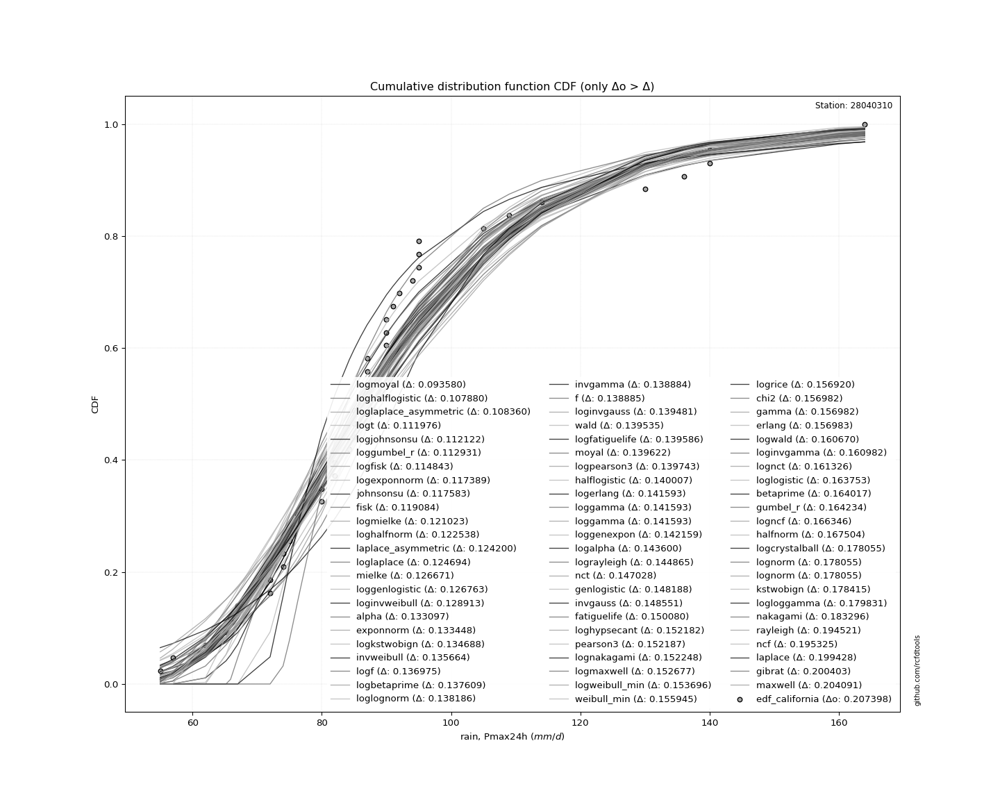</img>

</div>


**1.3. Best fit**

<div align="center">

|   id |   station | empirical_dist   | p_dist   |     delta |   deltao | eval   |   fit |   n |   best_fit |   best_fit_sort |
|-----:|----------:|:-----------------|:---------|----------:|---------:|:-------|------:|----:|-----------:|----------------:|
|    0 |  28040310 | edf_california   | logmoyal | 0.0935797 | 0.207398 | Δo > Δ |     1 |  43 |          1 |               1 |

</div>


<div align="center">

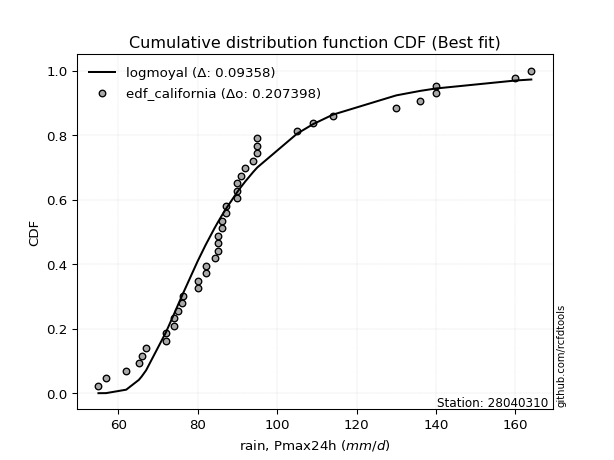</img>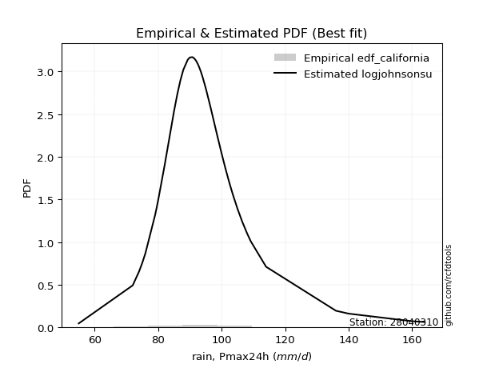</img>

</div>


### 2. Empirical - EDF Hazen (1930)

Hazen method for plotting positions is a formula used to estimate the empirical cumulative probability distribution of flood events or other hydrological data. This formula often results in biased estimations, particularly when extrapolating to extreme events (high return periods).

<div align="center">


$P=(m-0.5)/n$


</div>


**2.1. Empirical values**

<div align="center">

|                | 0                    | 1                   | 2                   | 3                   | 4                   | 5                   | 6                  | 7                  | 8                   | 9                   | 10                 | 11                  | 12                  | 13                | 14                 | 15                  | 16                  | 17                 | 18                  | 19                  | 20                  | 21        | 22                 | 23                 | 24                 | 25                 | 26                 | 27                 | 28                 | 29                | 30                 | 31                 | 32                 | 33                 | 34                 | 35                 | 36                 | 37                 | 38                 | 39                 | 40                 | 41                 | 42                 |
|:---------------|:---------------------|:--------------------|:--------------------|:--------------------|:--------------------|:--------------------|:-------------------|:-------------------|:--------------------|:--------------------|:-------------------|:--------------------|:--------------------|:------------------|:-------------------|:--------------------|:--------------------|:-------------------|:--------------------|:--------------------|:--------------------|:----------|:-------------------|:-------------------|:-------------------|:-------------------|:-------------------|:-------------------|:-------------------|:------------------|:-------------------|:-------------------|:-------------------|:-------------------|:-------------------|:-------------------|:-------------------|:-------------------|:-------------------|:-------------------|:-------------------|:-------------------|:-------------------|
| date           | 1998                 | 2015                | 1974                | 2012                | 2014                | 1980                | 2004               | 1987               | 2005                | 1992                | 1997               | 1977                | 2010                | 2011              | 2007               | 1989                | 2001                | 2013               | 1978                | 1995                | 2009                | 2002      | 1975               | 1986               | 2000               | 2003               | 2006               | 1991               | 1976               | 1985              | 1982               | 1984               | 1990               | 1994               | 1993               | 1983               | 1999               | 1979               | 1981               | 1973               | 2008               | 1988               | 1996               |
| x              | 55.0                 | 56.9235388634093    | 62.0                | 65.175540074784     | 65.8836476566967    | 67.0                | 72.0               | 72.0               | 74.0                | 74.0                | 75.0               | 76.0                | 76.2441825270904    | 79.9523480258781  | 80.0               | 82.0                | 82.0                | 84.2586803103685   | 85.0                | 85.0                | 85.0                | 86.0      | 86.0               | 87.0               | 87.0               | 90.0               | 90.0               | 90.0               | 91.0               | 92.0              | 94.0               | 95.0               | 95.0               | 95.0               | 105.0              | 109.0              | 114.0              | 130.0              | 136.0              | 140.0              | 140.0              | 160.0              | 164.0              |
| m              | 1                    | 2                   | 3                   | 4                   | 5                   | 6                   | 7                  | 8                  | 9                   | 10                  | 11                 | 12                  | 13                  | 14                | 15                 | 16                  | 17                  | 18                 | 19                  | 20                  | 21                  | 22        | 23                 | 24                 | 25                 | 26                 | 27                 | 28                 | 29                 | 30                | 31                 | 32                 | 33                 | 34                 | 35                 | 36                 | 37                 | 38                 | 39                 | 40                 | 41                 | 42                 | 43                 |
| empirical_dist | edf_hazen            | edf_hazen           | edf_hazen           | edf_hazen           | edf_hazen           | edf_hazen           | edf_hazen          | edf_hazen          | edf_hazen           | edf_hazen           | edf_hazen          | edf_hazen           | edf_hazen           | edf_hazen         | edf_hazen          | edf_hazen           | edf_hazen           | edf_hazen          | edf_hazen           | edf_hazen           | edf_hazen           | edf_hazen | edf_hazen          | edf_hazen          | edf_hazen          | edf_hazen          | edf_hazen          | edf_hazen          | edf_hazen          | edf_hazen         | edf_hazen          | edf_hazen          | edf_hazen          | edf_hazen          | edf_hazen          | edf_hazen          | edf_hazen          | edf_hazen          | edf_hazen          | edf_hazen          | edf_hazen          | edf_hazen          | edf_hazen          |
| empirical      | 0.011627906976744186 | 0.03488372093023256 | 0.05813953488372093 | 0.08139534883720931 | 0.10465116279069768 | 0.12790697674418605 | 0.1511627906976744 | 0.1744186046511628 | 0.19767441860465115 | 0.22093023255813954 | 0.2441860465116279 | 0.26744186046511625 | 0.29069767441860467 | 0.313953488372093 | 0.3372093023255814 | 0.36046511627906974 | 0.38372093023255816 | 0.4069767441860465 | 0.43023255813953487 | 0.45348837209302323 | 0.47674418604651164 | 0.5       | 0.5232558139534884 | 0.5465116279069767 | 0.5697674418604651 | 0.5930232558139535 | 0.6162790697674418 | 0.6395348837209303 | 0.6627906976744186 | 0.686046511627907 | 0.7093023255813954 | 0.7325581395348837 | 0.7558139534883721 | 0.7790697674418605 | 0.8023255813953488 | 0.8255813953488372 | 0.8488372093023255 | 0.872093023255814  | 0.8953488372093024 | 0.9186046511627907 | 0.9418604651162791 | 0.9651162790697675 | 0.9883720930232558 |
| empirical_tr   | 1.011764705882353    | 1.036144578313253   | 1.0617283950617284  | 1.0886075949367089  | 1.1168831168831168  | 1.1466666666666667  | 1.178082191780822  | 1.2112676056338028 | 1.2463768115942029  | 1.2835820895522387  | 1.323076923076923  | 1.3650793650793651  | 1.4098360655737707  | 1.457627118644068 | 1.5087719298245612 | 1.5636363636363635  | 1.6226415094339623  | 1.6862745098039218 | 1.7551020408163265  | 1.829787234042553   | 1.911111111111111   | 2.0       | 2.097560975609756  | 2.205128205128205  | 2.3243243243243246 | 2.4571428571428573 | 2.606060606060606  | 2.774193548387097  | 2.96551724137931   | 3.185185185185185 | 3.4400000000000004 | 3.7391304347826084 | 4.095238095238096  | 4.526315789473685  | 5.0588235294117645 | 5.733333333333334  | 6.615384615384613  | 7.8181818181818175 | 9.555555555555559  | 12.285714285714281 | 17.200000000000003 | 28.666666666666707 | 85.99999999999984  |

</div>


**2.2. Kolmogorov-Smirnov fit test (sorted by Δ)**


<div align="center">

|                | 0                     | 1                   | 2                   | 3                   | 4                   | 5                   | 6                   | 7                   | 8                   | 9                   | 10                  | 11                  | 12                  | 13                  | 14                  | 15                  | 16                  | 17                  | 18                  | 19                  | 20                  | 21                  | 22                  | 23                  | 24                  | 25                  | 26                  | 27                  | 28                  | 29                  | 30                  | 31                  | 32                  | 33                  | 34                  | 35                  | 36                  | 37                  | 38                  | 39                  | 40                  | 41                  | 42                  | 43                  | 44                  | 45                  | 46                  | 47                  | 48                  | 49                  | 50                  | 51                  | 52                  | 53                  | 54                  | 55                  | 56                  | 57                  | 58                  | 59                  | 60                  | 61                  | 62                  | 63                  | 64                  | 65                  | 66                  | 67                  | 68                  | 69                  | 70                  | 71                  | 72                  | 73                  | 74                  | 75                  | 76                  | 77                  | 78                  | 79                  | 80                  | 81                  | 82                  | 83                  | 84                  | 85                  | 86                  | 87                  | 88                  | 89                  |
|:---------------|:----------------------|:--------------------|:--------------------|:--------------------|:--------------------|:--------------------|:--------------------|:--------------------|:--------------------|:--------------------|:--------------------|:--------------------|:--------------------|:--------------------|:--------------------|:--------------------|:--------------------|:--------------------|:--------------------|:--------------------|:--------------------|:--------------------|:--------------------|:--------------------|:--------------------|:--------------------|:--------------------|:--------------------|:--------------------|:--------------------|:--------------------|:--------------------|:--------------------|:--------------------|:--------------------|:--------------------|:--------------------|:--------------------|:--------------------|:--------------------|:--------------------|:--------------------|:--------------------|:--------------------|:--------------------|:--------------------|:--------------------|:--------------------|:--------------------|:--------------------|:--------------------|:--------------------|:--------------------|:--------------------|:--------------------|:--------------------|:--------------------|:--------------------|:--------------------|:--------------------|:--------------------|:--------------------|:--------------------|:--------------------|:--------------------|:--------------------|:--------------------|:--------------------|:--------------------|:--------------------|:--------------------|:--------------------|:--------------------|:--------------------|:--------------------|:--------------------|:--------------------|:--------------------|:--------------------|:--------------------|:--------------------|:--------------------|:--------------------|:--------------------|:--------------------|:--------------------|:--------------------|:--------------------|:--------------------|:--------------------|
| station        | 28040310              | 28040310            | 28040310            | 28040310            | 28040310            | 28040310            | 28040310            | 28040310            | 28040310            | 28040310            | 28040310            | 28040310            | 28040310            | 28040310            | 28040310            | 28040310            | 28040310            | 28040310            | 28040310            | 28040310            | 28040310            | 28040310            | 28040310            | 28040310            | 28040310            | 28040310            | 28040310            | 28040310            | 28040310            | 28040310            | 28040310            | 28040310            | 28040310            | 28040310            | 28040310            | 28040310            | 28040310            | 28040310            | 28040310            | 28040310            | 28040310            | 28040310            | 28040310            | 28040310            | 28040310            | 28040310            | 28040310            | 28040310            | 28040310            | 28040310            | 28040310            | 28040310            | 28040310            | 28040310            | 28040310            | 28040310            | 28040310            | 28040310            | 28040310            | 28040310            | 28040310            | 28040310            | 28040310            | 28040310            | 28040310            | 28040310            | 28040310            | 28040310            | 28040310            | 28040310            | 28040310            | 28040310            | 28040310            | 28040310            | 28040310            | 28040310            | 28040310            | 28040310            | 28040310            | 28040310            | 28040310            | 28040310            | 28040310            | 28040310            | 28040310            | 28040310            | 28040310            | 28040310            | 28040310            | 28040310            |
| empirical_dist | edf_hazen             | edf_hazen           | edf_hazen           | edf_hazen           | edf_hazen           | edf_hazen           | edf_hazen           | edf_hazen           | edf_hazen           | edf_hazen           | edf_hazen           | edf_hazen           | edf_hazen           | edf_hazen           | edf_hazen           | edf_hazen           | edf_hazen           | edf_hazen           | edf_hazen           | edf_hazen           | edf_hazen           | edf_hazen           | edf_hazen           | edf_hazen           | edf_hazen           | edf_hazen           | edf_hazen           | edf_hazen           | edf_hazen           | edf_hazen           | edf_hazen           | edf_hazen           | edf_hazen           | edf_hazen           | edf_hazen           | edf_hazen           | edf_hazen           | edf_hazen           | edf_hazen           | edf_hazen           | edf_hazen           | edf_hazen           | edf_hazen           | edf_hazen           | edf_hazen           | edf_hazen           | edf_hazen           | edf_hazen           | edf_hazen           | edf_hazen           | edf_hazen           | edf_hazen           | edf_hazen           | edf_hazen           | edf_hazen           | edf_hazen           | edf_hazen           | edf_hazen           | edf_hazen           | edf_hazen           | edf_hazen           | edf_hazen           | edf_hazen           | edf_hazen           | edf_hazen           | edf_hazen           | edf_hazen           | edf_hazen           | edf_hazen           | edf_hazen           | edf_hazen           | edf_hazen           | edf_hazen           | edf_hazen           | edf_hazen           | edf_hazen           | edf_hazen           | edf_hazen           | edf_hazen           | edf_hazen           | edf_hazen           | edf_hazen           | edf_hazen           | edf_hazen           | edf_hazen           | edf_hazen           | edf_hazen           | edf_hazen           | edf_hazen           | edf_hazen           |
| p_dist         | loglaplace_asymmetric | logt                | logjohnsonsu        | loggumbel_r         | logfisk             | logmoyal            | logexponnorm        | johnsonsu           | fisk                | logmielke           | loghalfnorm         | laplace_asymmetric  | loglaplace          | mielke              | loggenlogistic      | loghalflogistic     | loginvweibull       | alpha               | exponnorm           | logkstwobign        | invweibull          | logf                | logbetaprime        | loglognorm          | invgamma            | f                   | loginvgauss         | wald                | logfatiguelife      | moyal               | logpearson3         | halflogistic        | logerlang           | loggamma            | loggamma            | loggenexpon         | logalpha            | lograyleigh         | nct                 | genlogistic         | invgauss            | fatiguelife         | loghypsecant        | pearson3            | lognakagami         | logmaxwell          | logweibull_min      | weibull_min         | logrice             | chi2                | gamma               | erlang              | loginvgamma         | lognct              | loglogistic         | betaprime           | gumbel_r            | logncf              | halfnorm            | logcrystalball      | lognorm             | lognorm             | kstwobign           | logloggamma         | nakagami            | logwald             | rayleigh            | ncf                 | laplace             | gibrat              | maxwell             | rice                | loggibrat           | hypsecant           | logistic            | genexpon            | expon               | pareto              | truncnorm           | norm                | crystalball         | loggompertz         | loggumbel_l         | t                   | logtruncnorm        | logexpon            | logpareto           | gumbel_l            | logchi2             | gompertz            |
| delta          | 0.0967320708361975    | 0.10034803212216636 | 0.10049366119655712 | 0.10130346353668795 | 0.10321527644284456 | 0.10520757603109337 | 0.10576150540016982 | 0.10595498912329271 | 0.1074563851152266  | 0.10939528443620172 | 0.11090990853949245 | 0.11257195116490437 | 0.11306609403707285 | 0.11504336015711925 | 0.1151351809950979  | 0.1165275218972242  | 0.11728496893958362 | 0.12146935074103182 | 0.12182018332522626 | 0.12306006708580597 | 0.12403620340793942 | 0.1253474685049918  | 0.12598126307107904 | 0.1265585081056888  | 0.12725656669839935 | 0.12725701623414354 | 0.12785263251234547 | 0.12790690513257755 | 0.12795760961904157 | 0.12799381146653088 | 0.1281148121512008  | 0.12837940089002542 | 0.1299649515925907  | 0.12996495802268238 | 0.12996495802268238 | 0.13053073265055515 | 0.13197162859071576 | 0.13323754688753187 | 0.13540025134230294 | 0.13656051701507033 | 0.13692339172314982 | 0.13845183839477637 | 0.140554224750137   | 0.14055954867589548 | 0.1406197898008974  | 0.14104927227683017 | 0.1420685481605679  | 0.1443174863543224  | 0.145292517402407   | 0.14535422078092441 | 0.14535426460471668 | 0.14535467250044554 | 0.14935443932148618 | 0.14969831859729288 | 0.15212498292510312 | 0.15238865549489344 | 0.15260624323819882 | 0.15471783769460135 | 0.15587582096175956 | 0.16642692490810096 | 0.16642745607848497 | 0.16642745607848497 | 0.16678751578377393 | 0.16820307267317225 | 0.17166843343250893 | 0.1722977438400552  | 0.18289284607609435 | 0.18369670854766607 | 0.18780006571079366 | 0.18877543844667005 | 0.19246343159188817 | 0.19869022600653252 | 0.20472856285314045 | 0.2083980409854458  | 0.21480194364836291 | 0.22189618699853464 | 0.2219332849193162  | 0.22193330254634774 | 0.22240471620537083 | 0.2224047271155727  | 0.22240473595274746 | 0.22276092750339965 | 0.22371625180477306 | 0.2273288350430851  | 0.2595124467878701  | 0.28185186099521636 | 0.2818518679257203  | 0.2887021157097316  | 0.29367344298866127 | 0.8636995646288393  |
| deltao         | 0.20739805565234237   | 0.20739805565234237 | 0.20739805565234237 | 0.20739805565234237 | 0.20739805565234237 | 0.20739805565234237 | 0.20739805565234237 | 0.20739805565234237 | 0.20739805565234237 | 0.20739805565234237 | 0.20739805565234237 | 0.20739805565234237 | 0.20739805565234237 | 0.20739805565234237 | 0.20739805565234237 | 0.20739805565234237 | 0.20739805565234237 | 0.20739805565234237 | 0.20739805565234237 | 0.20739805565234237 | 0.20739805565234237 | 0.20739805565234237 | 0.20739805565234237 | 0.20739805565234237 | 0.20739805565234237 | 0.20739805565234237 | 0.20739805565234237 | 0.20739805565234237 | 0.20739805565234237 | 0.20739805565234237 | 0.20739805565234237 | 0.20739805565234237 | 0.20739805565234237 | 0.20739805565234237 | 0.20739805565234237 | 0.20739805565234237 | 0.20739805565234237 | 0.20739805565234237 | 0.20739805565234237 | 0.20739805565234237 | 0.20739805565234237 | 0.20739805565234237 | 0.20739805565234237 | 0.20739805565234237 | 0.20739805565234237 | 0.20739805565234237 | 0.20739805565234237 | 0.20739805565234237 | 0.20739805565234237 | 0.20739805565234237 | 0.20739805565234237 | 0.20739805565234237 | 0.20739805565234237 | 0.20739805565234237 | 0.20739805565234237 | 0.20739805565234237 | 0.20739805565234237 | 0.20739805565234237 | 0.20739805565234237 | 0.20739805565234237 | 0.20739805565234237 | 0.20739805565234237 | 0.20739805565234237 | 0.20739805565234237 | 0.20739805565234237 | 0.20739805565234237 | 0.20739805565234237 | 0.20739805565234237 | 0.20739805565234237 | 0.20739805565234237 | 0.20739805565234237 | 0.20739805565234237 | 0.20739805565234237 | 0.20739805565234237 | 0.20739805565234237 | 0.20739805565234237 | 0.20739805565234237 | 0.20739805565234237 | 0.20739805565234237 | 0.20739805565234237 | 0.20739805565234237 | 0.20739805565234237 | 0.20739805565234237 | 0.20739805565234237 | 0.20739805565234237 | 0.20739805565234237 | 0.20739805565234237 | 0.20739805565234237 | 0.20739805565234237 | 0.20739805565234237 |
| eval           | Δo > Δ                | Δo > Δ              | Δo > Δ              | Δo > Δ              | Δo > Δ              | Δo > Δ              | Δo > Δ              | Δo > Δ              | Δo > Δ              | Δo > Δ              | Δo > Δ              | Δo > Δ              | Δo > Δ              | Δo > Δ              | Δo > Δ              | Δo > Δ              | Δo > Δ              | Δo > Δ              | Δo > Δ              | Δo > Δ              | Δo > Δ              | Δo > Δ              | Δo > Δ              | Δo > Δ              | Δo > Δ              | Δo > Δ              | Δo > Δ              | Δo > Δ              | Δo > Δ              | Δo > Δ              | Δo > Δ              | Δo > Δ              | Δo > Δ              | Δo > Δ              | Δo > Δ              | Δo > Δ              | Δo > Δ              | Δo > Δ              | Δo > Δ              | Δo > Δ              | Δo > Δ              | Δo > Δ              | Δo > Δ              | Δo > Δ              | Δo > Δ              | Δo > Δ              | Δo > Δ              | Δo > Δ              | Δo > Δ              | Δo > Δ              | Δo > Δ              | Δo > Δ              | Δo > Δ              | Δo > Δ              | Δo > Δ              | Δo > Δ              | Δo > Δ              | Δo > Δ              | Δo > Δ              | Δo > Δ              | Δo > Δ              | Δo > Δ              | Δo > Δ              | Δo > Δ              | Δo > Δ              | Δo > Δ              | Δo > Δ              | Δo > Δ              | Δo > Δ              | Δo > Δ              | Δo > Δ              | Δo > Δ              | Δo > Δ              | Δo <= Δ             | Δo <= Δ             | Δo <= Δ             | Δo <= Δ             | Δo <= Δ             | Δo <= Δ             | Δo <= Δ             | Δo <= Δ             | Δo <= Δ             | Δo <= Δ             | Δo <= Δ             | Δo <= Δ             | Δo <= Δ             | Δo <= Δ             | Δo <= Δ             | Δo <= Δ             | Δo <= Δ             |
| fit            | 1                     | 1                   | 1                   | 1                   | 1                   | 1                   | 1                   | 1                   | 1                   | 1                   | 1                   | 1                   | 1                   | 1                   | 1                   | 1                   | 1                   | 1                   | 1                   | 1                   | 1                   | 1                   | 1                   | 1                   | 1                   | 1                   | 1                   | 1                   | 1                   | 1                   | 1                   | 1                   | 1                   | 1                   | 1                   | 1                   | 1                   | 1                   | 1                   | 1                   | 1                   | 1                   | 1                   | 1                   | 1                   | 1                   | 1                   | 1                   | 1                   | 1                   | 1                   | 1                   | 1                   | 1                   | 1                   | 1                   | 1                   | 1                   | 1                   | 1                   | 1                   | 1                   | 1                   | 1                   | 1                   | 1                   | 1                   | 1                   | 1                   | 1                   | 1                   | 1                   | 1                   | 0                   | 0                   | 0                   | 0                   | 0                   | 0                   | 0                   | 0                   | 0                   | 0                   | 0                   | 0                   | 0                   | 0                   | 0                   | 0                   | 0                   |
| n              | 43                    | 43                  | 43                  | 43                  | 43                  | 43                  | 43                  | 43                  | 43                  | 43                  | 43                  | 43                  | 43                  | 43                  | 43                  | 43                  | 43                  | 43                  | 43                  | 43                  | 43                  | 43                  | 43                  | 43                  | 43                  | 43                  | 43                  | 43                  | 43                  | 43                  | 43                  | 43                  | 43                  | 43                  | 43                  | 43                  | 43                  | 43                  | 43                  | 43                  | 43                  | 43                  | 43                  | 43                  | 43                  | 43                  | 43                  | 43                  | 43                  | 43                  | 43                  | 43                  | 43                  | 43                  | 43                  | 43                  | 43                  | 43                  | 43                  | 43                  | 43                  | 43                  | 43                  | 43                  | 43                  | 43                  | 43                  | 43                  | 43                  | 43                  | 43                  | 43                  | 43                  | 43                  | 43                  | 43                  | 43                  | 43                  | 43                  | 43                  | 43                  | 43                  | 43                  | 43                  | 43                  | 43                  | 43                  | 43                  | 43                  | 43                  |
| best_fit       | 1                     | 0                   | 0                   | 0                   | 0                   | 0                   | 0                   | 0                   | 0                   | 0                   | 0                   | 0                   | 0                   | 0                   | 0                   | 0                   | 0                   | 0                   | 0                   | 0                   | 0                   | 0                   | 0                   | 0                   | 0                   | 0                   | 0                   | 0                   | 0                   | 0                   | 0                   | 0                   | 0                   | 0                   | 0                   | 0                   | 0                   | 0                   | 0                   | 0                   | 0                   | 0                   | 0                   | 0                   | 0                   | 0                   | 0                   | 0                   | 0                   | 0                   | 0                   | 0                   | 0                   | 0                   | 0                   | 0                   | 0                   | 0                   | 0                   | 0                   | 0                   | 0                   | 0                   | 0                   | 0                   | 0                   | 0                   | 0                   | 0                   | 0                   | 0                   | 0                   | 0                   | 0                   | 0                   | 0                   | 0                   | 0                   | 0                   | 0                   | 0                   | 0                   | 0                   | 0                   | 0                   | 0                   | 0                   | 0                   | 0                   | 0                   |
| best_fit_sort  | 1                     | 2                   | 3                   | 4                   | 5                   | 6                   | 7                   | 8                   | 9                   | 10                  | 11                  | 12                  | 13                  | 14                  | 15                  | 16                  | 17                  | 18                  | 19                  | 20                  | 21                  | 22                  | 23                  | 24                  | 25                  | 26                  | 27                  | 28                  | 29                  | 30                  | 31                  | 32                  | 33                  | 34                  | 35                  | 36                  | 37                  | 38                  | 39                  | 40                  | 41                  | 42                  | 43                  | 44                  | 45                  | 46                  | 47                  | 48                  | 49                  | 50                  | 51                  | 52                  | 53                  | 54                  | 55                  | 56                  | 57                  | 58                  | 59                  | 60                  | 61                  | 62                  | 63                  | 64                  | 65                  | 66                  | 67                  | 68                  | 69                  | 70                  | 71                  | 72                  | 73                  | 74                  | 75                  | 76                  | 77                  | 78                  | 79                  | 80                  | 81                  | 82                  | 83                  | 84                  | 85                  | 86                  | 87                  | 88                  | 89                  | 90                  |

</div>


<div align="center">

</img>

</div>


**2.3. Best fit**

<div align="center">

|   id |   station | empirical_dist   | p_dist                |     delta |   deltao | eval   |   fit |   n |   best_fit |   best_fit_sort |
|-----:|----------:|:-----------------|:----------------------|----------:|---------:|:-------|------:|----:|-----------:|----------------:|
|    0 |  28040310 | edf_hazen        | loglaplace_asymmetric | 0.0967321 | 0.207398 | Δo > Δ |     1 |  43 |          1 |               1 |

</div>


<div align="center">

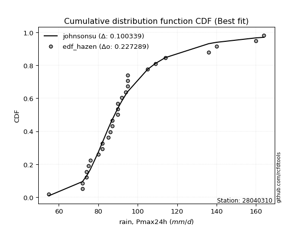</img>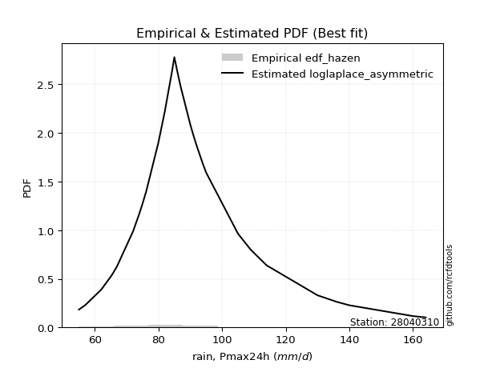</img>

</div>


### 3. Empirical - EDF Weibull (1939)

Weibull plotting position formula is an empirical method used to estimate the non-exceedance probability or plotting position for a set of observed data, is often recommended or widely used in practice, particularly in flood frequency analysis.

<div align="center">


$P=m/(n+1)$


</div>


**3.1. Empirical values**

<div align="center">

|                | 0                    | 1                    | 2                   | 3                   | 4                   | 5                   | 6                  | 7                   | 8                   | 9                   | 10                 | 11                 | 12                  | 13                 | 14                 | 15                  | 16                  | 17                 | 18                 | 19                  | 20                 | 21          | 22                 | 23                 | 24                 | 25                 | 26                 | 27                 | 28                 | 29                 | 30                 | 31                 | 32          | 33                 | 34                 | 35                 | 36                 | 37                 | 38                 | 39                 | 40                 | 41                 | 42                 |
|:---------------|:---------------------|:---------------------|:--------------------|:--------------------|:--------------------|:--------------------|:-------------------|:--------------------|:--------------------|:--------------------|:-------------------|:-------------------|:--------------------|:-------------------|:-------------------|:--------------------|:--------------------|:-------------------|:-------------------|:--------------------|:-------------------|:------------|:-------------------|:-------------------|:-------------------|:-------------------|:-------------------|:-------------------|:-------------------|:-------------------|:-------------------|:-------------------|:------------|:-------------------|:-------------------|:-------------------|:-------------------|:-------------------|:-------------------|:-------------------|:-------------------|:-------------------|:-------------------|
| date           | 1998                 | 2015                 | 1974                | 2012                | 2014                | 1980                | 2004               | 1987                | 2005                | 1992                | 1997               | 1977               | 2010                | 2011               | 2007               | 1989                | 2001                | 2013               | 1978               | 1995                | 2009               | 2002        | 1975               | 1986               | 2000               | 2003               | 2006               | 1991               | 1976               | 1985               | 1982               | 1984               | 1990        | 1994               | 1993               | 1983               | 1999               | 1979               | 1981               | 1973               | 2008               | 1988               | 1996               |
| x              | 55.0                 | 56.9235388634093     | 62.0                | 65.175540074784     | 65.8836476566967    | 67.0                | 72.0               | 72.0                | 74.0                | 74.0                | 75.0               | 76.0               | 76.2441825270904    | 79.9523480258781   | 80.0               | 82.0                | 82.0                | 84.2586803103685   | 85.0               | 85.0                | 85.0               | 86.0        | 86.0               | 87.0               | 87.0               | 90.0               | 90.0               | 90.0               | 91.0               | 92.0               | 94.0               | 95.0               | 95.0        | 95.0               | 105.0              | 109.0              | 114.0              | 130.0              | 136.0              | 140.0              | 140.0              | 160.0              | 164.0              |
| m              | 1                    | 2                    | 3                   | 4                   | 5                   | 6                   | 7                  | 8                   | 9                   | 10                  | 11                 | 12                 | 13                  | 14                 | 15                 | 16                  | 17                  | 18                 | 19                 | 20                  | 21                 | 22          | 23                 | 24                 | 25                 | 26                 | 27                 | 28                 | 29                 | 30                 | 31                 | 32                 | 33          | 34                 | 35                 | 36                 | 37                 | 38                 | 39                 | 40                 | 41                 | 42                 | 43                 |
| empirical_dist | edf_weibull          | edf_weibull          | edf_weibull         | edf_weibull         | edf_weibull         | edf_weibull         | edf_weibull        | edf_weibull         | edf_weibull         | edf_weibull         | edf_weibull        | edf_weibull        | edf_weibull         | edf_weibull        | edf_weibull        | edf_weibull         | edf_weibull         | edf_weibull        | edf_weibull        | edf_weibull         | edf_weibull        | edf_weibull | edf_weibull        | edf_weibull        | edf_weibull        | edf_weibull        | edf_weibull        | edf_weibull        | edf_weibull        | edf_weibull        | edf_weibull        | edf_weibull        | edf_weibull | edf_weibull        | edf_weibull        | edf_weibull        | edf_weibull        | edf_weibull        | edf_weibull        | edf_weibull        | edf_weibull        | edf_weibull        | edf_weibull        |
| empirical      | 0.022727272727272728 | 0.045454545454545456 | 0.06818181818181818 | 0.09090909090909091 | 0.11363636363636363 | 0.13636363636363635 | 0.1590909090909091 | 0.18181818181818182 | 0.20454545454545456 | 0.22727272727272727 | 0.25               | 0.2727272727272727 | 0.29545454545454547 | 0.3181818181818182 | 0.3409090909090909 | 0.36363636363636365 | 0.38636363636363635 | 0.4090909090909091 | 0.4318181818181818 | 0.45454545454545453 | 0.4772727272727273 | 0.5         | 0.5227272727272727 | 0.5454545454545454 | 0.5681818181818182 | 0.5909090909090909 | 0.6136363636363636 | 0.6363636363636364 | 0.6590909090909091 | 0.6818181818181818 | 0.7045454545454546 | 0.7272727272727273 | 0.75        | 0.7727272727272727 | 0.7954545454545454 | 0.8181818181818182 | 0.8409090909090909 | 0.8636363636363636 | 0.8863636363636364 | 0.9090909090909091 | 0.9318181818181818 | 0.9545454545454546 | 0.9772727272727273 |
| empirical_tr   | 1.0232558139534884   | 1.0476190476190477   | 1.073170731707317   | 1.1                 | 1.1282051282051282  | 1.1578947368421053  | 1.1891891891891893 | 1.2222222222222223  | 1.2571428571428571  | 1.2941176470588236  | 1.3333333333333333 | 1.375              | 1.4193548387096773  | 1.4666666666666666 | 1.5172413793103448 | 1.5714285714285714  | 1.6296296296296295  | 1.6923076923076925 | 1.7600000000000002 | 1.8333333333333335  | 1.9130434782608696 | 2.0         | 2.0952380952380953 | 2.1999999999999997 | 2.3157894736842106 | 2.4444444444444446 | 2.588235294117647  | 2.75               | 2.933333333333333  | 3.1428571428571423 | 3.384615384615385  | 3.666666666666667  | 4.0         | 4.3999999999999995 | 4.8888888888888875 | 5.500000000000002  | 6.2857142857142865 | 7.333333333333334  | 8.799999999999999  | 10.999999999999996 | 14.666666666666655 | 22.00000000000002  | 44.00000000000004  |

</div>


**3.2. Kolmogorov-Smirnov fit test (sorted by Δ)**


<div align="center">

|                | 0                     | 1                   | 2                   | 3                   | 4                   | 5                   | 6                   | 7                   | 8                   | 9                   | 10                  | 11                  | 12                  | 13                  | 14                  | 15                  | 16                  | 17                  | 18                  | 19                  | 20                  | 21                  | 22                  | 23                  | 24                  | 25                  | 26                  | 27                  | 28                  | 29                  | 30                  | 31                  | 32                  | 33                  | 34                  | 35                  | 36                  | 37                  | 38                  | 39                  | 40                  | 41                  | 42                  | 43                  | 44                  | 45                  | 46                  | 47                  | 48                  | 49                  | 50                  | 51                  | 52                  | 53                  | 54                  | 55                  | 56                  | 57                  | 58                  | 59                  | 60                  | 61                  | 62                  | 63                  | 64                  | 65                  | 66                  | 67                  | 68                  | 69                  | 70                  | 71                  | 72                  | 73                  | 74                  | 75                  | 76                  | 77                  | 78                  | 79                  | 80                  | 81                  | 82                  | 83                  | 84                  | 85                  | 86                  | 87                  | 88                  | 89                  |
|:---------------|:----------------------|:--------------------|:--------------------|:--------------------|:--------------------|:--------------------|:--------------------|:--------------------|:--------------------|:--------------------|:--------------------|:--------------------|:--------------------|:--------------------|:--------------------|:--------------------|:--------------------|:--------------------|:--------------------|:--------------------|:--------------------|:--------------------|:--------------------|:--------------------|:--------------------|:--------------------|:--------------------|:--------------------|:--------------------|:--------------------|:--------------------|:--------------------|:--------------------|:--------------------|:--------------------|:--------------------|:--------------------|:--------------------|:--------------------|:--------------------|:--------------------|:--------------------|:--------------------|:--------------------|:--------------------|:--------------------|:--------------------|:--------------------|:--------------------|:--------------------|:--------------------|:--------------------|:--------------------|:--------------------|:--------------------|:--------------------|:--------------------|:--------------------|:--------------------|:--------------------|:--------------------|:--------------------|:--------------------|:--------------------|:--------------------|:--------------------|:--------------------|:--------------------|:--------------------|:--------------------|:--------------------|:--------------------|:--------------------|:--------------------|:--------------------|:--------------------|:--------------------|:--------------------|:--------------------|:--------------------|:--------------------|:--------------------|:--------------------|:--------------------|:--------------------|:--------------------|:--------------------|:--------------------|:--------------------|:--------------------|
| station        | 28040310              | 28040310            | 28040310            | 28040310            | 28040310            | 28040310            | 28040310            | 28040310            | 28040310            | 28040310            | 28040310            | 28040310            | 28040310            | 28040310            | 28040310            | 28040310            | 28040310            | 28040310            | 28040310            | 28040310            | 28040310            | 28040310            | 28040310            | 28040310            | 28040310            | 28040310            | 28040310            | 28040310            | 28040310            | 28040310            | 28040310            | 28040310            | 28040310            | 28040310            | 28040310            | 28040310            | 28040310            | 28040310            | 28040310            | 28040310            | 28040310            | 28040310            | 28040310            | 28040310            | 28040310            | 28040310            | 28040310            | 28040310            | 28040310            | 28040310            | 28040310            | 28040310            | 28040310            | 28040310            | 28040310            | 28040310            | 28040310            | 28040310            | 28040310            | 28040310            | 28040310            | 28040310            | 28040310            | 28040310            | 28040310            | 28040310            | 28040310            | 28040310            | 28040310            | 28040310            | 28040310            | 28040310            | 28040310            | 28040310            | 28040310            | 28040310            | 28040310            | 28040310            | 28040310            | 28040310            | 28040310            | 28040310            | 28040310            | 28040310            | 28040310            | 28040310            | 28040310            | 28040310            | 28040310            | 28040310            |
| empirical_dist | edf_weibull           | edf_weibull         | edf_weibull         | edf_weibull         | edf_weibull         | edf_weibull         | edf_weibull         | edf_weibull         | edf_weibull         | edf_weibull         | edf_weibull         | edf_weibull         | edf_weibull         | edf_weibull         | edf_weibull         | edf_weibull         | edf_weibull         | edf_weibull         | edf_weibull         | edf_weibull         | edf_weibull         | edf_weibull         | edf_weibull         | edf_weibull         | edf_weibull         | edf_weibull         | edf_weibull         | edf_weibull         | edf_weibull         | edf_weibull         | edf_weibull         | edf_weibull         | edf_weibull         | edf_weibull         | edf_weibull         | edf_weibull         | edf_weibull         | edf_weibull         | edf_weibull         | edf_weibull         | edf_weibull         | edf_weibull         | edf_weibull         | edf_weibull         | edf_weibull         | edf_weibull         | edf_weibull         | edf_weibull         | edf_weibull         | edf_weibull         | edf_weibull         | edf_weibull         | edf_weibull         | edf_weibull         | edf_weibull         | edf_weibull         | edf_weibull         | edf_weibull         | edf_weibull         | edf_weibull         | edf_weibull         | edf_weibull         | edf_weibull         | edf_weibull         | edf_weibull         | edf_weibull         | edf_weibull         | edf_weibull         | edf_weibull         | edf_weibull         | edf_weibull         | edf_weibull         | edf_weibull         | edf_weibull         | edf_weibull         | edf_weibull         | edf_weibull         | edf_weibull         | edf_weibull         | edf_weibull         | edf_weibull         | edf_weibull         | edf_weibull         | edf_weibull         | edf_weibull         | edf_weibull         | edf_weibull         | edf_weibull         | edf_weibull         | edf_weibull         |
| p_dist         | loglaplace_asymmetric | logt                | logjohnsonsu        | loggumbel_r         | logfisk             | logexponnorm        | johnsonsu           | fisk                | logmielke           | logmoyal            | loghalfnorm         | laplace_asymmetric  | mielke              | loggenlogistic      | loginvweibull       | loglaplace          | loghalflogistic     | alpha               | exponnorm           | logkstwobign        | invweibull          | logf                | logbetaprime        | loglognorm          | invgamma            | f                   | loginvgauss         | logfatiguelife      | moyal               | logpearson3         | halflogistic        | logerlang           | loggamma            | loggamma            | loggenexpon         | logalpha            | lograyleigh         | nct                 | genlogistic         | invgauss            | fatiguelife         | loghypsecant        | pearson3            | lognakagami         | logmaxwell          | logweibull_min      | wald                | weibull_min         | logrice             | chi2                | gamma               | erlang              | loginvgamma         | lognct              | loglogistic         | betaprime           | gumbel_r            | logncf              | halfnorm            | logcrystalball      | lognorm             | lognorm             | kstwobign           | logloggamma         | nakagami            | logwald             | rayleigh            | ncf                 | laplace             | maxwell             | rice                | gibrat              | hypsecant           | logistic            | loggibrat           | genexpon            | expon               | pareto              | loggompertz         | truncnorm           | norm                | crystalball         | loggumbel_l         | t                   | logtruncnorm        | logexpon            | logpareto           | gumbel_l            | logchi2             | gompertz            |
| delta          | 0.0903895761216097    | 0.09400553740757855 | 0.0941511664819693  | 0.09496096882210014 | 0.09687278172825675 | 0.09941901068558201 | 0.0996124944087049  | 0.10111389040063878 | 0.10305278972161391 | 0.10309341112623077 | 0.10456741382490464 | 0.10622945645031656 | 0.10870086544253144 | 0.10879268628051009 | 0.11094247422499581 | 0.11148047035842595 | 0.1144133569923616  | 0.11512685602644401 | 0.11547768861063845 | 0.11671757237121816 | 0.1176937086933516  | 0.11900497379040398 | 0.11963876835649123 | 0.120216013391101   | 0.12091407198381154 | 0.12091452151955573 | 0.12151013779775766 | 0.12161511490445376 | 0.12165131675194307 | 0.12177231743661299 | 0.12203690617543761 | 0.12362245687800288 | 0.12362246330809457 | 0.12362246330809457 | 0.12418823793596734 | 0.12562913387612795 | 0.12689505217294406 | 0.12905775662771513 | 0.13021802230048252 | 0.130580897008562   | 0.13210934368018856 | 0.1342117300355492  | 0.13421705396130768 | 0.1342772950863096  | 0.13470677756224236 | 0.1357260534459801  | 0.13636356475202785 | 0.1379749916397346  | 0.1389500226878192  | 0.1390117260663366  | 0.13901176989012887 | 0.13901217778585773 | 0.14301194460689837 | 0.14335582388270507 | 0.14578248821051532 | 0.14604616078030563 | 0.14626374852361101 | 0.14837534298001354 | 0.14953332624717175 | 0.16008443019351315 | 0.16008496136389716 | 0.16008496136389716 | 0.16044502106918612 | 0.16186057795858444 | 0.16532593871792112 | 0.1701835789351926  | 0.17655035136150654 | 0.17735421383307826 | 0.18145757099620585 | 0.18612093687730036 | 0.1923477312919447  | 0.19511793316125778 | 0.20205554627085798 | 0.2084594489337751  | 0.21107105756772818 | 0.21396806860529996 | 0.2140051665260815  | 0.21400518415311306 | 0.21483280911016497 | 0.21606222149078302 | 0.21606223240098488 | 0.21606224123815965 | 0.21737375709018525 | 0.2209863403284973  | 0.2515843283946354  | 0.2739237426019817  | 0.27392374953248566 | 0.2823596209951438  | 0.28257407723813277 | 0.855242905009389   |
| deltao         | 0.20739805565234237   | 0.20739805565234237 | 0.20739805565234237 | 0.20739805565234237 | 0.20739805565234237 | 0.20739805565234237 | 0.20739805565234237 | 0.20739805565234237 | 0.20739805565234237 | 0.20739805565234237 | 0.20739805565234237 | 0.20739805565234237 | 0.20739805565234237 | 0.20739805565234237 | 0.20739805565234237 | 0.20739805565234237 | 0.20739805565234237 | 0.20739805565234237 | 0.20739805565234237 | 0.20739805565234237 | 0.20739805565234237 | 0.20739805565234237 | 0.20739805565234237 | 0.20739805565234237 | 0.20739805565234237 | 0.20739805565234237 | 0.20739805565234237 | 0.20739805565234237 | 0.20739805565234237 | 0.20739805565234237 | 0.20739805565234237 | 0.20739805565234237 | 0.20739805565234237 | 0.20739805565234237 | 0.20739805565234237 | 0.20739805565234237 | 0.20739805565234237 | 0.20739805565234237 | 0.20739805565234237 | 0.20739805565234237 | 0.20739805565234237 | 0.20739805565234237 | 0.20739805565234237 | 0.20739805565234237 | 0.20739805565234237 | 0.20739805565234237 | 0.20739805565234237 | 0.20739805565234237 | 0.20739805565234237 | 0.20739805565234237 | 0.20739805565234237 | 0.20739805565234237 | 0.20739805565234237 | 0.20739805565234237 | 0.20739805565234237 | 0.20739805565234237 | 0.20739805565234237 | 0.20739805565234237 | 0.20739805565234237 | 0.20739805565234237 | 0.20739805565234237 | 0.20739805565234237 | 0.20739805565234237 | 0.20739805565234237 | 0.20739805565234237 | 0.20739805565234237 | 0.20739805565234237 | 0.20739805565234237 | 0.20739805565234237 | 0.20739805565234237 | 0.20739805565234237 | 0.20739805565234237 | 0.20739805565234237 | 0.20739805565234237 | 0.20739805565234237 | 0.20739805565234237 | 0.20739805565234237 | 0.20739805565234237 | 0.20739805565234237 | 0.20739805565234237 | 0.20739805565234237 | 0.20739805565234237 | 0.20739805565234237 | 0.20739805565234237 | 0.20739805565234237 | 0.20739805565234237 | 0.20739805565234237 | 0.20739805565234237 | 0.20739805565234237 | 0.20739805565234237 |
| eval           | Δo > Δ                | Δo > Δ              | Δo > Δ              | Δo > Δ              | Δo > Δ              | Δo > Δ              | Δo > Δ              | Δo > Δ              | Δo > Δ              | Δo > Δ              | Δo > Δ              | Δo > Δ              | Δo > Δ              | Δo > Δ              | Δo > Δ              | Δo > Δ              | Δo > Δ              | Δo > Δ              | Δo > Δ              | Δo > Δ              | Δo > Δ              | Δo > Δ              | Δo > Δ              | Δo > Δ              | Δo > Δ              | Δo > Δ              | Δo > Δ              | Δo > Δ              | Δo > Δ              | Δo > Δ              | Δo > Δ              | Δo > Δ              | Δo > Δ              | Δo > Δ              | Δo > Δ              | Δo > Δ              | Δo > Δ              | Δo > Δ              | Δo > Δ              | Δo > Δ              | Δo > Δ              | Δo > Δ              | Δo > Δ              | Δo > Δ              | Δo > Δ              | Δo > Δ              | Δo > Δ              | Δo > Δ              | Δo > Δ              | Δo > Δ              | Δo > Δ              | Δo > Δ              | Δo > Δ              | Δo > Δ              | Δo > Δ              | Δo > Δ              | Δo > Δ              | Δo > Δ              | Δo > Δ              | Δo > Δ              | Δo > Δ              | Δo > Δ              | Δo > Δ              | Δo > Δ              | Δo > Δ              | Δo > Δ              | Δo > Δ              | Δo > Δ              | Δo > Δ              | Δo > Δ              | Δo > Δ              | Δo > Δ              | Δo > Δ              | Δo <= Δ             | Δo <= Δ             | Δo <= Δ             | Δo <= Δ             | Δo <= Δ             | Δo <= Δ             | Δo <= Δ             | Δo <= Δ             | Δo <= Δ             | Δo <= Δ             | Δo <= Δ             | Δo <= Δ             | Δo <= Δ             | Δo <= Δ             | Δo <= Δ             | Δo <= Δ             | Δo <= Δ             |
| fit            | 1                     | 1                   | 1                   | 1                   | 1                   | 1                   | 1                   | 1                   | 1                   | 1                   | 1                   | 1                   | 1                   | 1                   | 1                   | 1                   | 1                   | 1                   | 1                   | 1                   | 1                   | 1                   | 1                   | 1                   | 1                   | 1                   | 1                   | 1                   | 1                   | 1                   | 1                   | 1                   | 1                   | 1                   | 1                   | 1                   | 1                   | 1                   | 1                   | 1                   | 1                   | 1                   | 1                   | 1                   | 1                   | 1                   | 1                   | 1                   | 1                   | 1                   | 1                   | 1                   | 1                   | 1                   | 1                   | 1                   | 1                   | 1                   | 1                   | 1                   | 1                   | 1                   | 1                   | 1                   | 1                   | 1                   | 1                   | 1                   | 1                   | 1                   | 1                   | 1                   | 1                   | 0                   | 0                   | 0                   | 0                   | 0                   | 0                   | 0                   | 0                   | 0                   | 0                   | 0                   | 0                   | 0                   | 0                   | 0                   | 0                   | 0                   |
| n              | 43                    | 43                  | 43                  | 43                  | 43                  | 43                  | 43                  | 43                  | 43                  | 43                  | 43                  | 43                  | 43                  | 43                  | 43                  | 43                  | 43                  | 43                  | 43                  | 43                  | 43                  | 43                  | 43                  | 43                  | 43                  | 43                  | 43                  | 43                  | 43                  | 43                  | 43                  | 43                  | 43                  | 43                  | 43                  | 43                  | 43                  | 43                  | 43                  | 43                  | 43                  | 43                  | 43                  | 43                  | 43                  | 43                  | 43                  | 43                  | 43                  | 43                  | 43                  | 43                  | 43                  | 43                  | 43                  | 43                  | 43                  | 43                  | 43                  | 43                  | 43                  | 43                  | 43                  | 43                  | 43                  | 43                  | 43                  | 43                  | 43                  | 43                  | 43                  | 43                  | 43                  | 43                  | 43                  | 43                  | 43                  | 43                  | 43                  | 43                  | 43                  | 43                  | 43                  | 43                  | 43                  | 43                  | 43                  | 43                  | 43                  | 43                  |
| best_fit       | 1                     | 0                   | 0                   | 0                   | 0                   | 0                   | 0                   | 0                   | 0                   | 0                   | 0                   | 0                   | 0                   | 0                   | 0                   | 0                   | 0                   | 0                   | 0                   | 0                   | 0                   | 0                   | 0                   | 0                   | 0                   | 0                   | 0                   | 0                   | 0                   | 0                   | 0                   | 0                   | 0                   | 0                   | 0                   | 0                   | 0                   | 0                   | 0                   | 0                   | 0                   | 0                   | 0                   | 0                   | 0                   | 0                   | 0                   | 0                   | 0                   | 0                   | 0                   | 0                   | 0                   | 0                   | 0                   | 0                   | 0                   | 0                   | 0                   | 0                   | 0                   | 0                   | 0                   | 0                   | 0                   | 0                   | 0                   | 0                   | 0                   | 0                   | 0                   | 0                   | 0                   | 0                   | 0                   | 0                   | 0                   | 0                   | 0                   | 0                   | 0                   | 0                   | 0                   | 0                   | 0                   | 0                   | 0                   | 0                   | 0                   | 0                   |
| best_fit_sort  | 1                     | 2                   | 3                   | 4                   | 5                   | 6                   | 7                   | 8                   | 9                   | 10                  | 11                  | 12                  | 13                  | 14                  | 15                  | 16                  | 17                  | 18                  | 19                  | 20                  | 21                  | 22                  | 23                  | 24                  | 25                  | 26                  | 27                  | 28                  | 29                  | 30                  | 31                  | 32                  | 33                  | 34                  | 35                  | 36                  | 37                  | 38                  | 39                  | 40                  | 41                  | 42                  | 43                  | 44                  | 45                  | 46                  | 47                  | 48                  | 49                  | 50                  | 51                  | 52                  | 53                  | 54                  | 55                  | 56                  | 57                  | 58                  | 59                  | 60                  | 61                  | 62                  | 63                  | 64                  | 65                  | 66                  | 67                  | 68                  | 69                  | 70                  | 71                  | 72                  | 73                  | 74                  | 75                  | 76                  | 77                  | 78                  | 79                  | 80                  | 81                  | 82                  | 83                  | 84                  | 85                  | 86                  | 87                  | 88                  | 89                  | 90                  |

</div>


<div align="center">

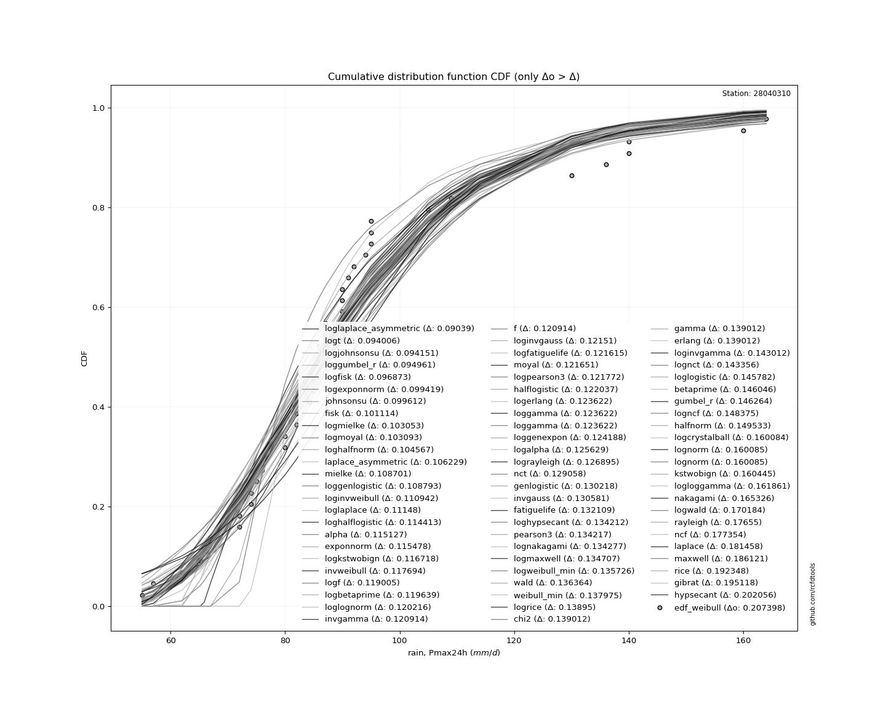</img>

</div>


**3.3. Best fit**

<div align="center">

|   id |   station | empirical_dist   | p_dist                |     delta |   deltao | eval   |   fit |   n |   best_fit |   best_fit_sort |
|-----:|----------:|:-----------------|:----------------------|----------:|---------:|:-------|------:|----:|-----------:|----------------:|
|    0 |  28040310 | edf_weibull      | loglaplace_asymmetric | 0.0903896 | 0.207398 | Δo > Δ |     1 |  43 |          1 |               1 |

</div>


<div align="center">

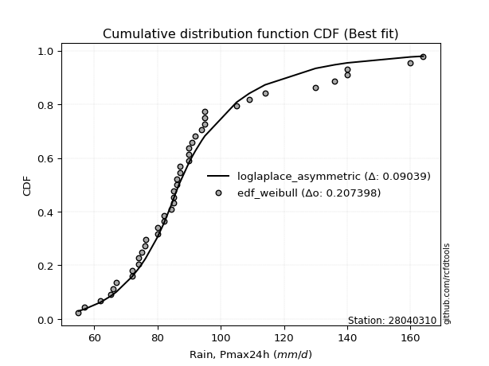</img></img>

</div>


### 4. Empirical - EDF Beard (1943)

The Beard formula (or Beard´s plotting position formula) in hydrology is used to estimate the empirical non-exceedance probability _(P)_ of a flood event (or other extreme hydrological data point) within a given dataset.

<div align="center">


$P=(m-0.31)/(n+0.38)$


</div>


**4.1. Empirical values**

<div align="center">

|                | 0                   | 1                    | 2                   | 3                  | 4                   | 5                   | 6                  | 7                  | 8                  | 9                   | 10                  | 11                 | 12                  | 13                 | 14                | 15                  | 16                 | 17                 | 18                  | 19                  | 20                 | 21        | 22                 | 23                 | 24                 | 25                 | 26                 | 27                 | 28                 | 29                 | 30                 | 31                 | 32                 | 33                | 34                 | 35                 | 36                 | 37                 | 38                 | 39                 | 40                 | 41                 | 42                 |
|:---------------|:--------------------|:---------------------|:--------------------|:-------------------|:--------------------|:--------------------|:-------------------|:-------------------|:-------------------|:--------------------|:--------------------|:-------------------|:--------------------|:-------------------|:------------------|:--------------------|:-------------------|:-------------------|:--------------------|:--------------------|:-------------------|:----------|:-------------------|:-------------------|:-------------------|:-------------------|:-------------------|:-------------------|:-------------------|:-------------------|:-------------------|:-------------------|:-------------------|:------------------|:-------------------|:-------------------|:-------------------|:-------------------|:-------------------|:-------------------|:-------------------|:-------------------|:-------------------|
| date           | 1998                | 2015                 | 1974                | 2012               | 2014                | 1980                | 2004               | 1987               | 2005               | 1992                | 1997                | 1977               | 2010                | 2011               | 2007              | 1989                | 2001               | 2013               | 1978                | 1995                | 2009               | 2002      | 1975               | 1986               | 2000               | 2003               | 2006               | 1991               | 1976               | 1985               | 1982               | 1984               | 1990               | 1994              | 1993               | 1983               | 1999               | 1979               | 1981               | 1973               | 2008               | 1988               | 1996               |
| x              | 55.0                | 56.9235388634093     | 62.0                | 65.175540074784    | 65.8836476566967    | 67.0                | 72.0               | 72.0               | 74.0               | 74.0                | 75.0                | 76.0               | 76.2441825270904    | 79.9523480258781   | 80.0              | 82.0                | 82.0               | 84.2586803103685   | 85.0                | 85.0                | 85.0               | 86.0      | 86.0               | 87.0               | 87.0               | 90.0               | 90.0               | 90.0               | 91.0               | 92.0               | 94.0               | 95.0               | 95.0               | 95.0              | 105.0              | 109.0              | 114.0              | 130.0              | 136.0              | 140.0              | 140.0              | 160.0              | 164.0              |
| m              | 1                   | 2                    | 3                   | 4                  | 5                   | 6                   | 7                  | 8                  | 9                  | 10                  | 11                  | 12                 | 13                  | 14                 | 15                | 16                  | 17                 | 18                 | 19                  | 20                  | 21                 | 22        | 23                 | 24                 | 25                 | 26                 | 27                 | 28                 | 29                 | 30                 | 31                 | 32                 | 33                 | 34                | 35                 | 36                 | 37                 | 38                 | 39                 | 40                 | 41                 | 42                 | 43                 |
| empirical_dist | edf_beard           | edf_beard            | edf_beard           | edf_beard          | edf_beard           | edf_beard           | edf_beard          | edf_beard          | edf_beard          | edf_beard           | edf_beard           | edf_beard          | edf_beard           | edf_beard          | edf_beard         | edf_beard           | edf_beard          | edf_beard          | edf_beard           | edf_beard           | edf_beard          | edf_beard | edf_beard          | edf_beard          | edf_beard          | edf_beard          | edf_beard          | edf_beard          | edf_beard          | edf_beard          | edf_beard          | edf_beard          | edf_beard          | edf_beard         | edf_beard          | edf_beard          | edf_beard          | edf_beard          | edf_beard          | edf_beard          | edf_beard          | edf_beard          | edf_beard          |
| empirical      | 0.01590594744121715 | 0.038958045182111566 | 0.06201014292300599 | 0.0850622406639004 | 0.10811433840479484 | 0.13116643614568926 | 0.1542185338865837 | 0.1772706316274781 | 0.2003227293683725 | 0.22337482710926693 | 0.24642692485016135 | 0.2694790225910558 | 0.29253112033195017 | 0.3155832180728446 | 0.338635315813739 | 0.36168741355463346 | 0.3847395112955279 | 0.4077916090364223 | 0.43084370677731676 | 0.45389580451821115 | 0.4769479022591056 | 0.5       | 0.5230520977408945 | 0.5461041954817888 | 0.5691562932226832 | 0.5922083909635777 | 0.6152604887044721 | 0.6383125864453665 | 0.6613646841862609 | 0.6844167819271554 | 0.7074688796680498 | 0.7305209774089442 | 0.7535730751498385 | 0.776625172890733 | 0.7996772706316274 | 0.8227293683725218 | 0.8457814661134162 | 0.8688335638543107 | 0.8918856615952051 | 0.9149377593360994 | 0.9379898570769939 | 0.9610419548178883 | 0.9840940525587827 |
| empirical_tr   | 1.016163035839775   | 1.040537299112497    | 1.0661096092405997  | 1.09297052154195   | 1.1212199534763505  | 1.1509684266383655  | 1.1823385118560916 | 1.2154665172317176 | 1.25050446814644   | 1.2876224398931433  | 1.327011318446008   | 1.3688860839381507 | 1.413489736070381   | 1.4610980127989222 | 1.512025095852213 | 1.5666305525460456  | 1.625327838141626  | 1.6885947839626314 | 1.7569866342648846  | 1.8311523849725622  | 1.9118554429263996 | 2.0       | 2.096665055582407  | 2.2031488065007614 | 2.321027287319422  | 2.452232899943471  | 2.5991611743559018 | 2.764818355640535  | 2.9530292716133424 | 3.168736303871439  | 3.418439716312057  | 3.7108639863130874 | 4.057998129092608  | 4.476780185758512 | 4.991944764096661  | 5.6410923276983045 | 6.484304932735421  | 7.623901581722315  | 9.249466950959484  | 11.75609756097559  | 16.12639405204458  | 25.66863905325438  | 62.86956521739065  |

</div>


**4.2. Kolmogorov-Smirnov fit test (sorted by Δ)**


<div align="center">

|                | 0                     | 1                   | 2                   | 3                   | 4                   | 5                   | 6                   | 7                   | 8                   | 9                   | 10                  | 11                  | 12                  | 13                  | 14                  | 15                  | 16                  | 17                  | 18                  | 19                  | 20                  | 21                  | 22                  | 23                  | 24                  | 25                  | 26                  | 27                  | 28                  | 29                  | 30                  | 31                  | 32                  | 33                  | 34                  | 35                  | 36                  | 37                  | 38                  | 39                  | 40                  | 41                  | 42                  | 43                  | 44                  | 45                  | 46                  | 47                  | 48                  | 49                  | 50                  | 51                  | 52                  | 53                  | 54                  | 55                  | 56                  | 57                  | 58                  | 59                  | 60                  | 61                  | 62                  | 63                  | 64                  | 65                  | 66                  | 67                  | 68                  | 69                  | 70                  | 71                  | 72                  | 73                  | 74                  | 75                  | 76                  | 77                  | 78                  | 79                  | 80                  | 81                  | 82                  | 83                  | 84                  | 85                  | 86                  | 87                  | 88                  | 89                  |
|:---------------|:----------------------|:--------------------|:--------------------|:--------------------|:--------------------|:--------------------|:--------------------|:--------------------|:--------------------|:--------------------|:--------------------|:--------------------|:--------------------|:--------------------|:--------------------|:--------------------|:--------------------|:--------------------|:--------------------|:--------------------|:--------------------|:--------------------|:--------------------|:--------------------|:--------------------|:--------------------|:--------------------|:--------------------|:--------------------|:--------------------|:--------------------|:--------------------|:--------------------|:--------------------|:--------------------|:--------------------|:--------------------|:--------------------|:--------------------|:--------------------|:--------------------|:--------------------|:--------------------|:--------------------|:--------------------|:--------------------|:--------------------|:--------------------|:--------------------|:--------------------|:--------------------|:--------------------|:--------------------|:--------------------|:--------------------|:--------------------|:--------------------|:--------------------|:--------------------|:--------------------|:--------------------|:--------------------|:--------------------|:--------------------|:--------------------|:--------------------|:--------------------|:--------------------|:--------------------|:--------------------|:--------------------|:--------------------|:--------------------|:--------------------|:--------------------|:--------------------|:--------------------|:--------------------|:--------------------|:--------------------|:--------------------|:--------------------|:--------------------|:--------------------|:--------------------|:--------------------|:--------------------|:--------------------|:--------------------|:--------------------|
| station        | 28040310              | 28040310            | 28040310            | 28040310            | 28040310            | 28040310            | 28040310            | 28040310            | 28040310            | 28040310            | 28040310            | 28040310            | 28040310            | 28040310            | 28040310            | 28040310            | 28040310            | 28040310            | 28040310            | 28040310            | 28040310            | 28040310            | 28040310            | 28040310            | 28040310            | 28040310            | 28040310            | 28040310            | 28040310            | 28040310            | 28040310            | 28040310            | 28040310            | 28040310            | 28040310            | 28040310            | 28040310            | 28040310            | 28040310            | 28040310            | 28040310            | 28040310            | 28040310            | 28040310            | 28040310            | 28040310            | 28040310            | 28040310            | 28040310            | 28040310            | 28040310            | 28040310            | 28040310            | 28040310            | 28040310            | 28040310            | 28040310            | 28040310            | 28040310            | 28040310            | 28040310            | 28040310            | 28040310            | 28040310            | 28040310            | 28040310            | 28040310            | 28040310            | 28040310            | 28040310            | 28040310            | 28040310            | 28040310            | 28040310            | 28040310            | 28040310            | 28040310            | 28040310            | 28040310            | 28040310            | 28040310            | 28040310            | 28040310            | 28040310            | 28040310            | 28040310            | 28040310            | 28040310            | 28040310            | 28040310            |
| empirical_dist | edf_beard             | edf_beard           | edf_beard           | edf_beard           | edf_beard           | edf_beard           | edf_beard           | edf_beard           | edf_beard           | edf_beard           | edf_beard           | edf_beard           | edf_beard           | edf_beard           | edf_beard           | edf_beard           | edf_beard           | edf_beard           | edf_beard           | edf_beard           | edf_beard           | edf_beard           | edf_beard           | edf_beard           | edf_beard           | edf_beard           | edf_beard           | edf_beard           | edf_beard           | edf_beard           | edf_beard           | edf_beard           | edf_beard           | edf_beard           | edf_beard           | edf_beard           | edf_beard           | edf_beard           | edf_beard           | edf_beard           | edf_beard           | edf_beard           | edf_beard           | edf_beard           | edf_beard           | edf_beard           | edf_beard           | edf_beard           | edf_beard           | edf_beard           | edf_beard           | edf_beard           | edf_beard           | edf_beard           | edf_beard           | edf_beard           | edf_beard           | edf_beard           | edf_beard           | edf_beard           | edf_beard           | edf_beard           | edf_beard           | edf_beard           | edf_beard           | edf_beard           | edf_beard           | edf_beard           | edf_beard           | edf_beard           | edf_beard           | edf_beard           | edf_beard           | edf_beard           | edf_beard           | edf_beard           | edf_beard           | edf_beard           | edf_beard           | edf_beard           | edf_beard           | edf_beard           | edf_beard           | edf_beard           | edf_beard           | edf_beard           | edf_beard           | edf_beard           | edf_beard           | edf_beard           |
| p_dist         | loglaplace_asymmetric | logt                | logjohnsonsu        | loggumbel_r         | logfisk             | logexponnorm        | johnsonsu           | logmoyal            | fisk                | logmielke           | loghalfnorm         | laplace_asymmetric  | loglaplace          | mielke              | loggenlogistic      | loginvweibull       | loghalflogistic     | alpha               | exponnorm           | logkstwobign        | invweibull          | logf                | logbetaprime        | loglognorm          | invgamma            | f                   | loginvgauss         | logfatiguelife      | moyal               | logpearson3         | halflogistic        | logerlang           | loggamma            | loggamma            | loggenexpon         | logalpha            | lograyleigh         | wald                | nct                 | genlogistic         | invgauss            | fatiguelife         | loghypsecant        | pearson3            | lognakagami         | logmaxwell          | logweibull_min      | weibull_min         | logrice             | chi2                | gamma               | erlang              | loginvgamma         | lognct              | loglogistic         | betaprime           | gumbel_r            | logncf              | halfnorm            | logcrystalball      | lognorm             | lognorm             | kstwobign           | logloggamma         | nakagami            | logwald             | rayleigh            | ncf                 | laplace             | maxwell             | gibrat              | rice                | hypsecant           | loggibrat           | logistic            | genexpon            | expon               | pareto              | loggompertz         | truncnorm           | norm                | crystalball         | loggumbel_l         | t                   | logtruncnorm        | logexpon            | logpareto           | gumbel_l            | logchi2             | gompertz            |
| delta          | 0.09428747628506995   | 0.09790343757103881 | 0.09804906664542956 | 0.0988588689855604  | 0.100770681891717   | 0.10331691084904226 | 0.10351039457216515 | 0.10439271118071758 | 0.10501179056409904 | 0.10695068988507417 | 0.1084653139883649  | 0.11012735661377682 | 0.11245494539929096 | 0.11259876560599169 | 0.11269058644397034 | 0.11484037438845607 | 0.11571265704684841 | 0.11902475618990427 | 0.1193755887740987  | 0.12061547253467841 | 0.12159160885681186 | 0.12290287395386423 | 0.12353666851995149 | 0.12411391355456125 | 0.1248119721472718  | 0.12481242168301598 | 0.1254080379612179  | 0.125513015067914   | 0.12554921691540333 | 0.12567021760007324 | 0.12593480633889786 | 0.12752035704146314 | 0.12752036347155482 | 0.12752036347155482 | 0.1280861380994276  | 0.1295270340395882  | 0.1307929523364043  | 0.13116636453408076 | 0.13295565679117538 | 0.13411592246394277 | 0.13447879717202227 | 0.13600724384364882 | 0.13810963019900946 | 0.13811495412476793 | 0.13817519524976984 | 0.13860467772570262 | 0.13962395360944035 | 0.14187289180319484 | 0.14284792285127945 | 0.14290962622979686 | 0.14290967005358912 | 0.14291007794931798 | 0.14690984477035862 | 0.14725372404616532 | 0.14968038837397557 | 0.1499440609437659  | 0.15016164868707127 | 0.1522732431434738  | 0.153431226410632   | 0.1639823303569734  | 0.16398286152735742 | 0.16398286152735742 | 0.16434292123264638 | 0.1657584781220447  | 0.16922383888138137 | 0.1714828789896794  | 0.1804482515249668  | 0.1812521139965385  | 0.1853554711596661  | 0.1900188370407606  | 0.19122003299779744 | 0.19624563145540497 | 0.20595344643431823 | 0.20717315740426784 | 0.21235734909723536 | 0.21884044380962536 | 0.2188775417304069  | 0.21887755935743847 | 0.21970518431449038 | 0.21996012165424328 | 0.21996013256444513 | 0.2199601414016199  | 0.2212716572536455  | 0.22488424049195754 | 0.25645670359896083 | 0.2787961178063071  | 0.27879612473681104 | 0.28625752115860403 | 0.28939540252418816 | 0.860440105227336   |
| deltao         | 0.20739805565234237   | 0.20739805565234237 | 0.20739805565234237 | 0.20739805565234237 | 0.20739805565234237 | 0.20739805565234237 | 0.20739805565234237 | 0.20739805565234237 | 0.20739805565234237 | 0.20739805565234237 | 0.20739805565234237 | 0.20739805565234237 | 0.20739805565234237 | 0.20739805565234237 | 0.20739805565234237 | 0.20739805565234237 | 0.20739805565234237 | 0.20739805565234237 | 0.20739805565234237 | 0.20739805565234237 | 0.20739805565234237 | 0.20739805565234237 | 0.20739805565234237 | 0.20739805565234237 | 0.20739805565234237 | 0.20739805565234237 | 0.20739805565234237 | 0.20739805565234237 | 0.20739805565234237 | 0.20739805565234237 | 0.20739805565234237 | 0.20739805565234237 | 0.20739805565234237 | 0.20739805565234237 | 0.20739805565234237 | 0.20739805565234237 | 0.20739805565234237 | 0.20739805565234237 | 0.20739805565234237 | 0.20739805565234237 | 0.20739805565234237 | 0.20739805565234237 | 0.20739805565234237 | 0.20739805565234237 | 0.20739805565234237 | 0.20739805565234237 | 0.20739805565234237 | 0.20739805565234237 | 0.20739805565234237 | 0.20739805565234237 | 0.20739805565234237 | 0.20739805565234237 | 0.20739805565234237 | 0.20739805565234237 | 0.20739805565234237 | 0.20739805565234237 | 0.20739805565234237 | 0.20739805565234237 | 0.20739805565234237 | 0.20739805565234237 | 0.20739805565234237 | 0.20739805565234237 | 0.20739805565234237 | 0.20739805565234237 | 0.20739805565234237 | 0.20739805565234237 | 0.20739805565234237 | 0.20739805565234237 | 0.20739805565234237 | 0.20739805565234237 | 0.20739805565234237 | 0.20739805565234237 | 0.20739805565234237 | 0.20739805565234237 | 0.20739805565234237 | 0.20739805565234237 | 0.20739805565234237 | 0.20739805565234237 | 0.20739805565234237 | 0.20739805565234237 | 0.20739805565234237 | 0.20739805565234237 | 0.20739805565234237 | 0.20739805565234237 | 0.20739805565234237 | 0.20739805565234237 | 0.20739805565234237 | 0.20739805565234237 | 0.20739805565234237 | 0.20739805565234237 |
| eval           | Δo > Δ                | Δo > Δ              | Δo > Δ              | Δo > Δ              | Δo > Δ              | Δo > Δ              | Δo > Δ              | Δo > Δ              | Δo > Δ              | Δo > Δ              | Δo > Δ              | Δo > Δ              | Δo > Δ              | Δo > Δ              | Δo > Δ              | Δo > Δ              | Δo > Δ              | Δo > Δ              | Δo > Δ              | Δo > Δ              | Δo > Δ              | Δo > Δ              | Δo > Δ              | Δo > Δ              | Δo > Δ              | Δo > Δ              | Δo > Δ              | Δo > Δ              | Δo > Δ              | Δo > Δ              | Δo > Δ              | Δo > Δ              | Δo > Δ              | Δo > Δ              | Δo > Δ              | Δo > Δ              | Δo > Δ              | Δo > Δ              | Δo > Δ              | Δo > Δ              | Δo > Δ              | Δo > Δ              | Δo > Δ              | Δo > Δ              | Δo > Δ              | Δo > Δ              | Δo > Δ              | Δo > Δ              | Δo > Δ              | Δo > Δ              | Δo > Δ              | Δo > Δ              | Δo > Δ              | Δo > Δ              | Δo > Δ              | Δo > Δ              | Δo > Δ              | Δo > Δ              | Δo > Δ              | Δo > Δ              | Δo > Δ              | Δo > Δ              | Δo > Δ              | Δo > Δ              | Δo > Δ              | Δo > Δ              | Δo > Δ              | Δo > Δ              | Δo > Δ              | Δo > Δ              | Δo > Δ              | Δo > Δ              | Δo > Δ              | Δo > Δ              | Δo <= Δ             | Δo <= Δ             | Δo <= Δ             | Δo <= Δ             | Δo <= Δ             | Δo <= Δ             | Δo <= Δ             | Δo <= Δ             | Δo <= Δ             | Δo <= Δ             | Δo <= Δ             | Δo <= Δ             | Δo <= Δ             | Δo <= Δ             | Δo <= Δ             | Δo <= Δ             |
| fit            | 1                     | 1                   | 1                   | 1                   | 1                   | 1                   | 1                   | 1                   | 1                   | 1                   | 1                   | 1                   | 1                   | 1                   | 1                   | 1                   | 1                   | 1                   | 1                   | 1                   | 1                   | 1                   | 1                   | 1                   | 1                   | 1                   | 1                   | 1                   | 1                   | 1                   | 1                   | 1                   | 1                   | 1                   | 1                   | 1                   | 1                   | 1                   | 1                   | 1                   | 1                   | 1                   | 1                   | 1                   | 1                   | 1                   | 1                   | 1                   | 1                   | 1                   | 1                   | 1                   | 1                   | 1                   | 1                   | 1                   | 1                   | 1                   | 1                   | 1                   | 1                   | 1                   | 1                   | 1                   | 1                   | 1                   | 1                   | 1                   | 1                   | 1                   | 1                   | 1                   | 1                   | 1                   | 0                   | 0                   | 0                   | 0                   | 0                   | 0                   | 0                   | 0                   | 0                   | 0                   | 0                   | 0                   | 0                   | 0                   | 0                   | 0                   |
| n              | 43                    | 43                  | 43                  | 43                  | 43                  | 43                  | 43                  | 43                  | 43                  | 43                  | 43                  | 43                  | 43                  | 43                  | 43                  | 43                  | 43                  | 43                  | 43                  | 43                  | 43                  | 43                  | 43                  | 43                  | 43                  | 43                  | 43                  | 43                  | 43                  | 43                  | 43                  | 43                  | 43                  | 43                  | 43                  | 43                  | 43                  | 43                  | 43                  | 43                  | 43                  | 43                  | 43                  | 43                  | 43                  | 43                  | 43                  | 43                  | 43                  | 43                  | 43                  | 43                  | 43                  | 43                  | 43                  | 43                  | 43                  | 43                  | 43                  | 43                  | 43                  | 43                  | 43                  | 43                  | 43                  | 43                  | 43                  | 43                  | 43                  | 43                  | 43                  | 43                  | 43                  | 43                  | 43                  | 43                  | 43                  | 43                  | 43                  | 43                  | 43                  | 43                  | 43                  | 43                  | 43                  | 43                  | 43                  | 43                  | 43                  | 43                  |
| best_fit       | 1                     | 0                   | 0                   | 0                   | 0                   | 0                   | 0                   | 0                   | 0                   | 0                   | 0                   | 0                   | 0                   | 0                   | 0                   | 0                   | 0                   | 0                   | 0                   | 0                   | 0                   | 0                   | 0                   | 0                   | 0                   | 0                   | 0                   | 0                   | 0                   | 0                   | 0                   | 0                   | 0                   | 0                   | 0                   | 0                   | 0                   | 0                   | 0                   | 0                   | 0                   | 0                   | 0                   | 0                   | 0                   | 0                   | 0                   | 0                   | 0                   | 0                   | 0                   | 0                   | 0                   | 0                   | 0                   | 0                   | 0                   | 0                   | 0                   | 0                   | 0                   | 0                   | 0                   | 0                   | 0                   | 0                   | 0                   | 0                   | 0                   | 0                   | 0                   | 0                   | 0                   | 0                   | 0                   | 0                   | 0                   | 0                   | 0                   | 0                   | 0                   | 0                   | 0                   | 0                   | 0                   | 0                   | 0                   | 0                   | 0                   | 0                   |
| best_fit_sort  | 1                     | 2                   | 3                   | 4                   | 5                   | 6                   | 7                   | 8                   | 9                   | 10                  | 11                  | 12                  | 13                  | 14                  | 15                  | 16                  | 17                  | 18                  | 19                  | 20                  | 21                  | 22                  | 23                  | 24                  | 25                  | 26                  | 27                  | 28                  | 29                  | 30                  | 31                  | 32                  | 33                  | 34                  | 35                  | 36                  | 37                  | 38                  | 39                  | 40                  | 41                  | 42                  | 43                  | 44                  | 45                  | 46                  | 47                  | 48                  | 49                  | 50                  | 51                  | 52                  | 53                  | 54                  | 55                  | 56                  | 57                  | 58                  | 59                  | 60                  | 61                  | 62                  | 63                  | 64                  | 65                  | 66                  | 67                  | 68                  | 69                  | 70                  | 71                  | 72                  | 73                  | 74                  | 75                  | 76                  | 77                  | 78                  | 79                  | 80                  | 81                  | 82                  | 83                  | 84                  | 85                  | 86                  | 87                  | 88                  | 89                  | 90                  |

</div>


<div align="center">

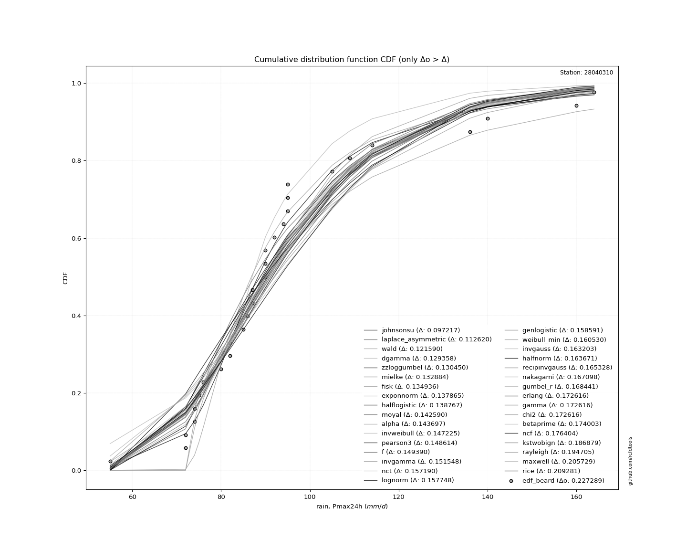</img>

</div>


**4.3. Best fit**

<div align="center">

|   id |   station | empirical_dist   | p_dist                |     delta |   deltao | eval   |   fit |   n |   best_fit |   best_fit_sort |
|-----:|----------:|:-----------------|:----------------------|----------:|---------:|:-------|------:|----:|-----------:|----------------:|
|    0 |  28040310 | edf_beard        | loglaplace_asymmetric | 0.0942875 | 0.207398 | Δo > Δ |     1 |  43 |          1 |               1 |

</div>


<div align="center">

</img>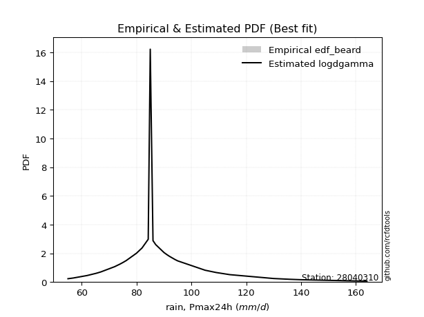</img>

</div>


### 5. Empirical - EDF Chegodayev (1955)

The Chegodayev formula is an empirical plotting position formula used in hydrological frequency analysis to estimate the exceedance probability or return period of a specific event from a set of observed data. It is primarily used for plotting observed data points on probability paper to fit a theoretical distribution, particularly for analyzing extreme events like maximum flood flows or rainfall intensities. The constant _b_ value in the generalized plotting position formula is 0.3.

<div align="center">


$P=(m-b)/(n+1-2b)$


</div>


**5.1. Empirical values**

<div align="center">

|                | 0                    | 1                   | 2                    | 3                   | 4                   | 5                   | 6                  | 7                  | 8                   | 9                   | 10                 | 11                 | 12                 | 13                 | 14                 | 15                 | 16                 | 17                 | 18                 | 19                 | 20                 | 21             | 22                 | 23                 | 24                 | 25                 | 26                 | 27                 | 28                 | 29                | 30                 | 31                 | 32                 | 33                 | 34                 | 35                 | 36                 | 37                 | 38                | 39                 | 40                 | 41                 | 42                 |
|:---------------|:---------------------|:--------------------|:---------------------|:--------------------|:--------------------|:--------------------|:-------------------|:-------------------|:--------------------|:--------------------|:-------------------|:-------------------|:-------------------|:-------------------|:-------------------|:-------------------|:-------------------|:-------------------|:-------------------|:-------------------|:-------------------|:---------------|:-------------------|:-------------------|:-------------------|:-------------------|:-------------------|:-------------------|:-------------------|:------------------|:-------------------|:-------------------|:-------------------|:-------------------|:-------------------|:-------------------|:-------------------|:-------------------|:------------------|:-------------------|:-------------------|:-------------------|:-------------------|
| date           | 1998                 | 2015                | 1974                 | 2012                | 2014                | 1980                | 2004               | 1987               | 2005                | 1992                | 1997               | 1977               | 2010               | 2011               | 2007               | 1989               | 2001               | 2013               | 1978               | 1995               | 2009               | 2002           | 1975               | 1986               | 2000               | 2003               | 2006               | 1991               | 1976               | 1985              | 1982               | 1984               | 1990               | 1994               | 1993               | 1983               | 1999               | 1979               | 1981              | 1973               | 2008               | 1988               | 1996               |
| x              | 55.0                 | 56.9235388634093    | 62.0                 | 65.175540074784     | 65.8836476566967    | 67.0                | 72.0               | 72.0               | 74.0                | 74.0                | 75.0               | 76.0               | 76.2441825270904   | 79.9523480258781   | 80.0               | 82.0               | 82.0               | 84.2586803103685   | 85.0               | 85.0               | 85.0               | 86.0           | 86.0               | 87.0               | 87.0               | 90.0               | 90.0               | 90.0               | 91.0               | 92.0              | 94.0               | 95.0               | 95.0               | 95.0               | 105.0              | 109.0              | 114.0              | 130.0              | 136.0             | 140.0              | 140.0              | 160.0              | 164.0              |
| m              | 1                    | 2                   | 3                    | 4                   | 5                   | 6                   | 7                  | 8                  | 9                   | 10                  | 11                 | 12                 | 13                 | 14                 | 15                 | 16                 | 17                 | 18                 | 19                 | 20                 | 21                 | 22             | 23                 | 24                 | 25                 | 26                 | 27                 | 28                 | 29                 | 30                | 31                 | 32                 | 33                 | 34                 | 35                 | 36                 | 37                 | 38                 | 39                | 40                 | 41                 | 42                 | 43                 |
| empirical_dist | edf_chegodayev       | edf_chegodayev      | edf_chegodayev       | edf_chegodayev      | edf_chegodayev      | edf_chegodayev      | edf_chegodayev     | edf_chegodayev     | edf_chegodayev      | edf_chegodayev      | edf_chegodayev     | edf_chegodayev     | edf_chegodayev     | edf_chegodayev     | edf_chegodayev     | edf_chegodayev     | edf_chegodayev     | edf_chegodayev     | edf_chegodayev     | edf_chegodayev     | edf_chegodayev     | edf_chegodayev | edf_chegodayev     | edf_chegodayev     | edf_chegodayev     | edf_chegodayev     | edf_chegodayev     | edf_chegodayev     | edf_chegodayev     | edf_chegodayev    | edf_chegodayev     | edf_chegodayev     | edf_chegodayev     | edf_chegodayev     | edf_chegodayev     | edf_chegodayev     | edf_chegodayev     | edf_chegodayev     | edf_chegodayev    | edf_chegodayev     | edf_chegodayev     | edf_chegodayev     | edf_chegodayev     |
| empirical      | 0.016129032258064516 | 0.03917050691244239 | 0.062211981566820285 | 0.08525345622119816 | 0.10829493087557604 | 0.13133640552995393 | 0.1543778801843318 | 0.1774193548387097 | 0.20046082949308755 | 0.22350230414746544 | 0.2465437788018433 | 0.2695852534562212 | 0.2926267281105991 | 0.315668202764977  | 0.3387096774193548 | 0.3617511520737327 | 0.3847926267281106 | 0.4078341013824885 | 0.4308755760368664 | 0.4539170506912442 | 0.4769585253456221 | 0.5            | 0.5230414746543779 | 0.5460829493087558 | 0.5691244239631337 | 0.5921658986175116 | 0.6152073732718895 | 0.6382488479262672 | 0.6612903225806451 | 0.684331797235023 | 0.7073732718894009 | 0.7304147465437788 | 0.7534562211981568 | 0.7764976958525347 | 0.7995391705069126 | 0.8225806451612904 | 0.8456221198156683 | 0.8686635944700462 | 0.891705069124424 | 0.9147465437788019 | 0.9377880184331798 | 0.9608294930875577 | 0.9838709677419356 |
| empirical_tr   | 1.0163934426229508   | 1.040767386091127   | 1.0663390663390664   | 1.093198992443325   | 1.1214470284237728  | 1.1511936339522546  | 1.1825613079019075 | 1.215686274509804  | 1.2507204610951008  | 1.2878338278931751  | 1.3272171253822629 | 1.3690851735015772 | 1.4136807817589576 | 1.4612794612794613 | 1.5121951219512193 | 1.5667870036101081 | 1.6254681647940072 | 1.6887159533073928 | 1.757085020242915  | 1.831223628691983  | 1.9118942731277533 | 2.0            | 2.0966183574879227 | 2.203045685279188  | 2.3208556149732624 | 2.451977401129944  | 2.598802395209581  | 2.7643312101910826 | 2.952380952380952  | 3.167883211678832 | 3.417322834645669  | 3.7094017094017095 | 4.056074766355143  | 4.474226804123714  | 4.988505747126441  | 5.636363636363638  | 6.47761194029851   | 7.614035087719302  | 9.234042553191497 | 11.729729729729742 | 16.0740740740741   | 25.529411764705955 | 62.00000000000048  |

</div>


**5.2. Kolmogorov-Smirnov fit test (sorted by Δ)**


<div align="center">

|                | 0                     | 1                   | 2                   | 3                   | 4                   | 5                   | 6                   | 7                   | 8                   | 9                   | 10                  | 11                  | 12                  | 13                  | 14                  | 15                  | 16                  | 17                  | 18                  | 19                  | 20                  | 21                  | 22                  | 23                  | 24                  | 25                  | 26                  | 27                  | 28                  | 29                  | 30                  | 31                  | 32                  | 33                  | 34                  | 35                  | 36                  | 37                  | 38                  | 39                  | 40                  | 41                  | 42                  | 43                  | 44                  | 45                  | 46                  | 47                  | 48                  | 49                  | 50                  | 51                  | 52                  | 53                  | 54                  | 55                  | 56                  | 57                  | 58                  | 59                  | 60                  | 61                  | 62                  | 63                  | 64                  | 65                  | 66                  | 67                  | 68                  | 69                  | 70                  | 71                  | 72                  | 73                  | 74                  | 75                  | 76                  | 77                  | 78                  | 79                  | 80                  | 81                  | 82                  | 83                  | 84                  | 85                  | 86                  | 87                  | 88                  | 89                  |
|:---------------|:----------------------|:--------------------|:--------------------|:--------------------|:--------------------|:--------------------|:--------------------|:--------------------|:--------------------|:--------------------|:--------------------|:--------------------|:--------------------|:--------------------|:--------------------|:--------------------|:--------------------|:--------------------|:--------------------|:--------------------|:--------------------|:--------------------|:--------------------|:--------------------|:--------------------|:--------------------|:--------------------|:--------------------|:--------------------|:--------------------|:--------------------|:--------------------|:--------------------|:--------------------|:--------------------|:--------------------|:--------------------|:--------------------|:--------------------|:--------------------|:--------------------|:--------------------|:--------------------|:--------------------|:--------------------|:--------------------|:--------------------|:--------------------|:--------------------|:--------------------|:--------------------|:--------------------|:--------------------|:--------------------|:--------------------|:--------------------|:--------------------|:--------------------|:--------------------|:--------------------|:--------------------|:--------------------|:--------------------|:--------------------|:--------------------|:--------------------|:--------------------|:--------------------|:--------------------|:--------------------|:--------------------|:--------------------|:--------------------|:--------------------|:--------------------|:--------------------|:--------------------|:--------------------|:--------------------|:--------------------|:--------------------|:--------------------|:--------------------|:--------------------|:--------------------|:--------------------|:--------------------|:--------------------|:--------------------|:--------------------|
| station        | 28040310              | 28040310            | 28040310            | 28040310            | 28040310            | 28040310            | 28040310            | 28040310            | 28040310            | 28040310            | 28040310            | 28040310            | 28040310            | 28040310            | 28040310            | 28040310            | 28040310            | 28040310            | 28040310            | 28040310            | 28040310            | 28040310            | 28040310            | 28040310            | 28040310            | 28040310            | 28040310            | 28040310            | 28040310            | 28040310            | 28040310            | 28040310            | 28040310            | 28040310            | 28040310            | 28040310            | 28040310            | 28040310            | 28040310            | 28040310            | 28040310            | 28040310            | 28040310            | 28040310            | 28040310            | 28040310            | 28040310            | 28040310            | 28040310            | 28040310            | 28040310            | 28040310            | 28040310            | 28040310            | 28040310            | 28040310            | 28040310            | 28040310            | 28040310            | 28040310            | 28040310            | 28040310            | 28040310            | 28040310            | 28040310            | 28040310            | 28040310            | 28040310            | 28040310            | 28040310            | 28040310            | 28040310            | 28040310            | 28040310            | 28040310            | 28040310            | 28040310            | 28040310            | 28040310            | 28040310            | 28040310            | 28040310            | 28040310            | 28040310            | 28040310            | 28040310            | 28040310            | 28040310            | 28040310            | 28040310            |
| empirical_dist | edf_chegodayev        | edf_chegodayev      | edf_chegodayev      | edf_chegodayev      | edf_chegodayev      | edf_chegodayev      | edf_chegodayev      | edf_chegodayev      | edf_chegodayev      | edf_chegodayev      | edf_chegodayev      | edf_chegodayev      | edf_chegodayev      | edf_chegodayev      | edf_chegodayev      | edf_chegodayev      | edf_chegodayev      | edf_chegodayev      | edf_chegodayev      | edf_chegodayev      | edf_chegodayev      | edf_chegodayev      | edf_chegodayev      | edf_chegodayev      | edf_chegodayev      | edf_chegodayev      | edf_chegodayev      | edf_chegodayev      | edf_chegodayev      | edf_chegodayev      | edf_chegodayev      | edf_chegodayev      | edf_chegodayev      | edf_chegodayev      | edf_chegodayev      | edf_chegodayev      | edf_chegodayev      | edf_chegodayev      | edf_chegodayev      | edf_chegodayev      | edf_chegodayev      | edf_chegodayev      | edf_chegodayev      | edf_chegodayev      | edf_chegodayev      | edf_chegodayev      | edf_chegodayev      | edf_chegodayev      | edf_chegodayev      | edf_chegodayev      | edf_chegodayev      | edf_chegodayev      | edf_chegodayev      | edf_chegodayev      | edf_chegodayev      | edf_chegodayev      | edf_chegodayev      | edf_chegodayev      | edf_chegodayev      | edf_chegodayev      | edf_chegodayev      | edf_chegodayev      | edf_chegodayev      | edf_chegodayev      | edf_chegodayev      | edf_chegodayev      | edf_chegodayev      | edf_chegodayev      | edf_chegodayev      | edf_chegodayev      | edf_chegodayev      | edf_chegodayev      | edf_chegodayev      | edf_chegodayev      | edf_chegodayev      | edf_chegodayev      | edf_chegodayev      | edf_chegodayev      | edf_chegodayev      | edf_chegodayev      | edf_chegodayev      | edf_chegodayev      | edf_chegodayev      | edf_chegodayev      | edf_chegodayev      | edf_chegodayev      | edf_chegodayev      | edf_chegodayev      | edf_chegodayev      | edf_chegodayev      |
| p_dist         | loglaplace_asymmetric | logt                | logjohnsonsu        | loggumbel_r         | logfisk             | logexponnorm        | johnsonsu           | logmoyal            | fisk                | logmielke           | loghalfnorm         | laplace_asymmetric  | loglaplace          | mielke              | loggenlogistic      | loginvweibull       | loghalflogistic     | alpha               | exponnorm           | logkstwobign        | invweibull          | logf                | logbetaprime        | loglognorm          | invgamma            | f                   | loginvgauss         | logfatiguelife      | moyal               | logpearson3         | halflogistic        | logerlang           | loggamma            | loggamma            | loggenexpon         | logalpha            | lograyleigh         | wald                | nct                 | genlogistic         | invgauss            | fatiguelife         | loghypsecant        | pearson3            | lognakagami         | logmaxwell          | logweibull_min      | weibull_min         | logrice             | chi2                | gamma               | erlang              | loginvgamma         | lognct              | loglogistic         | betaprime           | gumbel_r            | logncf              | halfnorm            | logcrystalball      | lognorm             | lognorm             | kstwobign           | logloggamma         | nakagami            | logwald             | rayleigh            | ncf                 | laplace             | maxwell             | gibrat              | rice                | hypsecant           | loggibrat           | logistic            | genexpon            | expon               | pareto              | loggompertz         | truncnorm           | norm                | crystalball         | loggumbel_l         | t                   | logtruncnorm        | logexpon            | logpareto           | gumbel_l            | logchi2             | gompertz            |
| delta          | 0.09415999924687168   | 0.09777596053284054 | 0.0979215896072313  | 0.09873139194736213 | 0.10064320485351874 | 0.103189433810844   | 0.10338291753396689 | 0.1043502188346514  | 0.10488431352590077 | 0.1068232128468759  | 0.10833783695016663 | 0.10999987957557855 | 0.1124230761397414  | 0.11247128856779343 | 0.11256310940577208 | 0.1147128973502578  | 0.11567016470078223 | 0.118897279151706   | 0.11924811173590044 | 0.12048799549648015 | 0.1214641318186136  | 0.12277539691566597 | 0.12340919148175322 | 0.12398643651636299 | 0.12468449510907353 | 0.12468494464481772 | 0.12528056092301965 | 0.12538553802971575 | 0.12542173987720506 | 0.12554274056187498 | 0.1258073293006996  | 0.12739288000326487 | 0.12739288643335656 | 0.12739288643335656 | 0.12795866106122933 | 0.12939955700138994 | 0.13066547529820605 | 0.13133633391834543 | 0.13282817975297712 | 0.1339884454257445  | 0.134351320133824   | 0.13587976680545055 | 0.1379821531608112  | 0.13798747708656967 | 0.13804771821157158 | 0.13847720068750435 | 0.1394964765712421  | 0.14174541476499658 | 0.1427204458130812  | 0.1427821491915986  | 0.14278219301539086 | 0.14278260091111972 | 0.14678236773216036 | 0.14712624700796706 | 0.1495529113357773  | 0.14981658390556762 | 0.150034171648873   | 0.15214576610527553 | 0.15330374937243374 | 0.16385485331877514 | 0.16385538448915915 | 0.16385538448915915 | 0.1642154441944481  | 0.16563100108384643 | 0.1690963618431831  | 0.17144038664361322 | 0.18032077448676853 | 0.18112463695834025 | 0.18522799412146784 | 0.18989136000256235 | 0.19134751003599595 | 0.1961181544172067  | 0.20582596939611997 | 0.20730063444246635 | 0.2122298720590371  | 0.21868109751187725 | 0.2187181954326588  | 0.21871821305969036 | 0.21954583801674227 | 0.21983264461604501 | 0.21983265552624687 | 0.21983266436342164 | 0.22114418021544724 | 0.22475676345375928 | 0.2562973573012127  | 0.278636771508559   | 0.2786367784390629  | 0.28613004412040577 | 0.2891723177073411  | 0.8602701358430715  |
| deltao         | 0.20739805565234237   | 0.20739805565234237 | 0.20739805565234237 | 0.20739805565234237 | 0.20739805565234237 | 0.20739805565234237 | 0.20739805565234237 | 0.20739805565234237 | 0.20739805565234237 | 0.20739805565234237 | 0.20739805565234237 | 0.20739805565234237 | 0.20739805565234237 | 0.20739805565234237 | 0.20739805565234237 | 0.20739805565234237 | 0.20739805565234237 | 0.20739805565234237 | 0.20739805565234237 | 0.20739805565234237 | 0.20739805565234237 | 0.20739805565234237 | 0.20739805565234237 | 0.20739805565234237 | 0.20739805565234237 | 0.20739805565234237 | 0.20739805565234237 | 0.20739805565234237 | 0.20739805565234237 | 0.20739805565234237 | 0.20739805565234237 | 0.20739805565234237 | 0.20739805565234237 | 0.20739805565234237 | 0.20739805565234237 | 0.20739805565234237 | 0.20739805565234237 | 0.20739805565234237 | 0.20739805565234237 | 0.20739805565234237 | 0.20739805565234237 | 0.20739805565234237 | 0.20739805565234237 | 0.20739805565234237 | 0.20739805565234237 | 0.20739805565234237 | 0.20739805565234237 | 0.20739805565234237 | 0.20739805565234237 | 0.20739805565234237 | 0.20739805565234237 | 0.20739805565234237 | 0.20739805565234237 | 0.20739805565234237 | 0.20739805565234237 | 0.20739805565234237 | 0.20739805565234237 | 0.20739805565234237 | 0.20739805565234237 | 0.20739805565234237 | 0.20739805565234237 | 0.20739805565234237 | 0.20739805565234237 | 0.20739805565234237 | 0.20739805565234237 | 0.20739805565234237 | 0.20739805565234237 | 0.20739805565234237 | 0.20739805565234237 | 0.20739805565234237 | 0.20739805565234237 | 0.20739805565234237 | 0.20739805565234237 | 0.20739805565234237 | 0.20739805565234237 | 0.20739805565234237 | 0.20739805565234237 | 0.20739805565234237 | 0.20739805565234237 | 0.20739805565234237 | 0.20739805565234237 | 0.20739805565234237 | 0.20739805565234237 | 0.20739805565234237 | 0.20739805565234237 | 0.20739805565234237 | 0.20739805565234237 | 0.20739805565234237 | 0.20739805565234237 | 0.20739805565234237 |
| eval           | Δo > Δ                | Δo > Δ              | Δo > Δ              | Δo > Δ              | Δo > Δ              | Δo > Δ              | Δo > Δ              | Δo > Δ              | Δo > Δ              | Δo > Δ              | Δo > Δ              | Δo > Δ              | Δo > Δ              | Δo > Δ              | Δo > Δ              | Δo > Δ              | Δo > Δ              | Δo > Δ              | Δo > Δ              | Δo > Δ              | Δo > Δ              | Δo > Δ              | Δo > Δ              | Δo > Δ              | Δo > Δ              | Δo > Δ              | Δo > Δ              | Δo > Δ              | Δo > Δ              | Δo > Δ              | Δo > Δ              | Δo > Δ              | Δo > Δ              | Δo > Δ              | Δo > Δ              | Δo > Δ              | Δo > Δ              | Δo > Δ              | Δo > Δ              | Δo > Δ              | Δo > Δ              | Δo > Δ              | Δo > Δ              | Δo > Δ              | Δo > Δ              | Δo > Δ              | Δo > Δ              | Δo > Δ              | Δo > Δ              | Δo > Δ              | Δo > Δ              | Δo > Δ              | Δo > Δ              | Δo > Δ              | Δo > Δ              | Δo > Δ              | Δo > Δ              | Δo > Δ              | Δo > Δ              | Δo > Δ              | Δo > Δ              | Δo > Δ              | Δo > Δ              | Δo > Δ              | Δo > Δ              | Δo > Δ              | Δo > Δ              | Δo > Δ              | Δo > Δ              | Δo > Δ              | Δo > Δ              | Δo > Δ              | Δo > Δ              | Δo > Δ              | Δo <= Δ             | Δo <= Δ             | Δo <= Δ             | Δo <= Δ             | Δo <= Δ             | Δo <= Δ             | Δo <= Δ             | Δo <= Δ             | Δo <= Δ             | Δo <= Δ             | Δo <= Δ             | Δo <= Δ             | Δo <= Δ             | Δo <= Δ             | Δo <= Δ             | Δo <= Δ             |
| fit            | 1                     | 1                   | 1                   | 1                   | 1                   | 1                   | 1                   | 1                   | 1                   | 1                   | 1                   | 1                   | 1                   | 1                   | 1                   | 1                   | 1                   | 1                   | 1                   | 1                   | 1                   | 1                   | 1                   | 1                   | 1                   | 1                   | 1                   | 1                   | 1                   | 1                   | 1                   | 1                   | 1                   | 1                   | 1                   | 1                   | 1                   | 1                   | 1                   | 1                   | 1                   | 1                   | 1                   | 1                   | 1                   | 1                   | 1                   | 1                   | 1                   | 1                   | 1                   | 1                   | 1                   | 1                   | 1                   | 1                   | 1                   | 1                   | 1                   | 1                   | 1                   | 1                   | 1                   | 1                   | 1                   | 1                   | 1                   | 1                   | 1                   | 1                   | 1                   | 1                   | 1                   | 1                   | 0                   | 0                   | 0                   | 0                   | 0                   | 0                   | 0                   | 0                   | 0                   | 0                   | 0                   | 0                   | 0                   | 0                   | 0                   | 0                   |
| n              | 43                    | 43                  | 43                  | 43                  | 43                  | 43                  | 43                  | 43                  | 43                  | 43                  | 43                  | 43                  | 43                  | 43                  | 43                  | 43                  | 43                  | 43                  | 43                  | 43                  | 43                  | 43                  | 43                  | 43                  | 43                  | 43                  | 43                  | 43                  | 43                  | 43                  | 43                  | 43                  | 43                  | 43                  | 43                  | 43                  | 43                  | 43                  | 43                  | 43                  | 43                  | 43                  | 43                  | 43                  | 43                  | 43                  | 43                  | 43                  | 43                  | 43                  | 43                  | 43                  | 43                  | 43                  | 43                  | 43                  | 43                  | 43                  | 43                  | 43                  | 43                  | 43                  | 43                  | 43                  | 43                  | 43                  | 43                  | 43                  | 43                  | 43                  | 43                  | 43                  | 43                  | 43                  | 43                  | 43                  | 43                  | 43                  | 43                  | 43                  | 43                  | 43                  | 43                  | 43                  | 43                  | 43                  | 43                  | 43                  | 43                  | 43                  |
| best_fit       | 1                     | 0                   | 0                   | 0                   | 0                   | 0                   | 0                   | 0                   | 0                   | 0                   | 0                   | 0                   | 0                   | 0                   | 0                   | 0                   | 0                   | 0                   | 0                   | 0                   | 0                   | 0                   | 0                   | 0                   | 0                   | 0                   | 0                   | 0                   | 0                   | 0                   | 0                   | 0                   | 0                   | 0                   | 0                   | 0                   | 0                   | 0                   | 0                   | 0                   | 0                   | 0                   | 0                   | 0                   | 0                   | 0                   | 0                   | 0                   | 0                   | 0                   | 0                   | 0                   | 0                   | 0                   | 0                   | 0                   | 0                   | 0                   | 0                   | 0                   | 0                   | 0                   | 0                   | 0                   | 0                   | 0                   | 0                   | 0                   | 0                   | 0                   | 0                   | 0                   | 0                   | 0                   | 0                   | 0                   | 0                   | 0                   | 0                   | 0                   | 0                   | 0                   | 0                   | 0                   | 0                   | 0                   | 0                   | 0                   | 0                   | 0                   |
| best_fit_sort  | 1                     | 2                   | 3                   | 4                   | 5                   | 6                   | 7                   | 8                   | 9                   | 10                  | 11                  | 12                  | 13                  | 14                  | 15                  | 16                  | 17                  | 18                  | 19                  | 20                  | 21                  | 22                  | 23                  | 24                  | 25                  | 26                  | 27                  | 28                  | 29                  | 30                  | 31                  | 32                  | 33                  | 34                  | 35                  | 36                  | 37                  | 38                  | 39                  | 40                  | 41                  | 42                  | 43                  | 44                  | 45                  | 46                  | 47                  | 48                  | 49                  | 50                  | 51                  | 52                  | 53                  | 54                  | 55                  | 56                  | 57                  | 58                  | 59                  | 60                  | 61                  | 62                  | 63                  | 64                  | 65                  | 66                  | 67                  | 68                  | 69                  | 70                  | 71                  | 72                  | 73                  | 74                  | 75                  | 76                  | 77                  | 78                  | 79                  | 80                  | 81                  | 82                  | 83                  | 84                  | 85                  | 86                  | 87                  | 88                  | 89                  | 90                  |

</div>


<div align="center">

</img>

</div>


**5.3. Best fit**

<div align="center">

|   id |   station | empirical_dist   | p_dist                |   delta |   deltao | eval   |   fit |   n |   best_fit |   best_fit_sort |
|-----:|----------:|:-----------------|:----------------------|--------:|---------:|:-------|------:|----:|-----------:|----------------:|
|    0 |  28040310 | edf_chegodayev   | loglaplace_asymmetric | 0.09416 | 0.207398 | Δo > Δ |     1 |  43 |          1 |               1 |

</div>


<div align="center">

</img>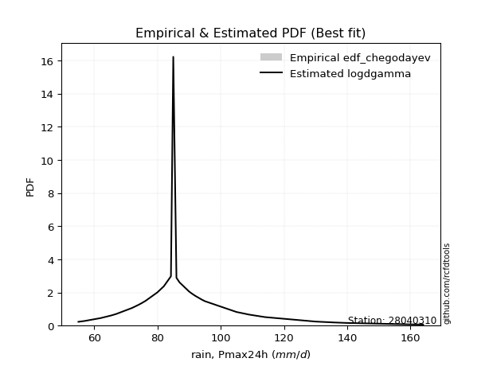</img>

</div>


### 6. Empirical - EDF Blom (1958)

The Blom formula is a specific "plotting position" formula used in hydrology and statistical analysis to estimate the empirical cumulative probability (or non-exceedance probability) of a data series. It is particularly recommended for data that are approximately normally distributed. The constant _a_ is set to 0.375 (or 3/8).

<div align="center">


$P=(m-a)/(n+1-2a)$


</div>


**6.1. Empirical values**

<div align="center">

|                | 0                    | 1                   | 2                   | 3                  | 4                  | 5                   | 6                  | 7                   | 8                  | 9                   | 10                  | 11                  | 12                  | 13                | 14                  | 15                  | 16                  | 17                 | 18                 | 19                  | 20                 | 21       | 22                 | 23                 | 24                 | 25                 | 26                 | 27                 | 28                 | 29                 | 30                 | 31                 | 32                 | 33                 | 34                 | 35                 | 36                 | 37                | 38                 | 39                 | 40                 | 41                 | 42                 |
|:---------------|:---------------------|:--------------------|:--------------------|:-------------------|:-------------------|:--------------------|:-------------------|:--------------------|:-------------------|:--------------------|:--------------------|:--------------------|:--------------------|:------------------|:--------------------|:--------------------|:--------------------|:-------------------|:-------------------|:--------------------|:-------------------|:---------|:-------------------|:-------------------|:-------------------|:-------------------|:-------------------|:-------------------|:-------------------|:-------------------|:-------------------|:-------------------|:-------------------|:-------------------|:-------------------|:-------------------|:-------------------|:------------------|:-------------------|:-------------------|:-------------------|:-------------------|:-------------------|
| date           | 1998                 | 2015                | 1974                | 2012               | 2014               | 1980                | 2004               | 1987                | 2005               | 1992                | 1997                | 1977                | 2010                | 2011              | 2007                | 1989                | 2001                | 2013               | 1978               | 1995                | 2009               | 2002     | 1975               | 1986               | 2000               | 2003               | 2006               | 1991               | 1976               | 1985               | 1982               | 1984               | 1990               | 1994               | 1993               | 1983               | 1999               | 1979              | 1981               | 1973               | 2008               | 1988               | 1996               |
| x              | 55.0                 | 56.9235388634093    | 62.0                | 65.175540074784    | 65.8836476566967   | 67.0                | 72.0               | 72.0                | 74.0               | 74.0                | 75.0                | 76.0                | 76.2441825270904    | 79.9523480258781  | 80.0                | 82.0                | 82.0                | 84.2586803103685   | 85.0               | 85.0                | 85.0               | 86.0     | 86.0               | 87.0               | 87.0               | 90.0               | 90.0               | 90.0               | 91.0               | 92.0               | 94.0               | 95.0               | 95.0               | 95.0               | 105.0              | 109.0              | 114.0              | 130.0             | 136.0              | 140.0              | 140.0              | 160.0              | 164.0              |
| m              | 1                    | 2                   | 3                   | 4                  | 5                  | 6                   | 7                  | 8                   | 9                  | 10                  | 11                  | 12                  | 13                  | 14                | 15                  | 16                  | 17                  | 18                 | 19                 | 20                  | 21                 | 22       | 23                 | 24                 | 25                 | 26                 | 27                 | 28                 | 29                 | 30                 | 31                 | 32                 | 33                 | 34                 | 35                 | 36                 | 37                 | 38                | 39                 | 40                 | 41                 | 42                 | 43                 |
| empirical_dist | edf_blom             | edf_blom            | edf_blom            | edf_blom           | edf_blom           | edf_blom            | edf_blom           | edf_blom            | edf_blom           | edf_blom            | edf_blom            | edf_blom            | edf_blom            | edf_blom          | edf_blom            | edf_blom            | edf_blom            | edf_blom           | edf_blom           | edf_blom            | edf_blom           | edf_blom | edf_blom           | edf_blom           | edf_blom           | edf_blom           | edf_blom           | edf_blom           | edf_blom           | edf_blom           | edf_blom           | edf_blom           | edf_blom           | edf_blom           | edf_blom           | edf_blom           | edf_blom           | edf_blom          | edf_blom           | edf_blom           | edf_blom           | edf_blom           | edf_blom           |
| empirical      | 0.014450867052023121 | 0.03757225433526012 | 0.06069364161849711 | 0.0838150289017341 | 0.1069364161849711 | 0.13005780346820808 | 0.1531791907514451 | 0.17630057803468208 | 0.1994219653179191 | 0.22254335260115607 | 0.24566473988439305 | 0.26878612716763006 | 0.29190751445086704 | 0.315028901734104 | 0.33815028901734107 | 0.36127167630057805 | 0.38439306358381503 | 0.407514450867052  | 0.430635838150289  | 0.45375722543352603 | 0.476878612716763  | 0.5      | 0.523121387283237  | 0.546242774566474  | 0.569364161849711  | 0.5924855491329479 | 0.615606936416185  | 0.638728323699422  | 0.661849710982659  | 0.684971098265896  | 0.708092485549133  | 0.7312138728323699 | 0.7543352601156069 | 0.7774566473988439 | 0.8005780346820809 | 0.8236994219653179 | 0.846820809248555  | 0.869942196531792 | 0.8930635838150289 | 0.9161849710982659 | 0.9393063583815029 | 0.9624277456647399 | 0.9855491329479769 |
| empirical_tr   | 1.0146627565982405   | 1.0390390390390392  | 1.0646153846153845  | 1.0914826498422712 | 1.1197411003236246 | 1.149501661129568   | 1.180887372013652  | 1.2140350877192982  | 1.2490974729241877 | 1.2862453531598514  | 1.3256704980842913  | 1.3675889328063242  | 1.4122448979591837  | 1.459915611814346 | 1.5109170305676858  | 1.565610859728507   | 1.6244131455399062  | 1.6878048780487807 | 1.7563451776649748 | 1.8306878306878307  | 1.9116022099447514 | 2.0      | 2.0969696969696967 | 2.2038216560509554 | 2.3221476510067114 | 2.453900709219858  | 2.6015037593984967 | 2.7680000000000002 | 2.9572649572649574 | 3.1743119266055047 | 3.4257425742574257 | 3.7204301075268815 | 4.070588235294117  | 4.493506493506493  | 5.014492753623188  | 5.672131147540982  | 6.5283018867924545 | 7.688888888888891 | 9.351351351351354  | 11.931034482758623 | 16.476190476190478 | 26.61538461538461  | 69.1999999999999   |

</div>


**6.2. Kolmogorov-Smirnov fit test (sorted by Δ)**


<div align="center">

|                | 0                     | 1                   | 2                   | 3                   | 4                   | 5                   | 6                   | 7                   | 8                   | 9                   | 10                  | 11                  | 12                  | 13                  | 14                  | 15                  | 16                  | 17                  | 18                  | 19                  | 20                  | 21                  | 22                  | 23                  | 24                  | 25                  | 26                  | 27                  | 28                  | 29                  | 30                  | 31                  | 32                  | 33                  | 34                  | 35                  | 36                  | 37                  | 38                  | 39                  | 40                  | 41                  | 42                  | 43                  | 44                  | 45                  | 46                  | 47                  | 48                  | 49                  | 50                  | 51                  | 52                  | 53                  | 54                  | 55                  | 56                  | 57                  | 58                  | 59                  | 60                  | 61                  | 62                  | 63                  | 64                  | 65                  | 66                  | 67                  | 68                  | 69                  | 70                  | 71                  | 72                  | 73                  | 74                  | 75                  | 76                  | 77                  | 78                  | 79                  | 80                  | 81                  | 82                  | 83                  | 84                  | 85                  | 86                  | 87                  | 88                  | 89                  |
|:---------------|:----------------------|:--------------------|:--------------------|:--------------------|:--------------------|:--------------------|:--------------------|:--------------------|:--------------------|:--------------------|:--------------------|:--------------------|:--------------------|:--------------------|:--------------------|:--------------------|:--------------------|:--------------------|:--------------------|:--------------------|:--------------------|:--------------------|:--------------------|:--------------------|:--------------------|:--------------------|:--------------------|:--------------------|:--------------------|:--------------------|:--------------------|:--------------------|:--------------------|:--------------------|:--------------------|:--------------------|:--------------------|:--------------------|:--------------------|:--------------------|:--------------------|:--------------------|:--------------------|:--------------------|:--------------------|:--------------------|:--------------------|:--------------------|:--------------------|:--------------------|:--------------------|:--------------------|:--------------------|:--------------------|:--------------------|:--------------------|:--------------------|:--------------------|:--------------------|:--------------------|:--------------------|:--------------------|:--------------------|:--------------------|:--------------------|:--------------------|:--------------------|:--------------------|:--------------------|:--------------------|:--------------------|:--------------------|:--------------------|:--------------------|:--------------------|:--------------------|:--------------------|:--------------------|:--------------------|:--------------------|:--------------------|:--------------------|:--------------------|:--------------------|:--------------------|:--------------------|:--------------------|:--------------------|:--------------------|:--------------------|
| station        | 28040310              | 28040310            | 28040310            | 28040310            | 28040310            | 28040310            | 28040310            | 28040310            | 28040310            | 28040310            | 28040310            | 28040310            | 28040310            | 28040310            | 28040310            | 28040310            | 28040310            | 28040310            | 28040310            | 28040310            | 28040310            | 28040310            | 28040310            | 28040310            | 28040310            | 28040310            | 28040310            | 28040310            | 28040310            | 28040310            | 28040310            | 28040310            | 28040310            | 28040310            | 28040310            | 28040310            | 28040310            | 28040310            | 28040310            | 28040310            | 28040310            | 28040310            | 28040310            | 28040310            | 28040310            | 28040310            | 28040310            | 28040310            | 28040310            | 28040310            | 28040310            | 28040310            | 28040310            | 28040310            | 28040310            | 28040310            | 28040310            | 28040310            | 28040310            | 28040310            | 28040310            | 28040310            | 28040310            | 28040310            | 28040310            | 28040310            | 28040310            | 28040310            | 28040310            | 28040310            | 28040310            | 28040310            | 28040310            | 28040310            | 28040310            | 28040310            | 28040310            | 28040310            | 28040310            | 28040310            | 28040310            | 28040310            | 28040310            | 28040310            | 28040310            | 28040310            | 28040310            | 28040310            | 28040310            | 28040310            |
| empirical_dist | edf_blom              | edf_blom            | edf_blom            | edf_blom            | edf_blom            | edf_blom            | edf_blom            | edf_blom            | edf_blom            | edf_blom            | edf_blom            | edf_blom            | edf_blom            | edf_blom            | edf_blom            | edf_blom            | edf_blom            | edf_blom            | edf_blom            | edf_blom            | edf_blom            | edf_blom            | edf_blom            | edf_blom            | edf_blom            | edf_blom            | edf_blom            | edf_blom            | edf_blom            | edf_blom            | edf_blom            | edf_blom            | edf_blom            | edf_blom            | edf_blom            | edf_blom            | edf_blom            | edf_blom            | edf_blom            | edf_blom            | edf_blom            | edf_blom            | edf_blom            | edf_blom            | edf_blom            | edf_blom            | edf_blom            | edf_blom            | edf_blom            | edf_blom            | edf_blom            | edf_blom            | edf_blom            | edf_blom            | edf_blom            | edf_blom            | edf_blom            | edf_blom            | edf_blom            | edf_blom            | edf_blom            | edf_blom            | edf_blom            | edf_blom            | edf_blom            | edf_blom            | edf_blom            | edf_blom            | edf_blom            | edf_blom            | edf_blom            | edf_blom            | edf_blom            | edf_blom            | edf_blom            | edf_blom            | edf_blom            | edf_blom            | edf_blom            | edf_blom            | edf_blom            | edf_blom            | edf_blom            | edf_blom            | edf_blom            | edf_blom            | edf_blom            | edf_blom            | edf_blom            | edf_blom            |
| p_dist         | loglaplace_asymmetric | logt                | logjohnsonsu        | loggumbel_r         | logfisk             | logexponnorm        | johnsonsu           | logmoyal            | fisk                | logmielke           | loghalfnorm         | laplace_asymmetric  | loglaplace          | mielke              | loggenlogistic      | loginvweibull       | loghalflogistic     | alpha               | exponnorm           | logkstwobign        | invweibull          | logf                | logbetaprime        | loglognorm          | invgamma            | f                   | loginvgauss         | logfatiguelife      | moyal               | logpearson3         | halflogistic        | logerlang           | loggamma            | loggamma            | loggenexpon         | wald                | logalpha            | lograyleigh         | nct                 | genlogistic         | invgauss            | fatiguelife         | loghypsecant        | pearson3            | lognakagami         | logmaxwell          | logweibull_min      | weibull_min         | logrice             | chi2                | gamma               | erlang              | loginvgamma         | lognct              | loglogistic         | betaprime           | gumbel_r            | logncf              | halfnorm            | logcrystalball      | lognorm             | lognorm             | kstwobign           | logloggamma         | nakagami            | logwald             | rayleigh            | ncf                 | laplace             | gibrat              | maxwell             | rice                | loggibrat           | hypsecant           | logistic            | genexpon            | expon               | pareto              | loggompertz         | truncnorm           | norm                | crystalball         | loggumbel_l         | t                   | logtruncnorm        | logexpon            | logpareto           | gumbel_l            | logchi2             | gompertz            |
| delta          | 0.09511895079318089   | 0.09873491207914975 | 0.0988805411535405  | 0.09969034349367134 | 0.10160215639982795 | 0.1041483853571532  | 0.1043418690802761  | 0.10466986935008787 | 0.10584326507220998 | 0.10778216439318511 | 0.10929678849647584 | 0.11095883112188776 | 0.11266281402631867 | 0.11343024011410263 | 0.11352206095208128 | 0.11567184889656701 | 0.1159898152162187  | 0.11985623069801521 | 0.12020706328220965 | 0.12144694704278935 | 0.1224230833649228  | 0.12373434846197517 | 0.12436814302806243 | 0.12494538806267219 | 0.12564344665538274 | 0.12564389619112692 | 0.12623951246932885 | 0.12634448957602495 | 0.12638069142351427 | 0.12650169210818418 | 0.1267662808470088  | 0.12835183154957408 | 0.12835183797966576 | 0.12835183797966576 | 0.12891761260753853 | 0.13005773185659958 | 0.13035850854769915 | 0.13162442684451525 | 0.13378713129928632 | 0.1349473969720537  | 0.1353102716801332  | 0.13683871835175976 | 0.1389411047071204  | 0.13894642863287887 | 0.13900666975788079 | 0.13943615223381356 | 0.1404554281175513  | 0.14270436631130579 | 0.1436793973593904  | 0.1437411007379078  | 0.14374114456170006 | 0.14374155245742892 | 0.14774131927846956 | 0.14808519855427626 | 0.1505118628820865  | 0.15077553545187683 | 0.1509931231951822  | 0.15310471765158473 | 0.15426270091874295 | 0.16481380486508435 | 0.16481433603546836 | 0.16481433603546836 | 0.16517439574075732 | 0.16658995263015564 | 0.1700553133894923  | 0.1717600371590497  | 0.18127972603307774 | 0.18208358850464945 | 0.18618694566777705 | 0.19038855848968658 | 0.19085031154887155 | 0.1970771059635159  | 0.20634168289615698 | 0.20678492094242917 | 0.2131888236053463  | 0.21987978694476396 | 0.2199168848655455  | 0.21991690249257706 | 0.22074452744962897 | 0.22079159616235422 | 0.22079160707255607 | 0.22079161590973084 | 0.22210313176175644 | 0.22571571500006848 | 0.2574960467340994  | 0.2798354609414457  | 0.27983546787194963 | 0.287088995666715   | 0.29085048291338234 | 0.8615487379048173  |
| deltao         | 0.20739805565234237   | 0.20739805565234237 | 0.20739805565234237 | 0.20739805565234237 | 0.20739805565234237 | 0.20739805565234237 | 0.20739805565234237 | 0.20739805565234237 | 0.20739805565234237 | 0.20739805565234237 | 0.20739805565234237 | 0.20739805565234237 | 0.20739805565234237 | 0.20739805565234237 | 0.20739805565234237 | 0.20739805565234237 | 0.20739805565234237 | 0.20739805565234237 | 0.20739805565234237 | 0.20739805565234237 | 0.20739805565234237 | 0.20739805565234237 | 0.20739805565234237 | 0.20739805565234237 | 0.20739805565234237 | 0.20739805565234237 | 0.20739805565234237 | 0.20739805565234237 | 0.20739805565234237 | 0.20739805565234237 | 0.20739805565234237 | 0.20739805565234237 | 0.20739805565234237 | 0.20739805565234237 | 0.20739805565234237 | 0.20739805565234237 | 0.20739805565234237 | 0.20739805565234237 | 0.20739805565234237 | 0.20739805565234237 | 0.20739805565234237 | 0.20739805565234237 | 0.20739805565234237 | 0.20739805565234237 | 0.20739805565234237 | 0.20739805565234237 | 0.20739805565234237 | 0.20739805565234237 | 0.20739805565234237 | 0.20739805565234237 | 0.20739805565234237 | 0.20739805565234237 | 0.20739805565234237 | 0.20739805565234237 | 0.20739805565234237 | 0.20739805565234237 | 0.20739805565234237 | 0.20739805565234237 | 0.20739805565234237 | 0.20739805565234237 | 0.20739805565234237 | 0.20739805565234237 | 0.20739805565234237 | 0.20739805565234237 | 0.20739805565234237 | 0.20739805565234237 | 0.20739805565234237 | 0.20739805565234237 | 0.20739805565234237 | 0.20739805565234237 | 0.20739805565234237 | 0.20739805565234237 | 0.20739805565234237 | 0.20739805565234237 | 0.20739805565234237 | 0.20739805565234237 | 0.20739805565234237 | 0.20739805565234237 | 0.20739805565234237 | 0.20739805565234237 | 0.20739805565234237 | 0.20739805565234237 | 0.20739805565234237 | 0.20739805565234237 | 0.20739805565234237 | 0.20739805565234237 | 0.20739805565234237 | 0.20739805565234237 | 0.20739805565234237 | 0.20739805565234237 |
| eval           | Δo > Δ                | Δo > Δ              | Δo > Δ              | Δo > Δ              | Δo > Δ              | Δo > Δ              | Δo > Δ              | Δo > Δ              | Δo > Δ              | Δo > Δ              | Δo > Δ              | Δo > Δ              | Δo > Δ              | Δo > Δ              | Δo > Δ              | Δo > Δ              | Δo > Δ              | Δo > Δ              | Δo > Δ              | Δo > Δ              | Δo > Δ              | Δo > Δ              | Δo > Δ              | Δo > Δ              | Δo > Δ              | Δo > Δ              | Δo > Δ              | Δo > Δ              | Δo > Δ              | Δo > Δ              | Δo > Δ              | Δo > Δ              | Δo > Δ              | Δo > Δ              | Δo > Δ              | Δo > Δ              | Δo > Δ              | Δo > Δ              | Δo > Δ              | Δo > Δ              | Δo > Δ              | Δo > Δ              | Δo > Δ              | Δo > Δ              | Δo > Δ              | Δo > Δ              | Δo > Δ              | Δo > Δ              | Δo > Δ              | Δo > Δ              | Δo > Δ              | Δo > Δ              | Δo > Δ              | Δo > Δ              | Δo > Δ              | Δo > Δ              | Δo > Δ              | Δo > Δ              | Δo > Δ              | Δo > Δ              | Δo > Δ              | Δo > Δ              | Δo > Δ              | Δo > Δ              | Δo > Δ              | Δo > Δ              | Δo > Δ              | Δo > Δ              | Δo > Δ              | Δo > Δ              | Δo > Δ              | Δo > Δ              | Δo > Δ              | Δo > Δ              | Δo <= Δ             | Δo <= Δ             | Δo <= Δ             | Δo <= Δ             | Δo <= Δ             | Δo <= Δ             | Δo <= Δ             | Δo <= Δ             | Δo <= Δ             | Δo <= Δ             | Δo <= Δ             | Δo <= Δ             | Δo <= Δ             | Δo <= Δ             | Δo <= Δ             | Δo <= Δ             |
| fit            | 1                     | 1                   | 1                   | 1                   | 1                   | 1                   | 1                   | 1                   | 1                   | 1                   | 1                   | 1                   | 1                   | 1                   | 1                   | 1                   | 1                   | 1                   | 1                   | 1                   | 1                   | 1                   | 1                   | 1                   | 1                   | 1                   | 1                   | 1                   | 1                   | 1                   | 1                   | 1                   | 1                   | 1                   | 1                   | 1                   | 1                   | 1                   | 1                   | 1                   | 1                   | 1                   | 1                   | 1                   | 1                   | 1                   | 1                   | 1                   | 1                   | 1                   | 1                   | 1                   | 1                   | 1                   | 1                   | 1                   | 1                   | 1                   | 1                   | 1                   | 1                   | 1                   | 1                   | 1                   | 1                   | 1                   | 1                   | 1                   | 1                   | 1                   | 1                   | 1                   | 1                   | 1                   | 0                   | 0                   | 0                   | 0                   | 0                   | 0                   | 0                   | 0                   | 0                   | 0                   | 0                   | 0                   | 0                   | 0                   | 0                   | 0                   |
| n              | 43                    | 43                  | 43                  | 43                  | 43                  | 43                  | 43                  | 43                  | 43                  | 43                  | 43                  | 43                  | 43                  | 43                  | 43                  | 43                  | 43                  | 43                  | 43                  | 43                  | 43                  | 43                  | 43                  | 43                  | 43                  | 43                  | 43                  | 43                  | 43                  | 43                  | 43                  | 43                  | 43                  | 43                  | 43                  | 43                  | 43                  | 43                  | 43                  | 43                  | 43                  | 43                  | 43                  | 43                  | 43                  | 43                  | 43                  | 43                  | 43                  | 43                  | 43                  | 43                  | 43                  | 43                  | 43                  | 43                  | 43                  | 43                  | 43                  | 43                  | 43                  | 43                  | 43                  | 43                  | 43                  | 43                  | 43                  | 43                  | 43                  | 43                  | 43                  | 43                  | 43                  | 43                  | 43                  | 43                  | 43                  | 43                  | 43                  | 43                  | 43                  | 43                  | 43                  | 43                  | 43                  | 43                  | 43                  | 43                  | 43                  | 43                  |
| best_fit       | 1                     | 0                   | 0                   | 0                   | 0                   | 0                   | 0                   | 0                   | 0                   | 0                   | 0                   | 0                   | 0                   | 0                   | 0                   | 0                   | 0                   | 0                   | 0                   | 0                   | 0                   | 0                   | 0                   | 0                   | 0                   | 0                   | 0                   | 0                   | 0                   | 0                   | 0                   | 0                   | 0                   | 0                   | 0                   | 0                   | 0                   | 0                   | 0                   | 0                   | 0                   | 0                   | 0                   | 0                   | 0                   | 0                   | 0                   | 0                   | 0                   | 0                   | 0                   | 0                   | 0                   | 0                   | 0                   | 0                   | 0                   | 0                   | 0                   | 0                   | 0                   | 0                   | 0                   | 0                   | 0                   | 0                   | 0                   | 0                   | 0                   | 0                   | 0                   | 0                   | 0                   | 0                   | 0                   | 0                   | 0                   | 0                   | 0                   | 0                   | 0                   | 0                   | 0                   | 0                   | 0                   | 0                   | 0                   | 0                   | 0                   | 0                   |
| best_fit_sort  | 1                     | 2                   | 3                   | 4                   | 5                   | 6                   | 7                   | 8                   | 9                   | 10                  | 11                  | 12                  | 13                  | 14                  | 15                  | 16                  | 17                  | 18                  | 19                  | 20                  | 21                  | 22                  | 23                  | 24                  | 25                  | 26                  | 27                  | 28                  | 29                  | 30                  | 31                  | 32                  | 33                  | 34                  | 35                  | 36                  | 37                  | 38                  | 39                  | 40                  | 41                  | 42                  | 43                  | 44                  | 45                  | 46                  | 47                  | 48                  | 49                  | 50                  | 51                  | 52                  | 53                  | 54                  | 55                  | 56                  | 57                  | 58                  | 59                  | 60                  | 61                  | 62                  | 63                  | 64                  | 65                  | 66                  | 67                  | 68                  | 69                  | 70                  | 71                  | 72                  | 73                  | 74                  | 75                  | 76                  | 77                  | 78                  | 79                  | 80                  | 81                  | 82                  | 83                  | 84                  | 85                  | 86                  | 87                  | 88                  | 89                  | 90                  |

</div>


<div align="center">

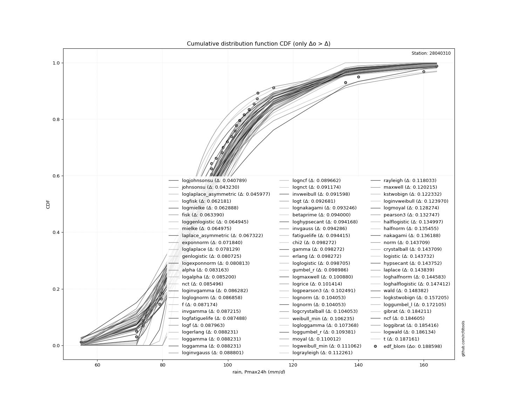</img>

</div>


**6.3. Best fit**

<div align="center">

|   id |   station | empirical_dist   | p_dist                |    delta |   deltao | eval   |   fit |   n |   best_fit |   best_fit_sort |
|-----:|----------:|:-----------------|:----------------------|---------:|---------:|:-------|------:|----:|-----------:|----------------:|
|    0 |  28040310 | edf_blom         | loglaplace_asymmetric | 0.095119 | 0.207398 | Δo > Δ |     1 |  43 |          1 |               1 |

</div>


<div align="center">

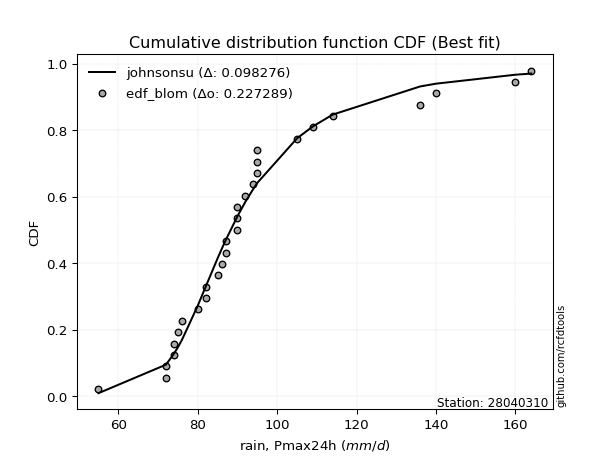</img>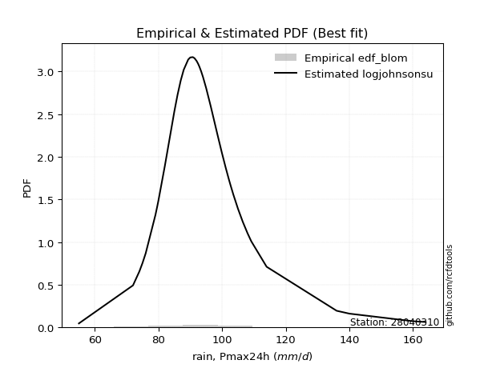</img>

</div>


### 7. Empirical - EDF Tukey (1962)

In hydrology, the Tukey formula is used as a plotting position formula to estimate the empirical probability or frequency of a flood event (or other hydrological data). The formula parameter is given as _c=0.333_ (or 1/3).

<div align="center">


$P=(m-c)/(n+1-2c)$


</div>


**7.1. Empirical values**

<div align="center">

|                | 0                    | 1                    | 2                   | 3                   | 4                  | 5                   | 6                   | 7                   | 8         | 9                  | 10                  | 11                 | 12                 | 13                 | 14                 | 15                  | 16                  | 17                 | 18                 | 19                  | 20                  | 21        | 22                 | 23                 | 24                 | 25                 | 26                 | 27                 | 28                 | 29                 | 30                 | 31                 | 32                 | 33                 | 34                | 35                | 36                 | 37                 | 38                 | 39                 | 40                 | 41                 | 42                 |
|:---------------|:---------------------|:---------------------|:--------------------|:--------------------|:-------------------|:--------------------|:--------------------|:--------------------|:----------|:-------------------|:--------------------|:-------------------|:-------------------|:-------------------|:-------------------|:--------------------|:--------------------|:-------------------|:-------------------|:--------------------|:--------------------|:----------|:-------------------|:-------------------|:-------------------|:-------------------|:-------------------|:-------------------|:-------------------|:-------------------|:-------------------|:-------------------|:-------------------|:-------------------|:------------------|:------------------|:-------------------|:-------------------|:-------------------|:-------------------|:-------------------|:-------------------|:-------------------|
| date           | 1998                 | 2015                 | 1974                | 2012                | 2014               | 1980                | 2004                | 1987                | 2005      | 1992               | 1997                | 1977               | 2010               | 2011               | 2007               | 1989                | 2001                | 2013               | 1978               | 1995                | 2009                | 2002      | 1975               | 1986               | 2000               | 2003               | 2006               | 1991               | 1976               | 1985               | 1982               | 1984               | 1990               | 1994               | 1993              | 1983              | 1999               | 1979               | 1981               | 1973               | 2008               | 1988               | 1996               |
| x              | 55.0                 | 56.9235388634093     | 62.0                | 65.175540074784     | 65.8836476566967   | 67.0                | 72.0                | 72.0                | 74.0      | 74.0               | 75.0                | 76.0               | 76.2441825270904   | 79.9523480258781   | 80.0               | 82.0                | 82.0                | 84.2586803103685   | 85.0               | 85.0                | 85.0                | 86.0      | 86.0               | 87.0               | 87.0               | 90.0               | 90.0               | 90.0               | 91.0               | 92.0               | 94.0               | 95.0               | 95.0               | 95.0               | 105.0             | 109.0             | 114.0              | 130.0              | 136.0              | 140.0              | 140.0              | 160.0              | 164.0              |
| m              | 1                    | 2                    | 3                   | 4                   | 5                  | 6                   | 7                   | 8                   | 9         | 10                 | 11                  | 12                 | 13                 | 14                 | 15                 | 16                  | 17                  | 18                 | 19                 | 20                  | 21                  | 22        | 23                 | 24                 | 25                 | 26                 | 27                 | 28                 | 29                 | 30                 | 31                 | 32                 | 33                 | 34                 | 35                | 36                | 37                 | 38                 | 39                 | 40                 | 41                 | 42                 | 43                 |
| empirical_dist | edf_tukey            | edf_tukey            | edf_tukey           | edf_tukey           | edf_tukey          | edf_tukey           | edf_tukey           | edf_tukey           | edf_tukey | edf_tukey          | edf_tukey           | edf_tukey          | edf_tukey          | edf_tukey          | edf_tukey          | edf_tukey           | edf_tukey           | edf_tukey          | edf_tukey          | edf_tukey           | edf_tukey           | edf_tukey | edf_tukey          | edf_tukey          | edf_tukey          | edf_tukey          | edf_tukey          | edf_tukey          | edf_tukey          | edf_tukey          | edf_tukey          | edf_tukey          | edf_tukey          | edf_tukey          | edf_tukey         | edf_tukey         | edf_tukey          | edf_tukey          | edf_tukey          | edf_tukey          | edf_tukey          | edf_tukey          | edf_tukey          |
| empirical      | 0.015384615384615385 | 0.038461538461538464 | 0.06153846153846154 | 0.08461538461538462 | 0.1076923076923077 | 0.13076923076923078 | 0.15384615384615385 | 0.17692307692307693 | 0.2       | 0.2230769230769231 | 0.24615384615384617 | 0.2692307692307692 | 0.2923076923076923 | 0.3153846153846154 | 0.3384615384615385 | 0.36153846153846153 | 0.38461538461538464 | 0.4076923076923077 | 0.4307692307692308 | 0.45384615384615384 | 0.47692307692307695 | 0.5       | 0.5230769230769231 | 0.5461538461538461 | 0.5692307692307692 | 0.5923076923076923 | 0.6153846153846154 | 0.6384615384615384 | 0.6615384615384615 | 0.6846153846153846 | 0.7076923076923077 | 0.7307692307692307 | 0.7538461538461538 | 0.7769230769230769 | 0.8               | 0.823076923076923 | 0.8461538461538461 | 0.8692307692307693 | 0.8923076923076924 | 0.9153846153846154 | 0.9384615384615385 | 0.9615384615384616 | 0.9846153846153847 |
| empirical_tr   | 1.015625             | 1.04                 | 1.0655737704918034  | 1.092436974789916   | 1.120689655172414  | 1.1504424778761062  | 1.1818181818181819  | 1.2149532710280375  | 1.25      | 1.2871287128712872 | 1.3265306122448979  | 1.3684210526315788 | 1.4130434782608696 | 1.4606741573033708 | 1.5116279069767442 | 1.566265060240964   | 1.625               | 1.6883116883116882 | 1.7567567567567568 | 1.8309859154929575  | 1.9117647058823533  | 2.0       | 2.096774193548387  | 2.2033898305084745 | 2.321428571428571  | 2.452830188679245  | 2.6                | 2.7659574468085104 | 2.9545454545454546 | 3.1707317073170733 | 3.421052631578948  | 3.7142857142857135 | 4.0625             | 4.482758620689656  | 5.000000000000001 | 5.652173913043477 | 6.5                | 7.647058823529413  | 9.28571428571429   | 11.818181818181813 | 16.25              | 26.000000000000018 | 65.00000000000023  |

</div>


**7.2. Kolmogorov-Smirnov fit test (sorted by Δ)**


<div align="center">

|                | 0                     | 1                   | 2                   | 3                   | 4                   | 5                   | 6                   | 7                   | 8                   | 9                   | 10                  | 11                  | 12                  | 13                  | 14                  | 15                  | 16                  | 17                  | 18                  | 19                  | 20                  | 21                  | 22                  | 23                  | 24                  | 25                  | 26                  | 27                  | 28                  | 29                  | 30                  | 31                  | 32                  | 33                  | 34                  | 35                  | 36                  | 37                  | 38                  | 39                  | 40                  | 41                  | 42                  | 43                  | 44                  | 45                  | 46                  | 47                  | 48                  | 49                  | 50                  | 51                  | 52                  | 53                  | 54                  | 55                  | 56                  | 57                  | 58                  | 59                  | 60                  | 61                  | 62                  | 63                  | 64                  | 65                  | 66                  | 67                  | 68                  | 69                  | 70                  | 71                  | 72                  | 73                  | 74                  | 75                  | 76                  | 77                  | 78                  | 79                  | 80                  | 81                  | 82                  | 83                  | 84                  | 85                  | 86                  | 87                  | 88                  | 89                  |
|:---------------|:----------------------|:--------------------|:--------------------|:--------------------|:--------------------|:--------------------|:--------------------|:--------------------|:--------------------|:--------------------|:--------------------|:--------------------|:--------------------|:--------------------|:--------------------|:--------------------|:--------------------|:--------------------|:--------------------|:--------------------|:--------------------|:--------------------|:--------------------|:--------------------|:--------------------|:--------------------|:--------------------|:--------------------|:--------------------|:--------------------|:--------------------|:--------------------|:--------------------|:--------------------|:--------------------|:--------------------|:--------------------|:--------------------|:--------------------|:--------------------|:--------------------|:--------------------|:--------------------|:--------------------|:--------------------|:--------------------|:--------------------|:--------------------|:--------------------|:--------------------|:--------------------|:--------------------|:--------------------|:--------------------|:--------------------|:--------------------|:--------------------|:--------------------|:--------------------|:--------------------|:--------------------|:--------------------|:--------------------|:--------------------|:--------------------|:--------------------|:--------------------|:--------------------|:--------------------|:--------------------|:--------------------|:--------------------|:--------------------|:--------------------|:--------------------|:--------------------|:--------------------|:--------------------|:--------------------|:--------------------|:--------------------|:--------------------|:--------------------|:--------------------|:--------------------|:--------------------|:--------------------|:--------------------|:--------------------|:--------------------|
| station        | 28040310              | 28040310            | 28040310            | 28040310            | 28040310            | 28040310            | 28040310            | 28040310            | 28040310            | 28040310            | 28040310            | 28040310            | 28040310            | 28040310            | 28040310            | 28040310            | 28040310            | 28040310            | 28040310            | 28040310            | 28040310            | 28040310            | 28040310            | 28040310            | 28040310            | 28040310            | 28040310            | 28040310            | 28040310            | 28040310            | 28040310            | 28040310            | 28040310            | 28040310            | 28040310            | 28040310            | 28040310            | 28040310            | 28040310            | 28040310            | 28040310            | 28040310            | 28040310            | 28040310            | 28040310            | 28040310            | 28040310            | 28040310            | 28040310            | 28040310            | 28040310            | 28040310            | 28040310            | 28040310            | 28040310            | 28040310            | 28040310            | 28040310            | 28040310            | 28040310            | 28040310            | 28040310            | 28040310            | 28040310            | 28040310            | 28040310            | 28040310            | 28040310            | 28040310            | 28040310            | 28040310            | 28040310            | 28040310            | 28040310            | 28040310            | 28040310            | 28040310            | 28040310            | 28040310            | 28040310            | 28040310            | 28040310            | 28040310            | 28040310            | 28040310            | 28040310            | 28040310            | 28040310            | 28040310            | 28040310            |
| empirical_dist | edf_tukey             | edf_tukey           | edf_tukey           | edf_tukey           | edf_tukey           | edf_tukey           | edf_tukey           | edf_tukey           | edf_tukey           | edf_tukey           | edf_tukey           | edf_tukey           | edf_tukey           | edf_tukey           | edf_tukey           | edf_tukey           | edf_tukey           | edf_tukey           | edf_tukey           | edf_tukey           | edf_tukey           | edf_tukey           | edf_tukey           | edf_tukey           | edf_tukey           | edf_tukey           | edf_tukey           | edf_tukey           | edf_tukey           | edf_tukey           | edf_tukey           | edf_tukey           | edf_tukey           | edf_tukey           | edf_tukey           | edf_tukey           | edf_tukey           | edf_tukey           | edf_tukey           | edf_tukey           | edf_tukey           | edf_tukey           | edf_tukey           | edf_tukey           | edf_tukey           | edf_tukey           | edf_tukey           | edf_tukey           | edf_tukey           | edf_tukey           | edf_tukey           | edf_tukey           | edf_tukey           | edf_tukey           | edf_tukey           | edf_tukey           | edf_tukey           | edf_tukey           | edf_tukey           | edf_tukey           | edf_tukey           | edf_tukey           | edf_tukey           | edf_tukey           | edf_tukey           | edf_tukey           | edf_tukey           | edf_tukey           | edf_tukey           | edf_tukey           | edf_tukey           | edf_tukey           | edf_tukey           | edf_tukey           | edf_tukey           | edf_tukey           | edf_tukey           | edf_tukey           | edf_tukey           | edf_tukey           | edf_tukey           | edf_tukey           | edf_tukey           | edf_tukey           | edf_tukey           | edf_tukey           | edf_tukey           | edf_tukey           | edf_tukey           | edf_tukey           |
| p_dist         | loglaplace_asymmetric | logt                | logjohnsonsu        | loggumbel_r         | logfisk             | logexponnorm        | johnsonsu           | logmoyal            | fisk                | logmielke           | loghalfnorm         | laplace_asymmetric  | loglaplace          | mielke              | loggenlogistic      | loginvweibull       | loghalflogistic     | alpha               | exponnorm           | logkstwobign        | invweibull          | logf                | logbetaprime        | loglognorm          | invgamma            | f                   | loginvgauss         | logfatiguelife      | moyal               | logpearson3         | halflogistic        | logerlang           | loggamma            | loggamma            | loggenexpon         | logalpha            | wald                | lograyleigh         | nct                 | genlogistic         | invgauss            | fatiguelife         | loghypsecant        | pearson3            | lognakagami         | logmaxwell          | logweibull_min      | weibull_min         | logrice             | chi2                | gamma               | erlang              | loginvgamma         | lognct              | loglogistic         | betaprime           | gumbel_r            | logncf              | halfnorm            | logcrystalball      | lognorm             | lognorm             | kstwobign           | logloggamma         | nakagami            | logwald             | rayleigh            | ncf                 | laplace             | maxwell             | gibrat              | rice                | hypsecant           | loggibrat           | logistic            | genexpon            | expon               | pareto              | loggompertz         | truncnorm           | norm                | crystalball         | loggumbel_l         | t                   | logtruncnorm        | logexpon            | logpareto           | gumbel_l            | logchi2             | gompertz            |
| delta          | 0.09458538031741393   | 0.09820134160338279 | 0.09834697067777354 | 0.09915677301790438 | 0.10106858592406098 | 0.10361481488138624 | 0.10380829860450913 | 0.1044920125248322  | 0.10530969459644302 | 0.10724859391741814 | 0.10876321802070887 | 0.1104252606461208  | 0.11252942140737693 | 0.11289666963833567 | 0.11298849047631432 | 0.11513827842080004 | 0.11581195839096303 | 0.11932266022224824 | 0.11967349280644268 | 0.12091337656702239 | 0.12188951288915584 | 0.12320077798620821 | 0.12383457255229546 | 0.12441181758690523 | 0.12510987617961578 | 0.12511032571535996 | 0.1257059419935619  | 0.125810919100258   | 0.1258471209477473  | 0.12596812163241722 | 0.12623271037124184 | 0.12781826107380712 | 0.1278182675038988  | 0.1278182675038988  | 0.12838404213177157 | 0.12982493807193218 | 0.13076915915762227 | 0.1310908563687483  | 0.13325356082351936 | 0.13441382649628675 | 0.13477670120436624 | 0.1363051478759928  | 0.13840753423135344 | 0.1384128581571119  | 0.13847309928211382 | 0.1389025817580466  | 0.13992185764178433 | 0.14217079583553882 | 0.14314582688362343 | 0.14320753026214084 | 0.1432075740859331  | 0.14320798198166196 | 0.1472077488027026  | 0.1475516280785093  | 0.14997829240631955 | 0.15024196497610987 | 0.15045955271941525 | 0.15257114717581777 | 0.15372913044297598 | 0.16428023438931738 | 0.1642807655597014  | 0.1642807655597014  | 0.16464082526499035 | 0.16605638215438867 | 0.16952174291372535 | 0.17158218033379402 | 0.18074615555731077 | 0.1815500180288825  | 0.18565337519201008 | 0.1903167410731046  | 0.1909221289654536  | 0.19654353548774894 | 0.2062513504666622  | 0.206875253371924   | 0.21265525312957934 | 0.2192128238500552  | 0.21924992177083674 | 0.2192499393978683  | 0.2200775643549202  | 0.22025802568658726 | 0.2202580365967891  | 0.22025804543396388 | 0.22156956128598948 | 0.22518214452430152 | 0.25682908363939067 | 0.2791684978467369  | 0.27916850477724087 | 0.286555425190948   | 0.28991673458079015 | 0.8608373106037946  |
| deltao         | 0.20739805565234237   | 0.20739805565234237 | 0.20739805565234237 | 0.20739805565234237 | 0.20739805565234237 | 0.20739805565234237 | 0.20739805565234237 | 0.20739805565234237 | 0.20739805565234237 | 0.20739805565234237 | 0.20739805565234237 | 0.20739805565234237 | 0.20739805565234237 | 0.20739805565234237 | 0.20739805565234237 | 0.20739805565234237 | 0.20739805565234237 | 0.20739805565234237 | 0.20739805565234237 | 0.20739805565234237 | 0.20739805565234237 | 0.20739805565234237 | 0.20739805565234237 | 0.20739805565234237 | 0.20739805565234237 | 0.20739805565234237 | 0.20739805565234237 | 0.20739805565234237 | 0.20739805565234237 | 0.20739805565234237 | 0.20739805565234237 | 0.20739805565234237 | 0.20739805565234237 | 0.20739805565234237 | 0.20739805565234237 | 0.20739805565234237 | 0.20739805565234237 | 0.20739805565234237 | 0.20739805565234237 | 0.20739805565234237 | 0.20739805565234237 | 0.20739805565234237 | 0.20739805565234237 | 0.20739805565234237 | 0.20739805565234237 | 0.20739805565234237 | 0.20739805565234237 | 0.20739805565234237 | 0.20739805565234237 | 0.20739805565234237 | 0.20739805565234237 | 0.20739805565234237 | 0.20739805565234237 | 0.20739805565234237 | 0.20739805565234237 | 0.20739805565234237 | 0.20739805565234237 | 0.20739805565234237 | 0.20739805565234237 | 0.20739805565234237 | 0.20739805565234237 | 0.20739805565234237 | 0.20739805565234237 | 0.20739805565234237 | 0.20739805565234237 | 0.20739805565234237 | 0.20739805565234237 | 0.20739805565234237 | 0.20739805565234237 | 0.20739805565234237 | 0.20739805565234237 | 0.20739805565234237 | 0.20739805565234237 | 0.20739805565234237 | 0.20739805565234237 | 0.20739805565234237 | 0.20739805565234237 | 0.20739805565234237 | 0.20739805565234237 | 0.20739805565234237 | 0.20739805565234237 | 0.20739805565234237 | 0.20739805565234237 | 0.20739805565234237 | 0.20739805565234237 | 0.20739805565234237 | 0.20739805565234237 | 0.20739805565234237 | 0.20739805565234237 | 0.20739805565234237 |
| eval           | Δo > Δ                | Δo > Δ              | Δo > Δ              | Δo > Δ              | Δo > Δ              | Δo > Δ              | Δo > Δ              | Δo > Δ              | Δo > Δ              | Δo > Δ              | Δo > Δ              | Δo > Δ              | Δo > Δ              | Δo > Δ              | Δo > Δ              | Δo > Δ              | Δo > Δ              | Δo > Δ              | Δo > Δ              | Δo > Δ              | Δo > Δ              | Δo > Δ              | Δo > Δ              | Δo > Δ              | Δo > Δ              | Δo > Δ              | Δo > Δ              | Δo > Δ              | Δo > Δ              | Δo > Δ              | Δo > Δ              | Δo > Δ              | Δo > Δ              | Δo > Δ              | Δo > Δ              | Δo > Δ              | Δo > Δ              | Δo > Δ              | Δo > Δ              | Δo > Δ              | Δo > Δ              | Δo > Δ              | Δo > Δ              | Δo > Δ              | Δo > Δ              | Δo > Δ              | Δo > Δ              | Δo > Δ              | Δo > Δ              | Δo > Δ              | Δo > Δ              | Δo > Δ              | Δo > Δ              | Δo > Δ              | Δo > Δ              | Δo > Δ              | Δo > Δ              | Δo > Δ              | Δo > Δ              | Δo > Δ              | Δo > Δ              | Δo > Δ              | Δo > Δ              | Δo > Δ              | Δo > Δ              | Δo > Δ              | Δo > Δ              | Δo > Δ              | Δo > Δ              | Δo > Δ              | Δo > Δ              | Δo > Δ              | Δo > Δ              | Δo > Δ              | Δo <= Δ             | Δo <= Δ             | Δo <= Δ             | Δo <= Δ             | Δo <= Δ             | Δo <= Δ             | Δo <= Δ             | Δo <= Δ             | Δo <= Δ             | Δo <= Δ             | Δo <= Δ             | Δo <= Δ             | Δo <= Δ             | Δo <= Δ             | Δo <= Δ             | Δo <= Δ             |
| fit            | 1                     | 1                   | 1                   | 1                   | 1                   | 1                   | 1                   | 1                   | 1                   | 1                   | 1                   | 1                   | 1                   | 1                   | 1                   | 1                   | 1                   | 1                   | 1                   | 1                   | 1                   | 1                   | 1                   | 1                   | 1                   | 1                   | 1                   | 1                   | 1                   | 1                   | 1                   | 1                   | 1                   | 1                   | 1                   | 1                   | 1                   | 1                   | 1                   | 1                   | 1                   | 1                   | 1                   | 1                   | 1                   | 1                   | 1                   | 1                   | 1                   | 1                   | 1                   | 1                   | 1                   | 1                   | 1                   | 1                   | 1                   | 1                   | 1                   | 1                   | 1                   | 1                   | 1                   | 1                   | 1                   | 1                   | 1                   | 1                   | 1                   | 1                   | 1                   | 1                   | 1                   | 1                   | 0                   | 0                   | 0                   | 0                   | 0                   | 0                   | 0                   | 0                   | 0                   | 0                   | 0                   | 0                   | 0                   | 0                   | 0                   | 0                   |
| n              | 43                    | 43                  | 43                  | 43                  | 43                  | 43                  | 43                  | 43                  | 43                  | 43                  | 43                  | 43                  | 43                  | 43                  | 43                  | 43                  | 43                  | 43                  | 43                  | 43                  | 43                  | 43                  | 43                  | 43                  | 43                  | 43                  | 43                  | 43                  | 43                  | 43                  | 43                  | 43                  | 43                  | 43                  | 43                  | 43                  | 43                  | 43                  | 43                  | 43                  | 43                  | 43                  | 43                  | 43                  | 43                  | 43                  | 43                  | 43                  | 43                  | 43                  | 43                  | 43                  | 43                  | 43                  | 43                  | 43                  | 43                  | 43                  | 43                  | 43                  | 43                  | 43                  | 43                  | 43                  | 43                  | 43                  | 43                  | 43                  | 43                  | 43                  | 43                  | 43                  | 43                  | 43                  | 43                  | 43                  | 43                  | 43                  | 43                  | 43                  | 43                  | 43                  | 43                  | 43                  | 43                  | 43                  | 43                  | 43                  | 43                  | 43                  |
| best_fit       | 1                     | 0                   | 0                   | 0                   | 0                   | 0                   | 0                   | 0                   | 0                   | 0                   | 0                   | 0                   | 0                   | 0                   | 0                   | 0                   | 0                   | 0                   | 0                   | 0                   | 0                   | 0                   | 0                   | 0                   | 0                   | 0                   | 0                   | 0                   | 0                   | 0                   | 0                   | 0                   | 0                   | 0                   | 0                   | 0                   | 0                   | 0                   | 0                   | 0                   | 0                   | 0                   | 0                   | 0                   | 0                   | 0                   | 0                   | 0                   | 0                   | 0                   | 0                   | 0                   | 0                   | 0                   | 0                   | 0                   | 0                   | 0                   | 0                   | 0                   | 0                   | 0                   | 0                   | 0                   | 0                   | 0                   | 0                   | 0                   | 0                   | 0                   | 0                   | 0                   | 0                   | 0                   | 0                   | 0                   | 0                   | 0                   | 0                   | 0                   | 0                   | 0                   | 0                   | 0                   | 0                   | 0                   | 0                   | 0                   | 0                   | 0                   |
| best_fit_sort  | 1                     | 2                   | 3                   | 4                   | 5                   | 6                   | 7                   | 8                   | 9                   | 10                  | 11                  | 12                  | 13                  | 14                  | 15                  | 16                  | 17                  | 18                  | 19                  | 20                  | 21                  | 22                  | 23                  | 24                  | 25                  | 26                  | 27                  | 28                  | 29                  | 30                  | 31                  | 32                  | 33                  | 34                  | 35                  | 36                  | 37                  | 38                  | 39                  | 40                  | 41                  | 42                  | 43                  | 44                  | 45                  | 46                  | 47                  | 48                  | 49                  | 50                  | 51                  | 52                  | 53                  | 54                  | 55                  | 56                  | 57                  | 58                  | 59                  | 60                  | 61                  | 62                  | 63                  | 64                  | 65                  | 66                  | 67                  | 68                  | 69                  | 70                  | 71                  | 72                  | 73                  | 74                  | 75                  | 76                  | 77                  | 78                  | 79                  | 80                  | 81                  | 82                  | 83                  | 84                  | 85                  | 86                  | 87                  | 88                  | 89                  | 90                  |

</div>


<div align="center">

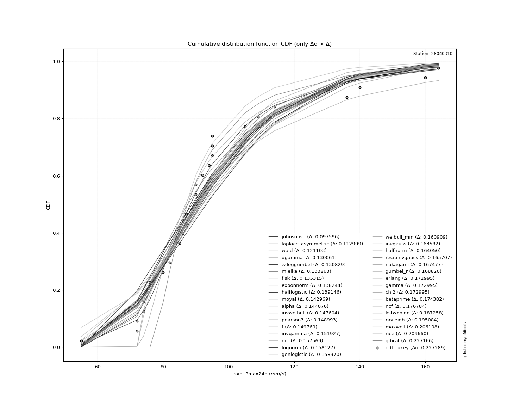</img>

</div>


**7.3. Best fit**

<div align="center">

|   id |   station | empirical_dist   | p_dist                |     delta |   deltao | eval   |   fit |   n |   best_fit |   best_fit_sort |
|-----:|----------:|:-----------------|:----------------------|----------:|---------:|:-------|------:|----:|-----------:|----------------:|
|    0 |  28040310 | edf_tukey        | loglaplace_asymmetric | 0.0945854 | 0.207398 | Δo > Δ |     1 |  43 |          1 |               1 |

</div>


<div align="center">

</img></img>

</div>


### 8. Empirical - EDF Gringorten (1963)

Gringorten plotting position formula is essential for estimating the probability and return periods of extreme events like floods and heavy rainfall. The constant _a=0.44_.

<div align="center">


$P=(m-a)/(n+1-2a)$


</div>


**8.1. Empirical values**

<div align="center">

|                | 0                   | 1                   | 2                   | 3                   | 4                   | 5                   | 6                   | 7                   | 8                  | 9                   | 10                 | 11                 | 12                 | 13                  | 14                 | 15                 | 16                  | 17                 | 18                  | 19                 | 20                  | 21             | 22                 | 23                 | 24                 | 25                 | 26                 | 27                 | 28                 | 29                 | 30                 | 31                 | 32                 | 33                 | 34                 | 35                 | 36                 | 37                 | 38                | 39                 | 40                | 41                 | 42                 |
|:---------------|:--------------------|:--------------------|:--------------------|:--------------------|:--------------------|:--------------------|:--------------------|:--------------------|:-------------------|:--------------------|:-------------------|:-------------------|:-------------------|:--------------------|:-------------------|:-------------------|:--------------------|:-------------------|:--------------------|:-------------------|:--------------------|:---------------|:-------------------|:-------------------|:-------------------|:-------------------|:-------------------|:-------------------|:-------------------|:-------------------|:-------------------|:-------------------|:-------------------|:-------------------|:-------------------|:-------------------|:-------------------|:-------------------|:------------------|:-------------------|:------------------|:-------------------|:-------------------|
| date           | 1998                | 2015                | 1974                | 2012                | 2014                | 1980                | 2004                | 1987                | 2005               | 1992                | 1997               | 1977               | 2010               | 2011                | 2007               | 1989               | 2001                | 2013               | 1978                | 1995               | 2009                | 2002           | 1975               | 1986               | 2000               | 2003               | 2006               | 1991               | 1976               | 1985               | 1982               | 1984               | 1990               | 1994               | 1993               | 1983               | 1999               | 1979               | 1981              | 1973               | 2008              | 1988               | 1996               |
| x              | 55.0                | 56.9235388634093    | 62.0                | 65.175540074784     | 65.8836476566967    | 67.0                | 72.0                | 72.0                | 74.0               | 74.0                | 75.0               | 76.0               | 76.2441825270904   | 79.9523480258781    | 80.0               | 82.0               | 82.0                | 84.2586803103685   | 85.0                | 85.0               | 85.0                | 86.0           | 86.0               | 87.0               | 87.0               | 90.0               | 90.0               | 90.0               | 91.0               | 92.0               | 94.0               | 95.0               | 95.0               | 95.0               | 105.0              | 109.0              | 114.0              | 130.0              | 136.0             | 140.0              | 140.0             | 160.0              | 164.0              |
| m              | 1                   | 2                   | 3                   | 4                   | 5                   | 6                   | 7                   | 8                   | 9                  | 10                  | 11                 | 12                 | 13                 | 14                  | 15                 | 16                 | 17                  | 18                 | 19                  | 20                 | 21                  | 22             | 23                 | 24                 | 25                 | 26                 | 27                 | 28                 | 29                 | 30                 | 31                 | 32                 | 33                 | 34                 | 35                 | 36                 | 37                 | 38                 | 39                | 40                 | 41                | 42                 | 43                 |
| empirical_dist | edf_gringorten      | edf_gringorten      | edf_gringorten      | edf_gringorten      | edf_gringorten      | edf_gringorten      | edf_gringorten      | edf_gringorten      | edf_gringorten     | edf_gringorten      | edf_gringorten     | edf_gringorten     | edf_gringorten     | edf_gringorten      | edf_gringorten     | edf_gringorten     | edf_gringorten      | edf_gringorten     | edf_gringorten      | edf_gringorten     | edf_gringorten      | edf_gringorten | edf_gringorten     | edf_gringorten     | edf_gringorten     | edf_gringorten     | edf_gringorten     | edf_gringorten     | edf_gringorten     | edf_gringorten     | edf_gringorten     | edf_gringorten     | edf_gringorten     | edf_gringorten     | edf_gringorten     | edf_gringorten     | edf_gringorten     | edf_gringorten     | edf_gringorten    | edf_gringorten     | edf_gringorten    | edf_gringorten     | edf_gringorten     |
| empirical      | 0.01298701298701299 | 0.03617810760667904 | 0.05936920222634509 | 0.08256029684601114 | 0.10575139146567718 | 0.12894248608534323 | 0.15213358070500926 | 0.17532467532467533 | 0.1985157699443414 | 0.22170686456400746 | 0.2448979591836735 | 0.2680890538033395 | 0.2912801484230056 | 0.31447124304267166 | 0.3376623376623377 | 0.3608534322820037 | 0.38404452690166974 | 0.4072356215213358 | 0.43042671614100186 | 0.4536178107606679 | 0.47680890538033394 | 0.5            | 0.5231910946196661 | 0.5463821892393321 | 0.5695732838589982 | 0.5927643784786641 | 0.6159554730983302 | 0.6391465677179963 | 0.6623376623376623 | 0.6855287569573284 | 0.7087198515769945 | 0.7319109461966605 | 0.7551020408163266 | 0.7782931354359927 | 0.8014842300556587 | 0.8246753246753248 | 0.8478664192949908 | 0.8710575139146569 | 0.894248608534323 | 0.9174397031539889 | 0.940630797773655 | 0.9638218923933211 | 0.9870129870129871 |
| empirical_tr   | 1.013157894736842   | 1.037536092396535   | 1.0631163708086786  | 1.089989888776542   | 1.1182572614107884  | 1.1480298189563365  | 1.1794310722100656  | 1.2125984251968505  | 1.2476851851851851 | 1.2848629320619787  | 1.3243243243243243 | 1.3662864385297846 | 1.410994764397906  | 1.45872801082544    | 1.5098039215686276 | 1.5645863570391874 | 1.6234939759036142  | 1.6870109546165883 | 1.755700325732899   | 1.830220713073005  | 1.9113475177304964  | 2.0            | 2.09727626459144   | 2.2044989775051125 | 2.3232758620689657 | 2.455580865603644  | 2.6038647342995165 | 2.7712082262210798 | 2.9615384615384617 | 3.1799410029498527 | 3.4331210191082806 | 3.7301038062283745 | 4.083333333333334  | 4.510460251046027  | 5.037383177570096  | 5.703703703703707  | 6.5731707317073225 | 7.755395683453246  | 9.456140350877208 | 12.112359550561807 | 16.84375000000002 | 27.64102564102571  | 77.00000000000064  |

</div>


**8.2. Kolmogorov-Smirnov fit test (sorted by Δ)**


<div align="center">

|                | 0                     | 1                   | 2                   | 3                   | 4                   | 5                   | 6                   | 7                   | 8                   | 9                   | 10                  | 11                  | 12                  | 13                  | 14                  | 15                  | 16                  | 17                  | 18                  | 19                  | 20                  | 21                  | 22                  | 23                  | 24                  | 25                  | 26                  | 27                  | 28                  | 29                  | 30                  | 31                  | 32                  | 33                  | 34                  | 35                  | 36                  | 37                  | 38                  | 39                  | 40                  | 41                  | 42                  | 43                  | 44                  | 45                  | 46                  | 47                  | 48                  | 49                  | 50                  | 51                  | 52                  | 53                  | 54                  | 55                  | 56                  | 57                  | 58                  | 59                  | 60                  | 61                  | 62                  | 63                  | 64                  | 65                  | 66                  | 67                  | 68                  | 69                  | 70                  | 71                  | 72                  | 73                  | 74                  | 75                  | 76                  | 77                  | 78                  | 79                  | 80                  | 81                  | 82                  | 83                  | 84                  | 85                  | 86                  | 87                  | 88                  | 89                  |
|:---------------|:----------------------|:--------------------|:--------------------|:--------------------|:--------------------|:--------------------|:--------------------|:--------------------|:--------------------|:--------------------|:--------------------|:--------------------|:--------------------|:--------------------|:--------------------|:--------------------|:--------------------|:--------------------|:--------------------|:--------------------|:--------------------|:--------------------|:--------------------|:--------------------|:--------------------|:--------------------|:--------------------|:--------------------|:--------------------|:--------------------|:--------------------|:--------------------|:--------------------|:--------------------|:--------------------|:--------------------|:--------------------|:--------------------|:--------------------|:--------------------|:--------------------|:--------------------|:--------------------|:--------------------|:--------------------|:--------------------|:--------------------|:--------------------|:--------------------|:--------------------|:--------------------|:--------------------|:--------------------|:--------------------|:--------------------|:--------------------|:--------------------|:--------------------|:--------------------|:--------------------|:--------------------|:--------------------|:--------------------|:--------------------|:--------------------|:--------------------|:--------------------|:--------------------|:--------------------|:--------------------|:--------------------|:--------------------|:--------------------|:--------------------|:--------------------|:--------------------|:--------------------|:--------------------|:--------------------|:--------------------|:--------------------|:--------------------|:--------------------|:--------------------|:--------------------|:--------------------|:--------------------|:--------------------|:--------------------|:--------------------|
| station        | 28040310              | 28040310            | 28040310            | 28040310            | 28040310            | 28040310            | 28040310            | 28040310            | 28040310            | 28040310            | 28040310            | 28040310            | 28040310            | 28040310            | 28040310            | 28040310            | 28040310            | 28040310            | 28040310            | 28040310            | 28040310            | 28040310            | 28040310            | 28040310            | 28040310            | 28040310            | 28040310            | 28040310            | 28040310            | 28040310            | 28040310            | 28040310            | 28040310            | 28040310            | 28040310            | 28040310            | 28040310            | 28040310            | 28040310            | 28040310            | 28040310            | 28040310            | 28040310            | 28040310            | 28040310            | 28040310            | 28040310            | 28040310            | 28040310            | 28040310            | 28040310            | 28040310            | 28040310            | 28040310            | 28040310            | 28040310            | 28040310            | 28040310            | 28040310            | 28040310            | 28040310            | 28040310            | 28040310            | 28040310            | 28040310            | 28040310            | 28040310            | 28040310            | 28040310            | 28040310            | 28040310            | 28040310            | 28040310            | 28040310            | 28040310            | 28040310            | 28040310            | 28040310            | 28040310            | 28040310            | 28040310            | 28040310            | 28040310            | 28040310            | 28040310            | 28040310            | 28040310            | 28040310            | 28040310            | 28040310            |
| empirical_dist | edf_gringorten        | edf_gringorten      | edf_gringorten      | edf_gringorten      | edf_gringorten      | edf_gringorten      | edf_gringorten      | edf_gringorten      | edf_gringorten      | edf_gringorten      | edf_gringorten      | edf_gringorten      | edf_gringorten      | edf_gringorten      | edf_gringorten      | edf_gringorten      | edf_gringorten      | edf_gringorten      | edf_gringorten      | edf_gringorten      | edf_gringorten      | edf_gringorten      | edf_gringorten      | edf_gringorten      | edf_gringorten      | edf_gringorten      | edf_gringorten      | edf_gringorten      | edf_gringorten      | edf_gringorten      | edf_gringorten      | edf_gringorten      | edf_gringorten      | edf_gringorten      | edf_gringorten      | edf_gringorten      | edf_gringorten      | edf_gringorten      | edf_gringorten      | edf_gringorten      | edf_gringorten      | edf_gringorten      | edf_gringorten      | edf_gringorten      | edf_gringorten      | edf_gringorten      | edf_gringorten      | edf_gringorten      | edf_gringorten      | edf_gringorten      | edf_gringorten      | edf_gringorten      | edf_gringorten      | edf_gringorten      | edf_gringorten      | edf_gringorten      | edf_gringorten      | edf_gringorten      | edf_gringorten      | edf_gringorten      | edf_gringorten      | edf_gringorten      | edf_gringorten      | edf_gringorten      | edf_gringorten      | edf_gringorten      | edf_gringorten      | edf_gringorten      | edf_gringorten      | edf_gringorten      | edf_gringorten      | edf_gringorten      | edf_gringorten      | edf_gringorten      | edf_gringorten      | edf_gringorten      | edf_gringorten      | edf_gringorten      | edf_gringorten      | edf_gringorten      | edf_gringorten      | edf_gringorten      | edf_gringorten      | edf_gringorten      | edf_gringorten      | edf_gringorten      | edf_gringorten      | edf_gringorten      | edf_gringorten      | edf_gringorten      |
| p_dist         | loglaplace_asymmetric | logt                | logjohnsonsu        | loggumbel_r         | logfisk             | logmoyal            | logexponnorm        | johnsonsu           | fisk                | logmielke           | loghalfnorm         | laplace_asymmetric  | loglaplace          | mielke              | loggenlogistic      | loghalflogistic     | loginvweibull       | alpha               | exponnorm           | logkstwobign        | invweibull          | logf                | logbetaprime        | loglognorm          | invgamma            | f                   | loginvgauss         | logfatiguelife      | moyal               | logpearson3         | halflogistic        | wald                | logerlang           | loggamma            | loggamma            | loggenexpon         | logalpha            | lograyleigh         | nct                 | genlogistic         | invgauss            | fatiguelife         | loghypsecant        | pearson3            | lognakagami         | logmaxwell          | logweibull_min      | weibull_min         | logrice             | chi2                | gamma               | erlang              | loginvgamma         | lognct              | loglogistic         | betaprime           | gumbel_r            | logncf              | halfnorm            | logcrystalball      | lognorm             | lognorm             | kstwobign           | logloggamma         | nakagami            | logwald             | rayleigh            | ncf                 | laplace             | gibrat              | maxwell             | rice                | loggibrat           | hypsecant           | logistic            | genexpon            | expon               | pareto              | truncnorm           | norm                | crystalball         | loggompertz         | loggumbel_l         | t                   | logtruncnorm        | logexpon            | logpareto           | gumbel_l            | logchi2             | gompertz            |
| delta          | 0.09595543883032964   | 0.0995714001162985  | 0.09971702919068925 | 0.1005268315308201  | 0.1024386444369767  | 0.10494869869580409 | 0.10498487339430196 | 0.10517835711742485 | 0.10667975310935873 | 0.10861865243033386 | 0.11013327653362459 | 0.11179531915903651 | 0.11287193603560591 | 0.11426672815125138 | 0.11435854898923004 | 0.11626864456193492 | 0.11650833693371576 | 0.12069271873516396 | 0.1210435513193584  | 0.12228343507993811 | 0.12325957140207155 | 0.12457083649912393 | 0.12520463106521118 | 0.12578187609982094 | 0.1264799346925315  | 0.12648038422827568 | 0.1270760005064776  | 0.1271809776131737  | 0.12721717946066302 | 0.12733818014533294 | 0.12760276888415756 | 0.12894241447373472 | 0.12918831958672283 | 0.12918832601681451 | 0.12918832601681451 | 0.1297541006446873  | 0.1311949965848479  | 0.132460914881664   | 0.13462361933643507 | 0.13578388500920247 | 0.13614675971728196 | 0.1376752063889085  | 0.13977759274426915 | 0.13978291667002762 | 0.13984315779502954 | 0.1402726402709623  | 0.14129191615470005 | 0.14354085434845454 | 0.14451588539653915 | 0.14457758877505655 | 0.14457763259884882 | 0.14457804049457768 | 0.14857780731561832 | 0.14892168659142502 | 0.15134835091923526 | 0.15161202348902558 | 0.15182961123233096 | 0.15394120568873348 | 0.1550991889558917  | 0.1656502929022331  | 0.1656508240726171  | 0.1656508240726171  | 0.16601088377790607 | 0.1674264406673044  | 0.17089180142664107 | 0.1720388665047659  | 0.1821162140702265  | 0.1829200765417982  | 0.1870234337049258  | 0.18955207045253797 | 0.1916867995860203  | 0.19791359400066466 | 0.20550519485900837 | 0.20762140897957793 | 0.21402531164249505 | 0.22092539699119979 | 0.22096249491198133 | 0.2209625125390129  | 0.22162808419950297 | 0.22162809510970483 | 0.2216281039468796  | 0.2217901374960648  | 0.2229396197989052  | 0.22655220303721724 | 0.25854165678053526 | 0.2808810709878815  | 0.28088107791838546 | 0.2879254837038637  | 0.2923143369783926  | 0.8626640552876823  |
| deltao         | 0.20739805565234237   | 0.20739805565234237 | 0.20739805565234237 | 0.20739805565234237 | 0.20739805565234237 | 0.20739805565234237 | 0.20739805565234237 | 0.20739805565234237 | 0.20739805565234237 | 0.20739805565234237 | 0.20739805565234237 | 0.20739805565234237 | 0.20739805565234237 | 0.20739805565234237 | 0.20739805565234237 | 0.20739805565234237 | 0.20739805565234237 | 0.20739805565234237 | 0.20739805565234237 | 0.20739805565234237 | 0.20739805565234237 | 0.20739805565234237 | 0.20739805565234237 | 0.20739805565234237 | 0.20739805565234237 | 0.20739805565234237 | 0.20739805565234237 | 0.20739805565234237 | 0.20739805565234237 | 0.20739805565234237 | 0.20739805565234237 | 0.20739805565234237 | 0.20739805565234237 | 0.20739805565234237 | 0.20739805565234237 | 0.20739805565234237 | 0.20739805565234237 | 0.20739805565234237 | 0.20739805565234237 | 0.20739805565234237 | 0.20739805565234237 | 0.20739805565234237 | 0.20739805565234237 | 0.20739805565234237 | 0.20739805565234237 | 0.20739805565234237 | 0.20739805565234237 | 0.20739805565234237 | 0.20739805565234237 | 0.20739805565234237 | 0.20739805565234237 | 0.20739805565234237 | 0.20739805565234237 | 0.20739805565234237 | 0.20739805565234237 | 0.20739805565234237 | 0.20739805565234237 | 0.20739805565234237 | 0.20739805565234237 | 0.20739805565234237 | 0.20739805565234237 | 0.20739805565234237 | 0.20739805565234237 | 0.20739805565234237 | 0.20739805565234237 | 0.20739805565234237 | 0.20739805565234237 | 0.20739805565234237 | 0.20739805565234237 | 0.20739805565234237 | 0.20739805565234237 | 0.20739805565234237 | 0.20739805565234237 | 0.20739805565234237 | 0.20739805565234237 | 0.20739805565234237 | 0.20739805565234237 | 0.20739805565234237 | 0.20739805565234237 | 0.20739805565234237 | 0.20739805565234237 | 0.20739805565234237 | 0.20739805565234237 | 0.20739805565234237 | 0.20739805565234237 | 0.20739805565234237 | 0.20739805565234237 | 0.20739805565234237 | 0.20739805565234237 | 0.20739805565234237 |
| eval           | Δo > Δ                | Δo > Δ              | Δo > Δ              | Δo > Δ              | Δo > Δ              | Δo > Δ              | Δo > Δ              | Δo > Δ              | Δo > Δ              | Δo > Δ              | Δo > Δ              | Δo > Δ              | Δo > Δ              | Δo > Δ              | Δo > Δ              | Δo > Δ              | Δo > Δ              | Δo > Δ              | Δo > Δ              | Δo > Δ              | Δo > Δ              | Δo > Δ              | Δo > Δ              | Δo > Δ              | Δo > Δ              | Δo > Δ              | Δo > Δ              | Δo > Δ              | Δo > Δ              | Δo > Δ              | Δo > Δ              | Δo > Δ              | Δo > Δ              | Δo > Δ              | Δo > Δ              | Δo > Δ              | Δo > Δ              | Δo > Δ              | Δo > Δ              | Δo > Δ              | Δo > Δ              | Δo > Δ              | Δo > Δ              | Δo > Δ              | Δo > Δ              | Δo > Δ              | Δo > Δ              | Δo > Δ              | Δo > Δ              | Δo > Δ              | Δo > Δ              | Δo > Δ              | Δo > Δ              | Δo > Δ              | Δo > Δ              | Δo > Δ              | Δo > Δ              | Δo > Δ              | Δo > Δ              | Δo > Δ              | Δo > Δ              | Δo > Δ              | Δo > Δ              | Δo > Δ              | Δo > Δ              | Δo > Δ              | Δo > Δ              | Δo > Δ              | Δo > Δ              | Δo > Δ              | Δo > Δ              | Δo > Δ              | Δo > Δ              | Δo <= Δ             | Δo <= Δ             | Δo <= Δ             | Δo <= Δ             | Δo <= Δ             | Δo <= Δ             | Δo <= Δ             | Δo <= Δ             | Δo <= Δ             | Δo <= Δ             | Δo <= Δ             | Δo <= Δ             | Δo <= Δ             | Δo <= Δ             | Δo <= Δ             | Δo <= Δ             | Δo <= Δ             |
| fit            | 1                     | 1                   | 1                   | 1                   | 1                   | 1                   | 1                   | 1                   | 1                   | 1                   | 1                   | 1                   | 1                   | 1                   | 1                   | 1                   | 1                   | 1                   | 1                   | 1                   | 1                   | 1                   | 1                   | 1                   | 1                   | 1                   | 1                   | 1                   | 1                   | 1                   | 1                   | 1                   | 1                   | 1                   | 1                   | 1                   | 1                   | 1                   | 1                   | 1                   | 1                   | 1                   | 1                   | 1                   | 1                   | 1                   | 1                   | 1                   | 1                   | 1                   | 1                   | 1                   | 1                   | 1                   | 1                   | 1                   | 1                   | 1                   | 1                   | 1                   | 1                   | 1                   | 1                   | 1                   | 1                   | 1                   | 1                   | 1                   | 1                   | 1                   | 1                   | 1                   | 1                   | 0                   | 0                   | 0                   | 0                   | 0                   | 0                   | 0                   | 0                   | 0                   | 0                   | 0                   | 0                   | 0                   | 0                   | 0                   | 0                   | 0                   |
| n              | 43                    | 43                  | 43                  | 43                  | 43                  | 43                  | 43                  | 43                  | 43                  | 43                  | 43                  | 43                  | 43                  | 43                  | 43                  | 43                  | 43                  | 43                  | 43                  | 43                  | 43                  | 43                  | 43                  | 43                  | 43                  | 43                  | 43                  | 43                  | 43                  | 43                  | 43                  | 43                  | 43                  | 43                  | 43                  | 43                  | 43                  | 43                  | 43                  | 43                  | 43                  | 43                  | 43                  | 43                  | 43                  | 43                  | 43                  | 43                  | 43                  | 43                  | 43                  | 43                  | 43                  | 43                  | 43                  | 43                  | 43                  | 43                  | 43                  | 43                  | 43                  | 43                  | 43                  | 43                  | 43                  | 43                  | 43                  | 43                  | 43                  | 43                  | 43                  | 43                  | 43                  | 43                  | 43                  | 43                  | 43                  | 43                  | 43                  | 43                  | 43                  | 43                  | 43                  | 43                  | 43                  | 43                  | 43                  | 43                  | 43                  | 43                  |
| best_fit       | 1                     | 0                   | 0                   | 0                   | 0                   | 0                   | 0                   | 0                   | 0                   | 0                   | 0                   | 0                   | 0                   | 0                   | 0                   | 0                   | 0                   | 0                   | 0                   | 0                   | 0                   | 0                   | 0                   | 0                   | 0                   | 0                   | 0                   | 0                   | 0                   | 0                   | 0                   | 0                   | 0                   | 0                   | 0                   | 0                   | 0                   | 0                   | 0                   | 0                   | 0                   | 0                   | 0                   | 0                   | 0                   | 0                   | 0                   | 0                   | 0                   | 0                   | 0                   | 0                   | 0                   | 0                   | 0                   | 0                   | 0                   | 0                   | 0                   | 0                   | 0                   | 0                   | 0                   | 0                   | 0                   | 0                   | 0                   | 0                   | 0                   | 0                   | 0                   | 0                   | 0                   | 0                   | 0                   | 0                   | 0                   | 0                   | 0                   | 0                   | 0                   | 0                   | 0                   | 0                   | 0                   | 0                   | 0                   | 0                   | 0                   | 0                   |
| best_fit_sort  | 1                     | 2                   | 3                   | 4                   | 5                   | 6                   | 7                   | 8                   | 9                   | 10                  | 11                  | 12                  | 13                  | 14                  | 15                  | 16                  | 17                  | 18                  | 19                  | 20                  | 21                  | 22                  | 23                  | 24                  | 25                  | 26                  | 27                  | 28                  | 29                  | 30                  | 31                  | 32                  | 33                  | 34                  | 35                  | 36                  | 37                  | 38                  | 39                  | 40                  | 41                  | 42                  | 43                  | 44                  | 45                  | 46                  | 47                  | 48                  | 49                  | 50                  | 51                  | 52                  | 53                  | 54                  | 55                  | 56                  | 57                  | 58                  | 59                  | 60                  | 61                  | 62                  | 63                  | 64                  | 65                  | 66                  | 67                  | 68                  | 69                  | 70                  | 71                  | 72                  | 73                  | 74                  | 75                  | 76                  | 77                  | 78                  | 79                  | 80                  | 81                  | 82                  | 83                  | 84                  | 85                  | 86                  | 87                  | 88                  | 89                  | 90                  |

</div>


<div align="center">

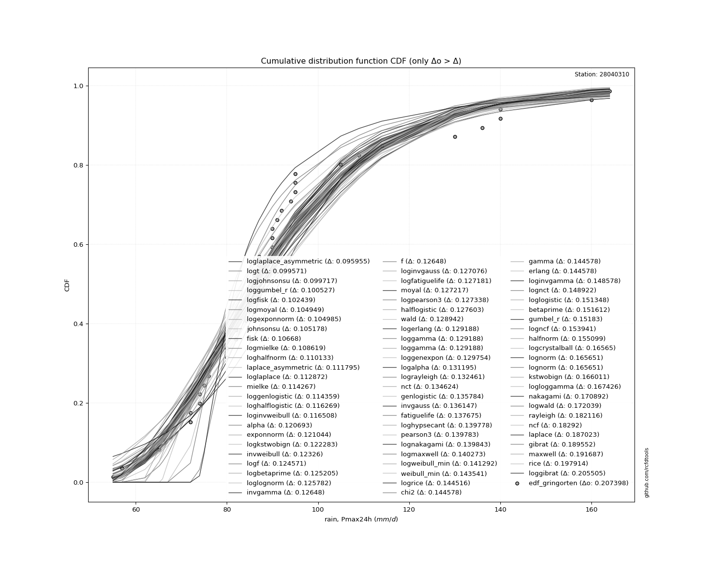</img>

</div>


**8.3. Best fit**

<div align="center">

|   id |   station | empirical_dist   | p_dist                |     delta |   deltao | eval   |   fit |   n |   best_fit |   best_fit_sort |
|-----:|----------:|:-----------------|:----------------------|----------:|---------:|:-------|------:|----:|-----------:|----------------:|
|    0 |  28040310 | edf_gringorten   | loglaplace_asymmetric | 0.0959554 | 0.207398 | Δo > Δ |     1 |  43 |          1 |               1 |

</div>


<div align="center">

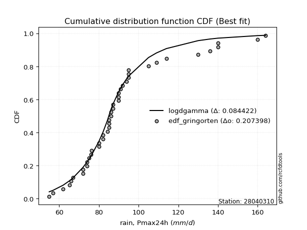</img>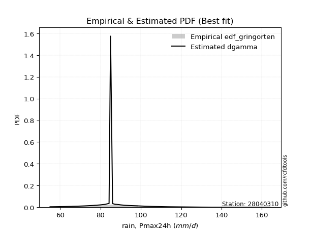</img>

</div>


### 9. Empirical - EDF Jenkinson (1977)

The Jenkinson formula in hydrology is an empirical plotting position formula used to estimate the non-exceedance probability _(P)_ or return period _(T)_ of a given ordered observation within a sample. It is a widely used method in the frequency analysis of extreme events such as floods and rainfall, as it provides a distribution-free way to plot data. _a≈0.31_ and _b≈0.38_ are constants derived to approximate the median of the probability distribution for the given rank.

<div align="center">


$P=(m-a)/(n+b)$


</div>


**9.1. Empirical values**

<div align="center">

|                | 0                   | 1                    | 2                   | 3                  | 4                   | 5                   | 6                  | 7                  | 8                  | 9                   | 10                  | 11                 | 12                  | 13                 | 14                | 15                  | 16                 | 17                 | 18                  | 19                  | 20                 | 21            | 22                 | 23                 | 24                 | 25                 | 26                 | 27                 | 28                 | 29                 | 30                 | 31                 | 32                 | 33                | 34                 | 35                 | 36                 | 37                 | 38                 | 39                 | 40                 | 41                 | 42                 |
|:---------------|:--------------------|:---------------------|:--------------------|:-------------------|:--------------------|:--------------------|:-------------------|:-------------------|:-------------------|:--------------------|:--------------------|:-------------------|:--------------------|:-------------------|:------------------|:--------------------|:-------------------|:-------------------|:--------------------|:--------------------|:-------------------|:--------------|:-------------------|:-------------------|:-------------------|:-------------------|:-------------------|:-------------------|:-------------------|:-------------------|:-------------------|:-------------------|:-------------------|:------------------|:-------------------|:-------------------|:-------------------|:-------------------|:-------------------|:-------------------|:-------------------|:-------------------|:-------------------|
| date           | 1998                | 2015                 | 1974                | 2012               | 2014                | 1980                | 2004               | 1987               | 2005               | 1992                | 1997                | 1977               | 2010                | 2011               | 2007              | 1989                | 2001               | 2013               | 1978                | 1995                | 2009               | 2002          | 1975               | 1986               | 2000               | 2003               | 2006               | 1991               | 1976               | 1985               | 1982               | 1984               | 1990               | 1994              | 1993               | 1983               | 1999               | 1979               | 1981               | 1973               | 2008               | 1988               | 1996               |
| x              | 55.0                | 56.9235388634093     | 62.0                | 65.175540074784    | 65.8836476566967    | 67.0                | 72.0               | 72.0               | 74.0               | 74.0                | 75.0                | 76.0               | 76.2441825270904    | 79.9523480258781   | 80.0              | 82.0                | 82.0               | 84.2586803103685   | 85.0                | 85.0                | 85.0               | 86.0          | 86.0               | 87.0               | 87.0               | 90.0               | 90.0               | 90.0               | 91.0               | 92.0               | 94.0               | 95.0               | 95.0               | 95.0              | 105.0              | 109.0              | 114.0              | 130.0              | 136.0              | 140.0              | 140.0              | 160.0              | 164.0              |
| m              | 1                   | 2                    | 3                   | 4                  | 5                   | 6                   | 7                  | 8                  | 9                  | 10                  | 11                  | 12                 | 13                  | 14                 | 15                | 16                  | 17                 | 18                 | 19                  | 20                  | 21                 | 22            | 23                 | 24                 | 25                 | 26                 | 27                 | 28                 | 29                 | 30                 | 31                 | 32                 | 33                 | 34                | 35                 | 36                 | 37                 | 38                 | 39                 | 40                 | 41                 | 42                 | 43                 |
| empirical_dist | edf_jenkinson       | edf_jenkinson        | edf_jenkinson       | edf_jenkinson      | edf_jenkinson       | edf_jenkinson       | edf_jenkinson      | edf_jenkinson      | edf_jenkinson      | edf_jenkinson       | edf_jenkinson       | edf_jenkinson      | edf_jenkinson       | edf_jenkinson      | edf_jenkinson     | edf_jenkinson       | edf_jenkinson      | edf_jenkinson      | edf_jenkinson       | edf_jenkinson       | edf_jenkinson      | edf_jenkinson | edf_jenkinson      | edf_jenkinson      | edf_jenkinson      | edf_jenkinson      | edf_jenkinson      | edf_jenkinson      | edf_jenkinson      | edf_jenkinson      | edf_jenkinson      | edf_jenkinson      | edf_jenkinson      | edf_jenkinson     | edf_jenkinson      | edf_jenkinson      | edf_jenkinson      | edf_jenkinson      | edf_jenkinson      | edf_jenkinson      | edf_jenkinson      | edf_jenkinson      | edf_jenkinson      |
| empirical      | 0.01590594744121715 | 0.038958045182111566 | 0.06201014292300599 | 0.0850622406639004 | 0.10811433840479484 | 0.13116643614568926 | 0.1542185338865837 | 0.1772706316274781 | 0.2003227293683725 | 0.22337482710926693 | 0.24642692485016135 | 0.2694790225910558 | 0.29253112033195017 | 0.3155832180728446 | 0.338635315813739 | 0.36168741355463346 | 0.3847395112955279 | 0.4077916090364223 | 0.43084370677731676 | 0.45389580451821115 | 0.4769479022591056 | 0.5           | 0.5230520977408945 | 0.5461041954817888 | 0.5691562932226832 | 0.5922083909635777 | 0.6152604887044721 | 0.6383125864453665 | 0.6613646841862609 | 0.6844167819271554 | 0.7074688796680498 | 0.7305209774089442 | 0.7535730751498385 | 0.776625172890733 | 0.7996772706316274 | 0.8227293683725218 | 0.8457814661134162 | 0.8688335638543107 | 0.8918856615952051 | 0.9149377593360994 | 0.9379898570769939 | 0.9610419548178883 | 0.9840940525587827 |
| empirical_tr   | 1.016163035839775   | 1.040537299112497    | 1.0661096092405997  | 1.09297052154195   | 1.1212199534763505  | 1.1509684266383655  | 1.1823385118560916 | 1.2154665172317176 | 1.25050446814644   | 1.2876224398931433  | 1.327011318446008   | 1.3688860839381507 | 1.413489736070381   | 1.4610980127989222 | 1.512025095852213 | 1.5666305525460456  | 1.625327838141626  | 1.6885947839626314 | 1.7569866342648846  | 1.8311523849725622  | 1.9118554429263996 | 2.0           | 2.096665055582407  | 2.2031488065007614 | 2.321027287319422  | 2.452232899943471  | 2.5991611743559018 | 2.764818355640535  | 2.9530292716133424 | 3.168736303871439  | 3.418439716312057  | 3.7108639863130874 | 4.057998129092608  | 4.476780185758512 | 4.991944764096661  | 5.6410923276983045 | 6.484304932735421  | 7.623901581722315  | 9.249466950959484  | 11.75609756097559  | 16.12639405204458  | 25.66863905325438  | 62.86956521739065  |

</div>


**9.2. Kolmogorov-Smirnov fit test (sorted by Δ)**


<div align="center">

|                | 0                     | 1                   | 2                   | 3                   | 4                   | 5                   | 6                   | 7                   | 8                   | 9                   | 10                  | 11                  | 12                  | 13                  | 14                  | 15                  | 16                  | 17                  | 18                  | 19                  | 20                  | 21                  | 22                  | 23                  | 24                  | 25                  | 26                  | 27                  | 28                  | 29                  | 30                  | 31                  | 32                  | 33                  | 34                  | 35                  | 36                  | 37                  | 38                  | 39                  | 40                  | 41                  | 42                  | 43                  | 44                  | 45                  | 46                  | 47                  | 48                  | 49                  | 50                  | 51                  | 52                  | 53                  | 54                  | 55                  | 56                  | 57                  | 58                  | 59                  | 60                  | 61                  | 62                  | 63                  | 64                  | 65                  | 66                  | 67                  | 68                  | 69                  | 70                  | 71                  | 72                  | 73                  | 74                  | 75                  | 76                  | 77                  | 78                  | 79                  | 80                  | 81                  | 82                  | 83                  | 84                  | 85                  | 86                  | 87                  | 88                  | 89                  |
|:---------------|:----------------------|:--------------------|:--------------------|:--------------------|:--------------------|:--------------------|:--------------------|:--------------------|:--------------------|:--------------------|:--------------------|:--------------------|:--------------------|:--------------------|:--------------------|:--------------------|:--------------------|:--------------------|:--------------------|:--------------------|:--------------------|:--------------------|:--------------------|:--------------------|:--------------------|:--------------------|:--------------------|:--------------------|:--------------------|:--------------------|:--------------------|:--------------------|:--------------------|:--------------------|:--------------------|:--------------------|:--------------------|:--------------------|:--------------------|:--------------------|:--------------------|:--------------------|:--------------------|:--------------------|:--------------------|:--------------------|:--------------------|:--------------------|:--------------------|:--------------------|:--------------------|:--------------------|:--------------------|:--------------------|:--------------------|:--------------------|:--------------------|:--------------------|:--------------------|:--------------------|:--------------------|:--------------------|:--------------------|:--------------------|:--------------------|:--------------------|:--------------------|:--------------------|:--------------------|:--------------------|:--------------------|:--------------------|:--------------------|:--------------------|:--------------------|:--------------------|:--------------------|:--------------------|:--------------------|:--------------------|:--------------------|:--------------------|:--------------------|:--------------------|:--------------------|:--------------------|:--------------------|:--------------------|:--------------------|:--------------------|
| station        | 28040310              | 28040310            | 28040310            | 28040310            | 28040310            | 28040310            | 28040310            | 28040310            | 28040310            | 28040310            | 28040310            | 28040310            | 28040310            | 28040310            | 28040310            | 28040310            | 28040310            | 28040310            | 28040310            | 28040310            | 28040310            | 28040310            | 28040310            | 28040310            | 28040310            | 28040310            | 28040310            | 28040310            | 28040310            | 28040310            | 28040310            | 28040310            | 28040310            | 28040310            | 28040310            | 28040310            | 28040310            | 28040310            | 28040310            | 28040310            | 28040310            | 28040310            | 28040310            | 28040310            | 28040310            | 28040310            | 28040310            | 28040310            | 28040310            | 28040310            | 28040310            | 28040310            | 28040310            | 28040310            | 28040310            | 28040310            | 28040310            | 28040310            | 28040310            | 28040310            | 28040310            | 28040310            | 28040310            | 28040310            | 28040310            | 28040310            | 28040310            | 28040310            | 28040310            | 28040310            | 28040310            | 28040310            | 28040310            | 28040310            | 28040310            | 28040310            | 28040310            | 28040310            | 28040310            | 28040310            | 28040310            | 28040310            | 28040310            | 28040310            | 28040310            | 28040310            | 28040310            | 28040310            | 28040310            | 28040310            |
| empirical_dist | edf_jenkinson         | edf_jenkinson       | edf_jenkinson       | edf_jenkinson       | edf_jenkinson       | edf_jenkinson       | edf_jenkinson       | edf_jenkinson       | edf_jenkinson       | edf_jenkinson       | edf_jenkinson       | edf_jenkinson       | edf_jenkinson       | edf_jenkinson       | edf_jenkinson       | edf_jenkinson       | edf_jenkinson       | edf_jenkinson       | edf_jenkinson       | edf_jenkinson       | edf_jenkinson       | edf_jenkinson       | edf_jenkinson       | edf_jenkinson       | edf_jenkinson       | edf_jenkinson       | edf_jenkinson       | edf_jenkinson       | edf_jenkinson       | edf_jenkinson       | edf_jenkinson       | edf_jenkinson       | edf_jenkinson       | edf_jenkinson       | edf_jenkinson       | edf_jenkinson       | edf_jenkinson       | edf_jenkinson       | edf_jenkinson       | edf_jenkinson       | edf_jenkinson       | edf_jenkinson       | edf_jenkinson       | edf_jenkinson       | edf_jenkinson       | edf_jenkinson       | edf_jenkinson       | edf_jenkinson       | edf_jenkinson       | edf_jenkinson       | edf_jenkinson       | edf_jenkinson       | edf_jenkinson       | edf_jenkinson       | edf_jenkinson       | edf_jenkinson       | edf_jenkinson       | edf_jenkinson       | edf_jenkinson       | edf_jenkinson       | edf_jenkinson       | edf_jenkinson       | edf_jenkinson       | edf_jenkinson       | edf_jenkinson       | edf_jenkinson       | edf_jenkinson       | edf_jenkinson       | edf_jenkinson       | edf_jenkinson       | edf_jenkinson       | edf_jenkinson       | edf_jenkinson       | edf_jenkinson       | edf_jenkinson       | edf_jenkinson       | edf_jenkinson       | edf_jenkinson       | edf_jenkinson       | edf_jenkinson       | edf_jenkinson       | edf_jenkinson       | edf_jenkinson       | edf_jenkinson       | edf_jenkinson       | edf_jenkinson       | edf_jenkinson       | edf_jenkinson       | edf_jenkinson       | edf_jenkinson       |
| p_dist         | loglaplace_asymmetric | logt                | logjohnsonsu        | loggumbel_r         | logfisk             | logexponnorm        | johnsonsu           | logmoyal            | fisk                | logmielke           | loghalfnorm         | laplace_asymmetric  | loglaplace          | mielke              | loggenlogistic      | loginvweibull       | loghalflogistic     | alpha               | exponnorm           | logkstwobign        | invweibull          | logf                | logbetaprime        | loglognorm          | invgamma            | f                   | loginvgauss         | logfatiguelife      | moyal               | logpearson3         | halflogistic        | logerlang           | loggamma            | loggamma            | loggenexpon         | logalpha            | lograyleigh         | wald                | nct                 | genlogistic         | invgauss            | fatiguelife         | loghypsecant        | pearson3            | lognakagami         | logmaxwell          | logweibull_min      | weibull_min         | logrice             | chi2                | gamma               | erlang              | loginvgamma         | lognct              | loglogistic         | betaprime           | gumbel_r            | logncf              | halfnorm            | logcrystalball      | lognorm             | lognorm             | kstwobign           | logloggamma         | nakagami            | logwald             | rayleigh            | ncf                 | laplace             | maxwell             | gibrat              | rice                | hypsecant           | loggibrat           | logistic            | genexpon            | expon               | pareto              | loggompertz         | truncnorm           | norm                | crystalball         | loggumbel_l         | t                   | logtruncnorm        | logexpon            | logpareto           | gumbel_l            | logchi2             | gompertz            |
| delta          | 0.09428747628506995   | 0.09790343757103881 | 0.09804906664542956 | 0.0988588689855604  | 0.100770681891717   | 0.10331691084904226 | 0.10351039457216515 | 0.10439271118071758 | 0.10501179056409904 | 0.10695068988507417 | 0.1084653139883649  | 0.11012735661377682 | 0.11245494539929096 | 0.11259876560599169 | 0.11269058644397034 | 0.11484037438845607 | 0.11571265704684841 | 0.11902475618990427 | 0.1193755887740987  | 0.12061547253467841 | 0.12159160885681186 | 0.12290287395386423 | 0.12353666851995149 | 0.12411391355456125 | 0.1248119721472718  | 0.12481242168301598 | 0.1254080379612179  | 0.125513015067914   | 0.12554921691540333 | 0.12567021760007324 | 0.12593480633889786 | 0.12752035704146314 | 0.12752036347155482 | 0.12752036347155482 | 0.1280861380994276  | 0.1295270340395882  | 0.1307929523364043  | 0.13116636453408076 | 0.13295565679117538 | 0.13411592246394277 | 0.13447879717202227 | 0.13600724384364882 | 0.13810963019900946 | 0.13811495412476793 | 0.13817519524976984 | 0.13860467772570262 | 0.13962395360944035 | 0.14187289180319484 | 0.14284792285127945 | 0.14290962622979686 | 0.14290967005358912 | 0.14291007794931798 | 0.14690984477035862 | 0.14725372404616532 | 0.14968038837397557 | 0.1499440609437659  | 0.15016164868707127 | 0.1522732431434738  | 0.153431226410632   | 0.1639823303569734  | 0.16398286152735742 | 0.16398286152735742 | 0.16434292123264638 | 0.1657584781220447  | 0.16922383888138137 | 0.1714828789896794  | 0.1804482515249668  | 0.1812521139965385  | 0.1853554711596661  | 0.1900188370407606  | 0.19122003299779744 | 0.19624563145540497 | 0.20595344643431823 | 0.20717315740426784 | 0.21235734909723536 | 0.21884044380962536 | 0.2188775417304069  | 0.21887755935743847 | 0.21970518431449038 | 0.21996012165424328 | 0.21996013256444513 | 0.2199601414016199  | 0.2212716572536455  | 0.22488424049195754 | 0.25645670359896083 | 0.2787961178063071  | 0.27879612473681104 | 0.28625752115860403 | 0.28939540252418816 | 0.860440105227336   |
| deltao         | 0.20739805565234237   | 0.20739805565234237 | 0.20739805565234237 | 0.20739805565234237 | 0.20739805565234237 | 0.20739805565234237 | 0.20739805565234237 | 0.20739805565234237 | 0.20739805565234237 | 0.20739805565234237 | 0.20739805565234237 | 0.20739805565234237 | 0.20739805565234237 | 0.20739805565234237 | 0.20739805565234237 | 0.20739805565234237 | 0.20739805565234237 | 0.20739805565234237 | 0.20739805565234237 | 0.20739805565234237 | 0.20739805565234237 | 0.20739805565234237 | 0.20739805565234237 | 0.20739805565234237 | 0.20739805565234237 | 0.20739805565234237 | 0.20739805565234237 | 0.20739805565234237 | 0.20739805565234237 | 0.20739805565234237 | 0.20739805565234237 | 0.20739805565234237 | 0.20739805565234237 | 0.20739805565234237 | 0.20739805565234237 | 0.20739805565234237 | 0.20739805565234237 | 0.20739805565234237 | 0.20739805565234237 | 0.20739805565234237 | 0.20739805565234237 | 0.20739805565234237 | 0.20739805565234237 | 0.20739805565234237 | 0.20739805565234237 | 0.20739805565234237 | 0.20739805565234237 | 0.20739805565234237 | 0.20739805565234237 | 0.20739805565234237 | 0.20739805565234237 | 0.20739805565234237 | 0.20739805565234237 | 0.20739805565234237 | 0.20739805565234237 | 0.20739805565234237 | 0.20739805565234237 | 0.20739805565234237 | 0.20739805565234237 | 0.20739805565234237 | 0.20739805565234237 | 0.20739805565234237 | 0.20739805565234237 | 0.20739805565234237 | 0.20739805565234237 | 0.20739805565234237 | 0.20739805565234237 | 0.20739805565234237 | 0.20739805565234237 | 0.20739805565234237 | 0.20739805565234237 | 0.20739805565234237 | 0.20739805565234237 | 0.20739805565234237 | 0.20739805565234237 | 0.20739805565234237 | 0.20739805565234237 | 0.20739805565234237 | 0.20739805565234237 | 0.20739805565234237 | 0.20739805565234237 | 0.20739805565234237 | 0.20739805565234237 | 0.20739805565234237 | 0.20739805565234237 | 0.20739805565234237 | 0.20739805565234237 | 0.20739805565234237 | 0.20739805565234237 | 0.20739805565234237 |
| eval           | Δo > Δ                | Δo > Δ              | Δo > Δ              | Δo > Δ              | Δo > Δ              | Δo > Δ              | Δo > Δ              | Δo > Δ              | Δo > Δ              | Δo > Δ              | Δo > Δ              | Δo > Δ              | Δo > Δ              | Δo > Δ              | Δo > Δ              | Δo > Δ              | Δo > Δ              | Δo > Δ              | Δo > Δ              | Δo > Δ              | Δo > Δ              | Δo > Δ              | Δo > Δ              | Δo > Δ              | Δo > Δ              | Δo > Δ              | Δo > Δ              | Δo > Δ              | Δo > Δ              | Δo > Δ              | Δo > Δ              | Δo > Δ              | Δo > Δ              | Δo > Δ              | Δo > Δ              | Δo > Δ              | Δo > Δ              | Δo > Δ              | Δo > Δ              | Δo > Δ              | Δo > Δ              | Δo > Δ              | Δo > Δ              | Δo > Δ              | Δo > Δ              | Δo > Δ              | Δo > Δ              | Δo > Δ              | Δo > Δ              | Δo > Δ              | Δo > Δ              | Δo > Δ              | Δo > Δ              | Δo > Δ              | Δo > Δ              | Δo > Δ              | Δo > Δ              | Δo > Δ              | Δo > Δ              | Δo > Δ              | Δo > Δ              | Δo > Δ              | Δo > Δ              | Δo > Δ              | Δo > Δ              | Δo > Δ              | Δo > Δ              | Δo > Δ              | Δo > Δ              | Δo > Δ              | Δo > Δ              | Δo > Δ              | Δo > Δ              | Δo > Δ              | Δo <= Δ             | Δo <= Δ             | Δo <= Δ             | Δo <= Δ             | Δo <= Δ             | Δo <= Δ             | Δo <= Δ             | Δo <= Δ             | Δo <= Δ             | Δo <= Δ             | Δo <= Δ             | Δo <= Δ             | Δo <= Δ             | Δo <= Δ             | Δo <= Δ             | Δo <= Δ             |
| fit            | 1                     | 1                   | 1                   | 1                   | 1                   | 1                   | 1                   | 1                   | 1                   | 1                   | 1                   | 1                   | 1                   | 1                   | 1                   | 1                   | 1                   | 1                   | 1                   | 1                   | 1                   | 1                   | 1                   | 1                   | 1                   | 1                   | 1                   | 1                   | 1                   | 1                   | 1                   | 1                   | 1                   | 1                   | 1                   | 1                   | 1                   | 1                   | 1                   | 1                   | 1                   | 1                   | 1                   | 1                   | 1                   | 1                   | 1                   | 1                   | 1                   | 1                   | 1                   | 1                   | 1                   | 1                   | 1                   | 1                   | 1                   | 1                   | 1                   | 1                   | 1                   | 1                   | 1                   | 1                   | 1                   | 1                   | 1                   | 1                   | 1                   | 1                   | 1                   | 1                   | 1                   | 1                   | 0                   | 0                   | 0                   | 0                   | 0                   | 0                   | 0                   | 0                   | 0                   | 0                   | 0                   | 0                   | 0                   | 0                   | 0                   | 0                   |
| n              | 43                    | 43                  | 43                  | 43                  | 43                  | 43                  | 43                  | 43                  | 43                  | 43                  | 43                  | 43                  | 43                  | 43                  | 43                  | 43                  | 43                  | 43                  | 43                  | 43                  | 43                  | 43                  | 43                  | 43                  | 43                  | 43                  | 43                  | 43                  | 43                  | 43                  | 43                  | 43                  | 43                  | 43                  | 43                  | 43                  | 43                  | 43                  | 43                  | 43                  | 43                  | 43                  | 43                  | 43                  | 43                  | 43                  | 43                  | 43                  | 43                  | 43                  | 43                  | 43                  | 43                  | 43                  | 43                  | 43                  | 43                  | 43                  | 43                  | 43                  | 43                  | 43                  | 43                  | 43                  | 43                  | 43                  | 43                  | 43                  | 43                  | 43                  | 43                  | 43                  | 43                  | 43                  | 43                  | 43                  | 43                  | 43                  | 43                  | 43                  | 43                  | 43                  | 43                  | 43                  | 43                  | 43                  | 43                  | 43                  | 43                  | 43                  |
| best_fit       | 1                     | 0                   | 0                   | 0                   | 0                   | 0                   | 0                   | 0                   | 0                   | 0                   | 0                   | 0                   | 0                   | 0                   | 0                   | 0                   | 0                   | 0                   | 0                   | 0                   | 0                   | 0                   | 0                   | 0                   | 0                   | 0                   | 0                   | 0                   | 0                   | 0                   | 0                   | 0                   | 0                   | 0                   | 0                   | 0                   | 0                   | 0                   | 0                   | 0                   | 0                   | 0                   | 0                   | 0                   | 0                   | 0                   | 0                   | 0                   | 0                   | 0                   | 0                   | 0                   | 0                   | 0                   | 0                   | 0                   | 0                   | 0                   | 0                   | 0                   | 0                   | 0                   | 0                   | 0                   | 0                   | 0                   | 0                   | 0                   | 0                   | 0                   | 0                   | 0                   | 0                   | 0                   | 0                   | 0                   | 0                   | 0                   | 0                   | 0                   | 0                   | 0                   | 0                   | 0                   | 0                   | 0                   | 0                   | 0                   | 0                   | 0                   |
| best_fit_sort  | 1                     | 2                   | 3                   | 4                   | 5                   | 6                   | 7                   | 8                   | 9                   | 10                  | 11                  | 12                  | 13                  | 14                  | 15                  | 16                  | 17                  | 18                  | 19                  | 20                  | 21                  | 22                  | 23                  | 24                  | 25                  | 26                  | 27                  | 28                  | 29                  | 30                  | 31                  | 32                  | 33                  | 34                  | 35                  | 36                  | 37                  | 38                  | 39                  | 40                  | 41                  | 42                  | 43                  | 44                  | 45                  | 46                  | 47                  | 48                  | 49                  | 50                  | 51                  | 52                  | 53                  | 54                  | 55                  | 56                  | 57                  | 58                  | 59                  | 60                  | 61                  | 62                  | 63                  | 64                  | 65                  | 66                  | 67                  | 68                  | 69                  | 70                  | 71                  | 72                  | 73                  | 74                  | 75                  | 76                  | 77                  | 78                  | 79                  | 80                  | 81                  | 82                  | 83                  | 84                  | 85                  | 86                  | 87                  | 88                  | 89                  | 90                  |

</div>


<div align="center">

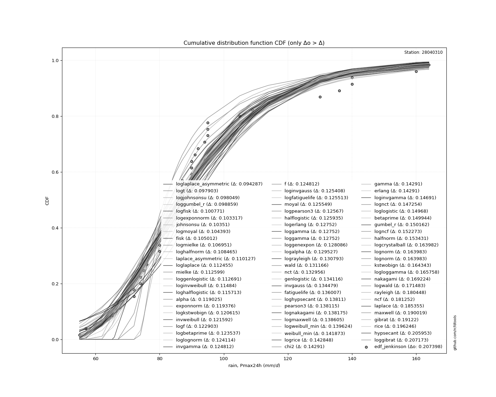</img>

</div>


**9.3. Best fit**

<div align="center">

|   id |   station | empirical_dist   | p_dist                |     delta |   deltao | eval   |   fit |   n |   best_fit |   best_fit_sort |
|-----:|----------:|:-----------------|:----------------------|----------:|---------:|:-------|------:|----:|-----------:|----------------:|
|    0 |  28040310 | edf_jenkinson    | loglaplace_asymmetric | 0.0942875 | 0.207398 | Δo > Δ |     1 |  43 |          1 |               1 |

</div>


<div align="center">

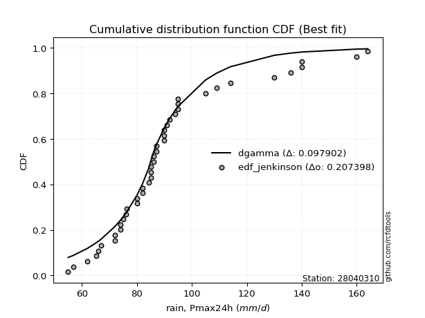</img>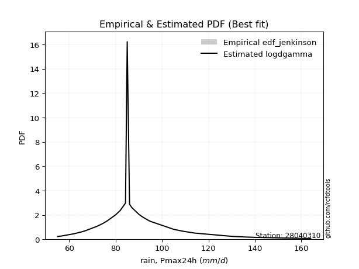</img>

</div>


### 10. Empirical - EDF Cunnane (1978)

Cunnane´s work in statistical hydrology has focused on the performance and evaluation of different probability distributions (such as GEV, Gumbel, Lognormal) for flood frequency estimation. _b_ is a constant, typically set to 0.4.

<div align="center">


$P=(m-b)/(n+1-2b)$


</div>


**10.1. Empirical values**

<div align="center">

|                | 0                    | 1                    | 2                   | 3                   | 4                   | 5                   | 6                   | 7                  | 8                   | 9                  | 10                  | 11                 | 12                  | 13                  | 14                 | 15                 | 16                  | 17                  | 18                 | 19                 | 20                  | 21          | 22                 | 23                 | 24                 | 25                 | 26                 | 27                 | 28                 | 29                 | 30                 | 31                 | 32                 | 33                 | 34                 | 35                 | 36                 | 37                 | 38                 | 39                 | 40                 | 41                 | 42                |
|:---------------|:---------------------|:---------------------|:--------------------|:--------------------|:--------------------|:--------------------|:--------------------|:-------------------|:--------------------|:-------------------|:--------------------|:-------------------|:--------------------|:--------------------|:-------------------|:-------------------|:--------------------|:--------------------|:-------------------|:-------------------|:--------------------|:------------|:-------------------|:-------------------|:-------------------|:-------------------|:-------------------|:-------------------|:-------------------|:-------------------|:-------------------|:-------------------|:-------------------|:-------------------|:-------------------|:-------------------|:-------------------|:-------------------|:-------------------|:-------------------|:-------------------|:-------------------|:------------------|
| date           | 1998                 | 2015                 | 1974                | 2012                | 2014                | 1980                | 2004                | 1987               | 2005                | 1992               | 1997                | 1977               | 2010                | 2011                | 2007               | 1989               | 2001                | 2013                | 1978               | 1995               | 2009                | 2002        | 1975               | 1986               | 2000               | 2003               | 2006               | 1991               | 1976               | 1985               | 1982               | 1984               | 1990               | 1994               | 1993               | 1983               | 1999               | 1979               | 1981               | 1973               | 2008               | 1988               | 1996              |
| x              | 55.0                 | 56.9235388634093     | 62.0                | 65.175540074784     | 65.8836476566967    | 67.0                | 72.0                | 72.0               | 74.0                | 74.0               | 75.0                | 76.0               | 76.2441825270904    | 79.9523480258781    | 80.0               | 82.0               | 82.0                | 84.2586803103685    | 85.0               | 85.0               | 85.0                | 86.0        | 86.0               | 87.0               | 87.0               | 90.0               | 90.0               | 90.0               | 91.0               | 92.0               | 94.0               | 95.0               | 95.0               | 95.0               | 105.0              | 109.0              | 114.0              | 130.0              | 136.0              | 140.0              | 140.0              | 160.0              | 164.0             |
| m              | 1                    | 2                    | 3                   | 4                   | 5                   | 6                   | 7                   | 8                  | 9                   | 10                 | 11                  | 12                 | 13                  | 14                  | 15                 | 16                 | 17                  | 18                  | 19                 | 20                 | 21                  | 22          | 23                 | 24                 | 25                 | 26                 | 27                 | 28                 | 29                 | 30                 | 31                 | 32                 | 33                 | 34                 | 35                 | 36                 | 37                 | 38                 | 39                 | 40                 | 41                 | 42                 | 43                |
| empirical_dist | edf_cunnane          | edf_cunnane          | edf_cunnane         | edf_cunnane         | edf_cunnane         | edf_cunnane         | edf_cunnane         | edf_cunnane        | edf_cunnane         | edf_cunnane        | edf_cunnane         | edf_cunnane        | edf_cunnane         | edf_cunnane         | edf_cunnane        | edf_cunnane        | edf_cunnane         | edf_cunnane         | edf_cunnane        | edf_cunnane        | edf_cunnane         | edf_cunnane | edf_cunnane        | edf_cunnane        | edf_cunnane        | edf_cunnane        | edf_cunnane        | edf_cunnane        | edf_cunnane        | edf_cunnane        | edf_cunnane        | edf_cunnane        | edf_cunnane        | edf_cunnane        | edf_cunnane        | edf_cunnane        | edf_cunnane        | edf_cunnane        | edf_cunnane        | edf_cunnane        | edf_cunnane        | edf_cunnane        | edf_cunnane       |
| empirical      | 0.013888888888888888 | 0.037037037037037035 | 0.06018518518518518 | 0.08333333333333333 | 0.10648148148148147 | 0.12962962962962962 | 0.15277777777777776 | 0.1759259259259259 | 0.19907407407407404 | 0.2222222222222222 | 0.24537037037037035 | 0.2685185185185185 | 0.29166666666666663 | 0.31481481481481477 | 0.3379629629629629 | 0.3611111111111111 | 0.38425925925925924 | 0.40740740740740744 | 0.4305555555555556 | 0.4537037037037037 | 0.47685185185185186 | 0.5         | 0.5231481481481481 | 0.5462962962962963 | 0.5694444444444444 | 0.5925925925925926 | 0.6157407407407407 | 0.6388888888888888 | 0.662037037037037  | 0.6851851851851851 | 0.7083333333333334 | 0.7314814814814815 | 0.7546296296296297 | 0.7777777777777778 | 0.8009259259259259 | 0.8240740740740741 | 0.8472222222222222 | 0.8703703703703703 | 0.8935185185185185 | 0.9166666666666666 | 0.9398148148148148 | 0.9629629629629629 | 0.986111111111111 |
| empirical_tr   | 1.0140845070422535   | 1.0384615384615383   | 1.064039408866995   | 1.090909090909091   | 1.1191709844559585  | 1.148936170212766   | 1.180327868852459   | 1.2134831460674158 | 1.2485549132947977  | 1.2857142857142856 | 1.3251533742331287  | 1.3670886075949367 | 1.4117647058823528  | 1.4594594594594594  | 1.5104895104895104 | 1.565217391304348  | 1.62406015037594    | 1.6875              | 1.7560975609756098 | 1.8305084745762712 | 1.9115044247787611  | 2.0         | 2.0970873786407767 | 2.204081632653061  | 2.32258064516129   | 2.454545454545454  | 2.602409638554217  | 2.7692307692307687 | 2.9589041095890405 | 3.1764705882352935 | 3.428571428571429  | 3.724137931034483  | 4.0754716981132075 | 4.5                | 5.023255813953488  | 5.684210526315789  | 6.545454545454545  | 7.714285714285713  | 9.391304347826084  | 11.999999999999995 | 16.615384615384603 | 26.99999999999996  | 71.99999999999969 |

</div>


**10.2. Kolmogorov-Smirnov fit test (sorted by Δ)**


<div align="center">

|                | 0                     | 1                   | 2                   | 3                   | 4                   | 5                   | 6                   | 7                   | 8                   | 9                   | 10                  | 11                  | 12                  | 13                  | 14                  | 15                  | 16                  | 17                  | 18                  | 19                  | 20                  | 21                  | 22                  | 23                  | 24                  | 25                  | 26                  | 27                  | 28                  | 29                  | 30                  | 31                  | 32                  | 33                  | 34                  | 35                  | 36                  | 37                  | 38                  | 39                  | 40                  | 41                  | 42                  | 43                  | 44                  | 45                  | 46                  | 47                  | 48                  | 49                  | 50                  | 51                  | 52                  | 53                  | 54                  | 55                  | 56                  | 57                  | 58                  | 59                  | 60                  | 61                  | 62                  | 63                  | 64                  | 65                  | 66                  | 67                  | 68                  | 69                  | 70                  | 71                  | 72                  | 73                  | 74                  | 75                  | 76                  | 77                  | 78                  | 79                  | 80                  | 81                  | 82                  | 83                  | 84                  | 85                  | 86                  | 87                  | 88                  | 89                  |
|:---------------|:----------------------|:--------------------|:--------------------|:--------------------|:--------------------|:--------------------|:--------------------|:--------------------|:--------------------|:--------------------|:--------------------|:--------------------|:--------------------|:--------------------|:--------------------|:--------------------|:--------------------|:--------------------|:--------------------|:--------------------|:--------------------|:--------------------|:--------------------|:--------------------|:--------------------|:--------------------|:--------------------|:--------------------|:--------------------|:--------------------|:--------------------|:--------------------|:--------------------|:--------------------|:--------------------|:--------------------|:--------------------|:--------------------|:--------------------|:--------------------|:--------------------|:--------------------|:--------------------|:--------------------|:--------------------|:--------------------|:--------------------|:--------------------|:--------------------|:--------------------|:--------------------|:--------------------|:--------------------|:--------------------|:--------------------|:--------------------|:--------------------|:--------------------|:--------------------|:--------------------|:--------------------|:--------------------|:--------------------|:--------------------|:--------------------|:--------------------|:--------------------|:--------------------|:--------------------|:--------------------|:--------------------|:--------------------|:--------------------|:--------------------|:--------------------|:--------------------|:--------------------|:--------------------|:--------------------|:--------------------|:--------------------|:--------------------|:--------------------|:--------------------|:--------------------|:--------------------|:--------------------|:--------------------|:--------------------|:--------------------|
| station        | 28040310              | 28040310            | 28040310            | 28040310            | 28040310            | 28040310            | 28040310            | 28040310            | 28040310            | 28040310            | 28040310            | 28040310            | 28040310            | 28040310            | 28040310            | 28040310            | 28040310            | 28040310            | 28040310            | 28040310            | 28040310            | 28040310            | 28040310            | 28040310            | 28040310            | 28040310            | 28040310            | 28040310            | 28040310            | 28040310            | 28040310            | 28040310            | 28040310            | 28040310            | 28040310            | 28040310            | 28040310            | 28040310            | 28040310            | 28040310            | 28040310            | 28040310            | 28040310            | 28040310            | 28040310            | 28040310            | 28040310            | 28040310            | 28040310            | 28040310            | 28040310            | 28040310            | 28040310            | 28040310            | 28040310            | 28040310            | 28040310            | 28040310            | 28040310            | 28040310            | 28040310            | 28040310            | 28040310            | 28040310            | 28040310            | 28040310            | 28040310            | 28040310            | 28040310            | 28040310            | 28040310            | 28040310            | 28040310            | 28040310            | 28040310            | 28040310            | 28040310            | 28040310            | 28040310            | 28040310            | 28040310            | 28040310            | 28040310            | 28040310            | 28040310            | 28040310            | 28040310            | 28040310            | 28040310            | 28040310            |
| empirical_dist | edf_cunnane           | edf_cunnane         | edf_cunnane         | edf_cunnane         | edf_cunnane         | edf_cunnane         | edf_cunnane         | edf_cunnane         | edf_cunnane         | edf_cunnane         | edf_cunnane         | edf_cunnane         | edf_cunnane         | edf_cunnane         | edf_cunnane         | edf_cunnane         | edf_cunnane         | edf_cunnane         | edf_cunnane         | edf_cunnane         | edf_cunnane         | edf_cunnane         | edf_cunnane         | edf_cunnane         | edf_cunnane         | edf_cunnane         | edf_cunnane         | edf_cunnane         | edf_cunnane         | edf_cunnane         | edf_cunnane         | edf_cunnane         | edf_cunnane         | edf_cunnane         | edf_cunnane         | edf_cunnane         | edf_cunnane         | edf_cunnane         | edf_cunnane         | edf_cunnane         | edf_cunnane         | edf_cunnane         | edf_cunnane         | edf_cunnane         | edf_cunnane         | edf_cunnane         | edf_cunnane         | edf_cunnane         | edf_cunnane         | edf_cunnane         | edf_cunnane         | edf_cunnane         | edf_cunnane         | edf_cunnane         | edf_cunnane         | edf_cunnane         | edf_cunnane         | edf_cunnane         | edf_cunnane         | edf_cunnane         | edf_cunnane         | edf_cunnane         | edf_cunnane         | edf_cunnane         | edf_cunnane         | edf_cunnane         | edf_cunnane         | edf_cunnane         | edf_cunnane         | edf_cunnane         | edf_cunnane         | edf_cunnane         | edf_cunnane         | edf_cunnane         | edf_cunnane         | edf_cunnane         | edf_cunnane         | edf_cunnane         | edf_cunnane         | edf_cunnane         | edf_cunnane         | edf_cunnane         | edf_cunnane         | edf_cunnane         | edf_cunnane         | edf_cunnane         | edf_cunnane         | edf_cunnane         | edf_cunnane         | edf_cunnane         |
| p_dist         | loglaplace_asymmetric | logt                | logjohnsonsu        | loggumbel_r         | logfisk             | logexponnorm        | johnsonsu           | logmoyal            | fisk                | logmielke           | loghalfnorm         | laplace_asymmetric  | loglaplace          | mielke              | loggenlogistic      | loginvweibull       | loghalflogistic     | alpha               | exponnorm           | logkstwobign        | invweibull          | logf                | logbetaprime        | loglognorm          | invgamma            | f                   | loginvgauss         | logfatiguelife      | moyal               | logpearson3         | halflogistic        | logerlang           | loggamma            | loggamma            | loggenexpon         | wald                | logalpha            | lograyleigh         | nct                 | genlogistic         | invgauss            | fatiguelife         | loghypsecant        | pearson3            | lognakagami         | logmaxwell          | logweibull_min      | weibull_min         | logrice             | chi2                | gamma               | erlang              | loginvgamma         | lognct              | loglogistic         | betaprime           | gumbel_r            | logncf              | halfnorm            | logcrystalball      | lognorm             | lognorm             | kstwobign           | logloggamma         | nakagami            | logwald             | rayleigh            | ncf                 | laplace             | gibrat              | maxwell             | rice                | loggibrat           | hypsecant           | logistic            | genexpon            | expon               | pareto              | truncnorm           | norm                | crystalball         | loggompertz         | loggumbel_l         | t                   | logtruncnorm        | logexpon            | logpareto           | gumbel_l            | logchi2             | gompertz            |
| delta          | 0.09544008117211478   | 0.09905604245808364 | 0.09920167153247439 | 0.10001147387260523 | 0.10192328677876183 | 0.10446951573608709 | 0.10466299945920998 | 0.10477691280973245 | 0.10616439545114387 | 0.108103294772119   | 0.10961791887540973 | 0.11127996150082164 | 0.11274309662105214 | 0.11375137049303652 | 0.11384319133101517 | 0.1159929792755009  | 0.11609685867586328 | 0.1201773610769491  | 0.12052819366114353 | 0.12176807742172324 | 0.12274421374385669 | 0.12405547884090906 | 0.12468927340699631 | 0.12526651844160608 | 0.12596457703431663 | 0.1259650265700608  | 0.12656064284826274 | 0.12666561995495884 | 0.12670182180244816 | 0.12682282248711807 | 0.1270874112259427  | 0.12867296192850797 | 0.12867296835859965 | 0.12867296835859965 | 0.12923874298647242 | 0.12962955801802112 | 0.13067963892663303 | 0.13194555722344914 | 0.1341082616782202  | 0.1352685273509876  | 0.1356314020590671  | 0.13715984873069365 | 0.1392622350860543  | 0.13926755901181276 | 0.13932780013681467 | 0.13975728261274745 | 0.14077655849648518 | 0.14302549669023967 | 0.14400052773832428 | 0.1440622311168417  | 0.14406227494063395 | 0.1440626828363628  | 0.14806244965740345 | 0.14840632893321015 | 0.1508329932610204  | 0.15109666583081072 | 0.1513142535741161  | 0.15342584803051862 | 0.15458383129767683 | 0.16513493524401823 | 0.16513546641440224 | 0.16513546641440224 | 0.1654955261196912  | 0.16691108300908952 | 0.1703764437684262  | 0.17186708061869427 | 0.18160085641201162 | 0.18240471888358334 | 0.18650807604671094 | 0.19006742811075272 | 0.19117144192780544 | 0.1973982363424498  | 0.20602055251722312 | 0.20710605132136306 | 0.2135099539842802  | 0.2202811999184313  | 0.22031829783921283 | 0.2203183154662444  | 0.2211127265412881  | 0.22111273745148996 | 0.22111274628866473 | 0.2211459404232963  | 0.22242426214069033 | 0.22603684537900237 | 0.2578974597077668  | 0.280236873915113   | 0.28023688084561693 | 0.28741012604564886 | 0.2914124610765165  | 0.8619769117433957  |
| deltao         | 0.20739805565234237   | 0.20739805565234237 | 0.20739805565234237 | 0.20739805565234237 | 0.20739805565234237 | 0.20739805565234237 | 0.20739805565234237 | 0.20739805565234237 | 0.20739805565234237 | 0.20739805565234237 | 0.20739805565234237 | 0.20739805565234237 | 0.20739805565234237 | 0.20739805565234237 | 0.20739805565234237 | 0.20739805565234237 | 0.20739805565234237 | 0.20739805565234237 | 0.20739805565234237 | 0.20739805565234237 | 0.20739805565234237 | 0.20739805565234237 | 0.20739805565234237 | 0.20739805565234237 | 0.20739805565234237 | 0.20739805565234237 | 0.20739805565234237 | 0.20739805565234237 | 0.20739805565234237 | 0.20739805565234237 | 0.20739805565234237 | 0.20739805565234237 | 0.20739805565234237 | 0.20739805565234237 | 0.20739805565234237 | 0.20739805565234237 | 0.20739805565234237 | 0.20739805565234237 | 0.20739805565234237 | 0.20739805565234237 | 0.20739805565234237 | 0.20739805565234237 | 0.20739805565234237 | 0.20739805565234237 | 0.20739805565234237 | 0.20739805565234237 | 0.20739805565234237 | 0.20739805565234237 | 0.20739805565234237 | 0.20739805565234237 | 0.20739805565234237 | 0.20739805565234237 | 0.20739805565234237 | 0.20739805565234237 | 0.20739805565234237 | 0.20739805565234237 | 0.20739805565234237 | 0.20739805565234237 | 0.20739805565234237 | 0.20739805565234237 | 0.20739805565234237 | 0.20739805565234237 | 0.20739805565234237 | 0.20739805565234237 | 0.20739805565234237 | 0.20739805565234237 | 0.20739805565234237 | 0.20739805565234237 | 0.20739805565234237 | 0.20739805565234237 | 0.20739805565234237 | 0.20739805565234237 | 0.20739805565234237 | 0.20739805565234237 | 0.20739805565234237 | 0.20739805565234237 | 0.20739805565234237 | 0.20739805565234237 | 0.20739805565234237 | 0.20739805565234237 | 0.20739805565234237 | 0.20739805565234237 | 0.20739805565234237 | 0.20739805565234237 | 0.20739805565234237 | 0.20739805565234237 | 0.20739805565234237 | 0.20739805565234237 | 0.20739805565234237 | 0.20739805565234237 |
| eval           | Δo > Δ                | Δo > Δ              | Δo > Δ              | Δo > Δ              | Δo > Δ              | Δo > Δ              | Δo > Δ              | Δo > Δ              | Δo > Δ              | Δo > Δ              | Δo > Δ              | Δo > Δ              | Δo > Δ              | Δo > Δ              | Δo > Δ              | Δo > Δ              | Δo > Δ              | Δo > Δ              | Δo > Δ              | Δo > Δ              | Δo > Δ              | Δo > Δ              | Δo > Δ              | Δo > Δ              | Δo > Δ              | Δo > Δ              | Δo > Δ              | Δo > Δ              | Δo > Δ              | Δo > Δ              | Δo > Δ              | Δo > Δ              | Δo > Δ              | Δo > Δ              | Δo > Δ              | Δo > Δ              | Δo > Δ              | Δo > Δ              | Δo > Δ              | Δo > Δ              | Δo > Δ              | Δo > Δ              | Δo > Δ              | Δo > Δ              | Δo > Δ              | Δo > Δ              | Δo > Δ              | Δo > Δ              | Δo > Δ              | Δo > Δ              | Δo > Δ              | Δo > Δ              | Δo > Δ              | Δo > Δ              | Δo > Δ              | Δo > Δ              | Δo > Δ              | Δo > Δ              | Δo > Δ              | Δo > Δ              | Δo > Δ              | Δo > Δ              | Δo > Δ              | Δo > Δ              | Δo > Δ              | Δo > Δ              | Δo > Δ              | Δo > Δ              | Δo > Δ              | Δo > Δ              | Δo > Δ              | Δo > Δ              | Δo > Δ              | Δo > Δ              | Δo <= Δ             | Δo <= Δ             | Δo <= Δ             | Δo <= Δ             | Δo <= Δ             | Δo <= Δ             | Δo <= Δ             | Δo <= Δ             | Δo <= Δ             | Δo <= Δ             | Δo <= Δ             | Δo <= Δ             | Δo <= Δ             | Δo <= Δ             | Δo <= Δ             | Δo <= Δ             |
| fit            | 1                     | 1                   | 1                   | 1                   | 1                   | 1                   | 1                   | 1                   | 1                   | 1                   | 1                   | 1                   | 1                   | 1                   | 1                   | 1                   | 1                   | 1                   | 1                   | 1                   | 1                   | 1                   | 1                   | 1                   | 1                   | 1                   | 1                   | 1                   | 1                   | 1                   | 1                   | 1                   | 1                   | 1                   | 1                   | 1                   | 1                   | 1                   | 1                   | 1                   | 1                   | 1                   | 1                   | 1                   | 1                   | 1                   | 1                   | 1                   | 1                   | 1                   | 1                   | 1                   | 1                   | 1                   | 1                   | 1                   | 1                   | 1                   | 1                   | 1                   | 1                   | 1                   | 1                   | 1                   | 1                   | 1                   | 1                   | 1                   | 1                   | 1                   | 1                   | 1                   | 1                   | 1                   | 0                   | 0                   | 0                   | 0                   | 0                   | 0                   | 0                   | 0                   | 0                   | 0                   | 0                   | 0                   | 0                   | 0                   | 0                   | 0                   |
| n              | 43                    | 43                  | 43                  | 43                  | 43                  | 43                  | 43                  | 43                  | 43                  | 43                  | 43                  | 43                  | 43                  | 43                  | 43                  | 43                  | 43                  | 43                  | 43                  | 43                  | 43                  | 43                  | 43                  | 43                  | 43                  | 43                  | 43                  | 43                  | 43                  | 43                  | 43                  | 43                  | 43                  | 43                  | 43                  | 43                  | 43                  | 43                  | 43                  | 43                  | 43                  | 43                  | 43                  | 43                  | 43                  | 43                  | 43                  | 43                  | 43                  | 43                  | 43                  | 43                  | 43                  | 43                  | 43                  | 43                  | 43                  | 43                  | 43                  | 43                  | 43                  | 43                  | 43                  | 43                  | 43                  | 43                  | 43                  | 43                  | 43                  | 43                  | 43                  | 43                  | 43                  | 43                  | 43                  | 43                  | 43                  | 43                  | 43                  | 43                  | 43                  | 43                  | 43                  | 43                  | 43                  | 43                  | 43                  | 43                  | 43                  | 43                  |
| best_fit       | 1                     | 0                   | 0                   | 0                   | 0                   | 0                   | 0                   | 0                   | 0                   | 0                   | 0                   | 0                   | 0                   | 0                   | 0                   | 0                   | 0                   | 0                   | 0                   | 0                   | 0                   | 0                   | 0                   | 0                   | 0                   | 0                   | 0                   | 0                   | 0                   | 0                   | 0                   | 0                   | 0                   | 0                   | 0                   | 0                   | 0                   | 0                   | 0                   | 0                   | 0                   | 0                   | 0                   | 0                   | 0                   | 0                   | 0                   | 0                   | 0                   | 0                   | 0                   | 0                   | 0                   | 0                   | 0                   | 0                   | 0                   | 0                   | 0                   | 0                   | 0                   | 0                   | 0                   | 0                   | 0                   | 0                   | 0                   | 0                   | 0                   | 0                   | 0                   | 0                   | 0                   | 0                   | 0                   | 0                   | 0                   | 0                   | 0                   | 0                   | 0                   | 0                   | 0                   | 0                   | 0                   | 0                   | 0                   | 0                   | 0                   | 0                   |
| best_fit_sort  | 1                     | 2                   | 3                   | 4                   | 5                   | 6                   | 7                   | 8                   | 9                   | 10                  | 11                  | 12                  | 13                  | 14                  | 15                  | 16                  | 17                  | 18                  | 19                  | 20                  | 21                  | 22                  | 23                  | 24                  | 25                  | 26                  | 27                  | 28                  | 29                  | 30                  | 31                  | 32                  | 33                  | 34                  | 35                  | 36                  | 37                  | 38                  | 39                  | 40                  | 41                  | 42                  | 43                  | 44                  | 45                  | 46                  | 47                  | 48                  | 49                  | 50                  | 51                  | 52                  | 53                  | 54                  | 55                  | 56                  | 57                  | 58                  | 59                  | 60                  | 61                  | 62                  | 63                  | 64                  | 65                  | 66                  | 67                  | 68                  | 69                  | 70                  | 71                  | 72                  | 73                  | 74                  | 75                  | 76                  | 77                  | 78                  | 79                  | 80                  | 81                  | 82                  | 83                  | 84                  | 85                  | 86                  | 87                  | 88                  | 89                  | 90                  |

</div>


<div align="center">

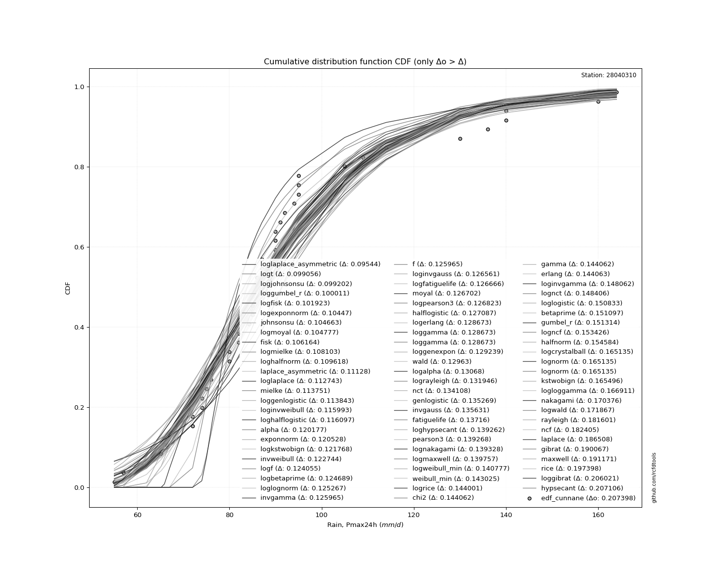</img>

</div>


**10.3. Best fit**

<div align="center">

|   id |   station | empirical_dist   | p_dist                |     delta |   deltao | eval   |   fit |   n |   best_fit |   best_fit_sort |
|-----:|----------:|:-----------------|:----------------------|----------:|---------:|:-------|------:|----:|-----------:|----------------:|
|    0 |  28040310 | edf_cunnane      | loglaplace_asymmetric | 0.0954401 | 0.207398 | Δo > Δ |     1 |  43 |          1 |               1 |

</div>


<div align="center">

</img></img>

</div>


### 11. Empirical - EDF Adamowski (1981)

The Adamowski formula in hydrology refers to a specific plotting position formula used for estimating the non-parametric empirical distribution of hydrological events (like flood peaks) to calculate their return periods. This formula provides an alternative to traditional parametric methods (like the Gumbel or Log Pearson Type III distributions). 

<div align="center">


$P=(m-0.25)/(n+0.5)$


</div>


**11.1. Empirical values**

<div align="center">

|                | 0                    | 1                    | 2                   | 3                   | 4                   | 5                   | 6                   | 7                  | 8                   | 9                   | 10                 | 11                  | 12                  | 13                 | 14                 | 15                 | 16                 | 17                  | 18                  | 19                 | 20                  | 21            | 22                 | 23                 | 24                 | 25                 | 26                 | 27                 | 28                 | 29                 | 30                 | 31                 | 32                 | 33                 | 34                 | 35                 | 36                 | 37                | 38                 | 39                 | 40                 | 41                 | 42                 |
|:---------------|:---------------------|:---------------------|:--------------------|:--------------------|:--------------------|:--------------------|:--------------------|:-------------------|:--------------------|:--------------------|:-------------------|:--------------------|:--------------------|:-------------------|:-------------------|:-------------------|:-------------------|:--------------------|:--------------------|:-------------------|:--------------------|:--------------|:-------------------|:-------------------|:-------------------|:-------------------|:-------------------|:-------------------|:-------------------|:-------------------|:-------------------|:-------------------|:-------------------|:-------------------|:-------------------|:-------------------|:-------------------|:------------------|:-------------------|:-------------------|:-------------------|:-------------------|:-------------------|
| date           | 1998                 | 2015                 | 1974                | 2012                | 2014                | 1980                | 2004                | 1987               | 2005                | 1992                | 1997               | 1977                | 2010                | 2011               | 2007               | 1989               | 2001               | 2013                | 1978                | 1995               | 2009                | 2002          | 1975               | 1986               | 2000               | 2003               | 2006               | 1991               | 1976               | 1985               | 1982               | 1984               | 1990               | 1994               | 1993               | 1983               | 1999               | 1979              | 1981               | 1973               | 2008               | 1988               | 1996               |
| x              | 55.0                 | 56.9235388634093     | 62.0                | 65.175540074784     | 65.8836476566967    | 67.0                | 72.0                | 72.0               | 74.0                | 74.0                | 75.0               | 76.0                | 76.2441825270904    | 79.9523480258781   | 80.0               | 82.0               | 82.0               | 84.2586803103685    | 85.0                | 85.0               | 85.0                | 86.0          | 86.0               | 87.0               | 87.0               | 90.0               | 90.0               | 90.0               | 91.0               | 92.0               | 94.0               | 95.0               | 95.0               | 95.0               | 105.0              | 109.0              | 114.0              | 130.0             | 136.0              | 140.0              | 140.0              | 160.0              | 164.0              |
| m              | 1                    | 2                    | 3                   | 4                   | 5                   | 6                   | 7                   | 8                  | 9                   | 10                  | 11                 | 12                  | 13                  | 14                 | 15                 | 16                 | 17                 | 18                  | 19                  | 20                 | 21                  | 22            | 23                 | 24                 | 25                 | 26                 | 27                 | 28                 | 29                 | 30                 | 31                 | 32                 | 33                 | 34                 | 35                 | 36                 | 37                 | 38                | 39                 | 40                 | 41                 | 42                 | 43                 |
| empirical_dist | edf_adamowski        | edf_adamowski        | edf_adamowski       | edf_adamowski       | edf_adamowski       | edf_adamowski       | edf_adamowski       | edf_adamowski      | edf_adamowski       | edf_adamowski       | edf_adamowski      | edf_adamowski       | edf_adamowski       | edf_adamowski      | edf_adamowski      | edf_adamowski      | edf_adamowski      | edf_adamowski       | edf_adamowski       | edf_adamowski      | edf_adamowski       | edf_adamowski | edf_adamowski      | edf_adamowski      | edf_adamowski      | edf_adamowski      | edf_adamowski      | edf_adamowski      | edf_adamowski      | edf_adamowski      | edf_adamowski      | edf_adamowski      | edf_adamowski      | edf_adamowski      | edf_adamowski      | edf_adamowski      | edf_adamowski      | edf_adamowski     | edf_adamowski      | edf_adamowski      | edf_adamowski      | edf_adamowski      | edf_adamowski      |
| empirical      | 0.017241379310344827 | 0.040229885057471264 | 0.06321839080459771 | 0.08620689655172414 | 0.10919540229885058 | 0.13218390804597702 | 0.15517241379310345 | 0.1781609195402299 | 0.20114942528735633 | 0.22413793103448276 | 0.2471264367816092 | 0.27011494252873564 | 0.29310344827586204 | 0.3160919540229885 | 0.3390804597701149 | 0.3620689655172414 | 0.3850574712643678 | 0.40804597701149425 | 0.43103448275862066 | 0.4540229885057471 | 0.47701149425287354 | 0.5           | 0.5229885057471264 | 0.5459770114942529 | 0.5689655172413793 | 0.5919540229885057 | 0.6149425287356322 | 0.6379310344827587 | 0.6609195402298851 | 0.6839080459770115 | 0.7068965517241379 | 0.7298850574712644 | 0.7528735632183908 | 0.7758620689655172 | 0.7988505747126436 | 0.8218390804597702 | 0.8448275862068966 | 0.867816091954023 | 0.8908045977011494 | 0.9137931034482759 | 0.9367816091954023 | 0.9597701149425287 | 0.9827586206896551 |
| empirical_tr   | 1.0175438596491229   | 1.0419161676646707   | 1.0674846625766872  | 1.0943396226415094  | 1.1225806451612903  | 1.152317880794702   | 1.183673469387755   | 1.2167832167832167 | 1.2517985611510791  | 1.288888888888889   | 1.3282442748091603 | 1.3700787401574803  | 1.4146341463414636  | 1.4621848739495797 | 1.5130434782608695 | 1.5675675675675675 | 1.6261682242990652 | 1.6893203883495145  | 1.7575757575757576  | 1.8315789473684212 | 1.9120879120879122  | 2.0           | 2.0963855421686746 | 2.2025316455696204 | 2.3200000000000003 | 2.4507042253521125 | 2.5970149253731343 | 2.7619047619047623 | 2.9491525423728815 | 3.1636363636363636 | 3.4117647058823524 | 3.7021276595744688 | 4.046511627906977  | 4.461538461538462  | 4.971428571428571  | 5.612903225806453  | 6.4444444444444455 | 7.565217391304348 | 9.157894736842103  | 11.600000000000007 | 15.818181818181824 | 24.857142857142854 | 57.999999999999886 |

</div>


**11.2. Kolmogorov-Smirnov fit test (sorted by Δ)**


<div align="center">

|                | 0                     | 1                   | 2                   | 3                   | 4                   | 5                   | 6                   | 7                   | 8                   | 9                   | 10                  | 11                  | 12                  | 13                  | 14                  | 15                  | 16                  | 17                  | 18                  | 19                  | 20                  | 21                  | 22                  | 23                  | 24                  | 25                  | 26                  | 27                  | 28                  | 29                  | 30                  | 31                  | 32                  | 33                  | 34                  | 35                  | 36                  | 37                  | 38                  | 39                  | 40                  | 41                  | 42                  | 43                  | 44                  | 45                  | 46                  | 47                  | 48                  | 49                  | 50                  | 51                  | 52                  | 53                  | 54                  | 55                  | 56                  | 57                  | 58                  | 59                  | 60                  | 61                  | 62                  | 63                  | 64                  | 65                  | 66                  | 67                  | 68                  | 69                  | 70                  | 71                  | 72                  | 73                  | 74                  | 75                  | 76                  | 77                  | 78                  | 79                  | 80                  | 81                  | 82                  | 83                  | 84                  | 85                  | 86                  | 87                  | 88                  | 89                  |
|:---------------|:----------------------|:--------------------|:--------------------|:--------------------|:--------------------|:--------------------|:--------------------|:--------------------|:--------------------|:--------------------|:--------------------|:--------------------|:--------------------|:--------------------|:--------------------|:--------------------|:--------------------|:--------------------|:--------------------|:--------------------|:--------------------|:--------------------|:--------------------|:--------------------|:--------------------|:--------------------|:--------------------|:--------------------|:--------------------|:--------------------|:--------------------|:--------------------|:--------------------|:--------------------|:--------------------|:--------------------|:--------------------|:--------------------|:--------------------|:--------------------|:--------------------|:--------------------|:--------------------|:--------------------|:--------------------|:--------------------|:--------------------|:--------------------|:--------------------|:--------------------|:--------------------|:--------------------|:--------------------|:--------------------|:--------------------|:--------------------|:--------------------|:--------------------|:--------------------|:--------------------|:--------------------|:--------------------|:--------------------|:--------------------|:--------------------|:--------------------|:--------------------|:--------------------|:--------------------|:--------------------|:--------------------|:--------------------|:--------------------|:--------------------|:--------------------|:--------------------|:--------------------|:--------------------|:--------------------|:--------------------|:--------------------|:--------------------|:--------------------|:--------------------|:--------------------|:--------------------|:--------------------|:--------------------|:--------------------|:--------------------|
| station        | 28040310              | 28040310            | 28040310            | 28040310            | 28040310            | 28040310            | 28040310            | 28040310            | 28040310            | 28040310            | 28040310            | 28040310            | 28040310            | 28040310            | 28040310            | 28040310            | 28040310            | 28040310            | 28040310            | 28040310            | 28040310            | 28040310            | 28040310            | 28040310            | 28040310            | 28040310            | 28040310            | 28040310            | 28040310            | 28040310            | 28040310            | 28040310            | 28040310            | 28040310            | 28040310            | 28040310            | 28040310            | 28040310            | 28040310            | 28040310            | 28040310            | 28040310            | 28040310            | 28040310            | 28040310            | 28040310            | 28040310            | 28040310            | 28040310            | 28040310            | 28040310            | 28040310            | 28040310            | 28040310            | 28040310            | 28040310            | 28040310            | 28040310            | 28040310            | 28040310            | 28040310            | 28040310            | 28040310            | 28040310            | 28040310            | 28040310            | 28040310            | 28040310            | 28040310            | 28040310            | 28040310            | 28040310            | 28040310            | 28040310            | 28040310            | 28040310            | 28040310            | 28040310            | 28040310            | 28040310            | 28040310            | 28040310            | 28040310            | 28040310            | 28040310            | 28040310            | 28040310            | 28040310            | 28040310            | 28040310            |
| empirical_dist | edf_adamowski         | edf_adamowski       | edf_adamowski       | edf_adamowski       | edf_adamowski       | edf_adamowski       | edf_adamowski       | edf_adamowski       | edf_adamowski       | edf_adamowski       | edf_adamowski       | edf_adamowski       | edf_adamowski       | edf_adamowski       | edf_adamowski       | edf_adamowski       | edf_adamowski       | edf_adamowski       | edf_adamowski       | edf_adamowski       | edf_adamowski       | edf_adamowski       | edf_adamowski       | edf_adamowski       | edf_adamowski       | edf_adamowski       | edf_adamowski       | edf_adamowski       | edf_adamowski       | edf_adamowski       | edf_adamowski       | edf_adamowski       | edf_adamowski       | edf_adamowski       | edf_adamowski       | edf_adamowski       | edf_adamowski       | edf_adamowski       | edf_adamowski       | edf_adamowski       | edf_adamowski       | edf_adamowski       | edf_adamowski       | edf_adamowski       | edf_adamowski       | edf_adamowski       | edf_adamowski       | edf_adamowski       | edf_adamowski       | edf_adamowski       | edf_adamowski       | edf_adamowski       | edf_adamowski       | edf_adamowski       | edf_adamowski       | edf_adamowski       | edf_adamowski       | edf_adamowski       | edf_adamowski       | edf_adamowski       | edf_adamowski       | edf_adamowski       | edf_adamowski       | edf_adamowski       | edf_adamowski       | edf_adamowski       | edf_adamowski       | edf_adamowski       | edf_adamowski       | edf_adamowski       | edf_adamowski       | edf_adamowski       | edf_adamowski       | edf_adamowski       | edf_adamowski       | edf_adamowski       | edf_adamowski       | edf_adamowski       | edf_adamowski       | edf_adamowski       | edf_adamowski       | edf_adamowski       | edf_adamowski       | edf_adamowski       | edf_adamowski       | edf_adamowski       | edf_adamowski       | edf_adamowski       | edf_adamowski       | edf_adamowski       |
| p_dist         | loglaplace_asymmetric | logt                | logjohnsonsu        | loggumbel_r         | logfisk             | logexponnorm        | johnsonsu           | logmoyal            | fisk                | logmielke           | loghalfnorm         | laplace_asymmetric  | mielke              | loggenlogistic      | loglaplace          | loginvweibull       | loghalflogistic     | alpha               | exponnorm           | logkstwobign        | invweibull          | logf                | logbetaprime        | loglognorm          | invgamma            | f                   | loginvgauss         | logfatiguelife      | moyal               | logpearson3         | halflogistic        | logerlang           | loggamma            | loggamma            | loggenexpon         | logalpha            | lograyleigh         | wald                | nct                 | genlogistic         | invgauss            | fatiguelife         | loghypsecant        | pearson3            | lognakagami         | logmaxwell          | logweibull_min      | weibull_min         | logrice             | chi2                | gamma               | erlang              | loginvgamma         | lognct              | loglogistic         | betaprime           | gumbel_r            | logncf              | halfnorm            | logcrystalball      | lognorm             | lognorm             | kstwobign           | logloggamma         | nakagami            | logwald             | rayleigh            | ncf                 | laplace             | maxwell             | gibrat              | rice                | hypsecant           | loggibrat           | logistic            | genexpon            | expon               | pareto              | loggompertz         | truncnorm           | norm                | crystalball         | loggumbel_l         | t                   | logtruncnorm        | logexpon            | logpareto           | gumbel_l            | logchi2             | gompertz            |
| delta          | 0.09352437235985422   | 0.09714033364582308 | 0.09728596272021384 | 0.09809576506034468 | 0.10000757796650128 | 0.10255380692382654 | 0.10274729064694943 | 0.10413834320564563 | 0.10424868663888331 | 0.10618758595985844 | 0.10770221006314917 | 0.10936425268856109 | 0.11183566168077597 | 0.11192748251875462 | 0.11226416941798706 | 0.11407727046324034 | 0.11545828907177647 | 0.11826165226468854 | 0.11861248484888298 | 0.11985236860946269 | 0.12082850493159614 | 0.12213977002864851 | 0.12277356459473576 | 0.12335080962934553 | 0.12404886822205607 | 0.12404931775780026 | 0.12464493403600219 | 0.12474991114269829 | 0.1247861129901876  | 0.12490711367485752 | 0.12517170241368214 | 0.12675725311624741 | 0.1267572595463391  | 0.1267572595463391  | 0.12732303417421187 | 0.12876393011437248 | 0.1300298484111886  | 0.1321838364343685  | 0.13219255286595966 | 0.13335281853872705 | 0.13371569324680654 | 0.1352441399184331  | 0.13734652627379373 | 0.1373518501995522  | 0.13741209132455412 | 0.1378415738004869  | 0.13886084968422463 | 0.14110978787797912 | 0.14208481892606373 | 0.14214652230458114 | 0.1421465661283734  | 0.14214697402410226 | 0.1461467408451429  | 0.1464906201209496  | 0.14891728444875985 | 0.14918095701855016 | 0.14939854476185555 | 0.15151013921825807 | 0.15266812248541628 | 0.16321922643175768 | 0.1632197576021417  | 0.1632197576021417  | 0.16357981730743065 | 0.16499537419682897 | 0.16846073495616565 | 0.17122851101460745 | 0.17968514759975107 | 0.1804890100713228  | 0.18459236723445038 | 0.1892557331155449  | 0.19198313692301328 | 0.19548252753018924 | 0.2051903425091025  | 0.20793626132948367 | 0.21159424517201963 | 0.2178865639031056  | 0.21792366182388714 | 0.2179236794509187  | 0.2187513044079706  | 0.21919701772902755 | 0.2191970286392294  | 0.21919703747640418 | 0.22050855332842978 | 0.22412113656674182 | 0.25550282369244104 | 0.27784223789978735 | 0.2778422448302913  | 0.2854944172333883  | 0.2880599706550606  | 0.8594226333270484  |
| deltao         | 0.20739805565234237   | 0.20739805565234237 | 0.20739805565234237 | 0.20739805565234237 | 0.20739805565234237 | 0.20739805565234237 | 0.20739805565234237 | 0.20739805565234237 | 0.20739805565234237 | 0.20739805565234237 | 0.20739805565234237 | 0.20739805565234237 | 0.20739805565234237 | 0.20739805565234237 | 0.20739805565234237 | 0.20739805565234237 | 0.20739805565234237 | 0.20739805565234237 | 0.20739805565234237 | 0.20739805565234237 | 0.20739805565234237 | 0.20739805565234237 | 0.20739805565234237 | 0.20739805565234237 | 0.20739805565234237 | 0.20739805565234237 | 0.20739805565234237 | 0.20739805565234237 | 0.20739805565234237 | 0.20739805565234237 | 0.20739805565234237 | 0.20739805565234237 | 0.20739805565234237 | 0.20739805565234237 | 0.20739805565234237 | 0.20739805565234237 | 0.20739805565234237 | 0.20739805565234237 | 0.20739805565234237 | 0.20739805565234237 | 0.20739805565234237 | 0.20739805565234237 | 0.20739805565234237 | 0.20739805565234237 | 0.20739805565234237 | 0.20739805565234237 | 0.20739805565234237 | 0.20739805565234237 | 0.20739805565234237 | 0.20739805565234237 | 0.20739805565234237 | 0.20739805565234237 | 0.20739805565234237 | 0.20739805565234237 | 0.20739805565234237 | 0.20739805565234237 | 0.20739805565234237 | 0.20739805565234237 | 0.20739805565234237 | 0.20739805565234237 | 0.20739805565234237 | 0.20739805565234237 | 0.20739805565234237 | 0.20739805565234237 | 0.20739805565234237 | 0.20739805565234237 | 0.20739805565234237 | 0.20739805565234237 | 0.20739805565234237 | 0.20739805565234237 | 0.20739805565234237 | 0.20739805565234237 | 0.20739805565234237 | 0.20739805565234237 | 0.20739805565234237 | 0.20739805565234237 | 0.20739805565234237 | 0.20739805565234237 | 0.20739805565234237 | 0.20739805565234237 | 0.20739805565234237 | 0.20739805565234237 | 0.20739805565234237 | 0.20739805565234237 | 0.20739805565234237 | 0.20739805565234237 | 0.20739805565234237 | 0.20739805565234237 | 0.20739805565234237 | 0.20739805565234237 |
| eval           | Δo > Δ                | Δo > Δ              | Δo > Δ              | Δo > Δ              | Δo > Δ              | Δo > Δ              | Δo > Δ              | Δo > Δ              | Δo > Δ              | Δo > Δ              | Δo > Δ              | Δo > Δ              | Δo > Δ              | Δo > Δ              | Δo > Δ              | Δo > Δ              | Δo > Δ              | Δo > Δ              | Δo > Δ              | Δo > Δ              | Δo > Δ              | Δo > Δ              | Δo > Δ              | Δo > Δ              | Δo > Δ              | Δo > Δ              | Δo > Δ              | Δo > Δ              | Δo > Δ              | Δo > Δ              | Δo > Δ              | Δo > Δ              | Δo > Δ              | Δo > Δ              | Δo > Δ              | Δo > Δ              | Δo > Δ              | Δo > Δ              | Δo > Δ              | Δo > Δ              | Δo > Δ              | Δo > Δ              | Δo > Δ              | Δo > Δ              | Δo > Δ              | Δo > Δ              | Δo > Δ              | Δo > Δ              | Δo > Δ              | Δo > Δ              | Δo > Δ              | Δo > Δ              | Δo > Δ              | Δo > Δ              | Δo > Δ              | Δo > Δ              | Δo > Δ              | Δo > Δ              | Δo > Δ              | Δo > Δ              | Δo > Δ              | Δo > Δ              | Δo > Δ              | Δo > Δ              | Δo > Δ              | Δo > Δ              | Δo > Δ              | Δo > Δ              | Δo > Δ              | Δo > Δ              | Δo > Δ              | Δo > Δ              | Δo > Δ              | Δo <= Δ             | Δo <= Δ             | Δo <= Δ             | Δo <= Δ             | Δo <= Δ             | Δo <= Δ             | Δo <= Δ             | Δo <= Δ             | Δo <= Δ             | Δo <= Δ             | Δo <= Δ             | Δo <= Δ             | Δo <= Δ             | Δo <= Δ             | Δo <= Δ             | Δo <= Δ             | Δo <= Δ             |
| fit            | 1                     | 1                   | 1                   | 1                   | 1                   | 1                   | 1                   | 1                   | 1                   | 1                   | 1                   | 1                   | 1                   | 1                   | 1                   | 1                   | 1                   | 1                   | 1                   | 1                   | 1                   | 1                   | 1                   | 1                   | 1                   | 1                   | 1                   | 1                   | 1                   | 1                   | 1                   | 1                   | 1                   | 1                   | 1                   | 1                   | 1                   | 1                   | 1                   | 1                   | 1                   | 1                   | 1                   | 1                   | 1                   | 1                   | 1                   | 1                   | 1                   | 1                   | 1                   | 1                   | 1                   | 1                   | 1                   | 1                   | 1                   | 1                   | 1                   | 1                   | 1                   | 1                   | 1                   | 1                   | 1                   | 1                   | 1                   | 1                   | 1                   | 1                   | 1                   | 1                   | 1                   | 0                   | 0                   | 0                   | 0                   | 0                   | 0                   | 0                   | 0                   | 0                   | 0                   | 0                   | 0                   | 0                   | 0                   | 0                   | 0                   | 0                   |
| n              | 43                    | 43                  | 43                  | 43                  | 43                  | 43                  | 43                  | 43                  | 43                  | 43                  | 43                  | 43                  | 43                  | 43                  | 43                  | 43                  | 43                  | 43                  | 43                  | 43                  | 43                  | 43                  | 43                  | 43                  | 43                  | 43                  | 43                  | 43                  | 43                  | 43                  | 43                  | 43                  | 43                  | 43                  | 43                  | 43                  | 43                  | 43                  | 43                  | 43                  | 43                  | 43                  | 43                  | 43                  | 43                  | 43                  | 43                  | 43                  | 43                  | 43                  | 43                  | 43                  | 43                  | 43                  | 43                  | 43                  | 43                  | 43                  | 43                  | 43                  | 43                  | 43                  | 43                  | 43                  | 43                  | 43                  | 43                  | 43                  | 43                  | 43                  | 43                  | 43                  | 43                  | 43                  | 43                  | 43                  | 43                  | 43                  | 43                  | 43                  | 43                  | 43                  | 43                  | 43                  | 43                  | 43                  | 43                  | 43                  | 43                  | 43                  |
| best_fit       | 1                     | 0                   | 0                   | 0                   | 0                   | 0                   | 0                   | 0                   | 0                   | 0                   | 0                   | 0                   | 0                   | 0                   | 0                   | 0                   | 0                   | 0                   | 0                   | 0                   | 0                   | 0                   | 0                   | 0                   | 0                   | 0                   | 0                   | 0                   | 0                   | 0                   | 0                   | 0                   | 0                   | 0                   | 0                   | 0                   | 0                   | 0                   | 0                   | 0                   | 0                   | 0                   | 0                   | 0                   | 0                   | 0                   | 0                   | 0                   | 0                   | 0                   | 0                   | 0                   | 0                   | 0                   | 0                   | 0                   | 0                   | 0                   | 0                   | 0                   | 0                   | 0                   | 0                   | 0                   | 0                   | 0                   | 0                   | 0                   | 0                   | 0                   | 0                   | 0                   | 0                   | 0                   | 0                   | 0                   | 0                   | 0                   | 0                   | 0                   | 0                   | 0                   | 0                   | 0                   | 0                   | 0                   | 0                   | 0                   | 0                   | 0                   |
| best_fit_sort  | 1                     | 2                   | 3                   | 4                   | 5                   | 6                   | 7                   | 8                   | 9                   | 10                  | 11                  | 12                  | 13                  | 14                  | 15                  | 16                  | 17                  | 18                  | 19                  | 20                  | 21                  | 22                  | 23                  | 24                  | 25                  | 26                  | 27                  | 28                  | 29                  | 30                  | 31                  | 32                  | 33                  | 34                  | 35                  | 36                  | 37                  | 38                  | 39                  | 40                  | 41                  | 42                  | 43                  | 44                  | 45                  | 46                  | 47                  | 48                  | 49                  | 50                  | 51                  | 52                  | 53                  | 54                  | 55                  | 56                  | 57                  | 58                  | 59                  | 60                  | 61                  | 62                  | 63                  | 64                  | 65                  | 66                  | 67                  | 68                  | 69                  | 70                  | 71                  | 72                  | 73                  | 74                  | 75                  | 76                  | 77                  | 78                  | 79                  | 80                  | 81                  | 82                  | 83                  | 84                  | 85                  | 86                  | 87                  | 88                  | 89                  | 90                  |

</div>


<div align="center">

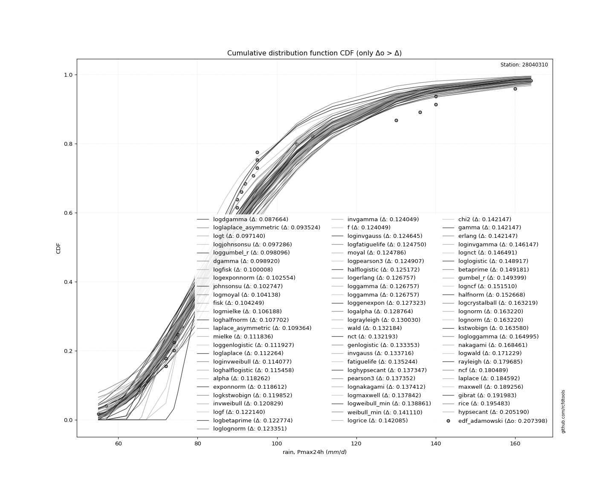</img>

</div>


**11.3. Best fit**

<div align="center">

|   id |   station | empirical_dist   | p_dist                |     delta |   deltao | eval   |   fit |   n |   best_fit |   best_fit_sort |
|-----:|----------:|:-----------------|:----------------------|----------:|---------:|:-------|------:|----:|-----------:|----------------:|
|    0 |  28040310 | edf_adamowski    | loglaplace_asymmetric | 0.0935244 | 0.207398 | Δo > Δ |     1 |  43 |          1 |               1 |

</div>


<div align="center">

</img>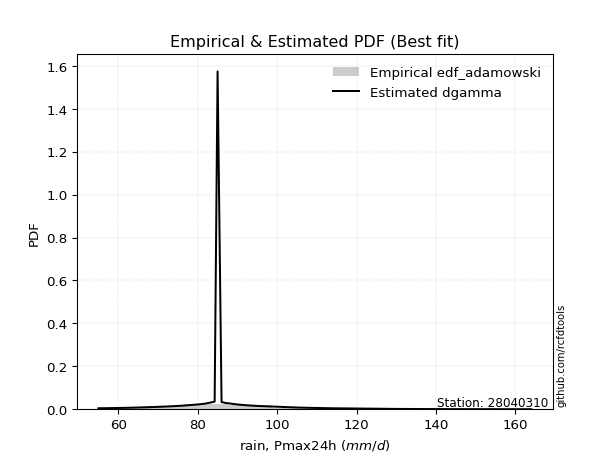</img>

</div>


## C. Best fit & Estimate extreme values for specific return periods - Tr


### 1. Best fit (ordered by delta Δ)

<div align="center">

|   id |   station | empirical_dist   | p_dist                |     delta |   deltao | eval   |   fit |   n |   best_fit |   best_fit_sort |
|-----:|----------:|:-----------------|:----------------------|----------:|---------:|:-------|------:|----:|-----------:|----------------:|
|    0 |  28040310 | edf_weibull      | loglaplace_asymmetric | 0.0903896 | 0.207398 | Δo > Δ |     1 |  43 |          1 |               1 |
|    1 |  28040310 | edf_adamowski    | loglaplace_asymmetric | 0.0935244 | 0.207398 | Δo > Δ |     1 |  43 |          1 |               2 |
|    2 |  28040310 | edf_california   | logmoyal              | 0.0935797 | 0.207398 | Δo > Δ |     1 |  43 |          1 |               3 |
|    3 |  28040310 | edf_chegodayev   | loglaplace_asymmetric | 0.09416   | 0.207398 | Δo > Δ |     1 |  43 |          1 |               4 |
|    4 |  28040310 | edf_beard        | loglaplace_asymmetric | 0.0942875 | 0.207398 | Δo > Δ |     1 |  43 |          1 |               5 |
|    5 |  28040310 | edf_jenkinson    | loglaplace_asymmetric | 0.0942875 | 0.207398 | Δo > Δ |     1 |  43 |          1 |               6 |
|    6 |  28040310 | edf_tukey        | loglaplace_asymmetric | 0.0945854 | 0.207398 | Δo > Δ |     1 |  43 |          1 |               7 |
|    7 |  28040310 | edf_blom         | loglaplace_asymmetric | 0.095119  | 0.207398 | Δo > Δ |     1 |  43 |          1 |               8 |
|    8 |  28040310 | edf_cunnane      | loglaplace_asymmetric | 0.0954401 | 0.207398 | Δo > Δ |     1 |  43 |          1 |               9 |
|    9 |  28040310 | edf_gringorten   | loglaplace_asymmetric | 0.0959554 | 0.207398 | Δo > Δ |     1 |  43 |          1 |              10 |
|   10 |  28040310 | edf_hazen        | loglaplace_asymmetric | 0.0967321 | 0.207398 | Δo > Δ |     1 |  43 |          1 |              11 |

</div>

:file_folder:Tables: [bestfit_28040310.csv](table/bestfit_28040310.csv) | [extreme_28040310.csv](table/extreme_28040310.csv)


### 2. Extreme values

In hydrology, a return period (or recurrence interval $Tr$) is the statistical average time between extreme events like floods or droughts of a specific magnitude, indicating how rare an event is, with a 100-year flood, for example, having a 1% chance of occurring in any given year, not that it happens exactly every century. It is a key tool for infrastructure design (like bridges or dams) and risk assessment, calculated from historical data to determine the probability of future events, although it is important to remember it is statistical average, and events can cluster or be missed.

> risk_rate: assuming the return period as the project useful life.

|   id |      tr |   prob_l |     prob_g |    alpha |   betaprime |     chi2 |   crystalball |   erlang |    expon |   exponnorm |        f |   fatiguelife |     fisk |    gamma |   genexpon |   genlogistic |   gibrat |   gompertz |   gumbel_l |   gumbel_r |   halflogistic |   halfnorm |   hypsecant |   invgamma |   invgauss |   invweibull |   johnsonsu |   kstwobign |   laplace |   laplace_asymmetric |   loggamma |   logistic |   lognorm |   maxwell |   mielke |    moyal |   nakagami |      ncf |      nct |     norm |   pareto |   pearson3 |   rayleigh |     rice |        t |   truncnorm |     wald |   weibull_min |   logalpha |   logbetaprime |          logchi2 |   logcrystalball |   logerlang |   logexpon |   logexponnorm |     logf |   logfatiguelife |   logfisk |   loggenexpon |   loggenlogistic |   loggibrat |   loggompertz |   loggumbel_l |   loggumbel_r |   loghalflogistic |   loghalfnorm |   loghypsecant |   loginvgamma |   loginvgauss |   loginvweibull |   logjohnsonsu |   logkstwobign |   loglaplace |   loglaplace_asymmetric |   logloggamma |   loglogistic |   loglognorm |   logmaxwell |   logmielke |   logmoyal |   lognakagami |   logncf |   lognct |   logpareto |   logpearson3 |   lograyleigh |   logrice |     logt |   logtruncnorm |   logwald |   logweibull_min |   station |   n |   risk_rate |
|-----:|--------:|---------:|-----------:|---------:|------------:|---------:|--------------:|---------:|---------:|------------:|---------:|--------------:|---------:|---------:|-----------:|--------------:|---------:|-----------:|-----------:|-----------:|---------------:|-----------:|------------:|-----------:|-----------:|-------------:|------------:|------------:|----------:|---------------------:|-----------:|-----------:|----------:|----------:|---------:|---------:|-----------:|---------:|---------:|---------:|---------:|-----------:|-----------:|---------:|---------:|------------:|---------:|--------------:|-----------:|---------------:|-----------------:|-----------------:|------------:|-----------:|---------------:|---------:|-----------------:|----------:|--------------:|-----------------:|------------:|--------------:|--------------:|--------------:|------------------:|--------------:|---------------:|--------------:|--------------:|----------------:|---------------:|---------------:|-------------:|------------------------:|--------------:|--------------:|-------------:|-------------:|------------:|-----------:|--------------:|---------:|---------:|------------:|--------------:|--------------:|----------:|---------:|---------------:|----------:|-----------------:|----------:|----:|------------:|
|    0 |    2    | 0.5      | 0.5        |  85.9669 |     87.6621 |  86.6408 |       91.4055 |  86.6408 |  80.2344 |     86.1872 |  86.0592 |       86.4029 |  85.7106 |  86.6408 |    80.2205 |       87.0169 |  83.835  |    148.376 |    95.5489 |    87.2621 |        85.2023 |    86.2428 |     91.4055 |    86.0591 |    86.3349 |      85.9928 |     85.7056 |     88.2352 |   91.4055 |              85.2915 |    86.1507 |    91.4055 |   88.4108 |   89.2485 |  85.8918 |  85.9245 |    87.6876 |  89.3342 |  86.7108 |  91.4055 |  80.2344 |    86.1159 |    88.4834 |  90.1087 |  91.6716 |     91.4055 |  83.2299 |       86.7086 |    86.4747 |        86.0384 |     89.129       |          88.4108 |     86.1507 |    76.4275 |        85.4444 |  86.0132 |          86.0852 |   85.6725 |       84.9671 |          85.8938 |     81.9903 |       79.7506 |       92.135  |       84.8372 |           83.1139 |       83.9804 |        88.4108 |       87.5093 |       86.081  |         85.0234 |        85.6505 |        84.7871 |      88.4108 |                 86.7784 |       88.3989 |       88.4108 |      86.0456 |      86.532  |     85.8086 |    83.7146 |       86.5293 |  87.8419 |  87.5128 |     76.4275 |       85.9995 |       85.8752 |   86.5485 |  85.9066 |        77.709  |   81.4998 |          86.3946 |  28040310 |  43 |    0.75     |
|    1 |    2.33 | 0.570815 | 0.429185   |  89.724  |     91.6217 |  90.8617 |       95.9062 |  90.8617 |  85.7943 |     89.8184 |  89.9437 |       90.4909 |  89.1949 |  90.8617 |    85.7695 |       90.787  |  86.1149 |    149.206 |    99.4646 |    91.4325 |        89.4901 |    91.1002 |     95.0074 |    89.9437 |    90.4026 |      89.8068 |     89.1096 |     92.3899 |   94.1291 |              88.9528 |    90.0806 |    95.371  |   92.4633 |   93.9244 |  89.4973 |  89.8723 |    92.4106 |  93.5012 |  90.5729 |  95.9062 |  85.7943 |    90.4143 |    93.2285 |  94.4006 |  96.2397 |     95.9062 |  86.1811 |       90.832  |    90.3308 |        89.8936 |    106.182       |          92.4633 |     90.0806 |    82.1736 |        88.9655 |  89.8602 |          89.9803 |   89.0659 |       89.4193 |          89.5009 |     83.8731 |       84.892  |       95.7985 |       88.4346 |           86.7401 |       88.1424 |        91.6395 |       91.4494 |       89.9747 |         88.9727 |        88.9609 |        89.0146 |      90.8415 |                 89.4637 |       92.5287 |       91.9718 |      89.9153 |      90.6564 |     89.2959 |    87.0712 |       90.6395 |  91.7867 |  91.4562 |     82.1736 |       89.9342 |       90.0304 |   90.8216 |  89.2572 |        83.1423 |   83.9299 |          90.6217 |  28040310 |  43 |    0.729209 |
|    2 |    5    | 0.8      | 0.2        | 106.989  |    108.505  | 109.383  |      112.632  | 109.383  | 113.592  |    107.209  | 107.687  |      108.799  | 105.543  | 109.383  |   113.513  |      107.163  |  99.2408 |    151.887 |   112.114  |   109.551  |       108.892  |   111.642  |    109.455  |   107.687  |   108.686  |     107.361  |    105.661  |    110.038  |  107.747  |             107.259  |   107.917  |   110.682  |  109.221  |  112.328  | 106.284  | 108.159  |   111.876  | 110.087  | 107.707  | 112.632  | 113.592  |   109.559  |   112.225  | 111.583  | 113.5    |    112.632  | 102.702  |      109.377  |   107.673  |       107.544  |    298.571       |         109.22   |    107.917  |   118.069  |       105.818  | 107.485  |         107.744  |  105.098  |      109.923  |         106.293  |     95.5855 |      109.411  |      108.659  |      105.92   |          105.229  |      108.149  |       105.82   |      108.216  |      107.736  |        108.373  |       104.986  |       109.452  |     104.034  |                104.189  |      109.579  |      107.12   |     107.605  |     108.891  |    105.732  |   104.462  |      108.832  | 108.507  | 108.397  |    118.069  |      107.906  |      108.779  |  109.425  | 103.675  |       110.84   |   98.9346 |         109.249  |  28040310 |  43 |    0.67232  |
|    3 |   10    | 0.9      | 0.1        | 122.493  |    121.943  | 124.27   |      123.727  | 124.27   | 138.827  |    122.881  | 123.179  |      123.991  | 121.191  | 124.27   |   138.698  |      120.499  | 114.203  |    153.379 |   119.157  |   124.308  |       125.004  |   126.842  |    120.993  |   123.179  |   123.964  |     122.918  |    121.666  |    123.475  |  120.108  |             123.876  |   123.29   |   121.958  |  121.98   |  125.28   | 121.73   | 124.08   |   126.04   | 122.102  | 122.148  | 123.727  | 138.827  |   125.18   |   125.77   | 123.835  | 125.522  |    123.727  | 120.234  |      124.408  |   122.597  |       123.082  |    870.805       |         121.98   |    123.29   |   164.068  |       122.365  | 123.018  |         123.203  |  120.82   |      127.586  |         121.736  |    110.944  |      130.354  |      116.553  |      122.687  |          123.545  |      125.823  |       118.703  |      121.512  |      123.2    |        127.261  |       121.03   |       128.105  |     117.662  |                119.644  |      122.53   |      119.85   |     123.101  |     123.881  |    121.402  |   122.409  |      123.802  | 121.685  | 122.017  |    164.068  |      123.52   |      124.487  |  124.341  | 116.358  |       133.551  |  117.802  |         124.406  |  28040310 |  43 |    0.651322 |
|    4 |   15    | 0.933333 | 0.0666667  | 131.99   |    129.445  | 132.512  |      129.264  | 132.512  | 153.588  |    132.048  | 132.359  |      132.578  | 131.311  | 132.512  |   153.431  |      128.022  | 124.523  |    154.055 |   122.347  |   132.633  |       134.122  |   134.752  |    127.577  |   132.358  |   132.644  |     132.231  |    131.804  |    130.608  |  127.339  |             133.597  |   132.302  |   128.102  |  128.895  |  131.926  | 131.31   | 133.32   |   133.38   | 128.419  | 130.53   | 129.264  | 153.588  |   133.89   |   132.749  | 130.147  | 131.802  |    129.264  | 131.492  |      132.692  |   131.393  |       132.369  |   1684.6         |         128.895  |    132.302  |   198.887  |       133.117  | 132.31   |         132.337  |  131.267  |      137.845  |         131.311  |    122.952  |      142.158  |      120.315  |      133.292  |          135.29   |      136.135  |       126.747  |      128.914  |      132.342  |        139.335  |       131.715  |       139.267  |     126.447  |                129.727  |      129.536  |      127.411  |     132.319  |     132.356  |    131.468  |   134.207  |      132.269  | 128.989  | 129.671  |    198.887  |      132.719  |      133.446  |  132.636  | 124.313  |       144.415  |  131.775  |         132.901  |  28040310 |  43 |    0.644736 |
|    5 |   20    | 0.95     | 0.05       | 139.029  |    134.679  | 138.209  |      132.89   | 138.21   | 164.061  |    138.552  | 138.988  |      138.584  | 139.063  | 138.209  |   163.884  |      133.29   | 132.618  |    154.476 |   124.332  |   138.463  |       140.51   |   140.026  |    132.222  |   138.988  |   138.735  |     138.993  |    139.404  |    135.413  |  132.47   |             140.494  |   138.765  |   132.348  |  133.634  |  136.336  | 138.435  | 139.864  |   138.267  | 132.675  | 136.516  | 132.89   | 164.061  |   139.933  |   137.388  | 134.343  | 136.042  |    132.89   | 139.882  |      138.391  |   137.736  |       139.119  |   2719.93        |         133.634  |    138.765  |   227.987  |       141.307  | 139.068  |         138.922  |  139.441  |      145.147  |         138.43   |    133.275  |      150.364  |      122.717  |      141.259  |          144.177  |      143.475  |       132.747  |      134.068  |      138.934  |        148.465  |       140.052  |       147.329  |     133.075  |                137.392  |      134.333  |      132.914  |     138.995  |     138.299  |    139.145  |   143.244  |      138.206  | 134.061  | 135.031  |    227.987  |      139.336  |      139.755  |  138.398  | 130.358  |       150.838  |  143.255  |         138.824  |  28040310 |  43 |    0.641514 |
|    6 |   25    | 0.96     | 0.04       | 144.699  |    138.705  | 142.557  |      135.559  | 142.558  | 172.185  |    143.597  | 144.215  |      143.203  | 145.45   | 142.557  |   171.991  |      137.347  | 139.367  |    154.775 |   125.745  |   142.953  |       145.432  |   143.95   |    135.816  |   144.214  |   143.431  |     144.341  |    145.549  |    139.012  |  136.449  |             145.844  |   143.834  |   135.596  |  137.233  |  139.61   | 144.175  | 144.936  |   141.902  | 135.871  | 141.199  | 135.559  | 172.185  |   144.555  |   140.834  | 137.46   | 139.237  |    135.559  | 146.602  |      142.723  |   142.735  |       144.467  |   3964.51        |         137.233  |    143.834  |   253.46   |       148.005  | 144.425  |         144.106  |  146.297  |      150.838  |         144.164  |    142.54   |      156.641  |      124.456  |      147.718  |          151.421  |      149.192  |       137.585  |      138.027  |      144.125  |        155.903  |       147.02   |       153.672  |     138.454  |                143.648  |      137.973  |      137.284  |     144.27   |     142.882  |    145.451  |   150.665  |      142.786  | 137.95   | 139.165  |    253.46   |      144.535  |      144.635  |  142.814  | 135.335  |       155.093  |  153.167  |         143.375  |  28040310 |  43 |    0.639603 |
|    7 |   50    | 0.98     | 0.02       | 163.763  |    151.115  | 155.74   |      143.203  | 155.74   | 197.419  |    159.269  | 161.017  |      157.391  | 167.723  | 155.74   |   197.176  |      149.846  | 163.156  |    155.588 |   129.58   |   156.785  |       160.597  |   155.355  |    146.962  |   161.017  |   157.91   |     161.616  |    166.14   |    149.582  |  148.811  |             162.461  |   159.976  |   145.521  |  148.087  |  149.106  | 163.349  | 160.683  |   152.461  | 145.323  | 156.065  | 143.203  | 197.419  |   158.615  |   150.839  | 146.509  | 148.782  |    143.203  | 168.543  |      155.754  |   158.819  |       161.833  |  13079.6         |         148.087  |    159.976  |   352.206  |       170.901  | 161.833  |         160.728  |  171.138  |      168.744  |         163.31   |    180.646  |      175.699  |      129.3    |      169.533  |          176.108  |      167.137  |       153.734  |      150.2    |      160.777  |        181.241  |       172.02   |       173.921  |     156.591  |                164.956  |      148.936  |      151.545  |     161.307  |     157.052  |    167.352  |   176.243  |      156.946  | 149.863  | 151.965  |    352.206  |      161.148  |      159.786  |  156.321  | 152.863  |       164.706  |  190.561  |         157.343  |  28040310 |  43 |    0.63583  |
|    8 |   75    | 0.986667 | 0.0133333  | 176.171  |    158.358  | 163.265  |      147.304  | 163.265  | 212.18   |    168.436  | 171.309  |      165.605  | 182.733  | 163.265  |   211.909  |      157.111  | 179.224  |    155.999 |   131.519  |   164.825  |       169.413  |   161.563  |    153.475  |   171.309  |   166.331  |     172.237  |    179.316  |    155.397  |  156.042  |             172.182  |   169.75   |   151.254  |  154.26   |  154.269  | 175.623  | 169.891  |   158.208  | 150.583  | 165.046  | 147.304  | 212.18   |   166.67   |   156.282  | 151.433  | 154.181  |    147.304  | 182.044  |      163.121  |   168.699  |       172.607  |  26642           |         154.26   |    169.75   |   426.954  |       185.904  | 172.645  |         170.878  |  188.764  |      179.422  |         175.561  |    211.992  |      186.573  |      131.822  |      183.664  |          192.268  |      177.796  |       164.036  |      157.283  |      170.949  |        197.819  |       189.503  |       186.179  |     168.283  |                178.858  |      155.161  |      160.447  |     171.806  |     165.338  |    182.073  |   193.168  |      165.226  | 156.766  | 159.476  |    426.954  |      171.248  |      168.686  |  164.124  | 164.981  |       168.299  |  217.977  |         165.442  |  28040310 |  43 |    0.634587 |
|    9 |  100    | 0.99     | 0.01       | 185.666  |    163.508  | 168.537  |      150.078  | 168.537  | 222.654  |    174.941  | 178.845  |      171.404  | 194.408  | 168.537  |   222.362  |      162.253  | 191.67   |    156.268 |   132.788  |   170.515  |       175.652  |   165.793  |    158.095  |   178.845  |   172.293  |     180.024  |    189.206  |    159.381  |  161.172  |             179.079  |   176.855  |   155.301  |  158.58   |  157.785  | 184.859  | 176.424  |   162.123  | 154.217  | 171.569  | 150.078  | 222.654  |   172.323  |   159.99   | 154.787  | 157.958  |    150.078  | 191.888  |      168.249  |   175.954  |       180.567  |  44347.1         |         158.58   |    176.855  |   489.423  |       197.34   | 180.637  |         178.295  |  203.002  |      187.106  |         184.777  |    239.967  |      194.177  |      133.497  |      194.372  |          204.595  |      185.445  |       171.759  |      162.309  |      178.386  |        210.462  |       203.469  |       195.072  |     177.104  |                189.426  |      159.514  |      167.046  |     179.525  |     171.23   |    193.525  |   206.152  |      171.115  | 161.652  | 164.834  |    489.423  |      178.606  |      175.031  |  169.635  | 174.645  |       170.179  |  240.421  |         171.173  |  28040310 |  43 |    0.633968 |
|   10 |  200    | 0.995    | 0.005      | 211.436  |    176.003  | 181.042  |      156.37   | 181.043  | 247.888  |    190.612  | 197.886  |      185.305  | 226.551  | 181.042  |   247.547  |      174.614  | 225.533  |    156.852 |   135.545  |   184.195  |       190.653  |   175.466  |    169.225  |   197.886  |   186.635  |     199.704  |    214.994  |    168.558  |  173.534  |             195.696  |   194.617  |   165.009  |  168.834  |  165.831  | 209.089  | 192.163  |   171.08   | 162.697  | 187.876  | 156.37   | 247.888  |   185.764  |   168.474  | 162.461  | 166.949  |    156.37   | 216.408  |      180.305  |   194.384  |       200.946  | 153447           |         168.834  |    194.617  |   680.098  |       227.868  | 201.119  |         196.979  |  244.765  |      206.033  |         208.942  |    336.209  |      212.162  |      137.213  |      222.739  |          237.562  |      204.197  |       191.891  |      174.468  |      197.128  |        244.261  |       243.657  |       217.205  |     200.303  |                217.525  |      169.83   |      184.002  |     199.153  |     185.513  |    225.148  |   241.133  |      185.39   | 173.428  | 177.89   |    680.098  |      197.061  |      190.462  |  182.868  | 202.601  |       173.115  |  306.897  |         184.965  |  28040310 |  43 |    0.633042 |
|   11 |  250    | 0.996    | 0.004      | 220.773  |    180.062  | 185.017  |      158.293  | 185.017  | 256.012  |    195.658  | 204.301  |      189.763  | 238.255  | 185.017  |   255.654  |      178.588  | 237.684  |    157.024 |   136.356  |   188.593  |       195.475  |   178.442  |    172.808  |   204.301  |   191.248  |     206.331  |    223.915  |    171.398  |  177.513  |             201.046  |   200.544  |   168.126  |  172.098  |  168.307  | 217.533  | 197.23   |   173.837  | 165.355  | 193.32   | 158.293  | 256.012  |   190.044  |   171.086  | 164.823  | 169.826  |    158.293  | 224.52   |      184.105  |   200.631  |       207.903  | 229634           |         172.098  |    200.543  |   756.086  |       238.668  | 208.117  |         203.257  |  260.96   |      212.261  |         217.36   |    379.454  |      217.857  |      138.326  |      232.711  |          249.25   |      210.339  |       198.861  |      178.407  |      203.429  |        256.241  |       258.945  |       224.551  |     208.4    |                227.43   |      173.109  |      189.802  |     205.808  |     190.145  |    236.722  |   253.612  |      190.019  | 177.229  | 182.148  |    756.086  |      203.237  |      195.48   |  187.124  | 213.346  |       173.719  |  332.71   |         189.409  |  28040310 |  43 |    0.632858 |
|   12 |  500    | 0.998    | 0.002      | 253.932  |    192.815  | 197.229  |      163.995  | 197.229  | 281.246  |    211.329  | 225.202  |      203.568  | 279.518  | 197.229  |   280.84   |      190.922  | 279.674  |    157.517 |   138.682  |   202.243  |       210.443  |   187.315  |    183.937  |   225.202  |   205.579  |     227.881  |    253.678  |    179.909  |  189.875  |             217.664  |   219.658  |   177.792  |  182.154  |  175.697  | 245.972  | 212.97   |   182.058  | 173.426  | 210.899  | 163.995  | 281.246  |   203.218  |   178.879  | 171.872  | 178.755  |    163.995  | 250.313  |      195.687  |   221.141  |       230.887  | 810611           |         182.154  |    219.658  |  1050.65   |       275.59   | 231.261  |         223.653  |  322.607  |      232.057  |         245.701  |    576.459  |      235.284  |      141.567  |      266.594  |          289.318  |      229.77   |       222.168  |      190.751  |      223.906  |        297.296  |       315.769  |       248.087  |     235.699  |                261.167  |      183.2    |      208.98   |     227.634  |     204.666  |    277.89   |   296.645  |      204.532  | 189.102  | 195.581  |   1050.65   |      223.212  |      211.254  |  200.363  | 254.052  |       174.946  |  430.121  |         203.253  |  28040310 |  43 |    0.632489 |
|   13 |  750    | 0.998667 | 0.00133333 | 276.948  |    200.395  | 204.289  |      167.163  | 204.289  | 296.007  |    220.497  | 238.158  |      211.62   | 307.554  | 204.289  |   295.572  |      198.132  | 307.444  |    157.78  |   139.925  |   210.223  |       219.193  |   192.272  |    190.448  |   238.159  |   213.967  |     241.198  |    272.6    |    184.69   |  197.106  |             227.384  |   231.365  |   183.439  |  187.991  |  179.831  | 264.291  | 222.176  |   186.653  | 178.035  | 221.689  | 167.163  | 296.007  |   210.848  |   183.236  | 175.813  | 183.998  |    167.163  | 265.778  |      202.32   |   233.986  |       245.386  |      1.7047e+06  |         187.991  |    231.365  |  1273.63   |       299.782  | 245.878  |         236.252  |  368.812  |      243.973  |         263.948  |    760.105  |      245.307  |      143.33   |      288.643  |          315.662  |      241.396  |       237.048  |      198.064  |      236.564  |        324.28   |       357.072  |       262.375  |     253.297  |                283.176  |      189.049  |      221.069  |     241.278  |     213.265  |    306.252  |   325.128  |      213.127  | 196.106  | 203.602  |   1273.63   |      235.488  |      220.622  |  208.134  | 284.523  |       175.36   |  501.715  |         211.392  |  28040310 |  43 |    0.632366 |
|   14 | 1000    | 0.999    | 0.001      | 295.326  |    205.833  | 209.266  |      169.344  | 209.266  | 306.481  |    227.001  | 247.701  |      217.326  | 329.429  | 209.266  |   306.025  |      203.247  | 328.695  |    157.958 |   140.761  |   215.884  |       225.4    |   195.695  |    195.067  |   247.701  |   219.922  |     250.981  |    286.737  |    188.002  |  202.236  |             234.281  |   239.922  |   187.444  |  192.118  |  182.687  | 278.107  | 228.709  |   189.827  | 181.261  | 229.588  | 169.344  | 306.481  |   216.231  |   186.248  | 178.537  | 187.737  |    169.344  | 276.902  |      206.968  |   243.516  |       256.189  |      2.89494e+06 |         192.118  |    239.922  |  1459.97   |       318.224  | 256.778  |         245.512  |  407.467  |      252.585  |         277.705  |    939.256  |      252.347  |      144.529  |      305.38   |          335.791  |      249.767  |       248.206  |      203.3    |      245.87   |        344.893  |       390.869  |       272.753  |     266.575  |                299.908  |      193.182  |      230.063  |     251.384  |     219.42   |    328.632  |   346.981  |      219.277  | 201.109  | 209.373  |   1459.97   |      244.479  |      227.338  |  213.665  | 310.068  |       175.568  |  560.476  |         217.19   |  28040310 |  43 |    0.632305 |

<div align="center">

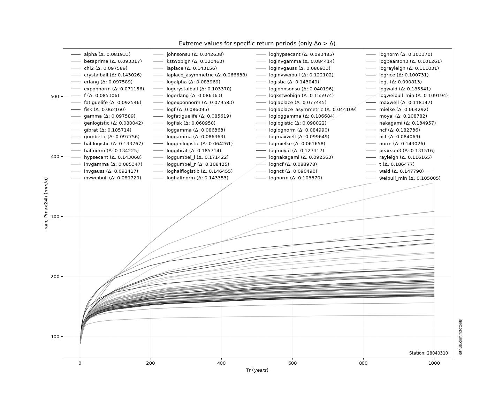</img>

</div>


<div align="center">

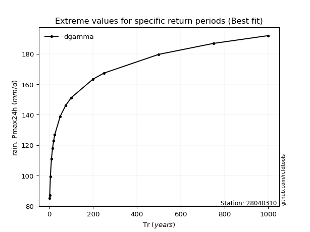</img>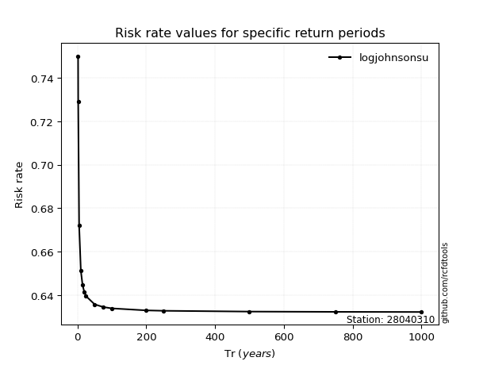</img>

</div>


<sub>**APP DISCLAIMER**: NO WARRANTY - This software is provided by [github.com/rcfdtools](https://github.com/rcfdtools) "as is", without any express or implied warranty, including warranties of merchantability, fitness for a particular purpose, or non-infringement. There is no guarantee that the software will be error-free or operate without interruption. LIMITATION OF LIABILITY - Neither the authors nor copyright holders will be liable for claims or damages arising from the software or its use. You are responsible for determining if the software is appropriate for your use and assume all associated risks, including errors, legal compliance, and data loss. NO PROFESSIONAL ADVICE - The software provides general information and does not offer professional advice. It should not replace consultation with professional advisors.</sub>