<div align="center">


</div>

# PMP Station (Rain, Pmax24h): 28040350

Probable Maximum Precipitation (PMP) is the greatest amount of rainfall for a specific duration that is meteorologically possible for a given location, acting as a "worst-case" scenario for extreme storms, crucial for designing safety-critical infrastructure like bridges, river deviations, dams, spillways, and nuclear plants to prevent catastrophic failure. PMP is calculated by hydrologists using meteorological data to determine the upper limit of extreme rainfall, often leading to the Probable Maximum Flood (PMF) for flood control design, and is increasingly being studied for climate change impacts.

<div align="center">

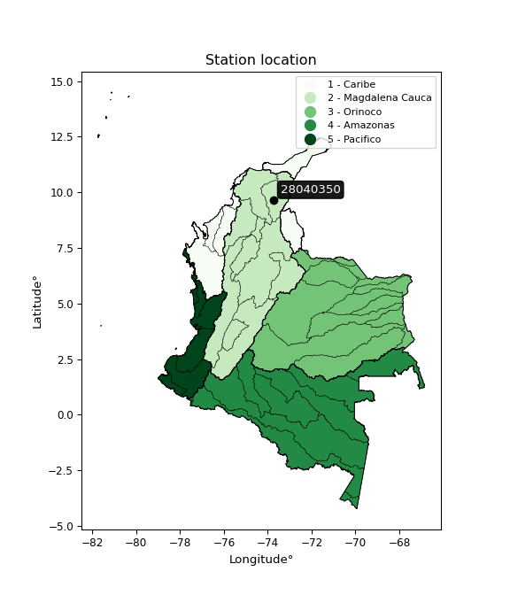</img>

</div>


## A. General information


### 1. General running parameters

• app_version: _v20260103_. • runtime: _2026-01-05 08:58:49.440788_. • Python version: _3.14.0_. • SciPy version: _1.16.3_. • Pandas version: _2.3.3_. • NumPy version: _2.3.5_. • Stations dataset (station_dataset_file): _dataset/pmax24h_in/conventional_cesarcolombia_1959_2022.csv_. • Stations catalog (station_catalog_file): _dataset/CNE.xls_. • Minimum year to eval til year_max (date_min): _1900_. • Maximum year to eval since year_min (date_max): _2024_. • Creates, save and include plots into reports (create_plot): _True_. • Plot only fit distributions with Δo > Δ (plot_only_fit): _True_. • Eval low extreme values, if False, evaluates high extreme values (low_extreme): _False_. • Eval every SciPy distribution as logarithmic (pdist_logarithmic_on): _True_. • Standard deviation normalized (ddof): _1.0_. • Return periods to eval in years (Tr): _[2, 2.33, 5, 10, 15, 20, 25, 50, 75, 100, 200, 250, 500, 750, 1000]_. • Minimum data sample per station, 0 means any (minimum_sample): _5_. • Z-Score maximum threshold to adjust a value, 0 means disable (zscore_max): _3.5_. • Z-Score minimum threshold to adjust a value, 0 means disable (zscore_min): _-2.5_. • Avoid zeros, e.g. rain = 0 (avoid_zeros): _True_. • Avoid null values (avoid_nans): _True_. [:file_folder:Dataset file.](../../dataset/pmax24h_in/conventional_cesarcolombia_1959_2022.csv)

> Delta Degrees of Freedom (DDOF): is a parameter used in the formulas for calculating variance and standard deviation. When ddof=0, the divisor is $N$ (the total number of observations) and this is used when your data set is the entire population. When ddof=1, the divisor is $N-1$ and this is used when your data set is a sample drawn from a larger population. Using $N-1$ provides an unbiased estimate of the population variance (known as Bessel´s correction).


### 2. Station info and location

|   id |   CODIGO | NOMBRE             | CATEGORIA     | TECNOLOGIA   | ESTADO   | FECHA_INSTALACION   |   FECHA_SUSPENSION |   ALTITUD |   LATITUD |   LONGITUD | DEPARTAMENTO   | MUNICIPIO   | AREA_OPERATIVA                                         | ENTIDAD                                                     | AREA_HIDROGRAFICA   | ZONA_HIDROGRAFICA   | SUBZONA_HIDROGRAFICA      |   CORRIENTE | Catalogo   |   Version |
|-----:|---------:|:-------------------|:--------------|:-------------|:---------|:--------------------|-------------------:|----------:|----------:|-----------:|:---------------|:------------|:-------------------------------------------------------|:------------------------------------------------------------|:--------------------|:--------------------|:--------------------------|------------:|:-----------|----------:|
|    0 | 28040350 | EL PASO [28040350] | Pluviométrica | Convencional | Activa   | 15/08/1972          |                nan |        30 |   9.65697 |   -73.7437 | Cesar          | El Paso     | Area Operativa 05 - Magdalena-Cesar-Guajira-San Andrés | INSTITUTO DE HIDROLOGIA METEOROLOGIA Y ESTUDIOS AMBIENTALES | Magdalena Cauca     | Bajo Magdalena      | Ríos Chimicuica y Corozal |         nan | CNE_IDEAM  |  20251226 |

<div align="center">

Dynamic map: [:earth_americas:Google](http://maps.google.com/maps?q=9.656972222,-73.74369444) [:earth_americas:OSM](https://www.openstreetmap.org/#map=18/9.656972222/-73.74369444&layers=P) [:earth_americas:Bing](https://www.bing.com/maps?cp=9.656972222~-73.74369444&lvl=18) [:earth_americas:Apple](https://maps.apple.com/frame?center=9.656972222%2C-73.74369444&span=0.003%2C0.006)

</div>


<div align="center">

```geojson
{
  "type": "Feature",
  "geometry": {
    "type": "Point", 
    "coordinates": [-73.74369444, 9.656972222]
  }, 
  "properties": {
    "Name": "28040350"
  }
}
```

</div>


### 3. Discrete values table and plot

<div align="center">

|               |          0 |          1 |           2 |          3 |          4 |             5 |           6 |          7 |           8 |           9 |          10 |          11 |          12 |           13 |          14 |          15 |          16 |         17 |          18 |          19 |          20 |          21 |          22 |          23 |         24 |         25 |           26 |          27 |          28 |         29 |           30 |         31 |          32 |          33 |         34 |         35 |          36 |          37 |         38 |          39 |          40 |           41 |         42 |          43 |          44 |          45 |          46 |          47 |          48 |          49 |         50 |
|:--------------|-----------:|-----------:|------------:|-----------:|-----------:|--------------:|------------:|-----------:|------------:|------------:|------------:|------------:|------------:|-------------:|------------:|------------:|------------:|-----------:|------------:|------------:|------------:|------------:|------------:|------------:|-----------:|-----------:|-------------:|------------:|------------:|-----------:|-------------:|-----------:|------------:|------------:|-----------:|-----------:|------------:|------------:|-----------:|------------:|------------:|-------------:|-----------:|------------:|------------:|------------:|------------:|------------:|------------:|------------:|-----------:|
| Date          | 1972       | 1973       | 1974        | 1975       | 1976       | 1977          | 1978        | 1979       | 1980        | 1981        | 1982        | 1983        | 1984        | 1985         | 1986        | 1987        | 1988        | 1989       | 1990        | 1991        | 1992        | 1993        | 1994        | 1995        | 1996       | 1997       | 1998         | 1999        | 2000        | 2001       | 2002         | 2003       | 2004        | 2005        | 2006       | 2007       | 2008        | 2009        | 2010       | 2011        | 2012        | 2013         | 2014       | 2015        | 2016        | 2017        | 2018        | 2019        | 2020        | 2021        | 2022       |
| Value         |   62.0476  |   83.6243  |   90        |  140       |  151       |  102          |   97        |  140       |   80        |   99        |  112        |  120        |   84        |   99.8       |   75.2      |  122.6      |   89.5      |   73.5     |   85.3      |  107.5      |  130        |  117.3      |   95        |   80.5      |  146.5     |   56.8     |  103         |  113.5      |   88.8      |   55.5     |  104.5       |   66.6     |   87.8      |  119        |  133.5     |   67.5     |  110.7      |   96        |  126       |  130        |   83        |  100         |  102.109   |   75        |  120        |  110        |  115        |   85        |   92        |   78        |   67       |
| Value_initial |   62.0476  |   83.6243  |   90        |  140       |  151       |  102          |   97        |  140       |   80        |   99        |  112        |  120        |   84        |   99.8       |   75.2      |  122.6      |   89.5      |   73.5     |   85.3      |  107.5      |  130        |  117.3      |   95        |   80.5      |  146.5     |   56.8     |  103         |  113.5      |   88.8      |   55.5     |  104.5       |   66.6     |   87.8      |  119        |  133.5     |   67.5     |  110.7      |   96        |  126       |  130        |   83        |  100         |  240       |   75        |  120        |  110        |  115        |   85        |   92        |   78        |   67       |
| count         |   51       |   51       |   51        |   51       |   51       |   51          |   51        |   51       |   51        |   51        |   51        |   51        |   51        |   51         |   51        |   51        |   51        |   51       |   51        |   51        |   51        |   51        |   51        |   51        |   51       |   51       |   51         |   51        |   51        |   51       |   51         |   51       |   51        |   51        |   51       |   51       |   51        |   51        |   51       |   51        |   51        |   51         |   51       |   51        |   51        |   51        |   51        |   51        |   51        |   51        |   51       |
| mean          |  102.109   |  102.109   |  102.109    |  102.109   |  102.109   |  102.109      |  102.109    |  102.109   |  102.109    |  102.109    |  102.109    |  102.109    |  102.109    |  102.109     |  102.109    |  102.109    |  102.109    |  102.109   |  102.109    |  102.109    |  102.109    |  102.109    |  102.109    |  102.109    |  102.109   |  102.109   |  102.109     |  102.109    |  102.109    |  102.109   |  102.109     |  102.109   |  102.109    |  102.109    |  102.109   |  102.109   |  102.109    |  102.109    |  102.109   |  102.109    |  102.109    |  102.109     |  102.109   |  102.109    |  102.109    |  102.109    |  102.109    |  102.109    |  102.109    |  102.109    |  102.109   |
| std           |   30.7795  |   30.7795  |   30.7795   |   30.7795  |   30.7795  |   30.7795     |   30.7795   |   30.7795  |   30.7795   |   30.7795   |   30.7795   |   30.7795   |   30.7795   |   30.7795    |   30.7795   |   30.7795   |   30.7795   |   30.7795  |   30.7795   |   30.7795   |   30.7795   |   30.7795   |   30.7795   |   30.7795   |   30.7795  |   30.7795  |   30.7795    |   30.7795   |   30.7795   |   30.7795  |   30.7795    |   30.7795  |   30.7795   |   30.7795   |   30.7795  |   30.7795  |   30.7795   |   30.7795   |   30.7795  |   30.7795   |   30.7795   |   30.7795    |   30.7795  |   30.7795   |   30.7795   |   30.7795   |   30.7795   |   30.7795   |   30.7795   |   30.7795   |   30.7795  |
| zscore        |   -1.30157 |   -0.60056 |   -0.393419 |    1.23104 |    1.58842 |   -0.00354955 |   -0.165995 |    1.23104 |   -0.718311 |   -0.101017 |    0.321342 |    0.581255 |   -0.588354 |   -0.0750256 |   -0.874258 |    0.665727 |   -0.409664 |   -0.92949 |   -0.546118 |    0.175141 |    0.906146 |    0.493534 |   -0.230974 |   -0.702066 |    1.44222 |   -1.47206 |    0.0289396 |    0.370076 |   -0.432406 |   -1.51429 |    0.0776733 |   -1.15366 |   -0.464895 |    0.548766 |    1.01986 |   -1.12442 |    0.279106 |   -0.198484 |    0.77619 |    0.906146 |   -0.620843 |   -0.0685278 |    4.47995 |   -0.880756 |    0.581255 |    0.256364 |    0.418809 |   -0.555865 |   -0.328441 |   -0.783289 |   -1.14067 |


</div>


<div align="center">

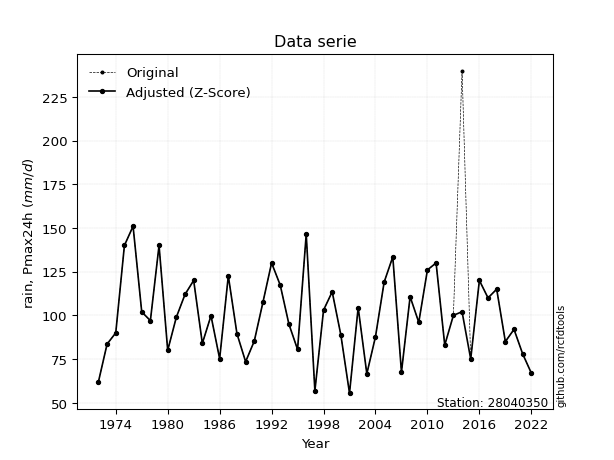</img>

</div>


> The initial value (value_initial) correspond to the initial obtained or null completed value, and value (value) is adjusted only when the initial value is outside the valid range definite through the Z-Score value. If Z-Score is active, values out of range or outliers are replaced with the station mean value


### 4. Active continuous probability distributions from SciPy (44 of 104 available)

A Probability Density Function (PDF) describes the relative likelihood of a continuous random variable falling within a specific range, where the total area under its curve equals 1, and the area over any interval gives the actual probability for that range. Unlike discrete probabilities (like rolling a die), a PDF shows density, not direct probability for a single point (which is zero), with higher points indicating higher likelihood, often visualized as a bell curve for normal distributions.

A log of a probability density function (log-PDF) is simply the logarithm of the PDF´s value, denoted as $log(f(x))$, useful for converting multiplication of probabilities into addition, improving numerical stability with tiny numbers, and connecting to information theory concepts like entropy. Instead of dealing with very small probabilities (e.g., 0.000001), log-PDFs use negative numbers (e.g., $log(0.00001) ≈ -11.51$ that are easier for computers to handle, preventing underflow errors and simplifying complex calculations. In this study, each active probability distribution from SciPy is also evaluated in the $log$ form.

[scipy.stats](https://docs.scipy.org/doc/scipy/reference/stats.html) is a Python´s powerful submodule within the SciPy library for comprehensive statistical analysis, offering over 130 probability distributions (like Normal, Poisson), functions for descriptive stats (mean, variance), hypothesis testing (t-tests, chi-square), random variable generation, and statistical tests, making it essential for data science, modeling, and research. It provides tools to explore, model, and draw conclusions from data efficiently, working seamlessly with NumPy.

<div align="center">

|   id | p_dist             |   n_parameter | fit_method   | label                                                                       | active   | ref                                                                                                        |
|-----:|:-------------------|--------------:|:-------------|:----------------------------------------------------------------------------|:---------|:-----------------------------------------------------------------------------------------------------------|
|    0 | alpha              |             3 | MLE          | Alpha                                                                       | True     | [:mortar_board:](https://docs.scipy.org/doc/scipy/reference/generated/scipy.stats.alpha.html)              |
|    1 | betaprime          |             4 | MLE          | Beta prime                                                                  | True     | [:mortar_board:](https://docs.scipy.org/doc/scipy/reference/generated/scipy.stats.betaprime.html)          |
|    2 | chi2               |             3 | MLE          | Chi²                                                                        | True     | [:mortar_board:](https://docs.scipy.org/doc/scipy/reference/generated/scipy.stats.chi2.html)               |
|    3 | crystalball        |             4 | MLE          | Crystalball                                                                 | True     | [:mortar_board:](https://docs.scipy.org/doc/scipy/reference/generated/scipy.stats.crystalball.html)        |
|    4 | erlang             |             3 | MLE          | Erlang                                                                      | True     | [:mortar_board:](https://docs.scipy.org/doc/scipy/reference/generated/scipy.stats.erlang.html)             |
|    5 | expon              |             2 | MLE          | Exponential                                                                 | True     | [:mortar_board:](https://docs.scipy.org/doc/scipy/reference/generated/scipy.stats.expon.html)              |
|    6 | exponnorm          |             3 | MLE          | Exponentially modified Normal                                               | True     | [:mortar_board:](https://docs.scipy.org/doc/scipy/reference/generated/scipy.stats.exponnorm.html)          |
|    7 | f                  |             4 | MLE          | F                                                                           | True     | [:mortar_board:](https://docs.scipy.org/doc/scipy/reference/generated/scipy.stats.f.html)                  |
|    8 | fatiguelife        |             3 | MLE          | Fatigue-life (Birnbaum-Saunders)                                            | True     | [:mortar_board:](https://docs.scipy.org/doc/scipy/reference/generated/scipy.stats.fatiguelife.html)        |
|    9 | fisk               |             3 | MLE          | Fisk                                                                        | True     | [:mortar_board:](https://docs.scipy.org/doc/scipy/reference/generated/scipy.stats.fisk.html)               |
|   10 | gamma              |             3 | MLE          | Gamma                                                                       | True     | [:mortar_board:](https://docs.scipy.org/doc/scipy/reference/generated/scipy.stats.gamma.html)              |
|   11 | genexpon           |             5 | MLE          | Generalized exponential                                                     | True     | [:mortar_board:](https://docs.scipy.org/doc/scipy/reference/generated/scipy.stats.genexpon.html)           |
|   12 | genlogistic        |             3 | MLE          | Generalized logistic                                                        | True     | [:mortar_board:](https://docs.scipy.org/doc/scipy/reference/generated/scipy.stats.genlogistic.html)        |
|   13 | gibrat             |             2 | MM           | Gibrat                                                                      | True     | [:mortar_board:](https://docs.scipy.org/doc/scipy/reference/generated/scipy.stats.gibrat.html)             |
|   14 | gompertz           |             3 | MLE          | Gompertz (or truncated Gumbel)                                              | True     | [:mortar_board:](https://docs.scipy.org/doc/scipy/reference/generated/scipy.stats.gompertz.html)           |
|   15 | gumbel_l           |             2 | MM           | Gumbel Left Skew                                                            | True     | [:mortar_board:](https://docs.scipy.org/doc/scipy/reference/generated/scipy.stats.gumbel_l.html)           |
|   16 | gumbel_r           |             2 | MM           | Gumbel Right Skew                                                           | True     | [:mortar_board:](https://docs.scipy.org/doc/scipy/reference/generated/scipy.stats.gumbel_r.html)           |
|   17 | halflogistic       |             2 | MM           | Half-logistic                                                               | True     | [:mortar_board:](https://docs.scipy.org/doc/scipy/reference/generated/scipy.stats.halflogistic.html)       |
|   18 | halfnorm           |             2 | MM           | Half Normal                                                                 | True     | [:mortar_board:](https://docs.scipy.org/doc/scipy/reference/generated/scipy.stats.halfnorm.html)           |
|   19 | hypsecant          |             2 | MM           | hyperbolic secant                                                           | True     | [:mortar_board:](https://docs.scipy.org/doc/scipy/reference/generated/scipy.stats.hypsecant.html)          |
|   20 | invgamma           |             3 | MLE          | Inverted gamma                                                              | True     | [:mortar_board:](https://docs.scipy.org/doc/scipy/reference/generated/scipy.stats.invgamma.html)           |
|   21 | invgauss           |             3 | MLE          | Inverse Gaussian                                                            | True     | [:mortar_board:](https://docs.scipy.org/doc/scipy/reference/generated/scipy.stats.invgauss.html)           |
|   22 | invweibull         |             3 | MLE          | Inverted Weibull                                                            | True     | [:mortar_board:](https://docs.scipy.org/doc/scipy/reference/generated/scipy.stats.invweibull.html)         |
|   23 | johnsonsu          |             4 | MLE          | Johnson Su                                                                  | True     | [:mortar_board:](https://docs.scipy.org/doc/scipy/reference/generated/scipy.stats.johnsonsu.html)          |
|   24 | kstwobign          |             2 | MLE          | Limiting distribution of scaled Kolmogorov-Smirnov two-sided test statistic | True     | [:mortar_board:](https://docs.scipy.org/doc/scipy/reference/generated/scipy.stats.kstwobign.html)          |
|   25 | laplace            |             2 | MM           | Laplace                                                                     | True     | [:mortar_board:](https://docs.scipy.org/doc/scipy/reference/generated/scipy.stats.laplace.html)            |
|   26 | laplace_asymmetric |             3 | MLE          | Asymmetric Laplace                                                          | True     | [:mortar_board:](https://docs.scipy.org/doc/scipy/reference/generated/scipy.stats.laplace_asymmetric.html) |
|   27 | loggamma           |             3 | MLE          | Log gamma                                                                   | True     | [:mortar_board:](https://docs.scipy.org/doc/scipy/reference/generated/scipy.stats.loggamma.html)           |
|   28 | logistic           |             2 | MM           | Logistic (or Sech-squared)                                                  | True     | [:mortar_board:](https://docs.scipy.org/doc/scipy/reference/generated/scipy.stats.logistic.html)           |
|   29 | lognorm            |             3 | MLE          | Log Normal                                                                  | True     | [:mortar_board:](https://docs.scipy.org/doc/scipy/reference/generated/scipy.stats.lognorm.html)            |
|   30 | maxwell            |             2 | MM           | Maxwell                                                                     | True     | [:mortar_board:](https://docs.scipy.org/doc/scipy/reference/generated/scipy.stats.maxwell.html)            |
|   31 | mielke             |             4 | MLE          | Mielke Beta-Kappa / Dagum                                                   | True     | [:mortar_board:](https://docs.scipy.org/doc/scipy/reference/generated/scipy.stats.mielke.html)             |
|   32 | moyal              |             2 | MM           | Moyal                                                                       | True     | [:mortar_board:](https://docs.scipy.org/doc/scipy/reference/generated/scipy.stats.moyal.html)              |
|   33 | nakagami           |             3 | MLE          | Nakagami                                                                    | True     | [:mortar_board:](https://docs.scipy.org/doc/scipy/reference/generated/scipy.stats.nakagami.html)           |
|   34 | ncf                |             5 | MLE          | Non-central F distribution                                                  | True     | [:mortar_board:](https://docs.scipy.org/doc/scipy/reference/generated/scipy.stats.ncf.html)                |
|   35 | nct                |             4 | MLE          | Non-central Student’s t                                                     | True     | [:mortar_board:](https://docs.scipy.org/doc/scipy/reference/generated/scipy.stats.nct.html)                |
|   36 | norm               |             2 | MM           | Normal                                                                      | True     | [:mortar_board:](https://docs.scipy.org/doc/scipy/reference/generated/scipy.stats.norm.html)               |
|   37 | pearson3           |             3 | MM           | Pearson type III                                                            | True     | [:mortar_board:](https://docs.scipy.org/doc/scipy/reference/generated/scipy.stats.pearson3.html)           |
|   38 | rayleigh           |             2 | MM           | Rayleigh                                                                    | True     | [:mortar_board:](https://docs.scipy.org/doc/scipy/reference/generated/scipy.stats.rayleigh.html)           |
|   39 | rice               |             3 | MLE          | Rice                                                                        | True     | [:mortar_board:](https://docs.scipy.org/doc/scipy/reference/generated/scipy.stats.rice.html)               |
|   40 | t                  |             3 | MLE          | Student’s t                                                                 | True     | [:mortar_board:](https://docs.scipy.org/doc/scipy/reference/generated/scipy.stats.t.html)                  |
|   41 | truncnorm          |             4 | MLE          | Truncated normal                                                            | True     | [:mortar_board:](https://docs.scipy.org/doc/scipy/reference/generated/scipy.stats.truncnorm.html)          |
|   42 | wald               |             2 | MM           | Wald                                                                        | True     | [:mortar_board:](https://docs.scipy.org/doc/scipy/reference/generated/scipy.stats.wald.html)               |
|   43 | weibull_min        |             3 | MLE          | Weibull minimum                                                             | True     | [:mortar_board:](https://docs.scipy.org/doc/scipy/reference/generated/scipy.stats.weibull_min.html)        |

</div>

> **n_parameter:** # arguments & localization & scale.
>
> **Fit methods:** (MLE) maximum likelihood, (MM) L-moments.
>
>**Inactive** (With the only purpose of prevent loops, zero divisions, infinite values, over high estimated values or horizontal trending for recurrence intervals estimations, the follow distributions were disabled.)**:** foldnorm, gennorm, norminvgauss, powernorm, powerlognorm, skewnorm, genextreme, anglit, arcsine, argus, beta, bradford, burr, burr12, cauchy, cosine, halfcauchy, foldcauchy, skewcauchy, wrapcauchy, dgamma, gengamma, exponweib, exponpow, truncexpon, gausshyper, genhalflogistic, genhyperbolic, geninvgauss, halfgennorm, johnsonsb, kappa4, kappa3, ksone, kstwo, loglaplace, levy, levy_l, levy_stable, ncx2, pareto, genpareto, truncpareto, lomax, powerlaw, rdist, rel_breitwigner, recipinvgauss, semicircular, studentized_range, trapezoid, triang, truncweibull_min, tukeylambda, uniform, loguniform, vonmises, vonmises_line, weibull_max, dweibull, 


## B. Probability (PDF) vs. Empirical (EDF) distributions functions

A continuous probability distribution (CPD) describes probabilities for variables that can take any value within a range (like rain any time), unlike discrete variables with specific outcomes (like temperature). It uses a Probability Density Function (PDF), a curve where the total area under it equals 1, and the probability of the variable falling within an interval (a to b) is found by calculating the area under the curve between those points. A key feature is that the probability of hitting any single exact value is zero, so probabilities are always expressed for ranges, e.g., $P(a ≤ X ≤ b)$.

<div align="center">

Distributions parameters from station values
|    |   station | p_dist                |   n |              loc |           scale | shape                 | shape1               | shape2             | shape3   |
|---:|----------:|:----------------------|----:|-----------------:|----------------:|:----------------------|:---------------------|:-------------------|:---------|
|  0 |  28040350 | alpha                 |  51 |   -220.143       |  4357.02        | 13.700464120224716    |                      |                    |          |
|  1 |  28040350 | betaprime             |  51 |      1.15646     |    79.9583      | 37.40187311849802     | 31.566329465501298   |                    |          |
|  2 |  28040350 | chi2                  |  51 |     55.5         |     1.71791     | 0.243537372723245     |                      |                    |          |
|  3 |  28040350 | crystalball           |  51 |     99.4055      |    23.4237      | 7221.576891218457     | 5631.814307145687    |                    |          |
|  4 |  28040350 | erlang                |  51 |    -14.7182      |     4.87519     | 23.409098197419656    |                      |                    |          |
|  5 |  28040350 | expon                 |  51 |     55.5         |    43.9055      |                       |                      |                    |          |
|  6 |  28040350 | exponnorm             |  51 |     91.8612      |    22.1892      | 0.33999817682993394   |                      |                    |          |
|  7 |  28040350 | f                     |  51 |    -19.5954      |   118.94        | 51.687316305371       | 3844.1345074344918   |                    |          |
|  8 |  28040350 | fatiguelife           |  51 |    -86.1084      |   184.037       | 0.12667829453748672   |                      |                    |          |
|  9 |  28040350 | fisk                  |  51 |     -0.587926    |    97.9132      | 7.11308768487264      |                      |                    |          |
| 10 |  28040350 | gamma                 |  51 |    -14.7174      |     4.87523     | 23.408718302618645    |                      |                    |          |
| 11 |  28040350 | genexpon              |  51 |     54.0129      |     1.34374     | 3.384332761671094e-08 | 0.030114267842641346 | 2.4688974635071412 |          |
| 12 |  28040350 | genlogistic           |  51 |     73.2506      |    17.5926      | 3.0127643807644002    |                      |                    |          |
| 13 |  28040350 | gibrat                |  51 |     81.5362      |    10.8383      |                       |                      |                    |          |
| 14 |  28040350 | gompertz              |  51 |     85.3         |     3.85451     | 9.551174884333186e-07 |                      |                    |          |
| 15 |  28040350 | gumbel_l              |  51 |    109.947       |    18.2634      |                       |                      |                    |          |
| 16 |  28040350 | gumbel_r              |  51 |     88.8636      |    18.2634      |                       |                      |                    |          |
| 17 |  28040350 | halflogistic          |  51 |     71.643       |    20.0264      |                       |                      |                    |          |
| 18 |  28040350 | halfnorm              |  51 |     68.4017      |    38.8575      |                       |                      |                    |          |
| 19 |  28040350 | hypsecant             |  51 |     99.4055      |    14.912       |                       |                      |                    |          |
| 20 |  28040350 | invgamma              |  51 |   -127.479       | 21311           | 94.94550446521464     |                      |                    |          |
| 21 |  28040350 | invgauss              |  51 |     12.8031      |   975.105       | 0.08800673658648939   |                      |                    |          |
| 22 |  28040350 | invweibull            |  51 |     -7.81874e+09 |     7.81874e+09 | 364143408.5184876     |                      |                    |          |
| 23 |  28040350 | johnsonsu             |  51 |    -92.2922      |    38.4411      | -19.208861777603815   | 8.341662212049748    |                    |          |
| 24 |  28040350 | kstwobign             |  51 |     12.7269      |    99.3755      |                       |                      |                    |          |
| 25 |  28040350 | laplace               |  51 |     99.4055      |    16.5631      |                       |                      |                    |          |
| 26 |  28040350 | laplace_asymmetric    |  51 |     96           |    19.1131      | 0.9148705197939604    |                      |                    |          |
| 27 |  28040350 | loggamma              |  51 |  -5712.16        |   818.959       | 1208.015515942483     |                      |                    |          |
| 28 |  28040350 | logistic              |  51 |     99.4055      |    12.9142      |                       |                      |                    |          |
| 29 |  28040350 | lognorm               |  51 |    -97.2783      |   195.294       | 0.11918948891732117   |                      |                    |          |
| 30 |  28040350 | maxwell               |  51 |     43.9011      |    34.7822      |                       |                      |                    |          |
| 31 |  28040350 | mielke                |  51 |     -0.231261    |   105.012       | 5.728717476228615     | 8.178991338175504    |                    |          |
| 32 |  28040350 | moyal                 |  51 |     86.0103      |    10.5444      |                       |                      |                    |          |
| 33 |  28040350 | nakagami              |  51 |     45.8951      |    58.4127      | 1.3459352097469641    |                      |                    |          |
| 34 |  28040350 | ncf                   |  51 |     -4.77632     |    58.6708      | 32.71530430397793     | 886.8178861200504    | 25.137147188858563 |          |
| 35 |  28040350 | nct                   |  51 |     -0.257266    |    20.431       | 45.06438590245429     | 4.796043129396498    |                    |          |
| 36 |  28040350 | norm                  |  51 |     99.4055      |    23.4237      |                       |                      |                    |          |
| 37 |  28040350 | pearson3              |  51 |     99.4055      |    23.4237      | 0.21004555176292916   |                      |                    |          |
| 38 |  28040350 | rayleigh              |  51 |     54.5945      |    35.754       |                       |                      |                    |          |
| 39 |  28040350 | rice                  |  51 |     49.424       |    27.5355      | 1.4207314848181678    |                      |                    |          |
| 40 |  28040350 | t                     |  51 |     99.402       |    23.4233      | 2328412.791448547     |                      |                    |          |
| 41 |  28040350 | truncnorm             |  51 |    -43.8241      |    11.4397      | -355.8256372992771    | 17.030575774380374   |                    |          |
| 42 |  28040350 | wald                  |  51 |     75.9818      |    23.4237      |                       |                      |                    |          |
| 43 |  28040350 | weibull_min           |  51 |     46.0426      |    60.1926      | 2.447756871209802     |                      |                    |          |
| 44 |  28040350 | logalpha              |  51 |     -4.50745     |   335.452       | 36.977492353933954    |                      |                    |          |
| 45 |  28040350 | logbetaprime          |  51 |     -3.43869     |     5.06736     | 2789.783486310417     | 1767.743443450283    |                    |          |
| 46 |  28040350 | logchi2               |  51 |      4.01638     |     0.338086    | 1.4787895476719153    |                      |                    |          |
| 47 |  28040350 | logcrystalball        |  51 |      4.5705      |     0.242661    | 167.87489769525538    | 11.863369779200932   |                    |          |
| 48 |  28040350 | logerlang             |  51 |     -0.10249     |     0.0129542   | 360.7139706313611     |                      |                    |          |
| 49 |  28040350 | logexpon              |  51 |      4.01638     |     0.554118    |                       |                      |                    |          |
| 50 |  28040350 | logexponnorm          |  51 |      4.5703      |     0.242662    | 0.0008052030732265494 |                      |                    |          |
| 51 |  28040350 | logf                  |  51 |    -10.4343      |    15.0035      | 8467.84146950392      | 71427.36125659788    |                    |          |
| 52 |  28040350 | logfatiguelife        |  51 |    -42.2144      |    46.785       | 0.0051668331155266325 |                      |                    |          |
| 53 |  28040350 | logfisk               |  51 | -24888.6         | 24893.2         | 175955.21222042112    |                      |                    |          |
| 54 |  28040350 | loggamma              |  51 |      0.0906745   |     0.0134113   | 333.98514356633916    |                      |                    |          |
| 55 |  28040350 | loggenexpon           |  51 |      4.01638     |     0.651563    | 0.24748434346476805   | 1.5689671964538956   | 2.0502410569933973 |          |
| 56 |  28040350 | loggenlogistic        |  51 |      4.65246     |     0.122392    | 0.6981562087235365    |                      |                    |          |
| 57 |  28040350 | loggibrat             |  51 |      4.38539     |     0.112275    |                       |                      |                    |          |
| 58 |  28040350 | loggompertz           |  51 |      4.01638     |     0.822901    | 1.0635798706369899    |                      |                    |          |
| 59 |  28040350 | loggumbel_l           |  51 |      4.67971     |     0.189203    |                       |                      |                    |          |
| 60 |  28040350 | loggumbel_r           |  51 |      4.46129     |     0.189203    |                       |                      |                    |          |
| 61 |  28040350 | loghalflogistic       |  51 |      4.28289     |     0.207468    |                       |                      |                    |          |
| 62 |  28040350 | loghalfnorm           |  51 |      4.24932     |     0.402538    |                       |                      |                    |          |
| 63 |  28040350 | loghypsecant          |  51 |      4.5705      |     0.154483    |                       |                      |                    |          |
| 64 |  28040350 | loginvgamma           |  51 |     -0.688518    |  2359.96        | 449.88670863913933    |                      |                    |          |
| 65 |  28040350 | loginvgauss           |  51 |      2.35603     |   172.255       | 0.012844066068120483  |                      |                    |          |
| 66 |  28040350 | loginvweibull         |  51 |     -5.65962e+07 |     5.65962e+07 | 238701767.72859806    |                      |                    |          |
| 67 |  28040350 | logjohnsonsu          |  51 |     -1.12546e+07 |     1.68704e+07 | -52088770.57452561    | 83272269.5954804     |                    |          |
| 68 |  28040350 | logkstwobign          |  51 |      3.55005     |     1.17074     |                       |                      |                    |          |
| 69 |  28040350 | loglaplace            |  51 |      4.5705      |     0.171588    |                       |                      |                    |          |
| 70 |  28040350 | loglaplace_asymmetric |  51 |      4.62604     |     0.194677    | 1.1527255587753151    |                      |                    |          |
| 71 |  28040350 | logloggamma           |  51 |      3.58912     |     0.573814    | 6.0229459347186545    |                      |                    |          |
| 72 |  28040350 | loglogistic           |  51 |      4.5705      |     0.133786    |                       |                      |                    |          |
| 73 |  28040350 | loglognorm            |  51 | -32517.3         | 32521.9         | 7.461494816813811e-06 |                      |                    |          |
| 74 |  28040350 | logmaxwell            |  51 |      3.99549     |     0.360332    |                       |                      |                    |          |
| 75 |  28040350 | logmielke             |  51 |     -0.351234    |     5.0437      | 24.92917531362962     | 44.76046218976445    |                    |          |
| 76 |  28040350 | logmoyal              |  51 |      4.43173     |     0.109236    |                       |                      |                    |          |
| 77 |  28040350 | lognakagami           |  51 |    -77.8151      |    82.3863      | 28771.584532889967    |                      |                    |          |
| 78 |  28040350 | logncf                |  51 |    -32.7917      |    30.6272      | 76574.93095156577     | 115966.54281509784   | 16839.222321694037 |          |
| 79 |  28040350 | lognct                |  51 |     -1.57418     |     0.226136    | 1899.365757917396     | 27.164758920045912   |                    |          |
| 80 |  28040350 | lognorm               |  51 |      4.5705      |     0.242662    |                       |                      |                    |          |
| 81 |  28040350 | logpearson3           |  51 |      4.5705      |     0.242662    | -0.2803138287407787   |                      |                    |          |
| 82 |  28040350 | lograyleigh           |  51 |      4.10628     |     0.370392    |                       |                      |                    |          |
| 83 |  28040350 | logrice               |  51 |      3.90738     |     0.258318    | 2.339303806663355     |                      |                    |          |
| 84 |  28040350 | logt                  |  51 |      4.5705      |     0.242663    | 409922292.21205914    |                      |                    |          |
| 85 |  28040350 | logtruncnorm          |  51 |     -0.118146    |     1.65351     | 2.5004562831091377    | 5.523514831423899    |                    |          |
| 86 |  28040350 | logwald               |  51 |      4.32781     |     0.242691    |                       |                      |                    |          |
| 87 |  28040350 | logweibull_min        |  51 |      3.50826     |     1.15712     | 5.104573383587382     |                      |                    |          |

</div>

> **loc** (Location parameter): This shifts the distribution along the x-axis. For many common distributions, like the normal (Gaussian) distribution, loc represents the mean $μ$. For others, like the uniform distribution, it might represent the minimum value, or for the beta distribution, the left end of the support interval.
>
> **scale** (Scale parameter): This determines the width or spread of the distribution. For the normal distribution, scale represents the standard deviation $σ$. For a uniform distribution, it defines the length of the interval (from $loc$ to $loc + scale$).
>
> **shape** (Shape parameters): Refers to parameters that define the specific form of a probability distribution, distinct from its location (loc) and scale (scale). These parameters are required arguments for most distribution functions. For example, a normal (Gaussian) distribution is fully defined by its location (mean) and scale (standard deviation), so it has no specific shape parameters beyond loc and scale. However, other distributions have intrinsic properties that need specification, as Gamma distribution that takes a shape parameter, often named $a$ or $alpha$.


### 0. Cumulative distribution values - CDF (88 evaluated)

Cumulative Distribution Function (CDF), denoted as $F$<sub>$X$</sub>$(x)$, is a function that gives the probability that a random variable $X$ will take a value less than or equal to a specific value, $x$ (i.e., $(P(X≥x)$. It essentially "accumulates" probabilities from a given point up to the far right (positive infinity), providing a complete picture of the distribution´s probabilities for both discrete (like rain) and continuous (like temperature) variables, helping to find probabilities over ranges or above certain values. Each station is evaluated separately ordering the $x$ values ascending, calculating the CDF and PDF values for the activated distributions and their logarithmic forms.

<div align="center">

CDF ordered by x ascending and calculating $log(f(x))$ separately
|   id |   Station |   date |        x |   count |    mean |     std |      zscore |   Value_initial |   station |   m |     alpha |   alpha_pdf |   betaprime |   betaprime_pdf |      chi2 |    chi2_pdf |   crystalball |   crystalball_pdf |    erlang |   erlang_pdf |    expon |   expon_pdf |   exponnorm |   exponnorm_pdf |         f |      f_pdf |   fatiguelife |   fatiguelife_pdf |      fisk |   fisk_pdf |     gamma |   gamma_pdf |   genexpon |   genexpon_pdf |   genlogistic |   genlogistic_pdf |    gibrat |   gibrat_pdf |    gompertz |   gompertz_pdf |   gumbel_l |   gumbel_l_pdf |   gumbel_r |   gumbel_r_pdf |   halflogistic |   halflogistic_pdf |   halfnorm |   halfnorm_pdf |   hypsecant |   hypsecant_pdf |   invgamma |   invgamma_pdf |   invgauss |   invgauss_pdf |   invweibull |   invweibull_pdf |   johnsonsu |   johnsonsu_pdf |   kstwobign |   kstwobign_pdf |   laplace |   laplace_pdf |   laplace_asymmetric |   laplace_asymmetric_pdf |   loggamma |   loggamma_pdf |   logistic |   logistic_pdf |   lognorm |   lognorm_pdf |    maxwell |   maxwell_pdf |    mielke |   mielke_pdf |       moyal |   moyal_pdf |   nakagami |   nakagami_pdf |       ncf |    ncf_pdf |       nct |    nct_pdf |      norm |   norm_pdf |   pearson3 |   pearson3_pdf |    rayleigh |   rayleigh_pdf |       rice |   rice_pdf |         t |      t_pdf |   truncnorm |   truncnorm_pdf |       wald |   wald_pdf |   weibull_min |   weibull_min_pdf |   logalpha |   logalpha_pdf |   logbetaprime |   logbetaprime_pdf |     logchi2 |   logchi2_pdf |   logcrystalball |   logcrystalball_pdf |   logerlang |   logerlang_pdf |   logexpon |   logexpon_pdf |   logexponnorm |   logexponnorm_pdf |      logf |   logf_pdf |   logfatiguelife |   logfatiguelife_pdf |   logfisk |   logfisk_pdf |   loggenexpon |   loggenexpon_pdf |   loggenlogistic |   loggenlogistic_pdf |   loggibrat |   loggibrat_pdf |   loggompertz |   loggompertz_pdf |   loggumbel_l |   loggumbel_l_pdf |   loggumbel_r |   loggumbel_r_pdf |   loghalflogistic |   loghalflogistic_pdf |   loghalfnorm |   loghalfnorm_pdf |   loghypsecant |   loghypsecant_pdf |   loginvgamma |   loginvgamma_pdf |   loginvgauss |   loginvgauss_pdf |   loginvweibull |   loginvweibull_pdf |   logjohnsonsu |   logjohnsonsu_pdf |   logkstwobign |   logkstwobign_pdf |   loglaplace |   loglaplace_pdf |   loglaplace_asymmetric |   loglaplace_asymmetric_pdf |   logloggamma |   logloggamma_pdf |   loglogistic |   loglogistic_pdf |   loglognorm |   loglognorm_pdf |   logmaxwell |   logmaxwell_pdf |   logmielke |   logmielke_pdf |    logmoyal |   logmoyal_pdf |   lognakagami |   lognakagami_pdf |    logncf |   logncf_pdf |    lognct |   lognct_pdf |   logpearson3 |   logpearson3_pdf |   lograyleigh |   lograyleigh_pdf |    logrice |   logrice_pdf |      logt |   logt_pdf |   logtruncnorm |   logtruncnorm_pdf |    logwald |   logwald_pdf |   logweibull_min |   logweibull_min_pdf |
|-----:|----------:|-------:|---------:|--------:|--------:|--------:|------------:|----------------:|----------:|----:|----------:|------------:|------------:|----------------:|----------:|------------:|--------------:|------------------:|----------:|-------------:|---------:|------------:|------------:|----------------:|----------:|-----------:|--------------:|------------------:|----------:|-----------:|----------:|------------:|-----------:|---------------:|--------------:|------------------:|----------:|-------------:|------------:|---------------:|-----------:|---------------:|-----------:|---------------:|---------------:|-------------------:|-----------:|---------------:|------------:|----------------:|-----------:|---------------:|-----------:|---------------:|-------------:|-----------------:|------------:|----------------:|------------:|----------------:|----------:|--------------:|---------------------:|-------------------------:|-----------:|---------------:|-----------:|---------------:|----------:|--------------:|-----------:|--------------:|----------:|-------------:|------------:|------------:|-----------:|---------------:|----------:|-----------:|----------:|-----------:|----------:|-----------:|-----------:|---------------:|------------:|---------------:|-----------:|-----------:|----------:|-----------:|------------:|----------------:|-----------:|-----------:|--------------:|------------------:|-----------:|---------------:|---------------:|-------------------:|------------:|--------------:|-----------------:|---------------------:|------------:|----------------:|-----------:|---------------:|---------------:|-------------------:|----------:|-----------:|-----------------:|---------------------:|----------:|--------------:|--------------:|------------------:|-----------------:|---------------------:|------------:|----------------:|--------------:|------------------:|--------------:|------------------:|--------------:|------------------:|------------------:|----------------------:|--------------:|------------------:|---------------:|-------------------:|--------------:|------------------:|--------------:|------------------:|----------------:|--------------------:|---------------:|-------------------:|---------------:|-------------------:|-------------:|-----------------:|------------------------:|----------------------------:|--------------:|------------------:|--------------:|------------------:|-------------:|-----------------:|-------------:|-----------------:|------------:|----------------:|------------:|---------------:|--------------:|------------------:|----------:|-------------:|----------:|-------------:|--------------:|------------------:|--------------:|------------------:|-----------:|--------------:|----------:|-----------:|---------------:|-------------------:|-----------:|--------------:|-----------------:|---------------------:|
|    0 |  28040350 |   2001 |  55.5    |      51 | 102.109 | 30.7795 | -1.51429    |         55.5    |  28040350 |   1 | 0.0175904 |  0.00248918 |   0.0106837 |      0.00213438 | 0.0172749 | 2.96046e+11 |     0.0304375 |        0.0029399  | 0.0177505 |   0.00257771 | 0        |  0.0227762  |   0.0288483 |      0.00288838 | 0.0181316 | 0.0025904  |     0.0190057 |        0.0026069  | 0.018649  | 0.00232097 | 0.0177505 |  0.00257772 |  0.0216838 |     0.0204981  |     0.0187541 |        0.00235357 | 0         |   0          | 0           |    0           |  0.0494651 |    0.00264031  |  0.0020013 |    0.000680923 |      0         |         0          |   0        |     0          |   0.0334799 |      0.00224103 |  0.0181088 |     0.00253867 |  0.0112334 |     0.00249934 |    0.0103443 |       0.00220232 |   0.0199069 |      0.00263436 |  0.00746634 |      0.00215029 | 0.0352972 |    0.00213108 |            0.0449498 |               0.00257062 | 0.00964012 |       0.115042 |  0.0323021 |     0.00242049 | 0.0112005 |      0.121234 | 0.00954018 |    0.00241299 | 0.0264304 |   0.00270165 | 2.14434e-05 | 1.9287e-05  | 0.00943995 |     0.00260478 | 0.0179336 | 0.0026456  | 0.0227305 | 0.00267048 | 0.0304375 | 0.0029399  |  0.0239549 |     0.00278898 | 0.000320631 |    0.000708091 | 0.00887442 | 0.00292118 | 0.0304453 | 0.00294058 |           1 |     1.48914e-18 | 0          | 0          |     0.0107206 |        0.00275979 | 0.00872608 |       0.109224 |      0.0102592 |           0.120847 | 1.08251e-11 |   9011.7      |        0.0112002 |             0.121231 |  0.00992343 |        0.117089 |  0         |       1.80467  |      0.0112008 |           0.121236 | 0.0108873 |   0.120997 |        0.0105417 |             0.116832 | 0.0185722 |      0.128841 |   4.86541e-11 |          0.379832 |        0.0264577 |             0.150091 | 0           |        0        |     1.972e-09 |          1.29248  |     0.0295732 |         0.15397   |   2.75047e-05 |        0.00152657 |         0         |              0        |     0         |          0        |      0.0176195 |           0.113996 |    0.00899449 |          0.113594 |    0.0063974  |         0.0967909 |      0.00245047 |           0.0621296 |      0.0114446 |           0.123083 |     0.00264212 |          0.0824426 |    0.0197915 |         0.115343 |               0.0377108 |                    0.168044 |     0.0201293 |          0.150744 |     0.0156454 |          0.115114 |    0.0112001 |         0.121232 |  5.17617e-05 |       0.00742892 |   0.0276325 |        0.157468 | 2.17787e-11 |    4.56201e-09 |     0.0111545 |          0.120979 | 0.0109986 |     0.120527 | 0.0116171 |     0.126257 |     0.0168846 |          0.143767 |    0          |          0        | 0.00621152 |      0.121941 | 0.0112007 |   0.121235 |    9.93768e-09 |           1.70738  | 0          |      0        |        0.0148704 |             0.14827  |
|    1 |  28040350 |   1997 |  56.8    |      51 | 102.109 | 30.7795 | -1.47206    |         56.8    |  28040350 |   2 | 0.0210731 |  0.00287506 |   0.0137529 |      0.00259697 | 0.90702   | 0.0604494   |     0.0344631 |        0.00325718 | 0.0213578 |   0.00297823 | 0.029175 |  0.0221117  |   0.0328108 |      0.00321183 | 0.0217532 | 0.0029873  |     0.0226427 |        0.00299428 | 0.021878  | 0.0026524  | 0.0213578 |  0.00297823 |  0.0490896 |     0.0211834  |     0.0220415 |        0.00271059 | 0         |   0          | 0           |    0           |  0.053016  |    0.0028245   |  0.0030671 |    0.000971855 |      0         |         0          |   0        |     0          |   0.0365232 |      0.00244388 |  0.0216575 |     0.00292708 |  0.0148477 |     0.00307213 |    0.0135312 |       0.00271156 |   0.0235748 |      0.00301413 |  0.0106709  |      0.00279513 | 0.0381792 |    0.00230508 |            0.048419  |               0.00276901 | 0.0126405  |       0.145043 |  0.0356012 |     0.00265861 | 0.0143317 |      0.150062 | 0.0130184  |    0.00294517 | 0.0301384 |   0.00300696 | 6.46201e-05 | 5.16759e-05 | 0.0132057  |     0.00319503 | 0.0216379 | 0.00305964 | 0.0264279 | 0.00302296 | 0.0344631 | 0.00325718 |  0.0278084 |     0.00314432 | 0.0019007   |    0.00172198  | 0.0130781  | 0.00354594 | 0.0344719 | 0.00325792 |           1 |     5.51602e-19 | 0          | 0          |     0.0146646 |        0.00331224 | 0.0115907  |       0.139171 |      0.0134063 |           0.15193  | 0.0887024   |      2.77732  |        0.0143314 |             0.150059 |  0.0129729  |        0.147231 |  0.0409232 |       1.73082  |      0.0143321 |           0.150065 | 0.0140199 |   0.15045  |        0.0135671 |             0.145337 | 0.0218027 |      0.150753 |   0.010719    |          0.543144 |        0.0301692 |             0.17095  | 0           |        0        |     0.0298941 |          1.28962  |     0.033358  |         0.173334  |   9.21945e-05 |        0.00452761 |         0         |              0        |     0         |          0        |      0.0204666 |           0.132393 |    0.0119748  |          0.144825 |    0.00899495 |         0.128741  |      0.00428688 |           0.0985783 |      0.0146211 |           0.152117 |     0.00516194 |          0.138303  |    0.0226507 |         0.132006 |               0.0418094 |                    0.186308 |     0.0239083 |          0.176251 |     0.0185466 |          0.136058 |    0.0143313 |         0.15006  |  0.000483467 |       0.0328339  |   0.031518  |        0.178587 | 1.73884e-09 |    2.96059e-07 |     0.0142797 |          0.149798 | 0.014115  |     0.149503 | 0.014877  |     0.156172 |     0.0205194 |          0.170853 |    0          |          0        | 0.00942876 |      0.156718 | 0.0143319 |   0.150063 |    0.0388462   |           1.64847  | 0          |      0        |        0.0186327 |             0.177347 |
|    2 |  28040350 |   1972 |  62.0476 |      51 | 102.109 | 30.7795 | -1.30157    |         62.0476 |  28040350 |   3 | 0.0409724 |  0.00480781 |   0.0333918 |      0.00503453 | 0.991917  | 0.00317281  |     0.0553703 |        0.00477434 | 0.0419398 |   0.00496129 | 0.138543 |  0.0196207  |   0.0535712 |      0.00476737 | 0.0423341 | 0.0049506  |     0.0431405 |        0.00491018 | 0.0400111 | 0.00436198 | 0.0419399 |  0.0049613  |  0.154533  |     0.0189476  |     0.0408539 |        0.00457578 | 0         |   0          | 0           |    0           |  0.070032  |    0.00369703  |  0.0130131 |    0.00309363  |      0         |         0          |   0        |     0          |   0.0518697 |      0.00346301 |  0.0418464 |     0.00486454 |  0.0382092 |     0.00597039 |    0.034396  |       0.0053982  |   0.0440744 |      0.00488857 |  0.0337414  |      0.00616877 | 0.052411  |    0.00316433 |            0.0653656 |               0.00373816 | 0.032321   |       0.316509 |  0.0525116 |     0.00385267 | 0.0340811 |      0.311543 | 0.034829   |    0.00544941 | 0.0496549 |   0.00450471 | 0.00183851  | 0.000920738 | 0.0368317  |     0.00587238 | 0.0427999 | 0.00510121 | 0.0466325 | 0.00476193 | 0.0553703 | 0.00477434 |  0.0486336 |     0.00486964 | 0.0214924   |    0.00570494  | 0.0382879  | 0.00605823 | 0.0553836 | 0.00477533 |           1 |     8.78174e-21 | 0          | 0          |     0.0383158 |        0.00574619 | 0.0308248  |       0.313044 |      0.033914  |           0.328616 | 0.26861     |      1.61788  |        0.0340805 |             0.311539 |  0.0328524  |        0.318625 |  0.182296  |       1.47569  |      0.0340818 |           0.311547 | 0.0339641 |   0.316006 |        0.0328711 |             0.306477 | 0.0399613 |      0.27118  |   0.0809504   |          1.00405  |        0.0496993 |             0.279649 | 0           |        0        |     0.143035  |          1.26835  |     0.0526842 |         0.270987  |   0.00295435  |        0.0909478  |         0         |              0        |     0         |          0        |      0.0362364 |           0.234059 |    0.0319759  |          0.325048 |    0.028055   |         0.323001  |      0.0233797  |           0.370356  |      0.0345807 |           0.314158 |     0.0320969  |          0.507013  |    0.0379086 |         0.220928 |               0.0619848 |                    0.276213 |     0.0449124 |          0.30934  |     0.0352893 |          0.254465 |    0.0340806 |         0.311543 |  0.0126744   |       0.279472   |   0.0517111 |        0.286394 | 5.87801e-05 |    0.00458588  |     0.034006  |          0.311293 | 0.0338577 |     0.31209  | 0.0353716 |     0.32235  |     0.0414545 |          0.314366 |    0.00170188 |          0.157313 | 0.0306852  |      0.338495 | 0.0340814 |   0.311544 |    0.175089    |           1.43914  | 0          |      0        |        0.0404124 |             0.326096 |
|    3 |  28040350 |   2003 |  66.6    |      51 | 102.109 | 30.7795 | -1.15366    |         66.6    |  28040350 |   4 | 0.0675376 |  0.00692123 |   0.0623244 |      0.00774494 | 0.99851   | 0.000530503 |     0.0806782 |        0.00638744 | 0.0692544 |   0.00709136 | 0.223389 |  0.0176882  |   0.0789556 |      0.00643025 | 0.0695538 | 0.00706039 |     0.0700761 |        0.00697683 | 0.0642417 | 0.00636425 | 0.0692545 |  0.00709138 |  0.236535  |     0.0171099  |     0.0664536 |        0.00675304 | 0         |   0          | 0           |    0           |  0.0889505 |    0.00464708  |  0.0339153 |    0.0062839   |      0         |         0          |   0        |     0          |   0.0702572 |      0.00467329 |  0.0686629 |     0.00697356 |  0.0720773 |     0.00894063 |    0.06548   |       0.00831326 |   0.0708146 |      0.00691248 |  0.0694868  |      0.0095391  | 0.0689905 |    0.00416531 |            0.0848038 |               0.0048498  | 0.0617956  |       0.526953 |  0.0730829 |     0.00524553 | 0.0627417 |      0.50834  | 0.0651558  |    0.00789582 | 0.0738306 |   0.00617542 | 0.0120622   | 0.0040665   | 0.0692292  |     0.00836582 | 0.070858  | 0.00727594 | 0.0725047 | 0.00665941 | 0.0806782 | 0.00638744 |  0.0748921 |     0.00671478 | 0.0548145   |    0.00887661  | 0.0707623  | 0.0081989  | 0.0806965 | 0.00638865 |           1 |     2.04042e-22 | 0          | 0          |     0.0695622 |        0.00798774 | 0.0602246  |       0.528741 |      0.0644225 |           0.544115 | 0.370269    |      1.28184  |        0.0627408 |             0.508335 |  0.0624435  |        0.527946 |  0.280379  |       1.29868  |      0.0627427 |           0.508344 | 0.0631049 |   0.517559 |        0.061209  |             0.504559 | 0.0642485 |      0.424964 |   0.159869    |          1.20229  |        0.073883  |             0.411352 | 0           |        0        |     0.231866  |          1.23903  |     0.0756703 |         0.384414  |   0.0182017   |        0.385409   |         0         |              0        |     0         |          0        |      0.0572122 |           0.368355 |    0.0624178  |          0.545974 |    0.0591328  |         0.567256  |      0.0616503  |           0.724482  |      0.0634255 |           0.510806 |     0.0813157  |          0.882243  |    0.0572719 |         0.333776 |               0.0849783 |                    0.378675 |     0.0720413 |          0.464877 |     0.0584681 |          0.411474 |    0.0627413 |         0.508342 |  0.0433999   |       0.600705   |   0.0762395 |        0.413607 | 0.00366623  |    0.155805    |     0.0626503 |          0.50813  | 0.0626027 |     0.510199 | 0.0649117 |     0.522049 |     0.0693813 |          0.482944 |    0.0306511  |          0.653022 | 0.0617452  |      0.548422 | 0.0627419 |   0.508338 |    0.271553    |           1.2881   | 0          |      0        |        0.0691555 |             0.493177 |
|    4 |  28040350 |   2022 |  67      |      51 | 102.109 | 30.7795 | -1.14067    |         67      |  28040350 |   5 | 0.0703462 |  0.00712217 |   0.0654732 |      0.00799955 | 0.998707  | 0.000457746 |     0.0832639 |        0.00654109 | 0.072131  |   0.00729207 | 0.230432 |  0.0175278  |   0.0815594 |      0.00658887 | 0.0724177 | 0.00725938 |     0.0729059 |        0.00717238 | 0.066827  | 0.00656301 | 0.0721311 |  0.00729209 |  0.243349  |     0.0169572  |     0.0691975 |        0.00696672 | 0         |   0          | 0           |    0           |  0.0908279 |    0.0047402   |  0.0364949 |    0.00661538  |      0         |         0          |   0        |     0          |   0.0721512 |      0.00479714 |  0.0714923 |     0.00717376 |  0.0757067 |     0.00920642 |    0.0688588 |       0.00858088 |   0.0736179 |      0.00710436 |  0.0733607  |      0.00983003 | 0.0706769 |    0.00426713 |            0.086766  |               0.00496202 | 0.0650128  |       0.547651 |  0.0752091 |     0.00538576 | 0.0658436 |      0.527766 | 0.0683579  |    0.00811488 | 0.0763334 |   0.0063391  | 0.0137721   | 0.00448664  | 0.0726192  |     0.00858426 | 0.0738091 | 0.00747983 | 0.0752047 | 0.00684099 | 0.0832639 | 0.00654109 |  0.077613  |     0.00688986 | 0.0584174   |    0.0091374   | 0.0740788  | 0.00838367 | 0.0832827 | 0.00654232 |           1 |     1.45503e-22 | 0          | 0          |     0.0727968 |        0.00818518 | 0.0634542  |       0.549989 |      0.0677438 |           0.565249 | 0.377878    |      1.25989  |        0.0658427 |             0.527762 |  0.0656662  |        0.548499 |  0.288114  |       1.28472  |      0.0658446 |           0.527771 | 0.0662633 |   0.537405 |        0.0642889 |             0.524168 | 0.0668406 |      0.440884 |   0.167101    |          1.21304  |        0.0763862 |             0.424779 | 0           |        0        |     0.239276  |          1.23604  |     0.078006  |         0.395773  |   0.0206212   |        0.423039   |         0         |              0        |     0         |          0        |      0.0594605 |           0.382665 |    0.0657516  |          0.567584 |    0.0626008  |         0.591098  |      0.0660866  |           0.757247  |      0.0665421 |           0.530184 |     0.0866896  |          0.912563  |    0.0593058 |         0.34563  |               0.0872763 |                    0.388915 |     0.0748708 |          0.480236 |     0.0609812 |          0.428015 |    0.0658432 |         0.527769 |  0.0470864   |       0.630604   |   0.0787544 |        0.426435 | 0.0046989   |    0.189873    |     0.065751  |          0.52756  | 0.0657161 |     0.529736 | 0.0680961 |     0.541611 |     0.0723227 |          0.499531 |    0.0346797  |          0.692442 | 0.0650897  |      0.568713 | 0.0658438 |   0.527765 |    0.279229    |           1.27598  | 0          |      0        |        0.0721569 |             0.509323 |
|    5 |  28040350 |   2007 |  67.5    |      51 | 102.109 | 30.7795 | -1.12442    |         67.5    |  28040350 |   6 | 0.0739707 |  0.00737608 |   0.069553  |      0.00831997 | 0.998916  | 0.000381234 |     0.086583  |        0.0067356  | 0.0758402 |   0.00754527 | 0.239146 |  0.0173293  |   0.0849039 |      0.00678969 | 0.07611   | 0.00751045 |     0.0765537 |        0.0074193  | 0.0701716 | 0.00681636 | 0.0758404 |  0.0075453  |  0.25178   |     0.0167682  |     0.0727485 |        0.00723824 | 0         |   0          | 0           |    0           |  0.0932276 |    0.0048589   |  0.039908  |    0.00703871  |      0         |         0          |   0        |     0          |   0.0745894 |      0.00495631 |  0.0751423 |     0.00742667 |  0.0803928 |     0.00953776 |    0.073233  |       0.00891591 |   0.0772306 |      0.00734676 |  0.0783658  |      0.0101897  | 0.072843  |    0.00439791 |            0.0892829 |               0.00510596 | 0.0691819  |       0.573922 |  0.0779466 |     0.00556527 | 0.069859  |      0.552455 | 0.0724838  |    0.00838865 | 0.0795549 |   0.00654746 | 0.016153    | 0.00504242  | 0.0769794  |     0.00885624 | 0.0776132 | 0.00773677 | 0.0786825 | 0.00707085 | 0.086583  | 0.0067356  |  0.0811132 |     0.0071112  | 0.0630667   |    0.00945875  | 0.0783282  | 0.00861362 | 0.0866023 | 0.00673685 |           1 |     9.51845e-23 | 0          | 0          |     0.076951  |        0.00843146 | 0.0676432  |       0.576957 |      0.0720457 |           0.59206  | 0.387147    |      1.2336   |        0.069858  |             0.55245  |  0.0698408  |        0.57458  |  0.297602  |       1.2676   |      0.06986   |           0.55246  | 0.0703522 |   0.56261  |        0.0682783 |             0.5491   | 0.0701941 |      0.46134  |   0.176166    |          1.2252   |        0.079608  |             0.442    | 0           |        0        |     0.248452  |          1.23221  |     0.0810023 |         0.410297  |   0.0239481   |        0.472357   |         0         |              0        |     0         |          0        |      0.0623739 |           0.40118  |    0.070073   |          0.594972 |    0.0671073  |         0.621269  |      0.0718684  |           0.798075  |      0.0705751 |           0.554804 |     0.0936122  |          0.94945   |    0.061932  |         0.360935 |               0.0902163 |                    0.402016 |     0.0785137 |          0.499791 |     0.0642423 |          0.449337 |    0.0698586 |         0.552458 |  0.0519138   |       0.668029   |   0.0819857 |        0.442858 | 0.0062876   |    0.23871     |     0.0697648 |          0.552251 | 0.0697466 |     0.55456  | 0.0722149 |     0.566434 |     0.0761147 |          0.520626 |    0.0400077  |          0.740646 | 0.0694133  |      0.594402 | 0.0698592 |   0.552453 |    0.288661    |           1.26105  | 0          |      0        |        0.0760195 |             0.5298   |
|    6 |  28040350 |   1989 |  73.5    |      51 | 102.109 | 30.7795 | -0.92949    |         73.5    |  28040350 |   7 | 0.127699  |  0.0105578  |   0.131092  |      0.0121621  | 0.99986   | 4.65727e-05 |     0.134374  |        0.00923964 | 0.130483  |   0.0106826  | 0.336331 |  0.0151159  |   0.133259  |      0.00937431 | 0.130478  | 0.010628   |     0.130257  |        0.0105036  | 0.120964  | 0.0102087  | 0.130483  |  0.0106827  |  0.345918  |     0.0146585  |     0.126564  |        0.0107603  | 0         |   0          | 0           |    0           |  0.127092  |    0.00649659  |  0.0983524 |    0.0124894   |      0.0463314 |         0.0249134  |   0.104387 |     0.0203576  |   0.110914  |      0.00728832 |  0.129128  |     0.0105919  |  0.14906   |     0.0132373  |    0.13851   |       0.0127521  |   0.130358  |      0.0103883  |  0.15137    |      0.0139418  | 0.104643  |    0.00631786 |            0.125831  |               0.0071961  | 0.131972   |       0.909444 |  0.118577  |     0.00809316 | 0.130102  |      0.872242 | 0.132494   |    0.0115656  | 0.12698   |   0.0093478  | 0.0703254   | 0.013313    | 0.139561   |     0.0119327  | 0.133491  | 0.0108948  | 0.12979   | 0.010007   | 0.134374  | 0.00923964 |  0.132091  |     0.00991597 | 0.130465    |    0.0128595   | 0.138051   | 0.0112508  | 0.134402  | 0.00924112 |           1 |     5.03705e-25 | 0          | 0          |     0.136204  |        0.011275   | 0.131039   |       0.920432 |      0.136626  |           0.933037 | 0.481175    |      0.989914 |        0.1301    |             0.872238 |  0.132573   |        0.907254 |  0.397662  |       1.08702  |      0.130103  |           0.872246 | 0.131681  |   0.88708  |        0.128386  |             0.872683 | 0.12113   |      0.752494 |   0.283968    |          1.28379  |        0.127029  |             0.686885 | 0           |        0        |     0.351259  |          1.17962  |     0.124088  |         0.61336   |   0.0926124   |        1.16465    |         0.0346824 |              2.40711  |     0.0948462 |          1.96811  |      0.107557  |           0.683062 |    0.135119   |          0.940013 |    0.135658   |         0.993928  |      0.159062   |           1.23336   |      0.130963  |           0.873081 |     0.190052   |          1.28614   |    0.101731  |         0.59288  |               0.131853  |                    0.587553 |     0.131719  |          0.760692 |     0.114845  |          0.759838 |    0.130102  |         0.872249 |  0.127141    |       1.09376    |   0.128957  |        0.674092 | 0.064259    |    1.21987     |     0.12999   |          0.872005 | 0.13022   |     0.875327 | 0.133616  |     0.884301 |     0.131835  |          0.798372 |    0.1245     |          1.21891  | 0.133504   |      0.918106 | 0.130102  |   0.872237 |    0.389079    |           1.10048  | 0          |      0        |        0.132061  |             0.795289 |
|    7 |  28040350 |   2015 |  75      |      51 | 102.109 | 30.7795 | -0.880756   |         75      |  28040350 |   8 | 0.144134  |  0.0113543  |   0.150013  |      0.0130585  | 0.999915  | 2.80543e-05 |     0.148726  |        0.00989743 | 0.147091  |   0.0114589  | 0.358622 |  0.0146082  |   0.147828  |      0.0100519  | 0.147002  | 0.0114016  |     0.146593  |        0.011275   | 0.136961  | 0.0111233  | 0.147091  |  0.0114589  |  0.367541  |     0.0141739  |     0.143386  |        0.0116676  | 0         |   0          | 0           |    0           |  0.137189  |    0.00697111  |  0.118087  |    0.013813    |      0.0836194 |         0.0247924  |   0.134839 |     0.0202397  |   0.122378  |      0.00800598 |  0.145611  |     0.0113838  |  0.169516  |     0.0140249  |    0.158274  |       0.0135885  |   0.146516  |      0.0111539  |  0.172837   |      0.014664   | 0.114562  |    0.00691673 |            0.137102  |               0.00784065 | 0.1512     |       0.99407  |  0.131265  |     0.00883016 | 0.148554  |      0.954644 | 0.150394   |    0.0122961  | 0.141578  |   0.0101194  | 0.091882    | 0.0154062   | 0.15798    |     0.0126196  | 0.150415  | 0.0116682  | 0.145368  | 0.0107634  | 0.148726  | 0.00989743 |  0.147504  |     0.0106343  | 0.15029     |    0.0135634   | 0.155389   | 0.0118618  | 0.148756  | 0.00989895 |           1 |     1.3014e-25  | 0          | 0          |     0.153613  |        0.0119322  | 0.150504   |       1.00654  |      0.15634   |           1.01858  | 0.5007      |      0.943542 |        0.148552  |             0.95464  |  0.151749   |        0.991099 |  0.419227  |       1.0481   |      0.148555  |           0.954647 | 0.150439  |   0.969977 |        0.146857  |             0.956156 | 0.137173  |      0.836602 |   0.309872    |          1.27964  |        0.141622  |             0.758708 | 0           |        0        |     0.374943  |          1.16481  |     0.137068  |         0.672364  |   0.117847    |        1.33191    |         0.0831924 |              2.39333  |     0.134472  |          1.95392  |      0.122239  |           0.77197  |    0.154972   |          1.02537  |    0.156642   |         1.08316   |      0.184834   |           1.31613   |      0.149427  |           0.954942 |     0.216581   |          1.33828   |    0.114442  |         0.666961 |               0.144274  |                    0.642903 |     0.147797  |          0.831455 |     0.131111  |          0.851515 |    0.148554  |         0.954651 |  0.150181    |       1.18612    |   0.143249  |        0.74154  | 0.0916145   |    1.48488     |     0.148437  |          0.954371 | 0.148734  |     0.957711 | 0.152297  |     0.965129 |     0.148707  |          0.872239 |    0.150047   |          1.3085   | 0.152869   |      0.998967 | 0.148554  |   0.954638 |    0.410952    |           1.06507  | 0          |      0        |        0.148831  |             0.865206 |
|    8 |  28040350 |   1986 |  75.2    |      51 | 102.109 | 30.7795 | -0.874258   |         75.2    |  28040350 |   9 | 0.146416  |  0.0114593  |   0.152636  |      0.0131744  | 0.999921  | 2.62318e-05 |     0.150714  |        0.0099855  | 0.149393  |   0.011561   | 0.361537 |  0.0145418  |   0.149847  |      0.0101425  | 0.149292  | 0.0115034  |     0.148858  |        0.0113768  | 0.139198  | 0.0112459  | 0.149393  |  0.011561   |  0.370369  |     0.0141105  |     0.145731  |        0.0117877  | 0         |   0          | 0           |    0           |  0.13859   |    0.00703642  |  0.120867  |    0.0139842   |      0.0885758 |         0.0247711  |   0.138885 |     0.0202217  |   0.123989  |      0.00810604 |  0.147898  |     0.0114883  |  0.172331  |     0.0141244  |    0.161003  |       0.0136946  |   0.148757  |      0.0112551  |  0.175778   |      0.0147528  | 0.115954  |    0.00700076 |            0.138679  |               0.00793084 | 0.153862   |       1.00523  |  0.133041  |     0.00893134 | 0.151111  |      0.965572 | 0.152863   |    0.0123906  | 0.143613  |   0.0102238  | 0.0949901   | 0.0156736   | 0.160513   |     0.012708   | 0.152759  | 0.0117697  | 0.14753   | 0.010864   | 0.150714  | 0.0099855  |  0.149641  |     0.0107298  | 0.153011    |    0.0136525   | 0.157769   | 0.0119415  | 0.150744  | 0.00998703 |           1 |     1.08512e-25 | 0          | 0          |     0.156008  |        0.0120176  | 0.1532     |       1.01786  |      0.159068  |           1.02984  | 0.503205    |      0.937678 |        0.151109  |             0.965569 |  0.154403   |        1.00215  |  0.422012  |       1.04308  |      0.151112  |           0.965575 | 0.153037  |   0.980945 |        0.149419  |             0.967227 | 0.139416  |      0.848073 |   0.313279    |          1.27867  |        0.143656  |             0.768574 | 0           |        0        |     0.378042  |          1.16279  |     0.138869  |         0.680471  |   0.121423    |        1.35314    |         0.0895626 |              2.39068  |     0.139673  |          1.95169  |      0.124311  |           0.784391 |    0.157718   |          1.03656  |    0.159542   |         1.09475   |      0.188352   |           1.3262    |      0.151984  |           0.965795 |     0.220154   |          1.34432   |    0.116232  |         0.677393 |               0.145996  |                    0.650577 |     0.150024  |          0.840987 |     0.133396  |          0.864074 |    0.151111  |         0.96558  |  0.153355    |       1.19785    |   0.145236  |        0.750805 | 0.0956131   |    1.51803     |     0.150993  |          0.965294 | 0.151299  |     0.968627 | 0.154881  |     0.975815 |     0.151043  |          0.882134 |    0.153547   |          1.31955  | 0.155544   |      1.00961  | 0.151111  |   0.965566 |    0.413783    |           1.06048  | 0          |      0        |        0.151147  |             0.874566 |
|    9 |  28040350 |   2021 |  78      |      51 | 102.109 | 30.7795 | -0.783289   |         78      |  28040350 |  10 | 0.18052   |  0.0128852  |   0.19169   |      0.0146839  | 0.999968  | 1.03327e-05 |     0.180401  |        0.011218   | 0.183721  |   0.0129418  | 0.400982 |  0.0136433  |   0.180022  |      0.0114084  | 0.183456  | 0.0128828  |     0.18267   |        0.0127599  | 0.173086  | 0.0129546  | 0.183721  |  0.0129418  |  0.408664  |     0.0132523  |     0.18105   |        0.0134226  | 0         |   0          | 0           |    0           |  0.159621  |    0.00800202  |  0.16321   |    0.0161992   |      0.157397  |         0.0243485  |   0.195102 |     0.0199166  |   0.148753  |      0.00961621 |  0.182073  |     0.0129063  |  0.213687  |     0.0153676  |    0.201282  |       0.0150275  |   0.182221  |      0.0126347  |  0.218645   |      0.0158077  | 0.137311  |    0.00829016 |            0.162762  |               0.00930812 | 0.193387   |       1.15619  |  0.160095  |     0.0104122  | 0.189151  |      1.11521  | 0.189335   |    0.0136348  | 0.174312  |   0.0117105  | 0.143728    | 0.0189968   | 0.197743   |     0.013857   | 0.187653  | 0.0131351  | 0.179902  | 0.0122506  | 0.180401  | 0.011218   |  0.181537  |     0.0120455  | 0.192867    |    0.0147779   | 0.192716   | 0.0130039  | 0.180435  | 0.0112195  |           1 |     8.25052e-27 | 0.00172069 | 0.00529194 |     0.191272  |        0.0131503  | 0.193222   |       1.17053  |      0.199513  |           1.1818   | 0.53608     |      0.862407 |        0.18915   |             1.11521  |  0.19379    |        1.15173  |  0.458913  |       0.976483 |      0.189153  |           1.11521  | 0.191641  |   1.13047  |        0.187555  |             1.11879  | 0.173397  |      1.01313  |   0.359669    |          1.25671  |        0.174344  |             0.913023 | 0           |        0        |     0.420025  |          1.13355  |     0.165879  |         0.799621  |   0.175868    |        1.61553    |         0.176054  |              2.33531  |     0.210358  |          1.91284  |      0.156315  |           0.971675 |    0.198379   |          1.18651  |    0.202393   |         1.24718   |      0.239094   |           1.44293   |      0.190013  |           1.11431  |     0.270568   |          1.40785   |    0.143832  |         0.838242 |               0.171826  |                    0.765681 |     0.18321   |          0.975665 |     0.16826   |          1.04606  |    0.189152  |         1.11522  |  0.199935    |       1.34633    |   0.175118  |        0.886667 | 0.158621    |    1.90606     |     0.189022  |          1.11483  | 0.189445  |     1.11786  | 0.193225  |     1.12132  |     0.185808  |          1.02043  |    0.204323   |          1.45242  | 0.1951     |      1.15356  | 0.189151  |   1.1152   |    0.45142     |           0.999134 | 0.00971537 |      1.53831  |        0.185501  |             1.00546  |
|   10 |  28040350 |   1980 |  80      |      51 | 102.109 | 30.7795 | -0.718311   |         80      |  28040350 |  11 | 0.207249  |  0.0138309  |   0.222007  |      0.0156104  | 0.999983  | 5.35711e-06 |     0.203706  |        0.0120842  | 0.210527  |   0.0138525  | 0.427657 |  0.0130358  |   0.203729  |      0.0122944  | 0.210146  | 0.013795   |     0.209122  |        0.0136805  | 0.200183  | 0.0141321  | 0.210528  |  0.0138525  |  0.434584  |     0.0126714  |     0.208992  |        0.0145039  | 0         |   0          | 0           |    0           |  0.176366  |    0.0087502   |  0.196972  |    0.0175224   |      0.205674  |         0.0239108  |   0.234665 |     0.019639   |   0.16917   |      0.010818   |  0.208839  |     0.0138475  |  0.245153  |     0.0160724  |    0.232127  |       0.015789   |   0.208425  |      0.0135584  |  0.250829   |      0.0163463  | 0.154934  |    0.00935414 |            0.182485  |               0.010436   | 0.223931   |       1.25567  |  0.182031  |     0.0115296  | 0.21867   |      1.21594  | 0.217405   |    0.0144197  | 0.198805  |   0.012781   | 0.183596    | 0.020782    | 0.226184   |     0.0145676  | 0.214829  | 0.0140279  | 0.205358  | 0.0131971  | 0.203706  | 0.0120842  |  0.206535  |     0.0129449  | 0.223105    |    0.0154398   | 0.219426   | 0.0136952  | 0.203744  | 0.0120858  |           1 |     1.26261e-27 | 0.0400103  | 0.0324262  |     0.218313  |        0.0138782  | 0.224135   |       1.27035  |      0.230708  |           1.28141  | 0.55731     |      0.815323 |        0.218668  |             1.21594  |  0.22421    |        1.25034  |  0.48308   |       0.932871 |      0.218671  |           1.21595  | 0.221536  |   1.23034  |        0.21718   |             1.22075  | 0.200563  |      1.13334  |   0.391203    |          1.2333   |        0.198825  |             1.02199  | 0           |        0        |     0.44845   |          1.11168  |     0.187262  |         0.890676  |   0.218638    |        1.75687    |         0.234479  |              2.27751  |     0.258351  |          1.8773   |      0.182753  |           1.11906  |    0.229662   |          1.28355  |    0.235197   |         1.34248   |      0.276379   |           1.49902   |      0.219498  |           1.21421  |     0.306547   |          1.43175   |    0.1667    |         0.971515 |               0.192347  |                    0.857127 |     0.209125  |          1.07168  |     0.196428  |          1.17982  |    0.21867   |         1.21595  |  0.235152    |       1.43328    |   0.198857  |        0.989715 | 0.209309    |    2.08488     |     0.218529  |          1.21547  | 0.219024  |     1.21803  | 0.222853  |     1.21836  |     0.212869  |          1.11717  |    0.242031   |          1.52347  | 0.225519   |      1.24844  | 0.218669  |   1.21594  |    0.476198    |           0.958467 | 0.0858169  |      4.03656  |        0.21212   |             1.09735  |
|   11 |  28040350 |   1995 |  80.5    |      51 | 102.109 | 30.7795 | -0.702066   |         80.5    |  28040350 |  12 | 0.21422   |  0.0140551  |   0.229865  |      0.0158195  | 0.999986  | 4.55013e-06 |     0.209802  |        0.012297   | 0.217508  |   0.0140678  | 0.434138 |  0.0128882  |   0.20993   |      0.0125115  | 0.217097  | 0.014011   |     0.216017  |        0.0138993  | 0.20732   | 0.0144159  | 0.217508  |  0.0140678  |  0.440884  |     0.0125302  |     0.216308  |        0.0147585  | 0         |   0          | 0           |    0           |  0.180789  |    0.00894476  |  0.205807  |    0.0178139   |      0.217598  |         0.0237848  |   0.244466 |     0.0195621  |   0.174658  |      0.0111336  |  0.215818  |     0.0140708  |  0.253228  |     0.0162237  |    0.240063  |       0.0159529  |   0.215259  |      0.0137787  |  0.259029   |      0.0164537  | 0.159682  |    0.00964083 |            0.187778  |               0.0107387  | 0.231828   |       1.27915  |  0.187866  |     0.0118143  | 0.226321  |      1.24003  | 0.224661   |    0.0146009  | 0.205262  |   0.0130467  | 0.194079    | 0.0211434   | 0.233509   |     0.0147298  | 0.221896  | 0.0142379  | 0.212014  | 0.0134253  | 0.209802  | 0.012297   |  0.213062  |     0.0131622  | 0.230862    |    0.0155864   | 0.226314   | 0.0138581  | 0.20984   | 0.0122985  |           1 |     7.85943e-28 | 0.057457   | 0.0371485  |     0.225294  |        0.0140484  | 0.232123   |       1.2938   |      0.238765  |           1.30485  | 0.562355    |      0.804295 |        0.226319  |             1.24003  |  0.232073   |        1.27363  |  0.488859  |       0.922441 |      0.226322  |           1.24003  | 0.229276  |   1.25411  |        0.224862  |             1.24511  | 0.207717  |      1.16326  |   0.398866    |          1.22667  |        0.205279  |             1.04974  | 0.000122108 |        0.166641 |     0.455359  |          1.1061   |     0.192884  |         0.914127  |   0.229675    |        1.78577    |         0.248618  |              2.26105  |     0.270018  |          1.86752  |      0.189844  |           1.15733  |    0.237731   |          1.30621  |    0.243629   |         1.36427   |      0.285753   |           1.50967   |      0.227138  |           1.23808  |     0.31548    |          1.43528   |    0.172864  |         1.00744  |               0.197763  |                    0.881257 |     0.215876  |          1.09544  |     0.203883  |          1.21324  |    0.226321  |         1.24004  |  0.244142    |       1.45244    |   0.205105  |        1.01608  | 0.2224      |    2.11676     |     0.226177  |          1.23953  | 0.226688  |     1.24194  | 0.230516  |     1.24144  |     0.219903  |          1.14084  |    0.251569   |          1.53828  | 0.233367   |      1.27087  | 0.22632   |   1.24002  |    0.48214     |           0.948681 | 0.111737   |      4.26341  |        0.219027  |             1.11992  |
|   12 |  28040350 |   2012 |  83      |      51 | 102.109 | 30.7795 | -0.620843   |         83      |  28040350 |  13 | 0.250682  |  0.0150884  |   0.270591  |      0.0167194  | 0.999994  | 2.02147e-06 |     0.241845  |        0.0133271  | 0.253945  |   0.0150572  | 0.465458 |  0.0121748  |   0.242532  |      0.0135581  | 0.253399  | 0.0150059  |     0.252061  |        0.0149118  | 0.245054  | 0.0157432  | 0.253946  |  0.0150572  |  0.471348  |     0.0118475  |     0.254693  |        0.0159155  | 0.0226407 |   0.0367338  | 0           |    0           |  0.204407  |    0.00996123  |  0.251935  |    0.0190169   |      0.276188  |         0.0230625  |   0.292851 |     0.0191345  |   0.204539  |      0.0127917  |  0.252314  |     0.0151006  |  0.294595  |     0.0168282  |    0.280823  |       0.0166105  |   0.251014  |      0.0148028  |  0.300693   |      0.0168343  | 0.185698  |    0.0112116  |            0.216639  |               0.0123893  | 0.27263    |       1.38687  |  0.219198  |     0.0132529  | 0.26599   |      1.35235  | 0.262209   |    0.0154101  | 0.239512  |   0.0143427  | 0.248732    | 0.0224381   | 0.271259   |     0.0154432  | 0.258722  | 0.0151963  | 0.246946  | 0.0145012  | 0.241845  | 0.0133271  |  0.247274  |     0.0141902  | 0.270642    |    0.0162067   | 0.26192    | 0.0146077  | 0.241887  | 0.0133286  |           1 |     7.13771e-29 | 0.165318   | 0.0458024  |     0.261411  |        0.0148229  | 0.273363   |       1.40064  |      0.280345  |           1.41184  | 0.586158    |      0.753056 |        0.265989  |             1.35235  |  0.272693   |        1.3805   |  0.516306  |       0.872908 |      0.265992  |           1.35235  | 0.269346  |   1.36429  |        0.264706  |             1.35864  | 0.245536  |      1.30942  |   0.435837    |          1.1899   |        0.239512  |             1.18983  | 0.11296     |        5.72945  |     0.488756  |          1.07759  |     0.222664  |         1.03486   |   0.286069    |        1.89227    |         0.316404  |              2.16874  |     0.326336  |          1.81394  |      0.228213  |           1.35392  |    0.279285   |          1.40867  |    0.286867   |         1.46      |      0.332525   |           1.54417   |      0.266732  |           1.34939  |     0.359502   |          1.44022   |    0.206592  |         1.204    |               0.226637  |                    1.00993  |     0.251156  |          1.21142  |     0.243498  |          1.37687  |    0.265991  |         1.35236  |  0.289851    |       1.5328     |   0.238213  |        1.15021  | 0.288791    |    2.20711     |     0.265829  |          1.35171  | 0.2664    |     1.35321  | 0.270149  |     1.34843  |     0.256548  |          1.25476  |    0.299559   |          1.5958   | 0.273843   |      1.37396  | 0.265989  |   1.35234  |    0.510433    |           0.90189  | 0.245237   |      4.25181  |        0.254958  |             1.22923  |
|   13 |  28040350 |   1973 |  83.6243 |      51 | 102.109 | 30.7795 | -0.60056    |         83.6243 |  28040350 |  14 | 0.260175  |  0.0153211  |   0.281088  |      0.0169047  | 0.999995  | 1.65269e-06 |     0.250243  |        0.0135734  | 0.263416  |   0.0152795  | 0.473005 |  0.0120029  |   0.251075  |      0.0138072  | 0.262838  | 0.01523    |     0.261442  |        0.0151411  | 0.254978  | 0.0160455  | 0.263416  |  0.0152795  |  0.478693  |     0.0116829  |     0.26471   |        0.0161705  | 0.0497983 |   0.0492322  | 0           |    0           |  0.210708  |    0.010226    |  0.263882  |    0.0192493   |      0.290524  |         0.0228597  |   0.304761 |     0.0190169  |   0.212659  |      0.0132235  |  0.261815  |     0.0153329  |  0.305137  |     0.0169399  |    0.291233  |       0.0167325  |   0.260329  |      0.0150361  |  0.311221   |      0.0168905  | 0.192831  |    0.0116422  |            0.224513  |               0.0128396  | 0.283114   |       1.41102  |  0.227584  |     0.0136121  | 0.276221  |      1.37805  | 0.271885   |    0.015586   | 0.248564  |   0.0146539  | 0.262803    | 0.0226328   | 0.280949   |     0.0155953  | 0.268276  | 0.0154099  | 0.256078  | 0.0147503  | 0.250243  | 0.0135734  |  0.256208  |     0.0144294  | 0.2808      |    0.0163322   | 0.271093   | 0.0147769  | 0.250286  | 0.0135749  |           1 |     3.8918e-29  | 0.193874   | 0.0455816  |     0.270719  |        0.0149953  | 0.283949   |       1.4244   |      0.291015  |           1.43569  | 0.591757    |      0.741184 |        0.276219  |             1.37805  |  0.283128   |        1.40448  |  0.522804  |       0.861182 |      0.276223  |           1.37805  | 0.279664  |   1.38932  |        0.274985  |             1.38458  | 0.25548   |      1.34449  |   0.444716    |          1.17996  |        0.248559  |             1.22479  | 0.15654     |        5.85811  |     0.496804  |          1.07033  |     0.230535  |         1.06577   |   0.300316    |        1.90936    |         0.332562  |              2.14347  |     0.339876  |          1.79946  |      0.238545  |           1.40362  |    0.289927   |          1.43125  |    0.297885   |         1.48034   |      0.344113   |           1.54827   |      0.27694   |           1.37484  |     0.370288   |          1.4385    |    0.215814  |         1.25775  |               0.234333  |                    1.04422  |     0.260339  |          1.23941  |     0.253963  |          1.41618  |    0.276222  |         1.37806  |  0.301398    |       1.54889    |   0.246959  |        1.18401  | 0.305358    |    2.21374     |     0.276055  |          1.37736  | 0.276637  |     1.37861  | 0.280345  |     1.37273  |     0.266052  |          1.28181  |    0.311557   |          1.60607  | 0.284227   |      1.39716  | 0.27622   |   1.37804  |    0.51715     |           0.890736 | 0.2766     |      4.11497  |        0.264268  |             1.2554   |
|   14 |  28040350 |   1984 |  84      |      51 | 102.109 | 30.7795 | -0.588354   |         84      |  28040350 |  15 | 0.265956  |  0.0154559  |   0.287458  |      0.0170085  | 0.999995  | 1.46434e-06 |     0.255369  |        0.0137191  | 0.26918   |   0.0154081  | 0.477495 |  0.0119007  |   0.256289  |      0.0139542  | 0.268584  | 0.0153598  |     0.267156  |        0.0152742  | 0.261039  | 0.016221   | 0.269181  |  0.0154081  |  0.483064  |     0.0115849  |     0.270813  |        0.0163167  | 0.069254  |   0.0540479  | 0           |    0           |  0.21458   |    0.0103873   |  0.271138  |    0.0193759   |      0.299088  |         0.0227336  |   0.311891 |     0.0189441  |   0.217676  |      0.0134859  |  0.267601  |     0.0154675  |  0.311513  |     0.0169996  |    0.297531  |       0.0167979  |   0.266004  |      0.0151717  |  0.317571   |      0.0169172  | 0.197255  |    0.0119093  |            0.229389  |               0.0131184  | 0.289471   |       1.42499  |  0.232738  |     0.0138275  | 0.282432  |      1.39302  | 0.27776    |    0.0156865  | 0.254104  |   0.014838   | 0.271324    | 0.0227265   | 0.286824   |     0.0156817  | 0.274089  | 0.015533   | 0.261647  | 0.014896   | 0.255369  | 0.0137191  |  0.261656  |     0.0145696  | 0.286949    |    0.0164021   | 0.276663   | 0.0148751  | 0.255413  | 0.0137206  |           1 |     2.69786e-29 | 0.210933   | 0.0452094  |     0.276372  |        0.0150949  | 0.290365   |       1.43811  |      0.297481  |           1.44946  | 0.595063    |      0.734203 |        0.28243   |             1.39302  |  0.289455   |        1.41836  |  0.526648  |       0.854244 |      0.282434  |           1.39302  | 0.285924  |   1.40386  |        0.281225  |             1.39969  | 0.261553  |      1.36522  |   0.449992    |          1.17385  |        0.254096  |             1.24575  | 0.182762    |        5.8319   |     0.501592  |          1.06593  |     0.235354  |         1.08448   |   0.308894    |        1.91792    |         0.342135  |              2.12791  |     0.347922  |          1.79056  |      0.244904  |           1.43347  |    0.296372   |          1.44423  |    0.304546   |         1.49187   |      0.351057   |           1.54993   |      0.283136  |           1.38967  |     0.376733   |          1.43697   |    0.221526  |         1.29104  |               0.239061  |                    1.06529  |     0.265932  |          1.25602  |     0.260363  |          1.43942  |    0.282433  |         1.39302  |  0.308361    |       1.55783    |   0.252312  |        1.20435  | 0.315285    |    2.21508     |     0.282263  |          1.39231  | 0.282849  |     1.39339  | 0.28653   |     1.38685  |     0.271834  |          1.29777  |    0.318768   |          1.6115   | 0.29052    |      1.4106   | 0.282431  |   1.39301  |    0.521127    |           0.884121 | 0.294844   |      4.02391  |        0.26993   |             1.27089  |
|   15 |  28040350 |   2019 |  85      |      51 | 102.109 | 30.7795 | -0.555865   |         85      |  28040350 |  16 | 0.281584  |  0.0157947  |   0.304594  |      0.0172558  | 0.999997  | 1.06191e-06 |     0.269279  |        0.0140969  | 0.284752  |   0.015731   | 0.489261 |  0.0116327  |   0.270435  |      0.0143346  | 0.28411   | 0.0156861  |     0.2826    |        0.0156098  | 0.277484  | 0.0166621  | 0.284753  |  0.015731   |  0.49452   |     0.0113282  |     0.287314  |        0.0166786  | 0.126995  |   0.0600892  | 0           |    0           |  0.225185  |    0.0108238   |  0.290664  |    0.0196645   |      0.321649  |         0.022384   |   0.330736 |     0.0187432  |   0.231514  |      0.0141923  |  0.28324   |     0.0158059  |  0.328581  |     0.0171314  |    0.314405  |       0.0169428  |   0.281349  |      0.0155146  |  0.334515   |      0.0169631  | 0.209531  |    0.0126505  |            0.24289   |               0.0138905  | 0.306545   |       1.46004  |  0.246851  |     0.0143962  | 0.299144  |      1.43098  | 0.293573   |    0.0159349  | 0.269182  |   0.0153145  | 0.294144    | 0.0228935   | 0.302614   |     0.0158928  | 0.289778  | 0.0158409  | 0.276731  | 0.0152672  | 0.269279  | 0.0140969  |  0.276407  |     0.0149281  | 0.303437    |    0.0165677   | 0.291663   | 0.0151227  | 0.269324  | 0.0140984  |           1 |     1.01195e-29 | 0.25541    | 0.043625   |     0.291593  |        0.0153444  | 0.307589   |       1.47235  |      0.314841  |           1.48388  | 0.603645    |      0.71619  |        0.299143  |             1.43098  |  0.30645    |        1.45321  |  0.536651  |       0.836193 |      0.299146  |           1.43097  | 0.302758  |   1.4406   |        0.298019  |             1.43796  | 0.278029  |      1.41884  |   0.463786    |          1.15722  |        0.269166  |             1.30107  | 0.25036     |        5.554    |     0.514137  |          1.05415  |     0.248484  |         1.13466   |   0.331699    |        1.93464    |         0.367068  |              2.08529  |     0.368969  |          1.76622  |      0.262335  |           1.51233  |    0.313657   |          1.4765   |    0.322372   |         1.52      |      0.369413   |           1.55156   |      0.299807  |           1.42726  |     0.393707   |          1.43115   |    0.237344  |         1.38322  |               0.252007  |                    1.12298  |     0.281054  |          1.29929  |     0.277755  |          1.49946  |    0.299146  |         1.43098  |  0.326926    |       1.57888    |   0.266884  |        1.25834  | 0.34148     |    2.20977     |     0.298967  |          1.43021  | 0.299563  |     1.43083  | 0.303156  |     1.42254  |     0.287438  |          1.33904  |    0.337913   |          1.62333  | 0.307416   |      1.4444   | 0.299143  |   1.43097  |    0.531488    |           0.86686  | 0.340958   |      3.76646  |        0.285209  |             1.31113  |
|   16 |  28040350 |   1990 |  85.3    |      51 | 102.109 | 30.7795 | -0.546118   |         85.3    |  28040350 |  17 | 0.286337  |  0.0158904  |   0.30978   |      0.0173218  | 0.999997  | 9.64512e-07 |     0.273524  |        0.0142072  | 0.289485  |   0.0158222  | 0.492739 |  0.0115535  |   0.274752  |      0.0144453  | 0.288829  | 0.0157784  |     0.287297  |        0.015705   | 0.282501  | 0.0167868  | 0.289486  |  0.0158222  |  0.497907  |     0.0112523  |     0.292332  |        0.0167792  | 0.145108  |   0.0605863  | 5.28756e-14 |    2.47792e-07 |  0.228452  |    0.0109566   |  0.296574  |    0.0197375   |      0.328348  |         0.0222752  |   0.336349 |     0.0186809  |   0.235804  |      0.0144059  |  0.287996  |     0.0159017  |  0.333726  |     0.0171634  |    0.319493  |       0.0169781  |   0.286018  |      0.0156122  |  0.339605   |      0.0169699  | 0.213361  |    0.0128817  |            0.247093  |               0.0141309  | 0.311706   |       1.46995  |  0.251195  |     0.0145651  | 0.304205  |      1.44181  | 0.298364   |    0.0160038  | 0.273797  |   0.0154532  | 0.301017    | 0.0229212   | 0.30739    |     0.0159507  | 0.294543  | 0.0159274  | 0.281327  | 0.0153737  | 0.273524  | 0.0142072  |  0.280901  |     0.0150313  | 0.308414    |    0.0166117   | 0.296211   | 0.015193   | 0.27357   | 0.0142087  |           1 |     7.5293e-30  | 0.268409   | 0.0430323  |     0.296207  |        0.0154147  | 0.312794   |       1.48198  |      0.320086  |           1.49357  | 0.606159    |      0.710942 |        0.304204  |             1.44181  |  0.311587   |        1.46305  |  0.539587  |       0.830893 |      0.304207  |           1.44181  | 0.307852  |   1.45105  |        0.303104  |             1.44888  | 0.283056  |      1.43444  |   0.467854    |          1.15214  |        0.273779  |             1.3175   | 0.269725    |        5.43702  |     0.517845  |          1.0506   |     0.252508  |         1.14979   |   0.338521    |        1.93801    |         0.374392  |              2.0722   |     0.375179  |          1.75874  |      0.267704  |           1.53572  |    0.318875   |          1.48553  |    0.327741   |         1.5277    |      0.37488    |           1.5513    |      0.304854  |           1.43799  |     0.398745   |          1.42894   |    0.242268  |         1.41192  |               0.255994  |                    1.14075  |     0.285654  |          1.31199  |     0.283069  |          1.5169   |    0.304206  |         1.44182  |  0.332498    |       1.58444    |   0.271346  |        1.27446  | 0.349259    |    2.20587     |     0.304025  |          1.44102  | 0.304623  |     1.4415   | 0.308186  |     1.43269  |     0.292177  |          1.35105  |    0.343638   |          1.62615  | 0.312521   |      1.45397  | 0.304204  |   1.4418   |    0.534533    |           0.861779 | 0.354089   |      3.6877   |        0.289849  |             1.3229   |
|   17 |  28040350 |   2004 |  87.8    |      51 | 102.109 | 30.7795 | -0.464895   |         87.8    |  28040350 |  18 | 0.326964  |  0.0165773  |   0.353644  |      0.0177251  | 0.999999  | 4.34087e-07 |     0.310138  |        0.0150643  | 0.329897  |   0.0164751  | 0.520816 |  0.010914   |   0.31196   |      0.0153001  | 0.329144  | 0.0164416  |     0.327461  |        0.016394   | 0.325634  | 0.0176722  | 0.329898  |  0.0164751  |  0.525265  |     0.0106392  |     0.335196  |        0.0174663  | 0.291745  |   0.0548012  | 8.71874e-07 |    4.73988e-07 |  0.257255  |    0.0120949   |  0.346468  |    0.0201082   |      0.382848  |         0.0213075  |   0.382373 |     0.0181279  |   0.274052  |      0.0161902  |  0.328652  |     0.0165899  |  0.376851  |     0.017298   |    0.362182  |       0.0171312  |   0.325977  |      0.0163236  |  0.381997   |      0.0169108  | 0.248123  |    0.0149805  |            0.285071  |               0.0163028  | 0.35524    |       1.54105  |  0.289325  |     0.0159217  | 0.347049  |      1.52167  | 0.339003   |    0.016477   | 0.313797  |   0.0165174  | 0.358286    | 0.022792    | 0.347785   |     0.0163363  | 0.335168  | 0.0165395  | 0.320788  | 0.016166   | 0.310138  | 0.0150643  |  0.31948   |     0.0158064  | 0.350311    |    0.0168759   | 0.33486    | 0.0157041  | 0.310187  | 0.0150656  |           1 |     6.23878e-31 | 0.368952   | 0.0372614  |     0.335403  |        0.0159171  | 0.356638   |       1.55033  |      0.364273  |           1.56248  | 0.626093    |      0.669758 |        0.347047  |             1.52167  |  0.354917   |        1.53387  |  0.562975  |       0.788687 |      0.34705   |           1.52166  | 0.350912  |   1.52737  |        0.346159  |             1.5292   | 0.326256  |      1.55373  |   0.500513    |          1.10846  |        0.31376   |             1.44955  | 0.411061    |        4.338    |     0.547764  |          1.02061  |     0.287544  |         1.27667   |   0.394633    |        1.93935    |         0.432639  |              1.95891  |     0.42506   |          1.69373  |      0.314783  |           1.7214   |    0.362749   |          1.54881  |    0.372661   |         1.57875   |      0.419535   |           1.53695   |      0.347575  |           1.51704  |     0.439685   |          1.40338   |    0.286688  |         1.6708   |               0.291162  |                    1.29746  |     0.325014  |          1.41175  |     0.328855  |          1.64971  |    0.34705   |         1.52167  |  0.378801    |       1.6177     |   0.310066  |        1.40594  | 0.412161    |    2.13976     |     0.346843  |          1.52073  | 0.347437  |     1.51994  | 0.350684  |     1.50692  |     0.33257   |          1.44374  |    0.390826   |          1.6375   | 0.355563   |      1.52316  | 0.347047  |   1.52165  |    0.558836    |           0.821081 | 0.451429   |      3.06192  |        0.329413  |             1.41483  |
|   18 |  28040350 |   2000 |  88.8    |      51 | 102.109 | 30.7795 | -0.432406   |         88.8    |  28040350 |  19 | 0.343652  |  0.0167942  |   0.371416  |      0.0178139  | 0.999999  | 3.15897e-07 |     0.325358  |        0.0153723  | 0.346478  |   0.0166808  | 0.531607 |  0.0106682  |   0.327414  |      0.0156041  | 0.345694  | 0.0166518  |     0.343968  |        0.0166152  | 0.343446  | 0.0179435  | 0.346479  |  0.0166808  |  0.535785  |     0.0104034  |     0.352765  |        0.017663   | 0.344512  |   0.0506955  | 1.41303e-06 |    6.14383e-07 |  0.269584  |    0.0125636   |  0.366599  |    0.0201428   |      0.403949  |         0.020893   |   0.400383 |     0.0178906  |   0.290594  |      0.0168909  |  0.345354  |     0.0168079  |  0.394147  |     0.0172889  |    0.379313  |       0.0171251  |   0.342418  |      0.0165547  |  0.398872   |      0.0168337  | 0.263564  |    0.0159128  |            0.301848  |               0.0172623  | 0.372824   |       1.56365  |  0.305503  |     0.0164293  | 0.364434  |      1.54817  | 0.355551   |    0.0166151  | 0.330503  |   0.0168889  | 0.380979    | 0.0225824   | 0.364177   |     0.0164419  | 0.351805  | 0.0167282  | 0.337089  | 0.0164318  | 0.325358  | 0.0153723  |  0.335421  |     0.0160707  | 0.367217    |    0.0169317   | 0.350649   | 0.0158699  | 0.325409  | 0.0153736  |           1 |     2.27316e-31 | 0.40502    | 0.034886   |     0.351401  |        0.0160754  | 0.374319   |       1.57164  |      0.382094  |           1.58403  | 0.633591    |      0.654461 |        0.364433  |             1.54817  |  0.372419   |        1.55644  |  0.571816  |       0.772732 |      0.364436  |           1.54816  | 0.368354  |   1.55233  |        0.363631  |             1.55578  | 0.344091  |      1.59529  |   0.512966    |          1.09052  |        0.330458  |             1.49907  | 0.457838    |        3.92805  |     0.559254  |          1.00846  |     0.30229   |         1.32737   |   0.416539    |        1.92806    |         0.45456   |              1.91204  |     0.444089  |          1.66655  |      0.334664  |           1.78872  |    0.380402   |          1.56811  |    0.390623   |         1.59272   |      0.436882   |           1.52585   |      0.364907  |           1.54327  |     0.455504   |          1.39005   |    0.306249  |         1.7848   |               0.306233  |                    1.36462  |     0.341211  |          1.44825  |     0.347801  |          1.6955   |    0.364436  |         1.54817  |  0.397165    |       1.62476    |   0.326275  |        1.4563   | 0.436176    |    2.10007     |     0.364218  |          1.54717  | 0.364801  |     1.54586  | 0.367891  |     1.53125  |     0.349109  |          1.47679  |    0.409368   |          1.63642  | 0.372942   |      1.54542  | 0.364433  |   1.54816  |    0.568046    |           0.805588 | 0.484829   |      2.83891  |        0.345627  |             1.44822  |
|   19 |  28040350 |   1988 |  89.5    |      51 | 102.109 | 30.7795 | -0.409664   |         89.5    |  28040350 |  20 | 0.355455  |  0.0169257  |   0.383901  |      0.0178519  | 0.999999  | 2.53006e-07 |     0.33619   |        0.0155748  | 0.358199  |   0.0168053  | 0.539015 |  0.0104995  |   0.338408  |      0.0158027  | 0.357396  | 0.0167797  |     0.355647  |        0.0167508  | 0.356064  | 0.0181035  | 0.3582    |  0.0168053  |  0.543011  |     0.0102415  |     0.365169  |        0.0177736  | 0.378974  |   0.0477711  | 1.88462e-06 |    7.36731e-07 |  0.278495  |    0.0128952   |  0.380696  |    0.0201309   |      0.41847   |         0.0205948  |   0.412847 |     0.0177193  |   0.302586  |      0.0173705  |  0.357167  |     0.0169404  |  0.406241  |     0.0172622  |    0.391292  |       0.0170993  |   0.354058  |      0.0166975  |  0.410632   |      0.0167632  | 0.274942  |    0.0165997  |            0.314177  |               0.0179673  | 0.385157   |       1.57747  |  0.317123  |     0.0167688  | 0.376657  |      1.56481  | 0.36721    |    0.0166944  | 0.34241   |   0.0171276  | 0.396722    | 0.0223903   | 0.375707   |     0.0164995  | 0.363555  | 0.0168407  | 0.348651  | 0.0165993  | 0.33619   | 0.0155748  |  0.34673   |     0.0162391  | 0.379078    |    0.0169544   | 0.361795   | 0.0159723  | 0.336242  | 0.015576   |           1 |     1.11616e-31 | 0.428873   | 0.0332715  |     0.362689  |        0.0161714  | 0.386711   |       1.5845   |      0.394583  |           1.59704  | 0.63869     |      0.644118 |        0.376655  |             1.56481  |  0.384695   |        1.57027  |  0.577841  |       0.761859 |      0.376658  |           1.56481  | 0.380605  |   1.56786  |        0.375913  |             1.57244  | 0.356723  |      1.62201  |   0.521479    |          1.07787  |        0.34236   |             1.53228  | 0.487631    |        3.66341  |     0.567139  |          0.999918 |     0.312851  |         1.36267   |   0.431635    |        1.91672    |         0.469443  |              1.8789   |     0.457099  |          1.6472   |      0.348883  |           1.83261  |    0.392761   |          1.57958  |    0.403161   |         1.60037   |      0.448827   |           1.5165    |      0.37709   |           1.55974  |     0.46638    |          1.37985   |    0.320589  |         1.86837  |               0.317138  |                    1.41321  |     0.352679  |          1.47251  |     0.36123   |          1.72471  |    0.376658  |         1.56481  |  0.409935    |       1.62771    |   0.337844  |        1.49047  | 0.452545    |    2.06899     |     0.376432  |          1.56377  | 0.377003  |     1.56209  | 0.379975  |     1.54641  |     0.360791  |          1.49844  |    0.422208   |          1.63391  | 0.385131   |      1.55913  | 0.376655  |   1.5648   |    0.57433     |           0.794996 | 0.506544   |      2.69353  |        0.357085  |             1.47033  |
|   20 |  28040350 |   1974 |  90      |      51 | 102.109 | 30.7795 | -0.393419   |         90      |  28040350 |  21 | 0.363939  |  0.0170092  |   0.392831  |      0.0178671  | 0.999999  | 2.15954e-07 |     0.344012  |        0.0157124  | 0.366622  |   0.0168844  | 0.544235 |  0.0103806  |   0.346343  |      0.015937   | 0.365806  | 0.0168612  |     0.364045  |        0.0168378  | 0.365141  | 0.0182023  | 0.366622  |  0.0168844  |  0.548103  |     0.0101274  |     0.374073  |        0.0178388  | 0.402344  |   0.0457156  | 2.27795e-06 |    8.38774e-07 |  0.285002  |    0.0131336   |  0.390756  |    0.0201048   |      0.428714  |         0.0203782  |   0.421675 |     0.0175945  |   0.311355  |      0.0177057  |  0.365658  |     0.0170248  |  0.414865  |     0.0172333  |    0.399835  |       0.0170705  |   0.36243   |      0.0167898  |  0.418999   |      0.0167049  | 0.283369  |    0.0171084  |            0.323291  |               0.0184885  | 0.39397    |       1.58633  |  0.325566  |     0.0170024  | 0.385405  |      1.57573  | 0.37557    |    0.0167422  | 0.351014  |   0.0172867  | 0.407878    | 0.0222324   | 0.383965   |     0.0165323  | 0.371993  | 0.0169111  | 0.356979  | 0.0167094  | 0.344012  | 0.0157124  |  0.354878  |     0.0163508  | 0.387557    |    0.0169624   | 0.369798   | 0.0160386  | 0.344064  | 0.0157136  |           1 |     6.70017e-32 | 0.445227   | 0.0321512  |     0.37079   |        0.0162325  | 0.395561   |       1.59266  |      0.403504  |           1.6053   | 0.642258    |      0.636906 |        0.385404  |             1.57573  |  0.393469   |        1.57915  |  0.582064  |       0.754238 |      0.385407  |           1.57572  | 0.389368  |   1.57797  |        0.384704  |             1.58335  | 0.365809  |      1.63983  |   0.527458    |          1.06879  |        0.35096   |             1.55517  | 0.507542    |        3.48609  |     0.572692  |          0.993795 |     0.320512  |         1.38774   |   0.442287    |        1.90704    |         0.479845  |              1.85511  |     0.466237  |          1.63324  |      0.359175  |           1.8621   |    0.401581   |          1.58675  |    0.412089   |         1.60477   |      0.457255   |           1.5091    |      0.38581   |           1.57054  |     0.474046   |          1.37216   |    0.331168  |         1.93002  |               0.325109  |                    1.44873  |     0.360928  |          1.48915  |     0.370893  |          1.74406  |    0.385407  |         1.57573  |  0.419007    |       1.62885    |   0.346214  |        1.51425  | 0.464006    |    2.04539     |     0.385175  |          1.57466  | 0.385736  |     1.57271  | 0.388618  |     1.5563   |     0.36918   |          1.51313  |    0.431304   |          1.63129  | 0.393842   |      1.56798  | 0.385403  |   1.57572  |    0.578738    |           0.787555 | 0.521273   |      2.59504  |        0.365319  |             1.48546  |
|   21 |  28040350 |   2020 |  92      |      51 | 102.109 | 30.7795 | -0.328441   |         92      |  28040350 |  22 | 0.398228  |  0.0172562  |   0.428555  |      0.0178319  | 1         | 1.14832e-07 |     0.375943  |        0.0162013  | 0.400646  |   0.0171175  | 0.564531 |  0.00991833 |   0.378706  |      0.0164083  | 0.399794  | 0.0171042  |     0.398007  |        0.0171029  | 0.401844  | 0.0184661  | 0.400647  |  0.0171175  |  0.567911  |     0.00968347 |     0.409928  |        0.0179862  | 0.485975  |   0.0381023  | 4.47686e-06 |    1.40925e-06 |  0.312229  |    0.0140955   |  0.43076   |    0.0198642   |      0.468584  |         0.019485   |   0.45635  |     0.0170756  |   0.348047  |      0.0189595  |  0.399982  |     0.0172757  |  0.449158  |     0.01704    |    0.4338    |       0.0168733  |   0.396318  |      0.0170766  |  0.452131   |      0.0164115  | 0.319737  |    0.0193042  |            0.362465  |               0.0207288  | 0.429157   |       1.61341  |  0.360443  |     0.0178504  | 0.420451  |      1.61123  | 0.409192   |    0.0168612  | 0.386149  |   0.0178196  | 0.4516      | 0.0214534   | 0.417112   |     0.0165963  | 0.406036  | 0.0171099  | 0.390778  | 0.0170675  | 0.375943  | 0.0162013  |  0.387972  |     0.0167233  | 0.421465    |    0.0169284   | 0.402097   | 0.0162445  | 0.375997  | 0.0162023  |           1 |     8.53543e-33 | 0.505283   | 0.0279949  |     0.403453  |        0.0164138  | 0.430855   |       1.61677  |      0.439079  |           1.62975  | 0.655952    |      0.609433 |        0.420449  |             1.61124  |  0.428499   |        1.6064   |  0.598316  |       0.724907 |      0.420452  |           1.61123  | 0.424427  |   1.61021  |        0.419916  |             1.61869  | 0.402543  |      1.69997  |   0.550551    |          1.03236  |        0.386082  |             1.63885  | 0.577154    |        2.87     |     0.594265  |          0.969165 |     0.352098  |         1.48624   |   0.483683    |        1.8568     |         0.519571  |              1.75942  |     0.501513  |          1.57632  |      0.401253  |           1.96213  |    0.436703   |          1.60708  |    0.447485   |         1.61394   |      0.490055   |           1.47417   |      0.420737  |           1.60568  |     0.503843   |          1.33849   |    0.376425  |         2.19377  |               0.358562  |                    1.5978   |     0.394338  |          1.54959  |     0.409967  |          1.80806  |    0.420452  |         1.61124  |  0.454795    |       1.62573    |   0.380489  |        1.60312  | 0.507855    |    1.94225     |     0.420196  |          1.61007  | 0.420702  |     1.60707  | 0.423193  |     1.58795  |     0.403027  |          1.56516  |    0.46699    |          1.61431  | 0.428629   |      1.59555  | 0.420449  |   1.61122  |    0.59573     |           0.758788 | 0.574337   |      2.24313  |        0.398584  |             1.54015  |
|   22 |  28040350 |   1994 |  95      |      51 | 102.109 | 30.7795 | -0.230974   |         95      |  28040350 |  23 | 0.450238  |  0.0173655  |   0.481646  |      0.0175111  | 1         | 4.47437e-08 |     0.425407  |        0.0167329  | 0.452224  |   0.0172188  | 0.593292 |  0.00926326 |   0.428737  |      0.0169012  | 0.451355  | 0.0172204  |     0.449612  |        0.0172505  | 0.457362  | 0.0184682  | 0.452225  |  0.0172188  |  0.596006  |     0.00905383 |     0.46382   |        0.0178784  | 0.585865  |   0.0289417  | 1.08745e-05 |    3.06903e-06 |  0.356685  |    0.0155381   |  0.489375  |    0.0191487   |      0.524955  |         0.0180866  |   0.506346 |     0.016245   |   0.407299  |      0.020447   |  0.452061  |     0.0173924  |  0.499588  |     0.0165414  |    0.483711  |       0.0163613  |   0.447893  |      0.0172567  |  0.500514   |      0.0158164  | 0.383226  |    0.0231373  |            0.430305  |               0.0246085  | 0.481264   |       1.62965  |  0.415533  |     0.0188061  | 0.472691  |      1.64017  | 0.459788   |    0.0168277  | 0.440401  |   0.018277   | 0.513798    | 0.019961    | 0.466808   |     0.0164967  | 0.457517  | 0.0171618  | 0.442481  | 0.0173499  | 0.425407  | 0.0167329  |  0.438704  |     0.0170504  | 0.471947    |    0.0166905   | 0.451078   | 0.0163737  | 0.425464  | 0.0167337  |           1 |     3.66476e-34 | 0.581145   | 0.0227784  |     0.452876  |        0.0164972  | 0.482996   |       1.6284   |      0.491641  |           1.64154  | 0.674898    |      0.571939 |        0.47269   |             1.64018  |  0.480389   |        1.62322  |  0.620917  |       0.68412  |      0.472693  |           1.64017  | 0.476557  |   1.63431  |        0.472387  |             1.647    | 0.458082  |      1.75468  |   0.582807    |          0.977939 |        0.44032   |             1.73595  | 0.657591    |        2.18059  |     0.624771  |          0.931938 |     0.402041  |         1.62519   |   0.541711    |        1.75516    |         0.573743  |              1.61668  |     0.550703  |          1.48879  |      0.465813  |           2.04861  |    0.48845    |          1.61366  |    0.499189   |         1.60419   |      0.536356   |           1.40922   |      0.472794  |           1.63431  |     0.545898   |          1.28134   |    0.453832  |         2.6449   |               0.41368   |                    1.84341  |     0.445257  |          1.62029  |     0.468976  |          1.86146  |    0.472693  |         1.64017  |  0.50662     |       1.60046    |   0.433762  |        1.71247  | 0.567506    |    1.77318     |     0.472398  |          1.63891  | 0.472784  |     1.63444  | 0.474607  |     1.6121   |     0.454226  |          1.62194  |    0.518165   |          1.57202  | 0.480193   |      1.61395  | 0.472689  |   1.64016  |    0.619426    |           0.718437 | 0.639313   |      1.82382  |        0.449077  |             1.60339  |
|   23 |  28040350 |   2009 |  96      |      51 | 102.109 | 30.7795 | -0.198484   |         96      |  28040350 |  24 | 0.467591  |  0.0173339  |   0.499074  |      0.0173397  | 1         | 3.27185e-08 |     0.442203  |        0.0168525  | 0.46943   |   0.0171877  | 0.60245  |  0.00905466 |   0.445693  |      0.0170048  | 0.468565  | 0.0171942  |     0.466857  |        0.0172338  | 0.475784  | 0.0183677  | 0.469431  |  0.0171877  |  0.604959  |     0.00885318 |     0.481643  |        0.0177604  | 0.613543  |   0.0264573  | 1.43784e-05 |    3.97806e-06 |  0.37246   |    0.0160102   |  0.508368  |    0.018832    |      0.542804  |         0.0176108  |   0.522447 |     0.0159561  |   0.42793   |      0.0208011  |  0.469442  |     0.0173635  |  0.516024  |     0.0163269  |    0.499965  |       0.0161415  |   0.465149  |      0.0172505  |  0.516216   |      0.015584   | 0.407076  |    0.0245773  |            0.455631  |               0.0260568  | 0.498327   |       1.62889  |  0.434454  |     0.0190259  | 0.489886  |      1.6435   | 0.476585   |    0.0167624  | 0.45871   |   0.018332   | 0.533484    | 0.0194073   | 0.483266   |     0.016414   | 0.474658  | 0.0171154  | 0.459847  | 0.0173752  | 0.442203  | 0.0168525  |  0.45578   |     0.0170962  | 0.488577    |    0.0165649   | 0.467451   | 0.0163684  | 0.44226   | 0.0168532  |           1 |     1.26381e-34 | 0.603171   | 0.0212926  |     0.469364  |        0.0164754  | 0.500038   |       1.62612  |      0.508821  |           1.6392   | 0.680826    |      0.560325 |        0.489885  |             1.6435   |  0.497387   |        1.62272  |  0.628013  |       0.671314 |      0.489887  |           1.64349  | 0.493683  |   1.63609  |        0.489651  |             1.65003  | 0.476504  |      1.7632   |   0.592953    |          0.960009 |        0.458625  |             1.75957  | 0.679461    |        1.99972  |     0.634464  |          0.919489 |     0.419285  |         1.66814   |   0.559889    |        1.71639    |         0.590427  |              1.56987  |     0.566138  |          1.45928  |      0.487326  |           2.05885  |    0.50533    |          1.60991  |    0.515943   |         1.5953    |      0.550987   |           1.38512   |      0.489927  |           1.63759  |     0.55921    |          1.26103   |    0.48239   |         2.81133  |               0.43344   |                    1.93147  |     0.46232   |          1.63816  |     0.488505  |          1.86766  |    0.489888  |         1.6435   |  0.523312    |       1.58724    |   0.451848  |        1.74115  | 0.585773    |    1.71564     |     0.489579  |          1.64222  | 0.489916  |     1.6373   | 0.491501  |     1.61413  |     0.471281  |          1.635    |    0.534534   |          1.55414  | 0.497097   |      1.61421  | 0.489884  |   1.64349  |    0.626882    |           0.705682 | 0.657796   |      1.7078   |        0.465951  |             1.61917  |
|   24 |  28040350 |   1978 |  97      |      51 | 102.109 | 30.7795 | -0.165995   |         97      |  28040350 |  25 | 0.484895  |  0.0172694  |   0.516315  |      0.0171393  | 1         | 2.39381e-08 |     0.459102  |        0.016942   | 0.486589  |   0.0171254  | 0.611403 |  0.00885076 |   0.462736  |      0.0170771  | 0.485733  | 0.0171366  |     0.484069  |        0.0171852  | 0.494082  | 0.0182197  | 0.48659   |  0.0171254  |  0.613714  |     0.00865698 |     0.499328  |        0.0176046  | 0.638861  |   0.0242194  | 1.89202e-05 |    5.15633e-06 |  0.388703  |    0.0164735   |  0.527028  |    0.018483    |      0.560175  |         0.0171324  |   0.538256 |     0.0156619  |   0.448874  |      0.0210711  |  0.486777  |     0.0173017  |  0.532235  |     0.0160915  |    0.515987  |       0.0159008  |   0.482383  |      0.017212   |  0.531678   |      0.0153373  | 0.43241   |    0.0261069  |            0.481074  |               0.024839   | 0.51519    |       1.62521  |  0.453567  |     0.0191916  | 0.506922  |      1.64378  | 0.493304   |    0.0166713  | 0.477049  |   0.018337   | 0.552607    | 0.0188361   | 0.499628   |     0.0163078  | 0.491737  | 0.0170385  | 0.47722   | 0.0173664  | 0.459102  | 0.016942   |  0.472885  |     0.0171103  | 0.50507     |    0.0164179   | 0.483807   | 0.0163392  | 0.459161  | 0.0169425  |           1 |     4.32513e-35 | 0.623768   | 0.0199201  |     0.485818  |        0.0164292  | 0.516865   |       1.62096  |      0.525782  |           1.6339   | 0.686574    |      0.549116 |        0.50692   |             1.64378  |  0.514187   |        1.61933  |  0.634905  |       0.658876 |      0.506923  |           1.64377  | 0.510633  |   1.63488  |        0.506753  |             1.64998  | 0.494799  |      1.76691  |   0.60281     |          0.942234 |        0.476961  |             1.77847  | 0.699333    |        1.83839  |     0.643928  |          0.907033 |     0.436785  |         1.70895   |   0.577467    |        1.67592    |         0.606455  |              1.52364  |     0.581108  |          1.4297   |      0.508674  |           2.05972  |    0.521982   |          1.60339  |    0.532418   |         1.58387   |      0.565213   |           1.36012   |      0.506901  |           1.63787  |     0.572171   |          1.24027   |    0.512119  |         2.84333  |               0.453925  |                    2.02275  |     0.479375  |          1.65307  |     0.507867  |          1.86819  |    0.506923  |         1.64378  |  0.539682    |       1.5719     |   0.47002   |        1.76545  | 0.603254    |    1.6583      |     0.506601  |          1.64248  | 0.506885  |     1.63716  | 0.508226  |     1.6133   |     0.488279  |          1.64509  |    0.550539   |          1.53465  | 0.513814   |      1.61168  | 0.506919  |   1.64377  |    0.63413     |           0.693254 | 0.674936   |      1.60171  |        0.4828    |             1.63221  |
|   25 |  28040350 |   1981 |  99      |      51 | 102.109 | 30.7795 | -0.101017   |         99      |  28040350 |  26 | 0.519231  |  0.017046   |   0.550131  |      0.0166596  | 1         | 1.28332e-08 |     0.493094  |        0.017029   | 0.520645  |   0.0169107  | 0.628707 |  0.00845664 |   0.496961  |      0.0171265  | 0.51982   | 0.0169306  |     0.51827   |        0.0169953  | 0.530121  | 0.0177915  | 0.520646  |  0.0169107  |  0.630646  |     0.00827753 |     0.534144  |        0.0171887  | 0.683335  |   0.020387   | 3.24378e-05 |    8.66321e-06 |  0.422548  |    0.0173624   |  0.563231  |    0.0177038   |      0.593481  |         0.0161731  |   0.568981 |     0.0150597  |   0.491345  |      0.021338   |  0.521183  |     0.0170836  |  0.563903  |     0.015565   |    0.547264  |       0.0153647  |   0.516657  |      0.0170408  |  0.56183    |      0.0148077  | 0.487907  |    0.0294575  |            0.528448  |               0.0225714  | 0.548218   |       1.60962  |  0.49215   |     0.0193538  | 0.540405  |      1.63559  | 0.526406   |    0.0164151  | 0.513617  |   0.0181985  | 0.58911     | 0.0176618   | 0.531979   |     0.0160287  | 0.525592  | 0.0167968  | 0.511857  | 0.0172483  | 0.493094  | 0.017029   |  0.507061  |     0.0170443  | 0.537564    |    0.0160634   | 0.516372   | 0.0162099  | 0.493153  | 0.0170294  |           1 |     4.95084e-36 | 0.661105   | 0.0174809  |     0.518529  |        0.0162658  | 0.549778   |       1.60256  |      0.558954  |           1.61498  | 0.697562    |      0.527828 |        0.540404  |             1.63559  |  0.547102   |        1.60438  |  0.648108  |       0.63505  |      0.540406  |           1.63558  | 0.543907  |   1.62392  |        0.540356  |             1.64105  | 0.530825  |      1.76039  |   0.621682    |          0.907243 |        0.513526  |             1.8016   | 0.733969    |        1.56483  |     0.662187  |          0.882132 |     0.472435  |         1.78311   |   0.610819    |        1.59145    |         0.636627  |              1.43325  |     0.609684  |          1.37053  |      0.550514  |           2.03459  |    0.554511   |          1.58263  |    0.564454   |         1.55406   |      0.592446   |           1.30807   |      0.540265  |           1.62977  |     0.597053   |          1.19779   |    0.56683   |         2.52448  |               0.497142  |                    2.21533  |     0.513345  |          1.67387  |     0.545875  |          1.85292  |    0.540407  |         1.63558  |  0.571406    |       1.53556    |   0.506436  |        1.80004  | 0.635946    |    1.54557     |     0.540058  |          1.63428  | 0.540226  |     1.62824  | 0.541069  |     1.60339  |     0.521988  |          1.65638  |    0.581429   |          1.49145  | 0.546592   |      1.59868  | 0.540403  |   1.63558  |    0.648033    |           0.669339 | 0.705676   |      1.4154   |        0.516311  |             1.64997  |
|   26 |  28040350 |   1985 |  99.8    |      51 | 102.109 | 30.7795 | -0.0750256  |         99.8    |  28040350 |  27 | 0.53282   |  0.0169231  |   0.563372  |      0.0164412  | 1         | 1.0006e-08  |     0.506718  |        0.0170291  | 0.534128  |   0.0167927  | 0.635411 |  0.00830394 |   0.510657  |      0.0171106  | 0.533319  | 0.0168158  |     0.531824  |        0.0168861  | 0.54427   | 0.0175751  | 0.534128  |  0.0167927  |  0.637209  |     0.00813045 |     0.547815  |        0.0169868  | 0.699108  |   0.0190628  | 4.014e-05   |    1.06614e-05 |  0.436574  |    0.0176992   |  0.57726   |    0.0173671   |      0.606266  |         0.0157902  |   0.58093  |     0.0148144  |   0.50842   |      0.0213384  |  0.534803  |     0.0169627  |  0.576264  |     0.0153362  |    0.559464  |       0.0151327  |   0.53025   |      0.0169385  |  0.573587   |      0.0145843  | 0.511768  |    0.0294771  |            0.546164  |               0.0217234  | 0.561138   |       1.6005   |  0.507636  |     0.019354   | 0.553545  |      1.6292   | 0.539488   |    0.0162864  | 0.528134  |   0.018089   | 0.603049    | 0.0171865   | 0.544749   |     0.0158935  | 0.538979  | 0.0166691  | 0.525623  | 0.0171645  | 0.506718  | 0.0170291  |  0.520673  |     0.0169834  | 0.550351    |    0.0159007   | 0.52931    | 0.0161322  | 0.506778  | 0.0170294  |           1 |     2.06269e-36 | 0.674737   | 0.0166079  |     0.531506  |        0.0161747  | 0.562636   |       1.59238  |      0.571911  |           1.60452  | 0.701777    |      0.519709 |        0.553543  |             1.6292   |  0.55998    |        1.59554  |  0.653182  |       0.625893 |      0.553545  |           1.62919  | 0.556948  |   1.61651  |        0.553538  |             1.63434  | 0.544964  |      1.75281  |   0.628929    |          0.893482 |        0.528043  |             1.80529  | 0.74618     |        1.47091  |     0.669246  |          0.872186 |     0.486894  |         1.8096    |   0.623488    |        1.55681    |         0.64802   |              1.39798  |     0.62062   |          1.34692  |      0.566815  |           2.01526  |    0.567206   |          1.57165  |    0.576905   |         1.53978   |      0.602888   |           1.2867    |      0.553358  |           1.62344  |     0.606624   |          1.18054   |    0.586679  |         2.4088   |               0.515295  |                    2.29623  |     0.526838  |          1.67879  |     0.560743  |          1.84107  |    0.553546  |         1.62919  |  0.583699    |       1.51914    |   0.520959  |        1.80842  | 0.648208    |    1.50157     |     0.553187  |          1.6279   | 0.553305  |     1.62162  | 0.553947  |     1.59651  |     0.535325  |          1.65762  |    0.593359   |          1.4728   | 0.559428   |      1.59068  | 0.553542  |   1.62919  |    0.653383    |           0.660109 | 0.716799   |      1.34933  |        0.529608  |             1.65395  |
|   27 |  28040350 |   2013 | 100      |      51 | 102.109 | 30.7795 | -0.0685278  |        100      |  28040350 |  28 | 0.536201  |  0.0168895  |   0.566655  |      0.0163844  | 1         | 9.40292e-09 |     0.510124  |        0.017026   | 0.537483  |   0.0167605  | 0.637068 |  0.0082662  |   0.514079  |      0.0171034  | 0.536679  | 0.0167843  |     0.535198  |        0.016856   | 0.547779  | 0.0175174  | 0.537483  |  0.0167605  |  0.638831  |     0.00809409 |     0.551207  |        0.0169335  | 0.702889  |   0.0187483  | 4.23286e-05 |    1.12291e-05 |  0.440122  |    0.0177814   |  0.580725  |    0.0172811   |      0.609415  |         0.0156946  |   0.583887 |     0.0147527  |   0.512686  |      0.0213289  |  0.538192  |     0.0169296  |  0.579326  |     0.0152776  |    0.562484  |       0.0150733  |   0.533634  |      0.01691    |  0.576498   |      0.0145275  | 0.517628  |    0.0291233  |            0.550488  |               0.0215164  | 0.564339   |       1.59797  |  0.511506  |     0.0193483  | 0.556804  |      1.62733  | 0.542742   |    0.016252   | 0.531749  |   0.0180569  | 0.606475    | 0.0170676   | 0.547924   |     0.0158577  | 0.542309  | 0.0166345  | 0.529054  | 0.0171405  | 0.510124  | 0.017026   |  0.524068  |     0.0169652  | 0.553527    |    0.0158582   | 0.532534   | 0.0161105  | 0.510184  | 0.0170263  |           1 |     1.65593e-36 | 0.678037   | 0.016398   |     0.534739  |        0.0161497  | 0.565821   |       1.5896   |      0.575121  |           1.60166  | 0.702816    |      0.517713 |        0.556803  |             1.62734  |  0.563172   |        1.59309  |  0.654432  |       0.623636 |      0.556805  |           1.62733  | 0.560182  |   1.6144   |        0.556808  |             1.6324   | 0.548471  |      1.75049  |   0.630714    |          0.890064 |        0.531658  |             1.80572  | 0.749103    |        1.44864  |     0.67099   |          0.869701 |     0.490523  |         1.81592   |   0.626596    |        1.5481     |         0.65081   |              1.38924  |     0.62331   |          1.34103  |      0.570844  |           2.00966  |    0.570349   |          1.56868  |    0.579984   |         1.53602   |      0.605458   |           1.28132   |      0.556606  |           1.6216   |     0.608983   |          1.17621   |    0.591474  |         2.38086  |               0.519913  |                    2.3168   |     0.5302    |          1.67972  |     0.564425  |          1.83763  |    0.556806  |         1.62733  |  0.586736    |       1.51488    |   0.524581  |        1.81001  | 0.651204    |    1.49069     |     0.556444  |          1.62604  | 0.55655   |     1.6197   | 0.557141  |     1.59455  |     0.538644  |          1.65764  |    0.596302   |          1.46803  | 0.56261    |      1.58844  | 0.556802  |   1.62733  |    0.654702    |           0.65783  | 0.719485   |      1.33349  |        0.53292   |             1.65466  |
|   28 |  28040350 |   1977 | 102      |      51 | 102.109 | 30.7795 | -0.00354955 |        102      |  28040350 |  29 | 0.569602  |  0.0164939  |   0.598826  |      0.0157741  | 1         | 5.05465e-09 |     0.544098  |        0.0169274  | 0.570641  |   0.0163806  | 0.65323  |  0.00789811 |   0.548166  |      0.0169627  | 0.569893  | 0.0164115  |     0.568567  |        0.0164948  | 0.582183  | 0.0168658  | 0.570641  |  0.0163806  |  0.654662  |     0.00773931 |     0.584499  |        0.0163417  | 0.737472  |   0.0159296  | 7.17662e-05 |    1.88659e-05 |  0.476471  |    0.0185512   |  0.614402  |    0.0163868   |      0.639852  |         0.0147452  |   0.612771 |     0.0141293  |   0.555104  |      0.0210268  |  0.571678  |     0.0165383  |  0.609274  |     0.0146631  |    0.592019  |       0.0144538  |   0.567127  |      0.0165639  |  0.604974   |      0.0139434  | 0.572495  |    0.0258107  |            0.591525  |               0.0195521  | 0.595699   |       1.56769  |  0.550057  |     0.0191645  | 0.588807  |      1.60312  | 0.574869   |    0.0158613  | 0.567472  |   0.0176375  | 0.639423    | 0.0158833   | 0.579252   |     0.0154578  | 0.575194  | 0.0162334  | 0.563047  | 0.0168324  | 0.544098  | 0.0169274  |  0.557771  |     0.0167181  | 0.584793    |    0.0153973   | 0.564504   | 0.0158448  | 0.544158  | 0.0169274  |           1 |     1.81054e-37 | 0.708854   | 0.0144685  |     0.566755  |        0.0158521  | 0.596991   |       1.55694  |      0.60652   |           1.56802  | 0.712876    |      0.498455 |        0.588806  |             1.60313  |  0.594442   |        1.56356  |  0.666564  |       0.601742 |      0.588808  |           1.60312  | 0.591906  |   1.58795  |        0.588902  |             1.60734  | 0.582846  |      1.71859  |   0.648006    |          0.856416 |        0.567384  |             1.79922  | 0.775757    |        1.24943  |     0.687968  |          0.844913 |     0.527056  |         1.8717    |   0.656389    |        1.46055    |         0.677472  |              1.30389  |     0.649287  |          1.2824   |      0.609983  |           1.93871  |    0.601088   |          1.53443  |    0.610004   |         1.49456   |      0.630297   |           1.227     |      0.588498  |           1.59764  |     0.631847   |          1.13274   |    0.636002  |         2.12135  |               0.567877  |                    2.53054  |     0.563508  |          1.68236  |     0.600406  |          1.7933   |    0.588809  |         1.60312  |  0.616293    |       1.46928    |   0.560505  |        1.81492  | 0.679669    |    1.38478     |     0.588422  |          1.60187  | 0.588397  |     1.59504  | 0.588487  |     1.56969  |     0.571428  |          1.6516   |    0.624888   |          1.41822  | 0.59381    |      1.5611   | 0.588804  |   1.60312  |    0.667509    |           0.63566  | 0.744422   |      1.18852  |        0.565715  |             1.65572  |
|   29 |  28040350 |   2014 | 102.109  |      51 | 102.109 | 30.7795 |  4.47995    |        240      |  28040350 |  30 | 0.571403  |  0.0164693  |   0.600547  |      0.0157387  | 1         | 4.88637e-09 |     0.545947  |        0.0169185  | 0.572429  |   0.016357   | 0.654091 |  0.00787848 |   0.550018  |      0.0169514  | 0.571684  | 0.0163883  |     0.570367  |        0.0164721  | 0.584024  | 0.0168267  | 0.57243   |  0.0163569  |  0.655506  |     0.00772038 |     0.586283  |        0.0163065  | 0.739205  |   0.0157913  | 7.38569e-05 |    1.94082e-05 |  0.4785    |    0.0185902   |  0.61619   |    0.0163364   |      0.64146   |         0.0146938  |   0.614313 |     0.0140949  |   0.5574    |      0.0209997  |  0.573484  |     0.0165139  |  0.610874  |     0.0146282  |    0.593596  |       0.0144188  |   0.568935  |      0.0165419  |  0.606496   |      0.0139107  | 0.575306  |    0.025641   |            0.593655  |               0.0194501  | 0.597376   |       1.56578  |  0.55215   |     0.019148   | 0.590523  |      1.60152  | 0.576601   |    0.0158376  | 0.569398  |   0.0176096  | 0.641155    | 0.0158191   | 0.58094    |     0.0154339  | 0.576966  | 0.0162087  | 0.564885  | 0.0168122  | 0.545947  | 0.0169185  |  0.559596  |     0.0167013  | 0.586474    |    0.0153703   | 0.566234   | 0.0158278  | 0.546007  | 0.0169185  |           1 |     1.60294e-37 | 0.71043    | 0.0143714  |     0.568485  |        0.0158334  | 0.598657   |       1.55492  |      0.608198  |           1.56593  | 0.713409    |      0.497438 |        0.590521  |             1.60153  |  0.596115   |        1.5617   |  0.667208  |       0.600581 |      0.590523  |           1.60151  | 0.593605  |   1.58623  |        0.590622  |             1.60569  | 0.584685  |      1.71641  |   0.648922    |          0.854607 |        0.569309  |             1.79831  | 0.777089    |        1.23966  |     0.688871  |          0.843562 |     0.529061  |         1.87434   |   0.65795     |        1.45577    |         0.678866  |              1.29934  |     0.650658  |          1.27922  |      0.612056  |           1.93412  |    0.60273    |          1.53234  |    0.611602   |         1.49211   |      0.631609   |           1.22402   |      0.590207  |           1.59606  |     0.633058   |          1.13036   |    0.638266  |         2.10816  |               0.570592  |                    2.54261  |     0.565309  |          1.68216  |     0.602324  |          1.79039  |    0.590524  |         1.60151  |  0.617865    |       1.46664    |   0.562448  |        1.81461  | 0.681148    |    1.37916     |     0.590136  |          1.60027  | 0.590103  |     1.59342  | 0.590167  |     1.56807  |     0.573196  |          1.65095  |    0.626404   |          1.4154   | 0.595481   |      1.55936  | 0.59052   |   1.60151  |    0.668188    |           0.634481 | 0.74569    |      1.18125  |        0.567488  |             1.65546  |
|   30 |  28040350 |   1998 | 103      |      51 | 102.109 | 30.7795 |  0.0289396  |        103      |  28040350 |  31 | 0.58598   |  0.0162579  |   0.614436  |      0.015443   | 1         | 3.70829e-09 |     0.56098   |        0.0168322  | 0.58691   |   0.0161538  | 0.661038 |  0.00772025 |   0.565073  |      0.0168459  | 0.586194  | 0.0161878  |     0.584954  |        0.0162757  | 0.598866  | 0.0164956  | 0.586911  |  0.0161537  |  0.662315  |     0.00756779 |     0.600677  |        0.0160104  | 0.752786  |   0.0147171  | 9.33052e-05 |    2.44534e-05 |  0.495197  |    0.0188944   |  0.630557  |    0.0159216   |      0.654363  |         0.0142764  |   0.626743 |     0.0138138  |   0.575995  |      0.0207404  |  0.588101  |     0.0163041  |  0.623776  |     0.0143394  |    0.606311  |       0.0141291  |   0.583586  |      0.0163512  |  0.618767   |      0.0136418  | 0.597542  |    0.0242985  |            0.610616  |               0.0186383  | 0.610906   |       1.54935  |  0.569138  |     0.0189884  | 0.604373  |      1.58744  | 0.590619   |    0.015636   | 0.584977  |   0.0173645  | 0.655014    | 0.0152988   | 0.594598   |     0.0152312  | 0.591311  | 0.0159975  | 0.579783  | 0.0166346  | 0.56098   | 0.0168322  |  0.574408  |     0.0165521  | 0.600065    |    0.0151438   | 0.580268   | 0.0156798  | 0.56104   | 0.0168321  |           1 |     5.91853e-38 | 0.722887   | 0.0136088  |     0.582518  |        0.0156721  | 0.612088   |       1.53756  |      0.621722  |           1.54803  | 0.717694    |      0.489282 |        0.604372  |             1.58744  |  0.609611   |        1.54561  |  0.672383  |       0.59124  |      0.604374  |           1.58743  | 0.607319  |   1.57129  |        0.604507  |             1.59123  | 0.599511  |      1.6971   |   0.656281    |          0.83997  |        0.58489   |             1.78882  | 0.787523    |        1.16384  |     0.696151  |          0.832567 |     0.545429  |         1.89418   |   0.670426    |        1.41681    |         0.689992  |              1.26263  |     0.661656  |          1.25336  |      0.628686  |           1.89438  |    0.615963   |          1.51444  |    0.624473   |         1.47146   |      0.642135   |           1.19965   |      0.604011  |           1.58212  |     0.642792   |          1.11096   |    0.656121  |         2.0041   |               0.592118  |                    2.41515  |     0.579909  |          1.67921  |     0.617767  |          1.76498  |    0.604374  |         1.58743  |  0.630509    |       1.44464    |   0.578192  |        1.80987  | 0.69293     |    1.33398     |     0.603976  |          1.58621  | 0.603883  |     1.57921  | 0.603726  |     1.55395  |     0.587509  |          1.64443  |    0.638597   |          1.39209  | 0.60896    |      1.54427  | 0.60437   |   1.58743  |    0.673658    |           0.624982 | 0.7557     |      1.12427  |        0.581853  |             1.65214  |
|   31 |  28040350 |   2002 | 104.5    |      51 | 102.109 | 30.7795 |  0.0776733  |        104.5    |  28040350 |  32 | 0.610075  |  0.0158607  |   0.637211  |      0.0149198  | 1         | 2.33192e-09 |     0.586088  |        0.0166334  | 0.61086   |   0.0157716  | 0.672423 |  0.00746095 |   0.590176  |      0.0166147  | 0.610198  | 0.0158096  |     0.609094  |        0.0159029  | 0.623165  | 0.015895   | 0.610861  |  0.0157716  |  0.673478  |     0.00731762 |     0.624298  |        0.0154769  | 0.773624  |   0.0131054  | 0.000138145 |    3.60851e-05 |  0.523887  |    0.019346    |  0.653907  |    0.0152093   |      0.675255  |         0.0135828  |   0.647106 |     0.0133371  |   0.606691  |      0.020158   |  0.612267  |     0.015909   |  0.644911  |     0.0138375  |    0.627131  |       0.0136282  |   0.607846  |      0.0159866  |  0.638885   |      0.0131807  | 0.632388  |    0.0221946  |            0.637594  |               0.017347   | 0.633087   |       1.51828  |  0.597363  |     0.0186245  | 0.627131  |      1.55983  | 0.613799   |    0.0152641  | 0.610673  |   0.0168843  | 0.677314    | 0.0144383   | 0.617172   |     0.0148612  | 0.615018  | 0.0156039  | 0.604481  | 0.0162872  | 0.586088  | 0.0166334  |  0.599019  |     0.0162528  | 0.62248     |    0.014738    | 0.603579   | 0.0153941  | 0.586147  | 0.0166332  |           1 |     1.09044e-38 | 0.742403   | 0.0124342  |     0.605802  |        0.0153655  | 0.634089   |       1.5051   |      0.643867  |           1.51452  | 0.724672    |      0.476056 |        0.62713   |             1.55983  |  0.631743   |        1.51515  |  0.680821  |       0.576013 |      0.627131  |           1.55982  | 0.629834  |   1.54242  |        0.627315  |             1.56297  | 0.62378   |      1.6588   |   0.66825     |          0.815796 |        0.610592  |             1.76478  | 0.803509    |        1.05001  |     0.708055  |          0.814128 |     0.573017  |         1.92052   |   0.69044     |        1.35176    |         0.707811  |              1.2026   |     0.679466  |          1.21021  |      0.655544  |           1.81933  |    0.637624   |          1.4813   |    0.645483   |         1.43431   |      0.659184   |           1.15865   |      0.626694  |           1.5548   |     0.658619   |          1.07837   |    0.683909  |         1.84215  |               0.625584  |                    2.217    |     0.604121  |          1.66904  |     0.64294   |          1.71593  |    0.627132  |         1.55982  |  0.651118    |       1.4058     |   0.604252  |        1.79319  | 0.711684    |    1.26069     |     0.626716  |          1.55866  | 0.626521  |     1.55147  | 0.626001  |     1.52656  |     0.611178  |          1.62873  |    0.658435   |          1.35168  | 0.631085   |      1.51545  | 0.627128  |   1.55982  |    0.682581    |           0.609446 | 0.771312   |      1.03675  |        0.605672  |             1.64176  |
|   32 |  28040350 |   1991 | 107.5    |      51 | 102.109 | 30.7795 |  0.175141   |        107.5    |  28040350 |  33 | 0.656306  |  0.0149326  |   0.680312  |      0.0138009  | 1         | 9.24364e-10 |     0.635166  |        0.0160444  | 0.656872  |   0.0148764  | 0.694059 |  0.00696818 |   0.639103  |      0.0159627  | 0.656334  | 0.01492    |     0.655519  |        0.0150187  | 0.668902  | 0.0145747  | 0.656872  |  0.0148763  |  0.694709  |     0.00684181 |     0.669006  |        0.0143098  | 0.808837  |   0.0104909  | 0.00030195  |    7.85729e-05 |  0.582964  |    0.0199707   |  0.697368  |    0.0137631   |      0.713973  |         0.0122399  |   0.685679 |     0.0123771  |   0.664875  |      0.0185458  |  0.658647  |     0.014983   |  0.684868  |     0.0127933  |    0.666472  |       0.0125946  |   0.65454   |      0.0151134  |  0.677019   |      0.012239   | 0.69329   |    0.0185177  |            0.686071  |               0.0150266  | 0.675062   |       1.44519  |  0.651761  |     0.0175751  | 0.670358  |      1.49175  | 0.658348   |    0.0144133  | 0.659629  |   0.015711   | 0.718135    | 0.0127952   | 0.660532   |     0.0140266  | 0.660501  | 0.014693   | 0.652108  | 0.0154301  | 0.635166  | 0.0160444  |  0.646685  |     0.01549    | 0.665383    |    0.0138484   | 0.648754   | 0.0146961  | 0.635225  | 0.0160438  |           1 |     3.51538e-40 | 0.776604   | 0.0104382  |     0.650837  |        0.0146328  | 0.675659   |       1.42993  |      0.685669  |           1.43679  | 0.737793    |      0.451363 |        0.670357  |             1.49176  |  0.673646   |        1.44328  |  0.696715  |       0.54733  |      0.670359  |           1.49175  | 0.672541  |   1.47257  |        0.670613  |             1.49362  | 0.669447  |      1.56415  |   0.69068     |          0.769306 |        0.65956   |             1.68947  | 0.8305      |        0.864693 |     0.730582  |          0.777599 |     0.627803  |         1.94423   |   0.726906    |        1.22542    |         0.740234  |              1.08946  |     0.712524  |          1.12578  |      0.704685  |           1.64896  |    0.67851    |          1.40556  |    0.684951   |         1.35282   |      0.690832   |           1.07765   |      0.669789  |           1.48742  |     0.688231   |          1.01397   |    0.731976  |         1.56202  |               0.683357  |                    1.87491  |     0.650869  |          1.63003  |     0.689912  |          1.59907  |    0.670359  |         1.49174  |  0.689753    |       1.32286    |   0.654197  |        1.72931  | 0.74542     |    1.1249      |     0.669913  |          1.49074  | 0.669512  |     1.48347  | 0.668305  |     1.46     |     0.656651  |          1.58075  |    0.695518   |          1.26775  | 0.673041   |      1.44669  | 0.670355  |   1.49175  |    0.699411    |           0.580014 | 0.79849    |      0.888454 |        0.651658  |             1.60376  |
|   33 |  28040350 |   2017 | 110      |      51 | 102.109 | 30.7795 |  0.256364   |        110      |  28040350 |  34 | 0.692553  |  0.0140518  |   0.713598  |      0.0128232  | 1         | 4.28478e-10 |     0.674472  |        0.0153756  | 0.693014  |   0.0140234  | 0.710992 |  0.00658249 |   0.678144  |      0.0152463  | 0.692588  | 0.0140693  |     0.692021  |        0.0141677  | 0.703886  | 0.0134064  | 0.693014  |  0.0140234  |  0.711343  |     0.00646903 |     0.703493  |        0.0132738  | 0.832865  |   0.00879375 | 0.000578376 |    0.000150256 |  0.633179  |    0.0201429   |  0.730277  |    0.0125688   |      0.743231  |         0.0111754  |   0.715621 |     0.0115772  |   0.70922   |      0.0168985  |  0.69502   |     0.0141013  |  0.71574   |     0.0119026  |    0.696868  |       0.0117216  |   0.691284  |      0.014266   |  0.706628   |      0.011448   | 0.73626   |    0.0159234  |            0.721477  |               0.0133318  | 0.707502   |       1.37552  |  0.694316  |     0.0164347  | 0.703897  |      1.42432  | 0.693399   |    0.0136161  | 0.69751   |   0.0145757  | 0.748513    | 0.0115222   | 0.694645   |     0.0132539  | 0.696176  | 0.0138343  | 0.689641  | 0.0145787  | 0.674472  | 0.0153756  |  0.68446   |     0.0147108  | 0.69901     |    0.0130454   | 0.684645   | 0.0140014  | 0.674529  | 0.0153748  |           1 |     1.90605e-41 | 0.800939   | 0.0090695  |     0.686542  |        0.0139171  | 0.707735   |       1.35924  |      0.717874  |           1.36357  | 0.74795     |      0.432406 |        0.703896  |             1.42432  |  0.706053   |        1.37459  |  0.70904   |       0.525086 |      0.703897  |           1.42431  | 0.70563   |   1.4044   |        0.704184  |             1.42521  | 0.704368  |      1.47188  |   0.707941    |          0.732506 |        0.697455  |             1.60394  | 0.848941    |        0.743454 |     0.748114  |          0.747594 |     0.67242   |         1.93225   |   0.753924    |        1.12555    |         0.76427   |              1.00231  |     0.737621  |          1.0577   |      0.740872  |           1.49816  |    0.710027   |          1.33511  |    0.715223   |         1.27981   |      0.714852   |           1.01207   |      0.703235  |           1.42065  |     0.710939   |          0.961587  |    0.765584  |         1.36616  |               0.723655  |                    1.63629  |     0.687799  |          1.58011  |     0.725428  |          1.48881  |    0.703898  |         1.42431  |  0.719338    |       1.25021    |   0.693078  |        1.64938  | 0.770092    |    1.02272     |     0.70343   |          1.42348  | 0.702864  |     1.4164   | 0.701138  |     1.39476  |     0.692386  |          1.52575  |    0.723844   |          1.19608  | 0.705553   |      1.38027  | 0.703894  |   1.42432  |    0.71248     |           0.557037 | 0.817718   |      0.786834 |        0.688006  |             1.55593  |
|   34 |  28040350 |   2008 | 110.7    |      51 | 102.109 | 30.7795 |  0.279106   |        110.7    |  28040350 |  35 | 0.702299  |  0.0137918  |   0.722477  |      0.0125458  | 1         | 3.45605e-10 |     0.685161  |        0.0151624  | 0.702742  |   0.0137711  | 0.715564 |  0.00647838 |   0.688738  |      0.015021   | 0.702348  | 0.0138172  |     0.70185   |        0.0139147  | 0.713154  | 0.013075   | 0.702743  |  0.013771   |  0.715836  |     0.00636834 |     0.712682  |        0.0129784  | 0.838874  |   0.00838122 | 0.000693704 |    0.000180158 |  0.647275  |    0.0201256   |  0.73896   |    0.01224     |      0.750953  |         0.0108874  |   0.723647 |     0.0113543  |   0.720878  |      0.0164097  |  0.7048    |     0.0138406  |  0.723984  |     0.0116524  |    0.704987  |       0.0114778  |   0.701182  |      0.0140133  |  0.714564   |      0.0112271  | 0.747174  |    0.0152644  |            0.730654  |               0.0128925  | 0.716162   |       1.35491  |  0.705698  |     0.0160822  | 0.712868  |      1.40403  | 0.702849   |    0.0133816  | 0.707596  |   0.0142407  | 0.756459    | 0.0111828   | 0.703844   |     0.0130276  | 0.705771  | 0.0135814  | 0.699757  | 0.0143223  | 0.685161  | 0.0151624  |  0.694675  |     0.0144729  | 0.70806     |    0.012813    | 0.694373   | 0.013791   | 0.685218  | 0.0151615  |           1 |     8.35569e-42 | 0.807167   | 0.0087265  |     0.696209  |        0.0137021  | 0.716291   |       1.33846  |      0.726456  |           1.34203  | 0.750676    |      0.427339 |        0.712867  |             1.40404  |  0.714708   |        1.35424  |  0.712352  |       0.51911  |      0.712868  |           1.40403  | 0.714474  |   1.38403  |        0.71316   |             1.40468  | 0.713618  |      1.44454  |   0.712556    |          0.72252  |        0.707545  |             1.57707  | 0.853562    |        0.713803 |     0.75283   |          0.739274 |     0.684651  |         1.92353   |   0.760978    |        1.09862    |         0.770554  |              0.979061 |     0.744271  |          1.03905  |      0.750241  |           1.45588  |    0.718431   |          1.3145   |    0.723275   |         1.25883   |      0.721215   |           0.99412   |      0.712184  |           1.40056  |     0.716993   |          0.947183  |    0.774092  |         1.31657  |               0.733842  |                    1.57597  |     0.697771  |          1.56357  |     0.73477   |          1.45667  |    0.712869  |         1.40402  |  0.727203    |       1.22953    |   0.70346   |        1.62342  | 0.776494    |    0.995851    |     0.712396  |          1.40325  | 0.711785  |     1.39627  | 0.709924  |     1.37523  |     0.70201   |          1.5082   |    0.731367   |          1.17592  | 0.714246   |      1.36049  | 0.712865  |   1.40403  |    0.715994    |           0.55084  | 0.822628   |      0.76134  |        0.697827  |             1.54014  |
|   35 |  28040350 |   1982 | 112      |      51 | 102.109 | 30.7795 |  0.321342   |        112      |  28040350 |  36 | 0.719908  |  0.0132969  |   0.738451  |      0.0120291  | 1         | 2.31942e-10 |     0.704601  |        0.0147393  | 0.720334  |   0.0132898  | 0.723862 |  0.00628937 |   0.707981  |      0.0145769  | 0.72      | 0.013336   |     0.719626  |        0.0134312  | 0.729751  | 0.0124596  | 0.720334  |  0.0132897  |  0.723996  |     0.00618548 |     0.729196  |        0.0124274  | 0.849304  |   0.00767727 | 0.000972206 |    0.000252351 |  0.673376  |    0.0200113   |  0.75448   |    0.0116384   |      0.764765  |         0.0103647  |   0.738139 |     0.0109421  |   0.741612  |      0.0154863  |  0.722471  |     0.0133439  |  0.73883   |     0.011189   |    0.719615  |       0.0110276  |   0.719087  |      0.0135293  |  0.728894   |      0.0108189  | 0.766259  |    0.0141122  |            0.746904  |               0.0121147  | 0.731753   |       1.31563  |  0.726164  |     0.0153978  | 0.729034  |      1.36501  | 0.719956   |    0.0129352  | 0.725698  |   0.0136056  | 0.770597    | 0.0105731   | 0.720502   |     0.012598   | 0.723116  | 0.0131004  | 0.718057  | 0.0138289  | 0.704601  | 0.0147393  |  0.713193  |     0.0140116  | 0.724433    |    0.0123746   | 0.712039   | 0.0133841  | 0.704656  | 0.0147383  |           1 |     1.78867e-42 | 0.818119   | 0.00813072 |     0.713755  |        0.0132883  | 0.731689   |       1.29898  |      0.741887  |           1.3011   | 0.755612    |      0.418192 |        0.729034  |             1.36502  |  0.730294   |        1.31544  |  0.718349  |       0.508287 |      0.729035  |           1.36501  | 0.730406  |   1.34496  |        0.729331  |             1.36521  | 0.730182  |      1.39258  |   0.720885    |          0.704345 |        0.725654  |             1.52447  | 0.861595    |        0.662994 |     0.761372  |          0.723925 |     0.706985  |         1.90106   |   0.773519    |        1.0499     |         0.781739  |              0.937217 |     0.756203  |          1.00494  |      0.766785  |           1.37816  |    0.733551   |          1.27545  |    0.737743   |         1.21943   |      0.73263    |           0.961333  |      0.728312  |           1.36191  |     0.727897   |          0.920776  |    0.788952  |         1.22997  |               0.75162   |                    1.47071  |     0.715834  |          1.53013  |     0.751425  |          1.39615  |    0.729035  |         1.365    |  0.741333    |       1.19089    |   0.722116  |        1.57177  | 0.787839    |    0.947894    |     0.728554  |          1.36433  | 0.727862  |     1.35757  | 0.725762  |     1.33773  |     0.719418  |          1.47337  |    0.744878   |          1.13849  | 0.729911   |      1.32265  | 0.729031  |   1.36501  |    0.722359    |           0.539593 | 0.831255   |      0.717007 |        0.715625  |             1.50825  |
|   36 |  28040350 |   1999 | 113.5    |      51 | 102.109 | 30.7795 |  0.370076   |        113.5    |  28040350 |  37 | 0.739415  |  0.0127105  |   0.756048  |      0.0114336  | 1         | 1.46481e-10 |     0.726319  |        0.0142113  | 0.739841  |   0.012718   | 0.733137 |  0.00607813 |   0.729439  |      0.0140277  | 0.739577  | 0.0127638  |     0.739343  |        0.0128551  | 0.747911  | 0.011755   | 0.739842  |  0.012718   |  0.73312   |     0.005981   |     0.74736   |        0.0117919  | 0.860267  |   0.00695438 | 0.00143484  |    0.00037223  |  0.703208  |    0.01974     |  0.771427  |    0.0109615   |      0.779872  |         0.00978205 |   0.754198 |     0.0104705  |   0.764037  |      0.0144137  |  0.742047  |     0.0127546  |  0.755215  |     0.0106581  |    0.735771  |       0.0105144  |   0.73895   |      0.0129513  |  0.744771   |      0.0103523  | 0.786497  |    0.0128903  |            0.764439  |               0.0112754  | 0.748948   |       1.26896  |  0.748644  |     0.0145713  | 0.746885  |      1.31814  | 0.738963   |    0.0124058  | 0.745548  |   0.0128601  | 0.78595     | 0.00990287  | 0.739019   |     0.0120901  | 0.742341  | 0.0125308  | 0.738359  | 0.0132363  | 0.726319  | 0.0142113  |  0.733794  |     0.0134519  | 0.74261     |    0.0118604   | 0.731749   | 0.0128913  | 0.726373  | 0.0142102  |           1 |     2.97245e-43 | 0.829837   | 0.00750394 |     0.733316  |        0.0127899  | 0.748662   |       1.25229  |      0.758876  |           1.25267  | 0.761108    |      0.408044 |        0.746885  |             1.31815  |  0.74749    |        1.2693   |  0.725031  |       0.496228 |      0.746885  |           1.31814  | 0.747991  |   1.29824  |        0.747181  |             1.31787  | 0.748303  |      1.3313   |   0.73012     |          0.683967 |        0.745513  |             1.46027  | 0.87006     |        0.610481 |     0.770886  |          0.706389 |     0.73205   |         1.86508   |   0.787125    |        0.995825   |         0.793899  |              0.891042 |     0.769316  |          0.966432 |      0.784536  |           1.29064  |    0.750215   |          1.2294   |    0.753662   |         1.17354   |      0.745173   |           0.924438  |      0.746124  |           1.31548  |     0.739948   |          0.890894  |    0.804697  |         1.13821  |               0.770436  |                    1.3593   |     0.735913  |          1.48751  |     0.769532  |          1.32564  |    0.746886  |         1.31813  |  0.75688     |       1.14615    |   0.742606  |        1.50756  | 0.800099    |    0.895605    |     0.746396  |          1.31758  | 0.745617  |     1.31114  | 0.743263  |     1.2928   |     0.738735  |          1.42992  |    0.759738   |          1.09547  | 0.747209   |      1.27747  | 0.746882  |   1.31814  |    0.729454    |           0.527025 | 0.840479   |      0.670267 |        0.735426  |             1.46764  |
|   37 |  28040350 |   2018 | 115      |      51 | 102.109 | 30.7795 |  0.418809   |        115      |  28040350 |  38 | 0.758034  |  0.0121126  |   0.772754  |      0.0108427  | 1         | 9.25638e-11 |     0.747216  |        0.0136461  | 0.758481  |   0.0121336  | 0.7421   |  0.00587398 |   0.750047  |      0.0134448  | 0.758284  | 0.0121783  |     0.758185  |        0.0122647  | 0.765022  | 0.0110623  | 0.758481  |  0.0121336  |  0.741942  |     0.00578328 |     0.764574  |        0.0111616  | 0.870209  |   0.00631458 | 0.00211717  |    0.000548937 |  0.732518  |    0.0193134   |  0.787375  |    0.010306    |      0.794122  |         0.00922205 |   0.769553 |     0.0100043  |   0.78486   |      0.0133537  |  0.760729  |     0.0121531  |  0.770808  |     0.0101341  |    0.751163  |       0.0100101  |   0.757933  |      0.0123577  |  0.759954   |      0.00989199 | 0.804983  |    0.0117742  |            0.780759  |               0.0104942  | 0.765297   |       1.22126  |  0.769865  |     0.0137193  | 0.763876  |      1.26972  | 0.757167   |    0.0118649  | 0.764277  |   0.0121107  | 0.800324    | 0.00926818  | 0.756767   |     0.0115724  | 0.760703  | 0.0119503  | 0.757757  | 0.0126246  | 0.747216  | 0.0136461  |  0.753536  |     0.0128683  | 0.760011    |    0.0113401   | 0.750702   | 0.0123774  | 0.747268  | 0.0136449  |           1 |     4.85548e-44 | 0.840659   | 0.00693518 |     0.752115  |        0.0122729  | 0.764793   |       1.20475  |      0.775001  |           1.20335  | 0.766401    |      0.398305 |        0.763875  |             1.26972  |  0.763847   |        1.22209  |  0.73147   |       0.484609 |      0.763876  |           1.26971  | 0.764723  |   1.25016  |        0.764166  |             1.26902  | 0.765376  |      1.2693   |   0.738969    |          0.664216 |        0.76425   |             1.39337  | 0.877763    |        0.563655 |     0.780047  |          0.689053 |     0.756244  |         1.8186    |   0.799858    |        0.944094   |         0.805307  |              0.847073 |     0.781757  |          0.928886 |      0.800925  |           1.20627  |    0.766051   |          1.18266  |    0.768768   |         1.12748   |      0.757074   |           0.888608  |      0.763083  |           1.26749  |     0.751453   |          0.861678  |    0.819084  |         1.05437  |               0.787606  |                    1.25763  |     0.755142  |          1.44105  |     0.786475  |          1.25523  |    0.763876  |         1.26971  |  0.771635    |       1.10146    |   0.761957  |        1.4396   | 0.811532    |    0.846436    |     0.76338   |          1.26929  | 0.762519  |     1.26323  | 0.759934  |     1.24648  |     0.757207  |          1.38343  |    0.773841   |          1.05281  | 0.763679   |      1.23105  | 0.763873  |   1.26972  |    0.736293    |           0.514876 | 0.848996   |      0.627729 |        0.754409  |             1.42335  |
|   38 |  28040350 |   1993 | 117.3    |      51 | 102.109 | 30.7795 |  0.493534   |        117.3    |  28040350 |  39 | 0.784828  |  0.0111855  |   0.796665  |      0.00995341 | 1         | 4.58407e-11 |     0.77755   |        0.0127211  | 0.785344  |   0.0112239  | 0.755262 |  0.00557419 |   0.779893  |      0.0124997  | 0.785247  | 0.0112659  |     0.785336  |        0.0113434  | 0.789275  | 0.0100354  | 0.785344  |  0.0112239  |  0.754907  |     0.00549274 |     0.789151  |        0.0102153  | 0.883732  |   0.00546979 | 0.0038425   |    0.000995213 |  0.775905  |    0.0183523   |  0.809965  |    0.00934719  |      0.814387  |         0.00840824 |   0.791753 |     0.00930244 |   0.813756  |      0.011789   |  0.787609  |     0.011219   |  0.793209  |     0.00934884 |    0.773316  |       0.00925847 |   0.785291  |      0.0114292  |  0.781907   |      0.00920154 | 0.830267  |    0.0102476  |            0.803614  |               0.00940021 | 0.788749   |       1.14691  |  0.799896  |     0.0123943  | 0.78827   |      1.1934   | 0.78349    |    0.0110221  | 0.790819  |   0.0109744  | 0.820584    | 0.00836279  | 0.78246    |     0.0107675  | 0.787155  | 0.0110497  | 0.785692  | 0.0116634  | 0.77755   | 0.0127211  |  0.782072  |     0.01194    | 0.785171    |    0.0105378   | 0.778235   | 0.0115581  | 0.777599  | 0.0127197  |           1 |     2.91862e-45 | 0.855699   | 0.00616142 |     0.779405  |        0.011453   | 0.787923   |       1.13101  |      0.798076  |           1.12684  | 0.774147    |      0.384115 |        0.788269  |             1.1934   |  0.787322   |        1.14844  |  0.740897  |       0.467596 |      0.78827   |           1.19339  | 0.788737  |   1.17469  |        0.78854   |             1.19215  | 0.789574  |      1.17439  |   0.751833    |          0.63513  |        0.790805  |             1.28789  | 0.888291    |        0.501193 |     0.793433  |          0.66288  |     0.7914    |         1.72802   |   0.817807    |        0.869357   |         0.821449  |              0.78379  |     0.799598  |          0.873237 |      0.823593  |           1.08435  |    0.788758   |          1.11037  |    0.7904     |         1.05715   |      0.774146   |           0.835838  |      0.787439  |           1.19183  |     0.768085   |          0.818242  |    0.838803  |         0.939443 |               0.811106  |                    1.11848  |     0.782925  |          1.36349  |     0.810279  |          1.14905  |    0.78827   |         1.19339  |  0.792775    |       1.03354    |   0.789398  |        1.33082  | 0.827595    |    0.776741    |     0.787768  |          1.19318  | 0.786793  |     1.1878   | 0.783902  |     1.17363  |     0.78386   |          1.30733  |    0.794052   |          0.988455 | 0.787341   |      1.15829  | 0.788267  |   1.1934   |    0.746311    |           0.497021 | 0.86084    |      0.569594 |        0.781875  |             1.34934  |
|   39 |  28040350 |   2005 | 119      |      51 | 102.109 | 30.7795 |  0.548766   |        119      |  28040350 |  40 | 0.80326   |  0.0105006  |   0.81304   |      0.00931441 | 1         | 2.72909e-11 |     0.798569  |        0.0120033  | 0.803851  |   0.0105493  | 0.764557 |  0.00536249 |   0.800528  |      0.011773   | 0.803824  | 0.0105887  |     0.804038  |        0.0106586  | 0.805715  | 0.00931089 | 0.803851  |  0.0105493  |  0.764069  |     0.00528741 |     0.805939  |        0.00953804 | 0.892566  |   0.00493465 | 0.00596665  |    0.00154359  |  0.806328  |    0.017408    |  0.825281  |    0.00867744  |      0.828195  |         0.00784195 |   0.807135 |     0.00879572 |   0.832863  |      0.0107002  |  0.806093  |     0.0105281  |  0.808621  |     0.00878625 |    0.788598  |       0.00872273 |   0.804133  |      0.0107379  |  0.797126   |      0.00870528 | 0.846824  |    0.00924803 |            0.818962  |               0.00866559 | 0.804855   |       1.09164  |  0.820138  |     0.0114224  | 0.80503   |      1.13608  | 0.801694   |    0.0103954  | 0.808778  |   0.010158   | 0.834269    | 0.00774471  | 0.800257   |     0.0101699  | 0.805372  | 0.0103837  | 0.804909  | 0.0109451  | 0.798569  | 0.0120033  |  0.801774  |     0.0112378  | 0.802582    |    0.00994628  | 0.797356   | 0.0109355  | 0.798616  | 0.0120019  |           1 |     3.55939e-46 | 0.865737   | 0.00565614 |     0.79835   |        0.010833   | 0.803805   |       1.07642  |      0.813883  |           1.0702   | 0.779602    |      0.374166 |        0.80503   |             1.13608  |  0.803453   |        1.09363  |  0.747538  |       0.45561  |      0.80503   |           1.13608  | 0.805234  |   1.11823  |        0.80528   |             1.13451  | 0.805974  |      1.10535  |   0.760823    |          0.614541 |        0.808772  |             1.20936  | 0.89521     |        0.461159 |     0.802834  |          0.643871 |     0.815698  |         1.64738   |   0.829941    |        0.817649   |         0.83241   |              0.740101 |     0.811877  |          0.833638 |      0.838588  |           1.00064  |    0.804351   |          1.057    |    0.805242   |         1.00582   |      0.785903   |           0.79857   |      0.80418   |           1.13499  |     0.779635   |          0.787234  |    0.851769  |         0.863877 |               0.826533  |                    1.02713  |     0.802107  |          1.30222  |     0.826263  |          1.073    |    0.80503   |         1.13607  |  0.80729     |       0.984133   |   0.807959  |        1.24888  | 0.838427    |    0.729364    |     0.804526  |          1.13601  | 0.803478  |     1.1312   | 0.800397  |     1.119    |     0.802249  |          1.24818  |    0.80794    |          0.941945 | 0.803617   |      1.10388  | 0.805027  |   1.13608  |    0.753372    |           0.484394 | 0.868757   |      0.531409 |        0.800874  |             1.29075  |
|   40 |  28040350 |   1983 | 120      |      51 | 102.109 | 30.7795 |  0.581255   |        120      |  28040350 |  41 | 0.813561  |  0.0101007  |   0.822171  |      0.00894742 | 1         | 2.01213e-11 |     0.810357  |        0.0115716  | 0.814203  |   0.0101544  | 0.769859 |  0.00524173 |   0.812084  |      0.0113384  | 0.814214  | 0.010192   |     0.814496  |        0.0102572  | 0.81482   | 0.00890042 | 0.814203  |  0.0101544  |  0.769297  |     0.00517023 |     0.815282  |        0.00915041 | 0.897356  |   0.00465025 | 0.00772741  |    0.00199725  |  0.82342   |    0.016765    |  0.833769  |    0.00829957  |      0.835877  |         0.00752281 |   0.815784 |     0.00850304 |   0.843257  |      0.0100915  |  0.816419  |     0.0101243  |  0.817246  |     0.00846341 |    0.797167  |       0.00841627 |   0.814668  |      0.0103322  |  0.805688   |      0.00841957 | 0.855799  |    0.0087062  |            0.827423  |               0.00826057 | 0.813854   |       1.0592   |  0.831279  |     0.0108605  | 0.814396  |      1.10224  | 0.811906   |    0.0100275  | 0.818702  |   0.00969111 | 0.841841    | 0.00740068  | 0.810251   |     0.00981932 | 0.815561  | 0.00999445 | 0.815643  | 0.0105228  | 0.810357  | 0.0115716  |  0.812804  |     0.010822   | 0.812355    |    0.00960067  | 0.808106   | 0.0105651  | 0.810402  | 0.0115702  |           1 |     1.0218e-46  | 0.871255   | 0.00538227 |     0.808999  |        0.0104652  | 0.812679   |       1.04445  |      0.8227    |           1.03705  | 0.782709    |      0.368515 |        0.814396  |             1.10224  |  0.812471   |        1.06144  |  0.751322  |       0.448781 |      0.814396  |           1.10223  | 0.814453  |   1.08496  |        0.814632  |             1.10051  | 0.815057  |      1.06548  |   0.765917    |          0.602783 |        0.8187    |             1.16346  | 0.898978    |        0.439704 |     0.808176  |          0.63283  |     0.829268  |         1.5951    |   0.836662    |        0.788608   |         0.8385    |              0.715576 |     0.818758  |          0.810963 |      0.846766  |           0.954046 |    0.813066   |          1.02579  |    0.813534   |         0.976016  |      0.792497   |           0.777344  |      0.813538  |           1.10142  |     0.786148   |          0.769437  |    0.858825  |         0.822757 |               0.834919  |                    0.97748  |     0.81285   |          1.26496  |     0.83506   |          1.02951  |    0.814396  |         1.10223  |  0.815406    |       0.955495   |   0.818209  |        1.2007   | 0.84442     |    0.703032    |     0.813892  |          1.10226  | 0.812805  |     1.09779  | 0.809627  |     1.08676  |     0.812546  |          1.21254  |    0.81571    |          0.915079 | 0.812721   |      1.07183  | 0.814393  |   1.10224  |    0.757395    |           0.477181 | 0.873116   |      0.510621 |        0.811526  |             1.25506  |
|   41 |  28040350 |   2016 | 120      |      51 | 102.109 | 30.7795 |  0.581255   |        120      |  28040350 |  42 | 0.813561  |  0.0101007  |   0.822171  |      0.00894742 | 1         | 2.01213e-11 |     0.810357  |        0.0115716  | 0.814203  |   0.0101544  | 0.769859 |  0.00524173 |   0.812084  |      0.0113384  | 0.814214  | 0.010192   |     0.814496  |        0.0102572  | 0.81482   | 0.00890042 | 0.814203  |  0.0101544  |  0.769297  |     0.00517023 |     0.815282  |        0.00915041 | 0.897356  |   0.00465025 | 0.00772741  |    0.00199725  |  0.82342   |    0.016765    |  0.833769  |    0.00829957  |      0.835877  |         0.00752281 |   0.815784 |     0.00850304 |   0.843257  |      0.0100915  |  0.816419  |     0.0101243  |  0.817246  |     0.00846341 |    0.797167  |       0.00841627 |   0.814668  |      0.0103322  |  0.805688   |      0.00841957 | 0.855799  |    0.0087062  |            0.827423  |               0.00826057 | 0.813854   |       1.0592   |  0.831279  |     0.0108605  | 0.814396  |      1.10224  | 0.811906   |    0.0100275  | 0.818702  |   0.00969111 | 0.841841    | 0.00740068  | 0.810251   |     0.00981932 | 0.815561  | 0.00999445 | 0.815643  | 0.0105228  | 0.810357  | 0.0115716  |  0.812804  |     0.010822   | 0.812355    |    0.00960067  | 0.808106   | 0.0105651  | 0.810402  | 0.0115702  |           1 |     1.0218e-46  | 0.871255   | 0.00538227 |     0.808999  |        0.0104652  | 0.812679   |       1.04445  |      0.8227    |           1.03705  | 0.782709    |      0.368515 |        0.814396  |             1.10224  |  0.812471   |        1.06144  |  0.751322  |       0.448781 |      0.814396  |           1.10223  | 0.814453  |   1.08496  |        0.814632  |             1.10051  | 0.815057  |      1.06548  |   0.765917    |          0.602783 |        0.8187    |             1.16346  | 0.898978    |        0.439704 |     0.808176  |          0.63283  |     0.829268  |         1.5951    |   0.836662    |        0.788608   |         0.8385    |              0.715576 |     0.818758  |          0.810963 |      0.846766  |           0.954046 |    0.813066   |          1.02579  |    0.813534   |         0.976016  |      0.792497   |           0.777344  |      0.813538  |           1.10142  |     0.786148   |          0.769437  |    0.858825  |         0.822757 |               0.834919  |                    0.97748  |     0.81285   |          1.26496  |     0.83506   |          1.02951  |    0.814396  |         1.10223  |  0.815406    |       0.955495   |   0.818209  |        1.2007   | 0.84442     |    0.703032    |     0.813892  |          1.10226  | 0.812805  |     1.09779  | 0.809627  |     1.08676  |     0.812546  |          1.21254  |    0.81571    |          0.915079 | 0.812721   |      1.07183  | 0.814393  |   1.10224  |    0.757395    |           0.477181 | 0.873116   |      0.510621 |        0.811526  |             1.25506  |
|   42 |  28040350 |   1987 | 122.6    |      51 | 102.109 | 30.7795 |  0.665727   |        122.6    |  28040350 |  43 | 0.838488  |  0.0090799  |   0.844228  |      0.00802866 | 1         | 9.11883e-12 |     0.838965  |        0.0104312  | 0.839283  |   0.00914271 | 0.783092 |  0.00494034 |   0.840082  |      0.0101981  | 0.839385  | 0.00917523 |     0.839821  |        0.00922779 | 0.836631  | 0.00789211 | 0.839283  |  0.00914269 |  0.782356  |     0.00487758 |     0.837804  |        0.00818502 | 0.908577  |   0.00400091 | 0.0151143   |    0.00389166  |  0.864566  |    0.0148258   |  0.854126  |    0.00737405  |      0.854405  |         0.00674091 |   0.836922 |     0.00776274 |   0.867554  |      0.00862775 |  0.841394  |     0.00909282 |  0.83819   |     0.00765512 |    0.818045  |       0.00765171 |   0.840172  |      0.00929072 |  0.826636   |      0.00770014 | 0.876747  |    0.0074414  |            0.847618  |               0.00729393 | 0.835664   |       0.975733 |  0.857667  |     0.00945273 | 0.837085  |      1.01455  | 0.836743   |    0.00908098 | 0.842375  |   0.00853378 | 0.859984    | 0.00657079  | 0.834605   |     0.00891755 | 0.840247  | 0.00899925 | 0.841586  | 0.00943743 | 0.838965  | 0.0104312  |  0.839536  |     0.00974245 | 0.836162    |    0.00871586  | 0.834317   | 0.00959711 | 0.839006  | 0.0104297  |           1 |     3.84243e-48 | 0.884394   | 0.00474157 |     0.834962  |        0.00950647 | 0.834188   |       0.962442 |      0.844018  |           0.952057 | 0.790457    |      0.354474 |        0.837084  |             1.01456  |  0.834335   |        0.978526 |  0.760758  |       0.431752 |      0.837084  |           1.01455  | 0.836789  |   0.998983 |        0.83728   |             1.01251  | 0.836816  |      0.965219 |   0.778521    |          0.5734   |        0.842384  |             1.04668  | 0.907859    |        0.390161 |     0.821438  |          0.604623 |     0.86189   |         1.4451    |   0.852797    |        0.717719   |         0.853189  |              0.655688 |     0.83553   |          0.754166 |      0.865996  |           0.842037 |    0.834197   |          0.945862 |    0.833641   |         0.900276  |      0.80859    |           0.724571  |      0.836216  |           1.0144   |     0.802159   |          0.724718  |    0.875404  |         0.726137 |               0.854596  |                    0.860966 |     0.838904  |          1.16508  |     0.855961  |          0.921556 |    0.837084  |         1.01455  |  0.835106    |       0.882818   |   0.842623  |        1.07747  | 0.858799    |    0.639521    |     0.836583  |          1.01481  | 0.835411  |     1.01129  | 0.832029  |     1.00329  |     0.837531  |          1.11797  |    0.834594   |          0.847154 | 0.834809   |      0.988981 | 0.837082  |   1.01456  |    0.767429    |           0.459138 | 0.883526   |      0.461676 |        0.837411  |             1.15912  |
|   43 |  28040350 |   2010 | 126      |      51 | 102.109 | 30.7795 |  0.77619    |        126      |  28040350 |  44 | 0.867174  |  0.00780782 |   0.869601  |      0.00691407 | 1         | 3.24579e-12 |     0.871889  |        0.00894004 | 0.868191  |   0.00787457 | 0.799255 |  0.0045722  |   0.872235  |      0.00872248 | 0.868392  | 0.00789978 |     0.868977  |        0.00793578 | 0.861408  | 0.00670831 | 0.868191  |  0.00787456 |  0.798323  |     0.00451973 |     0.863627  |        0.007025   | 0.920965  |   0.00331298 | 0.0361265   |    0.00920139  |  0.910037  |    0.0118632   |  0.877312  |    0.00628764  |      0.875726  |         0.0058199  |   0.861738 |     0.00684462 |   0.893999  |      0.00697774 |  0.870098  |     0.00780581 |  0.862521  |     0.00667194 |    0.842463  |       0.00672608 |   0.869514  |      0.0079819  |  0.851293   |      0.00681433 | 0.89962   |    0.00606045 |            0.870505  |               0.00619844 | 0.860905   |       0.869972 |  0.886886  |     0.00776812 | 0.863302  |      0.902429 | 0.865567   |    0.0078839  | 0.869012  |   0.00716342 | 0.880662    | 0.00561645  | 0.86297    |     0.00777637 | 0.868707  | 0.0077549  | 0.871331  | 0.0080728  | 0.871889  | 0.00894004 |  0.870302  |     0.00836472 | 0.863887    |    0.00760295  | 0.86481    | 0.00834476 | 0.871925  | 0.00893847 |           1 |     4.87091e-50 | 0.899278   | 0.00403609 |     0.865173  |        0.00827053 | 0.859095   |       0.858952 |      0.868591  |           0.844968 | 0.799918    |      0.337422 |        0.863302  |             0.902432 |  0.859659   |        0.873328 |  0.772282  |       0.410956 |      0.863302  |           0.902427 | 0.862615  |   0.889403 |        0.863438  |             0.90018  | 0.861533  |      0.843212 |   0.79371     |          0.537459 |        0.869031  |             0.902914 | 0.917777    |        0.336608 |     0.837488  |          0.568877 |     0.898496  |         1.22729   |   0.871274    |        0.634561   |         0.870147  |              0.585257 |     0.8552    |          0.684597 |      0.887249  |           0.714695 |    0.858688   |          0.845208 |    0.856971   |         0.805943  |      0.827528   |           0.660739  |      0.86244   |           0.903053 |     0.821225   |          0.669622  |    0.893765  |         0.61913  |               0.876339  |                    0.73222  |     0.868956  |          1.03125  |     0.879384  |          0.792815 |    0.863301  |         0.902423 |  0.858011    |       0.792357   |   0.869993  |        0.924994 | 0.875272    |    0.566238    |     0.862811  |          0.902961 | 0.86156   |     0.900721 | 0.858011  |     0.896523 |     0.86641   |          0.992932 |    0.856609   |          0.76299  | 0.860414   |      0.883271 | 0.863299  |   0.902436 |    0.779684    |           0.436994 | 0.895391   |      0.407127 |        0.867364  |             1.02991  |
|   44 |  28040350 |   1992 | 130      |      51 | 102.109 | 30.7795 |  0.906146   |        130      |  28040350 |  45 | 0.89561   |  0.00643495 |   0.894859  |      0.0057405  | 1         | 9.65306e-13 |     0.904246  |        0.0072578  | 0.896887  |   0.00649651 | 0.816736 |  0.00417406 |   0.903789  |      0.00707622 | 0.897171  | 0.00651301 |     0.897864  |        0.00653115 | 0.885778  | 0.005511   | 0.896887  |  0.0064965  |  0.815616  |     0.0041322  |     0.889257  |        0.0058186  | 0.932898  |   0.00268156 | 0.0986566   |    0.0242891   |  0.950116  |    0.00818879  |  0.900192  |    0.00518264  |      0.897068  |         0.00487527 |   0.887087 |     0.00584495 |   0.918627  |      0.00539761 |  0.898492  |     0.00641564 |  0.887082  |     0.00562943 |    0.867371  |       0.00574792 |   0.898546  |      0.00655804 |  0.876604   |      0.00585723 | 0.921157  |    0.00476017 |            0.893069  |               0.00511835 | 0.886249   |       0.752841 |  0.914437  |     0.00605858 | 0.889536  |      0.777229 | 0.894429   |    0.00656603 | 0.894809  |   0.00577568 | 0.901163    | 0.00466264  | 0.891522   |     0.0065171  | 0.896982  | 0.00640553 | 0.900608  | 0.00659117 | 0.904246  | 0.0072578  |  0.900675  |     0.00684407 | 0.89182     |    0.00638118  | 0.89534    | 0.00693547 | 0.904276  | 0.00725629 |           1 |     2.55114e-52 | 0.914021   | 0.00335963 |     0.895449  |        0.00688299 | 0.88414    |       0.744762 |      0.893141  |           0.727145 | 0.810173    |      0.319056 |        0.889536  |             0.777232 |  0.885116   |        0.756627 |  0.78477   |       0.388419 |      0.889536  |           0.777228 | 0.888491  |   0.767397 |        0.889602  |             0.774978 | 0.885845  |      0.714777 |   0.809893    |          0.498545 |        0.894836  |             0.751036 | 0.927482    |        0.286141 |     0.854635  |          0.528551 |     0.932696  |         0.959935  |   0.889747    |        0.549349   |         0.887282  |              0.512682 |     0.875409  |          0.609481 |      0.907579  |           0.589889 |    0.883356   |          0.734319 |    0.880535   |         0.703066  |      0.847103   |           0.592841  |      0.888706  |           0.778599 |     0.841207   |          0.609624  |    0.911454  |         0.516037 |               0.897231  |                    0.608519 |     0.898749  |          0.875349 |     0.90205   |          0.660426 |    0.889536  |         0.777224 |  0.881216    |       0.693578   |   0.89634   |        0.763817 | 0.891786    |    0.492271    |     0.889067  |          0.778049 | 0.887768  |     0.77727  | 0.884153  |     0.777132 |     0.895186  |          0.848808 |    0.879009   |          0.671363 | 0.886163   |      0.765299 | 0.889534  |   0.777238 |    0.792961    |           0.41286  | 0.90726    |      0.353925 |        0.897186  |             0.878323 |
|   45 |  28040350 |   2011 | 130      |      51 | 102.109 | 30.7795 |  0.906146   |        130      |  28040350 |  46 | 0.89561   |  0.00643495 |   0.894859  |      0.0057405  | 1         | 9.65306e-13 |     0.904246  |        0.0072578  | 0.896887  |   0.00649651 | 0.816736 |  0.00417406 |   0.903789  |      0.00707622 | 0.897171  | 0.00651301 |     0.897864  |        0.00653115 | 0.885778  | 0.005511   | 0.896887  |  0.0064965  |  0.815616  |     0.0041322  |     0.889257  |        0.0058186  | 0.932898  |   0.00268156 | 0.0986566   |    0.0242891   |  0.950116  |    0.00818879  |  0.900192  |    0.00518264  |      0.897068  |         0.00487527 |   0.887087 |     0.00584495 |   0.918627  |      0.00539761 |  0.898492  |     0.00641564 |  0.887082  |     0.00562943 |    0.867371  |       0.00574792 |   0.898546  |      0.00655804 |  0.876604   |      0.00585723 | 0.921157  |    0.00476017 |            0.893069  |               0.00511835 | 0.886249   |       0.752841 |  0.914437  |     0.00605858 | 0.889536  |      0.777229 | 0.894429   |    0.00656603 | 0.894809  |   0.00577568 | 0.901163    | 0.00466264  | 0.891522   |     0.0065171  | 0.896982  | 0.00640553 | 0.900608  | 0.00659117 | 0.904246  | 0.0072578  |  0.900675  |     0.00684407 | 0.89182     |    0.00638118  | 0.89534    | 0.00693547 | 0.904276  | 0.00725629 |           1 |     2.55114e-52 | 0.914021   | 0.00335963 |     0.895449  |        0.00688299 | 0.88414    |       0.744762 |      0.893141  |           0.727145 | 0.810173    |      0.319056 |        0.889536  |             0.777232 |  0.885116   |        0.756627 |  0.78477   |       0.388419 |      0.889536  |           0.777228 | 0.888491  |   0.767397 |        0.889602  |             0.774978 | 0.885845  |      0.714777 |   0.809893    |          0.498545 |        0.894836  |             0.751036 | 0.927482    |        0.286141 |     0.854635  |          0.528551 |     0.932696  |         0.959935  |   0.889747    |        0.549349   |         0.887282  |              0.512682 |     0.875409  |          0.609481 |      0.907579  |           0.589889 |    0.883356   |          0.734319 |    0.880535   |         0.703066  |      0.847103   |           0.592841  |      0.888706  |           0.778599 |     0.841207   |          0.609624  |    0.911454  |         0.516037 |               0.897231  |                    0.608519 |     0.898749  |          0.875349 |     0.90205   |          0.660426 |    0.889536  |         0.777224 |  0.881216    |       0.693578   |   0.89634   |        0.763817 | 0.891786    |    0.492271    |     0.889067  |          0.778049 | 0.887768  |     0.77727  | 0.884153  |     0.777132 |     0.895186  |          0.848808 |    0.879009   |          0.671363 | 0.886163   |      0.765299 | 0.889534  |   0.777238 |    0.792961    |           0.41286  | 0.90726    |      0.353925 |        0.897186  |             0.878323 |
|   46 |  28040350 |   2006 | 133.5    |      51 | 102.109 | 30.7795 |  1.01986    |        133.5    |  28040350 |  47 | 0.916219  |  0.00536273 |   0.91334   |      0.00483904 | 1         | 3.34771e-13 |     0.927242  |        0.00590471 | 0.917694  |   0.00541328 | 0.830778 |  0.00385424 |   0.92622   |      0.00576446 | 0.918023  | 0.00542276 |     0.918755  |        0.00542772 | 0.903476  | 0.00462617 | 0.917694  |  0.00541328 |  0.829526  |     0.00382046 |     0.907982  |        0.0049031  | 0.941497  |   0.00224746 | 0.227047    |    0.0516447   |  0.973519  |    0.00526517  |  0.916851  |    0.00435799  |      0.912854  |         0.00416193 |   0.906126 |     0.0050467  |   0.935519  |      0.00429457 |  0.919009  |     0.00532975 |  0.905341  |     0.00482007 |    0.886135  |       0.00498899 |   0.919505  |      0.0054397  |  0.895754   |      0.00509738 | 0.936175  |    0.00385345 |            0.909563  |               0.00432885 | 0.904983   |       0.658333 |  0.933397  |     0.00481386 | 0.908824  |      0.675687 | 0.91554    |    0.00551489 | 0.91319   |   0.00475686 | 0.916217    | 0.00395822  | 0.91254    |     0.00550877 | 0.917512  | 0.00534612 | 0.921609  | 0.00543254 | 0.927242  | 0.00590471 |  0.922481  |     0.00563784 | 0.91242     |    0.00540584  | 0.917586   | 0.00579318 | 0.927266  | 0.0059033  |           1 |     2.3303e-54  | 0.924906   | 0.00287526 |     0.917544  |        0.00575903 | 0.902694   |       0.652864 |      0.911192  |           0.632694 | 0.818452    |      0.304316 |        0.908824  |             0.675688 |  0.903953   |        0.662316 |  0.794846  |       0.370236 |      0.908824  |           0.675686 | 0.907554  |   0.668621 |        0.908831  |             0.673595 | 0.903503  |      0.616255 |   0.822719    |          0.467262 |        0.91322   |             0.635147 | 0.934596    |        0.250446 |     0.868228  |          0.494847 |     0.955191  |         0.735442  |   0.903468    |        0.484744   |         0.900154  |              0.457234 |     0.890797  |          0.549534 |      0.922022  |           0.499731 |    0.901668   |          0.645135 |    0.89811    |         0.620905  |      0.862134   |           0.539404  |      0.908037  |           0.677557 |     0.856754   |          0.561249  |    0.924155  |         0.442017 |               0.91219   |                    0.519943 |     0.920266  |          0.745234 |     0.918249  |          0.561103 |    0.908823  |         0.675683 |  0.898581    |       0.614454   |   0.914973  |        0.641292 | 0.904113    |    0.436777    |     0.908379  |          0.676711 | 0.907076  |     0.677102 | 0.903498  |     0.680023 |     0.916137  |          0.729181 |    0.895861   |          0.59802  | 0.905211   |      0.669477 | 0.908822  |   0.675695 |    0.803667    |           0.393284 | 0.916135   |      0.315079 |        0.91882   |             0.750858 |
|   47 |  28040350 |   1975 | 140      |      51 | 102.109 | 30.7795 |  1.23104    |        140      |  28040350 |  48 | 0.945471  |  0.00371154 |   0.940119  |      0.00346308 | 1         | 4.70552e-14 |     0.958456  |        0.00379369 | 0.947185  |   0.00373359 | 0.854064 |  0.00332386 |   0.956793  |      0.00373576 | 0.94754   | 0.00373275 |     0.948244  |        0.00372067 | 0.929115  | 0.00333224 | 0.947185  |  0.00373359 |  0.852635  |     0.00330257 |     0.935157  |        0.00352427 | 0.954037  |   0.00164914 | 0.751079    |    0.0898052   |  0.994392  |    0.00159159  |  0.940998  |    0.00313336  |      0.936238  |         0.0030824  |   0.93461  |     0.00376031 |   0.958218  |      0.00279387 |  0.947979  |     0.0036594  |  0.932415  |     0.00356158 |    0.914561  |       0.00380412 |   0.949     |      0.00371206 |  0.924787   |      0.00387667 | 0.956892  |    0.00260265 |            0.933744  |               0.00317139 | 0.932546   |       0.504877 |  0.958648  |     0.00306965 | 0.936925  |      0.510442 | 0.945773   |    0.00385228 | 0.939074  |   0.00329302 | 0.938388    | 0.00291573  | 0.942932   |     0.00390214 | 0.946694  | 0.00370356 | 0.950886  | 0.0036582  | 0.958456  | 0.00379369 |  0.952771  |     0.0037648  | 0.942325    |    0.0038532   | 0.949081   | 0.00396612 | 0.958473  | 0.00379256 |           1 |     2.96649e-58 | 0.941199   | 0.00217596 |     0.94891   |        0.00395856 | 0.930105   |       0.503873 |      0.937562  |           0.480598 | 0.832328    |      0.279782 |        0.936925  |             0.510443 |  0.931707   |        0.508876 |  0.811713  |       0.339796 |      0.936925  |           0.510442 | 0.935432  |   0.507978 |        0.936845  |             0.508884 | 0.92909   |      0.46567  |   0.843678    |          0.415324 |        0.939107  |             0.461007 | 0.94523     |        0.199322 |     0.890351  |          0.436257 |     0.981545  |         0.389427  |   0.924078    |        0.385641   |         0.919781  |              0.371148 |     0.914547  |          0.451656 |      0.942546  |           0.369893 |    0.928818   |          0.500478 |    0.924398   |         0.488232  |      0.885687   |           0.45346   |      0.936243  |           0.512885 |     0.881496   |          0.480963  |    0.942509  |         0.335051 |               0.933734  |                    0.392376 |     0.950466  |          0.5301   |     0.941262  |          0.413254 |    0.936924  |         0.510441 |  0.924668    |       0.485952   |   0.940936  |        0.458897 | 0.922799    |    0.352263    |     0.936536  |          0.511724 | 0.935295  |     0.513874 | 0.931964  |     0.521082 |     0.945997  |          0.531265 |    0.921391   |          0.478653 | 0.933231   |      0.512801 | 0.936923  |   0.510451 |    0.82157     |           0.36031  | 0.929688   |      0.25738  |        0.949353  |             0.538005 |
|   48 |  28040350 |   1979 | 140      |      51 | 102.109 | 30.7795 |  1.23104    |        140      |  28040350 |  49 | 0.945471  |  0.00371154 |   0.940119  |      0.00346308 | 1         | 4.70552e-14 |     0.958456  |        0.00379369 | 0.947185  |   0.00373359 | 0.854064 |  0.00332386 |   0.956793  |      0.00373576 | 0.94754   | 0.00373275 |     0.948244  |        0.00372067 | 0.929115  | 0.00333224 | 0.947185  |  0.00373359 |  0.852635  |     0.00330257 |     0.935157  |        0.00352427 | 0.954037  |   0.00164914 | 0.751079    |    0.0898052   |  0.994392  |    0.00159159  |  0.940998  |    0.00313336  |      0.936238  |         0.0030824  |   0.93461  |     0.00376031 |   0.958218  |      0.00279387 |  0.947979  |     0.0036594  |  0.932415  |     0.00356158 |    0.914561  |       0.00380412 |   0.949     |      0.00371206 |  0.924787   |      0.00387667 | 0.956892  |    0.00260265 |            0.933744  |               0.00317139 | 0.932546   |       0.504877 |  0.958648  |     0.00306965 | 0.936925  |      0.510442 | 0.945773   |    0.00385228 | 0.939074  |   0.00329302 | 0.938388    | 0.00291573  | 0.942932   |     0.00390214 | 0.946694  | 0.00370356 | 0.950886  | 0.0036582  | 0.958456  | 0.00379369 |  0.952771  |     0.0037648  | 0.942325    |    0.0038532   | 0.949081   | 0.00396612 | 0.958473  | 0.00379256 |           1 |     2.96649e-58 | 0.941199   | 0.00217596 |     0.94891   |        0.00395856 | 0.930105   |       0.503873 |      0.937562  |           0.480598 | 0.832328    |      0.279782 |        0.936925  |             0.510443 |  0.931707   |        0.508876 |  0.811713  |       0.339796 |      0.936925  |           0.510442 | 0.935432  |   0.507978 |        0.936845  |             0.508884 | 0.92909   |      0.46567  |   0.843678    |          0.415324 |        0.939107  |             0.461007 | 0.94523     |        0.199322 |     0.890351  |          0.436257 |     0.981545  |         0.389427  |   0.924078    |        0.385641   |         0.919781  |              0.371148 |     0.914547  |          0.451656 |      0.942546  |           0.369893 |    0.928818   |          0.500478 |    0.924398   |         0.488232  |      0.885687   |           0.45346   |      0.936243  |           0.512885 |     0.881496   |          0.480963  |    0.942509  |         0.335051 |               0.933734  |                    0.392376 |     0.950466  |          0.5301   |     0.941262  |          0.413254 |    0.936924  |         0.510441 |  0.924668    |       0.485952   |   0.940936  |        0.458897 | 0.922799    |    0.352263    |     0.936536  |          0.511724 | 0.935295  |     0.513874 | 0.931964  |     0.521082 |     0.945997  |          0.531265 |    0.921391   |          0.478653 | 0.933231   |      0.512801 | 0.936923  |   0.510451 |    0.82157     |           0.36031  | 0.929688   |      0.25738  |        0.949353  |             0.538005 |
|   49 |  28040350 |   1996 | 146.5    |      51 | 102.109 | 30.7795 |  1.44222    |        146.5    |  28040350 |  50 | 0.965385  |  0.00248179 |   0.959108  |      0.00243178 | 1         | 6.6486e-15  |     0.977813  |        0.00225674 | 0.967147  |   0.00247514 | 0.874146 |  0.00286647 |   0.976004  |      0.00226596 | 0.967474  | 0.00246812 |     0.96807   |        0.00244813 | 0.947582  | 0.00240203 | 0.967147  |  0.00247514 |  0.872611  |     0.00285488 |     0.954574  |        0.00250321 | 0.963333  |   0.00123566 | 0.999452    |    0.00106792  |  0.999388  |    0.000247782 |  0.958292  |    0.00223538  |      0.953499  |         0.00226798 |   0.955554 |     0.00272451 |   0.972957  |      0.0018113  |  0.967519  |     0.00242012 |  0.952263  |     0.00258951 |    0.936147  |       0.00287682 |   0.968729  |      0.00242872 |  0.946659   |      0.00289008 | 0.970885  |    0.00175785 |            0.95146   |               0.00232342 | 0.952548   |       0.380361 |  0.974586  |     0.00191788 | 0.956963  |      0.376812 | 0.966458   |    0.00257484 | 0.956963  |   0.0022744  | 0.95471     | 0.00214529  | 0.964043   |     0.00265192 | 0.96655   | 0.00247063 | 0.970201  | 0.00235966 | 0.977813  | 0.00225674 |  0.972489  |     0.00238062 | 0.963254    |    0.00264182  | 0.970069   | 0.00256268 | 0.977823  | 0.00225593 |           1 |     2.73439e-62 | 0.953602   | 0.00166617 |     0.969902  |        0.00256924 | 0.950145   |       0.382903 |      0.956514  |           0.35851  | 0.844532    |      0.258376 |        0.956963  |             0.376812 |  0.951885   |        0.384063 |  0.82652   |       0.313075 |      0.956963  |           0.376813 | 0.955442  |   0.377872 |        0.956827  |             0.375891 | 0.947528  |      0.351425 |   0.861491    |          0.370412 |        0.956993  |             0.333121 | 0.953395    |        0.162051 |     0.908928  |          0.38289  |     0.993747  |         0.167719  |   0.93977     |        0.308549   |         0.93503   |              0.302983 |     0.933143  |          0.369689 |      0.95712   |           0.276734 |    0.948782   |          0.382758 |    0.944035   |         0.380221  |      0.904616   |           0.382468  |      0.956397  |           0.37944  |     0.90173    |          0.411961  |    0.95587   |         0.257185 |               0.949349  |                    0.299914 |     0.970475  |          0.357923 |     0.95744   |          0.304578 |    0.956962  |         0.376812 |  0.944262    |       0.38038    |   0.958625  |        0.327078 | 0.937246    |    0.286645    |     0.956635  |          0.378198 | 0.95552   |     0.381494 | 0.952579  |     0.391211 |     0.96635   |          0.370971 |    0.940817   |          0.379948 | 0.953515   |      0.384852 | 0.956962  |   0.37682  |    0.837252    |           0.33116  | 0.940338   |      0.213507 |        0.969722  |             0.365532 |
|   50 |  28040350 |   1976 | 151      |      51 | 102.109 | 30.7795 |  1.58842    |        151      |  28040350 |  51 | 0.975061  |  0.00184488 |   0.968777  |      0.00188632 | 1         | 1.71994e-15 |     0.986191  |        0.00150564 | 0.976755  |   0.00182244 | 0.886406 |  0.00258724 |   0.984497  |      0.00154505 | 0.977045  | 0.00181333 |     0.977547  |        0.00179199 | 0.957263  | 0.00191967 | 0.976755  |  0.00182245 |  0.884832  |     0.00258102 |     0.964582  |        0.00196536 | 0.968396  |   0.0010227  | 1           |    2.07059e-10 |  0.999923  |    4.01051e-05 |  0.967249  |    0.00176354  |      0.962683  |         0.00182863 |   0.966469 |     0.00214432 |   0.979996  |      0.00134057 |  0.976912  |     0.00178187 |  0.962684  |     0.00205986 |    0.947899  |       0.00236218 |   0.978112  |      0.00176987 |  0.958371   |      0.00233143 | 0.977811  |    0.00133964 |            0.960866  |               0.00187319 | 0.962965   |       0.309948 |  0.981928  |     0.00137407 | 0.967201  |      0.301861 | 0.976466   |    0.00189959 | 0.965997  |   0.00176342 | 0.963406    | 0.00173404  | 0.974413   |     0.00198211 | 0.976164  | 0.00182902 | 0.979275  | 0.00170284 | 0.986191  | 0.00150564 |  0.981555  |     0.00168117 | 0.97362     |    0.00198939  | 0.979886   | 0.00183114 | 0.986197  | 0.00150503 |           1 |     3.63915e-65 | 0.960464   | 0.00139326 |     0.979757  |        0.00184114 | 0.960668   |       0.314306 |      0.9663    |           0.290105 | 0.852146    |      0.245101 |        0.967201  |             0.301861 |  0.96241    |        0.313341 |  0.835737  |       0.29644  |      0.967201  |           0.301862 | 0.96574   |   0.30466  |        0.967043  |             0.301354 | 0.957198  |      0.289587 |   0.872276    |          0.342886 |        0.966025  |             0.266177 | 0.957985    |        0.141922 |     0.919995  |          0.348957 |     0.997406  |         0.0816346 |   0.948437    |        0.265378   |         0.943598  |              0.264194 |     0.943582  |          0.321211 |      0.964729  |           0.227849 |    0.959326   |          0.315784 |    0.954583   |         0.318438  |      0.915545   |           0.340717  |      0.966714  |           0.304451 |     0.913551   |          0.370075  |    0.963004  |         0.215611 |               0.957657  |                    0.250724 |     0.979851  |          0.264836 |     0.965759  |          0.247173 |    0.9672    |         0.301863 |  0.95483     |       0.319487   |   0.967456  |        0.259101 | 0.945348    |    0.249763    |     0.966915  |          0.303245 | 0.965907  |     0.306991 | 0.963275  |     0.317545 |     0.976197  |          0.282566 |    0.951427   |          0.322545 | 0.964034   |      0.312279 | 0.9672    |   0.301869 |    0.846993    |           0.312919 | 0.946419   |      0.189068 |        0.979313  |             0.271394 |


</div>

An Empirical Distribution Function (EDF) is a step-function estimate of a true cumulative distribution function (CDF) based on observed sample data, representing the proportion of data points less than or equal to a given value. It is calculated by ordering your data and jumping up by $1/n$ (where $n$ is sample size) at each unique data point, allowing analysis without assuming an underlying population distribution, and it gets closer to the true CDF as the sample size grows. For the empirical probability calculations, the parameter $m$ correspond to the order number which means the position of the $x$ values in an ascending order list.


### 1. EDF California (1923)

California´s estimates the true probability distribution of water-related data (like rainfall, streamflow) using observed samples, crucial for risk assessment.

<div align="center">


$P=m/n$


</div>


**1.1. Empirical values**

<div align="center">

|                | 0                  | 1                  | 2                    | 3                  | 4                   | 5                   | 6                   | 7                  | 8                   | 9                   | 10                  | 11                  | 12                 | 13                  | 14                  | 15                 | 16                 | 17                  | 18                  | 19                  | 20                 | 21                  | 22                  | 23                  | 24                  | 25                 | 26                 | 27                 | 28                 | 29                 | 30                 | 31                 | 32                 | 33                 | 34                 | 35                 | 36                 | 37                 | 38                 | 39                 | 40                 | 41                 | 42                 | 43                 | 44                 | 45                 | 46                 | 47                 | 48                 | 49                 | 50             |
|:---------------|:-------------------|:-------------------|:---------------------|:-------------------|:--------------------|:--------------------|:--------------------|:-------------------|:--------------------|:--------------------|:--------------------|:--------------------|:-------------------|:--------------------|:--------------------|:-------------------|:-------------------|:--------------------|:--------------------|:--------------------|:-------------------|:--------------------|:--------------------|:--------------------|:--------------------|:-------------------|:-------------------|:-------------------|:-------------------|:-------------------|:-------------------|:-------------------|:-------------------|:-------------------|:-------------------|:-------------------|:-------------------|:-------------------|:-------------------|:-------------------|:-------------------|:-------------------|:-------------------|:-------------------|:-------------------|:-------------------|:-------------------|:-------------------|:-------------------|:-------------------|:---------------|
| date           | 2001               | 1997               | 1972                 | 2003               | 2022                | 2007                | 1989                | 2015               | 1986                | 2021                | 1980                | 1995                | 2012               | 1973                | 1984                | 2019               | 1990               | 2004                | 2000                | 1988                | 1974               | 2020                | 1994                | 2009                | 1978                | 1981               | 1985               | 2013               | 1977               | 2014               | 1998               | 2002               | 1991               | 2017               | 2008               | 1982               | 1999               | 2018               | 1993               | 2005               | 1983               | 2016               | 1987               | 2010               | 1992               | 2011               | 2006               | 1975               | 1979               | 1996               | 1976           |
| x              | 55.5               | 56.8               | 62.04761218          | 66.6               | 67.0                | 67.5                | 73.5                | 75.0               | 75.2                | 78.0                | 80.0                | 80.5                | 83.0               | 83.62431256         | 84.0                | 85.0               | 85.3               | 87.8                | 88.8                | 89.5                | 90.0               | 92.0                | 95.0                | 96.0                | 97.0                | 99.0               | 99.8               | 100.0              | 102.0              | 102.10925342627452 | 103.0              | 104.5              | 107.5              | 110.0              | 110.7              | 112.0              | 113.5              | 115.0              | 117.3              | 119.0              | 120.0              | 120.0              | 122.6              | 126.0              | 130.0              | 130.0              | 133.5              | 140.0              | 140.0              | 146.5              | 151.0          |
| m              | 1                  | 2                  | 3                    | 4                  | 5                   | 6                   | 7                   | 8                  | 9                   | 10                  | 11                  | 12                  | 13                 | 14                  | 15                  | 16                 | 17                 | 18                  | 19                  | 20                  | 21                 | 22                  | 23                  | 24                  | 25                  | 26                 | 27                 | 28                 | 29                 | 30                 | 31                 | 32                 | 33                 | 34                 | 35                 | 36                 | 37                 | 38                 | 39                 | 40                 | 41                 | 42                 | 43                 | 44                 | 45                 | 46                 | 47                 | 48                 | 49                 | 50                 | 51             |
| empirical_dist | edf_california     | edf_california     | edf_california       | edf_california     | edf_california      | edf_california      | edf_california      | edf_california     | edf_california      | edf_california      | edf_california      | edf_california      | edf_california     | edf_california      | edf_california      | edf_california     | edf_california     | edf_california      | edf_california      | edf_california      | edf_california     | edf_california      | edf_california      | edf_california      | edf_california      | edf_california     | edf_california     | edf_california     | edf_california     | edf_california     | edf_california     | edf_california     | edf_california     | edf_california     | edf_california     | edf_california     | edf_california     | edf_california     | edf_california     | edf_california     | edf_california     | edf_california     | edf_california     | edf_california     | edf_california     | edf_california     | edf_california     | edf_california     | edf_california     | edf_california     | edf_california |
| empirical      | 0.0196078431372549 | 0.0392156862745098 | 0.058823529411764705 | 0.0784313725490196 | 0.09803921568627451 | 0.11764705882352941 | 0.13725490196078433 | 0.1568627450980392 | 0.17647058823529413 | 0.19607843137254902 | 0.21568627450980393 | 0.23529411764705882 | 0.2549019607843137 | 0.27450980392156865 | 0.29411764705882354 | 0.3137254901960784 | 0.3333333333333333 | 0.35294117647058826 | 0.37254901960784315 | 0.39215686274509803 | 0.4117647058823529 | 0.43137254901960786 | 0.45098039215686275 | 0.47058823529411764 | 0.49019607843137253 | 0.5098039215686274 | 0.5294117647058824 | 0.5490196078431373 | 0.5686274509803921 | 0.5882352941176471 | 0.6078431372549019 | 0.6274509803921569 | 0.6470588235294118 | 0.6666666666666666 | 0.6862745098039216 | 0.7058823529411765 | 0.7254901960784313 | 0.7450980392156863 | 0.7647058823529411 | 0.7843137254901961 | 0.803921568627451  | 0.8235294117647058 | 0.8431372549019608 | 0.8627450980392157 | 0.8823529411764706 | 0.9019607843137255 | 0.9215686274509803 | 0.9411764705882353 | 0.9607843137254902 | 0.9803921568627451 | 1.0            |
| empirical_tr   | 1.02               | 1.0408163265306123 | 1.0625               | 1.0851063829787233 | 1.108695652173913   | 1.1333333333333333  | 1.159090909090909   | 1.1860465116279069 | 1.2142857142857144  | 1.2439024390243902  | 1.275               | 1.3076923076923077  | 1.3421052631578947 | 1.3783783783783785  | 1.4166666666666667  | 1.457142857142857  | 1.4999999999999998 | 1.5454545454545456  | 1.59375             | 1.6451612903225805  | 1.7                | 1.7586206896551724  | 1.8214285714285712  | 1.8888888888888888  | 1.9615384615384617  | 2.04               | 2.125              | 2.217391304347826  | 2.318181818181818  | 2.428571428571429  | 2.55               | 2.6842105263157894 | 2.8333333333333335 | 2.9999999999999996 | 3.1875             | 3.4000000000000004 | 3.6428571428571423 | 3.9230769230769234 | 4.249999999999999  | 4.636363636363636  | 5.1000000000000005 | 5.666666666666665  | 6.375              | 7.285714285714288  | 8.499999999999998  | 10.200000000000001 | 12.749999999999991 | 16.999999999999996 | 25.500000000000018 | 50.99999999999989  | inf            |

</div>


**1.2. Kolmogorov-Smirnov fit test (sorted by Δ)**


<div align="center">

|                | 0                    | 1                   | 2                    | 3                    | 4                    | 5                    | 6                   | 7                   | 8                   | 9                   | 10                  | 11                  | 12                  | 13                   | 14                  | 15                  | 16                  | 17                  | 18                   | 19                  | 20                  | 21                  | 22                  | 23                  | 24                  | 25                  | 26                  | 27                  | 28                  | 29                  | 30                  | 31                  | 32                  | 33                   | 34                   | 35                   | 36                  | 37                   | 38                   | 39                   | 40                  | 41                  | 42                  | 43                  | 44                  | 45                  | 46                  | 47                  | 48                  | 49                  | 50                  | 51                  | 52                  | 53                  | 54                  | 55                  | 56                  | 57                  | 58                  | 59                    | 60                  | 61                  | 62                  | 63                  | 64                  | 65                  | 66                  | 67                  | 68                  | 69                  | 70                  | 71                  | 72                  | 73                  | 74                  | 75                  | 76                  | 77                  | 78                  | 79                  | 80                  | 81                  | 82                  | 83                  | 84                  | 85                  | 86                  | 87                  |
|:---------------|:---------------------|:--------------------|:---------------------|:---------------------|:---------------------|:---------------------|:--------------------|:--------------------|:--------------------|:--------------------|:--------------------|:--------------------|:--------------------|:---------------------|:--------------------|:--------------------|:--------------------|:--------------------|:---------------------|:--------------------|:--------------------|:--------------------|:--------------------|:--------------------|:--------------------|:--------------------|:--------------------|:--------------------|:--------------------|:--------------------|:--------------------|:--------------------|:--------------------|:---------------------|:---------------------|:---------------------|:--------------------|:---------------------|:---------------------|:---------------------|:--------------------|:--------------------|:--------------------|:--------------------|:--------------------|:--------------------|:--------------------|:--------------------|:--------------------|:--------------------|:--------------------|:--------------------|:--------------------|:--------------------|:--------------------|:--------------------|:--------------------|:--------------------|:--------------------|:----------------------|:--------------------|:--------------------|:--------------------|:--------------------|:--------------------|:--------------------|:--------------------|:--------------------|:--------------------|:--------------------|:--------------------|:--------------------|:--------------------|:--------------------|:--------------------|:--------------------|:--------------------|:--------------------|:--------------------|:--------------------|:--------------------|:--------------------|:--------------------|:--------------------|:--------------------|:--------------------|:--------------------|:--------------------|
| station        | 28040350             | 28040350            | 28040350             | 28040350             | 28040350             | 28040350             | 28040350            | 28040350            | 28040350            | 28040350            | 28040350            | 28040350            | 28040350            | 28040350             | 28040350            | 28040350            | 28040350            | 28040350            | 28040350             | 28040350            | 28040350            | 28040350            | 28040350            | 28040350            | 28040350            | 28040350            | 28040350            | 28040350            | 28040350            | 28040350            | 28040350            | 28040350            | 28040350            | 28040350             | 28040350             | 28040350             | 28040350            | 28040350             | 28040350             | 28040350             | 28040350            | 28040350            | 28040350            | 28040350            | 28040350            | 28040350            | 28040350            | 28040350            | 28040350            | 28040350            | 28040350            | 28040350            | 28040350            | 28040350            | 28040350            | 28040350            | 28040350            | 28040350            | 28040350            | 28040350              | 28040350            | 28040350            | 28040350            | 28040350            | 28040350            | 28040350            | 28040350            | 28040350            | 28040350            | 28040350            | 28040350            | 28040350            | 28040350            | 28040350            | 28040350            | 28040350            | 28040350            | 28040350            | 28040350            | 28040350            | 28040350            | 28040350            | 28040350            | 28040350            | 28040350            | 28040350            | 28040350            | 28040350            |
| empirical_dist | edf_california       | edf_california      | edf_california       | edf_california       | edf_california       | edf_california       | edf_california      | edf_california      | edf_california      | edf_california      | edf_california      | edf_california      | edf_california      | edf_california       | edf_california      | edf_california      | edf_california      | edf_california      | edf_california       | edf_california      | edf_california      | edf_california      | edf_california      | edf_california      | edf_california      | edf_california      | edf_california      | edf_california      | edf_california      | edf_california      | edf_california      | edf_california      | edf_california      | edf_california       | edf_california       | edf_california       | edf_california      | edf_california       | edf_california       | edf_california       | edf_california      | edf_california      | edf_california      | edf_california      | edf_california      | edf_california      | edf_california      | edf_california      | edf_california      | edf_california      | edf_california      | edf_california      | edf_california      | edf_california      | edf_california      | edf_california      | edf_california      | edf_california      | edf_california      | edf_california        | edf_california      | edf_california      | edf_california      | edf_california      | edf_california      | edf_california      | edf_california      | edf_california      | edf_california      | edf_california      | edf_california      | edf_california      | edf_california      | edf_california      | edf_california      | edf_california      | edf_california      | edf_california      | edf_california      | edf_california      | edf_california      | edf_california      | edf_california      | edf_california      | edf_california      | edf_california      | edf_california      | edf_california      |
| p_dist         | ncf                  | nakagami            | weibull_min          | rice                 | logpearson3          | genlogistic          | gamma               | erlang              | maxwell             | lognct              | f                   | invgamma            | logweibull_min      | logjohnsonsu         | logf                | loginvgamma         | fatiguelife         | logexponnorm        | logt                 | lognorm             | lognorm             | loglognorm          | logcrystalball      | logerlang           | alpha               | lognakagami         | logncf              | betaprime           | logrice             | loggamma            | loggamma            | johnsonsu           | logfatiguelife      | logalpha             | logfisk              | fisk                 | logloggamma         | logbetaprime         | kstwobign            | invweibull           | invgauss            | rayleigh            | loginvgauss         | nct                 | pearson3            | loglogistic         | mielke              | loggenlogistic      | exponnorm           | logmielke           | logmaxwell          | t                   | norm                | crystalball         | loghypsecant        | lograyleigh         | gumbel_r            | loginvweibull       | logistic            | loglaplace_asymmetric | laplace_asymmetric  | loggumbel_l         | loglaplace          | hypsecant           | loggumbel_r         | moyal               | logkstwobign        | halfnorm            | halflogistic        | loghalfnorm         | logmoyal            | gumbel_l            | loghalflogistic     | laplace             | loggenexpon         | wald                | logwald             | expon               | genexpon            | loggompertz         | loggibrat           | gibrat              | logtruncnorm        | logexpon            | logchi2             | gompertz            | chi2                | truncnorm           |
| delta          | 0.040033859049553824 | 0.04066764033721412 | 0.040974868807871934 | 0.041967057440805144 | 0.042584765534936175 | 0.044898534653401545 | 0.04514220689025922 | 0.04514279227809437 | 0.04516327174923866 | 0.04543219128832722 | 0.04595832113108239 | 0.0461064045253784  | 0.04644574959251069 | 0.047071949387817086 | 0.04729485194413545 | 0.04757406434403405 | 0.04772017701661335 | 0.04778706551245146 | 0.047787895651425744 | 0.0477880940704383  | 0.0477880940704383  | 0.04778847772954396 | 0.0477891080479117  | 0.04780621806540618 | 0.04782539964937105 | 0.04788228921237071 | 0.04790050692858326 | 0.04809404991371094 | 0.04823380535790754 | 0.04846518834215614 | 0.04846518834215614 | 0.04933498819477833 | 0.04936873580843605 | 0.050003881447799825 | 0.050277780821759266 | 0.050832219174909765 | 0.05083621064036553 | 0.051207423464388335 | 0.052026141447320984 | 0.052101186794664134 | 0.05409910793289119 | 0.05458036690250423 | 0.05465035244831118 | 0.05478601589977994 | 0.05688656959123323 | 0.05876099691289993 | 0.0607506740969847  | 0.06080423490417258 | 0.0654220211530947  | 0.06555034817182742 | 0.0657332230479088  | 0.06770047087582448 | 0.06775251309172642 | 0.06775251618983169 | 0.07420530217408938 | 0.0776393367667319  | 0.07773904425089753 | 0.08537582663945692 | 0.08619869901161603 | 0.0866556115969892    | 0.08847419219195107 | 0.09125270957937187 | 0.09891756873042723 | 0.10040959497321728 | 0.10101459603639218 | 0.10149404699250882 | 0.10459955639749896 | 0.11764705882352941 | 0.11764705882352941 | 0.11764705882352941 | 0.1261424377448419  | 0.12676303022100616 | 0.12682297694387046 | 0.12839619029728033 | 0.18093477327176088 | 0.1943577445042952  | 0.19587210235729124 | 0.21197053285137046 | 0.21889756936338278 | 0.23385383430560314 | 0.23517201004740307 | 0.23529411764705882 | 0.2605122151275525  | 0.2673933503756548  | 0.3439200451618552  | 0.8280229655629439  | 0.9330929858270403  | 0.9803921568627451  |
| deltao         | 0.19043809142780935  | 0.19043809142780935 | 0.19043809142780935  | 0.19043809142780935  | 0.19043809142780935  | 0.19043809142780935  | 0.19043809142780935 | 0.19043809142780935 | 0.19043809142780935 | 0.19043809142780935 | 0.19043809142780935 | 0.19043809142780935 | 0.19043809142780935 | 0.19043809142780935  | 0.19043809142780935 | 0.19043809142780935 | 0.19043809142780935 | 0.19043809142780935 | 0.19043809142780935  | 0.19043809142780935 | 0.19043809142780935 | 0.19043809142780935 | 0.19043809142780935 | 0.19043809142780935 | 0.19043809142780935 | 0.19043809142780935 | 0.19043809142780935 | 0.19043809142780935 | 0.19043809142780935 | 0.19043809142780935 | 0.19043809142780935 | 0.19043809142780935 | 0.19043809142780935 | 0.19043809142780935  | 0.19043809142780935  | 0.19043809142780935  | 0.19043809142780935 | 0.19043809142780935  | 0.19043809142780935  | 0.19043809142780935  | 0.19043809142780935 | 0.19043809142780935 | 0.19043809142780935 | 0.19043809142780935 | 0.19043809142780935 | 0.19043809142780935 | 0.19043809142780935 | 0.19043809142780935 | 0.19043809142780935 | 0.19043809142780935 | 0.19043809142780935 | 0.19043809142780935 | 0.19043809142780935 | 0.19043809142780935 | 0.19043809142780935 | 0.19043809142780935 | 0.19043809142780935 | 0.19043809142780935 | 0.19043809142780935 | 0.19043809142780935   | 0.19043809142780935 | 0.19043809142780935 | 0.19043809142780935 | 0.19043809142780935 | 0.19043809142780935 | 0.19043809142780935 | 0.19043809142780935 | 0.19043809142780935 | 0.19043809142780935 | 0.19043809142780935 | 0.19043809142780935 | 0.19043809142780935 | 0.19043809142780935 | 0.19043809142780935 | 0.19043809142780935 | 0.19043809142780935 | 0.19043809142780935 | 0.19043809142780935 | 0.19043809142780935 | 0.19043809142780935 | 0.19043809142780935 | 0.19043809142780935 | 0.19043809142780935 | 0.19043809142780935 | 0.19043809142780935 | 0.19043809142780935 | 0.19043809142780935 | 0.19043809142780935 |
| eval           | Δo > Δ               | Δo > Δ              | Δo > Δ               | Δo > Δ               | Δo > Δ               | Δo > Δ               | Δo > Δ              | Δo > Δ              | Δo > Δ              | Δo > Δ              | Δo > Δ              | Δo > Δ              | Δo > Δ              | Δo > Δ               | Δo > Δ              | Δo > Δ              | Δo > Δ              | Δo > Δ              | Δo > Δ               | Δo > Δ              | Δo > Δ              | Δo > Δ              | Δo > Δ              | Δo > Δ              | Δo > Δ              | Δo > Δ              | Δo > Δ              | Δo > Δ              | Δo > Δ              | Δo > Δ              | Δo > Δ              | Δo > Δ              | Δo > Δ              | Δo > Δ               | Δo > Δ               | Δo > Δ               | Δo > Δ              | Δo > Δ               | Δo > Δ               | Δo > Δ               | Δo > Δ              | Δo > Δ              | Δo > Δ              | Δo > Δ              | Δo > Δ              | Δo > Δ              | Δo > Δ              | Δo > Δ              | Δo > Δ              | Δo > Δ              | Δo > Δ              | Δo > Δ              | Δo > Δ              | Δo > Δ              | Δo > Δ              | Δo > Δ              | Δo > Δ              | Δo > Δ              | Δo > Δ              | Δo > Δ                | Δo > Δ              | Δo > Δ              | Δo > Δ              | Δo > Δ              | Δo > Δ              | Δo > Δ              | Δo > Δ              | Δo > Δ              | Δo > Δ              | Δo > Δ              | Δo > Δ              | Δo > Δ              | Δo > Δ              | Δo > Δ              | Δo > Δ              | Δo <= Δ             | Δo <= Δ             | Δo <= Δ             | Δo <= Δ             | Δo <= Δ             | Δo <= Δ             | Δo <= Δ             | Δo <= Δ             | Δo <= Δ             | Δo <= Δ             | Δo <= Δ             | Δo <= Δ             | Δo <= Δ             |
| fit            | 1                    | 1                   | 1                    | 1                    | 1                    | 1                    | 1                   | 1                   | 1                   | 1                   | 1                   | 1                   | 1                   | 1                    | 1                   | 1                   | 1                   | 1                   | 1                    | 1                   | 1                   | 1                   | 1                   | 1                   | 1                   | 1                   | 1                   | 1                   | 1                   | 1                   | 1                   | 1                   | 1                   | 1                    | 1                    | 1                    | 1                   | 1                    | 1                    | 1                    | 1                   | 1                   | 1                   | 1                   | 1                   | 1                   | 1                   | 1                   | 1                   | 1                   | 1                   | 1                   | 1                   | 1                   | 1                   | 1                   | 1                   | 1                   | 1                   | 1                     | 1                   | 1                   | 1                   | 1                   | 1                   | 1                   | 1                   | 1                   | 1                   | 1                   | 1                   | 1                   | 1                   | 1                   | 1                   | 0                   | 0                   | 0                   | 0                   | 0                   | 0                   | 0                   | 0                   | 0                   | 0                   | 0                   | 0                   | 0                   |
| n              | 51                   | 51                  | 51                   | 51                   | 51                   | 51                   | 51                  | 51                  | 51                  | 51                  | 51                  | 51                  | 51                  | 51                   | 51                  | 51                  | 51                  | 51                  | 51                   | 51                  | 51                  | 51                  | 51                  | 51                  | 51                  | 51                  | 51                  | 51                  | 51                  | 51                  | 51                  | 51                  | 51                  | 51                   | 51                   | 51                   | 51                  | 51                   | 51                   | 51                   | 51                  | 51                  | 51                  | 51                  | 51                  | 51                  | 51                  | 51                  | 51                  | 51                  | 51                  | 51                  | 51                  | 51                  | 51                  | 51                  | 51                  | 51                  | 51                  | 51                    | 51                  | 51                  | 51                  | 51                  | 51                  | 51                  | 51                  | 51                  | 51                  | 51                  | 51                  | 51                  | 51                  | 51                  | 51                  | 51                  | 51                  | 51                  | 51                  | 51                  | 51                  | 51                  | 51                  | 51                  | 51                  | 51                  | 51                  | 51                  |
| best_fit       | 1                    | 0                   | 0                    | 0                    | 0                    | 0                    | 0                   | 0                   | 0                   | 0                   | 0                   | 0                   | 0                   | 0                    | 0                   | 0                   | 0                   | 0                   | 0                    | 0                   | 0                   | 0                   | 0                   | 0                   | 0                   | 0                   | 0                   | 0                   | 0                   | 0                   | 0                   | 0                   | 0                   | 0                    | 0                    | 0                    | 0                   | 0                    | 0                    | 0                    | 0                   | 0                   | 0                   | 0                   | 0                   | 0                   | 0                   | 0                   | 0                   | 0                   | 0                   | 0                   | 0                   | 0                   | 0                   | 0                   | 0                   | 0                   | 0                   | 0                     | 0                   | 0                   | 0                   | 0                   | 0                   | 0                   | 0                   | 0                   | 0                   | 0                   | 0                   | 0                   | 0                   | 0                   | 0                   | 0                   | 0                   | 0                   | 0                   | 0                   | 0                   | 0                   | 0                   | 0                   | 0                   | 0                   | 0                   | 0                   |
| best_fit_sort  | 1                    | 2                   | 3                    | 4                    | 5                    | 6                    | 7                   | 8                   | 9                   | 10                  | 11                  | 12                  | 13                  | 14                   | 15                  | 16                  | 17                  | 18                  | 19                   | 20                  | 21                  | 22                  | 23                  | 24                  | 25                  | 26                  | 27                  | 28                  | 29                  | 30                  | 31                  | 32                  | 33                  | 34                   | 35                   | 36                   | 37                  | 38                   | 39                   | 40                   | 41                  | 42                  | 43                  | 44                  | 45                  | 46                  | 47                  | 48                  | 49                  | 50                  | 51                  | 52                  | 53                  | 54                  | 55                  | 56                  | 57                  | 58                  | 59                  | 60                    | 61                  | 62                  | 63                  | 64                  | 65                  | 66                  | 67                  | 68                  | 69                  | 70                  | 71                  | 72                  | 73                  | 74                  | 75                  | 76                  | 77                  | 78                  | 79                  | 80                  | 81                  | 82                  | 83                  | 84                  | 85                  | 86                  | 87                  | 88                  |

</div>


<div align="center">

</img>

</div>


**1.3. Best fit**

<div align="center">

|   id |   station | empirical_dist   | p_dist   |     delta |   deltao | eval   |   fit |   n |   best_fit |   best_fit_sort |
|-----:|----------:|:-----------------|:---------|----------:|---------:|:-------|------:|----:|-----------:|----------------:|
|    0 |  28040350 | edf_california   | ncf      | 0.0400339 | 0.190438 | Δo > Δ |     1 |  51 |          1 |               1 |

</div>


<div align="center">

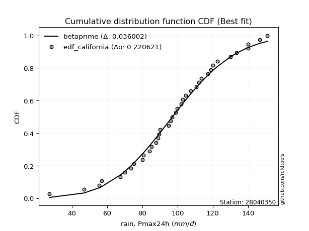</img></img>

</div>


### 2. EDF Hazen (1930)

Hazen method for plotting positions is a formula used to estimate the empirical cumulative probability distribution of flood events or other hydrological data. This formula often results in biased estimations, particularly when extrapolating to extreme events (high return periods).

<div align="center">


$P=(m-0.5)/n$


</div>


**2.1. Empirical values**

<div align="center">

|                | 0                   | 1                    | 2                    | 3                   | 4                   | 5                   | 6                   | 7                   | 8                   | 9                   | 10                  | 11                  | 12                  | 13                 | 14                  | 15                  | 16                 | 17                 | 18                 | 19                  | 20                 | 21                 | 22                 | 23                  | 24                 | 25        | 26                 | 27                 | 28                 | 29                 | 30                 | 31                 | 32                 | 33                 | 34                 | 35                | 36                 | 37                 | 38                 | 39                 | 40                 | 41                 | 42                 | 43                 | 44                 | 45                 | 46                 | 47                 | 48                 | 49                 | 50                 |
|:---------------|:--------------------|:---------------------|:---------------------|:--------------------|:--------------------|:--------------------|:--------------------|:--------------------|:--------------------|:--------------------|:--------------------|:--------------------|:--------------------|:-------------------|:--------------------|:--------------------|:-------------------|:-------------------|:-------------------|:--------------------|:-------------------|:-------------------|:-------------------|:--------------------|:-------------------|:----------|:-------------------|:-------------------|:-------------------|:-------------------|:-------------------|:-------------------|:-------------------|:-------------------|:-------------------|:------------------|:-------------------|:-------------------|:-------------------|:-------------------|:-------------------|:-------------------|:-------------------|:-------------------|:-------------------|:-------------------|:-------------------|:-------------------|:-------------------|:-------------------|:-------------------|
| date           | 2001                | 1997                 | 1972                 | 2003                | 2022                | 2007                | 1989                | 2015                | 1986                | 2021                | 1980                | 1995                | 2012                | 1973               | 1984                | 2019                | 1990               | 2004               | 2000               | 1988                | 1974               | 2020               | 1994               | 2009                | 1978               | 1981      | 1985               | 2013               | 1977               | 2014               | 1998               | 2002               | 1991               | 2017               | 2008               | 1982              | 1999               | 2018               | 1993               | 2005               | 1983               | 2016               | 1987               | 2010               | 1992               | 2011               | 2006               | 1975               | 1979               | 1996               | 1976               |
| x              | 55.5                | 56.8                 | 62.04761218          | 66.6                | 67.0                | 67.5                | 73.5                | 75.0                | 75.2                | 78.0                | 80.0                | 80.5                | 83.0                | 83.62431256        | 84.0                | 85.0                | 85.3               | 87.8               | 88.8               | 89.5                | 90.0               | 92.0               | 95.0               | 96.0                | 97.0               | 99.0      | 99.8               | 100.0              | 102.0              | 102.10925342627452 | 103.0              | 104.5              | 107.5              | 110.0              | 110.7              | 112.0             | 113.5              | 115.0              | 117.3              | 119.0              | 120.0              | 120.0              | 122.6              | 126.0              | 130.0              | 130.0              | 133.5              | 140.0              | 140.0              | 146.5              | 151.0              |
| m              | 1                   | 2                    | 3                    | 4                   | 5                   | 6                   | 7                   | 8                   | 9                   | 10                  | 11                  | 12                  | 13                  | 14                 | 15                  | 16                  | 17                 | 18                 | 19                 | 20                  | 21                 | 22                 | 23                 | 24                  | 25                 | 26        | 27                 | 28                 | 29                 | 30                 | 31                 | 32                 | 33                 | 34                 | 35                 | 36                | 37                 | 38                 | 39                 | 40                 | 41                 | 42                 | 43                 | 44                 | 45                 | 46                 | 47                 | 48                 | 49                 | 50                 | 51                 |
| empirical_dist | edf_hazen           | edf_hazen            | edf_hazen            | edf_hazen           | edf_hazen           | edf_hazen           | edf_hazen           | edf_hazen           | edf_hazen           | edf_hazen           | edf_hazen           | edf_hazen           | edf_hazen           | edf_hazen          | edf_hazen           | edf_hazen           | edf_hazen          | edf_hazen          | edf_hazen          | edf_hazen           | edf_hazen          | edf_hazen          | edf_hazen          | edf_hazen           | edf_hazen          | edf_hazen | edf_hazen          | edf_hazen          | edf_hazen          | edf_hazen          | edf_hazen          | edf_hazen          | edf_hazen          | edf_hazen          | edf_hazen          | edf_hazen         | edf_hazen          | edf_hazen          | edf_hazen          | edf_hazen          | edf_hazen          | edf_hazen          | edf_hazen          | edf_hazen          | edf_hazen          | edf_hazen          | edf_hazen          | edf_hazen          | edf_hazen          | edf_hazen          | edf_hazen          |
| empirical      | 0.00980392156862745 | 0.029411764705882353 | 0.049019607843137254 | 0.06862745098039216 | 0.08823529411764706 | 0.10784313725490197 | 0.12745098039215685 | 0.14705882352941177 | 0.16666666666666666 | 0.18627450980392157 | 0.20588235294117646 | 0.22549019607843138 | 0.24509803921568626 | 0.2647058823529412 | 0.28431372549019607 | 0.30392156862745096 | 0.3235294117647059 | 0.3431372549019608 | 0.3627450980392157 | 0.38235294117647056 | 0.4019607843137255 | 0.4215686274509804 | 0.4411764705882353 | 0.46078431372549017 | 0.4803921568627451 | 0.5       | 0.5196078431372549 | 0.5392156862745098 | 0.5588235294117647 | 0.5784313725490197 | 0.5980392156862745 | 0.6176470588235294 | 0.6372549019607843 | 0.6568627450980392 | 0.6764705882352942 | 0.696078431372549 | 0.7156862745098039 | 0.7352941176470589 | 0.7549019607843137 | 0.7745098039215687 | 0.7941176470588235 | 0.8137254901960784 | 0.8333333333333334 | 0.8529411764705882 | 0.8725490196078431 | 0.8921568627450981 | 0.9117647058823529 | 0.9313725490196079 | 0.9509803921568627 | 0.9705882352941176 | 0.9901960784313726 |
| empirical_tr   | 1.00990099009901    | 1.0303030303030303   | 1.0515463917525774   | 1.0736842105263158  | 1.096774193548387   | 1.120879120879121   | 1.146067415730337   | 1.1724137931034484  | 1.2                 | 1.2289156626506024  | 1.259259259259259   | 1.2911392405063291  | 1.3246753246753247  | 1.3599999999999999 | 1.3972602739726028  | 1.4366197183098592  | 1.4782608695652173 | 1.5223880597014925 | 1.5692307692307694 | 1.619047619047619   | 1.6721311475409837 | 1.7288135593220342 | 1.7894736842105263 | 1.8545454545454543  | 1.9245283018867927 | 2.0       | 2.0816326530612246 | 2.1702127659574466 | 2.2666666666666666 | 2.372093023255814  | 2.4878048780487805 | 2.6153846153846154 | 2.7567567567567566 | 2.914285714285714  | 3.0909090909090913 | 3.290322580645161 | 3.5172413793103448 | 3.7777777777777786 | 4.08               | 4.434782608695652  | 4.857142857142856  | 5.368421052631579  | 6.000000000000002  | 6.799999999999999  | 7.846153846153847  | 9.272727272727277  | 11.33333333333333  | 14.571428571428577 | 20.39999999999998  | 33.99999999999999  | 102.00000000000037 |

</div>


**2.2. Kolmogorov-Smirnov fit test (sorted by Δ)**


<div align="center">

|                | 0                    | 1                   | 2                   | 3                   | 4                   | 5                    | 6                   | 7                   | 8                    | 9                    | 10                  | 11                  | 12                  | 13                  | 14                   | 15                  | 16                   | 17                  | 18                  | 19                   | 20                   | 21                  | 22                   | 23                  | 24                  | 25                   | 26                   | 27                   | 28                   | 29                  | 30                  | 31                  | 32                  | 33                  | 34                   | 35                  | 36                  | 37                  | 38                  | 39                   | 40                  | 41                   | 42                   | 43                   | 44                  | 45                   | 46                  | 47                   | 48                  | 49                  | 50                  | 51                  | 52                  | 53                  | 54                  | 55                  | 56                    | 57                  | 58                  | 59                  | 60                  | 61                  | 62                  | 63                  | 64                  | 65                  | 66                  | 67                  | 68                  | 69                  | 70                  | 71                  | 72                  | 73                  | 74                  | 75                  | 76                  | 77                  | 78                  | 79                  | 80                  | 81                  | 82                  | 83                  | 84                  | 85                  | 86                  | 87                  |
|:---------------|:---------------------|:--------------------|:--------------------|:--------------------|:--------------------|:---------------------|:--------------------|:--------------------|:---------------------|:---------------------|:--------------------|:--------------------|:--------------------|:--------------------|:---------------------|:--------------------|:---------------------|:--------------------|:--------------------|:---------------------|:---------------------|:--------------------|:---------------------|:--------------------|:--------------------|:---------------------|:---------------------|:---------------------|:---------------------|:--------------------|:--------------------|:--------------------|:--------------------|:--------------------|:---------------------|:--------------------|:--------------------|:--------------------|:--------------------|:---------------------|:--------------------|:---------------------|:---------------------|:---------------------|:--------------------|:---------------------|:--------------------|:---------------------|:--------------------|:--------------------|:--------------------|:--------------------|:--------------------|:--------------------|:--------------------|:--------------------|:----------------------|:--------------------|:--------------------|:--------------------|:--------------------|:--------------------|:--------------------|:--------------------|:--------------------|:--------------------|:--------------------|:--------------------|:--------------------|:--------------------|:--------------------|:--------------------|:--------------------|:--------------------|:--------------------|:--------------------|:--------------------|:--------------------|:--------------------|:--------------------|:--------------------|:--------------------|:--------------------|:--------------------|:--------------------|:--------------------|:--------------------|:--------------------|
| station        | 28040350             | 28040350            | 28040350            | 28040350            | 28040350            | 28040350             | 28040350            | 28040350            | 28040350             | 28040350             | 28040350            | 28040350            | 28040350            | 28040350            | 28040350             | 28040350            | 28040350             | 28040350            | 28040350            | 28040350             | 28040350             | 28040350            | 28040350             | 28040350            | 28040350            | 28040350             | 28040350             | 28040350             | 28040350             | 28040350            | 28040350            | 28040350            | 28040350            | 28040350            | 28040350             | 28040350            | 28040350            | 28040350            | 28040350            | 28040350             | 28040350            | 28040350             | 28040350             | 28040350             | 28040350            | 28040350             | 28040350            | 28040350             | 28040350            | 28040350            | 28040350            | 28040350            | 28040350            | 28040350            | 28040350            | 28040350            | 28040350              | 28040350            | 28040350            | 28040350            | 28040350            | 28040350            | 28040350            | 28040350            | 28040350            | 28040350            | 28040350            | 28040350            | 28040350            | 28040350            | 28040350            | 28040350            | 28040350            | 28040350            | 28040350            | 28040350            | 28040350            | 28040350            | 28040350            | 28040350            | 28040350            | 28040350            | 28040350            | 28040350            | 28040350            | 28040350            | 28040350            | 28040350            |
| empirical_dist | edf_hazen            | edf_hazen           | edf_hazen           | edf_hazen           | edf_hazen           | edf_hazen            | edf_hazen           | edf_hazen           | edf_hazen            | edf_hazen            | edf_hazen           | edf_hazen           | edf_hazen           | edf_hazen           | edf_hazen            | edf_hazen           | edf_hazen            | edf_hazen           | edf_hazen           | edf_hazen            | edf_hazen            | edf_hazen           | edf_hazen            | edf_hazen           | edf_hazen           | edf_hazen            | edf_hazen            | edf_hazen            | edf_hazen            | edf_hazen           | edf_hazen           | edf_hazen           | edf_hazen           | edf_hazen           | edf_hazen            | edf_hazen           | edf_hazen           | edf_hazen           | edf_hazen           | edf_hazen            | edf_hazen           | edf_hazen            | edf_hazen            | edf_hazen            | edf_hazen           | edf_hazen            | edf_hazen           | edf_hazen            | edf_hazen           | edf_hazen           | edf_hazen           | edf_hazen           | edf_hazen           | edf_hazen           | edf_hazen           | edf_hazen           | edf_hazen             | edf_hazen           | edf_hazen           | edf_hazen           | edf_hazen           | edf_hazen           | edf_hazen           | edf_hazen           | edf_hazen           | edf_hazen           | edf_hazen           | edf_hazen           | edf_hazen           | edf_hazen           | edf_hazen           | edf_hazen           | edf_hazen           | edf_hazen           | edf_hazen           | edf_hazen           | edf_hazen           | edf_hazen           | edf_hazen           | edf_hazen           | edf_hazen           | edf_hazen           | edf_hazen           | edf_hazen           | edf_hazen           | edf_hazen           | edf_hazen           | edf_hazen           |
| p_dist         | weibull_min          | rice                | logpearson3         | erlang              | gamma               | f                    | maxwell             | logweibull_min      | nakagami             | fatiguelife          | alpha               | invgamma            | ncf                 | johnsonsu           | logloggamma          | lognct              | rayleigh             | nct                 | logncf              | logjohnsonsu         | lognakagami          | genlogistic         | fisk                 | logt                | logcrystalball      | lognorm              | lognorm              | logexponnorm         | loglognorm           | pearson3            | invweibull          | logfatiguelife      | logfisk             | logrice             | logf                 | logerlang           | loggamma            | loggamma            | logalpha            | mielke               | loggenlogistic      | loginvgamma          | exponnorm            | logmielke            | betaprime           | t                    | norm                | crystalball          | logbetaprime        | kstwobign           | invgauss            | loginvgauss         | loglogistic         | logmaxwell          | gumbel_r            | logistic            | loglaplace_asymmetric | laplace_asymmetric  | lograyleigh         | loggumbel_l         | loghypsecant        | hypsecant           | moyal               | loginvweibull       | halfnorm            | halflogistic        | loglaplace          | loghalfnorm         | loggumbel_r         | logkstwobign        | gumbel_l            | laplace             | logmoyal            | loghalflogistic     | wald                | loggenexpon         | logwald             | expon               | gibrat              | genexpon            | loggibrat           | loggompertz         | logtruncnorm        | logexpon            | logchi2             | gompertz            | chi2                | truncnorm           |
| delta          | 0.031170947239244517 | 0.03216313587217773 | 0.0355235564568922  | 0.03615126054156703 | 0.03615159029831472 | 0.036154399562454975 | 0.03653634409031181 | 0.03664182802388327 | 0.037782607481046226 | 0.037916255447985936 | 0.03802147808074363 | 0.0381570064006862  | 0.03931295547803626 | 0.03953106662615091 | 0.041032289071738115 | 0.04427477391418644 | 0.044776445333876785 | 0.04498209433115252 | 0.04600076523346508 | 0.046372304003738485 | 0.046567125013023736 | 0.04663047777001572 | 0.047022773387710104 | 0.04703095755220177 | 0.04703345213726984 | 0.047034160947805104 | 0.047034160947805104 | 0.047034441405885086 | 0.047034886820791155 | 0.04708264802260581 | 0.04726404153227681 | 0.04732103246106967 | 0.04750494263318794 | 0.04869025787261161 | 0.048766781247212676 | 0.04918998342654546 | 0.05063890713338226 | 0.05063890713338226 | 0.05087188731897441 | 0.050946752528357286 | 0.05100031333554517 | 0.054511290732437656 | 0.055618099584467284 | 0.055746426603200006 | 0.05673540309727876 | 0.057896549307197065 | 0.057948591523099   | 0.057948594621204275 | 0.06101134503301575 | 0.0618300630159484  | 0.0639030295015186  | 0.0644542740169386  | 0.06856491848152735 | 0.07140556095252026 | 0.07341458002239709 | 0.07639477744298862 | 0.07685169002836179   | 0.07867027062332366 | 0.08142949843005187 | 0.08144878801074446 | 0.0840092237427168  | 0.09060567340458986 | 0.09169012542388137 | 0.09517974820808439 | 0.10784313725490197 | 0.10784313725490197 | 0.10872149029905465 | 0.10968420304277349 | 0.1108185176050196  | 0.1144034779661264  | 0.11695910865237874 | 0.11859226872865292 | 0.13594635931346932 | 0.13662689851249787 | 0.18455382293566774 | 0.19073869484038833 | 0.20567602392591866 | 0.22177445441999794 | 0.22549019607843138 | 0.22870149093201025 | 0.23396887481390205 | 0.24365775587423058 | 0.27031613669618    | 0.2771972719442823  | 0.3537239667304827  | 0.8182190439943164  | 0.9428969073956677  | 0.9901960784313726  |
| deltao         | 0.19043809142780935  | 0.19043809142780935 | 0.19043809142780935 | 0.19043809142780935 | 0.19043809142780935 | 0.19043809142780935  | 0.19043809142780935 | 0.19043809142780935 | 0.19043809142780935  | 0.19043809142780935  | 0.19043809142780935 | 0.19043809142780935 | 0.19043809142780935 | 0.19043809142780935 | 0.19043809142780935  | 0.19043809142780935 | 0.19043809142780935  | 0.19043809142780935 | 0.19043809142780935 | 0.19043809142780935  | 0.19043809142780935  | 0.19043809142780935 | 0.19043809142780935  | 0.19043809142780935 | 0.19043809142780935 | 0.19043809142780935  | 0.19043809142780935  | 0.19043809142780935  | 0.19043809142780935  | 0.19043809142780935 | 0.19043809142780935 | 0.19043809142780935 | 0.19043809142780935 | 0.19043809142780935 | 0.19043809142780935  | 0.19043809142780935 | 0.19043809142780935 | 0.19043809142780935 | 0.19043809142780935 | 0.19043809142780935  | 0.19043809142780935 | 0.19043809142780935  | 0.19043809142780935  | 0.19043809142780935  | 0.19043809142780935 | 0.19043809142780935  | 0.19043809142780935 | 0.19043809142780935  | 0.19043809142780935 | 0.19043809142780935 | 0.19043809142780935 | 0.19043809142780935 | 0.19043809142780935 | 0.19043809142780935 | 0.19043809142780935 | 0.19043809142780935 | 0.19043809142780935   | 0.19043809142780935 | 0.19043809142780935 | 0.19043809142780935 | 0.19043809142780935 | 0.19043809142780935 | 0.19043809142780935 | 0.19043809142780935 | 0.19043809142780935 | 0.19043809142780935 | 0.19043809142780935 | 0.19043809142780935 | 0.19043809142780935 | 0.19043809142780935 | 0.19043809142780935 | 0.19043809142780935 | 0.19043809142780935 | 0.19043809142780935 | 0.19043809142780935 | 0.19043809142780935 | 0.19043809142780935 | 0.19043809142780935 | 0.19043809142780935 | 0.19043809142780935 | 0.19043809142780935 | 0.19043809142780935 | 0.19043809142780935 | 0.19043809142780935 | 0.19043809142780935 | 0.19043809142780935 | 0.19043809142780935 | 0.19043809142780935 |
| eval           | Δo > Δ               | Δo > Δ              | Δo > Δ              | Δo > Δ              | Δo > Δ              | Δo > Δ               | Δo > Δ              | Δo > Δ              | Δo > Δ               | Δo > Δ               | Δo > Δ              | Δo > Δ              | Δo > Δ              | Δo > Δ              | Δo > Δ               | Δo > Δ              | Δo > Δ               | Δo > Δ              | Δo > Δ              | Δo > Δ               | Δo > Δ               | Δo > Δ              | Δo > Δ               | Δo > Δ              | Δo > Δ              | Δo > Δ               | Δo > Δ               | Δo > Δ               | Δo > Δ               | Δo > Δ              | Δo > Δ              | Δo > Δ              | Δo > Δ              | Δo > Δ              | Δo > Δ               | Δo > Δ              | Δo > Δ              | Δo > Δ              | Δo > Δ              | Δo > Δ               | Δo > Δ              | Δo > Δ               | Δo > Δ               | Δo > Δ               | Δo > Δ              | Δo > Δ               | Δo > Δ              | Δo > Δ               | Δo > Δ              | Δo > Δ              | Δo > Δ              | Δo > Δ              | Δo > Δ              | Δo > Δ              | Δo > Δ              | Δo > Δ              | Δo > Δ                | Δo > Δ              | Δo > Δ              | Δo > Δ              | Δo > Δ              | Δo > Δ              | Δo > Δ              | Δo > Δ              | Δo > Δ              | Δo > Δ              | Δo > Δ              | Δo > Δ              | Δo > Δ              | Δo > Δ              | Δo > Δ              | Δo > Δ              | Δo > Δ              | Δo > Δ              | Δo > Δ              | Δo <= Δ             | Δo <= Δ             | Δo <= Δ             | Δo <= Δ             | Δo <= Δ             | Δo <= Δ             | Δo <= Δ             | Δo <= Δ             | Δo <= Δ             | Δo <= Δ             | Δo <= Δ             | Δo <= Δ             | Δo <= Δ             |
| fit            | 1                    | 1                   | 1                   | 1                   | 1                   | 1                    | 1                   | 1                   | 1                    | 1                    | 1                   | 1                   | 1                   | 1                   | 1                    | 1                   | 1                    | 1                   | 1                   | 1                    | 1                    | 1                   | 1                    | 1                   | 1                   | 1                    | 1                    | 1                    | 1                    | 1                   | 1                   | 1                   | 1                   | 1                   | 1                    | 1                   | 1                   | 1                   | 1                   | 1                    | 1                   | 1                    | 1                    | 1                    | 1                   | 1                    | 1                   | 1                    | 1                   | 1                   | 1                   | 1                   | 1                   | 1                   | 1                   | 1                   | 1                     | 1                   | 1                   | 1                   | 1                   | 1                   | 1                   | 1                   | 1                   | 1                   | 1                   | 1                   | 1                   | 1                   | 1                   | 1                   | 1                   | 1                   | 1                   | 0                   | 0                   | 0                   | 0                   | 0                   | 0                   | 0                   | 0                   | 0                   | 0                   | 0                   | 0                   | 0                   |
| n              | 51                   | 51                  | 51                  | 51                  | 51                  | 51                   | 51                  | 51                  | 51                   | 51                   | 51                  | 51                  | 51                  | 51                  | 51                   | 51                  | 51                   | 51                  | 51                  | 51                   | 51                   | 51                  | 51                   | 51                  | 51                  | 51                   | 51                   | 51                   | 51                   | 51                  | 51                  | 51                  | 51                  | 51                  | 51                   | 51                  | 51                  | 51                  | 51                  | 51                   | 51                  | 51                   | 51                   | 51                   | 51                  | 51                   | 51                  | 51                   | 51                  | 51                  | 51                  | 51                  | 51                  | 51                  | 51                  | 51                  | 51                    | 51                  | 51                  | 51                  | 51                  | 51                  | 51                  | 51                  | 51                  | 51                  | 51                  | 51                  | 51                  | 51                  | 51                  | 51                  | 51                  | 51                  | 51                  | 51                  | 51                  | 51                  | 51                  | 51                  | 51                  | 51                  | 51                  | 51                  | 51                  | 51                  | 51                  | 51                  |
| best_fit       | 1                    | 0                   | 0                   | 0                   | 0                   | 0                    | 0                   | 0                   | 0                    | 0                    | 0                   | 0                   | 0                   | 0                   | 0                    | 0                   | 0                    | 0                   | 0                   | 0                    | 0                    | 0                   | 0                    | 0                   | 0                   | 0                    | 0                    | 0                    | 0                    | 0                   | 0                   | 0                   | 0                   | 0                   | 0                    | 0                   | 0                   | 0                   | 0                   | 0                    | 0                   | 0                    | 0                    | 0                    | 0                   | 0                    | 0                   | 0                    | 0                   | 0                   | 0                   | 0                   | 0                   | 0                   | 0                   | 0                   | 0                     | 0                   | 0                   | 0                   | 0                   | 0                   | 0                   | 0                   | 0                   | 0                   | 0                   | 0                   | 0                   | 0                   | 0                   | 0                   | 0                   | 0                   | 0                   | 0                   | 0                   | 0                   | 0                   | 0                   | 0                   | 0                   | 0                   | 0                   | 0                   | 0                   | 0                   | 0                   |
| best_fit_sort  | 1                    | 2                   | 3                   | 4                   | 5                   | 6                    | 7                   | 8                   | 9                    | 10                   | 11                  | 12                  | 13                  | 14                  | 15                   | 16                  | 17                   | 18                  | 19                  | 20                   | 21                   | 22                  | 23                   | 24                  | 25                  | 26                   | 27                   | 28                   | 29                   | 30                  | 31                  | 32                  | 33                  | 34                  | 35                   | 36                  | 37                  | 38                  | 39                  | 40                   | 41                  | 42                   | 43                   | 44                   | 45                  | 46                   | 47                  | 48                   | 49                  | 50                  | 51                  | 52                  | 53                  | 54                  | 55                  | 56                  | 57                    | 58                  | 59                  | 60                  | 61                  | 62                  | 63                  | 64                  | 65                  | 66                  | 67                  | 68                  | 69                  | 70                  | 71                  | 72                  | 73                  | 74                  | 75                  | 76                  | 77                  | 78                  | 79                  | 80                  | 81                  | 82                  | 83                  | 84                  | 85                  | 86                  | 87                  | 88                  |

</div>


<div align="center">

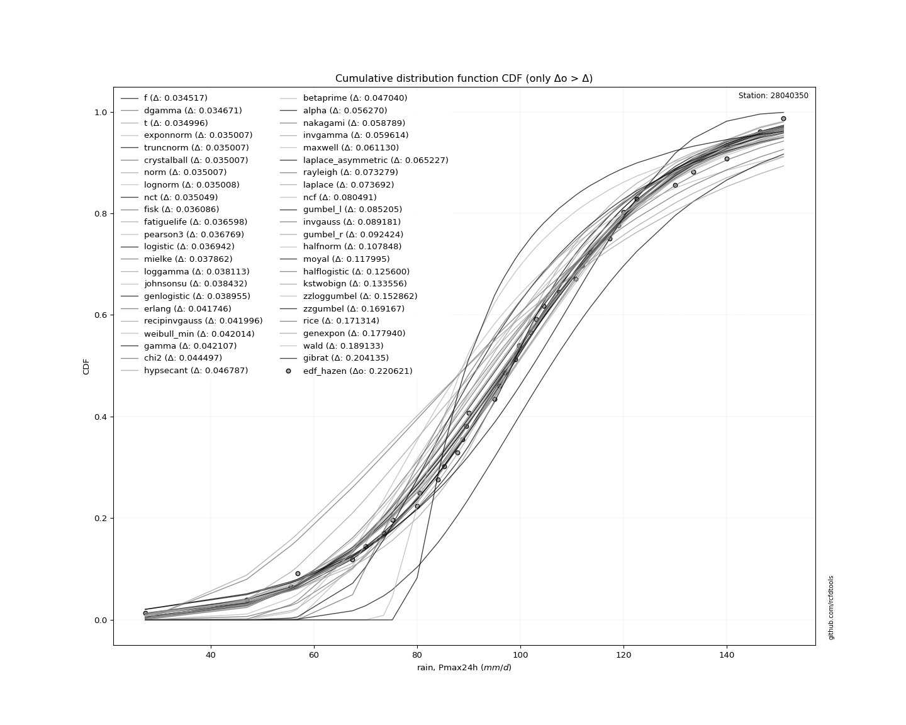</img>

</div>


**2.3. Best fit**

<div align="center">

|   id |   station | empirical_dist   | p_dist      |     delta |   deltao | eval   |   fit |   n |   best_fit |   best_fit_sort |
|-----:|----------:|:-----------------|:------------|----------:|---------:|:-------|------:|----:|-----------:|----------------:|
|    0 |  28040350 | edf_hazen        | weibull_min | 0.0311709 | 0.190438 | Δo > Δ |     1 |  51 |          1 |               1 |

</div>


<div align="center">

</img>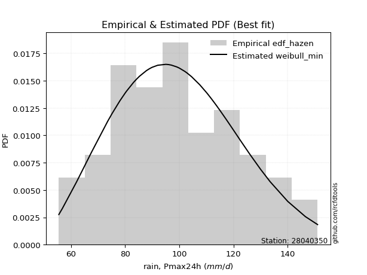</img>

</div>


### 3. EDF Weibull (1939)

Weibull plotting position formula is an empirical method used to estimate the non-exceedance probability or plotting position for a set of observed data, is often recommended or widely used in practice, particularly in flood frequency analysis.

<div align="center">


$P=m/(n+1)$


</div>


**3.1. Empirical values**

<div align="center">

|                | 0                    | 1                    | 2                    | 3                   | 4                   | 5                   | 6                  | 7                   | 8                   | 9                   | 10                  | 11                  | 12                 | 13                 | 14                  | 15                 | 16                 | 17                  | 18                  | 19                  | 20                  | 21                 | 22                 | 23                  | 24                 | 25          | 26                 | 27                 | 28                 | 29                 | 30                 | 31                 | 32                 | 33                 | 34                 | 35                 | 36                 | 37                 | 38          | 39                 | 40                 | 41                 | 42                 | 43                 | 44                 | 45                 | 46                 | 47                 | 48                 | 49                 | 50                 |
|:---------------|:---------------------|:---------------------|:---------------------|:--------------------|:--------------------|:--------------------|:-------------------|:--------------------|:--------------------|:--------------------|:--------------------|:--------------------|:-------------------|:-------------------|:--------------------|:-------------------|:-------------------|:--------------------|:--------------------|:--------------------|:--------------------|:-------------------|:-------------------|:--------------------|:-------------------|:------------|:-------------------|:-------------------|:-------------------|:-------------------|:-------------------|:-------------------|:-------------------|:-------------------|:-------------------|:-------------------|:-------------------|:-------------------|:------------|:-------------------|:-------------------|:-------------------|:-------------------|:-------------------|:-------------------|:-------------------|:-------------------|:-------------------|:-------------------|:-------------------|:-------------------|
| date           | 2001                 | 1997                 | 1972                 | 2003                | 2022                | 2007                | 1989               | 2015                | 1986                | 2021                | 1980                | 1995                | 2012               | 1973               | 1984                | 2019               | 1990               | 2004                | 2000                | 1988                | 1974                | 2020               | 1994               | 2009                | 1978               | 1981        | 1985               | 2013               | 1977               | 2014               | 1998               | 2002               | 1991               | 2017               | 2008               | 1982               | 1999               | 2018               | 1993        | 2005               | 1983               | 2016               | 1987               | 2010               | 1992               | 2011               | 2006               | 1975               | 1979               | 1996               | 1976               |
| x              | 55.5                 | 56.8                 | 62.04761218          | 66.6                | 67.0                | 67.5                | 73.5               | 75.0                | 75.2                | 78.0                | 80.0                | 80.5                | 83.0               | 83.62431256        | 84.0                | 85.0               | 85.3               | 87.8                | 88.8                | 89.5                | 90.0                | 92.0               | 95.0               | 96.0                | 97.0               | 99.0        | 99.8               | 100.0              | 102.0              | 102.10925342627452 | 103.0              | 104.5              | 107.5              | 110.0              | 110.7              | 112.0              | 113.5              | 115.0              | 117.3       | 119.0              | 120.0              | 120.0              | 122.6              | 126.0              | 130.0              | 130.0              | 133.5              | 140.0              | 140.0              | 146.5              | 151.0              |
| m              | 1                    | 2                    | 3                    | 4                   | 5                   | 6                   | 7                  | 8                   | 9                   | 10                  | 11                  | 12                  | 13                 | 14                 | 15                  | 16                 | 17                 | 18                  | 19                  | 20                  | 21                  | 22                 | 23                 | 24                  | 25                 | 26          | 27                 | 28                 | 29                 | 30                 | 31                 | 32                 | 33                 | 34                 | 35                 | 36                 | 37                 | 38                 | 39          | 40                 | 41                 | 42                 | 43                 | 44                 | 45                 | 46                 | 47                 | 48                 | 49                 | 50                 | 51                 |
| empirical_dist | edf_weibull          | edf_weibull          | edf_weibull          | edf_weibull         | edf_weibull         | edf_weibull         | edf_weibull        | edf_weibull         | edf_weibull         | edf_weibull         | edf_weibull         | edf_weibull         | edf_weibull        | edf_weibull        | edf_weibull         | edf_weibull        | edf_weibull        | edf_weibull         | edf_weibull         | edf_weibull         | edf_weibull         | edf_weibull        | edf_weibull        | edf_weibull         | edf_weibull        | edf_weibull | edf_weibull        | edf_weibull        | edf_weibull        | edf_weibull        | edf_weibull        | edf_weibull        | edf_weibull        | edf_weibull        | edf_weibull        | edf_weibull        | edf_weibull        | edf_weibull        | edf_weibull | edf_weibull        | edf_weibull        | edf_weibull        | edf_weibull        | edf_weibull        | edf_weibull        | edf_weibull        | edf_weibull        | edf_weibull        | edf_weibull        | edf_weibull        | edf_weibull        |
| empirical      | 0.019230769230769232 | 0.038461538461538464 | 0.057692307692307696 | 0.07692307692307693 | 0.09615384615384616 | 0.11538461538461539 | 0.1346153846153846 | 0.15384615384615385 | 0.17307692307692307 | 0.19230769230769232 | 0.21153846153846154 | 0.23076923076923078 | 0.25               | 0.2692307692307692 | 0.28846153846153844 | 0.3076923076923077 | 0.3269230769230769 | 0.34615384615384615 | 0.36538461538461536 | 0.38461538461538464 | 0.40384615384615385 | 0.4230769230769231 | 0.4423076923076923 | 0.46153846153846156 | 0.4807692307692308 | 0.5         | 0.5192307692307693 | 0.5384615384615384 | 0.5576923076923077 | 0.5769230769230769 | 0.5961538461538461 | 0.6153846153846154 | 0.6346153846153846 | 0.6538461538461539 | 0.6730769230769231 | 0.6923076923076923 | 0.7115384615384616 | 0.7307692307692307 | 0.75        | 0.7692307692307693 | 0.7884615384615384 | 0.8076923076923077 | 0.8269230769230769 | 0.8461538461538461 | 0.8653846153846154 | 0.8846153846153846 | 0.9038461538461539 | 0.9230769230769231 | 0.9423076923076923 | 0.9615384615384616 | 0.9807692307692307 |
| empirical_tr   | 1.019607843137255    | 1.04                 | 1.0612244897959184   | 1.0833333333333333  | 1.1063829787234043  | 1.1304347826086958  | 1.1555555555555554 | 1.1818181818181819  | 1.2093023255813955  | 1.2380952380952381  | 1.2682926829268293  | 1.3                 | 1.3333333333333333 | 1.3684210526315788 | 1.4054054054054053  | 1.4444444444444444 | 1.4857142857142855 | 1.5294117647058822  | 1.575757575757576   | 1.625               | 1.6774193548387097  | 1.7333333333333334 | 1.793103448275862  | 1.8571428571428572  | 1.9259259259259263 | 2.0         | 2.08               | 2.1666666666666665 | 2.2608695652173916 | 2.3636363636363633 | 2.4761904761904763 | 2.6                | 2.7368421052631575 | 2.888888888888889  | 3.0588235294117654 | 3.25               | 3.466666666666667  | 3.7142857142857135 | 4.0         | 4.333333333333334  | 4.727272727272727  | 5.2                | 5.777777777777776  | 6.5                | 7.428571428571431  | 8.666666666666664  | 10.4               | 13.000000000000009 | 17.33333333333333  | 26.000000000000018 | 51.999999999999886 |

</div>


**3.2. Kolmogorov-Smirnov fit test (sorted by Δ)**


<div align="center">

|                | 0                    | 1                   | 2                   | 3                   | 4                    | 5                    | 6                   | 7                    | 8                    | 9                   | 10                   | 11                  | 12                  | 13                  | 14                   | 15                  | 16                  | 17                  | 18                  | 19                  | 20                   | 21                   | 22                  | 23                  | 24                  | 25                  | 26                  | 27                  | 28                   | 29                   | 30                   | 31                  | 32                  | 33                   | 34                  | 35                  | 36                  | 37                  | 38                  | 39                  | 40                   | 41                  | 42                   | 43                   | 44                  | 45                   | 46                  | 47                   | 48                  | 49                  | 50                  | 51                  | 52                  | 53                  | 54                  | 55                  | 56                    | 57                  | 58                  | 59                  | 60                  | 61                  | 62                  | 63                  | 64                  | 65                  | 66                  | 67                  | 68                  | 69                  | 70                  | 71                  | 72                  | 73                  | 74                  | 75                  | 76                  | 77                  | 78                  | 79                  | 80                  | 81                  | 82                  | 83                  | 84                  | 85                  | 86                  | 87                  |
|:---------------|:---------------------|:--------------------|:--------------------|:--------------------|:---------------------|:---------------------|:--------------------|:---------------------|:---------------------|:--------------------|:---------------------|:--------------------|:--------------------|:--------------------|:---------------------|:--------------------|:--------------------|:--------------------|:--------------------|:--------------------|:---------------------|:---------------------|:--------------------|:--------------------|:--------------------|:--------------------|:--------------------|:--------------------|:---------------------|:---------------------|:---------------------|:--------------------|:--------------------|:---------------------|:--------------------|:--------------------|:--------------------|:--------------------|:--------------------|:--------------------|:---------------------|:--------------------|:---------------------|:---------------------|:--------------------|:---------------------|:--------------------|:---------------------|:--------------------|:--------------------|:--------------------|:--------------------|:--------------------|:--------------------|:--------------------|:--------------------|:----------------------|:--------------------|:--------------------|:--------------------|:--------------------|:--------------------|:--------------------|:--------------------|:--------------------|:--------------------|:--------------------|:--------------------|:--------------------|:--------------------|:--------------------|:--------------------|:--------------------|:--------------------|:--------------------|:--------------------|:--------------------|:--------------------|:--------------------|:--------------------|:--------------------|:--------------------|:--------------------|:--------------------|:--------------------|:--------------------|:--------------------|:--------------------|
| station        | 28040350             | 28040350            | 28040350            | 28040350            | 28040350             | 28040350             | 28040350            | 28040350             | 28040350             | 28040350            | 28040350             | 28040350            | 28040350            | 28040350            | 28040350             | 28040350            | 28040350            | 28040350            | 28040350            | 28040350            | 28040350             | 28040350             | 28040350            | 28040350            | 28040350            | 28040350            | 28040350            | 28040350            | 28040350             | 28040350             | 28040350             | 28040350            | 28040350            | 28040350             | 28040350            | 28040350            | 28040350            | 28040350            | 28040350            | 28040350            | 28040350             | 28040350            | 28040350             | 28040350             | 28040350            | 28040350             | 28040350            | 28040350             | 28040350            | 28040350            | 28040350            | 28040350            | 28040350            | 28040350            | 28040350            | 28040350            | 28040350              | 28040350            | 28040350            | 28040350            | 28040350            | 28040350            | 28040350            | 28040350            | 28040350            | 28040350            | 28040350            | 28040350            | 28040350            | 28040350            | 28040350            | 28040350            | 28040350            | 28040350            | 28040350            | 28040350            | 28040350            | 28040350            | 28040350            | 28040350            | 28040350            | 28040350            | 28040350            | 28040350            | 28040350            | 28040350            | 28040350            | 28040350            |
| empirical_dist | edf_weibull          | edf_weibull         | edf_weibull         | edf_weibull         | edf_weibull          | edf_weibull          | edf_weibull         | edf_weibull          | edf_weibull          | edf_weibull         | edf_weibull          | edf_weibull         | edf_weibull         | edf_weibull         | edf_weibull          | edf_weibull         | edf_weibull         | edf_weibull         | edf_weibull         | edf_weibull         | edf_weibull          | edf_weibull          | edf_weibull         | edf_weibull         | edf_weibull         | edf_weibull         | edf_weibull         | edf_weibull         | edf_weibull          | edf_weibull          | edf_weibull          | edf_weibull         | edf_weibull         | edf_weibull          | edf_weibull         | edf_weibull         | edf_weibull         | edf_weibull         | edf_weibull         | edf_weibull         | edf_weibull          | edf_weibull         | edf_weibull          | edf_weibull          | edf_weibull         | edf_weibull          | edf_weibull         | edf_weibull          | edf_weibull         | edf_weibull         | edf_weibull         | edf_weibull         | edf_weibull         | edf_weibull         | edf_weibull         | edf_weibull         | edf_weibull           | edf_weibull         | edf_weibull         | edf_weibull         | edf_weibull         | edf_weibull         | edf_weibull         | edf_weibull         | edf_weibull         | edf_weibull         | edf_weibull         | edf_weibull         | edf_weibull         | edf_weibull         | edf_weibull         | edf_weibull         | edf_weibull         | edf_weibull         | edf_weibull         | edf_weibull         | edf_weibull         | edf_weibull         | edf_weibull         | edf_weibull         | edf_weibull         | edf_weibull         | edf_weibull         | edf_weibull         | edf_weibull         | edf_weibull         | edf_weibull         | edf_weibull         |
| p_dist         | rice                 | weibull_min         | logpearson3         | f                   | logweibull_min       | gamma                | erlang              | fatiguelife          | nakagami             | invgamma            | alpha                | johnsonsu           | ncf                 | maxwell             | logloggamma          | nct                 | invweibull          | lognct              | pearson3            | logncf              | logjohnsonsu         | lognakagami          | genlogistic         | fisk                | logt                | logcrystalball      | lognorm             | lognorm             | logexponnorm         | loglognorm           | logfatiguelife       | logfisk             | logrice             | logf                 | logerlang           | rayleigh            | mielke              | loggenlogistic      | loggamma            | loggamma            | logalpha             | loginvgamma         | exponnorm            | logmielke            | betaprime           | t                    | norm                | crystalball          | kstwobign           | invgauss            | logbetaprime        | loginvgauss         | logmaxwell          | loglogistic         | gumbel_r            | logistic            | loglaplace_asymmetric | laplace_asymmetric  | lograyleigh         | loggumbel_l         | loghypsecant        | hypsecant           | loginvweibull       | moyal               | logkstwobign        | loggumbel_r         | loglaplace          | halfnorm            | halflogistic        | loghalfnorm         | gumbel_l            | laplace             | logmoyal            | loghalflogistic     | loggenexpon         | wald                | logwald             | expon               | genexpon            | gibrat              | loggibrat           | loggompertz         | logtruncnorm        | logexpon            | logchi2             | gompertz            | chi2                | truncnorm           |
| delta          | 0.037056450079338804 | 0.03843360523912773 | 0.03926986891127521 | 0.03927457239355288 | 0.039365112582832415 | 0.039544245215928975 | 0.03954440053534719 | 0.039801624980414285 | 0.040799198732931585 | 0.04117359765257156 | 0.041413935293922066 | 0.04141643615857926 | 0.04232954672992162 | 0.04290082831032464 | 0.042917658604166464 | 0.04686746386358087 | 0.04726404153227681 | 0.0472913651660718  | 0.04896801755503416 | 0.04901735648535044 | 0.049388895255623844 | 0.049583716264909095 | 0.04964706902190108 | 0.05003936463959546 | 0.05004754880408713 | 0.0500500433891552  | 0.05005075219969046 | 0.05005075219969046 | 0.050051032657770445 | 0.050051478072676514 | 0.050337623712955026 | 0.0505215338850733  | 0.05170684912449697 | 0.051783372499098035 | 0.05220657467843082 | 0.05231792346359021 | 0.05312598510219374 | 0.05314382326304257 | 0.05365549838526762 | 0.05365549838526762 | 0.053888478570859766 | 0.0561807996188769  | 0.057503469116895634 | 0.057631796135628355 | 0.05975199434916412 | 0.059781918839625414 | 0.05983396105552735 | 0.059833964153632624 | 0.0618300630159484  | 0.0639030295015186  | 0.06402793628490111 | 0.0644542740169386  | 0.07140556095252026 | 0.07158150973341271 | 0.07643117127428245 | 0.07828014697541696 | 0.07873705956079013   | 0.080555640155752   | 0.08142949843005187 | 0.0833341575431728  | 0.08702581499460216 | 0.09249104293701821 | 0.09404852648862738 | 0.0992316035535948  | 0.10950151718181267 | 0.1108185176050196  | 0.11173808155094    | 0.11538461538461539 | 0.11538461538461539 | 0.11538461538461539 | 0.11884447818480709 | 0.12047763826108127 | 0.13594635931346932 | 0.13662689851249787 | 0.1858367340560746  | 0.1905870054394385  | 0.20567602392591866 | 0.21611834582271286 | 0.22304538233472518 | 0.23076923076923078 | 0.23396887481390205 | 0.23875579508991684 | 0.2646600280988949  | 0.2715411633469972  | 0.3468535195326812  | 0.8118087875840599  | 0.9342242075464973  | 0.9807692307692307  |
| deltao         | 0.19043809142780935  | 0.19043809142780935 | 0.19043809142780935 | 0.19043809142780935 | 0.19043809142780935  | 0.19043809142780935  | 0.19043809142780935 | 0.19043809142780935  | 0.19043809142780935  | 0.19043809142780935 | 0.19043809142780935  | 0.19043809142780935 | 0.19043809142780935 | 0.19043809142780935 | 0.19043809142780935  | 0.19043809142780935 | 0.19043809142780935 | 0.19043809142780935 | 0.19043809142780935 | 0.19043809142780935 | 0.19043809142780935  | 0.19043809142780935  | 0.19043809142780935 | 0.19043809142780935 | 0.19043809142780935 | 0.19043809142780935 | 0.19043809142780935 | 0.19043809142780935 | 0.19043809142780935  | 0.19043809142780935  | 0.19043809142780935  | 0.19043809142780935 | 0.19043809142780935 | 0.19043809142780935  | 0.19043809142780935 | 0.19043809142780935 | 0.19043809142780935 | 0.19043809142780935 | 0.19043809142780935 | 0.19043809142780935 | 0.19043809142780935  | 0.19043809142780935 | 0.19043809142780935  | 0.19043809142780935  | 0.19043809142780935 | 0.19043809142780935  | 0.19043809142780935 | 0.19043809142780935  | 0.19043809142780935 | 0.19043809142780935 | 0.19043809142780935 | 0.19043809142780935 | 0.19043809142780935 | 0.19043809142780935 | 0.19043809142780935 | 0.19043809142780935 | 0.19043809142780935   | 0.19043809142780935 | 0.19043809142780935 | 0.19043809142780935 | 0.19043809142780935 | 0.19043809142780935 | 0.19043809142780935 | 0.19043809142780935 | 0.19043809142780935 | 0.19043809142780935 | 0.19043809142780935 | 0.19043809142780935 | 0.19043809142780935 | 0.19043809142780935 | 0.19043809142780935 | 0.19043809142780935 | 0.19043809142780935 | 0.19043809142780935 | 0.19043809142780935 | 0.19043809142780935 | 0.19043809142780935 | 0.19043809142780935 | 0.19043809142780935 | 0.19043809142780935 | 0.19043809142780935 | 0.19043809142780935 | 0.19043809142780935 | 0.19043809142780935 | 0.19043809142780935 | 0.19043809142780935 | 0.19043809142780935 | 0.19043809142780935 |
| eval           | Δo > Δ               | Δo > Δ              | Δo > Δ              | Δo > Δ              | Δo > Δ               | Δo > Δ               | Δo > Δ              | Δo > Δ               | Δo > Δ               | Δo > Δ              | Δo > Δ               | Δo > Δ              | Δo > Δ              | Δo > Δ              | Δo > Δ               | Δo > Δ              | Δo > Δ              | Δo > Δ              | Δo > Δ              | Δo > Δ              | Δo > Δ               | Δo > Δ               | Δo > Δ              | Δo > Δ              | Δo > Δ              | Δo > Δ              | Δo > Δ              | Δo > Δ              | Δo > Δ               | Δo > Δ               | Δo > Δ               | Δo > Δ              | Δo > Δ              | Δo > Δ               | Δo > Δ              | Δo > Δ              | Δo > Δ              | Δo > Δ              | Δo > Δ              | Δo > Δ              | Δo > Δ               | Δo > Δ              | Δo > Δ               | Δo > Δ               | Δo > Δ              | Δo > Δ               | Δo > Δ              | Δo > Δ               | Δo > Δ              | Δo > Δ              | Δo > Δ              | Δo > Δ              | Δo > Δ              | Δo > Δ              | Δo > Δ              | Δo > Δ              | Δo > Δ                | Δo > Δ              | Δo > Δ              | Δo > Δ              | Δo > Δ              | Δo > Δ              | Δo > Δ              | Δo > Δ              | Δo > Δ              | Δo > Δ              | Δo > Δ              | Δo > Δ              | Δo > Δ              | Δo > Δ              | Δo > Δ              | Δo > Δ              | Δo > Δ              | Δo > Δ              | Δo > Δ              | Δo <= Δ             | Δo <= Δ             | Δo <= Δ             | Δo <= Δ             | Δo <= Δ             | Δo <= Δ             | Δo <= Δ             | Δo <= Δ             | Δo <= Δ             | Δo <= Δ             | Δo <= Δ             | Δo <= Δ             | Δo <= Δ             |
| fit            | 1                    | 1                   | 1                   | 1                   | 1                    | 1                    | 1                   | 1                    | 1                    | 1                   | 1                    | 1                   | 1                   | 1                   | 1                    | 1                   | 1                   | 1                   | 1                   | 1                   | 1                    | 1                    | 1                   | 1                   | 1                   | 1                   | 1                   | 1                   | 1                    | 1                    | 1                    | 1                   | 1                   | 1                    | 1                   | 1                   | 1                   | 1                   | 1                   | 1                   | 1                    | 1                   | 1                    | 1                    | 1                   | 1                    | 1                   | 1                    | 1                   | 1                   | 1                   | 1                   | 1                   | 1                   | 1                   | 1                   | 1                     | 1                   | 1                   | 1                   | 1                   | 1                   | 1                   | 1                   | 1                   | 1                   | 1                   | 1                   | 1                   | 1                   | 1                   | 1                   | 1                   | 1                   | 1                   | 0                   | 0                   | 0                   | 0                   | 0                   | 0                   | 0                   | 0                   | 0                   | 0                   | 0                   | 0                   | 0                   |
| n              | 51                   | 51                  | 51                  | 51                  | 51                   | 51                   | 51                  | 51                   | 51                   | 51                  | 51                   | 51                  | 51                  | 51                  | 51                   | 51                  | 51                  | 51                  | 51                  | 51                  | 51                   | 51                   | 51                  | 51                  | 51                  | 51                  | 51                  | 51                  | 51                   | 51                   | 51                   | 51                  | 51                  | 51                   | 51                  | 51                  | 51                  | 51                  | 51                  | 51                  | 51                   | 51                  | 51                   | 51                   | 51                  | 51                   | 51                  | 51                   | 51                  | 51                  | 51                  | 51                  | 51                  | 51                  | 51                  | 51                  | 51                    | 51                  | 51                  | 51                  | 51                  | 51                  | 51                  | 51                  | 51                  | 51                  | 51                  | 51                  | 51                  | 51                  | 51                  | 51                  | 51                  | 51                  | 51                  | 51                  | 51                  | 51                  | 51                  | 51                  | 51                  | 51                  | 51                  | 51                  | 51                  | 51                  | 51                  | 51                  |
| best_fit       | 1                    | 0                   | 0                   | 0                   | 0                    | 0                    | 0                   | 0                    | 0                    | 0                   | 0                    | 0                   | 0                   | 0                   | 0                    | 0                   | 0                   | 0                   | 0                   | 0                   | 0                    | 0                    | 0                   | 0                   | 0                   | 0                   | 0                   | 0                   | 0                    | 0                    | 0                    | 0                   | 0                   | 0                    | 0                   | 0                   | 0                   | 0                   | 0                   | 0                   | 0                    | 0                   | 0                    | 0                    | 0                   | 0                    | 0                   | 0                    | 0                   | 0                   | 0                   | 0                   | 0                   | 0                   | 0                   | 0                   | 0                     | 0                   | 0                   | 0                   | 0                   | 0                   | 0                   | 0                   | 0                   | 0                   | 0                   | 0                   | 0                   | 0                   | 0                   | 0                   | 0                   | 0                   | 0                   | 0                   | 0                   | 0                   | 0                   | 0                   | 0                   | 0                   | 0                   | 0                   | 0                   | 0                   | 0                   | 0                   |
| best_fit_sort  | 1                    | 2                   | 3                   | 4                   | 5                    | 6                    | 7                   | 8                    | 9                    | 10                  | 11                   | 12                  | 13                  | 14                  | 15                   | 16                  | 17                  | 18                  | 19                  | 20                  | 21                   | 22                   | 23                  | 24                  | 25                  | 26                  | 27                  | 28                  | 29                   | 30                   | 31                   | 32                  | 33                  | 34                   | 35                  | 36                  | 37                  | 38                  | 39                  | 40                  | 41                   | 42                  | 43                   | 44                   | 45                  | 46                   | 47                  | 48                   | 49                  | 50                  | 51                  | 52                  | 53                  | 54                  | 55                  | 56                  | 57                    | 58                  | 59                  | 60                  | 61                  | 62                  | 63                  | 64                  | 65                  | 66                  | 67                  | 68                  | 69                  | 70                  | 71                  | 72                  | 73                  | 74                  | 75                  | 76                  | 77                  | 78                  | 79                  | 80                  | 81                  | 82                  | 83                  | 84                  | 85                  | 86                  | 87                  | 88                  |

</div>


<div align="center">

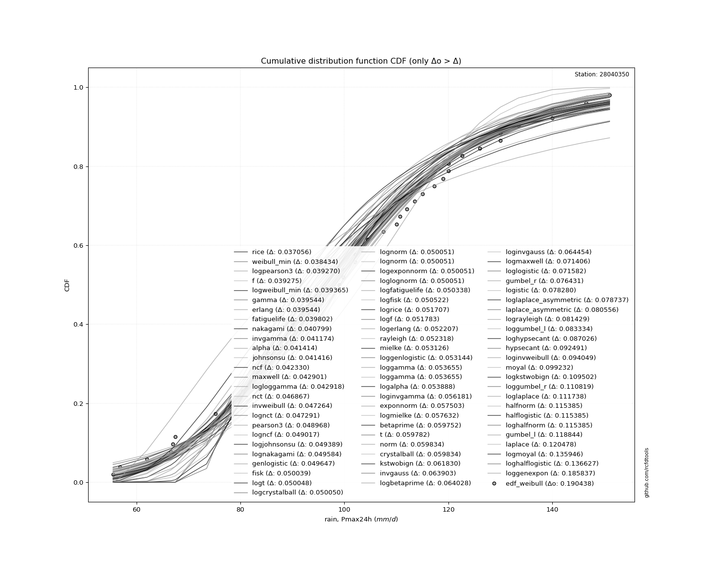</img>

</div>


**3.3. Best fit**

<div align="center">

|   id |   station | empirical_dist   | p_dist   |     delta |   deltao | eval   |   fit |   n |   best_fit |   best_fit_sort |
|-----:|----------:|:-----------------|:---------|----------:|---------:|:-------|------:|----:|-----------:|----------------:|
|    0 |  28040350 | edf_weibull      | rice     | 0.0370565 | 0.190438 | Δo > Δ |     1 |  51 |          1 |               1 |

</div>


<div align="center">

</img>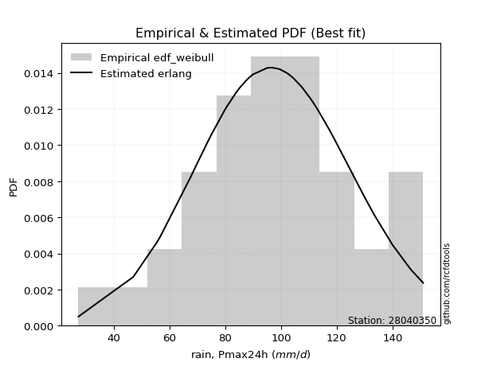</img>

</div>


### 4. EDF Beard (1943)

The Beard formula (or Beard´s plotting position formula) in hydrology is used to estimate the empirical non-exceedance probability _(P)_ of a flood event (or other extreme hydrological data point) within a given dataset.

<div align="center">


$P=(m-0.31)/(n+0.38)$


</div>


**4.1. Empirical values**

<div align="center">

|                | 0                   | 1                    | 2                  | 3                   | 4                   | 5                   | 6                   | 7                  | 8                   | 9                   | 10                 | 11                  | 12                  | 13                 | 14                  | 15                 | 16                  | 17                 | 18                 | 19                 | 20                 | 21                  | 22                  | 23                 | 24                  | 25        | 26                 | 27                 | 28                 | 29                 | 30                 | 31                 | 32                 | 33                 | 34                 | 35                 | 36                 | 37                 | 38                | 39                 | 40                | 41                 | 42                 | 43                 | 44                 | 45                 | 46                 | 47                 | 48                 | 49                 | 50                 |
|:---------------|:--------------------|:---------------------|:-------------------|:--------------------|:--------------------|:--------------------|:--------------------|:-------------------|:--------------------|:--------------------|:-------------------|:--------------------|:--------------------|:-------------------|:--------------------|:-------------------|:--------------------|:-------------------|:-------------------|:-------------------|:-------------------|:--------------------|:--------------------|:-------------------|:--------------------|:----------|:-------------------|:-------------------|:-------------------|:-------------------|:-------------------|:-------------------|:-------------------|:-------------------|:-------------------|:-------------------|:-------------------|:-------------------|:------------------|:-------------------|:------------------|:-------------------|:-------------------|:-------------------|:-------------------|:-------------------|:-------------------|:-------------------|:-------------------|:-------------------|:-------------------|
| date           | 2001                | 1997                 | 1972               | 2003                | 2022                | 2007                | 1989                | 2015               | 1986                | 2021                | 1980               | 1995                | 2012                | 1973               | 1984                | 2019               | 1990                | 2004               | 2000               | 1988               | 1974               | 2020                | 1994                | 2009               | 1978                | 1981      | 1985               | 2013               | 1977               | 2014               | 1998               | 2002               | 1991               | 2017               | 2008               | 1982               | 1999               | 2018               | 1993              | 2005               | 1983              | 2016               | 1987               | 2010               | 1992               | 2011               | 2006               | 1975               | 1979               | 1996               | 1976               |
| x              | 55.5                | 56.8                 | 62.04761218        | 66.6                | 67.0                | 67.5                | 73.5                | 75.0               | 75.2                | 78.0                | 80.0               | 80.5                | 83.0                | 83.62431256        | 84.0                | 85.0               | 85.3                | 87.8               | 88.8               | 89.5               | 90.0               | 92.0                | 95.0                | 96.0               | 97.0                | 99.0      | 99.8               | 100.0              | 102.0              | 102.10925342627452 | 103.0              | 104.5              | 107.5              | 110.0              | 110.7              | 112.0              | 113.5              | 115.0              | 117.3             | 119.0              | 120.0             | 120.0              | 122.6              | 126.0              | 130.0              | 130.0              | 133.5              | 140.0              | 140.0              | 146.5              | 151.0              |
| m              | 1                   | 2                    | 3                  | 4                   | 5                   | 6                   | 7                   | 8                  | 9                   | 10                  | 11                 | 12                  | 13                  | 14                 | 15                  | 16                 | 17                  | 18                 | 19                 | 20                 | 21                 | 22                  | 23                  | 24                 | 25                  | 26        | 27                 | 28                 | 29                 | 30                 | 31                 | 32                 | 33                 | 34                 | 35                 | 36                 | 37                 | 38                 | 39                | 40                 | 41                | 42                 | 43                 | 44                 | 45                 | 46                 | 47                 | 48                 | 49                 | 50                 | 51                 |
| empirical_dist | edf_beard           | edf_beard            | edf_beard          | edf_beard           | edf_beard           | edf_beard           | edf_beard           | edf_beard          | edf_beard           | edf_beard           | edf_beard          | edf_beard           | edf_beard           | edf_beard          | edf_beard           | edf_beard          | edf_beard           | edf_beard          | edf_beard          | edf_beard          | edf_beard          | edf_beard           | edf_beard           | edf_beard          | edf_beard           | edf_beard | edf_beard          | edf_beard          | edf_beard          | edf_beard          | edf_beard          | edf_beard          | edf_beard          | edf_beard          | edf_beard          | edf_beard          | edf_beard          | edf_beard          | edf_beard         | edf_beard          | edf_beard         | edf_beard          | edf_beard          | edf_beard          | edf_beard          | edf_beard          | edf_beard          | edf_beard          | edf_beard          | edf_beard          | edf_beard          |
| empirical      | 0.01342934994161152 | 0.032892175943947055 | 0.0523550019462826 | 0.07181782794861813 | 0.09128065395095368 | 0.11074347995328922 | 0.13020630595562477 | 0.1496691319579603 | 0.16913195796029581 | 0.18859478396263135 | 0.2080576099649669 | 0.22752043596730243 | 0.24698326196963796 | 0.2664460879719735 | 0.28590891397430906 | 0.3053717399766446 | 0.32483456597898014 | 0.3442973919813157 | 0.3637602179836512 | 0.3832230439859868 | 0.4026858699883223 | 0.42214869599065785 | 0.44161152199299336 | 0.4610743479953289 | 0.48053717399766444 | 0.5       | 0.5194628260023355 | 0.5389256520046711 | 0.5583884780070066 | 0.5778513040093421 | 0.5973141300116777 | 0.6167769560140133 | 0.6362397820163487 | 0.6557026080186842 | 0.6751654340210198 | 0.6946282600233553 | 0.7140910860256908 | 0.7335539120280263 | 0.753016738030362 | 0.7724795640326975 | 0.791942390035033 | 0.8114052160373686 | 0.8308680420397041 | 0.8503308680420396 | 0.8697936940443751 | 0.8892565200467107 | 0.9087193460490463 | 0.9281821720513818 | 0.9476449980537173 | 0.9671078240560529 | 0.9865706500583884 |
| empirical_tr   | 1.0136121522982837  | 1.034010867377742    | 1.055247484082974  | 1.0773747116795973  | 1.1004497751124438  | 1.1245349091704968  | 1.1496979189975387  | 1.1760128175783933 | 1.203560552822675   | 1.2324298392899977  | 1.2627181125583682 | 1.2945326278659612  | 1.3279917291289738  | 1.363226319978774  | 1.4003815753611337  | 1.4396189408797981 | 1.4811184779475355  | 1.525081626595429  | 1.5717344753747322 | 1.6213316503628903 | 1.674160964483545  | 1.730549006399461   | 1.7908678982223771  | 1.8555435175153487 | 1.9250655676283253  | 2.0       | 2.081004455245038  | 2.168847615027438  | 2.2644336712208024 | 2.3688335638543108 | 2.4833252779120345 | 2.6094464195022855 | 2.749063670411984  | 2.9044657998869408 | 3.0784901138406227 | 3.2746972594008916 | 3.497617426820965  | 3.7531044558071565 | 4.048857368006304 | 4.395209580838322  | 4.806361085126284 | 5.302373581011351  | 5.91254315304948   | 6.681404421326394  | 7.680119581464866  | 9.029876977152897  | 10.955223880597007 | 13.924119241192392 | 19.10037174721185  | 30.40236686390528  | 74.46376811594159  |

</div>


**4.2. Kolmogorov-Smirnov fit test (sorted by Δ)**


<div align="center">

|                | 0                   | 1                   | 2                   | 3                    | 4                   | 5                    | 6                   | 7                   | 8                   | 9                   | 10                   | 11                  | 12                   | 13                  | 14                  | 15                   | 16                   | 17                  | 18                  | 19                  | 20                   | 21                   | 22                  | 23                  | 24                  | 25                  | 26                   | 27                  | 28                  | 29                   | 30                  | 31                   | 32                  | 33                  | 34                   | 35                   | 36                  | 37                  | 38                  | 39                  | 40                   | 41                   | 42                   | 43                  | 44                   | 45                   | 46                   | 47                   | 48                  | 49                  | 50                  | 51                  | 52                  | 53                  | 54                  | 55                  | 56                    | 57                  | 58                  | 59                  | 60                  | 61                  | 62                  | 63                  | 64                  | 65                  | 66                  | 67                  | 68                  | 69                  | 70                  | 71                  | 72                  | 73                  | 74                  | 75                  | 76                  | 77                  | 78                  | 79                  | 80                  | 81                  | 82                  | 83                  | 84                  | 85                  | 86                  | 87                  |
|:---------------|:--------------------|:--------------------|:--------------------|:---------------------|:--------------------|:---------------------|:--------------------|:--------------------|:--------------------|:--------------------|:---------------------|:--------------------|:---------------------|:--------------------|:--------------------|:---------------------|:---------------------|:--------------------|:--------------------|:--------------------|:---------------------|:---------------------|:--------------------|:--------------------|:--------------------|:--------------------|:---------------------|:--------------------|:--------------------|:---------------------|:--------------------|:---------------------|:--------------------|:--------------------|:---------------------|:---------------------|:--------------------|:--------------------|:--------------------|:--------------------|:---------------------|:---------------------|:---------------------|:--------------------|:---------------------|:---------------------|:---------------------|:---------------------|:--------------------|:--------------------|:--------------------|:--------------------|:--------------------|:--------------------|:--------------------|:--------------------|:----------------------|:--------------------|:--------------------|:--------------------|:--------------------|:--------------------|:--------------------|:--------------------|:--------------------|:--------------------|:--------------------|:--------------------|:--------------------|:--------------------|:--------------------|:--------------------|:--------------------|:--------------------|:--------------------|:--------------------|:--------------------|:--------------------|:--------------------|:--------------------|:--------------------|:--------------------|:--------------------|:--------------------|:--------------------|:--------------------|:--------------------|:--------------------|
| station        | 28040350            | 28040350            | 28040350            | 28040350             | 28040350            | 28040350             | 28040350            | 28040350            | 28040350            | 28040350            | 28040350             | 28040350            | 28040350             | 28040350            | 28040350            | 28040350             | 28040350             | 28040350            | 28040350            | 28040350            | 28040350             | 28040350             | 28040350            | 28040350            | 28040350            | 28040350            | 28040350             | 28040350            | 28040350            | 28040350             | 28040350            | 28040350             | 28040350            | 28040350            | 28040350             | 28040350             | 28040350            | 28040350            | 28040350            | 28040350            | 28040350             | 28040350             | 28040350             | 28040350            | 28040350             | 28040350             | 28040350             | 28040350             | 28040350            | 28040350            | 28040350            | 28040350            | 28040350            | 28040350            | 28040350            | 28040350            | 28040350              | 28040350            | 28040350            | 28040350            | 28040350            | 28040350            | 28040350            | 28040350            | 28040350            | 28040350            | 28040350            | 28040350            | 28040350            | 28040350            | 28040350            | 28040350            | 28040350            | 28040350            | 28040350            | 28040350            | 28040350            | 28040350            | 28040350            | 28040350            | 28040350            | 28040350            | 28040350            | 28040350            | 28040350            | 28040350            | 28040350            | 28040350            |
| empirical_dist | edf_beard           | edf_beard           | edf_beard           | edf_beard            | edf_beard           | edf_beard            | edf_beard           | edf_beard           | edf_beard           | edf_beard           | edf_beard            | edf_beard           | edf_beard            | edf_beard           | edf_beard           | edf_beard            | edf_beard            | edf_beard           | edf_beard           | edf_beard           | edf_beard            | edf_beard            | edf_beard           | edf_beard           | edf_beard           | edf_beard           | edf_beard            | edf_beard           | edf_beard           | edf_beard            | edf_beard           | edf_beard            | edf_beard           | edf_beard           | edf_beard            | edf_beard            | edf_beard           | edf_beard           | edf_beard           | edf_beard           | edf_beard            | edf_beard            | edf_beard            | edf_beard           | edf_beard            | edf_beard            | edf_beard            | edf_beard            | edf_beard           | edf_beard           | edf_beard           | edf_beard           | edf_beard           | edf_beard           | edf_beard           | edf_beard           | edf_beard             | edf_beard           | edf_beard           | edf_beard           | edf_beard           | edf_beard           | edf_beard           | edf_beard           | edf_beard           | edf_beard           | edf_beard           | edf_beard           | edf_beard           | edf_beard           | edf_beard           | edf_beard           | edf_beard           | edf_beard           | edf_beard           | edf_beard           | edf_beard           | edf_beard           | edf_beard           | edf_beard           | edf_beard           | edf_beard           | edf_beard           | edf_beard           | edf_beard           | edf_beard           | edf_beard           | edf_beard           |
| p_dist         | rice                | weibull_min         | logpearson3         | f                    | erlang              | gamma                | logweibull_min      | maxwell             | fatiguelife         | alpha               | nakagami             | invgamma            | johnsonsu            | ncf                 | logloggamma         | lognct               | nct                  | logncf              | invweibull          | logjohnsonsu        | rayleigh             | lognakagami          | genlogistic         | pearson3            | fisk                | logt                | logcrystalball       | lognorm             | lognorm             | logexponnorm         | loglognorm          | logfatiguelife       | logfisk             | logrice             | logf                 | logerlang            | mielke              | loggenlogistic      | loggamma            | loggamma            | logalpha             | loginvgamma          | exponnorm            | logmielke           | betaprime            | t                    | norm                 | crystalball          | kstwobign           | logbetaprime        | invgauss            | loginvgauss         | loglogistic         | logmaxwell          | gumbel_r            | logistic            | loglaplace_asymmetric | laplace_asymmetric  | lograyleigh         | loggumbel_l         | loghypsecant        | hypsecant           | moyal               | loginvweibull       | loglaplace          | halflogistic        | halfnorm            | loghalfnorm         | loggumbel_r         | logkstwobign        | gumbel_l            | laplace             | logmoyal            | loghalflogistic     | wald                | loggenexpon         | logwald             | expon               | genexpon            | gibrat              | loggibrat           | loggompertz         | logtruncnorm        | logexpon            | logchi2             | gompertz            | chi2                | truncnorm           |
| delta          | 0.03288822154677451 | 0.03379246980780155 | 0.03668369353624723 | 0.036885147904263005 | 0.03731139762092206 | 0.037311727377669746 | 0.03736691369848005 | 0.03825969287899847 | 0.03864134112258272 | 0.03874656375534041 | 0.038942744560401255 | 0.03931714348004123 | 0.040256152300747694 | 0.04047309255739129 | 0.0417573747463349  | 0.045434910993541466 | 0.045707180005749304 | 0.04716090231282011 | 0.04726404153227681 | 0.04753244108309351 | 0.047676788032264036 | 0.047727262092378764 | 0.04779061484937075 | 0.04780773369720259 | 0.04818291046706513 | 0.0481910946315568  | 0.048193589216624866 | 0.04819429802716013 | 0.04819429802716013 | 0.048194578485240114 | 0.04819502390014618 | 0.048481169540424696 | 0.04866507971254297 | 0.04985039495196664 | 0.049926918326567704 | 0.050350120505900486 | 0.05167183820295407 | 0.05172539901014195 | 0.05179904421273729 | 0.05179904421273729 | 0.052032024398329435 | 0.054511290732437656 | 0.056343185259064066 | 0.05647151227779679 | 0.057895540176633786 | 0.058621634981793846 | 0.058673677197695784 | 0.058673680295801056 | 0.0618300630159484  | 0.06217148211237078 | 0.0639030295015186  | 0.0644542740169386  | 0.06972505556088238 | 0.07140556095252026 | 0.07457471710175212 | 0.0771198631175854  | 0.07757677570295857   | 0.07939535629792044 | 0.08142949843005187 | 0.08217387368534124 | 0.08516936082207183 | 0.09133075907918664 | 0.09459046812226862 | 0.09474469680332631 | 0.10988162737840967 | 0.11074347995328922 | 0.11074347995328922 | 0.11074347995328922 | 0.1108185176050196  | 0.1125182552121747  | 0.11768419432697552 | 0.1193173544032497  | 0.13594635931346932 | 0.13662689851249787 | 0.18687409709437752 | 0.18885347208643663 | 0.20567602392591866 | 0.2195991973962075  | 0.22652623390821983 | 0.22752043596730243 | 0.23396887481390205 | 0.24177253312027888 | 0.26814087967238953 | 0.27502201492049183 | 0.35103054142087475 | 0.8157537527006872  | 0.9395615132925224  | 0.9865706500583885  |
| deltao         | 0.19043809142780935 | 0.19043809142780935 | 0.19043809142780935 | 0.19043809142780935  | 0.19043809142780935 | 0.19043809142780935  | 0.19043809142780935 | 0.19043809142780935 | 0.19043809142780935 | 0.19043809142780935 | 0.19043809142780935  | 0.19043809142780935 | 0.19043809142780935  | 0.19043809142780935 | 0.19043809142780935 | 0.19043809142780935  | 0.19043809142780935  | 0.19043809142780935 | 0.19043809142780935 | 0.19043809142780935 | 0.19043809142780935  | 0.19043809142780935  | 0.19043809142780935 | 0.19043809142780935 | 0.19043809142780935 | 0.19043809142780935 | 0.19043809142780935  | 0.19043809142780935 | 0.19043809142780935 | 0.19043809142780935  | 0.19043809142780935 | 0.19043809142780935  | 0.19043809142780935 | 0.19043809142780935 | 0.19043809142780935  | 0.19043809142780935  | 0.19043809142780935 | 0.19043809142780935 | 0.19043809142780935 | 0.19043809142780935 | 0.19043809142780935  | 0.19043809142780935  | 0.19043809142780935  | 0.19043809142780935 | 0.19043809142780935  | 0.19043809142780935  | 0.19043809142780935  | 0.19043809142780935  | 0.19043809142780935 | 0.19043809142780935 | 0.19043809142780935 | 0.19043809142780935 | 0.19043809142780935 | 0.19043809142780935 | 0.19043809142780935 | 0.19043809142780935 | 0.19043809142780935   | 0.19043809142780935 | 0.19043809142780935 | 0.19043809142780935 | 0.19043809142780935 | 0.19043809142780935 | 0.19043809142780935 | 0.19043809142780935 | 0.19043809142780935 | 0.19043809142780935 | 0.19043809142780935 | 0.19043809142780935 | 0.19043809142780935 | 0.19043809142780935 | 0.19043809142780935 | 0.19043809142780935 | 0.19043809142780935 | 0.19043809142780935 | 0.19043809142780935 | 0.19043809142780935 | 0.19043809142780935 | 0.19043809142780935 | 0.19043809142780935 | 0.19043809142780935 | 0.19043809142780935 | 0.19043809142780935 | 0.19043809142780935 | 0.19043809142780935 | 0.19043809142780935 | 0.19043809142780935 | 0.19043809142780935 | 0.19043809142780935 |
| eval           | Δo > Δ              | Δo > Δ              | Δo > Δ              | Δo > Δ               | Δo > Δ              | Δo > Δ               | Δo > Δ              | Δo > Δ              | Δo > Δ              | Δo > Δ              | Δo > Δ               | Δo > Δ              | Δo > Δ               | Δo > Δ              | Δo > Δ              | Δo > Δ               | Δo > Δ               | Δo > Δ              | Δo > Δ              | Δo > Δ              | Δo > Δ               | Δo > Δ               | Δo > Δ              | Δo > Δ              | Δo > Δ              | Δo > Δ              | Δo > Δ               | Δo > Δ              | Δo > Δ              | Δo > Δ               | Δo > Δ              | Δo > Δ               | Δo > Δ              | Δo > Δ              | Δo > Δ               | Δo > Δ               | Δo > Δ              | Δo > Δ              | Δo > Δ              | Δo > Δ              | Δo > Δ               | Δo > Δ               | Δo > Δ               | Δo > Δ              | Δo > Δ               | Δo > Δ               | Δo > Δ               | Δo > Δ               | Δo > Δ              | Δo > Δ              | Δo > Δ              | Δo > Δ              | Δo > Δ              | Δo > Δ              | Δo > Δ              | Δo > Δ              | Δo > Δ                | Δo > Δ              | Δo > Δ              | Δo > Δ              | Δo > Δ              | Δo > Δ              | Δo > Δ              | Δo > Δ              | Δo > Δ              | Δo > Δ              | Δo > Δ              | Δo > Δ              | Δo > Δ              | Δo > Δ              | Δo > Δ              | Δo > Δ              | Δo > Δ              | Δo > Δ              | Δo > Δ              | Δo > Δ              | Δo <= Δ             | Δo <= Δ             | Δo <= Δ             | Δo <= Δ             | Δo <= Δ             | Δo <= Δ             | Δo <= Δ             | Δo <= Δ             | Δo <= Δ             | Δo <= Δ             | Δo <= Δ             | Δo <= Δ             |
| fit            | 1                   | 1                   | 1                   | 1                    | 1                   | 1                    | 1                   | 1                   | 1                   | 1                   | 1                    | 1                   | 1                    | 1                   | 1                   | 1                    | 1                    | 1                   | 1                   | 1                   | 1                    | 1                    | 1                   | 1                   | 1                   | 1                   | 1                    | 1                   | 1                   | 1                    | 1                   | 1                    | 1                   | 1                   | 1                    | 1                    | 1                   | 1                   | 1                   | 1                   | 1                    | 1                    | 1                    | 1                   | 1                    | 1                    | 1                    | 1                    | 1                   | 1                   | 1                   | 1                   | 1                   | 1                   | 1                   | 1                   | 1                     | 1                   | 1                   | 1                   | 1                   | 1                   | 1                   | 1                   | 1                   | 1                   | 1                   | 1                   | 1                   | 1                   | 1                   | 1                   | 1                   | 1                   | 1                   | 1                   | 0                   | 0                   | 0                   | 0                   | 0                   | 0                   | 0                   | 0                   | 0                   | 0                   | 0                   | 0                   |
| n              | 51                  | 51                  | 51                  | 51                   | 51                  | 51                   | 51                  | 51                  | 51                  | 51                  | 51                   | 51                  | 51                   | 51                  | 51                  | 51                   | 51                   | 51                  | 51                  | 51                  | 51                   | 51                   | 51                  | 51                  | 51                  | 51                  | 51                   | 51                  | 51                  | 51                   | 51                  | 51                   | 51                  | 51                  | 51                   | 51                   | 51                  | 51                  | 51                  | 51                  | 51                   | 51                   | 51                   | 51                  | 51                   | 51                   | 51                   | 51                   | 51                  | 51                  | 51                  | 51                  | 51                  | 51                  | 51                  | 51                  | 51                    | 51                  | 51                  | 51                  | 51                  | 51                  | 51                  | 51                  | 51                  | 51                  | 51                  | 51                  | 51                  | 51                  | 51                  | 51                  | 51                  | 51                  | 51                  | 51                  | 51                  | 51                  | 51                  | 51                  | 51                  | 51                  | 51                  | 51                  | 51                  | 51                  | 51                  | 51                  |
| best_fit       | 1                   | 0                   | 0                   | 0                    | 0                   | 0                    | 0                   | 0                   | 0                   | 0                   | 0                    | 0                   | 0                    | 0                   | 0                   | 0                    | 0                    | 0                   | 0                   | 0                   | 0                    | 0                    | 0                   | 0                   | 0                   | 0                   | 0                    | 0                   | 0                   | 0                    | 0                   | 0                    | 0                   | 0                   | 0                    | 0                    | 0                   | 0                   | 0                   | 0                   | 0                    | 0                    | 0                    | 0                   | 0                    | 0                    | 0                    | 0                    | 0                   | 0                   | 0                   | 0                   | 0                   | 0                   | 0                   | 0                   | 0                     | 0                   | 0                   | 0                   | 0                   | 0                   | 0                   | 0                   | 0                   | 0                   | 0                   | 0                   | 0                   | 0                   | 0                   | 0                   | 0                   | 0                   | 0                   | 0                   | 0                   | 0                   | 0                   | 0                   | 0                   | 0                   | 0                   | 0                   | 0                   | 0                   | 0                   | 0                   |
| best_fit_sort  | 1                   | 2                   | 3                   | 4                    | 5                   | 6                    | 7                   | 8                   | 9                   | 10                  | 11                   | 12                  | 13                   | 14                  | 15                  | 16                   | 17                   | 18                  | 19                  | 20                  | 21                   | 22                   | 23                  | 24                  | 25                  | 26                  | 27                   | 28                  | 29                  | 30                   | 31                  | 32                   | 33                  | 34                  | 35                   | 36                   | 37                  | 38                  | 39                  | 40                  | 41                   | 42                   | 43                   | 44                  | 45                   | 46                   | 47                   | 48                   | 49                  | 50                  | 51                  | 52                  | 53                  | 54                  | 55                  | 56                  | 57                    | 58                  | 59                  | 60                  | 61                  | 62                  | 63                  | 64                  | 65                  | 66                  | 67                  | 68                  | 69                  | 70                  | 71                  | 72                  | 73                  | 74                  | 75                  | 76                  | 77                  | 78                  | 79                  | 80                  | 81                  | 82                  | 83                  | 84                  | 85                  | 86                  | 87                  | 88                  |

</div>


<div align="center">

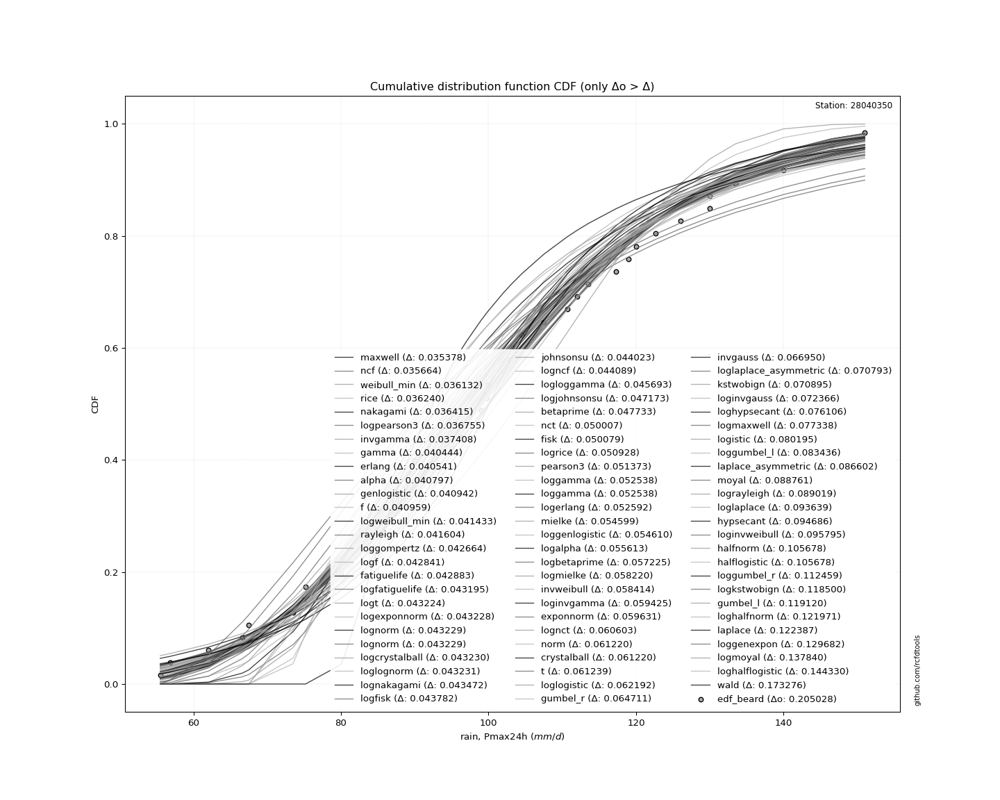</img>

</div>


**4.3. Best fit**

<div align="center">

|   id |   station | empirical_dist   | p_dist   |     delta |   deltao | eval   |   fit |   n |   best_fit |   best_fit_sort |
|-----:|----------:|:-----------------|:---------|----------:|---------:|:-------|------:|----:|-----------:|----------------:|
|    0 |  28040350 | edf_beard        | rice     | 0.0328882 | 0.190438 | Δo > Δ |     1 |  51 |          1 |               1 |

</div>


<div align="center">

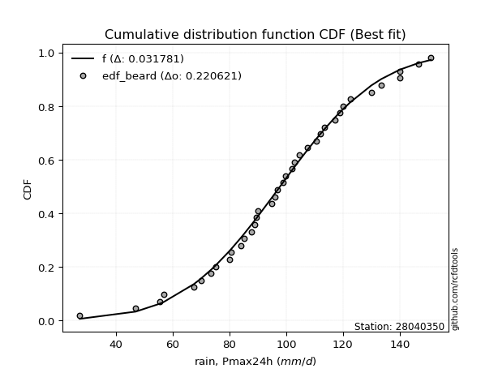</img>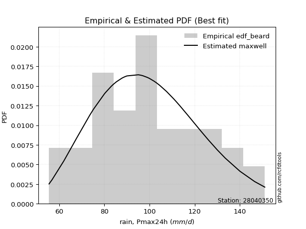</img>

</div>


### 5. EDF Chegodayev (1955)

The Chegodayev formula is an empirical plotting position formula used in hydrological frequency analysis to estimate the exceedance probability or return period of a specific event from a set of observed data. It is primarily used for plotting observed data points on probability paper to fit a theoretical distribution, particularly for analyzing extreme events like maximum flood flows or rainfall intensities. The constant _b_ value in the generalized plotting position formula is 0.3.

<div align="center">


$P=(m-b)/(n+1-2b)$


</div>


**5.1. Empirical values**

<div align="center">

|                | 0                    | 1                    | 2                   | 3                   | 4                   | 5                   | 6                  | 7                   | 8                   | 9                  | 10                  | 11                  | 12                 | 13                  | 14                  | 15                 | 16                  | 17                 | 18                 | 19                  | 20                 | 21                  | 22                  | 23                 | 24                 | 25             | 26                 | 27                 | 28                 | 29                 | 30                 | 31                 | 32                 | 33                 | 34                 | 35                 | 36                 | 37                 | 38                 | 39                 | 40                 | 41                 | 42                | 43                 | 44                | 45                 | 46                 | 47                 | 48                 | 49                 | 50                 |
|:---------------|:---------------------|:---------------------|:--------------------|:--------------------|:--------------------|:--------------------|:-------------------|:--------------------|:--------------------|:-------------------|:--------------------|:--------------------|:-------------------|:--------------------|:--------------------|:-------------------|:--------------------|:-------------------|:-------------------|:--------------------|:-------------------|:--------------------|:--------------------|:-------------------|:-------------------|:---------------|:-------------------|:-------------------|:-------------------|:-------------------|:-------------------|:-------------------|:-------------------|:-------------------|:-------------------|:-------------------|:-------------------|:-------------------|:-------------------|:-------------------|:-------------------|:-------------------|:------------------|:-------------------|:------------------|:-------------------|:-------------------|:-------------------|:-------------------|:-------------------|:-------------------|
| date           | 2001                 | 1997                 | 1972                | 2003                | 2022                | 2007                | 1989               | 2015                | 1986                | 2021               | 1980                | 1995                | 2012               | 1973                | 1984                | 2019               | 1990                | 2004               | 2000               | 1988                | 1974               | 2020                | 1994                | 2009               | 1978               | 1981           | 1985               | 2013               | 1977               | 2014               | 1998               | 2002               | 1991               | 2017               | 2008               | 1982               | 1999               | 2018               | 1993               | 2005               | 1983               | 2016               | 1987              | 2010               | 1992              | 2011               | 2006               | 1975               | 1979               | 1996               | 1976               |
| x              | 55.5                 | 56.8                 | 62.04761218         | 66.6                | 67.0                | 67.5                | 73.5               | 75.0                | 75.2                | 78.0               | 80.0                | 80.5                | 83.0               | 83.62431256         | 84.0                | 85.0               | 85.3                | 87.8               | 88.8               | 89.5                | 90.0               | 92.0                | 95.0                | 96.0               | 97.0               | 99.0           | 99.8               | 100.0              | 102.0              | 102.10925342627452 | 103.0              | 104.5              | 107.5              | 110.0              | 110.7              | 112.0              | 113.5              | 115.0              | 117.3              | 119.0              | 120.0              | 120.0              | 122.6             | 126.0              | 130.0             | 130.0              | 133.5              | 140.0              | 140.0              | 146.5              | 151.0              |
| m              | 1                    | 2                    | 3                   | 4                   | 5                   | 6                   | 7                  | 8                   | 9                   | 10                 | 11                  | 12                  | 13                 | 14                  | 15                  | 16                 | 17                  | 18                 | 19                 | 20                  | 21                 | 22                  | 23                  | 24                 | 25                 | 26             | 27                 | 28                 | 29                 | 30                 | 31                 | 32                 | 33                 | 34                 | 35                 | 36                 | 37                 | 38                 | 39                 | 40                 | 41                 | 42                 | 43                | 44                 | 45                | 46                 | 47                 | 48                 | 49                 | 50                 | 51                 |
| empirical_dist | edf_chegodayev       | edf_chegodayev       | edf_chegodayev      | edf_chegodayev      | edf_chegodayev      | edf_chegodayev      | edf_chegodayev     | edf_chegodayev      | edf_chegodayev      | edf_chegodayev     | edf_chegodayev      | edf_chegodayev      | edf_chegodayev     | edf_chegodayev      | edf_chegodayev      | edf_chegodayev     | edf_chegodayev      | edf_chegodayev     | edf_chegodayev     | edf_chegodayev      | edf_chegodayev     | edf_chegodayev      | edf_chegodayev      | edf_chegodayev     | edf_chegodayev     | edf_chegodayev | edf_chegodayev     | edf_chegodayev     | edf_chegodayev     | edf_chegodayev     | edf_chegodayev     | edf_chegodayev     | edf_chegodayev     | edf_chegodayev     | edf_chegodayev     | edf_chegodayev     | edf_chegodayev     | edf_chegodayev     | edf_chegodayev     | edf_chegodayev     | edf_chegodayev     | edf_chegodayev     | edf_chegodayev    | edf_chegodayev     | edf_chegodayev    | edf_chegodayev     | edf_chegodayev     | edf_chegodayev     | edf_chegodayev     | edf_chegodayev     | edf_chegodayev     |
| empirical      | 0.013618677042801557 | 0.033073929961089495 | 0.05252918287937744 | 0.07198443579766538 | 0.09143968871595332 | 0.11089494163424125 | 0.1303501945525292 | 0.14980544747081712 | 0.16926070038910504 | 0.188715953307393  | 0.20817120622568092 | 0.22762645914396887 | 0.2470817120622568 | 0.26653696498054474 | 0.28599221789883267 | 0.3054474708171206 | 0.32490272373540857 | 0.3443579766536965 | 0.3638132295719844 | 0.38326848249027234 | 0.4027237354085603 | 0.42217898832684825 | 0.44163424124513617 | 0.4610894941634241 | 0.4805447470817121 | 0.5            | 0.519455252918288  | 0.5389105058365758 | 0.5583657587548638 | 0.5778210116731518 | 0.5972762645914397 | 0.6167315175097277 | 0.6361867704280156 | 0.6556420233463036 | 0.6750972762645915 | 0.6945525291828795 | 0.7140077821011674 | 0.7334630350194553 | 0.7529182879377433 | 0.7723735408560312 | 0.7918287937743191 | 0.8112840466926071 | 0.830739299610895 | 0.850194552529183  | 0.869649805447471 | 0.8891050583657588 | 0.9085603112840468 | 0.9280155642023347 | 0.9474708171206226 | 0.9669260700389106 | 0.9863813229571985 |
| empirical_tr   | 1.0138067061143983   | 1.0342052313883299   | 1.055441478439425   | 1.0775681341719077  | 1.100642398286938   | 1.1247264770240701  | 1.1498881431767338 | 1.1762013729977117  | 1.2037470725995316  | 1.2326139088729016 | 1.2628992628992628  | 1.2947103274559193  | 1.3281653746770026 | 1.3633952254641908  | 1.4005449591280654  | 1.4397759103641457 | 1.4812680115273775  | 1.5252225519287834 | 1.5718654434250765 | 1.6214511041009463  | 1.6742671009771988 | 1.7306397306397308  | 1.7909407665505226  | 1.8555956678700358 | 1.9250936329588018 | 2.0            | 2.0809716599190287 | 2.1687763713080166 | 2.2643171806167404 | 2.3686635944700463 | 2.4830917874396135 | 2.6091370558375635 | 2.7486631016042784 | 2.903954802259888  | 3.077844311377246  | 3.2738853503184724 | 3.496598639455784  | 3.751824817518249  | 4.047244094488191  | 4.3931623931623935 | 4.803738317757011  | 5.298969072164952  | 5.908045977011496 | 6.6753246753246795 | 7.671641791044784 | 9.017543859649129  | 10.936170212765969 | 13.891891891891898 | 19.037037037037063 | 30.235294117647165 | 73.42857142857169  |

</div>


**5.2. Kolmogorov-Smirnov fit test (sorted by Δ)**


<div align="center">

|                | 0                   | 1                   | 2                   | 3                    | 4                   | 5                    | 6                   | 7                    | 8                    | 9                   | 10                   | 11                  | 12                  | 13                  | 14                  | 15                  | 16                  | 17                  | 18                  | 19                  | 20                   | 21                  | 22                  | 23                  | 24                  | 25                  | 26                   | 27                  | 28                  | 29                   | 30                   | 31                   | 32                  | 33                  | 34                   | 35                  | 36                   | 37                   | 38                  | 39                  | 40                   | 41                   | 42                  | 43                   | 44                  | 45                  | 46                  | 47                  | 48                  | 49                  | 50                  | 51                  | 52                  | 53                  | 54                  | 55                  | 56                    | 57                  | 58                  | 59                  | 60                  | 61                  | 62                  | 63                  | 64                  | 65                  | 66                  | 67                  | 68                  | 69                  | 70                  | 71                  | 72                  | 73                  | 74                  | 75                  | 76                  | 77                  | 78                  | 79                  | 80                  | 81                  | 82                  | 83                  | 84                  | 85                  | 86                  | 87                  |
|:---------------|:--------------------|:--------------------|:--------------------|:---------------------|:--------------------|:---------------------|:--------------------|:---------------------|:---------------------|:--------------------|:---------------------|:--------------------|:--------------------|:--------------------|:--------------------|:--------------------|:--------------------|:--------------------|:--------------------|:--------------------|:---------------------|:--------------------|:--------------------|:--------------------|:--------------------|:--------------------|:---------------------|:--------------------|:--------------------|:---------------------|:---------------------|:---------------------|:--------------------|:--------------------|:---------------------|:--------------------|:---------------------|:---------------------|:--------------------|:--------------------|:---------------------|:---------------------|:--------------------|:---------------------|:--------------------|:--------------------|:--------------------|:--------------------|:--------------------|:--------------------|:--------------------|:--------------------|:--------------------|:--------------------|:--------------------|:--------------------|:----------------------|:--------------------|:--------------------|:--------------------|:--------------------|:--------------------|:--------------------|:--------------------|:--------------------|:--------------------|:--------------------|:--------------------|:--------------------|:--------------------|:--------------------|:--------------------|:--------------------|:--------------------|:--------------------|:--------------------|:--------------------|:--------------------|:--------------------|:--------------------|:--------------------|:--------------------|:--------------------|:--------------------|:--------------------|:--------------------|:--------------------|:--------------------|
| station        | 28040350            | 28040350            | 28040350            | 28040350             | 28040350            | 28040350             | 28040350            | 28040350             | 28040350             | 28040350            | 28040350             | 28040350            | 28040350            | 28040350            | 28040350            | 28040350            | 28040350            | 28040350            | 28040350            | 28040350            | 28040350             | 28040350            | 28040350            | 28040350            | 28040350            | 28040350            | 28040350             | 28040350            | 28040350            | 28040350             | 28040350             | 28040350             | 28040350            | 28040350            | 28040350             | 28040350            | 28040350             | 28040350             | 28040350            | 28040350            | 28040350             | 28040350             | 28040350            | 28040350             | 28040350            | 28040350            | 28040350            | 28040350            | 28040350            | 28040350            | 28040350            | 28040350            | 28040350            | 28040350            | 28040350            | 28040350            | 28040350              | 28040350            | 28040350            | 28040350            | 28040350            | 28040350            | 28040350            | 28040350            | 28040350            | 28040350            | 28040350            | 28040350            | 28040350            | 28040350            | 28040350            | 28040350            | 28040350            | 28040350            | 28040350            | 28040350            | 28040350            | 28040350            | 28040350            | 28040350            | 28040350            | 28040350            | 28040350            | 28040350            | 28040350            | 28040350            | 28040350            | 28040350            |
| empirical_dist | edf_chegodayev      | edf_chegodayev      | edf_chegodayev      | edf_chegodayev       | edf_chegodayev      | edf_chegodayev       | edf_chegodayev      | edf_chegodayev       | edf_chegodayev       | edf_chegodayev      | edf_chegodayev       | edf_chegodayev      | edf_chegodayev      | edf_chegodayev      | edf_chegodayev      | edf_chegodayev      | edf_chegodayev      | edf_chegodayev      | edf_chegodayev      | edf_chegodayev      | edf_chegodayev       | edf_chegodayev      | edf_chegodayev      | edf_chegodayev      | edf_chegodayev      | edf_chegodayev      | edf_chegodayev       | edf_chegodayev      | edf_chegodayev      | edf_chegodayev       | edf_chegodayev       | edf_chegodayev       | edf_chegodayev      | edf_chegodayev      | edf_chegodayev       | edf_chegodayev      | edf_chegodayev       | edf_chegodayev       | edf_chegodayev      | edf_chegodayev      | edf_chegodayev       | edf_chegodayev       | edf_chegodayev      | edf_chegodayev       | edf_chegodayev      | edf_chegodayev      | edf_chegodayev      | edf_chegodayev      | edf_chegodayev      | edf_chegodayev      | edf_chegodayev      | edf_chegodayev      | edf_chegodayev      | edf_chegodayev      | edf_chegodayev      | edf_chegodayev      | edf_chegodayev        | edf_chegodayev      | edf_chegodayev      | edf_chegodayev      | edf_chegodayev      | edf_chegodayev      | edf_chegodayev      | edf_chegodayev      | edf_chegodayev      | edf_chegodayev      | edf_chegodayev      | edf_chegodayev      | edf_chegodayev      | edf_chegodayev      | edf_chegodayev      | edf_chegodayev      | edf_chegodayev      | edf_chegodayev      | edf_chegodayev      | edf_chegodayev      | edf_chegodayev      | edf_chegodayev      | edf_chegodayev      | edf_chegodayev      | edf_chegodayev      | edf_chegodayev      | edf_chegodayev      | edf_chegodayev      | edf_chegodayev      | edf_chegodayev      | edf_chegodayev      | edf_chegodayev      |
| p_dist         | rice                | weibull_min         | logpearson3         | f                    | erlang              | gamma                | logweibull_min      | maxwell              | fatiguelife          | alpha               | nakagami             | invgamma            | johnsonsu           | ncf                 | logloggamma         | lognct              | nct                 | logncf              | invweibull          | logjohnsonsu        | lognakagami          | rayleigh            | pearson3            | genlogistic         | fisk                | logt                | logcrystalball       | lognorm             | lognorm             | logexponnorm         | loglognorm           | logfatiguelife       | logfisk             | logrice             | logf                 | logerlang           | mielke               | loggenlogistic       | loggamma            | loggamma            | logalpha             | loginvgamma          | exponnorm           | logmielke            | betaprime           | t                   | norm                | crystalball         | kstwobign           | logbetaprime        | invgauss            | loginvgauss         | loglogistic         | logmaxwell          | gumbel_r            | logistic            | loglaplace_asymmetric | laplace_asymmetric  | lograyleigh         | loggumbel_l         | loghypsecant        | hypsecant           | loginvweibull       | moyal               | loglaplace          | loggumbel_r         | halflogistic        | halfnorm            | loghalfnorm         | logkstwobign        | gumbel_l            | laplace             | logmoyal            | loghalflogistic     | wald                | loggenexpon         | logwald             | expon               | genexpon            | gibrat              | loggibrat           | loggompertz         | logtruncnorm        | logexpon            | logchi2             | gompertz            | chi2                | truncnorm           |
| delta          | 0.03292608696701255 | 0.03394393148875359 | 0.0367442782086278  | 0.036945732576643575 | 0.03737198229330263 | 0.037372312050050316 | 0.03740477911871809 | 0.038411154559950506 | 0.038679206542820754 | 0.03878442917557845 | 0.039003329232781825 | 0.0393777281524218  | 0.04029401772098573 | 0.04053367722977186 | 0.04179524016657293 | 0.04549549566592204 | 0.04574504542598734 | 0.04722148698520068 | 0.04726404153227681 | 0.04759302575547408 | 0.047787846764759334 | 0.04782824971321607 | 0.04784559911744063 | 0.04785119952175132 | 0.0482434951394457  | 0.04825167930393737 | 0.048254173889005436 | 0.0482548826995407  | 0.0482548826995407  | 0.048255163157620684 | 0.048255608572526754 | 0.048541754212805266 | 0.04872566438492354 | 0.04991097962434721 | 0.049987502998948274 | 0.05041070517828106 | 0.051709703623192105 | 0.051763264430379985 | 0.05185962888511786 | 0.05185962888511786 | 0.052092609070710005 | 0.054511290732437656 | 0.0563810506793021  | 0.056509377698034824 | 0.05795612484901436 | 0.05865950040203188 | 0.05871154261793382 | 0.05871154571603909 | 0.0618300630159484  | 0.06223206678475135 | 0.0639030295015186  | 0.0644542740169386  | 0.06978564023326295 | 0.07140556095252026 | 0.07463530177413269 | 0.07715772853782343 | 0.0776146411231966    | 0.07943322171815848 | 0.08142949843005187 | 0.08221173910557927 | 0.0852299454944524  | 0.09136862449942468 | 0.0947219775511835  | 0.09474192980322066 | 0.10994221205079024 | 0.1108185176050196  | 0.11089494163424125 | 0.11089494163424125 | 0.11089494163424125 | 0.11241980511955588 | 0.11772205974721356 | 0.11935521982348773 | 0.13594635931346932 | 0.13662689851249787 | 0.18699526643913916 | 0.1887550219938178  | 0.20567602392591866 | 0.21948560113549348 | 0.2264126376475058  | 0.22762645914396887 | 0.23396887481390205 | 0.24167408302766005 | 0.26802728341167553 | 0.27490841865977783 | 0.3508942259080179  | 0.8156250102718781  | 0.9393873323594275  | 0.9863813229571985  |
| deltao         | 0.19043809142780935 | 0.19043809142780935 | 0.19043809142780935 | 0.19043809142780935  | 0.19043809142780935 | 0.19043809142780935  | 0.19043809142780935 | 0.19043809142780935  | 0.19043809142780935  | 0.19043809142780935 | 0.19043809142780935  | 0.19043809142780935 | 0.19043809142780935 | 0.19043809142780935 | 0.19043809142780935 | 0.19043809142780935 | 0.19043809142780935 | 0.19043809142780935 | 0.19043809142780935 | 0.19043809142780935 | 0.19043809142780935  | 0.19043809142780935 | 0.19043809142780935 | 0.19043809142780935 | 0.19043809142780935 | 0.19043809142780935 | 0.19043809142780935  | 0.19043809142780935 | 0.19043809142780935 | 0.19043809142780935  | 0.19043809142780935  | 0.19043809142780935  | 0.19043809142780935 | 0.19043809142780935 | 0.19043809142780935  | 0.19043809142780935 | 0.19043809142780935  | 0.19043809142780935  | 0.19043809142780935 | 0.19043809142780935 | 0.19043809142780935  | 0.19043809142780935  | 0.19043809142780935 | 0.19043809142780935  | 0.19043809142780935 | 0.19043809142780935 | 0.19043809142780935 | 0.19043809142780935 | 0.19043809142780935 | 0.19043809142780935 | 0.19043809142780935 | 0.19043809142780935 | 0.19043809142780935 | 0.19043809142780935 | 0.19043809142780935 | 0.19043809142780935 | 0.19043809142780935   | 0.19043809142780935 | 0.19043809142780935 | 0.19043809142780935 | 0.19043809142780935 | 0.19043809142780935 | 0.19043809142780935 | 0.19043809142780935 | 0.19043809142780935 | 0.19043809142780935 | 0.19043809142780935 | 0.19043809142780935 | 0.19043809142780935 | 0.19043809142780935 | 0.19043809142780935 | 0.19043809142780935 | 0.19043809142780935 | 0.19043809142780935 | 0.19043809142780935 | 0.19043809142780935 | 0.19043809142780935 | 0.19043809142780935 | 0.19043809142780935 | 0.19043809142780935 | 0.19043809142780935 | 0.19043809142780935 | 0.19043809142780935 | 0.19043809142780935 | 0.19043809142780935 | 0.19043809142780935 | 0.19043809142780935 | 0.19043809142780935 |
| eval           | Δo > Δ              | Δo > Δ              | Δo > Δ              | Δo > Δ               | Δo > Δ              | Δo > Δ               | Δo > Δ              | Δo > Δ               | Δo > Δ               | Δo > Δ              | Δo > Δ               | Δo > Δ              | Δo > Δ              | Δo > Δ              | Δo > Δ              | Δo > Δ              | Δo > Δ              | Δo > Δ              | Δo > Δ              | Δo > Δ              | Δo > Δ               | Δo > Δ              | Δo > Δ              | Δo > Δ              | Δo > Δ              | Δo > Δ              | Δo > Δ               | Δo > Δ              | Δo > Δ              | Δo > Δ               | Δo > Δ               | Δo > Δ               | Δo > Δ              | Δo > Δ              | Δo > Δ               | Δo > Δ              | Δo > Δ               | Δo > Δ               | Δo > Δ              | Δo > Δ              | Δo > Δ               | Δo > Δ               | Δo > Δ              | Δo > Δ               | Δo > Δ              | Δo > Δ              | Δo > Δ              | Δo > Δ              | Δo > Δ              | Δo > Δ              | Δo > Δ              | Δo > Δ              | Δo > Δ              | Δo > Δ              | Δo > Δ              | Δo > Δ              | Δo > Δ                | Δo > Δ              | Δo > Δ              | Δo > Δ              | Δo > Δ              | Δo > Δ              | Δo > Δ              | Δo > Δ              | Δo > Δ              | Δo > Δ              | Δo > Δ              | Δo > Δ              | Δo > Δ              | Δo > Δ              | Δo > Δ              | Δo > Δ              | Δo > Δ              | Δo > Δ              | Δo > Δ              | Δo > Δ              | Δo <= Δ             | Δo <= Δ             | Δo <= Δ             | Δo <= Δ             | Δo <= Δ             | Δo <= Δ             | Δo <= Δ             | Δo <= Δ             | Δo <= Δ             | Δo <= Δ             | Δo <= Δ             | Δo <= Δ             |
| fit            | 1                   | 1                   | 1                   | 1                    | 1                   | 1                    | 1                   | 1                    | 1                    | 1                   | 1                    | 1                   | 1                   | 1                   | 1                   | 1                   | 1                   | 1                   | 1                   | 1                   | 1                    | 1                   | 1                   | 1                   | 1                   | 1                   | 1                    | 1                   | 1                   | 1                    | 1                    | 1                    | 1                   | 1                   | 1                    | 1                   | 1                    | 1                    | 1                   | 1                   | 1                    | 1                    | 1                   | 1                    | 1                   | 1                   | 1                   | 1                   | 1                   | 1                   | 1                   | 1                   | 1                   | 1                   | 1                   | 1                   | 1                     | 1                   | 1                   | 1                   | 1                   | 1                   | 1                   | 1                   | 1                   | 1                   | 1                   | 1                   | 1                   | 1                   | 1                   | 1                   | 1                   | 1                   | 1                   | 1                   | 0                   | 0                   | 0                   | 0                   | 0                   | 0                   | 0                   | 0                   | 0                   | 0                   | 0                   | 0                   |
| n              | 51                  | 51                  | 51                  | 51                   | 51                  | 51                   | 51                  | 51                   | 51                   | 51                  | 51                   | 51                  | 51                  | 51                  | 51                  | 51                  | 51                  | 51                  | 51                  | 51                  | 51                   | 51                  | 51                  | 51                  | 51                  | 51                  | 51                   | 51                  | 51                  | 51                   | 51                   | 51                   | 51                  | 51                  | 51                   | 51                  | 51                   | 51                   | 51                  | 51                  | 51                   | 51                   | 51                  | 51                   | 51                  | 51                  | 51                  | 51                  | 51                  | 51                  | 51                  | 51                  | 51                  | 51                  | 51                  | 51                  | 51                    | 51                  | 51                  | 51                  | 51                  | 51                  | 51                  | 51                  | 51                  | 51                  | 51                  | 51                  | 51                  | 51                  | 51                  | 51                  | 51                  | 51                  | 51                  | 51                  | 51                  | 51                  | 51                  | 51                  | 51                  | 51                  | 51                  | 51                  | 51                  | 51                  | 51                  | 51                  |
| best_fit       | 1                   | 0                   | 0                   | 0                    | 0                   | 0                    | 0                   | 0                    | 0                    | 0                   | 0                    | 0                   | 0                   | 0                   | 0                   | 0                   | 0                   | 0                   | 0                   | 0                   | 0                    | 0                   | 0                   | 0                   | 0                   | 0                   | 0                    | 0                   | 0                   | 0                    | 0                    | 0                    | 0                   | 0                   | 0                    | 0                   | 0                    | 0                    | 0                   | 0                   | 0                    | 0                    | 0                   | 0                    | 0                   | 0                   | 0                   | 0                   | 0                   | 0                   | 0                   | 0                   | 0                   | 0                   | 0                   | 0                   | 0                     | 0                   | 0                   | 0                   | 0                   | 0                   | 0                   | 0                   | 0                   | 0                   | 0                   | 0                   | 0                   | 0                   | 0                   | 0                   | 0                   | 0                   | 0                   | 0                   | 0                   | 0                   | 0                   | 0                   | 0                   | 0                   | 0                   | 0                   | 0                   | 0                   | 0                   | 0                   |
| best_fit_sort  | 1                   | 2                   | 3                   | 4                    | 5                   | 6                    | 7                   | 8                    | 9                    | 10                  | 11                   | 12                  | 13                  | 14                  | 15                  | 16                  | 17                  | 18                  | 19                  | 20                  | 21                   | 22                  | 23                  | 24                  | 25                  | 26                  | 27                   | 28                  | 29                  | 30                   | 31                   | 32                   | 33                  | 34                  | 35                   | 36                  | 37                   | 38                   | 39                  | 40                  | 41                   | 42                   | 43                  | 44                   | 45                  | 46                  | 47                  | 48                  | 49                  | 50                  | 51                  | 52                  | 53                  | 54                  | 55                  | 56                  | 57                    | 58                  | 59                  | 60                  | 61                  | 62                  | 63                  | 64                  | 65                  | 66                  | 67                  | 68                  | 69                  | 70                  | 71                  | 72                  | 73                  | 74                  | 75                  | 76                  | 77                  | 78                  | 79                  | 80                  | 81                  | 82                  | 83                  | 84                  | 85                  | 86                  | 87                  | 88                  |

</div>


<div align="center">

</img>

</div>


**5.3. Best fit**

<div align="center">

|   id |   station | empirical_dist   | p_dist   |     delta |   deltao | eval   |   fit |   n |   best_fit |   best_fit_sort |
|-----:|----------:|:-----------------|:---------|----------:|---------:|:-------|------:|----:|-----------:|----------------:|
|    0 |  28040350 | edf_chegodayev   | rice     | 0.0329261 | 0.190438 | Δo > Δ |     1 |  51 |          1 |               1 |

</div>


<div align="center">

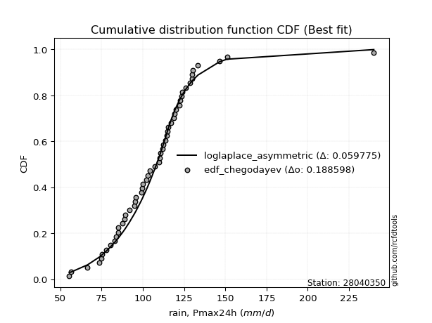</img>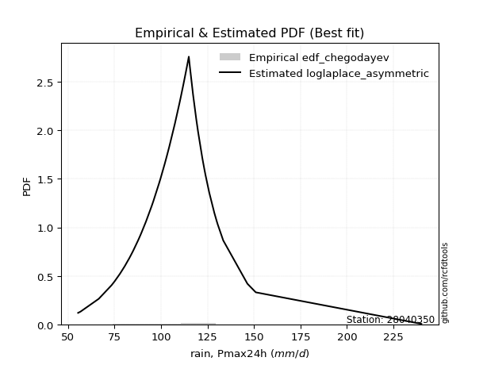</img>

</div>


### 6. EDF Blom (1958)

The Blom formula is a specific "plotting position" formula used in hydrology and statistical analysis to estimate the empirical cumulative probability (or non-exceedance probability) of a data series. It is particularly recommended for data that are approximately normally distributed. The constant _a_ is set to 0.375 (or 3/8).

<div align="center">


$P=(m-a)/(n+1-2a)$


</div>


**6.1. Empirical values**

<div align="center">

|                | 0                    | 1                   | 2                   | 3                   | 4                   | 5                   | 6                   | 7                   | 8                   | 9                  | 10                 | 11                  | 12                  | 13                 | 14                  | 15                 | 16                  | 17                 | 18                  | 19                 | 20                 | 21                 | 22                  | 23                 | 24                  | 25       | 26                 | 27                 | 28                 | 29                 | 30                 | 31                 | 32                 | 33                 | 34                 | 35                 | 36                 | 37                 | 38                 | 39                 | 40                 | 41                 | 42                 | 43                 | 44                 | 45                 | 46                 | 47                 | 48                 | 49                 | 50                 |
|:---------------|:---------------------|:--------------------|:--------------------|:--------------------|:--------------------|:--------------------|:--------------------|:--------------------|:--------------------|:-------------------|:-------------------|:--------------------|:--------------------|:-------------------|:--------------------|:-------------------|:--------------------|:-------------------|:--------------------|:-------------------|:-------------------|:-------------------|:--------------------|:-------------------|:--------------------|:---------|:-------------------|:-------------------|:-------------------|:-------------------|:-------------------|:-------------------|:-------------------|:-------------------|:-------------------|:-------------------|:-------------------|:-------------------|:-------------------|:-------------------|:-------------------|:-------------------|:-------------------|:-------------------|:-------------------|:-------------------|:-------------------|:-------------------|:-------------------|:-------------------|:-------------------|
| date           | 2001                 | 1997                | 1972                | 2003                | 2022                | 2007                | 1989                | 2015                | 1986                | 2021               | 1980               | 1995                | 2012                | 1973               | 1984                | 2019               | 1990                | 2004               | 2000                | 1988               | 1974               | 2020               | 1994                | 2009               | 1978                | 1981     | 1985               | 2013               | 1977               | 2014               | 1998               | 2002               | 1991               | 2017               | 2008               | 1982               | 1999               | 2018               | 1993               | 2005               | 1983               | 2016               | 1987               | 2010               | 1992               | 2011               | 2006               | 1975               | 1979               | 1996               | 1976               |
| x              | 55.5                 | 56.8                | 62.04761218         | 66.6                | 67.0                | 67.5                | 73.5                | 75.0                | 75.2                | 78.0               | 80.0               | 80.5                | 83.0                | 83.62431256        | 84.0                | 85.0               | 85.3                | 87.8               | 88.8                | 89.5               | 90.0               | 92.0               | 95.0                | 96.0               | 97.0                | 99.0     | 99.8               | 100.0              | 102.0              | 102.10925342627452 | 103.0              | 104.5              | 107.5              | 110.0              | 110.7              | 112.0              | 113.5              | 115.0              | 117.3              | 119.0              | 120.0              | 120.0              | 122.6              | 126.0              | 130.0              | 130.0              | 133.5              | 140.0              | 140.0              | 146.5              | 151.0              |
| m              | 1                    | 2                   | 3                   | 4                   | 5                   | 6                   | 7                   | 8                   | 9                   | 10                 | 11                 | 12                  | 13                  | 14                 | 15                  | 16                 | 17                  | 18                 | 19                  | 20                 | 21                 | 22                 | 23                  | 24                 | 25                  | 26       | 27                 | 28                 | 29                 | 30                 | 31                 | 32                 | 33                 | 34                 | 35                 | 36                 | 37                 | 38                 | 39                 | 40                 | 41                 | 42                 | 43                 | 44                 | 45                 | 46                 | 47                 | 48                 | 49                 | 50                 | 51                 |
| empirical_dist | edf_blom             | edf_blom            | edf_blom            | edf_blom            | edf_blom            | edf_blom            | edf_blom            | edf_blom            | edf_blom            | edf_blom           | edf_blom           | edf_blom            | edf_blom            | edf_blom           | edf_blom            | edf_blom           | edf_blom            | edf_blom           | edf_blom            | edf_blom           | edf_blom           | edf_blom           | edf_blom            | edf_blom           | edf_blom            | edf_blom | edf_blom           | edf_blom           | edf_blom           | edf_blom           | edf_blom           | edf_blom           | edf_blom           | edf_blom           | edf_blom           | edf_blom           | edf_blom           | edf_blom           | edf_blom           | edf_blom           | edf_blom           | edf_blom           | edf_blom           | edf_blom           | edf_blom           | edf_blom           | edf_blom           | edf_blom           | edf_blom           | edf_blom           | edf_blom           |
| empirical      | 0.012195121951219513 | 0.03170731707317073 | 0.05121951219512195 | 0.07073170731707316 | 0.09024390243902439 | 0.10975609756097561 | 0.12926829268292683 | 0.14878048780487804 | 0.16829268292682928 | 0.1878048780487805 | 0.2073170731707317 | 0.22682926829268293 | 0.24634146341463414 | 0.2658536585365854 | 0.28536585365853656 | 0.3048780487804878 | 0.32439024390243903 | 0.3439024390243902 | 0.36341463414634145 | 0.3829268292682927 | 0.4024390243902439 | 0.4219512195121951 | 0.44146341463414634 | 0.4609756097560976 | 0.48048780487804876 | 0.5      | 0.5195121951219512 | 0.5390243902439025 | 0.5585365853658537 | 0.5780487804878048 | 0.5975609756097561 | 0.6170731707317073 | 0.6365853658536585 | 0.6560975609756098 | 0.675609756097561  | 0.6951219512195121 | 0.7146341463414634 | 0.7341463414634146 | 0.7536585365853659 | 0.7731707317073171 | 0.7926829268292683 | 0.8121951219512196 | 0.8317073170731707 | 0.8512195121951219 | 0.8707317073170732 | 0.8902439024390244 | 0.9097560975609756 | 0.9292682926829269 | 0.948780487804878  | 0.9682926829268292 | 0.9878048780487805 |
| empirical_tr   | 1.0123456790123457   | 1.0327455919395467  | 1.0539845758354756  | 1.0761154855643045  | 1.0991957104557641  | 1.1232876712328768  | 1.1484593837535013  | 1.174785100286533   | 1.2023460410557185  | 1.2312312312312312 | 1.2615384615384615 | 1.2933753943217665  | 1.3268608414239482  | 1.3621262458471761 | 1.3993174061433449  | 1.4385964912280702 | 1.4801444043321301  | 1.5241635687732342 | 1.5708812260536398  | 1.6205533596837944 | 1.6734693877551021 | 1.7299578059071727 | 1.7903930131004364  | 1.855203619909502  | 1.9248826291079812  | 2.0      | 2.0812182741116754 | 2.1693121693121693 | 2.265193370165746  | 2.3699421965317917 | 2.484848484848485  | 2.611464968152866  | 2.7516778523489935 | 2.9078014184397167 | 3.0827067669172936 | 3.2799999999999994 | 3.504273504273504  | 3.7614678899082565 | 4.0594059405940595 | 4.408602150537635  | 4.8235294117647065 | 5.324675324675327  | 5.942028985507245  | 6.721311475409835  | 7.735849056603773  | 9.111111111111112  | 11.081081081081084 | 14.137931034482769 | 19.523809523809508 | 31.53846153846151  | 81.99999999999993  |

</div>


**6.2. Kolmogorov-Smirnov fit test (sorted by Δ)**


<div align="center">

|                | 0                   | 1                    | 2                   | 3                   | 4                   | 5                   | 6                   | 7                   | 8                   | 9                   | 10                   | 11                  | 12                   | 13                  | 14                   | 15                  | 16                   | 17                  | 18                  | 19                   | 20                  | 21                   | 22                  | 23                  | 24                   | 25                  | 26                  | 27                   | 28                   | 29                   | 30                   | 31                  | 32                  | 33                  | 34                   | 35                  | 36                  | 37                  | 38                  | 39                  | 40                  | 41                   | 42                   | 43                  | 44                  | 45                   | 46                   | 47                   | 48                  | 49                  | 50                  | 51                  | 52                  | 53                  | 54                  | 55                  | 56                    | 57                  | 58                  | 59                  | 60                  | 61                  | 62                  | 63                  | 64                  | 65                  | 66                  | 67                  | 68                  | 69                  | 70                  | 71                  | 72                  | 73                  | 74                  | 75                  | 76                  | 77                  | 78                  | 79                  | 80                  | 81                  | 82                  | 83                  | 84                  | 85                  | 86                  | 87                  |
|:---------------|:--------------------|:---------------------|:--------------------|:--------------------|:--------------------|:--------------------|:--------------------|:--------------------|:--------------------|:--------------------|:---------------------|:--------------------|:---------------------|:--------------------|:---------------------|:--------------------|:---------------------|:--------------------|:--------------------|:---------------------|:--------------------|:---------------------|:--------------------|:--------------------|:---------------------|:--------------------|:--------------------|:---------------------|:---------------------|:---------------------|:---------------------|:--------------------|:--------------------|:--------------------|:---------------------|:--------------------|:--------------------|:--------------------|:--------------------|:--------------------|:--------------------|:---------------------|:---------------------|:--------------------|:--------------------|:---------------------|:---------------------|:---------------------|:--------------------|:--------------------|:--------------------|:--------------------|:--------------------|:--------------------|:--------------------|:--------------------|:----------------------|:--------------------|:--------------------|:--------------------|:--------------------|:--------------------|:--------------------|:--------------------|:--------------------|:--------------------|:--------------------|:--------------------|:--------------------|:--------------------|:--------------------|:--------------------|:--------------------|:--------------------|:--------------------|:--------------------|:--------------------|:--------------------|:--------------------|:--------------------|:--------------------|:--------------------|:--------------------|:--------------------|:--------------------|:--------------------|:--------------------|:--------------------|
| station        | 28040350            | 28040350             | 28040350            | 28040350            | 28040350            | 28040350            | 28040350            | 28040350            | 28040350            | 28040350            | 28040350             | 28040350            | 28040350             | 28040350            | 28040350             | 28040350            | 28040350             | 28040350            | 28040350            | 28040350             | 28040350            | 28040350             | 28040350            | 28040350            | 28040350             | 28040350            | 28040350            | 28040350             | 28040350             | 28040350             | 28040350             | 28040350            | 28040350            | 28040350            | 28040350             | 28040350            | 28040350            | 28040350            | 28040350            | 28040350            | 28040350            | 28040350             | 28040350             | 28040350            | 28040350            | 28040350             | 28040350             | 28040350             | 28040350            | 28040350            | 28040350            | 28040350            | 28040350            | 28040350            | 28040350            | 28040350            | 28040350              | 28040350            | 28040350            | 28040350            | 28040350            | 28040350            | 28040350            | 28040350            | 28040350            | 28040350            | 28040350            | 28040350            | 28040350            | 28040350            | 28040350            | 28040350            | 28040350            | 28040350            | 28040350            | 28040350            | 28040350            | 28040350            | 28040350            | 28040350            | 28040350            | 28040350            | 28040350            | 28040350            | 28040350            | 28040350            | 28040350            | 28040350            |
| empirical_dist | edf_blom            | edf_blom             | edf_blom            | edf_blom            | edf_blom            | edf_blom            | edf_blom            | edf_blom            | edf_blom            | edf_blom            | edf_blom             | edf_blom            | edf_blom             | edf_blom            | edf_blom             | edf_blom            | edf_blom             | edf_blom            | edf_blom            | edf_blom             | edf_blom            | edf_blom             | edf_blom            | edf_blom            | edf_blom             | edf_blom            | edf_blom            | edf_blom             | edf_blom             | edf_blom             | edf_blom             | edf_blom            | edf_blom            | edf_blom            | edf_blom             | edf_blom            | edf_blom            | edf_blom            | edf_blom            | edf_blom            | edf_blom            | edf_blom             | edf_blom             | edf_blom            | edf_blom            | edf_blom             | edf_blom             | edf_blom             | edf_blom            | edf_blom            | edf_blom            | edf_blom            | edf_blom            | edf_blom            | edf_blom            | edf_blom            | edf_blom              | edf_blom            | edf_blom            | edf_blom            | edf_blom            | edf_blom            | edf_blom            | edf_blom            | edf_blom            | edf_blom            | edf_blom            | edf_blom            | edf_blom            | edf_blom            | edf_blom            | edf_blom            | edf_blom            | edf_blom            | edf_blom            | edf_blom            | edf_blom            | edf_blom            | edf_blom            | edf_blom            | edf_blom            | edf_blom            | edf_blom            | edf_blom            | edf_blom            | edf_blom            | edf_blom            | edf_blom            |
| p_dist         | rice                | weibull_min          | logpearson3         | f                   | erlang              | gamma               | logweibull_min      | maxwell             | fatiguelife         | alpha               | nakagami             | invgamma            | johnsonsu            | ncf                 | logloggamma          | lognct              | nct                  | rayleigh            | logncf              | logjohnsonsu         | invweibull          | lognakagami          | genlogistic         | pearson3            | fisk                 | logt                | logcrystalball      | lognorm              | lognorm              | logexponnorm         | loglognorm           | logfatiguelife      | logfisk             | logrice             | logf                 | logerlang           | loggamma            | loggamma            | mielke              | loggenlogistic      | logalpha            | loginvgamma          | exponnorm            | logmielke           | betaprime           | t                    | norm                 | crystalball          | logbetaprime        | kstwobign           | invgauss            | loginvgauss         | loglogistic         | logmaxwell          | gumbel_r            | logistic            | loglaplace_asymmetric | laplace_asymmetric  | lograyleigh         | loggumbel_l         | loghypsecant        | hypsecant           | moyal               | loginvweibull       | loglaplace          | halflogistic        | halfnorm            | loghalfnorm         | loggumbel_r         | logkstwobign        | gumbel_l            | laplace             | logmoyal            | loghalflogistic     | wald                | loggenexpon         | logwald             | expon               | gibrat              | genexpon            | loggibrat           | loggompertz         | logtruncnorm        | logexpon            | logchi2             | gompertz            | chi2                | truncnorm           |
| delta          | 0.03264137594869615 | 0.032805087415487946 | 0.03628874057932163 | 0.0366326396389734  | 0.03691644466399646 | 0.03691677442074415 | 0.03712006810040169 | 0.03730152821274124 | 0.03839449552450436 | 0.03849971815726205 | 0.038547791603475656 | 0.03892219052311563 | 0.040009306702669334 | 0.04007813960046569 | 0.041510529148256536 | 0.04503995803661587 | 0.045460334407670944 | 0.04668940563995043 | 0.04676594935589451 | 0.047137488126167915 | 0.04726404153227681 | 0.047332309135453166 | 0.04739566189244515 | 0.04756088809912423 | 0.047787957510139534 | 0.0477961416746312  | 0.04779863625969927 | 0.047799345070234533 | 0.047799345070234533 | 0.047799625528314515 | 0.047800070943220585 | 0.0480862165834991  | 0.04827012675561737 | 0.04945544199504104 | 0.049531965369642106 | 0.04995516754897489 | 0.05140409125581169 | 0.05140409125581169 | 0.05142499260487571 | 0.05147855341206359 | 0.05163707144140384 | 0.054511290732437656 | 0.056096339660985706 | 0.05622466667971843 | 0.05750058721970819 | 0.058374789383715486 | 0.058426831599617424 | 0.058426834697722696 | 0.06177652915544518 | 0.0618300630159484  | 0.0639030295015186  | 0.0644542740169386  | 0.06933010260395678 | 0.07140556095252026 | 0.07417976414482652 | 0.07687301751950704 | 0.0773299301048802    | 0.07914851069984208 | 0.08142949843005187 | 0.08192702808726288 | 0.08477440786514623 | 0.09108391348110828 | 0.09360308572995502 | 0.09489280416217333 | 0.10948667442148408 | 0.10975609756097561 | 0.10975609756097561 | 0.10975609756097561 | 0.1108185176050196  | 0.11316005376717853 | 0.11743734872889716 | 0.11907050880517134 | 0.13594635931346932 | 0.13662689851249787 | 0.18608419118052666 | 0.18949527064144045 | 0.20567602392591866 | 0.2203397341904427  | 0.22682926829268293 | 0.22726677070245502 | 0.23396887481390205 | 0.2424143316752827  | 0.2688814164666248  | 0.2757625517147271  | 0.35191918557395696 | 0.8165930277341538  | 0.940697003043683   | 0.9878048780487805  |
| deltao         | 0.19043809142780935 | 0.19043809142780935  | 0.19043809142780935 | 0.19043809142780935 | 0.19043809142780935 | 0.19043809142780935 | 0.19043809142780935 | 0.19043809142780935 | 0.19043809142780935 | 0.19043809142780935 | 0.19043809142780935  | 0.19043809142780935 | 0.19043809142780935  | 0.19043809142780935 | 0.19043809142780935  | 0.19043809142780935 | 0.19043809142780935  | 0.19043809142780935 | 0.19043809142780935 | 0.19043809142780935  | 0.19043809142780935 | 0.19043809142780935  | 0.19043809142780935 | 0.19043809142780935 | 0.19043809142780935  | 0.19043809142780935 | 0.19043809142780935 | 0.19043809142780935  | 0.19043809142780935  | 0.19043809142780935  | 0.19043809142780935  | 0.19043809142780935 | 0.19043809142780935 | 0.19043809142780935 | 0.19043809142780935  | 0.19043809142780935 | 0.19043809142780935 | 0.19043809142780935 | 0.19043809142780935 | 0.19043809142780935 | 0.19043809142780935 | 0.19043809142780935  | 0.19043809142780935  | 0.19043809142780935 | 0.19043809142780935 | 0.19043809142780935  | 0.19043809142780935  | 0.19043809142780935  | 0.19043809142780935 | 0.19043809142780935 | 0.19043809142780935 | 0.19043809142780935 | 0.19043809142780935 | 0.19043809142780935 | 0.19043809142780935 | 0.19043809142780935 | 0.19043809142780935   | 0.19043809142780935 | 0.19043809142780935 | 0.19043809142780935 | 0.19043809142780935 | 0.19043809142780935 | 0.19043809142780935 | 0.19043809142780935 | 0.19043809142780935 | 0.19043809142780935 | 0.19043809142780935 | 0.19043809142780935 | 0.19043809142780935 | 0.19043809142780935 | 0.19043809142780935 | 0.19043809142780935 | 0.19043809142780935 | 0.19043809142780935 | 0.19043809142780935 | 0.19043809142780935 | 0.19043809142780935 | 0.19043809142780935 | 0.19043809142780935 | 0.19043809142780935 | 0.19043809142780935 | 0.19043809142780935 | 0.19043809142780935 | 0.19043809142780935 | 0.19043809142780935 | 0.19043809142780935 | 0.19043809142780935 | 0.19043809142780935 |
| eval           | Δo > Δ              | Δo > Δ               | Δo > Δ              | Δo > Δ              | Δo > Δ              | Δo > Δ              | Δo > Δ              | Δo > Δ              | Δo > Δ              | Δo > Δ              | Δo > Δ               | Δo > Δ              | Δo > Δ               | Δo > Δ              | Δo > Δ               | Δo > Δ              | Δo > Δ               | Δo > Δ              | Δo > Δ              | Δo > Δ               | Δo > Δ              | Δo > Δ               | Δo > Δ              | Δo > Δ              | Δo > Δ               | Δo > Δ              | Δo > Δ              | Δo > Δ               | Δo > Δ               | Δo > Δ               | Δo > Δ               | Δo > Δ              | Δo > Δ              | Δo > Δ              | Δo > Δ               | Δo > Δ              | Δo > Δ              | Δo > Δ              | Δo > Δ              | Δo > Δ              | Δo > Δ              | Δo > Δ               | Δo > Δ               | Δo > Δ              | Δo > Δ              | Δo > Δ               | Δo > Δ               | Δo > Δ               | Δo > Δ              | Δo > Δ              | Δo > Δ              | Δo > Δ              | Δo > Δ              | Δo > Δ              | Δo > Δ              | Δo > Δ              | Δo > Δ                | Δo > Δ              | Δo > Δ              | Δo > Δ              | Δo > Δ              | Δo > Δ              | Δo > Δ              | Δo > Δ              | Δo > Δ              | Δo > Δ              | Δo > Δ              | Δo > Δ              | Δo > Δ              | Δo > Δ              | Δo > Δ              | Δo > Δ              | Δo > Δ              | Δo > Δ              | Δo > Δ              | Δo > Δ              | Δo <= Δ             | Δo <= Δ             | Δo <= Δ             | Δo <= Δ             | Δo <= Δ             | Δo <= Δ             | Δo <= Δ             | Δo <= Δ             | Δo <= Δ             | Δo <= Δ             | Δo <= Δ             | Δo <= Δ             |
| fit            | 1                   | 1                    | 1                   | 1                   | 1                   | 1                   | 1                   | 1                   | 1                   | 1                   | 1                    | 1                   | 1                    | 1                   | 1                    | 1                   | 1                    | 1                   | 1                   | 1                    | 1                   | 1                    | 1                   | 1                   | 1                    | 1                   | 1                   | 1                    | 1                    | 1                    | 1                    | 1                   | 1                   | 1                   | 1                    | 1                   | 1                   | 1                   | 1                   | 1                   | 1                   | 1                    | 1                    | 1                   | 1                   | 1                    | 1                    | 1                    | 1                   | 1                   | 1                   | 1                   | 1                   | 1                   | 1                   | 1                   | 1                     | 1                   | 1                   | 1                   | 1                   | 1                   | 1                   | 1                   | 1                   | 1                   | 1                   | 1                   | 1                   | 1                   | 1                   | 1                   | 1                   | 1                   | 1                   | 1                   | 0                   | 0                   | 0                   | 0                   | 0                   | 0                   | 0                   | 0                   | 0                   | 0                   | 0                   | 0                   |
| n              | 51                  | 51                   | 51                  | 51                  | 51                  | 51                  | 51                  | 51                  | 51                  | 51                  | 51                   | 51                  | 51                   | 51                  | 51                   | 51                  | 51                   | 51                  | 51                  | 51                   | 51                  | 51                   | 51                  | 51                  | 51                   | 51                  | 51                  | 51                   | 51                   | 51                   | 51                   | 51                  | 51                  | 51                  | 51                   | 51                  | 51                  | 51                  | 51                  | 51                  | 51                  | 51                   | 51                   | 51                  | 51                  | 51                   | 51                   | 51                   | 51                  | 51                  | 51                  | 51                  | 51                  | 51                  | 51                  | 51                  | 51                    | 51                  | 51                  | 51                  | 51                  | 51                  | 51                  | 51                  | 51                  | 51                  | 51                  | 51                  | 51                  | 51                  | 51                  | 51                  | 51                  | 51                  | 51                  | 51                  | 51                  | 51                  | 51                  | 51                  | 51                  | 51                  | 51                  | 51                  | 51                  | 51                  | 51                  | 51                  |
| best_fit       | 1                   | 0                    | 0                   | 0                   | 0                   | 0                   | 0                   | 0                   | 0                   | 0                   | 0                    | 0                   | 0                    | 0                   | 0                    | 0                   | 0                    | 0                   | 0                   | 0                    | 0                   | 0                    | 0                   | 0                   | 0                    | 0                   | 0                   | 0                    | 0                    | 0                    | 0                    | 0                   | 0                   | 0                   | 0                    | 0                   | 0                   | 0                   | 0                   | 0                   | 0                   | 0                    | 0                    | 0                   | 0                   | 0                    | 0                    | 0                    | 0                   | 0                   | 0                   | 0                   | 0                   | 0                   | 0                   | 0                   | 0                     | 0                   | 0                   | 0                   | 0                   | 0                   | 0                   | 0                   | 0                   | 0                   | 0                   | 0                   | 0                   | 0                   | 0                   | 0                   | 0                   | 0                   | 0                   | 0                   | 0                   | 0                   | 0                   | 0                   | 0                   | 0                   | 0                   | 0                   | 0                   | 0                   | 0                   | 0                   |
| best_fit_sort  | 1                   | 2                    | 3                   | 4                   | 5                   | 6                   | 7                   | 8                   | 9                   | 10                  | 11                   | 12                  | 13                   | 14                  | 15                   | 16                  | 17                   | 18                  | 19                  | 20                   | 21                  | 22                   | 23                  | 24                  | 25                   | 26                  | 27                  | 28                   | 29                   | 30                   | 31                   | 32                  | 33                  | 34                  | 35                   | 36                  | 37                  | 38                  | 39                  | 40                  | 41                  | 42                   | 43                   | 44                  | 45                  | 46                   | 47                   | 48                   | 49                  | 50                  | 51                  | 52                  | 53                  | 54                  | 55                  | 56                  | 57                    | 58                  | 59                  | 60                  | 61                  | 62                  | 63                  | 64                  | 65                  | 66                  | 67                  | 68                  | 69                  | 70                  | 71                  | 72                  | 73                  | 74                  | 75                  | 76                  | 77                  | 78                  | 79                  | 80                  | 81                  | 82                  | 83                  | 84                  | 85                  | 86                  | 87                  | 88                  |

</div>


<div align="center">

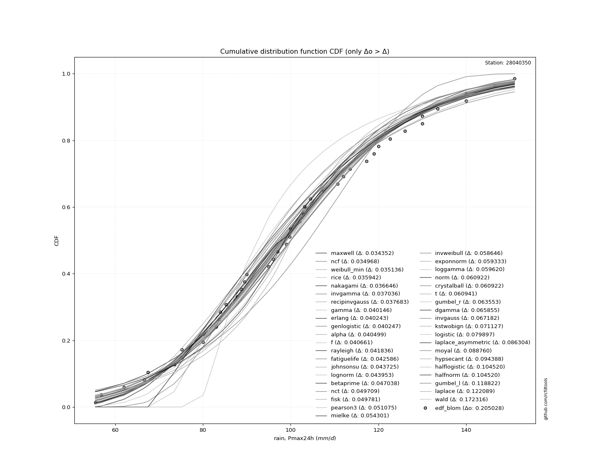</img>

</div>


**6.3. Best fit**

<div align="center">

|   id |   station | empirical_dist   | p_dist   |     delta |   deltao | eval   |   fit |   n |   best_fit |   best_fit_sort |
|-----:|----------:|:-----------------|:---------|----------:|---------:|:-------|------:|----:|-----------:|----------------:|
|    0 |  28040350 | edf_blom         | rice     | 0.0326414 | 0.190438 | Δo > Δ |     1 |  51 |          1 |               1 |

</div>


<div align="center">

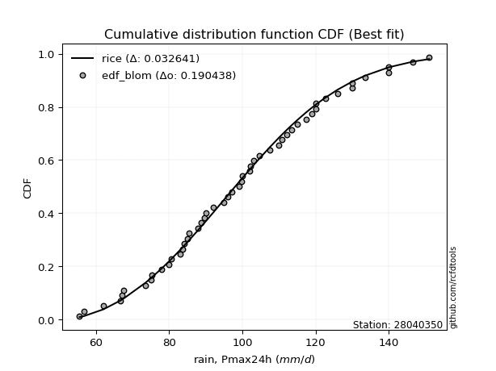</img>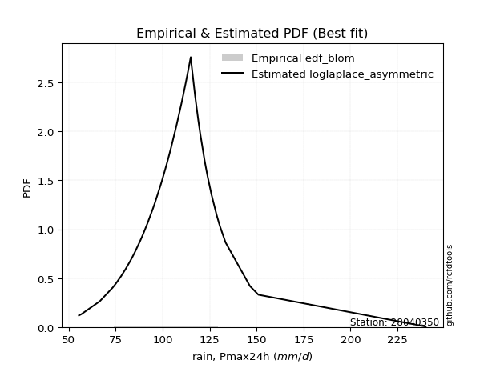</img>

</div>


### 7. EDF Tukey (1962)

In hydrology, the Tukey formula is used as a plotting position formula to estimate the empirical probability or frequency of a flood event (or other hydrological data). The formula parameter is given as _c=0.333_ (or 1/3).

<div align="center">


$P=(m-c)/(n+1-2c)$


</div>


**7.1. Empirical values**

<div align="center">

|                | 0                    | 1                    | 2                   | 3                   | 4                   | 5                   | 6                   | 7                   | 8                   | 9                   | 10                 | 11                  | 12                  | 13                 | 14                 | 15                 | 16                 | 17                  | 18                  | 19                  | 20                 | 21                  | 22                  | 23                | 24                 | 25        | 26                 | 27                 | 28                 | 29                 | 30                 | 31                 | 32                 | 33                 | 34                 | 35                 | 36                 | 37                 | 38                 | 39                 | 40                 | 41                 | 42                 | 43                 | 44                 | 45                 | 46                 | 47                 | 48                 | 49                 | 50                |
|:---------------|:---------------------|:---------------------|:--------------------|:--------------------|:--------------------|:--------------------|:--------------------|:--------------------|:--------------------|:--------------------|:-------------------|:--------------------|:--------------------|:-------------------|:-------------------|:-------------------|:-------------------|:--------------------|:--------------------|:--------------------|:-------------------|:--------------------|:--------------------|:------------------|:-------------------|:----------|:-------------------|:-------------------|:-------------------|:-------------------|:-------------------|:-------------------|:-------------------|:-------------------|:-------------------|:-------------------|:-------------------|:-------------------|:-------------------|:-------------------|:-------------------|:-------------------|:-------------------|:-------------------|:-------------------|:-------------------|:-------------------|:-------------------|:-------------------|:-------------------|:------------------|
| date           | 2001                 | 1997                 | 1972                | 2003                | 2022                | 2007                | 1989                | 2015                | 1986                | 2021                | 1980               | 1995                | 2012                | 1973               | 1984               | 2019               | 1990               | 2004                | 2000                | 1988                | 1974               | 2020                | 1994                | 2009              | 1978               | 1981      | 1985               | 2013               | 1977               | 2014               | 1998               | 2002               | 1991               | 2017               | 2008               | 1982               | 1999               | 2018               | 1993               | 2005               | 1983               | 2016               | 1987               | 2010               | 1992               | 2011               | 2006               | 1975               | 1979               | 1996               | 1976              |
| x              | 55.5                 | 56.8                 | 62.04761218         | 66.6                | 67.0                | 67.5                | 73.5                | 75.0                | 75.2                | 78.0                | 80.0               | 80.5                | 83.0                | 83.62431256        | 84.0               | 85.0               | 85.3               | 87.8                | 88.8                | 89.5                | 90.0               | 92.0                | 95.0                | 96.0              | 97.0               | 99.0      | 99.8               | 100.0              | 102.0              | 102.10925342627452 | 103.0              | 104.5              | 107.5              | 110.0              | 110.7              | 112.0              | 113.5              | 115.0              | 117.3              | 119.0              | 120.0              | 120.0              | 122.6              | 126.0              | 130.0              | 130.0              | 133.5              | 140.0              | 140.0              | 146.5              | 151.0             |
| m              | 1                    | 2                    | 3                   | 4                   | 5                   | 6                   | 7                   | 8                   | 9                   | 10                  | 11                 | 12                  | 13                  | 14                 | 15                 | 16                 | 17                 | 18                  | 19                  | 20                  | 21                 | 22                  | 23                  | 24                | 25                 | 26        | 27                 | 28                 | 29                 | 30                 | 31                 | 32                 | 33                 | 34                 | 35                 | 36                 | 37                 | 38                 | 39                 | 40                 | 41                 | 42                 | 43                 | 44                 | 45                 | 46                 | 47                 | 48                 | 49                 | 50                 | 51                |
| empirical_dist | edf_tukey            | edf_tukey            | edf_tukey           | edf_tukey           | edf_tukey           | edf_tukey           | edf_tukey           | edf_tukey           | edf_tukey           | edf_tukey           | edf_tukey          | edf_tukey           | edf_tukey           | edf_tukey          | edf_tukey          | edf_tukey          | edf_tukey          | edf_tukey           | edf_tukey           | edf_tukey           | edf_tukey          | edf_tukey           | edf_tukey           | edf_tukey         | edf_tukey          | edf_tukey | edf_tukey          | edf_tukey          | edf_tukey          | edf_tukey          | edf_tukey          | edf_tukey          | edf_tukey          | edf_tukey          | edf_tukey          | edf_tukey          | edf_tukey          | edf_tukey          | edf_tukey          | edf_tukey          | edf_tukey          | edf_tukey          | edf_tukey          | edf_tukey          | edf_tukey          | edf_tukey          | edf_tukey          | edf_tukey          | edf_tukey          | edf_tukey          | edf_tukey         |
| empirical      | 0.012987012987012988 | 0.032467532467532464 | 0.05194805194805195 | 0.07142857142857142 | 0.09090909090909091 | 0.11038961038961038 | 0.12987012987012986 | 0.14935064935064934 | 0.16883116883116883 | 0.18831168831168832 | 0.2077922077922078 | 0.22727272727272727 | 0.24675324675324675 | 0.2662337662337662 | 0.2857142857142857 | 0.3051948051948052 | 0.3246753246753247 | 0.34415584415584416 | 0.36363636363636365 | 0.38311688311688313 | 0.4025974025974026 | 0.42207792207792205 | 0.44155844155844154 | 0.461038961038961 | 0.4805194805194805 | 0.5       | 0.5194805194805194 | 0.538961038961039  | 0.5584415584415584 | 0.577922077922078  | 0.5974025974025974 | 0.6168831168831169 | 0.6363636363636364 | 0.6558441558441559 | 0.6753246753246753 | 0.6948051948051948 | 0.7142857142857143 | 0.7337662337662337 | 0.7532467532467533 | 0.7727272727272727 | 0.7922077922077922 | 0.8116883116883117 | 0.8311688311688312 | 0.8506493506493507 | 0.8701298701298701 | 0.8896103896103896 | 0.9090909090909091 | 0.9285714285714286 | 0.948051948051948  | 0.9675324675324676 | 0.987012987012987 |
| empirical_tr   | 1.013157894736842    | 1.0335570469798658   | 1.0547945205479452  | 1.0769230769230769  | 1.1                 | 1.1240875912408759  | 1.1492537313432836  | 1.1755725190839694  | 1.203125            | 1.232               | 1.2622950819672132 | 1.2941176470588236  | 1.3275862068965516  | 1.3628318584070795 | 1.4                | 1.4392523364485983 | 1.4807692307692308 | 1.5247524752475246  | 1.5714285714285714  | 1.6210526315789475  | 1.673913043478261  | 1.7303370786516854  | 1.7906976744186045  | 1.855421686746988 | 1.9250000000000003 | 2.0       | 2.0810810810810807 | 2.1690140845070425 | 2.264705882352941  | 2.3692307692307693 | 2.4838709677419355 | 2.610169491525424  | 2.75               | 2.905660377358491  | 3.08               | 3.2765957446808507 | 3.5                | 3.756097560975609  | 4.052631578947369  | 4.3999999999999995 | 4.812500000000001  | 5.310344827586206  | 5.923076923076925  | 6.695652173913044  | 7.6999999999999975 | 9.058823529411766  | 10.999999999999996 | 14.000000000000007 | 19.249999999999993 | 30.800000000000043 | 76.99999999999997 |

</div>


**7.2. Kolmogorov-Smirnov fit test (sorted by Δ)**


<div align="center">

|                | 0                   | 1                   | 2                   | 3                   | 4                   | 5                    | 6                   | 7                   | 8                   | 9                    | 10                   | 11                  | 12                  | 13                  | 14                  | 15                   | 16                  | 17                  | 18                  | 19                   | 20                  | 21                  | 22                  | 23                   | 24                  | 25                   | 26                   | 27                  | 28                  | 29                  | 30                  | 31                   | 32                  | 33                   | 34                   | 35                   | 36                  | 37                  | 38                  | 39                  | 40                   | 41                   | 42                  | 43                  | 44                   | 45                  | 46                  | 47                  | 48                  | 49                  | 50                  | 51                  | 52                  | 53                  | 54                  | 55                  | 56                    | 57                  | 58                  | 59                  | 60                  | 61                  | 62                  | 63                  | 64                  | 65                  | 66                  | 67                  | 68                  | 69                  | 70                  | 71                  | 72                  | 73                  | 74                  | 75                  | 76                  | 77                  | 78                  | 79                  | 80                  | 81                  | 82                  | 83                  | 84                  | 85                  | 86                  | 87                  |
|:---------------|:--------------------|:--------------------|:--------------------|:--------------------|:--------------------|:---------------------|:--------------------|:--------------------|:--------------------|:---------------------|:---------------------|:--------------------|:--------------------|:--------------------|:--------------------|:---------------------|:--------------------|:--------------------|:--------------------|:---------------------|:--------------------|:--------------------|:--------------------|:---------------------|:--------------------|:---------------------|:---------------------|:--------------------|:--------------------|:--------------------|:--------------------|:---------------------|:--------------------|:---------------------|:---------------------|:---------------------|:--------------------|:--------------------|:--------------------|:--------------------|:---------------------|:---------------------|:--------------------|:--------------------|:---------------------|:--------------------|:--------------------|:--------------------|:--------------------|:--------------------|:--------------------|:--------------------|:--------------------|:--------------------|:--------------------|:--------------------|:----------------------|:--------------------|:--------------------|:--------------------|:--------------------|:--------------------|:--------------------|:--------------------|:--------------------|:--------------------|:--------------------|:--------------------|:--------------------|:--------------------|:--------------------|:--------------------|:--------------------|:--------------------|:--------------------|:--------------------|:--------------------|:--------------------|:--------------------|:--------------------|:--------------------|:--------------------|:--------------------|:--------------------|:--------------------|:--------------------|:--------------------|:--------------------|
| station        | 28040350            | 28040350            | 28040350            | 28040350            | 28040350            | 28040350             | 28040350            | 28040350            | 28040350            | 28040350             | 28040350             | 28040350            | 28040350            | 28040350            | 28040350            | 28040350             | 28040350            | 28040350            | 28040350            | 28040350             | 28040350            | 28040350            | 28040350            | 28040350             | 28040350            | 28040350             | 28040350             | 28040350            | 28040350            | 28040350            | 28040350            | 28040350             | 28040350            | 28040350             | 28040350             | 28040350             | 28040350            | 28040350            | 28040350            | 28040350            | 28040350             | 28040350             | 28040350            | 28040350            | 28040350             | 28040350            | 28040350            | 28040350            | 28040350            | 28040350            | 28040350            | 28040350            | 28040350            | 28040350            | 28040350            | 28040350            | 28040350              | 28040350            | 28040350            | 28040350            | 28040350            | 28040350            | 28040350            | 28040350            | 28040350            | 28040350            | 28040350            | 28040350            | 28040350            | 28040350            | 28040350            | 28040350            | 28040350            | 28040350            | 28040350            | 28040350            | 28040350            | 28040350            | 28040350            | 28040350            | 28040350            | 28040350            | 28040350            | 28040350            | 28040350            | 28040350            | 28040350            | 28040350            |
| empirical_dist | edf_tukey           | edf_tukey           | edf_tukey           | edf_tukey           | edf_tukey           | edf_tukey            | edf_tukey           | edf_tukey           | edf_tukey           | edf_tukey            | edf_tukey            | edf_tukey           | edf_tukey           | edf_tukey           | edf_tukey           | edf_tukey            | edf_tukey           | edf_tukey           | edf_tukey           | edf_tukey            | edf_tukey           | edf_tukey           | edf_tukey           | edf_tukey            | edf_tukey           | edf_tukey            | edf_tukey            | edf_tukey           | edf_tukey           | edf_tukey           | edf_tukey           | edf_tukey            | edf_tukey           | edf_tukey            | edf_tukey            | edf_tukey            | edf_tukey           | edf_tukey           | edf_tukey           | edf_tukey           | edf_tukey            | edf_tukey            | edf_tukey           | edf_tukey           | edf_tukey            | edf_tukey           | edf_tukey           | edf_tukey           | edf_tukey           | edf_tukey           | edf_tukey           | edf_tukey           | edf_tukey           | edf_tukey           | edf_tukey           | edf_tukey           | edf_tukey             | edf_tukey           | edf_tukey           | edf_tukey           | edf_tukey           | edf_tukey           | edf_tukey           | edf_tukey           | edf_tukey           | edf_tukey           | edf_tukey           | edf_tukey           | edf_tukey           | edf_tukey           | edf_tukey           | edf_tukey           | edf_tukey           | edf_tukey           | edf_tukey           | edf_tukey           | edf_tukey           | edf_tukey           | edf_tukey           | edf_tukey           | edf_tukey           | edf_tukey           | edf_tukey           | edf_tukey           | edf_tukey           | edf_tukey           | edf_tukey           | edf_tukey           |
| p_dist         | rice                | weibull_min         | logpearson3         | f                   | erlang              | gamma                | logweibull_min      | maxwell             | fatiguelife         | alpha                | nakagami             | invgamma            | johnsonsu           | ncf                 | logloggamma         | lognct               | nct                 | logncf              | invweibull          | rayleigh             | logjohnsonsu        | lognakagami         | genlogistic         | pearson3             | fisk                | logt                 | logcrystalball       | lognorm             | lognorm             | logexponnorm        | loglognorm          | logfatiguelife       | logfisk             | logrice              | logf                 | logerlang            | mielke              | loggenlogistic      | loggamma            | loggamma            | logalpha             | loginvgamma          | exponnorm           | logmielke           | betaprime            | t                   | norm                | crystalball         | kstwobign           | logbetaprime        | invgauss            | loginvgauss         | loglogistic         | logmaxwell          | gumbel_r            | logistic            | loglaplace_asymmetric | laplace_asymmetric  | lograyleigh         | loggumbel_l         | loghypsecant        | hypsecant           | moyal               | loginvweibull       | loglaplace          | halflogistic        | halfnorm            | loghalfnorm         | loggumbel_r         | logkstwobign        | gumbel_l            | laplace             | logmoyal            | loghalflogistic     | wald                | loggenexpon         | logwald             | expon               | genexpon            | gibrat              | loggibrat           | loggompertz         | logtruncnorm        | logexpon            | logchi2             | gompertz            | chi2                | truncnorm           |
| delta          | 0.03279975415585484 | 0.03343860024412272 | 0.03654214571077552 | 0.03679101784613209 | 0.03716984979545035 | 0.037170179552198035 | 0.03727844630756039 | 0.03790582331531964 | 0.03855287373166305 | 0.038658096364420746 | 0.038801196734929544 | 0.03917559565456952 | 0.04016768490982803 | 0.04033154473191958 | 0.04166890735541523 | 0.045293363168069756 | 0.04561871261482964 | 0.0470193544873484  | 0.04726404153227681 | 0.047322918468585204 | 0.0473908932576218  | 0.04758571426690705 | 0.04764906702389904 | 0.047719266306282926 | 0.04804136264159342 | 0.048049546806085086 | 0.048052041391153155 | 0.04805275020168842 | 0.04805275020168842 | 0.0480530306597684  | 0.04805347607467447 | 0.048339621714952985 | 0.04852353188707126 | 0.049708847126494926 | 0.049785370501095993 | 0.050208572680428776 | 0.0515833708120344  | 0.05163693161922228 | 0.05165749638726558 | 0.05165749638726558 | 0.051890476572857724 | 0.054511290732437656 | 0.0562547178681444  | 0.05638304488687712 | 0.057753992351162076 | 0.05853316759087418 | 0.05858520980677612 | 0.05858521290488139 | 0.0618300630159484  | 0.06202993428689907 | 0.0639030295015186  | 0.0644542740169386  | 0.06958350773541067 | 0.07140556095252026 | 0.07443316927628041 | 0.07703139572666573 | 0.0774883083120389    | 0.07930688890700077 | 0.08142949843005187 | 0.08208540629442157 | 0.08502781299660012 | 0.09124229168826697 | 0.09423659855858979 | 0.09479777723787813 | 0.10974007955293796 | 0.11038961038961038 | 0.11038961038961038 | 0.11038961038961038 | 0.1108185176050196  | 0.11274827042856592 | 0.11759572693605586 | 0.11922888701233003 | 0.13594635931346932 | 0.13662689851249787 | 0.1865910014434345  | 0.18908348730282784 | 0.20567602392591866 | 0.2198645995689666  | 0.2267916360809789  | 0.22727272727272727 | 0.23396887481390205 | 0.2420025483366701  | 0.26840628184514864 | 0.27528741709325094 | 0.3513490240281857  | 0.8160545418298143  | 0.939968463290753   | 0.987012987012987   |
| deltao         | 0.19043809142780935 | 0.19043809142780935 | 0.19043809142780935 | 0.19043809142780935 | 0.19043809142780935 | 0.19043809142780935  | 0.19043809142780935 | 0.19043809142780935 | 0.19043809142780935 | 0.19043809142780935  | 0.19043809142780935  | 0.19043809142780935 | 0.19043809142780935 | 0.19043809142780935 | 0.19043809142780935 | 0.19043809142780935  | 0.19043809142780935 | 0.19043809142780935 | 0.19043809142780935 | 0.19043809142780935  | 0.19043809142780935 | 0.19043809142780935 | 0.19043809142780935 | 0.19043809142780935  | 0.19043809142780935 | 0.19043809142780935  | 0.19043809142780935  | 0.19043809142780935 | 0.19043809142780935 | 0.19043809142780935 | 0.19043809142780935 | 0.19043809142780935  | 0.19043809142780935 | 0.19043809142780935  | 0.19043809142780935  | 0.19043809142780935  | 0.19043809142780935 | 0.19043809142780935 | 0.19043809142780935 | 0.19043809142780935 | 0.19043809142780935  | 0.19043809142780935  | 0.19043809142780935 | 0.19043809142780935 | 0.19043809142780935  | 0.19043809142780935 | 0.19043809142780935 | 0.19043809142780935 | 0.19043809142780935 | 0.19043809142780935 | 0.19043809142780935 | 0.19043809142780935 | 0.19043809142780935 | 0.19043809142780935 | 0.19043809142780935 | 0.19043809142780935 | 0.19043809142780935   | 0.19043809142780935 | 0.19043809142780935 | 0.19043809142780935 | 0.19043809142780935 | 0.19043809142780935 | 0.19043809142780935 | 0.19043809142780935 | 0.19043809142780935 | 0.19043809142780935 | 0.19043809142780935 | 0.19043809142780935 | 0.19043809142780935 | 0.19043809142780935 | 0.19043809142780935 | 0.19043809142780935 | 0.19043809142780935 | 0.19043809142780935 | 0.19043809142780935 | 0.19043809142780935 | 0.19043809142780935 | 0.19043809142780935 | 0.19043809142780935 | 0.19043809142780935 | 0.19043809142780935 | 0.19043809142780935 | 0.19043809142780935 | 0.19043809142780935 | 0.19043809142780935 | 0.19043809142780935 | 0.19043809142780935 | 0.19043809142780935 |
| eval           | Δo > Δ              | Δo > Δ              | Δo > Δ              | Δo > Δ              | Δo > Δ              | Δo > Δ               | Δo > Δ              | Δo > Δ              | Δo > Δ              | Δo > Δ               | Δo > Δ               | Δo > Δ              | Δo > Δ              | Δo > Δ              | Δo > Δ              | Δo > Δ               | Δo > Δ              | Δo > Δ              | Δo > Δ              | Δo > Δ               | Δo > Δ              | Δo > Δ              | Δo > Δ              | Δo > Δ               | Δo > Δ              | Δo > Δ               | Δo > Δ               | Δo > Δ              | Δo > Δ              | Δo > Δ              | Δo > Δ              | Δo > Δ               | Δo > Δ              | Δo > Δ               | Δo > Δ               | Δo > Δ               | Δo > Δ              | Δo > Δ              | Δo > Δ              | Δo > Δ              | Δo > Δ               | Δo > Δ               | Δo > Δ              | Δo > Δ              | Δo > Δ               | Δo > Δ              | Δo > Δ              | Δo > Δ              | Δo > Δ              | Δo > Δ              | Δo > Δ              | Δo > Δ              | Δo > Δ              | Δo > Δ              | Δo > Δ              | Δo > Δ              | Δo > Δ                | Δo > Δ              | Δo > Δ              | Δo > Δ              | Δo > Δ              | Δo > Δ              | Δo > Δ              | Δo > Δ              | Δo > Δ              | Δo > Δ              | Δo > Δ              | Δo > Δ              | Δo > Δ              | Δo > Δ              | Δo > Δ              | Δo > Δ              | Δo > Δ              | Δo > Δ              | Δo > Δ              | Δo > Δ              | Δo <= Δ             | Δo <= Δ             | Δo <= Δ             | Δo <= Δ             | Δo <= Δ             | Δo <= Δ             | Δo <= Δ             | Δo <= Δ             | Δo <= Δ             | Δo <= Δ             | Δo <= Δ             | Δo <= Δ             |
| fit            | 1                   | 1                   | 1                   | 1                   | 1                   | 1                    | 1                   | 1                   | 1                   | 1                    | 1                    | 1                   | 1                   | 1                   | 1                   | 1                    | 1                   | 1                   | 1                   | 1                    | 1                   | 1                   | 1                   | 1                    | 1                   | 1                    | 1                    | 1                   | 1                   | 1                   | 1                   | 1                    | 1                   | 1                    | 1                    | 1                    | 1                   | 1                   | 1                   | 1                   | 1                    | 1                    | 1                   | 1                   | 1                    | 1                   | 1                   | 1                   | 1                   | 1                   | 1                   | 1                   | 1                   | 1                   | 1                   | 1                   | 1                     | 1                   | 1                   | 1                   | 1                   | 1                   | 1                   | 1                   | 1                   | 1                   | 1                   | 1                   | 1                   | 1                   | 1                   | 1                   | 1                   | 1                   | 1                   | 1                   | 0                   | 0                   | 0                   | 0                   | 0                   | 0                   | 0                   | 0                   | 0                   | 0                   | 0                   | 0                   |
| n              | 51                  | 51                  | 51                  | 51                  | 51                  | 51                   | 51                  | 51                  | 51                  | 51                   | 51                   | 51                  | 51                  | 51                  | 51                  | 51                   | 51                  | 51                  | 51                  | 51                   | 51                  | 51                  | 51                  | 51                   | 51                  | 51                   | 51                   | 51                  | 51                  | 51                  | 51                  | 51                   | 51                  | 51                   | 51                   | 51                   | 51                  | 51                  | 51                  | 51                  | 51                   | 51                   | 51                  | 51                  | 51                   | 51                  | 51                  | 51                  | 51                  | 51                  | 51                  | 51                  | 51                  | 51                  | 51                  | 51                  | 51                    | 51                  | 51                  | 51                  | 51                  | 51                  | 51                  | 51                  | 51                  | 51                  | 51                  | 51                  | 51                  | 51                  | 51                  | 51                  | 51                  | 51                  | 51                  | 51                  | 51                  | 51                  | 51                  | 51                  | 51                  | 51                  | 51                  | 51                  | 51                  | 51                  | 51                  | 51                  |
| best_fit       | 1                   | 0                   | 0                   | 0                   | 0                   | 0                    | 0                   | 0                   | 0                   | 0                    | 0                    | 0                   | 0                   | 0                   | 0                   | 0                    | 0                   | 0                   | 0                   | 0                    | 0                   | 0                   | 0                   | 0                    | 0                   | 0                    | 0                    | 0                   | 0                   | 0                   | 0                   | 0                    | 0                   | 0                    | 0                    | 0                    | 0                   | 0                   | 0                   | 0                   | 0                    | 0                    | 0                   | 0                   | 0                    | 0                   | 0                   | 0                   | 0                   | 0                   | 0                   | 0                   | 0                   | 0                   | 0                   | 0                   | 0                     | 0                   | 0                   | 0                   | 0                   | 0                   | 0                   | 0                   | 0                   | 0                   | 0                   | 0                   | 0                   | 0                   | 0                   | 0                   | 0                   | 0                   | 0                   | 0                   | 0                   | 0                   | 0                   | 0                   | 0                   | 0                   | 0                   | 0                   | 0                   | 0                   | 0                   | 0                   |
| best_fit_sort  | 1                   | 2                   | 3                   | 4                   | 5                   | 6                    | 7                   | 8                   | 9                   | 10                   | 11                   | 12                  | 13                  | 14                  | 15                  | 16                   | 17                  | 18                  | 19                  | 20                   | 21                  | 22                  | 23                  | 24                   | 25                  | 26                   | 27                   | 28                  | 29                  | 30                  | 31                  | 32                   | 33                  | 34                   | 35                   | 36                   | 37                  | 38                  | 39                  | 40                  | 41                   | 42                   | 43                  | 44                  | 45                   | 46                  | 47                  | 48                  | 49                  | 50                  | 51                  | 52                  | 53                  | 54                  | 55                  | 56                  | 57                    | 58                  | 59                  | 60                  | 61                  | 62                  | 63                  | 64                  | 65                  | 66                  | 67                  | 68                  | 69                  | 70                  | 71                  | 72                  | 73                  | 74                  | 75                  | 76                  | 77                  | 78                  | 79                  | 80                  | 81                  | 82                  | 83                  | 84                  | 85                  | 86                  | 87                  | 88                  |

</div>


<div align="center">

</img>

</div>


**7.3. Best fit**

<div align="center">

|   id |   station | empirical_dist   | p_dist   |     delta |   deltao | eval   |   fit |   n |   best_fit |   best_fit_sort |
|-----:|----------:|:-----------------|:---------|----------:|---------:|:-------|------:|----:|-----------:|----------------:|
|    0 |  28040350 | edf_tukey        | rice     | 0.0327998 | 0.190438 | Δo > Δ |     1 |  51 |          1 |               1 |

</div>


<div align="center">

</img>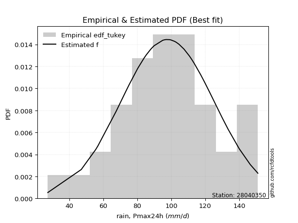</img>

</div>


### 8. EDF Gringorten (1963)

Gringorten plotting position formula is essential for estimating the probability and return periods of extreme events like floods and heavy rainfall. The constant _a=0.44_.

<div align="center">


$P=(m-a)/(n+1-2a)$


</div>


**8.1. Empirical values**

<div align="center">

|                | 0                    | 1                    | 2                    | 3                   | 4                  | 5                   | 6                   | 7                   | 8                   | 9                   | 10                  | 11                  | 12                 | 13                 | 14                  | 15                  | 16                 | 17                 | 18                 | 19                  | 20                  | 21                 | 22                 | 23                  | 24                  | 25             | 26                 | 27                 | 28                 | 29                 | 30                 | 31                 | 32                 | 33                 | 34                 | 35                 | 36                 | 37                 | 38                 | 39                 | 40                 | 41                 | 42                 | 43                 | 44                 | 45                 | 46                 | 47                 | 48                 | 49                 | 50                 |
|:---------------|:---------------------|:---------------------|:---------------------|:--------------------|:-------------------|:--------------------|:--------------------|:--------------------|:--------------------|:--------------------|:--------------------|:--------------------|:-------------------|:-------------------|:--------------------|:--------------------|:-------------------|:-------------------|:-------------------|:--------------------|:--------------------|:-------------------|:-------------------|:--------------------|:--------------------|:---------------|:-------------------|:-------------------|:-------------------|:-------------------|:-------------------|:-------------------|:-------------------|:-------------------|:-------------------|:-------------------|:-------------------|:-------------------|:-------------------|:-------------------|:-------------------|:-------------------|:-------------------|:-------------------|:-------------------|:-------------------|:-------------------|:-------------------|:-------------------|:-------------------|:-------------------|
| date           | 2001                 | 1997                 | 1972                 | 2003                | 2022               | 2007                | 1989                | 2015                | 1986                | 2021                | 1980                | 1995                | 2012               | 1973               | 1984                | 2019                | 1990               | 2004               | 2000               | 1988                | 1974                | 2020               | 1994               | 2009                | 1978                | 1981           | 1985               | 2013               | 1977               | 2014               | 1998               | 2002               | 1991               | 2017               | 2008               | 1982               | 1999               | 2018               | 1993               | 2005               | 1983               | 2016               | 1987               | 2010               | 1992               | 2011               | 2006               | 1975               | 1979               | 1996               | 1976               |
| x              | 55.5                 | 56.8                 | 62.04761218          | 66.6                | 67.0               | 67.5                | 73.5                | 75.0                | 75.2                | 78.0                | 80.0                | 80.5                | 83.0               | 83.62431256        | 84.0                | 85.0                | 85.3               | 87.8               | 88.8               | 89.5                | 90.0                | 92.0               | 95.0               | 96.0                | 97.0                | 99.0           | 99.8               | 100.0              | 102.0              | 102.10925342627452 | 103.0              | 104.5              | 107.5              | 110.0              | 110.7              | 112.0              | 113.5              | 115.0              | 117.3              | 119.0              | 120.0              | 120.0              | 122.6              | 126.0              | 130.0              | 130.0              | 133.5              | 140.0              | 140.0              | 146.5              | 151.0              |
| m              | 1                    | 2                    | 3                    | 4                   | 5                  | 6                   | 7                   | 8                   | 9                   | 10                  | 11                  | 12                  | 13                 | 14                 | 15                  | 16                  | 17                 | 18                 | 19                 | 20                  | 21                  | 22                 | 23                 | 24                  | 25                  | 26             | 27                 | 28                 | 29                 | 30                 | 31                 | 32                 | 33                 | 34                 | 35                 | 36                 | 37                 | 38                 | 39                 | 40                 | 41                 | 42                 | 43                 | 44                 | 45                 | 46                 | 47                 | 48                 | 49                 | 50                 | 51                 |
| empirical_dist | edf_gringorten       | edf_gringorten       | edf_gringorten       | edf_gringorten      | edf_gringorten     | edf_gringorten      | edf_gringorten      | edf_gringorten      | edf_gringorten      | edf_gringorten      | edf_gringorten      | edf_gringorten      | edf_gringorten     | edf_gringorten     | edf_gringorten      | edf_gringorten      | edf_gringorten     | edf_gringorten     | edf_gringorten     | edf_gringorten      | edf_gringorten      | edf_gringorten     | edf_gringorten     | edf_gringorten      | edf_gringorten      | edf_gringorten | edf_gringorten     | edf_gringorten     | edf_gringorten     | edf_gringorten     | edf_gringorten     | edf_gringorten     | edf_gringorten     | edf_gringorten     | edf_gringorten     | edf_gringorten     | edf_gringorten     | edf_gringorten     | edf_gringorten     | edf_gringorten     | edf_gringorten     | edf_gringorten     | edf_gringorten     | edf_gringorten     | edf_gringorten     | edf_gringorten     | edf_gringorten     | edf_gringorten     | edf_gringorten     | edf_gringorten     | edf_gringorten     |
| empirical      | 0.010954616588419407 | 0.030516431924882632 | 0.050078247261345854 | 0.06964006259780908 | 0.0892018779342723 | 0.10876369327073553 | 0.12832550860719874 | 0.14788732394366197 | 0.16744913928012523 | 0.18701095461658843 | 0.20657276995305165 | 0.22613458528951488 | 0.2456964006259781 | 0.2652582159624413 | 0.28482003129890454 | 0.30438184663536777 | 0.323943661971831  | 0.3435054773082942 | 0.3630672926447574 | 0.38262910798122063 | 0.40219092331768386 | 0.4217527386541471 | 0.4413145539906103 | 0.46087636932707354 | 0.48043818466353677 | 0.5            | 0.5195618153364632 | 0.5391236306729265 | 0.5586854460093896 | 0.5782472613458529 | 0.5978090766823161 | 0.6173708920187794 | 0.6369327073552427 | 0.6564945226917058 | 0.6760563380281691 | 0.6956181533646323 | 0.7151799687010956 | 0.7347417840375587 | 0.754303599374022  | 0.7738654147104852 | 0.7934272300469485 | 0.8129890453834117 | 0.8325508607198749 | 0.8521126760563381 | 0.8716744913928013 | 0.8912363067292646 | 0.9107981220657277 | 0.930359937402191  | 0.9499217527386542 | 0.9694835680751175 | 0.9890453834115807 |
| empirical_tr   | 1.0110759493670887   | 1.0314769975786926   | 1.0527182866556837   | 1.0748528174936922  | 1.0979381443298968 | 1.122036874451273   | 1.14721723518851    | 1.1735537190082646  | 1.2011278195488722  | 1.2300288739172283  | 1.2603550295857988  | 1.2922143579373104  | 1.3257261410788381 | 1.3610223642172523 | 1.3982494529540481  | 1.4375703037120362  | 1.4791666666666667 | 1.5232419547079856 | 1.5700245700245699 | 1.6197718631178706  | 1.6727748691099478  | 1.7293640054127197 | 1.7899159663865545 | 1.8548621190130623  | 1.924698795180723   | 2.0            | 2.0814332247557    | 2.1697792869269947 | 2.2659574468085104 | 2.371057513914657  | 2.486381322957198  | 2.6134969325153374 | 2.7543103448275867 | 2.9111617312072897 | 3.0869565217391313 | 3.2853470437018    | 3.5109890109890123 | 3.7699115044247797 | 4.0700636942675175 | 4.422145328719725  | 4.8409090909090935 | 5.347280334728036  | 5.9719626168224345 | 6.761904761904765  | 7.79268292682927   | 9.194244604316555  | 11.21052631578948  | 14.359550561797775 | 19.96875000000002  | 32.769230769230894 | 91.28571428571482  |

</div>


**8.2. Kolmogorov-Smirnov fit test (sorted by Δ)**


<div align="center">

|                | 0                   | 1                   | 2                   | 3                   | 4                   | 5                   | 6                   | 7                   | 8                   | 9                   | 10                  | 11                   | 12                   | 13                   | 14                  | 15                  | 16                   | 17                   | 18                   | 19                  | 20                  | 21                   | 22                  | 23                  | 24                  | 25                   | 26                  | 27                  | 28                  | 29                  | 30                  | 31                  | 32                   | 33                   | 34                  | 35                  | 36                   | 37                   | 38                  | 39                  | 40                  | 41                   | 42                   | 43                  | 44                  | 45                  | 46                   | 47                   | 48                   | 49                  | 50                  | 51                  | 52                  | 53                  | 54                  | 55                  | 56                    | 57                  | 58                  | 59                  | 60                  | 61                  | 62                  | 63                  | 64                  | 65                  | 66                  | 67                  | 68                  | 69                  | 70                  | 71                  | 72                  | 73                  | 74                  | 75                  | 76                  | 77                  | 78                  | 79                  | 80                  | 81                  | 82                  | 83                  | 84                  | 85                  | 86                  | 87                  |
|:---------------|:--------------------|:--------------------|:--------------------|:--------------------|:--------------------|:--------------------|:--------------------|:--------------------|:--------------------|:--------------------|:--------------------|:---------------------|:---------------------|:---------------------|:--------------------|:--------------------|:---------------------|:---------------------|:---------------------|:--------------------|:--------------------|:---------------------|:--------------------|:--------------------|:--------------------|:---------------------|:--------------------|:--------------------|:--------------------|:--------------------|:--------------------|:--------------------|:---------------------|:---------------------|:--------------------|:--------------------|:---------------------|:---------------------|:--------------------|:--------------------|:--------------------|:---------------------|:---------------------|:--------------------|:--------------------|:--------------------|:---------------------|:---------------------|:---------------------|:--------------------|:--------------------|:--------------------|:--------------------|:--------------------|:--------------------|:--------------------|:----------------------|:--------------------|:--------------------|:--------------------|:--------------------|:--------------------|:--------------------|:--------------------|:--------------------|:--------------------|:--------------------|:--------------------|:--------------------|:--------------------|:--------------------|:--------------------|:--------------------|:--------------------|:--------------------|:--------------------|:--------------------|:--------------------|:--------------------|:--------------------|:--------------------|:--------------------|:--------------------|:--------------------|:--------------------|:--------------------|:--------------------|:--------------------|
| station        | 28040350            | 28040350            | 28040350            | 28040350            | 28040350            | 28040350            | 28040350            | 28040350            | 28040350            | 28040350            | 28040350            | 28040350             | 28040350             | 28040350             | 28040350            | 28040350            | 28040350             | 28040350             | 28040350             | 28040350            | 28040350            | 28040350             | 28040350            | 28040350            | 28040350            | 28040350             | 28040350            | 28040350            | 28040350            | 28040350            | 28040350            | 28040350            | 28040350             | 28040350             | 28040350            | 28040350            | 28040350             | 28040350             | 28040350            | 28040350            | 28040350            | 28040350             | 28040350             | 28040350            | 28040350            | 28040350            | 28040350             | 28040350             | 28040350             | 28040350            | 28040350            | 28040350            | 28040350            | 28040350            | 28040350            | 28040350            | 28040350              | 28040350            | 28040350            | 28040350            | 28040350            | 28040350            | 28040350            | 28040350            | 28040350            | 28040350            | 28040350            | 28040350            | 28040350            | 28040350            | 28040350            | 28040350            | 28040350            | 28040350            | 28040350            | 28040350            | 28040350            | 28040350            | 28040350            | 28040350            | 28040350            | 28040350            | 28040350            | 28040350            | 28040350            | 28040350            | 28040350            | 28040350            |
| empirical_dist | edf_gringorten      | edf_gringorten      | edf_gringorten      | edf_gringorten      | edf_gringorten      | edf_gringorten      | edf_gringorten      | edf_gringorten      | edf_gringorten      | edf_gringorten      | edf_gringorten      | edf_gringorten       | edf_gringorten       | edf_gringorten       | edf_gringorten      | edf_gringorten      | edf_gringorten       | edf_gringorten       | edf_gringorten       | edf_gringorten      | edf_gringorten      | edf_gringorten       | edf_gringorten      | edf_gringorten      | edf_gringorten      | edf_gringorten       | edf_gringorten      | edf_gringorten      | edf_gringorten      | edf_gringorten      | edf_gringorten      | edf_gringorten      | edf_gringorten       | edf_gringorten       | edf_gringorten      | edf_gringorten      | edf_gringorten       | edf_gringorten       | edf_gringorten      | edf_gringorten      | edf_gringorten      | edf_gringorten       | edf_gringorten       | edf_gringorten      | edf_gringorten      | edf_gringorten      | edf_gringorten       | edf_gringorten       | edf_gringorten       | edf_gringorten      | edf_gringorten      | edf_gringorten      | edf_gringorten      | edf_gringorten      | edf_gringorten      | edf_gringorten      | edf_gringorten        | edf_gringorten      | edf_gringorten      | edf_gringorten      | edf_gringorten      | edf_gringorten      | edf_gringorten      | edf_gringorten      | edf_gringorten      | edf_gringorten      | edf_gringorten      | edf_gringorten      | edf_gringorten      | edf_gringorten      | edf_gringorten      | edf_gringorten      | edf_gringorten      | edf_gringorten      | edf_gringorten      | edf_gringorten      | edf_gringorten      | edf_gringorten      | edf_gringorten      | edf_gringorten      | edf_gringorten      | edf_gringorten      | edf_gringorten      | edf_gringorten      | edf_gringorten      | edf_gringorten      | edf_gringorten      | edf_gringorten      |
| p_dist         | weibull_min         | rice                | logpearson3         | f                   | erlang              | gamma               | logweibull_min      | maxwell             | fatiguelife         | nakagami            | alpha               | invgamma             | ncf                  | johnsonsu            | logloggamma         | lognct              | nct                  | rayleigh             | logncf               | logjohnsonsu        | lognakagami         | genlogistic          | invweibull          | pearson3            | fisk                | logt                 | logcrystalball      | lognorm             | lognorm             | logexponnorm        | loglognorm          | logfatiguelife      | logfisk              | logrice              | logf                | logerlang           | loggamma             | loggamma             | mielke              | loggenlogistic      | logalpha            | loginvgamma          | exponnorm            | logmielke           | betaprime           | t                   | norm                 | crystalball          | logbetaprime         | kstwobign           | invgauss            | loginvgauss         | loglogistic         | logmaxwell          | gumbel_r            | logistic            | loglaplace_asymmetric | laplace_asymmetric  | lograyleigh         | loggumbel_l         | loghypsecant        | hypsecant           | moyal               | loginvweibull       | halfnorm            | halflogistic        | loglaplace          | loghalfnorm         | loggumbel_r         | logkstwobign        | gumbel_l            | laplace             | logmoyal            | loghalflogistic     | wald                | loggenexpon         | logwald             | expon               | gibrat              | genexpon            | loggibrat           | loggompertz         | logtruncnorm        | logexpon            | logchi2             | gompertz            | chi2                | truncnorm           |
| delta          | 0.03181268312524786 | 0.03239327487613608 | 0.03589177886322559 | 0.03638453856641333 | 0.03651948294790042 | 0.0365198127046481  | 0.03687196702784162 | 0.0369045664966452  | 0.03814639445194429 | 0.03815082988737961 | 0.03825161708470198 | 0.038525228807019585 | 0.039681177884369645 | 0.039761205630109264 | 0.04126242807569647 | 0.04464299632051982 | 0.045212233335110874 | 0.045697001349710345 | 0.046368987639798465 | 0.04674052641007187 | 0.04693534741935712 | 0.046998700176349106 | 0.04726404153227681 | 0.04731278702656416 | 0.04739099579404349 | 0.047399179958535154 | 0.04740167454360322 | 0.04740238335413849 | 0.04740238335413849 | 0.04740266381221847 | 0.04740310922712454 | 0.04768925486740305 | 0.047873165039521326 | 0.049058480278944994 | 0.04913500365354606 | 0.04955820583287884 | 0.051007129539715645 | 0.051007129539715645 | 0.05117689153231564 | 0.05123045233950352 | 0.05124010972530779 | 0.054511290732437656 | 0.055848238588425636 | 0.05597656560715836 | 0.05710362550361214 | 0.05812668831115542 | 0.058178730527057354 | 0.058178733625162626 | 0.061379567439349136 | 0.0618300630159484  | 0.0639030295015186  | 0.0644542740169386  | 0.06893314088786073 | 0.07140556095252026 | 0.07378280242873048 | 0.07662491644694697 | 0.07708182903232014   | 0.07890040962728201 | 0.08142949843005187 | 0.0816789270147028  | 0.08437744614905018 | 0.09083581240854821 | 0.09261068143971493 | 0.09504166480570936 | 0.10876369327073553 | 0.10876369327073553 | 0.10908971270538803 | 0.10968420304277349 | 0.1108185176050196  | 0.11380511655583456 | 0.11718924765633709 | 0.11882240773261127 | 0.13594635931346932 | 0.13662689851249787 | 0.1852902677483346  | 0.19014033343009648 | 0.20567602392591866 | 0.22108403740812274 | 0.22613458528951488 | 0.22801107392013506 | 0.23396887481390205 | 0.24305939446393873 | 0.2696257196843048  | 0.2765068549324071  | 0.3528494385154408  | 0.817436571380858   | 0.9418382679774591  | 0.9890453834115805  |
| deltao         | 0.19043809142780935 | 0.19043809142780935 | 0.19043809142780935 | 0.19043809142780935 | 0.19043809142780935 | 0.19043809142780935 | 0.19043809142780935 | 0.19043809142780935 | 0.19043809142780935 | 0.19043809142780935 | 0.19043809142780935 | 0.19043809142780935  | 0.19043809142780935  | 0.19043809142780935  | 0.19043809142780935 | 0.19043809142780935 | 0.19043809142780935  | 0.19043809142780935  | 0.19043809142780935  | 0.19043809142780935 | 0.19043809142780935 | 0.19043809142780935  | 0.19043809142780935 | 0.19043809142780935 | 0.19043809142780935 | 0.19043809142780935  | 0.19043809142780935 | 0.19043809142780935 | 0.19043809142780935 | 0.19043809142780935 | 0.19043809142780935 | 0.19043809142780935 | 0.19043809142780935  | 0.19043809142780935  | 0.19043809142780935 | 0.19043809142780935 | 0.19043809142780935  | 0.19043809142780935  | 0.19043809142780935 | 0.19043809142780935 | 0.19043809142780935 | 0.19043809142780935  | 0.19043809142780935  | 0.19043809142780935 | 0.19043809142780935 | 0.19043809142780935 | 0.19043809142780935  | 0.19043809142780935  | 0.19043809142780935  | 0.19043809142780935 | 0.19043809142780935 | 0.19043809142780935 | 0.19043809142780935 | 0.19043809142780935 | 0.19043809142780935 | 0.19043809142780935 | 0.19043809142780935   | 0.19043809142780935 | 0.19043809142780935 | 0.19043809142780935 | 0.19043809142780935 | 0.19043809142780935 | 0.19043809142780935 | 0.19043809142780935 | 0.19043809142780935 | 0.19043809142780935 | 0.19043809142780935 | 0.19043809142780935 | 0.19043809142780935 | 0.19043809142780935 | 0.19043809142780935 | 0.19043809142780935 | 0.19043809142780935 | 0.19043809142780935 | 0.19043809142780935 | 0.19043809142780935 | 0.19043809142780935 | 0.19043809142780935 | 0.19043809142780935 | 0.19043809142780935 | 0.19043809142780935 | 0.19043809142780935 | 0.19043809142780935 | 0.19043809142780935 | 0.19043809142780935 | 0.19043809142780935 | 0.19043809142780935 | 0.19043809142780935 |
| eval           | Δo > Δ              | Δo > Δ              | Δo > Δ              | Δo > Δ              | Δo > Δ              | Δo > Δ              | Δo > Δ              | Δo > Δ              | Δo > Δ              | Δo > Δ              | Δo > Δ              | Δo > Δ               | Δo > Δ               | Δo > Δ               | Δo > Δ              | Δo > Δ              | Δo > Δ               | Δo > Δ               | Δo > Δ               | Δo > Δ              | Δo > Δ              | Δo > Δ               | Δo > Δ              | Δo > Δ              | Δo > Δ              | Δo > Δ               | Δo > Δ              | Δo > Δ              | Δo > Δ              | Δo > Δ              | Δo > Δ              | Δo > Δ              | Δo > Δ               | Δo > Δ               | Δo > Δ              | Δo > Δ              | Δo > Δ               | Δo > Δ               | Δo > Δ              | Δo > Δ              | Δo > Δ              | Δo > Δ               | Δo > Δ               | Δo > Δ              | Δo > Δ              | Δo > Δ              | Δo > Δ               | Δo > Δ               | Δo > Δ               | Δo > Δ              | Δo > Δ              | Δo > Δ              | Δo > Δ              | Δo > Δ              | Δo > Δ              | Δo > Δ              | Δo > Δ                | Δo > Δ              | Δo > Δ              | Δo > Δ              | Δo > Δ              | Δo > Δ              | Δo > Δ              | Δo > Δ              | Δo > Δ              | Δo > Δ              | Δo > Δ              | Δo > Δ              | Δo > Δ              | Δo > Δ              | Δo > Δ              | Δo > Δ              | Δo > Δ              | Δo > Δ              | Δo > Δ              | Δo > Δ              | Δo <= Δ             | Δo <= Δ             | Δo <= Δ             | Δo <= Δ             | Δo <= Δ             | Δo <= Δ             | Δo <= Δ             | Δo <= Δ             | Δo <= Δ             | Δo <= Δ             | Δo <= Δ             | Δo <= Δ             |
| fit            | 1                   | 1                   | 1                   | 1                   | 1                   | 1                   | 1                   | 1                   | 1                   | 1                   | 1                   | 1                    | 1                    | 1                    | 1                   | 1                   | 1                    | 1                    | 1                    | 1                   | 1                   | 1                    | 1                   | 1                   | 1                   | 1                    | 1                   | 1                   | 1                   | 1                   | 1                   | 1                   | 1                    | 1                    | 1                   | 1                   | 1                    | 1                    | 1                   | 1                   | 1                   | 1                    | 1                    | 1                   | 1                   | 1                   | 1                    | 1                    | 1                    | 1                   | 1                   | 1                   | 1                   | 1                   | 1                   | 1                   | 1                     | 1                   | 1                   | 1                   | 1                   | 1                   | 1                   | 1                   | 1                   | 1                   | 1                   | 1                   | 1                   | 1                   | 1                   | 1                   | 1                   | 1                   | 1                   | 1                   | 0                   | 0                   | 0                   | 0                   | 0                   | 0                   | 0                   | 0                   | 0                   | 0                   | 0                   | 0                   |
| n              | 51                  | 51                  | 51                  | 51                  | 51                  | 51                  | 51                  | 51                  | 51                  | 51                  | 51                  | 51                   | 51                   | 51                   | 51                  | 51                  | 51                   | 51                   | 51                   | 51                  | 51                  | 51                   | 51                  | 51                  | 51                  | 51                   | 51                  | 51                  | 51                  | 51                  | 51                  | 51                  | 51                   | 51                   | 51                  | 51                  | 51                   | 51                   | 51                  | 51                  | 51                  | 51                   | 51                   | 51                  | 51                  | 51                  | 51                   | 51                   | 51                   | 51                  | 51                  | 51                  | 51                  | 51                  | 51                  | 51                  | 51                    | 51                  | 51                  | 51                  | 51                  | 51                  | 51                  | 51                  | 51                  | 51                  | 51                  | 51                  | 51                  | 51                  | 51                  | 51                  | 51                  | 51                  | 51                  | 51                  | 51                  | 51                  | 51                  | 51                  | 51                  | 51                  | 51                  | 51                  | 51                  | 51                  | 51                  | 51                  |
| best_fit       | 1                   | 0                   | 0                   | 0                   | 0                   | 0                   | 0                   | 0                   | 0                   | 0                   | 0                   | 0                    | 0                    | 0                    | 0                   | 0                   | 0                    | 0                    | 0                    | 0                   | 0                   | 0                    | 0                   | 0                   | 0                   | 0                    | 0                   | 0                   | 0                   | 0                   | 0                   | 0                   | 0                    | 0                    | 0                   | 0                   | 0                    | 0                    | 0                   | 0                   | 0                   | 0                    | 0                    | 0                   | 0                   | 0                   | 0                    | 0                    | 0                    | 0                   | 0                   | 0                   | 0                   | 0                   | 0                   | 0                   | 0                     | 0                   | 0                   | 0                   | 0                   | 0                   | 0                   | 0                   | 0                   | 0                   | 0                   | 0                   | 0                   | 0                   | 0                   | 0                   | 0                   | 0                   | 0                   | 0                   | 0                   | 0                   | 0                   | 0                   | 0                   | 0                   | 0                   | 0                   | 0                   | 0                   | 0                   | 0                   |
| best_fit_sort  | 1                   | 2                   | 3                   | 4                   | 5                   | 6                   | 7                   | 8                   | 9                   | 10                  | 11                  | 12                   | 13                   | 14                   | 15                  | 16                  | 17                   | 18                   | 19                   | 20                  | 21                  | 22                   | 23                  | 24                  | 25                  | 26                   | 27                  | 28                  | 29                  | 30                  | 31                  | 32                  | 33                   | 34                   | 35                  | 36                  | 37                   | 38                   | 39                  | 40                  | 41                  | 42                   | 43                   | 44                  | 45                  | 46                  | 47                   | 48                   | 49                   | 50                  | 51                  | 52                  | 53                  | 54                  | 55                  | 56                  | 57                    | 58                  | 59                  | 60                  | 61                  | 62                  | 63                  | 64                  | 65                  | 66                  | 67                  | 68                  | 69                  | 70                  | 71                  | 72                  | 73                  | 74                  | 75                  | 76                  | 77                  | 78                  | 79                  | 80                  | 81                  | 82                  | 83                  | 84                  | 85                  | 86                  | 87                  | 88                  |

</div>


<div align="center">

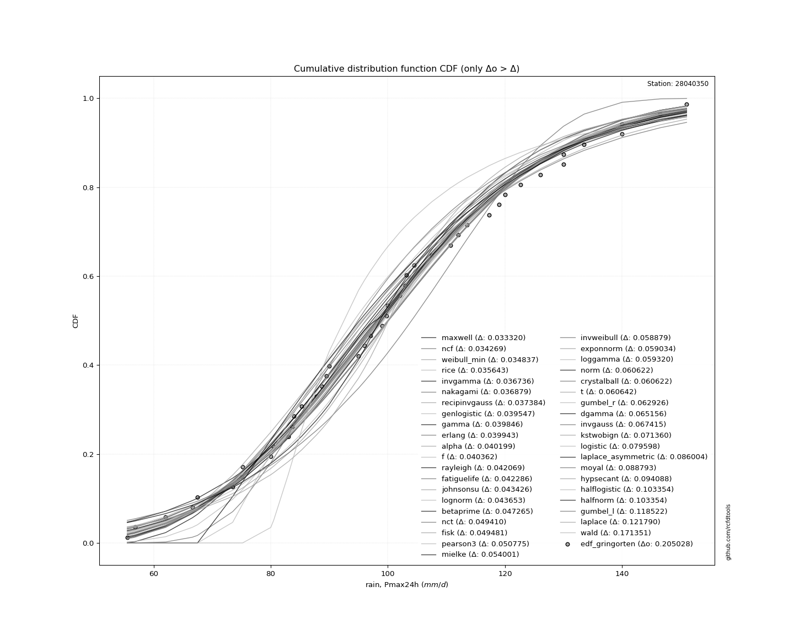</img>

</div>


**8.3. Best fit**

<div align="center">

|   id |   station | empirical_dist   | p_dist      |     delta |   deltao | eval   |   fit |   n |   best_fit |   best_fit_sort |
|-----:|----------:|:-----------------|:------------|----------:|---------:|:-------|------:|----:|-----------:|----------------:|
|    0 |  28040350 | edf_gringorten   | weibull_min | 0.0318127 | 0.190438 | Δo > Δ |     1 |  51 |          1 |               1 |

</div>


<div align="center">

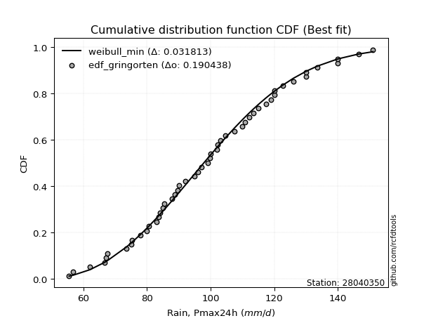</img>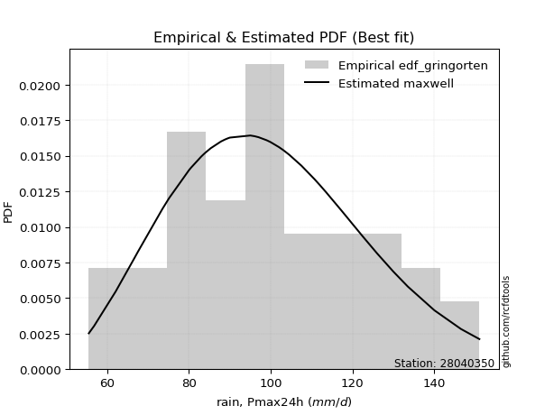</img>

</div>


### 9. EDF Filliben (1975)

The specific values of the constants (0.3175) (often denoted as $alpha$) and (0.365) are derived from a method proposed by James J. Filliben in a 1975 paper. This particular formula is the mean value of the $i$-th order statistic of the normal distribution and is considered a robust and effective plotting position formula for the normal probability plot correlation coefficient test for normality.

<div align="center">


$P=(m-0.3175)/(n+0.365)$


</div>


**9.1. Empirical values**

<div align="center">

|                | 0                    | 1                   | 2                   | 3                  | 4                   | 5                   | 6                  | 7                   | 8                  | 9                  | 10                  | 11                 | 12                 | 13                  | 14                 | 15                  | 16                 | 17                  | 18                  | 19                 | 20                  | 21                 | 22                 | 23                 | 24                  | 25           | 26                 | 27                 | 28                 | 29                 | 30                 | 31                 | 32                 | 33                 | 34                | 35                 | 36                 | 37                 | 38                 | 39                 | 40                 | 41                | 42                 | 43                 | 44                 | 45                 | 46                 | 47                 | 48                | 49                 | 50                 |
|:---------------|:---------------------|:--------------------|:--------------------|:-------------------|:--------------------|:--------------------|:-------------------|:--------------------|:-------------------|:-------------------|:--------------------|:-------------------|:-------------------|:--------------------|:-------------------|:--------------------|:-------------------|:--------------------|:--------------------|:-------------------|:--------------------|:-------------------|:-------------------|:-------------------|:--------------------|:-------------|:-------------------|:-------------------|:-------------------|:-------------------|:-------------------|:-------------------|:-------------------|:-------------------|:------------------|:-------------------|:-------------------|:-------------------|:-------------------|:-------------------|:-------------------|:------------------|:-------------------|:-------------------|:-------------------|:-------------------|:-------------------|:-------------------|:------------------|:-------------------|:-------------------|
| date           | 2001                 | 1997                | 1972                | 2003               | 2022                | 2007                | 1989               | 2015                | 1986               | 2021               | 1980                | 1995               | 2012               | 1973                | 1984               | 2019                | 1990               | 2004                | 2000                | 1988               | 1974                | 2020               | 1994               | 2009               | 1978                | 1981         | 1985               | 2013               | 1977               | 2014               | 1998               | 2002               | 1991               | 2017               | 2008              | 1982               | 1999               | 2018               | 1993               | 2005               | 1983               | 2016              | 1987               | 2010               | 1992               | 2011               | 2006               | 1975               | 1979              | 1996               | 1976               |
| x              | 55.5                 | 56.8                | 62.04761218         | 66.6               | 67.0                | 67.5                | 73.5               | 75.0                | 75.2               | 78.0               | 80.0                | 80.5               | 83.0               | 83.62431256         | 84.0               | 85.0                | 85.3               | 87.8                | 88.8                | 89.5               | 90.0                | 92.0               | 95.0               | 96.0               | 97.0                | 99.0         | 99.8               | 100.0              | 102.0              | 102.10925342627452 | 103.0              | 104.5              | 107.5              | 110.0              | 110.7             | 112.0              | 113.5              | 115.0              | 117.3              | 119.0              | 120.0              | 120.0             | 122.6              | 126.0              | 130.0              | 130.0              | 133.5              | 140.0              | 140.0             | 146.5              | 151.0              |
| m              | 1                    | 2                   | 3                   | 4                  | 5                   | 6                   | 7                  | 8                   | 9                  | 10                 | 11                  | 12                 | 13                 | 14                  | 15                 | 16                  | 17                 | 18                  | 19                  | 20                 | 21                  | 22                 | 23                 | 24                 | 25                  | 26           | 27                 | 28                 | 29                 | 30                 | 31                 | 32                 | 33                 | 34                 | 35                | 36                 | 37                 | 38                 | 39                 | 40                 | 41                 | 42                | 43                 | 44                 | 45                 | 46                 | 47                 | 48                 | 49                | 50                 | 51                 |
| empirical_dist | edf_filliben         | edf_filliben        | edf_filliben        | edf_filliben       | edf_filliben        | edf_filliben        | edf_filliben       | edf_filliben        | edf_filliben       | edf_filliben       | edf_filliben        | edf_filliben       | edf_filliben       | edf_filliben        | edf_filliben       | edf_filliben        | edf_filliben       | edf_filliben        | edf_filliben        | edf_filliben       | edf_filliben        | edf_filliben       | edf_filliben       | edf_filliben       | edf_filliben        | edf_filliben | edf_filliben       | edf_filliben       | edf_filliben       | edf_filliben       | edf_filliben       | edf_filliben       | edf_filliben       | edf_filliben       | edf_filliben      | edf_filliben       | edf_filliben       | edf_filliben       | edf_filliben       | edf_filliben       | edf_filliben       | edf_filliben      | edf_filliben       | edf_filliben       | edf_filliben       | edf_filliben       | edf_filliben       | edf_filliben       | edf_filliben      | edf_filliben       | edf_filliben       |
| empirical      | 0.013287257860410785 | 0.03275576754599435 | 0.05222427723157792 | 0.0716927869171615 | 0.09116129660274506 | 0.11062980628832862 | 0.1300983159739122 | 0.14956682565949575 | 0.1690353353450793 | 0.1885038450306629 | 0.20797235471624645 | 0.22744086440183   | 0.2469093740874136 | 0.26637788377299715 | 0.2858463934585807 | 0.30531490314416426 | 0.3247834128297479 | 0.34425192251533143 | 0.36372043220091504 | 0.3831889418864986 | 0.40265745157208216 | 0.4221259612576657 | 0.4415944709432493 | 0.4610629806288329 | 0.48053149031441644 | 0.5          | 0.5194685096855836 | 0.5389370193711671 | 0.5584055290567507 | 0.5778740387423342 | 0.5973425484279178 | 0.6168110581135015 | 0.6362795677990849 | 0.6557480774846685 | 0.675216587170252 | 0.6946850968558356 | 0.7141536065414191 | 0.7336221162270028 | 0.7530906259125864 | 0.7725591355981699 | 0.7920276452837535 | 0.811496154969337 | 0.8309646646549206 | 0.8504331743405041 | 0.8699016840260877 | 0.8893701937116713 | 0.9088387033972548 | 0.9283072130828385 | 0.947775722768422 | 0.9672442324540056 | 0.9867127421395891 |
| empirical_tr   | 1.0134661865535441   | 1.0338650430231973  | 1.0551019360139682  | 1.077229591569234  | 1.10030525357468    | 1.124391178241121   | 1.1495551949868517 | 1.1758713443598694  | 1.2034206056346277 | 1.2322917291429256 | 1.2625821913599213  | 1.2943992943992944 | 1.3278614360498933 | 1.3630995820341005  | 1.4002589790772164 | 1.4395011560288655  | 1.4810062711742233 | 1.5249758776812885  | 1.5716361967413754  | 1.6212420105736607 | 1.6740813167114807  | 1.7304809231028384 | 1.7908132136320056 | 1.8555043800234807 | 1.92504450482526    | 2.0          | 2.081029069178568  | 2.1689010873007493 | 2.2645211065799624 | 2.3689611437795453 | 2.4835005439381117 | 2.6096786485456627 | 2.7493643784290107 | 2.904849427399971  | 3.078974973774913 | 3.275306870715765  | 3.498382428060615  | 3.754065412022656  | 4.050068992706485  | 4.396747271560025  | 4.808331383103205  | 5.30493157758843  | 5.915922833285341  | 6.685974617637483  | 7.686494575383458  | 9.039155301363827  | 10.96956753870794  | 13.94840461642905  | 19.14818266542403 | 30.528974739970234 | 75.26007326007289  |

</div>


**9.2. Kolmogorov-Smirnov fit test (sorted by Δ)**


<div align="center">

|                | 0                   | 1                   | 2                   | 3                   | 4                   | 5                    | 6                    | 7                    | 8                   | 9                    | 10                  | 11                   | 12                   | 13                  | 14                  | 15                   | 16                   | 17                   | 18                  | 19                  | 20                  | 21                  | 22                  | 23                   | 24                  | 25                   | 26                   | 27                  | 28                  | 29                  | 30                  | 31                   | 32                  | 33                   | 34                  | 35                   | 36                  | 37                  | 38                  | 39                  | 40                   | 41                   | 42                  | 43                  | 44                   | 45                  | 46                   | 47                  | 48                  | 49                  | 50                  | 51                  | 52                  | 53                  | 54                  | 55                  | 56                    | 57                  | 58                  | 59                  | 60                  | 61                  | 62                  | 63                  | 64                  | 65                  | 66                  | 67                  | 68                  | 69                  | 70                  | 71                  | 72                  | 73                  | 74                  | 75                  | 76                  | 77                  | 78                  | 79                  | 80                  | 81                  | 82                  | 83                  | 84                  | 85                  | 86                  | 87                  |
|:---------------|:--------------------|:--------------------|:--------------------|:--------------------|:--------------------|:---------------------|:---------------------|:---------------------|:--------------------|:---------------------|:--------------------|:---------------------|:---------------------|:--------------------|:--------------------|:---------------------|:---------------------|:---------------------|:--------------------|:--------------------|:--------------------|:--------------------|:--------------------|:---------------------|:--------------------|:---------------------|:---------------------|:--------------------|:--------------------|:--------------------|:--------------------|:---------------------|:--------------------|:---------------------|:--------------------|:---------------------|:--------------------|:--------------------|:--------------------|:--------------------|:---------------------|:---------------------|:--------------------|:--------------------|:---------------------|:--------------------|:---------------------|:--------------------|:--------------------|:--------------------|:--------------------|:--------------------|:--------------------|:--------------------|:--------------------|:--------------------|:----------------------|:--------------------|:--------------------|:--------------------|:--------------------|:--------------------|:--------------------|:--------------------|:--------------------|:--------------------|:--------------------|:--------------------|:--------------------|:--------------------|:--------------------|:--------------------|:--------------------|:--------------------|:--------------------|:--------------------|:--------------------|:--------------------|:--------------------|:--------------------|:--------------------|:--------------------|:--------------------|:--------------------|:--------------------|:--------------------|:--------------------|:--------------------|
| station        | 28040350            | 28040350            | 28040350            | 28040350            | 28040350            | 28040350             | 28040350             | 28040350             | 28040350            | 28040350             | 28040350            | 28040350             | 28040350             | 28040350            | 28040350            | 28040350             | 28040350             | 28040350             | 28040350            | 28040350            | 28040350            | 28040350            | 28040350            | 28040350             | 28040350            | 28040350             | 28040350             | 28040350            | 28040350            | 28040350            | 28040350            | 28040350             | 28040350            | 28040350             | 28040350            | 28040350             | 28040350            | 28040350            | 28040350            | 28040350            | 28040350             | 28040350             | 28040350            | 28040350            | 28040350             | 28040350            | 28040350             | 28040350            | 28040350            | 28040350            | 28040350            | 28040350            | 28040350            | 28040350            | 28040350            | 28040350            | 28040350              | 28040350            | 28040350            | 28040350            | 28040350            | 28040350            | 28040350            | 28040350            | 28040350            | 28040350            | 28040350            | 28040350            | 28040350            | 28040350            | 28040350            | 28040350            | 28040350            | 28040350            | 28040350            | 28040350            | 28040350            | 28040350            | 28040350            | 28040350            | 28040350            | 28040350            | 28040350            | 28040350            | 28040350            | 28040350            | 28040350            | 28040350            |
| empirical_dist | edf_filliben        | edf_filliben        | edf_filliben        | edf_filliben        | edf_filliben        | edf_filliben         | edf_filliben         | edf_filliben         | edf_filliben        | edf_filliben         | edf_filliben        | edf_filliben         | edf_filliben         | edf_filliben        | edf_filliben        | edf_filliben         | edf_filliben         | edf_filliben         | edf_filliben        | edf_filliben        | edf_filliben        | edf_filliben        | edf_filliben        | edf_filliben         | edf_filliben        | edf_filliben         | edf_filliben         | edf_filliben        | edf_filliben        | edf_filliben        | edf_filliben        | edf_filliben         | edf_filliben        | edf_filliben         | edf_filliben        | edf_filliben         | edf_filliben        | edf_filliben        | edf_filliben        | edf_filliben        | edf_filliben         | edf_filliben         | edf_filliben        | edf_filliben        | edf_filliben         | edf_filliben        | edf_filliben         | edf_filliben        | edf_filliben        | edf_filliben        | edf_filliben        | edf_filliben        | edf_filliben        | edf_filliben        | edf_filliben        | edf_filliben        | edf_filliben          | edf_filliben        | edf_filliben        | edf_filliben        | edf_filliben        | edf_filliben        | edf_filliben        | edf_filliben        | edf_filliben        | edf_filliben        | edf_filliben        | edf_filliben        | edf_filliben        | edf_filliben        | edf_filliben        | edf_filliben        | edf_filliben        | edf_filliben        | edf_filliben        | edf_filliben        | edf_filliben        | edf_filliben        | edf_filliben        | edf_filliben        | edf_filliben        | edf_filliben        | edf_filliben        | edf_filliben        | edf_filliben        | edf_filliben        | edf_filliben        | edf_filliben        |
| p_dist         | rice                | weibull_min         | logpearson3         | f                   | erlang              | gamma                | logweibull_min       | maxwell              | fatiguelife         | alpha                | nakagami            | invgamma             | johnsonsu            | ncf                 | logloggamma         | lognct               | nct                  | logncf               | invweibull          | logjohnsonsu        | rayleigh            | lognakagami         | genlogistic         | pearson3             | fisk                | logt                 | logcrystalball       | lognorm             | lognorm             | logexponnorm        | loglognorm          | logfatiguelife       | logfisk             | logrice              | logf                | logerlang            | mielke              | loggenlogistic      | loggamma            | loggamma            | logalpha             | loginvgamma          | exponnorm           | logmielke           | betaprime            | t                   | norm                 | crystalball         | kstwobign           | logbetaprime        | invgauss            | loginvgauss         | loglogistic         | logmaxwell          | gumbel_r            | logistic            | loglaplace_asymmetric | laplace_asymmetric  | lograyleigh         | loggumbel_l         | loghypsecant        | hypsecant           | moyal               | loginvweibull       | loglaplace          | halflogistic        | halfnorm            | loghalfnorm         | loggumbel_r         | logkstwobign        | gumbel_l            | laplace             | logmoyal            | loghalflogistic     | wald                | loggenexpon         | logwald             | expon               | genexpon            | gibrat              | loggibrat           | loggompertz         | logtruncnorm        | logexpon            | logchi2             | gompertz            | chi2                | truncnorm           |
| delta          | 0.03285980313053438 | 0.03367879614284096 | 0.03663822407026296 | 0.03685106682081163 | 0.03726592815493779 | 0.037266257911685474 | 0.037338495282239925 | 0.038146019214037874 | 0.03861292270634259 | 0.038718145339100285 | 0.03889727509441698 | 0.039271674014056956 | 0.040227733884507566 | 0.04042762309140702 | 0.04172895633009477 | 0.045389441527557195 | 0.045678761589509176 | 0.047115432846835836 | 0.04726404153227681 | 0.04748697161710924 | 0.04756311436730344 | 0.04768179262639449 | 0.04774514538338648 | 0.047779315280962464 | 0.04813744100108086 | 0.048145625165572525 | 0.048148119750640594 | 0.04814882856117586 | 0.04814882856117586 | 0.04814910901925584 | 0.04814955443416191 | 0.048435700074440424 | 0.0486196102465587  | 0.049804925485982365 | 0.04988144886058343 | 0.050304651039916215 | 0.05164341978671394 | 0.05169698059390182 | 0.05175357474675302 | 0.05175357474675302 | 0.051986554932345164 | 0.054511290732437656 | 0.05631476684282394 | 0.05644309386155666 | 0.057850070710649515 | 0.05859321656555372 | 0.058645258781455656 | 0.05864526187956093 | 0.0618300630159484  | 0.06212601264638651 | 0.0639030295015186  | 0.0644542740169386  | 0.0696795860948981  | 0.07140556095252026 | 0.07452924763576785 | 0.07709144470134527 | 0.07754835728671844   | 0.07936693788168031 | 0.08142949843005187 | 0.08214545526910111 | 0.08512389135608756 | 0.09130234066294651 | 0.09447679445730803 | 0.0947617478530704  | 0.1098361579124254  | 0.11062980628832862 | 0.11062980628832862 | 0.11062980628832862 | 0.1108185176050196  | 0.11259214309439908 | 0.1176557759107354  | 0.11928893598700957 | 0.13594635931346932 | 0.13662689851249787 | 0.18678315816240906 | 0.188927359968661   | 0.20567602392591866 | 0.21968445264492795 | 0.22661148915694027 | 0.22744086440183    | 0.23396887481390205 | 0.24184642100250325 | 0.26822613492111    | 0.2751072701692123  | 0.3511328477193393  | 0.8158503753159037  | 0.939692238007227   | 0.9867127421395893  |
| deltao         | 0.19043809142780935 | 0.19043809142780935 | 0.19043809142780935 | 0.19043809142780935 | 0.19043809142780935 | 0.19043809142780935  | 0.19043809142780935  | 0.19043809142780935  | 0.19043809142780935 | 0.19043809142780935  | 0.19043809142780935 | 0.19043809142780935  | 0.19043809142780935  | 0.19043809142780935 | 0.19043809142780935 | 0.19043809142780935  | 0.19043809142780935  | 0.19043809142780935  | 0.19043809142780935 | 0.19043809142780935 | 0.19043809142780935 | 0.19043809142780935 | 0.19043809142780935 | 0.19043809142780935  | 0.19043809142780935 | 0.19043809142780935  | 0.19043809142780935  | 0.19043809142780935 | 0.19043809142780935 | 0.19043809142780935 | 0.19043809142780935 | 0.19043809142780935  | 0.19043809142780935 | 0.19043809142780935  | 0.19043809142780935 | 0.19043809142780935  | 0.19043809142780935 | 0.19043809142780935 | 0.19043809142780935 | 0.19043809142780935 | 0.19043809142780935  | 0.19043809142780935  | 0.19043809142780935 | 0.19043809142780935 | 0.19043809142780935  | 0.19043809142780935 | 0.19043809142780935  | 0.19043809142780935 | 0.19043809142780935 | 0.19043809142780935 | 0.19043809142780935 | 0.19043809142780935 | 0.19043809142780935 | 0.19043809142780935 | 0.19043809142780935 | 0.19043809142780935 | 0.19043809142780935   | 0.19043809142780935 | 0.19043809142780935 | 0.19043809142780935 | 0.19043809142780935 | 0.19043809142780935 | 0.19043809142780935 | 0.19043809142780935 | 0.19043809142780935 | 0.19043809142780935 | 0.19043809142780935 | 0.19043809142780935 | 0.19043809142780935 | 0.19043809142780935 | 0.19043809142780935 | 0.19043809142780935 | 0.19043809142780935 | 0.19043809142780935 | 0.19043809142780935 | 0.19043809142780935 | 0.19043809142780935 | 0.19043809142780935 | 0.19043809142780935 | 0.19043809142780935 | 0.19043809142780935 | 0.19043809142780935 | 0.19043809142780935 | 0.19043809142780935 | 0.19043809142780935 | 0.19043809142780935 | 0.19043809142780935 | 0.19043809142780935 |
| eval           | Δo > Δ              | Δo > Δ              | Δo > Δ              | Δo > Δ              | Δo > Δ              | Δo > Δ               | Δo > Δ               | Δo > Δ               | Δo > Δ              | Δo > Δ               | Δo > Δ              | Δo > Δ               | Δo > Δ               | Δo > Δ              | Δo > Δ              | Δo > Δ               | Δo > Δ               | Δo > Δ               | Δo > Δ              | Δo > Δ              | Δo > Δ              | Δo > Δ              | Δo > Δ              | Δo > Δ               | Δo > Δ              | Δo > Δ               | Δo > Δ               | Δo > Δ              | Δo > Δ              | Δo > Δ              | Δo > Δ              | Δo > Δ               | Δo > Δ              | Δo > Δ               | Δo > Δ              | Δo > Δ               | Δo > Δ              | Δo > Δ              | Δo > Δ              | Δo > Δ              | Δo > Δ               | Δo > Δ               | Δo > Δ              | Δo > Δ              | Δo > Δ               | Δo > Δ              | Δo > Δ               | Δo > Δ              | Δo > Δ              | Δo > Δ              | Δo > Δ              | Δo > Δ              | Δo > Δ              | Δo > Δ              | Δo > Δ              | Δo > Δ              | Δo > Δ                | Δo > Δ              | Δo > Δ              | Δo > Δ              | Δo > Δ              | Δo > Δ              | Δo > Δ              | Δo > Δ              | Δo > Δ              | Δo > Δ              | Δo > Δ              | Δo > Δ              | Δo > Δ              | Δo > Δ              | Δo > Δ              | Δo > Δ              | Δo > Δ              | Δo > Δ              | Δo > Δ              | Δo > Δ              | Δo <= Δ             | Δo <= Δ             | Δo <= Δ             | Δo <= Δ             | Δo <= Δ             | Δo <= Δ             | Δo <= Δ             | Δo <= Δ             | Δo <= Δ             | Δo <= Δ             | Δo <= Δ             | Δo <= Δ             |
| fit            | 1                   | 1                   | 1                   | 1                   | 1                   | 1                    | 1                    | 1                    | 1                   | 1                    | 1                   | 1                    | 1                    | 1                   | 1                   | 1                    | 1                    | 1                    | 1                   | 1                   | 1                   | 1                   | 1                   | 1                    | 1                   | 1                    | 1                    | 1                   | 1                   | 1                   | 1                   | 1                    | 1                   | 1                    | 1                   | 1                    | 1                   | 1                   | 1                   | 1                   | 1                    | 1                    | 1                   | 1                   | 1                    | 1                   | 1                    | 1                   | 1                   | 1                   | 1                   | 1                   | 1                   | 1                   | 1                   | 1                   | 1                     | 1                   | 1                   | 1                   | 1                   | 1                   | 1                   | 1                   | 1                   | 1                   | 1                   | 1                   | 1                   | 1                   | 1                   | 1                   | 1                   | 1                   | 1                   | 1                   | 0                   | 0                   | 0                   | 0                   | 0                   | 0                   | 0                   | 0                   | 0                   | 0                   | 0                   | 0                   |
| n              | 51                  | 51                  | 51                  | 51                  | 51                  | 51                   | 51                   | 51                   | 51                  | 51                   | 51                  | 51                   | 51                   | 51                  | 51                  | 51                   | 51                   | 51                   | 51                  | 51                  | 51                  | 51                  | 51                  | 51                   | 51                  | 51                   | 51                   | 51                  | 51                  | 51                  | 51                  | 51                   | 51                  | 51                   | 51                  | 51                   | 51                  | 51                  | 51                  | 51                  | 51                   | 51                   | 51                  | 51                  | 51                   | 51                  | 51                   | 51                  | 51                  | 51                  | 51                  | 51                  | 51                  | 51                  | 51                  | 51                  | 51                    | 51                  | 51                  | 51                  | 51                  | 51                  | 51                  | 51                  | 51                  | 51                  | 51                  | 51                  | 51                  | 51                  | 51                  | 51                  | 51                  | 51                  | 51                  | 51                  | 51                  | 51                  | 51                  | 51                  | 51                  | 51                  | 51                  | 51                  | 51                  | 51                  | 51                  | 51                  |
| best_fit       | 1                   | 0                   | 0                   | 0                   | 0                   | 0                    | 0                    | 0                    | 0                   | 0                    | 0                   | 0                    | 0                    | 0                   | 0                   | 0                    | 0                    | 0                    | 0                   | 0                   | 0                   | 0                   | 0                   | 0                    | 0                   | 0                    | 0                    | 0                   | 0                   | 0                   | 0                   | 0                    | 0                   | 0                    | 0                   | 0                    | 0                   | 0                   | 0                   | 0                   | 0                    | 0                    | 0                   | 0                   | 0                    | 0                   | 0                    | 0                   | 0                   | 0                   | 0                   | 0                   | 0                   | 0                   | 0                   | 0                   | 0                     | 0                   | 0                   | 0                   | 0                   | 0                   | 0                   | 0                   | 0                   | 0                   | 0                   | 0                   | 0                   | 0                   | 0                   | 0                   | 0                   | 0                   | 0                   | 0                   | 0                   | 0                   | 0                   | 0                   | 0                   | 0                   | 0                   | 0                   | 0                   | 0                   | 0                   | 0                   |
| best_fit_sort  | 1                   | 2                   | 3                   | 4                   | 5                   | 6                    | 7                    | 8                    | 9                   | 10                   | 11                  | 12                   | 13                   | 14                  | 15                  | 16                   | 17                   | 18                   | 19                  | 20                  | 21                  | 22                  | 23                  | 24                   | 25                  | 26                   | 27                   | 28                  | 29                  | 30                  | 31                  | 32                   | 33                  | 34                   | 35                  | 36                   | 37                  | 38                  | 39                  | 40                  | 41                   | 42                   | 43                  | 44                  | 45                   | 46                  | 47                   | 48                  | 49                  | 50                  | 51                  | 52                  | 53                  | 54                  | 55                  | 56                  | 57                    | 58                  | 59                  | 60                  | 61                  | 62                  | 63                  | 64                  | 65                  | 66                  | 67                  | 68                  | 69                  | 70                  | 71                  | 72                  | 73                  | 74                  | 75                  | 76                  | 77                  | 78                  | 79                  | 80                  | 81                  | 82                  | 83                  | 84                  | 85                  | 86                  | 87                  | 88                  |

</div>


<div align="center">

</img>

</div>


**9.3. Best fit**

<div align="center">

|   id |   station | empirical_dist   | p_dist   |     delta |   deltao | eval   |   fit |   n |   best_fit |   best_fit_sort |
|-----:|----------:|:-----------------|:---------|----------:|---------:|:-------|------:|----:|-----------:|----------------:|
|    0 |  28040350 | edf_filliben     | rice     | 0.0328598 | 0.190438 | Δo > Δ |     1 |  51 |          1 |               1 |

</div>


<div align="center">

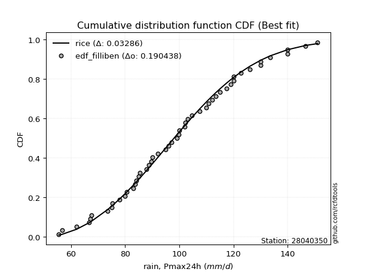</img></img>

</div>


### 10. EDF Jenkinson (1977)

The Jenkinson formula in hydrology is an empirical plotting position formula used to estimate the non-exceedance probability _(P)_ or return period _(T)_ of a given ordered observation within a sample. It is a widely used method in the frequency analysis of extreme events such as floods and rainfall, as it provides a distribution-free way to plot data. _a≈0.31_ and _b≈0.38_ are constants derived to approximate the median of the probability distribution for the given rank.

<div align="center">


$P=(m-a)/(n+b)$


</div>


**10.1. Empirical values**

<div align="center">

|                | 0                   | 1                    | 2                  | 3                   | 4                   | 5                   | 6                   | 7                  | 8                   | 9                   | 10                 | 11                  | 12                  | 13                 | 14                  | 15                 | 16                  | 17                 | 18                 | 19                 | 20                 | 21                  | 22                  | 23                 | 24                  | 25            | 26                 | 27                 | 28                 | 29                 | 30                 | 31                 | 32                 | 33                 | 34                 | 35                 | 36                 | 37                 | 38                | 39                 | 40                | 41                 | 42                 | 43                 | 44                 | 45                 | 46                 | 47                 | 48                 | 49                 | 50                 |
|:---------------|:--------------------|:---------------------|:-------------------|:--------------------|:--------------------|:--------------------|:--------------------|:-------------------|:--------------------|:--------------------|:-------------------|:--------------------|:--------------------|:-------------------|:--------------------|:-------------------|:--------------------|:-------------------|:-------------------|:-------------------|:-------------------|:--------------------|:--------------------|:-------------------|:--------------------|:--------------|:-------------------|:-------------------|:-------------------|:-------------------|:-------------------|:-------------------|:-------------------|:-------------------|:-------------------|:-------------------|:-------------------|:-------------------|:------------------|:-------------------|:------------------|:-------------------|:-------------------|:-------------------|:-------------------|:-------------------|:-------------------|:-------------------|:-------------------|:-------------------|:-------------------|
| date           | 2001                | 1997                 | 1972               | 2003                | 2022                | 2007                | 1989                | 2015               | 1986                | 2021                | 1980               | 1995                | 2012                | 1973               | 1984                | 2019               | 1990                | 2004               | 2000               | 1988               | 1974               | 2020                | 1994                | 2009               | 1978                | 1981          | 1985               | 2013               | 1977               | 2014               | 1998               | 2002               | 1991               | 2017               | 2008               | 1982               | 1999               | 2018               | 1993              | 2005               | 1983              | 2016               | 1987               | 2010               | 1992               | 2011               | 2006               | 1975               | 1979               | 1996               | 1976               |
| x              | 55.5                | 56.8                 | 62.04761218        | 66.6                | 67.0                | 67.5                | 73.5                | 75.0               | 75.2                | 78.0                | 80.0               | 80.5                | 83.0                | 83.62431256        | 84.0                | 85.0               | 85.3                | 87.8               | 88.8               | 89.5               | 90.0               | 92.0                | 95.0                | 96.0               | 97.0                | 99.0          | 99.8               | 100.0              | 102.0              | 102.10925342627452 | 103.0              | 104.5              | 107.5              | 110.0              | 110.7              | 112.0              | 113.5              | 115.0              | 117.3             | 119.0              | 120.0             | 120.0              | 122.6              | 126.0              | 130.0              | 130.0              | 133.5              | 140.0              | 140.0              | 146.5              | 151.0              |
| m              | 1                   | 2                    | 3                  | 4                   | 5                   | 6                   | 7                   | 8                  | 9                   | 10                  | 11                 | 12                  | 13                  | 14                 | 15                  | 16                 | 17                  | 18                 | 19                 | 20                 | 21                 | 22                  | 23                  | 24                 | 25                  | 26            | 27                 | 28                 | 29                 | 30                 | 31                 | 32                 | 33                 | 34                 | 35                 | 36                 | 37                 | 38                 | 39                | 40                 | 41                | 42                 | 43                 | 44                 | 45                 | 46                 | 47                 | 48                 | 49                 | 50                 | 51                 |
| empirical_dist | edf_jenkinson       | edf_jenkinson        | edf_jenkinson      | edf_jenkinson       | edf_jenkinson       | edf_jenkinson       | edf_jenkinson       | edf_jenkinson      | edf_jenkinson       | edf_jenkinson       | edf_jenkinson      | edf_jenkinson       | edf_jenkinson       | edf_jenkinson      | edf_jenkinson       | edf_jenkinson      | edf_jenkinson       | edf_jenkinson      | edf_jenkinson      | edf_jenkinson      | edf_jenkinson      | edf_jenkinson       | edf_jenkinson       | edf_jenkinson      | edf_jenkinson       | edf_jenkinson | edf_jenkinson      | edf_jenkinson      | edf_jenkinson      | edf_jenkinson      | edf_jenkinson      | edf_jenkinson      | edf_jenkinson      | edf_jenkinson      | edf_jenkinson      | edf_jenkinson      | edf_jenkinson      | edf_jenkinson      | edf_jenkinson     | edf_jenkinson      | edf_jenkinson     | edf_jenkinson      | edf_jenkinson      | edf_jenkinson      | edf_jenkinson      | edf_jenkinson      | edf_jenkinson      | edf_jenkinson      | edf_jenkinson      | edf_jenkinson      | edf_jenkinson      |
| empirical      | 0.01342934994161152 | 0.032892175943947055 | 0.0523550019462826 | 0.07181782794861813 | 0.09128065395095368 | 0.11074347995328922 | 0.13020630595562477 | 0.1496691319579603 | 0.16913195796029581 | 0.18859478396263135 | 0.2080576099649669 | 0.22752043596730243 | 0.24698326196963796 | 0.2664460879719735 | 0.28590891397430906 | 0.3053717399766446 | 0.32483456597898014 | 0.3442973919813157 | 0.3637602179836512 | 0.3832230439859868 | 0.4026858699883223 | 0.42214869599065785 | 0.44161152199299336 | 0.4610743479953289 | 0.48053717399766444 | 0.5           | 0.5194628260023355 | 0.5389256520046711 | 0.5583884780070066 | 0.5778513040093421 | 0.5973141300116777 | 0.6167769560140133 | 0.6362397820163487 | 0.6557026080186842 | 0.6751654340210198 | 0.6946282600233553 | 0.7140910860256908 | 0.7335539120280263 | 0.753016738030362 | 0.7724795640326975 | 0.791942390035033 | 0.8114052160373686 | 0.8308680420397041 | 0.8503308680420396 | 0.8697936940443751 | 0.8892565200467107 | 0.9087193460490463 | 0.9281821720513818 | 0.9476449980537173 | 0.9671078240560529 | 0.9865706500583884 |
| empirical_tr   | 1.0136121522982837  | 1.034010867377742    | 1.055247484082974  | 1.0773747116795973  | 1.1004497751124438  | 1.1245349091704968  | 1.1496979189975387  | 1.1760128175783933 | 1.203560552822675   | 1.2324298392899977  | 1.2627181125583682 | 1.2945326278659612  | 1.3279917291289738  | 1.363226319978774  | 1.4003815753611337  | 1.4396189408797981 | 1.4811184779475355  | 1.525081626595429  | 1.5717344753747322 | 1.6213316503628903 | 1.674160964483545  | 1.730549006399461   | 1.7908678982223771  | 1.8555435175153487 | 1.9250655676283253  | 2.0           | 2.081004455245038  | 2.168847615027438  | 2.2644336712208024 | 2.3688335638543108 | 2.4833252779120345 | 2.6094464195022855 | 2.749063670411984  | 2.9044657998869408 | 3.0784901138406227 | 3.2746972594008916 | 3.497617426820965  | 3.7531044558071565 | 4.048857368006304 | 4.395209580838322  | 4.806361085126284 | 5.302373581011351  | 5.91254315304948   | 6.681404421326394  | 7.680119581464866  | 9.029876977152897  | 10.955223880597007 | 13.924119241192392 | 19.10037174721185  | 30.40236686390528  | 74.46376811594159  |

</div>


**10.2. Kolmogorov-Smirnov fit test (sorted by Δ)**


<div align="center">

|                | 0                   | 1                   | 2                   | 3                    | 4                   | 5                    | 6                   | 7                   | 8                   | 9                   | 10                   | 11                  | 12                   | 13                  | 14                  | 15                   | 16                   | 17                  | 18                  | 19                  | 20                   | 21                   | 22                  | 23                  | 24                  | 25                  | 26                   | 27                  | 28                  | 29                   | 30                  | 31                   | 32                  | 33                  | 34                   | 35                   | 36                  | 37                  | 38                  | 39                  | 40                   | 41                   | 42                   | 43                  | 44                   | 45                   | 46                   | 47                   | 48                  | 49                  | 50                  | 51                  | 52                  | 53                  | 54                  | 55                  | 56                    | 57                  | 58                  | 59                  | 60                  | 61                  | 62                  | 63                  | 64                  | 65                  | 66                  | 67                  | 68                  | 69                  | 70                  | 71                  | 72                  | 73                  | 74                  | 75                  | 76                  | 77                  | 78                  | 79                  | 80                  | 81                  | 82                  | 83                  | 84                  | 85                  | 86                  | 87                  |
|:---------------|:--------------------|:--------------------|:--------------------|:---------------------|:--------------------|:---------------------|:--------------------|:--------------------|:--------------------|:--------------------|:---------------------|:--------------------|:---------------------|:--------------------|:--------------------|:---------------------|:---------------------|:--------------------|:--------------------|:--------------------|:---------------------|:---------------------|:--------------------|:--------------------|:--------------------|:--------------------|:---------------------|:--------------------|:--------------------|:---------------------|:--------------------|:---------------------|:--------------------|:--------------------|:---------------------|:---------------------|:--------------------|:--------------------|:--------------------|:--------------------|:---------------------|:---------------------|:---------------------|:--------------------|:---------------------|:---------------------|:---------------------|:---------------------|:--------------------|:--------------------|:--------------------|:--------------------|:--------------------|:--------------------|:--------------------|:--------------------|:----------------------|:--------------------|:--------------------|:--------------------|:--------------------|:--------------------|:--------------------|:--------------------|:--------------------|:--------------------|:--------------------|:--------------------|:--------------------|:--------------------|:--------------------|:--------------------|:--------------------|:--------------------|:--------------------|:--------------------|:--------------------|:--------------------|:--------------------|:--------------------|:--------------------|:--------------------|:--------------------|:--------------------|:--------------------|:--------------------|:--------------------|:--------------------|
| station        | 28040350            | 28040350            | 28040350            | 28040350             | 28040350            | 28040350             | 28040350            | 28040350            | 28040350            | 28040350            | 28040350             | 28040350            | 28040350             | 28040350            | 28040350            | 28040350             | 28040350             | 28040350            | 28040350            | 28040350            | 28040350             | 28040350             | 28040350            | 28040350            | 28040350            | 28040350            | 28040350             | 28040350            | 28040350            | 28040350             | 28040350            | 28040350             | 28040350            | 28040350            | 28040350             | 28040350             | 28040350            | 28040350            | 28040350            | 28040350            | 28040350             | 28040350             | 28040350             | 28040350            | 28040350             | 28040350             | 28040350             | 28040350             | 28040350            | 28040350            | 28040350            | 28040350            | 28040350            | 28040350            | 28040350            | 28040350            | 28040350              | 28040350            | 28040350            | 28040350            | 28040350            | 28040350            | 28040350            | 28040350            | 28040350            | 28040350            | 28040350            | 28040350            | 28040350            | 28040350            | 28040350            | 28040350            | 28040350            | 28040350            | 28040350            | 28040350            | 28040350            | 28040350            | 28040350            | 28040350            | 28040350            | 28040350            | 28040350            | 28040350            | 28040350            | 28040350            | 28040350            | 28040350            |
| empirical_dist | edf_jenkinson       | edf_jenkinson       | edf_jenkinson       | edf_jenkinson        | edf_jenkinson       | edf_jenkinson        | edf_jenkinson       | edf_jenkinson       | edf_jenkinson       | edf_jenkinson       | edf_jenkinson        | edf_jenkinson       | edf_jenkinson        | edf_jenkinson       | edf_jenkinson       | edf_jenkinson        | edf_jenkinson        | edf_jenkinson       | edf_jenkinson       | edf_jenkinson       | edf_jenkinson        | edf_jenkinson        | edf_jenkinson       | edf_jenkinson       | edf_jenkinson       | edf_jenkinson       | edf_jenkinson        | edf_jenkinson       | edf_jenkinson       | edf_jenkinson        | edf_jenkinson       | edf_jenkinson        | edf_jenkinson       | edf_jenkinson       | edf_jenkinson        | edf_jenkinson        | edf_jenkinson       | edf_jenkinson       | edf_jenkinson       | edf_jenkinson       | edf_jenkinson        | edf_jenkinson        | edf_jenkinson        | edf_jenkinson       | edf_jenkinson        | edf_jenkinson        | edf_jenkinson        | edf_jenkinson        | edf_jenkinson       | edf_jenkinson       | edf_jenkinson       | edf_jenkinson       | edf_jenkinson       | edf_jenkinson       | edf_jenkinson       | edf_jenkinson       | edf_jenkinson         | edf_jenkinson       | edf_jenkinson       | edf_jenkinson       | edf_jenkinson       | edf_jenkinson       | edf_jenkinson       | edf_jenkinson       | edf_jenkinson       | edf_jenkinson       | edf_jenkinson       | edf_jenkinson       | edf_jenkinson       | edf_jenkinson       | edf_jenkinson       | edf_jenkinson       | edf_jenkinson       | edf_jenkinson       | edf_jenkinson       | edf_jenkinson       | edf_jenkinson       | edf_jenkinson       | edf_jenkinson       | edf_jenkinson       | edf_jenkinson       | edf_jenkinson       | edf_jenkinson       | edf_jenkinson       | edf_jenkinson       | edf_jenkinson       | edf_jenkinson       | edf_jenkinson       |
| p_dist         | rice                | weibull_min         | logpearson3         | f                    | erlang              | gamma                | logweibull_min      | maxwell             | fatiguelife         | alpha               | nakagami             | invgamma            | johnsonsu            | ncf                 | logloggamma         | lognct               | nct                  | logncf              | invweibull          | logjohnsonsu        | rayleigh             | lognakagami          | genlogistic         | pearson3            | fisk                | logt                | logcrystalball       | lognorm             | lognorm             | logexponnorm         | loglognorm          | logfatiguelife       | logfisk             | logrice             | logf                 | logerlang            | mielke              | loggenlogistic      | loggamma            | loggamma            | logalpha             | loginvgamma          | exponnorm            | logmielke           | betaprime            | t                    | norm                 | crystalball          | kstwobign           | logbetaprime        | invgauss            | loginvgauss         | loglogistic         | logmaxwell          | gumbel_r            | logistic            | loglaplace_asymmetric | laplace_asymmetric  | lograyleigh         | loggumbel_l         | loghypsecant        | hypsecant           | moyal               | loginvweibull       | loglaplace          | halflogistic        | halfnorm            | loghalfnorm         | loggumbel_r         | logkstwobign        | gumbel_l            | laplace             | logmoyal            | loghalflogistic     | wald                | loggenexpon         | logwald             | expon               | genexpon            | gibrat              | loggibrat           | loggompertz         | logtruncnorm        | logexpon            | logchi2             | gompertz            | chi2                | truncnorm           |
| delta          | 0.03288822154677451 | 0.03379246980780155 | 0.03668369353624723 | 0.036885147904263005 | 0.03731139762092206 | 0.037311727377669746 | 0.03736691369848005 | 0.03825969287899847 | 0.03864134112258272 | 0.03874656375534041 | 0.038942744560401255 | 0.03931714348004123 | 0.040256152300747694 | 0.04047309255739129 | 0.0417573747463349  | 0.045434910993541466 | 0.045707180005749304 | 0.04716090231282011 | 0.04726404153227681 | 0.04753244108309351 | 0.047676788032264036 | 0.047727262092378764 | 0.04779061484937075 | 0.04780773369720259 | 0.04818291046706513 | 0.0481910946315568  | 0.048193589216624866 | 0.04819429802716013 | 0.04819429802716013 | 0.048194578485240114 | 0.04819502390014618 | 0.048481169540424696 | 0.04866507971254297 | 0.04985039495196664 | 0.049926918326567704 | 0.050350120505900486 | 0.05167183820295407 | 0.05172539901014195 | 0.05179904421273729 | 0.05179904421273729 | 0.052032024398329435 | 0.054511290732437656 | 0.056343185259064066 | 0.05647151227779679 | 0.057895540176633786 | 0.058621634981793846 | 0.058673677197695784 | 0.058673680295801056 | 0.0618300630159484  | 0.06217148211237078 | 0.0639030295015186  | 0.0644542740169386  | 0.06972505556088238 | 0.07140556095252026 | 0.07457471710175212 | 0.0771198631175854  | 0.07757677570295857   | 0.07939535629792044 | 0.08142949843005187 | 0.08217387368534124 | 0.08516936082207183 | 0.09133075907918664 | 0.09459046812226862 | 0.09474469680332631 | 0.10988162737840967 | 0.11074347995328922 | 0.11074347995328922 | 0.11074347995328922 | 0.1108185176050196  | 0.1125182552121747  | 0.11768419432697552 | 0.1193173544032497  | 0.13594635931346932 | 0.13662689851249787 | 0.18687409709437752 | 0.18885347208643663 | 0.20567602392591866 | 0.2195991973962075  | 0.22652623390821983 | 0.22752043596730243 | 0.23396887481390205 | 0.24177253312027888 | 0.26814087967238953 | 0.27502201492049183 | 0.35103054142087475 | 0.8157537527006872  | 0.9395615132925224  | 0.9865706500583885  |
| deltao         | 0.19043809142780935 | 0.19043809142780935 | 0.19043809142780935 | 0.19043809142780935  | 0.19043809142780935 | 0.19043809142780935  | 0.19043809142780935 | 0.19043809142780935 | 0.19043809142780935 | 0.19043809142780935 | 0.19043809142780935  | 0.19043809142780935 | 0.19043809142780935  | 0.19043809142780935 | 0.19043809142780935 | 0.19043809142780935  | 0.19043809142780935  | 0.19043809142780935 | 0.19043809142780935 | 0.19043809142780935 | 0.19043809142780935  | 0.19043809142780935  | 0.19043809142780935 | 0.19043809142780935 | 0.19043809142780935 | 0.19043809142780935 | 0.19043809142780935  | 0.19043809142780935 | 0.19043809142780935 | 0.19043809142780935  | 0.19043809142780935 | 0.19043809142780935  | 0.19043809142780935 | 0.19043809142780935 | 0.19043809142780935  | 0.19043809142780935  | 0.19043809142780935 | 0.19043809142780935 | 0.19043809142780935 | 0.19043809142780935 | 0.19043809142780935  | 0.19043809142780935  | 0.19043809142780935  | 0.19043809142780935 | 0.19043809142780935  | 0.19043809142780935  | 0.19043809142780935  | 0.19043809142780935  | 0.19043809142780935 | 0.19043809142780935 | 0.19043809142780935 | 0.19043809142780935 | 0.19043809142780935 | 0.19043809142780935 | 0.19043809142780935 | 0.19043809142780935 | 0.19043809142780935   | 0.19043809142780935 | 0.19043809142780935 | 0.19043809142780935 | 0.19043809142780935 | 0.19043809142780935 | 0.19043809142780935 | 0.19043809142780935 | 0.19043809142780935 | 0.19043809142780935 | 0.19043809142780935 | 0.19043809142780935 | 0.19043809142780935 | 0.19043809142780935 | 0.19043809142780935 | 0.19043809142780935 | 0.19043809142780935 | 0.19043809142780935 | 0.19043809142780935 | 0.19043809142780935 | 0.19043809142780935 | 0.19043809142780935 | 0.19043809142780935 | 0.19043809142780935 | 0.19043809142780935 | 0.19043809142780935 | 0.19043809142780935 | 0.19043809142780935 | 0.19043809142780935 | 0.19043809142780935 | 0.19043809142780935 | 0.19043809142780935 |
| eval           | Δo > Δ              | Δo > Δ              | Δo > Δ              | Δo > Δ               | Δo > Δ              | Δo > Δ               | Δo > Δ              | Δo > Δ              | Δo > Δ              | Δo > Δ              | Δo > Δ               | Δo > Δ              | Δo > Δ               | Δo > Δ              | Δo > Δ              | Δo > Δ               | Δo > Δ               | Δo > Δ              | Δo > Δ              | Δo > Δ              | Δo > Δ               | Δo > Δ               | Δo > Δ              | Δo > Δ              | Δo > Δ              | Δo > Δ              | Δo > Δ               | Δo > Δ              | Δo > Δ              | Δo > Δ               | Δo > Δ              | Δo > Δ               | Δo > Δ              | Δo > Δ              | Δo > Δ               | Δo > Δ               | Δo > Δ              | Δo > Δ              | Δo > Δ              | Δo > Δ              | Δo > Δ               | Δo > Δ               | Δo > Δ               | Δo > Δ              | Δo > Δ               | Δo > Δ               | Δo > Δ               | Δo > Δ               | Δo > Δ              | Δo > Δ              | Δo > Δ              | Δo > Δ              | Δo > Δ              | Δo > Δ              | Δo > Δ              | Δo > Δ              | Δo > Δ                | Δo > Δ              | Δo > Δ              | Δo > Δ              | Δo > Δ              | Δo > Δ              | Δo > Δ              | Δo > Δ              | Δo > Δ              | Δo > Δ              | Δo > Δ              | Δo > Δ              | Δo > Δ              | Δo > Δ              | Δo > Δ              | Δo > Δ              | Δo > Δ              | Δo > Δ              | Δo > Δ              | Δo > Δ              | Δo <= Δ             | Δo <= Δ             | Δo <= Δ             | Δo <= Δ             | Δo <= Δ             | Δo <= Δ             | Δo <= Δ             | Δo <= Δ             | Δo <= Δ             | Δo <= Δ             | Δo <= Δ             | Δo <= Δ             |
| fit            | 1                   | 1                   | 1                   | 1                    | 1                   | 1                    | 1                   | 1                   | 1                   | 1                   | 1                    | 1                   | 1                    | 1                   | 1                   | 1                    | 1                    | 1                   | 1                   | 1                   | 1                    | 1                    | 1                   | 1                   | 1                   | 1                   | 1                    | 1                   | 1                   | 1                    | 1                   | 1                    | 1                   | 1                   | 1                    | 1                    | 1                   | 1                   | 1                   | 1                   | 1                    | 1                    | 1                    | 1                   | 1                    | 1                    | 1                    | 1                    | 1                   | 1                   | 1                   | 1                   | 1                   | 1                   | 1                   | 1                   | 1                     | 1                   | 1                   | 1                   | 1                   | 1                   | 1                   | 1                   | 1                   | 1                   | 1                   | 1                   | 1                   | 1                   | 1                   | 1                   | 1                   | 1                   | 1                   | 1                   | 0                   | 0                   | 0                   | 0                   | 0                   | 0                   | 0                   | 0                   | 0                   | 0                   | 0                   | 0                   |
| n              | 51                  | 51                  | 51                  | 51                   | 51                  | 51                   | 51                  | 51                  | 51                  | 51                  | 51                   | 51                  | 51                   | 51                  | 51                  | 51                   | 51                   | 51                  | 51                  | 51                  | 51                   | 51                   | 51                  | 51                  | 51                  | 51                  | 51                   | 51                  | 51                  | 51                   | 51                  | 51                   | 51                  | 51                  | 51                   | 51                   | 51                  | 51                  | 51                  | 51                  | 51                   | 51                   | 51                   | 51                  | 51                   | 51                   | 51                   | 51                   | 51                  | 51                  | 51                  | 51                  | 51                  | 51                  | 51                  | 51                  | 51                    | 51                  | 51                  | 51                  | 51                  | 51                  | 51                  | 51                  | 51                  | 51                  | 51                  | 51                  | 51                  | 51                  | 51                  | 51                  | 51                  | 51                  | 51                  | 51                  | 51                  | 51                  | 51                  | 51                  | 51                  | 51                  | 51                  | 51                  | 51                  | 51                  | 51                  | 51                  |
| best_fit       | 1                   | 0                   | 0                   | 0                    | 0                   | 0                    | 0                   | 0                   | 0                   | 0                   | 0                    | 0                   | 0                    | 0                   | 0                   | 0                    | 0                    | 0                   | 0                   | 0                   | 0                    | 0                    | 0                   | 0                   | 0                   | 0                   | 0                    | 0                   | 0                   | 0                    | 0                   | 0                    | 0                   | 0                   | 0                    | 0                    | 0                   | 0                   | 0                   | 0                   | 0                    | 0                    | 0                    | 0                   | 0                    | 0                    | 0                    | 0                    | 0                   | 0                   | 0                   | 0                   | 0                   | 0                   | 0                   | 0                   | 0                     | 0                   | 0                   | 0                   | 0                   | 0                   | 0                   | 0                   | 0                   | 0                   | 0                   | 0                   | 0                   | 0                   | 0                   | 0                   | 0                   | 0                   | 0                   | 0                   | 0                   | 0                   | 0                   | 0                   | 0                   | 0                   | 0                   | 0                   | 0                   | 0                   | 0                   | 0                   |
| best_fit_sort  | 1                   | 2                   | 3                   | 4                    | 5                   | 6                    | 7                   | 8                   | 9                   | 10                  | 11                   | 12                  | 13                   | 14                  | 15                  | 16                   | 17                   | 18                  | 19                  | 20                  | 21                   | 22                   | 23                  | 24                  | 25                  | 26                  | 27                   | 28                  | 29                  | 30                   | 31                  | 32                   | 33                  | 34                  | 35                   | 36                   | 37                  | 38                  | 39                  | 40                  | 41                   | 42                   | 43                   | 44                  | 45                   | 46                   | 47                   | 48                   | 49                  | 50                  | 51                  | 52                  | 53                  | 54                  | 55                  | 56                  | 57                    | 58                  | 59                  | 60                  | 61                  | 62                  | 63                  | 64                  | 65                  | 66                  | 67                  | 68                  | 69                  | 70                  | 71                  | 72                  | 73                  | 74                  | 75                  | 76                  | 77                  | 78                  | 79                  | 80                  | 81                  | 82                  | 83                  | 84                  | 85                  | 86                  | 87                  | 88                  |

</div>


<div align="center">

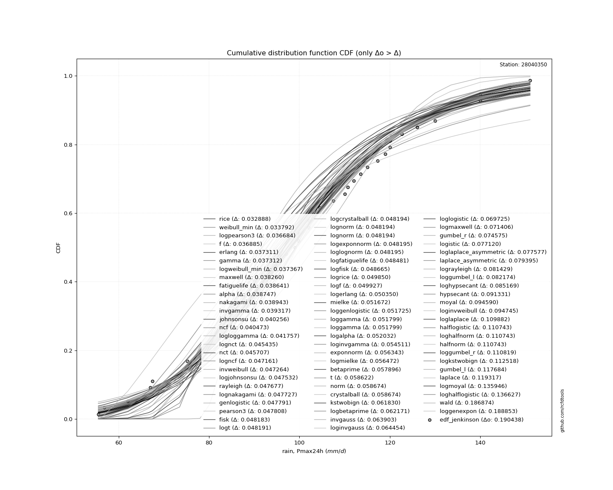</img>

</div>


**10.3. Best fit**

<div align="center">

|   id |   station | empirical_dist   | p_dist   |     delta |   deltao | eval   |   fit |   n |   best_fit |   best_fit_sort |
|-----:|----------:|:-----------------|:---------|----------:|---------:|:-------|------:|----:|-----------:|----------------:|
|    0 |  28040350 | edf_jenkinson    | rice     | 0.0328882 | 0.190438 | Δo > Δ |     1 |  51 |          1 |               1 |

</div>


<div align="center">

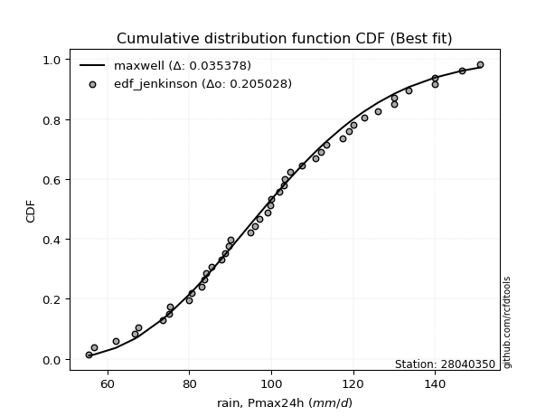</img>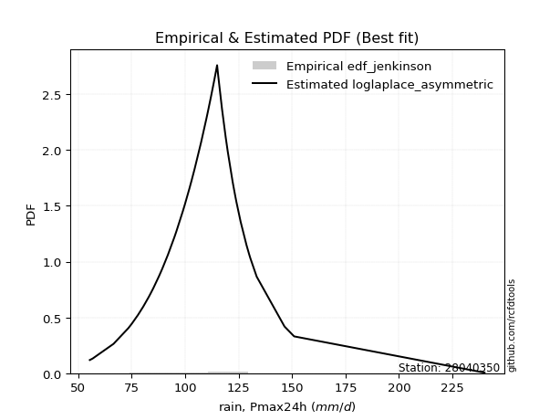</img>

</div>


### 11. EDF Cunnane (1978)

Cunnane´s work in statistical hydrology has focused on the performance and evaluation of different probability distributions (such as GEV, Gumbel, Lognormal) for flood frequency estimation. _b_ is a constant, typically set to 0.4.

<div align="center">


$P=(m-b)/(n+1-2b)$


</div>


**11.1. Empirical values**

<div align="center">

|                | 0                    | 1                 | 2                  | 3                  | 4                   | 5                   | 6                   | 7                   | 8                   | 9                   | 10                  | 11                  | 12                  | 13                 | 14                 | 15                 | 16                 | 17                 | 18                 | 19                | 20                | 21                 | 22                 | 23                | 24                 | 25          | 26                 | 27                | 28                | 29                 | 30                 | 31                 | 32                | 33                | 34                 | 35                | 36                | 37                | 38                | 39                | 40                | 41                | 42                | 43                 | 44                | 45                | 46                 | 47                 | 48                 | 49          | 50                |
|:---------------|:---------------------|:------------------|:-------------------|:-------------------|:--------------------|:--------------------|:--------------------|:--------------------|:--------------------|:--------------------|:--------------------|:--------------------|:--------------------|:-------------------|:-------------------|:-------------------|:-------------------|:-------------------|:-------------------|:------------------|:------------------|:-------------------|:-------------------|:------------------|:-------------------|:------------|:-------------------|:------------------|:------------------|:-------------------|:-------------------|:-------------------|:------------------|:------------------|:-------------------|:------------------|:------------------|:------------------|:------------------|:------------------|:------------------|:------------------|:------------------|:-------------------|:------------------|:------------------|:-------------------|:-------------------|:-------------------|:------------|:------------------|
| date           | 2001                 | 1997              | 1972               | 2003               | 2022                | 2007                | 1989                | 2015                | 1986                | 2021                | 1980                | 1995                | 2012                | 1973               | 1984               | 2019               | 1990               | 2004               | 2000               | 1988              | 1974              | 2020               | 1994               | 2009              | 1978               | 1981        | 1985               | 2013              | 1977              | 2014               | 1998               | 2002               | 1991              | 2017              | 2008               | 1982              | 1999              | 2018              | 1993              | 2005              | 1983              | 2016              | 1987              | 2010               | 1992              | 2011              | 2006               | 1975               | 1979               | 1996        | 1976              |
| x              | 55.5                 | 56.8              | 62.04761218        | 66.6               | 67.0                | 67.5                | 73.5                | 75.0                | 75.2                | 78.0                | 80.0                | 80.5                | 83.0                | 83.62431256        | 84.0               | 85.0               | 85.3               | 87.8               | 88.8               | 89.5              | 90.0              | 92.0               | 95.0               | 96.0              | 97.0               | 99.0        | 99.8               | 100.0             | 102.0             | 102.10925342627452 | 103.0              | 104.5              | 107.5             | 110.0             | 110.7              | 112.0             | 113.5             | 115.0             | 117.3             | 119.0             | 120.0             | 120.0             | 122.6             | 126.0              | 130.0             | 130.0             | 133.5              | 140.0              | 140.0              | 146.5       | 151.0             |
| m              | 1                    | 2                 | 3                  | 4                  | 5                   | 6                   | 7                   | 8                   | 9                   | 10                  | 11                  | 12                  | 13                  | 14                 | 15                 | 16                 | 17                 | 18                 | 19                 | 20                | 21                | 22                 | 23                 | 24                | 25                 | 26          | 27                 | 28                | 29                | 30                 | 31                 | 32                 | 33                | 34                | 35                 | 36                | 37                | 38                | 39                | 40                | 41                | 42                | 43                | 44                 | 45                | 46                | 47                 | 48                 | 49                 | 50          | 51                |
| empirical_dist | edf_cunnane          | edf_cunnane       | edf_cunnane        | edf_cunnane        | edf_cunnane         | edf_cunnane         | edf_cunnane         | edf_cunnane         | edf_cunnane         | edf_cunnane         | edf_cunnane         | edf_cunnane         | edf_cunnane         | edf_cunnane        | edf_cunnane        | edf_cunnane        | edf_cunnane        | edf_cunnane        | edf_cunnane        | edf_cunnane       | edf_cunnane       | edf_cunnane        | edf_cunnane        | edf_cunnane       | edf_cunnane        | edf_cunnane | edf_cunnane        | edf_cunnane       | edf_cunnane       | edf_cunnane        | edf_cunnane        | edf_cunnane        | edf_cunnane       | edf_cunnane       | edf_cunnane        | edf_cunnane       | edf_cunnane       | edf_cunnane       | edf_cunnane       | edf_cunnane       | edf_cunnane       | edf_cunnane       | edf_cunnane       | edf_cunnane        | edf_cunnane       | edf_cunnane       | edf_cunnane        | edf_cunnane        | edf_cunnane        | edf_cunnane | edf_cunnane       |
| empirical      | 0.011718749999999998 | 0.03125           | 0.05078125         | 0.0703125          | 0.08984374999999999 | 0.10937499999999999 | 0.12890624999999997 | 0.14843749999999997 | 0.16796874999999997 | 0.18749999999999997 | 0.20703124999999997 | 0.22656249999999997 | 0.24609374999999997 | 0.265625           | 0.28515625         | 0.3046875          | 0.32421875         | 0.34375            | 0.36328125         | 0.3828125         | 0.40234375        | 0.421875           | 0.44140625         | 0.4609375         | 0.48046875         | 0.5         | 0.51953125         | 0.5390625         | 0.55859375        | 0.578125           | 0.59765625         | 0.6171875          | 0.63671875        | 0.65625           | 0.67578125         | 0.6953125         | 0.71484375        | 0.734375          | 0.75390625        | 0.7734375         | 0.79296875        | 0.8125            | 0.83203125        | 0.8515625          | 0.87109375        | 0.890625          | 0.91015625         | 0.9296875          | 0.94921875         | 0.96875     | 0.98828125        |
| empirical_tr   | 1.0118577075098814   | 1.032258064516129 | 1.0534979423868314 | 1.0756302521008403 | 1.0987124463519313  | 1.1228070175438596  | 1.147982062780269   | 1.1743119266055047  | 1.2018779342723005  | 1.2307692307692308  | 1.2610837438423645  | 1.292929292929293   | 1.3264248704663213  | 1.3617021276595744 | 1.3989071038251366 | 1.4382022471910112 | 1.4797687861271676 | 1.5238095238095237 | 1.5705521472392638 | 1.620253164556962 | 1.673202614379085 | 1.7297297297297298 | 1.7902097902097902 | 1.855072463768116 | 1.9248120300751879 | 2.0         | 2.0813008130081303 | 2.169491525423729 | 2.265486725663717 | 2.3703703703703702 | 2.4854368932038833 | 2.6122448979591835 | 2.752688172043011 | 2.909090909090909 | 3.0843373493975905 | 3.282051282051282 | 3.506849315068493 | 3.764705882352941 | 4.063492063492063 | 4.413793103448276 | 4.830188679245283 | 5.333333333333333 | 5.953488372093023 | 6.7368421052631575 | 7.757575757575758 | 9.142857142857142 | 11.130434782608695 | 14.222222222222221 | 19.692307692307693 | 32.0        | 85.33333333333333 |

</div>


**11.2. Kolmogorov-Smirnov fit test (sorted by Δ)**


<div align="center">

|                | 0                   | 1                   | 2                    | 3                   | 4                    | 5                   | 6                    | 7                    | 8                   | 9                   | 10                   | 11                  | 12                  | 13                   | 14                  | 15                  | 16                  | 17                   | 18                  | 19                  | 20                  | 21                   | 22                  | 23                   | 24                  | 25                  | 26                  | 27                  | 28                  | 29                  | 30                  | 31                  | 32                   | 33                  | 34                  | 35                  | 36                   | 37                   | 38                  | 39                  | 40                  | 41                   | 42                  | 43                  | 44                  | 45                  | 46                  | 47                  | 48                   | 49                  | 50                  | 51                  | 52                  | 53                  | 54                  | 55                  | 56                    | 57                  | 58                  | 59                  | 60                  | 61                  | 62                  | 63                  | 64                  | 65                  | 66                  | 67                  | 68                  | 69                  | 70                  | 71                  | 72                  | 73                  | 74                  | 75                  | 76                  | 77                  | 78                  | 79                  | 80                  | 81                  | 82                  | 83                  | 84                  | 85                  | 86                  | 87                  |
|:---------------|:--------------------|:--------------------|:---------------------|:--------------------|:---------------------|:--------------------|:---------------------|:---------------------|:--------------------|:--------------------|:---------------------|:--------------------|:--------------------|:---------------------|:--------------------|:--------------------|:--------------------|:---------------------|:--------------------|:--------------------|:--------------------|:---------------------|:--------------------|:---------------------|:--------------------|:--------------------|:--------------------|:--------------------|:--------------------|:--------------------|:--------------------|:--------------------|:---------------------|:--------------------|:--------------------|:--------------------|:---------------------|:---------------------|:--------------------|:--------------------|:--------------------|:---------------------|:--------------------|:--------------------|:--------------------|:--------------------|:--------------------|:--------------------|:---------------------|:--------------------|:--------------------|:--------------------|:--------------------|:--------------------|:--------------------|:--------------------|:----------------------|:--------------------|:--------------------|:--------------------|:--------------------|:--------------------|:--------------------|:--------------------|:--------------------|:--------------------|:--------------------|:--------------------|:--------------------|:--------------------|:--------------------|:--------------------|:--------------------|:--------------------|:--------------------|:--------------------|:--------------------|:--------------------|:--------------------|:--------------------|:--------------------|:--------------------|:--------------------|:--------------------|:--------------------|:--------------------|:--------------------|:--------------------|
| station        | 28040350            | 28040350            | 28040350             | 28040350            | 28040350             | 28040350            | 28040350             | 28040350             | 28040350            | 28040350            | 28040350             | 28040350            | 28040350            | 28040350             | 28040350            | 28040350            | 28040350            | 28040350             | 28040350            | 28040350            | 28040350            | 28040350             | 28040350            | 28040350             | 28040350            | 28040350            | 28040350            | 28040350            | 28040350            | 28040350            | 28040350            | 28040350            | 28040350             | 28040350            | 28040350            | 28040350            | 28040350             | 28040350             | 28040350            | 28040350            | 28040350            | 28040350             | 28040350            | 28040350            | 28040350            | 28040350            | 28040350            | 28040350            | 28040350             | 28040350            | 28040350            | 28040350            | 28040350            | 28040350            | 28040350            | 28040350            | 28040350              | 28040350            | 28040350            | 28040350            | 28040350            | 28040350            | 28040350            | 28040350            | 28040350            | 28040350            | 28040350            | 28040350            | 28040350            | 28040350            | 28040350            | 28040350            | 28040350            | 28040350            | 28040350            | 28040350            | 28040350            | 28040350            | 28040350            | 28040350            | 28040350            | 28040350            | 28040350            | 28040350            | 28040350            | 28040350            | 28040350            | 28040350            |
| empirical_dist | edf_cunnane         | edf_cunnane         | edf_cunnane          | edf_cunnane         | edf_cunnane          | edf_cunnane         | edf_cunnane          | edf_cunnane          | edf_cunnane         | edf_cunnane         | edf_cunnane          | edf_cunnane         | edf_cunnane         | edf_cunnane          | edf_cunnane         | edf_cunnane         | edf_cunnane         | edf_cunnane          | edf_cunnane         | edf_cunnane         | edf_cunnane         | edf_cunnane          | edf_cunnane         | edf_cunnane          | edf_cunnane         | edf_cunnane         | edf_cunnane         | edf_cunnane         | edf_cunnane         | edf_cunnane         | edf_cunnane         | edf_cunnane         | edf_cunnane          | edf_cunnane         | edf_cunnane         | edf_cunnane         | edf_cunnane          | edf_cunnane          | edf_cunnane         | edf_cunnane         | edf_cunnane         | edf_cunnane          | edf_cunnane         | edf_cunnane         | edf_cunnane         | edf_cunnane         | edf_cunnane         | edf_cunnane         | edf_cunnane          | edf_cunnane         | edf_cunnane         | edf_cunnane         | edf_cunnane         | edf_cunnane         | edf_cunnane         | edf_cunnane         | edf_cunnane           | edf_cunnane         | edf_cunnane         | edf_cunnane         | edf_cunnane         | edf_cunnane         | edf_cunnane         | edf_cunnane         | edf_cunnane         | edf_cunnane         | edf_cunnane         | edf_cunnane         | edf_cunnane         | edf_cunnane         | edf_cunnane         | edf_cunnane         | edf_cunnane         | edf_cunnane         | edf_cunnane         | edf_cunnane         | edf_cunnane         | edf_cunnane         | edf_cunnane         | edf_cunnane         | edf_cunnane         | edf_cunnane         | edf_cunnane         | edf_cunnane         | edf_cunnane         | edf_cunnane         | edf_cunnane         | edf_cunnane         |
| p_dist         | weibull_min         | rice                | logpearson3          | f                   | erlang               | gamma               | logweibull_min       | maxwell              | fatiguelife         | nakagami            | alpha                | invgamma            | johnsonsu           | ncf                  | logloggamma         | lognct              | nct                 | rayleigh             | logncf              | logjohnsonsu        | lognakagami         | genlogistic          | invweibull          | pearson3             | fisk                | logt                | logcrystalball      | lognorm             | lognorm             | logexponnorm        | loglognorm          | logfatiguelife      | logfisk              | logrice             | logf                | logerlang           | loggamma             | loggamma             | mielke              | loggenlogistic      | logalpha            | loginvgamma          | exponnorm           | logmielke           | betaprime           | t                   | norm                | crystalball         | logbetaprime         | kstwobign           | invgauss            | loginvgauss         | loglogistic         | logmaxwell          | gumbel_r            | logistic            | loglaplace_asymmetric | laplace_asymmetric  | lograyleigh         | loggumbel_l         | loghypsecant        | hypsecant           | moyal               | loginvweibull       | loglaplace          | halfnorm            | halflogistic        | loghalfnorm         | loggumbel_r         | logkstwobign        | gumbel_l            | laplace             | logmoyal            | loghalflogistic     | wald                | loggenexpon         | logwald             | expon               | gibrat              | genexpon            | loggibrat           | loggompertz         | logtruncnorm        | logexpon            | logchi2             | gompertz            | chi2                | truncnorm           |
| delta          | 0.03242398985451232 | 0.03254610155845222 | 0.036136301554931416 | 0.03653736524872947 | 0.036764005639606245 | 0.03676433539635393 | 0.037024793710157766 | 0.037149089188351025 | 0.03829922113426043 | 0.03839535257908544 | 0.038404443767018126 | 0.03876975149872541 | 0.03991403231242541 | 0.039925700576075474 | 0.04141525475801261 | 0.04488751901222565 | 0.04536506001742702 | 0.046308308078974805 | 0.04661351033150429 | 0.0469850491017777  | 0.04717987011106295 | 0.047243222868054935 | 0.04726404153227681 | 0.047465613708880305 | 0.04763551848574932 | 0.04764370265024098 | 0.04764619723530905 | 0.04764690604584432 | 0.04764690604584432 | 0.0476471865039243  | 0.04764763191883037 | 0.04793377755910888 | 0.048117687731227154 | 0.04930300297065082 | 0.04937952634525189 | 0.04980272852458467 | 0.051251652231421474 | 0.051251652231421474 | 0.05132971821463178 | 0.05138327902181966 | 0.05148463241701362 | 0.054511290732437656 | 0.05600106527074178 | 0.0561293922894745  | 0.05734814819531797 | 0.05827951499347156 | 0.0583315572093735  | 0.05833156030747877 | 0.061624090131054965 | 0.0618300630159484  | 0.0639030295015186  | 0.0644542740169386  | 0.06917766357956656 | 0.07140556095252026 | 0.0740273251204363  | 0.07677774312926311 | 0.07723465571463628   | 0.07905323630959815 | 0.08142949843005187 | 0.08183175369701895 | 0.08462196884075601 | 0.09098863909086435 | 0.09322198816897939 | 0.09494996879631967 | 0.10933423539709386 | 0.10937499999999999 | 0.10937499999999999 | 0.10968420304277349 | 0.1108185176050196  | 0.1134077671818127  | 0.11734207433865323 | 0.11897523441492741 | 0.13594635931346932 | 0.13662689851249787 | 0.18577931313174614 | 0.18974298405607462 | 0.20567602392591866 | 0.22062555736117442 | 0.22656249999999997 | 0.22755259387318674 | 0.23396887481390205 | 0.24266204508991687 | 0.26916723963735645 | 0.27604837488545875 | 0.35226869712263953 | 0.8169169606609831  | 0.941135265238805   | 0.98828125          |
| deltao         | 0.19043809142780935 | 0.19043809142780935 | 0.19043809142780935  | 0.19043809142780935 | 0.19043809142780935  | 0.19043809142780935 | 0.19043809142780935  | 0.19043809142780935  | 0.19043809142780935 | 0.19043809142780935 | 0.19043809142780935  | 0.19043809142780935 | 0.19043809142780935 | 0.19043809142780935  | 0.19043809142780935 | 0.19043809142780935 | 0.19043809142780935 | 0.19043809142780935  | 0.19043809142780935 | 0.19043809142780935 | 0.19043809142780935 | 0.19043809142780935  | 0.19043809142780935 | 0.19043809142780935  | 0.19043809142780935 | 0.19043809142780935 | 0.19043809142780935 | 0.19043809142780935 | 0.19043809142780935 | 0.19043809142780935 | 0.19043809142780935 | 0.19043809142780935 | 0.19043809142780935  | 0.19043809142780935 | 0.19043809142780935 | 0.19043809142780935 | 0.19043809142780935  | 0.19043809142780935  | 0.19043809142780935 | 0.19043809142780935 | 0.19043809142780935 | 0.19043809142780935  | 0.19043809142780935 | 0.19043809142780935 | 0.19043809142780935 | 0.19043809142780935 | 0.19043809142780935 | 0.19043809142780935 | 0.19043809142780935  | 0.19043809142780935 | 0.19043809142780935 | 0.19043809142780935 | 0.19043809142780935 | 0.19043809142780935 | 0.19043809142780935 | 0.19043809142780935 | 0.19043809142780935   | 0.19043809142780935 | 0.19043809142780935 | 0.19043809142780935 | 0.19043809142780935 | 0.19043809142780935 | 0.19043809142780935 | 0.19043809142780935 | 0.19043809142780935 | 0.19043809142780935 | 0.19043809142780935 | 0.19043809142780935 | 0.19043809142780935 | 0.19043809142780935 | 0.19043809142780935 | 0.19043809142780935 | 0.19043809142780935 | 0.19043809142780935 | 0.19043809142780935 | 0.19043809142780935 | 0.19043809142780935 | 0.19043809142780935 | 0.19043809142780935 | 0.19043809142780935 | 0.19043809142780935 | 0.19043809142780935 | 0.19043809142780935 | 0.19043809142780935 | 0.19043809142780935 | 0.19043809142780935 | 0.19043809142780935 | 0.19043809142780935 |
| eval           | Δo > Δ              | Δo > Δ              | Δo > Δ               | Δo > Δ              | Δo > Δ               | Δo > Δ              | Δo > Δ               | Δo > Δ               | Δo > Δ              | Δo > Δ              | Δo > Δ               | Δo > Δ              | Δo > Δ              | Δo > Δ               | Δo > Δ              | Δo > Δ              | Δo > Δ              | Δo > Δ               | Δo > Δ              | Δo > Δ              | Δo > Δ              | Δo > Δ               | Δo > Δ              | Δo > Δ               | Δo > Δ              | Δo > Δ              | Δo > Δ              | Δo > Δ              | Δo > Δ              | Δo > Δ              | Δo > Δ              | Δo > Δ              | Δo > Δ               | Δo > Δ              | Δo > Δ              | Δo > Δ              | Δo > Δ               | Δo > Δ               | Δo > Δ              | Δo > Δ              | Δo > Δ              | Δo > Δ               | Δo > Δ              | Δo > Δ              | Δo > Δ              | Δo > Δ              | Δo > Δ              | Δo > Δ              | Δo > Δ               | Δo > Δ              | Δo > Δ              | Δo > Δ              | Δo > Δ              | Δo > Δ              | Δo > Δ              | Δo > Δ              | Δo > Δ                | Δo > Δ              | Δo > Δ              | Δo > Δ              | Δo > Δ              | Δo > Δ              | Δo > Δ              | Δo > Δ              | Δo > Δ              | Δo > Δ              | Δo > Δ              | Δo > Δ              | Δo > Δ              | Δo > Δ              | Δo > Δ              | Δo > Δ              | Δo > Δ              | Δo > Δ              | Δo > Δ              | Δo > Δ              | Δo <= Δ             | Δo <= Δ             | Δo <= Δ             | Δo <= Δ             | Δo <= Δ             | Δo <= Δ             | Δo <= Δ             | Δo <= Δ             | Δo <= Δ             | Δo <= Δ             | Δo <= Δ             | Δo <= Δ             |
| fit            | 1                   | 1                   | 1                    | 1                   | 1                    | 1                   | 1                    | 1                    | 1                   | 1                   | 1                    | 1                   | 1                   | 1                    | 1                   | 1                   | 1                   | 1                    | 1                   | 1                   | 1                   | 1                    | 1                   | 1                    | 1                   | 1                   | 1                   | 1                   | 1                   | 1                   | 1                   | 1                   | 1                    | 1                   | 1                   | 1                   | 1                    | 1                    | 1                   | 1                   | 1                   | 1                    | 1                   | 1                   | 1                   | 1                   | 1                   | 1                   | 1                    | 1                   | 1                   | 1                   | 1                   | 1                   | 1                   | 1                   | 1                     | 1                   | 1                   | 1                   | 1                   | 1                   | 1                   | 1                   | 1                   | 1                   | 1                   | 1                   | 1                   | 1                   | 1                   | 1                   | 1                   | 1                   | 1                   | 1                   | 0                   | 0                   | 0                   | 0                   | 0                   | 0                   | 0                   | 0                   | 0                   | 0                   | 0                   | 0                   |
| n              | 51                  | 51                  | 51                   | 51                  | 51                   | 51                  | 51                   | 51                   | 51                  | 51                  | 51                   | 51                  | 51                  | 51                   | 51                  | 51                  | 51                  | 51                   | 51                  | 51                  | 51                  | 51                   | 51                  | 51                   | 51                  | 51                  | 51                  | 51                  | 51                  | 51                  | 51                  | 51                  | 51                   | 51                  | 51                  | 51                  | 51                   | 51                   | 51                  | 51                  | 51                  | 51                   | 51                  | 51                  | 51                  | 51                  | 51                  | 51                  | 51                   | 51                  | 51                  | 51                  | 51                  | 51                  | 51                  | 51                  | 51                    | 51                  | 51                  | 51                  | 51                  | 51                  | 51                  | 51                  | 51                  | 51                  | 51                  | 51                  | 51                  | 51                  | 51                  | 51                  | 51                  | 51                  | 51                  | 51                  | 51                  | 51                  | 51                  | 51                  | 51                  | 51                  | 51                  | 51                  | 51                  | 51                  | 51                  | 51                  |
| best_fit       | 1                   | 0                   | 0                    | 0                   | 0                    | 0                   | 0                    | 0                    | 0                   | 0                   | 0                    | 0                   | 0                   | 0                    | 0                   | 0                   | 0                   | 0                    | 0                   | 0                   | 0                   | 0                    | 0                   | 0                    | 0                   | 0                   | 0                   | 0                   | 0                   | 0                   | 0                   | 0                   | 0                    | 0                   | 0                   | 0                   | 0                    | 0                    | 0                   | 0                   | 0                   | 0                    | 0                   | 0                   | 0                   | 0                   | 0                   | 0                   | 0                    | 0                   | 0                   | 0                   | 0                   | 0                   | 0                   | 0                   | 0                     | 0                   | 0                   | 0                   | 0                   | 0                   | 0                   | 0                   | 0                   | 0                   | 0                   | 0                   | 0                   | 0                   | 0                   | 0                   | 0                   | 0                   | 0                   | 0                   | 0                   | 0                   | 0                   | 0                   | 0                   | 0                   | 0                   | 0                   | 0                   | 0                   | 0                   | 0                   |
| best_fit_sort  | 1                   | 2                   | 3                    | 4                   | 5                    | 6                   | 7                    | 8                    | 9                   | 10                  | 11                   | 12                  | 13                  | 14                   | 15                  | 16                  | 17                  | 18                   | 19                  | 20                  | 21                  | 22                   | 23                  | 24                   | 25                  | 26                  | 27                  | 28                  | 29                  | 30                  | 31                  | 32                  | 33                   | 34                  | 35                  | 36                  | 37                   | 38                   | 39                  | 40                  | 41                  | 42                   | 43                  | 44                  | 45                  | 46                  | 47                  | 48                  | 49                   | 50                  | 51                  | 52                  | 53                  | 54                  | 55                  | 56                  | 57                    | 58                  | 59                  | 60                  | 61                  | 62                  | 63                  | 64                  | 65                  | 66                  | 67                  | 68                  | 69                  | 70                  | 71                  | 72                  | 73                  | 74                  | 75                  | 76                  | 77                  | 78                  | 79                  | 80                  | 81                  | 82                  | 83                  | 84                  | 85                  | 86                  | 87                  | 88                  |

</div>


<div align="center">

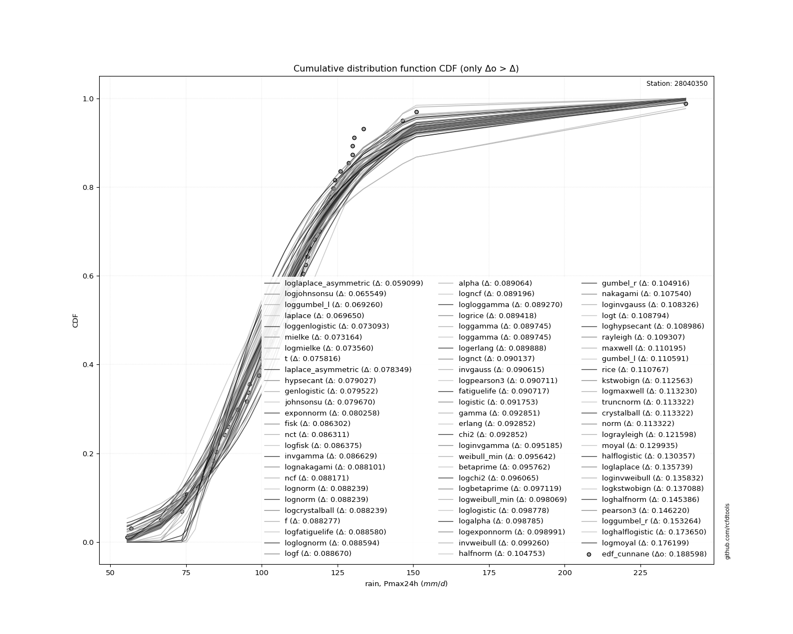</img>

</div>


**11.3. Best fit**

<div align="center">

|   id |   station | empirical_dist   | p_dist      |    delta |   deltao | eval   |   fit |   n |   best_fit |   best_fit_sort |
|-----:|----------:|:-----------------|:------------|---------:|---------:|:-------|------:|----:|-----------:|----------------:|
|    0 |  28040350 | edf_cunnane      | weibull_min | 0.032424 | 0.190438 | Δo > Δ |     1 |  51 |          1 |               1 |

</div>


<div align="center">

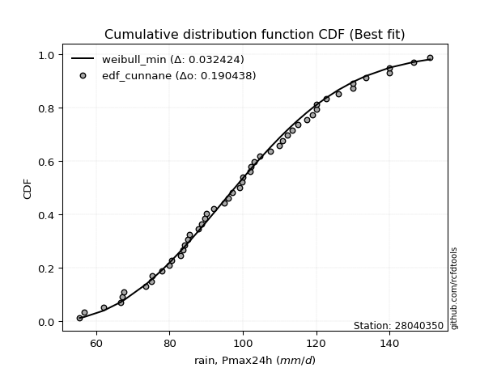</img>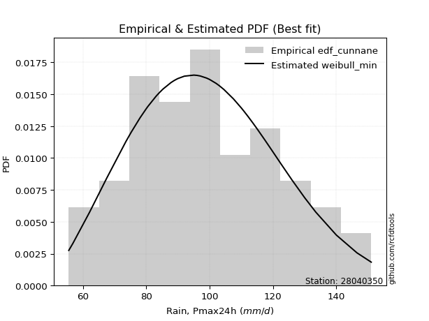</img>

</div>


### 12. EDF Adamowski (1981)

The Adamowski formula in hydrology refers to a specific plotting position formula used for estimating the non-parametric empirical distribution of hydrological events (like flood peaks) to calculate their return periods. This formula provides an alternative to traditional parametric methods (like the Gumbel or Log Pearson Type III distributions). 

<div align="center">


$P=(m-0.25)/(n+0.5)$


</div>


**12.1. Empirical values**

<div align="center">

|                | 0                    | 1                   | 2                   | 3                   | 4                   | 5                   | 6                   | 7                   | 8                   | 9                   | 10                 | 11                  | 12                  | 13                 | 14                  | 15                 | 16                  | 17                 | 18                 | 19                  | 20                 | 21                 | 22                | 23                  | 24                  | 25            | 26                 | 27                 | 28                 | 29                 | 30                 | 31                 | 32                 | 33                 | 34                 | 35                 | 36                 | 37                 | 38                 | 39                 | 40                 | 41                 | 42                 | 43                 | 44                 | 45                 | 46                 | 47                 | 48                 | 49                 | 50                 |
|:---------------|:---------------------|:--------------------|:--------------------|:--------------------|:--------------------|:--------------------|:--------------------|:--------------------|:--------------------|:--------------------|:-------------------|:--------------------|:--------------------|:-------------------|:--------------------|:-------------------|:--------------------|:-------------------|:-------------------|:--------------------|:-------------------|:-------------------|:------------------|:--------------------|:--------------------|:--------------|:-------------------|:-------------------|:-------------------|:-------------------|:-------------------|:-------------------|:-------------------|:-------------------|:-------------------|:-------------------|:-------------------|:-------------------|:-------------------|:-------------------|:-------------------|:-------------------|:-------------------|:-------------------|:-------------------|:-------------------|:-------------------|:-------------------|:-------------------|:-------------------|:-------------------|
| date           | 2001                 | 1997                | 1972                | 2003                | 2022                | 2007                | 1989                | 2015                | 1986                | 2021                | 1980               | 1995                | 2012                | 1973               | 1984                | 2019               | 1990                | 2004               | 2000               | 1988                | 1974               | 2020               | 1994              | 2009                | 1978                | 1981          | 1985               | 2013               | 1977               | 2014               | 1998               | 2002               | 1991               | 2017               | 2008               | 1982               | 1999               | 2018               | 1993               | 2005               | 1983               | 2016               | 1987               | 2010               | 1992               | 2011               | 2006               | 1975               | 1979               | 1996               | 1976               |
| x              | 55.5                 | 56.8                | 62.04761218         | 66.6                | 67.0                | 67.5                | 73.5                | 75.0                | 75.2                | 78.0                | 80.0               | 80.5                | 83.0                | 83.62431256        | 84.0                | 85.0               | 85.3                | 87.8               | 88.8               | 89.5                | 90.0               | 92.0               | 95.0              | 96.0                | 97.0                | 99.0          | 99.8               | 100.0              | 102.0              | 102.10925342627452 | 103.0              | 104.5              | 107.5              | 110.0              | 110.7              | 112.0              | 113.5              | 115.0              | 117.3              | 119.0              | 120.0              | 120.0              | 122.6              | 126.0              | 130.0              | 130.0              | 133.5              | 140.0              | 140.0              | 146.5              | 151.0              |
| m              | 1                    | 2                   | 3                   | 4                   | 5                   | 6                   | 7                   | 8                   | 9                   | 10                  | 11                 | 12                  | 13                  | 14                 | 15                  | 16                 | 17                  | 18                 | 19                 | 20                  | 21                 | 22                 | 23                | 24                  | 25                  | 26            | 27                 | 28                 | 29                 | 30                 | 31                 | 32                 | 33                 | 34                 | 35                 | 36                 | 37                 | 38                 | 39                 | 40                 | 41                 | 42                 | 43                 | 44                 | 45                 | 46                 | 47                 | 48                 | 49                 | 50                 | 51                 |
| empirical_dist | edf_adamowski        | edf_adamowski       | edf_adamowski       | edf_adamowski       | edf_adamowski       | edf_adamowski       | edf_adamowski       | edf_adamowski       | edf_adamowski       | edf_adamowski       | edf_adamowski      | edf_adamowski       | edf_adamowski       | edf_adamowski      | edf_adamowski       | edf_adamowski      | edf_adamowski       | edf_adamowski      | edf_adamowski      | edf_adamowski       | edf_adamowski      | edf_adamowski      | edf_adamowski     | edf_adamowski       | edf_adamowski       | edf_adamowski | edf_adamowski      | edf_adamowski      | edf_adamowski      | edf_adamowski      | edf_adamowski      | edf_adamowski      | edf_adamowski      | edf_adamowski      | edf_adamowski      | edf_adamowski      | edf_adamowski      | edf_adamowski      | edf_adamowski      | edf_adamowski      | edf_adamowski      | edf_adamowski      | edf_adamowski      | edf_adamowski      | edf_adamowski      | edf_adamowski      | edf_adamowski      | edf_adamowski      | edf_adamowski      | edf_adamowski      | edf_adamowski      |
| empirical      | 0.014563106796116505 | 0.03398058252427184 | 0.05339805825242718 | 0.07281553398058252 | 0.09223300970873786 | 0.11165048543689321 | 0.13106796116504854 | 0.15048543689320387 | 0.16990291262135923 | 0.18932038834951456 | 0.2087378640776699 | 0.22815533980582525 | 0.24757281553398058 | 0.2669902912621359 | 0.28640776699029125 | 0.3058252427184466 | 0.32524271844660196 | 0.3446601941747573 | 0.3640776699029126 | 0.38349514563106796 | 0.4029126213592233 | 0.4223300970873786 | 0.441747572815534 | 0.46116504854368934 | 0.48058252427184467 | 0.5           | 0.5194174757281553 | 0.5388349514563107 | 0.558252427184466  | 0.5776699029126213 | 0.5970873786407767 | 0.616504854368932  | 0.6359223300970874 | 0.6553398058252428 | 0.6747572815533981 | 0.6941747572815534 | 0.7135922330097088 | 0.7330097087378641 | 0.7524271844660194 | 0.7718446601941747 | 0.7912621359223301 | 0.8106796116504854 | 0.8300970873786407 | 0.8495145631067961 | 0.8689320388349514 | 0.8883495145631068 | 0.9077669902912622 | 0.9271844660194175 | 0.9466019417475728 | 0.9660194174757282 | 0.9854368932038835 |
| empirical_tr   | 1.0147783251231528   | 1.035175879396985   | 1.0564102564102564  | 1.0785340314136125  | 1.1016042780748663  | 1.1256830601092895  | 1.1508379888268156  | 1.177142857142857   | 1.2046783625730995  | 1.2335329341317365  | 1.2638036809815951 | 1.2955974842767295  | 1.3290322580645162  | 1.3642384105960266 | 1.401360544217687   | 1.4405594405594404 | 1.4820143884892087  | 1.5259259259259261 | 1.5725190839694658 | 1.6220472440944884  | 1.67479674796748   | 1.73109243697479   | 1.791304347826087 | 1.855855855855856   | 1.925233644859813   | 2.0           | 2.080808080808081  | 2.168421052631579  | 2.2637362637362637 | 2.367816091954023  | 2.4819277108433733 | 2.6075949367088604 | 2.746666666666667  | 2.901408450704226  | 3.0746268656716422 | 3.26984126984127   | 3.4915254237288136 | 3.7454545454545456 | 4.03921568627451   | 4.382978723404255  | 4.790697674418604  | 5.282051282051281  | 5.885714285714284  | 6.645161290322578  | 7.629629629629626  | 8.956521739130439  | 10.8421052631579   | 13.73333333333334  | 18.727272727272737 | 29.42857142857144  | 68.6666666666667   |

</div>


**12.2. Kolmogorov-Smirnov fit test (sorted by Δ)**


<div align="center">

|                | 0                   | 1                    | 2                    | 3                   | 4                    | 5                    | 6                   | 7                   | 8                    | 9                   | 10                  | 11                  | 12                   | 13                  | 14                  | 15                  | 16                   | 17                  | 18                  | 19                  | 20                   | 21                  | 22                   | 23                  | 24                  | 25                  | 26                  | 27                  | 28                  | 29                  | 30                  | 31                  | 32                   | 33                  | 34                  | 35                  | 36                  | 37                  | 38                   | 39                   | 40                  | 41                  | 42                  | 43                  | 44                  | 45                  | 46                   | 47                  | 48                  | 49                  | 50                  | 51                  | 52                  | 53                  | 54                  | 55                  | 56                    | 57                  | 58                  | 59                  | 60                  | 61                  | 62                  | 63                  | 64                  | 65                  | 66                  | 67                  | 68                  | 69                  | 70                  | 71                  | 72                  | 73                  | 74                  | 75                  | 76                  | 77                  | 78                  | 79                  | 80                  | 81                  | 82                  | 83                  | 84                  | 85                  | 86                  | 87                  |
|:---------------|:--------------------|:---------------------|:---------------------|:--------------------|:---------------------|:---------------------|:--------------------|:--------------------|:---------------------|:--------------------|:--------------------|:--------------------|:---------------------|:--------------------|:--------------------|:--------------------|:---------------------|:--------------------|:--------------------|:--------------------|:---------------------|:--------------------|:---------------------|:--------------------|:--------------------|:--------------------|:--------------------|:--------------------|:--------------------|:--------------------|:--------------------|:--------------------|:---------------------|:--------------------|:--------------------|:--------------------|:--------------------|:--------------------|:---------------------|:---------------------|:--------------------|:--------------------|:--------------------|:--------------------|:--------------------|:--------------------|:---------------------|:--------------------|:--------------------|:--------------------|:--------------------|:--------------------|:--------------------|:--------------------|:--------------------|:--------------------|:----------------------|:--------------------|:--------------------|:--------------------|:--------------------|:--------------------|:--------------------|:--------------------|:--------------------|:--------------------|:--------------------|:--------------------|:--------------------|:--------------------|:--------------------|:--------------------|:--------------------|:--------------------|:--------------------|:--------------------|:--------------------|:--------------------|:--------------------|:--------------------|:--------------------|:--------------------|:--------------------|:--------------------|:--------------------|:--------------------|:--------------------|:--------------------|
| station        | 28040350            | 28040350             | 28040350             | 28040350            | 28040350             | 28040350             | 28040350            | 28040350            | 28040350             | 28040350            | 28040350            | 28040350            | 28040350             | 28040350            | 28040350            | 28040350            | 28040350             | 28040350            | 28040350            | 28040350            | 28040350             | 28040350            | 28040350             | 28040350            | 28040350            | 28040350            | 28040350            | 28040350            | 28040350            | 28040350            | 28040350            | 28040350            | 28040350             | 28040350            | 28040350            | 28040350            | 28040350            | 28040350            | 28040350             | 28040350             | 28040350            | 28040350            | 28040350            | 28040350            | 28040350            | 28040350            | 28040350             | 28040350            | 28040350            | 28040350            | 28040350            | 28040350            | 28040350            | 28040350            | 28040350            | 28040350            | 28040350              | 28040350            | 28040350            | 28040350            | 28040350            | 28040350            | 28040350            | 28040350            | 28040350            | 28040350            | 28040350            | 28040350            | 28040350            | 28040350            | 28040350            | 28040350            | 28040350            | 28040350            | 28040350            | 28040350            | 28040350            | 28040350            | 28040350            | 28040350            | 28040350            | 28040350            | 28040350            | 28040350            | 28040350            | 28040350            | 28040350            | 28040350            |
| empirical_dist | edf_adamowski       | edf_adamowski        | edf_adamowski        | edf_adamowski       | edf_adamowski        | edf_adamowski        | edf_adamowski       | edf_adamowski       | edf_adamowski        | edf_adamowski       | edf_adamowski       | edf_adamowski       | edf_adamowski        | edf_adamowski       | edf_adamowski       | edf_adamowski       | edf_adamowski        | edf_adamowski       | edf_adamowski       | edf_adamowski       | edf_adamowski        | edf_adamowski       | edf_adamowski        | edf_adamowski       | edf_adamowski       | edf_adamowski       | edf_adamowski       | edf_adamowski       | edf_adamowski       | edf_adamowski       | edf_adamowski       | edf_adamowski       | edf_adamowski        | edf_adamowski       | edf_adamowski       | edf_adamowski       | edf_adamowski       | edf_adamowski       | edf_adamowski        | edf_adamowski        | edf_adamowski       | edf_adamowski       | edf_adamowski       | edf_adamowski       | edf_adamowski       | edf_adamowski       | edf_adamowski        | edf_adamowski       | edf_adamowski       | edf_adamowski       | edf_adamowski       | edf_adamowski       | edf_adamowski       | edf_adamowski       | edf_adamowski       | edf_adamowski       | edf_adamowski         | edf_adamowski       | edf_adamowski       | edf_adamowski       | edf_adamowski       | edf_adamowski       | edf_adamowski       | edf_adamowski       | edf_adamowski       | edf_adamowski       | edf_adamowski       | edf_adamowski       | edf_adamowski       | edf_adamowski       | edf_adamowski       | edf_adamowski       | edf_adamowski       | edf_adamowski       | edf_adamowski       | edf_adamowski       | edf_adamowski       | edf_adamowski       | edf_adamowski       | edf_adamowski       | edf_adamowski       | edf_adamowski       | edf_adamowski       | edf_adamowski       | edf_adamowski       | edf_adamowski       | edf_adamowski       | edf_adamowski       |
| p_dist         | rice                | weibull_min          | logpearson3          | f                   | logweibull_min       | erlang               | gamma               | fatiguelife         | alpha                | maxwell             | nakagami            | invgamma            | johnsonsu            | ncf                 | logloggamma         | lognct              | nct                  | invweibull          | logncf              | logjohnsonsu        | pearson3             | lognakagami         | genlogistic          | fisk                | logt                | logcrystalball      | lognorm             | lognorm             | logexponnorm        | loglognorm          | rayleigh            | logfatiguelife      | logfisk              | logrice             | logf                | logerlang           | mielke              | loggenlogistic      | loggamma             | loggamma             | logalpha            | loginvgamma         | exponnorm           | logmielke           | betaprime           | t                   | norm                 | crystalball         | kstwobign           | logbetaprime        | invgauss            | loginvgauss         | loglogistic         | logmaxwell          | gumbel_r            | logistic            | loglaplace_asymmetric | laplace_asymmetric  | lograyleigh         | loggumbel_l         | loghypsecant        | hypsecant           | loginvweibull       | moyal               | loglaplace          | loggumbel_r         | halflogistic        | halfnorm            | loghalfnorm         | logkstwobign        | gumbel_l            | laplace             | logmoyal            | loghalflogistic     | wald                | loggenexpon         | logwald             | expon               | genexpon            | gibrat              | loggibrat           | loggompertz         | logtruncnorm        | logexpon            | logchi2             | gompertz            | chi2                | truncnorm           |
| delta          | 0.03332232013161662 | 0.034699475291405546 | 0.037046495729688655 | 0.03724795009770443 | 0.037593665069381055 | 0.037674199814363485 | 0.03767452957111117 | 0.03886809249348372 | 0.038973315126241415 | 0.03916669836260246 | 0.03930554675384268 | 0.03967994567348265 | 0.040482903671648696 | 0.04083589475083271 | 0.0419841261172359  | 0.04579771318698289 | 0.045933931376650305 | 0.04726404153227681 | 0.04752370450626153 | 0.04789524327653494 | 0.048034485068103594 | 0.04809006428582019 | 0.048153417042812174 | 0.04854571266050656 | 0.04855389682499822 | 0.04855639141006629 | 0.04855710022060156 | 0.04855710022060156 | 0.04855738067868154 | 0.04855782609358761 | 0.04858379351586803 | 0.04884397173386612 | 0.049027881905984394 | 0.05021319714540806 | 0.05028972052000913 | 0.05071292269934191 | 0.05189858957385507 | 0.05195215038104295 | 0.052161846406178713 | 0.052161846406178713 | 0.05239482659177086 | 0.05468714763978799 | 0.05656993662996507 | 0.05669826364869779 | 0.05825834237007521 | 0.05884838635269485 | 0.058900428568596785 | 0.05890043166670206 | 0.0618300630159484  | 0.0625342843058122  | 0.0639030295015186  | 0.0644542740169386  | 0.0700878577543238  | 0.07140556095252026 | 0.07493751929519354 | 0.0773466144884864  | 0.07780352707385957   | 0.07962210766882144 | 0.08142949843005187 | 0.08240062505624224 | 0.08553216301551325 | 0.09155751045008764 | 0.09460864598078567 | 0.09549747360587262 | 0.1102444295718511  | 0.1108185176050196  | 0.11165048543689321 | 0.11165048543689321 | 0.11165048543689321 | 0.11192870164783209 | 0.11791094569787652 | 0.1195441057741507  | 0.13594635931346932 | 0.13662689851249787 | 0.18759970148126073 | 0.188263918522094   | 0.20567602392591866 | 0.2189189432835045  | 0.22584597979551682 | 0.22815533980582525 | 0.23396887481390205 | 0.24118297955593626 | 0.2674606255596865  | 0.2743417608077888  | 0.35021423648563116 | 0.8149827980396238  | 0.9385184569863778  | 0.9854368932038835  |
| deltao         | 0.19043809142780935 | 0.19043809142780935  | 0.19043809142780935  | 0.19043809142780935 | 0.19043809142780935  | 0.19043809142780935  | 0.19043809142780935 | 0.19043809142780935 | 0.19043809142780935  | 0.19043809142780935 | 0.19043809142780935 | 0.19043809142780935 | 0.19043809142780935  | 0.19043809142780935 | 0.19043809142780935 | 0.19043809142780935 | 0.19043809142780935  | 0.19043809142780935 | 0.19043809142780935 | 0.19043809142780935 | 0.19043809142780935  | 0.19043809142780935 | 0.19043809142780935  | 0.19043809142780935 | 0.19043809142780935 | 0.19043809142780935 | 0.19043809142780935 | 0.19043809142780935 | 0.19043809142780935 | 0.19043809142780935 | 0.19043809142780935 | 0.19043809142780935 | 0.19043809142780935  | 0.19043809142780935 | 0.19043809142780935 | 0.19043809142780935 | 0.19043809142780935 | 0.19043809142780935 | 0.19043809142780935  | 0.19043809142780935  | 0.19043809142780935 | 0.19043809142780935 | 0.19043809142780935 | 0.19043809142780935 | 0.19043809142780935 | 0.19043809142780935 | 0.19043809142780935  | 0.19043809142780935 | 0.19043809142780935 | 0.19043809142780935 | 0.19043809142780935 | 0.19043809142780935 | 0.19043809142780935 | 0.19043809142780935 | 0.19043809142780935 | 0.19043809142780935 | 0.19043809142780935   | 0.19043809142780935 | 0.19043809142780935 | 0.19043809142780935 | 0.19043809142780935 | 0.19043809142780935 | 0.19043809142780935 | 0.19043809142780935 | 0.19043809142780935 | 0.19043809142780935 | 0.19043809142780935 | 0.19043809142780935 | 0.19043809142780935 | 0.19043809142780935 | 0.19043809142780935 | 0.19043809142780935 | 0.19043809142780935 | 0.19043809142780935 | 0.19043809142780935 | 0.19043809142780935 | 0.19043809142780935 | 0.19043809142780935 | 0.19043809142780935 | 0.19043809142780935 | 0.19043809142780935 | 0.19043809142780935 | 0.19043809142780935 | 0.19043809142780935 | 0.19043809142780935 | 0.19043809142780935 | 0.19043809142780935 | 0.19043809142780935 |
| eval           | Δo > Δ              | Δo > Δ               | Δo > Δ               | Δo > Δ              | Δo > Δ               | Δo > Δ               | Δo > Δ              | Δo > Δ              | Δo > Δ               | Δo > Δ              | Δo > Δ              | Δo > Δ              | Δo > Δ               | Δo > Δ              | Δo > Δ              | Δo > Δ              | Δo > Δ               | Δo > Δ              | Δo > Δ              | Δo > Δ              | Δo > Δ               | Δo > Δ              | Δo > Δ               | Δo > Δ              | Δo > Δ              | Δo > Δ              | Δo > Δ              | Δo > Δ              | Δo > Δ              | Δo > Δ              | Δo > Δ              | Δo > Δ              | Δo > Δ               | Δo > Δ              | Δo > Δ              | Δo > Δ              | Δo > Δ              | Δo > Δ              | Δo > Δ               | Δo > Δ               | Δo > Δ              | Δo > Δ              | Δo > Δ              | Δo > Δ              | Δo > Δ              | Δo > Δ              | Δo > Δ               | Δo > Δ              | Δo > Δ              | Δo > Δ              | Δo > Δ              | Δo > Δ              | Δo > Δ              | Δo > Δ              | Δo > Δ              | Δo > Δ              | Δo > Δ                | Δo > Δ              | Δo > Δ              | Δo > Δ              | Δo > Δ              | Δo > Δ              | Δo > Δ              | Δo > Δ              | Δo > Δ              | Δo > Δ              | Δo > Δ              | Δo > Δ              | Δo > Δ              | Δo > Δ              | Δo > Δ              | Δo > Δ              | Δo > Δ              | Δo > Δ              | Δo > Δ              | Δo > Δ              | Δo <= Δ             | Δo <= Δ             | Δo <= Δ             | Δo <= Δ             | Δo <= Δ             | Δo <= Δ             | Δo <= Δ             | Δo <= Δ             | Δo <= Δ             | Δo <= Δ             | Δo <= Δ             | Δo <= Δ             |
| fit            | 1                   | 1                    | 1                    | 1                   | 1                    | 1                    | 1                   | 1                   | 1                    | 1                   | 1                   | 1                   | 1                    | 1                   | 1                   | 1                   | 1                    | 1                   | 1                   | 1                   | 1                    | 1                   | 1                    | 1                   | 1                   | 1                   | 1                   | 1                   | 1                   | 1                   | 1                   | 1                   | 1                    | 1                   | 1                   | 1                   | 1                   | 1                   | 1                    | 1                    | 1                   | 1                   | 1                   | 1                   | 1                   | 1                   | 1                    | 1                   | 1                   | 1                   | 1                   | 1                   | 1                   | 1                   | 1                   | 1                   | 1                     | 1                   | 1                   | 1                   | 1                   | 1                   | 1                   | 1                   | 1                   | 1                   | 1                   | 1                   | 1                   | 1                   | 1                   | 1                   | 1                   | 1                   | 1                   | 1                   | 0                   | 0                   | 0                   | 0                   | 0                   | 0                   | 0                   | 0                   | 0                   | 0                   | 0                   | 0                   |
| n              | 51                  | 51                   | 51                   | 51                  | 51                   | 51                   | 51                  | 51                  | 51                   | 51                  | 51                  | 51                  | 51                   | 51                  | 51                  | 51                  | 51                   | 51                  | 51                  | 51                  | 51                   | 51                  | 51                   | 51                  | 51                  | 51                  | 51                  | 51                  | 51                  | 51                  | 51                  | 51                  | 51                   | 51                  | 51                  | 51                  | 51                  | 51                  | 51                   | 51                   | 51                  | 51                  | 51                  | 51                  | 51                  | 51                  | 51                   | 51                  | 51                  | 51                  | 51                  | 51                  | 51                  | 51                  | 51                  | 51                  | 51                    | 51                  | 51                  | 51                  | 51                  | 51                  | 51                  | 51                  | 51                  | 51                  | 51                  | 51                  | 51                  | 51                  | 51                  | 51                  | 51                  | 51                  | 51                  | 51                  | 51                  | 51                  | 51                  | 51                  | 51                  | 51                  | 51                  | 51                  | 51                  | 51                  | 51                  | 51                  |
| best_fit       | 1                   | 0                    | 0                    | 0                   | 0                    | 0                    | 0                   | 0                   | 0                    | 0                   | 0                   | 0                   | 0                    | 0                   | 0                   | 0                   | 0                    | 0                   | 0                   | 0                   | 0                    | 0                   | 0                    | 0                   | 0                   | 0                   | 0                   | 0                   | 0                   | 0                   | 0                   | 0                   | 0                    | 0                   | 0                   | 0                   | 0                   | 0                   | 0                    | 0                    | 0                   | 0                   | 0                   | 0                   | 0                   | 0                   | 0                    | 0                   | 0                   | 0                   | 0                   | 0                   | 0                   | 0                   | 0                   | 0                   | 0                     | 0                   | 0                   | 0                   | 0                   | 0                   | 0                   | 0                   | 0                   | 0                   | 0                   | 0                   | 0                   | 0                   | 0                   | 0                   | 0                   | 0                   | 0                   | 0                   | 0                   | 0                   | 0                   | 0                   | 0                   | 0                   | 0                   | 0                   | 0                   | 0                   | 0                   | 0                   |
| best_fit_sort  | 1                   | 2                    | 3                    | 4                   | 5                    | 6                    | 7                   | 8                   | 9                    | 10                  | 11                  | 12                  | 13                   | 14                  | 15                  | 16                  | 17                   | 18                  | 19                  | 20                  | 21                   | 22                  | 23                   | 24                  | 25                  | 26                  | 27                  | 28                  | 29                  | 30                  | 31                  | 32                  | 33                   | 34                  | 35                  | 36                  | 37                  | 38                  | 39                   | 40                   | 41                  | 42                  | 43                  | 44                  | 45                  | 46                  | 47                   | 48                  | 49                  | 50                  | 51                  | 52                  | 53                  | 54                  | 55                  | 56                  | 57                    | 58                  | 59                  | 60                  | 61                  | 62                  | 63                  | 64                  | 65                  | 66                  | 67                  | 68                  | 69                  | 70                  | 71                  | 72                  | 73                  | 74                  | 75                  | 76                  | 77                  | 78                  | 79                  | 80                  | 81                  | 82                  | 83                  | 84                  | 85                  | 86                  | 87                  | 88                  |

</div>


<div align="center">

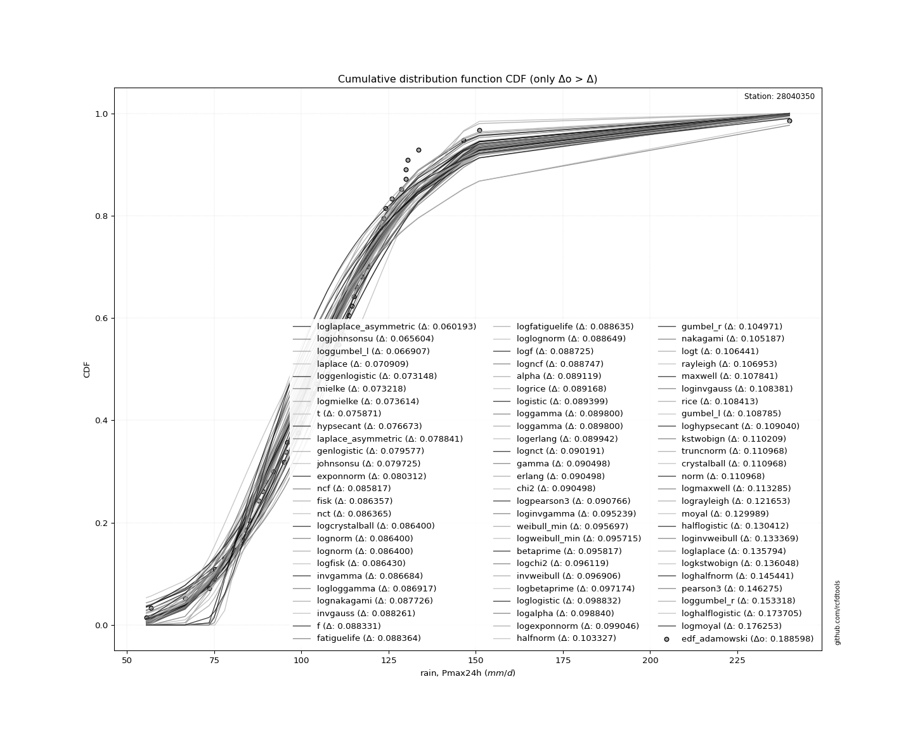</img>

</div>


**12.3. Best fit**

<div align="center">

|   id |   station | empirical_dist   | p_dist   |     delta |   deltao | eval   |   fit |   n |   best_fit |   best_fit_sort |
|-----:|----------:|:-----------------|:---------|----------:|---------:|:-------|------:|----:|-----------:|----------------:|
|    0 |  28040350 | edf_adamowski    | rice     | 0.0333223 | 0.190438 | Δo > Δ |     1 |  51 |          1 |               1 |

</div>


<div align="center">

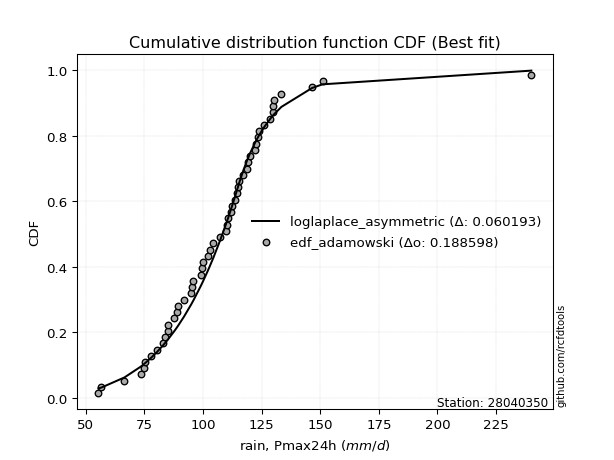</img>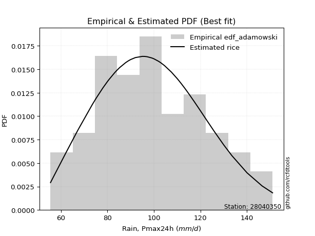</img>

</div>


## C. Best fit & Estimate extreme values for specific return periods - Tr

Best fit in probability distribution analysis means finding the theoretical distribution (like Normal, Poisson, Exponential) that most accurately mirrors your real-world data´s patterns (shape, center, spread) for better predictions, using methods like visual checks (Q-Q plots), goodness-of-fit tests (Kolmogorov-Smirnov, Chi-Squared), and information criteria (AIC) to score and select the simplest, most representative model.


### 1. Best fit (ordered by delta Δ)

<div align="center">

|   id |   station | empirical_dist   | p_dist      |     delta |   deltao | eval   |   fit |   n |   best_fit |   best_fit_sort |
|-----:|----------:|:-----------------|:------------|----------:|---------:|:-------|------:|----:|-----------:|----------------:|
|    0 |  28040350 | edf_hazen        | weibull_min | 0.0311709 | 0.190438 | Δo > Δ |     1 |  51 |          1 |               1 |
|    1 |  28040350 | edf_gringorten   | weibull_min | 0.0318127 | 0.190438 | Δo > Δ |     1 |  51 |          1 |               2 |
|    2 |  28040350 | edf_cunnane      | weibull_min | 0.032424  | 0.190438 | Δo > Δ |     1 |  51 |          1 |               3 |
|    3 |  28040350 | edf_blom         | rice        | 0.0326414 | 0.190438 | Δo > Δ |     1 |  51 |          1 |               4 |
|    4 |  28040350 | edf_tukey        | rice        | 0.0327998 | 0.190438 | Δo > Δ |     1 |  51 |          1 |               5 |
|    5 |  28040350 | edf_filliben     | rice        | 0.0328598 | 0.190438 | Δo > Δ |     1 |  51 |          1 |               6 |
|    6 |  28040350 | edf_beard        | rice        | 0.0328882 | 0.190438 | Δo > Δ |     1 |  51 |          1 |               7 |
|    7 |  28040350 | edf_jenkinson    | rice        | 0.0328882 | 0.190438 | Δo > Δ |     1 |  51 |          1 |               8 |
|    8 |  28040350 | edf_chegodayev   | rice        | 0.0329261 | 0.190438 | Δo > Δ |     1 |  51 |          1 |               9 |
|    9 |  28040350 | edf_adamowski    | rice        | 0.0333223 | 0.190438 | Δo > Δ |     1 |  51 |          1 |              10 |
|   10 |  28040350 | edf_weibull      | rice        | 0.0370565 | 0.190438 | Δo > Δ |     1 |  51 |          1 |              11 |
|   11 |  28040350 | edf_california   | ncf         | 0.0400339 | 0.190438 | Δo > Δ |     1 |  51 |          1 |              12 |

</div>

:file_folder:Tables: [bestfit_28040350.csv](table/bestfit_28040350.csv) | [extreme_28040350.csv](table/extreme_28040350.csv)


### 2. Extreme values

In hydrology, a return period (or recurrence interval $Tr$) is the statistical average time between extreme events like floods or droughts of a specific magnitude, indicating how rare an event is, with a 100-year flood, for example, having a 1% chance of occurring in any given year, not that it happens exactly every century. It is a key tool for infrastructure design (like bridges or dams) and risk assessment, calculated from historical data to determine the probability of future events, although it is important to remember it is statistical average, and events can cluster or be missed.

> risk_rate: assuming the return period as the project useful life.

|   id |      tr |   prob_l |     prob_g |    alpha |   betaprime |    chi2 |   crystalball |   erlang |    expon |   exponnorm |        f |   fatiguelife |     fisk |    gamma |   genexpon |   genlogistic |   gibrat |   gompertz |   gumbel_l |   gumbel_r |   halflogistic |   halfnorm |   hypsecant |   invgamma |   invgauss |   invweibull |   johnsonsu |   kstwobign |   laplace |   laplace_asymmetric |   loggamma |   logistic |   lognorm |   maxwell |   mielke |    moyal |   nakagami |      ncf |      nct |     norm |   pearson3 |   rayleigh |     rice |       t |   truncnorm |     wald |   weibull_min |   logalpha |   logbetaprime |   logchi2 |   logcrystalball |   logerlang |   logexpon |   logexponnorm |     logf |   logfatiguelife |   logfisk |   loggenexpon |   loggenlogistic |   loggibrat |   loggompertz |   loggumbel_l |   loggumbel_r |   loghalflogistic |   loghalfnorm |   loghypsecant |   loginvgamma |   loginvgauss |   loginvweibull |   logjohnsonsu |   logkstwobign |   loglaplace |   loglaplace_asymmetric |   logloggamma |   loglogistic |   loglognorm |   logmaxwell |   logmielke |   logmoyal |   lognakagami |   logncf |   lognct |   logpearson3 |   lograyleigh |   logrice |     logt |   logtruncnorm |   logwald |   logweibull_min |   station |   n |   risk_rate |
|-----:|--------:|---------:|-----------:|---------:|------------:|--------:|--------------:|---------:|---------:|------------:|---------:|--------------:|---------:|---------:|-----------:|--------------:|---------:|-----------:|-----------:|-----------:|---------------:|-----------:|------------:|-----------:|-----------:|-------------:|------------:|------------:|----------:|---------------------:|-----------:|-----------:|----------:|----------:|---------:|---------:|-----------:|---------:|---------:|---------:|-----------:|-----------:|---------:|--------:|------------:|---------:|--------------:|-----------:|---------------:|----------:|-----------------:|------------:|-----------:|---------------:|---------:|-----------------:|----------:|--------------:|-----------------:|------------:|--------------:|--------------:|--------------:|------------------:|--------------:|---------------:|--------------:|--------------:|----------------:|---------------:|---------------:|-------------:|------------------------:|--------------:|--------------:|-------------:|-------------:|------------:|-----------:|--------------:|---------:|---------:|--------------:|--------------:|----------:|---------:|---------------:|----------:|-----------------:|----------:|----:|------------:|
|    0 |    2    | 0.5      | 0.5        |  97.8767 |     96.0534 | 55.5072 |       99.4055 |  97.7846 |  85.933  |     99.1774 |  97.8342 |       97.9289 |  97.3253 |  97.7846 |    85.4864 |       97.0382 |  92.3745 |    137.316 |    103.254 |    95.5574 |        93.6443 |    94.6107 |     99.4055 |    97.7657 |    95.0249 |      96.0022 |     98.0255 |     94.9675 |   99.4055 |              97.7762 |    96.0987 |    99.4055 |   96.5925 |   97.4022 |  98.2534 |  94.315  |    97.0228 |  97.4856 |  98.3137 |  99.4055 |     98.586 |    96.6916 |  97.9925 |  99.402 |   -43.8241  |  91.8125 |       97.8647 |    95.9977 |        95.4851 |   74.9445 |          96.5925 |     96.1548 |    81.489  |        96.5924 |  96.3714 |          96.6039 |   97.2859 |       87.7594 |          98.2583 |     89.8073 |       83.8748 |       100.521 |       92.8175 |           90.996  |       91.9118 |        96.5925 |       95.6828 |       95.0481 |         92.6253 |        96.5922 |        91.7367 |      96.5925 |                 99.1274 |       98.2124 |       96.5925 |      96.5924 |      94.6084 |     98.6462 |    91.6306 |        96.611 |   96.593 |  96.5068 |       97.6924 |       93.9147 |   96.1728 |  96.5926 |        82.0544 |   89.2846 |          98.0241 |  28040350 |  51 |    0.75     |
|    1 |    2.33 | 0.570815 | 0.429185   | 102.074  |    100.255  | 55.5213 |      103.585  | 102.011  |  92.6383 |    103.341  | 102.056  |      102.136  | 101.331  | 102.011  |    92.301  |      101.169  |  94.4919 |    138.084 |    106.89  |    99.4306 |        97.6265 |    99.122  |    102.751  |   101.948  |    99.4459 |     100.556  |    102.223  |     99.6103 |  101.935  |             100.967  |   100.407  |   103.088  |  100.867  |  101.745  | 102.19   |  97.9815 |   101.456  | 101.731  | 102.463  | 103.585  |    102.783 |   101.099  | 102.399  | 103.582 |   -41.7827  |  94.5534 |      102.257  |   100.315  |        99.7319 |   81.3612 |         100.867  |    100.482  |    88.6852 |       100.867  | 100.662  |         100.864  |  101.291  |       93.8543 |         102.195  |     91.799  |       89.8304 |       104.38  |       96.6175 |           94.8285 |       96.3091 |        99.9986 |      100.03   |       99.407  |         97.4019 |       100.883  |        96.8942 |      99.1571 |                102.118  |      102.444  |      100.349  |     100.867  |      98.962  |    102.581  |    95.178  |       100.89  |  100.887 | 100.864  |      101.962  |       98.3016 |  100.519  | 100.867  |        89.1066 |   91.8564 |         102.315  |  28040350 |  51 |    0.729209 |
|    2 |    5    | 0.8      | 0.2        | 118.691  |    117.637  | 55.873  |      119.119  | 118.637  | 126.163  |    118.955  | 118.641  |      118.624  | 118.394  | 118.637  |   126.372  |      118.385  | 106.682  |    140.563 |    118.639 |   116.258  |       115.646  |   118.2    |    116.169  |   118.428  |   118.036  |     120.339  |    118.618  |    119.332  |  114.582  |             116.919  |   118.476  |   117.308  |  118.478  |  118.837  | 118.153  | 114.965  |   118.975  | 118.488  | 118.555  | 119.119  |    118.843 |   118.742  | 119.243  | 119.116 |   -34.1963  | 109.897  |      119.153  |   118.583  |       117.501  |  126.031  |         118.478  |    118.627  |   135.396  |       118.478  | 118.449  |         118.452  |  118.366  |      127.504  |         118.154  |    104.155  |      118.48   |       117.89  |      115.017  |          114.29   |      117.354  |       114.912  |      118.515  |      118.387  |        121.183  |       118.565  |       122.237  |     113.038  |                116.174  |      118.808  |      116.276  |     118.478  |     118.133  |    118.255  |   113.487  |       118.53  |  118.637 | 118.958  |      118.786  |      118.015  |  118.613  | 118.479  |       132.271  |  107.684  |         118.92   |  28040350 |  51 |    0.67232  |
|    3 |   10    | 0.9      | 0.1        | 130.694  |    130.915  | 56.6901 |      129.424  | 130.485  | 156.596  |    129.472  | 130.439  |      130.33   | 132.763  | 130.485  |   157.302  |      131.934  | 120.578  |    141.944 |    125.18  |   129.963  |       130.61   |   132.317  |    126.884  |   130.237  |   132.419  |     136.452  |    130.223  |    134.347  |  126.063  |             131.4    |   132.513  |   127.781  |  131.826  |  130.866  | 130.922  | 129.752  |   131.342  | 130.477  | 129.908  | 129.424  |    129.902 |   131.321  | 130.683  | 129.42  |   -29.1636  | 126.18   |      130.672  |   132.956  |       131.263  |  191.565  |         131.826  |    132.718  |   198.797  |       131.826  | 132.043  |         131.82   |  132.755  |      165.335  |         130.917  |    120.281  |      143.233  |       126.155 |      132.564  |          133.455  |      135.835  |       128.403  |      133.157  |      133.91   |        144.781  |       131.974  |       145.891  |     127.315  |                130.601  |      130.187  |      129.601  |     131.826  |     133.81   |    130.634  |   132.274  |       131.91  |  132.149 | 132.824  |      130.751  |      134.442  |  132.485  | 131.827  |       185.258  |  127.473  |         130.421  |  28040350 |  51 |    0.651322 |
|    4 |   15    | 0.933333 | 0.0666667  | 137.008  |    138.135  | 57.3507 |      134.567  | 136.646  | 174.398  |    134.784  | 136.569  |      136.41   | 141.308  | 136.646  |   175.394  |      139.489  | 130.163  |    142.569 |    128.142 |   137.695  |       139.078  |   139.663  |    132.999  |   136.411  |   140.26   |     145.542  |    136.244  |    142.319  |  132.779  |             139.871  |   140.22   |   133.487  |  139.039  |  137.038  | 138.338  | 138.334  |   137.694  | 136.727  | 135.806  | 134.567  |    135.543 |   137.803  | 136.445  | 134.562 |   -26.6522  | 136.636  |      136.47   |   140.917  |       138.805  |  246.048  |         139.039  |    140.452  |   248.878  |       139.039  | 139.43   |         139.057  |  141.319  |      191.852  |         138.329  |    132.837  |      157.286  |       130.087 |      143.62   |          145.692  |      146.576  |       136.8    |      141.302  |      142.723  |        160.07   |       139.222  |       160.255  |     136.488  |                139.858  |      136.012  |      137.493  |     139.04   |     142.645  |    137.826  |   144.573  |       139.143 |  139.473 | 140.371  |      136.95   |      143.779  |  140.028  | 139.04   |       223.758  |  142.059  |         136.286  |  28040350 |  51 |    0.644736 |
|    5 |   20    | 0.95     | 0.05       | 141.267  |    143.096  | 57.8829 |      137.934  | 140.772  | 187.029  |    138.29   | 140.673  |      140.479  | 147.533  | 140.772  |   188.231  |      144.756  | 137.681  |    142.958 |    129.986 |   143.11   |       145.011  |   144.561  |    137.313  |   140.562  |   145.645  |     151.907  |    140.272  |    147.689  |  137.543  |             145.881  |   145.543  |   137.431  |  143.976  |  141.134  | 143.678  | 144.411  |   141.912  | 140.917  | 139.76   | 137.934  |    139.281 |   142.111  | 140.233  | 137.93  |   -25.0076  | 144.428  |      140.278  |   146.444  |       144.009  |  294.373  |         143.976  |    145.794  |   291.888  |       143.976  | 144.501  |         144.016  |  147.558  |      213.038  |         143.666  |    143.596  |      167.094  |       132.595 |      151.905  |          154.928  |      154.205  |       143.052  |      146.972  |      148.929  |        171.725  |       144.183  |       170.721  |     143.394  |                146.82   |      139.877  |      143.226  |     143.976  |     148.829  |    143.019  |   153.968  |       144.095 |  144.493 | 145.558  |      141.09   |      150.342  |  145.207  | 143.976  |       254.983  |  154.003  |         140.169  |  28040350 |  51 |    0.641514 |
|    6 |   25    | 0.96     | 0.04       | 144.468  |    146.871  | 58.3262 |      140.413  | 143.855  | 196.826  |    140.886  | 143.738  |      143.519  | 152.478  | 143.855  |   198.188  |      148.804  | 143.949  |    143.235 |    131.298 |   147.28   |       149.582  |   148.205  |    140.652  |   143.672  |   149.739  |     156.81   |    143.281  |    151.711  |  141.239  |             150.543  |   149.608  |   140.447  |  147.721  |  144.175  | 147.889  | 149.122  |   145.043  | 144.052  | 142.719  | 140.413  |    142.056 |   145.312  | 143.029  | 140.409 |   -23.7969  | 150.669  |      143.085  |   150.682  |       147.981  |  338.581  |         147.721  |    149.873  |   330.306  |       147.721  | 148.357  |         147.781  |  152.516  |      230.998  |         147.875  |    153.229  |      174.616  |       134.41  |      158.612  |          162.441  |      160.138  |       148.087  |      151.325  |      153.735  |        181.279  |       147.947  |       179.005  |     148.991  |                152.459  |      142.748  |      147.774  |     147.721  |     153.592  |    147.127  |   161.668  |       147.853 |  148.306 | 149.505  |      144.176  |      155.41   |  149.145  | 147.722  |       281.668  |  164.29   |         143.049  |  28040350 |  51 |    0.639603 |
|    7 |   50    | 0.98     | 0.02       | 153.955  |    158.294  | 59.8397 |      147.512  | 152.902  | 227.259  |    148.406  | 152.731  |      152.441  | 168.635  | 152.902  |   229.117  |      161.239  | 166.043  |    143.987 |    134.86  |   160.126  |       163.667  |   158.798  |    151.003  |   152.848  |   162.089  |     171.913  |    152.11   |    163.522  |  152.72   |             165.024  |   161.98   |   149.665  |  158.994  |  152.994  | 161.484  | 163.746  |   154.128  | 153.266  | 151.433  | 147.512  |    150.108 |   154.604  | 151.063  | 147.508 |   -20.3299  | 171.046  |      151.133  |   163.662  |       160.056  |  524.844  |         158.994  |    162.284  |   484.978  |       158.994  | 160.008  |         159.129  |  168.722  |      296.701  |         161.463  |    192.637  |      197.56   |       139.462 |      181.19   |          187.96   |      178.71   |       164.849  |      164.7    |      168.713  |        214.179  |       159.28   |       205.73   |     167.808  |                171.393  |      151.085  |      162.581  |     158.995  |     168.286  |    160.482  |   188.114  |       159.167 |  159.808 | 161.444  |      153.192  |      171.113  |  161.04   | 158.995  |       380.189  |  202.91   |         151.388  |  28040350 |  51 |    0.63583  |
|    8 |   75    | 0.986667 | 0.0133333  | 159.253  |    164.821  | 60.8012 |      151.321  | 157.891  | 245.062  |    152.5    | 157.689  |      157.36   | 178.732  | 157.891  |   247.209  |      168.452  | 180.966  |    144.367 |    136.661 |   167.593  |       171.854  |   164.564  |    157.052  |   157.941  |   169.109  |     180.692  |    156.98   |    170.02   |  159.436  |             173.495  |   169.094  |   154.989  |  165.393  |  157.789  | 169.874  | 172.298  |   159.068  | 158.355  | 156.264  | 151.321  |    154.493 |   159.659  | 155.388  | 151.317 |   -18.4697  | 183.585  |      155.453  |   171.184  |       166.991  |  679.681  |         165.393  |    169.419  |   607.152  |       165.394  | 166.651  |         165.58   |  178.855  |      343.327  |         169.849  |    224.84   |      210.715  |       142.089 |      195.762  |          204.598  |      189.71   |       175.51   |      172.477  |      177.564  |        235.981  |       165.714  |       222.099  |     179.899  |                183.54   |      155.628  |      171.799  |     165.394  |     176.856  |    168.806  |   205.541  |       165.592 |  166.352 | 168.261  |      158.134  |      180.313  |  167.818  | 165.394  |       450.407  |  231.061  |         155.918  |  28040350 |  51 |    0.634587 |
|    9 |  100    | 0.99     | 0.01       | 162.921  |    169.403  | 61.5105 |      153.897  | 161.319  | 257.692  |    155.297  | 161.094  |      160.741  | 186.222  | 161.319  |   260.046  |      173.552  | 192.526  |    144.616 |    137.839 |   172.878  |       177.649  |   168.492  |    161.343  |   161.455  |   174.017  |     186.905  |    160.328  |    174.473  |  164.201  |             179.505  |   174.106  |   158.748  |  169.867  |  161.055  | 176.052  | 178.366  |   162.433  | 161.856  | 159.597  | 153.897  |    157.485 |   163.103  | 158.319  | 153.893 |   -17.2115  | 192.728  |      158.375  |   176.509  |       171.873  |  817.145  |         169.867  |    174.445  |   712.079  |       169.867  | 171.307  |         170.095  |  186.374  |      380.742  |         176.025  |    253.443  |      219.943  |       143.834 |      206.779  |          217.257  |      197.589  |       183.488  |      177.993  |      183.904  |        252.739  |       170.213  |       234.059  |     189.002  |                192.678  |      158.726  |      178.621  |     169.868  |     182.942  |    174.979  |   218.874  |       170.085 |  170.933 | 173.044  |      161.517  |      186.862  |  172.568  | 169.868  |       506.71   |  254.018  |         159.004  |  28040350 |  51 |    0.633968 |
|   10 |  200    | 0.995    | 0.005      | 171.512  |    180.326  | 63.2944 |      159.741  | 169.256  | 288.125  |    161.735  | 168.978  |      168.572  | 205.488  | 169.256  |   290.975  |      185.806  | 223.975  |    145.156 |    140.4   |   185.583  |       191.581  |   177.476  |    171.68   |   169.64   |   185.638  |     201.842  |    168.084  |    184.728  |  175.681  |             193.986  |   186.109  |   167.764  |  180.468  |  168.527  | 191.786  | 192.984  |   170.133  | 169.974  | 167.364  | 159.741  |    164.35  |   170.983  | 164.982  | 159.736 |   -14.3575  | 215.5    |      164.997  |   189.346  |       183.554  | 1276.41   |         180.468  |    186.479  |  1045.52   |       180.469  | 182.382  |         180.807  |  205.724  |      488.384  |         191.754  |    351.051  |      241.844  |       147.7   |      235.868  |          250.988  |      216.862  |       204.228  |      191.329  |      199.441  |        298.062  |       180.875  |       264.116  |     212.872  |                216.606  |      165.833  |      196.109  |     180.469  |     197.666  |    190.878  |   254.662  |       180.734 |  181.81  | 184.433  |      169.304  |      202.756  |  183.856  | 180.469  |       667.779  |  321.613  |         166.067  |  28040350 |  51 |    0.633042 |
|   11 |  250    | 0.996    | 0.004      | 174.215  |    183.817  | 63.8877 |      161.527  | 171.727  | 297.923  |    163.732  | 171.431  |      171.01   | 212.086  | 171.727  |   300.932  |      189.743  | 235.26   |    145.315 |    141.153 |   189.668  |       196.059  |   180.24   |    175.007  |   172.202  |   189.327  |     206.644  |    170.5    |    187.902  |  179.377  |             198.647  |   189.961  |   170.659  |  183.838  |  170.827  | 197.127  | 197.689  |   172.503  | 172.504  | 169.798  | 161.527  |    166.469 |   173.408  | 167.021  | 161.522 |   -13.4853  | 223.034  |      167.019  |   193.491  |       187.3    | 1474.32   |         183.838  |    190.341  |  1183.13   |       183.839  | 185.913  |         184.217  |  212.352  |      529.117  |         197.092  |    394.582  |      248.803  |       148.858 |      246.062  |          262.908  |      223.161  |       211.391  |      195.646  |      204.532  |        314.293  |       184.265  |       274.178  |     221.181  |                224.925  |      168.025  |      202.079  |     183.839  |     202.432  |    196.333  |   267.384  |       184.121 |  185.273 | 188.069  |      171.714  |      207.915  |  187.454  | 183.839  |       728.228  |  347.723  |         168.243  |  28040350 |  51 |    0.632858 |
|   12 |  500    | 0.998    | 0.002      | 182.453  |    194.62   | 65.7785 |      166.823  | 179.177  | 328.356  |    169.746  | 178.829  |      178.367  | 233.919  | 179.178  |   331.861  |      201.961  | 274.258  |    145.771 |    143.313 |   202.345  |       209.961  |   188.481  |    185.344  |   179.973  |   200.654  |     221.549  |    177.796  |    197.412  |  190.858  |             213.128  |   201.924  |   179.636  |  194.206  |  177.691  | 214.645  | 212.307  |   179.575  | 180.144  | 177.187  | 166.823  |    172.814 |   180.646  | 173.079  | 166.818 |   -10.8989  | 246.989  |      173.007  |   206.444  |       198.924  | 2310.42   |         194.206  |    202.332  |  1737.16   |       194.206  | 196.815  |         194.718  |  234.298  |      678.555  |         214.606  |    590.999  |      270.162  |       152.226 |      280.597  |          303.632  |      243.048  |       235.283  |      209.168  |      220.67   |        370.521  |       194.696  |       306.687  |     249.115  |                252.858  |      174.585  |      221.775  |     194.208  |     217.35   |    214.444  |   311.102  |       194.542 |  195.947 | 199.305  |      178.941  |      224.103  |  198.55   | 194.207  |       947.156  |  445.681  |         174.742  |  28040350 |  51 |    0.632489 |
|   13 |  750    | 0.998667 | 0.00133333 | 187.18   |    200.926  | 66.9132 |      169.765  | 183.397  | 346.158  |    173.154  | 183.019  |      182.536  | 247.699  | 183.397  |   349.954  |      209.102  | 300.049  |    146.014 |    144.467 |   209.757  |       218.087  |   193.084  |    191.39   |   184.405  |   207.2    |     230.262  |    181.935  |    202.755  |  197.574  |             221.599  |   208.935  |   184.881  |  200.216  |  181.53   | 225.589  | 220.858  |   183.531  | 184.478  | 181.409  | 169.765  |    176.378 |   184.693  | 176.449  | 169.76  |    -9.46213 | 261.352  |      176.328  |   214.09   |       205.731  | 3007.52   |         200.216  |    209.357  |  2174.78   |       200.217  | 203.158  |         200.813  |  248.155  |      784.813  |         225.548  |    772.001  |      282.487  |       154.057 |      302.99   |          330.302  |      254.92   |       250.492  |      217.172  |      230.356  |        407.942  |       200.743  |       326.612  |     267.064  |                270.779  |      178.264  |      234.158  |     200.218  |     226.168  |    225.927  |   339.918  |       200.585 |  202.147 | 205.85   |      183.005  |      233.698  |  205      | 200.217  |      1099.95   |  517.193  |         178.383  |  28040350 |  51 |    0.632366 |
|   14 | 1000    | 0.999    | 0.001      | 190.5    |    205.4    | 67.7291 |      171.79   | 186.336  | 358.789  |    175.532  | 185.937  |      185.442  | 257.958  | 186.336  |   362.791  |      214.167  | 319.786  |    146.178 |    145.244 |   215.014  |       223.852  |   196.263  |    195.68   |   187.505  |   211.814  |     236.442  |    184.82   |    206.457  |  202.339  |             227.609  |   213.922  |   188.601  |  204.462  |  184.183  | 233.684  | 226.925  |   186.265  | 187.499  | 184.366  | 171.79   |    178.847 |   187.489  | 178.772  | 171.785 |    -8.4729  | 271.684  |      178.612  |   219.553  |       210.569  | 3627.56   |         204.462  |    214.354  |  2550.62   |       204.462  | 207.649  |         205.123  |  258.476  |      870.141  |         233.642  |    947.133  |      291.162  |       155.302 |      319.949  |          350.628  |      263.455  |       261.876  |      222.901  |      237.347  |        436.756  |       205.015  |       341.17   |     280.578  |                284.26   |      180.812  |      243.357  |     204.464  |     232.471  |    234.507  |   361.968  |       204.854 |  206.532 | 210.489  |      185.822  |      240.568  |  209.564  | 204.463  |      1220.9    |  575.628  |         180.902  |  28040350 |  51 |    0.632305 |

<div align="center">

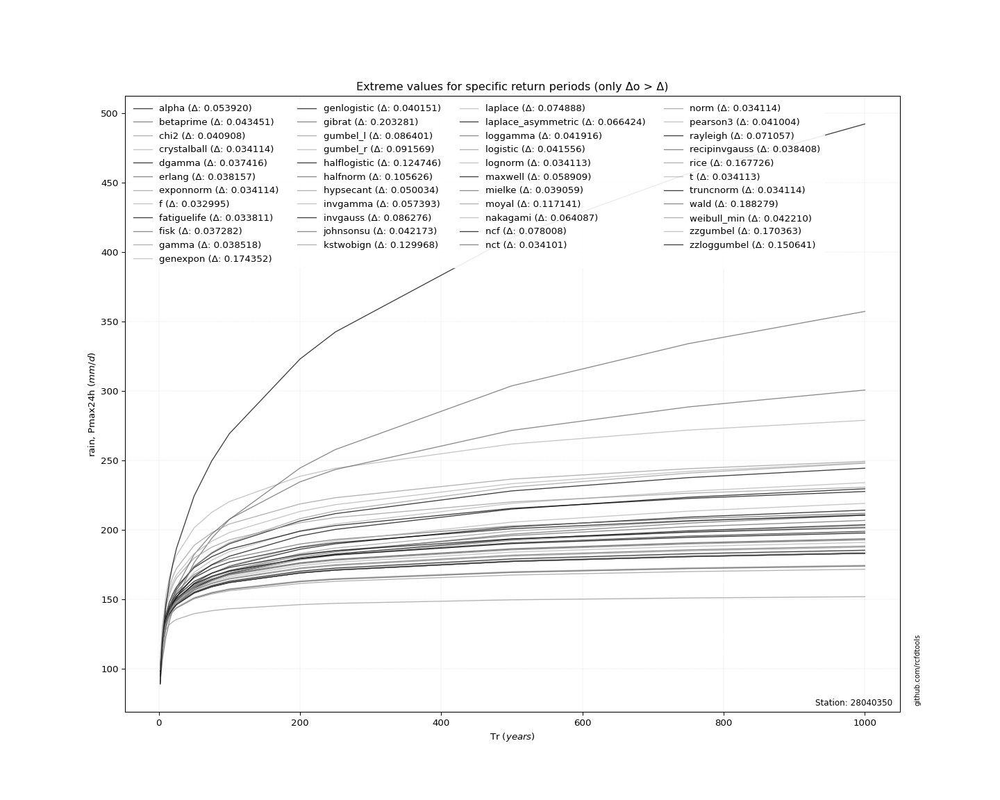</img>

</div>


<div align="center">

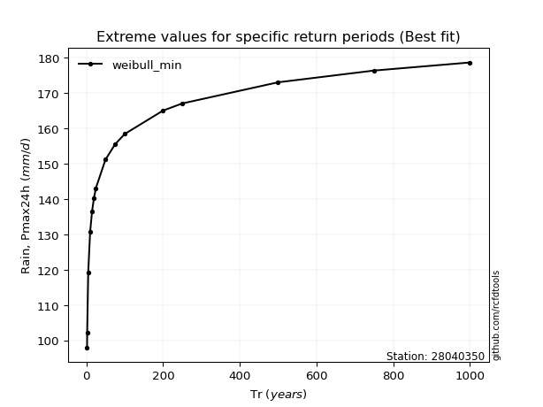</img>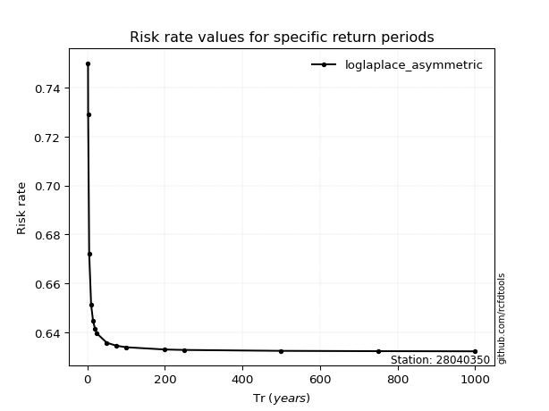</img>

</div>


<sub>**APP DISCLAIMER**: NO WARRANTY - This software is provided by [github.com/rcfdtools](https://github.com/rcfdtools) "as is", without any express or implied warranty, including warranties of merchantability, fitness for a particular purpose, or non-infringement. There is no guarantee that the software will be error-free or operate without interruption. LIMITATION OF LIABILITY - Neither the authors nor copyright holders will be liable for claims or damages arising from the software or its use. You are responsible for determining if the software is appropriate for your use and assume all associated risks, including errors, legal compliance, and data loss. NO PROFESSIONAL ADVICE - The software provides general information and does not offer professional advice. It should not replace consultation with professional advisors.</sub>