<div align="center">


</div>

# Station (rain, Pmax24h): 28045040

Probable Maximum Precipitation (PMP) is the greatest amount of rainfall for a specific duration that is meteorologically possible for a given location, acting as a "worst-case" scenario for extreme storms, crucial for designing safety-critical infrastructure like bridges, river deviations, dams, spillways, and nuclear plants to prevent catastrophic failure. PMP is calculated by hydrologists using meteorological data to determine the upper limit of extreme rainfall, often leading to the Probable Maximum Flood (PMF) for flood control design, and is increasingly being studied for climate change impacts.

<div align="center">

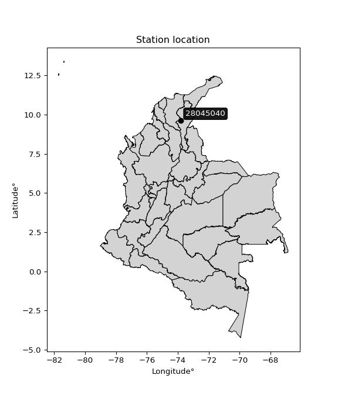</img>


</div>


## A. General information


### 1. General running parameters

• app_version: _v20251220_. • runtime: _2025-12-23 06:55:49.914859_. • Stations dataset (station_dataset_file): _dataset/pmax24h_in/conventional_1959_2009.csv_. • Stations catalog (station_catalog_file): _dataset/CNE_IDEAM.xls_. • Plot only fit distributions with Δo > Δ (plot_only_fit): _True_. • Eval low extreme values, if False, evaluates high extreme values (low_extreme): _False_. • Eval Gumbel distribution, non include in SciPy (pdist_loggumbel_on): _True_. • Eval Log-Gumbel distribution, non include in SciPy (pdist_loggumbel_on): _True_. • Standard deviation normalized (ddof): _1.0_. • Return periods to eval in years (Tr): _[2, 2.33, 5, 10, 15, 20, 25, 50, 75, 100, 200, 250, 500, 750, 1000]_. • Minimum data sample per station, 0 means any (minimum_sample): _5_. • Z-Score threshold to adjust a value, 0 means disable (zscore): _3.5_. • Avoid zeros, e.g. rain = 0 (avoid_zeros): _True_. • Avoid null values (avoid_nans): _True_. [:file_folder:Dataset file.](../../dataset/pmax24h_in/conventional_1959_2009.csv)


### 2. Station info and location

|   id |   CODIGO | NOMBRE                        | CATEGORIA               | TECNOLOGIA   | ESTADO     | FECHA_INSTALACION   | FECHA_SUSPENSION   |   ALTITUD |   LATITUD |   LONGITUD | DEPARTAMENTO   | MUNICIPIO   | AREA_OPERATIVA                                         | ENTIDAD                                                     | AREA_HIDROGRAFICA   | ZONA_HIDROGRAFICA   | SUBZONA_HIDROGRAFICA   |   CORRIENTE |   OBSERVACION |   SUBRED |
|-----:|---------:|:------------------------------|:------------------------|:-------------|:-----------|:--------------------|:-------------------|----------:|----------:|-----------:|:---------------|:------------|:-------------------------------------------------------|:------------------------------------------------------------|:--------------------|:--------------------|:-----------------------|------------:|--------------:|---------:|
|    0 | 28045040 | GUAIRA LA HACIENDA [28045040] | Climatológica Principal | Convencional | Suspendida | 15/09/1987          | 15/07/1994         |        50 |   9.61667 |      -73.8 | Cesar          | El Paso     | Area Operativa 05 - Magdalena-Cesar-Guajira-San Andrés | INSTITUTO DE HIDROLOGIA METEOROLOGIA Y ESTUDIOS AMBIENTALES | Magdalena Cauca     | Cesar               | Río Ariguaní           |         nan |           nan |      nan |

<div align="center">

Map location in: [:earth_americas:Google](http://maps.google.com/maps?q=9.616666667,-73.8) [:earth_americas:OSM](https://www.openstreetmap.org/#map=18/9.616666667/-73.8&layers=P) [:earth_americas:Bing](https://www.bing.com/maps?cp=9.616666667~-73.8&lvl=18) [:earth_americas:Apple](https://maps.apple.com/frame?center=9.616666667%2C-73.8&span=0.003%2C0.006)

</div>


<div align="center">

```geojson
{
  "type": "Feature",
  "geometry": {
    "type": "Point", 
    "coordinates": [-73.8, 9.616666667]
  }, 
  "properties": {
    "Name": "28045040"
  }
}
```

</div>


### 3. Discrete values table and plot

|               |           0 |           1 |           2 |          3 |           4 |
|:--------------|------------:|------------:|------------:|-----------:|------------:|
| Date          | 1988        | 1989        | 1990        | 1992       | 1993        |
| Value         |   84.5      |   67        |   68        |  106       |   66        |
| Value_initial |   84.5      |   67        |   68        |  106       |   66        |
| count         |    5        |    5        |    5        |    5       |    5        |
| mean          |   78.3      |   78.3      |   78.3      |   78.3     |   78.3      |
| std           |   17.254    |   17.254    |   17.254    |   17.254   |   17.254    |
| zscore        |    0.359337 |   -0.654921 |   -0.596964 |    1.60543 |   -0.712879 |

<div align="center">

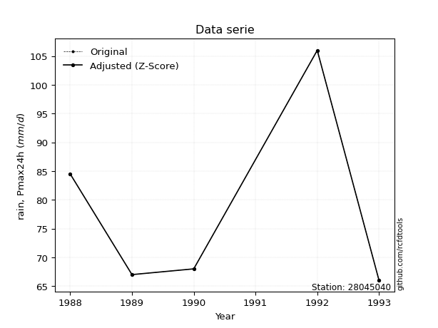</img>

</div>

> If Z-Score is active, values out of range or outliers are replaced with the station mean value.

### 4. Active continuous probability distributions from SciPy (47 of 104 available)

[scipy.stats](https://docs.scipy.org/doc/scipy/reference/stats.html) is a Python´s powerful submodule within the SciPy library for comprehensive statistical analysis, offering over 130 probability distributions (like Normal, Poisson), functions for descriptive stats (mean, variance), hypothesis testing (t-tests, chi-square), random variable generation, and statistical tests, making it essential for data science, modeling, and research. It provides tools to explore, model, and draw conclusions from data efficiently, working seamlessly with NumPy.

|   id | p_dist             |   n_parameter | fit_method   | label                                                                       | active   | ref                                                                                                        |
|-----:|:-------------------|--------------:|:-------------|:----------------------------------------------------------------------------|:---------|:-----------------------------------------------------------------------------------------------------------|
|    0 | alpha              |             3 | MLE          | Alpha                                                                       | True     | [:mortar_board:](https://docs.scipy.org/doc/scipy/reference/generated/scipy.stats.alpha.html)              |
|    1 | betaprime          |             4 | MLE          | Beta prime                                                                  | True     | [:mortar_board:](https://docs.scipy.org/doc/scipy/reference/generated/scipy.stats.betaprime.html)          |
|    2 | chi2               |             3 | MLE          | Chi²                                                                        | True     | [:mortar_board:](https://docs.scipy.org/doc/scipy/reference/generated/scipy.stats.chi2.html)               |
|    3 | crystalball        |             4 | MLE          | Crystalball                                                                 | True     | [:mortar_board:](https://docs.scipy.org/doc/scipy/reference/generated/scipy.stats.crystalball.html)        |
|    4 | dgamma             |             3 | MLE          | Double gamma                                                                | True     | [:mortar_board:](https://docs.scipy.org/doc/scipy/reference/generated/scipy.stats.dgamma.html)             |
|    5 | erlang             |             3 | MLE          | Erlang                                                                      | True     | [:mortar_board:](https://docs.scipy.org/doc/scipy/reference/generated/scipy.stats.erlang.html)             |
|    6 | expon              |             2 | MLE          | Exponential                                                                 | True     | [:mortar_board:](https://docs.scipy.org/doc/scipy/reference/generated/scipy.stats.expon.html)              |
|    7 | exponnorm          |             3 | MLE          | Exponentially modified Normal                                               | True     | [:mortar_board:](https://docs.scipy.org/doc/scipy/reference/generated/scipy.stats.exponnorm.html)          |
|    8 | f                  |             4 | MLE          | F                                                                           | True     | [:mortar_board:](https://docs.scipy.org/doc/scipy/reference/generated/scipy.stats.f.html)                  |
|    9 | fatiguelife        |             3 | MLE          | Fatigue-life (Birnbaum-Saunders)                                            | True     | [:mortar_board:](https://docs.scipy.org/doc/scipy/reference/generated/scipy.stats.fatiguelife.html)        |
|   10 | fisk               |             3 | MLE          | Fisk                                                                        | True     | [:mortar_board:](https://docs.scipy.org/doc/scipy/reference/generated/scipy.stats.fisk.html)               |
|   11 | gamma              |             3 | MLE          | Gamma                                                                       | True     | [:mortar_board:](https://docs.scipy.org/doc/scipy/reference/generated/scipy.stats.gamma.html)              |
|   12 | genexpon           |             5 | MLE          | Generalized exponential                                                     | True     | [:mortar_board:](https://docs.scipy.org/doc/scipy/reference/generated/scipy.stats.genexpon.html)           |
|   13 | genlogistic        |             3 | MLE          | Generalized logistic                                                        | True     | [:mortar_board:](https://docs.scipy.org/doc/scipy/reference/generated/scipy.stats.genlogistic.html)        |
|   14 | gibrat             |             2 | MM           | Gibrat                                                                      | True     | [:mortar_board:](https://docs.scipy.org/doc/scipy/reference/generated/scipy.stats.gibrat.html)             |
|   15 | gompertz           |             3 | MLE          | Gompertz (or truncated Gumbel)                                              | True     | [:mortar_board:](https://docs.scipy.org/doc/scipy/reference/generated/scipy.stats.gompertz.html)           |
|   16 | gumbel_l           |             2 | MM           | Gumbel Left Skew                                                            | True     | [:mortar_board:](https://docs.scipy.org/doc/scipy/reference/generated/scipy.stats.gumbel_l.html)           |
|   17 | gumbel_r           |             2 | MM           | Gumbel Right Skew                                                           | True     | [:mortar_board:](https://docs.scipy.org/doc/scipy/reference/generated/scipy.stats.gumbel_r.html)           |
|   18 | halflogistic       |             2 | MM           | Half-logistic                                                               | True     | [:mortar_board:](https://docs.scipy.org/doc/scipy/reference/generated/scipy.stats.halflogistic.html)       |
|   19 | halfnorm           |             2 | MM           | Half Normal                                                                 | True     | [:mortar_board:](https://docs.scipy.org/doc/scipy/reference/generated/scipy.stats.halfnorm.html)           |
|   20 | hypsecant          |             2 | MM           | hyperbolic secant                                                           | True     | [:mortar_board:](https://docs.scipy.org/doc/scipy/reference/generated/scipy.stats.hypsecant.html)          |
|   21 | invgamma           |             3 | MLE          | Inverted gamma                                                              | True     | [:mortar_board:](https://docs.scipy.org/doc/scipy/reference/generated/scipy.stats.invgamma.html)           |
|   22 | invgauss           |             3 | MLE          | Inverse Gaussian                                                            | True     | [:mortar_board:](https://docs.scipy.org/doc/scipy/reference/generated/scipy.stats.invgauss.html)           |
|   23 | invweibull         |             3 | MLE          | Inverted Weibull                                                            | True     | [:mortar_board:](https://docs.scipy.org/doc/scipy/reference/generated/scipy.stats.invweibull.html)         |
|   24 | johnsonsu          |             4 | MLE          | Johnson Su                                                                  | True     | [:mortar_board:](https://docs.scipy.org/doc/scipy/reference/generated/scipy.stats.johnsonsu.html)          |
|   25 | kstwobign          |             2 | MLE          | Limiting distribution of scaled Kolmogorov-Smirnov two-sided test statistic | True     | [:mortar_board:](https://docs.scipy.org/doc/scipy/reference/generated/scipy.stats.kstwobign.html)          |
|   26 | laplace            |             2 | MM           | Laplace                                                                     | True     | [:mortar_board:](https://docs.scipy.org/doc/scipy/reference/generated/scipy.stats.laplace.html)            |
|   27 | laplace_asymmetric |             3 | MLE          | Asymmetric Laplace                                                          | True     | [:mortar_board:](https://docs.scipy.org/doc/scipy/reference/generated/scipy.stats.laplace_asymmetric.html) |
|   28 | loggamma           |             3 | MLE          | Log gamma                                                                   | True     | [:mortar_board:](https://docs.scipy.org/doc/scipy/reference/generated/scipy.stats.loggamma.html)           |
|   29 | logistic           |             2 | MM           | Logistic (or Sech-squared)                                                  | True     | [:mortar_board:](https://docs.scipy.org/doc/scipy/reference/generated/scipy.stats.logistic.html)           |
|   30 | lognorm            |             3 | MLE          | Log Normal                                                                  | True     | [:mortar_board:](https://docs.scipy.org/doc/scipy/reference/generated/scipy.stats.lognorm.html)            |
|   31 | maxwell            |             2 | MM           | Maxwell                                                                     | True     | [:mortar_board:](https://docs.scipy.org/doc/scipy/reference/generated/scipy.stats.maxwell.html)            |
|   32 | mielke             |             4 | MLE          | Mielke Beta-Kappa / Dagum                                                   | True     | [:mortar_board:](https://docs.scipy.org/doc/scipy/reference/generated/scipy.stats.mielke.html)             |
|   33 | moyal              |             2 | MM           | Moyal                                                                       | True     | [:mortar_board:](https://docs.scipy.org/doc/scipy/reference/generated/scipy.stats.moyal.html)              |
|   34 | nakagami           |             3 | MLE          | Nakagami                                                                    | True     | [:mortar_board:](https://docs.scipy.org/doc/scipy/reference/generated/scipy.stats.nakagami.html)           |
|   35 | ncf                |             5 | MLE          | Non-central F distribution                                                  | True     | [:mortar_board:](https://docs.scipy.org/doc/scipy/reference/generated/scipy.stats.ncf.html)                |
|   36 | nct                |             4 | MLE          | Non-central Student’s t                                                     | True     | [:mortar_board:](https://docs.scipy.org/doc/scipy/reference/generated/scipy.stats.nct.html)                |
|   37 | norm               |             2 | MM           | Normal                                                                      | True     | [:mortar_board:](https://docs.scipy.org/doc/scipy/reference/generated/scipy.stats.norm.html)               |
|   38 | pareto             |             3 | MLE          | Pareto                                                                      | True     | [:mortar_board:](https://docs.scipy.org/doc/scipy/reference/generated/scipy.stats.pareto.html)             |
|   39 | pearson3           |             3 | MM           | Pearson type III                                                            | True     | [:mortar_board:](https://docs.scipy.org/doc/scipy/reference/generated/scipy.stats.pearson3.html)           |
|   40 | rayleigh           |             2 | MM           | Rayleigh                                                                    | True     | [:mortar_board:](https://docs.scipy.org/doc/scipy/reference/generated/scipy.stats.rayleigh.html)           |
|   41 | recipinvgauss      |             3 | MLE          | Reciprocal inverse Gaussian                                                 | True     | [:mortar_board:](https://docs.scipy.org/doc/scipy/reference/generated/scipy.stats.recipinvgauss.html)      |
|   42 | rice               |             3 | MLE          | Rice                                                                        | True     | [:mortar_board:](https://docs.scipy.org/doc/scipy/reference/generated/scipy.stats.rice.html)               |
|   43 | t                  |             3 | MLE          | Student’s t                                                                 | True     | [:mortar_board:](https://docs.scipy.org/doc/scipy/reference/generated/scipy.stats.t.html)                  |
|   44 | truncnorm          |             4 | MLE          | Truncated normal                                                            | True     | [:mortar_board:](https://docs.scipy.org/doc/scipy/reference/generated/scipy.stats.truncnorm.html)          |
|   45 | wald               |             2 | MM           | Wald                                                                        | True     | [:mortar_board:](https://docs.scipy.org/doc/scipy/reference/generated/scipy.stats.wald.html)               |
|   46 | weibull_min        |             3 | MLE          | Weibull minimum                                                             | True     | [:mortar_board:](https://docs.scipy.org/doc/scipy/reference/generated/scipy.stats.weibull_min.html)        |

>Gumbel and Lob-Gumbel probability distributions are not shown in the above table.
>
>**n_parameter:** # arguments & localization & scale.
>
>**Fit methods:** (MLE) maximum likelihood, (MM) L-moments.
>
>**Inactive:** foldnorm, gennorm, norminvgauss, powernorm, powerlognorm, skewnorm, genextreme, anglit, arcsine, argus, beta, bradford, burr, burr12, cauchy, cosine, halfcauchy, foldcauchy, skewcauchy, wrapcauchy, gengamma, exponweib, exponpow, truncexpon, gausshyper, genhalflogistic, genhyperbolic, geninvgauss, halfgennorm, johnsonsb, kappa4, kappa3, ksone, kstwo, loglaplace, levy, levy_l, levy_stable, ncx2, genpareto, truncpareto, lomax, powerlaw, rdist, rel_breitwigner, semicircular, studentized_range, trapezoid, triang, truncweibull_min, tukeylambda, uniform, loguniform, vonmises, vonmises_line, weibull_max, dweibull, 


## B. Probability distributions vs. Empirical distributions

A continuous probability distribution describes probabilities for variables that can take any value within a range (like rain any time), unlike discrete variables with specific outcomes (like temperature). It uses a Probability Density Function (PDF), a curve where the total area under it equals 1, and the probability of the variable falling within an interval (a to b) is found by calculating the area under the curve between those points. A key feature is that the probability of hitting any single exact value is zero, so probabilities are always expressed for ranges, e.g., $P(a ≤ X ≤ b)$.


### 0. Cumulative distribution values - CDF (49 evalated, ordered by x ascending) 

|   id |   Station |   date |     x |   count |   mean |    std |    zscore |   Value_initial |   station |   m |     alpha |   alpha_pdf |   betaprime |   betaprime_pdf |        chi2 |    chi2_pdf |   crystalball |   crystalball_pdf |   dgamma |   dgamma_pdf |      erlang |     erlang_pdf |     expon |   expon_pdf |   exponnorm |   exponnorm_pdf |         f |      f_pdf |   fatiguelife |   fatiguelife_pdf |     fisk |   fisk_pdf |      gamma |   gamma_pdf |    genexpon |   genexpon_pdf |   genlogistic |   genlogistic_pdf |    gibrat |   gibrat_pdf |    gompertz |   gompertz_pdf |   gumbel_l |   gumbel_l_pdf |   gumbel_r |   gumbel_r_pdf |   halflogistic |   halflogistic_pdf |   halfnorm |   halfnorm_pdf |   hypsecant |   hypsecant_pdf |   invgamma |   invgamma_pdf |   invgauss |   invgauss_pdf |   invweibull |   invweibull_pdf |   johnsonsu |    johnsonsu_pdf |   kstwobign |   kstwobign_pdf |   laplace |   laplace_pdf |   laplace_asymmetric |   laplace_asymmetric_pdf |   loggamma |   loggamma_pdf |   logistic |   logistic_pdf |   lognorm |   lognorm_pdf |   maxwell |   maxwell_pdf |   mielke |   mielke_pdf |    moyal |   moyal_pdf |    nakagami |   nakagami_pdf |      ncf |    ncf_pdf |      nct |    nct_pdf |     norm |   norm_pdf |      pareto |   pareto_pdf |   pearson3 |   pearson3_pdf |   rayleigh |   rayleigh_pdf |   recipinvgauss |   recipinvgauss_pdf |     rice |   rice_pdf |        t |      t_pdf |   truncnorm |   truncnorm_pdf |      wald |   wald_pdf |   weibull_min |   weibull_min_pdf |   zzgumbel |   gumbel_pdf |   zzloggumbel |   loggumbel_pdf |
|-----:|----------:|-------:|------:|--------:|-------:|-------:|----------:|----------------:|----------:|----:|----------:|------------:|------------:|----------------:|------------:|------------:|--------------:|------------------:|---------:|-------------:|------------:|---------------:|----------:|------------:|------------:|----------------:|----------:|-----------:|--------------:|------------------:|---------:|-----------:|-----------:|------------:|------------:|---------------:|--------------:|------------------:|----------:|-------------:|------------:|---------------:|-----------:|---------------:|-----------:|---------------:|---------------:|-------------------:|-----------:|---------------:|------------:|----------------:|-----------:|---------------:|-----------:|---------------:|-------------:|-----------------:|------------:|-----------------:|------------:|----------------:|----------:|--------------:|---------------------:|-------------------------:|-----------:|---------------:|-----------:|---------------:|----------:|--------------:|----------:|--------------:|---------:|-------------:|---------:|------------:|------------:|---------------:|---------:|-----------:|---------:|-----------:|---------:|-----------:|------------:|-------------:|-----------:|---------------:|-----------:|---------------:|----------------:|--------------------:|---------:|-----------:|---------:|-----------:|------------:|----------------:|----------:|-----------:|--------------:|------------------:|-----------:|-------------:|--------------:|----------------:|
|    0 |  28045040 |   1993 |  66   |       5 |   78.3 | 17.254 | -0.712879 |            66   |  28045040 |   1 | 0.0689853 |  0.20074    |    0.200797 |      0.0246025  | 7.24715e-07 | 2.20604e+07 |      0.212719 |        0.0188163  | 0.257865 |  0.0711557   | 4.89644e-11 | 2416.07        | 0         |  0.0813008  | 0.000926534 |      0.0809545  | 0.0568986 | 2.25328    |     0.0671209 |       1.48897e+11 | 0.236109 | 0.0252223  | 1.9695e-13 | 11.8941     | 2.29536e-09 |     0.0812395  |      0.179563 |        0.0304297  | 0         |   0          | 8.69715e-09 |     0.0817316  |   0.182913 |     0.0137177  |   0.210031 |      0.0272388 |       0.223211 |         0.0360074  |   0.249083 |     0.0296351  |    0.177306 |      0.0171283  |  0.0508392 |     0.622296   |  0.0526899 |     0.38745    |   0.00734439 |      2.165e+11   |  0.00119703 | 737199           |    0.161139 |      0.0287698  |  0.161976 |     0.0148433 |          6.57226e-10 |               0.0812989  |   0.214387 |     0.0185751  |   0.190674 |      0.0181372 | 0.0233027 |   2.8606e+11  |  0.22812  |    0.0222883  | 0.162708 |   0.0385192  | 0.199093 |  0.0323329  | 5.19919e-11 |  2429.03       | 0.495487 | 0.00717121 | 0.195693 | 0.0263372  | 0.212719 | 0.0188163  | 1.11022e-16 |   0.815897   |   0.222593 |     0.0263159  |   0.234552 |     0.0237587  |     2.43306e-07 |       6659.17       | 0.149558 | 0.0242245  | 0.212732 | 0.018817   |   0         |       0.0647676 | 0.0664524 | 0.059117   |   8.96906e-07 |       2.50472e+07 |  0.0830164 |            0 |      0.159192 |               0 |
|    1 |  28045040 |   1989 |  67   |       5 |   78.3 | 17.254 | -0.654921 |            67   |  28045040 |   2 | 0.2912    |  0.202442   |    0.22605  |      0.0258792  | 0.64228     | 0.217968    |      0.232016 |        0.0197721  | 0.500012 |  2.70259e+08 | 0.238962    |    0.155902    | 0.0780837 |  0.0749525  | 0.0787193   |      0.0746823  | 0.29581   | 0.098655   |     0.627865  |       0.0616972   | 0.262051 | 0.0266407  | 0.143793   |  0.116655   | 0.0780272   |     0.0749007  |      0.21101  |        0.0324003  | 0.0033198 |   0.0211877  | 0.0784808   |     0.0753173  |   0.197093 |     0.0146478  |   0.237865 |      0.0283884 |       0.258899 |         0.0353554  |   0.278528 |     0.0292476  |    0.195187 |      0.0186453  |  0.415264  |     0.178086   |  0.364984  |     0.201537   |   0.976204   |      0.00400857  |  0.832012   |      0.0479612   |    0.19083  |      0.0305523  |  0.177521 |     0.0162678 |          0.0780819   |               0.0749509  |   0.23343  |     0.0195048  |   0.209473 |      0.0194625 | 0.641627  |   0.0275617   |  0.250797 |    0.0230498  | 0.202782 |   0.0414638  | 0.232102 |  0.0336041  | 0.0811904   |     0.0538893  | 0.502619 | 0.00709255 | 0.222739 | 0.0277192  | 0.232016 | 0.019772   | 0.382758    |   0.190442   |   0.249327 |     0.0271213  |   0.258614 |     0.0243479  |     0.225249    |          0.109585   | 0.174475 | 0.0255821  | 0.23203  | 0.0197727  |   0.0627151 |       0.0607065 | 0.13132   | 0.0685547  |   0.244706    |       0.0841222   |  0.0992185 |            0 |      0.191127 |               0 |
|    2 |  28045040 |   1990 |  68   |       5 |   78.3 | 17.254 | -0.596964 |            68   |  28045040 |   3 | 0.457166  |  0.132999   |    0.252502 |      0.0269962  | 0.793244    | 0.104625    |      0.25225  |        0.0206893  | 0.742135 |  0.0711557   | 0.370258    |    0.112228    | 0.15007   |  0.0691     | 0.150455    |      0.0688672  | 0.371403  | 0.0597277  |     0.677716  |       0.041366    | 0.289341 | 0.0279121  | 0.248828   |  0.0953234  | 0.149966    |     0.0690564  |      0.244233 |        0.0339792  | 0.0572269 |   0.07792    | 0.150802    |     0.0694063  |   0.212222 |     0.0156172  |   0.266727 |      0.0292943 |       0.293894 |         0.0346223  |   0.307566 |     0.0288211  |    0.214618 |      0.0202271  |  0.535866  |     0.0831258  |  0.510272  |     0.105422   |   0.978829   |      0.00178566  |  0.863138   |      0.0209285   |    0.222121 |      0.0319681  |  0.194557 |     0.017829  |          0.150067    |               0.0690986  |   0.253385 |     0.0203985  |   0.229599 |      0.0207894 | 0.660547  |   0.0135098   |  0.274189 |    0.0237175  | 0.245302 |   0.043412   | 0.266147 |  0.0344116  | 0.128601    |     0.0426435  | 0.509672 | 0.00701336 | 0.251059 | 0.0288834  | 0.25225  | 0.0206893  | 0.514425    |   0.092375   |   0.276773 |     0.0277405  |   0.283213 |     0.0248319  |     0.314303    |          0.0743794  | 0.200667 | 0.0267722  | 0.252265 | 0.02069    |   0.121498  |       0.0569001 | 0.200593  | 0.0689908  |   0.308927    |       0.0506703   |  0.117078  |            0 |      0.224811 |               0 |
|    3 |  28045040 |   1988 |  84.5 |       5 |   78.3 | 17.254 |  0.359337 |            84.5 |  28045040 |   4 | 0.899323  |  0.00503642 |    0.709039 |      0.0221535  | 0.999708    | 0.00010723  |      0.656066 |        0.0238466  | 0.969329 |  0.00302993  | 0.941952    |    0.00776555  | 0.777775  |  0.0180671  | 0.777005    |      0.0180768  | 0.682304  | 0.00752225 |     0.919701  |       0.00565345  | 0.751646 | 0.0204058  | 0.884882   |  0.0125712  | 0.777523    |     0.0180739  |      0.758445 |        0.0207053  | 0.822012  |   0.0144967  | 0.779539    |     0.0180186  |   0.609345 |     0.0305161  |   0.715064 |      0.0199309 |       0.729706 |         0.0177172  |   0.70169  |     0.0181464  |    0.688734 |      0.0268691  |  0.808989  |     0.00434576 |  0.868135  |     0.00540133 |   0.985463   |      0.000133002 |  0.935668   |      0.00129849  |    0.722842 |      0.0221359  |  0.716717 |     0.0259598 |          0.777767    |               0.0180673  |   0.652413 |     0.0237305  |   0.674519 |      0.0258033 | 0.718403  |   0.00134631  |  0.677048 |    0.0212529  | 0.794681 |   0.0174719  | 0.734523 |  0.018386   | 0.546321    |     0.0178204  | 0.614472 | 0.0056946  | 0.718363 | 0.0214156  | 0.656066 | 0.0238466  | 0.819229    |   0.00469393 |   0.702874 |     0.0199085  |   0.683335 |     0.0203866  |     0.781623    |          0.0124442  | 0.672905 | 0.024471   | 0.656084 | 0.0238462  |   0.698313  |       0.0195449 | 0.78984   | 0.014705   |   0.590738    |       0.00784347  |  0.533051  |            0 |      0.720057 |               0 |
|    4 |  28045040 |   1992 | 106   |       5 |   78.3 | 17.254 |  1.60543  |           106   |  28045040 |   5 | 0.951529  |  0.00116983 |    0.960385 |      0.00416942 | 1           | 4.56507e-08 |      0.963667 |        0.00516278 | 0.995648 |  0.000373389 | 0.99647     |    0.000451685 | 0.961305  |  0.00314597 | 0.960972    |      0.00316376 | 0.780565  | 0.00284146 |     0.980448  |       0.00122484  | 0.960906 | 0.00327532 | 0.98862    |  0.00121328 | 0.96121     |     0.00315132 |      0.967454 |        0.00316095 | 0.956349  |   0.00234311 | 0.961966    |     0.00310861 |   0.996345 |     0.00170448 |   0.945374 |      0.0044135 |       0.940557 |         0.00437137 |   0.939876 |     0.00532473 |    0.962078 |      0.00385079 |  0.86221   |     0.00146612 |  0.930979  |     0.00161188 |   0.987242   |      5.40325e-05 |  0.952209   |      0.000474967 |    0.966332 |      0.00389967 |  0.960504 |     0.0036194 |          0.961302    |               0.00314614 |   0.962443 |     0.00531127 |   0.962875 |      0.0042014 | 0.737286  |   0.000601548 |  0.951124 |    0.00536498 | 0.961871 |   0.00268557 | 0.942473 |  0.00413324 | 0.822188    |     0.00864362 | 0.719915 | 0.00416793 | 0.956654 | 0.00405925 | 0.963667 | 0.00516278 | 0.875638    |   0.0015195  |   0.945054 |     0.00482578 |   0.947691 |     0.00539441 |     0.929687    |          0.00350909 | 0.963293 | 0.00472255 | 0.963671 | 0.00516233 |   0.92509   |       0.0048546 | 0.944259  | 0.00310894 |   0.702769    |       0.0035778   |  0.88051   |            0 |      0.934571 |               0 |

An Empirical Distribution Function (EDF) is a step-function estimate of a true cumulative distribution function (CDF) based on observed sample data, representing the proportion of data points less than or equal to a given value. It is calculated by ordering your data and jumping up by $1/n$ (where $n$ is sample size) at each unique data point, allowing analysis without assuming an underlying population distribution, and it gets closer to the true CDF as the sample size grows.


### 1. Empirical - EDF California (1923)

California´s estimates the true probability distribution of water-related data (like rainfall, streamflow) using observed samples, crucial for risk assessment.

<div align="center">


$P=m/n$


</div>


**1.1. Empirical values**

<div align="center">

|                | 0              | 1                  | 2              | 3                 | 4              |
|:---------------|:---------------|:-------------------|:---------------|:------------------|:---------------|
| date           | 1993           | 1989               | 1990           | 1988              | 1992           |
| x              | 66.0           | 67.0               | 68.0           | 84.5              | 106.0          |
| m              | 1              | 2                  | 3              | 4                 | 5              |
| empirical_dist | edf_california | edf_california     | edf_california | edf_california    | edf_california |
| empirical      | 0.2            | 0.4                | 0.6            | 0.8               | 1.0            |
| empirical_tr   | 1.25           | 1.6666666666666667 | 2.5            | 5.000000000000001 | inf            |

</div>


**1.2. Parameters & Kolmogorov-Smirnov fit test (sorted by Δ)**

|   id | empirical_dist   | p_dist             |    delta |   deltao | eval   |   fit |   n |            loc |          scale | shape                  | shape1                | shape2             | shape3   |   best_fit |   best_fit_sort |
|-----:|:-----------------|:-------------------|---------:|---------:|:-------|------:|----:|---------------:|---------------:|:-----------------------|:----------------------|:-------------------|:---------|-----------:|----------------:|
|    0 | edf_california   | alpha              | 0.142834 | 0.586543 | Δo > Δ |     1 |   5 |     64.6167    |    2.51557     | 2.2561222112948883e-06 |                       |                    |          |          1 |               1 |
|    1 | edf_california   | invgauss           | 0.14731  | 0.586543 | Δo > Δ |     1 |   5 |     65.6832    |    1.24089     | 10.16752408575293      |                       |                    |          |          0 |               2 |
|    2 | edf_california   | invgamma           | 0.149161 | 0.586543 | Δo > Δ |     1 |   5 |     65.8249    |    0.302622    | 0.4297315538891706     |                       |                    |          |          0 |               3 |
|    3 | edf_california   | dgamma             | 0.169329 | 0.586543 | Δo > Δ |     1 |   5 |     67         |   13.9511      | 0.31045145640856997    |                       |                    |          |          0 |               4 |
|    4 | edf_california   | pareto             | 0.2      | 0.586543 | Δo > Δ |     1 |   5 |     65.3919    |    0.608122    | 0.4961647277526386     |                       |                    |          |          0 |               5 |
|    5 | edf_california   | fatiguelife        | 0.227865 | 0.586543 | Δo > Δ |     1 |   5 |     66         |    3.71184e-06 | 1591.1635680991308     |                       |                    |          |          0 |               6 |
|    6 | edf_california   | f                  | 0.228597 | 0.586543 | Δo > Δ |     1 |   5 |     65.9911    |    9.06646     | 0.7028999001462481     | 1.270270787280117     |                    |          |          0 |               7 |
|    7 | edf_california   | erlang             | 0.229742 | 0.586543 | Δo > Δ |     1 |   5 |     66         |    8.22473     | 0.7012103116760149     |                       |                    |          |          0 |               8 |
|    8 | edf_california   | chi2               | 0.24228  | 0.586543 | Δo > Δ |     1 |   5 |     66         |    1.46774     | 0.8651608206009879     |                       |                    |          |          0 |               9 |
|    9 | edf_california   | lognorm            | 0.262714 | 0.586543 | Δo > Δ |     1 |   5 |     66         |    0.0073211   | 13.552535329262627     |                       |                    |          |          0 |              10 |
|   10 | edf_california   | recipinvgauss      | 0.285697 | 0.586543 | Δo > Δ |     1 |   5 |     66         |   12.2111      | 353005.38167740405     |                       |                    |          |          0 |              11 |
|   11 | edf_california   | halfnorm           | 0.292434 | 0.586543 | Δo > Δ |     1 |   5 |     57.8735    |   25.6008      |                        |                       |                    |          |          0 |              12 |
|   12 | edf_california   | ncf                | 0.295487 | 0.586543 | Δo > Δ |     1 |   5 |      0.0423853 |    4.97387e-06 | 6.396895698895876e-07  | 11.353772297033352    | 9.19611523408203   |          |          0 |              13 |
|   13 | edf_california   | weibull_min        | 0.297231 | 0.586543 | Δo > Δ |     1 |   5 |     66         |   24.5769      | 0.3968558762538796     |                       |                    |          |          0 |              14 |
|   14 | edf_california   | halflogistic       | 0.306106 | 0.586543 | Δo > Δ |     1 |   5 |     60.009     |   13.1942      |                        |                       |                    |          |          0 |              15 |
|   15 | edf_california   | fisk               | 0.310659 | 0.586543 | Δo > Δ |     1 |   5 |     -0.237632  |   75.1891      | 9.262856659644054      |                       |                    |          |          0 |              16 |
|   16 | edf_california   | rayleigh           | 0.316787 | 0.586543 | Δo > Δ |     1 |   5 |     48.7769    |   23.5561      |                        |                       |                    |          |          0 |              17 |
|   17 | edf_california   | pearson3           | 0.323227 | 0.586543 | Δo > Δ |     1 |   5 |     78.3       |   15.4324      | 0.9302948570091479     |                       |                    |          |          0 |              18 |
|   18 | edf_california   | maxwell            | 0.325811 | 0.586543 | Δo > Δ |     1 |   5 |     41.7316    |   22.9158      |                        |                       |                    |          |          0 |              19 |
|   19 | edf_california   | gumbel_r           | 0.333273 | 0.586543 | Δo > Δ |     1 |   5 |     71.3546    |   12.0326      |                        |                       |                    |          |          0 |              20 |
|   20 | edf_california   | moyal              | 0.333853 | 0.586543 | Δo > Δ |     1 |   5 |     69.4747    |    6.94704     |                        |                       |                    |          |          0 |              21 |
|   21 | edf_california   | loggamma           | 0.346615 | 0.586543 | Δo > Δ |     1 |   5 |  -5376.09      |  713.546       | 2088.7955527033105     |                       |                    |          |          0 |              22 |
|   22 | edf_california   | betaprime          | 0.347498 | 0.586543 | Δo > Δ |     1 |   5 |     -1.03944   |   10.6297      | 266.2523780275282      | 36.793638253223975    |                    |          |          0 |              23 |
|   23 | edf_california   | t                  | 0.347735 | 0.586543 | Δo > Δ |     1 |   5 |     78.2993    |   15.4324      | 12857825.153010752     |                       |                    |          |          0 |              24 |
|   24 | edf_california   | crystalball        | 0.34775  | 0.586543 | Δo > Δ |     1 |   5 |     78.3       |   15.4324      | 5438.333067165024      | 3400.545771361175     |                    |          |          0 |              25 |
|   25 | edf_california   | norm               | 0.34775  | 0.586543 | Δo > Δ |     1 |   5 |     78.3       |   15.4324      |                        |                       |                    |          |          0 |              26 |
|   26 | edf_california   | nct                | 0.348941 | 0.586543 | Δo > Δ |     1 |   5 |     -0.324035  |    1.16915     | 17.222305362253202     | 64.12661156808444     |                    |          |          0 |              27 |
|   27 | edf_california   | gamma              | 0.351172 | 0.586543 | Δo > Δ |     1 |   5 |     66         |    9.64666     | 0.8582108600252419     |                       |                    |          |          0 |              28 |
|   28 | edf_california   | mielke             | 0.354698 | 0.586543 | Δo > Δ |     1 |   5 |     20.7896    |   29.9508      | 144.00222025141272     | 6.124944655363475     |                    |          |          0 |              29 |
|   29 | edf_california   | genlogistic        | 0.355767 | 0.586543 | Δo > Δ |     1 |   5 |     -1.44097   |   10.1267      | 1340.8407147450898     |                       |                    |          |          0 |              30 |
|   30 | edf_california   | logistic           | 0.370401 | 0.586543 | Δo > Δ |     1 |   5 |     78.3       |    8.50835     |                        |                       |                    |          |          0 |              31 |
|   31 | edf_california   | zzloggumbel        | 0.375189 | 0.586543 | Δo > Δ |     1 |   5 |      4.27697   |    0.1435      | 0.4587941646363373     | 0.7927783866335278    |                    |          |          0 |              32 |
|   32 | edf_california   | kstwobign          | 0.377879 | 0.586543 | Δo > Δ |     1 |   5 |     35.4762    |   49.3502      |                        |                       |                    |          |          0 |              33 |
|   33 | edf_california   | hypsecant          | 0.385382 | 0.586543 | Δo > Δ |     1 |   5 |     78.3       |    9.82459     |                        |                       |                    |          |          0 |              34 |
|   34 | edf_california   | gumbel_l           | 0.387778 | 0.586543 | Δo > Δ |     1 |   5 |     85.2454    |   12.0326      |                        |                       |                    |          |          0 |              35 |
|   35 | edf_california   | rice               | 0.399333 | 0.586543 | Δo > Δ |     1 |   5 |     54.6255    |   19.983       | 0.0003312084136606528  |                       |                    |          |          0 |              36 |
|   36 | edf_california   | wald               | 0.399407 | 0.586543 | Δo > Δ |     1 |   5 |     62.8676    |   15.4324      |                        |                       |                    |          |          0 |              37 |
|   37 | edf_california   | laplace            | 0.405443 | 0.586543 | Δo > Δ |     1 |   5 |     78.3       |   10.9124      |                        |                       |                    |          |          0 |              38 |
|   38 | edf_california   | johnsonsu          | 0.432012 | 0.586543 | Δo > Δ |     1 |   5 |     66         |    8.44603e-10 | -3.1603106279431694    | 0.19098437803723442   |                    |          |          0 |              39 |
|   39 | edf_california   | gompertz           | 0.449198 | 0.586543 | Δo > Δ |     1 |   5 |     66         |    4.15422e+07 | 3395311.2952204095     |                       |                    |          |          0 |              40 |
|   40 | edf_california   | exponnorm          | 0.449545 | 0.586543 | Δo > Δ |     1 |   5 |     65.9886    |    0.00342425  | 3602.5351032013627     |                       |                    |          |          0 |              41 |
|   41 | edf_california   | expon              | 0.44993  | 0.586543 | Δo > Δ |     1 |   5 |     66         |   12.3         |                        |                       |                    |          |          0 |              42 |
|   42 | edf_california   | laplace_asymmetric | 0.449933 | 0.586543 | Δo > Δ |     1 |   5 |     66         |    0.000181219 | 1.4732937397076812e-05 |                       |                    |          |          0 |              43 |
|   43 | edf_california   | genexpon           | 0.450034 | 0.586543 | Δo > Δ |     1 |   5 |     66         |   27.1352      | 2.204447915786575      | 5.780448093058229e-08 | 1.4906899459905778 |          |          0 |              44 |
|   44 | edf_california   | nakagami           | 0.471399 | 0.586543 | Δo > Δ |     1 |   5 |     66         |   29.9853      | 0.3319620409797418     |                       |                    |          |          0 |              45 |
|   45 | edf_california   | truncnorm          | 0.478502 | 0.586543 | Δo > Δ |     1 |   5 | -67204.8       | 1019.26        | 65.99974054842681      | 107.56322857469246    |                    |          |          0 |              46 |
|   46 | edf_california   | zzgumbel           | 0.482922 | 0.586543 | Δo > Δ |     1 |   5 |     78.2659    |   13.4529      | 0.4587941646363373     | 0.7927783866335278    |                    |          |          0 |              47 |
|   47 | edf_california   | gibrat             | 0.542773 | 0.586543 | Δo > Δ |     1 |   5 |     66.527     |    7.1407      |                        |                       |                    |          |          0 |              48 |
|   48 | edf_california   | invweibull         | 0.576204 | 0.586543 | Δo > Δ |     1 |   5 |     66         |    3.22703e-10 | 0.17050382005097953    |                       |                    |          |          0 |              49 |

<div align="center">

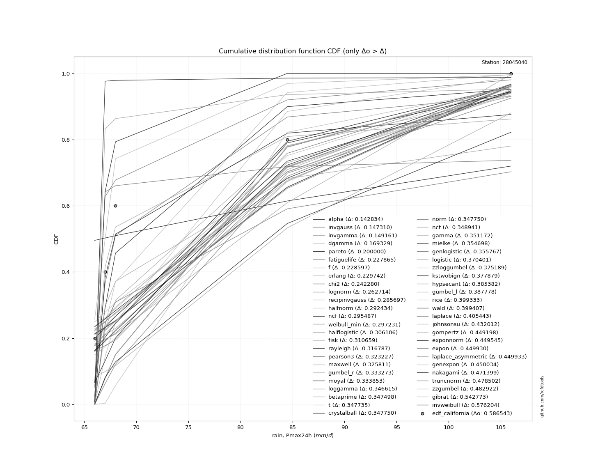</img>

</div>


**1.3. Best fit**

|   id |   station | empirical_dist   | p_dist   |    delta |   deltao | eval   |   fit |   n |     loc |   scale |       shape | shape1   | shape2   | shape3   |   best_fit |   best_fit_sort |
|-----:|----------:|:-----------------|:---------|---------:|---------:|:-------|------:|----:|--------:|--------:|------------:|:---------|:---------|:---------|-----------:|----------------:|
|    0 |  28045040 | edf_california   | alpha    | 0.142834 | 0.586543 | Δo > Δ |     1 |   5 | 64.6167 | 2.51557 | 2.25612e-06 |          |          |          |          1 |               1 |

<div align="center">

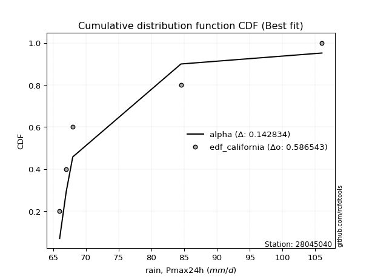</img>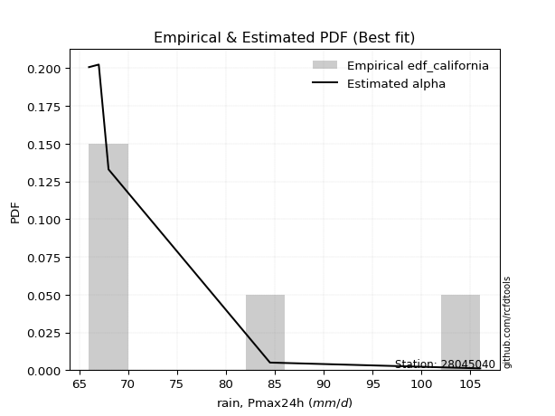</img>

</div>


### 2. Empirical - EDF Hazen (1930)

Hazen method for plotting positions is a formula used to estimate the empirical cumulative probability distribution of flood events or other hydrological data. This formula often results in biased estimations, particularly when extrapolating to extreme events (high return periods).

<div align="center">


$P=(m-0.5)/n$


</div>


**2.1. Empirical values**

<div align="center">

|                | 0                  | 1                  | 2         | 3                 | 4                  |
|:---------------|:-------------------|:-------------------|:----------|:------------------|:-------------------|
| date           | 1993               | 1989               | 1990      | 1988              | 1992               |
| x              | 66.0               | 67.0               | 68.0      | 84.5              | 106.0              |
| m              | 1                  | 2                  | 3         | 4                 | 5                  |
| empirical_dist | edf_hazen          | edf_hazen          | edf_hazen | edf_hazen         | edf_hazen          |
| empirical      | 0.1                | 0.3                | 0.5       | 0.7               | 0.9                |
| empirical_tr   | 1.1111111111111112 | 1.4285714285714286 | 2.0       | 3.333333333333333 | 10.000000000000002 |

</div>


**2.2. Parameters & Kolmogorov-Smirnov fit test (sorted by Δ)**

|   id | empirical_dist   | p_dist             |    delta |   deltao | eval    |   fit |   n |            loc |          scale | shape                  | shape1                | shape2             | shape3   |   best_fit |   best_fit_sort |
|-----:|:-----------------|:-------------------|---------:|---------:|:--------|------:|----:|---------------:|---------------:|:-----------------------|:----------------------|:-------------------|:---------|-----------:|----------------:|
|    0 | edf_hazen        | invgamma           | 0.115264 | 0.586543 | Δo > Δ  |     1 |   5 |     65.8249    |    0.302622    | 0.4297315538891706     |                       |                    |          |          1 |               1 |
|    1 | edf_hazen        | pareto             | 0.119229 | 0.586543 | Δo > Δ  |     1 |   5 |     65.3919    |    0.608122    | 0.4961647277526386     |                       |                    |          |          0 |               2 |
|    2 | edf_hazen        | f                  | 0.128597 | 0.586543 | Δo > Δ  |     1 |   5 |     65.9911    |    9.06646     | 0.7028999001462481     | 1.270270787280117     |                    |          |          0 |               3 |
|    3 | edf_hazen        | invgauss           | 0.168135 | 0.586543 | Δo > Δ  |     1 |   5 |     65.6832    |    1.24089     | 10.16752408575293      |                       |                    |          |          0 |               4 |
|    4 | edf_hazen        | recipinvgauss      | 0.185697 | 0.586543 | Δo > Δ  |     1 |   5 |     66         |   12.2111      | 353005.38167740405     |                       |                    |          |          0 |               5 |
|    5 | edf_hazen        | halfnorm           | 0.192434 | 0.586543 | Δo > Δ  |     1 |   5 |     57.8735    |   25.6008      |                        |                       |                    |          |          0 |               6 |
|    6 | edf_hazen        | weibull_min        | 0.197231 | 0.586543 | Δo > Δ  |     1 |   5 |     66         |   24.5769      | 0.3968558762538796     |                       |                    |          |          0 |               7 |
|    7 | edf_hazen        | alpha              | 0.199323 | 0.586543 | Δo > Δ  |     1 |   5 |     64.6167    |    2.51557     | 2.2561222112948883e-06 |                       |                    |          |          0 |               8 |
|    8 | edf_hazen        | halflogistic       | 0.206106 | 0.586543 | Δo > Δ  |     1 |   5 |     60.009     |   13.1942      |                        |                       |                    |          |          0 |               9 |
|    9 | edf_hazen        | fisk               | 0.210659 | 0.586543 | Δo > Δ  |     1 |   5 |     -0.237632  |   75.1891      | 9.262856659644054      |                       |                    |          |          0 |              10 |
|   10 | edf_hazen        | rayleigh           | 0.216787 | 0.586543 | Δo > Δ  |     1 |   5 |     48.7769    |   23.5561      |                        |                       |                    |          |          0 |              11 |
|   11 | edf_hazen        | pearson3           | 0.223227 | 0.586543 | Δo > Δ  |     1 |   5 |     78.3       |   15.4324      | 0.9302948570091479     |                       |                    |          |          0 |              12 |
|   12 | edf_hazen        | maxwell            | 0.225811 | 0.586543 | Δo > Δ  |     1 |   5 |     41.7316    |   22.9158      |                        |                       |                    |          |          0 |              13 |
|   13 | edf_hazen        | gumbel_r           | 0.233273 | 0.586543 | Δo > Δ  |     1 |   5 |     71.3546    |   12.0326      |                        |                       |                    |          |          0 |              14 |
|   14 | edf_hazen        | moyal              | 0.233853 | 0.586543 | Δo > Δ  |     1 |   5 |     69.4747    |    6.94704     |                        |                       |                    |          |          0 |              15 |
|   15 | edf_hazen        | erlang             | 0.241952 | 0.586543 | Δo > Δ  |     1 |   5 |     66         |    8.22473     | 0.7012103116760149     |                       |                    |          |          0 |              16 |
|   16 | edf_hazen        | loggamma           | 0.246615 | 0.586543 | Δo > Δ  |     1 |   5 |  -5376.09      |  713.546       | 2088.7955527033105     |                       |                    |          |          0 |              17 |
|   17 | edf_hazen        | betaprime          | 0.247498 | 0.586543 | Δo > Δ  |     1 |   5 |     -1.03944   |   10.6297      | 266.2523780275282      | 36.793638253223975    |                    |          |          0 |              18 |
|   18 | edf_hazen        | t                  | 0.247735 | 0.586543 | Δo > Δ  |     1 |   5 |     78.2993    |   15.4324      | 12857825.153010752     |                       |                    |          |          0 |              19 |
|   19 | edf_hazen        | crystalball        | 0.24775  | 0.586543 | Δo > Δ  |     1 |   5 |     78.3       |   15.4324      | 5438.333067165024      | 3400.545771361175     |                    |          |          0 |              20 |
|   20 | edf_hazen        | norm               | 0.24775  | 0.586543 | Δo > Δ  |     1 |   5 |     78.3       |   15.4324      |                        |                       |                    |          |          0 |              21 |
|   21 | edf_hazen        | nct                | 0.248941 | 0.586543 | Δo > Δ  |     1 |   5 |     -0.324035  |    1.16915     | 17.222305362253202     | 64.12661156808444     |                    |          |          0 |              22 |
|   22 | edf_hazen        | gamma              | 0.251172 | 0.586543 | Δo > Δ  |     1 |   5 |     66         |    9.64666     | 0.8582108600252419     |                       |                    |          |          0 |              23 |
|   23 | edf_hazen        | mielke             | 0.254698 | 0.586543 | Δo > Δ  |     1 |   5 |     20.7896    |   29.9508      | 144.00222025141272     | 6.124944655363475     |                    |          |          0 |              24 |
|   24 | edf_hazen        | genlogistic        | 0.255767 | 0.586543 | Δo > Δ  |     1 |   5 |     -1.44097   |   10.1267      | 1340.8407147450898     |                       |                    |          |          0 |              25 |
|   25 | edf_hazen        | dgamma             | 0.269329 | 0.586543 | Δo > Δ  |     1 |   5 |     67         |   13.9511      | 0.31045145640856997    |                       |                    |          |          0 |              26 |
|   26 | edf_hazen        | logistic           | 0.270401 | 0.586543 | Δo > Δ  |     1 |   5 |     78.3       |    8.50835     |                        |                       |                    |          |          0 |              27 |
|   27 | edf_hazen        | zzloggumbel        | 0.275189 | 0.586543 | Δo > Δ  |     1 |   5 |      4.27697   |    0.1435      | 0.4587941646363373     | 0.7927783866335278    |                    |          |          0 |              28 |
|   28 | edf_hazen        | kstwobign          | 0.277879 | 0.586543 | Δo > Δ  |     1 |   5 |     35.4762    |   49.3502      |                        |                       |                    |          |          0 |              29 |
|   29 | edf_hazen        | hypsecant          | 0.285382 | 0.586543 | Δo > Δ  |     1 |   5 |     78.3       |    9.82459     |                        |                       |                    |          |          0 |              30 |
|   30 | edf_hazen        | gumbel_l           | 0.287778 | 0.586543 | Δo > Δ  |     1 |   5 |     85.2454    |   12.0326      |                        |                       |                    |          |          0 |              31 |
|   31 | edf_hazen        | rice               | 0.299333 | 0.586543 | Δo > Δ  |     1 |   5 |     54.6255    |   19.983       | 0.0003312084136606528  |                       |                    |          |          0 |              32 |
|   32 | edf_hazen        | wald               | 0.299407 | 0.586543 | Δo > Δ  |     1 |   5 |     62.8676    |   15.4324      |                        |                       |                    |          |          0 |              33 |
|   33 | edf_hazen        | laplace            | 0.305443 | 0.586543 | Δo > Δ  |     1 |   5 |     78.3       |   10.9124      |                        |                       |                    |          |          0 |              34 |
|   34 | edf_hazen        | fatiguelife        | 0.327865 | 0.586543 | Δo > Δ  |     1 |   5 |     66         |    3.71184e-06 | 1591.1635680991308     |                       |                    |          |          0 |              35 |
|   35 | edf_hazen        | lognorm            | 0.341627 | 0.586543 | Δo > Δ  |     1 |   5 |     66         |    0.0073211   | 13.552535329262627     |                       |                    |          |          0 |              36 |
|   36 | edf_hazen        | chi2               | 0.34228  | 0.586543 | Δo > Δ  |     1 |   5 |     66         |    1.46774     | 0.8651608206009879     |                       |                    |          |          0 |              37 |
|   37 | edf_hazen        | gompertz           | 0.349198 | 0.586543 | Δo > Δ  |     1 |   5 |     66         |    4.15422e+07 | 3395311.2952204095     |                       |                    |          |          0 |              38 |
|   38 | edf_hazen        | exponnorm          | 0.349545 | 0.586543 | Δo > Δ  |     1 |   5 |     65.9886    |    0.00342425  | 3602.5351032013627     |                       |                    |          |          0 |              39 |
|   39 | edf_hazen        | expon              | 0.34993  | 0.586543 | Δo > Δ  |     1 |   5 |     66         |   12.3         |                        |                       |                    |          |          0 |              40 |
|   40 | edf_hazen        | laplace_asymmetric | 0.349933 | 0.586543 | Δo > Δ  |     1 |   5 |     66         |    0.000181219 | 1.4732937397076812e-05 |                       |                    |          |          0 |              41 |
|   41 | edf_hazen        | genexpon           | 0.350034 | 0.586543 | Δo > Δ  |     1 |   5 |     66         |   27.1352      | 2.204447915786575      | 5.780448093058229e-08 | 1.4906899459905778 |          |          0 |              42 |
|   42 | edf_hazen        | nakagami           | 0.371399 | 0.586543 | Δo > Δ  |     1 |   5 |     66         |   29.9853      | 0.3319620409797418     |                       |                    |          |          0 |              43 |
|   43 | edf_hazen        | truncnorm          | 0.378502 | 0.586543 | Δo > Δ  |     1 |   5 | -67204.8       | 1019.26        | 65.99974054842681      | 107.56322857469246    |                    |          |          0 |              44 |
|   44 | edf_hazen        | zzgumbel           | 0.382922 | 0.586543 | Δo > Δ  |     1 |   5 |     78.2659    |   13.4529      | 0.4587941646363373     | 0.7927783866335278    |                    |          |          0 |              45 |
|   45 | edf_hazen        | ncf                | 0.395487 | 0.586543 | Δo > Δ  |     1 |   5 |      0.0423853 |    4.97387e-06 | 6.396895698895876e-07  | 11.353772297033352    | 9.19611523408203   |          |          0 |              46 |
|   46 | edf_hazen        | gibrat             | 0.442773 | 0.586543 | Δo > Δ  |     1 |   5 |     66.527     |    7.1407      |                        |                       |                    |          |          0 |              47 |
|   47 | edf_hazen        | johnsonsu          | 0.532012 | 0.586543 | Δo > Δ  |     1 |   5 |     66         |    8.44603e-10 | -3.1603106279431694    | 0.19098437803723442   |                    |          |          0 |              48 |
|   48 | edf_hazen        | invweibull         | 0.676204 | 0.586543 | Δo <= Δ |     0 |   5 |     66         |    3.22703e-10 | 0.17050382005097953    |                       |                    |          |          0 |              49 |

<div align="center">

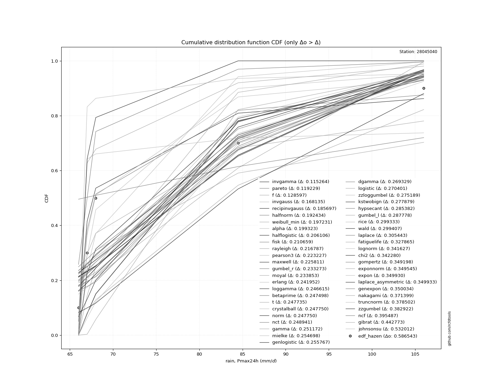</img>

</div>


**2.3. Best fit**

|   id |   station | empirical_dist   | p_dist   |    delta |   deltao | eval   |   fit |   n |     loc |    scale |    shape | shape1   | shape2   | shape3   |   best_fit |   best_fit_sort |
|-----:|----------:|:-----------------|:---------|---------:|---------:|:-------|------:|----:|--------:|---------:|---------:|:---------|:---------|:---------|-----------:|----------------:|
|    0 |  28045040 | edf_hazen        | invgamma | 0.115264 | 0.586543 | Δo > Δ |     1 |   5 | 65.8249 | 0.302622 | 0.429732 |          |          |          |          1 |               1 |

<div align="center">

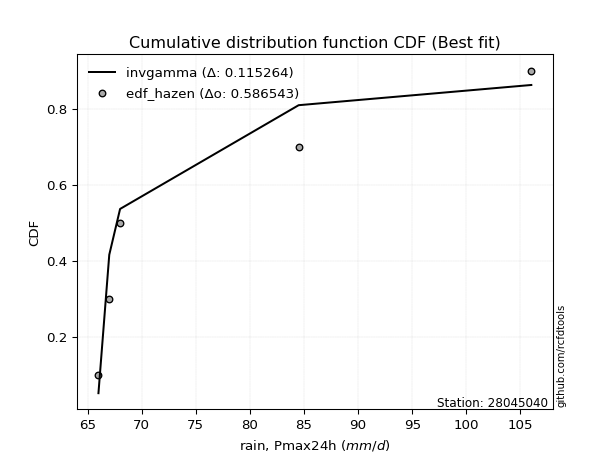</img>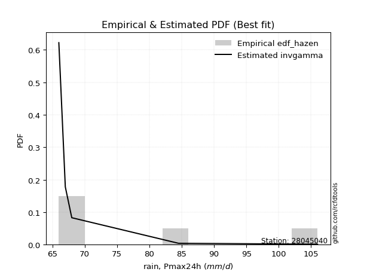</img>

</div>


### 3. Empirical - EDF Weibull (1939)

Weibull plotting position formula is an empirical method used to estimate the non-exceedance probability or plotting position for a set of observed data, is often recommended or widely used in practice, particularly in flood frequency analysis.

<div align="center">


$P=m/(n+1)$


</div>


**3.1. Empirical values**

<div align="center">

|                | 0                   | 1                  | 2           | 3                  | 4                  |
|:---------------|:--------------------|:-------------------|:------------|:-------------------|:-------------------|
| date           | 1993                | 1989               | 1990        | 1988               | 1992               |
| x              | 66.0                | 67.0               | 68.0        | 84.5               | 106.0              |
| m              | 1                   | 2                  | 3           | 4                  | 5                  |
| empirical_dist | edf_weibull         | edf_weibull        | edf_weibull | edf_weibull        | edf_weibull        |
| empirical      | 0.16666666666666666 | 0.3333333333333333 | 0.5         | 0.6666666666666666 | 0.8333333333333334 |
| empirical_tr   | 1.2                 | 1.4999999999999998 | 2.0         | 2.9999999999999996 | 6.000000000000002  |

</div>


**3.2. Parameters & Kolmogorov-Smirnov fit test (sorted by Δ)**

|   id | empirical_dist   | p_dist             |    delta |   deltao | eval    |   fit |   n |            loc |          scale | shape                  | shape1                | shape2             | shape3   |   best_fit |   best_fit_sort |
|-----:|:-----------------|:-------------------|---------:|---------:|:--------|------:|----:|---------------:|---------------:|:-----------------------|:----------------------|:-------------------|:---------|-----------:|----------------:|
|    0 | edf_weibull      | f                  | 0.128597 | 0.586543 | Δo > Δ  |     1 |   5 |     65.9911    |    9.06646     | 0.7028999001462481     | 1.270270787280117     |                    |          |          1 |               1 |
|    1 | edf_weibull      | invgamma           | 0.142322 | 0.586543 | Δo > Δ  |     1 |   5 |     65.8249    |    0.302622    | 0.4297315538891706     |                       |                    |          |          0 |               2 |
|    2 | edf_weibull      | pareto             | 0.166667 | 0.586543 | Δo > Δ  |     1 |   5 |     65.3919    |    0.608122    | 0.4961647277526386     |                       |                    |          |          0 |               3 |
|    3 | edf_weibull      | recipinvgauss      | 0.185697 | 0.586543 | Δo > Δ  |     1 |   5 |     66         |   12.2111      | 353005.38167740405     |                       |                    |          |          0 |               4 |
|    4 | edf_weibull      | weibull_min        | 0.191073 | 0.586543 | Δo > Δ  |     1 |   5 |     66         |   24.5769      | 0.3968558762538796     |                       |                    |          |          0 |               5 |
|    5 | edf_weibull      | halfnorm           | 0.192434 | 0.586543 | Δo > Δ  |     1 |   5 |     57.8735    |   25.6008      |                        |                       |                    |          |          0 |               6 |
|    6 | edf_weibull      | invgauss           | 0.201469 | 0.586543 | Δo > Δ  |     1 |   5 |     65.6832    |    1.24089     | 10.16752408575293      |                       |                    |          |          0 |               7 |
|    7 | edf_weibull      | halflogistic       | 0.206106 | 0.586543 | Δo > Δ  |     1 |   5 |     60.009     |   13.1942      |                        |                       |                    |          |          0 |               8 |
|    8 | edf_weibull      | fisk               | 0.210659 | 0.586543 | Δo > Δ  |     1 |   5 |     -0.237632  |   75.1891      | 9.262856659644054      |                       |                    |          |          0 |               9 |
|    9 | edf_weibull      | rayleigh           | 0.216787 | 0.586543 | Δo > Δ  |     1 |   5 |     48.7769    |   23.5561      |                        |                       |                    |          |          0 |              10 |
|   10 | edf_weibull      | pearson3           | 0.223227 | 0.586543 | Δo > Δ  |     1 |   5 |     78.3       |   15.4324      | 0.9302948570091479     |                       |                    |          |          0 |              11 |
|   11 | edf_weibull      | maxwell            | 0.225811 | 0.586543 | Δo > Δ  |     1 |   5 |     41.7316    |   22.9158      |                        |                       |                    |          |          0 |              12 |
|   12 | edf_weibull      | alpha              | 0.232657 | 0.586543 | Δo > Δ  |     1 |   5 |     64.6167    |    2.51557     | 2.2561222112948883e-06 |                       |                    |          |          0 |              13 |
|   13 | edf_weibull      | gumbel_r           | 0.233273 | 0.586543 | Δo > Δ  |     1 |   5 |     71.3546    |   12.0326      |                        |                       |                    |          |          0 |              14 |
|   14 | edf_weibull      | moyal              | 0.233853 | 0.586543 | Δo > Δ  |     1 |   5 |     69.4747    |    6.94704     |                        |                       |                    |          |          0 |              15 |
|   15 | edf_weibull      | loggamma           | 0.246615 | 0.586543 | Δo > Δ  |     1 |   5 |  -5376.09      |  713.546       | 2088.7955527033105     |                       |                    |          |          0 |              16 |
|   16 | edf_weibull      | betaprime          | 0.247498 | 0.586543 | Δo > Δ  |     1 |   5 |     -1.03944   |   10.6297      | 266.2523780275282      | 36.793638253223975    |                    |          |          0 |              17 |
|   17 | edf_weibull      | t                  | 0.247735 | 0.586543 | Δo > Δ  |     1 |   5 |     78.2993    |   15.4324      | 12857825.153010752     |                       |                    |          |          0 |              18 |
|   18 | edf_weibull      | crystalball        | 0.24775  | 0.586543 | Δo > Δ  |     1 |   5 |     78.3       |   15.4324      | 5438.333067165024      | 3400.545771361175     |                    |          |          0 |              19 |
|   19 | edf_weibull      | norm               | 0.24775  | 0.586543 | Δo > Δ  |     1 |   5 |     78.3       |   15.4324      |                        |                       |                    |          |          0 |              20 |
|   20 | edf_weibull      | nct                | 0.248941 | 0.586543 | Δo > Δ  |     1 |   5 |     -0.324035  |    1.16915     | 17.222305362253202     | 64.12661156808444     |                    |          |          0 |              21 |
|   21 | edf_weibull      | gamma              | 0.251172 | 0.586543 | Δo > Δ  |     1 |   5 |     66         |    9.64666     | 0.8582108600252419     |                       |                    |          |          0 |              22 |
|   22 | edf_weibull      | mielke             | 0.254698 | 0.586543 | Δo > Δ  |     1 |   5 |     20.7896    |   29.9508      | 144.00222025141272     | 6.124944655363475     |                    |          |          0 |              23 |
|   23 | edf_weibull      | genlogistic        | 0.255767 | 0.586543 | Δo > Δ  |     1 |   5 |     -1.44097   |   10.1267      | 1340.8407147450898     |                       |                    |          |          0 |              24 |
|   24 | edf_weibull      | logistic           | 0.270401 | 0.586543 | Δo > Δ  |     1 |   5 |     78.3       |    8.50835     |                        |                       |                    |          |          0 |              25 |
|   25 | edf_weibull      | zzloggumbel        | 0.275189 | 0.586543 | Δo > Δ  |     1 |   5 |      4.27697   |    0.1435      | 0.4587941646363373     | 0.7927783866335278    |                    |          |          0 |              26 |
|   26 | edf_weibull      | erlang             | 0.275285 | 0.586543 | Δo > Δ  |     1 |   5 |     66         |    8.22473     | 0.7012103116760149     |                       |                    |          |          0 |              27 |
|   27 | edf_weibull      | kstwobign          | 0.277879 | 0.586543 | Δo > Δ  |     1 |   5 |     35.4762    |   49.3502      |                        |                       |                    |          |          0 |              28 |
|   28 | edf_weibull      | hypsecant          | 0.285382 | 0.586543 | Δo > Δ  |     1 |   5 |     78.3       |    9.82459     |                        |                       |                    |          |          0 |              29 |
|   29 | edf_weibull      | gumbel_l           | 0.287778 | 0.586543 | Δo > Δ  |     1 |   5 |     85.2454    |   12.0326      |                        |                       |                    |          |          0 |              30 |
|   30 | edf_weibull      | fatiguelife        | 0.294532 | 0.586543 | Δo > Δ  |     1 |   5 |     66         |    3.71184e-06 | 1591.1635680991308     |                       |                    |          |          0 |              31 |
|   31 | edf_weibull      | rice               | 0.299333 | 0.586543 | Δo > Δ  |     1 |   5 |     54.6255    |   19.983       | 0.0003312084136606528  |                       |                    |          |          0 |              32 |
|   32 | edf_weibull      | wald               | 0.299407 | 0.586543 | Δo > Δ  |     1 |   5 |     62.8676    |   15.4324      |                        |                       |                    |          |          0 |              33 |
|   33 | edf_weibull      | dgamma             | 0.302662 | 0.586543 | Δo > Δ  |     1 |   5 |     67         |   13.9511      | 0.31045145640856997    |                       |                    |          |          0 |              34 |
|   34 | edf_weibull      | laplace            | 0.305443 | 0.586543 | Δo > Δ  |     1 |   5 |     78.3       |   10.9124      |                        |                       |                    |          |          0 |              35 |
|   35 | edf_weibull      | lognorm            | 0.308293 | 0.586543 | Δo > Δ  |     1 |   5 |     66         |    0.0073211   | 13.552535329262627     |                       |                    |          |          0 |              36 |
|   36 | edf_weibull      | ncf                | 0.32882  | 0.586543 | Δo > Δ  |     1 |   5 |      0.0423853 |    4.97387e-06 | 6.396895698895876e-07  | 11.353772297033352    | 9.19611523408203   |          |          0 |              37 |
|   37 | edf_weibull      | chi2               | 0.333042 | 0.586543 | Δo > Δ  |     1 |   5 |     66         |    1.46774     | 0.8651608206009879     |                       |                    |          |          0 |              38 |
|   38 | edf_weibull      | gompertz           | 0.349198 | 0.586543 | Δo > Δ  |     1 |   5 |     66         |    4.15422e+07 | 3395311.2952204095     |                       |                    |          |          0 |              39 |
|   39 | edf_weibull      | exponnorm          | 0.349545 | 0.586543 | Δo > Δ  |     1 |   5 |     65.9886    |    0.00342425  | 3602.5351032013627     |                       |                    |          |          0 |              40 |
|   40 | edf_weibull      | expon              | 0.34993  | 0.586543 | Δo > Δ  |     1 |   5 |     66         |   12.3         |                        |                       |                    |          |          0 |              41 |
|   41 | edf_weibull      | laplace_asymmetric | 0.349933 | 0.586543 | Δo > Δ  |     1 |   5 |     66         |    0.000181219 | 1.4732937397076812e-05 |                       |                    |          |          0 |              42 |
|   42 | edf_weibull      | genexpon           | 0.350034 | 0.586543 | Δo > Δ  |     1 |   5 |     66         |   27.1352      | 2.204447915786575      | 5.780448093058229e-08 | 1.4906899459905778 |          |          0 |              43 |
|   43 | edf_weibull      | nakagami           | 0.371399 | 0.586543 | Δo > Δ  |     1 |   5 |     66         |   29.9853      | 0.3319620409797418     |                       |                    |          |          0 |              44 |
|   44 | edf_weibull      | truncnorm          | 0.378502 | 0.586543 | Δo > Δ  |     1 |   5 | -67204.8       | 1019.26        | 65.99974054842681      | 107.56322857469246    |                    |          |          0 |              45 |
|   45 | edf_weibull      | zzgumbel           | 0.382922 | 0.586543 | Δo > Δ  |     1 |   5 |     78.2659    |   13.4529      | 0.4587941646363373     | 0.7927783866335278    |                    |          |          0 |              46 |
|   46 | edf_weibull      | gibrat             | 0.442773 | 0.586543 | Δo > Δ  |     1 |   5 |     66.527     |    7.1407      |                        |                       |                    |          |          0 |              47 |
|   47 | edf_weibull      | johnsonsu          | 0.498678 | 0.586543 | Δo > Δ  |     1 |   5 |     66         |    8.44603e-10 | -3.1603106279431694    | 0.19098437803723442   |                    |          |          0 |              48 |
|   48 | edf_weibull      | invweibull         | 0.642871 | 0.586543 | Δo <= Δ |     0 |   5 |     66         |    3.22703e-10 | 0.17050382005097953    |                       |                    |          |          0 |              49 |

<div align="center">

</img>

</div>


**3.3. Best fit**

|   id |   station | empirical_dist   | p_dist   |    delta |   deltao | eval   |   fit |   n |     loc |   scale |   shape |   shape1 | shape2   | shape3   |   best_fit |   best_fit_sort |
|-----:|----------:|:-----------------|:---------|---------:|---------:|:-------|------:|----:|--------:|--------:|--------:|---------:|:---------|:---------|-----------:|----------------:|
|    0 |  28045040 | edf_weibull      | f        | 0.128597 | 0.586543 | Δo > Δ |     1 |   5 | 65.9911 | 9.06646 |  0.7029 |  1.27027 |          |          |          1 |               1 |

<div align="center">

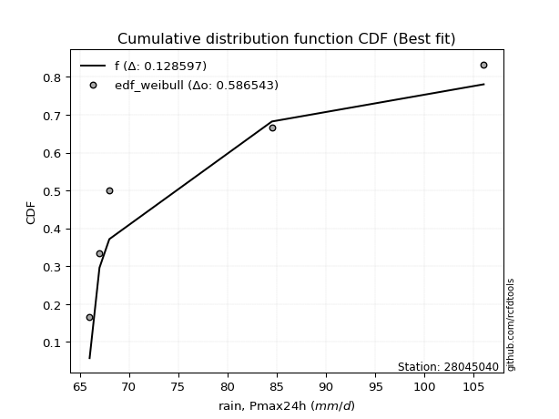</img>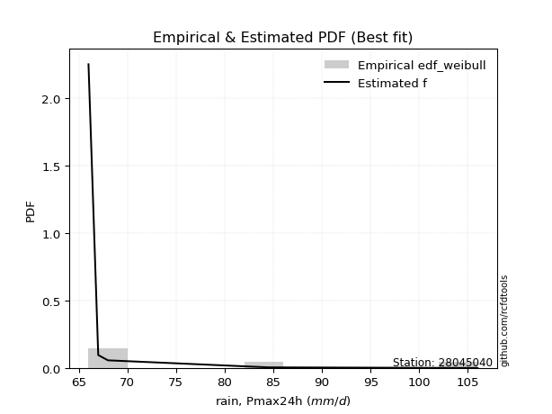</img>

</div>


### 4. Empirical - EDF Beard (1943)

The Beard formula (or Beard´s plotting position formula) in hydrology is used to estimate the empirical non-exceedance probability _(P)_ of a flood event (or other extreme hydrological data point) within a given dataset.

<div align="center">


$P=(m-0.31)/(n+0.38)$


</div>


**4.1. Empirical values**

<div align="center">

|                | 0                   | 1                  | 2         | 3                  | 4                  |
|:---------------|:--------------------|:-------------------|:----------|:-------------------|:-------------------|
| date           | 1993                | 1989               | 1990      | 1988               | 1992               |
| x              | 66.0                | 67.0               | 68.0      | 84.5               | 106.0              |
| m              | 1                   | 2                  | 3         | 4                  | 5                  |
| empirical_dist | edf_beard           | edf_beard          | edf_beard | edf_beard          | edf_beard          |
| empirical      | 0.12825278810408922 | 0.3141263940520446 | 0.5       | 0.6858736059479554 | 0.8717472118959109 |
| empirical_tr   | 1.1471215351812367  | 1.4579945799457996 | 2.0       | 3.183431952662722  | 7.797101449275368  |

</div>


**4.2. Parameters & Kolmogorov-Smirnov fit test (sorted by Δ)**

|   id | empirical_dist   | p_dist             |    delta |   deltao | eval    |   fit |   n |            loc |          scale | shape                  | shape1                | shape2             | shape3   |   best_fit |   best_fit_sort |
|-----:|:-----------------|:-------------------|---------:|---------:|:--------|------:|----:|---------------:|---------------:|:-----------------------|:----------------------|:-------------------|:---------|-----------:|----------------:|
|    0 | edf_beard        | invgamma           | 0.123115 | 0.586543 | Δo > Δ  |     1 |   5 |     65.8249    |    0.302622    | 0.4297315538891706     |                       |                    |          |          1 |               1 |
|    1 | edf_beard        | f                  | 0.128597 | 0.586543 | Δo > Δ  |     1 |   5 |     65.9911    |    9.06646     | 0.7028999001462481     | 1.270270787280117     |                    |          |          0 |               2 |
|    2 | edf_beard        | pareto             | 0.133355 | 0.586543 | Δo > Δ  |     1 |   5 |     65.3919    |    0.608122    | 0.4961647277526386     |                       |                    |          |          0 |               3 |
|    3 | edf_beard        | invgauss           | 0.182262 | 0.586543 | Δo > Δ  |     1 |   5 |     65.6832    |    1.24089     | 10.16752408575293      |                       |                    |          |          0 |               4 |
|    4 | edf_beard        | recipinvgauss      | 0.185697 | 0.586543 | Δo > Δ  |     1 |   5 |     66         |   12.2111      | 353005.38167740405     |                       |                    |          |          0 |               5 |
|    5 | edf_beard        | weibull_min        | 0.191073 | 0.586543 | Δo > Δ  |     1 |   5 |     66         |   24.5769      | 0.3968558762538796     |                       |                    |          |          0 |               6 |
|    6 | edf_beard        | halfnorm           | 0.192434 | 0.586543 | Δo > Δ  |     1 |   5 |     57.8735    |   25.6008      |                        |                       |                    |          |          0 |               7 |
|    7 | edf_beard        | halflogistic       | 0.206106 | 0.586543 | Δo > Δ  |     1 |   5 |     60.009     |   13.1942      |                        |                       |                    |          |          0 |               8 |
|    8 | edf_beard        | fisk               | 0.210659 | 0.586543 | Δo > Δ  |     1 |   5 |     -0.237632  |   75.1891      | 9.262856659644054      |                       |                    |          |          0 |               9 |
|    9 | edf_beard        | alpha              | 0.21345  | 0.586543 | Δo > Δ  |     1 |   5 |     64.6167    |    2.51557     | 2.2561222112948883e-06 |                       |                    |          |          0 |              10 |
|   10 | edf_beard        | rayleigh           | 0.216787 | 0.586543 | Δo > Δ  |     1 |   5 |     48.7769    |   23.5561      |                        |                       |                    |          |          0 |              11 |
|   11 | edf_beard        | pearson3           | 0.223227 | 0.586543 | Δo > Δ  |     1 |   5 |     78.3       |   15.4324      | 0.9302948570091479     |                       |                    |          |          0 |              12 |
|   12 | edf_beard        | maxwell            | 0.225811 | 0.586543 | Δo > Δ  |     1 |   5 |     41.7316    |   22.9158      |                        |                       |                    |          |          0 |              13 |
|   13 | edf_beard        | gumbel_r           | 0.233273 | 0.586543 | Δo > Δ  |     1 |   5 |     71.3546    |   12.0326      |                        |                       |                    |          |          0 |              14 |
|   14 | edf_beard        | moyal              | 0.233853 | 0.586543 | Δo > Δ  |     1 |   5 |     69.4747    |    6.94704     |                        |                       |                    |          |          0 |              15 |
|   15 | edf_beard        | loggamma           | 0.246615 | 0.586543 | Δo > Δ  |     1 |   5 |  -5376.09      |  713.546       | 2088.7955527033105     |                       |                    |          |          0 |              16 |
|   16 | edf_beard        | betaprime          | 0.247498 | 0.586543 | Δo > Δ  |     1 |   5 |     -1.03944   |   10.6297      | 266.2523780275282      | 36.793638253223975    |                    |          |          0 |              17 |
|   17 | edf_beard        | t                  | 0.247735 | 0.586543 | Δo > Δ  |     1 |   5 |     78.2993    |   15.4324      | 12857825.153010752     |                       |                    |          |          0 |              18 |
|   18 | edf_beard        | crystalball        | 0.24775  | 0.586543 | Δo > Δ  |     1 |   5 |     78.3       |   15.4324      | 5438.333067165024      | 3400.545771361175     |                    |          |          0 |              19 |
|   19 | edf_beard        | norm               | 0.24775  | 0.586543 | Δo > Δ  |     1 |   5 |     78.3       |   15.4324      |                        |                       |                    |          |          0 |              20 |
|   20 | edf_beard        | nct                | 0.248941 | 0.586543 | Δo > Δ  |     1 |   5 |     -0.324035  |    1.16915     | 17.222305362253202     | 64.12661156808444     |                    |          |          0 |              21 |
|   21 | edf_beard        | gamma              | 0.251172 | 0.586543 | Δo > Δ  |     1 |   5 |     66         |    9.64666     | 0.8582108600252419     |                       |                    |          |          0 |              22 |
|   22 | edf_beard        | mielke             | 0.254698 | 0.586543 | Δo > Δ  |     1 |   5 |     20.7896    |   29.9508      | 144.00222025141272     | 6.124944655363475     |                    |          |          0 |              23 |
|   23 | edf_beard        | genlogistic        | 0.255767 | 0.586543 | Δo > Δ  |     1 |   5 |     -1.44097   |   10.1267      | 1340.8407147450898     |                       |                    |          |          0 |              24 |
|   24 | edf_beard        | erlang             | 0.256078 | 0.586543 | Δo > Δ  |     1 |   5 |     66         |    8.22473     | 0.7012103116760149     |                       |                    |          |          0 |              25 |
|   25 | edf_beard        | logistic           | 0.270401 | 0.586543 | Δo > Δ  |     1 |   5 |     78.3       |    8.50835     |                        |                       |                    |          |          0 |              26 |
|   26 | edf_beard        | zzloggumbel        | 0.275189 | 0.586543 | Δo > Δ  |     1 |   5 |      4.27697   |    0.1435      | 0.4587941646363373     | 0.7927783866335278    |                    |          |          0 |              27 |
|   27 | edf_beard        | kstwobign          | 0.277879 | 0.586543 | Δo > Δ  |     1 |   5 |     35.4762    |   49.3502      |                        |                       |                    |          |          0 |              28 |
|   28 | edf_beard        | dgamma             | 0.283455 | 0.586543 | Δo > Δ  |     1 |   5 |     67         |   13.9511      | 0.31045145640856997    |                       |                    |          |          0 |              29 |
|   29 | edf_beard        | hypsecant          | 0.285382 | 0.586543 | Δo > Δ  |     1 |   5 |     78.3       |    9.82459     |                        |                       |                    |          |          0 |              30 |
|   30 | edf_beard        | gumbel_l           | 0.287778 | 0.586543 | Δo > Δ  |     1 |   5 |     85.2454    |   12.0326      |                        |                       |                    |          |          0 |              31 |
|   31 | edf_beard        | rice               | 0.299333 | 0.586543 | Δo > Δ  |     1 |   5 |     54.6255    |   19.983       | 0.0003312084136606528  |                       |                    |          |          0 |              32 |
|   32 | edf_beard        | wald               | 0.299407 | 0.586543 | Δo > Δ  |     1 |   5 |     62.8676    |   15.4324      |                        |                       |                    |          |          0 |              33 |
|   33 | edf_beard        | laplace            | 0.305443 | 0.586543 | Δo > Δ  |     1 |   5 |     78.3       |   10.9124      |                        |                       |                    |          |          0 |              34 |
|   34 | edf_beard        | fatiguelife        | 0.313738 | 0.586543 | Δo > Δ  |     1 |   5 |     66         |    3.71184e-06 | 1591.1635680991308     |                       |                    |          |          0 |              35 |
|   35 | edf_beard        | lognorm            | 0.3275   | 0.586543 | Δo > Δ  |     1 |   5 |     66         |    0.0073211   | 13.552535329262627     |                       |                    |          |          0 |              36 |
|   36 | edf_beard        | chi2               | 0.328153 | 0.586543 | Δo > Δ  |     1 |   5 |     66         |    1.46774     | 0.8651608206009879     |                       |                    |          |          0 |              37 |
|   37 | edf_beard        | gompertz           | 0.349198 | 0.586543 | Δo > Δ  |     1 |   5 |     66         |    4.15422e+07 | 3395311.2952204095     |                       |                    |          |          0 |              38 |
|   38 | edf_beard        | exponnorm          | 0.349545 | 0.586543 | Δo > Δ  |     1 |   5 |     65.9886    |    0.00342425  | 3602.5351032013627     |                       |                    |          |          0 |              39 |
|   39 | edf_beard        | expon              | 0.34993  | 0.586543 | Δo > Δ  |     1 |   5 |     66         |   12.3         |                        |                       |                    |          |          0 |              40 |
|   40 | edf_beard        | laplace_asymmetric | 0.349933 | 0.586543 | Δo > Δ  |     1 |   5 |     66         |    0.000181219 | 1.4732937397076812e-05 |                       |                    |          |          0 |              41 |
|   41 | edf_beard        | genexpon           | 0.350034 | 0.586543 | Δo > Δ  |     1 |   5 |     66         |   27.1352      | 2.204447915786575      | 5.780448093058229e-08 | 1.4906899459905778 |          |          0 |              42 |
|   42 | edf_beard        | ncf                | 0.367234 | 0.586543 | Δo > Δ  |     1 |   5 |      0.0423853 |    4.97387e-06 | 6.396895698895876e-07  | 11.353772297033352    | 9.19611523408203   |          |          0 |              43 |
|   43 | edf_beard        | nakagami           | 0.371399 | 0.586543 | Δo > Δ  |     1 |   5 |     66         |   29.9853      | 0.3319620409797418     |                       |                    |          |          0 |              44 |
|   44 | edf_beard        | truncnorm          | 0.378502 | 0.586543 | Δo > Δ  |     1 |   5 | -67204.8       | 1019.26        | 65.99974054842681      | 107.56322857469246    |                    |          |          0 |              45 |
|   45 | edf_beard        | zzgumbel           | 0.382922 | 0.586543 | Δo > Δ  |     1 |   5 |     78.2659    |   13.4529      | 0.4587941646363373     | 0.7927783866335278    |                    |          |          0 |              46 |
|   46 | edf_beard        | gibrat             | 0.442773 | 0.586543 | Δo > Δ  |     1 |   5 |     66.527     |    7.1407      |                        |                       |                    |          |          0 |              47 |
|   47 | edf_beard        | johnsonsu          | 0.517885 | 0.586543 | Δo > Δ  |     1 |   5 |     66         |    8.44603e-10 | -3.1603106279431694    | 0.19098437803723442   |                    |          |          0 |              48 |
|   48 | edf_beard        | invweibull         | 0.662078 | 0.586543 | Δo <= Δ |     0 |   5 |     66         |    3.22703e-10 | 0.17050382005097953    |                       |                    |          |          0 |              49 |

<div align="center">

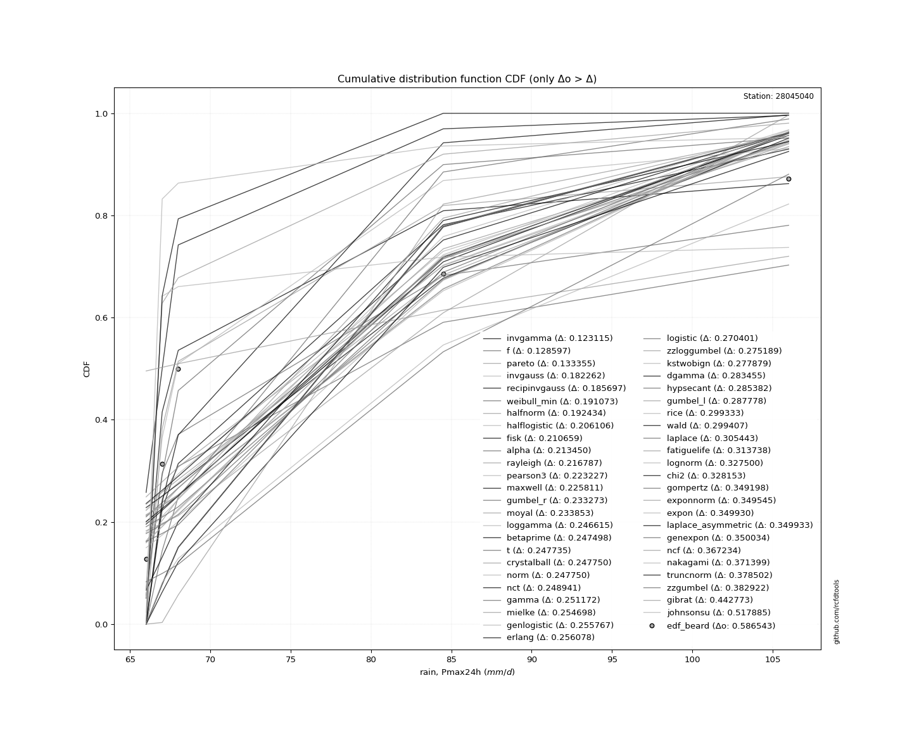</img>

</div>


**4.3. Best fit**

|   id |   station | empirical_dist   | p_dist   |    delta |   deltao | eval   |   fit |   n |     loc |    scale |    shape | shape1   | shape2   | shape3   |   best_fit |   best_fit_sort |
|-----:|----------:|:-----------------|:---------|---------:|---------:|:-------|------:|----:|--------:|---------:|---------:|:---------|:---------|:---------|-----------:|----------------:|
|    0 |  28045040 | edf_beard        | invgamma | 0.123115 | 0.586543 | Δo > Δ |     1 |   5 | 65.8249 | 0.302622 | 0.429732 |          |          |          |          1 |               1 |

<div align="center">

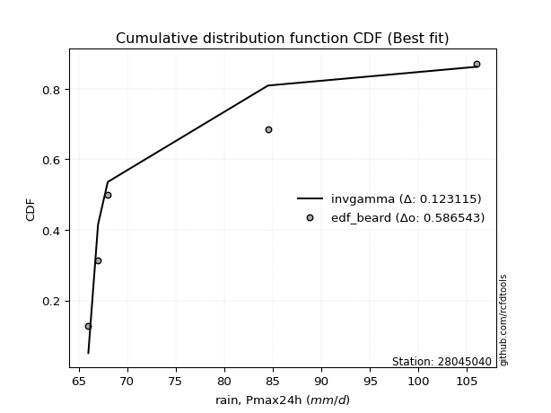</img></img>

</div>


### 5. Empirical - EDF Chegodayev (1955)

The Chegodayev formula is an empirical plotting position formula used in hydrological frequency analysis to estimate the exceedance probability or return period of a specific event from a set of observed data. It is primarily used for plotting observed data points on probability paper to fit a theoretical distribution, particularly for analyzing extreme events like maximum flood flows or rainfall intensities. The constant _b_ value in the generalized plotting position formula is 0.3.

<div align="center">


$P=(m-b)/(n+1-2b)$


</div>


**5.1. Empirical values**

<div align="center">

|                | 0                   | 1                   | 2              | 3                  | 4                  |
|:---------------|:--------------------|:--------------------|:---------------|:-------------------|:-------------------|
| date           | 1993                | 1989                | 1990           | 1988               | 1992               |
| x              | 66.0                | 67.0                | 68.0           | 84.5               | 106.0              |
| m              | 1                   | 2                   | 3              | 4                  | 5                  |
| empirical_dist | edf_chegodayev      | edf_chegodayev      | edf_chegodayev | edf_chegodayev     | edf_chegodayev     |
| empirical      | 0.12962962962962962 | 0.31481481481481477 | 0.5            | 0.6851851851851851 | 0.8703703703703703 |
| empirical_tr   | 1.148936170212766   | 1.4594594594594594  | 2.0            | 3.1764705882352935 | 7.714285714285713  |

</div>


**5.2. Parameters & Kolmogorov-Smirnov fit test (sorted by Δ)**

|   id | empirical_dist   | p_dist             |    delta |   deltao | eval    |   fit |   n |            loc |          scale | shape                  | shape1                | shape2             | shape3   |   best_fit |   best_fit_sort |
|-----:|:-----------------|:-------------------|---------:|---------:|:--------|------:|----:|---------------:|---------------:|:-----------------------|:----------------------|:-------------------|:---------|-----------:|----------------:|
|    0 | edf_chegodayev   | invgamma           | 0.123803 | 0.586543 | Δo > Δ  |     1 |   5 |     65.8249    |    0.302622    | 0.4297315538891706     |                       |                    |          |          1 |               1 |
|    1 | edf_chegodayev   | f                  | 0.128597 | 0.586543 | Δo > Δ  |     1 |   5 |     65.9911    |    9.06646     | 0.7028999001462481     | 1.270270787280117     |                    |          |          0 |               2 |
|    2 | edf_chegodayev   | pareto             | 0.134044 | 0.586543 | Δo > Δ  |     1 |   5 |     65.3919    |    0.608122    | 0.4961647277526386     |                       |                    |          |          0 |               3 |
|    3 | edf_chegodayev   | invgauss           | 0.18295  | 0.586543 | Δo > Δ  |     1 |   5 |     65.6832    |    1.24089     | 10.16752408575293      |                       |                    |          |          0 |               4 |
|    4 | edf_chegodayev   | recipinvgauss      | 0.185697 | 0.586543 | Δo > Δ  |     1 |   5 |     66         |   12.2111      | 353005.38167740405     |                       |                    |          |          0 |               5 |
|    5 | edf_chegodayev   | weibull_min        | 0.191073 | 0.586543 | Δo > Δ  |     1 |   5 |     66         |   24.5769      | 0.3968558762538796     |                       |                    |          |          0 |               6 |
|    6 | edf_chegodayev   | halfnorm           | 0.192434 | 0.586543 | Δo > Δ  |     1 |   5 |     57.8735    |   25.6008      |                        |                       |                    |          |          0 |               7 |
|    7 | edf_chegodayev   | halflogistic       | 0.206106 | 0.586543 | Δo > Δ  |     1 |   5 |     60.009     |   13.1942      |                        |                       |                    |          |          0 |               8 |
|    8 | edf_chegodayev   | fisk               | 0.210659 | 0.586543 | Δo > Δ  |     1 |   5 |     -0.237632  |   75.1891      | 9.262856659644054      |                       |                    |          |          0 |               9 |
|    9 | edf_chegodayev   | alpha              | 0.214138 | 0.586543 | Δo > Δ  |     1 |   5 |     64.6167    |    2.51557     | 2.2561222112948883e-06 |                       |                    |          |          0 |              10 |
|   10 | edf_chegodayev   | rayleigh           | 0.216787 | 0.586543 | Δo > Δ  |     1 |   5 |     48.7769    |   23.5561      |                        |                       |                    |          |          0 |              11 |
|   11 | edf_chegodayev   | pearson3           | 0.223227 | 0.586543 | Δo > Δ  |     1 |   5 |     78.3       |   15.4324      | 0.9302948570091479     |                       |                    |          |          0 |              12 |
|   12 | edf_chegodayev   | maxwell            | 0.225811 | 0.586543 | Δo > Δ  |     1 |   5 |     41.7316    |   22.9158      |                        |                       |                    |          |          0 |              13 |
|   13 | edf_chegodayev   | gumbel_r           | 0.233273 | 0.586543 | Δo > Δ  |     1 |   5 |     71.3546    |   12.0326      |                        |                       |                    |          |          0 |              14 |
|   14 | edf_chegodayev   | moyal              | 0.233853 | 0.586543 | Δo > Δ  |     1 |   5 |     69.4747    |    6.94704     |                        |                       |                    |          |          0 |              15 |
|   15 | edf_chegodayev   | loggamma           | 0.246615 | 0.586543 | Δo > Δ  |     1 |   5 |  -5376.09      |  713.546       | 2088.7955527033105     |                       |                    |          |          0 |              16 |
|   16 | edf_chegodayev   | betaprime          | 0.247498 | 0.586543 | Δo > Δ  |     1 |   5 |     -1.03944   |   10.6297      | 266.2523780275282      | 36.793638253223975    |                    |          |          0 |              17 |
|   17 | edf_chegodayev   | t                  | 0.247735 | 0.586543 | Δo > Δ  |     1 |   5 |     78.2993    |   15.4324      | 12857825.153010752     |                       |                    |          |          0 |              18 |
|   18 | edf_chegodayev   | crystalball        | 0.24775  | 0.586543 | Δo > Δ  |     1 |   5 |     78.3       |   15.4324      | 5438.333067165024      | 3400.545771361175     |                    |          |          0 |              19 |
|   19 | edf_chegodayev   | norm               | 0.24775  | 0.586543 | Δo > Δ  |     1 |   5 |     78.3       |   15.4324      |                        |                       |                    |          |          0 |              20 |
|   20 | edf_chegodayev   | nct                | 0.248941 | 0.586543 | Δo > Δ  |     1 |   5 |     -0.324035  |    1.16915     | 17.222305362253202     | 64.12661156808444     |                    |          |          0 |              21 |
|   21 | edf_chegodayev   | gamma              | 0.251172 | 0.586543 | Δo > Δ  |     1 |   5 |     66         |    9.64666     | 0.8582108600252419     |                       |                    |          |          0 |              22 |
|   22 | edf_chegodayev   | mielke             | 0.254698 | 0.586543 | Δo > Δ  |     1 |   5 |     20.7896    |   29.9508      | 144.00222025141272     | 6.124944655363475     |                    |          |          0 |              23 |
|   23 | edf_chegodayev   | genlogistic        | 0.255767 | 0.586543 | Δo > Δ  |     1 |   5 |     -1.44097   |   10.1267      | 1340.8407147450898     |                       |                    |          |          0 |              24 |
|   24 | edf_chegodayev   | erlang             | 0.256767 | 0.586543 | Δo > Δ  |     1 |   5 |     66         |    8.22473     | 0.7012103116760149     |                       |                    |          |          0 |              25 |
|   25 | edf_chegodayev   | logistic           | 0.270401 | 0.586543 | Δo > Δ  |     1 |   5 |     78.3       |    8.50835     |                        |                       |                    |          |          0 |              26 |
|   26 | edf_chegodayev   | zzloggumbel        | 0.275189 | 0.586543 | Δo > Δ  |     1 |   5 |      4.27697   |    0.1435      | 0.4587941646363373     | 0.7927783866335278    |                    |          |          0 |              27 |
|   27 | edf_chegodayev   | kstwobign          | 0.277879 | 0.586543 | Δo > Δ  |     1 |   5 |     35.4762    |   49.3502      |                        |                       |                    |          |          0 |              28 |
|   28 | edf_chegodayev   | dgamma             | 0.284143 | 0.586543 | Δo > Δ  |     1 |   5 |     67         |   13.9511      | 0.31045145640856997    |                       |                    |          |          0 |              29 |
|   29 | edf_chegodayev   | hypsecant          | 0.285382 | 0.586543 | Δo > Δ  |     1 |   5 |     78.3       |    9.82459     |                        |                       |                    |          |          0 |              30 |
|   30 | edf_chegodayev   | gumbel_l           | 0.287778 | 0.586543 | Δo > Δ  |     1 |   5 |     85.2454    |   12.0326      |                        |                       |                    |          |          0 |              31 |
|   31 | edf_chegodayev   | rice               | 0.299333 | 0.586543 | Δo > Δ  |     1 |   5 |     54.6255    |   19.983       | 0.0003312084136606528  |                       |                    |          |          0 |              32 |
|   32 | edf_chegodayev   | wald               | 0.299407 | 0.586543 | Δo > Δ  |     1 |   5 |     62.8676    |   15.4324      |                        |                       |                    |          |          0 |              33 |
|   33 | edf_chegodayev   | laplace            | 0.305443 | 0.586543 | Δo > Δ  |     1 |   5 |     78.3       |   10.9124      |                        |                       |                    |          |          0 |              34 |
|   34 | edf_chegodayev   | fatiguelife        | 0.31305  | 0.586543 | Δo > Δ  |     1 |   5 |     66         |    3.71184e-06 | 1591.1635680991308     |                       |                    |          |          0 |              35 |
|   35 | edf_chegodayev   | lognorm            | 0.326812 | 0.586543 | Δo > Δ  |     1 |   5 |     66         |    0.0073211   | 13.552535329262627     |                       |                    |          |          0 |              36 |
|   36 | edf_chegodayev   | chi2               | 0.327465 | 0.586543 | Δo > Δ  |     1 |   5 |     66         |    1.46774     | 0.8651608206009879     |                       |                    |          |          0 |              37 |
|   37 | edf_chegodayev   | gompertz           | 0.349198 | 0.586543 | Δo > Δ  |     1 |   5 |     66         |    4.15422e+07 | 3395311.2952204095     |                       |                    |          |          0 |              38 |
|   38 | edf_chegodayev   | exponnorm          | 0.349545 | 0.586543 | Δo > Δ  |     1 |   5 |     65.9886    |    0.00342425  | 3602.5351032013627     |                       |                    |          |          0 |              39 |
|   39 | edf_chegodayev   | expon              | 0.34993  | 0.586543 | Δo > Δ  |     1 |   5 |     66         |   12.3         |                        |                       |                    |          |          0 |              40 |
|   40 | edf_chegodayev   | laplace_asymmetric | 0.349933 | 0.586543 | Δo > Δ  |     1 |   5 |     66         |    0.000181219 | 1.4732937397076812e-05 |                       |                    |          |          0 |              41 |
|   41 | edf_chegodayev   | genexpon           | 0.350034 | 0.586543 | Δo > Δ  |     1 |   5 |     66         |   27.1352      | 2.204447915786575      | 5.780448093058229e-08 | 1.4906899459905778 |          |          0 |              42 |
|   42 | edf_chegodayev   | ncf                | 0.365857 | 0.586543 | Δo > Δ  |     1 |   5 |      0.0423853 |    4.97387e-06 | 6.396895698895876e-07  | 11.353772297033352    | 9.19611523408203   |          |          0 |              43 |
|   43 | edf_chegodayev   | nakagami           | 0.371399 | 0.586543 | Δo > Δ  |     1 |   5 |     66         |   29.9853      | 0.3319620409797418     |                       |                    |          |          0 |              44 |
|   44 | edf_chegodayev   | truncnorm          | 0.378502 | 0.586543 | Δo > Δ  |     1 |   5 | -67204.8       | 1019.26        | 65.99974054842681      | 107.56322857469246    |                    |          |          0 |              45 |
|   45 | edf_chegodayev   | zzgumbel           | 0.382922 | 0.586543 | Δo > Δ  |     1 |   5 |     78.2659    |   13.4529      | 0.4587941646363373     | 0.7927783866335278    |                    |          |          0 |              46 |
|   46 | edf_chegodayev   | gibrat             | 0.442773 | 0.586543 | Δo > Δ  |     1 |   5 |     66.527     |    7.1407      |                        |                       |                    |          |          0 |              47 |
|   47 | edf_chegodayev   | johnsonsu          | 0.517197 | 0.586543 | Δo > Δ  |     1 |   5 |     66         |    8.44603e-10 | -3.1603106279431694    | 0.19098437803723442   |                    |          |          0 |              48 |
|   48 | edf_chegodayev   | invweibull         | 0.66139  | 0.586543 | Δo <= Δ |     0 |   5 |     66         |    3.22703e-10 | 0.17050382005097953    |                       |                    |          |          0 |              49 |

<div align="center">

</img>

</div>


**5.3. Best fit**

|   id |   station | empirical_dist   | p_dist   |    delta |   deltao | eval   |   fit |   n |     loc |    scale |    shape | shape1   | shape2   | shape3   |   best_fit |   best_fit_sort |
|-----:|----------:|:-----------------|:---------|---------:|---------:|:-------|------:|----:|--------:|---------:|---------:|:---------|:---------|:---------|-----------:|----------------:|
|    0 |  28045040 | edf_chegodayev   | invgamma | 0.123803 | 0.586543 | Δo > Δ |     1 |   5 | 65.8249 | 0.302622 | 0.429732 |          |          |          |          1 |               1 |

<div align="center">

</img>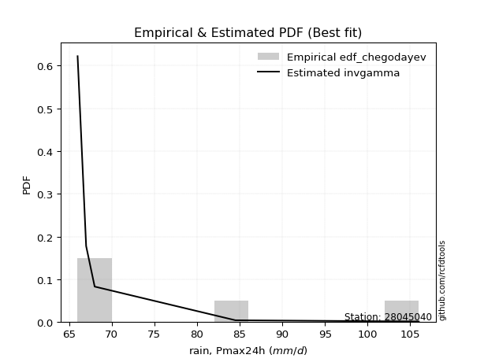</img>

</div>


### 6. Empirical - EDF Blom (1958)

The Blom formula is a specific "plotting position" formula used in hydrology and statistical analysis to estimate the empirical cumulative probability (or non-exceedance probability) of a data series. It is particularly recommended for data that are approximately normally distributed. The constant _a_ is set to 0.375 (or 3/8).

<div align="center">


$P=(m-a)/(n+1-2a)$


</div>


**6.1. Empirical values**

<div align="center">

|                | 0                   | 1                   | 2        | 3                  | 4                  |
|:---------------|:--------------------|:--------------------|:---------|:-------------------|:-------------------|
| date           | 1993                | 1989                | 1990     | 1988               | 1992               |
| x              | 66.0                | 67.0                | 68.0     | 84.5               | 106.0              |
| m              | 1                   | 2                   | 3        | 4                  | 5                  |
| empirical_dist | edf_blom            | edf_blom            | edf_blom | edf_blom           | edf_blom           |
| empirical      | 0.11904761904761904 | 0.30952380952380953 | 0.5      | 0.6904761904761905 | 0.8809523809523809 |
| empirical_tr   | 1.135135135135135   | 1.4482758620689655  | 2.0      | 3.230769230769231  | 8.399999999999999  |

</div>


**6.2. Parameters & Kolmogorov-Smirnov fit test (sorted by Δ)**

|   id | empirical_dist   | p_dist             |    delta |   deltao | eval    |   fit |   n |            loc |          scale | shape                  | shape1                | shape2             | shape3   |   best_fit |   best_fit_sort |
|-----:|:-----------------|:-------------------|---------:|---------:|:--------|------:|----:|---------------:|---------------:|:-----------------------|:----------------------|:-------------------|:---------|-----------:|----------------:|
|    0 | edf_blom         | invgamma           | 0.118512 | 0.586543 | Δo > Δ  |     1 |   5 |     65.8249    |    0.302622    | 0.4297315538891706     |                       |                    |          |          1 |               1 |
|    1 | edf_blom         | f                  | 0.128597 | 0.586543 | Δo > Δ  |     1 |   5 |     65.9911    |    9.06646     | 0.7028999001462481     | 1.270270787280117     |                    |          |          0 |               2 |
|    2 | edf_blom         | pareto             | 0.128753 | 0.586543 | Δo > Δ  |     1 |   5 |     65.3919    |    0.608122    | 0.4961647277526386     |                       |                    |          |          0 |               3 |
|    3 | edf_blom         | invgauss           | 0.177659 | 0.586543 | Δo > Δ  |     1 |   5 |     65.6832    |    1.24089     | 10.16752408575293      |                       |                    |          |          0 |               4 |
|    4 | edf_blom         | recipinvgauss      | 0.185697 | 0.586543 | Δo > Δ  |     1 |   5 |     66         |   12.2111      | 353005.38167740405     |                       |                    |          |          0 |               5 |
|    5 | edf_blom         | weibull_min        | 0.191073 | 0.586543 | Δo > Δ  |     1 |   5 |     66         |   24.5769      | 0.3968558762538796     |                       |                    |          |          0 |               6 |
|    6 | edf_blom         | halfnorm           | 0.192434 | 0.586543 | Δo > Δ  |     1 |   5 |     57.8735    |   25.6008      |                        |                       |                    |          |          0 |               7 |
|    7 | edf_blom         | halflogistic       | 0.206106 | 0.586543 | Δo > Δ  |     1 |   5 |     60.009     |   13.1942      |                        |                       |                    |          |          0 |               8 |
|    8 | edf_blom         | alpha              | 0.208847 | 0.586543 | Δo > Δ  |     1 |   5 |     64.6167    |    2.51557     | 2.2561222112948883e-06 |                       |                    |          |          0 |               9 |
|    9 | edf_blom         | fisk               | 0.210659 | 0.586543 | Δo > Δ  |     1 |   5 |     -0.237632  |   75.1891      | 9.262856659644054      |                       |                    |          |          0 |              10 |
|   10 | edf_blom         | rayleigh           | 0.216787 | 0.586543 | Δo > Δ  |     1 |   5 |     48.7769    |   23.5561      |                        |                       |                    |          |          0 |              11 |
|   11 | edf_blom         | pearson3           | 0.223227 | 0.586543 | Δo > Δ  |     1 |   5 |     78.3       |   15.4324      | 0.9302948570091479     |                       |                    |          |          0 |              12 |
|   12 | edf_blom         | maxwell            | 0.225811 | 0.586543 | Δo > Δ  |     1 |   5 |     41.7316    |   22.9158      |                        |                       |                    |          |          0 |              13 |
|   13 | edf_blom         | gumbel_r           | 0.233273 | 0.586543 | Δo > Δ  |     1 |   5 |     71.3546    |   12.0326      |                        |                       |                    |          |          0 |              14 |
|   14 | edf_blom         | moyal              | 0.233853 | 0.586543 | Δo > Δ  |     1 |   5 |     69.4747    |    6.94704     |                        |                       |                    |          |          0 |              15 |
|   15 | edf_blom         | loggamma           | 0.246615 | 0.586543 | Δo > Δ  |     1 |   5 |  -5376.09      |  713.546       | 2088.7955527033105     |                       |                    |          |          0 |              16 |
|   16 | edf_blom         | betaprime          | 0.247498 | 0.586543 | Δo > Δ  |     1 |   5 |     -1.03944   |   10.6297      | 266.2523780275282      | 36.793638253223975    |                    |          |          0 |              17 |
|   17 | edf_blom         | t                  | 0.247735 | 0.586543 | Δo > Δ  |     1 |   5 |     78.2993    |   15.4324      | 12857825.153010752     |                       |                    |          |          0 |              18 |
|   18 | edf_blom         | crystalball        | 0.24775  | 0.586543 | Δo > Δ  |     1 |   5 |     78.3       |   15.4324      | 5438.333067165024      | 3400.545771361175     |                    |          |          0 |              19 |
|   19 | edf_blom         | norm               | 0.24775  | 0.586543 | Δo > Δ  |     1 |   5 |     78.3       |   15.4324      |                        |                       |                    |          |          0 |              20 |
|   20 | edf_blom         | nct                | 0.248941 | 0.586543 | Δo > Δ  |     1 |   5 |     -0.324035  |    1.16915     | 17.222305362253202     | 64.12661156808444     |                    |          |          0 |              21 |
|   21 | edf_blom         | gamma              | 0.251172 | 0.586543 | Δo > Δ  |     1 |   5 |     66         |    9.64666     | 0.8582108600252419     |                       |                    |          |          0 |              22 |
|   22 | edf_blom         | erlang             | 0.251476 | 0.586543 | Δo > Δ  |     1 |   5 |     66         |    8.22473     | 0.7012103116760149     |                       |                    |          |          0 |              23 |
|   23 | edf_blom         | mielke             | 0.254698 | 0.586543 | Δo > Δ  |     1 |   5 |     20.7896    |   29.9508      | 144.00222025141272     | 6.124944655363475     |                    |          |          0 |              24 |
|   24 | edf_blom         | genlogistic        | 0.255767 | 0.586543 | Δo > Δ  |     1 |   5 |     -1.44097   |   10.1267      | 1340.8407147450898     |                       |                    |          |          0 |              25 |
|   25 | edf_blom         | logistic           | 0.270401 | 0.586543 | Δo > Δ  |     1 |   5 |     78.3       |    8.50835     |                        |                       |                    |          |          0 |              26 |
|   26 | edf_blom         | zzloggumbel        | 0.275189 | 0.586543 | Δo > Δ  |     1 |   5 |      4.27697   |    0.1435      | 0.4587941646363373     | 0.7927783866335278    |                    |          |          0 |              27 |
|   27 | edf_blom         | kstwobign          | 0.277879 | 0.586543 | Δo > Δ  |     1 |   5 |     35.4762    |   49.3502      |                        |                       |                    |          |          0 |              28 |
|   28 | edf_blom         | dgamma             | 0.278852 | 0.586543 | Δo > Δ  |     1 |   5 |     67         |   13.9511      | 0.31045145640856997    |                       |                    |          |          0 |              29 |
|   29 | edf_blom         | hypsecant          | 0.285382 | 0.586543 | Δo > Δ  |     1 |   5 |     78.3       |    9.82459     |                        |                       |                    |          |          0 |              30 |
|   30 | edf_blom         | gumbel_l           | 0.287778 | 0.586543 | Δo > Δ  |     1 |   5 |     85.2454    |   12.0326      |                        |                       |                    |          |          0 |              31 |
|   31 | edf_blom         | rice               | 0.299333 | 0.586543 | Δo > Δ  |     1 |   5 |     54.6255    |   19.983       | 0.0003312084136606528  |                       |                    |          |          0 |              32 |
|   32 | edf_blom         | wald               | 0.299407 | 0.586543 | Δo > Δ  |     1 |   5 |     62.8676    |   15.4324      |                        |                       |                    |          |          0 |              33 |
|   33 | edf_blom         | laplace            | 0.305443 | 0.586543 | Δo > Δ  |     1 |   5 |     78.3       |   10.9124      |                        |                       |                    |          |          0 |              34 |
|   34 | edf_blom         | fatiguelife        | 0.318341 | 0.586543 | Δo > Δ  |     1 |   5 |     66         |    3.71184e-06 | 1591.1635680991308     |                       |                    |          |          0 |              35 |
|   35 | edf_blom         | lognorm            | 0.332103 | 0.586543 | Δo > Δ  |     1 |   5 |     66         |    0.0073211   | 13.552535329262627     |                       |                    |          |          0 |              36 |
|   36 | edf_blom         | chi2               | 0.332756 | 0.586543 | Δo > Δ  |     1 |   5 |     66         |    1.46774     | 0.8651608206009879     |                       |                    |          |          0 |              37 |
|   37 | edf_blom         | gompertz           | 0.349198 | 0.586543 | Δo > Δ  |     1 |   5 |     66         |    4.15422e+07 | 3395311.2952204095     |                       |                    |          |          0 |              38 |
|   38 | edf_blom         | exponnorm          | 0.349545 | 0.586543 | Δo > Δ  |     1 |   5 |     65.9886    |    0.00342425  | 3602.5351032013627     |                       |                    |          |          0 |              39 |
|   39 | edf_blom         | expon              | 0.34993  | 0.586543 | Δo > Δ  |     1 |   5 |     66         |   12.3         |                        |                       |                    |          |          0 |              40 |
|   40 | edf_blom         | laplace_asymmetric | 0.349933 | 0.586543 | Δo > Δ  |     1 |   5 |     66         |    0.000181219 | 1.4732937397076812e-05 |                       |                    |          |          0 |              41 |
|   41 | edf_blom         | genexpon           | 0.350034 | 0.586543 | Δo > Δ  |     1 |   5 |     66         |   27.1352      | 2.204447915786575      | 5.780448093058229e-08 | 1.4906899459905778 |          |          0 |              42 |
|   42 | edf_blom         | nakagami           | 0.371399 | 0.586543 | Δo > Δ  |     1 |   5 |     66         |   29.9853      | 0.3319620409797418     |                       |                    |          |          0 |              43 |
|   43 | edf_blom         | ncf                | 0.376439 | 0.586543 | Δo > Δ  |     1 |   5 |      0.0423853 |    4.97387e-06 | 6.396895698895876e-07  | 11.353772297033352    | 9.19611523408203   |          |          0 |              44 |
|   44 | edf_blom         | truncnorm          | 0.378502 | 0.586543 | Δo > Δ  |     1 |   5 | -67204.8       | 1019.26        | 65.99974054842681      | 107.56322857469246    |                    |          |          0 |              45 |
|   45 | edf_blom         | zzgumbel           | 0.382922 | 0.586543 | Δo > Δ  |     1 |   5 |     78.2659    |   13.4529      | 0.4587941646363373     | 0.7927783866335278    |                    |          |          0 |              46 |
|   46 | edf_blom         | gibrat             | 0.442773 | 0.586543 | Δo > Δ  |     1 |   5 |     66.527     |    7.1407      |                        |                       |                    |          |          0 |              47 |
|   47 | edf_blom         | johnsonsu          | 0.522488 | 0.586543 | Δo > Δ  |     1 |   5 |     66         |    8.44603e-10 | -3.1603106279431694    | 0.19098437803723442   |                    |          |          0 |              48 |
|   48 | edf_blom         | invweibull         | 0.666681 | 0.586543 | Δo <= Δ |     0 |   5 |     66         |    3.22703e-10 | 0.17050382005097953    |                       |                    |          |          0 |              49 |

<div align="center">

</img>

</div>


**6.3. Best fit**

|   id |   station | empirical_dist   | p_dist   |    delta |   deltao | eval   |   fit |   n |     loc |    scale |    shape | shape1   | shape2   | shape3   |   best_fit |   best_fit_sort |
|-----:|----------:|:-----------------|:---------|---------:|---------:|:-------|------:|----:|--------:|---------:|---------:|:---------|:---------|:---------|-----------:|----------------:|
|    0 |  28045040 | edf_blom         | invgamma | 0.118512 | 0.586543 | Δo > Δ |     1 |   5 | 65.8249 | 0.302622 | 0.429732 |          |          |          |          1 |               1 |

<div align="center">

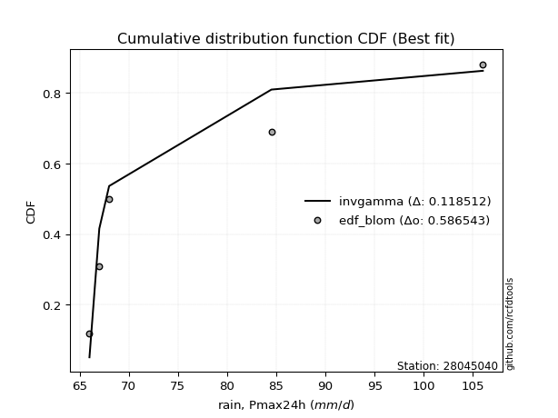</img>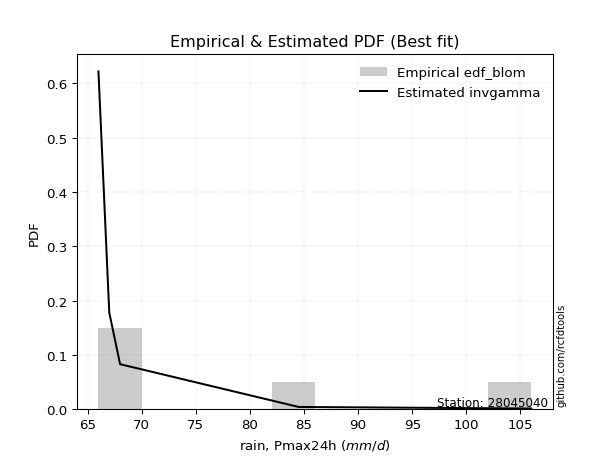</img>

</div>


### 7. Empirical - EDF Tukey (1962)

In hydrology, the Tukey formula is used as a plotting position formula to estimate the empirical probability or frequency of a flood event (or other hydrological data). The formula parameter is given as _c=0.333_ (or 1/3).

<div align="center">


$P=(m-c)/(n+1-2c)$


</div>


**7.1. Empirical values**

<div align="center">

|                | 0                  | 1                  | 2         | 3         | 4         |
|:---------------|:-------------------|:-------------------|:----------|:----------|:----------|
| date           | 1993               | 1989               | 1990      | 1988      | 1992      |
| x              | 66.0               | 67.0               | 68.0      | 84.5      | 106.0     |
| m              | 1                  | 2                  | 3         | 4         | 5         |
| empirical_dist | edf_tukey          | edf_tukey          | edf_tukey | edf_tukey | edf_tukey |
| empirical      | 0.125              | 0.3125             | 0.5       | 0.6875    | 0.875     |
| empirical_tr   | 1.1428571428571428 | 1.4545454545454546 | 2.0       | 3.2       | 8.0       |

</div>


**7.2. Parameters & Kolmogorov-Smirnov fit test (sorted by Δ)**

|   id | empirical_dist   | p_dist             |    delta |   deltao | eval    |   fit |   n |            loc |          scale | shape                  | shape1                | shape2             | shape3   |   best_fit |   best_fit_sort |
|-----:|:-----------------|:-------------------|---------:|---------:|:--------|------:|----:|---------------:|---------------:|:-----------------------|:----------------------|:-------------------|:---------|-----------:|----------------:|
|    0 | edf_tukey        | invgamma           | 0.121489 | 0.586543 | Δo > Δ  |     1 |   5 |     65.8249    |    0.302622    | 0.4297315538891706     |                       |                    |          |          1 |               1 |
|    1 | edf_tukey        | f                  | 0.128597 | 0.586543 | Δo > Δ  |     1 |   5 |     65.9911    |    9.06646     | 0.7028999001462481     | 1.270270787280117     |                    |          |          0 |               2 |
|    2 | edf_tukey        | pareto             | 0.131729 | 0.586543 | Δo > Δ  |     1 |   5 |     65.3919    |    0.608122    | 0.4961647277526386     |                       |                    |          |          0 |               3 |
|    3 | edf_tukey        | invgauss           | 0.180635 | 0.586543 | Δo > Δ  |     1 |   5 |     65.6832    |    1.24089     | 10.16752408575293      |                       |                    |          |          0 |               4 |
|    4 | edf_tukey        | recipinvgauss      | 0.185697 | 0.586543 | Δo > Δ  |     1 |   5 |     66         |   12.2111      | 353005.38167740405     |                       |                    |          |          0 |               5 |
|    5 | edf_tukey        | weibull_min        | 0.191073 | 0.586543 | Δo > Δ  |     1 |   5 |     66         |   24.5769      | 0.3968558762538796     |                       |                    |          |          0 |               6 |
|    6 | edf_tukey        | halfnorm           | 0.192434 | 0.586543 | Δo > Δ  |     1 |   5 |     57.8735    |   25.6008      |                        |                       |                    |          |          0 |               7 |
|    7 | edf_tukey        | halflogistic       | 0.206106 | 0.586543 | Δo > Δ  |     1 |   5 |     60.009     |   13.1942      |                        |                       |                    |          |          0 |               8 |
|    8 | edf_tukey        | fisk               | 0.210659 | 0.586543 | Δo > Δ  |     1 |   5 |     -0.237632  |   75.1891      | 9.262856659644054      |                       |                    |          |          0 |               9 |
|    9 | edf_tukey        | alpha              | 0.211823 | 0.586543 | Δo > Δ  |     1 |   5 |     64.6167    |    2.51557     | 2.2561222112948883e-06 |                       |                    |          |          0 |              10 |
|   10 | edf_tukey        | rayleigh           | 0.216787 | 0.586543 | Δo > Δ  |     1 |   5 |     48.7769    |   23.5561      |                        |                       |                    |          |          0 |              11 |
|   11 | edf_tukey        | pearson3           | 0.223227 | 0.586543 | Δo > Δ  |     1 |   5 |     78.3       |   15.4324      | 0.9302948570091479     |                       |                    |          |          0 |              12 |
|   12 | edf_tukey        | maxwell            | 0.225811 | 0.586543 | Δo > Δ  |     1 |   5 |     41.7316    |   22.9158      |                        |                       |                    |          |          0 |              13 |
|   13 | edf_tukey        | gumbel_r           | 0.233273 | 0.586543 | Δo > Δ  |     1 |   5 |     71.3546    |   12.0326      |                        |                       |                    |          |          0 |              14 |
|   14 | edf_tukey        | moyal              | 0.233853 | 0.586543 | Δo > Δ  |     1 |   5 |     69.4747    |    6.94704     |                        |                       |                    |          |          0 |              15 |
|   15 | edf_tukey        | loggamma           | 0.246615 | 0.586543 | Δo > Δ  |     1 |   5 |  -5376.09      |  713.546       | 2088.7955527033105     |                       |                    |          |          0 |              16 |
|   16 | edf_tukey        | betaprime          | 0.247498 | 0.586543 | Δo > Δ  |     1 |   5 |     -1.03944   |   10.6297      | 266.2523780275282      | 36.793638253223975    |                    |          |          0 |              17 |
|   17 | edf_tukey        | t                  | 0.247735 | 0.586543 | Δo > Δ  |     1 |   5 |     78.2993    |   15.4324      | 12857825.153010752     |                       |                    |          |          0 |              18 |
|   18 | edf_tukey        | crystalball        | 0.24775  | 0.586543 | Δo > Δ  |     1 |   5 |     78.3       |   15.4324      | 5438.333067165024      | 3400.545771361175     |                    |          |          0 |              19 |
|   19 | edf_tukey        | norm               | 0.24775  | 0.586543 | Δo > Δ  |     1 |   5 |     78.3       |   15.4324      |                        |                       |                    |          |          0 |              20 |
|   20 | edf_tukey        | nct                | 0.248941 | 0.586543 | Δo > Δ  |     1 |   5 |     -0.324035  |    1.16915     | 17.222305362253202     | 64.12661156808444     |                    |          |          0 |              21 |
|   21 | edf_tukey        | gamma              | 0.251172 | 0.586543 | Δo > Δ  |     1 |   5 |     66         |    9.64666     | 0.8582108600252419     |                       |                    |          |          0 |              22 |
|   22 | edf_tukey        | erlang             | 0.254452 | 0.586543 | Δo > Δ  |     1 |   5 |     66         |    8.22473     | 0.7012103116760149     |                       |                    |          |          0 |              23 |
|   23 | edf_tukey        | mielke             | 0.254698 | 0.586543 | Δo > Δ  |     1 |   5 |     20.7896    |   29.9508      | 144.00222025141272     | 6.124944655363475     |                    |          |          0 |              24 |
|   24 | edf_tukey        | genlogistic        | 0.255767 | 0.586543 | Δo > Δ  |     1 |   5 |     -1.44097   |   10.1267      | 1340.8407147450898     |                       |                    |          |          0 |              25 |
|   25 | edf_tukey        | logistic           | 0.270401 | 0.586543 | Δo > Δ  |     1 |   5 |     78.3       |    8.50835     |                        |                       |                    |          |          0 |              26 |
|   26 | edf_tukey        | zzloggumbel        | 0.275189 | 0.586543 | Δo > Δ  |     1 |   5 |      4.27697   |    0.1435      | 0.4587941646363373     | 0.7927783866335278    |                    |          |          0 |              27 |
|   27 | edf_tukey        | kstwobign          | 0.277879 | 0.586543 | Δo > Δ  |     1 |   5 |     35.4762    |   49.3502      |                        |                       |                    |          |          0 |              28 |
|   28 | edf_tukey        | dgamma             | 0.281829 | 0.586543 | Δo > Δ  |     1 |   5 |     67         |   13.9511      | 0.31045145640856997    |                       |                    |          |          0 |              29 |
|   29 | edf_tukey        | hypsecant          | 0.285382 | 0.586543 | Δo > Δ  |     1 |   5 |     78.3       |    9.82459     |                        |                       |                    |          |          0 |              30 |
|   30 | edf_tukey        | gumbel_l           | 0.287778 | 0.586543 | Δo > Δ  |     1 |   5 |     85.2454    |   12.0326      |                        |                       |                    |          |          0 |              31 |
|   31 | edf_tukey        | rice               | 0.299333 | 0.586543 | Δo > Δ  |     1 |   5 |     54.6255    |   19.983       | 0.0003312084136606528  |                       |                    |          |          0 |              32 |
|   32 | edf_tukey        | wald               | 0.299407 | 0.586543 | Δo > Δ  |     1 |   5 |     62.8676    |   15.4324      |                        |                       |                    |          |          0 |              33 |
|   33 | edf_tukey        | laplace            | 0.305443 | 0.586543 | Δo > Δ  |     1 |   5 |     78.3       |   10.9124      |                        |                       |                    |          |          0 |              34 |
|   34 | edf_tukey        | fatiguelife        | 0.315365 | 0.586543 | Δo > Δ  |     1 |   5 |     66         |    3.71184e-06 | 1591.1635680991308     |                       |                    |          |          0 |              35 |
|   35 | edf_tukey        | lognorm            | 0.329127 | 0.586543 | Δo > Δ  |     1 |   5 |     66         |    0.0073211   | 13.552535329262627     |                       |                    |          |          0 |              36 |
|   36 | edf_tukey        | chi2               | 0.32978  | 0.586543 | Δo > Δ  |     1 |   5 |     66         |    1.46774     | 0.8651608206009879     |                       |                    |          |          0 |              37 |
|   37 | edf_tukey        | gompertz           | 0.349198 | 0.586543 | Δo > Δ  |     1 |   5 |     66         |    4.15422e+07 | 3395311.2952204095     |                       |                    |          |          0 |              38 |
|   38 | edf_tukey        | exponnorm          | 0.349545 | 0.586543 | Δo > Δ  |     1 |   5 |     65.9886    |    0.00342425  | 3602.5351032013627     |                       |                    |          |          0 |              39 |
|   39 | edf_tukey        | expon              | 0.34993  | 0.586543 | Δo > Δ  |     1 |   5 |     66         |   12.3         |                        |                       |                    |          |          0 |              40 |
|   40 | edf_tukey        | laplace_asymmetric | 0.349933 | 0.586543 | Δo > Δ  |     1 |   5 |     66         |    0.000181219 | 1.4732937397076812e-05 |                       |                    |          |          0 |              41 |
|   41 | edf_tukey        | genexpon           | 0.350034 | 0.586543 | Δo > Δ  |     1 |   5 |     66         |   27.1352      | 2.204447915786575      | 5.780448093058229e-08 | 1.4906899459905778 |          |          0 |              42 |
|   42 | edf_tukey        | ncf                | 0.370487 | 0.586543 | Δo > Δ  |     1 |   5 |      0.0423853 |    4.97387e-06 | 6.396895698895876e-07  | 11.353772297033352    | 9.19611523408203   |          |          0 |              43 |
|   43 | edf_tukey        | nakagami           | 0.371399 | 0.586543 | Δo > Δ  |     1 |   5 |     66         |   29.9853      | 0.3319620409797418     |                       |                    |          |          0 |              44 |
|   44 | edf_tukey        | truncnorm          | 0.378502 | 0.586543 | Δo > Δ  |     1 |   5 | -67204.8       | 1019.26        | 65.99974054842681      | 107.56322857469246    |                    |          |          0 |              45 |
|   45 | edf_tukey        | zzgumbel           | 0.382922 | 0.586543 | Δo > Δ  |     1 |   5 |     78.2659    |   13.4529      | 0.4587941646363373     | 0.7927783866335278    |                    |          |          0 |              46 |
|   46 | edf_tukey        | gibrat             | 0.442773 | 0.586543 | Δo > Δ  |     1 |   5 |     66.527     |    7.1407      |                        |                       |                    |          |          0 |              47 |
|   47 | edf_tukey        | johnsonsu          | 0.519512 | 0.586543 | Δo > Δ  |     1 |   5 |     66         |    8.44603e-10 | -3.1603106279431694    | 0.19098437803723442   |                    |          |          0 |              48 |
|   48 | edf_tukey        | invweibull         | 0.663704 | 0.586543 | Δo <= Δ |     0 |   5 |     66         |    3.22703e-10 | 0.17050382005097953    |                       |                    |          |          0 |              49 |

<div align="center">

</img>

</div>


**7.3. Best fit**

|   id |   station | empirical_dist   | p_dist   |    delta |   deltao | eval   |   fit |   n |     loc |    scale |    shape | shape1   | shape2   | shape3   |   best_fit |   best_fit_sort |
|-----:|----------:|:-----------------|:---------|---------:|---------:|:-------|------:|----:|--------:|---------:|---------:|:---------|:---------|:---------|-----------:|----------------:|
|    0 |  28045040 | edf_tukey        | invgamma | 0.121489 | 0.586543 | Δo > Δ |     1 |   5 | 65.8249 | 0.302622 | 0.429732 |          |          |          |          1 |               1 |

<div align="center">

</img></img>

</div>


### 8. Empirical - EDF Gringorten (1963)

Gringorten plotting position formula is essential for estimating the probability and return periods of extreme events like floods and heavy rainfall. The constant _a=0.44_.

<div align="center">


$P=(m-a)/(n+1-2a)$


</div>


**8.1. Empirical values**

<div align="center">

|                | 0                   | 1                  | 2              | 3                 | 4                  |
|:---------------|:--------------------|:-------------------|:---------------|:------------------|:-------------------|
| date           | 1993                | 1989               | 1990           | 1988              | 1992               |
| x              | 66.0                | 67.0               | 68.0           | 84.5              | 106.0              |
| m              | 1                   | 2                  | 3              | 4                 | 5                  |
| empirical_dist | edf_gringorten      | edf_gringorten     | edf_gringorten | edf_gringorten    | edf_gringorten     |
| empirical      | 0.10937500000000001 | 0.3046875          | 0.5            | 0.6953125         | 0.8906249999999999 |
| empirical_tr   | 1.1228070175438596  | 1.4382022471910112 | 2.0            | 3.282051282051282 | 9.142857142857133  |

</div>


**8.2. Parameters & Kolmogorov-Smirnov fit test (sorted by Δ)**

|   id | empirical_dist   | p_dist             |    delta |   deltao | eval    |   fit |   n |            loc |          scale | shape                  | shape1                | shape2             | shape3   |   best_fit |   best_fit_sort |
|-----:|:-----------------|:-------------------|---------:|---------:|:--------|------:|----:|---------------:|---------------:|:-----------------------|:----------------------|:-------------------|:---------|-----------:|----------------:|
|    0 | edf_gringorten   | invgamma           | 0.113676 | 0.586543 | Δo > Δ  |     1 |   5 |     65.8249    |    0.302622    | 0.4297315538891706     |                       |                    |          |          1 |               1 |
|    1 | edf_gringorten   | pareto             | 0.123917 | 0.586543 | Δo > Δ  |     1 |   5 |     65.3919    |    0.608122    | 0.4961647277526386     |                       |                    |          |          0 |               2 |
|    2 | edf_gringorten   | f                  | 0.128597 | 0.586543 | Δo > Δ  |     1 |   5 |     65.9911    |    9.06646     | 0.7028999001462481     | 1.270270787280117     |                    |          |          0 |               3 |
|    3 | edf_gringorten   | invgauss           | 0.172823 | 0.586543 | Δo > Δ  |     1 |   5 |     65.6832    |    1.24089     | 10.16752408575293      |                       |                    |          |          0 |               4 |
|    4 | edf_gringorten   | recipinvgauss      | 0.185697 | 0.586543 | Δo > Δ  |     1 |   5 |     66         |   12.2111      | 353005.38167740405     |                       |                    |          |          0 |               5 |
|    5 | edf_gringorten   | weibull_min        | 0.191073 | 0.586543 | Δo > Δ  |     1 |   5 |     66         |   24.5769      | 0.3968558762538796     |                       |                    |          |          0 |               6 |
|    6 | edf_gringorten   | halfnorm           | 0.192434 | 0.586543 | Δo > Δ  |     1 |   5 |     57.8735    |   25.6008      |                        |                       |                    |          |          0 |               7 |
|    7 | edf_gringorten   | alpha              | 0.204011 | 0.586543 | Δo > Δ  |     1 |   5 |     64.6167    |    2.51557     | 2.2561222112948883e-06 |                       |                    |          |          0 |               8 |
|    8 | edf_gringorten   | halflogistic       | 0.206106 | 0.586543 | Δo > Δ  |     1 |   5 |     60.009     |   13.1942      |                        |                       |                    |          |          0 |               9 |
|    9 | edf_gringorten   | fisk               | 0.210659 | 0.586543 | Δo > Δ  |     1 |   5 |     -0.237632  |   75.1891      | 9.262856659644054      |                       |                    |          |          0 |              10 |
|   10 | edf_gringorten   | rayleigh           | 0.216787 | 0.586543 | Δo > Δ  |     1 |   5 |     48.7769    |   23.5561      |                        |                       |                    |          |          0 |              11 |
|   11 | edf_gringorten   | pearson3           | 0.223227 | 0.586543 | Δo > Δ  |     1 |   5 |     78.3       |   15.4324      | 0.9302948570091479     |                       |                    |          |          0 |              12 |
|   12 | edf_gringorten   | maxwell            | 0.225811 | 0.586543 | Δo > Δ  |     1 |   5 |     41.7316    |   22.9158      |                        |                       |                    |          |          0 |              13 |
|   13 | edf_gringorten   | gumbel_r           | 0.233273 | 0.586543 | Δo > Δ  |     1 |   5 |     71.3546    |   12.0326      |                        |                       |                    |          |          0 |              14 |
|   14 | edf_gringorten   | moyal              | 0.233853 | 0.586543 | Δo > Δ  |     1 |   5 |     69.4747    |    6.94704     |                        |                       |                    |          |          0 |              15 |
|   15 | edf_gringorten   | loggamma           | 0.246615 | 0.586543 | Δo > Δ  |     1 |   5 |  -5376.09      |  713.546       | 2088.7955527033105     |                       |                    |          |          0 |              16 |
|   16 | edf_gringorten   | erlang             | 0.246639 | 0.586543 | Δo > Δ  |     1 |   5 |     66         |    8.22473     | 0.7012103116760149     |                       |                    |          |          0 |              17 |
|   17 | edf_gringorten   | betaprime          | 0.247498 | 0.586543 | Δo > Δ  |     1 |   5 |     -1.03944   |   10.6297      | 266.2523780275282      | 36.793638253223975    |                    |          |          0 |              18 |
|   18 | edf_gringorten   | t                  | 0.247735 | 0.586543 | Δo > Δ  |     1 |   5 |     78.2993    |   15.4324      | 12857825.153010752     |                       |                    |          |          0 |              19 |
|   19 | edf_gringorten   | crystalball        | 0.24775  | 0.586543 | Δo > Δ  |     1 |   5 |     78.3       |   15.4324      | 5438.333067165024      | 3400.545771361175     |                    |          |          0 |              20 |
|   20 | edf_gringorten   | norm               | 0.24775  | 0.586543 | Δo > Δ  |     1 |   5 |     78.3       |   15.4324      |                        |                       |                    |          |          0 |              21 |
|   21 | edf_gringorten   | nct                | 0.248941 | 0.586543 | Δo > Δ  |     1 |   5 |     -0.324035  |    1.16915     | 17.222305362253202     | 64.12661156808444     |                    |          |          0 |              22 |
|   22 | edf_gringorten   | gamma              | 0.251172 | 0.586543 | Δo > Δ  |     1 |   5 |     66         |    9.64666     | 0.8582108600252419     |                       |                    |          |          0 |              23 |
|   23 | edf_gringorten   | mielke             | 0.254698 | 0.586543 | Δo > Δ  |     1 |   5 |     20.7896    |   29.9508      | 144.00222025141272     | 6.124944655363475     |                    |          |          0 |              24 |
|   24 | edf_gringorten   | genlogistic        | 0.255767 | 0.586543 | Δo > Δ  |     1 |   5 |     -1.44097   |   10.1267      | 1340.8407147450898     |                       |                    |          |          0 |              25 |
|   25 | edf_gringorten   | logistic           | 0.270401 | 0.586543 | Δo > Δ  |     1 |   5 |     78.3       |    8.50835     |                        |                       |                    |          |          0 |              26 |
|   26 | edf_gringorten   | dgamma             | 0.274016 | 0.586543 | Δo > Δ  |     1 |   5 |     67         |   13.9511      | 0.31045145640856997    |                       |                    |          |          0 |              27 |
|   27 | edf_gringorten   | zzloggumbel        | 0.275189 | 0.586543 | Δo > Δ  |     1 |   5 |      4.27697   |    0.1435      | 0.4587941646363373     | 0.7927783866335278    |                    |          |          0 |              28 |
|   28 | edf_gringorten   | kstwobign          | 0.277879 | 0.586543 | Δo > Δ  |     1 |   5 |     35.4762    |   49.3502      |                        |                       |                    |          |          0 |              29 |
|   29 | edf_gringorten   | hypsecant          | 0.285382 | 0.586543 | Δo > Δ  |     1 |   5 |     78.3       |    9.82459     |                        |                       |                    |          |          0 |              30 |
|   30 | edf_gringorten   | gumbel_l           | 0.287778 | 0.586543 | Δo > Δ  |     1 |   5 |     85.2454    |   12.0326      |                        |                       |                    |          |          0 |              31 |
|   31 | edf_gringorten   | rice               | 0.299333 | 0.586543 | Δo > Δ  |     1 |   5 |     54.6255    |   19.983       | 0.0003312084136606528  |                       |                    |          |          0 |              32 |
|   32 | edf_gringorten   | wald               | 0.299407 | 0.586543 | Δo > Δ  |     1 |   5 |     62.8676    |   15.4324      |                        |                       |                    |          |          0 |              33 |
|   33 | edf_gringorten   | laplace            | 0.305443 | 0.586543 | Δo > Δ  |     1 |   5 |     78.3       |   10.9124      |                        |                       |                    |          |          0 |              34 |
|   34 | edf_gringorten   | fatiguelife        | 0.323177 | 0.586543 | Δo > Δ  |     1 |   5 |     66         |    3.71184e-06 | 1591.1635680991308     |                       |                    |          |          0 |              35 |
|   35 | edf_gringorten   | lognorm            | 0.336939 | 0.586543 | Δo > Δ  |     1 |   5 |     66         |    0.0073211   | 13.552535329262627     |                       |                    |          |          0 |              36 |
|   36 | edf_gringorten   | chi2               | 0.337592 | 0.586543 | Δo > Δ  |     1 |   5 |     66         |    1.46774     | 0.8651608206009879     |                       |                    |          |          0 |              37 |
|   37 | edf_gringorten   | gompertz           | 0.349198 | 0.586543 | Δo > Δ  |     1 |   5 |     66         |    4.15422e+07 | 3395311.2952204095     |                       |                    |          |          0 |              38 |
|   38 | edf_gringorten   | exponnorm          | 0.349545 | 0.586543 | Δo > Δ  |     1 |   5 |     65.9886    |    0.00342425  | 3602.5351032013627     |                       |                    |          |          0 |              39 |
|   39 | edf_gringorten   | expon              | 0.34993  | 0.586543 | Δo > Δ  |     1 |   5 |     66         |   12.3         |                        |                       |                    |          |          0 |              40 |
|   40 | edf_gringorten   | laplace_asymmetric | 0.349933 | 0.586543 | Δo > Δ  |     1 |   5 |     66         |    0.000181219 | 1.4732937397076812e-05 |                       |                    |          |          0 |              41 |
|   41 | edf_gringorten   | genexpon           | 0.350034 | 0.586543 | Δo > Δ  |     1 |   5 |     66         |   27.1352      | 2.204447915786575      | 5.780448093058229e-08 | 1.4906899459905778 |          |          0 |              42 |
|   42 | edf_gringorten   | nakagami           | 0.371399 | 0.586543 | Δo > Δ  |     1 |   5 |     66         |   29.9853      | 0.3319620409797418     |                       |                    |          |          0 |              43 |
|   43 | edf_gringorten   | truncnorm          | 0.378502 | 0.586543 | Δo > Δ  |     1 |   5 | -67204.8       | 1019.26        | 65.99974054842681      | 107.56322857469246    |                    |          |          0 |              44 |
|   44 | edf_gringorten   | zzgumbel           | 0.382922 | 0.586543 | Δo > Δ  |     1 |   5 |     78.2659    |   13.4529      | 0.4587941646363373     | 0.7927783866335278    |                    |          |          0 |              45 |
|   45 | edf_gringorten   | ncf                | 0.386112 | 0.586543 | Δo > Δ  |     1 |   5 |      0.0423853 |    4.97387e-06 | 6.396895698895876e-07  | 11.353772297033352    | 9.19611523408203   |          |          0 |              46 |
|   46 | edf_gringorten   | gibrat             | 0.442773 | 0.586543 | Δo > Δ  |     1 |   5 |     66.527     |    7.1407      |                        |                       |                    |          |          0 |              47 |
|   47 | edf_gringorten   | johnsonsu          | 0.527324 | 0.586543 | Δo > Δ  |     1 |   5 |     66         |    8.44603e-10 | -3.1603106279431694    | 0.19098437803723442   |                    |          |          0 |              48 |
|   48 | edf_gringorten   | invweibull         | 0.671517 | 0.586543 | Δo <= Δ |     0 |   5 |     66         |    3.22703e-10 | 0.17050382005097953    |                       |                    |          |          0 |              49 |

<div align="center">

</img>

</div>


**8.3. Best fit**

|   id |   station | empirical_dist   | p_dist   |    delta |   deltao | eval   |   fit |   n |     loc |    scale |    shape | shape1   | shape2   | shape3   |   best_fit |   best_fit_sort |
|-----:|----------:|:-----------------|:---------|---------:|---------:|:-------|------:|----:|--------:|---------:|---------:|:---------|:---------|:---------|-----------:|----------------:|
|    0 |  28045040 | edf_gringorten   | invgamma | 0.113676 | 0.586543 | Δo > Δ |     1 |   5 | 65.8249 | 0.302622 | 0.429732 |          |          |          |          1 |               1 |

<div align="center">

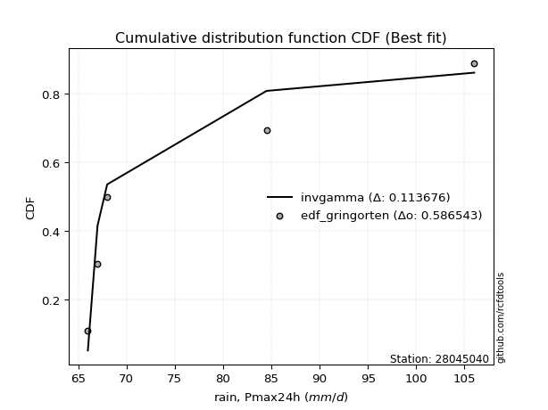</img></img>

</div>


### 9. Empirical - EDF Jenkinson (1977)

The Jenkinson formula in hydrology is an empirical plotting position formula used to estimate the non-exceedance probability _(P)_ or return period _(T)_ of a given ordered observation within a sample. It is a widely used method in the frequency analysis of extreme events such as floods and rainfall, as it provides a distribution-free way to plot data. _a≈0.31_ and _b≈0.38_ are constants derived to approximate the median of the probability distribution for the given rank.

<div align="center">


$P=(m-a)/(n+b)$


</div>


**9.1. Empirical values**

<div align="center">

|                | 0                   | 1                  | 2             | 3                  | 4                  |
|:---------------|:--------------------|:-------------------|:--------------|:-------------------|:-------------------|
| date           | 1993                | 1989               | 1990          | 1988               | 1992               |
| x              | 66.0                | 67.0               | 68.0          | 84.5               | 106.0              |
| m              | 1                   | 2                  | 3             | 4                  | 5                  |
| empirical_dist | edf_jenkinson       | edf_jenkinson      | edf_jenkinson | edf_jenkinson      | edf_jenkinson      |
| empirical      | 0.12825278810408922 | 0.3141263940520446 | 0.5           | 0.6858736059479554 | 0.8717472118959109 |
| empirical_tr   | 1.1471215351812367  | 1.4579945799457996 | 2.0           | 3.183431952662722  | 7.797101449275368  |

</div>


**9.2. Parameters & Kolmogorov-Smirnov fit test (sorted by Δ)**

|   id | empirical_dist   | p_dist             |    delta |   deltao | eval    |   fit |   n |            loc |          scale | shape                  | shape1                | shape2             | shape3   |   best_fit |   best_fit_sort |
|-----:|:-----------------|:-------------------|---------:|---------:|:--------|------:|----:|---------------:|---------------:|:-----------------------|:----------------------|:-------------------|:---------|-----------:|----------------:|
|    0 | edf_jenkinson    | invgamma           | 0.123115 | 0.586543 | Δo > Δ  |     1 |   5 |     65.8249    |    0.302622    | 0.4297315538891706     |                       |                    |          |          1 |               1 |
|    1 | edf_jenkinson    | f                  | 0.128597 | 0.586543 | Δo > Δ  |     1 |   5 |     65.9911    |    9.06646     | 0.7028999001462481     | 1.270270787280117     |                    |          |          0 |               2 |
|    2 | edf_jenkinson    | pareto             | 0.133355 | 0.586543 | Δo > Δ  |     1 |   5 |     65.3919    |    0.608122    | 0.4961647277526386     |                       |                    |          |          0 |               3 |
|    3 | edf_jenkinson    | invgauss           | 0.182262 | 0.586543 | Δo > Δ  |     1 |   5 |     65.6832    |    1.24089     | 10.16752408575293      |                       |                    |          |          0 |               4 |
|    4 | edf_jenkinson    | recipinvgauss      | 0.185697 | 0.586543 | Δo > Δ  |     1 |   5 |     66         |   12.2111      | 353005.38167740405     |                       |                    |          |          0 |               5 |
|    5 | edf_jenkinson    | weibull_min        | 0.191073 | 0.586543 | Δo > Δ  |     1 |   5 |     66         |   24.5769      | 0.3968558762538796     |                       |                    |          |          0 |               6 |
|    6 | edf_jenkinson    | halfnorm           | 0.192434 | 0.586543 | Δo > Δ  |     1 |   5 |     57.8735    |   25.6008      |                        |                       |                    |          |          0 |               7 |
|    7 | edf_jenkinson    | halflogistic       | 0.206106 | 0.586543 | Δo > Δ  |     1 |   5 |     60.009     |   13.1942      |                        |                       |                    |          |          0 |               8 |
|    8 | edf_jenkinson    | fisk               | 0.210659 | 0.586543 | Δo > Δ  |     1 |   5 |     -0.237632  |   75.1891      | 9.262856659644054      |                       |                    |          |          0 |               9 |
|    9 | edf_jenkinson    | alpha              | 0.21345  | 0.586543 | Δo > Δ  |     1 |   5 |     64.6167    |    2.51557     | 2.2561222112948883e-06 |                       |                    |          |          0 |              10 |
|   10 | edf_jenkinson    | rayleigh           | 0.216787 | 0.586543 | Δo > Δ  |     1 |   5 |     48.7769    |   23.5561      |                        |                       |                    |          |          0 |              11 |
|   11 | edf_jenkinson    | pearson3           | 0.223227 | 0.586543 | Δo > Δ  |     1 |   5 |     78.3       |   15.4324      | 0.9302948570091479     |                       |                    |          |          0 |              12 |
|   12 | edf_jenkinson    | maxwell            | 0.225811 | 0.586543 | Δo > Δ  |     1 |   5 |     41.7316    |   22.9158      |                        |                       |                    |          |          0 |              13 |
|   13 | edf_jenkinson    | gumbel_r           | 0.233273 | 0.586543 | Δo > Δ  |     1 |   5 |     71.3546    |   12.0326      |                        |                       |                    |          |          0 |              14 |
|   14 | edf_jenkinson    | moyal              | 0.233853 | 0.586543 | Δo > Δ  |     1 |   5 |     69.4747    |    6.94704     |                        |                       |                    |          |          0 |              15 |
|   15 | edf_jenkinson    | loggamma           | 0.246615 | 0.586543 | Δo > Δ  |     1 |   5 |  -5376.09      |  713.546       | 2088.7955527033105     |                       |                    |          |          0 |              16 |
|   16 | edf_jenkinson    | betaprime          | 0.247498 | 0.586543 | Δo > Δ  |     1 |   5 |     -1.03944   |   10.6297      | 266.2523780275282      | 36.793638253223975    |                    |          |          0 |              17 |
|   17 | edf_jenkinson    | t                  | 0.247735 | 0.586543 | Δo > Δ  |     1 |   5 |     78.2993    |   15.4324      | 12857825.153010752     |                       |                    |          |          0 |              18 |
|   18 | edf_jenkinson    | crystalball        | 0.24775  | 0.586543 | Δo > Δ  |     1 |   5 |     78.3       |   15.4324      | 5438.333067165024      | 3400.545771361175     |                    |          |          0 |              19 |
|   19 | edf_jenkinson    | norm               | 0.24775  | 0.586543 | Δo > Δ  |     1 |   5 |     78.3       |   15.4324      |                        |                       |                    |          |          0 |              20 |
|   20 | edf_jenkinson    | nct                | 0.248941 | 0.586543 | Δo > Δ  |     1 |   5 |     -0.324035  |    1.16915     | 17.222305362253202     | 64.12661156808444     |                    |          |          0 |              21 |
|   21 | edf_jenkinson    | gamma              | 0.251172 | 0.586543 | Δo > Δ  |     1 |   5 |     66         |    9.64666     | 0.8582108600252419     |                       |                    |          |          0 |              22 |
|   22 | edf_jenkinson    | mielke             | 0.254698 | 0.586543 | Δo > Δ  |     1 |   5 |     20.7896    |   29.9508      | 144.00222025141272     | 6.124944655363475     |                    |          |          0 |              23 |
|   23 | edf_jenkinson    | genlogistic        | 0.255767 | 0.586543 | Δo > Δ  |     1 |   5 |     -1.44097   |   10.1267      | 1340.8407147450898     |                       |                    |          |          0 |              24 |
|   24 | edf_jenkinson    | erlang             | 0.256078 | 0.586543 | Δo > Δ  |     1 |   5 |     66         |    8.22473     | 0.7012103116760149     |                       |                    |          |          0 |              25 |
|   25 | edf_jenkinson    | logistic           | 0.270401 | 0.586543 | Δo > Δ  |     1 |   5 |     78.3       |    8.50835     |                        |                       |                    |          |          0 |              26 |
|   26 | edf_jenkinson    | zzloggumbel        | 0.275189 | 0.586543 | Δo > Δ  |     1 |   5 |      4.27697   |    0.1435      | 0.4587941646363373     | 0.7927783866335278    |                    |          |          0 |              27 |
|   27 | edf_jenkinson    | kstwobign          | 0.277879 | 0.586543 | Δo > Δ  |     1 |   5 |     35.4762    |   49.3502      |                        |                       |                    |          |          0 |              28 |
|   28 | edf_jenkinson    | dgamma             | 0.283455 | 0.586543 | Δo > Δ  |     1 |   5 |     67         |   13.9511      | 0.31045145640856997    |                       |                    |          |          0 |              29 |
|   29 | edf_jenkinson    | hypsecant          | 0.285382 | 0.586543 | Δo > Δ  |     1 |   5 |     78.3       |    9.82459     |                        |                       |                    |          |          0 |              30 |
|   30 | edf_jenkinson    | gumbel_l           | 0.287778 | 0.586543 | Δo > Δ  |     1 |   5 |     85.2454    |   12.0326      |                        |                       |                    |          |          0 |              31 |
|   31 | edf_jenkinson    | rice               | 0.299333 | 0.586543 | Δo > Δ  |     1 |   5 |     54.6255    |   19.983       | 0.0003312084136606528  |                       |                    |          |          0 |              32 |
|   32 | edf_jenkinson    | wald               | 0.299407 | 0.586543 | Δo > Δ  |     1 |   5 |     62.8676    |   15.4324      |                        |                       |                    |          |          0 |              33 |
|   33 | edf_jenkinson    | laplace            | 0.305443 | 0.586543 | Δo > Δ  |     1 |   5 |     78.3       |   10.9124      |                        |                       |                    |          |          0 |              34 |
|   34 | edf_jenkinson    | fatiguelife        | 0.313738 | 0.586543 | Δo > Δ  |     1 |   5 |     66         |    3.71184e-06 | 1591.1635680991308     |                       |                    |          |          0 |              35 |
|   35 | edf_jenkinson    | lognorm            | 0.3275   | 0.586543 | Δo > Δ  |     1 |   5 |     66         |    0.0073211   | 13.552535329262627     |                       |                    |          |          0 |              36 |
|   36 | edf_jenkinson    | chi2               | 0.328153 | 0.586543 | Δo > Δ  |     1 |   5 |     66         |    1.46774     | 0.8651608206009879     |                       |                    |          |          0 |              37 |
|   37 | edf_jenkinson    | gompertz           | 0.349198 | 0.586543 | Δo > Δ  |     1 |   5 |     66         |    4.15422e+07 | 3395311.2952204095     |                       |                    |          |          0 |              38 |
|   38 | edf_jenkinson    | exponnorm          | 0.349545 | 0.586543 | Δo > Δ  |     1 |   5 |     65.9886    |    0.00342425  | 3602.5351032013627     |                       |                    |          |          0 |              39 |
|   39 | edf_jenkinson    | expon              | 0.34993  | 0.586543 | Δo > Δ  |     1 |   5 |     66         |   12.3         |                        |                       |                    |          |          0 |              40 |
|   40 | edf_jenkinson    | laplace_asymmetric | 0.349933 | 0.586543 | Δo > Δ  |     1 |   5 |     66         |    0.000181219 | 1.4732937397076812e-05 |                       |                    |          |          0 |              41 |
|   41 | edf_jenkinson    | genexpon           | 0.350034 | 0.586543 | Δo > Δ  |     1 |   5 |     66         |   27.1352      | 2.204447915786575      | 5.780448093058229e-08 | 1.4906899459905778 |          |          0 |              42 |
|   42 | edf_jenkinson    | ncf                | 0.367234 | 0.586543 | Δo > Δ  |     1 |   5 |      0.0423853 |    4.97387e-06 | 6.396895698895876e-07  | 11.353772297033352    | 9.19611523408203   |          |          0 |              43 |
|   43 | edf_jenkinson    | nakagami           | 0.371399 | 0.586543 | Δo > Δ  |     1 |   5 |     66         |   29.9853      | 0.3319620409797418     |                       |                    |          |          0 |              44 |
|   44 | edf_jenkinson    | truncnorm          | 0.378502 | 0.586543 | Δo > Δ  |     1 |   5 | -67204.8       | 1019.26        | 65.99974054842681      | 107.56322857469246    |                    |          |          0 |              45 |
|   45 | edf_jenkinson    | zzgumbel           | 0.382922 | 0.586543 | Δo > Δ  |     1 |   5 |     78.2659    |   13.4529      | 0.4587941646363373     | 0.7927783866335278    |                    |          |          0 |              46 |
|   46 | edf_jenkinson    | gibrat             | 0.442773 | 0.586543 | Δo > Δ  |     1 |   5 |     66.527     |    7.1407      |                        |                       |                    |          |          0 |              47 |
|   47 | edf_jenkinson    | johnsonsu          | 0.517885 | 0.586543 | Δo > Δ  |     1 |   5 |     66         |    8.44603e-10 | -3.1603106279431694    | 0.19098437803723442   |                    |          |          0 |              48 |
|   48 | edf_jenkinson    | invweibull         | 0.662078 | 0.586543 | Δo <= Δ |     0 |   5 |     66         |    3.22703e-10 | 0.17050382005097953    |                       |                    |          |          0 |              49 |

<div align="center">

</img>

</div>


**9.3. Best fit**

|   id |   station | empirical_dist   | p_dist   |    delta |   deltao | eval   |   fit |   n |     loc |    scale |    shape | shape1   | shape2   | shape3   |   best_fit |   best_fit_sort |
|-----:|----------:|:-----------------|:---------|---------:|---------:|:-------|------:|----:|--------:|---------:|---------:|:---------|:---------|:---------|-----------:|----------------:|
|    0 |  28045040 | edf_jenkinson    | invgamma | 0.123115 | 0.586543 | Δo > Δ |     1 |   5 | 65.8249 | 0.302622 | 0.429732 |          |          |          |          1 |               1 |

<div align="center">

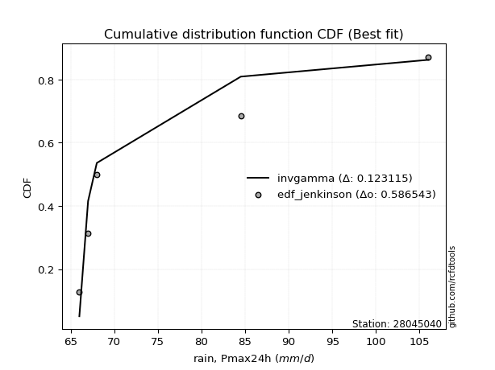</img></img>

</div>


### 10. Empirical - EDF Cunnane (1978)

Cunnane´s work in statistical hydrology has focused on the performance and evaluation of different probability distributions (such as GEV, Gumbel, Lognormal) for flood frequency estimation. _b_ is a constant, typically set to 0.4.

<div align="center">


$P=(m-b)/(n+1-2b)$


</div>


**10.1. Empirical values**

<div align="center">

|                | 0                   | 1                  | 2           | 3                  | 4                  |
|:---------------|:--------------------|:-------------------|:------------|:-------------------|:-------------------|
| date           | 1993                | 1989               | 1990        | 1988               | 1992               |
| x              | 66.0                | 67.0               | 68.0        | 84.5               | 106.0              |
| m              | 1                   | 2                  | 3           | 4                  | 5                  |
| empirical_dist | edf_cunnane         | edf_cunnane        | edf_cunnane | edf_cunnane        | edf_cunnane        |
| empirical      | 0.11538461538461538 | 0.3076923076923077 | 0.5         | 0.6923076923076923 | 0.8846153846153845 |
| empirical_tr   | 1.1304347826086958  | 1.4444444444444444 | 2.0         | 3.25               | 8.666666666666655  |

</div>


**10.2. Parameters & Kolmogorov-Smirnov fit test (sorted by Δ)**

|   id | empirical_dist   | p_dist             |    delta |   deltao | eval    |   fit |   n |            loc |          scale | shape                  | shape1                | shape2             | shape3   |   best_fit |   best_fit_sort |
|-----:|:-----------------|:-------------------|---------:|---------:|:--------|------:|----:|---------------:|---------------:|:-----------------------|:----------------------|:-------------------|:---------|-----------:|----------------:|
|    0 | edf_cunnane      | invgamma           | 0.116681 | 0.586543 | Δo > Δ  |     1 |   5 |     65.8249    |    0.302622    | 0.4297315538891706     |                       |                    |          |          1 |               1 |
|    1 | edf_cunnane      | pareto             | 0.126921 | 0.586543 | Δo > Δ  |     1 |   5 |     65.3919    |    0.608122    | 0.4961647277526386     |                       |                    |          |          0 |               2 |
|    2 | edf_cunnane      | f                  | 0.128597 | 0.586543 | Δo > Δ  |     1 |   5 |     65.9911    |    9.06646     | 0.7028999001462481     | 1.270270787280117     |                    |          |          0 |               3 |
|    3 | edf_cunnane      | invgauss           | 0.175828 | 0.586543 | Δo > Δ  |     1 |   5 |     65.6832    |    1.24089     | 10.16752408575293      |                       |                    |          |          0 |               4 |
|    4 | edf_cunnane      | recipinvgauss      | 0.185697 | 0.586543 | Δo > Δ  |     1 |   5 |     66         |   12.2111      | 353005.38167740405     |                       |                    |          |          0 |               5 |
|    5 | edf_cunnane      | weibull_min        | 0.191073 | 0.586543 | Δo > Δ  |     1 |   5 |     66         |   24.5769      | 0.3968558762538796     |                       |                    |          |          0 |               6 |
|    6 | edf_cunnane      | halfnorm           | 0.192434 | 0.586543 | Δo > Δ  |     1 |   5 |     57.8735    |   25.6008      |                        |                       |                    |          |          0 |               7 |
|    7 | edf_cunnane      | halflogistic       | 0.206106 | 0.586543 | Δo > Δ  |     1 |   5 |     60.009     |   13.1942      |                        |                       |                    |          |          0 |               8 |
|    8 | edf_cunnane      | alpha              | 0.207016 | 0.586543 | Δo > Δ  |     1 |   5 |     64.6167    |    2.51557     | 2.2561222112948883e-06 |                       |                    |          |          0 |               9 |
|    9 | edf_cunnane      | fisk               | 0.210659 | 0.586543 | Δo > Δ  |     1 |   5 |     -0.237632  |   75.1891      | 9.262856659644054      |                       |                    |          |          0 |              10 |
|   10 | edf_cunnane      | rayleigh           | 0.216787 | 0.586543 | Δo > Δ  |     1 |   5 |     48.7769    |   23.5561      |                        |                       |                    |          |          0 |              11 |
|   11 | edf_cunnane      | pearson3           | 0.223227 | 0.586543 | Δo > Δ  |     1 |   5 |     78.3       |   15.4324      | 0.9302948570091479     |                       |                    |          |          0 |              12 |
|   12 | edf_cunnane      | maxwell            | 0.225811 | 0.586543 | Δo > Δ  |     1 |   5 |     41.7316    |   22.9158      |                        |                       |                    |          |          0 |              13 |
|   13 | edf_cunnane      | gumbel_r           | 0.233273 | 0.586543 | Δo > Δ  |     1 |   5 |     71.3546    |   12.0326      |                        |                       |                    |          |          0 |              14 |
|   14 | edf_cunnane      | moyal              | 0.233853 | 0.586543 | Δo > Δ  |     1 |   5 |     69.4747    |    6.94704     |                        |                       |                    |          |          0 |              15 |
|   15 | edf_cunnane      | loggamma           | 0.246615 | 0.586543 | Δo > Δ  |     1 |   5 |  -5376.09      |  713.546       | 2088.7955527033105     |                       |                    |          |          0 |              16 |
|   16 | edf_cunnane      | betaprime          | 0.247498 | 0.586543 | Δo > Δ  |     1 |   5 |     -1.03944   |   10.6297      | 266.2523780275282      | 36.793638253223975    |                    |          |          0 |              17 |
|   17 | edf_cunnane      | t                  | 0.247735 | 0.586543 | Δo > Δ  |     1 |   5 |     78.2993    |   15.4324      | 12857825.153010752     |                       |                    |          |          0 |              18 |
|   18 | edf_cunnane      | crystalball        | 0.24775  | 0.586543 | Δo > Δ  |     1 |   5 |     78.3       |   15.4324      | 5438.333067165024      | 3400.545771361175     |                    |          |          0 |              19 |
|   19 | edf_cunnane      | norm               | 0.24775  | 0.586543 | Δo > Δ  |     1 |   5 |     78.3       |   15.4324      |                        |                       |                    |          |          0 |              20 |
|   20 | edf_cunnane      | nct                | 0.248941 | 0.586543 | Δo > Δ  |     1 |   5 |     -0.324035  |    1.16915     | 17.222305362253202     | 64.12661156808444     |                    |          |          0 |              21 |
|   21 | edf_cunnane      | erlang             | 0.249644 | 0.586543 | Δo > Δ  |     1 |   5 |     66         |    8.22473     | 0.7012103116760149     |                       |                    |          |          0 |              22 |
|   22 | edf_cunnane      | gamma              | 0.251172 | 0.586543 | Δo > Δ  |     1 |   5 |     66         |    9.64666     | 0.8582108600252419     |                       |                    |          |          0 |              23 |
|   23 | edf_cunnane      | mielke             | 0.254698 | 0.586543 | Δo > Δ  |     1 |   5 |     20.7896    |   29.9508      | 144.00222025141272     | 6.124944655363475     |                    |          |          0 |              24 |
|   24 | edf_cunnane      | genlogistic        | 0.255767 | 0.586543 | Δo > Δ  |     1 |   5 |     -1.44097   |   10.1267      | 1340.8407147450898     |                       |                    |          |          0 |              25 |
|   25 | edf_cunnane      | logistic           | 0.270401 | 0.586543 | Δo > Δ  |     1 |   5 |     78.3       |    8.50835     |                        |                       |                    |          |          0 |              26 |
|   26 | edf_cunnane      | zzloggumbel        | 0.275189 | 0.586543 | Δo > Δ  |     1 |   5 |      4.27697   |    0.1435      | 0.4587941646363373     | 0.7927783866335278    |                    |          |          0 |              27 |
|   27 | edf_cunnane      | dgamma             | 0.277021 | 0.586543 | Δo > Δ  |     1 |   5 |     67         |   13.9511      | 0.31045145640856997    |                       |                    |          |          0 |              28 |
|   28 | edf_cunnane      | kstwobign          | 0.277879 | 0.586543 | Δo > Δ  |     1 |   5 |     35.4762    |   49.3502      |                        |                       |                    |          |          0 |              29 |
|   29 | edf_cunnane      | hypsecant          | 0.285382 | 0.586543 | Δo > Δ  |     1 |   5 |     78.3       |    9.82459     |                        |                       |                    |          |          0 |              30 |
|   30 | edf_cunnane      | gumbel_l           | 0.287778 | 0.586543 | Δo > Δ  |     1 |   5 |     85.2454    |   12.0326      |                        |                       |                    |          |          0 |              31 |
|   31 | edf_cunnane      | rice               | 0.299333 | 0.586543 | Δo > Δ  |     1 |   5 |     54.6255    |   19.983       | 0.0003312084136606528  |                       |                    |          |          0 |              32 |
|   32 | edf_cunnane      | wald               | 0.299407 | 0.586543 | Δo > Δ  |     1 |   5 |     62.8676    |   15.4324      |                        |                       |                    |          |          0 |              33 |
|   33 | edf_cunnane      | laplace            | 0.305443 | 0.586543 | Δo > Δ  |     1 |   5 |     78.3       |   10.9124      |                        |                       |                    |          |          0 |              34 |
|   34 | edf_cunnane      | fatiguelife        | 0.320173 | 0.586543 | Δo > Δ  |     1 |   5 |     66         |    3.71184e-06 | 1591.1635680991308     |                       |                    |          |          0 |              35 |
|   35 | edf_cunnane      | lognorm            | 0.333934 | 0.586543 | Δo > Δ  |     1 |   5 |     66         |    0.0073211   | 13.552535329262627     |                       |                    |          |          0 |              36 |
|   36 | edf_cunnane      | chi2               | 0.334587 | 0.586543 | Δo > Δ  |     1 |   5 |     66         |    1.46774     | 0.8651608206009879     |                       |                    |          |          0 |              37 |
|   37 | edf_cunnane      | gompertz           | 0.349198 | 0.586543 | Δo > Δ  |     1 |   5 |     66         |    4.15422e+07 | 3395311.2952204095     |                       |                    |          |          0 |              38 |
|   38 | edf_cunnane      | exponnorm          | 0.349545 | 0.586543 | Δo > Δ  |     1 |   5 |     65.9886    |    0.00342425  | 3602.5351032013627     |                       |                    |          |          0 |              39 |
|   39 | edf_cunnane      | expon              | 0.34993  | 0.586543 | Δo > Δ  |     1 |   5 |     66         |   12.3         |                        |                       |                    |          |          0 |              40 |
|   40 | edf_cunnane      | laplace_asymmetric | 0.349933 | 0.586543 | Δo > Δ  |     1 |   5 |     66         |    0.000181219 | 1.4732937397076812e-05 |                       |                    |          |          0 |              41 |
|   41 | edf_cunnane      | genexpon           | 0.350034 | 0.586543 | Δo > Δ  |     1 |   5 |     66         |   27.1352      | 2.204447915786575      | 5.780448093058229e-08 | 1.4906899459905778 |          |          0 |              42 |
|   42 | edf_cunnane      | nakagami           | 0.371399 | 0.586543 | Δo > Δ  |     1 |   5 |     66         |   29.9853      | 0.3319620409797418     |                       |                    |          |          0 |              43 |
|   43 | edf_cunnane      | truncnorm          | 0.378502 | 0.586543 | Δo > Δ  |     1 |   5 | -67204.8       | 1019.26        | 65.99974054842681      | 107.56322857469246    |                    |          |          0 |              44 |
|   44 | edf_cunnane      | ncf                | 0.380102 | 0.586543 | Δo > Δ  |     1 |   5 |      0.0423853 |    4.97387e-06 | 6.396895698895876e-07  | 11.353772297033352    | 9.19611523408203   |          |          0 |              45 |
|   45 | edf_cunnane      | zzgumbel           | 0.382922 | 0.586543 | Δo > Δ  |     1 |   5 |     78.2659    |   13.4529      | 0.4587941646363373     | 0.7927783866335278    |                    |          |          0 |              46 |
|   46 | edf_cunnane      | gibrat             | 0.442773 | 0.586543 | Δo > Δ  |     1 |   5 |     66.527     |    7.1407      |                        |                       |                    |          |          0 |              47 |
|   47 | edf_cunnane      | johnsonsu          | 0.524319 | 0.586543 | Δo > Δ  |     1 |   5 |     66         |    8.44603e-10 | -3.1603106279431694    | 0.19098437803723442   |                    |          |          0 |              48 |
|   48 | edf_cunnane      | invweibull         | 0.668512 | 0.586543 | Δo <= Δ |     0 |   5 |     66         |    3.22703e-10 | 0.17050382005097953    |                       |                    |          |          0 |              49 |

<div align="center">

</img>

</div>


**10.3. Best fit**

|   id |   station | empirical_dist   | p_dist   |    delta |   deltao | eval   |   fit |   n |     loc |    scale |    shape | shape1   | shape2   | shape3   |   best_fit |   best_fit_sort |
|-----:|----------:|:-----------------|:---------|---------:|---------:|:-------|------:|----:|--------:|---------:|---------:|:---------|:---------|:---------|-----------:|----------------:|
|    0 |  28045040 | edf_cunnane      | invgamma | 0.116681 | 0.586543 | Δo > Δ |     1 |   5 | 65.8249 | 0.302622 | 0.429732 |          |          |          |          1 |               1 |

<div align="center">

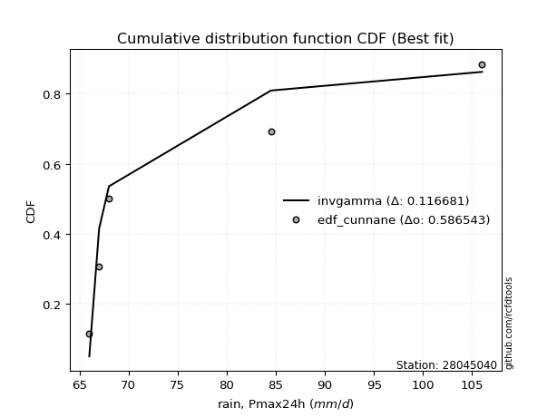</img>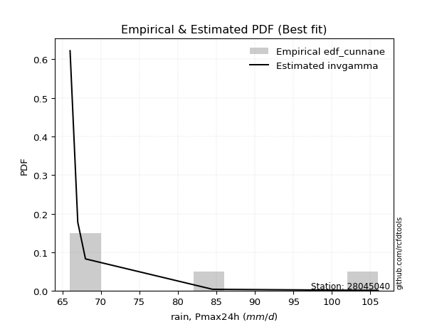</img>

</div>


### 11. Empirical - EDF Adamowski (1981)

The Adamowski formula in hydrology refers to a specific plotting position formula used for estimating the non-parametric empirical distribution of hydrological events (like flood peaks) to calculate their return periods. This formula provides an alternative to traditional parametric methods (like the Gumbel or Log Pearson Type III distributions). 

<div align="center">


$P=(m-0.25)/(n+0.5)$


</div>


**11.1. Empirical values**

<div align="center">

|                | 0                   | 1                  | 2             | 3                  | 4                  |
|:---------------|:--------------------|:-------------------|:--------------|:-------------------|:-------------------|
| date           | 1993                | 1989               | 1990          | 1988               | 1992               |
| x              | 66.0                | 67.0               | 68.0          | 84.5               | 106.0              |
| m              | 1                   | 2                  | 3             | 4                  | 5                  |
| empirical_dist | edf_adamowski       | edf_adamowski      | edf_adamowski | edf_adamowski      | edf_adamowski      |
| empirical      | 0.13636363636363635 | 0.3181818181818182 | 0.5           | 0.6818181818181818 | 0.8636363636363636 |
| empirical_tr   | 1.1578947368421053  | 1.4666666666666666 | 2.0           | 3.1428571428571423 | 7.333333333333334  |

</div>


**11.2. Parameters & Kolmogorov-Smirnov fit test (sorted by Δ)**

|   id | empirical_dist   | p_dist             |    delta |   deltao | eval    |   fit |   n |            loc |          scale | shape                  | shape1                | shape2             | shape3   |   best_fit |   best_fit_sort |
|-----:|:-----------------|:-------------------|---------:|---------:|:--------|------:|----:|---------------:|---------------:|:-----------------------|:----------------------|:-------------------|:---------|-----------:|----------------:|
|    0 | edf_adamowski    | invgamma           | 0.12717  | 0.586543 | Δo > Δ  |     1 |   5 |     65.8249    |    0.302622    | 0.4297315538891706     |                       |                    |          |          1 |               1 |
|    1 | edf_adamowski    | f                  | 0.128597 | 0.586543 | Δo > Δ  |     1 |   5 |     65.9911    |    9.06646     | 0.7028999001462481     | 1.270270787280117     |                    |          |          0 |               2 |
|    2 | edf_adamowski    | pareto             | 0.137411 | 0.586543 | Δo > Δ  |     1 |   5 |     65.3919    |    0.608122    | 0.4961647277526386     |                       |                    |          |          0 |               3 |
|    3 | edf_adamowski    | recipinvgauss      | 0.185697 | 0.586543 | Δo > Δ  |     1 |   5 |     66         |   12.2111      | 353005.38167740405     |                       |                    |          |          0 |               4 |
|    4 | edf_adamowski    | invgauss           | 0.186317 | 0.586543 | Δo > Δ  |     1 |   5 |     65.6832    |    1.24089     | 10.16752408575293      |                       |                    |          |          0 |               5 |
|    5 | edf_adamowski    | weibull_min        | 0.191073 | 0.586543 | Δo > Δ  |     1 |   5 |     66         |   24.5769      | 0.3968558762538796     |                       |                    |          |          0 |               6 |
|    6 | edf_adamowski    | halfnorm           | 0.192434 | 0.586543 | Δo > Δ  |     1 |   5 |     57.8735    |   25.6008      |                        |                       |                    |          |          0 |               7 |
|    7 | edf_adamowski    | halflogistic       | 0.206106 | 0.586543 | Δo > Δ  |     1 |   5 |     60.009     |   13.1942      |                        |                       |                    |          |          0 |               8 |
|    8 | edf_adamowski    | fisk               | 0.210659 | 0.586543 | Δo > Δ  |     1 |   5 |     -0.237632  |   75.1891      | 9.262856659644054      |                       |                    |          |          0 |               9 |
|    9 | edf_adamowski    | rayleigh           | 0.216787 | 0.586543 | Δo > Δ  |     1 |   5 |     48.7769    |   23.5561      |                        |                       |                    |          |          0 |              10 |
|   10 | edf_adamowski    | alpha              | 0.217505 | 0.586543 | Δo > Δ  |     1 |   5 |     64.6167    |    2.51557     | 2.2561222112948883e-06 |                       |                    |          |          0 |              11 |
|   11 | edf_adamowski    | pearson3           | 0.223227 | 0.586543 | Δo > Δ  |     1 |   5 |     78.3       |   15.4324      | 0.9302948570091479     |                       |                    |          |          0 |              12 |
|   12 | edf_adamowski    | maxwell            | 0.225811 | 0.586543 | Δo > Δ  |     1 |   5 |     41.7316    |   22.9158      |                        |                       |                    |          |          0 |              13 |
|   13 | edf_adamowski    | gumbel_r           | 0.233273 | 0.586543 | Δo > Δ  |     1 |   5 |     71.3546    |   12.0326      |                        |                       |                    |          |          0 |              14 |
|   14 | edf_adamowski    | moyal              | 0.233853 | 0.586543 | Δo > Δ  |     1 |   5 |     69.4747    |    6.94704     |                        |                       |                    |          |          0 |              15 |
|   15 | edf_adamowski    | loggamma           | 0.246615 | 0.586543 | Δo > Δ  |     1 |   5 |  -5376.09      |  713.546       | 2088.7955527033105     |                       |                    |          |          0 |              16 |
|   16 | edf_adamowski    | betaprime          | 0.247498 | 0.586543 | Δo > Δ  |     1 |   5 |     -1.03944   |   10.6297      | 266.2523780275282      | 36.793638253223975    |                    |          |          0 |              17 |
|   17 | edf_adamowski    | t                  | 0.247735 | 0.586543 | Δo > Δ  |     1 |   5 |     78.2993    |   15.4324      | 12857825.153010752     |                       |                    |          |          0 |              18 |
|   18 | edf_adamowski    | crystalball        | 0.24775  | 0.586543 | Δo > Δ  |     1 |   5 |     78.3       |   15.4324      | 5438.333067165024      | 3400.545771361175     |                    |          |          0 |              19 |
|   19 | edf_adamowski    | norm               | 0.24775  | 0.586543 | Δo > Δ  |     1 |   5 |     78.3       |   15.4324      |                        |                       |                    |          |          0 |              20 |
|   20 | edf_adamowski    | nct                | 0.248941 | 0.586543 | Δo > Δ  |     1 |   5 |     -0.324035  |    1.16915     | 17.222305362253202     | 64.12661156808444     |                    |          |          0 |              21 |
|   21 | edf_adamowski    | gamma              | 0.251172 | 0.586543 | Δo > Δ  |     1 |   5 |     66         |    9.64666     | 0.8582108600252419     |                       |                    |          |          0 |              22 |
|   22 | edf_adamowski    | mielke             | 0.254698 | 0.586543 | Δo > Δ  |     1 |   5 |     20.7896    |   29.9508      | 144.00222025141272     | 6.124944655363475     |                    |          |          0 |              23 |
|   23 | edf_adamowski    | genlogistic        | 0.255767 | 0.586543 | Δo > Δ  |     1 |   5 |     -1.44097   |   10.1267      | 1340.8407147450898     |                       |                    |          |          0 |              24 |
|   24 | edf_adamowski    | erlang             | 0.260134 | 0.586543 | Δo > Δ  |     1 |   5 |     66         |    8.22473     | 0.7012103116760149     |                       |                    |          |          0 |              25 |
|   25 | edf_adamowski    | logistic           | 0.270401 | 0.586543 | Δo > Δ  |     1 |   5 |     78.3       |    8.50835     |                        |                       |                    |          |          0 |              26 |
|   26 | edf_adamowski    | zzloggumbel        | 0.275189 | 0.586543 | Δo > Δ  |     1 |   5 |      4.27697   |    0.1435      | 0.4587941646363373     | 0.7927783866335278    |                    |          |          0 |              27 |
|   27 | edf_adamowski    | kstwobign          | 0.277879 | 0.586543 | Δo > Δ  |     1 |   5 |     35.4762    |   49.3502      |                        |                       |                    |          |          0 |              28 |
|   28 | edf_adamowski    | hypsecant          | 0.285382 | 0.586543 | Δo > Δ  |     1 |   5 |     78.3       |    9.82459     |                        |                       |                    |          |          0 |              29 |
|   29 | edf_adamowski    | dgamma             | 0.28751  | 0.586543 | Δo > Δ  |     1 |   5 |     67         |   13.9511      | 0.31045145640856997    |                       |                    |          |          0 |              30 |
|   30 | edf_adamowski    | gumbel_l           | 0.287778 | 0.586543 | Δo > Δ  |     1 |   5 |     85.2454    |   12.0326      |                        |                       |                    |          |          0 |              31 |
|   31 | edf_adamowski    | rice               | 0.299333 | 0.586543 | Δo > Δ  |     1 |   5 |     54.6255    |   19.983       | 0.0003312084136606528  |                       |                    |          |          0 |              32 |
|   32 | edf_adamowski    | wald               | 0.299407 | 0.586543 | Δo > Δ  |     1 |   5 |     62.8676    |   15.4324      |                        |                       |                    |          |          0 |              33 |
|   33 | edf_adamowski    | laplace            | 0.305443 | 0.586543 | Δo > Δ  |     1 |   5 |     78.3       |   10.9124      |                        |                       |                    |          |          0 |              34 |
|   34 | edf_adamowski    | fatiguelife        | 0.309683 | 0.586543 | Δo > Δ  |     1 |   5 |     66         |    3.71184e-06 | 1591.1635680991308     |                       |                    |          |          0 |              35 |
|   35 | edf_adamowski    | lognorm            | 0.323445 | 0.586543 | Δo > Δ  |     1 |   5 |     66         |    0.0073211   | 13.552535329262627     |                       |                    |          |          0 |              36 |
|   36 | edf_adamowski    | chi2               | 0.324098 | 0.586543 | Δo > Δ  |     1 |   5 |     66         |    1.46774     | 0.8651608206009879     |                       |                    |          |          0 |              37 |
|   37 | edf_adamowski    | gompertz           | 0.349198 | 0.586543 | Δo > Δ  |     1 |   5 |     66         |    4.15422e+07 | 3395311.2952204095     |                       |                    |          |          0 |              38 |
|   38 | edf_adamowski    | exponnorm          | 0.349545 | 0.586543 | Δo > Δ  |     1 |   5 |     65.9886    |    0.00342425  | 3602.5351032013627     |                       |                    |          |          0 |              39 |
|   39 | edf_adamowski    | expon              | 0.34993  | 0.586543 | Δo > Δ  |     1 |   5 |     66         |   12.3         |                        |                       |                    |          |          0 |              40 |
|   40 | edf_adamowski    | laplace_asymmetric | 0.349933 | 0.586543 | Δo > Δ  |     1 |   5 |     66         |    0.000181219 | 1.4732937397076812e-05 |                       |                    |          |          0 |              41 |
|   41 | edf_adamowski    | genexpon           | 0.350034 | 0.586543 | Δo > Δ  |     1 |   5 |     66         |   27.1352      | 2.204447915786575      | 5.780448093058229e-08 | 1.4906899459905778 |          |          0 |              42 |
|   42 | edf_adamowski    | ncf                | 0.359123 | 0.586543 | Δo > Δ  |     1 |   5 |      0.0423853 |    4.97387e-06 | 6.396895698895876e-07  | 11.353772297033352    | 9.19611523408203   |          |          0 |              43 |
|   43 | edf_adamowski    | nakagami           | 0.371399 | 0.586543 | Δo > Δ  |     1 |   5 |     66         |   29.9853      | 0.3319620409797418     |                       |                    |          |          0 |              44 |
|   44 | edf_adamowski    | truncnorm          | 0.378502 | 0.586543 | Δo > Δ  |     1 |   5 | -67204.8       | 1019.26        | 65.99974054842681      | 107.56322857469246    |                    |          |          0 |              45 |
|   45 | edf_adamowski    | zzgumbel           | 0.382922 | 0.586543 | Δo > Δ  |     1 |   5 |     78.2659    |   13.4529      | 0.4587941646363373     | 0.7927783866335278    |                    |          |          0 |              46 |
|   46 | edf_adamowski    | gibrat             | 0.442773 | 0.586543 | Δo > Δ  |     1 |   5 |     66.527     |    7.1407      |                        |                       |                    |          |          0 |              47 |
|   47 | edf_adamowski    | johnsonsu          | 0.51383  | 0.586543 | Δo > Δ  |     1 |   5 |     66         |    8.44603e-10 | -3.1603106279431694    | 0.19098437803723442   |                    |          |          0 |              48 |
|   48 | edf_adamowski    | invweibull         | 0.658023 | 0.586543 | Δo <= Δ |     0 |   5 |     66         |    3.22703e-10 | 0.17050382005097953    |                       |                    |          |          0 |              49 |

<div align="center">

</img>

</div>


**11.3. Best fit**

|   id |   station | empirical_dist   | p_dist   |   delta |   deltao | eval   |   fit |   n |     loc |    scale |    shape | shape1   | shape2   | shape3   |   best_fit |   best_fit_sort |
|-----:|----------:|:-----------------|:---------|--------:|---------:|:-------|------:|----:|--------:|---------:|---------:|:---------|:---------|:---------|-----------:|----------------:|
|    0 |  28045040 | edf_adamowski    | invgamma | 0.12717 | 0.586543 | Δo > Δ |     1 |   5 | 65.8249 | 0.302622 | 0.429732 |          |          |          |          1 |               1 |

<div align="center">

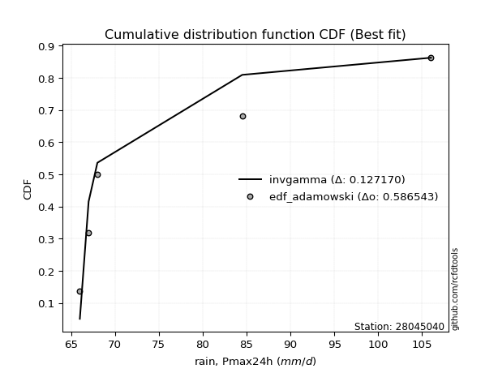</img></img>

</div>


## C. Best fit & Estimate extreme values for specific return periods - Tr


### 1. Best fit (ordered by delta Δ)

|   id |   station | empirical_dist   | p_dist   |    delta |   deltao | eval   |   fit |   n |     loc |    scale |       shape | shape1            | shape2   | shape3   |   best_fit |   best_fit_sort |
|-----:|----------:|:-----------------|:---------|---------:|---------:|:-------|------:|----:|--------:|---------:|------------:|:------------------|:---------|:---------|-----------:|----------------:|
|    0 |  28045040 | edf_gringorten   | invgamma | 0.113676 | 0.586543 | Δo > Δ |     1 |   5 | 65.8249 | 0.302622 | 0.429732    |                   |          |          |          1 |               1 |
|    1 |  28045040 | edf_hazen        | invgamma | 0.115264 | 0.586543 | Δo > Δ |     1 |   5 | 65.8249 | 0.302622 | 0.429732    |                   |          |          |          1 |               2 |
|    2 |  28045040 | edf_cunnane      | invgamma | 0.116681 | 0.586543 | Δo > Δ |     1 |   5 | 65.8249 | 0.302622 | 0.429732    |                   |          |          |          1 |               3 |
|    3 |  28045040 | edf_blom         | invgamma | 0.118512 | 0.586543 | Δo > Δ |     1 |   5 | 65.8249 | 0.302622 | 0.429732    |                   |          |          |          1 |               4 |
|    4 |  28045040 | edf_tukey        | invgamma | 0.121489 | 0.586543 | Δo > Δ |     1 |   5 | 65.8249 | 0.302622 | 0.429732    |                   |          |          |          1 |               5 |
|    5 |  28045040 | edf_beard        | invgamma | 0.123115 | 0.586543 | Δo > Δ |     1 |   5 | 65.8249 | 0.302622 | 0.429732    |                   |          |          |          1 |               6 |
|    6 |  28045040 | edf_jenkinson    | invgamma | 0.123115 | 0.586543 | Δo > Δ |     1 |   5 | 65.8249 | 0.302622 | 0.429732    |                   |          |          |          1 |               7 |
|    7 |  28045040 | edf_chegodayev   | invgamma | 0.123803 | 0.586543 | Δo > Δ |     1 |   5 | 65.8249 | 0.302622 | 0.429732    |                   |          |          |          1 |               8 |
|    8 |  28045040 | edf_adamowski    | invgamma | 0.12717  | 0.586543 | Δo > Δ |     1 |   5 | 65.8249 | 0.302622 | 0.429732    |                   |          |          |          1 |               9 |
|    9 |  28045040 | edf_weibull      | f        | 0.128597 | 0.586543 | Δo > Δ |     1 |   5 | 65.9911 | 9.06646  | 0.7029      | 1.270270787280117 |          |          |          1 |              10 |
|   10 |  28045040 | edf_california   | alpha    | 0.142834 | 0.586543 | Δo > Δ |     1 |   5 | 64.6167 | 2.51557  | 2.25612e-06 |                   |          |          |          1 |              11 |

:file_folder:Tables: [bestfit_28045040.csv](table/bestfit_28045040.csv) | [extreme_28045040.csv](table/extreme_28045040.csv)


### 2. Extreme values

In hydrology, a return period (or recurrence interval) is the statistical average time between extreme events like floods or droughts of a specific magnitude, indicating how rare an event is, with a 100-year flood, for example, having a 1% chance of occurring in any given year, not that it happens exactly every century. It is a key tool for infrastructure design (like bridges or dams) and risk assessment, calculated from historical data to determine the probability of future events, although it is important to remember it is statistical average, and events can cluster or be missed.

> risk_rate: assuming the return period as the project useful life.

|   id |      tr |   prob_l |     prob_g |     alpha |   betaprime |    chi2 |   crystalball |   dgamma |   erlang |    expon |   exponnorm |           f |   fatiguelife |     fisk |    gamma |   genexpon |   genlogistic |   gibrat |   gompertz |   gumbel_l |   gumbel_r |   halflogistic |   halfnorm |   hypsecant |         invgamma |   invgauss |      invweibull |   johnsonsu |   kstwobign |   laplace |   laplace_asymmetric |   loggamma |   logistic |          lognorm |   maxwell |   mielke |    moyal |   nakagami |      ncf |      nct |     norm |      pareto |   pearson3 |   rayleigh |   recipinvgauss |     rice |        t |   truncnorm |     wald |   weibull_min |   zzgumbel |   zzloggumbel |   station |   n |   risk_rate |
|-----:|--------:|---------:|-----------:|----------:|------------:|--------:|--------------:|---------:|---------:|---------:|------------:|------------:|--------------:|---------:|---------:|-----------:|--------------:|---------:|-----------:|-----------:|-----------:|---------------:|-----------:|------------:|-----------------:|-----------:|----------------:|------------:|------------:|----------:|---------------------:|-----------:|-----------:|-----------------:|----------:|---------:|---------:|-----------:|---------:|---------:|---------:|------------:|-----------:|-----------:|----------------:|---------:|---------:|------------:|---------:|--------------:|-----------:|--------------:|----------:|----:|------------:|
|    0 |    2    | 0.5      | 0.5        |   68.3463 |     76.4861 | 66.5022 |       78.3    |  67      |  69.3602 |  74.5257 |     74.5392 |     71.2828 |       66      |  74.9514 |  71.3706 |    74.5321 |       75.1911 |  73.6677 |    74.4808 |    80.8353 |    75.7647 |        74.5043 |    75.141  |     78.3    |     67.6182      |    67.905  |    66           |     66.0065 |     76.3172 |   78.3    |              74.5259 |    78.3907 |    78.3    |     66.0073      |   76.9801 |  73.9063 |  74.9462 |    82.0034 |  66.6315 |  76.1297 |  78.3    |     67.8506 |    75.9403 |    76.512  |         71.5553 |  78.1537 |  78.2993 |     76.7012 |  73.2974 |       75.7597 |    83.1965 |       75.9114 |  28045040 |   5 |    0.75     |
|    1 |    2.33 | 0.570815 | 0.429185   |   69.0545 |     78.9762 | 66.7154 |       81.0539 |  67.0181 |  70.3167 |  76.4042 |     76.4232 |     74.5801 |       66.2993 |  77.3023 |  72.6878 |    76.412  |       77.3392 |  75.0627 |    76.3493 |    83.2313 |    78.3165 |        77.1279 |    78.1132 |     80.504  |     68.4792      |    68.677  |    66           |     66.0165 |     78.6228 |   79.9666 |              76.4044 |    81.1751 |    80.7264 |     66.0822      |   79.8413 |  75.8031 |  77.3618 |    85.9054 |  77.2027 |  78.564  |  81.0539 |     68.7368 |    78.6533 |    79.4155 |         73.6324 |  80.6168 |  81.0532 |     79.0588 |  75.1032 |       82.1192 |    86.0496 |       78.2571 |  28045040 |   5 |    0.729209 |
|    2 |    5    | 0.8      | 0.2        |   74.546  |     89.1568 | 68.0659 |       91.2883 |  69.1149 |  75.4796 |  85.7961 |     85.8426 |    113.721  |       72.6566 |  87.09   |  79.4735 |    85.811  |       86.6708 |  83.0943 |    85.6917 |    90.9716 |    89.4028 |        88.9996 |    90.6823 |     89.3446 |     82.5832      |    76.2706 |    66           |     66.532  |     88.4166 |   88.2989 |              85.7965 |    91.4912 |    90.0951 |    723.936       |   91.1025 |  84.8086 |  88.5512 |   103.549  | 128.773  |  88.8276 |  91.2883 |     80.9779 |    90.1152 |    91.0393 |         86.0553 |  90.4775 |  91.2875 |     90.8449 |  85.212  |      147.528  |    98.4444 |       89.3189 |  28045040 |   5 |    0.67232  |
|    3 |   10    | 0.9      | 0.1        |   84.6353 |     96.817  | 69.5358 |       98.0775 |  73.6963 |  80.471  |  94.3218 |     94.3932 |    226.751  |       81.4345 |  95.0799 |  85.7909 |    94.3432 |       94.2706 |  92.2494 |    94.1725 |    95.281  |    98.4324 |        98.8584 |    99.9831 |     96.4041 |    150.768       |    92.2338 |    66.0002      |     71.3251 |     95.8734 |   95.8628 |              94.3225 |    98.3072 |    96.9947 | 255643           |   99.0276 |  93.1826 |  98.2933 |   117.154  | 177.584  |  96.8916 |  98.0775 |    128.408  |    98.9709 |    99.3274 |         99.0378 |  97.5084 |  98.0767 |    101.542  |  95.9398 |      267.02   |   108.54   |       99.4744 |  28045040 |   5 |    0.651322 |
|    4 |   15    | 0.933333 | 0.0666667  |   94.6885 |    100.945  | 70.4588 |      101.465  |  77.0918 |  83.4674 |  99.309  |     99.395  |    379.05   |       87.1753 |  99.7367 |  89.5256 |    99.3341 |       98.5582 |  98.5641 |    99.1334 |    97.2327 |   103.527  |       104.438  |   104.823  |    100.433  |    284.379       |   107.505  |    66.0021      |     82.809  |     99.832  |  100.287  |              99.3098 |   101.7    |   100.754  |      5.00796e+06 |  103.094  |  98.3735 | 103.947  |   124.303  | 207.979  | 101.363  | 101.465  |    208.069  |   103.778  |   103.598  |        107.069  | 101.131  | 101.465  |    107.799  | 102.829  |      368.509  |   114.236  |      105.705  |  28045040 |   5 |    0.644736 |
|    5 |   20    | 0.95     | 0.05       |  104.733  |    103.768  | 71.1342 |      103.684  |  79.7201 |  85.6181 | 102.848  |    102.944  |    564.019  |       91.4257 | 103.088  |  92.188  |   102.875  |      101.56   | 103.518  |   102.653  |    98.4475 |   107.094  |       108.347  |   108.05   |    103.275  |    492.897       |   121.5    |    66.0119      |    101.683  |    102.499  |  103.427  |             102.848  |   103.92   |   103.352  |      3.51433e+07 |  105.792  | 102.226  | 107.951  |   129.082  | 230.571  | 104.471  | 103.684  |    320.171  |   107.069  |   106.436  |        112.909  | 103.539  | 103.683  |    112.238  | 107.962  |      456.142  |   118.224  |      110.299  |  28045040 |   5 |    0.641514 |
|    6 |   25    | 0.96     | 0.04       |  114.774  |    105.908  | 71.6678 |      105.317  |  81.8588 |  87.298  | 105.592  |    105.697  |    777.802  |       94.8029 | 105.727  |  94.2592 |   105.622  |      103.873  | 107.647  |   105.383  |    99.3119 |   109.841  |       111.358  |   110.451  |    105.475  |    783.786       |   134.278  |    66.0453      |    128.105  |    104.496  |  105.862  |             105.593  |   105.552  |   105.34   |      1.47486e+08 |  107.796  | 105.322  | 111.055  |   132.642  | 248.744  | 106.857  | 105.317  |    464.86   |   109.565  |   108.545  |        117.505  | 105.328  | 105.317  |    115.681  | 112.074  |      533.566  |   121.295  |      113.973  |  28045040 |   5 |    0.639603 |
|    7 |   50    | 0.98     | 0.02       |  164.963  |    112.349  | 73.3691 |      109.994  |  88.9346 |  92.5693 | 114.118  |    114.247  |   2205.43   |      105.638  | 114.215  | 100.72   |   114.154  |      110.996  | 122.204  |   113.864  |   101.659  |   118.305  |       120.638  |   117.43   |    112.294  |   3669.21        |   184.953  |    68.8024      |    369.588  |    110.362  |  113.426  |             114.119  |   110.219  |   111.413  |      8.96425e+09 |  113.606  | 115.616  | 120.69   |   142.997  | 309.257  | 114.183  | 109.994  |   1680.48   |   117.059  |   114.667  |        132.085  | 110.521  | 109.994  |    126.374  | 125.5    |      830.3    |   130.758  |      126.078  |  28045040 |   5 |    0.63583  |
|    8 |   75    | 0.986667 | 0.0133333  |  215.144  |    116.007  | 74.3889 |      112.504  |  93.3077 |  95.6828 | 119.105  |    119.249  |   4125.69   |      112.164  | 119.424  | 104.515  |   119.145  |      115.136  | 132.035  |   118.825  |   102.845  |   123.225  |       126.032  |   121.229  |    116.28   |   9323.38        |   222.148  |    96.8253      |    777.32   |    113.589  |  117.85   |             119.106  |   112.719  |   114.92   |      8.12129e+10 |  116.765  | 122.165  | 126.324  |   148.634  | 347.827  | 118.444  | 112.504  |   3722.19   |   121.295  |   117.997  |        140.785  | 113.346  | 112.503  |    132.628  | 133.761  |     1045.91   |   136.258  |      133.696  |  28045040 |   5 |    0.634587 |
|    9 |  100    | 0.99     | 0.01       |  265.324  |    118.564  | 75.1215 |      114.201  |  96.4919 |  97.9029 | 122.644  |    122.798  |   6457.31   |      116.859  | 123.243  | 107.213  |   122.686  |      118.067  | 139.651  |   122.345  |   103.621  |   126.706  |       129.85   |   123.817  |    119.106  |  18147.5         |   251.726  |   234.251       |   1331.23   |    115.8    |  120.989  |             122.645  |   114.408  |   117.397  |      3.60557e+11 |  118.917  | 127.07   | 130.322  |   152.474  | 376.767  | 121.467  | 114.201  |   6595.34   |   124.246  |   120.266  |        147.02   | 115.271  | 114.2    |    137.066  | 139.784  |     1218.86   |   140.151  |      139.365  |  28045040 |   5 |    0.633968 |
|   10 |  200    | 0.995    | 0.005      |  466.04   |    124.632  | 76.9118 |      118.051  | 104.387  | 103.283  | 131.169  |    131.349  |  19120.5    |      128.352  | 132.91   | 113.73   |   131.218  |      125.111  | 160.372  |   130.826  |   105.308  |   135.077  |       139.028  |   129.736  |    125.917  |  90795.5         |   332.92   | 10017.7         |   4737.8    |    120.892  |  128.553  |             131.171  |   118.234  |   123.337  |      1.06016e+13 |  123.84   | 139.856  | 139.953  |   161.249  | 452.403  | 128.783  | 118.051  |  26466.6    |   131.199  |   125.458  |        162.217  | 119.675  | 118.051  |    147.755  | 154.788  |     1707.4    |   149.51   |      153.995  |  28045040 |   5 |    0.633042 |
|   11 |  250    | 0.996    | 0.004      |  566.396  |    126.563  | 77.4946 |      119.228  | 106.985  | 105.023  | 133.914  |    134.101  |  27145.9    |      132.098  | 136.172  | 115.832  |   133.965  |      127.376  | 167.806  |   133.556  |   105.805  |   137.768  |       141.979  |   131.557  |    128.109  | 152563           |   361.78   | 37010.5         |   7029.92   |    122.469  |  130.988  |             133.916  |   119.402  |   125.244  |      2.97924e+13 |  125.355  | 144.284  | 143.053  |   163.947  | 478.676  | 131.155  | 119.228  |  41459.8    |   133.396  |   127.056  |        167.155  | 121.031  | 119.227  |    151.196  | 159.751  |     1887.21   |   152.518  |      159.017  |  28045040 |   5 |    0.632858 |
|   12 |  500    | 0.998    | 0.002      | 1068.18   |    132.512  | 79.3221 |      122.717  | 115.195  | 110.45   | 142.44   |    142.652  |  80736.4    |      143.848  | 146.803  | 122.373  |   142.497  |      134.406  | 193.5    |   142.037  |   107.228  |   146.121  |       151.138  |   136.986  |    134.919  | 765257           |   458.801  |     2.16595e+06 |  22816      |    127.192  |  138.552  |             142.441  |   122.862  |   131.159  |      6.38022e+14 |  129.877  | 159.105  | 152.684  |   171.984  | 566.914  | 138.595  | 122.717  | 167427      |   140.113  |   131.824  |        182.611  | 125.076  | 122.716  |    161.884  | 175.534  |     2519.44   |   161.857  |      175.673  |  28045040 |   5 |    0.632489 |
|   13 |  750    | 0.998667 | 0.00133333 | 1569.96   |    135.968  | 80.4013 |      124.655  | 120.081  | 113.637  | 147.427  |    147.654  | 152819      |      150.791  | 153.393  | 126.205  |   147.488  |      138.515  | 210.492  |   146.998  |   107.988  |   151.003  |       156.492  |   140.019  |    138.903  |      1.96587e+06 |   520.152  |     2.34022e+07 |  43978.4    |    129.845  |  142.977  |             147.429  |   124.782  |   134.615  |      3.50005e+15 |  132.406  | 168.579  | 158.317  |   176.47   | 623.58   | 143.009  | 124.655  | 378997      |   143.975  |   134.49   |        191.724  | 127.338  | 124.655  |    168.135  | 184.997  |     2943.02   |   167.316  |      186.207  |  28045040 |   5 |    0.632366 |
|   14 | 1000    | 0.999    | 0.001      | 2071.74   |    138.413  | 81.1711 |      125.99   | 123.58   | 115.903  | 150.965  |    151.203  | 240343      |      155.743  | 158.245  | 128.927  |   151.029  |      141.43   | 223.495  |   150.517  |   108.5    |   154.467  |       160.29   |   142.114  |    141.729  |      3.83959e+06 |   565.494  |     1.26603e+08 |  69126      |    131.683  |  146.116  |             150.967  |   126.103  |   137.065  |      1.1299e+16  |  134.154  | 175.691  | 162.314  |   179.566  | 666.246  | 146.173  | 125.99   | 676724      |   146.688  |   136.333  |        198.217  | 128.901  | 125.989  |    172.57   | 191.803  |     3268.53   |   171.188  |      194.059  |  28045040 |   5 |    0.632305 |

<div align="center">

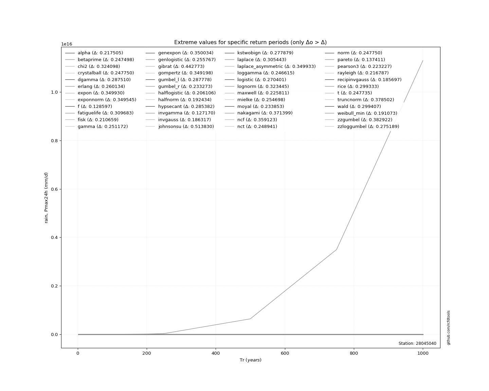</img>

</div>


<div align="center">

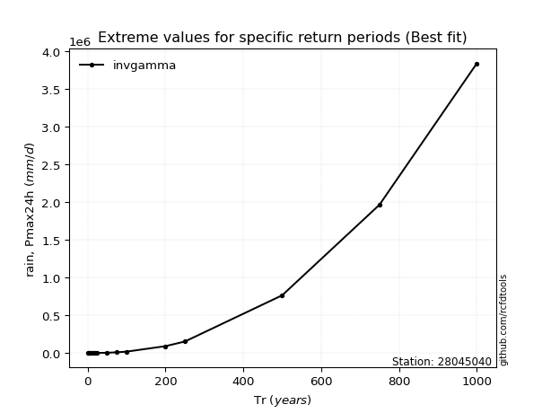</img>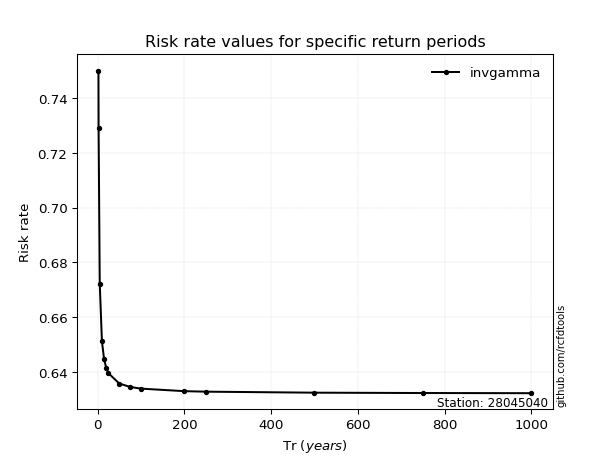</img>

</div>


<sub>**APP DISCLAIMER**: NO WARRANTY - This software is provided by [github.com/rcfdtools](https://github.com/rcfdtools) "as is", without any express or implied warranty, including warranties of merchantability, fitness for a particular purpose, or non-infringement. There is no guarantee that the software will be error-free or operate without interruption. LIMITATION OF LIABILITY - Neither the authors nor copyright holders will be liable for claims or damages arising from the software or its use. You are responsible for determining if the software is appropriate for your use and assume all associated risks, including errors, legal compliance, and data loss. NO PROFESSIONAL ADVICE - The software provides general information and does not offer professional advice. It should not replace consultation with professional advisors.</sub>