<div align="center">


</div>

# PMax24h Station (Rain): 28045501

Maximum Precipitation in 24 hours (PMax24h) is the greatest amount of rainfall for a specific duration that is meteorologically possible for a given location, acting as a "worst-case" scenario for extreme storms, crucial for designing safety-critical infrastructure like bridges, river deviations, dams, spillways, and nuclear plants to prevent catastrophic failure. The PMax24h is related with the Probable Maximum Precipitation (PMP) and it is calculated by hydrologists using meteorological data to determine the upper limit of extreme rainfall, often leading to the Probable Maximum Flood (PMF) for flood control design, and is increasingly being studied for climate change impacts. Probable Maximum Precipitation (PMP) is the theoretical upper limit of rainfall, a deterministic estimate for extreme events, while probability distributions (like GEV, Gumbel) describe the likelihood and frequency of various precipitation amounts, including rare ones, showing how often events occur, with PMP representing the extreme end of these distributions, used for critical infrastructure design to ensure safety against the worst conceivable weather, unlike standard statistical forecasts which cover typical probabilities.

The most common probability distributions in hydrology, used for analyzing floods, rainfall, and streamflow, include the Normal, Log-Normal, Gumbel, Gamma (including Log-Pearson Type III), and Generalized Extreme Value (GEV) distributions, often chosen based on the data´s skewness and whether modeling extremes or general conditions, with Gumbel and GEV popular for extreme events like floods, while the Normal distribution serves as a baseline, though often requiring transformations for skewed hydrological data. These distributions help in designing water infrastructure, managing water resources, and forecasting hydrologic events.

> Hydrological data often isn´t perfectly normal (it´s skewed), so different distributions are needed for different applications, such as: **Flood Frequency Analysis**: Using Gumbel, GEV, or Log-Pearson Type III for predicting extreme flood magnitudes and their return periods, **Rainfall Analysis**: Normal for annual totals, but Log-Normal, Weibull, or GEV for intensity or extreme daily rainfall, **Streamflow Modeling**: Gamma and Log-Normal for maximum flows, GEV for minimum flows, and Kappa for daily flows.

<div align="center">

</img>

</div>


## A. General information


### 1. General running parameters

• app_version: _v20260312_. • runtime: _2026-03-12 07:15:23.203550_. • Python version: _3.14.0_. • SciPy version: _1.16.3_. • Pandas version: _2.3.3_. • NumPy version: _2.3.5_. • Stations dataset (station_dataset_file): _dataset/pmax24h_in/automatic_colombia_2003_2025.csv_. • Stations catalog (station_catalog_file): _dataset/CNE.xls_. • Minimum year to eval til year_max (date_min): _1900_. • Maximum year to eval since year_min (date_max): _2025_. • Creates, save and include plots into reports (create_plot): _True_. • Plot only fit distributions with Δo > Δ (plot_only_fit): _True_. • Plot only simple graphs avoiding multiple CDFs and multiple Extreme values plots (plot_only_simple): _True_. • Eval low extreme values, if False, evaluates high extreme values (low_extreme): _False_. • Eval every SciPy distribution as logarithmic (pdist_logarithmic_on): _True_. • Standard deviation normalized (ddof): _1.0_. • Return periods to eval in years (Tr): _[2, 2.33, 5, 10, 15, 20, 25, 50, 75, 100, 200, 250, 500, 750, 1000]_. • Minimum data sample per station, 0 means any (minimum_sample): _5_. • Z-Score maximum threshold to adjust a value, 0 means disable (zscore_max): _3.5_. • Z-Score minimum threshold to adjust a value, 0 means disable (zscore_min): _-2.5_. • Avoid zeros, e.g. rain = 0 (avoid_zeros): _True_. • Avoid null values (avoid_nans): _True_. 

:file_folder:Table: [dataset.csv](../../dataset/pmax24h_in/automatic_colombia_2003_2025.csv)

> Delta Degrees of Freedom (DDOF): is a parameter used in the formulas for calculating variance and standard deviation. When ddof=0, the divisor is $N$ (the total number of observations) and this is used when your data set is the entire population. When ddof=1, the divisor is $N-1$ and this is used when your data set is a sample drawn from a larger population. Using $N-1$ provides an unbiased estimate of the population variance (known as Bessel´s correction).


### 2. Station info and location

|   id |   CODIGO | NOMBRE                          | CATEGORIA               | TECNOLOGIA                | ESTADO     | FECHA_INSTALACION   | FECHA_SUSPENSION   |   ALTITUD |   LATITUD |   LONGITUD | DEPARTAMENTO   | MUNICIPIO    | AREA_OPERATIVA                                         | ENTIDAD                                    | AREA_HIDROGRAFICA   | ZONA_HIDROGRAFICA   | SUBZONA_HIDROGRAFICA   |   CORRIENTE | Catalogo   |   Version |
|-----:|---------:|:--------------------------------|:------------------------|:--------------------------|:-----------|:--------------------|:-------------------|----------:|----------:|-----------:|:---------------|:-------------|:-------------------------------------------------------|:-------------------------------------------|:--------------------|:--------------------|:-----------------------|------------:|:-----------|----------:|
|    0 | 28045501 | PUEBLO BELLO  - AUT  [28045501] | Climatológica Principal | Automática con Telemetría | Suspendida | 24/05/2013          | 21/10/2020         |      1134 |     10.42 |     -73.57 | Cesar          | Pueblo Bello | Area Operativa 05 - Magdalena-Cesar-Guajira-San Andrés | CENTRO NACIONAL DE INVESTIGACIONES DE CAFE | Magdalena Cauca     | Cesar               | Río Ariguaní           |         nan | CNE_OE     |  20251226 |

<div align="center">

Dynamic map: [:earth_americas:Google](http://maps.google.com/maps?q=10.42,-73.57) [:earth_americas:OSM](https://www.openstreetmap.org/#map=18/10.42/-73.57&layers=P) [:earth_americas:Bing](https://www.bing.com/maps?cp=10.42~-73.57&lvl=18) [:earth_americas:Apple](https://maps.apple.com/frame?center=10.42%2C-73.57&span=0.003%2C0.006)

</div>


<div align="center">

```geojson
{
  "type": "Feature",
  "geometry": {
    "type": "Point", 
    "coordinates": [-73.57, 10.42]
  }, 
  "properties": {
    "Name": "28045501"
  }
}
```

</div>


### 3. Discrete values table and plot

<div align="center">

|               |            0 |           1 |          2 |          3 |           4 |           5 |           6 |
|:--------------|-------------:|------------:|-----------:|-----------:|------------:|------------:|------------:|
| Date          | 2017         | 2018        | 2019       | 2020       | 2021        | 2022        | 2023        |
| Value         |   90.8       |   57.8      |  264.9     |   60.6     |   66.5      |   87.2      |   56.8      |
| Value_initial |   90.8       |   57.8      |  264.9     |   60.6     |   66.5      |   87.2      |   56.8      |
| count         |    7         |    7        |    7       |    7       |    7        |    7        |    7        |
| mean          |   97.8       |   97.8      |   97.8     |   97.8     |   97.8      |   97.8      |   97.8      |
| std           |   74.9759    |   74.9759   |   74.9759  |   74.9759  |   74.9759   |   74.9759   |   74.9759   |
| zscore        |   -0.0933634 |   -0.533505 |    2.22872 |   -0.49616 |   -0.417468 |   -0.141379 |   -0.546842 |


</div>


<div align="center">

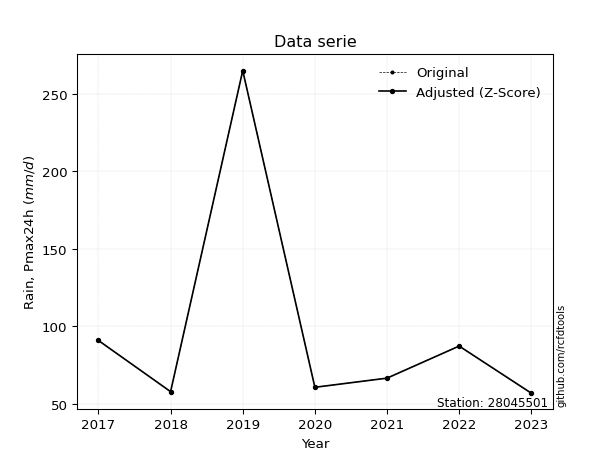</img>

</div>


> The initial value (value_initial) correspond to the initial obtained or null completed value, and value (value) is adjusted only when the initial value is outside the valid range (outlier) definite through the Z-Score value. If Z-Score is active, values out of range or outliers are replaced with the station mean value. A Z-Score (or standard score) measures how many standard deviations a data point is from the mean of a dataset, indicating its relative position; positive scores mean above the mean, negative mean below, and a score of zero is exactly at the mean, allowing for comparison of values from different distributions. It´s calculated using the formula $z=(x–μ)/σ$, where $x$ is the data point, $μ$ is the mean, and $σ$ is the standard deviation, helping identify outliers and understand probability.
>
> <sub>**Note**: In this study, "completing" (filling gaps in) and "extending" (forecasting or lengthening the historical record) rainfall data series are avoided for certain critical analyses because they introduce artificial bias and uncertainty, which can distort the statistics of rare events (extremes), alter day-to-day variability, and compromise the integrity and homogeneity of the original data. Some reasons against Completing/Extending rainfall data are: **Distortion of Extremes and Variability**: The primary issue is that most gap-filling or extension methods rely on averaging or regression with nearby stations, which inherently smooths the data. Rainfall is highly variable in space and time, with a large percentage of zero values and occasional large storms. Infilling methods often underestimate the highest values and overestimate the lowest (zero) values, which severely distorts analyses focused on flood frequency, drought severity, and intensity-duration-frequency (IDF) curves, **Loss of Data Homogeneity**: Infilled or extended data are synthetic estimates, not actual measurements. Combining these estimates with observed data can violate the assumption of data homogeneity, which requires that the data properties do not change over time. Inhomogeneity can lead to incorrect conclusions about long-term trends or changes in climate patterns, **Propagation of Errors**: Errors and biases from the original data (e.g., wind-induced undercatch, instrument errors, site changes) or the data used for imputation can propagate through the analysis, leading to unreliable hydrological models and inaccurate predictions, **Compromised Statistical Integrity**: For statistical analyses, especially those involving the frequency of events, using artificial data can introduce time bias or autocorrelation that doesn´t exist in reality, making it difficult to assess the true probability of events, **Difficulty in Validation**: It is difficult to accurately validate the quality of filled or extended data, especially for past periods where ground-truth measurements are unavailable. The reliability of imputation techniques heavily depends on the density of the surrounding station network and the complexity of the local topography.</sub>


### 4. Active continuous probability distributions from SciPy (80 of 104 available)

A Probability Density Function (PDF) describes the relative likelihood of a continuous random variable falling within a specific range, where the total area under its curve equals 1, and the area over any interval gives the actual probability for that range. Unlike discrete probabilities (like rolling a die), a PDF shows density, not direct probability for a single point (which is zero), with higher points indicating higher likelihood, often visualized as a bell curve for normal distributions.

A log of a probability density function (log-PDF) is simply the logarithm of the PDF´s value, denoted as $log(f(x))$, useful for converting multiplication of probabilities into addition, improving numerical stability with tiny numbers, and connecting to information theory concepts like entropy. Instead of dealing with very small probabilities (e.g., 0.000001), log-PDFs use negative numbers (e.g., $log(0.00001) ≈ -11.51$ that are easier for computers to handle, preventing underflow errors and simplifying complex calculations. In this study, each active probability distribution from SciPy is also evaluated in the $log$ form.

[scipy.stats](https://docs.scipy.org/doc/scipy/reference/stats.html) is a Python´s powerful submodule within the SciPy library for comprehensive statistical analysis, offering over 130 probability distributions (like Normal, Poisson, etc.), functions for descriptive stats (mean, variance), hypothesis testing (t-tests, chi-square), random variable generation, and statistical tests, making it essential for data science, modeling, and research. It provides tools to explore, model, and draw conclusions from data efficiently, working seamlessly with [NumPy](https://numpy.org/).

<div align="center">

|   id | p_dist           |   n_parameter | fit_method   | label                                                                       | active   | ref                                                                                                      |
|-----:|:-----------------|--------------:|:-------------|:----------------------------------------------------------------------------|:---------|:---------------------------------------------------------------------------------------------------------|
|    0 | alpha            |             3 | MLE          | Alpha                                                                       | True     | [:mortar_board:](https://docs.scipy.org/doc/scipy/reference/generated/scipy.stats.alpha.html)            |
|    1 | anglit           |             2 | MM           | Anglit                                                                      | True     | [:mortar_board:](https://docs.scipy.org/doc/scipy/reference/generated/scipy.stats.anglit.html)           |
|    2 | arcsine          |             2 | MM           | Arcsine                                                                     | True     | [:mortar_board:](https://docs.scipy.org/doc/scipy/reference/generated/scipy.stats.arcsine.html)          |
|    3 | argus            |             3 | MLE          | Argus                                                                       | True     | [:mortar_board:](https://docs.scipy.org/doc/scipy/reference/generated/scipy.stats.argus.html)            |
|    4 | beta             |             4 | MLE          | Beta                                                                        | True     | [:mortar_board:](https://docs.scipy.org/doc/scipy/reference/generated/scipy.stats.beta.html)             |
|    5 | betaprime        |             4 | MLE          | Beta prime                                                                  | True     | [:mortar_board:](https://docs.scipy.org/doc/scipy/reference/generated/scipy.stats.betaprime.html)        |
|    6 | bradford         |             3 | MLE          | Bradford                                                                    | True     | [:mortar_board:](https://docs.scipy.org/doc/scipy/reference/generated/scipy.stats.bradford.html)         |
|    7 | burr             |             4 | MLE          | Burr (Type III)                                                             | True     | [:mortar_board:](https://docs.scipy.org/doc/scipy/reference/generated/scipy.stats.burr.html)             |
|    8 | burr12           |             4 | MLE          | Burr (Type III) 12                                                          | True     | [:mortar_board:](https://docs.scipy.org/doc/scipy/reference/generated/scipy.stats.burr12.html)           |
|    9 | cosine           |             2 | MLE          | Cosine                                                                      | True     | [:mortar_board:](https://docs.scipy.org/doc/scipy/reference/generated/scipy.stats.cosine.html)           |
|   10 | crystalball      |             4 | MLE          | Crystalball                                                                 | True     | [:mortar_board:](https://docs.scipy.org/doc/scipy/reference/generated/scipy.stats.crystalball.html)      |
|   11 | dgamma           |             3 | MLE          | Double gamma                                                                | True     | [:mortar_board:](https://docs.scipy.org/doc/scipy/reference/generated/scipy.stats.dgamma.html)           |
|   12 | dweibull         |             3 | MLE          | Double Weibull                                                              | True     | [:mortar_board:](https://docs.scipy.org/doc/scipy/reference/generated/scipy.stats.dweibull.html)         |
|   13 | erlang           |             3 | MLE          | Erlang                                                                      | True     | [:mortar_board:](https://docs.scipy.org/doc/scipy/reference/generated/scipy.stats.erlang.html)           |
|   14 | exponnorm        |             3 | MLE          | Exponentially modified Normal                                               | True     | [:mortar_board:](https://docs.scipy.org/doc/scipy/reference/generated/scipy.stats.exponnorm.html)        |
|   15 | exponpow         |             3 | MLE          | Exponential power                                                           | True     | [:mortar_board:](https://docs.scipy.org/doc/scipy/reference/generated/scipy.stats.exponpow.html)         |
|   16 | exponweib        |             4 | MLE          | Exponentiated Weibull                                                       | True     | [:mortar_board:](https://docs.scipy.org/doc/scipy/reference/generated/scipy.stats.exponweib.html)        |
|   17 | f                |             4 | MLE          | F                                                                           | True     | [:mortar_board:](https://docs.scipy.org/doc/scipy/reference/generated/scipy.stats.f.html)                |
|   18 | fatiguelife      |             3 | MLE          | Fatigue-life (Birnbaum-Saunders)                                            | True     | [:mortar_board:](https://docs.scipy.org/doc/scipy/reference/generated/scipy.stats.fatiguelife.html)      |
|   19 | foldnorm         |             3 | MM           | Fold Normal                                                                 | True     | [:mortar_board:](https://docs.scipy.org/doc/scipy/reference/generated/scipy.stats.foldnorm.html)         |
|   20 | gamma            |             3 | MLE          | Gamma                                                                       | True     | [:mortar_board:](https://docs.scipy.org/doc/scipy/reference/generated/scipy.stats.gamma.html)            |
|   21 | gausshyper       |             6 | MLE          | Gauss hypergeometric                                                        | True     | [:mortar_board:](https://docs.scipy.org/doc/scipy/reference/generated/scipy.stats.gausshyper.html)       |
|   22 | genexpon         |             5 | MLE          | Generalized exponential                                                     | True     | [:mortar_board:](https://docs.scipy.org/doc/scipy/reference/generated/scipy.stats.genexpon.html)         |
|   23 | genextreme       |             3 | MLE          | Generalized exponential                                                     | True     | [:mortar_board:](https://docs.scipy.org/doc/scipy/reference/generated/scipy.stats.genextreme.html)       |
|   24 | gengamma         |             4 | MLE          | Generalized gamma                                                           | True     | [:mortar_board:](https://docs.scipy.org/doc/scipy/reference/generated/scipy.stats.gengamma.html)         |
|   25 | genhalflogistic  |             3 | MLE          | Generalized half-logistic                                                   | True     | [:mortar_board:](https://docs.scipy.org/doc/scipy/reference/generated/scipy.stats.genhalflogistic.html)  |
|   26 | genlogistic      |             3 | MLE          | Generalized logistic                                                        | True     | [:mortar_board:](https://docs.scipy.org/doc/scipy/reference/generated/scipy.stats.genlogistic.html)      |
|   27 | gennorm          |             3 | MLE          | Generalized Normal                                                          | True     | [:mortar_board:](https://docs.scipy.org/doc/scipy/reference/generated/scipy.stats.gennorm.html)          |
|   28 | genpareto        |             3 | MLE          | Generalized Pareto                                                          | True     | [:mortar_board:](https://docs.scipy.org/doc/scipy/reference/generated/scipy.stats.genpareto.html)        |
|   29 | gompertz         |             3 | MLE          | Gompertz (or truncated Gumbel)                                              | True     | [:mortar_board:](https://docs.scipy.org/doc/scipy/reference/generated/scipy.stats.gompertz.html)         |
|   30 | gumbel_l         |             2 | MM           | Gumbel Left Skew                                                            | True     | [:mortar_board:](https://docs.scipy.org/doc/scipy/reference/generated/scipy.stats.gumbel_l.html)         |
|   31 | gumbel_r         |             2 | MM           | Gumbel Right Skew                                                           | True     | [:mortar_board:](https://docs.scipy.org/doc/scipy/reference/generated/scipy.stats.gumbel_r.html)         |
|   32 | halfgennorm      |             3 | MLE          | Upper half of a generalized normal                                          | True     | [:mortar_board:](https://docs.scipy.org/doc/scipy/reference/generated/scipy.stats.halfgennorm.html)      |
|   33 | halflogistic     |             2 | MM           | Half-logistic                                                               | True     | [:mortar_board:](https://docs.scipy.org/doc/scipy/reference/generated/scipy.stats.halflogistic.html)     |
|   34 | halfnorm         |             2 | MM           | Half Normal                                                                 | True     | [:mortar_board:](https://docs.scipy.org/doc/scipy/reference/generated/scipy.stats.halfnorm.html)         |
|   35 | hypsecant        |             2 | MM           | hyperbolic secant                                                           | True     | [:mortar_board:](https://docs.scipy.org/doc/scipy/reference/generated/scipy.stats.hypsecant.html)        |
|   36 | invgamma         |             3 | MLE          | Inverted gamma                                                              | True     | [:mortar_board:](https://docs.scipy.org/doc/scipy/reference/generated/scipy.stats.invgamma.html)         |
|   37 | invgauss         |             3 | MLE          | Inverse Gaussian                                                            | True     | [:mortar_board:](https://docs.scipy.org/doc/scipy/reference/generated/scipy.stats.invgauss.html)         |
|   38 | invweibull       |             3 | MLE          | Inverted Weibull                                                            | True     | [:mortar_board:](https://docs.scipy.org/doc/scipy/reference/generated/scipy.stats.invweibull.html)       |
|   39 | johnsonsb        |             4 | MLE          | Johnson SB                                                                  | True     | [:mortar_board:](https://docs.scipy.org/doc/scipy/reference/generated/scipy.stats.johnsonsb.html)        |
|   40 | johnsonsu        |             4 | MLE          | Johnson Su                                                                  | True     | [:mortar_board:](https://docs.scipy.org/doc/scipy/reference/generated/scipy.stats.johnsonsu.html)        |
|   41 | kappa3           |             3 | MLE          | Kappa 3                                                                     | True     | [:mortar_board:](https://docs.scipy.org/doc/scipy/reference/generated/scipy.stats.kappa3.html)           |
|   42 | kappa4           |             4 | MLE          | Kappa 4                                                                     | True     | [:mortar_board:](https://docs.scipy.org/doc/scipy/reference/generated/scipy.stats.kappa4.html)           |
|   43 | ksone            |             3 | MLE          | Kolmogorov-Smirnov one-sided test statistic distribution                    | True     | [:mortar_board:](https://docs.scipy.org/doc/scipy/reference/generated/scipy.stats.ksone.html)            |
|   44 | kstwobign        |             2 | MLE          | Limiting distribution of scaled Kolmogorov-Smirnov two-sided test statistic | True     | [:mortar_board:](https://docs.scipy.org/doc/scipy/reference/generated/scipy.stats.kstwobign.html)        |
|   45 | laplace          |             2 | MM           | Laplace                                                                     | True     | [:mortar_board:](https://docs.scipy.org/doc/scipy/reference/generated/scipy.stats.laplace.html)          |
|   46 | levy_l           |             2 | MLE          | Left-skewed Levy                                                            | True     | [:mortar_board:](https://docs.scipy.org/doc/scipy/reference/generated/scipy.stats.levy_l.html)           |
|   47 | loggamma         |             3 | MLE          | Log gamma                                                                   | True     | [:mortar_board:](https://docs.scipy.org/doc/scipy/reference/generated/scipy.stats.loggamma.html)         |
|   48 | logistic         |             2 | MM           | Logistic (or Sech-squared)                                                  | True     | [:mortar_board:](https://docs.scipy.org/doc/scipy/reference/generated/scipy.stats.logistic.html)         |
|   49 | loglaplace       |             3 | MLE          | Log-Laplace                                                                 | True     | [:mortar_board:](https://docs.scipy.org/doc/scipy/reference/generated/scipy.stats.loglaplace.html)       |
|   50 | lomax            |             3 | MLE          | Lomax (Pareto of the second kind)                                           | True     | [:mortar_board:](https://docs.scipy.org/doc/scipy/reference/generated/scipy.stats.lomax.html)            |
|   51 | maxwell          |             2 | MM           | Maxwell                                                                     | True     | [:mortar_board:](https://docs.scipy.org/doc/scipy/reference/generated/scipy.stats.maxwell.html)          |
|   52 | mielke           |             4 | MLE          | Mielke Beta-Kappa / Dagum                                                   | True     | [:mortar_board:](https://docs.scipy.org/doc/scipy/reference/generated/scipy.stats.mielke.html)           |
|   53 | moyal            |             2 | MM           | Moyal                                                                       | True     | [:mortar_board:](https://docs.scipy.org/doc/scipy/reference/generated/scipy.stats.moyal.html)            |
|   54 | nakagami         |             3 | MLE          | Nakagami                                                                    | True     | [:mortar_board:](https://docs.scipy.org/doc/scipy/reference/generated/scipy.stats.nakagami.html)         |
|   55 | ncf              |             5 | MLE          | Non-central F distribution                                                  | True     | [:mortar_board:](https://docs.scipy.org/doc/scipy/reference/generated/scipy.stats.ncf.html)              |
|   56 | nct              |             4 | MLE          | Non-central Student’s t                                                     | True     | [:mortar_board:](https://docs.scipy.org/doc/scipy/reference/generated/scipy.stats.nct.html)              |
|   57 | norm             |             2 | MM           | Normal                                                                      | True     | [:mortar_board:](https://docs.scipy.org/doc/scipy/reference/generated/scipy.stats.norm.html)             |
|   58 | pearson3         |             3 | MM           | Pearson type III                                                            | True     | [:mortar_board:](https://docs.scipy.org/doc/scipy/reference/generated/scipy.stats.pearson3.html)         |
|   59 | powerlaw         |             3 | MLE          | Power-function                                                              | True     | [:mortar_board:](https://docs.scipy.org/doc/scipy/reference/generated/scipy.stats.powerlaw.html)         |
|   60 | rayleigh         |             2 | MM           | Rayleigh                                                                    | True     | [:mortar_board:](https://docs.scipy.org/doc/scipy/reference/generated/scipy.stats.rayleigh.html)         |
|   61 | rdist            |             3 | MLE          | R-distributed (symmetric beta)                                              | True     | [:mortar_board:](https://docs.scipy.org/doc/scipy/reference/generated/scipy.stats.rdist.html)            |
|   62 | rice             |             3 | MLE          | Rice                                                                        | True     | [:mortar_board:](https://docs.scipy.org/doc/scipy/reference/generated/scipy.stats.rice.html)             |
|   63 | semicircular     |             2 | MM           | Semicircular                                                                | True     | [:mortar_board:](https://docs.scipy.org/doc/scipy/reference/generated/scipy.stats.semicircular.html)     |
|   64 | skewnorm         |             3 | MLE          | Skew normal                                                                 | True     | [:mortar_board:](https://docs.scipy.org/doc/scipy/reference/generated/scipy.stats.skewnorm.html)         |
|   65 | t                |             3 | MLE          | Student’s t                                                                 | True     | [:mortar_board:](https://docs.scipy.org/doc/scipy/reference/generated/scipy.stats.t.html)                |
|   66 | trapezoid        |             4 | MLE          | Trapezoid                                                                   | True     | [:mortar_board:](https://docs.scipy.org/doc/scipy/reference/generated/scipy.stats.trapezoid.html)        |
|   67 | triang           |             3 | MLE          | Triangular                                                                  | True     | [:mortar_board:](https://docs.scipy.org/doc/scipy/reference/generated/scipy.stats.triang.html)           |
|   68 | truncexpon       |             3 | MLE          | Truncated exponential                                                       | True     | [:mortar_board:](https://docs.scipy.org/doc/scipy/reference/generated/scipy.stats.truncexpon.html)       |
|   69 | truncnorm        |             4 | MLE          | Truncated normal                                                            | True     | [:mortar_board:](https://docs.scipy.org/doc/scipy/reference/generated/scipy.stats.truncnorm.html)        |
|   70 | truncpareto      |             4 | MLE          | Upper truncated Pareto                                                      | True     | [:mortar_board:](https://docs.scipy.org/doc/scipy/reference/generated/scipy.stats.truncpareto.html)      |
|   71 | truncweibull_min |             5 | MLE          | Doubly truncated Weibull minimum                                            | True     | [:mortar_board:](https://docs.scipy.org/doc/scipy/reference/generated/scipy.stats.truncweibull_min.html) |
|   72 | tukeylambda      |             3 | MLE          | Tukey-Lamdba                                                                | True     | [:mortar_board:](https://docs.scipy.org/doc/scipy/reference/generated/scipy.stats.tukeylambda.html)      |
|   73 | uniform          |             2 | MLE          | Uniform                                                                     | True     | [:mortar_board:](https://docs.scipy.org/doc/scipy/reference/generated/scipy.stats.uniform.html)          |
|   74 | vonmises         |             3 | MLE          | Von Mises                                                                   | True     | [:mortar_board:](https://docs.scipy.org/doc/scipy/reference/generated/scipy.stats.vonmises.html)         |
|   75 | vonmises_line    |             3 | MLE          | Von Mises line                                                              | True     | [:mortar_board:](https://docs.scipy.org/doc/scipy/reference/generated/scipy.stats.vonmises_line.html)    |
|   76 | wald             |             2 | MM           | Wald                                                                        | True     | [:mortar_board:](https://docs.scipy.org/doc/scipy/reference/generated/scipy.stats.wald.html)             |
|   77 | weibull_max      |             3 | MLE          | Weibull maximum                                                             | True     | [:mortar_board:](https://docs.scipy.org/doc/scipy/reference/generated/scipy.stats.weibull_max.html)      |
|   78 | weibull_min      |             3 | MLE          | Weibull minimum                                                             | True     | [:mortar_board:](https://docs.scipy.org/doc/scipy/reference/generated/scipy.stats.weibull_min.html)      |
|   79 | wrapcauchy       |             3 | MLE          | Wrapped  Cauchy                                                             | True     | [:mortar_board:](https://docs.scipy.org/doc/scipy/reference/generated/scipy.stats.wrapcauchy.html)       |

</div>

> **n_parameter:** # arguments & localization & scale.
>
> **Fit methods:** (MLE) maximum likelihood, (MM) L-moments.
>
>**Inactive** (With the only purpose of prevent loops, zero divisions, infinite values, over high estimated values or horizontal trending for recurrence intervals estimations, the follow distributions were disabled.)**:** lognorm, norminvgauss, powernorm, powerlognorm, cauchy, halfcauchy, foldcauchy, skewcauchy, chi2, expon, fisk, genhyperbolic, geninvgauss, gibrat, kstwo, laplace_asymmetric, levy, levy_stable, ncx2, pareto, rel_breitwigner, recipinvgauss, studentized_range, loguniform, 


## B. Probability (PDF) vs. Empirical (EDF) distributions functions

A continuous probability distribution (CPD) describes probabilities for variables that can take any value within a range (like rain any time), unlike discrete variables with specific outcomes (like temperature). It uses a Probability Density Function (PDF), a curve where the total area under it equals 1, and the probability of the variable falling within an interval (a to b) is found by calculating the area under the curve between those points. A key feature is that the probability of hitting any single exact value is zero, so probabilities are always expressed for ranges, e.g., $P(a ≤ X ≤ b)$.

<div align="center">

Distributions parameters from station values
|     |   station | p_dist              |   n |               loc |          scale | shape                  | shape1                 | shape2             | shape3             |
|----:|----------:|:--------------------|----:|------------------:|---------------:|:-----------------------|:-----------------------|:-------------------|:-------------------|
|   0 |  28045501 | alpha               |   7 |      52.4713      |    7.96566     | 6.3669747448035665e-09 |                        |                    |                    |
|   1 |  28045501 | anglit              |   7 |      97.8         |  203.064       |                        |                        |                    |                    |
|   2 |  28045501 | arcsine             |   7 |      -0.366494    |  196.333       |                        |                        |                    |                    |
|   3 |  28045501 | argus               |   7 |     -68.2378      |  345.872       | 4.933082769302886e-07  |                        |                    |                    |
|   4 |  28045501 | beta                |   7 |      43.6264      |  221.274       | 0.04043192898414231    | 0.1345333716772944     |                    |                    |
|   5 |  28045501 | betaprime           |   7 |      40.8514      |   26.0713      | 4.130313896232927      | 3.6009418286941486     |                    |                    |
|   6 |  28045501 | bradford            |   7 |      56.7999      |  208.1         | 0.7098350225686632     |                        |                    |                    |
|   7 |  28045501 | burr                |   7 |      55.6657      |    1.33019     | 0.9044391213703273     | 3.6985950926956943     |                    |                    |
|   8 |  28045501 | burr12              |   7 |      -1.01139     |   57.1834      | 226.56824115325134     | 0.01134317402739074    |                    |                    |
|   9 |  28045501 | cosine              |   7 |     115.964       |   64.4822      |                        |                        |                    |                    |
|  10 |  28045501 | crystalball         |   7 |      97.8         |   69.4142      | 8019.541430687374      | 3780.0022494999503     |                    |                    |
|  11 |  28045501 | dgamma              |   7 |      57.8         |   55.8908      | 0.6489382421189906     |                        |                    |                    |
|  12 |  28045501 | dweibull            |   7 |      60.6         |   53.6753      | 0.7026068691095615     |                        |                    |                    |
|  13 |  28045501 | erlang              |   7 |      56.8         |   84.4508      | 0.4113776380448707     |                        |                    |                    |
|  14 |  28045501 | exponnorm           |   7 |      56.7649      |    0.0103356   | 3933.7279623603554     |                        |                    |                    |
|  15 |  28045501 | exponpow            |   7 |      56.8         |  146.964       | 0.3412918474459484     |                        |                    |                    |
|  16 |  28045501 | exponweib           |   7 |      56.8         |   57.6326      | 1.520943711043889      | 0.30022990666257715    |                    |                    |
|  17 |  28045501 | f                   |   7 |      56.132       |    2.81986     | 20002.90776773791      | 0.9886530850041007     |                    |                    |
|  18 |  28045501 | fatiguelife         |   7 |      56.8         |    2.48835e-05 | 1129.3402172219855     |                        |                    |                    |
|  19 |  28045501 | foldnorm            |   7 |      -3.43507     |  124.637       | 0.002288971458256593   |                        |                    |                    |
|  20 |  28045501 | gamma               |   7 |      56.8         |   75.6496      | 0.33028510609341816    |                        |                    |                    |
|  21 |  28045501 | gausshyper          |   7 |      56.8         |  218.976       | 0.2933867383604223     | 1.2251515651606946     | 0.9762175138540576 | 1.1023057372854064 |
|  22 |  28045501 | genexpon            |   7 |      56.8         |    0.782981    | 0.01909408393628559    | 2.208626476263346e-09  | 2.018549688961938  |                    |
|  23 |  28045501 | genextreme          |   7 |      56.9407      |    0.750548    | -5.332968121811884     |                        |                    |                    |
|  24 |  28045501 | gengamma            |   7 |      56.8         |   67.3276      | 1.1660507046873632     | 0.4314261681891589     |                    |                    |
|  25 |  28045501 | genhalflogistic     |   7 |      37.3399      |  234.963       | 1.032532609653404      |                        |                    |                    |
|  26 |  28045501 | genlogistic         |   7 |    -186.623       |   32.6926      | 2748.439311129274      |                        |                    |                    |
|  27 |  28045501 | gennorm             |   7 |      57.8002      |    9.01129e-10 | 0.10160487896674603    |                        |                    |                    |
|  28 |  28045501 | genpareto           |   7 |      56.8         |    4.78027     | 1.7631451119736883     |                        |                    |                    |
|  29 |  28045501 | gompertz            |   7 |      56.8         |    4.25783e+10 | 550511464.0602506      |                        |                    |                    |
|  30 |  28045501 | gumbel_l            |   7 |     129.04        |   54.122       |                        |                        |                    |                    |
|  31 |  28045501 | gumbel_r            |   7 |      66.5599      |   54.122       |                        |                        |                    |                    |
|  32 |  28045501 | halfgennorm         |   7 |      56.8         |    0.124566    | 0.2792845175489782     |                        |                    |                    |
|  33 |  28045501 | halflogistic        |   7 |      15.5281      |   59.3467      |                        |                        |                    |                    |
|  34 |  28045501 | halfnorm            |   7 |       5.92283     |  115.151       |                        |                        |                    |                    |
|  35 |  28045501 | hypsecant           |   7 |      97.8         |   44.1904      |                        |                        |                    |                    |
|  36 |  28045501 | invgamma            |   7 |      56.1319      |    1.39388     | 0.4943268639812618     |                        |                    |                    |
|  37 |  28045501 | invgauss            |   7 |      55.9448      |    3.65317     | 11.457200385172966     |                        |                    |                    |
|  38 |  28045501 | invweibull          |   7 |      56.8         |    1.19884     | 0.05956381395270757    |                        |                    |                    |
|  39 |  28045501 | johnsonsb           |   7 |      56.8         | 1357.66        | 1.2300227624782145     | 0.0787204023190633     |                    |                    |
|  40 |  28045501 | johnsonsu           |   7 |      56.8         |    7.85131e-11 | -6.9277390236312275    | 0.28335022976615665    |                    |                    |
|  41 |  28045501 | kappa3              |   7 |      56.8         |    1.05657     | 0.10375827036325053    |                        |                    |                    |
|  42 |  28045501 | kappa4              |   7 |      35.388       |  229.293       | 1.1029843764083858     | 0.9969447186273279     |                    |                    |
|  43 |  28045501 | ksone               |   7 |      35.99        |  249.72        | 1.0                    |                        |                    |                    |
|  44 |  28045501 | kstwobign           |   7 |     -65.9105      |  193.194       |                        |                        |                    |                    |
|  45 |  28045501 | laplace             |   7 |      97.8         |   49.0832      |                        |                        |                    |                    |
|  46 |  28045501 | levy_l              |   7 |     285.199       |   90.6041      |                        |                        |                    |                    |
|  47 |  28045501 | loggamma            |   7 |  -28425.3         | 3630.15        | 2585.1075967795778     |                        |                    |                    |
|  48 |  28045501 | logistic            |   7 |      97.8         |   38.27        |                        |                        |                    |                    |
|  49 |  28045501 | loglaplace          |   7 |      -0.171068    |   66.6711      | 2.962926581736278      |                        |                    |                    |
|  50 |  28045501 | lomax               |   7 |      56.8         | 1068.69        | 29.169603522042507     |                        |                    |                    |
|  51 |  28045501 | maxwell             |   7 |     -66.6825      |  103.074       |                        |                        |                    |                    |
|  52 |  28045501 | mielke              |   7 |      48.7826      |    0.030526    | 14157.529439668167     | 1.4965164695524344     |                    |                    |
|  53 |  28045501 | moyal               |   7 |      58.1045      |   31.2474      |                        |                        |                    |                    |
|  54 |  28045501 | nakagami            |   7 |      56.8         |   98.5085      | 0.09039673599425427    |                        |                    |                    |
|  55 |  28045501 | ncf                 |   7 |      -0.169315    |    3.55e-06    | 1.5286753333046613e-06 | 14.197345741695317     | 34.69952088113904  |                    |
|  56 |  28045501 | nct                 |   7 |      -0.223151    |    1.44353     | 3.539099782945586      | 49.62400718807963      |                    |                    |
|  57 |  28045501 | norm                |   7 |      97.8         |   69.4142      |                        |                        |                    |                    |
|  58 |  28045501 | pearson3            |   7 |      97.8         |   69.4142      | 1.9003889310094602     |                        |                    |                    |
|  59 |  28045501 | powerlaw            |   7 |      56.8         |  208.1         | 0.12949030812608944    |                        |                    |                    |
|  60 |  28045501 | rayleigh            |   7 |     -34.9934      |  105.954       |                        |                        |                    |                    |
|  61 |  28045501 | rdist               |   7 |      41.4303      |   49.3697      | 1.3214078339761155     |                        |                    |                    |
|  62 |  28045501 | rice                |   7 |       2.24787     |   83.5121      | 0.00043754521575845777 |                        |                    |                    |
|  63 |  28045501 | semicircular        |   7 |      97.8         |  138.828       |                        |                        |                    |                    |
|  64 |  28045501 | skewnorm            |   7 |      56.8         |   80.6132      | 43160050.86921023      |                        |                    |                    |
|  65 |  28045501 | t                   |   7 |      59.5952      |    4.48582     | 0.5543870430252669     |                        |                    |                    |
|  66 |  28045501 | trapezoid           |   7 |      35.99        |  249.72        | 1.0                    | 1.0                    |                    |                    |
|  67 |  28045501 | triang              |   7 |      56.7996      |  243.489       | 1.3604342780693578e-06 |                        |                    |                    |
|  68 |  28045501 | truncexpon          |   7 |      56.8         |  168.248       | 1.2368627961651675     |                        |                    |                    |
|  69 |  28045501 | truncnorm           |   7 | -224101           | 3946.41        | 56.80048760558358      | 56.85321937392044      |                    |                    |
|  70 |  28045501 | truncpareto         |   7 |      53.7243      |    3.07571     | 0.31397843069488895    | 68.65927728413364      |                    |                    |
|  71 |  28045501 | truncweibull_min    |   7 |      55.7992      |  341.757       | 0.09390939446137114    | 0.0029284000800209554  | 0.6118487986389449 |                    |
|  72 |  28045501 | tukeylambda         |   7 |      45.3794      |   57.2412      | 1.2602471745499455     |                        |                    |                    |
|  73 |  28045501 | uniform             |   7 |      56.8         |  208.1         |                        |                        |                    |                    |
|  74 |  28045501 | vonmises            |   7 |       1.28107     |    1           | 0.10754281427410883    |                        |                    |                    |
|  75 |  28045501 | vonmises_line       |   7 |      80.2206      |   58.7853      | 1.8839408280932293     |                        |                    |                    |
|  76 |  28045501 | wald                |   7 |      28.3858      |   69.4142      |                        |                        |                    |                    |
|  77 |  28045501 | weibull_max         |   7 |     264.9         |    1.8399      | 0.18674732742533082    |                        |                    |                    |
|  78 |  28045501 | weibull_min         |   7 |      56.8         |   61.6112      | 0.7498818221476075     |                        |                    |                    |
|  79 |  28045501 | wrapcauchy          |   7 |      56.8         |   33.1203      | 0.9010581437053315     |                        |                    |                    |
|  80 |  28045501 | logalpha            |   7 |       3.97281     |    0.125003    | 0.0002581550391344027  |                        |                    |                    |
|  81 |  28045501 | loganglit           |   7 |       4.42203     |    1.47522     |                        |                        |                    |                    |
|  82 |  28045501 | logarcsine          |   7 |       3.70889     |    1.4263      |                        |                        |                    |                    |
|  83 |  28045501 | logargus            |   7 |       3.23233     |    2.43773     | 0.00010417945562724784 |                        |                    |                    |
|  84 |  28045501 | logbeta             |   7 |       4.03954     |    1.84509     | 0.1428025928675188     | 0.5848561465111802     |                    |                    |
|  85 |  28045501 | logbetaprime        |   7 |       3.74643     |    0.646263    | 5.159459543968486      | 6.801582518454917      |                    |                    |
|  86 |  28045501 | logbradford         |   7 |       4.03954     |    1.74401     | 488.04529649038443     |                        |                    |                    |
|  87 |  28045501 | logburr             |   7 |       3.69281     |    0.0772807   | 2.392184229688708      | 71.65069449398186      |                    |                    |
|  88 |  28045501 | logburr12           |   7 |     -22.9485      |   26.9786      | 7707.751165213198      | 0.009098369600662543   |                    |                    |
|  89 |  28045501 | logcosine           |   7 |       4.53555     |    0.4577      |                        |                        |                    |                    |
|  90 |  28045501 | logcrystalball      |   7 |       4.42203     |    0.50428     | 46.003355219347085     | 1.0040831847918499     |                    |                    |
|  91 |  28045501 | logdgamma           |   7 |       4.1972      |    0.380767    | 0.9314201388907809     |                        |                    |                    |
|  92 |  28045501 | logdweibull         |   7 |       4.1972      |    0.376385    | 0.7872990404886293     |                        |                    |                    |
|  93 |  28045501 | logerlang           |   7 |       4.03954     |    0.80689     | 0.3248622823163139     |                        |                    |                    |
|  94 |  28045501 | logexponnorm        |   7 |       4.03916     |    0.000109653 | 3470.0382064404785     |                        |                    |                    |
|  95 |  28045501 | logexponpow         |   7 |       4.03954     |    1.28219     | 0.6867785902205754     |                        |                    |                    |
|  96 |  28045501 | logexponweib        |   7 |       4.03954     |    0.516796    | 1.5407927179615146     | 0.21240977435381567    |                    |                    |
|  97 |  28045501 | logf                |   7 |       4.03954     |    0.417158    | 0.6664755096047055     | 5.113626863695698      |                    |                    |
|  98 |  28045501 | logfatiguelife      |   7 |       4.03954     |    2.97722e-07 | 971.0394151440348      |                        |                    |                    |
|  99 |  28045501 | logfoldnorm         |   7 |       3.73755     |    0.77118     | 0.47657197568361886    |                        |                    |                    |
| 100 |  28045501 | loggamma            |   7 |       4.03954     |    0.503194    | 0.4721547493936211     |                        |                    |                    |
| 101 |  28045501 | loggausshyper       |   7 |       4.03954     |    1.72254     | 0.772331279229111      | 1.2534115107318264     | 0.8518231185712372 | 1.02039790371858   |
| 102 |  28045501 | loggenexpon         |   7 |       4.03954     |    1.21002     | 3.165244365972166      | 2.74760904016966e-07   | 2.294375676294484  |                    |
| 103 |  28045501 | loggenextreme       |   7 |       4.0856      |    0.0900165   | -1.7078020755995456    |                        |                    |                    |
| 104 |  28045501 | loggengamma         |   7 |       4.03954     |    0.610984    | 0.9804764234489884     | 0.42912588565104215    |                    |                    |
| 105 |  28045501 | loggenhalflogistic  |   7 |       3.81486     |    1.81185     | 1.0268378795248698     |                        |                    |                    |
| 106 |  28045501 | loggenlogistic      |   7 |       2.03204     |    0.28734     | 2025.1888624272806     |                        |                    |                    |
| 107 |  28045501 | loggennorm          |   7 |       4.1972      |    0.000374967 | 0.23856984190028688    |                        |                    |                    |
| 108 |  28045501 | loggenpareto        |   7 |      -0.0109261   |   11.6871      | -2.090604678755664     |                        |                    |                    |
| 109 |  28045501 | loggompertz         |   7 |       4.03954     |    9.63594e+12 | 19689236298505.406     |                        |                    |                    |
| 110 |  28045501 | loggumbel_l         |   7 |       4.64899     |    0.393186    |                        |                        |                    |                    |
| 111 |  28045501 | loggumbel_r         |   7 |       4.19508     |    0.393186    |                        |                        |                    |                    |
| 112 |  28045501 | loghalfgennorm      |   7 |       4.03954     |    0.0167346   | 0.397014001600727      |                        |                    |                    |
| 113 |  28045501 | loghalflogistic     |   7 |       3.82434     |    0.431142    |                        |                        |                    |                    |
| 114 |  28045501 | loghalfnorm         |   7 |       3.75456     |    0.836549    |                        |                        |                    |                    |
| 115 |  28045501 | loghypsecant        |   7 |       4.42203     |    0.321035    |                        |                        |                    |                    |
| 116 |  28045501 | loginvgamma         |   7 |       4.01698     |    0.0572699   | 0.7349964819237294     |                        |                    |                    |
| 117 |  28045501 | loginvgauss         |   7 |       4.02214     |    0.0765096   | 5.226756479151206      |                        |                    |                    |
| 118 |  28045501 | loginvweibull       |   7 |       4.0329      |    0.0527052   | 0.5855110437726857     |                        |                    |                    |
| 119 |  28045501 | logjohnsonsb        |   7 |       4.03954     |    2.42202     | 1.6265669628265265     | 0.1557016717543478     |                    |                    |
| 120 |  28045501 | logjohnsonsu        |   7 |       4.03954     |    8.33423e-17 | -1.6320281948236657    | 0.08916614327054079    |                    |                    |
| 121 |  28045501 | logkappa3           |   7 |       4.03954     |    1.53895     | 3473.490853133636      |                        |                    |                    |
| 122 |  28045501 | logkappa4           |   7 |       3.56713     |    1.79822     | 1.3450061121326504     | 0.8312523616753198     |                    |                    |
| 123 |  28045501 | logksone            |   7 |       3.88555     |    1.84778     | 1.0                    |                        |                    |                    |
| 124 |  28045501 | logkstwobign        |   7 |       3.11781     |    1.52168     |                        |                        |                    |                    |
| 125 |  28045501 | loglaplace          |   7 |       4.42203     |    0.35658     |                        |                        |                    |                    |
| 126 |  28045501 | loglevy_l           |   7 |       5.71807     |    0.618864    |                        |                        |                    |                    |
| 127 |  28045501 | logloggamma         |   7 |    -209.186       |   27.0716      | 2672.2191282636854     |                        |                    |                    |
| 128 |  28045501 | loglogistic         |   7 |       4.42203     |    0.278024    |                        |                        |                    |                    |
| 129 |  28045501 | logloglaplace       |   7 |      -0.0258992   |    4.2231      | 13.70601342785034      |                        |                    |                    |
| 130 |  28045501 | loglomax            |   7 |       4.03954     |   10.5458      | 29.269171243096523     |                        |                    |                    |
| 131 |  28045501 | logmaxwell          |   7 |       3.2271      |    0.748813    |                        |                        |                    |                    |
| 132 |  28045501 | logmielke           |   7 |       3.56341     |    0.188212    | 78.18131015507376      | 2.823040684344086      |                    |                    |
| 133 |  28045501 | logmoyal            |   7 |       4.13365     |    0.227006    |                        |                        |                    |                    |
| 134 |  28045501 | lognakagami         |   7 |       4.03954     |    0.866712    | 0.1265388742078582     |                        |                    |                    |
| 135 |  28045501 | logncf              |   7 |       4.01455     |    0.0858745   | 2036.6836139996021     | 1.3858449078413249     | 12.076014648233574 |                    |
| 136 |  28045501 | lognct              |   7 |       0.0475705   |    0.0618766   | 50.36561161113957      | 69.49799592642484      |                    |                    |
| 137 |  28045501 | lognorm             |   7 |       4.42203     |    0.50428     |                        |                        |                    |                    |
| 138 |  28045501 | logpearson3         |   7 |       4.42203     |    0.50428     | 1.5627543449693788     |                        |                    |                    |
| 139 |  28045501 | logpowerlaw         |   7 |       4.03954     |    1.53982     | 0.14741825429982156    |                        |                    |                    |
| 140 |  28045501 | lograyleigh         |   7 |       3.45732     |    0.769734    |                        |                        |                    |                    |
| 141 |  28045501 | logrdist            |   7 |       4.95576     |    0.916222    | 1.0355335762873343     |                        |                    |                    |
| 142 |  28045501 | logrice             |   7 |       3.68834     |    0.629526    | 0.00016656112086411767 |                        |                    |                    |
| 143 |  28045501 | logsemicircular     |   7 |       4.42203     |    1.00856     |                        |                        |                    |                    |
| 144 |  28045501 | logskewnorm         |   7 |       4.03954     |    0.632864    | 9187051.845673673      |                        |                    |                    |
| 145 |  28045501 | logt                |   7 |       4.1707      |    0.178144    | 1.3014710548538875     |                        |                    |                    |
| 146 |  28045501 | logtrapezoid        |   7 |       3.88555     |    1.84778     | 1.0                    | 1.0                    |                    |                    |
| 147 |  28045501 | logtriang           |   7 |       3.02496     |    2.55439     | 0.9999998363713898     |                        |                    |                    |
| 148 |  28045501 | logtruncexpon       |   7 |       4.03953     |    1.38553     | 1.11135950869656       |                        |                    |                    |
| 149 |  28045501 | logtruncnorm        |   7 |      -5.60188     |    2.30751     | 4.178268231016284      | 4.845575087630358      |                    |                    |
| 150 |  28045501 | logtruncpareto      |   7 |       3.90217     |    0.137368    | 0.591348814360025      | 12.209452572132795     |                    |                    |
| 151 |  28045501 | logtruncweibull_min |   7 |       4.03954     |    1.88233     | 0.19519638585183396    | 3.8298927551969177e-16 | 1.0441008401415444 |                    |
| 152 |  28045501 | logtukeylambda      |   7 |       4.80958     |    0.858271    | 1.1145702999138827     |                        |                    |                    |
| 153 |  28045501 | loguniform          |   7 |       4.03954     |    1.53982     |                        |                        |                    |                    |
| 154 |  28045501 | logvonmises         |   7 |      -1.89626     |    1           | 4.625850610237513      |                        |                    |                    |
| 155 |  28045501 | logvonmises_line    |   7 |       4.29992     |    0.407257    | 1.5588660389719586     |                        |                    |                    |
| 156 |  28045501 | logwald             |   7 |       3.91775     |    0.50428     |                        |                        |                    |                    |
| 157 |  28045501 | logweibull_max      |   7 |       4.54647e+07 |    4.54647e+07 | 163087240.07282948     |                        |                    |                    |
| 158 |  28045501 | logweibull_min      |   7 |       4.03954     |    0.231114    | 0.38851963565975767    |                        |                    |                    |
| 159 |  28045501 | logwrapcauchy       |   7 |       4.03954     |    0.245297    | 0.7851492035893683     |                        |                    |                    |

</div>

> **loc** (Location parameter): This shifts the distribution along the x-axis. For many common distributions, like the normal (Gaussian) distribution, loc represents the mean $μ$. For others, like the uniform distribution, it might represent the minimum value, or for the beta distribution, the left end of the support interval.
>
> **scale** (Scale parameter): This determines the width or spread of the distribution. For the normal distribution, scale represents the standard deviation $σ$. For a uniform distribution, it defines the length of the interval (from $loc$ to $loc + scale$).
>
> **shape** (Shape parameters): Refers to parameters that define the specific form of a probability distribution, distinct from its location (loc) and scale (scale). These parameters are required arguments for most distribution functions. For example, a normal (Gaussian) distribution is fully defined by its location (mean) and scale (standard deviation), so it has no specific shape parameters beyond loc and scale. However, other distributions have intrinsic properties that need specification, as Gamma distribution that takes a shape parameter, often named $a$ or $alpha$.


### 0. Cumulative distribution values - CDF (160 evaluated)

Cumulative Distribution Function (CDF), denoted as $F$<sub>$X$</sub>$(x)$, is a function that gives the probability that a random variable $X$ will take a value less than or equal to a specific value, $x$ (i.e., $(P(X≥x)$. It essentially "accumulates" probabilities from a given point up to the far right (positive infinity), providing a complete picture of the distribution´s probabilities for both discrete (like rain) and continuous (like temperature) variables, helping to find probabilities over ranges or above certain values. Each station is evaluated separately ordering the $x$ values ascending, calculating the CDF and PDF values for the activated distributions and their logarithmic forms.

<div align="center">

CDF ordered by x ascending and calculating $log(f(x))$ separately
|   id |   Station |   date |     x |   count |   mean |     std |     zscore |   Value_initial |   station |   m |     alpha |   alpha_pdf |   anglit |   anglit_pdf |   arcsine |   arcsine_pdf |    argus |   argus_pdf |     beta |    beta_pdf |   betaprime |   betaprime_pdf |    bradford |   bradford_pdf |      burr |    burr_pdf |    burr12 |   burr12_pdf |   cosine |   cosine_pdf |   crystalball |   crystalball_pdf |   dgamma |     dgamma_pdf |   dweibull |   dweibull_pdf |      erlang |   erlang_pdf |   exponnorm |   exponnorm_pdf |    exponpow |   exponpow_pdf |   exponweib |   exponweib_pdf |         f |       f_pdf |   fatiguelife |   fatiguelife_pdf |   foldnorm |   foldnorm_pdf |       gamma |   gamma_pdf |   gausshyper |   gausshyper_pdf |    genexpon |   genexpon_pdf |   genextreme |   genextreme_pdf |    gengamma |     gengamma_pdf |   genhalflogistic |   genhalflogistic_pdf |   genlogistic |   genlogistic_pdf |   gennorm |   gennorm_pdf |   genpareto |   genpareto_pdf |    gompertz |   gompertz_pdf |   gumbel_l |   gumbel_l_pdf |   gumbel_r |   gumbel_r_pdf |   halfgennorm |   halfgennorm_pdf |   halflogistic |   halflogistic_pdf |   halfnorm |   halfnorm_pdf |   hypsecant |   hypsecant_pdf |   invgamma |   invgamma_pdf |   invgauss |   invgauss_pdf |   invweibull |   invweibull_pdf |   johnsonsb |   johnsonsb_pdf |   johnsonsu |   johnsonsu_pdf |      kappa3 |   kappa3_pdf |      kappa4 |   kappa4_pdf |     ksone |   ksone_pdf |   kstwobign |   kstwobign_pdf |   laplace |   laplace_pdf |   levy_l |   levy_l_pdf |   loggamma |   loggamma_pdf |   logistic |   logistic_pdf |   loglaplace |   loglaplace_pdf |       lomax |   lomax_pdf |   maxwell |   maxwell_pdf |   mielke |   mielke_pdf |    moyal |   moyal_pdf |   nakagami |   nakagami_pdf |      ncf |     ncf_pdf |      nct |     nct_pdf |     norm |    norm_pdf |   pearson3 |   pearson3_pdf |   powerlaw |   powerlaw_pdf |   rayleigh |   rayleigh_pdf |    rdist |    rdist_pdf |     rice |    rice_pdf |   semicircular |   semicircular_pdf |   skewnorm |   skewnorm_pdf |        t |       t_pdf |   trapezoid |   trapezoid_pdf |     triang |   triang_pdf |   truncexpon |   truncexpon_pdf |   truncnorm |   truncnorm_pdf |   truncpareto |   truncpareto_pdf |   truncweibull_min |   truncweibull_min_pdf |   tukeylambda |   tukeylambda_pdf |    uniform |   uniform_pdf |   vonmises |   vonmises_pdf |   vonmises_line |   vonmises_line_pdf |     wald |    wald_pdf |   weibull_max |   weibull_max_pdf |   weibull_min |   weibull_min_pdf |   wrapcauchy |   wrapcauchy_pdf |   logalpha |   logalpha_pdf |   loganglit |   loganglit_pdf |   logarcsine |   logarcsine_pdf |   logargus |   logargus_pdf |    logbeta |   logbeta_pdf |   logbetaprime |   logbetaprime_pdf |   logbradford |   logbradford_pdf |   logburr |   logburr_pdf |   logburr12 |   logburr12_pdf |   logcosine |   logcosine_pdf |   logcrystalball |   logcrystalball_pdf |   logdgamma |   logdgamma_pdf |   logdweibull |   logdweibull_pdf |   logerlang |   logerlang_pdf |   logexponnorm |   logexponnorm_pdf |   logexponpow |   logexponpow_pdf |   logexponweib |   logexponweib_pdf |        logf |       logf_pdf |   logfatiguelife |   logfatiguelife_pdf |   logfoldnorm |   logfoldnorm_pdf |   loggausshyper |   loggausshyper_pdf |   loggenexpon |   loggenexpon_pdf |   loggenextreme |   loggenextreme_pdf |   loggengamma |   loggengamma_pdf |   loggenhalflogistic |   loggenhalflogistic_pdf |   loggenlogistic |   loggenlogistic_pdf |   loggennorm |   loggennorm_pdf |   loggenpareto |   loggenpareto_pdf |   loggompertz |   loggompertz_pdf |   loggumbel_l |   loggumbel_l_pdf |   loggumbel_r |   loggumbel_r_pdf |   loghalfgennorm |   loghalfgennorm_pdf |   loghalflogistic |   loghalflogistic_pdf |   loghalfnorm |   loghalfnorm_pdf |   loghypsecant |   loghypsecant_pdf |   loginvgamma |   loginvgamma_pdf |   loginvgauss |   loginvgauss_pdf |   loginvweibull |   loginvweibull_pdf |   logjohnsonsb |   logjohnsonsb_pdf |   logjohnsonsu |   logjohnsonsu_pdf |   logkappa3 |   logkappa3_pdf |   logkappa4 |   logkappa4_pdf |   logksone |   logksone_pdf |   logkstwobign |   logkstwobign_pdf |   loglevy_l |   loglevy_l_pdf |   logloggamma |   logloggamma_pdf |   loglogistic |   loglogistic_pdf |   logloglaplace |   logloglaplace_pdf |    loglomax |   loglomax_pdf |   logmaxwell |   logmaxwell_pdf |   logmielke |   logmielke_pdf |   logmoyal |   logmoyal_pdf |   lognakagami |   lognakagami_pdf |   logncf |   logncf_pdf |   lognct |   lognct_pdf |   lognorm |   lognorm_pdf |   logpearson3 |   logpearson3_pdf |   logpowerlaw |   logpowerlaw_pdf |   lograyleigh |   lograyleigh_pdf |    logrdist |   logrdist_pdf |   logrice |   logrice_pdf |   logsemicircular |   logsemicircular_pdf |   logskewnorm |   logskewnorm_pdf |     logt |   logt_pdf |   logtrapezoid |   logtrapezoid_pdf |   logtriang |   logtriang_pdf |   logtruncexpon |   logtruncexpon_pdf |   logtruncnorm |   logtruncnorm_pdf |   logtruncpareto |   logtruncpareto_pdf |   logtruncweibull_min |   logtruncweibull_min_pdf |   logtukeylambda |   logtukeylambda_pdf |   loguniform |   loguniform_pdf |   logvonmises |   logvonmises_pdf |   logvonmises_line |   logvonmises_line_pdf |   logwald |   logwald_pdf |   logweibull_max |   logweibull_max_pdf |   logweibull_min |   logweibull_min_pdf |   logwrapcauchy |   logwrapcauchy_pdf |
|-----:|----------:|-------:|------:|--------:|-------:|--------:|-----------:|----------------:|----------:|----:|----------:|------------:|---------:|-------------:|----------:|--------------:|---------:|------------:|---------:|------------:|------------:|----------------:|------------:|---------------:|----------:|------------:|----------:|-------------:|---------:|-------------:|--------------:|------------------:|---------:|---------------:|-----------:|---------------:|------------:|-------------:|------------:|----------------:|------------:|---------------:|------------:|----------------:|----------:|------------:|--------------:|------------------:|-----------:|---------------:|------------:|------------:|-------------:|-----------------:|------------:|---------------:|-------------:|-----------------:|------------:|-----------------:|------------------:|----------------------:|--------------:|------------------:|----------:|--------------:|------------:|----------------:|------------:|---------------:|-----------:|---------------:|-----------:|---------------:|--------------:|------------------:|---------------:|-------------------:|-----------:|---------------:|------------:|----------------:|-----------:|---------------:|-----------:|---------------:|-------------:|-----------------:|------------:|----------------:|------------:|----------------:|------------:|-------------:|------------:|-------------:|----------:|------------:|------------:|----------------:|----------:|--------------:|---------:|-------------:|-----------:|---------------:|-----------:|---------------:|-------------:|-----------------:|------------:|------------:|----------:|--------------:|---------:|-------------:|---------:|------------:|-----------:|---------------:|---------:|------------:|---------:|------------:|---------:|------------:|-----------:|---------------:|-----------:|---------------:|-----------:|---------------:|---------:|-------------:|---------:|------------:|---------------:|-------------------:|-----------:|---------------:|---------:|------------:|------------:|----------------:|-----------:|-------------:|-------------:|-----------------:|------------:|----------------:|--------------:|------------------:|-------------------:|-----------------------:|--------------:|------------------:|-----------:|--------------:|-----------:|---------------:|----------------:|--------------------:|---------:|------------:|--------------:|------------------:|--------------:|------------------:|-------------:|-----------------:|-----------:|---------------:|------------:|----------------:|-------------:|-----------------:|-----------:|---------------:|-----------:|--------------:|---------------:|-------------------:|--------------:|------------------:|----------:|--------------:|------------:|----------------:|------------:|----------------:|-----------------:|---------------------:|------------:|----------------:|--------------:|------------------:|------------:|----------------:|---------------:|-------------------:|--------------:|------------------:|---------------:|-------------------:|------------:|---------------:|-----------------:|---------------------:|--------------:|------------------:|----------------:|--------------------:|--------------:|------------------:|----------------:|--------------------:|--------------:|------------------:|---------------------:|-------------------------:|-----------------:|---------------------:|-------------:|-----------------:|---------------:|-------------------:|--------------:|------------------:|--------------:|------------------:|--------------:|------------------:|-----------------:|---------------------:|------------------:|----------------------:|--------------:|------------------:|---------------:|-------------------:|--------------:|------------------:|--------------:|------------------:|----------------:|--------------------:|---------------:|-------------------:|---------------:|-------------------:|------------:|----------------:|------------:|----------------:|-----------:|---------------:|---------------:|-------------------:|------------:|----------------:|--------------:|------------------:|--------------:|------------------:|----------------:|--------------------:|------------:|---------------:|-------------:|-----------------:|------------:|----------------:|-----------:|---------------:|--------------:|------------------:|---------:|-------------:|---------:|-------------:|----------:|--------------:|--------------:|------------------:|--------------:|------------------:|--------------:|------------------:|------------:|---------------:|----------:|--------------:|------------------:|----------------------:|--------------:|------------------:|---------:|-----------:|---------------:|-------------------:|------------:|----------------:|----------------:|--------------------:|---------------:|-------------------:|-----------------:|---------------------:|----------------------:|--------------------------:|-----------------:|---------------------:|-------------:|-----------------:|--------------:|------------------:|-------------------:|-----------------------:|----------:|--------------:|-----------------:|---------------------:|-----------------:|---------------------:|----------------:|--------------------:|
|    0 |  28045501 |   2023 |  56.8 |       7 |   97.8 | 74.9759 | -0.546842  |            56.8 |  28045501 |   1 | 0.0657408 | 0.0623906   | 0.303536 |   0.00452847 |  0.362851 |    0.00356872 | 0.189487 |  0.00292361 | 0.692923 | 0.00223811  |    0.194844 |     0.0229841   | 3.74019e-07 |     0.00635915 | 0.0584403 | 0.0923727   | 0.0285712 |  0.0398313   | 0.227587 |  0.00396834  |      0.277375 |       0.0048273   | 0.45947  |    0.0260175   |   0.427951 |    0.0123121   | 2.74992e-07 |  1.5921e+07  | 0.000863398 |     0.0245661   | 2.70154e-06 |    1.29762e+08 | 5.43736e-08 |     3.49431e+06 | 0.0403738 | 0.149102    |      0.122875 |       8.15184e+09 |   0.371104 |    0.00569605  | 5.69417e-06 | 2.64685e+08 |  2.23806e-05 |      4.62054e+08 | 7.76817e-09 |     0.0243864  |   0.00205799 |    281.87        | 8.48224e-09 | 600543           |         0.0432624 |            0.00232263 |      0.201032 |       0.00986216  |  0.329936 |   0.0550604   | 7.70553e-12 |     0.209193    | 1.25445e-10 |    0.0129294   |   0.231428 |    0.00373792  |   0.301913 |    0.00668076  |      0        |       0.616604    |       0.334351 |        0.00748323  |   0.341388 |    0.00628467  |    0.239721 |     0.00492629  |  0.0403742 |    0.149104    |  0.0422561 |    0.124184    |  0.000878231 |      5.18114e+10 |   0.0285611 |     7.23677e+11 | 0.000195728 |    35.1281      | 0.000522706 |  4.38646e+06 | 3.42824e-15 |   0.13463    | 0.0833333 |  0.00400449 |    0.185411 |     0.00773006  |  0.216869 |   0.00441839  | 0.471198 |  0.000902199 | 1.2216e-07 |    6.49399e+07 |   0.255149 |    0.00496598  |     0.171045 |         0.479681 | 1.96766e-09 | 0.0272948   |  0.302694 |   0.00542067  |      nan |          nan | 0.30721  | 0.0077403   | 0.00101661 |    2.58671e+10 | 0.244563 | 0.0105117   | 0.184542 | 0.0143045   | 0.277375 | 0.0048273   |   0.334781 |    0.00909933  | 0.00737436 |    1.34391e+11 |   0.312906 |    0.00561817  | 0.620991 |   0.00805711 | 0.192128 | 0.00631911  |       0.314758 |         0.00438112 | 0          |    0.00989769  | 0.350328 | 0.0409557   |  0.00694444 |     0.000667414 | 2.1501e-06 |   0.00821392 |  9.41322e-08 |       0.00837472 | 9.38538e-06 |     0.0151536   |   5.78454e-09 |       0.138897    |        2.13091e-07 |            0.172861    |      0.619702 |         0.0105212 | 0          |    0.00480538 |    9.32126 |       0.167734 |        0.311159 |         0.00730255  | 0.279958 | 0.0143305   |     0.0890871 |       0.000193321 |   1.11772e-12 |     117.96        |  2.05889e-07 |       0.0923296  |   0.061026 |      3.87497   |    0.252184 |      0.588747   |     0.319802 |         0.528848 |   0.159876 |       0.384516 | 0.00572042 |   9.19737e+11 |       0.205711 |          1.56805   |   1.22857e-05 |         45.1871   |  0.142427 |     1.8893    |   0.0248823 |       2.37496   |    0.186879 |        0.510485 |         0.224075 |            0.593346  |    0.313504 |       0.882696  |      0.302036 |         0.76023   | 1.54619e-05 |     5.65539e+09 |    0.000978104 |          2.62464   |   3.87983e-11 |      30000.5      |    1.47073e-05 |        5.41744e+09 | 0.000922182 | 387406         |        0.0387065 |          7.31627e+11 |      0.273487 |         0.870335  |     2.41079e-12 |         2097.65     |   1.63371e-08 |         2.61586   |       0.0346345 |          10.2666    |   5.76332e-07 |        2.7302e+08 |            0.0662226 |                 0.31484  |         0.153968 |            1.0021    |     0.214221 |        0.605719  |       0.460301 |        0.167653    |    1.0889e-14 |         2.04331   |      0.19123  |       0.436573    |      0.22644  |          0.855386 |      1.12869e-10 |            17.6074   |          0.244505 |             1.09038   |      0.266634 |         0.900015  |       0.187753 |          0.551508  |     0.0458097 |         5.57183   |      0.043439 |         6.43236   |       0.0346258 |          10.2675    |     4.6652e-05 |        3.38368e+10 |      0.0513368 |        1.12686e+14 | 9.62154e-10 |        0.648269 | 1.37374e-12 |     6545.32     |  0.0833333 |        0.54119 |       0.143392 |          0.890614  |    0.456283 |        0.12002  |      0.232625 |         0.580727  |      0.201689 |         0.579124  |        0.296815 |           1.00067   | 2.32382e-11 |      2.77543   |     0.241509 |        0.696279  |    0.142847 |       1.5916    |   0.218564 |       1.01436  |   0.000131597 |       3.74973e+10 | 0.048616 |    5.10695   | 0.205649 |    0.742296  |  0.224075 |     0.593346  |      0.234888 |         1.11987   |    0.00566889 |       9.40912e+11 |      0.248786 |         0.738194  | 3.54106e-09 |     9.0121e+06 |  0.144109 |     0.758475  |          0.264482 |              0.584059 |     0         |         1.26075   | 0.285642 |  1.2539    |     0.00694444 |          0.0901984 |    0.157759 |        0.310985 |      2.8754e-06 |            1.0758   |    7.88808e-08 |          1.99056   |      2.72317e-09 |             5.57416  |           6.40881e-05 |               3.52904e+11 |      7.10543e-15 |             1.1379   |    0         |         0.649428 |       1.23569 |         0.630972  |           0.243467 |              0.800192  |  0.103942 |     2.0256    |         0.151148 |            1.02446   |       2.5082e-06 |          1.09717e+09 |     1.26527e-08 |            5.39095  |
|    1 |  28045501 |   2018 |  57.8 |       7 |   97.8 | 74.9759 | -0.533505  |            57.8 |  28045501 |   2 | 0.134953  | 0.0732287   | 0.308074 |   0.0045473  |  0.366411 |    0.00355069 | 0.192421 |  0.00294343 | 0.695088 | 0.00209509  |    0.21794  |     0.023181    | 0.0063487   |     0.00633753 | 0.156176  | 0.0966138   | 0.0696225 |  0.0405865   | 0.231571 |  0.00399856  |      0.282223 |       0.00486805  | 0.5      | 2454.72        |   0.441005 |    0.0138938   | 0.181202    |  0.0739193   | 0.0251381   |     0.0239774   | 0.181067    |    0.0610681   | 0.126081    |     0.0494698   | 0.193466  | 0.132703    |      0.570444 |       0.0348553   |   0.376789 |    0.00567382  | 0.267311    | 0.0874154   |  0.258182    |      0.0754004   | 0.0240915   |     0.0237989  |   0.500407   |      0.064963    | 0.101977    |      0.0475402   |         0.0455904 |            0.00233336 |      0.210984 |       0.0100387   |  0.497947 |   6.56461     | 0.163116    |     0.127897    | 0.0128462   |    0.0127633   |   0.235191 |    0.00378899  |   0.308606 |    0.00670383  |      0.160734 |       0.103038    |       0.341813 |        0.00744072  |   0.34766  |    0.00626036  |    0.244688 |     0.00500769  |  0.193468  |    0.132704    |  0.174962  |    0.122781    |  0.363906    |      0.021911    |   0.746088  |     0.0252399   | 0.444958    |     0.111962    | 0.384182    |  0.0363021   | 0.00791535  |   0.00717625 | 0.0873378 |  0.00400449 |    0.193195 |     0.00783566  |  0.221332 |   0.00450933  | 0.472102 |  0.000907365 | 0.228371   |    6.03412     |   0.260147 |    0.00502928  |     0.179624 |         0.503742 | 0.0269132   | 0.0265354   |  0.308127 |   0.00544491  |      nan |          nan | 0.314952 | 0.00774353  | 0.367363   |    0.0664163   | 0.255109 | 0.0105793   | 0.198969 | 0.0145411   | 0.282223 | 0.00486805  |   0.343827 |    0.00899208  | 0.500964   |    0.0648699   |   0.318531 |    0.00563287  | 0.629067 |   0.00809691 | 0.198479 | 0.00638435  |       0.319144 |         0.0043912  | 0.00989753 |    0.00989693  | 0.39616  | 0.0507965   |  0.00762789 |     0.000699486 | 0.0081992  |   0.00818018 |  0.00834998  |       0.00832509 | 0.0150545   |     0.0149371   |   0.115101    |       0.0959508   |        0.121454    |            0.0887597   |      0.630229 |         0.0105324 | 0.00480538 |    0.00480538 |    9.49474 |       0.176705 |        0.318506 |         0.00739205  | 0.294164 | 0.014081    |     0.089281  |       0.000194502 |   0.0444759   |       0.0325988   |  0.0898702   |       0.0851826  |   0.137574 |      4.67399   |    0.262527 |      0.596531   |     0.328949 |         0.519575 |   0.16665  |       0.391771 | 0.452863   |   3.71832     |       0.233381 |          1.60035   |   0.286192    |          7.68027  |  0.176311 |     1.9858    |   0.0675572 |       2.42026   |    0.19589  |        0.522081 |         0.234566 |            0.608763  |    0.329331 |       0.931561  |      0.315771 |         0.814882  | 0.320242    |     5.86439     |    0.0457652   |          2.50783   |   0.0522642   |          2.05476  |    0.230202    |        3.35088     | 0.256978    |      4.84921   |        0.598448  |          2.7626      |      0.288624 |         0.864201  |     0.0443769   |            1.9513   |   0.0446268   |         2.49913   |       0.205675  |           7.90438   |   0.203204    |        4.38079    |            0.0717466 |                 0.318206 |         0.171908 |            1.05298   |     0.225424 |        0.680655  |       0.463235 |        0.168653    |    0.0350324  |         1.97173   |      0.198984 |       0.452012    |      0.241523 |          0.872752 |      0.152111    |             6.37056  |          0.263439 |             1.07923   |      0.282285 |         0.893447  |       0.197597 |          0.576723  |     0.154868  |         6.24007   |      0.166701 |         6.79529   |       0.205681  |           7.90468   |     0.805005   |        2.47755     |      0.914666  |        0.797363    | 0.0113139   |        0.648269 | 0.0382454   |        1.62757  |  0.0927784 |        0.54119 |       0.159275 |          0.928886  |    0.458392 |        0.12168  |      0.242883 |         0.594766  |      0.211986 |         0.600839  |        0.314764 |           1.05664   | 0.0472454   |      2.63993   |     0.253766 |        0.708181  |    0.171394 |       1.67512   |   0.23643  |       1.03234  |   0.304436    |       4.41442     | 0.146203 |    5.57288   | 0.218796 |    0.76416   |  0.234566 |     0.608763  |      0.254404 |         1.11619   |    0.516632   |       4.36391     |      0.261749 |         0.747201  | 0.0580865   |     1.72852    |  0.157568 |     0.783647  |          0.274714 |              0.588418 |     0.0220009 |         1.26027   | 0.30852  |  1.36826   |     0.00860784 |          0.100422  |    0.163233 |        0.316334 |      0.0186605  |            1.06234  |    0.0341967   |          1.92858   |      0.0884174   |             4.60808  |           0.519367    |               4.73571     |      0.0131571   |             0.724884 |    0.0113341 |         0.649428 |       1.24685 |         0.648124  |           0.257708 |              0.831766  |  0.140162 |     2.11106   |         0.169512 |            1.0792    |       0.306855   |          5.65553     |     0.0915171   |            4.96375  |
|    2 |  28045501 |   2020 |  60.6 |       7 |   97.8 | 74.9759 | -0.49616   |            60.6 |  28045501 |   3 | 0.327116  | 0.0595106   | 0.320878 |   0.0045977  |  0.376286 |    0.00350388 | 0.20074  |  0.00299845 | 0.700492 | 0.00178316  |    0.282789 |     0.022976    | 0.0240099   |     0.00627777 | 0.373006  | 0.0591843   | 0.174428  |  0.0344372   | 0.242883 |  0.00408118  |      0.296009 |       0.00497848  | 0.578072 |    0.0175509   |   0.5      |  345.12        | 0.310822    |  0.0325901   | 0.0900153   |     0.0223817   | 0.283033    |    0.0246494   | 0.209       |     0.0199715   | 0.425246  | 0.0513894   |      0.635338 |       0.0171085   |   0.392587 |    0.00561013  | 0.411681    | 0.0344527   |  0.380542    |      0.028875    | 0.0885043   |     0.0222281  |   0.583324   |      0.0155151   | 0.186867    |      0.0215739   |         0.0521663 |            0.00236382 |      0.239718 |       0.0104702   |  0.7306   |   0.0220525   | 0.391594    |     0.052996    | 0.0479442   |    0.0123095   |   0.246002 |    0.00393376  |   0.327453 |    0.00675459  |      0.346396 |       0.0459092   |       0.362477 |        0.00731811  |   0.365092 |    0.00619033  |    0.259029 |     0.0052358   |  0.425249  |    0.0513893   |  0.40899   |    0.055684    |  0.393139    |      0.0057531   |   0.778603  |     0.0061734   | 0.594781    |     0.0289039   | 0.432526    |  0.00947998  | 0.0265529   |   0.006335   | 0.0985504 |  0.00400449 |    0.215514 |     0.0080987   |  0.234326 |   0.00477405  | 0.474664 |  0.000922093 | 0.411814   |    2.74921     |   0.274474 |    0.0052035   |     0.205108 |         0.575208 | 0.0983566   | 0.024523    |  0.323462 |   0.00550685  |      nan |          nan | 0.336625 | 0.0077317   | 0.46764    |    0.0222463   | 0.284926 | 0.0107027   | 0.240352 | 0.0149609   | 0.296009 | 0.00497848  |   0.368587 |    0.00869406  | 0.595501   |    0.0202925   |   0.334355 |    0.0056681   | 0.651914 |   0.00822694 | 0.216598 | 0.00655455  |       0.331477 |         0.00441797 | 0.0375974  |    0.0098867   | 0.560776 | 0.0578434   |  0.00971218 |     0.000789287 | 0.0309715  |   0.00808573 |  0.0314673   |       0.00818769 | 0.0560467   |     0.0143471   |   0.303702    |       0.0482642   |        0.279247    |            0.0380929   |      0.65977  |         0.0105701 | 0.0182605  |    0.00480538 |    9.94695 |       0.143563 |        0.33954  |         0.00762787  | 0.332566 | 0.0133408   |     0.0898303 |       0.000197877 |   0.116447    |       0.0215863   |  0.265642    |       0.0417723  |   0.341802 |      3.67175   |    0.291216 |      0.615938   |     0.35301  |         0.498565 |   0.185642 |       0.411073 | 0.546855   |   1.22166     |       0.309918 |          1.62052   |   0.476523    |          2.36326  |  0.272591 |     2.04122   |   0.175255  |       2.13796   |    0.221308 |        0.552191 |         0.26432  |            0.648678  |    0.37689  |       1.08499   |      0.358603 |         1.01008   | 0.483423    |     2.28197     |    0.157323    |          2.21465   |   0.128306    |          1.35285  |    0.316998    |        1.14164     | 0.393646    |      1.93943   |        0.68449   |          1.31826     |      0.329086 |         0.846086  |     0.120559    |            1.40431  |   0.155829    |         2.20824   |       0.432936  |           2.97228   |   0.326585    |        1.73929    |            0.0870205 |                 0.327611 |         0.22456  |            1.16685   |     0.264294 |        0.999625  |       0.471279 |        0.171453    |    0.123941   |         1.79006   |      0.221387 |       0.495544    |      0.28373  |          0.909046 |      0.359857    |             3.18113  |          0.313716 |             1.04558   |      0.324099 |         0.873969  |       0.226543 |          0.647583  |     0.381846  |         3.49907   |      0.401007 |         3.49252   |       0.43294   |           2.97218   |     0.856988   |        0.557841    |      0.931489  |        0.181837    | 0.041981    |        0.648269 | 0.101163    |        1.15682  |  0.11838   |        0.54119 |       0.205337 |          1.01389   |    0.464258 |        0.126378 |      0.271889 |         0.631061  |      0.241798 |         0.659409  |        0.3686   |           1.2232    | 0.164047    |      2.30596   |     0.287956 |        0.736246  |    0.253612 |       1.77177   |   0.286061 |       1.06128  |   0.424206    |       1.65677     | 0.3541   |    3.29794   | 0.256243 |    0.817483  |  0.26432  |     0.648678  |      0.306735 |         1.09344   |    0.626797   |       1.42686     |      0.297591 |         0.767007  | 0.115024    |     0.930256   |  0.196108 |     0.843755  |          0.302808 |              0.599072 |     0.0815027 |         1.25417   | 0.380471 |  1.66566   |     0.0140138  |          0.128132  |    0.17854  |        0.330834 |      0.0680673  |            1.02668  |    0.12162     |          1.76961   |      0.264398    |             3.01474  |           0.635918    |               1.46654     |      0.0463371   |             0.686219 |    0.042056  |         0.649428 |       1.27857 |         0.692326  |           0.299002 |              0.912648  |  0.239878 |     2.05605   |         0.223617 |            1.20146   |       0.456651   |          1.9885      |     0.265603    |            2.47451  |
|    3 |  28045501 |   2021 |  66.5 |       7 |   97.8 | 74.9759 | -0.417468  |            66.5 |  28045501 |   4 | 0.570163  | 0.0274862   | 0.348291 |   0.0046924  |  0.396705 |    0.00342111 | 0.218767 |  0.00311201 | 0.709686 | 0.00137367  |    0.41172  |     0.0204155   | 0.0606856   |     0.00615548 | 0.596308  | 0.0240181   | 0.347344  |  0.0248451   | 0.267453 |  0.00424513  |      0.326025 |       0.00519171  | 0.656455 |    0.0106073   |   0.595502 |    0.0102101   | 0.448022    |  0.0175058   | 0.212933    |     0.0193585   | 0.384363    |    0.0127221   | 0.290134    |     0.0100468   | 0.599337  | 0.0174453   |      0.709816 |       0.00975768  |   0.425276 |    0.0054692   | 0.550569    | 0.0170132   |  0.497097    |      0.0143894   | 0.210652    |     0.0192494  |   0.636258   |      0.00556129  | 0.278198    |      0.0117239   |         0.0663068 |            0.00243003 |      0.303461 |       0.0110667   |  0.801672 |   0.00715932  | 0.578012    |     0.019284    | 0.117869    |    0.0114054   |   0.270129 |    0.00424647  |   0.367472 |    0.00679722  |      0.526722 |       0.021106    |       0.404855 |        0.00704414  |   0.401159 |    0.00603362  |    0.291327 |     0.00570995  |  0.599339  |    0.0174452   |  0.604645  |    0.0201845   |  0.413578    |      0.00224225  |   0.799994  |     0.00228843  | 0.69336     |     0.0102564   | 0.466057    |  0.00365916  | 0.0620987   |   0.00580376 | 0.122177  |  0.00400449 |    0.264575 |     0.00849754  |  0.264255 |   0.00538382  | 0.480198 |  0.000954449 | 0.59288    |    1.42903     |   0.306216 |    0.00555128  |     0.266157 |         0.746415 | 0.231692    | 0.0207822   |  0.356272 |   0.00560856  |      nan |          nan | 0.381958 | 0.00761674  | 0.553944   |    0.0103164   | 0.34818  | 0.0106805   | 0.328938 | 0.0148788   | 0.326025 | 0.00519171  |   0.418063 |    0.0080815   | 0.672332   |    0.0089753   |   0.367951 |    0.0057142   | 0.701504 |   0.00861192 | 0.25619  | 0.00685253  |       0.357694 |         0.00446759 | 0.0957765  |    0.00982629  | 0.759621 | 0.0169931   |  0.0149272  |     0.000978511 | 0.0780901  |   0.0078867  |  0.0789375   |       0.00790555 | 0.1372      |     0.013179    |   0.49054     |       0.0213834   |        0.427569    |            0.0174858   |      0.722443 |         0.0106835 | 0.0466122  |    0.00480538 |   10.8914  |       0.146736 |        0.385825 |         0.00804211  | 0.406531 | 0.011738    |     0.0910195 |       0.000205332 |   0.221194    |       0.0150515   |  0.392019    |       0.0104461  |   0.577527 |      1.69607   |    0.349943 |      0.646617   |     0.397905 |         0.470331 |   0.225535 |       0.44732  | 0.622646   |   0.582585    |       0.454841 |          1.46862   |   0.615161    |          1.00153  |  0.448673 |     1.69594   |   0.351509  |       1.67531   |    0.275123 |        0.604695 |         0.327854 |            0.716264  |    0.5      |      12.0839    |      0.5      |      1165.88      | 0.628263    |     1.11533     |    0.339885    |          1.73486   |   0.234736    |          1.00169  |    0.387265    |        0.531579    | 0.519074    |      0.988095  |        0.773198  |          0.716001    |      0.405825 |         0.804658  |     0.23367     |            1.08151  |   0.337962    |         1.7318    |       0.598164  |           1.09545   |   0.437982    |        0.869854   |            0.118362  |                 0.347365 |         0.339227 |            1.27597   |     0.5      |       41.0935    |       0.487479 |        0.177372    |    0.275418   |         1.48055   |      0.271627 |       0.587132    |      0.369864 |          0.935624 |      0.563426    |             1.54057  |          0.407331 |             0.967294  |      0.40328  |         0.829189  |       0.293341 |          0.789783  |     0.587176  |         1.3956    |      0.605675 |         1.40597   |       0.598161  |           1.0954    |     0.887184   |        0.202249    |      0.941362  |        0.0661666   | 0.10221     |        0.648269 | 0.19519     |        0.911177 |  0.16866   |        0.54119 |       0.304366 |          1.10078   |    0.476461 |        0.136524 |      0.333487 |         0.692463  |      0.308172 |         0.766847  |        0.5      |           1.62274   | 0.352315    |      1.77112   |     0.358246 |        0.772682  |    0.412801 |       1.60115   |   0.384637 |       1.04703  |   0.531137    |       0.849394    | 0.553051 |    1.39041   | 0.335998 |    0.892296  |  0.327854 |     0.716265  |      0.404857 |         1.01287   |    0.714653   |       0.668205    |      0.369962 |         0.786775  | 0.183935    |     0.621664   |  0.278696 |     0.92617   |          0.359268 |              0.615331 |     0.19674   |         1.22223   | 0.549296 |  1.83589   |     0.0284463  |          0.182555  |    0.2106   |        0.359312 |      0.160325   |            0.960091 |    0.272822    |          1.49271   |      0.470903    |             1.65148  |           0.723818    |               0.64955     |      0.10874     |             0.661095 |    0.102393  |         0.649428 |       1.34645 |         0.765541  |           0.389989 |              1.03633   |  0.410645 |     1.60288   |         0.341876 |            1.31625   |       0.577653   |          0.897049    |     0.38958     |            0.692181 |
|    4 |  28045501 |   2022 |  87.2 |       7 |   97.8 | 74.9759 | -0.141379  |            87.2 |  28045501 |   5 | 0.818583  | 0.00513287  | 0.447895 |   0.00489774 |  0.465562 |    0.00326162 | 0.287097 |  0.00348223 | 0.731088 | 0.00081419  |    0.714526 |     0.00963953  | 0.183938    |     0.00576169 | 0.814383  | 0.00466517  | 0.671765  |  0.00956299  | 0.360341 |  0.00469488  |      0.439315 |       0.00568065  | 0.801359 |    0.00477645  |   0.728496 |    0.00437912  | 0.670582    |  0.00699381  | 0.526959    |     0.0116348   | 0.547634    |    0.00531896  | 0.416129    |     0.00402217  | 0.760262  | 0.00370134  |      0.83614  |       0.00397797  |   0.53289  |    0.00491431  | 0.754354    | 0.00602149  |  0.677217    |      0.00571672  | 0.523528    |     0.0116194  |   0.694217   |      0.00156283  | 0.431302    |      0.00504231  |         0.119193  |            0.00268636 |      0.530906 |       0.0102811   |  0.873305 |   0.00183434  | 0.758122    |     0.00414317  | 0.325007    |    0.00872724  |   0.369722 |    0.0053755   |   0.505134 |    0.00637396  |      0.754008 |       0.00593801  |       0.539777 |        0.00597035  |   0.519707 |    0.0054012   |    0.424369 |     0.00700077  |  0.760263  |    0.00370133  |  0.793183  |    0.00434745  |  0.438308    |      0.000708361 |   0.824523  |     0.000683974 | 0.796468    |     0.00263695  | 0.506081    |  0.00113579  | 0.174904    |   0.00521494 | 0.20507   |  0.00400449 |    0.443641 |     0.00848521  |  0.402884 |   0.00820818  | 0.501252 |  0.00108424  | 0.820803   |    0.49188     |   0.431195 |    0.00640882  |     0.560724 |         1.23191  | 0.558765    | 0.0117103   |  0.47371  |   0.00566087  |      nan |          nan | 0.530149 | 0.00658149  | 0.680582   |    0.00401569  | 0.552708 | 0.00876082  | 0.593621 | 0.0102319   | 0.439315 | 0.00568065  |   0.564845 |    0.00616602  | 0.779514   |    0.00332038  |   0.485735 |    0.0055976   | 0.918094 |   0.0151469  | 0.403927 | 0.00726064  |       0.451439 |         0.00457228 | 0.293908   |    0.00921834  | 0.884692 | 0.00229536  |  0.0420536  |     0.0016424   | 0.234117   |   0.0071884  |  0.232916    |       0.00699036 | 0.373116    |     0.00978317  |   0.717625    |       0.00603087  |        0.631592    |            0.00610512  |      0.953449 |         0.0121505 | 0.146084   |    0.00480538 |   14.1594  |       0.151081 |        0.558811 |         0.00835209  | 0.599499 | 0.00726833  |     0.0955727 |       0.000235817 |   0.444991    |       0.00806057  |  0.466596    |       0.00126046 |   0.800818 |      0.393621  |    0.531277 |      0.676537   |     0.520622 |         0.447283 |   0.359586 |       0.537786 | 0.724455   |   0.26581     |       0.751608 |          0.742149  |   0.774402    |          0.373603 |  0.75011  |     0.664074  |   0.676883  |       0.826486  |    0.453251 |        0.691698 |         0.536475 |            0.787803  |    0.771371 |       0.631552  |      0.768984 |         0.518196  | 0.808089    |     0.405764    |    0.676179    |          0.851036  |   0.452242    |          0.662422 |    0.475807    |        0.216246    | 0.686534    |      0.405289  |        0.891718  |          0.267976    |      0.603918 |         0.650705  |     0.471415    |            0.730339 |   0.674156    |         0.852363  |       0.747912  |           0.292224  |   0.585377    |        0.361119   |            0.22146   |                 0.416732 |         0.65636  |            0.96168   |     0.836773 |        0.338137  |       0.538285 |        0.19876     |    0.583514   |         0.851011  |      0.468162 |       0.854078    |      0.606984 |          0.770726 |      0.793828    |             0.469744 |          0.633171 |             0.694777  |      0.606383 |         0.66286   |       0.545621 |          0.981345  |     0.772861  |         0.34364   |      0.798347 |         0.369976  |       0.747903  |           0.292215  |     0.91732    |        0.0672623   |      0.951088  |        0.0210795   | 0.277892    |        0.648269 | 0.40504     |        0.680884 |  0.315324  |        0.54119 |       0.589689 |          0.931496  |    0.518359 |        0.175345 |      0.534496 |         0.75932   |      0.541421 |         0.893031  |        0.786819 |           0.650155  | 0.688449    |      0.830912  |     0.567712 |        0.74117   |    0.720958 |       0.731632  |   0.632218 |       0.750086 |   0.682093    |       0.391772    | 0.743217 |    0.362511  | 0.58159  |    0.861338  |  0.536475 |     0.787803  |      0.637275 |         0.699272  |    0.828193   |       0.284814    |      0.577841 |         0.720275  | 0.317381    |     0.417877   |  0.535748 |     0.913578  |          0.529134 |              0.630553 |     0.501814  |         1.00231   | 0.85095  |  0.501146  |     0.0994294  |          0.341301  |    0.31923  |        0.442379 |      0.396648   |            0.789527 |    0.590703    |          0.90029   |      0.734366    |             0.585551 |           0.829741    |               0.254281    |      0.283967    |             0.637332 |    0.278389  |         0.649428 |       1.56727 |         0.819189  |           0.675467 |              0.954842  |  0.702254 |     0.691036  |         0.666302 |            0.97041   |       0.719525   |          0.323165    |     0.468034    |            0.131489 |
|    5 |  28045501 |   2017 |  90.8 |       7 |   97.8 | 74.9759 | -0.0933634 |            90.8 |  28045501 |   6 | 0.835366  | 0.00423384  | 0.465555 |   0.00491285 |  0.477283 |    0.00325083 | 0.299741 |  0.00354169 | 0.733934 | 0.000767957 |    0.746892 |     0.00837253  | 0.204566    |     0.00569829 | 0.829714  | 0.00388819  | 0.703831  |  0.00829041  | 0.377346 |  0.00475083  |      0.459837 |       0.00571812  | 0.817676 |    0.00430051  |   0.743529 |    0.00398341  | 0.694427    |  0.00627467  | 0.567044    |     0.0106489   | 0.565913    |    0.00485035  | 0.429929    |     0.00365639  | 0.772563  | 0.00315667  |      0.849676 |       0.00355408  |   0.550394 |    0.00481016  | 0.774741    | 0.00532703  |  0.6968      |      0.00517971  | 0.563575    |     0.0106428  |   0.699499   |      0.00137874  | 0.448643    |      0.00460501  |         0.128952  |            0.00273517 |      0.567136 |       0.00983774  |  0.879465 |   0.00159767  | 0.771875    |     0.00352441  | 0.355705    |    0.00833033  |   0.389417 |    0.00556568  |   0.527829 |    0.00623173  |      0.773864 |       0.00512413  |       0.560918 |        0.0057743   |   0.538935 |    0.00528074  |    0.449788 |     0.0071137   |  0.772564  |    0.00315666  |  0.807617  |    0.00370005  |  0.440717    |      0.000632607 |   0.826843  |     0.000608052 | 0.805321    |     0.00229541  | 0.509939    |  0.00101226  | 0.193578    |   0.00516042 | 0.219486  |  0.00400449 |    0.473894 |     0.0083161   |  0.433544 |   0.00883283  | 0.505201 |  0.00110978  | 0.839475   |    0.432783    |   0.454399 |    0.00647819  |     0.607838 |         1.09979  | 0.598909    | 0.0106101   |  0.494027 |   0.00562418  |      nan |          nan | 0.553424 | 0.00634775  | 0.694369   |    0.00365598  | 0.583417 | 0.00829776  | 0.628842 | 0.00934268  | 0.459837 | 0.00571812  |   0.586513 |    0.0058738   | 0.790893   |    0.00301215  |   0.505782 |    0.00553788  | 1        | 995.571      | 0.43003  | 0.00723689  |       0.467914 |         0.00457983 | 0.326805   |    0.00905536  | 0.89221  | 0.00190178  |  0.048174   |     0.00175786  | 0.259777   |   0.00706695 |  0.257814    |       0.00684238 | 0.407438    |     0.0092891   |   0.737919    |       0.00527342  |        0.65242     |            0.00548818  |      1        |         0.0174607 | 0.163383   |    0.00480538 |   14.7645  |       0.158977 |        0.588639 |         0.00820996  | 0.624631 | 0.00670275  |     0.0964326 |       0.000241932 |   0.472875    |       0.00744428  |  0.470693    |       0.00102848 |   0.815575 |      0.337988  |    0.558585 |      0.673195   |     0.53876  |         0.449675 |   0.38157  |       0.548961 | 0.734858   |   0.249013    |       0.779881 |          0.657081  |   0.78885     |          0.341629 |  0.775183 |     0.577791  |   0.708625  |       0.744198  |    0.481307 |        0.694855 |         0.568195 |            0.779525  |    0.795494 |       0.562501  |      0.788737 |         0.460068  | 0.823618    |     0.363126    |    0.708841    |          0.765198  |   0.478416    |          0.631944 |    0.484195    |        0.198927    | 0.70219     |      0.369604  |        0.901944  |          0.238353    |      0.629724 |         0.625038  |     0.500305    |            0.698407 |   0.706877    |         0.766771  |       0.759008  |           0.257584  |   0.599367    |        0.331318   |            0.238563  |                 0.428899 |         0.693673 |            0.882896  |     0.849381 |        0.287476  |       0.546404 |        0.202643    |    0.616557   |         0.783493  |      0.503337 |       0.884025    |      0.637348 |          0.730155 |      0.811619    |             0.411613 |          0.660448 |             0.653855  |      0.632643 |         0.635328  |       0.584866 |          0.95648   |     0.785831  |         0.299186  |      0.812352 |         0.323977  |       0.758999  |           0.257577  |     0.919916   |        0.061244    |      0.951898  |        0.0190064   | 0.304118    |        0.648269 | 0.432186    |        0.661427 |  0.337218  |        0.54119 |       0.626335 |          0.879761  |    0.5256   |        0.182697 |      0.565089 |         0.752379  |      0.57727  |         0.877727  |        0.811459 |           0.569878  | 0.720258    |      0.743336  |     0.597309 |        0.721534  |    0.748738 |       0.643696  |   0.661527 |       0.699089 |   0.697366    |       0.364018    | 0.756932 |    0.317111  | 0.615819 |    0.830015  |  0.568195 |     0.779525  |      0.66465  |         0.654345  |    0.839277   |       0.263736    |      0.606541 |         0.698174  | 0.334034    |     0.405776   |  0.572158 |     0.885603  |          0.554612 |              0.628882 |     0.54147   |         0.95788   | 0.869238 |  0.407067  |     0.113716   |          0.364998  |    0.337377 |        0.454779 |      0.428126   |            0.766807 |    0.625764    |          0.83385   |      0.756785    |             0.524633 |           0.839592    |               0.233354    |      0.309717    |             0.635725 |    0.304662  |         0.649428 |       1.60011 |         0.803802  |           0.712833 |              0.891074  |  0.728653 |     0.615886  |         0.703865 |            0.886646  |       0.731955   |          0.292272    |     0.473028    |            0.116144 |
|    6 |  28045501 |   2019 | 264.9 |       7 |   97.8 | 74.9759 |  2.22872   |           264.9 |  28045501 |   7 | 0.970088  | 0.000140744 | 1        |   0          |  1        |    0          | 0.980568 |  0.00224606 | 0.998337 | 9.10519e+09 |    0.99307  |     9.21485e-05 | 1           |     0.00371916 | 0.962778  | 0.000157057 | 0.980742  |  0.000186125 | 0.98525  |  0.000805878 |      0.991964 |       0.000317019 | 0.994808 |    0.000100152 |   0.961261 |    0.000340765 | 0.980428    |  0.000274881 | 0.994019    |     0.000147097 | 0.875498    |    0.000708957 | 0.672178    |     0.000647243 | 0.905332  | 0.000223159 |      0.994777 |       9.2493e-05  |   0.968675 |    0.000630663 | 0.989955    | 0.000158516 |  0.996193    |      0.000440971 | 0.993748    |     0.00015247 |   0.775339   |      0.000177771 | 0.753392    |      0.000774461 |         1         |            0.0270845  |      0.997243 |       8.42024e-05 |  0.955337 |   0.000140791 | 0.915348    |     0.000227749 | 0.93216     |    0.000877128 |   0.999995 |    1.02684e-06 |   0.974713 |    0.000461265 |      0.971433 |       0.000218523 |       0.970509 |        0.000489604 |   0.975489 |    0.000552483 |    0.985493 |     0.000328172 |  0.905332  |    0.000223157 |  0.956125  |    0.000219612 |  0.479247    |      0.000100896 |   0.863347  |     9.78118e-05 | 0.915297    |     0.000211322 | 0.570441    |  0.000155098 | 0.997937    |   0.00428053 | 0.916667  |  0.00400449 |    0.994321 |     0.000201347 |  0.983387 |   0.000338466 | 0.965374 |  0.00445696  | 0.987839   |    0.0275243   |   0.987462 |    0.000323522 |     0.980528 |         0.054609 | 0.994427    | 0.000127333 |  0.984177 |   0.000453411 |      nan |          nan | 0.970842 | 0.000466362 | 0.935182   |    0.000559674 | 0.986183 | 0.000232911 | 0.984902 | 0.000192225 | 0.991964 | 0.000317019 |   0.967443 |    0.000481798 | 1          |    0.00062225  |   0.981787 |    0.000486532 | 1        |   0          | 0.992887 | 0.000267895 |       1        |         0          | 0.990162   |    0.000353571 | 0.961998 | 0.000102601 |  0.840278   |     0.00734156  | 0.978876   |   0.00119381 |  1           |       0.00243113 | 1           |     0.000757052 |   1           |       0.000536179 |        0.999997    |            0.000937489 |      1        |         0         | 1          |    0.00480538 |   42.4515  |       0.176002 |        1        |         0.000195517 | 0.966556 | 0.000390417 |     0.997005  |       9.82413e+09 |   0.917184    |       0.000743417 |  0.999902    |       0.0923296  |   0.937992 |      0.0385198 |    0.999999 |      0.00121123 |     1        |         0        |   0.980261 |       0.320215 | 0.92057    |   0.167966    |       0.987078 |          0.0292098 |   0.979935    |          0.104631 |  0.966248 |     0.0420576 |   0.980076  |       0.0489785 |    0.983683 |        0.121133 |         0.989133 |            0.0568236 |    0.988557 |       0.0305162 |      0.969123 |         0.0489756 | 0.972447    |     0.0431798   |    0.982539    |          0.0458894 |   0.878524    |          0.190957 |    0.598464    |        0.0634255   | 0.886699    |      0.0798452 |        0.99041   |          0.0195402   |      0.969958 |         0.0917465 |     0.967251    |            0.232043 |   0.982189    |         0.0465907 |       0.870861  |           0.0455941 |   0.780185    |        0.0918876  |            1         |                 2.8834   |         0.991229 |            0.0303896 |     0.954651 |        0.0344275 |       1        |        1.80019e+07 |    0.95699    |         0.0878827 |      0.999976 |       0.000637876 |      0.970853 |          0.073039 |      0.964965    |             0.04274  |          0.966439 |             0.0765367 |      0.970841 |         0.0883528 |       0.982696 |          0.0538756 |     0.905341  |         0.0435975 |      0.943199 |         0.0462262 |       0.870851  |           0.0455946 |     0.956671   |        0.0255232   |      0.961596  |        0.00482739  | 0.998214    |        0.646965 | 0.959034    |        0.328662 |  0.916667  |        0.54119 |       0.989331 |          0.0453673 |    0.96533  |        0.652743 |      0.986927 |         0.0651539 |      0.984672 |         0.0542856 |        0.989681 |           0.0252316 | 0.981482    |      0.0448461 |     0.980276 |        0.0756869 |    0.966314 |       0.0463395 |   0.96697  |       0.072709 |   0.907669    |       0.104284    | 0.886939 |    0.0489429 | 0.987662 |    0.0491262 |  0.989133 |     0.0568236 |      0.965783 |         0.0768034 |    1          |       0.0957376   |      0.977631 |         0.0801144 | 0.743247    |     0.480434   |  0.989019 |     0.0523962 |          1        |              0        |     0.985029  |         0.0653329 | 0.976694 |  0.0212259 |     0.840278   |          0.992182  |    1        |        0.782966 |      0.999999   |            0.35406  |    1           |          0.0980369 |      1           |             0.10396  |           0.97238     |               0.0734725   |      0.999759    |             0.841303 |    1         |         0.649428 |       1.98989 |         0.0449948 |           1        |              0.0481837 |  0.963354 |     0.0594773 |         0.992486 |            0.0268528 |       0.876227   |          0.0652488   |     0.992292    |            5.38784  |


</div>

An Empirical Distribution Function (EDF) is a step-function estimate of a true cumulative distribution function (CDF) based on observed sample data, representing the proportion of data points less than or equal to a given value. It is calculated by ordering your data and jumping up by $1/n$ (where $n$ is sample size) at each unique data point, allowing analysis without assuming an underlying population distribution, and it gets closer to the true CDF as the sample size grows. For the empirical probability calculations, the parameter $m$ correspond to the order number which means the position of the $x$ values in an ascending order list.

The Kolmogorov-Smirnov (K-S) test is a non-parametric statistical test used to determine if a sample data set comes from a specific theoretical distribution (one-sample) or if two different samples come from the same underlying distribution (two-sample), by comparing their cumulative distribution functions (CDFs). It calculates the maximum vertical difference (D statistic) between these functions, with a small p-value indicating a significant difference and rejection of the null hypothesis (that the data/samples match).


### 1. EDF California (1923)

California´s estimates the true probability distribution of water-related data (like rainfall, streamflow) using observed samples, crucial for risk assessment.

<div align="center">


$P=m/n$


</div>


**1.1. Empirical values**

<div align="center">

|                | 0                   | 1                  | 2                   | 3                  | 4                  | 5                  | 6              |
|:---------------|:--------------------|:-------------------|:--------------------|:-------------------|:-------------------|:-------------------|:---------------|
| date           | 2023                | 2018               | 2020                | 2021               | 2022               | 2017               | 2019           |
| x              | 56.8                | 57.8               | 60.6                | 66.5               | 87.2               | 90.8               | 264.9          |
| m              | 1                   | 2                  | 3                   | 4                  | 5                  | 6                  | 7              |
| empirical_dist | edf_california      | edf_california     | edf_california      | edf_california     | edf_california     | edf_california     | edf_california |
| empirical      | 0.14285714285714285 | 0.2857142857142857 | 0.42857142857142855 | 0.5714285714285714 | 0.7142857142857143 | 0.8571428571428571 | 1.0            |
| empirical_tr   | 1.1666666666666665  | 1.4                | 1.75                | 2.333333333333333  | 3.5                | 6.999999999999997  | inf            |

</div>


**1.2. Kolmogorov-Smirnov fit test (sorted by Δ)**


<div align="center">

|                | 0                   | 1                   | 2                   | 3                   | 4                   | 5                   | 6                   | 7                   | 8                   | 9                   | 10                  | 11                  | 12                  | 13                  | 14                  | 15                  | 16                  | 17                  | 18                  | 19                  | 20                  | 21                  | 22                  | 23                  | 24                  | 25                  | 26                  | 27                  | 28                  | 29                  | 30                  | 31                  | 32                  | 33                  | 34                  | 35                  | 36                  | 37                  | 38                  | 39                  | 40                  | 41                  | 42                  | 43                  | 44                  | 45                  | 46                  | 47                  | 48                  | 49                  | 50                  | 51                  | 52                  | 53                  | 54                  | 55                  | 56                  | 57                  | 58                  | 59                  | 60                  | 61                  | 62                  | 63                  | 64                  | 65                  | 66                  | 67                  | 68                  | 69                  | 70                  | 71                  | 72                  | 73                  | 74                  | 75                  | 76                  | 77                  | 78                  | 79                  | 80                  | 81                  | 82                  | 83                  | 84                  | 85                  | 86                  | 87                  | 88                  | 89                  | 90                  | 91                  | 92                  | 93                  | 94                  | 95                  | 96                  | 97                  | 98                  | 99                  | 100                 | 101                 | 102                 | 103                 | 104                 | 105                 | 106                 | 107                 | 108                 | 109                 | 110                 | 111                 | 112                 | 113                 | 114                 | 115                 | 116                 | 117                 | 118                 | 119                 | 120                 | 121                 | 122                 | 123                 | 124                 | 125                 | 126                 | 127                 | 128                 | 129                 | 130                 | 131                 | 132                 | 133                 | 134                 | 135                 | 136                 | 137                 | 138                 | 139                 | 140                 | 141                 | 142                 | 143                 | 144                 | 145                 | 146                 | 147                 | 148                 | 149                 | 150                 | 151                 | 152                 | 153                 | 154                 | 155                 | 156                 | 157                 | 158                 | 159                 |
|:---------------|:--------------------|:--------------------|:--------------------|:--------------------|:--------------------|:--------------------|:--------------------|:--------------------|:--------------------|:--------------------|:--------------------|:--------------------|:--------------------|:--------------------|:--------------------|:--------------------|:--------------------|:--------------------|:--------------------|:--------------------|:--------------------|:--------------------|:--------------------|:--------------------|:--------------------|:--------------------|:--------------------|:--------------------|:--------------------|:--------------------|:--------------------|:--------------------|:--------------------|:--------------------|:--------------------|:--------------------|:--------------------|:--------------------|:--------------------|:--------------------|:--------------------|:--------------------|:--------------------|:--------------------|:--------------------|:--------------------|:--------------------|:--------------------|:--------------------|:--------------------|:--------------------|:--------------------|:--------------------|:--------------------|:--------------------|:--------------------|:--------------------|:--------------------|:--------------------|:--------------------|:--------------------|:--------------------|:--------------------|:--------------------|:--------------------|:--------------------|:--------------------|:--------------------|:--------------------|:--------------------|:--------------------|:--------------------|:--------------------|:--------------------|:--------------------|:--------------------|:--------------------|:--------------------|:--------------------|:--------------------|:--------------------|:--------------------|:--------------------|:--------------------|:--------------------|:--------------------|:--------------------|:--------------------|:--------------------|:--------------------|:--------------------|:--------------------|:--------------------|:--------------------|:--------------------|:--------------------|:--------------------|:--------------------|:--------------------|:--------------------|:--------------------|:--------------------|:--------------------|:--------------------|:--------------------|:--------------------|:--------------------|:--------------------|:--------------------|:--------------------|:--------------------|:--------------------|:--------------------|:--------------------|:--------------------|:--------------------|:--------------------|:--------------------|:--------------------|:--------------------|:--------------------|:--------------------|:--------------------|:--------------------|:--------------------|:--------------------|:--------------------|:--------------------|:--------------------|:--------------------|:--------------------|:--------------------|:--------------------|:--------------------|:--------------------|:--------------------|:--------------------|:--------------------|:--------------------|:--------------------|:--------------------|:--------------------|:--------------------|:--------------------|:--------------------|:--------------------|:--------------------|:--------------------|:--------------------|:--------------------|:--------------------|:--------------------|:--------------------|:--------------------|:--------------------|:--------------------|:--------------------|:--------------------|:--------------------|:--------------------|
| station        | 28045501            | 28045501            | 28045501            | 28045501            | 28045501            | 28045501            | 28045501            | 28045501            | 28045501            | 28045501            | 28045501            | 28045501            | 28045501            | 28045501            | 28045501            | 28045501            | 28045501            | 28045501            | 28045501            | 28045501            | 28045501            | 28045501            | 28045501            | 28045501            | 28045501            | 28045501            | 28045501            | 28045501            | 28045501            | 28045501            | 28045501            | 28045501            | 28045501            | 28045501            | 28045501            | 28045501            | 28045501            | 28045501            | 28045501            | 28045501            | 28045501            | 28045501            | 28045501            | 28045501            | 28045501            | 28045501            | 28045501            | 28045501            | 28045501            | 28045501            | 28045501            | 28045501            | 28045501            | 28045501            | 28045501            | 28045501            | 28045501            | 28045501            | 28045501            | 28045501            | 28045501            | 28045501            | 28045501            | 28045501            | 28045501            | 28045501            | 28045501            | 28045501            | 28045501            | 28045501            | 28045501            | 28045501            | 28045501            | 28045501            | 28045501            | 28045501            | 28045501            | 28045501            | 28045501            | 28045501            | 28045501            | 28045501            | 28045501            | 28045501            | 28045501            | 28045501            | 28045501            | 28045501            | 28045501            | 28045501            | 28045501            | 28045501            | 28045501            | 28045501            | 28045501            | 28045501            | 28045501            | 28045501            | 28045501            | 28045501            | 28045501            | 28045501            | 28045501            | 28045501            | 28045501            | 28045501            | 28045501            | 28045501            | 28045501            | 28045501            | 28045501            | 28045501            | 28045501            | 28045501            | 28045501            | 28045501            | 28045501            | 28045501            | 28045501            | 28045501            | 28045501            | 28045501            | 28045501            | 28045501            | 28045501            | 28045501            | 28045501            | 28045501            | 28045501            | 28045501            | 28045501            | 28045501            | 28045501            | 28045501            | 28045501            | 28045501            | 28045501            | 28045501            | 28045501            | 28045501            | 28045501            | 28045501            | 28045501            | 28045501            | 28045501            | 28045501            | 28045501            | 28045501            | 28045501            | 28045501            | 28045501            | 28045501            | 28045501            | 28045501            | 28045501            | 28045501            | 28045501            | 28045501            | 28045501            | 28045501            |
| empirical_dist | edf_california      | edf_california      | edf_california      | edf_california      | edf_california      | edf_california      | edf_california      | edf_california      | edf_california      | edf_california      | edf_california      | edf_california      | edf_california      | edf_california      | edf_california      | edf_california      | edf_california      | edf_california      | edf_california      | edf_california      | edf_california      | edf_california      | edf_california      | edf_california      | edf_california      | edf_california      | edf_california      | edf_california      | edf_california      | edf_california      | edf_california      | edf_california      | edf_california      | edf_california      | edf_california      | edf_california      | edf_california      | edf_california      | edf_california      | edf_california      | edf_california      | edf_california      | edf_california      | edf_california      | edf_california      | edf_california      | edf_california      | edf_california      | edf_california      | edf_california      | edf_california      | edf_california      | edf_california      | edf_california      | edf_california      | edf_california      | edf_california      | edf_california      | edf_california      | edf_california      | edf_california      | edf_california      | edf_california      | edf_california      | edf_california      | edf_california      | edf_california      | edf_california      | edf_california      | edf_california      | edf_california      | edf_california      | edf_california      | edf_california      | edf_california      | edf_california      | edf_california      | edf_california      | edf_california      | edf_california      | edf_california      | edf_california      | edf_california      | edf_california      | edf_california      | edf_california      | edf_california      | edf_california      | edf_california      | edf_california      | edf_california      | edf_california      | edf_california      | edf_california      | edf_california      | edf_california      | edf_california      | edf_california      | edf_california      | edf_california      | edf_california      | edf_california      | edf_california      | edf_california      | edf_california      | edf_california      | edf_california      | edf_california      | edf_california      | edf_california      | edf_california      | edf_california      | edf_california      | edf_california      | edf_california      | edf_california      | edf_california      | edf_california      | edf_california      | edf_california      | edf_california      | edf_california      | edf_california      | edf_california      | edf_california      | edf_california      | edf_california      | edf_california      | edf_california      | edf_california      | edf_california      | edf_california      | edf_california      | edf_california      | edf_california      | edf_california      | edf_california      | edf_california      | edf_california      | edf_california      | edf_california      | edf_california      | edf_california      | edf_california      | edf_california      | edf_california      | edf_california      | edf_california      | edf_california      | edf_california      | edf_california      | edf_california      | edf_california      | edf_california      | edf_california      | edf_california      | edf_california      | edf_california      | edf_california      | edf_california      |
| p_dist         | invgamma            | f                   | invgauss            | logbetaprime        | loginvgauss         | loggenextreme       | loginvweibull       | burr                | loginvgamma         | logncf              | logt                | logerlang           | logbradford         | gamma               | logweibull_min      | loggamma            | loggamma            | loghalfgennorm      | genpareto           | halfgennorm         | logalpha            | alpha               | logloglaplace       | logf                | logburr             | logdweibull         | betaprime           | lognakagami         | gausshyper          | erlang              | nakagami            | loggennorm          | johnsonsu           | logbeta             | truncpareto         | logdgamma           | logmielke           | logvonmises_line    | logwald             | logpearson3         | logmoyal            | loghalflogistic     | logtruncpareto      | truncweibull_min    | t                   | powerlaw            | loggumbel_r         | loghalfnorm         | genextreme          | logfoldnorm         | logweibull_max      | logpowerlaw         | loggenlogistic      | wald                | logtruncweibull_min | lognct              | nct                 | lograyleigh         | logburr12           | burr12              | loggengamma         | logmaxwell          | loglomax            | logkstwobign        | vonmises_line       | pearson3            | logexponnorm        | loggenexpon         | ncf                 | loghypsecant        | loglogistic         | fatiguelife         | dweibull            | lognorm             | logcrystalball      | genlogistic         | exponpow            | logloggamma         | logrice             | halflogistic        | loganglit           | gennorm             | logsemicircular     | moyal               | loggompertz         | loglaplace          | loglaplace          | foldnorm            | logtruncnorm        | logfatiguelife      | dgamma              | loggenpareto        | halfnorm            | logarcsine          | gumbel_r            | loglevy_l           | lomax               | rayleigh            | levy_l              | loggumbel_l         | loggausshyper       | exponnorm           | genexpon            | maxwell             | logskewnorm         | logcosine           | logexponpow         | arcsine             | kstwobign           | logwrapcauchy       | weibull_min         | wrapcauchy          | semicircular        | anglit              | norm                | crystalball         | logexponweib        | logistic            | hypsecant           | gengamma            | laplace             | logkappa4           | rice                | exponweib           | logtruncexpon       | kappa3              | truncnorm           | johnsonsb           | gumbel_l            | logargus            | tukeylambda         | rdist               | cosine              | gompertz            | logjohnsonsb        | logtriang           | logksone            | invweibull          | logrdist            | skewnorm            | logtukeylambda      | beta                | loguniform          | logkappa3           | argus               | triang              | truncexpon          | loggenhalflogistic  | logjohnsonsu        | ksone               | bradford            | kappa4              | uniform             | genhalflogistic     | logtrapezoid        | weibull_max         | trapezoid           | logvonmises         | vonmises            | mielke              |
| delta          | 0.10248291545875081 | 0.10248333969966605 | 0.11075181696444175 | 0.11865319443821964 | 0.11901345755402828 | 0.12913850703782392 | 0.12914865255199037 | 0.12953856279584672 | 0.1308460894827347  | 0.13951125196563166 | 0.14278503886521238 | 0.14284168092923624 | 0.1428448571453682  | 0.14285144868491845 | 0.14285463465604809 | 0.14285702069753464 | 0.14285702069753464 | 0.14285714274427366 | 0.14285714284943732 | 0.14285714285714285 | 0.1481404613709687  | 0.15076160669587407 | 0.15395815285385023 | 0.15495302081941387 | 0.15598072521708073 | 0.15917894917065523 | 0.1597084050800583  | 0.15977648908071995 | 0.1603430573424368  | 0.16271543278600864 | 0.16277388262781656 | 0.16427755245713926 | 0.16620983660672167 | 0.16714920717990334 | 0.170613330515398   | 0.17064708683387725 | 0.17495909113616853 | 0.18143986309323462 | 0.18869351841793341 | 0.19249248267964003 | 0.1956154206723042  | 0.19669503827049228 | 0.19729689202745354 | 0.20472236273046118 | 0.20747088514611794 | 0.2152493867534213  | 0.21979472421273283 | 0.2244997768266207  | 0.2246606586899359  | 0.22741888618934347 | 0.22955223418041532 | 0.23091760348165047 | 0.23220120175713832 | 0.23251205776010642 | 0.23365303131082094 | 0.24132396530432654 | 0.24249091210647478 | 0.2506020858052119  | 0.2533168569814672  | 0.2541431156290209  | 0.25777621438784226 | 0.2598338436086831  | 0.26452434526489343 | 0.2670623418926802  | 0.26850374340489236 | 0.2706298237525726  | 0.2712487005010155  | 0.2727429234065484  | 0.27372592238572524 | 0.2780877906847532  | 0.2798733431614635  | 0.2847295774594053  | 0.28509380648719496 | 0.28894810819439387 | 0.28894811444688207 | 0.2900070242575551  | 0.2912300065018446  | 0.29205407615659174 | 0.29273219120571436 | 0.2962248182002363  | 0.2985575579423333  | 0.3020286073200153  | 0.3025304248178817  | 0.30371924084397284 | 0.3046303257314177  | 0.3052719548141701  | 0.3052719548141701  | 0.30674853381746503 | 0.3069519260223632  | 0.3127338795718626  | 0.31661247804000464 | 0.31744356564947596 | 0.31820756222826907 | 0.31838282207875623 | 0.3293136175040958  | 0.33154329571007246 | 0.3397362781102903  | 0.3513609225967059  | 0.35194210957862293 | 0.3538061382012988  | 0.35683753038127286 | 0.3584952258591574  | 0.3607764531817526  | 0.3631158490724179  | 0.3746881404133115  | 0.37583610267718637 | 0.37872729595525034 | 0.379859987031863   | 0.3832484724667089  | 0.3841146722973109  | 0.3842681004346812  | 0.3864502898115973  | 0.38922889693065904 | 0.3915873913376456  | 0.3973056870165421  | 0.39730569173654434 | 0.4015356251146506  | 0.4027434638534975  | 0.4073552769772424  | 0.4084998272521062  | 0.4235988871032621  | 0.4249570200920202  | 0.4271125028068181  | 0.4272142732593226  | 0.4290168874756778  | 0.42955943411900654 | 0.44970441490699425 | 0.4603736835853691  | 0.46772539724469003 | 0.47557270553792574 | 0.4768451420853412  | 0.47813355430080634 | 0.4797970191526498  | 0.5014375968621652  | 0.5192907483264728  | 0.5197655538665961  | 0.5199247856406015  | 0.5207533689398905  | 0.5231090493664655  | 0.5303378870141243  | 0.5474262892763336  | 0.550066159223155   | 0.5524811713401505  | 0.5530251307208279  | 0.5574020573876557  | 0.5973658852852974  | 0.599328816807472   | 0.6185801108230554  | 0.6289512171825645  | 0.6376570330198392  | 0.6525768365698567  | 0.6635650574715835  | 0.6937598681952357  | 0.7281912612878237  | 0.7434268293951568  | 0.7607102805879424  | 0.8089688301518968  | 1.0928293578691042  | 41.45149506214522   | nan                 |
| deltao         | 0.48442053926100004 | 0.48442053926100004 | 0.48442053926100004 | 0.48442053926100004 | 0.48442053926100004 | 0.48442053926100004 | 0.48442053926100004 | 0.48442053926100004 | 0.48442053926100004 | 0.48442053926100004 | 0.48442053926100004 | 0.48442053926100004 | 0.48442053926100004 | 0.48442053926100004 | 0.48442053926100004 | 0.48442053926100004 | 0.48442053926100004 | 0.48442053926100004 | 0.48442053926100004 | 0.48442053926100004 | 0.48442053926100004 | 0.48442053926100004 | 0.48442053926100004 | 0.48442053926100004 | 0.48442053926100004 | 0.48442053926100004 | 0.48442053926100004 | 0.48442053926100004 | 0.48442053926100004 | 0.48442053926100004 | 0.48442053926100004 | 0.48442053926100004 | 0.48442053926100004 | 0.48442053926100004 | 0.48442053926100004 | 0.48442053926100004 | 0.48442053926100004 | 0.48442053926100004 | 0.48442053926100004 | 0.48442053926100004 | 0.48442053926100004 | 0.48442053926100004 | 0.48442053926100004 | 0.48442053926100004 | 0.48442053926100004 | 0.48442053926100004 | 0.48442053926100004 | 0.48442053926100004 | 0.48442053926100004 | 0.48442053926100004 | 0.48442053926100004 | 0.48442053926100004 | 0.48442053926100004 | 0.48442053926100004 | 0.48442053926100004 | 0.48442053926100004 | 0.48442053926100004 | 0.48442053926100004 | 0.48442053926100004 | 0.48442053926100004 | 0.48442053926100004 | 0.48442053926100004 | 0.48442053926100004 | 0.48442053926100004 | 0.48442053926100004 | 0.48442053926100004 | 0.48442053926100004 | 0.48442053926100004 | 0.48442053926100004 | 0.48442053926100004 | 0.48442053926100004 | 0.48442053926100004 | 0.48442053926100004 | 0.48442053926100004 | 0.48442053926100004 | 0.48442053926100004 | 0.48442053926100004 | 0.48442053926100004 | 0.48442053926100004 | 0.48442053926100004 | 0.48442053926100004 | 0.48442053926100004 | 0.48442053926100004 | 0.48442053926100004 | 0.48442053926100004 | 0.48442053926100004 | 0.48442053926100004 | 0.48442053926100004 | 0.48442053926100004 | 0.48442053926100004 | 0.48442053926100004 | 0.48442053926100004 | 0.48442053926100004 | 0.48442053926100004 | 0.48442053926100004 | 0.48442053926100004 | 0.48442053926100004 | 0.48442053926100004 | 0.48442053926100004 | 0.48442053926100004 | 0.48442053926100004 | 0.48442053926100004 | 0.48442053926100004 | 0.48442053926100004 | 0.48442053926100004 | 0.48442053926100004 | 0.48442053926100004 | 0.48442053926100004 | 0.48442053926100004 | 0.48442053926100004 | 0.48442053926100004 | 0.48442053926100004 | 0.48442053926100004 | 0.48442053926100004 | 0.48442053926100004 | 0.48442053926100004 | 0.48442053926100004 | 0.48442053926100004 | 0.48442053926100004 | 0.48442053926100004 | 0.48442053926100004 | 0.48442053926100004 | 0.48442053926100004 | 0.48442053926100004 | 0.48442053926100004 | 0.48442053926100004 | 0.48442053926100004 | 0.48442053926100004 | 0.48442053926100004 | 0.48442053926100004 | 0.48442053926100004 | 0.48442053926100004 | 0.48442053926100004 | 0.48442053926100004 | 0.48442053926100004 | 0.48442053926100004 | 0.48442053926100004 | 0.48442053926100004 | 0.48442053926100004 | 0.48442053926100004 | 0.48442053926100004 | 0.48442053926100004 | 0.48442053926100004 | 0.48442053926100004 | 0.48442053926100004 | 0.48442053926100004 | 0.48442053926100004 | 0.48442053926100004 | 0.48442053926100004 | 0.48442053926100004 | 0.48442053926100004 | 0.48442053926100004 | 0.48442053926100004 | 0.48442053926100004 | 0.48442053926100004 | 0.48442053926100004 | 0.48442053926100004 | 0.48442053926100004 | 0.48442053926100004 | 0.48442053926100004 |
| eval           | Δo > Δ              | Δo > Δ              | Δo > Δ              | Δo > Δ              | Δo > Δ              | Δo > Δ              | Δo > Δ              | Δo > Δ              | Δo > Δ              | Δo > Δ              | Δo > Δ              | Δo > Δ              | Δo > Δ              | Δo > Δ              | Δo > Δ              | Δo > Δ              | Δo > Δ              | Δo > Δ              | Δo > Δ              | Δo > Δ              | Δo > Δ              | Δo > Δ              | Δo > Δ              | Δo > Δ              | Δo > Δ              | Δo > Δ              | Δo > Δ              | Δo > Δ              | Δo > Δ              | Δo > Δ              | Δo > Δ              | Δo > Δ              | Δo > Δ              | Δo > Δ              | Δo > Δ              | Δo > Δ              | Δo > Δ              | Δo > Δ              | Δo > Δ              | Δo > Δ              | Δo > Δ              | Δo > Δ              | Δo > Δ              | Δo > Δ              | Δo > Δ              | Δo > Δ              | Δo > Δ              | Δo > Δ              | Δo > Δ              | Δo > Δ              | Δo > Δ              | Δo > Δ              | Δo > Δ              | Δo > Δ              | Δo > Δ              | Δo > Δ              | Δo > Δ              | Δo > Δ              | Δo > Δ              | Δo > Δ              | Δo > Δ              | Δo > Δ              | Δo > Δ              | Δo > Δ              | Δo > Δ              | Δo > Δ              | Δo > Δ              | Δo > Δ              | Δo > Δ              | Δo > Δ              | Δo > Δ              | Δo > Δ              | Δo > Δ              | Δo > Δ              | Δo > Δ              | Δo > Δ              | Δo > Δ              | Δo > Δ              | Δo > Δ              | Δo > Δ              | Δo > Δ              | Δo > Δ              | Δo > Δ              | Δo > Δ              | Δo > Δ              | Δo > Δ              | Δo > Δ              | Δo > Δ              | Δo > Δ              | Δo > Δ              | Δo > Δ              | Δo > Δ              | Δo > Δ              | Δo > Δ              | Δo > Δ              | Δo > Δ              | Δo > Δ              | Δo > Δ              | Δo > Δ              | Δo > Δ              | Δo > Δ              | Δo > Δ              | Δo > Δ              | Δo > Δ              | Δo > Δ              | Δo > Δ              | Δo > Δ              | Δo > Δ              | Δo > Δ              | Δo > Δ              | Δo > Δ              | Δo > Δ              | Δo > Δ              | Δo > Δ              | Δo > Δ              | Δo > Δ              | Δo > Δ              | Δo > Δ              | Δo > Δ              | Δo > Δ              | Δo > Δ              | Δo > Δ              | Δo > Δ              | Δo > Δ              | Δo > Δ              | Δo > Δ              | Δo > Δ              | Δo > Δ              | Δo > Δ              | Δo > Δ              | Δo > Δ              | Δo > Δ              | Δo > Δ              | Δo <= Δ             | Δo <= Δ             | Δo <= Δ             | Δo <= Δ             | Δo <= Δ             | Δo <= Δ             | Δo <= Δ             | Δo <= Δ             | Δo <= Δ             | Δo <= Δ             | Δo <= Δ             | Δo <= Δ             | Δo <= Δ             | Δo <= Δ             | Δo <= Δ             | Δo <= Δ             | Δo <= Δ             | Δo <= Δ             | Δo <= Δ             | Δo <= Δ             | Δo <= Δ             | Δo <= Δ             | Δo <= Δ             | Δo <= Δ             | Δo <= Δ             | Δo <= Δ             | Δo <= Δ             |
| fit            | 1                   | 1                   | 1                   | 1                   | 1                   | 1                   | 1                   | 1                   | 1                   | 1                   | 1                   | 1                   | 1                   | 1                   | 1                   | 1                   | 1                   | 1                   | 1                   | 1                   | 1                   | 1                   | 1                   | 1                   | 1                   | 1                   | 1                   | 1                   | 1                   | 1                   | 1                   | 1                   | 1                   | 1                   | 1                   | 1                   | 1                   | 1                   | 1                   | 1                   | 1                   | 1                   | 1                   | 1                   | 1                   | 1                   | 1                   | 1                   | 1                   | 1                   | 1                   | 1                   | 1                   | 1                   | 1                   | 1                   | 1                   | 1                   | 1                   | 1                   | 1                   | 1                   | 1                   | 1                   | 1                   | 1                   | 1                   | 1                   | 1                   | 1                   | 1                   | 1                   | 1                   | 1                   | 1                   | 1                   | 1                   | 1                   | 1                   | 1                   | 1                   | 1                   | 1                   | 1                   | 1                   | 1                   | 1                   | 1                   | 1                   | 1                   | 1                   | 1                   | 1                   | 1                   | 1                   | 1                   | 1                   | 1                   | 1                   | 1                   | 1                   | 1                   | 1                   | 1                   | 1                   | 1                   | 1                   | 1                   | 1                   | 1                   | 1                   | 1                   | 1                   | 1                   | 1                   | 1                   | 1                   | 1                   | 1                   | 1                   | 1                   | 1                   | 1                   | 1                   | 1                   | 1                   | 1                   | 1                   | 1                   | 1                   | 1                   | 1                   | 1                   | 0                   | 0                   | 0                   | 0                   | 0                   | 0                   | 0                   | 0                   | 0                   | 0                   | 0                   | 0                   | 0                   | 0                   | 0                   | 0                   | 0                   | 0                   | 0                   | 0                   | 0                   | 0                   | 0                   | 0                   | 0                   | 0                   | 0                   |
| n              | 7                   | 7                   | 7                   | 7                   | 7                   | 7                   | 7                   | 7                   | 7                   | 7                   | 7                   | 7                   | 7                   | 7                   | 7                   | 7                   | 7                   | 7                   | 7                   | 7                   | 7                   | 7                   | 7                   | 7                   | 7                   | 7                   | 7                   | 7                   | 7                   | 7                   | 7                   | 7                   | 7                   | 7                   | 7                   | 7                   | 7                   | 7                   | 7                   | 7                   | 7                   | 7                   | 7                   | 7                   | 7                   | 7                   | 7                   | 7                   | 7                   | 7                   | 7                   | 7                   | 7                   | 7                   | 7                   | 7                   | 7                   | 7                   | 7                   | 7                   | 7                   | 7                   | 7                   | 7                   | 7                   | 7                   | 7                   | 7                   | 7                   | 7                   | 7                   | 7                   | 7                   | 7                   | 7                   | 7                   | 7                   | 7                   | 7                   | 7                   | 7                   | 7                   | 7                   | 7                   | 7                   | 7                   | 7                   | 7                   | 7                   | 7                   | 7                   | 7                   | 7                   | 7                   | 7                   | 7                   | 7                   | 7                   | 7                   | 7                   | 7                   | 7                   | 7                   | 7                   | 7                   | 7                   | 7                   | 7                   | 7                   | 7                   | 7                   | 7                   | 7                   | 7                   | 7                   | 7                   | 7                   | 7                   | 7                   | 7                   | 7                   | 7                   | 7                   | 7                   | 7                   | 7                   | 7                   | 7                   | 7                   | 7                   | 7                   | 7                   | 7                   | 7                   | 7                   | 7                   | 7                   | 7                   | 7                   | 7                   | 7                   | 7                   | 7                   | 7                   | 7                   | 7                   | 7                   | 7                   | 7                   | 7                   | 7                   | 7                   | 7                   | 7                   | 7                   | 7                   | 7                   | 7                   | 7                   | 7                   |
| best_fit       | 1                   | 0                   | 0                   | 0                   | 0                   | 0                   | 0                   | 0                   | 0                   | 0                   | 0                   | 0                   | 0                   | 0                   | 0                   | 0                   | 0                   | 0                   | 0                   | 0                   | 0                   | 0                   | 0                   | 0                   | 0                   | 0                   | 0                   | 0                   | 0                   | 0                   | 0                   | 0                   | 0                   | 0                   | 0                   | 0                   | 0                   | 0                   | 0                   | 0                   | 0                   | 0                   | 0                   | 0                   | 0                   | 0                   | 0                   | 0                   | 0                   | 0                   | 0                   | 0                   | 0                   | 0                   | 0                   | 0                   | 0                   | 0                   | 0                   | 0                   | 0                   | 0                   | 0                   | 0                   | 0                   | 0                   | 0                   | 0                   | 0                   | 0                   | 0                   | 0                   | 0                   | 0                   | 0                   | 0                   | 0                   | 0                   | 0                   | 0                   | 0                   | 0                   | 0                   | 0                   | 0                   | 0                   | 0                   | 0                   | 0                   | 0                   | 0                   | 0                   | 0                   | 0                   | 0                   | 0                   | 0                   | 0                   | 0                   | 0                   | 0                   | 0                   | 0                   | 0                   | 0                   | 0                   | 0                   | 0                   | 0                   | 0                   | 0                   | 0                   | 0                   | 0                   | 0                   | 0                   | 0                   | 0                   | 0                   | 0                   | 0                   | 0                   | 0                   | 0                   | 0                   | 0                   | 0                   | 0                   | 0                   | 0                   | 0                   | 0                   | 0                   | 0                   | 0                   | 0                   | 0                   | 0                   | 0                   | 0                   | 0                   | 0                   | 0                   | 0                   | 0                   | 0                   | 0                   | 0                   | 0                   | 0                   | 0                   | 0                   | 0                   | 0                   | 0                   | 0                   | 0                   | 0                   | 0                   | 0                   |
| best_fit_sort  | 1                   | 2                   | 3                   | 4                   | 5                   | 6                   | 7                   | 8                   | 9                   | 10                  | 11                  | 12                  | 13                  | 14                  | 15                  | 16                  | 17                  | 18                  | 19                  | 20                  | 21                  | 22                  | 23                  | 24                  | 25                  | 26                  | 27                  | 28                  | 29                  | 30                  | 31                  | 32                  | 33                  | 34                  | 35                  | 36                  | 37                  | 38                  | 39                  | 40                  | 41                  | 42                  | 43                  | 44                  | 45                  | 46                  | 47                  | 48                  | 49                  | 50                  | 51                  | 52                  | 53                  | 54                  | 55                  | 56                  | 57                  | 58                  | 59                  | 60                  | 61                  | 62                  | 63                  | 64                  | 65                  | 66                  | 67                  | 68                  | 69                  | 70                  | 71                  | 72                  | 73                  | 74                  | 75                  | 76                  | 77                  | 78                  | 79                  | 80                  | 81                  | 82                  | 83                  | 84                  | 85                  | 86                  | 87                  | 88                  | 89                  | 90                  | 91                  | 92                  | 93                  | 94                  | 95                  | 96                  | 97                  | 98                  | 99                  | 100                 | 101                 | 102                 | 103                 | 104                 | 105                 | 106                 | 107                 | 108                 | 109                 | 110                 | 111                 | 112                 | 113                 | 114                 | 115                 | 116                 | 117                 | 118                 | 119                 | 120                 | 121                 | 122                 | 123                 | 124                 | 125                 | 126                 | 127                 | 128                 | 129                 | 130                 | 131                 | 132                 | 133                 | 134                 | 135                 | 136                 | 137                 | 138                 | 139                 | 140                 | 141                 | 142                 | 143                 | 144                 | 145                 | 146                 | 147                 | 148                 | 149                 | 150                 | 151                 | 152                 | 153                 | 154                 | 155                 | 156                 | 157                 | 158                 | 159                 | 160                 |

</div>


**1.3. Best fit**

<div align="center">

|   id |   station | empirical_dist   | p_dist   |    delta |   deltao | eval   |   fit |   n |   best_fit |   best_fit_sort |
|-----:|----------:|:-----------------|:---------|---------:|---------:|:-------|------:|----:|-----------:|----------------:|
|    0 |  28045501 | edf_california   | invgamma | 0.102483 | 0.484421 | Δo > Δ |     1 |   7 |          1 |               1 |

</div>


<div align="center">

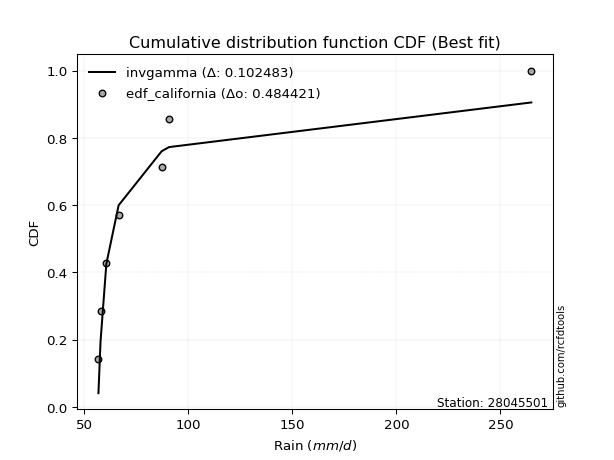</img>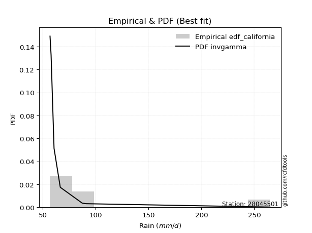</img>

</div>


### 2. EDF Hazen (1930)

Hazen method for plotting positions is a formula used to estimate the empirical cumulative probability distribution of flood events or other hydrological data. This formula often results in biased estimations, particularly when extrapolating to extreme events (high return periods).

<div align="center">


$P=(m-0.5)/n$


</div>


**2.1. Empirical values**

<div align="center">

|                | 0                   | 1                   | 2                   | 3         | 4                  | 5                  | 6                  |
|:---------------|:--------------------|:--------------------|:--------------------|:----------|:-------------------|:-------------------|:-------------------|
| date           | 2023                | 2018                | 2020                | 2021      | 2022               | 2017               | 2019               |
| x              | 56.8                | 57.8                | 60.6                | 66.5      | 87.2               | 90.8               | 264.9              |
| m              | 1                   | 2                   | 3                   | 4         | 5                  | 6                  | 7                  |
| empirical_dist | edf_hazen           | edf_hazen           | edf_hazen           | edf_hazen | edf_hazen          | edf_hazen          | edf_hazen          |
| empirical      | 0.07142857142857142 | 0.21428571428571427 | 0.35714285714285715 | 0.5       | 0.6428571428571429 | 0.7857142857142857 | 0.9285714285714286 |
| empirical_tr   | 1.0769230769230769  | 1.2727272727272727  | 1.5555555555555558  | 2.0       | 2.8000000000000003 | 4.666666666666666  | 14.000000000000007 |

</div>


**2.2. Kolmogorov-Smirnov fit test (sorted by Δ)**


<div align="center">

|                | 0                   | 1                   | 2                   | 3                   | 4                   | 5                   | 6                   | 7                   | 8                   | 9                   | 10                  | 11                  | 12                  | 13                  | 14                  | 15                  | 16                  | 17                  | 18                  | 19                  | 20                  | 21                  | 22                  | 23                  | 24                  | 25                  | 26                  | 27                  | 28                  | 29                  | 30                  | 31                  | 32                  | 33                  | 34                  | 35                  | 36                  | 37                  | 38                  | 39                  | 40                  | 41                  | 42                  | 43                  | 44                  | 45                  | 46                  | 47                  | 48                  | 49                  | 50                  | 51                  | 52                  | 53                  | 54                  | 55                  | 56                  | 57                  | 58                  | 59                  | 60                  | 61                  | 62                  | 63                  | 64                  | 65                  | 66                  | 67                  | 68                  | 69                  | 70                  | 71                  | 72                  | 73                  | 74                  | 75                  | 76                  | 77                  | 78                  | 79                  | 80                  | 81                  | 82                  | 83                  | 84                  | 85                  | 86                  | 87                  | 88                  | 89                  | 90                  | 91                  | 92                  | 93                  | 94                  | 95                  | 96                  | 97                  | 98                  | 99                  | 100                 | 101                 | 102                 | 103                 | 104                 | 105                 | 106                 | 107                 | 108                 | 109                 | 110                 | 111                 | 112                 | 113                 | 114                 | 115                 | 116                 | 117                 | 118                 | 119                 | 120                 | 121                 | 122                 | 123                 | 124                 | 125                 | 126                 | 127                 | 128                 | 129                 | 130                 | 131                 | 132                 | 133                 | 134                 | 135                 | 136                 | 137                 | 138                 | 139                 | 140                 | 141                 | 142                 | 143                 | 144                 | 145                 | 146                 | 147                 | 148                 | 149                 | 150                 | 151                 | 152                 | 153                 | 154                 | 155                 | 156                 | 157                 | 158                 | 159                 |
|:---------------|:--------------------|:--------------------|:--------------------|:--------------------|:--------------------|:--------------------|:--------------------|:--------------------|:--------------------|:--------------------|:--------------------|:--------------------|:--------------------|:--------------------|:--------------------|:--------------------|:--------------------|:--------------------|:--------------------|:--------------------|:--------------------|:--------------------|:--------------------|:--------------------|:--------------------|:--------------------|:--------------------|:--------------------|:--------------------|:--------------------|:--------------------|:--------------------|:--------------------|:--------------------|:--------------------|:--------------------|:--------------------|:--------------------|:--------------------|:--------------------|:--------------------|:--------------------|:--------------------|:--------------------|:--------------------|:--------------------|:--------------------|:--------------------|:--------------------|:--------------------|:--------------------|:--------------------|:--------------------|:--------------------|:--------------------|:--------------------|:--------------------|:--------------------|:--------------------|:--------------------|:--------------------|:--------------------|:--------------------|:--------------------|:--------------------|:--------------------|:--------------------|:--------------------|:--------------------|:--------------------|:--------------------|:--------------------|:--------------------|:--------------------|:--------------------|:--------------------|:--------------------|:--------------------|:--------------------|:--------------------|:--------------------|:--------------------|:--------------------|:--------------------|:--------------------|:--------------------|:--------------------|:--------------------|:--------------------|:--------------------|:--------------------|:--------------------|:--------------------|:--------------------|:--------------------|:--------------------|:--------------------|:--------------------|:--------------------|:--------------------|:--------------------|:--------------------|:--------------------|:--------------------|:--------------------|:--------------------|:--------------------|:--------------------|:--------------------|:--------------------|:--------------------|:--------------------|:--------------------|:--------------------|:--------------------|:--------------------|:--------------------|:--------------------|:--------------------|:--------------------|:--------------------|:--------------------|:--------------------|:--------------------|:--------------------|:--------------------|:--------------------|:--------------------|:--------------------|:--------------------|:--------------------|:--------------------|:--------------------|:--------------------|:--------------------|:--------------------|:--------------------|:--------------------|:--------------------|:--------------------|:--------------------|:--------------------|:--------------------|:--------------------|:--------------------|:--------------------|:--------------------|:--------------------|:--------------------|:--------------------|:--------------------|:--------------------|:--------------------|:--------------------|:--------------------|:--------------------|:--------------------|:--------------------|:--------------------|:--------------------|
| station        | 28045501            | 28045501            | 28045501            | 28045501            | 28045501            | 28045501            | 28045501            | 28045501            | 28045501            | 28045501            | 28045501            | 28045501            | 28045501            | 28045501            | 28045501            | 28045501            | 28045501            | 28045501            | 28045501            | 28045501            | 28045501            | 28045501            | 28045501            | 28045501            | 28045501            | 28045501            | 28045501            | 28045501            | 28045501            | 28045501            | 28045501            | 28045501            | 28045501            | 28045501            | 28045501            | 28045501            | 28045501            | 28045501            | 28045501            | 28045501            | 28045501            | 28045501            | 28045501            | 28045501            | 28045501            | 28045501            | 28045501            | 28045501            | 28045501            | 28045501            | 28045501            | 28045501            | 28045501            | 28045501            | 28045501            | 28045501            | 28045501            | 28045501            | 28045501            | 28045501            | 28045501            | 28045501            | 28045501            | 28045501            | 28045501            | 28045501            | 28045501            | 28045501            | 28045501            | 28045501            | 28045501            | 28045501            | 28045501            | 28045501            | 28045501            | 28045501            | 28045501            | 28045501            | 28045501            | 28045501            | 28045501            | 28045501            | 28045501            | 28045501            | 28045501            | 28045501            | 28045501            | 28045501            | 28045501            | 28045501            | 28045501            | 28045501            | 28045501            | 28045501            | 28045501            | 28045501            | 28045501            | 28045501            | 28045501            | 28045501            | 28045501            | 28045501            | 28045501            | 28045501            | 28045501            | 28045501            | 28045501            | 28045501            | 28045501            | 28045501            | 28045501            | 28045501            | 28045501            | 28045501            | 28045501            | 28045501            | 28045501            | 28045501            | 28045501            | 28045501            | 28045501            | 28045501            | 28045501            | 28045501            | 28045501            | 28045501            | 28045501            | 28045501            | 28045501            | 28045501            | 28045501            | 28045501            | 28045501            | 28045501            | 28045501            | 28045501            | 28045501            | 28045501            | 28045501            | 28045501            | 28045501            | 28045501            | 28045501            | 28045501            | 28045501            | 28045501            | 28045501            | 28045501            | 28045501            | 28045501            | 28045501            | 28045501            | 28045501            | 28045501            | 28045501            | 28045501            | 28045501            | 28045501            | 28045501            | 28045501            |
| empirical_dist | edf_hazen           | edf_hazen           | edf_hazen           | edf_hazen           | edf_hazen           | edf_hazen           | edf_hazen           | edf_hazen           | edf_hazen           | edf_hazen           | edf_hazen           | edf_hazen           | edf_hazen           | edf_hazen           | edf_hazen           | edf_hazen           | edf_hazen           | edf_hazen           | edf_hazen           | edf_hazen           | edf_hazen           | edf_hazen           | edf_hazen           | edf_hazen           | edf_hazen           | edf_hazen           | edf_hazen           | edf_hazen           | edf_hazen           | edf_hazen           | edf_hazen           | edf_hazen           | edf_hazen           | edf_hazen           | edf_hazen           | edf_hazen           | edf_hazen           | edf_hazen           | edf_hazen           | edf_hazen           | edf_hazen           | edf_hazen           | edf_hazen           | edf_hazen           | edf_hazen           | edf_hazen           | edf_hazen           | edf_hazen           | edf_hazen           | edf_hazen           | edf_hazen           | edf_hazen           | edf_hazen           | edf_hazen           | edf_hazen           | edf_hazen           | edf_hazen           | edf_hazen           | edf_hazen           | edf_hazen           | edf_hazen           | edf_hazen           | edf_hazen           | edf_hazen           | edf_hazen           | edf_hazen           | edf_hazen           | edf_hazen           | edf_hazen           | edf_hazen           | edf_hazen           | edf_hazen           | edf_hazen           | edf_hazen           | edf_hazen           | edf_hazen           | edf_hazen           | edf_hazen           | edf_hazen           | edf_hazen           | edf_hazen           | edf_hazen           | edf_hazen           | edf_hazen           | edf_hazen           | edf_hazen           | edf_hazen           | edf_hazen           | edf_hazen           | edf_hazen           | edf_hazen           | edf_hazen           | edf_hazen           | edf_hazen           | edf_hazen           | edf_hazen           | edf_hazen           | edf_hazen           | edf_hazen           | edf_hazen           | edf_hazen           | edf_hazen           | edf_hazen           | edf_hazen           | edf_hazen           | edf_hazen           | edf_hazen           | edf_hazen           | edf_hazen           | edf_hazen           | edf_hazen           | edf_hazen           | edf_hazen           | edf_hazen           | edf_hazen           | edf_hazen           | edf_hazen           | edf_hazen           | edf_hazen           | edf_hazen           | edf_hazen           | edf_hazen           | edf_hazen           | edf_hazen           | edf_hazen           | edf_hazen           | edf_hazen           | edf_hazen           | edf_hazen           | edf_hazen           | edf_hazen           | edf_hazen           | edf_hazen           | edf_hazen           | edf_hazen           | edf_hazen           | edf_hazen           | edf_hazen           | edf_hazen           | edf_hazen           | edf_hazen           | edf_hazen           | edf_hazen           | edf_hazen           | edf_hazen           | edf_hazen           | edf_hazen           | edf_hazen           | edf_hazen           | edf_hazen           | edf_hazen           | edf_hazen           | edf_hazen           | edf_hazen           | edf_hazen           | edf_hazen           | edf_hazen           | edf_hazen           | edf_hazen           | edf_hazen           |
| p_dist         | logf                | gausshyper          | lognakagami         | erlang              | truncpareto         | logweibull_min      | logncf              | logmielke           | loginvweibull       | loggenextreme       | logburr             | halfgennorm         | gamma               | genpareto           | logwald             | f                   | invgamma            | betaprime           | logtruncpareto      | loginvgamma         | logbradford         | truncweibull_min    | logbetaprime        | logmoyal            | invgauss            | loghalfgennorm      | nakagami            | loggumbel_r         | loginvgauss         | logalpha            | logweibull_max      | loggenlogistic      | logpearson3         | logerlang           | lognct              | nct                 | burr                | logvonmises_line    | loghalflogistic     | alpha               | loggamma            | loggamma            | lograyleigh         | logburr12           | burr12              | loggengamma         | logmaxwell          | loglomax            | loggennorm          | loghalfnorm         | logkstwobign        | logexponnorm        | loggenexpon         | logfoldnorm         | ncf                 | loghypsecant        | loglogistic         | wald                | logt                | lognorm             | logcrystalball      | genlogistic         | exponpow            | logloggamma         | logrice             | logloglaplace       | loganglit           | logdweibull         | logsemicircular     | loggompertz         | loglaplace          | loglaplace          | logtruncnorm        | moyal               | johnsonsu           | logbeta             | vonmises_line       | logdgamma           | logarcsine          | gumbel_r            | halflogistic        | pearson3            | lomax               | halfnorm            | t                   | rayleigh            | loggumbel_l         | loggausshyper       | genextreme          | powerlaw            | exponnorm           | genexpon            | maxwell             | foldnorm            | logpowerlaw         | logskewnorm         | logcosine           | logtruncweibull_min | logexponpow         | arcsine             | kstwobign           | logwrapcauchy       | weibull_min         | wrapcauchy          | semicircular        | anglit              | norm                | crystalball         | logexponweib        | logistic            | hypsecant           | gengamma            | laplace             | logkappa4           | rice                | exponweib           | fatiguelife         | dweibull            | logtruncexpon       | kappa3              | gennorm             | truncnorm           | logfatiguelife      | loglevy_l           | dgamma              | loggenpareto        | gumbel_l            | levy_l              | logargus            | cosine              | gompertz            | logtriang           | logksone            | invweibull          | logrdist            | skewnorm            | logtukeylambda      | loguniform          | logkappa3           | argus               | triang              | truncexpon          | johnsonsb           | loggenhalflogistic  | tukeylambda         | rdist               | ksone               | bradford            | logjohnsonsb        | kappa4              | beta                | uniform             | genhalflogistic     | logtrapezoid        | weibull_max         | logjohnsonsu        | trapezoid           | logvonmises         | vonmises            | mielke              |
| delta          | 0.08352444939084247 | 0.08891448591386542 | 0.09015031782724744 | 0.09128686135743724 | 0.09918475908682657 | 0.09950773022912157 | 0.1003598566321029  | 0.10353051970759714 | 0.1050457764319862  | 0.10505437507205662 | 0.10725294659127649 | 0.11115074432452265 | 0.11149636101388627 | 0.11526531823864739 | 0.11726494698936202 | 0.11740447388072506 | 0.1174059236538284  | 0.12341515811999795 | 0.12586832059888214 | 0.13000403753143475 | 0.13154487300806605 | 0.13329379130188979 | 0.13428258801622125 | 0.14713583237712854 | 0.1503253699878162  | 0.15097050876887896 | 0.153077261945726   | 0.1550112211560602  | 0.1554899827018903  | 0.15796118187083075 | 0.15812366275184392 | 0.16077263032856692 | 0.16345918157796238 | 0.16523149693502137 | 0.16989539387575514 | 0.17106234067790338 | 0.17152555614015697 | 0.17203799998365152 | 0.17307681916702586 | 0.17572572513509144 | 0.17794613989041552 | 0.17794613989041552 | 0.17917351437664053 | 0.18188828555289582 | 0.1827145442004495  | 0.18634764295927086 | 0.18840527218011172 | 0.193095773836322   | 0.19391549440031808 | 0.19520574466172755 | 0.1956337704641088  | 0.19982012907244412 | 0.201314351977977   | 0.20205872512502468 | 0.20229735095715384 | 0.2066592192561818  | 0.2084447717328921  | 0.2085291791349951  | 0.2142136102937838  | 0.21751953676582247 | 0.21751954301831067 | 0.2185784528289837  | 0.2198014350732732  | 0.22062550472802034 | 0.22130361977714297 | 0.22538672428242165 | 0.2271289865137619  | 0.23060752059922665 | 0.23110185338931033 | 0.2332017543028463  | 0.23384338338559868 | 0.23384338338559868 | 0.23552335459379184 | 0.23578162484689666 | 0.23763840803529307 | 0.23857777860847476 | 0.23973025624478103 | 0.24207565826244867 | 0.24837319862495685 | 0.2578850460755244  | 0.26292262796058485 | 0.26335264549517123 | 0.2683077066817189  | 0.26995935268417925 | 0.2788994565746894  | 0.27993235116813453 | 0.2823775667727274  | 0.28540895895270146 | 0.2861214023971854  | 0.2866779581819927  | 0.287066654430586   | 0.2893478817531812  | 0.2916872776438465  | 0.2996757068533987  | 0.30234617491022187 | 0.3032595689847401  | 0.30440753124861497 | 0.30508160273939233 | 0.30729872452667895 | 0.3084314156032916  | 0.3118199010381375  | 0.3126861008687395  | 0.3128395290061098  | 0.3150217183830259  | 0.31780032550208764 | 0.3201588199090742  | 0.3258771155879707  | 0.32587712030797295 | 0.3301070536860792  | 0.3313148924249261  | 0.335926705548671   | 0.3370712558235348  | 0.3521703156746907  | 0.3535284486634488  | 0.3556839313782467  | 0.3557857018307512  | 0.3561581488879767  | 0.35652237791576635 | 0.3575883160471064  | 0.35813086269043515 | 0.3734571787485867  | 0.37827584347842286 | 0.384162451000434   | 0.38485426653398247 | 0.3880410494685761  | 0.38887213707804735 | 0.39629682581611864 | 0.399769037245296   | 0.40414413410935435 | 0.4083684477240784  | 0.4300090254335938  | 0.44833698243802467 | 0.4484962142120302  | 0.44932479751131915 | 0.4516804779378941  | 0.4589093155855529  | 0.47599771784776224 | 0.4810525999115791  | 0.48159655929225653 | 0.4859734859590843  | 0.525937313856726   | 0.5279002453789006  | 0.5318022550139405  | 0.547151539394484   | 0.5482737135139126  | 0.5495621257293778  | 0.5662284615912678  | 0.5811482651412853  | 0.5907193197550442  | 0.5921364860430121  | 0.6214947306517266  | 0.6223312967666643  | 0.6567626898592523  | 0.6719982579665854  | 0.689281709159371   | 0.7003797886111359  | 0.7375402587233254  | 1.1642579292976756  | 41.52292363357379   | nan                 |
| deltao         | 0.48442053926100004 | 0.48442053926100004 | 0.48442053926100004 | 0.48442053926100004 | 0.48442053926100004 | 0.48442053926100004 | 0.48442053926100004 | 0.48442053926100004 | 0.48442053926100004 | 0.48442053926100004 | 0.48442053926100004 | 0.48442053926100004 | 0.48442053926100004 | 0.48442053926100004 | 0.48442053926100004 | 0.48442053926100004 | 0.48442053926100004 | 0.48442053926100004 | 0.48442053926100004 | 0.48442053926100004 | 0.48442053926100004 | 0.48442053926100004 | 0.48442053926100004 | 0.48442053926100004 | 0.48442053926100004 | 0.48442053926100004 | 0.48442053926100004 | 0.48442053926100004 | 0.48442053926100004 | 0.48442053926100004 | 0.48442053926100004 | 0.48442053926100004 | 0.48442053926100004 | 0.48442053926100004 | 0.48442053926100004 | 0.48442053926100004 | 0.48442053926100004 | 0.48442053926100004 | 0.48442053926100004 | 0.48442053926100004 | 0.48442053926100004 | 0.48442053926100004 | 0.48442053926100004 | 0.48442053926100004 | 0.48442053926100004 | 0.48442053926100004 | 0.48442053926100004 | 0.48442053926100004 | 0.48442053926100004 | 0.48442053926100004 | 0.48442053926100004 | 0.48442053926100004 | 0.48442053926100004 | 0.48442053926100004 | 0.48442053926100004 | 0.48442053926100004 | 0.48442053926100004 | 0.48442053926100004 | 0.48442053926100004 | 0.48442053926100004 | 0.48442053926100004 | 0.48442053926100004 | 0.48442053926100004 | 0.48442053926100004 | 0.48442053926100004 | 0.48442053926100004 | 0.48442053926100004 | 0.48442053926100004 | 0.48442053926100004 | 0.48442053926100004 | 0.48442053926100004 | 0.48442053926100004 | 0.48442053926100004 | 0.48442053926100004 | 0.48442053926100004 | 0.48442053926100004 | 0.48442053926100004 | 0.48442053926100004 | 0.48442053926100004 | 0.48442053926100004 | 0.48442053926100004 | 0.48442053926100004 | 0.48442053926100004 | 0.48442053926100004 | 0.48442053926100004 | 0.48442053926100004 | 0.48442053926100004 | 0.48442053926100004 | 0.48442053926100004 | 0.48442053926100004 | 0.48442053926100004 | 0.48442053926100004 | 0.48442053926100004 | 0.48442053926100004 | 0.48442053926100004 | 0.48442053926100004 | 0.48442053926100004 | 0.48442053926100004 | 0.48442053926100004 | 0.48442053926100004 | 0.48442053926100004 | 0.48442053926100004 | 0.48442053926100004 | 0.48442053926100004 | 0.48442053926100004 | 0.48442053926100004 | 0.48442053926100004 | 0.48442053926100004 | 0.48442053926100004 | 0.48442053926100004 | 0.48442053926100004 | 0.48442053926100004 | 0.48442053926100004 | 0.48442053926100004 | 0.48442053926100004 | 0.48442053926100004 | 0.48442053926100004 | 0.48442053926100004 | 0.48442053926100004 | 0.48442053926100004 | 0.48442053926100004 | 0.48442053926100004 | 0.48442053926100004 | 0.48442053926100004 | 0.48442053926100004 | 0.48442053926100004 | 0.48442053926100004 | 0.48442053926100004 | 0.48442053926100004 | 0.48442053926100004 | 0.48442053926100004 | 0.48442053926100004 | 0.48442053926100004 | 0.48442053926100004 | 0.48442053926100004 | 0.48442053926100004 | 0.48442053926100004 | 0.48442053926100004 | 0.48442053926100004 | 0.48442053926100004 | 0.48442053926100004 | 0.48442053926100004 | 0.48442053926100004 | 0.48442053926100004 | 0.48442053926100004 | 0.48442053926100004 | 0.48442053926100004 | 0.48442053926100004 | 0.48442053926100004 | 0.48442053926100004 | 0.48442053926100004 | 0.48442053926100004 | 0.48442053926100004 | 0.48442053926100004 | 0.48442053926100004 | 0.48442053926100004 | 0.48442053926100004 | 0.48442053926100004 | 0.48442053926100004 | 0.48442053926100004 |
| eval           | Δo > Δ              | Δo > Δ              | Δo > Δ              | Δo > Δ              | Δo > Δ              | Δo > Δ              | Δo > Δ              | Δo > Δ              | Δo > Δ              | Δo > Δ              | Δo > Δ              | Δo > Δ              | Δo > Δ              | Δo > Δ              | Δo > Δ              | Δo > Δ              | Δo > Δ              | Δo > Δ              | Δo > Δ              | Δo > Δ              | Δo > Δ              | Δo > Δ              | Δo > Δ              | Δo > Δ              | Δo > Δ              | Δo > Δ              | Δo > Δ              | Δo > Δ              | Δo > Δ              | Δo > Δ              | Δo > Δ              | Δo > Δ              | Δo > Δ              | Δo > Δ              | Δo > Δ              | Δo > Δ              | Δo > Δ              | Δo > Δ              | Δo > Δ              | Δo > Δ              | Δo > Δ              | Δo > Δ              | Δo > Δ              | Δo > Δ              | Δo > Δ              | Δo > Δ              | Δo > Δ              | Δo > Δ              | Δo > Δ              | Δo > Δ              | Δo > Δ              | Δo > Δ              | Δo > Δ              | Δo > Δ              | Δo > Δ              | Δo > Δ              | Δo > Δ              | Δo > Δ              | Δo > Δ              | Δo > Δ              | Δo > Δ              | Δo > Δ              | Δo > Δ              | Δo > Δ              | Δo > Δ              | Δo > Δ              | Δo > Δ              | Δo > Δ              | Δo > Δ              | Δo > Δ              | Δo > Δ              | Δo > Δ              | Δo > Δ              | Δo > Δ              | Δo > Δ              | Δo > Δ              | Δo > Δ              | Δo > Δ              | Δo > Δ              | Δo > Δ              | Δo > Δ              | Δo > Δ              | Δo > Δ              | Δo > Δ              | Δo > Δ              | Δo > Δ              | Δo > Δ              | Δo > Δ              | Δo > Δ              | Δo > Δ              | Δo > Δ              | Δo > Δ              | Δo > Δ              | Δo > Δ              | Δo > Δ              | Δo > Δ              | Δo > Δ              | Δo > Δ              | Δo > Δ              | Δo > Δ              | Δo > Δ              | Δo > Δ              | Δo > Δ              | Δo > Δ              | Δo > Δ              | Δo > Δ              | Δo > Δ              | Δo > Δ              | Δo > Δ              | Δo > Δ              | Δo > Δ              | Δo > Δ              | Δo > Δ              | Δo > Δ              | Δo > Δ              | Δo > Δ              | Δo > Δ              | Δo > Δ              | Δo > Δ              | Δo > Δ              | Δo > Δ              | Δo > Δ              | Δo > Δ              | Δo > Δ              | Δo > Δ              | Δo > Δ              | Δo > Δ              | Δo > Δ              | Δo > Δ              | Δo > Δ              | Δo > Δ              | Δo > Δ              | Δo > Δ              | Δo > Δ              | Δo > Δ              | Δo > Δ              | Δo > Δ              | Δo > Δ              | Δo > Δ              | Δo <= Δ             | Δo <= Δ             | Δo <= Δ             | Δo <= Δ             | Δo <= Δ             | Δo <= Δ             | Δo <= Δ             | Δo <= Δ             | Δo <= Δ             | Δo <= Δ             | Δo <= Δ             | Δo <= Δ             | Δo <= Δ             | Δo <= Δ             | Δo <= Δ             | Δo <= Δ             | Δo <= Δ             | Δo <= Δ             | Δo <= Δ             | Δo <= Δ             | Δo <= Δ             |
| fit            | 1                   | 1                   | 1                   | 1                   | 1                   | 1                   | 1                   | 1                   | 1                   | 1                   | 1                   | 1                   | 1                   | 1                   | 1                   | 1                   | 1                   | 1                   | 1                   | 1                   | 1                   | 1                   | 1                   | 1                   | 1                   | 1                   | 1                   | 1                   | 1                   | 1                   | 1                   | 1                   | 1                   | 1                   | 1                   | 1                   | 1                   | 1                   | 1                   | 1                   | 1                   | 1                   | 1                   | 1                   | 1                   | 1                   | 1                   | 1                   | 1                   | 1                   | 1                   | 1                   | 1                   | 1                   | 1                   | 1                   | 1                   | 1                   | 1                   | 1                   | 1                   | 1                   | 1                   | 1                   | 1                   | 1                   | 1                   | 1                   | 1                   | 1                   | 1                   | 1                   | 1                   | 1                   | 1                   | 1                   | 1                   | 1                   | 1                   | 1                   | 1                   | 1                   | 1                   | 1                   | 1                   | 1                   | 1                   | 1                   | 1                   | 1                   | 1                   | 1                   | 1                   | 1                   | 1                   | 1                   | 1                   | 1                   | 1                   | 1                   | 1                   | 1                   | 1                   | 1                   | 1                   | 1                   | 1                   | 1                   | 1                   | 1                   | 1                   | 1                   | 1                   | 1                   | 1                   | 1                   | 1                   | 1                   | 1                   | 1                   | 1                   | 1                   | 1                   | 1                   | 1                   | 1                   | 1                   | 1                   | 1                   | 1                   | 1                   | 1                   | 1                   | 1                   | 1                   | 1                   | 1                   | 1                   | 1                   | 0                   | 0                   | 0                   | 0                   | 0                   | 0                   | 0                   | 0                   | 0                   | 0                   | 0                   | 0                   | 0                   | 0                   | 0                   | 0                   | 0                   | 0                   | 0                   | 0                   | 0                   |
| n              | 7                   | 7                   | 7                   | 7                   | 7                   | 7                   | 7                   | 7                   | 7                   | 7                   | 7                   | 7                   | 7                   | 7                   | 7                   | 7                   | 7                   | 7                   | 7                   | 7                   | 7                   | 7                   | 7                   | 7                   | 7                   | 7                   | 7                   | 7                   | 7                   | 7                   | 7                   | 7                   | 7                   | 7                   | 7                   | 7                   | 7                   | 7                   | 7                   | 7                   | 7                   | 7                   | 7                   | 7                   | 7                   | 7                   | 7                   | 7                   | 7                   | 7                   | 7                   | 7                   | 7                   | 7                   | 7                   | 7                   | 7                   | 7                   | 7                   | 7                   | 7                   | 7                   | 7                   | 7                   | 7                   | 7                   | 7                   | 7                   | 7                   | 7                   | 7                   | 7                   | 7                   | 7                   | 7                   | 7                   | 7                   | 7                   | 7                   | 7                   | 7                   | 7                   | 7                   | 7                   | 7                   | 7                   | 7                   | 7                   | 7                   | 7                   | 7                   | 7                   | 7                   | 7                   | 7                   | 7                   | 7                   | 7                   | 7                   | 7                   | 7                   | 7                   | 7                   | 7                   | 7                   | 7                   | 7                   | 7                   | 7                   | 7                   | 7                   | 7                   | 7                   | 7                   | 7                   | 7                   | 7                   | 7                   | 7                   | 7                   | 7                   | 7                   | 7                   | 7                   | 7                   | 7                   | 7                   | 7                   | 7                   | 7                   | 7                   | 7                   | 7                   | 7                   | 7                   | 7                   | 7                   | 7                   | 7                   | 7                   | 7                   | 7                   | 7                   | 7                   | 7                   | 7                   | 7                   | 7                   | 7                   | 7                   | 7                   | 7                   | 7                   | 7                   | 7                   | 7                   | 7                   | 7                   | 7                   | 7                   |
| best_fit       | 1                   | 0                   | 0                   | 0                   | 0                   | 0                   | 0                   | 0                   | 0                   | 0                   | 0                   | 0                   | 0                   | 0                   | 0                   | 0                   | 0                   | 0                   | 0                   | 0                   | 0                   | 0                   | 0                   | 0                   | 0                   | 0                   | 0                   | 0                   | 0                   | 0                   | 0                   | 0                   | 0                   | 0                   | 0                   | 0                   | 0                   | 0                   | 0                   | 0                   | 0                   | 0                   | 0                   | 0                   | 0                   | 0                   | 0                   | 0                   | 0                   | 0                   | 0                   | 0                   | 0                   | 0                   | 0                   | 0                   | 0                   | 0                   | 0                   | 0                   | 0                   | 0                   | 0                   | 0                   | 0                   | 0                   | 0                   | 0                   | 0                   | 0                   | 0                   | 0                   | 0                   | 0                   | 0                   | 0                   | 0                   | 0                   | 0                   | 0                   | 0                   | 0                   | 0                   | 0                   | 0                   | 0                   | 0                   | 0                   | 0                   | 0                   | 0                   | 0                   | 0                   | 0                   | 0                   | 0                   | 0                   | 0                   | 0                   | 0                   | 0                   | 0                   | 0                   | 0                   | 0                   | 0                   | 0                   | 0                   | 0                   | 0                   | 0                   | 0                   | 0                   | 0                   | 0                   | 0                   | 0                   | 0                   | 0                   | 0                   | 0                   | 0                   | 0                   | 0                   | 0                   | 0                   | 0                   | 0                   | 0                   | 0                   | 0                   | 0                   | 0                   | 0                   | 0                   | 0                   | 0                   | 0                   | 0                   | 0                   | 0                   | 0                   | 0                   | 0                   | 0                   | 0                   | 0                   | 0                   | 0                   | 0                   | 0                   | 0                   | 0                   | 0                   | 0                   | 0                   | 0                   | 0                   | 0                   | 0                   |
| best_fit_sort  | 1                   | 2                   | 3                   | 4                   | 5                   | 6                   | 7                   | 8                   | 9                   | 10                  | 11                  | 12                  | 13                  | 14                  | 15                  | 16                  | 17                  | 18                  | 19                  | 20                  | 21                  | 22                  | 23                  | 24                  | 25                  | 26                  | 27                  | 28                  | 29                  | 30                  | 31                  | 32                  | 33                  | 34                  | 35                  | 36                  | 37                  | 38                  | 39                  | 40                  | 41                  | 42                  | 43                  | 44                  | 45                  | 46                  | 47                  | 48                  | 49                  | 50                  | 51                  | 52                  | 53                  | 54                  | 55                  | 56                  | 57                  | 58                  | 59                  | 60                  | 61                  | 62                  | 63                  | 64                  | 65                  | 66                  | 67                  | 68                  | 69                  | 70                  | 71                  | 72                  | 73                  | 74                  | 75                  | 76                  | 77                  | 78                  | 79                  | 80                  | 81                  | 82                  | 83                  | 84                  | 85                  | 86                  | 87                  | 88                  | 89                  | 90                  | 91                  | 92                  | 93                  | 94                  | 95                  | 96                  | 97                  | 98                  | 99                  | 100                 | 101                 | 102                 | 103                 | 104                 | 105                 | 106                 | 107                 | 108                 | 109                 | 110                 | 111                 | 112                 | 113                 | 114                 | 115                 | 116                 | 117                 | 118                 | 119                 | 120                 | 121                 | 122                 | 123                 | 124                 | 125                 | 126                 | 127                 | 128                 | 129                 | 130                 | 131                 | 132                 | 133                 | 134                 | 135                 | 136                 | 137                 | 138                 | 139                 | 140                 | 141                 | 142                 | 143                 | 144                 | 145                 | 146                 | 147                 | 148                 | 149                 | 150                 | 151                 | 152                 | 153                 | 154                 | 155                 | 156                 | 157                 | 158                 | 159                 | 160                 |

</div>


**2.3. Best fit**

<div align="center">

|   id |   station | empirical_dist   | p_dist   |     delta |   deltao | eval   |   fit |   n |   best_fit |   best_fit_sort |
|-----:|----------:|:-----------------|:---------|----------:|---------:|:-------|------:|----:|-----------:|----------------:|
|    0 |  28045501 | edf_hazen        | logf     | 0.0835244 | 0.484421 | Δo > Δ |     1 |   7 |          1 |               1 |

</div>


<div align="center">

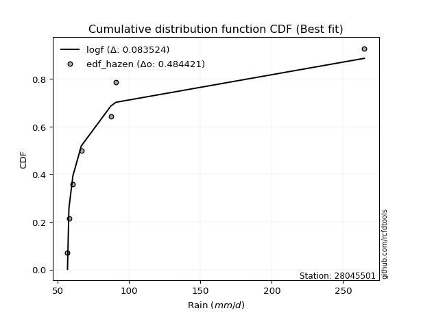</img></img>

</div>


### 3. EDF Weibull (1939)

Weibull plotting position formula is an empirical method used to estimate the non-exceedance probability or plotting position for a set of observed data, is often recommended or widely used in practice, particularly in flood frequency analysis.

<div align="center">


$P=m/(n+1)$


</div>


**3.1. Empirical values**

<div align="center">

|                | 0                  | 1                  | 2           | 3           | 4                  | 5           | 6           |
|:---------------|:-------------------|:-------------------|:------------|:------------|:-------------------|:------------|:------------|
| date           | 2023               | 2018               | 2020        | 2021        | 2022               | 2017        | 2019        |
| x              | 56.8               | 57.8               | 60.6        | 66.5        | 87.2               | 90.8        | 264.9       |
| m              | 1                  | 2                  | 3           | 4           | 5                  | 6           | 7           |
| empirical_dist | edf_weibull        | edf_weibull        | edf_weibull | edf_weibull | edf_weibull        | edf_weibull | edf_weibull |
| empirical      | 0.125              | 0.25               | 0.375       | 0.5         | 0.625              | 0.75        | 0.875       |
| empirical_tr   | 1.1428571428571428 | 1.3333333333333333 | 1.6         | 2.0         | 2.6666666666666665 | 4.0         | 8.0         |

</div>


**3.2. Kolmogorov-Smirnov fit test (sorted by Δ)**


<div align="center">

|                | 0                   | 1                   | 2                   | 3                   | 4                   | 5                   | 6                   | 7                   | 8                   | 9                   | 10                  | 11                  | 12                  | 13                  | 14                  | 15                  | 16                  | 17                  | 18                  | 19                  | 20                  | 21                  | 22                  | 23                  | 24                  | 25                  | 26                  | 27                  | 28                  | 29                  | 30                  | 31                  | 32                  | 33                  | 34                  | 35                  | 36                  | 37                  | 38                  | 39                  | 40                  | 41                  | 42                  | 43                  | 44                  | 45                  | 46                  | 47                  | 48                  | 49                  | 50                  | 51                  | 52                  | 53                  | 54                  | 55                  | 56                  | 57                  | 58                  | 59                  | 60                  | 61                  | 62                  | 63                  | 64                  | 65                  | 66                  | 67                  | 68                  | 69                  | 70                  | 71                  | 72                  | 73                  | 74                  | 75                  | 76                  | 77                  | 78                  | 79                  | 80                  | 81                  | 82                  | 83                  | 84                  | 85                  | 86                  | 87                  | 88                  | 89                  | 90                  | 91                  | 92                  | 93                  | 94                  | 95                  | 96                  | 97                  | 98                  | 99                  | 100                 | 101                 | 102                 | 103                 | 104                 | 105                 | 106                 | 107                 | 108                 | 109                 | 110                 | 111                 | 112                 | 113                 | 114                 | 115                 | 116                 | 117                 | 118                 | 119                 | 120                 | 121                 | 122                 | 123                 | 124                 | 125                 | 126                 | 127                 | 128                 | 129                 | 130                 | 131                 | 132                 | 133                 | 134                 | 135                 | 136                 | 137                 | 138                 | 139                 | 140                 | 141                 | 142                 | 143                 | 144                 | 145                 | 146                 | 147                 | 148                 | 149                 | 150                 | 151                 | 152                 | 153                 | 154                 | 155                 | 156                 | 157                 | 158                 | 159                 |
|:---------------|:--------------------|:--------------------|:--------------------|:--------------------|:--------------------|:--------------------|:--------------------|:--------------------|:--------------------|:--------------------|:--------------------|:--------------------|:--------------------|:--------------------|:--------------------|:--------------------|:--------------------|:--------------------|:--------------------|:--------------------|:--------------------|:--------------------|:--------------------|:--------------------|:--------------------|:--------------------|:--------------------|:--------------------|:--------------------|:--------------------|:--------------------|:--------------------|:--------------------|:--------------------|:--------------------|:--------------------|:--------------------|:--------------------|:--------------------|:--------------------|:--------------------|:--------------------|:--------------------|:--------------------|:--------------------|:--------------------|:--------------------|:--------------------|:--------------------|:--------------------|:--------------------|:--------------------|:--------------------|:--------------------|:--------------------|:--------------------|:--------------------|:--------------------|:--------------------|:--------------------|:--------------------|:--------------------|:--------------------|:--------------------|:--------------------|:--------------------|:--------------------|:--------------------|:--------------------|:--------------------|:--------------------|:--------------------|:--------------------|:--------------------|:--------------------|:--------------------|:--------------------|:--------------------|:--------------------|:--------------------|:--------------------|:--------------------|:--------------------|:--------------------|:--------------------|:--------------------|:--------------------|:--------------------|:--------------------|:--------------------|:--------------------|:--------------------|:--------------------|:--------------------|:--------------------|:--------------------|:--------------------|:--------------------|:--------------------|:--------------------|:--------------------|:--------------------|:--------------------|:--------------------|:--------------------|:--------------------|:--------------------|:--------------------|:--------------------|:--------------------|:--------------------|:--------------------|:--------------------|:--------------------|:--------------------|:--------------------|:--------------------|:--------------------|:--------------------|:--------------------|:--------------------|:--------------------|:--------------------|:--------------------|:--------------------|:--------------------|:--------------------|:--------------------|:--------------------|:--------------------|:--------------------|:--------------------|:--------------------|:--------------------|:--------------------|:--------------------|:--------------------|:--------------------|:--------------------|:--------------------|:--------------------|:--------------------|:--------------------|:--------------------|:--------------------|:--------------------|:--------------------|:--------------------|:--------------------|:--------------------|:--------------------|:--------------------|:--------------------|:--------------------|:--------------------|:--------------------|:--------------------|:--------------------|:--------------------|:--------------------|
| station        | 28045501            | 28045501            | 28045501            | 28045501            | 28045501            | 28045501            | 28045501            | 28045501            | 28045501            | 28045501            | 28045501            | 28045501            | 28045501            | 28045501            | 28045501            | 28045501            | 28045501            | 28045501            | 28045501            | 28045501            | 28045501            | 28045501            | 28045501            | 28045501            | 28045501            | 28045501            | 28045501            | 28045501            | 28045501            | 28045501            | 28045501            | 28045501            | 28045501            | 28045501            | 28045501            | 28045501            | 28045501            | 28045501            | 28045501            | 28045501            | 28045501            | 28045501            | 28045501            | 28045501            | 28045501            | 28045501            | 28045501            | 28045501            | 28045501            | 28045501            | 28045501            | 28045501            | 28045501            | 28045501            | 28045501            | 28045501            | 28045501            | 28045501            | 28045501            | 28045501            | 28045501            | 28045501            | 28045501            | 28045501            | 28045501            | 28045501            | 28045501            | 28045501            | 28045501            | 28045501            | 28045501            | 28045501            | 28045501            | 28045501            | 28045501            | 28045501            | 28045501            | 28045501            | 28045501            | 28045501            | 28045501            | 28045501            | 28045501            | 28045501            | 28045501            | 28045501            | 28045501            | 28045501            | 28045501            | 28045501            | 28045501            | 28045501            | 28045501            | 28045501            | 28045501            | 28045501            | 28045501            | 28045501            | 28045501            | 28045501            | 28045501            | 28045501            | 28045501            | 28045501            | 28045501            | 28045501            | 28045501            | 28045501            | 28045501            | 28045501            | 28045501            | 28045501            | 28045501            | 28045501            | 28045501            | 28045501            | 28045501            | 28045501            | 28045501            | 28045501            | 28045501            | 28045501            | 28045501            | 28045501            | 28045501            | 28045501            | 28045501            | 28045501            | 28045501            | 28045501            | 28045501            | 28045501            | 28045501            | 28045501            | 28045501            | 28045501            | 28045501            | 28045501            | 28045501            | 28045501            | 28045501            | 28045501            | 28045501            | 28045501            | 28045501            | 28045501            | 28045501            | 28045501            | 28045501            | 28045501            | 28045501            | 28045501            | 28045501            | 28045501            | 28045501            | 28045501            | 28045501            | 28045501            | 28045501            | 28045501            |
| empirical_dist | edf_weibull         | edf_weibull         | edf_weibull         | edf_weibull         | edf_weibull         | edf_weibull         | edf_weibull         | edf_weibull         | edf_weibull         | edf_weibull         | edf_weibull         | edf_weibull         | edf_weibull         | edf_weibull         | edf_weibull         | edf_weibull         | edf_weibull         | edf_weibull         | edf_weibull         | edf_weibull         | edf_weibull         | edf_weibull         | edf_weibull         | edf_weibull         | edf_weibull         | edf_weibull         | edf_weibull         | edf_weibull         | edf_weibull         | edf_weibull         | edf_weibull         | edf_weibull         | edf_weibull         | edf_weibull         | edf_weibull         | edf_weibull         | edf_weibull         | edf_weibull         | edf_weibull         | edf_weibull         | edf_weibull         | edf_weibull         | edf_weibull         | edf_weibull         | edf_weibull         | edf_weibull         | edf_weibull         | edf_weibull         | edf_weibull         | edf_weibull         | edf_weibull         | edf_weibull         | edf_weibull         | edf_weibull         | edf_weibull         | edf_weibull         | edf_weibull         | edf_weibull         | edf_weibull         | edf_weibull         | edf_weibull         | edf_weibull         | edf_weibull         | edf_weibull         | edf_weibull         | edf_weibull         | edf_weibull         | edf_weibull         | edf_weibull         | edf_weibull         | edf_weibull         | edf_weibull         | edf_weibull         | edf_weibull         | edf_weibull         | edf_weibull         | edf_weibull         | edf_weibull         | edf_weibull         | edf_weibull         | edf_weibull         | edf_weibull         | edf_weibull         | edf_weibull         | edf_weibull         | edf_weibull         | edf_weibull         | edf_weibull         | edf_weibull         | edf_weibull         | edf_weibull         | edf_weibull         | edf_weibull         | edf_weibull         | edf_weibull         | edf_weibull         | edf_weibull         | edf_weibull         | edf_weibull         | edf_weibull         | edf_weibull         | edf_weibull         | edf_weibull         | edf_weibull         | edf_weibull         | edf_weibull         | edf_weibull         | edf_weibull         | edf_weibull         | edf_weibull         | edf_weibull         | edf_weibull         | edf_weibull         | edf_weibull         | edf_weibull         | edf_weibull         | edf_weibull         | edf_weibull         | edf_weibull         | edf_weibull         | edf_weibull         | edf_weibull         | edf_weibull         | edf_weibull         | edf_weibull         | edf_weibull         | edf_weibull         | edf_weibull         | edf_weibull         | edf_weibull         | edf_weibull         | edf_weibull         | edf_weibull         | edf_weibull         | edf_weibull         | edf_weibull         | edf_weibull         | edf_weibull         | edf_weibull         | edf_weibull         | edf_weibull         | edf_weibull         | edf_weibull         | edf_weibull         | edf_weibull         | edf_weibull         | edf_weibull         | edf_weibull         | edf_weibull         | edf_weibull         | edf_weibull         | edf_weibull         | edf_weibull         | edf_weibull         | edf_weibull         | edf_weibull         | edf_weibull         | edf_weibull         | edf_weibull         | edf_weibull         |
| p_dist         | logpearson3         | logmoyal            | betaprime           | logncf              | loghalflogistic     | logmielke           | loginvweibull       | loggenextreme       | nakagami            | logf                | lognakagami         | gausshyper          | logweibull_min      | erlang              | logvonmises_line    | logburr             | logbetaprime        | truncweibull_min    | halfgennorm         | gamma               | loggumbel_r         | genpareto           | truncpareto         | logwald             | f                   | invgamma            | loghalfnorm         | lograyleigh         | loginvgamma         | logfoldnorm         | logbradford         | loggengamma         | logmaxwell          | wald                | logweibull_max      | loggenlogistic      | logtruncpareto      | lognct              | ncf                 | invgauss            | loghalfgennorm      | nct                 | logloglaplace       | loginvgauss         | logalpha            | logdweibull         | lognorm             | logcrystalball      | logerlang           | exponpow            | logloggamma         | vonmises_line       | logdgamma           | burr                | loganglit           | loglogistic         | alpha               | logsemicircular     | logkstwobign        | loggamma            | loggamma            | genlogistic         | moyal               | logburr12           | burr12              | logbeta             | loghypsecant        | halflogistic        | pearson3            | loglomax            | logarcsine          | loggennorm          | halfnorm            | logexponnorm        | loggenexpon         | johnsonsu           | logrice             | gumbel_r            | logt                | loglaplace          | loglaplace          | rayleigh            | foldnorm            | loggumbel_l         | genextreme          | powerlaw            | loggompertz         | logtruncnorm        | maxwell             | t                   | loggausshyper       | logpowerlaw         | logcosine           | logtruncweibull_min | logexponpow         | arcsine             | kstwobign           | logexponweib        | lomax               | logwrapcauchy       | weibull_min         | wrapcauchy          | semicircular        | anglit              | exponnorm           | genexpon            | norm                | crystalball         | logistic            | hypsecant           | gengamma            | dweibull            | logskewnorm         | kappa3              | laplace             | logkappa4           | rice                | exponweib           | fatiguelife         | loglevy_l           | dgamma              | loggenpareto        | logtruncexpon       | levy_l              | logfatiguelife      | gennorm             | gumbel_l            | truncnorm           | logargus            | cosine              | gompertz            | invweibull          | logtriang           | logksone            | logrdist            | skewnorm            | logtukeylambda      | loguniform          | logkappa3           | argus               | triang              | truncexpon          | tukeylambda         | rdist               | johnsonsb           | loggenhalflogistic  | ksone               | bradford            | logjohnsonsb        | kappa4              | beta                | uniform             | genhalflogistic     | logtrapezoid        | weibull_max         | logjohnsonsu        | trapezoid           | logvonmises         | vonmises            | mielke              |
| delta          | 0.1098877530065338  | 0.11536319543093931 | 0.11806978901852072 | 0.1182169994892458  | 0.11950539059559728 | 0.12138766256473998 | 0.12290291928912911 | 0.12291151792919952 | 0.1239833871612043  | 0.12407781805671578 | 0.12486840302577917 | 0.12497761938179784 | 0.12499749179890525 | 0.12499972500764711 | 0.1249999999807353  | 0.1251100894484194  | 0.1266078746508107  | 0.12854591831184448 | 0.12900788718166556 | 0.12935350387102917 | 0.1301360815603006  | 0.1331224610957903  | 0.1348990448011123  | 0.13512208984650487 | 0.13526161673786796 | 0.1352630665109713  | 0.14163431609029897 | 0.14345922866235483 | 0.14786118038857765 | 0.1484872965535961  | 0.14940201586520896 | 0.15063335724498517 | 0.15269098646582602 | 0.15495775056356653 | 0.15812366275184392 | 0.16077263032856692 | 0.16158260631316784 | 0.16400209093354146 | 0.16658306524286814 | 0.1681825128449591  | 0.16882765162602187 | 0.17106234067790338 | 0.17181529571099308 | 0.1733471255590332  | 0.17581832472797365 | 0.17703609202779808 | 0.18180525105153678 | 0.18180525730402497 | 0.18308863979216428 | 0.1840871493589875  | 0.18491121901373464 | 0.18615882767335246 | 0.1885042296910201  | 0.18938269899729987 | 0.1914147007994762  | 0.19182759375013358 | 0.19358286799223434 | 0.19538756767502463 | 0.1956337704641088  | 0.19580328274755843 | 0.19580328274755843 | 0.1965386573859687  | 0.19657638370111574 | 0.19974542841003867 | 0.20057168705759235 | 0.20286349289418903 | 0.2066592192561818  | 0.2093511993891563  | 0.20978121692374269 | 0.21095291669346486 | 0.21123996493589914 | 0.21177263725746098 | 0.2163879241127507  | 0.21767727192958697 | 0.21917149483511986 | 0.21978126517815022 | 0.22130361977714297 | 0.22217076036123873 | 0.22594964383654392 | 0.23384338338559868 | 0.23384338338559868 | 0.24421806545384883 | 0.24610427828197012 | 0.2466632810584417  | 0.2504071166828997  | 0.250963672467707   | 0.25105889715998914 | 0.2533804974509347  | 0.2559729919295608  | 0.25969166683492684 | 0.2663299812876866  | 0.26663188919593617 | 0.2686932455343293  | 0.26936731702510663 | 0.27158443881239325 | 0.2727171298890059  | 0.2761056153238518  | 0.2765356251146506  | 0.2766434084932933  | 0.2769718151544538  | 0.2788056784986644  | 0.2793074326687402  | 0.28208603978780195 | 0.2844445341947885  | 0.287066654430586   | 0.2893478817531812  | 0.290162829873685   | 0.29016283459368725 | 0.2956006067106404  | 0.3002124198343853  | 0.3013569701092491  | 0.3029509493443378  | 0.3032595689847401  | 0.30455943411900654 | 0.316456029960405   | 0.3178141629491631  | 0.319969645663961   | 0.3200714161164655  | 0.320443863173691   | 0.33128283796255387 | 0.3344696208971475  | 0.3353007085066188  | 0.33967483193599485 | 0.3461976086738674  | 0.3484481652861483  | 0.35560003589144384 | 0.36058254010183294 | 0.36280015129073667 | 0.36842984839506865 | 0.3726541620097927  | 0.3942947397193081  | 0.39575336893989055 | 0.41262269672373897 | 0.4127819284977445  | 0.4159661922236084  | 0.4231950298712672  | 0.44028343213347654 | 0.4453383141972934  | 0.44588227357797083 | 0.4502592002447986  | 0.4902230281424404  | 0.4921859596646149  | 0.494702284942484   | 0.4959906971579492  | 0.4960879692996548  | 0.5114372536801983  | 0.5305141758769822  | 0.5454339794269996  | 0.5550050340407585  | 0.5564222003287264  | 0.567923302080298   | 0.5866170110523786  | 0.6210484041449666  | 0.6362839722522997  | 0.6535674234450852  | 0.6646655028968502  | 0.7018259730090397  | 1.114889481194605   | 41.57649506214522   | nan                 |
| deltao         | 0.48442053926100004 | 0.48442053926100004 | 0.48442053926100004 | 0.48442053926100004 | 0.48442053926100004 | 0.48442053926100004 | 0.48442053926100004 | 0.48442053926100004 | 0.48442053926100004 | 0.48442053926100004 | 0.48442053926100004 | 0.48442053926100004 | 0.48442053926100004 | 0.48442053926100004 | 0.48442053926100004 | 0.48442053926100004 | 0.48442053926100004 | 0.48442053926100004 | 0.48442053926100004 | 0.48442053926100004 | 0.48442053926100004 | 0.48442053926100004 | 0.48442053926100004 | 0.48442053926100004 | 0.48442053926100004 | 0.48442053926100004 | 0.48442053926100004 | 0.48442053926100004 | 0.48442053926100004 | 0.48442053926100004 | 0.48442053926100004 | 0.48442053926100004 | 0.48442053926100004 | 0.48442053926100004 | 0.48442053926100004 | 0.48442053926100004 | 0.48442053926100004 | 0.48442053926100004 | 0.48442053926100004 | 0.48442053926100004 | 0.48442053926100004 | 0.48442053926100004 | 0.48442053926100004 | 0.48442053926100004 | 0.48442053926100004 | 0.48442053926100004 | 0.48442053926100004 | 0.48442053926100004 | 0.48442053926100004 | 0.48442053926100004 | 0.48442053926100004 | 0.48442053926100004 | 0.48442053926100004 | 0.48442053926100004 | 0.48442053926100004 | 0.48442053926100004 | 0.48442053926100004 | 0.48442053926100004 | 0.48442053926100004 | 0.48442053926100004 | 0.48442053926100004 | 0.48442053926100004 | 0.48442053926100004 | 0.48442053926100004 | 0.48442053926100004 | 0.48442053926100004 | 0.48442053926100004 | 0.48442053926100004 | 0.48442053926100004 | 0.48442053926100004 | 0.48442053926100004 | 0.48442053926100004 | 0.48442053926100004 | 0.48442053926100004 | 0.48442053926100004 | 0.48442053926100004 | 0.48442053926100004 | 0.48442053926100004 | 0.48442053926100004 | 0.48442053926100004 | 0.48442053926100004 | 0.48442053926100004 | 0.48442053926100004 | 0.48442053926100004 | 0.48442053926100004 | 0.48442053926100004 | 0.48442053926100004 | 0.48442053926100004 | 0.48442053926100004 | 0.48442053926100004 | 0.48442053926100004 | 0.48442053926100004 | 0.48442053926100004 | 0.48442053926100004 | 0.48442053926100004 | 0.48442053926100004 | 0.48442053926100004 | 0.48442053926100004 | 0.48442053926100004 | 0.48442053926100004 | 0.48442053926100004 | 0.48442053926100004 | 0.48442053926100004 | 0.48442053926100004 | 0.48442053926100004 | 0.48442053926100004 | 0.48442053926100004 | 0.48442053926100004 | 0.48442053926100004 | 0.48442053926100004 | 0.48442053926100004 | 0.48442053926100004 | 0.48442053926100004 | 0.48442053926100004 | 0.48442053926100004 | 0.48442053926100004 | 0.48442053926100004 | 0.48442053926100004 | 0.48442053926100004 | 0.48442053926100004 | 0.48442053926100004 | 0.48442053926100004 | 0.48442053926100004 | 0.48442053926100004 | 0.48442053926100004 | 0.48442053926100004 | 0.48442053926100004 | 0.48442053926100004 | 0.48442053926100004 | 0.48442053926100004 | 0.48442053926100004 | 0.48442053926100004 | 0.48442053926100004 | 0.48442053926100004 | 0.48442053926100004 | 0.48442053926100004 | 0.48442053926100004 | 0.48442053926100004 | 0.48442053926100004 | 0.48442053926100004 | 0.48442053926100004 | 0.48442053926100004 | 0.48442053926100004 | 0.48442053926100004 | 0.48442053926100004 | 0.48442053926100004 | 0.48442053926100004 | 0.48442053926100004 | 0.48442053926100004 | 0.48442053926100004 | 0.48442053926100004 | 0.48442053926100004 | 0.48442053926100004 | 0.48442053926100004 | 0.48442053926100004 | 0.48442053926100004 | 0.48442053926100004 | 0.48442053926100004 | 0.48442053926100004 | 0.48442053926100004 |
| eval           | Δo > Δ              | Δo > Δ              | Δo > Δ              | Δo > Δ              | Δo > Δ              | Δo > Δ              | Δo > Δ              | Δo > Δ              | Δo > Δ              | Δo > Δ              | Δo > Δ              | Δo > Δ              | Δo > Δ              | Δo > Δ              | Δo > Δ              | Δo > Δ              | Δo > Δ              | Δo > Δ              | Δo > Δ              | Δo > Δ              | Δo > Δ              | Δo > Δ              | Δo > Δ              | Δo > Δ              | Δo > Δ              | Δo > Δ              | Δo > Δ              | Δo > Δ              | Δo > Δ              | Δo > Δ              | Δo > Δ              | Δo > Δ              | Δo > Δ              | Δo > Δ              | Δo > Δ              | Δo > Δ              | Δo > Δ              | Δo > Δ              | Δo > Δ              | Δo > Δ              | Δo > Δ              | Δo > Δ              | Δo > Δ              | Δo > Δ              | Δo > Δ              | Δo > Δ              | Δo > Δ              | Δo > Δ              | Δo > Δ              | Δo > Δ              | Δo > Δ              | Δo > Δ              | Δo > Δ              | Δo > Δ              | Δo > Δ              | Δo > Δ              | Δo > Δ              | Δo > Δ              | Δo > Δ              | Δo > Δ              | Δo > Δ              | Δo > Δ              | Δo > Δ              | Δo > Δ              | Δo > Δ              | Δo > Δ              | Δo > Δ              | Δo > Δ              | Δo > Δ              | Δo > Δ              | Δo > Δ              | Δo > Δ              | Δo > Δ              | Δo > Δ              | Δo > Δ              | Δo > Δ              | Δo > Δ              | Δo > Δ              | Δo > Δ              | Δo > Δ              | Δo > Δ              | Δo > Δ              | Δo > Δ              | Δo > Δ              | Δo > Δ              | Δo > Δ              | Δo > Δ              | Δo > Δ              | Δo > Δ              | Δo > Δ              | Δo > Δ              | Δo > Δ              | Δo > Δ              | Δo > Δ              | Δo > Δ              | Δo > Δ              | Δo > Δ              | Δo > Δ              | Δo > Δ              | Δo > Δ              | Δo > Δ              | Δo > Δ              | Δo > Δ              | Δo > Δ              | Δo > Δ              | Δo > Δ              | Δo > Δ              | Δo > Δ              | Δo > Δ              | Δo > Δ              | Δo > Δ              | Δo > Δ              | Δo > Δ              | Δo > Δ              | Δo > Δ              | Δo > Δ              | Δo > Δ              | Δo > Δ              | Δo > Δ              | Δo > Δ              | Δo > Δ              | Δo > Δ              | Δo > Δ              | Δo > Δ              | Δo > Δ              | Δo > Δ              | Δo > Δ              | Δo > Δ              | Δo > Δ              | Δo > Δ              | Δo > Δ              | Δo > Δ              | Δo > Δ              | Δo > Δ              | Δo > Δ              | Δo > Δ              | Δo > Δ              | Δo > Δ              | Δo > Δ              | Δo > Δ              | Δo <= Δ             | Δo <= Δ             | Δo <= Δ             | Δo <= Δ             | Δo <= Δ             | Δo <= Δ             | Δo <= Δ             | Δo <= Δ             | Δo <= Δ             | Δo <= Δ             | Δo <= Δ             | Δo <= Δ             | Δo <= Δ             | Δo <= Δ             | Δo <= Δ             | Δo <= Δ             | Δo <= Δ             | Δo <= Δ             | Δo <= Δ             | Δo <= Δ             |
| fit            | 1                   | 1                   | 1                   | 1                   | 1                   | 1                   | 1                   | 1                   | 1                   | 1                   | 1                   | 1                   | 1                   | 1                   | 1                   | 1                   | 1                   | 1                   | 1                   | 1                   | 1                   | 1                   | 1                   | 1                   | 1                   | 1                   | 1                   | 1                   | 1                   | 1                   | 1                   | 1                   | 1                   | 1                   | 1                   | 1                   | 1                   | 1                   | 1                   | 1                   | 1                   | 1                   | 1                   | 1                   | 1                   | 1                   | 1                   | 1                   | 1                   | 1                   | 1                   | 1                   | 1                   | 1                   | 1                   | 1                   | 1                   | 1                   | 1                   | 1                   | 1                   | 1                   | 1                   | 1                   | 1                   | 1                   | 1                   | 1                   | 1                   | 1                   | 1                   | 1                   | 1                   | 1                   | 1                   | 1                   | 1                   | 1                   | 1                   | 1                   | 1                   | 1                   | 1                   | 1                   | 1                   | 1                   | 1                   | 1                   | 1                   | 1                   | 1                   | 1                   | 1                   | 1                   | 1                   | 1                   | 1                   | 1                   | 1                   | 1                   | 1                   | 1                   | 1                   | 1                   | 1                   | 1                   | 1                   | 1                   | 1                   | 1                   | 1                   | 1                   | 1                   | 1                   | 1                   | 1                   | 1                   | 1                   | 1                   | 1                   | 1                   | 1                   | 1                   | 1                   | 1                   | 1                   | 1                   | 1                   | 1                   | 1                   | 1                   | 1                   | 1                   | 1                   | 1                   | 1                   | 1                   | 1                   | 1                   | 1                   | 0                   | 0                   | 0                   | 0                   | 0                   | 0                   | 0                   | 0                   | 0                   | 0                   | 0                   | 0                   | 0                   | 0                   | 0                   | 0                   | 0                   | 0                   | 0                   | 0                   |
| n              | 7                   | 7                   | 7                   | 7                   | 7                   | 7                   | 7                   | 7                   | 7                   | 7                   | 7                   | 7                   | 7                   | 7                   | 7                   | 7                   | 7                   | 7                   | 7                   | 7                   | 7                   | 7                   | 7                   | 7                   | 7                   | 7                   | 7                   | 7                   | 7                   | 7                   | 7                   | 7                   | 7                   | 7                   | 7                   | 7                   | 7                   | 7                   | 7                   | 7                   | 7                   | 7                   | 7                   | 7                   | 7                   | 7                   | 7                   | 7                   | 7                   | 7                   | 7                   | 7                   | 7                   | 7                   | 7                   | 7                   | 7                   | 7                   | 7                   | 7                   | 7                   | 7                   | 7                   | 7                   | 7                   | 7                   | 7                   | 7                   | 7                   | 7                   | 7                   | 7                   | 7                   | 7                   | 7                   | 7                   | 7                   | 7                   | 7                   | 7                   | 7                   | 7                   | 7                   | 7                   | 7                   | 7                   | 7                   | 7                   | 7                   | 7                   | 7                   | 7                   | 7                   | 7                   | 7                   | 7                   | 7                   | 7                   | 7                   | 7                   | 7                   | 7                   | 7                   | 7                   | 7                   | 7                   | 7                   | 7                   | 7                   | 7                   | 7                   | 7                   | 7                   | 7                   | 7                   | 7                   | 7                   | 7                   | 7                   | 7                   | 7                   | 7                   | 7                   | 7                   | 7                   | 7                   | 7                   | 7                   | 7                   | 7                   | 7                   | 7                   | 7                   | 7                   | 7                   | 7                   | 7                   | 7                   | 7                   | 7                   | 7                   | 7                   | 7                   | 7                   | 7                   | 7                   | 7                   | 7                   | 7                   | 7                   | 7                   | 7                   | 7                   | 7                   | 7                   | 7                   | 7                   | 7                   | 7                   | 7                   |
| best_fit       | 1                   | 0                   | 0                   | 0                   | 0                   | 0                   | 0                   | 0                   | 0                   | 0                   | 0                   | 0                   | 0                   | 0                   | 0                   | 0                   | 0                   | 0                   | 0                   | 0                   | 0                   | 0                   | 0                   | 0                   | 0                   | 0                   | 0                   | 0                   | 0                   | 0                   | 0                   | 0                   | 0                   | 0                   | 0                   | 0                   | 0                   | 0                   | 0                   | 0                   | 0                   | 0                   | 0                   | 0                   | 0                   | 0                   | 0                   | 0                   | 0                   | 0                   | 0                   | 0                   | 0                   | 0                   | 0                   | 0                   | 0                   | 0                   | 0                   | 0                   | 0                   | 0                   | 0                   | 0                   | 0                   | 0                   | 0                   | 0                   | 0                   | 0                   | 0                   | 0                   | 0                   | 0                   | 0                   | 0                   | 0                   | 0                   | 0                   | 0                   | 0                   | 0                   | 0                   | 0                   | 0                   | 0                   | 0                   | 0                   | 0                   | 0                   | 0                   | 0                   | 0                   | 0                   | 0                   | 0                   | 0                   | 0                   | 0                   | 0                   | 0                   | 0                   | 0                   | 0                   | 0                   | 0                   | 0                   | 0                   | 0                   | 0                   | 0                   | 0                   | 0                   | 0                   | 0                   | 0                   | 0                   | 0                   | 0                   | 0                   | 0                   | 0                   | 0                   | 0                   | 0                   | 0                   | 0                   | 0                   | 0                   | 0                   | 0                   | 0                   | 0                   | 0                   | 0                   | 0                   | 0                   | 0                   | 0                   | 0                   | 0                   | 0                   | 0                   | 0                   | 0                   | 0                   | 0                   | 0                   | 0                   | 0                   | 0                   | 0                   | 0                   | 0                   | 0                   | 0                   | 0                   | 0                   | 0                   | 0                   |
| best_fit_sort  | 1                   | 2                   | 3                   | 4                   | 5                   | 6                   | 7                   | 8                   | 9                   | 10                  | 11                  | 12                  | 13                  | 14                  | 15                  | 16                  | 17                  | 18                  | 19                  | 20                  | 21                  | 22                  | 23                  | 24                  | 25                  | 26                  | 27                  | 28                  | 29                  | 30                  | 31                  | 32                  | 33                  | 34                  | 35                  | 36                  | 37                  | 38                  | 39                  | 40                  | 41                  | 42                  | 43                  | 44                  | 45                  | 46                  | 47                  | 48                  | 49                  | 50                  | 51                  | 52                  | 53                  | 54                  | 55                  | 56                  | 57                  | 58                  | 59                  | 60                  | 61                  | 62                  | 63                  | 64                  | 65                  | 66                  | 67                  | 68                  | 69                  | 70                  | 71                  | 72                  | 73                  | 74                  | 75                  | 76                  | 77                  | 78                  | 79                  | 80                  | 81                  | 82                  | 83                  | 84                  | 85                  | 86                  | 87                  | 88                  | 89                  | 90                  | 91                  | 92                  | 93                  | 94                  | 95                  | 96                  | 97                  | 98                  | 99                  | 100                 | 101                 | 102                 | 103                 | 104                 | 105                 | 106                 | 107                 | 108                 | 109                 | 110                 | 111                 | 112                 | 113                 | 114                 | 115                 | 116                 | 117                 | 118                 | 119                 | 120                 | 121                 | 122                 | 123                 | 124                 | 125                 | 126                 | 127                 | 128                 | 129                 | 130                 | 131                 | 132                 | 133                 | 134                 | 135                 | 136                 | 137                 | 138                 | 139                 | 140                 | 141                 | 142                 | 143                 | 144                 | 145                 | 146                 | 147                 | 148                 | 149                 | 150                 | 151                 | 152                 | 153                 | 154                 | 155                 | 156                 | 157                 | 158                 | 159                 | 160                 |

</div>


**3.3. Best fit**

<div align="center">

|   id |   station | empirical_dist   | p_dist      |    delta |   deltao | eval   |   fit |   n |   best_fit |   best_fit_sort |
|-----:|----------:|:-----------------|:------------|---------:|---------:|:-------|------:|----:|-----------:|----------------:|
|    0 |  28045501 | edf_weibull      | logpearson3 | 0.109888 | 0.484421 | Δo > Δ |     1 |   7 |          1 |               1 |

</div>


<div align="center">

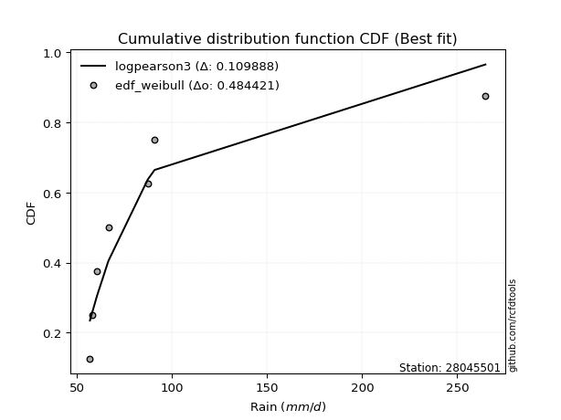</img>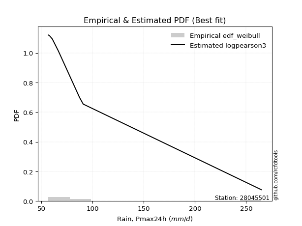</img>

</div>


### 4. EDF Beard (1943)

The Beard formula (or Beard´s plotting position formula) in hydrology is used to estimate the empirical non-exceedance probability _(P)_ of a flood event (or other extreme hydrological data point) within a given dataset.

<div align="center">


$P=(m-0.31)/(n+0.38)$


</div>


**4.1. Empirical values**

<div align="center">

|                | 0                   | 1                   | 2                   | 3         | 4                  | 5                  | 6                  |
|:---------------|:--------------------|:--------------------|:--------------------|:----------|:-------------------|:-------------------|:-------------------|
| date           | 2023                | 2018                | 2020                | 2021      | 2022               | 2017               | 2019               |
| x              | 56.8                | 57.8                | 60.6                | 66.5      | 87.2               | 90.8               | 264.9              |
| m              | 1                   | 2                   | 3                   | 4         | 5                  | 6                  | 7                  |
| empirical_dist | edf_beard           | edf_beard           | edf_beard           | edf_beard | edf_beard          | edf_beard          | edf_beard          |
| empirical      | 0.09349593495934959 | 0.22899728997289973 | 0.36449864498644985 | 0.5       | 0.6355013550135502 | 0.7710027100271003 | 0.9065040650406505 |
| empirical_tr   | 1.1031390134529149  | 1.29701230228471    | 1.5735607675906182  | 2.0       | 2.743494423791822  | 4.366863905325444  | 10.695652173913055 |

</div>


**4.2. Kolmogorov-Smirnov fit test (sorted by Δ)**


<div align="center">

|                | 0                   | 1                   | 2                   | 3                   | 4                   | 5                   | 6                   | 7                   | 8                   | 9                   | 10                  | 11                  | 12                  | 13                  | 14                  | 15                  | 16                  | 17                  | 18                  | 19                  | 20                  | 21                  | 22                  | 23                  | 24                  | 25                  | 26                  | 27                  | 28                  | 29                  | 30                  | 31                  | 32                  | 33                  | 34                  | 35                  | 36                  | 37                  | 38                  | 39                  | 40                  | 41                  | 42                  | 43                  | 44                  | 45                  | 46                  | 47                  | 48                  | 49                  | 50                  | 51                  | 52                  | 53                  | 54                  | 55                  | 56                  | 57                  | 58                  | 59                  | 60                  | 61                  | 62                  | 63                  | 64                  | 65                  | 66                  | 67                  | 68                  | 69                  | 70                  | 71                  | 72                  | 73                  | 74                  | 75                  | 76                  | 77                  | 78                  | 79                  | 80                  | 81                  | 82                  | 83                  | 84                  | 85                  | 86                  | 87                  | 88                  | 89                  | 90                  | 91                  | 92                  | 93                  | 94                  | 95                  | 96                  | 97                  | 98                  | 99                  | 100                 | 101                 | 102                 | 103                 | 104                 | 105                 | 106                 | 107                 | 108                 | 109                 | 110                 | 111                 | 112                 | 113                 | 114                 | 115                 | 116                 | 117                 | 118                 | 119                 | 120                 | 121                 | 122                 | 123                 | 124                 | 125                 | 126                 | 127                 | 128                 | 129                 | 130                 | 131                 | 132                 | 133                 | 134                 | 135                 | 136                 | 137                 | 138                 | 139                 | 140                 | 141                 | 142                 | 143                 | 144                 | 145                 | 146                 | 147                 | 148                 | 149                 | 150                 | 151                 | 152                 | 153                 | 154                 | 155                 | 156                 | 157                 | 158                 | 159                 |
|:---------------|:--------------------|:--------------------|:--------------------|:--------------------|:--------------------|:--------------------|:--------------------|:--------------------|:--------------------|:--------------------|:--------------------|:--------------------|:--------------------|:--------------------|:--------------------|:--------------------|:--------------------|:--------------------|:--------------------|:--------------------|:--------------------|:--------------------|:--------------------|:--------------------|:--------------------|:--------------------|:--------------------|:--------------------|:--------------------|:--------------------|:--------------------|:--------------------|:--------------------|:--------------------|:--------------------|:--------------------|:--------------------|:--------------------|:--------------------|:--------------------|:--------------------|:--------------------|:--------------------|:--------------------|:--------------------|:--------------------|:--------------------|:--------------------|:--------------------|:--------------------|:--------------------|:--------------------|:--------------------|:--------------------|:--------------------|:--------------------|:--------------------|:--------------------|:--------------------|:--------------------|:--------------------|:--------------------|:--------------------|:--------------------|:--------------------|:--------------------|:--------------------|:--------------------|:--------------------|:--------------------|:--------------------|:--------------------|:--------------------|:--------------------|:--------------------|:--------------------|:--------------------|:--------------------|:--------------------|:--------------------|:--------------------|:--------------------|:--------------------|:--------------------|:--------------------|:--------------------|:--------------------|:--------------------|:--------------------|:--------------------|:--------------------|:--------------------|:--------------------|:--------------------|:--------------------|:--------------------|:--------------------|:--------------------|:--------------------|:--------------------|:--------------------|:--------------------|:--------------------|:--------------------|:--------------------|:--------------------|:--------------------|:--------------------|:--------------------|:--------------------|:--------------------|:--------------------|:--------------------|:--------------------|:--------------------|:--------------------|:--------------------|:--------------------|:--------------------|:--------------------|:--------------------|:--------------------|:--------------------|:--------------------|:--------------------|:--------------------|:--------------------|:--------------------|:--------------------|:--------------------|:--------------------|:--------------------|:--------------------|:--------------------|:--------------------|:--------------------|:--------------------|:--------------------|:--------------------|:--------------------|:--------------------|:--------------------|:--------------------|:--------------------|:--------------------|:--------------------|:--------------------|:--------------------|:--------------------|:--------------------|:--------------------|:--------------------|:--------------------|:--------------------|:--------------------|:--------------------|:--------------------|:--------------------|:--------------------|:--------------------|
| station        | 28045501            | 28045501            | 28045501            | 28045501            | 28045501            | 28045501            | 28045501            | 28045501            | 28045501            | 28045501            | 28045501            | 28045501            | 28045501            | 28045501            | 28045501            | 28045501            | 28045501            | 28045501            | 28045501            | 28045501            | 28045501            | 28045501            | 28045501            | 28045501            | 28045501            | 28045501            | 28045501            | 28045501            | 28045501            | 28045501            | 28045501            | 28045501            | 28045501            | 28045501            | 28045501            | 28045501            | 28045501            | 28045501            | 28045501            | 28045501            | 28045501            | 28045501            | 28045501            | 28045501            | 28045501            | 28045501            | 28045501            | 28045501            | 28045501            | 28045501            | 28045501            | 28045501            | 28045501            | 28045501            | 28045501            | 28045501            | 28045501            | 28045501            | 28045501            | 28045501            | 28045501            | 28045501            | 28045501            | 28045501            | 28045501            | 28045501            | 28045501            | 28045501            | 28045501            | 28045501            | 28045501            | 28045501            | 28045501            | 28045501            | 28045501            | 28045501            | 28045501            | 28045501            | 28045501            | 28045501            | 28045501            | 28045501            | 28045501            | 28045501            | 28045501            | 28045501            | 28045501            | 28045501            | 28045501            | 28045501            | 28045501            | 28045501            | 28045501            | 28045501            | 28045501            | 28045501            | 28045501            | 28045501            | 28045501            | 28045501            | 28045501            | 28045501            | 28045501            | 28045501            | 28045501            | 28045501            | 28045501            | 28045501            | 28045501            | 28045501            | 28045501            | 28045501            | 28045501            | 28045501            | 28045501            | 28045501            | 28045501            | 28045501            | 28045501            | 28045501            | 28045501            | 28045501            | 28045501            | 28045501            | 28045501            | 28045501            | 28045501            | 28045501            | 28045501            | 28045501            | 28045501            | 28045501            | 28045501            | 28045501            | 28045501            | 28045501            | 28045501            | 28045501            | 28045501            | 28045501            | 28045501            | 28045501            | 28045501            | 28045501            | 28045501            | 28045501            | 28045501            | 28045501            | 28045501            | 28045501            | 28045501            | 28045501            | 28045501            | 28045501            | 28045501            | 28045501            | 28045501            | 28045501            | 28045501            | 28045501            |
| empirical_dist | edf_beard           | edf_beard           | edf_beard           | edf_beard           | edf_beard           | edf_beard           | edf_beard           | edf_beard           | edf_beard           | edf_beard           | edf_beard           | edf_beard           | edf_beard           | edf_beard           | edf_beard           | edf_beard           | edf_beard           | edf_beard           | edf_beard           | edf_beard           | edf_beard           | edf_beard           | edf_beard           | edf_beard           | edf_beard           | edf_beard           | edf_beard           | edf_beard           | edf_beard           | edf_beard           | edf_beard           | edf_beard           | edf_beard           | edf_beard           | edf_beard           | edf_beard           | edf_beard           | edf_beard           | edf_beard           | edf_beard           | edf_beard           | edf_beard           | edf_beard           | edf_beard           | edf_beard           | edf_beard           | edf_beard           | edf_beard           | edf_beard           | edf_beard           | edf_beard           | edf_beard           | edf_beard           | edf_beard           | edf_beard           | edf_beard           | edf_beard           | edf_beard           | edf_beard           | edf_beard           | edf_beard           | edf_beard           | edf_beard           | edf_beard           | edf_beard           | edf_beard           | edf_beard           | edf_beard           | edf_beard           | edf_beard           | edf_beard           | edf_beard           | edf_beard           | edf_beard           | edf_beard           | edf_beard           | edf_beard           | edf_beard           | edf_beard           | edf_beard           | edf_beard           | edf_beard           | edf_beard           | edf_beard           | edf_beard           | edf_beard           | edf_beard           | edf_beard           | edf_beard           | edf_beard           | edf_beard           | edf_beard           | edf_beard           | edf_beard           | edf_beard           | edf_beard           | edf_beard           | edf_beard           | edf_beard           | edf_beard           | edf_beard           | edf_beard           | edf_beard           | edf_beard           | edf_beard           | edf_beard           | edf_beard           | edf_beard           | edf_beard           | edf_beard           | edf_beard           | edf_beard           | edf_beard           | edf_beard           | edf_beard           | edf_beard           | edf_beard           | edf_beard           | edf_beard           | edf_beard           | edf_beard           | edf_beard           | edf_beard           | edf_beard           | edf_beard           | edf_beard           | edf_beard           | edf_beard           | edf_beard           | edf_beard           | edf_beard           | edf_beard           | edf_beard           | edf_beard           | edf_beard           | edf_beard           | edf_beard           | edf_beard           | edf_beard           | edf_beard           | edf_beard           | edf_beard           | edf_beard           | edf_beard           | edf_beard           | edf_beard           | edf_beard           | edf_beard           | edf_beard           | edf_beard           | edf_beard           | edf_beard           | edf_beard           | edf_beard           | edf_beard           | edf_beard           | edf_beard           | edf_beard           | edf_beard           | edf_beard           |
| p_dist         | logf                | lognakagami         | gausshyper          | logweibull_min      | erlang              | betaprime           | logncf              | logmielke           | loginvweibull       | loggenextreme       | truncpareto         | logburr             | logbetaprime        | halfgennorm         | truncweibull_min    | gamma               | genpareto           | logwald             | f                   | invgamma            | logmoyal            | loggumbel_r         | loginvgamma         | nakagami            | logbradford         | logtruncpareto      | logpearson3         | logvonmises_line    | loghalflogistic     | invgauss            | logweibull_max      | loghalfgennorm      | loggenlogistic      | loginvgauss         | lognct              | lograyleigh         | logalpha            | nct                 | loggengamma         | logerlang           | loghalfnorm         | logmaxwell          | burr                | logfoldnorm         | alpha               | loggamma            | loggamma            | wald                | ncf                 | logburr12           | burr12              | loglogistic         | logkstwobign        | loglomax            | loggennorm          | lognorm             | logcrystalball      | logloglaplace       | genlogistic         | exponpow            | logloggamma         | loghypsecant        | logexponnorm        | logdweibull         | loggenexpon         | loganglit           | logt                | logsemicircular     | moyal               | vonmises_line       | logdgamma           | logrice             | logbeta             | johnsonsu           | logarcsine          | loglaplace          | loglaplace          | loggompertz         | halflogistic        | pearson3            | logtruncnorm        | gumbel_r            | halfnorm            | t                   | rayleigh            | loggumbel_l         | lomax               | loggausshyper       | genextreme          | powerlaw            | maxwell             | foldnorm            | exponnorm           | logpowerlaw         | genexpon            | logcosine           | logtruncweibull_min | logexponpow         | arcsine             | kstwobign           | logwrapcauchy       | weibull_min         | wrapcauchy          | semicircular        | logskewnorm         | anglit              | logexponweib        | norm                | crystalball         | logistic            | hypsecant           | gengamma            | dweibull            | kappa3              | laplace             | logkappa4           | rice                | exponweib           | fatiguelife         | logtruncexpon       | loglevy_l           | truncnorm           | dgamma              | gennorm             | loggenpareto        | logfatiguelife      | levy_l              | gumbel_l            | logargus            | cosine              | gompertz            | invweibull          | logtriang           | logksone            | logrdist            | skewnorm            | logtukeylambda      | loguniform          | logkappa3           | argus               | triang              | truncexpon          | johnsonsb           | tukeylambda         | rdist               | loggenhalflogistic  | ksone               | bradford            | logjohnsonsb        | kappa4              | beta                | uniform             | genhalflogistic     | logtrapezoid        | weibull_max         | logjohnsonsu        | trapezoid           | logvonmises         | vonmises            | mielke              |
| delta          | 0.09257375301606537 | 0.09336433798512876 | 0.09347355434114743 | 0.09349342675825484 | 0.0934956599669967  | 0.10134779458921979 | 0.1077156444756956  | 0.11088630755118983 | 0.1124015642755789  | 0.11241016291564931 | 0.11389633477401202 | 0.11460873443486919 | 0.11610651963726049 | 0.11850653216811535 | 0.11858221561470439 | 0.11885214885747897 | 0.12262110608224008 | 0.12462073483295472 | 0.12476026172431776 | 0.1247617114974211  | 0.12506846884635037 | 0.13365457709697603 | 0.13735982537502744 | 0.13836568625854054 | 0.13890066085165875 | 0.1405798962860676  | 0.1413918180471842  | 0.14997063645287334 | 0.15100945563624768 | 0.1576811578314089  | 0.15812366275184392 | 0.15832629661247166 | 0.16077263032856692 | 0.162845770545483   | 0.16400209093354146 | 0.16446193868945513 | 0.16531696971442345 | 0.17106234067790338 | 0.17163606727208547 | 0.17258728477861407 | 0.17313838113094937 | 0.17369369649292632 | 0.17888134398374966 | 0.1799913615942465  | 0.18308151297868414 | 0.18530192773400822 | 0.18530192773400822 | 0.18646181560421693 | 0.18758577526996845 | 0.18924407339648852 | 0.1900703320440422  | 0.1937331960457067  | 0.1956337704641088  | 0.2004515616799147  | 0.20127128224391078 | 0.20280796107863708 | 0.20280796733112527 | 0.20331936075164347 | 0.2038668771417983  | 0.2050898593860878  | 0.20591392904083494 | 0.2066592192561818  | 0.20717591691603682 | 0.20854015706844847 | 0.2086701398215697  | 0.2124174108265765  | 0.21544828882299372 | 0.21639027770212493 | 0.21757909372821604 | 0.21766289271400285 | 0.2200082947316705  | 0.22130361977714297 | 0.2238662029212893  | 0.23028262019170037 | 0.23224267496299944 | 0.23384338338559868 | 0.23384338338559868 | 0.24055754214643899 | 0.2408552644298067  | 0.24128528196439308 | 0.24287914243738454 | 0.24317347038833903 | 0.2478919891534011  | 0.25962088656452154 | 0.26522077548094913 | 0.267665991085542   | 0.2683077066817189  | 0.27069738326551607 | 0.27140982671       | 0.2719663824948073  | 0.2769757019566611  | 0.2776083433226205  | 0.287066654430586   | 0.28763459922303647 | 0.2893478817531812  | 0.2896959555614296  | 0.29037002705220694 | 0.29258714883949355 | 0.29371983991610623 | 0.2971083253509521  | 0.2979745251815541  | 0.2981279533189244  | 0.3003101426958405  | 0.30308874981490225 | 0.3032595689847401  | 0.3054472442218888  | 0.3080396901553011  | 0.3111655399007853  | 0.31116554462078755 | 0.3166033167377407  | 0.3212151298614856  | 0.3223596801363494  | 0.3344550143849882  | 0.33606349915965705 | 0.3374587399875053  | 0.3388168729762634  | 0.3409723556910613  | 0.3410741261435658  | 0.3414465732007913  | 0.342876740359921   | 0.36278690300320426 | 0.36356426779123746 | 0.3659736859377979  | 0.366101390904994   | 0.3668047735472692  | 0.3694508753132486  | 0.3777016737145178  | 0.38158525012893324 | 0.38943255842216895 | 0.393656872036893   | 0.4152974497464084  | 0.42725743398054106 | 0.43362540675083927 | 0.4337846385248448  | 0.4369689022507087  | 0.4441977398983675  | 0.46128614216057684 | 0.4663410242243937  | 0.46688498360507114 | 0.4712619102718989  | 0.5112257381695406  | 0.5131886696917152  | 0.5170906793267551  | 0.5262063499831344  | 0.5274947621985996  | 0.5324399637072986  | 0.5515168859040824  | 0.5664366894540999  | 0.5760077440678588  | 0.5774249103558267  | 0.5994273671209484  | 0.6076197210794789  | 0.642051114172067   | 0.6572866822794     | 0.6745701334721856  | 0.6856682129239505  | 0.72282868303614    | 1.1421905657668974  | 41.54499099710457   | nan                 |
| deltao         | 0.48442053926100004 | 0.48442053926100004 | 0.48442053926100004 | 0.48442053926100004 | 0.48442053926100004 | 0.48442053926100004 | 0.48442053926100004 | 0.48442053926100004 | 0.48442053926100004 | 0.48442053926100004 | 0.48442053926100004 | 0.48442053926100004 | 0.48442053926100004 | 0.48442053926100004 | 0.48442053926100004 | 0.48442053926100004 | 0.48442053926100004 | 0.48442053926100004 | 0.48442053926100004 | 0.48442053926100004 | 0.48442053926100004 | 0.48442053926100004 | 0.48442053926100004 | 0.48442053926100004 | 0.48442053926100004 | 0.48442053926100004 | 0.48442053926100004 | 0.48442053926100004 | 0.48442053926100004 | 0.48442053926100004 | 0.48442053926100004 | 0.48442053926100004 | 0.48442053926100004 | 0.48442053926100004 | 0.48442053926100004 | 0.48442053926100004 | 0.48442053926100004 | 0.48442053926100004 | 0.48442053926100004 | 0.48442053926100004 | 0.48442053926100004 | 0.48442053926100004 | 0.48442053926100004 | 0.48442053926100004 | 0.48442053926100004 | 0.48442053926100004 | 0.48442053926100004 | 0.48442053926100004 | 0.48442053926100004 | 0.48442053926100004 | 0.48442053926100004 | 0.48442053926100004 | 0.48442053926100004 | 0.48442053926100004 | 0.48442053926100004 | 0.48442053926100004 | 0.48442053926100004 | 0.48442053926100004 | 0.48442053926100004 | 0.48442053926100004 | 0.48442053926100004 | 0.48442053926100004 | 0.48442053926100004 | 0.48442053926100004 | 0.48442053926100004 | 0.48442053926100004 | 0.48442053926100004 | 0.48442053926100004 | 0.48442053926100004 | 0.48442053926100004 | 0.48442053926100004 | 0.48442053926100004 | 0.48442053926100004 | 0.48442053926100004 | 0.48442053926100004 | 0.48442053926100004 | 0.48442053926100004 | 0.48442053926100004 | 0.48442053926100004 | 0.48442053926100004 | 0.48442053926100004 | 0.48442053926100004 | 0.48442053926100004 | 0.48442053926100004 | 0.48442053926100004 | 0.48442053926100004 | 0.48442053926100004 | 0.48442053926100004 | 0.48442053926100004 | 0.48442053926100004 | 0.48442053926100004 | 0.48442053926100004 | 0.48442053926100004 | 0.48442053926100004 | 0.48442053926100004 | 0.48442053926100004 | 0.48442053926100004 | 0.48442053926100004 | 0.48442053926100004 | 0.48442053926100004 | 0.48442053926100004 | 0.48442053926100004 | 0.48442053926100004 | 0.48442053926100004 | 0.48442053926100004 | 0.48442053926100004 | 0.48442053926100004 | 0.48442053926100004 | 0.48442053926100004 | 0.48442053926100004 | 0.48442053926100004 | 0.48442053926100004 | 0.48442053926100004 | 0.48442053926100004 | 0.48442053926100004 | 0.48442053926100004 | 0.48442053926100004 | 0.48442053926100004 | 0.48442053926100004 | 0.48442053926100004 | 0.48442053926100004 | 0.48442053926100004 | 0.48442053926100004 | 0.48442053926100004 | 0.48442053926100004 | 0.48442053926100004 | 0.48442053926100004 | 0.48442053926100004 | 0.48442053926100004 | 0.48442053926100004 | 0.48442053926100004 | 0.48442053926100004 | 0.48442053926100004 | 0.48442053926100004 | 0.48442053926100004 | 0.48442053926100004 | 0.48442053926100004 | 0.48442053926100004 | 0.48442053926100004 | 0.48442053926100004 | 0.48442053926100004 | 0.48442053926100004 | 0.48442053926100004 | 0.48442053926100004 | 0.48442053926100004 | 0.48442053926100004 | 0.48442053926100004 | 0.48442053926100004 | 0.48442053926100004 | 0.48442053926100004 | 0.48442053926100004 | 0.48442053926100004 | 0.48442053926100004 | 0.48442053926100004 | 0.48442053926100004 | 0.48442053926100004 | 0.48442053926100004 | 0.48442053926100004 | 0.48442053926100004 | 0.48442053926100004 |
| eval           | Δo > Δ              | Δo > Δ              | Δo > Δ              | Δo > Δ              | Δo > Δ              | Δo > Δ              | Δo > Δ              | Δo > Δ              | Δo > Δ              | Δo > Δ              | Δo > Δ              | Δo > Δ              | Δo > Δ              | Δo > Δ              | Δo > Δ              | Δo > Δ              | Δo > Δ              | Δo > Δ              | Δo > Δ              | Δo > Δ              | Δo > Δ              | Δo > Δ              | Δo > Δ              | Δo > Δ              | Δo > Δ              | Δo > Δ              | Δo > Δ              | Δo > Δ              | Δo > Δ              | Δo > Δ              | Δo > Δ              | Δo > Δ              | Δo > Δ              | Δo > Δ              | Δo > Δ              | Δo > Δ              | Δo > Δ              | Δo > Δ              | Δo > Δ              | Δo > Δ              | Δo > Δ              | Δo > Δ              | Δo > Δ              | Δo > Δ              | Δo > Δ              | Δo > Δ              | Δo > Δ              | Δo > Δ              | Δo > Δ              | Δo > Δ              | Δo > Δ              | Δo > Δ              | Δo > Δ              | Δo > Δ              | Δo > Δ              | Δo > Δ              | Δo > Δ              | Δo > Δ              | Δo > Δ              | Δo > Δ              | Δo > Δ              | Δo > Δ              | Δo > Δ              | Δo > Δ              | Δo > Δ              | Δo > Δ              | Δo > Δ              | Δo > Δ              | Δo > Δ              | Δo > Δ              | Δo > Δ              | Δo > Δ              | Δo > Δ              | Δo > Δ              | Δo > Δ              | Δo > Δ              | Δo > Δ              | Δo > Δ              | Δo > Δ              | Δo > Δ              | Δo > Δ              | Δo > Δ              | Δo > Δ              | Δo > Δ              | Δo > Δ              | Δo > Δ              | Δo > Δ              | Δo > Δ              | Δo > Δ              | Δo > Δ              | Δo > Δ              | Δo > Δ              | Δo > Δ              | Δo > Δ              | Δo > Δ              | Δo > Δ              | Δo > Δ              | Δo > Δ              | Δo > Δ              | Δo > Δ              | Δo > Δ              | Δo > Δ              | Δo > Δ              | Δo > Δ              | Δo > Δ              | Δo > Δ              | Δo > Δ              | Δo > Δ              | Δo > Δ              | Δo > Δ              | Δo > Δ              | Δo > Δ              | Δo > Δ              | Δo > Δ              | Δo > Δ              | Δo > Δ              | Δo > Δ              | Δo > Δ              | Δo > Δ              | Δo > Δ              | Δo > Δ              | Δo > Δ              | Δo > Δ              | Δo > Δ              | Δo > Δ              | Δo > Δ              | Δo > Δ              | Δo > Δ              | Δo > Δ              | Δo > Δ              | Δo > Δ              | Δo > Δ              | Δo > Δ              | Δo > Δ              | Δo > Δ              | Δo > Δ              | Δo > Δ              | Δo > Δ              | Δo > Δ              | Δo > Δ              | Δo <= Δ             | Δo <= Δ             | Δo <= Δ             | Δo <= Δ             | Δo <= Δ             | Δo <= Δ             | Δo <= Δ             | Δo <= Δ             | Δo <= Δ             | Δo <= Δ             | Δo <= Δ             | Δo <= Δ             | Δo <= Δ             | Δo <= Δ             | Δo <= Δ             | Δo <= Δ             | Δo <= Δ             | Δo <= Δ             | Δo <= Δ             | Δo <= Δ             |
| fit            | 1                   | 1                   | 1                   | 1                   | 1                   | 1                   | 1                   | 1                   | 1                   | 1                   | 1                   | 1                   | 1                   | 1                   | 1                   | 1                   | 1                   | 1                   | 1                   | 1                   | 1                   | 1                   | 1                   | 1                   | 1                   | 1                   | 1                   | 1                   | 1                   | 1                   | 1                   | 1                   | 1                   | 1                   | 1                   | 1                   | 1                   | 1                   | 1                   | 1                   | 1                   | 1                   | 1                   | 1                   | 1                   | 1                   | 1                   | 1                   | 1                   | 1                   | 1                   | 1                   | 1                   | 1                   | 1                   | 1                   | 1                   | 1                   | 1                   | 1                   | 1                   | 1                   | 1                   | 1                   | 1                   | 1                   | 1                   | 1                   | 1                   | 1                   | 1                   | 1                   | 1                   | 1                   | 1                   | 1                   | 1                   | 1                   | 1                   | 1                   | 1                   | 1                   | 1                   | 1                   | 1                   | 1                   | 1                   | 1                   | 1                   | 1                   | 1                   | 1                   | 1                   | 1                   | 1                   | 1                   | 1                   | 1                   | 1                   | 1                   | 1                   | 1                   | 1                   | 1                   | 1                   | 1                   | 1                   | 1                   | 1                   | 1                   | 1                   | 1                   | 1                   | 1                   | 1                   | 1                   | 1                   | 1                   | 1                   | 1                   | 1                   | 1                   | 1                   | 1                   | 1                   | 1                   | 1                   | 1                   | 1                   | 1                   | 1                   | 1                   | 1                   | 1                   | 1                   | 1                   | 1                   | 1                   | 1                   | 1                   | 0                   | 0                   | 0                   | 0                   | 0                   | 0                   | 0                   | 0                   | 0                   | 0                   | 0                   | 0                   | 0                   | 0                   | 0                   | 0                   | 0                   | 0                   | 0                   | 0                   |
| n              | 7                   | 7                   | 7                   | 7                   | 7                   | 7                   | 7                   | 7                   | 7                   | 7                   | 7                   | 7                   | 7                   | 7                   | 7                   | 7                   | 7                   | 7                   | 7                   | 7                   | 7                   | 7                   | 7                   | 7                   | 7                   | 7                   | 7                   | 7                   | 7                   | 7                   | 7                   | 7                   | 7                   | 7                   | 7                   | 7                   | 7                   | 7                   | 7                   | 7                   | 7                   | 7                   | 7                   | 7                   | 7                   | 7                   | 7                   | 7                   | 7                   | 7                   | 7                   | 7                   | 7                   | 7                   | 7                   | 7                   | 7                   | 7                   | 7                   | 7                   | 7                   | 7                   | 7                   | 7                   | 7                   | 7                   | 7                   | 7                   | 7                   | 7                   | 7                   | 7                   | 7                   | 7                   | 7                   | 7                   | 7                   | 7                   | 7                   | 7                   | 7                   | 7                   | 7                   | 7                   | 7                   | 7                   | 7                   | 7                   | 7                   | 7                   | 7                   | 7                   | 7                   | 7                   | 7                   | 7                   | 7                   | 7                   | 7                   | 7                   | 7                   | 7                   | 7                   | 7                   | 7                   | 7                   | 7                   | 7                   | 7                   | 7                   | 7                   | 7                   | 7                   | 7                   | 7                   | 7                   | 7                   | 7                   | 7                   | 7                   | 7                   | 7                   | 7                   | 7                   | 7                   | 7                   | 7                   | 7                   | 7                   | 7                   | 7                   | 7                   | 7                   | 7                   | 7                   | 7                   | 7                   | 7                   | 7                   | 7                   | 7                   | 7                   | 7                   | 7                   | 7                   | 7                   | 7                   | 7                   | 7                   | 7                   | 7                   | 7                   | 7                   | 7                   | 7                   | 7                   | 7                   | 7                   | 7                   | 7                   |
| best_fit       | 1                   | 0                   | 0                   | 0                   | 0                   | 0                   | 0                   | 0                   | 0                   | 0                   | 0                   | 0                   | 0                   | 0                   | 0                   | 0                   | 0                   | 0                   | 0                   | 0                   | 0                   | 0                   | 0                   | 0                   | 0                   | 0                   | 0                   | 0                   | 0                   | 0                   | 0                   | 0                   | 0                   | 0                   | 0                   | 0                   | 0                   | 0                   | 0                   | 0                   | 0                   | 0                   | 0                   | 0                   | 0                   | 0                   | 0                   | 0                   | 0                   | 0                   | 0                   | 0                   | 0                   | 0                   | 0                   | 0                   | 0                   | 0                   | 0                   | 0                   | 0                   | 0                   | 0                   | 0                   | 0                   | 0                   | 0                   | 0                   | 0                   | 0                   | 0                   | 0                   | 0                   | 0                   | 0                   | 0                   | 0                   | 0                   | 0                   | 0                   | 0                   | 0                   | 0                   | 0                   | 0                   | 0                   | 0                   | 0                   | 0                   | 0                   | 0                   | 0                   | 0                   | 0                   | 0                   | 0                   | 0                   | 0                   | 0                   | 0                   | 0                   | 0                   | 0                   | 0                   | 0                   | 0                   | 0                   | 0                   | 0                   | 0                   | 0                   | 0                   | 0                   | 0                   | 0                   | 0                   | 0                   | 0                   | 0                   | 0                   | 0                   | 0                   | 0                   | 0                   | 0                   | 0                   | 0                   | 0                   | 0                   | 0                   | 0                   | 0                   | 0                   | 0                   | 0                   | 0                   | 0                   | 0                   | 0                   | 0                   | 0                   | 0                   | 0                   | 0                   | 0                   | 0                   | 0                   | 0                   | 0                   | 0                   | 0                   | 0                   | 0                   | 0                   | 0                   | 0                   | 0                   | 0                   | 0                   | 0                   |
| best_fit_sort  | 1                   | 2                   | 3                   | 4                   | 5                   | 6                   | 7                   | 8                   | 9                   | 10                  | 11                  | 12                  | 13                  | 14                  | 15                  | 16                  | 17                  | 18                  | 19                  | 20                  | 21                  | 22                  | 23                  | 24                  | 25                  | 26                  | 27                  | 28                  | 29                  | 30                  | 31                  | 32                  | 33                  | 34                  | 35                  | 36                  | 37                  | 38                  | 39                  | 40                  | 41                  | 42                  | 43                  | 44                  | 45                  | 46                  | 47                  | 48                  | 49                  | 50                  | 51                  | 52                  | 53                  | 54                  | 55                  | 56                  | 57                  | 58                  | 59                  | 60                  | 61                  | 62                  | 63                  | 64                  | 65                  | 66                  | 67                  | 68                  | 69                  | 70                  | 71                  | 72                  | 73                  | 74                  | 75                  | 76                  | 77                  | 78                  | 79                  | 80                  | 81                  | 82                  | 83                  | 84                  | 85                  | 86                  | 87                  | 88                  | 89                  | 90                  | 91                  | 92                  | 93                  | 94                  | 95                  | 96                  | 97                  | 98                  | 99                  | 100                 | 101                 | 102                 | 103                 | 104                 | 105                 | 106                 | 107                 | 108                 | 109                 | 110                 | 111                 | 112                 | 113                 | 114                 | 115                 | 116                 | 117                 | 118                 | 119                 | 120                 | 121                 | 122                 | 123                 | 124                 | 125                 | 126                 | 127                 | 128                 | 129                 | 130                 | 131                 | 132                 | 133                 | 134                 | 135                 | 136                 | 137                 | 138                 | 139                 | 140                 | 141                 | 142                 | 143                 | 144                 | 145                 | 146                 | 147                 | 148                 | 149                 | 150                 | 151                 | 152                 | 153                 | 154                 | 155                 | 156                 | 157                 | 158                 | 159                 | 160                 |

</div>


**4.3. Best fit**

<div align="center">

|   id |   station | empirical_dist   | p_dist   |     delta |   deltao | eval   |   fit |   n |   best_fit |   best_fit_sort |
|-----:|----------:|:-----------------|:---------|----------:|---------:|:-------|------:|----:|-----------:|----------------:|
|    0 |  28045501 | edf_beard        | logf     | 0.0925738 | 0.484421 | Δo > Δ |     1 |   7 |          1 |               1 |

</div>


<div align="center">

</img>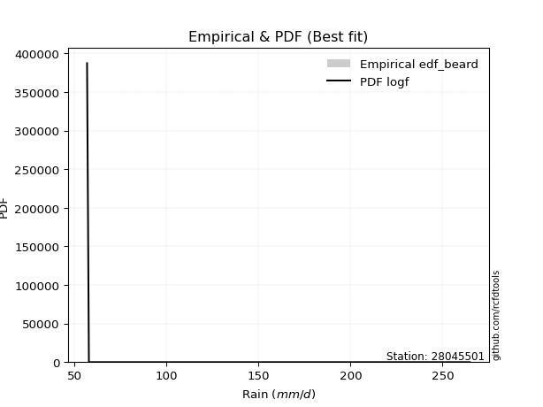</img>

</div>


### 5. EDF Chegodayev (1955)

The Chegodayev formula is an empirical plotting position formula used in hydrological frequency analysis to estimate the exceedance probability or return period of a specific event from a set of observed data. It is primarily used for plotting observed data points on probability paper to fit a theoretical distribution, particularly for analyzing extreme events like maximum flood flows or rainfall intensities. The constant _b_ value in the generalized plotting position formula is 0.3.

<div align="center">


$P=(m-b)/(n+1-2b)$


</div>


**5.1. Empirical values**

<div align="center">

|                | 0                   | 1                   | 2                   | 3              | 4                  | 5                  | 6                  |
|:---------------|:--------------------|:--------------------|:--------------------|:---------------|:-------------------|:-------------------|:-------------------|
| date           | 2023                | 2018                | 2020                | 2021           | 2022               | 2017               | 2019               |
| x              | 56.8                | 57.8                | 60.6                | 66.5           | 87.2               | 90.8               | 264.9              |
| m              | 1                   | 2                   | 3                   | 4              | 5                  | 6                  | 7                  |
| empirical_dist | edf_chegodayev      | edf_chegodayev      | edf_chegodayev      | edf_chegodayev | edf_chegodayev     | edf_chegodayev     | edf_chegodayev     |
| empirical      | 0.09459459459459459 | 0.22972972972972971 | 0.36486486486486486 | 0.5            | 0.6351351351351351 | 0.7702702702702703 | 0.9054054054054054 |
| empirical_tr   | 1.1044776119402986  | 1.2982456140350878  | 1.574468085106383   | 2.0            | 2.7407407407407405 | 4.352941176470589  | 10.571428571428568 |

</div>


**5.2. Kolmogorov-Smirnov fit test (sorted by Δ)**


<div align="center">

|                | 0                   | 1                   | 2                   | 3                   | 4                   | 5                   | 6                   | 7                   | 8                   | 9                   | 10                  | 11                  | 12                  | 13                  | 14                  | 15                  | 16                  | 17                  | 18                  | 19                  | 20                  | 21                  | 22                  | 23                  | 24                  | 25                  | 26                  | 27                  | 28                  | 29                  | 30                  | 31                  | 32                  | 33                  | 34                  | 35                  | 36                  | 37                  | 38                  | 39                  | 40                  | 41                  | 42                  | 43                  | 44                  | 45                  | 46                  | 47                  | 48                  | 49                  | 50                  | 51                  | 52                  | 53                  | 54                  | 55                  | 56                  | 57                  | 58                  | 59                  | 60                  | 61                  | 62                  | 63                  | 64                  | 65                  | 66                  | 67                  | 68                  | 69                  | 70                  | 71                  | 72                  | 73                  | 74                  | 75                  | 76                  | 77                  | 78                  | 79                  | 80                  | 81                  | 82                  | 83                  | 84                  | 85                  | 86                  | 87                  | 88                  | 89                  | 90                  | 91                  | 92                  | 93                  | 94                  | 95                  | 96                  | 97                  | 98                  | 99                  | 100                 | 101                 | 102                 | 103                 | 104                 | 105                 | 106                 | 107                 | 108                 | 109                 | 110                 | 111                 | 112                 | 113                 | 114                 | 115                 | 116                 | 117                 | 118                 | 119                 | 120                 | 121                 | 122                 | 123                 | 124                 | 125                 | 126                 | 127                 | 128                 | 129                 | 130                 | 131                 | 132                 | 133                 | 134                 | 135                 | 136                 | 137                 | 138                 | 139                 | 140                 | 141                 | 142                 | 143                 | 144                 | 145                 | 146                 | 147                 | 148                 | 149                 | 150                 | 151                 | 152                 | 153                 | 154                 | 155                 | 156                 | 157                 | 158                 | 159                 |
|:---------------|:--------------------|:--------------------|:--------------------|:--------------------|:--------------------|:--------------------|:--------------------|:--------------------|:--------------------|:--------------------|:--------------------|:--------------------|:--------------------|:--------------------|:--------------------|:--------------------|:--------------------|:--------------------|:--------------------|:--------------------|:--------------------|:--------------------|:--------------------|:--------------------|:--------------------|:--------------------|:--------------------|:--------------------|:--------------------|:--------------------|:--------------------|:--------------------|:--------------------|:--------------------|:--------------------|:--------------------|:--------------------|:--------------------|:--------------------|:--------------------|:--------------------|:--------------------|:--------------------|:--------------------|:--------------------|:--------------------|:--------------------|:--------------------|:--------------------|:--------------------|:--------------------|:--------------------|:--------------------|:--------------------|:--------------------|:--------------------|:--------------------|:--------------------|:--------------------|:--------------------|:--------------------|:--------------------|:--------------------|:--------------------|:--------------------|:--------------------|:--------------------|:--------------------|:--------------------|:--------------------|:--------------------|:--------------------|:--------------------|:--------------------|:--------------------|:--------------------|:--------------------|:--------------------|:--------------------|:--------------------|:--------------------|:--------------------|:--------------------|:--------------------|:--------------------|:--------------------|:--------------------|:--------------------|:--------------------|:--------------------|:--------------------|:--------------------|:--------------------|:--------------------|:--------------------|:--------------------|:--------------------|:--------------------|:--------------------|:--------------------|:--------------------|:--------------------|:--------------------|:--------------------|:--------------------|:--------------------|:--------------------|:--------------------|:--------------------|:--------------------|:--------------------|:--------------------|:--------------------|:--------------------|:--------------------|:--------------------|:--------------------|:--------------------|:--------------------|:--------------------|:--------------------|:--------------------|:--------------------|:--------------------|:--------------------|:--------------------|:--------------------|:--------------------|:--------------------|:--------------------|:--------------------|:--------------------|:--------------------|:--------------------|:--------------------|:--------------------|:--------------------|:--------------------|:--------------------|:--------------------|:--------------------|:--------------------|:--------------------|:--------------------|:--------------------|:--------------------|:--------------------|:--------------------|:--------------------|:--------------------|:--------------------|:--------------------|:--------------------|:--------------------|:--------------------|:--------------------|:--------------------|:--------------------|:--------------------|:--------------------|
| station        | 28045501            | 28045501            | 28045501            | 28045501            | 28045501            | 28045501            | 28045501            | 28045501            | 28045501            | 28045501            | 28045501            | 28045501            | 28045501            | 28045501            | 28045501            | 28045501            | 28045501            | 28045501            | 28045501            | 28045501            | 28045501            | 28045501            | 28045501            | 28045501            | 28045501            | 28045501            | 28045501            | 28045501            | 28045501            | 28045501            | 28045501            | 28045501            | 28045501            | 28045501            | 28045501            | 28045501            | 28045501            | 28045501            | 28045501            | 28045501            | 28045501            | 28045501            | 28045501            | 28045501            | 28045501            | 28045501            | 28045501            | 28045501            | 28045501            | 28045501            | 28045501            | 28045501            | 28045501            | 28045501            | 28045501            | 28045501            | 28045501            | 28045501            | 28045501            | 28045501            | 28045501            | 28045501            | 28045501            | 28045501            | 28045501            | 28045501            | 28045501            | 28045501            | 28045501            | 28045501            | 28045501            | 28045501            | 28045501            | 28045501            | 28045501            | 28045501            | 28045501            | 28045501            | 28045501            | 28045501            | 28045501            | 28045501            | 28045501            | 28045501            | 28045501            | 28045501            | 28045501            | 28045501            | 28045501            | 28045501            | 28045501            | 28045501            | 28045501            | 28045501            | 28045501            | 28045501            | 28045501            | 28045501            | 28045501            | 28045501            | 28045501            | 28045501            | 28045501            | 28045501            | 28045501            | 28045501            | 28045501            | 28045501            | 28045501            | 28045501            | 28045501            | 28045501            | 28045501            | 28045501            | 28045501            | 28045501            | 28045501            | 28045501            | 28045501            | 28045501            | 28045501            | 28045501            | 28045501            | 28045501            | 28045501            | 28045501            | 28045501            | 28045501            | 28045501            | 28045501            | 28045501            | 28045501            | 28045501            | 28045501            | 28045501            | 28045501            | 28045501            | 28045501            | 28045501            | 28045501            | 28045501            | 28045501            | 28045501            | 28045501            | 28045501            | 28045501            | 28045501            | 28045501            | 28045501            | 28045501            | 28045501            | 28045501            | 28045501            | 28045501            | 28045501            | 28045501            | 28045501            | 28045501            | 28045501            | 28045501            |
| empirical_dist | edf_chegodayev      | edf_chegodayev      | edf_chegodayev      | edf_chegodayev      | edf_chegodayev      | edf_chegodayev      | edf_chegodayev      | edf_chegodayev      | edf_chegodayev      | edf_chegodayev      | edf_chegodayev      | edf_chegodayev      | edf_chegodayev      | edf_chegodayev      | edf_chegodayev      | edf_chegodayev      | edf_chegodayev      | edf_chegodayev      | edf_chegodayev      | edf_chegodayev      | edf_chegodayev      | edf_chegodayev      | edf_chegodayev      | edf_chegodayev      | edf_chegodayev      | edf_chegodayev      | edf_chegodayev      | edf_chegodayev      | edf_chegodayev      | edf_chegodayev      | edf_chegodayev      | edf_chegodayev      | edf_chegodayev      | edf_chegodayev      | edf_chegodayev      | edf_chegodayev      | edf_chegodayev      | edf_chegodayev      | edf_chegodayev      | edf_chegodayev      | edf_chegodayev      | edf_chegodayev      | edf_chegodayev      | edf_chegodayev      | edf_chegodayev      | edf_chegodayev      | edf_chegodayev      | edf_chegodayev      | edf_chegodayev      | edf_chegodayev      | edf_chegodayev      | edf_chegodayev      | edf_chegodayev      | edf_chegodayev      | edf_chegodayev      | edf_chegodayev      | edf_chegodayev      | edf_chegodayev      | edf_chegodayev      | edf_chegodayev      | edf_chegodayev      | edf_chegodayev      | edf_chegodayev      | edf_chegodayev      | edf_chegodayev      | edf_chegodayev      | edf_chegodayev      | edf_chegodayev      | edf_chegodayev      | edf_chegodayev      | edf_chegodayev      | edf_chegodayev      | edf_chegodayev      | edf_chegodayev      | edf_chegodayev      | edf_chegodayev      | edf_chegodayev      | edf_chegodayev      | edf_chegodayev      | edf_chegodayev      | edf_chegodayev      | edf_chegodayev      | edf_chegodayev      | edf_chegodayev      | edf_chegodayev      | edf_chegodayev      | edf_chegodayev      | edf_chegodayev      | edf_chegodayev      | edf_chegodayev      | edf_chegodayev      | edf_chegodayev      | edf_chegodayev      | edf_chegodayev      | edf_chegodayev      | edf_chegodayev      | edf_chegodayev      | edf_chegodayev      | edf_chegodayev      | edf_chegodayev      | edf_chegodayev      | edf_chegodayev      | edf_chegodayev      | edf_chegodayev      | edf_chegodayev      | edf_chegodayev      | edf_chegodayev      | edf_chegodayev      | edf_chegodayev      | edf_chegodayev      | edf_chegodayev      | edf_chegodayev      | edf_chegodayev      | edf_chegodayev      | edf_chegodayev      | edf_chegodayev      | edf_chegodayev      | edf_chegodayev      | edf_chegodayev      | edf_chegodayev      | edf_chegodayev      | edf_chegodayev      | edf_chegodayev      | edf_chegodayev      | edf_chegodayev      | edf_chegodayev      | edf_chegodayev      | edf_chegodayev      | edf_chegodayev      | edf_chegodayev      | edf_chegodayev      | edf_chegodayev      | edf_chegodayev      | edf_chegodayev      | edf_chegodayev      | edf_chegodayev      | edf_chegodayev      | edf_chegodayev      | edf_chegodayev      | edf_chegodayev      | edf_chegodayev      | edf_chegodayev      | edf_chegodayev      | edf_chegodayev      | edf_chegodayev      | edf_chegodayev      | edf_chegodayev      | edf_chegodayev      | edf_chegodayev      | edf_chegodayev      | edf_chegodayev      | edf_chegodayev      | edf_chegodayev      | edf_chegodayev      | edf_chegodayev      | edf_chegodayev      | edf_chegodayev      | edf_chegodayev      | edf_chegodayev      | edf_chegodayev      |
| p_dist         | logf                | lognakagami         | gausshyper          | logweibull_min      | erlang              | betaprime           | logncf              | logmielke           | loginvweibull       | loggenextreme       | truncpareto         | logburr             | logbetaprime        | truncweibull_min    | halfgennorm         | gamma               | genpareto           | logmoyal            | logwald             | f                   | invgamma            | loggumbel_r         | nakagami            | loginvgamma         | logbradford         | logpearson3         | logtruncpareto      | logvonmises_line    | loghalflogistic     | invgauss            | logweibull_max      | loghalfgennorm      | loggenlogistic      | loginvgauss         | lograyleigh         | lognct              | logalpha            | loggengamma         | nct                 | loghalfnorm         | logerlang           | logmaxwell          | logfoldnorm         | burr                | alpha               | wald                | loggamma            | loggamma            | ncf                 | logburr12           | burr12              | loglogistic         | logkstwobign        | loglomax            | loggennorm          | lognorm             | logcrystalball      | logloglaplace       | genlogistic         | exponpow            | logloggamma         | loghypsecant        | logdweibull         | logexponnorm        | loggenexpon         | loganglit           | logsemicircular     | logt                | vonmises_line       | moyal               | logdgamma           | logrice             | logbeta             | johnsonsu           | logarcsine          | loglaplace          | loglaplace          | halflogistic        | pearson3            | loggompertz         | gumbel_r            | logtruncnorm        | halfnorm            | t                   | rayleigh            | loggumbel_l         | lomax               | loggausshyper       | genextreme          | powerlaw            | maxwell             | foldnorm            | logpowerlaw         | exponnorm           | logcosine           | genexpon            | logtruncweibull_min | logexponpow         | arcsine             | kstwobign           | logwrapcauchy       | weibull_min         | wrapcauchy          | semicircular        | logskewnorm         | anglit              | logexponweib        | norm                | crystalball         | logistic            | hypsecant           | gengamma            | dweibull            | kappa3              | laplace             | logkappa4           | rice                | exponweib           | fatiguelife         | logtruncexpon       | loglevy_l           | truncnorm           | dgamma              | loggenpareto        | gennorm             | logfatiguelife      | levy_l              | gumbel_l            | logargus            | cosine              | gompertz            | invweibull          | logtriang           | logksone            | logrdist            | skewnorm            | logtukeylambda      | loguniform          | logkappa3           | argus               | triang              | truncexpon          | johnsonsb           | tukeylambda         | rdist               | loggenhalflogistic  | ksone               | bradford            | logjohnsonsb        | kappa4              | beta                | uniform             | genhalflogistic     | logtrapezoid        | weibull_max         | logjohnsonsu        | trapezoid           | logvonmises         | vonmises            | mielke              |
| delta          | 0.09367241265131036 | 0.09446299762037376 | 0.09457221397639243 | 0.09459208639349984 | 0.0945943196022417  | 0.10024913495397479 | 0.10808186435411071 | 0.11125252742960484 | 0.11276778415399402 | 0.11277638279406443 | 0.11462877453084201 | 0.1149749543132843  | 0.1164727395156756  | 0.11784977585787437 | 0.11887275204653047 | 0.11921836873589409 | 0.1229873259606552  | 0.12396980921110538 | 0.12498695471136972 | 0.12512648160273288 | 0.12512793137583622 | 0.13292213734014602 | 0.13763324650171055 | 0.13772604525344256 | 0.13926688073007387 | 0.14029315841193923 | 0.14131233604289756 | 0.14887197681762837 | 0.1499107960010027  | 0.15804737770982402 | 0.15812366275184392 | 0.15869251649088678 | 0.16077263032856692 | 0.1632119904238981  | 0.16372949893262512 | 0.16400209093354146 | 0.16568318959283856 | 0.17090362751525545 | 0.17106234067790338 | 0.1720397214957044  | 0.1729535046570292  | 0.1729612567360963  | 0.17889270195900153 | 0.17924756386216478 | 0.18344773285709925 | 0.18536315596897196 | 0.18566814761242334 | 0.18566814761242334 | 0.18685333551313843 | 0.18961029327490353 | 0.1904365519224572  | 0.1930007562888767  | 0.1956337704641088  | 0.20081778155832972 | 0.2016375021223259  | 0.20207552132180706 | 0.20207552757429526 | 0.2022207011163985  | 0.20313443738496828 | 0.2043574196292578  | 0.20518148928400493 | 0.2066592192561818  | 0.2074414974332035  | 0.20754213679445183 | 0.20903635969998471 | 0.21168497106974649 | 0.21565783794529492 | 0.21581450870140884 | 0.21656423307875788 | 0.21684665397138603 | 0.21890963509642553 | 0.22130361977714297 | 0.22313376316445932 | 0.22991640031328536 | 0.23151023520616942 | 0.23384338338559868 | 0.23384338338559868 | 0.23975660479456173 | 0.24018662232914811 | 0.240923762024854   | 0.242441030631509   | 0.24324536231579955 | 0.24679332951815613 | 0.25962088656452154 | 0.2644883357241191  | 0.266933551328712   | 0.2683077066817189  | 0.26996494350868605 | 0.27067738695317    | 0.2712339427379773  | 0.2762432621998311  | 0.27650968368737555 | 0.28690215946620645 | 0.287066654430586   | 0.28896351580459956 | 0.2893478817531812  | 0.2896375872953769  | 0.29185470908266353 | 0.2929874001592762  | 0.2963758855941221  | 0.2972420854247241  | 0.29739551356209437 | 0.2995777029390105  | 0.30235631005807223 | 0.3032595689847401  | 0.3047148044650588  | 0.30694103052005595 | 0.3104331001439553  | 0.31043310486395753 | 0.3158708769809107  | 0.3204826901046556  | 0.3216272403795194  | 0.33335635474974323 | 0.3349648395244119  | 0.3367263002306753  | 0.3380844332194334  | 0.3402399159342313  | 0.3403416863867358  | 0.3407141334439613  | 0.342144300603091   | 0.3616882433679593  | 0.36283182803440744 | 0.3648750263025529  | 0.36570611391202423 | 0.365735171026579   | 0.3687184355564186  | 0.3766030140792728  | 0.3808528103721032  | 0.38870011866533893 | 0.39292443228006296 | 0.4145650099895784  | 0.4261587743452959  | 0.43289296699400925 | 0.43305219876801476 | 0.4362364624938787  | 0.4434653001415375  | 0.4605537024037468  | 0.4656085844675637  | 0.4661525438482411  | 0.4705294705150689  | 0.5104932984127106  | 0.5124562299348852  | 0.5163582395699251  | 0.5251076903478894  | 0.5263961025633546  | 0.5317075239504686  | 0.5507844461472524  | 0.5657042496972698  | 0.5752753043110288  | 0.5766924705989966  | 0.5983287074857033  | 0.6068872813226489  | 0.6413186744152369  | 0.65655424252257    | 0.6738376937153556  | 0.6849357731671205  | 0.72209624327931    | 1.1410919061316525  | 41.54608965673982   | nan                 |
| deltao         | 0.48442053926100004 | 0.48442053926100004 | 0.48442053926100004 | 0.48442053926100004 | 0.48442053926100004 | 0.48442053926100004 | 0.48442053926100004 | 0.48442053926100004 | 0.48442053926100004 | 0.48442053926100004 | 0.48442053926100004 | 0.48442053926100004 | 0.48442053926100004 | 0.48442053926100004 | 0.48442053926100004 | 0.48442053926100004 | 0.48442053926100004 | 0.48442053926100004 | 0.48442053926100004 | 0.48442053926100004 | 0.48442053926100004 | 0.48442053926100004 | 0.48442053926100004 | 0.48442053926100004 | 0.48442053926100004 | 0.48442053926100004 | 0.48442053926100004 | 0.48442053926100004 | 0.48442053926100004 | 0.48442053926100004 | 0.48442053926100004 | 0.48442053926100004 | 0.48442053926100004 | 0.48442053926100004 | 0.48442053926100004 | 0.48442053926100004 | 0.48442053926100004 | 0.48442053926100004 | 0.48442053926100004 | 0.48442053926100004 | 0.48442053926100004 | 0.48442053926100004 | 0.48442053926100004 | 0.48442053926100004 | 0.48442053926100004 | 0.48442053926100004 | 0.48442053926100004 | 0.48442053926100004 | 0.48442053926100004 | 0.48442053926100004 | 0.48442053926100004 | 0.48442053926100004 | 0.48442053926100004 | 0.48442053926100004 | 0.48442053926100004 | 0.48442053926100004 | 0.48442053926100004 | 0.48442053926100004 | 0.48442053926100004 | 0.48442053926100004 | 0.48442053926100004 | 0.48442053926100004 | 0.48442053926100004 | 0.48442053926100004 | 0.48442053926100004 | 0.48442053926100004 | 0.48442053926100004 | 0.48442053926100004 | 0.48442053926100004 | 0.48442053926100004 | 0.48442053926100004 | 0.48442053926100004 | 0.48442053926100004 | 0.48442053926100004 | 0.48442053926100004 | 0.48442053926100004 | 0.48442053926100004 | 0.48442053926100004 | 0.48442053926100004 | 0.48442053926100004 | 0.48442053926100004 | 0.48442053926100004 | 0.48442053926100004 | 0.48442053926100004 | 0.48442053926100004 | 0.48442053926100004 | 0.48442053926100004 | 0.48442053926100004 | 0.48442053926100004 | 0.48442053926100004 | 0.48442053926100004 | 0.48442053926100004 | 0.48442053926100004 | 0.48442053926100004 | 0.48442053926100004 | 0.48442053926100004 | 0.48442053926100004 | 0.48442053926100004 | 0.48442053926100004 | 0.48442053926100004 | 0.48442053926100004 | 0.48442053926100004 | 0.48442053926100004 | 0.48442053926100004 | 0.48442053926100004 | 0.48442053926100004 | 0.48442053926100004 | 0.48442053926100004 | 0.48442053926100004 | 0.48442053926100004 | 0.48442053926100004 | 0.48442053926100004 | 0.48442053926100004 | 0.48442053926100004 | 0.48442053926100004 | 0.48442053926100004 | 0.48442053926100004 | 0.48442053926100004 | 0.48442053926100004 | 0.48442053926100004 | 0.48442053926100004 | 0.48442053926100004 | 0.48442053926100004 | 0.48442053926100004 | 0.48442053926100004 | 0.48442053926100004 | 0.48442053926100004 | 0.48442053926100004 | 0.48442053926100004 | 0.48442053926100004 | 0.48442053926100004 | 0.48442053926100004 | 0.48442053926100004 | 0.48442053926100004 | 0.48442053926100004 | 0.48442053926100004 | 0.48442053926100004 | 0.48442053926100004 | 0.48442053926100004 | 0.48442053926100004 | 0.48442053926100004 | 0.48442053926100004 | 0.48442053926100004 | 0.48442053926100004 | 0.48442053926100004 | 0.48442053926100004 | 0.48442053926100004 | 0.48442053926100004 | 0.48442053926100004 | 0.48442053926100004 | 0.48442053926100004 | 0.48442053926100004 | 0.48442053926100004 | 0.48442053926100004 | 0.48442053926100004 | 0.48442053926100004 | 0.48442053926100004 | 0.48442053926100004 | 0.48442053926100004 | 0.48442053926100004 |
| eval           | Δo > Δ              | Δo > Δ              | Δo > Δ              | Δo > Δ              | Δo > Δ              | Δo > Δ              | Δo > Δ              | Δo > Δ              | Δo > Δ              | Δo > Δ              | Δo > Δ              | Δo > Δ              | Δo > Δ              | Δo > Δ              | Δo > Δ              | Δo > Δ              | Δo > Δ              | Δo > Δ              | Δo > Δ              | Δo > Δ              | Δo > Δ              | Δo > Δ              | Δo > Δ              | Δo > Δ              | Δo > Δ              | Δo > Δ              | Δo > Δ              | Δo > Δ              | Δo > Δ              | Δo > Δ              | Δo > Δ              | Δo > Δ              | Δo > Δ              | Δo > Δ              | Δo > Δ              | Δo > Δ              | Δo > Δ              | Δo > Δ              | Δo > Δ              | Δo > Δ              | Δo > Δ              | Δo > Δ              | Δo > Δ              | Δo > Δ              | Δo > Δ              | Δo > Δ              | Δo > Δ              | Δo > Δ              | Δo > Δ              | Δo > Δ              | Δo > Δ              | Δo > Δ              | Δo > Δ              | Δo > Δ              | Δo > Δ              | Δo > Δ              | Δo > Δ              | Δo > Δ              | Δo > Δ              | Δo > Δ              | Δo > Δ              | Δo > Δ              | Δo > Δ              | Δo > Δ              | Δo > Δ              | Δo > Δ              | Δo > Δ              | Δo > Δ              | Δo > Δ              | Δo > Δ              | Δo > Δ              | Δo > Δ              | Δo > Δ              | Δo > Δ              | Δo > Δ              | Δo > Δ              | Δo > Δ              | Δo > Δ              | Δo > Δ              | Δo > Δ              | Δo > Δ              | Δo > Δ              | Δo > Δ              | Δo > Δ              | Δo > Δ              | Δo > Δ              | Δo > Δ              | Δo > Δ              | Δo > Δ              | Δo > Δ              | Δo > Δ              | Δo > Δ              | Δo > Δ              | Δo > Δ              | Δo > Δ              | Δo > Δ              | Δo > Δ              | Δo > Δ              | Δo > Δ              | Δo > Δ              | Δo > Δ              | Δo > Δ              | Δo > Δ              | Δo > Δ              | Δo > Δ              | Δo > Δ              | Δo > Δ              | Δo > Δ              | Δo > Δ              | Δo > Δ              | Δo > Δ              | Δo > Δ              | Δo > Δ              | Δo > Δ              | Δo > Δ              | Δo > Δ              | Δo > Δ              | Δo > Δ              | Δo > Δ              | Δo > Δ              | Δo > Δ              | Δo > Δ              | Δo > Δ              | Δo > Δ              | Δo > Δ              | Δo > Δ              | Δo > Δ              | Δo > Δ              | Δo > Δ              | Δo > Δ              | Δo > Δ              | Δo > Δ              | Δo > Δ              | Δo > Δ              | Δo > Δ              | Δo > Δ              | Δo > Δ              | Δo > Δ              | Δo > Δ              | Δo > Δ              | Δo <= Δ             | Δo <= Δ             | Δo <= Δ             | Δo <= Δ             | Δo <= Δ             | Δo <= Δ             | Δo <= Δ             | Δo <= Δ             | Δo <= Δ             | Δo <= Δ             | Δo <= Δ             | Δo <= Δ             | Δo <= Δ             | Δo <= Δ             | Δo <= Δ             | Δo <= Δ             | Δo <= Δ             | Δo <= Δ             | Δo <= Δ             | Δo <= Δ             |
| fit            | 1                   | 1                   | 1                   | 1                   | 1                   | 1                   | 1                   | 1                   | 1                   | 1                   | 1                   | 1                   | 1                   | 1                   | 1                   | 1                   | 1                   | 1                   | 1                   | 1                   | 1                   | 1                   | 1                   | 1                   | 1                   | 1                   | 1                   | 1                   | 1                   | 1                   | 1                   | 1                   | 1                   | 1                   | 1                   | 1                   | 1                   | 1                   | 1                   | 1                   | 1                   | 1                   | 1                   | 1                   | 1                   | 1                   | 1                   | 1                   | 1                   | 1                   | 1                   | 1                   | 1                   | 1                   | 1                   | 1                   | 1                   | 1                   | 1                   | 1                   | 1                   | 1                   | 1                   | 1                   | 1                   | 1                   | 1                   | 1                   | 1                   | 1                   | 1                   | 1                   | 1                   | 1                   | 1                   | 1                   | 1                   | 1                   | 1                   | 1                   | 1                   | 1                   | 1                   | 1                   | 1                   | 1                   | 1                   | 1                   | 1                   | 1                   | 1                   | 1                   | 1                   | 1                   | 1                   | 1                   | 1                   | 1                   | 1                   | 1                   | 1                   | 1                   | 1                   | 1                   | 1                   | 1                   | 1                   | 1                   | 1                   | 1                   | 1                   | 1                   | 1                   | 1                   | 1                   | 1                   | 1                   | 1                   | 1                   | 1                   | 1                   | 1                   | 1                   | 1                   | 1                   | 1                   | 1                   | 1                   | 1                   | 1                   | 1                   | 1                   | 1                   | 1                   | 1                   | 1                   | 1                   | 1                   | 1                   | 1                   | 0                   | 0                   | 0                   | 0                   | 0                   | 0                   | 0                   | 0                   | 0                   | 0                   | 0                   | 0                   | 0                   | 0                   | 0                   | 0                   | 0                   | 0                   | 0                   | 0                   |
| n              | 7                   | 7                   | 7                   | 7                   | 7                   | 7                   | 7                   | 7                   | 7                   | 7                   | 7                   | 7                   | 7                   | 7                   | 7                   | 7                   | 7                   | 7                   | 7                   | 7                   | 7                   | 7                   | 7                   | 7                   | 7                   | 7                   | 7                   | 7                   | 7                   | 7                   | 7                   | 7                   | 7                   | 7                   | 7                   | 7                   | 7                   | 7                   | 7                   | 7                   | 7                   | 7                   | 7                   | 7                   | 7                   | 7                   | 7                   | 7                   | 7                   | 7                   | 7                   | 7                   | 7                   | 7                   | 7                   | 7                   | 7                   | 7                   | 7                   | 7                   | 7                   | 7                   | 7                   | 7                   | 7                   | 7                   | 7                   | 7                   | 7                   | 7                   | 7                   | 7                   | 7                   | 7                   | 7                   | 7                   | 7                   | 7                   | 7                   | 7                   | 7                   | 7                   | 7                   | 7                   | 7                   | 7                   | 7                   | 7                   | 7                   | 7                   | 7                   | 7                   | 7                   | 7                   | 7                   | 7                   | 7                   | 7                   | 7                   | 7                   | 7                   | 7                   | 7                   | 7                   | 7                   | 7                   | 7                   | 7                   | 7                   | 7                   | 7                   | 7                   | 7                   | 7                   | 7                   | 7                   | 7                   | 7                   | 7                   | 7                   | 7                   | 7                   | 7                   | 7                   | 7                   | 7                   | 7                   | 7                   | 7                   | 7                   | 7                   | 7                   | 7                   | 7                   | 7                   | 7                   | 7                   | 7                   | 7                   | 7                   | 7                   | 7                   | 7                   | 7                   | 7                   | 7                   | 7                   | 7                   | 7                   | 7                   | 7                   | 7                   | 7                   | 7                   | 7                   | 7                   | 7                   | 7                   | 7                   | 7                   |
| best_fit       | 1                   | 0                   | 0                   | 0                   | 0                   | 0                   | 0                   | 0                   | 0                   | 0                   | 0                   | 0                   | 0                   | 0                   | 0                   | 0                   | 0                   | 0                   | 0                   | 0                   | 0                   | 0                   | 0                   | 0                   | 0                   | 0                   | 0                   | 0                   | 0                   | 0                   | 0                   | 0                   | 0                   | 0                   | 0                   | 0                   | 0                   | 0                   | 0                   | 0                   | 0                   | 0                   | 0                   | 0                   | 0                   | 0                   | 0                   | 0                   | 0                   | 0                   | 0                   | 0                   | 0                   | 0                   | 0                   | 0                   | 0                   | 0                   | 0                   | 0                   | 0                   | 0                   | 0                   | 0                   | 0                   | 0                   | 0                   | 0                   | 0                   | 0                   | 0                   | 0                   | 0                   | 0                   | 0                   | 0                   | 0                   | 0                   | 0                   | 0                   | 0                   | 0                   | 0                   | 0                   | 0                   | 0                   | 0                   | 0                   | 0                   | 0                   | 0                   | 0                   | 0                   | 0                   | 0                   | 0                   | 0                   | 0                   | 0                   | 0                   | 0                   | 0                   | 0                   | 0                   | 0                   | 0                   | 0                   | 0                   | 0                   | 0                   | 0                   | 0                   | 0                   | 0                   | 0                   | 0                   | 0                   | 0                   | 0                   | 0                   | 0                   | 0                   | 0                   | 0                   | 0                   | 0                   | 0                   | 0                   | 0                   | 0                   | 0                   | 0                   | 0                   | 0                   | 0                   | 0                   | 0                   | 0                   | 0                   | 0                   | 0                   | 0                   | 0                   | 0                   | 0                   | 0                   | 0                   | 0                   | 0                   | 0                   | 0                   | 0                   | 0                   | 0                   | 0                   | 0                   | 0                   | 0                   | 0                   | 0                   |
| best_fit_sort  | 1                   | 2                   | 3                   | 4                   | 5                   | 6                   | 7                   | 8                   | 9                   | 10                  | 11                  | 12                  | 13                  | 14                  | 15                  | 16                  | 17                  | 18                  | 19                  | 20                  | 21                  | 22                  | 23                  | 24                  | 25                  | 26                  | 27                  | 28                  | 29                  | 30                  | 31                  | 32                  | 33                  | 34                  | 35                  | 36                  | 37                  | 38                  | 39                  | 40                  | 41                  | 42                  | 43                  | 44                  | 45                  | 46                  | 47                  | 48                  | 49                  | 50                  | 51                  | 52                  | 53                  | 54                  | 55                  | 56                  | 57                  | 58                  | 59                  | 60                  | 61                  | 62                  | 63                  | 64                  | 65                  | 66                  | 67                  | 68                  | 69                  | 70                  | 71                  | 72                  | 73                  | 74                  | 75                  | 76                  | 77                  | 78                  | 79                  | 80                  | 81                  | 82                  | 83                  | 84                  | 85                  | 86                  | 87                  | 88                  | 89                  | 90                  | 91                  | 92                  | 93                  | 94                  | 95                  | 96                  | 97                  | 98                  | 99                  | 100                 | 101                 | 102                 | 103                 | 104                 | 105                 | 106                 | 107                 | 108                 | 109                 | 110                 | 111                 | 112                 | 113                 | 114                 | 115                 | 116                 | 117                 | 118                 | 119                 | 120                 | 121                 | 122                 | 123                 | 124                 | 125                 | 126                 | 127                 | 128                 | 129                 | 130                 | 131                 | 132                 | 133                 | 134                 | 135                 | 136                 | 137                 | 138                 | 139                 | 140                 | 141                 | 142                 | 143                 | 144                 | 145                 | 146                 | 147                 | 148                 | 149                 | 150                 | 151                 | 152                 | 153                 | 154                 | 155                 | 156                 | 157                 | 158                 | 159                 | 160                 |

</div>


**5.3. Best fit**

<div align="center">

|   id |   station | empirical_dist   | p_dist   |     delta |   deltao | eval   |   fit |   n |   best_fit |   best_fit_sort |
|-----:|----------:|:-----------------|:---------|----------:|---------:|:-------|------:|----:|-----------:|----------------:|
|    0 |  28045501 | edf_chegodayev   | logf     | 0.0936724 | 0.484421 | Δo > Δ |     1 |   7 |          1 |               1 |

</div>


<div align="center">

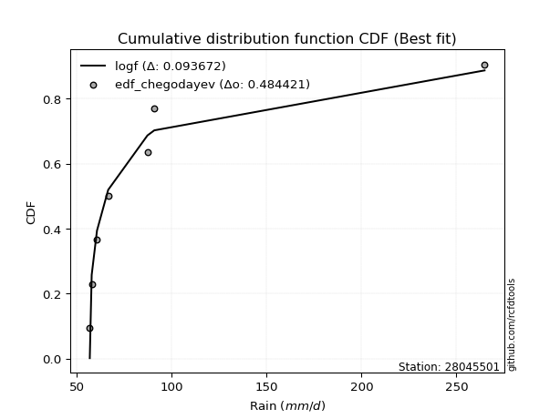</img>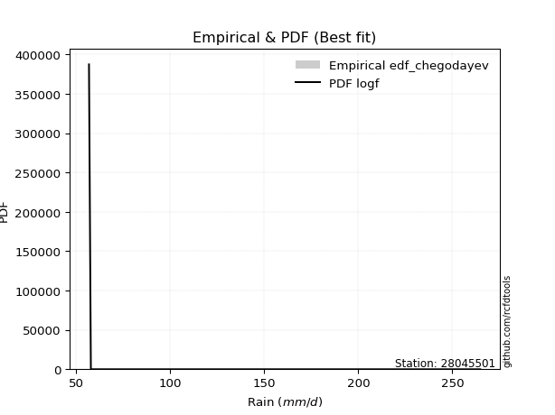</img>

</div>


### 6. EDF Blom (1958)

The Blom formula is a specific "plotting position" formula used in hydrology and statistical analysis to estimate the empirical cumulative probability (or non-exceedance probability) of a data series. It is particularly recommended for data that are approximately normally distributed. The constant _a_ is set to 0.375 (or 3/8).

<div align="center">


$P=(m-a)/(n+1-2a)$


</div>


**6.1. Empirical values**

<div align="center">

|                | 0                   | 1                   | 2                  | 3        | 4                  | 5                  | 6                  |
|:---------------|:--------------------|:--------------------|:-------------------|:---------|:-------------------|:-------------------|:-------------------|
| date           | 2023                | 2018                | 2020               | 2021     | 2022               | 2017               | 2019               |
| x              | 56.8                | 57.8                | 60.6               | 66.5     | 87.2               | 90.8               | 264.9              |
| m              | 1                   | 2                   | 3                  | 4        | 5                  | 6                  | 7                  |
| empirical_dist | edf_blom            | edf_blom            | edf_blom           | edf_blom | edf_blom           | edf_blom           | edf_blom           |
| empirical      | 0.08620689655172414 | 0.22413793103448276 | 0.3620689655172414 | 0.5      | 0.6379310344827587 | 0.7758620689655172 | 0.9137931034482759 |
| empirical_tr   | 1.0943396226415094  | 1.288888888888889   | 1.5675675675675675 | 2.0      | 2.7619047619047623 | 4.461538461538462  | 11.600000000000007 |

</div>


**6.2. Kolmogorov-Smirnov fit test (sorted by Δ)**


<div align="center">

|                | 0                   | 1                   | 2                   | 3                   | 4                   | 5                   | 6                   | 7                   | 8                   | 9                   | 10                  | 11                  | 12                  | 13                  | 14                  | 15                  | 16                  | 17                  | 18                  | 19                  | 20                  | 21                  | 22                  | 23                  | 24                  | 25                  | 26                  | 27                  | 28                  | 29                  | 30                  | 31                  | 32                  | 33                  | 34                  | 35                  | 36                  | 37                  | 38                  | 39                  | 40                  | 41                  | 42                  | 43                  | 44                  | 45                  | 46                  | 47                  | 48                  | 49                  | 50                  | 51                  | 52                  | 53                  | 54                  | 55                  | 56                  | 57                  | 58                  | 59                  | 60                  | 61                  | 62                  | 63                  | 64                  | 65                  | 66                  | 67                  | 68                  | 69                  | 70                  | 71                  | 72                  | 73                  | 74                  | 75                  | 76                  | 77                  | 78                  | 79                  | 80                  | 81                  | 82                  | 83                  | 84                  | 85                  | 86                  | 87                  | 88                  | 89                  | 90                  | 91                  | 92                  | 93                  | 94                  | 95                  | 96                  | 97                  | 98                  | 99                  | 100                 | 101                 | 102                 | 103                 | 104                 | 105                 | 106                 | 107                 | 108                 | 109                 | 110                 | 111                 | 112                 | 113                 | 114                 | 115                 | 116                 | 117                 | 118                 | 119                 | 120                 | 121                 | 122                 | 123                 | 124                 | 125                 | 126                 | 127                 | 128                 | 129                 | 130                 | 131                 | 132                 | 133                 | 134                 | 135                 | 136                 | 137                 | 138                 | 139                 | 140                 | 141                 | 142                 | 143                 | 144                 | 145                 | 146                 | 147                 | 148                 | 149                 | 150                 | 151                 | 152                 | 153                 | 154                 | 155                 | 156                 | 157                 | 158                 | 159                 |
|:---------------|:--------------------|:--------------------|:--------------------|:--------------------|:--------------------|:--------------------|:--------------------|:--------------------|:--------------------|:--------------------|:--------------------|:--------------------|:--------------------|:--------------------|:--------------------|:--------------------|:--------------------|:--------------------|:--------------------|:--------------------|:--------------------|:--------------------|:--------------------|:--------------------|:--------------------|:--------------------|:--------------------|:--------------------|:--------------------|:--------------------|:--------------------|:--------------------|:--------------------|:--------------------|:--------------------|:--------------------|:--------------------|:--------------------|:--------------------|:--------------------|:--------------------|:--------------------|:--------------------|:--------------------|:--------------------|:--------------------|:--------------------|:--------------------|:--------------------|:--------------------|:--------------------|:--------------------|:--------------------|:--------------------|:--------------------|:--------------------|:--------------------|:--------------------|:--------------------|:--------------------|:--------------------|:--------------------|:--------------------|:--------------------|:--------------------|:--------------------|:--------------------|:--------------------|:--------------------|:--------------------|:--------------------|:--------------------|:--------------------|:--------------------|:--------------------|:--------------------|:--------------------|:--------------------|:--------------------|:--------------------|:--------------------|:--------------------|:--------------------|:--------------------|:--------------------|:--------------------|:--------------------|:--------------------|:--------------------|:--------------------|:--------------------|:--------------------|:--------------------|:--------------------|:--------------------|:--------------------|:--------------------|:--------------------|:--------------------|:--------------------|:--------------------|:--------------------|:--------------------|:--------------------|:--------------------|:--------------------|:--------------------|:--------------------|:--------------------|:--------------------|:--------------------|:--------------------|:--------------------|:--------------------|:--------------------|:--------------------|:--------------------|:--------------------|:--------------------|:--------------------|:--------------------|:--------------------|:--------------------|:--------------------|:--------------------|:--------------------|:--------------------|:--------------------|:--------------------|:--------------------|:--------------------|:--------------------|:--------------------|:--------------------|:--------------------|:--------------------|:--------------------|:--------------------|:--------------------|:--------------------|:--------------------|:--------------------|:--------------------|:--------------------|:--------------------|:--------------------|:--------------------|:--------------------|:--------------------|:--------------------|:--------------------|:--------------------|:--------------------|:--------------------|:--------------------|:--------------------|:--------------------|:--------------------|:--------------------|:--------------------|
| station        | 28045501            | 28045501            | 28045501            | 28045501            | 28045501            | 28045501            | 28045501            | 28045501            | 28045501            | 28045501            | 28045501            | 28045501            | 28045501            | 28045501            | 28045501            | 28045501            | 28045501            | 28045501            | 28045501            | 28045501            | 28045501            | 28045501            | 28045501            | 28045501            | 28045501            | 28045501            | 28045501            | 28045501            | 28045501            | 28045501            | 28045501            | 28045501            | 28045501            | 28045501            | 28045501            | 28045501            | 28045501            | 28045501            | 28045501            | 28045501            | 28045501            | 28045501            | 28045501            | 28045501            | 28045501            | 28045501            | 28045501            | 28045501            | 28045501            | 28045501            | 28045501            | 28045501            | 28045501            | 28045501            | 28045501            | 28045501            | 28045501            | 28045501            | 28045501            | 28045501            | 28045501            | 28045501            | 28045501            | 28045501            | 28045501            | 28045501            | 28045501            | 28045501            | 28045501            | 28045501            | 28045501            | 28045501            | 28045501            | 28045501            | 28045501            | 28045501            | 28045501            | 28045501            | 28045501            | 28045501            | 28045501            | 28045501            | 28045501            | 28045501            | 28045501            | 28045501            | 28045501            | 28045501            | 28045501            | 28045501            | 28045501            | 28045501            | 28045501            | 28045501            | 28045501            | 28045501            | 28045501            | 28045501            | 28045501            | 28045501            | 28045501            | 28045501            | 28045501            | 28045501            | 28045501            | 28045501            | 28045501            | 28045501            | 28045501            | 28045501            | 28045501            | 28045501            | 28045501            | 28045501            | 28045501            | 28045501            | 28045501            | 28045501            | 28045501            | 28045501            | 28045501            | 28045501            | 28045501            | 28045501            | 28045501            | 28045501            | 28045501            | 28045501            | 28045501            | 28045501            | 28045501            | 28045501            | 28045501            | 28045501            | 28045501            | 28045501            | 28045501            | 28045501            | 28045501            | 28045501            | 28045501            | 28045501            | 28045501            | 28045501            | 28045501            | 28045501            | 28045501            | 28045501            | 28045501            | 28045501            | 28045501            | 28045501            | 28045501            | 28045501            | 28045501            | 28045501            | 28045501            | 28045501            | 28045501            | 28045501            |
| empirical_dist | edf_blom            | edf_blom            | edf_blom            | edf_blom            | edf_blom            | edf_blom            | edf_blom            | edf_blom            | edf_blom            | edf_blom            | edf_blom            | edf_blom            | edf_blom            | edf_blom            | edf_blom            | edf_blom            | edf_blom            | edf_blom            | edf_blom            | edf_blom            | edf_blom            | edf_blom            | edf_blom            | edf_blom            | edf_blom            | edf_blom            | edf_blom            | edf_blom            | edf_blom            | edf_blom            | edf_blom            | edf_blom            | edf_blom            | edf_blom            | edf_blom            | edf_blom            | edf_blom            | edf_blom            | edf_blom            | edf_blom            | edf_blom            | edf_blom            | edf_blom            | edf_blom            | edf_blom            | edf_blom            | edf_blom            | edf_blom            | edf_blom            | edf_blom            | edf_blom            | edf_blom            | edf_blom            | edf_blom            | edf_blom            | edf_blom            | edf_blom            | edf_blom            | edf_blom            | edf_blom            | edf_blom            | edf_blom            | edf_blom            | edf_blom            | edf_blom            | edf_blom            | edf_blom            | edf_blom            | edf_blom            | edf_blom            | edf_blom            | edf_blom            | edf_blom            | edf_blom            | edf_blom            | edf_blom            | edf_blom            | edf_blom            | edf_blom            | edf_blom            | edf_blom            | edf_blom            | edf_blom            | edf_blom            | edf_blom            | edf_blom            | edf_blom            | edf_blom            | edf_blom            | edf_blom            | edf_blom            | edf_blom            | edf_blom            | edf_blom            | edf_blom            | edf_blom            | edf_blom            | edf_blom            | edf_blom            | edf_blom            | edf_blom            | edf_blom            | edf_blom            | edf_blom            | edf_blom            | edf_blom            | edf_blom            | edf_blom            | edf_blom            | edf_blom            | edf_blom            | edf_blom            | edf_blom            | edf_blom            | edf_blom            | edf_blom            | edf_blom            | edf_blom            | edf_blom            | edf_blom            | edf_blom            | edf_blom            | edf_blom            | edf_blom            | edf_blom            | edf_blom            | edf_blom            | edf_blom            | edf_blom            | edf_blom            | edf_blom            | edf_blom            | edf_blom            | edf_blom            | edf_blom            | edf_blom            | edf_blom            | edf_blom            | edf_blom            | edf_blom            | edf_blom            | edf_blom            | edf_blom            | edf_blom            | edf_blom            | edf_blom            | edf_blom            | edf_blom            | edf_blom            | edf_blom            | edf_blom            | edf_blom            | edf_blom            | edf_blom            | edf_blom            | edf_blom            | edf_blom            | edf_blom            | edf_blom            | edf_blom            |
| p_dist         | logf                | lognakagami         | gausshyper          | erlang              | logweibull_min      | logncf              | logmielke           | betaprime           | truncpareto         | loginvweibull       | loggenextreme       | logburr             | halfgennorm         | gamma               | logbetaprime        | genpareto           | logwald             | f                   | invgamma            | truncweibull_min    | logmoyal            | loginvgamma         | logtruncpareto      | logbradford         | loggumbel_r         | nakagami            | logpearson3         | invgauss            | loghalfgennorm      | logvonmises_line    | logweibull_max      | loghalflogistic     | loginvgauss         | loggenlogistic      | logalpha            | lognct              | lograyleigh         | logerlang           | nct                 | burr                | loggengamma         | logmaxwell          | loghalfnorm         | alpha               | loggamma            | loggamma            | logburr12           | logfoldnorm         | burr12              | ncf                 | wald                | logkstwobign        | loglomax            | loglogistic         | loggennorm          | logexponnorm        | loggenexpon         | loghypsecant        | lognorm             | logcrystalball      | genlogistic         | exponpow            | logloglaplace       | logloggamma         | logt                | logdweibull         | loganglit           | logsemicircular     | logrice             | moyal               | vonmises_line       | logdgamma           | logbeta             | johnsonsu           | loglaplace          | loglaplace          | logarcsine          | loggompertz         | logtruncnorm        | gumbel_r            | halflogistic        | pearson3            | halfnorm            | t                   | lomax               | rayleigh            | loggumbel_l         | loggausshyper       | genextreme          | powerlaw            | maxwell             | foldnorm            | exponnorm           | genexpon            | logpowerlaw         | logcosine           | logtruncweibull_min | logexponpow         | arcsine             | kstwobign           | logwrapcauchy       | weibull_min         | logskewnorm         | wrapcauchy          | semicircular        | anglit              | logexponweib        | norm                | crystalball         | logistic            | hypsecant           | gengamma            | dweibull            | laplace             | kappa3              | logkappa4           | rice                | exponweib           | fatiguelife         | logtruncexpon       | truncnorm           | gennorm             | loglevy_l           | dgamma              | loggenpareto        | logfatiguelife      | levy_l              | gumbel_l            | logargus            | cosine              | gompertz            | invweibull          | logtriang           | logksone            | logrdist            | skewnorm            | logtukeylambda      | loguniform          | logkappa3           | argus               | triang              | truncexpon          | johnsonsb           | tukeylambda         | rdist               | loggenhalflogistic  | ksone               | bradford            | logjohnsonsb        | kappa4              | beta                | uniform             | genhalflogistic     | logtrapezoid        | weibull_max         | logjohnsonsu        | trapezoid           | logvonmises         | vonmises            | mielke              |
| delta          | 0.08528471460843992 | 0.08607529957750332 | 0.08618451593352199 | 0.08620662155937125 | 0.09458162185473734 | 0.10528596500648713 | 0.10845662808198137 | 0.10863683299684523 | 0.10903697583559506 | 0.10997188480637043 | 0.10998048344644085 | 0.11217905496566072 | 0.11607685269890688 | 0.1164224693882705  | 0.11950426289306854 | 0.12019142661303162 | 0.12219105536374625 | 0.12233058225510929 | 0.12233203202821263 | 0.12344157455312132 | 0.13235750725397583 | 0.13493014590581898 | 0.1357205373476506  | 0.13647098138245028 | 0.14023289603290748 | 0.1432250451969575  | 0.14868085645480966 | 0.15525147836220043 | 0.1558966171432632  | 0.1572596748604988  | 0.15812366275184392 | 0.15829849404387314 | 0.16041609107627453 | 0.16077263032856692 | 0.16288729024521498 | 0.16400209093354146 | 0.16932129762787207 | 0.1701576053094056  | 0.17106234067790338 | 0.1764516645145412  | 0.1764954262105024  | 0.17855305543134325 | 0.18042741953857483 | 0.18065183350947567 | 0.18287224826479975 | 0.18287224826479975 | 0.18681439392728005 | 0.18728040000187196 | 0.18764065257483373 | 0.19244513420838538 | 0.1937508540118424  | 0.1956337704641088  | 0.19802188221070624 | 0.19859255498412365 | 0.1988416027747023  | 0.20474623744682835 | 0.20624046035236124 | 0.2066592192561818  | 0.207667320017054   | 0.2076673262695422  | 0.20872623608021523 | 0.20994921832450475 | 0.21060839915926893 | 0.21077328797925188 | 0.21301860935378525 | 0.21582919547607393 | 0.21727676976499344 | 0.22124963664054187 | 0.22130361977714297 | 0.22243845266663298 | 0.2249519311216283  | 0.22729733313929595 | 0.22872556185970627 | 0.23271229966090884 | 0.23384338338559868 | 0.23384338338559868 | 0.23710203390141638 | 0.23812786267723052 | 0.24044946296817607 | 0.24803282932675597 | 0.24814430283743216 | 0.24857432037201854 | 0.25518102756102656 | 0.26412113145153665 | 0.2683077066817189  | 0.27008013441936607 | 0.27252535002395895 | 0.275556742203933   | 0.27626918564841696 | 0.27682574143322425 | 0.28183506089507804 | 0.284897381730246   | 0.287066654430586   | 0.2893478817531812  | 0.2924939581614534  | 0.2945553144998465  | 0.29522938599062387 | 0.2974465077779105  | 0.29857919885452316 | 0.30196768428936904 | 0.30283388411997103 | 0.3029873122573413  | 0.3032595689847401  | 0.30516950163425743 | 0.3079481087533192  | 0.3103066031603057  | 0.3153287285629265  | 0.31602489883920226 | 0.3160249035592045  | 0.32146267567615766 | 0.32607448879990253 | 0.32721903907476635 | 0.34174405279261366 | 0.34231809892592224 | 0.34335253756728246 | 0.34367623191468033 | 0.34583171462947826 | 0.34593348508198274 | 0.34630593213920824 | 0.34773609929833793 | 0.3684236267296544  | 0.36853107037420246 | 0.3700759414108297  | 0.37326272434542335 | 0.37409381195489466 | 0.37431023425166554 | 0.38499071212214325 | 0.3864446090673502  | 0.3942919173605859  | 0.3985162309753099  | 0.42015680868482536 | 0.43454647238816646 | 0.4384847656892562  | 0.4386439974632617  | 0.44182826118912566 | 0.44905709883678446 | 0.4661455010989938  | 0.47120038316281065 | 0.47174434254348807 | 0.47612126921031583 | 0.5160850971079576  | 0.5180480286301321  | 0.5219500382651721  | 0.5334953883907598  | 0.5347838006062251  | 0.5372993226457156  | 0.5563762448424994  | 0.5712960483925168  | 0.5808671030062758  | 0.5822842692942436  | 0.6067164055285739  | 0.6124790800178959  | 0.6469104731104839  | 0.662146041217817   | 0.6794294924106026  | 0.6905275718623675  | 0.7276880419745569  | 1.1494796041745228  | 41.53770195869694   | nan                 |
| deltao         | 0.48442053926100004 | 0.48442053926100004 | 0.48442053926100004 | 0.48442053926100004 | 0.48442053926100004 | 0.48442053926100004 | 0.48442053926100004 | 0.48442053926100004 | 0.48442053926100004 | 0.48442053926100004 | 0.48442053926100004 | 0.48442053926100004 | 0.48442053926100004 | 0.48442053926100004 | 0.48442053926100004 | 0.48442053926100004 | 0.48442053926100004 | 0.48442053926100004 | 0.48442053926100004 | 0.48442053926100004 | 0.48442053926100004 | 0.48442053926100004 | 0.48442053926100004 | 0.48442053926100004 | 0.48442053926100004 | 0.48442053926100004 | 0.48442053926100004 | 0.48442053926100004 | 0.48442053926100004 | 0.48442053926100004 | 0.48442053926100004 | 0.48442053926100004 | 0.48442053926100004 | 0.48442053926100004 | 0.48442053926100004 | 0.48442053926100004 | 0.48442053926100004 | 0.48442053926100004 | 0.48442053926100004 | 0.48442053926100004 | 0.48442053926100004 | 0.48442053926100004 | 0.48442053926100004 | 0.48442053926100004 | 0.48442053926100004 | 0.48442053926100004 | 0.48442053926100004 | 0.48442053926100004 | 0.48442053926100004 | 0.48442053926100004 | 0.48442053926100004 | 0.48442053926100004 | 0.48442053926100004 | 0.48442053926100004 | 0.48442053926100004 | 0.48442053926100004 | 0.48442053926100004 | 0.48442053926100004 | 0.48442053926100004 | 0.48442053926100004 | 0.48442053926100004 | 0.48442053926100004 | 0.48442053926100004 | 0.48442053926100004 | 0.48442053926100004 | 0.48442053926100004 | 0.48442053926100004 | 0.48442053926100004 | 0.48442053926100004 | 0.48442053926100004 | 0.48442053926100004 | 0.48442053926100004 | 0.48442053926100004 | 0.48442053926100004 | 0.48442053926100004 | 0.48442053926100004 | 0.48442053926100004 | 0.48442053926100004 | 0.48442053926100004 | 0.48442053926100004 | 0.48442053926100004 | 0.48442053926100004 | 0.48442053926100004 | 0.48442053926100004 | 0.48442053926100004 | 0.48442053926100004 | 0.48442053926100004 | 0.48442053926100004 | 0.48442053926100004 | 0.48442053926100004 | 0.48442053926100004 | 0.48442053926100004 | 0.48442053926100004 | 0.48442053926100004 | 0.48442053926100004 | 0.48442053926100004 | 0.48442053926100004 | 0.48442053926100004 | 0.48442053926100004 | 0.48442053926100004 | 0.48442053926100004 | 0.48442053926100004 | 0.48442053926100004 | 0.48442053926100004 | 0.48442053926100004 | 0.48442053926100004 | 0.48442053926100004 | 0.48442053926100004 | 0.48442053926100004 | 0.48442053926100004 | 0.48442053926100004 | 0.48442053926100004 | 0.48442053926100004 | 0.48442053926100004 | 0.48442053926100004 | 0.48442053926100004 | 0.48442053926100004 | 0.48442053926100004 | 0.48442053926100004 | 0.48442053926100004 | 0.48442053926100004 | 0.48442053926100004 | 0.48442053926100004 | 0.48442053926100004 | 0.48442053926100004 | 0.48442053926100004 | 0.48442053926100004 | 0.48442053926100004 | 0.48442053926100004 | 0.48442053926100004 | 0.48442053926100004 | 0.48442053926100004 | 0.48442053926100004 | 0.48442053926100004 | 0.48442053926100004 | 0.48442053926100004 | 0.48442053926100004 | 0.48442053926100004 | 0.48442053926100004 | 0.48442053926100004 | 0.48442053926100004 | 0.48442053926100004 | 0.48442053926100004 | 0.48442053926100004 | 0.48442053926100004 | 0.48442053926100004 | 0.48442053926100004 | 0.48442053926100004 | 0.48442053926100004 | 0.48442053926100004 | 0.48442053926100004 | 0.48442053926100004 | 0.48442053926100004 | 0.48442053926100004 | 0.48442053926100004 | 0.48442053926100004 | 0.48442053926100004 | 0.48442053926100004 | 0.48442053926100004 | 0.48442053926100004 |
| eval           | Δo > Δ              | Δo > Δ              | Δo > Δ              | Δo > Δ              | Δo > Δ              | Δo > Δ              | Δo > Δ              | Δo > Δ              | Δo > Δ              | Δo > Δ              | Δo > Δ              | Δo > Δ              | Δo > Δ              | Δo > Δ              | Δo > Δ              | Δo > Δ              | Δo > Δ              | Δo > Δ              | Δo > Δ              | Δo > Δ              | Δo > Δ              | Δo > Δ              | Δo > Δ              | Δo > Δ              | Δo > Δ              | Δo > Δ              | Δo > Δ              | Δo > Δ              | Δo > Δ              | Δo > Δ              | Δo > Δ              | Δo > Δ              | Δo > Δ              | Δo > Δ              | Δo > Δ              | Δo > Δ              | Δo > Δ              | Δo > Δ              | Δo > Δ              | Δo > Δ              | Δo > Δ              | Δo > Δ              | Δo > Δ              | Δo > Δ              | Δo > Δ              | Δo > Δ              | Δo > Δ              | Δo > Δ              | Δo > Δ              | Δo > Δ              | Δo > Δ              | Δo > Δ              | Δo > Δ              | Δo > Δ              | Δo > Δ              | Δo > Δ              | Δo > Δ              | Δo > Δ              | Δo > Δ              | Δo > Δ              | Δo > Δ              | Δo > Δ              | Δo > Δ              | Δo > Δ              | Δo > Δ              | Δo > Δ              | Δo > Δ              | Δo > Δ              | Δo > Δ              | Δo > Δ              | Δo > Δ              | Δo > Δ              | Δo > Δ              | Δo > Δ              | Δo > Δ              | Δo > Δ              | Δo > Δ              | Δo > Δ              | Δo > Δ              | Δo > Δ              | Δo > Δ              | Δo > Δ              | Δo > Δ              | Δo > Δ              | Δo > Δ              | Δo > Δ              | Δo > Δ              | Δo > Δ              | Δo > Δ              | Δo > Δ              | Δo > Δ              | Δo > Δ              | Δo > Δ              | Δo > Δ              | Δo > Δ              | Δo > Δ              | Δo > Δ              | Δo > Δ              | Δo > Δ              | Δo > Δ              | Δo > Δ              | Δo > Δ              | Δo > Δ              | Δo > Δ              | Δo > Δ              | Δo > Δ              | Δo > Δ              | Δo > Δ              | Δo > Δ              | Δo > Δ              | Δo > Δ              | Δo > Δ              | Δo > Δ              | Δo > Δ              | Δo > Δ              | Δo > Δ              | Δo > Δ              | Δo > Δ              | Δo > Δ              | Δo > Δ              | Δo > Δ              | Δo > Δ              | Δo > Δ              | Δo > Δ              | Δo > Δ              | Δo > Δ              | Δo > Δ              | Δo > Δ              | Δo > Δ              | Δo > Δ              | Δo > Δ              | Δo > Δ              | Δo > Δ              | Δo > Δ              | Δo > Δ              | Δo > Δ              | Δo > Δ              | Δo > Δ              | Δo > Δ              | Δo > Δ              | Δo <= Δ             | Δo <= Δ             | Δo <= Δ             | Δo <= Δ             | Δo <= Δ             | Δo <= Δ             | Δo <= Δ             | Δo <= Δ             | Δo <= Δ             | Δo <= Δ             | Δo <= Δ             | Δo <= Δ             | Δo <= Δ             | Δo <= Δ             | Δo <= Δ             | Δo <= Δ             | Δo <= Δ             | Δo <= Δ             | Δo <= Δ             | Δo <= Δ             |
| fit            | 1                   | 1                   | 1                   | 1                   | 1                   | 1                   | 1                   | 1                   | 1                   | 1                   | 1                   | 1                   | 1                   | 1                   | 1                   | 1                   | 1                   | 1                   | 1                   | 1                   | 1                   | 1                   | 1                   | 1                   | 1                   | 1                   | 1                   | 1                   | 1                   | 1                   | 1                   | 1                   | 1                   | 1                   | 1                   | 1                   | 1                   | 1                   | 1                   | 1                   | 1                   | 1                   | 1                   | 1                   | 1                   | 1                   | 1                   | 1                   | 1                   | 1                   | 1                   | 1                   | 1                   | 1                   | 1                   | 1                   | 1                   | 1                   | 1                   | 1                   | 1                   | 1                   | 1                   | 1                   | 1                   | 1                   | 1                   | 1                   | 1                   | 1                   | 1                   | 1                   | 1                   | 1                   | 1                   | 1                   | 1                   | 1                   | 1                   | 1                   | 1                   | 1                   | 1                   | 1                   | 1                   | 1                   | 1                   | 1                   | 1                   | 1                   | 1                   | 1                   | 1                   | 1                   | 1                   | 1                   | 1                   | 1                   | 1                   | 1                   | 1                   | 1                   | 1                   | 1                   | 1                   | 1                   | 1                   | 1                   | 1                   | 1                   | 1                   | 1                   | 1                   | 1                   | 1                   | 1                   | 1                   | 1                   | 1                   | 1                   | 1                   | 1                   | 1                   | 1                   | 1                   | 1                   | 1                   | 1                   | 1                   | 1                   | 1                   | 1                   | 1                   | 1                   | 1                   | 1                   | 1                   | 1                   | 1                   | 1                   | 0                   | 0                   | 0                   | 0                   | 0                   | 0                   | 0                   | 0                   | 0                   | 0                   | 0                   | 0                   | 0                   | 0                   | 0                   | 0                   | 0                   | 0                   | 0                   | 0                   |
| n              | 7                   | 7                   | 7                   | 7                   | 7                   | 7                   | 7                   | 7                   | 7                   | 7                   | 7                   | 7                   | 7                   | 7                   | 7                   | 7                   | 7                   | 7                   | 7                   | 7                   | 7                   | 7                   | 7                   | 7                   | 7                   | 7                   | 7                   | 7                   | 7                   | 7                   | 7                   | 7                   | 7                   | 7                   | 7                   | 7                   | 7                   | 7                   | 7                   | 7                   | 7                   | 7                   | 7                   | 7                   | 7                   | 7                   | 7                   | 7                   | 7                   | 7                   | 7                   | 7                   | 7                   | 7                   | 7                   | 7                   | 7                   | 7                   | 7                   | 7                   | 7                   | 7                   | 7                   | 7                   | 7                   | 7                   | 7                   | 7                   | 7                   | 7                   | 7                   | 7                   | 7                   | 7                   | 7                   | 7                   | 7                   | 7                   | 7                   | 7                   | 7                   | 7                   | 7                   | 7                   | 7                   | 7                   | 7                   | 7                   | 7                   | 7                   | 7                   | 7                   | 7                   | 7                   | 7                   | 7                   | 7                   | 7                   | 7                   | 7                   | 7                   | 7                   | 7                   | 7                   | 7                   | 7                   | 7                   | 7                   | 7                   | 7                   | 7                   | 7                   | 7                   | 7                   | 7                   | 7                   | 7                   | 7                   | 7                   | 7                   | 7                   | 7                   | 7                   | 7                   | 7                   | 7                   | 7                   | 7                   | 7                   | 7                   | 7                   | 7                   | 7                   | 7                   | 7                   | 7                   | 7                   | 7                   | 7                   | 7                   | 7                   | 7                   | 7                   | 7                   | 7                   | 7                   | 7                   | 7                   | 7                   | 7                   | 7                   | 7                   | 7                   | 7                   | 7                   | 7                   | 7                   | 7                   | 7                   | 7                   |
| best_fit       | 1                   | 0                   | 0                   | 0                   | 0                   | 0                   | 0                   | 0                   | 0                   | 0                   | 0                   | 0                   | 0                   | 0                   | 0                   | 0                   | 0                   | 0                   | 0                   | 0                   | 0                   | 0                   | 0                   | 0                   | 0                   | 0                   | 0                   | 0                   | 0                   | 0                   | 0                   | 0                   | 0                   | 0                   | 0                   | 0                   | 0                   | 0                   | 0                   | 0                   | 0                   | 0                   | 0                   | 0                   | 0                   | 0                   | 0                   | 0                   | 0                   | 0                   | 0                   | 0                   | 0                   | 0                   | 0                   | 0                   | 0                   | 0                   | 0                   | 0                   | 0                   | 0                   | 0                   | 0                   | 0                   | 0                   | 0                   | 0                   | 0                   | 0                   | 0                   | 0                   | 0                   | 0                   | 0                   | 0                   | 0                   | 0                   | 0                   | 0                   | 0                   | 0                   | 0                   | 0                   | 0                   | 0                   | 0                   | 0                   | 0                   | 0                   | 0                   | 0                   | 0                   | 0                   | 0                   | 0                   | 0                   | 0                   | 0                   | 0                   | 0                   | 0                   | 0                   | 0                   | 0                   | 0                   | 0                   | 0                   | 0                   | 0                   | 0                   | 0                   | 0                   | 0                   | 0                   | 0                   | 0                   | 0                   | 0                   | 0                   | 0                   | 0                   | 0                   | 0                   | 0                   | 0                   | 0                   | 0                   | 0                   | 0                   | 0                   | 0                   | 0                   | 0                   | 0                   | 0                   | 0                   | 0                   | 0                   | 0                   | 0                   | 0                   | 0                   | 0                   | 0                   | 0                   | 0                   | 0                   | 0                   | 0                   | 0                   | 0                   | 0                   | 0                   | 0                   | 0                   | 0                   | 0                   | 0                   | 0                   |
| best_fit_sort  | 1                   | 2                   | 3                   | 4                   | 5                   | 6                   | 7                   | 8                   | 9                   | 10                  | 11                  | 12                  | 13                  | 14                  | 15                  | 16                  | 17                  | 18                  | 19                  | 20                  | 21                  | 22                  | 23                  | 24                  | 25                  | 26                  | 27                  | 28                  | 29                  | 30                  | 31                  | 32                  | 33                  | 34                  | 35                  | 36                  | 37                  | 38                  | 39                  | 40                  | 41                  | 42                  | 43                  | 44                  | 45                  | 46                  | 47                  | 48                  | 49                  | 50                  | 51                  | 52                  | 53                  | 54                  | 55                  | 56                  | 57                  | 58                  | 59                  | 60                  | 61                  | 62                  | 63                  | 64                  | 65                  | 66                  | 67                  | 68                  | 69                  | 70                  | 71                  | 72                  | 73                  | 74                  | 75                  | 76                  | 77                  | 78                  | 79                  | 80                  | 81                  | 82                  | 83                  | 84                  | 85                  | 86                  | 87                  | 88                  | 89                  | 90                  | 91                  | 92                  | 93                  | 94                  | 95                  | 96                  | 97                  | 98                  | 99                  | 100                 | 101                 | 102                 | 103                 | 104                 | 105                 | 106                 | 107                 | 108                 | 109                 | 110                 | 111                 | 112                 | 113                 | 114                 | 115                 | 116                 | 117                 | 118                 | 119                 | 120                 | 121                 | 122                 | 123                 | 124                 | 125                 | 126                 | 127                 | 128                 | 129                 | 130                 | 131                 | 132                 | 133                 | 134                 | 135                 | 136                 | 137                 | 138                 | 139                 | 140                 | 141                 | 142                 | 143                 | 144                 | 145                 | 146                 | 147                 | 148                 | 149                 | 150                 | 151                 | 152                 | 153                 | 154                 | 155                 | 156                 | 157                 | 158                 | 159                 | 160                 |

</div>


**6.3. Best fit**

<div align="center">

|   id |   station | empirical_dist   | p_dist   |     delta |   deltao | eval   |   fit |   n |   best_fit |   best_fit_sort |
|-----:|----------:|:-----------------|:---------|----------:|---------:|:-------|------:|----:|-----------:|----------------:|
|    0 |  28045501 | edf_blom         | logf     | 0.0852847 | 0.484421 | Δo > Δ |     1 |   7 |          1 |               1 |

</div>


<div align="center">

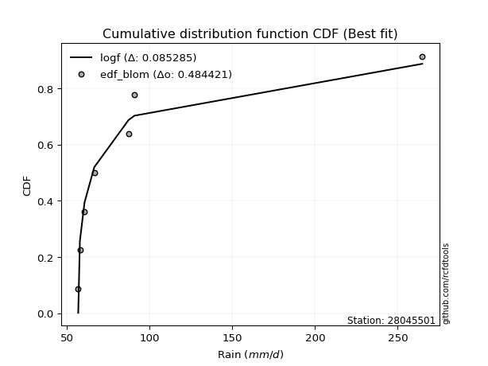</img>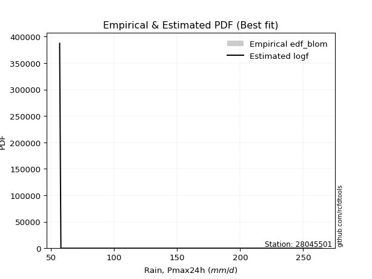</img>

</div>


### 7. EDF Tukey (1962)

In hydrology, the Tukey formula is used as a plotting position formula to estimate the empirical probability or frequency of a flood event (or other hydrological data). The formula parameter is given as _c=0.333_ (or 1/3).

<div align="center">


$P=(m-c)/(n+1-2c)$


</div>


**7.1. Empirical values**

<div align="center">

|                | 0                   | 1                   | 2                   | 3         | 4                  | 5                  | 6                  |
|:---------------|:--------------------|:--------------------|:--------------------|:----------|:-------------------|:-------------------|:-------------------|
| date           | 2023                | 2018                | 2020                | 2021      | 2022               | 2017               | 2019               |
| x              | 56.8                | 57.8                | 60.6                | 66.5      | 87.2               | 90.8               | 264.9              |
| m              | 1                   | 2                   | 3                   | 4         | 5                  | 6                  | 7                  |
| empirical_dist | edf_tukey           | edf_tukey           | edf_tukey           | edf_tukey | edf_tukey          | edf_tukey          | edf_tukey          |
| empirical      | 0.09090909090909091 | 0.22727272727272727 | 0.36363636363636365 | 0.5       | 0.6363636363636364 | 0.7727272727272727 | 0.9090909090909091 |
| empirical_tr   | 1.1                 | 1.2941176470588236  | 1.5714285714285714  | 2.0       | 2.75               | 4.3999999999999995 | 10.999999999999996 |

</div>


**7.2. Kolmogorov-Smirnov fit test (sorted by Δ)**


<div align="center">

|                | 0                   | 1                   | 2                   | 3                   | 4                   | 5                   | 6                   | 7                   | 8                   | 9                   | 10                  | 11                  | 12                  | 13                  | 14                  | 15                  | 16                  | 17                  | 18                  | 19                  | 20                  | 21                  | 22                  | 23                  | 24                  | 25                  | 26                  | 27                  | 28                  | 29                  | 30                  | 31                  | 32                  | 33                  | 34                  | 35                  | 36                  | 37                  | 38                  | 39                  | 40                  | 41                  | 42                  | 43                  | 44                  | 45                  | 46                  | 47                  | 48                  | 49                  | 50                  | 51                  | 52                  | 53                  | 54                  | 55                  | 56                  | 57                  | 58                  | 59                  | 60                  | 61                  | 62                  | 63                  | 64                  | 65                  | 66                  | 67                  | 68                  | 69                  | 70                  | 71                  | 72                  | 73                  | 74                  | 75                  | 76                  | 77                  | 78                  | 79                  | 80                  | 81                  | 82                  | 83                  | 84                  | 85                  | 86                  | 87                  | 88                  | 89                  | 90                  | 91                  | 92                  | 93                  | 94                  | 95                  | 96                  | 97                  | 98                  | 99                  | 100                 | 101                 | 102                 | 103                 | 104                 | 105                 | 106                 | 107                 | 108                 | 109                 | 110                 | 111                 | 112                 | 113                 | 114                 | 115                 | 116                 | 117                 | 118                 | 119                 | 120                 | 121                 | 122                 | 123                 | 124                 | 125                 | 126                 | 127                 | 128                 | 129                 | 130                 | 131                 | 132                 | 133                 | 134                 | 135                 | 136                 | 137                 | 138                 | 139                 | 140                 | 141                 | 142                 | 143                 | 144                 | 145                 | 146                 | 147                 | 148                 | 149                 | 150                 | 151                 | 152                 | 153                 | 154                 | 155                 | 156                 | 157                 | 158                 | 159                 |
|:---------------|:--------------------|:--------------------|:--------------------|:--------------------|:--------------------|:--------------------|:--------------------|:--------------------|:--------------------|:--------------------|:--------------------|:--------------------|:--------------------|:--------------------|:--------------------|:--------------------|:--------------------|:--------------------|:--------------------|:--------------------|:--------------------|:--------------------|:--------------------|:--------------------|:--------------------|:--------------------|:--------------------|:--------------------|:--------------------|:--------------------|:--------------------|:--------------------|:--------------------|:--------------------|:--------------------|:--------------------|:--------------------|:--------------------|:--------------------|:--------------------|:--------------------|:--------------------|:--------------------|:--------------------|:--------------------|:--------------------|:--------------------|:--------------------|:--------------------|:--------------------|:--------------------|:--------------------|:--------------------|:--------------------|:--------------------|:--------------------|:--------------------|:--------------------|:--------------------|:--------------------|:--------------------|:--------------------|:--------------------|:--------------------|:--------------------|:--------------------|:--------------------|:--------------------|:--------------------|:--------------------|:--------------------|:--------------------|:--------------------|:--------------------|:--------------------|:--------------------|:--------------------|:--------------------|:--------------------|:--------------------|:--------------------|:--------------------|:--------------------|:--------------------|:--------------------|:--------------------|:--------------------|:--------------------|:--------------------|:--------------------|:--------------------|:--------------------|:--------------------|:--------------------|:--------------------|:--------------------|:--------------------|:--------------------|:--------------------|:--------------------|:--------------------|:--------------------|:--------------------|:--------------------|:--------------------|:--------------------|:--------------------|:--------------------|:--------------------|:--------------------|:--------------------|:--------------------|:--------------------|:--------------------|:--------------------|:--------------------|:--------------------|:--------------------|:--------------------|:--------------------|:--------------------|:--------------------|:--------------------|:--------------------|:--------------------|:--------------------|:--------------------|:--------------------|:--------------------|:--------------------|:--------------------|:--------------------|:--------------------|:--------------------|:--------------------|:--------------------|:--------------------|:--------------------|:--------------------|:--------------------|:--------------------|:--------------------|:--------------------|:--------------------|:--------------------|:--------------------|:--------------------|:--------------------|:--------------------|:--------------------|:--------------------|:--------------------|:--------------------|:--------------------|:--------------------|:--------------------|:--------------------|:--------------------|:--------------------|:--------------------|
| station        | 28045501            | 28045501            | 28045501            | 28045501            | 28045501            | 28045501            | 28045501            | 28045501            | 28045501            | 28045501            | 28045501            | 28045501            | 28045501            | 28045501            | 28045501            | 28045501            | 28045501            | 28045501            | 28045501            | 28045501            | 28045501            | 28045501            | 28045501            | 28045501            | 28045501            | 28045501            | 28045501            | 28045501            | 28045501            | 28045501            | 28045501            | 28045501            | 28045501            | 28045501            | 28045501            | 28045501            | 28045501            | 28045501            | 28045501            | 28045501            | 28045501            | 28045501            | 28045501            | 28045501            | 28045501            | 28045501            | 28045501            | 28045501            | 28045501            | 28045501            | 28045501            | 28045501            | 28045501            | 28045501            | 28045501            | 28045501            | 28045501            | 28045501            | 28045501            | 28045501            | 28045501            | 28045501            | 28045501            | 28045501            | 28045501            | 28045501            | 28045501            | 28045501            | 28045501            | 28045501            | 28045501            | 28045501            | 28045501            | 28045501            | 28045501            | 28045501            | 28045501            | 28045501            | 28045501            | 28045501            | 28045501            | 28045501            | 28045501            | 28045501            | 28045501            | 28045501            | 28045501            | 28045501            | 28045501            | 28045501            | 28045501            | 28045501            | 28045501            | 28045501            | 28045501            | 28045501            | 28045501            | 28045501            | 28045501            | 28045501            | 28045501            | 28045501            | 28045501            | 28045501            | 28045501            | 28045501            | 28045501            | 28045501            | 28045501            | 28045501            | 28045501            | 28045501            | 28045501            | 28045501            | 28045501            | 28045501            | 28045501            | 28045501            | 28045501            | 28045501            | 28045501            | 28045501            | 28045501            | 28045501            | 28045501            | 28045501            | 28045501            | 28045501            | 28045501            | 28045501            | 28045501            | 28045501            | 28045501            | 28045501            | 28045501            | 28045501            | 28045501            | 28045501            | 28045501            | 28045501            | 28045501            | 28045501            | 28045501            | 28045501            | 28045501            | 28045501            | 28045501            | 28045501            | 28045501            | 28045501            | 28045501            | 28045501            | 28045501            | 28045501            | 28045501            | 28045501            | 28045501            | 28045501            | 28045501            | 28045501            |
| empirical_dist | edf_tukey           | edf_tukey           | edf_tukey           | edf_tukey           | edf_tukey           | edf_tukey           | edf_tukey           | edf_tukey           | edf_tukey           | edf_tukey           | edf_tukey           | edf_tukey           | edf_tukey           | edf_tukey           | edf_tukey           | edf_tukey           | edf_tukey           | edf_tukey           | edf_tukey           | edf_tukey           | edf_tukey           | edf_tukey           | edf_tukey           | edf_tukey           | edf_tukey           | edf_tukey           | edf_tukey           | edf_tukey           | edf_tukey           | edf_tukey           | edf_tukey           | edf_tukey           | edf_tukey           | edf_tukey           | edf_tukey           | edf_tukey           | edf_tukey           | edf_tukey           | edf_tukey           | edf_tukey           | edf_tukey           | edf_tukey           | edf_tukey           | edf_tukey           | edf_tukey           | edf_tukey           | edf_tukey           | edf_tukey           | edf_tukey           | edf_tukey           | edf_tukey           | edf_tukey           | edf_tukey           | edf_tukey           | edf_tukey           | edf_tukey           | edf_tukey           | edf_tukey           | edf_tukey           | edf_tukey           | edf_tukey           | edf_tukey           | edf_tukey           | edf_tukey           | edf_tukey           | edf_tukey           | edf_tukey           | edf_tukey           | edf_tukey           | edf_tukey           | edf_tukey           | edf_tukey           | edf_tukey           | edf_tukey           | edf_tukey           | edf_tukey           | edf_tukey           | edf_tukey           | edf_tukey           | edf_tukey           | edf_tukey           | edf_tukey           | edf_tukey           | edf_tukey           | edf_tukey           | edf_tukey           | edf_tukey           | edf_tukey           | edf_tukey           | edf_tukey           | edf_tukey           | edf_tukey           | edf_tukey           | edf_tukey           | edf_tukey           | edf_tukey           | edf_tukey           | edf_tukey           | edf_tukey           | edf_tukey           | edf_tukey           | edf_tukey           | edf_tukey           | edf_tukey           | edf_tukey           | edf_tukey           | edf_tukey           | edf_tukey           | edf_tukey           | edf_tukey           | edf_tukey           | edf_tukey           | edf_tukey           | edf_tukey           | edf_tukey           | edf_tukey           | edf_tukey           | edf_tukey           | edf_tukey           | edf_tukey           | edf_tukey           | edf_tukey           | edf_tukey           | edf_tukey           | edf_tukey           | edf_tukey           | edf_tukey           | edf_tukey           | edf_tukey           | edf_tukey           | edf_tukey           | edf_tukey           | edf_tukey           | edf_tukey           | edf_tukey           | edf_tukey           | edf_tukey           | edf_tukey           | edf_tukey           | edf_tukey           | edf_tukey           | edf_tukey           | edf_tukey           | edf_tukey           | edf_tukey           | edf_tukey           | edf_tukey           | edf_tukey           | edf_tukey           | edf_tukey           | edf_tukey           | edf_tukey           | edf_tukey           | edf_tukey           | edf_tukey           | edf_tukey           | edf_tukey           | edf_tukey           | edf_tukey           | edf_tukey           |
| p_dist         | logf                | lognakagami         | gausshyper          | erlang              | logweibull_min      | betaprime           | logncf              | logmielke           | loginvweibull       | loggenextreme       | truncpareto         | logburr             | logbetaprime        | halfgennorm         | gamma               | truncweibull_min    | genpareto           | logwald             | f                   | invgamma            | logmoyal            | loggumbel_r         | loginvgamma         | logbradford         | logtruncpareto      | nakagami            | logpearson3         | logvonmises_line    | loghalflogistic     | invgauss            | loghalfgennorm      | logweibull_max      | loggenlogistic      | loginvgauss         | lognct              | logalpha            | lograyleigh         | nct                 | logerlang           | loggengamma         | logmaxwell          | loghalfnorm         | burr                | alpha               | logfoldnorm         | loggamma            | loggamma            | logburr12           | wald                | burr12              | ncf                 | loglogistic         | logkstwobign        | loglomax            | loggennorm          | lognorm             | logcrystalball      | genlogistic         | logloglaplace       | logexponnorm        | loghypsecant        | exponpow            | logloggamma         | loggenexpon         | logdweibull         | loganglit           | logt                | logsemicircular     | moyal               | vonmises_line       | logrice             | logdgamma           | logbeta             | johnsonsu           | loglaplace          | loglaplace          | logarcsine          | loggompertz         | logtruncnorm        | halflogistic        | pearson3            | gumbel_r            | halfnorm            | t                   | rayleigh            | lomax               | loggumbel_l         | loggausshyper       | genextreme          | powerlaw            | maxwell             | foldnorm            | exponnorm           | genexpon            | logpowerlaw         | logcosine           | logtruncweibull_min | logexponpow         | arcsine             | kstwobign           | logwrapcauchy       | weibull_min         | wrapcauchy          | logskewnorm         | semicircular        | anglit              | logexponweib        | norm                | crystalball         | logistic            | hypsecant           | gengamma            | dweibull            | kappa3              | laplace             | logkappa4           | rice                | exponweib           | fatiguelife         | logtruncexpon       | truncnorm           | loglevy_l           | gennorm             | dgamma              | loggenpareto        | logfatiguelife      | levy_l              | gumbel_l            | logargus            | cosine              | gompertz            | invweibull          | logtriang           | logksone            | logrdist            | skewnorm            | logtukeylambda      | loguniform          | logkappa3           | argus               | triang              | truncexpon          | johnsonsb           | tukeylambda         | rdist               | loggenhalflogistic  | ksone               | bradford            | logjohnsonsb        | kappa4              | beta                | uniform             | genhalflogistic     | logtrapezoid        | weibull_max         | logjohnsonsu        | trapezoid           | logvonmises         | vonmises            | mielke              |
| delta          | 0.08998690896580669 | 0.09077749393487008 | 0.09088671029088875 | 0.09090881591673802 | 0.09301422373561508 | 0.10393463863947847 | 0.10685336312560945 | 0.11002402620110363 | 0.11153928292549276 | 0.11154788156556317 | 0.11217177207383956 | 0.11374645308478304 | 0.11524423828717434 | 0.1176442508180292  | 0.11798986750739282 | 0.1203067783148768  | 0.12175882473215394 | 0.12375845348286851 | 0.12389798037423161 | 0.12389943014733495 | 0.12765531289660906 | 0.1355307016755407  | 0.1364975440249413  | 0.1380383795015726  | 0.13885533358589514 | 0.140090248958713   | 0.1439786620974429  | 0.15255748050313203 | 0.15359629968650637 | 0.15681887648132276 | 0.15746401526238551 | 0.15812366275184392 | 0.16077263032856692 | 0.16198348919539685 | 0.16400209093354146 | 0.1644546883643373  | 0.16618650138962754 | 0.17106234067790338 | 0.17172500342852792 | 0.17336062997225787 | 0.17541825919309872 | 0.17572522518120806 | 0.17801906263366352 | 0.182219231628598   | 0.1825782056445052  | 0.18443964638392207 | 0.18443964638392207 | 0.18838179204640232 | 0.18904865965447562 | 0.189208050693956   | 0.18931033797014085 | 0.19545775874587912 | 0.1956337704641088  | 0.1995892803298285  | 0.20040900089382463 | 0.20453252377880948 | 0.20453253003129768 | 0.2055914398419707  | 0.20590620480190217 | 0.20631363556595061 | 0.2066592192561818  | 0.20681442208626022 | 0.20763849174100735 | 0.2078078584714835  | 0.21112700111870716 | 0.2141419735267489  | 0.21458600747290757 | 0.21811484040229734 | 0.21930365642838845 | 0.22024973676426154 | 0.22130361977714297 | 0.22259513878192919 | 0.22559076562146177 | 0.23114490154178657 | 0.23384338338559868 | 0.23384338338559868 | 0.23396723766317185 | 0.23969526079635278 | 0.24201686108729834 | 0.2434421084800654  | 0.24387212601465177 | 0.24489803308851144 | 0.2504788332036598  | 0.25962088656452154 | 0.26694533818112154 | 0.2683077066817189  | 0.2693905537857144  | 0.2724219459656885  | 0.27313438941017243 | 0.2736909451949797  | 0.2787002646568335  | 0.2801951873728792  | 0.287066654430586   | 0.2893478817531812  | 0.2893591619232089  | 0.291420518261602   | 0.29209458975237934 | 0.29431171153966595 | 0.29544440261627863 | 0.2988328880511245  | 0.2996990878817265  | 0.2998525160190968  | 0.3020347053960129  | 0.3032595689847401  | 0.30481331251507465 | 0.3071718069220612  | 0.31062653420555963 | 0.31289010260095773 | 0.31289010732095995 | 0.31832787943791313 | 0.322939692561658   | 0.3240842428365218  | 0.3370418584352469  | 0.3386503432099156  | 0.3391833026876777  | 0.3405414356764358  | 0.34269691839123373 | 0.3427986888437382  | 0.3431711359009637  | 0.3446013030600934  | 0.36528883049140987 | 0.3653737470534629  | 0.3669636722550802  | 0.36856052998805655 | 0.3693916175975279  | 0.371175438013421   | 0.38028851776477646 | 0.38330981282910565 | 0.39115712112234136 | 0.3953814347370654  | 0.4170220124465808  | 0.4298442780307996  | 0.4353499694510117  | 0.4355092012250172  | 0.43869346495088113 | 0.44592230259853993 | 0.46301070486074924 | 0.4680655869245661  | 0.46860954630524354 | 0.4729864729720713  | 0.5129503008697132  | 0.5149132323918877  | 0.5188152420269275  | 0.5287931940333931  | 0.5300816062488583  | 0.534164526407471   | 0.553241448604255   | 0.5681612521542723  | 0.5777323067680312  | 0.5791494730559991  | 0.602014211171207   | 0.6093442837796513  | 0.6437756768722394  | 0.6590112449795724  | 0.6762946961723579  | 0.6873927756241229  | 0.7245532457363124  | 1.1447774098171561  | 41.542404153054314  | nan                 |
| deltao         | 0.48442053926100004 | 0.48442053926100004 | 0.48442053926100004 | 0.48442053926100004 | 0.48442053926100004 | 0.48442053926100004 | 0.48442053926100004 | 0.48442053926100004 | 0.48442053926100004 | 0.48442053926100004 | 0.48442053926100004 | 0.48442053926100004 | 0.48442053926100004 | 0.48442053926100004 | 0.48442053926100004 | 0.48442053926100004 | 0.48442053926100004 | 0.48442053926100004 | 0.48442053926100004 | 0.48442053926100004 | 0.48442053926100004 | 0.48442053926100004 | 0.48442053926100004 | 0.48442053926100004 | 0.48442053926100004 | 0.48442053926100004 | 0.48442053926100004 | 0.48442053926100004 | 0.48442053926100004 | 0.48442053926100004 | 0.48442053926100004 | 0.48442053926100004 | 0.48442053926100004 | 0.48442053926100004 | 0.48442053926100004 | 0.48442053926100004 | 0.48442053926100004 | 0.48442053926100004 | 0.48442053926100004 | 0.48442053926100004 | 0.48442053926100004 | 0.48442053926100004 | 0.48442053926100004 | 0.48442053926100004 | 0.48442053926100004 | 0.48442053926100004 | 0.48442053926100004 | 0.48442053926100004 | 0.48442053926100004 | 0.48442053926100004 | 0.48442053926100004 | 0.48442053926100004 | 0.48442053926100004 | 0.48442053926100004 | 0.48442053926100004 | 0.48442053926100004 | 0.48442053926100004 | 0.48442053926100004 | 0.48442053926100004 | 0.48442053926100004 | 0.48442053926100004 | 0.48442053926100004 | 0.48442053926100004 | 0.48442053926100004 | 0.48442053926100004 | 0.48442053926100004 | 0.48442053926100004 | 0.48442053926100004 | 0.48442053926100004 | 0.48442053926100004 | 0.48442053926100004 | 0.48442053926100004 | 0.48442053926100004 | 0.48442053926100004 | 0.48442053926100004 | 0.48442053926100004 | 0.48442053926100004 | 0.48442053926100004 | 0.48442053926100004 | 0.48442053926100004 | 0.48442053926100004 | 0.48442053926100004 | 0.48442053926100004 | 0.48442053926100004 | 0.48442053926100004 | 0.48442053926100004 | 0.48442053926100004 | 0.48442053926100004 | 0.48442053926100004 | 0.48442053926100004 | 0.48442053926100004 | 0.48442053926100004 | 0.48442053926100004 | 0.48442053926100004 | 0.48442053926100004 | 0.48442053926100004 | 0.48442053926100004 | 0.48442053926100004 | 0.48442053926100004 | 0.48442053926100004 | 0.48442053926100004 | 0.48442053926100004 | 0.48442053926100004 | 0.48442053926100004 | 0.48442053926100004 | 0.48442053926100004 | 0.48442053926100004 | 0.48442053926100004 | 0.48442053926100004 | 0.48442053926100004 | 0.48442053926100004 | 0.48442053926100004 | 0.48442053926100004 | 0.48442053926100004 | 0.48442053926100004 | 0.48442053926100004 | 0.48442053926100004 | 0.48442053926100004 | 0.48442053926100004 | 0.48442053926100004 | 0.48442053926100004 | 0.48442053926100004 | 0.48442053926100004 | 0.48442053926100004 | 0.48442053926100004 | 0.48442053926100004 | 0.48442053926100004 | 0.48442053926100004 | 0.48442053926100004 | 0.48442053926100004 | 0.48442053926100004 | 0.48442053926100004 | 0.48442053926100004 | 0.48442053926100004 | 0.48442053926100004 | 0.48442053926100004 | 0.48442053926100004 | 0.48442053926100004 | 0.48442053926100004 | 0.48442053926100004 | 0.48442053926100004 | 0.48442053926100004 | 0.48442053926100004 | 0.48442053926100004 | 0.48442053926100004 | 0.48442053926100004 | 0.48442053926100004 | 0.48442053926100004 | 0.48442053926100004 | 0.48442053926100004 | 0.48442053926100004 | 0.48442053926100004 | 0.48442053926100004 | 0.48442053926100004 | 0.48442053926100004 | 0.48442053926100004 | 0.48442053926100004 | 0.48442053926100004 | 0.48442053926100004 | 0.48442053926100004 |
| eval           | Δo > Δ              | Δo > Δ              | Δo > Δ              | Δo > Δ              | Δo > Δ              | Δo > Δ              | Δo > Δ              | Δo > Δ              | Δo > Δ              | Δo > Δ              | Δo > Δ              | Δo > Δ              | Δo > Δ              | Δo > Δ              | Δo > Δ              | Δo > Δ              | Δo > Δ              | Δo > Δ              | Δo > Δ              | Δo > Δ              | Δo > Δ              | Δo > Δ              | Δo > Δ              | Δo > Δ              | Δo > Δ              | Δo > Δ              | Δo > Δ              | Δo > Δ              | Δo > Δ              | Δo > Δ              | Δo > Δ              | Δo > Δ              | Δo > Δ              | Δo > Δ              | Δo > Δ              | Δo > Δ              | Δo > Δ              | Δo > Δ              | Δo > Δ              | Δo > Δ              | Δo > Δ              | Δo > Δ              | Δo > Δ              | Δo > Δ              | Δo > Δ              | Δo > Δ              | Δo > Δ              | Δo > Δ              | Δo > Δ              | Δo > Δ              | Δo > Δ              | Δo > Δ              | Δo > Δ              | Δo > Δ              | Δo > Δ              | Δo > Δ              | Δo > Δ              | Δo > Δ              | Δo > Δ              | Δo > Δ              | Δo > Δ              | Δo > Δ              | Δo > Δ              | Δo > Δ              | Δo > Δ              | Δo > Δ              | Δo > Δ              | Δo > Δ              | Δo > Δ              | Δo > Δ              | Δo > Δ              | Δo > Δ              | Δo > Δ              | Δo > Δ              | Δo > Δ              | Δo > Δ              | Δo > Δ              | Δo > Δ              | Δo > Δ              | Δo > Δ              | Δo > Δ              | Δo > Δ              | Δo > Δ              | Δo > Δ              | Δo > Δ              | Δo > Δ              | Δo > Δ              | Δo > Δ              | Δo > Δ              | Δo > Δ              | Δo > Δ              | Δo > Δ              | Δo > Δ              | Δo > Δ              | Δo > Δ              | Δo > Δ              | Δo > Δ              | Δo > Δ              | Δo > Δ              | Δo > Δ              | Δo > Δ              | Δo > Δ              | Δo > Δ              | Δo > Δ              | Δo > Δ              | Δo > Δ              | Δo > Δ              | Δo > Δ              | Δo > Δ              | Δo > Δ              | Δo > Δ              | Δo > Δ              | Δo > Δ              | Δo > Δ              | Δo > Δ              | Δo > Δ              | Δo > Δ              | Δo > Δ              | Δo > Δ              | Δo > Δ              | Δo > Δ              | Δo > Δ              | Δo > Δ              | Δo > Δ              | Δo > Δ              | Δo > Δ              | Δo > Δ              | Δo > Δ              | Δo > Δ              | Δo > Δ              | Δo > Δ              | Δo > Δ              | Δo > Δ              | Δo > Δ              | Δo > Δ              | Δo > Δ              | Δo > Δ              | Δo > Δ              | Δo > Δ              | Δo > Δ              | Δo <= Δ             | Δo <= Δ             | Δo <= Δ             | Δo <= Δ             | Δo <= Δ             | Δo <= Δ             | Δo <= Δ             | Δo <= Δ             | Δo <= Δ             | Δo <= Δ             | Δo <= Δ             | Δo <= Δ             | Δo <= Δ             | Δo <= Δ             | Δo <= Δ             | Δo <= Δ             | Δo <= Δ             | Δo <= Δ             | Δo <= Δ             | Δo <= Δ             |
| fit            | 1                   | 1                   | 1                   | 1                   | 1                   | 1                   | 1                   | 1                   | 1                   | 1                   | 1                   | 1                   | 1                   | 1                   | 1                   | 1                   | 1                   | 1                   | 1                   | 1                   | 1                   | 1                   | 1                   | 1                   | 1                   | 1                   | 1                   | 1                   | 1                   | 1                   | 1                   | 1                   | 1                   | 1                   | 1                   | 1                   | 1                   | 1                   | 1                   | 1                   | 1                   | 1                   | 1                   | 1                   | 1                   | 1                   | 1                   | 1                   | 1                   | 1                   | 1                   | 1                   | 1                   | 1                   | 1                   | 1                   | 1                   | 1                   | 1                   | 1                   | 1                   | 1                   | 1                   | 1                   | 1                   | 1                   | 1                   | 1                   | 1                   | 1                   | 1                   | 1                   | 1                   | 1                   | 1                   | 1                   | 1                   | 1                   | 1                   | 1                   | 1                   | 1                   | 1                   | 1                   | 1                   | 1                   | 1                   | 1                   | 1                   | 1                   | 1                   | 1                   | 1                   | 1                   | 1                   | 1                   | 1                   | 1                   | 1                   | 1                   | 1                   | 1                   | 1                   | 1                   | 1                   | 1                   | 1                   | 1                   | 1                   | 1                   | 1                   | 1                   | 1                   | 1                   | 1                   | 1                   | 1                   | 1                   | 1                   | 1                   | 1                   | 1                   | 1                   | 1                   | 1                   | 1                   | 1                   | 1                   | 1                   | 1                   | 1                   | 1                   | 1                   | 1                   | 1                   | 1                   | 1                   | 1                   | 1                   | 1                   | 0                   | 0                   | 0                   | 0                   | 0                   | 0                   | 0                   | 0                   | 0                   | 0                   | 0                   | 0                   | 0                   | 0                   | 0                   | 0                   | 0                   | 0                   | 0                   | 0                   |
| n              | 7                   | 7                   | 7                   | 7                   | 7                   | 7                   | 7                   | 7                   | 7                   | 7                   | 7                   | 7                   | 7                   | 7                   | 7                   | 7                   | 7                   | 7                   | 7                   | 7                   | 7                   | 7                   | 7                   | 7                   | 7                   | 7                   | 7                   | 7                   | 7                   | 7                   | 7                   | 7                   | 7                   | 7                   | 7                   | 7                   | 7                   | 7                   | 7                   | 7                   | 7                   | 7                   | 7                   | 7                   | 7                   | 7                   | 7                   | 7                   | 7                   | 7                   | 7                   | 7                   | 7                   | 7                   | 7                   | 7                   | 7                   | 7                   | 7                   | 7                   | 7                   | 7                   | 7                   | 7                   | 7                   | 7                   | 7                   | 7                   | 7                   | 7                   | 7                   | 7                   | 7                   | 7                   | 7                   | 7                   | 7                   | 7                   | 7                   | 7                   | 7                   | 7                   | 7                   | 7                   | 7                   | 7                   | 7                   | 7                   | 7                   | 7                   | 7                   | 7                   | 7                   | 7                   | 7                   | 7                   | 7                   | 7                   | 7                   | 7                   | 7                   | 7                   | 7                   | 7                   | 7                   | 7                   | 7                   | 7                   | 7                   | 7                   | 7                   | 7                   | 7                   | 7                   | 7                   | 7                   | 7                   | 7                   | 7                   | 7                   | 7                   | 7                   | 7                   | 7                   | 7                   | 7                   | 7                   | 7                   | 7                   | 7                   | 7                   | 7                   | 7                   | 7                   | 7                   | 7                   | 7                   | 7                   | 7                   | 7                   | 7                   | 7                   | 7                   | 7                   | 7                   | 7                   | 7                   | 7                   | 7                   | 7                   | 7                   | 7                   | 7                   | 7                   | 7                   | 7                   | 7                   | 7                   | 7                   | 7                   |
| best_fit       | 1                   | 0                   | 0                   | 0                   | 0                   | 0                   | 0                   | 0                   | 0                   | 0                   | 0                   | 0                   | 0                   | 0                   | 0                   | 0                   | 0                   | 0                   | 0                   | 0                   | 0                   | 0                   | 0                   | 0                   | 0                   | 0                   | 0                   | 0                   | 0                   | 0                   | 0                   | 0                   | 0                   | 0                   | 0                   | 0                   | 0                   | 0                   | 0                   | 0                   | 0                   | 0                   | 0                   | 0                   | 0                   | 0                   | 0                   | 0                   | 0                   | 0                   | 0                   | 0                   | 0                   | 0                   | 0                   | 0                   | 0                   | 0                   | 0                   | 0                   | 0                   | 0                   | 0                   | 0                   | 0                   | 0                   | 0                   | 0                   | 0                   | 0                   | 0                   | 0                   | 0                   | 0                   | 0                   | 0                   | 0                   | 0                   | 0                   | 0                   | 0                   | 0                   | 0                   | 0                   | 0                   | 0                   | 0                   | 0                   | 0                   | 0                   | 0                   | 0                   | 0                   | 0                   | 0                   | 0                   | 0                   | 0                   | 0                   | 0                   | 0                   | 0                   | 0                   | 0                   | 0                   | 0                   | 0                   | 0                   | 0                   | 0                   | 0                   | 0                   | 0                   | 0                   | 0                   | 0                   | 0                   | 0                   | 0                   | 0                   | 0                   | 0                   | 0                   | 0                   | 0                   | 0                   | 0                   | 0                   | 0                   | 0                   | 0                   | 0                   | 0                   | 0                   | 0                   | 0                   | 0                   | 0                   | 0                   | 0                   | 0                   | 0                   | 0                   | 0                   | 0                   | 0                   | 0                   | 0                   | 0                   | 0                   | 0                   | 0                   | 0                   | 0                   | 0                   | 0                   | 0                   | 0                   | 0                   | 0                   |
| best_fit_sort  | 1                   | 2                   | 3                   | 4                   | 5                   | 6                   | 7                   | 8                   | 9                   | 10                  | 11                  | 12                  | 13                  | 14                  | 15                  | 16                  | 17                  | 18                  | 19                  | 20                  | 21                  | 22                  | 23                  | 24                  | 25                  | 26                  | 27                  | 28                  | 29                  | 30                  | 31                  | 32                  | 33                  | 34                  | 35                  | 36                  | 37                  | 38                  | 39                  | 40                  | 41                  | 42                  | 43                  | 44                  | 45                  | 46                  | 47                  | 48                  | 49                  | 50                  | 51                  | 52                  | 53                  | 54                  | 55                  | 56                  | 57                  | 58                  | 59                  | 60                  | 61                  | 62                  | 63                  | 64                  | 65                  | 66                  | 67                  | 68                  | 69                  | 70                  | 71                  | 72                  | 73                  | 74                  | 75                  | 76                  | 77                  | 78                  | 79                  | 80                  | 81                  | 82                  | 83                  | 84                  | 85                  | 86                  | 87                  | 88                  | 89                  | 90                  | 91                  | 92                  | 93                  | 94                  | 95                  | 96                  | 97                  | 98                  | 99                  | 100                 | 101                 | 102                 | 103                 | 104                 | 105                 | 106                 | 107                 | 108                 | 109                 | 110                 | 111                 | 112                 | 113                 | 114                 | 115                 | 116                 | 117                 | 118                 | 119                 | 120                 | 121                 | 122                 | 123                 | 124                 | 125                 | 126                 | 127                 | 128                 | 129                 | 130                 | 131                 | 132                 | 133                 | 134                 | 135                 | 136                 | 137                 | 138                 | 139                 | 140                 | 141                 | 142                 | 143                 | 144                 | 145                 | 146                 | 147                 | 148                 | 149                 | 150                 | 151                 | 152                 | 153                 | 154                 | 155                 | 156                 | 157                 | 158                 | 159                 | 160                 |

</div>


**7.3. Best fit**

<div align="center">

|   id |   station | empirical_dist   | p_dist   |     delta |   deltao | eval   |   fit |   n |   best_fit |   best_fit_sort |
|-----:|----------:|:-----------------|:---------|----------:|---------:|:-------|------:|----:|-----------:|----------------:|
|    0 |  28045501 | edf_tukey        | logf     | 0.0899869 | 0.484421 | Δo > Δ |     1 |   7 |          1 |               1 |

</div>


<div align="center">

</img>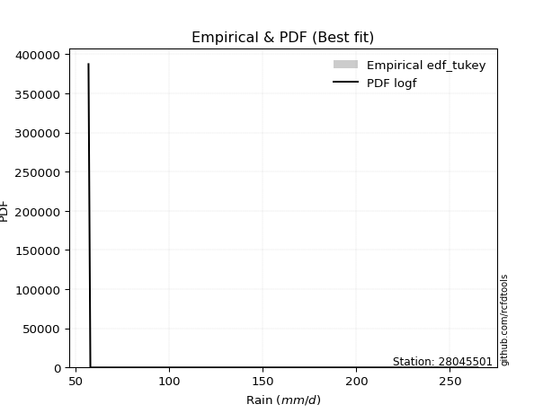</img>

</div>


### 8. EDF Gringorten (1963)

Gringorten plotting position formula is essential for estimating the probability and return periods of extreme events like floods and heavy rainfall. The constant _a=0.44_.

<div align="center">


$P=(m-a)/(n+1-2a)$


</div>


**8.1. Empirical values**

<div align="center">

|                | 0                   | 1                   | 2                  | 3              | 4                  | 5                  | 6                  |
|:---------------|:--------------------|:--------------------|:-------------------|:---------------|:-------------------|:-------------------|:-------------------|
| date           | 2023                | 2018                | 2020               | 2021           | 2022               | 2017               | 2019               |
| x              | 56.8                | 57.8                | 60.6               | 66.5           | 87.2               | 90.8               | 264.9              |
| m              | 1                   | 2                   | 3                  | 4              | 5                  | 6                  | 7                  |
| empirical_dist | edf_gringorten      | edf_gringorten      | edf_gringorten     | edf_gringorten | edf_gringorten     | edf_gringorten     | edf_gringorten     |
| empirical      | 0.07865168539325844 | 0.21910112359550563 | 0.3595505617977528 | 0.5            | 0.6404494382022471 | 0.7808988764044943 | 0.9213483146067415 |
| empirical_tr   | 1.0853658536585364  | 1.2805755395683454  | 1.5614035087719298 | 2.0            | 2.781249999999999  | 4.564102564102562  | 12.714285714285701 |

</div>


**8.2. Kolmogorov-Smirnov fit test (sorted by Δ)**


<div align="center">

|                | 0                   | 1                   | 2                   | 3                   | 4                   | 5                   | 6                   | 7                   | 8                   | 9                   | 10                  | 11                  | 12                  | 13                  | 14                  | 15                  | 16                  | 17                  | 18                  | 19                  | 20                  | 21                  | 22                  | 23                  | 24                  | 25                  | 26                  | 27                  | 28                  | 29                  | 30                  | 31                  | 32                  | 33                  | 34                  | 35                  | 36                  | 37                  | 38                  | 39                  | 40                  | 41                  | 42                  | 43                  | 44                  | 45                  | 46                  | 47                  | 48                  | 49                  | 50                  | 51                  | 52                  | 53                  | 54                  | 55                  | 56                  | 57                  | 58                  | 59                  | 60                  | 61                  | 62                  | 63                  | 64                  | 65                  | 66                  | 67                  | 68                  | 69                  | 70                  | 71                  | 72                  | 73                  | 74                  | 75                  | 76                  | 77                  | 78                  | 79                  | 80                  | 81                  | 82                  | 83                  | 84                  | 85                  | 86                  | 87                  | 88                  | 89                  | 90                  | 91                  | 92                  | 93                  | 94                  | 95                  | 96                  | 97                  | 98                  | 99                  | 100                 | 101                 | 102                 | 103                 | 104                 | 105                 | 106                 | 107                 | 108                 | 109                 | 110                 | 111                 | 112                 | 113                 | 114                 | 115                 | 116                 | 117                 | 118                 | 119                 | 120                 | 121                 | 122                 | 123                 | 124                 | 125                 | 126                 | 127                 | 128                 | 129                 | 130                 | 131                 | 132                 | 133                 | 134                 | 135                 | 136                 | 137                 | 138                 | 139                 | 140                 | 141                 | 142                 | 143                 | 144                 | 145                 | 146                 | 147                 | 148                 | 149                 | 150                 | 151                 | 152                 | 153                 | 154                 | 155                 | 156                 | 157                 | 158                 | 159                 |
|:---------------|:--------------------|:--------------------|:--------------------|:--------------------|:--------------------|:--------------------|:--------------------|:--------------------|:--------------------|:--------------------|:--------------------|:--------------------|:--------------------|:--------------------|:--------------------|:--------------------|:--------------------|:--------------------|:--------------------|:--------------------|:--------------------|:--------------------|:--------------------|:--------------------|:--------------------|:--------------------|:--------------------|:--------------------|:--------------------|:--------------------|:--------------------|:--------------------|:--------------------|:--------------------|:--------------------|:--------------------|:--------------------|:--------------------|:--------------------|:--------------------|:--------------------|:--------------------|:--------------------|:--------------------|:--------------------|:--------------------|:--------------------|:--------------------|:--------------------|:--------------------|:--------------------|:--------------------|:--------------------|:--------------------|:--------------------|:--------------------|:--------------------|:--------------------|:--------------------|:--------------------|:--------------------|:--------------------|:--------------------|:--------------------|:--------------------|:--------------------|:--------------------|:--------------------|:--------------------|:--------------------|:--------------------|:--------------------|:--------------------|:--------------------|:--------------------|:--------------------|:--------------------|:--------------------|:--------------------|:--------------------|:--------------------|:--------------------|:--------------------|:--------------------|:--------------------|:--------------------|:--------------------|:--------------------|:--------------------|:--------------------|:--------------------|:--------------------|:--------------------|:--------------------|:--------------------|:--------------------|:--------------------|:--------------------|:--------------------|:--------------------|:--------------------|:--------------------|:--------------------|:--------------------|:--------------------|:--------------------|:--------------------|:--------------------|:--------------------|:--------------------|:--------------------|:--------------------|:--------------------|:--------------------|:--------------------|:--------------------|:--------------------|:--------------------|:--------------------|:--------------------|:--------------------|:--------------------|:--------------------|:--------------------|:--------------------|:--------------------|:--------------------|:--------------------|:--------------------|:--------------------|:--------------------|:--------------------|:--------------------|:--------------------|:--------------------|:--------------------|:--------------------|:--------------------|:--------------------|:--------------------|:--------------------|:--------------------|:--------------------|:--------------------|:--------------------|:--------------------|:--------------------|:--------------------|:--------------------|:--------------------|:--------------------|:--------------------|:--------------------|:--------------------|:--------------------|:--------------------|:--------------------|:--------------------|:--------------------|:--------------------|
| station        | 28045501            | 28045501            | 28045501            | 28045501            | 28045501            | 28045501            | 28045501            | 28045501            | 28045501            | 28045501            | 28045501            | 28045501            | 28045501            | 28045501            | 28045501            | 28045501            | 28045501            | 28045501            | 28045501            | 28045501            | 28045501            | 28045501            | 28045501            | 28045501            | 28045501            | 28045501            | 28045501            | 28045501            | 28045501            | 28045501            | 28045501            | 28045501            | 28045501            | 28045501            | 28045501            | 28045501            | 28045501            | 28045501            | 28045501            | 28045501            | 28045501            | 28045501            | 28045501            | 28045501            | 28045501            | 28045501            | 28045501            | 28045501            | 28045501            | 28045501            | 28045501            | 28045501            | 28045501            | 28045501            | 28045501            | 28045501            | 28045501            | 28045501            | 28045501            | 28045501            | 28045501            | 28045501            | 28045501            | 28045501            | 28045501            | 28045501            | 28045501            | 28045501            | 28045501            | 28045501            | 28045501            | 28045501            | 28045501            | 28045501            | 28045501            | 28045501            | 28045501            | 28045501            | 28045501            | 28045501            | 28045501            | 28045501            | 28045501            | 28045501            | 28045501            | 28045501            | 28045501            | 28045501            | 28045501            | 28045501            | 28045501            | 28045501            | 28045501            | 28045501            | 28045501            | 28045501            | 28045501            | 28045501            | 28045501            | 28045501            | 28045501            | 28045501            | 28045501            | 28045501            | 28045501            | 28045501            | 28045501            | 28045501            | 28045501            | 28045501            | 28045501            | 28045501            | 28045501            | 28045501            | 28045501            | 28045501            | 28045501            | 28045501            | 28045501            | 28045501            | 28045501            | 28045501            | 28045501            | 28045501            | 28045501            | 28045501            | 28045501            | 28045501            | 28045501            | 28045501            | 28045501            | 28045501            | 28045501            | 28045501            | 28045501            | 28045501            | 28045501            | 28045501            | 28045501            | 28045501            | 28045501            | 28045501            | 28045501            | 28045501            | 28045501            | 28045501            | 28045501            | 28045501            | 28045501            | 28045501            | 28045501            | 28045501            | 28045501            | 28045501            | 28045501            | 28045501            | 28045501            | 28045501            | 28045501            | 28045501            |
| empirical_dist | edf_gringorten      | edf_gringorten      | edf_gringorten      | edf_gringorten      | edf_gringorten      | edf_gringorten      | edf_gringorten      | edf_gringorten      | edf_gringorten      | edf_gringorten      | edf_gringorten      | edf_gringorten      | edf_gringorten      | edf_gringorten      | edf_gringorten      | edf_gringorten      | edf_gringorten      | edf_gringorten      | edf_gringorten      | edf_gringorten      | edf_gringorten      | edf_gringorten      | edf_gringorten      | edf_gringorten      | edf_gringorten      | edf_gringorten      | edf_gringorten      | edf_gringorten      | edf_gringorten      | edf_gringorten      | edf_gringorten      | edf_gringorten      | edf_gringorten      | edf_gringorten      | edf_gringorten      | edf_gringorten      | edf_gringorten      | edf_gringorten      | edf_gringorten      | edf_gringorten      | edf_gringorten      | edf_gringorten      | edf_gringorten      | edf_gringorten      | edf_gringorten      | edf_gringorten      | edf_gringorten      | edf_gringorten      | edf_gringorten      | edf_gringorten      | edf_gringorten      | edf_gringorten      | edf_gringorten      | edf_gringorten      | edf_gringorten      | edf_gringorten      | edf_gringorten      | edf_gringorten      | edf_gringorten      | edf_gringorten      | edf_gringorten      | edf_gringorten      | edf_gringorten      | edf_gringorten      | edf_gringorten      | edf_gringorten      | edf_gringorten      | edf_gringorten      | edf_gringorten      | edf_gringorten      | edf_gringorten      | edf_gringorten      | edf_gringorten      | edf_gringorten      | edf_gringorten      | edf_gringorten      | edf_gringorten      | edf_gringorten      | edf_gringorten      | edf_gringorten      | edf_gringorten      | edf_gringorten      | edf_gringorten      | edf_gringorten      | edf_gringorten      | edf_gringorten      | edf_gringorten      | edf_gringorten      | edf_gringorten      | edf_gringorten      | edf_gringorten      | edf_gringorten      | edf_gringorten      | edf_gringorten      | edf_gringorten      | edf_gringorten      | edf_gringorten      | edf_gringorten      | edf_gringorten      | edf_gringorten      | edf_gringorten      | edf_gringorten      | edf_gringorten      | edf_gringorten      | edf_gringorten      | edf_gringorten      | edf_gringorten      | edf_gringorten      | edf_gringorten      | edf_gringorten      | edf_gringorten      | edf_gringorten      | edf_gringorten      | edf_gringorten      | edf_gringorten      | edf_gringorten      | edf_gringorten      | edf_gringorten      | edf_gringorten      | edf_gringorten      | edf_gringorten      | edf_gringorten      | edf_gringorten      | edf_gringorten      | edf_gringorten      | edf_gringorten      | edf_gringorten      | edf_gringorten      | edf_gringorten      | edf_gringorten      | edf_gringorten      | edf_gringorten      | edf_gringorten      | edf_gringorten      | edf_gringorten      | edf_gringorten      | edf_gringorten      | edf_gringorten      | edf_gringorten      | edf_gringorten      | edf_gringorten      | edf_gringorten      | edf_gringorten      | edf_gringorten      | edf_gringorten      | edf_gringorten      | edf_gringorten      | edf_gringorten      | edf_gringorten      | edf_gringorten      | edf_gringorten      | edf_gringorten      | edf_gringorten      | edf_gringorten      | edf_gringorten      | edf_gringorten      | edf_gringorten      | edf_gringorten      | edf_gringorten      | edf_gringorten      |
| p_dist         | logf                | gausshyper          | lognakagami         | erlang              | logweibull_min      | logncf              | truncpareto         | logmielke           | loginvweibull       | loggenextreme       | logburr             | halfgennorm         | gamma               | betaprime           | genpareto           | logwald             | f                   | invgamma            | logbetaprime        | truncweibull_min    | logtruncpareto      | loginvgamma         | logbradford         | logmoyal            | loggumbel_r         | nakagami            | invgauss            | loghalfgennorm      | logpearson3         | loginvgauss         | logweibull_max      | logalpha            | loggenlogistic      | logvonmises_line    | lognct              | loghalflogistic     | logerlang           | nct                 | burr                | lograyleigh         | alpha               | loggamma            | loggamma            | loggengamma         | logmaxwell          | logburr12           | burr12              | loghalfnorm         | logfoldnorm         | loglomax            | logkstwobign        | loggennorm          | ncf                 | wald                | logexponnorm        | loglogistic         | loggenexpon         | loghypsecant        | logt                | lognorm             | logcrystalball      | genlogistic         | exponpow            | logloggamma         | logloglaplace       | logrice             | loganglit           | logdweibull         | logsemicircular     | moyal               | vonmises_line       | logbeta             | loglaplace          | loglaplace          | logdgamma           | johnsonsu           | loggompertz         | logtruncnorm        | logarcsine          | gumbel_r            | halflogistic        | pearson3            | halfnorm            | lomax               | t                   | rayleigh            | loggumbel_l         | loggausshyper       | genextreme          | powerlaw            | maxwell             | exponnorm           | genexpon            | foldnorm            | logpowerlaw         | logcosine           | logtruncweibull_min | logexponpow         | logskewnorm         | arcsine             | kstwobign           | logwrapcauchy       | weibull_min         | wrapcauchy          | semicircular        | anglit              | norm                | crystalball         | logexponweib        | logistic            | hypsecant           | gengamma            | laplace             | logkappa4           | dweibull            | rice                | kappa3              | exponweib           | fatiguelife         | logtruncexpon       | gennorm             | truncnorm           | loglevy_l           | logfatiguelife      | dgamma              | loggenpareto        | gumbel_l            | levy_l              | logargus            | cosine              | gompertz            | invweibull          | logtriang           | logksone            | logrdist            | skewnorm            | logtukeylambda      | loguniform          | logkappa3           | argus               | triang              | truncexpon          | johnsonsb           | tukeylambda         | loggenhalflogistic  | rdist               | ksone               | bradford            | logjohnsonsb        | kappa4              | beta                | uniform             | genhalflogistic     | logtrapezoid        | weibull_max         | logjohnsonsu        | trapezoid           | logvonmises         | vonmises            | mielke              |
| delta          | 0.07870904008105106 | 0.08409907660407401 | 0.08533490851745609 | 0.08647145204764584 | 0.09710002557422592 | 0.10276756128699871 | 0.10400016839661792 | 0.10593822436249278 | 0.10745348108688202 | 0.10746207972695243 | 0.1096606512461723  | 0.11355844897941847 | 0.11390406566878208 | 0.11619204415531094 | 0.1176730228935432  | 0.11967265164425767 | 0.11981217853562087 | 0.11981362830872422 | 0.12705947405153423 | 0.12847838199209838 | 0.1306837299086735  | 0.13241174218633056 | 0.13395257766296187 | 0.13991271841244152 | 0.1477881071913732  | 0.14826185263593464 | 0.15273307464271202 | 0.15337821342377478 | 0.15623606761327535 | 0.1578976873567861  | 0.15812366275184392 | 0.16036888652572656 | 0.16077263032856692 | 0.1648148860189645  | 0.16507998456596373 | 0.16585370520233883 | 0.16763920158991719 | 0.17106234067790338 | 0.17393326079505278 | 0.17435810506684912 | 0.17813342978998725 | 0.18035384454531134 | 0.18035384454531134 | 0.18153223364947946 | 0.1835898628703203  | 0.18429599020779147 | 0.18512224885534515 | 0.18798263069704052 | 0.19483561116033765 | 0.19550347849121766 | 0.1956337704641088  | 0.1963231990552139  | 0.19748194164736244 | 0.20130606517030808 | 0.20222783372733977 | 0.2036293624231007  | 0.20372205663287266 | 0.2066592192561818  | 0.21050020563429683 | 0.21270412745603107 | 0.21270413370851926 | 0.2137630435191923  | 0.2149860257634818  | 0.21581009541822893 | 0.21816361031773462 | 0.22130361977714297 | 0.2223135772039705  | 0.22338440663453962 | 0.22628644407951892 | 0.22855851088220963 | 0.232507142280094   | 0.2337623692986834  | 0.23384338338559868 | 0.23384338338559868 | 0.23485254429776165 | 0.23523070338039742 | 0.23560945895774194 | 0.2379310592486875  | 0.24213884134039343 | 0.253069636765733   | 0.25569951399589785 | 0.25612953153048423 | 0.26273623871949225 | 0.2683077066817189  | 0.27167634261000234 | 0.2751169418583431  | 0.277562157462936   | 0.28059354964291006 | 0.2813059930873941  | 0.2818625488722014  | 0.2868718683340551  | 0.287066654430586   | 0.2893478817531812  | 0.29245259288871167 | 0.29753076560043057 | 0.29959212193882356 | 0.30026619342960104 | 0.30248331521688754 | 0.3032595689847401  | 0.3036160062935002  | 0.3070044917283461  | 0.3078706915589481  | 0.3080241196963184  | 0.3102063090732345  | 0.31298491619229624 | 0.3153434105992828  | 0.3210617062781793  | 0.32106171099818154 | 0.32288393972139207 | 0.3264994831151347  | 0.3311112962388796  | 0.3322558465137434  | 0.3473549063648993  | 0.3487130393536574  | 0.34929926395107935 | 0.3508685220684553  | 0.35090774872574804 | 0.3509702925209598  | 0.3513427395781854  | 0.352772906737315   | 0.37104947409369105 | 0.37346043416863145 | 0.3776311525692954  | 0.3793470416906427  | 0.38081793550388904 | 0.38164902311336035 | 0.39148141650632723 | 0.39254592328060894 | 0.39932872479956294 | 0.40355303841428697 | 0.4251936161238024  | 0.44210168354663204 | 0.44352157312823326 | 0.44368080490223877 | 0.4468650686281027  | 0.4540939062757615  | 0.47118230853797083 | 0.4762371906017877  | 0.4767811499824651  | 0.4811580766492929  | 0.5211219045469346  | 0.5230848360691092  | 0.5269868457041492  | 0.5410505995492256  | 0.5423361300846926  | 0.5423390117646908  | 0.5614130522814764  | 0.5763328558314939  | 0.5859039104452529  | 0.5873210767332206  | 0.6142716166870396  | 0.6175158874568729  | 0.6519472805494609  | 0.667182848656794   | 0.6844662998495796  | 0.6955643793013446  | 0.732724849413534   | 1.1570348153329886  | 41.53014674753848   | nan                 |
| deltao         | 0.48442053926100004 | 0.48442053926100004 | 0.48442053926100004 | 0.48442053926100004 | 0.48442053926100004 | 0.48442053926100004 | 0.48442053926100004 | 0.48442053926100004 | 0.48442053926100004 | 0.48442053926100004 | 0.48442053926100004 | 0.48442053926100004 | 0.48442053926100004 | 0.48442053926100004 | 0.48442053926100004 | 0.48442053926100004 | 0.48442053926100004 | 0.48442053926100004 | 0.48442053926100004 | 0.48442053926100004 | 0.48442053926100004 | 0.48442053926100004 | 0.48442053926100004 | 0.48442053926100004 | 0.48442053926100004 | 0.48442053926100004 | 0.48442053926100004 | 0.48442053926100004 | 0.48442053926100004 | 0.48442053926100004 | 0.48442053926100004 | 0.48442053926100004 | 0.48442053926100004 | 0.48442053926100004 | 0.48442053926100004 | 0.48442053926100004 | 0.48442053926100004 | 0.48442053926100004 | 0.48442053926100004 | 0.48442053926100004 | 0.48442053926100004 | 0.48442053926100004 | 0.48442053926100004 | 0.48442053926100004 | 0.48442053926100004 | 0.48442053926100004 | 0.48442053926100004 | 0.48442053926100004 | 0.48442053926100004 | 0.48442053926100004 | 0.48442053926100004 | 0.48442053926100004 | 0.48442053926100004 | 0.48442053926100004 | 0.48442053926100004 | 0.48442053926100004 | 0.48442053926100004 | 0.48442053926100004 | 0.48442053926100004 | 0.48442053926100004 | 0.48442053926100004 | 0.48442053926100004 | 0.48442053926100004 | 0.48442053926100004 | 0.48442053926100004 | 0.48442053926100004 | 0.48442053926100004 | 0.48442053926100004 | 0.48442053926100004 | 0.48442053926100004 | 0.48442053926100004 | 0.48442053926100004 | 0.48442053926100004 | 0.48442053926100004 | 0.48442053926100004 | 0.48442053926100004 | 0.48442053926100004 | 0.48442053926100004 | 0.48442053926100004 | 0.48442053926100004 | 0.48442053926100004 | 0.48442053926100004 | 0.48442053926100004 | 0.48442053926100004 | 0.48442053926100004 | 0.48442053926100004 | 0.48442053926100004 | 0.48442053926100004 | 0.48442053926100004 | 0.48442053926100004 | 0.48442053926100004 | 0.48442053926100004 | 0.48442053926100004 | 0.48442053926100004 | 0.48442053926100004 | 0.48442053926100004 | 0.48442053926100004 | 0.48442053926100004 | 0.48442053926100004 | 0.48442053926100004 | 0.48442053926100004 | 0.48442053926100004 | 0.48442053926100004 | 0.48442053926100004 | 0.48442053926100004 | 0.48442053926100004 | 0.48442053926100004 | 0.48442053926100004 | 0.48442053926100004 | 0.48442053926100004 | 0.48442053926100004 | 0.48442053926100004 | 0.48442053926100004 | 0.48442053926100004 | 0.48442053926100004 | 0.48442053926100004 | 0.48442053926100004 | 0.48442053926100004 | 0.48442053926100004 | 0.48442053926100004 | 0.48442053926100004 | 0.48442053926100004 | 0.48442053926100004 | 0.48442053926100004 | 0.48442053926100004 | 0.48442053926100004 | 0.48442053926100004 | 0.48442053926100004 | 0.48442053926100004 | 0.48442053926100004 | 0.48442053926100004 | 0.48442053926100004 | 0.48442053926100004 | 0.48442053926100004 | 0.48442053926100004 | 0.48442053926100004 | 0.48442053926100004 | 0.48442053926100004 | 0.48442053926100004 | 0.48442053926100004 | 0.48442053926100004 | 0.48442053926100004 | 0.48442053926100004 | 0.48442053926100004 | 0.48442053926100004 | 0.48442053926100004 | 0.48442053926100004 | 0.48442053926100004 | 0.48442053926100004 | 0.48442053926100004 | 0.48442053926100004 | 0.48442053926100004 | 0.48442053926100004 | 0.48442053926100004 | 0.48442053926100004 | 0.48442053926100004 | 0.48442053926100004 | 0.48442053926100004 | 0.48442053926100004 | 0.48442053926100004 |
| eval           | Δo > Δ              | Δo > Δ              | Δo > Δ              | Δo > Δ              | Δo > Δ              | Δo > Δ              | Δo > Δ              | Δo > Δ              | Δo > Δ              | Δo > Δ              | Δo > Δ              | Δo > Δ              | Δo > Δ              | Δo > Δ              | Δo > Δ              | Δo > Δ              | Δo > Δ              | Δo > Δ              | Δo > Δ              | Δo > Δ              | Δo > Δ              | Δo > Δ              | Δo > Δ              | Δo > Δ              | Δo > Δ              | Δo > Δ              | Δo > Δ              | Δo > Δ              | Δo > Δ              | Δo > Δ              | Δo > Δ              | Δo > Δ              | Δo > Δ              | Δo > Δ              | Δo > Δ              | Δo > Δ              | Δo > Δ              | Δo > Δ              | Δo > Δ              | Δo > Δ              | Δo > Δ              | Δo > Δ              | Δo > Δ              | Δo > Δ              | Δo > Δ              | Δo > Δ              | Δo > Δ              | Δo > Δ              | Δo > Δ              | Δo > Δ              | Δo > Δ              | Δo > Δ              | Δo > Δ              | Δo > Δ              | Δo > Δ              | Δo > Δ              | Δo > Δ              | Δo > Δ              | Δo > Δ              | Δo > Δ              | Δo > Δ              | Δo > Δ              | Δo > Δ              | Δo > Δ              | Δo > Δ              | Δo > Δ              | Δo > Δ              | Δo > Δ              | Δo > Δ              | Δo > Δ              | Δo > Δ              | Δo > Δ              | Δo > Δ              | Δo > Δ              | Δo > Δ              | Δo > Δ              | Δo > Δ              | Δo > Δ              | Δo > Δ              | Δo > Δ              | Δo > Δ              | Δo > Δ              | Δo > Δ              | Δo > Δ              | Δo > Δ              | Δo > Δ              | Δo > Δ              | Δo > Δ              | Δo > Δ              | Δo > Δ              | Δo > Δ              | Δo > Δ              | Δo > Δ              | Δo > Δ              | Δo > Δ              | Δo > Δ              | Δo > Δ              | Δo > Δ              | Δo > Δ              | Δo > Δ              | Δo > Δ              | Δo > Δ              | Δo > Δ              | Δo > Δ              | Δo > Δ              | Δo > Δ              | Δo > Δ              | Δo > Δ              | Δo > Δ              | Δo > Δ              | Δo > Δ              | Δo > Δ              | Δo > Δ              | Δo > Δ              | Δo > Δ              | Δo > Δ              | Δo > Δ              | Δo > Δ              | Δo > Δ              | Δo > Δ              | Δo > Δ              | Δo > Δ              | Δo > Δ              | Δo > Δ              | Δo > Δ              | Δo > Δ              | Δo > Δ              | Δo > Δ              | Δo > Δ              | Δo > Δ              | Δo > Δ              | Δo > Δ              | Δo > Δ              | Δo > Δ              | Δo > Δ              | Δo > Δ              | Δo > Δ              | Δo > Δ              | Δo > Δ              | Δo > Δ              | Δo <= Δ             | Δo <= Δ             | Δo <= Δ             | Δo <= Δ             | Δo <= Δ             | Δo <= Δ             | Δo <= Δ             | Δo <= Δ             | Δo <= Δ             | Δo <= Δ             | Δo <= Δ             | Δo <= Δ             | Δo <= Δ             | Δo <= Δ             | Δo <= Δ             | Δo <= Δ             | Δo <= Δ             | Δo <= Δ             | Δo <= Δ             | Δo <= Δ             |
| fit            | 1                   | 1                   | 1                   | 1                   | 1                   | 1                   | 1                   | 1                   | 1                   | 1                   | 1                   | 1                   | 1                   | 1                   | 1                   | 1                   | 1                   | 1                   | 1                   | 1                   | 1                   | 1                   | 1                   | 1                   | 1                   | 1                   | 1                   | 1                   | 1                   | 1                   | 1                   | 1                   | 1                   | 1                   | 1                   | 1                   | 1                   | 1                   | 1                   | 1                   | 1                   | 1                   | 1                   | 1                   | 1                   | 1                   | 1                   | 1                   | 1                   | 1                   | 1                   | 1                   | 1                   | 1                   | 1                   | 1                   | 1                   | 1                   | 1                   | 1                   | 1                   | 1                   | 1                   | 1                   | 1                   | 1                   | 1                   | 1                   | 1                   | 1                   | 1                   | 1                   | 1                   | 1                   | 1                   | 1                   | 1                   | 1                   | 1                   | 1                   | 1                   | 1                   | 1                   | 1                   | 1                   | 1                   | 1                   | 1                   | 1                   | 1                   | 1                   | 1                   | 1                   | 1                   | 1                   | 1                   | 1                   | 1                   | 1                   | 1                   | 1                   | 1                   | 1                   | 1                   | 1                   | 1                   | 1                   | 1                   | 1                   | 1                   | 1                   | 1                   | 1                   | 1                   | 1                   | 1                   | 1                   | 1                   | 1                   | 1                   | 1                   | 1                   | 1                   | 1                   | 1                   | 1                   | 1                   | 1                   | 1                   | 1                   | 1                   | 1                   | 1                   | 1                   | 1                   | 1                   | 1                   | 1                   | 1                   | 1                   | 0                   | 0                   | 0                   | 0                   | 0                   | 0                   | 0                   | 0                   | 0                   | 0                   | 0                   | 0                   | 0                   | 0                   | 0                   | 0                   | 0                   | 0                   | 0                   | 0                   |
| n              | 7                   | 7                   | 7                   | 7                   | 7                   | 7                   | 7                   | 7                   | 7                   | 7                   | 7                   | 7                   | 7                   | 7                   | 7                   | 7                   | 7                   | 7                   | 7                   | 7                   | 7                   | 7                   | 7                   | 7                   | 7                   | 7                   | 7                   | 7                   | 7                   | 7                   | 7                   | 7                   | 7                   | 7                   | 7                   | 7                   | 7                   | 7                   | 7                   | 7                   | 7                   | 7                   | 7                   | 7                   | 7                   | 7                   | 7                   | 7                   | 7                   | 7                   | 7                   | 7                   | 7                   | 7                   | 7                   | 7                   | 7                   | 7                   | 7                   | 7                   | 7                   | 7                   | 7                   | 7                   | 7                   | 7                   | 7                   | 7                   | 7                   | 7                   | 7                   | 7                   | 7                   | 7                   | 7                   | 7                   | 7                   | 7                   | 7                   | 7                   | 7                   | 7                   | 7                   | 7                   | 7                   | 7                   | 7                   | 7                   | 7                   | 7                   | 7                   | 7                   | 7                   | 7                   | 7                   | 7                   | 7                   | 7                   | 7                   | 7                   | 7                   | 7                   | 7                   | 7                   | 7                   | 7                   | 7                   | 7                   | 7                   | 7                   | 7                   | 7                   | 7                   | 7                   | 7                   | 7                   | 7                   | 7                   | 7                   | 7                   | 7                   | 7                   | 7                   | 7                   | 7                   | 7                   | 7                   | 7                   | 7                   | 7                   | 7                   | 7                   | 7                   | 7                   | 7                   | 7                   | 7                   | 7                   | 7                   | 7                   | 7                   | 7                   | 7                   | 7                   | 7                   | 7                   | 7                   | 7                   | 7                   | 7                   | 7                   | 7                   | 7                   | 7                   | 7                   | 7                   | 7                   | 7                   | 7                   | 7                   |
| best_fit       | 1                   | 0                   | 0                   | 0                   | 0                   | 0                   | 0                   | 0                   | 0                   | 0                   | 0                   | 0                   | 0                   | 0                   | 0                   | 0                   | 0                   | 0                   | 0                   | 0                   | 0                   | 0                   | 0                   | 0                   | 0                   | 0                   | 0                   | 0                   | 0                   | 0                   | 0                   | 0                   | 0                   | 0                   | 0                   | 0                   | 0                   | 0                   | 0                   | 0                   | 0                   | 0                   | 0                   | 0                   | 0                   | 0                   | 0                   | 0                   | 0                   | 0                   | 0                   | 0                   | 0                   | 0                   | 0                   | 0                   | 0                   | 0                   | 0                   | 0                   | 0                   | 0                   | 0                   | 0                   | 0                   | 0                   | 0                   | 0                   | 0                   | 0                   | 0                   | 0                   | 0                   | 0                   | 0                   | 0                   | 0                   | 0                   | 0                   | 0                   | 0                   | 0                   | 0                   | 0                   | 0                   | 0                   | 0                   | 0                   | 0                   | 0                   | 0                   | 0                   | 0                   | 0                   | 0                   | 0                   | 0                   | 0                   | 0                   | 0                   | 0                   | 0                   | 0                   | 0                   | 0                   | 0                   | 0                   | 0                   | 0                   | 0                   | 0                   | 0                   | 0                   | 0                   | 0                   | 0                   | 0                   | 0                   | 0                   | 0                   | 0                   | 0                   | 0                   | 0                   | 0                   | 0                   | 0                   | 0                   | 0                   | 0                   | 0                   | 0                   | 0                   | 0                   | 0                   | 0                   | 0                   | 0                   | 0                   | 0                   | 0                   | 0                   | 0                   | 0                   | 0                   | 0                   | 0                   | 0                   | 0                   | 0                   | 0                   | 0                   | 0                   | 0                   | 0                   | 0                   | 0                   | 0                   | 0                   | 0                   |
| best_fit_sort  | 1                   | 2                   | 3                   | 4                   | 5                   | 6                   | 7                   | 8                   | 9                   | 10                  | 11                  | 12                  | 13                  | 14                  | 15                  | 16                  | 17                  | 18                  | 19                  | 20                  | 21                  | 22                  | 23                  | 24                  | 25                  | 26                  | 27                  | 28                  | 29                  | 30                  | 31                  | 32                  | 33                  | 34                  | 35                  | 36                  | 37                  | 38                  | 39                  | 40                  | 41                  | 42                  | 43                  | 44                  | 45                  | 46                  | 47                  | 48                  | 49                  | 50                  | 51                  | 52                  | 53                  | 54                  | 55                  | 56                  | 57                  | 58                  | 59                  | 60                  | 61                  | 62                  | 63                  | 64                  | 65                  | 66                  | 67                  | 68                  | 69                  | 70                  | 71                  | 72                  | 73                  | 74                  | 75                  | 76                  | 77                  | 78                  | 79                  | 80                  | 81                  | 82                  | 83                  | 84                  | 85                  | 86                  | 87                  | 88                  | 89                  | 90                  | 91                  | 92                  | 93                  | 94                  | 95                  | 96                  | 97                  | 98                  | 99                  | 100                 | 101                 | 102                 | 103                 | 104                 | 105                 | 106                 | 107                 | 108                 | 109                 | 110                 | 111                 | 112                 | 113                 | 114                 | 115                 | 116                 | 117                 | 118                 | 119                 | 120                 | 121                 | 122                 | 123                 | 124                 | 125                 | 126                 | 127                 | 128                 | 129                 | 130                 | 131                 | 132                 | 133                 | 134                 | 135                 | 136                 | 137                 | 138                 | 139                 | 140                 | 141                 | 142                 | 143                 | 144                 | 145                 | 146                 | 147                 | 148                 | 149                 | 150                 | 151                 | 152                 | 153                 | 154                 | 155                 | 156                 | 157                 | 158                 | 159                 | 160                 |

</div>


**8.3. Best fit**

<div align="center">

|   id |   station | empirical_dist   | p_dist   |    delta |   deltao | eval   |   fit |   n |   best_fit |   best_fit_sort |
|-----:|----------:|:-----------------|:---------|---------:|---------:|:-------|------:|----:|-----------:|----------------:|
|    0 |  28045501 | edf_gringorten   | logf     | 0.078709 | 0.484421 | Δo > Δ |     1 |   7 |          1 |               1 |

</div>


<div align="center">

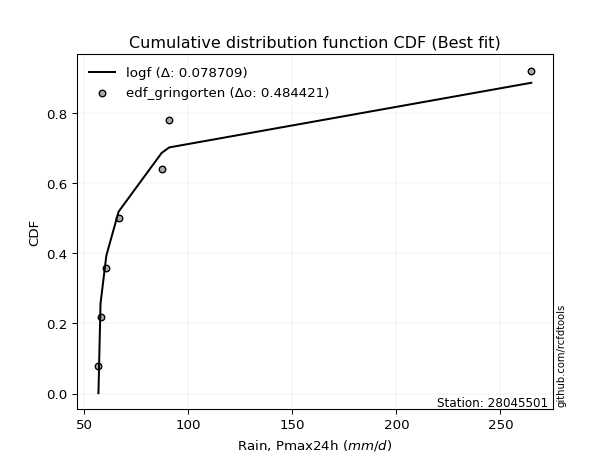</img>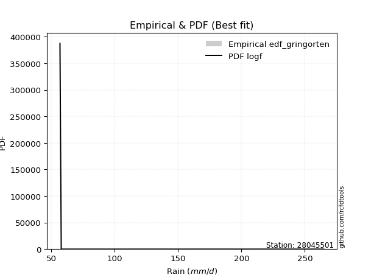</img>

</div>


### 9. EDF Filliben (1975)

The specific values of the constants (0.3175) (often denoted as $alpha$) and (0.365) are derived from a method proposed by James J. Filliben in a 1975 paper. This particular formula is the mean value of the $i$-th order statistic of the normal distribution and is considered a robust and effective plotting position formula for the normal probability plot correlation coefficient test for normality.

<div align="center">


$P=(m-0.3175)/(n+0.365)$


</div>


**9.1. Empirical values**

<div align="center">

|                | 0                   | 1                   | 2                   | 3            | 4                  | 5                  | 6                  |
|:---------------|:--------------------|:--------------------|:--------------------|:-------------|:-------------------|:-------------------|:-------------------|
| date           | 2023                | 2018                | 2020                | 2021         | 2022               | 2017               | 2019               |
| x              | 56.8                | 57.8                | 60.6                | 66.5         | 87.2               | 90.8               | 264.9              |
| m              | 1                   | 2                   | 3                   | 4            | 5                  | 6                  | 7                  |
| empirical_dist | edf_filliben        | edf_filliben        | edf_filliben        | edf_filliben | edf_filliben       | edf_filliben       | edf_filliben       |
| empirical      | 0.09266802443991853 | 0.22844534962661237 | 0.36422267481330617 | 0.5          | 0.6357773251866938 | 0.7715546503733877 | 0.9073319755600815 |
| empirical_tr   | 1.1021324354657687  | 1.2960844698636163  | 1.5728777362520021  | 2.0          | 2.7455731593662627 | 4.377414561664191  | 10.791208791208794 |

</div>


**9.2. Kolmogorov-Smirnov fit test (sorted by Δ)**


<div align="center">

|                | 0                   | 1                   | 2                   | 3                   | 4                   | 5                   | 6                   | 7                   | 8                   | 9                   | 10                  | 11                  | 12                  | 13                  | 14                  | 15                  | 16                  | 17                  | 18                  | 19                  | 20                  | 21                  | 22                  | 23                  | 24                  | 25                  | 26                  | 27                  | 28                  | 29                  | 30                  | 31                  | 32                  | 33                  | 34                  | 35                  | 36                  | 37                  | 38                  | 39                  | 40                  | 41                  | 42                  | 43                  | 44                  | 45                  | 46                  | 47                  | 48                  | 49                  | 50                  | 51                  | 52                  | 53                  | 54                  | 55                  | 56                  | 57                  | 58                  | 59                  | 60                  | 61                  | 62                  | 63                  | 64                  | 65                  | 66                  | 67                  | 68                  | 69                  | 70                  | 71                  | 72                  | 73                  | 74                  | 75                  | 76                  | 77                  | 78                  | 79                  | 80                  | 81                  | 82                  | 83                  | 84                  | 85                  | 86                  | 87                  | 88                  | 89                  | 90                  | 91                  | 92                  | 93                  | 94                  | 95                  | 96                  | 97                  | 98                  | 99                  | 100                 | 101                 | 102                 | 103                 | 104                 | 105                 | 106                 | 107                 | 108                 | 109                 | 110                 | 111                 | 112                 | 113                 | 114                 | 115                 | 116                 | 117                 | 118                 | 119                 | 120                 | 121                 | 122                 | 123                 | 124                 | 125                 | 126                 | 127                 | 128                 | 129                 | 130                 | 131                 | 132                 | 133                 | 134                 | 135                 | 136                 | 137                 | 138                 | 139                 | 140                 | 141                 | 142                 | 143                 | 144                 | 145                 | 146                 | 147                 | 148                 | 149                 | 150                 | 151                 | 152                 | 153                 | 154                 | 155                 | 156                 | 157                 | 158                 | 159                 |
|:---------------|:--------------------|:--------------------|:--------------------|:--------------------|:--------------------|:--------------------|:--------------------|:--------------------|:--------------------|:--------------------|:--------------------|:--------------------|:--------------------|:--------------------|:--------------------|:--------------------|:--------------------|:--------------------|:--------------------|:--------------------|:--------------------|:--------------------|:--------------------|:--------------------|:--------------------|:--------------------|:--------------------|:--------------------|:--------------------|:--------------------|:--------------------|:--------------------|:--------------------|:--------------------|:--------------------|:--------------------|:--------------------|:--------------------|:--------------------|:--------------------|:--------------------|:--------------------|:--------------------|:--------------------|:--------------------|:--------------------|:--------------------|:--------------------|:--------------------|:--------------------|:--------------------|:--------------------|:--------------------|:--------------------|:--------------------|:--------------------|:--------------------|:--------------------|:--------------------|:--------------------|:--------------------|:--------------------|:--------------------|:--------------------|:--------------------|:--------------------|:--------------------|:--------------------|:--------------------|:--------------------|:--------------------|:--------------------|:--------------------|:--------------------|:--------------------|:--------------------|:--------------------|:--------------------|:--------------------|:--------------------|:--------------------|:--------------------|:--------------------|:--------------------|:--------------------|:--------------------|:--------------------|:--------------------|:--------------------|:--------------------|:--------------------|:--------------------|:--------------------|:--------------------|:--------------------|:--------------------|:--------------------|:--------------------|:--------------------|:--------------------|:--------------------|:--------------------|:--------------------|:--------------------|:--------------------|:--------------------|:--------------------|:--------------------|:--------------------|:--------------------|:--------------------|:--------------------|:--------------------|:--------------------|:--------------------|:--------------------|:--------------------|:--------------------|:--------------------|:--------------------|:--------------------|:--------------------|:--------------------|:--------------------|:--------------------|:--------------------|:--------------------|:--------------------|:--------------------|:--------------------|:--------------------|:--------------------|:--------------------|:--------------------|:--------------------|:--------------------|:--------------------|:--------------------|:--------------------|:--------------------|:--------------------|:--------------------|:--------------------|:--------------------|:--------------------|:--------------------|:--------------------|:--------------------|:--------------------|:--------------------|:--------------------|:--------------------|:--------------------|:--------------------|:--------------------|:--------------------|:--------------------|:--------------------|:--------------------|:--------------------|
| station        | 28045501            | 28045501            | 28045501            | 28045501            | 28045501            | 28045501            | 28045501            | 28045501            | 28045501            | 28045501            | 28045501            | 28045501            | 28045501            | 28045501            | 28045501            | 28045501            | 28045501            | 28045501            | 28045501            | 28045501            | 28045501            | 28045501            | 28045501            | 28045501            | 28045501            | 28045501            | 28045501            | 28045501            | 28045501            | 28045501            | 28045501            | 28045501            | 28045501            | 28045501            | 28045501            | 28045501            | 28045501            | 28045501            | 28045501            | 28045501            | 28045501            | 28045501            | 28045501            | 28045501            | 28045501            | 28045501            | 28045501            | 28045501            | 28045501            | 28045501            | 28045501            | 28045501            | 28045501            | 28045501            | 28045501            | 28045501            | 28045501            | 28045501            | 28045501            | 28045501            | 28045501            | 28045501            | 28045501            | 28045501            | 28045501            | 28045501            | 28045501            | 28045501            | 28045501            | 28045501            | 28045501            | 28045501            | 28045501            | 28045501            | 28045501            | 28045501            | 28045501            | 28045501            | 28045501            | 28045501            | 28045501            | 28045501            | 28045501            | 28045501            | 28045501            | 28045501            | 28045501            | 28045501            | 28045501            | 28045501            | 28045501            | 28045501            | 28045501            | 28045501            | 28045501            | 28045501            | 28045501            | 28045501            | 28045501            | 28045501            | 28045501            | 28045501            | 28045501            | 28045501            | 28045501            | 28045501            | 28045501            | 28045501            | 28045501            | 28045501            | 28045501            | 28045501            | 28045501            | 28045501            | 28045501            | 28045501            | 28045501            | 28045501            | 28045501            | 28045501            | 28045501            | 28045501            | 28045501            | 28045501            | 28045501            | 28045501            | 28045501            | 28045501            | 28045501            | 28045501            | 28045501            | 28045501            | 28045501            | 28045501            | 28045501            | 28045501            | 28045501            | 28045501            | 28045501            | 28045501            | 28045501            | 28045501            | 28045501            | 28045501            | 28045501            | 28045501            | 28045501            | 28045501            | 28045501            | 28045501            | 28045501            | 28045501            | 28045501            | 28045501            | 28045501            | 28045501            | 28045501            | 28045501            | 28045501            | 28045501            |
| empirical_dist | edf_filliben        | edf_filliben        | edf_filliben        | edf_filliben        | edf_filliben        | edf_filliben        | edf_filliben        | edf_filliben        | edf_filliben        | edf_filliben        | edf_filliben        | edf_filliben        | edf_filliben        | edf_filliben        | edf_filliben        | edf_filliben        | edf_filliben        | edf_filliben        | edf_filliben        | edf_filliben        | edf_filliben        | edf_filliben        | edf_filliben        | edf_filliben        | edf_filliben        | edf_filliben        | edf_filliben        | edf_filliben        | edf_filliben        | edf_filliben        | edf_filliben        | edf_filliben        | edf_filliben        | edf_filliben        | edf_filliben        | edf_filliben        | edf_filliben        | edf_filliben        | edf_filliben        | edf_filliben        | edf_filliben        | edf_filliben        | edf_filliben        | edf_filliben        | edf_filliben        | edf_filliben        | edf_filliben        | edf_filliben        | edf_filliben        | edf_filliben        | edf_filliben        | edf_filliben        | edf_filliben        | edf_filliben        | edf_filliben        | edf_filliben        | edf_filliben        | edf_filliben        | edf_filliben        | edf_filliben        | edf_filliben        | edf_filliben        | edf_filliben        | edf_filliben        | edf_filliben        | edf_filliben        | edf_filliben        | edf_filliben        | edf_filliben        | edf_filliben        | edf_filliben        | edf_filliben        | edf_filliben        | edf_filliben        | edf_filliben        | edf_filliben        | edf_filliben        | edf_filliben        | edf_filliben        | edf_filliben        | edf_filliben        | edf_filliben        | edf_filliben        | edf_filliben        | edf_filliben        | edf_filliben        | edf_filliben        | edf_filliben        | edf_filliben        | edf_filliben        | edf_filliben        | edf_filliben        | edf_filliben        | edf_filliben        | edf_filliben        | edf_filliben        | edf_filliben        | edf_filliben        | edf_filliben        | edf_filliben        | edf_filliben        | edf_filliben        | edf_filliben        | edf_filliben        | edf_filliben        | edf_filliben        | edf_filliben        | edf_filliben        | edf_filliben        | edf_filliben        | edf_filliben        | edf_filliben        | edf_filliben        | edf_filliben        | edf_filliben        | edf_filliben        | edf_filliben        | edf_filliben        | edf_filliben        | edf_filliben        | edf_filliben        | edf_filliben        | edf_filliben        | edf_filliben        | edf_filliben        | edf_filliben        | edf_filliben        | edf_filliben        | edf_filliben        | edf_filliben        | edf_filliben        | edf_filliben        | edf_filliben        | edf_filliben        | edf_filliben        | edf_filliben        | edf_filliben        | edf_filliben        | edf_filliben        | edf_filliben        | edf_filliben        | edf_filliben        | edf_filliben        | edf_filliben        | edf_filliben        | edf_filliben        | edf_filliben        | edf_filliben        | edf_filliben        | edf_filliben        | edf_filliben        | edf_filliben        | edf_filliben        | edf_filliben        | edf_filliben        | edf_filliben        | edf_filliben        | edf_filliben        | edf_filliben        | edf_filliben        |
| p_dist         | logf                | lognakagami         | gausshyper          | logweibull_min      | erlang              | betaprime           | logncf              | logmielke           | loginvweibull       | loggenextreme       | truncpareto         | logburr             | logbetaprime        | halfgennorm         | gamma               | truncweibull_min    | genpareto           | logwald             | f                   | invgamma            | logmoyal            | loggumbel_r         | loginvgamma         | logbradford         | nakagami            | logtruncpareto      | logpearson3         | logvonmises_line    | loghalflogistic     | invgauss            | loghalfgennorm      | logweibull_max      | loggenlogistic      | loginvgauss         | lognct              | lograyleigh         | logalpha            | nct                 | loggengamma         | logerlang           | loghalfnorm         | logmaxwell          | burr                | logfoldnorm         | alpha               | loggamma            | loggamma            | wald                | ncf                 | logburr12           | burr12              | loglogistic         | logkstwobign        | loglomax            | loggennorm          | lognorm             | logcrystalball      | logloglaplace       | genlogistic         | exponpow            | logloggamma         | loghypsecant        | logexponnorm        | loggenexpon         | logdweibull         | loganglit           | logt                | logsemicircular     | moyal               | vonmises_line       | logdgamma           | logrice             | logbeta             | johnsonsu           | logarcsine          | loglaplace          | loglaplace          | loggompertz         | halflogistic        | pearson3            | logtruncnorm        | gumbel_r            | halfnorm            | t                   | rayleigh            | loggumbel_l         | lomax               | loggausshyper       | genextreme          | powerlaw            | maxwell             | foldnorm            | exponnorm           | logpowerlaw         | genexpon            | logcosine           | logtruncweibull_min | logexponpow         | arcsine             | kstwobign           | logwrapcauchy       | weibull_min         | wrapcauchy          | logskewnorm         | semicircular        | anglit              | logexponweib        | norm                | crystalball         | logistic            | hypsecant           | gengamma            | dweibull            | kappa3              | laplace             | logkappa4           | rice                | exponweib           | fatiguelife         | logtruncexpon       | loglevy_l           | truncnorm           | gennorm             | dgamma              | loggenpareto        | logfatiguelife      | levy_l              | gumbel_l            | logargus            | cosine              | gompertz            | invweibull          | logtriang           | logksone            | logrdist            | skewnorm            | logtukeylambda      | loguniform          | logkappa3           | argus               | triang              | truncexpon          | johnsonsb           | tukeylambda         | rdist               | loggenhalflogistic  | ksone               | bradford            | logjohnsonsb        | kappa4              | beta                | uniform             | genhalflogistic     | logtrapezoid        | weibull_max         | logjohnsonsu        | trapezoid           | logvonmises         | vonmises            | mielke              |
| delta          | 0.09174584249663431 | 0.09253642746569771 | 0.09264564382171638 | 0.09266551623882378 | 0.09266774944756564 | 0.10217570510865084 | 0.10743967430255197 | 0.11061033737804615 | 0.11212559410243528 | 0.11213419274250569 | 0.11334439442772466 | 0.11433276426172556 | 0.11583054946411686 | 0.11823056199497173 | 0.11857617868433534 | 0.11913415596099175 | 0.12234513590909646 | 0.12434476465981104 | 0.12448429155117413 | 0.12448574132427748 | 0.12589637936578144 | 0.1342065174432634  | 0.13708385520188382 | 0.13862469067851513 | 0.1389176266048279  | 0.14002795593978024 | 0.14221972856661527 | 0.1507985469723044  | 0.15183736615567875 | 0.15740518765826528 | 0.15805032643932804 | 0.15812366275184392 | 0.16077263032856692 | 0.16256980037233937 | 0.16400209093354146 | 0.1650138790357425  | 0.16504099954127982 | 0.17106234067790338 | 0.17218800761837283 | 0.17231131460547044 | 0.17396629165038044 | 0.17424563683921368 | 0.17860537381060604 | 0.18081927211367757 | 0.1828055428055405  | 0.1850259575608646  | 0.1850259575608646  | 0.187289726123648   | 0.1881377156162558  | 0.18896810322334484 | 0.18979436187089851 | 0.19428513639199407 | 0.1956337704641088  | 0.20017559150677103 | 0.20099531207076715 | 0.20335990142492444 | 0.20335990767741263 | 0.20414727127107454 | 0.20441881748808566 | 0.20564179973237517 | 0.2064658693871223  | 0.2066592192561818  | 0.20689994674289314 | 0.20839416964842603 | 0.20936806758787954 | 0.21296935117286386 | 0.2151723186498501  | 0.2169422180484123  | 0.2181310340745034  | 0.21849080323343392 | 0.22083620525110156 | 0.22130361977714297 | 0.22441814326757667 | 0.23055859036484405 | 0.2327946153092868  | 0.23384338338559868 | 0.23384338338559868 | 0.2402815719732953  | 0.24168317494923777 | 0.24211319248382415 | 0.24260317226424086 | 0.2437254107346264  | 0.24871989967283217 | 0.25962088656452154 | 0.2657727158272365  | 0.26821793143182937 | 0.2683077066817189  | 0.27124932361180343 | 0.2719617670562874  | 0.2725183228410947  | 0.27752764230294846 | 0.2784362538420516  | 0.287066654430586   | 0.28818653956932383 | 0.2893478817531812  | 0.29024789590771694 | 0.2909219673984943  | 0.2931390891857809  | 0.2942717802623936  | 0.29766026569723947 | 0.29852646552784146 | 0.29867989366521175 | 0.30086208304212786 | 0.3032595689847401  | 0.3036406901611896  | 0.30599918456817615 | 0.30886760067473207 | 0.3117174802470727  | 0.3117174849670749  | 0.3171552570840281  | 0.32176707020777295 | 0.3229116204826368  | 0.33528292490441924 | 0.33689140967908804 | 0.33801068033379267 | 0.33936881332255076 | 0.3415242960373487  | 0.34162606648985316 | 0.34199851354707866 | 0.34342868070620836 | 0.36361481352263536 | 0.3641162081375248  | 0.3663773610781377  | 0.366801596457229   | 0.36763268406670024 | 0.37000281565953597 | 0.3785295842339489  | 0.3821371904752206  | 0.3899844987684563  | 0.39420881238318034 | 0.4158493900926958  | 0.42808534449997204 | 0.43417734709712663 | 0.43433657887113214 | 0.4375208425969961  | 0.4447496802446549  | 0.4618380825068642  | 0.4668929645706811  | 0.4674369239513585  | 0.47181385061818626 | 0.5117776785158281  | 0.5137406100380026  | 0.5176426196730425  | 0.5270342605025655  | 0.5283226727180307  | 0.532991904053586   | 0.5520688262503699  | 0.5669886298003872  | 0.5765596844141462  | 0.577976850702114   | 0.6002552776403794  | 0.6081716614257663  | 0.6426030545183543  | 0.6578386226256874  | 0.6751220738184729  | 0.6862201532702379  | 0.7233806233824274  | 1.1430184762863285  | 41.54416308658514   | nan                 |
| deltao         | 0.48442053926100004 | 0.48442053926100004 | 0.48442053926100004 | 0.48442053926100004 | 0.48442053926100004 | 0.48442053926100004 | 0.48442053926100004 | 0.48442053926100004 | 0.48442053926100004 | 0.48442053926100004 | 0.48442053926100004 | 0.48442053926100004 | 0.48442053926100004 | 0.48442053926100004 | 0.48442053926100004 | 0.48442053926100004 | 0.48442053926100004 | 0.48442053926100004 | 0.48442053926100004 | 0.48442053926100004 | 0.48442053926100004 | 0.48442053926100004 | 0.48442053926100004 | 0.48442053926100004 | 0.48442053926100004 | 0.48442053926100004 | 0.48442053926100004 | 0.48442053926100004 | 0.48442053926100004 | 0.48442053926100004 | 0.48442053926100004 | 0.48442053926100004 | 0.48442053926100004 | 0.48442053926100004 | 0.48442053926100004 | 0.48442053926100004 | 0.48442053926100004 | 0.48442053926100004 | 0.48442053926100004 | 0.48442053926100004 | 0.48442053926100004 | 0.48442053926100004 | 0.48442053926100004 | 0.48442053926100004 | 0.48442053926100004 | 0.48442053926100004 | 0.48442053926100004 | 0.48442053926100004 | 0.48442053926100004 | 0.48442053926100004 | 0.48442053926100004 | 0.48442053926100004 | 0.48442053926100004 | 0.48442053926100004 | 0.48442053926100004 | 0.48442053926100004 | 0.48442053926100004 | 0.48442053926100004 | 0.48442053926100004 | 0.48442053926100004 | 0.48442053926100004 | 0.48442053926100004 | 0.48442053926100004 | 0.48442053926100004 | 0.48442053926100004 | 0.48442053926100004 | 0.48442053926100004 | 0.48442053926100004 | 0.48442053926100004 | 0.48442053926100004 | 0.48442053926100004 | 0.48442053926100004 | 0.48442053926100004 | 0.48442053926100004 | 0.48442053926100004 | 0.48442053926100004 | 0.48442053926100004 | 0.48442053926100004 | 0.48442053926100004 | 0.48442053926100004 | 0.48442053926100004 | 0.48442053926100004 | 0.48442053926100004 | 0.48442053926100004 | 0.48442053926100004 | 0.48442053926100004 | 0.48442053926100004 | 0.48442053926100004 | 0.48442053926100004 | 0.48442053926100004 | 0.48442053926100004 | 0.48442053926100004 | 0.48442053926100004 | 0.48442053926100004 | 0.48442053926100004 | 0.48442053926100004 | 0.48442053926100004 | 0.48442053926100004 | 0.48442053926100004 | 0.48442053926100004 | 0.48442053926100004 | 0.48442053926100004 | 0.48442053926100004 | 0.48442053926100004 | 0.48442053926100004 | 0.48442053926100004 | 0.48442053926100004 | 0.48442053926100004 | 0.48442053926100004 | 0.48442053926100004 | 0.48442053926100004 | 0.48442053926100004 | 0.48442053926100004 | 0.48442053926100004 | 0.48442053926100004 | 0.48442053926100004 | 0.48442053926100004 | 0.48442053926100004 | 0.48442053926100004 | 0.48442053926100004 | 0.48442053926100004 | 0.48442053926100004 | 0.48442053926100004 | 0.48442053926100004 | 0.48442053926100004 | 0.48442053926100004 | 0.48442053926100004 | 0.48442053926100004 | 0.48442053926100004 | 0.48442053926100004 | 0.48442053926100004 | 0.48442053926100004 | 0.48442053926100004 | 0.48442053926100004 | 0.48442053926100004 | 0.48442053926100004 | 0.48442053926100004 | 0.48442053926100004 | 0.48442053926100004 | 0.48442053926100004 | 0.48442053926100004 | 0.48442053926100004 | 0.48442053926100004 | 0.48442053926100004 | 0.48442053926100004 | 0.48442053926100004 | 0.48442053926100004 | 0.48442053926100004 | 0.48442053926100004 | 0.48442053926100004 | 0.48442053926100004 | 0.48442053926100004 | 0.48442053926100004 | 0.48442053926100004 | 0.48442053926100004 | 0.48442053926100004 | 0.48442053926100004 | 0.48442053926100004 | 0.48442053926100004 | 0.48442053926100004 |
| eval           | Δo > Δ              | Δo > Δ              | Δo > Δ              | Δo > Δ              | Δo > Δ              | Δo > Δ              | Δo > Δ              | Δo > Δ              | Δo > Δ              | Δo > Δ              | Δo > Δ              | Δo > Δ              | Δo > Δ              | Δo > Δ              | Δo > Δ              | Δo > Δ              | Δo > Δ              | Δo > Δ              | Δo > Δ              | Δo > Δ              | Δo > Δ              | Δo > Δ              | Δo > Δ              | Δo > Δ              | Δo > Δ              | Δo > Δ              | Δo > Δ              | Δo > Δ              | Δo > Δ              | Δo > Δ              | Δo > Δ              | Δo > Δ              | Δo > Δ              | Δo > Δ              | Δo > Δ              | Δo > Δ              | Δo > Δ              | Δo > Δ              | Δo > Δ              | Δo > Δ              | Δo > Δ              | Δo > Δ              | Δo > Δ              | Δo > Δ              | Δo > Δ              | Δo > Δ              | Δo > Δ              | Δo > Δ              | Δo > Δ              | Δo > Δ              | Δo > Δ              | Δo > Δ              | Δo > Δ              | Δo > Δ              | Δo > Δ              | Δo > Δ              | Δo > Δ              | Δo > Δ              | Δo > Δ              | Δo > Δ              | Δo > Δ              | Δo > Δ              | Δo > Δ              | Δo > Δ              | Δo > Δ              | Δo > Δ              | Δo > Δ              | Δo > Δ              | Δo > Δ              | Δo > Δ              | Δo > Δ              | Δo > Δ              | Δo > Δ              | Δo > Δ              | Δo > Δ              | Δo > Δ              | Δo > Δ              | Δo > Δ              | Δo > Δ              | Δo > Δ              | Δo > Δ              | Δo > Δ              | Δo > Δ              | Δo > Δ              | Δo > Δ              | Δo > Δ              | Δo > Δ              | Δo > Δ              | Δo > Δ              | Δo > Δ              | Δo > Δ              | Δo > Δ              | Δo > Δ              | Δo > Δ              | Δo > Δ              | Δo > Δ              | Δo > Δ              | Δo > Δ              | Δo > Δ              | Δo > Δ              | Δo > Δ              | Δo > Δ              | Δo > Δ              | Δo > Δ              | Δo > Δ              | Δo > Δ              | Δo > Δ              | Δo > Δ              | Δo > Δ              | Δo > Δ              | Δo > Δ              | Δo > Δ              | Δo > Δ              | Δo > Δ              | Δo > Δ              | Δo > Δ              | Δo > Δ              | Δo > Δ              | Δo > Δ              | Δo > Δ              | Δo > Δ              | Δo > Δ              | Δo > Δ              | Δo > Δ              | Δo > Δ              | Δo > Δ              | Δo > Δ              | Δo > Δ              | Δo > Δ              | Δo > Δ              | Δo > Δ              | Δo > Δ              | Δo > Δ              | Δo > Δ              | Δo > Δ              | Δo > Δ              | Δo > Δ              | Δo > Δ              | Δo > Δ              | Δo > Δ              | Δo <= Δ             | Δo <= Δ             | Δo <= Δ             | Δo <= Δ             | Δo <= Δ             | Δo <= Δ             | Δo <= Δ             | Δo <= Δ             | Δo <= Δ             | Δo <= Δ             | Δo <= Δ             | Δo <= Δ             | Δo <= Δ             | Δo <= Δ             | Δo <= Δ             | Δo <= Δ             | Δo <= Δ             | Δo <= Δ             | Δo <= Δ             | Δo <= Δ             |
| fit            | 1                   | 1                   | 1                   | 1                   | 1                   | 1                   | 1                   | 1                   | 1                   | 1                   | 1                   | 1                   | 1                   | 1                   | 1                   | 1                   | 1                   | 1                   | 1                   | 1                   | 1                   | 1                   | 1                   | 1                   | 1                   | 1                   | 1                   | 1                   | 1                   | 1                   | 1                   | 1                   | 1                   | 1                   | 1                   | 1                   | 1                   | 1                   | 1                   | 1                   | 1                   | 1                   | 1                   | 1                   | 1                   | 1                   | 1                   | 1                   | 1                   | 1                   | 1                   | 1                   | 1                   | 1                   | 1                   | 1                   | 1                   | 1                   | 1                   | 1                   | 1                   | 1                   | 1                   | 1                   | 1                   | 1                   | 1                   | 1                   | 1                   | 1                   | 1                   | 1                   | 1                   | 1                   | 1                   | 1                   | 1                   | 1                   | 1                   | 1                   | 1                   | 1                   | 1                   | 1                   | 1                   | 1                   | 1                   | 1                   | 1                   | 1                   | 1                   | 1                   | 1                   | 1                   | 1                   | 1                   | 1                   | 1                   | 1                   | 1                   | 1                   | 1                   | 1                   | 1                   | 1                   | 1                   | 1                   | 1                   | 1                   | 1                   | 1                   | 1                   | 1                   | 1                   | 1                   | 1                   | 1                   | 1                   | 1                   | 1                   | 1                   | 1                   | 1                   | 1                   | 1                   | 1                   | 1                   | 1                   | 1                   | 1                   | 1                   | 1                   | 1                   | 1                   | 1                   | 1                   | 1                   | 1                   | 1                   | 1                   | 0                   | 0                   | 0                   | 0                   | 0                   | 0                   | 0                   | 0                   | 0                   | 0                   | 0                   | 0                   | 0                   | 0                   | 0                   | 0                   | 0                   | 0                   | 0                   | 0                   |
| n              | 7                   | 7                   | 7                   | 7                   | 7                   | 7                   | 7                   | 7                   | 7                   | 7                   | 7                   | 7                   | 7                   | 7                   | 7                   | 7                   | 7                   | 7                   | 7                   | 7                   | 7                   | 7                   | 7                   | 7                   | 7                   | 7                   | 7                   | 7                   | 7                   | 7                   | 7                   | 7                   | 7                   | 7                   | 7                   | 7                   | 7                   | 7                   | 7                   | 7                   | 7                   | 7                   | 7                   | 7                   | 7                   | 7                   | 7                   | 7                   | 7                   | 7                   | 7                   | 7                   | 7                   | 7                   | 7                   | 7                   | 7                   | 7                   | 7                   | 7                   | 7                   | 7                   | 7                   | 7                   | 7                   | 7                   | 7                   | 7                   | 7                   | 7                   | 7                   | 7                   | 7                   | 7                   | 7                   | 7                   | 7                   | 7                   | 7                   | 7                   | 7                   | 7                   | 7                   | 7                   | 7                   | 7                   | 7                   | 7                   | 7                   | 7                   | 7                   | 7                   | 7                   | 7                   | 7                   | 7                   | 7                   | 7                   | 7                   | 7                   | 7                   | 7                   | 7                   | 7                   | 7                   | 7                   | 7                   | 7                   | 7                   | 7                   | 7                   | 7                   | 7                   | 7                   | 7                   | 7                   | 7                   | 7                   | 7                   | 7                   | 7                   | 7                   | 7                   | 7                   | 7                   | 7                   | 7                   | 7                   | 7                   | 7                   | 7                   | 7                   | 7                   | 7                   | 7                   | 7                   | 7                   | 7                   | 7                   | 7                   | 7                   | 7                   | 7                   | 7                   | 7                   | 7                   | 7                   | 7                   | 7                   | 7                   | 7                   | 7                   | 7                   | 7                   | 7                   | 7                   | 7                   | 7                   | 7                   | 7                   |
| best_fit       | 1                   | 0                   | 0                   | 0                   | 0                   | 0                   | 0                   | 0                   | 0                   | 0                   | 0                   | 0                   | 0                   | 0                   | 0                   | 0                   | 0                   | 0                   | 0                   | 0                   | 0                   | 0                   | 0                   | 0                   | 0                   | 0                   | 0                   | 0                   | 0                   | 0                   | 0                   | 0                   | 0                   | 0                   | 0                   | 0                   | 0                   | 0                   | 0                   | 0                   | 0                   | 0                   | 0                   | 0                   | 0                   | 0                   | 0                   | 0                   | 0                   | 0                   | 0                   | 0                   | 0                   | 0                   | 0                   | 0                   | 0                   | 0                   | 0                   | 0                   | 0                   | 0                   | 0                   | 0                   | 0                   | 0                   | 0                   | 0                   | 0                   | 0                   | 0                   | 0                   | 0                   | 0                   | 0                   | 0                   | 0                   | 0                   | 0                   | 0                   | 0                   | 0                   | 0                   | 0                   | 0                   | 0                   | 0                   | 0                   | 0                   | 0                   | 0                   | 0                   | 0                   | 0                   | 0                   | 0                   | 0                   | 0                   | 0                   | 0                   | 0                   | 0                   | 0                   | 0                   | 0                   | 0                   | 0                   | 0                   | 0                   | 0                   | 0                   | 0                   | 0                   | 0                   | 0                   | 0                   | 0                   | 0                   | 0                   | 0                   | 0                   | 0                   | 0                   | 0                   | 0                   | 0                   | 0                   | 0                   | 0                   | 0                   | 0                   | 0                   | 0                   | 0                   | 0                   | 0                   | 0                   | 0                   | 0                   | 0                   | 0                   | 0                   | 0                   | 0                   | 0                   | 0                   | 0                   | 0                   | 0                   | 0                   | 0                   | 0                   | 0                   | 0                   | 0                   | 0                   | 0                   | 0                   | 0                   | 0                   |
| best_fit_sort  | 1                   | 2                   | 3                   | 4                   | 5                   | 6                   | 7                   | 8                   | 9                   | 10                  | 11                  | 12                  | 13                  | 14                  | 15                  | 16                  | 17                  | 18                  | 19                  | 20                  | 21                  | 22                  | 23                  | 24                  | 25                  | 26                  | 27                  | 28                  | 29                  | 30                  | 31                  | 32                  | 33                  | 34                  | 35                  | 36                  | 37                  | 38                  | 39                  | 40                  | 41                  | 42                  | 43                  | 44                  | 45                  | 46                  | 47                  | 48                  | 49                  | 50                  | 51                  | 52                  | 53                  | 54                  | 55                  | 56                  | 57                  | 58                  | 59                  | 60                  | 61                  | 62                  | 63                  | 64                  | 65                  | 66                  | 67                  | 68                  | 69                  | 70                  | 71                  | 72                  | 73                  | 74                  | 75                  | 76                  | 77                  | 78                  | 79                  | 80                  | 81                  | 82                  | 83                  | 84                  | 85                  | 86                  | 87                  | 88                  | 89                  | 90                  | 91                  | 92                  | 93                  | 94                  | 95                  | 96                  | 97                  | 98                  | 99                  | 100                 | 101                 | 102                 | 103                 | 104                 | 105                 | 106                 | 107                 | 108                 | 109                 | 110                 | 111                 | 112                 | 113                 | 114                 | 115                 | 116                 | 117                 | 118                 | 119                 | 120                 | 121                 | 122                 | 123                 | 124                 | 125                 | 126                 | 127                 | 128                 | 129                 | 130                 | 131                 | 132                 | 133                 | 134                 | 135                 | 136                 | 137                 | 138                 | 139                 | 140                 | 141                 | 142                 | 143                 | 144                 | 145                 | 146                 | 147                 | 148                 | 149                 | 150                 | 151                 | 152                 | 153                 | 154                 | 155                 | 156                 | 157                 | 158                 | 159                 | 160                 |

</div>


**9.3. Best fit**

<div align="center">

|   id |   station | empirical_dist   | p_dist   |     delta |   deltao | eval   |   fit |   n |   best_fit |   best_fit_sort |
|-----:|----------:|:-----------------|:---------|----------:|---------:|:-------|------:|----:|-----------:|----------------:|
|    0 |  28045501 | edf_filliben     | logf     | 0.0917458 | 0.484421 | Δo > Δ |     1 |   7 |          1 |               1 |

</div>


<div align="center">

</img>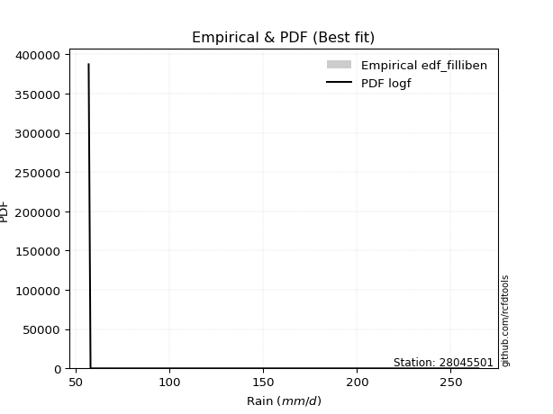</img>

</div>


### 10. EDF Jenkinson (1977)

The Jenkinson formula in hydrology is an empirical plotting position formula used to estimate the non-exceedance probability _(P)_ or return period _(T)_ of a given ordered observation within a sample. It is a widely used method in the frequency analysis of extreme events such as floods and rainfall, as it provides a distribution-free way to plot data. _a≈0.31_ and _b≈0.38_ are constants derived to approximate the median of the probability distribution for the given rank.

<div align="center">


$P=(m-a)/(n+b)$


</div>


**10.1. Empirical values**

<div align="center">

|                | 0                   | 1                   | 2                   | 3             | 4                  | 5                  | 6                  |
|:---------------|:--------------------|:--------------------|:--------------------|:--------------|:-------------------|:-------------------|:-------------------|
| date           | 2023                | 2018                | 2020                | 2021          | 2022               | 2017               | 2019               |
| x              | 56.8                | 57.8                | 60.6                | 66.5          | 87.2               | 90.8               | 264.9              |
| m              | 1                   | 2                   | 3                   | 4             | 5                  | 6                  | 7                  |
| empirical_dist | edf_jenkinson       | edf_jenkinson       | edf_jenkinson       | edf_jenkinson | edf_jenkinson      | edf_jenkinson      | edf_jenkinson      |
| empirical      | 0.09349593495934959 | 0.22899728997289973 | 0.36449864498644985 | 0.5           | 0.6355013550135502 | 0.7710027100271003 | 0.9065040650406505 |
| empirical_tr   | 1.1031390134529149  | 1.29701230228471    | 1.5735607675906182  | 2.0           | 2.743494423791822  | 4.366863905325444  | 10.695652173913055 |

</div>


**10.2. Kolmogorov-Smirnov fit test (sorted by Δ)**


<div align="center">

|                | 0                   | 1                   | 2                   | 3                   | 4                   | 5                   | 6                   | 7                   | 8                   | 9                   | 10                  | 11                  | 12                  | 13                  | 14                  | 15                  | 16                  | 17                  | 18                  | 19                  | 20                  | 21                  | 22                  | 23                  | 24                  | 25                  | 26                  | 27                  | 28                  | 29                  | 30                  | 31                  | 32                  | 33                  | 34                  | 35                  | 36                  | 37                  | 38                  | 39                  | 40                  | 41                  | 42                  | 43                  | 44                  | 45                  | 46                  | 47                  | 48                  | 49                  | 50                  | 51                  | 52                  | 53                  | 54                  | 55                  | 56                  | 57                  | 58                  | 59                  | 60                  | 61                  | 62                  | 63                  | 64                  | 65                  | 66                  | 67                  | 68                  | 69                  | 70                  | 71                  | 72                  | 73                  | 74                  | 75                  | 76                  | 77                  | 78                  | 79                  | 80                  | 81                  | 82                  | 83                  | 84                  | 85                  | 86                  | 87                  | 88                  | 89                  | 90                  | 91                  | 92                  | 93                  | 94                  | 95                  | 96                  | 97                  | 98                  | 99                  | 100                 | 101                 | 102                 | 103                 | 104                 | 105                 | 106                 | 107                 | 108                 | 109                 | 110                 | 111                 | 112                 | 113                 | 114                 | 115                 | 116                 | 117                 | 118                 | 119                 | 120                 | 121                 | 122                 | 123                 | 124                 | 125                 | 126                 | 127                 | 128                 | 129                 | 130                 | 131                 | 132                 | 133                 | 134                 | 135                 | 136                 | 137                 | 138                 | 139                 | 140                 | 141                 | 142                 | 143                 | 144                 | 145                 | 146                 | 147                 | 148                 | 149                 | 150                 | 151                 | 152                 | 153                 | 154                 | 155                 | 156                 | 157                 | 158                 | 159                 |
|:---------------|:--------------------|:--------------------|:--------------------|:--------------------|:--------------------|:--------------------|:--------------------|:--------------------|:--------------------|:--------------------|:--------------------|:--------------------|:--------------------|:--------------------|:--------------------|:--------------------|:--------------------|:--------------------|:--------------------|:--------------------|:--------------------|:--------------------|:--------------------|:--------------------|:--------------------|:--------------------|:--------------------|:--------------------|:--------------------|:--------------------|:--------------------|:--------------------|:--------------------|:--------------------|:--------------------|:--------------------|:--------------------|:--------------------|:--------------------|:--------------------|:--------------------|:--------------------|:--------------------|:--------------------|:--------------------|:--------------------|:--------------------|:--------------------|:--------------------|:--------------------|:--------------------|:--------------------|:--------------------|:--------------------|:--------------------|:--------------------|:--------------------|:--------------------|:--------------------|:--------------------|:--------------------|:--------------------|:--------------------|:--------------------|:--------------------|:--------------------|:--------------------|:--------------------|:--------------------|:--------------------|:--------------------|:--------------------|:--------------------|:--------------------|:--------------------|:--------------------|:--------------------|:--------------------|:--------------------|:--------------------|:--------------------|:--------------------|:--------------------|:--------------------|:--------------------|:--------------------|:--------------------|:--------------------|:--------------------|:--------------------|:--------------------|:--------------------|:--------------------|:--------------------|:--------------------|:--------------------|:--------------------|:--------------------|:--------------------|:--------------------|:--------------------|:--------------------|:--------------------|:--------------------|:--------------------|:--------------------|:--------------------|:--------------------|:--------------------|:--------------------|:--------------------|:--------------------|:--------------------|:--------------------|:--------------------|:--------------------|:--------------------|:--------------------|:--------------------|:--------------------|:--------------------|:--------------------|:--------------------|:--------------------|:--------------------|:--------------------|:--------------------|:--------------------|:--------------------|:--------------------|:--------------------|:--------------------|:--------------------|:--------------------|:--------------------|:--------------------|:--------------------|:--------------------|:--------------------|:--------------------|:--------------------|:--------------------|:--------------------|:--------------------|:--------------------|:--------------------|:--------------------|:--------------------|:--------------------|:--------------------|:--------------------|:--------------------|:--------------------|:--------------------|:--------------------|:--------------------|:--------------------|:--------------------|:--------------------|:--------------------|
| station        | 28045501            | 28045501            | 28045501            | 28045501            | 28045501            | 28045501            | 28045501            | 28045501            | 28045501            | 28045501            | 28045501            | 28045501            | 28045501            | 28045501            | 28045501            | 28045501            | 28045501            | 28045501            | 28045501            | 28045501            | 28045501            | 28045501            | 28045501            | 28045501            | 28045501            | 28045501            | 28045501            | 28045501            | 28045501            | 28045501            | 28045501            | 28045501            | 28045501            | 28045501            | 28045501            | 28045501            | 28045501            | 28045501            | 28045501            | 28045501            | 28045501            | 28045501            | 28045501            | 28045501            | 28045501            | 28045501            | 28045501            | 28045501            | 28045501            | 28045501            | 28045501            | 28045501            | 28045501            | 28045501            | 28045501            | 28045501            | 28045501            | 28045501            | 28045501            | 28045501            | 28045501            | 28045501            | 28045501            | 28045501            | 28045501            | 28045501            | 28045501            | 28045501            | 28045501            | 28045501            | 28045501            | 28045501            | 28045501            | 28045501            | 28045501            | 28045501            | 28045501            | 28045501            | 28045501            | 28045501            | 28045501            | 28045501            | 28045501            | 28045501            | 28045501            | 28045501            | 28045501            | 28045501            | 28045501            | 28045501            | 28045501            | 28045501            | 28045501            | 28045501            | 28045501            | 28045501            | 28045501            | 28045501            | 28045501            | 28045501            | 28045501            | 28045501            | 28045501            | 28045501            | 28045501            | 28045501            | 28045501            | 28045501            | 28045501            | 28045501            | 28045501            | 28045501            | 28045501            | 28045501            | 28045501            | 28045501            | 28045501            | 28045501            | 28045501            | 28045501            | 28045501            | 28045501            | 28045501            | 28045501            | 28045501            | 28045501            | 28045501            | 28045501            | 28045501            | 28045501            | 28045501            | 28045501            | 28045501            | 28045501            | 28045501            | 28045501            | 28045501            | 28045501            | 28045501            | 28045501            | 28045501            | 28045501            | 28045501            | 28045501            | 28045501            | 28045501            | 28045501            | 28045501            | 28045501            | 28045501            | 28045501            | 28045501            | 28045501            | 28045501            | 28045501            | 28045501            | 28045501            | 28045501            | 28045501            | 28045501            |
| empirical_dist | edf_jenkinson       | edf_jenkinson       | edf_jenkinson       | edf_jenkinson       | edf_jenkinson       | edf_jenkinson       | edf_jenkinson       | edf_jenkinson       | edf_jenkinson       | edf_jenkinson       | edf_jenkinson       | edf_jenkinson       | edf_jenkinson       | edf_jenkinson       | edf_jenkinson       | edf_jenkinson       | edf_jenkinson       | edf_jenkinson       | edf_jenkinson       | edf_jenkinson       | edf_jenkinson       | edf_jenkinson       | edf_jenkinson       | edf_jenkinson       | edf_jenkinson       | edf_jenkinson       | edf_jenkinson       | edf_jenkinson       | edf_jenkinson       | edf_jenkinson       | edf_jenkinson       | edf_jenkinson       | edf_jenkinson       | edf_jenkinson       | edf_jenkinson       | edf_jenkinson       | edf_jenkinson       | edf_jenkinson       | edf_jenkinson       | edf_jenkinson       | edf_jenkinson       | edf_jenkinson       | edf_jenkinson       | edf_jenkinson       | edf_jenkinson       | edf_jenkinson       | edf_jenkinson       | edf_jenkinson       | edf_jenkinson       | edf_jenkinson       | edf_jenkinson       | edf_jenkinson       | edf_jenkinson       | edf_jenkinson       | edf_jenkinson       | edf_jenkinson       | edf_jenkinson       | edf_jenkinson       | edf_jenkinson       | edf_jenkinson       | edf_jenkinson       | edf_jenkinson       | edf_jenkinson       | edf_jenkinson       | edf_jenkinson       | edf_jenkinson       | edf_jenkinson       | edf_jenkinson       | edf_jenkinson       | edf_jenkinson       | edf_jenkinson       | edf_jenkinson       | edf_jenkinson       | edf_jenkinson       | edf_jenkinson       | edf_jenkinson       | edf_jenkinson       | edf_jenkinson       | edf_jenkinson       | edf_jenkinson       | edf_jenkinson       | edf_jenkinson       | edf_jenkinson       | edf_jenkinson       | edf_jenkinson       | edf_jenkinson       | edf_jenkinson       | edf_jenkinson       | edf_jenkinson       | edf_jenkinson       | edf_jenkinson       | edf_jenkinson       | edf_jenkinson       | edf_jenkinson       | edf_jenkinson       | edf_jenkinson       | edf_jenkinson       | edf_jenkinson       | edf_jenkinson       | edf_jenkinson       | edf_jenkinson       | edf_jenkinson       | edf_jenkinson       | edf_jenkinson       | edf_jenkinson       | edf_jenkinson       | edf_jenkinson       | edf_jenkinson       | edf_jenkinson       | edf_jenkinson       | edf_jenkinson       | edf_jenkinson       | edf_jenkinson       | edf_jenkinson       | edf_jenkinson       | edf_jenkinson       | edf_jenkinson       | edf_jenkinson       | edf_jenkinson       | edf_jenkinson       | edf_jenkinson       | edf_jenkinson       | edf_jenkinson       | edf_jenkinson       | edf_jenkinson       | edf_jenkinson       | edf_jenkinson       | edf_jenkinson       | edf_jenkinson       | edf_jenkinson       | edf_jenkinson       | edf_jenkinson       | edf_jenkinson       | edf_jenkinson       | edf_jenkinson       | edf_jenkinson       | edf_jenkinson       | edf_jenkinson       | edf_jenkinson       | edf_jenkinson       | edf_jenkinson       | edf_jenkinson       | edf_jenkinson       | edf_jenkinson       | edf_jenkinson       | edf_jenkinson       | edf_jenkinson       | edf_jenkinson       | edf_jenkinson       | edf_jenkinson       | edf_jenkinson       | edf_jenkinson       | edf_jenkinson       | edf_jenkinson       | edf_jenkinson       | edf_jenkinson       | edf_jenkinson       | edf_jenkinson       | edf_jenkinson       | edf_jenkinson       |
| p_dist         | logf                | lognakagami         | gausshyper          | logweibull_min      | erlang              | betaprime           | logncf              | logmielke           | loginvweibull       | loggenextreme       | truncpareto         | logburr             | logbetaprime        | halfgennorm         | truncweibull_min    | gamma               | genpareto           | logwald             | f                   | invgamma            | logmoyal            | loggumbel_r         | loginvgamma         | nakagami            | logbradford         | logtruncpareto      | logpearson3         | logvonmises_line    | loghalflogistic     | invgauss            | logweibull_max      | loghalfgennorm      | loggenlogistic      | loginvgauss         | lognct              | lograyleigh         | logalpha            | nct                 | loggengamma         | logerlang           | loghalfnorm         | logmaxwell          | burr                | logfoldnorm         | alpha               | loggamma            | loggamma            | wald                | ncf                 | logburr12           | burr12              | loglogistic         | logkstwobign        | loglomax            | loggennorm          | lognorm             | logcrystalball      | logloglaplace       | genlogistic         | exponpow            | logloggamma         | loghypsecant        | logexponnorm        | logdweibull         | loggenexpon         | loganglit           | logt                | logsemicircular     | moyal               | vonmises_line       | logdgamma           | logrice             | logbeta             | johnsonsu           | logarcsine          | loglaplace          | loglaplace          | loggompertz         | halflogistic        | pearson3            | logtruncnorm        | gumbel_r            | halfnorm            | t                   | rayleigh            | loggumbel_l         | lomax               | loggausshyper       | genextreme          | powerlaw            | maxwell             | foldnorm            | exponnorm           | logpowerlaw         | genexpon            | logcosine           | logtruncweibull_min | logexponpow         | arcsine             | kstwobign           | logwrapcauchy       | weibull_min         | wrapcauchy          | semicircular        | logskewnorm         | anglit              | logexponweib        | norm                | crystalball         | logistic            | hypsecant           | gengamma            | dweibull            | kappa3              | laplace             | logkappa4           | rice                | exponweib           | fatiguelife         | logtruncexpon       | loglevy_l           | truncnorm           | dgamma              | gennorm             | loggenpareto        | logfatiguelife      | levy_l              | gumbel_l            | logargus            | cosine              | gompertz            | invweibull          | logtriang           | logksone            | logrdist            | skewnorm            | logtukeylambda      | loguniform          | logkappa3           | argus               | triang              | truncexpon          | johnsonsb           | tukeylambda         | rdist               | loggenhalflogistic  | ksone               | bradford            | logjohnsonsb        | kappa4              | beta                | uniform             | genhalflogistic     | logtrapezoid        | weibull_max         | logjohnsonsu        | trapezoid           | logvonmises         | vonmises            | mielke              |
| delta          | 0.09257375301606537 | 0.09336433798512876 | 0.09347355434114743 | 0.09349342675825484 | 0.0934956599669967  | 0.10134779458921979 | 0.1077156444756956  | 0.11088630755118983 | 0.1124015642755789  | 0.11241016291564931 | 0.11389633477401202 | 0.11460873443486919 | 0.11610651963726049 | 0.11850653216811535 | 0.11858221561470439 | 0.11885214885747897 | 0.12262110608224008 | 0.12462073483295472 | 0.12476026172431776 | 0.1247617114974211  | 0.12506846884635037 | 0.13365457709697603 | 0.13735982537502744 | 0.13836568625854054 | 0.13890066085165875 | 0.1405798962860676  | 0.1413918180471842  | 0.14997063645287334 | 0.15100945563624768 | 0.1576811578314089  | 0.15812366275184392 | 0.15832629661247166 | 0.16077263032856692 | 0.162845770545483   | 0.16400209093354146 | 0.16446193868945513 | 0.16531696971442345 | 0.17106234067790338 | 0.17163606727208547 | 0.17258728477861407 | 0.17313838113094937 | 0.17369369649292632 | 0.17888134398374966 | 0.1799913615942465  | 0.18308151297868414 | 0.18530192773400822 | 0.18530192773400822 | 0.18646181560421693 | 0.18758577526996845 | 0.18924407339648852 | 0.1900703320440422  | 0.1937331960457067  | 0.1956337704641088  | 0.2004515616799147  | 0.20127128224391078 | 0.20280796107863708 | 0.20280796733112527 | 0.20331936075164347 | 0.2038668771417983  | 0.2050898593860878  | 0.20591392904083494 | 0.2066592192561818  | 0.20717591691603682 | 0.20854015706844847 | 0.2086701398215697  | 0.2124174108265765  | 0.21544828882299372 | 0.21639027770212493 | 0.21757909372821604 | 0.21766289271400285 | 0.2200082947316705  | 0.22130361977714297 | 0.2238662029212893  | 0.23028262019170037 | 0.23224267496299944 | 0.23384338338559868 | 0.23384338338559868 | 0.24055754214643899 | 0.2408552644298067  | 0.24128528196439308 | 0.24287914243738454 | 0.24317347038833903 | 0.2478919891534011  | 0.25962088656452154 | 0.26522077548094913 | 0.267665991085542   | 0.2683077066817189  | 0.27069738326551607 | 0.27140982671       | 0.2719663824948073  | 0.2769757019566611  | 0.2776083433226205  | 0.287066654430586   | 0.28763459922303647 | 0.2893478817531812  | 0.2896959555614296  | 0.29037002705220694 | 0.29258714883949355 | 0.29371983991610623 | 0.2971083253509521  | 0.2979745251815541  | 0.2981279533189244  | 0.3003101426958405  | 0.30308874981490225 | 0.3032595689847401  | 0.3054472442218888  | 0.3080396901553011  | 0.3111655399007853  | 0.31116554462078755 | 0.3166033167377407  | 0.3212151298614856  | 0.3223596801363494  | 0.3344550143849882  | 0.33606349915965705 | 0.3374587399875053  | 0.3388168729762634  | 0.3409723556910613  | 0.3410741261435658  | 0.3414465732007913  | 0.342876740359921   | 0.36278690300320426 | 0.36356426779123746 | 0.3659736859377979  | 0.366101390904994   | 0.3668047735472692  | 0.3694508753132486  | 0.3777016737145178  | 0.38158525012893324 | 0.38943255842216895 | 0.393656872036893   | 0.4152974497464084  | 0.42725743398054106 | 0.43362540675083927 | 0.4337846385248448  | 0.4369689022507087  | 0.4441977398983675  | 0.46128614216057684 | 0.4663410242243937  | 0.46688498360507114 | 0.4712619102718989  | 0.5112257381695406  | 0.5131886696917152  | 0.5170906793267551  | 0.5262063499831344  | 0.5274947621985996  | 0.5324399637072986  | 0.5515168859040824  | 0.5664366894540999  | 0.5760077440678588  | 0.5774249103558267  | 0.5994273671209484  | 0.6076197210794789  | 0.642051114172067   | 0.6572866822794     | 0.6745701334721856  | 0.6856682129239505  | 0.72282868303614    | 1.1421905657668974  | 41.54499099710457   | nan                 |
| deltao         | 0.48442053926100004 | 0.48442053926100004 | 0.48442053926100004 | 0.48442053926100004 | 0.48442053926100004 | 0.48442053926100004 | 0.48442053926100004 | 0.48442053926100004 | 0.48442053926100004 | 0.48442053926100004 | 0.48442053926100004 | 0.48442053926100004 | 0.48442053926100004 | 0.48442053926100004 | 0.48442053926100004 | 0.48442053926100004 | 0.48442053926100004 | 0.48442053926100004 | 0.48442053926100004 | 0.48442053926100004 | 0.48442053926100004 | 0.48442053926100004 | 0.48442053926100004 | 0.48442053926100004 | 0.48442053926100004 | 0.48442053926100004 | 0.48442053926100004 | 0.48442053926100004 | 0.48442053926100004 | 0.48442053926100004 | 0.48442053926100004 | 0.48442053926100004 | 0.48442053926100004 | 0.48442053926100004 | 0.48442053926100004 | 0.48442053926100004 | 0.48442053926100004 | 0.48442053926100004 | 0.48442053926100004 | 0.48442053926100004 | 0.48442053926100004 | 0.48442053926100004 | 0.48442053926100004 | 0.48442053926100004 | 0.48442053926100004 | 0.48442053926100004 | 0.48442053926100004 | 0.48442053926100004 | 0.48442053926100004 | 0.48442053926100004 | 0.48442053926100004 | 0.48442053926100004 | 0.48442053926100004 | 0.48442053926100004 | 0.48442053926100004 | 0.48442053926100004 | 0.48442053926100004 | 0.48442053926100004 | 0.48442053926100004 | 0.48442053926100004 | 0.48442053926100004 | 0.48442053926100004 | 0.48442053926100004 | 0.48442053926100004 | 0.48442053926100004 | 0.48442053926100004 | 0.48442053926100004 | 0.48442053926100004 | 0.48442053926100004 | 0.48442053926100004 | 0.48442053926100004 | 0.48442053926100004 | 0.48442053926100004 | 0.48442053926100004 | 0.48442053926100004 | 0.48442053926100004 | 0.48442053926100004 | 0.48442053926100004 | 0.48442053926100004 | 0.48442053926100004 | 0.48442053926100004 | 0.48442053926100004 | 0.48442053926100004 | 0.48442053926100004 | 0.48442053926100004 | 0.48442053926100004 | 0.48442053926100004 | 0.48442053926100004 | 0.48442053926100004 | 0.48442053926100004 | 0.48442053926100004 | 0.48442053926100004 | 0.48442053926100004 | 0.48442053926100004 | 0.48442053926100004 | 0.48442053926100004 | 0.48442053926100004 | 0.48442053926100004 | 0.48442053926100004 | 0.48442053926100004 | 0.48442053926100004 | 0.48442053926100004 | 0.48442053926100004 | 0.48442053926100004 | 0.48442053926100004 | 0.48442053926100004 | 0.48442053926100004 | 0.48442053926100004 | 0.48442053926100004 | 0.48442053926100004 | 0.48442053926100004 | 0.48442053926100004 | 0.48442053926100004 | 0.48442053926100004 | 0.48442053926100004 | 0.48442053926100004 | 0.48442053926100004 | 0.48442053926100004 | 0.48442053926100004 | 0.48442053926100004 | 0.48442053926100004 | 0.48442053926100004 | 0.48442053926100004 | 0.48442053926100004 | 0.48442053926100004 | 0.48442053926100004 | 0.48442053926100004 | 0.48442053926100004 | 0.48442053926100004 | 0.48442053926100004 | 0.48442053926100004 | 0.48442053926100004 | 0.48442053926100004 | 0.48442053926100004 | 0.48442053926100004 | 0.48442053926100004 | 0.48442053926100004 | 0.48442053926100004 | 0.48442053926100004 | 0.48442053926100004 | 0.48442053926100004 | 0.48442053926100004 | 0.48442053926100004 | 0.48442053926100004 | 0.48442053926100004 | 0.48442053926100004 | 0.48442053926100004 | 0.48442053926100004 | 0.48442053926100004 | 0.48442053926100004 | 0.48442053926100004 | 0.48442053926100004 | 0.48442053926100004 | 0.48442053926100004 | 0.48442053926100004 | 0.48442053926100004 | 0.48442053926100004 | 0.48442053926100004 | 0.48442053926100004 | 0.48442053926100004 |
| eval           | Δo > Δ              | Δo > Δ              | Δo > Δ              | Δo > Δ              | Δo > Δ              | Δo > Δ              | Δo > Δ              | Δo > Δ              | Δo > Δ              | Δo > Δ              | Δo > Δ              | Δo > Δ              | Δo > Δ              | Δo > Δ              | Δo > Δ              | Δo > Δ              | Δo > Δ              | Δo > Δ              | Δo > Δ              | Δo > Δ              | Δo > Δ              | Δo > Δ              | Δo > Δ              | Δo > Δ              | Δo > Δ              | Δo > Δ              | Δo > Δ              | Δo > Δ              | Δo > Δ              | Δo > Δ              | Δo > Δ              | Δo > Δ              | Δo > Δ              | Δo > Δ              | Δo > Δ              | Δo > Δ              | Δo > Δ              | Δo > Δ              | Δo > Δ              | Δo > Δ              | Δo > Δ              | Δo > Δ              | Δo > Δ              | Δo > Δ              | Δo > Δ              | Δo > Δ              | Δo > Δ              | Δo > Δ              | Δo > Δ              | Δo > Δ              | Δo > Δ              | Δo > Δ              | Δo > Δ              | Δo > Δ              | Δo > Δ              | Δo > Δ              | Δo > Δ              | Δo > Δ              | Δo > Δ              | Δo > Δ              | Δo > Δ              | Δo > Δ              | Δo > Δ              | Δo > Δ              | Δo > Δ              | Δo > Δ              | Δo > Δ              | Δo > Δ              | Δo > Δ              | Δo > Δ              | Δo > Δ              | Δo > Δ              | Δo > Δ              | Δo > Δ              | Δo > Δ              | Δo > Δ              | Δo > Δ              | Δo > Δ              | Δo > Δ              | Δo > Δ              | Δo > Δ              | Δo > Δ              | Δo > Δ              | Δo > Δ              | Δo > Δ              | Δo > Δ              | Δo > Δ              | Δo > Δ              | Δo > Δ              | Δo > Δ              | Δo > Δ              | Δo > Δ              | Δo > Δ              | Δo > Δ              | Δo > Δ              | Δo > Δ              | Δo > Δ              | Δo > Δ              | Δo > Δ              | Δo > Δ              | Δo > Δ              | Δo > Δ              | Δo > Δ              | Δo > Δ              | Δo > Δ              | Δo > Δ              | Δo > Δ              | Δo > Δ              | Δo > Δ              | Δo > Δ              | Δo > Δ              | Δo > Δ              | Δo > Δ              | Δo > Δ              | Δo > Δ              | Δo > Δ              | Δo > Δ              | Δo > Δ              | Δo > Δ              | Δo > Δ              | Δo > Δ              | Δo > Δ              | Δo > Δ              | Δo > Δ              | Δo > Δ              | Δo > Δ              | Δo > Δ              | Δo > Δ              | Δo > Δ              | Δo > Δ              | Δo > Δ              | Δo > Δ              | Δo > Δ              | Δo > Δ              | Δo > Δ              | Δo > Δ              | Δo > Δ              | Δo > Δ              | Δo > Δ              | Δo > Δ              | Δo <= Δ             | Δo <= Δ             | Δo <= Δ             | Δo <= Δ             | Δo <= Δ             | Δo <= Δ             | Δo <= Δ             | Δo <= Δ             | Δo <= Δ             | Δo <= Δ             | Δo <= Δ             | Δo <= Δ             | Δo <= Δ             | Δo <= Δ             | Δo <= Δ             | Δo <= Δ             | Δo <= Δ             | Δo <= Δ             | Δo <= Δ             | Δo <= Δ             |
| fit            | 1                   | 1                   | 1                   | 1                   | 1                   | 1                   | 1                   | 1                   | 1                   | 1                   | 1                   | 1                   | 1                   | 1                   | 1                   | 1                   | 1                   | 1                   | 1                   | 1                   | 1                   | 1                   | 1                   | 1                   | 1                   | 1                   | 1                   | 1                   | 1                   | 1                   | 1                   | 1                   | 1                   | 1                   | 1                   | 1                   | 1                   | 1                   | 1                   | 1                   | 1                   | 1                   | 1                   | 1                   | 1                   | 1                   | 1                   | 1                   | 1                   | 1                   | 1                   | 1                   | 1                   | 1                   | 1                   | 1                   | 1                   | 1                   | 1                   | 1                   | 1                   | 1                   | 1                   | 1                   | 1                   | 1                   | 1                   | 1                   | 1                   | 1                   | 1                   | 1                   | 1                   | 1                   | 1                   | 1                   | 1                   | 1                   | 1                   | 1                   | 1                   | 1                   | 1                   | 1                   | 1                   | 1                   | 1                   | 1                   | 1                   | 1                   | 1                   | 1                   | 1                   | 1                   | 1                   | 1                   | 1                   | 1                   | 1                   | 1                   | 1                   | 1                   | 1                   | 1                   | 1                   | 1                   | 1                   | 1                   | 1                   | 1                   | 1                   | 1                   | 1                   | 1                   | 1                   | 1                   | 1                   | 1                   | 1                   | 1                   | 1                   | 1                   | 1                   | 1                   | 1                   | 1                   | 1                   | 1                   | 1                   | 1                   | 1                   | 1                   | 1                   | 1                   | 1                   | 1                   | 1                   | 1                   | 1                   | 1                   | 0                   | 0                   | 0                   | 0                   | 0                   | 0                   | 0                   | 0                   | 0                   | 0                   | 0                   | 0                   | 0                   | 0                   | 0                   | 0                   | 0                   | 0                   | 0                   | 0                   |
| n              | 7                   | 7                   | 7                   | 7                   | 7                   | 7                   | 7                   | 7                   | 7                   | 7                   | 7                   | 7                   | 7                   | 7                   | 7                   | 7                   | 7                   | 7                   | 7                   | 7                   | 7                   | 7                   | 7                   | 7                   | 7                   | 7                   | 7                   | 7                   | 7                   | 7                   | 7                   | 7                   | 7                   | 7                   | 7                   | 7                   | 7                   | 7                   | 7                   | 7                   | 7                   | 7                   | 7                   | 7                   | 7                   | 7                   | 7                   | 7                   | 7                   | 7                   | 7                   | 7                   | 7                   | 7                   | 7                   | 7                   | 7                   | 7                   | 7                   | 7                   | 7                   | 7                   | 7                   | 7                   | 7                   | 7                   | 7                   | 7                   | 7                   | 7                   | 7                   | 7                   | 7                   | 7                   | 7                   | 7                   | 7                   | 7                   | 7                   | 7                   | 7                   | 7                   | 7                   | 7                   | 7                   | 7                   | 7                   | 7                   | 7                   | 7                   | 7                   | 7                   | 7                   | 7                   | 7                   | 7                   | 7                   | 7                   | 7                   | 7                   | 7                   | 7                   | 7                   | 7                   | 7                   | 7                   | 7                   | 7                   | 7                   | 7                   | 7                   | 7                   | 7                   | 7                   | 7                   | 7                   | 7                   | 7                   | 7                   | 7                   | 7                   | 7                   | 7                   | 7                   | 7                   | 7                   | 7                   | 7                   | 7                   | 7                   | 7                   | 7                   | 7                   | 7                   | 7                   | 7                   | 7                   | 7                   | 7                   | 7                   | 7                   | 7                   | 7                   | 7                   | 7                   | 7                   | 7                   | 7                   | 7                   | 7                   | 7                   | 7                   | 7                   | 7                   | 7                   | 7                   | 7                   | 7                   | 7                   | 7                   |
| best_fit       | 1                   | 0                   | 0                   | 0                   | 0                   | 0                   | 0                   | 0                   | 0                   | 0                   | 0                   | 0                   | 0                   | 0                   | 0                   | 0                   | 0                   | 0                   | 0                   | 0                   | 0                   | 0                   | 0                   | 0                   | 0                   | 0                   | 0                   | 0                   | 0                   | 0                   | 0                   | 0                   | 0                   | 0                   | 0                   | 0                   | 0                   | 0                   | 0                   | 0                   | 0                   | 0                   | 0                   | 0                   | 0                   | 0                   | 0                   | 0                   | 0                   | 0                   | 0                   | 0                   | 0                   | 0                   | 0                   | 0                   | 0                   | 0                   | 0                   | 0                   | 0                   | 0                   | 0                   | 0                   | 0                   | 0                   | 0                   | 0                   | 0                   | 0                   | 0                   | 0                   | 0                   | 0                   | 0                   | 0                   | 0                   | 0                   | 0                   | 0                   | 0                   | 0                   | 0                   | 0                   | 0                   | 0                   | 0                   | 0                   | 0                   | 0                   | 0                   | 0                   | 0                   | 0                   | 0                   | 0                   | 0                   | 0                   | 0                   | 0                   | 0                   | 0                   | 0                   | 0                   | 0                   | 0                   | 0                   | 0                   | 0                   | 0                   | 0                   | 0                   | 0                   | 0                   | 0                   | 0                   | 0                   | 0                   | 0                   | 0                   | 0                   | 0                   | 0                   | 0                   | 0                   | 0                   | 0                   | 0                   | 0                   | 0                   | 0                   | 0                   | 0                   | 0                   | 0                   | 0                   | 0                   | 0                   | 0                   | 0                   | 0                   | 0                   | 0                   | 0                   | 0                   | 0                   | 0                   | 0                   | 0                   | 0                   | 0                   | 0                   | 0                   | 0                   | 0                   | 0                   | 0                   | 0                   | 0                   | 0                   |
| best_fit_sort  | 1                   | 2                   | 3                   | 4                   | 5                   | 6                   | 7                   | 8                   | 9                   | 10                  | 11                  | 12                  | 13                  | 14                  | 15                  | 16                  | 17                  | 18                  | 19                  | 20                  | 21                  | 22                  | 23                  | 24                  | 25                  | 26                  | 27                  | 28                  | 29                  | 30                  | 31                  | 32                  | 33                  | 34                  | 35                  | 36                  | 37                  | 38                  | 39                  | 40                  | 41                  | 42                  | 43                  | 44                  | 45                  | 46                  | 47                  | 48                  | 49                  | 50                  | 51                  | 52                  | 53                  | 54                  | 55                  | 56                  | 57                  | 58                  | 59                  | 60                  | 61                  | 62                  | 63                  | 64                  | 65                  | 66                  | 67                  | 68                  | 69                  | 70                  | 71                  | 72                  | 73                  | 74                  | 75                  | 76                  | 77                  | 78                  | 79                  | 80                  | 81                  | 82                  | 83                  | 84                  | 85                  | 86                  | 87                  | 88                  | 89                  | 90                  | 91                  | 92                  | 93                  | 94                  | 95                  | 96                  | 97                  | 98                  | 99                  | 100                 | 101                 | 102                 | 103                 | 104                 | 105                 | 106                 | 107                 | 108                 | 109                 | 110                 | 111                 | 112                 | 113                 | 114                 | 115                 | 116                 | 117                 | 118                 | 119                 | 120                 | 121                 | 122                 | 123                 | 124                 | 125                 | 126                 | 127                 | 128                 | 129                 | 130                 | 131                 | 132                 | 133                 | 134                 | 135                 | 136                 | 137                 | 138                 | 139                 | 140                 | 141                 | 142                 | 143                 | 144                 | 145                 | 146                 | 147                 | 148                 | 149                 | 150                 | 151                 | 152                 | 153                 | 154                 | 155                 | 156                 | 157                 | 158                 | 159                 | 160                 |

</div>


**10.3. Best fit**

<div align="center">

|   id |   station | empirical_dist   | p_dist   |     delta |   deltao | eval   |   fit |   n |   best_fit |   best_fit_sort |
|-----:|----------:|:-----------------|:---------|----------:|---------:|:-------|------:|----:|-----------:|----------------:|
|    0 |  28045501 | edf_jenkinson    | logf     | 0.0925738 | 0.484421 | Δo > Δ |     1 |   7 |          1 |               1 |

</div>


<div align="center">

</img>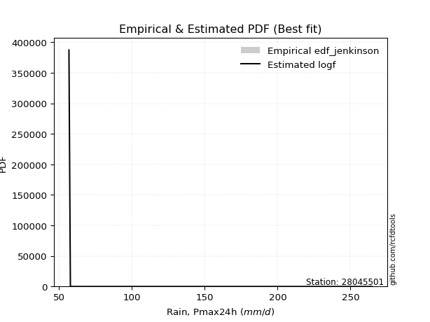</img>

</div>


### 11. EDF Cunnane (1978)

Cunnane´s work in statistical hydrology has focused on the performance and evaluation of different probability distributions (such as GEV, Gumbel, Lognormal) for flood frequency estimation. _b_ is a constant, typically set to 0.4.

<div align="center">


$P=(m-b)/(n+1-2b)$


</div>


**11.1. Empirical values**

<div align="center">

|                | 0                   | 1                   | 2                  | 3           | 4                  | 5                  | 6                  |
|:---------------|:--------------------|:--------------------|:-------------------|:------------|:-------------------|:-------------------|:-------------------|
| date           | 2023                | 2018                | 2020               | 2021        | 2022               | 2017               | 2019               |
| x              | 56.8                | 57.8                | 60.6               | 66.5        | 87.2               | 90.8               | 264.9              |
| m              | 1                   | 2                   | 3                  | 4           | 5                  | 6                  | 7                  |
| empirical_dist | edf_cunnane         | edf_cunnane         | edf_cunnane        | edf_cunnane | edf_cunnane        | edf_cunnane        | edf_cunnane        |
| empirical      | 0.08333333333333333 | 0.22222222222222224 | 0.3611111111111111 | 0.5         | 0.6388888888888888 | 0.7777777777777777 | 0.9166666666666666 |
| empirical_tr   | 1.090909090909091   | 1.2857142857142856  | 1.565217391304348  | 2.0         | 2.7692307692307687 | 4.499999999999998  | 11.999999999999995 |

</div>


**11.2. Kolmogorov-Smirnov fit test (sorted by Δ)**


<div align="center">

|                | 0                   | 1                   | 2                   | 3                   | 4                   | 5                   | 6                   | 7                   | 8                   | 9                   | 10                  | 11                  | 12                  | 13                  | 14                  | 15                  | 16                  | 17                  | 18                  | 19                  | 20                  | 21                  | 22                  | 23                  | 24                  | 25                  | 26                  | 27                  | 28                  | 29                  | 30                  | 31                  | 32                  | 33                  | 34                  | 35                  | 36                  | 37                  | 38                  | 39                  | 40                  | 41                  | 42                  | 43                  | 44                  | 45                  | 46                  | 47                  | 48                  | 49                  | 50                  | 51                  | 52                  | 53                  | 54                  | 55                  | 56                  | 57                  | 58                  | 59                  | 60                  | 61                  | 62                  | 63                  | 64                  | 65                  | 66                  | 67                  | 68                  | 69                  | 70                  | 71                  | 72                  | 73                  | 74                  | 75                  | 76                  | 77                  | 78                  | 79                  | 80                  | 81                  | 82                  | 83                  | 84                  | 85                  | 86                  | 87                  | 88                  | 89                  | 90                  | 91                  | 92                  | 93                  | 94                  | 95                  | 96                  | 97                  | 98                  | 99                  | 100                 | 101                 | 102                 | 103                 | 104                 | 105                 | 106                 | 107                 | 108                 | 109                 | 110                 | 111                 | 112                 | 113                 | 114                 | 115                 | 116                 | 117                 | 118                 | 119                 | 120                 | 121                 | 122                 | 123                 | 124                 | 125                 | 126                 | 127                 | 128                 | 129                 | 130                 | 131                 | 132                 | 133                 | 134                 | 135                 | 136                 | 137                 | 138                 | 139                 | 140                 | 141                 | 142                 | 143                 | 144                 | 145                 | 146                 | 147                 | 148                 | 149                 | 150                 | 151                 | 152                 | 153                 | 154                 | 155                 | 156                 | 157                 | 158                 | 159                 |
|:---------------|:--------------------|:--------------------|:--------------------|:--------------------|:--------------------|:--------------------|:--------------------|:--------------------|:--------------------|:--------------------|:--------------------|:--------------------|:--------------------|:--------------------|:--------------------|:--------------------|:--------------------|:--------------------|:--------------------|:--------------------|:--------------------|:--------------------|:--------------------|:--------------------|:--------------------|:--------------------|:--------------------|:--------------------|:--------------------|:--------------------|:--------------------|:--------------------|:--------------------|:--------------------|:--------------------|:--------------------|:--------------------|:--------------------|:--------------------|:--------------------|:--------------------|:--------------------|:--------------------|:--------------------|:--------------------|:--------------------|:--------------------|:--------------------|:--------------------|:--------------------|:--------------------|:--------------------|:--------------------|:--------------------|:--------------------|:--------------------|:--------------------|:--------------------|:--------------------|:--------------------|:--------------------|:--------------------|:--------------------|:--------------------|:--------------------|:--------------------|:--------------------|:--------------------|:--------------------|:--------------------|:--------------------|:--------------------|:--------------------|:--------------------|:--------------------|:--------------------|:--------------------|:--------------------|:--------------------|:--------------------|:--------------------|:--------------------|:--------------------|:--------------------|:--------------------|:--------------------|:--------------------|:--------------------|:--------------------|:--------------------|:--------------------|:--------------------|:--------------------|:--------------------|:--------------------|:--------------------|:--------------------|:--------------------|:--------------------|:--------------------|:--------------------|:--------------------|:--------------------|:--------------------|:--------------------|:--------------------|:--------------------|:--------------------|:--------------------|:--------------------|:--------------------|:--------------------|:--------------------|:--------------------|:--------------------|:--------------------|:--------------------|:--------------------|:--------------------|:--------------------|:--------------------|:--------------------|:--------------------|:--------------------|:--------------------|:--------------------|:--------------------|:--------------------|:--------------------|:--------------------|:--------------------|:--------------------|:--------------------|:--------------------|:--------------------|:--------------------|:--------------------|:--------------------|:--------------------|:--------------------|:--------------------|:--------------------|:--------------------|:--------------------|:--------------------|:--------------------|:--------------------|:--------------------|:--------------------|:--------------------|:--------------------|:--------------------|:--------------------|:--------------------|:--------------------|:--------------------|:--------------------|:--------------------|:--------------------|:--------------------|
| station        | 28045501            | 28045501            | 28045501            | 28045501            | 28045501            | 28045501            | 28045501            | 28045501            | 28045501            | 28045501            | 28045501            | 28045501            | 28045501            | 28045501            | 28045501            | 28045501            | 28045501            | 28045501            | 28045501            | 28045501            | 28045501            | 28045501            | 28045501            | 28045501            | 28045501            | 28045501            | 28045501            | 28045501            | 28045501            | 28045501            | 28045501            | 28045501            | 28045501            | 28045501            | 28045501            | 28045501            | 28045501            | 28045501            | 28045501            | 28045501            | 28045501            | 28045501            | 28045501            | 28045501            | 28045501            | 28045501            | 28045501            | 28045501            | 28045501            | 28045501            | 28045501            | 28045501            | 28045501            | 28045501            | 28045501            | 28045501            | 28045501            | 28045501            | 28045501            | 28045501            | 28045501            | 28045501            | 28045501            | 28045501            | 28045501            | 28045501            | 28045501            | 28045501            | 28045501            | 28045501            | 28045501            | 28045501            | 28045501            | 28045501            | 28045501            | 28045501            | 28045501            | 28045501            | 28045501            | 28045501            | 28045501            | 28045501            | 28045501            | 28045501            | 28045501            | 28045501            | 28045501            | 28045501            | 28045501            | 28045501            | 28045501            | 28045501            | 28045501            | 28045501            | 28045501            | 28045501            | 28045501            | 28045501            | 28045501            | 28045501            | 28045501            | 28045501            | 28045501            | 28045501            | 28045501            | 28045501            | 28045501            | 28045501            | 28045501            | 28045501            | 28045501            | 28045501            | 28045501            | 28045501            | 28045501            | 28045501            | 28045501            | 28045501            | 28045501            | 28045501            | 28045501            | 28045501            | 28045501            | 28045501            | 28045501            | 28045501            | 28045501            | 28045501            | 28045501            | 28045501            | 28045501            | 28045501            | 28045501            | 28045501            | 28045501            | 28045501            | 28045501            | 28045501            | 28045501            | 28045501            | 28045501            | 28045501            | 28045501            | 28045501            | 28045501            | 28045501            | 28045501            | 28045501            | 28045501            | 28045501            | 28045501            | 28045501            | 28045501            | 28045501            | 28045501            | 28045501            | 28045501            | 28045501            | 28045501            | 28045501            |
| empirical_dist | edf_cunnane         | edf_cunnane         | edf_cunnane         | edf_cunnane         | edf_cunnane         | edf_cunnane         | edf_cunnane         | edf_cunnane         | edf_cunnane         | edf_cunnane         | edf_cunnane         | edf_cunnane         | edf_cunnane         | edf_cunnane         | edf_cunnane         | edf_cunnane         | edf_cunnane         | edf_cunnane         | edf_cunnane         | edf_cunnane         | edf_cunnane         | edf_cunnane         | edf_cunnane         | edf_cunnane         | edf_cunnane         | edf_cunnane         | edf_cunnane         | edf_cunnane         | edf_cunnane         | edf_cunnane         | edf_cunnane         | edf_cunnane         | edf_cunnane         | edf_cunnane         | edf_cunnane         | edf_cunnane         | edf_cunnane         | edf_cunnane         | edf_cunnane         | edf_cunnane         | edf_cunnane         | edf_cunnane         | edf_cunnane         | edf_cunnane         | edf_cunnane         | edf_cunnane         | edf_cunnane         | edf_cunnane         | edf_cunnane         | edf_cunnane         | edf_cunnane         | edf_cunnane         | edf_cunnane         | edf_cunnane         | edf_cunnane         | edf_cunnane         | edf_cunnane         | edf_cunnane         | edf_cunnane         | edf_cunnane         | edf_cunnane         | edf_cunnane         | edf_cunnane         | edf_cunnane         | edf_cunnane         | edf_cunnane         | edf_cunnane         | edf_cunnane         | edf_cunnane         | edf_cunnane         | edf_cunnane         | edf_cunnane         | edf_cunnane         | edf_cunnane         | edf_cunnane         | edf_cunnane         | edf_cunnane         | edf_cunnane         | edf_cunnane         | edf_cunnane         | edf_cunnane         | edf_cunnane         | edf_cunnane         | edf_cunnane         | edf_cunnane         | edf_cunnane         | edf_cunnane         | edf_cunnane         | edf_cunnane         | edf_cunnane         | edf_cunnane         | edf_cunnane         | edf_cunnane         | edf_cunnane         | edf_cunnane         | edf_cunnane         | edf_cunnane         | edf_cunnane         | edf_cunnane         | edf_cunnane         | edf_cunnane         | edf_cunnane         | edf_cunnane         | edf_cunnane         | edf_cunnane         | edf_cunnane         | edf_cunnane         | edf_cunnane         | edf_cunnane         | edf_cunnane         | edf_cunnane         | edf_cunnane         | edf_cunnane         | edf_cunnane         | edf_cunnane         | edf_cunnane         | edf_cunnane         | edf_cunnane         | edf_cunnane         | edf_cunnane         | edf_cunnane         | edf_cunnane         | edf_cunnane         | edf_cunnane         | edf_cunnane         | edf_cunnane         | edf_cunnane         | edf_cunnane         | edf_cunnane         | edf_cunnane         | edf_cunnane         | edf_cunnane         | edf_cunnane         | edf_cunnane         | edf_cunnane         | edf_cunnane         | edf_cunnane         | edf_cunnane         | edf_cunnane         | edf_cunnane         | edf_cunnane         | edf_cunnane         | edf_cunnane         | edf_cunnane         | edf_cunnane         | edf_cunnane         | edf_cunnane         | edf_cunnane         | edf_cunnane         | edf_cunnane         | edf_cunnane         | edf_cunnane         | edf_cunnane         | edf_cunnane         | edf_cunnane         | edf_cunnane         | edf_cunnane         | edf_cunnane         | edf_cunnane         | edf_cunnane         |
| p_dist         | logf                | lognakagami         | gausshyper          | erlang              | logweibull_min      | logncf              | truncpareto         | logmielke           | loginvweibull       | loggenextreme       | logburr             | betaprime           | halfgennorm         | gamma               | genpareto           | logwald             | f                   | invgamma            | logbetaprime        | truncweibull_min    | logtruncpareto      | loginvgamma         | logmoyal            | logbradford         | loggumbel_r         | nakagami            | logpearson3         | invgauss            | loghalfgennorm      | logweibull_max      | loginvgauss         | logvonmises_line    | loggenlogistic      | loghalflogistic     | logalpha            | lognct              | logerlang           | nct                 | lograyleigh         | burr                | loggengamma         | alpha               | logmaxwell          | loggamma            | loggamma            | loghalfnorm         | logburr12           | burr12              | logfoldnorm         | ncf                 | logkstwobign        | wald                | loglomax            | loggennorm          | loglogistic         | logexponnorm        | loggenexpon         | loghypsecant        | lognorm             | logcrystalball      | genlogistic         | exponpow            | logt                | logloggamma         | logloglaplace       | logdweibull         | loganglit           | logrice             | logsemicircular     | moyal               | vonmises_line       | logdgamma           | logbeta             | johnsonsu           | loglaplace          | loglaplace          | loggompertz         | logarcsine          | logtruncnorm        | gumbel_r            | halflogistic        | pearson3            | halfnorm            | t                   | lomax               | rayleigh            | loggumbel_l         | loggausshyper       | genextreme          | powerlaw            | maxwell             | exponnorm           | foldnorm            | genexpon            | logpowerlaw         | logcosine           | logtruncweibull_min | logexponpow         | arcsine             | logskewnorm         | kstwobign           | logwrapcauchy       | weibull_min         | wrapcauchy          | semicircular        | anglit              | norm                | crystalball         | logexponweib        | logistic            | hypsecant           | gengamma            | laplace             | dweibull            | logkappa4           | kappa3              | rice                | exponweib           | fatiguelife         | logtruncexpon       | gennorm             | truncnorm           | loglevy_l           | dgamma              | logfatiguelife      | loggenpareto        | levy_l              | gumbel_l            | logargus            | cosine              | gompertz            | invweibull          | logtriang           | logksone            | logrdist            | skewnorm            | logtukeylambda      | loguniform          | logkappa3           | argus               | triang              | truncexpon          | johnsonsb           | tukeylambda         | rdist               | loggenhalflogistic  | ksone               | bradford            | logjohnsonsb        | kappa4              | beta                | uniform             | genhalflogistic     | logtrapezoid        | weibull_max         | logjohnsonsu        | trapezoid           | logvonmises         | vonmises            | mielke              |
| delta          | 0.0824111513900491  | 0.0832017363591125  | 0.08331095271513117 | 0.08335035342092922 | 0.09553947626086762 | 0.10432811060035696 | 0.10712126702333453 | 0.10749877367585109 | 0.10901403040024027 | 0.10902262904031068 | 0.11122120055953055 | 0.11151039621523605 | 0.11511899829277672 | 0.11546461498214033 | 0.11923357220690145 | 0.12123320095761597 | 0.12137272784897912 | 0.12137417762208247 | 0.12237782611145935 | 0.12535728336538177 | 0.1338048285353901  | 0.1339722914996888  | 0.13523107047236665 | 0.13551312697632012 | 0.14310645925129828 | 0.14514075400921803 | 0.1515544196732005  | 0.15429362395607027 | 0.15493876273713303 | 0.15812366275184392 | 0.15945823667014436 | 0.16013323807888963 | 0.16077263032856692 | 0.16117205726226397 | 0.1619294358390848  | 0.16400209093354146 | 0.16919975090327544 | 0.17106234067790338 | 0.1712370064401325  | 0.17549381010841103 | 0.17841113502276285 | 0.1796939791033455  | 0.1804687642436037  | 0.1819143938586696  | 0.1819143938586696  | 0.18330098275696566 | 0.18585653952114978 | 0.18668279816870345 | 0.1901539632202628  | 0.19436084302064582 | 0.1956337704641088  | 0.19662441723023322 | 0.19706402780457596 | 0.19788374836857214 | 0.2005082637963841  | 0.20378838304069807 | 0.20528260594623096 | 0.2066592192561818  | 0.20958302882931445 | 0.20958303508180265 | 0.21064194489247567 | 0.2118649271367652  | 0.21206075494765508 | 0.21268899679151232 | 0.21348196237765976 | 0.21870275869446476 | 0.21919247857725388 | 0.22130361977714297 | 0.2231653454528023  | 0.22435416147889342 | 0.22782549434001914 | 0.23017089635768678 | 0.2306412706719668  | 0.23367015406703912 | 0.23384338338559868 | 0.23384338338559868 | 0.23717000827110024 | 0.23901774271367682 | 0.2394916085620458  | 0.2499485381390164  | 0.251017866055823   | 0.25144788359040937 | 0.2580545907794174  | 0.2669946946699275  | 0.2683077066817189  | 0.2719958432316265  | 0.2744410588362194  | 0.27747245101619344 | 0.2781848944606775  | 0.2787414502454848  | 0.2837507697073385  | 0.287066654430586   | 0.2877709449486368  | 0.2893478817531812  | 0.29440966697371396 | 0.29647102331210695 | 0.2971450948028844  | 0.2993622165901709  | 0.3004949076667836  | 0.3032595689847401  | 0.3038833931016295  | 0.3047495929322315  | 0.30490302106960177 | 0.3070852104465179  | 0.3098638175655796  | 0.31222231197256617 | 0.3179406076514627  | 0.3179406123714649  | 0.3182022917813172  | 0.3233783844884181  | 0.32799019761216297 | 0.3291347478870268  | 0.3442338077381827  | 0.3446176160110045  | 0.34559194072694077 | 0.3462261007856732  | 0.3477474234417387  | 0.3478491938942432  | 0.3482216409514688  | 0.34965180811059837 | 0.36948892478033274 | 0.37033933554191484 | 0.37294950462922055 | 0.3761362875638142  | 0.3762259430639261  | 0.3769673751732855  | 0.3878642753405341  | 0.3883603178796106  | 0.39620762617284633 | 0.40043193978757036 | 0.4220725174970858  | 0.4374200356065572  | 0.44040047450151665 | 0.44055970627552216 | 0.4437439700013861  | 0.4509728076490449  | 0.4680612099112542  | 0.4731160919750711  | 0.4736600513557485  | 0.4780369780225763  | 0.5180008059202181  | 0.5199637374423927  | 0.5238657470774326  | 0.5363689516091507  | 0.5376573638246158  | 0.539215031457976   | 0.5582919536547599  | 0.5732117572047772  | 0.5827828118185363  | 0.584199978106504   | 0.6095899687469646  | 0.6143947888301563  | 0.6488261819227443  | 0.6640617500300774  | 0.6813452012228629  | 0.692443280674628   | 0.7296037507868174  | 1.1523531673929137  | 41.534828395478556  | nan                 |
| deltao         | 0.48442053926100004 | 0.48442053926100004 | 0.48442053926100004 | 0.48442053926100004 | 0.48442053926100004 | 0.48442053926100004 | 0.48442053926100004 | 0.48442053926100004 | 0.48442053926100004 | 0.48442053926100004 | 0.48442053926100004 | 0.48442053926100004 | 0.48442053926100004 | 0.48442053926100004 | 0.48442053926100004 | 0.48442053926100004 | 0.48442053926100004 | 0.48442053926100004 | 0.48442053926100004 | 0.48442053926100004 | 0.48442053926100004 | 0.48442053926100004 | 0.48442053926100004 | 0.48442053926100004 | 0.48442053926100004 | 0.48442053926100004 | 0.48442053926100004 | 0.48442053926100004 | 0.48442053926100004 | 0.48442053926100004 | 0.48442053926100004 | 0.48442053926100004 | 0.48442053926100004 | 0.48442053926100004 | 0.48442053926100004 | 0.48442053926100004 | 0.48442053926100004 | 0.48442053926100004 | 0.48442053926100004 | 0.48442053926100004 | 0.48442053926100004 | 0.48442053926100004 | 0.48442053926100004 | 0.48442053926100004 | 0.48442053926100004 | 0.48442053926100004 | 0.48442053926100004 | 0.48442053926100004 | 0.48442053926100004 | 0.48442053926100004 | 0.48442053926100004 | 0.48442053926100004 | 0.48442053926100004 | 0.48442053926100004 | 0.48442053926100004 | 0.48442053926100004 | 0.48442053926100004 | 0.48442053926100004 | 0.48442053926100004 | 0.48442053926100004 | 0.48442053926100004 | 0.48442053926100004 | 0.48442053926100004 | 0.48442053926100004 | 0.48442053926100004 | 0.48442053926100004 | 0.48442053926100004 | 0.48442053926100004 | 0.48442053926100004 | 0.48442053926100004 | 0.48442053926100004 | 0.48442053926100004 | 0.48442053926100004 | 0.48442053926100004 | 0.48442053926100004 | 0.48442053926100004 | 0.48442053926100004 | 0.48442053926100004 | 0.48442053926100004 | 0.48442053926100004 | 0.48442053926100004 | 0.48442053926100004 | 0.48442053926100004 | 0.48442053926100004 | 0.48442053926100004 | 0.48442053926100004 | 0.48442053926100004 | 0.48442053926100004 | 0.48442053926100004 | 0.48442053926100004 | 0.48442053926100004 | 0.48442053926100004 | 0.48442053926100004 | 0.48442053926100004 | 0.48442053926100004 | 0.48442053926100004 | 0.48442053926100004 | 0.48442053926100004 | 0.48442053926100004 | 0.48442053926100004 | 0.48442053926100004 | 0.48442053926100004 | 0.48442053926100004 | 0.48442053926100004 | 0.48442053926100004 | 0.48442053926100004 | 0.48442053926100004 | 0.48442053926100004 | 0.48442053926100004 | 0.48442053926100004 | 0.48442053926100004 | 0.48442053926100004 | 0.48442053926100004 | 0.48442053926100004 | 0.48442053926100004 | 0.48442053926100004 | 0.48442053926100004 | 0.48442053926100004 | 0.48442053926100004 | 0.48442053926100004 | 0.48442053926100004 | 0.48442053926100004 | 0.48442053926100004 | 0.48442053926100004 | 0.48442053926100004 | 0.48442053926100004 | 0.48442053926100004 | 0.48442053926100004 | 0.48442053926100004 | 0.48442053926100004 | 0.48442053926100004 | 0.48442053926100004 | 0.48442053926100004 | 0.48442053926100004 | 0.48442053926100004 | 0.48442053926100004 | 0.48442053926100004 | 0.48442053926100004 | 0.48442053926100004 | 0.48442053926100004 | 0.48442053926100004 | 0.48442053926100004 | 0.48442053926100004 | 0.48442053926100004 | 0.48442053926100004 | 0.48442053926100004 | 0.48442053926100004 | 0.48442053926100004 | 0.48442053926100004 | 0.48442053926100004 | 0.48442053926100004 | 0.48442053926100004 | 0.48442053926100004 | 0.48442053926100004 | 0.48442053926100004 | 0.48442053926100004 | 0.48442053926100004 | 0.48442053926100004 | 0.48442053926100004 | 0.48442053926100004 |
| eval           | Δo > Δ              | Δo > Δ              | Δo > Δ              | Δo > Δ              | Δo > Δ              | Δo > Δ              | Δo > Δ              | Δo > Δ              | Δo > Δ              | Δo > Δ              | Δo > Δ              | Δo > Δ              | Δo > Δ              | Δo > Δ              | Δo > Δ              | Δo > Δ              | Δo > Δ              | Δo > Δ              | Δo > Δ              | Δo > Δ              | Δo > Δ              | Δo > Δ              | Δo > Δ              | Δo > Δ              | Δo > Δ              | Δo > Δ              | Δo > Δ              | Δo > Δ              | Δo > Δ              | Δo > Δ              | Δo > Δ              | Δo > Δ              | Δo > Δ              | Δo > Δ              | Δo > Δ              | Δo > Δ              | Δo > Δ              | Δo > Δ              | Δo > Δ              | Δo > Δ              | Δo > Δ              | Δo > Δ              | Δo > Δ              | Δo > Δ              | Δo > Δ              | Δo > Δ              | Δo > Δ              | Δo > Δ              | Δo > Δ              | Δo > Δ              | Δo > Δ              | Δo > Δ              | Δo > Δ              | Δo > Δ              | Δo > Δ              | Δo > Δ              | Δo > Δ              | Δo > Δ              | Δo > Δ              | Δo > Δ              | Δo > Δ              | Δo > Δ              | Δo > Δ              | Δo > Δ              | Δo > Δ              | Δo > Δ              | Δo > Δ              | Δo > Δ              | Δo > Δ              | Δo > Δ              | Δo > Δ              | Δo > Δ              | Δo > Δ              | Δo > Δ              | Δo > Δ              | Δo > Δ              | Δo > Δ              | Δo > Δ              | Δo > Δ              | Δo > Δ              | Δo > Δ              | Δo > Δ              | Δo > Δ              | Δo > Δ              | Δo > Δ              | Δo > Δ              | Δo > Δ              | Δo > Δ              | Δo > Δ              | Δo > Δ              | Δo > Δ              | Δo > Δ              | Δo > Δ              | Δo > Δ              | Δo > Δ              | Δo > Δ              | Δo > Δ              | Δo > Δ              | Δo > Δ              | Δo > Δ              | Δo > Δ              | Δo > Δ              | Δo > Δ              | Δo > Δ              | Δo > Δ              | Δo > Δ              | Δo > Δ              | Δo > Δ              | Δo > Δ              | Δo > Δ              | Δo > Δ              | Δo > Δ              | Δo > Δ              | Δo > Δ              | Δo > Δ              | Δo > Δ              | Δo > Δ              | Δo > Δ              | Δo > Δ              | Δo > Δ              | Δo > Δ              | Δo > Δ              | Δo > Δ              | Δo > Δ              | Δo > Δ              | Δo > Δ              | Δo > Δ              | Δo > Δ              | Δo > Δ              | Δo > Δ              | Δo > Δ              | Δo > Δ              | Δo > Δ              | Δo > Δ              | Δo > Δ              | Δo > Δ              | Δo > Δ              | Δo > Δ              | Δo > Δ              | Δo > Δ              | Δo <= Δ             | Δo <= Δ             | Δo <= Δ             | Δo <= Δ             | Δo <= Δ             | Δo <= Δ             | Δo <= Δ             | Δo <= Δ             | Δo <= Δ             | Δo <= Δ             | Δo <= Δ             | Δo <= Δ             | Δo <= Δ             | Δo <= Δ             | Δo <= Δ             | Δo <= Δ             | Δo <= Δ             | Δo <= Δ             | Δo <= Δ             | Δo <= Δ             |
| fit            | 1                   | 1                   | 1                   | 1                   | 1                   | 1                   | 1                   | 1                   | 1                   | 1                   | 1                   | 1                   | 1                   | 1                   | 1                   | 1                   | 1                   | 1                   | 1                   | 1                   | 1                   | 1                   | 1                   | 1                   | 1                   | 1                   | 1                   | 1                   | 1                   | 1                   | 1                   | 1                   | 1                   | 1                   | 1                   | 1                   | 1                   | 1                   | 1                   | 1                   | 1                   | 1                   | 1                   | 1                   | 1                   | 1                   | 1                   | 1                   | 1                   | 1                   | 1                   | 1                   | 1                   | 1                   | 1                   | 1                   | 1                   | 1                   | 1                   | 1                   | 1                   | 1                   | 1                   | 1                   | 1                   | 1                   | 1                   | 1                   | 1                   | 1                   | 1                   | 1                   | 1                   | 1                   | 1                   | 1                   | 1                   | 1                   | 1                   | 1                   | 1                   | 1                   | 1                   | 1                   | 1                   | 1                   | 1                   | 1                   | 1                   | 1                   | 1                   | 1                   | 1                   | 1                   | 1                   | 1                   | 1                   | 1                   | 1                   | 1                   | 1                   | 1                   | 1                   | 1                   | 1                   | 1                   | 1                   | 1                   | 1                   | 1                   | 1                   | 1                   | 1                   | 1                   | 1                   | 1                   | 1                   | 1                   | 1                   | 1                   | 1                   | 1                   | 1                   | 1                   | 1                   | 1                   | 1                   | 1                   | 1                   | 1                   | 1                   | 1                   | 1                   | 1                   | 1                   | 1                   | 1                   | 1                   | 1                   | 1                   | 0                   | 0                   | 0                   | 0                   | 0                   | 0                   | 0                   | 0                   | 0                   | 0                   | 0                   | 0                   | 0                   | 0                   | 0                   | 0                   | 0                   | 0                   | 0                   | 0                   |
| n              | 7                   | 7                   | 7                   | 7                   | 7                   | 7                   | 7                   | 7                   | 7                   | 7                   | 7                   | 7                   | 7                   | 7                   | 7                   | 7                   | 7                   | 7                   | 7                   | 7                   | 7                   | 7                   | 7                   | 7                   | 7                   | 7                   | 7                   | 7                   | 7                   | 7                   | 7                   | 7                   | 7                   | 7                   | 7                   | 7                   | 7                   | 7                   | 7                   | 7                   | 7                   | 7                   | 7                   | 7                   | 7                   | 7                   | 7                   | 7                   | 7                   | 7                   | 7                   | 7                   | 7                   | 7                   | 7                   | 7                   | 7                   | 7                   | 7                   | 7                   | 7                   | 7                   | 7                   | 7                   | 7                   | 7                   | 7                   | 7                   | 7                   | 7                   | 7                   | 7                   | 7                   | 7                   | 7                   | 7                   | 7                   | 7                   | 7                   | 7                   | 7                   | 7                   | 7                   | 7                   | 7                   | 7                   | 7                   | 7                   | 7                   | 7                   | 7                   | 7                   | 7                   | 7                   | 7                   | 7                   | 7                   | 7                   | 7                   | 7                   | 7                   | 7                   | 7                   | 7                   | 7                   | 7                   | 7                   | 7                   | 7                   | 7                   | 7                   | 7                   | 7                   | 7                   | 7                   | 7                   | 7                   | 7                   | 7                   | 7                   | 7                   | 7                   | 7                   | 7                   | 7                   | 7                   | 7                   | 7                   | 7                   | 7                   | 7                   | 7                   | 7                   | 7                   | 7                   | 7                   | 7                   | 7                   | 7                   | 7                   | 7                   | 7                   | 7                   | 7                   | 7                   | 7                   | 7                   | 7                   | 7                   | 7                   | 7                   | 7                   | 7                   | 7                   | 7                   | 7                   | 7                   | 7                   | 7                   | 7                   |
| best_fit       | 1                   | 0                   | 0                   | 0                   | 0                   | 0                   | 0                   | 0                   | 0                   | 0                   | 0                   | 0                   | 0                   | 0                   | 0                   | 0                   | 0                   | 0                   | 0                   | 0                   | 0                   | 0                   | 0                   | 0                   | 0                   | 0                   | 0                   | 0                   | 0                   | 0                   | 0                   | 0                   | 0                   | 0                   | 0                   | 0                   | 0                   | 0                   | 0                   | 0                   | 0                   | 0                   | 0                   | 0                   | 0                   | 0                   | 0                   | 0                   | 0                   | 0                   | 0                   | 0                   | 0                   | 0                   | 0                   | 0                   | 0                   | 0                   | 0                   | 0                   | 0                   | 0                   | 0                   | 0                   | 0                   | 0                   | 0                   | 0                   | 0                   | 0                   | 0                   | 0                   | 0                   | 0                   | 0                   | 0                   | 0                   | 0                   | 0                   | 0                   | 0                   | 0                   | 0                   | 0                   | 0                   | 0                   | 0                   | 0                   | 0                   | 0                   | 0                   | 0                   | 0                   | 0                   | 0                   | 0                   | 0                   | 0                   | 0                   | 0                   | 0                   | 0                   | 0                   | 0                   | 0                   | 0                   | 0                   | 0                   | 0                   | 0                   | 0                   | 0                   | 0                   | 0                   | 0                   | 0                   | 0                   | 0                   | 0                   | 0                   | 0                   | 0                   | 0                   | 0                   | 0                   | 0                   | 0                   | 0                   | 0                   | 0                   | 0                   | 0                   | 0                   | 0                   | 0                   | 0                   | 0                   | 0                   | 0                   | 0                   | 0                   | 0                   | 0                   | 0                   | 0                   | 0                   | 0                   | 0                   | 0                   | 0                   | 0                   | 0                   | 0                   | 0                   | 0                   | 0                   | 0                   | 0                   | 0                   | 0                   |
| best_fit_sort  | 1                   | 2                   | 3                   | 4                   | 5                   | 6                   | 7                   | 8                   | 9                   | 10                  | 11                  | 12                  | 13                  | 14                  | 15                  | 16                  | 17                  | 18                  | 19                  | 20                  | 21                  | 22                  | 23                  | 24                  | 25                  | 26                  | 27                  | 28                  | 29                  | 30                  | 31                  | 32                  | 33                  | 34                  | 35                  | 36                  | 37                  | 38                  | 39                  | 40                  | 41                  | 42                  | 43                  | 44                  | 45                  | 46                  | 47                  | 48                  | 49                  | 50                  | 51                  | 52                  | 53                  | 54                  | 55                  | 56                  | 57                  | 58                  | 59                  | 60                  | 61                  | 62                  | 63                  | 64                  | 65                  | 66                  | 67                  | 68                  | 69                  | 70                  | 71                  | 72                  | 73                  | 74                  | 75                  | 76                  | 77                  | 78                  | 79                  | 80                  | 81                  | 82                  | 83                  | 84                  | 85                  | 86                  | 87                  | 88                  | 89                  | 90                  | 91                  | 92                  | 93                  | 94                  | 95                  | 96                  | 97                  | 98                  | 99                  | 100                 | 101                 | 102                 | 103                 | 104                 | 105                 | 106                 | 107                 | 108                 | 109                 | 110                 | 111                 | 112                 | 113                 | 114                 | 115                 | 116                 | 117                 | 118                 | 119                 | 120                 | 121                 | 122                 | 123                 | 124                 | 125                 | 126                 | 127                 | 128                 | 129                 | 130                 | 131                 | 132                 | 133                 | 134                 | 135                 | 136                 | 137                 | 138                 | 139                 | 140                 | 141                 | 142                 | 143                 | 144                 | 145                 | 146                 | 147                 | 148                 | 149                 | 150                 | 151                 | 152                 | 153                 | 154                 | 155                 | 156                 | 157                 | 158                 | 159                 | 160                 |

</div>


**11.3. Best fit**

<div align="center">

|   id |   station | empirical_dist   | p_dist   |     delta |   deltao | eval   |   fit |   n |   best_fit |   best_fit_sort |
|-----:|----------:|:-----------------|:---------|----------:|---------:|:-------|------:|----:|-----------:|----------------:|
|    0 |  28045501 | edf_cunnane      | logf     | 0.0824112 | 0.484421 | Δo > Δ |     1 |   7 |          1 |               1 |

</div>


<div align="center">

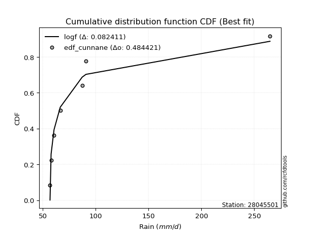</img>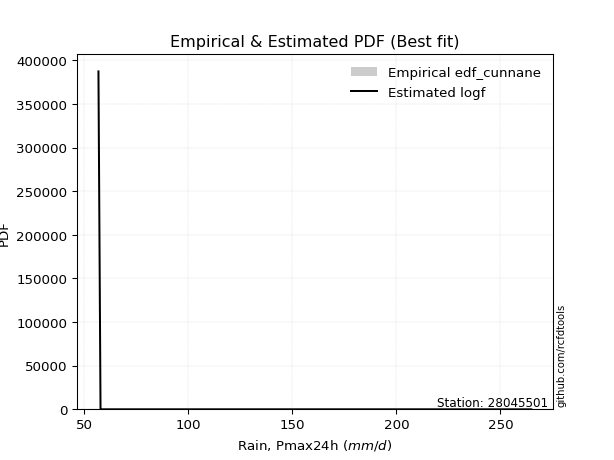</img>

</div>


### 12. EDF Adamowski (1981)

The Adamowski formula in hydrology refers to a specific plotting position formula used for estimating the non-parametric empirical distribution of hydrological events (like flood peaks) to calculate their return periods. This formula provides an alternative to traditional parametric methods (like the Gumbel or Log Pearson Type III distributions). 

<div align="center">


$P=(m-0.25)/(n+0.5)$


</div>


**12.1. Empirical values**

<div align="center">

|                | 0                  | 1                   | 2                   | 3             | 4                  | 5                  | 6                  |
|:---------------|:-------------------|:--------------------|:--------------------|:--------------|:-------------------|:-------------------|:-------------------|
| date           | 2023               | 2018                | 2020                | 2021          | 2022               | 2017               | 2019               |
| x              | 56.8               | 57.8                | 60.6                | 66.5          | 87.2               | 90.8               | 264.9              |
| m              | 1                  | 2                   | 3                   | 4             | 5                  | 6                  | 7                  |
| empirical_dist | edf_adamowski      | edf_adamowski       | edf_adamowski       | edf_adamowski | edf_adamowski      | edf_adamowski      | edf_adamowski      |
| empirical      | 0.1                | 0.23333333333333334 | 0.36666666666666664 | 0.5           | 0.6333333333333333 | 0.7666666666666667 | 0.9                |
| empirical_tr   | 1.1111111111111112 | 1.3043478260869565  | 1.5789473684210527  | 2.0           | 2.727272727272727  | 4.2857142857142865 | 10.000000000000002 |

</div>


**12.2. Kolmogorov-Smirnov fit test (sorted by Δ)**


<div align="center">

|                | 0                   | 1                   | 2                   | 3                   | 4                   | 5                   | 6                   | 7                   | 8                   | 9                   | 10                  | 11                  | 12                  | 13                  | 14                  | 15                  | 16                  | 17                  | 18                  | 19                  | 20                  | 21                  | 22                  | 23                  | 24                  | 25                  | 26                  | 27                  | 28                  | 29                  | 30                  | 31                  | 32                  | 33                  | 34                  | 35                  | 36                  | 37                  | 38                  | 39                  | 40                  | 41                  | 42                  | 43                  | 44                  | 45                  | 46                  | 47                  | 48                  | 49                  | 50                  | 51                  | 52                  | 53                  | 54                  | 55                  | 56                  | 57                  | 58                  | 59                  | 60                  | 61                  | 62                  | 63                  | 64                  | 65                  | 66                  | 67                  | 68                  | 69                  | 70                  | 71                  | 72                  | 73                  | 74                  | 75                  | 76                  | 77                  | 78                  | 79                  | 80                  | 81                  | 82                  | 83                  | 84                  | 85                  | 86                  | 87                  | 88                  | 89                  | 90                  | 91                  | 92                  | 93                  | 94                  | 95                  | 96                  | 97                  | 98                  | 99                  | 100                 | 101                 | 102                 | 103                 | 104                 | 105                 | 106                 | 107                 | 108                 | 109                 | 110                 | 111                 | 112                 | 113                 | 114                 | 115                 | 116                 | 117                 | 118                 | 119                 | 120                 | 121                 | 122                 | 123                 | 124                 | 125                 | 126                 | 127                 | 128                 | 129                 | 130                 | 131                 | 132                 | 133                 | 134                 | 135                 | 136                 | 137                 | 138                 | 139                 | 140                 | 141                 | 142                 | 143                 | 144                 | 145                 | 146                 | 147                 | 148                 | 149                 | 150                 | 151                 | 152                 | 153                 | 154                 | 155                 | 156                 | 157                 | 158                 | 159                 |
|:---------------|:--------------------|:--------------------|:--------------------|:--------------------|:--------------------|:--------------------|:--------------------|:--------------------|:--------------------|:--------------------|:--------------------|:--------------------|:--------------------|:--------------------|:--------------------|:--------------------|:--------------------|:--------------------|:--------------------|:--------------------|:--------------------|:--------------------|:--------------------|:--------------------|:--------------------|:--------------------|:--------------------|:--------------------|:--------------------|:--------------------|:--------------------|:--------------------|:--------------------|:--------------------|:--------------------|:--------------------|:--------------------|:--------------------|:--------------------|:--------------------|:--------------------|:--------------------|:--------------------|:--------------------|:--------------------|:--------------------|:--------------------|:--------------------|:--------------------|:--------------------|:--------------------|:--------------------|:--------------------|:--------------------|:--------------------|:--------------------|:--------------------|:--------------------|:--------------------|:--------------------|:--------------------|:--------------------|:--------------------|:--------------------|:--------------------|:--------------------|:--------------------|:--------------------|:--------------------|:--------------------|:--------------------|:--------------------|:--------------------|:--------------------|:--------------------|:--------------------|:--------------------|:--------------------|:--------------------|:--------------------|:--------------------|:--------------------|:--------------------|:--------------------|:--------------------|:--------------------|:--------------------|:--------------------|:--------------------|:--------------------|:--------------------|:--------------------|:--------------------|:--------------------|:--------------------|:--------------------|:--------------------|:--------------------|:--------------------|:--------------------|:--------------------|:--------------------|:--------------------|:--------------------|:--------------------|:--------------------|:--------------------|:--------------------|:--------------------|:--------------------|:--------------------|:--------------------|:--------------------|:--------------------|:--------------------|:--------------------|:--------------------|:--------------------|:--------------------|:--------------------|:--------------------|:--------------------|:--------------------|:--------------------|:--------------------|:--------------------|:--------------------|:--------------------|:--------------------|:--------------------|:--------------------|:--------------------|:--------------------|:--------------------|:--------------------|:--------------------|:--------------------|:--------------------|:--------------------|:--------------------|:--------------------|:--------------------|:--------------------|:--------------------|:--------------------|:--------------------|:--------------------|:--------------------|:--------------------|:--------------------|:--------------------|:--------------------|:--------------------|:--------------------|:--------------------|:--------------------|:--------------------|:--------------------|:--------------------|:--------------------|
| station        | 28045501            | 28045501            | 28045501            | 28045501            | 28045501            | 28045501            | 28045501            | 28045501            | 28045501            | 28045501            | 28045501            | 28045501            | 28045501            | 28045501            | 28045501            | 28045501            | 28045501            | 28045501            | 28045501            | 28045501            | 28045501            | 28045501            | 28045501            | 28045501            | 28045501            | 28045501            | 28045501            | 28045501            | 28045501            | 28045501            | 28045501            | 28045501            | 28045501            | 28045501            | 28045501            | 28045501            | 28045501            | 28045501            | 28045501            | 28045501            | 28045501            | 28045501            | 28045501            | 28045501            | 28045501            | 28045501            | 28045501            | 28045501            | 28045501            | 28045501            | 28045501            | 28045501            | 28045501            | 28045501            | 28045501            | 28045501            | 28045501            | 28045501            | 28045501            | 28045501            | 28045501            | 28045501            | 28045501            | 28045501            | 28045501            | 28045501            | 28045501            | 28045501            | 28045501            | 28045501            | 28045501            | 28045501            | 28045501            | 28045501            | 28045501            | 28045501            | 28045501            | 28045501            | 28045501            | 28045501            | 28045501            | 28045501            | 28045501            | 28045501            | 28045501            | 28045501            | 28045501            | 28045501            | 28045501            | 28045501            | 28045501            | 28045501            | 28045501            | 28045501            | 28045501            | 28045501            | 28045501            | 28045501            | 28045501            | 28045501            | 28045501            | 28045501            | 28045501            | 28045501            | 28045501            | 28045501            | 28045501            | 28045501            | 28045501            | 28045501            | 28045501            | 28045501            | 28045501            | 28045501            | 28045501            | 28045501            | 28045501            | 28045501            | 28045501            | 28045501            | 28045501            | 28045501            | 28045501            | 28045501            | 28045501            | 28045501            | 28045501            | 28045501            | 28045501            | 28045501            | 28045501            | 28045501            | 28045501            | 28045501            | 28045501            | 28045501            | 28045501            | 28045501            | 28045501            | 28045501            | 28045501            | 28045501            | 28045501            | 28045501            | 28045501            | 28045501            | 28045501            | 28045501            | 28045501            | 28045501            | 28045501            | 28045501            | 28045501            | 28045501            | 28045501            | 28045501            | 28045501            | 28045501            | 28045501            | 28045501            |
| empirical_dist | edf_adamowski       | edf_adamowski       | edf_adamowski       | edf_adamowski       | edf_adamowski       | edf_adamowski       | edf_adamowski       | edf_adamowski       | edf_adamowski       | edf_adamowski       | edf_adamowski       | edf_adamowski       | edf_adamowski       | edf_adamowski       | edf_adamowski       | edf_adamowski       | edf_adamowski       | edf_adamowski       | edf_adamowski       | edf_adamowski       | edf_adamowski       | edf_adamowski       | edf_adamowski       | edf_adamowski       | edf_adamowski       | edf_adamowski       | edf_adamowski       | edf_adamowski       | edf_adamowski       | edf_adamowski       | edf_adamowski       | edf_adamowski       | edf_adamowski       | edf_adamowski       | edf_adamowski       | edf_adamowski       | edf_adamowski       | edf_adamowski       | edf_adamowski       | edf_adamowski       | edf_adamowski       | edf_adamowski       | edf_adamowski       | edf_adamowski       | edf_adamowski       | edf_adamowski       | edf_adamowski       | edf_adamowski       | edf_adamowski       | edf_adamowski       | edf_adamowski       | edf_adamowski       | edf_adamowski       | edf_adamowski       | edf_adamowski       | edf_adamowski       | edf_adamowski       | edf_adamowski       | edf_adamowski       | edf_adamowski       | edf_adamowski       | edf_adamowski       | edf_adamowski       | edf_adamowski       | edf_adamowski       | edf_adamowski       | edf_adamowski       | edf_adamowski       | edf_adamowski       | edf_adamowski       | edf_adamowski       | edf_adamowski       | edf_adamowski       | edf_adamowski       | edf_adamowski       | edf_adamowski       | edf_adamowski       | edf_adamowski       | edf_adamowski       | edf_adamowski       | edf_adamowski       | edf_adamowski       | edf_adamowski       | edf_adamowski       | edf_adamowski       | edf_adamowski       | edf_adamowski       | edf_adamowski       | edf_adamowski       | edf_adamowski       | edf_adamowski       | edf_adamowski       | edf_adamowski       | edf_adamowski       | edf_adamowski       | edf_adamowski       | edf_adamowski       | edf_adamowski       | edf_adamowski       | edf_adamowski       | edf_adamowski       | edf_adamowski       | edf_adamowski       | edf_adamowski       | edf_adamowski       | edf_adamowski       | edf_adamowski       | edf_adamowski       | edf_adamowski       | edf_adamowski       | edf_adamowski       | edf_adamowski       | edf_adamowski       | edf_adamowski       | edf_adamowski       | edf_adamowski       | edf_adamowski       | edf_adamowski       | edf_adamowski       | edf_adamowski       | edf_adamowski       | edf_adamowski       | edf_adamowski       | edf_adamowski       | edf_adamowski       | edf_adamowski       | edf_adamowski       | edf_adamowski       | edf_adamowski       | edf_adamowski       | edf_adamowski       | edf_adamowski       | edf_adamowski       | edf_adamowski       | edf_adamowski       | edf_adamowski       | edf_adamowski       | edf_adamowski       | edf_adamowski       | edf_adamowski       | edf_adamowski       | edf_adamowski       | edf_adamowski       | edf_adamowski       | edf_adamowski       | edf_adamowski       | edf_adamowski       | edf_adamowski       | edf_adamowski       | edf_adamowski       | edf_adamowski       | edf_adamowski       | edf_adamowski       | edf_adamowski       | edf_adamowski       | edf_adamowski       | edf_adamowski       | edf_adamowski       | edf_adamowski       | edf_adamowski       |
| p_dist         | betaprime           | logf                | lognakagami         | gausshyper          | logweibull_min      | erlang              | logncf              | logmielke           | truncweibull_min    | loginvweibull       | loggenextreme       | logburr             | truncpareto         | logbetaprime        | logmoyal            | halfgennorm         | gamma               | genpareto           | logwald             | f                   | invgamma            | loggumbel_r         | nakagami            | logpearson3         | loginvgamma         | logbradford         | logvonmises_line    | loghalflogistic     | logtruncpareto      | logweibull_max      | invgauss            | lograyleigh         | loghalfgennorm      | loggenlogistic      | lognct              | loginvgauss         | loghalfnorm         | loggengamma         | logalpha            | logmaxwell          | nct                 | logfoldnorm         | logerlang           | wald                | burr                | ncf                 | alpha               | loggamma            | loggamma            | logburr12           | loglogistic         | burr12              | logkstwobign        | logloglaplace       | lognorm             | logcrystalball      | genlogistic         | exponpow            | logloggamma         | logdweibull         | loglomax            | loggennorm          | loghypsecant        | loganglit           | logexponnorm        | loggenexpon         | vonmises_line       | logsemicircular     | moyal               | logdgamma           | logt                | logbeta             | logrice             | logarcsine          | johnsonsu           | loglaplace          | loglaplace          | halflogistic        | pearson3            | gumbel_r            | halfnorm            | loggompertz         | logtruncnorm        | t                   | rayleigh            | loggumbel_l         | loggausshyper       | genextreme          | powerlaw            | lomax               | foldnorm            | maxwell             | logpowerlaw         | logcosine           | logtruncweibull_min | exponnorm           | logexponpow         | genexpon            | arcsine             | kstwobign           | logwrapcauchy       | weibull_min         | wrapcauchy          | semicircular        | anglit              | logexponweib        | logskewnorm         | norm                | crystalball         | logistic            | hypsecant           | gengamma            | dweibull            | kappa3              | laplace             | logkappa4           | rice                | exponweib           | fatiguelife         | logtruncexpon       | loglevy_l           | dgamma              | loggenpareto        | truncnorm           | gennorm             | logfatiguelife      | levy_l              | gumbel_l            | logargus            | cosine              | gompertz            | invweibull          | logtriang           | logksone            | logrdist            | skewnorm            | logtukeylambda      | loguniform          | logkappa3           | argus               | triang              | truncexpon          | johnsonsb           | tukeylambda         | rdist               | loggenhalflogistic  | ksone               | bradford            | logjohnsonsb        | kappa4              | beta                | uniform             | genhalflogistic     | logtrapezoid        | weibull_max         | logjohnsonsu        | trapezoid           | logvonmises         | vonmises            | mielke              |
| delta          | 0.09484372954856937 | 0.09907781805671578 | 0.09986840302577918 | 0.09997761938179785 | 0.09999749179890526 | 0.09999972500764712 | 0.1098836661559125  | 0.11305432923140663 | 0.1142461722542708  | 0.1145695859557958  | 0.11457818459586622 | 0.11677675611508609 | 0.11823237813444563 | 0.11827454131747739 | 0.11856440380569996 | 0.12067455384833226 | 0.12102017053769587 | 0.12478912776245699 | 0.1267887565131715  | 0.12692828340453466 | 0.126929733177638   | 0.1301360815603006  | 0.13402964289810693 | 0.1348877530065338  | 0.13952784705524435 | 0.14106868253187566 | 0.14346657141222294 | 0.14450539059559728 | 0.14491593964650118 | 0.15812366275184392 | 0.1598491795116258  | 0.16012589532902155 | 0.16049431829268856 | 0.16077263032856692 | 0.16400209093354146 | 0.1650137922256999  | 0.16663431609029897 | 0.16730002391165189 | 0.16748499139464035 | 0.16935765313249274 | 0.17106234067790338 | 0.1734872965535961  | 0.17475530645883097 | 0.17995775056356653 | 0.18104936566396657 | 0.18324973190953486 | 0.18524953465890104 | 0.18746994941422512 | 0.18746994941422512 | 0.1914120950767053  | 0.19182759375013358 | 0.192238353724259   | 0.1956337704641088  | 0.19681529571099307 | 0.1984719177182035  | 0.1984719239706917  | 0.1995308337813647  | 0.20075381602565423 | 0.20157788568040136 | 0.20203609202779807 | 0.2026195833601315  | 0.20343930392412768 | 0.2066592192561818  | 0.20808136746614292 | 0.2093439385962536  | 0.2108381615017865  | 0.21115882767335245 | 0.21205423434169135 | 0.21324305036778246 | 0.2135042296910201  | 0.21761631050321062 | 0.2195301595608557  | 0.22130361977714297 | 0.22790663160256586 | 0.22811459851148358 | 0.23384338338559868 | 0.23384338338559868 | 0.2343511993891563  | 0.23478121692374268 | 0.23883742702790545 | 0.2413879241127507  | 0.24272556382665578 | 0.24504716411760133 | 0.25962088656452154 | 0.26088473212051555 | 0.2633299477251084  | 0.2663613399050825  | 0.2670737833495664  | 0.2676303391343737  | 0.2683100751599599  | 0.27110427828197015 | 0.2726396585962275  | 0.28329855586260283 | 0.285359912200996   | 0.2860339836917733  | 0.287066654430586   | 0.28825110547905997 | 0.2893478817531812  | 0.28938379655567265 | 0.2927722819905185  | 0.2936384818211205  | 0.2937919099584908  | 0.2959740993354069  | 0.29875270645446866 | 0.3011112008614552  | 0.3015356251146506  | 0.3032595689847401  | 0.30682949654035174 | 0.30682950126035397 | 0.31226727337730714 | 0.316879086501052   | 0.31802363677591583 | 0.32795094934433777 | 0.32955943411900657 | 0.3331226966270717  | 0.3344808296158298  | 0.33663631233062774 | 0.3367380827831322  | 0.33711052984035766 | 0.33967483193599485 | 0.3562828379625539  | 0.3594696208971475  | 0.36030070850661877 | 0.36280015129073667 | 0.3639333692247772  | 0.36511483195281497 | 0.3711976086738674  | 0.37724920676849966 | 0.38509651506173537 | 0.3893208286764594  | 0.41096140638597484 | 0.42075336893989057 | 0.4292893633904057  | 0.4294485951644112  | 0.43263285889027514 | 0.43986169653793394 | 0.45695009880014326 | 0.46200498086396014 | 0.46254894024463755 | 0.4669258669114653  | 0.5068896948091071  | 0.5088526263312816  | 0.5127546359663215  | 0.519702284942484   | 0.5209906971579492  | 0.528103920346865   | 0.5471808425436488  | 0.5621006460936663  | 0.5716717007074252  | 0.5730888669953931  | 0.592923302080298   | 0.6032836777190453  | 0.6377150708116334  | 0.6529506389189664  | 0.6702340901117521  | 0.6813321695635168  | 0.7184926396757064  | 1.1356865007262469  | 41.55149506214522   | nan                 |
| deltao         | 0.48442053926100004 | 0.48442053926100004 | 0.48442053926100004 | 0.48442053926100004 | 0.48442053926100004 | 0.48442053926100004 | 0.48442053926100004 | 0.48442053926100004 | 0.48442053926100004 | 0.48442053926100004 | 0.48442053926100004 | 0.48442053926100004 | 0.48442053926100004 | 0.48442053926100004 | 0.48442053926100004 | 0.48442053926100004 | 0.48442053926100004 | 0.48442053926100004 | 0.48442053926100004 | 0.48442053926100004 | 0.48442053926100004 | 0.48442053926100004 | 0.48442053926100004 | 0.48442053926100004 | 0.48442053926100004 | 0.48442053926100004 | 0.48442053926100004 | 0.48442053926100004 | 0.48442053926100004 | 0.48442053926100004 | 0.48442053926100004 | 0.48442053926100004 | 0.48442053926100004 | 0.48442053926100004 | 0.48442053926100004 | 0.48442053926100004 | 0.48442053926100004 | 0.48442053926100004 | 0.48442053926100004 | 0.48442053926100004 | 0.48442053926100004 | 0.48442053926100004 | 0.48442053926100004 | 0.48442053926100004 | 0.48442053926100004 | 0.48442053926100004 | 0.48442053926100004 | 0.48442053926100004 | 0.48442053926100004 | 0.48442053926100004 | 0.48442053926100004 | 0.48442053926100004 | 0.48442053926100004 | 0.48442053926100004 | 0.48442053926100004 | 0.48442053926100004 | 0.48442053926100004 | 0.48442053926100004 | 0.48442053926100004 | 0.48442053926100004 | 0.48442053926100004 | 0.48442053926100004 | 0.48442053926100004 | 0.48442053926100004 | 0.48442053926100004 | 0.48442053926100004 | 0.48442053926100004 | 0.48442053926100004 | 0.48442053926100004 | 0.48442053926100004 | 0.48442053926100004 | 0.48442053926100004 | 0.48442053926100004 | 0.48442053926100004 | 0.48442053926100004 | 0.48442053926100004 | 0.48442053926100004 | 0.48442053926100004 | 0.48442053926100004 | 0.48442053926100004 | 0.48442053926100004 | 0.48442053926100004 | 0.48442053926100004 | 0.48442053926100004 | 0.48442053926100004 | 0.48442053926100004 | 0.48442053926100004 | 0.48442053926100004 | 0.48442053926100004 | 0.48442053926100004 | 0.48442053926100004 | 0.48442053926100004 | 0.48442053926100004 | 0.48442053926100004 | 0.48442053926100004 | 0.48442053926100004 | 0.48442053926100004 | 0.48442053926100004 | 0.48442053926100004 | 0.48442053926100004 | 0.48442053926100004 | 0.48442053926100004 | 0.48442053926100004 | 0.48442053926100004 | 0.48442053926100004 | 0.48442053926100004 | 0.48442053926100004 | 0.48442053926100004 | 0.48442053926100004 | 0.48442053926100004 | 0.48442053926100004 | 0.48442053926100004 | 0.48442053926100004 | 0.48442053926100004 | 0.48442053926100004 | 0.48442053926100004 | 0.48442053926100004 | 0.48442053926100004 | 0.48442053926100004 | 0.48442053926100004 | 0.48442053926100004 | 0.48442053926100004 | 0.48442053926100004 | 0.48442053926100004 | 0.48442053926100004 | 0.48442053926100004 | 0.48442053926100004 | 0.48442053926100004 | 0.48442053926100004 | 0.48442053926100004 | 0.48442053926100004 | 0.48442053926100004 | 0.48442053926100004 | 0.48442053926100004 | 0.48442053926100004 | 0.48442053926100004 | 0.48442053926100004 | 0.48442053926100004 | 0.48442053926100004 | 0.48442053926100004 | 0.48442053926100004 | 0.48442053926100004 | 0.48442053926100004 | 0.48442053926100004 | 0.48442053926100004 | 0.48442053926100004 | 0.48442053926100004 | 0.48442053926100004 | 0.48442053926100004 | 0.48442053926100004 | 0.48442053926100004 | 0.48442053926100004 | 0.48442053926100004 | 0.48442053926100004 | 0.48442053926100004 | 0.48442053926100004 | 0.48442053926100004 | 0.48442053926100004 | 0.48442053926100004 | 0.48442053926100004 |
| eval           | Δo > Δ              | Δo > Δ              | Δo > Δ              | Δo > Δ              | Δo > Δ              | Δo > Δ              | Δo > Δ              | Δo > Δ              | Δo > Δ              | Δo > Δ              | Δo > Δ              | Δo > Δ              | Δo > Δ              | Δo > Δ              | Δo > Δ              | Δo > Δ              | Δo > Δ              | Δo > Δ              | Δo > Δ              | Δo > Δ              | Δo > Δ              | Δo > Δ              | Δo > Δ              | Δo > Δ              | Δo > Δ              | Δo > Δ              | Δo > Δ              | Δo > Δ              | Δo > Δ              | Δo > Δ              | Δo > Δ              | Δo > Δ              | Δo > Δ              | Δo > Δ              | Δo > Δ              | Δo > Δ              | Δo > Δ              | Δo > Δ              | Δo > Δ              | Δo > Δ              | Δo > Δ              | Δo > Δ              | Δo > Δ              | Δo > Δ              | Δo > Δ              | Δo > Δ              | Δo > Δ              | Δo > Δ              | Δo > Δ              | Δo > Δ              | Δo > Δ              | Δo > Δ              | Δo > Δ              | Δo > Δ              | Δo > Δ              | Δo > Δ              | Δo > Δ              | Δo > Δ              | Δo > Δ              | Δo > Δ              | Δo > Δ              | Δo > Δ              | Δo > Δ              | Δo > Δ              | Δo > Δ              | Δo > Δ              | Δo > Δ              | Δo > Δ              | Δo > Δ              | Δo > Δ              | Δo > Δ              | Δo > Δ              | Δo > Δ              | Δo > Δ              | Δo > Δ              | Δo > Δ              | Δo > Δ              | Δo > Δ              | Δo > Δ              | Δo > Δ              | Δo > Δ              | Δo > Δ              | Δo > Δ              | Δo > Δ              | Δo > Δ              | Δo > Δ              | Δo > Δ              | Δo > Δ              | Δo > Δ              | Δo > Δ              | Δo > Δ              | Δo > Δ              | Δo > Δ              | Δo > Δ              | Δo > Δ              | Δo > Δ              | Δo > Δ              | Δo > Δ              | Δo > Δ              | Δo > Δ              | Δo > Δ              | Δo > Δ              | Δo > Δ              | Δo > Δ              | Δo > Δ              | Δo > Δ              | Δo > Δ              | Δo > Δ              | Δo > Δ              | Δo > Δ              | Δo > Δ              | Δo > Δ              | Δo > Δ              | Δo > Δ              | Δo > Δ              | Δo > Δ              | Δo > Δ              | Δo > Δ              | Δo > Δ              | Δo > Δ              | Δo > Δ              | Δo > Δ              | Δo > Δ              | Δo > Δ              | Δo > Δ              | Δo > Δ              | Δo > Δ              | Δo > Δ              | Δo > Δ              | Δo > Δ              | Δo > Δ              | Δo > Δ              | Δo > Δ              | Δo > Δ              | Δo > Δ              | Δo > Δ              | Δo > Δ              | Δo > Δ              | Δo > Δ              | Δo > Δ              | Δo <= Δ             | Δo <= Δ             | Δo <= Δ             | Δo <= Δ             | Δo <= Δ             | Δo <= Δ             | Δo <= Δ             | Δo <= Δ             | Δo <= Δ             | Δo <= Δ             | Δo <= Δ             | Δo <= Δ             | Δo <= Δ             | Δo <= Δ             | Δo <= Δ             | Δo <= Δ             | Δo <= Δ             | Δo <= Δ             | Δo <= Δ             | Δo <= Δ             |
| fit            | 1                   | 1                   | 1                   | 1                   | 1                   | 1                   | 1                   | 1                   | 1                   | 1                   | 1                   | 1                   | 1                   | 1                   | 1                   | 1                   | 1                   | 1                   | 1                   | 1                   | 1                   | 1                   | 1                   | 1                   | 1                   | 1                   | 1                   | 1                   | 1                   | 1                   | 1                   | 1                   | 1                   | 1                   | 1                   | 1                   | 1                   | 1                   | 1                   | 1                   | 1                   | 1                   | 1                   | 1                   | 1                   | 1                   | 1                   | 1                   | 1                   | 1                   | 1                   | 1                   | 1                   | 1                   | 1                   | 1                   | 1                   | 1                   | 1                   | 1                   | 1                   | 1                   | 1                   | 1                   | 1                   | 1                   | 1                   | 1                   | 1                   | 1                   | 1                   | 1                   | 1                   | 1                   | 1                   | 1                   | 1                   | 1                   | 1                   | 1                   | 1                   | 1                   | 1                   | 1                   | 1                   | 1                   | 1                   | 1                   | 1                   | 1                   | 1                   | 1                   | 1                   | 1                   | 1                   | 1                   | 1                   | 1                   | 1                   | 1                   | 1                   | 1                   | 1                   | 1                   | 1                   | 1                   | 1                   | 1                   | 1                   | 1                   | 1                   | 1                   | 1                   | 1                   | 1                   | 1                   | 1                   | 1                   | 1                   | 1                   | 1                   | 1                   | 1                   | 1                   | 1                   | 1                   | 1                   | 1                   | 1                   | 1                   | 1                   | 1                   | 1                   | 1                   | 1                   | 1                   | 1                   | 1                   | 1                   | 1                   | 0                   | 0                   | 0                   | 0                   | 0                   | 0                   | 0                   | 0                   | 0                   | 0                   | 0                   | 0                   | 0                   | 0                   | 0                   | 0                   | 0                   | 0                   | 0                   | 0                   |
| n              | 7                   | 7                   | 7                   | 7                   | 7                   | 7                   | 7                   | 7                   | 7                   | 7                   | 7                   | 7                   | 7                   | 7                   | 7                   | 7                   | 7                   | 7                   | 7                   | 7                   | 7                   | 7                   | 7                   | 7                   | 7                   | 7                   | 7                   | 7                   | 7                   | 7                   | 7                   | 7                   | 7                   | 7                   | 7                   | 7                   | 7                   | 7                   | 7                   | 7                   | 7                   | 7                   | 7                   | 7                   | 7                   | 7                   | 7                   | 7                   | 7                   | 7                   | 7                   | 7                   | 7                   | 7                   | 7                   | 7                   | 7                   | 7                   | 7                   | 7                   | 7                   | 7                   | 7                   | 7                   | 7                   | 7                   | 7                   | 7                   | 7                   | 7                   | 7                   | 7                   | 7                   | 7                   | 7                   | 7                   | 7                   | 7                   | 7                   | 7                   | 7                   | 7                   | 7                   | 7                   | 7                   | 7                   | 7                   | 7                   | 7                   | 7                   | 7                   | 7                   | 7                   | 7                   | 7                   | 7                   | 7                   | 7                   | 7                   | 7                   | 7                   | 7                   | 7                   | 7                   | 7                   | 7                   | 7                   | 7                   | 7                   | 7                   | 7                   | 7                   | 7                   | 7                   | 7                   | 7                   | 7                   | 7                   | 7                   | 7                   | 7                   | 7                   | 7                   | 7                   | 7                   | 7                   | 7                   | 7                   | 7                   | 7                   | 7                   | 7                   | 7                   | 7                   | 7                   | 7                   | 7                   | 7                   | 7                   | 7                   | 7                   | 7                   | 7                   | 7                   | 7                   | 7                   | 7                   | 7                   | 7                   | 7                   | 7                   | 7                   | 7                   | 7                   | 7                   | 7                   | 7                   | 7                   | 7                   | 7                   |
| best_fit       | 1                   | 0                   | 0                   | 0                   | 0                   | 0                   | 0                   | 0                   | 0                   | 0                   | 0                   | 0                   | 0                   | 0                   | 0                   | 0                   | 0                   | 0                   | 0                   | 0                   | 0                   | 0                   | 0                   | 0                   | 0                   | 0                   | 0                   | 0                   | 0                   | 0                   | 0                   | 0                   | 0                   | 0                   | 0                   | 0                   | 0                   | 0                   | 0                   | 0                   | 0                   | 0                   | 0                   | 0                   | 0                   | 0                   | 0                   | 0                   | 0                   | 0                   | 0                   | 0                   | 0                   | 0                   | 0                   | 0                   | 0                   | 0                   | 0                   | 0                   | 0                   | 0                   | 0                   | 0                   | 0                   | 0                   | 0                   | 0                   | 0                   | 0                   | 0                   | 0                   | 0                   | 0                   | 0                   | 0                   | 0                   | 0                   | 0                   | 0                   | 0                   | 0                   | 0                   | 0                   | 0                   | 0                   | 0                   | 0                   | 0                   | 0                   | 0                   | 0                   | 0                   | 0                   | 0                   | 0                   | 0                   | 0                   | 0                   | 0                   | 0                   | 0                   | 0                   | 0                   | 0                   | 0                   | 0                   | 0                   | 0                   | 0                   | 0                   | 0                   | 0                   | 0                   | 0                   | 0                   | 0                   | 0                   | 0                   | 0                   | 0                   | 0                   | 0                   | 0                   | 0                   | 0                   | 0                   | 0                   | 0                   | 0                   | 0                   | 0                   | 0                   | 0                   | 0                   | 0                   | 0                   | 0                   | 0                   | 0                   | 0                   | 0                   | 0                   | 0                   | 0                   | 0                   | 0                   | 0                   | 0                   | 0                   | 0                   | 0                   | 0                   | 0                   | 0                   | 0                   | 0                   | 0                   | 0                   | 0                   |
| best_fit_sort  | 1                   | 2                   | 3                   | 4                   | 5                   | 6                   | 7                   | 8                   | 9                   | 10                  | 11                  | 12                  | 13                  | 14                  | 15                  | 16                  | 17                  | 18                  | 19                  | 20                  | 21                  | 22                  | 23                  | 24                  | 25                  | 26                  | 27                  | 28                  | 29                  | 30                  | 31                  | 32                  | 33                  | 34                  | 35                  | 36                  | 37                  | 38                  | 39                  | 40                  | 41                  | 42                  | 43                  | 44                  | 45                  | 46                  | 47                  | 48                  | 49                  | 50                  | 51                  | 52                  | 53                  | 54                  | 55                  | 56                  | 57                  | 58                  | 59                  | 60                  | 61                  | 62                  | 63                  | 64                  | 65                  | 66                  | 67                  | 68                  | 69                  | 70                  | 71                  | 72                  | 73                  | 74                  | 75                  | 76                  | 77                  | 78                  | 79                  | 80                  | 81                  | 82                  | 83                  | 84                  | 85                  | 86                  | 87                  | 88                  | 89                  | 90                  | 91                  | 92                  | 93                  | 94                  | 95                  | 96                  | 97                  | 98                  | 99                  | 100                 | 101                 | 102                 | 103                 | 104                 | 105                 | 106                 | 107                 | 108                 | 109                 | 110                 | 111                 | 112                 | 113                 | 114                 | 115                 | 116                 | 117                 | 118                 | 119                 | 120                 | 121                 | 122                 | 123                 | 124                 | 125                 | 126                 | 127                 | 128                 | 129                 | 130                 | 131                 | 132                 | 133                 | 134                 | 135                 | 136                 | 137                 | 138                 | 139                 | 140                 | 141                 | 142                 | 143                 | 144                 | 145                 | 146                 | 147                 | 148                 | 149                 | 150                 | 151                 | 152                 | 153                 | 154                 | 155                 | 156                 | 157                 | 158                 | 159                 | 160                 |

</div>


**12.3. Best fit**

<div align="center">

|   id |   station | empirical_dist   | p_dist    |     delta |   deltao | eval   |   fit |   n |   best_fit |   best_fit_sort |
|-----:|----------:|:-----------------|:----------|----------:|---------:|:-------|------:|----:|-----------:|----------------:|
|    0 |  28045501 | edf_adamowski    | betaprime | 0.0948437 | 0.484421 | Δo > Δ |     1 |   7 |          1 |               1 |

</div>


<div align="center">

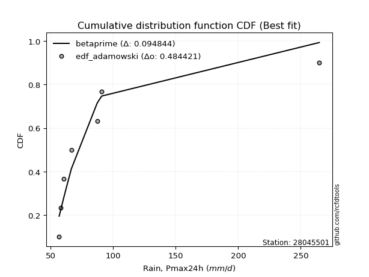</img>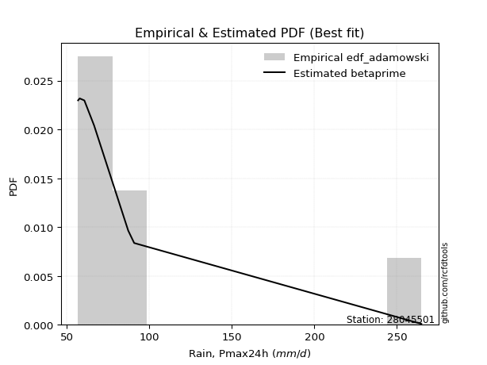</img>

</div>


## C. Best fit & Estimate extreme values for specific return periods - Tr

Best fit in probability distribution analysis means finding the theoretical distribution (like Normal, Poisson, Exponential, etc.) that most accurately mirrors your real-world data´s patterns (shape, center, spread) for better predictions, using methods like visual checks (Q-Q plots), goodness-of-fit tests (Kolmogorov-Smirnov, Chi-Squared), and information criteria (AIC) to score and select the simplest, most representative model.


### 1. Best fit (ordered by delta Δ)

:file_folder:Table: [bestfit_28045501.csv](table/bestfit_28045501.csv)

<div align="center">

|   id |   station | empirical_dist   | p_dist      |     delta |   deltao | eval   |   fit |   n |   best_fit |   best_fit_sort |
|-----:|----------:|:-----------------|:------------|----------:|---------:|:-------|------:|----:|-----------:|----------------:|
|    0 |  28045501 | edf_gringorten   | logf        | 0.078709  | 0.484421 | Δo > Δ |     1 |   7 |          1 |               1 |
|    1 |  28045501 | edf_cunnane      | logf        | 0.0824112 | 0.484421 | Δo > Δ |     1 |   7 |          1 |               2 |
|    2 |  28045501 | edf_hazen        | logf        | 0.0835244 | 0.484421 | Δo > Δ |     1 |   7 |          1 |               3 |
|    3 |  28045501 | edf_blom         | logf        | 0.0852847 | 0.484421 | Δo > Δ |     1 |   7 |          1 |               4 |
|    4 |  28045501 | edf_tukey        | logf        | 0.0899869 | 0.484421 | Δo > Δ |     1 |   7 |          1 |               5 |
|    5 |  28045501 | edf_filliben     | logf        | 0.0917458 | 0.484421 | Δo > Δ |     1 |   7 |          1 |               6 |
|    6 |  28045501 | edf_beard        | logf        | 0.0925738 | 0.484421 | Δo > Δ |     1 |   7 |          1 |               7 |
|    7 |  28045501 | edf_jenkinson    | logf        | 0.0925738 | 0.484421 | Δo > Δ |     1 |   7 |          1 |               8 |
|    8 |  28045501 | edf_chegodayev   | logf        | 0.0936724 | 0.484421 | Δo > Δ |     1 |   7 |          1 |               9 |
|    9 |  28045501 | edf_adamowski    | betaprime   | 0.0948437 | 0.484421 | Δo > Δ |     1 |   7 |          1 |              10 |
|   10 |  28045501 | edf_california   | invgamma    | 0.102483  | 0.484421 | Δo > Δ |     1 |   7 |          1 |              11 |
|   11 |  28045501 | edf_weibull      | logpearson3 | 0.109888  | 0.484421 | Δo > Δ |     1 |   7 |          1 |              12 |

</div>


### 2. Extreme values and % difference analysis

In hydrology, a return period (or recurrence interval $Tr$) is the statistical average time between extreme events like floods or droughts of a specific magnitude, indicating how rare an event is, with a 100-year flood, for example, having a 1% chance of occurring in any given year, not that it happens exactly every century. It is a key tool for infrastructure design (like bridges or dams) and risk assessment, calculated from historical data to determine the probability of future events, although it is important to remember it is statistical average, and events can cluster or be missed.

The extreme value porcentage difference is evaluated as $pdiff = 1 - (ETrBf / ETr) * 100$, where _ETrBf_ correspond to the bestfit extreme value for a specific recurrence interval and _ETr_ correspond to the extreme value for one of the most used PDFsused in hydrology.

> risk_rate: assuming the return period as the project useful life.

:file_folder:Table: [extreme_28045501.csv](table/extreme_28045501.csv), all PDFs.  
:file_folder:Table: [extremepdiff_28045501.csv](table/extremepdiff_28045501.csv), % difference between bestfit and most used PDFs in Hydrology.

<div align="center">

Extreme values table for only best fit PDFs
|   id |      tr |   prob_l |     prob_g |     alpha |   anglit |   arcsine |   argus |     beta |   betaprime |   bradford |       burr |   burr12 |   cosine |   crystalball |   dgamma |   dweibull |   erlang |   exponnorm |   exponpow |   exponweib |                f |   fatiguelife |   foldnorm |    gamma |   gausshyper |   genexpon |       genextreme |   gengamma |   genhalflogistic |   genlogistic |    gennorm |   genpareto |   gompertz |   gumbel_l |   gumbel_r |   halfgennorm |   halflogistic |   halfnorm |   hypsecant |         invgamma |   invgauss |      invweibull |   johnsonsb |   johnsonsu |        kappa3 |   kappa4 |   ksone |   kstwobign |   laplace |   levy_l |   loggamma |   logistic |   loglaplace |    lomax |   maxwell |    mielke |    moyal |   nakagami |      ncf |      nct |    norm |   pearson3 |   powerlaw |   rayleigh |   rdist |    rice |   semicircular |   skewnorm |           t |   trapezoid |   triang |   truncexpon |   truncnorm |   truncpareto |   truncweibull_min |   tukeylambda |   uniform |   vonmises |   vonmises_line |     wald |   weibull_max |   weibull_min |   wrapcauchy |        logalpha |   loganglit |   logarcsine |   logargus |   logbeta |   logbetaprime |   logbradford |     logburr |   logburr12 |   logcosine |   logcrystalball |   logdgamma |   logdweibull |   logerlang |   logexponnorm |   logexponpow |   logexponweib |             logf |   logfatiguelife |   logfoldnorm |   loggausshyper |   loggenexpon |     loggenextreme |      loggengamma |   loggenhalflogistic |   loggenlogistic |       loggennorm |   loggenpareto |   loggompertz |   loggumbel_l |   loggumbel_r |   loghalfgennorm |   loghalflogistic |   loghalfnorm |   loghypsecant |     loginvgamma |      loginvgauss |     loginvweibull |   logjohnsonsb |   logjohnsonsu |   logkappa3 |   logkappa4 |   logksone |   logkstwobign |   loglevy_l |   logloggamma |   loglogistic |   logloglaplace |   loglomax |   logmaxwell |   logmielke |   logmoyal |   lognakagami |           logncf |   lognct |   lognorm |   logpearson3 |   logpowerlaw |   lograyleigh |   logrdist |   logrice |   logsemicircular |   logskewnorm |             logt |   logtrapezoid |   logtriang |   logtruncexpon |   logtruncnorm |   logtruncpareto |   logtruncweibull_min |   logtukeylambda |   loguniform |   logvonmises |   logvonmises_line |   logwald |   logweibull_max |   logweibull_min |   logwrapcauchy |   station |   n |   risk_rate |
|-----:|--------:|---------:|-----------:|----------:|---------:|----------:|--------:|---------:|------------:|-----------:|-----------:|---------:|---------:|--------------:|---------:|-----------:|---------:|------------:|-----------:|------------:|-----------------:|--------------:|-----------:|---------:|-------------:|-----------:|-----------------:|-----------:|------------------:|--------------:|-----------:|------------:|-----------:|-----------:|-----------:|--------------:|---------------:|-----------:|------------:|-----------------:|-----------:|----------------:|------------:|------------:|--------------:|---------:|--------:|------------:|----------:|---------:|-----------:|-----------:|-------------:|---------:|----------:|----------:|---------:|-----------:|---------:|---------:|--------:|-----------:|-----------:|-----------:|--------:|--------:|---------------:|-----------:|------------:|------------:|---------:|-------------:|------------:|--------------:|-------------------:|--------------:|----------:|-----------:|----------------:|---------:|--------------:|--------------:|-------------:|----------------:|------------:|-------------:|-----------:|----------:|---------------:|--------------:|------------:|------------:|------------:|-----------------:|------------:|--------------:|------------:|---------------:|--------------:|---------------:|-----------------:|-----------------:|--------------:|----------------:|--------------:|------------------:|-----------------:|---------------------:|-----------------:|-----------------:|---------------:|--------------:|--------------:|--------------:|-----------------:|------------------:|--------------:|---------------:|----------------:|-----------------:|------------------:|---------------:|---------------:|------------:|------------:|-----------:|---------------:|------------:|--------------:|--------------:|----------------:|-----------:|-------------:|------------:|-----------:|--------------:|-----------------:|---------:|----------:|--------------:|--------------:|--------------:|-----------:|----------:|------------------:|--------------:|-----------------:|---------------:|------------:|----------------:|---------------:|-----------------:|----------------------:|-----------------:|-------------:|--------------:|-------------------:|----------:|-----------------:|-----------------:|----------------:|----------:|----:|------------:|
|    0 |    2    | 0.5      | 0.5        |   64.2812 |   97.8   |    97.8   | 142.159 |  43.6307 |     71.1302 |    146.98  |    63.2911 |  73.8749 |  115.964 |        97.8   |  57.8    |    60.6    |  69.8089 |     84.9465 |    79.2446 |     115.412 |     62.3936      |       56.8    |    80.6317 |  63.8651 |      66.7034 |    85.2235 |     57.7938      |    103.593 |           191.71  |       84.2409 |    57.8002 |     63.2917 |    110.41  |    109.204 |    86.3963 |       65.308  |        80.727  |    83.591  |      97.8   |     62.3935      |    62.6245 |   620.565       |     56.8002 |     58.4298 |  82.3019      |  153.693 | 160.85  |     93.9721 |    97.8   |  86.0411 |    62.934  |     97.8   |      83.2655 |  82.499  |   91.8633 |   66.4754 |  82.7149 |    62.3022 |  81.4198 |  78.9142 |  97.8   |    77.3587 |    57.7852 |    89.7577 | 41.4303 | 100.576 |         97.8   |    111.173 |     59.5952 |     212.569 |  128.116 |      130.539 |     101.556 |       66.9527 |            71.5287 |       45.3794 |   160.85  |    1.28107 |         80.2206 |  75.2988 |       264.642 |       94.5914 |      160.851 |    63.951       |     83.2655 |      83.2656 |    111.634 |   58.811  |        68.6365 |       61.2514 |     68.644  |     73.556  |     93.2744 |          83.2655 |     66.5    |       66.5    |     61.0611 |        73.9144 |       94.0188 |  98.9573       |     65.2886      |          56.8    |       75.1114 |         90.7603 |       74.0333 |     62.2687       |     72.4864      |              149.647 |          75.5614 |     66.5         |         71.297 |       79.7394 |       90.4574 |       76.6453 |          64.116  |           73.5527 |       75.0991 |        83.2655 |   63.2511       |     62.7337      |     62.2686       |        56.804  |  56.8          |      56.8   |     100.971 |    122.663 |        79.6079 |     78.0802 |       83.3355 |       83.2655 |         66.5    |    73.1317 |      79.7506 |     70.4777 |    74.6226 |       64.3047 |    64.3172       |  79.5511 |   83.2655 |       73.4416 |       57.5995 |       78.54   |    141.99  |   83.8937 |           83.2654 |       87.0425 |     64.7605      |        179.852 |     125.36  |         100.054 |        79.5163 |          67.7413 |                57.587 |          122.68  |      122.663 |      0.150129 |            73.6936 |   70.7086 |          75.1209 |     62.1477      |         122.751 |  28045501 |   7 |    0.75     |
|    1 |    2.33 | 0.570815 | 0.429185   |   66.5238 |  112.229 |   119.46  | 158.835 |  43.7411 |     75.4437 |    161.822 |    65.5045 |  78.4598 |  130.369 |       110.187 |  60.1988 |    64.3003 |  75.5939 |     91.1557 |    91.8234 |     155.86  |     65.025       |       57.8107 |    95.1019 |  67.7501 |      72.7733 |    91.4861 |     59.8794      |    128.018 |           205.295 |       91.175  |    57.9024 |     66.1354 |    122.222 |    119.981 |    97.8743 |       68.8205 |        92.5282 |    96.9598 |     107.713 |     65.0249      |    64.9863 | 19890           |     56.8021 |     59.8596 | 267.332       |  168.955 | 178.534 |    102.998  |   105.296 | 140.239  |    65.5214 |    108.714 |      87.9256 |  88.2438 |  104.733  |   69.1692 |  93.5802 |    68.2528 |  89.2989 |  85.0297 | 110.187 |    88.1746 |    59.5402 |   102.817  | 50.4938 | 110.869 |        113.275 |    120.532 |     60.7756 |     224.659 |  140.774 |      144.185 |     111.08  |       71.1134 |            78.646  |       52.144  |   175.587 |    1.68296 |         88.6415 |  83.4211 |       264.817 |      106.085  |      249.922 |    66.2412      |     92.4673 |      97.4545 |    125.557 |   61.9658 |        72.4498 |       63.9745 |     72.1582 |     78.0577 |    103.316  |          91.106  |     69.7972 |       68.841  |     63.5818 |        78.3369 |      106.507  | 181.15         |     70.6116      |          57.3101 |       82.9732 |        101.026  |       78.4842 |     65.0059       |     83.8997      |              166.293 |          80.3099 |     67.0981      |        102.064 |       85.9276 |       97.8241 |       83.3104 |          66.8245 |           80.1368 |       82.7588 |        89.4833 |   65.759        |     65.0102      |     65.006        |        56.8126 |  56.8          |      56.8   |     113.699 |    139.812 |        85.4735 |    113.061  |       91.4946 |       90.1361 |         69.7224 |    77.382  |      87.5664 |     74.4338 |    80.7516 |       70.0653 |    67.3982       |  86.1214 |   91.106  |       79.8085 |       58.7838 |       86.3565 |    172.989 |   90.6625 |           93.1728 |       93.6787 |     67.2918      |        196.683 |     141.863 |         110.884 |        85.3331 |          71.4707 |                58.638 |          137.253 |      136.796 |      0.163549 |            78.6807 |   75.0064 |          79.696  |     66.0064      |         208.703 |  28045501 |   7 |    0.729209 |
|    2 |    5    | 0.8      | 0.2        |   83.913  |  163.136 |   177.218 | 212.325 | 209.032  |     98.0806 |    213.908 |    84.3506 | 105.954  |  182.281 |       156.22  |  86.9167 |   107.996  | 113.045  |    122.201  |   186.853  |     628.726 |    101.378       |       79.2799 |   156.294  |  95.9426 |     117.162  |   122.797  |    475.969       |    337.497 |           241.36  |      121.298  |    66.2698 |    100.385  |    181.279 |    154.796 |   147.74   |       96.468  |       145.926  |   153.495  |     147.478 |    101.377       |    88.8282 |     1.03561e+11 |     66.5028 |     88.5767 |   1.79295e+06 |  219.664 | 235.766 |    141.339  |   142.775 | 230.032  |    83.8125 |    150.854 |     115.442  | 117.422  |  155.385  |   86.5162 | 143.909  |   132.668  | 126.125  | 116.027  | 156.22  |   141.292  |    93.9429 |   155.101  | 77.1998 | 152.079 |        166.084 |    160.11  |     69.5314 |     259.346 |  191.397 |      197.924 |     155.921 |      105.527  |           130.905  |       73.6903 |   223.28  |    3.06159 |        120.948  | 128.89   |       264.899 |      173.017  |      262.397 |    87.0196      |    133.846  |     148.262  |    183.05  |  124.282  |        93.7659 |       93.9206 |     95.1122 |    105.255  |    149.347  |         127.287  |     91.5388 |       93.1331 |     85.5254 |       104.748  |      189.834  |   4.70235e+07  |    131.46        |          69.2957 |      126.046  |        158.183  |      105.088  |    111.7          |    335.266       |              220.197 |         104.654  |     79.856       |        218.346 |      124.861  |      125.977  |      119.682  |          88.3796 |          118.115  |      124.792  |       119.454  |   95.5838       |     87.5934      |    111.707        |        57.6906 |  56.8026       |      56.8   |     177.655 |    213.53  |       115.607  |    208.775  |      129.342  |      122.42   |         89.0485 |   103.096  |     126.517  |     99.5088 |   116.397  |      130.975  |   107.903        | 118.221  |  127.287  |      117.386  |       79.7143 |      126.256  |    295.173 |  123.691  |          136.744  |      127.815  |     80.4202      |        254.235 |     202.285 |         164.937 |       118.573  |          99.5742 |                78.666 |          196.762 |      194.686 |      0.22549  |           101.346  |  104.365  |         103.035  |    124.734       |         254.167 |  28045501 |   7 |    0.67232  |
|    3 |   10    | 0.9      | 0.1        |  115.861  |  191.95  |   191.162 | 238.119 | 264.488  |    121.794  |    238.721 |   122.607  | 139.068  |  213.644 |       186.758 | 117.535  |   166.264  | 154.438  |    150.382  |   304.308  |    1640.45  |    242.899       |      108.923  |   201.576  | 129.571  |     162.991  |   151.221  |  22988.6         |    665.256 |           254.017 |      145.833  |   107.383  |    211.237  |    234.889 |    174.18  |   188.354  |      138.429  |       190.271  |   195.329  |     179.231 |    242.896       |   140.916  |     3.06723e+16 |    950.198  |    206.905  |   2.63161e+09 |  242.344 | 260.738 |    170.53   |   176.796 | 251.711  |   108.841  |    181.888 |     147.81   | 144.579  |  191.031  |  111.085  | 187.729  |   213.825  | 159.267  | 147.513  | 186.758 |   188.768  |   149.037  |   192.38   | 85.9433 | 181.462 |        193.182 |    189.397 |     95.3507 |     272.895 |  223.291 |      228.101 |     190.92  |      150.577  |           181.257  |       82.6577 |   244.09  |    3.72692 |        144.717  | 177.143  |       264.9   |      244.166  |      263.781 |   143.651       |    165.012  |     164.068  |    219.545 |  233.2    |       118.842  |      145.006  |    130.736  |    138.461  |    186.585  |         158.903  |    118.054  |      132.433  |    122.089  |       136.36   |      299.12   |   3.60186e+26  |    317.954       |          90.0708 |      171.172  |        207.837  |      136.972  |    660.514        |   3502.27        |              243.116 |         129.839  |    117.866       |        253.148 |      175.287  |      145.027  |      160.757  |         126.537  |          163.011  |      169.113  |       150.448  |  236.162        |    144.71        |    660.794        |        72.0747 |  57.1686       |     227.659 |     224.984 |    256.866 |       145.491  |    242.095  |      162.599  |      153.38   |        112.549  |   134.65   |     163.914  |    136.59   |   160.028  |      246.756  |   361.255        | 148.96   |  158.903  |      162.892  |      120.666  |      165.528  |    337.791 |  154.359  |          166.495  |      160.855  |     99.7326      |        281.044 |     232.356 |         204.856 |       152.965  |         137.787  |               127.63  |          229.33  |      227.096 |      0.280769 |           122.624  |  148.182  |         127.011  |    410.373       |         260.241 |  28045501 |   7 |    0.651322 |
|    4 |   15    | 0.933333 | 0.0666667  |  147.695  |  204.255 |   193.821 | 247.925 | 264.88   |    137.61   |    247.292 |   163.156  | 163.007  |  227.93  |       201.997 | 136.602  |   206.083  | 180.579  |    166.867  |   381.374  |    2595.34  |    481.475       |      128.311  |   225.14   | 151.391  |     186.948  |   167.848  | 219352           |    922.617 |           257.867 |      159.674  |   165.266  |    375.295  |    266.249 |    182.958 |   211.269  |      171.644  |       215.366  |   217.1    |     197.352 |    481.469       |   192.146  |     3.74757e+19 |   1372.42   |    382.546  |   1.58586e+11 |  249.977 | 269.062 |    186.027  |   196.698 | 258.259  |   128.057  |    198.797 |     170.803  | 160.766  |  209.321  |  131.458  | 213.16   |   261.638  | 179.289  | 168.248  | 201.997 |   216.356  |   178.946  |   211.588  | 88.1584 | 196.602 |        203.749 |    204.638 |    134.044  |     277.242 |  237.42  |      239.496 |     208.036 |      176.755  |           204.576  |       85.5211 |   251.027 |    3.95668 |        157.971  | 208.129  |       264.9   |      289.409  |      264.168 |   236.714       |    180.441  |     167.268  |    235.256 |  285.076  |       137.344  |      179.912  |    164.329  |    162.755  |    206.499  |         177.506  |    137.181  |      166.268  |    153.885  |       159.108  |      380.089  |   8.8763e+49   |    621.532       |         106.921  |      200.483  |        232.209  |      159.937  |   8977.99         |  23695.5         |              250.577 |         146.636  |    168.902       |        259.8   |      213.761  |      154.577  |      189.874  |         163.654  |          195.611  |      198.091  |       171.616  |  702.51         |    219.158       |   8987.91         |       119.985  |  61.2769       |     239.671 |     245.88  |    273.185 |       164.38   |    253.17   |      182.224  |      173.427  |        129.799  |   157.878  |     187.207  |    170.097  |   192.501  |      351.501  |  1650.99         | 168.329  |  177.506  |      196.21   |      148.985  |      190.315  |    346.967 |  173.02   |          179.78   |      181.3    |    119.162       |        290.232 |     242.921 |         222.028 |       173.295  |         162.444  |               168.876 |          241.047 |      239.056 |      0.314233 |           136.63   |  185.592  |         142.922  |   1143.29        |         261.971 |  28045501 |   7 |    0.644736 |
|    5 |   20    | 0.95     | 0.05       |  179.502  |  211.493 |   194.758 | 253.308 | 264.898  |    149.863  |    251.635 |   205.243  | 182.434  |  236.716 |       211.976 | 150.463  |   236.516  | 199.75   |    178.564  |   438.634  |    3473.47  |    818.045       |      142.665  |   240.85   | 167.57   |     201.821  |   179.644  |      1.06571e+06 |   1136.01  |           259.721 |      169.366  |   231.475  |    587.509  |    288.5   |    188.422 |   227.313  |      199.512  |       232.948  |   231.615  |     210.136 |    818.033       |   239.867  |     5.43487e+21 |   1407.51   |    597.845  |   2.78558e+12 |  253.808 | 273.224 |    196.467  |   210.818 | 261.613  |   144.168  |    210.484 |     189.254  | 172.389  |  221.459  |  149.57   | 231.17   |   294.566  | 193.915  | 184.227  | 211.976 |   235.871  |   196.836  |   224.355  | 89.0876 | 206.664 |        209.61  |    214.799 |    184.734  |     279.387 |  245.843 |      245.497 |     218.49  |      193.376  |           217.801  |       86.9154 |   254.495 |    4.07259 |        167.395  | 231.219  |       264.9   |      322.932  |      264.355 |   389.895       |    190.183  |     168.41   |    244.352 |  310.716  |       152.744  |      204.018  |    197.917  |    182.639  |    219.786  |         190.853  |    152.66   |      196.939  |    182.727  |       177.513  |      445.969  |   9.65493e+74  |   1081.06        |         121.396  |      222.663  |        246.961  |      178.529  | 253686            | 119061           |              254.257 |         159.674  |    233.82        |        262.093 |      246.079  |      160.836  |      213.347  |         200.707  |          222.263  |      220.12   |       188.318  | 2407.35         |    311.255       | 254219            |       204.707  |  83.0942       |     245.913 |     257.849 |    281.729 |       178.467  |    259.036  |      196.326  |      188.795  |        143.991  |   176.989  |     204.465  |    202.497  |   219.41   |      446.977  |  9646.88         | 182.844  |  190.853  |      223.507  |      168.487  |      208.811  |    350.34  |  186.655  |          187.6    |      196.356  |    139.995       |        294.874 |     248.309 |         231.569 |       187.084  |         179.299  |               200.887 |          247.034 |      245.27  |      0.338798 |           147.587  |  219.488  |         155.235  |   2786.47        |         262.81  |  28045501 |   7 |    0.641514 |
|    6 |   25    | 0.96     | 0.04       |  211.297  |  216.398 |   195.192 | 256.779 | 264.9    |    160.018  |    254.259 |   248.503  | 199.074  |  242.877 |       219.322 | 161.365  |   261.269  | 214.917  |    187.636  |   484.205  |    4284.4   |   1253.27        |      154.07   |   252.539  | 180.452  |     212.044  |   188.795  |      3.60142e+06 |   1319.62  |           260.808 |      176.831  |   302.319  |    844.65   |    305.758 |    192.31  |   239.671  |      223.751  |       246.495  |   242.414  |     220.03  |   1253.25        |   283.916  |     2.51227e+23 |   1412.64   |    842.839  |   2.52892e+13 |  256.112 | 275.721 |    204.286  |   221.771 | 263.718  |   158.284  |    219.424 |     204.928  | 181.483  |  230.471  |  166.183  | 245.13   |   319.395  | 205.538  | 197.431  | 219.322 |   250.98   |   208.631  |   233.84   | 89.5771 | 214.141 |        213.412 |    222.359 |    246.771  |     280.665 |  251.591 |      249.202 |     225.613 |      204.784  |           226.29   |       87.7362 |   256.576 |    4.14238 |        174.795  | 249.714  |       264.9   |      349.69   |      264.466 |   642.09        |    197.083  |     168.943  |    250.403 |  324.964  |       166.255  |      221.433  |    232.213  |    199.785  |    229.612  |         201.315  |    165.889  |      225.482  |    209.523  |       193.244  |      502.203  |   4.0179e+100  |   1744.43        |         134.281  |      240.689  |        256.959  |      194.427  |      1.40088e+07  | 485307           |              256.445 |         170.501  |    314.541       |        263.136 |      274.475  |      165.444  |      233.387  |         238.093  |          245.248  |      238.085  |       202.352  | 9275.3          |    421.808       |      1.40566e+07  |       301.629  | 197.594        |     249.736 |     265.681 |    286.983 |       189.804  |    262.787  |      207.39   |      201.464  |        156.296  |   193.541  |     218.298  |    234.64   |   242.83   |      535.206  | 69442.7          | 194.594  |  201.315  |      247.06   |      182.528  |      223.708  |    351.946 |  197.476  |          192.855  |      208.363  |    162.737       |        297.675 |     251.576 |         237.638 |       197.149  |         191.467  |               225.806 |          250.655 |      249.076 |      0.358425 |           156.733  |  251.053  |         165.438  |   6144.22        |         263.308 |  28045501 |   7 |    0.639603 |
|    7 |   50    | 0.98     | 0.02       |  370.222  |  228.472 |   195.773 | 264.648 | 264.9    |    195.679  |    259.551 |   476.677  | 261.016  |  259.011 |       240.359 | 195.875  |   343.984  | 263.361  |    215.818  |   630.471  |    7642.04  |   4924.33        |      190.661  |   286.515  | 221.952  |     236.768  |   217.218  |      1.53323e+08 |   1994.06  |           262.921 |      199.827  |   680.86   |   2737.55   |    359.368 |    202.865 |   277.741  |      314.852  |       288.233  |   273.804  |     250.704 |   4924.25        |   461.636  |     3.37879e+28 |   1414.42   |   2347.42   |   2.24704e+16 |  260.733 | 280.716 |    227.248  |   255.793 | 268.457  |   212.998  |    246.74  |     262.387  | 210.18   |  256.606  |  236.628  | 288.468  |   392.352  | 243.432  | 243.623  | 240.359 |   297.785  |   234.839  |   261.375  | 90.371  | 235.844 |        222.099 |    244.334 |    713.155  |     283.2   |  265.854 |      256.868 |     242.514 |      231.546  |           244.617  |       89.33   |   260.738 |    4.28238 |        198.495  | 310.101  |       264.9   |      436.685  |      264.684 |  7771.31        |    215.151  |     169.656  |    264.685 |  348.322  |       219.525  |      265.066  |    423.127  |    264.492  |    257.47   |         234.557  |    214.908  |      350.269  |    325.705  |       251.563  |      707.878  |   1.05191e+227 |  10572           |         185.603  |      301.481  |        280.76   |      253.417  |      4.85453e+19  |      9.28664e+07 |              260.759 |         208.692  |   1045.3         |        264.485 |      385.325  |      178.63   |      307.744  |         434.545  |          332.119  |      299.067  |       252.864  |    2.98404e+07  |   1283.87        |      4.92513e+19  |       552.884  |   9.10174e+17  |     257.561 |     283.415 |    297.787 |       227.432  |    271.433  |      242.594  |      245.686  |        203.394  |   256.62   |     263.941  |    401.205  |   332.686  |      906.286  |     1.56419e+10  | 234.18   |  234.557  |      335.961  |      217.49   |      273.247  |    354.16  |  232.576  |          205.417  |      247.596  |    316.542       |        303.312 |     258.186 |         250.633 |       223.502  |         222.11   |               294.895 |          257.919 |      256.866 |      0.423342 |           187.972  |  389.303  |         201.278  | 130206           |         264.295 |  28045501 |   7 |    0.63583  |
|    8 |   75    | 0.986667 | 0.0133333  |  529.125  |  233.786 |   195.88  | 267.769 | 264.9    |    219.835  |    261.328 |   717.964  | 305.795  |  266.715 |       251.647 | 216.414  |   396.113  | 292.451  |    232.303  |   718.321  |   10286.6   |  11113.2         |      212.699  |   305.011  | 247.066  |     246.943  |   233.845  |      1.35683e+09 |   2463.96  |           263.602 |      213.194  |  1063.49   |   5539      |    390.728 |    208.203 |   299.868  |      380.172  |       312.496  |   290.891  |     268.63  |  11113           |   594.109  |     3.2341e+31  |   1414.46   |   4123.04   |   1.15975e+18 |  262.278 | 282.38  |    239.881  |   275.694 | 270.405  |   254.362  |    262.517 |     303.203  | 227.286  |  270.815  |  295.642  | 313.811  |   432.216  | 267.017  | 274.825  | 251.647 |   325.092  |   244.409  |   276.355  | 90.5677 | 247.651 |        225.569 |    256.297 |   1417.66   |     284.04  |  272.173 |      259.503 |     249.205 |      241.84   |           251.151  |       89.8412 |   262.125 |    4.32912 |        212.478  | 347.26   |       264.9   |      490.079  |      264.757 | 94024.6         |    223.619  |     169.789  |    270.572 |  353.827  |       261.262  |      282.889  |    656.311  |    312.068  |    271.943  |         254.602  |    250.147  |      458.944  |    425.438  |       293.528  |      851.821  | inf            |  39339.7         |         225.55   |      340.583  |        290.438  |      295.905  |      6.36076e+37  |      3.84603e+09 |              262.171 |         234.707  |   2636.42        |        264.722 |      469.901  |      185.692  |      361.413  |         650.066  |          396.135  |      338.595  |       288.034  |    5.05308e+11  |   2747.17        |      6.57204e+37  |       606.64   |   1.38178e+102 |     260.223 |     290.25  |    301.478 |       251.227  |    275.068  |      263.854  |      275.522  |        238.772  |   303.609  |     292.643  |    586.072  |   399.939  |     1207.75   |     8.45534e+16  | 259.775  |  254.602  |      401.254  |      231.676  |      304.662  |    354.589 |  254.226  |          210.661  |      271.975  |    568.607       |        305.202 |     260.412 |         255.239 |       235.02   |         234.743  |               325.882 |          260.326 |      259.517 |      0.464709 |           206.228  |  509.95   |         225.578  |      1.21789e+06 |         264.623 |  28045501 |   7 |    0.634587 |
|    9 |  100    | 0.99     | 0.01       |  688.022  |  236.946 |   195.918 | 269.512 | 264.9    |    238.66   |    262.218 |   968.14   | 342.135  |  271.544 |       259.282 | 231.109  |   434.644  | 313.363  |    243.999  |   781.315  |   12512.3   |  19844.1         |      228.555  |   317.61   | 265.186  |     252.62   |   245.642  |      6.34917e+09 |   2832.13  |           263.937 |      222.654  |  1437.1    |   9162.76   |    412.979 |    211.694 |   315.529  |      432.35   |       329.668  |   302.532  |     281.345 |  19843.7         |   700.27   |     4.16473e+33 |   1414.46   |   6051.51   |   1.88918e+19 |  263.052 | 283.213 |    248.537  |   289.815 | 271.543  |   288.892  |    273.655 |     335.957  | 239.568  |  280.493  |  348.301  | 331.791  |   459.344  | 284.458  | 299.117  | 259.282 |   344.44   |   249.359  |   286.561  | 90.6496 | 255.695 |        227.512 |    264.446 |   2341.43   |     284.458 |  275.94  |      260.836 |     252.808 |      247.282  |           254.502  |       90.0913 |   262.819 |    4.3525  |        221.926  | 374.353  |       264.9   |      529      |      264.793 |     1.1375e+06  |    228.812  |     169.836  |    273.915 |  356.003  |       297.286  |      292.543  |    940.022  |    351.132  |    281.426  |         269.122  |    278.641  |      558.767  |    515.905  |       327.484  |      965.442  | inf            | 114737           |         259.512  |      369.996  |        295.822  |      330.304  |      7.01787e+60  |      7.30817e+10 |              262.87  |         255.057  |   5688.07        |        264.802 |      540.943  |      190.462  |      404.963  |         885.443  |          448.77   |      368.475  |       315.909  |    3.02955e+16  |   4926.32        |      7.43546e+60  |       623.157  | inf            |     261.564 |     293.949 |    303.341 |       268.952  |    277.215  |      279.265  |      298.745  |        268.326  |   342.565  |     313.96   |    793.792  |   455.745  |     1468.38   |     5.6107e+24   | 279.16   |  269.122  |      454.773  |      239.337  |      328.109  |    354.744 |  270.118  |          213.656  |      289.943  |    976.099       |        306.149 |     261.53  |         257.597 |       241.509  |         241.622  |               343.346 |          261.52  |      260.852 |      0.495909 |           217.891  |  620.878  |         244.529  |      7.37683e+06 |         264.787 |  28045501 |   7 |    0.633968 |
|   10 |  200    | 0.995    | 0.005      | 1323.6    |  242.915 |   195.954 | 272.54  | 264.9    |    290.584  |    263.557 |  2026.24   | 448.366  |  281.363 |       276.599 | 266.856  |   532.395  | 364.517  |    272.181  |   934.478  |   19224.8   |  80480.2         |      267.369  |   346.427  | 309.699  |     262.282  |   274.065  |      2.59374e+11 |   3841.12  |           264.431 |      245.397  |  2822.61   |  30972.3    |    466.589 |    219.283 |   353.18   |      579.51   |       370.953  |   329.155  |     311.978 |  80478.8         |   994.206  |     4.91855e+38 |   1414.46   |  14516.2    |   1.54582e+22 |  264.215 | 284.461 |    268.474  |   323.837 | 273.7    |   394.125  |    300.375 |     430.155  | 269.662  |  302.636  |  525.551  | 375.11   |   521.169  | 329.125  | 366.088  | 276.599 |   390.982  |   256.998  |   309.912  | 90.7473 | 274.1   |        230.9   |    283.084 |   8026.34   |     285.085 |  283.071 |      262.856 |     258.592 |      255.839  |           259.637  |       90.4568 |   263.859 |    4.38758 |        240.671  | 441.837  |       264.9   |      626.084  |      264.847 |     2.43609e+10 |    238.954  |     169.88   |    279.824 |  358.404  |       414.495  |      308.052  |   2724.81   |    467.468  |    301.74   |         305.202  |    361.491  |      912.118  |    828.551  |       426.316  |     1281.61   | inf            |      2.65497e+06 |         365.816  |      446.859  |        304.983  |      430.519  |      4.19903e+195 |      2.56276e+14 |              263.904 |         311.493  |  55764.2         |        264.877 |      759.409  |      201.257  |      532.36   |        2021.33   |          605.731  |      447.102  |       394.65   |    4.0619e+39   |  23020           |      5.24836e+195 |       636.586  | inf            |     263.59  |     300.055 |    306.156 |       314.682  |    281.33   |      317.596  |      362.746  |        359.11   |   460.47   |     368.753  |   1894.98   |   624.305  |     2292.86   |     2.11685e+64  | 330.526  |  305.202  |      613.49   |      251.609  |      388.77   |    354.897 |  310.319  |          218.98   |      335.629  |   6617.9         |        307.572 |     263.212 |         261.205 |       252.372  |         252.733  |               372.403 |          263.286 |      262.868 |      0.578792 |           239.193  | 1013.74   |         296.862  |      1.23076e+09 |         265.033 |  28045501 |   7 |    0.633042 |
|   11 |  250    | 0.996    | 0.004      | 1641.38   |  244.435 |   195.959 | 273.249 | 264.9    |    309.512  |    263.826 |  2579.42   | 489.128  |  284.055 |       281.891 | 278.451  |   565.263  | 381.184  |    281.253  |   984.024  |   21834.2   | 126365           |      280.019  |   355.292  | 324.248  |     264.465  |   283.216  |      8.54885e+11 |   4203.42  |           264.527 |      252.708  |  3458.87   |  45876.8    |    483.848 |    221.515 |   365.284  |      633.744  |       384.225  |   337.346  |     321.84  | 126362           |  1099.33   |     2.10131e+40 |   1414.46   |  18980.5    |   1.33498e+23 |  264.448 | 284.711 |    274.644  |   334.789 | 274.261  |   436.014  |    308.953 |     465.781  | 279.503  |  309.452  |  602.401  | 389.056  |   540.106  | 344.362  | 390.504  | 281.891 |   405.945  |   258.557  |   317.101  | 90.7624 | 279.766 |        231.694 |    288.818 |  11974.4    |     285.21  |  284.889 |      263.263 |     259.808 |      257.61   |           260.679  |       90.528  |   264.068 |    4.3946  |        245.159  | 464.163  |       264.9   |      658.279  |      264.858 |     3.56491e+12 |    241.606  |     169.886  |    281.225 |  358.742  |       464.47   |      311.311  |   4119.41   |    512.889  |    307.56   |         317.165  |    393.129  |     1072.74   |    967.357  |       464.094  |     1397      | inf            |      8.89174e+06 |         409.126  |      473.486  |        307.058  |      468.856  |      6.28296e+285 |      4.93459e+15 |              264.108 |         332.168  | 134006           |        264.886 |      847.04   |      204.548  |      581.292  |        2702.63   |          667.046  |      474.513  |       423.959  |    1.1096e+53   |  39217.2         |      8.84989e+285 |       637.926  | inf            |     263.997 |     301.4   |    306.722 |       330.353  |    282.41   |      330.314  |      386.071  |        395.689  |   507.233  |     387.472  |   2631.78   |   690.868  |     2628.59   |     1.28339e+88  | 348.599  |  317.165  |      675.15   |      254.182  |      409.612  |    354.916 |  323.86   |          220.247  |      351.083  |  15740.1         |        307.857 |     263.549 |         261.937 |       254.731  |         255.077  |               378.667 |          263.634 |      263.273 |      0.608246 |           244.011  | 1192.24   |         315.959  |      8.16494e+09 |         265.082 |  28045501 |   7 |    0.632858 |
|   12 |  500    | 0.998    | 0.002      | 3230.31   |  248.202 |   195.965 | 274.878 | 264.9    |    376.305  |    264.363 |  5494.36   | 640.865  |  291.218 |       297.585 | 314.684  |   671.428  | 433.467  |    309.435  |  1138.11   |   31515     | 513396           |      319.7    |   381.724  | 370.004  |     269.272  |   311.639  |      3.46428e+13 |   5448.46  |           264.718 |      275.402  |  6259.65   | 155593      |    537.458 |    227.916 |   402.853  |      825.254  |       425.421  |   361.766  |     352.47  | 513386           |  1454.39   |     2.4194e+45  |   1414.46   |  42084.9    |   1.07491e+26 |  264.915 | 285.211 |    293.134  |   368.811 | 275.711  |   598.264  |    335.557 |     596.38   | 310.557  |  329.791  |  929.132  | 432.374  |   596.303  | 394.61   | 476.716  | 297.585 |   452.374  |   261.707  |   338.548  | 90.7868 | 296.671 |        233.524 |    305.914 |  41658.6    |     285.46  |  289.399 |      264.079 |     262.308 |      261.213  |           262.78   |       90.6675 |   264.484 |    4.40863 |        254.766  | 535.152  |       264.9   |      761.025  |      264.879 |     2.39215e+23 |    248.309  |     169.893  |    284.473 |  359.247  |       677.074  |      317.996  |  19583.8    |    685.392  |    323.602  |         355.468  |    510.307  |     1798.2    |   1574.64   |       604.156  |     1801.44   | inf            |      8.07674e+08 |         581.161  |      562.396  |        311.646  |      611.109  |    inf            |      1.39246e+20 |              264.512 |         405.49   |      3.3485e+06  |        264.897 |     1189.13   |      214.283  |      763.706  |        7207.55   |          899.767  |      566.624  |       529.623  |    3.15052e+133 | 226290           |    inf            |       639.558  | inf            |     264.812 |     304.311 |    307.858 |       382.143  |    285.221  |      371.062  |      468.385  |        540.344  |   688.258  |     449.172  |   8755.87   |   946.384  |     3944.9    |     4.07469e+236 | 410.128  |  355.468  |      907.644  |      259.455  |      478.674  |    354.942 |  367.874  |          223.195  |      401.51   | 752000           |        308.427 |     264.224 |         263.412 |       259.662  |         259.898  |               391.689 |          264.319 |      264.085 |      0.710855 |           254.158  | 1996.82   |         383.418  |      6.52187e+12 |         265.181 |  28045501 |   7 |    0.632489 |
|   13 |  750    | 0.998667 | 0.00133333 | 4819.23   |  249.87  |   195.966 | 275.533 | 264.9    |    421.726  |    264.542 |  8574.8    | 750.559  |  294.689 |       306.303 | 336.011  |   736.248  | 464.362  |    325.92   |  1228.14   |   38390.2   |      1.16587e+06 |      343.146  |   396.49   | 397.111  |     271.083  |   328.266  |      3.0163e+14  |   6262.43  |           264.78  |      288.669  |  8646.54   | 317972      |    568.818 |    231.336 |   424.816  |      954.456  |       449.504  |   375.409  |     370.388 |      1.16585e+06 |  1679.9    |     2.20033e+48 |   1414.46   |  65527.1    |   5.37084e+27 |  265.071 | 285.377 |    303.521  |   388.713 | 276.399  |   721.028  |    351.099 |     689.149  | 329.068  |  341.167  | 1203.35   | 457.713  |   627.514  | 426.206  | 535.409  | 306.303 |   479.502  |   262.767  |   350.541  | 90.7929 | 306.123 |        234.261 |    315.464 |  86499.6    |     285.543 |  291.398 |      264.353 |     263.161 |      262.432  |           263.486  |       90.7129 |   264.623 |    4.41331 |        258.109  | 577.715  |       264.9   |      822.953  |      264.887 |     1.60513e+34 |    251.336  |     169.894  |    285.789 |  359.359  |       859.029  |      320.274  |  61498.6    |    inf      |    331.674  |         378.71   |    594.529  |     2453.06   |   2101.65   |       704.939  |     2072.45   | inf            |      2.11708e+10 |         715.095  |      618.96   |        313.387  |      713.567  |    inf            |      1.19747e+23 |              264.644 |         455.638  |      3.21652e+07 |        264.899 |     1450.13   |      219.675  |      895.819  |       13531.8    |         1071.8    |      625.659  |       603.252  |    3.13527e+230 | 670476           |    inf            |       639.834  | inf            |     265.086 |     305.387 |    308.237 |       414.722  |    286.563  |      395.803  |      524.374  |        653.215  |   825.567  |     487.871  |  20535.8    |  1137.67   |     4944.34   |   inf            | 450.291  |  378.71   |     1078.13   |      261.25   |      522.25   |    354.947 |  395.044  |          224.392  |      432.772  |      2.30405e+07 |        308.617 |     264.449 |         263.906 |       261.373  |         261.545  |               396.181 |          264.543 |      264.357 |      0.780692 |           257.679  | 2720.37   |         429.341  |      5.86431e+14 |         265.213 |  28045501 |   7 |    0.632366 |
|   14 | 1000    | 0.999    | 0.001      | 6408.15   |  250.864 |   195.966 | 275.9   | 264.9    |    457.182  |    264.631 | 11767.8    | 839.578  |  296.879 |       312.306 | 351.193  |   783.399  | 486.404  |    337.617  |  1291.87   |   43862.5   |      2.08635e+06 |      359.87   |   406.688  | 416.477  |     272.056  |   340.063  |      1.40009e+15 |   6879.08  |           264.811 |      298.079  | 10770.9    | 528013      |    591.068 |    233.639 |   440.394  |     1054.3    |       466.587  |   384.83   |     383.101 |      2.08631e+06 |  1846.92   |     2.76226e+50 |   1414.46   |  88891.6    |   8.60887e+28 |  265.149 | 285.46  |    310.717  |   402.833 | 276.831  |   823.631  |    362.122 |     763.597  | 342.359  |  349.03   | 1448.22   | 475.692  |   648.992  | 449.684  | 581.271  | 312.306 |   498.737  |   263.298  |   358.829  | 90.7954 | 312.656 |        234.675 |    322.06  | 145297      |     285.585 |  292.589 |      264.489 |     263.592 |      263.046  |           263.839  |       90.7352 |   264.692 |    4.41565 |        259.797  | 608.332  |       264.9   |      867.671  |      264.89  |     1.07704e+45 |    253.158  |     169.895  |    286.531 |  359.402  |      1025.71   |      321.424  | 157087      |    inf      |    336.869  |         395.59   |    662.626  |     3068.57   |   2583.09   |       786.486  |     2281.19   | inf            |      3.00705e+11 |         829.107  |      661.232  |        314.327  |      796.52   |    inf            |      2.05211e+25 |              264.709 |         494.926  |      1.92843e+08 |        264.899 |     1669.37   |      223.38   |     1003.17   |       21705.2    |         1213.42   |      669.983  |       661.619  |  inf            |      1.48428e+06 |    inf            |       639.93   | inf            |     265.225 |     305.96  |    308.427 |       438.907  |    287.411  |      413.778  |      568.09   |        749.904  |   940.744  |     516.55   |  40674.1    |  1296.4    |     5776.4    |   inf            | 480.855  |  395.59   |     1217.71   |      262.155  |      554.66   |    354.949 |  414.983  |          225.068  |      455.772  |      5.44441e+08 |        308.712 |     264.562 |         264.154 |       262.241  |         262.376  |               398.457 |          264.654 |      264.492 |      0.835909 |           259.463  | 3398.02   |         465.214  |      1.87936e+16 |         265.23  |  28045501 |   7 |    0.632305 |


</div>


<div align="center">

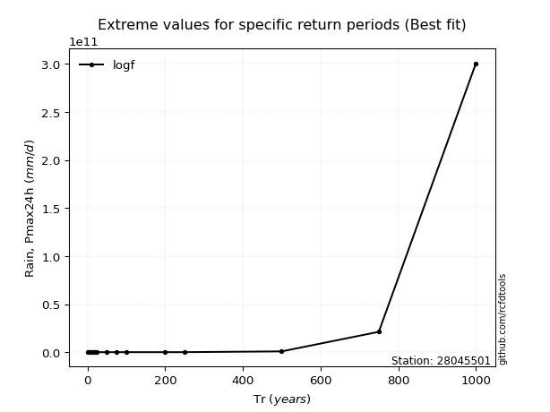</img>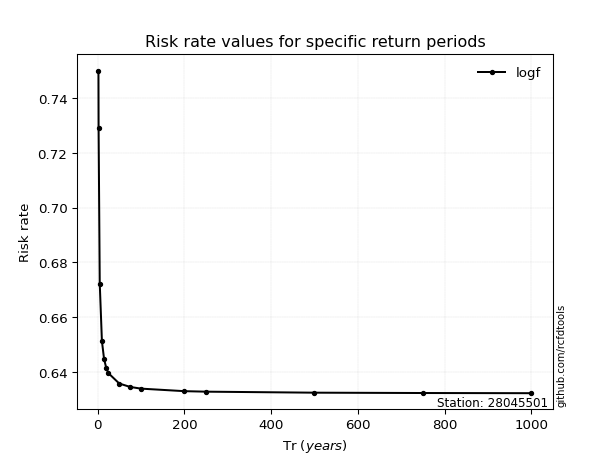</img>

</div>


<sub>**APP DISCLAIMER**: NO WARRANTY - This software is provided by [github.com/rcfdtools](https://github.com/rcfdtools) "as is", without any express or implied warranty, including warranties of merchantability, fitness for a particular purpose, or non-infringement. There is no guarantee that the software will be error-free or operate without interruption. LIMITATION OF LIABILITY - Neither the authors nor copyright holders will be liable for claims or damages arising from the software or its use. You are responsible for determining if the software is appropriate for your use and assume all associated risks, including errors, legal compliance, and data loss. NO PROFESSIONAL ADVICE - The software provides general information and does not offer professional advice. It should not replace consultation with professional advisors.</sub>