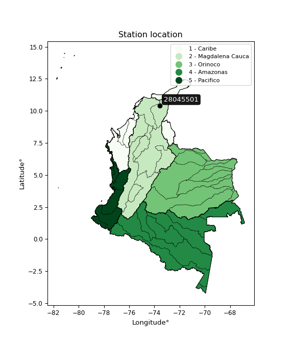

<div align="center">


</div>

# PMP Station (rain, Pmax24h): 28045501

Probable Maximum Precipitation (PMP) is the greatest amount of rainfall for a specific duration that is meteorologically possible for a given location, acting as a "worst-case" scenario for extreme storms, crucial for designing safety-critical infrastructure like bridges, river deviations, dams, spillways, and nuclear plants to prevent catastrophic failure. PMP is calculated by hydrologists using meteorological data to determine the upper limit of extreme rainfall, often leading to the Probable Maximum Flood (PMF) for flood control design, and is increasingly being studied for climate change impacts.

<div align="center">

</img>

</div>


## A. General information


### 1. General running parameters

• app_version: _v20251227_. • runtime: _2025-12-27 09:02:11.367833_. • Python version: _3.14.0_. • SciPy version: _1.16.3_. • Pandas version: _2.3.3_. • NumPy version: _2.3.5_. • Stations dataset (station_dataset_file): _dataset/pmax24h_in/automatic_colombia_2003_2024_filter.csv_. • Stations catalog (station_catalog_file): _dataset/CNE_IDEAM.xls_. • Minimum year to eval til year_max (date_min): _2003_. • Maximum year to eval since year_min (date_max): _2024_. • Creates, save and include plots into reports (create_plot): _False_. • Plot only fit distributions with Δo > Δ (plot_only_fit): _True_. • Eval low extreme values, if False, evaluates high extreme values (low_extreme): _False_. • Eval every SciPy distribution as logarithmic (pdist_logarithmic_on): _True_. • Standard deviation normalized (ddof): _1.0_. • Return periods to eval in years (Tr): _[2, 2.33, 5, 10, 15, 20, 25, 50, 75, 100, 200, 250, 500, 750, 1000]_. • Minimum data sample per station, 0 means any (minimum_sample): _5_. • Z-Score threshold to adjust a value, 0 means disable (zscore): _3.5_. • Avoid zeros, e.g. rain = 0 (avoid_zeros): _True_. • Avoid null values (avoid_nans): _True_. [:file_folder:Dataset file.](../../dataset/pmax24h_in/automatic_colombia_2003_2024_filter.csv)

> Delta Degrees of Freedom (DDOF): is a parameter used in the formulas for calculating variance and standard deviation. When ddof=0, the divisor is $N$ (the total number of observations) and this is used when your data set is the entire population. When ddof=1, the divisor is $N-1$ and this is used when your data set is a sample drawn from a larger population. Using $N-1$ provides an unbiased estimate of the population variance (known as Bessel´s correction).


### 2. Station info and location

|   id |   CODIGO | NOMBRE                          | CATEGORIA               | TECNOLOGIA                | ESTADO     | FECHA_INSTALACION   | FECHA_SUSPENSION   |   ALTITUD |   LATITUD |   LONGITUD | DEPARTAMENTO   | MUNICIPIO    | AREA_OPERATIVA                                         | ENTIDAD                                    | AREA_HIDROGRAFICA   | ZONA_HIDROGRAFICA   | SUBZONA_HIDROGRAFICA   |   CORRIENTE | Catalogo   |
|-----:|---------:|:--------------------------------|:------------------------|:--------------------------|:-----------|:--------------------|:-------------------|----------:|----------:|-----------:|:---------------|:-------------|:-------------------------------------------------------|:-------------------------------------------|:--------------------|:--------------------|:-----------------------|------------:|:-----------|
|    0 | 28045501 | PUEBLO BELLO  - AUT  [28045501] | Climatológica Principal | Automática con Telemetría | Suspendida | 24/05/2013          | 21/10/2020         |      1134 |     10.42 |     -73.57 | Cesar          | Pueblo Bello | Area Operativa 05 - Magdalena-Cesar-Guajira-San Andrés | CENTRO NACIONAL DE INVESTIGACIONES DE CAFE | Magdalena Cauca     | Cesar               | Río Ariguaní           |         nan | CNE_OE     |

<div align="center">

Map location in: [:earth_americas:Google](http://maps.google.com/maps?q=10.42,-73.57) [:earth_americas:OSM](https://www.openstreetmap.org/#map=18/10.42/-73.57&layers=P) [:earth_americas:Bing](https://www.bing.com/maps?cp=10.42~-73.57&lvl=18) [:earth_americas:Apple](https://maps.apple.com/frame?center=10.42%2C-73.57&span=0.003%2C0.006)

</div>


<div align="center">

```geojson
{
  "type": "Feature",
  "geometry": {
    "type": "Point", 
    "coordinates": [-73.57, 10.42]
  }, 
  "properties": {
    "Name": "28045501"
  }
}
```

</div>


### 3. Discrete values table and plot

|               |           0 |           1 |          2 |           3 |           4 |           5 |
|:--------------|------------:|------------:|-----------:|------------:|------------:|------------:|
| Date          | 2017        | 2018        | 2019       | 2021        | 2022        | 2023        |
| Value         |   90.8      |   57.8      |  264.9     |   66.5      |   87.2      |   56.8      |
| Value_initial |   90.8      |   57.8      |  264.9     |   66.5      |   87.2      |   56.8      |
| count         |    6        |    6        |    6       |    6        |    6        |    6        |
| mean          |  104        |  104        |  104       |  104        |  104        |  104        |
| std           |   80.1421   |   80.1421   |   80.1421  |   80.1421   |   80.1421   |   80.1421   |
| zscore        |   -0.164707 |   -0.576476 |    2.00768 |   -0.467919 |   -0.209628 |   -0.588954 |

> The initial value (value_initial) correspond to the initial obtained or null completed value, and value (value) is adjusted only when the initial value is outside the valid range definite through the Z-Score value. If Z-Score is active, values out of range or outliers are replaced with the station mean value


### 4. Active continuous probability distributions from SciPy (45 of 104 available)

[scipy.stats](https://docs.scipy.org/doc/scipy/reference/stats.html) is a Python´s powerful submodule within the SciPy library for comprehensive statistical analysis, offering over 130 probability distributions (like Normal, Poisson), functions for descriptive stats (mean, variance), hypothesis testing (t-tests, chi-square), random variable generation, and statistical tests, making it essential for data science, modeling, and research. It provides tools to explore, model, and draw conclusions from data efficiently, working seamlessly with NumPy.

<div align="center">

|   id | p_dist             |   n_parameter | fit_method   | label                                                                       | active   | ref                                                                                                        |
|-----:|:-------------------|--------------:|:-------------|:----------------------------------------------------------------------------|:---------|:-----------------------------------------------------------------------------------------------------------|
|    0 | alpha              |             3 | MLE          | Alpha                                                                       | True     | [:mortar_board:](https://docs.scipy.org/doc/scipy/reference/generated/scipy.stats.alpha.html)              |
|    1 | betaprime          |             4 | MLE          | Beta prime                                                                  | True     | [:mortar_board:](https://docs.scipy.org/doc/scipy/reference/generated/scipy.stats.betaprime.html)          |
|    2 | chi2               |             3 | MLE          | Chi²                                                                        | True     | [:mortar_board:](https://docs.scipy.org/doc/scipy/reference/generated/scipy.stats.chi2.html)               |
|    3 | crystalball        |             4 | MLE          | Crystalball                                                                 | True     | [:mortar_board:](https://docs.scipy.org/doc/scipy/reference/generated/scipy.stats.crystalball.html)        |
|    4 | erlang             |             3 | MLE          | Erlang                                                                      | True     | [:mortar_board:](https://docs.scipy.org/doc/scipy/reference/generated/scipy.stats.erlang.html)             |
|    5 | expon              |             2 | MLE          | Exponential                                                                 | True     | [:mortar_board:](https://docs.scipy.org/doc/scipy/reference/generated/scipy.stats.expon.html)              |
|    6 | exponnorm          |             3 | MLE          | Exponentially modified Normal                                               | True     | [:mortar_board:](https://docs.scipy.org/doc/scipy/reference/generated/scipy.stats.exponnorm.html)          |
|    7 | f                  |             4 | MLE          | F                                                                           | True     | [:mortar_board:](https://docs.scipy.org/doc/scipy/reference/generated/scipy.stats.f.html)                  |
|    8 | fatiguelife        |             3 | MLE          | Fatigue-life (Birnbaum-Saunders)                                            | True     | [:mortar_board:](https://docs.scipy.org/doc/scipy/reference/generated/scipy.stats.fatiguelife.html)        |
|    9 | fisk               |             3 | MLE          | Fisk                                                                        | True     | [:mortar_board:](https://docs.scipy.org/doc/scipy/reference/generated/scipy.stats.fisk.html)               |
|   10 | gamma              |             3 | MLE          | Gamma                                                                       | True     | [:mortar_board:](https://docs.scipy.org/doc/scipy/reference/generated/scipy.stats.gamma.html)              |
|   11 | genexpon           |             5 | MLE          | Generalized exponential                                                     | True     | [:mortar_board:](https://docs.scipy.org/doc/scipy/reference/generated/scipy.stats.genexpon.html)           |
|   12 | genlogistic        |             3 | MLE          | Generalized logistic                                                        | True     | [:mortar_board:](https://docs.scipy.org/doc/scipy/reference/generated/scipy.stats.genlogistic.html)        |
|   13 | gibrat             |             2 | MM           | Gibrat                                                                      | True     | [:mortar_board:](https://docs.scipy.org/doc/scipy/reference/generated/scipy.stats.gibrat.html)             |
|   14 | gompertz           |             3 | MLE          | Gompertz (or truncated Gumbel)                                              | True     | [:mortar_board:](https://docs.scipy.org/doc/scipy/reference/generated/scipy.stats.gompertz.html)           |
|   15 | gumbel_l           |             2 | MM           | Gumbel Left Skew                                                            | True     | [:mortar_board:](https://docs.scipy.org/doc/scipy/reference/generated/scipy.stats.gumbel_l.html)           |
|   16 | gumbel_r           |             2 | MM           | Gumbel Right Skew                                                           | True     | [:mortar_board:](https://docs.scipy.org/doc/scipy/reference/generated/scipy.stats.gumbel_r.html)           |
|   17 | halflogistic       |             2 | MM           | Half-logistic                                                               | True     | [:mortar_board:](https://docs.scipy.org/doc/scipy/reference/generated/scipy.stats.halflogistic.html)       |
|   18 | halfnorm           |             2 | MM           | Half Normal                                                                 | True     | [:mortar_board:](https://docs.scipy.org/doc/scipy/reference/generated/scipy.stats.halfnorm.html)           |
|   19 | hypsecant          |             2 | MM           | hyperbolic secant                                                           | True     | [:mortar_board:](https://docs.scipy.org/doc/scipy/reference/generated/scipy.stats.hypsecant.html)          |
|   20 | invgamma           |             3 | MLE          | Inverted gamma                                                              | True     | [:mortar_board:](https://docs.scipy.org/doc/scipy/reference/generated/scipy.stats.invgamma.html)           |
|   21 | invgauss           |             3 | MLE          | Inverse Gaussian                                                            | True     | [:mortar_board:](https://docs.scipy.org/doc/scipy/reference/generated/scipy.stats.invgauss.html)           |
|   22 | invweibull         |             3 | MLE          | Inverted Weibull                                                            | True     | [:mortar_board:](https://docs.scipy.org/doc/scipy/reference/generated/scipy.stats.invweibull.html)         |
|   23 | johnsonsu          |             4 | MLE          | Johnson Su                                                                  | True     | [:mortar_board:](https://docs.scipy.org/doc/scipy/reference/generated/scipy.stats.johnsonsu.html)          |
|   24 | kstwobign          |             2 | MLE          | Limiting distribution of scaled Kolmogorov-Smirnov two-sided test statistic | True     | [:mortar_board:](https://docs.scipy.org/doc/scipy/reference/generated/scipy.stats.kstwobign.html)          |
|   25 | laplace            |             2 | MM           | Laplace                                                                     | True     | [:mortar_board:](https://docs.scipy.org/doc/scipy/reference/generated/scipy.stats.laplace.html)            |
|   26 | laplace_asymmetric |             3 | MLE          | Asymmetric Laplace                                                          | True     | [:mortar_board:](https://docs.scipy.org/doc/scipy/reference/generated/scipy.stats.laplace_asymmetric.html) |
|   27 | loggamma           |             3 | MLE          | Log gamma                                                                   | True     | [:mortar_board:](https://docs.scipy.org/doc/scipy/reference/generated/scipy.stats.loggamma.html)           |
|   28 | logistic           |             2 | MM           | Logistic (or Sech-squared)                                                  | True     | [:mortar_board:](https://docs.scipy.org/doc/scipy/reference/generated/scipy.stats.logistic.html)           |
|   29 | lognorm            |             3 | MLE          | Log Normal                                                                  | True     | [:mortar_board:](https://docs.scipy.org/doc/scipy/reference/generated/scipy.stats.lognorm.html)            |
|   30 | maxwell            |             2 | MM           | Maxwell                                                                     | True     | [:mortar_board:](https://docs.scipy.org/doc/scipy/reference/generated/scipy.stats.maxwell.html)            |
|   31 | mielke             |             4 | MLE          | Mielke Beta-Kappa / Dagum                                                   | True     | [:mortar_board:](https://docs.scipy.org/doc/scipy/reference/generated/scipy.stats.mielke.html)             |
|   32 | moyal              |             2 | MM           | Moyal                                                                       | True     | [:mortar_board:](https://docs.scipy.org/doc/scipy/reference/generated/scipy.stats.moyal.html)              |
|   33 | nakagami           |             3 | MLE          | Nakagami                                                                    | True     | [:mortar_board:](https://docs.scipy.org/doc/scipy/reference/generated/scipy.stats.nakagami.html)           |
|   34 | ncf                |             5 | MLE          | Non-central F distribution                                                  | True     | [:mortar_board:](https://docs.scipy.org/doc/scipy/reference/generated/scipy.stats.ncf.html)                |
|   35 | nct                |             4 | MLE          | Non-central Student’s t                                                     | True     | [:mortar_board:](https://docs.scipy.org/doc/scipy/reference/generated/scipy.stats.nct.html)                |
|   36 | norm               |             2 | MM           | Normal                                                                      | True     | [:mortar_board:](https://docs.scipy.org/doc/scipy/reference/generated/scipy.stats.norm.html)               |
|   37 | pareto             |             3 | MLE          | Pareto                                                                      | True     | [:mortar_board:](https://docs.scipy.org/doc/scipy/reference/generated/scipy.stats.pareto.html)             |
|   38 | pearson3           |             3 | MM           | Pearson type III                                                            | True     | [:mortar_board:](https://docs.scipy.org/doc/scipy/reference/generated/scipy.stats.pearson3.html)           |
|   39 | rayleigh           |             2 | MM           | Rayleigh                                                                    | True     | [:mortar_board:](https://docs.scipy.org/doc/scipy/reference/generated/scipy.stats.rayleigh.html)           |
|   40 | rice               |             3 | MLE          | Rice                                                                        | True     | [:mortar_board:](https://docs.scipy.org/doc/scipy/reference/generated/scipy.stats.rice.html)               |
|   41 | t                  |             3 | MLE          | Student’s t                                                                 | True     | [:mortar_board:](https://docs.scipy.org/doc/scipy/reference/generated/scipy.stats.t.html)                  |
|   42 | truncnorm          |             4 | MLE          | Truncated normal                                                            | True     | [:mortar_board:](https://docs.scipy.org/doc/scipy/reference/generated/scipy.stats.truncnorm.html)          |
|   43 | wald               |             2 | MM           | Wald                                                                        | True     | [:mortar_board:](https://docs.scipy.org/doc/scipy/reference/generated/scipy.stats.wald.html)               |
|   44 | weibull_min        |             3 | MLE          | Weibull minimum                                                             | True     | [:mortar_board:](https://docs.scipy.org/doc/scipy/reference/generated/scipy.stats.weibull_min.html)        |

</div>

> **n_parameter:** # arguments & localization & scale.
>
> **Fit methods:** (MLE) maximum likelihood, (MM) L-moments.
>
>**Inactive:** foldnorm, gennorm, norminvgauss, powernorm, powerlognorm, skewnorm, genextreme, anglit, arcsine, argus, beta, bradford, burr, burr12, cauchy, cosine, halfcauchy, foldcauchy, skewcauchy, wrapcauchy, dgamma, gengamma, exponweib, exponpow, truncexpon, gausshyper, genhalflogistic, genhyperbolic, geninvgauss, halfgennorm, johnsonsb, kappa4, kappa3, ksone, kstwo, loglaplace, levy, levy_l, levy_stable, ncx2, genpareto, truncpareto, lomax, powerlaw, rdist, rel_breitwigner, recipinvgauss, semicircular, studentized_range, trapezoid, triang, truncweibull_min, tukeylambda, uniform, loguniform, vonmises, vonmises_line, weibull_max, dweibull, 


## B. Probability distributions vs. Empirical distributions

A continuous probability distribution (CPD) describes probabilities for variables that can take any value within a range (like rain any time), unlike discrete variables with specific outcomes (like temperature). It uses a Probability Density Function (PDF), a curve where the total area under it equals 1, and the probability of the variable falling within an interval (a to b) is found by calculating the area under the curve between those points. A key feature is that the probability of hitting any single exact value is zero, so probabilities are always expressed for ranges, e.g., $P(a ≤ X ≤ b)$.

<div align="center">

Distributions parameters from station values
|    |   station | p_dist                |   n |            loc |            scale | shape                  | shape1                | shape2             | shape3   |
|---:|----------:|:----------------------|----:|---------------:|-----------------:|:-----------------------|:----------------------|:-------------------|:---------|
|  0 |  28045501 | alpha                 |   6 |      50.3682   |     11.2403      | 1.4655672744723137e-09 |                       |                    |          |
|  1 |  28045501 | betaprime             |   6 |      -1.03406  |      2.0699      | 188.6002828409873      | 4.867901481954789     |                    |          |
|  2 |  28045501 | chi2                  |   6 |      56.8      |     48.9608      | 1.015723205090767      |                       |                    |          |
|  3 |  28045501 | crystalball           |   6 |     104        |     73.1594      | 9077.12145413562       | 1273.1508082490827    |                    |          |
|  4 |  28045501 | erlang                |   6 |      56.8      |     53.8146      | 0.6126529279049155     |                       |                    |          |
|  5 |  28045501 | expon                 |   6 |      56.8      |     47.2         |                        |                       |                    |          |
|  6 |  28045501 | exponnorm             |   6 |      56.7633   |      0.0102284   | 4630.720996624768      |                       |                    |          |
|  7 |  28045501 | f                     |   6 |      56.5207   |      1.32472     | 51362.13528424817      | 0.6820269995212653    |                    |          |
|  8 |  28045501 | fatiguelife           |   6 |      56.8      |      1.3929e-05  | 1603.0185311096348     |                       |                    |          |
|  9 |  28045501 | fisk                  |   6 |      56.8      |     15.8459      | 0.37453328095168736    |                       |                    |          |
| 10 |  28045501 | gamma                 |   6 |      56.8      |     45.5682      | 0.551656118504454      |                       |                    |          |
| 11 |  28045501 | genexpon              |   6 |      56.8      |     54.8962      | 1.1630588637434753     | 8.801205850304345e-13 | 1.5580882902133535 |          |
| 12 |  28045501 | genlogistic           |   6 |    -211.884    |     37.0863      | 2337.8884126827043     |                       |                    |          |
| 13 |  28045501 | gibrat                |   6 |      48.1886   |     33.8513      |                        |                       |                    |          |
| 14 |  28045501 | gompertz              |   6 |      56.8      |      1.21352e+13 | 201461423374.6227      |                       |                    |          |
| 15 |  28045501 | gumbel_l              |   6 |     136.926    |     57.0422      |                        |                       |                    |          |
| 16 |  28045501 | gumbel_r              |   6 |      71.0744   |     57.0422      |                        |                       |                    |          |
| 17 |  28045501 | halflogistic          |   6 |      17.2891   |     62.5487      |                        |                       |                    |          |
| 18 |  28045501 | halfnorm              |   6 |       7.16558  |    121.364       |                        |                       |                    |          |
| 19 |  28045501 | hypsecant             |   6 |     104        |     46.5747      |                        |                       |                    |          |
| 20 |  28045501 | invgamma              |   6 |      56.5207   |      0.451726    | 0.3410057227568023     |                       |                    |          |
| 21 |  28045501 | invgauss              |   6 |      55.852    |      3.74332     | 12.862417581241207     |                       |                    |          |
| 22 |  28045501 | invweibull            |   6 |      56.8      |      1.19724     | 0.06374464267889307    |                       |                    |          |
| 23 |  28045501 | johnsonsu             |   6 |      56.8      |      6.83521e-11 | -1.1988031575805922    | 0.09427620207088888   |                    |          |
| 24 |  28045501 | kstwobign             |   6 |     -74.1396   |    209.059       |                        |                       |                    |          |
| 25 |  28045501 | laplace               |   6 |     104        |     51.7315      |                        |                       |                    |          |
| 26 |  28045501 | laplace_asymmetric    |   6 |      56.8      |      0.00212932  | 4.511463699783153e-05  |                       |                    |          |
| 27 |  28045501 | loggamma              |   6 |  -22024.9      |   3007.32        | 1569.6289006243196     |                       |                    |          |
| 28 |  28045501 | logistic              |   6 |     104        |     40.3349      |                        |                       |                    |          |
| 29 |  28045501 | lognorm               |   6 |      56.8      |      0.0495638   | 13.322345920949898     |                       |                    |          |
| 30 |  28045501 | maxwell               |   6 |     -69.3571   |    108.635       |                        |                       |                    |          |
| 31 |  28045501 | mielke                |   6 |      50.6611   |      0.0113892   | 5221.561989768254      | 1.1977208631476763    |                    |          |
| 32 |  28045501 | moyal                 |   6 |      62.1627   |     32.9333      |                        |                       |                    |          |
| 33 |  28045501 | nakagami              |   6 |      56.8      |    105.788       | 0.14392556677593854    |                       |                    |          |
| 34 |  28045501 | ncf                   |   6 |      -1.28467  |     52.8705      | 97.73047806997445      | 9.856194027958033     | 52.37328806466046  |          |
| 35 |  28045501 | nct                   |   6 |      -0.251099 |      1.34552     | 3.1821373807340265     | 55.05557199777999     |                    |          |
| 36 |  28045501 | norm                  |   6 |     104        |     73.1594      |                        |                       |                    |          |
| 37 |  28045501 | pareto                |   6 |      55.3316   |      1.46836     | 0.43569123077818145    |                       |                    |          |
| 38 |  28045501 | pearson3              |   6 |     104        |     73.1594      | 1.6608150062572857     |                       |                    |          |
| 39 |  28045501 | rayleigh              |   6 |     -35.9583   |    111.671       |                        |                       |                    |          |
| 40 |  28045501 | rice                  |   6 |       1.13141  |     89.2588      | 0.00046162926310685593 |                       |                    |          |
| 41 |  28045501 | t                     |   6 |      67.8893   |     15.0676      | 1.0285265251440108     |                       |                    |          |
| 42 |  28045501 | truncnorm             |   6 | -236200        |   4159.49        | 56.799575770456386     | 56.84960623906224     |                    |          |
| 43 |  28045501 | wald                  |   6 |      30.8406   |     73.1594      |                        |                       |                    |          |
| 44 |  28045501 | weibull_min           |   6 |      56.8      |     91.9814      | 0.3313963564775374     |                       |                    |          |
| 45 |  28045501 | logalpha              |   6 |       3.94579  |      0.165798    | 0.0006617454718652093  |                       |                    |          |
| 46 |  28045501 | logbetaprime          |   6 |      -0.863179 |      3.98283     | 272.69029330013484     | 203.79111271970686    |                    |          |
| 47 |  28045501 | logchi2               |   6 |       4.03954  |      0.980257    | 0.9793529811087632     |                       |                    |          |
| 48 |  28045501 | logcrystalball        |   6 |       4.47499  |      0.526357    | 2851.745602496979      | 1.777612466275206     |                    |          |
| 49 |  28045501 | logerlang             |   6 |       4.03954  |      0.650692    | 0.41389677197773855    |                       |                    |          |
| 50 |  28045501 | logexpon              |   6 |       4.03954  |      0.435454    |                        |                       |                    |          |
| 51 |  28045501 | logexponnorm          |   6 |       4.03917  |      0.000105823 | 4083.1835748566155     |                       |                    |          |
| 52 |  28045501 | logf                  |   6 |       4.03954  |      0.510658    | 0.8175469573279006     | 1019.2338042005881    |                    |          |
| 53 |  28045501 | logfatiguelife        |   6 |       4.03954  |      1.70341e-07 | 1523.206402348094      |                       |                    |          |
| 54 |  28045501 | logfisk               |   6 |       4.03954  |      0.214863    | 0.5730271782440108     |                       |                    |          |
| 55 |  28045501 | loggamma              |   6 |       4.03954  |      0.437758    | 0.42096318998673204    |                       |                    |          |
| 56 |  28045501 | loggenexpon           |   6 |       4.03948  |      1.4647      | 3.3560554627171264     | 6.362832295870021e-05 | 0.9422684515227973 |          |
| 57 |  28045501 | loggenlogistic        |   6 |       1.95062  |      0.321642    | 1290.9762656020093     |                       |                    |          |
| 58 |  28045501 | loggibrat             |   6 |       4.0734   |      0.243575    |                        |                       |                    |          |
| 59 |  28045501 | loggompertz           |   6 |       4.03954  | 752907           | 1418384.9440587924     |                       |                    |          |
| 60 |  28045501 | loggumbel_l           |   6 |       4.71188  |      0.410398    |                        |                       |                    |          |
| 61 |  28045501 | loggumbel_r           |   6 |       4.2381   |      0.410398    |                        |                       |                    |          |
| 62 |  28045501 | loghalflogistic       |   6 |       3.85114  |      0.450016    |                        |                       |                    |          |
| 63 |  28045501 | loghalfnorm           |   6 |       3.7783   |      0.873171    |                        |                       |                    |          |
| 64 |  28045501 | loghypsecant          |   6 |       4.47499  |      0.335089    |                        |                       |                    |          |
| 65 |  28045501 | loginvgamma           |   6 |       4.02795  |      0.0227434   | 0.49886220808958626    |                       |                    |          |
| 66 |  28045501 | loginvgauss           |   6 |       4.01975  |      0.0802672   | 5.6715837840007035     |                       |                    |          |
| 67 |  28045501 | loginvweibull         |   6 |       4.03954  |      0.0334613   | 0.06717672960575005    |                       |                    |          |
| 68 |  28045501 | logjohnsonsu          |   6 |       4.03954  |      4.83192e-12 | -1.7967996989357946    | 0.13104238213255764   |                    |          |
| 69 |  28045501 | logkstwobign          |   6 |       3.05749  |      1.64649     |                        |                       |                    |          |
| 70 |  28045501 | loglaplace            |   6 |       4.47499  |      0.37219     |                        |                       |                    |          |
| 71 |  28045501 | loglaplace_asymmetric |   6 |       4.03954  |      0.000275296 | 0.0006320041700447836  |                       |                    |          |
| 72 |  28045501 | logloggamma           |   6 |    -168.399    |     22.9527      | 1866.9065562764717     |                       |                    |          |
| 73 |  28045501 | loglogistic           |   6 |       4.47499  |      0.290196    |                        |                       |                    |          |
| 74 |  28045501 | loglognorm            |   6 |       4.03954  |      0.000954615 | 12.46491534436233      |                       |                    |          |
| 75 |  28045501 | logmaxwell            |   6 |       3.22775  |      0.781594    |                        |                       |                    |          |
| 76 |  28045501 | logmielke             |   6 |       3.93835  |      0.00447461  | 217.29271650685752     | 1.3306631933368198    |                    |          |
| 77 |  28045501 | logmoyal              |   6 |       4.17399  |      0.236944    |                        |                       |                    |          |
| 78 |  28045501 | lognakagami           |   6 |       4.03954  |      0.959213    | 0.1496250624269438     |                       |                    |          |
| 79 |  28045501 | logncf                |   6 |       4.02801  |      0.038507    | 358.15336786060107     | 0.9977755574230103    | 66.45950968860036  |          |
| 80 |  28045501 | lognct                |   6 |       0.386213 |      0.0593941   | 39.51701775452324      | 67.43063450391014     |                    |          |
| 81 |  28045501 | lognorm               |   6 |       4.47499  |      0.526357    |                        |                       |                    |          |
| 82 |  28045501 | logpareto             |   6 |       3.79572  |      0.243815    | 1.2915910228173757     |                       |                    |          |
| 83 |  28045501 | logpearson3           |   6 |       4.47499  |      0.526356    | 1.3371032061304424     |                       |                    |          |
| 84 |  28045501 | lograyleigh           |   6 |       3.46804  |      0.80343     |                        |                       |                    |          |
| 85 |  28045501 | logrice               |   6 |       3.6873   |      0.669892    | 0.00020541397063594195 |                       |                    |          |
| 86 |  28045501 | logt                  |   6 |       4.27627  |      0.257253    | 1.8116380956740683     |                       |                    |          |
| 87 |  28045501 | logtruncnorm          |   6 |      -4.82147  |      2.0757      | 4.268933390770101      | 6.971892727738521     |                    |          |
| 88 |  28045501 | logwald               |   6 |       3.94863  |      0.526357    |                        |                       |                    |          |
| 89 |  28045501 | logweibull_min        |   6 |       4.03954  |      0.952361    | 0.3506630683456716     |                       |                    |          |

</div>

> **loc** (Location parameter): This shifts the distribution along the x-axis. For many common distributions, like the normal (Gaussian) distribution, loc represents the mean $μ$. For others, like the uniform distribution, it might represent the minimum value, or for the beta distribution, the left end of the support interval.
>
> **scale** (Scale parameter): This determines the width or spread of the distribution. For the normal distribution, scale represents the standard deviation $σ$. For a uniform distribution, it defines the length of the interval (from $loc$ to $loc + scale$).
>
> **shape** (Shape parameters): Refers to parameters that define the specific form of a probability distribution, distinct from its location (loc) and scale (scale). These parameters are required arguments for most distribution functions. For example, a normal (Gaussian) distribution is fully defined by its location (mean) and scale (standard deviation), so it has no specific shape parameters beyond loc and scale. However, other distributions have intrinsic properties that need specification, as Gamma distribution that takes a shape parameter, often named $a$ or $alpha$.


### 0. Cumulative distribution values - CDF (90 evaluated)

Cumulative Distribution Function (CDF), denoted as $F$<sub>$X$</sub>$(x)$, is a function that gives the probability that a random variable $X$ will take a value less than or equal to a specific value, $x$ (i.e., $(P(X≥x)$. It essentially "accumulates" probabilities from a given point up to the far right (positive infinity), providing a complete picture of the distribution´s probabilities for both discrete (like rain) and continuous (like temperature) variables, helping to find probabilities over ranges or above certain values.

<div align="center">

CDF ordered by x ascending and calculating $log(f(x))$ separately
|   id |   Station |   date |     x |   count |   mean |     std |    zscore |   Value_initial |   station |   m |     alpha |   alpha_pdf |   betaprime |   betaprime_pdf |        chi2 |         chi2_pdf |   crystalball |   crystalball_pdf |      erlang |      erlang_pdf |     expon |   expon_pdf |   exponnorm |   exponnorm_pdf |         f |       f_pdf |   fatiguelife |   fatiguelife_pdf |        fisk |    fisk_pdf |       gamma |        gamma_pdf |    genexpon |   genexpon_pdf |   genlogistic |   genlogistic_pdf |    gibrat |   gibrat_pdf |    gompertz |   gompertz_pdf |   gumbel_l |   gumbel_l_pdf |   gumbel_r |   gumbel_r_pdf |   halflogistic |   halflogistic_pdf |   halfnorm |   halfnorm_pdf |   hypsecant |   hypsecant_pdf |   invgamma |   invgamma_pdf |   invgauss |   invgauss_pdf |   invweibull |   invweibull_pdf |   johnsonsu |   johnsonsu_pdf |   kstwobign |   kstwobign_pdf |   laplace |   laplace_pdf |   laplace_asymmetric |   laplace_asymmetric_pdf |    loggamma |   loggamma_pdf |   logistic |   logistic_pdf |   lognorm |   lognorm_pdf |   maxwell |   maxwell_pdf |   mielke |   mielke_pdf |    moyal |   moyal_pdf |    nakagami |   nakagami_pdf |      ncf |     ncf_pdf |      nct |     nct_pdf |     norm |    norm_pdf |      pareto |   pareto_pdf |   pearson3 |   pearson3_pdf |   rayleigh |   rayleigh_pdf |     rice |    rice_pdf |        t |       t_pdf |   truncnorm |   truncnorm_pdf |     wald |    wald_pdf |   weibull_min |   weibull_min_pdf |   logalpha |   logalpha_pdf |   logbetaprime |   logbetaprime_pdf |     logchi2 |   logchi2_pdf |   logcrystalball |   logcrystalball_pdf |   logerlang |   logerlang_pdf |   logexpon |   logexpon_pdf |   logexponnorm |   logexponnorm_pdf |        logf |       logf_pdf |   logfatiguelife |   logfatiguelife_pdf |     logfisk |   logfisk_pdf |   loggenexpon |   loggenexpon_pdf |   loggenlogistic |   loggenlogistic_pdf |   loggibrat |   loggibrat_pdf |   loggompertz |   loggompertz_pdf |   loggumbel_l |   loggumbel_l_pdf |   loggumbel_r |   loggumbel_r_pdf |   loghalflogistic |   loghalflogistic_pdf |   loghalfnorm |   loghalfnorm_pdf |   loghypsecant |   loghypsecant_pdf |   loginvgamma |   loginvgamma_pdf |   loginvgauss |   loginvgauss_pdf |   loginvweibull |   loginvweibull_pdf |   logjohnsonsu |   logjohnsonsu_pdf |   logkstwobign |   logkstwobign_pdf |   loglaplace |   loglaplace_pdf |   loglaplace_asymmetric |   loglaplace_asymmetric_pdf |   logloggamma |   logloggamma_pdf |   loglogistic |   loglogistic_pdf |   loglognorm |   loglognorm_pdf |   logmaxwell |   logmaxwell_pdf |   logmielke |   logmielke_pdf |   logmoyal |   logmoyal_pdf |   lognakagami |   lognakagami_pdf |    logncf |   logncf_pdf |   lognct |   lognct_pdf |   logpareto |   logpareto_pdf |   logpearson3 |   logpearson3_pdf |   lograyleigh |   lograyleigh_pdf |   logrice |   logrice_pdf |     logt |   logt_pdf |   logtruncnorm |   logtruncnorm_pdf |   logwald |   logwald_pdf |   logweibull_min |   logweibull_min_pdf |
|-----:|----------:|-------:|------:|--------:|-------:|--------:|----------:|----------------:|----------:|----:|----------:|------------:|------------:|----------------:|------------:|-----------------:|--------------:|------------------:|------------:|----------------:|----------:|------------:|------------:|----------------:|----------:|------------:|--------------:|------------------:|------------:|------------:|------------:|-----------------:|------------:|---------------:|--------------:|------------------:|----------:|-------------:|------------:|---------------:|-----------:|---------------:|-----------:|---------------:|---------------:|-------------------:|-----------:|---------------:|------------:|----------------:|-----------:|---------------:|-----------:|---------------:|-------------:|-----------------:|------------:|----------------:|------------:|----------------:|----------:|--------------:|---------------------:|-------------------------:|------------:|---------------:|-----------:|---------------:|----------:|--------------:|----------:|--------------:|---------:|-------------:|---------:|------------:|------------:|---------------:|---------:|------------:|---------:|------------:|---------:|------------:|------------:|-------------:|-----------:|---------------:|-----------:|---------------:|---------:|------------:|---------:|------------:|------------:|----------------:|---------:|------------:|--------------:|------------------:|-----------:|---------------:|---------------:|-------------------:|------------:|--------------:|-----------------:|---------------------:|------------:|----------------:|-----------:|---------------:|---------------:|-------------------:|------------:|---------------:|-----------------:|---------------------:|------------:|--------------:|--------------:|------------------:|-----------------:|---------------------:|------------:|----------------:|--------------:|------------------:|--------------:|------------------:|--------------:|------------------:|------------------:|----------------------:|--------------:|------------------:|---------------:|-------------------:|--------------:|------------------:|--------------:|------------------:|----------------:|--------------------:|---------------:|-------------------:|---------------:|-------------------:|-------------:|-----------------:|------------------------:|----------------------------:|--------------:|------------------:|--------------:|------------------:|-------------:|-----------------:|-------------:|-----------------:|------------:|----------------:|-----------:|---------------:|--------------:|------------------:|----------:|-------------:|---------:|-------------:|------------:|----------------:|--------------:|------------------:|--------------:|------------------:|----------:|--------------:|---------:|-----------:|---------------:|-------------------:|----------:|--------------:|-----------------:|---------------------:|
|    0 |  28045501 |   2023 |  56.8 |       6 |    104 | 80.1421 | -0.588954 |            56.8 |  28045501 |   1 | 0.0805294 | 0.0470814   |    0.186228 |     0.0111442   | 7.17453e-09 | 512800           |      0.25941  |       0.00442848  | 2.08771e-10 | 18000.9         | 0         | 0.0211864   | 0.000775092 |     0.0210929   | 0.0426586 | 0.319926    |      0.106061 |       3.28208e+10 | 5.48046e-06 | 1.44439e+07 | 2.14306e-09 | 166385           | 7.72597e-12 |    0.0211865   |      0.188561 |       0.00847942  | 0.0855171 |  0.0181523   | 1.03994e-12 |     0.0166014  |   0.217645 |    0.0033664   |   0.276834 |     0.00623308 |       0.305742 |        0.00724653  |   0.31744  |    0.00604687  |    0.221662 |     0.00438384  |  0.0426609 |    0.319932    |  0.0506672 |    0.125404    |   0.00031281 |      2.26466e+10 |    0.130221 |     2.21436e+08 |    0.172376 |      0.00696376 |  0.200779 |   0.00388117  |          2.07259e-09 |              0.0211873   | 7.36731e-07 |    3.49183e+08 |   0.236818 |    0.00448087  |  0.204034 |     0.538281  |  0.282372 |   0.00504668  |      nan |          nan | 0.277999 | 0.00729601  | 1.78902e-05 |    7.24759e+08 | 0.191375 | 0.0108651   | 0.164708 | 0.0129034   | 0.25941  | 0.00442848  | 1.11022e-16 |  0.29672     |   0.299282 |    0.00793296  |   0.291768 |     0.00526806 | 0.176742 | 0.00575234  | 0.296651 | 0.013829    | 3.34665e-07 |     0.0145038   | 0.224139 | 0.0143508   |   4.57619e-06 |       2.13433e+08 |  0.0770464 |      3.15284   |       0.182246 |          0.584301  | 3.45991e-08 |   1.90754e+07 |         0.204034 |            0.538281  | 7.93873e-07 |      3.6995e+08 |  0         |      2.29645   |    0.000846205 |          2.31172   | 0.000186242 | 108878         |        0.0210266 |           2.8907e+12 | 5.72494e-09 |   3.69357e+06 |   0.000124322 |         2.29101   |         0.142266 |            0.861882  |    0        |       0         |   1.05875e-09 |          1.88388  |      0.176603 |        0.389864   |      0.197447 |         0.780498  |          0.206322 |             1.06377   |      0.235197 |          0.873784 |       0.169463 |          0.482173  |     0.0474292 |         9.55448   |     0.0523589 |         6.34882   |     0.000284234 |         1.75545e+11 |      0.0387403 |        2.21352e+09 |       0.131052 |          0.792109  |     0.155187 |        0.416956  |             4.20969e-07 |                   2.29572   |      0.205407 |         0.532055  |      0.182343 |         0.513771  |    0.0131251 |       3.0488e+12 |     0.217796 |         0.642146 |   0.0776918 |         2.59022 |   0.184159 |      0.925745  |    2.5577e-05 |       8.61756e+09 | 0.0474315 |    9.55473   | 0.182061 |    0.675928  | 3.33067e-16 |       5.29742   |      0.204358 |         0.929348  |      0.223523 |          0.687457 |  0.12911  |     0.683581  | 0.231567 |   0.79223  |    2.11734e-07 |          2.15957   | 0.040893  |     1.45587   |      5.36324e-06 |          2.11746e+09 |
|    1 |  28045501 |   2018 |  57.8 |       6 |    104 | 80.1421 | -0.576476 |            57.8 |  28045501 |   2 | 0.130415  | 0.0517365   |    0.197448 |     0.0112908   | 0.109581    |      0.0552761   |      0.263858 |       0.00446729  | 0.0965329   |     0.0584627   | 0.0209636 | 0.0207423   | 0.0216503   |     0.0206556   | 0.277993  | 0.147189    |      0.566372 |       0.0328791   | 0.262154    | 0.0724457   | 0.135742    |      0.0738295   | 0.0209636   |    0.0207423   |      0.197116 |       0.00862846  | 0.104011  |  0.0187894   | 0.0164644   |     0.0163281  |   0.221034 |    0.0034111   |   0.283082 |     0.006263   |       0.31297  |        0.00721078  |   0.323476 |    0.00602632  |    0.226082 |     0.00445622  |  0.277994  |    0.147186    |  0.17889   |    0.117211    |   0.363658   |      0.0234488   |    0.858411 |     0.021145    |    0.179389 |      0.00706304 |  0.204698 |   0.00395693  |          0.0209644   |              0.0207431   | 0.287225    |    6.7359      |   0.241329 |    0.00453922  |  0.213556 |     0.552947  |  0.287431 |   0.00507227  |      nan |          nan | 0.285305 | 0.00731366  | 0.211471    |    0.0608715   | 0.202306 | 0.0109948   | 0.177738 | 0.0131491   | 0.263858 | 0.00446729  | 0.202523    |  0.140763    |   0.307193 |    0.00788877  |   0.297045 |     0.00528518 | 0.182526 | 0.00581453  | 0.310921 | 0.0147153   | 0.0144055   |     0.0143071   | 0.238412 | 0.0141901   |   0.200268    |       0.0592283   |  0.136076  |      3.52195   |       0.192601 |          0.602382  | 0.111491    |   3.10953     |         0.213556 |            0.552947  | 0.250283    |      5.82392    |  0.0392862 |      2.20623   |    0.0403983   |          2.22082   | 0.195936    |      4.54387   |        0.58322   |           2.34936    | 0.191763    |   5.08888     |   0.0393191   |         2.2012    |         0.157688 |            0.904929  |    0        |       0         |   0.0323437   |          1.82295  |      0.183524 |        0.403381   |      0.211243 |         0.80027   |          0.224811 |             1.05492   |      0.250401 |          0.868401 |       0.178069 |          0.504121  |     0.210208  |         7.84052   |     0.168691  |         6.33942   |     0.351799    |         1.41464     |      0.880591  |        1.49679     |       0.145188 |          0.827349  |     0.162637 |        0.436973  |             0.0392744   |                   2.20556   |      0.214818 |         0.546382  |      0.191481 |         0.533489  |    0.592169  |       1.78469    |     0.229112 |         0.654529 | nan         |       nan       |   0.200532 |      0.949933  |    0.243157   |       4.16913     | 0.210213  |    7.84069   | 0.194047 |    0.697528  | 0.0854233   |       4.52126   |      0.220665 |         0.938974  |      0.235609 |          0.697424 |  0.14125  |     0.707449  | 0.245856 |   0.8455   |    0.0370211   |          2.08335   | 0.0690965 |     1.75401   |      0.21807     |          3.86473     |
|    2 |  28045501 |   2021 |  66.5 |       6 |    104 | 80.1421 | -0.467919 |            66.5 |  28045501 |   3 | 0.48594   | 0.0270351   |    0.298648 |     0.0117476   | 0.337341    |      0.0165319   |      0.304123 |       0.00478175  | 0.365742    |     0.0206274   | 0.185767  | 0.0172507   | 0.185816    |     0.0171896   | 0.614319  | 0.012741    |      0.69867  |       0.00934864  | 0.454175    | 0.00957184  | 0.445098    |      0.0220242   | 0.185767    |    0.0172507   |      0.276794 |       0.0095841   | 0.269458  |  0.0180386   | 0.148737    |     0.0141322  |   0.252443 |    0.00381292  |   0.33841  |     0.00642799 |       0.374271 |        0.00687401  |   0.375085 |    0.00583375  |    0.267616 |     0.00509256  |  0.614315  |    0.0127409   |  0.596088  |    0.0199679   |   0.4168     |      0.00239707  |    0.901025 |     0.00169291  |    0.243974 |      0.00772326 |  0.242187 |   0.00468162  |          0.185774    |              0.0172513   | 0.663329    |    1.36711     |   0.282982 |    0.00503046  |  0.298834 |     0.659399  |  0.332408 |   0.00525513  |      nan |          nan | 0.349133 | 0.00731685  | 0.406658    |    0.012055    | 0.300561 | 0.0113895   | 0.296654 | 0.0137814   | 0.304123 | 0.00478175  | 0.586869    |  0.0161167   |   0.373953 |    0.00744219  |   0.343549 |     0.00539352 | 0.235221 | 0.00627485  | 0.470575 | 0.0210629   | 0.131768    |     0.0127044   | 0.353817 | 0.0122386   |   0.377813    |       0.0100866   |  0.509759  |      1.68368   |       0.286319 |          0.727443  | 0.320055    |   0.941514    |         0.298834 |            0.659399  | 0.585775    |      1.29237    |  0.303768  |      1.59887   |    0.306313    |          1.60541   | 0.466646    |      1.10537   |        0.736179  |           0.654586   | 0.455774    |   0.901503    |   0.303288    |         1.59637   |         0.302771 |            1.12416   |    0.249284 |       2.56292   |   0.256973    |          1.39977  |      0.248238 |        0.522673   |      0.331279 |         0.891804  |          0.366613 |             0.961738  |      0.368593 |          0.814447 |       0.262007 |          0.696552  |     0.603227  |         1.06831   |     0.589709  |         1.38986   |     0.406119    |         0.155924    |      0.928726  |        0.113153    |       0.275837 |          1.00428   |     0.237044 |        0.63689   |             0.303688    |                   1.59854   |      0.299018 |         0.650843  |      0.27743  |         0.690784  |    0.658988  |       0.186653   |     0.326583 |         0.727736 | nan         |       nan       |   0.341    |      1.01885   |    0.469578   |       0.888133    | 0.603241  |    1.06832   | 0.302168 |    0.831886  | 0.474907    |       1.68926   |      0.353719 |         0.938762  |      0.337565 |          0.748291 |  0.251506 |     0.850486  | 0.395134 |   1.26465  |    0.290542    |          1.557     | 0.340075  |     1.73904   |      0.412713    |          0.695204    |
|    3 |  28045501 |   2022 |  87.2 |       6 |    104 | 80.1421 | -0.209628 |            87.2 |  28045501 |   4 | 0.760229  | 0.00631029  |    0.522992 |     0.00948106  | 0.563297    |      0.00762721  |      0.409188 |       0.00531116  | 0.64431     |     0.00902045  | 0.474848  | 0.0111261   | 0.474078    |     0.0111036   | 0.735003  | 0.00291337  |      0.821629 |       0.00395472  | 0.560704    | 0.00303464  | 0.723536    |      0.00837898  | 0.474849    |    0.0111261   |      0.479435 |       0.00950215  | 0.556411  |  0.0101239   | 0.396304    |     0.0100222  |   0.341786 |    0.00482593  |   0.470599 |     0.00621844 |       0.507125 |        0.00593796  |   0.490398 |    0.00528952  |    0.387594 |     0.00641266  |  0.734998  |    0.00291336  |  0.783972  |    0.00436584  |   0.44322    |      0.00075622  |    0.918508 |     0.00046752  |    0.409275 |      0.0079725  |  0.361353 |   0.00698515  |          0.474862    |              0.0111263   | 0.869112    |    0.412495    |   0.397352 |    0.00593687  |  0.494857 |     0.757869  |  0.443387 |   0.00539997  |      nan |          nan | 0.494115 | 0.00655635  | 0.564223    |    0.00528727  | 0.518779 | 0.00927849  | 0.549174 | 0.0100933   | 0.409188 | 0.00531116  | 0.738371    |  0.00357689  |   0.515125 |    0.0061769   |   0.45565  |     0.00537607 | 0.371801 | 0.00678641  | 0.791314 | 0.00806801  | 0.360847    |     0.00957599  | 0.558221 | 0.00779348  |   0.499865    |       0.00377761  |  0.751072  |      0.460757  |       0.49984  |          0.807675  | 0.500013    |   0.492173    |         0.494857 |            0.757869  | 0.796421    |      0.474152   |  0.626343  |      0.858087  |    0.629506    |          0.857439  | 0.662268    |      0.492541  |        0.851169  |           0.281758   | 0.597673    |   0.321438    |   0.625562    |         0.85795   |         0.59773  |            0.956157  |    0.68544  |       0.899245  |   0.554055    |          0.840108 |      0.424348 |        0.774625   |      0.565061 |         0.785941  |          0.595153 |             0.717523  |      0.570538 |          0.668776 |       0.493554 |          0.949732  |     0.747015  |         0.276916  |     0.782763  |         0.376345  |     0.43061     |         0.0568563   |      0.944916  |        0.0340472   |       0.544958 |          0.912093  |     0.490966 |        1.31913   |             0.626226    |                   0.858082  |      0.492745 |         0.750709  |      0.494154 |         0.86137   |    0.687914  |       0.0662177  |     0.528105 |         0.729793 | nan         |       nan       |   0.590935 |      0.783245  |    0.631316   |       0.429399    | 0.747029  |    0.276914  | 0.536842 |    0.846051  | 0.730289    |       0.518014  |      0.583921 |         0.736682  |      0.539226 |          0.713942 |  0.493105 |     0.88208   | 0.729852 |   0.931987 |    0.611781    |          0.875441  | 0.662908  |     0.772764  |      0.530386    |          0.290364    |
|    4 |  28045501 |   2017 |  90.8 |       6 |    104 | 80.1421 | -0.164707 |            90.8 |  28045501 |   5 | 0.781007  | 0.00527825  |    0.55612  |     0.00892232  | 0.589519    |      0.00695791  |      0.428408 |       0.00536501  | 0.675045    |     0.00807883  | 0.513413  | 0.0103091   | 0.51257     |     0.010291    | 0.744742  | 0.00251448  |      0.835128 |       0.00355609  | 0.571001    | 0.00269839  | 0.75182     |      0.00736358  | 0.513414    |    0.0103091   |      0.513169 |       0.00923014  | 0.59101   |  0.00911764  | 0.431327    |     0.0094408  |   0.359477 |    0.00500216  |   0.492802 |     0.00611355 |       0.528189 |        0.00576364  |   0.509253 |    0.00518477  |    0.41097  |     0.0065688   |  0.744737  |    0.00251448  |  0.798477  |    0.00372098  |   0.445791   |      0.000675237 |    0.920087 |     0.000411887 |    0.437796 |      0.00786719 |  0.387395 |   0.00748856  |          0.513427    |              0.0103092   | 0.884643    |    0.356949    |   0.418907 |    0.00603507  |  0.525501 |     0.756383  |  0.462803 |   0.00538467  |      nan |          nan | 0.517367 | 0.00635973  | 0.582478    |    0.00486768  | 0.551241 | 0.00875451  | 0.584104 | 0.00931607  | 0.428408 | 0.00536501  | 0.750291    |  0.00306742  |   0.536957 |    0.00595203  |   0.474937 |     0.00533717 | 0.396254 | 0.00679505  | 0.817274 | 0.0064305   | 0.394486    |     0.00911656  | 0.585203 | 0.00720499  |   0.512789    |       0.00341468  |  0.768433  |      0.39968   |       0.532349 |          0.798662  | 0.519268    |   0.460436    |         0.525501 |            0.756383  | 0.814533    |      0.422631   |  0.659493  |      0.781959  |    0.662619    |          0.780804  | 0.681356    |      0.452087  |        0.862032  |           0.255897   | 0.610034    |   0.290582    |   0.658711    |         0.781997  |         0.635207 |            0.896057  |    0.719217 |       0.774434  |   0.586778    |          0.77846  |      0.456357 |        0.807338   |      0.596166 |         0.751364  |          0.623405 |             0.679271  |      0.597095 |          0.644045 |       0.531929 |          0.945152  |     0.757524  |         0.243787  |     0.797028  |         0.330473  |     0.432807    |         0.051903    |      0.94622   |        0.0305271   |       0.581045 |          0.87141   |     0.543245 |        1.22721   |             0.659377    |                   0.781978  |      0.523116 |         0.750013  |      0.528973 |         0.858595  |    0.690469  |       0.0602917  |     0.557357 |         0.715842 | nan         |       nan       |   0.621658 |      0.735645  |    0.648093   |       0.400729    | 0.757538  |    0.243785  | 0.570618 |    0.822918  | 0.749891    |       0.453109  |      0.612963 |         0.699047  |      0.56777  |          0.696803 |  0.528423 |     0.863133  | 0.764968 |   0.805295 |    0.645694    |          0.802163  | 0.692443  |     0.689292  |      0.541653    |          0.267278    |
|    5 |  28045501 |   2019 | 264.9 |       6 |    104 | 80.1421 |  2.00768  |           264.9 |  28045501 |   6 | 0.958214  | 0.000194598 |    0.979047 |     0.000289864 | 0.959818    |      0.000482072 |      0.986072 |       0.000485635 | 0.99217     |     0.000157604 | 0.987831  | 0.000257809 | 0.987653    |     0.000260681 | 0.861676  | 0.000226002 |      0.99205  |       0.000126286 | 0.724015    | 0.000359627 | 0.996988    |      7.16225e-05 | 0.987832    |    0.000257807 |      0.993916 |       0.000163548 | 0.968315  |  0.000328503 | 0.968405    |     0.00052452 |   0.999919 |    1.33154e-05 |   0.967111 |     0.00056699 |       0.962539 |        0.000587694 |   0.9663   |    0.000689511 |    0.979891 |     0.000431475 |  0.861671  |    0.000226005 |  0.949923  |    0.000231072 |   0.486854   |      0.000107344 |    0.942539 |     5.21656e-05 |    0.98961  |      0.00032239 |  0.977706 |   0.000430957 |          0.987834    |              0.000257773 | 0.994009    |    0.0155416   |   0.98182  |    0.000442526 |  0.982053 |     0.0838919 |  0.976316 |   0.000611543 |      nan |          nan | 0.963269 | 0.000557259 | 0.923216    |    0.000779093 | 0.977696 | 0.000306427 | 0.97635  | 0.000270377 | 0.986072 | 0.000485635 | 0.884839    |  0.000239419 |   0.96115  |    0.000582032 |   0.973464 |     0.00064021 | 0.987302 | 0.000420395 | 0.977293 | 0.000118073 | 0.999999    |     0.000844903 | 0.960355 | 0.000447463 |   0.730369    |       0.000562793 |  0.919198  |      0.0492955 |       0.978933 |          0.0838205 | 0.794934    |   0.145401    |         0.982053 |            0.0838919 | 0.977815    |      0.0406263  |  0.970874  |      0.0668871 |    0.971688    |          0.0655233 | 0.910155    |      0.0950839 |        0.975801  |           0.0364499  | 0.755568    |   0.0687288   |   0.970646    |         0.0672601 |         0.983867 |            0.0497517 |    0.965754 |       0.0504001 |   0.945022    |          0.103571 |      0.999746 |        0.00511928 |      0.96264  |         0.0893124 |          0.957931 |             0.0915159 |      0.960855 |          0.108887 |       0.97643  |          0.0702762 |     0.863382  |         0.0435023 |     0.933297  |         0.0498756 |     0.461535    |         0.0155684   |      0.961219  |        0.00715127  |       0.981663 |          0.0682322 |     0.974276 |        0.0691143 |             0.970841    |                   0.0669408 |      0.981694 |         0.0859003 |      0.978238 |         0.0733595 |    0.723253  |       0.0174386  |     0.971398 |         0.100002 | nan         |       nan       |   0.958904 |      0.0866441 |    0.886993   |       0.122807    | 0.863394  |    0.0435007 | 0.979101 |    0.0725024 | 0.923485    |       0.0554076 |      0.959148 |         0.0936818 |      0.968345 |          0.103538 |  0.981476 |     0.0781031 | 0.977523 |   0.029719 |    0.972398    |          0.0691086 | 0.956883  |     0.0683025 |      0.693798    |          0.082528    |


</div>

An Empirical Distribution Function (EDF) is a step-function estimate of a true cumulative distribution function (CDF) based on observed sample data, representing the proportion of data points less than or equal to a given value. It is calculated by ordering your data and jumping up by $1/n$ (where $n$ is sample size) at each unique data point, allowing analysis without assuming an underlying population distribution, and it gets closer to the true CDF as the sample size grows.


### 1. Empirical - EDF California (1923)

California´s estimates the true probability distribution of water-related data (like rainfall, streamflow) using observed samples, crucial for risk assessment.

<div align="center">


$P=m/n$


</div>


**1.1. Empirical values**

<div align="center">

|                | 0                   | 1                  | 2              | 3                  | 4                  | 5              |
|:---------------|:--------------------|:-------------------|:---------------|:-------------------|:-------------------|:---------------|
| date           | 2023                | 2018               | 2021           | 2022               | 2017               | 2019           |
| x              | 56.8                | 57.8               | 66.5           | 87.2               | 90.8               | 264.9          |
| m              | 1                   | 2                  | 3              | 4                  | 5                  | 6              |
| empirical_dist | edf_california      | edf_california     | edf_california | edf_california     | edf_california     | edf_california |
| empirical      | 0.16666666666666666 | 0.3333333333333333 | 0.5            | 0.6666666666666666 | 0.8333333333333334 | 1.0            |
| empirical_tr   | 1.2                 | 1.4999999999999998 | 2.0            | 2.9999999999999996 | 6.000000000000002  | inf            |

</div>


**1.2. Kolmogorov-Smirnov fit test (sorted by Δ)**


<div align="center">

|                | 0                   | 1                   | 2                   | 3                   | 4                   | 5                   | 6                 | 7                   | 8                   | 9                  | 10                  | 11                  | 12                  | 13                  | 14                 | 15                  | 16                  | 17                  | 18                  | 19                 | 20                  | 21                  | 22                  | 23                  | 24                 | 25                  | 26                  | 27                 | 28                  | 29                  | 30                  | 31                  | 32                 | 33                  | 34                 | 35                  | 36                  | 37                  | 38                 | 39                 | 40                 | 41                 | 42                  | 43                  | 44                 | 45                  | 46                  | 47                    | 48                  | 49                 | 50                 | 51                  | 52                  | 53                 | 54                 | 55                  | 56                  | 57               | 58               | 59                  | 60                  | 61                  | 62                 | 63                 | 64                 | 65                 | 66                 | 67                 | 68                 | 69                  | 70                 | 71                 | 72                 | 73                  | 74                  | 75                  | 76                 | 77                  | 78                  | 79                  | 80                 | 81                  | 82                  | 83                 | 84                  | 85                 | 86                 | 87                 | 88                 | 89             |
|:---------------|:--------------------|:--------------------|:--------------------|:--------------------|:--------------------|:--------------------|:------------------|:--------------------|:--------------------|:-------------------|:--------------------|:--------------------|:--------------------|:--------------------|:-------------------|:--------------------|:--------------------|:--------------------|:--------------------|:-------------------|:--------------------|:--------------------|:--------------------|:--------------------|:-------------------|:--------------------|:--------------------|:-------------------|:--------------------|:--------------------|:--------------------|:--------------------|:-------------------|:--------------------|:-------------------|:--------------------|:--------------------|:--------------------|:-------------------|:-------------------|:-------------------|:-------------------|:--------------------|:--------------------|:-------------------|:--------------------|:--------------------|:----------------------|:--------------------|:-------------------|:-------------------|:--------------------|:--------------------|:-------------------|:-------------------|:--------------------|:--------------------|:-----------------|:-----------------|:--------------------|:--------------------|:--------------------|:-------------------|:-------------------|:-------------------|:-------------------|:-------------------|:-------------------|:-------------------|:--------------------|:-------------------|:-------------------|:-------------------|:--------------------|:--------------------|:--------------------|:-------------------|:--------------------|:--------------------|:--------------------|:-------------------|:--------------------|:--------------------|:-------------------|:--------------------|:-------------------|:-------------------|:-------------------|:-------------------|:---------------|
| station        | 28045501            | 28045501            | 28045501            | 28045501            | 28045501            | 28045501            | 28045501          | 28045501            | 28045501            | 28045501           | 28045501            | 28045501            | 28045501            | 28045501            | 28045501           | 28045501            | 28045501            | 28045501            | 28045501            | 28045501           | 28045501            | 28045501            | 28045501            | 28045501            | 28045501           | 28045501            | 28045501            | 28045501           | 28045501            | 28045501            | 28045501            | 28045501            | 28045501           | 28045501            | 28045501           | 28045501            | 28045501            | 28045501            | 28045501           | 28045501           | 28045501           | 28045501           | 28045501            | 28045501            | 28045501           | 28045501            | 28045501            | 28045501              | 28045501            | 28045501           | 28045501           | 28045501            | 28045501            | 28045501           | 28045501           | 28045501            | 28045501            | 28045501         | 28045501         | 28045501            | 28045501            | 28045501            | 28045501           | 28045501           | 28045501           | 28045501           | 28045501           | 28045501           | 28045501           | 28045501            | 28045501           | 28045501           | 28045501           | 28045501            | 28045501            | 28045501            | 28045501           | 28045501            | 28045501            | 28045501            | 28045501           | 28045501            | 28045501            | 28045501           | 28045501            | 28045501           | 28045501           | 28045501           | 28045501           | 28045501       |
| empirical_dist | edf_california      | edf_california      | edf_california      | edf_california      | edf_california      | edf_california      | edf_california    | edf_california      | edf_california      | edf_california     | edf_california      | edf_california      | edf_california      | edf_california      | edf_california     | edf_california      | edf_california      | edf_california      | edf_california      | edf_california     | edf_california      | edf_california      | edf_california      | edf_california      | edf_california     | edf_california      | edf_california      | edf_california     | edf_california      | edf_california      | edf_california      | edf_california      | edf_california     | edf_california      | edf_california     | edf_california      | edf_california      | edf_california      | edf_california     | edf_california     | edf_california     | edf_california     | edf_california      | edf_california      | edf_california     | edf_california      | edf_california      | edf_california        | edf_california      | edf_california     | edf_california     | edf_california      | edf_california      | edf_california     | edf_california     | edf_california      | edf_california      | edf_california   | edf_california   | edf_california      | edf_california      | edf_california      | edf_california     | edf_california     | edf_california     | edf_california     | edf_california     | edf_california     | edf_california     | edf_california      | edf_california     | edf_california     | edf_california     | edf_california      | edf_california      | edf_california      | edf_california     | edf_california      | edf_california      | edf_california      | edf_california     | edf_california      | edf_california      | edf_california     | edf_california      | edf_california     | edf_california     | edf_california     | edf_california     | edf_california |
| p_dist         | logmielke           | logt                | t                   | logncf              | loginvgamma         | f                   | invgamma          | invgauss            | loginvgauss         | logf               | logerlang           | pareto              | lognakagami         | logalpha            | gamma              | loggenlogistic      | loggamma            | loggamma            | alpha               | loghalflogistic    | logmoyal            | logpearson3         | fatiguelife         | loghalfnorm         | erlang             | loggumbel_r         | gibrat              | chi2               | logfisk             | logpareto           | wald                | nct                 | logfatiguelife     | nakagami            | logkstwobign       | lognct              | logwald             | lograyleigh         | logmaxwell         | fisk               | loglognorm         | betaprime          | ncf                 | loglaplace          | logexponnorm       | loggenexpon         | logexpon            | loglaplace_asymmetric | logtruncnorm        | pearson3           | logbetaprime       | loggompertz         | loghypsecant        | loglogistic        | logrice            | halflogistic        | logweibull_min      | lognorm          | lognorm          | logcrystalball      | logloggamma         | logchi2             | moyal              | laplace_asymmetric | genexpon           | expon              | genlogistic        | weibull_min        | exponnorm          | halfnorm            | loggibrat          | gumbel_r           | rayleigh           | maxwell             | loggumbel_l         | kstwobign           | gompertz           | norm                | crystalball         | logistic            | hypsecant          | rice                | truncnorm           | laplace            | gumbel_l            | invweibull         | johnsonsu          | loginvweibull      | logjohnsonsu       | mielke         |
| delta          | 0.08897481996335678 | 0.10486579163416831 | 0.12998420698987154 | 0.13660646968537626 | 0.13661832107862915 | 0.13832394611521182 | 0.138328853554482 | 0.15444369746816455 | 0.16464277546152345 | 0.1664804250781578 | 0.16666587279355696 | 0.16666666666666655 | 0.18523997537545245 | 0.19725695873397794 | 0.1975917723167391 | 0.19812653364866128 | 0.20244550099710978 | 0.20244550099710978 | 0.20291823466102069 | 0.2099281958666347 | 0.21167501919694887 | 0.22036995747546728 | 0.23303892034780843 | 0.23623863877350804 | 0.2368004577820283 | 0.23716760794985736 | 0.24232333026707187 | 0.2438147283313935 | 0.24443247706143656 | 0.24791000777581867 | 0.24813062924434237 | 0.24922933086611698 | 0.2498868359392214 | 0.25085491261282467 | 0.2522884014984983 | 0.26271524370641997 | 0.26423684879978987 | 0.26556310440277564 | 0.2759763008296674 | 0.2759854474099567 | 0.2767470941186432 | 0.2772134569936229 | 0.28209230347322267 | 0.29008822505096765 | 0.2929350497890772 | 0.29401422574503494 | 0.29404713414353406 | 0.29405892204143974   | 0.29631220383975226 | 0.2963765462213146 | 0.3009839585825649 | 0.30098964498163644 | 0.30140415091006856 | 0.3043605788639875 | 0.3049105387192914 | 0.30514480649508846 | 0.30620212682684167 | 0.30783209321045 | 0.30783209321045 | 0.30783209400328704 | 0.31021740624143057 | 0.31406562283706385 | 0.3159662978964831 | 0.3199062725966545 | 0.3199197138530433 | 0.3199206164916444 | 0.3201641586317384 | 0.3205446746690962 | 0.3207634672072385 | 0.32408058532870254 | 0.3333333333333333 | 0.3405316113758999 | 0.3583965820456714 | 0.37053053137017705 | 0.37697586137549377 | 0.39553693443464305 | 0.4020066268743838 | 0.40492498702359453 | 0.40492499649911184 | 0.41442585705830653 | 0.4223632302353909 | 0.43707909654535826 | 0.43884687483760865 | 0.4459384329744437 | 0.47385592142206273 | 0.5131458696955266 | 0.5250772577804297 | 0.5384647708652677 | 0.5472578836533422 | nan            |
| deltao         | 0.530385761606      | 0.530385761606      | 0.530385761606      | 0.530385761606      | 0.530385761606      | 0.530385761606      | 0.530385761606    | 0.530385761606      | 0.530385761606      | 0.530385761606     | 0.530385761606      | 0.530385761606      | 0.530385761606      | 0.530385761606      | 0.530385761606     | 0.530385761606      | 0.530385761606      | 0.530385761606      | 0.530385761606      | 0.530385761606     | 0.530385761606      | 0.530385761606      | 0.530385761606      | 0.530385761606      | 0.530385761606     | 0.530385761606      | 0.530385761606      | 0.530385761606     | 0.530385761606      | 0.530385761606      | 0.530385761606      | 0.530385761606      | 0.530385761606     | 0.530385761606      | 0.530385761606     | 0.530385761606      | 0.530385761606      | 0.530385761606      | 0.530385761606     | 0.530385761606     | 0.530385761606     | 0.530385761606     | 0.530385761606      | 0.530385761606      | 0.530385761606     | 0.530385761606      | 0.530385761606      | 0.530385761606        | 0.530385761606      | 0.530385761606     | 0.530385761606     | 0.530385761606      | 0.530385761606      | 0.530385761606     | 0.530385761606     | 0.530385761606      | 0.530385761606      | 0.530385761606   | 0.530385761606   | 0.530385761606      | 0.530385761606      | 0.530385761606      | 0.530385761606     | 0.530385761606     | 0.530385761606     | 0.530385761606     | 0.530385761606     | 0.530385761606     | 0.530385761606     | 0.530385761606      | 0.530385761606     | 0.530385761606     | 0.530385761606     | 0.530385761606      | 0.530385761606      | 0.530385761606      | 0.530385761606     | 0.530385761606      | 0.530385761606      | 0.530385761606      | 0.530385761606     | 0.530385761606      | 0.530385761606      | 0.530385761606     | 0.530385761606      | 0.530385761606     | 0.530385761606     | 0.530385761606     | 0.530385761606     | 0.530385761606 |
| eval           | Δo > Δ              | Δo > Δ              | Δo > Δ              | Δo > Δ              | Δo > Δ              | Δo > Δ              | Δo > Δ            | Δo > Δ              | Δo > Δ              | Δo > Δ             | Δo > Δ              | Δo > Δ              | Δo > Δ              | Δo > Δ              | Δo > Δ             | Δo > Δ              | Δo > Δ              | Δo > Δ              | Δo > Δ              | Δo > Δ             | Δo > Δ              | Δo > Δ              | Δo > Δ              | Δo > Δ              | Δo > Δ             | Δo > Δ              | Δo > Δ              | Δo > Δ             | Δo > Δ              | Δo > Δ              | Δo > Δ              | Δo > Δ              | Δo > Δ             | Δo > Δ              | Δo > Δ             | Δo > Δ              | Δo > Δ              | Δo > Δ              | Δo > Δ             | Δo > Δ             | Δo > Δ             | Δo > Δ             | Δo > Δ              | Δo > Δ              | Δo > Δ             | Δo > Δ              | Δo > Δ              | Δo > Δ                | Δo > Δ              | Δo > Δ             | Δo > Δ             | Δo > Δ              | Δo > Δ              | Δo > Δ             | Δo > Δ             | Δo > Δ              | Δo > Δ              | Δo > Δ           | Δo > Δ           | Δo > Δ              | Δo > Δ              | Δo > Δ              | Δo > Δ             | Δo > Δ             | Δo > Δ             | Δo > Δ             | Δo > Δ             | Δo > Δ             | Δo > Δ             | Δo > Δ              | Δo > Δ             | Δo > Δ             | Δo > Δ             | Δo > Δ              | Δo > Δ              | Δo > Δ              | Δo > Δ             | Δo > Δ              | Δo > Δ              | Δo > Δ              | Δo > Δ             | Δo > Δ              | Δo > Δ              | Δo > Δ             | Δo > Δ              | Δo > Δ             | Δo > Δ             | Δo <= Δ            | Δo <= Δ            | Δo <= Δ        |
| fit            | 1                   | 1                   | 1                   | 1                   | 1                   | 1                   | 1                 | 1                   | 1                   | 1                  | 1                   | 1                   | 1                   | 1                   | 1                  | 1                   | 1                   | 1                   | 1                   | 1                  | 1                   | 1                   | 1                   | 1                   | 1                  | 1                   | 1                   | 1                  | 1                   | 1                   | 1                   | 1                   | 1                  | 1                   | 1                  | 1                   | 1                   | 1                   | 1                  | 1                  | 1                  | 1                  | 1                   | 1                   | 1                  | 1                   | 1                   | 1                     | 1                   | 1                  | 1                  | 1                   | 1                   | 1                  | 1                  | 1                   | 1                   | 1                | 1                | 1                   | 1                   | 1                   | 1                  | 1                  | 1                  | 1                  | 1                  | 1                  | 1                  | 1                   | 1                  | 1                  | 1                  | 1                   | 1                   | 1                   | 1                  | 1                   | 1                   | 1                   | 1                  | 1                   | 1                   | 1                  | 1                   | 1                  | 1                  | 0                  | 0                  | 0              |
| n              | 6                   | 6                   | 6                   | 6                   | 6                   | 6                   | 6                 | 6                   | 6                   | 6                  | 6                   | 6                   | 6                   | 6                   | 6                  | 6                   | 6                   | 6                   | 6                   | 6                  | 6                   | 6                   | 6                   | 6                   | 6                  | 6                   | 6                   | 6                  | 6                   | 6                   | 6                   | 6                   | 6                  | 6                   | 6                  | 6                   | 6                   | 6                   | 6                  | 6                  | 6                  | 6                  | 6                   | 6                   | 6                  | 6                   | 6                   | 6                     | 6                   | 6                  | 6                  | 6                   | 6                   | 6                  | 6                  | 6                   | 6                   | 6                | 6                | 6                   | 6                   | 6                   | 6                  | 6                  | 6                  | 6                  | 6                  | 6                  | 6                  | 6                   | 6                  | 6                  | 6                  | 6                   | 6                   | 6                   | 6                  | 6                   | 6                   | 6                   | 6                  | 6                   | 6                   | 6                  | 6                   | 6                  | 6                  | 6                  | 6                  | 6              |
| best_fit       | 1                   | 0                   | 0                   | 0                   | 0                   | 0                   | 0                 | 0                   | 0                   | 0                  | 0                   | 0                   | 0                   | 0                   | 0                  | 0                   | 0                   | 0                   | 0                   | 0                  | 0                   | 0                   | 0                   | 0                   | 0                  | 0                   | 0                   | 0                  | 0                   | 0                   | 0                   | 0                   | 0                  | 0                   | 0                  | 0                   | 0                   | 0                   | 0                  | 0                  | 0                  | 0                  | 0                   | 0                   | 0                  | 0                   | 0                   | 0                     | 0                   | 0                  | 0                  | 0                   | 0                   | 0                  | 0                  | 0                   | 0                   | 0                | 0                | 0                   | 0                   | 0                   | 0                  | 0                  | 0                  | 0                  | 0                  | 0                  | 0                  | 0                   | 0                  | 0                  | 0                  | 0                   | 0                   | 0                   | 0                  | 0                   | 0                   | 0                   | 0                  | 0                   | 0                   | 0                  | 0                   | 0                  | 0                  | 0                  | 0                  | 0              |
| best_fit_sort  | 1                   | 2                   | 3                   | 4                   | 5                   | 6                   | 7                 | 8                   | 9                   | 10                 | 11                  | 12                  | 13                  | 14                  | 15                 | 16                  | 17                  | 18                  | 19                  | 20                 | 21                  | 22                  | 23                  | 24                  | 25                 | 26                  | 27                  | 28                 | 29                  | 30                  | 31                  | 32                  | 33                 | 34                  | 35                 | 36                  | 37                  | 38                  | 39                 | 40                 | 41                 | 42                 | 43                  | 44                  | 45                 | 46                  | 47                  | 48                    | 49                  | 50                 | 51                 | 52                  | 53                  | 54                 | 55                 | 56                  | 57                  | 58               | 59               | 60                  | 61                  | 62                  | 63                 | 64                 | 65                 | 66                 | 67                 | 68                 | 69                 | 70                  | 71                 | 72                 | 73                 | 74                  | 75                  | 76                  | 77                 | 78                  | 79                  | 80                  | 81                 | 82                  | 83                  | 84                 | 85                  | 86                 | 87                 | 88                 | 89                 | 90             |

</div>


**1.3. Best fit**

<div align="center">

|   id |   station | empirical_dist   | p_dist    |     delta |   deltao | eval   |   fit |   n |   best_fit |   best_fit_sort |
|-----:|----------:|:-----------------|:----------|----------:|---------:|:-------|------:|----:|-----------:|----------------:|
|    0 |  28045501 | edf_california   | logmielke | 0.0889748 | 0.530386 | Δo > Δ |     1 |   6 |          1 |               1 |

</div>


### 2. Empirical - EDF Hazen (1930)

Hazen method for plotting positions is a formula used to estimate the empirical cumulative probability distribution of flood events or other hydrological data. This formula often results in biased estimations, particularly when extrapolating to extreme events (high return periods).

<div align="center">


$P=(m-0.5)/n$


</div>


**2.1. Empirical values**

<div align="center">

|                | 0                   | 1                  | 2                  | 3                  | 4         | 5                  |
|:---------------|:--------------------|:-------------------|:-------------------|:-------------------|:----------|:-------------------|
| date           | 2023                | 2018               | 2021               | 2022               | 2017      | 2019               |
| x              | 56.8                | 57.8               | 66.5               | 87.2               | 90.8      | 264.9              |
| m              | 1                   | 2                  | 3                  | 4                  | 5         | 6                  |
| empirical_dist | edf_hazen           | edf_hazen          | edf_hazen          | edf_hazen          | edf_hazen | edf_hazen          |
| empirical      | 0.08333333333333333 | 0.25               | 0.4166666666666667 | 0.5833333333333334 | 0.75      | 0.9166666666666666 |
| empirical_tr   | 1.090909090909091   | 1.3333333333333333 | 1.7142857142857144 | 2.4000000000000004 | 4.0       | 11.999999999999995 |

</div>


**2.2. Kolmogorov-Smirnov fit test (sorted by Δ)**


<div align="center">

|                | 0                    | 1                   | 2                   | 3                   | 4                   | 5                  | 6                  | 7                   | 8                   | 9                   | 10                  | 11                | 12                 | 13                  | 14                 | 15                  | 16                | 17                 | 18                 | 19                  | 20                  | 21                 | 22                  | 23                 | 24                  | 25                  | 26                  | 27                  | 28                  | 29                 | 30                 | 31                  | 32                  | 33                 | 34                 | 35                  | 36                  | 37                  | 38                  | 39                  | 40                    | 41                  | 42                  | 43                  | 44                 | 45                 | 46                  | 47                 | 48                  | 49                  | 50                 | 51                 | 52                  | 53                  | 54                  | 55                 | 56                  | 57                  | 58                  | 59                  | 60                | 61                  | 62                  | 63                 | 64                  | 65             | 66                 | 67                | 68                  | 69                  | 70                 | 71                 | 72                 | 73                  | 74                  | 75                  | 76                 | 77                  | 78                 | 79                  | 80                 | 81                 | 82                 | 83                 | 84                  | 85                 | 86                  | 87                | 88                 | 89             |
|:---------------|:---------------------|:--------------------|:--------------------|:--------------------|:--------------------|:-------------------|:-------------------|:--------------------|:--------------------|:--------------------|:--------------------|:------------------|:-------------------|:--------------------|:-------------------|:--------------------|:------------------|:-------------------|:-------------------|:--------------------|:--------------------|:-------------------|:--------------------|:-------------------|:--------------------|:--------------------|:--------------------|:--------------------|:--------------------|:-------------------|:-------------------|:--------------------|:--------------------|:-------------------|:-------------------|:--------------------|:--------------------|:--------------------|:--------------------|:--------------------|:----------------------|:--------------------|:--------------------|:--------------------|:-------------------|:-------------------|:--------------------|:-------------------|:--------------------|:--------------------|:-------------------|:-------------------|:--------------------|:--------------------|:--------------------|:-------------------|:--------------------|:--------------------|:--------------------|:--------------------|:------------------|:--------------------|:--------------------|:-------------------|:--------------------|:---------------|:-------------------|:------------------|:--------------------|:--------------------|:-------------------|:-------------------|:-------------------|:--------------------|:--------------------|:--------------------|:-------------------|:--------------------|:-------------------|:--------------------|:-------------------|:-------------------|:-------------------|:-------------------|:--------------------|:-------------------|:--------------------|:------------------|:-------------------|:---------------|
| station        | 28045501             | 28045501            | 28045501            | 28045501            | 28045501            | 28045501           | 28045501           | 28045501            | 28045501            | 28045501            | 28045501            | 28045501          | 28045501           | 28045501            | 28045501           | 28045501            | 28045501          | 28045501           | 28045501           | 28045501            | 28045501            | 28045501           | 28045501            | 28045501           | 28045501            | 28045501            | 28045501            | 28045501            | 28045501            | 28045501           | 28045501           | 28045501            | 28045501            | 28045501           | 28045501           | 28045501            | 28045501            | 28045501            | 28045501            | 28045501            | 28045501              | 28045501            | 28045501            | 28045501            | 28045501           | 28045501           | 28045501            | 28045501           | 28045501            | 28045501            | 28045501           | 28045501           | 28045501            | 28045501            | 28045501            | 28045501           | 28045501            | 28045501            | 28045501            | 28045501            | 28045501          | 28045501            | 28045501            | 28045501           | 28045501            | 28045501       | 28045501           | 28045501          | 28045501            | 28045501            | 28045501           | 28045501           | 28045501           | 28045501            | 28045501            | 28045501            | 28045501           | 28045501            | 28045501           | 28045501            | 28045501           | 28045501           | 28045501           | 28045501           | 28045501            | 28045501           | 28045501            | 28045501          | 28045501           | 28045501       |
| empirical_dist | edf_hazen            | edf_hazen           | edf_hazen           | edf_hazen           | edf_hazen           | edf_hazen          | edf_hazen          | edf_hazen           | edf_hazen           | edf_hazen           | edf_hazen           | edf_hazen         | edf_hazen          | edf_hazen           | edf_hazen          | edf_hazen           | edf_hazen         | edf_hazen          | edf_hazen          | edf_hazen           | edf_hazen           | edf_hazen          | edf_hazen           | edf_hazen          | edf_hazen           | edf_hazen           | edf_hazen           | edf_hazen           | edf_hazen           | edf_hazen          | edf_hazen          | edf_hazen           | edf_hazen           | edf_hazen          | edf_hazen          | edf_hazen           | edf_hazen           | edf_hazen           | edf_hazen           | edf_hazen           | edf_hazen             | edf_hazen           | edf_hazen           | edf_hazen           | edf_hazen          | edf_hazen          | edf_hazen           | edf_hazen          | edf_hazen           | edf_hazen           | edf_hazen          | edf_hazen          | edf_hazen           | edf_hazen           | edf_hazen           | edf_hazen          | edf_hazen           | edf_hazen           | edf_hazen           | edf_hazen           | edf_hazen         | edf_hazen           | edf_hazen           | edf_hazen          | edf_hazen           | edf_hazen      | edf_hazen          | edf_hazen         | edf_hazen           | edf_hazen           | edf_hazen          | edf_hazen          | edf_hazen          | edf_hazen           | edf_hazen           | edf_hazen           | edf_hazen          | edf_hazen           | edf_hazen          | edf_hazen           | edf_hazen          | edf_hazen          | edf_hazen          | edf_hazen          | edf_hazen           | edf_hazen          | edf_hazen           | edf_hazen         | edf_hazen          | edf_hazen      |
| p_dist         | logmielke            | logf                | lognakagami         | loggenlogistic      | loghalflogistic     | logmoyal           | logpearson3        | gamma               | logt                | loghalfnorm         | erlang              | loggumbel_r       | gibrat             | chi2                | logfisk            | logpareto           | wald              | nct                | nakagami           | logalpha            | logkstwobign        | pareto             | alpha               | lognct             | logwald             | lograyleigh         | loginvgamma         | logncf              | logmaxwell          | fisk               | betaprime          | invgamma            | f                   | ncf                | loginvgauss        | invgauss            | loglaplace          | logexponnorm        | loggenexpon         | logexpon            | loglaplace_asymmetric | logtruncnorm        | logerlang           | t                   | pearson3           | logbetaprime       | loggompertz         | loghypsecant       | loglogistic         | logrice             | halflogistic       | logweibull_min     | lognorm             | lognorm             | logcrystalball      | logloggamma        | logchi2             | moyal               | laplace_asymmetric  | genexpon            | expon             | genlogistic         | weibull_min         | exponnorm          | halfnorm            | loggibrat      | gumbel_r           | rayleigh          | loggamma            | loggamma            | maxwell            | loggumbel_l        | kstwobign          | fatiguelife         | gompertz            | norm                | crystalball        | logistic            | logfatiguelife     | hypsecant           | loglognorm         | rice               | truncnorm          | laplace            | gumbel_l            | invweibull         | loginvweibull       | johnsonsu         | logjohnsonsu       | mielke         |
| delta          | 0.005641486630023451 | 0.08314709174482449 | 0.10190664204211908 | 0.11479320031532791 | 0.12659486253330132 | 0.1283416858636155 | 0.1370366241421339 | 0.14020296236302043 | 0.14823370902294064 | 0.15290530544017467 | 0.15346712444869498 | 0.153834274616524 | 0.1589899969337385 | 0.16048139499806013 | 0.1610991437281032 | 0.16457667444248536 | 0.164797295911009 | 0.1658959975327836 | 0.1675215792794913 | 0.16773842514750348 | 0.16895506816516492 | 0.1702027175468725 | 0.17689580539723337 | 0.1793819103730866 | 0.18090351546645655 | 0.18222977106944227 | 0.18656044164894053 | 0.18657407419204192 | 0.19264296749633403 | 0.1926521140766233 | 0.1938801236602895 | 0.19764790335320354 | 0.19765265775871416 | 0.1987589701398893 | 0.1994292288326236 | 0.20063824387149787 | 0.20675489171763428 | 0.20960171645574388 | 0.21068089241170163 | 0.21071380081020075 | 0.21072558870810643   | 0.21297887050641895 | 0.21308747596174626 | 0.21331754032320488 | 0.2159485092020087 | 0.2176506252492315 | 0.21765631164830312 | 0.2180708175767352 | 0.22102724553065412 | 0.22157720538595804 | 0.2224084285009718 | 0.2228687934935083 | 0.22449875987711665 | 0.22449875987711665 | 0.22449876066995367 | 0.2268840729080972 | 0.23073228950373048 | 0.23263296456314975 | 0.23657293926332112 | 0.23658638051970993 | 0.236587283158311 | 0.23683082529840505 | 0.23721134133576283 | 0.2374301338739051 | 0.24074725199536917 | 0.25           | 0.2571982780425665 | 0.275063248712338 | 0.28577883433044304 | 0.28577883433044304 | 0.2871971980368437 | 0.2936425280421604 | 0.3122036011013097 | 0.31637225368114175 | 0.31867329354105045 | 0.32159165369026116 | 0.3215916631657785 | 0.33109252372497316 | 0.3332201692725547 | 0.33902989690205754 | 0.3421691848226882 | 0.3537457632120249 | 0.3555135415042753 | 0.3626050996411103 | 0.39052258808872936 | 0.4298125363621932 | 0.45513143753193436 | 0.608410591113763 | 0.6305912169866754 | nan            |
| deltao         | 0.530385761606       | 0.530385761606      | 0.530385761606      | 0.530385761606      | 0.530385761606      | 0.530385761606     | 0.530385761606     | 0.530385761606      | 0.530385761606      | 0.530385761606      | 0.530385761606      | 0.530385761606    | 0.530385761606     | 0.530385761606      | 0.530385761606     | 0.530385761606      | 0.530385761606    | 0.530385761606     | 0.530385761606     | 0.530385761606      | 0.530385761606      | 0.530385761606     | 0.530385761606      | 0.530385761606     | 0.530385761606      | 0.530385761606      | 0.530385761606      | 0.530385761606      | 0.530385761606      | 0.530385761606     | 0.530385761606     | 0.530385761606      | 0.530385761606      | 0.530385761606     | 0.530385761606     | 0.530385761606      | 0.530385761606      | 0.530385761606      | 0.530385761606      | 0.530385761606      | 0.530385761606        | 0.530385761606      | 0.530385761606      | 0.530385761606      | 0.530385761606     | 0.530385761606     | 0.530385761606      | 0.530385761606     | 0.530385761606      | 0.530385761606      | 0.530385761606     | 0.530385761606     | 0.530385761606      | 0.530385761606      | 0.530385761606      | 0.530385761606     | 0.530385761606      | 0.530385761606      | 0.530385761606      | 0.530385761606      | 0.530385761606    | 0.530385761606      | 0.530385761606      | 0.530385761606     | 0.530385761606      | 0.530385761606 | 0.530385761606     | 0.530385761606    | 0.530385761606      | 0.530385761606      | 0.530385761606     | 0.530385761606     | 0.530385761606     | 0.530385761606      | 0.530385761606      | 0.530385761606      | 0.530385761606     | 0.530385761606      | 0.530385761606     | 0.530385761606      | 0.530385761606     | 0.530385761606     | 0.530385761606     | 0.530385761606     | 0.530385761606      | 0.530385761606     | 0.530385761606      | 0.530385761606    | 0.530385761606     | 0.530385761606 |
| eval           | Δo > Δ               | Δo > Δ              | Δo > Δ              | Δo > Δ              | Δo > Δ              | Δo > Δ             | Δo > Δ             | Δo > Δ              | Δo > Δ              | Δo > Δ              | Δo > Δ              | Δo > Δ            | Δo > Δ             | Δo > Δ              | Δo > Δ             | Δo > Δ              | Δo > Δ            | Δo > Δ             | Δo > Δ             | Δo > Δ              | Δo > Δ              | Δo > Δ             | Δo > Δ              | Δo > Δ             | Δo > Δ              | Δo > Δ              | Δo > Δ              | Δo > Δ              | Δo > Δ              | Δo > Δ             | Δo > Δ             | Δo > Δ              | Δo > Δ              | Δo > Δ             | Δo > Δ             | Δo > Δ              | Δo > Δ              | Δo > Δ              | Δo > Δ              | Δo > Δ              | Δo > Δ                | Δo > Δ              | Δo > Δ              | Δo > Δ              | Δo > Δ             | Δo > Δ             | Δo > Δ              | Δo > Δ             | Δo > Δ              | Δo > Δ              | Δo > Δ             | Δo > Δ             | Δo > Δ              | Δo > Δ              | Δo > Δ              | Δo > Δ             | Δo > Δ              | Δo > Δ              | Δo > Δ              | Δo > Δ              | Δo > Δ            | Δo > Δ              | Δo > Δ              | Δo > Δ             | Δo > Δ              | Δo > Δ         | Δo > Δ             | Δo > Δ            | Δo > Δ              | Δo > Δ              | Δo > Δ             | Δo > Δ             | Δo > Δ             | Δo > Δ              | Δo > Δ              | Δo > Δ              | Δo > Δ             | Δo > Δ              | Δo > Δ             | Δo > Δ              | Δo > Δ             | Δo > Δ             | Δo > Δ             | Δo > Δ             | Δo > Δ              | Δo > Δ             | Δo > Δ              | Δo <= Δ           | Δo <= Δ            | Δo <= Δ        |
| fit            | 1                    | 1                   | 1                   | 1                   | 1                   | 1                  | 1                  | 1                   | 1                   | 1                   | 1                   | 1                 | 1                  | 1                   | 1                  | 1                   | 1                 | 1                  | 1                  | 1                   | 1                   | 1                  | 1                   | 1                  | 1                   | 1                   | 1                   | 1                   | 1                   | 1                  | 1                  | 1                   | 1                   | 1                  | 1                  | 1                   | 1                   | 1                   | 1                   | 1                   | 1                     | 1                   | 1                   | 1                   | 1                  | 1                  | 1                   | 1                  | 1                   | 1                   | 1                  | 1                  | 1                   | 1                   | 1                   | 1                  | 1                   | 1                   | 1                   | 1                   | 1                 | 1                   | 1                   | 1                  | 1                   | 1              | 1                  | 1                 | 1                   | 1                   | 1                  | 1                  | 1                  | 1                   | 1                   | 1                   | 1                  | 1                   | 1                  | 1                   | 1                  | 1                  | 1                  | 1                  | 1                   | 1                  | 1                   | 0                 | 0                  | 0              |
| n              | 6                    | 6                   | 6                   | 6                   | 6                   | 6                  | 6                  | 6                   | 6                   | 6                   | 6                   | 6                 | 6                  | 6                   | 6                  | 6                   | 6                 | 6                  | 6                  | 6                   | 6                   | 6                  | 6                   | 6                  | 6                   | 6                   | 6                   | 6                   | 6                   | 6                  | 6                  | 6                   | 6                   | 6                  | 6                  | 6                   | 6                   | 6                   | 6                   | 6                   | 6                     | 6                   | 6                   | 6                   | 6                  | 6                  | 6                   | 6                  | 6                   | 6                   | 6                  | 6                  | 6                   | 6                   | 6                   | 6                  | 6                   | 6                   | 6                   | 6                   | 6                 | 6                   | 6                   | 6                  | 6                   | 6              | 6                  | 6                 | 6                   | 6                   | 6                  | 6                  | 6                  | 6                   | 6                   | 6                   | 6                  | 6                   | 6                  | 6                   | 6                  | 6                  | 6                  | 6                  | 6                   | 6                  | 6                   | 6                 | 6                  | 6              |
| best_fit       | 1                    | 0                   | 0                   | 0                   | 0                   | 0                  | 0                  | 0                   | 0                   | 0                   | 0                   | 0                 | 0                  | 0                   | 0                  | 0                   | 0                 | 0                  | 0                  | 0                   | 0                   | 0                  | 0                   | 0                  | 0                   | 0                   | 0                   | 0                   | 0                   | 0                  | 0                  | 0                   | 0                   | 0                  | 0                  | 0                   | 0                   | 0                   | 0                   | 0                   | 0                     | 0                   | 0                   | 0                   | 0                  | 0                  | 0                   | 0                  | 0                   | 0                   | 0                  | 0                  | 0                   | 0                   | 0                   | 0                  | 0                   | 0                   | 0                   | 0                   | 0                 | 0                   | 0                   | 0                  | 0                   | 0              | 0                  | 0                 | 0                   | 0                   | 0                  | 0                  | 0                  | 0                   | 0                   | 0                   | 0                  | 0                   | 0                  | 0                   | 0                  | 0                  | 0                  | 0                  | 0                   | 0                  | 0                   | 0                 | 0                  | 0              |
| best_fit_sort  | 1                    | 2                   | 3                   | 4                   | 5                   | 6                  | 7                  | 8                   | 9                   | 10                  | 11                  | 12                | 13                 | 14                  | 15                 | 16                  | 17                | 18                 | 19                 | 20                  | 21                  | 22                 | 23                  | 24                 | 25                  | 26                  | 27                  | 28                  | 29                  | 30                 | 31                 | 32                  | 33                  | 34                 | 35                 | 36                  | 37                  | 38                  | 39                  | 40                  | 41                    | 42                  | 43                  | 44                  | 45                 | 46                 | 47                  | 48                 | 49                  | 50                  | 51                 | 52                 | 53                  | 54                  | 55                  | 56                 | 57                  | 58                  | 59                  | 60                  | 61                | 62                  | 63                  | 64                 | 65                  | 66             | 67                 | 68                | 69                  | 70                  | 71                 | 72                 | 73                 | 74                  | 75                  | 76                  | 77                 | 78                  | 79                 | 80                  | 81                 | 82                 | 83                 | 84                 | 85                  | 86                 | 87                  | 88                | 89                 | 90             |

</div>


**2.3. Best fit**

<div align="center">

|   id |   station | empirical_dist   | p_dist    |      delta |   deltao | eval   |   fit |   n |   best_fit |   best_fit_sort |
|-----:|----------:|:-----------------|:----------|-----------:|---------:|:-------|------:|----:|-----------:|----------------:|
|    0 |  28045501 | edf_hazen        | logmielke | 0.00564149 | 0.530386 | Δo > Δ |     1 |   6 |          1 |               1 |

</div>


### 3. Empirical - EDF Weibull (1939)

Weibull plotting position formula is an empirical method used to estimate the non-exceedance probability or plotting position for a set of observed data, is often recommended or widely used in practice, particularly in flood frequency analysis.

<div align="center">


$P=m/(n+1)$


</div>


**3.1. Empirical values**

<div align="center">

|                | 0                   | 1                  | 2                   | 3                  | 4                  | 5                  |
|:---------------|:--------------------|:-------------------|:--------------------|:-------------------|:-------------------|:-------------------|
| date           | 2023                | 2018               | 2021                | 2022               | 2017               | 2019               |
| x              | 56.8                | 57.8               | 66.5                | 87.2               | 90.8               | 264.9              |
| m              | 1                   | 2                  | 3                   | 4                  | 5                  | 6                  |
| empirical_dist | edf_weibull         | edf_weibull        | edf_weibull         | edf_weibull        | edf_weibull        | edf_weibull        |
| empirical      | 0.14285714285714285 | 0.2857142857142857 | 0.42857142857142855 | 0.5714285714285714 | 0.7142857142857143 | 0.8571428571428571 |
| empirical_tr   | 1.1666666666666665  | 1.4                | 1.75                | 2.333333333333333  | 3.5                | 6.999999999999997  |

</div>


**3.2. Kolmogorov-Smirnov fit test (sorted by Δ)**


<div align="center">

|                | 0                   | 1                   | 2                   | 3                   | 4                   | 5                  | 6                  | 7                  | 8                   | 9                 | 10                  | 11                  | 12                  | 13                  | 14                 | 15                  | 16                 | 17                 | 18                  | 19                 | 20                  | 21                 | 22                  | 23                 | 24                  | 25                 | 26                  | 27                  | 28                  | 29                  | 30                 | 31                 | 32                  | 33                  | 34                 | 35                  | 36                 | 37                  | 38                  | 39                  | 40                  | 41                  | 42                 | 43                  | 44                  | 45                  | 46                  | 47                  | 48                  | 49                  | 50                  | 51                  | 52                  | 53                  | 54                 | 55                  | 56                 | 57                  | 58                  | 59                  | 60                    | 61                  | 62                | 63                 | 64                 | 65                 | 66                 | 67                  | 68                  | 69                | 70                  | 71                  | 72                 | 73                  | 74                 | 75                  | 76                | 77                | 78                  | 79                 | 80                 | 81                 | 82                 | 83                 | 84                  | 85                  | 86                 | 87                 | 88                 | 89             |
|:---------------|:--------------------|:--------------------|:--------------------|:--------------------|:--------------------|:-------------------|:-------------------|:-------------------|:--------------------|:------------------|:--------------------|:--------------------|:--------------------|:--------------------|:-------------------|:--------------------|:-------------------|:-------------------|:--------------------|:-------------------|:--------------------|:-------------------|:--------------------|:-------------------|:--------------------|:-------------------|:--------------------|:--------------------|:--------------------|:--------------------|:-------------------|:-------------------|:--------------------|:--------------------|:-------------------|:--------------------|:-------------------|:--------------------|:--------------------|:--------------------|:--------------------|:--------------------|:-------------------|:--------------------|:--------------------|:--------------------|:--------------------|:--------------------|:--------------------|:--------------------|:--------------------|:--------------------|:--------------------|:--------------------|:-------------------|:--------------------|:-------------------|:--------------------|:--------------------|:--------------------|:----------------------|:--------------------|:------------------|:-------------------|:-------------------|:-------------------|:-------------------|:--------------------|:--------------------|:------------------|:--------------------|:--------------------|:-------------------|:--------------------|:-------------------|:--------------------|:------------------|:------------------|:--------------------|:-------------------|:-------------------|:-------------------|:-------------------|:-------------------|:--------------------|:--------------------|:-------------------|:-------------------|:-------------------|:---------------|
| station        | 28045501            | 28045501            | 28045501            | 28045501            | 28045501            | 28045501           | 28045501           | 28045501           | 28045501            | 28045501          | 28045501            | 28045501            | 28045501            | 28045501            | 28045501           | 28045501            | 28045501           | 28045501           | 28045501            | 28045501           | 28045501            | 28045501           | 28045501            | 28045501           | 28045501            | 28045501           | 28045501            | 28045501            | 28045501            | 28045501            | 28045501           | 28045501           | 28045501            | 28045501            | 28045501           | 28045501            | 28045501           | 28045501            | 28045501            | 28045501            | 28045501            | 28045501            | 28045501           | 28045501            | 28045501            | 28045501            | 28045501            | 28045501            | 28045501            | 28045501            | 28045501            | 28045501            | 28045501            | 28045501            | 28045501           | 28045501            | 28045501           | 28045501            | 28045501            | 28045501            | 28045501              | 28045501            | 28045501          | 28045501           | 28045501           | 28045501           | 28045501           | 28045501            | 28045501            | 28045501          | 28045501            | 28045501            | 28045501           | 28045501            | 28045501           | 28045501            | 28045501          | 28045501          | 28045501            | 28045501           | 28045501           | 28045501           | 28045501           | 28045501           | 28045501            | 28045501            | 28045501           | 28045501           | 28045501           | 28045501       |
| empirical_dist | edf_weibull         | edf_weibull         | edf_weibull         | edf_weibull         | edf_weibull         | edf_weibull        | edf_weibull        | edf_weibull        | edf_weibull         | edf_weibull       | edf_weibull         | edf_weibull         | edf_weibull         | edf_weibull         | edf_weibull        | edf_weibull         | edf_weibull        | edf_weibull        | edf_weibull         | edf_weibull        | edf_weibull         | edf_weibull        | edf_weibull         | edf_weibull        | edf_weibull         | edf_weibull        | edf_weibull         | edf_weibull         | edf_weibull         | edf_weibull         | edf_weibull        | edf_weibull        | edf_weibull         | edf_weibull         | edf_weibull        | edf_weibull         | edf_weibull        | edf_weibull         | edf_weibull         | edf_weibull         | edf_weibull         | edf_weibull         | edf_weibull        | edf_weibull         | edf_weibull         | edf_weibull         | edf_weibull         | edf_weibull         | edf_weibull         | edf_weibull         | edf_weibull         | edf_weibull         | edf_weibull         | edf_weibull         | edf_weibull        | edf_weibull         | edf_weibull        | edf_weibull         | edf_weibull         | edf_weibull         | edf_weibull           | edf_weibull         | edf_weibull       | edf_weibull        | edf_weibull        | edf_weibull        | edf_weibull        | edf_weibull         | edf_weibull         | edf_weibull       | edf_weibull         | edf_weibull         | edf_weibull        | edf_weibull         | edf_weibull        | edf_weibull         | edf_weibull       | edf_weibull       | edf_weibull         | edf_weibull        | edf_weibull        | edf_weibull        | edf_weibull        | edf_weibull        | edf_weibull         | edf_weibull         | edf_weibull        | edf_weibull        | edf_weibull        | edf_weibull    |
| p_dist         | logmielke           | loghalflogistic     | logmoyal            | logpearson3         | loghalfnorm         | loggumbel_r        | loggenlogistic     | wald               | nct                 | logf              | lognakagami         | nakagami            | logfisk             | fisk                | lognct             | lograyleigh         | gamma              | logkstwobign       | logmaxwell          | betaprime          | logt                | ncf                | pareto              | logweibull_min     | loginvgamma         | logncf             | chi2                | pearson3            | logalpha            | gibrat              | logbetaprime       | loghypsecant       | loglogistic         | invgamma            | f                  | logrice             | halflogistic       | lognorm             | lognorm             | logcrystalball      | alpha               | erlang              | logloggamma        | loglaplace          | logchi2             | moyal               | logpareto           | genlogistic         | weibull_min         | halfnorm            | loginvgauss         | invgauss            | logwald             | t                   | gumbel_r           | logerlang           | rayleigh           | logexponnorm        | loggenexpon         | logexpon            | loglaplace_asymmetric | logtruncnorm        | maxwell           | loggompertz        | loggumbel_l        | exponnorm          | laplace_asymmetric | genexpon            | expon               | kstwobign         | fatiguelife         | gompertz            | loggibrat          | norm                | crystalball        | logistic            | loggamma          | loggamma          | hypsecant           | loglognorm         | logfatiguelife     | rice               | truncnorm          | laplace            | gumbel_l            | invweibull          | loginvweibull      | johnsonsu          | logjohnsonsu       | mielke         |
| delta          | 0.06516529615383297 | 0.10078862119802312 | 0.10176122265731458 | 0.10200475502499884 | 0.11719101972588897 | 0.1181199889022383 | 0.1280265772320201 | 0.1290830101967233 | 0.13191735304832464 | 0.142670901268634 | 0.14283156581967765 | 0.14283925262401548 | 0.14285713713219972 | 0.14328454552107994 | 0.1436676246588009 | 0.14651548535515657 | 0.1521077242677824 | 0.1527345316151249 | 0.15692868178204833 | 0.1581658379460038 | 0.15842369475845341 | 0.1630446844256036 | 0.16694205599520362 | 0.1726330605229609 | 0.17558656039243936 | 0.1756007013479034 | 0.17613322819875415 | 0.17732892717369553 | 0.17964318705226545 | 0.18170373518063454 | 0.1819363395349458 | 0.1823565318624495 | 0.18531295981636842 | 0.18574314144844167 | 0.1857478958539523 | 0.18586291967167234 | 0.1860971874474694 | 0.18878447416283095 | 0.18878447416283095 | 0.18878447495566797 | 0.18880056730199535 | 0.18918141016298068 | 0.1911697871938115 | 0.19152728513871367 | 0.19501800378944478 | 0.19691867884886405 | 0.20029096015677106 | 0.20111653958411935 | 0.20149705562147713 | 0.20503296628108347 | 0.21133399073738557 | 0.21254300577625984 | 0.21661780118074225 | 0.21988572330053702 | 0.2214839923282808 | 0.22499223786650824 | 0.2393489629980523 | 0.24531600217002958 | 0.24639517812598732 | 0.24642808652448644 | 0.24643987442239212   | 0.24869315622070465 | 0.251482912322558 | 0.2533705973625888 | 0.2579282423278747 | 0.2640639757109954 | 0.2647498502314912 | 0.26475064763034867 | 0.26475070105394355 | 0.276489315387024 | 0.28065796796685605 | 0.28295900782676475 | 0.2857142857142857 | 0.28587736797597546 | 0.2858773774514928 | 0.29537823801068747 | 0.297683596235205 | 0.297683596235205 | 0.30331561118777184 | 0.3064548991084025 | 0.3076079250709935 | 0.3180314774977392 | 0.3197992557899896 | 0.3268908139268246 | 0.35480830237444366 | 0.37028872683838365 | 0.3956076280081248 | 0.5726963053994774 | 0.5948769312723897 | nan            |
| deltao         | 0.530385761606      | 0.530385761606      | 0.530385761606      | 0.530385761606      | 0.530385761606      | 0.530385761606     | 0.530385761606     | 0.530385761606     | 0.530385761606      | 0.530385761606    | 0.530385761606      | 0.530385761606      | 0.530385761606      | 0.530385761606      | 0.530385761606     | 0.530385761606      | 0.530385761606     | 0.530385761606     | 0.530385761606      | 0.530385761606     | 0.530385761606      | 0.530385761606     | 0.530385761606      | 0.530385761606     | 0.530385761606      | 0.530385761606     | 0.530385761606      | 0.530385761606      | 0.530385761606      | 0.530385761606      | 0.530385761606     | 0.530385761606     | 0.530385761606      | 0.530385761606      | 0.530385761606     | 0.530385761606      | 0.530385761606     | 0.530385761606      | 0.530385761606      | 0.530385761606      | 0.530385761606      | 0.530385761606      | 0.530385761606     | 0.530385761606      | 0.530385761606      | 0.530385761606      | 0.530385761606      | 0.530385761606      | 0.530385761606      | 0.530385761606      | 0.530385761606      | 0.530385761606      | 0.530385761606      | 0.530385761606      | 0.530385761606     | 0.530385761606      | 0.530385761606     | 0.530385761606      | 0.530385761606      | 0.530385761606      | 0.530385761606        | 0.530385761606      | 0.530385761606    | 0.530385761606     | 0.530385761606     | 0.530385761606     | 0.530385761606     | 0.530385761606      | 0.530385761606      | 0.530385761606    | 0.530385761606      | 0.530385761606      | 0.530385761606     | 0.530385761606      | 0.530385761606     | 0.530385761606      | 0.530385761606    | 0.530385761606    | 0.530385761606      | 0.530385761606     | 0.530385761606     | 0.530385761606     | 0.530385761606     | 0.530385761606     | 0.530385761606      | 0.530385761606      | 0.530385761606     | 0.530385761606     | 0.530385761606     | 0.530385761606 |
| eval           | Δo > Δ              | Δo > Δ              | Δo > Δ              | Δo > Δ              | Δo > Δ              | Δo > Δ             | Δo > Δ             | Δo > Δ             | Δo > Δ              | Δo > Δ            | Δo > Δ              | Δo > Δ              | Δo > Δ              | Δo > Δ              | Δo > Δ             | Δo > Δ              | Δo > Δ             | Δo > Δ             | Δo > Δ              | Δo > Δ             | Δo > Δ              | Δo > Δ             | Δo > Δ              | Δo > Δ             | Δo > Δ              | Δo > Δ             | Δo > Δ              | Δo > Δ              | Δo > Δ              | Δo > Δ              | Δo > Δ             | Δo > Δ             | Δo > Δ              | Δo > Δ              | Δo > Δ             | Δo > Δ              | Δo > Δ             | Δo > Δ              | Δo > Δ              | Δo > Δ              | Δo > Δ              | Δo > Δ              | Δo > Δ             | Δo > Δ              | Δo > Δ              | Δo > Δ              | Δo > Δ              | Δo > Δ              | Δo > Δ              | Δo > Δ              | Δo > Δ              | Δo > Δ              | Δo > Δ              | Δo > Δ              | Δo > Δ             | Δo > Δ              | Δo > Δ             | Δo > Δ              | Δo > Δ              | Δo > Δ              | Δo > Δ                | Δo > Δ              | Δo > Δ            | Δo > Δ             | Δo > Δ             | Δo > Δ             | Δo > Δ             | Δo > Δ              | Δo > Δ              | Δo > Δ            | Δo > Δ              | Δo > Δ              | Δo > Δ             | Δo > Δ              | Δo > Δ             | Δo > Δ              | Δo > Δ            | Δo > Δ            | Δo > Δ              | Δo > Δ             | Δo > Δ             | Δo > Δ             | Δo > Δ             | Δo > Δ             | Δo > Δ              | Δo > Δ              | Δo > Δ             | Δo <= Δ            | Δo <= Δ            | Δo <= Δ        |
| fit            | 1                   | 1                   | 1                   | 1                   | 1                   | 1                  | 1                  | 1                  | 1                   | 1                 | 1                   | 1                   | 1                   | 1                   | 1                  | 1                   | 1                  | 1                  | 1                   | 1                  | 1                   | 1                  | 1                   | 1                  | 1                   | 1                  | 1                   | 1                   | 1                   | 1                   | 1                  | 1                  | 1                   | 1                   | 1                  | 1                   | 1                  | 1                   | 1                   | 1                   | 1                   | 1                   | 1                  | 1                   | 1                   | 1                   | 1                   | 1                   | 1                   | 1                   | 1                   | 1                   | 1                   | 1                   | 1                  | 1                   | 1                  | 1                   | 1                   | 1                   | 1                     | 1                   | 1                 | 1                  | 1                  | 1                  | 1                  | 1                   | 1                   | 1                 | 1                   | 1                   | 1                  | 1                   | 1                  | 1                   | 1                 | 1                 | 1                   | 1                  | 1                  | 1                  | 1                  | 1                  | 1                   | 1                   | 1                  | 0                  | 0                  | 0              |
| n              | 6                   | 6                   | 6                   | 6                   | 6                   | 6                  | 6                  | 6                  | 6                   | 6                 | 6                   | 6                   | 6                   | 6                   | 6                  | 6                   | 6                  | 6                  | 6                   | 6                  | 6                   | 6                  | 6                   | 6                  | 6                   | 6                  | 6                   | 6                   | 6                   | 6                   | 6                  | 6                  | 6                   | 6                   | 6                  | 6                   | 6                  | 6                   | 6                   | 6                   | 6                   | 6                   | 6                  | 6                   | 6                   | 6                   | 6                   | 6                   | 6                   | 6                   | 6                   | 6                   | 6                   | 6                   | 6                  | 6                   | 6                  | 6                   | 6                   | 6                   | 6                     | 6                   | 6                 | 6                  | 6                  | 6                  | 6                  | 6                   | 6                   | 6                 | 6                   | 6                   | 6                  | 6                   | 6                  | 6                   | 6                 | 6                 | 6                   | 6                  | 6                  | 6                  | 6                  | 6                  | 6                   | 6                   | 6                  | 6                  | 6                  | 6              |
| best_fit       | 1                   | 0                   | 0                   | 0                   | 0                   | 0                  | 0                  | 0                  | 0                   | 0                 | 0                   | 0                   | 0                   | 0                   | 0                  | 0                   | 0                  | 0                  | 0                   | 0                  | 0                   | 0                  | 0                   | 0                  | 0                   | 0                  | 0                   | 0                   | 0                   | 0                   | 0                  | 0                  | 0                   | 0                   | 0                  | 0                   | 0                  | 0                   | 0                   | 0                   | 0                   | 0                   | 0                  | 0                   | 0                   | 0                   | 0                   | 0                   | 0                   | 0                   | 0                   | 0                   | 0                   | 0                   | 0                  | 0                   | 0                  | 0                   | 0                   | 0                   | 0                     | 0                   | 0                 | 0                  | 0                  | 0                  | 0                  | 0                   | 0                   | 0                 | 0                   | 0                   | 0                  | 0                   | 0                  | 0                   | 0                 | 0                 | 0                   | 0                  | 0                  | 0                  | 0                  | 0                  | 0                   | 0                   | 0                  | 0                  | 0                  | 0              |
| best_fit_sort  | 1                   | 2                   | 3                   | 4                   | 5                   | 6                  | 7                  | 8                  | 9                   | 10                | 11                  | 12                  | 13                  | 14                  | 15                 | 16                  | 17                 | 18                 | 19                  | 20                 | 21                  | 22                 | 23                  | 24                 | 25                  | 26                 | 27                  | 28                  | 29                  | 30                  | 31                 | 32                 | 33                  | 34                  | 35                 | 36                  | 37                 | 38                  | 39                  | 40                  | 41                  | 42                  | 43                 | 44                  | 45                  | 46                  | 47                  | 48                  | 49                  | 50                  | 51                  | 52                  | 53                  | 54                  | 55                 | 56                  | 57                 | 58                  | 59                  | 60                  | 61                    | 62                  | 63                | 64                 | 65                 | 66                 | 67                 | 68                  | 69                  | 70                | 71                  | 72                  | 73                 | 74                  | 75                 | 76                  | 77                | 78                | 79                  | 80                 | 81                 | 82                 | 83                 | 84                 | 85                  | 86                  | 87                 | 88                 | 89                 | 90             |

</div>


**3.3. Best fit**

<div align="center">

|   id |   station | empirical_dist   | p_dist    |     delta |   deltao | eval   |   fit |   n |   best_fit |   best_fit_sort |
|-----:|----------:|:-----------------|:----------|----------:|---------:|:-------|------:|----:|-----------:|----------------:|
|    0 |  28045501 | edf_weibull      | logmielke | 0.0651653 | 0.530386 | Δo > Δ |     1 |   6 |          1 |               1 |

</div>


### 4. Empirical - EDF Beard (1943)

The Beard formula (or Beard´s plotting position formula) in hydrology is used to estimate the empirical non-exceedance probability _(P)_ of a flood event (or other extreme hydrological data point) within a given dataset.

<div align="center">


$P=(m-0.31)/(n+0.38)$


</div>


**4.1. Empirical values**

<div align="center">

|                | 0                   | 1                   | 2                  | 3                  | 4                  | 5                  |
|:---------------|:--------------------|:--------------------|:-------------------|:-------------------|:-------------------|:-------------------|
| date           | 2023                | 2018                | 2021               | 2022               | 2017               | 2019               |
| x              | 56.8                | 57.8                | 66.5               | 87.2               | 90.8               | 264.9              |
| m              | 1                   | 2                   | 3                  | 4                  | 5                  | 6                  |
| empirical_dist | edf_beard           | edf_beard           | edf_beard          | edf_beard          | edf_beard          | edf_beard          |
| empirical      | 0.10815047021943573 | 0.26489028213166144 | 0.4216300940438871 | 0.5783699059561128 | 0.7351097178683387 | 0.8918495297805643 |
| empirical_tr   | 1.1212653778558874  | 1.3603411513859276  | 1.7289972899728996 | 2.3717472118959106 | 3.7751479289940844 | 9.246376811594207  |

</div>


**4.2. Kolmogorov-Smirnov fit test (sorted by Δ)**


<div align="center">

|                | 0                    | 1                   | 2                   | 3                | 4                   | 5                   | 6                   | 7                   | 8                   | 9                   | 10                | 11                  | 12                 | 13                | 14                  | 15                 | 16                 | 17                  | 18                  | 19                  | 20                  | 21                  | 22                  | 23                  | 24                 | 25                  | 26                 | 27                 | 28                  | 29                  | 30                  | 31                  | 32                 | 33                  | 34                | 35                  | 36                 | 37                  | 38                  | 39                  | 40                  | 41                 | 42                  | 43                  | 44                  | 45                  | 46                  | 47                  | 48                 | 49                  | 50                  | 51                  | 52                  | 53                 | 54                  | 55                  | 56                  | 57                    | 58                  | 59                  | 60                  | 61                  | 62                  | 63                  | 64                 | 65                 | 66                 | 67                  | 68                  | 69                 | 70                 | 71                 | 72                  | 73                 | 74                 | 75                  | 76                  | 77                  | 78                 | 79                 | 80                 | 81                  | 82                  | 83                | 84                  | 85                  | 86                  | 87                 | 88                | 89             |
|:---------------|:---------------------|:--------------------|:--------------------|:-----------------|:--------------------|:--------------------|:--------------------|:--------------------|:--------------------|:--------------------|:------------------|:--------------------|:-------------------|:------------------|:--------------------|:-------------------|:-------------------|:--------------------|:--------------------|:--------------------|:--------------------|:--------------------|:--------------------|:--------------------|:-------------------|:--------------------|:-------------------|:-------------------|:--------------------|:--------------------|:--------------------|:--------------------|:-------------------|:--------------------|:------------------|:--------------------|:-------------------|:--------------------|:--------------------|:--------------------|:--------------------|:-------------------|:--------------------|:--------------------|:--------------------|:--------------------|:--------------------|:--------------------|:-------------------|:--------------------|:--------------------|:--------------------|:--------------------|:-------------------|:--------------------|:--------------------|:--------------------|:----------------------|:--------------------|:--------------------|:--------------------|:--------------------|:--------------------|:--------------------|:-------------------|:-------------------|:-------------------|:--------------------|:--------------------|:-------------------|:-------------------|:-------------------|:--------------------|:-------------------|:-------------------|:--------------------|:--------------------|:--------------------|:-------------------|:-------------------|:-------------------|:--------------------|:--------------------|:------------------|:--------------------|:--------------------|:--------------------|:-------------------|:------------------|:---------------|
| station        | 28045501             | 28045501            | 28045501            | 28045501         | 28045501            | 28045501            | 28045501            | 28045501            | 28045501            | 28045501            | 28045501          | 28045501            | 28045501           | 28045501          | 28045501            | 28045501           | 28045501           | 28045501            | 28045501            | 28045501            | 28045501            | 28045501            | 28045501            | 28045501            | 28045501           | 28045501            | 28045501           | 28045501           | 28045501            | 28045501            | 28045501            | 28045501            | 28045501           | 28045501            | 28045501          | 28045501            | 28045501           | 28045501            | 28045501            | 28045501            | 28045501            | 28045501           | 28045501            | 28045501            | 28045501            | 28045501            | 28045501            | 28045501            | 28045501           | 28045501            | 28045501            | 28045501            | 28045501            | 28045501           | 28045501            | 28045501            | 28045501            | 28045501              | 28045501            | 28045501            | 28045501            | 28045501            | 28045501            | 28045501            | 28045501           | 28045501           | 28045501           | 28045501            | 28045501            | 28045501           | 28045501           | 28045501           | 28045501            | 28045501           | 28045501           | 28045501            | 28045501            | 28045501            | 28045501           | 28045501           | 28045501           | 28045501            | 28045501            | 28045501          | 28045501            | 28045501            | 28045501            | 28045501           | 28045501          | 28045501       |
| empirical_dist | edf_beard            | edf_beard           | edf_beard           | edf_beard        | edf_beard           | edf_beard           | edf_beard           | edf_beard           | edf_beard           | edf_beard           | edf_beard         | edf_beard           | edf_beard          | edf_beard         | edf_beard           | edf_beard          | edf_beard          | edf_beard           | edf_beard           | edf_beard           | edf_beard           | edf_beard           | edf_beard           | edf_beard           | edf_beard          | edf_beard           | edf_beard          | edf_beard          | edf_beard           | edf_beard           | edf_beard           | edf_beard           | edf_beard          | edf_beard           | edf_beard         | edf_beard           | edf_beard          | edf_beard           | edf_beard           | edf_beard           | edf_beard           | edf_beard          | edf_beard           | edf_beard           | edf_beard           | edf_beard           | edf_beard           | edf_beard           | edf_beard          | edf_beard           | edf_beard           | edf_beard           | edf_beard           | edf_beard          | edf_beard           | edf_beard           | edf_beard           | edf_beard             | edf_beard           | edf_beard           | edf_beard           | edf_beard           | edf_beard           | edf_beard           | edf_beard          | edf_beard          | edf_beard          | edf_beard           | edf_beard           | edf_beard          | edf_beard          | edf_beard          | edf_beard           | edf_beard          | edf_beard          | edf_beard           | edf_beard           | edf_beard           | edf_beard          | edf_beard          | edf_beard          | edf_beard           | edf_beard           | edf_beard         | edf_beard           | edf_beard           | edf_beard           | edf_beard          | edf_beard         | edf_beard      |
| p_dist         | logmielke            | logf                | lognakagami         | loghalflogistic  | logmoyal            | loggenlogistic      | logpearson3         | logfisk             | loghalfnorm         | loggumbel_r         | gamma             | wald                | nct                | logt              | nakagami            | logkstwobign       | chi2               | gibrat              | lognct              | pareto              | lograyleigh         | fisk                | erlang              | logalpha            | logmaxwell         | betaprime           | logpareto          | loginvgamma        | logncf              | alpha               | ncf                 | loglaplace          | invgamma           | f                   | logwald           | logweibull_min      | pearson3           | logbetaprime        | loghypsecant        | loginvgauss         | invgauss            | loglogistic        | logrice             | halflogistic        | lognorm             | lognorm             | logcrystalball      | logloggamma         | t                  | logchi2             | moyal               | logerlang           | genlogistic         | weibull_min        | logexponnorm        | loggenexpon         | logexpon            | loglaplace_asymmetric | halfnorm            | logtruncnorm        | loggompertz         | gumbel_r            | exponnorm           | laplace_asymmetric  | genexpon           | expon              | rayleigh           | loggibrat           | maxwell             | loggumbel_l        | loggamma           | loggamma           | kstwobign           | fatiguelife        | gompertz           | norm                | crystalball         | logistic            | logfatiguelife     | hypsecant          | loglognorm         | rice                | truncnorm           | laplace           | gumbel_l            | invweibull          | loginvweibull       | johnsonsu          | logjohnsonsu      | mielke         |
| delta          | 0.030458623516125855 | 0.10796422863092689 | 0.10812489318197054 | 0.11170458040164 | 0.11345140373195417 | 0.11885909058276217 | 0.12214634201047259 | 0.13628200684200087 | 0.13801502330851334 | 0.13894399248486267 | 0.145166389740241 | 0.14990701377934768 | 0.1510057154011223 | 0.151482360230912 | 0.15263129714782997 | 0.1540647860335036 | 0.1553092246161299 | 0.16087973159801028 | 0.16449162824142527 | 0.16523929016965205 | 0.16733948893778094 | 0.16783497719052098 | 0.16835740658035642 | 0.17270185252472403 | 0.1777526853646727 | 0.17898984152862818 | 0.1794669565741468 | 0.1815970142717201 | 0.18161064681482147 | 0.18185923277445393 | 0.18386868800822798 | 0.19186460958597296 | 0.1926844759759831 | 0.19268923038149371 | 0.195793797598118 | 0.19805165660740598 | 0.1981529307563199 | 0.20276034311757019 | 0.20318053544507386 | 0.20439265620984415 | 0.20560167124871842 | 0.2061369633989928 | 0.20668692325429672 | 0.20692119103009377 | 0.20960847774545532 | 0.20960847774545532 | 0.20960847853829234 | 0.21199379077643588 | 0.2129443887729956 | 0.21584200737206916 | 0.21774268243148842 | 0.21805090333896682 | 0.22194054316674372 | 0.2223210592041015 | 0.22449199858740532 | 0.22557117454336306 | 0.22560408294186218 | 0.22561587083976786   | 0.22585696986370785 | 0.22786915263808039 | 0.23254659377996456 | 0.24230799591090518 | 0.24323997212837112 | 0.24392584664886696 | 0.2439266440477244 | 0.2439266974713193 | 0.2601729665806767 | 0.26489028213166144 | 0.27230691590518236 | 0.2787522459104991 | 0.2907422617076636 | 0.2907422617076636 | 0.29731331896964835 | 0.3014819715494803 | 0.3037830114093891 | 0.30670137155859983 | 0.30670138103411715 | 0.31620224159331184 | 0.3183298871408933 | 0.3241396147703962 | 0.3272789026910268 | 0.33885548108036356 | 0.34062325937261395 | 0.347714817509449 | 0.37563230595706804 | 0.40499539947609087 | 0.43031430064583204 | 0.5935203089821016 | 0.615700934855014 | nan            |
| deltao         | 0.530385761606       | 0.530385761606      | 0.530385761606      | 0.530385761606   | 0.530385761606      | 0.530385761606      | 0.530385761606      | 0.530385761606      | 0.530385761606      | 0.530385761606      | 0.530385761606    | 0.530385761606      | 0.530385761606     | 0.530385761606    | 0.530385761606      | 0.530385761606     | 0.530385761606     | 0.530385761606      | 0.530385761606      | 0.530385761606      | 0.530385761606      | 0.530385761606      | 0.530385761606      | 0.530385761606      | 0.530385761606     | 0.530385761606      | 0.530385761606     | 0.530385761606     | 0.530385761606      | 0.530385761606      | 0.530385761606      | 0.530385761606      | 0.530385761606     | 0.530385761606      | 0.530385761606    | 0.530385761606      | 0.530385761606     | 0.530385761606      | 0.530385761606      | 0.530385761606      | 0.530385761606      | 0.530385761606     | 0.530385761606      | 0.530385761606      | 0.530385761606      | 0.530385761606      | 0.530385761606      | 0.530385761606      | 0.530385761606     | 0.530385761606      | 0.530385761606      | 0.530385761606      | 0.530385761606      | 0.530385761606     | 0.530385761606      | 0.530385761606      | 0.530385761606      | 0.530385761606        | 0.530385761606      | 0.530385761606      | 0.530385761606      | 0.530385761606      | 0.530385761606      | 0.530385761606      | 0.530385761606     | 0.530385761606     | 0.530385761606     | 0.530385761606      | 0.530385761606      | 0.530385761606     | 0.530385761606     | 0.530385761606     | 0.530385761606      | 0.530385761606     | 0.530385761606     | 0.530385761606      | 0.530385761606      | 0.530385761606      | 0.530385761606     | 0.530385761606     | 0.530385761606     | 0.530385761606      | 0.530385761606      | 0.530385761606    | 0.530385761606      | 0.530385761606      | 0.530385761606      | 0.530385761606     | 0.530385761606    | 0.530385761606 |
| eval           | Δo > Δ               | Δo > Δ              | Δo > Δ              | Δo > Δ           | Δo > Δ              | Δo > Δ              | Δo > Δ              | Δo > Δ              | Δo > Δ              | Δo > Δ              | Δo > Δ            | Δo > Δ              | Δo > Δ             | Δo > Δ            | Δo > Δ              | Δo > Δ             | Δo > Δ             | Δo > Δ              | Δo > Δ              | Δo > Δ              | Δo > Δ              | Δo > Δ              | Δo > Δ              | Δo > Δ              | Δo > Δ             | Δo > Δ              | Δo > Δ             | Δo > Δ             | Δo > Δ              | Δo > Δ              | Δo > Δ              | Δo > Δ              | Δo > Δ             | Δo > Δ              | Δo > Δ            | Δo > Δ              | Δo > Δ             | Δo > Δ              | Δo > Δ              | Δo > Δ              | Δo > Δ              | Δo > Δ             | Δo > Δ              | Δo > Δ              | Δo > Δ              | Δo > Δ              | Δo > Δ              | Δo > Δ              | Δo > Δ             | Δo > Δ              | Δo > Δ              | Δo > Δ              | Δo > Δ              | Δo > Δ             | Δo > Δ              | Δo > Δ              | Δo > Δ              | Δo > Δ                | Δo > Δ              | Δo > Δ              | Δo > Δ              | Δo > Δ              | Δo > Δ              | Δo > Δ              | Δo > Δ             | Δo > Δ             | Δo > Δ             | Δo > Δ              | Δo > Δ              | Δo > Δ             | Δo > Δ             | Δo > Δ             | Δo > Δ              | Δo > Δ             | Δo > Δ             | Δo > Δ              | Δo > Δ              | Δo > Δ              | Δo > Δ             | Δo > Δ             | Δo > Δ             | Δo > Δ              | Δo > Δ              | Δo > Δ            | Δo > Δ              | Δo > Δ              | Δo > Δ              | Δo <= Δ            | Δo <= Δ           | Δo <= Δ        |
| fit            | 1                    | 1                   | 1                   | 1                | 1                   | 1                   | 1                   | 1                   | 1                   | 1                   | 1                 | 1                   | 1                  | 1                 | 1                   | 1                  | 1                  | 1                   | 1                   | 1                   | 1                   | 1                   | 1                   | 1                   | 1                  | 1                   | 1                  | 1                  | 1                   | 1                   | 1                   | 1                   | 1                  | 1                   | 1                 | 1                   | 1                  | 1                   | 1                   | 1                   | 1                   | 1                  | 1                   | 1                   | 1                   | 1                   | 1                   | 1                   | 1                  | 1                   | 1                   | 1                   | 1                   | 1                  | 1                   | 1                   | 1                   | 1                     | 1                   | 1                   | 1                   | 1                   | 1                   | 1                   | 1                  | 1                  | 1                  | 1                   | 1                   | 1                  | 1                  | 1                  | 1                   | 1                  | 1                  | 1                   | 1                   | 1                   | 1                  | 1                  | 1                  | 1                   | 1                   | 1                 | 1                   | 1                   | 1                   | 0                  | 0                 | 0              |
| n              | 6                    | 6                   | 6                   | 6                | 6                   | 6                   | 6                   | 6                   | 6                   | 6                   | 6                 | 6                   | 6                  | 6                 | 6                   | 6                  | 6                  | 6                   | 6                   | 6                   | 6                   | 6                   | 6                   | 6                   | 6                  | 6                   | 6                  | 6                  | 6                   | 6                   | 6                   | 6                   | 6                  | 6                   | 6                 | 6                   | 6                  | 6                   | 6                   | 6                   | 6                   | 6                  | 6                   | 6                   | 6                   | 6                   | 6                   | 6                   | 6                  | 6                   | 6                   | 6                   | 6                   | 6                  | 6                   | 6                   | 6                   | 6                     | 6                   | 6                   | 6                   | 6                   | 6                   | 6                   | 6                  | 6                  | 6                  | 6                   | 6                   | 6                  | 6                  | 6                  | 6                   | 6                  | 6                  | 6                   | 6                   | 6                   | 6                  | 6                  | 6                  | 6                   | 6                   | 6                 | 6                   | 6                   | 6                   | 6                  | 6                 | 6              |
| best_fit       | 1                    | 0                   | 0                   | 0                | 0                   | 0                   | 0                   | 0                   | 0                   | 0                   | 0                 | 0                   | 0                  | 0                 | 0                   | 0                  | 0                  | 0                   | 0                   | 0                   | 0                   | 0                   | 0                   | 0                   | 0                  | 0                   | 0                  | 0                  | 0                   | 0                   | 0                   | 0                   | 0                  | 0                   | 0                 | 0                   | 0                  | 0                   | 0                   | 0                   | 0                   | 0                  | 0                   | 0                   | 0                   | 0                   | 0                   | 0                   | 0                  | 0                   | 0                   | 0                   | 0                   | 0                  | 0                   | 0                   | 0                   | 0                     | 0                   | 0                   | 0                   | 0                   | 0                   | 0                   | 0                  | 0                  | 0                  | 0                   | 0                   | 0                  | 0                  | 0                  | 0                   | 0                  | 0                  | 0                   | 0                   | 0                   | 0                  | 0                  | 0                  | 0                   | 0                   | 0                 | 0                   | 0                   | 0                   | 0                  | 0                 | 0              |
| best_fit_sort  | 1                    | 2                   | 3                   | 4                | 5                   | 6                   | 7                   | 8                   | 9                   | 10                  | 11                | 12                  | 13                 | 14                | 15                  | 16                 | 17                 | 18                  | 19                  | 20                  | 21                  | 22                  | 23                  | 24                  | 25                 | 26                  | 27                 | 28                 | 29                  | 30                  | 31                  | 32                  | 33                 | 34                  | 35                | 36                  | 37                 | 38                  | 39                  | 40                  | 41                  | 42                 | 43                  | 44                  | 45                  | 46                  | 47                  | 48                  | 49                 | 50                  | 51                  | 52                  | 53                  | 54                 | 55                  | 56                  | 57                  | 58                    | 59                  | 60                  | 61                  | 62                  | 63                  | 64                  | 65                 | 66                 | 67                 | 68                  | 69                  | 70                 | 71                 | 72                 | 73                  | 74                 | 75                 | 76                  | 77                  | 78                  | 79                 | 80                 | 81                 | 82                  | 83                  | 84                | 85                  | 86                  | 87                  | 88                 | 89                | 90             |

</div>


**4.3. Best fit**

<div align="center">

|   id |   station | empirical_dist   | p_dist    |     delta |   deltao | eval   |   fit |   n |   best_fit |   best_fit_sort |
|-----:|----------:|:-----------------|:----------|----------:|---------:|:-------|------:|----:|-----------:|----------------:|
|    0 |  28045501 | edf_beard        | logmielke | 0.0304586 | 0.530386 | Δo > Δ |     1 |   6 |          1 |               1 |

</div>


### 5. Empirical - EDF Chegodayev (1955)

The Chegodayev formula is an empirical plotting position formula used in hydrological frequency analysis to estimate the exceedance probability or return period of a specific event from a set of observed data. It is primarily used for plotting observed data points on probability paper to fit a theoretical distribution, particularly for analyzing extreme events like maximum flood flows or rainfall intensities. The constant _b_ value in the generalized plotting position formula is 0.3.

<div align="center">


$P=(m-b)/(n+1-2b)$


</div>


**5.1. Empirical values**

<div align="center">

|                | 0                   | 1                  | 2                  | 3                  | 4                 | 5                 |
|:---------------|:--------------------|:-------------------|:-------------------|:-------------------|:------------------|:------------------|
| date           | 2023                | 2018               | 2021               | 2022               | 2017              | 2019              |
| x              | 56.8                | 57.8               | 66.5               | 87.2               | 90.8              | 264.9             |
| m              | 1                   | 2                  | 3                  | 4                  | 5                 | 6                 |
| empirical_dist | edf_chegodayev      | edf_chegodayev     | edf_chegodayev     | edf_chegodayev     | edf_chegodayev    | edf_chegodayev    |
| empirical      | 0.10937499999999999 | 0.265625           | 0.421875           | 0.578125           | 0.734375          | 0.890625          |
| empirical_tr   | 1.1228070175438596  | 1.3617021276595744 | 1.7297297297297298 | 2.3703703703703702 | 3.764705882352941 | 9.142857142857142 |

</div>


**5.2. Kolmogorov-Smirnov fit test (sorted by Δ)**


<div align="center">

|                | 0                   | 1                   | 2                   | 3                   | 4                  | 5                   | 6                   | 7                   | 8                   | 9                 | 10                 | 11                | 12                 | 13                 | 14                 | 15                  | 16                  | 17                  | 18                 | 19                  | 20                  | 21                  | 22                  | 23                  | 24                  | 25                 | 26                  | 27                  | 28                 | 29                  | 30                 | 31                  | 32                  | 33                  | 34                  | 35                  | 36                  | 37                 | 38                 | 39                  | 40                  | 41                  | 42                  | 43                 | 44                  | 45                  | 46                  | 47                 | 48                  | 49                  | 50                  | 51                  | 52                  | 53                  | 54                  | 55                  | 56                  | 57                  | 58                    | 59                  | 60                  | 61                 | 62                  | 63                  | 64                  | 65                  | 66                | 67             | 68                 | 69                 | 70                 | 71                 | 72                 | 73                  | 74                  | 75                  | 76                 | 77                  | 78                 | 79                  | 80                 | 81                 | 82                 | 83                 | 84                  | 85                  | 86                  | 87                | 88                 | 89             |
|:---------------|:--------------------|:--------------------|:--------------------|:--------------------|:-------------------|:--------------------|:--------------------|:--------------------|:--------------------|:------------------|:-------------------|:------------------|:-------------------|:-------------------|:-------------------|:--------------------|:--------------------|:--------------------|:-------------------|:--------------------|:--------------------|:--------------------|:--------------------|:--------------------|:--------------------|:-------------------|:--------------------|:--------------------|:-------------------|:--------------------|:-------------------|:--------------------|:--------------------|:--------------------|:--------------------|:--------------------|:--------------------|:-------------------|:-------------------|:--------------------|:--------------------|:--------------------|:--------------------|:-------------------|:--------------------|:--------------------|:--------------------|:-------------------|:--------------------|:--------------------|:--------------------|:--------------------|:--------------------|:--------------------|:--------------------|:--------------------|:--------------------|:--------------------|:----------------------|:--------------------|:--------------------|:-------------------|:--------------------|:--------------------|:--------------------|:--------------------|:------------------|:---------------|:-------------------|:-------------------|:-------------------|:-------------------|:-------------------|:--------------------|:--------------------|:--------------------|:-------------------|:--------------------|:-------------------|:--------------------|:-------------------|:-------------------|:-------------------|:-------------------|:--------------------|:--------------------|:--------------------|:------------------|:-------------------|:---------------|
| station        | 28045501            | 28045501            | 28045501            | 28045501            | 28045501           | 28045501            | 28045501            | 28045501            | 28045501            | 28045501          | 28045501           | 28045501          | 28045501           | 28045501           | 28045501           | 28045501            | 28045501            | 28045501            | 28045501           | 28045501            | 28045501            | 28045501            | 28045501            | 28045501            | 28045501            | 28045501           | 28045501            | 28045501            | 28045501           | 28045501            | 28045501           | 28045501            | 28045501            | 28045501            | 28045501            | 28045501            | 28045501            | 28045501           | 28045501           | 28045501            | 28045501            | 28045501            | 28045501            | 28045501           | 28045501            | 28045501            | 28045501            | 28045501           | 28045501            | 28045501            | 28045501            | 28045501            | 28045501            | 28045501            | 28045501            | 28045501            | 28045501            | 28045501            | 28045501              | 28045501            | 28045501            | 28045501           | 28045501            | 28045501            | 28045501            | 28045501            | 28045501          | 28045501       | 28045501           | 28045501           | 28045501           | 28045501           | 28045501           | 28045501            | 28045501            | 28045501            | 28045501           | 28045501            | 28045501           | 28045501            | 28045501           | 28045501           | 28045501           | 28045501           | 28045501            | 28045501            | 28045501            | 28045501          | 28045501           | 28045501       |
| empirical_dist | edf_chegodayev      | edf_chegodayev      | edf_chegodayev      | edf_chegodayev      | edf_chegodayev     | edf_chegodayev      | edf_chegodayev      | edf_chegodayev      | edf_chegodayev      | edf_chegodayev    | edf_chegodayev     | edf_chegodayev    | edf_chegodayev     | edf_chegodayev     | edf_chegodayev     | edf_chegodayev      | edf_chegodayev      | edf_chegodayev      | edf_chegodayev     | edf_chegodayev      | edf_chegodayev      | edf_chegodayev      | edf_chegodayev      | edf_chegodayev      | edf_chegodayev      | edf_chegodayev     | edf_chegodayev      | edf_chegodayev      | edf_chegodayev     | edf_chegodayev      | edf_chegodayev     | edf_chegodayev      | edf_chegodayev      | edf_chegodayev      | edf_chegodayev      | edf_chegodayev      | edf_chegodayev      | edf_chegodayev     | edf_chegodayev     | edf_chegodayev      | edf_chegodayev      | edf_chegodayev      | edf_chegodayev      | edf_chegodayev     | edf_chegodayev      | edf_chegodayev      | edf_chegodayev      | edf_chegodayev     | edf_chegodayev      | edf_chegodayev      | edf_chegodayev      | edf_chegodayev      | edf_chegodayev      | edf_chegodayev      | edf_chegodayev      | edf_chegodayev      | edf_chegodayev      | edf_chegodayev      | edf_chegodayev        | edf_chegodayev      | edf_chegodayev      | edf_chegodayev     | edf_chegodayev      | edf_chegodayev      | edf_chegodayev      | edf_chegodayev      | edf_chegodayev    | edf_chegodayev | edf_chegodayev     | edf_chegodayev     | edf_chegodayev     | edf_chegodayev     | edf_chegodayev     | edf_chegodayev      | edf_chegodayev      | edf_chegodayev      | edf_chegodayev     | edf_chegodayev      | edf_chegodayev     | edf_chegodayev      | edf_chegodayev     | edf_chegodayev     | edf_chegodayev     | edf_chegodayev     | edf_chegodayev      | edf_chegodayev      | edf_chegodayev      | edf_chegodayev    | edf_chegodayev     | edf_chegodayev |
| p_dist         | logmielke           | logf                | lognakagami         | loghalflogistic     | logmoyal           | loggenlogistic      | logpearson3         | logfisk             | loghalfnorm         | loggumbel_r       | gamma              | wald              | nct                | logt               | nakagami           | logkstwobign        | chi2                | gibrat              | lognct             | pareto              | lograyleigh         | fisk                | erlang              | logalpha            | logmaxwell          | betaprime          | logpareto           | loginvgamma         | logncf             | alpha               | ncf                | loglaplace          | invgamma            | f                   | logwald             | logweibull_min      | pearson3            | logbetaprime       | loghypsecant       | loginvgauss         | loglogistic         | invgauss            | logrice             | halflogistic       | lognorm             | lognorm             | logcrystalball      | logloggamma        | t                   | logchi2             | moyal               | logerlang           | genlogistic         | weibull_min         | halfnorm            | logexponnorm        | loggenexpon         | logexpon            | loglaplace_asymmetric | logtruncnorm        | loggompertz         | gumbel_r           | exponnorm           | laplace_asymmetric  | genexpon            | expon               | rayleigh          | loggibrat      | maxwell            | loggumbel_l        | loggamma           | loggamma           | kstwobign          | fatiguelife         | gompertz            | norm                | crystalball        | logistic            | logfatiguelife     | hypsecant           | loglognorm         | rice               | truncnorm          | laplace            | gumbel_l            | invweibull          | loginvweibull       | johnsonsu         | logjohnsonsu       | mielke         |
| delta          | 0.03168315329669011 | 0.10918875841149114 | 0.10934942296253479 | 0.11096986253330132 | 0.1127166858636155 | 0.11910399653887505 | 0.12141162414213391 | 0.13505747706143656 | 0.13728030544017467 | 0.138209274616524 | 0.1454112956963538 | 0.149172295911009 | 0.1502709975327836 | 0.1517272661870248 | 0.1518965792794913 | 0.15333006816516492 | 0.15604394248446846 | 0.16161444946634884 | 0.1637569103730866 | 0.16499438421353918 | 0.16660477106944227 | 0.16661044740995667 | 0.16909212444869498 | 0.17294675848083685 | 0.17701796749633403 | 0.1782551236602895 | 0.18020167444248536 | 0.18135210831560722 | 0.1813657408587086 | 0.18210413873056674 | 0.1831339701398893 | 0.19112989171763428 | 0.19243957001987022 | 0.19244432442538084 | 0.19652851546645655 | 0.19682712682684167 | 0.19741821288798123 | 0.2020256252492315 | 0.2024458175767352 | 0.20463756216595697 | 0.20540224553065412 | 0.20584657720483124 | 0.20595220538595804 | 0.2061864731617551 | 0.20887375987711665 | 0.20887375987711665 | 0.20887376066995367 | 0.2112590729080972 | 0.21318929472910841 | 0.21510728950373048 | 0.21700796456314975 | 0.21829580929507963 | 0.22120582529840505 | 0.22158634133576283 | 0.22512225199536917 | 0.22522671645574388 | 0.22630589241170163 | 0.22633880081020075 | 0.22635058870810643   | 0.22860387050641895 | 0.23328131164830312 | 0.2415732780425665 | 0.24397468999670968 | 0.24466056451720553 | 0.24466136191606297 | 0.24466141533965785 | 0.259438248712338 | 0.265625       | 0.2715721980368437 | 0.2780175280421604 | 0.2909871676637764 | 0.2909871676637764 | 0.2965786011013097 | 0.30074725368114175 | 0.30304829354105045 | 0.30596665369026116 | 0.3059666631657785 | 0.31546752372497316 | 0.3175951692725547 | 0.32340489690205754 | 0.3265441848226882 | 0.3381207632120249 | 0.3398885415042753 | 0.3469800996411103 | 0.37489758808872936 | 0.40377086969552656 | 0.42908977086526773 | 0.592785591113763 | 0.6149662169866754 | nan            |
| deltao         | 0.530385761606      | 0.530385761606      | 0.530385761606      | 0.530385761606      | 0.530385761606     | 0.530385761606      | 0.530385761606      | 0.530385761606      | 0.530385761606      | 0.530385761606    | 0.530385761606     | 0.530385761606    | 0.530385761606     | 0.530385761606     | 0.530385761606     | 0.530385761606      | 0.530385761606      | 0.530385761606      | 0.530385761606     | 0.530385761606      | 0.530385761606      | 0.530385761606      | 0.530385761606      | 0.530385761606      | 0.530385761606      | 0.530385761606     | 0.530385761606      | 0.530385761606      | 0.530385761606     | 0.530385761606      | 0.530385761606     | 0.530385761606      | 0.530385761606      | 0.530385761606      | 0.530385761606      | 0.530385761606      | 0.530385761606      | 0.530385761606     | 0.530385761606     | 0.530385761606      | 0.530385761606      | 0.530385761606      | 0.530385761606      | 0.530385761606     | 0.530385761606      | 0.530385761606      | 0.530385761606      | 0.530385761606     | 0.530385761606      | 0.530385761606      | 0.530385761606      | 0.530385761606      | 0.530385761606      | 0.530385761606      | 0.530385761606      | 0.530385761606      | 0.530385761606      | 0.530385761606      | 0.530385761606        | 0.530385761606      | 0.530385761606      | 0.530385761606     | 0.530385761606      | 0.530385761606      | 0.530385761606      | 0.530385761606      | 0.530385761606    | 0.530385761606 | 0.530385761606     | 0.530385761606     | 0.530385761606     | 0.530385761606     | 0.530385761606     | 0.530385761606      | 0.530385761606      | 0.530385761606      | 0.530385761606     | 0.530385761606      | 0.530385761606     | 0.530385761606      | 0.530385761606     | 0.530385761606     | 0.530385761606     | 0.530385761606     | 0.530385761606      | 0.530385761606      | 0.530385761606      | 0.530385761606    | 0.530385761606     | 0.530385761606 |
| eval           | Δo > Δ              | Δo > Δ              | Δo > Δ              | Δo > Δ              | Δo > Δ             | Δo > Δ              | Δo > Δ              | Δo > Δ              | Δo > Δ              | Δo > Δ            | Δo > Δ             | Δo > Δ            | Δo > Δ             | Δo > Δ             | Δo > Δ             | Δo > Δ              | Δo > Δ              | Δo > Δ              | Δo > Δ             | Δo > Δ              | Δo > Δ              | Δo > Δ              | Δo > Δ              | Δo > Δ              | Δo > Δ              | Δo > Δ             | Δo > Δ              | Δo > Δ              | Δo > Δ             | Δo > Δ              | Δo > Δ             | Δo > Δ              | Δo > Δ              | Δo > Δ              | Δo > Δ              | Δo > Δ              | Δo > Δ              | Δo > Δ             | Δo > Δ             | Δo > Δ              | Δo > Δ              | Δo > Δ              | Δo > Δ              | Δo > Δ             | Δo > Δ              | Δo > Δ              | Δo > Δ              | Δo > Δ             | Δo > Δ              | Δo > Δ              | Δo > Δ              | Δo > Δ              | Δo > Δ              | Δo > Δ              | Δo > Δ              | Δo > Δ              | Δo > Δ              | Δo > Δ              | Δo > Δ                | Δo > Δ              | Δo > Δ              | Δo > Δ             | Δo > Δ              | Δo > Δ              | Δo > Δ              | Δo > Δ              | Δo > Δ            | Δo > Δ         | Δo > Δ             | Δo > Δ             | Δo > Δ             | Δo > Δ             | Δo > Δ             | Δo > Δ              | Δo > Δ              | Δo > Δ              | Δo > Δ             | Δo > Δ              | Δo > Δ             | Δo > Δ              | Δo > Δ             | Δo > Δ             | Δo > Δ             | Δo > Δ             | Δo > Δ              | Δo > Δ              | Δo > Δ              | Δo <= Δ           | Δo <= Δ            | Δo <= Δ        |
| fit            | 1                   | 1                   | 1                   | 1                   | 1                  | 1                   | 1                   | 1                   | 1                   | 1                 | 1                  | 1                 | 1                  | 1                  | 1                  | 1                   | 1                   | 1                   | 1                  | 1                   | 1                   | 1                   | 1                   | 1                   | 1                   | 1                  | 1                   | 1                   | 1                  | 1                   | 1                  | 1                   | 1                   | 1                   | 1                   | 1                   | 1                   | 1                  | 1                  | 1                   | 1                   | 1                   | 1                   | 1                  | 1                   | 1                   | 1                   | 1                  | 1                   | 1                   | 1                   | 1                   | 1                   | 1                   | 1                   | 1                   | 1                   | 1                   | 1                     | 1                   | 1                   | 1                  | 1                   | 1                   | 1                   | 1                   | 1                 | 1              | 1                  | 1                  | 1                  | 1                  | 1                  | 1                   | 1                   | 1                   | 1                  | 1                   | 1                  | 1                   | 1                  | 1                  | 1                  | 1                  | 1                   | 1                   | 1                   | 0                 | 0                  | 0              |
| n              | 6                   | 6                   | 6                   | 6                   | 6                  | 6                   | 6                   | 6                   | 6                   | 6                 | 6                  | 6                 | 6                  | 6                  | 6                  | 6                   | 6                   | 6                   | 6                  | 6                   | 6                   | 6                   | 6                   | 6                   | 6                   | 6                  | 6                   | 6                   | 6                  | 6                   | 6                  | 6                   | 6                   | 6                   | 6                   | 6                   | 6                   | 6                  | 6                  | 6                   | 6                   | 6                   | 6                   | 6                  | 6                   | 6                   | 6                   | 6                  | 6                   | 6                   | 6                   | 6                   | 6                   | 6                   | 6                   | 6                   | 6                   | 6                   | 6                     | 6                   | 6                   | 6                  | 6                   | 6                   | 6                   | 6                   | 6                 | 6              | 6                  | 6                  | 6                  | 6                  | 6                  | 6                   | 6                   | 6                   | 6                  | 6                   | 6                  | 6                   | 6                  | 6                  | 6                  | 6                  | 6                   | 6                   | 6                   | 6                 | 6                  | 6              |
| best_fit       | 1                   | 0                   | 0                   | 0                   | 0                  | 0                   | 0                   | 0                   | 0                   | 0                 | 0                  | 0                 | 0                  | 0                  | 0                  | 0                   | 0                   | 0                   | 0                  | 0                   | 0                   | 0                   | 0                   | 0                   | 0                   | 0                  | 0                   | 0                   | 0                  | 0                   | 0                  | 0                   | 0                   | 0                   | 0                   | 0                   | 0                   | 0                  | 0                  | 0                   | 0                   | 0                   | 0                   | 0                  | 0                   | 0                   | 0                   | 0                  | 0                   | 0                   | 0                   | 0                   | 0                   | 0                   | 0                   | 0                   | 0                   | 0                   | 0                     | 0                   | 0                   | 0                  | 0                   | 0                   | 0                   | 0                   | 0                 | 0              | 0                  | 0                  | 0                  | 0                  | 0                  | 0                   | 0                   | 0                   | 0                  | 0                   | 0                  | 0                   | 0                  | 0                  | 0                  | 0                  | 0                   | 0                   | 0                   | 0                 | 0                  | 0              |
| best_fit_sort  | 1                   | 2                   | 3                   | 4                   | 5                  | 6                   | 7                   | 8                   | 9                   | 10                | 11                 | 12                | 13                 | 14                 | 15                 | 16                  | 17                  | 18                  | 19                 | 20                  | 21                  | 22                  | 23                  | 24                  | 25                  | 26                 | 27                  | 28                  | 29                 | 30                  | 31                 | 32                  | 33                  | 34                  | 35                  | 36                  | 37                  | 38                 | 39                 | 40                  | 41                  | 42                  | 43                  | 44                 | 45                  | 46                  | 47                  | 48                 | 49                  | 50                  | 51                  | 52                  | 53                  | 54                  | 55                  | 56                  | 57                  | 58                  | 59                    | 60                  | 61                  | 62                 | 63                  | 64                  | 65                  | 66                  | 67                | 68             | 69                 | 70                 | 71                 | 72                 | 73                 | 74                  | 75                  | 76                  | 77                 | 78                  | 79                 | 80                  | 81                 | 82                 | 83                 | 84                 | 85                  | 86                  | 87                  | 88                | 89                 | 90             |

</div>


**5.3. Best fit**

<div align="center">

|   id |   station | empirical_dist   | p_dist    |     delta |   deltao | eval   |   fit |   n |   best_fit |   best_fit_sort |
|-----:|----------:|:-----------------|:----------|----------:|---------:|:-------|------:|----:|-----------:|----------------:|
|    0 |  28045501 | edf_chegodayev   | logmielke | 0.0316832 | 0.530386 | Δo > Δ |     1 |   6 |          1 |               1 |

</div>


### 6. Empirical - EDF Blom (1958)

The Blom formula is a specific "plotting position" formula used in hydrology and statistical analysis to estimate the empirical cumulative probability (or non-exceedance probability) of a data series. It is particularly recommended for data that are approximately normally distributed. The constant _a_ is set to 0.375 (or 3/8).

<div align="center">


$P=(m-a)/(n+1-2a)$


</div>


**6.1. Empirical values**

<div align="center">

|                | 0                  | 1                  | 2                  | 3                 | 4                 | 5                  |
|:---------------|:-------------------|:-------------------|:-------------------|:------------------|:------------------|:-------------------|
| date           | 2023               | 2018               | 2021               | 2022              | 2017              | 2019               |
| x              | 56.8               | 57.8               | 66.5               | 87.2              | 90.8              | 264.9              |
| m              | 1                  | 2                  | 3                  | 4                 | 5                 | 6                  |
| empirical_dist | edf_blom           | edf_blom           | edf_blom           | edf_blom          | edf_blom          | edf_blom           |
| empirical      | 0.1                | 0.26               | 0.42               | 0.58              | 0.74              | 0.9                |
| empirical_tr   | 1.1111111111111112 | 1.3513513513513513 | 1.7241379310344827 | 2.380952380952381 | 3.846153846153846 | 10.000000000000002 |

</div>


**6.2. Kolmogorov-Smirnov fit test (sorted by Δ)**


<div align="center">

|                | 0                    | 1                   | 2                   | 3                   | 4                   | 5                   | 6                  | 7                   | 8                   | 9                   | 10                  | 11                  | 12                  | 13                | 14                 | 15                  | 16                 | 17                  | 18                | 19                 | 20                  | 21                 | 22                  | 23                  | 24                 | 25                  | 26                  | 27                  | 28                  | 29                 | 30                 | 31                  | 32                  | 33                  | 34                  | 35                | 36                  | 37                  | 38                 | 39                 | 40                  | 41                 | 42                  | 43                  | 44                  | 45                  | 46                  | 47                  | 48                  | 49                 | 50                 | 51                  | 52                  | 53                    | 54                  | 55                  | 56                  | 57                  | 58                  | 59                  | 60                  | 61                 | 62                  | 63                  | 64                  | 65                 | 66             | 67                | 68                 | 69                 | 70                  | 71                  | 72                  | 73                  | 74                  | 75                  | 76                  | 77                  | 78                 | 79                  | 80                 | 81                 | 82                  | 83                 | 84                  | 85                 | 86                  | 87                | 88                 | 89             |
|:---------------|:---------------------|:--------------------|:--------------------|:--------------------|:--------------------|:--------------------|:-------------------|:--------------------|:--------------------|:--------------------|:--------------------|:--------------------|:--------------------|:------------------|:-------------------|:--------------------|:-------------------|:--------------------|:------------------|:-------------------|:--------------------|:-------------------|:--------------------|:--------------------|:-------------------|:--------------------|:--------------------|:--------------------|:--------------------|:-------------------|:-------------------|:--------------------|:--------------------|:--------------------|:--------------------|:------------------|:--------------------|:--------------------|:-------------------|:-------------------|:--------------------|:-------------------|:--------------------|:--------------------|:--------------------|:--------------------|:--------------------|:--------------------|:--------------------|:-------------------|:-------------------|:--------------------|:--------------------|:----------------------|:--------------------|:--------------------|:--------------------|:--------------------|:--------------------|:--------------------|:--------------------|:-------------------|:--------------------|:--------------------|:--------------------|:-------------------|:---------------|:------------------|:-------------------|:-------------------|:--------------------|:--------------------|:--------------------|:--------------------|:--------------------|:--------------------|:--------------------|:--------------------|:-------------------|:--------------------|:-------------------|:-------------------|:--------------------|:-------------------|:--------------------|:-------------------|:--------------------|:------------------|:-------------------|:---------------|
| station        | 28045501             | 28045501            | 28045501            | 28045501            | 28045501            | 28045501            | 28045501           | 28045501            | 28045501            | 28045501            | 28045501            | 28045501            | 28045501            | 28045501          | 28045501           | 28045501            | 28045501           | 28045501            | 28045501          | 28045501           | 28045501            | 28045501           | 28045501            | 28045501            | 28045501           | 28045501            | 28045501            | 28045501            | 28045501            | 28045501           | 28045501           | 28045501            | 28045501            | 28045501            | 28045501            | 28045501          | 28045501            | 28045501            | 28045501           | 28045501           | 28045501            | 28045501           | 28045501            | 28045501            | 28045501            | 28045501            | 28045501            | 28045501            | 28045501            | 28045501           | 28045501           | 28045501            | 28045501            | 28045501              | 28045501            | 28045501            | 28045501            | 28045501            | 28045501            | 28045501            | 28045501            | 28045501           | 28045501            | 28045501            | 28045501            | 28045501           | 28045501       | 28045501          | 28045501           | 28045501           | 28045501            | 28045501            | 28045501            | 28045501            | 28045501            | 28045501            | 28045501            | 28045501            | 28045501           | 28045501            | 28045501           | 28045501           | 28045501            | 28045501           | 28045501            | 28045501           | 28045501            | 28045501          | 28045501           | 28045501       |
| empirical_dist | edf_blom             | edf_blom            | edf_blom            | edf_blom            | edf_blom            | edf_blom            | edf_blom           | edf_blom            | edf_blom            | edf_blom            | edf_blom            | edf_blom            | edf_blom            | edf_blom          | edf_blom           | edf_blom            | edf_blom           | edf_blom            | edf_blom          | edf_blom           | edf_blom            | edf_blom           | edf_blom            | edf_blom            | edf_blom           | edf_blom            | edf_blom            | edf_blom            | edf_blom            | edf_blom           | edf_blom           | edf_blom            | edf_blom            | edf_blom            | edf_blom            | edf_blom          | edf_blom            | edf_blom            | edf_blom           | edf_blom           | edf_blom            | edf_blom           | edf_blom            | edf_blom            | edf_blom            | edf_blom            | edf_blom            | edf_blom            | edf_blom            | edf_blom           | edf_blom           | edf_blom            | edf_blom            | edf_blom              | edf_blom            | edf_blom            | edf_blom            | edf_blom            | edf_blom            | edf_blom            | edf_blom            | edf_blom           | edf_blom            | edf_blom            | edf_blom            | edf_blom           | edf_blom       | edf_blom          | edf_blom           | edf_blom           | edf_blom            | edf_blom            | edf_blom            | edf_blom            | edf_blom            | edf_blom            | edf_blom            | edf_blom            | edf_blom           | edf_blom            | edf_blom           | edf_blom           | edf_blom            | edf_blom           | edf_blom            | edf_blom           | edf_blom            | edf_blom          | edf_blom           | edf_blom       |
| p_dist         | logmielke            | logf                | lognakagami         | loghalflogistic     | loggenlogistic      | logmoyal            | logpearson3        | loghalfnorm         | gamma               | loggumbel_r         | logfisk             | logt                | chi2                | wald              | nct                | gibrat              | nakagami           | logkstwobign        | erlang            | pareto             | lognct              | logalpha           | lograyleigh         | logpareto           | fisk               | alpha               | logmaxwell          | loginvgamma         | logncf              | betaprime          | ncf                | logwald             | invgamma            | f                   | loglaplace          | loginvgauss       | pearson3            | invgauss            | logweibull_min     | logbetaprime       | loghypsecant        | loglogistic        | t                   | logrice             | halflogistic        | lognorm             | lognorm             | logcrystalball      | logerlang           | logloggamma        | logexponnorm       | loggenexpon         | logexpon            | loglaplace_asymmetric | logchi2             | moyal               | logtruncnorm        | genlogistic         | weibull_min         | loggompertz         | halfnorm            | exponnorm          | laplace_asymmetric  | genexpon            | expon               | gumbel_r           | loggibrat      | rayleigh          | maxwell            | loggumbel_l        | loggamma            | loggamma            | kstwobign           | fatiguelife         | gompertz            | norm                | crystalball         | logistic            | logfatiguelife     | hypsecant           | loglognorm         | rice               | truncnorm           | laplace            | gumbel_l            | invweibull         | loginvweibull       | johnsonsu         | logjohnsonsu       | mielke         |
| delta          | 0.022308153296690128 | 0.09981375841149116 | 0.09997442296253481 | 0.11659486253330131 | 0.11722899653887503 | 0.11834168586361549 | 0.1270366241421339 | 0.14290530544017466 | 0.14353629569635384 | 0.14383427461652398 | 0.14443247706143658 | 0.14985226618702485 | 0.15048139499806013 | 0.154797295911009 | 0.1558959975327836 | 0.15598944946634885 | 0.1575215792794913 | 0.15895506816516491 | 0.163467124448695 | 0.1668693842135392 | 0.16938191037308659 | 0.1710717584808369 | 0.17222977106944226 | 0.17457667444248537 | 0.1759854474099567 | 0.18022913873056678 | 0.18264296749633402 | 0.18322710831560723 | 0.18324074085870862 | 0.1838801236602895 | 0.1887589701398893 | 0.19090351546645656 | 0.19431457001987024 | 0.19431932442538086 | 0.19675489171763427 | 0.202762562165957 | 0.20304321288798122 | 0.20397157720483128 | 0.2062021268268417 | 0.2076506252492315 | 0.20807081757673518 | 0.2110272455306541 | 0.21131429472910845 | 0.21157720538595803 | 0.21181147316175508 | 0.21449875987711664 | 0.21449875987711664 | 0.21449876066995366 | 0.21642080929507967 | 0.2168840729080972 | 0.2196017164557439 | 0.22068089241170163 | 0.22071380081020076 | 0.22072558870810643   | 0.22073228950373047 | 0.22263296456314974 | 0.22297887050641896 | 0.22683082529840504 | 0.22721134133576282 | 0.22765631164830313 | 0.23074725199536916 | 0.2383496899967097 | 0.23903556451720553 | 0.23903636191606298 | 0.23903641533965786 | 0.2471982780425665 | 0.26           | 0.265063248712338 | 0.2771971980368437 | 0.2836425280421604 | 0.28911216766377645 | 0.28911216766377645 | 0.30220360110130967 | 0.30637225368114174 | 0.30867329354105044 | 0.31159165369026115 | 0.31159166316577847 | 0.32109252372497316 | 0.3232201692725547 | 0.32902989690205753 | 0.3321691848226882 | 0.3437457632120249 | 0.34551354150427527 | 0.3526050996411103 | 0.38052258808872935 | 0.4131458696955266 | 0.43846477086526775 | 0.598410591113763 | 0.6205912169866754 | nan            |
| deltao         | 0.530385761606       | 0.530385761606      | 0.530385761606      | 0.530385761606      | 0.530385761606      | 0.530385761606      | 0.530385761606     | 0.530385761606      | 0.530385761606      | 0.530385761606      | 0.530385761606      | 0.530385761606      | 0.530385761606      | 0.530385761606    | 0.530385761606     | 0.530385761606      | 0.530385761606     | 0.530385761606      | 0.530385761606    | 0.530385761606     | 0.530385761606      | 0.530385761606     | 0.530385761606      | 0.530385761606      | 0.530385761606     | 0.530385761606      | 0.530385761606      | 0.530385761606      | 0.530385761606      | 0.530385761606     | 0.530385761606     | 0.530385761606      | 0.530385761606      | 0.530385761606      | 0.530385761606      | 0.530385761606    | 0.530385761606      | 0.530385761606      | 0.530385761606     | 0.530385761606     | 0.530385761606      | 0.530385761606     | 0.530385761606      | 0.530385761606      | 0.530385761606      | 0.530385761606      | 0.530385761606      | 0.530385761606      | 0.530385761606      | 0.530385761606     | 0.530385761606     | 0.530385761606      | 0.530385761606      | 0.530385761606        | 0.530385761606      | 0.530385761606      | 0.530385761606      | 0.530385761606      | 0.530385761606      | 0.530385761606      | 0.530385761606      | 0.530385761606     | 0.530385761606      | 0.530385761606      | 0.530385761606      | 0.530385761606     | 0.530385761606 | 0.530385761606    | 0.530385761606     | 0.530385761606     | 0.530385761606      | 0.530385761606      | 0.530385761606      | 0.530385761606      | 0.530385761606      | 0.530385761606      | 0.530385761606      | 0.530385761606      | 0.530385761606     | 0.530385761606      | 0.530385761606     | 0.530385761606     | 0.530385761606      | 0.530385761606     | 0.530385761606      | 0.530385761606     | 0.530385761606      | 0.530385761606    | 0.530385761606     | 0.530385761606 |
| eval           | Δo > Δ               | Δo > Δ              | Δo > Δ              | Δo > Δ              | Δo > Δ              | Δo > Δ              | Δo > Δ             | Δo > Δ              | Δo > Δ              | Δo > Δ              | Δo > Δ              | Δo > Δ              | Δo > Δ              | Δo > Δ            | Δo > Δ             | Δo > Δ              | Δo > Δ             | Δo > Δ              | Δo > Δ            | Δo > Δ             | Δo > Δ              | Δo > Δ             | Δo > Δ              | Δo > Δ              | Δo > Δ             | Δo > Δ              | Δo > Δ              | Δo > Δ              | Δo > Δ              | Δo > Δ             | Δo > Δ             | Δo > Δ              | Δo > Δ              | Δo > Δ              | Δo > Δ              | Δo > Δ            | Δo > Δ              | Δo > Δ              | Δo > Δ             | Δo > Δ             | Δo > Δ              | Δo > Δ             | Δo > Δ              | Δo > Δ              | Δo > Δ              | Δo > Δ              | Δo > Δ              | Δo > Δ              | Δo > Δ              | Δo > Δ             | Δo > Δ             | Δo > Δ              | Δo > Δ              | Δo > Δ                | Δo > Δ              | Δo > Δ              | Δo > Δ              | Δo > Δ              | Δo > Δ              | Δo > Δ              | Δo > Δ              | Δo > Δ             | Δo > Δ              | Δo > Δ              | Δo > Δ              | Δo > Δ             | Δo > Δ         | Δo > Δ            | Δo > Δ             | Δo > Δ             | Δo > Δ              | Δo > Δ              | Δo > Δ              | Δo > Δ              | Δo > Δ              | Δo > Δ              | Δo > Δ              | Δo > Δ              | Δo > Δ             | Δo > Δ              | Δo > Δ             | Δo > Δ             | Δo > Δ              | Δo > Δ             | Δo > Δ              | Δo > Δ             | Δo > Δ              | Δo <= Δ           | Δo <= Δ            | Δo <= Δ        |
| fit            | 1                    | 1                   | 1                   | 1                   | 1                   | 1                   | 1                  | 1                   | 1                   | 1                   | 1                   | 1                   | 1                   | 1                 | 1                  | 1                   | 1                  | 1                   | 1                 | 1                  | 1                   | 1                  | 1                   | 1                   | 1                  | 1                   | 1                   | 1                   | 1                   | 1                  | 1                  | 1                   | 1                   | 1                   | 1                   | 1                 | 1                   | 1                   | 1                  | 1                  | 1                   | 1                  | 1                   | 1                   | 1                   | 1                   | 1                   | 1                   | 1                   | 1                  | 1                  | 1                   | 1                   | 1                     | 1                   | 1                   | 1                   | 1                   | 1                   | 1                   | 1                   | 1                  | 1                   | 1                   | 1                   | 1                  | 1              | 1                 | 1                  | 1                  | 1                   | 1                   | 1                   | 1                   | 1                   | 1                   | 1                   | 1                   | 1                  | 1                   | 1                  | 1                  | 1                   | 1                  | 1                   | 1                  | 1                   | 0                 | 0                  | 0              |
| n              | 6                    | 6                   | 6                   | 6                   | 6                   | 6                   | 6                  | 6                   | 6                   | 6                   | 6                   | 6                   | 6                   | 6                 | 6                  | 6                   | 6                  | 6                   | 6                 | 6                  | 6                   | 6                  | 6                   | 6                   | 6                  | 6                   | 6                   | 6                   | 6                   | 6                  | 6                  | 6                   | 6                   | 6                   | 6                   | 6                 | 6                   | 6                   | 6                  | 6                  | 6                   | 6                  | 6                   | 6                   | 6                   | 6                   | 6                   | 6                   | 6                   | 6                  | 6                  | 6                   | 6                   | 6                     | 6                   | 6                   | 6                   | 6                   | 6                   | 6                   | 6                   | 6                  | 6                   | 6                   | 6                   | 6                  | 6              | 6                 | 6                  | 6                  | 6                   | 6                   | 6                   | 6                   | 6                   | 6                   | 6                   | 6                   | 6                  | 6                   | 6                  | 6                  | 6                   | 6                  | 6                   | 6                  | 6                   | 6                 | 6                  | 6              |
| best_fit       | 1                    | 0                   | 0                   | 0                   | 0                   | 0                   | 0                  | 0                   | 0                   | 0                   | 0                   | 0                   | 0                   | 0                 | 0                  | 0                   | 0                  | 0                   | 0                 | 0                  | 0                   | 0                  | 0                   | 0                   | 0                  | 0                   | 0                   | 0                   | 0                   | 0                  | 0                  | 0                   | 0                   | 0                   | 0                   | 0                 | 0                   | 0                   | 0                  | 0                  | 0                   | 0                  | 0                   | 0                   | 0                   | 0                   | 0                   | 0                   | 0                   | 0                  | 0                  | 0                   | 0                   | 0                     | 0                   | 0                   | 0                   | 0                   | 0                   | 0                   | 0                   | 0                  | 0                   | 0                   | 0                   | 0                  | 0              | 0                 | 0                  | 0                  | 0                   | 0                   | 0                   | 0                   | 0                   | 0                   | 0                   | 0                   | 0                  | 0                   | 0                  | 0                  | 0                   | 0                  | 0                   | 0                  | 0                   | 0                 | 0                  | 0              |
| best_fit_sort  | 1                    | 2                   | 3                   | 4                   | 5                   | 6                   | 7                  | 8                   | 9                   | 10                  | 11                  | 12                  | 13                  | 14                | 15                 | 16                  | 17                 | 18                  | 19                | 20                 | 21                  | 22                 | 23                  | 24                  | 25                 | 26                  | 27                  | 28                  | 29                  | 30                 | 31                 | 32                  | 33                  | 34                  | 35                  | 36                | 37                  | 38                  | 39                 | 40                 | 41                  | 42                 | 43                  | 44                  | 45                  | 46                  | 47                  | 48                  | 49                  | 50                 | 51                 | 52                  | 53                  | 54                    | 55                  | 56                  | 57                  | 58                  | 59                  | 60                  | 61                  | 62                 | 63                  | 64                  | 65                  | 66                 | 67             | 68                | 69                 | 70                 | 71                  | 72                  | 73                  | 74                  | 75                  | 76                  | 77                  | 78                  | 79                 | 80                  | 81                 | 82                 | 83                  | 84                 | 85                  | 86                 | 87                  | 88                | 89                 | 90             |

</div>


**6.3. Best fit**

<div align="center">

|   id |   station | empirical_dist   | p_dist    |     delta |   deltao | eval   |   fit |   n |   best_fit |   best_fit_sort |
|-----:|----------:|:-----------------|:----------|----------:|---------:|:-------|------:|----:|-----------:|----------------:|
|    0 |  28045501 | edf_blom         | logmielke | 0.0223082 | 0.530386 | Δo > Δ |     1 |   6 |          1 |               1 |

</div>


### 7. Empirical - EDF Tukey (1962)

In hydrology, the Tukey formula is used as a plotting position formula to estimate the empirical probability or frequency of a flood event (or other hydrological data). The formula parameter is given as _c=0.333_ (or 1/3).

<div align="center">


$P=(m-c)/(n+1-2c)$


</div>


**7.1. Empirical values**

<div align="center">

|                | 0                   | 1                  | 2                   | 3                  | 4                  | 5                  |
|:---------------|:--------------------|:-------------------|:--------------------|:-------------------|:-------------------|:-------------------|
| date           | 2023                | 2018               | 2021                | 2022               | 2017               | 2019               |
| x              | 56.8                | 57.8               | 66.5                | 87.2               | 90.8               | 264.9              |
| m              | 1                   | 2                  | 3                   | 4                  | 5                  | 6                  |
| empirical_dist | edf_tukey           | edf_tukey          | edf_tukey           | edf_tukey          | edf_tukey          | edf_tukey          |
| empirical      | 0.10526315789473684 | 0.2631578947368421 | 0.42105263157894735 | 0.5789473684210527 | 0.7368421052631579 | 0.8947368421052632 |
| empirical_tr   | 1.1176470588235294  | 1.357142857142857  | 1.7272727272727273  | 2.375              | 3.7999999999999994 | 9.5                |

</div>


**7.2. Kolmogorov-Smirnov fit test (sorted by Δ)**


<div align="center">

|                | 0                   | 1                 | 2                   | 3                   | 4                   | 5                   | 6                   | 7                   | 8                   | 9                   | 10                  | 11                  | 12                  | 13                  | 14                  | 15                  | 16                  | 17                  | 18                  | 19                  | 20                  | 21                  | 22                  | 23                 | 24                  | 25                  | 26                  | 27                 | 28                  | 29                  | 30                  | 31                  | 32                 | 33                  | 34                  | 35                  | 36                  | 37                 | 38                  | 39                  | 40                  | 41                  | 42                 | 43                  | 44                 | 45                 | 46                  | 47                  | 48                  | 49                  | 50                  | 51                 | 52                  | 53                 | 54                  | 55                  | 56                    | 57                  | 58                  | 59                  | 60                  | 61                  | 62                  | 63                  | 64                  | 65                  | 66                  | 67                 | 68                  | 69                  | 70                  | 71                  | 72                  | 73                  | 74                 | 75                | 76                  | 77                | 78                 | 79                 | 80                 | 81                  | 82                  | 83                  | 84                 | 85                 | 86                 | 87                 | 88                 | 89             |
|:---------------|:--------------------|:------------------|:--------------------|:--------------------|:--------------------|:--------------------|:--------------------|:--------------------|:--------------------|:--------------------|:--------------------|:--------------------|:--------------------|:--------------------|:--------------------|:--------------------|:--------------------|:--------------------|:--------------------|:--------------------|:--------------------|:--------------------|:--------------------|:-------------------|:--------------------|:--------------------|:--------------------|:-------------------|:--------------------|:--------------------|:--------------------|:--------------------|:-------------------|:--------------------|:--------------------|:--------------------|:--------------------|:-------------------|:--------------------|:--------------------|:--------------------|:--------------------|:-------------------|:--------------------|:-------------------|:-------------------|:--------------------|:--------------------|:--------------------|:--------------------|:--------------------|:-------------------|:--------------------|:-------------------|:--------------------|:--------------------|:----------------------|:--------------------|:--------------------|:--------------------|:--------------------|:--------------------|:--------------------|:--------------------|:--------------------|:--------------------|:--------------------|:-------------------|:--------------------|:--------------------|:--------------------|:--------------------|:--------------------|:--------------------|:-------------------|:------------------|:--------------------|:------------------|:-------------------|:-------------------|:-------------------|:--------------------|:--------------------|:--------------------|:-------------------|:-------------------|:-------------------|:-------------------|:-------------------|:---------------|
| station        | 28045501            | 28045501          | 28045501            | 28045501            | 28045501            | 28045501            | 28045501            | 28045501            | 28045501            | 28045501            | 28045501            | 28045501            | 28045501            | 28045501            | 28045501            | 28045501            | 28045501            | 28045501            | 28045501            | 28045501            | 28045501            | 28045501            | 28045501            | 28045501           | 28045501            | 28045501            | 28045501            | 28045501           | 28045501            | 28045501            | 28045501            | 28045501            | 28045501           | 28045501            | 28045501            | 28045501            | 28045501            | 28045501           | 28045501            | 28045501            | 28045501            | 28045501            | 28045501           | 28045501            | 28045501           | 28045501           | 28045501            | 28045501            | 28045501            | 28045501            | 28045501            | 28045501           | 28045501            | 28045501           | 28045501            | 28045501            | 28045501              | 28045501            | 28045501            | 28045501            | 28045501            | 28045501            | 28045501            | 28045501            | 28045501            | 28045501            | 28045501            | 28045501           | 28045501            | 28045501            | 28045501            | 28045501            | 28045501            | 28045501            | 28045501           | 28045501          | 28045501            | 28045501          | 28045501           | 28045501           | 28045501           | 28045501            | 28045501            | 28045501            | 28045501           | 28045501           | 28045501           | 28045501           | 28045501           | 28045501       |
| empirical_dist | edf_tukey           | edf_tukey         | edf_tukey           | edf_tukey           | edf_tukey           | edf_tukey           | edf_tukey           | edf_tukey           | edf_tukey           | edf_tukey           | edf_tukey           | edf_tukey           | edf_tukey           | edf_tukey           | edf_tukey           | edf_tukey           | edf_tukey           | edf_tukey           | edf_tukey           | edf_tukey           | edf_tukey           | edf_tukey           | edf_tukey           | edf_tukey          | edf_tukey           | edf_tukey           | edf_tukey           | edf_tukey          | edf_tukey           | edf_tukey           | edf_tukey           | edf_tukey           | edf_tukey          | edf_tukey           | edf_tukey           | edf_tukey           | edf_tukey           | edf_tukey          | edf_tukey           | edf_tukey           | edf_tukey           | edf_tukey           | edf_tukey          | edf_tukey           | edf_tukey          | edf_tukey          | edf_tukey           | edf_tukey           | edf_tukey           | edf_tukey           | edf_tukey           | edf_tukey          | edf_tukey           | edf_tukey          | edf_tukey           | edf_tukey           | edf_tukey             | edf_tukey           | edf_tukey           | edf_tukey           | edf_tukey           | edf_tukey           | edf_tukey           | edf_tukey           | edf_tukey           | edf_tukey           | edf_tukey           | edf_tukey          | edf_tukey           | edf_tukey           | edf_tukey           | edf_tukey           | edf_tukey           | edf_tukey           | edf_tukey          | edf_tukey         | edf_tukey           | edf_tukey         | edf_tukey          | edf_tukey          | edf_tukey          | edf_tukey           | edf_tukey           | edf_tukey           | edf_tukey          | edf_tukey          | edf_tukey          | edf_tukey          | edf_tukey          | edf_tukey      |
| p_dist         | logmielke           | logf              | lognakagami         | loghalflogistic     | logmoyal            | loggenlogistic      | logpearson3         | logfisk             | loghalfnorm         | loggumbel_r         | gamma               | logt                | wald                | nct                 | chi2                | nakagami            | logkstwobign        | gibrat              | pareto              | lognct              | erlang              | lograyleigh         | fisk                | logalpha           | logpareto           | logmaxwell          | betaprime           | alpha              | loginvgamma         | logncf              | ncf                 | invgamma            | f                  | loglaplace          | logwald             | pearson3            | logweibull_min      | loginvgauss        | logbetaprime        | loghypsecant        | invgauss            | loglogistic         | logrice            | halflogistic        | lognorm            | lognorm            | logcrystalball      | t                   | logloggamma         | logerlang           | logchi2             | moyal              | logexponnorm        | genlogistic        | loggenexpon         | logexpon            | loglaplace_asymmetric | weibull_min         | logtruncnorm        | halfnorm            | loggompertz         | exponnorm           | laplace_asymmetric  | genexpon            | expon               | gumbel_r            | rayleigh            | loggibrat          | maxwell             | loggumbel_l         | loggamma            | loggamma            | kstwobign           | fatiguelife         | gompertz           | norm              | crystalball         | logistic          | logfatiguelife     | hypsecant          | loglognorm         | rice                | truncnorm           | laplace             | gumbel_l           | invweibull         | loginvweibull      | johnsonsu          | logjohnsonsu       | mielke         |
| delta          | 0.02757131119142696 | 0.105076916306228 | 0.10523758085727164 | 0.11343696779645918 | 0.11518379112677335 | 0.11828162811782239 | 0.12387872940529177 | 0.13916931916669972 | 0.13974741070333252 | 0.14067637987968185 | 0.14458892727530115 | 0.15090489776597216 | 0.15163940117416685 | 0.15273810279594147 | 0.15357683722131055 | 0.15436368454264915 | 0.15579717342832278 | 0.15914734420319093 | 0.16581675263459184 | 0.16622401563624445 | 0.16662501918553707 | 0.16907187633260012 | 0.17072228951521984 | 0.1721243900597842 | 0.17773456917932745 | 0.17948507275949188 | 0.18072222892344736 | 0.1812817703095141 | 0.18217447673665987 | 0.18218810927976126 | 0.18560107540304716 | 0.19326193844092288 | 0.1932666928464335 | 0.19359699698079214 | 0.19406141020329865 | 0.19988531815113908 | 0.20093896893210483 | 0.2038151937449043 | 0.20449273051238936 | 0.20491292283989304 | 0.20502420878377858 | 0.20786935079381197 | 0.2084193106491159 | 0.20865357842491294 | 0.2113408651402745 | 0.2113408651402745 | 0.21134086593311152 | 0.21236692630805576 | 0.21372617817125505 | 0.21747344087402698 | 0.21757439476688833 | 0.2194750698263076 | 0.22275961119258597 | 0.2236729305615629 | 0.22383878714854372 | 0.22387169554704284 | 0.22388348344494852   | 0.22405344659892068 | 0.22613676524326104 | 0.22758935725852703 | 0.23081420638514522 | 0.24150758473355177 | 0.24219345925404762 | 0.24219425665290506 | 0.24219431007649994 | 0.24404038330572436 | 0.26190535397549586 | 0.2631578947368421 | 0.27403930330000154 | 0.28048463330531825 | 0.29016479924272376 | 0.29016479924272376 | 0.29904570636446753 | 0.30321435894429966 | 0.3055153988042083 | 0.308433758953419 | 0.30843376842893633 | 0.317934628988131 | 0.3200622745357126 | 0.3258720021652154 | 0.3290112900858461 | 0.34058786847518274 | 0.34235564676743313 | 0.34944720490426817 | 0.3773646933518872 | 0.4078827118007897 | 0.4332016129705309 | 0.5952526963769209 | 0.6174333222498334 | nan            |
| deltao         | 0.530385761606      | 0.530385761606    | 0.530385761606      | 0.530385761606      | 0.530385761606      | 0.530385761606      | 0.530385761606      | 0.530385761606      | 0.530385761606      | 0.530385761606      | 0.530385761606      | 0.530385761606      | 0.530385761606      | 0.530385761606      | 0.530385761606      | 0.530385761606      | 0.530385761606      | 0.530385761606      | 0.530385761606      | 0.530385761606      | 0.530385761606      | 0.530385761606      | 0.530385761606      | 0.530385761606     | 0.530385761606      | 0.530385761606      | 0.530385761606      | 0.530385761606     | 0.530385761606      | 0.530385761606      | 0.530385761606      | 0.530385761606      | 0.530385761606     | 0.530385761606      | 0.530385761606      | 0.530385761606      | 0.530385761606      | 0.530385761606     | 0.530385761606      | 0.530385761606      | 0.530385761606      | 0.530385761606      | 0.530385761606     | 0.530385761606      | 0.530385761606     | 0.530385761606     | 0.530385761606      | 0.530385761606      | 0.530385761606      | 0.530385761606      | 0.530385761606      | 0.530385761606     | 0.530385761606      | 0.530385761606     | 0.530385761606      | 0.530385761606      | 0.530385761606        | 0.530385761606      | 0.530385761606      | 0.530385761606      | 0.530385761606      | 0.530385761606      | 0.530385761606      | 0.530385761606      | 0.530385761606      | 0.530385761606      | 0.530385761606      | 0.530385761606     | 0.530385761606      | 0.530385761606      | 0.530385761606      | 0.530385761606      | 0.530385761606      | 0.530385761606      | 0.530385761606     | 0.530385761606    | 0.530385761606      | 0.530385761606    | 0.530385761606     | 0.530385761606     | 0.530385761606     | 0.530385761606      | 0.530385761606      | 0.530385761606      | 0.530385761606     | 0.530385761606     | 0.530385761606     | 0.530385761606     | 0.530385761606     | 0.530385761606 |
| eval           | Δo > Δ              | Δo > Δ            | Δo > Δ              | Δo > Δ              | Δo > Δ              | Δo > Δ              | Δo > Δ              | Δo > Δ              | Δo > Δ              | Δo > Δ              | Δo > Δ              | Δo > Δ              | Δo > Δ              | Δo > Δ              | Δo > Δ              | Δo > Δ              | Δo > Δ              | Δo > Δ              | Δo > Δ              | Δo > Δ              | Δo > Δ              | Δo > Δ              | Δo > Δ              | Δo > Δ             | Δo > Δ              | Δo > Δ              | Δo > Δ              | Δo > Δ             | Δo > Δ              | Δo > Δ              | Δo > Δ              | Δo > Δ              | Δo > Δ             | Δo > Δ              | Δo > Δ              | Δo > Δ              | Δo > Δ              | Δo > Δ             | Δo > Δ              | Δo > Δ              | Δo > Δ              | Δo > Δ              | Δo > Δ             | Δo > Δ              | Δo > Δ             | Δo > Δ             | Δo > Δ              | Δo > Δ              | Δo > Δ              | Δo > Δ              | Δo > Δ              | Δo > Δ             | Δo > Δ              | Δo > Δ             | Δo > Δ              | Δo > Δ              | Δo > Δ                | Δo > Δ              | Δo > Δ              | Δo > Δ              | Δo > Δ              | Δo > Δ              | Δo > Δ              | Δo > Δ              | Δo > Δ              | Δo > Δ              | Δo > Δ              | Δo > Δ             | Δo > Δ              | Δo > Δ              | Δo > Δ              | Δo > Δ              | Δo > Δ              | Δo > Δ              | Δo > Δ             | Δo > Δ            | Δo > Δ              | Δo > Δ            | Δo > Δ             | Δo > Δ             | Δo > Δ             | Δo > Δ              | Δo > Δ              | Δo > Δ              | Δo > Δ             | Δo > Δ             | Δo > Δ             | Δo <= Δ            | Δo <= Δ            | Δo <= Δ        |
| fit            | 1                   | 1                 | 1                   | 1                   | 1                   | 1                   | 1                   | 1                   | 1                   | 1                   | 1                   | 1                   | 1                   | 1                   | 1                   | 1                   | 1                   | 1                   | 1                   | 1                   | 1                   | 1                   | 1                   | 1                  | 1                   | 1                   | 1                   | 1                  | 1                   | 1                   | 1                   | 1                   | 1                  | 1                   | 1                   | 1                   | 1                   | 1                  | 1                   | 1                   | 1                   | 1                   | 1                  | 1                   | 1                  | 1                  | 1                   | 1                   | 1                   | 1                   | 1                   | 1                  | 1                   | 1                  | 1                   | 1                   | 1                     | 1                   | 1                   | 1                   | 1                   | 1                   | 1                   | 1                   | 1                   | 1                   | 1                   | 1                  | 1                   | 1                   | 1                   | 1                   | 1                   | 1                   | 1                  | 1                 | 1                   | 1                 | 1                  | 1                  | 1                  | 1                   | 1                   | 1                   | 1                  | 1                  | 1                  | 0                  | 0                  | 0              |
| n              | 6                   | 6                 | 6                   | 6                   | 6                   | 6                   | 6                   | 6                   | 6                   | 6                   | 6                   | 6                   | 6                   | 6                   | 6                   | 6                   | 6                   | 6                   | 6                   | 6                   | 6                   | 6                   | 6                   | 6                  | 6                   | 6                   | 6                   | 6                  | 6                   | 6                   | 6                   | 6                   | 6                  | 6                   | 6                   | 6                   | 6                   | 6                  | 6                   | 6                   | 6                   | 6                   | 6                  | 6                   | 6                  | 6                  | 6                   | 6                   | 6                   | 6                   | 6                   | 6                  | 6                   | 6                  | 6                   | 6                   | 6                     | 6                   | 6                   | 6                   | 6                   | 6                   | 6                   | 6                   | 6                   | 6                   | 6                   | 6                  | 6                   | 6                   | 6                   | 6                   | 6                   | 6                   | 6                  | 6                 | 6                   | 6                 | 6                  | 6                  | 6                  | 6                   | 6                   | 6                   | 6                  | 6                  | 6                  | 6                  | 6                  | 6              |
| best_fit       | 1                   | 0                 | 0                   | 0                   | 0                   | 0                   | 0                   | 0                   | 0                   | 0                   | 0                   | 0                   | 0                   | 0                   | 0                   | 0                   | 0                   | 0                   | 0                   | 0                   | 0                   | 0                   | 0                   | 0                  | 0                   | 0                   | 0                   | 0                  | 0                   | 0                   | 0                   | 0                   | 0                  | 0                   | 0                   | 0                   | 0                   | 0                  | 0                   | 0                   | 0                   | 0                   | 0                  | 0                   | 0                  | 0                  | 0                   | 0                   | 0                   | 0                   | 0                   | 0                  | 0                   | 0                  | 0                   | 0                   | 0                     | 0                   | 0                   | 0                   | 0                   | 0                   | 0                   | 0                   | 0                   | 0                   | 0                   | 0                  | 0                   | 0                   | 0                   | 0                   | 0                   | 0                   | 0                  | 0                 | 0                   | 0                 | 0                  | 0                  | 0                  | 0                   | 0                   | 0                   | 0                  | 0                  | 0                  | 0                  | 0                  | 0              |
| best_fit_sort  | 1                   | 2                 | 3                   | 4                   | 5                   | 6                   | 7                   | 8                   | 9                   | 10                  | 11                  | 12                  | 13                  | 14                  | 15                  | 16                  | 17                  | 18                  | 19                  | 20                  | 21                  | 22                  | 23                  | 24                 | 25                  | 26                  | 27                  | 28                 | 29                  | 30                  | 31                  | 32                  | 33                 | 34                  | 35                  | 36                  | 37                  | 38                 | 39                  | 40                  | 41                  | 42                  | 43                 | 44                  | 45                 | 46                 | 47                  | 48                  | 49                  | 50                  | 51                  | 52                 | 53                  | 54                 | 55                  | 56                  | 57                    | 58                  | 59                  | 60                  | 61                  | 62                  | 63                  | 64                  | 65                  | 66                  | 67                  | 68                 | 69                  | 70                  | 71                  | 72                  | 73                  | 74                  | 75                 | 76                | 77                  | 78                | 79                 | 80                 | 81                 | 82                  | 83                  | 84                  | 85                 | 86                 | 87                 | 88                 | 89                 | 90             |

</div>


**7.3. Best fit**

<div align="center">

|   id |   station | empirical_dist   | p_dist    |     delta |   deltao | eval   |   fit |   n |   best_fit |   best_fit_sort |
|-----:|----------:|:-----------------|:----------|----------:|---------:|:-------|------:|----:|-----------:|----------------:|
|    0 |  28045501 | edf_tukey        | logmielke | 0.0275713 | 0.530386 | Δo > Δ |     1 |   6 |          1 |               1 |

</div>


### 8. Empirical - EDF Gringorten (1963)

Gringorten plotting position formula is essential for estimating the probability and return periods of extreme events like floods and heavy rainfall. The constant _a=0.44_.

<div align="center">


$P=(m-a)/(n+1-2a)$


</div>


**8.1. Empirical values**

<div align="center">

|                | 0                   | 1                  | 2                   | 3                  | 4                  | 5                  |
|:---------------|:--------------------|:-------------------|:--------------------|:-------------------|:-------------------|:-------------------|
| date           | 2023                | 2018               | 2021                | 2022               | 2017               | 2019               |
| x              | 56.8                | 57.8               | 66.5                | 87.2               | 90.8               | 264.9              |
| m              | 1                   | 2                  | 3                   | 4                  | 5                  | 6                  |
| empirical_dist | edf_gringorten      | edf_gringorten     | edf_gringorten      | edf_gringorten     | edf_gringorten     | edf_gringorten     |
| empirical      | 0.09150326797385622 | 0.2549019607843137 | 0.41830065359477125 | 0.5816993464052288 | 0.7450980392156862 | 0.9084967320261437 |
| empirical_tr   | 1.1007194244604317  | 1.3421052631578947 | 1.7191011235955058  | 2.3906250000000004 | 3.9230769230769216 | 10.928571428571415 |

</div>


**8.2. Kolmogorov-Smirnov fit test (sorted by Δ)**


<div align="center">

|                | 0                   | 1                   | 2                   | 3                  | 4                  | 5                   | 6                  | 7                 | 8                   | 9                 | 10                  | 11                  | 12                  | 13                  | 14                 | 15                  | 16                 | 17                  | 18                 | 19                  | 20                  | 21                  | 22                  | 23                  | 24                  | 25                  | 26                  | 27                  | 28                  | 29                 | 30                  | 31                  | 32                  | 33                 | 34                  | 35                  | 36                  | 37                 | 38                 | 39                 | 40                  | 41                 | 42                  | 43                  | 44                  | 45                  | 46                    | 47                 | 48                  | 49                  | 50                  | 51                  | 52                  | 53                  | 54                  | 55                  | 56                  | 57                  | 58                  | 59                | 60                 | 61                  | 62                  | 63                  | 64                  | 65                 | 66                 | 67                 | 68                  | 69                 | 70                 | 71                 | 72                  | 73                  | 74                  | 75                  | 76                  | 77                  | 78                | 79                 | 80                 | 81                  | 82                  | 83                 | 84                  | 85                  | 86                 | 87                 | 88                 | 89             |
|:---------------|:--------------------|:--------------------|:--------------------|:-------------------|:-------------------|:--------------------|:-------------------|:------------------|:--------------------|:------------------|:--------------------|:--------------------|:--------------------|:--------------------|:-------------------|:--------------------|:-------------------|:--------------------|:-------------------|:--------------------|:--------------------|:--------------------|:--------------------|:--------------------|:--------------------|:--------------------|:--------------------|:--------------------|:--------------------|:-------------------|:--------------------|:--------------------|:--------------------|:-------------------|:--------------------|:--------------------|:--------------------|:-------------------|:-------------------|:-------------------|:--------------------|:-------------------|:--------------------|:--------------------|:--------------------|:--------------------|:----------------------|:-------------------|:--------------------|:--------------------|:--------------------|:--------------------|:--------------------|:--------------------|:--------------------|:--------------------|:--------------------|:--------------------|:--------------------|:------------------|:-------------------|:--------------------|:--------------------|:--------------------|:--------------------|:-------------------|:-------------------|:-------------------|:--------------------|:-------------------|:-------------------|:-------------------|:--------------------|:--------------------|:--------------------|:--------------------|:--------------------|:--------------------|:------------------|:-------------------|:-------------------|:--------------------|:--------------------|:-------------------|:--------------------|:--------------------|:-------------------|:-------------------|:-------------------|:---------------|
| station        | 28045501            | 28045501            | 28045501            | 28045501           | 28045501           | 28045501            | 28045501           | 28045501          | 28045501            | 28045501          | 28045501            | 28045501            | 28045501            | 28045501            | 28045501           | 28045501            | 28045501           | 28045501            | 28045501           | 28045501            | 28045501            | 28045501            | 28045501            | 28045501            | 28045501            | 28045501            | 28045501            | 28045501            | 28045501            | 28045501           | 28045501            | 28045501            | 28045501            | 28045501           | 28045501            | 28045501            | 28045501            | 28045501           | 28045501           | 28045501           | 28045501            | 28045501           | 28045501            | 28045501            | 28045501            | 28045501            | 28045501              | 28045501           | 28045501            | 28045501            | 28045501            | 28045501            | 28045501            | 28045501            | 28045501            | 28045501            | 28045501            | 28045501            | 28045501            | 28045501          | 28045501           | 28045501            | 28045501            | 28045501            | 28045501            | 28045501           | 28045501           | 28045501           | 28045501            | 28045501           | 28045501           | 28045501           | 28045501            | 28045501            | 28045501            | 28045501            | 28045501            | 28045501            | 28045501          | 28045501           | 28045501           | 28045501            | 28045501            | 28045501           | 28045501            | 28045501            | 28045501           | 28045501           | 28045501           | 28045501       |
| empirical_dist | edf_gringorten      | edf_gringorten      | edf_gringorten      | edf_gringorten     | edf_gringorten     | edf_gringorten      | edf_gringorten     | edf_gringorten    | edf_gringorten      | edf_gringorten    | edf_gringorten      | edf_gringorten      | edf_gringorten      | edf_gringorten      | edf_gringorten     | edf_gringorten      | edf_gringorten     | edf_gringorten      | edf_gringorten     | edf_gringorten      | edf_gringorten      | edf_gringorten      | edf_gringorten      | edf_gringorten      | edf_gringorten      | edf_gringorten      | edf_gringorten      | edf_gringorten      | edf_gringorten      | edf_gringorten     | edf_gringorten      | edf_gringorten      | edf_gringorten      | edf_gringorten     | edf_gringorten      | edf_gringorten      | edf_gringorten      | edf_gringorten     | edf_gringorten     | edf_gringorten     | edf_gringorten      | edf_gringorten     | edf_gringorten      | edf_gringorten      | edf_gringorten      | edf_gringorten      | edf_gringorten        | edf_gringorten     | edf_gringorten      | edf_gringorten      | edf_gringorten      | edf_gringorten      | edf_gringorten      | edf_gringorten      | edf_gringorten      | edf_gringorten      | edf_gringorten      | edf_gringorten      | edf_gringorten      | edf_gringorten    | edf_gringorten     | edf_gringorten      | edf_gringorten      | edf_gringorten      | edf_gringorten      | edf_gringorten     | edf_gringorten     | edf_gringorten     | edf_gringorten      | edf_gringorten     | edf_gringorten     | edf_gringorten     | edf_gringorten      | edf_gringorten      | edf_gringorten      | edf_gringorten      | edf_gringorten      | edf_gringorten      | edf_gringorten    | edf_gringorten     | edf_gringorten     | edf_gringorten      | edf_gringorten      | edf_gringorten     | edf_gringorten      | edf_gringorten      | edf_gringorten     | edf_gringorten     | edf_gringorten     | edf_gringorten |
| p_dist         | logmielke           | logf                | lognakagami         | loggenlogistic     | loghalflogistic    | logmoyal            | logpearson3        | gamma             | loghalfnorm         | logt              | loggumbel_r         | logfisk             | gibrat              | chi2                | erlang             | wald                | nct                | nakagami            | logkstwobign       | pareto              | logalpha            | logpareto           | lognct              | lograyleigh         | alpha               | fisk                | loginvgamma         | logncf              | logwald             | logmaxwell         | betaprime           | ncf                 | invgamma            | f                  | loginvgauss         | loglaplace          | invgauss            | pearson3           | t                  | logbetaprime       | loghypsecant        | logexponnorm       | logweibull_min      | logerlang           | loggenexpon         | logexpon            | loglaplace_asymmetric | loglogistic        | logrice             | halflogistic        | logtruncnorm        | lognorm             | lognorm             | logcrystalball      | logloggamma         | loggompertz         | logchi2             | moyal               | genlogistic         | weibull_min       | exponnorm          | laplace_asymmetric  | genexpon            | expon               | halfnorm            | gumbel_r           | loggibrat          | rayleigh           | maxwell             | loggamma           | loggamma           | loggumbel_l        | kstwobign           | fatiguelife         | gompertz            | norm                | crystalball         | logistic            | logfatiguelife    | hypsecant          | loglognorm         | rice                | truncnorm           | laplace            | gumbel_l            | invweibull          | loginvweibull      | johnsonsu          | logjohnsonsu       | mielke         |
| delta          | 0.01381142127054634 | 0.09131702638534737 | 0.09700468125780526 | 0.1155296501336463 | 0.1216929017489875 | 0.12343972507930168 | 0.1321346633578201 | 0.141836949291125 | 0.14800334465586085 | 0.148152919781796 | 0.14893231383221017 | 0.15292920908758023 | 0.15408803614942468 | 0.15557943421374631 | 0.1583690852330087 | 0.15989533512669518 | 0.1609940367484698 | 0.16261961849517748 | 0.1640531073808511 | 0.16856873061876793 | 0.16937241207560805 | 0.16947863522679907 | 0.17447994958877278 | 0.17732781028512845 | 0.17852979232533794 | 0.18448217943610035 | 0.18492645472083596 | 0.18494008726393735 | 0.18580547625077026 | 0.1877410067120202 | 0.18897816287597569 | 0.19385700935557548 | 0.19601391642509897 | 0.1960186708306096 | 0.20106321576072816 | 0.20185293093332046 | 0.20227223079960244 | 0.2081412521036674 | 0.2096149483238796 | 0.2127486644649177 | 0.21316885679242137 | 0.2145036772400576 | 0.21469885885298534 | 0.21472146288985083 | 0.21558285319601533 | 0.21561576159451445 | 0.21562754949242013   | 0.2161252847463403 | 0.21667524460164422 | 0.21690951237744127 | 0.21788083129073266 | 0.21959679909280283 | 0.21959679909280283 | 0.21959679988563985 | 0.22198211212378338 | 0.22255827243261683 | 0.22583032871941666 | 0.22773100377883593 | 0.23192886451409123 | 0.232309380551449 | 0.2332516507810234 | 0.23393752530151923 | 0.23393832270037668 | 0.23393837612397156 | 0.23584529121105535 | 0.2522963172582527 | 0.2549019607843137 | 0.2701612879280242 | 0.28229523725252986 | 0.2874128212585476 | 0.2874128212585476 | 0.2887405672578466 | 0.30730164031699586 | 0.31147029289682804 | 0.31377133275673663 | 0.31668969290594734 | 0.31668970238146466 | 0.32619056294065935 | 0.328318208488241 | 0.3341279361177437 | 0.3372672240383745 | 0.34884380242771107 | 0.35061158071996146 | 0.3577031388567965 | 0.38562062730441554 | 0.42164260172167023 | 0.4469615028914114 | 0.6035086303294493 | 0.6256892562023617 | nan            |
| deltao         | 0.530385761606      | 0.530385761606      | 0.530385761606      | 0.530385761606     | 0.530385761606     | 0.530385761606      | 0.530385761606     | 0.530385761606    | 0.530385761606      | 0.530385761606    | 0.530385761606      | 0.530385761606      | 0.530385761606      | 0.530385761606      | 0.530385761606     | 0.530385761606      | 0.530385761606     | 0.530385761606      | 0.530385761606     | 0.530385761606      | 0.530385761606      | 0.530385761606      | 0.530385761606      | 0.530385761606      | 0.530385761606      | 0.530385761606      | 0.530385761606      | 0.530385761606      | 0.530385761606      | 0.530385761606     | 0.530385761606      | 0.530385761606      | 0.530385761606      | 0.530385761606     | 0.530385761606      | 0.530385761606      | 0.530385761606      | 0.530385761606     | 0.530385761606     | 0.530385761606     | 0.530385761606      | 0.530385761606     | 0.530385761606      | 0.530385761606      | 0.530385761606      | 0.530385761606      | 0.530385761606        | 0.530385761606     | 0.530385761606      | 0.530385761606      | 0.530385761606      | 0.530385761606      | 0.530385761606      | 0.530385761606      | 0.530385761606      | 0.530385761606      | 0.530385761606      | 0.530385761606      | 0.530385761606      | 0.530385761606    | 0.530385761606     | 0.530385761606      | 0.530385761606      | 0.530385761606      | 0.530385761606      | 0.530385761606     | 0.530385761606     | 0.530385761606     | 0.530385761606      | 0.530385761606     | 0.530385761606     | 0.530385761606     | 0.530385761606      | 0.530385761606      | 0.530385761606      | 0.530385761606      | 0.530385761606      | 0.530385761606      | 0.530385761606    | 0.530385761606     | 0.530385761606     | 0.530385761606      | 0.530385761606      | 0.530385761606     | 0.530385761606      | 0.530385761606      | 0.530385761606     | 0.530385761606     | 0.530385761606     | 0.530385761606 |
| eval           | Δo > Δ              | Δo > Δ              | Δo > Δ              | Δo > Δ             | Δo > Δ             | Δo > Δ              | Δo > Δ             | Δo > Δ            | Δo > Δ              | Δo > Δ            | Δo > Δ              | Δo > Δ              | Δo > Δ              | Δo > Δ              | Δo > Δ             | Δo > Δ              | Δo > Δ             | Δo > Δ              | Δo > Δ             | Δo > Δ              | Δo > Δ              | Δo > Δ              | Δo > Δ              | Δo > Δ              | Δo > Δ              | Δo > Δ              | Δo > Δ              | Δo > Δ              | Δo > Δ              | Δo > Δ             | Δo > Δ              | Δo > Δ              | Δo > Δ              | Δo > Δ             | Δo > Δ              | Δo > Δ              | Δo > Δ              | Δo > Δ             | Δo > Δ             | Δo > Δ             | Δo > Δ              | Δo > Δ             | Δo > Δ              | Δo > Δ              | Δo > Δ              | Δo > Δ              | Δo > Δ                | Δo > Δ             | Δo > Δ              | Δo > Δ              | Δo > Δ              | Δo > Δ              | Δo > Δ              | Δo > Δ              | Δo > Δ              | Δo > Δ              | Δo > Δ              | Δo > Δ              | Δo > Δ              | Δo > Δ            | Δo > Δ             | Δo > Δ              | Δo > Δ              | Δo > Δ              | Δo > Δ              | Δo > Δ             | Δo > Δ             | Δo > Δ             | Δo > Δ              | Δo > Δ             | Δo > Δ             | Δo > Δ             | Δo > Δ              | Δo > Δ              | Δo > Δ              | Δo > Δ              | Δo > Δ              | Δo > Δ              | Δo > Δ            | Δo > Δ             | Δo > Δ             | Δo > Δ              | Δo > Δ              | Δo > Δ             | Δo > Δ              | Δo > Δ              | Δo > Δ             | Δo <= Δ            | Δo <= Δ            | Δo <= Δ        |
| fit            | 1                   | 1                   | 1                   | 1                  | 1                  | 1                   | 1                  | 1                 | 1                   | 1                 | 1                   | 1                   | 1                   | 1                   | 1                  | 1                   | 1                  | 1                   | 1                  | 1                   | 1                   | 1                   | 1                   | 1                   | 1                   | 1                   | 1                   | 1                   | 1                   | 1                  | 1                   | 1                   | 1                   | 1                  | 1                   | 1                   | 1                   | 1                  | 1                  | 1                  | 1                   | 1                  | 1                   | 1                   | 1                   | 1                   | 1                     | 1                  | 1                   | 1                   | 1                   | 1                   | 1                   | 1                   | 1                   | 1                   | 1                   | 1                   | 1                   | 1                 | 1                  | 1                   | 1                   | 1                   | 1                   | 1                  | 1                  | 1                  | 1                   | 1                  | 1                  | 1                  | 1                   | 1                   | 1                   | 1                   | 1                   | 1                   | 1                 | 1                  | 1                  | 1                   | 1                   | 1                  | 1                   | 1                   | 1                  | 0                  | 0                  | 0              |
| n              | 6                   | 6                   | 6                   | 6                  | 6                  | 6                   | 6                  | 6                 | 6                   | 6                 | 6                   | 6                   | 6                   | 6                   | 6                  | 6                   | 6                  | 6                   | 6                  | 6                   | 6                   | 6                   | 6                   | 6                   | 6                   | 6                   | 6                   | 6                   | 6                   | 6                  | 6                   | 6                   | 6                   | 6                  | 6                   | 6                   | 6                   | 6                  | 6                  | 6                  | 6                   | 6                  | 6                   | 6                   | 6                   | 6                   | 6                     | 6                  | 6                   | 6                   | 6                   | 6                   | 6                   | 6                   | 6                   | 6                   | 6                   | 6                   | 6                   | 6                 | 6                  | 6                   | 6                   | 6                   | 6                   | 6                  | 6                  | 6                  | 6                   | 6                  | 6                  | 6                  | 6                   | 6                   | 6                   | 6                   | 6                   | 6                   | 6                 | 6                  | 6                  | 6                   | 6                   | 6                  | 6                   | 6                   | 6                  | 6                  | 6                  | 6              |
| best_fit       | 1                   | 0                   | 0                   | 0                  | 0                  | 0                   | 0                  | 0                 | 0                   | 0                 | 0                   | 0                   | 0                   | 0                   | 0                  | 0                   | 0                  | 0                   | 0                  | 0                   | 0                   | 0                   | 0                   | 0                   | 0                   | 0                   | 0                   | 0                   | 0                   | 0                  | 0                   | 0                   | 0                   | 0                  | 0                   | 0                   | 0                   | 0                  | 0                  | 0                  | 0                   | 0                  | 0                   | 0                   | 0                   | 0                   | 0                     | 0                  | 0                   | 0                   | 0                   | 0                   | 0                   | 0                   | 0                   | 0                   | 0                   | 0                   | 0                   | 0                 | 0                  | 0                   | 0                   | 0                   | 0                   | 0                  | 0                  | 0                  | 0                   | 0                  | 0                  | 0                  | 0                   | 0                   | 0                   | 0                   | 0                   | 0                   | 0                 | 0                  | 0                  | 0                   | 0                   | 0                  | 0                   | 0                   | 0                  | 0                  | 0                  | 0              |
| best_fit_sort  | 1                   | 2                   | 3                   | 4                  | 5                  | 6                   | 7                  | 8                 | 9                   | 10                | 11                  | 12                  | 13                  | 14                  | 15                 | 16                  | 17                 | 18                  | 19                 | 20                  | 21                  | 22                  | 23                  | 24                  | 25                  | 26                  | 27                  | 28                  | 29                  | 30                 | 31                  | 32                  | 33                  | 34                 | 35                  | 36                  | 37                  | 38                 | 39                 | 40                 | 41                  | 42                 | 43                  | 44                  | 45                  | 46                  | 47                    | 48                 | 49                  | 50                  | 51                  | 52                  | 53                  | 54                  | 55                  | 56                  | 57                  | 58                  | 59                  | 60                | 61                 | 62                  | 63                  | 64                  | 65                  | 66                 | 67                 | 68                 | 69                  | 70                 | 71                 | 72                 | 73                  | 74                  | 75                  | 76                  | 77                  | 78                  | 79                | 80                 | 81                 | 82                  | 83                  | 84                 | 85                  | 86                  | 87                 | 88                 | 89                 | 90             |

</div>


**8.3. Best fit**

<div align="center">

|   id |   station | empirical_dist   | p_dist    |     delta |   deltao | eval   |   fit |   n |   best_fit |   best_fit_sort |
|-----:|----------:|:-----------------|:----------|----------:|---------:|:-------|------:|----:|-----------:|----------------:|
|    0 |  28045501 | edf_gringorten   | logmielke | 0.0138114 | 0.530386 | Δo > Δ |     1 |   6 |          1 |               1 |

</div>


### 9. Empirical - EDF Filliben (1975)

The specific values of the constants (0.3175) (often denoted as $alpha$) and (0.365) are derived from a method proposed by James J. Filliben in a 1975 paper. This particular formula is the mean value of the $i$-th order statistic of the normal distribution and is considered a robust and effective plotting position formula for the normal probability plot correlation coefficient test for normality.

<div align="center">


$P=(m-0.3175)/(n+0.365)$


</div>


**9.1. Empirical values**

<div align="center">

|                | 0                   | 1                   | 2                  | 3                  | 4                  | 5                  |
|:---------------|:--------------------|:--------------------|:-------------------|:-------------------|:-------------------|:-------------------|
| date           | 2023                | 2018                | 2021               | 2022               | 2017               | 2019               |
| x              | 56.8                | 57.8                | 66.5               | 87.2               | 90.8               | 264.9              |
| m              | 1                   | 2                   | 3                  | 4                  | 5                  | 6                  |
| empirical_dist | edf_filliben        | edf_filliben        | edf_filliben       | edf_filliben       | edf_filliben       | edf_filliben       |
| empirical      | 0.10722702278083267 | 0.26433621366849963 | 0.4214454045561665 | 0.5785545954438335 | 0.7356637863315004 | 0.8927729772191673 |
| empirical_tr   | 1.1201055873295205  | 1.3593166043780034  | 1.7284453496266123 | 2.3727865796831313 | 3.783060921248143  | 9.326007326007321  |

</div>


**9.2. Kolmogorov-Smirnov fit test (sorted by Δ)**


<div align="center">

|                | 0                   | 1                   | 2                   | 3                   | 4                   | 5                   | 6                   | 7                   | 8                  | 9                   | 10                  | 11                  | 12                  | 13                  | 14                  | 15                  | 16                 | 17                  | 18                  | 19                  | 20                 | 21                 | 22                  | 23                  | 24                  | 25                | 26                  | 27                  | 28                 | 29                  | 30                  | 31                 | 32                 | 33                  | 34                  | 35                  | 36                  | 37                  | 38                 | 39                 | 40                  | 41                  | 42                  | 43                  | 44                  | 45                  | 46                 | 47                  | 48                  | 49                 | 50                  | 51                  | 52                  | 53                  | 54                 | 55                  | 56                  | 57                    | 58                 | 59                  | 60                  | 61                 | 62                  | 63                  | 64                 | 65                  | 66                  | 67                  | 68                 | 69                 | 70                  | 71                  | 72                 | 73                 | 74                 | 75                 | 76                 | 77                 | 78                 | 79                  | 80                 | 81                 | 82                 | 83                  | 84                 | 85                 | 86                | 87                 | 88                 | 89             |
|:---------------|:--------------------|:--------------------|:--------------------|:--------------------|:--------------------|:--------------------|:--------------------|:--------------------|:-------------------|:--------------------|:--------------------|:--------------------|:--------------------|:--------------------|:--------------------|:--------------------|:-------------------|:--------------------|:--------------------|:--------------------|:-------------------|:-------------------|:--------------------|:--------------------|:--------------------|:------------------|:--------------------|:--------------------|:-------------------|:--------------------|:--------------------|:-------------------|:-------------------|:--------------------|:--------------------|:--------------------|:--------------------|:--------------------|:-------------------|:-------------------|:--------------------|:--------------------|:--------------------|:--------------------|:--------------------|:--------------------|:-------------------|:--------------------|:--------------------|:-------------------|:--------------------|:--------------------|:--------------------|:--------------------|:-------------------|:--------------------|:--------------------|:----------------------|:-------------------|:--------------------|:--------------------|:-------------------|:--------------------|:--------------------|:-------------------|:--------------------|:--------------------|:--------------------|:-------------------|:-------------------|:--------------------|:--------------------|:-------------------|:-------------------|:-------------------|:-------------------|:-------------------|:-------------------|:-------------------|:--------------------|:-------------------|:-------------------|:-------------------|:--------------------|:-------------------|:-------------------|:------------------|:-------------------|:-------------------|:---------------|
| station        | 28045501            | 28045501            | 28045501            | 28045501            | 28045501            | 28045501            | 28045501            | 28045501            | 28045501           | 28045501            | 28045501            | 28045501            | 28045501            | 28045501            | 28045501            | 28045501            | 28045501           | 28045501            | 28045501            | 28045501            | 28045501           | 28045501           | 28045501            | 28045501            | 28045501            | 28045501          | 28045501            | 28045501            | 28045501           | 28045501            | 28045501            | 28045501           | 28045501           | 28045501            | 28045501            | 28045501            | 28045501            | 28045501            | 28045501           | 28045501           | 28045501            | 28045501            | 28045501            | 28045501            | 28045501            | 28045501            | 28045501           | 28045501            | 28045501            | 28045501           | 28045501            | 28045501            | 28045501            | 28045501            | 28045501           | 28045501            | 28045501            | 28045501              | 28045501           | 28045501            | 28045501            | 28045501           | 28045501            | 28045501            | 28045501           | 28045501            | 28045501            | 28045501            | 28045501           | 28045501           | 28045501            | 28045501            | 28045501           | 28045501           | 28045501           | 28045501           | 28045501           | 28045501           | 28045501           | 28045501            | 28045501           | 28045501           | 28045501           | 28045501            | 28045501           | 28045501           | 28045501          | 28045501           | 28045501           | 28045501       |
| empirical_dist | edf_filliben        | edf_filliben        | edf_filliben        | edf_filliben        | edf_filliben        | edf_filliben        | edf_filliben        | edf_filliben        | edf_filliben       | edf_filliben        | edf_filliben        | edf_filliben        | edf_filliben        | edf_filliben        | edf_filliben        | edf_filliben        | edf_filliben       | edf_filliben        | edf_filliben        | edf_filliben        | edf_filliben       | edf_filliben       | edf_filliben        | edf_filliben        | edf_filliben        | edf_filliben      | edf_filliben        | edf_filliben        | edf_filliben       | edf_filliben        | edf_filliben        | edf_filliben       | edf_filliben       | edf_filliben        | edf_filliben        | edf_filliben        | edf_filliben        | edf_filliben        | edf_filliben       | edf_filliben       | edf_filliben        | edf_filliben        | edf_filliben        | edf_filliben        | edf_filliben        | edf_filliben        | edf_filliben       | edf_filliben        | edf_filliben        | edf_filliben       | edf_filliben        | edf_filliben        | edf_filliben        | edf_filliben        | edf_filliben       | edf_filliben        | edf_filliben        | edf_filliben          | edf_filliben       | edf_filliben        | edf_filliben        | edf_filliben       | edf_filliben        | edf_filliben        | edf_filliben       | edf_filliben        | edf_filliben        | edf_filliben        | edf_filliben       | edf_filliben       | edf_filliben        | edf_filliben        | edf_filliben       | edf_filliben       | edf_filliben       | edf_filliben       | edf_filliben       | edf_filliben       | edf_filliben       | edf_filliben        | edf_filliben       | edf_filliben       | edf_filliben       | edf_filliben        | edf_filliben       | edf_filliben       | edf_filliben      | edf_filliben       | edf_filliben       | edf_filliben   |
| p_dist         | logmielke           | logf                | lognakagami         | loghalflogistic     | logmoyal            | loggenlogistic      | logpearson3         | logfisk             | loghalfnorm        | loggumbel_r         | gamma               | wald                | logt                | nct                 | nakagami            | logkstwobign        | chi2               | gibrat              | lognct              | pareto              | erlang             | lograyleigh        | fisk                | logalpha            | logmaxwell          | logpareto         | betaprime           | alpha               | loginvgamma        | logncf              | ncf                 | loglaplace         | invgamma           | f                   | logwald             | pearson3            | logweibull_min      | logbetaprime        | loghypsecant       | loginvgauss        | invgauss            | loglogistic         | logrice             | halflogistic        | lognorm             | lognorm             | logcrystalball     | logloggamma         | t                   | logchi2            | logerlang           | moyal               | genlogistic         | weibull_min         | logexponnorm       | loggenexpon         | logexpon            | loglaplace_asymmetric | halfnorm           | logtruncnorm        | loggompertz         | exponnorm          | gumbel_r            | laplace_asymmetric  | genexpon           | expon               | rayleigh            | loggibrat           | maxwell            | loggumbel_l        | loggamma            | loggamma            | kstwobign          | fatiguelife        | gompertz           | norm               | crystalball        | logistic           | logfatiguelife     | hypsecant           | loglognorm         | rice               | truncnorm          | laplace             | gumbel_l           | invweibull         | loginvweibull     | johnsonsu          | logjohnsonsu       | mielke         |
| delta          | 0.02953517607752279 | 0.10704078119232383 | 0.10720144574336747 | 0.11225864886480175 | 0.11400547219511592 | 0.11867440109504157 | 0.12270041047363434 | 0.13720545428060382 | 0.1385690917716751 | 0.13949806094802442 | 0.14498170025252033 | 0.15046108224250943 | 0.15129767074319134 | 0.15155978386428404 | 0.15318536561099172 | 0.15461885449666535 | 0.1547551561529681 | 0.16032566313484847 | 0.16504569670458702 | 0.16542397965737266 | 0.1678033381171946 | 0.1678935574009427 | 0.16875842462912394 | 0.17251716303700337 | 0.17830675382783445 | 0.178912888110985 | 0.17954390999178993 | 0.18167454328673327 | 0.1817817037594407 | 0.18179533630254208 | 0.18442275647138973 | 0.1924186780491347 | 0.1928691654637037 | 0.19287391986921432 | 0.19523972913495619 | 0.19870699921948165 | 0.19897510404600893 | 0.20331441158073194 | 0.2037346039082356 | 0.2042079667221235 | 0.20541698176099776 | 0.20669103186215454 | 0.20724099171745847 | 0.20747525949325551 | 0.21016254620861707 | 0.21016254620861707 | 0.2101625470014541 | 0.21254785923959763 | 0.21275969928527494 | 0.2163960758352309 | 0.21786621385124616 | 0.21829675089465017 | 0.22249461162990547 | 0.22287512766726325 | 0.2239379301242435 | 0.22501710608020126 | 0.22505001447870038 | 0.22506180237660606   | 0.2264110383268696 | 0.22731508417491858 | 0.23199252531680276 | 0.2426859036652093 | 0.24286206437406693 | 0.24337177818570516 | 0.2433725755845626 | 0.24337262900815748 | 0.26072703504383843 | 0.26433621366849963 | 0.2728609843683441 | 0.2793063143736608 | 0.29055757221994294 | 0.29055757221994294 | 0.2978673874328101 | 0.3020360400126421 | 0.3043370798725509 | 0.3072554400217616 | 0.3072554494972789 | 0.3167563100564736 | 0.3188839556040551 | 0.32469368323355796 | 0.3278329711541886 | 0.3394095495435253 | 0.3411773278357757 | 0.34826888597261074 | 0.3761863744202298 | 0.4059188469146938 | 0.431237748084435 | 0.5940743774452635 | 0.6162550033181757 | nan            |
| deltao         | 0.530385761606      | 0.530385761606      | 0.530385761606      | 0.530385761606      | 0.530385761606      | 0.530385761606      | 0.530385761606      | 0.530385761606      | 0.530385761606     | 0.530385761606      | 0.530385761606      | 0.530385761606      | 0.530385761606      | 0.530385761606      | 0.530385761606      | 0.530385761606      | 0.530385761606     | 0.530385761606      | 0.530385761606      | 0.530385761606      | 0.530385761606     | 0.530385761606     | 0.530385761606      | 0.530385761606      | 0.530385761606      | 0.530385761606    | 0.530385761606      | 0.530385761606      | 0.530385761606     | 0.530385761606      | 0.530385761606      | 0.530385761606     | 0.530385761606     | 0.530385761606      | 0.530385761606      | 0.530385761606      | 0.530385761606      | 0.530385761606      | 0.530385761606     | 0.530385761606     | 0.530385761606      | 0.530385761606      | 0.530385761606      | 0.530385761606      | 0.530385761606      | 0.530385761606      | 0.530385761606     | 0.530385761606      | 0.530385761606      | 0.530385761606     | 0.530385761606      | 0.530385761606      | 0.530385761606      | 0.530385761606      | 0.530385761606     | 0.530385761606      | 0.530385761606      | 0.530385761606        | 0.530385761606     | 0.530385761606      | 0.530385761606      | 0.530385761606     | 0.530385761606      | 0.530385761606      | 0.530385761606     | 0.530385761606      | 0.530385761606      | 0.530385761606      | 0.530385761606     | 0.530385761606     | 0.530385761606      | 0.530385761606      | 0.530385761606     | 0.530385761606     | 0.530385761606     | 0.530385761606     | 0.530385761606     | 0.530385761606     | 0.530385761606     | 0.530385761606      | 0.530385761606     | 0.530385761606     | 0.530385761606     | 0.530385761606      | 0.530385761606     | 0.530385761606     | 0.530385761606    | 0.530385761606     | 0.530385761606     | 0.530385761606 |
| eval           | Δo > Δ              | Δo > Δ              | Δo > Δ              | Δo > Δ              | Δo > Δ              | Δo > Δ              | Δo > Δ              | Δo > Δ              | Δo > Δ             | Δo > Δ              | Δo > Δ              | Δo > Δ              | Δo > Δ              | Δo > Δ              | Δo > Δ              | Δo > Δ              | Δo > Δ             | Δo > Δ              | Δo > Δ              | Δo > Δ              | Δo > Δ             | Δo > Δ             | Δo > Δ              | Δo > Δ              | Δo > Δ              | Δo > Δ            | Δo > Δ              | Δo > Δ              | Δo > Δ             | Δo > Δ              | Δo > Δ              | Δo > Δ             | Δo > Δ             | Δo > Δ              | Δo > Δ              | Δo > Δ              | Δo > Δ              | Δo > Δ              | Δo > Δ             | Δo > Δ             | Δo > Δ              | Δo > Δ              | Δo > Δ              | Δo > Δ              | Δo > Δ              | Δo > Δ              | Δo > Δ             | Δo > Δ              | Δo > Δ              | Δo > Δ             | Δo > Δ              | Δo > Δ              | Δo > Δ              | Δo > Δ              | Δo > Δ             | Δo > Δ              | Δo > Δ              | Δo > Δ                | Δo > Δ             | Δo > Δ              | Δo > Δ              | Δo > Δ             | Δo > Δ              | Δo > Δ              | Δo > Δ             | Δo > Δ              | Δo > Δ              | Δo > Δ              | Δo > Δ             | Δo > Δ             | Δo > Δ              | Δo > Δ              | Δo > Δ             | Δo > Δ             | Δo > Δ             | Δo > Δ             | Δo > Δ             | Δo > Δ             | Δo > Δ             | Δo > Δ              | Δo > Δ             | Δo > Δ             | Δo > Δ             | Δo > Δ              | Δo > Δ             | Δo > Δ             | Δo > Δ            | Δo <= Δ            | Δo <= Δ            | Δo <= Δ        |
| fit            | 1                   | 1                   | 1                   | 1                   | 1                   | 1                   | 1                   | 1                   | 1                  | 1                   | 1                   | 1                   | 1                   | 1                   | 1                   | 1                   | 1                  | 1                   | 1                   | 1                   | 1                  | 1                  | 1                   | 1                   | 1                   | 1                 | 1                   | 1                   | 1                  | 1                   | 1                   | 1                  | 1                  | 1                   | 1                   | 1                   | 1                   | 1                   | 1                  | 1                  | 1                   | 1                   | 1                   | 1                   | 1                   | 1                   | 1                  | 1                   | 1                   | 1                  | 1                   | 1                   | 1                   | 1                   | 1                  | 1                   | 1                   | 1                     | 1                  | 1                   | 1                   | 1                  | 1                   | 1                   | 1                  | 1                   | 1                   | 1                   | 1                  | 1                  | 1                   | 1                   | 1                  | 1                  | 1                  | 1                  | 1                  | 1                  | 1                  | 1                   | 1                  | 1                  | 1                  | 1                   | 1                  | 1                  | 1                 | 0                  | 0                  | 0              |
| n              | 6                   | 6                   | 6                   | 6                   | 6                   | 6                   | 6                   | 6                   | 6                  | 6                   | 6                   | 6                   | 6                   | 6                   | 6                   | 6                   | 6                  | 6                   | 6                   | 6                   | 6                  | 6                  | 6                   | 6                   | 6                   | 6                 | 6                   | 6                   | 6                  | 6                   | 6                   | 6                  | 6                  | 6                   | 6                   | 6                   | 6                   | 6                   | 6                  | 6                  | 6                   | 6                   | 6                   | 6                   | 6                   | 6                   | 6                  | 6                   | 6                   | 6                  | 6                   | 6                   | 6                   | 6                   | 6                  | 6                   | 6                   | 6                     | 6                  | 6                   | 6                   | 6                  | 6                   | 6                   | 6                  | 6                   | 6                   | 6                   | 6                  | 6                  | 6                   | 6                   | 6                  | 6                  | 6                  | 6                  | 6                  | 6                  | 6                  | 6                   | 6                  | 6                  | 6                  | 6                   | 6                  | 6                  | 6                 | 6                  | 6                  | 6              |
| best_fit       | 1                   | 0                   | 0                   | 0                   | 0                   | 0                   | 0                   | 0                   | 0                  | 0                   | 0                   | 0                   | 0                   | 0                   | 0                   | 0                   | 0                  | 0                   | 0                   | 0                   | 0                  | 0                  | 0                   | 0                   | 0                   | 0                 | 0                   | 0                   | 0                  | 0                   | 0                   | 0                  | 0                  | 0                   | 0                   | 0                   | 0                   | 0                   | 0                  | 0                  | 0                   | 0                   | 0                   | 0                   | 0                   | 0                   | 0                  | 0                   | 0                   | 0                  | 0                   | 0                   | 0                   | 0                   | 0                  | 0                   | 0                   | 0                     | 0                  | 0                   | 0                   | 0                  | 0                   | 0                   | 0                  | 0                   | 0                   | 0                   | 0                  | 0                  | 0                   | 0                   | 0                  | 0                  | 0                  | 0                  | 0                  | 0                  | 0                  | 0                   | 0                  | 0                  | 0                  | 0                   | 0                  | 0                  | 0                 | 0                  | 0                  | 0              |
| best_fit_sort  | 1                   | 2                   | 3                   | 4                   | 5                   | 6                   | 7                   | 8                   | 9                  | 10                  | 11                  | 12                  | 13                  | 14                  | 15                  | 16                  | 17                 | 18                  | 19                  | 20                  | 21                 | 22                 | 23                  | 24                  | 25                  | 26                | 27                  | 28                  | 29                 | 30                  | 31                  | 32                 | 33                 | 34                  | 35                  | 36                  | 37                  | 38                  | 39                 | 40                 | 41                  | 42                  | 43                  | 44                  | 45                  | 46                  | 47                 | 48                  | 49                  | 50                 | 51                  | 52                  | 53                  | 54                  | 55                 | 56                  | 57                  | 58                    | 59                 | 60                  | 61                  | 62                 | 63                  | 64                  | 65                 | 66                  | 67                  | 68                  | 69                 | 70                 | 71                  | 72                  | 73                 | 74                 | 75                 | 76                 | 77                 | 78                 | 79                 | 80                  | 81                 | 82                 | 83                 | 84                  | 85                 | 86                 | 87                | 88                 | 89                 | 90             |

</div>


**9.3. Best fit**

<div align="center">

|   id |   station | empirical_dist   | p_dist    |     delta |   deltao | eval   |   fit |   n |   best_fit |   best_fit_sort |
|-----:|----------:|:-----------------|:----------|----------:|---------:|:-------|------:|----:|-----------:|----------------:|
|    0 |  28045501 | edf_filliben     | logmielke | 0.0295352 | 0.530386 | Δo > Δ |     1 |   6 |          1 |               1 |

</div>


### 10. Empirical - EDF Jenkinson (1977)

The Jenkinson formula in hydrology is an empirical plotting position formula used to estimate the non-exceedance probability _(P)_ or return period _(T)_ of a given ordered observation within a sample. It is a widely used method in the frequency analysis of extreme events such as floods and rainfall, as it provides a distribution-free way to plot data. _a≈0.31_ and _b≈0.38_ are constants derived to approximate the median of the probability distribution for the given rank.

<div align="center">


$P=(m-a)/(n+b)$


</div>


**10.1. Empirical values**

<div align="center">

|                | 0                   | 1                   | 2                  | 3                  | 4                  | 5                  |
|:---------------|:--------------------|:--------------------|:-------------------|:-------------------|:-------------------|:-------------------|
| date           | 2023                | 2018                | 2021               | 2022               | 2017               | 2019               |
| x              | 56.8                | 57.8                | 66.5               | 87.2               | 90.8               | 264.9              |
| m              | 1                   | 2                   | 3                  | 4                  | 5                  | 6                  |
| empirical_dist | edf_jenkinson       | edf_jenkinson       | edf_jenkinson      | edf_jenkinson      | edf_jenkinson      | edf_jenkinson      |
| empirical      | 0.10815047021943573 | 0.26489028213166144 | 0.4216300940438871 | 0.5783699059561128 | 0.7351097178683387 | 0.8918495297805643 |
| empirical_tr   | 1.1212653778558874  | 1.3603411513859276  | 1.7289972899728996 | 2.3717472118959106 | 3.7751479289940844 | 9.246376811594207  |

</div>


**10.2. Kolmogorov-Smirnov fit test (sorted by Δ)**


<div align="center">

|                | 0                    | 1                   | 2                   | 3                | 4                   | 5                   | 6                   | 7                   | 8                   | 9                   | 10                | 11                  | 12                 | 13                | 14                  | 15                 | 16                 | 17                  | 18                  | 19                  | 20                  | 21                  | 22                  | 23                  | 24                 | 25                  | 26                 | 27                 | 28                  | 29                  | 30                  | 31                  | 32                 | 33                  | 34                | 35                  | 36                 | 37                  | 38                  | 39                  | 40                  | 41                 | 42                  | 43                  | 44                  | 45                  | 46                  | 47                  | 48                 | 49                  | 50                  | 51                  | 52                  | 53                 | 54                  | 55                  | 56                  | 57                    | 58                  | 59                  | 60                  | 61                  | 62                  | 63                  | 64                 | 65                 | 66                 | 67                  | 68                  | 69                 | 70                 | 71                 | 72                  | 73                 | 74                 | 75                  | 76                  | 77                  | 78                 | 79                 | 80                 | 81                  | 82                  | 83                | 84                  | 85                  | 86                  | 87                 | 88                | 89             |
|:---------------|:---------------------|:--------------------|:--------------------|:-----------------|:--------------------|:--------------------|:--------------------|:--------------------|:--------------------|:--------------------|:------------------|:--------------------|:-------------------|:------------------|:--------------------|:-------------------|:-------------------|:--------------------|:--------------------|:--------------------|:--------------------|:--------------------|:--------------------|:--------------------|:-------------------|:--------------------|:-------------------|:-------------------|:--------------------|:--------------------|:--------------------|:--------------------|:-------------------|:--------------------|:------------------|:--------------------|:-------------------|:--------------------|:--------------------|:--------------------|:--------------------|:-------------------|:--------------------|:--------------------|:--------------------|:--------------------|:--------------------|:--------------------|:-------------------|:--------------------|:--------------------|:--------------------|:--------------------|:-------------------|:--------------------|:--------------------|:--------------------|:----------------------|:--------------------|:--------------------|:--------------------|:--------------------|:--------------------|:--------------------|:-------------------|:-------------------|:-------------------|:--------------------|:--------------------|:-------------------|:-------------------|:-------------------|:--------------------|:-------------------|:-------------------|:--------------------|:--------------------|:--------------------|:-------------------|:-------------------|:-------------------|:--------------------|:--------------------|:------------------|:--------------------|:--------------------|:--------------------|:-------------------|:------------------|:---------------|
| station        | 28045501             | 28045501            | 28045501            | 28045501         | 28045501            | 28045501            | 28045501            | 28045501            | 28045501            | 28045501            | 28045501          | 28045501            | 28045501           | 28045501          | 28045501            | 28045501           | 28045501           | 28045501            | 28045501            | 28045501            | 28045501            | 28045501            | 28045501            | 28045501            | 28045501           | 28045501            | 28045501           | 28045501           | 28045501            | 28045501            | 28045501            | 28045501            | 28045501           | 28045501            | 28045501          | 28045501            | 28045501           | 28045501            | 28045501            | 28045501            | 28045501            | 28045501           | 28045501            | 28045501            | 28045501            | 28045501            | 28045501            | 28045501            | 28045501           | 28045501            | 28045501            | 28045501            | 28045501            | 28045501           | 28045501            | 28045501            | 28045501            | 28045501              | 28045501            | 28045501            | 28045501            | 28045501            | 28045501            | 28045501            | 28045501           | 28045501           | 28045501           | 28045501            | 28045501            | 28045501           | 28045501           | 28045501           | 28045501            | 28045501           | 28045501           | 28045501            | 28045501            | 28045501            | 28045501           | 28045501           | 28045501           | 28045501            | 28045501            | 28045501          | 28045501            | 28045501            | 28045501            | 28045501           | 28045501          | 28045501       |
| empirical_dist | edf_jenkinson        | edf_jenkinson       | edf_jenkinson       | edf_jenkinson    | edf_jenkinson       | edf_jenkinson       | edf_jenkinson       | edf_jenkinson       | edf_jenkinson       | edf_jenkinson       | edf_jenkinson     | edf_jenkinson       | edf_jenkinson      | edf_jenkinson     | edf_jenkinson       | edf_jenkinson      | edf_jenkinson      | edf_jenkinson       | edf_jenkinson       | edf_jenkinson       | edf_jenkinson       | edf_jenkinson       | edf_jenkinson       | edf_jenkinson       | edf_jenkinson      | edf_jenkinson       | edf_jenkinson      | edf_jenkinson      | edf_jenkinson       | edf_jenkinson       | edf_jenkinson       | edf_jenkinson       | edf_jenkinson      | edf_jenkinson       | edf_jenkinson     | edf_jenkinson       | edf_jenkinson      | edf_jenkinson       | edf_jenkinson       | edf_jenkinson       | edf_jenkinson       | edf_jenkinson      | edf_jenkinson       | edf_jenkinson       | edf_jenkinson       | edf_jenkinson       | edf_jenkinson       | edf_jenkinson       | edf_jenkinson      | edf_jenkinson       | edf_jenkinson       | edf_jenkinson       | edf_jenkinson       | edf_jenkinson      | edf_jenkinson       | edf_jenkinson       | edf_jenkinson       | edf_jenkinson         | edf_jenkinson       | edf_jenkinson       | edf_jenkinson       | edf_jenkinson       | edf_jenkinson       | edf_jenkinson       | edf_jenkinson      | edf_jenkinson      | edf_jenkinson      | edf_jenkinson       | edf_jenkinson       | edf_jenkinson      | edf_jenkinson      | edf_jenkinson      | edf_jenkinson       | edf_jenkinson      | edf_jenkinson      | edf_jenkinson       | edf_jenkinson       | edf_jenkinson       | edf_jenkinson      | edf_jenkinson      | edf_jenkinson      | edf_jenkinson       | edf_jenkinson       | edf_jenkinson     | edf_jenkinson       | edf_jenkinson       | edf_jenkinson       | edf_jenkinson      | edf_jenkinson     | edf_jenkinson  |
| p_dist         | logmielke            | logf                | lognakagami         | loghalflogistic  | logmoyal            | loggenlogistic      | logpearson3         | logfisk             | loghalfnorm         | loggumbel_r         | gamma             | wald                | nct                | logt              | nakagami            | logkstwobign       | chi2               | gibrat              | lognct              | pareto              | lograyleigh         | fisk                | erlang              | logalpha            | logmaxwell         | betaprime           | logpareto          | loginvgamma        | logncf              | alpha               | ncf                 | loglaplace          | invgamma           | f                   | logwald           | logweibull_min      | pearson3           | logbetaprime        | loghypsecant        | loginvgauss         | invgauss            | loglogistic        | logrice             | halflogistic        | lognorm             | lognorm             | logcrystalball      | logloggamma         | t                  | logchi2             | moyal               | logerlang           | genlogistic         | weibull_min        | logexponnorm        | loggenexpon         | logexpon            | loglaplace_asymmetric | halfnorm            | logtruncnorm        | loggompertz         | gumbel_r            | exponnorm           | laplace_asymmetric  | genexpon           | expon              | rayleigh           | loggibrat           | maxwell             | loggumbel_l        | loggamma           | loggamma           | kstwobign           | fatiguelife        | gompertz           | norm                | crystalball         | logistic            | logfatiguelife     | hypsecant          | loglognorm         | rice                | truncnorm           | laplace           | gumbel_l            | invweibull          | loginvweibull       | johnsonsu          | logjohnsonsu      | mielke         |
| delta          | 0.030458623516125855 | 0.10796422863092689 | 0.10812489318197054 | 0.11170458040164 | 0.11345140373195417 | 0.11885909058276217 | 0.12214634201047259 | 0.13628200684200087 | 0.13801502330851334 | 0.13894399248486267 | 0.145166389740241 | 0.14990701377934768 | 0.1510057154011223 | 0.151482360230912 | 0.15263129714782997 | 0.1540647860335036 | 0.1553092246161299 | 0.16087973159801028 | 0.16449162824142527 | 0.16523929016965205 | 0.16733948893778094 | 0.16783497719052098 | 0.16835740658035642 | 0.17270185252472403 | 0.1777526853646727 | 0.17898984152862818 | 0.1794669565741468 | 0.1815970142717201 | 0.18161064681482147 | 0.18185923277445393 | 0.18386868800822798 | 0.19186460958597296 | 0.1926844759759831 | 0.19268923038149371 | 0.195793797598118 | 0.19805165660740598 | 0.1981529307563199 | 0.20276034311757019 | 0.20318053544507386 | 0.20439265620984415 | 0.20560167124871842 | 0.2061369633989928 | 0.20668692325429672 | 0.20692119103009377 | 0.20960847774545532 | 0.20960847774545532 | 0.20960847853829234 | 0.21199379077643588 | 0.2129443887729956 | 0.21584200737206916 | 0.21774268243148842 | 0.21805090333896682 | 0.22194054316674372 | 0.2223210592041015 | 0.22449199858740532 | 0.22557117454336306 | 0.22560408294186218 | 0.22561587083976786   | 0.22585696986370785 | 0.22786915263808039 | 0.23254659377996456 | 0.24230799591090518 | 0.24323997212837112 | 0.24392584664886696 | 0.2439266440477244 | 0.2439266974713193 | 0.2601729665806767 | 0.26489028213166144 | 0.27230691590518236 | 0.2787522459104991 | 0.2907422617076636 | 0.2907422617076636 | 0.29731331896964835 | 0.3014819715494803 | 0.3037830114093891 | 0.30670137155859983 | 0.30670138103411715 | 0.31620224159331184 | 0.3183298871408933 | 0.3241396147703962 | 0.3272789026910268 | 0.33885548108036356 | 0.34062325937261395 | 0.347714817509449 | 0.37563230595706804 | 0.40499539947609087 | 0.43031430064583204 | 0.5935203089821016 | 0.615700934855014 | nan            |
| deltao         | 0.530385761606       | 0.530385761606      | 0.530385761606      | 0.530385761606   | 0.530385761606      | 0.530385761606      | 0.530385761606      | 0.530385761606      | 0.530385761606      | 0.530385761606      | 0.530385761606    | 0.530385761606      | 0.530385761606     | 0.530385761606    | 0.530385761606      | 0.530385761606     | 0.530385761606     | 0.530385761606      | 0.530385761606      | 0.530385761606      | 0.530385761606      | 0.530385761606      | 0.530385761606      | 0.530385761606      | 0.530385761606     | 0.530385761606      | 0.530385761606     | 0.530385761606     | 0.530385761606      | 0.530385761606      | 0.530385761606      | 0.530385761606      | 0.530385761606     | 0.530385761606      | 0.530385761606    | 0.530385761606      | 0.530385761606     | 0.530385761606      | 0.530385761606      | 0.530385761606      | 0.530385761606      | 0.530385761606     | 0.530385761606      | 0.530385761606      | 0.530385761606      | 0.530385761606      | 0.530385761606      | 0.530385761606      | 0.530385761606     | 0.530385761606      | 0.530385761606      | 0.530385761606      | 0.530385761606      | 0.530385761606     | 0.530385761606      | 0.530385761606      | 0.530385761606      | 0.530385761606        | 0.530385761606      | 0.530385761606      | 0.530385761606      | 0.530385761606      | 0.530385761606      | 0.530385761606      | 0.530385761606     | 0.530385761606     | 0.530385761606     | 0.530385761606      | 0.530385761606      | 0.530385761606     | 0.530385761606     | 0.530385761606     | 0.530385761606      | 0.530385761606     | 0.530385761606     | 0.530385761606      | 0.530385761606      | 0.530385761606      | 0.530385761606     | 0.530385761606     | 0.530385761606     | 0.530385761606      | 0.530385761606      | 0.530385761606    | 0.530385761606      | 0.530385761606      | 0.530385761606      | 0.530385761606     | 0.530385761606    | 0.530385761606 |
| eval           | Δo > Δ               | Δo > Δ              | Δo > Δ              | Δo > Δ           | Δo > Δ              | Δo > Δ              | Δo > Δ              | Δo > Δ              | Δo > Δ              | Δo > Δ              | Δo > Δ            | Δo > Δ              | Δo > Δ             | Δo > Δ            | Δo > Δ              | Δo > Δ             | Δo > Δ             | Δo > Δ              | Δo > Δ              | Δo > Δ              | Δo > Δ              | Δo > Δ              | Δo > Δ              | Δo > Δ              | Δo > Δ             | Δo > Δ              | Δo > Δ             | Δo > Δ             | Δo > Δ              | Δo > Δ              | Δo > Δ              | Δo > Δ              | Δo > Δ             | Δo > Δ              | Δo > Δ            | Δo > Δ              | Δo > Δ             | Δo > Δ              | Δo > Δ              | Δo > Δ              | Δo > Δ              | Δo > Δ             | Δo > Δ              | Δo > Δ              | Δo > Δ              | Δo > Δ              | Δo > Δ              | Δo > Δ              | Δo > Δ             | Δo > Δ              | Δo > Δ              | Δo > Δ              | Δo > Δ              | Δo > Δ             | Δo > Δ              | Δo > Δ              | Δo > Δ              | Δo > Δ                | Δo > Δ              | Δo > Δ              | Δo > Δ              | Δo > Δ              | Δo > Δ              | Δo > Δ              | Δo > Δ             | Δo > Δ             | Δo > Δ             | Δo > Δ              | Δo > Δ              | Δo > Δ             | Δo > Δ             | Δo > Δ             | Δo > Δ              | Δo > Δ             | Δo > Δ             | Δo > Δ              | Δo > Δ              | Δo > Δ              | Δo > Δ             | Δo > Δ             | Δo > Δ             | Δo > Δ              | Δo > Δ              | Δo > Δ            | Δo > Δ              | Δo > Δ              | Δo > Δ              | Δo <= Δ            | Δo <= Δ           | Δo <= Δ        |
| fit            | 1                    | 1                   | 1                   | 1                | 1                   | 1                   | 1                   | 1                   | 1                   | 1                   | 1                 | 1                   | 1                  | 1                 | 1                   | 1                  | 1                  | 1                   | 1                   | 1                   | 1                   | 1                   | 1                   | 1                   | 1                  | 1                   | 1                  | 1                  | 1                   | 1                   | 1                   | 1                   | 1                  | 1                   | 1                 | 1                   | 1                  | 1                   | 1                   | 1                   | 1                   | 1                  | 1                   | 1                   | 1                   | 1                   | 1                   | 1                   | 1                  | 1                   | 1                   | 1                   | 1                   | 1                  | 1                   | 1                   | 1                   | 1                     | 1                   | 1                   | 1                   | 1                   | 1                   | 1                   | 1                  | 1                  | 1                  | 1                   | 1                   | 1                  | 1                  | 1                  | 1                   | 1                  | 1                  | 1                   | 1                   | 1                   | 1                  | 1                  | 1                  | 1                   | 1                   | 1                 | 1                   | 1                   | 1                   | 0                  | 0                 | 0              |
| n              | 6                    | 6                   | 6                   | 6                | 6                   | 6                   | 6                   | 6                   | 6                   | 6                   | 6                 | 6                   | 6                  | 6                 | 6                   | 6                  | 6                  | 6                   | 6                   | 6                   | 6                   | 6                   | 6                   | 6                   | 6                  | 6                   | 6                  | 6                  | 6                   | 6                   | 6                   | 6                   | 6                  | 6                   | 6                 | 6                   | 6                  | 6                   | 6                   | 6                   | 6                   | 6                  | 6                   | 6                   | 6                   | 6                   | 6                   | 6                   | 6                  | 6                   | 6                   | 6                   | 6                   | 6                  | 6                   | 6                   | 6                   | 6                     | 6                   | 6                   | 6                   | 6                   | 6                   | 6                   | 6                  | 6                  | 6                  | 6                   | 6                   | 6                  | 6                  | 6                  | 6                   | 6                  | 6                  | 6                   | 6                   | 6                   | 6                  | 6                  | 6                  | 6                   | 6                   | 6                 | 6                   | 6                   | 6                   | 6                  | 6                 | 6              |
| best_fit       | 1                    | 0                   | 0                   | 0                | 0                   | 0                   | 0                   | 0                   | 0                   | 0                   | 0                 | 0                   | 0                  | 0                 | 0                   | 0                  | 0                  | 0                   | 0                   | 0                   | 0                   | 0                   | 0                   | 0                   | 0                  | 0                   | 0                  | 0                  | 0                   | 0                   | 0                   | 0                   | 0                  | 0                   | 0                 | 0                   | 0                  | 0                   | 0                   | 0                   | 0                   | 0                  | 0                   | 0                   | 0                   | 0                   | 0                   | 0                   | 0                  | 0                   | 0                   | 0                   | 0                   | 0                  | 0                   | 0                   | 0                   | 0                     | 0                   | 0                   | 0                   | 0                   | 0                   | 0                   | 0                  | 0                  | 0                  | 0                   | 0                   | 0                  | 0                  | 0                  | 0                   | 0                  | 0                  | 0                   | 0                   | 0                   | 0                  | 0                  | 0                  | 0                   | 0                   | 0                 | 0                   | 0                   | 0                   | 0                  | 0                 | 0              |
| best_fit_sort  | 1                    | 2                   | 3                   | 4                | 5                   | 6                   | 7                   | 8                   | 9                   | 10                  | 11                | 12                  | 13                 | 14                | 15                  | 16                 | 17                 | 18                  | 19                  | 20                  | 21                  | 22                  | 23                  | 24                  | 25                 | 26                  | 27                 | 28                 | 29                  | 30                  | 31                  | 32                  | 33                 | 34                  | 35                | 36                  | 37                 | 38                  | 39                  | 40                  | 41                  | 42                 | 43                  | 44                  | 45                  | 46                  | 47                  | 48                  | 49                 | 50                  | 51                  | 52                  | 53                  | 54                 | 55                  | 56                  | 57                  | 58                    | 59                  | 60                  | 61                  | 62                  | 63                  | 64                  | 65                 | 66                 | 67                 | 68                  | 69                  | 70                 | 71                 | 72                 | 73                  | 74                 | 75                 | 76                  | 77                  | 78                  | 79                 | 80                 | 81                 | 82                  | 83                  | 84                | 85                  | 86                  | 87                  | 88                 | 89                | 90             |

</div>


**10.3. Best fit**

<div align="center">

|   id |   station | empirical_dist   | p_dist    |     delta |   deltao | eval   |   fit |   n |   best_fit |   best_fit_sort |
|-----:|----------:|:-----------------|:----------|----------:|---------:|:-------|------:|----:|-----------:|----------------:|
|    0 |  28045501 | edf_jenkinson    | logmielke | 0.0304586 | 0.530386 | Δo > Δ |     1 |   6 |          1 |               1 |

</div>


### 11. Empirical - EDF Cunnane (1978)

Cunnane´s work in statistical hydrology has focused on the performance and evaluation of different probability distributions (such as GEV, Gumbel, Lognormal) for flood frequency estimation. _b_ is a constant, typically set to 0.4.

<div align="center">


$P=(m-b)/(n+1-2b)$


</div>


**11.1. Empirical values**

<div align="center">

|                | 0                  | 1                   | 2                   | 3                  | 4                  | 5                  |
|:---------------|:-------------------|:--------------------|:--------------------|:-------------------|:-------------------|:-------------------|
| date           | 2023               | 2018                | 2021                | 2022               | 2017               | 2019               |
| x              | 56.8               | 57.8                | 66.5                | 87.2               | 90.8               | 264.9              |
| m              | 1                  | 2                   | 3                   | 4                  | 5                  | 6                  |
| empirical_dist | edf_cunnane        | edf_cunnane         | edf_cunnane         | edf_cunnane        | edf_cunnane        | edf_cunnane        |
| empirical      | 0.0967741935483871 | 0.25806451612903225 | 0.41935483870967744 | 0.5806451612903226 | 0.7419354838709676 | 0.9032258064516128 |
| empirical_tr   | 1.1071428571428572 | 1.3478260869565217  | 1.7222222222222225  | 2.384615384615385  | 3.8749999999999982 | 10.333333333333318 |

</div>


**11.2. Kolmogorov-Smirnov fit test (sorted by Δ)**


<div align="center">

|                | 0                    | 1                   | 2                  | 3                   | 4                   | 5                   | 6                   | 7                   | 8                  | 9                   | 10                  | 11                 | 12                  | 13                 | 14                  | 15                  | 16                  | 17                  | 18                  | 19                  | 20                  | 21                  | 22                 | 23                 | 24                  | 25                  | 26                  | 27                  | 28                  | 29                  | 30                 | 31                  | 32                  | 33                 | 34                  | 35                  | 36                  | 37                  | 38                  | 39                  | 40                  | 41                 | 42                  | 43                  | 44                  | 45                  | 46                 | 47                 | 48                 | 49                  | 50                  | 51                | 52                    | 53                  | 54                 | 55                  | 56                  | 57                  | 58                  | 59                  | 60                 | 61                  | 62                  | 63                  | 64                 | 65                  | 66                  | 67                  | 68                 | 69                  | 70                 | 71                 | 72                 | 73                 | 74                 | 75                 | 76                 | 77                 | 78                  | 79                 | 80                  | 81                 | 82                 | 83                  | 84                | 85                 | 86                 | 87                 | 88                 | 89             |
|:---------------|:---------------------|:--------------------|:-------------------|:--------------------|:--------------------|:--------------------|:--------------------|:--------------------|:-------------------|:--------------------|:--------------------|:-------------------|:--------------------|:-------------------|:--------------------|:--------------------|:--------------------|:--------------------|:--------------------|:--------------------|:--------------------|:--------------------|:-------------------|:-------------------|:--------------------|:--------------------|:--------------------|:--------------------|:--------------------|:--------------------|:-------------------|:--------------------|:--------------------|:-------------------|:--------------------|:--------------------|:--------------------|:--------------------|:--------------------|:--------------------|:--------------------|:-------------------|:--------------------|:--------------------|:--------------------|:--------------------|:-------------------|:-------------------|:-------------------|:--------------------|:--------------------|:------------------|:----------------------|:--------------------|:-------------------|:--------------------|:--------------------|:--------------------|:--------------------|:--------------------|:-------------------|:--------------------|:--------------------|:--------------------|:-------------------|:--------------------|:--------------------|:--------------------|:-------------------|:--------------------|:-------------------|:-------------------|:-------------------|:-------------------|:-------------------|:-------------------|:-------------------|:-------------------|:--------------------|:-------------------|:--------------------|:-------------------|:-------------------|:--------------------|:------------------|:-------------------|:-------------------|:-------------------|:-------------------|:---------------|
| station        | 28045501             | 28045501            | 28045501           | 28045501            | 28045501            | 28045501            | 28045501            | 28045501            | 28045501           | 28045501            | 28045501            | 28045501           | 28045501            | 28045501           | 28045501            | 28045501            | 28045501            | 28045501            | 28045501            | 28045501            | 28045501            | 28045501            | 28045501           | 28045501           | 28045501            | 28045501            | 28045501            | 28045501            | 28045501            | 28045501            | 28045501           | 28045501            | 28045501            | 28045501           | 28045501            | 28045501            | 28045501            | 28045501            | 28045501            | 28045501            | 28045501            | 28045501           | 28045501            | 28045501            | 28045501            | 28045501            | 28045501           | 28045501           | 28045501           | 28045501            | 28045501            | 28045501          | 28045501              | 28045501            | 28045501           | 28045501            | 28045501            | 28045501            | 28045501            | 28045501            | 28045501           | 28045501            | 28045501            | 28045501            | 28045501           | 28045501            | 28045501            | 28045501            | 28045501           | 28045501            | 28045501           | 28045501           | 28045501           | 28045501           | 28045501           | 28045501           | 28045501           | 28045501           | 28045501            | 28045501           | 28045501            | 28045501           | 28045501           | 28045501            | 28045501          | 28045501           | 28045501           | 28045501           | 28045501           | 28045501       |
| empirical_dist | edf_cunnane          | edf_cunnane         | edf_cunnane        | edf_cunnane         | edf_cunnane         | edf_cunnane         | edf_cunnane         | edf_cunnane         | edf_cunnane        | edf_cunnane         | edf_cunnane         | edf_cunnane        | edf_cunnane         | edf_cunnane        | edf_cunnane         | edf_cunnane         | edf_cunnane         | edf_cunnane         | edf_cunnane         | edf_cunnane         | edf_cunnane         | edf_cunnane         | edf_cunnane        | edf_cunnane        | edf_cunnane         | edf_cunnane         | edf_cunnane         | edf_cunnane         | edf_cunnane         | edf_cunnane         | edf_cunnane        | edf_cunnane         | edf_cunnane         | edf_cunnane        | edf_cunnane         | edf_cunnane         | edf_cunnane         | edf_cunnane         | edf_cunnane         | edf_cunnane         | edf_cunnane         | edf_cunnane        | edf_cunnane         | edf_cunnane         | edf_cunnane         | edf_cunnane         | edf_cunnane        | edf_cunnane        | edf_cunnane        | edf_cunnane         | edf_cunnane         | edf_cunnane       | edf_cunnane           | edf_cunnane         | edf_cunnane        | edf_cunnane         | edf_cunnane         | edf_cunnane         | edf_cunnane         | edf_cunnane         | edf_cunnane        | edf_cunnane         | edf_cunnane         | edf_cunnane         | edf_cunnane        | edf_cunnane         | edf_cunnane         | edf_cunnane         | edf_cunnane        | edf_cunnane         | edf_cunnane        | edf_cunnane        | edf_cunnane        | edf_cunnane        | edf_cunnane        | edf_cunnane        | edf_cunnane        | edf_cunnane        | edf_cunnane         | edf_cunnane        | edf_cunnane         | edf_cunnane        | edf_cunnane        | edf_cunnane         | edf_cunnane       | edf_cunnane        | edf_cunnane        | edf_cunnane        | edf_cunnane        | edf_cunnane    |
| p_dist         | logmielke            | logf                | lognakagami        | loggenlogistic      | loghalflogistic     | logmoyal            | logpearson3         | gamma               | loghalfnorm        | loggumbel_r         | logfisk             | logt               | chi2                | gibrat             | wald                | nct                 | nakagami            | logkstwobign        | erlang              | pareto              | logalpha            | lognct              | logpareto          | lograyleigh        | fisk                | alpha               | loginvgamma         | logncf              | logmaxwell          | betaprime           | logwald            | ncf                 | invgamma            | f                  | loglaplace          | loginvgauss         | invgauss            | pearson3            | logweibull_min      | logbetaprime        | loghypsecant        | t                  | loglogistic         | logrice             | halflogistic        | logerlang           | lognorm            | lognorm            | logcrystalball     | logexponnorm        | loggenexpon         | logexpon          | loglaplace_asymmetric | logloggamma         | logtruncnorm       | logchi2             | moyal               | loggompertz         | genlogistic         | weibull_min         | halfnorm           | exponnorm           | laplace_asymmetric  | genexpon            | expon              | gumbel_r            | loggibrat           | rayleigh            | maxwell            | loggumbel_l         | loggamma           | loggamma           | kstwobign          | fatiguelife        | gompertz           | norm               | crystalball        | logistic           | logfatiguelife      | hypsecant          | loglognorm          | rice               | truncnorm          | laplace             | gumbel_l          | invweibull         | loginvweibull      | johnsonsu          | logjohnsonsu       | mielke         |
| delta          | 0.019082346845077217 | 0.09658795195987825 | 0.0967486165109219 | 0.11658383524855248 | 0.11853034640426896 | 0.12027716973458313 | 0.12897210801310155 | 0.14289113440603118 | 0.1448407893111423 | 0.14576975848749163 | 0.14765828351304933 | 0.1492071048967022 | 0.15241687886902777 | 0.1540539655953811 | 0.15673277978197664 | 0.15783148140375125 | 0.15945706315045893 | 0.16089055203613256 | 0.16153164057772723 | 0.16751454550386174 | 0.17042659719051423 | 0.17131739424405423 | 0.1726411905715176 | 0.1741652549404099 | 0.17921125386156944 | 0.17958397744024412 | 0.18387226960592978 | 0.18388590214903117 | 0.18457845136730167 | 0.18581560753125714 | 0.1889680315954888 | 0.19069445401085694 | 0.19495973131019279 | 0.1949644857157034 | 0.19869037558860192 | 0.20211740087563435 | 0.20332641591450862 | 0.20497869675894886 | 0.20942793327845444 | 0.20958610912019915 | 0.21000630144770283 | 0.2106691334387858 | 0.21296272940162175 | 0.21351268925692568 | 0.21374695703272273 | 0.21577564800475701 | 0.2164342437480843 | 0.2164342437480843 | 0.2164342445409213 | 0.21766623258477613 | 0.21874540854073388 | 0.218778316939233 | 0.21879010483713868   | 0.21881955677906484 | 0.2210433866354512 | 0.22266777337469812 | 0.22456844843411738 | 0.22572082777733538 | 0.22876630916937268 | 0.22914682520673046 | 0.2326827358663368 | 0.23641420612574193 | 0.23710008064623778 | 0.23710087804509522 | 0.2371009314686901 | 0.24913376191353415 | 0.25806451612903225 | 0.26699873258330564 | 0.2791326819078113 | 0.28557801191312804 | 0.2884670063734538 | 0.2884670063734538 | 0.3041390849722773 | 0.3083077375521095 | 0.3106087774120181 | 0.3135271375612288 | 0.3135271470367461 | 0.3230280075959408 | 0.32515565314352246 | 0.3309653807730252 | 0.33410466869365596 | 0.3456812470829925 | 0.3474490253752429 | 0.35454058351207796 | 0.382458071959697 | 0.4163716761471393 | 0.4416905773168805 | 0.6003460749847308 | 0.6225267008576432 | nan            |
| deltao         | 0.530385761606       | 0.530385761606      | 0.530385761606     | 0.530385761606      | 0.530385761606      | 0.530385761606      | 0.530385761606      | 0.530385761606      | 0.530385761606     | 0.530385761606      | 0.530385761606      | 0.530385761606     | 0.530385761606      | 0.530385761606     | 0.530385761606      | 0.530385761606      | 0.530385761606      | 0.530385761606      | 0.530385761606      | 0.530385761606      | 0.530385761606      | 0.530385761606      | 0.530385761606     | 0.530385761606     | 0.530385761606      | 0.530385761606      | 0.530385761606      | 0.530385761606      | 0.530385761606      | 0.530385761606      | 0.530385761606     | 0.530385761606      | 0.530385761606      | 0.530385761606     | 0.530385761606      | 0.530385761606      | 0.530385761606      | 0.530385761606      | 0.530385761606      | 0.530385761606      | 0.530385761606      | 0.530385761606     | 0.530385761606      | 0.530385761606      | 0.530385761606      | 0.530385761606      | 0.530385761606     | 0.530385761606     | 0.530385761606     | 0.530385761606      | 0.530385761606      | 0.530385761606    | 0.530385761606        | 0.530385761606      | 0.530385761606     | 0.530385761606      | 0.530385761606      | 0.530385761606      | 0.530385761606      | 0.530385761606      | 0.530385761606     | 0.530385761606      | 0.530385761606      | 0.530385761606      | 0.530385761606     | 0.530385761606      | 0.530385761606      | 0.530385761606      | 0.530385761606     | 0.530385761606      | 0.530385761606     | 0.530385761606     | 0.530385761606     | 0.530385761606     | 0.530385761606     | 0.530385761606     | 0.530385761606     | 0.530385761606     | 0.530385761606      | 0.530385761606     | 0.530385761606      | 0.530385761606     | 0.530385761606     | 0.530385761606      | 0.530385761606    | 0.530385761606     | 0.530385761606     | 0.530385761606     | 0.530385761606     | 0.530385761606 |
| eval           | Δo > Δ               | Δo > Δ              | Δo > Δ             | Δo > Δ              | Δo > Δ              | Δo > Δ              | Δo > Δ              | Δo > Δ              | Δo > Δ             | Δo > Δ              | Δo > Δ              | Δo > Δ             | Δo > Δ              | Δo > Δ             | Δo > Δ              | Δo > Δ              | Δo > Δ              | Δo > Δ              | Δo > Δ              | Δo > Δ              | Δo > Δ              | Δo > Δ              | Δo > Δ             | Δo > Δ             | Δo > Δ              | Δo > Δ              | Δo > Δ              | Δo > Δ              | Δo > Δ              | Δo > Δ              | Δo > Δ             | Δo > Δ              | Δo > Δ              | Δo > Δ             | Δo > Δ              | Δo > Δ              | Δo > Δ              | Δo > Δ              | Δo > Δ              | Δo > Δ              | Δo > Δ              | Δo > Δ             | Δo > Δ              | Δo > Δ              | Δo > Δ              | Δo > Δ              | Δo > Δ             | Δo > Δ             | Δo > Δ             | Δo > Δ              | Δo > Δ              | Δo > Δ            | Δo > Δ                | Δo > Δ              | Δo > Δ             | Δo > Δ              | Δo > Δ              | Δo > Δ              | Δo > Δ              | Δo > Δ              | Δo > Δ             | Δo > Δ              | Δo > Δ              | Δo > Δ              | Δo > Δ             | Δo > Δ              | Δo > Δ              | Δo > Δ              | Δo > Δ             | Δo > Δ              | Δo > Δ             | Δo > Δ             | Δo > Δ             | Δo > Δ             | Δo > Δ             | Δo > Δ             | Δo > Δ             | Δo > Δ             | Δo > Δ              | Δo > Δ             | Δo > Δ              | Δo > Δ             | Δo > Δ             | Δo > Δ              | Δo > Δ            | Δo > Δ             | Δo > Δ             | Δo <= Δ            | Δo <= Δ            | Δo <= Δ        |
| fit            | 1                    | 1                   | 1                  | 1                   | 1                   | 1                   | 1                   | 1                   | 1                  | 1                   | 1                   | 1                  | 1                   | 1                  | 1                   | 1                   | 1                   | 1                   | 1                   | 1                   | 1                   | 1                   | 1                  | 1                  | 1                   | 1                   | 1                   | 1                   | 1                   | 1                   | 1                  | 1                   | 1                   | 1                  | 1                   | 1                   | 1                   | 1                   | 1                   | 1                   | 1                   | 1                  | 1                   | 1                   | 1                   | 1                   | 1                  | 1                  | 1                  | 1                   | 1                   | 1                 | 1                     | 1                   | 1                  | 1                   | 1                   | 1                   | 1                   | 1                   | 1                  | 1                   | 1                   | 1                   | 1                  | 1                   | 1                   | 1                   | 1                  | 1                   | 1                  | 1                  | 1                  | 1                  | 1                  | 1                  | 1                  | 1                  | 1                   | 1                  | 1                   | 1                  | 1                  | 1                   | 1                 | 1                  | 1                  | 0                  | 0                  | 0              |
| n              | 6                    | 6                   | 6                  | 6                   | 6                   | 6                   | 6                   | 6                   | 6                  | 6                   | 6                   | 6                  | 6                   | 6                  | 6                   | 6                   | 6                   | 6                   | 6                   | 6                   | 6                   | 6                   | 6                  | 6                  | 6                   | 6                   | 6                   | 6                   | 6                   | 6                   | 6                  | 6                   | 6                   | 6                  | 6                   | 6                   | 6                   | 6                   | 6                   | 6                   | 6                   | 6                  | 6                   | 6                   | 6                   | 6                   | 6                  | 6                  | 6                  | 6                   | 6                   | 6                 | 6                     | 6                   | 6                  | 6                   | 6                   | 6                   | 6                   | 6                   | 6                  | 6                   | 6                   | 6                   | 6                  | 6                   | 6                   | 6                   | 6                  | 6                   | 6                  | 6                  | 6                  | 6                  | 6                  | 6                  | 6                  | 6                  | 6                   | 6                  | 6                   | 6                  | 6                  | 6                   | 6                 | 6                  | 6                  | 6                  | 6                  | 6              |
| best_fit       | 1                    | 0                   | 0                  | 0                   | 0                   | 0                   | 0                   | 0                   | 0                  | 0                   | 0                   | 0                  | 0                   | 0                  | 0                   | 0                   | 0                   | 0                   | 0                   | 0                   | 0                   | 0                   | 0                  | 0                  | 0                   | 0                   | 0                   | 0                   | 0                   | 0                   | 0                  | 0                   | 0                   | 0                  | 0                   | 0                   | 0                   | 0                   | 0                   | 0                   | 0                   | 0                  | 0                   | 0                   | 0                   | 0                   | 0                  | 0                  | 0                  | 0                   | 0                   | 0                 | 0                     | 0                   | 0                  | 0                   | 0                   | 0                   | 0                   | 0                   | 0                  | 0                   | 0                   | 0                   | 0                  | 0                   | 0                   | 0                   | 0                  | 0                   | 0                  | 0                  | 0                  | 0                  | 0                  | 0                  | 0                  | 0                  | 0                   | 0                  | 0                   | 0                  | 0                  | 0                   | 0                 | 0                  | 0                  | 0                  | 0                  | 0              |
| best_fit_sort  | 1                    | 2                   | 3                  | 4                   | 5                   | 6                   | 7                   | 8                   | 9                  | 10                  | 11                  | 12                 | 13                  | 14                 | 15                  | 16                  | 17                  | 18                  | 19                  | 20                  | 21                  | 22                  | 23                 | 24                 | 25                  | 26                  | 27                  | 28                  | 29                  | 30                  | 31                 | 32                  | 33                  | 34                 | 35                  | 36                  | 37                  | 38                  | 39                  | 40                  | 41                  | 42                 | 43                  | 44                  | 45                  | 46                  | 47                 | 48                 | 49                 | 50                  | 51                  | 52                | 53                    | 54                  | 55                 | 56                  | 57                  | 58                  | 59                  | 60                  | 61                 | 62                  | 63                  | 64                  | 65                 | 66                  | 67                  | 68                  | 69                 | 70                  | 71                 | 72                 | 73                 | 74                 | 75                 | 76                 | 77                 | 78                 | 79                  | 80                 | 81                  | 82                 | 83                 | 84                  | 85                | 86                 | 87                 | 88                 | 89                 | 90             |

</div>


**11.3. Best fit**

<div align="center">

|   id |   station | empirical_dist   | p_dist    |     delta |   deltao | eval   |   fit |   n |   best_fit |   best_fit_sort |
|-----:|----------:|:-----------------|:----------|----------:|---------:|:-------|------:|----:|-----------:|----------------:|
|    0 |  28045501 | edf_cunnane      | logmielke | 0.0190823 | 0.530386 | Δo > Δ |     1 |   6 |          1 |               1 |

</div>


### 12. Empirical - EDF Adamowski (1981)

The Adamowski formula in hydrology refers to a specific plotting position formula used for estimating the non-parametric empirical distribution of hydrological events (like flood peaks) to calculate their return periods. This formula provides an alternative to traditional parametric methods (like the Gumbel or Log Pearson Type III distributions). 

<div align="center">


$P=(m-0.25)/(n+0.5)$


</div>


**12.1. Empirical values**

<div align="center">

|                | 0                   | 1                  | 2                  | 3                  | 4                  | 5                  |
|:---------------|:--------------------|:-------------------|:-------------------|:-------------------|:-------------------|:-------------------|
| date           | 2023                | 2018               | 2021               | 2022               | 2017               | 2019               |
| x              | 56.8                | 57.8               | 66.5               | 87.2               | 90.8               | 264.9              |
| m              | 1                   | 2                  | 3                  | 4                  | 5                  | 6                  |
| empirical_dist | edf_adamowski       | edf_adamowski      | edf_adamowski      | edf_adamowski      | edf_adamowski      | edf_adamowski      |
| empirical      | 0.11538461538461539 | 0.2692307692307692 | 0.4230769230769231 | 0.5769230769230769 | 0.7307692307692307 | 0.8846153846153846 |
| empirical_tr   | 1.1304347826086958  | 1.3684210526315788 | 1.7333333333333334 | 2.3636363636363633 | 3.7142857142857135 | 8.666666666666664  |

</div>


**12.2. Kolmogorov-Smirnov fit test (sorted by Δ)**


<div align="center">

|                | 0                    | 1                   | 2                   | 3                   | 4                  | 5                   | 6                   | 7                   | 8                  | 9                   | 10                  | 11                  | 12                  | 13                  | 14                  | 15                  | 16                  | 17                  | 18                  | 19                | 20                 | 21                  | 22                 | 23                  | 24                  | 25                  | 26                  | 27                  | 28                  | 29                  | 30                  | 31                | 32                  | 33                  | 34                  | 35                  | 36                  | 37                  | 38                  | 39                  | 40                  | 41                  | 42                  | 43                  | 44                 | 45                 | 46                  | 47                  | 48                 | 49                  | 50                  | 51                  | 52                  | 53                  | 54                 | 55                 | 56                  | 57                  | 58                    | 59                  | 60                  | 61                  | 62                 | 63                  | 64                 | 65                  | 66                  | 67                 | 68                 | 69                 | 70                  | 71                  | 72                 | 73                  | 74                 | 75                 | 76                 | 77                 | 78                 | 79                  | 80                | 81                 | 82                | 83                  | 84                 | 85                  | 86                 | 87                 | 88                 | 89             |
|:---------------|:---------------------|:--------------------|:--------------------|:--------------------|:-------------------|:--------------------|:--------------------|:--------------------|:-------------------|:--------------------|:--------------------|:--------------------|:--------------------|:--------------------|:--------------------|:--------------------|:--------------------|:--------------------|:--------------------|:------------------|:-------------------|:--------------------|:-------------------|:--------------------|:--------------------|:--------------------|:--------------------|:--------------------|:--------------------|:--------------------|:--------------------|:------------------|:--------------------|:--------------------|:--------------------|:--------------------|:--------------------|:--------------------|:--------------------|:--------------------|:--------------------|:--------------------|:--------------------|:--------------------|:-------------------|:-------------------|:--------------------|:--------------------|:-------------------|:--------------------|:--------------------|:--------------------|:--------------------|:--------------------|:-------------------|:-------------------|:--------------------|:--------------------|:----------------------|:--------------------|:--------------------|:--------------------|:-------------------|:--------------------|:-------------------|:--------------------|:--------------------|:-------------------|:-------------------|:-------------------|:--------------------|:--------------------|:-------------------|:--------------------|:-------------------|:-------------------|:-------------------|:-------------------|:-------------------|:--------------------|:------------------|:-------------------|:------------------|:--------------------|:-------------------|:--------------------|:-------------------|:-------------------|:-------------------|:---------------|
| station        | 28045501             | 28045501            | 28045501            | 28045501            | 28045501           | 28045501            | 28045501            | 28045501            | 28045501           | 28045501            | 28045501            | 28045501            | 28045501            | 28045501            | 28045501            | 28045501            | 28045501            | 28045501            | 28045501            | 28045501          | 28045501           | 28045501            | 28045501           | 28045501            | 28045501            | 28045501            | 28045501            | 28045501            | 28045501            | 28045501            | 28045501            | 28045501          | 28045501            | 28045501            | 28045501            | 28045501            | 28045501            | 28045501            | 28045501            | 28045501            | 28045501            | 28045501            | 28045501            | 28045501            | 28045501           | 28045501           | 28045501            | 28045501            | 28045501           | 28045501            | 28045501            | 28045501            | 28045501            | 28045501            | 28045501           | 28045501           | 28045501            | 28045501            | 28045501              | 28045501            | 28045501            | 28045501            | 28045501           | 28045501            | 28045501           | 28045501            | 28045501            | 28045501           | 28045501           | 28045501           | 28045501            | 28045501            | 28045501           | 28045501            | 28045501           | 28045501           | 28045501           | 28045501           | 28045501           | 28045501            | 28045501          | 28045501           | 28045501          | 28045501            | 28045501           | 28045501            | 28045501           | 28045501           | 28045501           | 28045501       |
| empirical_dist | edf_adamowski        | edf_adamowski       | edf_adamowski       | edf_adamowski       | edf_adamowski      | edf_adamowski       | edf_adamowski       | edf_adamowski       | edf_adamowski      | edf_adamowski       | edf_adamowski       | edf_adamowski       | edf_adamowski       | edf_adamowski       | edf_adamowski       | edf_adamowski       | edf_adamowski       | edf_adamowski       | edf_adamowski       | edf_adamowski     | edf_adamowski      | edf_adamowski       | edf_adamowski      | edf_adamowski       | edf_adamowski       | edf_adamowski       | edf_adamowski       | edf_adamowski       | edf_adamowski       | edf_adamowski       | edf_adamowski       | edf_adamowski     | edf_adamowski       | edf_adamowski       | edf_adamowski       | edf_adamowski       | edf_adamowski       | edf_adamowski       | edf_adamowski       | edf_adamowski       | edf_adamowski       | edf_adamowski       | edf_adamowski       | edf_adamowski       | edf_adamowski      | edf_adamowski      | edf_adamowski       | edf_adamowski       | edf_adamowski      | edf_adamowski       | edf_adamowski       | edf_adamowski       | edf_adamowski       | edf_adamowski       | edf_adamowski      | edf_adamowski      | edf_adamowski       | edf_adamowski       | edf_adamowski         | edf_adamowski       | edf_adamowski       | edf_adamowski       | edf_adamowski      | edf_adamowski       | edf_adamowski      | edf_adamowski       | edf_adamowski       | edf_adamowski      | edf_adamowski      | edf_adamowski      | edf_adamowski       | edf_adamowski       | edf_adamowski      | edf_adamowski       | edf_adamowski      | edf_adamowski      | edf_adamowski      | edf_adamowski      | edf_adamowski      | edf_adamowski       | edf_adamowski     | edf_adamowski      | edf_adamowski     | edf_adamowski       | edf_adamowski      | edf_adamowski       | edf_adamowski      | edf_adamowski      | edf_adamowski      | edf_adamowski  |
| p_dist         | logmielke            | loghalflogistic     | logmoyal            | logf                | lognakagami        | logpearson3         | loggenlogistic      | logfisk             | loghalfnorm        | loggumbel_r         | wald                | gamma               | nct                 | nakagami            | logkstwobign        | logt                | chi2                | lognct              | fisk                | lograyleigh       | pareto             | gibrat              | erlang             | logmaxwell          | logalpha            | betaprime           | ncf                 | loginvgamma         | logncf              | alpha               | logpareto           | loglaplace        | logweibull_min      | invgamma            | f                   | pearson3            | logbetaprime        | loghypsecant        | logwald             | loglogistic         | logrice             | halflogistic        | lognorm             | lognorm             | logcrystalball     | loginvgauss        | invgauss            | logloggamma         | logchi2            | moyal               | t                   | genlogistic         | weibull_min         | logerlang           | halfnorm           | logexponnorm       | loggenexpon         | logexpon            | loglaplace_asymmetric | logtruncnorm        | loggompertz         | gumbel_r            | exponnorm          | laplace_asymmetric  | genexpon           | expon               | rayleigh            | maxwell            | loggibrat          | loggumbel_l        | loggamma            | loggamma            | kstwobign          | fatiguelife         | gompertz           | norm               | crystalball        | logistic           | logfatiguelife     | hypsecant           | loglognorm        | rice               | truncnorm         | laplace             | gumbel_l           | invweibull          | loginvweibull      | johnsonsu          | logjohnsonsu       | mielke         |
| delta          | 0.037692768681305514 | 0.10736409330253205 | 0.10911091663284622 | 0.11519837379610655 | 0.1153590383471502 | 0.11780585491136464 | 0.12030591961579812 | 0.12904786167682114 | 0.1336745362094054 | 0.13460350538575472 | 0.14556652668023973 | 0.14661321877327693 | 0.14666522830201434 | 0.14829081004872202 | 0.14972429893439565 | 0.15292918926394794 | 0.15964971171523767 | 0.16015114114231732 | 0.16060083202534126 | 0.162999001838673 | 0.1637924611366161 | 0.16522021869711806 | 0.1726978936794642 | 0.17341219826556475 | 0.17414868155775998 | 0.17464935442952023 | 0.17952820090912003 | 0.18015018523868415 | 0.18016381778178553 | 0.18330606180748987 | 0.18380744367325458 | 0.187524122486865 | 0.19081751144222625 | 0.19123764694294715 | 0.19124240134845777 | 0.19381244365721195 | 0.19841985601846224 | 0.19884004834596591 | 0.20013428469722577 | 0.20179647629988484 | 0.20234643615518877 | 0.20258070393098582 | 0.20526799064634738 | 0.20526799064634738 | 0.2052679914391844 | 0.2058394852428801 | 0.20704850028175437 | 0.20765330367732793 | 0.2115015202729612 | 0.21340219533238047 | 0.21439121780603154 | 0.21760005606763577 | 0.21798057210499355 | 0.21949773237200276 | 0.2215164827645999 | 0.2288324856865131 | 0.22991166164247084 | 0.22994457004096996 | 0.22995635793887564   | 0.23220963973718817 | 0.23688708087907234 | 0.23796750881179723 | 0.2475804592274789 | 0.24826633374797474 | 0.2482671311468322 | 0.24826718457042707 | 0.25583247948156873 | 0.2679664288060744 | 0.2692307692307692 | 0.2744117588113911 | 0.29218909074069954 | 0.29218909074069954 | 0.2929728318705404 | 0.29714148445037253 | 0.2994425243102812 | 0.3023608844594919 | 0.3023608939350092 | 0.3118617544942039 | 0.3139894000417855 | 0.31979912767128826 | 0.322938415591919 | 0.3345149939812556 | 0.336282772273506 | 0.34337433041034104 | 0.3712918188579601 | 0.39776125431091114 | 0.4230801554806523 | 0.5891798218829938 | 0.6113604477559063 | nan            |
| deltao         | 0.530385761606       | 0.530385761606      | 0.530385761606      | 0.530385761606      | 0.530385761606     | 0.530385761606      | 0.530385761606      | 0.530385761606      | 0.530385761606     | 0.530385761606      | 0.530385761606      | 0.530385761606      | 0.530385761606      | 0.530385761606      | 0.530385761606      | 0.530385761606      | 0.530385761606      | 0.530385761606      | 0.530385761606      | 0.530385761606    | 0.530385761606     | 0.530385761606      | 0.530385761606     | 0.530385761606      | 0.530385761606      | 0.530385761606      | 0.530385761606      | 0.530385761606      | 0.530385761606      | 0.530385761606      | 0.530385761606      | 0.530385761606    | 0.530385761606      | 0.530385761606      | 0.530385761606      | 0.530385761606      | 0.530385761606      | 0.530385761606      | 0.530385761606      | 0.530385761606      | 0.530385761606      | 0.530385761606      | 0.530385761606      | 0.530385761606      | 0.530385761606     | 0.530385761606     | 0.530385761606      | 0.530385761606      | 0.530385761606     | 0.530385761606      | 0.530385761606      | 0.530385761606      | 0.530385761606      | 0.530385761606      | 0.530385761606     | 0.530385761606     | 0.530385761606      | 0.530385761606      | 0.530385761606        | 0.530385761606      | 0.530385761606      | 0.530385761606      | 0.530385761606     | 0.530385761606      | 0.530385761606     | 0.530385761606      | 0.530385761606      | 0.530385761606     | 0.530385761606     | 0.530385761606     | 0.530385761606      | 0.530385761606      | 0.530385761606     | 0.530385761606      | 0.530385761606     | 0.530385761606     | 0.530385761606     | 0.530385761606     | 0.530385761606     | 0.530385761606      | 0.530385761606    | 0.530385761606     | 0.530385761606    | 0.530385761606      | 0.530385761606     | 0.530385761606      | 0.530385761606     | 0.530385761606     | 0.530385761606     | 0.530385761606 |
| eval           | Δo > Δ               | Δo > Δ              | Δo > Δ              | Δo > Δ              | Δo > Δ             | Δo > Δ              | Δo > Δ              | Δo > Δ              | Δo > Δ             | Δo > Δ              | Δo > Δ              | Δo > Δ              | Δo > Δ              | Δo > Δ              | Δo > Δ              | Δo > Δ              | Δo > Δ              | Δo > Δ              | Δo > Δ              | Δo > Δ            | Δo > Δ             | Δo > Δ              | Δo > Δ             | Δo > Δ              | Δo > Δ              | Δo > Δ              | Δo > Δ              | Δo > Δ              | Δo > Δ              | Δo > Δ              | Δo > Δ              | Δo > Δ            | Δo > Δ              | Δo > Δ              | Δo > Δ              | Δo > Δ              | Δo > Δ              | Δo > Δ              | Δo > Δ              | Δo > Δ              | Δo > Δ              | Δo > Δ              | Δo > Δ              | Δo > Δ              | Δo > Δ             | Δo > Δ             | Δo > Δ              | Δo > Δ              | Δo > Δ             | Δo > Δ              | Δo > Δ              | Δo > Δ              | Δo > Δ              | Δo > Δ              | Δo > Δ             | Δo > Δ             | Δo > Δ              | Δo > Δ              | Δo > Δ                | Δo > Δ              | Δo > Δ              | Δo > Δ              | Δo > Δ             | Δo > Δ              | Δo > Δ             | Δo > Δ              | Δo > Δ              | Δo > Δ             | Δo > Δ             | Δo > Δ             | Δo > Δ              | Δo > Δ              | Δo > Δ             | Δo > Δ              | Δo > Δ             | Δo > Δ             | Δo > Δ             | Δo > Δ             | Δo > Δ             | Δo > Δ              | Δo > Δ            | Δo > Δ             | Δo > Δ            | Δo > Δ              | Δo > Δ             | Δo > Δ              | Δo > Δ             | Δo <= Δ            | Δo <= Δ            | Δo <= Δ        |
| fit            | 1                    | 1                   | 1                   | 1                   | 1                  | 1                   | 1                   | 1                   | 1                  | 1                   | 1                   | 1                   | 1                   | 1                   | 1                   | 1                   | 1                   | 1                   | 1                   | 1                 | 1                  | 1                   | 1                  | 1                   | 1                   | 1                   | 1                   | 1                   | 1                   | 1                   | 1                   | 1                 | 1                   | 1                   | 1                   | 1                   | 1                   | 1                   | 1                   | 1                   | 1                   | 1                   | 1                   | 1                   | 1                  | 1                  | 1                   | 1                   | 1                  | 1                   | 1                   | 1                   | 1                   | 1                   | 1                  | 1                  | 1                   | 1                   | 1                     | 1                   | 1                   | 1                   | 1                  | 1                   | 1                  | 1                   | 1                   | 1                  | 1                  | 1                  | 1                   | 1                   | 1                  | 1                   | 1                  | 1                  | 1                  | 1                  | 1                  | 1                   | 1                 | 1                  | 1                 | 1                   | 1                  | 1                   | 1                  | 0                  | 0                  | 0              |
| n              | 6                    | 6                   | 6                   | 6                   | 6                  | 6                   | 6                   | 6                   | 6                  | 6                   | 6                   | 6                   | 6                   | 6                   | 6                   | 6                   | 6                   | 6                   | 6                   | 6                 | 6                  | 6                   | 6                  | 6                   | 6                   | 6                   | 6                   | 6                   | 6                   | 6                   | 6                   | 6                 | 6                   | 6                   | 6                   | 6                   | 6                   | 6                   | 6                   | 6                   | 6                   | 6                   | 6                   | 6                   | 6                  | 6                  | 6                   | 6                   | 6                  | 6                   | 6                   | 6                   | 6                   | 6                   | 6                  | 6                  | 6                   | 6                   | 6                     | 6                   | 6                   | 6                   | 6                  | 6                   | 6                  | 6                   | 6                   | 6                  | 6                  | 6                  | 6                   | 6                   | 6                  | 6                   | 6                  | 6                  | 6                  | 6                  | 6                  | 6                   | 6                 | 6                  | 6                 | 6                   | 6                  | 6                   | 6                  | 6                  | 6                  | 6              |
| best_fit       | 1                    | 0                   | 0                   | 0                   | 0                  | 0                   | 0                   | 0                   | 0                  | 0                   | 0                   | 0                   | 0                   | 0                   | 0                   | 0                   | 0                   | 0                   | 0                   | 0                 | 0                  | 0                   | 0                  | 0                   | 0                   | 0                   | 0                   | 0                   | 0                   | 0                   | 0                   | 0                 | 0                   | 0                   | 0                   | 0                   | 0                   | 0                   | 0                   | 0                   | 0                   | 0                   | 0                   | 0                   | 0                  | 0                  | 0                   | 0                   | 0                  | 0                   | 0                   | 0                   | 0                   | 0                   | 0                  | 0                  | 0                   | 0                   | 0                     | 0                   | 0                   | 0                   | 0                  | 0                   | 0                  | 0                   | 0                   | 0                  | 0                  | 0                  | 0                   | 0                   | 0                  | 0                   | 0                  | 0                  | 0                  | 0                  | 0                  | 0                   | 0                 | 0                  | 0                 | 0                   | 0                  | 0                   | 0                  | 0                  | 0                  | 0              |
| best_fit_sort  | 1                    | 2                   | 3                   | 4                   | 5                  | 6                   | 7                   | 8                   | 9                  | 10                  | 11                  | 12                  | 13                  | 14                  | 15                  | 16                  | 17                  | 18                  | 19                  | 20                | 21                 | 22                  | 23                 | 24                  | 25                  | 26                  | 27                  | 28                  | 29                  | 30                  | 31                  | 32                | 33                  | 34                  | 35                  | 36                  | 37                  | 38                  | 39                  | 40                  | 41                  | 42                  | 43                  | 44                  | 45                 | 46                 | 47                  | 48                  | 49                 | 50                  | 51                  | 52                  | 53                  | 54                  | 55                 | 56                 | 57                  | 58                  | 59                    | 60                  | 61                  | 62                  | 63                 | 64                  | 65                 | 66                  | 67                  | 68                 | 69                 | 70                 | 71                  | 72                  | 73                 | 74                  | 75                 | 76                 | 77                 | 78                 | 79                 | 80                  | 81                | 82                 | 83                | 84                  | 85                 | 86                  | 87                 | 88                 | 89                 | 90             |

</div>


**12.3. Best fit**

<div align="center">

|   id |   station | empirical_dist   | p_dist    |     delta |   deltao | eval   |   fit |   n |   best_fit |   best_fit_sort |
|-----:|----------:|:-----------------|:----------|----------:|---------:|:-------|------:|----:|-----------:|----------------:|
|    0 |  28045501 | edf_adamowski    | logmielke | 0.0376928 | 0.530386 | Δo > Δ |     1 |   6 |          1 |               1 |

</div>


## C. Best fit & Estimate extreme values for specific return periods - Tr


### 1. Best fit (ordered by delta Δ)

<div align="center">

|   id |   station | empirical_dist   | p_dist    |      delta |   deltao | eval   |   fit |   n |   best_fit |   best_fit_sort |
|-----:|----------:|:-----------------|:----------|-----------:|---------:|:-------|------:|----:|-----------:|----------------:|
|    0 |  28045501 | edf_hazen        | logmielke | 0.00564149 | 0.530386 | Δo > Δ |     1 |   6 |          1 |               1 |
|    1 |  28045501 | edf_gringorten   | logmielke | 0.0138114  | 0.530386 | Δo > Δ |     1 |   6 |          1 |               2 |
|    2 |  28045501 | edf_cunnane      | logmielke | 0.0190823  | 0.530386 | Δo > Δ |     1 |   6 |          1 |               3 |
|    3 |  28045501 | edf_blom         | logmielke | 0.0223082  | 0.530386 | Δo > Δ |     1 |   6 |          1 |               4 |
|    4 |  28045501 | edf_tukey        | logmielke | 0.0275713  | 0.530386 | Δo > Δ |     1 |   6 |          1 |               5 |
|    5 |  28045501 | edf_filliben     | logmielke | 0.0295352  | 0.530386 | Δo > Δ |     1 |   6 |          1 |               6 |
|    6 |  28045501 | edf_beard        | logmielke | 0.0304586  | 0.530386 | Δo > Δ |     1 |   6 |          1 |               7 |
|    7 |  28045501 | edf_jenkinson    | logmielke | 0.0304586  | 0.530386 | Δo > Δ |     1 |   6 |          1 |               8 |
|    8 |  28045501 | edf_chegodayev   | logmielke | 0.0316832  | 0.530386 | Δo > Δ |     1 |   6 |          1 |               9 |
|    9 |  28045501 | edf_adamowski    | logmielke | 0.0376928  | 0.530386 | Δo > Δ |     1 |   6 |          1 |              10 |
|   10 |  28045501 | edf_weibull      | logmielke | 0.0651653  | 0.530386 | Δo > Δ |     1 |   6 |          1 |              11 |
|   11 |  28045501 | edf_california   | logmielke | 0.0889748  | 0.530386 | Δo > Δ |     1 |   6 |          1 |              12 |

</div>

:file_folder:Tables: [bestfit_28045501.csv](table/bestfit_28045501.csv) | [extreme_28045501.csv](table/extreme_28045501.csv)


### 2. Extreme values

In hydrology, a return period (or recurrence interval $Tr$) is the statistical average time between extreme events like floods or droughts of a specific magnitude, indicating how rare an event is, with a 100-year flood, for example, having a 1% chance of occurring in any given year, not that it happens exactly every century. It is a key tool for infrastructure design (like bridges or dams) and risk assessment, calculated from historical data to determine the probability of future events, although it is important to remember it is statistical average, and events can cluster or be missed.

> risk_rate: assuming the return period as the project useful life.

|   id |      tr |   prob_l |     prob_g |     alpha |   betaprime |     chi2 |   crystalball |   erlang |    expon |   exponnorm |                f |   fatiguelife |             fisk |    gamma |   genexpon |   genlogistic |   gibrat |   gompertz |   gumbel_l |   gumbel_r |   halflogistic |   halfnorm |   hypsecant |         invgamma |   invgauss |      invweibull |        johnsonsu |   kstwobign |   laplace |   laplace_asymmetric |   loggamma |   logistic |   lognorm |   maxwell |    mielke |    moyal |   nakagami |      ncf |      nct |    norm |           pareto |   pearson3 |   rayleigh |    rice |         t |   truncnorm |     wald |   weibull_min |        logalpha |   logbetaprime |          logchi2 |   logcrystalball |   logerlang |   logexpon |   logexponnorm |       logf |   logfatiguelife |        logfisk |   loggenexpon |   loggenlogistic |   loggibrat |   loggompertz |   loggumbel_l |   loggumbel_r |   loghalflogistic |   loghalfnorm |   loghypsecant |      loginvgamma |      loginvgauss |    loginvweibull |   logjohnsonsu |   logkstwobign |   loglaplace |   loglaplace_asymmetric |   logloggamma |   loglogistic |    loglognorm |   logmaxwell |       logmielke |   logmoyal |   lognakagami |           logncf |   lognct |        logpareto |   logpearson3 |   lograyleigh |   logrice |        logt |   logtruncnorm |   logwald |   logweibull_min |   station |   n |   risk_rate |
|-----:|--------:|---------:|-----------:|----------:|------------:|---------:|--------------:|---------:|---------:|------------:|-----------------:|--------------:|-----------------:|---------:|-----------:|--------------:|---------:|-----------:|-----------:|-----------:|---------------:|-----------:|------------:|-----------------:|-----------:|----------------:|-----------------:|------------:|----------:|---------------------:|-----------:|-----------:|----------:|----------:|----------:|---------:|-----------:|---------:|---------:|--------:|-----------------:|-----------:|-----------:|--------:|----------:|------------:|---------:|--------------:|----------------:|---------------:|-----------------:|-----------------:|------------:|-----------:|---------------:|-----------:|-----------------:|---------------:|--------------:|-----------------:|------------:|--------------:|--------------:|--------------:|------------------:|--------------:|---------------:|-----------------:|-----------------:|-----------------:|---------------:|---------------:|-------------:|------------------------:|--------------:|--------------:|--------------:|-------------:|----------------:|-----------:|--------------:|-----------------:|---------:|-----------------:|--------------:|--------------:|----------:|------------:|---------------:|----------:|-----------------:|----------:|----:|------------:|
|    0 |    2    | 0.5      | 0.5        |   67.0331 |     84.8207 |  79.7365 |       104     |  74.4054 |  89.5165 |     89.594  |     60.9966      |       56.8    |     72.6459      |  69.2173 |    89.5165 |       89.3821 |  82.0399 |    98.5522 |    116.019 |    91.9811 |        86.0059 |    89.0243 |     104     |     60.9967      |    62.8239 |   432.851       |     56.8         |     98.8724 |   104     |              89.5152 |    60.966  |    104     |   87.7938 |   97.7429 |   67.5657 |  88.1009 |    76.7192 |  85.2067 |  82.5624 | 104     |     62.5387      |    84.781  |    95.5237 | 106.226 |   67.8893 |     103.398 |  80.2847 |       87.2358 |    66.1224      |        87.2173 |     87.1978      |          87.7938 |     62.8702 |    76.8127 |        76.606  |    68.6851 |          56.8    |  70.4145       |       76.8607 |          79.2328 |     74.9616 |       82.0618 |       95.7234 |       80.521  |           77.1328 |       78.8262 |        87.7938 |    62.0761       |     63.1315      | 143547           |   56.8001      |        83.1027 |      87.7938 |                 76.82   |       88.0466 |       87.7938 |  56.8542      |      83.9292 |    67.3037      |    78.3043 |       69.005  |    62.0758       |  83.5261 |     67.5397      |       78.3596 |       82.5998 |   87.8856 |     71.9713 |        77.8952 |   74.0224 |    79.3928       |  28045501 |   6 |    0.75     |
|    1 |    2.33 | 0.570815 | 0.429185   |   70.1976 |     92.4714 |  88.1987 |       117.055 |  79.9719 |  96.725  |     96.8276 |     63.7223      |       57.9398 |     90.7312      |  73.4917 |    96.7249 |       97.2482 |  88.6532 |   107.751  |    127.377 |   104.078  |        98.4437 |   103.114  |     114.448 |     63.7225      |    65.3279 | 10531.1         |     56.8001      |    108.64   |   111.9   |              96.7233 |    62.8739 |    115.503 |   96.4398 |  111.307  |   70.8405 |  99.5525 |    88.4658 |  93.0794 |  89.3961 | 117.055 |     65.5643      |    96.6673 |   109.288  | 117.227 |   71.2781 |     113.26  |  88.8453 |      112.305  |    69.2804      |        95.3275 |    102.651       |          96.4398 |     65.7573 |    82.0947 |        81.8317 |    74.7792 |          57.5194 |  80.8796       |       82.1583 |          84.8274 |     78.6149 |       88.9914 |      103.874  |       87.8432 |           84.3534 |       87.2362 |        94.6477 |    64.7288       |     65.6448      |      5.18414e+81 |   56.8005      |        89.7476 |      92.9286 |                 82.1042 |       96.7959 |       95.3685 |  57.3036      |      92.5324 |    70.5351      |    85.029  |       76.9938 |    64.7281       |  90.8218 |     71.1688      |       85.679  |       91.1983 |   95.4502 |     75.8657 |        83.3976 |   78.7247 |   102.555        |  28045501 |   6 |    0.729209 |
|    2 |    5    | 0.8      | 0.2        |   94.7355 |    130.12   | 138.529  |       165.573 | 111.14   | 132.765  |    132.994  |    126.974       |       82.1531 |    698.617       |  98.2091 |   132.765  |      131.42   | 126.728  |   153.746  |    164.071 |   156.634  |       154.723  |   162.7    |     156.358 |    126.98        |    91.2128 |     1.98301e+10 |     56.8857      |    150.129  |   151.401 |             132.762  |    76.5989 |    159.916 |  136.727  |  164.692  |   94.2129 | 152.597  |   165.261  | 131.749  | 124.776  | 165.573 |    114.367       |   152.711  |   164.392  | 161.273 |   88.3156 |     159.28  | 136.767  |      443.476  |    99.4761      |       134.514  |    274.435       |         136.727  |     87.8681 |   114.477  |       113.818  |   129.896  |          75.1496 | 635.261        |      114.651  |         114.092  |    103.392  |      133.467  |      135.258  |      128.211  |          126.46   |      133.93   |       127.956  |   114.711        |     91.6319      |    inf           |   56.8762      |       124.432  |     123.473  |                114.502  |      137.488  |      131.274  |   4.69211e+16 |     135.863  |    96.92        |   124.54   |      154.362  |   114.7          | 127.287  |    103.897       |      127.845  |      135.571  |  132.843  |     95.2265 |       116.532  |  111.134  |  2297.04         |  28045501 |   6 |    0.67232  |
|    3 |   10    | 0.9      | 0.1        |  139.818  |    166.489  | 190.912  |       197.758 | 142.146  | 165.482  |    165.825  |    596.6         |      115.586  |   5650.96        | 123.406  |   165.482  |      159.252  | 170.129  |   195.498  |    184.501 |   199.44   |       201.46   |   206.792  |     189.825 |    596.668       |   149.865  |     2.57047e+15 |     65.9153      |    181.717  |   187.259 |             165.478  |    95.1321 |    192.625 |  172.353  |  202.262  |  132.153  | 198.781  |   238.404  | 169.009  | 161.802  | 197.758 |    345.089       |   201.004  |   203.683  | 192.678 |  112.91   |     194.492 | 187.624  |     1196.26   |   193.357       |       171.195  |    771.316       |         172.353  |    120.978  |   154.811  |       153.562  |   239.564  |         108.704  |   1.17935e+06  |      155.152  |         145.24   |    141.29   |      192.827  |      156.674  |      174.452  |          177.005  |      183.927  |       162.791  |  1033.75         |    163.182       |    inf           |   59.0282      |       159.579  |     159.814  |                154.86   |      173.357  |      166.104  | inf           |     178.029  |   156.91        |   173.627  |      296.197  |  1033.13         | 163.356  |    189.709       |      177.576  |      179.859  |  168.151  |    119.626  |       156.458  |  160.234  |     1.64575e+06  |  28045501 |   6 |    0.651322 |
|    4 |   15    | 0.933333 | 0.0666667  |  184.739  |    189.523  | 223.268  |       213.819 | 160.97   | 184.62   |    185.029  |   1830.8         |      137.451  |  18256.6         | 138.847  |   184.62   |      174.954  | 200.065  |   219.921  |    193.753 |   223.591  |       227.909  |   229.737  |     208.924 |   1831.07        |   209.126  |     1.97037e+18 |    150.358       |    198.487  |   208.234 |             184.615  |   109.044  |    210.446 |  193.465  |  221.538  |  166.709  | 225.584  |   278.692  | 192.566  | 186.695  | 213.819 |    790.185       |   228.62   |   223.927  | 208.859 |  136.035  |     211.37  | 220.281  |     1915.7    |   374.949       |       193.856  |   1463.67        |         193.465  |    148.028  |   184.707  |       182.966  |   352.817  |         138.389  |   1.226e+11    |      185.187  |         166.43   |    175.25   |      239.133  |      167.458  |      207.557  |          214.106  |      216.94   |       186.77   | 40676.8          |    265.092       |    inf           |   69.7575      |       182.11   |     185.846  |                184.775  |      194.56   |      188.827  | inf           |     204.514  |   238.499       |   210.555  |      423.546  | 40610.5          | 186.602  |    323.808       |      213.397  |      208.06   |  189.863  |    140.882  |       185.196  |  202.673  |     6.92631e+08  |  28045501 |   6 |    0.644736 |
|    5 |   20    | 0.95     | 0.05       |  229.62   |    206.829  | 246.779  |       224.337 | 174.548  | 198.199  |    198.655  |   4181.71        |      153.64   |  41188.5         | 150.03   |   198.198  |      185.948  | 223.547  |   237.25   |    199.512 |   240.501  |       246.44   |   245.035  |     222.397 |   4182.42        |   265.235  |     2.0617e+20  |    486.696       |    209.784  |   223.116 |             198.193  |   120.511  |    222.764 |  208.673  |  234.332  |  199.299  | 244.566  |   305.954  | 210.247  | 206.12   | 224.337 |   1477.53        |   248.01   |   237.383  | 219.614 |  158.671  |     221.536 | 244.618  |     2577.75   |   726.658       |       210.611  |   2332.96        |         208.673  |    171.633  |   209.357  |       207.184  |   468.764  |         165.475  |   4.55939e+17  |      209.96   |         183.08   |    207.51   |      278.586  |      174.542  |      234.409  |          244.642  |      242.181  |       205.782  |     7.00873e+06  |    400.957       |    inf           |  105.117       |       199.055  |     206.849  |                209.443  |      209.809  |      206.325  | inf           |     224.232  |   349.934       |   241.366  |      539.39   |     6.98599e+06  | 204.265  |    531.257       |      242.455  |      229.209  |  205.824  |    161.34   |       208.404  |  241.456  |     1.6022e+11   |  28045501 |   6 |    0.641514 |
|    6 |   25    | 0.96     | 0.04       |  274.486  |    220.864  | 265.278  |       232.079 | 185.185  | 208.731  |    209.225  |   7993.29        |      166.502  |  76804.8         | 158.811  |   208.731  |      194.417  | 243.123  |   250.691  |    203.61  |   253.526  |       260.717  |   256.417  |     232.825 |   7994.77        |   317.599  |     7.41153e+21 |   1377.77        |    218.245  |   234.66  |             208.725  |   130.425  |    232.187 |  220.627  |  243.829  |  230.517  | 259.28   |   326.361  | 224.575  | 222.32   | 232.079 |   2428.83        |   262.952  |   247.38   | 227.605 |  181.04   |     228.391 | 264.111  |     3188.03   |  1407.95        |       224.033  |   3367.89        |         220.627  |    192.943  |   230.721  |       228.155  |   587      |         190.727  |   4.61546e+25  |      231.436  |         197.032  |    238.899  |      313.618  |      179.765  |      257.437  |          271.108  |      262.848  |       221.814  |     5.29848e+09  |    575.004       |    inf           |  225.861       |       212.772  |     224.762  |                230.823  |      221.782  |      220.798  | inf           |     240.09   |   501.252       |   268.318  |      646.357  |     5.2694e+09   | 218.709  |    847.978       |      267.346  |      246.303  |  218.546  |    181.709  |       228.191  |  277.809  |     2.25688e+13  |  28045501 |   6 |    0.639603 |
|    7 |   50    | 0.98     | 0.02       |  498.745  |    268.279  | 323.926  |       254.251 | 218.7    | 241.447  |    242.055  |  60647.9         |      207.771  | 516144           | 186.575  |   241.447  |      220.503  | 312.13   |   292.444  |    214.734 |   293.649  |       304.708  |   289.5    |     265.154 |  60662           |   532.597  |     4.59438e+26 |  32941.1         |    243.093  |   270.517 |             241.44   |   167.854  |    260.976 |  258.784  |  271.374  |  374.24   | 304.956  |   385.954  | 272.917  | 279.935  | 254.251 |  11705           |   308.929  |   276.401  | 250.802 |  290.882  |     244.392 | 327.756  |     5696.97   | 38408           |       268.373  |  10801.7         |         258.784  |    280.372  |   312.012  |       307.825  |  1204.9    |         300.823  |   6.95261e+84  |      313.191  |         247.056  |    392.514  |      453.1    |      194.744  |      343.591  |          372.045  |      333.486  |       279.901  |     5.88222e+33  |   2177.35        |    inf           |    6.46065e+07 |       258.763  |     290.913  |                312.181  |      259.917  |      271.613  | inf           |     292.712  |  2451.9         |   372.708  |     1096.06   |     5.72361e+33  | 268.272  |   6878.58        |      360.052  |      303.492  |  260.105  |    290.153  |       301.056  |  439.147  |     9.60991e+21  |  28045501 |   6 |    0.63583  |
|    8 |   75    | 0.986667 | 0.0133333  |  722.973  |    299.02   | 358.903  |       266.148 | 238.574  | 260.585  |    261.26   | 199027           |      232.625  |      1.55154e+06 | 203.091  |   260.585  |      235.666  | 358.738  |   316.867  |    220.36  |   316.971  |       330.279  |   307.51   |     284.047 | 199079           |   695.411  |     2.80353e+29 | 184596           |    256.764  |   291.493 |             260.577  |   195.288  |    277.604 |  281.91   |  286.35   |  505.888  | 331.666  |   418.428  | 304.211  | 319.59   | 266.148 |  29600           |   335.573  |   292.189  | 263.421 |  398.921  |     250.611 | 366.92   |     7651.88   |     1.04726e+06 |       296.356  |  21661.8         |         281.91   |    350.895  |   372.264  |       366.768  |  1856.53   |         395.818  |   2.25417e+172 |      373.819  |         281.777  |    548.909  |      561.909  |      202.787  |      406.361  |          447.194  |      379.62   |       320.654  |     8.63902e+73  |   5446.38        |    inf           |    5.01968e+22 |       288.178  |     338.301  |                372.486  |      282.971  |      306.13   | inf           |     326.012  |  9850.9         |   451.677  |     1461.53   |     8.06676e+73  | 301.011  |  44136           |      427.111  |      340      |  285.944  |    417.485  |       352.934  |  582.079  |     3.56628e+28  |  28045501 |   6 |    0.634587 |
|    9 |  100    | 0.99     | 0.01       |  947.192  |    322.334  | 383.962  |       274.194 | 252.773  | 274.164  |    274.886  | 462612           |      250.508  |      3.37481e+06 | 214.908  |   274.163  |      246.398  | 394.842  |   334.196  |    224.039 |   333.477  |       348.378  |   319.778  |     297.448 | 462741           |   826.925  |     2.62518e+31 | 592638           |    266.13   |   306.375 |             274.155  |   217.73   |    289.344 |  298.712  |  296.55   |  630.293  | 350.616  |   440.528  | 327.922  | 350.828  | 274.194 |  57234.6         |   354.386  |   302.946  | 272.019 |  505.891  |     253.931 | 395.474  |     9283.94   |     2.85521e+07 |       317.211  |  35672.4         |         298.712  |    412.304  |   421.946  |       415.315  |  2533.73   |         482.228  |   1.8274e+285  |      423.826  |         309.262  |    711.747  |      654.615  |      208.227  |      457.6    |          509.387  |      414.652  |       353.112  |     1.80171e+130 |  11039.3         |    inf           |    1.73873e+50 |       310.241  |     376.534  |                422.214  |      299.695  |      333.11   | inf           |     350.838  | 35325.6         |   517.653  |     1777.7    |     1.58089e+130 | 326.145  | 246800           |      481.542  |      367.357  |  305.003  |    569.499  |       394.553  |  714.83   |     9.21139e+33  |  28045501 |   6 |    0.633968 |
|   10 |  200    | 0.995    | 0.005      | 1844.05   |    384.207  | 445.031  |       292.446 | 287.261  | 306.881  |    307.717  |      3.5312e+06  |      294.283  |      2.17687e+07 | 243.666  |   306.88   |      272.197  | 493.07   |   375.948  |    232.037 |   373.159  |       391.891  |   347.838  |     329.734 |      3.53235e+06 |  1194.31   |     1.44124e+36 |      8.35634e+06 |    287.704  |   342.233 |             306.87   |   284.078  |    317.505 |  340.629  |  319.888  | 1086.76   | 396.273  |   490.944  | 390.763  | 438.412  | 292.446 | 280704           |   399.449  |   327.557  | 291.691 |  927.472  |     259.21  | 466.6    |    14143.6    |     1.57704e+13 |       371.169  | 120394           |         340.629  |    611.694  |   570.613  |       560.338  |  5425.74   |         781.933  | inf            |      573.543  |         386.814  |   1443.05   |      945.754  |      220.561  |      608.803  |          696.637  |      507.411  |       445.444  |   inf            |  71827.4         |    inf           |  inf           |       367.696  |     487.354  |                571.03   |      341.324  |      407.925  | inf           |     414.979  |     3.13964e+06 |   718.948  |     2779.1    |   inf            | 394.065  |      1.12611e+08 |      640.64   |      438.52   |  353.528  |   1518.6    |       513.888  | 1192.45   |     6.286e+49    |  28045501 |   6 |    0.633042 |
|   11 |  250    | 0.996    | 0.004      | 2292.48   |    405.999  | 464.869  |       298.024 | 298.436  | 317.413  |    318.286  |      6.79361e+06 |      308.549  |      3.96046e+07 | 252.997  |   317.412  |      280.491  | 528.315  |   389.389  |    234.39  |   385.916  |       405.88   |   356.471  |     340.128 |      6.79593e+06 |  1326.54   |     4.81326e+37 |      1.87597e+07 |    294.381  |   353.776 |             317.402  |   309.787  |    326.546 |  354.577  |  327.072  | 1299.47   | 410.97   |   506.409  | 412.869  | 470.823  | 298.024 | 468428           |   413.888  |   335.133  | 297.746 | 1135.78   |     260.314 | 490.13   |    16011      |     1.17199e+16 |       389.732  | 178772           |         354.577  |    695.578  |   628.842  |       617.056  |  6955.03   |         915.339  | inf            |      632.208  |         415.664  |   1859.59   |     1064.68   |      224.327  |      667.326  |          770.399  |      539.924  |       480.029  |   inf            | 137461           |    inf           |  inf           |       387.548  |     529.558  |                629.321  |      355.147  |      435.342  | inf           |     436.991  |     2.36001e+07 |   799.139  |     3187.39   |   inf            | 418.394  |      1.81608e+09 |      701.658  |      463.085  |  369.965  |   2272.9    |       558.818  | 1412.42   |     6.25648e+55  |  28045501 |   6 |    0.632858 |
|   12 |  500    | 0.998    | 0.002      | 4534.6    |    480.233  | 526.952  |       314.565 | 333.335  | 350.13   |    351.117  |      5.18619e+07 |      353.303  |      2.53407e+08 | 282.172  |   350.129  |      306.235  | 650.118  |   431.141  |    241.136 |   425.512  |       449.298  |   382.208  |     372.411 |      5.1882e+07  |  1775.32   |     2.58051e+42 |      2.06416e+08 |    314.389  |   389.634 |             350.117  |   406.5    |    354.585 |  399.387  |  348.509  | 2280.09   | 456.626  |   552.376  | 488.081  | 587.055  | 314.565 |      2.29894e+06 |   458.559  |   357.737  | 315.814 | 2163.1    |     262.572 | 564.949  |    22852.5    |     2.65633e+30 |       451.431  | 616371           |         399.387  |   1040.91   |   850.406  |       832.526  | 15166.5    |        1500.35   | inf            |      855.536  |         519.645  |   4467.3    |     1538.2    |      235.483  |      887.277  |         1052.88   |      649.76   |       605.537  |   inf            |      1.1687e+06  |    inf           |  inf           |       453.692  |     685.415  |                851.135  |      399.464  |      532.648  | inf           |     509.864  |     1.78132e+11 |  1109.88   |     4790.71   |   inf            | 502.783  |      4.62275e+14 |      928.552  |      544.867  |  423.692  |  11476.7    |       722.326  | 2419.6    |     2.96338e+77  |  28045501 |   6 |    0.632489 |
|   13 |  750    | 0.998667 | 0.00133333 | 6776.72   |    528.7    | 563.55   |       323.753 | 353.864  | 369.267  |    370.322  |      1.70304e+08 |      379.745  |      7.4947e+08  | 299.354  |   369.267  |      321.284  | 730.671  |   455.565  |    244.741 |   448.66   |       474.68   |   396.587  |     391.296 |      1.70374e+08 |  2061.63   |     1.50116e+45 |      7.82206e+08 |    325.629  |   410.609 |             369.255  |   477.276  |    370.966 |  426.682  |  360.498  | 3179.17   | 483.333  |   577.958  | 537.116  | 667.604  | 323.753 |      5.83024e+06 |   484.579  |   370.377  | 325.917 | 3175.6    |     263.34  | 609.809  |    27642.4    |     6.02033e+44 |       490.553  |      1.27894e+06 |         426.682  |   1320.87   |  1014.63   |       991.941  | 24053.2    |        2009.06   | inf            |     1021.15   |         592.095  |   7975.7    |     1907.58   |      241.671  |     1048.06   |         1263.83   |      720.576  |       693.661  |   inf            |      4.4156e+06  |    inf           |  inf           |       495.686  |     797.064  |               1015.55   |      426.392  |      599.274  | inf           |     555.799  |     4.49329e+14 |  1345.01   |     6010.39   |   inf            | 559.095  |      2.91896e+19 |     1092.28   |      596.741  |  457.069  |  41117.6    |       837.239  | 3341.28   |     2.66935e+92  |  28045501 |   6 |    0.632366 |
|   14 | 1000    | 0.999    | 0.001      | 9018.84   |    565.575  | 589.626  |       330.08  | 368.474  | 382.846  |    383.948  |      3.95913e+08 |      398.607  |      1.61706e+09 | 311.59   |   382.845  |      331.96   | 792.315  |   472.894  |    247.168 |   465.079  |       492.684  |   406.517  |     404.695 |      3.96084e+08 |  2274.15   |     1.37263e+47 |      1.95736e+09 |    333.416  |   425.491 |             382.833  |   535.173  |    382.583 |  446.551  |  368.785  | 4029.09   | 502.281  |   595.584  | 574.39   | 731.255  | 330.08  |      1.12835e+07 |   502.997  |   379.112  | 332.899 | 4178.58   |     263.727 | 642.078  |    31420.6    |     1.36443e+59 |       519.766  |      2.15165e+06 |         446.551  |   1565.51   |  1150.03   |      1123.24   | 33431.4    |        2474.24   | inf            |     1157.75   |         649.532  |  12428      |     2222.3    |      245.927  |     1179.48   |         1438.62   |      773.939  |       763.858  |   inf            |      1.16902e+07 |    inf           |  inf           |       527.037  |     887.144  |               1151.13   |      445.964  |      651.515  | inf           |     589.944  |     5.9993e+17  |  1541.46   |     7027.09   |   inf            | 602.558  |      8.1342e+23  |     1224.96   |      635.447  |  481.658  | 122870      |       928.697  | 4214.44   |     1.32018e+104 |  28045501 |   6 |    0.632305 |

<sub>**APP DISCLAIMER**: NO WARRANTY - This software is provided by [github.com/rcfdtools](https://github.com/rcfdtools) "as is", without any express or implied warranty, including warranties of merchantability, fitness for a particular purpose, or non-infringement. There is no guarantee that the software will be error-free or operate without interruption. LIMITATION OF LIABILITY - Neither the authors nor copyright holders will be liable for claims or damages arising from the software or its use. You are responsible for determining if the software is appropriate for your use and assume all associated risks, including errors, legal compliance, and data loss. NO PROFESSIONAL ADVICE - The software provides general information and does not offer professional advice. It should not replace consultation with professional advisors.</sub>