<div align="center">


</div>

# PMax24h Station (Rain): 2805500075

Maximum Precipitation in 24 hours (PMax24h) is the greatest amount of rainfall for a specific duration that is meteorologically possible for a given location, acting as a "worst-case" scenario for extreme storms, crucial for designing safety-critical infrastructure like bridges, river deviations, dams, spillways, and nuclear plants to prevent catastrophic failure. The PMax24h is related with the Probable Maximum Precipitation (PMP) and it is calculated by hydrologists using meteorological data to determine the upper limit of extreme rainfall, often leading to the Probable Maximum Flood (PMF) for flood control design, and is increasingly being studied for climate change impacts. Probable Maximum Precipitation (PMP) is the theoretical upper limit of rainfall, a deterministic estimate for extreme events, while probability distributions (like GEV, Gumbel) describe the likelihood and frequency of various precipitation amounts, including rare ones, showing how often events occur, with PMP representing the extreme end of these distributions, used for critical infrastructure design to ensure safety against the worst conceivable weather, unlike standard statistical forecasts which cover typical probabilities.

The most common probability distributions in hydrology, used for analyzing floods, rainfall, and streamflow, include the Normal, Log-Normal, Gumbel, Gamma (including Log-Pearson Type III), and Generalized Extreme Value (GEV) distributions, often chosen based on the data´s skewness and whether modeling extremes or general conditions, with Gumbel and GEV popular for extreme events like floods, while the Normal distribution serves as a baseline, though often requiring transformations for skewed hydrological data. These distributions help in designing water infrastructure, managing water resources, and forecasting hydrologic events.

> Hydrological data often isn´t perfectly normal (it´s skewed), so different distributions are needed for different applications, such as: **Flood Frequency Analysis**: Using Gumbel, GEV, or Log-Pearson Type III for predicting extreme flood magnitudes and their return periods, **Rainfall Analysis**: Normal for annual totals, but Log-Normal, Weibull, or GEV for intensity or extreme daily rainfall, **Streamflow Modeling**: Gamma and Log-Normal for maximum flows, GEV for minimum flows, and Kappa for daily flows.

<div align="center">

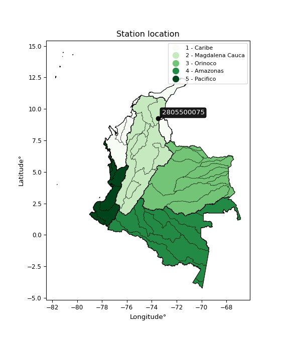</img>

</div>


## A. General information


### 1. General running parameters

• app_version: _v20260312_. • runtime: _2026-03-12 07:15:23.203550_. • Python version: _3.14.0_. • SciPy version: _1.16.3_. • Pandas version: _2.3.3_. • NumPy version: _2.3.5_. • Stations dataset (station_dataset_file): _dataset/pmax24h_in/automatic_colombia_2003_2025.csv_. • Stations catalog (station_catalog_file): _dataset/CNE.xls_. • Minimum year to eval til year_max (date_min): _1900_. • Maximum year to eval since year_min (date_max): _2025_. • Creates, save and include plots into reports (create_plot): _True_. • Plot only fit distributions with Δo > Δ (plot_only_fit): _True_. • Plot only simple graphs avoiding multiple CDFs and multiple Extreme values plots (plot_only_simple): _True_. • Eval low extreme values, if False, evaluates high extreme values (low_extreme): _False_. • Eval every SciPy distribution as logarithmic (pdist_logarithmic_on): _True_. • Standard deviation normalized (ddof): _1.0_. • Return periods to eval in years (Tr): _[2, 2.33, 5, 10, 15, 20, 25, 50, 75, 100, 200, 250, 500, 750, 1000]_. • Minimum data sample per station, 0 means any (minimum_sample): _5_. • Z-Score maximum threshold to adjust a value, 0 means disable (zscore_max): _3.5_. • Z-Score minimum threshold to adjust a value, 0 means disable (zscore_min): _-2.5_. • Avoid zeros, e.g. rain = 0 (avoid_zeros): _True_. • Avoid null values (avoid_nans): _True_. 

:file_folder:Table: [dataset.csv](../../dataset/pmax24h_in/automatic_colombia_2003_2025.csv)

> Delta Degrees of Freedom (DDOF): is a parameter used in the formulas for calculating variance and standard deviation. When ddof=0, the divisor is $N$ (the total number of observations) and this is used when your data set is the entire population. When ddof=1, the divisor is $N-1$ and this is used when your data set is a sample drawn from a larger population. Using $N-1$ provides an unbiased estimate of the population variance (known as Bessel´s correction).


### 2. Station info and location

|   id |     CODIGO | NOMBRE                      | CATEGORIA               | TECNOLOGIA                | ESTADO   | FECHA_INSTALACION   |   FECHA_SUSPENSION |   ALTITUD |   LATITUD |   LONGITUD | DEPARTAMENTO   | MUNICIPIO   | AREA_OPERATIVA                                         | ENTIDAD                                                     | AREA_HIDROGRAFICA   | ZONA_HIDROGRAFICA   | SUBZONA_HIDROGRAFICA   |   CORRIENTE | Catalogo   |   Version |
|-----:|-----------:|:----------------------------|:------------------------|:--------------------------|:---------|:--------------------|-------------------:|----------:|----------:|-----------:|:---------------|:------------|:-------------------------------------------------------|:------------------------------------------------------------|:--------------------|:--------------------|:-----------------------|------------:|:-----------|----------:|
|    0 | 2805500075 | CURUMANÍ - AUT [2805500075] | Climatológica Principal | Automática con Telemetría | Activa   | 23/12/2016          |                nan |        67 |   9.23814 |   -73.5129 | Cesar          | Curumaní    | Area Operativa 05 - Magdalena-Cesar-Guajira-San Andrés | INSTITUTO DE HIDROLOGIA METEOROLOGIA Y ESTUDIOS AMBIENTALES | Magdalena Cauca     | Cesar               | Bajo Cesar             |         nan | CNE_IDEAM  |  20251226 |

<div align="center">

Dynamic map: [:earth_americas:Google](http://maps.google.com/maps?q=9.238138889,-73.512916667) [:earth_americas:OSM](https://www.openstreetmap.org/#map=18/9.238138889/-73.512916667&layers=P) [:earth_americas:Bing](https://www.bing.com/maps?cp=9.238138889~-73.512916667&lvl=18) [:earth_americas:Apple](https://maps.apple.com/frame?center=9.238138889%2C-73.512916667&span=0.003%2C0.006)

</div>


<div align="center">

```geojson
{
  "type": "Feature",
  "geometry": {
    "type": "Point", 
    "coordinates": [-73.512916667, 9.238138889]
  }, 
  "properties": {
    "Name": "2805500075"
  }
}
```

</div>


### 3. Discrete values table and plot

<div align="center">

|               |           0 |         1 |          2 |          3 |           4 |
|:--------------|------------:|----------:|-----------:|-----------:|------------:|
| Date          | 2019        | 2020      | 2022       | 2024       | 2025        |
| Value         |   83.6      |  111      |    1.5     |    3.4     |   80.4      |
| Value_initial |   83.6      |  111      |    1.5     |    3.4     |   80.4      |
| count         |    5        |    5      |    5       |    5       |    5        |
| mean          |   55.98     |   55.98   |   55.98    |   55.98    |   55.98     |
| std           |   50.2969   |   50.2969 |   50.2969  |   50.2969  |   50.2969   |
| zscore        |    0.549139 |    1.0939 |   -1.08317 |   -1.04539 |    0.485517 |


</div>


<div align="center">

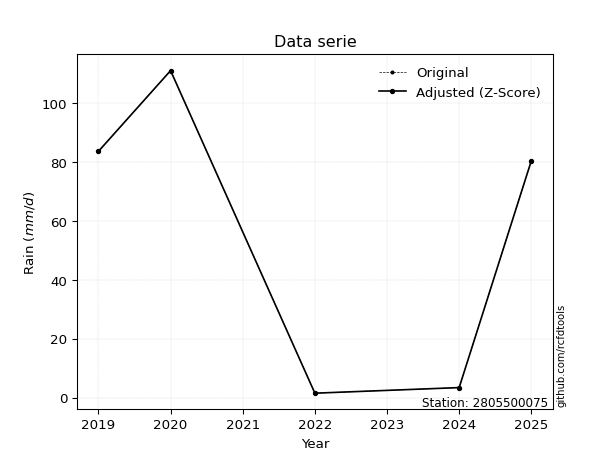</img>

</div>


> The initial value (value_initial) correspond to the initial obtained or null completed value, and value (value) is adjusted only when the initial value is outside the valid range (outlier) definite through the Z-Score value. If Z-Score is active, values out of range or outliers are replaced with the station mean value. A Z-Score (or standard score) measures how many standard deviations a data point is from the mean of a dataset, indicating its relative position; positive scores mean above the mean, negative mean below, and a score of zero is exactly at the mean, allowing for comparison of values from different distributions. It´s calculated using the formula $z=(x–μ)/σ$, where $x$ is the data point, $μ$ is the mean, and $σ$ is the standard deviation, helping identify outliers and understand probability.
>
> <sub>**Note**: In this study, "completing" (filling gaps in) and "extending" (forecasting or lengthening the historical record) rainfall data series are avoided for certain critical analyses because they introduce artificial bias and uncertainty, which can distort the statistics of rare events (extremes), alter day-to-day variability, and compromise the integrity and homogeneity of the original data. Some reasons against Completing/Extending rainfall data are: **Distortion of Extremes and Variability**: The primary issue is that most gap-filling or extension methods rely on averaging or regression with nearby stations, which inherently smooths the data. Rainfall is highly variable in space and time, with a large percentage of zero values and occasional large storms. Infilling methods often underestimate the highest values and overestimate the lowest (zero) values, which severely distorts analyses focused on flood frequency, drought severity, and intensity-duration-frequency (IDF) curves, **Loss of Data Homogeneity**: Infilled or extended data are synthetic estimates, not actual measurements. Combining these estimates with observed data can violate the assumption of data homogeneity, which requires that the data properties do not change over time. Inhomogeneity can lead to incorrect conclusions about long-term trends or changes in climate patterns, **Propagation of Errors**: Errors and biases from the original data (e.g., wind-induced undercatch, instrument errors, site changes) or the data used for imputation can propagate through the analysis, leading to unreliable hydrological models and inaccurate predictions, **Compromised Statistical Integrity**: For statistical analyses, especially those involving the frequency of events, using artificial data can introduce time bias or autocorrelation that doesn´t exist in reality, making it difficult to assess the true probability of events, **Difficulty in Validation**: It is difficult to accurately validate the quality of filled or extended data, especially for past periods where ground-truth measurements are unavailable. The reliability of imputation techniques heavily depends on the density of the surrounding station network and the complexity of the local topography.</sub>


### 4. Active continuous probability distributions from SciPy (80 of 104 available)

A Probability Density Function (PDF) describes the relative likelihood of a continuous random variable falling within a specific range, where the total area under its curve equals 1, and the area over any interval gives the actual probability for that range. Unlike discrete probabilities (like rolling a die), a PDF shows density, not direct probability for a single point (which is zero), with higher points indicating higher likelihood, often visualized as a bell curve for normal distributions.

A log of a probability density function (log-PDF) is simply the logarithm of the PDF´s value, denoted as $log(f(x))$, useful for converting multiplication of probabilities into addition, improving numerical stability with tiny numbers, and connecting to information theory concepts like entropy. Instead of dealing with very small probabilities (e.g., 0.000001), log-PDFs use negative numbers (e.g., $log(0.00001) ≈ -11.51$ that are easier for computers to handle, preventing underflow errors and simplifying complex calculations. In this study, each active probability distribution from SciPy is also evaluated in the $log$ form.

[scipy.stats](https://docs.scipy.org/doc/scipy/reference/stats.html) is a Python´s powerful submodule within the SciPy library for comprehensive statistical analysis, offering over 130 probability distributions (like Normal, Poisson, etc.), functions for descriptive stats (mean, variance), hypothesis testing (t-tests, chi-square), random variable generation, and statistical tests, making it essential for data science, modeling, and research. It provides tools to explore, model, and draw conclusions from data efficiently, working seamlessly with [NumPy](https://numpy.org/).

<div align="center">

|   id | p_dist           |   n_parameter | fit_method   | label                                                                       | active   | ref                                                                                                      |
|-----:|:-----------------|--------------:|:-------------|:----------------------------------------------------------------------------|:---------|:---------------------------------------------------------------------------------------------------------|
|    0 | alpha            |             3 | MLE          | Alpha                                                                       | True     | [:mortar_board:](https://docs.scipy.org/doc/scipy/reference/generated/scipy.stats.alpha.html)            |
|    1 | anglit           |             2 | MM           | Anglit                                                                      | True     | [:mortar_board:](https://docs.scipy.org/doc/scipy/reference/generated/scipy.stats.anglit.html)           |
|    2 | arcsine          |             2 | MM           | Arcsine                                                                     | True     | [:mortar_board:](https://docs.scipy.org/doc/scipy/reference/generated/scipy.stats.arcsine.html)          |
|    3 | argus            |             3 | MLE          | Argus                                                                       | True     | [:mortar_board:](https://docs.scipy.org/doc/scipy/reference/generated/scipy.stats.argus.html)            |
|    4 | beta             |             4 | MLE          | Beta                                                                        | True     | [:mortar_board:](https://docs.scipy.org/doc/scipy/reference/generated/scipy.stats.beta.html)             |
|    5 | betaprime        |             4 | MLE          | Beta prime                                                                  | True     | [:mortar_board:](https://docs.scipy.org/doc/scipy/reference/generated/scipy.stats.betaprime.html)        |
|    6 | bradford         |             3 | MLE          | Bradford                                                                    | True     | [:mortar_board:](https://docs.scipy.org/doc/scipy/reference/generated/scipy.stats.bradford.html)         |
|    7 | burr             |             4 | MLE          | Burr (Type III)                                                             | True     | [:mortar_board:](https://docs.scipy.org/doc/scipy/reference/generated/scipy.stats.burr.html)             |
|    8 | burr12           |             4 | MLE          | Burr (Type III) 12                                                          | True     | [:mortar_board:](https://docs.scipy.org/doc/scipy/reference/generated/scipy.stats.burr12.html)           |
|    9 | cosine           |             2 | MLE          | Cosine                                                                      | True     | [:mortar_board:](https://docs.scipy.org/doc/scipy/reference/generated/scipy.stats.cosine.html)           |
|   10 | crystalball      |             4 | MLE          | Crystalball                                                                 | True     | [:mortar_board:](https://docs.scipy.org/doc/scipy/reference/generated/scipy.stats.crystalball.html)      |
|   11 | dgamma           |             3 | MLE          | Double gamma                                                                | True     | [:mortar_board:](https://docs.scipy.org/doc/scipy/reference/generated/scipy.stats.dgamma.html)           |
|   12 | dweibull         |             3 | MLE          | Double Weibull                                                              | True     | [:mortar_board:](https://docs.scipy.org/doc/scipy/reference/generated/scipy.stats.dweibull.html)         |
|   13 | erlang           |             3 | MLE          | Erlang                                                                      | True     | [:mortar_board:](https://docs.scipy.org/doc/scipy/reference/generated/scipy.stats.erlang.html)           |
|   14 | exponnorm        |             3 | MLE          | Exponentially modified Normal                                               | True     | [:mortar_board:](https://docs.scipy.org/doc/scipy/reference/generated/scipy.stats.exponnorm.html)        |
|   15 | exponpow         |             3 | MLE          | Exponential power                                                           | True     | [:mortar_board:](https://docs.scipy.org/doc/scipy/reference/generated/scipy.stats.exponpow.html)         |
|   16 | exponweib        |             4 | MLE          | Exponentiated Weibull                                                       | True     | [:mortar_board:](https://docs.scipy.org/doc/scipy/reference/generated/scipy.stats.exponweib.html)        |
|   17 | f                |             4 | MLE          | F                                                                           | True     | [:mortar_board:](https://docs.scipy.org/doc/scipy/reference/generated/scipy.stats.f.html)                |
|   18 | fatiguelife      |             3 | MLE          | Fatigue-life (Birnbaum-Saunders)                                            | True     | [:mortar_board:](https://docs.scipy.org/doc/scipy/reference/generated/scipy.stats.fatiguelife.html)      |
|   19 | foldnorm         |             3 | MM           | Fold Normal                                                                 | True     | [:mortar_board:](https://docs.scipy.org/doc/scipy/reference/generated/scipy.stats.foldnorm.html)         |
|   20 | gamma            |             3 | MLE          | Gamma                                                                       | True     | [:mortar_board:](https://docs.scipy.org/doc/scipy/reference/generated/scipy.stats.gamma.html)            |
|   21 | gausshyper       |             6 | MLE          | Gauss hypergeometric                                                        | True     | [:mortar_board:](https://docs.scipy.org/doc/scipy/reference/generated/scipy.stats.gausshyper.html)       |
|   22 | genexpon         |             5 | MLE          | Generalized exponential                                                     | True     | [:mortar_board:](https://docs.scipy.org/doc/scipy/reference/generated/scipy.stats.genexpon.html)         |
|   23 | genextreme       |             3 | MLE          | Generalized exponential                                                     | True     | [:mortar_board:](https://docs.scipy.org/doc/scipy/reference/generated/scipy.stats.genextreme.html)       |
|   24 | gengamma         |             4 | MLE          | Generalized gamma                                                           | True     | [:mortar_board:](https://docs.scipy.org/doc/scipy/reference/generated/scipy.stats.gengamma.html)         |
|   25 | genhalflogistic  |             3 | MLE          | Generalized half-logistic                                                   | True     | [:mortar_board:](https://docs.scipy.org/doc/scipy/reference/generated/scipy.stats.genhalflogistic.html)  |
|   26 | genlogistic      |             3 | MLE          | Generalized logistic                                                        | True     | [:mortar_board:](https://docs.scipy.org/doc/scipy/reference/generated/scipy.stats.genlogistic.html)      |
|   27 | gennorm          |             3 | MLE          | Generalized Normal                                                          | True     | [:mortar_board:](https://docs.scipy.org/doc/scipy/reference/generated/scipy.stats.gennorm.html)          |
|   28 | genpareto        |             3 | MLE          | Generalized Pareto                                                          | True     | [:mortar_board:](https://docs.scipy.org/doc/scipy/reference/generated/scipy.stats.genpareto.html)        |
|   29 | gompertz         |             3 | MLE          | Gompertz (or truncated Gumbel)                                              | True     | [:mortar_board:](https://docs.scipy.org/doc/scipy/reference/generated/scipy.stats.gompertz.html)         |
|   30 | gumbel_l         |             2 | MM           | Gumbel Left Skew                                                            | True     | [:mortar_board:](https://docs.scipy.org/doc/scipy/reference/generated/scipy.stats.gumbel_l.html)         |
|   31 | gumbel_r         |             2 | MM           | Gumbel Right Skew                                                           | True     | [:mortar_board:](https://docs.scipy.org/doc/scipy/reference/generated/scipy.stats.gumbel_r.html)         |
|   32 | halfgennorm      |             3 | MLE          | Upper half of a generalized normal                                          | True     | [:mortar_board:](https://docs.scipy.org/doc/scipy/reference/generated/scipy.stats.halfgennorm.html)      |
|   33 | halflogistic     |             2 | MM           | Half-logistic                                                               | True     | [:mortar_board:](https://docs.scipy.org/doc/scipy/reference/generated/scipy.stats.halflogistic.html)     |
|   34 | halfnorm         |             2 | MM           | Half Normal                                                                 | True     | [:mortar_board:](https://docs.scipy.org/doc/scipy/reference/generated/scipy.stats.halfnorm.html)         |
|   35 | hypsecant        |             2 | MM           | hyperbolic secant                                                           | True     | [:mortar_board:](https://docs.scipy.org/doc/scipy/reference/generated/scipy.stats.hypsecant.html)        |
|   36 | invgamma         |             3 | MLE          | Inverted gamma                                                              | True     | [:mortar_board:](https://docs.scipy.org/doc/scipy/reference/generated/scipy.stats.invgamma.html)         |
|   37 | invgauss         |             3 | MLE          | Inverse Gaussian                                                            | True     | [:mortar_board:](https://docs.scipy.org/doc/scipy/reference/generated/scipy.stats.invgauss.html)         |
|   38 | invweibull       |             3 | MLE          | Inverted Weibull                                                            | True     | [:mortar_board:](https://docs.scipy.org/doc/scipy/reference/generated/scipy.stats.invweibull.html)       |
|   39 | johnsonsb        |             4 | MLE          | Johnson SB                                                                  | True     | [:mortar_board:](https://docs.scipy.org/doc/scipy/reference/generated/scipy.stats.johnsonsb.html)        |
|   40 | johnsonsu        |             4 | MLE          | Johnson Su                                                                  | True     | [:mortar_board:](https://docs.scipy.org/doc/scipy/reference/generated/scipy.stats.johnsonsu.html)        |
|   41 | kappa3           |             3 | MLE          | Kappa 3                                                                     | True     | [:mortar_board:](https://docs.scipy.org/doc/scipy/reference/generated/scipy.stats.kappa3.html)           |
|   42 | kappa4           |             4 | MLE          | Kappa 4                                                                     | True     | [:mortar_board:](https://docs.scipy.org/doc/scipy/reference/generated/scipy.stats.kappa4.html)           |
|   43 | ksone            |             3 | MLE          | Kolmogorov-Smirnov one-sided test statistic distribution                    | True     | [:mortar_board:](https://docs.scipy.org/doc/scipy/reference/generated/scipy.stats.ksone.html)            |
|   44 | kstwobign        |             2 | MLE          | Limiting distribution of scaled Kolmogorov-Smirnov two-sided test statistic | True     | [:mortar_board:](https://docs.scipy.org/doc/scipy/reference/generated/scipy.stats.kstwobign.html)        |
|   45 | laplace          |             2 | MM           | Laplace                                                                     | True     | [:mortar_board:](https://docs.scipy.org/doc/scipy/reference/generated/scipy.stats.laplace.html)          |
|   46 | levy_l           |             2 | MLE          | Left-skewed Levy                                                            | True     | [:mortar_board:](https://docs.scipy.org/doc/scipy/reference/generated/scipy.stats.levy_l.html)           |
|   47 | loggamma         |             3 | MLE          | Log gamma                                                                   | True     | [:mortar_board:](https://docs.scipy.org/doc/scipy/reference/generated/scipy.stats.loggamma.html)         |
|   48 | logistic         |             2 | MM           | Logistic (or Sech-squared)                                                  | True     | [:mortar_board:](https://docs.scipy.org/doc/scipy/reference/generated/scipy.stats.logistic.html)         |
|   49 | loglaplace       |             3 | MLE          | Log-Laplace                                                                 | True     | [:mortar_board:](https://docs.scipy.org/doc/scipy/reference/generated/scipy.stats.loglaplace.html)       |
|   50 | lomax            |             3 | MLE          | Lomax (Pareto of the second kind)                                           | True     | [:mortar_board:](https://docs.scipy.org/doc/scipy/reference/generated/scipy.stats.lomax.html)            |
|   51 | maxwell          |             2 | MM           | Maxwell                                                                     | True     | [:mortar_board:](https://docs.scipy.org/doc/scipy/reference/generated/scipy.stats.maxwell.html)          |
|   52 | mielke           |             4 | MLE          | Mielke Beta-Kappa / Dagum                                                   | True     | [:mortar_board:](https://docs.scipy.org/doc/scipy/reference/generated/scipy.stats.mielke.html)           |
|   53 | moyal            |             2 | MM           | Moyal                                                                       | True     | [:mortar_board:](https://docs.scipy.org/doc/scipy/reference/generated/scipy.stats.moyal.html)            |
|   54 | nakagami         |             3 | MLE          | Nakagami                                                                    | True     | [:mortar_board:](https://docs.scipy.org/doc/scipy/reference/generated/scipy.stats.nakagami.html)         |
|   55 | ncf              |             5 | MLE          | Non-central F distribution                                                  | True     | [:mortar_board:](https://docs.scipy.org/doc/scipy/reference/generated/scipy.stats.ncf.html)              |
|   56 | nct              |             4 | MLE          | Non-central Student’s t                                                     | True     | [:mortar_board:](https://docs.scipy.org/doc/scipy/reference/generated/scipy.stats.nct.html)              |
|   57 | norm             |             2 | MM           | Normal                                                                      | True     | [:mortar_board:](https://docs.scipy.org/doc/scipy/reference/generated/scipy.stats.norm.html)             |
|   58 | pearson3         |             3 | MM           | Pearson type III                                                            | True     | [:mortar_board:](https://docs.scipy.org/doc/scipy/reference/generated/scipy.stats.pearson3.html)         |
|   59 | powerlaw         |             3 | MLE          | Power-function                                                              | True     | [:mortar_board:](https://docs.scipy.org/doc/scipy/reference/generated/scipy.stats.powerlaw.html)         |
|   60 | rayleigh         |             2 | MM           | Rayleigh                                                                    | True     | [:mortar_board:](https://docs.scipy.org/doc/scipy/reference/generated/scipy.stats.rayleigh.html)         |
|   61 | rdist            |             3 | MLE          | R-distributed (symmetric beta)                                              | True     | [:mortar_board:](https://docs.scipy.org/doc/scipy/reference/generated/scipy.stats.rdist.html)            |
|   62 | rice             |             3 | MLE          | Rice                                                                        | True     | [:mortar_board:](https://docs.scipy.org/doc/scipy/reference/generated/scipy.stats.rice.html)             |
|   63 | semicircular     |             2 | MM           | Semicircular                                                                | True     | [:mortar_board:](https://docs.scipy.org/doc/scipy/reference/generated/scipy.stats.semicircular.html)     |
|   64 | skewnorm         |             3 | MLE          | Skew normal                                                                 | True     | [:mortar_board:](https://docs.scipy.org/doc/scipy/reference/generated/scipy.stats.skewnorm.html)         |
|   65 | t                |             3 | MLE          | Student’s t                                                                 | True     | [:mortar_board:](https://docs.scipy.org/doc/scipy/reference/generated/scipy.stats.t.html)                |
|   66 | trapezoid        |             4 | MLE          | Trapezoid                                                                   | True     | [:mortar_board:](https://docs.scipy.org/doc/scipy/reference/generated/scipy.stats.trapezoid.html)        |
|   67 | triang           |             3 | MLE          | Triangular                                                                  | True     | [:mortar_board:](https://docs.scipy.org/doc/scipy/reference/generated/scipy.stats.triang.html)           |
|   68 | truncexpon       |             3 | MLE          | Truncated exponential                                                       | True     | [:mortar_board:](https://docs.scipy.org/doc/scipy/reference/generated/scipy.stats.truncexpon.html)       |
|   69 | truncnorm        |             4 | MLE          | Truncated normal                                                            | True     | [:mortar_board:](https://docs.scipy.org/doc/scipy/reference/generated/scipy.stats.truncnorm.html)        |
|   70 | truncpareto      |             4 | MLE          | Upper truncated Pareto                                                      | True     | [:mortar_board:](https://docs.scipy.org/doc/scipy/reference/generated/scipy.stats.truncpareto.html)      |
|   71 | truncweibull_min |             5 | MLE          | Doubly truncated Weibull minimum                                            | True     | [:mortar_board:](https://docs.scipy.org/doc/scipy/reference/generated/scipy.stats.truncweibull_min.html) |
|   72 | tukeylambda      |             3 | MLE          | Tukey-Lamdba                                                                | True     | [:mortar_board:](https://docs.scipy.org/doc/scipy/reference/generated/scipy.stats.tukeylambda.html)      |
|   73 | uniform          |             2 | MLE          | Uniform                                                                     | True     | [:mortar_board:](https://docs.scipy.org/doc/scipy/reference/generated/scipy.stats.uniform.html)          |
|   74 | vonmises         |             3 | MLE          | Von Mises                                                                   | True     | [:mortar_board:](https://docs.scipy.org/doc/scipy/reference/generated/scipy.stats.vonmises.html)         |
|   75 | vonmises_line    |             3 | MLE          | Von Mises line                                                              | True     | [:mortar_board:](https://docs.scipy.org/doc/scipy/reference/generated/scipy.stats.vonmises_line.html)    |
|   76 | wald             |             2 | MM           | Wald                                                                        | True     | [:mortar_board:](https://docs.scipy.org/doc/scipy/reference/generated/scipy.stats.wald.html)             |
|   77 | weibull_max      |             3 | MLE          | Weibull maximum                                                             | True     | [:mortar_board:](https://docs.scipy.org/doc/scipy/reference/generated/scipy.stats.weibull_max.html)      |
|   78 | weibull_min      |             3 | MLE          | Weibull minimum                                                             | True     | [:mortar_board:](https://docs.scipy.org/doc/scipy/reference/generated/scipy.stats.weibull_min.html)      |
|   79 | wrapcauchy       |             3 | MLE          | Wrapped  Cauchy                                                             | True     | [:mortar_board:](https://docs.scipy.org/doc/scipy/reference/generated/scipy.stats.wrapcauchy.html)       |

</div>

> **n_parameter:** # arguments & localization & scale.
>
> **Fit methods:** (MLE) maximum likelihood, (MM) L-moments.
>
>**Inactive** (With the only purpose of prevent loops, zero divisions, infinite values, over high estimated values or horizontal trending for recurrence intervals estimations, the follow distributions were disabled.)**:** lognorm, norminvgauss, powernorm, powerlognorm, cauchy, halfcauchy, foldcauchy, skewcauchy, chi2, expon, fisk, genhyperbolic, geninvgauss, gibrat, kstwo, laplace_asymmetric, levy, levy_stable, ncx2, pareto, rel_breitwigner, recipinvgauss, studentized_range, loguniform, 


## B. Probability (PDF) vs. Empirical (EDF) distributions functions

A continuous probability distribution (CPD) describes probabilities for variables that can take any value within a range (like rain any time), unlike discrete variables with specific outcomes (like temperature). It uses a Probability Density Function (PDF), a curve where the total area under it equals 1, and the probability of the variable falling within an interval (a to b) is found by calculating the area under the curve between those points. A key feature is that the probability of hitting any single exact value is zero, so probabilities are always expressed for ranges, e.g., $P(a ≤ X ≤ b)$.

<div align="center">

Distributions parameters from station values
|     |    station | p_dist              |   n |            loc |          scale | shape                  | shape1                 | shape2                 | shape3             |
|----:|-----------:|:--------------------|----:|---------------:|---------------:|:-----------------------|:-----------------------|:-----------------------|:-------------------|
|   0 | 2805500075 | alpha               |   5 |   -0.00356379  |    3.07706     | 2.1310784130503487e-09 |                        |                        |                    |
|   1 | 2805500075 | anglit              |   5 |   55.98        |  131.605       |                        |                        |                        |                    |
|   2 | 2805500075 | arcsine             |   5 |   -7.64115     |  127.242       |                        |                        |                        |                    |
|   3 | 2805500075 | argus               |   5 |  -45.2531      |  163.467       | 1.2959662033639368     |                        |                        |                    |
|   4 | 2805500075 | beta                |   5 |  -24.3281      |  135.328       | 1.283723967040982      | 0.5167126180888995     |                        |                    |
|   5 | 2805500075 | betaprime           |   5 |    1.5         |    0.167803    | 0.33266959658784345    | 0.22901382137548598    |                        |                    |
|   6 | 2805500075 | bradford            |   5 |    1.5         |  109.5         | 1.1792739490047501     |                        |                        |                    |
|   7 | 2805500075 | burr                |   5 |   -0.0150398   |    0.0591269   | 0.5861067693573176     | 18.599370337918394     |                        |                    |
|   8 | 2805500075 | burr12              |   5 |   -0.510351    |    1.96014     | 175.64087394133156     | 0.002326380186181718   |                        |                    |
|   9 | 2805500075 | cosine              |   5 |   54.8026      |   35.222       |                        |                        |                        |                    |
|  10 | 2805500075 | crystalball         |   5 |   55.98        |   44.9869      | 972.3136524368722      | 18520.24124597803      |                        |                    |
|  11 | 2805500075 | dgamma              |   5 |   45.4041      |    2.2339      | 20.11688895236068      |                        |                        |                    |
|  12 | 2805500075 | dweibull            |   5 |   48.5949      |   48.5871      | 4.403166655368994      |                        |                        |                    |
|  13 | 2805500075 | erlang              |   5 | -718.993       |    2.65245     | 292.09445108443686     |                        |                        |                    |
|  14 | 2805500075 | exponnorm           |   5 |   55.9379      |   44.9869      | 0.0009362754014342905  |                        |                        |                    |
|  15 | 2805500075 | exponpow            |   5 |    1.5         |   98.2488      | 0.47837960219829445    |                        |                        |                    |
|  16 | 2805500075 | exponweib           |   5 |    1.5         |    3.20392     | 3.7107944728247255     | 0.19803659190701997    |                        |                    |
|  17 | 2805500075 | f                   |   5 |    1.5         |    2.45738     | 0.2586217440804497     | 0.4477365736186661     |                        |                    |
|  18 | 2805500075 | fatiguelife         |   5 |    1.5         |    6.01667e-05 | 1481.0941178388634     |                        |                        |                    |
|  19 | 2805500075 | foldnorm            |   5 | -291.694       |   43.667       | 7.967373239894119      |                        |                        |                    |
|  20 | 2805500075 | gamma               |   5 | -679.28        |    2.7756      | 264.8516545188513      |                        |                        |                    |
|  21 | 2805500075 | gausshyper          |   5 |  -11.8698      |  122.87        | 1.3993166900841159     | 0.26553378938195915    | 2.1425502142224477     | 0.8717027032372822 |
|  22 | 2805500075 | genexpon            |   5 |    1.49998     |    2.55322     | 0.04633699971431671    | 3.2665342692177346e-07 | 1.8514006238131566     |                    |
|  23 | 2805500075 | genextreme          |   5 |   49.1193      |   80.3766      | 1.2988967460219916     |                        |                        |                    |
|  24 | 2805500075 | gengamma            |   5 |    1.5         |    1.89186e-05 | 6.510304784111268      | 0.14902105345407585    |                        |                    |
|  25 | 2805500075 | genhalflogistic     |   5 |  -45.0308      |  265.299       | 1.7003010983372118     |                        |                        |                    |
|  26 | 2805500075 | genlogistic         |   5 |  111           |    1.5447e-05  | 2.8055899483533873e-07 |                        |                        |                    |
|  27 | 2805500075 | gennorm             |   5 |   80.4         |    0.349585    | 0.3080583641984017     |                        |                        |                    |
|  28 | 2805500075 | genpareto           |   5 |   -0.015711    |  159.367       | -1.4355328119349968    |                        |                        |                    |
|  29 | 2805500075 | gompertz            |   5 |    1.5         |   96.0149      | 1.034096067673227      |                        |                        |                    |
|  30 | 2805500075 | gumbel_l            |   5 |   76.2265      |   35.0762      |                        |                        |                        |                    |
|  31 | 2805500075 | gumbel_r            |   5 |   35.7335      |   35.0762      |                        |                        |                        |                    |
|  32 | 2805500075 | halfgennorm         |   5 |    1.5         |    3.95616     | 0.4238472775565063     |                        |                        |                    |
|  33 | 2805500075 | halflogistic        |   5 |    2.66004     |   38.4622      |                        |                        |                        |                    |
|  34 | 2805500075 | halfnorm            |   5 |   -3.56509     |   74.6287      |                        |                        |                        |                    |
|  35 | 2805500075 | hypsecant           |   5 |   55.98        |   28.6396      |                        |                        |                        |                    |
|  36 | 2805500075 | invgamma            |   5 |    1.5         |    4.59547e-13 | 0.20336697685186558    |                        |                        |                    |
|  37 | 2805500075 | invgauss            |   5 |    0.176974    |    4.95057     | 11.272016269210422     |                        |                        |                    |
|  38 | 2805500075 | invweibull          |   5 |    1.5         |    3.88603     | 0.054590920553380884   |                        |                        |                    |
|  39 | 2805500075 | johnsonsb           |   5 |  -47.4577      |  158.458       | -1.1608061811799613    | 0.17694951938175796    |                        |                    |
|  40 | 2805500075 | johnsonsu           |   5 |  128.862       |    0.833107    | 6.718745185666053      | 1.363862897753509      |                        |                    |
|  41 | 2805500075 | kappa3              |   5 |    1.5         |    0.348236    | 0.3656282010372229     |                        |                        |                    |
|  42 | 2805500075 | kappa4              |   5 |  -20.7168      |  142.276       | 1.18634725538708       | 1.0711391729460589     |                        |                    |
|  43 | 2805500075 | ksone               |   5 |  -21.9397      |  155.839       | 1.0                    |                        |                        |                    |
|  44 | 2805500075 | kstwobign           |   5 | -103.235       |  180.826       |                        |                        |                        |                    |
|  45 | 2805500075 | laplace             |   5 |   55.98        |   31.8106      |                        |                        |                        |                    |
|  46 | 2805500075 | levy_l              |   5 |  114.959       |   15.0974      |                        |                        |                        |                    |
|  47 | 2805500075 | loggamma            |   5 |  111           |    9.58458e-06 | 1.7405121164035797e-07 |                        |                        |                    |
|  48 | 2805500075 | logistic            |   5 |   55.98        |   24.8026      |                        |                        |                        |                    |
|  49 | 2805500075 | loglaplace          |   5 |   -0.145379    |   80.5454      | 0.6782960333072445     |                        |                        |                    |
|  50 | 2805500075 | lomax               |   5 |    1.5         |    1.33382e+11 | 2547203009.946799      |                        |                        |                    |
|  51 | 2805500075 | maxwell             |   5 |  -50.6202      |   66.8018      |                        |                        |                        |                    |
|  52 | 2805500075 | mielke              |   5 |    1.5         |    0.0082743   | 0.6031265490381388     | 0.3685826803922065     |                        |                    |
|  53 | 2805500075 | moyal               |   5 |   30.2536      |   20.2512      |                        |                        |                        |                    |
|  54 | 2805500075 | nakagami            |   5 |    1.5         |   89.4574      | 0.16901385214711462    |                        |                        |                    |
|  55 | 2805500075 | ncf                 |   5 |   -0.0769643   |    5.5146      | 29.402384917918283     | 0.9362034088000297     | 4.6801757099364546e-07 |                    |
|  56 | 2805500075 | nct                 |   5 |    1.5         |    4.9224e-10  | 0.14949141560535922    | 5.562185044989491      |                        |                    |
|  57 | 2805500075 | norm                |   5 |   55.98        |   44.9869      |                        |                        |                        |                    |
|  58 | 2805500075 | pearson3            |   5 |   55.98        |   44.9869      | -0.2303772504256539    |                        |                        |                    |
|  59 | 2805500075 | powerlaw            |   5 |    1.5         |  109.5         | 0.11010941285801051    |                        |                        |                    |
|  60 | 2805500075 | rayleigh            |   5 |  -30.0827      |   68.6681      |                        |                        |                        |                    |
|  61 | 2805500075 | rdist               |   5 |   60.5022      |   59.0022      | 1.025909828192553      |                        |                        |                    |
|  62 | 2805500075 | rice                |   5 |  -29.3751      |   53.7103      | 1.1077123601052397     |                        |                        |                    |
|  63 | 2805500075 | semicircular        |   5 |   55.98        |   89.9739      |                        |                        |                        |                    |
|  64 | 2805500075 | skewnorm            |   5 |  111           |   71.0812      | -6893085.010468905     |                        |                        |                    |
|  65 | 2805500075 | t                   |   5 |    2.65117     |    2.02286     | 0.30988658858739504    |                        |                        |                    |
|  66 | 2805500075 | trapezoid           |   5 |  -74.8254      |  190.863       | 1.0                    | 1.0                    |                        |                    |
|  67 | 2805500075 | triang              |   5 |  -47.7347      |  159.219       | 0.9999999999996809     |                        |                        |                    |
|  68 | 2805500075 | truncexpon          |   5 |  -11.1487      |  164.914       | 0.7406818582173009     |                        |                        |                    |
|  69 | 2805500075 | truncnorm           |   5 |    2.5033      |    3.89932     | -0.257308828463352     | 27.82455208654104      |                        |                    |
|  70 | 2805500075 | truncpareto         |   5 |  -21.8077      |   23.3076      | 1.288707361063114e-05  | 5.700025654431351      |                        |                    |
|  71 | 2805500075 | truncweibull_min    |   5 |  -10.8464      |  162.043       | 1.10862190230998       | 0.0001915577877986583  | 0.7519371506979129     |                    |
|  72 | 2805500075 | tukeylambda         |   5 |   56.19        |   62.0915      | 1.1328493657043932     |                        |                        |                    |
|  73 | 2805500075 | uniform             |   5 |    1.5         |  109.5         |                        |                        |                        |                    |
|  74 | 2805500075 | vonmises            |   5 |   -3.045       |    1           | 0.6112237585922621     |                        |                        |                    |
|  75 | 2805500075 | vonmises_line       |   5 |   56.25        |   17.4275      | 0.20644175480406424    |                        |                        |                    |
|  76 | 2805500075 | wald                |   5 |   10.993       |   44.987       |                        |                        |                        |                    |
|  77 | 2805500075 | weibull_max         |   5 |  111           |    1.59995     | 0.2321332430934252     |                        |                        |                    |
|  78 | 2805500075 | weibull_min         |   5 |   -6.37077e+08 |    6.37077e+08 | 17352146.02554693      |                        |                        |                    |
|  79 | 2805500075 | wrapcauchy          |   5 |    1.49993     |   17.4275      | 0.8975201020363786     |                        |                        |                    |
|  80 | 2805500075 | logalpha            |   5 |   -0.594987    |    1.96744     | 0.11520692336318786    |                        |                        |                    |
|  81 | 2805500075 | loganglit           |   5 |    3.03037     |    5.35626     |                        |                        |                        |                    |
|  82 | 2805500075 | logarcsine          |   5 |    0.44099     |    5.17874     |                        |                        |                        |                    |
|  83 | 2805500075 | logargus            |   5 |   -1.6876      |    6.62478     | 2.28066557510438       |                        |                        |                    |
|  84 | 2805500075 | logbeta             |   5 |   -0.187402    |    4.89693     | 1.452242812720919      | 0.5508840815718747     |                        |                    |
|  85 | 2805500075 | logbetaprime        |   5 |  -30.9442      |  967.364       | 344.5275874235808      | 9810.727614778305      |                        |                    |
|  86 | 2805500075 | logbradford         |   5 |    0.405455    |    4.33151     | 1.2887452347258788     |                        |                        |                    |
|  87 | 2805500075 | logburr             |   5 |   -3.20403e+07 |    3.20403e+07 | 1243854779.8785882     | 0.01476057382056178    |                        |                    |
|  88 | 2805500075 | logburr12           |   5 |    0.405465    | 4155.23        | 0.9896448974615262     | 1737.807837741348      |                        |                    |
|  89 | 2805500075 | logcosine           |   5 |    2.91507     |    1.43174     |                        |                        |                        |                    |
|  90 | 2805500075 | logcrystalball      |   5 |    4.70954     |    3.52741e-06 | 2.1266390766815633e-06 | 199.70295459772166     |                        |                    |
|  91 | 2805500075 | logdgamma           |   5 |    2.70021     |    0.0428593   | 42.8991407349092       |                        |                        |                    |
|  92 | 2805500075 | logdweibull         |   5 |    2.58712     |    1.98147     | 8.191853347202223      |                        |                        |                    |
|  93 | 2805500075 | logerlang           |   5 |  -25.9007      |    0.11997     | 240.9923486062703      |                        |                        |                    |
|  94 | 2805500075 | logexponnorm        |   5 |    3.02891     |    1.83095     | 0.0007791590590103012  |                        |                        |                    |
|  95 | 2805500075 | logexponpow         |   5 |    0.405465    |    4.44195     | 0.9902793238652563     |                        |                        |                    |
|  96 | 2805500075 | logexponweib        |   5 |    0.405465    |    4.7307      | 0.04189394877005527    | 12.623548497491393     |                        |                    |
|  97 | 2805500075 | logf                |   5 |    0.405465    |    2.55566     | 1.2197919979145593     | 57.67153173924986      |                        |                    |
|  98 | 2805500075 | logfatiguelife      |   5 | -233.6         |  236.615       | 0.007760548121175388   |                        |                        |                    |
|  99 | 2805500075 | logfoldnorm         |   5 |  -10.185       |    1.72931     | 7.656596541872717      |                        |                        |                    |
| 100 | 2805500075 | loggamma            |   5 |  -23.9449      |    0.127431    | 211.68179163558307     |                        |                        |                    |
| 101 | 2805500075 | loggausshyper       |   5 |    0.403839    |    4.30569     | 0.973912347808998      | 0.6109525001340991     | 0.9899390337062737     | 0.7467016514594313 |
| 102 | 2805500075 | loggenexpon         |   5 |    0.0652262   |    0.00895109  | 0.0013416300807948078  | 1.919713066285452      | 3.8285132675762575e-06 |                    |
| 103 | 2805500075 | loggenextreme       |   5 |    2.9242      |    2.03355     | 1.1390337991301387     |                        |                        |                    |
| 104 | 2805500075 | loggengamma         |   5 |    0.405465    |    4.39103     | 0.006917068990727379   | 65.38168205811547      |                        |                    |
| 105 | 2805500075 | loggenhalflogistic  |   5 |   -0.99749     |    6.27255     | 1.0990933494894064     |                        |                        |                    |
| 106 | 2805500075 | loggenlogistic      |   5 |    4.70965     |    6.67115e-06 | 3.978141221833145e-06  |                        |                        |                    |
| 107 | 2805500075 | loggennorm          |   5 |    4.42604     |    0.000162616 | 0.20635471815269918    |                        |                        |                    |
| 108 | 2805500075 | loggenpareto        |   5 |   -0.00567235  |   12.0148      | -2.5480971398482923    |                        |                        |                    |
| 109 | 2805500075 | loggompertz         |   5 |    0.405465    |    2.12523     | 0.2748767645951523     |                        |                        |                    |
| 110 | 2805500075 | loggumbel_l         |   5 |    3.85439     |    1.42759     |                        |                        |                        |                    |
| 111 | 2805500075 | loggumbel_r         |   5 |    2.20634     |    1.42759     |                        |                        |                        |                    |
| 112 | 2805500075 | loghalfgennorm      |   5 |    0.405461    |    4.30416     | 513351.35480791377     |                        |                        |                    |
| 113 | 2805500075 | loghalflogistic     |   5 |    0.86024     |    1.56541     |                        |                        |                        |                    |
| 114 | 2805500075 | loghalfnorm         |   5 |    0.606931    |    3.03733     |                        |                        |                        |                    |
| 115 | 2805500075 | loghypsecant        |   5 |    3.03037     |    1.16562     |                        |                        |                        |                    |
| 116 | 2805500075 | loginvgamma         |   5 |  -22.036       | 4550.75        | 182.80891719206505     |                        |                        |                    |
| 117 | 2805500075 | loginvgauss         |   5 |   -8.10327     |  361.044       | 0.030735144409329868   |                        |                        |                    |
| 118 | 2805500075 | loginvweibull       |   5 |   -1.22348e+08 |    1.22348e+08 | 71765240.68165115      |                        |                        |                    |
| 119 | 2805500075 | logjohnsonsb        |   5 |   -0.0230214   |    4.73255     | -0.7577073366693493    | 0.1111551843124848     |                        |                    |
| 120 | 2805500075 | logjohnsonsu        |   5 |    4.70953     |    9.19229e-12 | 1.2258674038778388     | 0.10336369362616069    |                        |                    |
| 121 | 2805500075 | logkappa3           |   5 |    0.405464    |    4.30407     | 12972410.377887126     |                        |                        |                    |
| 122 | 2805500075 | logkappa4           |   5 |   -0.139111    |    5.51352     | 1.1104460576330246     | 1.1354162071125886     |                        |                    |
| 123 | 2805500075 | logksone            |   5 |   -0.140932    |    6.34259     | 1.0                    |                        |                        |                    |
| 124 | 2805500075 | logkstwobign        |   5 |   -3.79606     |    7.75143     |                        |                        |                        |                    |
| 125 | 2805500075 | loglaplace          |   5 |    3.03037     |    1.29468     |                        |                        |                        |                    |
| 126 | 2805500075 | loglevy_l           |   5 |    4.76116     |    0.195758    |                        |                        |                        |                    |
| 127 | 2805500075 | logloggamma         |   5 |    4.70964     |    3.18186e-06 | 1.8850274261154725e-06 |                        |                        |                    |
| 128 | 2805500075 | loglogistic         |   5 |    3.03037     |    1.00946     |                        |                        |                        |                    |
| 129 | 2805500075 | logloglaplace       |   5 |   -0.00333803  |    4.39036     | 1.340654505780647      |                        |                        |                    |
| 130 | 2805500075 | loglomax            |   5 |    0.405465    |    6.21884e+12 | 1551566927519.512      |                        |                        |                    |
| 131 | 2805500075 | logmaxwell          |   5 |   -1.30822     |    2.7188      |                        |                        |                        |                    |
| 132 | 2805500075 | logmielke           |   5 |   -3.17478e+07 |    3.17478e+07 | 18770191.98997209      | 12646544257.954338     |                        |                    |
| 133 | 2805500075 | logmoyal            |   5 |    1.98331     |    0.824217    |                        |                        |                        |                    |
| 134 | 2805500075 | lognakagami         |   5 |    1.22378     |    2.60982     | 0.12005511991068807    |                        |                        |                    |
| 135 | 2805500075 | logncf              |   5 |   -0.0209298   |    3.3082e-10  | 1.2546238463548503e-09 | 12.055411589934806     | 10.41550620928934      |                    |
| 136 | 2805500075 | lognct              |   5 | -102.999       |    1.78662     | 33922.19142103601      | 59.3451148866411       |                        |                    |
| 137 | 2805500075 | lognorm             |   5 |    3.03037     |    1.83095     |                        |                        |                        |                    |
| 138 | 2805500075 | logpearson3         |   5 |    3.03036     |    1.83096     | -0.45724421316836705   |                        |                        |                    |
| 139 | 2805500075 | logpowerlaw         |   5 |    0.405465    |    4.30407     | 0.1228633919456138     |                        |                        |                    |
| 140 | 2805500075 | lograyleigh         |   5 |   -0.472347    |    2.79476     |                        |                        |                        |                    |
| 141 | 2805500075 | logrdist            |   5 |    1.00491     |    0.599442    | 1.4752496314409274     |                        |                        |                    |
| 142 | 2805500075 | logrice             |   5 |   -0.687725    |    2.13127     | 1.3346933838538435     |                        |                        |                    |
| 143 | 2805500075 | logsemicircular     |   5 |    3.03037     |    3.6619      |                        |                        |                        |                    |
| 144 | 2805500075 | logskewnorm         |   5 |    4.70953     |    2.4842      | -9631076.114739656     |                        |                        |                    |
| 145 | 2805500075 | logt                |   5 |    3.03038     |    1.83095     | 3998230253.362746      |                        |                        |                    |
| 146 | 2805500075 | logtrapezoid        |   5 |   -2.25576     |    7.76806     | 1.0                    | 1.0                    |                        |                    |
| 147 | 2805500075 | logtriang           |   5 |   -2.15933     |    6.86902     | 0.9999993905071711     |                        |                        |                    |
| 148 | 2805500075 | logtruncexpon       |   5 |    0.378944    |    5.732       | 0.7555102617882523     |                        |                        |                    |
| 149 | 2805500075 | logtruncnorm        |   5 |    0.0908427   |    3.34008     | 0.09419618650549835    | 7.67108719413234       |                        |                    |
| 150 | 2805500075 | logtruncpareto      |   5 |    0.38066     |    0.0248051   | 0.26501382594470946    | 174.51546079568118     |                        |                    |
| 151 | 2805500075 | logtruncweibull_min |   5 |    0.405465    |    4.41671     | 0.48507067185545727    | 1.8898702445677832e-17 | 0.9927034623408076     |                    |
| 152 | 2805500075 | logtukeylambda      |   5 |    2.55578     |    2.48283     | 1.1527942798009696     |                        |                        |                    |
| 153 | 2805500075 | loguniform          |   5 |    0.405465    |    4.30407     |                        |                        |                        |                    |
| 154 | 2805500075 | logvonmises         |   5 |   -1.17652     |    1           | 0.7248198277133628     |                        |                        |                    |
| 155 | 2805500075 | logvonmises_line    |   5 |    2.5575      |    0.68502     | 0.000826877910760389   |                        |                        |                    |
| 156 | 2805500075 | logwald             |   5 |    1.19945     |    1.83092     |                        |                        |                        |                    |
| 157 | 2805500075 | logweibull_max      |   5 |    4.70953     |    2.73357     | 0.13698934834363174    |                        |                        |                    |
| 158 | 2805500075 | logweibull_min      |   5 |   -6.34078e+07 |    6.34078e+07 | 47278787.489043355     |                        |                        |                    |
| 159 | 2805500075 | logwrapcauchy       |   5 |    0.404062    |    0.685237    | 0.7796543137918168     |                        |                        |                    |

</div>

> **loc** (Location parameter): This shifts the distribution along the x-axis. For many common distributions, like the normal (Gaussian) distribution, loc represents the mean $μ$. For others, like the uniform distribution, it might represent the minimum value, or for the beta distribution, the left end of the support interval.
>
> **scale** (Scale parameter): This determines the width or spread of the distribution. For the normal distribution, scale represents the standard deviation $σ$. For a uniform distribution, it defines the length of the interval (from $loc$ to $loc + scale$).
>
> **shape** (Shape parameters): Refers to parameters that define the specific form of a probability distribution, distinct from its location (loc) and scale (scale). These parameters are required arguments for most distribution functions. For example, a normal (Gaussian) distribution is fully defined by its location (mean) and scale (standard deviation), so it has no specific shape parameters beyond loc and scale. However, other distributions have intrinsic properties that need specification, as Gamma distribution that takes a shape parameter, often named $a$ or $alpha$.


### 0. Cumulative distribution values - CDF (160 evaluated)

Cumulative Distribution Function (CDF), denoted as $F$<sub>$X$</sub>$(x)$, is a function that gives the probability that a random variable $X$ will take a value less than or equal to a specific value, $x$ (i.e., $(P(X≥x)$. It essentially "accumulates" probabilities from a given point up to the far right (positive infinity), providing a complete picture of the distribution´s probabilities for both discrete (like rain) and continuous (like temperature) variables, helping to find probabilities over ranges or above certain values. Each station is evaluated separately ordering the $x$ values ascending, calculating the CDF and PDF values for the activated distributions and their logarithmic forms.

<div align="center">

CDF ordered by x ascending and calculating $log(f(x))$ separately
|   id |    Station |   date |     x |   count |   mean |     std |    zscore |   Value_initial |    station |   m |     alpha |   alpha_pdf |   anglit |   anglit_pdf |   arcsine |   arcsine_pdf |     argus |   argus_pdf |      beta |        beta_pdf |   betaprime |   betaprime_pdf |    bradford |   bradford_pdf |      burr |    burr_pdf |    burr12 |   burr12_pdf |   cosine |   cosine_pdf |   crystalball |   crystalball_pdf |   dgamma |   dgamma_pdf |   dweibull |   dweibull_pdf |   erlang |   erlang_pdf |   exponnorm |   exponnorm_pdf |    exponpow |   exponpow_pdf |   exponweib |   exponweib_pdf |          f |       f_pdf |   fatiguelife |   fatiguelife_pdf |   foldnorm |   foldnorm_pdf |    gamma |   gamma_pdf |   gausshyper |   gausshyper_pdf |    genexpon |   genexpon_pdf |   genextreme |   genextreme_pdf |   gengamma |   gengamma_pdf |   genhalflogistic |   genhalflogistic_pdf |   genlogistic |   genlogistic_pdf |   gennorm |   gennorm_pdf |   genpareto |   genpareto_pdf |    gompertz |   gompertz_pdf |   gumbel_l |   gumbel_l_pdf |   gumbel_r |   gumbel_r_pdf |   halfgennorm |   halfgennorm_pdf |   halflogistic |   halflogistic_pdf |   halfnorm |   halfnorm_pdf |   hypsecant |   hypsecant_pdf |   invgamma |   invgamma_pdf |   invgauss |   invgauss_pdf |   invweibull |   invweibull_pdf |   johnsonsb |   johnsonsb_pdf |   johnsonsu |   johnsonsu_pdf |   kappa3 |   kappa3_pdf |      kappa4 |   kappa4_pdf |    ksone |   ksone_pdf |   kstwobign |   kstwobign_pdf |   laplace |   laplace_pdf |   levy_l |   levy_l_pdf |   loggamma |   loggamma_pdf |   logistic |   logistic_pdf |   loglaplace |   loglaplace_pdf |       lomax |   lomax_pdf |   maxwell |   maxwell_pdf |    mielke |     mielke_pdf |     moyal |   moyal_pdf |    nakagami |   nakagami_pdf |       ncf |     ncf_pdf |      nct |     nct_pdf |     norm |   norm_pdf |   pearson3 |   pearson3_pdf |   powerlaw |   powerlaw_pdf |   rayleigh |   rayleigh_pdf |       rdist |       rdist_pdf |      rice |   rice_pdf |   semicircular |   semicircular_pdf |   skewnorm |   skewnorm_pdf |        t |       t_pdf |   trapezoid |   trapezoid_pdf |    triang |   triang_pdf |   truncexpon |   truncexpon_pdf |   truncnorm |   truncnorm_pdf |   truncpareto |   truncpareto_pdf |   truncweibull_min |   truncweibull_min_pdf |   tukeylambda |   tukeylambda_pdf |   uniform |   uniform_pdf |   vonmises |   vonmises_pdf |   vonmises_line |   vonmises_line_pdf |     wald |   wald_pdf |   weibull_max |   weibull_max_pdf |   weibull_min |   weibull_min_pdf |   wrapcauchy |   wrapcauchy_pdf |   logalpha |   logalpha_pdf |   loganglit |   loganglit_pdf |   logarcsine |   logarcsine_pdf |   logargus |   logargus_pdf |   logbeta |   logbeta_pdf |   logbetaprime |   logbetaprime_pdf |   logbradford |   logbradford_pdf |   logburr |   logburr_pdf |   logburr12 |   logburr12_pdf |   logcosine |   logcosine_pdf |   logcrystalball |   logcrystalball_pdf |   logdgamma |   logdgamma_pdf |   logdweibull |   logdweibull_pdf |   logerlang |   logerlang_pdf |   logexponnorm |   logexponnorm_pdf |   logexponpow |   logexponpow_pdf |   logexponweib |   logexponweib_pdf |        logf |       logf_pdf |   logfatiguelife |   logfatiguelife_pdf |   logfoldnorm |   logfoldnorm_pdf |   loggausshyper |   loggausshyper_pdf |   loggenexpon |   loggenexpon_pdf |   loggenextreme |   loggenextreme_pdf |   loggengamma |   loggengamma_pdf |   loggenhalflogistic |   loggenhalflogistic_pdf |   loggenlogistic |   loggenlogistic_pdf |   loggennorm |   loggennorm_pdf |   loggenpareto |   loggenpareto_pdf |   loggompertz |   loggompertz_pdf |   loggumbel_l |   loggumbel_l_pdf |   loggumbel_r |   loggumbel_r_pdf |   loghalfgennorm |   loghalfgennorm_pdf |   loghalflogistic |   loghalflogistic_pdf |   loghalfnorm |   loghalfnorm_pdf |   loghypsecant |   loghypsecant_pdf |   loginvgamma |   loginvgamma_pdf |   loginvgauss |   loginvgauss_pdf |   loginvweibull |   loginvweibull_pdf |   logjohnsonsb |   logjohnsonsb_pdf |   logjohnsonsu |   logjohnsonsu_pdf |   logkappa3 |   logkappa3_pdf |   logkappa4 |   logkappa4_pdf |   logksone |   logksone_pdf |   logkstwobign |   logkstwobign_pdf |   loglevy_l |   loglevy_l_pdf |   logloggamma |   logloggamma_pdf |   loglogistic |   loglogistic_pdf |   logloglaplace |   logloglaplace_pdf |    loglomax |   loglomax_pdf |   logmaxwell |   logmaxwell_pdf |   logmielke |   logmielke_pdf |   logmoyal |   logmoyal_pdf |   lognakagami |   lognakagami_pdf |    logncf |   logncf_pdf |    lognct |   lognct_pdf |   lognorm |   lognorm_pdf |   logpearson3 |   logpearson3_pdf |   logpowerlaw |   logpowerlaw_pdf |   lograyleigh |   lograyleigh_pdf |    logrdist |   logrdist_pdf |   logrice |   logrice_pdf |   logsemicircular |   logsemicircular_pdf |   logskewnorm |   logskewnorm_pdf |     logt |   logt_pdf |   logtrapezoid |   logtrapezoid_pdf |   logtriang |   logtriang_pdf |   logtruncexpon |   logtruncexpon_pdf |   logtruncnorm |   logtruncnorm_pdf |   logtruncpareto |   logtruncpareto_pdf |   logtruncweibull_min |   logtruncweibull_min_pdf |   logtukeylambda |   logtukeylambda_pdf |   loguniform |   loguniform_pdf |   logvonmises |   logvonmises_pdf |   logvonmises_line |   logvonmises_line_pdf |     logwald |   logwald_pdf |   logweibull_max |   logweibull_max_pdf |   logweibull_min |   logweibull_min_pdf |   logwrapcauchy |   logwrapcauchy_pdf |
|-----:|-----------:|-------:|------:|--------:|-------:|--------:|----------:|----------------:|-----------:|----:|----------:|------------:|---------:|-------------:|----------:|--------------:|----------:|------------:|----------:|----------------:|------------:|----------------:|------------:|---------------:|----------:|------------:|----------:|-------------:|---------:|-------------:|--------------:|------------------:|---------:|-------------:|-----------:|---------------:|---------:|-------------:|------------:|----------------:|------------:|---------------:|------------:|----------------:|-----------:|------------:|--------------:|------------------:|-----------:|---------------:|---------:|------------:|-------------:|-----------------:|------------:|---------------:|-------------:|-----------------:|-----------:|---------------:|------------------:|----------------------:|--------------:|------------------:|----------:|--------------:|------------:|----------------:|------------:|---------------:|-----------:|---------------:|-----------:|---------------:|--------------:|------------------:|---------------:|-------------------:|-----------:|---------------:|------------:|----------------:|-----------:|---------------:|-----------:|---------------:|-------------:|-----------------:|------------:|----------------:|------------:|----------------:|---------:|-------------:|------------:|-------------:|---------:|------------:|------------:|----------------:|----------:|--------------:|---------:|-------------:|-----------:|---------------:|-----------:|---------------:|-------------:|-----------------:|------------:|------------:|----------:|--------------:|----------:|---------------:|----------:|------------:|------------:|---------------:|----------:|------------:|---------:|------------:|---------:|-----------:|-----------:|---------------:|-----------:|---------------:|-----------:|---------------:|------------:|----------------:|----------:|-----------:|---------------:|-------------------:|-----------:|---------------:|---------:|------------:|------------:|----------------:|----------:|-------------:|-------------:|-----------------:|------------:|----------------:|--------------:|------------------:|-------------------:|-----------------------:|--------------:|------------------:|----------:|--------------:|-----------:|---------------:|----------------:|--------------------:|---------:|-----------:|--------------:|------------------:|--------------:|------------------:|-------------:|-----------------:|-----------:|---------------:|------------:|----------------:|-------------:|-----------------:|-----------:|---------------:|----------:|--------------:|---------------:|-------------------:|--------------:|------------------:|----------:|--------------:|------------:|----------------:|------------:|----------------:|-----------------:|---------------------:|------------:|----------------:|--------------:|------------------:|------------:|----------------:|---------------:|-------------------:|--------------:|------------------:|---------------:|-------------------:|------------:|---------------:|-----------------:|---------------------:|--------------:|------------------:|----------------:|--------------------:|--------------:|------------------:|----------------:|--------------------:|--------------:|------------------:|---------------------:|-------------------------:|-----------------:|---------------------:|-------------:|-----------------:|---------------:|-------------------:|--------------:|------------------:|--------------:|------------------:|--------------:|------------------:|-----------------:|---------------------:|------------------:|----------------------:|--------------:|------------------:|---------------:|-------------------:|--------------:|------------------:|--------------:|------------------:|----------------:|--------------------:|---------------:|-------------------:|---------------:|-------------------:|------------:|----------------:|------------:|----------------:|-----------:|---------------:|---------------:|-------------------:|------------:|----------------:|--------------:|------------------:|--------------:|------------------:|----------------:|--------------------:|------------:|---------------:|-------------:|-----------------:|------------:|----------------:|-----------:|---------------:|--------------:|------------------:|----------:|-------------:|----------:|-------------:|----------:|--------------:|--------------:|------------------:|--------------:|------------------:|--------------:|------------------:|------------:|---------------:|----------:|--------------:|------------------:|----------------------:|--------------:|------------------:|---------:|-----------:|---------------:|-------------------:|------------:|----------------:|----------------:|--------------------:|---------------:|-------------------:|-----------------:|---------------------:|----------------------:|--------------------------:|-----------------:|---------------------:|-------------:|-----------------:|--------------:|------------------:|-------------------:|-----------------------:|------------:|--------------:|-----------------:|---------------------:|-----------------:|---------------------:|----------------:|--------------------:|
|    0 | 2805500075 |   2022 |   1.5 |       5 |  55.98 | 50.2969 | -1.08317  |             1.5 | 2805500075 |   1 | 0.0407058 | 0.133774    | 0.131732 |   0.00513963 |  0.172746 |    0.00968774 | 0.0867052 |  0.0037564  | 0.0592632 |      0.00308506 |  0.00038074 |     1.26506e+06 | 5.17824e-08 |     0.0138251  | 0.0750215 | 0.0701694   | 0.0103089 |  0.198817    | 0.100254 |   0.00477814 |      0.112944 |        0.00425954 | 0.255896 |   0.0201838  |   0.209127 |     0.0170432  | 0.113764 |   0.00445996 |    0.112944 |      0.00425954 | 5.04167e-09 |    5.43096e+06 | 1.33199e-12 |   4406.92       | 0.00516431 | 3.00751e+12 |     0.0359291 |       8.39361e+09 |   0.105092 |     0.00416678 | 0.112486 |  0.00445236 |    0.0274502 |      0.00275006  | 3.94539e-07 |     0.0181484  |     0.211876 |       0.00231162 | 1.2761e-14 |   55.5818      |          0.103762 |            0.00265662 |      0        |        0.00248569 | 0.0632015 |   0.000858258 |  0.00953065 |      0.00630106 | 7.06959e-09 |     0.0107702  |   0.112005 |     0.00300728 |  0.0703865 |     0.00532522 |   1.32343e-11 |        0.088528   |     0          |         0          |  0.0541113 |     0.0106668  |   0.0943072 |      0.00324493 |  0.0307193 |    1.78881e+11 |  0.0579435 |    0.0980446   |  0.000600312 |      5.47416e+11 |   0.0962456 |     0.000892533 |    0.138662 |      0.0023679  | 0        | 45.0008      | 3.56042e-14 |   2.28159    | 0.150409 |  0.00641686 |    0.109432 |      0.00664001 | 0.0901947 |    0.00283537 | 0.284725 |   0.00120007 |  0.0747653 |       0.08156  |   0.100061 |     0.00363063 |     0.065835 |        0.0508505 | 3.24597e-11 |  0.019097   |  0.105573 |    0.00536291 | 0.0038427 | 2496.02        | 0.0419686 |  0.00506466 | 8.94111e-07 |    1.36114e+09 | 0.0737547 | 0.084386    | 0.102674 | 6.25247e+07 | 0.112944 | 0.00425954 |   0.115679 |     0.0039719  |  0.0112677 |    5.58755e+12 |   0.100367 |     0.00602565 | 2.95021e-09 | 231022          | 0.0865924 | 0.0054231  |       0.13958  |         0.00563104 |   0.12344  |     0.00342665 | 0.388524 | 0.0717544   |    0.159916 |      0.00419038 | 0.0956206 |   0.00388428 |     0.141112 |       0.0107339  | 4.91954e-06 |    0.164546     |   2.37536e-06 |        0.0246512  |           0.108015 |             0.00943505 |     0.0014119 |        0.0113579  | 0         |    0.00913242 |    1.13435 |       0.131202 |     9.78559e-07 |          0.00735044 | 0        | 0          |     0.0694547 |       0.0003927   |      0.118271 |        0.00302287 |  1.26555e-05 |      0.169096    |  0.0587335 |      0.258865  |   0.0847165 |        0.103975 |     0        |         0        |  0.0462665 |      0.0489208 | 0.0232536 |   0.0583531   |       0.076359 |          0.0814551 |   3.74281e-06 |          0.35933  | 0.0817631 |     0.0468527 | 3.72895e-17 |       0.664792  |   0.0645017 |       0.0910373 |              nan |                  nan |   0.0298655 |        0.182522 |     0.0554075 |          0.457686 |    0.077528 |       0.0830256 |      0.0758415 |          0.0779729 |   3.62427e-17 |          0.323272 |    1.11244e-09 |        1.05981e+07 | 5.65985e-11 | 621843         |        0.0764683 |            0.0791095 |     0.0626998 |         0.0712946 |     0.000404158 |            0.24211  |      0.05475  |          0.171178 |        0.114718 |           0.0506676 |      0        |        1.8643e+08 |             0.12765  |                 0.103973 |         0        |            0.0457919 |    0.0426717 |        0.0104638 |      0.0351706 |        0.0879743   |   7.61219e-10 |          0.129339 |     0.0854156 |         0.0572009 |     0.0292857 |         0.0724284 |         0        |             0.232334 |          0        |             0         |      0        |          0        |      0.0667239 |          0.0568251 |     0.0733723 |          0.08683  |     0.0752062 |         0.0963201 |       0.0709913 |            0.110149 |       0.155256 |        0.0680431   |      0.052253  |        0.00256525  | 2.54009e-07 |        0.232338 | 4.28814e-15 |        7.10545  |  0.0861472 |       0.157664 |      0.0694071 |           0.122216 |    0.167891 |       0.0189856 |     0.0780881 |         0.0462616 |     0.0691182 |         0.0637382 |       0.0207384 |           0.0680107 | 2.99154e-15 |      0.249494  |    0.0591976 |        0.0955866 |    0.077929 |       0.0460739 | 0.00920515 |      0.0424372 |   0           |       0           | 0.0462579 |    0.136127  | 0.0758777 |    0.0781243 | 0.0758392 |      0.077971 |     0.0844299 |         0.0700513 |    0.00841199 |       1.86183e+13 |     0.0481301 |          0.106977 | 1.78822e-12 |    6606.59     | 0.0535378 |     0.0970349 |         0.0865055 |              0.121219 |     0.0831705 |         0.0716003 | 0.075838 |  0.0779701 |       0.117365 |          0.0882036 |    0.139417 |        0.108716 |      0.00870588 |            0.327507 |    5.34198e-10 |          0.257121  |      1.48946e-16 |           14.3333    |           1.81717e-09 |               6.14428e+07 |       0.00106208 |             0.298105 |     0        |         0.232338 |      0.85919  |         0.139005  |        4.99094e-06 |               0.232144 | 0           |   0           |         0.345017 |           0.0116857  |        0.0717949 |            0.0515631 |      0.00263189 |            1.87578  |
|    1 | 2805500075 |   2024 |   3.4 |       5 |  55.98 | 50.2969 | -1.04539  |             3.4 | 2805500075 |   2 | 0.365958  | 0.14084     | 0.14165  |   0.00529906 |  0.190354 |    0.00888664 | 0.0939947 |  0.00391683 | 0.0652101 |      0.00317457 |  0.631738   |     0.0427077   | 0.0260026   |     0.0135479  | 0.191969  | 0.0520332   | 0.245869  |  0.078802    | 0.109563 |   0.00502099 |      0.121245 |        0.00447908 | 0.294457 |   0.0202807  |   0.241651 |     0.0171185  | 0.122456 |   0.00469008 |    0.121245 |      0.00447907 | 0.150848    |    0.0376737   | 0.144841    |      0.0345092  | 0.583926   | 0.0354391   |     0.54775   |       0.0125063   |   0.113226 |     0.0043961  | 0.121165 |  0.0046845  |    0.0327833 |      0.00286143  | 0.0338948   |     0.0175334  |     0.216323 |       0.00236966 | 0.398261   |    0.0730342   |          0.108851 |            0.00270057 |      0        |        0.00257296 | 0.0648649 |   0.000893032 |  0.0215344  |      0.00633461 | 0.020455    |     0.0107607  |   0.117857 |     0.00315375 |  0.0809576 |     0.00580205 |   0.101888    |        0.042544   |     0.00961901 |         0.0129986  |  0.0743585 |     0.0106449  |   0.100672  |      0.00345682 |  0.997037  |    0.000317146 |  0.234821  |    0.0775746   |  0.353513    |      0.0105618   |   0.0979346 |     0.000885596 |    0.143246 |      0.00245737 | 0.612059 |  0.0529299   | 0.0307084   |   0.0136315  | 0.162601 |  0.00641686 |    0.122389 |      0.00699576 | 0.095746  |    0.00300988 | 0.287032 |   0.00122947 |  0.165074  |       0.140261 |   0.107174 |     0.00385797 |     0.123867 |        0.0956742 | 0.035634    |  0.0184165  |  0.116019 |    0.00563233 | 0.813052  |    0.0306628   | 0.0523037 |  0.00581591 | 0.217245    |    0.0386474   | 0.216251  | 0.0621005   | 0.959264 | 0.00320509  | 0.121245 | 0.00447908 |   0.123412 |     0.00416918 |  0.639933  |    0.0370856   |   0.112084 |     0.00630496 | 0.0775553   |      0.0210479  | 0.097167  | 0.00570668 |       0.150385 |         0.00574165 |   0.130086 |     0.00356942 | 0.578991 | 0.0901961   |    0.167977 |      0.00429469 | 0.103143  |   0.00403418 |     0.161389 |       0.0106109  | 0.319967    |    0.165646     |   0.0450284   |        0.0227931  |           0.125996 |             0.00948843 |     0.0212924 |        0.0100859  | 0.0173516 |    0.00913242 |    1.5432  |       0.265553 |     0.0139725   |          0.00735946 | 0        | 0          |     0.0702099 |       0.000402342 |      0.124146 |        0.00316221 |  0.251643    |      0.0839242   |  0.305733  |      0.272471  |   0.187719  |        0.145806 |     0.25421  |         0.171594 |  0.0989439 |      0.0821179 | 0.0863848 |   0.0949556   |       0.166111 |          0.139014  |   0.263173    |          0.288974 | 0.130679  |     0.0748828 | 0.311892    |       0.311044  |   0.164758  |       0.153374  |              nan |                  nan |   0.454486  |        0.337871 |     0.477163  |          0.134037 |    0.168855 |       0.141166  |      0.1619    |          0.133916  |   0.186136    |          0.222439 |    0.395378    |        0.255521    | 0.381906    |      0.251163  |        0.163689  |            0.135513  |     0.144732  |         0.131636  |     0.168664    |            0.195928 |      0.209588 |          0.202451 |        0.16541  |           0.0749616 |      0.469606 |        0.259534   |             0.220595 |                 0.124158 |         0        |            0.0745957 |    0.0529754 |        0.0151476 |      0.111803  |        0.0999992   |   0.121118    |          0.167065 |     0.146482  |         0.0946967 |     0.136658  |         0.190523  |         0        |             0.232334 |          0.115596 |             0.315137  |      0.160933 |          0.257331 |      0.133159  |          0.110936  |     0.170344  |          0.150655 |     0.181679  |         0.162663  |       0.194599  |            0.186834 |       0.191608 |        0.0330166   |      0.0546228 |        0.00328078  | 0.190125    |        0.232338 | 0.201912    |        0.225101 |  0.215165  |       0.157664 |      0.204282  |           0.198727 |    0.185981 |       0.0258066 |     0.126802  |         0.0751213 |     0.143113  |         0.121483  |       0.090524  |           0.0988999 | 0.184671    |      0.203393  |    0.166689  |        0.164968  |    0.12642  |       0.074743  | 0.112902   |      0.218403  |   0.000113786 |       1.23044e+11 | 0.202342  |    0.226184  | 0.162095  |    0.134134  | 0.161896  |      0.133914 |     0.159645  |         0.115831  |    0.815493   |       0.12244     |     0.168197  |          0.180629 | 0.652597    |       0.715089 | 0.159956  |     0.160738  |         0.199177  |              0.15122  |     0.160565  |         0.120009  | 0.161894 |  0.133913  |       0.20064  |          0.115326  |    0.242573 |        0.143402 |      0.258457   |            0.283936 |    0.205945    |          0.243826  |      0.814611    |            0.165643  |           0.565729    |               0.266763    |       0.199171   |             0.230398 |     0.190125 |         0.232338 |      0.946232 |         0.0821046 |        0.190006    |               0.232266 | 1.10881e-17 |   1.73748e-14 |         0.355632 |           0.0144495  |        0.12815   |            0.0891506 |      0.442785   |            0.087797 |
|    2 | 2805500075 |   2025 |  80.4 |       5 |  55.98 | 50.2969 |  0.485517 |            80.4 | 2805500075 |   3 | 0.969472  | 0.000379497 | 0.681326 |   0.00708124 |  0.625397 |    0.00541824 | 0.654732  |  0.0103337  | 0.471202  |      0.0084987  |  0.841756   |     0.000458872 | 0.789528    |     0.00747413 | 0.764141  | 0.00148742  | 0.781322  |  0.00110435  | 0.721414 |   0.00789557 |      0.706375 |        0.00765313 | 0.579217 |   0.0142583  |   0.571697 |     0.00917759 | 0.711258 |   0.0073795  |    0.706374 |      0.00765314 | 0.767899    |    0.00311778  | 0.54314     |      0.00170585 | 0.802877   | 0.000550915 |     0.78029   |       0.00144968  |   0.71014  |     0.00783718 | 0.71163  |  0.0073936  |    0.358304  |      0.00626277  | 0.761151    |     0.00433477 |     0.559064 |       0.00817916 | 0.887767   |    0.00104994  |          0.445481 |            0.00770285 |      0        |        0.0104185  | 0.5       |   0.173437    |  0.592492   |      0.00927686 | 0.73231     |     0.00655745 |   0.675786 |     0.010411   |  0.755879  |     0.00603119 |   0.812546    |        0.00252873 |     0.766011   |         0.00537186 |  0.739455  |     0.00567749 |   0.743473  |      0.00801851 |  0.998611  |    3.5795e-06  |  0.868581  |    0.00122807  |  0.428084    |      0.000251299 |   0.181996  |     0.00189356  |    0.591497 |      0.0109292  | 0.874304 |  0.000531089 | 0.730083    |   0.00819678 | 0.6567   |  0.00641686 |    0.746277 |      0.00566449 | 0.767953  |    0.00729464 | 0.491357 |   0.00613274 |  0.771202  |       0.15803  |   0.728015 |     0.0079834  |     0.824657 |        0.135433  | 0.778372    |  0.00423243 |  0.721512 |    0.00671319 | 0.946547  |    0.000238878 | 0.771868  |  0.00547648 | 0.751532    |    0.00287587  | 0.778561  | 0.00125929  | 0.976663 | 4.42172e-05 | 0.706375 | 0.00765313 |   0.697058 |     0.00810217 |  0.964556  |    0.00134609  |   0.725921 |     0.00642184 | 0.611389    |      0.00582373 | 0.718403  | 0.00703115 |       0.670641 |         0.00681001 |   0.666836 |     0.0102316  | 0.887855 | 0.000446928 |    0.661424 |      0.00852211 | 0.647654  |   0.010109   |     0.814208 |       0.00665236 | 1           |    3.72607e-88  |   0.849327    |        0.00562142 |           0.793677 |             0.00731741 |     0.714558  |        0.00893294 | 0.720548  |    0.00913242 |   13.869   |       0.129213 |     0.75296     |          0.0093857  | 0.819095 | 0.00420607 |     0.137541  |       0.00206992  |      0.660237 |        0.00998994 |  0.514262    |      0.000831467 |  0.7142    |      0.0557102 |   0.742589  |        0.163251 |     0.675536 |         0.144324 |  0.813321  |      0.410161  | 0.718824  |   0.470735    |       0.769561 |          0.158876  |   0.943769    |          0.164482 | 0.800608  |     0.458772  | 0.832792    |       0.0742941 |   0.799911  |       0.168573  |              nan |                  nan |   0.653353  |        0.66214  |     0.682798  |          0.656973 |    0.772977 |       0.156903  |      0.770644  |          0.165582  |   0.766129    |          0.128032 |    0.910712    |        0.114233    | 0.779854    |      0.0636245 |        0.771804  |            0.163685  |     0.779319  |         0.171524  |     0.833647    |            0.32191  |      0.77774  |          0.121345 |        0.800426 |           0.485043  |      0.960472 |        0.108917   |             0.863546 |                 0.358684 |         0        |            0.491955  |    0.388055  |        1.49986   |      0.651008  |        0.424667    |   0.780146    |          0.18514  |     0.76595   |         0.238089  |     0.804872  |         0.122385  |         0        |             0.232334 |          0.809808 |             0.109943  |      0.786699 |          0.121091 |      0.807311  |          0.155398  |     0.780393  |          0.148369 |     0.777804  |         0.136723  |       0.774165  |            0.116236 |       0.320256 |        0.132309    |      0.0876199 |        0.0510165   | 0.925066    |        0.232338 | 0.90589     |        0.252705 |  0.713895  |       0.157664 |      0.784984  |           0.116695 |    0.530527 |       0.593741  |     0.826022  |         0.489359  |     0.793137  |         0.162534  |       0.499999  |           0.152682  | 0.629675    |      0.0924062 |    0.7775    |        0.143544  |    0.820411 |       0.485051  | 0.816025   |      0.109607  |   0.84497     |       0.0547568   | 0.761541  |    0.0982303 | 0.770569  |    0.16527   | 0.770639  |      0.165584 |     0.761164  |         0.191552  |    0.990476   |       0.0305643   |     0.779445  |          0.137217 | 1           |       0        | 0.774265  |     0.151977  |         0.730341  |              0.161479 |     0.896703  |         0.318489  | 0.770637 |  0.165585  |       0.731263 |          0.220168  |    0.908256 |        0.277485 |      0.948721   |            0.163513 |    0.78555     |          0.112929  |      0.992919    |            0.0230639 |           0.972742    |               0.0709605   |       0.918069   |             0.241273 |     0.925067 |         0.232338 |      1.30384  |         0.241701  |        0.925123    |               0.232165 | 0.852336    |   0.0810174   |         0.47417  |           0.150286   |        0.765524  |            0.253577  |      0.651726   |            0.417603 |
|    3 | 2805500075 |   2019 |  83.6 |       5 |  55.98 | 50.2969 |  0.549139 |            83.6 | 2805500075 |   4 | 0.97064   | 0.000351021 | 0.703762 |   0.00693891 |  0.642945 |    0.00555388 | 0.688011  |  0.0104589  | 0.499245  |      0.0090416  |  0.843189   |     0.00043701  | 0.813225    |     0.00733743 | 0.76877   | 0.00140708  | 0.78476   |  0.00104563  | 0.746229 |   0.00760925 |      0.730378 |        0.00734466 | 0.631423 |   0.0181296  |   0.605136 |     0.0117251  | 0.734375 |   0.0070654  |    0.730378 |      0.00734467 | 0.777647    |    0.00297654  | 0.548491    |      0.00163957 | 0.804598   | 0.00052512  |     0.784856  |       0.00140402  |   0.734696 |     0.00750531 | 0.734788 |  0.00707664 |    0.379001  |      0.006687    | 0.774627    |     0.0040902  |     0.586205 |       0.00879702 | 0.89103    |    0.000989993 |          0.471137 |            0.00835007 |      0        |        0.011042   | 0.631885  |   0.0240051   |  0.622672   |      0.00959302 | 0.752819    |     0.00626025 |   0.708857 |     0.0102421  |  0.774551  |     0.00564131 |   0.820397    |        0.00238046 |     0.78266    |         0.00503666 |  0.757187  |     0.00540512 |   0.768139  |      0.00739865 |  0.998622  |    3.41229e-06 |  0.872394  |    0.00115652  |  0.428873    |      0.000241425 |   0.188385  |     0.00210776  |    0.62724  |      0.0114025  | 0.87596  |  0.000504325 | 0.756317    |   0.00820077 | 0.677234 |  0.00641686 |    0.763929 |      0.00536877 | 0.79016   |    0.00659654 | 0.512227 |   0.00693862 |  0.77732   |       0.155483 |   0.752798 |     0.00750296 |     0.829864 |        0.131412  | 0.79151     |  0.00398153 |  0.742505 |    0.00640599 | 0.947291  |    0.000226514 | 0.788771  |  0.00509163 | 0.760565    |    0.00277086  | 0.782479  | 0.00119072  | 0.976801 | 4.22419e-05 | 0.730378 | 0.00734466 |   0.722545 |     0.00782112 |  0.968787  |    0.0012993   |   0.745996 |     0.00612386 | 0.630227    |      0.00595457 | 0.740401  | 0.00671565 |       0.692314 |         0.00673397 |   0.699885 |     0.0104212  | 0.889248 | 0.000423933 |    0.688976 |      0.0086978  | 0.680406  |   0.0103614  |     0.83529  |       0.00652452 | 1           |    2.01865e-95  |   0.86704     |        0.00545076 |           0.816897 |             0.00719505 |     0.743196  |        0.00896677 | 0.749772  |    0.00913242 |   14.1969  |       0.169103 |     0.782437    |          0.00903855 | 0.831972 | 0.00384832 |     0.144624  |       0.00236918  |      0.69205  |        0.00987915 |  0.51715     |      0.000982165 |  0.716359  |      0.0548943 |   0.748934  |        0.161914 |     0.6812   |         0.145945 |  0.829328  |      0.409889  | 0.737764  |   0.500731    |       0.775712 |          0.156353  |   0.950171    |          0.163612 | 0.818715  |     0.469147  | 0.835666    |       0.0730088 |   0.806439  |       0.165957  |              nan |                  nan |   0.679871  |        0.694545 |     0.709353  |          0.702396 |    0.779052 |       0.154372  |      0.777056  |          0.16295   |   0.771094    |          0.126398 |    0.915143    |        0.112816    | 0.782321    |      0.062802  |        0.778141  |            0.161067  |     0.785955  |         0.168527  |     0.846498    |            0.337054 |      0.782441 |          0.119556 |        0.819733 |           0.504625  |      0.964709 |        0.108176   |             0.877732 |                 0.368425 |         0        |            0.503539  |    0.5       |       33.0913    |      0.668234  |        0.459286    |   0.787319    |          0.182419 |     0.775184  |         0.235035  |     0.809598  |         0.119784  |         0        |             0.232334 |          0.814055 |             0.10774   |      0.791387 |          0.11916  |      0.813293  |          0.15115   |     0.786134  |          0.145827 |     0.783096  |         0.134435  |       0.778663  |            0.114265 |       0.325755 |        0.150257    |      0.0897614 |        0.0590935   | 0.934134    |        0.232338 | 0.91582     |        0.256221 |  0.720048  |       0.157664 |      0.789502  |           0.114815 |    0.555311 |       0.679412  |     0.845344  |         0.500806  |     0.799409  |         0.158852  |       0.505897  |           0.149552  | 0.633264    |      0.0914875 |    0.783056  |        0.141193  |    0.839562 |       0.496374  | 0.820255   |      0.107176  |   0.847093    |       0.0540118   | 0.765343  |    0.0966186 | 0.776968  |    0.162643  | 0.777051  |      0.162952 |     0.76859   |         0.188991  |    0.991664   |       0.0303039   |     0.784757  |          0.134987 | 1           |       0        | 0.780149  |     0.149566  |         0.736629  |              0.160727 |     0.909145  |         0.3191    | 0.777048 |  0.162953  |       0.739881 |          0.221462  |    0.919119 |        0.279139 |      0.955081   |            0.162403 |    0.789925    |          0.111237  |      0.993813    |            0.0227828 |           0.975498    |               0.0702872   |       0.927517   |             0.24289  |     0.934135 |         0.232338 |      1.31336  |         0.246147  |        0.934184    |               0.23216  | 0.855458    |   0.0789824   |         0.480407 |           0.170192   |        0.775355  |            0.25012   |      0.669669   |            0.505714 |
|    4 | 2805500075 |   2020 | 111   |       5 |  55.98 | 50.2969 |  1.0939   |           111   | 2805500075 |   5 | 0.977885  | 0.000199176 | 0.871031 |   0.00509353 |  0.832559 |    0.00996447 | 0.960787  |  0.00774032 | 1         | 163706          |  0.853189   |     0.000306833 | 1           |     0.00634389 | 0.800152  | 0.000936229 | 0.808185  |  0.000702868 | 0.913041 |   0.00440692 |      0.889339 |        0.00419777 | 0.985049 |   0.00263833 |   0.975363 |     0.00523298 | 0.886835 |   0.00404321 |    0.889339 |      0.00419778 | 0.8454      |    0.00203943  | 0.587198    |      0.00122352 | 0.816649   | 0.000370759 |     0.818812  |       0.00109587  |   0.895179 |     0.00415899 | 0.887279 |  0.0040369  |    1         |      1.01488e+09 | 0.862931    |     0.00248761 |     1        |      58.3814     | 0.912817   |    0.000639991 |          1        |        28086.2        |      0.999994 |        0.0181626  | 0.855478  |   0.00328952  |  1          |    434.648      | 0.889278    |     0.00373033 |   0.932453 |     0.00518971 |  0.889608  |     0.00296672 |   0.872115    |        0.00148861 |     0.887153   |         0.00276843 |  0.875249  |     0.00329076 |   0.907429  |      0.00318689 |  0.998701  |    2.4129e-06  |  0.897777  |    0.000744497 |  0.434574    |      0.000180558 |   1         |     2.46639e+06 |    0.944311 |      0.00856849 | 0.887379 |  0.00034641  | 0.988503    |   0.00967843 | 0.853056 |  0.00641686 |    0.879288 |      0.00316146 | 0.911324  |    0.00278764 | 0.949153 |   0.0292355  |  0.818726  |       0.136542 |   0.901882 |     0.0035678  |     0.863321 |        0.10557   | 0.876452    |  0.0023594  |  0.88104  |    0.00374539 | 0.952395  |    0.000154058 | 0.891662  |  0.00265836 | 0.825983    |    0.00204959  | 0.809017  | 0.000791794 | 0.977778 | 3.03372e-05 | 0.889339 | 0.00419777 |   0.893767 |     0.00451173 |  1         |    0.00100557  |   0.878836 |     0.00362525 | 0.831096    |      0.0104372  | 0.885366  | 0.00388351 |       0.863452 |         0.00559847 |   0.999999 |     0.011225   | 0.898814 | 0.000289382 |    0.947905 |      0.0102021  | 0.993924  |   0.0125231  |     1        |       0.00552576 | 1           |    1.30027e-169 |   0.999799    |        0.00432618 |           1        |             0.0061824  |     1         |        0.0158955  | 1         |    0.00913242 |   18.7331  |       0.207529 |     0.999999    |          0.00735044 | 0.907183 | 0.00191117 |     0.999453  |       8.93434e+09 |      0.91661  |        0.00564245 |  1           |      0.169096    |  0.73113   |      0.0494586 |   0.793356  |        0.151187 |     0.724598 |         0.161489 |  0.940765  |      0.357084  | 1         |   1.53408e+06 |       0.817385 |          0.13753   |   0.995685    |          0.157561 | 0.962051  |     0.511189  | 0.855106    |       0.0643223 |   0.850679  |       0.145861  |              nan |                  nan |   0.869576  |        0.545221 |     0.913613  |          0.58542  |    0.82016  |       0.135553  |      0.820459  |          0.143084  |   0.805239    |          0.114488 |    0.945373    |        0.0994345   | 0.799316    |      0.0572041 |        0.821033  |            0.141372  |     0.830564  |         0.146021  |     1           |       139627        |      0.814509 |          0.106748 |        1        |          43.5722    |      0.993189 |        0.0797748  |             1        |                 8.75062  |         0.999931 |            0.596279  |    0.763829  |        0.313108  |      0.999999  |        4.10676e+08 |   0.836031    |          0.160707 |     0.838026  |         0.206534  |     0.840989  |         0.102018  |         0.999981 |             0.232326 |          0.842429 |             0.0927274 |      0.823216 |          0.105505 |      0.851981  |          0.12246   |     0.824847  |          0.127303 |     0.818867  |         0.118002  |       0.809085  |            0.100541 |       0.99942  |        2.15514e+11 |      0.881081  |        2.03505e+09 | 0.999999    |        0.232338 | 0.996734    |        0.393901 |  0.764744  |       0.157664 |      0.820159  |           0.10161  |    0.948494 |       2.25986   |     0.999934  |         0.59239   |     0.840699  |         0.13267   |       0.545329  |           0.129339  | 0.658306    |      0.085249  |    0.82066   |        0.124125  |    0.992746 |       0.582591  | 0.848277   |      0.090923  |   0.861676    |       0.0489758   | 0.791144  |    0.0856064 | 0.820292  |    0.142828  | 0.820455  |      0.143086 |     0.819293  |         0.168088  |    1          |       0.0285459   |     0.82074   |          0.118927 | 1           |       0        | 0.820033  |     0.131753  |         0.781342  |              0.154495 |     1         |         0.321184  | 0.820453 |  0.143087  |       0.803994 |          0.230857  |    0.999954 |        0.291156 |      1          |            0.154567 |    0.819749    |          0.0992758 |      1           |            0.020912  |           0.994763    |               0.0657199   |       1          |             0.40001  |     1        |         0.232338 |      1.38725  |         0.273424  |        0.999995    |               0.232144 | 0.875929    |   0.0659176   |         0.992473 |           1.1566e+12 |        0.841928  |            0.217423  |      0.999999   |            1.8759   |


</div>

An Empirical Distribution Function (EDF) is a step-function estimate of a true cumulative distribution function (CDF) based on observed sample data, representing the proportion of data points less than or equal to a given value. It is calculated by ordering your data and jumping up by $1/n$ (where $n$ is sample size) at each unique data point, allowing analysis without assuming an underlying population distribution, and it gets closer to the true CDF as the sample size grows. For the empirical probability calculations, the parameter $m$ correspond to the order number which means the position of the $x$ values in an ascending order list.

The Kolmogorov-Smirnov (K-S) test is a non-parametric statistical test used to determine if a sample data set comes from a specific theoretical distribution (one-sample) or if two different samples come from the same underlying distribution (two-sample), by comparing their cumulative distribution functions (CDFs). It calculates the maximum vertical difference (D statistic) between these functions, with a small p-value indicating a significant difference and rejection of the null hypothesis (that the data/samples match).


### 1. EDF California (1923)

California´s estimates the true probability distribution of water-related data (like rainfall, streamflow) using observed samples, crucial for risk assessment.

<div align="center">


$P=m/n$


</div>


**1.1. Empirical values**

<div align="center">

|                | 0              | 1                  | 2              | 3                 | 4              |
|:---------------|:---------------|:-------------------|:---------------|:------------------|:---------------|
| date           | 2022           | 2024               | 2025           | 2019              | 2020           |
| x              | 1.5            | 3.4                | 80.4           | 83.6              | 111.0          |
| m              | 1              | 2                  | 3              | 4                 | 5              |
| empirical_dist | edf_california | edf_california     | edf_california | edf_california    | edf_california |
| empirical      | 0.2            | 0.4                | 0.6            | 0.8               | 1.0            |
| empirical_tr   | 1.25           | 1.6666666666666667 | 2.5            | 5.000000000000001 | inf            |

</div>


**1.2. Kolmogorov-Smirnov fit test (sorted by Δ)**


<div align="center">

|                | 0                   | 1                  | 2                  | 3                   | 4                   | 5                  | 6                   | 7                   | 8                   | 9                  | 10                  | 11                  | 12                  | 13                 | 14                  | 15                  | 16                  | 17                  | 18                  | 19                  | 20                  | 21                  | 22                  | 23                 | 24                 | 25                 | 26                 | 27                 | 28                  | 29                  | 30                 | 31                  | 32                  | 33                 | 34                 | 35                  | 36                  | 37                  | 38                  | 39                 | 40                  | 41                  | 42                 | 43                 | 44                  | 45                  | 46                 | 47                  | 48                  | 49                  | 50                 | 51                 | 52                 | 53                  | 54                  | 55                  | 56                  | 57                 | 58                  | 59                  | 60                  | 61                 | 62                 | 63                  | 64                 | 65                 | 66                  | 67                  | 68                  | 69                 | 70                 | 71                 | 72                 | 73                 | 74                  | 75                  | 76                 | 77                  | 78                 | 79                  | 80                  | 81                  | 82                  | 83                 | 84                 | 85                 | 86                  | 87                 | 88                 | 89                 | 90                  | 91                  | 92                  | 93                 | 94                 | 95                  | 96                  | 97                 | 98                  | 99                 | 100                | 101                | 102                 | 103                 | 104                 | 105                | 106                | 107                 | 108                | 109                | 110                | 111                 | 112                 | 113                | 114                 | 115                 | 116                 | 117                | 118                | 119                | 120                | 121                | 122                | 123                | 124                 | 125                 | 126                | 127                | 128                 | 129                | 130                | 131                | 132                 | 133                | 134                | 135                 | 136                | 137                | 138                | 139                | 140                | 141                | 142                 | 143                | 144                 | 145                 | 146                 | 147                 | 148                | 149                | 150                | 151                | 152                | 153                | 154                | 155                | 156                | 157                | 158                | 159                |
|:---------------|:--------------------|:-------------------|:-------------------|:--------------------|:--------------------|:-------------------|:--------------------|:--------------------|:--------------------|:-------------------|:--------------------|:--------------------|:--------------------|:-------------------|:--------------------|:--------------------|:--------------------|:--------------------|:--------------------|:--------------------|:--------------------|:--------------------|:--------------------|:-------------------|:-------------------|:-------------------|:-------------------|:-------------------|:--------------------|:--------------------|:-------------------|:--------------------|:--------------------|:-------------------|:-------------------|:--------------------|:--------------------|:--------------------|:--------------------|:-------------------|:--------------------|:--------------------|:-------------------|:-------------------|:--------------------|:--------------------|:-------------------|:--------------------|:--------------------|:--------------------|:-------------------|:-------------------|:-------------------|:--------------------|:--------------------|:--------------------|:--------------------|:-------------------|:--------------------|:--------------------|:--------------------|:-------------------|:-------------------|:--------------------|:-------------------|:-------------------|:--------------------|:--------------------|:--------------------|:-------------------|:-------------------|:-------------------|:-------------------|:-------------------|:--------------------|:--------------------|:-------------------|:--------------------|:-------------------|:--------------------|:--------------------|:--------------------|:--------------------|:-------------------|:-------------------|:-------------------|:--------------------|:-------------------|:-------------------|:-------------------|:--------------------|:--------------------|:--------------------|:-------------------|:-------------------|:--------------------|:--------------------|:-------------------|:--------------------|:-------------------|:-------------------|:-------------------|:--------------------|:--------------------|:--------------------|:-------------------|:-------------------|:--------------------|:-------------------|:-------------------|:-------------------|:--------------------|:--------------------|:-------------------|:--------------------|:--------------------|:--------------------|:-------------------|:-------------------|:-------------------|:-------------------|:-------------------|:-------------------|:-------------------|:--------------------|:--------------------|:-------------------|:-------------------|:--------------------|:-------------------|:-------------------|:-------------------|:--------------------|:-------------------|:-------------------|:--------------------|:-------------------|:-------------------|:-------------------|:-------------------|:-------------------|:-------------------|:--------------------|:-------------------|:--------------------|:--------------------|:--------------------|:--------------------|:-------------------|:-------------------|:-------------------|:-------------------|:-------------------|:-------------------|:-------------------|:-------------------|:-------------------|:-------------------|:-------------------|:-------------------|
| station        | 2805500075          | 2805500075         | 2805500075         | 2805500075          | 2805500075          | 2805500075         | 2805500075          | 2805500075          | 2805500075          | 2805500075         | 2805500075          | 2805500075          | 2805500075          | 2805500075         | 2805500075          | 2805500075          | 2805500075          | 2805500075          | 2805500075          | 2805500075          | 2805500075          | 2805500075          | 2805500075          | 2805500075         | 2805500075         | 2805500075         | 2805500075         | 2805500075         | 2805500075          | 2805500075          | 2805500075         | 2805500075          | 2805500075          | 2805500075         | 2805500075         | 2805500075          | 2805500075          | 2805500075          | 2805500075          | 2805500075         | 2805500075          | 2805500075          | 2805500075         | 2805500075         | 2805500075          | 2805500075          | 2805500075         | 2805500075          | 2805500075          | 2805500075          | 2805500075         | 2805500075         | 2805500075         | 2805500075          | 2805500075          | 2805500075          | 2805500075          | 2805500075         | 2805500075          | 2805500075          | 2805500075          | 2805500075         | 2805500075         | 2805500075          | 2805500075         | 2805500075         | 2805500075          | 2805500075          | 2805500075          | 2805500075         | 2805500075         | 2805500075         | 2805500075         | 2805500075         | 2805500075          | 2805500075          | 2805500075         | 2805500075          | 2805500075         | 2805500075          | 2805500075          | 2805500075          | 2805500075          | 2805500075         | 2805500075         | 2805500075         | 2805500075          | 2805500075         | 2805500075         | 2805500075         | 2805500075          | 2805500075          | 2805500075          | 2805500075         | 2805500075         | 2805500075          | 2805500075          | 2805500075         | 2805500075          | 2805500075         | 2805500075         | 2805500075         | 2805500075          | 2805500075          | 2805500075          | 2805500075         | 2805500075         | 2805500075          | 2805500075         | 2805500075         | 2805500075         | 2805500075          | 2805500075          | 2805500075         | 2805500075          | 2805500075          | 2805500075          | 2805500075         | 2805500075         | 2805500075         | 2805500075         | 2805500075         | 2805500075         | 2805500075         | 2805500075          | 2805500075          | 2805500075         | 2805500075         | 2805500075          | 2805500075         | 2805500075         | 2805500075         | 2805500075          | 2805500075         | 2805500075         | 2805500075          | 2805500075         | 2805500075         | 2805500075         | 2805500075         | 2805500075         | 2805500075         | 2805500075          | 2805500075         | 2805500075          | 2805500075          | 2805500075          | 2805500075          | 2805500075         | 2805500075         | 2805500075         | 2805500075         | 2805500075         | 2805500075         | 2805500075         | 2805500075         | 2805500075         | 2805500075         | 2805500075         | 2805500075         |
| empirical_dist | edf_california      | edf_california     | edf_california     | edf_california      | edf_california      | edf_california     | edf_california      | edf_california      | edf_california      | edf_california     | edf_california      | edf_california      | edf_california      | edf_california     | edf_california      | edf_california      | edf_california      | edf_california      | edf_california      | edf_california      | edf_california      | edf_california      | edf_california      | edf_california     | edf_california     | edf_california     | edf_california     | edf_california     | edf_california      | edf_california      | edf_california     | edf_california      | edf_california      | edf_california     | edf_california     | edf_california      | edf_california      | edf_california      | edf_california      | edf_california     | edf_california      | edf_california      | edf_california     | edf_california     | edf_california      | edf_california      | edf_california     | edf_california      | edf_california      | edf_california      | edf_california     | edf_california     | edf_california     | edf_california      | edf_california      | edf_california      | edf_california      | edf_california     | edf_california      | edf_california      | edf_california      | edf_california     | edf_california     | edf_california      | edf_california     | edf_california     | edf_california      | edf_california      | edf_california      | edf_california     | edf_california     | edf_california     | edf_california     | edf_california     | edf_california      | edf_california      | edf_california     | edf_california      | edf_california     | edf_california      | edf_california      | edf_california      | edf_california      | edf_california     | edf_california     | edf_california     | edf_california      | edf_california     | edf_california     | edf_california     | edf_california      | edf_california      | edf_california      | edf_california     | edf_california     | edf_california      | edf_california      | edf_california     | edf_california      | edf_california     | edf_california     | edf_california     | edf_california      | edf_california      | edf_california      | edf_california     | edf_california     | edf_california      | edf_california     | edf_california     | edf_california     | edf_california      | edf_california      | edf_california     | edf_california      | edf_california      | edf_california      | edf_california     | edf_california     | edf_california     | edf_california     | edf_california     | edf_california     | edf_california     | edf_california      | edf_california      | edf_california     | edf_california     | edf_california      | edf_california     | edf_california     | edf_california     | edf_california      | edf_california     | edf_california     | edf_california      | edf_california     | edf_california     | edf_california     | edf_california     | edf_california     | edf_california     | edf_california      | edf_california     | edf_california      | edf_california      | edf_california      | edf_california      | edf_california     | edf_california     | edf_california     | edf_california     | edf_california     | edf_california     | edf_california     | edf_california     | edf_california     | edf_california     | edf_california     | edf_california     |
| p_dist         | logdweibull         | dgamma             | logdgamma          | fatiguelife         | loggenexpon         | ncf                | burr12              | dweibull            | logkstwobign        | logwrapcauchy      | logtrapezoid        | nakagami            | logtruncnorm        | logf               | f                   | loginvweibull       | burr                | logncf              | arcsine             | loganglit           | genextreme          | logexponpow         | loginvgauss         | logsemicircular    | loginvgamma        | logerlang          | lograyleigh        | trapezoid          | logburr12           | logmaxwell          | loggausshyper      | logbetaprime        | loggenextreme       | loggamma           | loggamma           | logcosine           | logksone            | logfatiguelife      | ksone               | lognct             | logexponnorm        | lognorm             | logt               | truncexpon         | loghalfnorm         | logrice             | logpearson3        | betaprime           | loglevy_l           | exponpow            | semicircular       | loggumbel_l        | logfoldnorm        | johnsonsu           | loglogistic         | anglit              | loggumbel_r         | loggenhalflogistic | loghypsecant        | invgauss            | logalpha            | logburr            | skewnorm           | logweibull_min      | logloggamma        | logmielke          | truncweibull_min    | kappa3              | logarcsine          | weibull_min        | loglaplace         | loglaplace         | pearson3           | erlang             | kstwobign           | norm                | crystalball        | exponnorm           | gamma              | loggompertz         | gumbel_l            | wrapcauchy          | maxwell             | loghalflogistic    | foldnorm           | logmoyal           | gengamma            | levy_l             | t                  | rayleigh           | loggenpareto        | cosine              | logistic            | logskewnorm        | triang             | halfgennorm         | hypsecant           | logargus           | rice                | laplace            | logkappa4          | argus              | logtriang           | logexponweib        | logbeta             | logtukeylambda     | gumbel_r           | logweibull_max      | rdist              | logkappa3          | loguniform         | logvonmises_line    | halfnorm            | genhalflogistic    | beta                | gennorm             | loglomax            | logbradford        | loggennorm         | moyal              | logtruncexpon      | truncpareto        | loggengamma        | lomax              | powerlaw            | genexpon            | kappa4             | alpha              | logtruncweibull_min | bradford           | genpareto          | tukeylambda        | gompertz            | uniform            | vonmises_line      | halflogistic        | lognakagami        | logwald            | logrdist           | truncnorm          | wald               | exponweib          | mielke              | logtruncpareto     | logpowerlaw         | gausshyper          | logloglaplace       | logjohnsonsb        | nct                | invweibull         | invgamma           | johnsonsb          | weibull_max        | logvonmises        | logjohnsonsu       | genlogistic        | loghalfgennorm     | loggenlogistic     | vonmises           | logcrystalball     |
| delta          | 0.14459245569337648 | 0.1685774481178013 | 0.170134497433213  | 0.18118768243210692 | 0.19041222688330497 | 0.1909826621561881 | 0.19181491796638828 | 0.19486423640977213 | 0.19571849517663886 | 0.1973681067222764 | 0.19936029072665157 | 0.19999910588933592 | 0.19999999946580166 | 0.2006838727924507 | 0.20287663818517332 | 0.20540141208761734 | 0.20803113144850124 | 0.20885595787865419 | 0.20964584151630802 | 0.21228149819215278 | 0.21379544186082422 | 0.21386405122148286 | 0.21832101914298804 | 0.2186578946813269 | 0.2296555444651866 | 0.2311451792813875 | 0.2318027068645486 | 0.2320228346969879 | 0.23279180304713765 | 0.23331122590318684 | 0.2336473061804204 | 0.23388880522054897 | 0.23458984844747385 | 0.2349255581697254 | 0.2349255581697254 | 0.23524180366226283 | 0.23525588972638833 | 0.23631076610472185 | 0.23739870875058153 | 0.2379051670004059 | 0.23810008791717852 | 0.23810414219962073 | 0.2381061197883576 | 0.2386109114397318 | 0.23906671892430761 | 0.24004367981491578 | 0.2403549440301894 | 0.24175567135859077 | 0.24468888508483055 | 0.24915214455457216 | 0.2496148909939298 | 0.2535178534975406 | 0.2552677001198775 | 0.25675438179778354 | 0.25688662745296487 | 0.25835012273755575 | 0.26334168175854955 | 0.2635455245277787 | 0.26684149914521094 | 0.26858086716860596 | 0.26886954446795663 | 0.2693212468480569 | 0.2699138913905167 | 0.27184955071189415 | 0.273197771451056  | 0.2735803053889603 | 0.27400415476491824 | 0.27430422907281105 | 0.27540212569633926 | 0.2758544590596323 | 0.2761328893609336 | 0.2761328893609336 | 0.2765876252407636 | 0.2775436931640748 | 0.27761081891533745 | 0.27875454733990923 | 0.2787545556884527 | 0.27875489501471706 | 0.2788347763365818 | 0.27888246263207883 | 0.28214308729601223 | 0.28285018826690456 | 0.28398098845412445 | 0.2844040661957259 | 0.2867742375176927 | 0.2870976940800929 | 0.28776713862404213 | 0.2877727208531644 | 0.2878550185898524 | 0.2879164187814418 | 0.28819682122609913 | 0.29043702185640496 | 0.29282605533836104 | 0.2967027756989412 | 0.2968568983941849 | 0.29811171620935634 | 0.29932803834478294 | 0.3010560654985064 | 0.30283297004874354 | 0.3042540101428235 | 0.3058904911719047 | 0.3060053444580617 | 0.30825638856122584 | 0.31071162469367375 | 0.31361517525552746 | 0.3180691844070239 | 0.3190423851682038 | 0.31959258154977993 | 0.3224446812615555 | 0.3250660576281673 | 0.3250671125683846 | 0.32512260212835176 | 0.32564147035456226 | 0.3288634749712658 | 0.33478993394993767 | 0.33513509834140864 | 0.34169380586414566 | 0.3437685064187147 | 0.3470246435391605 | 0.3476963291248296 | 0.3487206239034478 | 0.3549715970089421 | 0.3604719966472576 | 0.3643660421548917 | 0.36455577088155333 | 0.36610520447992273 | 0.3692916018461646 | 0.3694722122259707 | 0.3727416647807218  | 0.3739974430922987 | 0.3784655734580602 | 0.3787076175528782 | 0.37954496647837344 | 0.382648401826484  | 0.3860274653438198 | 0.39038099117425273 | 0.3998862140500553 | 0.4                | 0.4                | 0.4                | 0.4                | 0.4128023443968877 | 0.41305164372296477 | 0.4146112837767252 | 0.41549313717655467 | 0.42099903251688053 | 0.45467088505382836 | 0.47424502581274464 | 0.5592641148309007 | 0.565426339212724  | 0.5970369908008928 | 0.6116150146224362 | 0.6553755666968017 | 0.7038414112489427 | 0.7102385664052699 | 0.8                | 0.8                | 0.8                | 17.73310187963294  | nan                |
| deltao         | 0.5865427407550001  | 0.5865427407550001 | 0.5865427407550001 | 0.5865427407550001  | 0.5865427407550001  | 0.5865427407550001 | 0.5865427407550001  | 0.5865427407550001  | 0.5865427407550001  | 0.5865427407550001 | 0.5865427407550001  | 0.5865427407550001  | 0.5865427407550001  | 0.5865427407550001 | 0.5865427407550001  | 0.5865427407550001  | 0.5865427407550001  | 0.5865427407550001  | 0.5865427407550001  | 0.5865427407550001  | 0.5865427407550001  | 0.5865427407550001  | 0.5865427407550001  | 0.5865427407550001 | 0.5865427407550001 | 0.5865427407550001 | 0.5865427407550001 | 0.5865427407550001 | 0.5865427407550001  | 0.5865427407550001  | 0.5865427407550001 | 0.5865427407550001  | 0.5865427407550001  | 0.5865427407550001 | 0.5865427407550001 | 0.5865427407550001  | 0.5865427407550001  | 0.5865427407550001  | 0.5865427407550001  | 0.5865427407550001 | 0.5865427407550001  | 0.5865427407550001  | 0.5865427407550001 | 0.5865427407550001 | 0.5865427407550001  | 0.5865427407550001  | 0.5865427407550001 | 0.5865427407550001  | 0.5865427407550001  | 0.5865427407550001  | 0.5865427407550001 | 0.5865427407550001 | 0.5865427407550001 | 0.5865427407550001  | 0.5865427407550001  | 0.5865427407550001  | 0.5865427407550001  | 0.5865427407550001 | 0.5865427407550001  | 0.5865427407550001  | 0.5865427407550001  | 0.5865427407550001 | 0.5865427407550001 | 0.5865427407550001  | 0.5865427407550001 | 0.5865427407550001 | 0.5865427407550001  | 0.5865427407550001  | 0.5865427407550001  | 0.5865427407550001 | 0.5865427407550001 | 0.5865427407550001 | 0.5865427407550001 | 0.5865427407550001 | 0.5865427407550001  | 0.5865427407550001  | 0.5865427407550001 | 0.5865427407550001  | 0.5865427407550001 | 0.5865427407550001  | 0.5865427407550001  | 0.5865427407550001  | 0.5865427407550001  | 0.5865427407550001 | 0.5865427407550001 | 0.5865427407550001 | 0.5865427407550001  | 0.5865427407550001 | 0.5865427407550001 | 0.5865427407550001 | 0.5865427407550001  | 0.5865427407550001  | 0.5865427407550001  | 0.5865427407550001 | 0.5865427407550001 | 0.5865427407550001  | 0.5865427407550001  | 0.5865427407550001 | 0.5865427407550001  | 0.5865427407550001 | 0.5865427407550001 | 0.5865427407550001 | 0.5865427407550001  | 0.5865427407550001  | 0.5865427407550001  | 0.5865427407550001 | 0.5865427407550001 | 0.5865427407550001  | 0.5865427407550001 | 0.5865427407550001 | 0.5865427407550001 | 0.5865427407550001  | 0.5865427407550001  | 0.5865427407550001 | 0.5865427407550001  | 0.5865427407550001  | 0.5865427407550001  | 0.5865427407550001 | 0.5865427407550001 | 0.5865427407550001 | 0.5865427407550001 | 0.5865427407550001 | 0.5865427407550001 | 0.5865427407550001 | 0.5865427407550001  | 0.5865427407550001  | 0.5865427407550001 | 0.5865427407550001 | 0.5865427407550001  | 0.5865427407550001 | 0.5865427407550001 | 0.5865427407550001 | 0.5865427407550001  | 0.5865427407550001 | 0.5865427407550001 | 0.5865427407550001  | 0.5865427407550001 | 0.5865427407550001 | 0.5865427407550001 | 0.5865427407550001 | 0.5865427407550001 | 0.5865427407550001 | 0.5865427407550001  | 0.5865427407550001 | 0.5865427407550001  | 0.5865427407550001  | 0.5865427407550001  | 0.5865427407550001  | 0.5865427407550001 | 0.5865427407550001 | 0.5865427407550001 | 0.5865427407550001 | 0.5865427407550001 | 0.5865427407550001 | 0.5865427407550001 | 0.5865427407550001 | 0.5865427407550001 | 0.5865427407550001 | 0.5865427407550001 | 0.5865427407550001 |
| eval           | Δo > Δ              | Δo > Δ             | Δo > Δ             | Δo > Δ              | Δo > Δ              | Δo > Δ             | Δo > Δ              | Δo > Δ              | Δo > Δ              | Δo > Δ             | Δo > Δ              | Δo > Δ              | Δo > Δ              | Δo > Δ             | Δo > Δ              | Δo > Δ              | Δo > Δ              | Δo > Δ              | Δo > Δ              | Δo > Δ              | Δo > Δ              | Δo > Δ              | Δo > Δ              | Δo > Δ             | Δo > Δ             | Δo > Δ             | Δo > Δ             | Δo > Δ             | Δo > Δ              | Δo > Δ              | Δo > Δ             | Δo > Δ              | Δo > Δ              | Δo > Δ             | Δo > Δ             | Δo > Δ              | Δo > Δ              | Δo > Δ              | Δo > Δ              | Δo > Δ             | Δo > Δ              | Δo > Δ              | Δo > Δ             | Δo > Δ             | Δo > Δ              | Δo > Δ              | Δo > Δ             | Δo > Δ              | Δo > Δ              | Δo > Δ              | Δo > Δ             | Δo > Δ             | Δo > Δ             | Δo > Δ              | Δo > Δ              | Δo > Δ              | Δo > Δ              | Δo > Δ             | Δo > Δ              | Δo > Δ              | Δo > Δ              | Δo > Δ             | Δo > Δ             | Δo > Δ              | Δo > Δ             | Δo > Δ             | Δo > Δ              | Δo > Δ              | Δo > Δ              | Δo > Δ             | Δo > Δ             | Δo > Δ             | Δo > Δ             | Δo > Δ             | Δo > Δ              | Δo > Δ              | Δo > Δ             | Δo > Δ              | Δo > Δ             | Δo > Δ              | Δo > Δ              | Δo > Δ              | Δo > Δ              | Δo > Δ             | Δo > Δ             | Δo > Δ             | Δo > Δ              | Δo > Δ             | Δo > Δ             | Δo > Δ             | Δo > Δ              | Δo > Δ              | Δo > Δ              | Δo > Δ             | Δo > Δ             | Δo > Δ              | Δo > Δ              | Δo > Δ             | Δo > Δ              | Δo > Δ             | Δo > Δ             | Δo > Δ             | Δo > Δ              | Δo > Δ              | Δo > Δ              | Δo > Δ             | Δo > Δ             | Δo > Δ              | Δo > Δ             | Δo > Δ             | Δo > Δ             | Δo > Δ              | Δo > Δ              | Δo > Δ             | Δo > Δ              | Δo > Δ              | Δo > Δ              | Δo > Δ             | Δo > Δ             | Δo > Δ             | Δo > Δ             | Δo > Δ             | Δo > Δ             | Δo > Δ             | Δo > Δ              | Δo > Δ              | Δo > Δ             | Δo > Δ             | Δo > Δ              | Δo > Δ             | Δo > Δ             | Δo > Δ             | Δo > Δ              | Δo > Δ             | Δo > Δ             | Δo > Δ              | Δo > Δ             | Δo > Δ             | Δo > Δ             | Δo > Δ             | Δo > Δ             | Δo > Δ             | Δo > Δ              | Δo > Δ             | Δo > Δ              | Δo > Δ              | Δo > Δ              | Δo > Δ              | Δo > Δ             | Δo > Δ             | Δo <= Δ            | Δo <= Δ            | Δo <= Δ            | Δo <= Δ            | Δo <= Δ            | Δo <= Δ            | Δo <= Δ            | Δo <= Δ            | Δo <= Δ            | Δo <= Δ            |
| fit            | 1                   | 1                  | 1                  | 1                   | 1                   | 1                  | 1                   | 1                   | 1                   | 1                  | 1                   | 1                   | 1                   | 1                  | 1                   | 1                   | 1                   | 1                   | 1                   | 1                   | 1                   | 1                   | 1                   | 1                  | 1                  | 1                  | 1                  | 1                  | 1                   | 1                   | 1                  | 1                   | 1                   | 1                  | 1                  | 1                   | 1                   | 1                   | 1                   | 1                  | 1                   | 1                   | 1                  | 1                  | 1                   | 1                   | 1                  | 1                   | 1                   | 1                   | 1                  | 1                  | 1                  | 1                   | 1                   | 1                   | 1                   | 1                  | 1                   | 1                   | 1                   | 1                  | 1                  | 1                   | 1                  | 1                  | 1                   | 1                   | 1                   | 1                  | 1                  | 1                  | 1                  | 1                  | 1                   | 1                   | 1                  | 1                   | 1                  | 1                   | 1                   | 1                   | 1                   | 1                  | 1                  | 1                  | 1                   | 1                  | 1                  | 1                  | 1                   | 1                   | 1                   | 1                  | 1                  | 1                   | 1                   | 1                  | 1                   | 1                  | 1                  | 1                  | 1                   | 1                   | 1                   | 1                  | 1                  | 1                   | 1                  | 1                  | 1                  | 1                   | 1                   | 1                  | 1                   | 1                   | 1                   | 1                  | 1                  | 1                  | 1                  | 1                  | 1                  | 1                  | 1                   | 1                   | 1                  | 1                  | 1                   | 1                  | 1                  | 1                  | 1                   | 1                  | 1                  | 1                   | 1                  | 1                  | 1                  | 1                  | 1                  | 1                  | 1                   | 1                  | 1                   | 1                   | 1                   | 1                   | 1                  | 1                  | 0                  | 0                  | 0                  | 0                  | 0                  | 0                  | 0                  | 0                  | 0                  | 0                  |
| n              | 5                   | 5                  | 5                  | 5                   | 5                   | 5                  | 5                   | 5                   | 5                   | 5                  | 5                   | 5                   | 5                   | 5                  | 5                   | 5                   | 5                   | 5                   | 5                   | 5                   | 5                   | 5                   | 5                   | 5                  | 5                  | 5                  | 5                  | 5                  | 5                   | 5                   | 5                  | 5                   | 5                   | 5                  | 5                  | 5                   | 5                   | 5                   | 5                   | 5                  | 5                   | 5                   | 5                  | 5                  | 5                   | 5                   | 5                  | 5                   | 5                   | 5                   | 5                  | 5                  | 5                  | 5                   | 5                   | 5                   | 5                   | 5                  | 5                   | 5                   | 5                   | 5                  | 5                  | 5                   | 5                  | 5                  | 5                   | 5                   | 5                   | 5                  | 5                  | 5                  | 5                  | 5                  | 5                   | 5                   | 5                  | 5                   | 5                  | 5                   | 5                   | 5                   | 5                   | 5                  | 5                  | 5                  | 5                   | 5                  | 5                  | 5                  | 5                   | 5                   | 5                   | 5                  | 5                  | 5                   | 5                   | 5                  | 5                   | 5                  | 5                  | 5                  | 5                   | 5                   | 5                   | 5                  | 5                  | 5                   | 5                  | 5                  | 5                  | 5                   | 5                   | 5                  | 5                   | 5                   | 5                   | 5                  | 5                  | 5                  | 5                  | 5                  | 5                  | 5                  | 5                   | 5                   | 5                  | 5                  | 5                   | 5                  | 5                  | 5                  | 5                   | 5                  | 5                  | 5                   | 5                  | 5                  | 5                  | 5                  | 5                  | 5                  | 5                   | 5                  | 5                   | 5                   | 5                   | 5                   | 5                  | 5                  | 5                  | 5                  | 5                  | 5                  | 5                  | 5                  | 5                  | 5                  | 5                  | 5                  |
| best_fit       | 1                   | 0                  | 0                  | 0                   | 0                   | 0                  | 0                   | 0                   | 0                   | 0                  | 0                   | 0                   | 0                   | 0                  | 0                   | 0                   | 0                   | 0                   | 0                   | 0                   | 0                   | 0                   | 0                   | 0                  | 0                  | 0                  | 0                  | 0                  | 0                   | 0                   | 0                  | 0                   | 0                   | 0                  | 0                  | 0                   | 0                   | 0                   | 0                   | 0                  | 0                   | 0                   | 0                  | 0                  | 0                   | 0                   | 0                  | 0                   | 0                   | 0                   | 0                  | 0                  | 0                  | 0                   | 0                   | 0                   | 0                   | 0                  | 0                   | 0                   | 0                   | 0                  | 0                  | 0                   | 0                  | 0                  | 0                   | 0                   | 0                   | 0                  | 0                  | 0                  | 0                  | 0                  | 0                   | 0                   | 0                  | 0                   | 0                  | 0                   | 0                   | 0                   | 0                   | 0                  | 0                  | 0                  | 0                   | 0                  | 0                  | 0                  | 0                   | 0                   | 0                   | 0                  | 0                  | 0                   | 0                   | 0                  | 0                   | 0                  | 0                  | 0                  | 0                   | 0                   | 0                   | 0                  | 0                  | 0                   | 0                  | 0                  | 0                  | 0                   | 0                   | 0                  | 0                   | 0                   | 0                   | 0                  | 0                  | 0                  | 0                  | 0                  | 0                  | 0                  | 0                   | 0                   | 0                  | 0                  | 0                   | 0                  | 0                  | 0                  | 0                   | 0                  | 0                  | 0                   | 0                  | 0                  | 0                  | 0                  | 0                  | 0                  | 0                   | 0                  | 0                   | 0                   | 0                   | 0                   | 0                  | 0                  | 0                  | 0                  | 0                  | 0                  | 0                  | 0                  | 0                  | 0                  | 0                  | 0                  |
| best_fit_sort  | 1                   | 2                  | 3                  | 4                   | 5                   | 6                  | 7                   | 8                   | 9                   | 10                 | 11                  | 12                  | 13                  | 14                 | 15                  | 16                  | 17                  | 18                  | 19                  | 20                  | 21                  | 22                  | 23                  | 24                 | 25                 | 26                 | 27                 | 28                 | 29                  | 30                  | 31                 | 32                  | 33                  | 34                 | 35                 | 36                  | 37                  | 38                  | 39                  | 40                 | 41                  | 42                  | 43                 | 44                 | 45                  | 46                  | 47                 | 48                  | 49                  | 50                  | 51                 | 52                 | 53                 | 54                  | 55                  | 56                  | 57                  | 58                 | 59                  | 60                  | 61                  | 62                 | 63                 | 64                  | 65                 | 66                 | 67                  | 68                  | 69                  | 70                 | 71                 | 72                 | 73                 | 74                 | 75                  | 76                  | 77                 | 78                  | 79                 | 80                  | 81                  | 82                  | 83                  | 84                 | 85                 | 86                 | 87                  | 88                 | 89                 | 90                 | 91                  | 92                  | 93                  | 94                 | 95                 | 96                  | 97                  | 98                 | 99                  | 100                | 101                | 102                | 103                 | 104                 | 105                 | 106                | 107                | 108                 | 109                | 110                | 111                | 112                 | 113                 | 114                | 115                 | 116                 | 117                 | 118                | 119                | 120                | 121                | 122                | 123                | 124                | 125                 | 126                 | 127                | 128                | 129                 | 130                | 131                | 132                | 133                 | 134                | 135                | 136                 | 137                | 138                | 139                | 140                | 141                | 142                | 143                 | 144                | 145                 | 146                 | 147                 | 148                 | 149                | 150                | 151                | 152                | 153                | 154                | 155                | 156                | 157                | 158                | 159                | 160                |

</div>


**1.3. Best fit**

<div align="center">

|   id |    station | empirical_dist   | p_dist      |    delta |   deltao | eval   |   fit |   n |   best_fit |   best_fit_sort |
|-----:|-----------:|:-----------------|:------------|---------:|---------:|:-------|------:|----:|-----------:|----------------:|
|    0 | 2805500075 | edf_california   | logdweibull | 0.144592 | 0.586543 | Δo > Δ |     1 |   5 |          1 |               1 |

</div>


<div align="center">

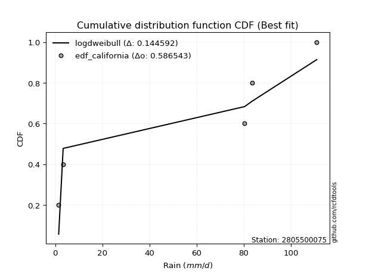</img>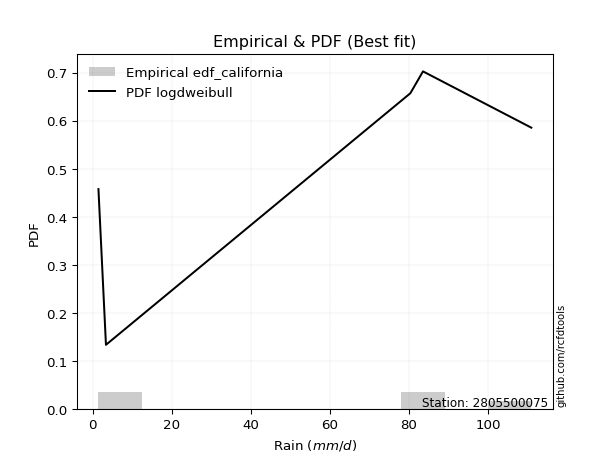</img>

</div>


### 2. EDF Hazen (1930)

Hazen method for plotting positions is a formula used to estimate the empirical cumulative probability distribution of flood events or other hydrological data. This formula often results in biased estimations, particularly when extrapolating to extreme events (high return periods).

<div align="center">


$P=(m-0.5)/n$


</div>


**2.1. Empirical values**

<div align="center">

|                | 0                  | 1                  | 2         | 3                 | 4                  |
|:---------------|:-------------------|:-------------------|:----------|:------------------|:-------------------|
| date           | 2022               | 2024               | 2025      | 2019              | 2020               |
| x              | 1.5                | 3.4                | 80.4      | 83.6              | 111.0              |
| m              | 1                  | 2                  | 3         | 4                 | 5                  |
| empirical_dist | edf_hazen          | edf_hazen          | edf_hazen | edf_hazen         | edf_hazen          |
| empirical      | 0.1                | 0.3                | 0.5       | 0.7               | 0.9                |
| empirical_tr   | 1.1111111111111112 | 1.4285714285714286 | 2.0       | 3.333333333333333 | 10.000000000000002 |

</div>


**2.2. Kolmogorov-Smirnov fit test (sorted by Δ)**


<div align="center">

|                | 0                   | 1                   | 2                  | 3                   | 4                   | 5                   | 6                  | 7                  | 8                  | 9                  | 10                  | 11                  | 12                 | 13                  | 14                  | 15                  | 16                  | 17                  | 18                  | 19                  | 20                  | 21                 | 22                  | 23                  | 24                 | 25                  | 26                  | 27                 | 28                 | 29                 | 30                  | 31                  | 32                  | 33                  | 34                  | 35                  | 36                  | 37                  | 38                 | 39                  | 40                  | 41                  | 42                  | 43                  | 44                  | 45                  | 46                  | 47                 | 48                  | 49                  | 50                  | 51                  | 52                 | 53                 | 54                 | 55                 | 56                 | 57                 | 58                 | 59                 | 60                  | 61                 | 62                 | 63                  | 64                 | 65                  | 66                  | 67                 | 68                 | 69                  | 70                  | 71                  | 72                 | 73                  | 74                 | 75                 | 76                 | 77                 | 78                  | 79                 | 80                  | 81                  | 82                  | 83                 | 84                 | 85                 | 86                 | 87                  | 88                 | 89                 | 90                  | 91                 | 92                  | 93                  | 94                 | 95                 | 96                  | 97                 | 98                 | 99                  | 100                 | 101                | 102                 | 103                | 104                 | 105                | 106                | 107                | 108                | 109                 | 110                 | 111                | 112                 | 113                | 114                | 115                | 116                | 117                | 118                 | 119                 | 120                | 121                | 122                | 123                 | 124                 | 125                 | 126                | 127                | 128                | 129                | 130                | 131                | 132                | 133                | 134                | 135                | 136                 | 137                | 138                | 139                | 140                | 141                | 142                | 143                 | 144                | 145                | 146                | 147                | 148                | 149                | 150                | 151                | 152                | 153                | 154                | 155                | 156                | 157                | 158                | 159                |
|:---------------|:--------------------|:--------------------|:-------------------|:--------------------|:--------------------|:--------------------|:-------------------|:-------------------|:-------------------|:-------------------|:--------------------|:--------------------|:-------------------|:--------------------|:--------------------|:--------------------|:--------------------|:--------------------|:--------------------|:--------------------|:--------------------|:-------------------|:--------------------|:--------------------|:-------------------|:--------------------|:--------------------|:-------------------|:-------------------|:-------------------|:--------------------|:--------------------|:--------------------|:--------------------|:--------------------|:--------------------|:--------------------|:--------------------|:-------------------|:--------------------|:--------------------|:--------------------|:--------------------|:--------------------|:--------------------|:--------------------|:--------------------|:-------------------|:--------------------|:--------------------|:--------------------|:--------------------|:-------------------|:-------------------|:-------------------|:-------------------|:-------------------|:-------------------|:-------------------|:-------------------|:--------------------|:-------------------|:-------------------|:--------------------|:-------------------|:--------------------|:--------------------|:-------------------|:-------------------|:--------------------|:--------------------|:--------------------|:-------------------|:--------------------|:-------------------|:-------------------|:-------------------|:-------------------|:--------------------|:-------------------|:--------------------|:--------------------|:--------------------|:-------------------|:-------------------|:-------------------|:-------------------|:--------------------|:-------------------|:-------------------|:--------------------|:-------------------|:--------------------|:--------------------|:-------------------|:-------------------|:--------------------|:-------------------|:-------------------|:--------------------|:--------------------|:-------------------|:--------------------|:-------------------|:--------------------|:-------------------|:-------------------|:-------------------|:-------------------|:--------------------|:--------------------|:-------------------|:--------------------|:-------------------|:-------------------|:-------------------|:-------------------|:-------------------|:--------------------|:--------------------|:-------------------|:-------------------|:-------------------|:--------------------|:--------------------|:--------------------|:-------------------|:-------------------|:-------------------|:-------------------|:-------------------|:-------------------|:-------------------|:-------------------|:-------------------|:-------------------|:--------------------|:-------------------|:-------------------|:-------------------|:-------------------|:-------------------|:-------------------|:--------------------|:-------------------|:-------------------|:-------------------|:-------------------|:-------------------|:-------------------|:-------------------|:-------------------|:-------------------|:-------------------|:-------------------|:-------------------|:-------------------|:-------------------|:-------------------|:-------------------|
| station        | 2805500075          | 2805500075          | 2805500075         | 2805500075          | 2805500075          | 2805500075          | 2805500075         | 2805500075         | 2805500075         | 2805500075         | 2805500075          | 2805500075          | 2805500075         | 2805500075          | 2805500075          | 2805500075          | 2805500075          | 2805500075          | 2805500075          | 2805500075          | 2805500075          | 2805500075         | 2805500075          | 2805500075          | 2805500075         | 2805500075          | 2805500075          | 2805500075         | 2805500075         | 2805500075         | 2805500075          | 2805500075          | 2805500075          | 2805500075          | 2805500075          | 2805500075          | 2805500075          | 2805500075          | 2805500075         | 2805500075          | 2805500075          | 2805500075          | 2805500075          | 2805500075          | 2805500075          | 2805500075          | 2805500075          | 2805500075         | 2805500075          | 2805500075          | 2805500075          | 2805500075          | 2805500075         | 2805500075         | 2805500075         | 2805500075         | 2805500075         | 2805500075         | 2805500075         | 2805500075         | 2805500075          | 2805500075         | 2805500075         | 2805500075          | 2805500075         | 2805500075          | 2805500075          | 2805500075         | 2805500075         | 2805500075          | 2805500075          | 2805500075          | 2805500075         | 2805500075          | 2805500075         | 2805500075         | 2805500075         | 2805500075         | 2805500075          | 2805500075         | 2805500075          | 2805500075          | 2805500075          | 2805500075         | 2805500075         | 2805500075         | 2805500075         | 2805500075          | 2805500075         | 2805500075         | 2805500075          | 2805500075         | 2805500075          | 2805500075          | 2805500075         | 2805500075         | 2805500075          | 2805500075         | 2805500075         | 2805500075          | 2805500075          | 2805500075         | 2805500075          | 2805500075         | 2805500075          | 2805500075         | 2805500075         | 2805500075         | 2805500075         | 2805500075          | 2805500075          | 2805500075         | 2805500075          | 2805500075         | 2805500075         | 2805500075         | 2805500075         | 2805500075         | 2805500075          | 2805500075          | 2805500075         | 2805500075         | 2805500075         | 2805500075          | 2805500075          | 2805500075          | 2805500075         | 2805500075         | 2805500075         | 2805500075         | 2805500075         | 2805500075         | 2805500075         | 2805500075         | 2805500075         | 2805500075         | 2805500075          | 2805500075         | 2805500075         | 2805500075         | 2805500075         | 2805500075         | 2805500075         | 2805500075          | 2805500075         | 2805500075         | 2805500075         | 2805500075         | 2805500075         | 2805500075         | 2805500075         | 2805500075         | 2805500075         | 2805500075         | 2805500075         | 2805500075         | 2805500075         | 2805500075         | 2805500075         | 2805500075         |
| empirical_dist | edf_hazen           | edf_hazen           | edf_hazen          | edf_hazen           | edf_hazen           | edf_hazen           | edf_hazen          | edf_hazen          | edf_hazen          | edf_hazen          | edf_hazen           | edf_hazen           | edf_hazen          | edf_hazen           | edf_hazen           | edf_hazen           | edf_hazen           | edf_hazen           | edf_hazen           | edf_hazen           | edf_hazen           | edf_hazen          | edf_hazen           | edf_hazen           | edf_hazen          | edf_hazen           | edf_hazen           | edf_hazen          | edf_hazen          | edf_hazen          | edf_hazen           | edf_hazen           | edf_hazen           | edf_hazen           | edf_hazen           | edf_hazen           | edf_hazen           | edf_hazen           | edf_hazen          | edf_hazen           | edf_hazen           | edf_hazen           | edf_hazen           | edf_hazen           | edf_hazen           | edf_hazen           | edf_hazen           | edf_hazen          | edf_hazen           | edf_hazen           | edf_hazen           | edf_hazen           | edf_hazen          | edf_hazen          | edf_hazen          | edf_hazen          | edf_hazen          | edf_hazen          | edf_hazen          | edf_hazen          | edf_hazen           | edf_hazen          | edf_hazen          | edf_hazen           | edf_hazen          | edf_hazen           | edf_hazen           | edf_hazen          | edf_hazen          | edf_hazen           | edf_hazen           | edf_hazen           | edf_hazen          | edf_hazen           | edf_hazen          | edf_hazen          | edf_hazen          | edf_hazen          | edf_hazen           | edf_hazen          | edf_hazen           | edf_hazen           | edf_hazen           | edf_hazen          | edf_hazen          | edf_hazen          | edf_hazen          | edf_hazen           | edf_hazen          | edf_hazen          | edf_hazen           | edf_hazen          | edf_hazen           | edf_hazen           | edf_hazen          | edf_hazen          | edf_hazen           | edf_hazen          | edf_hazen          | edf_hazen           | edf_hazen           | edf_hazen          | edf_hazen           | edf_hazen          | edf_hazen           | edf_hazen          | edf_hazen          | edf_hazen          | edf_hazen          | edf_hazen           | edf_hazen           | edf_hazen          | edf_hazen           | edf_hazen          | edf_hazen          | edf_hazen          | edf_hazen          | edf_hazen          | edf_hazen           | edf_hazen           | edf_hazen          | edf_hazen          | edf_hazen          | edf_hazen           | edf_hazen           | edf_hazen           | edf_hazen          | edf_hazen          | edf_hazen          | edf_hazen          | edf_hazen          | edf_hazen          | edf_hazen          | edf_hazen          | edf_hazen          | edf_hazen          | edf_hazen           | edf_hazen          | edf_hazen          | edf_hazen          | edf_hazen          | edf_hazen          | edf_hazen          | edf_hazen           | edf_hazen          | edf_hazen          | edf_hazen          | edf_hazen          | edf_hazen          | edf_hazen          | edf_hazen          | edf_hazen          | edf_hazen          | edf_hazen          | edf_hazen          | edf_hazen          | edf_hazen          | edf_hazen          | edf_hazen          | edf_hazen          |
| p_dist         | dweibull            | genextreme          | arcsine            | loglevy_l           | logwrapcauchy       | logdgamma           | dgamma             | ksone              | johnsonsu          | trapezoid          | skewnorm            | semicircular        | logarcsine         | weibull_min         | anglit              | gumbel_l            | logdweibull         | wrapcauchy          | levy_l              | loggenpareto        | triang              | pearson3           | argus               | exponnorm           | crystalball        | norm                | foldnorm            | erlang             | gamma              | logksone           | logalpha            | rice                | logbeta             | cosine              | maxwell             | rdist               | rayleigh            | logistic            | genhalflogistic    | logsemicircular     | logtrapezoid        | beta                | gennorm             | halfnorm            | loglomax            | loganglit           | hypsecant           | logweibull_max     | kstwobign           | loggennorm          | nakagami            | gumbel_r            | logpearson3        | logncf             | burr               | logweibull_min     | loggumbel_l        | genexpon           | logexponpow        | exponpow           | laplace             | kappa4             | logbetaprime       | lognct              | logt               | lognorm             | logexponnorm        | loggamma           | loggamma           | logfatiguelife      | moyal               | logerlang           | loginvweibull      | logrice             | logmaxwell         | loggenexpon        | loginvgauss        | lomax              | genpareto           | ncf                | tukeylambda         | logfoldnorm         | lograyleigh         | gompertz           | logf               | loggompertz        | fatiguelife        | loginvgamma         | burr12             | uniform            | logkstwobign        | logtruncnorm       | vonmises_line       | loghalfnorm         | bradford           | halflogistic       | loglogistic         | truncweibull_min   | logcosine          | loggenextreme       | logburr             | f                  | loggumbel_r         | loghypsecant       | loghalflogistic     | halfgennorm        | exponweib          | logargus           | truncexpon         | logmoyal            | wald                | logmielke          | gausshyper          | loglaplace         | loglaplace         | logloggamma        | logburr12          | loggausshyper      | betaprime           | lognakagami         | truncpareto        | logwald            | logloglaplace      | loggenhalflogistic  | invgauss            | logjohnsonsb        | kappa3             | gengamma           | t                  | logskewnorm        | logkappa4          | logtriang          | logexponweib       | logtukeylambda     | logkappa3          | loguniform         | logvonmises_line    | logbradford        | logtruncexpon      | loggengamma        | powerlaw           | invweibull         | alpha              | logtruncweibull_min | truncnorm          | logrdist           | johnsonsb          | mielke             | logtruncpareto     | logpowerlaw        | weibull_max        | logjohnsonsu       | nct                | invgamma           | loghalfgennorm     | genlogistic        | loggenlogistic     | logvonmises        | vonmises           | logcrystalball     |
| delta          | 0.10912742884571008 | 0.11379544186082413 | 0.1253967208826221 | 0.14468888508483047 | 0.15172596384550752 | 0.15448592933261518 | 0.1558958550941423 | 0.1566998187084292 | 0.1567543817977835 | 0.1614242486485531 | 0.16991389139051663 | 0.17064082664367675 | 0.1755357713777166 | 0.17585445905963226 | 0.18132557380432623 | 0.18214308729601222 | 0.18279803516424598 | 0.18285018826690447 | 0.18777272085316432 | 0.18819682122609913 | 0.19685689839418485 | 0.1970580185510722 | 0.20600534445806168 | 0.20637429671374408 | 0.2063745265352679 | 0.20637453916278892 | 0.21014047952086046 | 0.2112576089576388 | 0.2116303571738224 | 0.2138948829244488 | 0.21420029604944246 | 0.21840263762543022 | 0.21882438693619033 | 0.22141380064519411 | 0.22151179131818743 | 0.22244468126155548 | 0.22592148464552553 | 0.22801485424206736 | 0.2288634749712657 | 0.23034068777016148 | 0.23126296205848995 | 0.23478993394993763 | 0.23513509834140864 | 0.23945524654086836 | 0.24169380586414568 | 0.24258860632170764 | 0.24347297177736182 | 0.2450171914913091 | 0.24627675087159817 | 0.24702464353916045 | 0.25153176189068893 | 0.25587873054546917 | 0.2611637307938931 | 0.2615410481285041 | 0.2641407668457997 | 0.265524384578972  | 0.2659501661693666 | 0.2661052044799227 | 0.2661287725724861 | 0.2678985751290588 | 0.26795324044181645 | 0.2692916018461646 | 0.2695608183891566 | 0.27056899047192673 | 0.2706370264892186 | 0.27063921561020043 | 0.27064431611263917 | 0.271201663757793  | 0.271201663757793  | 0.27180363812013897 | 0.27186793494137407 | 0.27297726702944425 | 0.2741648627892621 | 0.27426468829116457 | 0.2774998497264666 | 0.2777401903031309 | 0.2778041422578228 | 0.2783720387226881 | 0.27846557345806017 | 0.2785607395705827 | 0.27870761755287815 | 0.27931905434861726 | 0.27944497035034965 | 0.2795449664783734 | 0.2798540565616485 | 0.280146148014623  | 0.280290352345112  | 0.28039270318317067 | 0.2813215772789416 | 0.282648401826484  | 0.28498431693893567 | 0.2855502865035735 | 0.28602746534381984 | 0.28669907952166895 | 0.2895281466867623 | 0.2903809911742527 | 0.29313732087297695 | 0.2936767213958862 | 0.2999106239293885 | 0.30042616301600533 | 0.30060771545464415 | 0.3028766381851733 | 0.30487191292643745 | 0.3073109314453609 | 0.30980753591937993 | 0.3125455478826956 | 0.3128023443968877 | 0.3133212620404814 | 0.3142076080181575 | 0.31602486155011633 | 0.31909497057171377 | 0.3204110888087578 | 0.32099903251688044 | 0.3246574560178005 | 0.3246574560178005 | 0.3260223697025305 | 0.3327918030471376 | 0.3336473061804204 | 0.34175567135859075 | 0.34497013205555493 | 0.3493271579325068 | 0.3523357066700117 | 0.3546708850538284 | 0.36354552452777866 | 0.36858086716860594 | 0.37424502581274455 | 0.374304229072811  | 0.3877671386240421 | 0.3878550185898524 | 0.3967027756989412 | 0.4058904911719047 | 0.4082563885612258 | 0.4107116246936737 | 0.4180691844070239 | 0.4250660576281673 | 0.4250671125683846 | 0.42512260212835173 | 0.4437685064187147 | 0.4487206239034478 | 0.4604719966472576 | 0.4645557708815533 | 0.465426339212724  | 0.4694722122259707 | 0.47274166478072177 | 0.5                | 0.5                | 0.5116150146224361 | 0.5130516437229649 | 0.5146112837767252 | 0.5154931371765548 | 0.5553755666968017 | 0.6102385664052699 | 0.6592641148309006 | 0.6970369908008929 | 0.7                | 0.7                | 0.7                | 0.8038414112489427 | 17.83310187963294  | nan                |
| deltao         | 0.5865427407550001  | 0.5865427407550001  | 0.5865427407550001 | 0.5865427407550001  | 0.5865427407550001  | 0.5865427407550001  | 0.5865427407550001 | 0.5865427407550001 | 0.5865427407550001 | 0.5865427407550001 | 0.5865427407550001  | 0.5865427407550001  | 0.5865427407550001 | 0.5865427407550001  | 0.5865427407550001  | 0.5865427407550001  | 0.5865427407550001  | 0.5865427407550001  | 0.5865427407550001  | 0.5865427407550001  | 0.5865427407550001  | 0.5865427407550001 | 0.5865427407550001  | 0.5865427407550001  | 0.5865427407550001 | 0.5865427407550001  | 0.5865427407550001  | 0.5865427407550001 | 0.5865427407550001 | 0.5865427407550001 | 0.5865427407550001  | 0.5865427407550001  | 0.5865427407550001  | 0.5865427407550001  | 0.5865427407550001  | 0.5865427407550001  | 0.5865427407550001  | 0.5865427407550001  | 0.5865427407550001 | 0.5865427407550001  | 0.5865427407550001  | 0.5865427407550001  | 0.5865427407550001  | 0.5865427407550001  | 0.5865427407550001  | 0.5865427407550001  | 0.5865427407550001  | 0.5865427407550001 | 0.5865427407550001  | 0.5865427407550001  | 0.5865427407550001  | 0.5865427407550001  | 0.5865427407550001 | 0.5865427407550001 | 0.5865427407550001 | 0.5865427407550001 | 0.5865427407550001 | 0.5865427407550001 | 0.5865427407550001 | 0.5865427407550001 | 0.5865427407550001  | 0.5865427407550001 | 0.5865427407550001 | 0.5865427407550001  | 0.5865427407550001 | 0.5865427407550001  | 0.5865427407550001  | 0.5865427407550001 | 0.5865427407550001 | 0.5865427407550001  | 0.5865427407550001  | 0.5865427407550001  | 0.5865427407550001 | 0.5865427407550001  | 0.5865427407550001 | 0.5865427407550001 | 0.5865427407550001 | 0.5865427407550001 | 0.5865427407550001  | 0.5865427407550001 | 0.5865427407550001  | 0.5865427407550001  | 0.5865427407550001  | 0.5865427407550001 | 0.5865427407550001 | 0.5865427407550001 | 0.5865427407550001 | 0.5865427407550001  | 0.5865427407550001 | 0.5865427407550001 | 0.5865427407550001  | 0.5865427407550001 | 0.5865427407550001  | 0.5865427407550001  | 0.5865427407550001 | 0.5865427407550001 | 0.5865427407550001  | 0.5865427407550001 | 0.5865427407550001 | 0.5865427407550001  | 0.5865427407550001  | 0.5865427407550001 | 0.5865427407550001  | 0.5865427407550001 | 0.5865427407550001  | 0.5865427407550001 | 0.5865427407550001 | 0.5865427407550001 | 0.5865427407550001 | 0.5865427407550001  | 0.5865427407550001  | 0.5865427407550001 | 0.5865427407550001  | 0.5865427407550001 | 0.5865427407550001 | 0.5865427407550001 | 0.5865427407550001 | 0.5865427407550001 | 0.5865427407550001  | 0.5865427407550001  | 0.5865427407550001 | 0.5865427407550001 | 0.5865427407550001 | 0.5865427407550001  | 0.5865427407550001  | 0.5865427407550001  | 0.5865427407550001 | 0.5865427407550001 | 0.5865427407550001 | 0.5865427407550001 | 0.5865427407550001 | 0.5865427407550001 | 0.5865427407550001 | 0.5865427407550001 | 0.5865427407550001 | 0.5865427407550001 | 0.5865427407550001  | 0.5865427407550001 | 0.5865427407550001 | 0.5865427407550001 | 0.5865427407550001 | 0.5865427407550001 | 0.5865427407550001 | 0.5865427407550001  | 0.5865427407550001 | 0.5865427407550001 | 0.5865427407550001 | 0.5865427407550001 | 0.5865427407550001 | 0.5865427407550001 | 0.5865427407550001 | 0.5865427407550001 | 0.5865427407550001 | 0.5865427407550001 | 0.5865427407550001 | 0.5865427407550001 | 0.5865427407550001 | 0.5865427407550001 | 0.5865427407550001 | 0.5865427407550001 |
| eval           | Δo > Δ              | Δo > Δ              | Δo > Δ             | Δo > Δ              | Δo > Δ              | Δo > Δ              | Δo > Δ             | Δo > Δ             | Δo > Δ             | Δo > Δ             | Δo > Δ              | Δo > Δ              | Δo > Δ             | Δo > Δ              | Δo > Δ              | Δo > Δ              | Δo > Δ              | Δo > Δ              | Δo > Δ              | Δo > Δ              | Δo > Δ              | Δo > Δ             | Δo > Δ              | Δo > Δ              | Δo > Δ             | Δo > Δ              | Δo > Δ              | Δo > Δ             | Δo > Δ             | Δo > Δ             | Δo > Δ              | Δo > Δ              | Δo > Δ              | Δo > Δ              | Δo > Δ              | Δo > Δ              | Δo > Δ              | Δo > Δ              | Δo > Δ             | Δo > Δ              | Δo > Δ              | Δo > Δ              | Δo > Δ              | Δo > Δ              | Δo > Δ              | Δo > Δ              | Δo > Δ              | Δo > Δ             | Δo > Δ              | Δo > Δ              | Δo > Δ              | Δo > Δ              | Δo > Δ             | Δo > Δ             | Δo > Δ             | Δo > Δ             | Δo > Δ             | Δo > Δ             | Δo > Δ             | Δo > Δ             | Δo > Δ              | Δo > Δ             | Δo > Δ             | Δo > Δ              | Δo > Δ             | Δo > Δ              | Δo > Δ              | Δo > Δ             | Δo > Δ             | Δo > Δ              | Δo > Δ              | Δo > Δ              | Δo > Δ             | Δo > Δ              | Δo > Δ             | Δo > Δ             | Δo > Δ             | Δo > Δ             | Δo > Δ              | Δo > Δ             | Δo > Δ              | Δo > Δ              | Δo > Δ              | Δo > Δ             | Δo > Δ             | Δo > Δ             | Δo > Δ             | Δo > Δ              | Δo > Δ             | Δo > Δ             | Δo > Δ              | Δo > Δ             | Δo > Δ              | Δo > Δ              | Δo > Δ             | Δo > Δ             | Δo > Δ              | Δo > Δ             | Δo > Δ             | Δo > Δ              | Δo > Δ              | Δo > Δ             | Δo > Δ              | Δo > Δ             | Δo > Δ              | Δo > Δ             | Δo > Δ             | Δo > Δ             | Δo > Δ             | Δo > Δ              | Δo > Δ              | Δo > Δ             | Δo > Δ              | Δo > Δ             | Δo > Δ             | Δo > Δ             | Δo > Δ             | Δo > Δ             | Δo > Δ              | Δo > Δ              | Δo > Δ             | Δo > Δ             | Δo > Δ             | Δo > Δ              | Δo > Δ              | Δo > Δ              | Δo > Δ             | Δo > Δ             | Δo > Δ             | Δo > Δ             | Δo > Δ             | Δo > Δ             | Δo > Δ             | Δo > Δ             | Δo > Δ             | Δo > Δ             | Δo > Δ              | Δo > Δ             | Δo > Δ             | Δo > Δ             | Δo > Δ             | Δo > Δ             | Δo > Δ             | Δo > Δ              | Δo > Δ             | Δo > Δ             | Δo > Δ             | Δo > Δ             | Δo > Δ             | Δo > Δ             | Δo > Δ             | Δo <= Δ            | Δo <= Δ            | Δo <= Δ            | Δo <= Δ            | Δo <= Δ            | Δo <= Δ            | Δo <= Δ            | Δo <= Δ            | Δo <= Δ            |
| fit            | 1                   | 1                   | 1                  | 1                   | 1                   | 1                   | 1                  | 1                  | 1                  | 1                  | 1                   | 1                   | 1                  | 1                   | 1                   | 1                   | 1                   | 1                   | 1                   | 1                   | 1                   | 1                  | 1                   | 1                   | 1                  | 1                   | 1                   | 1                  | 1                  | 1                  | 1                   | 1                   | 1                   | 1                   | 1                   | 1                   | 1                   | 1                   | 1                  | 1                   | 1                   | 1                   | 1                   | 1                   | 1                   | 1                   | 1                   | 1                  | 1                   | 1                   | 1                   | 1                   | 1                  | 1                  | 1                  | 1                  | 1                  | 1                  | 1                  | 1                  | 1                   | 1                  | 1                  | 1                   | 1                  | 1                   | 1                   | 1                  | 1                  | 1                   | 1                   | 1                   | 1                  | 1                   | 1                  | 1                  | 1                  | 1                  | 1                   | 1                  | 1                   | 1                   | 1                   | 1                  | 1                  | 1                  | 1                  | 1                   | 1                  | 1                  | 1                   | 1                  | 1                   | 1                   | 1                  | 1                  | 1                   | 1                  | 1                  | 1                   | 1                   | 1                  | 1                   | 1                  | 1                   | 1                  | 1                  | 1                  | 1                  | 1                   | 1                   | 1                  | 1                   | 1                  | 1                  | 1                  | 1                  | 1                  | 1                   | 1                   | 1                  | 1                  | 1                  | 1                   | 1                   | 1                   | 1                  | 1                  | 1                  | 1                  | 1                  | 1                  | 1                  | 1                  | 1                  | 1                  | 1                   | 1                  | 1                  | 1                  | 1                  | 1                  | 1                  | 1                   | 1                  | 1                  | 1                  | 1                  | 1                  | 1                  | 1                  | 0                  | 0                  | 0                  | 0                  | 0                  | 0                  | 0                  | 0                  | 0                  |
| n              | 5                   | 5                   | 5                  | 5                   | 5                   | 5                   | 5                  | 5                  | 5                  | 5                  | 5                   | 5                   | 5                  | 5                   | 5                   | 5                   | 5                   | 5                   | 5                   | 5                   | 5                   | 5                  | 5                   | 5                   | 5                  | 5                   | 5                   | 5                  | 5                  | 5                  | 5                   | 5                   | 5                   | 5                   | 5                   | 5                   | 5                   | 5                   | 5                  | 5                   | 5                   | 5                   | 5                   | 5                   | 5                   | 5                   | 5                   | 5                  | 5                   | 5                   | 5                   | 5                   | 5                  | 5                  | 5                  | 5                  | 5                  | 5                  | 5                  | 5                  | 5                   | 5                  | 5                  | 5                   | 5                  | 5                   | 5                   | 5                  | 5                  | 5                   | 5                   | 5                   | 5                  | 5                   | 5                  | 5                  | 5                  | 5                  | 5                   | 5                  | 5                   | 5                   | 5                   | 5                  | 5                  | 5                  | 5                  | 5                   | 5                  | 5                  | 5                   | 5                  | 5                   | 5                   | 5                  | 5                  | 5                   | 5                  | 5                  | 5                   | 5                   | 5                  | 5                   | 5                  | 5                   | 5                  | 5                  | 5                  | 5                  | 5                   | 5                   | 5                  | 5                   | 5                  | 5                  | 5                  | 5                  | 5                  | 5                   | 5                   | 5                  | 5                  | 5                  | 5                   | 5                   | 5                   | 5                  | 5                  | 5                  | 5                  | 5                  | 5                  | 5                  | 5                  | 5                  | 5                  | 5                   | 5                  | 5                  | 5                  | 5                  | 5                  | 5                  | 5                   | 5                  | 5                  | 5                  | 5                  | 5                  | 5                  | 5                  | 5                  | 5                  | 5                  | 5                  | 5                  | 5                  | 5                  | 5                  | 5                  |
| best_fit       | 1                   | 0                   | 0                  | 0                   | 0                   | 0                   | 0                  | 0                  | 0                  | 0                  | 0                   | 0                   | 0                  | 0                   | 0                   | 0                   | 0                   | 0                   | 0                   | 0                   | 0                   | 0                  | 0                   | 0                   | 0                  | 0                   | 0                   | 0                  | 0                  | 0                  | 0                   | 0                   | 0                   | 0                   | 0                   | 0                   | 0                   | 0                   | 0                  | 0                   | 0                   | 0                   | 0                   | 0                   | 0                   | 0                   | 0                   | 0                  | 0                   | 0                   | 0                   | 0                   | 0                  | 0                  | 0                  | 0                  | 0                  | 0                  | 0                  | 0                  | 0                   | 0                  | 0                  | 0                   | 0                  | 0                   | 0                   | 0                  | 0                  | 0                   | 0                   | 0                   | 0                  | 0                   | 0                  | 0                  | 0                  | 0                  | 0                   | 0                  | 0                   | 0                   | 0                   | 0                  | 0                  | 0                  | 0                  | 0                   | 0                  | 0                  | 0                   | 0                  | 0                   | 0                   | 0                  | 0                  | 0                   | 0                  | 0                  | 0                   | 0                   | 0                  | 0                   | 0                  | 0                   | 0                  | 0                  | 0                  | 0                  | 0                   | 0                   | 0                  | 0                   | 0                  | 0                  | 0                  | 0                  | 0                  | 0                   | 0                   | 0                  | 0                  | 0                  | 0                   | 0                   | 0                   | 0                  | 0                  | 0                  | 0                  | 0                  | 0                  | 0                  | 0                  | 0                  | 0                  | 0                   | 0                  | 0                  | 0                  | 0                  | 0                  | 0                  | 0                   | 0                  | 0                  | 0                  | 0                  | 0                  | 0                  | 0                  | 0                  | 0                  | 0                  | 0                  | 0                  | 0                  | 0                  | 0                  | 0                  |
| best_fit_sort  | 1                   | 2                   | 3                  | 4                   | 5                   | 6                   | 7                  | 8                  | 9                  | 10                 | 11                  | 12                  | 13                 | 14                  | 15                  | 16                  | 17                  | 18                  | 19                  | 20                  | 21                  | 22                 | 23                  | 24                  | 25                 | 26                  | 27                  | 28                 | 29                 | 30                 | 31                  | 32                  | 33                  | 34                  | 35                  | 36                  | 37                  | 38                  | 39                 | 40                  | 41                  | 42                  | 43                  | 44                  | 45                  | 46                  | 47                  | 48                 | 49                  | 50                  | 51                  | 52                  | 53                 | 54                 | 55                 | 56                 | 57                 | 58                 | 59                 | 60                 | 61                  | 62                 | 63                 | 64                  | 65                 | 66                  | 67                  | 68                 | 69                 | 70                  | 71                  | 72                  | 73                 | 74                  | 75                 | 76                 | 77                 | 78                 | 79                  | 80                 | 81                  | 82                  | 83                  | 84                 | 85                 | 86                 | 87                 | 88                  | 89                 | 90                 | 91                  | 92                 | 93                  | 94                  | 95                 | 96                 | 97                  | 98                 | 99                 | 100                 | 101                 | 102                | 103                 | 104                | 105                 | 106                | 107                | 108                | 109                | 110                 | 111                 | 112                | 113                 | 114                | 115                | 116                | 117                | 118                | 119                 | 120                 | 121                | 122                | 123                | 124                 | 125                 | 126                 | 127                | 128                | 129                | 130                | 131                | 132                | 133                | 134                | 135                | 136                | 137                 | 138                | 139                | 140                | 141                | 142                | 143                | 144                 | 145                | 146                | 147                | 148                | 149                | 150                | 151                | 152                | 153                | 154                | 155                | 156                | 157                | 158                | 159                | 160                |

</div>


**2.3. Best fit**

<div align="center">

|   id |    station | empirical_dist   | p_dist   |    delta |   deltao | eval   |   fit |   n |   best_fit |   best_fit_sort |
|-----:|-----------:|:-----------------|:---------|---------:|---------:|:-------|------:|----:|-----------:|----------------:|
|    0 | 2805500075 | edf_hazen        | dweibull | 0.109127 | 0.586543 | Δo > Δ |     1 |   5 |          1 |               1 |

</div>


<div align="center">

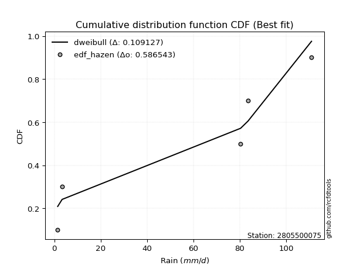</img></img>

</div>


### 3. EDF Weibull (1939)

Weibull plotting position formula is an empirical method used to estimate the non-exceedance probability or plotting position for a set of observed data, is often recommended or widely used in practice, particularly in flood frequency analysis.

<div align="center">


$P=m/(n+1)$


</div>


**3.1. Empirical values**

<div align="center">

|                | 0                   | 1                  | 2           | 3                  | 4                  |
|:---------------|:--------------------|:-------------------|:------------|:-------------------|:-------------------|
| date           | 2022                | 2024               | 2025        | 2019               | 2020               |
| x              | 1.5                 | 3.4                | 80.4        | 83.6               | 111.0              |
| m              | 1                   | 2                  | 3           | 4                  | 5                  |
| empirical_dist | edf_weibull         | edf_weibull        | edf_weibull | edf_weibull        | edf_weibull        |
| empirical      | 0.16666666666666666 | 0.3333333333333333 | 0.5         | 0.6666666666666666 | 0.8333333333333334 |
| empirical_tr   | 1.2                 | 1.4999999999999998 | 2.0         | 2.9999999999999996 | 6.000000000000002  |

</div>


**3.2. Kolmogorov-Smirnov fit test (sorted by Δ)**


<div align="center">

|                | 0                   | 1                   | 2                   | 3                   | 4                   | 5                  | 6                  | 7                   | 8                   | 9                  | 10                  | 11                  | 12                 | 13                  | 14                 | 15                  | 16                  | 17                  | 18                  | 19                 | 20                  | 21                 | 22                  | 23                 | 24                  | 25                  | 26                 | 27                  | 28                  | 29                 | 30                  | 31                  | 32                  | 33                  | 34                  | 35                  | 36                  | 37                  | 38                  | 39                 | 40                 | 41                  | 42                  | 43                  | 44                  | 45                  | 46                  | 47                 | 48                  | 49                 | 50                 | 51                 | 52                 | 53                 | 54                 | 55                 | 56                 | 57                  | 58                  | 59                 | 60                 | 61                  | 62                 | 63                  | 64                  | 65                 | 66                 | 67                  | 68                  | 69                 | 70                  | 71                 | 72                 | 73                 | 74                 | 75                  | 76                  | 77                 | 78                 | 79                 | 80                  | 81                  | 82                 | 83                 | 84                  | 85                 | 86                  | 87                 | 88                  | 89                 | 90                 | 91                 | 92                 | 93                  | 94                  | 95                  | 96                 | 97                 | 98                  | 99                 | 100                | 101                 | 102                | 103                | 104                | 105                 | 106                | 107                | 108                | 109                 | 110                 | 111                | 112                | 113                | 114                | 115                | 116                | 117                | 118                | 119                | 120                 | 121                 | 122                | 123                | 124                 | 125                 | 126                | 127                | 128                | 129                | 130                | 131                | 132                | 133                | 134                | 135                | 136                | 137                 | 138                | 139                | 140                | 141                | 142                | 143                 | 144                 | 145                | 146                 | 147                 | 148                | 149                | 150                | 151                | 152                | 153                | 154                | 155                | 156                | 157                | 158                | 159                |
|:---------------|:--------------------|:--------------------|:--------------------|:--------------------|:--------------------|:-------------------|:-------------------|:--------------------|:--------------------|:-------------------|:--------------------|:--------------------|:-------------------|:--------------------|:-------------------|:--------------------|:--------------------|:--------------------|:--------------------|:-------------------|:--------------------|:-------------------|:--------------------|:-------------------|:--------------------|:--------------------|:-------------------|:--------------------|:--------------------|:-------------------|:--------------------|:--------------------|:--------------------|:--------------------|:--------------------|:--------------------|:--------------------|:--------------------|:--------------------|:-------------------|:-------------------|:--------------------|:--------------------|:--------------------|:--------------------|:--------------------|:--------------------|:-------------------|:--------------------|:-------------------|:-------------------|:-------------------|:-------------------|:-------------------|:-------------------|:-------------------|:-------------------|:--------------------|:--------------------|:-------------------|:-------------------|:--------------------|:-------------------|:--------------------|:--------------------|:-------------------|:-------------------|:--------------------|:--------------------|:-------------------|:--------------------|:-------------------|:-------------------|:-------------------|:-------------------|:--------------------|:--------------------|:-------------------|:-------------------|:-------------------|:--------------------|:--------------------|:-------------------|:-------------------|:--------------------|:-------------------|:--------------------|:-------------------|:--------------------|:-------------------|:-------------------|:-------------------|:-------------------|:--------------------|:--------------------|:--------------------|:-------------------|:-------------------|:--------------------|:-------------------|:-------------------|:--------------------|:-------------------|:-------------------|:-------------------|:--------------------|:-------------------|:-------------------|:-------------------|:--------------------|:--------------------|:-------------------|:-------------------|:-------------------|:-------------------|:-------------------|:-------------------|:-------------------|:-------------------|:-------------------|:--------------------|:--------------------|:-------------------|:-------------------|:--------------------|:--------------------|:-------------------|:-------------------|:-------------------|:-------------------|:-------------------|:-------------------|:-------------------|:-------------------|:-------------------|:-------------------|:-------------------|:--------------------|:-------------------|:-------------------|:-------------------|:-------------------|:-------------------|:--------------------|:--------------------|:-------------------|:--------------------|:--------------------|:-------------------|:-------------------|:-------------------|:-------------------|:-------------------|:-------------------|:-------------------|:-------------------|:-------------------|:-------------------|:-------------------|:-------------------|
| station        | 2805500075          | 2805500075          | 2805500075          | 2805500075          | 2805500075          | 2805500075         | 2805500075         | 2805500075          | 2805500075          | 2805500075         | 2805500075          | 2805500075          | 2805500075         | 2805500075          | 2805500075         | 2805500075          | 2805500075          | 2805500075          | 2805500075          | 2805500075         | 2805500075          | 2805500075         | 2805500075          | 2805500075         | 2805500075          | 2805500075          | 2805500075         | 2805500075          | 2805500075          | 2805500075         | 2805500075          | 2805500075          | 2805500075          | 2805500075          | 2805500075          | 2805500075          | 2805500075          | 2805500075          | 2805500075          | 2805500075         | 2805500075         | 2805500075          | 2805500075          | 2805500075          | 2805500075          | 2805500075          | 2805500075          | 2805500075         | 2805500075          | 2805500075         | 2805500075         | 2805500075         | 2805500075         | 2805500075         | 2805500075         | 2805500075         | 2805500075         | 2805500075          | 2805500075          | 2805500075         | 2805500075         | 2805500075          | 2805500075         | 2805500075          | 2805500075          | 2805500075         | 2805500075         | 2805500075          | 2805500075          | 2805500075         | 2805500075          | 2805500075         | 2805500075         | 2805500075         | 2805500075         | 2805500075          | 2805500075          | 2805500075         | 2805500075         | 2805500075         | 2805500075          | 2805500075          | 2805500075         | 2805500075         | 2805500075          | 2805500075         | 2805500075          | 2805500075         | 2805500075          | 2805500075         | 2805500075         | 2805500075         | 2805500075         | 2805500075          | 2805500075          | 2805500075          | 2805500075         | 2805500075         | 2805500075          | 2805500075         | 2805500075         | 2805500075          | 2805500075         | 2805500075         | 2805500075         | 2805500075          | 2805500075         | 2805500075         | 2805500075         | 2805500075          | 2805500075          | 2805500075         | 2805500075         | 2805500075         | 2805500075         | 2805500075         | 2805500075         | 2805500075         | 2805500075         | 2805500075         | 2805500075          | 2805500075          | 2805500075         | 2805500075         | 2805500075          | 2805500075          | 2805500075         | 2805500075         | 2805500075         | 2805500075         | 2805500075         | 2805500075         | 2805500075         | 2805500075         | 2805500075         | 2805500075         | 2805500075         | 2805500075          | 2805500075         | 2805500075         | 2805500075         | 2805500075         | 2805500075         | 2805500075          | 2805500075          | 2805500075         | 2805500075          | 2805500075          | 2805500075         | 2805500075         | 2805500075         | 2805500075         | 2805500075         | 2805500075         | 2805500075         | 2805500075         | 2805500075         | 2805500075         | 2805500075         | 2805500075         |
| empirical_dist | edf_weibull         | edf_weibull         | edf_weibull         | edf_weibull         | edf_weibull         | edf_weibull        | edf_weibull        | edf_weibull         | edf_weibull         | edf_weibull        | edf_weibull         | edf_weibull         | edf_weibull        | edf_weibull         | edf_weibull        | edf_weibull         | edf_weibull         | edf_weibull         | edf_weibull         | edf_weibull        | edf_weibull         | edf_weibull        | edf_weibull         | edf_weibull        | edf_weibull         | edf_weibull         | edf_weibull        | edf_weibull         | edf_weibull         | edf_weibull        | edf_weibull         | edf_weibull         | edf_weibull         | edf_weibull         | edf_weibull         | edf_weibull         | edf_weibull         | edf_weibull         | edf_weibull         | edf_weibull        | edf_weibull        | edf_weibull         | edf_weibull         | edf_weibull         | edf_weibull         | edf_weibull         | edf_weibull         | edf_weibull        | edf_weibull         | edf_weibull        | edf_weibull        | edf_weibull        | edf_weibull        | edf_weibull        | edf_weibull        | edf_weibull        | edf_weibull        | edf_weibull         | edf_weibull         | edf_weibull        | edf_weibull        | edf_weibull         | edf_weibull        | edf_weibull         | edf_weibull         | edf_weibull        | edf_weibull        | edf_weibull         | edf_weibull         | edf_weibull        | edf_weibull         | edf_weibull        | edf_weibull        | edf_weibull        | edf_weibull        | edf_weibull         | edf_weibull         | edf_weibull        | edf_weibull        | edf_weibull        | edf_weibull         | edf_weibull         | edf_weibull        | edf_weibull        | edf_weibull         | edf_weibull        | edf_weibull         | edf_weibull        | edf_weibull         | edf_weibull        | edf_weibull        | edf_weibull        | edf_weibull        | edf_weibull         | edf_weibull         | edf_weibull         | edf_weibull        | edf_weibull        | edf_weibull         | edf_weibull        | edf_weibull        | edf_weibull         | edf_weibull        | edf_weibull        | edf_weibull        | edf_weibull         | edf_weibull        | edf_weibull        | edf_weibull        | edf_weibull         | edf_weibull         | edf_weibull        | edf_weibull        | edf_weibull        | edf_weibull        | edf_weibull        | edf_weibull        | edf_weibull        | edf_weibull        | edf_weibull        | edf_weibull         | edf_weibull         | edf_weibull        | edf_weibull        | edf_weibull         | edf_weibull         | edf_weibull        | edf_weibull        | edf_weibull        | edf_weibull        | edf_weibull        | edf_weibull        | edf_weibull        | edf_weibull        | edf_weibull        | edf_weibull        | edf_weibull        | edf_weibull         | edf_weibull        | edf_weibull        | edf_weibull        | edf_weibull        | edf_weibull        | edf_weibull         | edf_weibull         | edf_weibull        | edf_weibull         | edf_weibull         | edf_weibull        | edf_weibull        | edf_weibull        | edf_weibull        | edf_weibull        | edf_weibull        | edf_weibull        | edf_weibull        | edf_weibull        | edf_weibull        | edf_weibull        | edf_weibull        |
| p_dist         | dweibull            | arcsine             | loglevy_l           | dgamma              | logdgamma           | levy_l             | trapezoid          | logwrapcauchy       | wrapcauchy          | genextreme         | ksone               | loglomax            | logarcsine         | logdweibull         | semicircular       | logweibull_max      | johnsonsu           | anglit              | skewnorm            | weibull_min        | pearson3            | erlang             | norm                | crystalball        | exponnorm           | gamma               | logksone           | logalpha            | gumbel_l            | foldnorm           | maxwell             | loggenpareto        | cosine              | genhalflogistic     | rayleigh            | logistic            | triang              | logsemicircular     | logtrapezoid        | rice               | argus              | loganglit           | hypsecant           | exponweib           | kstwobign           | logbeta             | nakagami            | rdist              | gumbel_r            | halfnorm           | logpearson3        | logncf             | burr               | logweibull_min     | loggumbel_l        | logexponpow        | exponpow           | laplace             | beta                | gennorm            | logbetaprime       | lognct              | logt               | lognorm             | logexponnorm        | loggamma           | loggamma           | logfatiguelife      | logerlang           | loginvweibull      | logrice             | logmaxwell         | loggenexpon        | loginvgauss        | ncf                | logfoldnorm         | lograyleigh         | logf               | loggompertz        | fatiguelife        | loggennorm          | loginvgamma         | moyal              | burr12             | logkstwobign        | logtruncnorm       | loghalfnorm         | logloglaplace      | loglogistic         | truncweibull_min   | lomax              | genexpon           | logcosine          | loggenextreme       | gausshyper          | logburr             | kappa4             | f                  | loggumbel_r         | loghypsecant       | bradford           | loghalflogistic     | genpareto          | tukeylambda        | halfgennorm        | gompertz            | logargus           | truncexpon         | uniform            | logmoyal            | vonmises_line       | logmielke          | halflogistic       | loglaplace         | loglaplace         | logloggamma        | logburr12          | wald               | loggausshyper      | logjohnsonsb       | betaprime           | lognakagami         | truncpareto        | logwald            | loggenhalflogistic  | invgauss            | kappa3             | gengamma           | t                  | logskewnorm        | invweibull         | logkappa4          | logtriang          | logexponweib       | logtukeylambda     | logkappa3          | loguniform         | logvonmises_line    | logbradford        | logtruncexpon      | loggengamma        | powerlaw           | alpha              | logtruncweibull_min | johnsonsb           | mielke             | logpowerlaw         | logtruncpareto      | truncnorm          | logrdist           | weibull_max        | logjohnsonsu       | nct                | invgamma           | loghalfgennorm     | genlogistic        | loggenlogistic     | logvonmises        | vonmises           | logcrystalball     |
| delta          | 0.14202985992135841 | 0.14297917484964132 | 0.14735251945541378 | 0.15171579224201548 | 0.15335259185068262 | 0.154439387519831  | 0.1653561680303212 | 0.16666535179592368 | 0.16666645445141448 | 0.1666666666661457 | 0.17073204208391482 | 0.17502713919747903 | 0.1755357713777166 | 0.18279803516424598 | 0.1829482243272631 | 0.18625924821644652 | 0.19008771513111683 | 0.19168345607088907 | 0.20324722472384996 | 0.2091877923929656 | 0.20992095857409687 | 0.2112576089576388 | 0.21208788067324252 | 0.212087889021786  | 0.21208822834805038 | 0.21216810966991514 | 0.2138948829244488 | 0.21420029604944246 | 0.21547642062934555 | 0.220107570851026  | 0.22151179131818743 | 0.22153015455943245 | 0.22377035518973826 | 0.22448193081855092 | 0.22592148464552553 | 0.22801485424206736 | 0.23019023172751818 | 0.23034068777016148 | 0.23126296205848995 | 0.2361663033820768 | 0.239338677791395  | 0.24258860632170764 | 0.24347297177736182 | 0.24613567773022105 | 0.24627675087159817 | 0.24694850858886075 | 0.25153176189068893 | 0.2557780145948888 | 0.25587873054546917 | 0.2589748036878955 | 0.2611637307938931 | 0.2615410481285041 | 0.2641407668457997 | 0.265524384578972  | 0.2659501661693666 | 0.2661287725724861 | 0.2678985751290588 | 0.26795324044181645 | 0.26812326728327096 | 0.268468431674742  | 0.2695608183891566 | 0.27056899047192673 | 0.2706370264892186 | 0.27063921561020043 | 0.27064431611263917 | 0.271201663757793  | 0.271201663757793  | 0.27180363812013897 | 0.27297726702944425 | 0.2741648627892621 | 0.27426468829116457 | 0.2774998497264666 | 0.2777401903031309 | 0.2778041422578228 | 0.2785607395705827 | 0.27931905434861726 | 0.27944497035034965 | 0.2798540565616485 | 0.280146148014623  | 0.280290352345112  | 0.28035797687249375 | 0.28039270318317067 | 0.2810296624581629 | 0.2813215772789416 | 0.28498431693893567 | 0.2855502865035735 | 0.28669907952166895 | 0.2880042183871617 | 0.29313732087297695 | 0.2936767213958862 | 0.297699375488225  | 0.299438537813256  | 0.2999106239293885 | 0.30042616301600533 | 0.30055006435770537 | 0.30060771545464415 | 0.3026249351794979 | 0.3028766381851733 | 0.30487191292643745 | 0.3073109314453609 | 0.307330776425632  | 0.30980753591937993 | 0.3117989067913935 | 0.3120409508862115 | 0.3125455478826956 | 0.31287829981170673 | 0.3133212620404814 | 0.3142076080181575 | 0.3159817351598173 | 0.31602486155011633 | 0.31936079867715317 | 0.3204110888087578 | 0.323714324507586  | 0.3246574560178005 | 0.3246574560178005 | 0.3260223697025305 | 0.3327918030471376 | 0.3333333333333333 | 0.3336473061804204 | 0.3409116924794112 | 0.34175567135859075 | 0.34497013205555493 | 0.3493271579325068 | 0.3523357066700117 | 0.36354552452777866 | 0.36858086716860594 | 0.374304229072811  | 0.3877671386240421 | 0.3878550185898524 | 0.3967027756989412 | 0.3987596725460574 | 0.4058904911719047 | 0.4082563885612258 | 0.4107116246936737 | 0.4180691844070239 | 0.4250660576281673 | 0.4250671125683846 | 0.42512260212835173 | 0.4437685064187147 | 0.4487206239034478 | 0.4604719966472576 | 0.4645557708815533 | 0.4694722122259707 | 0.47274166478072177 | 0.47828168128910276 | 0.4797183103896315 | 0.49047593841268033 | 0.49291867309715054 | 0.5                | 0.5                | 0.5220422333634682 | 0.5769052330719365 | 0.6259307814975674 | 0.6637036574675594 | 0.6666666666666666 | 0.6666666666666666 | 0.6666666666666666 | 0.8038414112489427 | 17.899768546299608 | nan                |
| deltao         | 0.5865427407550001  | 0.5865427407550001  | 0.5865427407550001  | 0.5865427407550001  | 0.5865427407550001  | 0.5865427407550001 | 0.5865427407550001 | 0.5865427407550001  | 0.5865427407550001  | 0.5865427407550001 | 0.5865427407550001  | 0.5865427407550001  | 0.5865427407550001 | 0.5865427407550001  | 0.5865427407550001 | 0.5865427407550001  | 0.5865427407550001  | 0.5865427407550001  | 0.5865427407550001  | 0.5865427407550001 | 0.5865427407550001  | 0.5865427407550001 | 0.5865427407550001  | 0.5865427407550001 | 0.5865427407550001  | 0.5865427407550001  | 0.5865427407550001 | 0.5865427407550001  | 0.5865427407550001  | 0.5865427407550001 | 0.5865427407550001  | 0.5865427407550001  | 0.5865427407550001  | 0.5865427407550001  | 0.5865427407550001  | 0.5865427407550001  | 0.5865427407550001  | 0.5865427407550001  | 0.5865427407550001  | 0.5865427407550001 | 0.5865427407550001 | 0.5865427407550001  | 0.5865427407550001  | 0.5865427407550001  | 0.5865427407550001  | 0.5865427407550001  | 0.5865427407550001  | 0.5865427407550001 | 0.5865427407550001  | 0.5865427407550001 | 0.5865427407550001 | 0.5865427407550001 | 0.5865427407550001 | 0.5865427407550001 | 0.5865427407550001 | 0.5865427407550001 | 0.5865427407550001 | 0.5865427407550001  | 0.5865427407550001  | 0.5865427407550001 | 0.5865427407550001 | 0.5865427407550001  | 0.5865427407550001 | 0.5865427407550001  | 0.5865427407550001  | 0.5865427407550001 | 0.5865427407550001 | 0.5865427407550001  | 0.5865427407550001  | 0.5865427407550001 | 0.5865427407550001  | 0.5865427407550001 | 0.5865427407550001 | 0.5865427407550001 | 0.5865427407550001 | 0.5865427407550001  | 0.5865427407550001  | 0.5865427407550001 | 0.5865427407550001 | 0.5865427407550001 | 0.5865427407550001  | 0.5865427407550001  | 0.5865427407550001 | 0.5865427407550001 | 0.5865427407550001  | 0.5865427407550001 | 0.5865427407550001  | 0.5865427407550001 | 0.5865427407550001  | 0.5865427407550001 | 0.5865427407550001 | 0.5865427407550001 | 0.5865427407550001 | 0.5865427407550001  | 0.5865427407550001  | 0.5865427407550001  | 0.5865427407550001 | 0.5865427407550001 | 0.5865427407550001  | 0.5865427407550001 | 0.5865427407550001 | 0.5865427407550001  | 0.5865427407550001 | 0.5865427407550001 | 0.5865427407550001 | 0.5865427407550001  | 0.5865427407550001 | 0.5865427407550001 | 0.5865427407550001 | 0.5865427407550001  | 0.5865427407550001  | 0.5865427407550001 | 0.5865427407550001 | 0.5865427407550001 | 0.5865427407550001 | 0.5865427407550001 | 0.5865427407550001 | 0.5865427407550001 | 0.5865427407550001 | 0.5865427407550001 | 0.5865427407550001  | 0.5865427407550001  | 0.5865427407550001 | 0.5865427407550001 | 0.5865427407550001  | 0.5865427407550001  | 0.5865427407550001 | 0.5865427407550001 | 0.5865427407550001 | 0.5865427407550001 | 0.5865427407550001 | 0.5865427407550001 | 0.5865427407550001 | 0.5865427407550001 | 0.5865427407550001 | 0.5865427407550001 | 0.5865427407550001 | 0.5865427407550001  | 0.5865427407550001 | 0.5865427407550001 | 0.5865427407550001 | 0.5865427407550001 | 0.5865427407550001 | 0.5865427407550001  | 0.5865427407550001  | 0.5865427407550001 | 0.5865427407550001  | 0.5865427407550001  | 0.5865427407550001 | 0.5865427407550001 | 0.5865427407550001 | 0.5865427407550001 | 0.5865427407550001 | 0.5865427407550001 | 0.5865427407550001 | 0.5865427407550001 | 0.5865427407550001 | 0.5865427407550001 | 0.5865427407550001 | 0.5865427407550001 |
| eval           | Δo > Δ              | Δo > Δ              | Δo > Δ              | Δo > Δ              | Δo > Δ              | Δo > Δ             | Δo > Δ             | Δo > Δ              | Δo > Δ              | Δo > Δ             | Δo > Δ              | Δo > Δ              | Δo > Δ             | Δo > Δ              | Δo > Δ             | Δo > Δ              | Δo > Δ              | Δo > Δ              | Δo > Δ              | Δo > Δ             | Δo > Δ              | Δo > Δ             | Δo > Δ              | Δo > Δ             | Δo > Δ              | Δo > Δ              | Δo > Δ             | Δo > Δ              | Δo > Δ              | Δo > Δ             | Δo > Δ              | Δo > Δ              | Δo > Δ              | Δo > Δ              | Δo > Δ              | Δo > Δ              | Δo > Δ              | Δo > Δ              | Δo > Δ              | Δo > Δ             | Δo > Δ             | Δo > Δ              | Δo > Δ              | Δo > Δ              | Δo > Δ              | Δo > Δ              | Δo > Δ              | Δo > Δ             | Δo > Δ              | Δo > Δ             | Δo > Δ             | Δo > Δ             | Δo > Δ             | Δo > Δ             | Δo > Δ             | Δo > Δ             | Δo > Δ             | Δo > Δ              | Δo > Δ              | Δo > Δ             | Δo > Δ             | Δo > Δ              | Δo > Δ             | Δo > Δ              | Δo > Δ              | Δo > Δ             | Δo > Δ             | Δo > Δ              | Δo > Δ              | Δo > Δ             | Δo > Δ              | Δo > Δ             | Δo > Δ             | Δo > Δ             | Δo > Δ             | Δo > Δ              | Δo > Δ              | Δo > Δ             | Δo > Δ             | Δo > Δ             | Δo > Δ              | Δo > Δ              | Δo > Δ             | Δo > Δ             | Δo > Δ              | Δo > Δ             | Δo > Δ              | Δo > Δ             | Δo > Δ              | Δo > Δ             | Δo > Δ             | Δo > Δ             | Δo > Δ             | Δo > Δ              | Δo > Δ              | Δo > Δ              | Δo > Δ             | Δo > Δ             | Δo > Δ              | Δo > Δ             | Δo > Δ             | Δo > Δ              | Δo > Δ             | Δo > Δ             | Δo > Δ             | Δo > Δ              | Δo > Δ             | Δo > Δ             | Δo > Δ             | Δo > Δ              | Δo > Δ              | Δo > Δ             | Δo > Δ             | Δo > Δ             | Δo > Δ             | Δo > Δ             | Δo > Δ             | Δo > Δ             | Δo > Δ             | Δo > Δ             | Δo > Δ              | Δo > Δ              | Δo > Δ             | Δo > Δ             | Δo > Δ              | Δo > Δ              | Δo > Δ             | Δo > Δ             | Δo > Δ             | Δo > Δ             | Δo > Δ             | Δo > Δ             | Δo > Δ             | Δo > Δ             | Δo > Δ             | Δo > Δ             | Δo > Δ             | Δo > Δ              | Δo > Δ             | Δo > Δ             | Δo > Δ             | Δo > Δ             | Δo > Δ             | Δo > Δ              | Δo > Δ              | Δo > Δ             | Δo > Δ              | Δo > Δ              | Δo > Δ             | Δo > Δ             | Δo > Δ             | Δo > Δ             | Δo <= Δ            | Δo <= Δ            | Δo <= Δ            | Δo <= Δ            | Δo <= Δ            | Δo <= Δ            | Δo <= Δ            | Δo <= Δ            |
| fit            | 1                   | 1                   | 1                   | 1                   | 1                   | 1                  | 1                  | 1                   | 1                   | 1                  | 1                   | 1                   | 1                  | 1                   | 1                  | 1                   | 1                   | 1                   | 1                   | 1                  | 1                   | 1                  | 1                   | 1                  | 1                   | 1                   | 1                  | 1                   | 1                   | 1                  | 1                   | 1                   | 1                   | 1                   | 1                   | 1                   | 1                   | 1                   | 1                   | 1                  | 1                  | 1                   | 1                   | 1                   | 1                   | 1                   | 1                   | 1                  | 1                   | 1                  | 1                  | 1                  | 1                  | 1                  | 1                  | 1                  | 1                  | 1                   | 1                   | 1                  | 1                  | 1                   | 1                  | 1                   | 1                   | 1                  | 1                  | 1                   | 1                   | 1                  | 1                   | 1                  | 1                  | 1                  | 1                  | 1                   | 1                   | 1                  | 1                  | 1                  | 1                   | 1                   | 1                  | 1                  | 1                   | 1                  | 1                   | 1                  | 1                   | 1                  | 1                  | 1                  | 1                  | 1                   | 1                   | 1                   | 1                  | 1                  | 1                   | 1                  | 1                  | 1                   | 1                  | 1                  | 1                  | 1                   | 1                  | 1                  | 1                  | 1                   | 1                   | 1                  | 1                  | 1                  | 1                  | 1                  | 1                  | 1                  | 1                  | 1                  | 1                   | 1                   | 1                  | 1                  | 1                   | 1                   | 1                  | 1                  | 1                  | 1                  | 1                  | 1                  | 1                  | 1                  | 1                  | 1                  | 1                  | 1                   | 1                  | 1                  | 1                  | 1                  | 1                  | 1                   | 1                   | 1                  | 1                   | 1                   | 1                  | 1                  | 1                  | 1                  | 0                  | 0                  | 0                  | 0                  | 0                  | 0                  | 0                  | 0                  |
| n              | 5                   | 5                   | 5                   | 5                   | 5                   | 5                  | 5                  | 5                   | 5                   | 5                  | 5                   | 5                   | 5                  | 5                   | 5                  | 5                   | 5                   | 5                   | 5                   | 5                  | 5                   | 5                  | 5                   | 5                  | 5                   | 5                   | 5                  | 5                   | 5                   | 5                  | 5                   | 5                   | 5                   | 5                   | 5                   | 5                   | 5                   | 5                   | 5                   | 5                  | 5                  | 5                   | 5                   | 5                   | 5                   | 5                   | 5                   | 5                  | 5                   | 5                  | 5                  | 5                  | 5                  | 5                  | 5                  | 5                  | 5                  | 5                   | 5                   | 5                  | 5                  | 5                   | 5                  | 5                   | 5                   | 5                  | 5                  | 5                   | 5                   | 5                  | 5                   | 5                  | 5                  | 5                  | 5                  | 5                   | 5                   | 5                  | 5                  | 5                  | 5                   | 5                   | 5                  | 5                  | 5                   | 5                  | 5                   | 5                  | 5                   | 5                  | 5                  | 5                  | 5                  | 5                   | 5                   | 5                   | 5                  | 5                  | 5                   | 5                  | 5                  | 5                   | 5                  | 5                  | 5                  | 5                   | 5                  | 5                  | 5                  | 5                   | 5                   | 5                  | 5                  | 5                  | 5                  | 5                  | 5                  | 5                  | 5                  | 5                  | 5                   | 5                   | 5                  | 5                  | 5                   | 5                   | 5                  | 5                  | 5                  | 5                  | 5                  | 5                  | 5                  | 5                  | 5                  | 5                  | 5                  | 5                   | 5                  | 5                  | 5                  | 5                  | 5                  | 5                   | 5                   | 5                  | 5                   | 5                   | 5                  | 5                  | 5                  | 5                  | 5                  | 5                  | 5                  | 5                  | 5                  | 5                  | 5                  | 5                  |
| best_fit       | 1                   | 0                   | 0                   | 0                   | 0                   | 0                  | 0                  | 0                   | 0                   | 0                  | 0                   | 0                   | 0                  | 0                   | 0                  | 0                   | 0                   | 0                   | 0                   | 0                  | 0                   | 0                  | 0                   | 0                  | 0                   | 0                   | 0                  | 0                   | 0                   | 0                  | 0                   | 0                   | 0                   | 0                   | 0                   | 0                   | 0                   | 0                   | 0                   | 0                  | 0                  | 0                   | 0                   | 0                   | 0                   | 0                   | 0                   | 0                  | 0                   | 0                  | 0                  | 0                  | 0                  | 0                  | 0                  | 0                  | 0                  | 0                   | 0                   | 0                  | 0                  | 0                   | 0                  | 0                   | 0                   | 0                  | 0                  | 0                   | 0                   | 0                  | 0                   | 0                  | 0                  | 0                  | 0                  | 0                   | 0                   | 0                  | 0                  | 0                  | 0                   | 0                   | 0                  | 0                  | 0                   | 0                  | 0                   | 0                  | 0                   | 0                  | 0                  | 0                  | 0                  | 0                   | 0                   | 0                   | 0                  | 0                  | 0                   | 0                  | 0                  | 0                   | 0                  | 0                  | 0                  | 0                   | 0                  | 0                  | 0                  | 0                   | 0                   | 0                  | 0                  | 0                  | 0                  | 0                  | 0                  | 0                  | 0                  | 0                  | 0                   | 0                   | 0                  | 0                  | 0                   | 0                   | 0                  | 0                  | 0                  | 0                  | 0                  | 0                  | 0                  | 0                  | 0                  | 0                  | 0                  | 0                   | 0                  | 0                  | 0                  | 0                  | 0                  | 0                   | 0                   | 0                  | 0                   | 0                   | 0                  | 0                  | 0                  | 0                  | 0                  | 0                  | 0                  | 0                  | 0                  | 0                  | 0                  | 0                  |
| best_fit_sort  | 1                   | 2                   | 3                   | 4                   | 5                   | 6                  | 7                  | 8                   | 9                   | 10                 | 11                  | 12                  | 13                 | 14                  | 15                 | 16                  | 17                  | 18                  | 19                  | 20                 | 21                  | 22                 | 23                  | 24                 | 25                  | 26                  | 27                 | 28                  | 29                  | 30                 | 31                  | 32                  | 33                  | 34                  | 35                  | 36                  | 37                  | 38                  | 39                  | 40                 | 41                 | 42                  | 43                  | 44                  | 45                  | 46                  | 47                  | 48                 | 49                  | 50                 | 51                 | 52                 | 53                 | 54                 | 55                 | 56                 | 57                 | 58                  | 59                  | 60                 | 61                 | 62                  | 63                 | 64                  | 65                  | 66                 | 67                 | 68                  | 69                  | 70                 | 71                  | 72                 | 73                 | 74                 | 75                 | 76                  | 77                  | 78                 | 79                 | 80                 | 81                  | 82                  | 83                 | 84                 | 85                  | 86                 | 87                  | 88                 | 89                  | 90                 | 91                 | 92                 | 93                 | 94                  | 95                  | 96                  | 97                 | 98                 | 99                  | 100                | 101                | 102                 | 103                | 104                | 105                | 106                 | 107                | 108                | 109                | 110                 | 111                 | 112                | 113                | 114                | 115                | 116                | 117                | 118                | 119                | 120                | 121                 | 122                 | 123                | 124                | 125                 | 126                 | 127                | 128                | 129                | 130                | 131                | 132                | 133                | 134                | 135                | 136                | 137                | 138                 | 139                | 140                | 141                | 142                | 143                | 144                 | 145                 | 146                | 147                 | 148                 | 149                | 150                | 151                | 152                | 153                | 154                | 155                | 156                | 157                | 158                | 159                | 160                |

</div>


**3.3. Best fit**

<div align="center">

|   id |    station | empirical_dist   | p_dist   |   delta |   deltao | eval   |   fit |   n |   best_fit |   best_fit_sort |
|-----:|-----------:|:-----------------|:---------|--------:|---------:|:-------|------:|----:|-----------:|----------------:|
|    0 | 2805500075 | edf_weibull      | dweibull | 0.14203 | 0.586543 | Δo > Δ |     1 |   5 |          1 |               1 |

</div>


<div align="center">

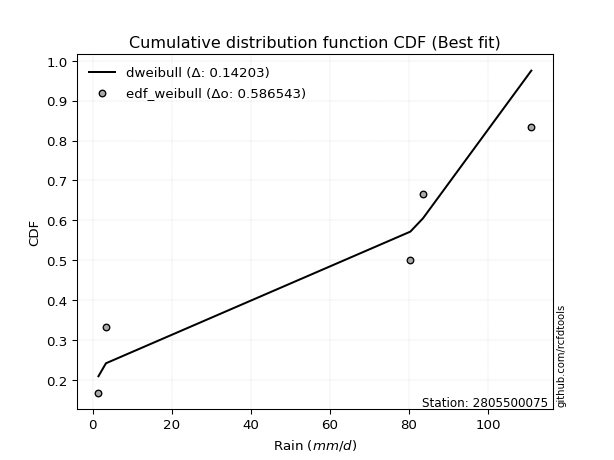</img></img>

</div>


### 4. EDF Beard (1943)

The Beard formula (or Beard´s plotting position formula) in hydrology is used to estimate the empirical non-exceedance probability _(P)_ of a flood event (or other extreme hydrological data point) within a given dataset.

<div align="center">


$P=(m-0.31)/(n+0.38)$


</div>


**4.1. Empirical values**

<div align="center">

|                | 0                   | 1                  | 2         | 3                  | 4                  |
|:---------------|:--------------------|:-------------------|:----------|:-------------------|:-------------------|
| date           | 2022                | 2024               | 2025      | 2019               | 2020               |
| x              | 1.5                 | 3.4                | 80.4      | 83.6               | 111.0              |
| m              | 1                   | 2                  | 3         | 4                  | 5                  |
| empirical_dist | edf_beard           | edf_beard          | edf_beard | edf_beard          | edf_beard          |
| empirical      | 0.12825278810408922 | 0.3141263940520446 | 0.5       | 0.6858736059479554 | 0.8717472118959109 |
| empirical_tr   | 1.1471215351812367  | 1.4579945799457996 | 2.0       | 3.183431952662722  | 7.797101449275368  |

</div>


**4.2. Kolmogorov-Smirnov fit test (sorted by Δ)**


<div align="center">

|                | 0                   | 1                  | 2                  | 3                   | 4                   | 5                   | 6                   | 7                  | 8                  | 9                   | 10                  | 11                  | 12                 | 13                 | 14                  | 15                  | 16                  | 17                 | 18                  | 19                 | 20                  | 21                  | 22                 | 23                  | 24                  | 25                 | 26                 | 27                 | 28                  | 29                 | 30                  | 31                  | 32                 | 33                  | 34                 | 35                  | 36                  | 37                  | 38                  | 39                  | 40                  | 41                  | 42                 | 43                  | 44                  | 45                  | 46                  | 47                  | 48                  | 49                  | 50                  | 51                  | 52                 | 53                 | 54                 | 55                 | 56                 | 57                 | 58                 | 59                  | 60                 | 61                  | 62                 | 63                  | 64                  | 65                 | 66                 | 67                  | 68                  | 69                  | 70                 | 71                  | 72                 | 73                 | 74                 | 75                 | 76                 | 77                  | 78                  | 79                 | 80                 | 81                  | 82                 | 83                  | 84                 | 85                 | 86                  | 87                  | 88                 | 89                  | 90                 | 91                 | 92                 | 93                  | 94                  | 95                 | 96                 | 97                 | 98                 | 99                  | 100                 | 101                | 102                 | 103                 | 104                | 105                | 106                 | 107                | 108                | 109                | 110                 | 111                 | 112                | 113                | 114                | 115                | 116                | 117                | 118                | 119                 | 120                 | 121                | 122                | 123                | 124                 | 125                 | 126                | 127                | 128                | 129                | 130                | 131                | 132                | 133                | 134                | 135                | 136                 | 137                | 138                | 139                | 140                | 141                | 142                | 143                 | 144                 | 145                 | 146                | 147                | 148                | 149                | 150                | 151                | 152                | 153                | 154                | 155                | 156                | 157                | 158                | 159                |
|:---------------|:--------------------|:-------------------|:-------------------|:--------------------|:--------------------|:--------------------|:--------------------|:-------------------|:-------------------|:--------------------|:--------------------|:--------------------|:-------------------|:-------------------|:--------------------|:--------------------|:--------------------|:-------------------|:--------------------|:-------------------|:--------------------|:--------------------|:-------------------|:--------------------|:--------------------|:-------------------|:-------------------|:-------------------|:--------------------|:-------------------|:--------------------|:--------------------|:-------------------|:--------------------|:-------------------|:--------------------|:--------------------|:--------------------|:--------------------|:--------------------|:--------------------|:--------------------|:-------------------|:--------------------|:--------------------|:--------------------|:--------------------|:--------------------|:--------------------|:--------------------|:--------------------|:--------------------|:-------------------|:-------------------|:-------------------|:-------------------|:-------------------|:-------------------|:-------------------|:--------------------|:-------------------|:--------------------|:-------------------|:--------------------|:--------------------|:-------------------|:-------------------|:--------------------|:--------------------|:--------------------|:-------------------|:--------------------|:-------------------|:-------------------|:-------------------|:-------------------|:-------------------|:--------------------|:--------------------|:-------------------|:-------------------|:--------------------|:-------------------|:--------------------|:-------------------|:-------------------|:--------------------|:--------------------|:-------------------|:--------------------|:-------------------|:-------------------|:-------------------|:--------------------|:--------------------|:-------------------|:-------------------|:-------------------|:-------------------|:--------------------|:--------------------|:-------------------|:--------------------|:--------------------|:-------------------|:-------------------|:--------------------|:-------------------|:-------------------|:-------------------|:--------------------|:--------------------|:-------------------|:-------------------|:-------------------|:-------------------|:-------------------|:-------------------|:-------------------|:--------------------|:--------------------|:-------------------|:-------------------|:-------------------|:--------------------|:--------------------|:-------------------|:-------------------|:-------------------|:-------------------|:-------------------|:-------------------|:-------------------|:-------------------|:-------------------|:-------------------|:--------------------|:-------------------|:-------------------|:-------------------|:-------------------|:-------------------|:-------------------|:--------------------|:--------------------|:--------------------|:-------------------|:-------------------|:-------------------|:-------------------|:-------------------|:-------------------|:-------------------|:-------------------|:-------------------|:-------------------|:-------------------|:-------------------|:-------------------|:-------------------|
| station        | 2805500075          | 2805500075         | 2805500075         | 2805500075          | 2805500075          | 2805500075          | 2805500075          | 2805500075         | 2805500075         | 2805500075          | 2805500075          | 2805500075          | 2805500075         | 2805500075         | 2805500075          | 2805500075          | 2805500075          | 2805500075         | 2805500075          | 2805500075         | 2805500075          | 2805500075          | 2805500075         | 2805500075          | 2805500075          | 2805500075         | 2805500075         | 2805500075         | 2805500075          | 2805500075         | 2805500075          | 2805500075          | 2805500075         | 2805500075          | 2805500075         | 2805500075          | 2805500075          | 2805500075          | 2805500075          | 2805500075          | 2805500075          | 2805500075          | 2805500075         | 2805500075          | 2805500075          | 2805500075          | 2805500075          | 2805500075          | 2805500075          | 2805500075          | 2805500075          | 2805500075          | 2805500075         | 2805500075         | 2805500075         | 2805500075         | 2805500075         | 2805500075         | 2805500075         | 2805500075          | 2805500075         | 2805500075          | 2805500075         | 2805500075          | 2805500075          | 2805500075         | 2805500075         | 2805500075          | 2805500075          | 2805500075          | 2805500075         | 2805500075          | 2805500075         | 2805500075         | 2805500075         | 2805500075         | 2805500075         | 2805500075          | 2805500075          | 2805500075         | 2805500075         | 2805500075          | 2805500075         | 2805500075          | 2805500075         | 2805500075         | 2805500075          | 2805500075          | 2805500075         | 2805500075          | 2805500075         | 2805500075         | 2805500075         | 2805500075          | 2805500075          | 2805500075         | 2805500075         | 2805500075         | 2805500075         | 2805500075          | 2805500075          | 2805500075         | 2805500075          | 2805500075          | 2805500075         | 2805500075         | 2805500075          | 2805500075         | 2805500075         | 2805500075         | 2805500075          | 2805500075          | 2805500075         | 2805500075         | 2805500075         | 2805500075         | 2805500075         | 2805500075         | 2805500075         | 2805500075          | 2805500075          | 2805500075         | 2805500075         | 2805500075         | 2805500075          | 2805500075          | 2805500075         | 2805500075         | 2805500075         | 2805500075         | 2805500075         | 2805500075         | 2805500075         | 2805500075         | 2805500075         | 2805500075         | 2805500075          | 2805500075         | 2805500075         | 2805500075         | 2805500075         | 2805500075         | 2805500075         | 2805500075          | 2805500075          | 2805500075          | 2805500075         | 2805500075         | 2805500075         | 2805500075         | 2805500075         | 2805500075         | 2805500075         | 2805500075         | 2805500075         | 2805500075         | 2805500075         | 2805500075         | 2805500075         | 2805500075         |
| empirical_dist | edf_beard           | edf_beard          | edf_beard          | edf_beard           | edf_beard           | edf_beard           | edf_beard           | edf_beard          | edf_beard          | edf_beard           | edf_beard           | edf_beard           | edf_beard          | edf_beard          | edf_beard           | edf_beard           | edf_beard           | edf_beard          | edf_beard           | edf_beard          | edf_beard           | edf_beard           | edf_beard          | edf_beard           | edf_beard           | edf_beard          | edf_beard          | edf_beard          | edf_beard           | edf_beard          | edf_beard           | edf_beard           | edf_beard          | edf_beard           | edf_beard          | edf_beard           | edf_beard           | edf_beard           | edf_beard           | edf_beard           | edf_beard           | edf_beard           | edf_beard          | edf_beard           | edf_beard           | edf_beard           | edf_beard           | edf_beard           | edf_beard           | edf_beard           | edf_beard           | edf_beard           | edf_beard          | edf_beard          | edf_beard          | edf_beard          | edf_beard          | edf_beard          | edf_beard          | edf_beard           | edf_beard          | edf_beard           | edf_beard          | edf_beard           | edf_beard           | edf_beard          | edf_beard          | edf_beard           | edf_beard           | edf_beard           | edf_beard          | edf_beard           | edf_beard          | edf_beard          | edf_beard          | edf_beard          | edf_beard          | edf_beard           | edf_beard           | edf_beard          | edf_beard          | edf_beard           | edf_beard          | edf_beard           | edf_beard          | edf_beard          | edf_beard           | edf_beard           | edf_beard          | edf_beard           | edf_beard          | edf_beard          | edf_beard          | edf_beard           | edf_beard           | edf_beard          | edf_beard          | edf_beard          | edf_beard          | edf_beard           | edf_beard           | edf_beard          | edf_beard           | edf_beard           | edf_beard          | edf_beard          | edf_beard           | edf_beard          | edf_beard          | edf_beard          | edf_beard           | edf_beard           | edf_beard          | edf_beard          | edf_beard          | edf_beard          | edf_beard          | edf_beard          | edf_beard          | edf_beard           | edf_beard           | edf_beard          | edf_beard          | edf_beard          | edf_beard           | edf_beard           | edf_beard          | edf_beard          | edf_beard          | edf_beard          | edf_beard          | edf_beard          | edf_beard          | edf_beard          | edf_beard          | edf_beard          | edf_beard           | edf_beard          | edf_beard          | edf_beard          | edf_beard          | edf_beard          | edf_beard          | edf_beard           | edf_beard           | edf_beard           | edf_beard          | edf_beard          | edf_beard          | edf_beard          | edf_beard          | edf_beard          | edf_beard          | edf_beard          | edf_beard          | edf_beard          | edf_beard          | edf_beard          | edf_beard          | edf_beard          |
| p_dist         | dweibull            | arcsine            | dgamma             | genextreme          | loglevy_l           | logwrapcauchy       | logdgamma           | ksone              | trapezoid          | wrapcauchy          | semicircular        | johnsonsu           | levy_l             | logarcsine         | anglit              | logdweibull         | skewnorm            | weibull_min        | gumbel_l            | pearson3           | loggenpareto        | exponnorm           | crystalball        | norm                | foldnorm            | triang             | erlang             | gamma              | loglomax            | logksone           | logalpha            | genhalflogistic     | logweibull_max     | rice                | argus              | cosine              | maxwell             | rayleigh            | logbeta             | logistic            | logsemicircular     | logtrapezoid        | rdist              | halfnorm            | loganglit           | hypsecant           | kstwobign           | beta                | gennorm             | nakagami            | gumbel_r            | loggennorm          | logpearson3        | logncf             | burr               | logweibull_min     | loggumbel_l        | logexponpow        | exponpow           | laplace             | logbetaprime       | lognct              | logt               | lognorm             | logexponnorm        | loggamma           | loggamma           | logfatiguelife      | moyal               | logerlang           | loginvweibull      | logrice             | logmaxwell         | loggenexpon        | loginvgauss        | lomax              | ncf                | logfoldnorm         | lograyleigh         | logf               | loggompertz        | genexpon            | fatiguelife        | loginvgamma         | burr12             | kappa4             | exponweib           | logkstwobign        | logtruncnorm       | loghalfnorm         | bradford           | genpareto          | tukeylambda        | loglogistic         | gompertz            | truncweibull_min   | uniform            | logcosine          | vonmises_line      | loggenextreme       | logburr             | f                  | halflogistic        | loggumbel_r         | gausshyper         | loghypsecant       | loghalflogistic     | halfgennorm        | logargus           | truncexpon         | logmoyal            | wald                | logmielke          | loglaplace         | loglaplace         | logloggamma        | logloglaplace      | logburr12          | loggausshyper      | betaprime           | lognakagami         | truncpareto        | logwald            | logjohnsonsb       | loggenhalflogistic  | invgauss            | kappa3             | gengamma           | t                  | logskewnorm        | logkappa4          | logtriang          | logexponweib       | logtukeylambda     | logkappa3          | loguniform         | logvonmises_line    | invweibull         | logbradford        | logtruncexpon      | loggengamma        | powerlaw           | alpha              | logtruncweibull_min | johnsonsb           | mielke              | truncnorm          | logrdist           | logtruncpareto     | logpowerlaw        | weibull_max        | logjohnsonsu       | nct                | invgamma           | loghalfgennorm     | genlogistic        | loggenlogistic     | logvonmises        | vonmises           | logcrystalball     |
| delta          | 0.10361598135878092 | 0.1253967208826221 | 0.1276430669900531 | 0.12825278810356822 | 0.13056249103278594 | 0.15172596384550752 | 0.15335259185068262 | 0.1566998187084292 | 0.1614242486485531 | 0.16872379421485995 | 0.17064082664367675 | 0.17088077584982814 | 0.1736463268011198 | 0.1755357713777166 | 0.18132557380432623 | 0.18279803516424598 | 0.18404028544256126 | 0.1899808531116769 | 0.19626948134805686 | 0.1970580185510722 | 0.20232321527814376 | 0.20637429671374408 | 0.2063745265352679 | 0.20637453916278892 | 0.21014047952086046 | 0.2109832924462295 | 0.2112576089576388 | 0.2116303571738224 | 0.21344101776005653 | 0.2138948829244488 | 0.21420029604944246 | 0.21473708091922117 | 0.2167644033872199 | 0.21840263762543022 | 0.2201317385101063 | 0.22141380064519411 | 0.22151179131818743 | 0.22592148464552553 | 0.22774156930757206 | 0.22801485424206736 | 0.23034068777016148 | 0.23126296205848995 | 0.2365710753136001 | 0.23976786440660683 | 0.24258860632170764 | 0.24347297177736182 | 0.24627675087159817 | 0.24891632800198227 | 0.24926149239345327 | 0.25153176189068893 | 0.25587873054546917 | 0.26115103759120506 | 0.2611637307938931 | 0.2615410481285041 | 0.2641407668457997 | 0.265524384578972  | 0.2659501661693666 | 0.2661287725724861 | 0.2678985751290588 | 0.26795324044181645 | 0.2695608183891566 | 0.27056899047192673 | 0.2706370264892186 | 0.27063921561020043 | 0.27064431611263917 | 0.271201663757793  | 0.271201663757793  | 0.27180363812013897 | 0.27186793494137407 | 0.27297726702944425 | 0.2741648627892621 | 0.27426468829116457 | 0.2774998497264666 | 0.2777401903031309 | 0.2778041422578228 | 0.2784924362069363 | 0.2785607395705827 | 0.27931905434861726 | 0.27944497035034965 | 0.2798540565616485 | 0.280146148014623  | 0.28023159853196733 | 0.280290352345112  | 0.28039270318317067 | 0.2813215772789416 | 0.2834179958982092 | 0.28454955629279854 | 0.28498431693893567 | 0.2855502865035735 | 0.28669907952166895 | 0.2895281466867623 | 0.2925919675101048 | 0.2928340116049228 | 0.29313732087297695 | 0.29367136053041804 | 0.2936767213958862 | 0.2967747958785286 | 0.2999106239293885 | 0.3001538593958645 | 0.30042616301600533 | 0.30060771545464415 | 0.3028766381851733 | 0.30450738522629733 | 0.30487191292643745 | 0.3068726384648359 | 0.3073109314453609 | 0.30980753591937993 | 0.3125455478826956 | 0.3133212620404814 | 0.3142076080181575 | 0.31602486155011633 | 0.31909497057171377 | 0.3204110888087578 | 0.3246574560178005 | 0.3246574560178005 | 0.3260223697025305 | 0.3264180969497392 | 0.3327918030471376 | 0.3336473061804204 | 0.34175567135859075 | 0.34497013205555493 | 0.3493271579325068 | 0.3523357066700117 | 0.3601186317607    | 0.36354552452777866 | 0.36858086716860594 | 0.374304229072811  | 0.3877671386240421 | 0.3878550185898524 | 0.3967027756989412 | 0.4058904911719047 | 0.4082563885612258 | 0.4107116246936737 | 0.4180691844070239 | 0.4250660576281673 | 0.4250671125683846 | 0.42512260212835173 | 0.4371735511086349 | 0.4437685064187147 | 0.4487206239034478 | 0.4604719966472576 | 0.4645557708815533 | 0.4694722122259707 | 0.47274166478072177 | 0.49748862057039156 | 0.49892524967092017 | 0.5                | 0.5                | 0.5004848897246805 | 0.5013667431245101 | 0.541249172644757  | 0.5961121723532253 | 0.645137720778856  | 0.6829105967488482 | 0.6858736059479554 | 0.6858736059479554 | 0.6858736059479554 | 0.8038414112489427 | 17.86135466773703  | nan                |
| deltao         | 0.5865427407550001  | 0.5865427407550001 | 0.5865427407550001 | 0.5865427407550001  | 0.5865427407550001  | 0.5865427407550001  | 0.5865427407550001  | 0.5865427407550001 | 0.5865427407550001 | 0.5865427407550001  | 0.5865427407550001  | 0.5865427407550001  | 0.5865427407550001 | 0.5865427407550001 | 0.5865427407550001  | 0.5865427407550001  | 0.5865427407550001  | 0.5865427407550001 | 0.5865427407550001  | 0.5865427407550001 | 0.5865427407550001  | 0.5865427407550001  | 0.5865427407550001 | 0.5865427407550001  | 0.5865427407550001  | 0.5865427407550001 | 0.5865427407550001 | 0.5865427407550001 | 0.5865427407550001  | 0.5865427407550001 | 0.5865427407550001  | 0.5865427407550001  | 0.5865427407550001 | 0.5865427407550001  | 0.5865427407550001 | 0.5865427407550001  | 0.5865427407550001  | 0.5865427407550001  | 0.5865427407550001  | 0.5865427407550001  | 0.5865427407550001  | 0.5865427407550001  | 0.5865427407550001 | 0.5865427407550001  | 0.5865427407550001  | 0.5865427407550001  | 0.5865427407550001  | 0.5865427407550001  | 0.5865427407550001  | 0.5865427407550001  | 0.5865427407550001  | 0.5865427407550001  | 0.5865427407550001 | 0.5865427407550001 | 0.5865427407550001 | 0.5865427407550001 | 0.5865427407550001 | 0.5865427407550001 | 0.5865427407550001 | 0.5865427407550001  | 0.5865427407550001 | 0.5865427407550001  | 0.5865427407550001 | 0.5865427407550001  | 0.5865427407550001  | 0.5865427407550001 | 0.5865427407550001 | 0.5865427407550001  | 0.5865427407550001  | 0.5865427407550001  | 0.5865427407550001 | 0.5865427407550001  | 0.5865427407550001 | 0.5865427407550001 | 0.5865427407550001 | 0.5865427407550001 | 0.5865427407550001 | 0.5865427407550001  | 0.5865427407550001  | 0.5865427407550001 | 0.5865427407550001 | 0.5865427407550001  | 0.5865427407550001 | 0.5865427407550001  | 0.5865427407550001 | 0.5865427407550001 | 0.5865427407550001  | 0.5865427407550001  | 0.5865427407550001 | 0.5865427407550001  | 0.5865427407550001 | 0.5865427407550001 | 0.5865427407550001 | 0.5865427407550001  | 0.5865427407550001  | 0.5865427407550001 | 0.5865427407550001 | 0.5865427407550001 | 0.5865427407550001 | 0.5865427407550001  | 0.5865427407550001  | 0.5865427407550001 | 0.5865427407550001  | 0.5865427407550001  | 0.5865427407550001 | 0.5865427407550001 | 0.5865427407550001  | 0.5865427407550001 | 0.5865427407550001 | 0.5865427407550001 | 0.5865427407550001  | 0.5865427407550001  | 0.5865427407550001 | 0.5865427407550001 | 0.5865427407550001 | 0.5865427407550001 | 0.5865427407550001 | 0.5865427407550001 | 0.5865427407550001 | 0.5865427407550001  | 0.5865427407550001  | 0.5865427407550001 | 0.5865427407550001 | 0.5865427407550001 | 0.5865427407550001  | 0.5865427407550001  | 0.5865427407550001 | 0.5865427407550001 | 0.5865427407550001 | 0.5865427407550001 | 0.5865427407550001 | 0.5865427407550001 | 0.5865427407550001 | 0.5865427407550001 | 0.5865427407550001 | 0.5865427407550001 | 0.5865427407550001  | 0.5865427407550001 | 0.5865427407550001 | 0.5865427407550001 | 0.5865427407550001 | 0.5865427407550001 | 0.5865427407550001 | 0.5865427407550001  | 0.5865427407550001  | 0.5865427407550001  | 0.5865427407550001 | 0.5865427407550001 | 0.5865427407550001 | 0.5865427407550001 | 0.5865427407550001 | 0.5865427407550001 | 0.5865427407550001 | 0.5865427407550001 | 0.5865427407550001 | 0.5865427407550001 | 0.5865427407550001 | 0.5865427407550001 | 0.5865427407550001 | 0.5865427407550001 |
| eval           | Δo > Δ              | Δo > Δ             | Δo > Δ             | Δo > Δ              | Δo > Δ              | Δo > Δ              | Δo > Δ              | Δo > Δ             | Δo > Δ             | Δo > Δ              | Δo > Δ              | Δo > Δ              | Δo > Δ             | Δo > Δ             | Δo > Δ              | Δo > Δ              | Δo > Δ              | Δo > Δ             | Δo > Δ              | Δo > Δ             | Δo > Δ              | Δo > Δ              | Δo > Δ             | Δo > Δ              | Δo > Δ              | Δo > Δ             | Δo > Δ             | Δo > Δ             | Δo > Δ              | Δo > Δ             | Δo > Δ              | Δo > Δ              | Δo > Δ             | Δo > Δ              | Δo > Δ             | Δo > Δ              | Δo > Δ              | Δo > Δ              | Δo > Δ              | Δo > Δ              | Δo > Δ              | Δo > Δ              | Δo > Δ             | Δo > Δ              | Δo > Δ              | Δo > Δ              | Δo > Δ              | Δo > Δ              | Δo > Δ              | Δo > Δ              | Δo > Δ              | Δo > Δ              | Δo > Δ             | Δo > Δ             | Δo > Δ             | Δo > Δ             | Δo > Δ             | Δo > Δ             | Δo > Δ             | Δo > Δ              | Δo > Δ             | Δo > Δ              | Δo > Δ             | Δo > Δ              | Δo > Δ              | Δo > Δ             | Δo > Δ             | Δo > Δ              | Δo > Δ              | Δo > Δ              | Δo > Δ             | Δo > Δ              | Δo > Δ             | Δo > Δ             | Δo > Δ             | Δo > Δ             | Δo > Δ             | Δo > Δ              | Δo > Δ              | Δo > Δ             | Δo > Δ             | Δo > Δ              | Δo > Δ             | Δo > Δ              | Δo > Δ             | Δo > Δ             | Δo > Δ              | Δo > Δ              | Δo > Δ             | Δo > Δ              | Δo > Δ             | Δo > Δ             | Δo > Δ             | Δo > Δ              | Δo > Δ              | Δo > Δ             | Δo > Δ             | Δo > Δ             | Δo > Δ             | Δo > Δ              | Δo > Δ              | Δo > Δ             | Δo > Δ              | Δo > Δ              | Δo > Δ             | Δo > Δ             | Δo > Δ              | Δo > Δ             | Δo > Δ             | Δo > Δ             | Δo > Δ              | Δo > Δ              | Δo > Δ             | Δo > Δ             | Δo > Δ             | Δo > Δ             | Δo > Δ             | Δo > Δ             | Δo > Δ             | Δo > Δ              | Δo > Δ              | Δo > Δ             | Δo > Δ             | Δo > Δ             | Δo > Δ              | Δo > Δ              | Δo > Δ             | Δo > Δ             | Δo > Δ             | Δo > Δ             | Δo > Δ             | Δo > Δ             | Δo > Δ             | Δo > Δ             | Δo > Δ             | Δo > Δ             | Δo > Δ              | Δo > Δ             | Δo > Δ             | Δo > Δ             | Δo > Δ             | Δo > Δ             | Δo > Δ             | Δo > Δ              | Δo > Δ              | Δo > Δ              | Δo > Δ             | Δo > Δ             | Δo > Δ             | Δo > Δ             | Δo > Δ             | Δo <= Δ            | Δo <= Δ            | Δo <= Δ            | Δo <= Δ            | Δo <= Δ            | Δo <= Δ            | Δo <= Δ            | Δo <= Δ            | Δo <= Δ            |
| fit            | 1                   | 1                  | 1                  | 1                   | 1                   | 1                   | 1                   | 1                  | 1                  | 1                   | 1                   | 1                   | 1                  | 1                  | 1                   | 1                   | 1                   | 1                  | 1                   | 1                  | 1                   | 1                   | 1                  | 1                   | 1                   | 1                  | 1                  | 1                  | 1                   | 1                  | 1                   | 1                   | 1                  | 1                   | 1                  | 1                   | 1                   | 1                   | 1                   | 1                   | 1                   | 1                   | 1                  | 1                   | 1                   | 1                   | 1                   | 1                   | 1                   | 1                   | 1                   | 1                   | 1                  | 1                  | 1                  | 1                  | 1                  | 1                  | 1                  | 1                   | 1                  | 1                   | 1                  | 1                   | 1                   | 1                  | 1                  | 1                   | 1                   | 1                   | 1                  | 1                   | 1                  | 1                  | 1                  | 1                  | 1                  | 1                   | 1                   | 1                  | 1                  | 1                   | 1                  | 1                   | 1                  | 1                  | 1                   | 1                   | 1                  | 1                   | 1                  | 1                  | 1                  | 1                   | 1                   | 1                  | 1                  | 1                  | 1                  | 1                   | 1                   | 1                  | 1                   | 1                   | 1                  | 1                  | 1                   | 1                  | 1                  | 1                  | 1                   | 1                   | 1                  | 1                  | 1                  | 1                  | 1                  | 1                  | 1                  | 1                   | 1                   | 1                  | 1                  | 1                  | 1                   | 1                   | 1                  | 1                  | 1                  | 1                  | 1                  | 1                  | 1                  | 1                  | 1                  | 1                  | 1                   | 1                  | 1                  | 1                  | 1                  | 1                  | 1                  | 1                   | 1                   | 1                   | 1                  | 1                  | 1                  | 1                  | 1                  | 0                  | 0                  | 0                  | 0                  | 0                  | 0                  | 0                  | 0                  | 0                  |
| n              | 5                   | 5                  | 5                  | 5                   | 5                   | 5                   | 5                   | 5                  | 5                  | 5                   | 5                   | 5                   | 5                  | 5                  | 5                   | 5                   | 5                   | 5                  | 5                   | 5                  | 5                   | 5                   | 5                  | 5                   | 5                   | 5                  | 5                  | 5                  | 5                   | 5                  | 5                   | 5                   | 5                  | 5                   | 5                  | 5                   | 5                   | 5                   | 5                   | 5                   | 5                   | 5                   | 5                  | 5                   | 5                   | 5                   | 5                   | 5                   | 5                   | 5                   | 5                   | 5                   | 5                  | 5                  | 5                  | 5                  | 5                  | 5                  | 5                  | 5                   | 5                  | 5                   | 5                  | 5                   | 5                   | 5                  | 5                  | 5                   | 5                   | 5                   | 5                  | 5                   | 5                  | 5                  | 5                  | 5                  | 5                  | 5                   | 5                   | 5                  | 5                  | 5                   | 5                  | 5                   | 5                  | 5                  | 5                   | 5                   | 5                  | 5                   | 5                  | 5                  | 5                  | 5                   | 5                   | 5                  | 5                  | 5                  | 5                  | 5                   | 5                   | 5                  | 5                   | 5                   | 5                  | 5                  | 5                   | 5                  | 5                  | 5                  | 5                   | 5                   | 5                  | 5                  | 5                  | 5                  | 5                  | 5                  | 5                  | 5                   | 5                   | 5                  | 5                  | 5                  | 5                   | 5                   | 5                  | 5                  | 5                  | 5                  | 5                  | 5                  | 5                  | 5                  | 5                  | 5                  | 5                   | 5                  | 5                  | 5                  | 5                  | 5                  | 5                  | 5                   | 5                   | 5                   | 5                  | 5                  | 5                  | 5                  | 5                  | 5                  | 5                  | 5                  | 5                  | 5                  | 5                  | 5                  | 5                  | 5                  |
| best_fit       | 1                   | 0                  | 0                  | 0                   | 0                   | 0                   | 0                   | 0                  | 0                  | 0                   | 0                   | 0                   | 0                  | 0                  | 0                   | 0                   | 0                   | 0                  | 0                   | 0                  | 0                   | 0                   | 0                  | 0                   | 0                   | 0                  | 0                  | 0                  | 0                   | 0                  | 0                   | 0                   | 0                  | 0                   | 0                  | 0                   | 0                   | 0                   | 0                   | 0                   | 0                   | 0                   | 0                  | 0                   | 0                   | 0                   | 0                   | 0                   | 0                   | 0                   | 0                   | 0                   | 0                  | 0                  | 0                  | 0                  | 0                  | 0                  | 0                  | 0                   | 0                  | 0                   | 0                  | 0                   | 0                   | 0                  | 0                  | 0                   | 0                   | 0                   | 0                  | 0                   | 0                  | 0                  | 0                  | 0                  | 0                  | 0                   | 0                   | 0                  | 0                  | 0                   | 0                  | 0                   | 0                  | 0                  | 0                   | 0                   | 0                  | 0                   | 0                  | 0                  | 0                  | 0                   | 0                   | 0                  | 0                  | 0                  | 0                  | 0                   | 0                   | 0                  | 0                   | 0                   | 0                  | 0                  | 0                   | 0                  | 0                  | 0                  | 0                   | 0                   | 0                  | 0                  | 0                  | 0                  | 0                  | 0                  | 0                  | 0                   | 0                   | 0                  | 0                  | 0                  | 0                   | 0                   | 0                  | 0                  | 0                  | 0                  | 0                  | 0                  | 0                  | 0                  | 0                  | 0                  | 0                   | 0                  | 0                  | 0                  | 0                  | 0                  | 0                  | 0                   | 0                   | 0                   | 0                  | 0                  | 0                  | 0                  | 0                  | 0                  | 0                  | 0                  | 0                  | 0                  | 0                  | 0                  | 0                  | 0                  |
| best_fit_sort  | 1                   | 2                  | 3                  | 4                   | 5                   | 6                   | 7                   | 8                  | 9                  | 10                  | 11                  | 12                  | 13                 | 14                 | 15                  | 16                  | 17                  | 18                 | 19                  | 20                 | 21                  | 22                  | 23                 | 24                  | 25                  | 26                 | 27                 | 28                 | 29                  | 30                 | 31                  | 32                  | 33                 | 34                  | 35                 | 36                  | 37                  | 38                  | 39                  | 40                  | 41                  | 42                  | 43                 | 44                  | 45                  | 46                  | 47                  | 48                  | 49                  | 50                  | 51                  | 52                  | 53                 | 54                 | 55                 | 56                 | 57                 | 58                 | 59                 | 60                  | 61                 | 62                  | 63                 | 64                  | 65                  | 66                 | 67                 | 68                  | 69                  | 70                  | 71                 | 72                  | 73                 | 74                 | 75                 | 76                 | 77                 | 78                  | 79                  | 80                 | 81                 | 82                  | 83                 | 84                  | 85                 | 86                 | 87                  | 88                  | 89                 | 90                  | 91                 | 92                 | 93                 | 94                  | 95                  | 96                 | 97                 | 98                 | 99                 | 100                 | 101                 | 102                | 103                 | 104                 | 105                | 106                | 107                 | 108                | 109                | 110                | 111                 | 112                 | 113                | 114                | 115                | 116                | 117                | 118                | 119                | 120                 | 121                 | 122                | 123                | 124                | 125                 | 126                 | 127                | 128                | 129                | 130                | 131                | 132                | 133                | 134                | 135                | 136                | 137                 | 138                | 139                | 140                | 141                | 142                | 143                | 144                 | 145                 | 146                 | 147                | 148                | 149                | 150                | 151                | 152                | 153                | 154                | 155                | 156                | 157                | 158                | 159                | 160                |

</div>


**4.3. Best fit**

<div align="center">

|   id |    station | empirical_dist   | p_dist   |    delta |   deltao | eval   |   fit |   n |   best_fit |   best_fit_sort |
|-----:|-----------:|:-----------------|:---------|---------:|---------:|:-------|------:|----:|-----------:|----------------:|
|    0 | 2805500075 | edf_beard        | dweibull | 0.103616 | 0.586543 | Δo > Δ |     1 |   5 |          1 |               1 |

</div>


<div align="center">

</img></img>

</div>


### 5. EDF Chegodayev (1955)

The Chegodayev formula is an empirical plotting position formula used in hydrological frequency analysis to estimate the exceedance probability or return period of a specific event from a set of observed data. It is primarily used for plotting observed data points on probability paper to fit a theoretical distribution, particularly for analyzing extreme events like maximum flood flows or rainfall intensities. The constant _b_ value in the generalized plotting position formula is 0.3.

<div align="center">


$P=(m-b)/(n+1-2b)$


</div>


**5.1. Empirical values**

<div align="center">

|                | 0                   | 1                   | 2              | 3                  | 4                  |
|:---------------|:--------------------|:--------------------|:---------------|:-------------------|:-------------------|
| date           | 2022                | 2024                | 2025           | 2019               | 2020               |
| x              | 1.5                 | 3.4                 | 80.4           | 83.6               | 111.0              |
| m              | 1                   | 2                   | 3              | 4                  | 5                  |
| empirical_dist | edf_chegodayev      | edf_chegodayev      | edf_chegodayev | edf_chegodayev     | edf_chegodayev     |
| empirical      | 0.12962962962962962 | 0.31481481481481477 | 0.5            | 0.6851851851851851 | 0.8703703703703703 |
| empirical_tr   | 1.148936170212766   | 1.4594594594594594  | 2.0            | 3.1764705882352935 | 7.714285714285713  |

</div>


**5.2. Kolmogorov-Smirnov fit test (sorted by Δ)**


<div align="center">

|                | 0                   | 1                  | 2                  | 3                   | 4                   | 5                   | 6                   | 7                  | 8                  | 9                   | 10                  | 11                  | 12                  | 13                 | 14                  | 15                  | 16                 | 17                  | 18                 | 19                 | 20                 | 21                  | 22                 | 23                  | 24                  | 25                 | 26                 | 27                  | 28                 | 29                 | 30                  | 31                  | 32                  | 33                  | 34                  | 35                  | 36                  | 37                  | 38                  | 39                 | 40                  | 41                  | 42                  | 43                  | 44                  | 45                  | 46                  | 47                  | 48                  | 49                  | 50                  | 51                 | 52                 | 53                  | 54                 | 55                 | 56                 | 57                 | 58                 | 59                  | 60                 | 61                  | 62                 | 63                  | 64                  | 65                 | 66                 | 67                  | 68                  | 69                  | 70                 | 71                  | 72                 | 73                 | 74                 | 75                 | 76                  | 77                  | 78                  | 79                 | 80                 | 81                 | 82                  | 83                 | 84                 | 85                 | 86                  | 87                  | 88                 | 89                  | 90                 | 91                  | 92                  | 93                  | 94                 | 95                 | 96                  | 97                 | 98                  | 99                  | 100                 | 101                | 102                 | 103                | 104                | 105                | 106                 | 107                | 108                | 109                | 110                 | 111                 | 112                | 113                | 114                | 115                | 116                | 117                | 118                | 119                 | 120                 | 121                | 122                | 123                | 124                 | 125                 | 126                | 127                | 128                | 129                | 130                | 131                | 132                | 133                | 134                | 135                | 136                 | 137                 | 138                | 139                | 140                | 141                | 142                | 143                 | 144                 | 145                | 146                 | 147                | 148                | 149                | 150                | 151                | 152                | 153                | 154                | 155                | 156                | 157                | 158                | 159                |
|:---------------|:--------------------|:-------------------|:-------------------|:--------------------|:--------------------|:--------------------|:--------------------|:-------------------|:-------------------|:--------------------|:--------------------|:--------------------|:--------------------|:-------------------|:--------------------|:--------------------|:-------------------|:--------------------|:-------------------|:-------------------|:-------------------|:--------------------|:-------------------|:--------------------|:--------------------|:-------------------|:-------------------|:--------------------|:-------------------|:-------------------|:--------------------|:--------------------|:--------------------|:--------------------|:--------------------|:--------------------|:--------------------|:--------------------|:--------------------|:-------------------|:--------------------|:--------------------|:--------------------|:--------------------|:--------------------|:--------------------|:--------------------|:--------------------|:--------------------|:--------------------|:--------------------|:-------------------|:-------------------|:--------------------|:-------------------|:-------------------|:-------------------|:-------------------|:-------------------|:--------------------|:-------------------|:--------------------|:-------------------|:--------------------|:--------------------|:-------------------|:-------------------|:--------------------|:--------------------|:--------------------|:-------------------|:--------------------|:-------------------|:-------------------|:-------------------|:-------------------|:--------------------|:--------------------|:--------------------|:-------------------|:-------------------|:-------------------|:--------------------|:-------------------|:-------------------|:-------------------|:--------------------|:--------------------|:-------------------|:--------------------|:-------------------|:--------------------|:--------------------|:--------------------|:-------------------|:-------------------|:--------------------|:-------------------|:--------------------|:--------------------|:--------------------|:-------------------|:--------------------|:-------------------|:-------------------|:-------------------|:--------------------|:-------------------|:-------------------|:-------------------|:--------------------|:--------------------|:-------------------|:-------------------|:-------------------|:-------------------|:-------------------|:-------------------|:-------------------|:--------------------|:--------------------|:-------------------|:-------------------|:-------------------|:--------------------|:--------------------|:-------------------|:-------------------|:-------------------|:-------------------|:-------------------|:-------------------|:-------------------|:-------------------|:-------------------|:-------------------|:--------------------|:--------------------|:-------------------|:-------------------|:-------------------|:-------------------|:-------------------|:--------------------|:--------------------|:-------------------|:--------------------|:-------------------|:-------------------|:-------------------|:-------------------|:-------------------|:-------------------|:-------------------|:-------------------|:-------------------|:-------------------|:-------------------|:-------------------|:-------------------|
| station        | 2805500075          | 2805500075         | 2805500075         | 2805500075          | 2805500075          | 2805500075          | 2805500075          | 2805500075         | 2805500075         | 2805500075          | 2805500075          | 2805500075          | 2805500075          | 2805500075         | 2805500075          | 2805500075          | 2805500075         | 2805500075          | 2805500075         | 2805500075         | 2805500075         | 2805500075          | 2805500075         | 2805500075          | 2805500075          | 2805500075         | 2805500075         | 2805500075          | 2805500075         | 2805500075         | 2805500075          | 2805500075          | 2805500075          | 2805500075          | 2805500075          | 2805500075          | 2805500075          | 2805500075          | 2805500075          | 2805500075         | 2805500075          | 2805500075          | 2805500075          | 2805500075          | 2805500075          | 2805500075          | 2805500075          | 2805500075          | 2805500075          | 2805500075          | 2805500075          | 2805500075         | 2805500075         | 2805500075          | 2805500075         | 2805500075         | 2805500075         | 2805500075         | 2805500075         | 2805500075          | 2805500075         | 2805500075          | 2805500075         | 2805500075          | 2805500075          | 2805500075         | 2805500075         | 2805500075          | 2805500075          | 2805500075          | 2805500075         | 2805500075          | 2805500075         | 2805500075         | 2805500075         | 2805500075         | 2805500075          | 2805500075          | 2805500075          | 2805500075         | 2805500075         | 2805500075         | 2805500075          | 2805500075         | 2805500075         | 2805500075         | 2805500075          | 2805500075          | 2805500075         | 2805500075          | 2805500075         | 2805500075          | 2805500075          | 2805500075          | 2805500075         | 2805500075         | 2805500075          | 2805500075         | 2805500075          | 2805500075          | 2805500075          | 2805500075         | 2805500075          | 2805500075         | 2805500075         | 2805500075         | 2805500075          | 2805500075         | 2805500075         | 2805500075         | 2805500075          | 2805500075          | 2805500075         | 2805500075         | 2805500075         | 2805500075         | 2805500075         | 2805500075         | 2805500075         | 2805500075          | 2805500075          | 2805500075         | 2805500075         | 2805500075         | 2805500075          | 2805500075          | 2805500075         | 2805500075         | 2805500075         | 2805500075         | 2805500075         | 2805500075         | 2805500075         | 2805500075         | 2805500075         | 2805500075         | 2805500075          | 2805500075          | 2805500075         | 2805500075         | 2805500075         | 2805500075         | 2805500075         | 2805500075          | 2805500075          | 2805500075         | 2805500075          | 2805500075         | 2805500075         | 2805500075         | 2805500075         | 2805500075         | 2805500075         | 2805500075         | 2805500075         | 2805500075         | 2805500075         | 2805500075         | 2805500075         | 2805500075         |
| empirical_dist | edf_chegodayev      | edf_chegodayev     | edf_chegodayev     | edf_chegodayev      | edf_chegodayev      | edf_chegodayev      | edf_chegodayev      | edf_chegodayev     | edf_chegodayev     | edf_chegodayev      | edf_chegodayev      | edf_chegodayev      | edf_chegodayev      | edf_chegodayev     | edf_chegodayev      | edf_chegodayev      | edf_chegodayev     | edf_chegodayev      | edf_chegodayev     | edf_chegodayev     | edf_chegodayev     | edf_chegodayev      | edf_chegodayev     | edf_chegodayev      | edf_chegodayev      | edf_chegodayev     | edf_chegodayev     | edf_chegodayev      | edf_chegodayev     | edf_chegodayev     | edf_chegodayev      | edf_chegodayev      | edf_chegodayev      | edf_chegodayev      | edf_chegodayev      | edf_chegodayev      | edf_chegodayev      | edf_chegodayev      | edf_chegodayev      | edf_chegodayev     | edf_chegodayev      | edf_chegodayev      | edf_chegodayev      | edf_chegodayev      | edf_chegodayev      | edf_chegodayev      | edf_chegodayev      | edf_chegodayev      | edf_chegodayev      | edf_chegodayev      | edf_chegodayev      | edf_chegodayev     | edf_chegodayev     | edf_chegodayev      | edf_chegodayev     | edf_chegodayev     | edf_chegodayev     | edf_chegodayev     | edf_chegodayev     | edf_chegodayev      | edf_chegodayev     | edf_chegodayev      | edf_chegodayev     | edf_chegodayev      | edf_chegodayev      | edf_chegodayev     | edf_chegodayev     | edf_chegodayev      | edf_chegodayev      | edf_chegodayev      | edf_chegodayev     | edf_chegodayev      | edf_chegodayev     | edf_chegodayev     | edf_chegodayev     | edf_chegodayev     | edf_chegodayev      | edf_chegodayev      | edf_chegodayev      | edf_chegodayev     | edf_chegodayev     | edf_chegodayev     | edf_chegodayev      | edf_chegodayev     | edf_chegodayev     | edf_chegodayev     | edf_chegodayev      | edf_chegodayev      | edf_chegodayev     | edf_chegodayev      | edf_chegodayev     | edf_chegodayev      | edf_chegodayev      | edf_chegodayev      | edf_chegodayev     | edf_chegodayev     | edf_chegodayev      | edf_chegodayev     | edf_chegodayev      | edf_chegodayev      | edf_chegodayev      | edf_chegodayev     | edf_chegodayev      | edf_chegodayev     | edf_chegodayev     | edf_chegodayev     | edf_chegodayev      | edf_chegodayev     | edf_chegodayev     | edf_chegodayev     | edf_chegodayev      | edf_chegodayev      | edf_chegodayev     | edf_chegodayev     | edf_chegodayev     | edf_chegodayev     | edf_chegodayev     | edf_chegodayev     | edf_chegodayev     | edf_chegodayev      | edf_chegodayev      | edf_chegodayev     | edf_chegodayev     | edf_chegodayev     | edf_chegodayev      | edf_chegodayev      | edf_chegodayev     | edf_chegodayev     | edf_chegodayev     | edf_chegodayev     | edf_chegodayev     | edf_chegodayev     | edf_chegodayev     | edf_chegodayev     | edf_chegodayev     | edf_chegodayev     | edf_chegodayev      | edf_chegodayev      | edf_chegodayev     | edf_chegodayev     | edf_chegodayev     | edf_chegodayev     | edf_chegodayev     | edf_chegodayev      | edf_chegodayev      | edf_chegodayev     | edf_chegodayev      | edf_chegodayev     | edf_chegodayev     | edf_chegodayev     | edf_chegodayev     | edf_chegodayev     | edf_chegodayev     | edf_chegodayev     | edf_chegodayev     | edf_chegodayev     | edf_chegodayev     | edf_chegodayev     | edf_chegodayev     | edf_chegodayev     |
| p_dist         | dweibull            | arcsine            | dgamma             | genextreme          | loglevy_l           | logwrapcauchy       | logdgamma           | ksone              | trapezoid          | wrapcauchy          | semicircular        | johnsonsu           | levy_l              | logarcsine         | anglit              | logdweibull         | skewnorm           | weibull_min         | gumbel_l           | pearson3           | loggenpareto       | exponnorm           | crystalball        | norm                | foldnorm            | erlang             | gamma              | triang              | loglomax           | logksone           | genhalflogistic     | logalpha            | logweibull_max      | rice                | argus               | cosine              | maxwell             | rayleigh            | logistic            | logbeta            | logsemicircular     | logtrapezoid        | rdist               | halfnorm            | loganglit           | hypsecant           | kstwobign           | beta                | gennorm             | nakagami            | gumbel_r            | logpearson3        | logncf             | loggennorm          | burr               | logweibull_min     | loggumbel_l        | logexponpow        | exponpow           | laplace             | logbetaprime       | lognct              | logt               | lognorm             | logexponnorm        | loggamma           | loggamma           | logfatiguelife      | moyal               | logerlang           | loginvweibull      | logrice             | logmaxwell         | loggenexpon        | loginvgauss        | ncf                | lomax               | logfoldnorm         | lograyleigh         | logf               | loggompertz        | fatiguelife        | loginvgamma         | genexpon           | burr12             | exponweib          | kappa4              | logkstwobign        | logtruncnorm       | loghalfnorm         | bradford           | loglogistic         | genpareto           | tukeylambda         | truncweibull_min   | gompertz           | uniform             | logcosine          | loggenextreme       | logburr             | vonmises_line       | f                  | loggumbel_r         | halflogistic       | gausshyper         | loghypsecant       | loghalflogistic     | halfgennorm        | logargus           | truncexpon         | logmoyal            | wald                | logmielke          | loglaplace         | loglaplace         | logloglaplace      | logloggamma        | logburr12          | loggausshyper      | betaprime           | lognakagami         | truncpareto        | logwald            | logjohnsonsb       | loggenhalflogistic  | invgauss            | kappa3             | gengamma           | t                  | logskewnorm        | logkappa4          | logtriang          | logexponweib       | logtukeylambda     | logkappa3          | loguniform         | logvonmises_line    | invweibull          | logbradford        | logtruncexpon      | loggengamma        | powerlaw           | alpha              | logtruncweibull_min | johnsonsb           | mielke             | logtruncpareto      | truncnorm          | logrdist           | logpowerlaw        | weibull_max        | logjohnsonsu       | nct                | invgamma           | loghalfgennorm     | genlogistic        | loggenlogistic     | logvonmises        | vonmises           | logcrystalball     |
| delta          | 0.10499282288432144 | 0.1253967208826221 | 0.1262662254645127 | 0.12962962962910873 | 0.12987407027001563 | 0.15172596384550752 | 0.15335259185068262 | 0.1566998187084292 | 0.1614242486485531 | 0.16803537345208963 | 0.17064082664367675 | 0.17156919661259828 | 0.17295790603834948 | 0.1755357713777166 | 0.18132557380432623 | 0.18279803516424598 | 0.1847287062053314 | 0.19066927387444704 | 0.196957902110827  | 0.1970580185510722 | 0.2030116360409139 | 0.20637429671374408 | 0.2063745265352679 | 0.20637453916278892 | 0.21014047952086046 | 0.2112576089576388 | 0.2116303571738224 | 0.21167171320899963 | 0.212064176234516  | 0.2138948829244488 | 0.21404866015645085 | 0.21420029604944246 | 0.21538756186167948 | 0.21840263762543022 | 0.22082015927287646 | 0.22141380064519411 | 0.22151179131818743 | 0.22592148464552553 | 0.22801485424206736 | 0.2284299900703422 | 0.23034068777016148 | 0.23126296205848995 | 0.23725949607637026 | 0.24045628516937698 | 0.24258860632170764 | 0.24347297177736182 | 0.24627675087159817 | 0.24960474876475242 | 0.24994991315622342 | 0.25153176189068893 | 0.25587873054546917 | 0.2611637307938931 | 0.2615410481285041 | 0.26183945835397526 | 0.2641407668457997 | 0.265524384578972  | 0.2659501661693666 | 0.2661287725724861 | 0.2678985751290588 | 0.26795324044181645 | 0.2695608183891566 | 0.27056899047192673 | 0.2706370264892186 | 0.27063921561020043 | 0.27064431611263917 | 0.271201663757793  | 0.271201663757793  | 0.27180363812013897 | 0.27186793494137407 | 0.27297726702944425 | 0.2741648627892621 | 0.27426468829116457 | 0.2774998497264666 | 0.2777401903031309 | 0.2778041422578228 | 0.2785607395705827 | 0.27918085696970646 | 0.27931905434861726 | 0.27944497035034965 | 0.2798540565616485 | 0.280146148014623  | 0.280290352345112  | 0.28039270318317067 | 0.2809200192947375 | 0.2813215772789416 | 0.283172714767258  | 0.28410641666097936 | 0.28498431693893567 | 0.2855502865035735 | 0.28669907952166895 | 0.2895281466867623 | 0.29313732087297695 | 0.29328038827287495 | 0.29352243236769293 | 0.2936767213958862 | 0.2943597812931882 | 0.29746321664129877 | 0.2999106239293885 | 0.30042616301600533 | 0.30060771545464415 | 0.30084228015863457 | 0.3028766381851733 | 0.30487191292643745 | 0.3051958059890675 | 0.3061842177020656 | 0.3073109314453609 | 0.30980753591937993 | 0.3125455478826956 | 0.3133212620404814 | 0.3142076080181575 | 0.31602486155011633 | 0.31909497057171377 | 0.3204110888087578 | 0.3246574560178005 | 0.3246574560178005 | 0.3250412554241987 | 0.3260223697025305 | 0.3327918030471376 | 0.3336473061804204 | 0.34175567135859075 | 0.34497013205555493 | 0.3493271579325068 | 0.3523357066700117 | 0.3594302109979297 | 0.36354552452777866 | 0.36858086716860594 | 0.374304229072811  | 0.3877671386240421 | 0.3878550185898524 | 0.3967027756989412 | 0.4058904911719047 | 0.4082563885612258 | 0.4107116246936737 | 0.4180691844070239 | 0.4250660576281673 | 0.4250671125683846 | 0.42512260212835173 | 0.43579670958309435 | 0.4437685064187147 | 0.4487206239034478 | 0.4604719966472576 | 0.4645557708815533 | 0.4694722122259707 | 0.47274166478072177 | 0.49680019980762125 | 0.49823682890815   | 0.49979646896191043 | 0.5                | 0.5                | 0.5006783223617399 | 0.5405607518819868 | 0.595423751590455  | 0.6444493000160859 | 0.682222175986078  | 0.6851851851851851 | 0.6851851851851851 | 0.6851851851851851 | 0.8038414112489427 | 17.86273150926257  | nan                |
| deltao         | 0.5865427407550001  | 0.5865427407550001 | 0.5865427407550001 | 0.5865427407550001  | 0.5865427407550001  | 0.5865427407550001  | 0.5865427407550001  | 0.5865427407550001 | 0.5865427407550001 | 0.5865427407550001  | 0.5865427407550001  | 0.5865427407550001  | 0.5865427407550001  | 0.5865427407550001 | 0.5865427407550001  | 0.5865427407550001  | 0.5865427407550001 | 0.5865427407550001  | 0.5865427407550001 | 0.5865427407550001 | 0.5865427407550001 | 0.5865427407550001  | 0.5865427407550001 | 0.5865427407550001  | 0.5865427407550001  | 0.5865427407550001 | 0.5865427407550001 | 0.5865427407550001  | 0.5865427407550001 | 0.5865427407550001 | 0.5865427407550001  | 0.5865427407550001  | 0.5865427407550001  | 0.5865427407550001  | 0.5865427407550001  | 0.5865427407550001  | 0.5865427407550001  | 0.5865427407550001  | 0.5865427407550001  | 0.5865427407550001 | 0.5865427407550001  | 0.5865427407550001  | 0.5865427407550001  | 0.5865427407550001  | 0.5865427407550001  | 0.5865427407550001  | 0.5865427407550001  | 0.5865427407550001  | 0.5865427407550001  | 0.5865427407550001  | 0.5865427407550001  | 0.5865427407550001 | 0.5865427407550001 | 0.5865427407550001  | 0.5865427407550001 | 0.5865427407550001 | 0.5865427407550001 | 0.5865427407550001 | 0.5865427407550001 | 0.5865427407550001  | 0.5865427407550001 | 0.5865427407550001  | 0.5865427407550001 | 0.5865427407550001  | 0.5865427407550001  | 0.5865427407550001 | 0.5865427407550001 | 0.5865427407550001  | 0.5865427407550001  | 0.5865427407550001  | 0.5865427407550001 | 0.5865427407550001  | 0.5865427407550001 | 0.5865427407550001 | 0.5865427407550001 | 0.5865427407550001 | 0.5865427407550001  | 0.5865427407550001  | 0.5865427407550001  | 0.5865427407550001 | 0.5865427407550001 | 0.5865427407550001 | 0.5865427407550001  | 0.5865427407550001 | 0.5865427407550001 | 0.5865427407550001 | 0.5865427407550001  | 0.5865427407550001  | 0.5865427407550001 | 0.5865427407550001  | 0.5865427407550001 | 0.5865427407550001  | 0.5865427407550001  | 0.5865427407550001  | 0.5865427407550001 | 0.5865427407550001 | 0.5865427407550001  | 0.5865427407550001 | 0.5865427407550001  | 0.5865427407550001  | 0.5865427407550001  | 0.5865427407550001 | 0.5865427407550001  | 0.5865427407550001 | 0.5865427407550001 | 0.5865427407550001 | 0.5865427407550001  | 0.5865427407550001 | 0.5865427407550001 | 0.5865427407550001 | 0.5865427407550001  | 0.5865427407550001  | 0.5865427407550001 | 0.5865427407550001 | 0.5865427407550001 | 0.5865427407550001 | 0.5865427407550001 | 0.5865427407550001 | 0.5865427407550001 | 0.5865427407550001  | 0.5865427407550001  | 0.5865427407550001 | 0.5865427407550001 | 0.5865427407550001 | 0.5865427407550001  | 0.5865427407550001  | 0.5865427407550001 | 0.5865427407550001 | 0.5865427407550001 | 0.5865427407550001 | 0.5865427407550001 | 0.5865427407550001 | 0.5865427407550001 | 0.5865427407550001 | 0.5865427407550001 | 0.5865427407550001 | 0.5865427407550001  | 0.5865427407550001  | 0.5865427407550001 | 0.5865427407550001 | 0.5865427407550001 | 0.5865427407550001 | 0.5865427407550001 | 0.5865427407550001  | 0.5865427407550001  | 0.5865427407550001 | 0.5865427407550001  | 0.5865427407550001 | 0.5865427407550001 | 0.5865427407550001 | 0.5865427407550001 | 0.5865427407550001 | 0.5865427407550001 | 0.5865427407550001 | 0.5865427407550001 | 0.5865427407550001 | 0.5865427407550001 | 0.5865427407550001 | 0.5865427407550001 | 0.5865427407550001 |
| eval           | Δo > Δ              | Δo > Δ             | Δo > Δ             | Δo > Δ              | Δo > Δ              | Δo > Δ              | Δo > Δ              | Δo > Δ             | Δo > Δ             | Δo > Δ              | Δo > Δ              | Δo > Δ              | Δo > Δ              | Δo > Δ             | Δo > Δ              | Δo > Δ              | Δo > Δ             | Δo > Δ              | Δo > Δ             | Δo > Δ             | Δo > Δ             | Δo > Δ              | Δo > Δ             | Δo > Δ              | Δo > Δ              | Δo > Δ             | Δo > Δ             | Δo > Δ              | Δo > Δ             | Δo > Δ             | Δo > Δ              | Δo > Δ              | Δo > Δ              | Δo > Δ              | Δo > Δ              | Δo > Δ              | Δo > Δ              | Δo > Δ              | Δo > Δ              | Δo > Δ             | Δo > Δ              | Δo > Δ              | Δo > Δ              | Δo > Δ              | Δo > Δ              | Δo > Δ              | Δo > Δ              | Δo > Δ              | Δo > Δ              | Δo > Δ              | Δo > Δ              | Δo > Δ             | Δo > Δ             | Δo > Δ              | Δo > Δ             | Δo > Δ             | Δo > Δ             | Δo > Δ             | Δo > Δ             | Δo > Δ              | Δo > Δ             | Δo > Δ              | Δo > Δ             | Δo > Δ              | Δo > Δ              | Δo > Δ             | Δo > Δ             | Δo > Δ              | Δo > Δ              | Δo > Δ              | Δo > Δ             | Δo > Δ              | Δo > Δ             | Δo > Δ             | Δo > Δ             | Δo > Δ             | Δo > Δ              | Δo > Δ              | Δo > Δ              | Δo > Δ             | Δo > Δ             | Δo > Δ             | Δo > Δ              | Δo > Δ             | Δo > Δ             | Δo > Δ             | Δo > Δ              | Δo > Δ              | Δo > Δ             | Δo > Δ              | Δo > Δ             | Δo > Δ              | Δo > Δ              | Δo > Δ              | Δo > Δ             | Δo > Δ             | Δo > Δ              | Δo > Δ             | Δo > Δ              | Δo > Δ              | Δo > Δ              | Δo > Δ             | Δo > Δ              | Δo > Δ             | Δo > Δ             | Δo > Δ             | Δo > Δ              | Δo > Δ             | Δo > Δ             | Δo > Δ             | Δo > Δ              | Δo > Δ              | Δo > Δ             | Δo > Δ             | Δo > Δ             | Δo > Δ             | Δo > Δ             | Δo > Δ             | Δo > Δ             | Δo > Δ              | Δo > Δ              | Δo > Δ             | Δo > Δ             | Δo > Δ             | Δo > Δ              | Δo > Δ              | Δo > Δ             | Δo > Δ             | Δo > Δ             | Δo > Δ             | Δo > Δ             | Δo > Δ             | Δo > Δ             | Δo > Δ             | Δo > Δ             | Δo > Δ             | Δo > Δ              | Δo > Δ              | Δo > Δ             | Δo > Δ             | Δo > Δ             | Δo > Δ             | Δo > Δ             | Δo > Δ              | Δo > Δ              | Δo > Δ             | Δo > Δ              | Δo > Δ             | Δo > Δ             | Δo > Δ             | Δo > Δ             | Δo <= Δ            | Δo <= Δ            | Δo <= Δ            | Δo <= Δ            | Δo <= Δ            | Δo <= Δ            | Δo <= Δ            | Δo <= Δ            | Δo <= Δ            |
| fit            | 1                   | 1                  | 1                  | 1                   | 1                   | 1                   | 1                   | 1                  | 1                  | 1                   | 1                   | 1                   | 1                   | 1                  | 1                   | 1                   | 1                  | 1                   | 1                  | 1                  | 1                  | 1                   | 1                  | 1                   | 1                   | 1                  | 1                  | 1                   | 1                  | 1                  | 1                   | 1                   | 1                   | 1                   | 1                   | 1                   | 1                   | 1                   | 1                   | 1                  | 1                   | 1                   | 1                   | 1                   | 1                   | 1                   | 1                   | 1                   | 1                   | 1                   | 1                   | 1                  | 1                  | 1                   | 1                  | 1                  | 1                  | 1                  | 1                  | 1                   | 1                  | 1                   | 1                  | 1                   | 1                   | 1                  | 1                  | 1                   | 1                   | 1                   | 1                  | 1                   | 1                  | 1                  | 1                  | 1                  | 1                   | 1                   | 1                   | 1                  | 1                  | 1                  | 1                   | 1                  | 1                  | 1                  | 1                   | 1                   | 1                  | 1                   | 1                  | 1                   | 1                   | 1                   | 1                  | 1                  | 1                   | 1                  | 1                   | 1                   | 1                   | 1                  | 1                   | 1                  | 1                  | 1                  | 1                   | 1                  | 1                  | 1                  | 1                   | 1                   | 1                  | 1                  | 1                  | 1                  | 1                  | 1                  | 1                  | 1                   | 1                   | 1                  | 1                  | 1                  | 1                   | 1                   | 1                  | 1                  | 1                  | 1                  | 1                  | 1                  | 1                  | 1                  | 1                  | 1                  | 1                   | 1                   | 1                  | 1                  | 1                  | 1                  | 1                  | 1                   | 1                   | 1                  | 1                   | 1                  | 1                  | 1                  | 1                  | 0                  | 0                  | 0                  | 0                  | 0                  | 0                  | 0                  | 0                  | 0                  |
| n              | 5                   | 5                  | 5                  | 5                   | 5                   | 5                   | 5                   | 5                  | 5                  | 5                   | 5                   | 5                   | 5                   | 5                  | 5                   | 5                   | 5                  | 5                   | 5                  | 5                  | 5                  | 5                   | 5                  | 5                   | 5                   | 5                  | 5                  | 5                   | 5                  | 5                  | 5                   | 5                   | 5                   | 5                   | 5                   | 5                   | 5                   | 5                   | 5                   | 5                  | 5                   | 5                   | 5                   | 5                   | 5                   | 5                   | 5                   | 5                   | 5                   | 5                   | 5                   | 5                  | 5                  | 5                   | 5                  | 5                  | 5                  | 5                  | 5                  | 5                   | 5                  | 5                   | 5                  | 5                   | 5                   | 5                  | 5                  | 5                   | 5                   | 5                   | 5                  | 5                   | 5                  | 5                  | 5                  | 5                  | 5                   | 5                   | 5                   | 5                  | 5                  | 5                  | 5                   | 5                  | 5                  | 5                  | 5                   | 5                   | 5                  | 5                   | 5                  | 5                   | 5                   | 5                   | 5                  | 5                  | 5                   | 5                  | 5                   | 5                   | 5                   | 5                  | 5                   | 5                  | 5                  | 5                  | 5                   | 5                  | 5                  | 5                  | 5                   | 5                   | 5                  | 5                  | 5                  | 5                  | 5                  | 5                  | 5                  | 5                   | 5                   | 5                  | 5                  | 5                  | 5                   | 5                   | 5                  | 5                  | 5                  | 5                  | 5                  | 5                  | 5                  | 5                  | 5                  | 5                  | 5                   | 5                   | 5                  | 5                  | 5                  | 5                  | 5                  | 5                   | 5                   | 5                  | 5                   | 5                  | 5                  | 5                  | 5                  | 5                  | 5                  | 5                  | 5                  | 5                  | 5                  | 5                  | 5                  | 5                  |
| best_fit       | 1                   | 0                  | 0                  | 0                   | 0                   | 0                   | 0                   | 0                  | 0                  | 0                   | 0                   | 0                   | 0                   | 0                  | 0                   | 0                   | 0                  | 0                   | 0                  | 0                  | 0                  | 0                   | 0                  | 0                   | 0                   | 0                  | 0                  | 0                   | 0                  | 0                  | 0                   | 0                   | 0                   | 0                   | 0                   | 0                   | 0                   | 0                   | 0                   | 0                  | 0                   | 0                   | 0                   | 0                   | 0                   | 0                   | 0                   | 0                   | 0                   | 0                   | 0                   | 0                  | 0                  | 0                   | 0                  | 0                  | 0                  | 0                  | 0                  | 0                   | 0                  | 0                   | 0                  | 0                   | 0                   | 0                  | 0                  | 0                   | 0                   | 0                   | 0                  | 0                   | 0                  | 0                  | 0                  | 0                  | 0                   | 0                   | 0                   | 0                  | 0                  | 0                  | 0                   | 0                  | 0                  | 0                  | 0                   | 0                   | 0                  | 0                   | 0                  | 0                   | 0                   | 0                   | 0                  | 0                  | 0                   | 0                  | 0                   | 0                   | 0                   | 0                  | 0                   | 0                  | 0                  | 0                  | 0                   | 0                  | 0                  | 0                  | 0                   | 0                   | 0                  | 0                  | 0                  | 0                  | 0                  | 0                  | 0                  | 0                   | 0                   | 0                  | 0                  | 0                  | 0                   | 0                   | 0                  | 0                  | 0                  | 0                  | 0                  | 0                  | 0                  | 0                  | 0                  | 0                  | 0                   | 0                   | 0                  | 0                  | 0                  | 0                  | 0                  | 0                   | 0                   | 0                  | 0                   | 0                  | 0                  | 0                  | 0                  | 0                  | 0                  | 0                  | 0                  | 0                  | 0                  | 0                  | 0                  | 0                  |
| best_fit_sort  | 1                   | 2                  | 3                  | 4                   | 5                   | 6                   | 7                   | 8                  | 9                  | 10                  | 11                  | 12                  | 13                  | 14                 | 15                  | 16                  | 17                 | 18                  | 19                 | 20                 | 21                 | 22                  | 23                 | 24                  | 25                  | 26                 | 27                 | 28                  | 29                 | 30                 | 31                  | 32                  | 33                  | 34                  | 35                  | 36                  | 37                  | 38                  | 39                  | 40                 | 41                  | 42                  | 43                  | 44                  | 45                  | 46                  | 47                  | 48                  | 49                  | 50                  | 51                  | 52                 | 53                 | 54                  | 55                 | 56                 | 57                 | 58                 | 59                 | 60                  | 61                 | 62                  | 63                 | 64                  | 65                  | 66                 | 67                 | 68                  | 69                  | 70                  | 71                 | 72                  | 73                 | 74                 | 75                 | 76                 | 77                  | 78                  | 79                  | 80                 | 81                 | 82                 | 83                  | 84                 | 85                 | 86                 | 87                  | 88                  | 89                 | 90                  | 91                 | 92                  | 93                  | 94                  | 95                 | 96                 | 97                  | 98                 | 99                  | 100                 | 101                 | 102                | 103                 | 104                | 105                | 106                | 107                 | 108                | 109                | 110                | 111                 | 112                 | 113                | 114                | 115                | 116                | 117                | 118                | 119                | 120                 | 121                 | 122                | 123                | 124                | 125                 | 126                 | 127                | 128                | 129                | 130                | 131                | 132                | 133                | 134                | 135                | 136                | 137                 | 138                 | 139                | 140                | 141                | 142                | 143                | 144                 | 145                 | 146                | 147                 | 148                | 149                | 150                | 151                | 152                | 153                | 154                | 155                | 156                | 157                | 158                | 159                | 160                |

</div>


**5.3. Best fit**

<div align="center">

|   id |    station | empirical_dist   | p_dist   |    delta |   deltao | eval   |   fit |   n |   best_fit |   best_fit_sort |
|-----:|-----------:|:-----------------|:---------|---------:|---------:|:-------|------:|----:|-----------:|----------------:|
|    0 | 2805500075 | edf_chegodayev   | dweibull | 0.104993 | 0.586543 | Δo > Δ |     1 |   5 |          1 |               1 |

</div>


<div align="center">

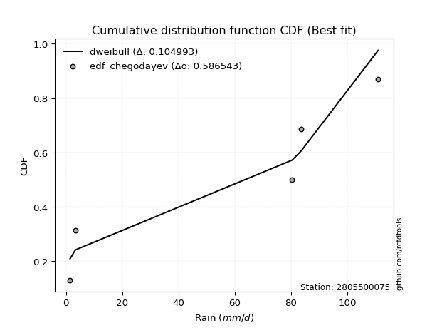</img>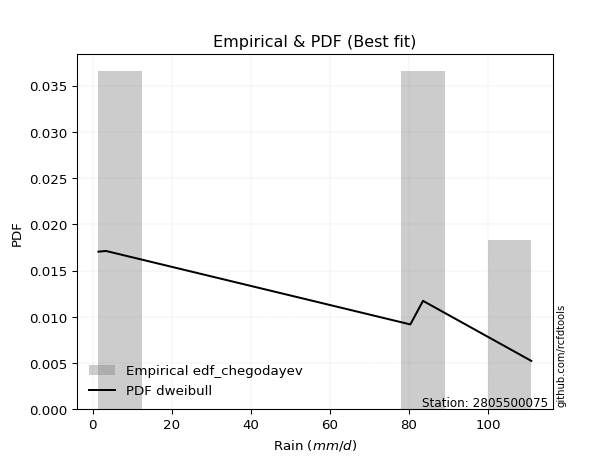</img>

</div>


### 6. EDF Blom (1958)

The Blom formula is a specific "plotting position" formula used in hydrology and statistical analysis to estimate the empirical cumulative probability (or non-exceedance probability) of a data series. It is particularly recommended for data that are approximately normally distributed. The constant _a_ is set to 0.375 (or 3/8).

<div align="center">


$P=(m-a)/(n+1-2a)$


</div>


**6.1. Empirical values**

<div align="center">

|                | 0                   | 1                   | 2        | 3                  | 4                  |
|:---------------|:--------------------|:--------------------|:---------|:-------------------|:-------------------|
| date           | 2022                | 2024                | 2025     | 2019               | 2020               |
| x              | 1.5                 | 3.4                 | 80.4     | 83.6               | 111.0              |
| m              | 1                   | 2                   | 3        | 4                  | 5                  |
| empirical_dist | edf_blom            | edf_blom            | edf_blom | edf_blom           | edf_blom           |
| empirical      | 0.11904761904761904 | 0.30952380952380953 | 0.5      | 0.6904761904761905 | 0.8809523809523809 |
| empirical_tr   | 1.135135135135135   | 1.4482758620689655  | 2.0      | 3.230769230769231  | 8.399999999999999  |

</div>


**6.2. Kolmogorov-Smirnov fit test (sorted by Δ)**


<div align="center">

|                | 0                   | 1                   | 2                  | 3                   | 4                   | 5                   | 6                   | 7                  | 8                  | 9                   | 10                  | 11                  | 12                 | 13                  | 14                  | 15                  | 16                  | 17                 | 18                  | 19                 | 20                  | 21                  | 22                 | 23                  | 24                 | 25                  | 26                 | 27                 | 28                 | 29                  | 30                  | 31                  | 32                 | 33                  | 34                  | 35                 | 36                  | 37                  | 38                  | 39                  | 40                  | 41                  | 42                  | 43                  | 44                  | 45                  | 46                  | 47                  | 48                  | 49                  | 50                  | 51                 | 52                 | 53                 | 54                 | 55                 | 56                 | 57                 | 58                 | 59                  | 60                 | 61                  | 62                 | 63                  | 64                  | 65                 | 66                 | 67                  | 68                  | 69                  | 70                 | 71                  | 72                  | 73                 | 74                 | 75                 | 76                 | 77                 | 78                 | 79                  | 80                  | 81                 | 82                 | 83                 | 84                  | 85                 | 86                  | 87                 | 88                  | 89                 | 90                 | 91                  | 92                 | 93                  | 94                  | 95                 | 96                 | 97                  | 98                  | 99                 | 100                 | 101                 | 102                | 103                 | 104                | 105                 | 106                 | 107                | 108                | 109                | 110                 | 111                 | 112                | 113                | 114                | 115                | 116                | 117                | 118                | 119                 | 120                 | 121                | 122                | 123                 | 124                 | 125                 | 126                | 127                | 128                | 129                | 130                | 131                | 132                | 133                | 134                | 135                | 136                 | 137                | 138                 | 139                | 140                | 141                | 142                | 143                 | 144                | 145                | 146                | 147                | 148                | 149                | 150                | 151                | 152                | 153                | 154                | 155                | 156                | 157                | 158                | 159                |
|:---------------|:--------------------|:--------------------|:-------------------|:--------------------|:--------------------|:--------------------|:--------------------|:-------------------|:-------------------|:--------------------|:--------------------|:--------------------|:-------------------|:--------------------|:--------------------|:--------------------|:--------------------|:-------------------|:--------------------|:-------------------|:--------------------|:--------------------|:-------------------|:--------------------|:-------------------|:--------------------|:-------------------|:-------------------|:-------------------|:--------------------|:--------------------|:--------------------|:-------------------|:--------------------|:--------------------|:-------------------|:--------------------|:--------------------|:--------------------|:--------------------|:--------------------|:--------------------|:--------------------|:--------------------|:--------------------|:--------------------|:--------------------|:--------------------|:--------------------|:--------------------|:--------------------|:-------------------|:-------------------|:-------------------|:-------------------|:-------------------|:-------------------|:-------------------|:-------------------|:--------------------|:-------------------|:--------------------|:-------------------|:--------------------|:--------------------|:-------------------|:-------------------|:--------------------|:--------------------|:--------------------|:-------------------|:--------------------|:--------------------|:-------------------|:-------------------|:-------------------|:-------------------|:-------------------|:-------------------|:--------------------|:--------------------|:-------------------|:-------------------|:-------------------|:--------------------|:-------------------|:--------------------|:-------------------|:--------------------|:-------------------|:-------------------|:--------------------|:-------------------|:--------------------|:--------------------|:-------------------|:-------------------|:--------------------|:--------------------|:-------------------|:--------------------|:--------------------|:-------------------|:--------------------|:-------------------|:--------------------|:--------------------|:-------------------|:-------------------|:-------------------|:--------------------|:--------------------|:-------------------|:-------------------|:-------------------|:-------------------|:-------------------|:-------------------|:-------------------|:--------------------|:--------------------|:-------------------|:-------------------|:--------------------|:--------------------|:--------------------|:-------------------|:-------------------|:-------------------|:-------------------|:-------------------|:-------------------|:-------------------|:-------------------|:-------------------|:-------------------|:--------------------|:-------------------|:--------------------|:-------------------|:-------------------|:-------------------|:-------------------|:--------------------|:-------------------|:-------------------|:-------------------|:-------------------|:-------------------|:-------------------|:-------------------|:-------------------|:-------------------|:-------------------|:-------------------|:-------------------|:-------------------|:-------------------|:-------------------|:-------------------|
| station        | 2805500075          | 2805500075          | 2805500075         | 2805500075          | 2805500075          | 2805500075          | 2805500075          | 2805500075         | 2805500075         | 2805500075          | 2805500075          | 2805500075          | 2805500075         | 2805500075          | 2805500075          | 2805500075          | 2805500075          | 2805500075         | 2805500075          | 2805500075         | 2805500075          | 2805500075          | 2805500075         | 2805500075          | 2805500075         | 2805500075          | 2805500075         | 2805500075         | 2805500075         | 2805500075          | 2805500075          | 2805500075          | 2805500075         | 2805500075          | 2805500075          | 2805500075         | 2805500075          | 2805500075          | 2805500075          | 2805500075          | 2805500075          | 2805500075          | 2805500075          | 2805500075          | 2805500075          | 2805500075          | 2805500075          | 2805500075          | 2805500075          | 2805500075          | 2805500075          | 2805500075         | 2805500075         | 2805500075         | 2805500075         | 2805500075         | 2805500075         | 2805500075         | 2805500075         | 2805500075          | 2805500075         | 2805500075          | 2805500075         | 2805500075          | 2805500075          | 2805500075         | 2805500075         | 2805500075          | 2805500075          | 2805500075          | 2805500075         | 2805500075          | 2805500075          | 2805500075         | 2805500075         | 2805500075         | 2805500075         | 2805500075         | 2805500075         | 2805500075          | 2805500075          | 2805500075         | 2805500075         | 2805500075         | 2805500075          | 2805500075         | 2805500075          | 2805500075         | 2805500075          | 2805500075         | 2805500075         | 2805500075          | 2805500075         | 2805500075          | 2805500075          | 2805500075         | 2805500075         | 2805500075          | 2805500075          | 2805500075         | 2805500075          | 2805500075          | 2805500075         | 2805500075          | 2805500075         | 2805500075          | 2805500075          | 2805500075         | 2805500075         | 2805500075         | 2805500075          | 2805500075          | 2805500075         | 2805500075         | 2805500075         | 2805500075         | 2805500075         | 2805500075         | 2805500075         | 2805500075          | 2805500075          | 2805500075         | 2805500075         | 2805500075          | 2805500075          | 2805500075          | 2805500075         | 2805500075         | 2805500075         | 2805500075         | 2805500075         | 2805500075         | 2805500075         | 2805500075         | 2805500075         | 2805500075         | 2805500075          | 2805500075         | 2805500075          | 2805500075         | 2805500075         | 2805500075         | 2805500075         | 2805500075          | 2805500075         | 2805500075         | 2805500075         | 2805500075         | 2805500075         | 2805500075         | 2805500075         | 2805500075         | 2805500075         | 2805500075         | 2805500075         | 2805500075         | 2805500075         | 2805500075         | 2805500075         | 2805500075         |
| empirical_dist | edf_blom            | edf_blom            | edf_blom           | edf_blom            | edf_blom            | edf_blom            | edf_blom            | edf_blom           | edf_blom           | edf_blom            | edf_blom            | edf_blom            | edf_blom           | edf_blom            | edf_blom            | edf_blom            | edf_blom            | edf_blom           | edf_blom            | edf_blom           | edf_blom            | edf_blom            | edf_blom           | edf_blom            | edf_blom           | edf_blom            | edf_blom           | edf_blom           | edf_blom           | edf_blom            | edf_blom            | edf_blom            | edf_blom           | edf_blom            | edf_blom            | edf_blom           | edf_blom            | edf_blom            | edf_blom            | edf_blom            | edf_blom            | edf_blom            | edf_blom            | edf_blom            | edf_blom            | edf_blom            | edf_blom            | edf_blom            | edf_blom            | edf_blom            | edf_blom            | edf_blom           | edf_blom           | edf_blom           | edf_blom           | edf_blom           | edf_blom           | edf_blom           | edf_blom           | edf_blom            | edf_blom           | edf_blom            | edf_blom           | edf_blom            | edf_blom            | edf_blom           | edf_blom           | edf_blom            | edf_blom            | edf_blom            | edf_blom           | edf_blom            | edf_blom            | edf_blom           | edf_blom           | edf_blom           | edf_blom           | edf_blom           | edf_blom           | edf_blom            | edf_blom            | edf_blom           | edf_blom           | edf_blom           | edf_blom            | edf_blom           | edf_blom            | edf_blom           | edf_blom            | edf_blom           | edf_blom           | edf_blom            | edf_blom           | edf_blom            | edf_blom            | edf_blom           | edf_blom           | edf_blom            | edf_blom            | edf_blom           | edf_blom            | edf_blom            | edf_blom           | edf_blom            | edf_blom           | edf_blom            | edf_blom            | edf_blom           | edf_blom           | edf_blom           | edf_blom            | edf_blom            | edf_blom           | edf_blom           | edf_blom           | edf_blom           | edf_blom           | edf_blom           | edf_blom           | edf_blom            | edf_blom            | edf_blom           | edf_blom           | edf_blom            | edf_blom            | edf_blom            | edf_blom           | edf_blom           | edf_blom           | edf_blom           | edf_blom           | edf_blom           | edf_blom           | edf_blom           | edf_blom           | edf_blom           | edf_blom            | edf_blom           | edf_blom            | edf_blom           | edf_blom           | edf_blom           | edf_blom           | edf_blom            | edf_blom           | edf_blom           | edf_blom           | edf_blom           | edf_blom           | edf_blom           | edf_blom           | edf_blom           | edf_blom           | edf_blom           | edf_blom           | edf_blom           | edf_blom           | edf_blom           | edf_blom           | edf_blom           |
| p_dist         | dweibull            | genextreme          | arcsine            | loglevy_l           | dgamma              | logwrapcauchy       | logdgamma           | ksone              | trapezoid          | johnsonsu           | semicircular        | wrapcauchy          | logarcsine         | levy_l              | skewnorm            | anglit              | logdweibull         | weibull_min        | gumbel_l            | pearson3           | loggenpareto        | exponnorm           | crystalball        | norm                | triang             | foldnorm            | erlang             | gamma              | logksone           | logalpha            | argus               | rice                | genhalflogistic    | cosine              | maxwell             | loglomax           | logbeta             | rayleigh            | logweibull_max      | logistic            | logsemicircular     | logtrapezoid        | rdist               | halfnorm            | loganglit           | hypsecant           | beta                | gennorm             | kstwobign           | nakagami            | gumbel_r            | loggennorm         | logpearson3        | logncf             | burr               | logweibull_min     | loggumbel_l        | logexponpow        | exponpow           | laplace             | logbetaprime       | lognct              | logt               | lognorm             | logexponnorm        | loggamma           | loggamma           | logfatiguelife      | moyal               | logerlang           | loginvweibull      | logrice             | genexpon            | logmaxwell         | loggenexpon        | loginvgauss        | lomax              | ncf                | kappa4             | logfoldnorm         | lograyleigh         | logf               | loggompertz        | fatiguelife        | loginvgamma         | burr12             | logkstwobign        | logtruncnorm       | loghalfnorm         | genpareto          | tukeylambda        | gompertz            | bradford           | uniform             | loglogistic         | truncweibull_min   | exponweib          | vonmises_line       | halflogistic        | logcosine          | loggenextreme       | logburr             | f                  | loggumbel_r         | loghypsecant       | loghalflogistic     | gausshyper          | halfgennorm        | logargus           | truncexpon         | logmoyal            | wald                | logmielke          | loglaplace         | loglaplace         | logloggamma        | logburr12          | loggausshyper      | logloglaplace      | betaprime           | lognakagami         | truncpareto        | logwald            | loggenhalflogistic  | logjohnsonsb        | invgauss            | kappa3             | gengamma           | t                  | logskewnorm        | logkappa4          | logtriang          | logexponweib       | logtukeylambda     | logkappa3          | loguniform         | logvonmises_line    | logbradford        | invweibull          | logtruncexpon      | loggengamma        | powerlaw           | alpha              | logtruncweibull_min | truncnorm          | logrdist           | johnsonsb          | mielke             | logtruncpareto     | logpowerlaw        | weibull_max        | logjohnsonsu       | nct                | invgamma           | loghalfgennorm     | genlogistic        | loggenlogistic     | logvonmises        | vonmises           | logcrystalball     |
| delta          | 0.09441081230231085 | 0.11904761904709815 | 0.1253967208826221 | 0.13516507556102098 | 0.13684823604652327 | 0.15172596384550752 | 0.15335259185068262 | 0.1566998187084292 | 0.1614242486485531 | 0.16627819132159305 | 0.17064082664367675 | 0.17332637874309498 | 0.1755357713777166 | 0.17824891132935483 | 0.17943770091432618 | 0.18132557380432623 | 0.18279803516424598 | 0.1853782685834418 | 0.19166689681982177 | 0.1970580185510722 | 0.19772063074990867 | 0.20637429671374408 | 0.2063745265352679 | 0.20637453916278892 | 0.2063807079179944 | 0.21014047952086046 | 0.2112576089576388 | 0.2116303571738224 | 0.2138948829244488 | 0.21420029604944246 | 0.21552915398187122 | 0.21840263762543022 | 0.2193396654474562 | 0.22141380064519411 | 0.22151179131818743 | 0.2226461868165266 | 0.22313898477933697 | 0.22592148464552553 | 0.22596957244369006 | 0.22801485424206736 | 0.23034068777016148 | 0.23126296205848995 | 0.23196849078536502 | 0.23945524654086836 | 0.24258860632170764 | 0.24347297177736182 | 0.24431374347374718 | 0.24465890786521818 | 0.24627675087159817 | 0.25153176189068893 | 0.25587873054546917 | 0.25654845306297   | 0.2611637307938931 | 0.2615410481285041 | 0.2641407668457997 | 0.265524384578972  | 0.2659501661693666 | 0.2661287725724861 | 0.2678985751290588 | 0.26795324044181645 | 0.2695608183891566 | 0.27056899047192673 | 0.2706370264892186 | 0.27063921561020043 | 0.27064431611263917 | 0.271201663757793  | 0.271201663757793  | 0.27180363812013897 | 0.27186793494137407 | 0.27297726702944425 | 0.2741648627892621 | 0.27426468829116457 | 0.27562901400373224 | 0.2774998497264666 | 0.2777401903031309 | 0.2778041422578228 | 0.2783720387226881 | 0.2785607395705827 | 0.2788154113699741 | 0.27931905434861726 | 0.27944497035034965 | 0.2798540565616485 | 0.280146148014623  | 0.280290352345112  | 0.28039270318317067 | 0.2813215772789416 | 0.28498431693893567 | 0.2855502865035735 | 0.28669907952166895 | 0.2879893829818697 | 0.2882314270766877 | 0.28906877600218295 | 0.2895281466867623 | 0.29217221135029353 | 0.29313732087297695 | 0.2936767213958862 | 0.2937547253492686 | 0.29555127486762933 | 0.29990480069806225 | 0.2999106239293885 | 0.30042616301600533 | 0.30060771545464415 | 0.3028766381851733 | 0.30487191292643745 | 0.3073109314453609 | 0.30980753591937993 | 0.31147522299307095 | 0.3125455478826956 | 0.3133212620404814 | 0.3142076080181575 | 0.31602486155011633 | 0.31909497057171377 | 0.3204110888087578 | 0.3246574560178005 | 0.3246574560178005 | 0.3260223697025305 | 0.3327918030471376 | 0.3336473061804204 | 0.3356232660062093 | 0.34175567135859075 | 0.34497013205555493 | 0.3493271579325068 | 0.3523357066700117 | 0.36354552452777866 | 0.36472121628893506 | 0.36858086716860594 | 0.374304229072811  | 0.3877671386240421 | 0.3878550185898524 | 0.3967027756989412 | 0.4058904911719047 | 0.4082563885612258 | 0.4107116246936737 | 0.4180691844070239 | 0.4250660576281673 | 0.4250671125683846 | 0.42512260212835173 | 0.4437685064187147 | 0.44637872016510494 | 0.4487206239034478 | 0.4604719966472576 | 0.4645557708815533 | 0.4694722122259707 | 0.47274166478072177 | 0.5                | 0.5                | 0.5020912050986266 | 0.5035278341991553 | 0.5050874742529157 | 0.5059693276527452 | 0.5458517571729922 | 0.6007147568814604 | 0.6497403053070911 | 0.6875131812770833 | 0.6904761904761905 | 0.6904761904761905 | 0.6904761904761905 | 0.8038414112489427 | 17.85214949868056  | nan                |
| deltao         | 0.5865427407550001  | 0.5865427407550001  | 0.5865427407550001 | 0.5865427407550001  | 0.5865427407550001  | 0.5865427407550001  | 0.5865427407550001  | 0.5865427407550001 | 0.5865427407550001 | 0.5865427407550001  | 0.5865427407550001  | 0.5865427407550001  | 0.5865427407550001 | 0.5865427407550001  | 0.5865427407550001  | 0.5865427407550001  | 0.5865427407550001  | 0.5865427407550001 | 0.5865427407550001  | 0.5865427407550001 | 0.5865427407550001  | 0.5865427407550001  | 0.5865427407550001 | 0.5865427407550001  | 0.5865427407550001 | 0.5865427407550001  | 0.5865427407550001 | 0.5865427407550001 | 0.5865427407550001 | 0.5865427407550001  | 0.5865427407550001  | 0.5865427407550001  | 0.5865427407550001 | 0.5865427407550001  | 0.5865427407550001  | 0.5865427407550001 | 0.5865427407550001  | 0.5865427407550001  | 0.5865427407550001  | 0.5865427407550001  | 0.5865427407550001  | 0.5865427407550001  | 0.5865427407550001  | 0.5865427407550001  | 0.5865427407550001  | 0.5865427407550001  | 0.5865427407550001  | 0.5865427407550001  | 0.5865427407550001  | 0.5865427407550001  | 0.5865427407550001  | 0.5865427407550001 | 0.5865427407550001 | 0.5865427407550001 | 0.5865427407550001 | 0.5865427407550001 | 0.5865427407550001 | 0.5865427407550001 | 0.5865427407550001 | 0.5865427407550001  | 0.5865427407550001 | 0.5865427407550001  | 0.5865427407550001 | 0.5865427407550001  | 0.5865427407550001  | 0.5865427407550001 | 0.5865427407550001 | 0.5865427407550001  | 0.5865427407550001  | 0.5865427407550001  | 0.5865427407550001 | 0.5865427407550001  | 0.5865427407550001  | 0.5865427407550001 | 0.5865427407550001 | 0.5865427407550001 | 0.5865427407550001 | 0.5865427407550001 | 0.5865427407550001 | 0.5865427407550001  | 0.5865427407550001  | 0.5865427407550001 | 0.5865427407550001 | 0.5865427407550001 | 0.5865427407550001  | 0.5865427407550001 | 0.5865427407550001  | 0.5865427407550001 | 0.5865427407550001  | 0.5865427407550001 | 0.5865427407550001 | 0.5865427407550001  | 0.5865427407550001 | 0.5865427407550001  | 0.5865427407550001  | 0.5865427407550001 | 0.5865427407550001 | 0.5865427407550001  | 0.5865427407550001  | 0.5865427407550001 | 0.5865427407550001  | 0.5865427407550001  | 0.5865427407550001 | 0.5865427407550001  | 0.5865427407550001 | 0.5865427407550001  | 0.5865427407550001  | 0.5865427407550001 | 0.5865427407550001 | 0.5865427407550001 | 0.5865427407550001  | 0.5865427407550001  | 0.5865427407550001 | 0.5865427407550001 | 0.5865427407550001 | 0.5865427407550001 | 0.5865427407550001 | 0.5865427407550001 | 0.5865427407550001 | 0.5865427407550001  | 0.5865427407550001  | 0.5865427407550001 | 0.5865427407550001 | 0.5865427407550001  | 0.5865427407550001  | 0.5865427407550001  | 0.5865427407550001 | 0.5865427407550001 | 0.5865427407550001 | 0.5865427407550001 | 0.5865427407550001 | 0.5865427407550001 | 0.5865427407550001 | 0.5865427407550001 | 0.5865427407550001 | 0.5865427407550001 | 0.5865427407550001  | 0.5865427407550001 | 0.5865427407550001  | 0.5865427407550001 | 0.5865427407550001 | 0.5865427407550001 | 0.5865427407550001 | 0.5865427407550001  | 0.5865427407550001 | 0.5865427407550001 | 0.5865427407550001 | 0.5865427407550001 | 0.5865427407550001 | 0.5865427407550001 | 0.5865427407550001 | 0.5865427407550001 | 0.5865427407550001 | 0.5865427407550001 | 0.5865427407550001 | 0.5865427407550001 | 0.5865427407550001 | 0.5865427407550001 | 0.5865427407550001 | 0.5865427407550001 |
| eval           | Δo > Δ              | Δo > Δ              | Δo > Δ             | Δo > Δ              | Δo > Δ              | Δo > Δ              | Δo > Δ              | Δo > Δ             | Δo > Δ             | Δo > Δ              | Δo > Δ              | Δo > Δ              | Δo > Δ             | Δo > Δ              | Δo > Δ              | Δo > Δ              | Δo > Δ              | Δo > Δ             | Δo > Δ              | Δo > Δ             | Δo > Δ              | Δo > Δ              | Δo > Δ             | Δo > Δ              | Δo > Δ             | Δo > Δ              | Δo > Δ             | Δo > Δ             | Δo > Δ             | Δo > Δ              | Δo > Δ              | Δo > Δ              | Δo > Δ             | Δo > Δ              | Δo > Δ              | Δo > Δ             | Δo > Δ              | Δo > Δ              | Δo > Δ              | Δo > Δ              | Δo > Δ              | Δo > Δ              | Δo > Δ              | Δo > Δ              | Δo > Δ              | Δo > Δ              | Δo > Δ              | Δo > Δ              | Δo > Δ              | Δo > Δ              | Δo > Δ              | Δo > Δ             | Δo > Δ             | Δo > Δ             | Δo > Δ             | Δo > Δ             | Δo > Δ             | Δo > Δ             | Δo > Δ             | Δo > Δ              | Δo > Δ             | Δo > Δ              | Δo > Δ             | Δo > Δ              | Δo > Δ              | Δo > Δ             | Δo > Δ             | Δo > Δ              | Δo > Δ              | Δo > Δ              | Δo > Δ             | Δo > Δ              | Δo > Δ              | Δo > Δ             | Δo > Δ             | Δo > Δ             | Δo > Δ             | Δo > Δ             | Δo > Δ             | Δo > Δ              | Δo > Δ              | Δo > Δ             | Δo > Δ             | Δo > Δ             | Δo > Δ              | Δo > Δ             | Δo > Δ              | Δo > Δ             | Δo > Δ              | Δo > Δ             | Δo > Δ             | Δo > Δ              | Δo > Δ             | Δo > Δ              | Δo > Δ              | Δo > Δ             | Δo > Δ             | Δo > Δ              | Δo > Δ              | Δo > Δ             | Δo > Δ              | Δo > Δ              | Δo > Δ             | Δo > Δ              | Δo > Δ             | Δo > Δ              | Δo > Δ              | Δo > Δ             | Δo > Δ             | Δo > Δ             | Δo > Δ              | Δo > Δ              | Δo > Δ             | Δo > Δ             | Δo > Δ             | Δo > Δ             | Δo > Δ             | Δo > Δ             | Δo > Δ             | Δo > Δ              | Δo > Δ              | Δo > Δ             | Δo > Δ             | Δo > Δ              | Δo > Δ              | Δo > Δ              | Δo > Δ             | Δo > Δ             | Δo > Δ             | Δo > Δ             | Δo > Δ             | Δo > Δ             | Δo > Δ             | Δo > Δ             | Δo > Δ             | Δo > Δ             | Δo > Δ              | Δo > Δ             | Δo > Δ              | Δo > Δ             | Δo > Δ             | Δo > Δ             | Δo > Δ             | Δo > Δ              | Δo > Δ             | Δo > Δ             | Δo > Δ             | Δo > Δ             | Δo > Δ             | Δo > Δ             | Δo > Δ             | Δo <= Δ            | Δo <= Δ            | Δo <= Δ            | Δo <= Δ            | Δo <= Δ            | Δo <= Δ            | Δo <= Δ            | Δo <= Δ            | Δo <= Δ            |
| fit            | 1                   | 1                   | 1                  | 1                   | 1                   | 1                   | 1                   | 1                  | 1                  | 1                   | 1                   | 1                   | 1                  | 1                   | 1                   | 1                   | 1                   | 1                  | 1                   | 1                  | 1                   | 1                   | 1                  | 1                   | 1                  | 1                   | 1                  | 1                  | 1                  | 1                   | 1                   | 1                   | 1                  | 1                   | 1                   | 1                  | 1                   | 1                   | 1                   | 1                   | 1                   | 1                   | 1                   | 1                   | 1                   | 1                   | 1                   | 1                   | 1                   | 1                   | 1                   | 1                  | 1                  | 1                  | 1                  | 1                  | 1                  | 1                  | 1                  | 1                   | 1                  | 1                   | 1                  | 1                   | 1                   | 1                  | 1                  | 1                   | 1                   | 1                   | 1                  | 1                   | 1                   | 1                  | 1                  | 1                  | 1                  | 1                  | 1                  | 1                   | 1                   | 1                  | 1                  | 1                  | 1                   | 1                  | 1                   | 1                  | 1                   | 1                  | 1                  | 1                   | 1                  | 1                   | 1                   | 1                  | 1                  | 1                   | 1                   | 1                  | 1                   | 1                   | 1                  | 1                   | 1                  | 1                   | 1                   | 1                  | 1                  | 1                  | 1                   | 1                   | 1                  | 1                  | 1                  | 1                  | 1                  | 1                  | 1                  | 1                   | 1                   | 1                  | 1                  | 1                   | 1                   | 1                   | 1                  | 1                  | 1                  | 1                  | 1                  | 1                  | 1                  | 1                  | 1                  | 1                  | 1                   | 1                  | 1                   | 1                  | 1                  | 1                  | 1                  | 1                   | 1                  | 1                  | 1                  | 1                  | 1                  | 1                  | 1                  | 0                  | 0                  | 0                  | 0                  | 0                  | 0                  | 0                  | 0                  | 0                  |
| n              | 5                   | 5                   | 5                  | 5                   | 5                   | 5                   | 5                   | 5                  | 5                  | 5                   | 5                   | 5                   | 5                  | 5                   | 5                   | 5                   | 5                   | 5                  | 5                   | 5                  | 5                   | 5                   | 5                  | 5                   | 5                  | 5                   | 5                  | 5                  | 5                  | 5                   | 5                   | 5                   | 5                  | 5                   | 5                   | 5                  | 5                   | 5                   | 5                   | 5                   | 5                   | 5                   | 5                   | 5                   | 5                   | 5                   | 5                   | 5                   | 5                   | 5                   | 5                   | 5                  | 5                  | 5                  | 5                  | 5                  | 5                  | 5                  | 5                  | 5                   | 5                  | 5                   | 5                  | 5                   | 5                   | 5                  | 5                  | 5                   | 5                   | 5                   | 5                  | 5                   | 5                   | 5                  | 5                  | 5                  | 5                  | 5                  | 5                  | 5                   | 5                   | 5                  | 5                  | 5                  | 5                   | 5                  | 5                   | 5                  | 5                   | 5                  | 5                  | 5                   | 5                  | 5                   | 5                   | 5                  | 5                  | 5                   | 5                   | 5                  | 5                   | 5                   | 5                  | 5                   | 5                  | 5                   | 5                   | 5                  | 5                  | 5                  | 5                   | 5                   | 5                  | 5                  | 5                  | 5                  | 5                  | 5                  | 5                  | 5                   | 5                   | 5                  | 5                  | 5                   | 5                   | 5                   | 5                  | 5                  | 5                  | 5                  | 5                  | 5                  | 5                  | 5                  | 5                  | 5                  | 5                   | 5                  | 5                   | 5                  | 5                  | 5                  | 5                  | 5                   | 5                  | 5                  | 5                  | 5                  | 5                  | 5                  | 5                  | 5                  | 5                  | 5                  | 5                  | 5                  | 5                  | 5                  | 5                  | 5                  |
| best_fit       | 1                   | 0                   | 0                  | 0                   | 0                   | 0                   | 0                   | 0                  | 0                  | 0                   | 0                   | 0                   | 0                  | 0                   | 0                   | 0                   | 0                   | 0                  | 0                   | 0                  | 0                   | 0                   | 0                  | 0                   | 0                  | 0                   | 0                  | 0                  | 0                  | 0                   | 0                   | 0                   | 0                  | 0                   | 0                   | 0                  | 0                   | 0                   | 0                   | 0                   | 0                   | 0                   | 0                   | 0                   | 0                   | 0                   | 0                   | 0                   | 0                   | 0                   | 0                   | 0                  | 0                  | 0                  | 0                  | 0                  | 0                  | 0                  | 0                  | 0                   | 0                  | 0                   | 0                  | 0                   | 0                   | 0                  | 0                  | 0                   | 0                   | 0                   | 0                  | 0                   | 0                   | 0                  | 0                  | 0                  | 0                  | 0                  | 0                  | 0                   | 0                   | 0                  | 0                  | 0                  | 0                   | 0                  | 0                   | 0                  | 0                   | 0                  | 0                  | 0                   | 0                  | 0                   | 0                   | 0                  | 0                  | 0                   | 0                   | 0                  | 0                   | 0                   | 0                  | 0                   | 0                  | 0                   | 0                   | 0                  | 0                  | 0                  | 0                   | 0                   | 0                  | 0                  | 0                  | 0                  | 0                  | 0                  | 0                  | 0                   | 0                   | 0                  | 0                  | 0                   | 0                   | 0                   | 0                  | 0                  | 0                  | 0                  | 0                  | 0                  | 0                  | 0                  | 0                  | 0                  | 0                   | 0                  | 0                   | 0                  | 0                  | 0                  | 0                  | 0                   | 0                  | 0                  | 0                  | 0                  | 0                  | 0                  | 0                  | 0                  | 0                  | 0                  | 0                  | 0                  | 0                  | 0                  | 0                  | 0                  |
| best_fit_sort  | 1                   | 2                   | 3                  | 4                   | 5                   | 6                   | 7                   | 8                  | 9                  | 10                  | 11                  | 12                  | 13                 | 14                  | 15                  | 16                  | 17                  | 18                 | 19                  | 20                 | 21                  | 22                  | 23                 | 24                  | 25                 | 26                  | 27                 | 28                 | 29                 | 30                  | 31                  | 32                  | 33                 | 34                  | 35                  | 36                 | 37                  | 38                  | 39                  | 40                  | 41                  | 42                  | 43                  | 44                  | 45                  | 46                  | 47                  | 48                  | 49                  | 50                  | 51                  | 52                 | 53                 | 54                 | 55                 | 56                 | 57                 | 58                 | 59                 | 60                  | 61                 | 62                  | 63                 | 64                  | 65                  | 66                 | 67                 | 68                  | 69                  | 70                  | 71                 | 72                  | 73                  | 74                 | 75                 | 76                 | 77                 | 78                 | 79                 | 80                  | 81                  | 82                 | 83                 | 84                 | 85                  | 86                 | 87                  | 88                 | 89                  | 90                 | 91                 | 92                  | 93                 | 94                  | 95                  | 96                 | 97                 | 98                  | 99                  | 100                | 101                 | 102                 | 103                | 104                 | 105                | 106                 | 107                 | 108                | 109                | 110                | 111                 | 112                 | 113                | 114                | 115                | 116                | 117                | 118                | 119                | 120                 | 121                 | 122                | 123                | 124                 | 125                 | 126                 | 127                | 128                | 129                | 130                | 131                | 132                | 133                | 134                | 135                | 136                | 137                 | 138                | 139                 | 140                | 141                | 142                | 143                | 144                 | 145                | 146                | 147                | 148                | 149                | 150                | 151                | 152                | 153                | 154                | 155                | 156                | 157                | 158                | 159                | 160                |

</div>


**6.3. Best fit**

<div align="center">

|   id |    station | empirical_dist   | p_dist   |     delta |   deltao | eval   |   fit |   n |   best_fit |   best_fit_sort |
|-----:|-----------:|:-----------------|:---------|----------:|---------:|:-------|------:|----:|-----------:|----------------:|
|    0 | 2805500075 | edf_blom         | dweibull | 0.0944108 | 0.586543 | Δo > Δ |     1 |   5 |          1 |               1 |

</div>


<div align="center">

</img>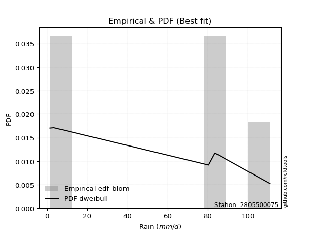</img>

</div>


### 7. EDF Tukey (1962)

In hydrology, the Tukey formula is used as a plotting position formula to estimate the empirical probability or frequency of a flood event (or other hydrological data). The formula parameter is given as _c=0.333_ (or 1/3).

<div align="center">


$P=(m-c)/(n+1-2c)$


</div>


**7.1. Empirical values**

<div align="center">

|                | 0                  | 1                  | 2         | 3         | 4         |
|:---------------|:-------------------|:-------------------|:----------|:----------|:----------|
| date           | 2022               | 2024               | 2025      | 2019      | 2020      |
| x              | 1.5                | 3.4                | 80.4      | 83.6      | 111.0     |
| m              | 1                  | 2                  | 3         | 4         | 5         |
| empirical_dist | edf_tukey          | edf_tukey          | edf_tukey | edf_tukey | edf_tukey |
| empirical      | 0.125              | 0.3125             | 0.5       | 0.6875    | 0.875     |
| empirical_tr   | 1.1428571428571428 | 1.4545454545454546 | 2.0       | 3.2       | 8.0       |

</div>


**7.2. Kolmogorov-Smirnov fit test (sorted by Δ)**


<div align="center">

|                | 0                   | 1                   | 2                  | 3                  | 4                  | 5                   | 6                   | 7                  | 8                  | 9                   | 10                 | 11                  | 12                  | 13                 | 14                  | 15                  | 16                  | 17                  | 18                  | 19                 | 20                  | 21                  | 22                 | 23                  | 24                  | 25                  | 26                 | 27                 | 28                 | 29                  | 30                  | 31                  | 32                  | 33                 | 34                 | 35                  | 36                  | 37                  | 38                  | 39                  | 40                  | 41                  | 42                 | 43                  | 44                  | 45                  | 46                  | 47                  | 48                  | 49                  | 50                  | 51                 | 52                 | 53                 | 54                 | 55                 | 56                 | 57                 | 58                 | 59                  | 60                 | 61                  | 62                 | 63                  | 64                  | 65                 | 66                 | 67                  | 68                  | 69                  | 70                 | 71                  | 72                 | 73                 | 74                 | 75                 | 76                 | 77                 | 78                  | 79                  | 80                 | 81                 | 82                 | 83                  | 84                 | 85                 | 86                  | 87                 | 88                  | 89                 | 90                 | 91                 | 92                  | 93                 | 94                  | 95                 | 96                 | 97                 | 98                 | 99                  | 100                 | 101                | 102                | 103                 | 104                | 105                | 106                 | 107                | 108                | 109                | 110                 | 111                 | 112                | 113                | 114                | 115                | 116                 | 117                | 118                | 119                 | 120                 | 121                | 122                | 123                | 124                 | 125                 | 126                | 127                | 128                | 129                | 130                | 131                | 132                | 133                | 134                | 135                | 136                 | 137                | 138                | 139                | 140                | 141                | 142                | 143                 | 144                | 145                | 146                | 147                | 148                | 149                | 150                | 151                | 152                | 153                | 154                | 155                | 156                | 157                | 158                | 159                |
|:---------------|:--------------------|:--------------------|:-------------------|:-------------------|:-------------------|:--------------------|:--------------------|:-------------------|:-------------------|:--------------------|:-------------------|:--------------------|:--------------------|:-------------------|:--------------------|:--------------------|:--------------------|:--------------------|:--------------------|:-------------------|:--------------------|:--------------------|:-------------------|:--------------------|:--------------------|:--------------------|:-------------------|:-------------------|:-------------------|:--------------------|:--------------------|:--------------------|:--------------------|:-------------------|:-------------------|:--------------------|:--------------------|:--------------------|:--------------------|:--------------------|:--------------------|:--------------------|:-------------------|:--------------------|:--------------------|:--------------------|:--------------------|:--------------------|:--------------------|:--------------------|:--------------------|:-------------------|:-------------------|:-------------------|:-------------------|:-------------------|:-------------------|:-------------------|:-------------------|:--------------------|:-------------------|:--------------------|:-------------------|:--------------------|:--------------------|:-------------------|:-------------------|:--------------------|:--------------------|:--------------------|:-------------------|:--------------------|:-------------------|:-------------------|:-------------------|:-------------------|:-------------------|:-------------------|:--------------------|:--------------------|:-------------------|:-------------------|:-------------------|:--------------------|:-------------------|:-------------------|:--------------------|:-------------------|:--------------------|:-------------------|:-------------------|:-------------------|:--------------------|:-------------------|:--------------------|:-------------------|:-------------------|:-------------------|:-------------------|:--------------------|:--------------------|:-------------------|:-------------------|:--------------------|:-------------------|:-------------------|:--------------------|:-------------------|:-------------------|:-------------------|:--------------------|:--------------------|:-------------------|:-------------------|:-------------------|:-------------------|:--------------------|:-------------------|:-------------------|:--------------------|:--------------------|:-------------------|:-------------------|:-------------------|:--------------------|:--------------------|:-------------------|:-------------------|:-------------------|:-------------------|:-------------------|:-------------------|:-------------------|:-------------------|:-------------------|:-------------------|:--------------------|:-------------------|:-------------------|:-------------------|:-------------------|:-------------------|:-------------------|:--------------------|:-------------------|:-------------------|:-------------------|:-------------------|:-------------------|:-------------------|:-------------------|:-------------------|:-------------------|:-------------------|:-------------------|:-------------------|:-------------------|:-------------------|:-------------------|:-------------------|
| station        | 2805500075          | 2805500075          | 2805500075         | 2805500075         | 2805500075         | 2805500075          | 2805500075          | 2805500075         | 2805500075         | 2805500075          | 2805500075         | 2805500075          | 2805500075          | 2805500075         | 2805500075          | 2805500075          | 2805500075          | 2805500075          | 2805500075          | 2805500075         | 2805500075          | 2805500075          | 2805500075         | 2805500075          | 2805500075          | 2805500075          | 2805500075         | 2805500075         | 2805500075         | 2805500075          | 2805500075          | 2805500075          | 2805500075          | 2805500075         | 2805500075         | 2805500075          | 2805500075          | 2805500075          | 2805500075          | 2805500075          | 2805500075          | 2805500075          | 2805500075         | 2805500075          | 2805500075          | 2805500075          | 2805500075          | 2805500075          | 2805500075          | 2805500075          | 2805500075          | 2805500075         | 2805500075         | 2805500075         | 2805500075         | 2805500075         | 2805500075         | 2805500075         | 2805500075         | 2805500075          | 2805500075         | 2805500075          | 2805500075         | 2805500075          | 2805500075          | 2805500075         | 2805500075         | 2805500075          | 2805500075          | 2805500075          | 2805500075         | 2805500075          | 2805500075         | 2805500075         | 2805500075         | 2805500075         | 2805500075         | 2805500075         | 2805500075          | 2805500075          | 2805500075         | 2805500075         | 2805500075         | 2805500075          | 2805500075         | 2805500075         | 2805500075          | 2805500075         | 2805500075          | 2805500075         | 2805500075         | 2805500075         | 2805500075          | 2805500075         | 2805500075          | 2805500075         | 2805500075         | 2805500075         | 2805500075         | 2805500075          | 2805500075          | 2805500075         | 2805500075         | 2805500075          | 2805500075         | 2805500075         | 2805500075          | 2805500075         | 2805500075         | 2805500075         | 2805500075          | 2805500075          | 2805500075         | 2805500075         | 2805500075         | 2805500075         | 2805500075          | 2805500075         | 2805500075         | 2805500075          | 2805500075          | 2805500075         | 2805500075         | 2805500075         | 2805500075          | 2805500075          | 2805500075         | 2805500075         | 2805500075         | 2805500075         | 2805500075         | 2805500075         | 2805500075         | 2805500075         | 2805500075         | 2805500075         | 2805500075          | 2805500075         | 2805500075         | 2805500075         | 2805500075         | 2805500075         | 2805500075         | 2805500075          | 2805500075         | 2805500075         | 2805500075         | 2805500075         | 2805500075         | 2805500075         | 2805500075         | 2805500075         | 2805500075         | 2805500075         | 2805500075         | 2805500075         | 2805500075         | 2805500075         | 2805500075         | 2805500075         |
| empirical_dist | edf_tukey           | edf_tukey           | edf_tukey          | edf_tukey          | edf_tukey          | edf_tukey           | edf_tukey           | edf_tukey          | edf_tukey          | edf_tukey           | edf_tukey          | edf_tukey           | edf_tukey           | edf_tukey          | edf_tukey           | edf_tukey           | edf_tukey           | edf_tukey           | edf_tukey           | edf_tukey          | edf_tukey           | edf_tukey           | edf_tukey          | edf_tukey           | edf_tukey           | edf_tukey           | edf_tukey          | edf_tukey          | edf_tukey          | edf_tukey           | edf_tukey           | edf_tukey           | edf_tukey           | edf_tukey          | edf_tukey          | edf_tukey           | edf_tukey           | edf_tukey           | edf_tukey           | edf_tukey           | edf_tukey           | edf_tukey           | edf_tukey          | edf_tukey           | edf_tukey           | edf_tukey           | edf_tukey           | edf_tukey           | edf_tukey           | edf_tukey           | edf_tukey           | edf_tukey          | edf_tukey          | edf_tukey          | edf_tukey          | edf_tukey          | edf_tukey          | edf_tukey          | edf_tukey          | edf_tukey           | edf_tukey          | edf_tukey           | edf_tukey          | edf_tukey           | edf_tukey           | edf_tukey          | edf_tukey          | edf_tukey           | edf_tukey           | edf_tukey           | edf_tukey          | edf_tukey           | edf_tukey          | edf_tukey          | edf_tukey          | edf_tukey          | edf_tukey          | edf_tukey          | edf_tukey           | edf_tukey           | edf_tukey          | edf_tukey          | edf_tukey          | edf_tukey           | edf_tukey          | edf_tukey          | edf_tukey           | edf_tukey          | edf_tukey           | edf_tukey          | edf_tukey          | edf_tukey          | edf_tukey           | edf_tukey          | edf_tukey           | edf_tukey          | edf_tukey          | edf_tukey          | edf_tukey          | edf_tukey           | edf_tukey           | edf_tukey          | edf_tukey          | edf_tukey           | edf_tukey          | edf_tukey          | edf_tukey           | edf_tukey          | edf_tukey          | edf_tukey          | edf_tukey           | edf_tukey           | edf_tukey          | edf_tukey          | edf_tukey          | edf_tukey          | edf_tukey           | edf_tukey          | edf_tukey          | edf_tukey           | edf_tukey           | edf_tukey          | edf_tukey          | edf_tukey          | edf_tukey           | edf_tukey           | edf_tukey          | edf_tukey          | edf_tukey          | edf_tukey          | edf_tukey          | edf_tukey          | edf_tukey          | edf_tukey          | edf_tukey          | edf_tukey          | edf_tukey           | edf_tukey          | edf_tukey          | edf_tukey          | edf_tukey          | edf_tukey          | edf_tukey          | edf_tukey           | edf_tukey          | edf_tukey          | edf_tukey          | edf_tukey          | edf_tukey          | edf_tukey          | edf_tukey          | edf_tukey          | edf_tukey          | edf_tukey          | edf_tukey          | edf_tukey          | edf_tukey          | edf_tukey          | edf_tukey          | edf_tukey          |
| p_dist         | dweibull            | genextreme          | arcsine            | dgamma             | loglevy_l          | logwrapcauchy       | logdgamma           | ksone              | trapezoid          | johnsonsu           | wrapcauchy         | semicircular        | levy_l              | logarcsine         | anglit              | skewnorm            | logdweibull         | weibull_min         | gumbel_l            | pearson3           | loggenpareto        | exponnorm           | crystalball        | norm                | triang              | foldnorm            | erlang             | gamma              | logksone           | logalpha            | genhalflogistic     | loglomax            | rice                | argus              | logweibull_max     | cosine              | maxwell             | rayleigh            | logbeta             | logistic            | logsemicircular     | logtrapezoid        | rdist              | halfnorm            | loganglit           | hypsecant           | kstwobign           | beta                | gennorm             | nakagami            | gumbel_r            | loggennorm         | logpearson3        | logncf             | burr               | logweibull_min     | loggumbel_l        | logexponpow        | exponpow           | laplace             | logbetaprime       | lognct              | logt               | lognorm             | logexponnorm        | loggamma           | loggamma           | logfatiguelife      | moyal               | logerlang           | loginvweibull      | logrice             | logmaxwell         | loggenexpon        | loginvgauss        | lomax              | ncf                | genexpon           | logfoldnorm         | lograyleigh         | logf               | loggompertz        | fatiguelife        | loginvgamma         | burr12             | kappa4             | logkstwobign        | logtruncnorm       | loghalfnorm         | exponweib          | bradford           | genpareto          | tukeylambda         | gompertz           | loglogistic         | truncweibull_min   | uniform            | vonmises_line      | logcosine          | loggenextreme       | logburr             | f                  | halflogistic       | loggumbel_r         | loghypsecant       | gausshyper         | loghalflogistic     | halfgennorm        | logargus           | truncexpon         | logmoyal            | wald                | logmielke          | loglaplace         | loglaplace         | logloggamma        | logloglaplace       | logburr12          | loggausshyper      | betaprime           | lognakagami         | truncpareto        | logwald            | logjohnsonsb       | loggenhalflogistic  | invgauss            | kappa3             | gengamma           | t                  | logskewnorm        | logkappa4          | logtriang          | logexponweib       | logtukeylambda     | logkappa3          | loguniform         | logvonmises_line    | invweibull         | logbradford        | logtruncexpon      | loggengamma        | powerlaw           | alpha              | logtruncweibull_min | johnsonsb          | truncnorm          | logrdist           | mielke             | logtruncpareto     | logpowerlaw        | weibull_max        | logjohnsonsu       | nct                | invgamma           | loghalfgennorm     | genlogistic        | loggenlogistic     | logvonmises        | vonmises           | logcrystalball     |
| delta          | 0.10036319325469178 | 0.12499999999947908 | 0.1253967208826221 | 0.1308958550941423 | 0.1321888850848305 | 0.15172596384550752 | 0.15335259185068262 | 0.1566998187084292 | 0.1614242486485531 | 0.16925438179778352 | 0.1703501882669045 | 0.17064082664367675 | 0.17527272085316437 | 0.1755357713777166 | 0.18132557380432623 | 0.18241389139051664 | 0.18279803516424598 | 0.18835445905963227 | 0.19464308729601223 | 0.1970580185510722 | 0.20069682122609914 | 0.20637429671374408 | 0.2063745265352679 | 0.20637453916278892 | 0.20935689839418486 | 0.21014047952086046 | 0.2112576089576388 | 0.2116303571738224 | 0.2138948829244488 | 0.21420029604944246 | 0.21636347497126573 | 0.21669380586414566 | 0.21840263762543022 | 0.2185053444580617 | 0.2200171914913091 | 0.22141380064519411 | 0.22151179131818743 | 0.22592148464552553 | 0.22611517525552743 | 0.22801485424206736 | 0.23034068777016148 | 0.23126296205848995 | 0.2349446812615555 | 0.23945524654086836 | 0.24258860632170764 | 0.24347297177736182 | 0.24627675087159817 | 0.24728993394993765 | 0.24763509834140865 | 0.25153176189068893 | 0.25587873054546917 | 0.2595246435391605 | 0.2611637307938931 | 0.2615410481285041 | 0.2641407668457997 | 0.265524384578972  | 0.2659501661693666 | 0.2661287725724861 | 0.2678985751290588 | 0.26795324044181645 | 0.2695608183891566 | 0.27056899047192673 | 0.2706370264892186 | 0.27063921561020043 | 0.27064431611263917 | 0.271201663757793  | 0.271201663757793  | 0.27180363812013897 | 0.27186793494137407 | 0.27297726702944425 | 0.2741648627892621 | 0.27426468829116457 | 0.2774998497264666 | 0.2777401903031309 | 0.2778041422578228 | 0.2783720387226881 | 0.2785607395705827 | 0.2786052044799227 | 0.27931905434861726 | 0.27944497035034965 | 0.2798540565616485 | 0.280146148014623  | 0.280290352345112  | 0.28039270318317067 | 0.2813215772789416 | 0.2817916018461646 | 0.28498431693893567 | 0.2855502865035735 | 0.28669907952166895 | 0.2878023443968877 | 0.2895281466867623 | 0.2909655734580602 | 0.29120761755287816 | 0.2920449664783734 | 0.29313732087297695 | 0.2936767213958862 | 0.295148401826484  | 0.2985274653438198 | 0.2999106239293885 | 0.30042616301600533 | 0.30060771545464415 | 0.3028766381851733 | 0.3028809911742527 | 0.30487191292643745 | 0.3073109314453609 | 0.3084990325168805 | 0.30980753591937993 | 0.3125455478826956 | 0.3133212620404814 | 0.3142076080181575 | 0.31602486155011633 | 0.31909497057171377 | 0.3204110888087578 | 0.3246574560178005 | 0.3246574560178005 | 0.3260223697025305 | 0.32967088505382836 | 0.3327918030471376 | 0.3336473061804204 | 0.34175567135859075 | 0.34497013205555493 | 0.3493271579325068 | 0.3523357066700117 | 0.3617450258127446 | 0.36354552452777866 | 0.36858086716860594 | 0.374304229072811  | 0.3877671386240421 | 0.3878550185898524 | 0.3967027756989412 | 0.4058904911719047 | 0.4082563885612258 | 0.4107116246936737 | 0.4180691844070239 | 0.4250660576281673 | 0.4250671125683846 | 0.42512260212835173 | 0.440426339212724  | 0.4437685064187147 | 0.4487206239034478 | 0.4604719966472576 | 0.4645557708815533 | 0.4694722122259707 | 0.47274166478072177 | 0.4991150146224361 | 0.5                | 0.5                | 0.5005516437229648 | 0.5021112837767252 | 0.5029931371765547 | 0.5428755666968017 | 0.5977385664052699 | 0.6467641148309007 | 0.6845369908008928 | 0.6875             | 0.6875             | 0.6875             | 0.8038414112489427 | 17.85810187963294  | nan                |
| deltao         | 0.5865427407550001  | 0.5865427407550001  | 0.5865427407550001 | 0.5865427407550001 | 0.5865427407550001 | 0.5865427407550001  | 0.5865427407550001  | 0.5865427407550001 | 0.5865427407550001 | 0.5865427407550001  | 0.5865427407550001 | 0.5865427407550001  | 0.5865427407550001  | 0.5865427407550001 | 0.5865427407550001  | 0.5865427407550001  | 0.5865427407550001  | 0.5865427407550001  | 0.5865427407550001  | 0.5865427407550001 | 0.5865427407550001  | 0.5865427407550001  | 0.5865427407550001 | 0.5865427407550001  | 0.5865427407550001  | 0.5865427407550001  | 0.5865427407550001 | 0.5865427407550001 | 0.5865427407550001 | 0.5865427407550001  | 0.5865427407550001  | 0.5865427407550001  | 0.5865427407550001  | 0.5865427407550001 | 0.5865427407550001 | 0.5865427407550001  | 0.5865427407550001  | 0.5865427407550001  | 0.5865427407550001  | 0.5865427407550001  | 0.5865427407550001  | 0.5865427407550001  | 0.5865427407550001 | 0.5865427407550001  | 0.5865427407550001  | 0.5865427407550001  | 0.5865427407550001  | 0.5865427407550001  | 0.5865427407550001  | 0.5865427407550001  | 0.5865427407550001  | 0.5865427407550001 | 0.5865427407550001 | 0.5865427407550001 | 0.5865427407550001 | 0.5865427407550001 | 0.5865427407550001 | 0.5865427407550001 | 0.5865427407550001 | 0.5865427407550001  | 0.5865427407550001 | 0.5865427407550001  | 0.5865427407550001 | 0.5865427407550001  | 0.5865427407550001  | 0.5865427407550001 | 0.5865427407550001 | 0.5865427407550001  | 0.5865427407550001  | 0.5865427407550001  | 0.5865427407550001 | 0.5865427407550001  | 0.5865427407550001 | 0.5865427407550001 | 0.5865427407550001 | 0.5865427407550001 | 0.5865427407550001 | 0.5865427407550001 | 0.5865427407550001  | 0.5865427407550001  | 0.5865427407550001 | 0.5865427407550001 | 0.5865427407550001 | 0.5865427407550001  | 0.5865427407550001 | 0.5865427407550001 | 0.5865427407550001  | 0.5865427407550001 | 0.5865427407550001  | 0.5865427407550001 | 0.5865427407550001 | 0.5865427407550001 | 0.5865427407550001  | 0.5865427407550001 | 0.5865427407550001  | 0.5865427407550001 | 0.5865427407550001 | 0.5865427407550001 | 0.5865427407550001 | 0.5865427407550001  | 0.5865427407550001  | 0.5865427407550001 | 0.5865427407550001 | 0.5865427407550001  | 0.5865427407550001 | 0.5865427407550001 | 0.5865427407550001  | 0.5865427407550001 | 0.5865427407550001 | 0.5865427407550001 | 0.5865427407550001  | 0.5865427407550001  | 0.5865427407550001 | 0.5865427407550001 | 0.5865427407550001 | 0.5865427407550001 | 0.5865427407550001  | 0.5865427407550001 | 0.5865427407550001 | 0.5865427407550001  | 0.5865427407550001  | 0.5865427407550001 | 0.5865427407550001 | 0.5865427407550001 | 0.5865427407550001  | 0.5865427407550001  | 0.5865427407550001 | 0.5865427407550001 | 0.5865427407550001 | 0.5865427407550001 | 0.5865427407550001 | 0.5865427407550001 | 0.5865427407550001 | 0.5865427407550001 | 0.5865427407550001 | 0.5865427407550001 | 0.5865427407550001  | 0.5865427407550001 | 0.5865427407550001 | 0.5865427407550001 | 0.5865427407550001 | 0.5865427407550001 | 0.5865427407550001 | 0.5865427407550001  | 0.5865427407550001 | 0.5865427407550001 | 0.5865427407550001 | 0.5865427407550001 | 0.5865427407550001 | 0.5865427407550001 | 0.5865427407550001 | 0.5865427407550001 | 0.5865427407550001 | 0.5865427407550001 | 0.5865427407550001 | 0.5865427407550001 | 0.5865427407550001 | 0.5865427407550001 | 0.5865427407550001 | 0.5865427407550001 |
| eval           | Δo > Δ              | Δo > Δ              | Δo > Δ             | Δo > Δ             | Δo > Δ             | Δo > Δ              | Δo > Δ              | Δo > Δ             | Δo > Δ             | Δo > Δ              | Δo > Δ             | Δo > Δ              | Δo > Δ              | Δo > Δ             | Δo > Δ              | Δo > Δ              | Δo > Δ              | Δo > Δ              | Δo > Δ              | Δo > Δ             | Δo > Δ              | Δo > Δ              | Δo > Δ             | Δo > Δ              | Δo > Δ              | Δo > Δ              | Δo > Δ             | Δo > Δ             | Δo > Δ             | Δo > Δ              | Δo > Δ              | Δo > Δ              | Δo > Δ              | Δo > Δ             | Δo > Δ             | Δo > Δ              | Δo > Δ              | Δo > Δ              | Δo > Δ              | Δo > Δ              | Δo > Δ              | Δo > Δ              | Δo > Δ             | Δo > Δ              | Δo > Δ              | Δo > Δ              | Δo > Δ              | Δo > Δ              | Δo > Δ              | Δo > Δ              | Δo > Δ              | Δo > Δ             | Δo > Δ             | Δo > Δ             | Δo > Δ             | Δo > Δ             | Δo > Δ             | Δo > Δ             | Δo > Δ             | Δo > Δ              | Δo > Δ             | Δo > Δ              | Δo > Δ             | Δo > Δ              | Δo > Δ              | Δo > Δ             | Δo > Δ             | Δo > Δ              | Δo > Δ              | Δo > Δ              | Δo > Δ             | Δo > Δ              | Δo > Δ             | Δo > Δ             | Δo > Δ             | Δo > Δ             | Δo > Δ             | Δo > Δ             | Δo > Δ              | Δo > Δ              | Δo > Δ             | Δo > Δ             | Δo > Δ             | Δo > Δ              | Δo > Δ             | Δo > Δ             | Δo > Δ              | Δo > Δ             | Δo > Δ              | Δo > Δ             | Δo > Δ             | Δo > Δ             | Δo > Δ              | Δo > Δ             | Δo > Δ              | Δo > Δ             | Δo > Δ             | Δo > Δ             | Δo > Δ             | Δo > Δ              | Δo > Δ              | Δo > Δ             | Δo > Δ             | Δo > Δ              | Δo > Δ             | Δo > Δ             | Δo > Δ              | Δo > Δ             | Δo > Δ             | Δo > Δ             | Δo > Δ              | Δo > Δ              | Δo > Δ             | Δo > Δ             | Δo > Δ             | Δo > Δ             | Δo > Δ              | Δo > Δ             | Δo > Δ             | Δo > Δ              | Δo > Δ              | Δo > Δ             | Δo > Δ             | Δo > Δ             | Δo > Δ              | Δo > Δ              | Δo > Δ             | Δo > Δ             | Δo > Δ             | Δo > Δ             | Δo > Δ             | Δo > Δ             | Δo > Δ             | Δo > Δ             | Δo > Δ             | Δo > Δ             | Δo > Δ              | Δo > Δ             | Δo > Δ             | Δo > Δ             | Δo > Δ             | Δo > Δ             | Δo > Δ             | Δo > Δ              | Δo > Δ             | Δo > Δ             | Δo > Δ             | Δo > Δ             | Δo > Δ             | Δo > Δ             | Δo > Δ             | Δo <= Δ            | Δo <= Δ            | Δo <= Δ            | Δo <= Δ            | Δo <= Δ            | Δo <= Δ            | Δo <= Δ            | Δo <= Δ            | Δo <= Δ            |
| fit            | 1                   | 1                   | 1                  | 1                  | 1                  | 1                   | 1                   | 1                  | 1                  | 1                   | 1                  | 1                   | 1                   | 1                  | 1                   | 1                   | 1                   | 1                   | 1                   | 1                  | 1                   | 1                   | 1                  | 1                   | 1                   | 1                   | 1                  | 1                  | 1                  | 1                   | 1                   | 1                   | 1                   | 1                  | 1                  | 1                   | 1                   | 1                   | 1                   | 1                   | 1                   | 1                   | 1                  | 1                   | 1                   | 1                   | 1                   | 1                   | 1                   | 1                   | 1                   | 1                  | 1                  | 1                  | 1                  | 1                  | 1                  | 1                  | 1                  | 1                   | 1                  | 1                   | 1                  | 1                   | 1                   | 1                  | 1                  | 1                   | 1                   | 1                   | 1                  | 1                   | 1                  | 1                  | 1                  | 1                  | 1                  | 1                  | 1                   | 1                   | 1                  | 1                  | 1                  | 1                   | 1                  | 1                  | 1                   | 1                  | 1                   | 1                  | 1                  | 1                  | 1                   | 1                  | 1                   | 1                  | 1                  | 1                  | 1                  | 1                   | 1                   | 1                  | 1                  | 1                   | 1                  | 1                  | 1                   | 1                  | 1                  | 1                  | 1                   | 1                   | 1                  | 1                  | 1                  | 1                  | 1                   | 1                  | 1                  | 1                   | 1                   | 1                  | 1                  | 1                  | 1                   | 1                   | 1                  | 1                  | 1                  | 1                  | 1                  | 1                  | 1                  | 1                  | 1                  | 1                  | 1                   | 1                  | 1                  | 1                  | 1                  | 1                  | 1                  | 1                   | 1                  | 1                  | 1                  | 1                  | 1                  | 1                  | 1                  | 0                  | 0                  | 0                  | 0                  | 0                  | 0                  | 0                  | 0                  | 0                  |
| n              | 5                   | 5                   | 5                  | 5                  | 5                  | 5                   | 5                   | 5                  | 5                  | 5                   | 5                  | 5                   | 5                   | 5                  | 5                   | 5                   | 5                   | 5                   | 5                   | 5                  | 5                   | 5                   | 5                  | 5                   | 5                   | 5                   | 5                  | 5                  | 5                  | 5                   | 5                   | 5                   | 5                   | 5                  | 5                  | 5                   | 5                   | 5                   | 5                   | 5                   | 5                   | 5                   | 5                  | 5                   | 5                   | 5                   | 5                   | 5                   | 5                   | 5                   | 5                   | 5                  | 5                  | 5                  | 5                  | 5                  | 5                  | 5                  | 5                  | 5                   | 5                  | 5                   | 5                  | 5                   | 5                   | 5                  | 5                  | 5                   | 5                   | 5                   | 5                  | 5                   | 5                  | 5                  | 5                  | 5                  | 5                  | 5                  | 5                   | 5                   | 5                  | 5                  | 5                  | 5                   | 5                  | 5                  | 5                   | 5                  | 5                   | 5                  | 5                  | 5                  | 5                   | 5                  | 5                   | 5                  | 5                  | 5                  | 5                  | 5                   | 5                   | 5                  | 5                  | 5                   | 5                  | 5                  | 5                   | 5                  | 5                  | 5                  | 5                   | 5                   | 5                  | 5                  | 5                  | 5                  | 5                   | 5                  | 5                  | 5                   | 5                   | 5                  | 5                  | 5                  | 5                   | 5                   | 5                  | 5                  | 5                  | 5                  | 5                  | 5                  | 5                  | 5                  | 5                  | 5                  | 5                   | 5                  | 5                  | 5                  | 5                  | 5                  | 5                  | 5                   | 5                  | 5                  | 5                  | 5                  | 5                  | 5                  | 5                  | 5                  | 5                  | 5                  | 5                  | 5                  | 5                  | 5                  | 5                  | 5                  |
| best_fit       | 1                   | 0                   | 0                  | 0                  | 0                  | 0                   | 0                   | 0                  | 0                  | 0                   | 0                  | 0                   | 0                   | 0                  | 0                   | 0                   | 0                   | 0                   | 0                   | 0                  | 0                   | 0                   | 0                  | 0                   | 0                   | 0                   | 0                  | 0                  | 0                  | 0                   | 0                   | 0                   | 0                   | 0                  | 0                  | 0                   | 0                   | 0                   | 0                   | 0                   | 0                   | 0                   | 0                  | 0                   | 0                   | 0                   | 0                   | 0                   | 0                   | 0                   | 0                   | 0                  | 0                  | 0                  | 0                  | 0                  | 0                  | 0                  | 0                  | 0                   | 0                  | 0                   | 0                  | 0                   | 0                   | 0                  | 0                  | 0                   | 0                   | 0                   | 0                  | 0                   | 0                  | 0                  | 0                  | 0                  | 0                  | 0                  | 0                   | 0                   | 0                  | 0                  | 0                  | 0                   | 0                  | 0                  | 0                   | 0                  | 0                   | 0                  | 0                  | 0                  | 0                   | 0                  | 0                   | 0                  | 0                  | 0                  | 0                  | 0                   | 0                   | 0                  | 0                  | 0                   | 0                  | 0                  | 0                   | 0                  | 0                  | 0                  | 0                   | 0                   | 0                  | 0                  | 0                  | 0                  | 0                   | 0                  | 0                  | 0                   | 0                   | 0                  | 0                  | 0                  | 0                   | 0                   | 0                  | 0                  | 0                  | 0                  | 0                  | 0                  | 0                  | 0                  | 0                  | 0                  | 0                   | 0                  | 0                  | 0                  | 0                  | 0                  | 0                  | 0                   | 0                  | 0                  | 0                  | 0                  | 0                  | 0                  | 0                  | 0                  | 0                  | 0                  | 0                  | 0                  | 0                  | 0                  | 0                  | 0                  |
| best_fit_sort  | 1                   | 2                   | 3                  | 4                  | 5                  | 6                   | 7                   | 8                  | 9                  | 10                  | 11                 | 12                  | 13                  | 14                 | 15                  | 16                  | 17                  | 18                  | 19                  | 20                 | 21                  | 22                  | 23                 | 24                  | 25                  | 26                  | 27                 | 28                 | 29                 | 30                  | 31                  | 32                  | 33                  | 34                 | 35                 | 36                  | 37                  | 38                  | 39                  | 40                  | 41                  | 42                  | 43                 | 44                  | 45                  | 46                  | 47                  | 48                  | 49                  | 50                  | 51                  | 52                 | 53                 | 54                 | 55                 | 56                 | 57                 | 58                 | 59                 | 60                  | 61                 | 62                  | 63                 | 64                  | 65                  | 66                 | 67                 | 68                  | 69                  | 70                  | 71                 | 72                  | 73                 | 74                 | 75                 | 76                 | 77                 | 78                 | 79                  | 80                  | 81                 | 82                 | 83                 | 84                  | 85                 | 86                 | 87                  | 88                 | 89                  | 90                 | 91                 | 92                 | 93                  | 94                 | 95                  | 96                 | 97                 | 98                 | 99                 | 100                 | 101                 | 102                | 103                | 104                 | 105                | 106                | 107                 | 108                | 109                | 110                | 111                 | 112                 | 113                | 114                | 115                | 116                | 117                 | 118                | 119                | 120                 | 121                 | 122                | 123                | 124                | 125                 | 126                 | 127                | 128                | 129                | 130                | 131                | 132                | 133                | 134                | 135                | 136                | 137                 | 138                | 139                | 140                | 141                | 142                | 143                | 144                 | 145                | 146                | 147                | 148                | 149                | 150                | 151                | 152                | 153                | 154                | 155                | 156                | 157                | 158                | 159                | 160                |

</div>


**7.3. Best fit**

<div align="center">

|   id |    station | empirical_dist   | p_dist   |    delta |   deltao | eval   |   fit |   n |   best_fit |   best_fit_sort |
|-----:|-----------:|:-----------------|:---------|---------:|---------:|:-------|------:|----:|-----------:|----------------:|
|    0 | 2805500075 | edf_tukey        | dweibull | 0.100363 | 0.586543 | Δo > Δ |     1 |   5 |          1 |               1 |

</div>


<div align="center">

</img></img>

</div>


### 8. EDF Gringorten (1963)

Gringorten plotting position formula is essential for estimating the probability and return periods of extreme events like floods and heavy rainfall. The constant _a=0.44_.

<div align="center">


$P=(m-a)/(n+1-2a)$


</div>


**8.1. Empirical values**

<div align="center">

|                | 0                   | 1                  | 2              | 3                 | 4                  |
|:---------------|:--------------------|:-------------------|:---------------|:------------------|:-------------------|
| date           | 2022                | 2024               | 2025           | 2019              | 2020               |
| x              | 1.5                 | 3.4                | 80.4           | 83.6              | 111.0              |
| m              | 1                   | 2                  | 3              | 4                 | 5                  |
| empirical_dist | edf_gringorten      | edf_gringorten     | edf_gringorten | edf_gringorten    | edf_gringorten     |
| empirical      | 0.10937500000000001 | 0.3046875          | 0.5            | 0.6953125         | 0.8906249999999999 |
| empirical_tr   | 1.1228070175438596  | 1.4382022471910112 | 2.0            | 3.282051282051282 | 9.142857142857133  |

</div>


**8.2. Kolmogorov-Smirnov fit test (sorted by Δ)**


<div align="center">

|                | 0                   | 1                  | 2                  | 3                  | 4                  | 5                   | 6                   | 7                  | 8                  | 9                   | 10                  | 11                  | 12                 | 13                 | 14                  | 15                  | 16                  | 17                  | 18                  | 19                  | 20                 | 21                  | 22                  | 23                 | 24                  | 25                  | 26                 | 27                 | 28                 | 29                 | 30                  | 31                  | 32                  | 33                  | 34                  | 35                  | 36                  | 37                 | 38                  | 39                  | 40                  | 41                  | 42                 | 43                  | 44                  | 45                  | 46                  | 47                  | 48                  | 49                  | 50                 | 51                  | 52                 | 53                 | 54                 | 55                 | 56                 | 57                 | 58                 | 59                  | 60                 | 61                  | 62                 | 63                  | 64                  | 65                 | 66                 | 67                 | 68                  | 69                  | 70                  | 71                 | 72                 | 73                  | 74                 | 75                 | 76                 | 77                 | 78                 | 79                  | 80                  | 81                 | 82                 | 83                 | 84                  | 85                 | 86                 | 87                  | 88                 | 89                  | 90                 | 91                  | 92                 | 93                 | 94                 | 95                  | 96                 | 97                 | 98                 | 99                  | 100                 | 101                | 102                 | 103                 | 104                | 105                 | 106                | 107                | 108                | 109                 | 110                | 111                 | 112                | 113                | 114                | 115                | 116                | 117                | 118                 | 119                 | 120                 | 121                | 122                | 123                 | 124                 | 125                | 126                | 127                | 128                | 129                | 130                | 131                | 132                | 133                | 134                | 135                | 136                 | 137                | 138                | 139                | 140                | 141                | 142                | 143                 | 144                | 145                | 146                | 147                | 148                | 149                | 150                | 151                | 152                | 153                | 154                | 155                | 156                | 157                | 158                | 159                |
|:---------------|:--------------------|:-------------------|:-------------------|:-------------------|:-------------------|:--------------------|:--------------------|:-------------------|:-------------------|:--------------------|:--------------------|:--------------------|:-------------------|:-------------------|:--------------------|:--------------------|:--------------------|:--------------------|:--------------------|:--------------------|:-------------------|:--------------------|:--------------------|:-------------------|:--------------------|:--------------------|:-------------------|:-------------------|:-------------------|:-------------------|:--------------------|:--------------------|:--------------------|:--------------------|:--------------------|:--------------------|:--------------------|:-------------------|:--------------------|:--------------------|:--------------------|:--------------------|:-------------------|:--------------------|:--------------------|:--------------------|:--------------------|:--------------------|:--------------------|:--------------------|:-------------------|:--------------------|:-------------------|:-------------------|:-------------------|:-------------------|:-------------------|:-------------------|:-------------------|:--------------------|:-------------------|:--------------------|:-------------------|:--------------------|:--------------------|:-------------------|:-------------------|:-------------------|:--------------------|:--------------------|:--------------------|:-------------------|:-------------------|:--------------------|:-------------------|:-------------------|:-------------------|:-------------------|:-------------------|:--------------------|:--------------------|:-------------------|:-------------------|:-------------------|:--------------------|:-------------------|:-------------------|:--------------------|:-------------------|:--------------------|:-------------------|:--------------------|:-------------------|:-------------------|:-------------------|:--------------------|:-------------------|:-------------------|:-------------------|:--------------------|:--------------------|:-------------------|:--------------------|:--------------------|:-------------------|:--------------------|:-------------------|:-------------------|:-------------------|:--------------------|:-------------------|:--------------------|:-------------------|:-------------------|:-------------------|:-------------------|:-------------------|:-------------------|:--------------------|:--------------------|:--------------------|:-------------------|:-------------------|:--------------------|:--------------------|:-------------------|:-------------------|:-------------------|:-------------------|:-------------------|:-------------------|:-------------------|:-------------------|:-------------------|:-------------------|:-------------------|:--------------------|:-------------------|:-------------------|:-------------------|:-------------------|:-------------------|:-------------------|:--------------------|:-------------------|:-------------------|:-------------------|:-------------------|:-------------------|:-------------------|:-------------------|:-------------------|:-------------------|:-------------------|:-------------------|:-------------------|:-------------------|:-------------------|:-------------------|:-------------------|
| station        | 2805500075          | 2805500075         | 2805500075         | 2805500075         | 2805500075         | 2805500075          | 2805500075          | 2805500075         | 2805500075         | 2805500075          | 2805500075          | 2805500075          | 2805500075         | 2805500075         | 2805500075          | 2805500075          | 2805500075          | 2805500075          | 2805500075          | 2805500075          | 2805500075         | 2805500075          | 2805500075          | 2805500075         | 2805500075          | 2805500075          | 2805500075         | 2805500075         | 2805500075         | 2805500075         | 2805500075          | 2805500075          | 2805500075          | 2805500075          | 2805500075          | 2805500075          | 2805500075          | 2805500075         | 2805500075          | 2805500075          | 2805500075          | 2805500075          | 2805500075         | 2805500075          | 2805500075          | 2805500075          | 2805500075          | 2805500075          | 2805500075          | 2805500075          | 2805500075         | 2805500075          | 2805500075         | 2805500075         | 2805500075         | 2805500075         | 2805500075         | 2805500075         | 2805500075         | 2805500075          | 2805500075         | 2805500075          | 2805500075         | 2805500075          | 2805500075          | 2805500075         | 2805500075         | 2805500075         | 2805500075          | 2805500075          | 2805500075          | 2805500075         | 2805500075         | 2805500075          | 2805500075         | 2805500075         | 2805500075         | 2805500075         | 2805500075         | 2805500075          | 2805500075          | 2805500075         | 2805500075         | 2805500075         | 2805500075          | 2805500075         | 2805500075         | 2805500075          | 2805500075         | 2805500075          | 2805500075         | 2805500075          | 2805500075         | 2805500075         | 2805500075         | 2805500075          | 2805500075         | 2805500075         | 2805500075         | 2805500075          | 2805500075          | 2805500075         | 2805500075          | 2805500075          | 2805500075         | 2805500075          | 2805500075         | 2805500075         | 2805500075         | 2805500075          | 2805500075         | 2805500075          | 2805500075         | 2805500075         | 2805500075         | 2805500075         | 2805500075         | 2805500075         | 2805500075          | 2805500075          | 2805500075          | 2805500075         | 2805500075         | 2805500075          | 2805500075          | 2805500075         | 2805500075         | 2805500075         | 2805500075         | 2805500075         | 2805500075         | 2805500075         | 2805500075         | 2805500075         | 2805500075         | 2805500075         | 2805500075          | 2805500075         | 2805500075         | 2805500075         | 2805500075         | 2805500075         | 2805500075         | 2805500075          | 2805500075         | 2805500075         | 2805500075         | 2805500075         | 2805500075         | 2805500075         | 2805500075         | 2805500075         | 2805500075         | 2805500075         | 2805500075         | 2805500075         | 2805500075         | 2805500075         | 2805500075         | 2805500075         |
| empirical_dist | edf_gringorten      | edf_gringorten     | edf_gringorten     | edf_gringorten     | edf_gringorten     | edf_gringorten      | edf_gringorten      | edf_gringorten     | edf_gringorten     | edf_gringorten      | edf_gringorten      | edf_gringorten      | edf_gringorten     | edf_gringorten     | edf_gringorten      | edf_gringorten      | edf_gringorten      | edf_gringorten      | edf_gringorten      | edf_gringorten      | edf_gringorten     | edf_gringorten      | edf_gringorten      | edf_gringorten     | edf_gringorten      | edf_gringorten      | edf_gringorten     | edf_gringorten     | edf_gringorten     | edf_gringorten     | edf_gringorten      | edf_gringorten      | edf_gringorten      | edf_gringorten      | edf_gringorten      | edf_gringorten      | edf_gringorten      | edf_gringorten     | edf_gringorten      | edf_gringorten      | edf_gringorten      | edf_gringorten      | edf_gringorten     | edf_gringorten      | edf_gringorten      | edf_gringorten      | edf_gringorten      | edf_gringorten      | edf_gringorten      | edf_gringorten      | edf_gringorten     | edf_gringorten      | edf_gringorten     | edf_gringorten     | edf_gringorten     | edf_gringorten     | edf_gringorten     | edf_gringorten     | edf_gringorten     | edf_gringorten      | edf_gringorten     | edf_gringorten      | edf_gringorten     | edf_gringorten      | edf_gringorten      | edf_gringorten     | edf_gringorten     | edf_gringorten     | edf_gringorten      | edf_gringorten      | edf_gringorten      | edf_gringorten     | edf_gringorten     | edf_gringorten      | edf_gringorten     | edf_gringorten     | edf_gringorten     | edf_gringorten     | edf_gringorten     | edf_gringorten      | edf_gringorten      | edf_gringorten     | edf_gringorten     | edf_gringorten     | edf_gringorten      | edf_gringorten     | edf_gringorten     | edf_gringorten      | edf_gringorten     | edf_gringorten      | edf_gringorten     | edf_gringorten      | edf_gringorten     | edf_gringorten     | edf_gringorten     | edf_gringorten      | edf_gringorten     | edf_gringorten     | edf_gringorten     | edf_gringorten      | edf_gringorten      | edf_gringorten     | edf_gringorten      | edf_gringorten      | edf_gringorten     | edf_gringorten      | edf_gringorten     | edf_gringorten     | edf_gringorten     | edf_gringorten      | edf_gringorten     | edf_gringorten      | edf_gringorten     | edf_gringorten     | edf_gringorten     | edf_gringorten     | edf_gringorten     | edf_gringorten     | edf_gringorten      | edf_gringorten      | edf_gringorten      | edf_gringorten     | edf_gringorten     | edf_gringorten      | edf_gringorten      | edf_gringorten     | edf_gringorten     | edf_gringorten     | edf_gringorten     | edf_gringorten     | edf_gringorten     | edf_gringorten     | edf_gringorten     | edf_gringorten     | edf_gringorten     | edf_gringorten     | edf_gringorten      | edf_gringorten     | edf_gringorten     | edf_gringorten     | edf_gringorten     | edf_gringorten     | edf_gringorten     | edf_gringorten      | edf_gringorten     | edf_gringorten     | edf_gringorten     | edf_gringorten     | edf_gringorten     | edf_gringorten     | edf_gringorten     | edf_gringorten     | edf_gringorten     | edf_gringorten     | edf_gringorten     | edf_gringorten     | edf_gringorten     | edf_gringorten     | edf_gringorten     | edf_gringorten     |
| p_dist         | dweibull            | genextreme         | arcsine            | loglevy_l          | dgamma             | logwrapcauchy       | logdgamma           | ksone              | trapezoid          | johnsonsu           | semicircular        | skewnorm            | logarcsine         | wrapcauchy         | weibull_min         | anglit              | logdweibull         | levy_l              | gumbel_l            | loggenpareto        | pearson3           | triang              | exponnorm           | crystalball        | norm                | foldnorm            | argus              | erlang             | gamma              | logksone           | logalpha            | rice                | logbeta             | cosine              | maxwell             | genhalflogistic     | rayleigh            | rdist              | logistic            | logsemicircular     | logtrapezoid        | loglomax            | logweibull_max     | halfnorm            | beta                | gennorm             | loganglit           | hypsecant           | kstwobign           | nakagami            | loggennorm         | gumbel_r            | logpearson3        | logncf             | burr               | logweibull_min     | loggumbel_l        | logexponpow        | exponpow           | laplace             | logbetaprime       | lognct              | logt               | lognorm             | logexponnorm        | genexpon           | loggamma           | loggamma           | logfatiguelife      | moyal               | logerlang           | kappa4             | loginvweibull      | logrice             | logmaxwell         | loggenexpon        | loginvgauss        | lomax              | ncf                | logfoldnorm         | lograyleigh         | logf               | loggompertz        | fatiguelife        | loginvgamma         | burr12             | genpareto          | tukeylambda         | gompertz           | logkstwobign        | logtruncnorm       | loghalfnorm         | uniform            | bradford           | vonmises_line      | loglogistic         | truncweibull_min   | halflogistic       | logcosine          | loggenextreme       | logburr             | f                  | exponweib           | loggumbel_r         | loghypsecant       | loghalflogistic     | halfgennorm        | logargus           | truncexpon         | logmoyal            | gausshyper         | wald                | logmielke          | loglaplace         | loglaplace         | logloggamma        | logburr12          | loggausshyper      | betaprime           | lognakagami         | logloglaplace       | truncpareto        | logwald            | loggenhalflogistic  | invgauss            | logjohnsonsb       | kappa3             | gengamma           | t                  | logskewnorm        | logkappa4          | logtriang          | logexponweib       | logtukeylambda     | logkappa3          | loguniform         | logvonmises_line    | logbradford        | logtruncexpon      | invweibull         | loggengamma        | powerlaw           | alpha              | logtruncweibull_min | truncnorm          | logrdist           | johnsonsb          | mielke             | logtruncpareto     | logpowerlaw        | weibull_max        | logjohnsonsu       | nct                | invgamma           | loghalfgennorm     | genlogistic        | loggenlogistic     | logvonmises        | vonmises           | logcrystalball     |
| delta          | 0.09975242884571008 | 0.1093749999994792 | 0.1253967208826221 | 0.1400013850848305 | 0.1465208550941423 | 0.15172596384550752 | 0.15335259185068262 | 0.1566998187084292 | 0.1614242486485531 | 0.16144188179778352 | 0.17064082664367675 | 0.17460139139051664 | 0.1755357713777166 | 0.1781626882669045 | 0.18054195905963227 | 0.18132557380432623 | 0.18279803516424598 | 0.18308522085316437 | 0.18683058729601223 | 0.19288432122609914 | 0.1970580185510722 | 0.20154439839418486 | 0.20637429671374408 | 0.2063745265352679 | 0.20637453916278892 | 0.21014047952086046 | 0.2106928444580617 | 0.2112576089576388 | 0.2116303571738224 | 0.2138948829244488 | 0.21420029604944246 | 0.21840263762543022 | 0.21882438693619033 | 0.22141380064519411 | 0.22151179131818743 | 0.22417597497126573 | 0.22592148464552553 | 0.2271321812615555 | 0.22801485424206736 | 0.23034068777016148 | 0.23126296205848995 | 0.23231880586414555 | 0.2356421914913091 | 0.23945524654086836 | 0.23947743394993765 | 0.23982259834140865 | 0.24258860632170764 | 0.24347297177736182 | 0.24627675087159817 | 0.25153176189068893 | 0.2517121435391605 | 0.25587873054546917 | 0.2611637307938931 | 0.2615410481285041 | 0.2641407668457997 | 0.265524384578972  | 0.2659501661693666 | 0.2661287725724861 | 0.2678985751290588 | 0.26795324044181645 | 0.2695608183891566 | 0.27056899047192673 | 0.2706370264892186 | 0.27063921561020043 | 0.27064431611263917 | 0.2707927044799227 | 0.271201663757793  | 0.271201663757793  | 0.27180363812013897 | 0.27186793494137407 | 0.27297726702944425 | 0.2739791018461646 | 0.2741648627892621 | 0.27426468829116457 | 0.2774998497264666 | 0.2777401903031309 | 0.2778041422578228 | 0.2783720387226881 | 0.2785607395705827 | 0.27931905434861726 | 0.27944497035034965 | 0.2798540565616485 | 0.280146148014623  | 0.280290352345112  | 0.28039270318317067 | 0.2813215772789416 | 0.2831530734580602 | 0.28339511755287816 | 0.2842324664783734 | 0.28498431693893567 | 0.2855502865035735 | 0.28669907952166895 | 0.287335901826484  | 0.2895281466867623 | 0.2907149653438198 | 0.29313732087297695 | 0.2936767213958862 | 0.2950684911742527 | 0.2999106239293885 | 0.30042616301600533 | 0.30060771545464415 | 0.3028766381851733 | 0.30342734439688757 | 0.30487191292643745 | 0.3073109314453609 | 0.30980753591937993 | 0.3125455478826956 | 0.3133212620404814 | 0.3142076080181575 | 0.31602486155011633 | 0.3163115325168805 | 0.31909497057171377 | 0.3204110888087578 | 0.3246574560178005 | 0.3246574560178005 | 0.3260223697025305 | 0.3327918030471376 | 0.3336473061804204 | 0.34175567135859075 | 0.34497013205555493 | 0.34529588505382824 | 0.3493271579325068 | 0.3523357066700117 | 0.36354552452777866 | 0.36858086716860594 | 0.3695575258127446 | 0.374304229072811  | 0.3877671386240421 | 0.3878550185898524 | 0.3967027756989412 | 0.4058904911719047 | 0.4082563885612258 | 0.4107116246936737 | 0.4180691844070239 | 0.4250660576281673 | 0.4250671125683846 | 0.42512260212835173 | 0.4437685064187147 | 0.4487206239034478 | 0.4560513392127239 | 0.4604719966472576 | 0.4645557708815533 | 0.4694722122259707 | 0.47274166478072177 | 0.5                | 0.5                | 0.5069275146224361 | 0.5083641437229648 | 0.5099237837767252 | 0.5108056371765547 | 0.5506880666968017 | 0.6055510664052699 | 0.6545766148309007 | 0.6923494908008928 | 0.6953125          | 0.6953125          | 0.6953125          | 0.8038414112489427 | 17.84247687963294  | nan                |
| deltao         | 0.5865427407550001  | 0.5865427407550001 | 0.5865427407550001 | 0.5865427407550001 | 0.5865427407550001 | 0.5865427407550001  | 0.5865427407550001  | 0.5865427407550001 | 0.5865427407550001 | 0.5865427407550001  | 0.5865427407550001  | 0.5865427407550001  | 0.5865427407550001 | 0.5865427407550001 | 0.5865427407550001  | 0.5865427407550001  | 0.5865427407550001  | 0.5865427407550001  | 0.5865427407550001  | 0.5865427407550001  | 0.5865427407550001 | 0.5865427407550001  | 0.5865427407550001  | 0.5865427407550001 | 0.5865427407550001  | 0.5865427407550001  | 0.5865427407550001 | 0.5865427407550001 | 0.5865427407550001 | 0.5865427407550001 | 0.5865427407550001  | 0.5865427407550001  | 0.5865427407550001  | 0.5865427407550001  | 0.5865427407550001  | 0.5865427407550001  | 0.5865427407550001  | 0.5865427407550001 | 0.5865427407550001  | 0.5865427407550001  | 0.5865427407550001  | 0.5865427407550001  | 0.5865427407550001 | 0.5865427407550001  | 0.5865427407550001  | 0.5865427407550001  | 0.5865427407550001  | 0.5865427407550001  | 0.5865427407550001  | 0.5865427407550001  | 0.5865427407550001 | 0.5865427407550001  | 0.5865427407550001 | 0.5865427407550001 | 0.5865427407550001 | 0.5865427407550001 | 0.5865427407550001 | 0.5865427407550001 | 0.5865427407550001 | 0.5865427407550001  | 0.5865427407550001 | 0.5865427407550001  | 0.5865427407550001 | 0.5865427407550001  | 0.5865427407550001  | 0.5865427407550001 | 0.5865427407550001 | 0.5865427407550001 | 0.5865427407550001  | 0.5865427407550001  | 0.5865427407550001  | 0.5865427407550001 | 0.5865427407550001 | 0.5865427407550001  | 0.5865427407550001 | 0.5865427407550001 | 0.5865427407550001 | 0.5865427407550001 | 0.5865427407550001 | 0.5865427407550001  | 0.5865427407550001  | 0.5865427407550001 | 0.5865427407550001 | 0.5865427407550001 | 0.5865427407550001  | 0.5865427407550001 | 0.5865427407550001 | 0.5865427407550001  | 0.5865427407550001 | 0.5865427407550001  | 0.5865427407550001 | 0.5865427407550001  | 0.5865427407550001 | 0.5865427407550001 | 0.5865427407550001 | 0.5865427407550001  | 0.5865427407550001 | 0.5865427407550001 | 0.5865427407550001 | 0.5865427407550001  | 0.5865427407550001  | 0.5865427407550001 | 0.5865427407550001  | 0.5865427407550001  | 0.5865427407550001 | 0.5865427407550001  | 0.5865427407550001 | 0.5865427407550001 | 0.5865427407550001 | 0.5865427407550001  | 0.5865427407550001 | 0.5865427407550001  | 0.5865427407550001 | 0.5865427407550001 | 0.5865427407550001 | 0.5865427407550001 | 0.5865427407550001 | 0.5865427407550001 | 0.5865427407550001  | 0.5865427407550001  | 0.5865427407550001  | 0.5865427407550001 | 0.5865427407550001 | 0.5865427407550001  | 0.5865427407550001  | 0.5865427407550001 | 0.5865427407550001 | 0.5865427407550001 | 0.5865427407550001 | 0.5865427407550001 | 0.5865427407550001 | 0.5865427407550001 | 0.5865427407550001 | 0.5865427407550001 | 0.5865427407550001 | 0.5865427407550001 | 0.5865427407550001  | 0.5865427407550001 | 0.5865427407550001 | 0.5865427407550001 | 0.5865427407550001 | 0.5865427407550001 | 0.5865427407550001 | 0.5865427407550001  | 0.5865427407550001 | 0.5865427407550001 | 0.5865427407550001 | 0.5865427407550001 | 0.5865427407550001 | 0.5865427407550001 | 0.5865427407550001 | 0.5865427407550001 | 0.5865427407550001 | 0.5865427407550001 | 0.5865427407550001 | 0.5865427407550001 | 0.5865427407550001 | 0.5865427407550001 | 0.5865427407550001 | 0.5865427407550001 |
| eval           | Δo > Δ              | Δo > Δ             | Δo > Δ             | Δo > Δ             | Δo > Δ             | Δo > Δ              | Δo > Δ              | Δo > Δ             | Δo > Δ             | Δo > Δ              | Δo > Δ              | Δo > Δ              | Δo > Δ             | Δo > Δ             | Δo > Δ              | Δo > Δ              | Δo > Δ              | Δo > Δ              | Δo > Δ              | Δo > Δ              | Δo > Δ             | Δo > Δ              | Δo > Δ              | Δo > Δ             | Δo > Δ              | Δo > Δ              | Δo > Δ             | Δo > Δ             | Δo > Δ             | Δo > Δ             | Δo > Δ              | Δo > Δ              | Δo > Δ              | Δo > Δ              | Δo > Δ              | Δo > Δ              | Δo > Δ              | Δo > Δ             | Δo > Δ              | Δo > Δ              | Δo > Δ              | Δo > Δ              | Δo > Δ             | Δo > Δ              | Δo > Δ              | Δo > Δ              | Δo > Δ              | Δo > Δ              | Δo > Δ              | Δo > Δ              | Δo > Δ             | Δo > Δ              | Δo > Δ             | Δo > Δ             | Δo > Δ             | Δo > Δ             | Δo > Δ             | Δo > Δ             | Δo > Δ             | Δo > Δ              | Δo > Δ             | Δo > Δ              | Δo > Δ             | Δo > Δ              | Δo > Δ              | Δo > Δ             | Δo > Δ             | Δo > Δ             | Δo > Δ              | Δo > Δ              | Δo > Δ              | Δo > Δ             | Δo > Δ             | Δo > Δ              | Δo > Δ             | Δo > Δ             | Δo > Δ             | Δo > Δ             | Δo > Δ             | Δo > Δ              | Δo > Δ              | Δo > Δ             | Δo > Δ             | Δo > Δ             | Δo > Δ              | Δo > Δ             | Δo > Δ             | Δo > Δ              | Δo > Δ             | Δo > Δ              | Δo > Δ             | Δo > Δ              | Δo > Δ             | Δo > Δ             | Δo > Δ             | Δo > Δ              | Δo > Δ             | Δo > Δ             | Δo > Δ             | Δo > Δ              | Δo > Δ              | Δo > Δ             | Δo > Δ              | Δo > Δ              | Δo > Δ             | Δo > Δ              | Δo > Δ             | Δo > Δ             | Δo > Δ             | Δo > Δ              | Δo > Δ             | Δo > Δ              | Δo > Δ             | Δo > Δ             | Δo > Δ             | Δo > Δ             | Δo > Δ             | Δo > Δ             | Δo > Δ              | Δo > Δ              | Δo > Δ              | Δo > Δ             | Δo > Δ             | Δo > Δ              | Δo > Δ              | Δo > Δ             | Δo > Δ             | Δo > Δ             | Δo > Δ             | Δo > Δ             | Δo > Δ             | Δo > Δ             | Δo > Δ             | Δo > Δ             | Δo > Δ             | Δo > Δ             | Δo > Δ              | Δo > Δ             | Δo > Δ             | Δo > Δ             | Δo > Δ             | Δo > Δ             | Δo > Δ             | Δo > Δ              | Δo > Δ             | Δo > Δ             | Δo > Δ             | Δo > Δ             | Δo > Δ             | Δo > Δ             | Δo > Δ             | Δo <= Δ            | Δo <= Δ            | Δo <= Δ            | Δo <= Δ            | Δo <= Δ            | Δo <= Δ            | Δo <= Δ            | Δo <= Δ            | Δo <= Δ            |
| fit            | 1                   | 1                  | 1                  | 1                  | 1                  | 1                   | 1                   | 1                  | 1                  | 1                   | 1                   | 1                   | 1                  | 1                  | 1                   | 1                   | 1                   | 1                   | 1                   | 1                   | 1                  | 1                   | 1                   | 1                  | 1                   | 1                   | 1                  | 1                  | 1                  | 1                  | 1                   | 1                   | 1                   | 1                   | 1                   | 1                   | 1                   | 1                  | 1                   | 1                   | 1                   | 1                   | 1                  | 1                   | 1                   | 1                   | 1                   | 1                   | 1                   | 1                   | 1                  | 1                   | 1                  | 1                  | 1                  | 1                  | 1                  | 1                  | 1                  | 1                   | 1                  | 1                   | 1                  | 1                   | 1                   | 1                  | 1                  | 1                  | 1                   | 1                   | 1                   | 1                  | 1                  | 1                   | 1                  | 1                  | 1                  | 1                  | 1                  | 1                   | 1                   | 1                  | 1                  | 1                  | 1                   | 1                  | 1                  | 1                   | 1                  | 1                   | 1                  | 1                   | 1                  | 1                  | 1                  | 1                   | 1                  | 1                  | 1                  | 1                   | 1                   | 1                  | 1                   | 1                   | 1                  | 1                   | 1                  | 1                  | 1                  | 1                   | 1                  | 1                   | 1                  | 1                  | 1                  | 1                  | 1                  | 1                  | 1                   | 1                   | 1                   | 1                  | 1                  | 1                   | 1                   | 1                  | 1                  | 1                  | 1                  | 1                  | 1                  | 1                  | 1                  | 1                  | 1                  | 1                  | 1                   | 1                  | 1                  | 1                  | 1                  | 1                  | 1                  | 1                   | 1                  | 1                  | 1                  | 1                  | 1                  | 1                  | 1                  | 0                  | 0                  | 0                  | 0                  | 0                  | 0                  | 0                  | 0                  | 0                  |
| n              | 5                   | 5                  | 5                  | 5                  | 5                  | 5                   | 5                   | 5                  | 5                  | 5                   | 5                   | 5                   | 5                  | 5                  | 5                   | 5                   | 5                   | 5                   | 5                   | 5                   | 5                  | 5                   | 5                   | 5                  | 5                   | 5                   | 5                  | 5                  | 5                  | 5                  | 5                   | 5                   | 5                   | 5                   | 5                   | 5                   | 5                   | 5                  | 5                   | 5                   | 5                   | 5                   | 5                  | 5                   | 5                   | 5                   | 5                   | 5                   | 5                   | 5                   | 5                  | 5                   | 5                  | 5                  | 5                  | 5                  | 5                  | 5                  | 5                  | 5                   | 5                  | 5                   | 5                  | 5                   | 5                   | 5                  | 5                  | 5                  | 5                   | 5                   | 5                   | 5                  | 5                  | 5                   | 5                  | 5                  | 5                  | 5                  | 5                  | 5                   | 5                   | 5                  | 5                  | 5                  | 5                   | 5                  | 5                  | 5                   | 5                  | 5                   | 5                  | 5                   | 5                  | 5                  | 5                  | 5                   | 5                  | 5                  | 5                  | 5                   | 5                   | 5                  | 5                   | 5                   | 5                  | 5                   | 5                  | 5                  | 5                  | 5                   | 5                  | 5                   | 5                  | 5                  | 5                  | 5                  | 5                  | 5                  | 5                   | 5                   | 5                   | 5                  | 5                  | 5                   | 5                   | 5                  | 5                  | 5                  | 5                  | 5                  | 5                  | 5                  | 5                  | 5                  | 5                  | 5                  | 5                   | 5                  | 5                  | 5                  | 5                  | 5                  | 5                  | 5                   | 5                  | 5                  | 5                  | 5                  | 5                  | 5                  | 5                  | 5                  | 5                  | 5                  | 5                  | 5                  | 5                  | 5                  | 5                  | 5                  |
| best_fit       | 1                   | 0                  | 0                  | 0                  | 0                  | 0                   | 0                   | 0                  | 0                  | 0                   | 0                   | 0                   | 0                  | 0                  | 0                   | 0                   | 0                   | 0                   | 0                   | 0                   | 0                  | 0                   | 0                   | 0                  | 0                   | 0                   | 0                  | 0                  | 0                  | 0                  | 0                   | 0                   | 0                   | 0                   | 0                   | 0                   | 0                   | 0                  | 0                   | 0                   | 0                   | 0                   | 0                  | 0                   | 0                   | 0                   | 0                   | 0                   | 0                   | 0                   | 0                  | 0                   | 0                  | 0                  | 0                  | 0                  | 0                  | 0                  | 0                  | 0                   | 0                  | 0                   | 0                  | 0                   | 0                   | 0                  | 0                  | 0                  | 0                   | 0                   | 0                   | 0                  | 0                  | 0                   | 0                  | 0                  | 0                  | 0                  | 0                  | 0                   | 0                   | 0                  | 0                  | 0                  | 0                   | 0                  | 0                  | 0                   | 0                  | 0                   | 0                  | 0                   | 0                  | 0                  | 0                  | 0                   | 0                  | 0                  | 0                  | 0                   | 0                   | 0                  | 0                   | 0                   | 0                  | 0                   | 0                  | 0                  | 0                  | 0                   | 0                  | 0                   | 0                  | 0                  | 0                  | 0                  | 0                  | 0                  | 0                   | 0                   | 0                   | 0                  | 0                  | 0                   | 0                   | 0                  | 0                  | 0                  | 0                  | 0                  | 0                  | 0                  | 0                  | 0                  | 0                  | 0                  | 0                   | 0                  | 0                  | 0                  | 0                  | 0                  | 0                  | 0                   | 0                  | 0                  | 0                  | 0                  | 0                  | 0                  | 0                  | 0                  | 0                  | 0                  | 0                  | 0                  | 0                  | 0                  | 0                  | 0                  |
| best_fit_sort  | 1                   | 2                  | 3                  | 4                  | 5                  | 6                   | 7                   | 8                  | 9                  | 10                  | 11                  | 12                  | 13                 | 14                 | 15                  | 16                  | 17                  | 18                  | 19                  | 20                  | 21                 | 22                  | 23                  | 24                 | 25                  | 26                  | 27                 | 28                 | 29                 | 30                 | 31                  | 32                  | 33                  | 34                  | 35                  | 36                  | 37                  | 38                 | 39                  | 40                  | 41                  | 42                  | 43                 | 44                  | 45                  | 46                  | 47                  | 48                  | 49                  | 50                  | 51                 | 52                  | 53                 | 54                 | 55                 | 56                 | 57                 | 58                 | 59                 | 60                  | 61                 | 62                  | 63                 | 64                  | 65                  | 66                 | 67                 | 68                 | 69                  | 70                  | 71                  | 72                 | 73                 | 74                  | 75                 | 76                 | 77                 | 78                 | 79                 | 80                  | 81                  | 82                 | 83                 | 84                 | 85                  | 86                 | 87                 | 88                  | 89                 | 90                  | 91                 | 92                  | 93                 | 94                 | 95                 | 96                  | 97                 | 98                 | 99                 | 100                 | 101                 | 102                | 103                 | 104                 | 105                | 106                 | 107                | 108                | 109                | 110                 | 111                | 112                 | 113                | 114                | 115                | 116                | 117                | 118                | 119                 | 120                 | 121                 | 122                | 123                | 124                 | 125                 | 126                | 127                | 128                | 129                | 130                | 131                | 132                | 133                | 134                | 135                | 136                | 137                 | 138                | 139                | 140                | 141                | 142                | 143                | 144                 | 145                | 146                | 147                | 148                | 149                | 150                | 151                | 152                | 153                | 154                | 155                | 156                | 157                | 158                | 159                | 160                |

</div>


**8.3. Best fit**

<div align="center">

|   id |    station | empirical_dist   | p_dist   |     delta |   deltao | eval   |   fit |   n |   best_fit |   best_fit_sort |
|-----:|-----------:|:-----------------|:---------|----------:|---------:|:-------|------:|----:|-----------:|----------------:|
|    0 | 2805500075 | edf_gringorten   | dweibull | 0.0997524 | 0.586543 | Δo > Δ |     1 |   5 |          1 |               1 |

</div>


<div align="center">

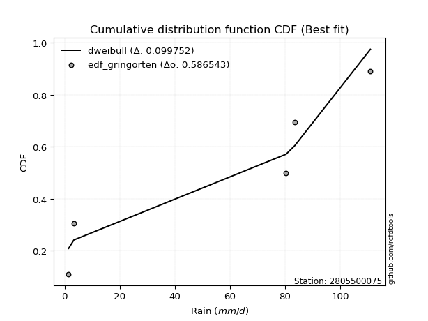</img></img>

</div>


### 9. EDF Filliben (1975)

The specific values of the constants (0.3175) (often denoted as $alpha$) and (0.365) are derived from a method proposed by James J. Filliben in a 1975 paper. This particular formula is the mean value of the $i$-th order statistic of the normal distribution and is considered a robust and effective plotting position formula for the normal probability plot correlation coefficient test for normality.

<div align="center">


$P=(m-0.3175)/(n+0.365)$


</div>


**9.1. Empirical values**

<div align="center">

|                | 0                   | 1                  | 2            | 3                  | 4                  |
|:---------------|:--------------------|:-------------------|:-------------|:-------------------|:-------------------|
| date           | 2022                | 2024               | 2025         | 2019               | 2020               |
| x              | 1.5                 | 3.4                | 80.4         | 83.6               | 111.0              |
| m              | 1                   | 2                  | 3            | 4                  | 5                  |
| empirical_dist | edf_filliben        | edf_filliben       | edf_filliben | edf_filliben       | edf_filliben       |
| empirical      | 0.12721342031686858 | 0.3136067101584343 | 0.5          | 0.6863932898415657 | 0.8727865796831314 |
| empirical_tr   | 1.1457554725040042  | 1.456890699253225  | 2.0          | 3.188707280832095  | 7.860805860805863  |

</div>


**9.2. Kolmogorov-Smirnov fit test (sorted by Δ)**


<div align="center">

|                | 0                   | 1                  | 2                   | 3                   | 4                   | 5                   | 6                   | 7                  | 8                  | 9                   | 10                 | 11                  | 12                  | 13                 | 14                  | 15                  | 16                  | 17                  | 18                 | 19                 | 20                 | 21                  | 22                 | 23                  | 24                  | 25                  | 26                 | 27                 | 28                 | 29                  | 30                 | 31                 | 32                  | 33                  | 34                  | 35                  | 36                  | 37                  | 38                 | 39                  | 40                  | 41                  | 42                  | 43                  | 44                  | 45                  | 46                  | 47                  | 48                  | 49                  | 50                  | 51                 | 52                 | 53                 | 54                 | 55                 | 56                 | 57                 | 58                 | 59                  | 60                 | 61                  | 62                 | 63                  | 64                  | 65                 | 66                 | 67                  | 68                  | 69                  | 70                 | 71                  | 72                 | 73                 | 74                 | 75                 | 76                 | 77                  | 78                  | 79                 | 80                 | 81                 | 82                 | 83                  | 84                 | 85                  | 86                  | 87                 | 88                 | 89                  | 90                 | 91                  | 92                  | 93                  | 94                 | 95                 | 96                 | 97                  | 98                 | 99                  | 100                 | 101                | 102                | 103                 | 104                | 105                 | 106                 | 107                | 108                | 109                | 110                 | 111                 | 112                | 113                | 114                | 115                | 116                | 117                | 118                | 119                 | 120                 | 121                | 122                | 123                 | 124                 | 125                 | 126                | 127                | 128                | 129                | 130                | 131                | 132                | 133                | 134                | 135                | 136                 | 137                 | 138                | 139                | 140                | 141                | 142                | 143                 | 144                | 145                | 146                | 147                | 148                | 149                | 150                | 151                | 152                | 153                | 154                | 155                | 156                | 157                | 158                | 159                |
|:---------------|:--------------------|:-------------------|:--------------------|:--------------------|:--------------------|:--------------------|:--------------------|:-------------------|:-------------------|:--------------------|:-------------------|:--------------------|:--------------------|:-------------------|:--------------------|:--------------------|:--------------------|:--------------------|:-------------------|:-------------------|:-------------------|:--------------------|:-------------------|:--------------------|:--------------------|:--------------------|:-------------------|:-------------------|:-------------------|:--------------------|:-------------------|:-------------------|:--------------------|:--------------------|:--------------------|:--------------------|:--------------------|:--------------------|:-------------------|:--------------------|:--------------------|:--------------------|:--------------------|:--------------------|:--------------------|:--------------------|:--------------------|:--------------------|:--------------------|:--------------------|:--------------------|:-------------------|:-------------------|:-------------------|:-------------------|:-------------------|:-------------------|:-------------------|:-------------------|:--------------------|:-------------------|:--------------------|:-------------------|:--------------------|:--------------------|:-------------------|:-------------------|:--------------------|:--------------------|:--------------------|:-------------------|:--------------------|:-------------------|:-------------------|:-------------------|:-------------------|:-------------------|:--------------------|:--------------------|:-------------------|:-------------------|:-------------------|:-------------------|:--------------------|:-------------------|:--------------------|:--------------------|:-------------------|:-------------------|:--------------------|:-------------------|:--------------------|:--------------------|:--------------------|:-------------------|:-------------------|:-------------------|:--------------------|:-------------------|:--------------------|:--------------------|:-------------------|:-------------------|:--------------------|:-------------------|:--------------------|:--------------------|:-------------------|:-------------------|:-------------------|:--------------------|:--------------------|:-------------------|:-------------------|:-------------------|:-------------------|:-------------------|:-------------------|:-------------------|:--------------------|:--------------------|:-------------------|:-------------------|:--------------------|:--------------------|:--------------------|:-------------------|:-------------------|:-------------------|:-------------------|:-------------------|:-------------------|:-------------------|:-------------------|:-------------------|:-------------------|:--------------------|:--------------------|:-------------------|:-------------------|:-------------------|:-------------------|:-------------------|:--------------------|:-------------------|:-------------------|:-------------------|:-------------------|:-------------------|:-------------------|:-------------------|:-------------------|:-------------------|:-------------------|:-------------------|:-------------------|:-------------------|:-------------------|:-------------------|:-------------------|
| station        | 2805500075          | 2805500075         | 2805500075          | 2805500075          | 2805500075          | 2805500075          | 2805500075          | 2805500075         | 2805500075         | 2805500075          | 2805500075         | 2805500075          | 2805500075          | 2805500075         | 2805500075          | 2805500075          | 2805500075          | 2805500075          | 2805500075         | 2805500075         | 2805500075         | 2805500075          | 2805500075         | 2805500075          | 2805500075          | 2805500075          | 2805500075         | 2805500075         | 2805500075         | 2805500075          | 2805500075         | 2805500075         | 2805500075          | 2805500075          | 2805500075          | 2805500075          | 2805500075          | 2805500075          | 2805500075         | 2805500075          | 2805500075          | 2805500075          | 2805500075          | 2805500075          | 2805500075          | 2805500075          | 2805500075          | 2805500075          | 2805500075          | 2805500075          | 2805500075          | 2805500075         | 2805500075         | 2805500075         | 2805500075         | 2805500075         | 2805500075         | 2805500075         | 2805500075         | 2805500075          | 2805500075         | 2805500075          | 2805500075         | 2805500075          | 2805500075          | 2805500075         | 2805500075         | 2805500075          | 2805500075          | 2805500075          | 2805500075         | 2805500075          | 2805500075         | 2805500075         | 2805500075         | 2805500075         | 2805500075         | 2805500075          | 2805500075          | 2805500075         | 2805500075         | 2805500075         | 2805500075         | 2805500075          | 2805500075         | 2805500075          | 2805500075          | 2805500075         | 2805500075         | 2805500075          | 2805500075         | 2805500075          | 2805500075          | 2805500075          | 2805500075         | 2805500075         | 2805500075         | 2805500075          | 2805500075         | 2805500075          | 2805500075          | 2805500075         | 2805500075         | 2805500075          | 2805500075         | 2805500075          | 2805500075          | 2805500075         | 2805500075         | 2805500075         | 2805500075          | 2805500075          | 2805500075         | 2805500075         | 2805500075         | 2805500075         | 2805500075         | 2805500075         | 2805500075         | 2805500075          | 2805500075          | 2805500075         | 2805500075         | 2805500075          | 2805500075          | 2805500075          | 2805500075         | 2805500075         | 2805500075         | 2805500075         | 2805500075         | 2805500075         | 2805500075         | 2805500075         | 2805500075         | 2805500075         | 2805500075          | 2805500075          | 2805500075         | 2805500075         | 2805500075         | 2805500075         | 2805500075         | 2805500075          | 2805500075         | 2805500075         | 2805500075         | 2805500075         | 2805500075         | 2805500075         | 2805500075         | 2805500075         | 2805500075         | 2805500075         | 2805500075         | 2805500075         | 2805500075         | 2805500075         | 2805500075         | 2805500075         |
| empirical_dist | edf_filliben        | edf_filliben       | edf_filliben        | edf_filliben        | edf_filliben        | edf_filliben        | edf_filliben        | edf_filliben       | edf_filliben       | edf_filliben        | edf_filliben       | edf_filliben        | edf_filliben        | edf_filliben       | edf_filliben        | edf_filliben        | edf_filliben        | edf_filliben        | edf_filliben       | edf_filliben       | edf_filliben       | edf_filliben        | edf_filliben       | edf_filliben        | edf_filliben        | edf_filliben        | edf_filliben       | edf_filliben       | edf_filliben       | edf_filliben        | edf_filliben       | edf_filliben       | edf_filliben        | edf_filliben        | edf_filliben        | edf_filliben        | edf_filliben        | edf_filliben        | edf_filliben       | edf_filliben        | edf_filliben        | edf_filliben        | edf_filliben        | edf_filliben        | edf_filliben        | edf_filliben        | edf_filliben        | edf_filliben        | edf_filliben        | edf_filliben        | edf_filliben        | edf_filliben       | edf_filliben       | edf_filliben       | edf_filliben       | edf_filliben       | edf_filliben       | edf_filliben       | edf_filliben       | edf_filliben        | edf_filliben       | edf_filliben        | edf_filliben       | edf_filliben        | edf_filliben        | edf_filliben       | edf_filliben       | edf_filliben        | edf_filliben        | edf_filliben        | edf_filliben       | edf_filliben        | edf_filliben       | edf_filliben       | edf_filliben       | edf_filliben       | edf_filliben       | edf_filliben        | edf_filliben        | edf_filliben       | edf_filliben       | edf_filliben       | edf_filliben       | edf_filliben        | edf_filliben       | edf_filliben        | edf_filliben        | edf_filliben       | edf_filliben       | edf_filliben        | edf_filliben       | edf_filliben        | edf_filliben        | edf_filliben        | edf_filliben       | edf_filliben       | edf_filliben       | edf_filliben        | edf_filliben       | edf_filliben        | edf_filliben        | edf_filliben       | edf_filliben       | edf_filliben        | edf_filliben       | edf_filliben        | edf_filliben        | edf_filliben       | edf_filliben       | edf_filliben       | edf_filliben        | edf_filliben        | edf_filliben       | edf_filliben       | edf_filliben       | edf_filliben       | edf_filliben       | edf_filliben       | edf_filliben       | edf_filliben        | edf_filliben        | edf_filliben       | edf_filliben       | edf_filliben        | edf_filliben        | edf_filliben        | edf_filliben       | edf_filliben       | edf_filliben       | edf_filliben       | edf_filliben       | edf_filliben       | edf_filliben       | edf_filliben       | edf_filliben       | edf_filliben       | edf_filliben        | edf_filliben        | edf_filliben       | edf_filliben       | edf_filliben       | edf_filliben       | edf_filliben       | edf_filliben        | edf_filliben       | edf_filliben       | edf_filliben       | edf_filliben       | edf_filliben       | edf_filliben       | edf_filliben       | edf_filliben       | edf_filliben       | edf_filliben       | edf_filliben       | edf_filliben       | edf_filliben       | edf_filliben       | edf_filliben       | edf_filliben       |
| p_dist         | dweibull            | arcsine            | genextreme          | dgamma              | loglevy_l           | logwrapcauchy       | logdgamma           | ksone              | trapezoid          | wrapcauchy          | johnsonsu          | semicircular        | levy_l              | logarcsine         | anglit              | logdweibull         | skewnorm            | weibull_min         | gumbel_l           | pearson3           | loggenpareto       | exponnorm           | crystalball        | norm                | foldnorm            | triang              | erlang             | gamma              | logksone           | logalpha            | loglomax           | genhalflogistic    | logweibull_max      | rice                | argus               | cosine              | maxwell             | rayleigh            | logbeta            | logistic            | logsemicircular     | logtrapezoid        | rdist               | halfnorm            | loganglit           | hypsecant           | kstwobign           | beta                | gennorm             | nakagami            | gumbel_r            | loggennorm         | logpearson3        | logncf             | burr               | logweibull_min     | loggumbel_l        | logexponpow        | exponpow           | laplace             | logbetaprime       | lognct              | logt               | lognorm             | logexponnorm        | loggamma           | loggamma           | logfatiguelife      | moyal               | logerlang           | loginvweibull      | logrice             | logmaxwell         | loggenexpon        | loginvgauss        | lomax              | ncf                | logfoldnorm         | lograyleigh         | genexpon           | logf               | loggompertz        | fatiguelife        | loginvgamma         | burr12             | kappa4              | logkstwobign        | logtruncnorm       | exponweib          | loghalfnorm         | bradford           | genpareto           | tukeylambda         | loglogistic         | gompertz           | truncweibull_min   | uniform            | vonmises_line       | logcosine          | loggenextreme       | logburr             | f                  | halflogistic       | loggumbel_r         | loghypsecant       | gausshyper          | loghalflogistic     | halfgennorm        | logargus           | truncexpon         | logmoyal            | wald                | logmielke          | loglaplace         | loglaplace         | logloggamma        | logloglaplace      | logburr12          | loggausshyper      | betaprime           | lognakagami         | truncpareto        | logwald            | logjohnsonsb        | loggenhalflogistic  | invgauss            | kappa3             | gengamma           | t                  | logskewnorm        | logkappa4          | logtriang          | logexponweib       | logtukeylambda     | logkappa3          | loguniform         | logvonmises_line    | invweibull          | logbradford        | logtruncexpon      | loggengamma        | powerlaw           | alpha              | logtruncweibull_min | johnsonsb          | mielke             | truncnorm          | logrdist           | logtruncpareto     | logpowerlaw        | weibull_max        | logjohnsonsu       | nct                | invgamma           | loghalfgennorm     | genlogistic        | loggenlogistic     | logvonmises        | vonmises           | logcrystalball     |
| delta          | 0.10257661357156034 | 0.1253967208826221 | 0.12721342031634764 | 0.12868243477727373 | 0.13108217492639618 | 0.15172596384550752 | 0.15335259185068262 | 0.1566998187084292 | 0.1614242486485531 | 0.16924347810847018 | 0.1703610919562178 | 0.17064082664367675 | 0.17416601069473003 | 0.1755357713777166 | 0.18132557380432623 | 0.18279803516424598 | 0.18352060154895092 | 0.18946116921806655 | 0.1957497974544465 | 0.1970580185510722 | 0.2018035313845334 | 0.20637429671374408 | 0.2063745265352679 | 0.20637453916278892 | 0.21014047952086046 | 0.21046360855261914 | 0.2112576089576388 | 0.2116303571738224 | 0.2138948829244488 | 0.21420029604944246 | 0.2144803855472771 | 0.2152567648128314 | 0.21780377117444052 | 0.21840263762543022 | 0.21961205461649597 | 0.22141380064519411 | 0.22151179131818743 | 0.22592148464552553 | 0.2272218854139617 | 0.22801485424206736 | 0.23034068777016148 | 0.23126296205848995 | 0.23605139141998976 | 0.23945524654086836 | 0.24258860632170764 | 0.24347297177736182 | 0.24627675087159817 | 0.24839664410837192 | 0.24874180849984293 | 0.25153176189068893 | 0.25587873054546917 | 0.2606313536975947 | 0.2611637307938931 | 0.2615410481285041 | 0.2641407668457997 | 0.265524384578972  | 0.2659501661693666 | 0.2661287725724861 | 0.2678985751290588 | 0.26795324044181645 | 0.2695608183891566 | 0.27056899047192673 | 0.2706370264892186 | 0.27063921561020043 | 0.27064431611263917 | 0.271201663757793  | 0.271201663757793  | 0.27180363812013897 | 0.27186793494137407 | 0.27297726702944425 | 0.2741648627892621 | 0.27426468829116457 | 0.2774998497264666 | 0.2777401903031309 | 0.2778041422578228 | 0.2783720387226881 | 0.2785607395705827 | 0.27931905434861726 | 0.27944497035034965 | 0.279711914638357  | 0.2798540565616485 | 0.280146148014623  | 0.280290352345112  | 0.28039270318317067 | 0.2813215772789416 | 0.28289831200459886 | 0.28498431693893567 | 0.2855502865035735 | 0.2855889240800191 | 0.28669907952166895 | 0.2895281466867623 | 0.29207228361649445 | 0.29231432771131244 | 0.29313732087297695 | 0.2931516766368077 | 0.2936767213958862 | 0.2962551119849183 | 0.29963417550225413 | 0.2999106239293885 | 0.30042616301600533 | 0.30060771545464415 | 0.3028766381851733 | 0.303987701332687  | 0.30487191292643745 | 0.3073109314453609 | 0.30739232235844616 | 0.30980753591937993 | 0.3125455478826956 | 0.3133212620404814 | 0.3142076080181575 | 0.31602486155011633 | 0.31909497057171377 | 0.3204110888087578 | 0.3246574560178005 | 0.3246574560178005 | 0.3260223697025305 | 0.3274574647369598 | 0.3327918030471376 | 0.3336473061804204 | 0.34175567135859075 | 0.34497013205555493 | 0.3493271579325068 | 0.3523357066700117 | 0.36063831565431026 | 0.36354552452777866 | 0.36858086716860594 | 0.374304229072811  | 0.3877671386240421 | 0.3878550185898524 | 0.3967027756989412 | 0.4058904911719047 | 0.4082563885612258 | 0.4107116246936737 | 0.4180691844070239 | 0.4250660576281673 | 0.4250671125683846 | 0.42512260212835173 | 0.43821291889585545 | 0.4437685064187147 | 0.4487206239034478 | 0.4604719966472576 | 0.4645557708815533 | 0.4694722122259707 | 0.47274166478072177 | 0.4980083044640018 | 0.4994449335645305 | 0.5                | 0.5                | 0.5010045736182909 | 0.5018864270181205 | 0.5417688565383674 | 0.5966318562468356 | 0.6456574046724664 | 0.6834302806424586 | 0.6863932898415657 | 0.6863932898415657 | 0.6863932898415657 | 0.8038414112489427 | 17.860315299949807 | nan                |
| deltao         | 0.5865427407550001  | 0.5865427407550001 | 0.5865427407550001  | 0.5865427407550001  | 0.5865427407550001  | 0.5865427407550001  | 0.5865427407550001  | 0.5865427407550001 | 0.5865427407550001 | 0.5865427407550001  | 0.5865427407550001 | 0.5865427407550001  | 0.5865427407550001  | 0.5865427407550001 | 0.5865427407550001  | 0.5865427407550001  | 0.5865427407550001  | 0.5865427407550001  | 0.5865427407550001 | 0.5865427407550001 | 0.5865427407550001 | 0.5865427407550001  | 0.5865427407550001 | 0.5865427407550001  | 0.5865427407550001  | 0.5865427407550001  | 0.5865427407550001 | 0.5865427407550001 | 0.5865427407550001 | 0.5865427407550001  | 0.5865427407550001 | 0.5865427407550001 | 0.5865427407550001  | 0.5865427407550001  | 0.5865427407550001  | 0.5865427407550001  | 0.5865427407550001  | 0.5865427407550001  | 0.5865427407550001 | 0.5865427407550001  | 0.5865427407550001  | 0.5865427407550001  | 0.5865427407550001  | 0.5865427407550001  | 0.5865427407550001  | 0.5865427407550001  | 0.5865427407550001  | 0.5865427407550001  | 0.5865427407550001  | 0.5865427407550001  | 0.5865427407550001  | 0.5865427407550001 | 0.5865427407550001 | 0.5865427407550001 | 0.5865427407550001 | 0.5865427407550001 | 0.5865427407550001 | 0.5865427407550001 | 0.5865427407550001 | 0.5865427407550001  | 0.5865427407550001 | 0.5865427407550001  | 0.5865427407550001 | 0.5865427407550001  | 0.5865427407550001  | 0.5865427407550001 | 0.5865427407550001 | 0.5865427407550001  | 0.5865427407550001  | 0.5865427407550001  | 0.5865427407550001 | 0.5865427407550001  | 0.5865427407550001 | 0.5865427407550001 | 0.5865427407550001 | 0.5865427407550001 | 0.5865427407550001 | 0.5865427407550001  | 0.5865427407550001  | 0.5865427407550001 | 0.5865427407550001 | 0.5865427407550001 | 0.5865427407550001 | 0.5865427407550001  | 0.5865427407550001 | 0.5865427407550001  | 0.5865427407550001  | 0.5865427407550001 | 0.5865427407550001 | 0.5865427407550001  | 0.5865427407550001 | 0.5865427407550001  | 0.5865427407550001  | 0.5865427407550001  | 0.5865427407550001 | 0.5865427407550001 | 0.5865427407550001 | 0.5865427407550001  | 0.5865427407550001 | 0.5865427407550001  | 0.5865427407550001  | 0.5865427407550001 | 0.5865427407550001 | 0.5865427407550001  | 0.5865427407550001 | 0.5865427407550001  | 0.5865427407550001  | 0.5865427407550001 | 0.5865427407550001 | 0.5865427407550001 | 0.5865427407550001  | 0.5865427407550001  | 0.5865427407550001 | 0.5865427407550001 | 0.5865427407550001 | 0.5865427407550001 | 0.5865427407550001 | 0.5865427407550001 | 0.5865427407550001 | 0.5865427407550001  | 0.5865427407550001  | 0.5865427407550001 | 0.5865427407550001 | 0.5865427407550001  | 0.5865427407550001  | 0.5865427407550001  | 0.5865427407550001 | 0.5865427407550001 | 0.5865427407550001 | 0.5865427407550001 | 0.5865427407550001 | 0.5865427407550001 | 0.5865427407550001 | 0.5865427407550001 | 0.5865427407550001 | 0.5865427407550001 | 0.5865427407550001  | 0.5865427407550001  | 0.5865427407550001 | 0.5865427407550001 | 0.5865427407550001 | 0.5865427407550001 | 0.5865427407550001 | 0.5865427407550001  | 0.5865427407550001 | 0.5865427407550001 | 0.5865427407550001 | 0.5865427407550001 | 0.5865427407550001 | 0.5865427407550001 | 0.5865427407550001 | 0.5865427407550001 | 0.5865427407550001 | 0.5865427407550001 | 0.5865427407550001 | 0.5865427407550001 | 0.5865427407550001 | 0.5865427407550001 | 0.5865427407550001 | 0.5865427407550001 |
| eval           | Δo > Δ              | Δo > Δ             | Δo > Δ              | Δo > Δ              | Δo > Δ              | Δo > Δ              | Δo > Δ              | Δo > Δ             | Δo > Δ             | Δo > Δ              | Δo > Δ             | Δo > Δ              | Δo > Δ              | Δo > Δ             | Δo > Δ              | Δo > Δ              | Δo > Δ              | Δo > Δ              | Δo > Δ             | Δo > Δ             | Δo > Δ             | Δo > Δ              | Δo > Δ             | Δo > Δ              | Δo > Δ              | Δo > Δ              | Δo > Δ             | Δo > Δ             | Δo > Δ             | Δo > Δ              | Δo > Δ             | Δo > Δ             | Δo > Δ              | Δo > Δ              | Δo > Δ              | Δo > Δ              | Δo > Δ              | Δo > Δ              | Δo > Δ             | Δo > Δ              | Δo > Δ              | Δo > Δ              | Δo > Δ              | Δo > Δ              | Δo > Δ              | Δo > Δ              | Δo > Δ              | Δo > Δ              | Δo > Δ              | Δo > Δ              | Δo > Δ              | Δo > Δ             | Δo > Δ             | Δo > Δ             | Δo > Δ             | Δo > Δ             | Δo > Δ             | Δo > Δ             | Δo > Δ             | Δo > Δ              | Δo > Δ             | Δo > Δ              | Δo > Δ             | Δo > Δ              | Δo > Δ              | Δo > Δ             | Δo > Δ             | Δo > Δ              | Δo > Δ              | Δo > Δ              | Δo > Δ             | Δo > Δ              | Δo > Δ             | Δo > Δ             | Δo > Δ             | Δo > Δ             | Δo > Δ             | Δo > Δ              | Δo > Δ              | Δo > Δ             | Δo > Δ             | Δo > Δ             | Δo > Δ             | Δo > Δ              | Δo > Δ             | Δo > Δ              | Δo > Δ              | Δo > Δ             | Δo > Δ             | Δo > Δ              | Δo > Δ             | Δo > Δ              | Δo > Δ              | Δo > Δ              | Δo > Δ             | Δo > Δ             | Δo > Δ             | Δo > Δ              | Δo > Δ             | Δo > Δ              | Δo > Δ              | Δo > Δ             | Δo > Δ             | Δo > Δ              | Δo > Δ             | Δo > Δ              | Δo > Δ              | Δo > Δ             | Δo > Δ             | Δo > Δ             | Δo > Δ              | Δo > Δ              | Δo > Δ             | Δo > Δ             | Δo > Δ             | Δo > Δ             | Δo > Δ             | Δo > Δ             | Δo > Δ             | Δo > Δ              | Δo > Δ              | Δo > Δ             | Δo > Δ             | Δo > Δ              | Δo > Δ              | Δo > Δ              | Δo > Δ             | Δo > Δ             | Δo > Δ             | Δo > Δ             | Δo > Δ             | Δo > Δ             | Δo > Δ             | Δo > Δ             | Δo > Δ             | Δo > Δ             | Δo > Δ              | Δo > Δ              | Δo > Δ             | Δo > Δ             | Δo > Δ             | Δo > Δ             | Δo > Δ             | Δo > Δ              | Δo > Δ             | Δo > Δ             | Δo > Δ             | Δo > Δ             | Δo > Δ             | Δo > Δ             | Δo > Δ             | Δo <= Δ            | Δo <= Δ            | Δo <= Δ            | Δo <= Δ            | Δo <= Δ            | Δo <= Δ            | Δo <= Δ            | Δo <= Δ            | Δo <= Δ            |
| fit            | 1                   | 1                  | 1                   | 1                   | 1                   | 1                   | 1                   | 1                  | 1                  | 1                   | 1                  | 1                   | 1                   | 1                  | 1                   | 1                   | 1                   | 1                   | 1                  | 1                  | 1                  | 1                   | 1                  | 1                   | 1                   | 1                   | 1                  | 1                  | 1                  | 1                   | 1                  | 1                  | 1                   | 1                   | 1                   | 1                   | 1                   | 1                   | 1                  | 1                   | 1                   | 1                   | 1                   | 1                   | 1                   | 1                   | 1                   | 1                   | 1                   | 1                   | 1                   | 1                  | 1                  | 1                  | 1                  | 1                  | 1                  | 1                  | 1                  | 1                   | 1                  | 1                   | 1                  | 1                   | 1                   | 1                  | 1                  | 1                   | 1                   | 1                   | 1                  | 1                   | 1                  | 1                  | 1                  | 1                  | 1                  | 1                   | 1                   | 1                  | 1                  | 1                  | 1                  | 1                   | 1                  | 1                   | 1                   | 1                  | 1                  | 1                   | 1                  | 1                   | 1                   | 1                   | 1                  | 1                  | 1                  | 1                   | 1                  | 1                   | 1                   | 1                  | 1                  | 1                   | 1                  | 1                   | 1                   | 1                  | 1                  | 1                  | 1                   | 1                   | 1                  | 1                  | 1                  | 1                  | 1                  | 1                  | 1                  | 1                   | 1                   | 1                  | 1                  | 1                   | 1                   | 1                   | 1                  | 1                  | 1                  | 1                  | 1                  | 1                  | 1                  | 1                  | 1                  | 1                  | 1                   | 1                   | 1                  | 1                  | 1                  | 1                  | 1                  | 1                   | 1                  | 1                  | 1                  | 1                  | 1                  | 1                  | 1                  | 0                  | 0                  | 0                  | 0                  | 0                  | 0                  | 0                  | 0                  | 0                  |
| n              | 5                   | 5                  | 5                   | 5                   | 5                   | 5                   | 5                   | 5                  | 5                  | 5                   | 5                  | 5                   | 5                   | 5                  | 5                   | 5                   | 5                   | 5                   | 5                  | 5                  | 5                  | 5                   | 5                  | 5                   | 5                   | 5                   | 5                  | 5                  | 5                  | 5                   | 5                  | 5                  | 5                   | 5                   | 5                   | 5                   | 5                   | 5                   | 5                  | 5                   | 5                   | 5                   | 5                   | 5                   | 5                   | 5                   | 5                   | 5                   | 5                   | 5                   | 5                   | 5                  | 5                  | 5                  | 5                  | 5                  | 5                  | 5                  | 5                  | 5                   | 5                  | 5                   | 5                  | 5                   | 5                   | 5                  | 5                  | 5                   | 5                   | 5                   | 5                  | 5                   | 5                  | 5                  | 5                  | 5                  | 5                  | 5                   | 5                   | 5                  | 5                  | 5                  | 5                  | 5                   | 5                  | 5                   | 5                   | 5                  | 5                  | 5                   | 5                  | 5                   | 5                   | 5                   | 5                  | 5                  | 5                  | 5                   | 5                  | 5                   | 5                   | 5                  | 5                  | 5                   | 5                  | 5                   | 5                   | 5                  | 5                  | 5                  | 5                   | 5                   | 5                  | 5                  | 5                  | 5                  | 5                  | 5                  | 5                  | 5                   | 5                   | 5                  | 5                  | 5                   | 5                   | 5                   | 5                  | 5                  | 5                  | 5                  | 5                  | 5                  | 5                  | 5                  | 5                  | 5                  | 5                   | 5                   | 5                  | 5                  | 5                  | 5                  | 5                  | 5                   | 5                  | 5                  | 5                  | 5                  | 5                  | 5                  | 5                  | 5                  | 5                  | 5                  | 5                  | 5                  | 5                  | 5                  | 5                  | 5                  |
| best_fit       | 1                   | 0                  | 0                   | 0                   | 0                   | 0                   | 0                   | 0                  | 0                  | 0                   | 0                  | 0                   | 0                   | 0                  | 0                   | 0                   | 0                   | 0                   | 0                  | 0                  | 0                  | 0                   | 0                  | 0                   | 0                   | 0                   | 0                  | 0                  | 0                  | 0                   | 0                  | 0                  | 0                   | 0                   | 0                   | 0                   | 0                   | 0                   | 0                  | 0                   | 0                   | 0                   | 0                   | 0                   | 0                   | 0                   | 0                   | 0                   | 0                   | 0                   | 0                   | 0                  | 0                  | 0                  | 0                  | 0                  | 0                  | 0                  | 0                  | 0                   | 0                  | 0                   | 0                  | 0                   | 0                   | 0                  | 0                  | 0                   | 0                   | 0                   | 0                  | 0                   | 0                  | 0                  | 0                  | 0                  | 0                  | 0                   | 0                   | 0                  | 0                  | 0                  | 0                  | 0                   | 0                  | 0                   | 0                   | 0                  | 0                  | 0                   | 0                  | 0                   | 0                   | 0                   | 0                  | 0                  | 0                  | 0                   | 0                  | 0                   | 0                   | 0                  | 0                  | 0                   | 0                  | 0                   | 0                   | 0                  | 0                  | 0                  | 0                   | 0                   | 0                  | 0                  | 0                  | 0                  | 0                  | 0                  | 0                  | 0                   | 0                   | 0                  | 0                  | 0                   | 0                   | 0                   | 0                  | 0                  | 0                  | 0                  | 0                  | 0                  | 0                  | 0                  | 0                  | 0                  | 0                   | 0                   | 0                  | 0                  | 0                  | 0                  | 0                  | 0                   | 0                  | 0                  | 0                  | 0                  | 0                  | 0                  | 0                  | 0                  | 0                  | 0                  | 0                  | 0                  | 0                  | 0                  | 0                  | 0                  |
| best_fit_sort  | 1                   | 2                  | 3                   | 4                   | 5                   | 6                   | 7                   | 8                  | 9                  | 10                  | 11                 | 12                  | 13                  | 14                 | 15                  | 16                  | 17                  | 18                  | 19                 | 20                 | 21                 | 22                  | 23                 | 24                  | 25                  | 26                  | 27                 | 28                 | 29                 | 30                  | 31                 | 32                 | 33                  | 34                  | 35                  | 36                  | 37                  | 38                  | 39                 | 40                  | 41                  | 42                  | 43                  | 44                  | 45                  | 46                  | 47                  | 48                  | 49                  | 50                  | 51                  | 52                 | 53                 | 54                 | 55                 | 56                 | 57                 | 58                 | 59                 | 60                  | 61                 | 62                  | 63                 | 64                  | 65                  | 66                 | 67                 | 68                  | 69                  | 70                  | 71                 | 72                  | 73                 | 74                 | 75                 | 76                 | 77                 | 78                  | 79                  | 80                 | 81                 | 82                 | 83                 | 84                  | 85                 | 86                  | 87                  | 88                 | 89                 | 90                  | 91                 | 92                  | 93                  | 94                  | 95                 | 96                 | 97                 | 98                  | 99                 | 100                 | 101                 | 102                | 103                | 104                 | 105                | 106                 | 107                 | 108                | 109                | 110                | 111                 | 112                 | 113                | 114                | 115                | 116                | 117                | 118                | 119                | 120                 | 121                 | 122                | 123                | 124                 | 125                 | 126                 | 127                | 128                | 129                | 130                | 131                | 132                | 133                | 134                | 135                | 136                | 137                 | 138                 | 139                | 140                | 141                | 142                | 143                | 144                 | 145                | 146                | 147                | 148                | 149                | 150                | 151                | 152                | 153                | 154                | 155                | 156                | 157                | 158                | 159                | 160                |

</div>


**9.3. Best fit**

<div align="center">

|   id |    station | empirical_dist   | p_dist   |    delta |   deltao | eval   |   fit |   n |   best_fit |   best_fit_sort |
|-----:|-----------:|:-----------------|:---------|---------:|---------:|:-------|------:|----:|-----------:|----------------:|
|    0 | 2805500075 | edf_filliben     | dweibull | 0.102577 | 0.586543 | Δo > Δ |     1 |   5 |          1 |               1 |

</div>


<div align="center">

</img></img>

</div>


### 10. EDF Jenkinson (1977)

The Jenkinson formula in hydrology is an empirical plotting position formula used to estimate the non-exceedance probability _(P)_ or return period _(T)_ of a given ordered observation within a sample. It is a widely used method in the frequency analysis of extreme events such as floods and rainfall, as it provides a distribution-free way to plot data. _a≈0.31_ and _b≈0.38_ are constants derived to approximate the median of the probability distribution for the given rank.

<div align="center">


$P=(m-a)/(n+b)$


</div>


**10.1. Empirical values**

<div align="center">

|                | 0                   | 1                  | 2             | 3                  | 4                  |
|:---------------|:--------------------|:-------------------|:--------------|:-------------------|:-------------------|
| date           | 2022                | 2024               | 2025          | 2019               | 2020               |
| x              | 1.5                 | 3.4                | 80.4          | 83.6               | 111.0              |
| m              | 1                   | 2                  | 3             | 4                  | 5                  |
| empirical_dist | edf_jenkinson       | edf_jenkinson      | edf_jenkinson | edf_jenkinson      | edf_jenkinson      |
| empirical      | 0.12825278810408922 | 0.3141263940520446 | 0.5           | 0.6858736059479554 | 0.8717472118959109 |
| empirical_tr   | 1.1471215351812367  | 1.4579945799457996 | 2.0           | 3.183431952662722  | 7.797101449275368  |

</div>


**10.2. Kolmogorov-Smirnov fit test (sorted by Δ)**


<div align="center">

|                | 0                   | 1                  | 2                  | 3                   | 4                   | 5                   | 6                   | 7                  | 8                  | 9                   | 10                  | 11                  | 12                 | 13                 | 14                  | 15                  | 16                  | 17                 | 18                  | 19                 | 20                  | 21                  | 22                 | 23                  | 24                  | 25                 | 26                 | 27                 | 28                  | 29                 | 30                  | 31                  | 32                 | 33                  | 34                 | 35                  | 36                  | 37                  | 38                  | 39                  | 40                  | 41                  | 42                 | 43                  | 44                  | 45                  | 46                  | 47                  | 48                  | 49                  | 50                  | 51                  | 52                 | 53                 | 54                 | 55                 | 56                 | 57                 | 58                 | 59                  | 60                 | 61                  | 62                 | 63                  | 64                  | 65                 | 66                 | 67                  | 68                  | 69                  | 70                 | 71                  | 72                 | 73                 | 74                 | 75                 | 76                 | 77                  | 78                  | 79                 | 80                 | 81                  | 82                 | 83                  | 84                 | 85                 | 86                  | 87                  | 88                 | 89                  | 90                 | 91                 | 92                 | 93                  | 94                  | 95                 | 96                 | 97                 | 98                 | 99                  | 100                 | 101                | 102                 | 103                 | 104                | 105                | 106                 | 107                | 108                | 109                | 110                 | 111                 | 112                | 113                | 114                | 115                | 116                | 117                | 118                | 119                 | 120                 | 121                | 122                | 123                | 124                 | 125                 | 126                | 127                | 128                | 129                | 130                | 131                | 132                | 133                | 134                | 135                | 136                 | 137                | 138                | 139                | 140                | 141                | 142                | 143                 | 144                 | 145                 | 146                | 147                | 148                | 149                | 150                | 151                | 152                | 153                | 154                | 155                | 156                | 157                | 158                | 159                |
|:---------------|:--------------------|:-------------------|:-------------------|:--------------------|:--------------------|:--------------------|:--------------------|:-------------------|:-------------------|:--------------------|:--------------------|:--------------------|:-------------------|:-------------------|:--------------------|:--------------------|:--------------------|:-------------------|:--------------------|:-------------------|:--------------------|:--------------------|:-------------------|:--------------------|:--------------------|:-------------------|:-------------------|:-------------------|:--------------------|:-------------------|:--------------------|:--------------------|:-------------------|:--------------------|:-------------------|:--------------------|:--------------------|:--------------------|:--------------------|:--------------------|:--------------------|:--------------------|:-------------------|:--------------------|:--------------------|:--------------------|:--------------------|:--------------------|:--------------------|:--------------------|:--------------------|:--------------------|:-------------------|:-------------------|:-------------------|:-------------------|:-------------------|:-------------------|:-------------------|:--------------------|:-------------------|:--------------------|:-------------------|:--------------------|:--------------------|:-------------------|:-------------------|:--------------------|:--------------------|:--------------------|:-------------------|:--------------------|:-------------------|:-------------------|:-------------------|:-------------------|:-------------------|:--------------------|:--------------------|:-------------------|:-------------------|:--------------------|:-------------------|:--------------------|:-------------------|:-------------------|:--------------------|:--------------------|:-------------------|:--------------------|:-------------------|:-------------------|:-------------------|:--------------------|:--------------------|:-------------------|:-------------------|:-------------------|:-------------------|:--------------------|:--------------------|:-------------------|:--------------------|:--------------------|:-------------------|:-------------------|:--------------------|:-------------------|:-------------------|:-------------------|:--------------------|:--------------------|:-------------------|:-------------------|:-------------------|:-------------------|:-------------------|:-------------------|:-------------------|:--------------------|:--------------------|:-------------------|:-------------------|:-------------------|:--------------------|:--------------------|:-------------------|:-------------------|:-------------------|:-------------------|:-------------------|:-------------------|:-------------------|:-------------------|:-------------------|:-------------------|:--------------------|:-------------------|:-------------------|:-------------------|:-------------------|:-------------------|:-------------------|:--------------------|:--------------------|:--------------------|:-------------------|:-------------------|:-------------------|:-------------------|:-------------------|:-------------------|:-------------------|:-------------------|:-------------------|:-------------------|:-------------------|:-------------------|:-------------------|:-------------------|
| station        | 2805500075          | 2805500075         | 2805500075         | 2805500075          | 2805500075          | 2805500075          | 2805500075          | 2805500075         | 2805500075         | 2805500075          | 2805500075          | 2805500075          | 2805500075         | 2805500075         | 2805500075          | 2805500075          | 2805500075          | 2805500075         | 2805500075          | 2805500075         | 2805500075          | 2805500075          | 2805500075         | 2805500075          | 2805500075          | 2805500075         | 2805500075         | 2805500075         | 2805500075          | 2805500075         | 2805500075          | 2805500075          | 2805500075         | 2805500075          | 2805500075         | 2805500075          | 2805500075          | 2805500075          | 2805500075          | 2805500075          | 2805500075          | 2805500075          | 2805500075         | 2805500075          | 2805500075          | 2805500075          | 2805500075          | 2805500075          | 2805500075          | 2805500075          | 2805500075          | 2805500075          | 2805500075         | 2805500075         | 2805500075         | 2805500075         | 2805500075         | 2805500075         | 2805500075         | 2805500075          | 2805500075         | 2805500075          | 2805500075         | 2805500075          | 2805500075          | 2805500075         | 2805500075         | 2805500075          | 2805500075          | 2805500075          | 2805500075         | 2805500075          | 2805500075         | 2805500075         | 2805500075         | 2805500075         | 2805500075         | 2805500075          | 2805500075          | 2805500075         | 2805500075         | 2805500075          | 2805500075         | 2805500075          | 2805500075         | 2805500075         | 2805500075          | 2805500075          | 2805500075         | 2805500075          | 2805500075         | 2805500075         | 2805500075         | 2805500075          | 2805500075          | 2805500075         | 2805500075         | 2805500075         | 2805500075         | 2805500075          | 2805500075          | 2805500075         | 2805500075          | 2805500075          | 2805500075         | 2805500075         | 2805500075          | 2805500075         | 2805500075         | 2805500075         | 2805500075          | 2805500075          | 2805500075         | 2805500075         | 2805500075         | 2805500075         | 2805500075         | 2805500075         | 2805500075         | 2805500075          | 2805500075          | 2805500075         | 2805500075         | 2805500075         | 2805500075          | 2805500075          | 2805500075         | 2805500075         | 2805500075         | 2805500075         | 2805500075         | 2805500075         | 2805500075         | 2805500075         | 2805500075         | 2805500075         | 2805500075          | 2805500075         | 2805500075         | 2805500075         | 2805500075         | 2805500075         | 2805500075         | 2805500075          | 2805500075          | 2805500075          | 2805500075         | 2805500075         | 2805500075         | 2805500075         | 2805500075         | 2805500075         | 2805500075         | 2805500075         | 2805500075         | 2805500075         | 2805500075         | 2805500075         | 2805500075         | 2805500075         |
| empirical_dist | edf_jenkinson       | edf_jenkinson      | edf_jenkinson      | edf_jenkinson       | edf_jenkinson       | edf_jenkinson       | edf_jenkinson       | edf_jenkinson      | edf_jenkinson      | edf_jenkinson       | edf_jenkinson       | edf_jenkinson       | edf_jenkinson      | edf_jenkinson      | edf_jenkinson       | edf_jenkinson       | edf_jenkinson       | edf_jenkinson      | edf_jenkinson       | edf_jenkinson      | edf_jenkinson       | edf_jenkinson       | edf_jenkinson      | edf_jenkinson       | edf_jenkinson       | edf_jenkinson      | edf_jenkinson      | edf_jenkinson      | edf_jenkinson       | edf_jenkinson      | edf_jenkinson       | edf_jenkinson       | edf_jenkinson      | edf_jenkinson       | edf_jenkinson      | edf_jenkinson       | edf_jenkinson       | edf_jenkinson       | edf_jenkinson       | edf_jenkinson       | edf_jenkinson       | edf_jenkinson       | edf_jenkinson      | edf_jenkinson       | edf_jenkinson       | edf_jenkinson       | edf_jenkinson       | edf_jenkinson       | edf_jenkinson       | edf_jenkinson       | edf_jenkinson       | edf_jenkinson       | edf_jenkinson      | edf_jenkinson      | edf_jenkinson      | edf_jenkinson      | edf_jenkinson      | edf_jenkinson      | edf_jenkinson      | edf_jenkinson       | edf_jenkinson      | edf_jenkinson       | edf_jenkinson      | edf_jenkinson       | edf_jenkinson       | edf_jenkinson      | edf_jenkinson      | edf_jenkinson       | edf_jenkinson       | edf_jenkinson       | edf_jenkinson      | edf_jenkinson       | edf_jenkinson      | edf_jenkinson      | edf_jenkinson      | edf_jenkinson      | edf_jenkinson      | edf_jenkinson       | edf_jenkinson       | edf_jenkinson      | edf_jenkinson      | edf_jenkinson       | edf_jenkinson      | edf_jenkinson       | edf_jenkinson      | edf_jenkinson      | edf_jenkinson       | edf_jenkinson       | edf_jenkinson      | edf_jenkinson       | edf_jenkinson      | edf_jenkinson      | edf_jenkinson      | edf_jenkinson       | edf_jenkinson       | edf_jenkinson      | edf_jenkinson      | edf_jenkinson      | edf_jenkinson      | edf_jenkinson       | edf_jenkinson       | edf_jenkinson      | edf_jenkinson       | edf_jenkinson       | edf_jenkinson      | edf_jenkinson      | edf_jenkinson       | edf_jenkinson      | edf_jenkinson      | edf_jenkinson      | edf_jenkinson       | edf_jenkinson       | edf_jenkinson      | edf_jenkinson      | edf_jenkinson      | edf_jenkinson      | edf_jenkinson      | edf_jenkinson      | edf_jenkinson      | edf_jenkinson       | edf_jenkinson       | edf_jenkinson      | edf_jenkinson      | edf_jenkinson      | edf_jenkinson       | edf_jenkinson       | edf_jenkinson      | edf_jenkinson      | edf_jenkinson      | edf_jenkinson      | edf_jenkinson      | edf_jenkinson      | edf_jenkinson      | edf_jenkinson      | edf_jenkinson      | edf_jenkinson      | edf_jenkinson       | edf_jenkinson      | edf_jenkinson      | edf_jenkinson      | edf_jenkinson      | edf_jenkinson      | edf_jenkinson      | edf_jenkinson       | edf_jenkinson       | edf_jenkinson       | edf_jenkinson      | edf_jenkinson      | edf_jenkinson      | edf_jenkinson      | edf_jenkinson      | edf_jenkinson      | edf_jenkinson      | edf_jenkinson      | edf_jenkinson      | edf_jenkinson      | edf_jenkinson      | edf_jenkinson      | edf_jenkinson      | edf_jenkinson      |
| p_dist         | dweibull            | arcsine            | dgamma             | genextreme          | loglevy_l           | logwrapcauchy       | logdgamma           | ksone              | trapezoid          | wrapcauchy          | semicircular        | johnsonsu           | levy_l             | logarcsine         | anglit              | logdweibull         | skewnorm            | weibull_min        | gumbel_l            | pearson3           | loggenpareto        | exponnorm           | crystalball        | norm                | foldnorm            | triang             | erlang             | gamma              | loglomax            | logksone           | logalpha            | genhalflogistic     | logweibull_max     | rice                | argus              | cosine              | maxwell             | rayleigh            | logbeta             | logistic            | logsemicircular     | logtrapezoid        | rdist              | halfnorm            | loganglit           | hypsecant           | kstwobign           | beta                | gennorm             | nakagami            | gumbel_r            | loggennorm          | logpearson3        | logncf             | burr               | logweibull_min     | loggumbel_l        | logexponpow        | exponpow           | laplace             | logbetaprime       | lognct              | logt               | lognorm             | logexponnorm        | loggamma           | loggamma           | logfatiguelife      | moyal               | logerlang           | loginvweibull      | logrice             | logmaxwell         | loggenexpon        | loginvgauss        | lomax              | ncf                | logfoldnorm         | lograyleigh         | logf               | loggompertz        | genexpon            | fatiguelife        | loginvgamma         | burr12             | kappa4             | exponweib           | logkstwobign        | logtruncnorm       | loghalfnorm         | bradford           | genpareto          | tukeylambda        | loglogistic         | gompertz            | truncweibull_min   | uniform            | logcosine          | vonmises_line      | loggenextreme       | logburr             | f                  | halflogistic        | loggumbel_r         | gausshyper         | loghypsecant       | loghalflogistic     | halfgennorm        | logargus           | truncexpon         | logmoyal            | wald                | logmielke          | loglaplace         | loglaplace         | logloggamma        | logloglaplace      | logburr12          | loggausshyper      | betaprime           | lognakagami         | truncpareto        | logwald            | logjohnsonsb       | loggenhalflogistic  | invgauss            | kappa3             | gengamma           | t                  | logskewnorm        | logkappa4          | logtriang          | logexponweib       | logtukeylambda     | logkappa3          | loguniform         | logvonmises_line    | invweibull         | logbradford        | logtruncexpon      | loggengamma        | powerlaw           | alpha              | logtruncweibull_min | johnsonsb           | mielke              | truncnorm          | logrdist           | logtruncpareto     | logpowerlaw        | weibull_max        | logjohnsonsu       | nct                | invgamma           | loghalfgennorm     | genlogistic        | loggenlogistic     | logvonmises        | vonmises           | logcrystalball     |
| delta          | 0.10361598135878092 | 0.1253967208826221 | 0.1276430669900531 | 0.12825278810356822 | 0.13056249103278594 | 0.15172596384550752 | 0.15335259185068262 | 0.1566998187084292 | 0.1614242486485531 | 0.16872379421485995 | 0.17064082664367675 | 0.17088077584982814 | 0.1736463268011198 | 0.1755357713777166 | 0.18132557380432623 | 0.18279803516424598 | 0.18404028544256126 | 0.1899808531116769 | 0.19626948134805686 | 0.1970580185510722 | 0.20232321527814376 | 0.20637429671374408 | 0.2063745265352679 | 0.20637453916278892 | 0.21014047952086046 | 0.2109832924462295 | 0.2112576089576388 | 0.2116303571738224 | 0.21344101776005653 | 0.2138948829244488 | 0.21420029604944246 | 0.21473708091922117 | 0.2167644033872199 | 0.21840263762543022 | 0.2201317385101063 | 0.22141380064519411 | 0.22151179131818743 | 0.22592148464552553 | 0.22774156930757206 | 0.22801485424206736 | 0.23034068777016148 | 0.23126296205848995 | 0.2365710753136001 | 0.23976786440660683 | 0.24258860632170764 | 0.24347297177736182 | 0.24627675087159817 | 0.24891632800198227 | 0.24926149239345327 | 0.25153176189068893 | 0.25587873054546917 | 0.26115103759120506 | 0.2611637307938931 | 0.2615410481285041 | 0.2641407668457997 | 0.265524384578972  | 0.2659501661693666 | 0.2661287725724861 | 0.2678985751290588 | 0.26795324044181645 | 0.2695608183891566 | 0.27056899047192673 | 0.2706370264892186 | 0.27063921561020043 | 0.27064431611263917 | 0.271201663757793  | 0.271201663757793  | 0.27180363812013897 | 0.27186793494137407 | 0.27297726702944425 | 0.2741648627892621 | 0.27426468829116457 | 0.2774998497264666 | 0.2777401903031309 | 0.2778041422578228 | 0.2784924362069363 | 0.2785607395705827 | 0.27931905434861726 | 0.27944497035034965 | 0.2798540565616485 | 0.280146148014623  | 0.28023159853196733 | 0.280290352345112  | 0.28039270318317067 | 0.2813215772789416 | 0.2834179958982092 | 0.28454955629279854 | 0.28498431693893567 | 0.2855502865035735 | 0.28669907952166895 | 0.2895281466867623 | 0.2925919675101048 | 0.2928340116049228 | 0.29313732087297695 | 0.29367136053041804 | 0.2936767213958862 | 0.2967747958785286 | 0.2999106239293885 | 0.3001538593958645 | 0.30042616301600533 | 0.30060771545464415 | 0.3028766381851733 | 0.30450738522629733 | 0.30487191292643745 | 0.3068726384648359 | 0.3073109314453609 | 0.30980753591937993 | 0.3125455478826956 | 0.3133212620404814 | 0.3142076080181575 | 0.31602486155011633 | 0.31909497057171377 | 0.3204110888087578 | 0.3246574560178005 | 0.3246574560178005 | 0.3260223697025305 | 0.3264180969497392 | 0.3327918030471376 | 0.3336473061804204 | 0.34175567135859075 | 0.34497013205555493 | 0.3493271579325068 | 0.3523357066700117 | 0.3601186317607    | 0.36354552452777866 | 0.36858086716860594 | 0.374304229072811  | 0.3877671386240421 | 0.3878550185898524 | 0.3967027756989412 | 0.4058904911719047 | 0.4082563885612258 | 0.4107116246936737 | 0.4180691844070239 | 0.4250660576281673 | 0.4250671125683846 | 0.42512260212835173 | 0.4371735511086349 | 0.4437685064187147 | 0.4487206239034478 | 0.4604719966472576 | 0.4645557708815533 | 0.4694722122259707 | 0.47274166478072177 | 0.49748862057039156 | 0.49892524967092017 | 0.5                | 0.5                | 0.5004848897246805 | 0.5013667431245101 | 0.541249172644757  | 0.5961121723532253 | 0.645137720778856  | 0.6829105967488482 | 0.6858736059479554 | 0.6858736059479554 | 0.6858736059479554 | 0.8038414112489427 | 17.86135466773703  | nan                |
| deltao         | 0.5865427407550001  | 0.5865427407550001 | 0.5865427407550001 | 0.5865427407550001  | 0.5865427407550001  | 0.5865427407550001  | 0.5865427407550001  | 0.5865427407550001 | 0.5865427407550001 | 0.5865427407550001  | 0.5865427407550001  | 0.5865427407550001  | 0.5865427407550001 | 0.5865427407550001 | 0.5865427407550001  | 0.5865427407550001  | 0.5865427407550001  | 0.5865427407550001 | 0.5865427407550001  | 0.5865427407550001 | 0.5865427407550001  | 0.5865427407550001  | 0.5865427407550001 | 0.5865427407550001  | 0.5865427407550001  | 0.5865427407550001 | 0.5865427407550001 | 0.5865427407550001 | 0.5865427407550001  | 0.5865427407550001 | 0.5865427407550001  | 0.5865427407550001  | 0.5865427407550001 | 0.5865427407550001  | 0.5865427407550001 | 0.5865427407550001  | 0.5865427407550001  | 0.5865427407550001  | 0.5865427407550001  | 0.5865427407550001  | 0.5865427407550001  | 0.5865427407550001  | 0.5865427407550001 | 0.5865427407550001  | 0.5865427407550001  | 0.5865427407550001  | 0.5865427407550001  | 0.5865427407550001  | 0.5865427407550001  | 0.5865427407550001  | 0.5865427407550001  | 0.5865427407550001  | 0.5865427407550001 | 0.5865427407550001 | 0.5865427407550001 | 0.5865427407550001 | 0.5865427407550001 | 0.5865427407550001 | 0.5865427407550001 | 0.5865427407550001  | 0.5865427407550001 | 0.5865427407550001  | 0.5865427407550001 | 0.5865427407550001  | 0.5865427407550001  | 0.5865427407550001 | 0.5865427407550001 | 0.5865427407550001  | 0.5865427407550001  | 0.5865427407550001  | 0.5865427407550001 | 0.5865427407550001  | 0.5865427407550001 | 0.5865427407550001 | 0.5865427407550001 | 0.5865427407550001 | 0.5865427407550001 | 0.5865427407550001  | 0.5865427407550001  | 0.5865427407550001 | 0.5865427407550001 | 0.5865427407550001  | 0.5865427407550001 | 0.5865427407550001  | 0.5865427407550001 | 0.5865427407550001 | 0.5865427407550001  | 0.5865427407550001  | 0.5865427407550001 | 0.5865427407550001  | 0.5865427407550001 | 0.5865427407550001 | 0.5865427407550001 | 0.5865427407550001  | 0.5865427407550001  | 0.5865427407550001 | 0.5865427407550001 | 0.5865427407550001 | 0.5865427407550001 | 0.5865427407550001  | 0.5865427407550001  | 0.5865427407550001 | 0.5865427407550001  | 0.5865427407550001  | 0.5865427407550001 | 0.5865427407550001 | 0.5865427407550001  | 0.5865427407550001 | 0.5865427407550001 | 0.5865427407550001 | 0.5865427407550001  | 0.5865427407550001  | 0.5865427407550001 | 0.5865427407550001 | 0.5865427407550001 | 0.5865427407550001 | 0.5865427407550001 | 0.5865427407550001 | 0.5865427407550001 | 0.5865427407550001  | 0.5865427407550001  | 0.5865427407550001 | 0.5865427407550001 | 0.5865427407550001 | 0.5865427407550001  | 0.5865427407550001  | 0.5865427407550001 | 0.5865427407550001 | 0.5865427407550001 | 0.5865427407550001 | 0.5865427407550001 | 0.5865427407550001 | 0.5865427407550001 | 0.5865427407550001 | 0.5865427407550001 | 0.5865427407550001 | 0.5865427407550001  | 0.5865427407550001 | 0.5865427407550001 | 0.5865427407550001 | 0.5865427407550001 | 0.5865427407550001 | 0.5865427407550001 | 0.5865427407550001  | 0.5865427407550001  | 0.5865427407550001  | 0.5865427407550001 | 0.5865427407550001 | 0.5865427407550001 | 0.5865427407550001 | 0.5865427407550001 | 0.5865427407550001 | 0.5865427407550001 | 0.5865427407550001 | 0.5865427407550001 | 0.5865427407550001 | 0.5865427407550001 | 0.5865427407550001 | 0.5865427407550001 | 0.5865427407550001 |
| eval           | Δo > Δ              | Δo > Δ             | Δo > Δ             | Δo > Δ              | Δo > Δ              | Δo > Δ              | Δo > Δ              | Δo > Δ             | Δo > Δ             | Δo > Δ              | Δo > Δ              | Δo > Δ              | Δo > Δ             | Δo > Δ             | Δo > Δ              | Δo > Δ              | Δo > Δ              | Δo > Δ             | Δo > Δ              | Δo > Δ             | Δo > Δ              | Δo > Δ              | Δo > Δ             | Δo > Δ              | Δo > Δ              | Δo > Δ             | Δo > Δ             | Δo > Δ             | Δo > Δ              | Δo > Δ             | Δo > Δ              | Δo > Δ              | Δo > Δ             | Δo > Δ              | Δo > Δ             | Δo > Δ              | Δo > Δ              | Δo > Δ              | Δo > Δ              | Δo > Δ              | Δo > Δ              | Δo > Δ              | Δo > Δ             | Δo > Δ              | Δo > Δ              | Δo > Δ              | Δo > Δ              | Δo > Δ              | Δo > Δ              | Δo > Δ              | Δo > Δ              | Δo > Δ              | Δo > Δ             | Δo > Δ             | Δo > Δ             | Δo > Δ             | Δo > Δ             | Δo > Δ             | Δo > Δ             | Δo > Δ              | Δo > Δ             | Δo > Δ              | Δo > Δ             | Δo > Δ              | Δo > Δ              | Δo > Δ             | Δo > Δ             | Δo > Δ              | Δo > Δ              | Δo > Δ              | Δo > Δ             | Δo > Δ              | Δo > Δ             | Δo > Δ             | Δo > Δ             | Δo > Δ             | Δo > Δ             | Δo > Δ              | Δo > Δ              | Δo > Δ             | Δo > Δ             | Δo > Δ              | Δo > Δ             | Δo > Δ              | Δo > Δ             | Δo > Δ             | Δo > Δ              | Δo > Δ              | Δo > Δ             | Δo > Δ              | Δo > Δ             | Δo > Δ             | Δo > Δ             | Δo > Δ              | Δo > Δ              | Δo > Δ             | Δo > Δ             | Δo > Δ             | Δo > Δ             | Δo > Δ              | Δo > Δ              | Δo > Δ             | Δo > Δ              | Δo > Δ              | Δo > Δ             | Δo > Δ             | Δo > Δ              | Δo > Δ             | Δo > Δ             | Δo > Δ             | Δo > Δ              | Δo > Δ              | Δo > Δ             | Δo > Δ             | Δo > Δ             | Δo > Δ             | Δo > Δ             | Δo > Δ             | Δo > Δ             | Δo > Δ              | Δo > Δ              | Δo > Δ             | Δo > Δ             | Δo > Δ             | Δo > Δ              | Δo > Δ              | Δo > Δ             | Δo > Δ             | Δo > Δ             | Δo > Δ             | Δo > Δ             | Δo > Δ             | Δo > Δ             | Δo > Δ             | Δo > Δ             | Δo > Δ             | Δo > Δ              | Δo > Δ             | Δo > Δ             | Δo > Δ             | Δo > Δ             | Δo > Δ             | Δo > Δ             | Δo > Δ              | Δo > Δ              | Δo > Δ              | Δo > Δ             | Δo > Δ             | Δo > Δ             | Δo > Δ             | Δo > Δ             | Δo <= Δ            | Δo <= Δ            | Δo <= Δ            | Δo <= Δ            | Δo <= Δ            | Δo <= Δ            | Δo <= Δ            | Δo <= Δ            | Δo <= Δ            |
| fit            | 1                   | 1                  | 1                  | 1                   | 1                   | 1                   | 1                   | 1                  | 1                  | 1                   | 1                   | 1                   | 1                  | 1                  | 1                   | 1                   | 1                   | 1                  | 1                   | 1                  | 1                   | 1                   | 1                  | 1                   | 1                   | 1                  | 1                  | 1                  | 1                   | 1                  | 1                   | 1                   | 1                  | 1                   | 1                  | 1                   | 1                   | 1                   | 1                   | 1                   | 1                   | 1                   | 1                  | 1                   | 1                   | 1                   | 1                   | 1                   | 1                   | 1                   | 1                   | 1                   | 1                  | 1                  | 1                  | 1                  | 1                  | 1                  | 1                  | 1                   | 1                  | 1                   | 1                  | 1                   | 1                   | 1                  | 1                  | 1                   | 1                   | 1                   | 1                  | 1                   | 1                  | 1                  | 1                  | 1                  | 1                  | 1                   | 1                   | 1                  | 1                  | 1                   | 1                  | 1                   | 1                  | 1                  | 1                   | 1                   | 1                  | 1                   | 1                  | 1                  | 1                  | 1                   | 1                   | 1                  | 1                  | 1                  | 1                  | 1                   | 1                   | 1                  | 1                   | 1                   | 1                  | 1                  | 1                   | 1                  | 1                  | 1                  | 1                   | 1                   | 1                  | 1                  | 1                  | 1                  | 1                  | 1                  | 1                  | 1                   | 1                   | 1                  | 1                  | 1                  | 1                   | 1                   | 1                  | 1                  | 1                  | 1                  | 1                  | 1                  | 1                  | 1                  | 1                  | 1                  | 1                   | 1                  | 1                  | 1                  | 1                  | 1                  | 1                  | 1                   | 1                   | 1                   | 1                  | 1                  | 1                  | 1                  | 1                  | 0                  | 0                  | 0                  | 0                  | 0                  | 0                  | 0                  | 0                  | 0                  |
| n              | 5                   | 5                  | 5                  | 5                   | 5                   | 5                   | 5                   | 5                  | 5                  | 5                   | 5                   | 5                   | 5                  | 5                  | 5                   | 5                   | 5                   | 5                  | 5                   | 5                  | 5                   | 5                   | 5                  | 5                   | 5                   | 5                  | 5                  | 5                  | 5                   | 5                  | 5                   | 5                   | 5                  | 5                   | 5                  | 5                   | 5                   | 5                   | 5                   | 5                   | 5                   | 5                   | 5                  | 5                   | 5                   | 5                   | 5                   | 5                   | 5                   | 5                   | 5                   | 5                   | 5                  | 5                  | 5                  | 5                  | 5                  | 5                  | 5                  | 5                   | 5                  | 5                   | 5                  | 5                   | 5                   | 5                  | 5                  | 5                   | 5                   | 5                   | 5                  | 5                   | 5                  | 5                  | 5                  | 5                  | 5                  | 5                   | 5                   | 5                  | 5                  | 5                   | 5                  | 5                   | 5                  | 5                  | 5                   | 5                   | 5                  | 5                   | 5                  | 5                  | 5                  | 5                   | 5                   | 5                  | 5                  | 5                  | 5                  | 5                   | 5                   | 5                  | 5                   | 5                   | 5                  | 5                  | 5                   | 5                  | 5                  | 5                  | 5                   | 5                   | 5                  | 5                  | 5                  | 5                  | 5                  | 5                  | 5                  | 5                   | 5                   | 5                  | 5                  | 5                  | 5                   | 5                   | 5                  | 5                  | 5                  | 5                  | 5                  | 5                  | 5                  | 5                  | 5                  | 5                  | 5                   | 5                  | 5                  | 5                  | 5                  | 5                  | 5                  | 5                   | 5                   | 5                   | 5                  | 5                  | 5                  | 5                  | 5                  | 5                  | 5                  | 5                  | 5                  | 5                  | 5                  | 5                  | 5                  | 5                  |
| best_fit       | 1                   | 0                  | 0                  | 0                   | 0                   | 0                   | 0                   | 0                  | 0                  | 0                   | 0                   | 0                   | 0                  | 0                  | 0                   | 0                   | 0                   | 0                  | 0                   | 0                  | 0                   | 0                   | 0                  | 0                   | 0                   | 0                  | 0                  | 0                  | 0                   | 0                  | 0                   | 0                   | 0                  | 0                   | 0                  | 0                   | 0                   | 0                   | 0                   | 0                   | 0                   | 0                   | 0                  | 0                   | 0                   | 0                   | 0                   | 0                   | 0                   | 0                   | 0                   | 0                   | 0                  | 0                  | 0                  | 0                  | 0                  | 0                  | 0                  | 0                   | 0                  | 0                   | 0                  | 0                   | 0                   | 0                  | 0                  | 0                   | 0                   | 0                   | 0                  | 0                   | 0                  | 0                  | 0                  | 0                  | 0                  | 0                   | 0                   | 0                  | 0                  | 0                   | 0                  | 0                   | 0                  | 0                  | 0                   | 0                   | 0                  | 0                   | 0                  | 0                  | 0                  | 0                   | 0                   | 0                  | 0                  | 0                  | 0                  | 0                   | 0                   | 0                  | 0                   | 0                   | 0                  | 0                  | 0                   | 0                  | 0                  | 0                  | 0                   | 0                   | 0                  | 0                  | 0                  | 0                  | 0                  | 0                  | 0                  | 0                   | 0                   | 0                  | 0                  | 0                  | 0                   | 0                   | 0                  | 0                  | 0                  | 0                  | 0                  | 0                  | 0                  | 0                  | 0                  | 0                  | 0                   | 0                  | 0                  | 0                  | 0                  | 0                  | 0                  | 0                   | 0                   | 0                   | 0                  | 0                  | 0                  | 0                  | 0                  | 0                  | 0                  | 0                  | 0                  | 0                  | 0                  | 0                  | 0                  | 0                  |
| best_fit_sort  | 1                   | 2                  | 3                  | 4                   | 5                   | 6                   | 7                   | 8                  | 9                  | 10                  | 11                  | 12                  | 13                 | 14                 | 15                  | 16                  | 17                  | 18                 | 19                  | 20                 | 21                  | 22                  | 23                 | 24                  | 25                  | 26                 | 27                 | 28                 | 29                  | 30                 | 31                  | 32                  | 33                 | 34                  | 35                 | 36                  | 37                  | 38                  | 39                  | 40                  | 41                  | 42                  | 43                 | 44                  | 45                  | 46                  | 47                  | 48                  | 49                  | 50                  | 51                  | 52                  | 53                 | 54                 | 55                 | 56                 | 57                 | 58                 | 59                 | 60                  | 61                 | 62                  | 63                 | 64                  | 65                  | 66                 | 67                 | 68                  | 69                  | 70                  | 71                 | 72                  | 73                 | 74                 | 75                 | 76                 | 77                 | 78                  | 79                  | 80                 | 81                 | 82                  | 83                 | 84                  | 85                 | 86                 | 87                  | 88                  | 89                 | 90                  | 91                 | 92                 | 93                 | 94                  | 95                  | 96                 | 97                 | 98                 | 99                 | 100                 | 101                 | 102                | 103                 | 104                 | 105                | 106                | 107                 | 108                | 109                | 110                | 111                 | 112                 | 113                | 114                | 115                | 116                | 117                | 118                | 119                | 120                 | 121                 | 122                | 123                | 124                | 125                 | 126                 | 127                | 128                | 129                | 130                | 131                | 132                | 133                | 134                | 135                | 136                | 137                 | 138                | 139                | 140                | 141                | 142                | 143                | 144                 | 145                 | 146                 | 147                | 148                | 149                | 150                | 151                | 152                | 153                | 154                | 155                | 156                | 157                | 158                | 159                | 160                |

</div>


**10.3. Best fit**

<div align="center">

|   id |    station | empirical_dist   | p_dist   |    delta |   deltao | eval   |   fit |   n |   best_fit |   best_fit_sort |
|-----:|-----------:|:-----------------|:---------|---------:|---------:|:-------|------:|----:|-----------:|----------------:|
|    0 | 2805500075 | edf_jenkinson    | dweibull | 0.103616 | 0.586543 | Δo > Δ |     1 |   5 |          1 |               1 |

</div>


<div align="center">

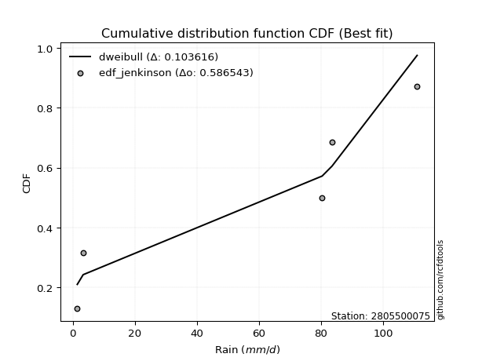</img>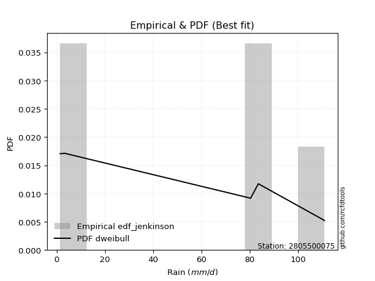</img>

</div>


### 11. EDF Cunnane (1978)

Cunnane´s work in statistical hydrology has focused on the performance and evaluation of different probability distributions (such as GEV, Gumbel, Lognormal) for flood frequency estimation. _b_ is a constant, typically set to 0.4.

<div align="center">


$P=(m-b)/(n+1-2b)$


</div>


**11.1. Empirical values**

<div align="center">

|                | 0                   | 1                  | 2           | 3                  | 4                  |
|:---------------|:--------------------|:-------------------|:------------|:-------------------|:-------------------|
| date           | 2022                | 2024               | 2025        | 2019               | 2020               |
| x              | 1.5                 | 3.4                | 80.4        | 83.6               | 111.0              |
| m              | 1                   | 2                  | 3           | 4                  | 5                  |
| empirical_dist | edf_cunnane         | edf_cunnane        | edf_cunnane | edf_cunnane        | edf_cunnane        |
| empirical      | 0.11538461538461538 | 0.3076923076923077 | 0.5         | 0.6923076923076923 | 0.8846153846153845 |
| empirical_tr   | 1.1304347826086958  | 1.4444444444444444 | 2.0         | 3.25               | 8.666666666666655  |

</div>


**11.2. Kolmogorov-Smirnov fit test (sorted by Δ)**


<div align="center">

|                | 0                   | 1                   | 2                  | 3                  | 4                   | 5                   | 6                   | 7                  | 8                  | 9                   | 10                  | 11                 | 12                 | 13                  | 14                  | 15                  | 16                  | 17                  | 18                  | 19                  | 20                 | 21                  | 22                  | 23                 | 24                  | 25                  | 26                 | 27                 | 28                 | 29                 | 30                  | 31                  | 32                  | 33                  | 34                  | 35                  | 36                  | 37                  | 38                  | 39                  | 40                 | 41                  | 42                  | 43                  | 44                  | 45                  | 46                  | 47                  | 48                  | 49                  | 50                 | 51                  | 52                 | 53                 | 54                 | 55                 | 56                 | 57                 | 58                 | 59                  | 60                 | 61                  | 62                 | 63                  | 64                  | 65                 | 66                 | 67                  | 68                  | 69                  | 70                 | 71                 | 72                  | 73                 | 74                 | 75                 | 76                 | 77                 | 78                 | 79                  | 80                  | 81                 | 82                 | 83                 | 84                  | 85                 | 86                  | 87                 | 88                 | 89                  | 90                  | 91                 | 92                 | 93                 | 94                  | 95                 | 96                 | 97                  | 98                 | 99                 | 100                 | 101                 | 102                | 103                 | 104                | 105                 | 106                | 107                | 108                | 109                | 110                 | 111                 | 112                | 113                | 114                | 115                | 116                | 117                | 118                | 119                 | 120                 | 121                | 122                | 123                 | 124                | 125                 | 126                | 127                | 128                | 129                | 130                | 131                | 132                | 133                | 134                | 135                | 136                 | 137                | 138                | 139                | 140                | 141                | 142                | 143                 | 144                | 145                | 146                | 147                | 148                | 149                | 150                | 151                | 152                | 153                | 154                | 155                | 156                | 157                | 158                | 159                |
|:---------------|:--------------------|:--------------------|:-------------------|:-------------------|:--------------------|:--------------------|:--------------------|:-------------------|:-------------------|:--------------------|:--------------------|:-------------------|:-------------------|:--------------------|:--------------------|:--------------------|:--------------------|:--------------------|:--------------------|:--------------------|:-------------------|:--------------------|:--------------------|:-------------------|:--------------------|:--------------------|:-------------------|:-------------------|:-------------------|:-------------------|:--------------------|:--------------------|:--------------------|:--------------------|:--------------------|:--------------------|:--------------------|:--------------------|:--------------------|:--------------------|:-------------------|:--------------------|:--------------------|:--------------------|:--------------------|:--------------------|:--------------------|:--------------------|:--------------------|:--------------------|:-------------------|:--------------------|:-------------------|:-------------------|:-------------------|:-------------------|:-------------------|:-------------------|:-------------------|:--------------------|:-------------------|:--------------------|:-------------------|:--------------------|:--------------------|:-------------------|:-------------------|:--------------------|:--------------------|:--------------------|:-------------------|:-------------------|:--------------------|:-------------------|:-------------------|:-------------------|:-------------------|:-------------------|:-------------------|:--------------------|:--------------------|:-------------------|:-------------------|:-------------------|:--------------------|:-------------------|:--------------------|:-------------------|:-------------------|:--------------------|:--------------------|:-------------------|:-------------------|:-------------------|:--------------------|:-------------------|:-------------------|:--------------------|:-------------------|:-------------------|:--------------------|:--------------------|:-------------------|:--------------------|:-------------------|:--------------------|:-------------------|:-------------------|:-------------------|:-------------------|:--------------------|:--------------------|:-------------------|:-------------------|:-------------------|:-------------------|:-------------------|:-------------------|:-------------------|:--------------------|:--------------------|:-------------------|:-------------------|:--------------------|:-------------------|:--------------------|:-------------------|:-------------------|:-------------------|:-------------------|:-------------------|:-------------------|:-------------------|:-------------------|:-------------------|:-------------------|:--------------------|:-------------------|:-------------------|:-------------------|:-------------------|:-------------------|:-------------------|:--------------------|:-------------------|:-------------------|:-------------------|:-------------------|:-------------------|:-------------------|:-------------------|:-------------------|:-------------------|:-------------------|:-------------------|:-------------------|:-------------------|:-------------------|:-------------------|:-------------------|
| station        | 2805500075          | 2805500075          | 2805500075         | 2805500075         | 2805500075          | 2805500075          | 2805500075          | 2805500075         | 2805500075         | 2805500075          | 2805500075          | 2805500075         | 2805500075         | 2805500075          | 2805500075          | 2805500075          | 2805500075          | 2805500075          | 2805500075          | 2805500075          | 2805500075         | 2805500075          | 2805500075          | 2805500075         | 2805500075          | 2805500075          | 2805500075         | 2805500075         | 2805500075         | 2805500075         | 2805500075          | 2805500075          | 2805500075          | 2805500075          | 2805500075          | 2805500075          | 2805500075          | 2805500075          | 2805500075          | 2805500075          | 2805500075         | 2805500075          | 2805500075          | 2805500075          | 2805500075          | 2805500075          | 2805500075          | 2805500075          | 2805500075          | 2805500075          | 2805500075         | 2805500075          | 2805500075         | 2805500075         | 2805500075         | 2805500075         | 2805500075         | 2805500075         | 2805500075         | 2805500075          | 2805500075         | 2805500075          | 2805500075         | 2805500075          | 2805500075          | 2805500075         | 2805500075         | 2805500075          | 2805500075          | 2805500075          | 2805500075         | 2805500075         | 2805500075          | 2805500075         | 2805500075         | 2805500075         | 2805500075         | 2805500075         | 2805500075         | 2805500075          | 2805500075          | 2805500075         | 2805500075         | 2805500075         | 2805500075          | 2805500075         | 2805500075          | 2805500075         | 2805500075         | 2805500075          | 2805500075          | 2805500075         | 2805500075         | 2805500075         | 2805500075          | 2805500075         | 2805500075         | 2805500075          | 2805500075         | 2805500075         | 2805500075          | 2805500075          | 2805500075         | 2805500075          | 2805500075         | 2805500075          | 2805500075         | 2805500075         | 2805500075         | 2805500075         | 2805500075          | 2805500075          | 2805500075         | 2805500075         | 2805500075         | 2805500075         | 2805500075         | 2805500075         | 2805500075         | 2805500075          | 2805500075          | 2805500075         | 2805500075         | 2805500075          | 2805500075         | 2805500075          | 2805500075         | 2805500075         | 2805500075         | 2805500075         | 2805500075         | 2805500075         | 2805500075         | 2805500075         | 2805500075         | 2805500075         | 2805500075          | 2805500075         | 2805500075         | 2805500075         | 2805500075         | 2805500075         | 2805500075         | 2805500075          | 2805500075         | 2805500075         | 2805500075         | 2805500075         | 2805500075         | 2805500075         | 2805500075         | 2805500075         | 2805500075         | 2805500075         | 2805500075         | 2805500075         | 2805500075         | 2805500075         | 2805500075         | 2805500075         |
| empirical_dist | edf_cunnane         | edf_cunnane         | edf_cunnane        | edf_cunnane        | edf_cunnane         | edf_cunnane         | edf_cunnane         | edf_cunnane        | edf_cunnane        | edf_cunnane         | edf_cunnane         | edf_cunnane        | edf_cunnane        | edf_cunnane         | edf_cunnane         | edf_cunnane         | edf_cunnane         | edf_cunnane         | edf_cunnane         | edf_cunnane         | edf_cunnane        | edf_cunnane         | edf_cunnane         | edf_cunnane        | edf_cunnane         | edf_cunnane         | edf_cunnane        | edf_cunnane        | edf_cunnane        | edf_cunnane        | edf_cunnane         | edf_cunnane         | edf_cunnane         | edf_cunnane         | edf_cunnane         | edf_cunnane         | edf_cunnane         | edf_cunnane         | edf_cunnane         | edf_cunnane         | edf_cunnane        | edf_cunnane         | edf_cunnane         | edf_cunnane         | edf_cunnane         | edf_cunnane         | edf_cunnane         | edf_cunnane         | edf_cunnane         | edf_cunnane         | edf_cunnane        | edf_cunnane         | edf_cunnane        | edf_cunnane        | edf_cunnane        | edf_cunnane        | edf_cunnane        | edf_cunnane        | edf_cunnane        | edf_cunnane         | edf_cunnane        | edf_cunnane         | edf_cunnane        | edf_cunnane         | edf_cunnane         | edf_cunnane        | edf_cunnane        | edf_cunnane         | edf_cunnane         | edf_cunnane         | edf_cunnane        | edf_cunnane        | edf_cunnane         | edf_cunnane        | edf_cunnane        | edf_cunnane        | edf_cunnane        | edf_cunnane        | edf_cunnane        | edf_cunnane         | edf_cunnane         | edf_cunnane        | edf_cunnane        | edf_cunnane        | edf_cunnane         | edf_cunnane        | edf_cunnane         | edf_cunnane        | edf_cunnane        | edf_cunnane         | edf_cunnane         | edf_cunnane        | edf_cunnane        | edf_cunnane        | edf_cunnane         | edf_cunnane        | edf_cunnane        | edf_cunnane         | edf_cunnane        | edf_cunnane        | edf_cunnane         | edf_cunnane         | edf_cunnane        | edf_cunnane         | edf_cunnane        | edf_cunnane         | edf_cunnane        | edf_cunnane        | edf_cunnane        | edf_cunnane        | edf_cunnane         | edf_cunnane         | edf_cunnane        | edf_cunnane        | edf_cunnane        | edf_cunnane        | edf_cunnane        | edf_cunnane        | edf_cunnane        | edf_cunnane         | edf_cunnane         | edf_cunnane        | edf_cunnane        | edf_cunnane         | edf_cunnane        | edf_cunnane         | edf_cunnane        | edf_cunnane        | edf_cunnane        | edf_cunnane        | edf_cunnane        | edf_cunnane        | edf_cunnane        | edf_cunnane        | edf_cunnane        | edf_cunnane        | edf_cunnane         | edf_cunnane        | edf_cunnane        | edf_cunnane        | edf_cunnane        | edf_cunnane        | edf_cunnane        | edf_cunnane         | edf_cunnane        | edf_cunnane        | edf_cunnane        | edf_cunnane        | edf_cunnane        | edf_cunnane        | edf_cunnane        | edf_cunnane        | edf_cunnane        | edf_cunnane        | edf_cunnane        | edf_cunnane        | edf_cunnane        | edf_cunnane        | edf_cunnane        | edf_cunnane        |
| p_dist         | dweibull            | genextreme          | arcsine            | loglevy_l          | dgamma              | logwrapcauchy       | logdgamma           | ksone              | trapezoid          | johnsonsu           | semicircular        | wrapcauchy         | logarcsine         | skewnorm            | levy_l              | anglit              | logdweibull         | weibull_min         | gumbel_l            | loggenpareto        | pearson3           | triang              | exponnorm           | crystalball        | norm                | foldnorm            | erlang             | gamma              | argus              | logksone           | logalpha            | rice                | genhalflogistic     | logbeta             | cosine              | maxwell             | rayleigh            | loglomax            | logistic            | logweibull_max      | rdist              | logsemicircular     | logtrapezoid        | halfnorm            | beta                | loganglit           | gennorm             | hypsecant           | kstwobign           | nakagami            | loggennorm         | gumbel_r            | logpearson3        | logncf             | burr               | logweibull_min     | loggumbel_l        | logexponpow        | exponpow           | laplace             | logbetaprime       | lognct              | logt               | lognorm             | logexponnorm        | loggamma           | loggamma           | logfatiguelife      | moyal               | logerlang           | genexpon           | loginvweibull      | logrice             | kappa4             | logmaxwell         | loggenexpon        | loginvgauss        | lomax              | ncf                | logfoldnorm         | lograyleigh         | logf               | loggompertz        | fatiguelife        | loginvgamma         | burr12             | logkstwobign        | logtruncnorm       | genpareto          | tukeylambda         | loghalfnorm         | gompertz           | bradford           | uniform            | loglogistic         | truncweibull_min   | vonmises_line      | exponweib           | halflogistic       | logcosine          | loggenextreme       | logburr             | f                  | loggumbel_r         | loghypsecant       | loghalflogistic     | halfgennorm        | gausshyper         | logargus           | truncexpon         | logmoyal            | wald                | logmielke          | loglaplace         | loglaplace         | logloggamma        | logburr12          | loggausshyper      | logloglaplace      | betaprime           | lognakagami         | truncpareto        | logwald            | loggenhalflogistic  | logjohnsonsb       | invgauss            | kappa3             | gengamma           | t                  | logskewnorm        | logkappa4          | logtriang          | logexponweib       | logtukeylambda     | logkappa3          | loguniform         | logvonmises_line    | logbradford        | logtruncexpon      | invweibull         | loggengamma        | powerlaw           | alpha              | logtruncweibull_min | truncnorm          | logrdist           | johnsonsb          | mielke             | logtruncpareto     | logpowerlaw        | weibull_max        | logjohnsonsu       | nct                | invgamma           | loghalfgennorm     | genlogistic        | loggenlogistic     | logvonmises        | vonmises           | logcrystalball     |
| delta          | 0.09374281346109471 | 0.11538461538409461 | 0.1253967208826221 | 0.1369965773925228 | 0.14051123970952695 | 0.15172596384550752 | 0.15335259185068262 | 0.1566998187084292 | 0.1614242486485531 | 0.16444668949009122 | 0.17064082664367675 | 0.1751578805745968 | 0.1755357713777166 | 0.17760619908282435 | 0.18008041316085666 | 0.18132557380432623 | 0.18279803516424598 | 0.18354676675193998 | 0.18983539498831994 | 0.19588912891840685 | 0.1970580185510722 | 0.20454920608649257 | 0.20637429671374408 | 0.2063745265352679 | 0.20637453916278892 | 0.21014047952086046 | 0.2112576089576388 | 0.2116303571738224 | 0.2136976521503694 | 0.2138948829244488 | 0.21420029604944246 | 0.21840263762543022 | 0.22117116727895803 | 0.22130748294783514 | 0.22141380064519411 | 0.22151179131818743 | 0.22592148464552553 | 0.22630919047953013 | 0.22801485424206736 | 0.22963257610669374 | 0.2301369889538632 | 0.23034068777016148 | 0.23126296205848995 | 0.23945524654086836 | 0.24248224164224536 | 0.24258860632170764 | 0.24282740603371636 | 0.24347297177736182 | 0.24627675087159817 | 0.25153176189068893 | 0.2547169512314682 | 0.25587873054546917 | 0.2611637307938931 | 0.2615410481285041 | 0.2641407668457997 | 0.265524384578972  | 0.2659501661693666 | 0.2661287725724861 | 0.2678985751290588 | 0.26795324044181645 | 0.2695608183891566 | 0.27056899047192673 | 0.2706370264892186 | 0.27063921561020043 | 0.27064431611263917 | 0.271201663757793  | 0.271201663757793  | 0.27180363812013897 | 0.27186793494137407 | 0.27297726702944425 | 0.2737975121722304 | 0.2741648627892621 | 0.27426468829116457 | 0.2769839095384723 | 0.2774998497264666 | 0.2777401903031309 | 0.2778041422578228 | 0.2783720387226881 | 0.2785607395705827 | 0.27931905434861726 | 0.27944497035034965 | 0.2798540565616485 | 0.280146148014623  | 0.280290352345112  | 0.28039270318317067 | 0.2813215772789416 | 0.28498431693893567 | 0.2855502865035735 | 0.2861578811503679 | 0.28639992524518587 | 0.28669907952166895 | 0.2872372741706811 | 0.2895281466867623 | 0.2903407095187917 | 0.29313732087297695 | 0.2936767213958862 | 0.2937197730361275 | 0.29741772901227215 | 0.2980732988665604 | 0.2999106239293885 | 0.30042616301600533 | 0.30060771545464415 | 0.3028766381851733 | 0.30487191292643745 | 0.3073109314453609 | 0.30980753591937993 | 0.3125455478826956 | 0.3133067248245728 | 0.3133212620404814 | 0.3142076080181575 | 0.31602486155011633 | 0.31909497057171377 | 0.3204110888087578 | 0.3246574560178005 | 0.3246574560178005 | 0.3260223697025305 | 0.3327918030471376 | 0.3336473061804204 | 0.3392862696692128 | 0.34175567135859075 | 0.34497013205555493 | 0.3493271579325068 | 0.3523357066700117 | 0.36354552452777866 | 0.3665527181204369 | 0.36858086716860594 | 0.374304229072811  | 0.3877671386240421 | 0.3878550185898524 | 0.3967027756989412 | 0.4058904911719047 | 0.4082563885612258 | 0.4107116246936737 | 0.4180691844070239 | 0.4250660576281673 | 0.4250671125683846 | 0.42512260212835173 | 0.4437685064187147 | 0.4487206239034478 | 0.4500417238281085 | 0.4604719966472576 | 0.4645557708815533 | 0.4694722122259707 | 0.47274166478072177 | 0.5                | 0.5                | 0.5039227069301284 | 0.5053593360306571 | 0.5069189760844175 | 0.507800829484247  | 0.547683259004494  | 0.6025462587129622 | 0.651571807138593  | 0.6893446831085851 | 0.6923076923076923 | 0.6923076923076923 | 0.6923076923076923 | 0.8038414112489427 | 17.848486495017557 | nan                |
| deltao         | 0.5865427407550001  | 0.5865427407550001  | 0.5865427407550001 | 0.5865427407550001 | 0.5865427407550001  | 0.5865427407550001  | 0.5865427407550001  | 0.5865427407550001 | 0.5865427407550001 | 0.5865427407550001  | 0.5865427407550001  | 0.5865427407550001 | 0.5865427407550001 | 0.5865427407550001  | 0.5865427407550001  | 0.5865427407550001  | 0.5865427407550001  | 0.5865427407550001  | 0.5865427407550001  | 0.5865427407550001  | 0.5865427407550001 | 0.5865427407550001  | 0.5865427407550001  | 0.5865427407550001 | 0.5865427407550001  | 0.5865427407550001  | 0.5865427407550001 | 0.5865427407550001 | 0.5865427407550001 | 0.5865427407550001 | 0.5865427407550001  | 0.5865427407550001  | 0.5865427407550001  | 0.5865427407550001  | 0.5865427407550001  | 0.5865427407550001  | 0.5865427407550001  | 0.5865427407550001  | 0.5865427407550001  | 0.5865427407550001  | 0.5865427407550001 | 0.5865427407550001  | 0.5865427407550001  | 0.5865427407550001  | 0.5865427407550001  | 0.5865427407550001  | 0.5865427407550001  | 0.5865427407550001  | 0.5865427407550001  | 0.5865427407550001  | 0.5865427407550001 | 0.5865427407550001  | 0.5865427407550001 | 0.5865427407550001 | 0.5865427407550001 | 0.5865427407550001 | 0.5865427407550001 | 0.5865427407550001 | 0.5865427407550001 | 0.5865427407550001  | 0.5865427407550001 | 0.5865427407550001  | 0.5865427407550001 | 0.5865427407550001  | 0.5865427407550001  | 0.5865427407550001 | 0.5865427407550001 | 0.5865427407550001  | 0.5865427407550001  | 0.5865427407550001  | 0.5865427407550001 | 0.5865427407550001 | 0.5865427407550001  | 0.5865427407550001 | 0.5865427407550001 | 0.5865427407550001 | 0.5865427407550001 | 0.5865427407550001 | 0.5865427407550001 | 0.5865427407550001  | 0.5865427407550001  | 0.5865427407550001 | 0.5865427407550001 | 0.5865427407550001 | 0.5865427407550001  | 0.5865427407550001 | 0.5865427407550001  | 0.5865427407550001 | 0.5865427407550001 | 0.5865427407550001  | 0.5865427407550001  | 0.5865427407550001 | 0.5865427407550001 | 0.5865427407550001 | 0.5865427407550001  | 0.5865427407550001 | 0.5865427407550001 | 0.5865427407550001  | 0.5865427407550001 | 0.5865427407550001 | 0.5865427407550001  | 0.5865427407550001  | 0.5865427407550001 | 0.5865427407550001  | 0.5865427407550001 | 0.5865427407550001  | 0.5865427407550001 | 0.5865427407550001 | 0.5865427407550001 | 0.5865427407550001 | 0.5865427407550001  | 0.5865427407550001  | 0.5865427407550001 | 0.5865427407550001 | 0.5865427407550001 | 0.5865427407550001 | 0.5865427407550001 | 0.5865427407550001 | 0.5865427407550001 | 0.5865427407550001  | 0.5865427407550001  | 0.5865427407550001 | 0.5865427407550001 | 0.5865427407550001  | 0.5865427407550001 | 0.5865427407550001  | 0.5865427407550001 | 0.5865427407550001 | 0.5865427407550001 | 0.5865427407550001 | 0.5865427407550001 | 0.5865427407550001 | 0.5865427407550001 | 0.5865427407550001 | 0.5865427407550001 | 0.5865427407550001 | 0.5865427407550001  | 0.5865427407550001 | 0.5865427407550001 | 0.5865427407550001 | 0.5865427407550001 | 0.5865427407550001 | 0.5865427407550001 | 0.5865427407550001  | 0.5865427407550001 | 0.5865427407550001 | 0.5865427407550001 | 0.5865427407550001 | 0.5865427407550001 | 0.5865427407550001 | 0.5865427407550001 | 0.5865427407550001 | 0.5865427407550001 | 0.5865427407550001 | 0.5865427407550001 | 0.5865427407550001 | 0.5865427407550001 | 0.5865427407550001 | 0.5865427407550001 | 0.5865427407550001 |
| eval           | Δo > Δ              | Δo > Δ              | Δo > Δ             | Δo > Δ             | Δo > Δ              | Δo > Δ              | Δo > Δ              | Δo > Δ             | Δo > Δ             | Δo > Δ              | Δo > Δ              | Δo > Δ             | Δo > Δ             | Δo > Δ              | Δo > Δ              | Δo > Δ              | Δo > Δ              | Δo > Δ              | Δo > Δ              | Δo > Δ              | Δo > Δ             | Δo > Δ              | Δo > Δ              | Δo > Δ             | Δo > Δ              | Δo > Δ              | Δo > Δ             | Δo > Δ             | Δo > Δ             | Δo > Δ             | Δo > Δ              | Δo > Δ              | Δo > Δ              | Δo > Δ              | Δo > Δ              | Δo > Δ              | Δo > Δ              | Δo > Δ              | Δo > Δ              | Δo > Δ              | Δo > Δ             | Δo > Δ              | Δo > Δ              | Δo > Δ              | Δo > Δ              | Δo > Δ              | Δo > Δ              | Δo > Δ              | Δo > Δ              | Δo > Δ              | Δo > Δ             | Δo > Δ              | Δo > Δ             | Δo > Δ             | Δo > Δ             | Δo > Δ             | Δo > Δ             | Δo > Δ             | Δo > Δ             | Δo > Δ              | Δo > Δ             | Δo > Δ              | Δo > Δ             | Δo > Δ              | Δo > Δ              | Δo > Δ             | Δo > Δ             | Δo > Δ              | Δo > Δ              | Δo > Δ              | Δo > Δ             | Δo > Δ             | Δo > Δ              | Δo > Δ             | Δo > Δ             | Δo > Δ             | Δo > Δ             | Δo > Δ             | Δo > Δ             | Δo > Δ              | Δo > Δ              | Δo > Δ             | Δo > Δ             | Δo > Δ             | Δo > Δ              | Δo > Δ             | Δo > Δ              | Δo > Δ             | Δo > Δ             | Δo > Δ              | Δo > Δ              | Δo > Δ             | Δo > Δ             | Δo > Δ             | Δo > Δ              | Δo > Δ             | Δo > Δ             | Δo > Δ              | Δo > Δ             | Δo > Δ             | Δo > Δ              | Δo > Δ              | Δo > Δ             | Δo > Δ              | Δo > Δ             | Δo > Δ              | Δo > Δ             | Δo > Δ             | Δo > Δ             | Δo > Δ             | Δo > Δ              | Δo > Δ              | Δo > Δ             | Δo > Δ             | Δo > Δ             | Δo > Δ             | Δo > Δ             | Δo > Δ             | Δo > Δ             | Δo > Δ              | Δo > Δ              | Δo > Δ             | Δo > Δ             | Δo > Δ              | Δo > Δ             | Δo > Δ              | Δo > Δ             | Δo > Δ             | Δo > Δ             | Δo > Δ             | Δo > Δ             | Δo > Δ             | Δo > Δ             | Δo > Δ             | Δo > Δ             | Δo > Δ             | Δo > Δ              | Δo > Δ             | Δo > Δ             | Δo > Δ             | Δo > Δ             | Δo > Δ             | Δo > Δ             | Δo > Δ              | Δo > Δ             | Δo > Δ             | Δo > Δ             | Δo > Δ             | Δo > Δ             | Δo > Δ             | Δo > Δ             | Δo <= Δ            | Δo <= Δ            | Δo <= Δ            | Δo <= Δ            | Δo <= Δ            | Δo <= Δ            | Δo <= Δ            | Δo <= Δ            | Δo <= Δ            |
| fit            | 1                   | 1                   | 1                  | 1                  | 1                   | 1                   | 1                   | 1                  | 1                  | 1                   | 1                   | 1                  | 1                  | 1                   | 1                   | 1                   | 1                   | 1                   | 1                   | 1                   | 1                  | 1                   | 1                   | 1                  | 1                   | 1                   | 1                  | 1                  | 1                  | 1                  | 1                   | 1                   | 1                   | 1                   | 1                   | 1                   | 1                   | 1                   | 1                   | 1                   | 1                  | 1                   | 1                   | 1                   | 1                   | 1                   | 1                   | 1                   | 1                   | 1                   | 1                  | 1                   | 1                  | 1                  | 1                  | 1                  | 1                  | 1                  | 1                  | 1                   | 1                  | 1                   | 1                  | 1                   | 1                   | 1                  | 1                  | 1                   | 1                   | 1                   | 1                  | 1                  | 1                   | 1                  | 1                  | 1                  | 1                  | 1                  | 1                  | 1                   | 1                   | 1                  | 1                  | 1                  | 1                   | 1                  | 1                   | 1                  | 1                  | 1                   | 1                   | 1                  | 1                  | 1                  | 1                   | 1                  | 1                  | 1                   | 1                  | 1                  | 1                   | 1                   | 1                  | 1                   | 1                  | 1                   | 1                  | 1                  | 1                  | 1                  | 1                   | 1                   | 1                  | 1                  | 1                  | 1                  | 1                  | 1                  | 1                  | 1                   | 1                   | 1                  | 1                  | 1                   | 1                  | 1                   | 1                  | 1                  | 1                  | 1                  | 1                  | 1                  | 1                  | 1                  | 1                  | 1                  | 1                   | 1                  | 1                  | 1                  | 1                  | 1                  | 1                  | 1                   | 1                  | 1                  | 1                  | 1                  | 1                  | 1                  | 1                  | 0                  | 0                  | 0                  | 0                  | 0                  | 0                  | 0                  | 0                  | 0                  |
| n              | 5                   | 5                   | 5                  | 5                  | 5                   | 5                   | 5                   | 5                  | 5                  | 5                   | 5                   | 5                  | 5                  | 5                   | 5                   | 5                   | 5                   | 5                   | 5                   | 5                   | 5                  | 5                   | 5                   | 5                  | 5                   | 5                   | 5                  | 5                  | 5                  | 5                  | 5                   | 5                   | 5                   | 5                   | 5                   | 5                   | 5                   | 5                   | 5                   | 5                   | 5                  | 5                   | 5                   | 5                   | 5                   | 5                   | 5                   | 5                   | 5                   | 5                   | 5                  | 5                   | 5                  | 5                  | 5                  | 5                  | 5                  | 5                  | 5                  | 5                   | 5                  | 5                   | 5                  | 5                   | 5                   | 5                  | 5                  | 5                   | 5                   | 5                   | 5                  | 5                  | 5                   | 5                  | 5                  | 5                  | 5                  | 5                  | 5                  | 5                   | 5                   | 5                  | 5                  | 5                  | 5                   | 5                  | 5                   | 5                  | 5                  | 5                   | 5                   | 5                  | 5                  | 5                  | 5                   | 5                  | 5                  | 5                   | 5                  | 5                  | 5                   | 5                   | 5                  | 5                   | 5                  | 5                   | 5                  | 5                  | 5                  | 5                  | 5                   | 5                   | 5                  | 5                  | 5                  | 5                  | 5                  | 5                  | 5                  | 5                   | 5                   | 5                  | 5                  | 5                   | 5                  | 5                   | 5                  | 5                  | 5                  | 5                  | 5                  | 5                  | 5                  | 5                  | 5                  | 5                  | 5                   | 5                  | 5                  | 5                  | 5                  | 5                  | 5                  | 5                   | 5                  | 5                  | 5                  | 5                  | 5                  | 5                  | 5                  | 5                  | 5                  | 5                  | 5                  | 5                  | 5                  | 5                  | 5                  | 5                  |
| best_fit       | 1                   | 0                   | 0                  | 0                  | 0                   | 0                   | 0                   | 0                  | 0                  | 0                   | 0                   | 0                  | 0                  | 0                   | 0                   | 0                   | 0                   | 0                   | 0                   | 0                   | 0                  | 0                   | 0                   | 0                  | 0                   | 0                   | 0                  | 0                  | 0                  | 0                  | 0                   | 0                   | 0                   | 0                   | 0                   | 0                   | 0                   | 0                   | 0                   | 0                   | 0                  | 0                   | 0                   | 0                   | 0                   | 0                   | 0                   | 0                   | 0                   | 0                   | 0                  | 0                   | 0                  | 0                  | 0                  | 0                  | 0                  | 0                  | 0                  | 0                   | 0                  | 0                   | 0                  | 0                   | 0                   | 0                  | 0                  | 0                   | 0                   | 0                   | 0                  | 0                  | 0                   | 0                  | 0                  | 0                  | 0                  | 0                  | 0                  | 0                   | 0                   | 0                  | 0                  | 0                  | 0                   | 0                  | 0                   | 0                  | 0                  | 0                   | 0                   | 0                  | 0                  | 0                  | 0                   | 0                  | 0                  | 0                   | 0                  | 0                  | 0                   | 0                   | 0                  | 0                   | 0                  | 0                   | 0                  | 0                  | 0                  | 0                  | 0                   | 0                   | 0                  | 0                  | 0                  | 0                  | 0                  | 0                  | 0                  | 0                   | 0                   | 0                  | 0                  | 0                   | 0                  | 0                   | 0                  | 0                  | 0                  | 0                  | 0                  | 0                  | 0                  | 0                  | 0                  | 0                  | 0                   | 0                  | 0                  | 0                  | 0                  | 0                  | 0                  | 0                   | 0                  | 0                  | 0                  | 0                  | 0                  | 0                  | 0                  | 0                  | 0                  | 0                  | 0                  | 0                  | 0                  | 0                  | 0                  | 0                  |
| best_fit_sort  | 1                   | 2                   | 3                  | 4                  | 5                   | 6                   | 7                   | 8                  | 9                  | 10                  | 11                  | 12                 | 13                 | 14                  | 15                  | 16                  | 17                  | 18                  | 19                  | 20                  | 21                 | 22                  | 23                  | 24                 | 25                  | 26                  | 27                 | 28                 | 29                 | 30                 | 31                  | 32                  | 33                  | 34                  | 35                  | 36                  | 37                  | 38                  | 39                  | 40                  | 41                 | 42                  | 43                  | 44                  | 45                  | 46                  | 47                  | 48                  | 49                  | 50                  | 51                 | 52                  | 53                 | 54                 | 55                 | 56                 | 57                 | 58                 | 59                 | 60                  | 61                 | 62                  | 63                 | 64                  | 65                  | 66                 | 67                 | 68                  | 69                  | 70                  | 71                 | 72                 | 73                  | 74                 | 75                 | 76                 | 77                 | 78                 | 79                 | 80                  | 81                  | 82                 | 83                 | 84                 | 85                  | 86                 | 87                  | 88                 | 89                 | 90                  | 91                  | 92                 | 93                 | 94                 | 95                  | 96                 | 97                 | 98                  | 99                 | 100                | 101                 | 102                 | 103                | 104                 | 105                | 106                 | 107                | 108                | 109                | 110                | 111                 | 112                 | 113                | 114                | 115                | 116                | 117                | 118                | 119                | 120                 | 121                 | 122                | 123                | 124                 | 125                | 126                 | 127                | 128                | 129                | 130                | 131                | 132                | 133                | 134                | 135                | 136                | 137                 | 138                | 139                | 140                | 141                | 142                | 143                | 144                 | 145                | 146                | 147                | 148                | 149                | 150                | 151                | 152                | 153                | 154                | 155                | 156                | 157                | 158                | 159                | 160                |

</div>


**11.3. Best fit**

<div align="center">

|   id |    station | empirical_dist   | p_dist   |     delta |   deltao | eval   |   fit |   n |   best_fit |   best_fit_sort |
|-----:|-----------:|:-----------------|:---------|----------:|---------:|:-------|------:|----:|-----------:|----------------:|
|    0 | 2805500075 | edf_cunnane      | dweibull | 0.0937428 | 0.586543 | Δo > Δ |     1 |   5 |          1 |               1 |

</div>


<div align="center">

</img></img>

</div>


### 12. EDF Adamowski (1981)

The Adamowski formula in hydrology refers to a specific plotting position formula used for estimating the non-parametric empirical distribution of hydrological events (like flood peaks) to calculate their return periods. This formula provides an alternative to traditional parametric methods (like the Gumbel or Log Pearson Type III distributions). 

<div align="center">


$P=(m-0.25)/(n+0.5)$


</div>


**12.1. Empirical values**

<div align="center">

|                | 0                   | 1                  | 2             | 3                  | 4                  |
|:---------------|:--------------------|:-------------------|:--------------|:-------------------|:-------------------|
| date           | 2022                | 2024               | 2025          | 2019               | 2020               |
| x              | 1.5                 | 3.4                | 80.4          | 83.6               | 111.0              |
| m              | 1                   | 2                  | 3             | 4                  | 5                  |
| empirical_dist | edf_adamowski       | edf_adamowski      | edf_adamowski | edf_adamowski      | edf_adamowski      |
| empirical      | 0.13636363636363635 | 0.3181818181818182 | 0.5           | 0.6818181818181818 | 0.8636363636363636 |
| empirical_tr   | 1.1578947368421053  | 1.4666666666666666 | 2.0           | 3.1428571428571423 | 7.333333333333334  |

</div>


**12.2. Kolmogorov-Smirnov fit test (sorted by Δ)**


<div align="center">

|                | 0                   | 1                  | 2                   | 3                   | 4                   | 5                   | 6                   | 7                  | 8                  | 9                   | 10                  | 11                  | 12                 | 13                 | 14                  | 15                  | 16                  | 17                  | 18                 | 19                 | 20                 | 21                  | 22                 | 23                  | 24                 | 25                  | 26                  | 27                 | 28                 | 29                 | 30                 | 31                  | 32                  | 33                  | 34                  | 35                  | 36                  | 37                  | 38                  | 39                  | 40                  | 41                 | 42                  | 43                  | 44                  | 45                  | 46                  | 47                  | 48                 | 49                  | 50                  | 51                 | 52                 | 53                 | 54                 | 55                 | 56                 | 57                 | 58                 | 59                  | 60                 | 61                  | 62                 | 63                  | 64                  | 65                 | 66                 | 67                  | 68                  | 69                  | 70                 | 71                  | 72                 | 73                 | 74                 | 75                 | 76                 | 77                  | 78                  | 79                 | 80                 | 81                 | 82                  | 83                 | 84                  | 85                 | 86                  | 87                 | 88                  | 89                  | 90                  | 91                  | 92                 | 93                  | 94                  | 95                 | 96                 | 97                  | 98                  | 99                 | 100                 | 101                | 102                 | 103                 | 104                | 105                | 106                 | 107                | 108                | 109                | 110                 | 111                | 112                 | 113                | 114                | 115                | 116                | 117                | 118                | 119                 | 120                 | 121                | 122                | 123                 | 124                 | 125                 | 126                | 127                | 128                | 129                | 130                | 131                | 132                | 133                | 134                | 135                | 136                 | 137                 | 138                | 139                | 140                | 141                | 142                | 143                 | 144                | 145                | 146                | 147                | 148                | 149                | 150                | 151                | 152                | 153                | 154                | 155                | 156                | 157                | 158                | 159                |
|:---------------|:--------------------|:-------------------|:--------------------|:--------------------|:--------------------|:--------------------|:--------------------|:-------------------|:-------------------|:--------------------|:--------------------|:--------------------|:-------------------|:-------------------|:--------------------|:--------------------|:--------------------|:--------------------|:-------------------|:-------------------|:-------------------|:--------------------|:-------------------|:--------------------|:-------------------|:--------------------|:--------------------|:-------------------|:-------------------|:-------------------|:-------------------|:--------------------|:--------------------|:--------------------|:--------------------|:--------------------|:--------------------|:--------------------|:--------------------|:--------------------|:--------------------|:-------------------|:--------------------|:--------------------|:--------------------|:--------------------|:--------------------|:--------------------|:-------------------|:--------------------|:--------------------|:-------------------|:-------------------|:-------------------|:-------------------|:-------------------|:-------------------|:-------------------|:-------------------|:--------------------|:-------------------|:--------------------|:-------------------|:--------------------|:--------------------|:-------------------|:-------------------|:--------------------|:--------------------|:--------------------|:-------------------|:--------------------|:-------------------|:-------------------|:-------------------|:-------------------|:-------------------|:--------------------|:--------------------|:-------------------|:-------------------|:-------------------|:--------------------|:-------------------|:--------------------|:-------------------|:--------------------|:-------------------|:--------------------|:--------------------|:--------------------|:--------------------|:-------------------|:--------------------|:--------------------|:-------------------|:-------------------|:--------------------|:--------------------|:-------------------|:--------------------|:-------------------|:--------------------|:--------------------|:-------------------|:-------------------|:--------------------|:-------------------|:-------------------|:-------------------|:--------------------|:-------------------|:--------------------|:-------------------|:-------------------|:-------------------|:-------------------|:-------------------|:-------------------|:--------------------|:--------------------|:-------------------|:-------------------|:--------------------|:--------------------|:--------------------|:-------------------|:-------------------|:-------------------|:-------------------|:-------------------|:-------------------|:-------------------|:-------------------|:-------------------|:-------------------|:--------------------|:--------------------|:-------------------|:-------------------|:-------------------|:-------------------|:-------------------|:--------------------|:-------------------|:-------------------|:-------------------|:-------------------|:-------------------|:-------------------|:-------------------|:-------------------|:-------------------|:-------------------|:-------------------|:-------------------|:-------------------|:-------------------|:-------------------|:-------------------|
| station        | 2805500075          | 2805500075         | 2805500075          | 2805500075          | 2805500075          | 2805500075          | 2805500075          | 2805500075         | 2805500075         | 2805500075          | 2805500075          | 2805500075          | 2805500075         | 2805500075         | 2805500075          | 2805500075          | 2805500075          | 2805500075          | 2805500075         | 2805500075         | 2805500075         | 2805500075          | 2805500075         | 2805500075          | 2805500075         | 2805500075          | 2805500075          | 2805500075         | 2805500075         | 2805500075         | 2805500075         | 2805500075          | 2805500075          | 2805500075          | 2805500075          | 2805500075          | 2805500075          | 2805500075          | 2805500075          | 2805500075          | 2805500075          | 2805500075         | 2805500075          | 2805500075          | 2805500075          | 2805500075          | 2805500075          | 2805500075          | 2805500075         | 2805500075          | 2805500075          | 2805500075         | 2805500075         | 2805500075         | 2805500075         | 2805500075         | 2805500075         | 2805500075         | 2805500075         | 2805500075          | 2805500075         | 2805500075          | 2805500075         | 2805500075          | 2805500075          | 2805500075         | 2805500075         | 2805500075          | 2805500075          | 2805500075          | 2805500075         | 2805500075          | 2805500075         | 2805500075         | 2805500075         | 2805500075         | 2805500075         | 2805500075          | 2805500075          | 2805500075         | 2805500075         | 2805500075         | 2805500075          | 2805500075         | 2805500075          | 2805500075         | 2805500075          | 2805500075         | 2805500075          | 2805500075          | 2805500075          | 2805500075          | 2805500075         | 2805500075          | 2805500075          | 2805500075         | 2805500075         | 2805500075          | 2805500075          | 2805500075         | 2805500075          | 2805500075         | 2805500075          | 2805500075          | 2805500075         | 2805500075         | 2805500075          | 2805500075         | 2805500075         | 2805500075         | 2805500075          | 2805500075         | 2805500075          | 2805500075         | 2805500075         | 2805500075         | 2805500075         | 2805500075         | 2805500075         | 2805500075          | 2805500075          | 2805500075         | 2805500075         | 2805500075          | 2805500075          | 2805500075          | 2805500075         | 2805500075         | 2805500075         | 2805500075         | 2805500075         | 2805500075         | 2805500075         | 2805500075         | 2805500075         | 2805500075         | 2805500075          | 2805500075          | 2805500075         | 2805500075         | 2805500075         | 2805500075         | 2805500075         | 2805500075          | 2805500075         | 2805500075         | 2805500075         | 2805500075         | 2805500075         | 2805500075         | 2805500075         | 2805500075         | 2805500075         | 2805500075         | 2805500075         | 2805500075         | 2805500075         | 2805500075         | 2805500075         | 2805500075         |
| empirical_dist | edf_adamowski       | edf_adamowski      | edf_adamowski       | edf_adamowski       | edf_adamowski       | edf_adamowski       | edf_adamowski       | edf_adamowski      | edf_adamowski      | edf_adamowski       | edf_adamowski       | edf_adamowski       | edf_adamowski      | edf_adamowski      | edf_adamowski       | edf_adamowski       | edf_adamowski       | edf_adamowski       | edf_adamowski      | edf_adamowski      | edf_adamowski      | edf_adamowski       | edf_adamowski      | edf_adamowski       | edf_adamowski      | edf_adamowski       | edf_adamowski       | edf_adamowski      | edf_adamowski      | edf_adamowski      | edf_adamowski      | edf_adamowski       | edf_adamowski       | edf_adamowski       | edf_adamowski       | edf_adamowski       | edf_adamowski       | edf_adamowski       | edf_adamowski       | edf_adamowski       | edf_adamowski       | edf_adamowski      | edf_adamowski       | edf_adamowski       | edf_adamowski       | edf_adamowski       | edf_adamowski       | edf_adamowski       | edf_adamowski      | edf_adamowski       | edf_adamowski       | edf_adamowski      | edf_adamowski      | edf_adamowski      | edf_adamowski      | edf_adamowski      | edf_adamowski      | edf_adamowski      | edf_adamowski      | edf_adamowski       | edf_adamowski      | edf_adamowski       | edf_adamowski      | edf_adamowski       | edf_adamowski       | edf_adamowski      | edf_adamowski      | edf_adamowski       | edf_adamowski       | edf_adamowski       | edf_adamowski      | edf_adamowski       | edf_adamowski      | edf_adamowski      | edf_adamowski      | edf_adamowski      | edf_adamowski      | edf_adamowski       | edf_adamowski       | edf_adamowski      | edf_adamowski      | edf_adamowski      | edf_adamowski       | edf_adamowski      | edf_adamowski       | edf_adamowski      | edf_adamowski       | edf_adamowski      | edf_adamowski       | edf_adamowski       | edf_adamowski       | edf_adamowski       | edf_adamowski      | edf_adamowski       | edf_adamowski       | edf_adamowski      | edf_adamowski      | edf_adamowski       | edf_adamowski       | edf_adamowski      | edf_adamowski       | edf_adamowski      | edf_adamowski       | edf_adamowski       | edf_adamowski      | edf_adamowski      | edf_adamowski       | edf_adamowski      | edf_adamowski      | edf_adamowski      | edf_adamowski       | edf_adamowski      | edf_adamowski       | edf_adamowski      | edf_adamowski      | edf_adamowski      | edf_adamowski      | edf_adamowski      | edf_adamowski      | edf_adamowski       | edf_adamowski       | edf_adamowski      | edf_adamowski      | edf_adamowski       | edf_adamowski       | edf_adamowski       | edf_adamowski      | edf_adamowski      | edf_adamowski      | edf_adamowski      | edf_adamowski      | edf_adamowski      | edf_adamowski      | edf_adamowski      | edf_adamowski      | edf_adamowski      | edf_adamowski       | edf_adamowski       | edf_adamowski      | edf_adamowski      | edf_adamowski      | edf_adamowski      | edf_adamowski      | edf_adamowski       | edf_adamowski      | edf_adamowski      | edf_adamowski      | edf_adamowski      | edf_adamowski      | edf_adamowski      | edf_adamowski      | edf_adamowski      | edf_adamowski      | edf_adamowski      | edf_adamowski      | edf_adamowski      | edf_adamowski      | edf_adamowski      | edf_adamowski      | edf_adamowski      |
| p_dist         | dweibull            | dgamma             | arcsine             | loglevy_l           | genextreme          | logwrapcauchy       | logdgamma           | ksone              | trapezoid          | wrapcauchy          | levy_l              | semicircular        | johnsonsu          | logarcsine         | anglit              | logdweibull         | skewnorm            | weibull_min         | pearson3           | gumbel_l           | loglomax           | exponnorm           | crystalball        | norm                | loggenpareto       | logweibull_max      | foldnorm            | genhalflogistic    | erlang             | gamma              | logksone           | logalpha            | triang              | rice                | cosine              | maxwell             | argus               | rayleigh            | logistic            | logsemicircular     | logtrapezoid        | logbeta            | rdist               | loganglit           | hypsecant           | halfnorm            | kstwobign           | nakagami            | beta               | gennorm             | gumbel_r            | logpearson3        | logncf             | burr               | loggennorm         | logweibull_min     | loggumbel_l        | logexponpow        | exponpow           | laplace             | logbetaprime       | lognct              | logt               | lognorm             | logexponnorm        | loggamma           | loggamma           | logfatiguelife      | moyal               | logerlang           | loginvweibull      | logrice             | exponweib          | logmaxwell         | loggenexpon        | loginvgauss        | ncf                | logfoldnorm         | lograyleigh         | logf               | loggompertz        | fatiguelife        | loginvgamma         | burr12             | lomax               | genexpon           | logkstwobign        | logtruncnorm       | loghalfnorm         | kappa4              | bradford            | loglogistic         | truncweibull_min   | genpareto           | tukeylambda         | gompertz           | logcosine          | loggenextreme       | logburr             | uniform            | gausshyper          | f                  | vonmises_line       | loggumbel_r         | loghypsecant       | halflogistic       | loghalflogistic     | halfgennorm        | logargus           | truncexpon         | logmoyal            | logloglaplace      | wald                | logmielke          | loglaplace         | loglaplace         | logloggamma        | logburr12          | loggausshyper      | betaprime           | lognakagami         | truncpareto        | logwald            | logjohnsonsb        | loggenhalflogistic  | invgauss            | kappa3             | gengamma           | t                  | logskewnorm        | logkappa4          | logtriang          | logexponweib       | logtukeylambda     | logkappa3          | loguniform         | logvonmises_line    | invweibull          | logbradford        | logtruncexpon      | loggengamma        | powerlaw           | alpha              | logtruncweibull_min | johnsonsb          | mielke             | logtruncpareto     | logpowerlaw        | truncnorm          | logrdist           | weibull_max        | logjohnsonsu       | nct                | invgamma           | loghalfgennorm     | genlogistic        | loggenlogistic     | logvonmises        | vonmises           | logcrystalball     |
| delta          | 0.11172682961832814 | 0.1214127619389852 | 0.12782765969812618 | 0.13220100430389864 | 0.13636363636311544 | 0.15172596384550752 | 0.15335259185068262 | 0.1566998187084292 | 0.1614242486485531 | 0.16466837008508628 | 0.16959090267134613 | 0.17064082664367675 | 0.1749361999796017 | 0.1755357713777166 | 0.18132557380432623 | 0.18279803516424598 | 0.18809570957233482 | 0.19403627724145045 | 0.1970580185510722 | 0.2003249054778304 | 0.2053301695005093 | 0.20637429671374408 | 0.2063745265352679 | 0.20637453916278892 | 0.2063786394079173 | 0.20865355512767275 | 0.21014047952086046 | 0.2106816567894475 | 0.2112576089576388 | 0.2116303571738224 | 0.2138948829244488 | 0.21420029604944246 | 0.21503871657600304 | 0.22101478823056167 | 0.22141380064519411 | 0.22151179131818743 | 0.22418716263987987 | 0.22592148464552553 | 0.22801485424206736 | 0.23034068777016148 | 0.23126296205848995 | 0.2317969934373456 | 0.24062649944337366 | 0.24258860632170764 | 0.24347297177736182 | 0.24382328853638038 | 0.24627675087159817 | 0.25153176189068893 | 0.2529717521317558 | 0.25331691652322685 | 0.25587873054546917 | 0.2611637307938931 | 0.2615410481285041 | 0.2641407668457997 | 0.2652064617209786 | 0.265524384578972  | 0.2659501661693666 | 0.2661287725724861 | 0.2678985751290588 | 0.26795324044181645 | 0.2695608183891566 | 0.27056899047192673 | 0.2706370264892186 | 0.27063921561020043 | 0.27064431611263917 | 0.271201663757793  | 0.271201663757793  | 0.27180363812013897 | 0.27186793494137407 | 0.27297726702944425 | 0.2741648627892621 | 0.27426468829116457 | 0.2764387080332513 | 0.2774998497264666 | 0.2777401903031309 | 0.2778041422578228 | 0.2785607395705827 | 0.27931905434861726 | 0.27944497035034965 | 0.2798540565616485 | 0.280146148014623  | 0.280290352345112  | 0.28039270318317067 | 0.2813215772789416 | 0.28254786033670987 | 0.2842870226617409 | 0.28498431693893567 | 0.2855502865035735 | 0.28669907952166895 | 0.28747342002798276 | 0.29217926127411686 | 0.29313732087297695 | 0.2936767213958862 | 0.29664739163987836 | 0.29688943573469634 | 0.2977267846601916 | 0.2999106239293885 | 0.30042616301600533 | 0.30060771545464415 | 0.3008302200083022 | 0.30281721433506226 | 0.3028766381851733 | 0.30420928352563803 | 0.30487191292643745 | 0.3073109314453609 | 0.3085628093560709 | 0.30980753591937993 | 0.3125455478826956 | 0.3133212620404814 | 0.3142076080181575 | 0.31602486155011633 | 0.318307248690192  | 0.31909497057171377 | 0.3204110888087578 | 0.3246574560178005 | 0.3246574560178005 | 0.3260223697025305 | 0.3327918030471376 | 0.3336473061804204 | 0.34175567135859075 | 0.34497013205555493 | 0.3493271579325068 | 0.3523357066700117 | 0.35606320763092636 | 0.36354552452777866 | 0.36858086716860594 | 0.374304229072811  | 0.3877671386240421 | 0.3878550185898524 | 0.3967027756989412 | 0.4058904911719047 | 0.4082563885612258 | 0.4107116246936737 | 0.4180691844070239 | 0.4250660576281673 | 0.4250671125683846 | 0.42512260212835173 | 0.42906270284908765 | 0.4437685064187147 | 0.4487206239034478 | 0.4604719966472576 | 0.4645557708815533 | 0.4694722122259707 | 0.47274166478072177 | 0.4934331964406179 | 0.4948698255411466 | 0.496429465594907  | 0.4973113189947365 | 0.5                | 0.5                | 0.5371937485149834 | 0.5920567482234517 | 0.6410822966490826 | 0.6788551726190746 | 0.6818181818181818 | 0.6818181818181818 | 0.6818181818181818 | 0.8038414112489427 | 17.869465515996577 | nan                |
| deltao         | 0.5865427407550001  | 0.5865427407550001 | 0.5865427407550001  | 0.5865427407550001  | 0.5865427407550001  | 0.5865427407550001  | 0.5865427407550001  | 0.5865427407550001 | 0.5865427407550001 | 0.5865427407550001  | 0.5865427407550001  | 0.5865427407550001  | 0.5865427407550001 | 0.5865427407550001 | 0.5865427407550001  | 0.5865427407550001  | 0.5865427407550001  | 0.5865427407550001  | 0.5865427407550001 | 0.5865427407550001 | 0.5865427407550001 | 0.5865427407550001  | 0.5865427407550001 | 0.5865427407550001  | 0.5865427407550001 | 0.5865427407550001  | 0.5865427407550001  | 0.5865427407550001 | 0.5865427407550001 | 0.5865427407550001 | 0.5865427407550001 | 0.5865427407550001  | 0.5865427407550001  | 0.5865427407550001  | 0.5865427407550001  | 0.5865427407550001  | 0.5865427407550001  | 0.5865427407550001  | 0.5865427407550001  | 0.5865427407550001  | 0.5865427407550001  | 0.5865427407550001 | 0.5865427407550001  | 0.5865427407550001  | 0.5865427407550001  | 0.5865427407550001  | 0.5865427407550001  | 0.5865427407550001  | 0.5865427407550001 | 0.5865427407550001  | 0.5865427407550001  | 0.5865427407550001 | 0.5865427407550001 | 0.5865427407550001 | 0.5865427407550001 | 0.5865427407550001 | 0.5865427407550001 | 0.5865427407550001 | 0.5865427407550001 | 0.5865427407550001  | 0.5865427407550001 | 0.5865427407550001  | 0.5865427407550001 | 0.5865427407550001  | 0.5865427407550001  | 0.5865427407550001 | 0.5865427407550001 | 0.5865427407550001  | 0.5865427407550001  | 0.5865427407550001  | 0.5865427407550001 | 0.5865427407550001  | 0.5865427407550001 | 0.5865427407550001 | 0.5865427407550001 | 0.5865427407550001 | 0.5865427407550001 | 0.5865427407550001  | 0.5865427407550001  | 0.5865427407550001 | 0.5865427407550001 | 0.5865427407550001 | 0.5865427407550001  | 0.5865427407550001 | 0.5865427407550001  | 0.5865427407550001 | 0.5865427407550001  | 0.5865427407550001 | 0.5865427407550001  | 0.5865427407550001  | 0.5865427407550001  | 0.5865427407550001  | 0.5865427407550001 | 0.5865427407550001  | 0.5865427407550001  | 0.5865427407550001 | 0.5865427407550001 | 0.5865427407550001  | 0.5865427407550001  | 0.5865427407550001 | 0.5865427407550001  | 0.5865427407550001 | 0.5865427407550001  | 0.5865427407550001  | 0.5865427407550001 | 0.5865427407550001 | 0.5865427407550001  | 0.5865427407550001 | 0.5865427407550001 | 0.5865427407550001 | 0.5865427407550001  | 0.5865427407550001 | 0.5865427407550001  | 0.5865427407550001 | 0.5865427407550001 | 0.5865427407550001 | 0.5865427407550001 | 0.5865427407550001 | 0.5865427407550001 | 0.5865427407550001  | 0.5865427407550001  | 0.5865427407550001 | 0.5865427407550001 | 0.5865427407550001  | 0.5865427407550001  | 0.5865427407550001  | 0.5865427407550001 | 0.5865427407550001 | 0.5865427407550001 | 0.5865427407550001 | 0.5865427407550001 | 0.5865427407550001 | 0.5865427407550001 | 0.5865427407550001 | 0.5865427407550001 | 0.5865427407550001 | 0.5865427407550001  | 0.5865427407550001  | 0.5865427407550001 | 0.5865427407550001 | 0.5865427407550001 | 0.5865427407550001 | 0.5865427407550001 | 0.5865427407550001  | 0.5865427407550001 | 0.5865427407550001 | 0.5865427407550001 | 0.5865427407550001 | 0.5865427407550001 | 0.5865427407550001 | 0.5865427407550001 | 0.5865427407550001 | 0.5865427407550001 | 0.5865427407550001 | 0.5865427407550001 | 0.5865427407550001 | 0.5865427407550001 | 0.5865427407550001 | 0.5865427407550001 | 0.5865427407550001 |
| eval           | Δo > Δ              | Δo > Δ             | Δo > Δ              | Δo > Δ              | Δo > Δ              | Δo > Δ              | Δo > Δ              | Δo > Δ             | Δo > Δ             | Δo > Δ              | Δo > Δ              | Δo > Δ              | Δo > Δ             | Δo > Δ             | Δo > Δ              | Δo > Δ              | Δo > Δ              | Δo > Δ              | Δo > Δ             | Δo > Δ             | Δo > Δ             | Δo > Δ              | Δo > Δ             | Δo > Δ              | Δo > Δ             | Δo > Δ              | Δo > Δ              | Δo > Δ             | Δo > Δ             | Δo > Δ             | Δo > Δ             | Δo > Δ              | Δo > Δ              | Δo > Δ              | Δo > Δ              | Δo > Δ              | Δo > Δ              | Δo > Δ              | Δo > Δ              | Δo > Δ              | Δo > Δ              | Δo > Δ             | Δo > Δ              | Δo > Δ              | Δo > Δ              | Δo > Δ              | Δo > Δ              | Δo > Δ              | Δo > Δ             | Δo > Δ              | Δo > Δ              | Δo > Δ             | Δo > Δ             | Δo > Δ             | Δo > Δ             | Δo > Δ             | Δo > Δ             | Δo > Δ             | Δo > Δ             | Δo > Δ              | Δo > Δ             | Δo > Δ              | Δo > Δ             | Δo > Δ              | Δo > Δ              | Δo > Δ             | Δo > Δ             | Δo > Δ              | Δo > Δ              | Δo > Δ              | Δo > Δ             | Δo > Δ              | Δo > Δ             | Δo > Δ             | Δo > Δ             | Δo > Δ             | Δo > Δ             | Δo > Δ              | Δo > Δ              | Δo > Δ             | Δo > Δ             | Δo > Δ             | Δo > Δ              | Δo > Δ             | Δo > Δ              | Δo > Δ             | Δo > Δ              | Δo > Δ             | Δo > Δ              | Δo > Δ              | Δo > Δ              | Δo > Δ              | Δo > Δ             | Δo > Δ              | Δo > Δ              | Δo > Δ             | Δo > Δ             | Δo > Δ              | Δo > Δ              | Δo > Δ             | Δo > Δ              | Δo > Δ             | Δo > Δ              | Δo > Δ              | Δo > Δ             | Δo > Δ             | Δo > Δ              | Δo > Δ             | Δo > Δ             | Δo > Δ             | Δo > Δ              | Δo > Δ             | Δo > Δ              | Δo > Δ             | Δo > Δ             | Δo > Δ             | Δo > Δ             | Δo > Δ             | Δo > Δ             | Δo > Δ              | Δo > Δ              | Δo > Δ             | Δo > Δ             | Δo > Δ              | Δo > Δ              | Δo > Δ              | Δo > Δ             | Δo > Δ             | Δo > Δ             | Δo > Δ             | Δo > Δ             | Δo > Δ             | Δo > Δ             | Δo > Δ             | Δo > Δ             | Δo > Δ             | Δo > Δ              | Δo > Δ              | Δo > Δ             | Δo > Δ             | Δo > Δ             | Δo > Δ             | Δo > Δ             | Δo > Δ              | Δo > Δ             | Δo > Δ             | Δo > Δ             | Δo > Δ             | Δo > Δ             | Δo > Δ             | Δo > Δ             | Δo <= Δ            | Δo <= Δ            | Δo <= Δ            | Δo <= Δ            | Δo <= Δ            | Δo <= Δ            | Δo <= Δ            | Δo <= Δ            | Δo <= Δ            |
| fit            | 1                   | 1                  | 1                   | 1                   | 1                   | 1                   | 1                   | 1                  | 1                  | 1                   | 1                   | 1                   | 1                  | 1                  | 1                   | 1                   | 1                   | 1                   | 1                  | 1                  | 1                  | 1                   | 1                  | 1                   | 1                  | 1                   | 1                   | 1                  | 1                  | 1                  | 1                  | 1                   | 1                   | 1                   | 1                   | 1                   | 1                   | 1                   | 1                   | 1                   | 1                   | 1                  | 1                   | 1                   | 1                   | 1                   | 1                   | 1                   | 1                  | 1                   | 1                   | 1                  | 1                  | 1                  | 1                  | 1                  | 1                  | 1                  | 1                  | 1                   | 1                  | 1                   | 1                  | 1                   | 1                   | 1                  | 1                  | 1                   | 1                   | 1                   | 1                  | 1                   | 1                  | 1                  | 1                  | 1                  | 1                  | 1                   | 1                   | 1                  | 1                  | 1                  | 1                   | 1                  | 1                   | 1                  | 1                   | 1                  | 1                   | 1                   | 1                   | 1                   | 1                  | 1                   | 1                   | 1                  | 1                  | 1                   | 1                   | 1                  | 1                   | 1                  | 1                   | 1                   | 1                  | 1                  | 1                   | 1                  | 1                  | 1                  | 1                   | 1                  | 1                   | 1                  | 1                  | 1                  | 1                  | 1                  | 1                  | 1                   | 1                   | 1                  | 1                  | 1                   | 1                   | 1                   | 1                  | 1                  | 1                  | 1                  | 1                  | 1                  | 1                  | 1                  | 1                  | 1                  | 1                   | 1                   | 1                  | 1                  | 1                  | 1                  | 1                  | 1                   | 1                  | 1                  | 1                  | 1                  | 1                  | 1                  | 1                  | 0                  | 0                  | 0                  | 0                  | 0                  | 0                  | 0                  | 0                  | 0                  |
| n              | 5                   | 5                  | 5                   | 5                   | 5                   | 5                   | 5                   | 5                  | 5                  | 5                   | 5                   | 5                   | 5                  | 5                  | 5                   | 5                   | 5                   | 5                   | 5                  | 5                  | 5                  | 5                   | 5                  | 5                   | 5                  | 5                   | 5                   | 5                  | 5                  | 5                  | 5                  | 5                   | 5                   | 5                   | 5                   | 5                   | 5                   | 5                   | 5                   | 5                   | 5                   | 5                  | 5                   | 5                   | 5                   | 5                   | 5                   | 5                   | 5                  | 5                   | 5                   | 5                  | 5                  | 5                  | 5                  | 5                  | 5                  | 5                  | 5                  | 5                   | 5                  | 5                   | 5                  | 5                   | 5                   | 5                  | 5                  | 5                   | 5                   | 5                   | 5                  | 5                   | 5                  | 5                  | 5                  | 5                  | 5                  | 5                   | 5                   | 5                  | 5                  | 5                  | 5                   | 5                  | 5                   | 5                  | 5                   | 5                  | 5                   | 5                   | 5                   | 5                   | 5                  | 5                   | 5                   | 5                  | 5                  | 5                   | 5                   | 5                  | 5                   | 5                  | 5                   | 5                   | 5                  | 5                  | 5                   | 5                  | 5                  | 5                  | 5                   | 5                  | 5                   | 5                  | 5                  | 5                  | 5                  | 5                  | 5                  | 5                   | 5                   | 5                  | 5                  | 5                   | 5                   | 5                   | 5                  | 5                  | 5                  | 5                  | 5                  | 5                  | 5                  | 5                  | 5                  | 5                  | 5                   | 5                   | 5                  | 5                  | 5                  | 5                  | 5                  | 5                   | 5                  | 5                  | 5                  | 5                  | 5                  | 5                  | 5                  | 5                  | 5                  | 5                  | 5                  | 5                  | 5                  | 5                  | 5                  | 5                  |
| best_fit       | 1                   | 0                  | 0                   | 0                   | 0                   | 0                   | 0                   | 0                  | 0                  | 0                   | 0                   | 0                   | 0                  | 0                  | 0                   | 0                   | 0                   | 0                   | 0                  | 0                  | 0                  | 0                   | 0                  | 0                   | 0                  | 0                   | 0                   | 0                  | 0                  | 0                  | 0                  | 0                   | 0                   | 0                   | 0                   | 0                   | 0                   | 0                   | 0                   | 0                   | 0                   | 0                  | 0                   | 0                   | 0                   | 0                   | 0                   | 0                   | 0                  | 0                   | 0                   | 0                  | 0                  | 0                  | 0                  | 0                  | 0                  | 0                  | 0                  | 0                   | 0                  | 0                   | 0                  | 0                   | 0                   | 0                  | 0                  | 0                   | 0                   | 0                   | 0                  | 0                   | 0                  | 0                  | 0                  | 0                  | 0                  | 0                   | 0                   | 0                  | 0                  | 0                  | 0                   | 0                  | 0                   | 0                  | 0                   | 0                  | 0                   | 0                   | 0                   | 0                   | 0                  | 0                   | 0                   | 0                  | 0                  | 0                   | 0                   | 0                  | 0                   | 0                  | 0                   | 0                   | 0                  | 0                  | 0                   | 0                  | 0                  | 0                  | 0                   | 0                  | 0                   | 0                  | 0                  | 0                  | 0                  | 0                  | 0                  | 0                   | 0                   | 0                  | 0                  | 0                   | 0                   | 0                   | 0                  | 0                  | 0                  | 0                  | 0                  | 0                  | 0                  | 0                  | 0                  | 0                  | 0                   | 0                   | 0                  | 0                  | 0                  | 0                  | 0                  | 0                   | 0                  | 0                  | 0                  | 0                  | 0                  | 0                  | 0                  | 0                  | 0                  | 0                  | 0                  | 0                  | 0                  | 0                  | 0                  | 0                  |
| best_fit_sort  | 1                   | 2                  | 3                   | 4                   | 5                   | 6                   | 7                   | 8                  | 9                  | 10                  | 11                  | 12                  | 13                 | 14                 | 15                  | 16                  | 17                  | 18                  | 19                 | 20                 | 21                 | 22                  | 23                 | 24                  | 25                 | 26                  | 27                  | 28                 | 29                 | 30                 | 31                 | 32                  | 33                  | 34                  | 35                  | 36                  | 37                  | 38                  | 39                  | 40                  | 41                  | 42                 | 43                  | 44                  | 45                  | 46                  | 47                  | 48                  | 49                 | 50                  | 51                  | 52                 | 53                 | 54                 | 55                 | 56                 | 57                 | 58                 | 59                 | 60                  | 61                 | 62                  | 63                 | 64                  | 65                  | 66                 | 67                 | 68                  | 69                  | 70                  | 71                 | 72                  | 73                 | 74                 | 75                 | 76                 | 77                 | 78                  | 79                  | 80                 | 81                 | 82                 | 83                  | 84                 | 85                  | 86                 | 87                  | 88                 | 89                  | 90                  | 91                  | 92                  | 93                 | 94                  | 95                  | 96                 | 97                 | 98                  | 99                  | 100                | 101                 | 102                | 103                 | 104                 | 105                | 106                | 107                 | 108                | 109                | 110                | 111                 | 112                | 113                 | 114                | 115                | 116                | 117                | 118                | 119                | 120                 | 121                 | 122                | 123                | 124                 | 125                 | 126                 | 127                | 128                | 129                | 130                | 131                | 132                | 133                | 134                | 135                | 136                | 137                 | 138                 | 139                | 140                | 141                | 142                | 143                | 144                 | 145                | 146                | 147                | 148                | 149                | 150                | 151                | 152                | 153                | 154                | 155                | 156                | 157                | 158                | 159                | 160                |

</div>


**12.3. Best fit**

<div align="center">

|   id |    station | empirical_dist   | p_dist   |    delta |   deltao | eval   |   fit |   n |   best_fit |   best_fit_sort |
|-----:|-----------:|:-----------------|:---------|---------:|---------:|:-------|------:|----:|-----------:|----------------:|
|    0 | 2805500075 | edf_adamowski    | dweibull | 0.111727 | 0.586543 | Δo > Δ |     1 |   5 |          1 |               1 |

</div>


<div align="center">

</img></img>

</div>


## C. Best fit & Estimate extreme values for specific return periods - Tr

Best fit in probability distribution analysis means finding the theoretical distribution (like Normal, Poisson, Exponential, etc.) that most accurately mirrors your real-world data´s patterns (shape, center, spread) for better predictions, using methods like visual checks (Q-Q plots), goodness-of-fit tests (Kolmogorov-Smirnov, Chi-Squared), and information criteria (AIC) to score and select the simplest, most representative model.


### 1. Best fit (ordered by delta Δ)

:file_folder:Table: [bestfit_2805500075.csv](table/bestfit_2805500075.csv)

<div align="center">

|   id |    station | empirical_dist   | p_dist      |     delta |   deltao | eval   |   fit |   n |   best_fit |   best_fit_sort |
|-----:|-----------:|:-----------------|:------------|----------:|---------:|:-------|------:|----:|-----------:|----------------:|
|    0 | 2805500075 | edf_cunnane      | dweibull    | 0.0937428 | 0.586543 | Δo > Δ |     1 |   5 |          1 |               1 |
|    1 | 2805500075 | edf_blom         | dweibull    | 0.0944108 | 0.586543 | Δo > Δ |     1 |   5 |          1 |               2 |
|    2 | 2805500075 | edf_gringorten   | dweibull    | 0.0997524 | 0.586543 | Δo > Δ |     1 |   5 |          1 |               3 |
|    3 | 2805500075 | edf_tukey        | dweibull    | 0.100363  | 0.586543 | Δo > Δ |     1 |   5 |          1 |               4 |
|    4 | 2805500075 | edf_filliben     | dweibull    | 0.102577  | 0.586543 | Δo > Δ |     1 |   5 |          1 |               5 |
|    5 | 2805500075 | edf_jenkinson    | dweibull    | 0.103616  | 0.586543 | Δo > Δ |     1 |   5 |          1 |               6 |
|    6 | 2805500075 | edf_beard        | dweibull    | 0.103616  | 0.586543 | Δo > Δ |     1 |   5 |          1 |               7 |
|    7 | 2805500075 | edf_chegodayev   | dweibull    | 0.104993  | 0.586543 | Δo > Δ |     1 |   5 |          1 |               8 |
|    8 | 2805500075 | edf_hazen        | dweibull    | 0.109127  | 0.586543 | Δo > Δ |     1 |   5 |          1 |               9 |
|    9 | 2805500075 | edf_adamowski    | dweibull    | 0.111727  | 0.586543 | Δo > Δ |     1 |   5 |          1 |              10 |
|   10 | 2805500075 | edf_weibull      | dweibull    | 0.14203   | 0.586543 | Δo > Δ |     1 |   5 |          1 |              11 |
|   11 | 2805500075 | edf_california   | logdweibull | 0.144592  | 0.586543 | Δo > Δ |     1 |   5 |          1 |              12 |

</div>


### 2. Extreme values and % difference analysis

In hydrology, a return period (or recurrence interval $Tr$) is the statistical average time between extreme events like floods or droughts of a specific magnitude, indicating how rare an event is, with a 100-year flood, for example, having a 1% chance of occurring in any given year, not that it happens exactly every century. It is a key tool for infrastructure design (like bridges or dams) and risk assessment, calculated from historical data to determine the probability of future events, although it is important to remember it is statistical average, and events can cluster or be missed.

The extreme value porcentage difference is evaluated as $pdiff = 1 - (ETrBf / ETr) * 100$, where _ETrBf_ correspond to the bestfit extreme value for a specific recurrence interval and _ETr_ correspond to the extreme value for one of the most used PDFsused in hydrology.

> risk_rate: assuming the return period as the project useful life.

:file_folder:Table: [extreme_2805500075.csv](table/extreme_2805500075.csv), all PDFs.  
:file_folder:Table: [extremepdiff_2805500075.csv](table/extremepdiff_2805500075.csv), % difference between bestfit and most used PDFs in Hydrology.

<div align="center">

Extreme values table for only best fit PDFs
|   id |      tr |   prob_l |     prob_g |      alpha |   anglit |   arcsine |    argus |     beta |        betaprime |   bradford |             burr |   burr12 |   cosine |   crystalball |   dgamma |   dweibull |   erlang |   exponnorm |   exponpow |   exponweib |               f |   fatiguelife |   foldnorm |    gamma |   gausshyper |   genexpon |   genextreme |   gengamma |   genhalflogistic |   genlogistic |   gennorm |   genpareto |   gompertz |   gumbel_l |   gumbel_r |   halfgennorm |   halflogistic |   halfnorm |   hypsecant |   invgamma |   invgauss |       invweibull |   johnsonsb |   johnsonsu |           kappa3 |   kappa4 |    ksone |   kstwobign |   laplace |   levy_l |   loggamma |   logistic |   loglaplace |    lomax |   maxwell |           mielke |    moyal |   nakagami |              ncf |             nct |     norm |   pearson3 |   powerlaw |   rayleigh |    rdist |     rice |   semicircular |   skewnorm |                t |   trapezoid |   triang |   truncexpon |   truncnorm |   truncpareto |   truncweibull_min |   tukeylambda |   uniform |   vonmises |   vonmises_line |     wald |   weibull_max |   weibull_min |   wrapcauchy |          logalpha |   loganglit |   logarcsine |   logargus |   logbeta |   logbetaprime |   logbradford |   logburr |        logburr12 |   logcosine |   logcrystalball |   logdgamma |   logdweibull |   logerlang |   logexponnorm |   logexponpow |   logexponweib |             logf |   logfatiguelife |   logfoldnorm |   loggausshyper |   loggenexpon |   loggenextreme |   loggengamma |   loggenhalflogistic |   loggenlogistic |       loggennorm |   loggenpareto |   loggompertz |   loggumbel_l |   loggumbel_r |   loghalfgennorm |   loghalflogistic |   loghalfnorm |   loghypsecant |   loginvgamma |   loginvgauss |    loginvweibull |   logjohnsonsb |   logjohnsonsu |   logkappa3 |   logkappa4 |   logksone |   logkstwobign |   loglevy_l |   logloggamma |   loglogistic |   logloglaplace |         loglomax |   logmaxwell |   logmielke |    logmoyal |      lognakagami |           logncf |    lognct |   lognorm |   logpearson3 |   logpowerlaw |   lograyleigh |   logrdist |   logrice |   logsemicircular |   logskewnorm |      logt |   logtrapezoid |   logtriang |   logtruncexpon |   logtruncnorm |   logtruncpareto |   logtruncweibull_min |   logtukeylambda |   loguniform |   logvonmises |   logvonmises_line |          logwald |   logweibull_max |   logweibull_min |   logwrapcauchy |    station |   n |   risk_rate |
|-----:|--------:|---------:|-----------:|-----------:|---------:|----------:|---------:|---------:|-----------------:|-----------:|-----------------:|---------:|---------:|--------------:|---------:|-----------:|---------:|------------:|-----------:|------------:|----------------:|--------------:|-----------:|---------:|-------------:|-----------:|-------------:|-----------:|------------------:|--------------:|----------:|------------:|-----------:|-----------:|-----------:|--------------:|---------------:|-----------:|------------:|-----------:|-----------:|-----------------:|------------:|------------:|-----------------:|---------:|---------:|------------:|----------:|---------:|-----------:|-----------:|-------------:|---------:|----------:|-----------------:|---------:|-----------:|-----------------:|----------------:|---------:|-----------:|-----------:|-----------:|---------:|---------:|---------------:|-----------:|-----------------:|------------:|---------:|-------------:|------------:|--------------:|-------------------:|--------------:|----------:|-----------:|----------------:|---------:|--------------:|--------------:|-------------:|------------------:|------------:|-------------:|-----------:|----------:|---------------:|--------------:|----------:|-----------------:|------------:|-----------------:|------------:|--------------:|------------:|---------------:|--------------:|---------------:|-----------------:|-----------------:|--------------:|----------------:|--------------:|----------------:|--------------:|---------------------:|-----------------:|-----------------:|---------------:|--------------:|--------------:|--------------:|-----------------:|------------------:|--------------:|---------------:|--------------:|--------------:|-----------------:|---------------:|---------------:|------------:|------------:|-----------:|---------------:|------------:|--------------:|--------------:|----------------:|-----------------:|-------------:|------------:|------------:|-----------------:|-----------------:|----------:|----------:|--------------:|--------------:|--------------:|-----------:|----------:|------------------:|--------------:|----------:|---------------:|------------:|----------------:|---------------:|-----------------:|----------------------:|-----------------:|-------------:|--------------:|-------------------:|-----------------:|-----------------:|-----------------:|----------------:|-----------:|----:|------------:|
|    0 |    2    | 0.5      | 0.5        |    4.5585  |  55.98   |   55.98   |  64.7195 |  83.6835 |      1.94671     |    45.7204 |     15.6705      |  10.1804 |  54.8026 |        55.98  |  45.4041 |    48.5949 |  54.8887 |      55.98  |    27.2096 |     58.7099 |     2.0255      |       1.50006 |    56.2174 |  54.9172 |      98.1582 |    39.6929 |      72.5582 |    5.34476 |           86.9031 |           inf |   80.4    |     69.9563 |    50.7555 |    63.3706 |    48.5894 |       22.6654 |        44.9151 |    46.7712 |     55.98   |    1.5     |    9.20406 |   3202.43        |     110.776 |     71.4378 |      2.16608     |  52.6048 |  55.98   |     46.4125 |   55.98   |  81.7734 |    19.837  |    55.98   |      20.7048 |  37.7961 |   52.1324 |      1.54693     |  46.2034 |    23.9747 |     12.4863      |     1.5         |  55.98   |    57.7059 |    1.70207 |    50.7678 |  60.5022 |  53.444  |        55.98   |    63.0565 |      2.65117     |     60.1354 |  64.8503 |      38.8659 |     4.53953 |       33.8383 |            43.7782 |       56.19   |   56.25   | -3.045     |         56.25   |  41.3971 |       110.67  |       64.1348 |       56.25  |      8.50513      |     20.7048 |      20.7047 |    34.2832 |   42.7284 |        19.9946 |       8.40808 |   35.3564 |      6.90894     |     18.4501 |                0 |     14.8829 |       13.2914 |     19.5167 |        20.7042 |       15.3309 |        5.37119 |      5.94683     |          20.3974 |       21.2345 |         19.0626 |       14.1326 |         34.2442 |       3.84009 |              20.1542 |          inf     |     83.6         |        49.5669 |       21.7801 |       27.9708 |       15.3263 |          1.49999 |           13.1974 |       14.2333 |        20.7048 |       18.2276 |       16.8767 |     14.7123      |        110.427 |        111     |         1.5 |     13.3199 |    20.7048 |        13.7195 |     76.0096 |       34.4542 |       20.7048 |   80.4003       |     24.1352      |      17.7037 |     34.7939 |     13.908  |      4.7293      |     13.0538      |   20.6733 |   20.7048 |       23.7945 |       1.52308 |       16.7472 |    2.73165 |   18.7966 |           20.7048 |       20.7795 |   20.7051 |        25.4595 |     14.847  |         8.53891 |        12.7438 |          1.69009 |               2.72612 |          12.8813 |      12.9035 |      0.308351 |            12.9035 |     11.4371      |          91.9514 |          29.8675 |         12.8944 | 2805500075 |   5 |    0.75     |
|    1 |    2.33 | 0.570815 | 0.429185   |    5.42478 |  65.3311 |   70.0175 |  72.1009 |  90.896  |      2.43772     |    53.4945 |     22.6469      |  15.0253 |  62.6712 |        64.008 |  79.7923 |    80.3035 |  63.0011 |      64.008 |    36.8153 |     98.4177 |     3.0631      |       5.7031  |    64.0098 |  63.0015 |     103.618  |    48.108  |      81.8142 |    7.67569 |           93.8161 |           inf |   81.5993 |     78.0365 |    58.8905 |    70.3551 |    56.0281 |       29.6516 |        52.5634 |    55.4355 |     62.4048 |    1.5     |   12.3886  | 155751           |     110.918 |     78.4813 |      2.77436     |  61.0642 |  67.0158 |     54.8607 |   60.8381 |  90.8044 |    27.6453 |    63.0532 |      25.2314 |  45.7932 |   60.4729 |      1.59378     |  53.2452 |    34.9398 |     18.0806      |     1.5         |  64.0079 |    65.6583 |    2.17288 |    59.2317 |  73.2987 |  61.5721 |        66.0092 |    70.7076 |      3.31146     |     69.3764 |  72.5591 |      47.3559 |     5.03398 |       41.1374 |            52.0549 |       64.2073 |   64.0043 | -2.77854   |         62.6547 |  46.6611 |       110.868 |       71.4455 |      102.832 |     14.1337       |     30.294  |      36.6599 |    42.6557 |   54.4532 |        27.9018 |      11.4302  |   44.551  |      9.71148     |     25.4043 |                0 |     69.4725 |       64.2266 |     27.2383 |        28.7049 |       22.5358 |        7.72227 |      9.23688     |          28.3128 |       28.911  |         27.1171 |       20.6244 |         44.0748 |       5.28769 |              28.1729 |          inf     |     85.0455      |        64.278  |       29.735  |       37.1671 |       20.7454 |          1.49999 |           18.0168 |       20.2511 |        26.8926 |       25.413  |       23.8532 |     21.1204      |        110.885 |        111     |         1.5 |     18.4729 |    32.4441 |        19.7068 |     85.4524 |       43.0868 |       27.6117 |  136.557        |     44.5136      |      24.8591 |     43.5313 |     18.5239 |      6.0357      |     19.1909      |   28.671  |   28.7058 |       32.7349 |       1.56884 |       23.6345 |    3.02666 |   26.3207 |           31.1418 |       27.1496 |   28.7062 |        37.0842 |     20.7049 |        11.5335  |        18.5414 |          1.78865 |               3.46601 |          17.6714 |      17.5016 |      0.39458  |            17.4974 |     14.1697      |         106.644  |          39.0102 |         55.8807 | 2805500075 |   5 |    0.729209 |
|    2 |    5    | 0.8      | 0.2        |   12.1421  |  98.3239 |  107.451  |  94.2302 | 106.516  |     29.8296      |    81.8068 |    110.838       | 100.16   |  91.0268 |        93.842 |  92.1626 |    96.2269 |  93.6448 |      93.842 |    91.5427 |    626.092  |    75.3804      |      94.9879  |    92.9685 |  93.5641 |     110.572  |    90.1812 |     102.181  |   34.2523  |          107.279  |           inf |   98.438  |     99.9849 |    91.6185 |    92.9187 |    88.3456 |       75.6625 |        87.1702 |    92.0754 |     88.176  |    1.5     |   44.4242  |      3.32798e+12 |     110.998 |     97.8849 |     20.3245      |  88.9195 | 102.732  |     90.7468 |   85.1277 | 105.767  |    97.197  |    90.3637 |      67.807  |  85.7769 |   93.3004 |      3.02788     |  85.8633 |    99.1146 |    100.403       |     1.50005     |  93.842  |    94.2571 |   15.9308  |    93.1163 | 107.792  |  93.1769 |       100.235  |    92.9918 |     14.6422      |     95.888  |  94.6753 |      78.278  |     7.07898 |       71.9913 |            81.2661 |       89.9054 |   89.1    | -1.74368   |         85.5658 |  76.1291 |       110.998 |       95.0631 |      109.633 |    713.571        |    116.018  |     168.208  |    77.8294 |   93.4422 |        98.18   |      35.2677  |   80.2935 |     53.7432      |     80.4426 |                0 |     99.1156 |       94.401  |     96.1493 |        96.6698 |      106.075  |       33.3924  |    112.338       |          96.1492 |       91.0174 |         72.005  |       97.2487 |         80.3294 |      21.3926  |              66.6521 |          inf     |    127.97        |       102.664  |       89.7058 |       93.1077 |       77.2953 |          1.49999 |           73.6849 |       89.9659 |        76.7634 |       92.1342 |       95.1473 |    101.595       |        111     |        111     |         1.5 |     51.7415 |   138.815  |        91.7697 |    103.748  |       76.1711 |       83.9119 | 5959.66         |    949.81        |      94.5654 |     77.0459 |     69.8676 |     39.1935      |    123.39        |   96.7523 |   96.6727 |       99.2532 |       3.02072 |       93.8592 |    4.13265 |   95.8376 |          125.401  |       59.1554 |   96.674  |       109.094  |     53.7587 |        34.564   |        91.6761 |          3.13023 |              12.6572  |          48.6271 |      46.9328 |      1.03446  |            46.9081 |     47.0129      |         110.995  |          92.4392 |         98.1581 | 2805500075 |   5 |    0.67232  |
|    3 |   10    | 0.9      | 0.1        |   24.4834  | 116.998  |  116.487  | 104.085  | 109.833  |    587.393       |    95.8352 |    400.991       | inf      | 108.158  |       113.633 |  98.4866 |   102.727  | 114.407  |     113.633 |   144.006  |   1996.6    |  1660.94        |     218.267   |   112.179  | 114.293  |     110.969  |   128.374  |     107.673  |   93.4652  |          109.955  |           inf |  129.48   |    106.928  |   113.977  |   105.481  |   114.668  |      133.063  |       115.91   |   119.188  |    108.755  |    1.5     |  114.05    |      3.10567e+18 |     111     |    106.429  |    157.067       | 100.95   | 118.316  |    118.069  |  107.177  | 109.379  |   228.53   |   110.477  |     166.346  | 122.073  |  116.403  |     14.4247      | 114.262  |   156.541  |    447.861       |     1.50467     | 113.633  |   112.41   |   43.5582  |   117.277  | 116.396  | 114.962  |       117.796  |   102.068  |    115.201       |    106.244  | 103.314  |      93.8287 |     8.56085 |       89.8237 |            95.5242 |      100.797  |  100.05   | -1.02244   |         97.6612 | 107.402  |       111     |      108.212  |      110.388 | 943361            |    248.088  |     242.984  |    99.6049 |  105.738  |       230.145  |      61.9098  |   98.618  |    256.149       |    161.406  |                0 |    117.917  |      108.538  |    226.386  |       216.327  |      305.382  |       73.2964  |   1422.14        |         217.11   |      194.771  |         96.3162 |      300.185  |         96.7338 |      47.1658  |              88.6923 |          inf     |    357.69        |       109.528  |      174.556  |      155.251  |      225.638  |          1.49999 |          237.34   |      271.212  |       177.379  |      227.281  |      260.552  |    365.167       |        111     |        111     |         1.5 |     78.5407 |   261.754  |       296.046  |    108.723  |       92.9253 |      190.255  |    2.14844e+06  |  15282.6         |     242.147  |     94.0305 |    221.946  |    275.051       |    702.48        |  216.971  |  216.334  |      194.232  |       9.31163 |      250.915  |    4.62178 |  231.226  |          256.28   |       81.2365 |  216.336  |       166.28   |     78.0377 |        60.1318  |       301.906  |          7.56449 |              32.4234  |          74.5674 |      72.1772 |      2.0858   |            72.1544 |    167.869       |         111      |         149.438  |        105.049  | 2805500075 |   5 |    0.651322 |
|    4 |   15    | 0.933333 | 0.0666667  |   36.7807  | 124.973  |  118.211  | 107.698  | 110.468  |   3443.23        |   100.759  |    827.158       | inf      | 115.962  |       123.509 | 101.558  |   105.561  | 124.898  |     123.509 |   174.41   |   3490.4    | 10159.7         |     298.894   |   121.765  | 124.773  |     110.993  |   150.716  |     109.08   |  152.347   |          110.491  |           inf |  155.424  |    108.725  |   124.988  |   111.17   |   129.518  |      173.512  |       132.174  |   133.298  |    120.499  |    1.5     |  182.269   |      7.25046e+21 |     111     |    109.767  |    505.875       | 104.856  | 123.51   |    132.574  |  120.075  | 110.47   |   352.331  |   121.435  |     281.185  | 143.305  |  128.256  |     43.5241      | 130.744  |   187.731  |   1067.55        |     1.57042     | 123.509  |   121.228  |   60.0183  |   129.725  | 118.088  | 125.993  |       124.645  |   105.054  |    419.139       |    109.566  | 106.086  |      99.3562 |     9.32517 |       96.4917 |           100.535  |      104.329  |  103.7    | -0.696896  |        102.012  | 127.483  |       111     |      114.167  |      110.6   |      1.21031e+09  |    343.207  |     260.641  |   108.741  |  108.451  |       353.906  |      75.4783  |  105.103  |    640.279       |    221.656  |                0 |    128.102  |      115.065  |    349.14   |       323.354  |      513.958  |       98.7192  |   6813.19        |         326.327  |      284.709  |        103.145  |      538.739  |        101.962  |      62.9544  |              96.4061 |          inf     |    982.424       |       110.474  |      238.112  |      195.702  |      412.96   |          1.49999 |          460.098  |      481.613  |       286.081  |      362.148  |      443.033  |    751.566       |        111     |        111     |         1.5 |     89.4288 |   323.378  |       551.309  |    110.272  |       98.8085 |      297.191  |    3.70552e+08  |  77622.8         |     392.281  |     99.9961 |    434.08   |    822.674       |   2057.27        |  324.734  |  323.364  |      266.516  |      17.465   |      416.449  |    4.76701 |  360.5    |          338.661  |       90.1725 |  323.368  |       190.357  |     87.9502 |        73.235   |       562.543  |         13.326   |              47.8226  |          85.6216 |      83.312  |      2.9233   |            83.2943 |    380.121       |         111      |         185.751  |        107.069  | 2805500075 |   5 |    0.644736 |
|    5 |   20    | 0.95     | 0.05       |   49.0671  | 129.664  |  118.818  | 109.651  | 110.695  |  12088.9         |   103.27   |   1372.79        | inf      | 120.761  |       129.977 | 103.567  |   107.315  | 131.815  |     129.977 |   195.661  |   4995.8    | 36724.9         |     358.589   |   128.043  | 131.686  |     110.998  |   166.567  |     109.694  |  208.633   |          110.692  |           inf |  177.633  |    109.494  |   132.099  |   114.712  |   139.917  |      205.304  |       143.569  |   142.704  |    128.784  |    1.5     |  245.673   |      1.65462e+24 |     111     |    111.679  |   1146.29        | 106.771  | 126.108  |    142.346  |  129.227  | 111.029  |   468.877  |   129.01   |     408.082  | 158.369  |  136.123  |     96.8243      | 142.417  |   208.76   |   1975.36        |     1.98245     | 129.977  |   126.916  |   70.2231  |   137.999  | 118.695  | 133.263  |       128.444  |   106.543  |   1056.5         |    111.205  | 107.453  |     102.191  |     9.83273 |       99.9736 |           103.094  |      106.065  |  105.525  | -0.514097  |        104.233  | 142.448  |       111     |      117.874  |      110.702 |      1.54125e+12  |    415.404  |     267.16   |   113.96   |  109.482  |       469.997  |      83.5126  |  108.462  |   1227.75        |    269.402  |                0 |    135.168  |      119.218  |    464.667  |       420.724  |      719.306  |      116.366   |  21348.8         |         426.295  |      365.069  |        106.019  |      795.604  |        104.474  |      73.0819  |             100.258  |          inf     |   2527.01        |       110.747  |      289.575  |      226.042  |      630.522  |          1.49999 |          731.587  |      706.269  |       400.804  |      494.146  |      633.801  |   1245.82        |        111     |        111     |         1.5 |     95.1559 |   359.435  |       838.11   |    111.074  |      101.805  |      404.497  |    4.16976e+10  | 245899           |     540.315  |    103.035  |    698.053  |   1733.53        |   4555.45        |  422.912  |  420.738  |      325.717  |      25.5482  |      583.194  |    4.83284 |  482.818  |          395.282  |       94.9885 |  420.743  |       203.489  |     93.2944 |        81.032   |       852.382  |         19.4134  |              59.0707  |          91.6277 |      89.5079 |      3.5615   |            89.4939 |    698.928       |         111      |         212.685  |        108.057  | 2805500075 |   5 |    0.641514 |
|    6 |   25    | 0.96     | 0.04       |   61.3493  | 132.842  |  119.099  | 110.899  | 110.802  |  32027.2         |   104.792  |   2027.72        | inf      | 124.126  |       134.738 | 105.048  |   108.561  | 136.931  |     134.738 |   211.924  |   6481.24   | 99505.6         |     406.018   |   132.665  | 136.8    |     110.999  |   178.863  |     110.029  |  262.197   |          110.791  |           inf |  197.155  |    109.907  |   137.274  |   117.232  |   147.926  |      231.742  |       152.348  |   149.704  |    135.196  |    1.50001 |  304.109   |      1.08451e+26 |     111     |    112.964  |   2150.46        | 107.902  | 127.666  |    149.664  |  136.325  | 111.38   |   579.322  |   134.804  |     544.772  | 170.054  |  141.963  |    180.165       | 151.464  |   224.478  |   3182.96        |     3.64642     | 134.738  |   131.06   |   77.0794  |   144.147  | 118.98   | 138.636  |       130.908  |   107.435  |   2167.89        |    112.182  | 108.268  |     103.916  |    10.2095  |      102.112  |           104.647  |      107.093  |  106.62   | -0.398327  |        105.576  | 154.435  |       111     |      120.512  |      110.762 |      1.95682e+15  |    472.783  |     270.24   |   117.403  |  109.985  |       579.706  |      88.7979  |  110.557  |   2035.39        |    308.896  |                0 |    140.596  |      122.225  |    574.114  |       510.685  |      918.616  |      129.595   |  52609           |         519.072  |      438.388  |        107.515  |     1063.45   |        105.934  |      80.0525  |             102.548  |          inf     |   6100.97        |       110.857  |      333.179  |      250.456  |      873.512  |          1.49999 |         1045.8    |      939.034  |       520.317  |      622.997  |      829.412  |   1838.73        |        111     |        111     |         1.5 |     98.6463 |   382.971  |      1146.98   |    111.581  |      103.62   |      512.074  |    3.49659e+12  | 601426           |     685.294  |    104.876  |   1008.8    |   3032.37        |   8616.78        |  513.713  |  510.7    |      376.303  |      32.8775  |      748.987  |    4.86936 |  599.016  |          436.983  |       97.9973 |  510.707  |       211.739  |     96.6315 |        86.1779  |      1161.56   |         25.3062  |              67.4467  |          95.3775 |      93.4445 |      4.04808  |            93.4332 |   1138.41        |         111      |         234.197  |        108.646  | 2805500075 |   5 |    0.639603 |
|    7 |   50    | 0.98     | 0.02       |  122.741   | 140.668  |  119.476  | 113.696  | 110.948  | 660636           |   107.872  |   6739.56        | inf      | 132.939  |       148.372 | 109.322  |   111.956  | 151.694  |     148.372 |   261.09   |  13425.8    |     2.2005e+06  |     558.194   |   145.898  | 151.561  |     111      |   217.055  |     110.611  |  497.445   |          110.937  |           inf |  271.479  |    110.596  |   151.771  |   124.072  |   172.599  |      323.853  |       179.399  |   170.047  |    155.076  |    1.50016 |  539.312   |      4.27684e+31 |     111     |    116.137  |  14868.4         | 110.103  | 130.783  |    171.156  |  158.374  | 112.169  |  1067.4    |   152.507  |    1336.45   | 206.35   |  158.901  |   1226.95        | 179.551  |   270.324  |  13999.7         |   223.018       | 148.372  |   142.725  |   92.6445  |   161.992  | 119.369  | 154.102  |       136.537  |   109.218  |  20276           |    114.12   | 109.884  |     107.42   |    11.3007  |      106.501  |           107.795  |      109.108  |  108.81   | -0.155468  |        108.281  | 193.571  |       111     |      127.672  |      110.882 |      6.36903e+30  |    650.098  |     274.408  |   125.434  |  110.711  |      1061.88   |     100.547   |  115.285  |   9811.9         |    441.962  |                0 |    157.354  |      130.65   |   1057.43   |       889.487  |     1822.54   |      167.535   | 940123           |         913.064  |      740.402  |        109.866  |     2474.22   |        108.697  |      96.5522  |             107.015  |          inf     | 249337           |       110.975  |      489.466  |      330.86   |     2384.37   |          1.49999 |         3144.74   |     2149.15   |      1168.57   |     1226.81   |     1838.47   |   6099.86        |        111     |        111     |         1.5 |    105.607  |   434.767  |      2881.8    |    112.729  |      107.29   |     1052.56   |    1.0889e+21   |      9.67704e+06 |    1365.41   |    108.598  |   3164.17   |  15568.3         |  71076.9         |  896.803  |  889.514  |      560.353  |      57.7964  |     1548.46   |    4.93315 | 1113.48   |          549.503  |      104.298  |  889.525  |       229.116  |    103.612  |        97.6681  |      2859.23   |         48.0912  |              89.1747  |         103.157  |     101.845  |      5.3306   |           101.84   |   5598.16        |         111      |         304.21   |        109.821  | 2805500075 |   5 |    0.63583  |
|    8 |   75    | 0.986667 | 0.0133333  |  184.124   | 144.112  |  119.545  | 114.793  | 110.976  |      3.88037e+06 |   108.909  |  13543           | inf      | 137.147  |       155.687 | 111.645  |   113.687  | 159.684  |     155.687 |   288.866  |  19636.3    |     1.34619e+07 |     649.841   |   152.999  | 159.554  |     111      |   239.397  |     110.771  |  695.439   |          110.969  |           inf |  325.251  |    110.774  |   159.335  |   127.532  |   186.939  |      384.811  |       195.123  |   181.122  |    166.694  |    1.50117 |  714.255   |      7.65008e+34 |     111     |    117.57   |  45639.1         | 110.809  | 131.822  |    182.981  |  171.272  | 112.494  |  1486.56   |   162.732  |    2259.09   | 227.582  |  168.11   |   3738.09        | 195.976  |   295.296  |  33291.5         |  3338.41        | 155.687  |   148.861  |   98.4328  |   171.701  | 119.443  | 162.445  |       138.786  |   109.812  |  75021.4         |    114.761  | 110.419  |     108.605  |    11.8928  |      107.999  |           108.857  |      109.761  |  109.54   | -0.0720494 |        109.187  | 217.654  |       111     |      131.293  |      110.921 |      2.06055e+46  |    747.916  |     275.188  |   128.707  |  110.861  |      1473.39   |     104.848   |  117.326  |  24664.7         |    524.42   |                0 |    167.183  |      135.08   |   1472.09   |      1197.97   |     2605.74   |      187.499   |      5.35445e+06 |        1236.93   |      980.834  |        110.414  |     3921.22   |        109.549  |     103.187   |             108.441  |          inf     |      4.8693e+06  |       110.991  |      595.714  |      380.879  |     4274.2    |          1.49999 |         5963.83   |     3372.94   |      1875      |     1780.39   |     2863.52   |  12247           |        111     |        111     |         1.5 |    107.854  |   453.545  |      4784.12   |    113.204  |      108.525  |     1595.79   |    2.92953e+28  |      4.91513e+07 |    1986.26   |    109.851  |   6174.14   |  37990.7         | 270396           | 1209.45   | 1198.01   |      687.488  |      71.0995  |     2298.81   |    4.95063 | 1554.94   |          602.172  |      106.486  | 1198.02   |       235.178  |    106.032  |       101.892   |      4671.85   |         62.0012  |              98.304   |         105.807  |     104.809  |      5.86831  |           104.807  |  14918.1         |         111      |         347.228  |        110.213  | 2805500075 |   5 |    0.634587 |
|    9 |  100    | 0.99     | 0.01       |  245.504   | 146.16   |  119.57   | 115.402  | 110.986  |      1.36277e+07 |   109.43   |  22192           | inf      | 139.785  |       160.635 | 113.23   |   114.826  | 165.115  |     160.635 |   308.133  |  25288      |     4.86626e+07 |     715.784   |   157.802  | 164.988  |     111      |   255.248  |     110.843  |  869.411   |          110.981  |           inf |  368.34   |    110.851  |   164.363  |   129.794  |   197.089  |      431.263  |       206.252  |   188.666  |    174.935  |    1.5048  |  854.298   |      1.53353e+37 |     111     |    118.447  | 100872           | 111.154  | 132.341  |    191.083  |  180.424  | 112.684  |  1862.31   |   169.951  |    3278.6    | 242.646  |  174.382  |   8217.21        | 207.628  |   312.293  |  61553           | 22862.9         | 160.635  |   152.963  |  101.448   |   178.315  | 119.469  | 168.103  |       140.046  |   110.109  | 189824           |    115.081  | 110.686  |     109.2    |    12.2954  |      108.754  |           109.39   |      110.082  |  109.905  | -0.0300488 |        109.64   | 235.212  |       111     |      133.661  |      110.941 |      6.65635e+61  |    812.924  |     275.462  |   130.555  |  110.918  |      1840.78   |     107.076   |  118.597  |  47468.7         |    583.774  |                0 |    174.202  |      138.046  |   1843.55   |      1465.22   |     3304.49   |      200.749   |      1.88153e+07 |        1519.19   |     1186.31   |        110.634  |     5368.19   |        109.954  |     106.927   |             109.132  |          inf     |      6.09666e+07 |       110.996  |      677.825  |      417.619  |     6460.4    |          1.49999 |         9380.92   |     4585.18   |      2622.2    |     2298.6    |     3889.25   |  20057.5         |        111     |        111     |         1.5 |    108.943  |   463.236  |      6770.66   |    113.483  |      109.145  |     2140.8    |    1.90784e+35  |      1.55705e+08 |    2563.92   |    110.479  |   9920.74   |  69713.4         | 733881           | 1480.68   | 1465.26   |      786.642  |      79.1598  |     3008.94   |    4.95836 | 1949.85   |          633.841  |      107.597  | 1465.28   |       238.26   |    107.26   |       104.084   |      6529.12   |         71.0195  |             103.302   |         107.132  |     106.324  |      6.16044  |           106.322  |  30483.7         |         111      |         378.605  |        110.41   | 2805500075 |   5 |    0.633968 |
|   10 |  200    | 0.995    | 0.005      |  491.022   | 150.029  |  119.593  | 116.456  | 110.996  |      2.81116e+08 |   110.213  |  72739.5         | inf      | 145.148  |       171.859 | 116.873  |   117.326  | 177.518  |     171.859 |   353.092  |  44321.1    |     1.07614e+09 |     877.201   |   168.696  | 177.402  |     111      |   293.441  |     110.936  | 1428.59    |          110.994  |           inf |  490.111  |    110.945  |   175.494  |   134.712  |   221.49   |      554.228  |       233.009  |   205.92   |    194.788  |    1.645   | 1241.58    |      5.24797e+42 |     111     |    120.195  | 677909           | 111.655  | 133.12   |    209.743  |  202.473  | 113.043  |  3117.23   |   187.268  |    8043.12   | 278.942  |  188.733  |  54470.3         | 235.703  |   351.083  | 270612           |     2.35938e+06 | 171.859  |   162.124  |  106.127   |   193.449  | 119.495  | 180.977  |       142.241  |   110.555  |      1.77732e+06 |    115.56   | 111.086  |     110.098  |    13.2145  |      109.895  |           110.193  |      110.554  |  110.453  |  0.0331941 |        110.32   | 278.949  |       111     |      138.809  |      110.97  |      7.22121e+123 |    951.557  |     275.726  |   133.804  |  110.977  |      3060.15   |     110.519   |  121.319  | 230366           |    725.983  |                0 |    191.353  |      144.7    |   3082.67   |      2313.57   |     5591.46   |      229.951   |      4.18255e+08 |        2423.15   |     1826.27   |        110.882  |    11024.8    |        110.525  |     113.699   |             110.126  |          inf     |      1.40057e+11 |       110.999  |      898.879  |      510.163  |    17440.7    |          1.49999 |        27873.2    |     9254.17   |      5882.78   |     4148.37   |     7943.49   |  65667           |        111     |        111     |         1.5 |    110.497  |   478.162  |     15067      |    114.013  |      110.077  |     4331.72   |    1.47007e+59  |      2.50532e+09 |    4597.9    |    111.434  |  31101.8    | 278286           |      9.82865e+06 | 2343.43   | 2313.64   |     1056.66   |      93.4539  |     5570.77   |    4.96826 | 3261.93   |          693.087  |      109.286  | 2313.67   |       242.95   |    109.125  |       107.477   |     14047.1    |         88.1074  |             111.401   |         109.107  |     108.637  |      6.6291   |           108.637  | 180769           |         111      |         456.932  |        110.705  | 2805500075 |   5 |    0.633042 |
|   11 |  250    | 0.996    | 0.004      |  613.779   | 151.013  |  119.596  | 116.701  | 110.998  |      7.44814e+08 |   110.371  | 106539           | inf      | 146.619  |       175.289 | 118      |   118.068  | 181.33   |     175.289 |   367.14   |  52427.7    |     2.91581e+09 |     929.807   |   172.025  | 181.219  |     111      |   305.737  |     110.952  | 1658.29    |          110.996  |           inf |  535.005  |    110.96   |   178.819  |   136.159  |   229.335  |      597.167  |       241.611  |   211.228  |    201.179  |    1.93442 | 1379.97    |      3.15637e+44 |     111     |    120.668  |      1.25036e+06 | 111.752  | 133.276  |    215.518  |  209.571  | 113.137  |  3652.69   |   192.827  |   10737.2    | 290.627  |  193.15   | 100008           | 244.741  |   362.988  | 435888           |     1.04969e+07 | 175.289  |   164.885  |  107.086   |   198.107  | 119.499  | 184.921  |       142.756  |   110.644  |      3.65168e+06 |    115.656  | 111.166  |     110.278  |    13.4968  |      110.125  |           110.354  |      110.646  |  110.562  |  0.0458663 |        110.456  | 293.418  |       111     |      140.323  |      110.976 |      7.51626e+154 |    990.465  |     275.758  |   134.572  |  110.984  |      3577.64   |     111.222   |  122.132  | 383293           |    770.694  |                0 |    196.962  |      146.715  |   3610.83   |      2660.15   |     6542.77   |      238.635   |      1.15982e+09 |        2795.26   |     2083.65   |        110.918  |    13762.1    |        110.632  |     115.399   |             110.316  |          inf     |      2.9557e+12  |       111      |      977.092  |      541.11   |    24000.7    |          1.49999 |        39557.7    |    11485.8    |      7630.39   |     4983.98   |     9935.4    |  96146.7         |        111     |        111.001 |         1.5 |    110.79   |   481.205  |     19299.1    |    114.151  |      110.264  |     5431.59   |    7.63188e+69  |      6.12757e+09 |    5503.53   |    111.633  |  44930.1    | 425404           |      2.40953e+07 | 2696.51   | 2660.24   |     1153.05   |      96.6783  |     6733.78   |    4.96992 | 3818.56   |          707.77   |      109.626  | 2660.27   |       243.898  |    109.501  |       108.171   |     17783.5    |         92.1558  |             113.113   |         109.497  |     109.105  |      6.72732  |           109.106  | 325740           |         111      |         482.925  |        110.764  | 2805500075 |   5 |    0.632858 |
|   12 |  500    | 0.998    | 0.002      | 1227.57    | 153.455  |  119.6    | 117.265  | 110.999  |      1.53642e+10 |   110.685  | 348257           | inf      | 150.531  |       185.46  | 121.387  |   120.217  | 192.7    |     185.46  |   409.525  |  85449.2    |     6.44812e+10 |    1094.83    |   181.898  | 192.605  |     111      |   343.93   |     110.981  | 2561.97    |          110.999  |           inf |  693.364  |    110.985  |   188.469  |   140.307  |   253.683  |      741.101  |       268.309  |   227.055  |    221.031  |   14.6262  | 1847.08    |      1.05063e+50 |     111     |    121.927  |      8.35573e+06 | 111.94   | 133.588  |    232.824  |  231.621  | 113.378  |  5862.56   |   210.069  |   26340.7    | 326.923  |  206.332  | 658650           | 272.815  |   398.391  |      1.9163e+06  |     1.08332e+09 | 185.46   |   172.962  |  109.027   |   212.007  | 119.503  | 196.643  |       143.942  |   110.822  |      3.41911e+07 |    115.847  | 111.325  |     110.638  |    14.3373  |      110.585  |           110.677  |      110.828  |  110.781  |  0.0712242 |        110.728  | 339.425  |       111     |      144.665  |      110.988 |    inf            |   1093.94   |     275.8    |   136.345  |  110.996  |      5700.5    |     112.645   |  124.561  |      1.86693e+06 |    903.553  |                0 |    214.718  |      152.648  |   5787.78   |      4024.28   |    10322.9    |      263.766   |      2.9417e+10  |        4271.96   |     3080.53   |        110.974  |    26688.3    |        110.833  |     119.71    |             110.681  |          110.641 |      2.8589e+17  |       111      |     1242.2    |      640.628  |    64653.4    |          1.49999 |       117259      |    21872.8    |     17117.4    |     8663.62   |    19591.1    | 313968           |        111     |        111.004 |         1.5 |    111.347  |   487.348  |     40525      |    114.51   |      110.638  |    10956.8    |    1.57005e+117 |      9.85934e+10 |    9411.07   |    112.078  | 140854      |      1.50067e+06 |      4.82095e+08 | 4088.85   | 4024.41   |     1482.22   |     103.541   |    11856.2    |    4.97278 | 6097.39   |          742.77   |      110.311  | 4024.46   |       245.803  |    110.257  |       109.575   |     35939.5    |        101.009   |             116.637   |         110.266  |     110.049  |      6.92832  |           110.05   |      2.1187e+06  |         111      |         565.927  |        110.882  | 2805500075 |   5 |    0.632489 |
|   13 |  750    | 0.998667 | 0.00133333 | 1841.35    | 154.536  |  119.601  | 117.491  | 111      |      9.02446e+10 |   110.79   | 695990           | inf      | 152.427  |       191.11  | 123.298  |   121.379  | 199.057  |     191.11  |   433.482  | 111394      |     3.94473e+11 |    1192.34    |   187.383  | 198.972  |     111      |   366.271  |     110.989  | 3247.53    |          110.999  |           inf |  799.963  |    110.992  |   193.695  |   142.524  |   267.917  |      832.776  |       283.917  |   235.897  |    232.643  |   97.8867  | 2143.57    |      1.77728e+53 |     111     |    122.542  |      2.53594e+07 | 112      | 133.692  |    242.546  |  244.519  | 113.493  |  7639.83   |   220.142  |   44525.6    | 348.155  |  213.705  |      1.98171e+06 | 289.238  |   418.106  |      4.55665e+06 |     1.63189e+10 | 191.11   |   177.379  |  109.681   |   219.78   | 119.504  | 203.169  |       144.419  |   110.881  |      1.26519e+08 |    115.911  | 111.378  |     110.759  |    14.8063  |      110.738  |           110.784  |      110.887  |  110.854  |  0.0796796 |        110.819  | 367.01   |       111     |      146.986  |      110.992 |    inf            |   1143.14   |     275.808  |   137.062  |  110.998  |      7396.25   |     113.124   |  125.944  |      4.71904e+06 |    975.946  |                0 |    225.365  |      155.92   |   7536      |      5064.77   |    13214.4    |      277.353   |      2.0398e+11  |        5408.71   |     3827.83   |        110.986  |    38665.2    |        110.895  |     121.734   |             110.795  |          110.765 |      1.14146e+21 |       111      |     1412.96   |      701.12   |   115394      |        110.374   |       221325      |    31346.1    |     27459.6    |    11846.1    |    28857      | 627104           |        111     |        111.015 |         1.5 |    111.519  |   489.413  |     61477.9    |    114.68   |      110.763  |    16509.4    |    3.84266e+158 |      5.00772e+11 |   12704.5    |    112.267  | 274817      |      3.02515e+06 |      3.26407e+09 | 5153.1    | 5064.93   |     1695.68   |     105.958   |    16267.9    |    4.97356 | 7911.25   |          757.341  |      110.54   | 5064.99   |       246.441  |    110.51   |       110.047   |     53256.1    |        104.205   |             117.841   |         110.518  |     110.365  |      6.99668  |           110.367  |      6.51093e+06 |         111      |         615.99   |        110.921  | 2805500075 |   5 |    0.632366 |
|   14 | 1000    | 0.999    | 0.001      | 2455.14    | 155.18   |  119.601  | 117.618  | 111      |      3.16936e+11 |   110.842  |      1.13737e+06 | inf      | 153.623  |       195     | 124.626  |   122.167  | 203.45   |     195     |   450.124  | 133363      |     1.42596e+12 |    1261.89    |   191.159  | 203.374  |     111      |   382.123  |     110.992  | 3816.42    |          111      |           inf |  882.179  |    110.995  |   197.238  |   144.016  |   278.014  |      901.206  |       294.988  |   242.003  |    240.882  |  398.114   | 2363.1     |      3.46513e+55 |     111     |    122.933  |      5.57339e+07 | 112.029  | 133.744  |    249.282  |  253.67   | 113.565  |  9175.16   |   227.286  |   64619.6    | 363.219  |  218.801  |      4.3284e+06  | 300.89   |   431.695  |      8.42462e+06 |     1.11802e+11 | 195      |   180.392  |  110.01    |   225.151  | 119.504  | 207.668  |       144.688  |   110.911  |      3.20135e+08 |    115.943  | 111.405  |     110.819  |    15.1299  |      110.815  |           110.838  |      110.916  |  110.891  |  0.0839076 |        110.864  | 386.853  |       111     |      148.547  |      110.994 |    inf            |   1173.51   |     275.811  |   137.465  |  110.999  |      8854.74   |     113.364   |  126.919  |      9.11606e+06 |   1024.57   |                0 |    233.047  |      158.164  |   9044.72   |      5933.64   |    15622.4    |      286.567   |      8.22177e+11 |        6363.55   |     4445.26   |        110.992  |    49961.8    |        110.924  |     123.006   |             110.851  |          110.827 |      9.02818e+23 |       111      |     1541.2    |      745.016  |   174039      |        110.532   |       347315      |    40189.4    |     38399.5    |    14729.1    |    37835.1    |      1.02439e+06 |        111     |        111.035 |         1.5 |    111.601  |   490.449  |     82056.2    |    114.787  |      110.825  |    22080      |    3.47917e+196 |      1.58638e+12 |   15632.4    |    112.384  | 441567      |      4.90251e+06 |      1.37034e+10 | 6043.02   | 5933.83   |     1856.5    |     107.192   |    20242.9    |    4.9739  | 9466.5    |          765.652  |      110.655  | 5933.89   |       246.76   |    110.637  |       110.285   |     69881      |        105.852   |             118.449   |         110.642  |     110.523  |      7.03112  |           110.525  |      1.46005e+07 |         111      |         652.154  |        110.941  | 2805500075 |   5 |    0.632305 |


</div>


<div align="center">

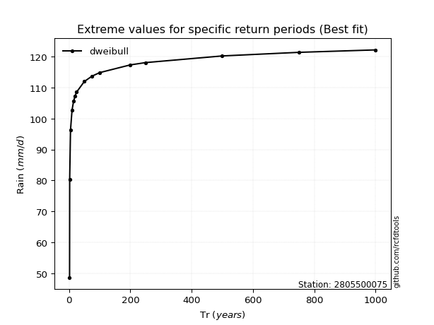</img>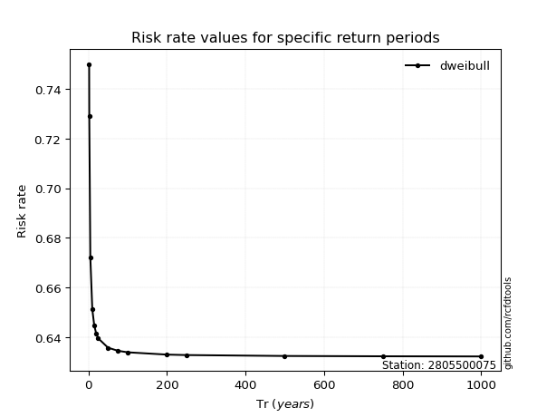</img>

</div>


<sub>**APP DISCLAIMER**: NO WARRANTY - This software is provided by [github.com/rcfdtools](https://github.com/rcfdtools) "as is", without any express or implied warranty, including warranties of merchantability, fitness for a particular purpose, or non-infringement. There is no guarantee that the software will be error-free or operate without interruption. LIMITATION OF LIABILITY - Neither the authors nor copyright holders will be liable for claims or damages arising from the software or its use. You are responsible for determining if the software is appropriate for your use and assume all associated risks, including errors, legal compliance, and data loss. NO PROFESSIONAL ADVICE - The software provides general information and does not offer professional advice. It should not replace consultation with professional advisors.</sub>