<div align="center">


</div>

# PMax24h Station (Rain): 29004520

Maximum Precipitation in 24 hours (PMax24h) is the greatest amount of rainfall for a specific duration that is meteorologically possible for a given location, acting as a "worst-case" scenario for extreme storms, crucial for designing safety-critical infrastructure like bridges, river deviations, dams, spillways, and nuclear plants to prevent catastrophic failure. The PMax24h is related with the Probable Maximum Precipitation (PMP) and it is calculated by hydrologists using meteorological data to determine the upper limit of extreme rainfall, often leading to the Probable Maximum Flood (PMF) for flood control design, and is increasingly being studied for climate change impacts. Probable Maximum Precipitation (PMP) is the theoretical upper limit of rainfall, a deterministic estimate for extreme events, while probability distributions (like GEV, Gumbel) describe the likelihood and frequency of various precipitation amounts, including rare ones, showing how often events occur, with PMP representing the extreme end of these distributions, used for critical infrastructure design to ensure safety against the worst conceivable weather, unlike standard statistical forecasts which cover typical probabilities.

The most common probability distributions in hydrology, used for analyzing floods, rainfall, and streamflow, include the Normal, Log-Normal, Gumbel, Gamma (including Log-Pearson Type III), and Generalized Extreme Value (GEV) distributions, often chosen based on the data´s skewness and whether modeling extremes or general conditions, with Gumbel and GEV popular for extreme events like floods, while the Normal distribution serves as a baseline, though often requiring transformations for skewed hydrological data. These distributions help in designing water infrastructure, managing water resources, and forecasting hydrologic events.

> Hydrological data often isn´t perfectly normal (it´s skewed), so different distributions are needed for different applications, such as: **Flood Frequency Analysis**: Using Gumbel, GEV, or Log-Pearson Type III for predicting extreme flood magnitudes and their return periods, **Rainfall Analysis**: Normal for annual totals, but Log-Normal, Weibull, or GEV for intensity or extreme daily rainfall, **Streamflow Modeling**: Gamma and Log-Normal for maximum flows, GEV for minimum flows, and Kappa for daily flows.

<div align="center">

</img>

</div>


## A. General information


### 1. General running parameters

• app_version: _v20260312_. • runtime: _2026-03-12 07:15:23.203550_. • Python version: _3.14.0_. • SciPy version: _1.16.3_. • Pandas version: _2.3.3_. • NumPy version: _2.3.5_. • Stations dataset (station_dataset_file): _dataset/pmax24h_in/automatic_colombia_2003_2025.csv_. • Stations catalog (station_catalog_file): _dataset/CNE.xls_. • Minimum year to eval til year_max (date_min): _1900_. • Maximum year to eval since year_min (date_max): _2025_. • Creates, save and include plots into reports (create_plot): _True_. • Plot only fit distributions with Δo > Δ (plot_only_fit): _True_. • Plot only simple graphs avoiding multiple CDFs and multiple Extreme values plots (plot_only_simple): _True_. • Eval low extreme values, if False, evaluates high extreme values (low_extreme): _False_. • Eval every SciPy distribution as logarithmic (pdist_logarithmic_on): _True_. • Standard deviation normalized (ddof): _1.0_. • Return periods to eval in years (Tr): _[2, 2.33, 5, 10, 15, 20, 25, 50, 75, 100, 200, 250, 500, 750, 1000]_. • Minimum data sample per station, 0 means any (minimum_sample): _5_. • Z-Score maximum threshold to adjust a value, 0 means disable (zscore_max): _3.5_. • Z-Score minimum threshold to adjust a value, 0 means disable (zscore_min): _-2.5_. • Avoid zeros, e.g. rain = 0 (avoid_zeros): _True_. • Avoid null values (avoid_nans): _True_. 

:file_folder:Table: [dataset.csv](../../dataset/pmax24h_in/automatic_colombia_2003_2025.csv)

> Delta Degrees of Freedom (DDOF): is a parameter used in the formulas for calculating variance and standard deviation. When ddof=0, the divisor is $N$ (the total number of observations) and this is used when your data set is the entire population. When ddof=1, the divisor is $N-1$ and this is used when your data set is a sample drawn from a larger population. Using $N-1$ provides an unbiased estimate of the population variance (known as Bessel´s correction).


### 2. Station info and location

|   id |   CODIGO | NOMBRE                                       | CATEGORIA               | TECNOLOGIA                | ESTADO   | FECHA_INSTALACION   |   FECHA_SUSPENSION |   ALTITUD |   LATITUD |   LONGITUD | DEPARTAMENTO   | MUNICIPIO    | AREA_OPERATIVA                              | ENTIDAD                                                     | AREA_HIDROGRAFICA   | ZONA_HIDROGRAFICA   | SUBZONA_HIDROGRAFICA                                     |   CORRIENTE | Catalogo   |   Version |
|-----:|---------:|:---------------------------------------------|:------------------------|:--------------------------|:---------|:--------------------|-------------------:|----------:|----------:|-----------:|:---------------|:-------------|:--------------------------------------------|:------------------------------------------------------------|:--------------------|:--------------------|:---------------------------------------------------------|------------:|:-----------|----------:|
|    0 | 29004520 | ESCUELA NAVAL BARRANQUILLA  - AUT [29004520] | Climatológica Principal | Automática con Telemetría | Activa   | 10/06/2016          |                nan |        10 |   11.0064 |    -74.785 | Atlantico      | Barranquilla | Area Operativa 02 - Atlántico-Bolivar-Sucre | INSTITUTO DE HIDROLOGIA METEOROLOGIA Y ESTUDIOS AMBIENTALES | Magdalena Cauca     | Bajo Magdalena      | Directos al Bajo Magdalena entre Calamar y desembocadura |         nan | CNE_IDEAM  |  20251226 |

<div align="center">

Dynamic map: [:earth_americas:Google](http://maps.google.com/maps?q=11.00638889,-74.785) [:earth_americas:OSM](https://www.openstreetmap.org/#map=18/11.00638889/-74.785&layers=P) [:earth_americas:Bing](https://www.bing.com/maps?cp=11.00638889~-74.785&lvl=18) [:earth_americas:Apple](https://maps.apple.com/frame?center=11.00638889%2C-74.785&span=0.003%2C0.006)

</div>


<div align="center">

```geojson
{
  "type": "Feature",
  "geometry": {
    "type": "Point", 
    "coordinates": [-74.785, 11.00638889]
  }, 
  "properties": {
    "Name": "29004520"
  }
}
```

</div>


### 3. Discrete values table and plot

<div align="center">

|               |           0 |           1 |           2 |            3 |           4 |          5 |         6 |           7 |           8 |
|:--------------|------------:|------------:|------------:|-------------:|------------:|-----------:|----------:|------------:|------------:|
| Date          | 2017        | 2018        | 2019        | 2020         | 2021        | 2022       | 2023      | 2024        | 2025        |
| Value         |   74.5      |   63.9      |  122.1      |   99.5       |   47.2      |  223       |    3.7    |  140.8      |   80.5      |
| Value_initial |   74.5      |   63.9      |  122.1      |   99.5       |   47.2      |  223       |    3.7    |  140.8      |   80.5      |
| count         |    9        |    9        |    9        |    9         |    9        |    9       |    9      |    9        |    9        |
| mean          |   95.0222   |   95.0222   |   95.0222   |   95.0222    |   95.0222   |   95.0222  |   95.0222 |   95.0222   |   95.0222   |
| std           |   62.7042   |   62.7042   |   62.7042   |   62.7042    |   62.7042   |   62.7042  |   62.7042 |   62.7042   |   62.7042   |
| zscore        |   -0.327286 |   -0.496334 |    0.431834 |    0.0714111 |   -0.762664 |    2.04098 |   -1.4564 |    0.730059 |   -0.231599 |


</div>


<div align="center">

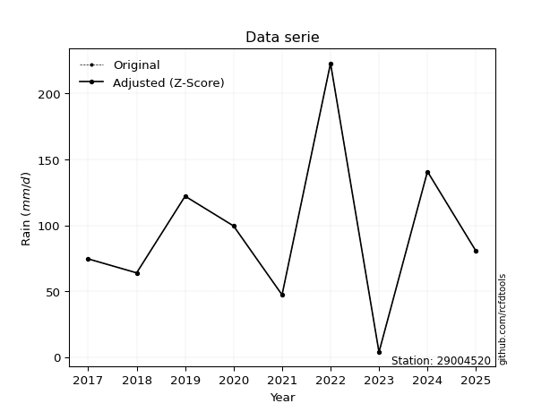</img>

</div>


> The initial value (value_initial) correspond to the initial obtained or null completed value, and value (value) is adjusted only when the initial value is outside the valid range (outlier) definite through the Z-Score value. If Z-Score is active, values out of range or outliers are replaced with the station mean value. A Z-Score (or standard score) measures how many standard deviations a data point is from the mean of a dataset, indicating its relative position; positive scores mean above the mean, negative mean below, and a score of zero is exactly at the mean, allowing for comparison of values from different distributions. It´s calculated using the formula $z=(x–μ)/σ$, where $x$ is the data point, $μ$ is the mean, and $σ$ is the standard deviation, helping identify outliers and understand probability.
>
> <sub>**Note**: In this study, "completing" (filling gaps in) and "extending" (forecasting or lengthening the historical record) rainfall data series are avoided for certain critical analyses because they introduce artificial bias and uncertainty, which can distort the statistics of rare events (extremes), alter day-to-day variability, and compromise the integrity and homogeneity of the original data. Some reasons against Completing/Extending rainfall data are: **Distortion of Extremes and Variability**: The primary issue is that most gap-filling or extension methods rely on averaging or regression with nearby stations, which inherently smooths the data. Rainfall is highly variable in space and time, with a large percentage of zero values and occasional large storms. Infilling methods often underestimate the highest values and overestimate the lowest (zero) values, which severely distorts analyses focused on flood frequency, drought severity, and intensity-duration-frequency (IDF) curves, **Loss of Data Homogeneity**: Infilled or extended data are synthetic estimates, not actual measurements. Combining these estimates with observed data can violate the assumption of data homogeneity, which requires that the data properties do not change over time. Inhomogeneity can lead to incorrect conclusions about long-term trends or changes in climate patterns, **Propagation of Errors**: Errors and biases from the original data (e.g., wind-induced undercatch, instrument errors, site changes) or the data used for imputation can propagate through the analysis, leading to unreliable hydrological models and inaccurate predictions, **Compromised Statistical Integrity**: For statistical analyses, especially those involving the frequency of events, using artificial data can introduce time bias or autocorrelation that doesn´t exist in reality, making it difficult to assess the true probability of events, **Difficulty in Validation**: It is difficult to accurately validate the quality of filled or extended data, especially for past periods where ground-truth measurements are unavailable. The reliability of imputation techniques heavily depends on the density of the surrounding station network and the complexity of the local topography.</sub>


### 4. Active continuous probability distributions from SciPy (80 of 104 available)

A Probability Density Function (PDF) describes the relative likelihood of a continuous random variable falling within a specific range, where the total area under its curve equals 1, and the area over any interval gives the actual probability for that range. Unlike discrete probabilities (like rolling a die), a PDF shows density, not direct probability for a single point (which is zero), with higher points indicating higher likelihood, often visualized as a bell curve for normal distributions.

A log of a probability density function (log-PDF) is simply the logarithm of the PDF´s value, denoted as $log(f(x))$, useful for converting multiplication of probabilities into addition, improving numerical stability with tiny numbers, and connecting to information theory concepts like entropy. Instead of dealing with very small probabilities (e.g., 0.000001), log-PDFs use negative numbers (e.g., $log(0.00001) ≈ -11.51$ that are easier for computers to handle, preventing underflow errors and simplifying complex calculations. In this study, each active probability distribution from SciPy is also evaluated in the $log$ form.

[scipy.stats](https://docs.scipy.org/doc/scipy/reference/stats.html) is a Python´s powerful submodule within the SciPy library for comprehensive statistical analysis, offering over 130 probability distributions (like Normal, Poisson, etc.), functions for descriptive stats (mean, variance), hypothesis testing (t-tests, chi-square), random variable generation, and statistical tests, making it essential for data science, modeling, and research. It provides tools to explore, model, and draw conclusions from data efficiently, working seamlessly with [NumPy](https://numpy.org/).

<div align="center">

|   id | p_dist           |   n_parameter | fit_method   | label                                                                       | active   | ref                                                                                                      |
|-----:|:-----------------|--------------:|:-------------|:----------------------------------------------------------------------------|:---------|:---------------------------------------------------------------------------------------------------------|
|    0 | alpha            |             3 | MLE          | Alpha                                                                       | True     | [:mortar_board:](https://docs.scipy.org/doc/scipy/reference/generated/scipy.stats.alpha.html)            |
|    1 | anglit           |             2 | MM           | Anglit                                                                      | True     | [:mortar_board:](https://docs.scipy.org/doc/scipy/reference/generated/scipy.stats.anglit.html)           |
|    2 | arcsine          |             2 | MM           | Arcsine                                                                     | True     | [:mortar_board:](https://docs.scipy.org/doc/scipy/reference/generated/scipy.stats.arcsine.html)          |
|    3 | argus            |             3 | MLE          | Argus                                                                       | True     | [:mortar_board:](https://docs.scipy.org/doc/scipy/reference/generated/scipy.stats.argus.html)            |
|    4 | beta             |             4 | MLE          | Beta                                                                        | True     | [:mortar_board:](https://docs.scipy.org/doc/scipy/reference/generated/scipy.stats.beta.html)             |
|    5 | betaprime        |             4 | MLE          | Beta prime                                                                  | True     | [:mortar_board:](https://docs.scipy.org/doc/scipy/reference/generated/scipy.stats.betaprime.html)        |
|    6 | bradford         |             3 | MLE          | Bradford                                                                    | True     | [:mortar_board:](https://docs.scipy.org/doc/scipy/reference/generated/scipy.stats.bradford.html)         |
|    7 | burr             |             4 | MLE          | Burr (Type III)                                                             | True     | [:mortar_board:](https://docs.scipy.org/doc/scipy/reference/generated/scipy.stats.burr.html)             |
|    8 | burr12           |             4 | MLE          | Burr (Type III) 12                                                          | True     | [:mortar_board:](https://docs.scipy.org/doc/scipy/reference/generated/scipy.stats.burr12.html)           |
|    9 | cosine           |             2 | MLE          | Cosine                                                                      | True     | [:mortar_board:](https://docs.scipy.org/doc/scipy/reference/generated/scipy.stats.cosine.html)           |
|   10 | crystalball      |             4 | MLE          | Crystalball                                                                 | True     | [:mortar_board:](https://docs.scipy.org/doc/scipy/reference/generated/scipy.stats.crystalball.html)      |
|   11 | dgamma           |             3 | MLE          | Double gamma                                                                | True     | [:mortar_board:](https://docs.scipy.org/doc/scipy/reference/generated/scipy.stats.dgamma.html)           |
|   12 | dweibull         |             3 | MLE          | Double Weibull                                                              | True     | [:mortar_board:](https://docs.scipy.org/doc/scipy/reference/generated/scipy.stats.dweibull.html)         |
|   13 | erlang           |             3 | MLE          | Erlang                                                                      | True     | [:mortar_board:](https://docs.scipy.org/doc/scipy/reference/generated/scipy.stats.erlang.html)           |
|   14 | exponnorm        |             3 | MLE          | Exponentially modified Normal                                               | True     | [:mortar_board:](https://docs.scipy.org/doc/scipy/reference/generated/scipy.stats.exponnorm.html)        |
|   15 | exponpow         |             3 | MLE          | Exponential power                                                           | True     | [:mortar_board:](https://docs.scipy.org/doc/scipy/reference/generated/scipy.stats.exponpow.html)         |
|   16 | exponweib        |             4 | MLE          | Exponentiated Weibull                                                       | True     | [:mortar_board:](https://docs.scipy.org/doc/scipy/reference/generated/scipy.stats.exponweib.html)        |
|   17 | f                |             4 | MLE          | F                                                                           | True     | [:mortar_board:](https://docs.scipy.org/doc/scipy/reference/generated/scipy.stats.f.html)                |
|   18 | fatiguelife      |             3 | MLE          | Fatigue-life (Birnbaum-Saunders)                                            | True     | [:mortar_board:](https://docs.scipy.org/doc/scipy/reference/generated/scipy.stats.fatiguelife.html)      |
|   19 | foldnorm         |             3 | MM           | Fold Normal                                                                 | True     | [:mortar_board:](https://docs.scipy.org/doc/scipy/reference/generated/scipy.stats.foldnorm.html)         |
|   20 | gamma            |             3 | MLE          | Gamma                                                                       | True     | [:mortar_board:](https://docs.scipy.org/doc/scipy/reference/generated/scipy.stats.gamma.html)            |
|   21 | gausshyper       |             6 | MLE          | Gauss hypergeometric                                                        | True     | [:mortar_board:](https://docs.scipy.org/doc/scipy/reference/generated/scipy.stats.gausshyper.html)       |
|   22 | genexpon         |             5 | MLE          | Generalized exponential                                                     | True     | [:mortar_board:](https://docs.scipy.org/doc/scipy/reference/generated/scipy.stats.genexpon.html)         |
|   23 | genextreme       |             3 | MLE          | Generalized exponential                                                     | True     | [:mortar_board:](https://docs.scipy.org/doc/scipy/reference/generated/scipy.stats.genextreme.html)       |
|   24 | gengamma         |             4 | MLE          | Generalized gamma                                                           | True     | [:mortar_board:](https://docs.scipy.org/doc/scipy/reference/generated/scipy.stats.gengamma.html)         |
|   25 | genhalflogistic  |             3 | MLE          | Generalized half-logistic                                                   | True     | [:mortar_board:](https://docs.scipy.org/doc/scipy/reference/generated/scipy.stats.genhalflogistic.html)  |
|   26 | genlogistic      |             3 | MLE          | Generalized logistic                                                        | True     | [:mortar_board:](https://docs.scipy.org/doc/scipy/reference/generated/scipy.stats.genlogistic.html)      |
|   27 | gennorm          |             3 | MLE          | Generalized Normal                                                          | True     | [:mortar_board:](https://docs.scipy.org/doc/scipy/reference/generated/scipy.stats.gennorm.html)          |
|   28 | genpareto        |             3 | MLE          | Generalized Pareto                                                          | True     | [:mortar_board:](https://docs.scipy.org/doc/scipy/reference/generated/scipy.stats.genpareto.html)        |
|   29 | gompertz         |             3 | MLE          | Gompertz (or truncated Gumbel)                                              | True     | [:mortar_board:](https://docs.scipy.org/doc/scipy/reference/generated/scipy.stats.gompertz.html)         |
|   30 | gumbel_l         |             2 | MM           | Gumbel Left Skew                                                            | True     | [:mortar_board:](https://docs.scipy.org/doc/scipy/reference/generated/scipy.stats.gumbel_l.html)         |
|   31 | gumbel_r         |             2 | MM           | Gumbel Right Skew                                                           | True     | [:mortar_board:](https://docs.scipy.org/doc/scipy/reference/generated/scipy.stats.gumbel_r.html)         |
|   32 | halfgennorm      |             3 | MLE          | Upper half of a generalized normal                                          | True     | [:mortar_board:](https://docs.scipy.org/doc/scipy/reference/generated/scipy.stats.halfgennorm.html)      |
|   33 | halflogistic     |             2 | MM           | Half-logistic                                                               | True     | [:mortar_board:](https://docs.scipy.org/doc/scipy/reference/generated/scipy.stats.halflogistic.html)     |
|   34 | halfnorm         |             2 | MM           | Half Normal                                                                 | True     | [:mortar_board:](https://docs.scipy.org/doc/scipy/reference/generated/scipy.stats.halfnorm.html)         |
|   35 | hypsecant        |             2 | MM           | hyperbolic secant                                                           | True     | [:mortar_board:](https://docs.scipy.org/doc/scipy/reference/generated/scipy.stats.hypsecant.html)        |
|   36 | invgamma         |             3 | MLE          | Inverted gamma                                                              | True     | [:mortar_board:](https://docs.scipy.org/doc/scipy/reference/generated/scipy.stats.invgamma.html)         |
|   37 | invgauss         |             3 | MLE          | Inverse Gaussian                                                            | True     | [:mortar_board:](https://docs.scipy.org/doc/scipy/reference/generated/scipy.stats.invgauss.html)         |
|   38 | invweibull       |             3 | MLE          | Inverted Weibull                                                            | True     | [:mortar_board:](https://docs.scipy.org/doc/scipy/reference/generated/scipy.stats.invweibull.html)       |
|   39 | johnsonsb        |             4 | MLE          | Johnson SB                                                                  | True     | [:mortar_board:](https://docs.scipy.org/doc/scipy/reference/generated/scipy.stats.johnsonsb.html)        |
|   40 | johnsonsu        |             4 | MLE          | Johnson Su                                                                  | True     | [:mortar_board:](https://docs.scipy.org/doc/scipy/reference/generated/scipy.stats.johnsonsu.html)        |
|   41 | kappa3           |             3 | MLE          | Kappa 3                                                                     | True     | [:mortar_board:](https://docs.scipy.org/doc/scipy/reference/generated/scipy.stats.kappa3.html)           |
|   42 | kappa4           |             4 | MLE          | Kappa 4                                                                     | True     | [:mortar_board:](https://docs.scipy.org/doc/scipy/reference/generated/scipy.stats.kappa4.html)           |
|   43 | ksone            |             3 | MLE          | Kolmogorov-Smirnov one-sided test statistic distribution                    | True     | [:mortar_board:](https://docs.scipy.org/doc/scipy/reference/generated/scipy.stats.ksone.html)            |
|   44 | kstwobign        |             2 | MLE          | Limiting distribution of scaled Kolmogorov-Smirnov two-sided test statistic | True     | [:mortar_board:](https://docs.scipy.org/doc/scipy/reference/generated/scipy.stats.kstwobign.html)        |
|   45 | laplace          |             2 | MM           | Laplace                                                                     | True     | [:mortar_board:](https://docs.scipy.org/doc/scipy/reference/generated/scipy.stats.laplace.html)          |
|   46 | levy_l           |             2 | MLE          | Left-skewed Levy                                                            | True     | [:mortar_board:](https://docs.scipy.org/doc/scipy/reference/generated/scipy.stats.levy_l.html)           |
|   47 | loggamma         |             3 | MLE          | Log gamma                                                                   | True     | [:mortar_board:](https://docs.scipy.org/doc/scipy/reference/generated/scipy.stats.loggamma.html)         |
|   48 | logistic         |             2 | MM           | Logistic (or Sech-squared)                                                  | True     | [:mortar_board:](https://docs.scipy.org/doc/scipy/reference/generated/scipy.stats.logistic.html)         |
|   49 | loglaplace       |             3 | MLE          | Log-Laplace                                                                 | True     | [:mortar_board:](https://docs.scipy.org/doc/scipy/reference/generated/scipy.stats.loglaplace.html)       |
|   50 | lomax            |             3 | MLE          | Lomax (Pareto of the second kind)                                           | True     | [:mortar_board:](https://docs.scipy.org/doc/scipy/reference/generated/scipy.stats.lomax.html)            |
|   51 | maxwell          |             2 | MM           | Maxwell                                                                     | True     | [:mortar_board:](https://docs.scipy.org/doc/scipy/reference/generated/scipy.stats.maxwell.html)          |
|   52 | mielke           |             4 | MLE          | Mielke Beta-Kappa / Dagum                                                   | True     | [:mortar_board:](https://docs.scipy.org/doc/scipy/reference/generated/scipy.stats.mielke.html)           |
|   53 | moyal            |             2 | MM           | Moyal                                                                       | True     | [:mortar_board:](https://docs.scipy.org/doc/scipy/reference/generated/scipy.stats.moyal.html)            |
|   54 | nakagami         |             3 | MLE          | Nakagami                                                                    | True     | [:mortar_board:](https://docs.scipy.org/doc/scipy/reference/generated/scipy.stats.nakagami.html)         |
|   55 | ncf              |             5 | MLE          | Non-central F distribution                                                  | True     | [:mortar_board:](https://docs.scipy.org/doc/scipy/reference/generated/scipy.stats.ncf.html)              |
|   56 | nct              |             4 | MLE          | Non-central Student’s t                                                     | True     | [:mortar_board:](https://docs.scipy.org/doc/scipy/reference/generated/scipy.stats.nct.html)              |
|   57 | norm             |             2 | MM           | Normal                                                                      | True     | [:mortar_board:](https://docs.scipy.org/doc/scipy/reference/generated/scipy.stats.norm.html)             |
|   58 | pearson3         |             3 | MM           | Pearson type III                                                            | True     | [:mortar_board:](https://docs.scipy.org/doc/scipy/reference/generated/scipy.stats.pearson3.html)         |
|   59 | powerlaw         |             3 | MLE          | Power-function                                                              | True     | [:mortar_board:](https://docs.scipy.org/doc/scipy/reference/generated/scipy.stats.powerlaw.html)         |
|   60 | rayleigh         |             2 | MM           | Rayleigh                                                                    | True     | [:mortar_board:](https://docs.scipy.org/doc/scipy/reference/generated/scipy.stats.rayleigh.html)         |
|   61 | rdist            |             3 | MLE          | R-distributed (symmetric beta)                                              | True     | [:mortar_board:](https://docs.scipy.org/doc/scipy/reference/generated/scipy.stats.rdist.html)            |
|   62 | rice             |             3 | MLE          | Rice                                                                        | True     | [:mortar_board:](https://docs.scipy.org/doc/scipy/reference/generated/scipy.stats.rice.html)             |
|   63 | semicircular     |             2 | MM           | Semicircular                                                                | True     | [:mortar_board:](https://docs.scipy.org/doc/scipy/reference/generated/scipy.stats.semicircular.html)     |
|   64 | skewnorm         |             3 | MLE          | Skew normal                                                                 | True     | [:mortar_board:](https://docs.scipy.org/doc/scipy/reference/generated/scipy.stats.skewnorm.html)         |
|   65 | t                |             3 | MLE          | Student’s t                                                                 | True     | [:mortar_board:](https://docs.scipy.org/doc/scipy/reference/generated/scipy.stats.t.html)                |
|   66 | trapezoid        |             4 | MLE          | Trapezoid                                                                   | True     | [:mortar_board:](https://docs.scipy.org/doc/scipy/reference/generated/scipy.stats.trapezoid.html)        |
|   67 | triang           |             3 | MLE          | Triangular                                                                  | True     | [:mortar_board:](https://docs.scipy.org/doc/scipy/reference/generated/scipy.stats.triang.html)           |
|   68 | truncexpon       |             3 | MLE          | Truncated exponential                                                       | True     | [:mortar_board:](https://docs.scipy.org/doc/scipy/reference/generated/scipy.stats.truncexpon.html)       |
|   69 | truncnorm        |             4 | MLE          | Truncated normal                                                            | True     | [:mortar_board:](https://docs.scipy.org/doc/scipy/reference/generated/scipy.stats.truncnorm.html)        |
|   70 | truncpareto      |             4 | MLE          | Upper truncated Pareto                                                      | True     | [:mortar_board:](https://docs.scipy.org/doc/scipy/reference/generated/scipy.stats.truncpareto.html)      |
|   71 | truncweibull_min |             5 | MLE          | Doubly truncated Weibull minimum                                            | True     | [:mortar_board:](https://docs.scipy.org/doc/scipy/reference/generated/scipy.stats.truncweibull_min.html) |
|   72 | tukeylambda      |             3 | MLE          | Tukey-Lamdba                                                                | True     | [:mortar_board:](https://docs.scipy.org/doc/scipy/reference/generated/scipy.stats.tukeylambda.html)      |
|   73 | uniform          |             2 | MLE          | Uniform                                                                     | True     | [:mortar_board:](https://docs.scipy.org/doc/scipy/reference/generated/scipy.stats.uniform.html)          |
|   74 | vonmises         |             3 | MLE          | Von Mises                                                                   | True     | [:mortar_board:](https://docs.scipy.org/doc/scipy/reference/generated/scipy.stats.vonmises.html)         |
|   75 | vonmises_line    |             3 | MLE          | Von Mises line                                                              | True     | [:mortar_board:](https://docs.scipy.org/doc/scipy/reference/generated/scipy.stats.vonmises_line.html)    |
|   76 | wald             |             2 | MM           | Wald                                                                        | True     | [:mortar_board:](https://docs.scipy.org/doc/scipy/reference/generated/scipy.stats.wald.html)             |
|   77 | weibull_max      |             3 | MLE          | Weibull maximum                                                             | True     | [:mortar_board:](https://docs.scipy.org/doc/scipy/reference/generated/scipy.stats.weibull_max.html)      |
|   78 | weibull_min      |             3 | MLE          | Weibull minimum                                                             | True     | [:mortar_board:](https://docs.scipy.org/doc/scipy/reference/generated/scipy.stats.weibull_min.html)      |
|   79 | wrapcauchy       |             3 | MLE          | Wrapped  Cauchy                                                             | True     | [:mortar_board:](https://docs.scipy.org/doc/scipy/reference/generated/scipy.stats.wrapcauchy.html)       |

</div>

> **n_parameter:** # arguments & localization & scale.
>
> **Fit methods:** (MLE) maximum likelihood, (MM) L-moments.
>
>**Inactive** (With the only purpose of prevent loops, zero divisions, infinite values, over high estimated values or horizontal trending for recurrence intervals estimations, the follow distributions were disabled.)**:** lognorm, norminvgauss, powernorm, powerlognorm, cauchy, halfcauchy, foldcauchy, skewcauchy, chi2, expon, fisk, genhyperbolic, geninvgauss, gibrat, kstwo, laplace_asymmetric, levy, levy_stable, ncx2, pareto, rel_breitwigner, recipinvgauss, studentized_range, loguniform, 


## B. Probability (PDF) vs. Empirical (EDF) distributions functions

A continuous probability distribution (CPD) describes probabilities for variables that can take any value within a range (like rain any time), unlike discrete variables with specific outcomes (like temperature). It uses a Probability Density Function (PDF), a curve where the total area under it equals 1, and the probability of the variable falling within an interval (a to b) is found by calculating the area under the curve between those points. A key feature is that the probability of hitting any single exact value is zero, so probabilities are always expressed for ranges, e.g., $P(a ≤ X ≤ b)$.

<div align="center">

Distributions parameters from station values
|     |   station | p_dist              |   n |              loc |           scale | shape                  | shape1                | shape2                 | shape3              |
|----:|----------:|:--------------------|----:|-----------------:|----------------:|:-----------------------|:----------------------|:-----------------------|:--------------------|
|   0 |  29004520 | alpha               |   9 |     -0.0184527   |    11.0812      | 2.586679497768466e-10  |                       |                        |                     |
|   1 |  29004520 | anglit              |   9 |     95.0222      |   172.944       |                        |                       |                        |                     |
|   2 |  29004520 | arcsine             |   9 |     11.4166      |   167.211       |                        |                       |                        |                     |
|   3 |  29004520 | argus               |   9 |    -50.8643      |   282.693       | 1.1274464852478579e-06 |                       |                        |                     |
|   4 |  29004520 | beta                |   9 |      3.7         |   219.306       | 0.5954949810809436     | 0.6179380113881704    |                        |                     |
|   5 |  29004520 | betaprime           |   9 |    -56.2212      |  9592.87        | 6.5811251948080685     | 418.41309033574726    |                        |                     |
|   6 |  29004520 | bradford            |   9 |      3.69982     |   219.3         | 0.8184004988526983     |                       |                        |                     |
|   7 |  29004520 | burr                |   9 |      3.69999     |   168.976       | 4.601641586209408      | 0.18020822080477986   |                        |                     |
|   8 |  29004520 | burr12              |   9 |    -11.9324      |  1898.91        | 1.8616184917376444     | 171.23827506331008    |                        |                     |
|   9 |  29004520 | cosine              |   9 |    101.986       |    52.8187      |                        |                       |                        |                     |
|  10 |  29004520 | crystalball         |   9 |     95.0222      |    59.1181      | 6774.861262500497      | 5529.840511534532     |                        |                     |
|  11 |  29004520 | dgamma              |   9 |     90.5294      |    29.414       | 1.5341537473653921     |                       |                        |                     |
|  12 |  29004520 | dweibull            |   9 |     90.5553      |    48.6382      | 1.2400703816018077     |                       |                        |                     |
|  13 |  29004520 | erlang              |   9 |    -53.9983      |    23.7583      | 6.272353860028613      |                       |                        |                     |
|  14 |  29004520 | exponnorm           |   9 |     45.5037      |    34.8218      | 1.4220535969158854     |                       |                        |                     |
|  15 |  29004520 | exponpow            |   9 |      3.7         |     4.15341     | 0.14729548665829784    |                       |                        |                     |
|  16 |  29004520 | exponweib           |   9 |   -527.114       |   237.863       | 441.76242124336864     | 1.964982154924673     |                        |                     |
|  17 |  29004520 | f                   |   9 |    -54.2139      |   149.199       | 12.604187631283551     | 7958.8443757907       |                        |                     |
|  18 |  29004520 | fatiguelife         |   9 |   -124.096       |   211.477       | 0.2688148471197056     |                       |                        |                     |
|  19 |  29004520 | foldnorm            |   9 |      8.6254      |    73.8385      | 1.005040192342208      |                       |                        |                     |
|  20 |  29004520 | gamma               |   9 |    -53.9982      |    23.7583      | 6.272348671629751      |                       |                        |                     |
|  21 |  29004520 | gausshyper          |   9 |      3.7         |   260.793       | 0.81000867362733       | 3.0326846088586903    | 1.7257260140589352     | -0.9836641972539095 |
|  22 |  29004520 | genexpon            |   9 |      3.69999     |     2.46549     | 0.027016309082774567   | 1.766102468141571e-07 | 1.970849776831983      |                     |
|  23 |  29004520 | genextreme          |   9 |      3.85928     |     0.833124    | -5.230262050528468     |                       |                        |                     |
|  24 |  29004520 | gengamma            |   9 |    -86.8146      |     0.232277    | 33.71062341575008      | 0.5299307625831695    |                        |                     |
|  25 |  29004520 | genhalflogistic     |   9 |    -18.8171      |   252.148       | 1.0427228175009384     |                       |                        |                     |
|  26 |  29004520 | genlogistic         |   9 |     -1.52931     |    44.1711      | 5.4951947562362236     |                       |                        |                     |
|  27 |  29004520 | gennorm             |   9 |     80.5         |    37.3636      | 0.8995720874620277     |                       |                        |                     |
|  28 |  29004520 | genpareto           |   9 |      3.7         |   158.254       | -0.6734105192113744    |                       |                        |                     |
|  29 |  29004520 | gompertz            |   9 |     99.5         |    10.6608      | 3.733214459908005e-05  |                       |                        |                     |
|  30 |  29004520 | gumbel_l            |   9 |    121.629       |    46.0942      |                        |                       |                        |                     |
|  31 |  29004520 | gumbel_r            |   9 |     68.4159      |    46.0942      |                        |                       |                        |                     |
|  32 |  29004520 | halfgennorm         |   9 |      3.7         |     4.23098     | 0.36616484833511703    |                       |                        |                     |
|  33 |  29004520 | halflogistic        |   9 |     24.9536      |    50.5439      |                        |                       |                        |                     |
|  34 |  29004520 | halfnorm            |   9 |     16.773       |    98.0708      |                        |                       |                        |                     |
|  35 |  29004520 | hypsecant           |   9 |     95.0222      |    37.6357      |                        |                       |                        |                     |
|  36 |  29004520 | invgamma            |   9 |   -195.554       |  7219.71        | 25.84446833799201      |                       |                        |                     |
|  37 |  29004520 | invgauss            |   9 |   -126.524       |  3086.06        | 0.07178939603403317    |                       |                        |                     |
|  38 |  29004520 | invweibull          |   9 |     -1.26295e+09 |     1.26295e+09 | 25667932.293505136     |                       |                        |                     |
|  39 |  29004520 | johnsonsb           |   9 |      3.7         |   219.302       | -0.040139855360784606  | 0.14429385526616645   |                        |                     |
|  40 |  29004520 | johnsonsu           |   9 |   -118.759       |    36.5381      | -9.028178829428986     | 3.7134146497785365    |                        |                     |
|  41 |  29004520 | kappa3              |   9 |      3.7         |   113.395       | 4.902142698052987      |                       |                        |                     |
|  42 |  29004520 | kappa4              |   9 |    -18.2911      |   239.748       | 1.1009197381246763     | 0.9868204081001115    |                        |                     |
|  43 |  29004520 | ksone               |   9 |    -18.23        |   263.16        | 1.0                    |                       |                        |                     |
|  44 |  29004520 | kstwobign           |   9 |   -110.122       |   236.115       |                        |                       |                        |                     |
|  45 |  29004520 | laplace             |   9 |     95.0222      |    41.8028      |                        |                       |                        |                     |
|  46 |  29004520 | levy_l              |   9 |    237.96        |    74.5543      |                        |                       |                        |                     |
|  47 |  29004520 | loggamma            |   9 | -15406.7         |  2167.97        | 1274.9206942582405     |                       |                        |                     |
|  48 |  29004520 | logistic            |   9 |     95.0222      |    32.5935      |                        |                       |                        |                     |
|  49 |  29004520 | loglaplace          |   9 |     -0.225296    |    80.7253      | 1.4841822646303977     |                       |                        |                     |
|  50 |  29004520 | lomax               |   9 |      3.7         |     4.18495e+11 | 4555471049.002718      |                       |                        |                     |
|  51 |  29004520 | maxwell             |   9 |    -45.0628      |    87.7853      |                        |                       |                        |                     |
|  52 |  29004520 | mielke              |   9 |      3.7         |   147.077       | 0.7919999259462338     | 5.591146152472213     |                        |                     |
|  53 |  29004520 | moyal               |   9 |     61.2147      |    26.6125      |                        |                       |                        |                     |
|  54 |  29004520 | nakagami            |   9 |      3.7         |    91.5407      | 0.363174276508754      |                       |                        |                     |
|  55 |  29004520 | ncf                 |   9 |     -0.0285016   |     3.4263e-06  | 2.0426644789202685e-07 | 6.2015063515873905    | 4.317774065056946      |                     |
|  56 |  29004520 | nct                 |   9 |     -0.0974071   |    44.1305      | 6.958958156102727      | 1.9116635806506825    |                        |                     |
|  57 |  29004520 | norm                |   9 |     95.0222      |    59.1181      |                        |                       |                        |                     |
|  58 |  29004520 | pearson3            |   9 |     95.0222      |    59.1181      | 0.6986305282732778     |                       |                        |                     |
|  59 |  29004520 | powerlaw            |   9 |      3.7         |   219.3         | 0.18849946924244002    |                       |                        |                     |
|  60 |  29004520 | rayleigh            |   9 |    -18.0741      |    90.2378      |                        |                       |                        |                     |
|  61 |  29004520 | rdist               |   9 |    -18.1023      |   117.602       | 1.0662659256848819     |                       |                        |                     |
|  62 |  29004520 | rice                |   9 |    -16.2414      |    89.0913      | 0.00149443864129703    |                       |                        |                     |
|  63 |  29004520 | semicircular        |   9 |     95.0222      |   118.236       |                        |                       |                        |                     |
|  64 |  29004520 | skewnorm            |   9 |     29.681       |    88.116       | 2.70257136515343       |                       |                        |                     |
|  65 |  29004520 | t                   |   9 |     94.7765      |    59.0256      | 53.612109799335286     |                       |                        |                     |
|  66 |  29004520 | trapezoid           |   9 |    -19.1415      |   263.16        | 0.9999999999999999     | 1.0                   |                        |                     |
|  67 |  29004520 | triang              |   9 |    -19.581       |   242.581       | 0.9999994778539333     |                       |                        |                     |
|  68 |  29004520 | truncexpon          |   9 |      3.69998     |   303.161       | 0.7233775498363035     |                       |                        |                     |
|  69 |  29004520 | truncnorm           |   9 |    -12.7432      |     5.20553     | -4.625134784005042     | 45.28705716578756     |                        |                     |
|  70 |  29004520 | truncpareto         |   9 |      3.6886      |     0.0114045   | 0.1251563351687841     | 19230.237362244465    |                        |                     |
|  71 |  29004520 | truncweibull_min    |   9 |    -10.6283      |   273.34        | 1.2935985494180104     | 0.0013000440806368741 | 0.8547177704388691     |                     |
|  72 |  29004520 | tukeylambda         |   9 |    -17.3987      |   124.024       | 1.0609530095778434     |                       |                        |                     |
|  73 |  29004520 | uniform             |   9 |      3.7         |   219.3         |                        |                       |                        |                     |
|  74 |  29004520 | vonmises            |   9 |     -2.68053     |     1           | 0.6815460523206354     |                       |                        |                     |
|  75 |  29004520 | vonmises_line       |   9 |    113.424       |    34.9262      | 0.33772774644734926    |                       |                        |                     |
|  76 |  29004520 | wald                |   9 |     35.9041      |    59.1181      |                        |                       |                        |                     |
|  77 |  29004520 | weibull_max         |   9 |    223           |     1.6242      | 0.18519697248781763    |                       |                        |                     |
|  78 |  29004520 | weibull_min         |   9 |    -11.5094      |   119.614       | 1.8444649894336602     |                       |                        |                     |
|  79 |  29004520 | wrapcauchy          |   9 |      3.69967     |    34.903       | 8.371434228332942e-08  |                       |                        |                     |
|  80 |  29004520 | logalpha            |   9 |    -27.9813      |   858.261       | 26.714233002809323     |                       |                        |                     |
|  81 |  29004520 | loganglit           |   9 |      4.19763     |     3.24475     |                        |                       |                        |                     |
|  82 |  29004520 | logarcsine          |   9 |      2.62902     |     3.1372      |                        |                       |                        |                     |
|  83 |  29004520 | logargus            |   9 |     -0.278603    |     5.75335     | 2.6609605912024756     |                       |                        |                     |
|  84 |  29004520 | logbeta             |   9 |      0.854746    |     4.55243     | 1.210558976853851      | 0.26030111450011517   |                        |                     |
|  85 |  29004520 | logbetaprime        |   9 |    -20.0829      |   120.706       | 513.5753565666156      | 2554.096048470019     |                        |                     |
|  86 |  29004520 | logbradford         |   9 |      1.30833     |     4.0989      | 0.856774199118727      |                       |                        |                     |
|  87 |  29004520 | logburr             |   9 |   -473.718       |   479.155       | 37211.31582932983      | 0.010366800933108303  |                        |                     |
|  88 |  29004520 | logburr12           |   9 |  -6399.97        |  6414.28        | 9615.000481629606      | 1977073.4447511835    |                        |                     |
|  89 |  29004520 | logcosine           |   9 |      3.90477     |     1.07004     |                        |                       |                        |                     |
|  90 |  29004520 | logcrystalball      |   9 |      4.62682     |     0.475548    | 0.5333254743092977     | 1236.97714197572      |                        |                     |
|  91 |  29004520 | logdgamma           |   9 |      4.3108      |     0.845852    | 0.8117349159625544     |                       |                        |                     |
|  92 |  29004520 | logdweibull         |   9 |      4.38826     |     0.831402    | 0.8658808584854892     |                       |                        |                     |
|  93 |  29004520 | logerlang           |   9 |    -15.3383      |     0.07047     | 276.92244907430165     |                       |                        |                     |
|  94 |  29004520 | logexponnorm        |   9 |      4.19708     |     1.10916     | 0.0004829684403811383  |                       |                        |                     |
|  95 |  29004520 | logexponpow         |   9 |     -3.10193e+07 |     3.10193e+07 | 33750011.30607254      |                       |                        |                     |
|  96 |  29004520 | logexponweib        |   9 |      1.30833     |     0.983285    | 1.1570994656637368     | 0.5693590912273384    |                        |                     |
|  97 |  29004520 | logf                |   9 |   -342.354       |   346.569       | 194890.31955584348     | 21638926.355342276    |                        |                     |
|  98 |  29004520 | logfatiguelife      |   9 |   -655.786       |   659.978       | 0.0016824241931293026  |                       |                        |                     |
|  99 |  29004520 | logfoldnorm         |   9 |     -1.52299     |     0.982203    | 5.844340225775628      |                       |                        |                     |
| 100 |  29004520 | loggamma            |   9 |    -16.2         |     0.069097    | 295.15054126449786     |                       |                        |                     |
| 101 |  29004520 | loggausshyper       |   9 |      1.1436      |     4.26357     | 1.250380073953377      | 0.4844579865468055    | 1.158502596626143      | 1.0583493114379583  |
| 102 |  29004520 | loggenexpon         |   9 |      1.25201     |     0.0218549   | 0.0014900566978111596  | 3.610534978542951     | 2.1345777283264723e-05 |                     |
| 103 |  29004520 | loggenextreme       |   9 |      4.1881      |     1.40071     | 1.1489955763989705     |                       |                        |                     |
| 104 |  29004520 | loggengamma         |   9 |      1.30833     |     0.911152    | 1.244003906734911      | 0.5695968962116965    |                        |                     |
| 105 |  29004520 | loggenhalflogistic  |   9 |      0.906152    |     4.7224      | 1.0491835195704473     |                       |                        |                     |
| 106 |  29004520 | loggenlogistic      |   9 |      5.04917     |     0.204397    | 0.22313881587950546    |                       |                        |                     |
| 107 |  29004520 | loggennorm          |   9 |      4.38826     |     0.000408624 | 0.22778983648203255    |                       |                        |                     |
| 108 |  29004520 | loggenpareto        |   9 |     -0.00980747  |    11.1211      | -2.0530118543041107    |                       |                        |                     |
| 109 |  29004520 | loggompertz         |   9 |      1.30833     |     0.701668    | 0.008837148610149524   |                       |                        |                     |
| 110 |  29004520 | loggumbel_l         |   9 |      4.69681     |     0.86482     |                        |                       |                        |                     |
| 111 |  29004520 | loggumbel_r         |   9 |      3.69844     |     0.86482     |                        |                       |                        |                     |
| 112 |  29004520 | loghalfgennorm      |   9 |      1.30833     |     5.1543      | 2.465705652730037      |                       |                        |                     |
| 113 |  29004520 | loghalflogistic     |   9 |      2.88298     |     0.948312    |                        |                       |                        |                     |
| 114 |  29004520 | loghalfnorm         |   9 |      2.72953     |     1.83998     |                        |                       |                        |                     |
| 115 |  29004520 | loghypsecant        |   9 |      4.19762     |     0.706122    |                        |                       |                        |                     |
| 116 |  29004520 | loginvgamma         |   9 |    -21.8322      | 12650.6         | 487.25299246113445     |                       |                        |                     |
| 117 |  29004520 | loginvgauss         |   9 |     -9.96468     |  1921.5         | 0.007370688317691665   |                       |                        |                     |
| 118 |  29004520 | loginvweibull       |   9 |     -1.9622e+08  |     1.9622e+08  | 134173102.38764137     |                       |                        |                     |
| 119 |  29004520 | logjohnsonsb        |   9 |   -159.517       |   165.325       | -7.728297022198106     | 1.6051319696642894    |                        |                     |
| 120 |  29004520 | logjohnsonsu        |   9 |      4.82324     |     0.451492    | 0.6869276716806454     | 0.9604296429988086    |                        |                     |
| 121 |  29004520 | logkappa3           |   9 |      1.30833     |     4.09747     | 6585.9100365510185     |                       |                        |                     |
| 122 |  29004520 | logkappa4           |   9 |      0.771549    |     5.39873     | 1.022452197361989      | 1.1646177499066797    |                        |                     |
| 123 |  29004520 | logksone            |   9 |      0.898449    |     4.91861     | 1.0                    |                       |                        |                     |
| 124 |  29004520 | logkstwobign        |   9 |     -1.73822     |     6.81328     |                        |                       |                        |                     |
| 125 |  29004520 | loglaplace          |   9 |      4.19762     |     0.784305    |                        |                       |                        |                     |
| 126 |  29004520 | loglevy_l           |   9 |      5.51554     |     0.536313    |                        |                       |                        |                     |
| 127 |  29004520 | logloggamma         |   9 |      5.18111     |     0.336652    | 0.3554682813824901     |                       |                        |                     |
| 128 |  29004520 | loglogistic         |   9 |      4.19762     |     0.61152     |                        |                       |                        |                     |
| 129 |  29004520 | logloglaplace       |   9 |     -0.0273327   |     4.41559     | 4.845715623369874      |                       |                        |                     |
| 130 |  29004520 | loglomax            |   9 |      1.30833     |    40.2312      | 14.181524504290293     |                       |                        |                     |
| 131 |  29004520 | logmaxwell          |   9 |      1.56938     |     1.64701     |                        |                       |                        |                     |
| 132 |  29004520 | logmielke           |   9 | -27538.8         | 27543.8         | 29043.17048322319      | 131537.5581354322     |                        |                     |
| 133 |  29004520 | logmoyal            |   9 |      3.56333     |     0.499304    |                        |                       |                        |                     |
| 134 |  29004520 | lognakagami         |   9 |      3.85439     |     0.768661    | 0.3938548464621531     |                       |                        |                     |
| 135 |  29004520 | logncf              |   9 |     -0.816365    |     6.93495e-05 | 0.001086121051772811   | 169.0586922601318     | 78.02056209368573      |                     |
| 136 |  29004520 | lognct              |   9 |    -71.3836      |     1.09742     | 98169.0644960418       | 68.87084526146342     |                        |                     |
| 137 |  29004520 | lognorm             |   9 |      4.19762     |     1.10917     |                        |                       |                        |                     |
| 138 |  29004520 | logpearson3         |   9 |      4.19762     |     1.10918     | -1.764632687985388     |                       |                        |                     |
| 139 |  29004520 | logpowerlaw         |   9 |      1.30833     |     4.09884     | 0.2284929965861284     |                       |                        |                     |
| 140 |  29004520 | lograyleigh         |   9 |      2.07575     |     1.69302     |                        |                       |                        |                     |
| 141 |  29004520 | logrdist            |   9 |      2.00121     |     2.38705     | 1.01719367121762       |                       |                        |                     |
| 142 |  29004520 | logrice             |   9 |   -208.356       |     1.10916     | 191.6318759002575      |                       |                        |                     |
| 143 |  29004520 | logsemicircular     |   9 |      4.19763     |     2.21832     |                        |                       |                        |                     |
| 144 |  29004520 | logskewnorm         |   9 |      5.40717     |     1.64117     | -46285767.1135249      |                       |                        |                     |
| 145 |  29004520 | logt                |   9 |      4.48456     |     0.41326     | 1.5383818951015904     |                       |                        |                     |
| 146 |  29004520 | logtrapezoid        |   9 |      1.0604      |     4.70583     | 1.0                    | 1.0                   |                        |                     |
| 147 |  29004520 | logtriang           |   9 |      0.730095    |     4.67708     | 0.9999999940938363     |                       |                        |                     |
| 148 |  29004520 | logtruncexpon       |   9 |      1.30833     |     6.9688      | 0.5881706839390282     |                       |                        |                     |
| 149 |  29004520 | logtruncnorm        |   9 |     30.7682      |     9.03028     | -18.894991639460727    | -2.8084445613961053   |                        |                     |
| 150 |  29004520 | logtruncpareto      |   9 |      1.30793     |     0.00040132  | 0.1251416564637893     | 10214.403444572199    |                        |                     |
| 151 |  29004520 | logtruncweibull_min |   9 |      1.16981     |     7.91407     | 1.6166948586250274     | 9.645220090447942e-07 | 0.5354212168073358     |                     |
| 152 |  29004520 | logtukeylambda      |   9 |      3.35789     |     2.08157     | 1.01561497582371       |                       |                        |                     |
| 153 |  29004520 | loguniform          |   9 |      1.30833     |     4.09884     |                        |                       |                        |                     |
| 154 |  29004520 | logvonmises         |   9 |     -1.71324     |     1           | 1.9466756475594507     |                       |                        |                     |
| 155 |  29004520 | logvonmises_line    |   9 |      4.63078     |     0.247132    | 0.13206655780216073    |                       |                        |                     |
| 156 |  29004520 | logwald             |   9 |      3.0885      |     1.10914     |                        |                       |                        |                     |
| 157 |  29004520 | logweibull_max      |   9 |      5.40717     |     1.3556      | 0.9490335050980674     |                       |                        |                     |
| 158 |  29004520 | logweibull_min      |   9 |      1.30833     |     1.44782     | 0.7586941079325551     |                       |                        |                     |
| 159 |  29004520 | logwrapcauchy       |   9 |      1.30819     |     0.652373    | 0.2373625460774165     |                       |                        |                     |

</div>

> **loc** (Location parameter): This shifts the distribution along the x-axis. For many common distributions, like the normal (Gaussian) distribution, loc represents the mean $μ$. For others, like the uniform distribution, it might represent the minimum value, or for the beta distribution, the left end of the support interval.
>
> **scale** (Scale parameter): This determines the width or spread of the distribution. For the normal distribution, scale represents the standard deviation $σ$. For a uniform distribution, it defines the length of the interval (from $loc$ to $loc + scale$).
>
> **shape** (Shape parameters): Refers to parameters that define the specific form of a probability distribution, distinct from its location (loc) and scale (scale). These parameters are required arguments for most distribution functions. For example, a normal (Gaussian) distribution is fully defined by its location (mean) and scale (standard deviation), so it has no specific shape parameters beyond loc and scale. However, other distributions have intrinsic properties that need specification, as Gamma distribution that takes a shape parameter, often named $a$ or $alpha$.


### 0. Cumulative distribution values - CDF (160 evaluated)

Cumulative Distribution Function (CDF), denoted as $F$<sub>$X$</sub>$(x)$, is a function that gives the probability that a random variable $X$ will take a value less than or equal to a specific value, $x$ (i.e., $(P(X≥x)$. It essentially "accumulates" probabilities from a given point up to the far right (positive infinity), providing a complete picture of the distribution´s probabilities for both discrete (like rain) and continuous (like temperature) variables, helping to find probabilities over ranges or above certain values. Each station is evaluated separately ordering the $x$ values ascending, calculating the CDF and PDF values for the activated distributions and their logarithmic forms.

<div align="center">

CDF ordered by x ascending and calculating $log(f(x))$ separately
|   id |   Station |   date |     x |   count |    mean |     std |     zscore |   Value_initial |   station |   m |      alpha |   alpha_pdf |    anglit |   anglit_pdf |   arcsine |   arcsine_pdf |    argus |   argus_pdf |       beta |       beta_pdf |   betaprime |   betaprime_pdf |    bradford |   bradford_pdf |        burr |    burr_pdf |    burr12 |   burr12_pdf |    cosine |   cosine_pdf |   crystalball |   crystalball_pdf |    dgamma |   dgamma_pdf |   dweibull |   dweibull_pdf |    erlang |   erlang_pdf |   exponnorm |   exponnorm_pdf |   exponpow |   exponpow_pdf |   exponweib |   exponweib_pdf |         f |       f_pdf |   fatiguelife |   fatiguelife_pdf |   foldnorm |   foldnorm_pdf |     gamma |   gamma_pdf |   gausshyper |   gausshyper_pdf |    genexpon |   genexpon_pdf |   genextreme |   genextreme_pdf |   gengamma |   gengamma_pdf |   genhalflogistic |   genhalflogistic_pdf |   genlogistic |   genlogistic_pdf |   gennorm |   gennorm_pdf |   genpareto |   genpareto_pdf |    gompertz |   gompertz_pdf |   gumbel_l |   gumbel_l_pdf |   gumbel_r |   gumbel_r_pdf |   halfgennorm |   halfgennorm_pdf |   halflogistic |   halflogistic_pdf |   halfnorm |   halfnorm_pdf |   hypsecant |   hypsecant_pdf |   invgamma |   invgamma_pdf |   invgauss |   invgauss_pdf |   invweibull |   invweibull_pdf |   johnsonsb |   johnsonsb_pdf |   johnsonsu |   johnsonsu_pdf |      kappa3 |   kappa3_pdf |      kappa4 |   kappa4_pdf |     ksone |   ksone_pdf |   kstwobign |   kstwobign_pdf |   laplace |   laplace_pdf |   levy_l |   levy_l_pdf |   loggamma |   loggamma_pdf |   logistic |   logistic_pdf |   loglaplace |   loglaplace_pdf |       lomax |   lomax_pdf |   maxwell |   maxwell_pdf |      mielke |   mielke_pdf |     moyal |   moyal_pdf |    nakagami |   nakagami_pdf |      ncf |    ncf_pdf |       nct |     nct_pdf |      norm |    norm_pdf |   pearson3 |   pearson3_pdf |    powerlaw |   powerlaw_pdf |   rayleigh |   rayleigh_pdf |    rdist |      rdist_pdf |      rice |   rice_pdf |   semicircular |   semicircular_pdf |   skewnorm |   skewnorm_pdf |         t |       t_pdf |   trapezoid |   trapezoid_pdf |     triang |   triang_pdf |   truncexpon |   truncexpon_pdf |   truncnorm |   truncnorm_pdf |   truncpareto |   truncpareto_pdf |   truncweibull_min |   truncweibull_min_pdf |   tukeylambda |   tukeylambda_pdf |   uniform |   uniform_pdf |   vonmises |   vonmises_pdf |   vonmises_line |   vonmises_line_pdf |      wald |    wald_pdf |   weibull_max |   weibull_max_pdf |   weibull_min |   weibull_min_pdf |   wrapcauchy |   wrapcauchy_pdf |   logalpha |   logalpha_pdf |   loganglit |   loganglit_pdf |   logarcsine |   logarcsine_pdf |   logargus |   logargus_pdf |   logbeta |   logbeta_pdf |   logbetaprime |   logbetaprime_pdf |   logbradford |   logbradford_pdf |   logburr |   logburr_pdf |   logburr12 |   logburr12_pdf |   logcosine |   logcosine_pdf |   logcrystalball |   logcrystalball_pdf |   logdgamma |   logdgamma_pdf |   logdweibull |   logdweibull_pdf |   logerlang |   logerlang_pdf |   logexponnorm |   logexponnorm_pdf |   logexponpow |   logexponpow_pdf |   logexponweib |   logexponweib_pdf |       logf |   logf_pdf |   logfatiguelife |   logfatiguelife_pdf |   logfoldnorm |   logfoldnorm_pdf |   loggausshyper |   loggausshyper_pdf |   loggenexpon |   loggenexpon_pdf |   loggenextreme |   loggenextreme_pdf |   loggengamma |   loggengamma_pdf |   loggenhalflogistic |   loggenhalflogistic_pdf |   loggenlogistic |   loggenlogistic_pdf |   loggennorm |   loggennorm_pdf |   loggenpareto |   loggenpareto_pdf |   loggompertz |   loggompertz_pdf |   loggumbel_l |   loggumbel_l_pdf |   loggumbel_r |   loggumbel_r_pdf |   loghalfgennorm |   loghalfgennorm_pdf |   loghalflogistic |   loghalflogistic_pdf |   loghalfnorm |   loghalfnorm_pdf |   loghypsecant |   loghypsecant_pdf |   loginvgamma |   loginvgamma_pdf |   loginvgauss |   loginvgauss_pdf |   loginvweibull |   loginvweibull_pdf |   logjohnsonsb |   logjohnsonsb_pdf |   logjohnsonsu |   logjohnsonsu_pdf |   logkappa3 |   logkappa3_pdf |   logkappa4 |   logkappa4_pdf |   logksone |   logksone_pdf |   logkstwobign |   logkstwobign_pdf |   loglevy_l |   loglevy_l_pdf |   logloggamma |   logloggamma_pdf |   loglogistic |   loglogistic_pdf |   logloglaplace |   logloglaplace_pdf |    loglomax |   loglomax_pdf |   logmaxwell |   logmaxwell_pdf |   logmielke |   logmielke_pdf |    logmoyal |   logmoyal_pdf |   lognakagami |   lognakagami_pdf |     logncf |   logncf_pdf |     lognct |   lognct_pdf |    lognorm |   lognorm_pdf |   logpearson3 |   logpearson3_pdf |   logpowerlaw |   logpowerlaw_pdf |   lograyleigh |   lograyleigh_pdf |   logrdist |   logrdist_pdf |    logrice |   logrice_pdf |   logsemicircular |   logsemicircular_pdf |   logskewnorm |   logskewnorm_pdf |      logt |   logt_pdf |   logtrapezoid |   logtrapezoid_pdf |   logtriang |   logtriang_pdf |   logtruncexpon |   logtruncexpon_pdf |   logtruncnorm |   logtruncnorm_pdf |   logtruncpareto |   logtruncpareto_pdf |   logtruncweibull_min |   logtruncweibull_min_pdf |   logtukeylambda |   logtukeylambda_pdf |   loguniform |   loguniform_pdf |   logvonmises |   logvonmises_pdf |   logvonmises_line |   logvonmises_line_pdf |   logwald |   logwald_pdf |   logweibull_max |   logweibull_max_pdf |   logweibull_min |   logweibull_min_pdf |   logwrapcauchy |   logwrapcauchy_pdf |
|-----:|----------:|-------:|------:|--------:|--------:|--------:|-----------:|----------------:|----------:|----:|-----------:|------------:|----------:|-------------:|----------:|--------------:|---------:|------------:|-----------:|---------------:|------------:|----------------:|------------:|---------------:|------------:|------------:|----------:|-------------:|----------:|-------------:|--------------:|------------------:|----------:|-------------:|-----------:|---------------:|----------:|-------------:|------------:|----------------:|-----------:|---------------:|------------:|----------------:|----------:|------------:|--------------:|------------------:|-----------:|---------------:|----------:|------------:|-------------:|-----------------:|------------:|---------------:|-------------:|-----------------:|-----------:|---------------:|------------------:|----------------------:|--------------:|------------------:|----------:|--------------:|------------:|----------------:|------------:|---------------:|-----------:|---------------:|-----------:|---------------:|--------------:|------------------:|---------------:|-------------------:|-----------:|---------------:|------------:|----------------:|-----------:|---------------:|-----------:|---------------:|-------------:|-----------------:|------------:|----------------:|------------:|----------------:|------------:|-------------:|------------:|-------------:|----------:|------------:|------------:|----------------:|----------:|--------------:|---------:|-------------:|-----------:|---------------:|-----------:|---------------:|-------------:|-----------------:|------------:|------------:|----------:|--------------:|------------:|-------------:|----------:|------------:|------------:|---------------:|---------:|-----------:|----------:|------------:|----------:|------------:|-----------:|---------------:|------------:|---------------:|-----------:|---------------:|---------:|---------------:|----------:|-----------:|---------------:|-------------------:|-----------:|---------------:|----------:|------------:|------------:|----------------:|-----------:|-------------:|-------------:|-----------------:|------------:|----------------:|--------------:|------------------:|-------------------:|-----------------------:|--------------:|------------------:|----------:|--------------:|-----------:|---------------:|----------------:|--------------------:|----------:|------------:|--------------:|------------------:|--------------:|------------------:|-------------:|-----------------:|-----------:|---------------:|------------:|----------------:|-------------:|-----------------:|-----------:|---------------:|----------:|--------------:|---------------:|-------------------:|--------------:|------------------:|----------:|--------------:|------------:|----------------:|------------:|----------------:|-----------------:|---------------------:|------------:|----------------:|--------------:|------------------:|------------:|----------------:|---------------:|-------------------:|--------------:|------------------:|---------------:|-------------------:|-----------:|-----------:|-----------------:|---------------------:|--------------:|------------------:|----------------:|--------------------:|--------------:|------------------:|----------------:|--------------------:|--------------:|------------------:|---------------------:|-------------------------:|-----------------:|---------------------:|-------------:|-----------------:|---------------:|-------------------:|--------------:|------------------:|--------------:|------------------:|--------------:|------------------:|-----------------:|---------------------:|------------------:|----------------------:|--------------:|------------------:|---------------:|-------------------:|--------------:|------------------:|--------------:|------------------:|----------------:|--------------------:|---------------:|-------------------:|---------------:|-------------------:|------------:|----------------:|------------:|----------------:|-----------:|---------------:|---------------:|-------------------:|------------:|----------------:|--------------:|------------------:|--------------:|------------------:|----------------:|--------------------:|------------:|---------------:|-------------:|-----------------:|------------:|----------------:|------------:|---------------:|--------------:|------------------:|-----------:|-------------:|-----------:|-------------:|-----------:|--------------:|--------------:|------------------:|--------------:|------------------:|--------------:|------------------:|-----------:|---------------:|-----------:|--------------:|------------------:|----------------------:|--------------:|------------------:|----------:|-----------:|---------------:|-------------------:|------------:|----------------:|----------------:|--------------------:|---------------:|-------------------:|-----------------:|---------------------:|----------------------:|--------------------------:|-----------------:|---------------------:|-------------:|-----------------:|--------------:|------------------:|-------------------:|-----------------------:|----------:|--------------:|-----------------:|---------------------:|-----------------:|---------------------:|----------------:|--------------------:|
|    0 |  29004520 |   2023 |   3.7 |       9 | 95.0222 | 62.7042 | -1.4564    |             3.7 |  29004520 |   1 | 0.00288192 | 0.00753999  | 0.0647813 |  0.00284647  |  0        |    0          | 0.055359 |  0.00200981 | 2.0549e-11 | 27554.8        |   0.0281256 |     0.0020669   | 1.11991e-06 |     0.00624103 | 8.81587e-07 | 0.0866073   | 0.0222937 |  0.0026249   | 0.0513331 |   0.00215152 |     0.0612043 |       0.00204657  | 0.0608768 |  0.00178312  |  0.0642098 |    0.00188159  | 0.0279886 |  0.00207638  |   0.0301596 |     0.00171274  | 0.00444173 |    1.47322e+12 |   0.0301978 |     0.00190196  | 0.0280021 | 0.00207545  |     0.0291402 |       0.00199505  |   0        |    0           | 0.0279886 | 0.00207638  |  5.32405e-15 |       9.71465    | 6.70397e-08 |     0.0109578  |   0.00234422 |    210.099       |  0.0290246 |    0.00200364  |         0.0468339 |            0.00218177 |     0.0303998 |       0.00177917  | 0.0875284 |    0.00187909 | 5.06236e-15 |      0.00631897 | 0           |    0           |   0.074505 |     0.0015546  |   0.017053 |    0.00150627  |   1.59925e-13 |       0.0546457   |       0        |        0           |   0        |    0           |   0.0560982 |     0.00148285  |  0.0297901 |    0.00193571  |   0.029177 |    0.00199165  |    0.0257872 |      0.00191707  |  1.6214e-09 |     3.20272e+06 |    0.029841 |     0.00196846  | 2.77304e-08 |  0.00637637  | 3.22066e-15 |   0.120845   | 0.0833333 |  0.00379997 |   0.0257261 |     0.0021738   | 0.0562616 |   0.00134588  | 0.427342 |  0.000819393 |  0.0055989 |      0.0149208 |  0.0572241 |    0.00165522  |    0.0125625 |        0.0160174 | 9.20901e-12 |  0.0108854  | 0.0415887 |   0.00240354  | 3.15249e-08 |  0.502609    | 0.0032146 | 0.000575389 | 2.06444e-13 |  337.658       | 0.143272 | 0.00748076 | 0.0337619 | 0.00165822  | 0.0612043 | 0.00204657  |  0.0325934 |    0.00209631  | 0.000462138 |    1.96161e+11 |  0.0286925 |    0.00259729  | 0.562014 |     0.00287558 | 0.0247389 | 0.00245022 |      0.0629116 |         0.00341996 |  0.0316474 |    0.00184465  | 0.0643566 | 0.00205383  |  0.00753372 |     0.000659652 | 0.00921063 |  0.000791257 |  1.05139e-07 |       0.00640638 |    0.999208 |    0.000522111  |      0        |      15.4777      |          0.0387837 |             0.00349261 |      0.588756 |        0.00420931 |  0        |    0.00455996 |    1.52733 |      0.280137  |     2.01896e-09 |          0.00316009 | 0         | 0           |     0.0836994 |       0.000175332 |     0.0220362 |       0.0026427   |  1.50099e-06 |       0.00455992 | 0.00482175 |      0.0140057 |    0        |        0        |     0        |         0        |  0.0200417 |       0.028264 | 0.0147088 |   0.0406777   |     0.00516625 |          0.0139872 |   2.04561e-06 |          0.337769 | 0.0355074 |      0.028835 |  0.00662275 |      0.00991465 |  0.00945495 |       0.0364367 |       nan        |           nan        |  0.00942416 |        0.011623 |     0.0223498 |         0.0195274 |  0.00528371 |       0.0144078 |     0.00459477 |          0.0120903 |     0.0174356 |         0.0189686 |    4.92241e-11 |     146048         | 0.00448685 |  0.0118392 |       0.00462122 |            0.0121926 |    0.00152967 |        0.00505767 |       0.0137903 |         0.103487    |    0.00408727 |         0.0769508 |        0.056527 |            0.034484 |   7.65733e-12 |     24435.8       |            0.0445767 |                 0.116036 |        0.0168425 |            0.0183869 |    0.0380879 |        0.0133804 |       0.126998 |        0.103744    |   6.07085e-10 |         0.0125945 |     0.0196819 |          0.022533 |    1.2965e-07 |       2.37742e-06 |      6.37835e-11 |             0.218735 |          0        |              0        |      0        |          0        |      0.0106367 |          0.0150607 |    0.00459164 |         0.0132883 |    0.00435137 |         0.0132975 |      0.00895383 |           0.0288719 |      0.0234167 |          0.0202864 |      0.0253664 |           0.016034 |  4.3811e-12 |        0.243727 |   0.0846442 |        0.199224 |  0.0833333 |        0.20331 |      0.0117198 |          0.0436259 |    0.278935 |       0.0317649 |     0.0188095 |         0.0198607 |    0.00879472 |         0.0142553 |      0.00152277 |          0.00552451 | 9.66645e-13 |      0.3525    |     0        |         0        |    0.01917  |       0.0202162 | 1.11923e-21 |    1.03643e-19 |   0           |          0        | 0.00208295 |   0.00885584 | 0.00461593 |    0.0121455 | 0.00459502 |     0.0120908 |      0.025642 |         0.0247475 |   0.000191992 |       1.97567e+11 |      0        |          0        |   0.405168 |    0.140895    | 0.00459438 |     0.0120895 |          0        |              0        |     0.0125067 |         0.0214938 | 0.0164301 | 0.00781252 |     0.00277574 |          0.0223915 |    0.015285 |       0.0528674 |     7.40766e-07 |            0.322713 |       0.22196  |          0.0867156 |         0        |          455.205     |            0.00472772 |                  0.055138 |      7.10543e-15 |             0.300016 |     0        |         0.243972 |      0.998753 |         0.0104875 |        0           |               0        |  0        |     0         |         0.057392 |            0.0379762 |      1.00416e-12 |         3431.07      |     5.66494e-05 |            0.395825 |
|    1 |  29004520 |   2021 |  47.2 |       9 | 95.0222 | 62.7042 | -0.762664  |            47.2 |  29004520 |   2 | 0.814457   | 0.00385784  | 0.237363  |  0.00492028  |  0.306169 |    0.00464158 | 0.174958 |  0.00345271 | 0.27804    |     0.00401726 |   0.219273  |     0.00643143  | 0.251578    |     0.00536938 | 0.324444    | 0.00617299  | 0.235217  |  0.00645152  | 0.197883  |   0.00454573 |     0.209279  |       0.00486515  | 0.205918  |  0.0053976   |  0.210081  |    0.00521036  | 0.219733  |  0.0064365   |   0.202166  |     0.00640689  | 0.955388   |    0.000877446 |   0.211656  |     0.0063673   | 0.21969   | 0.00643608  |     0.216124  |       0.00640007  |   0.251359 |    0.00649158  | 0.219733  | 0.0064365   |  0.300464    |       0.00540141 | 0.37915     |     0.00680318 |   0.710256   |      0.00106805  |  0.216527  |    0.00640907  |         0.151706  |            0.00266484 |     0.207094  |       0.00641887  | 0.227861  |    0.00516124 | 0.262115    |      0.00572181 | 0           |    0           |   0.180409 |     0.00353748 |   0.205049 |    0.00704864  |   0.484638    |       0.00522557  |       0.216585 |        0.00942835  |   0.243633 |    0.0077535   |   0.174184  |     0.00440061  |  0.213061  |    0.00637518  |   0.215952 |    0.00639866  |    0.220681  |      0.00677711  |  0.404522   |     0.00160327  |    0.214704 |     0.00637988  | 0.277267    |  0.00636211  | 0.230971    |   0.00481563 | 0.248632  |  0.00379997 |   0.233643  |     0.00676896  | 0.159272  |   0.00381008  | 0.468136 |  0.00107535  |  0.39423   |      0.32781   |  0.187364  |    0.00467144  |    0.322785  |        0.411555  | 0.37719     |  0.00677952 | 0.224039  |   0.00577916  | 0.380995    |  0.0069291   | 0.193179  | 0.00836575  | 0.44344     |    0.00697017  | 0.437387 | 0.0056418  | 0.199058  | 0.00622658  | 0.209279  | 0.00486515  |  0.217371  |    0.00620557  | 0.737174    |    0.00319441  |  0.230198  |    0.00617082  | 0.695085 |     0.00336033 | 0.22395   | 0.00620285 |      0.249714  |         0.00492424 |  0.208048  |    0.00625415  | 0.211893  | 0.00484172  |  0.0635522  |     0.00191591  | 0.0757865  |  0.0022697   |  0.259607    |       0.00555005 |    1        |    1.23121e-30  |      0.907923 |       0.0014452   |          0.224669  |             0.00470328 |      0.772515 |        0.00424793 |  0.198358 |    0.00455996 |    8.39359 |      0.267368  |     0.149399    |          0.00397644 | 0.0558838 | 0.0145792   |     0.0924574 |       0.000231909 |     0.235937  |       0.00645973  |  0.198358    |       0.00455992 | 0.403276   |      0.327854  |    0.395007 |        0.301319 |     0.429781 |         0.207966 |  0.280476  |       0.252927 | 0.204507  |   0.124143    |     0.391494   |          0.330745  |   0.689514    |          0.220448 | 0.279175  |      0.225506 |  0.262215   |      0.336868   |  0.485017   |       0.297311  |       nan        |           nan        |  0.24215    |        0.336197 |     0.252947  |         0.279562  |  0.398959   |       0.332865  |     0.378491   |          0.342863  |     0.274509  |         0.290194  |    0.795658    |          0.0772947 | 0.373444   |  0.339812  |       0.380434   |            0.343205  |    0.355871   |        0.379366   |       0.415054  |         0.198623    |    0.514875   |         0.236526  |        0.291011 |            0.201343 |   0.767148    |         0.0847619 |            0.467748  |                 0.239761 |        0.271179  |            0.29519   |    0.155793  |        0.165511  |       0.455896 |        0.170679    |   0.276725    |         0.343051  |     0.31445   |          0.299274 |    0.433879   |       0.418913    |      0.530072    |             0.183492 |          0.471643 |              0.409967 |      0.459027 |          0.359724 |      0.351033  |          0.402315  |    0.400565   |         0.333297  |    0.403792   |         0.326763  |      0.437405   |           0.247319  |      0.266529  |          0.273145  |      0.223487  |           0.268452 |  0.620545   |        0.243727 |   0.607019  |        0.218634 |  0.600972  |        0.20331 |      0.489362  |          0.232933  |    0.430105 |       0.116118  |     0.275242  |         0.286485  |    0.363253   |         0.378238  |      0.267784   |          0.334286   | 0.581146    |      0.138858  |     0.41184  |         0.356176 |    0.280771 |       0.295128  | 0.454966    |    0.451583    |   7.74582e-13 |       1373.93     | 0.415311   |   0.323782   | 0.37882    |    0.342583  | 0.378491   |     0.34286   |      0.281975 |         0.254536  |   0.896911    |       0.0804922   |      0.424121 |          0.357354 |   0.785581 |    0.212382    | 0.378487   |     0.342864  |          0.401892 |              0.283527 |     0.344076  |         0.310742  | 0.150535  | 0.257142   |     0.352515   |          0.252338  |    0.446227 |       0.28565   |     0.688276    |            0.223947 |       0.578278 |          0.209076  |         0.971772 |            0.0239837 |            0.523562   |                  0.288639 |      0.620577    |             0.24293  |     0.621166 |         0.243972 |      1.18805  |         0.314845  |        3.61615e-08 |               0.56188  |  0.509645 |     0.584833  |         0.320601 |            0.2229    |      0.78446     |            0.0985652 |     0.576982    |            0.164443 |
|    2 |  29004520 |   2018 |  63.9 |       9 | 95.0222 | 62.7042 | -0.496334  |            63.9 |  29004520 |   3 | 0.862365   | 0.00213181  | 0.323905  |  0.00541174  |  0.378586 |    0.00410209 | 0.23673  |  0.00393722 | 0.341846   |     0.00365942 |   0.333641  |     0.00713707  | 0.338925    |     0.00509614 | 0.424258    | 0.00579398  | 0.346819  |  0.00682083  | 0.280165  |   0.00527646 |     0.299291  |       0.00587502  | 0.312586  |  0.0073425   |  0.311144  |    0.00686634  | 0.334084  |  0.00713045  |   0.321088  |     0.00767925  | 0.96678    |    0.00053081  |   0.326742  |     0.00727586  | 0.334044  | 0.00713115  |     0.330662  |       0.00718431  |   0.359054 |    0.00638918  | 0.334084  | 0.00713045  |  0.38664     |       0.00494105 | 0.482974    |     0.00566549 |   0.725044   |      0.000740383 |  0.33118   |    0.00718922  |         0.198094  |            0.00289564 |     0.324417  |       0.00747607  | 0.334698  |    0.00785214 | 0.355617    |      0.00547413 | 0           |    0           |   0.2486   |     0.00465922 |   0.331897 |    0.00794155  |   0.559772    |       0.00388455  |       0.367279 |        0.00855798  |   0.369157 |    0.00724864  |   0.262489  |     0.00621045  |  0.327953  |    0.00724803  |   0.330507 |    0.00718759  |    0.340905  |      0.0074561   |  0.428429   |     0.00129677  |    0.329331 |     0.00721349  | 0.383145    |  0.00630681  | 0.310093    |   0.0046684  | 0.312092  |  0.00379997 |   0.35096   |     0.00714397  | 0.237486  |   0.00568109  | 0.487189 |  0.00121085  |  0.495386  |      0.33642   |  0.277909  |    0.00615691  |    0.474955  |        0.605574  | 0.480713    |  0.00565263 | 0.327087  |   0.00648152  | 0.492412    |  0.00643465  | 0.341706  | 0.00907002  | 0.550757    |    0.00591606  | 0.523829 | 0.00472535 | 0.315412  | 0.00755793  | 0.299291  | 0.00587502  |  0.328499  |    0.00698677  | 0.783734    |    0.00245404  |  0.338084  |    0.0066635   | 0.75492  |     0.00386062 | 0.332748  | 0.00673714 |      0.334384  |         0.00519443 |  0.321308  |    0.00716312  | 0.301529  | 0.00585424  |  0.0995751  |     0.0023982   | 0.11843    |  0.00283729  |  0.349786    |       0.00525258 |    1        |    6.47917e-49  |      0.92794  |       0.00100276  |          0.304251  |             0.00480982 |      0.84372  |        0.0042826  |  0.27451  |    0.00455996 |   11.0455  |      0.0812227 |     0.22135     |          0.0046634  | 0.341279  | 0.0154542   |     0.0965786 |       0.000262771 |     0.34755   |       0.00681461  |  0.274509    |       0.00455992 | 0.503682   |      0.33148   |    0.487579 |        0.308095 |     0.49182  |         0.202993 |  0.368028  |       0.32802  | 0.245614  |   0.148743    |     0.493677   |          0.340144  |   0.754951    |          0.2117   | 0.356542  |      0.287817 |  0.38074    |      0.44556    |  0.57478    |       0.293352  |       nan        |           nan        |  0.376407   |        0.59052  |     0.359521  |         0.444615  |  0.501503   |       0.34038   |     0.485508   |          0.359441  |     0.37657   |         0.386521  |    0.817294    |          0.0659727 | 0.479661   |  0.357303  |       0.487456   |            0.359131  |    0.475638   |        0.405413   |       0.477807  |         0.216779    |    0.584564   |         0.2228    |        0.359896 |            0.256109 |   0.790955    |         0.0728464 |            0.544555  |                 0.268225 |        0.376644  |            0.406009  |    0.232916  |        0.40338   |       0.510476 |        0.190776    |   0.395678    |         0.441386  |     0.414854  |          0.362591 |    0.555301   |       0.377712    |      0.584167    |             0.173478 |          0.586228 |              0.346055 |      0.562238 |          0.320903 |      0.481841  |          0.450052  |    0.502918   |         0.338693  |    0.503698   |         0.329337  |      0.510589   |           0.234685  |      0.363204  |          0.368599  |      0.327393  |           0.430936 |  0.694376   |        0.243727 |   0.674157  |        0.224914 |  0.66256   |        0.20331 |      0.557623  |          0.217111  |    0.470247 |       0.151503  |     0.376211  |         0.383443  |    0.483529   |         0.408374  |      0.38541    |          0.446294   | 0.621032    |      0.124752  |     0.519076 |         0.348041 |    0.385562 |       0.401137  | 0.58118     |    0.378559    |   0.368476    |          0.916879 | 0.512902   |   0.317372   | 0.485725   |    0.358991  | 0.485507   |     0.359438  |      0.369659 |         0.326773  |   0.920248    |       0.0738053   |      0.530384 |          0.341045 |   0.861544 |    0.309906    | 0.485504   |     0.359443  |          0.488433 |              0.286936 |     0.44632   |         0.363787  | 0.266034  | 0.536183   |     0.433098   |          0.279697  |    0.536953 |       0.313346  |     0.754662    |            0.214421 |       0.644874 |          0.230929  |         0.978589 |            0.0211345 |            0.612528   |                  0.298345 |      0.694193    |             0.243123 |     0.695072 |         0.243972 |      1.30151  |         0.431019  |        0.175572    |               0.613196 |  0.653197 |     0.379968  |         0.396207 |            0.278529  |      0.811986    |            0.0836769 |     0.63018     |            0.189181 |
|    3 |  29004520 |   2017 |  74.5 |       9 | 95.0222 | 62.7042 | -0.327286  |            74.5 |  29004520 |   4 | 0.881787   | 0.0015747   | 0.382447  |  0.00562014  |  0.421059 |    0.00392744 | 0.279973 |  0.00421807 | 0.379845   |     0.00351852 |   0.409864  |     0.00719741  | 0.39209     |     0.00493668 | 0.484505    | 0.00557306  | 0.419099  |  0.00678527  | 0.338044  |   0.00562759 |     0.364243  |       0.00635363  | 0.394932  |  0.00802788  |  0.388243  |    0.00758599  | 0.410208  |  0.00718596  |   0.404278  |     0.00794079  | 0.971713   |    0.000407974 |   0.404883  |     0.00741188  | 0.410178  | 0.0071871   |     0.407562  |       0.00727493  |   0.426155 |    0.00626198  | 0.410208  | 0.00718596  |  0.437723    |       0.00470236 | 0.539672    |     0.00504421 |   0.732197   |      0.000616334 |  0.408121  |    0.0072777   |         0.22964   |            0.00305877 |     0.404889  |       0.00764182  | 0.430976  |    0.0104837  | 0.412781    |      0.00531055 | 0           |    0           |   0.302126 |     0.00544617 |   0.4163   |    0.00791475  |   0.597738    |       0.00330434  |       0.454322 |        0.00785052  |   0.443887 |    0.00684169  |   0.334443  |     0.00733923  |  0.405738  |    0.00737461  |   0.407453 |    0.00728008  |    0.419965  |      0.00740508  |  0.441556   |     0.00118779  |    0.406661 |     0.00732501  | 0.449603    |  0.00622416  | 0.359181    |   0.00459549 | 0.352371  |  0.00379997 |   0.426176  |     0.0070075   | 0.306029  |   0.00732077  | 0.500549 |  0.00131217  |  0.546786  |      0.332457  |  0.347592  |    0.00695757  |    0.567186  |        0.551844  | 0.537303    |  0.00503662 | 0.396964  |   0.0066689   | 0.559121    |  0.00615137  | 0.435916  | 0.00862207  | 0.610313    |    0.0053287   | 0.571088 | 0.00419984 | 0.397587  | 0.00787227  | 0.364243  | 0.00635363  |  0.403503  |    0.00711902  | 0.808064    |    0.00215141  |  0.409169  |    0.006717    | 0.798648 |     0.00444462 | 0.404701  | 0.00680564 |      0.390059  |         0.00530258 |  0.398171  |    0.00728294  | 0.366275  | 0.00633535  |  0.126618   |     0.00270432  | 0.150415   |  0.00319756  |  0.404502    |       0.0050721  |    1        |    7.77034e-63  |      0.937632 |       0.000835521 |          0.355368  |             0.00482957 |      0.889289 |        0.00431789 |  0.322845 |    0.00455996 |   12.88    |      0.123208  |     0.27331     |          0.0051405  | 0.484445  | 0.0116648   |     0.0994856 |       0.000286322 |     0.419728  |       0.00677269  |  0.322844    |       0.00455992 | 0.55415    |      0.325321  |    0.534851 |        0.307441 |     0.522986 |         0.203456 |  0.421746  |       0.372705 | 0.269679  |   0.165455    |     0.54566    |          0.3363    |   0.78712     |          0.207527 | 0.403561  |      0.325668 |  0.45306    |      0.495491   |  0.619345   |       0.286895  |       nan        |           nan        |  0.5        |      339.212    |     0.439889  |         0.629844  |  0.553447   |       0.335564  |     0.540637   |          0.35781   |     0.439995  |         0.440194  |    0.82704     |          0.0611104 | 0.534511   |  0.356323  |       0.542514   |            0.357184  |    0.537905   |        0.404336   |       0.511985  |         0.229036    |    0.618114   |         0.214237  |        0.401797 |            0.290826 |   0.801733    |         0.0676932 |            0.58698   |                 0.284907 |        0.443961  |            0.471933  |    0.328827  |        1.02553   |       0.540741 |        0.204037    |   0.46685     |         0.484614  |     0.472686  |          0.390208 |    0.611043   |       0.348041    |      0.610376    |             0.168012 |          0.63683  |              0.313424 |      0.609875 |          0.299745 |      0.550801  |          0.445057  |    0.554528   |         0.33291   |    0.55381    |         0.322843  |      0.545954   |           0.225939  |      0.423969  |          0.423775  |      0.401981  |           0.544    |  0.731783   |        0.243727 |   0.708971  |        0.228859 |  0.693764  |        0.20331 |      0.590245  |          0.207875  |    0.495362 |       0.176853  |     0.439267  |         0.438627  |    0.546137   |         0.405337  |      0.458908   |          0.512603   | 0.639671    |      0.118195  |     0.571622 |         0.335889 |    0.451862 |       0.463424  | 0.636164    |    0.337966    |   0.498175    |          0.777646 | 0.560898   |   0.307396   | 0.540781   |    0.357309  | 0.540636   |     0.357808  |      0.422992 |         0.368806  |   0.931347    |       0.0708772   |      0.581639 |          0.326225 |   0.920996 |    0.521525    | 0.540634   |     0.357813  |          0.532464 |              0.286609 |     0.504105  |         0.388936  | 0.362707  | 0.720769   |     0.47709    |          0.293558  |    0.586122 |       0.327378  |     0.787212    |            0.20975  |       0.681217 |          0.242755  |         0.981738 |            0.0199231 |            0.658635   |                  0.302379 |      0.731518    |             0.243268 |     0.732516 |         0.243972 |      1.37128  |         0.475579  |        0.273571    |               0.664706 |  0.705875 |     0.309445  |         0.441503 |            0.312451  |      0.824323    |            0.0772022 |     0.66058     |            0.207711 |
|    4 |  29004520 |   2025 |  80.5 |       9 | 95.0222 | 62.7042 | -0.231599  |            80.5 |  29004520 |   5 | 0.890538   | 0.0013509   | 0.416424  |  0.00570087  |  0.444428 |    0.00386605 | 0.305731 |  0.0043666  | 0.40077    |     0.0034587  |   0.452836  |     0.00711369  | 0.421451    |     0.00485076 | 0.517559    | 0.00544383  | 0.459539  |  0.00668591  | 0.372286  |   0.00578057 |     0.402977  |       0.00654766  | 0.442459  |  0.00766328  |  0.433983  |    0.00757869  | 0.453107  |  0.00710071  |   0.45184   |     0.00789026  | 0.974001   |    0.000356313 |   0.449209  |     0.00734761  | 0.453084  | 0.00710197  |     0.451029  |       0.00719997  |   0.463441 |    0.00616344  | 0.453107  | 0.00710071  |  0.465564    |       0.00457911 | 0.568964    |     0.00472323 |   0.735728   |      0.000562112 |  0.451601  |    0.00720163  |         0.248287  |            0.00315757 |     0.450579  |       0.0075699   | 0.5       |    0.012715   | 0.44436     |      0.00521553 | 0           |    0           |   0.336167 |     0.00590071 |   0.463297 |    0.00773318  |   0.61674     |       0.00303561  |       0.500136 |        0.00741795  |   0.484182 |    0.00658734  |   0.380115  |     0.00786485  |  0.449838  |    0.0073098   |   0.450952 |    0.00720564  |    0.463947  |      0.00724146  |  0.448546   |     0.00114389  |    0.450449 |     0.00725632  | 0.486742    |  0.00615199  | 0.386643    |   0.00455896 | 0.375171  |  0.00379997 |   0.467733  |     0.00683519  | 0.353262  |   0.00845068  | 0.508611 |  0.00137587  |  0.57239   |      0.32841   |  0.390418  |    0.00730181  |    0.607888  |        0.499949  | 0.566557    |  0.00471818 | 0.43706   |   0.00668561  | 0.595531    |  0.00598321  | 0.486398  | 0.00818955  | 0.641338    |    0.00501516  | 0.595455 | 0.00392522 | 0.444839  | 0.00785611  | 0.402977  | 0.00654766  |  0.44613   |    0.00707675  | 0.82055     |    0.00201397  |  0.449346  |    0.00666599  | 0.826826 |     0.00498623 | 0.445425  | 0.00675929 |      0.422005  |         0.00534354 |  0.441699  |    0.00721106  | 0.404902  | 0.00652998  |  0.143364   |     0.0028776   | 0.170212   |  0.00340148  |  0.434635    |       0.0049727  |    1        |    1.63093e-71  |      0.94242  |       0.000762454 |          0.384344  |             0.00482779 |      0.915279 |        0.00434676 |  0.350205 |    0.00455996 |   13.8415  |      0.149272  |     0.304945    |          0.00540209 | 0.548973  | 0.00989596  |     0.101248  |       0.000301353 |     0.460085  |       0.00667093  |  0.350203    |       0.00455992 | 0.579163   |      0.320326  |    0.558616 |        0.306065 |     0.53878  |         0.204441 |  0.451543  |       0.396829 | 0.282875  |   0.175487    |     0.571561   |          0.332238  |   0.803115    |          0.205483 | 0.42959   |      0.346617 |  0.492283   |      0.516674   |  0.641404   |       0.282549  |         0.488315 |             0.546935 |  0.573781   |        0.734816 |     0.5       |        53.0342    |  0.579273   |       0.331032  |     0.568232   |          0.354404  |     0.475143  |         0.467259  |    0.831685    |          0.0588442 | 0.562004   |  0.35328   |       0.570054   |            0.353631  |    0.569074   |        0.400067   |       0.530004  |         0.236347    |    0.634529   |         0.209582  |        0.425079 |            0.310616 |   0.806883    |         0.0652835 |            0.609398  |                 0.294021 |        0.48184   |            0.506071  |    0.5       |       27.8753    |       0.556842 |        0.21185     |   0.505096    |         0.502353  |     0.503377  |          0.401932 |    0.637381   |       0.33194     |      0.62328     |             0.165163 |          0.660479 |              0.297248 |      0.632671 |          0.288838 |      0.58491   |          0.434842  |    0.580131   |         0.327956  |    0.578627   |         0.317743  |      0.563268   |           0.22108   |      0.457903  |          0.452438  |      0.446501  |           0.605649 |  0.750662   |        0.243727 |   0.726784  |        0.231113 |  0.709512  |        0.20331 |      0.606158  |          0.203001  |    0.50965  |       0.192425  |     0.474336  |         0.466816  |    0.577309   |         0.399044  |      0.5        |          0.548705   | 0.648703    |      0.115026  |     0.597342 |         0.328035 |    0.489001 |       0.495438  | 0.661559    |    0.317812    |   0.555951    |          0.714699 | 0.584463   |   0.30092    | 0.568336   |    0.353887  | 0.56823    |     0.354402  |      0.452425 |         0.391297  |   0.936784    |       0.069498    |      0.606572 |          0.317415 |   1        |    3.36099e+06 | 0.568229   |     0.354408  |          0.55464  |              0.285922 |     0.5347    |         0.400948  | 0.421476  | 0.791835   |     0.500099   |          0.300554  |    0.611754 |       0.33446   |     0.803369    |            0.207432 |       0.700259 |          0.248924  |         0.983259 |            0.0193603 |            0.682128   |                  0.304201 |      0.750365    |             0.243357 |     0.751414 |         0.243972 |      1.40877  |         0.491514  |        0.326057    |               0.690053 |  0.72868  |     0.279985  |         0.466427 |            0.331325  |      0.830185    |            0.0741691 |     0.677091    |            0.218818 |
|    5 |  29004520 |   2020 |  99.5 |       9 | 95.0222 | 62.7042 |  0.0714111 |            99.5 |  29004520 |   6 | 0.91134    | 0.000887213 | 0.52588   |  0.00577447  |  0.517056 |    0.00381275 | 0.392768 |  0.00477991 | 0.465209   |     0.00334058 |   0.582274  |     0.00641818  | 0.511165    |     0.0045974  | 0.616704    | 0.00497307  | 0.581389  |  0.00607451  | 0.48502   |   0.00602312 |     0.530188  |       0.0067289   | 0.549518  |  0.00748454  |  0.557635  |    0.00751103  | 0.58229   |  0.00640547  |   0.594534  |     0.00696653  | 0.979602   |    0.000243608 |   0.582988  |     0.00662157  | 0.582291  | 0.00640665  |     0.582121  |       0.00649872  |   0.576591 |    0.00571085  | 0.58229   | 0.00640547  |  0.549145    |       0.00422697 | 0.649979    |     0.00383548 |   0.745131   |      0.000437501 |  0.582692  |    0.00649697  |         0.311499  |            0.00350596 |     0.587738  |       0.00674055  | 0.683571  |    0.00737821 | 0.540507    |      0.00490174 | 3.93256e-11 |    3.50181e-06 |   0.461377 |     0.00723014 |   0.600806 |    0.00664076  |   0.667781    |       0.00237908  |       0.627598 |        0.00599599  |   0.601075 |    0.00570014  |   0.537782  |     0.00839814  |  0.582995  |    0.00659649  |   0.582151 |    0.00650383  |    0.593348  |      0.00629453  |  0.469395   |     0.00106385  |    0.582619 |     0.00655029  | 0.600295    |  0.00575266  | 0.472284    |   0.00445941 | 0.44737   |  0.00379997 |   0.590202  |     0.00599875  | 0.55079   |   0.0107459   | 0.536926 |  0.00161524  |  0.640285  |      0.310931  |  0.534292  |    0.00763416  |    0.700722  |        0.381583  | 0.64754     |  0.00383666 | 0.561787  |   0.00635202  | 0.703375    |  0.00532994  | 0.626196  | 0.00648504  | 0.727722    |    0.00409531  | 0.662553 | 0.00316484 | 0.588011  | 0.00705128  | 0.530188  | 0.0067289   |  0.57597   |    0.00648949  | 0.855464    |    0.00168324  |  0.572081  |    0.00617869  | 1        | 41612.6        | 0.569957  | 0.00627089 |      0.524104  |         0.00538044 |  0.572966  |    0.00650874  | 0.531742  | 0.00670546  |  0.203251   |     0.00342631  | 0.240974   |  0.00404724  |  0.526217    |       0.00467062 |    1        |    8.42671e-103 |      0.955187 |       0.000594577 |          0.475658  |             0.0047729  |      1        |        0.00708967 |  0.436845 |    0.00455996 |   16.8629  |      0.134738  |     0.414303    |          0.00604705 | 0.696679  | 0.0060321   |     0.107498  |       0.000359523 |     0.581618  |       0.00605733  |  0.436842    |       0.00455992 | 0.645127   |      0.30096   |    0.622788 |        0.298753 |     0.582609 |         0.209957 |  0.542964  |       0.466773 | 0.323583  |   0.211091    |     0.640244   |          0.314479  |   0.846081    |          0.200091 | 0.509671  |      0.411049 |  0.606121   |      0.550939   |  0.699733   |       0.267157  |         0.613781 |             0.619299 |  0.693138   |        0.446296 |     0.631865  |         0.460552  |  0.647574   |       0.312115  |     0.641667   |          0.336754  |     0.581504  |         0.533781  |    0.843543    |          0.0532074 | 0.635313   |  0.336697  |       0.643288   |            0.335651  |    0.651642   |        0.376462   |       0.582627  |         0.261928    |    0.677514   |         0.195923  |        0.497397 |            0.374617 |   0.820065    |         0.0592668 |            0.674566  |                 0.321813 |        0.598274  |            0.587792  |    0.759084  |        0.437938  |       0.604417 |        0.238762    |   0.614992    |         0.528582  |     0.591089  |          0.42283  |    0.70292    |       0.28652     |      0.65743     |             0.157095 |          0.718911 |              0.254751 |      0.690681 |          0.258635 |      0.672359  |          0.386299  |    0.647683   |         0.308202  |    0.644031   |         0.298319  |      0.608612   |           0.206655  |      0.561916  |          0.527662  |      0.59089   |           0.741006 |  0.802308   |        0.243727 |   0.776504  |        0.238501 |  0.752593  |        0.20331 |      0.64772   |          0.189179  |    0.555987 |       0.248881  |     0.581007  |         0.537275  |    0.658868   |         0.367545  |      0.601593   |          0.417195   | 0.672195    |      0.106812  |     0.66418  |         0.301752 |    0.602543 |       0.571295  | 0.723291    |    0.265708    |   0.690242    |          0.555655 | 0.64602    |   0.279188   | 0.641661   |    0.336236  | 0.641665   |     0.336752  |      0.542147 |         0.456214  |   0.951135    |       0.0660204   |      0.670984 |          0.289771 |   1        |    0           | 0.641665   |     0.336758  |          0.614882 |              0.282219 |     0.622909  |         0.430805  | 0.593666  | 0.776979   |     0.565814   |          0.319691  |    0.684679 |       0.353834  |     0.846662    |            0.201219 |       0.754851 |          0.266512  |         0.98721  |            0.017964  |            0.74706    |                  0.30848  |      0.801963    |             0.243665 |     0.803112 |         0.243972 |      1.51533  |         0.507067  |        0.477598    |               0.730996 |  0.780797 |     0.215396  |         0.542663 |            0.390087  |      0.84508     |            0.0665856 |     0.727188    |            0.255563 |
|    6 |  29004520 |   2019 | 122.1 |       9 | 95.0222 | 62.7042 |  0.431834  |           122.1 |  29004520 |   7 | 0.927698   | 0.000590441 | 0.654023  |  0.00550104  |  0.604986 |    0.00402418 | 0.505127 |  0.00513584 | 0.540176   |     0.00331243 |   0.713081  |     0.00511086  | 0.611967    |     0.00432848 | 0.721084    | 0.0042276   | 0.706769  |  0.0049786   | 0.619761  |   0.0058106  |     0.676534  |       0.00607623  | 0.722376  |  0.00679788  |  0.721315  |    0.00640379  | 0.712873  |  0.00510428  |   0.731776  |     0.00513563  | 0.984152   |    0.000166139 |   0.717072  |     0.0051933   | 0.712894  | 0.00510483  |     0.714313  |       0.00515059  |   0.697038 |    0.0049042   | 0.712873  | 0.00510428  |  0.640392    |       0.0038537  | 0.726761    |     0.00299411 |   0.753882   |      0.000343935 |  0.714801  |    0.0051451   |         0.396189  |            0.00400641 |     0.722707  |       0.00515948  | 0.810954  |    0.00422638 | 0.646795    |      0.00449818 | 0.000273622 |    2.91635e-05 |   0.635883 |     0.00798062 |   0.731961 |    0.00495491  |   0.715157    |       0.00184774  |       0.744728 |        0.00440588  |   0.717172 |    0.00457016  |   0.711483  |     0.00665864  |  0.716744  |    0.00518721  |   0.714428 |    0.00515269  |    0.719112  |      0.00481916  |  0.493192   |     0.00105654  |    0.715632 |     0.00516952  | 0.72112     |  0.00486426  | 0.571937    |   0.00436246 | 0.53325   |  0.00379997 |   0.711907  |     0.00475654  | 0.738389  |   0.00625821  | 0.57755  |  0.00200224  |  0.701537  |      0.286502  |  0.696518  |    0.00648536  |    0.769466  |        0.293934  | 0.724406    |  0.00299994 | 0.695224  |   0.00537729  | 0.811672    |  0.00418484  | 0.750055  | 0.00453929  | 0.809137    |    0.00313327  | 0.725704 | 0.00245617 | 0.728413  | 0.00531369  | 0.676534  | 0.00607623  |  0.709167  |    0.00523728  | 0.89031     |    0.00141742  |  0.700758  |    0.00515125  | 1        |     0          | 0.700488  | 0.0052203  |      0.64451   |         0.00524121 |  0.705849  |    0.00521212  | 0.677349  | 0.00603309  |  0.288061   |     0.00407899  | 0.341122   |  0.00481535  |  0.627934    |       0.00433509 |    1        |    1.50263e-147 |      0.967093 |       0.000468512 |          0.582084  |             0.00463436 |      1        |        0          |  0.5399   |    0.00455996 |   20.2714  |      0.219102  |     0.553687    |          0.0061453  | 0.802152  | 0.00356694  |     0.116677  |       0.000460078 |     0.706656  |       0.00496645  |  0.539896    |       0.00455992 | 0.704245   |      0.275812  |    0.682799 |        0.286855 |     0.626525 |         0.220085 |  0.645519  |       0.534462 | 0.371849  |   0.26504     |     0.70217    |          0.289504  |   0.886525    |          0.195145 | 0.601127  |      0.4846   |  0.718288   |      0.535775   |  0.752511   |       0.247886  |         0.738206 |             0.578299 |  0.770133   |        0.316805 |     0.711444  |         0.329706  |  0.708922   |       0.286269  |     0.707967   |          0.309623  |     0.695047  |         0.568193  |    0.853935    |          0.0484417 | 0.701709   |  0.31061   |       0.70934    |            0.308323  |    0.72513    |        0.339639   |       0.639785  |         0.299476    |    0.716181   |         0.181774  |        0.581937 |            0.455234 |   0.831662    |         0.054153  |            0.7436    |                 0.353711 |        0.722005  |            0.605108  |    0.821887  |        0.219351  |       0.656952 |        0.277414    |   0.722181    |         0.510615  |     0.677951  |          0.421935 |    0.757131   |       0.243575    |      0.688759    |             0.148973 |          0.767126 |              0.216973 |      0.740635 |          0.229553 |      0.745137  |          0.323586  |    0.708191   |         0.282059  |    0.702629   |         0.273417  |      0.649392   |           0.191703  |      0.675768  |          0.578898  |      0.741444  |           0.687448 |  0.852195   |        0.243727 |   0.826259  |        0.248224 |  0.794207  |        0.20331 |      0.685041  |          0.175462  |    0.614985 |       0.334369  |     0.695611  |         0.574587  |    0.729673   |         0.322558  |      0.676971   |          0.323935   | 0.693297    |      0.0994682 |     0.722908 |         0.271483 |    0.722604 |       0.58701   | 0.773005    |    0.221077    |   0.789661    |          0.418731 | 0.70065    |   0.254096   | 0.707859   |    0.309158  | 0.707965   |     0.309621  |      0.642109 |         0.520194  |   0.964335    |       0.0630183   |      0.727257 |          0.259687 |   1        |    0           | 0.707966   |     0.309626  |          0.672059 |              0.276023 |     0.713608  |         0.454504  | 0.730207  | 0.544588   |     0.633141   |          0.338177  |    0.759018 |       0.372547  |     0.887249    |            0.195395 |       0.811228 |          0.284532  |         0.990764 |            0.0167854 |            0.810543   |                  0.311678 |      0.851878    |             0.244095 |     0.853048 |         0.243972 |      1.61712  |         0.481098  |        0.626021    |               0.7091   |  0.819969 |     0.169605  |         0.629339 |            0.459189  |      0.858035    |            0.0601356 |     0.783834    |            0.298989 |
|    7 |  29004520 |   2024 | 140.8 |       9 | 95.0222 | 62.7042 |  0.730059  |           140.8 |  29004520 |   8 | 0.937278   | 0.000444492 | 0.752505  |  0.00499071  |  0.684437 |    0.00454994 | 0.602825 |  0.00528882 | 0.602582   |     0.00337594 |   0.797781  |     0.00395655  | 0.691012    |     0.00412865 | 0.793205    | 0.00347121  | 0.790478  |  0.00397326  | 0.723665  |   0.00524884 |     0.780637  |       0.00500019  | 0.828795  |  0.00461515  |  0.823471  |    0.00453601  | 0.797503  |  0.00395541  |   0.813927  |     0.00369498  | 0.98686    |    0.000125992 |   0.802448  |     0.00395226  | 0.79753   | 0.00395544  |     0.799433  |       0.0039633   |   0.781182 |    0.00407888  | 0.797503  | 0.00395541  |  0.709716    |       0.00356182 | 0.777387    |     0.00243936 |   0.759794   |      0.000291076 |  0.799798  |    0.00395582  |         0.475697  |            0.00451345 |     0.806688  |       0.00384749  | 0.874904  |    0.00273096 | 0.727544    |      0.00413257 | 0.00175808  |    0.000168261 |   0.78036  |     0.00722266 |   0.81223  |    0.00366469  |   0.746628    |       0.00153285  |       0.816424 |        0.00329863  |   0.794009 |    0.00365678  |   0.816608  |     0.00460767  |  0.802076  |    0.00395214  |   0.799563 |    0.00396302  |    0.79813   |      0.00365757  |  0.51343    |     0.00111952  |    0.800848 |     0.00395608  | 0.802919    |  0.00385971  | 0.652855    |   0.00429303 | 0.604309  |  0.00379997 |   0.791269  |     0.00374497  | 0.832745  |   0.00400105  | 0.618958 |  0.00245071  |  0.740944  |      0.266202  |  0.802898  |    0.00485535  |    0.807767  |        0.2451    | 0.775164    |  0.00244742 | 0.786163  |   0.00433161  | 0.879221    |  0.00303196  | 0.82261   | 0.00327738  | 0.861154    |    0.00244704  | 0.767221 | 0.0020016  | 0.81392   | 0.00386305  | 0.780637  | 0.00500019  |  0.796217  |    0.00407529  | 0.915263    |    0.0012584   |  0.787727  |    0.00414162  | 1        |     0          | 0.788506  | 0.00418448 |      0.740177  |         0.00496437 |  0.792721  |    0.00408718  | 0.780508  | 0.00494449  |  0.369388   |     0.00461904  | 0.437111   |  0.00545091  |  0.706551    |       0.00407577 |    1        |    9.14639e-191 |      0.975154 |       0.000397256 |          0.667333  |             0.00447801 |      1        |        0          |  0.625171 |    0.00455996 |   23.24    |      0.20159   |     0.664453    |          0.00562663 | 0.857191  | 0.0024113   |     0.126397  |       0.000589005 |     0.790197  |       0.00396754  |  0.625167    |       0.00455992 | 0.742132   |      0.255657  |    0.722919 |        0.275865 |     0.658621 |         0.231021 |  0.724642  |       0.574203 | 0.413626  |   0.32604     |     0.74197    |          0.26871   |   0.914097    |          0.191844 | 0.674294  |      0.543422 |  0.791757   |      0.490504   |  0.786743   |       0.232287  |         0.815041 |             0.494239 |  0.810691   |        0.255215 |     0.753985  |         0.270223  |  0.748229   |       0.265044  |     0.750458   |          0.286222  |     0.775639  |         0.556623  |    0.860623    |          0.0454606 | 0.744389   |  0.287888  |       0.751641   |            0.284865  |    0.771329   |        0.308147   |       0.685157  |         0.340185    |    0.741359   |         0.171574  |        0.651789 |            0.528042 |   0.839146    |         0.0509409 |            0.795829  |                 0.379997 |        0.804845  |            0.54655   |    0.848269  |        0.156782  |       0.699219 |        0.318611    |   0.792201    |         0.467924  |     0.737108  |          0.406127 |    0.789817   |       0.21549     |      0.709575    |             0.143166 |          0.796308 |              0.192918 |      0.771928 |          0.209722 |      0.78802   |          0.2785    |    0.746902   |         0.260932  |    0.740196   |         0.253577  |      0.67595    |           0.181017  |      0.759046  |          0.584138  |      0.828361  |           0.522251 |  0.886926   |        0.243727 |   0.862266  |        0.257631 |  0.823179  |        0.20331 |      0.709361  |          0.165872  |    0.668719 |       0.425508  |     0.777094  |         0.562155  |    0.773116   |         0.286839  |      0.719406   |          0.273321   | 0.707127    |      0.0946745 |     0.759985 |         0.248736 |    0.803133 |       0.533101  | 0.802519    |    0.193667    |   0.843227    |          0.334778 | 0.735521   |   0.235193   | 0.750288   |    0.28582   | 0.750455   |     0.286221  |      0.719206 |         0.560809  |   0.973177    |       0.0611057   |      0.762704 |          0.237734 |   1        |    0           | 0.750457   |     0.286225  |          0.710986 |              0.270097 |     0.779335  |         0.467456  | 0.796232  | 0.388278   |     0.682248   |          0.351047  |    0.813034 |       0.385576  |     0.914811    |            0.19144  |       0.852706 |          0.297702  |         0.993103 |            0.0160477 |            0.855084   |                  0.313391 |      0.88669     |             0.244521 |     0.887814 |         0.243972 |      1.6831   |         0.442543  |        0.72415     |               0.665875 |  0.842303 |     0.144657  |         0.698776 |            0.516915  |      0.866312    |            0.0560863 |     0.828747    |            0.331372 |
|    8 |  29004520 |   2022 | 223   |       9 | 95.0222 | 62.7042 |  2.04098   |           223   |  29004520 |   9 | 0.960371   | 0.000177545 | 0.99794   |  0.000524336 |  1        |    0          | 0.984753 |  0.0025493  | 0.999      |     0.10832    |   0.96838   |     0.000792901 | 1           |     0.00343216 | 0.953645    | 0.000834991 | 0.968718  |  0.000850211 | 0.984263  |   0.00102563 |     0.984798  |       0.000648002 | 0.984555  |  0.000473462 |  0.984338  |    0.000507869 | 0.968348  |  0.000795612 |   0.964463  |     0.000717639 | 0.993338   |    4.82469e-05 |   0.969121  |     0.000760695 | 0.968348  | 0.000795365 |     0.968708  |       0.000778459 |   0.971122 |    0.000894203 | 0.968348  | 0.000795612 |  0.946598    |       0.00208298 | 0.909559    |     0.00099104 |   0.777935   |      0.000170313 |  0.968575  |    0.000776111 |         1         |            0.0357331  |     0.966604  |       0.000740993 | 0.977875  |    0.00045324 | 0.982011    |      0.00170119 | 0.981867    |    0.00682061  |   0.999879 |     2.3713e-05 |   0.965648 |    0.000732315 |   0.83692     |       0.000783815 |       0.961025 |        0.000756081 |   0.96452  |    0.000891644 |   0.978771  |     0.000563648 |  0.968429  |    0.000756075 |   0.968706 |    0.000777374 |    0.958467  |      0.000826336 |  0.945853   |     6.507       |    0.968458 |     0.000766275 | 0.964595    |  0.000712447 | 0.99361     |   0.00390483 | 0.916667  |  0.00379997 |   0.962666  |     0.000892312 | 0.97659   |   0.000559999 | 0.974413 |  0.00492682  |  0.846526  |      0.191888  |  0.980668  |    0.000581653 |    0.893044  |        0.13637   | 0.90811     |  0.00100026 | 0.974727  |   0.000800459 | 0.985685    |  0.000344507 | 0.961834  | 0.000716513 | 0.97418     |    0.000604502 | 0.878086 | 0.00087675 | 0.967563  | 0.000673838 | 0.984798  | 0.000648002 |  0.970593  |    0.000781856 | 1           |    0.000859551 |  0.971804  |    0.000834765 | 1        |     0          | 0.972828  | 0.00081902 |      1         |         0          |  0.971759  |    0.000816015 | 0.982864  | 0.000672067 |  0.84664    |     0.00699293  | 0.999999   |  0.00824466  |  1           |       0.00310781 |    1        |    0            |      1        |       0.000234182 |          1         |             0.00358253 |      1        |        0          |  1        |    0.00455996 |   36.3597  |      0.257338  |     0.999533    |          0.0031601  | 0.959206  | 0.000571651 |     0.997171  |       1.84077e+10 |     0.968622  |       0.000854325 |  0.999992    |       0.00455992 | 0.843488   |      0.184633  |    0.839185 |        0.226434 |     0.780293 |         0.318708 |  0.981708  |       0.39039  | 0.99991   |   2.31981e+10 |     0.848296   |          0.192622  |   0.999989    |          0.181913 | 0.975614  |      0.712913 |  0.956242   |      0.205532   |  0.880412   |       0.173422  |         0.962733 |             0.161386 |  0.896739   |        0.133769 |     0.848278  |         0.153762  |  0.852722   |       0.188558  |     0.862255   |          0.198464  |     0.970271  |         0.220196  |    0.879586    |          0.0373712 | 0.857352   |  0.201668  |       0.862841   |            0.19731   |    0.887128   |        0.195007   |       1         |         1.22143e+07 |    0.81257    |         0.138189  |        1        |           76.4755   |   0.860469    |         0.042168  |            1         |                 2.3702   |        0.964927  |            0.155756  |    0.897337  |        0.0733955 |       1        |        9.61016e+06 |   0.951875    |         0.208694  |     0.897067  |          0.270619 |    0.870536   |       0.139563    |      0.771       |             0.123901 |          0.869466 |              0.128665 |      0.8544   |          0.150405 |      0.886417  |          0.157463  |    0.849821   |         0.186095  |    0.840913   |         0.183995  |      0.751281   |           0.146911  |      0.973475  |          0.246595  |      0.957175  |           0.118505 |  0.998999   |        0.243394 |   1         |       33.3332   |  0.916667  |        0.20331 |      0.778636  |          0.135738  |    0.973895 |       0.68961   |     0.970668  |         0.212626  |    0.878461   |         0.174593  |      0.817179   |          0.163014   | 0.747384    |      0.0808136 |     0.857092 |         0.174174 |    0.962493 |       0.161343  | 0.874613    |    0.124523    |   0.947534    |          0.138095 | 0.829239   |   0.172711   | 0.861963   |    0.198343  | 0.862252   |     0.198465  |      0.982693 |         0.45746   |   1           |       0.0557458   |      0.855721 |          0.167691 |   1        |    0           | 0.862255   |     0.198466  |          0.829057 |              0.24057  |     1         |         0.486169  | 0.90397   | 0.132289   |     0.853219   |          0.392576  |    1        |       0.427617  |     0.999999    |            0.179216 |       1        |          0.343916  |         1        |            0.014037  |            1          |                  0.316258 |      0.999926    |             0.258006 |     1        |         0.243972 |      1.84732  |         0.26672   |        1           |               0.56188  |  0.894932 |     0.0895395 |         1        |            4.15918   |      0.889459    |            0.045063  |     1           |            0.395825 |


</div>

An Empirical Distribution Function (EDF) is a step-function estimate of a true cumulative distribution function (CDF) based on observed sample data, representing the proportion of data points less than or equal to a given value. It is calculated by ordering your data and jumping up by $1/n$ (where $n$ is sample size) at each unique data point, allowing analysis without assuming an underlying population distribution, and it gets closer to the true CDF as the sample size grows. For the empirical probability calculations, the parameter $m$ correspond to the order number which means the position of the $x$ values in an ascending order list.

The Kolmogorov-Smirnov (K-S) test is a non-parametric statistical test used to determine if a sample data set comes from a specific theoretical distribution (one-sample) or if two different samples come from the same underlying distribution (two-sample), by comparing their cumulative distribution functions (CDFs). It calculates the maximum vertical difference (D statistic) between these functions, with a small p-value indicating a significant difference and rejection of the null hypothesis (that the data/samples match).


### 1. EDF California (1923)

California´s estimates the true probability distribution of water-related data (like rainfall, streamflow) using observed samples, crucial for risk assessment.

<div align="center">


$P=m/n$


</div>


**1.1. Empirical values**

<div align="center">

|                | 0                  | 1                  | 2                  | 3                  | 4                  | 5                  | 6                  | 7                  | 8              |
|:---------------|:-------------------|:-------------------|:-------------------|:-------------------|:-------------------|:-------------------|:-------------------|:-------------------|:---------------|
| date           | 2023               | 2021               | 2018               | 2017               | 2025               | 2020               | 2019               | 2024               | 2022           |
| x              | 3.7                | 47.2               | 63.9               | 74.5               | 80.5               | 99.5               | 122.1              | 140.8              | 223.0          |
| m              | 1                  | 2                  | 3                  | 4                  | 5                  | 6                  | 7                  | 8                  | 9              |
| empirical_dist | edf_california     | edf_california     | edf_california     | edf_california     | edf_california     | edf_california     | edf_california     | edf_california     | edf_california |
| empirical      | 0.1111111111111111 | 0.2222222222222222 | 0.3333333333333333 | 0.4444444444444444 | 0.5555555555555556 | 0.6666666666666666 | 0.7777777777777778 | 0.8888888888888888 | 1.0            |
| empirical_tr   | 1.125              | 1.2857142857142856 | 1.4999999999999998 | 1.7999999999999998 | 2.25               | 2.9999999999999996 | 4.5                | 8.999999999999996  | inf            |

</div>


**1.2. Kolmogorov-Smirnov fit test (sorted by Δ)**


<div align="center">

|                | 0                   | 1                   | 2                   | 3                   | 4                   | 5                   | 6                   | 7                   | 8                   | 9                   | 10                  | 11                  | 12                  | 13                  | 14                  | 15                  | 16                  | 17                  | 18                  | 19                  | 20                  | 21                  | 22                  | 23                  | 24                  | 25                  | 26                  | 27                  | 28                  | 29                  | 30                  | 31                  | 32                  | 33                  | 34                  | 35                  | 36                  | 37                  | 38                  | 39                  | 40                  | 41                  | 42                  | 43                  | 44                  | 45                  | 46                  | 47                  | 48                  | 49                  | 50                  | 51                  | 52                  | 53                  | 54                  | 55                  | 56                  | 57                  | 58                  | 59                  | 60                  | 61                  | 62                  | 63                  | 64                  | 65                  | 66                  | 67                  | 68                  | 69                  | 70                  | 71                  | 72                  | 73                  | 74                  | 75                  | 76                  | 77                  | 78                  | 79                  | 80                  | 81                  | 82                  | 83                  | 84                  | 85                  | 86                  | 87                  | 88                  | 89                  | 90                  | 91                  | 92                  | 93                  | 94                  | 95                  | 96                  | 97                  | 98                  | 99                  | 100                 | 101                 | 102                 | 103                 | 104                 | 105                 | 106                 | 107                 | 108                 | 109                 | 110                 | 111                 | 112                 | 113                 | 114                 | 115                 | 116                 | 117                 | 118                 | 119                 | 120                 | 121                 | 122                 | 123                 | 124                 | 125                 | 126                 | 127                 | 128                 | 129                 | 130                 | 131                 | 132                 | 133                 | 134                 | 135                 | 136                 | 137                 | 138                 | 139                 | 140                 | 141                 | 142                 | 143                 | 144                 | 145                 | 146                 | 147                 | 148                 | 149                 | 150                 | 151                 | 152                 | 153                 | 154                 | 155                 | 156                 | 157                 | 158                 | 159                 |
|:---------------|:--------------------|:--------------------|:--------------------|:--------------------|:--------------------|:--------------------|:--------------------|:--------------------|:--------------------|:--------------------|:--------------------|:--------------------|:--------------------|:--------------------|:--------------------|:--------------------|:--------------------|:--------------------|:--------------------|:--------------------|:--------------------|:--------------------|:--------------------|:--------------------|:--------------------|:--------------------|:--------------------|:--------------------|:--------------------|:--------------------|:--------------------|:--------------------|:--------------------|:--------------------|:--------------------|:--------------------|:--------------------|:--------------------|:--------------------|:--------------------|:--------------------|:--------------------|:--------------------|:--------------------|:--------------------|:--------------------|:--------------------|:--------------------|:--------------------|:--------------------|:--------------------|:--------------------|:--------------------|:--------------------|:--------------------|:--------------------|:--------------------|:--------------------|:--------------------|:--------------------|:--------------------|:--------------------|:--------------------|:--------------------|:--------------------|:--------------------|:--------------------|:--------------------|:--------------------|:--------------------|:--------------------|:--------------------|:--------------------|:--------------------|:--------------------|:--------------------|:--------------------|:--------------------|:--------------------|:--------------------|:--------------------|:--------------------|:--------------------|:--------------------|:--------------------|:--------------------|:--------------------|:--------------------|:--------------------|:--------------------|:--------------------|:--------------------|:--------------------|:--------------------|:--------------------|:--------------------|:--------------------|:--------------------|:--------------------|:--------------------|:--------------------|:--------------------|:--------------------|:--------------------|:--------------------|:--------------------|:--------------------|:--------------------|:--------------------|:--------------------|:--------------------|:--------------------|:--------------------|:--------------------|:--------------------|:--------------------|:--------------------|:--------------------|:--------------------|:--------------------|:--------------------|:--------------------|:--------------------|:--------------------|:--------------------|:--------------------|:--------------------|:--------------------|:--------------------|:--------------------|:--------------------|:--------------------|:--------------------|:--------------------|:--------------------|:--------------------|:--------------------|:--------------------|:--------------------|:--------------------|:--------------------|:--------------------|:--------------------|:--------------------|:--------------------|:--------------------|:--------------------|:--------------------|:--------------------|:--------------------|:--------------------|:--------------------|:--------------------|:--------------------|:--------------------|:--------------------|:--------------------|:--------------------|:--------------------|:--------------------|
| station        | 29004520            | 29004520            | 29004520            | 29004520            | 29004520            | 29004520            | 29004520            | 29004520            | 29004520            | 29004520            | 29004520            | 29004520            | 29004520            | 29004520            | 29004520            | 29004520            | 29004520            | 29004520            | 29004520            | 29004520            | 29004520            | 29004520            | 29004520            | 29004520            | 29004520            | 29004520            | 29004520            | 29004520            | 29004520            | 29004520            | 29004520            | 29004520            | 29004520            | 29004520            | 29004520            | 29004520            | 29004520            | 29004520            | 29004520            | 29004520            | 29004520            | 29004520            | 29004520            | 29004520            | 29004520            | 29004520            | 29004520            | 29004520            | 29004520            | 29004520            | 29004520            | 29004520            | 29004520            | 29004520            | 29004520            | 29004520            | 29004520            | 29004520            | 29004520            | 29004520            | 29004520            | 29004520            | 29004520            | 29004520            | 29004520            | 29004520            | 29004520            | 29004520            | 29004520            | 29004520            | 29004520            | 29004520            | 29004520            | 29004520            | 29004520            | 29004520            | 29004520            | 29004520            | 29004520            | 29004520            | 29004520            | 29004520            | 29004520            | 29004520            | 29004520            | 29004520            | 29004520            | 29004520            | 29004520            | 29004520            | 29004520            | 29004520            | 29004520            | 29004520            | 29004520            | 29004520            | 29004520            | 29004520            | 29004520            | 29004520            | 29004520            | 29004520            | 29004520            | 29004520            | 29004520            | 29004520            | 29004520            | 29004520            | 29004520            | 29004520            | 29004520            | 29004520            | 29004520            | 29004520            | 29004520            | 29004520            | 29004520            | 29004520            | 29004520            | 29004520            | 29004520            | 29004520            | 29004520            | 29004520            | 29004520            | 29004520            | 29004520            | 29004520            | 29004520            | 29004520            | 29004520            | 29004520            | 29004520            | 29004520            | 29004520            | 29004520            | 29004520            | 29004520            | 29004520            | 29004520            | 29004520            | 29004520            | 29004520            | 29004520            | 29004520            | 29004520            | 29004520            | 29004520            | 29004520            | 29004520            | 29004520            | 29004520            | 29004520            | 29004520            | 29004520            | 29004520            | 29004520            | 29004520            | 29004520            | 29004520            |
| empirical_dist | edf_california      | edf_california      | edf_california      | edf_california      | edf_california      | edf_california      | edf_california      | edf_california      | edf_california      | edf_california      | edf_california      | edf_california      | edf_california      | edf_california      | edf_california      | edf_california      | edf_california      | edf_california      | edf_california      | edf_california      | edf_california      | edf_california      | edf_california      | edf_california      | edf_california      | edf_california      | edf_california      | edf_california      | edf_california      | edf_california      | edf_california      | edf_california      | edf_california      | edf_california      | edf_california      | edf_california      | edf_california      | edf_california      | edf_california      | edf_california      | edf_california      | edf_california      | edf_california      | edf_california      | edf_california      | edf_california      | edf_california      | edf_california      | edf_california      | edf_california      | edf_california      | edf_california      | edf_california      | edf_california      | edf_california      | edf_california      | edf_california      | edf_california      | edf_california      | edf_california      | edf_california      | edf_california      | edf_california      | edf_california      | edf_california      | edf_california      | edf_california      | edf_california      | edf_california      | edf_california      | edf_california      | edf_california      | edf_california      | edf_california      | edf_california      | edf_california      | edf_california      | edf_california      | edf_california      | edf_california      | edf_california      | edf_california      | edf_california      | edf_california      | edf_california      | edf_california      | edf_california      | edf_california      | edf_california      | edf_california      | edf_california      | edf_california      | edf_california      | edf_california      | edf_california      | edf_california      | edf_california      | edf_california      | edf_california      | edf_california      | edf_california      | edf_california      | edf_california      | edf_california      | edf_california      | edf_california      | edf_california      | edf_california      | edf_california      | edf_california      | edf_california      | edf_california      | edf_california      | edf_california      | edf_california      | edf_california      | edf_california      | edf_california      | edf_california      | edf_california      | edf_california      | edf_california      | edf_california      | edf_california      | edf_california      | edf_california      | edf_california      | edf_california      | edf_california      | edf_california      | edf_california      | edf_california      | edf_california      | edf_california      | edf_california      | edf_california      | edf_california      | edf_california      | edf_california      | edf_california      | edf_california      | edf_california      | edf_california      | edf_california      | edf_california      | edf_california      | edf_california      | edf_california      | edf_california      | edf_california      | edf_california      | edf_california      | edf_california      | edf_california      | edf_california      | edf_california      | edf_california      | edf_california      | edf_california      | edf_california      |
| p_dist         | gennorm             | logcrystalball      | invweibull          | logmielke           | gumbel_r            | loggenlogistic      | kstwobign           | burr12              | weibull_min         | gamma               | erlang              | f                   | betaprime           | logdgamma           | exponnorm           | gengamma            | logburr12           | fatiguelife         | invgauss            | genlogistic         | johnsonsu           | invgamma            | rayleigh            | exponweib           | moyal               | logjohnsonsu        | pearson3            | rice                | nct                 | burr                | kappa3              | loggompertz         | halflogistic        | foldnorm            | halfnorm            | logloggamma         | logexponpow         | skewnorm            | loggennorm          | dgamma              | maxwell             | dweibull            | logskewnorm         | logjohnsonsb        | logt                | anglit              | loglaplace          | loglaplace          | logfoldnorm         | loghypsecant        | semicircular        | loglogistic         | t                   | logf                | logdweibull         | loggumbel_l         | crystalball         | norm                | lomax               | logrice             | lognorm             | logexponnorm        | lognct              | genexpon            | logfatiguelife      | mielke              | genpareto           | logargus            | logistic            | wald                | logbetaprime        | logpearson3         | loggamma            | loggamma            | loganglit           | hypsecant           | logerlang           | loginvgamma         | gausshyper          | logsemicircular     | logalpha            | loginvgauss         | truncexpon          | logloglaplace       | cosine              | logmaxwell          | logweibull_max      | logncf              | bradford            | lograyleigh         | laplace             | loggausshyper       | arcsine             | logtrapezoid        | logburr             | ncf                 | gumbel_l            | loglevy_l           | nakagami            | truncweibull_min    | loggumbel_r         | lognakagami         | logtriang           | logvonmises_line    | logarcsine          | loggenpareto        | kappa4              | loghalfnorm         | loggenextreme       | loggenhalflogistic  | logmoyal            | loginvweibull       | vonmises_line       | loghalflogistic     | halfgennorm         | logcosine           | uniform             | wrapcauchy          | logkstwobign        | ksone               | argus               | beta                | loggenexpon         | logtruncweibull_min | loghalfgennorm      | levy_l              | logwald             | logwrapcauchy       | logtruncnorm        | loglomax            | johnsonsb           | logksone            | logkappa4           | logkappa3           | logtukeylambda      | loguniform          | genhalflogistic     | triang              | logtruncexpon       | logbradford         | rdist               | logbeta             | genextreme          | powerlaw            | trapezoid           | loggengamma         | tukeylambda         | logweibull_min      | logrdist            | logexponweib        | alpha               | logpowerlaw         | truncpareto         | exponpow            | logtruncpareto      | weibull_max         | gompertz            | truncnorm           | logvonmises         | vonmises            |
| delta          | 0.05555555508193033 | 0.07384812491211479 | 0.09160870915477254 | 0.0919411310743661  | 0.09405807306537603 | 0.09426856676596973 | 0.09761997111539633 | 0.0984107193157765  | 0.09869162831155365 | 0.10244847552702091 | 0.1024485286245373  | 0.10247178652784744 | 0.1027194757293981  | 0.10326129180060417 | 0.10371577948950839 | 0.10395470833529541 | 0.10448835692771334 | 0.10452704561863302 | 0.10460322385861504 | 0.10497612141861629 | 0.10510608487174239 | 0.10571803633500348 | 0.1062095881701951  | 0.10634647431927796 | 0.10789651458450393 | 0.10905420480651384 | 0.10942542109938902 | 0.11013028008924347 | 0.11071649049065169 | 0.11111022952414737 | 0.11111108338067306 | 0.11111111050402561 | 0.1111111111111111  | 0.1111111111111111  | 0.1111111111111111  | 0.1117952126388766  | 0.11324953115728298 | 0.1138569483619794  | 0.11561711349095338 | 0.11714916039883538 | 0.11849590589329817 | 0.12157210262526569 | 0.12185342517785624 | 0.129842824018789   | 0.13407995833806902 | 0.14078674762861354 | 0.1416214338630606  | 0.1416214338630606  | 0.14230479400142498 | 0.1485079364163034  | 0.14871181773679698 | 0.15019554237452737 | 0.15065360469264405 | 0.15122137362287058 | 0.1517216902312346  | 0.15178066900550968 | 0.1525780643263704  | 0.15257807331105389 | 0.15496754558976222 | 0.15626471286285104 | 0.15626886500924508 | 0.15626888389156224 | 0.15659816913507424 | 0.1569281146687483  | 0.15821169415194913 | 0.15907847823891746 | 0.1613450235424465  | 0.16424640800547285 | 0.1651375835745838  | 0.16633847113834854 | 0.16927181386976142 | 0.1696830192340637  | 0.17200782845412432 | 0.17200782845412432 | 0.1727845117315968  | 0.17544029454692528 | 0.17673655880977523 | 0.17834262180463567 | 0.1791733070971725  | 0.1796701137240873  | 0.181053401808153   | 0.18157019071568653 | 0.1823382731835963  | 0.18282094193945397 | 0.1832700219057503  | 0.18961743329496994 | 0.19011302044363965 | 0.1930884436779033  | 0.19787736091862362 | 0.20189838059156173 | 0.2022936246187822  | 0.20373143981064312 | 0.20445158234336025 | 0.20664044468310727 | 0.21459481216561482 | 0.21516428582548913 | 0.21938887834523985 | 0.22016999248492364 | 0.2212177418027209  | 0.22155629622395168 | 0.22196754409506175 | 0.22222222222144764 | 0.2240051263925945  | 0.22949866717041062 | 0.23026825130071527 | 0.23367358360552365 | 0.2360343439351339  | 0.23680475209002666 | 0.23709946135046533 | 0.24552610694168825 | 0.24784708114975368 | 0.24871883508110137 | 0.2523632527392805  | 0.2528948412081318  | 0.26241623454969437 | 0.2627950662570983  | 0.26371789025687786 | 0.2637223196422984  | 0.267139825244179   | 0.28457972336221304 | 0.2860638584929802  | 0.28630676381479614 | 0.2926529849637628  | 0.30133985972655686 | 0.30784998156786825 | 0.31623077949736983 | 0.3198634672604555  | 0.3547593474310937  | 0.3560556794875134  | 0.35892367431810535 | 0.3754589793248281  | 0.37874978531360626 | 0.3847965589456236  | 0.3983225739334336  | 0.39835481735843736 | 0.39894418682077193 | 0.41319178494407943 | 0.4517776560710095  | 0.46605416266983124 | 0.46729200714244123 | 0.47286243336670497 | 0.4752628500061657  | 0.48803373736873135 | 0.514951449198342   | 0.5195010665003976  | 0.544925438577067   | 0.5502931128774967  | 0.5622375805300404  | 0.5633592775650147  | 0.5734359337743387  | 0.592235130548412   | 0.6746890199283296  | 0.6857010646250482  | 0.7331659193206698  | 0.7495501276533948  | 0.7624914423069757  | 0.8871308091383358  | 0.8880967552416719  | 0.9681811948006416  | 35.35967514470508   |
| deltao         | 0.41761268023100007 | 0.41761268023100007 | 0.41761268023100007 | 0.41761268023100007 | 0.41761268023100007 | 0.41761268023100007 | 0.41761268023100007 | 0.41761268023100007 | 0.41761268023100007 | 0.41761268023100007 | 0.41761268023100007 | 0.41761268023100007 | 0.41761268023100007 | 0.41761268023100007 | 0.41761268023100007 | 0.41761268023100007 | 0.41761268023100007 | 0.41761268023100007 | 0.41761268023100007 | 0.41761268023100007 | 0.41761268023100007 | 0.41761268023100007 | 0.41761268023100007 | 0.41761268023100007 | 0.41761268023100007 | 0.41761268023100007 | 0.41761268023100007 | 0.41761268023100007 | 0.41761268023100007 | 0.41761268023100007 | 0.41761268023100007 | 0.41761268023100007 | 0.41761268023100007 | 0.41761268023100007 | 0.41761268023100007 | 0.41761268023100007 | 0.41761268023100007 | 0.41761268023100007 | 0.41761268023100007 | 0.41761268023100007 | 0.41761268023100007 | 0.41761268023100007 | 0.41761268023100007 | 0.41761268023100007 | 0.41761268023100007 | 0.41761268023100007 | 0.41761268023100007 | 0.41761268023100007 | 0.41761268023100007 | 0.41761268023100007 | 0.41761268023100007 | 0.41761268023100007 | 0.41761268023100007 | 0.41761268023100007 | 0.41761268023100007 | 0.41761268023100007 | 0.41761268023100007 | 0.41761268023100007 | 0.41761268023100007 | 0.41761268023100007 | 0.41761268023100007 | 0.41761268023100007 | 0.41761268023100007 | 0.41761268023100007 | 0.41761268023100007 | 0.41761268023100007 | 0.41761268023100007 | 0.41761268023100007 | 0.41761268023100007 | 0.41761268023100007 | 0.41761268023100007 | 0.41761268023100007 | 0.41761268023100007 | 0.41761268023100007 | 0.41761268023100007 | 0.41761268023100007 | 0.41761268023100007 | 0.41761268023100007 | 0.41761268023100007 | 0.41761268023100007 | 0.41761268023100007 | 0.41761268023100007 | 0.41761268023100007 | 0.41761268023100007 | 0.41761268023100007 | 0.41761268023100007 | 0.41761268023100007 | 0.41761268023100007 | 0.41761268023100007 | 0.41761268023100007 | 0.41761268023100007 | 0.41761268023100007 | 0.41761268023100007 | 0.41761268023100007 | 0.41761268023100007 | 0.41761268023100007 | 0.41761268023100007 | 0.41761268023100007 | 0.41761268023100007 | 0.41761268023100007 | 0.41761268023100007 | 0.41761268023100007 | 0.41761268023100007 | 0.41761268023100007 | 0.41761268023100007 | 0.41761268023100007 | 0.41761268023100007 | 0.41761268023100007 | 0.41761268023100007 | 0.41761268023100007 | 0.41761268023100007 | 0.41761268023100007 | 0.41761268023100007 | 0.41761268023100007 | 0.41761268023100007 | 0.41761268023100007 | 0.41761268023100007 | 0.41761268023100007 | 0.41761268023100007 | 0.41761268023100007 | 0.41761268023100007 | 0.41761268023100007 | 0.41761268023100007 | 0.41761268023100007 | 0.41761268023100007 | 0.41761268023100007 | 0.41761268023100007 | 0.41761268023100007 | 0.41761268023100007 | 0.41761268023100007 | 0.41761268023100007 | 0.41761268023100007 | 0.41761268023100007 | 0.41761268023100007 | 0.41761268023100007 | 0.41761268023100007 | 0.41761268023100007 | 0.41761268023100007 | 0.41761268023100007 | 0.41761268023100007 | 0.41761268023100007 | 0.41761268023100007 | 0.41761268023100007 | 0.41761268023100007 | 0.41761268023100007 | 0.41761268023100007 | 0.41761268023100007 | 0.41761268023100007 | 0.41761268023100007 | 0.41761268023100007 | 0.41761268023100007 | 0.41761268023100007 | 0.41761268023100007 | 0.41761268023100007 | 0.41761268023100007 | 0.41761268023100007 | 0.41761268023100007 | 0.41761268023100007 | 0.41761268023100007 | 0.41761268023100007 |
| eval           | Δo > Δ              | Δo > Δ              | Δo > Δ              | Δo > Δ              | Δo > Δ              | Δo > Δ              | Δo > Δ              | Δo > Δ              | Δo > Δ              | Δo > Δ              | Δo > Δ              | Δo > Δ              | Δo > Δ              | Δo > Δ              | Δo > Δ              | Δo > Δ              | Δo > Δ              | Δo > Δ              | Δo > Δ              | Δo > Δ              | Δo > Δ              | Δo > Δ              | Δo > Δ              | Δo > Δ              | Δo > Δ              | Δo > Δ              | Δo > Δ              | Δo > Δ              | Δo > Δ              | Δo > Δ              | Δo > Δ              | Δo > Δ              | Δo > Δ              | Δo > Δ              | Δo > Δ              | Δo > Δ              | Δo > Δ              | Δo > Δ              | Δo > Δ              | Δo > Δ              | Δo > Δ              | Δo > Δ              | Δo > Δ              | Δo > Δ              | Δo > Δ              | Δo > Δ              | Δo > Δ              | Δo > Δ              | Δo > Δ              | Δo > Δ              | Δo > Δ              | Δo > Δ              | Δo > Δ              | Δo > Δ              | Δo > Δ              | Δo > Δ              | Δo > Δ              | Δo > Δ              | Δo > Δ              | Δo > Δ              | Δo > Δ              | Δo > Δ              | Δo > Δ              | Δo > Δ              | Δo > Δ              | Δo > Δ              | Δo > Δ              | Δo > Δ              | Δo > Δ              | Δo > Δ              | Δo > Δ              | Δo > Δ              | Δo > Δ              | Δo > Δ              | Δo > Δ              | Δo > Δ              | Δo > Δ              | Δo > Δ              | Δo > Δ              | Δo > Δ              | Δo > Δ              | Δo > Δ              | Δo > Δ              | Δo > Δ              | Δo > Δ              | Δo > Δ              | Δo > Δ              | Δo > Δ              | Δo > Δ              | Δo > Δ              | Δo > Δ              | Δo > Δ              | Δo > Δ              | Δo > Δ              | Δo > Δ              | Δo > Δ              | Δo > Δ              | Δo > Δ              | Δo > Δ              | Δo > Δ              | Δo > Δ              | Δo > Δ              | Δo > Δ              | Δo > Δ              | Δo > Δ              | Δo > Δ              | Δo > Δ              | Δo > Δ              | Δo > Δ              | Δo > Δ              | Δo > Δ              | Δo > Δ              | Δo > Δ              | Δo > Δ              | Δo > Δ              | Δo > Δ              | Δo > Δ              | Δo > Δ              | Δo > Δ              | Δo > Δ              | Δo > Δ              | Δo > Δ              | Δo > Δ              | Δo > Δ              | Δo > Δ              | Δo > Δ              | Δo > Δ              | Δo > Δ              | Δo > Δ              | Δo > Δ              | Δo > Δ              | Δo > Δ              | Δo > Δ              | Δo > Δ              | Δo > Δ              | Δo > Δ              | Δo > Δ              | Δo <= Δ             | Δo <= Δ             | Δo <= Δ             | Δo <= Δ             | Δo <= Δ             | Δo <= Δ             | Δo <= Δ             | Δo <= Δ             | Δo <= Δ             | Δo <= Δ             | Δo <= Δ             | Δo <= Δ             | Δo <= Δ             | Δo <= Δ             | Δo <= Δ             | Δo <= Δ             | Δo <= Δ             | Δo <= Δ             | Δo <= Δ             | Δo <= Δ             | Δo <= Δ             | Δo <= Δ             | Δo <= Δ             |
| fit            | 1                   | 1                   | 1                   | 1                   | 1                   | 1                   | 1                   | 1                   | 1                   | 1                   | 1                   | 1                   | 1                   | 1                   | 1                   | 1                   | 1                   | 1                   | 1                   | 1                   | 1                   | 1                   | 1                   | 1                   | 1                   | 1                   | 1                   | 1                   | 1                   | 1                   | 1                   | 1                   | 1                   | 1                   | 1                   | 1                   | 1                   | 1                   | 1                   | 1                   | 1                   | 1                   | 1                   | 1                   | 1                   | 1                   | 1                   | 1                   | 1                   | 1                   | 1                   | 1                   | 1                   | 1                   | 1                   | 1                   | 1                   | 1                   | 1                   | 1                   | 1                   | 1                   | 1                   | 1                   | 1                   | 1                   | 1                   | 1                   | 1                   | 1                   | 1                   | 1                   | 1                   | 1                   | 1                   | 1                   | 1                   | 1                   | 1                   | 1                   | 1                   | 1                   | 1                   | 1                   | 1                   | 1                   | 1                   | 1                   | 1                   | 1                   | 1                   | 1                   | 1                   | 1                   | 1                   | 1                   | 1                   | 1                   | 1                   | 1                   | 1                   | 1                   | 1                   | 1                   | 1                   | 1                   | 1                   | 1                   | 1                   | 1                   | 1                   | 1                   | 1                   | 1                   | 1                   | 1                   | 1                   | 1                   | 1                   | 1                   | 1                   | 1                   | 1                   | 1                   | 1                   | 1                   | 1                   | 1                   | 1                   | 1                   | 1                   | 1                   | 1                   | 1                   | 1                   | 1                   | 1                   | 0                   | 0                   | 0                   | 0                   | 0                   | 0                   | 0                   | 0                   | 0                   | 0                   | 0                   | 0                   | 0                   | 0                   | 0                   | 0                   | 0                   | 0                   | 0                   | 0                   | 0                   | 0                   | 0                   |
| n              | 9                   | 9                   | 9                   | 9                   | 9                   | 9                   | 9                   | 9                   | 9                   | 9                   | 9                   | 9                   | 9                   | 9                   | 9                   | 9                   | 9                   | 9                   | 9                   | 9                   | 9                   | 9                   | 9                   | 9                   | 9                   | 9                   | 9                   | 9                   | 9                   | 9                   | 9                   | 9                   | 9                   | 9                   | 9                   | 9                   | 9                   | 9                   | 9                   | 9                   | 9                   | 9                   | 9                   | 9                   | 9                   | 9                   | 9                   | 9                   | 9                   | 9                   | 9                   | 9                   | 9                   | 9                   | 9                   | 9                   | 9                   | 9                   | 9                   | 9                   | 9                   | 9                   | 9                   | 9                   | 9                   | 9                   | 9                   | 9                   | 9                   | 9                   | 9                   | 9                   | 9                   | 9                   | 9                   | 9                   | 9                   | 9                   | 9                   | 9                   | 9                   | 9                   | 9                   | 9                   | 9                   | 9                   | 9                   | 9                   | 9                   | 9                   | 9                   | 9                   | 9                   | 9                   | 9                   | 9                   | 9                   | 9                   | 9                   | 9                   | 9                   | 9                   | 9                   | 9                   | 9                   | 9                   | 9                   | 9                   | 9                   | 9                   | 9                   | 9                   | 9                   | 9                   | 9                   | 9                   | 9                   | 9                   | 9                   | 9                   | 9                   | 9                   | 9                   | 9                   | 9                   | 9                   | 9                   | 9                   | 9                   | 9                   | 9                   | 9                   | 9                   | 9                   | 9                   | 9                   | 9                   | 9                   | 9                   | 9                   | 9                   | 9                   | 9                   | 9                   | 9                   | 9                   | 9                   | 9                   | 9                   | 9                   | 9                   | 9                   | 9                   | 9                   | 9                   | 9                   | 9                   | 9                   | 9                   | 9                   |
| best_fit       | 1                   | 0                   | 0                   | 0                   | 0                   | 0                   | 0                   | 0                   | 0                   | 0                   | 0                   | 0                   | 0                   | 0                   | 0                   | 0                   | 0                   | 0                   | 0                   | 0                   | 0                   | 0                   | 0                   | 0                   | 0                   | 0                   | 0                   | 0                   | 0                   | 0                   | 0                   | 0                   | 0                   | 0                   | 0                   | 0                   | 0                   | 0                   | 0                   | 0                   | 0                   | 0                   | 0                   | 0                   | 0                   | 0                   | 0                   | 0                   | 0                   | 0                   | 0                   | 0                   | 0                   | 0                   | 0                   | 0                   | 0                   | 0                   | 0                   | 0                   | 0                   | 0                   | 0                   | 0                   | 0                   | 0                   | 0                   | 0                   | 0                   | 0                   | 0                   | 0                   | 0                   | 0                   | 0                   | 0                   | 0                   | 0                   | 0                   | 0                   | 0                   | 0                   | 0                   | 0                   | 0                   | 0                   | 0                   | 0                   | 0                   | 0                   | 0                   | 0                   | 0                   | 0                   | 0                   | 0                   | 0                   | 0                   | 0                   | 0                   | 0                   | 0                   | 0                   | 0                   | 0                   | 0                   | 0                   | 0                   | 0                   | 0                   | 0                   | 0                   | 0                   | 0                   | 0                   | 0                   | 0                   | 0                   | 0                   | 0                   | 0                   | 0                   | 0                   | 0                   | 0                   | 0                   | 0                   | 0                   | 0                   | 0                   | 0                   | 0                   | 0                   | 0                   | 0                   | 0                   | 0                   | 0                   | 0                   | 0                   | 0                   | 0                   | 0                   | 0                   | 0                   | 0                   | 0                   | 0                   | 0                   | 0                   | 0                   | 0                   | 0                   | 0                   | 0                   | 0                   | 0                   | 0                   | 0                   | 0                   |
| best_fit_sort  | 1                   | 2                   | 3                   | 4                   | 5                   | 6                   | 7                   | 8                   | 9                   | 10                  | 11                  | 12                  | 13                  | 14                  | 15                  | 16                  | 17                  | 18                  | 19                  | 20                  | 21                  | 22                  | 23                  | 24                  | 25                  | 26                  | 27                  | 28                  | 29                  | 30                  | 31                  | 32                  | 33                  | 34                  | 35                  | 36                  | 37                  | 38                  | 39                  | 40                  | 41                  | 42                  | 43                  | 44                  | 45                  | 46                  | 47                  | 48                  | 49                  | 50                  | 51                  | 52                  | 53                  | 54                  | 55                  | 56                  | 57                  | 58                  | 59                  | 60                  | 61                  | 62                  | 63                  | 64                  | 65                  | 66                  | 67                  | 68                  | 69                  | 70                  | 71                  | 72                  | 73                  | 74                  | 75                  | 76                  | 77                  | 78                  | 79                  | 80                  | 81                  | 82                  | 83                  | 84                  | 85                  | 86                  | 87                  | 88                  | 89                  | 90                  | 91                  | 92                  | 93                  | 94                  | 95                  | 96                  | 97                  | 98                  | 99                  | 100                 | 101                 | 102                 | 103                 | 104                 | 105                 | 106                 | 107                 | 108                 | 109                 | 110                 | 111                 | 112                 | 113                 | 114                 | 115                 | 116                 | 117                 | 118                 | 119                 | 120                 | 121                 | 122                 | 123                 | 124                 | 125                 | 126                 | 127                 | 128                 | 129                 | 130                 | 131                 | 132                 | 133                 | 134                 | 135                 | 136                 | 137                 | 138                 | 139                 | 140                 | 141                 | 142                 | 143                 | 144                 | 145                 | 146                 | 147                 | 148                 | 149                 | 150                 | 151                 | 152                 | 153                 | 154                 | 155                 | 156                 | 157                 | 158                 | 159                 | 160                 |

</div>


**1.3. Best fit**

<div align="center">

|   id |   station | empirical_dist   | p_dist   |     delta |   deltao | eval   |   fit |   n |   best_fit |   best_fit_sort |
|-----:|----------:|:-----------------|:---------|----------:|---------:|:-------|------:|----:|-----------:|----------------:|
|    0 |  29004520 | edf_california   | gennorm  | 0.0555556 | 0.417613 | Δo > Δ |     1 |   9 |          1 |               1 |

</div>


<div align="center">

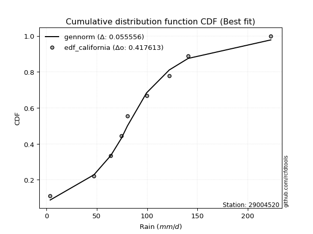</img></img>

</div>


### 2. EDF Hazen (1930)

Hazen method for plotting positions is a formula used to estimate the empirical cumulative probability distribution of flood events or other hydrological data. This formula often results in biased estimations, particularly when extrapolating to extreme events (high return periods).

<div align="center">


$P=(m-0.5)/n$


</div>


**2.1. Empirical values**

<div align="center">

|                | 0                   | 1                   | 2                  | 3                  | 4         | 5                  | 6                  | 7                  | 8                  |
|:---------------|:--------------------|:--------------------|:-------------------|:-------------------|:----------|:-------------------|:-------------------|:-------------------|:-------------------|
| date           | 2023                | 2021                | 2018               | 2017               | 2025      | 2020               | 2019               | 2024               | 2022               |
| x              | 3.7                 | 47.2                | 63.9               | 74.5               | 80.5      | 99.5               | 122.1              | 140.8              | 223.0              |
| m              | 1                   | 2                   | 3                  | 4                  | 5         | 6                  | 7                  | 8                  | 9                  |
| empirical_dist | edf_hazen           | edf_hazen           | edf_hazen          | edf_hazen          | edf_hazen | edf_hazen          | edf_hazen          | edf_hazen          | edf_hazen          |
| empirical      | 0.05555555555555555 | 0.16666666666666666 | 0.2777777777777778 | 0.3888888888888889 | 0.5       | 0.6111111111111112 | 0.7222222222222222 | 0.8333333333333334 | 0.9444444444444444 |
| empirical_tr   | 1.0588235294117647  | 1.2                 | 1.3846153846153846 | 1.6363636363636362 | 2.0       | 2.5714285714285716 | 3.5999999999999996 | 6.000000000000002  | 17.999999999999993 |

</div>


**2.2. Kolmogorov-Smirnov fit test (sorted by Δ)**


<div align="center">

|                | 0                   | 1                    | 2                    | 3                   | 4                   | 5                   | 6                   | 7                    | 8                   | 9                   | 10                  | 11                   | 12                   | 13                  | 14                  | 15                   | 16                   | 17                  | 18                   | 19                   | 20                  | 21                  | 22                  | 23                  | 24                  | 25                  | 26                  | 27                  | 28                  | 29                  | 30                  | 31                  | 32                  | 33                  | 34                  | 35                  | 36                  | 37                  | 38                  | 39                  | 40                  | 41                  | 42                  | 43                  | 44                  | 45                  | 46                  | 47                  | 48                  | 49                  | 50                  | 51                  | 52                  | 53                  | 54                  | 55                  | 56                  | 57                  | 58                  | 59                  | 60                  | 61                  | 62                  | 63                  | 64                  | 65                  | 66                  | 67                  | 68                  | 69                  | 70                  | 71                  | 72                  | 73                  | 74                  | 75                  | 76                  | 77                  | 78                  | 79                  | 80                  | 81                  | 82                  | 83                  | 84                  | 85                  | 86                  | 87                  | 88                  | 89                  | 90                  | 91                  | 92                  | 93                  | 94                  | 95                  | 96                  | 97                  | 98                  | 99                  | 100                 | 101                 | 102                 | 103                 | 104                 | 105                 | 106                 | 107                 | 108                 | 109                 | 110                 | 111                 | 112                 | 113                 | 114                 | 115                 | 116                 | 117                 | 118                 | 119                 | 120                 | 121                 | 122                 | 123                 | 124                 | 125                 | 126                 | 127                 | 128                 | 129                 | 130                 | 131                 | 132                 | 133                 | 134                 | 135                 | 136                 | 137                 | 138                 | 139                 | 140                 | 141                 | 142                 | 143                 | 144                 | 145                 | 146                 | 147                 | 148                 | 149                 | 150                 | 151                 | 152                 | 153                 | 154                 | 155                 | 156                 | 157                 | 158                 | 159                 |
|:---------------|:--------------------|:---------------------|:---------------------|:--------------------|:--------------------|:--------------------|:--------------------|:---------------------|:--------------------|:--------------------|:--------------------|:---------------------|:---------------------|:--------------------|:--------------------|:---------------------|:---------------------|:--------------------|:---------------------|:---------------------|:--------------------|:--------------------|:--------------------|:--------------------|:--------------------|:--------------------|:--------------------|:--------------------|:--------------------|:--------------------|:--------------------|:--------------------|:--------------------|:--------------------|:--------------------|:--------------------|:--------------------|:--------------------|:--------------------|:--------------------|:--------------------|:--------------------|:--------------------|:--------------------|:--------------------|:--------------------|:--------------------|:--------------------|:--------------------|:--------------------|:--------------------|:--------------------|:--------------------|:--------------------|:--------------------|:--------------------|:--------------------|:--------------------|:--------------------|:--------------------|:--------------------|:--------------------|:--------------------|:--------------------|:--------------------|:--------------------|:--------------------|:--------------------|:--------------------|:--------------------|:--------------------|:--------------------|:--------------------|:--------------------|:--------------------|:--------------------|:--------------------|:--------------------|:--------------------|:--------------------|:--------------------|:--------------------|:--------------------|:--------------------|:--------------------|:--------------------|:--------------------|:--------------------|:--------------------|:--------------------|:--------------------|:--------------------|:--------------------|:--------------------|:--------------------|:--------------------|:--------------------|:--------------------|:--------------------|:--------------------|:--------------------|:--------------------|:--------------------|:--------------------|:--------------------|:--------------------|:--------------------|:--------------------|:--------------------|:--------------------|:--------------------|:--------------------|:--------------------|:--------------------|:--------------------|:--------------------|:--------------------|:--------------------|:--------------------|:--------------------|:--------------------|:--------------------|:--------------------|:--------------------|:--------------------|:--------------------|:--------------------|:--------------------|:--------------------|:--------------------|:--------------------|:--------------------|:--------------------|:--------------------|:--------------------|:--------------------|:--------------------|:--------------------|:--------------------|:--------------------|:--------------------|:--------------------|:--------------------|:--------------------|:--------------------|:--------------------|:--------------------|:--------------------|:--------------------|:--------------------|:--------------------|:--------------------|:--------------------|:--------------------|:--------------------|:--------------------|:--------------------|:--------------------|:--------------------|:--------------------|
| station        | 29004520            | 29004520             | 29004520             | 29004520            | 29004520            | 29004520            | 29004520            | 29004520             | 29004520            | 29004520            | 29004520            | 29004520             | 29004520             | 29004520            | 29004520            | 29004520             | 29004520             | 29004520            | 29004520             | 29004520             | 29004520            | 29004520            | 29004520            | 29004520            | 29004520            | 29004520            | 29004520            | 29004520            | 29004520            | 29004520            | 29004520            | 29004520            | 29004520            | 29004520            | 29004520            | 29004520            | 29004520            | 29004520            | 29004520            | 29004520            | 29004520            | 29004520            | 29004520            | 29004520            | 29004520            | 29004520            | 29004520            | 29004520            | 29004520            | 29004520            | 29004520            | 29004520            | 29004520            | 29004520            | 29004520            | 29004520            | 29004520            | 29004520            | 29004520            | 29004520            | 29004520            | 29004520            | 29004520            | 29004520            | 29004520            | 29004520            | 29004520            | 29004520            | 29004520            | 29004520            | 29004520            | 29004520            | 29004520            | 29004520            | 29004520            | 29004520            | 29004520            | 29004520            | 29004520            | 29004520            | 29004520            | 29004520            | 29004520            | 29004520            | 29004520            | 29004520            | 29004520            | 29004520            | 29004520            | 29004520            | 29004520            | 29004520            | 29004520            | 29004520            | 29004520            | 29004520            | 29004520            | 29004520            | 29004520            | 29004520            | 29004520            | 29004520            | 29004520            | 29004520            | 29004520            | 29004520            | 29004520            | 29004520            | 29004520            | 29004520            | 29004520            | 29004520            | 29004520            | 29004520            | 29004520            | 29004520            | 29004520            | 29004520            | 29004520            | 29004520            | 29004520            | 29004520            | 29004520            | 29004520            | 29004520            | 29004520            | 29004520            | 29004520            | 29004520            | 29004520            | 29004520            | 29004520            | 29004520            | 29004520            | 29004520            | 29004520            | 29004520            | 29004520            | 29004520            | 29004520            | 29004520            | 29004520            | 29004520            | 29004520            | 29004520            | 29004520            | 29004520            | 29004520            | 29004520            | 29004520            | 29004520            | 29004520            | 29004520            | 29004520            | 29004520            | 29004520            | 29004520            | 29004520            | 29004520            | 29004520            |
| empirical_dist | edf_hazen           | edf_hazen            | edf_hazen            | edf_hazen           | edf_hazen           | edf_hazen           | edf_hazen           | edf_hazen            | edf_hazen           | edf_hazen           | edf_hazen           | edf_hazen            | edf_hazen            | edf_hazen           | edf_hazen           | edf_hazen            | edf_hazen            | edf_hazen           | edf_hazen            | edf_hazen            | edf_hazen           | edf_hazen           | edf_hazen           | edf_hazen           | edf_hazen           | edf_hazen           | edf_hazen           | edf_hazen           | edf_hazen           | edf_hazen           | edf_hazen           | edf_hazen           | edf_hazen           | edf_hazen           | edf_hazen           | edf_hazen           | edf_hazen           | edf_hazen           | edf_hazen           | edf_hazen           | edf_hazen           | edf_hazen           | edf_hazen           | edf_hazen           | edf_hazen           | edf_hazen           | edf_hazen           | edf_hazen           | edf_hazen           | edf_hazen           | edf_hazen           | edf_hazen           | edf_hazen           | edf_hazen           | edf_hazen           | edf_hazen           | edf_hazen           | edf_hazen           | edf_hazen           | edf_hazen           | edf_hazen           | edf_hazen           | edf_hazen           | edf_hazen           | edf_hazen           | edf_hazen           | edf_hazen           | edf_hazen           | edf_hazen           | edf_hazen           | edf_hazen           | edf_hazen           | edf_hazen           | edf_hazen           | edf_hazen           | edf_hazen           | edf_hazen           | edf_hazen           | edf_hazen           | edf_hazen           | edf_hazen           | edf_hazen           | edf_hazen           | edf_hazen           | edf_hazen           | edf_hazen           | edf_hazen           | edf_hazen           | edf_hazen           | edf_hazen           | edf_hazen           | edf_hazen           | edf_hazen           | edf_hazen           | edf_hazen           | edf_hazen           | edf_hazen           | edf_hazen           | edf_hazen           | edf_hazen           | edf_hazen           | edf_hazen           | edf_hazen           | edf_hazen           | edf_hazen           | edf_hazen           | edf_hazen           | edf_hazen           | edf_hazen           | edf_hazen           | edf_hazen           | edf_hazen           | edf_hazen           | edf_hazen           | edf_hazen           | edf_hazen           | edf_hazen           | edf_hazen           | edf_hazen           | edf_hazen           | edf_hazen           | edf_hazen           | edf_hazen           | edf_hazen           | edf_hazen           | edf_hazen           | edf_hazen           | edf_hazen           | edf_hazen           | edf_hazen           | edf_hazen           | edf_hazen           | edf_hazen           | edf_hazen           | edf_hazen           | edf_hazen           | edf_hazen           | edf_hazen           | edf_hazen           | edf_hazen           | edf_hazen           | edf_hazen           | edf_hazen           | edf_hazen           | edf_hazen           | edf_hazen           | edf_hazen           | edf_hazen           | edf_hazen           | edf_hazen           | edf_hazen           | edf_hazen           | edf_hazen           | edf_hazen           | edf_hazen           | edf_hazen           | edf_hazen           | edf_hazen           | edf_hazen           | edf_hazen           |
| p_dist         | logcrystalball      | exponnorm            | genlogistic          | invgamma            | exponweib           | johnsonsu           | invgauss            | fatiguelife          | gengamma            | pearson3            | gumbel_r            | nct                  | betaprime            | f                   | erlang              | gamma                | logjohnsonsu         | rice                | skewnorm             | dgamma               | maxwell             | invweibull          | rayleigh            | moyal               | dweibull            | burr12              | weibull_min         | kstwobign           | logt                | foldnorm            | anglit              | gennorm             | halflogistic        | halfnorm            | semicircular        | t                   | logdweibull         | crystalball         | norm                | logjohnsonsb        | logburr12           | loggenlogistic      | genpareto           | logexponpow         | logloggamma         | logistic            | kappa3              | wald                | logdgamma           | logargus            | logmielke           | logpearson3         | loggompertz         | hypsecant           | truncexpon          | logloglaplace       | cosine              | gausshyper          | bradford            | laplace             | loggumbel_l         | loggennorm          | arcsine             | logweibull_max      | burr                | logburr             | gumbel_l            | truncweibull_min    | lognakagami         | logvonmises_line    | logskewnorm         | kappa4              | loggenextreme       | logtrapezoid        | vonmises_line       | loglaplace          | loglaplace          | logfoldnorm         | loghypsecant        | loglogistic         | logf                | uniform             | wrapcauchy          | lomax               | logrice             | lognorm             | logexponnorm        | lognct              | genexpon            | logfatiguelife      | mielke              | logbetaprime        | loggamma            | loggamma            | loganglit           | ksone               | argus               | beta                | logerlang           | loginvgamma         | logsemicircular     | logalpha            | loginvgauss         | logmaxwell          | loggausshyper       | logncf              | lograyleigh         | logarcsine          | loglevy_l           | ncf                 | loginvweibull       | nakagami            | loggumbel_r         | logtriang           | loggenpareto        | loghalfnorm         | loggenhalflogistic  | logmoyal            | loghalflogistic     | halfgennorm         | logcosine           | johnsonsb           | logkstwobign        | loggenexpon         | logtruncweibull_min | genhalflogistic     | loghalfgennorm      | levy_l              | logwald             | triang              | logwrapcauchy       | logtruncnorm        | loglomax            | logbeta             | logksone            | logkappa4           | logkappa3           | logtukeylambda      | loguniform          | trapezoid           | logtruncexpon       | logbradford         | rdist               | genextreme          | powerlaw            | loggengamma         | tukeylambda         | logweibull_min      | logrdist            | logexponweib        | alpha               | weibull_max         | logpowerlaw         | truncpareto         | exponpow            | logtruncpareto      | gompertz            | truncnorm           | logvonmises         | vonmises            |
| delta          | 0.01829256935655932 | 0.048160223933952806 | 0.049420565863060706 | 0.05017508340731908 | 0.05079091876372238 | 0.05155279975539617 | 0.05272929673946947 | 0.052883822844433104 | 0.05340237043677604 | 0.05386986554383344 | 0.05411881032358423 | 0.055160934935096106 | 0.055863615644219156 | 0.05626592308677664 | 0.05630633308004873 | 0.056306378647667465 | 0.056820191482056664 | 0.05728347802714029 | 0.058301392806423824 | 0.061593604843279914 | 0.06294035033774259 | 0.06312754655698027 | 0.06353166852166095 | 0.06392825941165703 | 0.06601654706971011 | 0.06904084574144659 | 0.06977206441417227 | 0.07318251281546734 | 0.07852440278251344 | 0.08469193942288425 | 0.08523119207305807 | 0.0887315230127036  | 0.08950082745721089 | 0.0913789476805939  | 0.09315626218124151 | 0.09509804913708847 | 0.09616613467567903 | 0.09702250877081481 | 0.0970225177554983  | 0.09986257295009457 | 0.10296221273397504 | 0.10451231497219585 | 0.10578946798689104 | 0.10784198838595202 | 0.10857521710200821 | 0.10958202801902822 | 0.1106001833035277  | 0.11078291558279299 | 0.11111111111148225 | 0.11380895707548086 | 0.11410450951666598 | 0.11530880498787624 | 0.11790049799120383 | 0.1198847389913697  | 0.12678271762804083 | 0.1272653863838984  | 0.12771446635019473 | 0.133797508044488   | 0.14232180536306815 | 0.14673806906322662 | 0.14778315224000174 | 0.14797309552798288 | 0.14889602678780478 | 0.15393475584232322 | 0.1577772186055947  | 0.15903925661005935 | 0.16383332278968427 | 0.1660007406683962  | 0.16666666666589208 | 0.17394311161485504 | 0.1774089807334118  | 0.18047878837957843 | 0.18154390579490987 | 0.18584806587887312 | 0.19680769718372504 | 0.1971769894186161  | 0.1971769894186161  | 0.1978603495569805  | 0.2040634919718589  | 0.2057510979300829  | 0.20677692917842613 | 0.2081623347013224  | 0.20816676408674295 | 0.21052310114531778 | 0.2118202684184066  | 0.21182442056480064 | 0.2118244394471178  | 0.2121537246906298  | 0.21248367022430384 | 0.2137672497075047  | 0.214634033794473   | 0.22482736942531698 | 0.22756338400967988 | 0.22756338400967988 | 0.22834006728715237 | 0.22902416780665757 | 0.23050830293742475 | 0.23075120825924067 | 0.2322921143653308  | 0.23389817736019122 | 0.23522566927964286 | 0.23660895736370854 | 0.23712574627124208 | 0.2451729888505255  | 0.2483869997038701  | 0.24864399923345884 | 0.2574539361471173  | 0.2631146569277084  | 0.2634379532085268  | 0.27071984138104466 | 0.2707385086706574  | 0.2767732973582765  | 0.2775230996506173  | 0.2795606819481501  | 0.2892291391610792  | 0.2923603076455822  | 0.3010816624972438  | 0.3034026367053092  | 0.30845039676368735 | 0.3179717901052499  | 0.31835062181265383 | 0.3199034237692726  | 0.3226953807997346  | 0.3482085405193184  | 0.35689541528211244 | 0.35763622938852396 | 0.3634055371234238  | 0.37178633505292535 | 0.375419022816011   | 0.39622210051545403 | 0.4103149029866493  | 0.41161123504306896 | 0.4144792298736609  | 0.4197072944506102  | 0.43430534086916184 | 0.44035211450117917 | 0.4538781294889892  | 0.45391037291399294 | 0.4544997423763275  | 0.46394551094484215 | 0.5216097182253868  | 0.5228475626979968  | 0.5284179889222606  | 0.5435892929242869  | 0.5705070047538976  | 0.6004809941326226  | 0.6058486684330523  | 0.6177931360855959  | 0.6189148331205703  | 0.6289914893298942  | 0.6477906861039676  | 0.7069358867514203  | 0.7302445754838852  | 0.7412566201806038  | 0.7887214748762253  | 0.8051056832089504  | 0.8315752535827803  | 0.9436523107972274  | 1.0237367503561972  | 35.415230700260636  |
| deltao         | 0.41761268023100007 | 0.41761268023100007  | 0.41761268023100007  | 0.41761268023100007 | 0.41761268023100007 | 0.41761268023100007 | 0.41761268023100007 | 0.41761268023100007  | 0.41761268023100007 | 0.41761268023100007 | 0.41761268023100007 | 0.41761268023100007  | 0.41761268023100007  | 0.41761268023100007 | 0.41761268023100007 | 0.41761268023100007  | 0.41761268023100007  | 0.41761268023100007 | 0.41761268023100007  | 0.41761268023100007  | 0.41761268023100007 | 0.41761268023100007 | 0.41761268023100007 | 0.41761268023100007 | 0.41761268023100007 | 0.41761268023100007 | 0.41761268023100007 | 0.41761268023100007 | 0.41761268023100007 | 0.41761268023100007 | 0.41761268023100007 | 0.41761268023100007 | 0.41761268023100007 | 0.41761268023100007 | 0.41761268023100007 | 0.41761268023100007 | 0.41761268023100007 | 0.41761268023100007 | 0.41761268023100007 | 0.41761268023100007 | 0.41761268023100007 | 0.41761268023100007 | 0.41761268023100007 | 0.41761268023100007 | 0.41761268023100007 | 0.41761268023100007 | 0.41761268023100007 | 0.41761268023100007 | 0.41761268023100007 | 0.41761268023100007 | 0.41761268023100007 | 0.41761268023100007 | 0.41761268023100007 | 0.41761268023100007 | 0.41761268023100007 | 0.41761268023100007 | 0.41761268023100007 | 0.41761268023100007 | 0.41761268023100007 | 0.41761268023100007 | 0.41761268023100007 | 0.41761268023100007 | 0.41761268023100007 | 0.41761268023100007 | 0.41761268023100007 | 0.41761268023100007 | 0.41761268023100007 | 0.41761268023100007 | 0.41761268023100007 | 0.41761268023100007 | 0.41761268023100007 | 0.41761268023100007 | 0.41761268023100007 | 0.41761268023100007 | 0.41761268023100007 | 0.41761268023100007 | 0.41761268023100007 | 0.41761268023100007 | 0.41761268023100007 | 0.41761268023100007 | 0.41761268023100007 | 0.41761268023100007 | 0.41761268023100007 | 0.41761268023100007 | 0.41761268023100007 | 0.41761268023100007 | 0.41761268023100007 | 0.41761268023100007 | 0.41761268023100007 | 0.41761268023100007 | 0.41761268023100007 | 0.41761268023100007 | 0.41761268023100007 | 0.41761268023100007 | 0.41761268023100007 | 0.41761268023100007 | 0.41761268023100007 | 0.41761268023100007 | 0.41761268023100007 | 0.41761268023100007 | 0.41761268023100007 | 0.41761268023100007 | 0.41761268023100007 | 0.41761268023100007 | 0.41761268023100007 | 0.41761268023100007 | 0.41761268023100007 | 0.41761268023100007 | 0.41761268023100007 | 0.41761268023100007 | 0.41761268023100007 | 0.41761268023100007 | 0.41761268023100007 | 0.41761268023100007 | 0.41761268023100007 | 0.41761268023100007 | 0.41761268023100007 | 0.41761268023100007 | 0.41761268023100007 | 0.41761268023100007 | 0.41761268023100007 | 0.41761268023100007 | 0.41761268023100007 | 0.41761268023100007 | 0.41761268023100007 | 0.41761268023100007 | 0.41761268023100007 | 0.41761268023100007 | 0.41761268023100007 | 0.41761268023100007 | 0.41761268023100007 | 0.41761268023100007 | 0.41761268023100007 | 0.41761268023100007 | 0.41761268023100007 | 0.41761268023100007 | 0.41761268023100007 | 0.41761268023100007 | 0.41761268023100007 | 0.41761268023100007 | 0.41761268023100007 | 0.41761268023100007 | 0.41761268023100007 | 0.41761268023100007 | 0.41761268023100007 | 0.41761268023100007 | 0.41761268023100007 | 0.41761268023100007 | 0.41761268023100007 | 0.41761268023100007 | 0.41761268023100007 | 0.41761268023100007 | 0.41761268023100007 | 0.41761268023100007 | 0.41761268023100007 | 0.41761268023100007 | 0.41761268023100007 | 0.41761268023100007 | 0.41761268023100007 | 0.41761268023100007 |
| eval           | Δo > Δ              | Δo > Δ               | Δo > Δ               | Δo > Δ              | Δo > Δ              | Δo > Δ              | Δo > Δ              | Δo > Δ               | Δo > Δ              | Δo > Δ              | Δo > Δ              | Δo > Δ               | Δo > Δ               | Δo > Δ              | Δo > Δ              | Δo > Δ               | Δo > Δ               | Δo > Δ              | Δo > Δ               | Δo > Δ               | Δo > Δ              | Δo > Δ              | Δo > Δ              | Δo > Δ              | Δo > Δ              | Δo > Δ              | Δo > Δ              | Δo > Δ              | Δo > Δ              | Δo > Δ              | Δo > Δ              | Δo > Δ              | Δo > Δ              | Δo > Δ              | Δo > Δ              | Δo > Δ              | Δo > Δ              | Δo > Δ              | Δo > Δ              | Δo > Δ              | Δo > Δ              | Δo > Δ              | Δo > Δ              | Δo > Δ              | Δo > Δ              | Δo > Δ              | Δo > Δ              | Δo > Δ              | Δo > Δ              | Δo > Δ              | Δo > Δ              | Δo > Δ              | Δo > Δ              | Δo > Δ              | Δo > Δ              | Δo > Δ              | Δo > Δ              | Δo > Δ              | Δo > Δ              | Δo > Δ              | Δo > Δ              | Δo > Δ              | Δo > Δ              | Δo > Δ              | Δo > Δ              | Δo > Δ              | Δo > Δ              | Δo > Δ              | Δo > Δ              | Δo > Δ              | Δo > Δ              | Δo > Δ              | Δo > Δ              | Δo > Δ              | Δo > Δ              | Δo > Δ              | Δo > Δ              | Δo > Δ              | Δo > Δ              | Δo > Δ              | Δo > Δ              | Δo > Δ              | Δo > Δ              | Δo > Δ              | Δo > Δ              | Δo > Δ              | Δo > Δ              | Δo > Δ              | Δo > Δ              | Δo > Δ              | Δo > Δ              | Δo > Δ              | Δo > Δ              | Δo > Δ              | Δo > Δ              | Δo > Δ              | Δo > Δ              | Δo > Δ              | Δo > Δ              | Δo > Δ              | Δo > Δ              | Δo > Δ              | Δo > Δ              | Δo > Δ              | Δo > Δ              | Δo > Δ              | Δo > Δ              | Δo > Δ              | Δo > Δ              | Δo > Δ              | Δo > Δ              | Δo > Δ              | Δo > Δ              | Δo > Δ              | Δo > Δ              | Δo > Δ              | Δo > Δ              | Δo > Δ              | Δo > Δ              | Δo > Δ              | Δo > Δ              | Δo > Δ              | Δo > Δ              | Δo > Δ              | Δo > Δ              | Δo > Δ              | Δo > Δ              | Δo > Δ              | Δo > Δ              | Δo > Δ              | Δo > Δ              | Δo > Δ              | Δo > Δ              | Δo <= Δ             | Δo <= Δ             | Δo <= Δ             | Δo <= Δ             | Δo <= Δ             | Δo <= Δ             | Δo <= Δ             | Δo <= Δ             | Δo <= Δ             | Δo <= Δ             | Δo <= Δ             | Δo <= Δ             | Δo <= Δ             | Δo <= Δ             | Δo <= Δ             | Δo <= Δ             | Δo <= Δ             | Δo <= Δ             | Δo <= Δ             | Δo <= Δ             | Δo <= Δ             | Δo <= Δ             | Δo <= Δ             | Δo <= Δ             | Δo <= Δ             | Δo <= Δ             | Δo <= Δ             |
| fit            | 1                   | 1                    | 1                    | 1                   | 1                   | 1                   | 1                   | 1                    | 1                   | 1                   | 1                   | 1                    | 1                    | 1                   | 1                   | 1                    | 1                    | 1                   | 1                    | 1                    | 1                   | 1                   | 1                   | 1                   | 1                   | 1                   | 1                   | 1                   | 1                   | 1                   | 1                   | 1                   | 1                   | 1                   | 1                   | 1                   | 1                   | 1                   | 1                   | 1                   | 1                   | 1                   | 1                   | 1                   | 1                   | 1                   | 1                   | 1                   | 1                   | 1                   | 1                   | 1                   | 1                   | 1                   | 1                   | 1                   | 1                   | 1                   | 1                   | 1                   | 1                   | 1                   | 1                   | 1                   | 1                   | 1                   | 1                   | 1                   | 1                   | 1                   | 1                   | 1                   | 1                   | 1                   | 1                   | 1                   | 1                   | 1                   | 1                   | 1                   | 1                   | 1                   | 1                   | 1                   | 1                   | 1                   | 1                   | 1                   | 1                   | 1                   | 1                   | 1                   | 1                   | 1                   | 1                   | 1                   | 1                   | 1                   | 1                   | 1                   | 1                   | 1                   | 1                   | 1                   | 1                   | 1                   | 1                   | 1                   | 1                   | 1                   | 1                   | 1                   | 1                   | 1                   | 1                   | 1                   | 1                   | 1                   | 1                   | 1                   | 1                   | 1                   | 1                   | 1                   | 1                   | 1                   | 1                   | 1                   | 1                   | 1                   | 1                   | 1                   | 1                   | 0                   | 0                   | 0                   | 0                   | 0                   | 0                   | 0                   | 0                   | 0                   | 0                   | 0                   | 0                   | 0                   | 0                   | 0                   | 0                   | 0                   | 0                   | 0                   | 0                   | 0                   | 0                   | 0                   | 0                   | 0                   | 0                   | 0                   |
| n              | 9                   | 9                    | 9                    | 9                   | 9                   | 9                   | 9                   | 9                    | 9                   | 9                   | 9                   | 9                    | 9                    | 9                   | 9                   | 9                    | 9                    | 9                   | 9                    | 9                    | 9                   | 9                   | 9                   | 9                   | 9                   | 9                   | 9                   | 9                   | 9                   | 9                   | 9                   | 9                   | 9                   | 9                   | 9                   | 9                   | 9                   | 9                   | 9                   | 9                   | 9                   | 9                   | 9                   | 9                   | 9                   | 9                   | 9                   | 9                   | 9                   | 9                   | 9                   | 9                   | 9                   | 9                   | 9                   | 9                   | 9                   | 9                   | 9                   | 9                   | 9                   | 9                   | 9                   | 9                   | 9                   | 9                   | 9                   | 9                   | 9                   | 9                   | 9                   | 9                   | 9                   | 9                   | 9                   | 9                   | 9                   | 9                   | 9                   | 9                   | 9                   | 9                   | 9                   | 9                   | 9                   | 9                   | 9                   | 9                   | 9                   | 9                   | 9                   | 9                   | 9                   | 9                   | 9                   | 9                   | 9                   | 9                   | 9                   | 9                   | 9                   | 9                   | 9                   | 9                   | 9                   | 9                   | 9                   | 9                   | 9                   | 9                   | 9                   | 9                   | 9                   | 9                   | 9                   | 9                   | 9                   | 9                   | 9                   | 9                   | 9                   | 9                   | 9                   | 9                   | 9                   | 9                   | 9                   | 9                   | 9                   | 9                   | 9                   | 9                   | 9                   | 9                   | 9                   | 9                   | 9                   | 9                   | 9                   | 9                   | 9                   | 9                   | 9                   | 9                   | 9                   | 9                   | 9                   | 9                   | 9                   | 9                   | 9                   | 9                   | 9                   | 9                   | 9                   | 9                   | 9                   | 9                   | 9                   | 9                   |
| best_fit       | 1                   | 0                    | 0                    | 0                   | 0                   | 0                   | 0                   | 0                    | 0                   | 0                   | 0                   | 0                    | 0                    | 0                   | 0                   | 0                    | 0                    | 0                   | 0                    | 0                    | 0                   | 0                   | 0                   | 0                   | 0                   | 0                   | 0                   | 0                   | 0                   | 0                   | 0                   | 0                   | 0                   | 0                   | 0                   | 0                   | 0                   | 0                   | 0                   | 0                   | 0                   | 0                   | 0                   | 0                   | 0                   | 0                   | 0                   | 0                   | 0                   | 0                   | 0                   | 0                   | 0                   | 0                   | 0                   | 0                   | 0                   | 0                   | 0                   | 0                   | 0                   | 0                   | 0                   | 0                   | 0                   | 0                   | 0                   | 0                   | 0                   | 0                   | 0                   | 0                   | 0                   | 0                   | 0                   | 0                   | 0                   | 0                   | 0                   | 0                   | 0                   | 0                   | 0                   | 0                   | 0                   | 0                   | 0                   | 0                   | 0                   | 0                   | 0                   | 0                   | 0                   | 0                   | 0                   | 0                   | 0                   | 0                   | 0                   | 0                   | 0                   | 0                   | 0                   | 0                   | 0                   | 0                   | 0                   | 0                   | 0                   | 0                   | 0                   | 0                   | 0                   | 0                   | 0                   | 0                   | 0                   | 0                   | 0                   | 0                   | 0                   | 0                   | 0                   | 0                   | 0                   | 0                   | 0                   | 0                   | 0                   | 0                   | 0                   | 0                   | 0                   | 0                   | 0                   | 0                   | 0                   | 0                   | 0                   | 0                   | 0                   | 0                   | 0                   | 0                   | 0                   | 0                   | 0                   | 0                   | 0                   | 0                   | 0                   | 0                   | 0                   | 0                   | 0                   | 0                   | 0                   | 0                   | 0                   | 0                   |
| best_fit_sort  | 1                   | 2                    | 3                    | 4                   | 5                   | 6                   | 7                   | 8                    | 9                   | 10                  | 11                  | 12                   | 13                   | 14                  | 15                  | 16                   | 17                   | 18                  | 19                   | 20                   | 21                  | 22                  | 23                  | 24                  | 25                  | 26                  | 27                  | 28                  | 29                  | 30                  | 31                  | 32                  | 33                  | 34                  | 35                  | 36                  | 37                  | 38                  | 39                  | 40                  | 41                  | 42                  | 43                  | 44                  | 45                  | 46                  | 47                  | 48                  | 49                  | 50                  | 51                  | 52                  | 53                  | 54                  | 55                  | 56                  | 57                  | 58                  | 59                  | 60                  | 61                  | 62                  | 63                  | 64                  | 65                  | 66                  | 67                  | 68                  | 69                  | 70                  | 71                  | 72                  | 73                  | 74                  | 75                  | 76                  | 77                  | 78                  | 79                  | 80                  | 81                  | 82                  | 83                  | 84                  | 85                  | 86                  | 87                  | 88                  | 89                  | 90                  | 91                  | 92                  | 93                  | 94                  | 95                  | 96                  | 97                  | 98                  | 99                  | 100                 | 101                 | 102                 | 103                 | 104                 | 105                 | 106                 | 107                 | 108                 | 109                 | 110                 | 111                 | 112                 | 113                 | 114                 | 115                 | 116                 | 117                 | 118                 | 119                 | 120                 | 121                 | 122                 | 123                 | 124                 | 125                 | 126                 | 127                 | 128                 | 129                 | 130                 | 131                 | 132                 | 133                 | 134                 | 135                 | 136                 | 137                 | 138                 | 139                 | 140                 | 141                 | 142                 | 143                 | 144                 | 145                 | 146                 | 147                 | 148                 | 149                 | 150                 | 151                 | 152                 | 153                 | 154                 | 155                 | 156                 | 157                 | 158                 | 159                 | 160                 |

</div>


**2.3. Best fit**

<div align="center">

|   id |   station | empirical_dist   | p_dist         |     delta |   deltao | eval   |   fit |   n |   best_fit |   best_fit_sort |
|-----:|----------:|:-----------------|:---------------|----------:|---------:|:-------|------:|----:|-----------:|----------------:|
|    0 |  29004520 | edf_hazen        | logcrystalball | 0.0182926 | 0.417613 | Δo > Δ |     1 |   9 |          1 |               1 |

</div>


<div align="center">

</img></img>

</div>


### 3. EDF Weibull (1939)

Weibull plotting position formula is an empirical method used to estimate the non-exceedance probability or plotting position for a set of observed data, is often recommended or widely used in practice, particularly in flood frequency analysis.

<div align="center">


$P=m/(n+1)$


</div>


**3.1. Empirical values**

<div align="center">

|                | 0                  | 1           | 2                  | 3                  | 4           | 5           | 6                 | 7                 | 8                  |
|:---------------|:-------------------|:------------|:-------------------|:-------------------|:------------|:------------|:------------------|:------------------|:-------------------|
| date           | 2023               | 2021        | 2018               | 2017               | 2025        | 2020        | 2019              | 2024              | 2022               |
| x              | 3.7                | 47.2        | 63.9               | 74.5               | 80.5        | 99.5        | 122.1             | 140.8             | 223.0              |
| m              | 1                  | 2           | 3                  | 4                  | 5           | 6           | 7                 | 8                 | 9                  |
| empirical_dist | edf_weibull        | edf_weibull | edf_weibull        | edf_weibull        | edf_weibull | edf_weibull | edf_weibull       | edf_weibull       | edf_weibull        |
| empirical      | 0.1                | 0.2         | 0.3                | 0.4                | 0.5         | 0.6         | 0.7               | 0.8               | 0.9                |
| empirical_tr   | 1.1111111111111112 | 1.25        | 1.4285714285714286 | 1.6666666666666667 | 2.0         | 2.5         | 3.333333333333333 | 5.000000000000001 | 10.000000000000002 |

</div>


**3.2. Kolmogorov-Smirnov fit test (sorted by Δ)**


<div align="center">

|                | 0                   | 1                   | 2                   | 3                   | 4                   | 5                   | 6                   | 7                   | 8                   | 9                   | 10                  | 11                  | 12                  | 13                  | 14                  | 15                  | 16                  | 17                  | 18                  | 19                  | 20                  | 21                  | 22                  | 23                  | 24                  | 25                  | 26                  | 27                  | 28                  | 29                  | 30                  | 31                  | 32                  | 33                  | 34                  | 35                  | 36                  | 37                  | 38                  | 39                  | 40                  | 41                  | 42                  | 43                  | 44                  | 45                  | 46                  | 47                  | 48                  | 49                  | 50                  | 51                  | 52                  | 53                  | 54                  | 55                  | 56                  | 57                  | 58                  | 59                  | 60                  | 61                  | 62                  | 63                  | 64                  | 65                  | 66                  | 67                  | 68                  | 69                  | 70                  | 71                  | 72                  | 73                  | 74                  | 75                  | 76                  | 77                  | 78                  | 79                  | 80                  | 81                  | 82                  | 83                  | 84                  | 85                  | 86                  | 87                  | 88                  | 89                  | 90                  | 91                  | 92                  | 93                  | 94                  | 95                  | 96                  | 97                  | 98                  | 99                  | 100                 | 101                 | 102                 | 103                 | 104                 | 105                 | 106                 | 107                 | 108                 | 109                 | 110                 | 111                 | 112                 | 113                 | 114                 | 115                 | 116                 | 117                 | 118                 | 119                 | 120                 | 121                 | 122                 | 123                 | 124                 | 125                 | 126                 | 127                 | 128                 | 129                 | 130                 | 131                 | 132                 | 133                 | 134                 | 135                 | 136                 | 137                 | 138                 | 139                 | 140                 | 141                 | 142                 | 143                 | 144                 | 145                 | 146                 | 147                 | 148                 | 149                 | 150                 | 151                 | 152                 | 153                 | 154                 | 155                 | 156                 | 157                 | 158                 | 159                 |
|:---------------|:--------------------|:--------------------|:--------------------|:--------------------|:--------------------|:--------------------|:--------------------|:--------------------|:--------------------|:--------------------|:--------------------|:--------------------|:--------------------|:--------------------|:--------------------|:--------------------|:--------------------|:--------------------|:--------------------|:--------------------|:--------------------|:--------------------|:--------------------|:--------------------|:--------------------|:--------------------|:--------------------|:--------------------|:--------------------|:--------------------|:--------------------|:--------------------|:--------------------|:--------------------|:--------------------|:--------------------|:--------------------|:--------------------|:--------------------|:--------------------|:--------------------|:--------------------|:--------------------|:--------------------|:--------------------|:--------------------|:--------------------|:--------------------|:--------------------|:--------------------|:--------------------|:--------------------|:--------------------|:--------------------|:--------------------|:--------------------|:--------------------|:--------------------|:--------------------|:--------------------|:--------------------|:--------------------|:--------------------|:--------------------|:--------------------|:--------------------|:--------------------|:--------------------|:--------------------|:--------------------|:--------------------|:--------------------|:--------------------|:--------------------|:--------------------|:--------------------|:--------------------|:--------------------|:--------------------|:--------------------|:--------------------|:--------------------|:--------------------|:--------------------|:--------------------|:--------------------|:--------------------|:--------------------|:--------------------|:--------------------|:--------------------|:--------------------|:--------------------|:--------------------|:--------------------|:--------------------|:--------------------|:--------------------|:--------------------|:--------------------|:--------------------|:--------------------|:--------------------|:--------------------|:--------------------|:--------------------|:--------------------|:--------------------|:--------------------|:--------------------|:--------------------|:--------------------|:--------------------|:--------------------|:--------------------|:--------------------|:--------------------|:--------------------|:--------------------|:--------------------|:--------------------|:--------------------|:--------------------|:--------------------|:--------------------|:--------------------|:--------------------|:--------------------|:--------------------|:--------------------|:--------------------|:--------------------|:--------------------|:--------------------|:--------------------|:--------------------|:--------------------|:--------------------|:--------------------|:--------------------|:--------------------|:--------------------|:--------------------|:--------------------|:--------------------|:--------------------|:--------------------|:--------------------|:--------------------|:--------------------|:--------------------|:--------------------|:--------------------|:--------------------|:--------------------|:--------------------|:--------------------|:--------------------|:--------------------|:--------------------|
| station        | 29004520            | 29004520            | 29004520            | 29004520            | 29004520            | 29004520            | 29004520            | 29004520            | 29004520            | 29004520            | 29004520            | 29004520            | 29004520            | 29004520            | 29004520            | 29004520            | 29004520            | 29004520            | 29004520            | 29004520            | 29004520            | 29004520            | 29004520            | 29004520            | 29004520            | 29004520            | 29004520            | 29004520            | 29004520            | 29004520            | 29004520            | 29004520            | 29004520            | 29004520            | 29004520            | 29004520            | 29004520            | 29004520            | 29004520            | 29004520            | 29004520            | 29004520            | 29004520            | 29004520            | 29004520            | 29004520            | 29004520            | 29004520            | 29004520            | 29004520            | 29004520            | 29004520            | 29004520            | 29004520            | 29004520            | 29004520            | 29004520            | 29004520            | 29004520            | 29004520            | 29004520            | 29004520            | 29004520            | 29004520            | 29004520            | 29004520            | 29004520            | 29004520            | 29004520            | 29004520            | 29004520            | 29004520            | 29004520            | 29004520            | 29004520            | 29004520            | 29004520            | 29004520            | 29004520            | 29004520            | 29004520            | 29004520            | 29004520            | 29004520            | 29004520            | 29004520            | 29004520            | 29004520            | 29004520            | 29004520            | 29004520            | 29004520            | 29004520            | 29004520            | 29004520            | 29004520            | 29004520            | 29004520            | 29004520            | 29004520            | 29004520            | 29004520            | 29004520            | 29004520            | 29004520            | 29004520            | 29004520            | 29004520            | 29004520            | 29004520            | 29004520            | 29004520            | 29004520            | 29004520            | 29004520            | 29004520            | 29004520            | 29004520            | 29004520            | 29004520            | 29004520            | 29004520            | 29004520            | 29004520            | 29004520            | 29004520            | 29004520            | 29004520            | 29004520            | 29004520            | 29004520            | 29004520            | 29004520            | 29004520            | 29004520            | 29004520            | 29004520            | 29004520            | 29004520            | 29004520            | 29004520            | 29004520            | 29004520            | 29004520            | 29004520            | 29004520            | 29004520            | 29004520            | 29004520            | 29004520            | 29004520            | 29004520            | 29004520            | 29004520            | 29004520            | 29004520            | 29004520            | 29004520            | 29004520            | 29004520            |
| empirical_dist | edf_weibull         | edf_weibull         | edf_weibull         | edf_weibull         | edf_weibull         | edf_weibull         | edf_weibull         | edf_weibull         | edf_weibull         | edf_weibull         | edf_weibull         | edf_weibull         | edf_weibull         | edf_weibull         | edf_weibull         | edf_weibull         | edf_weibull         | edf_weibull         | edf_weibull         | edf_weibull         | edf_weibull         | edf_weibull         | edf_weibull         | edf_weibull         | edf_weibull         | edf_weibull         | edf_weibull         | edf_weibull         | edf_weibull         | edf_weibull         | edf_weibull         | edf_weibull         | edf_weibull         | edf_weibull         | edf_weibull         | edf_weibull         | edf_weibull         | edf_weibull         | edf_weibull         | edf_weibull         | edf_weibull         | edf_weibull         | edf_weibull         | edf_weibull         | edf_weibull         | edf_weibull         | edf_weibull         | edf_weibull         | edf_weibull         | edf_weibull         | edf_weibull         | edf_weibull         | edf_weibull         | edf_weibull         | edf_weibull         | edf_weibull         | edf_weibull         | edf_weibull         | edf_weibull         | edf_weibull         | edf_weibull         | edf_weibull         | edf_weibull         | edf_weibull         | edf_weibull         | edf_weibull         | edf_weibull         | edf_weibull         | edf_weibull         | edf_weibull         | edf_weibull         | edf_weibull         | edf_weibull         | edf_weibull         | edf_weibull         | edf_weibull         | edf_weibull         | edf_weibull         | edf_weibull         | edf_weibull         | edf_weibull         | edf_weibull         | edf_weibull         | edf_weibull         | edf_weibull         | edf_weibull         | edf_weibull         | edf_weibull         | edf_weibull         | edf_weibull         | edf_weibull         | edf_weibull         | edf_weibull         | edf_weibull         | edf_weibull         | edf_weibull         | edf_weibull         | edf_weibull         | edf_weibull         | edf_weibull         | edf_weibull         | edf_weibull         | edf_weibull         | edf_weibull         | edf_weibull         | edf_weibull         | edf_weibull         | edf_weibull         | edf_weibull         | edf_weibull         | edf_weibull         | edf_weibull         | edf_weibull         | edf_weibull         | edf_weibull         | edf_weibull         | edf_weibull         | edf_weibull         | edf_weibull         | edf_weibull         | edf_weibull         | edf_weibull         | edf_weibull         | edf_weibull         | edf_weibull         | edf_weibull         | edf_weibull         | edf_weibull         | edf_weibull         | edf_weibull         | edf_weibull         | edf_weibull         | edf_weibull         | edf_weibull         | edf_weibull         | edf_weibull         | edf_weibull         | edf_weibull         | edf_weibull         | edf_weibull         | edf_weibull         | edf_weibull         | edf_weibull         | edf_weibull         | edf_weibull         | edf_weibull         | edf_weibull         | edf_weibull         | edf_weibull         | edf_weibull         | edf_weibull         | edf_weibull         | edf_weibull         | edf_weibull         | edf_weibull         | edf_weibull         | edf_weibull         | edf_weibull         | edf_weibull         | edf_weibull         |
| p_dist         | logcrystalball      | nct                 | genlogistic         | exponweib           | exponnorm           | johnsonsu           | invgamma            | pearson3            | invgauss            | fatiguelife         | gengamma            | skewnorm            | rayleigh            | betaprime           | f                   | erlang              | gamma               | invweibull          | kstwobign           | logjohnsonsu        | maxwell             | rice                | logjohnsonsb        | logdweibull         | burr12              | weibull_min         | logloggamma         | logargus            | logexponpow         | logpearson3         | gumbel_r            | loggenlogistic      | logt                | dweibull            | dgamma              | logmielke           | logburr12           | t                   | moyal               | crystalball         | norm                | anglit              | logloglaplace       | truncexpon          | kappa3              | loggompertz         | genpareto           | semicircular        | halflogistic        | halfnorm            | foldnorm            | logdgamma           | gausshyper          | bradford            | logistic            | gennorm             | loggumbel_l         | arcsine             | hypsecant           | logweibull_max      | burr                | logburr             | cosine              | truncweibull_min    | wald                | logskewnorm         | laplace             | kappa4              | loggenextreme       | logtrapezoid        | loggennorm          | gumbel_l            | uniform             | wrapcauchy          | loglaplace          | loglaplace          | logfoldnorm         | logf                | lomax               | loghypsecant        | genexpon            | loglogistic         | logrice             | lognorm             | logexponnorm        | lognct              | logfatiguelife      | mielke              | logbetaprime        | loganglit           | vonmises_line       | loggamma            | loggamma            | ksone               | beta                | logvonmises_line    | lognakagami         | logerlang           | logsemicircular     | loginvgamma         | logalpha            | loginvgauss         | argus               | loggausshyper       | logncf              | logmaxwell          | logarcsine          | loglevy_l           | lograyleigh         | ncf                 | loginvweibull       | logtriang           | nakagami            | loggumbel_r         | loggenpareto        | loghalfnorm         | loggenhalflogistic  | logmoyal            | halfgennorm         | logcosine           | loghalflogistic     | johnsonsb           | logkstwobign        | loggenexpon         | logtruncweibull_min | genhalflogistic     | levy_l              | loghalfgennorm      | logwald             | triang              | logwrapcauchy       | logtruncnorm        | loglomax            | logbeta             | logksone            | logkappa4           | logkappa3           | logtukeylambda      | loguniform          | trapezoid           | logtruncexpon       | logbradford         | rdist               | genextreme          | powerlaw            | loggengamma         | tukeylambda         | logweibull_min      | logrdist            | logexponweib        | alpha               | weibull_max         | logpowerlaw         | truncpareto         | exponpow            | logtruncpareto      | gompertz            | truncnorm           | logvonmises         | vonmises            |
| delta          | 0.06273261558023135 | 0.06756301015779831 | 0.06960018698213034 | 0.06980218239711397 | 0.06984044724754612 | 0.07015902057060028 | 0.07020989138946498 | 0.07059308565124123 | 0.07082297038139006 | 0.07085976476201315 | 0.07097535824634829 | 0.07175850283655405 | 0.07180377867606902 | 0.07187435263506586 | 0.0719978549968755  | 0.0720113543207945  | 0.07201136573571083 | 0.0742127917441027  | 0.07427387231473223 | 0.07463357640047921 | 0.07472745372392964 | 0.07526111602896539 | 0.0765833317122121  | 0.07765015063863566 | 0.0777062744902901  | 0.07796380362564427 | 0.08119047671425489 | 0.08170814441310426 | 0.08256444061462406 | 0.08269295456771875 | 0.08294696195426493 | 0.08315745565485863 | 0.08356990708042028 | 0.0843383319251737  | 0.0845552002574469  | 0.08556207400743321 | 0.09337724581660224 | 0.09509804913708847 | 0.09678540347339283 | 0.09702250877081481 | 0.0970225177554983  | 0.09794000986696172 | 0.09847723304613656 | 0.0999999636577662  | 0.09999997226956196 | 0.09999999939291451 | 0.09999999999999494 | 0.09999999999999998 | 0.1                 | 0.1                 | 0.1                 | 0.10000000000037113 | 0.10046417471115465 | 0.10898847202973483 | 0.10958202801902822 | 0.11095374523492585 | 0.11485374938930376 | 0.11556269345447145 | 0.1198847389913697  | 0.12060142250898986 | 0.12444388527226136 | 0.12570592327672603 | 0.12771446635019473 | 0.13266740733506288 | 0.14411624891612634 | 0.14632048765074185 | 0.14673806906322662 | 0.1471454550462451  | 0.14821057246157654 | 0.15251473254553977 | 0.15908420663909406 | 0.16383332278968427 | 0.17482900136798907 | 0.17483343075340962 | 0.1749547671963939  | 0.1749547671963939  | 0.1756381273347583  | 0.17966065857264168 | 0.18071323657362443 | 0.1818412697496367  | 0.1829741247523748  | 0.1835288757078607  | 0.18550414788558    | 0.18550675402024935 | 0.1855076885798922  | 0.185724790006846   | 0.18745618007271964 | 0.1924118115722508  | 0.193676684562538   | 0.195006733953819   | 0.19505516899719072 | 0.1953864795141651  | 0.1953864795141651  | 0.19569083447332425 | 0.19741787492590734 | 0.19999996383854565 | 0.19999999999922544 | 0.20150293034875338 | 0.2018923359463095  | 0.20291845124366154 | 0.20368152278214985 | 0.20379241293790873 | 0.20723173983228416 | 0.21505366637053674 | 0.2153106659001255  | 0.21907552901236266 | 0.22978132359437503 | 0.23010461987519343 | 0.23038434216265374 | 0.23738650804771133 | 0.23740517533732408 | 0.2462273486148167  | 0.25075742180513255 | 0.2553008774283951  | 0.25589580582774585 | 0.26223756609585097 | 0.26774832916391045 | 0.281180414483087   | 0.28463845677191657 | 0.2850172884793205  | 0.28622817454146515 | 0.2865700904359393  | 0.2893620474664012  | 0.314875207185985   | 0.32356208194877906 | 0.32430289605519064 | 0.32734189060848096 | 0.33007220379009045 | 0.35319680059378883 | 0.3628887671821207  | 0.3769815696533159  | 0.3782779017097356  | 0.38114589654032754 | 0.3863739611172769  | 0.40097200753582846 | 0.4070187811678458  | 0.4205447961556558  | 0.42057703958065956 | 0.4211664090429941  | 0.43061217761150883 | 0.48827638489205344 | 0.48951422936466343 | 0.49508465558892717 | 0.5102559595909535  | 0.5371736714205642  | 0.5671476607992891  | 0.572515335099719   | 0.5844598027522625  | 0.5855814997872368  | 0.5956581559965608  | 0.6144573527706343  | 0.673602553418087   | 0.6969112421505519  | 0.7079232868472705  | 0.755388141542892   | 0.771772349875617   | 0.798241920249447   | 0.899207866352783   | 1.0015145281339748  | 35.45967514470508   |
| deltao         | 0.41761268023100007 | 0.41761268023100007 | 0.41761268023100007 | 0.41761268023100007 | 0.41761268023100007 | 0.41761268023100007 | 0.41761268023100007 | 0.41761268023100007 | 0.41761268023100007 | 0.41761268023100007 | 0.41761268023100007 | 0.41761268023100007 | 0.41761268023100007 | 0.41761268023100007 | 0.41761268023100007 | 0.41761268023100007 | 0.41761268023100007 | 0.41761268023100007 | 0.41761268023100007 | 0.41761268023100007 | 0.41761268023100007 | 0.41761268023100007 | 0.41761268023100007 | 0.41761268023100007 | 0.41761268023100007 | 0.41761268023100007 | 0.41761268023100007 | 0.41761268023100007 | 0.41761268023100007 | 0.41761268023100007 | 0.41761268023100007 | 0.41761268023100007 | 0.41761268023100007 | 0.41761268023100007 | 0.41761268023100007 | 0.41761268023100007 | 0.41761268023100007 | 0.41761268023100007 | 0.41761268023100007 | 0.41761268023100007 | 0.41761268023100007 | 0.41761268023100007 | 0.41761268023100007 | 0.41761268023100007 | 0.41761268023100007 | 0.41761268023100007 | 0.41761268023100007 | 0.41761268023100007 | 0.41761268023100007 | 0.41761268023100007 | 0.41761268023100007 | 0.41761268023100007 | 0.41761268023100007 | 0.41761268023100007 | 0.41761268023100007 | 0.41761268023100007 | 0.41761268023100007 | 0.41761268023100007 | 0.41761268023100007 | 0.41761268023100007 | 0.41761268023100007 | 0.41761268023100007 | 0.41761268023100007 | 0.41761268023100007 | 0.41761268023100007 | 0.41761268023100007 | 0.41761268023100007 | 0.41761268023100007 | 0.41761268023100007 | 0.41761268023100007 | 0.41761268023100007 | 0.41761268023100007 | 0.41761268023100007 | 0.41761268023100007 | 0.41761268023100007 | 0.41761268023100007 | 0.41761268023100007 | 0.41761268023100007 | 0.41761268023100007 | 0.41761268023100007 | 0.41761268023100007 | 0.41761268023100007 | 0.41761268023100007 | 0.41761268023100007 | 0.41761268023100007 | 0.41761268023100007 | 0.41761268023100007 | 0.41761268023100007 | 0.41761268023100007 | 0.41761268023100007 | 0.41761268023100007 | 0.41761268023100007 | 0.41761268023100007 | 0.41761268023100007 | 0.41761268023100007 | 0.41761268023100007 | 0.41761268023100007 | 0.41761268023100007 | 0.41761268023100007 | 0.41761268023100007 | 0.41761268023100007 | 0.41761268023100007 | 0.41761268023100007 | 0.41761268023100007 | 0.41761268023100007 | 0.41761268023100007 | 0.41761268023100007 | 0.41761268023100007 | 0.41761268023100007 | 0.41761268023100007 | 0.41761268023100007 | 0.41761268023100007 | 0.41761268023100007 | 0.41761268023100007 | 0.41761268023100007 | 0.41761268023100007 | 0.41761268023100007 | 0.41761268023100007 | 0.41761268023100007 | 0.41761268023100007 | 0.41761268023100007 | 0.41761268023100007 | 0.41761268023100007 | 0.41761268023100007 | 0.41761268023100007 | 0.41761268023100007 | 0.41761268023100007 | 0.41761268023100007 | 0.41761268023100007 | 0.41761268023100007 | 0.41761268023100007 | 0.41761268023100007 | 0.41761268023100007 | 0.41761268023100007 | 0.41761268023100007 | 0.41761268023100007 | 0.41761268023100007 | 0.41761268023100007 | 0.41761268023100007 | 0.41761268023100007 | 0.41761268023100007 | 0.41761268023100007 | 0.41761268023100007 | 0.41761268023100007 | 0.41761268023100007 | 0.41761268023100007 | 0.41761268023100007 | 0.41761268023100007 | 0.41761268023100007 | 0.41761268023100007 | 0.41761268023100007 | 0.41761268023100007 | 0.41761268023100007 | 0.41761268023100007 | 0.41761268023100007 | 0.41761268023100007 | 0.41761268023100007 | 0.41761268023100007 | 0.41761268023100007 | 0.41761268023100007 |
| eval           | Δo > Δ              | Δo > Δ              | Δo > Δ              | Δo > Δ              | Δo > Δ              | Δo > Δ              | Δo > Δ              | Δo > Δ              | Δo > Δ              | Δo > Δ              | Δo > Δ              | Δo > Δ              | Δo > Δ              | Δo > Δ              | Δo > Δ              | Δo > Δ              | Δo > Δ              | Δo > Δ              | Δo > Δ              | Δo > Δ              | Δo > Δ              | Δo > Δ              | Δo > Δ              | Δo > Δ              | Δo > Δ              | Δo > Δ              | Δo > Δ              | Δo > Δ              | Δo > Δ              | Δo > Δ              | Δo > Δ              | Δo > Δ              | Δo > Δ              | Δo > Δ              | Δo > Δ              | Δo > Δ              | Δo > Δ              | Δo > Δ              | Δo > Δ              | Δo > Δ              | Δo > Δ              | Δo > Δ              | Δo > Δ              | Δo > Δ              | Δo > Δ              | Δo > Δ              | Δo > Δ              | Δo > Δ              | Δo > Δ              | Δo > Δ              | Δo > Δ              | Δo > Δ              | Δo > Δ              | Δo > Δ              | Δo > Δ              | Δo > Δ              | Δo > Δ              | Δo > Δ              | Δo > Δ              | Δo > Δ              | Δo > Δ              | Δo > Δ              | Δo > Δ              | Δo > Δ              | Δo > Δ              | Δo > Δ              | Δo > Δ              | Δo > Δ              | Δo > Δ              | Δo > Δ              | Δo > Δ              | Δo > Δ              | Δo > Δ              | Δo > Δ              | Δo > Δ              | Δo > Δ              | Δo > Δ              | Δo > Δ              | Δo > Δ              | Δo > Δ              | Δo > Δ              | Δo > Δ              | Δo > Δ              | Δo > Δ              | Δo > Δ              | Δo > Δ              | Δo > Δ              | Δo > Δ              | Δo > Δ              | Δo > Δ              | Δo > Δ              | Δo > Δ              | Δo > Δ              | Δo > Δ              | Δo > Δ              | Δo > Δ              | Δo > Δ              | Δo > Δ              | Δo > Δ              | Δo > Δ              | Δo > Δ              | Δo > Δ              | Δo > Δ              | Δo > Δ              | Δo > Δ              | Δo > Δ              | Δo > Δ              | Δo > Δ              | Δo > Δ              | Δo > Δ              | Δo > Δ              | Δo > Δ              | Δo > Δ              | Δo > Δ              | Δo > Δ              | Δo > Δ              | Δo > Δ              | Δo > Δ              | Δo > Δ              | Δo > Δ              | Δo > Δ              | Δo > Δ              | Δo > Δ              | Δo > Δ              | Δo > Δ              | Δo > Δ              | Δo > Δ              | Δo > Δ              | Δo > Δ              | Δo > Δ              | Δo > Δ              | Δo > Δ              | Δo > Δ              | Δo > Δ              | Δo > Δ              | Δo > Δ              | Δo <= Δ             | Δo <= Δ             | Δo <= Δ             | Δo <= Δ             | Δo <= Δ             | Δo <= Δ             | Δo <= Δ             | Δo <= Δ             | Δo <= Δ             | Δo <= Δ             | Δo <= Δ             | Δo <= Δ             | Δo <= Δ             | Δo <= Δ             | Δo <= Δ             | Δo <= Δ             | Δo <= Δ             | Δo <= Δ             | Δo <= Δ             | Δo <= Δ             | Δo <= Δ             | Δo <= Δ             | Δo <= Δ             | Δo <= Δ             |
| fit            | 1                   | 1                   | 1                   | 1                   | 1                   | 1                   | 1                   | 1                   | 1                   | 1                   | 1                   | 1                   | 1                   | 1                   | 1                   | 1                   | 1                   | 1                   | 1                   | 1                   | 1                   | 1                   | 1                   | 1                   | 1                   | 1                   | 1                   | 1                   | 1                   | 1                   | 1                   | 1                   | 1                   | 1                   | 1                   | 1                   | 1                   | 1                   | 1                   | 1                   | 1                   | 1                   | 1                   | 1                   | 1                   | 1                   | 1                   | 1                   | 1                   | 1                   | 1                   | 1                   | 1                   | 1                   | 1                   | 1                   | 1                   | 1                   | 1                   | 1                   | 1                   | 1                   | 1                   | 1                   | 1                   | 1                   | 1                   | 1                   | 1                   | 1                   | 1                   | 1                   | 1                   | 1                   | 1                   | 1                   | 1                   | 1                   | 1                   | 1                   | 1                   | 1                   | 1                   | 1                   | 1                   | 1                   | 1                   | 1                   | 1                   | 1                   | 1                   | 1                   | 1                   | 1                   | 1                   | 1                   | 1                   | 1                   | 1                   | 1                   | 1                   | 1                   | 1                   | 1                   | 1                   | 1                   | 1                   | 1                   | 1                   | 1                   | 1                   | 1                   | 1                   | 1                   | 1                   | 1                   | 1                   | 1                   | 1                   | 1                   | 1                   | 1                   | 1                   | 1                   | 1                   | 1                   | 1                   | 1                   | 1                   | 1                   | 1                   | 1                   | 1                   | 1                   | 1                   | 1                   | 0                   | 0                   | 0                   | 0                   | 0                   | 0                   | 0                   | 0                   | 0                   | 0                   | 0                   | 0                   | 0                   | 0                   | 0                   | 0                   | 0                   | 0                   | 0                   | 0                   | 0                   | 0                   | 0                   | 0                   |
| n              | 9                   | 9                   | 9                   | 9                   | 9                   | 9                   | 9                   | 9                   | 9                   | 9                   | 9                   | 9                   | 9                   | 9                   | 9                   | 9                   | 9                   | 9                   | 9                   | 9                   | 9                   | 9                   | 9                   | 9                   | 9                   | 9                   | 9                   | 9                   | 9                   | 9                   | 9                   | 9                   | 9                   | 9                   | 9                   | 9                   | 9                   | 9                   | 9                   | 9                   | 9                   | 9                   | 9                   | 9                   | 9                   | 9                   | 9                   | 9                   | 9                   | 9                   | 9                   | 9                   | 9                   | 9                   | 9                   | 9                   | 9                   | 9                   | 9                   | 9                   | 9                   | 9                   | 9                   | 9                   | 9                   | 9                   | 9                   | 9                   | 9                   | 9                   | 9                   | 9                   | 9                   | 9                   | 9                   | 9                   | 9                   | 9                   | 9                   | 9                   | 9                   | 9                   | 9                   | 9                   | 9                   | 9                   | 9                   | 9                   | 9                   | 9                   | 9                   | 9                   | 9                   | 9                   | 9                   | 9                   | 9                   | 9                   | 9                   | 9                   | 9                   | 9                   | 9                   | 9                   | 9                   | 9                   | 9                   | 9                   | 9                   | 9                   | 9                   | 9                   | 9                   | 9                   | 9                   | 9                   | 9                   | 9                   | 9                   | 9                   | 9                   | 9                   | 9                   | 9                   | 9                   | 9                   | 9                   | 9                   | 9                   | 9                   | 9                   | 9                   | 9                   | 9                   | 9                   | 9                   | 9                   | 9                   | 9                   | 9                   | 9                   | 9                   | 9                   | 9                   | 9                   | 9                   | 9                   | 9                   | 9                   | 9                   | 9                   | 9                   | 9                   | 9                   | 9                   | 9                   | 9                   | 9                   | 9                   | 9                   |
| best_fit       | 1                   | 0                   | 0                   | 0                   | 0                   | 0                   | 0                   | 0                   | 0                   | 0                   | 0                   | 0                   | 0                   | 0                   | 0                   | 0                   | 0                   | 0                   | 0                   | 0                   | 0                   | 0                   | 0                   | 0                   | 0                   | 0                   | 0                   | 0                   | 0                   | 0                   | 0                   | 0                   | 0                   | 0                   | 0                   | 0                   | 0                   | 0                   | 0                   | 0                   | 0                   | 0                   | 0                   | 0                   | 0                   | 0                   | 0                   | 0                   | 0                   | 0                   | 0                   | 0                   | 0                   | 0                   | 0                   | 0                   | 0                   | 0                   | 0                   | 0                   | 0                   | 0                   | 0                   | 0                   | 0                   | 0                   | 0                   | 0                   | 0                   | 0                   | 0                   | 0                   | 0                   | 0                   | 0                   | 0                   | 0                   | 0                   | 0                   | 0                   | 0                   | 0                   | 0                   | 0                   | 0                   | 0                   | 0                   | 0                   | 0                   | 0                   | 0                   | 0                   | 0                   | 0                   | 0                   | 0                   | 0                   | 0                   | 0                   | 0                   | 0                   | 0                   | 0                   | 0                   | 0                   | 0                   | 0                   | 0                   | 0                   | 0                   | 0                   | 0                   | 0                   | 0                   | 0                   | 0                   | 0                   | 0                   | 0                   | 0                   | 0                   | 0                   | 0                   | 0                   | 0                   | 0                   | 0                   | 0                   | 0                   | 0                   | 0                   | 0                   | 0                   | 0                   | 0                   | 0                   | 0                   | 0                   | 0                   | 0                   | 0                   | 0                   | 0                   | 0                   | 0                   | 0                   | 0                   | 0                   | 0                   | 0                   | 0                   | 0                   | 0                   | 0                   | 0                   | 0                   | 0                   | 0                   | 0                   | 0                   |
| best_fit_sort  | 1                   | 2                   | 3                   | 4                   | 5                   | 6                   | 7                   | 8                   | 9                   | 10                  | 11                  | 12                  | 13                  | 14                  | 15                  | 16                  | 17                  | 18                  | 19                  | 20                  | 21                  | 22                  | 23                  | 24                  | 25                  | 26                  | 27                  | 28                  | 29                  | 30                  | 31                  | 32                  | 33                  | 34                  | 35                  | 36                  | 37                  | 38                  | 39                  | 40                  | 41                  | 42                  | 43                  | 44                  | 45                  | 46                  | 47                  | 48                  | 49                  | 50                  | 51                  | 52                  | 53                  | 54                  | 55                  | 56                  | 57                  | 58                  | 59                  | 60                  | 61                  | 62                  | 63                  | 64                  | 65                  | 66                  | 67                  | 68                  | 69                  | 70                  | 71                  | 72                  | 73                  | 74                  | 75                  | 76                  | 77                  | 78                  | 79                  | 80                  | 81                  | 82                  | 83                  | 84                  | 85                  | 86                  | 87                  | 88                  | 89                  | 90                  | 91                  | 92                  | 93                  | 94                  | 95                  | 96                  | 97                  | 98                  | 99                  | 100                 | 101                 | 102                 | 103                 | 104                 | 105                 | 106                 | 107                 | 108                 | 109                 | 110                 | 111                 | 112                 | 113                 | 114                 | 115                 | 116                 | 117                 | 118                 | 119                 | 120                 | 121                 | 122                 | 123                 | 124                 | 125                 | 126                 | 127                 | 128                 | 129                 | 130                 | 131                 | 132                 | 133                 | 134                 | 135                 | 136                 | 137                 | 138                 | 139                 | 140                 | 141                 | 142                 | 143                 | 144                 | 145                 | 146                 | 147                 | 148                 | 149                 | 150                 | 151                 | 152                 | 153                 | 154                 | 155                 | 156                 | 157                 | 158                 | 159                 | 160                 |

</div>


**3.3. Best fit**

<div align="center">

|   id |   station | empirical_dist   | p_dist         |     delta |   deltao | eval   |   fit |   n |   best_fit |   best_fit_sort |
|-----:|----------:|:-----------------|:---------------|----------:|---------:|:-------|------:|----:|-----------:|----------------:|
|    0 |  29004520 | edf_weibull      | logcrystalball | 0.0627326 | 0.417613 | Δo > Δ |     1 |   9 |          1 |               1 |

</div>


<div align="center">

</img>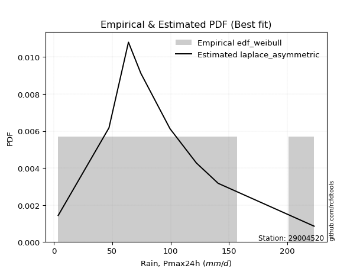</img>

</div>


### 4. EDF Beard (1943)

The Beard formula (or Beard´s plotting position formula) in hydrology is used to estimate the empirical non-exceedance probability _(P)_ of a flood event (or other extreme hydrological data point) within a given dataset.

<div align="center">


$P=(m-0.31)/(n+0.38)$


</div>


**4.1. Empirical values**

<div align="center">

|                | 0                   | 1                   | 2                  | 3                   | 4         | 5                  | 6                  | 7                  | 8                  |
|:---------------|:--------------------|:--------------------|:-------------------|:--------------------|:----------|:-------------------|:-------------------|:-------------------|:-------------------|
| date           | 2023                | 2021                | 2018               | 2017                | 2025      | 2020               | 2019               | 2024               | 2022               |
| x              | 3.7                 | 47.2                | 63.9               | 74.5                | 80.5      | 99.5               | 122.1              | 140.8              | 223.0              |
| m              | 1                   | 2                   | 3                  | 4                   | 5         | 6                  | 7                  | 8                  | 9                  |
| empirical_dist | edf_beard           | edf_beard           | edf_beard          | edf_beard           | edf_beard | edf_beard          | edf_beard          | edf_beard          | edf_beard          |
| empirical      | 0.07356076759061833 | 0.18017057569296374 | 0.2867803837953091 | 0.39339019189765456 | 0.5       | 0.6066098081023454 | 0.7132196162046908 | 0.8198294243070362 | 0.9264392324093815 |
| empirical_tr   | 1.0794016110471807  | 1.2197659297789336  | 1.4020926756352765 | 1.6485061511423549  | 2.0       | 2.542005420054201  | 3.486988847583642  | 5.550295857988164  | 13.5942028985507   |

</div>


**4.2. Kolmogorov-Smirnov fit test (sorted by Δ)**


<div align="center">

|                | 0                   | 1                   | 2                   | 3                   | 4                   | 5                    | 6                   | 7                   | 8                    | 9                    | 10                  | 11                   | 12                  | 13                   | 14                  | 15                  | 16                  | 17                  | 18                   | 19                  | 20                   | 21                   | 22                   | 23                  | 24                  | 25                  | 26                  | 27                  | 28                  | 29                  | 30                  | 31                  | 32                  | 33                  | 34                  | 35                  | 36                  | 37                  | 38                  | 39                  | 40                  | 41                  | 42                  | 43                  | 44                  | 45                  | 46                  | 47                  | 48                  | 49                  | 50                  | 51                  | 52                  | 53                  | 54                  | 55                  | 56                  | 57                  | 58                  | 59                  | 60                  | 61                  | 62                  | 63                  | 64                  | 65                  | 66                  | 67                  | 68                  | 69                  | 70                  | 71                  | 72                  | 73                  | 74                  | 75                  | 76                  | 77                  | 78                  | 79                  | 80                  | 81                  | 82                  | 83                  | 84                  | 85                  | 86                  | 87                  | 88                  | 89                  | 90                  | 91                  | 92                  | 93                  | 94                  | 95                  | 96                  | 97                  | 98                  | 99                  | 100                 | 101                 | 102                 | 103                 | 104                 | 105                 | 106                 | 107                 | 108                 | 109                 | 110                 | 111                 | 112                 | 113                 | 114                 | 115                 | 116                 | 117                 | 118                 | 119                 | 120                 | 121                 | 122                 | 123                 | 124                 | 125                 | 126                 | 127                 | 128                 | 129                 | 130                 | 131                 | 132                 | 133                 | 134                 | 135                 | 136                 | 137                 | 138                 | 139                 | 140                 | 141                 | 142                 | 143                 | 144                 | 145                 | 146                 | 147                 | 148                 | 149                 | 150                 | 151                 | 152                 | 153                 | 154                 | 155                 | 156                 | 157                 | 158                 | 159                 |
|:---------------|:--------------------|:--------------------|:--------------------|:--------------------|:--------------------|:---------------------|:--------------------|:--------------------|:---------------------|:---------------------|:--------------------|:---------------------|:--------------------|:---------------------|:--------------------|:--------------------|:--------------------|:--------------------|:---------------------|:--------------------|:---------------------|:---------------------|:---------------------|:--------------------|:--------------------|:--------------------|:--------------------|:--------------------|:--------------------|:--------------------|:--------------------|:--------------------|:--------------------|:--------------------|:--------------------|:--------------------|:--------------------|:--------------------|:--------------------|:--------------------|:--------------------|:--------------------|:--------------------|:--------------------|:--------------------|:--------------------|:--------------------|:--------------------|:--------------------|:--------------------|:--------------------|:--------------------|:--------------------|:--------------------|:--------------------|:--------------------|:--------------------|:--------------------|:--------------------|:--------------------|:--------------------|:--------------------|:--------------------|:--------------------|:--------------------|:--------------------|:--------------------|:--------------------|:--------------------|:--------------------|:--------------------|:--------------------|:--------------------|:--------------------|:--------------------|:--------------------|:--------------------|:--------------------|:--------------------|:--------------------|:--------------------|:--------------------|:--------------------|:--------------------|:--------------------|:--------------------|:--------------------|:--------------------|:--------------------|:--------------------|:--------------------|:--------------------|:--------------------|:--------------------|:--------------------|:--------------------|:--------------------|:--------------------|:--------------------|:--------------------|:--------------------|:--------------------|:--------------------|:--------------------|:--------------------|:--------------------|:--------------------|:--------------------|:--------------------|:--------------------|:--------------------|:--------------------|:--------------------|:--------------------|:--------------------|:--------------------|:--------------------|:--------------------|:--------------------|:--------------------|:--------------------|:--------------------|:--------------------|:--------------------|:--------------------|:--------------------|:--------------------|:--------------------|:--------------------|:--------------------|:--------------------|:--------------------|:--------------------|:--------------------|:--------------------|:--------------------|:--------------------|:--------------------|:--------------------|:--------------------|:--------------------|:--------------------|:--------------------|:--------------------|:--------------------|:--------------------|:--------------------|:--------------------|:--------------------|:--------------------|:--------------------|:--------------------|:--------------------|:--------------------|:--------------------|:--------------------|:--------------------|:--------------------|:--------------------|:--------------------|
| station        | 29004520            | 29004520            | 29004520            | 29004520            | 29004520            | 29004520             | 29004520            | 29004520            | 29004520             | 29004520             | 29004520            | 29004520             | 29004520            | 29004520             | 29004520            | 29004520            | 29004520            | 29004520            | 29004520             | 29004520            | 29004520             | 29004520             | 29004520             | 29004520            | 29004520            | 29004520            | 29004520            | 29004520            | 29004520            | 29004520            | 29004520            | 29004520            | 29004520            | 29004520            | 29004520            | 29004520            | 29004520            | 29004520            | 29004520            | 29004520            | 29004520            | 29004520            | 29004520            | 29004520            | 29004520            | 29004520            | 29004520            | 29004520            | 29004520            | 29004520            | 29004520            | 29004520            | 29004520            | 29004520            | 29004520            | 29004520            | 29004520            | 29004520            | 29004520            | 29004520            | 29004520            | 29004520            | 29004520            | 29004520            | 29004520            | 29004520            | 29004520            | 29004520            | 29004520            | 29004520            | 29004520            | 29004520            | 29004520            | 29004520            | 29004520            | 29004520            | 29004520            | 29004520            | 29004520            | 29004520            | 29004520            | 29004520            | 29004520            | 29004520            | 29004520            | 29004520            | 29004520            | 29004520            | 29004520            | 29004520            | 29004520            | 29004520            | 29004520            | 29004520            | 29004520            | 29004520            | 29004520            | 29004520            | 29004520            | 29004520            | 29004520            | 29004520            | 29004520            | 29004520            | 29004520            | 29004520            | 29004520            | 29004520            | 29004520            | 29004520            | 29004520            | 29004520            | 29004520            | 29004520            | 29004520            | 29004520            | 29004520            | 29004520            | 29004520            | 29004520            | 29004520            | 29004520            | 29004520            | 29004520            | 29004520            | 29004520            | 29004520            | 29004520            | 29004520            | 29004520            | 29004520            | 29004520            | 29004520            | 29004520            | 29004520            | 29004520            | 29004520            | 29004520            | 29004520            | 29004520            | 29004520            | 29004520            | 29004520            | 29004520            | 29004520            | 29004520            | 29004520            | 29004520            | 29004520            | 29004520            | 29004520            | 29004520            | 29004520            | 29004520            | 29004520            | 29004520            | 29004520            | 29004520            | 29004520            | 29004520            |
| empirical_dist | edf_beard           | edf_beard           | edf_beard           | edf_beard           | edf_beard           | edf_beard            | edf_beard           | edf_beard           | edf_beard            | edf_beard            | edf_beard           | edf_beard            | edf_beard           | edf_beard            | edf_beard           | edf_beard           | edf_beard           | edf_beard           | edf_beard            | edf_beard           | edf_beard            | edf_beard            | edf_beard            | edf_beard           | edf_beard           | edf_beard           | edf_beard           | edf_beard           | edf_beard           | edf_beard           | edf_beard           | edf_beard           | edf_beard           | edf_beard           | edf_beard           | edf_beard           | edf_beard           | edf_beard           | edf_beard           | edf_beard           | edf_beard           | edf_beard           | edf_beard           | edf_beard           | edf_beard           | edf_beard           | edf_beard           | edf_beard           | edf_beard           | edf_beard           | edf_beard           | edf_beard           | edf_beard           | edf_beard           | edf_beard           | edf_beard           | edf_beard           | edf_beard           | edf_beard           | edf_beard           | edf_beard           | edf_beard           | edf_beard           | edf_beard           | edf_beard           | edf_beard           | edf_beard           | edf_beard           | edf_beard           | edf_beard           | edf_beard           | edf_beard           | edf_beard           | edf_beard           | edf_beard           | edf_beard           | edf_beard           | edf_beard           | edf_beard           | edf_beard           | edf_beard           | edf_beard           | edf_beard           | edf_beard           | edf_beard           | edf_beard           | edf_beard           | edf_beard           | edf_beard           | edf_beard           | edf_beard           | edf_beard           | edf_beard           | edf_beard           | edf_beard           | edf_beard           | edf_beard           | edf_beard           | edf_beard           | edf_beard           | edf_beard           | edf_beard           | edf_beard           | edf_beard           | edf_beard           | edf_beard           | edf_beard           | edf_beard           | edf_beard           | edf_beard           | edf_beard           | edf_beard           | edf_beard           | edf_beard           | edf_beard           | edf_beard           | edf_beard           | edf_beard           | edf_beard           | edf_beard           | edf_beard           | edf_beard           | edf_beard           | edf_beard           | edf_beard           | edf_beard           | edf_beard           | edf_beard           | edf_beard           | edf_beard           | edf_beard           | edf_beard           | edf_beard           | edf_beard           | edf_beard           | edf_beard           | edf_beard           | edf_beard           | edf_beard           | edf_beard           | edf_beard           | edf_beard           | edf_beard           | edf_beard           | edf_beard           | edf_beard           | edf_beard           | edf_beard           | edf_beard           | edf_beard           | edf_beard           | edf_beard           | edf_beard           | edf_beard           | edf_beard           | edf_beard           | edf_beard           | edf_beard           | edf_beard           | edf_beard           |
| p_dist         | logcrystalball      | betaprime           | f                   | erlang              | gamma               | exponnorm            | gengamma            | fatiguelife         | invgauss             | genlogistic          | johnsonsu           | invgamma             | exponweib           | rayleigh             | logjohnsonsu        | pearson3            | invweibull          | rice                | nct                  | gumbel_r            | dgamma               | skewnorm             | burr12               | weibull_min         | maxwell             | kstwobign           | dweibull            | moyal               | foldnorm            | logdweibull         | logt                | halflogistic        | halfnorm            | semicircular        | anglit              | logjohnsonsb        | loggenlogistic      | genpareto           | logburr12           | logexponpow         | logloggamma         | t                   | crystalball         | norm                | kappa3              | gennorm             | logargus            | logmielke           | logpearson3         | logdgamma           | loggompertz         | logloglaplace       | logistic            | truncexpon          | hypsecant           | gausshyper          | wald                | cosine              | bradford            | loggumbel_l         | arcsine             | logweibull_max      | burr                | logburr             | laplace             | loggennorm          | truncweibull_min    | gumbel_l            | logskewnorm         | kappa4              | loggenextreme       | logtrapezoid        | logvonmises_line    | lognakagami         | loglaplace          | loglaplace          | logfoldnorm         | logf                | uniform             | wrapcauchy          | vonmises_line       | loghypsecant        | loglogistic         | lomax               | logrice             | lognorm             | logexponnorm        | lognct              | genexpon            | logfatiguelife      | mielke              | logbetaprime        | loggamma            | loggamma            | loganglit           | ksone               | argus               | beta                | logerlang           | loginvgamma         | logsemicircular     | logalpha            | loginvgauss         | logmaxwell          | loggausshyper       | logncf              | lograyleigh         | logarcsine          | loglevy_l           | ncf                 | loginvweibull       | nakagami            | logtriang           | loggumbel_r         | loggenpareto        | loghalfnorm         | loggenhalflogistic  | logmoyal            | loghalflogistic     | halfgennorm         | logcosine           | johnsonsb           | logkstwobign        | loggenexpon         | logtruncweibull_min | genhalflogistic     | loghalfgennorm      | levy_l              | logwald             | triang              | logwrapcauchy       | logtruncnorm        | loglomax            | logbeta             | logksone            | logkappa4           | logkappa3           | logtukeylambda      | loguniform          | trapezoid           | logtruncexpon       | logbradford         | rdist               | genextreme          | powerlaw            | loggengamma         | tukeylambda         | logweibull_min      | logrdist            | logexponweib        | alpha               | weibull_max         | logpowerlaw         | truncpareto         | exponpow            | logtruncpareto      | gompertz            | truncnorm           | logvonmises         | vonmises            |
| delta          | 0.03629338317084985 | 0.04716392017384252 | 0.0472633170692453  | 0.0473037270625174  | 0.04730377263013613 | 0.048160223933952806 | 0.04839915277973983 | 0.04897149006307744 | 0.049047668303059455 | 0.049420565863060706 | 0.04955052931618681 | 0.050162480779447904 | 0.05079091876372238 | 0.051303370636190004 | 0.05349864925095826 | 0.05386986554383344 | 0.05412494053944894 | 0.05457472453368789 | 0.055160934935096106 | 0.05650772954488325 | 0.058115967848065386 | 0.058301392806423824 | 0.060038239723915254 | 0.06076945839664094 | 0.06294035033774259 | 0.064179906797936   | 0.06601654706971011 | 0.07034617106401116 | 0.07356076759061833 | 0.07816092264061614 | 0.07852440278251344 | 0.08049822143967955 | 0.08237634166306257 | 0.08250580561611764 | 0.08357649363878283 | 0.08635866392379749 | 0.09100840594589876 | 0.09228555896059387 | 0.09395960671644371 | 0.09433807935965494 | 0.09507130807571113 | 0.09509804913708847 | 0.09702250877081481 | 0.0970225177554983  | 0.09709627427723061 | 0.09773412903023504 | 0.10030504804918378 | 0.1006006004903689  | 0.10180489596157916 | 0.10660980810271659 | 0.1088978919736725  | 0.1092601743488355  | 0.10958202801902822 | 0.11327880860174366 | 0.1198847389913697  | 0.12029359901819092 | 0.12428682460909007 | 0.12771446635019473 | 0.128817896336771   | 0.13427924321370466 | 0.1353921177615076  | 0.14043084681602613 | 0.14427330957929763 | 0.1455353475837622  | 0.14673806906322662 | 0.1524743985367486  | 0.15249683164209904 | 0.16383332278968427 | 0.1639050717071147  | 0.16697487935328126 | 0.1680399967686127  | 0.17234415685257604 | 0.18017053953150938 | 0.18017057569218917 | 0.18817438340108478 | 0.18817438340108478 | 0.18885774353944917 | 0.19327302015212905 | 0.19465842567502523 | 0.19466285506044578 | 0.19505516899719072 | 0.19506088595432758 | 0.19674849191255156 | 0.1970191921190207  | 0.19872376409027087 | 0.19872637022494022 | 0.19872730478458306 | 0.19894440621153686 | 0.19897976119800675 | 0.2006757962774105  | 0.20563142777694166 | 0.2113234603990199  | 0.2140594749833828  | 0.2140594749833828  | 0.21483615826085528 | 0.2155202587803604  | 0.21700439391112758 | 0.2172472992329435  | 0.2187882053390337  | 0.22039426833389414 | 0.22172176025334578 | 0.22310504833741146 | 0.223621837244945   | 0.23229514521705352 | 0.23488309067757301 | 0.23514009020716176 | 0.2439500271208202  | 0.2496107479014113  | 0.2499340441822297  | 0.2572159323547476  | 0.25723459964436035 | 0.2639770380098234  | 0.266056772921853   | 0.26852049363308594 | 0.2757252301347821  | 0.27885639861928513 | 0.2875777534709467  | 0.29440003068777787 | 0.299447790746156   | 0.30446788107895284 | 0.3048467127863568  | 0.30639951474297544 | 0.3091914717734375  | 0.33470463149302127 | 0.3433915062558153  | 0.3441323203622268  | 0.3499016280971267  | 0.3537811230178626  | 0.3664164167984797  | 0.38271819148915687 | 0.3968109939603522  | 0.39810732601677185 | 0.4009753208473638  | 0.40620338542431306 | 0.4208014318428647  | 0.42684820547488206 | 0.4403742204626921  | 0.44040646388769583 | 0.4409958333500304  | 0.450441601918545   | 0.5081058091990898  | 0.5093436536716998  | 0.5149140798959635  | 0.5300853838979898  | 0.5570030957276004  | 0.5869770851063254  | 0.5923447594067552  | 0.6042892270592988  | 0.6054109240942731  | 0.6154875803035971  | 0.6342867770776706  | 0.6934319777251231  | 0.7167406664575882  | 0.7277527111543067  | 0.7752175658499283  | 0.7916017741826533  | 0.8180713445564831  | 0.9256470987621647  | 1.0147341443386657  | 35.4332359122957    |
| deltao         | 0.41761268023100007 | 0.41761268023100007 | 0.41761268023100007 | 0.41761268023100007 | 0.41761268023100007 | 0.41761268023100007  | 0.41761268023100007 | 0.41761268023100007 | 0.41761268023100007  | 0.41761268023100007  | 0.41761268023100007 | 0.41761268023100007  | 0.41761268023100007 | 0.41761268023100007  | 0.41761268023100007 | 0.41761268023100007 | 0.41761268023100007 | 0.41761268023100007 | 0.41761268023100007  | 0.41761268023100007 | 0.41761268023100007  | 0.41761268023100007  | 0.41761268023100007  | 0.41761268023100007 | 0.41761268023100007 | 0.41761268023100007 | 0.41761268023100007 | 0.41761268023100007 | 0.41761268023100007 | 0.41761268023100007 | 0.41761268023100007 | 0.41761268023100007 | 0.41761268023100007 | 0.41761268023100007 | 0.41761268023100007 | 0.41761268023100007 | 0.41761268023100007 | 0.41761268023100007 | 0.41761268023100007 | 0.41761268023100007 | 0.41761268023100007 | 0.41761268023100007 | 0.41761268023100007 | 0.41761268023100007 | 0.41761268023100007 | 0.41761268023100007 | 0.41761268023100007 | 0.41761268023100007 | 0.41761268023100007 | 0.41761268023100007 | 0.41761268023100007 | 0.41761268023100007 | 0.41761268023100007 | 0.41761268023100007 | 0.41761268023100007 | 0.41761268023100007 | 0.41761268023100007 | 0.41761268023100007 | 0.41761268023100007 | 0.41761268023100007 | 0.41761268023100007 | 0.41761268023100007 | 0.41761268023100007 | 0.41761268023100007 | 0.41761268023100007 | 0.41761268023100007 | 0.41761268023100007 | 0.41761268023100007 | 0.41761268023100007 | 0.41761268023100007 | 0.41761268023100007 | 0.41761268023100007 | 0.41761268023100007 | 0.41761268023100007 | 0.41761268023100007 | 0.41761268023100007 | 0.41761268023100007 | 0.41761268023100007 | 0.41761268023100007 | 0.41761268023100007 | 0.41761268023100007 | 0.41761268023100007 | 0.41761268023100007 | 0.41761268023100007 | 0.41761268023100007 | 0.41761268023100007 | 0.41761268023100007 | 0.41761268023100007 | 0.41761268023100007 | 0.41761268023100007 | 0.41761268023100007 | 0.41761268023100007 | 0.41761268023100007 | 0.41761268023100007 | 0.41761268023100007 | 0.41761268023100007 | 0.41761268023100007 | 0.41761268023100007 | 0.41761268023100007 | 0.41761268023100007 | 0.41761268023100007 | 0.41761268023100007 | 0.41761268023100007 | 0.41761268023100007 | 0.41761268023100007 | 0.41761268023100007 | 0.41761268023100007 | 0.41761268023100007 | 0.41761268023100007 | 0.41761268023100007 | 0.41761268023100007 | 0.41761268023100007 | 0.41761268023100007 | 0.41761268023100007 | 0.41761268023100007 | 0.41761268023100007 | 0.41761268023100007 | 0.41761268023100007 | 0.41761268023100007 | 0.41761268023100007 | 0.41761268023100007 | 0.41761268023100007 | 0.41761268023100007 | 0.41761268023100007 | 0.41761268023100007 | 0.41761268023100007 | 0.41761268023100007 | 0.41761268023100007 | 0.41761268023100007 | 0.41761268023100007 | 0.41761268023100007 | 0.41761268023100007 | 0.41761268023100007 | 0.41761268023100007 | 0.41761268023100007 | 0.41761268023100007 | 0.41761268023100007 | 0.41761268023100007 | 0.41761268023100007 | 0.41761268023100007 | 0.41761268023100007 | 0.41761268023100007 | 0.41761268023100007 | 0.41761268023100007 | 0.41761268023100007 | 0.41761268023100007 | 0.41761268023100007 | 0.41761268023100007 | 0.41761268023100007 | 0.41761268023100007 | 0.41761268023100007 | 0.41761268023100007 | 0.41761268023100007 | 0.41761268023100007 | 0.41761268023100007 | 0.41761268023100007 | 0.41761268023100007 | 0.41761268023100007 | 0.41761268023100007 | 0.41761268023100007 |
| eval           | Δo > Δ              | Δo > Δ              | Δo > Δ              | Δo > Δ              | Δo > Δ              | Δo > Δ               | Δo > Δ              | Δo > Δ              | Δo > Δ               | Δo > Δ               | Δo > Δ              | Δo > Δ               | Δo > Δ              | Δo > Δ               | Δo > Δ              | Δo > Δ              | Δo > Δ              | Δo > Δ              | Δo > Δ               | Δo > Δ              | Δo > Δ               | Δo > Δ               | Δo > Δ               | Δo > Δ              | Δo > Δ              | Δo > Δ              | Δo > Δ              | Δo > Δ              | Δo > Δ              | Δo > Δ              | Δo > Δ              | Δo > Δ              | Δo > Δ              | Δo > Δ              | Δo > Δ              | Δo > Δ              | Δo > Δ              | Δo > Δ              | Δo > Δ              | Δo > Δ              | Δo > Δ              | Δo > Δ              | Δo > Δ              | Δo > Δ              | Δo > Δ              | Δo > Δ              | Δo > Δ              | Δo > Δ              | Δo > Δ              | Δo > Δ              | Δo > Δ              | Δo > Δ              | Δo > Δ              | Δo > Δ              | Δo > Δ              | Δo > Δ              | Δo > Δ              | Δo > Δ              | Δo > Δ              | Δo > Δ              | Δo > Δ              | Δo > Δ              | Δo > Δ              | Δo > Δ              | Δo > Δ              | Δo > Δ              | Δo > Δ              | Δo > Δ              | Δo > Δ              | Δo > Δ              | Δo > Δ              | Δo > Δ              | Δo > Δ              | Δo > Δ              | Δo > Δ              | Δo > Δ              | Δo > Δ              | Δo > Δ              | Δo > Δ              | Δo > Δ              | Δo > Δ              | Δo > Δ              | Δo > Δ              | Δo > Δ              | Δo > Δ              | Δo > Δ              | Δo > Δ              | Δo > Δ              | Δo > Δ              | Δo > Δ              | Δo > Δ              | Δo > Δ              | Δo > Δ              | Δo > Δ              | Δo > Δ              | Δo > Δ              | Δo > Δ              | Δo > Δ              | Δo > Δ              | Δo > Δ              | Δo > Δ              | Δo > Δ              | Δo > Δ              | Δo > Δ              | Δo > Δ              | Δo > Δ              | Δo > Δ              | Δo > Δ              | Δo > Δ              | Δo > Δ              | Δo > Δ              | Δo > Δ              | Δo > Δ              | Δo > Δ              | Δo > Δ              | Δo > Δ              | Δo > Δ              | Δo > Δ              | Δo > Δ              | Δo > Δ              | Δo > Δ              | Δo > Δ              | Δo > Δ              | Δo > Δ              | Δo > Δ              | Δo > Δ              | Δo > Δ              | Δo > Δ              | Δo > Δ              | Δo > Δ              | Δo > Δ              | Δo > Δ              | Δo > Δ              | Δo > Δ              | Δo <= Δ             | Δo <= Δ             | Δo <= Δ             | Δo <= Δ             | Δo <= Δ             | Δo <= Δ             | Δo <= Δ             | Δo <= Δ             | Δo <= Δ             | Δo <= Δ             | Δo <= Δ             | Δo <= Δ             | Δo <= Δ             | Δo <= Δ             | Δo <= Δ             | Δo <= Δ             | Δo <= Δ             | Δo <= Δ             | Δo <= Δ             | Δo <= Δ             | Δo <= Δ             | Δo <= Δ             | Δo <= Δ             | Δo <= Δ             | Δo <= Δ             | Δo <= Δ             |
| fit            | 1                   | 1                   | 1                   | 1                   | 1                   | 1                    | 1                   | 1                   | 1                    | 1                    | 1                   | 1                    | 1                   | 1                    | 1                   | 1                   | 1                   | 1                   | 1                    | 1                   | 1                    | 1                    | 1                    | 1                   | 1                   | 1                   | 1                   | 1                   | 1                   | 1                   | 1                   | 1                   | 1                   | 1                   | 1                   | 1                   | 1                   | 1                   | 1                   | 1                   | 1                   | 1                   | 1                   | 1                   | 1                   | 1                   | 1                   | 1                   | 1                   | 1                   | 1                   | 1                   | 1                   | 1                   | 1                   | 1                   | 1                   | 1                   | 1                   | 1                   | 1                   | 1                   | 1                   | 1                   | 1                   | 1                   | 1                   | 1                   | 1                   | 1                   | 1                   | 1                   | 1                   | 1                   | 1                   | 1                   | 1                   | 1                   | 1                   | 1                   | 1                   | 1                   | 1                   | 1                   | 1                   | 1                   | 1                   | 1                   | 1                   | 1                   | 1                   | 1                   | 1                   | 1                   | 1                   | 1                   | 1                   | 1                   | 1                   | 1                   | 1                   | 1                   | 1                   | 1                   | 1                   | 1                   | 1                   | 1                   | 1                   | 1                   | 1                   | 1                   | 1                   | 1                   | 1                   | 1                   | 1                   | 1                   | 1                   | 1                   | 1                   | 1                   | 1                   | 1                   | 1                   | 1                   | 1                   | 1                   | 1                   | 1                   | 1                   | 1                   | 1                   | 1                   | 0                   | 0                   | 0                   | 0                   | 0                   | 0                   | 0                   | 0                   | 0                   | 0                   | 0                   | 0                   | 0                   | 0                   | 0                   | 0                   | 0                   | 0                   | 0                   | 0                   | 0                   | 0                   | 0                   | 0                   | 0                   | 0                   |
| n              | 9                   | 9                   | 9                   | 9                   | 9                   | 9                    | 9                   | 9                   | 9                    | 9                    | 9                   | 9                    | 9                   | 9                    | 9                   | 9                   | 9                   | 9                   | 9                    | 9                   | 9                    | 9                    | 9                    | 9                   | 9                   | 9                   | 9                   | 9                   | 9                   | 9                   | 9                   | 9                   | 9                   | 9                   | 9                   | 9                   | 9                   | 9                   | 9                   | 9                   | 9                   | 9                   | 9                   | 9                   | 9                   | 9                   | 9                   | 9                   | 9                   | 9                   | 9                   | 9                   | 9                   | 9                   | 9                   | 9                   | 9                   | 9                   | 9                   | 9                   | 9                   | 9                   | 9                   | 9                   | 9                   | 9                   | 9                   | 9                   | 9                   | 9                   | 9                   | 9                   | 9                   | 9                   | 9                   | 9                   | 9                   | 9                   | 9                   | 9                   | 9                   | 9                   | 9                   | 9                   | 9                   | 9                   | 9                   | 9                   | 9                   | 9                   | 9                   | 9                   | 9                   | 9                   | 9                   | 9                   | 9                   | 9                   | 9                   | 9                   | 9                   | 9                   | 9                   | 9                   | 9                   | 9                   | 9                   | 9                   | 9                   | 9                   | 9                   | 9                   | 9                   | 9                   | 9                   | 9                   | 9                   | 9                   | 9                   | 9                   | 9                   | 9                   | 9                   | 9                   | 9                   | 9                   | 9                   | 9                   | 9                   | 9                   | 9                   | 9                   | 9                   | 9                   | 9                   | 9                   | 9                   | 9                   | 9                   | 9                   | 9                   | 9                   | 9                   | 9                   | 9                   | 9                   | 9                   | 9                   | 9                   | 9                   | 9                   | 9                   | 9                   | 9                   | 9                   | 9                   | 9                   | 9                   | 9                   | 9                   |
| best_fit       | 1                   | 0                   | 0                   | 0                   | 0                   | 0                    | 0                   | 0                   | 0                    | 0                    | 0                   | 0                    | 0                   | 0                    | 0                   | 0                   | 0                   | 0                   | 0                    | 0                   | 0                    | 0                    | 0                    | 0                   | 0                   | 0                   | 0                   | 0                   | 0                   | 0                   | 0                   | 0                   | 0                   | 0                   | 0                   | 0                   | 0                   | 0                   | 0                   | 0                   | 0                   | 0                   | 0                   | 0                   | 0                   | 0                   | 0                   | 0                   | 0                   | 0                   | 0                   | 0                   | 0                   | 0                   | 0                   | 0                   | 0                   | 0                   | 0                   | 0                   | 0                   | 0                   | 0                   | 0                   | 0                   | 0                   | 0                   | 0                   | 0                   | 0                   | 0                   | 0                   | 0                   | 0                   | 0                   | 0                   | 0                   | 0                   | 0                   | 0                   | 0                   | 0                   | 0                   | 0                   | 0                   | 0                   | 0                   | 0                   | 0                   | 0                   | 0                   | 0                   | 0                   | 0                   | 0                   | 0                   | 0                   | 0                   | 0                   | 0                   | 0                   | 0                   | 0                   | 0                   | 0                   | 0                   | 0                   | 0                   | 0                   | 0                   | 0                   | 0                   | 0                   | 0                   | 0                   | 0                   | 0                   | 0                   | 0                   | 0                   | 0                   | 0                   | 0                   | 0                   | 0                   | 0                   | 0                   | 0                   | 0                   | 0                   | 0                   | 0                   | 0                   | 0                   | 0                   | 0                   | 0                   | 0                   | 0                   | 0                   | 0                   | 0                   | 0                   | 0                   | 0                   | 0                   | 0                   | 0                   | 0                   | 0                   | 0                   | 0                   | 0                   | 0                   | 0                   | 0                   | 0                   | 0                   | 0                   | 0                   |
| best_fit_sort  | 1                   | 2                   | 3                   | 4                   | 5                   | 6                    | 7                   | 8                   | 9                    | 10                   | 11                  | 12                   | 13                  | 14                   | 15                  | 16                  | 17                  | 18                  | 19                   | 20                  | 21                   | 22                   | 23                   | 24                  | 25                  | 26                  | 27                  | 28                  | 29                  | 30                  | 31                  | 32                  | 33                  | 34                  | 35                  | 36                  | 37                  | 38                  | 39                  | 40                  | 41                  | 42                  | 43                  | 44                  | 45                  | 46                  | 47                  | 48                  | 49                  | 50                  | 51                  | 52                  | 53                  | 54                  | 55                  | 56                  | 57                  | 58                  | 59                  | 60                  | 61                  | 62                  | 63                  | 64                  | 65                  | 66                  | 67                  | 68                  | 69                  | 70                  | 71                  | 72                  | 73                  | 74                  | 75                  | 76                  | 77                  | 78                  | 79                  | 80                  | 81                  | 82                  | 83                  | 84                  | 85                  | 86                  | 87                  | 88                  | 89                  | 90                  | 91                  | 92                  | 93                  | 94                  | 95                  | 96                  | 97                  | 98                  | 99                  | 100                 | 101                 | 102                 | 103                 | 104                 | 105                 | 106                 | 107                 | 108                 | 109                 | 110                 | 111                 | 112                 | 113                 | 114                 | 115                 | 116                 | 117                 | 118                 | 119                 | 120                 | 121                 | 122                 | 123                 | 124                 | 125                 | 126                 | 127                 | 128                 | 129                 | 130                 | 131                 | 132                 | 133                 | 134                 | 135                 | 136                 | 137                 | 138                 | 139                 | 140                 | 141                 | 142                 | 143                 | 144                 | 145                 | 146                 | 147                 | 148                 | 149                 | 150                 | 151                 | 152                 | 153                 | 154                 | 155                 | 156                 | 157                 | 158                 | 159                 | 160                 |

</div>


**4.3. Best fit**

<div align="center">

|   id |   station | empirical_dist   | p_dist         |     delta |   deltao | eval   |   fit |   n |   best_fit |   best_fit_sort |
|-----:|----------:|:-----------------|:---------------|----------:|---------:|:-------|------:|----:|-----------:|----------------:|
|    0 |  29004520 | edf_beard        | logcrystalball | 0.0362934 | 0.417613 | Δo > Δ |     1 |   9 |          1 |               1 |

</div>


<div align="center">

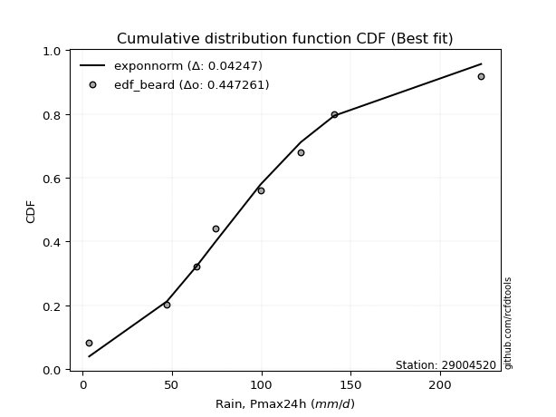</img></img>

</div>


### 5. EDF Chegodayev (1955)

The Chegodayev formula is an empirical plotting position formula used in hydrological frequency analysis to estimate the exceedance probability or return period of a specific event from a set of observed data. It is primarily used for plotting observed data points on probability paper to fit a theoretical distribution, particularly for analyzing extreme events like maximum flood flows or rainfall intensities. The constant _b_ value in the generalized plotting position formula is 0.3.

<div align="center">


$P=(m-b)/(n+1-2b)$


</div>


**5.1. Empirical values**

<div align="center">

|                | 0                   | 1                   | 2                  | 3                   | 4              | 5                  | 6                  | 7                  | 8                  |
|:---------------|:--------------------|:--------------------|:-------------------|:--------------------|:---------------|:-------------------|:-------------------|:-------------------|:-------------------|
| date           | 2023                | 2021                | 2018               | 2017                | 2025           | 2020               | 2019               | 2024               | 2022               |
| x              | 3.7                 | 47.2                | 63.9               | 74.5                | 80.5           | 99.5               | 122.1              | 140.8              | 223.0              |
| m              | 1                   | 2                   | 3                  | 4                   | 5              | 6                  | 7                  | 8                  | 9                  |
| empirical_dist | edf_chegodayev      | edf_chegodayev      | edf_chegodayev     | edf_chegodayev      | edf_chegodayev | edf_chegodayev     | edf_chegodayev     | edf_chegodayev     | edf_chegodayev     |
| empirical      | 0.07446808510638298 | 0.18085106382978722 | 0.2872340425531915 | 0.39361702127659576 | 0.5            | 0.6063829787234043 | 0.7127659574468085 | 0.8191489361702128 | 0.9255319148936169 |
| empirical_tr   | 1.0804597701149425  | 1.2207792207792207  | 1.4029850746268657 | 1.6491228070175437  | 2.0            | 2.540540540540541  | 3.481481481481481  | 5.529411764705883  | 13.428571428571399 |

</div>


**5.2. Kolmogorov-Smirnov fit test (sorted by Δ)**


<div align="center">

|                | 0                   | 1                   | 2                    | 3                   | 4                   | 5                    | 6                   | 7                   | 8                    | 9                    | 10                  | 11                   | 12                  | 13                  | 14                  | 15                  | 16                  | 17                  | 18                   | 19                  | 20                   | 21                  | 22                  | 23                  | 24                  | 25                  | 26                  | 27                  | 28                  | 29                  | 30                  | 31                  | 32                  | 33                  | 34                  | 35                  | 36                  | 37                  | 38                  | 39                  | 40                  | 41                  | 42                  | 43                  | 44                  | 45                  | 46                  | 47                  | 48                  | 49                  | 50                  | 51                  | 52                  | 53                  | 54                  | 55                  | 56                  | 57                  | 58                  | 59                  | 60                  | 61                  | 62                  | 63                  | 64                  | 65                  | 66                  | 67                  | 68                  | 69                  | 70                  | 71                  | 72                  | 73                  | 74                  | 75                  | 76                  | 77                  | 78                  | 79                  | 80                  | 81                  | 82                  | 83                  | 84                  | 85                  | 86                  | 87                  | 88                  | 89                  | 90                  | 91                  | 92                  | 93                  | 94                  | 95                  | 96                  | 97                  | 98                  | 99                  | 100                 | 101                 | 102                 | 103                 | 104                 | 105                 | 106                 | 107                 | 108                 | 109                 | 110                 | 111                 | 112                 | 113                 | 114                 | 115                 | 116                 | 117                 | 118                 | 119                 | 120                 | 121                 | 122                 | 123                 | 124                 | 125                 | 126                 | 127                 | 128                 | 129                 | 130                 | 131                 | 132                 | 133                 | 134                 | 135                 | 136                 | 137                 | 138                 | 139                 | 140                 | 141                 | 142                 | 143                 | 144                 | 145                 | 146                 | 147                 | 148                 | 149                 | 150                 | 151                 | 152                 | 153                 | 154                 | 155                 | 156                 | 157                 | 158                 | 159                 |
|:---------------|:--------------------|:--------------------|:---------------------|:--------------------|:--------------------|:---------------------|:--------------------|:--------------------|:---------------------|:---------------------|:--------------------|:---------------------|:--------------------|:--------------------|:--------------------|:--------------------|:--------------------|:--------------------|:---------------------|:--------------------|:---------------------|:--------------------|:--------------------|:--------------------|:--------------------|:--------------------|:--------------------|:--------------------|:--------------------|:--------------------|:--------------------|:--------------------|:--------------------|:--------------------|:--------------------|:--------------------|:--------------------|:--------------------|:--------------------|:--------------------|:--------------------|:--------------------|:--------------------|:--------------------|:--------------------|:--------------------|:--------------------|:--------------------|:--------------------|:--------------------|:--------------------|:--------------------|:--------------------|:--------------------|:--------------------|:--------------------|:--------------------|:--------------------|:--------------------|:--------------------|:--------------------|:--------------------|:--------------------|:--------------------|:--------------------|:--------------------|:--------------------|:--------------------|:--------------------|:--------------------|:--------------------|:--------------------|:--------------------|:--------------------|:--------------------|:--------------------|:--------------------|:--------------------|:--------------------|:--------------------|:--------------------|:--------------------|:--------------------|:--------------------|:--------------------|:--------------------|:--------------------|:--------------------|:--------------------|:--------------------|:--------------------|:--------------------|:--------------------|:--------------------|:--------------------|:--------------------|:--------------------|:--------------------|:--------------------|:--------------------|:--------------------|:--------------------|:--------------------|:--------------------|:--------------------|:--------------------|:--------------------|:--------------------|:--------------------|:--------------------|:--------------------|:--------------------|:--------------------|:--------------------|:--------------------|:--------------------|:--------------------|:--------------------|:--------------------|:--------------------|:--------------------|:--------------------|:--------------------|:--------------------|:--------------------|:--------------------|:--------------------|:--------------------|:--------------------|:--------------------|:--------------------|:--------------------|:--------------------|:--------------------|:--------------------|:--------------------|:--------------------|:--------------------|:--------------------|:--------------------|:--------------------|:--------------------|:--------------------|:--------------------|:--------------------|:--------------------|:--------------------|:--------------------|:--------------------|:--------------------|:--------------------|:--------------------|:--------------------|:--------------------|:--------------------|:--------------------|:--------------------|:--------------------|:--------------------|:--------------------|
| station        | 29004520            | 29004520            | 29004520             | 29004520            | 29004520            | 29004520             | 29004520            | 29004520            | 29004520             | 29004520             | 29004520            | 29004520             | 29004520            | 29004520            | 29004520            | 29004520            | 29004520            | 29004520            | 29004520             | 29004520            | 29004520             | 29004520            | 29004520            | 29004520            | 29004520            | 29004520            | 29004520            | 29004520            | 29004520            | 29004520            | 29004520            | 29004520            | 29004520            | 29004520            | 29004520            | 29004520            | 29004520            | 29004520            | 29004520            | 29004520            | 29004520            | 29004520            | 29004520            | 29004520            | 29004520            | 29004520            | 29004520            | 29004520            | 29004520            | 29004520            | 29004520            | 29004520            | 29004520            | 29004520            | 29004520            | 29004520            | 29004520            | 29004520            | 29004520            | 29004520            | 29004520            | 29004520            | 29004520            | 29004520            | 29004520            | 29004520            | 29004520            | 29004520            | 29004520            | 29004520            | 29004520            | 29004520            | 29004520            | 29004520            | 29004520            | 29004520            | 29004520            | 29004520            | 29004520            | 29004520            | 29004520            | 29004520            | 29004520            | 29004520            | 29004520            | 29004520            | 29004520            | 29004520            | 29004520            | 29004520            | 29004520            | 29004520            | 29004520            | 29004520            | 29004520            | 29004520            | 29004520            | 29004520            | 29004520            | 29004520            | 29004520            | 29004520            | 29004520            | 29004520            | 29004520            | 29004520            | 29004520            | 29004520            | 29004520            | 29004520            | 29004520            | 29004520            | 29004520            | 29004520            | 29004520            | 29004520            | 29004520            | 29004520            | 29004520            | 29004520            | 29004520            | 29004520            | 29004520            | 29004520            | 29004520            | 29004520            | 29004520            | 29004520            | 29004520            | 29004520            | 29004520            | 29004520            | 29004520            | 29004520            | 29004520            | 29004520            | 29004520            | 29004520            | 29004520            | 29004520            | 29004520            | 29004520            | 29004520            | 29004520            | 29004520            | 29004520            | 29004520            | 29004520            | 29004520            | 29004520            | 29004520            | 29004520            | 29004520            | 29004520            | 29004520            | 29004520            | 29004520            | 29004520            | 29004520            | 29004520            |
| empirical_dist | edf_chegodayev      | edf_chegodayev      | edf_chegodayev       | edf_chegodayev      | edf_chegodayev      | edf_chegodayev       | edf_chegodayev      | edf_chegodayev      | edf_chegodayev       | edf_chegodayev       | edf_chegodayev      | edf_chegodayev       | edf_chegodayev      | edf_chegodayev      | edf_chegodayev      | edf_chegodayev      | edf_chegodayev      | edf_chegodayev      | edf_chegodayev       | edf_chegodayev      | edf_chegodayev       | edf_chegodayev      | edf_chegodayev      | edf_chegodayev      | edf_chegodayev      | edf_chegodayev      | edf_chegodayev      | edf_chegodayev      | edf_chegodayev      | edf_chegodayev      | edf_chegodayev      | edf_chegodayev      | edf_chegodayev      | edf_chegodayev      | edf_chegodayev      | edf_chegodayev      | edf_chegodayev      | edf_chegodayev      | edf_chegodayev      | edf_chegodayev      | edf_chegodayev      | edf_chegodayev      | edf_chegodayev      | edf_chegodayev      | edf_chegodayev      | edf_chegodayev      | edf_chegodayev      | edf_chegodayev      | edf_chegodayev      | edf_chegodayev      | edf_chegodayev      | edf_chegodayev      | edf_chegodayev      | edf_chegodayev      | edf_chegodayev      | edf_chegodayev      | edf_chegodayev      | edf_chegodayev      | edf_chegodayev      | edf_chegodayev      | edf_chegodayev      | edf_chegodayev      | edf_chegodayev      | edf_chegodayev      | edf_chegodayev      | edf_chegodayev      | edf_chegodayev      | edf_chegodayev      | edf_chegodayev      | edf_chegodayev      | edf_chegodayev      | edf_chegodayev      | edf_chegodayev      | edf_chegodayev      | edf_chegodayev      | edf_chegodayev      | edf_chegodayev      | edf_chegodayev      | edf_chegodayev      | edf_chegodayev      | edf_chegodayev      | edf_chegodayev      | edf_chegodayev      | edf_chegodayev      | edf_chegodayev      | edf_chegodayev      | edf_chegodayev      | edf_chegodayev      | edf_chegodayev      | edf_chegodayev      | edf_chegodayev      | edf_chegodayev      | edf_chegodayev      | edf_chegodayev      | edf_chegodayev      | edf_chegodayev      | edf_chegodayev      | edf_chegodayev      | edf_chegodayev      | edf_chegodayev      | edf_chegodayev      | edf_chegodayev      | edf_chegodayev      | edf_chegodayev      | edf_chegodayev      | edf_chegodayev      | edf_chegodayev      | edf_chegodayev      | edf_chegodayev      | edf_chegodayev      | edf_chegodayev      | edf_chegodayev      | edf_chegodayev      | edf_chegodayev      | edf_chegodayev      | edf_chegodayev      | edf_chegodayev      | edf_chegodayev      | edf_chegodayev      | edf_chegodayev      | edf_chegodayev      | edf_chegodayev      | edf_chegodayev      | edf_chegodayev      | edf_chegodayev      | edf_chegodayev      | edf_chegodayev      | edf_chegodayev      | edf_chegodayev      | edf_chegodayev      | edf_chegodayev      | edf_chegodayev      | edf_chegodayev      | edf_chegodayev      | edf_chegodayev      | edf_chegodayev      | edf_chegodayev      | edf_chegodayev      | edf_chegodayev      | edf_chegodayev      | edf_chegodayev      | edf_chegodayev      | edf_chegodayev      | edf_chegodayev      | edf_chegodayev      | edf_chegodayev      | edf_chegodayev      | edf_chegodayev      | edf_chegodayev      | edf_chegodayev      | edf_chegodayev      | edf_chegodayev      | edf_chegodayev      | edf_chegodayev      | edf_chegodayev      | edf_chegodayev      | edf_chegodayev      | edf_chegodayev      | edf_chegodayev      | edf_chegodayev      |
| p_dist         | logcrystalball      | gamma               | erlang               | f                   | betaprime           | exponnorm            | gengamma            | fatiguelife         | invgauss             | genlogistic          | johnsonsu           | invgamma             | exponweib           | rayleigh            | logjohnsonsu        | invweibull          | pearson3            | rice                | nct                  | gumbel_r            | skewnorm             | dgamma              | burr12              | weibull_min         | maxwell             | kstwobign           | dweibull            | moyal               | foldnorm            | logdweibull         | logt                | halflogistic        | halfnorm            | semicircular        | anglit              | logjohnsonsb        | loggenlogistic      | genpareto           | logburr12           | logexponpow         | logloggamma         | t                   | kappa3              | crystalball         | norm                | gennorm             | logargus            | logmielke           | logpearson3         | logdgamma           | logloglaplace       | loggompertz         | logistic            | truncexpon          | gausshyper          | hypsecant           | wald                | cosine              | bradford            | loggumbel_l         | arcsine             | logweibull_max      | burr                | logburr             | laplace             | truncweibull_min    | loggennorm          | logskewnorm         | gumbel_l            | kappa4              | loggenextreme       | logtrapezoid        | logvonmises_line    | lognakagami         | loglaplace          | loglaplace          | logfoldnorm         | logf                | uniform             | wrapcauchy          | loghypsecant        | vonmises_line       | loglogistic         | lomax               | logrice             | lognorm             | logexponnorm        | genexpon            | lognct              | logfatiguelife      | mielke              | logbetaprime        | loggamma            | loggamma            | loganglit           | ksone               | argus               | beta                | logerlang           | loginvgamma         | logsemicircular     | logalpha            | loginvgauss         | logmaxwell          | loggausshyper       | logncf              | lograyleigh         | logarcsine          | loglevy_l           | ncf                 | loginvweibull       | nakagami            | logtriang           | loggumbel_r         | loggenpareto        | loghalfnorm         | loggenhalflogistic  | logmoyal            | loghalflogistic     | halfgennorm         | logcosine           | johnsonsb           | logkstwobign        | loggenexpon         | logtruncweibull_min | genhalflogistic     | loghalfgennorm      | levy_l              | logwald             | triang              | logwrapcauchy       | logtruncnorm        | loglomax            | logbeta             | logksone            | logkappa4           | logkappa3           | logtukeylambda      | loguniform          | trapezoid           | logtruncexpon       | logbradford         | rdist               | genextreme          | powerlaw            | loggengamma         | tukeylambda         | logweibull_min      | logrdist            | logexponweib        | alpha               | weibull_max         | logpowerlaw         | truncpareto         | exponpow            | logtruncpareto      | gompertz            | truncnorm           | logvonmises         | vonmises            |
| delta          | 0.03720070068661452 | 0.04689291997146533 | 0.046892973068981714 | 0.04691623097229186 | 0.04716392017384252 | 0.048160223933952806 | 0.04839915277973983 | 0.04897149006307744 | 0.049047668303059455 | 0.049420565863060706 | 0.04955052931618681 | 0.050162480779447904 | 0.05079091876372238 | 0.05084971187830761 | 0.05349864925095826 | 0.05367128178156655 | 0.05386986554383344 | 0.05457472453368789 | 0.055160934935096106 | 0.05741504706064789 | 0.058301392806423824 | 0.05902328536383006 | 0.05958458096603286 | 0.06031579963875855 | 0.06294035033774259 | 0.06372624804005361 | 0.06601654706971011 | 0.0712534885797758  | 0.07446808510638298 | 0.07725360512485147 | 0.07852440278251344 | 0.08004456268179716 | 0.08192268290518018 | 0.0822789762371765  | 0.08357649363878283 | 0.08567817578697401 | 0.09032791780907529 | 0.09160507082377045 | 0.09350594795856132 | 0.09365759122283146 | 0.09439081993888765 | 0.09509804913708847 | 0.09641578614040713 | 0.09702250877081481 | 0.0970225177554983  | 0.09818778778811732 | 0.0996245599123603  | 0.09992011235354542 | 0.10112440782475568 | 0.10638297872377539 | 0.10835285683307083 | 0.10844423321579011 | 0.10958202801902822 | 0.11259832046492024 | 0.11961311088136745 | 0.1198847389913697  | 0.12496731274591355 | 0.12771446635019473 | 0.12813740819994757 | 0.13359875507688118 | 0.1347116296246842  | 0.13975035867920266 | 0.14359282144247415 | 0.14485485944693877 | 0.14673806906322662 | 0.15181634350527562 | 0.15270122791568974 | 0.16322458357029124 | 0.16383332278968427 | 0.16629439121645784 | 0.16735950863178928 | 0.17166366871575256 | 0.18085102766833286 | 0.18085106382901264 | 0.18772072464320239 | 0.18772072464320239 | 0.18840408478156678 | 0.19259253201530557 | 0.1939779375382018  | 0.19398236692362236 | 0.1946072271964452  | 0.19505516899719072 | 0.19629483315466917 | 0.19633870398219722 | 0.19827010533238848 | 0.19827271146705783 | 0.19827364602670067 | 0.19829927306118328 | 0.19849074745365447 | 0.2002221375195281  | 0.20517776901905926 | 0.21064297226219642 | 0.21337898684655932 | 0.21337898684655932 | 0.2141556701240318  | 0.214839770643537   | 0.21632390577430416 | 0.21656681109612008 | 0.21810771720221023 | 0.21971378019707066 | 0.2210412721165223  | 0.22242456020058798 | 0.22294134910812152 | 0.23184148645917113 | 0.23420260254074954 | 0.23445960207033828 | 0.24326953898399672 | 0.24893025976458782 | 0.24925355604540622 | 0.2565354442179241  | 0.2565541115075369  | 0.263523379251941   | 0.2653762847850295  | 0.26806683487520355 | 0.27504474199795864 | 0.27817591048246165 | 0.28689726533412324 | 0.2939463719298955  | 0.2989941319882736  | 0.30378739294212936 | 0.3041662246495333  | 0.305719026606152   | 0.308510983636614   | 0.3340241433561978  | 0.34271101811899185 | 0.3434518322254034  | 0.34922113996030324 | 0.35287380550209796 | 0.3659627580405973  | 0.38203770335233345 | 0.3961305058235287  | 0.39742683787994837 | 0.40029483271054034 | 0.40552289728748964 | 0.42012094370604125 | 0.4261677173380586  | 0.4396937323258686  | 0.43972597575087236 | 0.4403153452132069  | 0.44976111378172157 | 0.5074253210622662  | 0.5086631655348762  | 0.51423359175914    | 0.5294048957611663  | 0.556322607590777   | 0.586296596969502   | 0.5916642712699317  | 0.6036087389224754  | 0.6047304359574497  | 0.6148070921667736  | 0.633606288940847   | 0.6927514895882997  | 0.7160601783207646  | 0.7270722230174832  | 0.7745370777131048  | 0.7909212860458298  | 0.8173908564196597  | 0.9247397812464     | 1.0142804855807834  | 35.43414322981146   |
| deltao         | 0.41761268023100007 | 0.41761268023100007 | 0.41761268023100007  | 0.41761268023100007 | 0.41761268023100007 | 0.41761268023100007  | 0.41761268023100007 | 0.41761268023100007 | 0.41761268023100007  | 0.41761268023100007  | 0.41761268023100007 | 0.41761268023100007  | 0.41761268023100007 | 0.41761268023100007 | 0.41761268023100007 | 0.41761268023100007 | 0.41761268023100007 | 0.41761268023100007 | 0.41761268023100007  | 0.41761268023100007 | 0.41761268023100007  | 0.41761268023100007 | 0.41761268023100007 | 0.41761268023100007 | 0.41761268023100007 | 0.41761268023100007 | 0.41761268023100007 | 0.41761268023100007 | 0.41761268023100007 | 0.41761268023100007 | 0.41761268023100007 | 0.41761268023100007 | 0.41761268023100007 | 0.41761268023100007 | 0.41761268023100007 | 0.41761268023100007 | 0.41761268023100007 | 0.41761268023100007 | 0.41761268023100007 | 0.41761268023100007 | 0.41761268023100007 | 0.41761268023100007 | 0.41761268023100007 | 0.41761268023100007 | 0.41761268023100007 | 0.41761268023100007 | 0.41761268023100007 | 0.41761268023100007 | 0.41761268023100007 | 0.41761268023100007 | 0.41761268023100007 | 0.41761268023100007 | 0.41761268023100007 | 0.41761268023100007 | 0.41761268023100007 | 0.41761268023100007 | 0.41761268023100007 | 0.41761268023100007 | 0.41761268023100007 | 0.41761268023100007 | 0.41761268023100007 | 0.41761268023100007 | 0.41761268023100007 | 0.41761268023100007 | 0.41761268023100007 | 0.41761268023100007 | 0.41761268023100007 | 0.41761268023100007 | 0.41761268023100007 | 0.41761268023100007 | 0.41761268023100007 | 0.41761268023100007 | 0.41761268023100007 | 0.41761268023100007 | 0.41761268023100007 | 0.41761268023100007 | 0.41761268023100007 | 0.41761268023100007 | 0.41761268023100007 | 0.41761268023100007 | 0.41761268023100007 | 0.41761268023100007 | 0.41761268023100007 | 0.41761268023100007 | 0.41761268023100007 | 0.41761268023100007 | 0.41761268023100007 | 0.41761268023100007 | 0.41761268023100007 | 0.41761268023100007 | 0.41761268023100007 | 0.41761268023100007 | 0.41761268023100007 | 0.41761268023100007 | 0.41761268023100007 | 0.41761268023100007 | 0.41761268023100007 | 0.41761268023100007 | 0.41761268023100007 | 0.41761268023100007 | 0.41761268023100007 | 0.41761268023100007 | 0.41761268023100007 | 0.41761268023100007 | 0.41761268023100007 | 0.41761268023100007 | 0.41761268023100007 | 0.41761268023100007 | 0.41761268023100007 | 0.41761268023100007 | 0.41761268023100007 | 0.41761268023100007 | 0.41761268023100007 | 0.41761268023100007 | 0.41761268023100007 | 0.41761268023100007 | 0.41761268023100007 | 0.41761268023100007 | 0.41761268023100007 | 0.41761268023100007 | 0.41761268023100007 | 0.41761268023100007 | 0.41761268023100007 | 0.41761268023100007 | 0.41761268023100007 | 0.41761268023100007 | 0.41761268023100007 | 0.41761268023100007 | 0.41761268023100007 | 0.41761268023100007 | 0.41761268023100007 | 0.41761268023100007 | 0.41761268023100007 | 0.41761268023100007 | 0.41761268023100007 | 0.41761268023100007 | 0.41761268023100007 | 0.41761268023100007 | 0.41761268023100007 | 0.41761268023100007 | 0.41761268023100007 | 0.41761268023100007 | 0.41761268023100007 | 0.41761268023100007 | 0.41761268023100007 | 0.41761268023100007 | 0.41761268023100007 | 0.41761268023100007 | 0.41761268023100007 | 0.41761268023100007 | 0.41761268023100007 | 0.41761268023100007 | 0.41761268023100007 | 0.41761268023100007 | 0.41761268023100007 | 0.41761268023100007 | 0.41761268023100007 | 0.41761268023100007 | 0.41761268023100007 | 0.41761268023100007 |
| eval           | Δo > Δ              | Δo > Δ              | Δo > Δ               | Δo > Δ              | Δo > Δ              | Δo > Δ               | Δo > Δ              | Δo > Δ              | Δo > Δ               | Δo > Δ               | Δo > Δ              | Δo > Δ               | Δo > Δ              | Δo > Δ              | Δo > Δ              | Δo > Δ              | Δo > Δ              | Δo > Δ              | Δo > Δ               | Δo > Δ              | Δo > Δ               | Δo > Δ              | Δo > Δ              | Δo > Δ              | Δo > Δ              | Δo > Δ              | Δo > Δ              | Δo > Δ              | Δo > Δ              | Δo > Δ              | Δo > Δ              | Δo > Δ              | Δo > Δ              | Δo > Δ              | Δo > Δ              | Δo > Δ              | Δo > Δ              | Δo > Δ              | Δo > Δ              | Δo > Δ              | Δo > Δ              | Δo > Δ              | Δo > Δ              | Δo > Δ              | Δo > Δ              | Δo > Δ              | Δo > Δ              | Δo > Δ              | Δo > Δ              | Δo > Δ              | Δo > Δ              | Δo > Δ              | Δo > Δ              | Δo > Δ              | Δo > Δ              | Δo > Δ              | Δo > Δ              | Δo > Δ              | Δo > Δ              | Δo > Δ              | Δo > Δ              | Δo > Δ              | Δo > Δ              | Δo > Δ              | Δo > Δ              | Δo > Δ              | Δo > Δ              | Δo > Δ              | Δo > Δ              | Δo > Δ              | Δo > Δ              | Δo > Δ              | Δo > Δ              | Δo > Δ              | Δo > Δ              | Δo > Δ              | Δo > Δ              | Δo > Δ              | Δo > Δ              | Δo > Δ              | Δo > Δ              | Δo > Δ              | Δo > Δ              | Δo > Δ              | Δo > Δ              | Δo > Δ              | Δo > Δ              | Δo > Δ              | Δo > Δ              | Δo > Δ              | Δo > Δ              | Δo > Δ              | Δo > Δ              | Δo > Δ              | Δo > Δ              | Δo > Δ              | Δo > Δ              | Δo > Δ              | Δo > Δ              | Δo > Δ              | Δo > Δ              | Δo > Δ              | Δo > Δ              | Δo > Δ              | Δo > Δ              | Δo > Δ              | Δo > Δ              | Δo > Δ              | Δo > Δ              | Δo > Δ              | Δo > Δ              | Δo > Δ              | Δo > Δ              | Δo > Δ              | Δo > Δ              | Δo > Δ              | Δo > Δ              | Δo > Δ              | Δo > Δ              | Δo > Δ              | Δo > Δ              | Δo > Δ              | Δo > Δ              | Δo > Δ              | Δo > Δ              | Δo > Δ              | Δo > Δ              | Δo > Δ              | Δo > Δ              | Δo > Δ              | Δo > Δ              | Δo > Δ              | Δo > Δ              | Δo > Δ              | Δo <= Δ             | Δo <= Δ             | Δo <= Δ             | Δo <= Δ             | Δo <= Δ             | Δo <= Δ             | Δo <= Δ             | Δo <= Δ             | Δo <= Δ             | Δo <= Δ             | Δo <= Δ             | Δo <= Δ             | Δo <= Δ             | Δo <= Δ             | Δo <= Δ             | Δo <= Δ             | Δo <= Δ             | Δo <= Δ             | Δo <= Δ             | Δo <= Δ             | Δo <= Δ             | Δo <= Δ             | Δo <= Δ             | Δo <= Δ             | Δo <= Δ             | Δo <= Δ             |
| fit            | 1                   | 1                   | 1                    | 1                   | 1                   | 1                    | 1                   | 1                   | 1                    | 1                    | 1                   | 1                    | 1                   | 1                   | 1                   | 1                   | 1                   | 1                   | 1                    | 1                   | 1                    | 1                   | 1                   | 1                   | 1                   | 1                   | 1                   | 1                   | 1                   | 1                   | 1                   | 1                   | 1                   | 1                   | 1                   | 1                   | 1                   | 1                   | 1                   | 1                   | 1                   | 1                   | 1                   | 1                   | 1                   | 1                   | 1                   | 1                   | 1                   | 1                   | 1                   | 1                   | 1                   | 1                   | 1                   | 1                   | 1                   | 1                   | 1                   | 1                   | 1                   | 1                   | 1                   | 1                   | 1                   | 1                   | 1                   | 1                   | 1                   | 1                   | 1                   | 1                   | 1                   | 1                   | 1                   | 1                   | 1                   | 1                   | 1                   | 1                   | 1                   | 1                   | 1                   | 1                   | 1                   | 1                   | 1                   | 1                   | 1                   | 1                   | 1                   | 1                   | 1                   | 1                   | 1                   | 1                   | 1                   | 1                   | 1                   | 1                   | 1                   | 1                   | 1                   | 1                   | 1                   | 1                   | 1                   | 1                   | 1                   | 1                   | 1                   | 1                   | 1                   | 1                   | 1                   | 1                   | 1                   | 1                   | 1                   | 1                   | 1                   | 1                   | 1                   | 1                   | 1                   | 1                   | 1                   | 1                   | 1                   | 1                   | 1                   | 1                   | 1                   | 1                   | 0                   | 0                   | 0                   | 0                   | 0                   | 0                   | 0                   | 0                   | 0                   | 0                   | 0                   | 0                   | 0                   | 0                   | 0                   | 0                   | 0                   | 0                   | 0                   | 0                   | 0                   | 0                   | 0                   | 0                   | 0                   | 0                   |
| n              | 9                   | 9                   | 9                    | 9                   | 9                   | 9                    | 9                   | 9                   | 9                    | 9                    | 9                   | 9                    | 9                   | 9                   | 9                   | 9                   | 9                   | 9                   | 9                    | 9                   | 9                    | 9                   | 9                   | 9                   | 9                   | 9                   | 9                   | 9                   | 9                   | 9                   | 9                   | 9                   | 9                   | 9                   | 9                   | 9                   | 9                   | 9                   | 9                   | 9                   | 9                   | 9                   | 9                   | 9                   | 9                   | 9                   | 9                   | 9                   | 9                   | 9                   | 9                   | 9                   | 9                   | 9                   | 9                   | 9                   | 9                   | 9                   | 9                   | 9                   | 9                   | 9                   | 9                   | 9                   | 9                   | 9                   | 9                   | 9                   | 9                   | 9                   | 9                   | 9                   | 9                   | 9                   | 9                   | 9                   | 9                   | 9                   | 9                   | 9                   | 9                   | 9                   | 9                   | 9                   | 9                   | 9                   | 9                   | 9                   | 9                   | 9                   | 9                   | 9                   | 9                   | 9                   | 9                   | 9                   | 9                   | 9                   | 9                   | 9                   | 9                   | 9                   | 9                   | 9                   | 9                   | 9                   | 9                   | 9                   | 9                   | 9                   | 9                   | 9                   | 9                   | 9                   | 9                   | 9                   | 9                   | 9                   | 9                   | 9                   | 9                   | 9                   | 9                   | 9                   | 9                   | 9                   | 9                   | 9                   | 9                   | 9                   | 9                   | 9                   | 9                   | 9                   | 9                   | 9                   | 9                   | 9                   | 9                   | 9                   | 9                   | 9                   | 9                   | 9                   | 9                   | 9                   | 9                   | 9                   | 9                   | 9                   | 9                   | 9                   | 9                   | 9                   | 9                   | 9                   | 9                   | 9                   | 9                   | 9                   |
| best_fit       | 1                   | 0                   | 0                    | 0                   | 0                   | 0                    | 0                   | 0                   | 0                    | 0                    | 0                   | 0                    | 0                   | 0                   | 0                   | 0                   | 0                   | 0                   | 0                    | 0                   | 0                    | 0                   | 0                   | 0                   | 0                   | 0                   | 0                   | 0                   | 0                   | 0                   | 0                   | 0                   | 0                   | 0                   | 0                   | 0                   | 0                   | 0                   | 0                   | 0                   | 0                   | 0                   | 0                   | 0                   | 0                   | 0                   | 0                   | 0                   | 0                   | 0                   | 0                   | 0                   | 0                   | 0                   | 0                   | 0                   | 0                   | 0                   | 0                   | 0                   | 0                   | 0                   | 0                   | 0                   | 0                   | 0                   | 0                   | 0                   | 0                   | 0                   | 0                   | 0                   | 0                   | 0                   | 0                   | 0                   | 0                   | 0                   | 0                   | 0                   | 0                   | 0                   | 0                   | 0                   | 0                   | 0                   | 0                   | 0                   | 0                   | 0                   | 0                   | 0                   | 0                   | 0                   | 0                   | 0                   | 0                   | 0                   | 0                   | 0                   | 0                   | 0                   | 0                   | 0                   | 0                   | 0                   | 0                   | 0                   | 0                   | 0                   | 0                   | 0                   | 0                   | 0                   | 0                   | 0                   | 0                   | 0                   | 0                   | 0                   | 0                   | 0                   | 0                   | 0                   | 0                   | 0                   | 0                   | 0                   | 0                   | 0                   | 0                   | 0                   | 0                   | 0                   | 0                   | 0                   | 0                   | 0                   | 0                   | 0                   | 0                   | 0                   | 0                   | 0                   | 0                   | 0                   | 0                   | 0                   | 0                   | 0                   | 0                   | 0                   | 0                   | 0                   | 0                   | 0                   | 0                   | 0                   | 0                   | 0                   |
| best_fit_sort  | 1                   | 2                   | 3                    | 4                   | 5                   | 6                    | 7                   | 8                   | 9                    | 10                   | 11                  | 12                   | 13                  | 14                  | 15                  | 16                  | 17                  | 18                  | 19                   | 20                  | 21                   | 22                  | 23                  | 24                  | 25                  | 26                  | 27                  | 28                  | 29                  | 30                  | 31                  | 32                  | 33                  | 34                  | 35                  | 36                  | 37                  | 38                  | 39                  | 40                  | 41                  | 42                  | 43                  | 44                  | 45                  | 46                  | 47                  | 48                  | 49                  | 50                  | 51                  | 52                  | 53                  | 54                  | 55                  | 56                  | 57                  | 58                  | 59                  | 60                  | 61                  | 62                  | 63                  | 64                  | 65                  | 66                  | 67                  | 68                  | 69                  | 70                  | 71                  | 72                  | 73                  | 74                  | 75                  | 76                  | 77                  | 78                  | 79                  | 80                  | 81                  | 82                  | 83                  | 84                  | 85                  | 86                  | 87                  | 88                  | 89                  | 90                  | 91                  | 92                  | 93                  | 94                  | 95                  | 96                  | 97                  | 98                  | 99                  | 100                 | 101                 | 102                 | 103                 | 104                 | 105                 | 106                 | 107                 | 108                 | 109                 | 110                 | 111                 | 112                 | 113                 | 114                 | 115                 | 116                 | 117                 | 118                 | 119                 | 120                 | 121                 | 122                 | 123                 | 124                 | 125                 | 126                 | 127                 | 128                 | 129                 | 130                 | 131                 | 132                 | 133                 | 134                 | 135                 | 136                 | 137                 | 138                 | 139                 | 140                 | 141                 | 142                 | 143                 | 144                 | 145                 | 146                 | 147                 | 148                 | 149                 | 150                 | 151                 | 152                 | 153                 | 154                 | 155                 | 156                 | 157                 | 158                 | 159                 | 160                 |

</div>


**5.3. Best fit**

<div align="center">

|   id |   station | empirical_dist   | p_dist         |     delta |   deltao | eval   |   fit |   n |   best_fit |   best_fit_sort |
|-----:|----------:|:-----------------|:---------------|----------:|---------:|:-------|------:|----:|-----------:|----------------:|
|    0 |  29004520 | edf_chegodayev   | logcrystalball | 0.0372007 | 0.417613 | Δo > Δ |     1 |   9 |          1 |               1 |

</div>


<div align="center">

</img>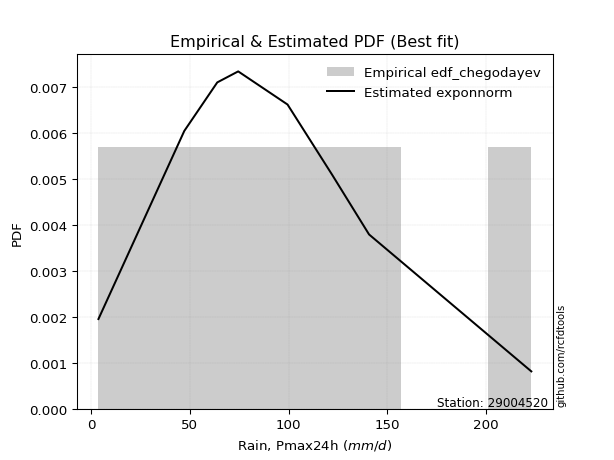</img>

</div>


### 6. EDF Blom (1958)

The Blom formula is a specific "plotting position" formula used in hydrology and statistical analysis to estimate the empirical cumulative probability (or non-exceedance probability) of a data series. It is particularly recommended for data that are approximately normally distributed. The constant _a_ is set to 0.375 (or 3/8).

<div align="center">


$P=(m-a)/(n+1-2a)$


</div>


**6.1. Empirical values**

<div align="center">

|                | 0                   | 1                   | 2                   | 3                  | 4        | 5                  | 6                  | 7                  | 8                  |
|:---------------|:--------------------|:--------------------|:--------------------|:-------------------|:---------|:-------------------|:-------------------|:-------------------|:-------------------|
| date           | 2023                | 2021                | 2018                | 2017               | 2025     | 2020               | 2019               | 2024               | 2022               |
| x              | 3.7                 | 47.2                | 63.9                | 74.5               | 80.5     | 99.5               | 122.1              | 140.8              | 223.0              |
| m              | 1                   | 2                   | 3                   | 4                  | 5        | 6                  | 7                  | 8                  | 9                  |
| empirical_dist | edf_blom            | edf_blom            | edf_blom            | edf_blom           | edf_blom | edf_blom           | edf_blom           | edf_blom           | edf_blom           |
| empirical      | 0.06756756756756757 | 0.17567567567567569 | 0.28378378378378377 | 0.3918918918918919 | 0.5      | 0.6081081081081081 | 0.7162162162162162 | 0.8243243243243243 | 0.9324324324324325 |
| empirical_tr   | 1.072463768115942   | 1.2131147540983607  | 1.3962264150943395  | 1.6444444444444444 | 2.0      | 2.5517241379310347 | 3.523809523809524  | 5.6923076923076925 | 14.800000000000006 |

</div>


**6.2. Kolmogorov-Smirnov fit test (sorted by Δ)**


<div align="center">

|                | 0                   | 1                    | 2                   | 3                   | 4                    | 5                    | 6                   | 7                    | 8                    | 9                    | 10                  | 11                   | 12                  | 13                  | 14                  | 15                  | 16                  | 17                  | 18                   | 19                  | 20                   | 21                  | 22                  | 23                  | 24                  | 25                  | 26                  | 27                  | 28                  | 29                  | 30                  | 31                  | 32                  | 33                  | 34                  | 35                  | 36                  | 37                  | 38                  | 39                  | 40                  | 41                  | 42                  | 43                  | 44                  | 45                  | 46                  | 47                  | 48                  | 49                  | 50                  | 51                  | 52                  | 53                  | 54                  | 55                  | 56                  | 57                  | 58                  | 59                  | 60                  | 61                  | 62                  | 63                  | 64                  | 65                  | 66                  | 67                  | 68                  | 69                  | 70                  | 71                  | 72                  | 73                  | 74                  | 75                  | 76                  | 77                  | 78                  | 79                  | 80                  | 81                  | 82                  | 83                  | 84                  | 85                  | 86                  | 87                  | 88                  | 89                  | 90                  | 91                  | 92                  | 93                  | 94                  | 95                  | 96                  | 97                  | 98                  | 99                  | 100                 | 101                 | 102                 | 103                 | 104                 | 105                 | 106                 | 107                 | 108                 | 109                 | 110                 | 111                 | 112                 | 113                 | 114                 | 115                 | 116                 | 117                 | 118                 | 119                 | 120                 | 121                 | 122                 | 123                 | 124                 | 125                 | 126                 | 127                 | 128                 | 129                 | 130                 | 131                 | 132                 | 133                 | 134                 | 135                 | 136                 | 137                 | 138                 | 139                 | 140                 | 141                 | 142                 | 143                 | 144                 | 145                 | 146                 | 147                 | 148                 | 149                 | 150                 | 151                 | 152                 | 153                 | 154                 | 155                 | 156                 | 157                 | 158                 | 159                 |
|:---------------|:--------------------|:---------------------|:--------------------|:--------------------|:---------------------|:---------------------|:--------------------|:---------------------|:---------------------|:---------------------|:--------------------|:---------------------|:--------------------|:--------------------|:--------------------|:--------------------|:--------------------|:--------------------|:---------------------|:--------------------|:---------------------|:--------------------|:--------------------|:--------------------|:--------------------|:--------------------|:--------------------|:--------------------|:--------------------|:--------------------|:--------------------|:--------------------|:--------------------|:--------------------|:--------------------|:--------------------|:--------------------|:--------------------|:--------------------|:--------------------|:--------------------|:--------------------|:--------------------|:--------------------|:--------------------|:--------------------|:--------------------|:--------------------|:--------------------|:--------------------|:--------------------|:--------------------|:--------------------|:--------------------|:--------------------|:--------------------|:--------------------|:--------------------|:--------------------|:--------------------|:--------------------|:--------------------|:--------------------|:--------------------|:--------------------|:--------------------|:--------------------|:--------------------|:--------------------|:--------------------|:--------------------|:--------------------|:--------------------|:--------------------|:--------------------|:--------------------|:--------------------|:--------------------|:--------------------|:--------------------|:--------------------|:--------------------|:--------------------|:--------------------|:--------------------|:--------------------|:--------------------|:--------------------|:--------------------|:--------------------|:--------------------|:--------------------|:--------------------|:--------------------|:--------------------|:--------------------|:--------------------|:--------------------|:--------------------|:--------------------|:--------------------|:--------------------|:--------------------|:--------------------|:--------------------|:--------------------|:--------------------|:--------------------|:--------------------|:--------------------|:--------------------|:--------------------|:--------------------|:--------------------|:--------------------|:--------------------|:--------------------|:--------------------|:--------------------|:--------------------|:--------------------|:--------------------|:--------------------|:--------------------|:--------------------|:--------------------|:--------------------|:--------------------|:--------------------|:--------------------|:--------------------|:--------------------|:--------------------|:--------------------|:--------------------|:--------------------|:--------------------|:--------------------|:--------------------|:--------------------|:--------------------|:--------------------|:--------------------|:--------------------|:--------------------|:--------------------|:--------------------|:--------------------|:--------------------|:--------------------|:--------------------|:--------------------|:--------------------|:--------------------|:--------------------|:--------------------|:--------------------|:--------------------|:--------------------|:--------------------|
| station        | 29004520            | 29004520             | 29004520            | 29004520            | 29004520             | 29004520             | 29004520            | 29004520             | 29004520             | 29004520             | 29004520            | 29004520             | 29004520            | 29004520            | 29004520            | 29004520            | 29004520            | 29004520            | 29004520             | 29004520            | 29004520             | 29004520            | 29004520            | 29004520            | 29004520            | 29004520            | 29004520            | 29004520            | 29004520            | 29004520            | 29004520            | 29004520            | 29004520            | 29004520            | 29004520            | 29004520            | 29004520            | 29004520            | 29004520            | 29004520            | 29004520            | 29004520            | 29004520            | 29004520            | 29004520            | 29004520            | 29004520            | 29004520            | 29004520            | 29004520            | 29004520            | 29004520            | 29004520            | 29004520            | 29004520            | 29004520            | 29004520            | 29004520            | 29004520            | 29004520            | 29004520            | 29004520            | 29004520            | 29004520            | 29004520            | 29004520            | 29004520            | 29004520            | 29004520            | 29004520            | 29004520            | 29004520            | 29004520            | 29004520            | 29004520            | 29004520            | 29004520            | 29004520            | 29004520            | 29004520            | 29004520            | 29004520            | 29004520            | 29004520            | 29004520            | 29004520            | 29004520            | 29004520            | 29004520            | 29004520            | 29004520            | 29004520            | 29004520            | 29004520            | 29004520            | 29004520            | 29004520            | 29004520            | 29004520            | 29004520            | 29004520            | 29004520            | 29004520            | 29004520            | 29004520            | 29004520            | 29004520            | 29004520            | 29004520            | 29004520            | 29004520            | 29004520            | 29004520            | 29004520            | 29004520            | 29004520            | 29004520            | 29004520            | 29004520            | 29004520            | 29004520            | 29004520            | 29004520            | 29004520            | 29004520            | 29004520            | 29004520            | 29004520            | 29004520            | 29004520            | 29004520            | 29004520            | 29004520            | 29004520            | 29004520            | 29004520            | 29004520            | 29004520            | 29004520            | 29004520            | 29004520            | 29004520            | 29004520            | 29004520            | 29004520            | 29004520            | 29004520            | 29004520            | 29004520            | 29004520            | 29004520            | 29004520            | 29004520            | 29004520            | 29004520            | 29004520            | 29004520            | 29004520            | 29004520            | 29004520            |
| empirical_dist | edf_blom            | edf_blom             | edf_blom            | edf_blom            | edf_blom             | edf_blom             | edf_blom            | edf_blom             | edf_blom             | edf_blom             | edf_blom            | edf_blom             | edf_blom            | edf_blom            | edf_blom            | edf_blom            | edf_blom            | edf_blom            | edf_blom             | edf_blom            | edf_blom             | edf_blom            | edf_blom            | edf_blom            | edf_blom            | edf_blom            | edf_blom            | edf_blom            | edf_blom            | edf_blom            | edf_blom            | edf_blom            | edf_blom            | edf_blom            | edf_blom            | edf_blom            | edf_blom            | edf_blom            | edf_blom            | edf_blom            | edf_blom            | edf_blom            | edf_blom            | edf_blom            | edf_blom            | edf_blom            | edf_blom            | edf_blom            | edf_blom            | edf_blom            | edf_blom            | edf_blom            | edf_blom            | edf_blom            | edf_blom            | edf_blom            | edf_blom            | edf_blom            | edf_blom            | edf_blom            | edf_blom            | edf_blom            | edf_blom            | edf_blom            | edf_blom            | edf_blom            | edf_blom            | edf_blom            | edf_blom            | edf_blom            | edf_blom            | edf_blom            | edf_blom            | edf_blom            | edf_blom            | edf_blom            | edf_blom            | edf_blom            | edf_blom            | edf_blom            | edf_blom            | edf_blom            | edf_blom            | edf_blom            | edf_blom            | edf_blom            | edf_blom            | edf_blom            | edf_blom            | edf_blom            | edf_blom            | edf_blom            | edf_blom            | edf_blom            | edf_blom            | edf_blom            | edf_blom            | edf_blom            | edf_blom            | edf_blom            | edf_blom            | edf_blom            | edf_blom            | edf_blom            | edf_blom            | edf_blom            | edf_blom            | edf_blom            | edf_blom            | edf_blom            | edf_blom            | edf_blom            | edf_blom            | edf_blom            | edf_blom            | edf_blom            | edf_blom            | edf_blom            | edf_blom            | edf_blom            | edf_blom            | edf_blom            | edf_blom            | edf_blom            | edf_blom            | edf_blom            | edf_blom            | edf_blom            | edf_blom            | edf_blom            | edf_blom            | edf_blom            | edf_blom            | edf_blom            | edf_blom            | edf_blom            | edf_blom            | edf_blom            | edf_blom            | edf_blom            | edf_blom            | edf_blom            | edf_blom            | edf_blom            | edf_blom            | edf_blom            | edf_blom            | edf_blom            | edf_blom            | edf_blom            | edf_blom            | edf_blom            | edf_blom            | edf_blom            | edf_blom            | edf_blom            | edf_blom            | edf_blom            | edf_blom            | edf_blom            |
| p_dist         | logcrystalball      | exponnorm            | gengamma            | fatiguelife         | invgauss             | genlogistic          | johnsonsu           | betaprime            | invgamma             | f                    | erlang              | gamma                | gumbel_r            | exponweib           | logjohnsonsu        | pearson3            | rayleigh            | rice                | nct                  | invweibull          | skewnorm             | dgamma              | maxwell             | burr12              | weibull_min         | moyal               | dweibull            | kstwobign           | foldnorm            | logt                | halflogistic        | anglit              | semicircular        | logdweibull         | halfnorm            | logjohnsonsb        | gennorm             | t                   | loggenlogistic      | genpareto           | logburr12           | crystalball         | norm                | logexponpow         | logloggamma         | kappa3              | logargus            | logmielke           | logpearson3         | logdgamma           | logistic            | loggompertz         | logloglaplace       | truncexpon          | wald                | hypsecant           | gausshyper          | cosine              | bradford            | loggumbel_l         | arcsine             | logweibull_max      | laplace             | burr                | logburr             | loggennorm          | truncweibull_min    | gumbel_l            | logskewnorm         | kappa4              | loggenextreme       | logvonmises_line    | lognakagami         | logtrapezoid        | loglaplace          | loglaplace          | logfoldnorm         | vonmises_line       | logf                | loghypsecant        | uniform             | wrapcauchy          | loglogistic         | lomax               | logrice             | lognorm             | logexponnorm        | lognct              | genexpon            | logfatiguelife      | mielke              | logbetaprime        | loggamma            | loggamma            | loganglit           | ksone               | argus               | beta                | logerlang           | loginvgamma         | logsemicircular     | logalpha            | loginvgauss         | logmaxwell          | loggausshyper       | logncf              | lograyleigh         | logarcsine          | loglevy_l           | ncf                 | loginvweibull       | nakagami            | logtriang           | loggumbel_r         | loggenpareto        | loghalfnorm         | loggenhalflogistic  | logmoyal            | loghalflogistic     | halfgennorm         | logcosine           | johnsonsb           | logkstwobign        | loggenexpon         | logtruncweibull_min | genhalflogistic     | loghalfgennorm      | levy_l              | logwald             | triang              | logwrapcauchy       | logtruncnorm        | loglomax            | logbeta             | logksone            | logkappa4           | logkappa3           | logtukeylambda      | loguniform          | trapezoid           | logtruncexpon       | logbradford         | rdist               | genextreme          | powerlaw            | loggengamma         | tukeylambda         | logweibull_min      | logrdist            | logexponweib        | alpha               | weibull_max         | logpowerlaw         | truncpareto         | exponpow            | logtruncpareto      | gompertz            | truncnorm           | logvonmises         | vonmises            |
| delta          | 0.03030018314779892 | 0.048160223933952806 | 0.04839915277973983 | 0.04897149006307744 | 0.049047668303059455 | 0.049420565863060706 | 0.04955052931618681 | 0.049857609638213174 | 0.050162480779447904 | 0.050259917080770655 | 0.05030032707404275 | 0.050300372641661484 | 0.05051452952183249 | 0.05079091876372238 | 0.05349864925095826 | 0.05386986554383344 | 0.05452265951265192 | 0.05457472453368789 | 0.055160934935096106 | 0.05712154055097429 | 0.058301392806423824 | 0.05859060184027687 | 0.06294035033774259 | 0.0630348397354406  | 0.06376605840816629 | 0.0643529710409604  | 0.06601654706971011 | 0.06717650680946136 | 0.07568293041387522 | 0.07852440278251344 | 0.0834948214512049  | 0.08357649363878283 | 0.08414725317223248 | 0.08415412266366706 | 0.08537294167458792 | 0.09085356394108554 | 0.09473752901870958 | 0.09509804913708847 | 0.09550330596318682 | 0.09678045897788201 | 0.09695620672796906 | 0.09702250877081481 | 0.0970225177554983  | 0.09883297937694299 | 0.09956620809299918 | 0.10159117429451867 | 0.10479994806647183 | 0.10509550050765695 | 0.10629979597886721 | 0.10810810810847926 | 0.10958202801902822 | 0.11189449198519785 | 0.11525337437188643 | 0.1177737086190318  | 0.11979192459180202 | 0.1198847389913697  | 0.12478849903547898 | 0.12771446635019473 | 0.13331279635405913 | 0.1387741432309927  | 0.13988701777879575 | 0.1449257468333142  | 0.14673806906322662 | 0.14876820959658568 | 0.15003024760105033 | 0.15097609853098592 | 0.15699173165938718 | 0.16383332278968427 | 0.16839997172440277 | 0.1714697793705694  | 0.17253489678590084 | 0.17567563951422133 | 0.1756756756749011  | 0.1768390568698641  | 0.19117098341261013 | 0.19117098341261013 | 0.19185434355097453 | 0.19505516899719072 | 0.1977679201694171  | 0.19805748596585293 | 0.19915332569231337 | 0.19915775507773392 | 0.1997450919240769  | 0.20151409213630875 | 0.20281125940939757 | 0.2028154115557916  | 0.20281543043810876 | 0.20314471568162076 | 0.2034746612152948  | 0.20475824069849566 | 0.208628027788467   | 0.21581836041630795 | 0.21855437500067085 | 0.21855437500067085 | 0.21933105827814334 | 0.22001515879764855 | 0.22149929392841572 | 0.22174219925023164 | 0.22328310535632176 | 0.2248891683511822  | 0.22621666027063383 | 0.22759994835469952 | 0.22811673726223305 | 0.23616397984151646 | 0.23937799069486107 | 0.2396349902244498  | 0.24844492713810826 | 0.2541056479186994  | 0.2544289441995178  | 0.26171083237203563 | 0.2617294996616484  | 0.26776428834926747 | 0.27055167293914106 | 0.2715170936446113  | 0.28022013015207015 | 0.28335129863657316 | 0.29207265348823475 | 0.2973966306993032  | 0.30244439075768137 | 0.30896278109624087 | 0.3093416128036448  | 0.3108944147602636  | 0.31368637179072556 | 0.33919953151030935 | 0.3478864062731034  | 0.34862722037951493 | 0.3543965281144148  | 0.3597743230409134  | 0.36941301681000505 | 0.387213091506445   | 0.40130589397764027 | 0.40260222603405993 | 0.4054702208646519  | 0.4106982854416012  | 0.4252963318601528  | 0.43134310549217014 | 0.4448691204799802  | 0.4449013639049839  | 0.4454907333673185  | 0.4549365019358331  | 0.5126007092163778  | 0.5138385536889878  | 0.5194089799132515  | 0.5345802839152779  | 0.5614979957448886  | 0.5914719851236135  | 0.5968396594240433  | 0.6087841270765869  | 0.6099058241115612  | 0.6199824803208852  | 0.6387816770949586  | 0.6979268777424112  | 0.7212355664748762  | 0.7322476111715948  | 0.7797124658672163  | 0.7960966741999413  | 0.8225662445737713  | 0.9316402987852155  | 1.017730744350191   | 35.427242712272644  |
| deltao         | 0.41761268023100007 | 0.41761268023100007  | 0.41761268023100007 | 0.41761268023100007 | 0.41761268023100007  | 0.41761268023100007  | 0.41761268023100007 | 0.41761268023100007  | 0.41761268023100007  | 0.41761268023100007  | 0.41761268023100007 | 0.41761268023100007  | 0.41761268023100007 | 0.41761268023100007 | 0.41761268023100007 | 0.41761268023100007 | 0.41761268023100007 | 0.41761268023100007 | 0.41761268023100007  | 0.41761268023100007 | 0.41761268023100007  | 0.41761268023100007 | 0.41761268023100007 | 0.41761268023100007 | 0.41761268023100007 | 0.41761268023100007 | 0.41761268023100007 | 0.41761268023100007 | 0.41761268023100007 | 0.41761268023100007 | 0.41761268023100007 | 0.41761268023100007 | 0.41761268023100007 | 0.41761268023100007 | 0.41761268023100007 | 0.41761268023100007 | 0.41761268023100007 | 0.41761268023100007 | 0.41761268023100007 | 0.41761268023100007 | 0.41761268023100007 | 0.41761268023100007 | 0.41761268023100007 | 0.41761268023100007 | 0.41761268023100007 | 0.41761268023100007 | 0.41761268023100007 | 0.41761268023100007 | 0.41761268023100007 | 0.41761268023100007 | 0.41761268023100007 | 0.41761268023100007 | 0.41761268023100007 | 0.41761268023100007 | 0.41761268023100007 | 0.41761268023100007 | 0.41761268023100007 | 0.41761268023100007 | 0.41761268023100007 | 0.41761268023100007 | 0.41761268023100007 | 0.41761268023100007 | 0.41761268023100007 | 0.41761268023100007 | 0.41761268023100007 | 0.41761268023100007 | 0.41761268023100007 | 0.41761268023100007 | 0.41761268023100007 | 0.41761268023100007 | 0.41761268023100007 | 0.41761268023100007 | 0.41761268023100007 | 0.41761268023100007 | 0.41761268023100007 | 0.41761268023100007 | 0.41761268023100007 | 0.41761268023100007 | 0.41761268023100007 | 0.41761268023100007 | 0.41761268023100007 | 0.41761268023100007 | 0.41761268023100007 | 0.41761268023100007 | 0.41761268023100007 | 0.41761268023100007 | 0.41761268023100007 | 0.41761268023100007 | 0.41761268023100007 | 0.41761268023100007 | 0.41761268023100007 | 0.41761268023100007 | 0.41761268023100007 | 0.41761268023100007 | 0.41761268023100007 | 0.41761268023100007 | 0.41761268023100007 | 0.41761268023100007 | 0.41761268023100007 | 0.41761268023100007 | 0.41761268023100007 | 0.41761268023100007 | 0.41761268023100007 | 0.41761268023100007 | 0.41761268023100007 | 0.41761268023100007 | 0.41761268023100007 | 0.41761268023100007 | 0.41761268023100007 | 0.41761268023100007 | 0.41761268023100007 | 0.41761268023100007 | 0.41761268023100007 | 0.41761268023100007 | 0.41761268023100007 | 0.41761268023100007 | 0.41761268023100007 | 0.41761268023100007 | 0.41761268023100007 | 0.41761268023100007 | 0.41761268023100007 | 0.41761268023100007 | 0.41761268023100007 | 0.41761268023100007 | 0.41761268023100007 | 0.41761268023100007 | 0.41761268023100007 | 0.41761268023100007 | 0.41761268023100007 | 0.41761268023100007 | 0.41761268023100007 | 0.41761268023100007 | 0.41761268023100007 | 0.41761268023100007 | 0.41761268023100007 | 0.41761268023100007 | 0.41761268023100007 | 0.41761268023100007 | 0.41761268023100007 | 0.41761268023100007 | 0.41761268023100007 | 0.41761268023100007 | 0.41761268023100007 | 0.41761268023100007 | 0.41761268023100007 | 0.41761268023100007 | 0.41761268023100007 | 0.41761268023100007 | 0.41761268023100007 | 0.41761268023100007 | 0.41761268023100007 | 0.41761268023100007 | 0.41761268023100007 | 0.41761268023100007 | 0.41761268023100007 | 0.41761268023100007 | 0.41761268023100007 | 0.41761268023100007 | 0.41761268023100007 | 0.41761268023100007 |
| eval           | Δo > Δ              | Δo > Δ               | Δo > Δ              | Δo > Δ              | Δo > Δ               | Δo > Δ               | Δo > Δ              | Δo > Δ               | Δo > Δ               | Δo > Δ               | Δo > Δ              | Δo > Δ               | Δo > Δ              | Δo > Δ              | Δo > Δ              | Δo > Δ              | Δo > Δ              | Δo > Δ              | Δo > Δ               | Δo > Δ              | Δo > Δ               | Δo > Δ              | Δo > Δ              | Δo > Δ              | Δo > Δ              | Δo > Δ              | Δo > Δ              | Δo > Δ              | Δo > Δ              | Δo > Δ              | Δo > Δ              | Δo > Δ              | Δo > Δ              | Δo > Δ              | Δo > Δ              | Δo > Δ              | Δo > Δ              | Δo > Δ              | Δo > Δ              | Δo > Δ              | Δo > Δ              | Δo > Δ              | Δo > Δ              | Δo > Δ              | Δo > Δ              | Δo > Δ              | Δo > Δ              | Δo > Δ              | Δo > Δ              | Δo > Δ              | Δo > Δ              | Δo > Δ              | Δo > Δ              | Δo > Δ              | Δo > Δ              | Δo > Δ              | Δo > Δ              | Δo > Δ              | Δo > Δ              | Δo > Δ              | Δo > Δ              | Δo > Δ              | Δo > Δ              | Δo > Δ              | Δo > Δ              | Δo > Δ              | Δo > Δ              | Δo > Δ              | Δo > Δ              | Δo > Δ              | Δo > Δ              | Δo > Δ              | Δo > Δ              | Δo > Δ              | Δo > Δ              | Δo > Δ              | Δo > Δ              | Δo > Δ              | Δo > Δ              | Δo > Δ              | Δo > Δ              | Δo > Δ              | Δo > Δ              | Δo > Δ              | Δo > Δ              | Δo > Δ              | Δo > Δ              | Δo > Δ              | Δo > Δ              | Δo > Δ              | Δo > Δ              | Δo > Δ              | Δo > Δ              | Δo > Δ              | Δo > Δ              | Δo > Δ              | Δo > Δ              | Δo > Δ              | Δo > Δ              | Δo > Δ              | Δo > Δ              | Δo > Δ              | Δo > Δ              | Δo > Δ              | Δo > Δ              | Δo > Δ              | Δo > Δ              | Δo > Δ              | Δo > Δ              | Δo > Δ              | Δo > Δ              | Δo > Δ              | Δo > Δ              | Δo > Δ              | Δo > Δ              | Δo > Δ              | Δo > Δ              | Δo > Δ              | Δo > Δ              | Δo > Δ              | Δo > Δ              | Δo > Δ              | Δo > Δ              | Δo > Δ              | Δo > Δ              | Δo > Δ              | Δo > Δ              | Δo > Δ              | Δo > Δ              | Δo > Δ              | Δo > Δ              | Δo > Δ              | Δo > Δ              | Δo > Δ              | Δo <= Δ             | Δo <= Δ             | Δo <= Δ             | Δo <= Δ             | Δo <= Δ             | Δo <= Δ             | Δo <= Δ             | Δo <= Δ             | Δo <= Δ             | Δo <= Δ             | Δo <= Δ             | Δo <= Δ             | Δo <= Δ             | Δo <= Δ             | Δo <= Δ             | Δo <= Δ             | Δo <= Δ             | Δo <= Δ             | Δo <= Δ             | Δo <= Δ             | Δo <= Δ             | Δo <= Δ             | Δo <= Δ             | Δo <= Δ             | Δo <= Δ             | Δo <= Δ             |
| fit            | 1                   | 1                    | 1                   | 1                   | 1                    | 1                    | 1                   | 1                    | 1                    | 1                    | 1                   | 1                    | 1                   | 1                   | 1                   | 1                   | 1                   | 1                   | 1                    | 1                   | 1                    | 1                   | 1                   | 1                   | 1                   | 1                   | 1                   | 1                   | 1                   | 1                   | 1                   | 1                   | 1                   | 1                   | 1                   | 1                   | 1                   | 1                   | 1                   | 1                   | 1                   | 1                   | 1                   | 1                   | 1                   | 1                   | 1                   | 1                   | 1                   | 1                   | 1                   | 1                   | 1                   | 1                   | 1                   | 1                   | 1                   | 1                   | 1                   | 1                   | 1                   | 1                   | 1                   | 1                   | 1                   | 1                   | 1                   | 1                   | 1                   | 1                   | 1                   | 1                   | 1                   | 1                   | 1                   | 1                   | 1                   | 1                   | 1                   | 1                   | 1                   | 1                   | 1                   | 1                   | 1                   | 1                   | 1                   | 1                   | 1                   | 1                   | 1                   | 1                   | 1                   | 1                   | 1                   | 1                   | 1                   | 1                   | 1                   | 1                   | 1                   | 1                   | 1                   | 1                   | 1                   | 1                   | 1                   | 1                   | 1                   | 1                   | 1                   | 1                   | 1                   | 1                   | 1                   | 1                   | 1                   | 1                   | 1                   | 1                   | 1                   | 1                   | 1                   | 1                   | 1                   | 1                   | 1                   | 1                   | 1                   | 1                   | 1                   | 1                   | 1                   | 1                   | 0                   | 0                   | 0                   | 0                   | 0                   | 0                   | 0                   | 0                   | 0                   | 0                   | 0                   | 0                   | 0                   | 0                   | 0                   | 0                   | 0                   | 0                   | 0                   | 0                   | 0                   | 0                   | 0                   | 0                   | 0                   | 0                   |
| n              | 9                   | 9                    | 9                   | 9                   | 9                    | 9                    | 9                   | 9                    | 9                    | 9                    | 9                   | 9                    | 9                   | 9                   | 9                   | 9                   | 9                   | 9                   | 9                    | 9                   | 9                    | 9                   | 9                   | 9                   | 9                   | 9                   | 9                   | 9                   | 9                   | 9                   | 9                   | 9                   | 9                   | 9                   | 9                   | 9                   | 9                   | 9                   | 9                   | 9                   | 9                   | 9                   | 9                   | 9                   | 9                   | 9                   | 9                   | 9                   | 9                   | 9                   | 9                   | 9                   | 9                   | 9                   | 9                   | 9                   | 9                   | 9                   | 9                   | 9                   | 9                   | 9                   | 9                   | 9                   | 9                   | 9                   | 9                   | 9                   | 9                   | 9                   | 9                   | 9                   | 9                   | 9                   | 9                   | 9                   | 9                   | 9                   | 9                   | 9                   | 9                   | 9                   | 9                   | 9                   | 9                   | 9                   | 9                   | 9                   | 9                   | 9                   | 9                   | 9                   | 9                   | 9                   | 9                   | 9                   | 9                   | 9                   | 9                   | 9                   | 9                   | 9                   | 9                   | 9                   | 9                   | 9                   | 9                   | 9                   | 9                   | 9                   | 9                   | 9                   | 9                   | 9                   | 9                   | 9                   | 9                   | 9                   | 9                   | 9                   | 9                   | 9                   | 9                   | 9                   | 9                   | 9                   | 9                   | 9                   | 9                   | 9                   | 9                   | 9                   | 9                   | 9                   | 9                   | 9                   | 9                   | 9                   | 9                   | 9                   | 9                   | 9                   | 9                   | 9                   | 9                   | 9                   | 9                   | 9                   | 9                   | 9                   | 9                   | 9                   | 9                   | 9                   | 9                   | 9                   | 9                   | 9                   | 9                   | 9                   |
| best_fit       | 1                   | 0                    | 0                   | 0                   | 0                    | 0                    | 0                   | 0                    | 0                    | 0                    | 0                   | 0                    | 0                   | 0                   | 0                   | 0                   | 0                   | 0                   | 0                    | 0                   | 0                    | 0                   | 0                   | 0                   | 0                   | 0                   | 0                   | 0                   | 0                   | 0                   | 0                   | 0                   | 0                   | 0                   | 0                   | 0                   | 0                   | 0                   | 0                   | 0                   | 0                   | 0                   | 0                   | 0                   | 0                   | 0                   | 0                   | 0                   | 0                   | 0                   | 0                   | 0                   | 0                   | 0                   | 0                   | 0                   | 0                   | 0                   | 0                   | 0                   | 0                   | 0                   | 0                   | 0                   | 0                   | 0                   | 0                   | 0                   | 0                   | 0                   | 0                   | 0                   | 0                   | 0                   | 0                   | 0                   | 0                   | 0                   | 0                   | 0                   | 0                   | 0                   | 0                   | 0                   | 0                   | 0                   | 0                   | 0                   | 0                   | 0                   | 0                   | 0                   | 0                   | 0                   | 0                   | 0                   | 0                   | 0                   | 0                   | 0                   | 0                   | 0                   | 0                   | 0                   | 0                   | 0                   | 0                   | 0                   | 0                   | 0                   | 0                   | 0                   | 0                   | 0                   | 0                   | 0                   | 0                   | 0                   | 0                   | 0                   | 0                   | 0                   | 0                   | 0                   | 0                   | 0                   | 0                   | 0                   | 0                   | 0                   | 0                   | 0                   | 0                   | 0                   | 0                   | 0                   | 0                   | 0                   | 0                   | 0                   | 0                   | 0                   | 0                   | 0                   | 0                   | 0                   | 0                   | 0                   | 0                   | 0                   | 0                   | 0                   | 0                   | 0                   | 0                   | 0                   | 0                   | 0                   | 0                   | 0                   |
| best_fit_sort  | 1                   | 2                    | 3                   | 4                   | 5                    | 6                    | 7                   | 8                    | 9                    | 10                   | 11                  | 12                   | 13                  | 14                  | 15                  | 16                  | 17                  | 18                  | 19                   | 20                  | 21                   | 22                  | 23                  | 24                  | 25                  | 26                  | 27                  | 28                  | 29                  | 30                  | 31                  | 32                  | 33                  | 34                  | 35                  | 36                  | 37                  | 38                  | 39                  | 40                  | 41                  | 42                  | 43                  | 44                  | 45                  | 46                  | 47                  | 48                  | 49                  | 50                  | 51                  | 52                  | 53                  | 54                  | 55                  | 56                  | 57                  | 58                  | 59                  | 60                  | 61                  | 62                  | 63                  | 64                  | 65                  | 66                  | 67                  | 68                  | 69                  | 70                  | 71                  | 72                  | 73                  | 74                  | 75                  | 76                  | 77                  | 78                  | 79                  | 80                  | 81                  | 82                  | 83                  | 84                  | 85                  | 86                  | 87                  | 88                  | 89                  | 90                  | 91                  | 92                  | 93                  | 94                  | 95                  | 96                  | 97                  | 98                  | 99                  | 100                 | 101                 | 102                 | 103                 | 104                 | 105                 | 106                 | 107                 | 108                 | 109                 | 110                 | 111                 | 112                 | 113                 | 114                 | 115                 | 116                 | 117                 | 118                 | 119                 | 120                 | 121                 | 122                 | 123                 | 124                 | 125                 | 126                 | 127                 | 128                 | 129                 | 130                 | 131                 | 132                 | 133                 | 134                 | 135                 | 136                 | 137                 | 138                 | 139                 | 140                 | 141                 | 142                 | 143                 | 144                 | 145                 | 146                 | 147                 | 148                 | 149                 | 150                 | 151                 | 152                 | 153                 | 154                 | 155                 | 156                 | 157                 | 158                 | 159                 | 160                 |

</div>


**6.3. Best fit**

<div align="center">

|   id |   station | empirical_dist   | p_dist         |     delta |   deltao | eval   |   fit |   n |   best_fit |   best_fit_sort |
|-----:|----------:|:-----------------|:---------------|----------:|---------:|:-------|------:|----:|-----------:|----------------:|
|    0 |  29004520 | edf_blom         | logcrystalball | 0.0303002 | 0.417613 | Δo > Δ |     1 |   9 |          1 |               1 |

</div>


<div align="center">

</img></img>

</div>


### 7. EDF Tukey (1962)

In hydrology, the Tukey formula is used as a plotting position formula to estimate the empirical probability or frequency of a flood event (or other hydrological data). The formula parameter is given as _c=0.333_ (or 1/3).

<div align="center">


$P=(m-c)/(n+1-2c)$


</div>


**7.1. Empirical values**

<div align="center">

|                | 0                   | 1                   | 2                  | 3                   | 4         | 5                  | 6                  | 7                  | 8                  |
|:---------------|:--------------------|:--------------------|:-------------------|:--------------------|:----------|:-------------------|:-------------------|:-------------------|:-------------------|
| date           | 2023                | 2021                | 2018               | 2017                | 2025      | 2020               | 2019               | 2024               | 2022               |
| x              | 3.7                 | 47.2                | 63.9               | 74.5                | 80.5      | 99.5               | 122.1              | 140.8              | 223.0              |
| m              | 1                   | 2                   | 3                  | 4                   | 5         | 6                  | 7                  | 8                  | 9                  |
| empirical_dist | edf_tukey           | edf_tukey           | edf_tukey          | edf_tukey           | edf_tukey | edf_tukey          | edf_tukey          | edf_tukey          | edf_tukey          |
| empirical      | 0.07142857142857142 | 0.17857142857142858 | 0.2857142857142857 | 0.39285714285714285 | 0.5       | 0.6071428571428571 | 0.7142857142857143 | 0.8214285714285714 | 0.9285714285714286 |
| empirical_tr   | 1.0769230769230769  | 1.2173913043478262  | 1.4                | 1.6470588235294117  | 2.0       | 2.545454545454545  | 3.5                | 5.599999999999999  | 14.000000000000007 |

</div>


**7.2. Kolmogorov-Smirnov fit test (sorted by Δ)**


<div align="center">

|                | 0                    | 1                   | 2                    | 3                   | 4                   | 5                   | 6                   | 7                   | 8                    | 9                    | 10                  | 11                   | 12                  | 13                  | 14                  | 15                  | 16                  | 17                  | 18                   | 19                   | 20                  | 21                   | 22                  | 23                   | 24                  | 25                  | 26                  | 27                  | 28                  | 29                  | 30                  | 31                  | 32                  | 33                  | 34                  | 35                  | 36                  | 37                  | 38                  | 39                  | 40                  | 41                  | 42                  | 43                  | 44                  | 45                  | 46                  | 47                  | 48                  | 49                  | 50                  | 51                  | 52                  | 53                  | 54                  | 55                  | 56                  | 57                  | 58                  | 59                  | 60                  | 61                  | 62                  | 63                  | 64                  | 65                  | 66                  | 67                  | 68                  | 69                  | 70                  | 71                  | 72                  | 73                  | 74                  | 75                  | 76                  | 77                  | 78                  | 79                  | 80                  | 81                  | 82                  | 83                  | 84                  | 85                  | 86                  | 87                  | 88                  | 89                  | 90                  | 91                  | 92                  | 93                  | 94                  | 95                  | 96                  | 97                  | 98                  | 99                  | 100                 | 101                 | 102                 | 103                 | 104                 | 105                 | 106                 | 107                 | 108                 | 109                 | 110                 | 111                 | 112                 | 113                 | 114                 | 115                 | 116                 | 117                 | 118                 | 119                 | 120                 | 121                 | 122                 | 123                 | 124                 | 125                 | 126                 | 127                 | 128                 | 129                 | 130                 | 131                 | 132                 | 133                 | 134                 | 135                 | 136                 | 137                 | 138                 | 139                 | 140                 | 141                 | 142                 | 143                 | 144                 | 145                 | 146                 | 147                 | 148                 | 149                 | 150                 | 151                 | 152                 | 153                 | 154                 | 155                 | 156                 | 157                 | 158                 | 159                 |
|:---------------|:---------------------|:--------------------|:---------------------|:--------------------|:--------------------|:--------------------|:--------------------|:--------------------|:---------------------|:---------------------|:--------------------|:---------------------|:--------------------|:--------------------|:--------------------|:--------------------|:--------------------|:--------------------|:---------------------|:---------------------|:--------------------|:---------------------|:--------------------|:---------------------|:--------------------|:--------------------|:--------------------|:--------------------|:--------------------|:--------------------|:--------------------|:--------------------|:--------------------|:--------------------|:--------------------|:--------------------|:--------------------|:--------------------|:--------------------|:--------------------|:--------------------|:--------------------|:--------------------|:--------------------|:--------------------|:--------------------|:--------------------|:--------------------|:--------------------|:--------------------|:--------------------|:--------------------|:--------------------|:--------------------|:--------------------|:--------------------|:--------------------|:--------------------|:--------------------|:--------------------|:--------------------|:--------------------|:--------------------|:--------------------|:--------------------|:--------------------|:--------------------|:--------------------|:--------------------|:--------------------|:--------------------|:--------------------|:--------------------|:--------------------|:--------------------|:--------------------|:--------------------|:--------------------|:--------------------|:--------------------|:--------------------|:--------------------|:--------------------|:--------------------|:--------------------|:--------------------|:--------------------|:--------------------|:--------------------|:--------------------|:--------------------|:--------------------|:--------------------|:--------------------|:--------------------|:--------------------|:--------------------|:--------------------|:--------------------|:--------------------|:--------------------|:--------------------|:--------------------|:--------------------|:--------------------|:--------------------|:--------------------|:--------------------|:--------------------|:--------------------|:--------------------|:--------------------|:--------------------|:--------------------|:--------------------|:--------------------|:--------------------|:--------------------|:--------------------|:--------------------|:--------------------|:--------------------|:--------------------|:--------------------|:--------------------|:--------------------|:--------------------|:--------------------|:--------------------|:--------------------|:--------------------|:--------------------|:--------------------|:--------------------|:--------------------|:--------------------|:--------------------|:--------------------|:--------------------|:--------------------|:--------------------|:--------------------|:--------------------|:--------------------|:--------------------|:--------------------|:--------------------|:--------------------|:--------------------|:--------------------|:--------------------|:--------------------|:--------------------|:--------------------|:--------------------|:--------------------|:--------------------|:--------------------|:--------------------|:--------------------|
| station        | 29004520             | 29004520            | 29004520             | 29004520            | 29004520            | 29004520            | 29004520            | 29004520            | 29004520             | 29004520             | 29004520            | 29004520             | 29004520            | 29004520            | 29004520            | 29004520            | 29004520            | 29004520            | 29004520             | 29004520             | 29004520            | 29004520             | 29004520            | 29004520             | 29004520            | 29004520            | 29004520            | 29004520            | 29004520            | 29004520            | 29004520            | 29004520            | 29004520            | 29004520            | 29004520            | 29004520            | 29004520            | 29004520            | 29004520            | 29004520            | 29004520            | 29004520            | 29004520            | 29004520            | 29004520            | 29004520            | 29004520            | 29004520            | 29004520            | 29004520            | 29004520            | 29004520            | 29004520            | 29004520            | 29004520            | 29004520            | 29004520            | 29004520            | 29004520            | 29004520            | 29004520            | 29004520            | 29004520            | 29004520            | 29004520            | 29004520            | 29004520            | 29004520            | 29004520            | 29004520            | 29004520            | 29004520            | 29004520            | 29004520            | 29004520            | 29004520            | 29004520            | 29004520            | 29004520            | 29004520            | 29004520            | 29004520            | 29004520            | 29004520            | 29004520            | 29004520            | 29004520            | 29004520            | 29004520            | 29004520            | 29004520            | 29004520            | 29004520            | 29004520            | 29004520            | 29004520            | 29004520            | 29004520            | 29004520            | 29004520            | 29004520            | 29004520            | 29004520            | 29004520            | 29004520            | 29004520            | 29004520            | 29004520            | 29004520            | 29004520            | 29004520            | 29004520            | 29004520            | 29004520            | 29004520            | 29004520            | 29004520            | 29004520            | 29004520            | 29004520            | 29004520            | 29004520            | 29004520            | 29004520            | 29004520            | 29004520            | 29004520            | 29004520            | 29004520            | 29004520            | 29004520            | 29004520            | 29004520            | 29004520            | 29004520            | 29004520            | 29004520            | 29004520            | 29004520            | 29004520            | 29004520            | 29004520            | 29004520            | 29004520            | 29004520            | 29004520            | 29004520            | 29004520            | 29004520            | 29004520            | 29004520            | 29004520            | 29004520            | 29004520            | 29004520            | 29004520            | 29004520            | 29004520            | 29004520            | 29004520            |
| empirical_dist | edf_tukey            | edf_tukey           | edf_tukey            | edf_tukey           | edf_tukey           | edf_tukey           | edf_tukey           | edf_tukey           | edf_tukey            | edf_tukey            | edf_tukey           | edf_tukey            | edf_tukey           | edf_tukey           | edf_tukey           | edf_tukey           | edf_tukey           | edf_tukey           | edf_tukey            | edf_tukey            | edf_tukey           | edf_tukey            | edf_tukey           | edf_tukey            | edf_tukey           | edf_tukey           | edf_tukey           | edf_tukey           | edf_tukey           | edf_tukey           | edf_tukey           | edf_tukey           | edf_tukey           | edf_tukey           | edf_tukey           | edf_tukey           | edf_tukey           | edf_tukey           | edf_tukey           | edf_tukey           | edf_tukey           | edf_tukey           | edf_tukey           | edf_tukey           | edf_tukey           | edf_tukey           | edf_tukey           | edf_tukey           | edf_tukey           | edf_tukey           | edf_tukey           | edf_tukey           | edf_tukey           | edf_tukey           | edf_tukey           | edf_tukey           | edf_tukey           | edf_tukey           | edf_tukey           | edf_tukey           | edf_tukey           | edf_tukey           | edf_tukey           | edf_tukey           | edf_tukey           | edf_tukey           | edf_tukey           | edf_tukey           | edf_tukey           | edf_tukey           | edf_tukey           | edf_tukey           | edf_tukey           | edf_tukey           | edf_tukey           | edf_tukey           | edf_tukey           | edf_tukey           | edf_tukey           | edf_tukey           | edf_tukey           | edf_tukey           | edf_tukey           | edf_tukey           | edf_tukey           | edf_tukey           | edf_tukey           | edf_tukey           | edf_tukey           | edf_tukey           | edf_tukey           | edf_tukey           | edf_tukey           | edf_tukey           | edf_tukey           | edf_tukey           | edf_tukey           | edf_tukey           | edf_tukey           | edf_tukey           | edf_tukey           | edf_tukey           | edf_tukey           | edf_tukey           | edf_tukey           | edf_tukey           | edf_tukey           | edf_tukey           | edf_tukey           | edf_tukey           | edf_tukey           | edf_tukey           | edf_tukey           | edf_tukey           | edf_tukey           | edf_tukey           | edf_tukey           | edf_tukey           | edf_tukey           | edf_tukey           | edf_tukey           | edf_tukey           | edf_tukey           | edf_tukey           | edf_tukey           | edf_tukey           | edf_tukey           | edf_tukey           | edf_tukey           | edf_tukey           | edf_tukey           | edf_tukey           | edf_tukey           | edf_tukey           | edf_tukey           | edf_tukey           | edf_tukey           | edf_tukey           | edf_tukey           | edf_tukey           | edf_tukey           | edf_tukey           | edf_tukey           | edf_tukey           | edf_tukey           | edf_tukey           | edf_tukey           | edf_tukey           | edf_tukey           | edf_tukey           | edf_tukey           | edf_tukey           | edf_tukey           | edf_tukey           | edf_tukey           | edf_tukey           | edf_tukey           | edf_tukey           | edf_tukey           | edf_tukey           |
| p_dist         | logcrystalball       | betaprime           | exponnorm            | f                   | erlang              | gamma               | gengamma            | fatiguelife         | invgauss             | genlogistic          | johnsonsu           | invgamma             | exponweib           | rayleigh            | logjohnsonsu        | pearson3            | gumbel_r            | rice                | nct                  | invweibull           | dgamma              | skewnorm             | burr12              | weibull_min          | maxwell             | kstwobign           | dweibull            | moyal               | foldnorm            | logt                | logdweibull         | halflogistic        | semicircular        | halfnorm            | anglit              | logjohnsonsb        | loggenlogistic      | genpareto           | logburr12           | t                   | logexponpow         | gennorm             | logloggamma         | crystalball         | norm                | kappa3              | logargus            | logmielke           | logpearson3         | logdgamma           | logistic            | loggompertz         | logloglaplace       | truncexpon          | hypsecant           | gausshyper          | wald                | cosine              | bradford            | loggumbel_l         | arcsine             | logweibull_max      | burr                | laplace             | logburr             | loggennorm          | truncweibull_min    | gumbel_l            | logskewnorm         | kappa4              | loggenextreme       | logtrapezoid        | logvonmises_line    | lognakagami         | loglaplace          | loglaplace          | logfoldnorm         | logf                | vonmises_line       | loghypsecant        | uniform             | wrapcauchy          | loglogistic         | lomax               | logrice             | lognorm             | logexponnorm        | lognct              | genexpon            | logfatiguelife      | mielke              | logbetaprime        | loggamma            | loggamma            | loganglit           | ksone               | argus               | beta                | logerlang           | loginvgamma         | logsemicircular     | logalpha            | loginvgauss         | logmaxwell          | loggausshyper       | logncf              | lograyleigh         | logarcsine          | loglevy_l           | ncf                 | loginvweibull       | nakagami            | logtriang           | loggumbel_r         | loggenpareto        | loghalfnorm         | loggenhalflogistic  | logmoyal            | loghalflogistic     | halfgennorm         | logcosine           | johnsonsb           | logkstwobign        | loggenexpon         | logtruncweibull_min | genhalflogistic     | loghalfgennorm      | levy_l              | logwald             | triang              | logwrapcauchy       | logtruncnorm        | loglomax            | logbeta             | logksone            | logkappa4           | logkappa3           | logtukeylambda      | loguniform          | trapezoid           | logtruncexpon       | logbradford         | rdist               | genextreme          | powerlaw            | loggengamma         | tukeylambda         | logweibull_min      | logrdist            | logexponweib        | alpha               | weibull_max         | logpowerlaw         | truncpareto         | exponpow            | logtruncpareto      | gompertz            | truncnorm           | logvonmises         | vonmises            |
| delta          | 0.034161187008802774 | 0.04792710770771125 | 0.048160223933952806 | 0.04832941515026873 | 0.04836982514354082 | 0.04836987071115956 | 0.04839915277973983 | 0.04897149006307744 | 0.049047668303059455 | 0.049420565863060706 | 0.04955052931618681 | 0.050162480779447904 | 0.05079091876372238 | 0.05236946871721343 | 0.05349864925095826 | 0.05386986554383344 | 0.05437553338283634 | 0.05457472453368789 | 0.055160934935096106 | 0.055191038620472366 | 0.05762535087502585 | 0.058301392806423824 | 0.06110433780493868 | 0.061835556477664366 | 0.06294035033774259 | 0.06524600487895943 | 0.06601654706971011 | 0.06821397490196425 | 0.07333921576946911 | 0.07852440278251344 | 0.08029311880266321 | 0.08156431952070298 | 0.0830388546566293  | 0.083442439744086   | 0.08357649363878283 | 0.08795781104533265 | 0.09260755306743393 | 0.09388470608212907 | 0.09502570479746714 | 0.09509804913708847 | 0.0959372264811901  | 0.0966680309492115  | 0.09667045519724629 | 0.09702250877081481 | 0.0970225177554983  | 0.09869542139876578 | 0.10190419517071894 | 0.10219974761190406 | 0.10340404308311432 | 0.1071428571432283  | 0.10958202801902822 | 0.10996399005469593 | 0.11139237051088258 | 0.11487795572327886 | 0.1198847389913697  | 0.12189274613972609 | 0.12268767748755491 | 0.12771446635019473 | 0.13041704345830618 | 0.13587839033523982 | 0.1369912648830428  | 0.1420299939375613  | 0.1458724567008328  | 0.14673806906322662 | 0.14713449470529738 | 0.15194134949623694 | 0.15409597876363423 | 0.16383332278968427 | 0.16550421882864988 | 0.16857402647481645 | 0.1696391438901479  | 0.1739433039741112  | 0.17857139240997422 | 0.178571428570654   | 0.1892404814821082  | 0.1892404814821082  | 0.1899238416204726  | 0.19487216727366422 | 0.19505516899719072 | 0.196126984035351   | 0.19625757279656042 | 0.19626200218198098 | 0.19781458999357499 | 0.19861833924055586 | 0.19991550651364468 | 0.19991965866003872 | 0.19991967754235587 | 0.20024896278586787 | 0.20057890831954192 | 0.20186248780274277 | 0.20669752585796508 | 0.21292260752055506 | 0.21565862210491796 | 0.21565862210491796 | 0.21643530538239045 | 0.2171194059018956  | 0.21860354103266277 | 0.2188464463544787  | 0.22038735246056887 | 0.2219934154554293  | 0.22332090737488094 | 0.22470419545894663 | 0.22522098436648016 | 0.23336124329807695 | 0.23648223779910818 | 0.23673923732869692 | 0.24554917424235537 | 0.25120989502294644 | 0.25153319130376484 | 0.2588150794762828  | 0.25883374676589554 | 0.26504313609084684 | 0.2676559200433881  | 0.26958659171410937 | 0.2773243772563173  | 0.2804555457408203  | 0.2891769005924819  | 0.2954661287688013  | 0.30051388882717944 | 0.30606702820048803 | 0.30644585990789197 | 0.30799866186451064 | 0.3107906188949726  | 0.3363037786145564  | 0.34499065337735046 | 0.345731467483762   | 0.35150077521866185 | 0.35591331917990954 | 0.3674825148795031  | 0.38431733861069206 | 0.3984101410818873  | 0.399706473138307   | 0.40257446796889895 | 0.40780253254584825 | 0.42240057896439986 | 0.4284473525964172  | 0.44197336758422723 | 0.44200561100923097 | 0.44259498047156554 | 0.4520407490400802  | 0.5097049563206248  | 0.5109428007932348  | 0.5165132270174986  | 0.531684531019525   | 0.5586022428491356  | 0.5885762322278606  | 0.5939439065282903  | 0.605888374180834   | 0.6070100712158083  | 0.6170867274251323  | 0.6358859241992056  | 0.6950311248466583  | 0.7183398135791232  | 0.7293518582758418  | 0.7768167129714634  | 0.7932009213041884  | 0.8196704916780183  | 0.9277792949242116  | 1.0158002424196892  | 35.43110371613365   |
| deltao         | 0.41761268023100007  | 0.41761268023100007 | 0.41761268023100007  | 0.41761268023100007 | 0.41761268023100007 | 0.41761268023100007 | 0.41761268023100007 | 0.41761268023100007 | 0.41761268023100007  | 0.41761268023100007  | 0.41761268023100007 | 0.41761268023100007  | 0.41761268023100007 | 0.41761268023100007 | 0.41761268023100007 | 0.41761268023100007 | 0.41761268023100007 | 0.41761268023100007 | 0.41761268023100007  | 0.41761268023100007  | 0.41761268023100007 | 0.41761268023100007  | 0.41761268023100007 | 0.41761268023100007  | 0.41761268023100007 | 0.41761268023100007 | 0.41761268023100007 | 0.41761268023100007 | 0.41761268023100007 | 0.41761268023100007 | 0.41761268023100007 | 0.41761268023100007 | 0.41761268023100007 | 0.41761268023100007 | 0.41761268023100007 | 0.41761268023100007 | 0.41761268023100007 | 0.41761268023100007 | 0.41761268023100007 | 0.41761268023100007 | 0.41761268023100007 | 0.41761268023100007 | 0.41761268023100007 | 0.41761268023100007 | 0.41761268023100007 | 0.41761268023100007 | 0.41761268023100007 | 0.41761268023100007 | 0.41761268023100007 | 0.41761268023100007 | 0.41761268023100007 | 0.41761268023100007 | 0.41761268023100007 | 0.41761268023100007 | 0.41761268023100007 | 0.41761268023100007 | 0.41761268023100007 | 0.41761268023100007 | 0.41761268023100007 | 0.41761268023100007 | 0.41761268023100007 | 0.41761268023100007 | 0.41761268023100007 | 0.41761268023100007 | 0.41761268023100007 | 0.41761268023100007 | 0.41761268023100007 | 0.41761268023100007 | 0.41761268023100007 | 0.41761268023100007 | 0.41761268023100007 | 0.41761268023100007 | 0.41761268023100007 | 0.41761268023100007 | 0.41761268023100007 | 0.41761268023100007 | 0.41761268023100007 | 0.41761268023100007 | 0.41761268023100007 | 0.41761268023100007 | 0.41761268023100007 | 0.41761268023100007 | 0.41761268023100007 | 0.41761268023100007 | 0.41761268023100007 | 0.41761268023100007 | 0.41761268023100007 | 0.41761268023100007 | 0.41761268023100007 | 0.41761268023100007 | 0.41761268023100007 | 0.41761268023100007 | 0.41761268023100007 | 0.41761268023100007 | 0.41761268023100007 | 0.41761268023100007 | 0.41761268023100007 | 0.41761268023100007 | 0.41761268023100007 | 0.41761268023100007 | 0.41761268023100007 | 0.41761268023100007 | 0.41761268023100007 | 0.41761268023100007 | 0.41761268023100007 | 0.41761268023100007 | 0.41761268023100007 | 0.41761268023100007 | 0.41761268023100007 | 0.41761268023100007 | 0.41761268023100007 | 0.41761268023100007 | 0.41761268023100007 | 0.41761268023100007 | 0.41761268023100007 | 0.41761268023100007 | 0.41761268023100007 | 0.41761268023100007 | 0.41761268023100007 | 0.41761268023100007 | 0.41761268023100007 | 0.41761268023100007 | 0.41761268023100007 | 0.41761268023100007 | 0.41761268023100007 | 0.41761268023100007 | 0.41761268023100007 | 0.41761268023100007 | 0.41761268023100007 | 0.41761268023100007 | 0.41761268023100007 | 0.41761268023100007 | 0.41761268023100007 | 0.41761268023100007 | 0.41761268023100007 | 0.41761268023100007 | 0.41761268023100007 | 0.41761268023100007 | 0.41761268023100007 | 0.41761268023100007 | 0.41761268023100007 | 0.41761268023100007 | 0.41761268023100007 | 0.41761268023100007 | 0.41761268023100007 | 0.41761268023100007 | 0.41761268023100007 | 0.41761268023100007 | 0.41761268023100007 | 0.41761268023100007 | 0.41761268023100007 | 0.41761268023100007 | 0.41761268023100007 | 0.41761268023100007 | 0.41761268023100007 | 0.41761268023100007 | 0.41761268023100007 | 0.41761268023100007 | 0.41761268023100007 | 0.41761268023100007 |
| eval           | Δo > Δ               | Δo > Δ              | Δo > Δ               | Δo > Δ              | Δo > Δ              | Δo > Δ              | Δo > Δ              | Δo > Δ              | Δo > Δ               | Δo > Δ               | Δo > Δ              | Δo > Δ               | Δo > Δ              | Δo > Δ              | Δo > Δ              | Δo > Δ              | Δo > Δ              | Δo > Δ              | Δo > Δ               | Δo > Δ               | Δo > Δ              | Δo > Δ               | Δo > Δ              | Δo > Δ               | Δo > Δ              | Δo > Δ              | Δo > Δ              | Δo > Δ              | Δo > Δ              | Δo > Δ              | Δo > Δ              | Δo > Δ              | Δo > Δ              | Δo > Δ              | Δo > Δ              | Δo > Δ              | Δo > Δ              | Δo > Δ              | Δo > Δ              | Δo > Δ              | Δo > Δ              | Δo > Δ              | Δo > Δ              | Δo > Δ              | Δo > Δ              | Δo > Δ              | Δo > Δ              | Δo > Δ              | Δo > Δ              | Δo > Δ              | Δo > Δ              | Δo > Δ              | Δo > Δ              | Δo > Δ              | Δo > Δ              | Δo > Δ              | Δo > Δ              | Δo > Δ              | Δo > Δ              | Δo > Δ              | Δo > Δ              | Δo > Δ              | Δo > Δ              | Δo > Δ              | Δo > Δ              | Δo > Δ              | Δo > Δ              | Δo > Δ              | Δo > Δ              | Δo > Δ              | Δo > Δ              | Δo > Δ              | Δo > Δ              | Δo > Δ              | Δo > Δ              | Δo > Δ              | Δo > Δ              | Δo > Δ              | Δo > Δ              | Δo > Δ              | Δo > Δ              | Δo > Δ              | Δo > Δ              | Δo > Δ              | Δo > Δ              | Δo > Δ              | Δo > Δ              | Δo > Δ              | Δo > Δ              | Δo > Δ              | Δo > Δ              | Δo > Δ              | Δo > Δ              | Δo > Δ              | Δo > Δ              | Δo > Δ              | Δo > Δ              | Δo > Δ              | Δo > Δ              | Δo > Δ              | Δo > Δ              | Δo > Δ              | Δo > Δ              | Δo > Δ              | Δo > Δ              | Δo > Δ              | Δo > Δ              | Δo > Δ              | Δo > Δ              | Δo > Δ              | Δo > Δ              | Δo > Δ              | Δo > Δ              | Δo > Δ              | Δo > Δ              | Δo > Δ              | Δo > Δ              | Δo > Δ              | Δo > Δ              | Δo > Δ              | Δo > Δ              | Δo > Δ              | Δo > Δ              | Δo > Δ              | Δo > Δ              | Δo > Δ              | Δo > Δ              | Δo > Δ              | Δo > Δ              | Δo > Δ              | Δo > Δ              | Δo > Δ              | Δo > Δ              | Δo > Δ              | Δo <= Δ             | Δo <= Δ             | Δo <= Δ             | Δo <= Δ             | Δo <= Δ             | Δo <= Δ             | Δo <= Δ             | Δo <= Δ             | Δo <= Δ             | Δo <= Δ             | Δo <= Δ             | Δo <= Δ             | Δo <= Δ             | Δo <= Δ             | Δo <= Δ             | Δo <= Δ             | Δo <= Δ             | Δo <= Δ             | Δo <= Δ             | Δo <= Δ             | Δo <= Δ             | Δo <= Δ             | Δo <= Δ             | Δo <= Δ             | Δo <= Δ             | Δo <= Δ             |
| fit            | 1                    | 1                   | 1                    | 1                   | 1                   | 1                   | 1                   | 1                   | 1                    | 1                    | 1                   | 1                    | 1                   | 1                   | 1                   | 1                   | 1                   | 1                   | 1                    | 1                    | 1                   | 1                    | 1                   | 1                    | 1                   | 1                   | 1                   | 1                   | 1                   | 1                   | 1                   | 1                   | 1                   | 1                   | 1                   | 1                   | 1                   | 1                   | 1                   | 1                   | 1                   | 1                   | 1                   | 1                   | 1                   | 1                   | 1                   | 1                   | 1                   | 1                   | 1                   | 1                   | 1                   | 1                   | 1                   | 1                   | 1                   | 1                   | 1                   | 1                   | 1                   | 1                   | 1                   | 1                   | 1                   | 1                   | 1                   | 1                   | 1                   | 1                   | 1                   | 1                   | 1                   | 1                   | 1                   | 1                   | 1                   | 1                   | 1                   | 1                   | 1                   | 1                   | 1                   | 1                   | 1                   | 1                   | 1                   | 1                   | 1                   | 1                   | 1                   | 1                   | 1                   | 1                   | 1                   | 1                   | 1                   | 1                   | 1                   | 1                   | 1                   | 1                   | 1                   | 1                   | 1                   | 1                   | 1                   | 1                   | 1                   | 1                   | 1                   | 1                   | 1                   | 1                   | 1                   | 1                   | 1                   | 1                   | 1                   | 1                   | 1                   | 1                   | 1                   | 1                   | 1                   | 1                   | 1                   | 1                   | 1                   | 1                   | 1                   | 1                   | 1                   | 1                   | 0                   | 0                   | 0                   | 0                   | 0                   | 0                   | 0                   | 0                   | 0                   | 0                   | 0                   | 0                   | 0                   | 0                   | 0                   | 0                   | 0                   | 0                   | 0                   | 0                   | 0                   | 0                   | 0                   | 0                   | 0                   | 0                   |
| n              | 9                    | 9                   | 9                    | 9                   | 9                   | 9                   | 9                   | 9                   | 9                    | 9                    | 9                   | 9                    | 9                   | 9                   | 9                   | 9                   | 9                   | 9                   | 9                    | 9                    | 9                   | 9                    | 9                   | 9                    | 9                   | 9                   | 9                   | 9                   | 9                   | 9                   | 9                   | 9                   | 9                   | 9                   | 9                   | 9                   | 9                   | 9                   | 9                   | 9                   | 9                   | 9                   | 9                   | 9                   | 9                   | 9                   | 9                   | 9                   | 9                   | 9                   | 9                   | 9                   | 9                   | 9                   | 9                   | 9                   | 9                   | 9                   | 9                   | 9                   | 9                   | 9                   | 9                   | 9                   | 9                   | 9                   | 9                   | 9                   | 9                   | 9                   | 9                   | 9                   | 9                   | 9                   | 9                   | 9                   | 9                   | 9                   | 9                   | 9                   | 9                   | 9                   | 9                   | 9                   | 9                   | 9                   | 9                   | 9                   | 9                   | 9                   | 9                   | 9                   | 9                   | 9                   | 9                   | 9                   | 9                   | 9                   | 9                   | 9                   | 9                   | 9                   | 9                   | 9                   | 9                   | 9                   | 9                   | 9                   | 9                   | 9                   | 9                   | 9                   | 9                   | 9                   | 9                   | 9                   | 9                   | 9                   | 9                   | 9                   | 9                   | 9                   | 9                   | 9                   | 9                   | 9                   | 9                   | 9                   | 9                   | 9                   | 9                   | 9                   | 9                   | 9                   | 9                   | 9                   | 9                   | 9                   | 9                   | 9                   | 9                   | 9                   | 9                   | 9                   | 9                   | 9                   | 9                   | 9                   | 9                   | 9                   | 9                   | 9                   | 9                   | 9                   | 9                   | 9                   | 9                   | 9                   | 9                   | 9                   |
| best_fit       | 1                    | 0                   | 0                    | 0                   | 0                   | 0                   | 0                   | 0                   | 0                    | 0                    | 0                   | 0                    | 0                   | 0                   | 0                   | 0                   | 0                   | 0                   | 0                    | 0                    | 0                   | 0                    | 0                   | 0                    | 0                   | 0                   | 0                   | 0                   | 0                   | 0                   | 0                   | 0                   | 0                   | 0                   | 0                   | 0                   | 0                   | 0                   | 0                   | 0                   | 0                   | 0                   | 0                   | 0                   | 0                   | 0                   | 0                   | 0                   | 0                   | 0                   | 0                   | 0                   | 0                   | 0                   | 0                   | 0                   | 0                   | 0                   | 0                   | 0                   | 0                   | 0                   | 0                   | 0                   | 0                   | 0                   | 0                   | 0                   | 0                   | 0                   | 0                   | 0                   | 0                   | 0                   | 0                   | 0                   | 0                   | 0                   | 0                   | 0                   | 0                   | 0                   | 0                   | 0                   | 0                   | 0                   | 0                   | 0                   | 0                   | 0                   | 0                   | 0                   | 0                   | 0                   | 0                   | 0                   | 0                   | 0                   | 0                   | 0                   | 0                   | 0                   | 0                   | 0                   | 0                   | 0                   | 0                   | 0                   | 0                   | 0                   | 0                   | 0                   | 0                   | 0                   | 0                   | 0                   | 0                   | 0                   | 0                   | 0                   | 0                   | 0                   | 0                   | 0                   | 0                   | 0                   | 0                   | 0                   | 0                   | 0                   | 0                   | 0                   | 0                   | 0                   | 0                   | 0                   | 0                   | 0                   | 0                   | 0                   | 0                   | 0                   | 0                   | 0                   | 0                   | 0                   | 0                   | 0                   | 0                   | 0                   | 0                   | 0                   | 0                   | 0                   | 0                   | 0                   | 0                   | 0                   | 0                   | 0                   |
| best_fit_sort  | 1                    | 2                   | 3                    | 4                   | 5                   | 6                   | 7                   | 8                   | 9                    | 10                   | 11                  | 12                   | 13                  | 14                  | 15                  | 16                  | 17                  | 18                  | 19                   | 20                   | 21                  | 22                   | 23                  | 24                   | 25                  | 26                  | 27                  | 28                  | 29                  | 30                  | 31                  | 32                  | 33                  | 34                  | 35                  | 36                  | 37                  | 38                  | 39                  | 40                  | 41                  | 42                  | 43                  | 44                  | 45                  | 46                  | 47                  | 48                  | 49                  | 50                  | 51                  | 52                  | 53                  | 54                  | 55                  | 56                  | 57                  | 58                  | 59                  | 60                  | 61                  | 62                  | 63                  | 64                  | 65                  | 66                  | 67                  | 68                  | 69                  | 70                  | 71                  | 72                  | 73                  | 74                  | 75                  | 76                  | 77                  | 78                  | 79                  | 80                  | 81                  | 82                  | 83                  | 84                  | 85                  | 86                  | 87                  | 88                  | 89                  | 90                  | 91                  | 92                  | 93                  | 94                  | 95                  | 96                  | 97                  | 98                  | 99                  | 100                 | 101                 | 102                 | 103                 | 104                 | 105                 | 106                 | 107                 | 108                 | 109                 | 110                 | 111                 | 112                 | 113                 | 114                 | 115                 | 116                 | 117                 | 118                 | 119                 | 120                 | 121                 | 122                 | 123                 | 124                 | 125                 | 126                 | 127                 | 128                 | 129                 | 130                 | 131                 | 132                 | 133                 | 134                 | 135                 | 136                 | 137                 | 138                 | 139                 | 140                 | 141                 | 142                 | 143                 | 144                 | 145                 | 146                 | 147                 | 148                 | 149                 | 150                 | 151                 | 152                 | 153                 | 154                 | 155                 | 156                 | 157                 | 158                 | 159                 | 160                 |

</div>


**7.3. Best fit**

<div align="center">

|   id |   station | empirical_dist   | p_dist         |     delta |   deltao | eval   |   fit |   n |   best_fit |   best_fit_sort |
|-----:|----------:|:-----------------|:---------------|----------:|---------:|:-------|------:|----:|-----------:|----------------:|
|    0 |  29004520 | edf_tukey        | logcrystalball | 0.0341612 | 0.417613 | Δo > Δ |     1 |   9 |          1 |               1 |

</div>


<div align="center">

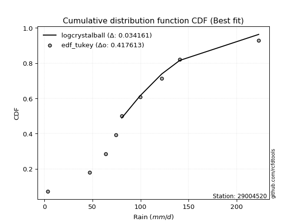</img></img>

</div>


### 8. EDF Gringorten (1963)

Gringorten plotting position formula is essential for estimating the probability and return periods of extreme events like floods and heavy rainfall. The constant _a=0.44_.

<div align="center">


$P=(m-a)/(n+1-2a)$


</div>


**8.1. Empirical values**

<div align="center">

|                | 0                    | 1                  | 2                   | 3                  | 4              | 5                  | 6                  | 7                  | 8                  |
|:---------------|:---------------------|:-------------------|:--------------------|:-------------------|:---------------|:-------------------|:-------------------|:-------------------|:-------------------|
| date           | 2023                 | 2021               | 2018                | 2017               | 2025           | 2020               | 2019               | 2024               | 2022               |
| x              | 3.7                  | 47.2               | 63.9                | 74.5               | 80.5           | 99.5               | 122.1              | 140.8              | 223.0              |
| m              | 1                    | 2                  | 3                   | 4                  | 5              | 6                  | 7                  | 8                  | 9                  |
| empirical_dist | edf_gringorten       | edf_gringorten     | edf_gringorten      | edf_gringorten     | edf_gringorten | edf_gringorten     | edf_gringorten     | edf_gringorten     | edf_gringorten     |
| empirical      | 0.061403508771929835 | 0.1710526315789474 | 0.28070175438596495 | 0.3903508771929825 | 0.5            | 0.6096491228070176 | 0.7192982456140351 | 0.8289473684210527 | 0.9385964912280703 |
| empirical_tr   | 1.0654205607476634   | 1.2063492063492063 | 1.3902439024390243  | 1.6402877697841727 | 2.0            | 2.561797752808989  | 3.5625             | 5.846153846153847  | 16.285714285714324 |

</div>


**8.2. Kolmogorov-Smirnov fit test (sorted by Δ)**


<div align="center">

|                | 0                   | 1                    | 2                    | 3                   | 4                    | 5                   | 6                    | 7                    | 8                   | 9                   | 10                   | 11                   | 12                  | 13                  | 14                  | 15                  | 16                  | 17                   | 18                   | 19                  | 20                   | 21                  | 22                  | 23                  | 24                  | 25                  | 26                  | 27                  | 28                  | 29                  | 30                  | 31                  | 32                  | 33                  | 34                  | 35                  | 36                  | 37                  | 38                  | 39                  | 40                  | 41                  | 42                  | 43                  | 44                  | 45                  | 46                  | 47                  | 48                  | 49                  | 50                  | 51                  | 52                  | 53                  | 54                  | 55                  | 56                  | 57                  | 58                  | 59                  | 60                  | 61                  | 62                  | 63                  | 64                  | 65                  | 66                  | 67                  | 68                  | 69                  | 70                  | 71                  | 72                  | 73                  | 74                  | 75                  | 76                  | 77                  | 78                  | 79                  | 80                  | 81                  | 82                  | 83                  | 84                  | 85                  | 86                  | 87                  | 88                  | 89                  | 90                  | 91                  | 92                  | 93                  | 94                  | 95                  | 96                  | 97                  | 98                  | 99                  | 100                 | 101                 | 102                 | 103                 | 104                 | 105                 | 106                 | 107                 | 108                 | 109                 | 110                 | 111                 | 112                 | 113                 | 114                 | 115                 | 116                 | 117                 | 118                 | 119                 | 120                 | 121                 | 122                 | 123                 | 124                 | 125                 | 126                 | 127                 | 128                 | 129                 | 130                 | 131                 | 132                 | 133                 | 134                 | 135                 | 136                 | 137                 | 138                 | 139                 | 140                 | 141                 | 142                 | 143                 | 144                 | 145                 | 146                 | 147                 | 148                 | 149                 | 150                 | 151                 | 152                 | 153                 | 154                 | 155                 | 156                 | 157                 | 158                 | 159                 |
|:---------------|:--------------------|:---------------------|:---------------------|:--------------------|:---------------------|:--------------------|:---------------------|:---------------------|:--------------------|:--------------------|:---------------------|:---------------------|:--------------------|:--------------------|:--------------------|:--------------------|:--------------------|:---------------------|:---------------------|:--------------------|:---------------------|:--------------------|:--------------------|:--------------------|:--------------------|:--------------------|:--------------------|:--------------------|:--------------------|:--------------------|:--------------------|:--------------------|:--------------------|:--------------------|:--------------------|:--------------------|:--------------------|:--------------------|:--------------------|:--------------------|:--------------------|:--------------------|:--------------------|:--------------------|:--------------------|:--------------------|:--------------------|:--------------------|:--------------------|:--------------------|:--------------------|:--------------------|:--------------------|:--------------------|:--------------------|:--------------------|:--------------------|:--------------------|:--------------------|:--------------------|:--------------------|:--------------------|:--------------------|:--------------------|:--------------------|:--------------------|:--------------------|:--------------------|:--------------------|:--------------------|:--------------------|:--------------------|:--------------------|:--------------------|:--------------------|:--------------------|:--------------------|:--------------------|:--------------------|:--------------------|:--------------------|:--------------------|:--------------------|:--------------------|:--------------------|:--------------------|:--------------------|:--------------------|:--------------------|:--------------------|:--------------------|:--------------------|:--------------------|:--------------------|:--------------------|:--------------------|:--------------------|:--------------------|:--------------------|:--------------------|:--------------------|:--------------------|:--------------------|:--------------------|:--------------------|:--------------------|:--------------------|:--------------------|:--------------------|:--------------------|:--------------------|:--------------------|:--------------------|:--------------------|:--------------------|:--------------------|:--------------------|:--------------------|:--------------------|:--------------------|:--------------------|:--------------------|:--------------------|:--------------------|:--------------------|:--------------------|:--------------------|:--------------------|:--------------------|:--------------------|:--------------------|:--------------------|:--------------------|:--------------------|:--------------------|:--------------------|:--------------------|:--------------------|:--------------------|:--------------------|:--------------------|:--------------------|:--------------------|:--------------------|:--------------------|:--------------------|:--------------------|:--------------------|:--------------------|:--------------------|:--------------------|:--------------------|:--------------------|:--------------------|:--------------------|:--------------------|:--------------------|:--------------------|:--------------------|:--------------------|
| station        | 29004520            | 29004520             | 29004520             | 29004520            | 29004520             | 29004520            | 29004520             | 29004520             | 29004520            | 29004520            | 29004520             | 29004520             | 29004520            | 29004520            | 29004520            | 29004520            | 29004520            | 29004520             | 29004520             | 29004520            | 29004520             | 29004520            | 29004520            | 29004520            | 29004520            | 29004520            | 29004520            | 29004520            | 29004520            | 29004520            | 29004520            | 29004520            | 29004520            | 29004520            | 29004520            | 29004520            | 29004520            | 29004520            | 29004520            | 29004520            | 29004520            | 29004520            | 29004520            | 29004520            | 29004520            | 29004520            | 29004520            | 29004520            | 29004520            | 29004520            | 29004520            | 29004520            | 29004520            | 29004520            | 29004520            | 29004520            | 29004520            | 29004520            | 29004520            | 29004520            | 29004520            | 29004520            | 29004520            | 29004520            | 29004520            | 29004520            | 29004520            | 29004520            | 29004520            | 29004520            | 29004520            | 29004520            | 29004520            | 29004520            | 29004520            | 29004520            | 29004520            | 29004520            | 29004520            | 29004520            | 29004520            | 29004520            | 29004520            | 29004520            | 29004520            | 29004520            | 29004520            | 29004520            | 29004520            | 29004520            | 29004520            | 29004520            | 29004520            | 29004520            | 29004520            | 29004520            | 29004520            | 29004520            | 29004520            | 29004520            | 29004520            | 29004520            | 29004520            | 29004520            | 29004520            | 29004520            | 29004520            | 29004520            | 29004520            | 29004520            | 29004520            | 29004520            | 29004520            | 29004520            | 29004520            | 29004520            | 29004520            | 29004520            | 29004520            | 29004520            | 29004520            | 29004520            | 29004520            | 29004520            | 29004520            | 29004520            | 29004520            | 29004520            | 29004520            | 29004520            | 29004520            | 29004520            | 29004520            | 29004520            | 29004520            | 29004520            | 29004520            | 29004520            | 29004520            | 29004520            | 29004520            | 29004520            | 29004520            | 29004520            | 29004520            | 29004520            | 29004520            | 29004520            | 29004520            | 29004520            | 29004520            | 29004520            | 29004520            | 29004520            | 29004520            | 29004520            | 29004520            | 29004520            | 29004520            | 29004520            |
| empirical_dist | edf_gringorten      | edf_gringorten       | edf_gringorten       | edf_gringorten      | edf_gringorten       | edf_gringorten      | edf_gringorten       | edf_gringorten       | edf_gringorten      | edf_gringorten      | edf_gringorten       | edf_gringorten       | edf_gringorten      | edf_gringorten      | edf_gringorten      | edf_gringorten      | edf_gringorten      | edf_gringorten       | edf_gringorten       | edf_gringorten      | edf_gringorten       | edf_gringorten      | edf_gringorten      | edf_gringorten      | edf_gringorten      | edf_gringorten      | edf_gringorten      | edf_gringorten      | edf_gringorten      | edf_gringorten      | edf_gringorten      | edf_gringorten      | edf_gringorten      | edf_gringorten      | edf_gringorten      | edf_gringorten      | edf_gringorten      | edf_gringorten      | edf_gringorten      | edf_gringorten      | edf_gringorten      | edf_gringorten      | edf_gringorten      | edf_gringorten      | edf_gringorten      | edf_gringorten      | edf_gringorten      | edf_gringorten      | edf_gringorten      | edf_gringorten      | edf_gringorten      | edf_gringorten      | edf_gringorten      | edf_gringorten      | edf_gringorten      | edf_gringorten      | edf_gringorten      | edf_gringorten      | edf_gringorten      | edf_gringorten      | edf_gringorten      | edf_gringorten      | edf_gringorten      | edf_gringorten      | edf_gringorten      | edf_gringorten      | edf_gringorten      | edf_gringorten      | edf_gringorten      | edf_gringorten      | edf_gringorten      | edf_gringorten      | edf_gringorten      | edf_gringorten      | edf_gringorten      | edf_gringorten      | edf_gringorten      | edf_gringorten      | edf_gringorten      | edf_gringorten      | edf_gringorten      | edf_gringorten      | edf_gringorten      | edf_gringorten      | edf_gringorten      | edf_gringorten      | edf_gringorten      | edf_gringorten      | edf_gringorten      | edf_gringorten      | edf_gringorten      | edf_gringorten      | edf_gringorten      | edf_gringorten      | edf_gringorten      | edf_gringorten      | edf_gringorten      | edf_gringorten      | edf_gringorten      | edf_gringorten      | edf_gringorten      | edf_gringorten      | edf_gringorten      | edf_gringorten      | edf_gringorten      | edf_gringorten      | edf_gringorten      | edf_gringorten      | edf_gringorten      | edf_gringorten      | edf_gringorten      | edf_gringorten      | edf_gringorten      | edf_gringorten      | edf_gringorten      | edf_gringorten      | edf_gringorten      | edf_gringorten      | edf_gringorten      | edf_gringorten      | edf_gringorten      | edf_gringorten      | edf_gringorten      | edf_gringorten      | edf_gringorten      | edf_gringorten      | edf_gringorten      | edf_gringorten      | edf_gringorten      | edf_gringorten      | edf_gringorten      | edf_gringorten      | edf_gringorten      | edf_gringorten      | edf_gringorten      | edf_gringorten      | edf_gringorten      | edf_gringorten      | edf_gringorten      | edf_gringorten      | edf_gringorten      | edf_gringorten      | edf_gringorten      | edf_gringorten      | edf_gringorten      | edf_gringorten      | edf_gringorten      | edf_gringorten      | edf_gringorten      | edf_gringorten      | edf_gringorten      | edf_gringorten      | edf_gringorten      | edf_gringorten      | edf_gringorten      | edf_gringorten      | edf_gringorten      | edf_gringorten      | edf_gringorten      | edf_gringorten      |
| p_dist         | logcrystalball      | exponnorm            | genlogistic          | johnsonsu           | invgauss             | fatiguelife         | invgamma             | gengamma             | exponweib           | gumbel_r            | betaprime            | f                    | erlang              | gamma               | logjohnsonsu        | pearson3            | rice                | nct                  | skewnorm             | rayleigh            | dgamma               | invweibull          | moyal               | maxwell             | dweibull            | burr12              | weibull_min         | kstwobign           | logt                | foldnorm            | anglit              | halflogistic        | halfnorm            | semicircular        | logdweibull         | gennorm             | t                   | logjohnsonsb        | crystalball         | norm                | logburr12           | loggenlogistic      | genpareto           | logexponpow         | logloggamma         | kappa3              | logargus            | logistic            | logdgamma           | logmielke           | logpearson3         | loggompertz         | wald                | hypsecant           | logloglaplace       | truncexpon          | cosine              | gausshyper          | bradford            | loggumbel_l         | arcsine             | laplace             | loggennorm          | logweibull_max      | burr                | logburr             | truncweibull_min    | gumbel_l            | lognakagami         | logskewnorm         | logvonmises_line    | kappa4              | loggenextreme       | logtrapezoid        | loglaplace          | loglaplace          | logfoldnorm         | vonmises_line       | loghypsecant        | logf                | loglogistic         | uniform             | wrapcauchy          | lomax               | logrice             | lognorm             | logexponnorm        | lognct              | genexpon            | logfatiguelife      | mielke              | logbetaprime        | loggamma            | loggamma            | loganglit           | ksone               | argus               | beta                | logerlang           | loginvgamma         | logsemicircular     | logalpha            | loginvgauss         | logmaxwell          | loggausshyper       | logncf              | lograyleigh         | logarcsine          | loglevy_l           | ncf                 | loginvweibull       | nakagami            | loggumbel_r         | logtriang           | loggenpareto        | loghalfnorm         | loggenhalflogistic  | logmoyal            | loghalflogistic     | halfgennorm         | logcosine           | johnsonsb           | logkstwobign        | loggenexpon         | logtruncweibull_min | genhalflogistic     | loghalfgennorm      | levy_l              | logwald             | triang              | logwrapcauchy       | logtruncnorm        | loglomax            | logbeta             | logksone            | logkappa4           | logkappa3           | logtukeylambda      | loguniform          | trapezoid           | logtruncexpon       | logbradford         | rdist               | genextreme          | powerlaw            | loggengamma         | tukeylambda         | logweibull_min      | logrdist            | logexponweib        | alpha               | weibull_max         | logpowerlaw         | truncpareto         | exponpow            | logtruncpareto      | gompertz            | truncnorm           | logvonmises         | vonmises            |
| delta          | 0.02413612435216106 | 0.048160223933952806 | 0.049420565863060706 | 0.04955052931618681 | 0.049805320131282305 | 0.04995984623624594 | 0.050162480779447904 | 0.050478393828588874 | 0.05079091876372238 | 0.05119483371539707 | 0.052939639036031994 | 0.053341946478589475 | 0.05338235647186157 | 0.0533824020394803  | 0.05349864925095826 | 0.05386986554383344 | 0.05457472453368789 | 0.055160934935096106 | 0.058301392806423824 | 0.05914570360938021 | 0.060131616539186306 | 0.06020356994879311 | 0.06100428280346987 | 0.06294035033774259 | 0.06601654706971011 | 0.06611686913325943 | 0.06684808780598511 | 0.07025853620728018 | 0.07852440278251344 | 0.0803059745106035  | 0.08376920376896446 | 0.08657685084902372 | 0.08845497107240674 | 0.0887702972689608  | 0.09031818145930492 | 0.0916554996208907  | 0.09509804913708847 | 0.09547660803781383 | 0.09702250877081481 | 0.0970225177554983  | 0.10003823612578788 | 0.1001263500599151  | 0.10140350307461032 | 0.10345602347367128 | 0.10418925218972747 | 0.10621421839124695 | 0.10942299216320012 | 0.10958202801902822 | 0.10964912280738864 | 0.10971854460438524 | 0.1109228400755955  | 0.11497652138301667 | 0.11516888049507373 | 0.1198847389913697  | 0.12141743316752429 | 0.12239675271576012 | 0.12771446635019473 | 0.12941154313220726 | 0.13793584045078744 | 0.143397187327721   | 0.14451006187552407 | 0.14673806906322662 | 0.1494350838320765  | 0.14954879093004247 | 0.15339125369331397 | 0.15465329169777864 | 0.1616147757561155  | 0.16383332278968427 | 0.17105263157817283 | 0.17302301582113105 | 0.17394311161485504 | 0.1760928234672977  | 0.17715794088262915 | 0.18146210096659238 | 0.19425301281042895 | 0.19425301281042895 | 0.19493637294879335 | 0.19534570887963143 | 0.20113951536367175 | 0.2023909642661454  | 0.20282712132189573 | 0.20377636978904168 | 0.20378079917446223 | 0.20613713623303703 | 0.20743430350612585 | 0.2074384556525199  | 0.20743847453483705 | 0.20776775977834905 | 0.2080977053120231  | 0.20938128479522394 | 0.21171005718628583 | 0.22044140451303623 | 0.22317741909739913 | 0.22317741909739913 | 0.22395410237487162 | 0.22463820289437686 | 0.22612233802514403 | 0.22636524334695995 | 0.22790614945305004 | 0.22951221244791048 | 0.23083970436736212 | 0.2322229924514278  | 0.23273978135896134 | 0.24078702393824475 | 0.24400103479158936 | 0.2442580343211781  | 0.25306797123483654 | 0.25872869201542764 | 0.25905198829624604 | 0.26633387646876394 | 0.2663525437583767  | 0.2723873324459957  | 0.2745991230424301  | 0.2751747170358693  | 0.28484317424879846 | 0.28797434273330147 | 0.29669569758496306 | 0.30047866009712204 | 0.3055264201555002  | 0.3135858251929692  | 0.3139646569003731  | 0.3155174588569919  | 0.3183094158874538  | 0.3438225756070376  | 0.35250945036983167 | 0.35325026447624325 | 0.35901957221114306 | 0.3659383818365511  | 0.37249504620782387 | 0.3918361356031733  | 0.40592893807436853 | 0.4072252701307882  | 0.41009326496138016 | 0.4153213295383295  | 0.42991937595688107 | 0.4359661495888984  | 0.44949216457670843 | 0.4495244080017122  | 0.45011377746404674 | 0.45955954603256144 | 0.5172237533131061  | 0.5184615977857161  | 0.5240320240099798  | 0.5392033280120061  | 0.5661210398416168  | 0.5960950292203417  | 0.6014627035207716  | 0.6134071711733151  | 0.6145288682082894  | 0.6246055244176134  | 0.6434047211916869  | 0.7025499218391396  | 0.7258586105716045  | 0.7368706552683231  | 0.7843355099639446  | 0.8007197182966697  | 0.8271892886704996  | 0.9378043575808532  | 1.02081277374801    | 35.42107865347701   |
| deltao         | 0.41761268023100007 | 0.41761268023100007  | 0.41761268023100007  | 0.41761268023100007 | 0.41761268023100007  | 0.41761268023100007 | 0.41761268023100007  | 0.41761268023100007  | 0.41761268023100007 | 0.41761268023100007 | 0.41761268023100007  | 0.41761268023100007  | 0.41761268023100007 | 0.41761268023100007 | 0.41761268023100007 | 0.41761268023100007 | 0.41761268023100007 | 0.41761268023100007  | 0.41761268023100007  | 0.41761268023100007 | 0.41761268023100007  | 0.41761268023100007 | 0.41761268023100007 | 0.41761268023100007 | 0.41761268023100007 | 0.41761268023100007 | 0.41761268023100007 | 0.41761268023100007 | 0.41761268023100007 | 0.41761268023100007 | 0.41761268023100007 | 0.41761268023100007 | 0.41761268023100007 | 0.41761268023100007 | 0.41761268023100007 | 0.41761268023100007 | 0.41761268023100007 | 0.41761268023100007 | 0.41761268023100007 | 0.41761268023100007 | 0.41761268023100007 | 0.41761268023100007 | 0.41761268023100007 | 0.41761268023100007 | 0.41761268023100007 | 0.41761268023100007 | 0.41761268023100007 | 0.41761268023100007 | 0.41761268023100007 | 0.41761268023100007 | 0.41761268023100007 | 0.41761268023100007 | 0.41761268023100007 | 0.41761268023100007 | 0.41761268023100007 | 0.41761268023100007 | 0.41761268023100007 | 0.41761268023100007 | 0.41761268023100007 | 0.41761268023100007 | 0.41761268023100007 | 0.41761268023100007 | 0.41761268023100007 | 0.41761268023100007 | 0.41761268023100007 | 0.41761268023100007 | 0.41761268023100007 | 0.41761268023100007 | 0.41761268023100007 | 0.41761268023100007 | 0.41761268023100007 | 0.41761268023100007 | 0.41761268023100007 | 0.41761268023100007 | 0.41761268023100007 | 0.41761268023100007 | 0.41761268023100007 | 0.41761268023100007 | 0.41761268023100007 | 0.41761268023100007 | 0.41761268023100007 | 0.41761268023100007 | 0.41761268023100007 | 0.41761268023100007 | 0.41761268023100007 | 0.41761268023100007 | 0.41761268023100007 | 0.41761268023100007 | 0.41761268023100007 | 0.41761268023100007 | 0.41761268023100007 | 0.41761268023100007 | 0.41761268023100007 | 0.41761268023100007 | 0.41761268023100007 | 0.41761268023100007 | 0.41761268023100007 | 0.41761268023100007 | 0.41761268023100007 | 0.41761268023100007 | 0.41761268023100007 | 0.41761268023100007 | 0.41761268023100007 | 0.41761268023100007 | 0.41761268023100007 | 0.41761268023100007 | 0.41761268023100007 | 0.41761268023100007 | 0.41761268023100007 | 0.41761268023100007 | 0.41761268023100007 | 0.41761268023100007 | 0.41761268023100007 | 0.41761268023100007 | 0.41761268023100007 | 0.41761268023100007 | 0.41761268023100007 | 0.41761268023100007 | 0.41761268023100007 | 0.41761268023100007 | 0.41761268023100007 | 0.41761268023100007 | 0.41761268023100007 | 0.41761268023100007 | 0.41761268023100007 | 0.41761268023100007 | 0.41761268023100007 | 0.41761268023100007 | 0.41761268023100007 | 0.41761268023100007 | 0.41761268023100007 | 0.41761268023100007 | 0.41761268023100007 | 0.41761268023100007 | 0.41761268023100007 | 0.41761268023100007 | 0.41761268023100007 | 0.41761268023100007 | 0.41761268023100007 | 0.41761268023100007 | 0.41761268023100007 | 0.41761268023100007 | 0.41761268023100007 | 0.41761268023100007 | 0.41761268023100007 | 0.41761268023100007 | 0.41761268023100007 | 0.41761268023100007 | 0.41761268023100007 | 0.41761268023100007 | 0.41761268023100007 | 0.41761268023100007 | 0.41761268023100007 | 0.41761268023100007 | 0.41761268023100007 | 0.41761268023100007 | 0.41761268023100007 | 0.41761268023100007 | 0.41761268023100007 | 0.41761268023100007 |
| eval           | Δo > Δ              | Δo > Δ               | Δo > Δ               | Δo > Δ              | Δo > Δ               | Δo > Δ              | Δo > Δ               | Δo > Δ               | Δo > Δ              | Δo > Δ              | Δo > Δ               | Δo > Δ               | Δo > Δ              | Δo > Δ              | Δo > Δ              | Δo > Δ              | Δo > Δ              | Δo > Δ               | Δo > Δ               | Δo > Δ              | Δo > Δ               | Δo > Δ              | Δo > Δ              | Δo > Δ              | Δo > Δ              | Δo > Δ              | Δo > Δ              | Δo > Δ              | Δo > Δ              | Δo > Δ              | Δo > Δ              | Δo > Δ              | Δo > Δ              | Δo > Δ              | Δo > Δ              | Δo > Δ              | Δo > Δ              | Δo > Δ              | Δo > Δ              | Δo > Δ              | Δo > Δ              | Δo > Δ              | Δo > Δ              | Δo > Δ              | Δo > Δ              | Δo > Δ              | Δo > Δ              | Δo > Δ              | Δo > Δ              | Δo > Δ              | Δo > Δ              | Δo > Δ              | Δo > Δ              | Δo > Δ              | Δo > Δ              | Δo > Δ              | Δo > Δ              | Δo > Δ              | Δo > Δ              | Δo > Δ              | Δo > Δ              | Δo > Δ              | Δo > Δ              | Δo > Δ              | Δo > Δ              | Δo > Δ              | Δo > Δ              | Δo > Δ              | Δo > Δ              | Δo > Δ              | Δo > Δ              | Δo > Δ              | Δo > Δ              | Δo > Δ              | Δo > Δ              | Δo > Δ              | Δo > Δ              | Δo > Δ              | Δo > Δ              | Δo > Δ              | Δo > Δ              | Δo > Δ              | Δo > Δ              | Δo > Δ              | Δo > Δ              | Δo > Δ              | Δo > Δ              | Δo > Δ              | Δo > Δ              | Δo > Δ              | Δo > Δ              | Δo > Δ              | Δo > Δ              | Δo > Δ              | Δo > Δ              | Δo > Δ              | Δo > Δ              | Δo > Δ              | Δo > Δ              | Δo > Δ              | Δo > Δ              | Δo > Δ              | Δo > Δ              | Δo > Δ              | Δo > Δ              | Δo > Δ              | Δo > Δ              | Δo > Δ              | Δo > Δ              | Δo > Δ              | Δo > Δ              | Δo > Δ              | Δo > Δ              | Δo > Δ              | Δo > Δ              | Δo > Δ              | Δo > Δ              | Δo > Δ              | Δo > Δ              | Δo > Δ              | Δo > Δ              | Δo > Δ              | Δo > Δ              | Δo > Δ              | Δo > Δ              | Δo > Δ              | Δo > Δ              | Δo > Δ              | Δo > Δ              | Δo > Δ              | Δo > Δ              | Δo > Δ              | Δo > Δ              | Δo > Δ              | Δo <= Δ             | Δo <= Δ             | Δo <= Δ             | Δo <= Δ             | Δo <= Δ             | Δo <= Δ             | Δo <= Δ             | Δo <= Δ             | Δo <= Δ             | Δo <= Δ             | Δo <= Δ             | Δo <= Δ             | Δo <= Δ             | Δo <= Δ             | Δo <= Δ             | Δo <= Δ             | Δo <= Δ             | Δo <= Δ             | Δo <= Δ             | Δo <= Δ             | Δo <= Δ             | Δo <= Δ             | Δo <= Δ             | Δo <= Δ             | Δo <= Δ             | Δo <= Δ             |
| fit            | 1                   | 1                    | 1                    | 1                   | 1                    | 1                   | 1                    | 1                    | 1                   | 1                   | 1                    | 1                    | 1                   | 1                   | 1                   | 1                   | 1                   | 1                    | 1                    | 1                   | 1                    | 1                   | 1                   | 1                   | 1                   | 1                   | 1                   | 1                   | 1                   | 1                   | 1                   | 1                   | 1                   | 1                   | 1                   | 1                   | 1                   | 1                   | 1                   | 1                   | 1                   | 1                   | 1                   | 1                   | 1                   | 1                   | 1                   | 1                   | 1                   | 1                   | 1                   | 1                   | 1                   | 1                   | 1                   | 1                   | 1                   | 1                   | 1                   | 1                   | 1                   | 1                   | 1                   | 1                   | 1                   | 1                   | 1                   | 1                   | 1                   | 1                   | 1                   | 1                   | 1                   | 1                   | 1                   | 1                   | 1                   | 1                   | 1                   | 1                   | 1                   | 1                   | 1                   | 1                   | 1                   | 1                   | 1                   | 1                   | 1                   | 1                   | 1                   | 1                   | 1                   | 1                   | 1                   | 1                   | 1                   | 1                   | 1                   | 1                   | 1                   | 1                   | 1                   | 1                   | 1                   | 1                   | 1                   | 1                   | 1                   | 1                   | 1                   | 1                   | 1                   | 1                   | 1                   | 1                   | 1                   | 1                   | 1                   | 1                   | 1                   | 1                   | 1                   | 1                   | 1                   | 1                   | 1                   | 1                   | 1                   | 1                   | 1                   | 1                   | 1                   | 1                   | 0                   | 0                   | 0                   | 0                   | 0                   | 0                   | 0                   | 0                   | 0                   | 0                   | 0                   | 0                   | 0                   | 0                   | 0                   | 0                   | 0                   | 0                   | 0                   | 0                   | 0                   | 0                   | 0                   | 0                   | 0                   | 0                   |
| n              | 9                   | 9                    | 9                    | 9                   | 9                    | 9                   | 9                    | 9                    | 9                   | 9                   | 9                    | 9                    | 9                   | 9                   | 9                   | 9                   | 9                   | 9                    | 9                    | 9                   | 9                    | 9                   | 9                   | 9                   | 9                   | 9                   | 9                   | 9                   | 9                   | 9                   | 9                   | 9                   | 9                   | 9                   | 9                   | 9                   | 9                   | 9                   | 9                   | 9                   | 9                   | 9                   | 9                   | 9                   | 9                   | 9                   | 9                   | 9                   | 9                   | 9                   | 9                   | 9                   | 9                   | 9                   | 9                   | 9                   | 9                   | 9                   | 9                   | 9                   | 9                   | 9                   | 9                   | 9                   | 9                   | 9                   | 9                   | 9                   | 9                   | 9                   | 9                   | 9                   | 9                   | 9                   | 9                   | 9                   | 9                   | 9                   | 9                   | 9                   | 9                   | 9                   | 9                   | 9                   | 9                   | 9                   | 9                   | 9                   | 9                   | 9                   | 9                   | 9                   | 9                   | 9                   | 9                   | 9                   | 9                   | 9                   | 9                   | 9                   | 9                   | 9                   | 9                   | 9                   | 9                   | 9                   | 9                   | 9                   | 9                   | 9                   | 9                   | 9                   | 9                   | 9                   | 9                   | 9                   | 9                   | 9                   | 9                   | 9                   | 9                   | 9                   | 9                   | 9                   | 9                   | 9                   | 9                   | 9                   | 9                   | 9                   | 9                   | 9                   | 9                   | 9                   | 9                   | 9                   | 9                   | 9                   | 9                   | 9                   | 9                   | 9                   | 9                   | 9                   | 9                   | 9                   | 9                   | 9                   | 9                   | 9                   | 9                   | 9                   | 9                   | 9                   | 9                   | 9                   | 9                   | 9                   | 9                   | 9                   |
| best_fit       | 1                   | 0                    | 0                    | 0                   | 0                    | 0                   | 0                    | 0                    | 0                   | 0                   | 0                    | 0                    | 0                   | 0                   | 0                   | 0                   | 0                   | 0                    | 0                    | 0                   | 0                    | 0                   | 0                   | 0                   | 0                   | 0                   | 0                   | 0                   | 0                   | 0                   | 0                   | 0                   | 0                   | 0                   | 0                   | 0                   | 0                   | 0                   | 0                   | 0                   | 0                   | 0                   | 0                   | 0                   | 0                   | 0                   | 0                   | 0                   | 0                   | 0                   | 0                   | 0                   | 0                   | 0                   | 0                   | 0                   | 0                   | 0                   | 0                   | 0                   | 0                   | 0                   | 0                   | 0                   | 0                   | 0                   | 0                   | 0                   | 0                   | 0                   | 0                   | 0                   | 0                   | 0                   | 0                   | 0                   | 0                   | 0                   | 0                   | 0                   | 0                   | 0                   | 0                   | 0                   | 0                   | 0                   | 0                   | 0                   | 0                   | 0                   | 0                   | 0                   | 0                   | 0                   | 0                   | 0                   | 0                   | 0                   | 0                   | 0                   | 0                   | 0                   | 0                   | 0                   | 0                   | 0                   | 0                   | 0                   | 0                   | 0                   | 0                   | 0                   | 0                   | 0                   | 0                   | 0                   | 0                   | 0                   | 0                   | 0                   | 0                   | 0                   | 0                   | 0                   | 0                   | 0                   | 0                   | 0                   | 0                   | 0                   | 0                   | 0                   | 0                   | 0                   | 0                   | 0                   | 0                   | 0                   | 0                   | 0                   | 0                   | 0                   | 0                   | 0                   | 0                   | 0                   | 0                   | 0                   | 0                   | 0                   | 0                   | 0                   | 0                   | 0                   | 0                   | 0                   | 0                   | 0                   | 0                   | 0                   |
| best_fit_sort  | 1                   | 2                    | 3                    | 4                   | 5                    | 6                   | 7                    | 8                    | 9                   | 10                  | 11                   | 12                   | 13                  | 14                  | 15                  | 16                  | 17                  | 18                   | 19                   | 20                  | 21                   | 22                  | 23                  | 24                  | 25                  | 26                  | 27                  | 28                  | 29                  | 30                  | 31                  | 32                  | 33                  | 34                  | 35                  | 36                  | 37                  | 38                  | 39                  | 40                  | 41                  | 42                  | 43                  | 44                  | 45                  | 46                  | 47                  | 48                  | 49                  | 50                  | 51                  | 52                  | 53                  | 54                  | 55                  | 56                  | 57                  | 58                  | 59                  | 60                  | 61                  | 62                  | 63                  | 64                  | 65                  | 66                  | 67                  | 68                  | 69                  | 70                  | 71                  | 72                  | 73                  | 74                  | 75                  | 76                  | 77                  | 78                  | 79                  | 80                  | 81                  | 82                  | 83                  | 84                  | 85                  | 86                  | 87                  | 88                  | 89                  | 90                  | 91                  | 92                  | 93                  | 94                  | 95                  | 96                  | 97                  | 98                  | 99                  | 100                 | 101                 | 102                 | 103                 | 104                 | 105                 | 106                 | 107                 | 108                 | 109                 | 110                 | 111                 | 112                 | 113                 | 114                 | 115                 | 116                 | 117                 | 118                 | 119                 | 120                 | 121                 | 122                 | 123                 | 124                 | 125                 | 126                 | 127                 | 128                 | 129                 | 130                 | 131                 | 132                 | 133                 | 134                 | 135                 | 136                 | 137                 | 138                 | 139                 | 140                 | 141                 | 142                 | 143                 | 144                 | 145                 | 146                 | 147                 | 148                 | 149                 | 150                 | 151                 | 152                 | 153                 | 154                 | 155                 | 156                 | 157                 | 158                 | 159                 | 160                 |

</div>


**8.3. Best fit**

<div align="center">

|   id |   station | empirical_dist   | p_dist         |     delta |   deltao | eval   |   fit |   n |   best_fit |   best_fit_sort |
|-----:|----------:|:-----------------|:---------------|----------:|---------:|:-------|------:|----:|-----------:|----------------:|
|    0 |  29004520 | edf_gringorten   | logcrystalball | 0.0241361 | 0.417613 | Δo > Δ |     1 |   9 |          1 |               1 |

</div>


<div align="center">

</img>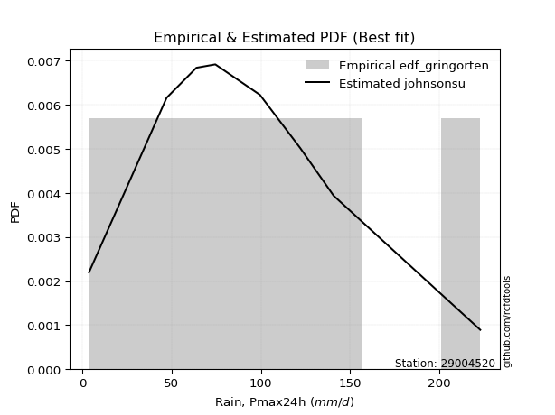</img>

</div>


### 9. EDF Filliben (1975)

The specific values of the constants (0.3175) (often denoted as $alpha$) and (0.365) are derived from a method proposed by James J. Filliben in a 1975 paper. This particular formula is the mean value of the $i$-th order statistic of the normal distribution and is considered a robust and effective plotting position formula for the normal probability plot correlation coefficient test for normality.

<div align="center">


$P=(m-0.3175)/(n+0.365)$


</div>


**9.1. Empirical values**

<div align="center">

|                | 0                   | 1                  | 2                   | 3                   | 4            | 5                  | 6                  | 7                  | 8                  |
|:---------------|:--------------------|:-------------------|:--------------------|:--------------------|:-------------|:-------------------|:-------------------|:-------------------|:-------------------|
| date           | 2023                | 2021               | 2018                | 2017                | 2025         | 2020               | 2019               | 2024               | 2022               |
| x              | 3.7                 | 47.2               | 63.9                | 74.5                | 80.5         | 99.5               | 122.1              | 140.8              | 223.0              |
| m              | 1                   | 2                  | 3                   | 4                   | 5            | 6                  | 7                  | 8                  | 9                  |
| empirical_dist | edf_filliben        | edf_filliben       | edf_filliben        | edf_filliben        | edf_filliben | edf_filliben       | edf_filliben       | edf_filliben       | edf_filliben       |
| empirical      | 0.07287773625200214 | 0.1796583021890016 | 0.28643886812600106 | 0.39321943406300053 | 0.5          | 0.6067805659369995 | 0.7135611318739989 | 0.8203416978109984 | 0.9271222637479978 |
| empirical_tr   | 1.0786063921681543  | 1.219004230393752  | 1.401421623643846   | 1.6480422349318082  | 2.0          | 2.5431093007467753 | 3.491146318732526  | 5.566121842496286  | 13.721611721611705 |

</div>


**9.2. Kolmogorov-Smirnov fit test (sorted by Δ)**


<div align="center">

|                | 0                   | 1                   | 2                   | 3                    | 4                   | 5                    | 6                   | 7                   | 8                    | 9                    | 10                  | 11                   | 12                  | 13                  | 14                  | 15                  | 16                  | 17                  | 18                   | 19                  | 20                   | 21                   | 22                  | 23                  | 24                  | 25                  | 26                  | 27                  | 28                  | 29                  | 30                  | 31                  | 32                  | 33                  | 34                  | 35                  | 36                  | 37                  | 38                  | 39                  | 40                  | 41                  | 42                  | 43                  | 44                  | 45                  | 46                  | 47                  | 48                  | 49                  | 50                  | 51                  | 52                  | 53                  | 54                  | 55                  | 56                  | 57                  | 58                  | 59                  | 60                  | 61                  | 62                  | 63                  | 64                  | 65                  | 66                  | 67                  | 68                  | 69                  | 70                  | 71                  | 72                  | 73                  | 74                  | 75                  | 76                  | 77                  | 78                  | 79                  | 80                  | 81                  | 82                  | 83                  | 84                  | 85                  | 86                  | 87                  | 88                  | 89                  | 90                  | 91                  | 92                  | 93                  | 94                  | 95                  | 96                  | 97                  | 98                  | 99                  | 100                 | 101                 | 102                 | 103                 | 104                 | 105                 | 106                 | 107                 | 108                 | 109                 | 110                 | 111                 | 112                 | 113                 | 114                 | 115                 | 116                 | 117                 | 118                 | 119                 | 120                 | 121                 | 122                 | 123                 | 124                 | 125                 | 126                 | 127                 | 128                 | 129                 | 130                 | 131                 | 132                 | 133                 | 134                 | 135                 | 136                 | 137                 | 138                 | 139                 | 140                 | 141                 | 142                 | 143                 | 144                 | 145                 | 146                 | 147                 | 148                 | 149                 | 150                 | 151                 | 152                 | 153                 | 154                 | 155                 | 156                 | 157                 | 158                 | 159                 |
|:---------------|:--------------------|:--------------------|:--------------------|:---------------------|:--------------------|:---------------------|:--------------------|:--------------------|:---------------------|:---------------------|:--------------------|:---------------------|:--------------------|:--------------------|:--------------------|:--------------------|:--------------------|:--------------------|:---------------------|:--------------------|:---------------------|:---------------------|:--------------------|:--------------------|:--------------------|:--------------------|:--------------------|:--------------------|:--------------------|:--------------------|:--------------------|:--------------------|:--------------------|:--------------------|:--------------------|:--------------------|:--------------------|:--------------------|:--------------------|:--------------------|:--------------------|:--------------------|:--------------------|:--------------------|:--------------------|:--------------------|:--------------------|:--------------------|:--------------------|:--------------------|:--------------------|:--------------------|:--------------------|:--------------------|:--------------------|:--------------------|:--------------------|:--------------------|:--------------------|:--------------------|:--------------------|:--------------------|:--------------------|:--------------------|:--------------------|:--------------------|:--------------------|:--------------------|:--------------------|:--------------------|:--------------------|:--------------------|:--------------------|:--------------------|:--------------------|:--------------------|:--------------------|:--------------------|:--------------------|:--------------------|:--------------------|:--------------------|:--------------------|:--------------------|:--------------------|:--------------------|:--------------------|:--------------------|:--------------------|:--------------------|:--------------------|:--------------------|:--------------------|:--------------------|:--------------------|:--------------------|:--------------------|:--------------------|:--------------------|:--------------------|:--------------------|:--------------------|:--------------------|:--------------------|:--------------------|:--------------------|:--------------------|:--------------------|:--------------------|:--------------------|:--------------------|:--------------------|:--------------------|:--------------------|:--------------------|:--------------------|:--------------------|:--------------------|:--------------------|:--------------------|:--------------------|:--------------------|:--------------------|:--------------------|:--------------------|:--------------------|:--------------------|:--------------------|:--------------------|:--------------------|:--------------------|:--------------------|:--------------------|:--------------------|:--------------------|:--------------------|:--------------------|:--------------------|:--------------------|:--------------------|:--------------------|:--------------------|:--------------------|:--------------------|:--------------------|:--------------------|:--------------------|:--------------------|:--------------------|:--------------------|:--------------------|:--------------------|:--------------------|:--------------------|:--------------------|:--------------------|:--------------------|:--------------------|:--------------------|:--------------------|
| station        | 29004520            | 29004520            | 29004520            | 29004520             | 29004520            | 29004520             | 29004520            | 29004520            | 29004520             | 29004520             | 29004520            | 29004520             | 29004520            | 29004520            | 29004520            | 29004520            | 29004520            | 29004520            | 29004520             | 29004520            | 29004520             | 29004520             | 29004520            | 29004520            | 29004520            | 29004520            | 29004520            | 29004520            | 29004520            | 29004520            | 29004520            | 29004520            | 29004520            | 29004520            | 29004520            | 29004520            | 29004520            | 29004520            | 29004520            | 29004520            | 29004520            | 29004520            | 29004520            | 29004520            | 29004520            | 29004520            | 29004520            | 29004520            | 29004520            | 29004520            | 29004520            | 29004520            | 29004520            | 29004520            | 29004520            | 29004520            | 29004520            | 29004520            | 29004520            | 29004520            | 29004520            | 29004520            | 29004520            | 29004520            | 29004520            | 29004520            | 29004520            | 29004520            | 29004520            | 29004520            | 29004520            | 29004520            | 29004520            | 29004520            | 29004520            | 29004520            | 29004520            | 29004520            | 29004520            | 29004520            | 29004520            | 29004520            | 29004520            | 29004520            | 29004520            | 29004520            | 29004520            | 29004520            | 29004520            | 29004520            | 29004520            | 29004520            | 29004520            | 29004520            | 29004520            | 29004520            | 29004520            | 29004520            | 29004520            | 29004520            | 29004520            | 29004520            | 29004520            | 29004520            | 29004520            | 29004520            | 29004520            | 29004520            | 29004520            | 29004520            | 29004520            | 29004520            | 29004520            | 29004520            | 29004520            | 29004520            | 29004520            | 29004520            | 29004520            | 29004520            | 29004520            | 29004520            | 29004520            | 29004520            | 29004520            | 29004520            | 29004520            | 29004520            | 29004520            | 29004520            | 29004520            | 29004520            | 29004520            | 29004520            | 29004520            | 29004520            | 29004520            | 29004520            | 29004520            | 29004520            | 29004520            | 29004520            | 29004520            | 29004520            | 29004520            | 29004520            | 29004520            | 29004520            | 29004520            | 29004520            | 29004520            | 29004520            | 29004520            | 29004520            | 29004520            | 29004520            | 29004520            | 29004520            | 29004520            | 29004520            |
| empirical_dist | edf_filliben        | edf_filliben        | edf_filliben        | edf_filliben         | edf_filliben        | edf_filliben         | edf_filliben        | edf_filliben        | edf_filliben         | edf_filliben         | edf_filliben        | edf_filliben         | edf_filliben        | edf_filliben        | edf_filliben        | edf_filliben        | edf_filliben        | edf_filliben        | edf_filliben         | edf_filliben        | edf_filliben         | edf_filliben         | edf_filliben        | edf_filliben        | edf_filliben        | edf_filliben        | edf_filliben        | edf_filliben        | edf_filliben        | edf_filliben        | edf_filliben        | edf_filliben        | edf_filliben        | edf_filliben        | edf_filliben        | edf_filliben        | edf_filliben        | edf_filliben        | edf_filliben        | edf_filliben        | edf_filliben        | edf_filliben        | edf_filliben        | edf_filliben        | edf_filliben        | edf_filliben        | edf_filliben        | edf_filliben        | edf_filliben        | edf_filliben        | edf_filliben        | edf_filliben        | edf_filliben        | edf_filliben        | edf_filliben        | edf_filliben        | edf_filliben        | edf_filliben        | edf_filliben        | edf_filliben        | edf_filliben        | edf_filliben        | edf_filliben        | edf_filliben        | edf_filliben        | edf_filliben        | edf_filliben        | edf_filliben        | edf_filliben        | edf_filliben        | edf_filliben        | edf_filliben        | edf_filliben        | edf_filliben        | edf_filliben        | edf_filliben        | edf_filliben        | edf_filliben        | edf_filliben        | edf_filliben        | edf_filliben        | edf_filliben        | edf_filliben        | edf_filliben        | edf_filliben        | edf_filliben        | edf_filliben        | edf_filliben        | edf_filliben        | edf_filliben        | edf_filliben        | edf_filliben        | edf_filliben        | edf_filliben        | edf_filliben        | edf_filliben        | edf_filliben        | edf_filliben        | edf_filliben        | edf_filliben        | edf_filliben        | edf_filliben        | edf_filliben        | edf_filliben        | edf_filliben        | edf_filliben        | edf_filliben        | edf_filliben        | edf_filliben        | edf_filliben        | edf_filliben        | edf_filliben        | edf_filliben        | edf_filliben        | edf_filliben        | edf_filliben        | edf_filliben        | edf_filliben        | edf_filliben        | edf_filliben        | edf_filliben        | edf_filliben        | edf_filliben        | edf_filliben        | edf_filliben        | edf_filliben        | edf_filliben        | edf_filliben        | edf_filliben        | edf_filliben        | edf_filliben        | edf_filliben        | edf_filliben        | edf_filliben        | edf_filliben        | edf_filliben        | edf_filliben        | edf_filliben        | edf_filliben        | edf_filliben        | edf_filliben        | edf_filliben        | edf_filliben        | edf_filliben        | edf_filliben        | edf_filliben        | edf_filliben        | edf_filliben        | edf_filliben        | edf_filliben        | edf_filliben        | edf_filliben        | edf_filliben        | edf_filliben        | edf_filliben        | edf_filliben        | edf_filliben        | edf_filliben        | edf_filliben        | edf_filliben        |
| p_dist         | logcrystalball      | betaprime           | f                   | erlang               | gamma               | exponnorm            | gengamma            | fatiguelife         | invgauss             | genlogistic          | johnsonsu           | invgamma             | exponweib           | rayleigh            | logjohnsonsu        | pearson3            | invweibull          | rice                | nct                  | gumbel_r            | dgamma               | skewnorm             | burr12              | weibull_min         | maxwell             | kstwobign           | dweibull            | moyal               | foldnorm            | logt                | logdweibull         | halflogistic        | semicircular        | halfnorm            | anglit              | logjohnsonsb        | loggenlogistic      | genpareto           | logburr12           | logexponpow         | t                   | logloggamma         | crystalball         | norm                | gennorm             | kappa3              | logargus            | logmielke           | logpearson3         | logdgamma           | loggompertz         | logistic            | logloglaplace       | truncexpon          | hypsecant           | gausshyper          | wald                | cosine              | bradford            | loggumbel_l         | arcsine             | logweibull_max      | burr                | logburr             | laplace             | loggennorm          | truncweibull_min    | gumbel_l            | logskewnorm         | kappa4              | loggenextreme       | logtrapezoid        | logvonmises_line    | lognakagami         | loglaplace          | loglaplace          | logfoldnorm         | logf                | vonmises_line       | uniform             | wrapcauchy          | loghypsecant        | loglogistic         | lomax               | logrice             | lognorm             | logexponnorm        | lognct              | genexpon            | logfatiguelife      | mielke              | logbetaprime        | loggamma            | loggamma            | loganglit           | ksone               | argus               | beta                | logerlang           | loginvgamma         | logsemicircular     | logalpha            | loginvgauss         | logmaxwell          | loggausshyper       | logncf              | lograyleigh         | logarcsine          | loglevy_l           | ncf                 | loginvweibull       | nakagami            | logtriang           | loggumbel_r         | loggenpareto        | loghalfnorm         | loggenhalflogistic  | logmoyal            | loghalflogistic     | halfgennorm         | logcosine           | johnsonsb           | logkstwobign        | loggenexpon         | logtruncweibull_min | genhalflogistic     | loghalfgennorm      | levy_l              | logwald             | triang              | logwrapcauchy       | logtruncnorm        | loglomax            | logbeta             | logksone            | logkappa4           | logkappa3           | logtukeylambda      | loguniform          | trapezoid           | logtruncexpon       | logbradford         | rdist               | genextreme          | powerlaw            | loggengamma         | tukeylambda         | logweibull_min      | logrdist            | logexponweib        | alpha               | weibull_max         | logpowerlaw         | truncpareto         | exponpow            | logtruncpareto      | gompertz            | truncnorm           | logvonmises         | vonmises            |
| delta          | 0.0356103518322336  | 0.04720252529599589 | 0.04760483273855337 | 0.047645242731825466 | 0.0476452882994442  | 0.048160223933952806 | 0.04839915277973983 | 0.04897149006307744 | 0.049047668303059455 | 0.049420565863060706 | 0.04955052931618681 | 0.050162480779447904 | 0.05079091876372238 | 0.05164488630549807 | 0.05349864925095826 | 0.05386986554383344 | 0.05446645620875701 | 0.05457472453368789 | 0.055160934935096106 | 0.05582469820626706 | 0.057541497984010814 | 0.058301392806423824 | 0.06037975539322332 | 0.06111097406594901 | 0.06294035033774259 | 0.06452142246724407 | 0.06601654706971011 | 0.06966313972539497 | 0.07287773625200214 | 0.07852440278251344 | 0.07884395397923238 | 0.08083973710898762 | 0.08267656345077168 | 0.08271785733237064 | 0.08357649363878283 | 0.08687093742775961 | 0.09152067944986089 | 0.09279783246455608 | 0.09430112238575178 | 0.09485035286361707 | 0.09509804913708847 | 0.09558358157967325 | 0.09702250877081481 | 0.0970225177554983  | 0.09739261336092686 | 0.09760854778119274 | 0.1008173215531459  | 0.10111287399433103 | 0.10231716946554129 | 0.10678056593737062 | 0.10923940764298057 | 0.10958202801902822 | 0.10994320568745175 | 0.11379108210570588 | 0.1198847389913697  | 0.12080587252215305 | 0.12377455110512794 | 0.12771446635019473 | 0.1293301698407332  | 0.1347915167176668  | 0.13590439126546983 | 0.14094312031998826 | 0.14478558308325976 | 0.1460476210877244  | 0.14673806906322662 | 0.15230364070209457 | 0.15300910514606125 | 0.16383332278968427 | 0.16441734521107684 | 0.16748715285724347 | 0.1685522702725749  | 0.17285643035653817 | 0.17965826602754725 | 0.17965830218822704 | 0.18851589907039284 | 0.18851589907039284 | 0.18919925920875724 | 0.19378529365609118 | 0.19505516899719072 | 0.19517069917898744 | 0.195175128564408   | 0.19540240162363565 | 0.19709000758185963 | 0.19753146562298282 | 0.19906527975957894 | 0.1990678858942483  | 0.19906882045389113 | 0.19928592188084493 | 0.19949203470196888 | 0.20101731194671857 | 0.20597294344624972 | 0.21183573390298202 | 0.21457174848734492 | 0.21457174848734492 | 0.2153484317648174  | 0.21603253228432262 | 0.2175166674150898  | 0.21775957273690572 | 0.21930047884299583 | 0.22090654183785627 | 0.2222340337573079  | 0.2236173218413736  | 0.22413411074890713 | 0.2326366608863616  | 0.23539536418153514 | 0.23565236371112389 | 0.24446230062478233 | 0.25012302140537346 | 0.25044631768619185 | 0.2577282058587097  | 0.25774687314832245 | 0.2643185536791315  | 0.26656904642581514 | 0.268862009302394   | 0.2762375036387442  | 0.27936867212324723 | 0.2880900269749088  | 0.29474154635708594 | 0.2997893064154641  | 0.30498015458291494 | 0.3053589862903189  | 0.30691178824693766 | 0.30970374527739963 | 0.3352169049969834  | 0.3439037797597775  | 0.344644593866189   | 0.3504139016010889  | 0.3544641543564788  | 0.36675793246778776 | 0.3832304649931191  | 0.39732326746431434 | 0.398619599520734   | 0.40148759435132597 | 0.40671565892827527 | 0.4213137053468269  | 0.4273604789788442  | 0.44088649396665425 | 0.440918737391658   | 0.44150810685399255 | 0.4509538754225072  | 0.5086180827030519  | 0.5098559271756619  | 0.5154263533999256  | 0.530597657401952   | 0.5575153692315626  | 0.5874893586102876  | 0.5928570329107173  | 0.604801500563261   | 0.6059231975982353  | 0.6159998538075593  | 0.6347990505816327  | 0.6939442512290853  | 0.7172529399615503  | 0.7282649846582688  | 0.7757298393538904  | 0.7921140476866154  | 0.8185836180604453  | 0.9263301301007809  | 1.0150756600079738  | 35.43255288095708   |
| deltao         | 0.41761268023100007 | 0.41761268023100007 | 0.41761268023100007 | 0.41761268023100007  | 0.41761268023100007 | 0.41761268023100007  | 0.41761268023100007 | 0.41761268023100007 | 0.41761268023100007  | 0.41761268023100007  | 0.41761268023100007 | 0.41761268023100007  | 0.41761268023100007 | 0.41761268023100007 | 0.41761268023100007 | 0.41761268023100007 | 0.41761268023100007 | 0.41761268023100007 | 0.41761268023100007  | 0.41761268023100007 | 0.41761268023100007  | 0.41761268023100007  | 0.41761268023100007 | 0.41761268023100007 | 0.41761268023100007 | 0.41761268023100007 | 0.41761268023100007 | 0.41761268023100007 | 0.41761268023100007 | 0.41761268023100007 | 0.41761268023100007 | 0.41761268023100007 | 0.41761268023100007 | 0.41761268023100007 | 0.41761268023100007 | 0.41761268023100007 | 0.41761268023100007 | 0.41761268023100007 | 0.41761268023100007 | 0.41761268023100007 | 0.41761268023100007 | 0.41761268023100007 | 0.41761268023100007 | 0.41761268023100007 | 0.41761268023100007 | 0.41761268023100007 | 0.41761268023100007 | 0.41761268023100007 | 0.41761268023100007 | 0.41761268023100007 | 0.41761268023100007 | 0.41761268023100007 | 0.41761268023100007 | 0.41761268023100007 | 0.41761268023100007 | 0.41761268023100007 | 0.41761268023100007 | 0.41761268023100007 | 0.41761268023100007 | 0.41761268023100007 | 0.41761268023100007 | 0.41761268023100007 | 0.41761268023100007 | 0.41761268023100007 | 0.41761268023100007 | 0.41761268023100007 | 0.41761268023100007 | 0.41761268023100007 | 0.41761268023100007 | 0.41761268023100007 | 0.41761268023100007 | 0.41761268023100007 | 0.41761268023100007 | 0.41761268023100007 | 0.41761268023100007 | 0.41761268023100007 | 0.41761268023100007 | 0.41761268023100007 | 0.41761268023100007 | 0.41761268023100007 | 0.41761268023100007 | 0.41761268023100007 | 0.41761268023100007 | 0.41761268023100007 | 0.41761268023100007 | 0.41761268023100007 | 0.41761268023100007 | 0.41761268023100007 | 0.41761268023100007 | 0.41761268023100007 | 0.41761268023100007 | 0.41761268023100007 | 0.41761268023100007 | 0.41761268023100007 | 0.41761268023100007 | 0.41761268023100007 | 0.41761268023100007 | 0.41761268023100007 | 0.41761268023100007 | 0.41761268023100007 | 0.41761268023100007 | 0.41761268023100007 | 0.41761268023100007 | 0.41761268023100007 | 0.41761268023100007 | 0.41761268023100007 | 0.41761268023100007 | 0.41761268023100007 | 0.41761268023100007 | 0.41761268023100007 | 0.41761268023100007 | 0.41761268023100007 | 0.41761268023100007 | 0.41761268023100007 | 0.41761268023100007 | 0.41761268023100007 | 0.41761268023100007 | 0.41761268023100007 | 0.41761268023100007 | 0.41761268023100007 | 0.41761268023100007 | 0.41761268023100007 | 0.41761268023100007 | 0.41761268023100007 | 0.41761268023100007 | 0.41761268023100007 | 0.41761268023100007 | 0.41761268023100007 | 0.41761268023100007 | 0.41761268023100007 | 0.41761268023100007 | 0.41761268023100007 | 0.41761268023100007 | 0.41761268023100007 | 0.41761268023100007 | 0.41761268023100007 | 0.41761268023100007 | 0.41761268023100007 | 0.41761268023100007 | 0.41761268023100007 | 0.41761268023100007 | 0.41761268023100007 | 0.41761268023100007 | 0.41761268023100007 | 0.41761268023100007 | 0.41761268023100007 | 0.41761268023100007 | 0.41761268023100007 | 0.41761268023100007 | 0.41761268023100007 | 0.41761268023100007 | 0.41761268023100007 | 0.41761268023100007 | 0.41761268023100007 | 0.41761268023100007 | 0.41761268023100007 | 0.41761268023100007 | 0.41761268023100007 | 0.41761268023100007 | 0.41761268023100007 |
| eval           | Δo > Δ              | Δo > Δ              | Δo > Δ              | Δo > Δ               | Δo > Δ              | Δo > Δ               | Δo > Δ              | Δo > Δ              | Δo > Δ               | Δo > Δ               | Δo > Δ              | Δo > Δ               | Δo > Δ              | Δo > Δ              | Δo > Δ              | Δo > Δ              | Δo > Δ              | Δo > Δ              | Δo > Δ               | Δo > Δ              | Δo > Δ               | Δo > Δ               | Δo > Δ              | Δo > Δ              | Δo > Δ              | Δo > Δ              | Δo > Δ              | Δo > Δ              | Δo > Δ              | Δo > Δ              | Δo > Δ              | Δo > Δ              | Δo > Δ              | Δo > Δ              | Δo > Δ              | Δo > Δ              | Δo > Δ              | Δo > Δ              | Δo > Δ              | Δo > Δ              | Δo > Δ              | Δo > Δ              | Δo > Δ              | Δo > Δ              | Δo > Δ              | Δo > Δ              | Δo > Δ              | Δo > Δ              | Δo > Δ              | Δo > Δ              | Δo > Δ              | Δo > Δ              | Δo > Δ              | Δo > Δ              | Δo > Δ              | Δo > Δ              | Δo > Δ              | Δo > Δ              | Δo > Δ              | Δo > Δ              | Δo > Δ              | Δo > Δ              | Δo > Δ              | Δo > Δ              | Δo > Δ              | Δo > Δ              | Δo > Δ              | Δo > Δ              | Δo > Δ              | Δo > Δ              | Δo > Δ              | Δo > Δ              | Δo > Δ              | Δo > Δ              | Δo > Δ              | Δo > Δ              | Δo > Δ              | Δo > Δ              | Δo > Δ              | Δo > Δ              | Δo > Δ              | Δo > Δ              | Δo > Δ              | Δo > Δ              | Δo > Δ              | Δo > Δ              | Δo > Δ              | Δo > Δ              | Δo > Δ              | Δo > Δ              | Δo > Δ              | Δo > Δ              | Δo > Δ              | Δo > Δ              | Δo > Δ              | Δo > Δ              | Δo > Δ              | Δo > Δ              | Δo > Δ              | Δo > Δ              | Δo > Δ              | Δo > Δ              | Δo > Δ              | Δo > Δ              | Δo > Δ              | Δo > Δ              | Δo > Δ              | Δo > Δ              | Δo > Δ              | Δo > Δ              | Δo > Δ              | Δo > Δ              | Δo > Δ              | Δo > Δ              | Δo > Δ              | Δo > Δ              | Δo > Δ              | Δo > Δ              | Δo > Δ              | Δo > Δ              | Δo > Δ              | Δo > Δ              | Δo > Δ              | Δo > Δ              | Δo > Δ              | Δo > Δ              | Δo > Δ              | Δo > Δ              | Δo > Δ              | Δo > Δ              | Δo > Δ              | Δo > Δ              | Δo > Δ              | Δo > Δ              | Δo <= Δ             | Δo <= Δ             | Δo <= Δ             | Δo <= Δ             | Δo <= Δ             | Δo <= Δ             | Δo <= Δ             | Δo <= Δ             | Δo <= Δ             | Δo <= Δ             | Δo <= Δ             | Δo <= Δ             | Δo <= Δ             | Δo <= Δ             | Δo <= Δ             | Δo <= Δ             | Δo <= Δ             | Δo <= Δ             | Δo <= Δ             | Δo <= Δ             | Δo <= Δ             | Δo <= Δ             | Δo <= Δ             | Δo <= Δ             | Δo <= Δ             | Δo <= Δ             |
| fit            | 1                   | 1                   | 1                   | 1                    | 1                   | 1                    | 1                   | 1                   | 1                    | 1                    | 1                   | 1                    | 1                   | 1                   | 1                   | 1                   | 1                   | 1                   | 1                    | 1                   | 1                    | 1                    | 1                   | 1                   | 1                   | 1                   | 1                   | 1                   | 1                   | 1                   | 1                   | 1                   | 1                   | 1                   | 1                   | 1                   | 1                   | 1                   | 1                   | 1                   | 1                   | 1                   | 1                   | 1                   | 1                   | 1                   | 1                   | 1                   | 1                   | 1                   | 1                   | 1                   | 1                   | 1                   | 1                   | 1                   | 1                   | 1                   | 1                   | 1                   | 1                   | 1                   | 1                   | 1                   | 1                   | 1                   | 1                   | 1                   | 1                   | 1                   | 1                   | 1                   | 1                   | 1                   | 1                   | 1                   | 1                   | 1                   | 1                   | 1                   | 1                   | 1                   | 1                   | 1                   | 1                   | 1                   | 1                   | 1                   | 1                   | 1                   | 1                   | 1                   | 1                   | 1                   | 1                   | 1                   | 1                   | 1                   | 1                   | 1                   | 1                   | 1                   | 1                   | 1                   | 1                   | 1                   | 1                   | 1                   | 1                   | 1                   | 1                   | 1                   | 1                   | 1                   | 1                   | 1                   | 1                   | 1                   | 1                   | 1                   | 1                   | 1                   | 1                   | 1                   | 1                   | 1                   | 1                   | 1                   | 1                   | 1                   | 1                   | 1                   | 1                   | 1                   | 0                   | 0                   | 0                   | 0                   | 0                   | 0                   | 0                   | 0                   | 0                   | 0                   | 0                   | 0                   | 0                   | 0                   | 0                   | 0                   | 0                   | 0                   | 0                   | 0                   | 0                   | 0                   | 0                   | 0                   | 0                   | 0                   |
| n              | 9                   | 9                   | 9                   | 9                    | 9                   | 9                    | 9                   | 9                   | 9                    | 9                    | 9                   | 9                    | 9                   | 9                   | 9                   | 9                   | 9                   | 9                   | 9                    | 9                   | 9                    | 9                    | 9                   | 9                   | 9                   | 9                   | 9                   | 9                   | 9                   | 9                   | 9                   | 9                   | 9                   | 9                   | 9                   | 9                   | 9                   | 9                   | 9                   | 9                   | 9                   | 9                   | 9                   | 9                   | 9                   | 9                   | 9                   | 9                   | 9                   | 9                   | 9                   | 9                   | 9                   | 9                   | 9                   | 9                   | 9                   | 9                   | 9                   | 9                   | 9                   | 9                   | 9                   | 9                   | 9                   | 9                   | 9                   | 9                   | 9                   | 9                   | 9                   | 9                   | 9                   | 9                   | 9                   | 9                   | 9                   | 9                   | 9                   | 9                   | 9                   | 9                   | 9                   | 9                   | 9                   | 9                   | 9                   | 9                   | 9                   | 9                   | 9                   | 9                   | 9                   | 9                   | 9                   | 9                   | 9                   | 9                   | 9                   | 9                   | 9                   | 9                   | 9                   | 9                   | 9                   | 9                   | 9                   | 9                   | 9                   | 9                   | 9                   | 9                   | 9                   | 9                   | 9                   | 9                   | 9                   | 9                   | 9                   | 9                   | 9                   | 9                   | 9                   | 9                   | 9                   | 9                   | 9                   | 9                   | 9                   | 9                   | 9                   | 9                   | 9                   | 9                   | 9                   | 9                   | 9                   | 9                   | 9                   | 9                   | 9                   | 9                   | 9                   | 9                   | 9                   | 9                   | 9                   | 9                   | 9                   | 9                   | 9                   | 9                   | 9                   | 9                   | 9                   | 9                   | 9                   | 9                   | 9                   | 9                   |
| best_fit       | 1                   | 0                   | 0                   | 0                    | 0                   | 0                    | 0                   | 0                   | 0                    | 0                    | 0                   | 0                    | 0                   | 0                   | 0                   | 0                   | 0                   | 0                   | 0                    | 0                   | 0                    | 0                    | 0                   | 0                   | 0                   | 0                   | 0                   | 0                   | 0                   | 0                   | 0                   | 0                   | 0                   | 0                   | 0                   | 0                   | 0                   | 0                   | 0                   | 0                   | 0                   | 0                   | 0                   | 0                   | 0                   | 0                   | 0                   | 0                   | 0                   | 0                   | 0                   | 0                   | 0                   | 0                   | 0                   | 0                   | 0                   | 0                   | 0                   | 0                   | 0                   | 0                   | 0                   | 0                   | 0                   | 0                   | 0                   | 0                   | 0                   | 0                   | 0                   | 0                   | 0                   | 0                   | 0                   | 0                   | 0                   | 0                   | 0                   | 0                   | 0                   | 0                   | 0                   | 0                   | 0                   | 0                   | 0                   | 0                   | 0                   | 0                   | 0                   | 0                   | 0                   | 0                   | 0                   | 0                   | 0                   | 0                   | 0                   | 0                   | 0                   | 0                   | 0                   | 0                   | 0                   | 0                   | 0                   | 0                   | 0                   | 0                   | 0                   | 0                   | 0                   | 0                   | 0                   | 0                   | 0                   | 0                   | 0                   | 0                   | 0                   | 0                   | 0                   | 0                   | 0                   | 0                   | 0                   | 0                   | 0                   | 0                   | 0                   | 0                   | 0                   | 0                   | 0                   | 0                   | 0                   | 0                   | 0                   | 0                   | 0                   | 0                   | 0                   | 0                   | 0                   | 0                   | 0                   | 0                   | 0                   | 0                   | 0                   | 0                   | 0                   | 0                   | 0                   | 0                   | 0                   | 0                   | 0                   | 0                   |
| best_fit_sort  | 1                   | 2                   | 3                   | 4                    | 5                   | 6                    | 7                   | 8                   | 9                    | 10                   | 11                  | 12                   | 13                  | 14                  | 15                  | 16                  | 17                  | 18                  | 19                   | 20                  | 21                   | 22                   | 23                  | 24                  | 25                  | 26                  | 27                  | 28                  | 29                  | 30                  | 31                  | 32                  | 33                  | 34                  | 35                  | 36                  | 37                  | 38                  | 39                  | 40                  | 41                  | 42                  | 43                  | 44                  | 45                  | 46                  | 47                  | 48                  | 49                  | 50                  | 51                  | 52                  | 53                  | 54                  | 55                  | 56                  | 57                  | 58                  | 59                  | 60                  | 61                  | 62                  | 63                  | 64                  | 65                  | 66                  | 67                  | 68                  | 69                  | 70                  | 71                  | 72                  | 73                  | 74                  | 75                  | 76                  | 77                  | 78                  | 79                  | 80                  | 81                  | 82                  | 83                  | 84                  | 85                  | 86                  | 87                  | 88                  | 89                  | 90                  | 91                  | 92                  | 93                  | 94                  | 95                  | 96                  | 97                  | 98                  | 99                  | 100                 | 101                 | 102                 | 103                 | 104                 | 105                 | 106                 | 107                 | 108                 | 109                 | 110                 | 111                 | 112                 | 113                 | 114                 | 115                 | 116                 | 117                 | 118                 | 119                 | 120                 | 121                 | 122                 | 123                 | 124                 | 125                 | 126                 | 127                 | 128                 | 129                 | 130                 | 131                 | 132                 | 133                 | 134                 | 135                 | 136                 | 137                 | 138                 | 139                 | 140                 | 141                 | 142                 | 143                 | 144                 | 145                 | 146                 | 147                 | 148                 | 149                 | 150                 | 151                 | 152                 | 153                 | 154                 | 155                 | 156                 | 157                 | 158                 | 159                 | 160                 |

</div>


**9.3. Best fit**

<div align="center">

|   id |   station | empirical_dist   | p_dist         |     delta |   deltao | eval   |   fit |   n |   best_fit |   best_fit_sort |
|-----:|----------:|:-----------------|:---------------|----------:|---------:|:-------|------:|----:|-----------:|----------------:|
|    0 |  29004520 | edf_filliben     | logcrystalball | 0.0356104 | 0.417613 | Δo > Δ |     1 |   9 |          1 |               1 |

</div>


<div align="center">

</img>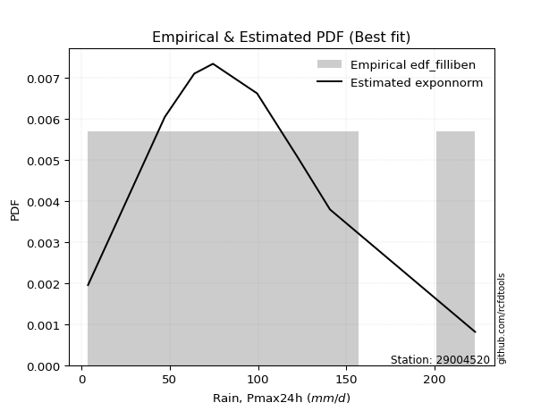</img>

</div>


### 10. EDF Jenkinson (1977)

The Jenkinson formula in hydrology is an empirical plotting position formula used to estimate the non-exceedance probability _(P)_ or return period _(T)_ of a given ordered observation within a sample. It is a widely used method in the frequency analysis of extreme events such as floods and rainfall, as it provides a distribution-free way to plot data. _a≈0.31_ and _b≈0.38_ are constants derived to approximate the median of the probability distribution for the given rank.

<div align="center">


$P=(m-a)/(n+b)$


</div>


**10.1. Empirical values**

<div align="center">

|                | 0                   | 1                   | 2                  | 3                   | 4             | 5                  | 6                  | 7                  | 8                  |
|:---------------|:--------------------|:--------------------|:-------------------|:--------------------|:--------------|:-------------------|:-------------------|:-------------------|:-------------------|
| date           | 2023                | 2021                | 2018               | 2017                | 2025          | 2020               | 2019               | 2024               | 2022               |
| x              | 3.7                 | 47.2                | 63.9               | 74.5                | 80.5          | 99.5               | 122.1              | 140.8              | 223.0              |
| m              | 1                   | 2                   | 3                  | 4                   | 5             | 6                  | 7                  | 8                  | 9                  |
| empirical_dist | edf_jenkinson       | edf_jenkinson       | edf_jenkinson      | edf_jenkinson       | edf_jenkinson | edf_jenkinson      | edf_jenkinson      | edf_jenkinson      | edf_jenkinson      |
| empirical      | 0.07356076759061833 | 0.18017057569296374 | 0.2867803837953091 | 0.39339019189765456 | 0.5           | 0.6066098081023454 | 0.7132196162046908 | 0.8198294243070362 | 0.9264392324093815 |
| empirical_tr   | 1.0794016110471807  | 1.2197659297789336  | 1.4020926756352765 | 1.6485061511423549  | 2.0           | 2.542005420054201  | 3.486988847583642  | 5.550295857988164  | 13.5942028985507   |

</div>


**10.2. Kolmogorov-Smirnov fit test (sorted by Δ)**


<div align="center">

|                | 0                   | 1                   | 2                   | 3                   | 4                   | 5                    | 6                   | 7                   | 8                    | 9                    | 10                  | 11                   | 12                  | 13                   | 14                  | 15                  | 16                  | 17                  | 18                   | 19                  | 20                   | 21                   | 22                   | 23                  | 24                  | 25                  | 26                  | 27                  | 28                  | 29                  | 30                  | 31                  | 32                  | 33                  | 34                  | 35                  | 36                  | 37                  | 38                  | 39                  | 40                  | 41                  | 42                  | 43                  | 44                  | 45                  | 46                  | 47                  | 48                  | 49                  | 50                  | 51                  | 52                  | 53                  | 54                  | 55                  | 56                  | 57                  | 58                  | 59                  | 60                  | 61                  | 62                  | 63                  | 64                  | 65                  | 66                  | 67                  | 68                  | 69                  | 70                  | 71                  | 72                  | 73                  | 74                  | 75                  | 76                  | 77                  | 78                  | 79                  | 80                  | 81                  | 82                  | 83                  | 84                  | 85                  | 86                  | 87                  | 88                  | 89                  | 90                  | 91                  | 92                  | 93                  | 94                  | 95                  | 96                  | 97                  | 98                  | 99                  | 100                 | 101                 | 102                 | 103                 | 104                 | 105                 | 106                 | 107                 | 108                 | 109                 | 110                 | 111                 | 112                 | 113                 | 114                 | 115                 | 116                 | 117                 | 118                 | 119                 | 120                 | 121                 | 122                 | 123                 | 124                 | 125                 | 126                 | 127                 | 128                 | 129                 | 130                 | 131                 | 132                 | 133                 | 134                 | 135                 | 136                 | 137                 | 138                 | 139                 | 140                 | 141                 | 142                 | 143                 | 144                 | 145                 | 146                 | 147                 | 148                 | 149                 | 150                 | 151                 | 152                 | 153                 | 154                 | 155                 | 156                 | 157                 | 158                 | 159                 |
|:---------------|:--------------------|:--------------------|:--------------------|:--------------------|:--------------------|:---------------------|:--------------------|:--------------------|:---------------------|:---------------------|:--------------------|:---------------------|:--------------------|:---------------------|:--------------------|:--------------------|:--------------------|:--------------------|:---------------------|:--------------------|:---------------------|:---------------------|:---------------------|:--------------------|:--------------------|:--------------------|:--------------------|:--------------------|:--------------------|:--------------------|:--------------------|:--------------------|:--------------------|:--------------------|:--------------------|:--------------------|:--------------------|:--------------------|:--------------------|:--------------------|:--------------------|:--------------------|:--------------------|:--------------------|:--------------------|:--------------------|:--------------------|:--------------------|:--------------------|:--------------------|:--------------------|:--------------------|:--------------------|:--------------------|:--------------------|:--------------------|:--------------------|:--------------------|:--------------------|:--------------------|:--------------------|:--------------------|:--------------------|:--------------------|:--------------------|:--------------------|:--------------------|:--------------------|:--------------------|:--------------------|:--------------------|:--------------------|:--------------------|:--------------------|:--------------------|:--------------------|:--------------------|:--------------------|:--------------------|:--------------------|:--------------------|:--------------------|:--------------------|:--------------------|:--------------------|:--------------------|:--------------------|:--------------------|:--------------------|:--------------------|:--------------------|:--------------------|:--------------------|:--------------------|:--------------------|:--------------------|:--------------------|:--------------------|:--------------------|:--------------------|:--------------------|:--------------------|:--------------------|:--------------------|:--------------------|:--------------------|:--------------------|:--------------------|:--------------------|:--------------------|:--------------------|:--------------------|:--------------------|:--------------------|:--------------------|:--------------------|:--------------------|:--------------------|:--------------------|:--------------------|:--------------------|:--------------------|:--------------------|:--------------------|:--------------------|:--------------------|:--------------------|:--------------------|:--------------------|:--------------------|:--------------------|:--------------------|:--------------------|:--------------------|:--------------------|:--------------------|:--------------------|:--------------------|:--------------------|:--------------------|:--------------------|:--------------------|:--------------------|:--------------------|:--------------------|:--------------------|:--------------------|:--------------------|:--------------------|:--------------------|:--------------------|:--------------------|:--------------------|:--------------------|:--------------------|:--------------------|:--------------------|:--------------------|:--------------------|:--------------------|
| station        | 29004520            | 29004520            | 29004520            | 29004520            | 29004520            | 29004520             | 29004520            | 29004520            | 29004520             | 29004520             | 29004520            | 29004520             | 29004520            | 29004520             | 29004520            | 29004520            | 29004520            | 29004520            | 29004520             | 29004520            | 29004520             | 29004520             | 29004520             | 29004520            | 29004520            | 29004520            | 29004520            | 29004520            | 29004520            | 29004520            | 29004520            | 29004520            | 29004520            | 29004520            | 29004520            | 29004520            | 29004520            | 29004520            | 29004520            | 29004520            | 29004520            | 29004520            | 29004520            | 29004520            | 29004520            | 29004520            | 29004520            | 29004520            | 29004520            | 29004520            | 29004520            | 29004520            | 29004520            | 29004520            | 29004520            | 29004520            | 29004520            | 29004520            | 29004520            | 29004520            | 29004520            | 29004520            | 29004520            | 29004520            | 29004520            | 29004520            | 29004520            | 29004520            | 29004520            | 29004520            | 29004520            | 29004520            | 29004520            | 29004520            | 29004520            | 29004520            | 29004520            | 29004520            | 29004520            | 29004520            | 29004520            | 29004520            | 29004520            | 29004520            | 29004520            | 29004520            | 29004520            | 29004520            | 29004520            | 29004520            | 29004520            | 29004520            | 29004520            | 29004520            | 29004520            | 29004520            | 29004520            | 29004520            | 29004520            | 29004520            | 29004520            | 29004520            | 29004520            | 29004520            | 29004520            | 29004520            | 29004520            | 29004520            | 29004520            | 29004520            | 29004520            | 29004520            | 29004520            | 29004520            | 29004520            | 29004520            | 29004520            | 29004520            | 29004520            | 29004520            | 29004520            | 29004520            | 29004520            | 29004520            | 29004520            | 29004520            | 29004520            | 29004520            | 29004520            | 29004520            | 29004520            | 29004520            | 29004520            | 29004520            | 29004520            | 29004520            | 29004520            | 29004520            | 29004520            | 29004520            | 29004520            | 29004520            | 29004520            | 29004520            | 29004520            | 29004520            | 29004520            | 29004520            | 29004520            | 29004520            | 29004520            | 29004520            | 29004520            | 29004520            | 29004520            | 29004520            | 29004520            | 29004520            | 29004520            | 29004520            |
| empirical_dist | edf_jenkinson       | edf_jenkinson       | edf_jenkinson       | edf_jenkinson       | edf_jenkinson       | edf_jenkinson        | edf_jenkinson       | edf_jenkinson       | edf_jenkinson        | edf_jenkinson        | edf_jenkinson       | edf_jenkinson        | edf_jenkinson       | edf_jenkinson        | edf_jenkinson       | edf_jenkinson       | edf_jenkinson       | edf_jenkinson       | edf_jenkinson        | edf_jenkinson       | edf_jenkinson        | edf_jenkinson        | edf_jenkinson        | edf_jenkinson       | edf_jenkinson       | edf_jenkinson       | edf_jenkinson       | edf_jenkinson       | edf_jenkinson       | edf_jenkinson       | edf_jenkinson       | edf_jenkinson       | edf_jenkinson       | edf_jenkinson       | edf_jenkinson       | edf_jenkinson       | edf_jenkinson       | edf_jenkinson       | edf_jenkinson       | edf_jenkinson       | edf_jenkinson       | edf_jenkinson       | edf_jenkinson       | edf_jenkinson       | edf_jenkinson       | edf_jenkinson       | edf_jenkinson       | edf_jenkinson       | edf_jenkinson       | edf_jenkinson       | edf_jenkinson       | edf_jenkinson       | edf_jenkinson       | edf_jenkinson       | edf_jenkinson       | edf_jenkinson       | edf_jenkinson       | edf_jenkinson       | edf_jenkinson       | edf_jenkinson       | edf_jenkinson       | edf_jenkinson       | edf_jenkinson       | edf_jenkinson       | edf_jenkinson       | edf_jenkinson       | edf_jenkinson       | edf_jenkinson       | edf_jenkinson       | edf_jenkinson       | edf_jenkinson       | edf_jenkinson       | edf_jenkinson       | edf_jenkinson       | edf_jenkinson       | edf_jenkinson       | edf_jenkinson       | edf_jenkinson       | edf_jenkinson       | edf_jenkinson       | edf_jenkinson       | edf_jenkinson       | edf_jenkinson       | edf_jenkinson       | edf_jenkinson       | edf_jenkinson       | edf_jenkinson       | edf_jenkinson       | edf_jenkinson       | edf_jenkinson       | edf_jenkinson       | edf_jenkinson       | edf_jenkinson       | edf_jenkinson       | edf_jenkinson       | edf_jenkinson       | edf_jenkinson       | edf_jenkinson       | edf_jenkinson       | edf_jenkinson       | edf_jenkinson       | edf_jenkinson       | edf_jenkinson       | edf_jenkinson       | edf_jenkinson       | edf_jenkinson       | edf_jenkinson       | edf_jenkinson       | edf_jenkinson       | edf_jenkinson       | edf_jenkinson       | edf_jenkinson       | edf_jenkinson       | edf_jenkinson       | edf_jenkinson       | edf_jenkinson       | edf_jenkinson       | edf_jenkinson       | edf_jenkinson       | edf_jenkinson       | edf_jenkinson       | edf_jenkinson       | edf_jenkinson       | edf_jenkinson       | edf_jenkinson       | edf_jenkinson       | edf_jenkinson       | edf_jenkinson       | edf_jenkinson       | edf_jenkinson       | edf_jenkinson       | edf_jenkinson       | edf_jenkinson       | edf_jenkinson       | edf_jenkinson       | edf_jenkinson       | edf_jenkinson       | edf_jenkinson       | edf_jenkinson       | edf_jenkinson       | edf_jenkinson       | edf_jenkinson       | edf_jenkinson       | edf_jenkinson       | edf_jenkinson       | edf_jenkinson       | edf_jenkinson       | edf_jenkinson       | edf_jenkinson       | edf_jenkinson       | edf_jenkinson       | edf_jenkinson       | edf_jenkinson       | edf_jenkinson       | edf_jenkinson       | edf_jenkinson       | edf_jenkinson       | edf_jenkinson       | edf_jenkinson       | edf_jenkinson       |
| p_dist         | logcrystalball      | betaprime           | f                   | erlang              | gamma               | exponnorm            | gengamma            | fatiguelife         | invgauss             | genlogistic          | johnsonsu           | invgamma             | exponweib           | rayleigh             | logjohnsonsu        | pearson3            | invweibull          | rice                | nct                  | gumbel_r            | dgamma               | skewnorm             | burr12               | weibull_min         | maxwell             | kstwobign           | dweibull            | moyal               | foldnorm            | logdweibull         | logt                | halflogistic        | halfnorm            | semicircular        | anglit              | logjohnsonsb        | loggenlogistic      | genpareto           | logburr12           | logexponpow         | logloggamma         | t                   | crystalball         | norm                | kappa3              | gennorm             | logargus            | logmielke           | logpearson3         | logdgamma           | loggompertz         | logloglaplace       | logistic            | truncexpon          | hypsecant           | gausshyper          | wald                | cosine              | bradford            | loggumbel_l         | arcsine             | logweibull_max      | burr                | logburr             | laplace             | loggennorm          | truncweibull_min    | gumbel_l            | logskewnorm         | kappa4              | loggenextreme       | logtrapezoid        | logvonmises_line    | lognakagami         | loglaplace          | loglaplace          | logfoldnorm         | logf                | uniform             | wrapcauchy          | vonmises_line       | loghypsecant        | loglogistic         | lomax               | logrice             | lognorm             | logexponnorm        | lognct              | genexpon            | logfatiguelife      | mielke              | logbetaprime        | loggamma            | loggamma            | loganglit           | ksone               | argus               | beta                | logerlang           | loginvgamma         | logsemicircular     | logalpha            | loginvgauss         | logmaxwell          | loggausshyper       | logncf              | lograyleigh         | logarcsine          | loglevy_l           | ncf                 | loginvweibull       | nakagami            | logtriang           | loggumbel_r         | loggenpareto        | loghalfnorm         | loggenhalflogistic  | logmoyal            | loghalflogistic     | halfgennorm         | logcosine           | johnsonsb           | logkstwobign        | loggenexpon         | logtruncweibull_min | genhalflogistic     | loghalfgennorm      | levy_l              | logwald             | triang              | logwrapcauchy       | logtruncnorm        | loglomax            | logbeta             | logksone            | logkappa4           | logkappa3           | logtukeylambda      | loguniform          | trapezoid           | logtruncexpon       | logbradford         | rdist               | genextreme          | powerlaw            | loggengamma         | tukeylambda         | logweibull_min      | logrdist            | logexponweib        | alpha               | weibull_max         | logpowerlaw         | truncpareto         | exponpow            | logtruncpareto      | gompertz            | truncnorm           | logvonmises         | vonmises            |
| delta          | 0.03629338317084985 | 0.04716392017384252 | 0.0472633170692453  | 0.0473037270625174  | 0.04730377263013613 | 0.048160223933952806 | 0.04839915277973983 | 0.04897149006307744 | 0.049047668303059455 | 0.049420565863060706 | 0.04955052931618681 | 0.050162480779447904 | 0.05079091876372238 | 0.051303370636190004 | 0.05349864925095826 | 0.05386986554383344 | 0.05412494053944894 | 0.05457472453368789 | 0.055160934935096106 | 0.05650772954488325 | 0.058115967848065386 | 0.058301392806423824 | 0.060038239723915254 | 0.06076945839664094 | 0.06294035033774259 | 0.064179906797936   | 0.06601654706971011 | 0.07034617106401116 | 0.07356076759061833 | 0.07816092264061614 | 0.07852440278251344 | 0.08049822143967955 | 0.08237634166306257 | 0.08250580561611764 | 0.08357649363878283 | 0.08635866392379749 | 0.09100840594589876 | 0.09228555896059387 | 0.09395960671644371 | 0.09433807935965494 | 0.09507130807571113 | 0.09509804913708847 | 0.09702250877081481 | 0.0970225177554983  | 0.09709627427723061 | 0.09773412903023504 | 0.10030504804918378 | 0.1006006004903689  | 0.10180489596157916 | 0.10660980810271659 | 0.1088978919736725  | 0.1092601743488355  | 0.10958202801902822 | 0.11327880860174366 | 0.1198847389913697  | 0.12029359901819092 | 0.12428682460909007 | 0.12771446635019473 | 0.128817896336771   | 0.13427924321370466 | 0.1353921177615076  | 0.14043084681602613 | 0.14427330957929763 | 0.1455353475837622  | 0.14673806906322662 | 0.1524743985367486  | 0.15249683164209904 | 0.16383332278968427 | 0.1639050717071147  | 0.16697487935328126 | 0.1680399967686127  | 0.17234415685257604 | 0.18017053953150938 | 0.18017057569218917 | 0.18817438340108478 | 0.18817438340108478 | 0.18885774353944917 | 0.19327302015212905 | 0.19465842567502523 | 0.19466285506044578 | 0.19505516899719072 | 0.19506088595432758 | 0.19674849191255156 | 0.1970191921190207  | 0.19872376409027087 | 0.19872637022494022 | 0.19872730478458306 | 0.19894440621153686 | 0.19897976119800675 | 0.2006757962774105  | 0.20563142777694166 | 0.2113234603990199  | 0.2140594749833828  | 0.2140594749833828  | 0.21483615826085528 | 0.2155202587803604  | 0.21700439391112758 | 0.2172472992329435  | 0.2187882053390337  | 0.22039426833389414 | 0.22172176025334578 | 0.22310504833741146 | 0.223621837244945   | 0.23229514521705352 | 0.23488309067757301 | 0.23514009020716176 | 0.2439500271208202  | 0.2496107479014113  | 0.2499340441822297  | 0.2572159323547476  | 0.25723459964436035 | 0.2639770380098234  | 0.266056772921853   | 0.26852049363308594 | 0.2757252301347821  | 0.27885639861928513 | 0.2875777534709467  | 0.29440003068777787 | 0.299447790746156   | 0.30446788107895284 | 0.3048467127863568  | 0.30639951474297544 | 0.3091914717734375  | 0.33470463149302127 | 0.3433915062558153  | 0.3441323203622268  | 0.3499016280971267  | 0.3537811230178626  | 0.3664164167984797  | 0.38271819148915687 | 0.3968109939603522  | 0.39810732601677185 | 0.4009753208473638  | 0.40620338542431306 | 0.4208014318428647  | 0.42684820547488206 | 0.4403742204626921  | 0.44040646388769583 | 0.4409958333500304  | 0.450441601918545   | 0.5081058091990898  | 0.5093436536716998  | 0.5149140798959635  | 0.5300853838979898  | 0.5570030957276004  | 0.5869770851063254  | 0.5923447594067552  | 0.6042892270592988  | 0.6054109240942731  | 0.6154875803035971  | 0.6342867770776706  | 0.6934319777251231  | 0.7167406664575882  | 0.7277527111543067  | 0.7752175658499283  | 0.7916017741826533  | 0.8180713445564831  | 0.9256470987621647  | 1.0147341443386657  | 35.4332359122957    |
| deltao         | 0.41761268023100007 | 0.41761268023100007 | 0.41761268023100007 | 0.41761268023100007 | 0.41761268023100007 | 0.41761268023100007  | 0.41761268023100007 | 0.41761268023100007 | 0.41761268023100007  | 0.41761268023100007  | 0.41761268023100007 | 0.41761268023100007  | 0.41761268023100007 | 0.41761268023100007  | 0.41761268023100007 | 0.41761268023100007 | 0.41761268023100007 | 0.41761268023100007 | 0.41761268023100007  | 0.41761268023100007 | 0.41761268023100007  | 0.41761268023100007  | 0.41761268023100007  | 0.41761268023100007 | 0.41761268023100007 | 0.41761268023100007 | 0.41761268023100007 | 0.41761268023100007 | 0.41761268023100007 | 0.41761268023100007 | 0.41761268023100007 | 0.41761268023100007 | 0.41761268023100007 | 0.41761268023100007 | 0.41761268023100007 | 0.41761268023100007 | 0.41761268023100007 | 0.41761268023100007 | 0.41761268023100007 | 0.41761268023100007 | 0.41761268023100007 | 0.41761268023100007 | 0.41761268023100007 | 0.41761268023100007 | 0.41761268023100007 | 0.41761268023100007 | 0.41761268023100007 | 0.41761268023100007 | 0.41761268023100007 | 0.41761268023100007 | 0.41761268023100007 | 0.41761268023100007 | 0.41761268023100007 | 0.41761268023100007 | 0.41761268023100007 | 0.41761268023100007 | 0.41761268023100007 | 0.41761268023100007 | 0.41761268023100007 | 0.41761268023100007 | 0.41761268023100007 | 0.41761268023100007 | 0.41761268023100007 | 0.41761268023100007 | 0.41761268023100007 | 0.41761268023100007 | 0.41761268023100007 | 0.41761268023100007 | 0.41761268023100007 | 0.41761268023100007 | 0.41761268023100007 | 0.41761268023100007 | 0.41761268023100007 | 0.41761268023100007 | 0.41761268023100007 | 0.41761268023100007 | 0.41761268023100007 | 0.41761268023100007 | 0.41761268023100007 | 0.41761268023100007 | 0.41761268023100007 | 0.41761268023100007 | 0.41761268023100007 | 0.41761268023100007 | 0.41761268023100007 | 0.41761268023100007 | 0.41761268023100007 | 0.41761268023100007 | 0.41761268023100007 | 0.41761268023100007 | 0.41761268023100007 | 0.41761268023100007 | 0.41761268023100007 | 0.41761268023100007 | 0.41761268023100007 | 0.41761268023100007 | 0.41761268023100007 | 0.41761268023100007 | 0.41761268023100007 | 0.41761268023100007 | 0.41761268023100007 | 0.41761268023100007 | 0.41761268023100007 | 0.41761268023100007 | 0.41761268023100007 | 0.41761268023100007 | 0.41761268023100007 | 0.41761268023100007 | 0.41761268023100007 | 0.41761268023100007 | 0.41761268023100007 | 0.41761268023100007 | 0.41761268023100007 | 0.41761268023100007 | 0.41761268023100007 | 0.41761268023100007 | 0.41761268023100007 | 0.41761268023100007 | 0.41761268023100007 | 0.41761268023100007 | 0.41761268023100007 | 0.41761268023100007 | 0.41761268023100007 | 0.41761268023100007 | 0.41761268023100007 | 0.41761268023100007 | 0.41761268023100007 | 0.41761268023100007 | 0.41761268023100007 | 0.41761268023100007 | 0.41761268023100007 | 0.41761268023100007 | 0.41761268023100007 | 0.41761268023100007 | 0.41761268023100007 | 0.41761268023100007 | 0.41761268023100007 | 0.41761268023100007 | 0.41761268023100007 | 0.41761268023100007 | 0.41761268023100007 | 0.41761268023100007 | 0.41761268023100007 | 0.41761268023100007 | 0.41761268023100007 | 0.41761268023100007 | 0.41761268023100007 | 0.41761268023100007 | 0.41761268023100007 | 0.41761268023100007 | 0.41761268023100007 | 0.41761268023100007 | 0.41761268023100007 | 0.41761268023100007 | 0.41761268023100007 | 0.41761268023100007 | 0.41761268023100007 | 0.41761268023100007 | 0.41761268023100007 | 0.41761268023100007 |
| eval           | Δo > Δ              | Δo > Δ              | Δo > Δ              | Δo > Δ              | Δo > Δ              | Δo > Δ               | Δo > Δ              | Δo > Δ              | Δo > Δ               | Δo > Δ               | Δo > Δ              | Δo > Δ               | Δo > Δ              | Δo > Δ               | Δo > Δ              | Δo > Δ              | Δo > Δ              | Δo > Δ              | Δo > Δ               | Δo > Δ              | Δo > Δ               | Δo > Δ               | Δo > Δ               | Δo > Δ              | Δo > Δ              | Δo > Δ              | Δo > Δ              | Δo > Δ              | Δo > Δ              | Δo > Δ              | Δo > Δ              | Δo > Δ              | Δo > Δ              | Δo > Δ              | Δo > Δ              | Δo > Δ              | Δo > Δ              | Δo > Δ              | Δo > Δ              | Δo > Δ              | Δo > Δ              | Δo > Δ              | Δo > Δ              | Δo > Δ              | Δo > Δ              | Δo > Δ              | Δo > Δ              | Δo > Δ              | Δo > Δ              | Δo > Δ              | Δo > Δ              | Δo > Δ              | Δo > Δ              | Δo > Δ              | Δo > Δ              | Δo > Δ              | Δo > Δ              | Δo > Δ              | Δo > Δ              | Δo > Δ              | Δo > Δ              | Δo > Δ              | Δo > Δ              | Δo > Δ              | Δo > Δ              | Δo > Δ              | Δo > Δ              | Δo > Δ              | Δo > Δ              | Δo > Δ              | Δo > Δ              | Δo > Δ              | Δo > Δ              | Δo > Δ              | Δo > Δ              | Δo > Δ              | Δo > Δ              | Δo > Δ              | Δo > Δ              | Δo > Δ              | Δo > Δ              | Δo > Δ              | Δo > Δ              | Δo > Δ              | Δo > Δ              | Δo > Δ              | Δo > Δ              | Δo > Δ              | Δo > Δ              | Δo > Δ              | Δo > Δ              | Δo > Δ              | Δo > Δ              | Δo > Δ              | Δo > Δ              | Δo > Δ              | Δo > Δ              | Δo > Δ              | Δo > Δ              | Δo > Δ              | Δo > Δ              | Δo > Δ              | Δo > Δ              | Δo > Δ              | Δo > Δ              | Δo > Δ              | Δo > Δ              | Δo > Δ              | Δo > Δ              | Δo > Δ              | Δo > Δ              | Δo > Δ              | Δo > Δ              | Δo > Δ              | Δo > Δ              | Δo > Δ              | Δo > Δ              | Δo > Δ              | Δo > Δ              | Δo > Δ              | Δo > Δ              | Δo > Δ              | Δo > Δ              | Δo > Δ              | Δo > Δ              | Δo > Δ              | Δo > Δ              | Δo > Δ              | Δo > Δ              | Δo > Δ              | Δo > Δ              | Δo > Δ              | Δo > Δ              | Δo > Δ              | Δo <= Δ             | Δo <= Δ             | Δo <= Δ             | Δo <= Δ             | Δo <= Δ             | Δo <= Δ             | Δo <= Δ             | Δo <= Δ             | Δo <= Δ             | Δo <= Δ             | Δo <= Δ             | Δo <= Δ             | Δo <= Δ             | Δo <= Δ             | Δo <= Δ             | Δo <= Δ             | Δo <= Δ             | Δo <= Δ             | Δo <= Δ             | Δo <= Δ             | Δo <= Δ             | Δo <= Δ             | Δo <= Δ             | Δo <= Δ             | Δo <= Δ             | Δo <= Δ             |
| fit            | 1                   | 1                   | 1                   | 1                   | 1                   | 1                    | 1                   | 1                   | 1                    | 1                    | 1                   | 1                    | 1                   | 1                    | 1                   | 1                   | 1                   | 1                   | 1                    | 1                   | 1                    | 1                    | 1                    | 1                   | 1                   | 1                   | 1                   | 1                   | 1                   | 1                   | 1                   | 1                   | 1                   | 1                   | 1                   | 1                   | 1                   | 1                   | 1                   | 1                   | 1                   | 1                   | 1                   | 1                   | 1                   | 1                   | 1                   | 1                   | 1                   | 1                   | 1                   | 1                   | 1                   | 1                   | 1                   | 1                   | 1                   | 1                   | 1                   | 1                   | 1                   | 1                   | 1                   | 1                   | 1                   | 1                   | 1                   | 1                   | 1                   | 1                   | 1                   | 1                   | 1                   | 1                   | 1                   | 1                   | 1                   | 1                   | 1                   | 1                   | 1                   | 1                   | 1                   | 1                   | 1                   | 1                   | 1                   | 1                   | 1                   | 1                   | 1                   | 1                   | 1                   | 1                   | 1                   | 1                   | 1                   | 1                   | 1                   | 1                   | 1                   | 1                   | 1                   | 1                   | 1                   | 1                   | 1                   | 1                   | 1                   | 1                   | 1                   | 1                   | 1                   | 1                   | 1                   | 1                   | 1                   | 1                   | 1                   | 1                   | 1                   | 1                   | 1                   | 1                   | 1                   | 1                   | 1                   | 1                   | 1                   | 1                   | 1                   | 1                   | 1                   | 1                   | 0                   | 0                   | 0                   | 0                   | 0                   | 0                   | 0                   | 0                   | 0                   | 0                   | 0                   | 0                   | 0                   | 0                   | 0                   | 0                   | 0                   | 0                   | 0                   | 0                   | 0                   | 0                   | 0                   | 0                   | 0                   | 0                   |
| n              | 9                   | 9                   | 9                   | 9                   | 9                   | 9                    | 9                   | 9                   | 9                    | 9                    | 9                   | 9                    | 9                   | 9                    | 9                   | 9                   | 9                   | 9                   | 9                    | 9                   | 9                    | 9                    | 9                    | 9                   | 9                   | 9                   | 9                   | 9                   | 9                   | 9                   | 9                   | 9                   | 9                   | 9                   | 9                   | 9                   | 9                   | 9                   | 9                   | 9                   | 9                   | 9                   | 9                   | 9                   | 9                   | 9                   | 9                   | 9                   | 9                   | 9                   | 9                   | 9                   | 9                   | 9                   | 9                   | 9                   | 9                   | 9                   | 9                   | 9                   | 9                   | 9                   | 9                   | 9                   | 9                   | 9                   | 9                   | 9                   | 9                   | 9                   | 9                   | 9                   | 9                   | 9                   | 9                   | 9                   | 9                   | 9                   | 9                   | 9                   | 9                   | 9                   | 9                   | 9                   | 9                   | 9                   | 9                   | 9                   | 9                   | 9                   | 9                   | 9                   | 9                   | 9                   | 9                   | 9                   | 9                   | 9                   | 9                   | 9                   | 9                   | 9                   | 9                   | 9                   | 9                   | 9                   | 9                   | 9                   | 9                   | 9                   | 9                   | 9                   | 9                   | 9                   | 9                   | 9                   | 9                   | 9                   | 9                   | 9                   | 9                   | 9                   | 9                   | 9                   | 9                   | 9                   | 9                   | 9                   | 9                   | 9                   | 9                   | 9                   | 9                   | 9                   | 9                   | 9                   | 9                   | 9                   | 9                   | 9                   | 9                   | 9                   | 9                   | 9                   | 9                   | 9                   | 9                   | 9                   | 9                   | 9                   | 9                   | 9                   | 9                   | 9                   | 9                   | 9                   | 9                   | 9                   | 9                   | 9                   |
| best_fit       | 1                   | 0                   | 0                   | 0                   | 0                   | 0                    | 0                   | 0                   | 0                    | 0                    | 0                   | 0                    | 0                   | 0                    | 0                   | 0                   | 0                   | 0                   | 0                    | 0                   | 0                    | 0                    | 0                    | 0                   | 0                   | 0                   | 0                   | 0                   | 0                   | 0                   | 0                   | 0                   | 0                   | 0                   | 0                   | 0                   | 0                   | 0                   | 0                   | 0                   | 0                   | 0                   | 0                   | 0                   | 0                   | 0                   | 0                   | 0                   | 0                   | 0                   | 0                   | 0                   | 0                   | 0                   | 0                   | 0                   | 0                   | 0                   | 0                   | 0                   | 0                   | 0                   | 0                   | 0                   | 0                   | 0                   | 0                   | 0                   | 0                   | 0                   | 0                   | 0                   | 0                   | 0                   | 0                   | 0                   | 0                   | 0                   | 0                   | 0                   | 0                   | 0                   | 0                   | 0                   | 0                   | 0                   | 0                   | 0                   | 0                   | 0                   | 0                   | 0                   | 0                   | 0                   | 0                   | 0                   | 0                   | 0                   | 0                   | 0                   | 0                   | 0                   | 0                   | 0                   | 0                   | 0                   | 0                   | 0                   | 0                   | 0                   | 0                   | 0                   | 0                   | 0                   | 0                   | 0                   | 0                   | 0                   | 0                   | 0                   | 0                   | 0                   | 0                   | 0                   | 0                   | 0                   | 0                   | 0                   | 0                   | 0                   | 0                   | 0                   | 0                   | 0                   | 0                   | 0                   | 0                   | 0                   | 0                   | 0                   | 0                   | 0                   | 0                   | 0                   | 0                   | 0                   | 0                   | 0                   | 0                   | 0                   | 0                   | 0                   | 0                   | 0                   | 0                   | 0                   | 0                   | 0                   | 0                   | 0                   |
| best_fit_sort  | 1                   | 2                   | 3                   | 4                   | 5                   | 6                    | 7                   | 8                   | 9                    | 10                   | 11                  | 12                   | 13                  | 14                   | 15                  | 16                  | 17                  | 18                  | 19                   | 20                  | 21                   | 22                   | 23                   | 24                  | 25                  | 26                  | 27                  | 28                  | 29                  | 30                  | 31                  | 32                  | 33                  | 34                  | 35                  | 36                  | 37                  | 38                  | 39                  | 40                  | 41                  | 42                  | 43                  | 44                  | 45                  | 46                  | 47                  | 48                  | 49                  | 50                  | 51                  | 52                  | 53                  | 54                  | 55                  | 56                  | 57                  | 58                  | 59                  | 60                  | 61                  | 62                  | 63                  | 64                  | 65                  | 66                  | 67                  | 68                  | 69                  | 70                  | 71                  | 72                  | 73                  | 74                  | 75                  | 76                  | 77                  | 78                  | 79                  | 80                  | 81                  | 82                  | 83                  | 84                  | 85                  | 86                  | 87                  | 88                  | 89                  | 90                  | 91                  | 92                  | 93                  | 94                  | 95                  | 96                  | 97                  | 98                  | 99                  | 100                 | 101                 | 102                 | 103                 | 104                 | 105                 | 106                 | 107                 | 108                 | 109                 | 110                 | 111                 | 112                 | 113                 | 114                 | 115                 | 116                 | 117                 | 118                 | 119                 | 120                 | 121                 | 122                 | 123                 | 124                 | 125                 | 126                 | 127                 | 128                 | 129                 | 130                 | 131                 | 132                 | 133                 | 134                 | 135                 | 136                 | 137                 | 138                 | 139                 | 140                 | 141                 | 142                 | 143                 | 144                 | 145                 | 146                 | 147                 | 148                 | 149                 | 150                 | 151                 | 152                 | 153                 | 154                 | 155                 | 156                 | 157                 | 158                 | 159                 | 160                 |

</div>


**10.3. Best fit**

<div align="center">

|   id |   station | empirical_dist   | p_dist         |     delta |   deltao | eval   |   fit |   n |   best_fit |   best_fit_sort |
|-----:|----------:|:-----------------|:---------------|----------:|---------:|:-------|------:|----:|-----------:|----------------:|
|    0 |  29004520 | edf_jenkinson    | logcrystalball | 0.0362934 | 0.417613 | Δo > Δ |     1 |   9 |          1 |               1 |

</div>


<div align="center">

</img></img>

</div>


### 11. EDF Cunnane (1978)

Cunnane´s work in statistical hydrology has focused on the performance and evaluation of different probability distributions (such as GEV, Gumbel, Lognormal) for flood frequency estimation. _b_ is a constant, typically set to 0.4.

<div align="center">


$P=(m-b)/(n+1-2b)$


</div>


**11.1. Empirical values**

<div align="center">

|                | 0                   | 1                  | 2                   | 3                  | 4           | 5                  | 6                 | 7                  | 8                  |
|:---------------|:--------------------|:-------------------|:--------------------|:-------------------|:------------|:-------------------|:------------------|:-------------------|:-------------------|
| date           | 2023                | 2021               | 2018                | 2017               | 2025        | 2020               | 2019              | 2024               | 2022               |
| x              | 3.7                 | 47.2               | 63.9                | 74.5               | 80.5        | 99.5               | 122.1             | 140.8              | 223.0              |
| m              | 1                   | 2                  | 3                   | 4                  | 5           | 6                  | 7                 | 8                  | 9                  |
| empirical_dist | edf_cunnane         | edf_cunnane        | edf_cunnane         | edf_cunnane        | edf_cunnane | edf_cunnane        | edf_cunnane       | edf_cunnane        | edf_cunnane        |
| empirical      | 0.06521739130434782 | 0.1739130434782609 | 0.28260869565217395 | 0.391304347826087  | 0.5         | 0.6086956521739131 | 0.717391304347826 | 0.8260869565217391 | 0.9347826086956522 |
| empirical_tr   | 1.069767441860465   | 1.2105263157894737 | 1.393939393939394   | 1.6428571428571428 | 2.0         | 2.555555555555556  | 3.538461538461538 | 5.75               | 15.333333333333343 |

</div>


**11.2. Kolmogorov-Smirnov fit test (sorted by Δ)**


<div align="center">

|                | 0                   | 1                    | 2                   | 3                   | 4                    | 5                    | 6                    | 7                   | 8                    | 9                   | 10                  | 11                  | 12                   | 13                  | 14                  | 15                  | 16                  | 17                   | 18                   | 19                  | 20                   | 21                   | 22                  | 23                  | 24                  | 25                  | 26                  | 27                  | 28                  | 29                  | 30                  | 31                  | 32                  | 33                  | 34                  | 35                  | 36                  | 37                  | 38                  | 39                  | 40                  | 41                  | 42                  | 43                  | 44                  | 45                  | 46                  | 47                  | 48                  | 49                  | 50                  | 51                  | 52                  | 53                  | 54                  | 55                  | 56                  | 57                  | 58                  | 59                  | 60                  | 61                  | 62                  | 63                  | 64                  | 65                  | 66                  | 67                  | 68                  | 69                  | 70                  | 71                  | 72                  | 73                  | 74                  | 75                  | 76                  | 77                  | 78                  | 79                  | 80                  | 81                  | 82                  | 83                  | 84                  | 85                  | 86                  | 87                  | 88                  | 89                  | 90                  | 91                  | 92                  | 93                  | 94                  | 95                  | 96                  | 97                  | 98                  | 99                  | 100                 | 101                 | 102                 | 103                 | 104                 | 105                 | 106                 | 107                 | 108                 | 109                 | 110                 | 111                 | 112                 | 113                 | 114                 | 115                 | 116                 | 117                 | 118                 | 119                 | 120                 | 121                 | 122                 | 123                 | 124                 | 125                 | 126                 | 127                 | 128                 | 129                 | 130                 | 131                 | 132                 | 133                 | 134                 | 135                 | 136                 | 137                 | 138                 | 139                 | 140                 | 141                 | 142                 | 143                 | 144                 | 145                 | 146                 | 147                 | 148                 | 149                 | 150                 | 151                 | 152                 | 153                 | 154                 | 155                 | 156                 | 157                 | 158                 | 159                 |
|:---------------|:--------------------|:---------------------|:--------------------|:--------------------|:---------------------|:---------------------|:---------------------|:--------------------|:---------------------|:--------------------|:--------------------|:--------------------|:---------------------|:--------------------|:--------------------|:--------------------|:--------------------|:---------------------|:---------------------|:--------------------|:---------------------|:---------------------|:--------------------|:--------------------|:--------------------|:--------------------|:--------------------|:--------------------|:--------------------|:--------------------|:--------------------|:--------------------|:--------------------|:--------------------|:--------------------|:--------------------|:--------------------|:--------------------|:--------------------|:--------------------|:--------------------|:--------------------|:--------------------|:--------------------|:--------------------|:--------------------|:--------------------|:--------------------|:--------------------|:--------------------|:--------------------|:--------------------|:--------------------|:--------------------|:--------------------|:--------------------|:--------------------|:--------------------|:--------------------|:--------------------|:--------------------|:--------------------|:--------------------|:--------------------|:--------------------|:--------------------|:--------------------|:--------------------|:--------------------|:--------------------|:--------------------|:--------------------|:--------------------|:--------------------|:--------------------|:--------------------|:--------------------|:--------------------|:--------------------|:--------------------|:--------------------|:--------------------|:--------------------|:--------------------|:--------------------|:--------------------|:--------------------|:--------------------|:--------------------|:--------------------|:--------------------|:--------------------|:--------------------|:--------------------|:--------------------|:--------------------|:--------------------|:--------------------|:--------------------|:--------------------|:--------------------|:--------------------|:--------------------|:--------------------|:--------------------|:--------------------|:--------------------|:--------------------|:--------------------|:--------------------|:--------------------|:--------------------|:--------------------|:--------------------|:--------------------|:--------------------|:--------------------|:--------------------|:--------------------|:--------------------|:--------------------|:--------------------|:--------------------|:--------------------|:--------------------|:--------------------|:--------------------|:--------------------|:--------------------|:--------------------|:--------------------|:--------------------|:--------------------|:--------------------|:--------------------|:--------------------|:--------------------|:--------------------|:--------------------|:--------------------|:--------------------|:--------------------|:--------------------|:--------------------|:--------------------|:--------------------|:--------------------|:--------------------|:--------------------|:--------------------|:--------------------|:--------------------|:--------------------|:--------------------|:--------------------|:--------------------|:--------------------|:--------------------|:--------------------|:--------------------|
| station        | 29004520            | 29004520             | 29004520            | 29004520            | 29004520             | 29004520             | 29004520             | 29004520            | 29004520             | 29004520            | 29004520            | 29004520            | 29004520             | 29004520            | 29004520            | 29004520            | 29004520            | 29004520             | 29004520             | 29004520            | 29004520             | 29004520             | 29004520            | 29004520            | 29004520            | 29004520            | 29004520            | 29004520            | 29004520            | 29004520            | 29004520            | 29004520            | 29004520            | 29004520            | 29004520            | 29004520            | 29004520            | 29004520            | 29004520            | 29004520            | 29004520            | 29004520            | 29004520            | 29004520            | 29004520            | 29004520            | 29004520            | 29004520            | 29004520            | 29004520            | 29004520            | 29004520            | 29004520            | 29004520            | 29004520            | 29004520            | 29004520            | 29004520            | 29004520            | 29004520            | 29004520            | 29004520            | 29004520            | 29004520            | 29004520            | 29004520            | 29004520            | 29004520            | 29004520            | 29004520            | 29004520            | 29004520            | 29004520            | 29004520            | 29004520            | 29004520            | 29004520            | 29004520            | 29004520            | 29004520            | 29004520            | 29004520            | 29004520            | 29004520            | 29004520            | 29004520            | 29004520            | 29004520            | 29004520            | 29004520            | 29004520            | 29004520            | 29004520            | 29004520            | 29004520            | 29004520            | 29004520            | 29004520            | 29004520            | 29004520            | 29004520            | 29004520            | 29004520            | 29004520            | 29004520            | 29004520            | 29004520            | 29004520            | 29004520            | 29004520            | 29004520            | 29004520            | 29004520            | 29004520            | 29004520            | 29004520            | 29004520            | 29004520            | 29004520            | 29004520            | 29004520            | 29004520            | 29004520            | 29004520            | 29004520            | 29004520            | 29004520            | 29004520            | 29004520            | 29004520            | 29004520            | 29004520            | 29004520            | 29004520            | 29004520            | 29004520            | 29004520            | 29004520            | 29004520            | 29004520            | 29004520            | 29004520            | 29004520            | 29004520            | 29004520            | 29004520            | 29004520            | 29004520            | 29004520            | 29004520            | 29004520            | 29004520            | 29004520            | 29004520            | 29004520            | 29004520            | 29004520            | 29004520            | 29004520            | 29004520            |
| empirical_dist | edf_cunnane         | edf_cunnane          | edf_cunnane         | edf_cunnane         | edf_cunnane          | edf_cunnane          | edf_cunnane          | edf_cunnane         | edf_cunnane          | edf_cunnane         | edf_cunnane         | edf_cunnane         | edf_cunnane          | edf_cunnane         | edf_cunnane         | edf_cunnane         | edf_cunnane         | edf_cunnane          | edf_cunnane          | edf_cunnane         | edf_cunnane          | edf_cunnane          | edf_cunnane         | edf_cunnane         | edf_cunnane         | edf_cunnane         | edf_cunnane         | edf_cunnane         | edf_cunnane         | edf_cunnane         | edf_cunnane         | edf_cunnane         | edf_cunnane         | edf_cunnane         | edf_cunnane         | edf_cunnane         | edf_cunnane         | edf_cunnane         | edf_cunnane         | edf_cunnane         | edf_cunnane         | edf_cunnane         | edf_cunnane         | edf_cunnane         | edf_cunnane         | edf_cunnane         | edf_cunnane         | edf_cunnane         | edf_cunnane         | edf_cunnane         | edf_cunnane         | edf_cunnane         | edf_cunnane         | edf_cunnane         | edf_cunnane         | edf_cunnane         | edf_cunnane         | edf_cunnane         | edf_cunnane         | edf_cunnane         | edf_cunnane         | edf_cunnane         | edf_cunnane         | edf_cunnane         | edf_cunnane         | edf_cunnane         | edf_cunnane         | edf_cunnane         | edf_cunnane         | edf_cunnane         | edf_cunnane         | edf_cunnane         | edf_cunnane         | edf_cunnane         | edf_cunnane         | edf_cunnane         | edf_cunnane         | edf_cunnane         | edf_cunnane         | edf_cunnane         | edf_cunnane         | edf_cunnane         | edf_cunnane         | edf_cunnane         | edf_cunnane         | edf_cunnane         | edf_cunnane         | edf_cunnane         | edf_cunnane         | edf_cunnane         | edf_cunnane         | edf_cunnane         | edf_cunnane         | edf_cunnane         | edf_cunnane         | edf_cunnane         | edf_cunnane         | edf_cunnane         | edf_cunnane         | edf_cunnane         | edf_cunnane         | edf_cunnane         | edf_cunnane         | edf_cunnane         | edf_cunnane         | edf_cunnane         | edf_cunnane         | edf_cunnane         | edf_cunnane         | edf_cunnane         | edf_cunnane         | edf_cunnane         | edf_cunnane         | edf_cunnane         | edf_cunnane         | edf_cunnane         | edf_cunnane         | edf_cunnane         | edf_cunnane         | edf_cunnane         | edf_cunnane         | edf_cunnane         | edf_cunnane         | edf_cunnane         | edf_cunnane         | edf_cunnane         | edf_cunnane         | edf_cunnane         | edf_cunnane         | edf_cunnane         | edf_cunnane         | edf_cunnane         | edf_cunnane         | edf_cunnane         | edf_cunnane         | edf_cunnane         | edf_cunnane         | edf_cunnane         | edf_cunnane         | edf_cunnane         | edf_cunnane         | edf_cunnane         | edf_cunnane         | edf_cunnane         | edf_cunnane         | edf_cunnane         | edf_cunnane         | edf_cunnane         | edf_cunnane         | edf_cunnane         | edf_cunnane         | edf_cunnane         | edf_cunnane         | edf_cunnane         | edf_cunnane         | edf_cunnane         | edf_cunnane         | edf_cunnane         | edf_cunnane         | edf_cunnane         |
| p_dist         | logcrystalball      | exponnorm            | gengamma            | fatiguelife         | invgauss             | gumbel_r             | genlogistic          | johnsonsu           | invgamma             | exponweib           | betaprime           | f                   | erlang               | gamma               | logjohnsonsu        | pearson3            | rice                | nct                  | rayleigh             | invweibull          | skewnorm             | dgamma               | moyal               | maxwell             | burr12              | weibull_min         | dweibull            | kstwobign           | foldnorm            | logt                | anglit              | halflogistic        | semicircular        | logdweibull         | halfnorm            | logjohnsonsb        | gennorm             | t                   | crystalball         | norm                | loggenlogistic      | logburr12           | genpareto           | logexponpow         | logloggamma         | kappa3              | logargus            | logmielke           | logpearson3         | logdgamma           | logistic            | loggompertz         | logloglaplace       | wald                | truncexpon          | hypsecant           | gausshyper          | cosine              | bradford            | loggumbel_l         | arcsine             | logweibull_max      | laplace             | loggennorm          | burr                | logburr             | truncweibull_min    | gumbel_l            | logskewnorm         | kappa4              | lognakagami         | logvonmises_line    | loggenextreme       | logtrapezoid        | loglaplace          | loglaplace          | logfoldnorm         | vonmises_line       | loghypsecant        | logf                | uniform             | loglogistic         | wrapcauchy          | lomax               | logrice             | lognorm             | logexponnorm        | lognct              | genexpon            | logfatiguelife      | mielke              | logbetaprime        | loggamma            | loggamma            | loganglit           | ksone               | argus               | beta                | logerlang           | loginvgamma         | logsemicircular     | logalpha            | loginvgauss         | logmaxwell          | loggausshyper       | logncf              | lograyleigh         | logarcsine          | loglevy_l           | ncf                 | loginvweibull       | nakagami            | logtriang           | loggumbel_r         | loggenpareto        | loghalfnorm         | loggenhalflogistic  | logmoyal            | loghalflogistic     | halfgennorm         | logcosine           | johnsonsb           | logkstwobign        | loggenexpon         | logtruncweibull_min | genhalflogistic     | loghalfgennorm      | levy_l              | logwald             | triang              | logwrapcauchy       | logtruncnorm        | loglomax            | logbeta             | logksone            | logkappa4           | logkappa3           | logtukeylambda      | loguniform          | trapezoid           | logtruncexpon       | logbradford         | rdist               | genextreme          | powerlaw            | loggengamma         | tukeylambda         | logweibull_min      | logrdist            | logexponweib        | alpha               | weibull_max         | logpowerlaw         | truncpareto         | exponpow            | logtruncpareto      | gompertz            | truncnorm           | logvonmises         | vonmises            |
| delta          | 0.02795000688457916 | 0.048160223933952806 | 0.04857145256237988 | 0.04897149006307744 | 0.049047668303059455 | 0.049287892449188075 | 0.049420565863060706 | 0.04955052931618681 | 0.050162480779447904 | 0.05079091876372238 | 0.051032697769823   | 0.05143500521238048 | 0.051475415205652575 | 0.05147546077327131 | 0.05349864925095826 | 0.05386986554383344 | 0.05457472453368789 | 0.055160934935096106 | 0.056285291710066715 | 0.05829662868258412 | 0.058301392806423824 | 0.059178145906081836 | 0.06200279477774066 | 0.06294035033774259 | 0.06420992786705043 | 0.06494114653977612 | 0.06601654706971011 | 0.06835159494107118 | 0.07744556261129001 | 0.07852440278251344 | 0.08357649363878283 | 0.08466990958281473 | 0.08590988536964728 | 0.08650429892688682 | 0.08654802980619775 | 0.09261619613850033 | 0.09356244088709975 | 0.09509804913708847 | 0.09702250877081481 | 0.0970225177554983  | 0.09726593816060161 | 0.09813129485957889 | 0.0985430911752968  | 0.10059561157435779 | 0.10132884029041397 | 0.10335380649193346 | 0.10656258026388662 | 0.10685813270507175 | 0.108062428176282   | 0.10869565217428417 | 0.10958202801902822 | 0.11306958011680768 | 0.11760355063510619 | 0.11802929239438723 | 0.1195363408164466  | 0.1198847389913697  | 0.12655113123289377 | 0.12771446635019473 | 0.13507542855147392 | 0.1405367754284075  | 0.14164964997621055 | 0.14668837903072898 | 0.14673806906322662 | 0.15038855446518096 | 0.15053084179400048 | 0.15179287979846512 | 0.15875436385680197 | 0.16383332278968427 | 0.17016260392181756 | 0.1732324115679842  | 0.17391304347748632 | 0.17394311161485504 | 0.17429752898331563 | 0.17860168906727888 | 0.19234607154421995 | 0.19234607154421995 | 0.19302943168258435 | 0.19505516899719072 | 0.19923257409746276 | 0.1995305523668319  | 0.20091595788972816 | 0.20092018005568674 | 0.20092038727514872 | 0.20327672433372354 | 0.20457389160681236 | 0.2045780437532064  | 0.20457806263552356 | 0.20490734787903556 | 0.2052372934127096  | 0.20652087289591045 | 0.20980311592007683 | 0.21758099261372274 | 0.22031700719808564 | 0.22031700719808564 | 0.22109369047555813 | 0.22177779099506334 | 0.2232619261258305  | 0.22350483144764643 | 0.22504573755373655 | 0.226651800548597   | 0.22797929246804863 | 0.2293625805521143  | 0.22987936945964785 | 0.23792661203893126 | 0.24114062289227586 | 0.2413976224218646  | 0.2502075593355231  | 0.2558682801161142  | 0.2561915763969326  | 0.2634734645694504  | 0.2634921318590632  | 0.26952692054668226 | 0.27231430513655586 | 0.2726921817762211  | 0.28198276234948494 | 0.28511393083398795 | 0.29383528568564954 | 0.29857171883091305 | 0.3036194788892912  | 0.31072541329365566 | 0.3111042450010596  | 0.3126570469576784  | 0.31544900398814035 | 0.34096216370772414 | 0.3496490384705182  | 0.35038985257692973 | 0.3561591603118296  | 0.3621244993041331  | 0.37058810494161487 | 0.3889757237038598  | 0.40306852617505506 | 0.4043648582314747  | 0.4072328530620667  | 0.412460917639016   | 0.4270589640575676  | 0.43310573768958494 | 0.44663175267739497 | 0.4466639961023987  | 0.4472533655647333  | 0.4566991341332479  | 0.5143633414137926  | 0.5156011858864026  | 0.5211716121106663  | 0.5363429161126927  | 0.5632606279423034  | 0.5932346173210283  | 0.5986022916214581  | 0.6105467592740017  | 0.611668456308976   | 0.6217451125183     | 0.6405443092923734  | 0.699689509939826   | 0.722998198672291   | 0.7340102433690096  | 0.7814750980646311  | 0.7978593063973561  | 0.824328876771186   | 0.9339904750484352  | 1.018905832481801   | 35.42489253600943   |
| deltao         | 0.41761268023100007 | 0.41761268023100007  | 0.41761268023100007 | 0.41761268023100007 | 0.41761268023100007  | 0.41761268023100007  | 0.41761268023100007  | 0.41761268023100007 | 0.41761268023100007  | 0.41761268023100007 | 0.41761268023100007 | 0.41761268023100007 | 0.41761268023100007  | 0.41761268023100007 | 0.41761268023100007 | 0.41761268023100007 | 0.41761268023100007 | 0.41761268023100007  | 0.41761268023100007  | 0.41761268023100007 | 0.41761268023100007  | 0.41761268023100007  | 0.41761268023100007 | 0.41761268023100007 | 0.41761268023100007 | 0.41761268023100007 | 0.41761268023100007 | 0.41761268023100007 | 0.41761268023100007 | 0.41761268023100007 | 0.41761268023100007 | 0.41761268023100007 | 0.41761268023100007 | 0.41761268023100007 | 0.41761268023100007 | 0.41761268023100007 | 0.41761268023100007 | 0.41761268023100007 | 0.41761268023100007 | 0.41761268023100007 | 0.41761268023100007 | 0.41761268023100007 | 0.41761268023100007 | 0.41761268023100007 | 0.41761268023100007 | 0.41761268023100007 | 0.41761268023100007 | 0.41761268023100007 | 0.41761268023100007 | 0.41761268023100007 | 0.41761268023100007 | 0.41761268023100007 | 0.41761268023100007 | 0.41761268023100007 | 0.41761268023100007 | 0.41761268023100007 | 0.41761268023100007 | 0.41761268023100007 | 0.41761268023100007 | 0.41761268023100007 | 0.41761268023100007 | 0.41761268023100007 | 0.41761268023100007 | 0.41761268023100007 | 0.41761268023100007 | 0.41761268023100007 | 0.41761268023100007 | 0.41761268023100007 | 0.41761268023100007 | 0.41761268023100007 | 0.41761268023100007 | 0.41761268023100007 | 0.41761268023100007 | 0.41761268023100007 | 0.41761268023100007 | 0.41761268023100007 | 0.41761268023100007 | 0.41761268023100007 | 0.41761268023100007 | 0.41761268023100007 | 0.41761268023100007 | 0.41761268023100007 | 0.41761268023100007 | 0.41761268023100007 | 0.41761268023100007 | 0.41761268023100007 | 0.41761268023100007 | 0.41761268023100007 | 0.41761268023100007 | 0.41761268023100007 | 0.41761268023100007 | 0.41761268023100007 | 0.41761268023100007 | 0.41761268023100007 | 0.41761268023100007 | 0.41761268023100007 | 0.41761268023100007 | 0.41761268023100007 | 0.41761268023100007 | 0.41761268023100007 | 0.41761268023100007 | 0.41761268023100007 | 0.41761268023100007 | 0.41761268023100007 | 0.41761268023100007 | 0.41761268023100007 | 0.41761268023100007 | 0.41761268023100007 | 0.41761268023100007 | 0.41761268023100007 | 0.41761268023100007 | 0.41761268023100007 | 0.41761268023100007 | 0.41761268023100007 | 0.41761268023100007 | 0.41761268023100007 | 0.41761268023100007 | 0.41761268023100007 | 0.41761268023100007 | 0.41761268023100007 | 0.41761268023100007 | 0.41761268023100007 | 0.41761268023100007 | 0.41761268023100007 | 0.41761268023100007 | 0.41761268023100007 | 0.41761268023100007 | 0.41761268023100007 | 0.41761268023100007 | 0.41761268023100007 | 0.41761268023100007 | 0.41761268023100007 | 0.41761268023100007 | 0.41761268023100007 | 0.41761268023100007 | 0.41761268023100007 | 0.41761268023100007 | 0.41761268023100007 | 0.41761268023100007 | 0.41761268023100007 | 0.41761268023100007 | 0.41761268023100007 | 0.41761268023100007 | 0.41761268023100007 | 0.41761268023100007 | 0.41761268023100007 | 0.41761268023100007 | 0.41761268023100007 | 0.41761268023100007 | 0.41761268023100007 | 0.41761268023100007 | 0.41761268023100007 | 0.41761268023100007 | 0.41761268023100007 | 0.41761268023100007 | 0.41761268023100007 | 0.41761268023100007 | 0.41761268023100007 | 0.41761268023100007 | 0.41761268023100007 |
| eval           | Δo > Δ              | Δo > Δ               | Δo > Δ              | Δo > Δ              | Δo > Δ               | Δo > Δ               | Δo > Δ               | Δo > Δ              | Δo > Δ               | Δo > Δ              | Δo > Δ              | Δo > Δ              | Δo > Δ               | Δo > Δ              | Δo > Δ              | Δo > Δ              | Δo > Δ              | Δo > Δ               | Δo > Δ               | Δo > Δ              | Δo > Δ               | Δo > Δ               | Δo > Δ              | Δo > Δ              | Δo > Δ              | Δo > Δ              | Δo > Δ              | Δo > Δ              | Δo > Δ              | Δo > Δ              | Δo > Δ              | Δo > Δ              | Δo > Δ              | Δo > Δ              | Δo > Δ              | Δo > Δ              | Δo > Δ              | Δo > Δ              | Δo > Δ              | Δo > Δ              | Δo > Δ              | Δo > Δ              | Δo > Δ              | Δo > Δ              | Δo > Δ              | Δo > Δ              | Δo > Δ              | Δo > Δ              | Δo > Δ              | Δo > Δ              | Δo > Δ              | Δo > Δ              | Δo > Δ              | Δo > Δ              | Δo > Δ              | Δo > Δ              | Δo > Δ              | Δo > Δ              | Δo > Δ              | Δo > Δ              | Δo > Δ              | Δo > Δ              | Δo > Δ              | Δo > Δ              | Δo > Δ              | Δo > Δ              | Δo > Δ              | Δo > Δ              | Δo > Δ              | Δo > Δ              | Δo > Δ              | Δo > Δ              | Δo > Δ              | Δo > Δ              | Δo > Δ              | Δo > Δ              | Δo > Δ              | Δo > Δ              | Δo > Δ              | Δo > Δ              | Δo > Δ              | Δo > Δ              | Δo > Δ              | Δo > Δ              | Δo > Δ              | Δo > Δ              | Δo > Δ              | Δo > Δ              | Δo > Δ              | Δo > Δ              | Δo > Δ              | Δo > Δ              | Δo > Δ              | Δo > Δ              | Δo > Δ              | Δo > Δ              | Δo > Δ              | Δo > Δ              | Δo > Δ              | Δo > Δ              | Δo > Δ              | Δo > Δ              | Δo > Δ              | Δo > Δ              | Δo > Δ              | Δo > Δ              | Δo > Δ              | Δo > Δ              | Δo > Δ              | Δo > Δ              | Δo > Δ              | Δo > Δ              | Δo > Δ              | Δo > Δ              | Δo > Δ              | Δo > Δ              | Δo > Δ              | Δo > Δ              | Δo > Δ              | Δo > Δ              | Δo > Δ              | Δo > Δ              | Δo > Δ              | Δo > Δ              | Δo > Δ              | Δo > Δ              | Δo > Δ              | Δo > Δ              | Δo > Δ              | Δo > Δ              | Δo > Δ              | Δo > Δ              | Δo > Δ              | Δo > Δ              | Δo <= Δ             | Δo <= Δ             | Δo <= Δ             | Δo <= Δ             | Δo <= Δ             | Δo <= Δ             | Δo <= Δ             | Δo <= Δ             | Δo <= Δ             | Δo <= Δ             | Δo <= Δ             | Δo <= Δ             | Δo <= Δ             | Δo <= Δ             | Δo <= Δ             | Δo <= Δ             | Δo <= Δ             | Δo <= Δ             | Δo <= Δ             | Δo <= Δ             | Δo <= Δ             | Δo <= Δ             | Δo <= Δ             | Δo <= Δ             | Δo <= Δ             | Δo <= Δ             |
| fit            | 1                   | 1                    | 1                   | 1                   | 1                    | 1                    | 1                    | 1                   | 1                    | 1                   | 1                   | 1                   | 1                    | 1                   | 1                   | 1                   | 1                   | 1                    | 1                    | 1                   | 1                    | 1                    | 1                   | 1                   | 1                   | 1                   | 1                   | 1                   | 1                   | 1                   | 1                   | 1                   | 1                   | 1                   | 1                   | 1                   | 1                   | 1                   | 1                   | 1                   | 1                   | 1                   | 1                   | 1                   | 1                   | 1                   | 1                   | 1                   | 1                   | 1                   | 1                   | 1                   | 1                   | 1                   | 1                   | 1                   | 1                   | 1                   | 1                   | 1                   | 1                   | 1                   | 1                   | 1                   | 1                   | 1                   | 1                   | 1                   | 1                   | 1                   | 1                   | 1                   | 1                   | 1                   | 1                   | 1                   | 1                   | 1                   | 1                   | 1                   | 1                   | 1                   | 1                   | 1                   | 1                   | 1                   | 1                   | 1                   | 1                   | 1                   | 1                   | 1                   | 1                   | 1                   | 1                   | 1                   | 1                   | 1                   | 1                   | 1                   | 1                   | 1                   | 1                   | 1                   | 1                   | 1                   | 1                   | 1                   | 1                   | 1                   | 1                   | 1                   | 1                   | 1                   | 1                   | 1                   | 1                   | 1                   | 1                   | 1                   | 1                   | 1                   | 1                   | 1                   | 1                   | 1                   | 1                   | 1                   | 1                   | 1                   | 1                   | 1                   | 1                   | 1                   | 0                   | 0                   | 0                   | 0                   | 0                   | 0                   | 0                   | 0                   | 0                   | 0                   | 0                   | 0                   | 0                   | 0                   | 0                   | 0                   | 0                   | 0                   | 0                   | 0                   | 0                   | 0                   | 0                   | 0                   | 0                   | 0                   |
| n              | 9                   | 9                    | 9                   | 9                   | 9                    | 9                    | 9                    | 9                   | 9                    | 9                   | 9                   | 9                   | 9                    | 9                   | 9                   | 9                   | 9                   | 9                    | 9                    | 9                   | 9                    | 9                    | 9                   | 9                   | 9                   | 9                   | 9                   | 9                   | 9                   | 9                   | 9                   | 9                   | 9                   | 9                   | 9                   | 9                   | 9                   | 9                   | 9                   | 9                   | 9                   | 9                   | 9                   | 9                   | 9                   | 9                   | 9                   | 9                   | 9                   | 9                   | 9                   | 9                   | 9                   | 9                   | 9                   | 9                   | 9                   | 9                   | 9                   | 9                   | 9                   | 9                   | 9                   | 9                   | 9                   | 9                   | 9                   | 9                   | 9                   | 9                   | 9                   | 9                   | 9                   | 9                   | 9                   | 9                   | 9                   | 9                   | 9                   | 9                   | 9                   | 9                   | 9                   | 9                   | 9                   | 9                   | 9                   | 9                   | 9                   | 9                   | 9                   | 9                   | 9                   | 9                   | 9                   | 9                   | 9                   | 9                   | 9                   | 9                   | 9                   | 9                   | 9                   | 9                   | 9                   | 9                   | 9                   | 9                   | 9                   | 9                   | 9                   | 9                   | 9                   | 9                   | 9                   | 9                   | 9                   | 9                   | 9                   | 9                   | 9                   | 9                   | 9                   | 9                   | 9                   | 9                   | 9                   | 9                   | 9                   | 9                   | 9                   | 9                   | 9                   | 9                   | 9                   | 9                   | 9                   | 9                   | 9                   | 9                   | 9                   | 9                   | 9                   | 9                   | 9                   | 9                   | 9                   | 9                   | 9                   | 9                   | 9                   | 9                   | 9                   | 9                   | 9                   | 9                   | 9                   | 9                   | 9                   | 9                   |
| best_fit       | 1                   | 0                    | 0                   | 0                   | 0                    | 0                    | 0                    | 0                   | 0                    | 0                   | 0                   | 0                   | 0                    | 0                   | 0                   | 0                   | 0                   | 0                    | 0                    | 0                   | 0                    | 0                    | 0                   | 0                   | 0                   | 0                   | 0                   | 0                   | 0                   | 0                   | 0                   | 0                   | 0                   | 0                   | 0                   | 0                   | 0                   | 0                   | 0                   | 0                   | 0                   | 0                   | 0                   | 0                   | 0                   | 0                   | 0                   | 0                   | 0                   | 0                   | 0                   | 0                   | 0                   | 0                   | 0                   | 0                   | 0                   | 0                   | 0                   | 0                   | 0                   | 0                   | 0                   | 0                   | 0                   | 0                   | 0                   | 0                   | 0                   | 0                   | 0                   | 0                   | 0                   | 0                   | 0                   | 0                   | 0                   | 0                   | 0                   | 0                   | 0                   | 0                   | 0                   | 0                   | 0                   | 0                   | 0                   | 0                   | 0                   | 0                   | 0                   | 0                   | 0                   | 0                   | 0                   | 0                   | 0                   | 0                   | 0                   | 0                   | 0                   | 0                   | 0                   | 0                   | 0                   | 0                   | 0                   | 0                   | 0                   | 0                   | 0                   | 0                   | 0                   | 0                   | 0                   | 0                   | 0                   | 0                   | 0                   | 0                   | 0                   | 0                   | 0                   | 0                   | 0                   | 0                   | 0                   | 0                   | 0                   | 0                   | 0                   | 0                   | 0                   | 0                   | 0                   | 0                   | 0                   | 0                   | 0                   | 0                   | 0                   | 0                   | 0                   | 0                   | 0                   | 0                   | 0                   | 0                   | 0                   | 0                   | 0                   | 0                   | 0                   | 0                   | 0                   | 0                   | 0                   | 0                   | 0                   | 0                   |
| best_fit_sort  | 1                   | 2                    | 3                   | 4                   | 5                    | 6                    | 7                    | 8                   | 9                    | 10                  | 11                  | 12                  | 13                   | 14                  | 15                  | 16                  | 17                  | 18                   | 19                   | 20                  | 21                   | 22                   | 23                  | 24                  | 25                  | 26                  | 27                  | 28                  | 29                  | 30                  | 31                  | 32                  | 33                  | 34                  | 35                  | 36                  | 37                  | 38                  | 39                  | 40                  | 41                  | 42                  | 43                  | 44                  | 45                  | 46                  | 47                  | 48                  | 49                  | 50                  | 51                  | 52                  | 53                  | 54                  | 55                  | 56                  | 57                  | 58                  | 59                  | 60                  | 61                  | 62                  | 63                  | 64                  | 65                  | 66                  | 67                  | 68                  | 69                  | 70                  | 71                  | 72                  | 73                  | 74                  | 75                  | 76                  | 77                  | 78                  | 79                  | 80                  | 81                  | 82                  | 83                  | 84                  | 85                  | 86                  | 87                  | 88                  | 89                  | 90                  | 91                  | 92                  | 93                  | 94                  | 95                  | 96                  | 97                  | 98                  | 99                  | 100                 | 101                 | 102                 | 103                 | 104                 | 105                 | 106                 | 107                 | 108                 | 109                 | 110                 | 111                 | 112                 | 113                 | 114                 | 115                 | 116                 | 117                 | 118                 | 119                 | 120                 | 121                 | 122                 | 123                 | 124                 | 125                 | 126                 | 127                 | 128                 | 129                 | 130                 | 131                 | 132                 | 133                 | 134                 | 135                 | 136                 | 137                 | 138                 | 139                 | 140                 | 141                 | 142                 | 143                 | 144                 | 145                 | 146                 | 147                 | 148                 | 149                 | 150                 | 151                 | 152                 | 153                 | 154                 | 155                 | 156                 | 157                 | 158                 | 159                 | 160                 |

</div>


**11.3. Best fit**

<div align="center">

|   id |   station | empirical_dist   | p_dist         |   delta |   deltao | eval   |   fit |   n |   best_fit |   best_fit_sort |
|-----:|----------:|:-----------------|:---------------|--------:|---------:|:-------|------:|----:|-----------:|----------------:|
|    0 |  29004520 | edf_cunnane      | logcrystalball | 0.02795 | 0.417613 | Δo > Δ |     1 |   9 |          1 |               1 |

</div>


<div align="center">

</img>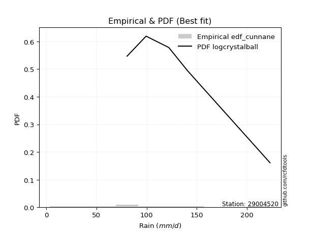</img>

</div>


### 12. EDF Adamowski (1981)

The Adamowski formula in hydrology refers to a specific plotting position formula used for estimating the non-parametric empirical distribution of hydrological events (like flood peaks) to calculate their return periods. This formula provides an alternative to traditional parametric methods (like the Gumbel or Log Pearson Type III distributions). 

<div align="center">


$P=(m-0.25)/(n+0.5)$


</div>


**12.1. Empirical values**

<div align="center">

|                | 0                   | 1                   | 2                  | 3                   | 4             | 5                  | 6                  | 7                  | 8                  |
|:---------------|:--------------------|:--------------------|:-------------------|:--------------------|:--------------|:-------------------|:-------------------|:-------------------|:-------------------|
| date           | 2023                | 2021                | 2018               | 2017                | 2025          | 2020               | 2019               | 2024               | 2022               |
| x              | 3.7                 | 47.2                | 63.9               | 74.5                | 80.5          | 99.5               | 122.1              | 140.8              | 223.0              |
| m              | 1                   | 2                   | 3                  | 4                   | 5             | 6                  | 7                  | 8                  | 9                  |
| empirical_dist | edf_adamowski       | edf_adamowski       | edf_adamowski      | edf_adamowski       | edf_adamowski | edf_adamowski      | edf_adamowski      | edf_adamowski      | edf_adamowski      |
| empirical      | 0.07894736842105263 | 0.18421052631578946 | 0.2894736842105263 | 0.39473684210526316 | 0.5           | 0.6052631578947368 | 0.7105263157894737 | 0.8157894736842105 | 0.9210526315789473 |
| empirical_tr   | 1.0857142857142856  | 1.2258064516129032  | 1.4074074074074074 | 1.6521739130434783  | 2.0           | 2.533333333333333  | 3.4545454545454546 | 5.428571428571428  | 12.666666666666663 |

</div>


**12.2. Kolmogorov-Smirnov fit test (sorted by Δ)**


<div align="center">

|                | 0                   | 1                    | 2                    | 3                   | 4                   | 5                    | 6                   | 7                    | 8                    | 9                   | 10                  | 11                  | 12                  | 13                   | 14                  | 15                   | 16                  | 17                  | 18                   | 19                  | 20                  | 21                   | 22                  | 23                   | 24                  | 25                  | 26                  | 27                  | 28                  | 29                  | 30                  | 31                  | 32                  | 33                  | 34                  | 35                  | 36                  | 37                  | 38                  | 39                  | 40                  | 41                  | 42                  | 43                  | 44                  | 45                  | 46                  | 47                  | 48                  | 49                  | 50                  | 51                  | 52                  | 53                  | 54                  | 55                  | 56                  | 57                  | 58                  | 59                  | 60                  | 61                  | 62                  | 63                  | 64                  | 65                  | 66                  | 67                  | 68                  | 69                  | 70                  | 71                  | 72                  | 73                  | 74                  | 75                  | 76                  | 77                  | 78                  | 79                  | 80                  | 81                  | 82                  | 83                  | 84                  | 85                  | 86                  | 87                  | 88                  | 89                  | 90                  | 91                  | 92                  | 93                  | 94                  | 95                  | 96                  | 97                  | 98                  | 99                  | 100                 | 101                 | 102                 | 103                 | 104                 | 105                 | 106                 | 107                 | 108                 | 109                 | 110                 | 111                 | 112                 | 113                 | 114                 | 115                 | 116                 | 117                 | 118                 | 119                 | 120                 | 121                 | 122                 | 123                 | 124                 | 125                 | 126                 | 127                 | 128                 | 129                 | 130                 | 131                 | 132                 | 133                 | 134                 | 135                 | 136                 | 137                 | 138                 | 139                 | 140                 | 141                 | 142                 | 143                 | 144                 | 145                 | 146                 | 147                 | 148                 | 149                 | 150                 | 151                 | 152                 | 153                 | 154                 | 155                 | 156                 | 157                 | 158                 | 159                 |
|:---------------|:--------------------|:---------------------|:---------------------|:--------------------|:--------------------|:---------------------|:--------------------|:---------------------|:---------------------|:--------------------|:--------------------|:--------------------|:--------------------|:---------------------|:--------------------|:---------------------|:--------------------|:--------------------|:---------------------|:--------------------|:--------------------|:---------------------|:--------------------|:---------------------|:--------------------|:--------------------|:--------------------|:--------------------|:--------------------|:--------------------|:--------------------|:--------------------|:--------------------|:--------------------|:--------------------|:--------------------|:--------------------|:--------------------|:--------------------|:--------------------|:--------------------|:--------------------|:--------------------|:--------------------|:--------------------|:--------------------|:--------------------|:--------------------|:--------------------|:--------------------|:--------------------|:--------------------|:--------------------|:--------------------|:--------------------|:--------------------|:--------------------|:--------------------|:--------------------|:--------------------|:--------------------|:--------------------|:--------------------|:--------------------|:--------------------|:--------------------|:--------------------|:--------------------|:--------------------|:--------------------|:--------------------|:--------------------|:--------------------|:--------------------|:--------------------|:--------------------|:--------------------|:--------------------|:--------------------|:--------------------|:--------------------|:--------------------|:--------------------|:--------------------|:--------------------|:--------------------|:--------------------|:--------------------|:--------------------|:--------------------|:--------------------|:--------------------|:--------------------|:--------------------|:--------------------|:--------------------|:--------------------|:--------------------|:--------------------|:--------------------|:--------------------|:--------------------|:--------------------|:--------------------|:--------------------|:--------------------|:--------------------|:--------------------|:--------------------|:--------------------|:--------------------|:--------------------|:--------------------|:--------------------|:--------------------|:--------------------|:--------------------|:--------------------|:--------------------|:--------------------|:--------------------|:--------------------|:--------------------|:--------------------|:--------------------|:--------------------|:--------------------|:--------------------|:--------------------|:--------------------|:--------------------|:--------------------|:--------------------|:--------------------|:--------------------|:--------------------|:--------------------|:--------------------|:--------------------|:--------------------|:--------------------|:--------------------|:--------------------|:--------------------|:--------------------|:--------------------|:--------------------|:--------------------|:--------------------|:--------------------|:--------------------|:--------------------|:--------------------|:--------------------|:--------------------|:--------------------|:--------------------|:--------------------|:--------------------|:--------------------|
| station        | 29004520            | 29004520             | 29004520             | 29004520            | 29004520            | 29004520             | 29004520            | 29004520             | 29004520             | 29004520            | 29004520            | 29004520            | 29004520            | 29004520             | 29004520            | 29004520             | 29004520            | 29004520            | 29004520             | 29004520            | 29004520            | 29004520             | 29004520            | 29004520             | 29004520            | 29004520            | 29004520            | 29004520            | 29004520            | 29004520            | 29004520            | 29004520            | 29004520            | 29004520            | 29004520            | 29004520            | 29004520            | 29004520            | 29004520            | 29004520            | 29004520            | 29004520            | 29004520            | 29004520            | 29004520            | 29004520            | 29004520            | 29004520            | 29004520            | 29004520            | 29004520            | 29004520            | 29004520            | 29004520            | 29004520            | 29004520            | 29004520            | 29004520            | 29004520            | 29004520            | 29004520            | 29004520            | 29004520            | 29004520            | 29004520            | 29004520            | 29004520            | 29004520            | 29004520            | 29004520            | 29004520            | 29004520            | 29004520            | 29004520            | 29004520            | 29004520            | 29004520            | 29004520            | 29004520            | 29004520            | 29004520            | 29004520            | 29004520            | 29004520            | 29004520            | 29004520            | 29004520            | 29004520            | 29004520            | 29004520            | 29004520            | 29004520            | 29004520            | 29004520            | 29004520            | 29004520            | 29004520            | 29004520            | 29004520            | 29004520            | 29004520            | 29004520            | 29004520            | 29004520            | 29004520            | 29004520            | 29004520            | 29004520            | 29004520            | 29004520            | 29004520            | 29004520            | 29004520            | 29004520            | 29004520            | 29004520            | 29004520            | 29004520            | 29004520            | 29004520            | 29004520            | 29004520            | 29004520            | 29004520            | 29004520            | 29004520            | 29004520            | 29004520            | 29004520            | 29004520            | 29004520            | 29004520            | 29004520            | 29004520            | 29004520            | 29004520            | 29004520            | 29004520            | 29004520            | 29004520            | 29004520            | 29004520            | 29004520            | 29004520            | 29004520            | 29004520            | 29004520            | 29004520            | 29004520            | 29004520            | 29004520            | 29004520            | 29004520            | 29004520            | 29004520            | 29004520            | 29004520            | 29004520            | 29004520            | 29004520            |
| empirical_dist | edf_adamowski       | edf_adamowski        | edf_adamowski        | edf_adamowski       | edf_adamowski       | edf_adamowski        | edf_adamowski       | edf_adamowski        | edf_adamowski        | edf_adamowski       | edf_adamowski       | edf_adamowski       | edf_adamowski       | edf_adamowski        | edf_adamowski       | edf_adamowski        | edf_adamowski       | edf_adamowski       | edf_adamowski        | edf_adamowski       | edf_adamowski       | edf_adamowski        | edf_adamowski       | edf_adamowski        | edf_adamowski       | edf_adamowski       | edf_adamowski       | edf_adamowski       | edf_adamowski       | edf_adamowski       | edf_adamowski       | edf_adamowski       | edf_adamowski       | edf_adamowski       | edf_adamowski       | edf_adamowski       | edf_adamowski       | edf_adamowski       | edf_adamowski       | edf_adamowski       | edf_adamowski       | edf_adamowski       | edf_adamowski       | edf_adamowski       | edf_adamowski       | edf_adamowski       | edf_adamowski       | edf_adamowski       | edf_adamowski       | edf_adamowski       | edf_adamowski       | edf_adamowski       | edf_adamowski       | edf_adamowski       | edf_adamowski       | edf_adamowski       | edf_adamowski       | edf_adamowski       | edf_adamowski       | edf_adamowski       | edf_adamowski       | edf_adamowski       | edf_adamowski       | edf_adamowski       | edf_adamowski       | edf_adamowski       | edf_adamowski       | edf_adamowski       | edf_adamowski       | edf_adamowski       | edf_adamowski       | edf_adamowski       | edf_adamowski       | edf_adamowski       | edf_adamowski       | edf_adamowski       | edf_adamowski       | edf_adamowski       | edf_adamowski       | edf_adamowski       | edf_adamowski       | edf_adamowski       | edf_adamowski       | edf_adamowski       | edf_adamowski       | edf_adamowski       | edf_adamowski       | edf_adamowski       | edf_adamowski       | edf_adamowski       | edf_adamowski       | edf_adamowski       | edf_adamowski       | edf_adamowski       | edf_adamowski       | edf_adamowski       | edf_adamowski       | edf_adamowski       | edf_adamowski       | edf_adamowski       | edf_adamowski       | edf_adamowski       | edf_adamowski       | edf_adamowski       | edf_adamowski       | edf_adamowski       | edf_adamowski       | edf_adamowski       | edf_adamowski       | edf_adamowski       | edf_adamowski       | edf_adamowski       | edf_adamowski       | edf_adamowski       | edf_adamowski       | edf_adamowski       | edf_adamowski       | edf_adamowski       | edf_adamowski       | edf_adamowski       | edf_adamowski       | edf_adamowski       | edf_adamowski       | edf_adamowski       | edf_adamowski       | edf_adamowski       | edf_adamowski       | edf_adamowski       | edf_adamowski       | edf_adamowski       | edf_adamowski       | edf_adamowski       | edf_adamowski       | edf_adamowski       | edf_adamowski       | edf_adamowski       | edf_adamowski       | edf_adamowski       | edf_adamowski       | edf_adamowski       | edf_adamowski       | edf_adamowski       | edf_adamowski       | edf_adamowski       | edf_adamowski       | edf_adamowski       | edf_adamowski       | edf_adamowski       | edf_adamowski       | edf_adamowski       | edf_adamowski       | edf_adamowski       | edf_adamowski       | edf_adamowski       | edf_adamowski       | edf_adamowski       | edf_adamowski       | edf_adamowski       | edf_adamowski       | edf_adamowski       |
| p_dist         | logcrystalball      | exponnorm            | genlogistic          | johnsonsu           | invgauss            | fatiguelife          | gengamma            | invgamma             | rayleigh             | exponweib           | betaprime           | f                   | erlang              | gamma                | invweibull          | logjohnsonsu         | pearson3            | rice                | nct                  | burr12              | weibull_min         | skewnorm             | kstwobign           | gumbel_r             | maxwell             | dgamma              | dweibull            | logdweibull         | moyal               | logt                | foldnorm            | halflogistic        | halfnorm            | semicircular        | logjohnsonsb        | anglit              | loggenlogistic      | genpareto           | logexponpow         | logloggamma         | logburr12           | kappa3              | t                   | logargus            | logmielke           | crystalball         | norm                | logpearson3         | gennorm             | logloglaplace       | logdgamma           | loggompertz         | truncexpon          | logistic            | gausshyper          | hypsecant           | bradford            | cosine              | wald                | loggumbel_l         | arcsine             | logweibull_max      | burr                | logburr             | laplace             | truncweibull_min    | loggennorm          | logskewnorm         | kappa4              | gumbel_l            | loggenextreme       | logtrapezoid        | logvonmises_line    | lognakagami         | loglaplace          | loglaplace          | logfoldnorm         | logf                | uniform             | wrapcauchy          | loghypsecant        | lomax               | loglogistic         | genexpon            | vonmises_line       | logrice             | lognorm             | logexponnorm        | lognct              | logfatiguelife      | mielke              | logbetaprime        | loggamma            | loggamma            | loganglit           | ksone               | argus               | beta                | logerlang           | loginvgamma         | logsemicircular     | logalpha            | loginvgauss         | logmaxwell          | loggausshyper       | logncf              | lograyleigh         | logarcsine          | loglevy_l           | ncf                 | loginvweibull       | nakagami            | logtriang           | loggumbel_r         | loggenpareto        | loghalfnorm         | loggenhalflogistic  | logmoyal            | loghalflogistic     | halfgennorm         | logcosine           | johnsonsb           | logkstwobign        | loggenexpon         | logtruncweibull_min | genhalflogistic     | loghalfgennorm      | levy_l              | logwald             | triang              | logwrapcauchy       | logtruncnorm        | loglomax            | logbeta             | logksone            | logkappa4           | logkappa3           | logtukeylambda      | loguniform          | trapezoid           | logtruncexpon       | logbradford         | rdist               | genextreme          | powerlaw            | loggengamma         | tukeylambda         | logweibull_min      | logrdist            | logexponweib        | alpha               | weibull_max         | logpowerlaw         | truncpareto         | exponpow            | logtruncpareto      | gompertz            | truncnorm           | logvonmises         | vonmises            |
| delta          | 0.04167998400128403 | 0.048787815668598744 | 0.049420565863060706 | 0.04955052931618681 | 0.04977033880244268 | 0.049807133183065774 | 0.04992272666740092 | 0.050162480779447904 | 0.050751147097121696 | 0.05079091876372238 | 0.05082172105611849 | 0.05094522341792813 | 0.05095872274184712 | 0.050958734156763455 | 0.05316016016515532 | 0.053580944821531834 | 0.05386986554383344 | 0.05457472453368789 | 0.055160934935096106 | 0.05734493930869805 | 0.05807615798142374 | 0.058301392806423824 | 0.0614866063827188  | 0.061894330375317545 | 0.06294035033774259 | 0.06350256867849957 | 0.06601654706971011 | 0.07277432181018195 | 0.07573277189444545 | 0.07852440278251344 | 0.07894736842105263 | 0.07894736842105263 | 0.07968304124784537 | 0.08115915540850904 | 0.08231871330097176 | 0.08357649363878283 | 0.08717061854111818 | 0.08824560833776818 | 0.09029812873682921 | 0.0910313574528854  | 0.09126630630122651 | 0.09367095498158473 | 0.09509804913708847 | 0.09626509742635805 | 0.09656064986754317 | 0.09702250877081481 | 0.0970225177554983  | 0.09776494533875343 | 0.10042742944545213 | 0.10387357351840132 | 0.10526315789510798 | 0.1062045915584553  | 0.10923885797891797 | 0.10958202801902822 | 0.1162536483953652  | 0.1198847389913697  | 0.12477794571394529 | 0.12771446635019473 | 0.1283267752319158  | 0.13023929259087894 | 0.13135216713868192 | 0.1363908961932004  | 0.1402333589564719  | 0.1414953969609365  | 0.14673806906322662 | 0.14845688101927335 | 0.1538210487443572  | 0.159865121084289   | 0.16293492873045556 | 0.16383332278968427 | 0.164000046145787   | 0.1683042062297503  | 0.1842104901543351  | 0.1842105263150149  | 0.18548108298586757 | 0.18548108298586757 | 0.18616444312423197 | 0.19018697436211535 | 0.19061847505219953 | 0.1906229044376201  | 0.19236758553911038 | 0.19297924149619497 | 0.19405519149733436 | 0.19493981057518103 | 0.19505516899719072 | 0.19603046367505367 | 0.19603306980972302 | 0.19603400436936586 | 0.19625110579631966 | 0.1979824958621933  | 0.20293812736172445 | 0.20728350977619417 | 0.21001952436055707 | 0.21001952436055707 | 0.21079620763802956 | 0.2114803081575347  | 0.21296444328830189 | 0.2132073486101178  | 0.21474825471620798 | 0.21635431771106842 | 0.21768180963052006 | 0.21906509771458574 | 0.21958188662211928 | 0.22960184480183632 | 0.2308431400547473  | 0.23110013958433603 | 0.2409106579521274  | 0.24557079727858558 | 0.24589409355940398 | 0.2531759817319219  | 0.25319464902153466 | 0.2612837375946062  | 0.26201682229902723 | 0.26582719321786874 | 0.2716852795119564  | 0.27481644799645943 | 0.283537802848121   | 0.29170673027256067 | 0.2967544903309388  | 0.30042793045612715 | 0.3008067621635311  | 0.30235956412014975 | 0.3051515211506117  | 0.3306646808701955  | 0.3393515556329896  | 0.3400923697394011  | 0.34586167747430097 | 0.3483945221874283  | 0.3637231163832625  | 0.3786782408663312  | 0.39277104333752644 | 0.3940673753939461  | 0.39693537022453806 | 0.40216343480148736 | 0.416761481220039   | 0.4228082548520563  | 0.43633426983986634 | 0.4363665132648701  | 0.43695588272720465 | 0.4464016512957193  | 0.504065858576264   | 0.505303703048874   | 0.5108741292731377  | 0.5260454332751641  | 0.5529631451047747  | 0.5829371344834997  | 0.5883048087839294  | 0.6002492764364731  | 0.6013709734714474  | 0.6114476296807714  | 0.6302468264548448  | 0.6893920271022974  | 0.7127007158347624  | 0.7237127605314809  | 0.7711776152271025  | 0.7875618235598275  | 0.8140313939336574  | 0.9202604979317304  | 1.0120408439234485  | 35.438622513126134  |
| deltao         | 0.41761268023100007 | 0.41761268023100007  | 0.41761268023100007  | 0.41761268023100007 | 0.41761268023100007 | 0.41761268023100007  | 0.41761268023100007 | 0.41761268023100007  | 0.41761268023100007  | 0.41761268023100007 | 0.41761268023100007 | 0.41761268023100007 | 0.41761268023100007 | 0.41761268023100007  | 0.41761268023100007 | 0.41761268023100007  | 0.41761268023100007 | 0.41761268023100007 | 0.41761268023100007  | 0.41761268023100007 | 0.41761268023100007 | 0.41761268023100007  | 0.41761268023100007 | 0.41761268023100007  | 0.41761268023100007 | 0.41761268023100007 | 0.41761268023100007 | 0.41761268023100007 | 0.41761268023100007 | 0.41761268023100007 | 0.41761268023100007 | 0.41761268023100007 | 0.41761268023100007 | 0.41761268023100007 | 0.41761268023100007 | 0.41761268023100007 | 0.41761268023100007 | 0.41761268023100007 | 0.41761268023100007 | 0.41761268023100007 | 0.41761268023100007 | 0.41761268023100007 | 0.41761268023100007 | 0.41761268023100007 | 0.41761268023100007 | 0.41761268023100007 | 0.41761268023100007 | 0.41761268023100007 | 0.41761268023100007 | 0.41761268023100007 | 0.41761268023100007 | 0.41761268023100007 | 0.41761268023100007 | 0.41761268023100007 | 0.41761268023100007 | 0.41761268023100007 | 0.41761268023100007 | 0.41761268023100007 | 0.41761268023100007 | 0.41761268023100007 | 0.41761268023100007 | 0.41761268023100007 | 0.41761268023100007 | 0.41761268023100007 | 0.41761268023100007 | 0.41761268023100007 | 0.41761268023100007 | 0.41761268023100007 | 0.41761268023100007 | 0.41761268023100007 | 0.41761268023100007 | 0.41761268023100007 | 0.41761268023100007 | 0.41761268023100007 | 0.41761268023100007 | 0.41761268023100007 | 0.41761268023100007 | 0.41761268023100007 | 0.41761268023100007 | 0.41761268023100007 | 0.41761268023100007 | 0.41761268023100007 | 0.41761268023100007 | 0.41761268023100007 | 0.41761268023100007 | 0.41761268023100007 | 0.41761268023100007 | 0.41761268023100007 | 0.41761268023100007 | 0.41761268023100007 | 0.41761268023100007 | 0.41761268023100007 | 0.41761268023100007 | 0.41761268023100007 | 0.41761268023100007 | 0.41761268023100007 | 0.41761268023100007 | 0.41761268023100007 | 0.41761268023100007 | 0.41761268023100007 | 0.41761268023100007 | 0.41761268023100007 | 0.41761268023100007 | 0.41761268023100007 | 0.41761268023100007 | 0.41761268023100007 | 0.41761268023100007 | 0.41761268023100007 | 0.41761268023100007 | 0.41761268023100007 | 0.41761268023100007 | 0.41761268023100007 | 0.41761268023100007 | 0.41761268023100007 | 0.41761268023100007 | 0.41761268023100007 | 0.41761268023100007 | 0.41761268023100007 | 0.41761268023100007 | 0.41761268023100007 | 0.41761268023100007 | 0.41761268023100007 | 0.41761268023100007 | 0.41761268023100007 | 0.41761268023100007 | 0.41761268023100007 | 0.41761268023100007 | 0.41761268023100007 | 0.41761268023100007 | 0.41761268023100007 | 0.41761268023100007 | 0.41761268023100007 | 0.41761268023100007 | 0.41761268023100007 | 0.41761268023100007 | 0.41761268023100007 | 0.41761268023100007 | 0.41761268023100007 | 0.41761268023100007 | 0.41761268023100007 | 0.41761268023100007 | 0.41761268023100007 | 0.41761268023100007 | 0.41761268023100007 | 0.41761268023100007 | 0.41761268023100007 | 0.41761268023100007 | 0.41761268023100007 | 0.41761268023100007 | 0.41761268023100007 | 0.41761268023100007 | 0.41761268023100007 | 0.41761268023100007 | 0.41761268023100007 | 0.41761268023100007 | 0.41761268023100007 | 0.41761268023100007 | 0.41761268023100007 | 0.41761268023100007 | 0.41761268023100007 |
| eval           | Δo > Δ              | Δo > Δ               | Δo > Δ               | Δo > Δ              | Δo > Δ              | Δo > Δ               | Δo > Δ              | Δo > Δ               | Δo > Δ               | Δo > Δ              | Δo > Δ              | Δo > Δ              | Δo > Δ              | Δo > Δ               | Δo > Δ              | Δo > Δ               | Δo > Δ              | Δo > Δ              | Δo > Δ               | Δo > Δ              | Δo > Δ              | Δo > Δ               | Δo > Δ              | Δo > Δ               | Δo > Δ              | Δo > Δ              | Δo > Δ              | Δo > Δ              | Δo > Δ              | Δo > Δ              | Δo > Δ              | Δo > Δ              | Δo > Δ              | Δo > Δ              | Δo > Δ              | Δo > Δ              | Δo > Δ              | Δo > Δ              | Δo > Δ              | Δo > Δ              | Δo > Δ              | Δo > Δ              | Δo > Δ              | Δo > Δ              | Δo > Δ              | Δo > Δ              | Δo > Δ              | Δo > Δ              | Δo > Δ              | Δo > Δ              | Δo > Δ              | Δo > Δ              | Δo > Δ              | Δo > Δ              | Δo > Δ              | Δo > Δ              | Δo > Δ              | Δo > Δ              | Δo > Δ              | Δo > Δ              | Δo > Δ              | Δo > Δ              | Δo > Δ              | Δo > Δ              | Δo > Δ              | Δo > Δ              | Δo > Δ              | Δo > Δ              | Δo > Δ              | Δo > Δ              | Δo > Δ              | Δo > Δ              | Δo > Δ              | Δo > Δ              | Δo > Δ              | Δo > Δ              | Δo > Δ              | Δo > Δ              | Δo > Δ              | Δo > Δ              | Δo > Δ              | Δo > Δ              | Δo > Δ              | Δo > Δ              | Δo > Δ              | Δo > Δ              | Δo > Δ              | Δo > Δ              | Δo > Δ              | Δo > Δ              | Δo > Δ              | Δo > Δ              | Δo > Δ              | Δo > Δ              | Δo > Δ              | Δo > Δ              | Δo > Δ              | Δo > Δ              | Δo > Δ              | Δo > Δ              | Δo > Δ              | Δo > Δ              | Δo > Δ              | Δo > Δ              | Δo > Δ              | Δo > Δ              | Δo > Δ              | Δo > Δ              | Δo > Δ              | Δo > Δ              | Δo > Δ              | Δo > Δ              | Δo > Δ              | Δo > Δ              | Δo > Δ              | Δo > Δ              | Δo > Δ              | Δo > Δ              | Δo > Δ              | Δo > Δ              | Δo > Δ              | Δo > Δ              | Δo > Δ              | Δo > Δ              | Δo > Δ              | Δo > Δ              | Δo > Δ              | Δo > Δ              | Δo > Δ              | Δo > Δ              | Δo > Δ              | Δo > Δ              | Δo > Δ              | Δo > Δ              | Δo > Δ              | Δo <= Δ             | Δo <= Δ             | Δo <= Δ             | Δo <= Δ             | Δo <= Δ             | Δo <= Δ             | Δo <= Δ             | Δo <= Δ             | Δo <= Δ             | Δo <= Δ             | Δo <= Δ             | Δo <= Δ             | Δo <= Δ             | Δo <= Δ             | Δo <= Δ             | Δo <= Δ             | Δo <= Δ             | Δo <= Δ             | Δo <= Δ             | Δo <= Δ             | Δo <= Δ             | Δo <= Δ             | Δo <= Δ             | Δo <= Δ             | Δo <= Δ             |
| fit            | 1                   | 1                    | 1                    | 1                   | 1                   | 1                    | 1                   | 1                    | 1                    | 1                   | 1                   | 1                   | 1                   | 1                    | 1                   | 1                    | 1                   | 1                   | 1                    | 1                   | 1                   | 1                    | 1                   | 1                    | 1                   | 1                   | 1                   | 1                   | 1                   | 1                   | 1                   | 1                   | 1                   | 1                   | 1                   | 1                   | 1                   | 1                   | 1                   | 1                   | 1                   | 1                   | 1                   | 1                   | 1                   | 1                   | 1                   | 1                   | 1                   | 1                   | 1                   | 1                   | 1                   | 1                   | 1                   | 1                   | 1                   | 1                   | 1                   | 1                   | 1                   | 1                   | 1                   | 1                   | 1                   | 1                   | 1                   | 1                   | 1                   | 1                   | 1                   | 1                   | 1                   | 1                   | 1                   | 1                   | 1                   | 1                   | 1                   | 1                   | 1                   | 1                   | 1                   | 1                   | 1                   | 1                   | 1                   | 1                   | 1                   | 1                   | 1                   | 1                   | 1                   | 1                   | 1                   | 1                   | 1                   | 1                   | 1                   | 1                   | 1                   | 1                   | 1                   | 1                   | 1                   | 1                   | 1                   | 1                   | 1                   | 1                   | 1                   | 1                   | 1                   | 1                   | 1                   | 1                   | 1                   | 1                   | 1                   | 1                   | 1                   | 1                   | 1                   | 1                   | 1                   | 1                   | 1                   | 1                   | 1                   | 1                   | 1                   | 1                   | 1                   | 1                   | 1                   | 0                   | 0                   | 0                   | 0                   | 0                   | 0                   | 0                   | 0                   | 0                   | 0                   | 0                   | 0                   | 0                   | 0                   | 0                   | 0                   | 0                   | 0                   | 0                   | 0                   | 0                   | 0                   | 0                   | 0                   | 0                   |
| n              | 9                   | 9                    | 9                    | 9                   | 9                   | 9                    | 9                   | 9                    | 9                    | 9                   | 9                   | 9                   | 9                   | 9                    | 9                   | 9                    | 9                   | 9                   | 9                    | 9                   | 9                   | 9                    | 9                   | 9                    | 9                   | 9                   | 9                   | 9                   | 9                   | 9                   | 9                   | 9                   | 9                   | 9                   | 9                   | 9                   | 9                   | 9                   | 9                   | 9                   | 9                   | 9                   | 9                   | 9                   | 9                   | 9                   | 9                   | 9                   | 9                   | 9                   | 9                   | 9                   | 9                   | 9                   | 9                   | 9                   | 9                   | 9                   | 9                   | 9                   | 9                   | 9                   | 9                   | 9                   | 9                   | 9                   | 9                   | 9                   | 9                   | 9                   | 9                   | 9                   | 9                   | 9                   | 9                   | 9                   | 9                   | 9                   | 9                   | 9                   | 9                   | 9                   | 9                   | 9                   | 9                   | 9                   | 9                   | 9                   | 9                   | 9                   | 9                   | 9                   | 9                   | 9                   | 9                   | 9                   | 9                   | 9                   | 9                   | 9                   | 9                   | 9                   | 9                   | 9                   | 9                   | 9                   | 9                   | 9                   | 9                   | 9                   | 9                   | 9                   | 9                   | 9                   | 9                   | 9                   | 9                   | 9                   | 9                   | 9                   | 9                   | 9                   | 9                   | 9                   | 9                   | 9                   | 9                   | 9                   | 9                   | 9                   | 9                   | 9                   | 9                   | 9                   | 9                   | 9                   | 9                   | 9                   | 9                   | 9                   | 9                   | 9                   | 9                   | 9                   | 9                   | 9                   | 9                   | 9                   | 9                   | 9                   | 9                   | 9                   | 9                   | 9                   | 9                   | 9                   | 9                   | 9                   | 9                   | 9                   |
| best_fit       | 1                   | 0                    | 0                    | 0                   | 0                   | 0                    | 0                   | 0                    | 0                    | 0                   | 0                   | 0                   | 0                   | 0                    | 0                   | 0                    | 0                   | 0                   | 0                    | 0                   | 0                   | 0                    | 0                   | 0                    | 0                   | 0                   | 0                   | 0                   | 0                   | 0                   | 0                   | 0                   | 0                   | 0                   | 0                   | 0                   | 0                   | 0                   | 0                   | 0                   | 0                   | 0                   | 0                   | 0                   | 0                   | 0                   | 0                   | 0                   | 0                   | 0                   | 0                   | 0                   | 0                   | 0                   | 0                   | 0                   | 0                   | 0                   | 0                   | 0                   | 0                   | 0                   | 0                   | 0                   | 0                   | 0                   | 0                   | 0                   | 0                   | 0                   | 0                   | 0                   | 0                   | 0                   | 0                   | 0                   | 0                   | 0                   | 0                   | 0                   | 0                   | 0                   | 0                   | 0                   | 0                   | 0                   | 0                   | 0                   | 0                   | 0                   | 0                   | 0                   | 0                   | 0                   | 0                   | 0                   | 0                   | 0                   | 0                   | 0                   | 0                   | 0                   | 0                   | 0                   | 0                   | 0                   | 0                   | 0                   | 0                   | 0                   | 0                   | 0                   | 0                   | 0                   | 0                   | 0                   | 0                   | 0                   | 0                   | 0                   | 0                   | 0                   | 0                   | 0                   | 0                   | 0                   | 0                   | 0                   | 0                   | 0                   | 0                   | 0                   | 0                   | 0                   | 0                   | 0                   | 0                   | 0                   | 0                   | 0                   | 0                   | 0                   | 0                   | 0                   | 0                   | 0                   | 0                   | 0                   | 0                   | 0                   | 0                   | 0                   | 0                   | 0                   | 0                   | 0                   | 0                   | 0                   | 0                   | 0                   |
| best_fit_sort  | 1                   | 2                    | 3                    | 4                   | 5                   | 6                    | 7                   | 8                    | 9                    | 10                  | 11                  | 12                  | 13                  | 14                   | 15                  | 16                   | 17                  | 18                  | 19                   | 20                  | 21                  | 22                   | 23                  | 24                   | 25                  | 26                  | 27                  | 28                  | 29                  | 30                  | 31                  | 32                  | 33                  | 34                  | 35                  | 36                  | 37                  | 38                  | 39                  | 40                  | 41                  | 42                  | 43                  | 44                  | 45                  | 46                  | 47                  | 48                  | 49                  | 50                  | 51                  | 52                  | 53                  | 54                  | 55                  | 56                  | 57                  | 58                  | 59                  | 60                  | 61                  | 62                  | 63                  | 64                  | 65                  | 66                  | 67                  | 68                  | 69                  | 70                  | 71                  | 72                  | 73                  | 74                  | 75                  | 76                  | 77                  | 78                  | 79                  | 80                  | 81                  | 82                  | 83                  | 84                  | 85                  | 86                  | 87                  | 88                  | 89                  | 90                  | 91                  | 92                  | 93                  | 94                  | 95                  | 96                  | 97                  | 98                  | 99                  | 100                 | 101                 | 102                 | 103                 | 104                 | 105                 | 106                 | 107                 | 108                 | 109                 | 110                 | 111                 | 112                 | 113                 | 114                 | 115                 | 116                 | 117                 | 118                 | 119                 | 120                 | 121                 | 122                 | 123                 | 124                 | 125                 | 126                 | 127                 | 128                 | 129                 | 130                 | 131                 | 132                 | 133                 | 134                 | 135                 | 136                 | 137                 | 138                 | 139                 | 140                 | 141                 | 142                 | 143                 | 144                 | 145                 | 146                 | 147                 | 148                 | 149                 | 150                 | 151                 | 152                 | 153                 | 154                 | 155                 | 156                 | 157                 | 158                 | 159                 | 160                 |

</div>


**12.3. Best fit**

<div align="center">

|   id |   station | empirical_dist   | p_dist         |   delta |   deltao | eval   |   fit |   n |   best_fit |   best_fit_sort |
|-----:|----------:|:-----------------|:---------------|--------:|---------:|:-------|------:|----:|-----------:|----------------:|
|    0 |  29004520 | edf_adamowski    | logcrystalball | 0.04168 | 0.417613 | Δo > Δ |     1 |   9 |          1 |               1 |

</div>


<div align="center">

</img>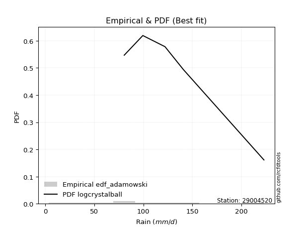</img>

</div>


## C. Best fit & Estimate extreme values for specific return periods - Tr

Best fit in probability distribution analysis means finding the theoretical distribution (like Normal, Poisson, Exponential, etc.) that most accurately mirrors your real-world data´s patterns (shape, center, spread) for better predictions, using methods like visual checks (Q-Q plots), goodness-of-fit tests (Kolmogorov-Smirnov, Chi-Squared), and information criteria (AIC) to score and select the simplest, most representative model.


### 1. Best fit (ordered by delta Δ)

:file_folder:Table: [bestfit_29004520.csv](table/bestfit_29004520.csv)

<div align="center">

|   id |   station | empirical_dist   | p_dist         |     delta |   deltao | eval   |   fit |   n |   best_fit |   best_fit_sort |
|-----:|----------:|:-----------------|:---------------|----------:|---------:|:-------|------:|----:|-----------:|----------------:|
|    0 |  29004520 | edf_hazen        | logcrystalball | 0.0182926 | 0.417613 | Δo > Δ |     1 |   9 |          1 |               1 |
|    1 |  29004520 | edf_gringorten   | logcrystalball | 0.0241361 | 0.417613 | Δo > Δ |     1 |   9 |          1 |               2 |
|    2 |  29004520 | edf_cunnane      | logcrystalball | 0.02795   | 0.417613 | Δo > Δ |     1 |   9 |          1 |               3 |
|    3 |  29004520 | edf_blom         | logcrystalball | 0.0303002 | 0.417613 | Δo > Δ |     1 |   9 |          1 |               4 |
|    4 |  29004520 | edf_tukey        | logcrystalball | 0.0341612 | 0.417613 | Δo > Δ |     1 |   9 |          1 |               5 |
|    5 |  29004520 | edf_filliben     | logcrystalball | 0.0356104 | 0.417613 | Δo > Δ |     1 |   9 |          1 |               6 |
|    6 |  29004520 | edf_beard        | logcrystalball | 0.0362934 | 0.417613 | Δo > Δ |     1 |   9 |          1 |               7 |
|    7 |  29004520 | edf_jenkinson    | logcrystalball | 0.0362934 | 0.417613 | Δo > Δ |     1 |   9 |          1 |               8 |
|    8 |  29004520 | edf_chegodayev   | logcrystalball | 0.0372007 | 0.417613 | Δo > Δ |     1 |   9 |          1 |               9 |
|    9 |  29004520 | edf_adamowski    | logcrystalball | 0.04168   | 0.417613 | Δo > Δ |     1 |   9 |          1 |              10 |
|   10 |  29004520 | edf_california   | gennorm        | 0.0555556 | 0.417613 | Δo > Δ |     1 |   9 |          1 |              11 |
|   11 |  29004520 | edf_weibull      | logcrystalball | 0.0627326 | 0.417613 | Δo > Δ |     1 |   9 |          1 |              12 |

</div>


### 2. Extreme values and % difference analysis

In hydrology, a return period (or recurrence interval $Tr$) is the statistical average time between extreme events like floods or droughts of a specific magnitude, indicating how rare an event is, with a 100-year flood, for example, having a 1% chance of occurring in any given year, not that it happens exactly every century. It is a key tool for infrastructure design (like bridges or dams) and risk assessment, calculated from historical data to determine the probability of future events, although it is important to remember it is statistical average, and events can cluster or be missed.

The extreme value porcentage difference is evaluated as $pdiff = 1 - (ETrBf / ETr) * 100$, where _ETrBf_ correspond to the bestfit extreme value for a specific recurrence interval and _ETr_ correspond to the extreme value for one of the most used PDFsused in hydrology.

> risk_rate: assuming the return period as the project useful life.

:file_folder:Table: [extreme_29004520.csv](table/extreme_29004520.csv), all PDFs.  
:file_folder:Table: [extremepdiff_29004520.csv](table/extremepdiff_29004520.csv), % difference between bestfit and most used PDFs in Hydrology.

<div align="center">

Extreme values table for only best fit PDFs
|   id |      tr |   prob_l |     prob_g |     alpha |   anglit |   arcsine |   argus |    beta |   betaprime |   bradford |     burr |   burr12 |   cosine |   crystalball |   dgamma |   dweibull |   erlang |   exponnorm |   exponpow |   exponweib |        f |   fatiguelife |   foldnorm |    gamma |   gausshyper |   genexpon |       genextreme |   gengamma |   genhalflogistic |   genlogistic |   gennorm |   genpareto |   gompertz |   gumbel_l |   gumbel_r |   halfgennorm |   halflogistic |   halfnorm |   hypsecant |   invgamma |   invgauss |   invweibull |   johnsonsb |   johnsonsu |   kappa3 |   kappa4 |   ksone |   kstwobign |   laplace |   levy_l |   loggamma |   logistic |   loglaplace |    lomax |   maxwell |   mielke |    moyal |   nakagami |       ncf |      nct |     norm |   pearson3 |   powerlaw |   rayleigh |     rdist |     rice |   semicircular |   skewnorm |        t |   trapezoid |   triang |   truncexpon |   truncnorm |   truncpareto |   truncweibull_min |   tukeylambda |   uniform |   vonmises |   vonmises_line |     wald |   weibull_max |   weibull_min |   wrapcauchy |   logalpha |   loganglit |   logarcsine |   logargus |   logbeta |   logbetaprime |   logbradford |   logburr |   logburr12 |   logcosine |   logcrystalball |   logdgamma |   logdweibull |   logerlang |   logexponnorm |   logexponpow |     logexponweib |      logf |   logfatiguelife |   logfoldnorm |   loggausshyper |   loggenexpon |   loggenextreme |      loggengamma |   loggenhalflogistic |   loggenlogistic |       loggennorm |   loggenpareto |   loggompertz |   loggumbel_l |   loggumbel_r |   loghalfgennorm |   loghalflogistic |   loghalfnorm |   loghypsecant |   loginvgamma |   loginvgauss |   loginvweibull |   logjohnsonsb |   logjohnsonsu |   logkappa3 |   logkappa4 |   logksone |   logkstwobign |   loglevy_l |   logloggamma |   loglogistic |    logloglaplace |         loglomax |   logmaxwell |   logmielke |   logmoyal |   lognakagami |    logncf |    lognct |   lognorm |   logpearson3 |   logpowerlaw |   lograyleigh |   logrdist |   logrice |   logsemicircular |   logskewnorm |             logt |   logtrapezoid |   logtriang |   logtruncexpon |   logtruncnorm |   logtruncpareto |   logtruncweibull_min |   logtukeylambda |   loguniform |   logvonmises |   logvonmises_line |     logwald |   logweibull_max |   logweibull_min |   logwrapcauchy |   station |   n |   risk_rate |
|-----:|--------:|---------:|-----------:|----------:|---------:|----------:|--------:|--------:|------------:|-----------:|---------:|---------:|---------:|--------------:|---------:|-----------:|---------:|------------:|-----------:|------------:|---------:|--------------:|-----------:|---------:|-------------:|-----------:|-----------------:|-----------:|------------------:|--------------:|----------:|------------:|-----------:|-----------:|-----------:|--------------:|---------------:|-----------:|------------:|-----------:|-----------:|-------------:|------------:|------------:|---------:|---------:|--------:|------------:|----------:|---------:|-----------:|-----------:|-------------:|---------:|----------:|---------:|---------:|-----------:|----------:|---------:|---------:|-----------:|-----------:|-----------:|----------:|---------:|---------------:|-----------:|---------:|------------:|---------:|-------------:|------------:|--------------:|-------------------:|--------------:|----------:|-----------:|----------------:|---------:|--------------:|--------------:|-------------:|-----------:|------------:|-------------:|-----------:|----------:|---------------:|--------------:|----------:|------------:|------------:|-----------------:|------------:|--------------:|------------:|---------------:|--------------:|-----------------:|----------:|-----------------:|--------------:|----------------:|--------------:|----------------:|-----------------:|---------------------:|-----------------:|-----------------:|---------------:|--------------:|--------------:|--------------:|-----------------:|------------------:|--------------:|---------------:|--------------:|--------------:|----------------:|---------------:|---------------:|------------:|------------:|-----------:|---------------:|------------:|--------------:|--------------:|-----------------:|-----------------:|-------------:|------------:|-----------:|--------------:|----------:|----------:|----------:|--------------:|--------------:|--------------:|-----------:|----------:|------------------:|--------------:|-----------------:|---------------:|------------:|----------------:|---------------:|-----------------:|----------------------:|-----------------:|-------------:|--------------:|-------------------:|------------:|-----------------:|-----------------:|----------------:|----------:|----:|------------:|
|    0 |    2    | 0.5      | 0.5        |   16.4106 |  95.0222 |   95.0222 | 121.1   | 109.963 |     87.2082 |    97.0794 |  77.2951 |  86.6177 |  101.986 |       95.0222 |  90.5294 |    90.5553 |  87.182  |     86.6687 |    3.75339 |     87.4924 |  87.1841 |       87.3812 |    86.4877 |  87.182  |      88.1448 |    66.9558 |      4.78319     |    87.2986 |           146.09  |       87.1068 |   80.5    |     91.3508 |    204.287 |    104.734 |    85.3101 |       50.2272 |        80.4817 |    82.9208 |     95.0222 |    87.4402 |    87.3863 |      85.5447 |     128.505 |     87.4067 |  82.6605 |  105.735 | 113.35  |     85.2802 |   95.0222 |   74.081 |    64.7825 |    95.0222 |      66.528  |  67.377  |   89.9661 |  65.0822 |  82.1746 |    55.6604 |   58.9912 |  87.5913 |  95.0222 |    88.1906 |     9.247  |    88.1728 | -18.1023  |  88.6557 |        95.0222 |    88.7029 |  94.7765 |     166.941 |  151.95  |      93.9382 |  -12.7432   |       4.0654  |            104.613 |     -17.3987  |   113.35  | -2.68053   |         113.424 |  75.8586 |       222.776 |       86.5488 |      113.351 |    63.1945 |     66.5282 |      66.5281 |    90.4535 |   174.143 |        65.0993 |       20.9725 |   97.1644 |     81.707  |     49.6386 |          82.2193 |     74.5    |       80.5    |     63.6185 |        66.5279 |       84.8137 |      7.15982     |   67.6399 |          66.1707 |       67.8525 |         70.6643 |       44.3362 |         100.192 |      8.26533     |              53.8256 |          83.3964 |     80.5         |        60.4481 |       79.6858 |       79.8255 |       55.4457 |          40.1523 |           50.6432 |       53.0155 |         66.528 |       63.3519 |       63.1868 |         61.0944 |         88.06  |        87.538  |       3.7   |     28.6686 |    28.7246 |        49.4159 |     76.4521 |       84.9547 |       66.528  |     80.5         |     27.7588      |      60.5073 |     82.2908 |    52.2781 |       74.6753 |   61.3622 |   66.4911 |   66.528  |       90.4364 |       4.50716 |       58.5056 |    7.39799 |   66.5285 |           66.5283 |       73.7162 |     88.6378      |        80.4735 |     56.6724 |         21.3414 |        31.6464 |          3.7411  |               43.4814 |          28.7287 |      28.7246 |      0.18028  |            102.594 |     46.4371 |          88.7531 |      9.0382      |         28.7225 |  29004520 |   9 |    0.75     |
|    1 |    2.33 | 0.570815 | 0.429185   |   19.5303 | 107.311  |  113.469  | 134.73  | 131.325 |     97.7267 |   112.709  |  90.4925 |  97.7695 |  113.786 |      105.572  | 102.267  |   101.243  |  97.7207 |     96.1511 |    3.8497  |     97.6751 |  97.7209 |       97.772  |    98.4912 |  97.7207 |     104.681  |    80.8929 |      6.98422     |    97.6848 |           160.492 |       97.0169 |   86.6713 |    105.752  |    206.41  |    113.913 |    95.0855 |       66.8091 |        90.5324 |    94.3066 |    103.465  |    97.6669 |    97.7687 |      95.9796 |     183.481 |     97.7105 |  94.4368 |  121.843 | 131.986 |     96.3115 |  101.406  |  118.678 |    80.1152 |   104.317  |      74.9937 |  81.4069 |  100.926  |  76.4091 |  91.4283 |    67.3479 |   74.4351 |  97.0876 | 105.572  |    98.7079 |    14.9004 |    99.2953 |   6.75335 |  99.6369 |       108.202  |    99.1699 | 105.36   |     179.682 |  163.695 |     109.202  |  -11.8142   |       4.40825 |            119.673 |      -0.56297 |   128.88  | -2.42672   |         124.897 |  82.7761 |       222.929 |       97.7273 |      128.881 |    78.4351 |     83.7787 |      94.0405 |   105.487  |   194.456 |        80.3197 |       28.0854 |  114.51   |     93.2955 |     63.0429 |          92.7811 |     80.1782 |       88.5144 |     78.4745 |        81.0894 |       97.5175 |      9.1945      |   82.5369 |          80.6736 |       80.8512 |         95.0592 |       60.1023 |         119.117 |     11.0207      |              70.3449 |          94.9027 |     81.7277      |        85.8947 |       91.4883 |       94.8264 |       66.6071 |          59.2008 |           61.1529 |       65.6411 |         77.947 |       78.2523 |       78.5505 |         83.3099 |        101.184 |        96.8228 |       3.7   |     39.9529 |    40.6934 |        67.9375 |    105.37   |       97.6209 |       79.2032 |     92.725       |     43.8583      |      74.3214 |     94.0491 |    62.1901 |       82.2119 |   76.9532 |   81.0663 |   81.0897 |      105.815  |       5.26286 |       72.0817 |   12.4521  |   81.09   |           85.1912 |       87.9594 |     96.6566      |       101.065  |     71.075  |         28.4655 |        45.5354 |          3.77746 |               55.5082 |          38.4562 |      38.3983 |      0.20746  |            113.056 |     52.8724 |         106.736  |     11.8166      |         45.4516 |  29004520 |   9 |    0.729209 |
|    2 |    5    | 0.8      | 0.2        |   43.7208 | 150.667  |  162.661  | 178.449 | 193.849 |    141.363  |   168.077  | 142.782  | 143.236  |  156.308 |      144.777  | 134.969  |   135.883  | 141.434  |    137.157  |    6.82885 |    140.184  | 141.428  |      140.943  |   145.542  | 141.434  |     167.728  |   150.575  |    410.387       |   140.851  |           198.539 |      139.087  |  119.585  |    159.201  |    213.268 |    143.564 |   137.554  |      182.585  |       136.01   |   142.456  |    137.331  |   140.277  |   140.91   |     141.313  |     222.517 |    140.586  | 140.048  |  175.554 | 192.298 |    143.17   |  133.326  |  192.565 |   178.722  |   140.206  |     136.493  | 151.553  |  144.066  | 119.363  | 134.292  |   119.236  |  158.803  | 137.311  | 144.777  |   141.735  |    70.8314 |   143.824  |  74.8034  | 143.599  |       153.178  |   142.604  | 144.852  |     216.236 |  197.39  |     164.641  |   -8.36208  |      12.8805  |            171.453 |      53.6618  |   179.14  | -1.43653   |         167.63  | 121.501  |       223     |      143.313  |      179.141 |   179.703  |    188.977  |     236.666  |   160.108  |   221.388 |       177.552  |       79.29   |  174.078  |    143.204  |    149.195  |         136.664  |    135.193  |      170.685  |    173.448  |       169.206  |      147.165  |     49.9705      |  173.06   |         168.579  |      155.086  |        185.705  |      204.031  |         179.401 |     72.6276      |             142.35   |         139.564  |    111.82        |       182.767  |      143.183  |      165.4    |      147.764  |         284.7    |          143.543  |      161.995  |        147.147 |      175.09   |      181.675  |        320.534  |        151.122 |       133.79   |       3.7   |    109.709  |   125.629  |       262.624  |    179.288  |      146.716  |      155.302  |    201.82        |    465.576       |     166.962  |    139.977  |   138.991  |      125.211  |  190.129  |  169.364  |  169.208  |      161.969  |      17.3212  |      166.206  |   50.4209  |  169.207  |          198.092  |      147.14   |    142.19        |       194.304  |    136.101  |         79.2047 |       117.346  |          4.64922 |              118.036  |          98.7017 |      98.2391 |      0.355304 |            158.35  |    109.334  |         168.695  |     55.6613      |        128.747  |  29004520 |   9 |    0.67232  |
|    3 |   10    | 0.9      | 0.1        |   88.1647 | 175.207  |  174.536  | 199.532 | 213.281 |    174.442  |   194.718  | 181.344  | 176.358  |  181.998 |      170.785  | 160.176  |   161.946  | 174.538  |    171.753  |   17.5974  |    172.972  | 174.53   |      173.857  |   177.672  | 174.538  |     202.873  |   213.831  |  20602.3         |   173.808  |           211.777 |      172.71   |  151.113  |    188.853  |    217.086 |    160.073 |   172.145  |      336.722  |       173.777  |   178.085  |    164.375  |   173.159  |   173.82   |     178.237  |     222.979 |    173.509  | 173.563  |  199.744 | 218.614 |    178.847  |  162.301  |  210.403 |   307.784  |   166.637  |     235.077  | 215.23   |  174.425  | 148.2    | 171.612  |   158.807  |  251.37   | 170.067  | 170.785  |   173.82   |   129.099  |   175.573  |  92.6052  | 174.946  |       176.256  |   174.619  | 171.365  |     230.514 |  210.552 |     192.419  |   -6.07201  |      42.0866  |            196.25  |      76.9775  |   201.07  | -0.726509  |         192.792 | 162.596  |       223     |      176.492  |      201.072 |   318.977  |    299.479  |     295.732  |   189.655  |   222.887 |       303.823  |      130.867  |  201.49   |    181.79   |    251.063  |         172.576  |    228.598  |      339.919  |    296.941  |       275.634  |      180.081  |    413.186       |  282.98   |         274.997  |      238.908  |        213.38   |      488.889  |         203.429 |    711.214       |             181.674  |         172.846  |    231.448       |       212.56   |      183.878  |      225.45   |      282.76   |         853.414  |          291.554  |      316.093  |        244.403 |      304.242  |      325.353  |        960.489  |        182.498 |       167.498  |     148.559 |    162.436  |   205.448  |       735.243  |    203.835  |      179.308  |      255.002  |    458.402       |   4450.1         |     295.113  |    174.395  |   279.948  |      172.088  |  367.418  |  276.165  |  275.638  |      191.622  |      49.0574  |      301.54   |   71.2026  |  275.633  |          305.43   |      181.443  |    216.605       |       250.822  |    175.416  |        130.373  |       164.407  |          8.65927 |              162.446  |         148.673  |     148.011  |      0.527    |            187.005 |    236.374  |         196.489  |    285.653       |        172.31   |  29004520 |   9 |    0.651322 |
|    4 |   15    | 0.933333 | 0.0666667  |  132.45   | 185.687  |  176.801  | 207.547 | 217.933 |    192.235  |   203.958  | 203.133  | 193.63   |  193.7   |      183.764  | 174.25   |   176.127  | 192.325  |    191.844  |   29.744   |    190.835  | 192.318  |      191.651  |   193.801  | 192.325  |     216.855  |   250.833  | 188605           |   191.656  |           215.779 |      191.557  |  170.054  |    200.764  |    218.815 |    167.549 |   191.66   |      449.601  |       195.15   |   196.627  |    179.808  |   191.164  |   191.622  |     199.069  |     222.997 |    191.443  | 192.527  |  207.931 | 227.386 |    197.787  |  179.251  |  215.792 |   405.063  |   181.038  |     323.087  | 252.479  |  190.002  | 163.561  | 193.271  |   179.548  |  314.935  | 188.94   | 183.764  |   190.921  |   155.783  |   191.932  |  96.2617  | 191.097  |       185.256  |   191.278  | 184.744  |     235.095 |  214.775 |     202.274  |   -4.92922  |      69.5588  |            204.923 |      84.6415  |   208.38  | -0.392743  |         202.46  | 188.986  |       223     |      193.773  |      208.382 |   427.927  |    364.546  |     308.57   |   201.396  |   222.976 |       398.548  |      155.743  |  210.801  |    202.533  |    318.23   |         193.239  |    313.522  |      520.851  |    389.667  |       351.628  |      196.063  |   1796.87        |  361.746  |         351.108  |      296.399  |        218.776  |      767.295  |         210.756 |   3392.21        |             195.518  |         191.844  |    459.3         |       218.397  |      205.959  |      259.4    |      407.789  |        1483.89   |          435.383  |      447.603  |        326.483 |      403.097  |      438.691  |       1784.01   |        197.027 |       191.231  |     170.332 |    182.996  |   242.051  |      1269.95   |    211.892  |      195.282  |      334.106  |    784.412       |  17557.6         |     395.286  |    194.097  |   420.299  |      203.23   |  520.138  |  352.5    |  351.634  |      202.969  |      76.6247  |      409.863  |   76.1497  |  351.627  |          361.611  |      194.394  |    298.943       |       272.235  |    190.296  |        155.209  |       182.586  |         14.8401  |              180.574  |         170.337  |     169.68   |      0.655992 |            198.167 |    387.814  |         205.646  |    804.944       |        188.144  |  29004520 |   9 |    0.644736 |
|    5 |   20    | 0.95     | 0.05       |  176.696  | 191.851  |  177.598  | 211.946 | 219.814 |    204.362  |   208.648  | 218.813  | 205.184  |  200.897 |      192.263  | 184.048  |   185.85   | 204.439  |    206.091  |   41.649   |    203.091  | 204.434  |      203.819  |   204.381  | 204.439  |     224.65   |   277.087  | 889015           |   203.876  |           217.698 |      204.723  |  183.677  |    207.446  |    219.891 |    172.203 |   205.325  |      540.251  |       210.124  |   208.988  |    190.696  |   203.585  |   203.798  |     213.655  |     223.001 |    203.772  | 206.169  |  212.054 | 231.772 |    210.545  |  191.277  |  218.552 |   485.475  |   190.992  |     404.864  | 278.907  |  200.339  | 174.294  | 208.61   |   193.403  |  365.047  | 202.416  | 192.263  |   202.52   |   170.756  |   202.805  |  97.6088  | 201.832  |       190.248  |   202.385  | 193.572  |     237.355 |  216.858 |     207.324  |   -4.18083  |      91.2064  |            209.347 |      88.439   |   212.035 | -0.200612  |         207.502 | 208.652  |       223     |      205.323  |      212.037 |   520.176  |    409.243  |     313.222  |   207.956  |   222.992 |       476.636  |      170.133  |  215.502  |    216.623  |    368.179  |         207.921  |    393.262  |      710.968  |    466.154  |       412.417  |      206.314  |   5636.7         |  424.885  |         412.053  |      341.353  |        220.657  |     1035.46   |         214.22  |  11318.7         |             202.51   |         205.561  |    859.038       |       220.438  |      221.03   |      283.066  |      526.957  |        2132.61   |          576.617  |      564.44   |        400.475 |      485.656  |      535.126  |       2752.18   |        206.057 |       211.034  |     182.387 |    193.585  |   262.73   |      1835.17   |    216.14   |      205.608  |      402.706  |   1181.19        |  47627.4         |     479.894  |    208.348  |   560.459  |      227.1    |  657.754  |  413.599  |  412.424  |      209.132  |      97.8081  |      502.614  |   77.9954  |  412.415  |          397.114  |      201.192  |    394.807       |       283.462  |    198.095  |        169.63   |       192.172  |         22.3003  |              190.367  |         182.295  |     181.677  |      0.766214 |            204.064 |    560.866  |         210.165  |   1731.7         |        196.41   |  29004520 |   9 |    0.641514 |
|    6 |   25    | 0.96     | 0.04       |  220.927  | 196.028  |  177.969  | 214.783 | 220.779 |    213.533  |   211.484  | 231.249  | 213.806  |  205.944 |      198.519  | 191.563  |   193.23   | 213.594  |    217.141  |   52.9783  |    212.398  | 213.591  |      213.041  |   212.177  | 213.594  |     229.721  |   297.451  |      2.93477e+06 |   213.148  |           218.821 |      214.851  |  194.34   |    211.807  |    220.657 |    175.514 |   215.85   |      616.753  |       221.661  |   218.186  |    199.122  |   213.065  |   213.03   |     224.89   |     223.002 |    213.155  | 216.979  |  214.54  | 234.404 |    220.102  |  200.605  |  220.284 |   555.047  |   198.606  |     482.299  | 299.407  |  208.014  | 182.647  | 220.499  |   203.72   |  407.109  | 212.973  | 198.519  |   211.262  |   180.298  |   210.884  |  98.2546  | 209.808  |       193.486  |   210.649  | 200.108  |     238.702 |  218.099 |     210.395  |   -3.62992  |     107.993   |            212.031 |      90.7022  |   214.228 | -0.0772103 |         210.581 | 224.403  |       223     |      213.936  |      214.23  |   601.428  |    442.61   |     315.405  |   212.228  |   222.997 |       544.071  |      179.476  |  218.359  |    227.243  |    407.813  |         219.36   |    469.356  |      908.881  |    532.235  |       463.785  |      213.741  |  14469.8         |  478.319  |         463.59   |      378.746  |        221.518  |     1293.83   |         216.215 |  30407.4         |             206.71   |         216.453  |   1526.63        |       221.376  |      232.425  |      301.212  |      642.002  |        2784.93   |          715.97   |      670.75   |        469.065 |      557.645  |      620.356  |       3843.27   |        212.444 |       228.607  |     190.026 |    199.952  |   275.975  |      2417.9    |    218.85   |      213.137  |      464.549  |   1650.69        | 104744           |     554.217  |    219.677  |   700.522  |      246.674  |  784.715  |  465.25   |  463.794  |      213.056  |     114.042   |      584.871  |   78.8746  |  463.782  |          421.99   |      205.38   |    507.517       |       290.37   |    202.892  |        179.017  |       198.087  |         30.349   |              196.492  |         189.854  |     189.278  |      0.865507 |            207.703 |    753.708  |         212.846  |   3189.25        |        201.499  |  29004520 |   9 |    0.639603 |
|    7 |   50    | 0.98     | 0.02       |  442.012  | 206.312  |  178.463  | 221.215 | 222.279 |    240.953  |   217.208  | 272.242  | 239.011  |  219.159 |      216.436  | 214.543  |   215.407  | 240.94   |    251.465  |  101.161   |    240.384  | 240.947  |      240.728  |   234.519  | 240.94   |     241.368  |   360.707  |      1.16235e+08 |   241.042  |           220.993 |      246.004  |  227.937  |    221.839  |    222.736 |    184.503 |   248.273  |      889.982  |       257.209  |   244.92   |    225.246  |   241.898  |   240.76   |     259.5    |     223.002 |    241.543  | 252.502  |  219.548 | 239.667 |    248.165  |  229.58   |  224.184 |   816.88   |   221.87   |     830.646  | 363.084  |  230.273  | 209.393  | 257.409  |   233.727  |  558.196  | 246.663  | 216.436  |   237.264  |   200.712  |   234.335  |  99.1602  | 232.96   |       200.884  |   234.669  | 219.021  |     241.374 |  220.562 |     216.632  |   -2.05231  |     153.633   |            217.467 |      95.1791  |   218.614 |  0.185327  |         216.83  | 275.833  |       223     |      239.079  |      218.616 |   917.657  |    536.799  |     318.343  |   222.039  |   223     |       797.037  |      199.93   |  224.41   |    258.771  |    533.006  |         255.378  |    816.965  |     1989.57   |    780.313  |       649.087  |      234.414  | 366492           |  671.59   |         649.751  |      510.064  |        222.645  |     2470.76   |         219.95  | 873987           |             215.057  |         252.348  |  16115.1         |       222.608  |      266.418  |      356.549  |     1179.58   |        5969.28   |         1394.91   |     1107.63   |        765.773 |      832.621  |      954.039  |      10751.1    |        229.476 |       300.58   |     206.277 |    212.405  |   304.504  |      5434.05   |    225.076  |      234.342  |      718.776  |   5179.67        |      1.3132e+06  |     841.481  |    257.098  |  1400.13   |      313.715  | 1324.24   |  651.716  |  649.102  |      221.709  |     157.642   |      908.112  |   80.0804  |  649.082  |          484.82   |      214.011  |   1439.62        |       304.581  |    212.76   |        199.629  |       210.29   |         68.3728  |              209.331  |         205.875  |     205.448  |      1.28027  |            215.205 |   1978.11   |         218.102  |  23126.5         |        212.004  |  29004520 |   9 |    0.63583  |
|    8 |   75    | 0.986667 | 0.0133333  |  663.065  | 210.838  |  178.554  | 223.766 | 222.629 |    256.387  |   219.131  | 298.415  | 252.833  |  225.47  |      226.049  | 227.788  |   227.941  | 256.311  |    271.543  |  139.284   |    256.207  | 256.325  |      256.383  |   246.515  | 256.311  |     246.077  |   397.709  |      9.86325e+08 |   256.857  |           221.689 |      264.091  |  247.888  |    225.868  |    223.788 |    189.049 |   267.118  |     1075.62   |       277.872  |   259.473  |    240.513  |   258.472  |   256.45   |     279.616  |     223.002 |    257.753  | 275.073  |  221.232 | 241.421 |    263.605  |  246.53   |  225.786 |  1006.9    |   235.307  |    1141.63   | 400.332  |  242.374  | 225.965  | 278.993  |   250.064  |  663.202  | 267.2    | 226.049  |   251.813  |   207.927  |   247.093  |  99.3411  | 245.556  |       203.839  |   247.745  | 229.303  |     242.258 |  221.377 |     218.74   |   -1.20582  |     173.554   |            219.301 |      96.649   |   220.076 |  0.276362  |         218.932 | 307.48   |       223     |      252.842  |      220.078 |  1156.14   |    584.37   |     318.891  |   225.976  |   223     |       979.997  |      207.315  |  226.793  |    276.343  |    605.7    |         276.899  |   1132.75   |     3186.49   |    959.893  |       777.383  |      245.128  |      2.98579e+06 |  805.8    |         778.835  |      598.397  |        222.846  |     3513.55   |         221.089 |      7.58252e+06 |             217.795  |         275.206  | 101228           |       222.829  |      285.464  |      388.293  |     1679.9    |        8970.75   |         2055.52   |     1455.37   |       1019.76  |     1035.66   |     1207.24   |      19549      |        237.835 |       360.334  |     211.997 |    216.331  |   314.654  |      8484.34   |    227.686  |      245.502  |      924.862  |  10952.3         |      6.1103e+06  |    1055.96   |    280.992  |  2099.13   |      357.583  | 1773.4    |  780.926  |  777.401  |      224.993  |     176.5     |     1153.7    |   80.3106  |  777.376  |          512.461  |      216.967  |   3397.04        |       309.437  |    216.131  |        207.094  |       214.469  |         96.5497  |              213.792  |         211.486  |     211.14   |      1.6189   |            217.772 |   3581.88   |         219.804  |  77808.3         |        215.611  |  29004520 |   9 |    0.634587 |
|    9 |  100    | 0.99     | 0.01       |  884.111  | 213.529  |  178.587  | 225.19  | 222.769 |    267.114  |   220.095  | 318.188  | 262.292  |  229.425 |      232.551  | 237.115  |   236.67   | 266.986  |    285.788  |  171.095   |    267.222  | 267.006  |      267.295  |   254.63   | 266.986  |     248.746  |   423.962  |      4.48028e+09 |   267.901  |           222.031 |      276.886  |  262.165  |    228.129  |    224.475 |    192.023 |   280.456  |     1219.29   |       292.498  |   269.387  |    251.342  |   270.148  |   267.39   |     293.854  |     223.002 |    269.123  | 292.064  |  222.079 | 242.298 |    274.184  |  258.556  |  226.723 |  1160.73   |   244.793  |    1430.59   | 426.761  |  250.617  | 238.277  | 294.306  |   261.19   |  746.362  | 282.224  | 232.551  |   261.892  |   211.614  |   255.785  |  99.4074  | 254.138  |       205.494  |   256.653  | 236.316  |     242.699 |  221.784 |     219.799  |   -0.633292 |     184.62    |            220.221 |      97.3773  |   220.807 |  0.322303  |         219.985 | 330.554  |       223     |      262.25   |      220.809 |  1354.03   |    614.633  |     319.083  |   228.185  |   223     |      1127.8    |      211.121  |  228.205  |    288.478  |    656.235  |         292.411  |   1429.66   |     4473.39   |   1105.04   |       878.244  |      252.223  |      1.44761e+07 |  911.503  |         880.411  |      666.662  |        222.915  |     4466.3    |         221.628 |      3.82403e+07 |             219.146  |         292.429  | 471396           |       222.905  |      298.655  |      410.57   |     2157.57   |       11806      |         2704.53   |     1752.88   |       1249.51  |     1201.88   |     1418.11   |      29847.5    |        243.181 |       414.322  |     214.916 |    218.209  |   319.856  |     11513.1    |    229.226  |      252.963  |     1105.03   |  19378.1         |      1.8687e+07  |    1232.57   |    299.027  |  2797.78   |      390.926  | 2170.72   |  882.56   |  878.266  |      226.77   |     186.941   |     1358.05   |   80.3924  |  878.235  |          528.622  |      218.46   |   7259.7         |       311.888  |    217.833  |        210.945  |       216.581  |        116.706   |              216.058  |         214.341  |     214.044  |      1.90335  |            219.067 |   5522.27   |         220.639  | 188208           |        217.436  |  29004520 |   9 |    0.633968 |
|   10 |  200    | 0.995    | 0.005      | 1768.28   | 218.613  |  178.617  | 227.665 | 222.929 |    292.326  |   221.545  | 370.634  | 284.066  |  237.468 |      247.3    | 259.395  |   257.212  | 292.042  |    320.112  |  264.751   |    293.119  | 292.08   |      293.036  |   273.043  | 292.042  |     253.516  |   487.218  |      1.70406e+11 |   294.025  |           222.531 |      307.634  |  296.94   |    232.073  |    225.97  |    198.485 |   312.522  |     1607.52   |       327.659  |   292.061  |    277.432  |   298.124  |   293.211  |     328.083  |     223.002 |    296.194  | 336.876  |  223.357 | 243.614 |    298.55   |  287.531  |  228.498 |  1605.87   |   267.55   |    2463.85   | 490.438  |  269.475  | 270.211  | 331.199  |   286.626  |  981.113  | 320.216  | 247.3    |   285.476  |   217.245  |   275.672  |  99.4748  | 273.773  |       208.379  |   277.026  | 252.415  |     243.36  |  222.393 |     221.395  |    0.665391 |     202.773   |            221.608 |      98.4568  |   221.904 |  0.391569  |         221.566 | 388.029  |       223     |      283.872  |      221.905 |  1948.02   |    676.149  |     319.268  |   232.044  |   223     |      1554.32   |      216.976  |  231.067  |    316.723  |    772.363  |         330.714  |   2511.41   |    10288.5    |   1524.22   |      1158.22   |      267.862  |      8.77469e+08 | 1205.68   |        1162.76   |      851.777  |        222.98   |     7734.67   |         222.382 |      2.50258e+09 |             221.134  |         337.895  |      4.74152e+07 |       222.977  |      329.473  |      463.498  |     3937.73   |       21946.2    |         5231.14   |     2682.29   |       2038.56  |     1691.01   |     2054.14   |      82555.1    |        254.41  |       604.93   |     219.371 |    220.85   |   327.819  |     23256.4    |    232.171  |      269.633  |     1693.55   |  88805.4         |      3.03749e+08 |    1755.79   |    346.753  |  5590.28   |      479.309  | 3482.97   | 1164.89   | 1158.25   |      229.726  |     204.023   |     1972.26   |   80.4724  | 1158.21   |          558.026  |      220.718  |  90909.4         |       315.593  |    220.404  |        216.877  |       219.774  |        158.82    |              219.502  |         218.681  |     218.476  |      2.65475  |            221.024 |  16233.8    |         221.863  |      1.6981e+06  |        220.201  |  29004520 |   9 |    0.633042 |
|   11 |  250    | 0.996    | 0.004      | 2210.35   | 219.907  |  178.621  | 228.245 | 222.952 |    300.276  |   221.836  | 389.142  | 290.805  |  239.673 |      251.808  | 266.517  |   263.694  | 299.935  |    331.162  |  300.173   |    301.278  | 299.979  |      301.18   |   278.671  | 299.935  |     254.673  |   507.582  |      5.48896e+11 |   302.312  |           222.628 |      317.517  |  308.241  |    232.998  |    226.41  |    200.387 |   322.831  |     1745.51   |       338.963  |   299.037  |    285.83   |   307.108  |   301.384  |     339.087  |     223.002 |    304.834  | 352.604  |  223.614 | 243.877 |    306.091  |  296.859  |  228.96  |  1774.39   |   274.855  |    2935.09   | 510.937  |  275.28   | 281.264  | 343.076  |   294.447  | 1068.47   | 333.047  | 251.808  |   292.884  |   218.386  |   281.794  |  99.4834  | 279.817  |       209.056  |   283.293  | 257.392  |     243.492 |  222.514 |     221.716  |    1.06226  |     206.644   |            221.886 |      98.67    |   222.123 |  0.405457  |         221.882 | 407.043  |       223     |      290.553  |      222.125 |  2180.32   |    692.765  |     319.291  |   232.951  |   223     |      1715.42   |      218.169  |  231.888  |    325.549  |    807.644  |         343.345  |   3012.78   |    13510.6    |   1682.65   |      1260.42   |      272.516  |      3.59483e+09 | 1313.3    |        1265.95   |      918.01   |        222.987  |     9159.53   |         222.522 |      1.04499e+10 |             221.523  |         353.862  |      2.82605e+08 |       222.986  |      339.133  |      480.333  |     4777.97   |       26500.9    |         6467.01   |     3057.34   |       2386.47  |     1878.99   |     2303.87   |     114495      |        257.599 |       692.856  |     220.273 |    221.34   |   329.436  |     28909.5    |    232.944  |      274.658  |     1942.35   | 152125           |      7.67585e+08 |    1957.82   |    363.552  |  6985.69   |      510.315  | 4040.75   | 1268.02   | 1260.46   |      230.385  |     207.66    |     2212.31   |   80.4822  | 1260.41   |          565.157  |      221.173  | 269362           |       316.338  |    220.922  |        218.087  |       220.417  |        169.532   |              220.197  |         219.557  |     219.374  |      2.88212  |            221.418 |  23192.4    |         222.101  |      3.51835e+06 |        220.758  |  29004520 |   9 |    0.632858 |
|   12 |  500    | 0.998    | 0.002      | 4420.74   | 223.115  |  178.626  | 229.576 | 222.988 |    324.538  |   222.418  | 452.444  | 311.014  |  245.54  |      265.174  | 288.516  |   283.474  | 323.991  |    365.485  |  427.036   |    326.124  | 324.059  |      326.111  |   295.361  | 323.991  |     257.45   |   570.838  |      2.07125e+13 |   327.753  |           222.82  |      348.186  |  343.644  |    235.126  |    227.67  |    205.838 |   354.827  |     2215.93   |       374.048  |   319.835  |    311.918  |   335.03   |   326.417  |     373.242  |     223.002 |    331.522  | 406.082  |  224.132 | 244.404 |    328.688  |  325.835  |  230.152 |  2389.37   |   297.513  |    5054.99   | 574.614  |  292.603  | 318.355  | 379.969  |   317.752  | 1383.4    | 375.02   | 265.174  |   315.41   |   220.683  |   300.06   |  99.4955  | 297.851  |       210.615  |   301.98   | 272.32   |     243.755 |  222.757 |     222.357  |    2.23919  |     214.644   |            222.442 |      99.0919  |   222.561 |  0.433252  |         222.515 | 467.503  |       223     |      310.554  |      222.563 |  3058.1    |    735.747  |     319.32   |   235.04   |   223     |      2301.92   |      220.576  |  234.276  |    352.236  |    909.582  |         383.593  |   5311.63   |    31878.2    |   2259.81   |      1619.67   |      285.979  |      3.76051e+11 | 1692.48   |        1629.11   |     1146.28   |        222.997  |    15171.1    |         222.784 |      1.13953e+12 |             222.286  |         408.181  |      2.08618e+11 |       222.997  |      368.429  |      532.058  |     8708.77   |       46239.9    |        12490.7    |     4516.57   |       3893.34  |     2576.17   |     3251.11   |     315982      |        266.416 |      1108.29   |     222.088 |    222.258  |   332.692  |     55492.4    |    234.951  |      289.374  |     2971.3    | 957070           |      1.50289e+10 |    2709.68   |    420.832  | 13957.9    |      615.133  | 6350.12   | 1630.77   | 1619.72   |      231.836  |     215.167   |     3116.58   |   80.4955  | 1619.65   |          581.926  |      222.085  |      2.61497e+07 |       317.833  |    221.959  |        220.528  |       221.706  |        193.918   |              221.594  |         221.312  |     221.179  |      3.44609  |            222.208 |  72105.1    |         222.567  |      3.58691e+07 |        221.876  |  29004520 |   9 |    0.632489 |
|   13 |  750    | 0.998667 | 0.00133333 | 6631.12   | 224.536  |  178.627  | 230.111 | 222.997 |    338.463  |   222.612  | 494.012  | 322.38   |  248.384 |      272.599  | 301.308  |   294.819  | 337.779  |    385.563  |  513.218   |    340.33   | 337.862  |      340.471  |   304.634  | 337.779  |     258.643  |   607.84   |      1.7298e+14  |   342.458  |           222.882 |      366.113  |  364.551  |    235.981  |    228.344 |    208.751 |   373.532  |     2521.22   |       394.558  |   331.454  |    327.178  |   351.413  |   340.845  |     393.208  |     223.002 |    347.062  | 440.955  |  224.305 | 244.579 |    341.383  |  342.784  |  230.718 |  2821.86   |   310.75   |    6947.52   | 611.863  |  302.291  | 342.184  | 401.55   |   330.762  | 1602.9    | 401.198  | 272.599  |   328.286  |   221.453  |   310.274  |  99.4979  | 307.935  |       211.242  |   312.419  | 280.73   |     243.843 |  222.838 |     222.571  |    2.89299  |     217.389   |            222.628 |      99.2305  |   222.708 |  0.442521  |         222.726 | 503.752  |       223     |      321.781  |      222.709 |  3700.72   |    755.618  |     319.326  |   235.882  |   223     |      2713.33   |      221.385  |  235.604  |    367.385  |    963.514  |         407.883  |   7408.13   |    53092.1    |   2664.95   |      1861.77   |      293.244  |      6.87636e+12 | 1948.69   |        1874.21   |     1296.78   |        222.999  |    20118.2    |         222.865 |      2.10852e+13 |             222.533  |         443.617  |      2.2525e+13  |       222.998  |      385.112  |      561.95   |    12370      |       62888.3    |        18353.3    |     5616.7    |       5184     |     3075.76   |     3947.3    |     572001      |        270.917 |      1513.54   |     222.696 |    222.537  |   333.785  |     80043.2    |    235.91   |      297.433  |     3808.97   |      3.19131e+06 |      9.17013e+10 |    3249.85   |    458.302  | 20925.1    |      682.762  | 8225.49   | 1875.42   | 1861.83   |      232.385  |     217.741   |     3774.89   |   80.498   | 1861.74   |          588.815  |      222.389  |      1.1714e+09  |       318.332  |    222.306  |        221.349  |       222.137  |        203.042   |              222.062  |         221.898  |     221.785  |      3.66969  |            222.471 | 142341      |         222.718  |      1.45101e+08 |        222.25   |  29004520 |   9 |    0.632366 |
|   14 | 1000    | 0.999    | 0.001      | 8841.51   | 225.382  |  178.627  | 230.412 | 223     |    348.239  |   222.709  | 525.767  | 330.263  |  250.177 |      277.711  | 310.354  |   302.778  | 347.449  |    399.809  |  579.774   |    350.273  | 347.544  |      350.572  |   311.018  | 347.449  |     259.347  |   634.093  |      7.79536e+14 |   352.825  |           222.913 |      378.829  |  379.467  |    236.46   |    228.798 |    210.712 |   386.8    |     2751.69   |       409.107  |   339.478  |    338.005  |   363.076  |   350.998  |     407.372  |     223.002 |    358.07   | 467.476  |  224.393 | 244.667 |    350.178  |  354.81   |  231.074 |  3165.7    |   320.138  |    8706.02   | 638.291  |  308.988  | 360.142  | 416.862  |   339.742  | 1776.94   | 420.567  | 277.711  |   337.302  |   221.839  |   317.333  |  99.4988  | 314.904  |       211.594  |   319.629  | 286.571  |     243.887 |  222.879 |     222.678  |    3.34313  |     218.776   |            222.721 |      99.2993  |   222.781 |  0.447156  |         222.831 | 529.828  |       223     |      329.557  |      222.782 |  4225.02   |    767.715  |     319.328  |   236.355  |   223     |      3039.91   |      221.791  |  236.529  |    377.946  |    999.168  |         425.467  |   9383.91   |    76498.3    |   2986.71   |      2049.19   |      298.158  |      5.86638e+13 | 2147.34   |        2064.1    |     1411.73   |        222.999  |    24451.5    |         222.903 |      1.80387e+14 |             222.655  |         470.573  |      9.34443e+14 |       222.999  |      396.764  |      583.008  |    15866.5    |       77661.4    |        24113.6    |     6529.24   |       6351.66  |     3477.81   |     4516.6    |     871401      |        273.857 |      1922.33   |     223.001 |    222.669  |   334.333  |    103167      |    236.514  |      302.934  |     4542.54   |      7.98946e+06 |      3.41536e+11 |    3684.9    |    486.854  | 27889      |      733.743  | 9861.68   | 2064.89   | 2049.25   |      232.682  |     219.042   |     4309.41   |   80.4988  | 2049.15   |          592.721  |      222.542  |      3.41947e+10 |       318.582  |    222.479  |        221.76   |       222.352  |        207.81    |              222.296  |         222.191  |     222.088  |      3.7884   |            222.603 | 232162      |         222.791  |      3.97722e+08 |        222.437  |  29004520 |   9 |    0.632305 |


</div>


<div align="center">

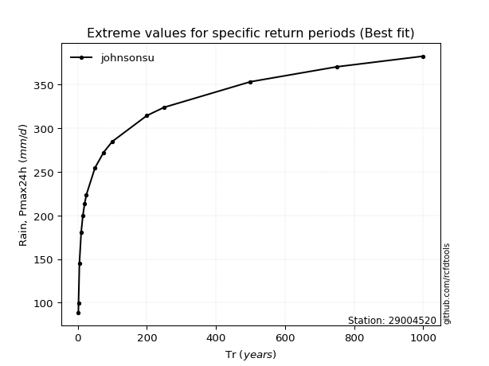</img>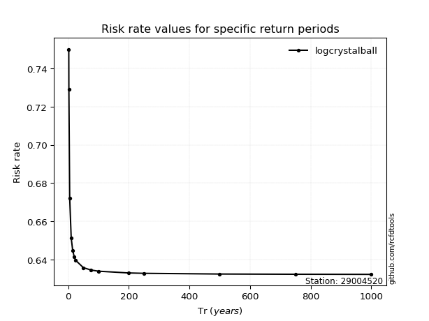</img>

</div>


<sub>**APP DISCLAIMER**: NO WARRANTY - This software is provided by [github.com/rcfdtools](https://github.com/rcfdtools) "as is", without any express or implied warranty, including warranties of merchantability, fitness for a particular purpose, or non-infringement. There is no guarantee that the software will be error-free or operate without interruption. LIMITATION OF LIABILITY - Neither the authors nor copyright holders will be liable for claims or damages arising from the software or its use. You are responsible for determining if the software is appropriate for your use and assume all associated risks, including errors, legal compliance, and data loss. NO PROFESSIONAL ADVICE - The software provides general information and does not offer professional advice. It should not replace consultation with professional advisors.</sub>