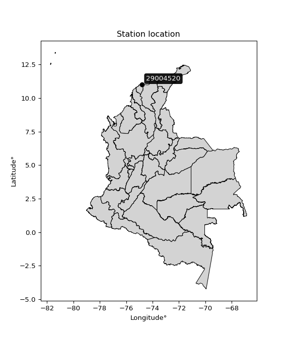

<div align="center">


</div>

# PMP Station (Rain, Pmax24h): 29004520

Probable Maximum Precipitation (PMP) is the greatest amount of rainfall for a specific duration that is meteorologically possible for a given location, acting as a "worst-case" scenario for extreme storms, crucial for designing safety-critical infrastructure like bridges, river deviations, dams, spillways, and nuclear plants to prevent catastrophic failure. PMP is calculated by hydrologists using meteorological data to determine the upper limit of extreme rainfall, often leading to the Probable Maximum Flood (PMF) for flood control design, and is increasingly being studied for climate change impacts. Probable Maximum Precipitation (PMP) is the theoretical upper limit of rainfall, a deterministic estimate for extreme events, while probability distributions (like GEV, Gumbel) describe the likelihood and frequency of various precipitation amounts, including rare ones, showing how often events occur, with PMP representing the extreme end of these distributions, used for critical infrastructure design to ensure safety against the worst conceivable weather, unlike standard statistical forecasts which cover typical probabilities.

The most common probability distributions in hydrology, used for analyzing floods, rainfall, and streamflow, include the Normal, Log-Normal, Gumbel, Gamma (including Log-Pearson Type III), and Generalized Extreme Value (GEV) distributions, often chosen based on the data´s skewness and whether modeling extremes or general conditions, with Gumbel and GEV popular for extreme events like floods, while the Normal distribution serves as a baseline, though often requiring transformations for skewed hydrological data. These distributions help in designing water infrastructure, managing water resources, and forecasting hydrologic events.

> Hydrological data often isn´t perfectly normal (it´s skewed), so different distributions are needed for different applications, such as: **Flood Frequency Analysis**: Using Gumbel, GEV, or Log-Pearson Type III for predicting extreme flood magnitudes and their return periods, **Rainfall Analysis**: Normal for annual totals, but Log-Normal, Weibull, or GEV for intensity or extreme daily rainfall, **Streamflow Modeling**: Gamma and Log-Normal for maximum flows, GEV for minimum flows, and Kappa for daily flows.

<div align="center">

</img>

</div>


## A. General information


### 1. General running parameters

• app_version: _v20260108_. • runtime: _2026-01-08 13:24:42.400241_. • Python version: _3.14.0_. • SciPy version: _1.16.3_. • Pandas version: _2.3.3_. • NumPy version: _2.3.5_. • Stations dataset (station_dataset_file): _dataset/pmax24h_in/automatic_colombia_2003_2024.csv_. • Stations catalog (station_catalog_file): _dataset/CNE.xls_. • Minimum year to eval til year_max (date_min): _1900_. • Maximum year to eval since year_min (date_max): _2024_. • Creates, save and include plots into reports (create_plot): _False_. • Plot only fit distributions with Δo > Δ (plot_only_fit): _True_. • Plot only simple graphs avoiding multiple CDFs and multiple Extreme values plots (plot_only_simple): _True_. • Eval low extreme values, if False, evaluates high extreme values (low_extreme): _False_. • Eval every SciPy distribution as logarithmic (pdist_logarithmic_on): _True_. • Standard deviation normalized (ddof): _1.0_. • Return periods to eval in years (Tr): _[2, 2.33, 5, 10, 15, 20, 25, 50, 75, 100, 200, 250, 500, 750, 1000]_. • Minimum data sample per station, 0 means any (minimum_sample): _5_. • Z-Score maximum threshold to adjust a value, 0 means disable (zscore_max): _3.5_. • Z-Score minimum threshold to adjust a value, 0 means disable (zscore_min): _-2.5_. • Avoid zeros, e.g. rain = 0 (avoid_zeros): _True_. • Avoid null values (avoid_nans): _True_. 

:file_folder:Table: [dataset.csv](../../dataset/pmax24h_in/automatic_colombia_2003_2024.csv)

> Delta Degrees of Freedom (DDOF): is a parameter used in the formulas for calculating variance and standard deviation. When ddof=0, the divisor is $N$ (the total number of observations) and this is used when your data set is the entire population. When ddof=1, the divisor is $N-1$ and this is used when your data set is a sample drawn from a larger population. Using $N-1$ provides an unbiased estimate of the population variance (known as Bessel´s correction).


### 2. Station info and location

|   id |   CODIGO | NOMBRE                                       | CATEGORIA               | TECNOLOGIA                | ESTADO   | FECHA_INSTALACION   |   FECHA_SUSPENSION |   ALTITUD |   LATITUD |   LONGITUD | DEPARTAMENTO   | MUNICIPIO    | AREA_OPERATIVA                              | ENTIDAD                                                     | AREA_HIDROGRAFICA   | ZONA_HIDROGRAFICA   | SUBZONA_HIDROGRAFICA                                     |   CORRIENTE | Catalogo   |   Version |
|-----:|---------:|:---------------------------------------------|:------------------------|:--------------------------|:---------|:--------------------|-------------------:|----------:|----------:|-----------:|:---------------|:-------------|:--------------------------------------------|:------------------------------------------------------------|:--------------------|:--------------------|:---------------------------------------------------------|------------:|:-----------|----------:|
|    0 | 29004520 | ESCUELA NAVAL BARRANQUILLA  - AUT [29004520] | Climatológica Principal | Automática con Telemetría | Activa   | 10/06/2016          |                nan |        10 |   11.0064 |    -74.785 | Atlantico      | Barranquilla | Area Operativa 02 - Atlántico-Bolivar-Sucre | INSTITUTO DE HIDROLOGIA METEOROLOGIA Y ESTUDIOS AMBIENTALES | Magdalena Cauca     | Bajo Magdalena      | Directos al Bajo Magdalena entre Calamar y desembocadura |         nan | CNE_IDEAM  |  20251226 |

<div align="center">

Dynamic map: [:earth_americas:Google](http://maps.google.com/maps?q=11.00638889,-74.785) [:earth_americas:OSM](https://www.openstreetmap.org/#map=18/11.00638889/-74.785&layers=P) [:earth_americas:Bing](https://www.bing.com/maps?cp=11.00638889~-74.785&lvl=18) [:earth_americas:Apple](https://maps.apple.com/frame?center=11.00638889%2C-74.785&span=0.003%2C0.006)

</div>


<div align="center">

```geojson
{
  "type": "Feature",
  "geometry": {
    "type": "Point", 
    "coordinates": [-74.785, 11.00638889]
  }, 
  "properties": {
    "Name": "29004520"
  }
}
```

</div>


### 3. Discrete values table and plot

<div align="center">

|               |           0 |           1 |           2 |            3 |           4 |          5 |          6 |           7 |
|:--------------|------------:|------------:|------------:|-------------:|------------:|-----------:|-----------:|------------:|
| Date          | 2017        | 2018        | 2019        | 2020         | 2021        | 2022       | 2023       | 2024        |
| Value         |   74.5      |   63.9      |  122.1      |   99.5       |   47.2      |  223       |    3.7     |  140.8      |
| Value_initial |   74.5      |   63.9      |  122.1      |   99.5       |   47.2      |  223       |    3.7     |  140.8      |
| count         |    8        |    8        |    8        |    8         |    8        |    8       |    8       |    8        |
| mean          |   96.8375   |   96.8375   |   96.8375   |   96.8375    |   96.8375   |   96.8375  |   96.8375  |   96.8375   |
| std           |   66.7803   |   66.7803   |   66.7803   |   66.7803    |   66.7803   |   66.7803  |   66.7803  |   66.7803   |
| zscore        |   -0.334492 |   -0.493222 |    0.378293 |    0.0398695 |   -0.743295 |    1.88922 |   -1.39468 |    0.658315 |


</div>


> The initial value (value_initial) correspond to the initial obtained or null completed value, and value (value) is adjusted only when the initial value is outside the valid range (outlier) definite through the Z-Score value. If Z-Score is active, values out of range or outliers are replaced with the station mean value. A Z-Score (or standard score) measures how many standard deviations a data point is from the mean of a dataset, indicating its relative position; positive scores mean above the mean, negative mean below, and a score of zero is exactly at the mean, allowing for comparison of values from different distributions. It´s calculated using the formula $z=(x–μ)/σ$, where $x$ is the data point, $μ$ is the mean, and $σ$ is the standard deviation, helping identify outliers and understand probability.
>
> <sub>**Note**: In this study, "completing" (filling gaps in) and "extending" (forecasting or lengthening the historical record) rainfall data series are avoided for certain critical analyses because they introduce artificial bias and uncertainty, which can distort the statistics of rare events (extremes), alter day-to-day variability, and compromise the integrity and homogeneity of the original data. Some reasons against Completing/Extending rainfall data are: **Distortion of Extremes and Variability**: The primary issue is that most gap-filling or extension methods rely on averaging or regression with nearby stations, which inherently smooths the data. Rainfall is highly variable in space and time, with a large percentage of zero values and occasional large storms. Infilling methods often underestimate the highest values and overestimate the lowest (zero) values, which severely distorts analyses focused on flood frequency, drought severity, and intensity-duration-frequency (IDF) curves, **Loss of Data Homogeneity**: Infilled or extended data are synthetic estimates, not actual measurements. Combining these estimates with observed data can violate the assumption of data homogeneity, which requires that the data properties do not change over time. Inhomogeneity can lead to incorrect conclusions about long-term trends or changes in climate patterns, **Propagation of Errors**: Errors and biases from the original data (e.g., wind-induced undercatch, instrument errors, site changes) or the data used for imputation can propagate through the analysis, leading to unreliable hydrological models and inaccurate predictions, **Compromised Statistical Integrity**: For statistical analyses, especially those involving the frequency of events, using artificial data can introduce time bias or autocorrelation that doesn´t exist in reality, making it difficult to assess the true probability of events, **Difficulty in Validation**: It is difficult to accurately validate the quality of filled or extended data, especially for past periods where ground-truth measurements are unavailable. The reliability of imputation techniques heavily depends on the density of the surrounding station network and the complexity of the local topography.</sub>


### 4. Active continuous probability distributions from SciPy (43 of 104 available)

A Probability Density Function (PDF) describes the relative likelihood of a continuous random variable falling within a specific range, where the total area under its curve equals 1, and the area over any interval gives the actual probability for that range. Unlike discrete probabilities (like rolling a die), a PDF shows density, not direct probability for a single point (which is zero), with higher points indicating higher likelihood, often visualized as a bell curve for normal distributions.

A log of a probability density function (log-PDF) is simply the logarithm of the PDF´s value, denoted as $log(f(x))$, useful for converting multiplication of probabilities into addition, improving numerical stability with tiny numbers, and connecting to information theory concepts like entropy. Instead of dealing with very small probabilities (e.g., 0.000001), log-PDFs use negative numbers (e.g., $log(0.00001) ≈ -11.51$ that are easier for computers to handle, preventing underflow errors and simplifying complex calculations. In this study, each active probability distribution from SciPy is also evaluated in the $log$ form.

[scipy.stats](https://docs.scipy.org/doc/scipy/reference/stats.html) is a Python´s powerful submodule within the SciPy library for comprehensive statistical analysis, offering over 130 probability distributions (like Normal, Poisson), functions for descriptive stats (mean, variance), hypothesis testing (t-tests, chi-square), random variable generation, and statistical tests, making it essential for data science, modeling, and research. It provides tools to explore, model, and draw conclusions from data efficiently, working seamlessly with NumPy.

<div align="center">

|   id | p_dist             |   n_parameter | fit_method   | label                                                                       | active   | ref                                                                                                        |
|-----:|:-------------------|--------------:|:-------------|:----------------------------------------------------------------------------|:---------|:-----------------------------------------------------------------------------------------------------------|
|    0 | alpha              |             3 | MLE          | Alpha                                                                       | True     | [:mortar_board:](https://docs.scipy.org/doc/scipy/reference/generated/scipy.stats.alpha.html)              |
|    1 | betaprime          |             4 | MLE          | Beta prime                                                                  | True     | [:mortar_board:](https://docs.scipy.org/doc/scipy/reference/generated/scipy.stats.betaprime.html)          |
|    2 | chi2               |             3 | MLE          | Chi²                                                                        | True     | [:mortar_board:](https://docs.scipy.org/doc/scipy/reference/generated/scipy.stats.chi2.html)               |
|    3 | crystalball        |             4 | MLE          | Crystalball                                                                 | True     | [:mortar_board:](https://docs.scipy.org/doc/scipy/reference/generated/scipy.stats.crystalball.html)        |
|    4 | erlang             |             3 | MLE          | Erlang                                                                      | True     | [:mortar_board:](https://docs.scipy.org/doc/scipy/reference/generated/scipy.stats.erlang.html)             |
|    5 | expon              |             2 | MLE          | Exponential                                                                 | True     | [:mortar_board:](https://docs.scipy.org/doc/scipy/reference/generated/scipy.stats.expon.html)              |
|    6 | exponnorm          |             3 | MLE          | Exponentially modified Normal                                               | True     | [:mortar_board:](https://docs.scipy.org/doc/scipy/reference/generated/scipy.stats.exponnorm.html)          |
|    7 | f                  |             4 | MLE          | F                                                                           | True     | [:mortar_board:](https://docs.scipy.org/doc/scipy/reference/generated/scipy.stats.f.html)                  |
|    8 | fatiguelife        |             3 | MLE          | Fatigue-life (Birnbaum-Saunders)                                            | True     | [:mortar_board:](https://docs.scipy.org/doc/scipy/reference/generated/scipy.stats.fatiguelife.html)        |
|    9 | fisk               |             3 | MLE          | Fisk                                                                        | True     | [:mortar_board:](https://docs.scipy.org/doc/scipy/reference/generated/scipy.stats.fisk.html)               |
|   10 | gamma              |             3 | MLE          | Gamma                                                                       | True     | [:mortar_board:](https://docs.scipy.org/doc/scipy/reference/generated/scipy.stats.gamma.html)              |
|   11 | genexpon           |             5 | MLE          | Generalized exponential                                                     | True     | [:mortar_board:](https://docs.scipy.org/doc/scipy/reference/generated/scipy.stats.genexpon.html)           |
|   12 | genlogistic        |             3 | MLE          | Generalized logistic                                                        | True     | [:mortar_board:](https://docs.scipy.org/doc/scipy/reference/generated/scipy.stats.genlogistic.html)        |
|   13 | gibrat             |             2 | MM           | Gibrat                                                                      | True     | [:mortar_board:](https://docs.scipy.org/doc/scipy/reference/generated/scipy.stats.gibrat.html)             |
|   14 | gompertz           |             3 | MLE          | Gompertz (or truncated Gumbel)                                              | True     | [:mortar_board:](https://docs.scipy.org/doc/scipy/reference/generated/scipy.stats.gompertz.html)           |
|   15 | gumbel_l           |             2 | MM           | Gumbel Left Skew                                                            | True     | [:mortar_board:](https://docs.scipy.org/doc/scipy/reference/generated/scipy.stats.gumbel_l.html)           |
|   16 | gumbel_r           |             2 | MM           | Gumbel Right Skew                                                           | True     | [:mortar_board:](https://docs.scipy.org/doc/scipy/reference/generated/scipy.stats.gumbel_r.html)           |
|   17 | halflogistic       |             2 | MM           | Half-logistic                                                               | True     | [:mortar_board:](https://docs.scipy.org/doc/scipy/reference/generated/scipy.stats.halflogistic.html)       |
|   18 | halfnorm           |             2 | MM           | Half Normal                                                                 | True     | [:mortar_board:](https://docs.scipy.org/doc/scipy/reference/generated/scipy.stats.halfnorm.html)           |
|   19 | hypsecant          |             2 | MM           | hyperbolic secant                                                           | True     | [:mortar_board:](https://docs.scipy.org/doc/scipy/reference/generated/scipy.stats.hypsecant.html)          |
|   20 | invgamma           |             3 | MLE          | Inverted gamma                                                              | True     | [:mortar_board:](https://docs.scipy.org/doc/scipy/reference/generated/scipy.stats.invgamma.html)           |
|   21 | invgauss           |             3 | MLE          | Inverse Gaussian                                                            | True     | [:mortar_board:](https://docs.scipy.org/doc/scipy/reference/generated/scipy.stats.invgauss.html)           |
|   22 | invweibull         |             3 | MLE          | Inverted Weibull                                                            | True     | [:mortar_board:](https://docs.scipy.org/doc/scipy/reference/generated/scipy.stats.invweibull.html)         |
|   23 | kstwobign          |             2 | MLE          | Limiting distribution of scaled Kolmogorov-Smirnov two-sided test statistic | True     | [:mortar_board:](https://docs.scipy.org/doc/scipy/reference/generated/scipy.stats.kstwobign.html)          |
|   24 | laplace            |             2 | MM           | Laplace                                                                     | True     | [:mortar_board:](https://docs.scipy.org/doc/scipy/reference/generated/scipy.stats.laplace.html)            |
|   25 | laplace_asymmetric |             3 | MLE          | Asymmetric Laplace                                                          | True     | [:mortar_board:](https://docs.scipy.org/doc/scipy/reference/generated/scipy.stats.laplace_asymmetric.html) |
|   26 | loggamma           |             3 | MLE          | Log gamma                                                                   | True     | [:mortar_board:](https://docs.scipy.org/doc/scipy/reference/generated/scipy.stats.loggamma.html)           |
|   27 | logistic           |             2 | MM           | Logistic (or Sech-squared)                                                  | True     | [:mortar_board:](https://docs.scipy.org/doc/scipy/reference/generated/scipy.stats.logistic.html)           |
|   28 | lognorm            |             3 | MLE          | Log Normal                                                                  | True     | [:mortar_board:](https://docs.scipy.org/doc/scipy/reference/generated/scipy.stats.lognorm.html)            |
|   29 | maxwell            |             2 | MM           | Maxwell                                                                     | True     | [:mortar_board:](https://docs.scipy.org/doc/scipy/reference/generated/scipy.stats.maxwell.html)            |
|   30 | mielke             |             4 | MLE          | Mielke Beta-Kappa / Dagum                                                   | True     | [:mortar_board:](https://docs.scipy.org/doc/scipy/reference/generated/scipy.stats.mielke.html)             |
|   31 | moyal              |             2 | MM           | Moyal                                                                       | True     | [:mortar_board:](https://docs.scipy.org/doc/scipy/reference/generated/scipy.stats.moyal.html)              |
|   32 | nakagami           |             3 | MLE          | Nakagami                                                                    | True     | [:mortar_board:](https://docs.scipy.org/doc/scipy/reference/generated/scipy.stats.nakagami.html)           |
|   33 | ncf                |             5 | MLE          | Non-central F distribution                                                  | True     | [:mortar_board:](https://docs.scipy.org/doc/scipy/reference/generated/scipy.stats.ncf.html)                |
|   34 | nct                |             4 | MLE          | Non-central Student’s t                                                     | True     | [:mortar_board:](https://docs.scipy.org/doc/scipy/reference/generated/scipy.stats.nct.html)                |
|   35 | norm               |             2 | MM           | Normal                                                                      | True     | [:mortar_board:](https://docs.scipy.org/doc/scipy/reference/generated/scipy.stats.norm.html)               |
|   36 | pearson3           |             3 | MM           | Pearson type III                                                            | True     | [:mortar_board:](https://docs.scipy.org/doc/scipy/reference/generated/scipy.stats.pearson3.html)           |
|   37 | rayleigh           |             2 | MM           | Rayleigh                                                                    | True     | [:mortar_board:](https://docs.scipy.org/doc/scipy/reference/generated/scipy.stats.rayleigh.html)           |
|   38 | rice               |             3 | MLE          | Rice                                                                        | True     | [:mortar_board:](https://docs.scipy.org/doc/scipy/reference/generated/scipy.stats.rice.html)               |
|   39 | t                  |             3 | MLE          | Student’s t                                                                 | True     | [:mortar_board:](https://docs.scipy.org/doc/scipy/reference/generated/scipy.stats.t.html)                  |
|   40 | truncnorm          |             4 | MLE          | Truncated normal                                                            | True     | [:mortar_board:](https://docs.scipy.org/doc/scipy/reference/generated/scipy.stats.truncnorm.html)          |
|   41 | wald               |             2 | MM           | Wald                                                                        | True     | [:mortar_board:](https://docs.scipy.org/doc/scipy/reference/generated/scipy.stats.wald.html)               |
|   42 | weibull_min        |             3 | MLE          | Weibull minimum                                                             | True     | [:mortar_board:](https://docs.scipy.org/doc/scipy/reference/generated/scipy.stats.weibull_min.html)        |

</div>

> **n_parameter:** # arguments & localization & scale.
>
> **Fit methods:** (MLE) maximum likelihood, (MM) L-moments.
>
>**Inactive** (With the only purpose of prevent loops, zero divisions, infinite values, over high estimated values or horizontal trending for recurrence intervals estimations, the follow distributions were disabled.)**:** foldnorm, gennorm, norminvgauss, powernorm, powerlognorm, skewnorm, genextreme, anglit, arcsine, argus, beta, bradford, burr, burr12, cauchy, cosine, halfcauchy, foldcauchy, skewcauchy, wrapcauchy, dgamma, gengamma, exponweib, exponpow, truncexpon, gausshyper, genhalflogistic, genhyperbolic, geninvgauss, halfgennorm, johnsonsb, johnsonsu, kappa4, kappa3, ksone, kstwo, loglaplace, levy, levy_l, levy_stable, ncx2, pareto, genpareto, truncpareto, lomax, powerlaw, rdist, rel_breitwigner, recipinvgauss, semicircular, studentized_range, trapezoid, triang, truncweibull_min, tukeylambda, uniform, loguniform, vonmises, vonmises_line, weibull_max, dweibull, 


## B. Probability (PDF) vs. Empirical (EDF) distributions functions

A continuous probability distribution (CPD) describes probabilities for variables that can take any value within a range (like rain any time), unlike discrete variables with specific outcomes (like temperature). It uses a Probability Density Function (PDF), a curve where the total area under it equals 1, and the probability of the variable falling within an interval (a to b) is found by calculating the area under the curve between those points. A key feature is that the probability of hitting any single exact value is zero, so probabilities are always expressed for ranges, e.g., $P(a ≤ X ≤ b)$.

<div align="center">

Distributions parameters from station values
|    |   station | p_dist                |   n |              loc |           scale | shape                  | shape1                | shape2                | shape3   |
|---:|----------:|:----------------------|----:|-----------------:|----------------:|:-----------------------|:----------------------|:----------------------|:---------|
|  0 |  29004520 | alpha                 |   8 |     -0.0222252   |    10.4738      | 1.2785557973010127e-11 |                       |                       |          |
|  1 |  29004520 | betaprime             |   8 |    -49.8628      | 10801.6         | 5.35039609463804       | 394.9263247919537     |                       |          |
|  2 |  29004520 | chi2                  |   8 |      3.7         |     3.79305     | 0.36820780951170334    |                       |                       |          |
|  3 |  29004520 | crystalball           |   8 |     96.8375      |    62.4673      | 7140.095656454379      | 4710.063686771236     |                       |          |
|  4 |  29004520 | erlang                |   8 |    -47.0754      |    28.4677      | 5.055300653225004      |                       |                       |          |
|  5 |  29004520 | expon                 |   8 |      3.7         |    93.1375      |                        |                       |                       |          |
|  6 |  29004520 | exponnorm             |   8 |     44.2649      |    38.0318      | 1.3823319800731406     |                       |                       |          |
|  7 |  29004520 | f                     |   8 |    -47.1683      |   143.992       | 10.130322345894566     | 19682.266046582106    |                       |          |
|  8 |  29004520 | fatiguelife           |   8 |   -123.442       |   211.635       | 0.28578670192068256    |                       |                       |          |
|  9 |  29004520 | fisk                  |   8 |   -109.878       |   198.207       | 5.7443341157938725     |                       |                       |          |
| 10 |  29004520 | gamma                 |   8 |    -47.0753      |    28.4678      | 5.055291116449058      |                       |                       |          |
| 11 |  29004520 | genexpon              |   8 |      3.69999     |     2.35856     | 0.025317348777479515   | 5.747769836684761e-09 | 1.846736329159583     |          |
| 12 |  29004520 | genlogistic           |   8 |    -91.2974      |    50.8871      | 23.37897476313804      |                       |                       |          |
| 13 |  29004520 | gibrat                |   8 |     49.1829      |    28.904       |                        |                       |                       |          |
| 14 |  29004520 | gompertz              |   8 |     99.5         |    10.6608      | 3.72015086255616e-05   |                       |                       |          |
| 15 |  29004520 | gumbel_l              |   8 |    124.951       |    48.7055      |                        |                       |                       |          |
| 16 |  29004520 | gumbel_r              |   8 |     68.7239      |    48.7055      |                        |                       |                       |          |
| 17 |  29004520 | halflogistic          |   8 |     22.7993      |    53.4073      |                        |                       |                       |          |
| 18 |  29004520 | halfnorm              |   8 |     14.1553      |   103.627       |                        |                       |                       |          |
| 19 |  29004520 | hypsecant             |   8 |     96.8375      |    39.7679      |                        |                       |                       |          |
| 20 |  29004520 | invgamma              |   8 |   -208.599       |  7383.01        | 25.167215964749058     |                       |                       |          |
| 21 |  29004520 | invgauss              |   8 |   -127.139       |  2790.06        | 0.08027794077054745    |                       |                       |          |
| 22 |  29004520 | invweibull            |   8 |     -6.2265e+08  |     6.2265e+08  | 12081961.09809743      |                       |                       |          |
| 23 |  29004520 | kstwobign             |   8 |   -118.833       |   247.794       |                        |                       |                       |          |
| 24 |  29004520 | laplace               |   8 |     96.8375      |    44.171       |                        |                       |                       |          |
| 25 |  29004520 | laplace_asymmetric    |   8 |     63.9         |    43.2782      | 0.6894318962991528     |                       |                       |          |
| 26 |  29004520 | loggamma              |   8 | -14894.2         |  2133.19        | 1127.7060179755626     |                       |                       |          |
| 27 |  29004520 | logistic              |   8 |     96.8375      |    34.44        |                        |                       |                       |          |
| 28 |  29004520 | lognorm               |   8 |      3.7         |     0.639805    | 13.200899575079367     |                       |                       |          |
| 29 |  29004520 | maxwell               |   8 |    -51.1837      |    92.7585      |                        |                       |                       |          |
| 30 |  29004520 | mielke                |   8 |      3.7         |   174.237       | 0.9139029415714297     | 6.310303962556772     |                       |          |
| 31 |  29004520 | moyal                 |   8 |     61.1147      |    28.1202      |                        |                       |                       |          |
| 32 |  29004520 | nakagami              |   8 |      3.7         |   104.867       | 0.3513728045001308     |                       |                       |          |
| 33 |  29004520 | ncf                   |   8 |      3.66955     |    12.4218      | 1.1729268679563396     | 3959.1244106251024    | 6.07051935582108      |          |
| 34 |  29004520 | nct                   |   8 |     -0.0625586   |    48.9479      | 7.591609641425231      | 1.771692801353285     |                       |          |
| 35 |  29004520 | norm                  |   8 |     96.8375      |    62.4673      |                        |                       |                       |          |
| 36 |  29004520 | pearson3              |   8 |     96.8375      |    62.4673      | 0.5805651232177992     |                       |                       |          |
| 37 |  29004520 | rayleigh              |   8 |    -22.666       |    95.35        |                        |                       |                       |          |
| 38 |  29004520 | rice                  |   8 |    -19.4007      |    93.3091      | 0.005753967131363429   |                       |                       |          |
| 39 |  29004520 | t                     |   8 |     96.8376      |    62.4676      | 168561372.60510343     |                       |                       |          |
| 40 |  29004520 | truncnorm             |   8 |    -12.7432      |     5.20553     | -4.625134784005042     | 45.28705716578756     |                       |          |
| 41 |  29004520 | wald                  |   8 |     34.3703      |    62.4672      |                        |                       |                       |          |
| 42 |  29004520 | weibull_min           |   8 |    -10.8572      |   120.493       | 1.7409517576954534     |                       |                       |          |
| 43 |  29004520 | logalpha              |   8 |    -32.7468      |  1066.03        | 28.91511301266401      |                       |                       |          |
| 44 |  29004520 | logbetaprime          |   8 |   -159.795       |   595.301       | 24250.911072056522     | 88044.61060682227     |                       |          |
| 45 |  29004520 | logchi2               |   8 |    -14.8222      |     0.0420843   | 451.6612948409328      |                       |                       |          |
| 46 |  29004520 | logcrystalball        |   8 |      4.17379     |     1.17428     | 10.406685560662421     | 2004.632125466143     |                       |          |
| 47 |  29004520 | logerlang             |   8 |    -18.4811      |     0.0680508   | 332.49708711669535     |                       |                       |          |
| 48 |  29004520 | logexpon              |   8 |      1.30833     |     2.86546     |                        |                       |                       |          |
| 49 |  29004520 | logexponnorm          |   8 |      4.17302     |     1.17428     | 0.0006561708308875159  |                       |                       |          |
| 50 |  29004520 | logf                  |   8 |  -2293.71        |  2297.88        | 24860763.32629215      | 11013475.917590618    |                       |          |
| 51 |  29004520 | logfatiguelife        |   8 |   -997.305       |  1001.48        | 0.00116816268761124    |                       |                       |          |
| 52 |  29004520 | logfisk               |   8 |  -8480.39        |  8484.77        | 14998.267560914406     |                       |                       |          |
| 53 |  29004520 | loggamma              |   8 |    -18.8345      |     0.0670061   | 342.978283477996       |                       |                       |          |
| 54 |  29004520 | loggenexpon           |   8 |      1.16787     |     0.0288918   | 0.001720558882553009   | 3.396193860090187     | 3.866401663680635e-05 |          |
| 55 |  29004520 | loggenlogistic        |   8 |      5.16422     |     0.184688    | 0.17808957362821215    |                       |                       |          |
| 56 |  29004520 | loggibrat             |   8 |      3.27793     |     0.543365    |                        |                       |                       |          |
| 57 |  29004520 | loggompertz           |   8 |      1.30833     |     0.759197    | 0.012657879176135988   |                       |                       |          |
| 58 |  29004520 | loggumbel_l           |   8 |      4.70228     |     0.915585    |                        |                       |                       |          |
| 59 |  29004520 | loggumbel_r           |   8 |      3.6453      |     0.915585    |                        |                       |                       |          |
| 60 |  29004520 | loghalflogistic       |   8 |      2.78203     |     1.00396     |                        |                       |                       |          |
| 61 |  29004520 | loghalfnorm           |   8 |      2.61948     |     1.94804     |                        |                       |                       |          |
| 62 |  29004520 | loghypsecant          |   8 |      4.17379     |     0.747572    |                        |                       |                       |          |
| 63 |  29004520 | loginvgamma           |   8 |    -25.6916      | 17465.2         | 586.5683043283543      |                       |                       |          |
| 64 |  29004520 | loginvgauss           |   8 |    -10.0532      |  1692.26        | 0.00841044183740115    |                       |                       |          |
| 65 |  29004520 | loginvweibull         |   8 |     -1.77746e+08 |     1.77746e+08 | 120448147.92830345     |                       |                       |          |
| 66 |  29004520 | logkstwobign          |   8 |     -1.87524     |     6.93249     |                        |                       |                       |          |
| 67 |  29004520 | loglaplace            |   8 |      4.17379     |     0.830344    |                        |                       |                       |          |
| 68 |  29004520 | loglaplace_asymmetric |   8 |      4.94734     |     0.538261    | 1.9498032584021474     |                       |                       |          |
| 69 |  29004520 | logloggamma           |   8 |      5.29754     |     0.274427    | 0.2579348943113445     |                       |                       |          |
| 70 |  29004520 | loglogistic           |   8 |      4.17379     |     0.647416    |                        |                       |                       |          |
| 71 |  29004520 | loglognorm            |   8 |      1.30833     |     0.0308958   | 12.309774956797693     |                       |                       |          |
| 72 |  29004520 | logmaxwell            |   8 |      1.39121     |     1.74373     |                        |                       |                       |          |
| 73 |  29004520 | logmielke             |   8 |    -15.4703      |    20.8775      | 15.956472758028628     | 2475648.638104067     |                       |          |
| 74 |  29004520 | logmoyal              |   8 |      3.50226     |     0.528613    |                        |                       |                       |          |
| 75 |  29004520 | lognakagami           |   8 |      3.85439     |     0.823966    | 0.4068265787390709     |                       |                       |          |
| 76 |  29004520 | logncf                |   8 |     -0.494782    |     5.45771e-06 | 5.1177767138661096e-05 | 115.61019875274113    | 43.28730600685877     |          |
| 77 |  29004520 | lognct                |   8 |    -82.8454      |     1.1534      | 71155.48675787394      | 75.4449931530985      |                       |          |
| 78 |  29004520 | lognorm               |   8 |      4.17379     |     1.17428     |                        |                       |                       |          |
| 79 |  29004520 | logpearson3           |   8 |      4.1738      |     1.17428     | -1.6126290800492349    |                       |                       |          |
| 80 |  29004520 | lograyleigh           |   8 |      1.92734     |     1.79241     |                        |                       |                       |          |
| 81 |  29004520 | logrice               |   8 |   -366.51        |     1.17436     | 315.64452590578685     |                       |                       |          |
| 82 |  29004520 | logt                  |   8 |      4.5112      |     0.544997    | 1.7052933390048444     |                       |                       |          |
| 83 |  29004520 | logtruncnorm          |   8 |     30.7682      |     9.03028     | -18.894991639460727    | -2.8084445613961053   |                       |          |
| 84 |  29004520 | logwald               |   8 |      2.99947     |     1.17431     |                        |                       |                       |          |
| 85 |  29004520 | logweibull_min        |   8 |      1.30833     |     1.55546     | 0.6461103445219127     |                       |                       |          |

</div>

> **loc** (Location parameter): This shifts the distribution along the x-axis. For many common distributions, like the normal (Gaussian) distribution, loc represents the mean $μ$. For others, like the uniform distribution, it might represent the minimum value, or for the beta distribution, the left end of the support interval.
>
> **scale** (Scale parameter): This determines the width or spread of the distribution. For the normal distribution, scale represents the standard deviation $σ$. For a uniform distribution, it defines the length of the interval (from $loc$ to $loc + scale$).
>
> **shape** (Shape parameters): Refers to parameters that define the specific form of a probability distribution, distinct from its location (loc) and scale (scale). These parameters are required arguments for most distribution functions. For example, a normal (Gaussian) distribution is fully defined by its location (mean) and scale (standard deviation), so it has no specific shape parameters beyond loc and scale. However, other distributions have intrinsic properties that need specification, as Gamma distribution that takes a shape parameter, often named $a$ or $alpha$.


### 0. Cumulative distribution values - CDF (86 evaluated)

Cumulative Distribution Function (CDF), denoted as $F$<sub>$X$</sub>$(x)$, is a function that gives the probability that a random variable $X$ will take a value less than or equal to a specific value, $x$ (i.e., $(P(X≥x)$. It essentially "accumulates" probabilities from a given point up to the far right (positive infinity), providing a complete picture of the distribution´s probabilities for both discrete (like rain) and continuous (like temperature) variables, helping to find probabilities over ranges or above certain values. Each station is evaluated separately ordering the $x$ values ascending, calculating the CDF and PDF values for the activated distributions and their logarithmic forms.

<div align="center">

CDF ordered by x ascending and calculating $log(f(x))$ separately
|   id |   Station |   date |     x |   count |    mean |     std |     zscore |   Value_initial |   station |   m |      alpha |   alpha_pdf |   betaprime |   betaprime_pdf |       chi2 |    chi2_pdf |   crystalball |   crystalball_pdf |    erlang |   erlang_pdf |    expon |   expon_pdf |   exponnorm |   exponnorm_pdf |         f |       f_pdf |   fatiguelife |   fatiguelife_pdf |     fisk |    fisk_pdf |     gamma |   gamma_pdf |    genexpon |   genexpon_pdf |   genlogistic |   genlogistic_pdf |   gibrat |   gibrat_pdf |    gompertz |   gompertz_pdf |   gumbel_l |   gumbel_l_pdf |   gumbel_r |   gumbel_r_pdf |   halflogistic |   halflogistic_pdf |   halfnorm |   halfnorm_pdf |   hypsecant |   hypsecant_pdf |   invgamma |   invgamma_pdf |   invgauss |   invgauss_pdf |   invweibull |   invweibull_pdf |   kstwobign |   kstwobign_pdf |   laplace |   laplace_pdf |   laplace_asymmetric |   laplace_asymmetric_pdf |   loggamma |   loggamma_pdf |   logistic |   logistic_pdf |    lognorm |   lognorm_pdf |   maxwell |   maxwell_pdf |      mielke |   mielke_pdf |      moyal |   moyal_pdf |    nakagami |   nakagami_pdf |       ncf |     ncf_pdf |       nct |     nct_pdf |      norm |    norm_pdf |   pearson3 |   pearson3_pdf |   rayleigh |   rayleigh_pdf |      rice |   rice_pdf |        t |       t_pdf |   truncnorm |   truncnorm_pdf |      wald |    wald_pdf |   weibull_min |   weibull_min_pdf |   logalpha |   logalpha_pdf |   logbetaprime |   logbetaprime_pdf |    logchi2 |   logchi2_pdf |   logcrystalball |   logcrystalball_pdf |   logerlang |   logerlang_pdf |   logexpon |   logexpon_pdf |   logexponnorm |   logexponnorm_pdf |       logf |   logf_pdf |   logfatiguelife |   logfatiguelife_pdf |    logfisk |   logfisk_pdf |   loggenexpon |   loggenexpon_pdf |   loggenlogistic |   loggenlogistic_pdf |   loggibrat |   loggibrat_pdf |   loggompertz |   loggompertz_pdf |   loggumbel_l |   loggumbel_l_pdf |   loggumbel_r |   loggumbel_r_pdf |   loghalflogistic |   loghalflogistic_pdf |   loghalfnorm |   loghalfnorm_pdf |   loghypsecant |   loghypsecant_pdf |   loginvgamma |   loginvgamma_pdf |   loginvgauss |   loginvgauss_pdf |   loginvweibull |   loginvweibull_pdf |   logkstwobign |   logkstwobign_pdf |   loglaplace |   loglaplace_pdf |   loglaplace_asymmetric |   loglaplace_asymmetric_pdf |   logloggamma |   logloggamma_pdf |   loglogistic |   loglogistic_pdf |   loglognorm |   loglognorm_pdf |   logmaxwell |   logmaxwell_pdf |   logmielke |   logmielke_pdf |    logmoyal |   logmoyal_pdf |   lognakagami |   lognakagami_pdf |    logncf |   logncf_pdf |     lognct |   lognct_pdf |   logpearson3 |   logpearson3_pdf |   lograyleigh |   lograyleigh_pdf |    logrice |   logrice_pdf |      logt |   logt_pdf |   logtruncnorm |   logtruncnorm_pdf |   logwald |   logwald_pdf |   logweibull_min |   logweibull_min_pdf |
|-----:|----------:|-------:|------:|--------:|--------:|--------:|-----------:|----------------:|----------:|----:|-----------:|------------:|------------:|----------------:|-----------:|------------:|--------------:|------------------:|----------:|-------------:|---------:|------------:|------------:|----------------:|----------:|------------:|--------------:|------------------:|---------:|------------:|----------:|------------:|------------:|---------------:|--------------:|------------------:|---------:|-------------:|------------:|---------------:|-----------:|---------------:|-----------:|---------------:|---------------:|-------------------:|-----------:|---------------:|------------:|----------------:|-----------:|---------------:|-----------:|---------------:|-------------:|-----------------:|------------:|----------------:|----------:|--------------:|---------------------:|-------------------------:|-----------:|---------------:|-----------:|---------------:|-----------:|--------------:|----------:|--------------:|------------:|-------------:|-----------:|------------:|------------:|---------------:|----------:|------------:|----------:|------------:|----------:|------------:|-----------:|---------------:|-----------:|---------------:|----------:|-----------:|---------:|------------:|------------:|----------------:|----------:|------------:|--------------:|------------------:|-----------:|---------------:|---------------:|-------------------:|-----------:|--------------:|-----------------:|---------------------:|------------:|----------------:|-----------:|---------------:|---------------:|-------------------:|-----------:|-----------:|-----------------:|---------------------:|-----------:|--------------:|--------------:|------------------:|-----------------:|---------------------:|------------:|----------------:|--------------:|------------------:|--------------:|------------------:|--------------:|------------------:|------------------:|----------------------:|--------------:|------------------:|---------------:|-------------------:|--------------:|------------------:|--------------:|------------------:|----------------:|--------------------:|---------------:|-------------------:|-------------:|-----------------:|------------------------:|----------------------------:|--------------:|------------------:|--------------:|------------------:|-------------:|-----------------:|-------------:|-----------------:|------------:|----------------:|------------:|---------------:|--------------:|------------------:|----------:|-------------:|-----------:|-------------:|--------------:|------------------:|--------------:|------------------:|-----------:|--------------:|----------:|-----------:|---------------:|-------------------:|----------:|--------------:|-----------------:|---------------------:|
|    0 |  29004520 |   2023 |   3.7 |       8 | 96.8375 | 66.7803 | -1.39468   |             3.7 |  29004520 |   1 | 0.00489525 | 0.0115113   |   0.0333668 |     0.00234729  | 0.00111311 | 4.61455e+11 |     0.0679833 |       0.00210152  | 0.0329875 |   0.00236376 | 0        |  0.0107368  |   0.0398688 |     0.00196312  | 0.0330003 | 0.0023632   |     0.0357438 |       0.00223417  | 0.03922  | 0.0019058   | 0.0329874 | 0.00236376  | 6.15987e-08 |     0.0107343  |     0.0346973 |       0.00213464  | 0        |  0           | 0           |    0           |  0.0796062 |    0.00156758  |  0.0223673 |    0.00174517  |       0        |        0           |   0        |     0          |   0.0610124 |     0.00152484  |  0.0375878 |    0.00215988  |  0.0358846 |     0.00222772 |    0.0324947 |      0.00216063  |   0.0326425 |     0.00242171  |  0.060706 |   0.00137434  |            0.0428414 |              0.00143583  |  0.0088687 |      0.0211218 |  0.0627177 |    0.00170686  | 0.00733998 |     0.0173037 | 0.0496516 |   0.00252781  | 2.95006e-10 |   0.0414551  | 0.00550929 | 0.000836206 | 4.80389e-13 |  760.189       | 0.0011625 | 0.0224755   | 0.0448495 | 0.00188458  | 0.0679833 | 0.00210152  |  0.0460851 |    0.00227283  |  0.0375096 |    0.00279126  | 0.0301805 | 0.00257312 | 0.067984 | 0.00210153  |    0.999208 |    0.000522111  | 0         | 0           |     0.0249196 |       0.00294279  |  0.0084696 |      0.0211835 |     0.00764605 |          0.0179686 | 0.00869321 |     0.0208101 |       0.00733998 |            0.0173037 |   0.0088639 |       0.0211431 |   0        |      0.348984  |     0.00734013 |           0.017304 | 0.00738368 |  0.0173893 |       0.00700669 |             0.016719 | 0.00436314 |    0.00768172 |    0.00986739 |         0.0808398 |        0.0242796 |            0.0234121 |    0        |       0         |   3.54353e-08 |         0.0166728 |     0.0242553 |         0.0261677 |   2.65692e-06 |       3.72554e-05 |          0        |              0        |      0        |          0        |      0.0137769 |          0.0184231 |    0.00770658 |         0.0196612 |    0.00778541 |         0.0206933 |       0.0118015 |           0.0355037 |      0.0157193 |          0.0528329 |     0.015858 |        0.0190981 |               0.0247017 |                   0.0235365 |     0.0260059 |          0.024443 |     0.0118209 |         0.0180427 |   0.00407753 |      4.40944e+12 |     0        |         0        |   0.0305745 |       0.0290764 | 1.63955e-15 |    9.99138e-14 |   0           |          0        | 0.0107606 |    0.0321032 | 0.00737518 |    0.0173906 |     0.0294326 |          0.028041 |      0        |          0        | 0.00734163 |      0.017306 | 0.0198198 |  0.0101884 |       0.22196  |          0.0867156 |  0        |     0         |      5.78243e-11 |       168259         |
|    1 |  29004520 |   2021 |  47.2 |       8 | 96.8375 | 66.7803 | -0.743295  |            47.2 |  29004520 |   2 | 0.824471   | 0.00365652  |   0.230334  |     0.0062887   | 0.999862   | 2.04598e-05 |     0.213418  |       0.00465744  | 0.231197  |   0.00630701 | 0.373152 |  0.00673035 |   0.212487  |     0.00605392  | 0.231169  | 0.00630644  |     0.225182  |       0.00618839  | 0.208178 | 0.00602817  | 0.231197  | 0.00630701  | 0.373083    |     0.00672949 |     0.225579  |       0.00639519  | 0        |  0           | 0           |    0           |  0.183424  |    0.00339729  |  0.211044  |    0.00674089  |       0.224547 |        0.00888997  |   0.250184 |     0.00731792 |   0.177943  |     0.0042451   |  0.220917  |    0.00608923  |  0.224781  |     0.00617905 |    0.229165  |      0.00655145  |   0.239652  |     0.00648929  |  0.162528 |   0.00367952  |            0.184087  |              0.00616967  |  0.413372  |      0.316546  |  0.191348  |    0.00449286  | 0.392812   |     0.327395  | 0.228949  |   0.00551369  | 0.281336    |   0.00590972 | 0.200295   | 0.00800155  | 0.412282    |    0.00636808  | 0.316831  | 0.0083784   | 0.20789   | 0.00576977  | 0.213418  | 0.00465744  |  0.22166   |    0.00566782  |  0.235435  |    0.00587542  | 0.22487   | 0.00592922 | 0.213419 | 0.00465743  |    1        |    1.23121e-30  | 0.0686585 | 0.0147512   |     0.244596  |       0.00635399  |  0.416636  |      0.310504  |     0.394641   |          0.324234  | 0.404707   |     0.30994   |       0.392812   |            0.327395  |   0.413956  |       0.316692  |   0.588742 |      0.143522  |     0.392814   |           0.327395 | 0.392865   |  0.3269    |       0.390841   |             0.328266 | 0.2832     |    0.358855   |    0.516636   |         0.232694  |        0.282756  |            0.272427  |    0.523577 |       0.69084   |   0.294915    |         0.336286  |     0.327067  |         0.291131  |   0.451206    |       0.392191    |          0.488484 |              0.379192 |      0.473871 |          0.335026 |      0.36796   |          0.389681  |    0.420305   |         0.321282  |    0.418237   |         0.306538  |       0.453503  |           0.243008  |      0.498297  |          0.227174  |     0.340341 |        0.409879  |               0.279455  |                   0.266274  |     0.28438   |          0.266187 |     0.379106  |         0.363575  |   0.639974   |      0.0119371   |     0.426646 |         0.336664 |   0.291332  |       0.240554  | 0.473547    |    0.418385    |   2.95123e-13 |        540.719    | 0.452244  |    0.266881  | 0.393235   |    0.327039  |     0.300936  |          0.255709 |      0.438946 |          0.336529 | 0.392788   |      0.327368 | 0.184489  |  0.276509  |       0.578278 |          0.209076  |  0.533234 |     0.519816  |      0.747137    |            0.088226  |
|    2 |  29004520 |   2018 |  63.9 |       8 | 96.8375 | 66.7803 | -0.493222  |            63.9 |  29004520 |   3 | 0.869848   | 0.00201795  |   0.340542  |     0.00679738  | 0.999988   | 1.73668e-06 |     0.299001  |       0.00555759  | 0.341548  |   0.00679648 | 0.476049 |  0.00562557 |   0.323436  |     0.00710893  | 0.341515  | 0.00679653  |     0.334722  |       0.00681498  | 0.319611 | 0.00718825  | 0.341548  | 0.00679648  | 0.475968    |     0.0056251  |     0.338932  |       0.00704213  | 0.249848 |  0.0215853   | 0           |    0           |  0.24837   |    0.00440605  |  0.331505  |    0.00751493  |       0.366856 |        0.00810205  |   0.368799 |     0.00686167 |   0.262183  |     0.00587224  |  0.329701  |    0.00682412  |  0.334239  |     0.00681453 |    0.344548  |      0.0071237   |   0.351659  |     0.00680716  |  0.237206 |   0.00537016  |            0.322179  |              0.0107978   |  0.510459  |      0.321255  |  0.277605  |    0.00582289  | 0.494403   |     0.339699  | 0.326767  |   0.00613273  | 0.378544    |   0.00573969 | 0.341259   | 0.00858449  | 0.510834    |    0.00547058  | 0.453839  | 0.00790662  | 0.314625  | 0.00690289  | 0.299001  | 0.00555759  |  0.323248  |    0.00641236  |  0.337755  |    0.00630557  | 0.328663  | 0.00642293 | 0.299001 | 0.00555756  |    1        |    6.47917e-49  | 0.340515  | 0.0146432   |     0.353124  |       0.0065621   |  0.511396  |      0.312143  |     0.495099   |          0.335493  | 0.499923   |     0.31568   |       0.494403   |            0.339699  |   0.511063  |       0.32124   |   0.629999 |      0.129124  |     0.494405   |           0.339699 | 0.488472   |  0.339121  |       0.49276    |             0.340958 | 0.40296    |    0.425283   |    0.58522    |         0.219368  |        0.378445  |            0.363366  |    0.684901 |       0.404013  |   0.40962     |         0.419649  |     0.423884  |         0.346988  |   0.564591    |       0.352508    |          0.594717 |              0.321883 |      0.570139 |          0.299927 |      0.492986  |          0.425688  |    0.5184     |         0.323072  |    0.51149    |         0.306313  |       0.525183  |           0.229193  |      0.56482   |          0.211463  |     0.490177 |        0.590331  |               0.372962  |                   0.355371  |     0.377243  |          0.350175 |     0.493638  |         0.386088  |   0.643385   |      0.0106326   |     0.527669 |         0.327198 |   0.3734    |       0.30356   | 0.590466    |    0.351394    |   0.341016    |          0.880739 | 0.531765  |    0.256556  | 0.494685   |    0.339141  |     0.387682  |          0.318405 |      0.538798 |          0.320123 | 0.494371   |      0.339676 | 0.296272  |  0.4719    |       0.644874 |          0.230929  |  0.662448 |     0.346963  |      0.772018    |            0.0764425 |
|    3 |  29004520 |   2017 |  74.5 |       8 | 96.8375 | 66.7803 | -0.334492  |            74.5 |  29004520 |   4 | 0.888229   | 0.00148999  |   0.412765  |     0.00679087  | 0.999997   | 3.76195e-07 |     0.360326  |       0.00599089  | 0.413707  |   0.00678017 | 0.532411 |  0.00502041 |   0.400375  |     0.00734824  | 0.413676  | 0.00678052  |     0.407452  |       0.00686551  | 0.397608 | 0.00746215  | 0.413707  | 0.00678017  | 0.532327    |     0.00502012 |     0.413834  |       0.00704143  | 0.447295 |  0.0156201   | 0           |    0           |  0.298776  |    0.00510998  |  0.411408  |    0.00750223  |       0.44946  |        0.00747076  |   0.439654 |     0.00649879 |   0.329928  |     0.00688863  |  0.402853  |    0.00693335  |  0.406991  |     0.00687006 |    0.420029  |      0.00706981  |   0.423358  |     0.00668613  |  0.30154  |   0.00682665  |            0.427494  |              0.00912014  |  0.559452  |      0.316384  |  0.343307  |    0.00654609  | 0.54644    |     0.337428  | 0.392847  |   0.0063063   | 0.438886    |   0.00564602 | 0.430579   | 0.00819642  | 0.566216    |    0.00498686  | 0.534607  | 0.00730496  | 0.389821  | 0.00722865  | 0.360326  | 0.00599089  |  0.392441  |    0.00660623  |  0.40502   |    0.0063588   | 0.397309  | 0.00649992 | 0.360326 | 0.00599086  |    1        |    7.77034e-63  | 0.477178  | 0.0112283   |     0.422306  |       0.0064653   |  0.558911  |      0.306307  |     0.546469   |          0.332987  | 0.548126   |     0.311702  |       0.54644    |            0.337428  |   0.560048  |       0.316289  |   0.649296 |      0.12239   |     0.546441   |           0.337428 | 0.546281   |  0.336849  |       0.544998   |             0.33879  | 0.469578   |    0.440285   |    0.618263   |         0.211071  |        0.438379  |            0.418596  |    0.739666 |       0.31425   |   0.476853    |         0.455172  |     0.479042  |         0.37103   |   0.616666    |       0.325599    |          0.641884 |              0.292834 |      0.614724 |          0.280968 |      0.558012  |          0.41874   |    0.567549   |         0.316597  |    0.558065   |         0.299951  |       0.559678  |           0.220121  |      0.596588  |          0.202419  |     0.576052 |        0.510569  |               0.431694  |                   0.411333  |     0.434743  |          0.399788 |     0.552708  |         0.381859  |   0.644973   |      0.0100732   |     0.577062 |         0.315788 |   0.422816  |       0.341067  | 0.641616    |    0.315206    |   0.466741    |          0.760932 | 0.570512  |    0.248026  | 0.546631   |    0.336806  |     0.439181  |          0.352906 |      0.586921 |          0.306454 | 0.546404   |      0.337409 | 0.376809  |  0.573872  |       0.681217 |          0.242755  |  0.710849 |     0.286147  |      0.78335     |            0.0713065 |
|    4 |  29004520 |   2020 |  99.5 |       8 | 96.8375 | 66.7803 |  0.0398695 |            99.5 |  29004520 |   5 | 0.916185   | 0.00083907  |   0.57484   |     0.00603529  | 1          | 1.08903e-08 |     0.516999  |       0.00638062  | 0.575351  |   0.00601453 | 0.642488 |  0.00383854 |   0.578353  |     0.00662786  | 0.575334  | 0.00601517  |     0.572262  |       0.00616056  | 0.578097 | 0.00669147  | 0.57535   | 0.00601453  | 0.642401    |     0.00383856 |     0.58056   |       0.00613208  | 0.710336 |  0.00679923  | 1.26137e-10 |    3.48958e-06 |  0.447337  |    0.00672886  |  0.587669  |    0.00641405  |       0.615715 |        0.00581284  |   0.58982  |     0.00548506 |   0.521295  |     0.00798629  |  0.570314  |    0.00628459  |  0.572005  |     0.00617076 |    0.586244  |      0.00607476  |   0.580659  |     0.00579321  |  0.529248 |   0.0106575   |            0.615568  |              0.00612409  |  0.648279  |      0.295129  |  0.519317  |    0.00724816  | 0.641729   |     0.318061  | 0.549291  |   0.00606707  | 0.576983    |   0.00538077 | 0.61332    | 0.00630992  | 0.678085    |    0.00399018  | 0.695432  | 0.00552184  | 0.567766  | 0.00674223  | 0.516999  | 0.00638062  |  0.555393  |    0.0062586   |  0.559914  |    0.00591353  | 0.55597   | 0.00606374 | 0.516998 | 0.00638059  |    1        |    8.42671e-103 | 0.684576  | 0.00599362  |     0.576056  |       0.00573931  |  0.644715  |      0.284621  |     0.64048    |          0.313808  | 0.635904   |     0.29265   |       0.641729   |            0.318061  |   0.648828  |       0.294903  |   0.682981 |      0.110634  |     0.64173    |           0.31806  | 0.641369   |  0.317563  |       0.64069    |             0.319441 | 0.596197   |    0.425548   |    0.676829   |         0.193334  |        0.575732  |            0.530157  |    0.813077 |       0.203177  |   0.614939    |         0.490463  |     0.591169  |         0.399395  |   0.702974    |       0.270595    |          0.718956 |              0.2406   |      0.690729 |          0.244263 |      0.672432  |          0.36483   |    0.656022   |         0.292556  |    0.641988   |         0.278178  |       0.62061   |           0.200625  |      0.652557  |          0.184247  |     0.700795 |        0.360339  |               0.568743  |                   0.541917  |     0.564756  |          0.498487 |     0.658937  |         0.347132  |   0.647752   |      0.00916198  |     0.664236 |         0.284991 |   0.533074  |       0.423807  | 0.723341    |    0.250935    |   0.657849    |          0.563742 | 0.639427  |    0.227468  | 0.641733   |    0.317411  |     0.550934  |          0.419295 |      0.671038 |          0.273677 | 0.641689   |      0.318052 | 0.556205  |  0.623064  |       0.754851 |          0.266512  |  0.780836 |     0.203396  |      0.802724    |            0.0628497 |
|    5 |  29004520 |   2019 | 122.1 |       8 | 96.8375 | 66.7803 |  0.378293  |           122.1 |  29004520 |   6 | 0.931653   | 0.000558286 |   0.698605  |     0.00488112  | 1          | 4.65766e-10 |     0.657045  |       0.00588496  | 0.69867   |   0.00486375 | 0.719516 |  0.0030115  |   0.711539  |     0.00509983  | 0.698666  | 0.00486426  |     0.698627  |       0.00497876  | 0.711723 | 0.00508058  | 0.698669  | 0.00486375  | 0.719431    |     0.0030117  |     0.704537  |       0.00481262  | 0.822606 |  0.00356571  | 0.000272669 |    2.9062e-05  |  0.610598  |    0.00754045  |  0.715881  |    0.00491272  |       0.730433 |        0.00436708  |   0.702434 |     0.00447556 |   0.689835  |     0.00662244  |  0.699215  |    0.00507048  |  0.698592  |     0.00498746 |    0.708622  |      0.00473602  |   0.699128  |     0.00467342  |  0.717781 |   0.00638923  |            0.731797  |              0.00427253  |  0.706438  |      0.272232  |  0.675578  |    0.00636389  | 0.7045     |     0.294055  | 0.67792   |   0.00524301  | 0.694049    |   0.00492691 | 0.735277   | 0.00453035  | 0.759255    |    0.00320978  | 0.80199   | 0.00394416  | 0.705258  | 0.00534451  | 0.657045  | 0.00588496  |  0.686386  |    0.0052607   |  0.684171  |    0.00502894  | 0.683308  | 0.00514684 | 0.657044 | 0.00588494  |    1        |    1.50263e-147 | 0.790443  | 0.00362017  |     0.694846  |       0.00474266  |  0.70079   |      0.262536  |     0.702437   |          0.290405  | 0.693737   |     0.271547  |       0.7045     |            0.294055  |   0.706933  |       0.271941  |   0.704836 |      0.103007  |     0.704501   |           0.294054 | 0.704049   |  0.293667  |       0.703734   |             0.295324 | 0.679493   |    0.384948   |    0.71501    |         0.179625  |        0.690515  |            0.582609  |    0.84925  |       0.153208  |   0.714523    |         0.476142  |     0.673239  |         0.399188  |   0.7544      |       0.232217    |          0.764692 |              0.206805 |      0.738063 |          0.218305 |      0.741506  |          0.309006  |    0.71349    |         0.268141  |    0.6968     |         0.256712  |       0.660163  |           0.185772  |      0.688913  |          0.170978  |     0.766163 |        0.281615  |               0.691219  |                   0.658616  |     0.672923  |          0.553722 |     0.726058  |         0.307218  |   0.649569   |      0.00860953  |     0.719866 |         0.258067 |   0.62676   |       0.493259  | 0.770525    |    0.210968    |   0.760119    |          0.437624 | 0.684272  |    0.210471  | 0.704376   |    0.293458  |     0.641253  |          0.461983 |      0.724349 |          0.246888 | 0.70446    |      0.294054 | 0.67401   |  0.51439   |       0.811228 |          0.284532  |  0.818061 |     0.162243  |      0.815049    |            0.0576787 |
|    6 |  29004520 |   2024 | 140.8 |       8 | 96.8375 | 66.7803 |  0.658315  |           140.8 |  29004520 |   7 | 0.940711   | 0.000420242 |   0.780357  |     0.00386873  | 1          | 3.51282e-11 |     0.759212  |       0.00498548  | 0.780155  |   0.00385779 | 0.770538 |  0.00246369 |   0.794533  |     0.00380231  | 0.78016   | 0.0038581   |     0.781833  |       0.00392614  | 0.793983 | 0.00374832  | 0.780155  | 0.00385779  | 0.770457    |     0.00246397 |     0.784214  |       0.00372656  | 0.875676 |  0.00223839  | 0.00175198  |    0.000167678 |  0.749573  |    0.00711907  |  0.796383  |    0.00372272  |       0.80219  |        0.00333748  |   0.778339 |     0.00364872 |   0.796475  |     0.00477617  |  0.783699  |    0.00397075  |  0.781932  |     0.00393158 |    0.786929  |      0.00365887  |   0.777738  |     0.00374369  |  0.81519  |   0.00418397  |            0.800892  |              0.00317184  |  0.743917  |      0.253476  |  0.781853  |    0.00495235  | 0.744968   |     0.27347   | 0.767587  |   0.00432722  | 0.780432    |   0.00426305 | 0.808415   | 0.00334031  | 0.813828    |    0.00263782  | 0.8652    | 0.00285471  | 0.792984  | 0.00404843  | 0.759212  | 0.00498548  |  0.775255  |    0.00423295  |  0.76997   |    0.0041359   | 0.77095   | 0.00421443 | 0.75921  | 0.00498547  |    1        |    9.14639e-191 | 0.846694  | 0.00248323  |     0.775199  |       0.00385166  |  0.736958  |      0.244822  |     0.742426   |          0.270421  | 0.731209   |     0.254058  |       0.744968   |            0.27347   |   0.744368  |       0.253154  |   0.719156 |      0.0980101 |     0.744969   |           0.273469 | 0.744469   |  0.273178  |       0.744374   |             0.274618 | 0.731711   |    0.346988   |    0.739905   |         0.169736  |        0.773302  |            0.569633  |    0.869163 |       0.127282  |   0.7802      |         0.442293  |     0.729339  |         0.386336  |   0.785675    |       0.206987    |          0.7926   |              0.18516  |      0.767903 |          0.200568 |      0.782656  |          0.268663  |    0.750329   |         0.248629  |    0.732185   |         0.239701  |       0.685886  |           0.175244  |      0.712618  |          0.161719  |     0.803038 |        0.237205  |               0.791742  |                   0.754397  |     0.753047  |          0.565406 |     0.767602  |         0.27554   |   0.650771   |      0.00826204  |     0.755211 |         0.237861 |   0.700867  |       0.547732  | 0.798795    |    0.186228    |   0.816724    |          0.358111 | 0.713375  |    0.197925  | 0.744764   |    0.272942  |     0.708817  |          0.484943 |      0.758143 |          0.227347 | 0.744928   |      0.273474 | 0.740127  |  0.413364  |       0.852706 |          0.297702  |  0.839513 |     0.139527  |      0.823032    |            0.0544143 |
|    7 |  29004520 |   2022 | 223   |       8 | 96.8375 | 66.7803 |  1.88922   |           223   |  29004520 |   8 | 0.962543   | 0.000167829 |   0.957659  |     0.000932623 | 1          | 4.71372e-16 |     0.978291  |       0.000830826 | 0.957391  |   0.00093648 | 0.905067 |  0.00101928 |   0.956636  |     0.000824823 | 0.957396  | 0.000936371 |     0.95925   |       0.000910565 | 0.951581 | 0.000795086 | 0.957391  | 0.000936481 | 0.905014    |     0.00101961 |     0.952629  |       0.000907563 | 0.963595 |  0.000459118 | 0.981616    |    0.00689145  |  0.999439  |    8.61728e-05 |  0.958767  |    0.000828886 |       0.953981 |        0.000841838 |   0.956133 |     0.00101039 |   0.973341  |     0.000669575 |  0.960066  |    0.000882238 |  0.959376  |     0.00090865 |    0.952543  |      0.000898648 |   0.955529  |     0.000990271 |  0.971257 |   0.000650712 |            0.946248  |              0.000856284 |  0.845029  |      0.185287  |  0.974992  |    0.000707959 | 0.853215   |     0.195697  | 0.967004  |   0.000952113 | 0.969983    |   0.0007671  | 0.955165   | 0.000796357 | 0.950693    |    0.000899668 | 0.980215  | 0.000498055 | 0.962173  | 0.000785771 | 0.978291  | 0.000830826 |  0.965208  |    0.000908188 |  0.963814  |    0.000977783 | 0.965758  | 0.00095333 | 0.97829  | 0.000830842 |    1        |    0            | 0.953956  | 0.000619432 |     0.958094  |       0.000989671 |  0.83518   |      0.181653  |     0.849813   |          0.195049  | 0.833451   |     0.18941   |       0.853215   |            0.195697  |   0.845325  |       0.184954  |   0.760794 |      0.0834792 |     0.853216   |           0.195697 | 0.85266    |  0.19574   |       0.853038   |             0.19635  | 0.860094   |    0.212681   |    0.810494   |         0.137305  |        0.95855   |            0.195554  |    0.91399  |       0.0737312 |   0.938384    |         0.227204  |     0.884617  |         0.272142  |   0.864178    |       0.137781    |          0.863615 |              0.126584 |      0.847576 |          0.147117 |      0.87919   |          0.157752  |    0.848963   |         0.17979   |    0.828741   |         0.179658  |       0.758738  |           0.141957  |      0.780233  |          0.132672  |     0.886792 |        0.136339  |               0.960627  |                   0.142625  |     0.964826  |          0.259246 |     0.870465  |         0.174163  |   0.654342   |      0.0073074   |     0.849172 |         0.171113 |   0.999937  |       0.764201  | 0.868942    |    0.122843    |   0.932529    |          0.161805 | 0.794827  |    0.156378  | 0.852839   |    0.195493  |     0.931221  |          0.431579 |      0.848104 |          0.164523 | 0.853181   |      0.195715 | 0.868686  |  0.176097  |       1        |          0.343916  |  0.890848 |     0.0884233 |      0.845904    |            0.0454276 |


</div>

An Empirical Distribution Function (EDF) is a step-function estimate of a true cumulative distribution function (CDF) based on observed sample data, representing the proportion of data points less than or equal to a given value. It is calculated by ordering your data and jumping up by $1/n$ (where $n$ is sample size) at each unique data point, allowing analysis without assuming an underlying population distribution, and it gets closer to the true CDF as the sample size grows. For the empirical probability calculations, the parameter $m$ correspond to the order number which means the position of the $x$ values in an ascending order list.

The Kolmogorov-Smirnov (K-S) test is a non-parametric statistical test used to determine if a sample data set comes from a specific theoretical distribution (one-sample) or if two different samples come from the same underlying distribution (two-sample), by comparing their cumulative distribution functions (CDFs). It calculates the maximum vertical difference (D statistic) between these functions, with a small p-value indicating a significant difference and rejection of the null hypothesis (that the data/samples match).


### 1. EDF California (1923)

California´s estimates the true probability distribution of water-related data (like rainfall, streamflow) using observed samples, crucial for risk assessment.

<div align="center">


$P=m/n$


</div>


**1.1. Empirical values**

<div align="center">

|                | 0                  | 1                  | 2              | 3              | 4                  | 5              | 6              | 7              |
|:---------------|:-------------------|:-------------------|:---------------|:---------------|:-------------------|:---------------|:---------------|:---------------|
| date           | 2023               | 2021               | 2018           | 2017           | 2020               | 2019           | 2024           | 2022           |
| x              | 3.7                | 47.2               | 63.9           | 74.5           | 99.5               | 122.1          | 140.8          | 223.0          |
| m              | 1                  | 2                  | 3              | 4              | 5                  | 6              | 7              | 8              |
| empirical_dist | edf_california     | edf_california     | edf_california | edf_california | edf_california     | edf_california | edf_california | edf_california |
| empirical      | 0.125              | 0.25               | 0.375          | 0.5            | 0.625              | 0.75           | 0.875          | 1.0            |
| empirical_tr   | 1.1428571428571428 | 1.3333333333333333 | 1.6            | 2.0            | 2.6666666666666665 | 4.0            | 8.0            | inf            |

</div>


**1.2. Kolmogorov-Smirnov fit test (sorted by Δ)**


<div align="center">

|                | 0                   | 1                   | 2                   | 3                   | 4                   | 5                   | 6                   | 7                   | 8                   | 9                   | 10                  | 11                  | 12                  | 13                    | 14                 | 15                  | 16                  | 17                  | 18                  | 19                  | 20                  | 21                  | 22                  | 23                  | 24                  | 25                  | 26                  | 27                  | 28                 | 29                  | 30                 | 31                 | 32                 | 33                 | 34                  | 35                  | 36                 | 37                  | 38                  | 39                  | 40                  | 41                  | 42                  | 43                  | 44                  | 45                 | 46                  | 47                  | 48                  | 49                  | 50                  | 51                  | 52                  | 53                  | 54                  | 55                 | 56                  | 57                  | 58                  | 59                  | 60                 | 61                  | 62                 | 63                  | 64                 | 65                  | 66                  | 67                  | 68                  | 69                 | 70                  | 71                  | 72                  | 73                  | 74                 | 75                 | 76                  | 77                  | 78                 | 79                 | 80                 | 81                  | 82                 | 83                 | 84                 | 85                 |
|:---------------|:--------------------|:--------------------|:--------------------|:--------------------|:--------------------|:--------------------|:--------------------|:--------------------|:--------------------|:--------------------|:--------------------|:--------------------|:--------------------|:----------------------|:-------------------|:--------------------|:--------------------|:--------------------|:--------------------|:--------------------|:--------------------|:--------------------|:--------------------|:--------------------|:--------------------|:--------------------|:--------------------|:--------------------|:-------------------|:--------------------|:-------------------|:-------------------|:-------------------|:-------------------|:--------------------|:--------------------|:-------------------|:--------------------|:--------------------|:--------------------|:--------------------|:--------------------|:--------------------|:--------------------|:--------------------|:-------------------|:--------------------|:--------------------|:--------------------|:--------------------|:--------------------|:--------------------|:--------------------|:--------------------|:--------------------|:-------------------|:--------------------|:--------------------|:--------------------|:--------------------|:-------------------|:--------------------|:-------------------|:--------------------|:-------------------|:--------------------|:--------------------|:--------------------|:--------------------|:-------------------|:--------------------|:--------------------|:--------------------|:--------------------|:-------------------|:-------------------|:--------------------|:--------------------|:-------------------|:-------------------|:-------------------|:--------------------|:-------------------|:-------------------|:-------------------|:-------------------|
| station        | 29004520            | 29004520            | 29004520            | 29004520            | 29004520            | 29004520            | 29004520            | 29004520            | 29004520            | 29004520            | 29004520            | 29004520            | 29004520            | 29004520              | 29004520           | 29004520            | 29004520            | 29004520            | 29004520            | 29004520            | 29004520            | 29004520            | 29004520            | 29004520            | 29004520            | 29004520            | 29004520            | 29004520            | 29004520           | 29004520            | 29004520           | 29004520           | 29004520           | 29004520           | 29004520            | 29004520            | 29004520           | 29004520            | 29004520            | 29004520            | 29004520            | 29004520            | 29004520            | 29004520            | 29004520            | 29004520           | 29004520            | 29004520            | 29004520            | 29004520            | 29004520            | 29004520            | 29004520            | 29004520            | 29004520            | 29004520           | 29004520            | 29004520            | 29004520            | 29004520            | 29004520           | 29004520            | 29004520           | 29004520            | 29004520           | 29004520            | 29004520            | 29004520            | 29004520            | 29004520           | 29004520            | 29004520            | 29004520            | 29004520            | 29004520           | 29004520           | 29004520            | 29004520            | 29004520           | 29004520           | 29004520           | 29004520            | 29004520           | 29004520           | 29004520           | 29004520           |
| empirical_dist | edf_california      | edf_california      | edf_california      | edf_california      | edf_california      | edf_california      | edf_california      | edf_california      | edf_california      | edf_california      | edf_california      | edf_california      | edf_california      | edf_california        | edf_california     | edf_california      | edf_california      | edf_california      | edf_california      | edf_california      | edf_california      | edf_california      | edf_california      | edf_california      | edf_california      | edf_california      | edf_california      | edf_california      | edf_california     | edf_california      | edf_california     | edf_california     | edf_california     | edf_california     | edf_california      | edf_california      | edf_california     | edf_california      | edf_california      | edf_california      | edf_california      | edf_california      | edf_california      | edf_california      | edf_california      | edf_california     | edf_california      | edf_california      | edf_california      | edf_california      | edf_california      | edf_california      | edf_california      | edf_california      | edf_california      | edf_california     | edf_california      | edf_california      | edf_california      | edf_california      | edf_california     | edf_california      | edf_california     | edf_california      | edf_california     | edf_california      | edf_california      | edf_california      | edf_california      | edf_california     | edf_california      | edf_california      | edf_california      | edf_california      | edf_california     | edf_california     | edf_california      | edf_california      | edf_california     | edf_california     | edf_california     | edf_california      | edf_california     | edf_california     | edf_california     | edf_california     |
| p_dist         | laplace_asymmetric  | genlogistic         | invweibull          | invgauss            | fatiguelife         | betaprime           | f                   | erlang              | gamma               | invgamma            | kstwobign           | exponnorm           | weibull_min         | loglaplace_asymmetric | loggenlogistic     | fisk                | gumbel_r            | rice                | rayleigh            | maxwell             | pearson3            | nct                 | loglaplace          | moyal               | loghypsecant        | logloggamma         | ncf                 | genexpon            | loggompertz        | mielke              | expon              | halfnorm           | halflogistic       | loglogistic        | logt                | t                   | norm               | crystalball         | logfisk             | loggumbel_l         | logexponnorm        | logcrystalball      | lognorm             | lognorm             | logrice             | logfatiguelife     | lognct              | logf                | logbetaprime        | logistic            | nakagami            | loggamma            | loggamma            | logerlang           | logpearson3         | logchi2            | logalpha            | hypsecant           | loginvgamma         | loginvgauss         | logmielke          | logmaxwell          | wald               | lograyleigh         | laplace            | loggumbel_r         | gumbel_l            | logncf              | logmoyal            | loghalfnorm        | loghalflogistic     | loginvweibull       | logkstwobign        | lognakagami         | gibrat             | loggenexpon        | logwald             | loggibrat           | logtruncnorm       | logexpon           | loglognorm         | logweibull_min      | alpha              | chi2               | gompertz           | truncnorm          |
| delta          | 0.08215859982700208 | 0.09078559640884754 | 0.09250528396899788 | 0.09306830274407507 | 0.09316678623020769 | 0.09464295907277753 | 0.09484022772119571 | 0.09484459380978982 | 0.09484479389990264 | 0.09714680950885346 | 0.09726180703691101 | 0.09962479021094556 | 0.10008038998442065 | 0.10029834393462742   | 0.1016981246721902 | 0.10239248434567122 | 0.10263266491100412 | 0.10404974319271565 | 0.10502970070366247 | 0.10741253656674554 | 0.10755867237619782 | 0.11017920196790193 | 0.11517713738334284 | 0.11949070644338686 | 0.12081036364927444 | 0.12195257580805852 | 0.12383750270948526 | 0.12499993840133163 | 0.1249999645647419 | 0.12499999970499359 | 0.125              | 0.125              | 0.125              | 0.1295350020150834 | 0.13487251641193176 | 0.13967389002689828 | 0.1396738932087862 | 0.13967389771360178 | 0.14328890218042323 | 0.14566064666761847 | 0.14678415500748765 | 0.14678464704328698 | 0.14678466129670653 | 0.14678466129670653 | 0.14681943869960545 | 0.1469620682580165 | 0.14716112081581512 | 0.14734048012152878 | 0.15018713378855453 | 0.15669300048049317 | 0.16228236649329597 | 0.16337163244699693 | 0.16337163244699693 | 0.16395573070303487 | 0.16618328080872646 | 0.1665493116526282 | 0.16663618502553212 | 0.17007169376869313 | 0.17030493567864285 | 0.17125905960543342 | 0.174132851886312  | 0.17664575978963226 | 0.1813414614515036 | 0.18894587776287775 | 0.198459798610074  | 0.20120560996204978 | 0.20122363529456572 | 0.20517275534245505 | 0.22354669502930724 | 0.2238713888254199 | 0.23848404871520812 | 0.24126240662965748 | 0.24829667522850596 | 0.24999999999970487 | 0.25               | 0.2666361131782955 | 0.28744779669974196 | 0.30990096723151506 | 0.3282779017097356 | 0.3387419288734217 | 0.3899737499571725 | 0.49713708494226894 | 0.5744714874760268 | 0.7498620219446829 | 0.8732480241171499 | 0.874207866352783  |
| deltao         | 0.4472608134160001  | 0.4472608134160001  | 0.4472608134160001  | 0.4472608134160001  | 0.4472608134160001  | 0.4472608134160001  | 0.4472608134160001  | 0.4472608134160001  | 0.4472608134160001  | 0.4472608134160001  | 0.4472608134160001  | 0.4472608134160001  | 0.4472608134160001  | 0.4472608134160001    | 0.4472608134160001 | 0.4472608134160001  | 0.4472608134160001  | 0.4472608134160001  | 0.4472608134160001  | 0.4472608134160001  | 0.4472608134160001  | 0.4472608134160001  | 0.4472608134160001  | 0.4472608134160001  | 0.4472608134160001  | 0.4472608134160001  | 0.4472608134160001  | 0.4472608134160001  | 0.4472608134160001 | 0.4472608134160001  | 0.4472608134160001 | 0.4472608134160001 | 0.4472608134160001 | 0.4472608134160001 | 0.4472608134160001  | 0.4472608134160001  | 0.4472608134160001 | 0.4472608134160001  | 0.4472608134160001  | 0.4472608134160001  | 0.4472608134160001  | 0.4472608134160001  | 0.4472608134160001  | 0.4472608134160001  | 0.4472608134160001  | 0.4472608134160001 | 0.4472608134160001  | 0.4472608134160001  | 0.4472608134160001  | 0.4472608134160001  | 0.4472608134160001  | 0.4472608134160001  | 0.4472608134160001  | 0.4472608134160001  | 0.4472608134160001  | 0.4472608134160001 | 0.4472608134160001  | 0.4472608134160001  | 0.4472608134160001  | 0.4472608134160001  | 0.4472608134160001 | 0.4472608134160001  | 0.4472608134160001 | 0.4472608134160001  | 0.4472608134160001 | 0.4472608134160001  | 0.4472608134160001  | 0.4472608134160001  | 0.4472608134160001  | 0.4472608134160001 | 0.4472608134160001  | 0.4472608134160001  | 0.4472608134160001  | 0.4472608134160001  | 0.4472608134160001 | 0.4472608134160001 | 0.4472608134160001  | 0.4472608134160001  | 0.4472608134160001 | 0.4472608134160001 | 0.4472608134160001 | 0.4472608134160001  | 0.4472608134160001 | 0.4472608134160001 | 0.4472608134160001 | 0.4472608134160001 |
| eval           | Δo > Δ              | Δo > Δ              | Δo > Δ              | Δo > Δ              | Δo > Δ              | Δo > Δ              | Δo > Δ              | Δo > Δ              | Δo > Δ              | Δo > Δ              | Δo > Δ              | Δo > Δ              | Δo > Δ              | Δo > Δ                | Δo > Δ             | Δo > Δ              | Δo > Δ              | Δo > Δ              | Δo > Δ              | Δo > Δ              | Δo > Δ              | Δo > Δ              | Δo > Δ              | Δo > Δ              | Δo > Δ              | Δo > Δ              | Δo > Δ              | Δo > Δ              | Δo > Δ             | Δo > Δ              | Δo > Δ             | Δo > Δ             | Δo > Δ             | Δo > Δ             | Δo > Δ              | Δo > Δ              | Δo > Δ             | Δo > Δ              | Δo > Δ              | Δo > Δ              | Δo > Δ              | Δo > Δ              | Δo > Δ              | Δo > Δ              | Δo > Δ              | Δo > Δ             | Δo > Δ              | Δo > Δ              | Δo > Δ              | Δo > Δ              | Δo > Δ              | Δo > Δ              | Δo > Δ              | Δo > Δ              | Δo > Δ              | Δo > Δ             | Δo > Δ              | Δo > Δ              | Δo > Δ              | Δo > Δ              | Δo > Δ             | Δo > Δ              | Δo > Δ             | Δo > Δ              | Δo > Δ             | Δo > Δ              | Δo > Δ              | Δo > Δ              | Δo > Δ              | Δo > Δ             | Δo > Δ              | Δo > Δ              | Δo > Δ              | Δo > Δ              | Δo > Δ             | Δo > Δ             | Δo > Δ              | Δo > Δ              | Δo > Δ             | Δo > Δ             | Δo > Δ             | Δo <= Δ             | Δo <= Δ            | Δo <= Δ            | Δo <= Δ            | Δo <= Δ            |
| fit            | 1                   | 1                   | 1                   | 1                   | 1                   | 1                   | 1                   | 1                   | 1                   | 1                   | 1                   | 1                   | 1                   | 1                     | 1                  | 1                   | 1                   | 1                   | 1                   | 1                   | 1                   | 1                   | 1                   | 1                   | 1                   | 1                   | 1                   | 1                   | 1                  | 1                   | 1                  | 1                  | 1                  | 1                  | 1                   | 1                   | 1                  | 1                   | 1                   | 1                   | 1                   | 1                   | 1                   | 1                   | 1                   | 1                  | 1                   | 1                   | 1                   | 1                   | 1                   | 1                   | 1                   | 1                   | 1                   | 1                  | 1                   | 1                   | 1                   | 1                   | 1                  | 1                   | 1                  | 1                   | 1                  | 1                   | 1                   | 1                   | 1                   | 1                  | 1                   | 1                   | 1                   | 1                   | 1                  | 1                  | 1                   | 1                   | 1                  | 1                  | 1                  | 0                   | 0                  | 0                  | 0                  | 0                  |
| n              | 8                   | 8                   | 8                   | 8                   | 8                   | 8                   | 8                   | 8                   | 8                   | 8                   | 8                   | 8                   | 8                   | 8                     | 8                  | 8                   | 8                   | 8                   | 8                   | 8                   | 8                   | 8                   | 8                   | 8                   | 8                   | 8                   | 8                   | 8                   | 8                  | 8                   | 8                  | 8                  | 8                  | 8                  | 8                   | 8                   | 8                  | 8                   | 8                   | 8                   | 8                   | 8                   | 8                   | 8                   | 8                   | 8                  | 8                   | 8                   | 8                   | 8                   | 8                   | 8                   | 8                   | 8                   | 8                   | 8                  | 8                   | 8                   | 8                   | 8                   | 8                  | 8                   | 8                  | 8                   | 8                  | 8                   | 8                   | 8                   | 8                   | 8                  | 8                   | 8                   | 8                   | 8                   | 8                  | 8                  | 8                   | 8                   | 8                  | 8                  | 8                  | 8                   | 8                  | 8                  | 8                  | 8                  |
| best_fit       | 1                   | 0                   | 0                   | 0                   | 0                   | 0                   | 0                   | 0                   | 0                   | 0                   | 0                   | 0                   | 0                   | 0                     | 0                  | 0                   | 0                   | 0                   | 0                   | 0                   | 0                   | 0                   | 0                   | 0                   | 0                   | 0                   | 0                   | 0                   | 0                  | 0                   | 0                  | 0                  | 0                  | 0                  | 0                   | 0                   | 0                  | 0                   | 0                   | 0                   | 0                   | 0                   | 0                   | 0                   | 0                   | 0                  | 0                   | 0                   | 0                   | 0                   | 0                   | 0                   | 0                   | 0                   | 0                   | 0                  | 0                   | 0                   | 0                   | 0                   | 0                  | 0                   | 0                  | 0                   | 0                  | 0                   | 0                   | 0                   | 0                   | 0                  | 0                   | 0                   | 0                   | 0                   | 0                  | 0                  | 0                   | 0                   | 0                  | 0                  | 0                  | 0                   | 0                  | 0                  | 0                  | 0                  |
| best_fit_sort  | 1                   | 2                   | 3                   | 4                   | 5                   | 6                   | 7                   | 8                   | 9                   | 10                  | 11                  | 12                  | 13                  | 14                    | 15                 | 16                  | 17                  | 18                  | 19                  | 20                  | 21                  | 22                  | 23                  | 24                  | 25                  | 26                  | 27                  | 28                  | 29                 | 30                  | 31                 | 32                 | 33                 | 34                 | 35                  | 36                  | 37                 | 38                  | 39                  | 40                  | 41                  | 42                  | 43                  | 44                  | 45                  | 46                 | 47                  | 48                  | 49                  | 50                  | 51                  | 52                  | 53                  | 54                  | 55                  | 56                 | 57                  | 58                  | 59                  | 60                  | 61                 | 62                  | 63                 | 64                  | 65                 | 66                  | 67                  | 68                  | 69                  | 70                 | 71                  | 72                  | 73                  | 74                  | 75                 | 76                 | 77                  | 78                  | 79                 | 80                 | 81                 | 82                  | 83                 | 84                 | 85                 | 86                 |

</div>


<div align="center">

</img>

</div>


**1.3. Best fit**

<div align="center">

|   id |   station | empirical_dist   | p_dist             |     delta |   deltao | eval   |   fit |   n |   best_fit |   best_fit_sort |
|-----:|----------:|:-----------------|:-------------------|----------:|---------:|:-------|------:|----:|-----------:|----------------:|
|    0 |  29004520 | edf_california   | laplace_asymmetric | 0.0821586 | 0.447261 | Δo > Δ |     1 |   8 |          1 |               1 |

</div>


### 2. EDF Hazen (1930)

Hazen method for plotting positions is a formula used to estimate the empirical cumulative probability distribution of flood events or other hydrological data. This formula often results in biased estimations, particularly when extrapolating to extreme events (high return periods).

<div align="center">


$P=(m-0.5)/n$


</div>


**2.1. Empirical values**

<div align="center">

|                | 0                  | 1                  | 2                  | 3                  | 4                  | 5         | 6                 | 7         |
|:---------------|:-------------------|:-------------------|:-------------------|:-------------------|:-------------------|:----------|:------------------|:----------|
| date           | 2023               | 2021               | 2018               | 2017               | 2020               | 2019      | 2024              | 2022      |
| x              | 3.7                | 47.2               | 63.9               | 74.5               | 99.5               | 122.1     | 140.8             | 223.0     |
| m              | 1                  | 2                  | 3                  | 4                  | 5                  | 6         | 7                 | 8         |
| empirical_dist | edf_hazen          | edf_hazen          | edf_hazen          | edf_hazen          | edf_hazen          | edf_hazen | edf_hazen         | edf_hazen |
| empirical      | 0.0625             | 0.1875             | 0.3125             | 0.4375             | 0.5625             | 0.6875    | 0.8125            | 0.9375    |
| empirical_tr   | 1.0666666666666667 | 1.2307692307692308 | 1.4545454545454546 | 1.7777777777777777 | 2.2857142857142856 | 3.2       | 5.333333333333333 | 16.0      |

</div>


**2.2. Kolmogorov-Smirnov fit test (sorted by Δ)**


<div align="center">

|                | 0                   | 1                   | 2                   | 3                   | 4                    | 5                   | 6                    | 7                   | 8                    | 9                   | 10                   | 11                   | 12                   | 13                  | 14                  | 15                  | 16                  | 17                  | 18                   | 19                  | 20                  | 21                 | 22                  | 23                  | 24                  | 25                 | 26                  | 27                    | 28                  | 29                  | 30                  | 31                  | 32                  | 33                 | 34                  | 35                 | 36                  | 37                  | 38                 | 39                  | 40                 | 41                  | 42                  | 43                  | 44                  | 45                 | 46                  | 47                 | 48                  | 49                  | 50                  | 51                  | 52                 | 53                 | 54                  | 55                  | 56                  | 57                  | 58                  | 59                  | 60                  | 61                  | 62                  | 63                  | 64                  | 65                  | 66                  | 67                  | 68                 | 69                 | 70                  | 71                  | 72                 | 73                 | 74                  | 75                 | 76                  | 77                  | 78                 | 79                 | 80                 | 81                 | 82                 | 83                 | 84                 | 85                 |
|:---------------|:--------------------|:--------------------|:--------------------|:--------------------|:---------------------|:--------------------|:---------------------|:--------------------|:---------------------|:--------------------|:---------------------|:---------------------|:---------------------|:--------------------|:--------------------|:--------------------|:--------------------|:--------------------|:---------------------|:--------------------|:--------------------|:-------------------|:--------------------|:--------------------|:--------------------|:-------------------|:--------------------|:----------------------|:--------------------|:--------------------|:--------------------|:--------------------|:--------------------|:-------------------|:--------------------|:-------------------|:--------------------|:--------------------|:-------------------|:--------------------|:-------------------|:--------------------|:--------------------|:--------------------|:--------------------|:-------------------|:--------------------|:-------------------|:--------------------|:--------------------|:--------------------|:--------------------|:-------------------|:-------------------|:--------------------|:--------------------|:--------------------|:--------------------|:--------------------|:--------------------|:--------------------|:--------------------|:--------------------|:--------------------|:--------------------|:--------------------|:--------------------|:--------------------|:-------------------|:-------------------|:--------------------|:--------------------|:-------------------|:-------------------|:--------------------|:-------------------|:--------------------|:--------------------|:-------------------|:-------------------|:-------------------|:-------------------|:-------------------|:-------------------|:-------------------|:-------------------|
| station        | 29004520            | 29004520            | 29004520            | 29004520            | 29004520             | 29004520            | 29004520             | 29004520            | 29004520             | 29004520            | 29004520             | 29004520             | 29004520             | 29004520            | 29004520            | 29004520            | 29004520            | 29004520            | 29004520             | 29004520            | 29004520            | 29004520           | 29004520            | 29004520            | 29004520            | 29004520           | 29004520            | 29004520              | 29004520            | 29004520            | 29004520            | 29004520            | 29004520            | 29004520           | 29004520            | 29004520           | 29004520            | 29004520            | 29004520           | 29004520            | 29004520           | 29004520            | 29004520            | 29004520            | 29004520            | 29004520           | 29004520            | 29004520           | 29004520            | 29004520            | 29004520            | 29004520            | 29004520           | 29004520           | 29004520            | 29004520            | 29004520            | 29004520            | 29004520            | 29004520            | 29004520            | 29004520            | 29004520            | 29004520            | 29004520            | 29004520            | 29004520            | 29004520            | 29004520           | 29004520           | 29004520            | 29004520            | 29004520           | 29004520           | 29004520            | 29004520           | 29004520            | 29004520            | 29004520           | 29004520           | 29004520           | 29004520           | 29004520           | 29004520           | 29004520           | 29004520           |
| empirical_dist | edf_hazen           | edf_hazen           | edf_hazen           | edf_hazen           | edf_hazen            | edf_hazen           | edf_hazen            | edf_hazen           | edf_hazen            | edf_hazen           | edf_hazen            | edf_hazen            | edf_hazen            | edf_hazen           | edf_hazen           | edf_hazen           | edf_hazen           | edf_hazen           | edf_hazen            | edf_hazen           | edf_hazen           | edf_hazen          | edf_hazen           | edf_hazen           | edf_hazen           | edf_hazen          | edf_hazen           | edf_hazen             | edf_hazen           | edf_hazen           | edf_hazen           | edf_hazen           | edf_hazen           | edf_hazen          | edf_hazen           | edf_hazen          | edf_hazen           | edf_hazen           | edf_hazen          | edf_hazen           | edf_hazen          | edf_hazen           | edf_hazen           | edf_hazen           | edf_hazen           | edf_hazen          | edf_hazen           | edf_hazen          | edf_hazen           | edf_hazen           | edf_hazen           | edf_hazen           | edf_hazen          | edf_hazen          | edf_hazen           | edf_hazen           | edf_hazen           | edf_hazen           | edf_hazen           | edf_hazen           | edf_hazen           | edf_hazen           | edf_hazen           | edf_hazen           | edf_hazen           | edf_hazen           | edf_hazen           | edf_hazen           | edf_hazen          | edf_hazen          | edf_hazen           | edf_hazen           | edf_hazen          | edf_hazen          | edf_hazen           | edf_hazen          | edf_hazen           | edf_hazen           | edf_hazen          | edf_hazen          | edf_hazen          | edf_hazen          | edf_hazen          | edf_hazen          | edf_hazen          | edf_hazen          |
| p_dist         | invgamma            | exponnorm           | invgauss            | fatiguelife         | genlogistic          | fisk                | gumbel_r             | rice                | invweibull           | betaprime           | f                    | gamma                | erlang               | maxwell             | pearson3            | nct                 | rayleigh            | kstwobign           | laplace_asymmetric   | moyal               | weibull_min         | halflogistic       | halfnorm            | logt                | t                   | norm               | crystalball         | loglaplace_asymmetric | mielke              | logistic            | loggenlogistic      | logfisk             | logloggamma         | loggompertz        | hypsecant           | logmielke          | logpearson3         | wald                | laplace            | gumbel_l            | loggumbel_l        | ncf                 | loglaplace          | loghypsecant        | genexpon            | expon              | lognakagami         | gibrat             | loglogistic         | logfatiguelife      | logrice             | logcrystalball      | lognorm            | lognorm            | logexponnorm        | logf                | lognct              | logbetaprime        | logchi2             | nakagami            | loggamma            | loggamma            | logerlang           | logalpha            | loginvgauss         | loginvgamma         | logmaxwell          | lograyleigh         | loggumbel_r        | logncf             | loginvweibull       | logmoyal            | loghalfnorm        | loghalflogistic    | logkstwobign        | loggenexpon        | logwald             | loggibrat           | logtruncnorm       | logexpon           | loglognorm         | logweibull_min     | alpha              | gompertz           | chi2               | truncnorm          |
| delta          | 0.03464680950885346 | 0.03712479021094556 | 0.03728123990227292 | 0.03768207250908778 | 0.038079498766809605 | 0.03989248434567122 | 0.040132664911004125 | 0.04154974319271565 | 0.041665336413380855 | 0.04283420410532504 | 0.043668998316253455 | 0.043696961500478554 | 0.043696999514806545 | 0.04491253656674554 | 0.04505867237619782 | 0.04767920196790193 | 0.04793500842406656 | 0.05215160957576814 | 0.053068083439721025 | 0.05699070644338686 | 0.05709584650145924 | 0.0625             | 0.06268383418655321 | 0.07237251641193176 | 0.07717389002689828 | 0.0771738932087862 | 0.07717389771360178 | 0.09195472178281339   | 0.09383551489021486 | 0.09419300048049317 | 0.09525561241567682 | 0.09570030322891804 | 0.09688006187388981 | 0.1074148998391446 | 0.10757169376869313 | 0.111632851886312  | 0.11343600546006793 | 0.12207607105199347 | 0.135959798610074  | 0.13872363529456572 | 0.1395670606127294 | 0.14133931852833748 | 0.17767713738334284 | 0.18048562026802273 | 0.18558251211798188 | 0.1856521319609944 | 0.18749999999970487 | 0.1875             | 0.19160552814379755 | 0.20334100198138055 | 0.20528816205967326 | 0.20531246002419967 | 0.2053124715402863 | 0.2053124715402863 | 0.20531405848449752 | 0.20536478446109963 | 0.20573537595182306 | 0.20714100189527507 | 0.21720683107690464 | 0.22478236649329597 | 0.22587163244699693 | 0.22587163244699693 | 0.22645573070303487 | 0.22913618502553212 | 0.23073731137892517 | 0.23280493567864285 | 0.23914575978963226 | 0.25144587776287775 | 0.2637056099620498 | 0.264744218289083  | 0.26600265361976033 | 0.28604669502930724 | 0.2863713888254199 | 0.3009840487152081 | 0.31079667522850596 | 0.3291361131782955 | 0.34994779669974196 | 0.37240096723151506 | 0.3907779017097356 | 0.4012419288734217 | 0.4524737499571725 | 0.5596370849422689 | 0.6369714874760268 | 0.8107480241171499 | 0.8123620219446829 | 0.936707866352783  |
| deltao         | 0.4472608134160001  | 0.4472608134160001  | 0.4472608134160001  | 0.4472608134160001  | 0.4472608134160001   | 0.4472608134160001  | 0.4472608134160001   | 0.4472608134160001  | 0.4472608134160001   | 0.4472608134160001  | 0.4472608134160001   | 0.4472608134160001   | 0.4472608134160001   | 0.4472608134160001  | 0.4472608134160001  | 0.4472608134160001  | 0.4472608134160001  | 0.4472608134160001  | 0.4472608134160001   | 0.4472608134160001  | 0.4472608134160001  | 0.4472608134160001 | 0.4472608134160001  | 0.4472608134160001  | 0.4472608134160001  | 0.4472608134160001 | 0.4472608134160001  | 0.4472608134160001    | 0.4472608134160001  | 0.4472608134160001  | 0.4472608134160001  | 0.4472608134160001  | 0.4472608134160001  | 0.4472608134160001 | 0.4472608134160001  | 0.4472608134160001 | 0.4472608134160001  | 0.4472608134160001  | 0.4472608134160001 | 0.4472608134160001  | 0.4472608134160001 | 0.4472608134160001  | 0.4472608134160001  | 0.4472608134160001  | 0.4472608134160001  | 0.4472608134160001 | 0.4472608134160001  | 0.4472608134160001 | 0.4472608134160001  | 0.4472608134160001  | 0.4472608134160001  | 0.4472608134160001  | 0.4472608134160001 | 0.4472608134160001 | 0.4472608134160001  | 0.4472608134160001  | 0.4472608134160001  | 0.4472608134160001  | 0.4472608134160001  | 0.4472608134160001  | 0.4472608134160001  | 0.4472608134160001  | 0.4472608134160001  | 0.4472608134160001  | 0.4472608134160001  | 0.4472608134160001  | 0.4472608134160001  | 0.4472608134160001  | 0.4472608134160001 | 0.4472608134160001 | 0.4472608134160001  | 0.4472608134160001  | 0.4472608134160001 | 0.4472608134160001 | 0.4472608134160001  | 0.4472608134160001 | 0.4472608134160001  | 0.4472608134160001  | 0.4472608134160001 | 0.4472608134160001 | 0.4472608134160001 | 0.4472608134160001 | 0.4472608134160001 | 0.4472608134160001 | 0.4472608134160001 | 0.4472608134160001 |
| eval           | Δo > Δ              | Δo > Δ              | Δo > Δ              | Δo > Δ              | Δo > Δ               | Δo > Δ              | Δo > Δ               | Δo > Δ              | Δo > Δ               | Δo > Δ              | Δo > Δ               | Δo > Δ               | Δo > Δ               | Δo > Δ              | Δo > Δ              | Δo > Δ              | Δo > Δ              | Δo > Δ              | Δo > Δ               | Δo > Δ              | Δo > Δ              | Δo > Δ             | Δo > Δ              | Δo > Δ              | Δo > Δ              | Δo > Δ             | Δo > Δ              | Δo > Δ                | Δo > Δ              | Δo > Δ              | Δo > Δ              | Δo > Δ              | Δo > Δ              | Δo > Δ             | Δo > Δ              | Δo > Δ             | Δo > Δ              | Δo > Δ              | Δo > Δ             | Δo > Δ              | Δo > Δ             | Δo > Δ              | Δo > Δ              | Δo > Δ              | Δo > Δ              | Δo > Δ             | Δo > Δ              | Δo > Δ             | Δo > Δ              | Δo > Δ              | Δo > Δ              | Δo > Δ              | Δo > Δ             | Δo > Δ             | Δo > Δ              | Δo > Δ              | Δo > Δ              | Δo > Δ              | Δo > Δ              | Δo > Δ              | Δo > Δ              | Δo > Δ              | Δo > Δ              | Δo > Δ              | Δo > Δ              | Δo > Δ              | Δo > Δ              | Δo > Δ              | Δo > Δ             | Δo > Δ             | Δo > Δ              | Δo > Δ              | Δo > Δ             | Δo > Δ             | Δo > Δ              | Δo > Δ             | Δo > Δ              | Δo > Δ              | Δo > Δ             | Δo > Δ             | Δo <= Δ            | Δo <= Δ            | Δo <= Δ            | Δo <= Δ            | Δo <= Δ            | Δo <= Δ            |
| fit            | 1                   | 1                   | 1                   | 1                   | 1                    | 1                   | 1                    | 1                   | 1                    | 1                   | 1                    | 1                    | 1                    | 1                   | 1                   | 1                   | 1                   | 1                   | 1                    | 1                   | 1                   | 1                  | 1                   | 1                   | 1                   | 1                  | 1                   | 1                     | 1                   | 1                   | 1                   | 1                   | 1                   | 1                  | 1                   | 1                  | 1                   | 1                   | 1                  | 1                   | 1                  | 1                   | 1                   | 1                   | 1                   | 1                  | 1                   | 1                  | 1                   | 1                   | 1                   | 1                   | 1                  | 1                  | 1                   | 1                   | 1                   | 1                   | 1                   | 1                   | 1                   | 1                   | 1                   | 1                   | 1                   | 1                   | 1                   | 1                   | 1                  | 1                  | 1                   | 1                   | 1                  | 1                  | 1                   | 1                  | 1                   | 1                   | 1                  | 1                  | 0                  | 0                  | 0                  | 0                  | 0                  | 0                  |
| n              | 8                   | 8                   | 8                   | 8                   | 8                    | 8                   | 8                    | 8                   | 8                    | 8                   | 8                    | 8                    | 8                    | 8                   | 8                   | 8                   | 8                   | 8                   | 8                    | 8                   | 8                   | 8                  | 8                   | 8                   | 8                   | 8                  | 8                   | 8                     | 8                   | 8                   | 8                   | 8                   | 8                   | 8                  | 8                   | 8                  | 8                   | 8                   | 8                  | 8                   | 8                  | 8                   | 8                   | 8                   | 8                   | 8                  | 8                   | 8                  | 8                   | 8                   | 8                   | 8                   | 8                  | 8                  | 8                   | 8                   | 8                   | 8                   | 8                   | 8                   | 8                   | 8                   | 8                   | 8                   | 8                   | 8                   | 8                   | 8                   | 8                  | 8                  | 8                   | 8                   | 8                  | 8                  | 8                   | 8                  | 8                   | 8                   | 8                  | 8                  | 8                  | 8                  | 8                  | 8                  | 8                  | 8                  |
| best_fit       | 1                   | 0                   | 0                   | 0                   | 0                    | 0                   | 0                    | 0                   | 0                    | 0                   | 0                    | 0                    | 0                    | 0                   | 0                   | 0                   | 0                   | 0                   | 0                    | 0                   | 0                   | 0                  | 0                   | 0                   | 0                   | 0                  | 0                   | 0                     | 0                   | 0                   | 0                   | 0                   | 0                   | 0                  | 0                   | 0                  | 0                   | 0                   | 0                  | 0                   | 0                  | 0                   | 0                   | 0                   | 0                   | 0                  | 0                   | 0                  | 0                   | 0                   | 0                   | 0                   | 0                  | 0                  | 0                   | 0                   | 0                   | 0                   | 0                   | 0                   | 0                   | 0                   | 0                   | 0                   | 0                   | 0                   | 0                   | 0                   | 0                  | 0                  | 0                   | 0                   | 0                  | 0                  | 0                   | 0                  | 0                   | 0                   | 0                  | 0                  | 0                  | 0                  | 0                  | 0                  | 0                  | 0                  |
| best_fit_sort  | 1                   | 2                   | 3                   | 4                   | 5                    | 6                   | 7                    | 8                   | 9                    | 10                  | 11                   | 12                   | 13                   | 14                  | 15                  | 16                  | 17                  | 18                  | 19                   | 20                  | 21                  | 22                 | 23                  | 24                  | 25                  | 26                 | 27                  | 28                    | 29                  | 30                  | 31                  | 32                  | 33                  | 34                 | 35                  | 36                 | 37                  | 38                  | 39                 | 40                  | 41                 | 42                  | 43                  | 44                  | 45                  | 46                 | 47                  | 48                 | 49                  | 50                  | 51                  | 52                  | 53                 | 54                 | 55                  | 56                  | 57                  | 58                  | 59                  | 60                  | 61                  | 62                  | 63                  | 64                  | 65                  | 66                  | 67                  | 68                  | 69                 | 70                 | 71                  | 72                  | 73                 | 74                 | 75                  | 76                 | 77                  | 78                  | 79                 | 80                 | 81                 | 82                 | 83                 | 84                 | 85                 | 86                 |

</div>


<div align="center">

</img>

</div>


**2.3. Best fit**

<div align="center">

|   id |   station | empirical_dist   | p_dist   |     delta |   deltao | eval   |   fit |   n |   best_fit |   best_fit_sort |
|-----:|----------:|:-----------------|:---------|----------:|---------:|:-------|------:|----:|-----------:|----------------:|
|    0 |  29004520 | edf_hazen        | invgamma | 0.0346468 | 0.447261 | Δo > Δ |     1 |   8 |          1 |               1 |

</div>


### 3. EDF Weibull (1939)

Weibull plotting position formula is an empirical method used to estimate the non-exceedance probability or plotting position for a set of observed data, is often recommended or widely used in practice, particularly in flood frequency analysis.

<div align="center">


$P=m/(n+1)$


</div>


**3.1. Empirical values**

<div align="center">

|                | 0                  | 1                  | 2                  | 3                  | 4                  | 5                  | 6                  | 7                  |
|:---------------|:-------------------|:-------------------|:-------------------|:-------------------|:-------------------|:-------------------|:-------------------|:-------------------|
| date           | 2023               | 2021               | 2018               | 2017               | 2020               | 2019               | 2024               | 2022               |
| x              | 3.7                | 47.2               | 63.9               | 74.5               | 99.5               | 122.1              | 140.8              | 223.0              |
| m              | 1                  | 2                  | 3                  | 4                  | 5                  | 6                  | 7                  | 8                  |
| empirical_dist | edf_weibull        | edf_weibull        | edf_weibull        | edf_weibull        | edf_weibull        | edf_weibull        | edf_weibull        | edf_weibull        |
| empirical      | 0.1111111111111111 | 0.2222222222222222 | 0.3333333333333333 | 0.4444444444444444 | 0.5555555555555556 | 0.6666666666666666 | 0.7777777777777778 | 0.8888888888888888 |
| empirical_tr   | 1.125              | 1.2857142857142856 | 1.4999999999999998 | 1.7999999999999998 | 2.25               | 2.9999999999999996 | 4.5                | 8.999999999999996  |

</div>


**3.2. Kolmogorov-Smirnov fit test (sorted by Δ)**


<div align="center">

|                | 0                   | 1                   | 2                   | 3                   | 4                   | 5                   | 6                   | 7                   | 8                   | 9                   | 10                 | 11                  | 12                  | 13                  | 14                  | 15                  | 16                  | 17                 | 18                  | 19                  | 20                  | 21                    | 22                  | 23                  | 24                  | 25                  | 26                  | 27                  | 28                  | 29                  | 30                  | 31                  | 32                  | 33                 | 34                 | 35                 | 36                 | 37                  | 38                  | 39                  | 40                  | 41                  | 42                  | 43                 | 44                  | 45                 | 46                  | 47                  | 48                  | 49                  | 50                 | 51                 | 52                 | 53                  | 54                  | 55                  | 56                  | 57                  | 58                  | 59                  | 60                  | 61                  | 62                  | 63                  | 64                  | 65                  | 66                  | 67                 | 68                 | 69                  | 70                  | 71                 | 72                  | 73                 | 74                  | 75                 | 76                  | 77                  | 78                 | 79                 | 80                 | 81                 | 82                 | 83                 | 84                 | 85                 |
|:---------------|:--------------------|:--------------------|:--------------------|:--------------------|:--------------------|:--------------------|:--------------------|:--------------------|:--------------------|:--------------------|:-------------------|:--------------------|:--------------------|:--------------------|:--------------------|:--------------------|:--------------------|:-------------------|:--------------------|:--------------------|:--------------------|:----------------------|:--------------------|:--------------------|:--------------------|:--------------------|:--------------------|:--------------------|:--------------------|:--------------------|:--------------------|:--------------------|:--------------------|:-------------------|:-------------------|:-------------------|:-------------------|:--------------------|:--------------------|:--------------------|:--------------------|:--------------------|:--------------------|:-------------------|:--------------------|:-------------------|:--------------------|:--------------------|:--------------------|:--------------------|:-------------------|:-------------------|:-------------------|:--------------------|:--------------------|:--------------------|:--------------------|:--------------------|:--------------------|:--------------------|:--------------------|:--------------------|:--------------------|:--------------------|:--------------------|:--------------------|:--------------------|:-------------------|:-------------------|:--------------------|:--------------------|:-------------------|:--------------------|:-------------------|:--------------------|:-------------------|:--------------------|:--------------------|:-------------------|:-------------------|:-------------------|:-------------------|:-------------------|:-------------------|:-------------------|:-------------------|
| station        | 29004520            | 29004520            | 29004520            | 29004520            | 29004520            | 29004520            | 29004520            | 29004520            | 29004520            | 29004520            | 29004520           | 29004520            | 29004520            | 29004520            | 29004520            | 29004520            | 29004520            | 29004520           | 29004520            | 29004520            | 29004520            | 29004520              | 29004520            | 29004520            | 29004520            | 29004520            | 29004520            | 29004520            | 29004520            | 29004520            | 29004520            | 29004520            | 29004520            | 29004520           | 29004520           | 29004520           | 29004520           | 29004520            | 29004520            | 29004520            | 29004520            | 29004520            | 29004520            | 29004520           | 29004520            | 29004520           | 29004520            | 29004520            | 29004520            | 29004520            | 29004520           | 29004520           | 29004520           | 29004520            | 29004520            | 29004520            | 29004520            | 29004520            | 29004520            | 29004520            | 29004520            | 29004520            | 29004520            | 29004520            | 29004520            | 29004520            | 29004520            | 29004520           | 29004520           | 29004520            | 29004520            | 29004520           | 29004520            | 29004520           | 29004520            | 29004520           | 29004520            | 29004520            | 29004520           | 29004520           | 29004520           | 29004520           | 29004520           | 29004520           | 29004520           | 29004520           |
| empirical_dist | edf_weibull         | edf_weibull         | edf_weibull         | edf_weibull         | edf_weibull         | edf_weibull         | edf_weibull         | edf_weibull         | edf_weibull         | edf_weibull         | edf_weibull        | edf_weibull         | edf_weibull         | edf_weibull         | edf_weibull         | edf_weibull         | edf_weibull         | edf_weibull        | edf_weibull         | edf_weibull         | edf_weibull         | edf_weibull           | edf_weibull         | edf_weibull         | edf_weibull         | edf_weibull         | edf_weibull         | edf_weibull         | edf_weibull         | edf_weibull         | edf_weibull         | edf_weibull         | edf_weibull         | edf_weibull        | edf_weibull        | edf_weibull        | edf_weibull        | edf_weibull         | edf_weibull         | edf_weibull         | edf_weibull         | edf_weibull         | edf_weibull         | edf_weibull        | edf_weibull         | edf_weibull        | edf_weibull         | edf_weibull         | edf_weibull         | edf_weibull         | edf_weibull        | edf_weibull        | edf_weibull        | edf_weibull         | edf_weibull         | edf_weibull         | edf_weibull         | edf_weibull         | edf_weibull         | edf_weibull         | edf_weibull         | edf_weibull         | edf_weibull         | edf_weibull         | edf_weibull         | edf_weibull         | edf_weibull         | edf_weibull        | edf_weibull        | edf_weibull         | edf_weibull         | edf_weibull        | edf_weibull         | edf_weibull        | edf_weibull         | edf_weibull        | edf_weibull         | edf_weibull         | edf_weibull        | edf_weibull        | edf_weibull        | edf_weibull        | edf_weibull        | edf_weibull        | edf_weibull        | edf_weibull        |
| p_dist         | laplace_asymmetric  | exponnorm           | fisk                | nct                 | invgamma            | rayleigh            | invgauss            | fatiguelife         | pearson3            | genlogistic         | betaprime          | f                   | maxwell             | erlang              | gamma               | kstwobign           | invweibull          | rice               | logpearson3         | logloggamma         | weibull_min         | loglaplace_asymmetric | loggenlogistic      | gumbel_r            | t                   | norm                | crystalball         | logt                | logistic            | loggumbel_l         | moyal               | logfisk             | logmielke           | loggompertz        | mielke             | halfnorm           | halflogistic       | hypsecant           | ncf                 | laplace             | gumbel_l            | genexpon            | expon               | wald               | loglaplace          | loghypsecant       | loglogistic         | logfatiguelife      | logrice             | logcrystalball      | lognorm            | lognorm            | logexponnorm       | logf                | lognct              | logbetaprime        | logchi2             | nakagami            | loggamma            | loggamma            | logerlang           | logalpha            | loginvgauss         | loginvgamma         | logmaxwell          | lograyleigh         | lognakagami         | gibrat             | logncf             | loggumbel_r         | loginvweibull       | loghalfnorm        | logmoyal            | loghalflogistic    | logkstwobign        | loggenexpon        | logwald             | loggibrat           | logtruncnorm       | logexpon           | loglognorm         | logweibull_min     | alpha              | gompertz           | chi2               | truncnorm          |
| delta          | 0.06826971093811318 | 0.07124232852586129 | 0.07189108371329403 | 0.07328383599188915 | 0.07352333358778196 | 0.07492524973818004 | 0.07522650981389467 | 0.07536729195723346 | 0.07631906238013497 | 0.07641378362831977 | 0.0777443555359057 | 0.07811082007013084 | 0.07811517323835193 | 0.07812364541855914 | 0.07812366223382325 | 0.07846865106247448 | 0.07861639508010898 | 0.0809306298312077 | 0.08167850350279307 | 0.08510524625263355 | 0.08619150109553175 | 0.08640945504573852   | 0.08683149550125716 | 0.08874377602211522 | 0.08940104169099505 | 0.08940165562960933 | 0.08940165596232896 | 0.09129128175805168 | 0.10113744492493759 | 0.10484483839050718 | 0.10560181755449796 | 0.10674797030586584 | 0.11104827516186877 | 0.111111075675853  | 0.1111111108161047 | 0.1111111111111111 | 0.1111111111111111 | 0.11451613821313755 | 0.13987661818478891 | 0.14290424305451843 | 0.14566807973901014 | 0.15086028989575967 | 0.15092990973877218 | 0.1535636836737258 | 0.15684380405000953 | 0.1596522869346894 | 0.16030515630146874 | 0.16861877975915834 | 0.17056593983745105 | 0.17059023780197746 | 0.1705902493180641 | 0.1705902493180641 | 0.1705918362622753 | 0.17064256223887742 | 0.17101315372960085 | 0.17241877967305286 | 0.18248460885468243 | 0.19006014427107376 | 0.19114941022477472 | 0.19114941022477472 | 0.19173350848081266 | 0.19441396280330991 | 0.19601508915670296 | 0.19808271345642064 | 0.20442353756741005 | 0.21672365554065554 | 0.22222222222192708 | 0.2222222222222222 | 0.2300219960668608 | 0.23125758325025053 | 0.23128043139753812 | 0.2516491666031977 | 0.25713279939064887 | 0.2662618264929859 | 0.27607445300628375 | 0.2944138909560733 | 0.32911446336640865 | 0.35156763389818174 | 0.3560556794875134 | 0.3665197066511995 | 0.4177515277349503 | 0.5249148627200467 | 0.6022492652538046 | 0.7760258018949276 | 0.7776397997224607 | 0.8880967552416719 |
| deltao         | 0.4472608134160001  | 0.4472608134160001  | 0.4472608134160001  | 0.4472608134160001  | 0.4472608134160001  | 0.4472608134160001  | 0.4472608134160001  | 0.4472608134160001  | 0.4472608134160001  | 0.4472608134160001  | 0.4472608134160001 | 0.4472608134160001  | 0.4472608134160001  | 0.4472608134160001  | 0.4472608134160001  | 0.4472608134160001  | 0.4472608134160001  | 0.4472608134160001 | 0.4472608134160001  | 0.4472608134160001  | 0.4472608134160001  | 0.4472608134160001    | 0.4472608134160001  | 0.4472608134160001  | 0.4472608134160001  | 0.4472608134160001  | 0.4472608134160001  | 0.4472608134160001  | 0.4472608134160001  | 0.4472608134160001  | 0.4472608134160001  | 0.4472608134160001  | 0.4472608134160001  | 0.4472608134160001 | 0.4472608134160001 | 0.4472608134160001 | 0.4472608134160001 | 0.4472608134160001  | 0.4472608134160001  | 0.4472608134160001  | 0.4472608134160001  | 0.4472608134160001  | 0.4472608134160001  | 0.4472608134160001 | 0.4472608134160001  | 0.4472608134160001 | 0.4472608134160001  | 0.4472608134160001  | 0.4472608134160001  | 0.4472608134160001  | 0.4472608134160001 | 0.4472608134160001 | 0.4472608134160001 | 0.4472608134160001  | 0.4472608134160001  | 0.4472608134160001  | 0.4472608134160001  | 0.4472608134160001  | 0.4472608134160001  | 0.4472608134160001  | 0.4472608134160001  | 0.4472608134160001  | 0.4472608134160001  | 0.4472608134160001  | 0.4472608134160001  | 0.4472608134160001  | 0.4472608134160001  | 0.4472608134160001 | 0.4472608134160001 | 0.4472608134160001  | 0.4472608134160001  | 0.4472608134160001 | 0.4472608134160001  | 0.4472608134160001 | 0.4472608134160001  | 0.4472608134160001 | 0.4472608134160001  | 0.4472608134160001  | 0.4472608134160001 | 0.4472608134160001 | 0.4472608134160001 | 0.4472608134160001 | 0.4472608134160001 | 0.4472608134160001 | 0.4472608134160001 | 0.4472608134160001 |
| eval           | Δo > Δ              | Δo > Δ              | Δo > Δ              | Δo > Δ              | Δo > Δ              | Δo > Δ              | Δo > Δ              | Δo > Δ              | Δo > Δ              | Δo > Δ              | Δo > Δ             | Δo > Δ              | Δo > Δ              | Δo > Δ              | Δo > Δ              | Δo > Δ              | Δo > Δ              | Δo > Δ             | Δo > Δ              | Δo > Δ              | Δo > Δ              | Δo > Δ                | Δo > Δ              | Δo > Δ              | Δo > Δ              | Δo > Δ              | Δo > Δ              | Δo > Δ              | Δo > Δ              | Δo > Δ              | Δo > Δ              | Δo > Δ              | Δo > Δ              | Δo > Δ             | Δo > Δ             | Δo > Δ             | Δo > Δ             | Δo > Δ              | Δo > Δ              | Δo > Δ              | Δo > Δ              | Δo > Δ              | Δo > Δ              | Δo > Δ             | Δo > Δ              | Δo > Δ             | Δo > Δ              | Δo > Δ              | Δo > Δ              | Δo > Δ              | Δo > Δ             | Δo > Δ             | Δo > Δ             | Δo > Δ              | Δo > Δ              | Δo > Δ              | Δo > Δ              | Δo > Δ              | Δo > Δ              | Δo > Δ              | Δo > Δ              | Δo > Δ              | Δo > Δ              | Δo > Δ              | Δo > Δ              | Δo > Δ              | Δo > Δ              | Δo > Δ             | Δo > Δ             | Δo > Δ              | Δo > Δ              | Δo > Δ             | Δo > Δ              | Δo > Δ             | Δo > Δ              | Δo > Δ             | Δo > Δ              | Δo > Δ              | Δo > Δ             | Δo > Δ             | Δo > Δ             | Δo <= Δ            | Δo <= Δ            | Δo <= Δ            | Δo <= Δ            | Δo <= Δ            |
| fit            | 1                   | 1                   | 1                   | 1                   | 1                   | 1                   | 1                   | 1                   | 1                   | 1                   | 1                  | 1                   | 1                   | 1                   | 1                   | 1                   | 1                   | 1                  | 1                   | 1                   | 1                   | 1                     | 1                   | 1                   | 1                   | 1                   | 1                   | 1                   | 1                   | 1                   | 1                   | 1                   | 1                   | 1                  | 1                  | 1                  | 1                  | 1                   | 1                   | 1                   | 1                   | 1                   | 1                   | 1                  | 1                   | 1                  | 1                   | 1                   | 1                   | 1                   | 1                  | 1                  | 1                  | 1                   | 1                   | 1                   | 1                   | 1                   | 1                   | 1                   | 1                   | 1                   | 1                   | 1                   | 1                   | 1                   | 1                   | 1                  | 1                  | 1                   | 1                   | 1                  | 1                   | 1                  | 1                   | 1                  | 1                   | 1                   | 1                  | 1                  | 1                  | 0                  | 0                  | 0                  | 0                  | 0                  |
| n              | 8                   | 8                   | 8                   | 8                   | 8                   | 8                   | 8                   | 8                   | 8                   | 8                   | 8                  | 8                   | 8                   | 8                   | 8                   | 8                   | 8                   | 8                  | 8                   | 8                   | 8                   | 8                     | 8                   | 8                   | 8                   | 8                   | 8                   | 8                   | 8                   | 8                   | 8                   | 8                   | 8                   | 8                  | 8                  | 8                  | 8                  | 8                   | 8                   | 8                   | 8                   | 8                   | 8                   | 8                  | 8                   | 8                  | 8                   | 8                   | 8                   | 8                   | 8                  | 8                  | 8                  | 8                   | 8                   | 8                   | 8                   | 8                   | 8                   | 8                   | 8                   | 8                   | 8                   | 8                   | 8                   | 8                   | 8                   | 8                  | 8                  | 8                   | 8                   | 8                  | 8                   | 8                  | 8                   | 8                  | 8                   | 8                   | 8                  | 8                  | 8                  | 8                  | 8                  | 8                  | 8                  | 8                  |
| best_fit       | 1                   | 0                   | 0                   | 0                   | 0                   | 0                   | 0                   | 0                   | 0                   | 0                   | 0                  | 0                   | 0                   | 0                   | 0                   | 0                   | 0                   | 0                  | 0                   | 0                   | 0                   | 0                     | 0                   | 0                   | 0                   | 0                   | 0                   | 0                   | 0                   | 0                   | 0                   | 0                   | 0                   | 0                  | 0                  | 0                  | 0                  | 0                   | 0                   | 0                   | 0                   | 0                   | 0                   | 0                  | 0                   | 0                  | 0                   | 0                   | 0                   | 0                   | 0                  | 0                  | 0                  | 0                   | 0                   | 0                   | 0                   | 0                   | 0                   | 0                   | 0                   | 0                   | 0                   | 0                   | 0                   | 0                   | 0                   | 0                  | 0                  | 0                   | 0                   | 0                  | 0                   | 0                  | 0                   | 0                  | 0                   | 0                   | 0                  | 0                  | 0                  | 0                  | 0                  | 0                  | 0                  | 0                  |
| best_fit_sort  | 1                   | 2                   | 3                   | 4                   | 5                   | 6                   | 7                   | 8                   | 9                   | 10                  | 11                 | 12                  | 13                  | 14                  | 15                  | 16                  | 17                  | 18                 | 19                  | 20                  | 21                  | 22                    | 23                  | 24                  | 25                  | 26                  | 27                  | 28                  | 29                  | 30                  | 31                  | 32                  | 33                  | 34                 | 35                 | 36                 | 37                 | 38                  | 39                  | 40                  | 41                  | 42                  | 43                  | 44                 | 45                  | 46                 | 47                  | 48                  | 49                  | 50                  | 51                 | 52                 | 53                 | 54                  | 55                  | 56                  | 57                  | 58                  | 59                  | 60                  | 61                  | 62                  | 63                  | 64                  | 65                  | 66                  | 67                  | 68                 | 69                 | 70                  | 71                  | 72                 | 73                  | 74                 | 75                  | 76                 | 77                  | 78                  | 79                 | 80                 | 81                 | 82                 | 83                 | 84                 | 85                 | 86                 |

</div>


<div align="center">

</img>

</div>


**3.3. Best fit**

<div align="center">

|   id |   station | empirical_dist   | p_dist             |     delta |   deltao | eval   |   fit |   n |   best_fit |   best_fit_sort |
|-----:|----------:|:-----------------|:-------------------|----------:|---------:|:-------|------:|----:|-----------:|----------------:|
|    0 |  29004520 | edf_weibull      | laplace_asymmetric | 0.0682697 | 0.447261 | Δo > Δ |     1 |   8 |          1 |               1 |

</div>


### 4. EDF Beard (1943)

The Beard formula (or Beard´s plotting position formula) in hydrology is used to estimate the empirical non-exceedance probability _(P)_ of a flood event (or other extreme hydrological data point) within a given dataset.

<div align="center">


$P=(m-0.31)/(n+0.38)$


</div>


**4.1. Empirical values**

<div align="center">

|                | 0                   | 1                   | 2                  | 3                   | 4                  | 5                  | 6                  | 7                  |
|:---------------|:--------------------|:--------------------|:-------------------|:--------------------|:-------------------|:-------------------|:-------------------|:-------------------|
| date           | 2023                | 2021                | 2018               | 2017                | 2020               | 2019               | 2024               | 2022               |
| x              | 3.7                 | 47.2                | 63.9               | 74.5                | 99.5               | 122.1              | 140.8              | 223.0              |
| m              | 1                   | 2                   | 3                  | 4                   | 5                  | 6                  | 7                  | 8                  |
| empirical_dist | edf_beard           | edf_beard           | edf_beard          | edf_beard           | edf_beard          | edf_beard          | edf_beard          | edf_beard          |
| empirical      | 0.08233890214797135 | 0.20167064439140808 | 0.3210023866348448 | 0.44033412887828155 | 0.5596658711217184 | 0.6789976133651551 | 0.7983293556085919 | 0.9176610978520287 |
| empirical_tr   | 1.0897269180754225  | 1.2526158445440956  | 1.4727592267135323 | 1.7867803837953091  | 2.2710027100271004 | 3.115241635687732  | 4.958579881656804  | 12.144927536231886 |

</div>


**4.2. Kolmogorov-Smirnov fit test (sorted by Δ)**


<div align="center">

|                | 0                   | 1                    | 2                   | 3                   | 4                    | 5                  | 6                    | 7                   | 8                   | 9                   | 10                  | 11                  | 12                 | 13                  | 14                  | 15                  | 16                  | 17                  | 18                   | 19                   | 20                  | 21                 | 22                    | 23                  | 24                  | 25                  | 26                  | 27                  | 28                  | 29                  | 30                  | 31                  | 32                  | 33                  | 34                  | 35                  | 36                  | 37                 | 38                  | 39                 | 40                  | 41                  | 42                  | 43                 | 44                 | 45                 | 46                  | 47                  | 48                  | 49                 | 50                  | 51                  | 52                  | 53                  | 54                  | 55                  | 56                  | 57                  | 58                  | 59                 | 60                  | 61                  | 62                 | 63                  | 64                 | 65                  | 66                  | 67                  | 68                 | 69                  | 70                  | 71                  | 72                 | 73                  | 74                 | 75                 | 76                  | 77                  | 78                 | 79                 | 80                 | 81                 | 82                 | 83                 | 84                 | 85                 |
|:---------------|:--------------------|:---------------------|:--------------------|:--------------------|:---------------------|:-------------------|:---------------------|:--------------------|:--------------------|:--------------------|:--------------------|:--------------------|:-------------------|:--------------------|:--------------------|:--------------------|:--------------------|:--------------------|:---------------------|:---------------------|:--------------------|:-------------------|:----------------------|:--------------------|:--------------------|:--------------------|:--------------------|:--------------------|:--------------------|:--------------------|:--------------------|:--------------------|:--------------------|:--------------------|:--------------------|:--------------------|:--------------------|:-------------------|:--------------------|:-------------------|:--------------------|:--------------------|:--------------------|:-------------------|:-------------------|:-------------------|:--------------------|:--------------------|:--------------------|:-------------------|:--------------------|:--------------------|:--------------------|:--------------------|:--------------------|:--------------------|:--------------------|:--------------------|:--------------------|:-------------------|:--------------------|:--------------------|:-------------------|:--------------------|:-------------------|:--------------------|:--------------------|:--------------------|:-------------------|:--------------------|:--------------------|:--------------------|:-------------------|:--------------------|:-------------------|:-------------------|:--------------------|:--------------------|:-------------------|:-------------------|:-------------------|:-------------------|:-------------------|:-------------------|:-------------------|:-------------------|
| station        | 29004520            | 29004520             | 29004520            | 29004520            | 29004520             | 29004520           | 29004520             | 29004520            | 29004520            | 29004520            | 29004520            | 29004520            | 29004520           | 29004520            | 29004520            | 29004520            | 29004520            | 29004520            | 29004520             | 29004520             | 29004520            | 29004520           | 29004520              | 29004520            | 29004520            | 29004520            | 29004520            | 29004520            | 29004520            | 29004520            | 29004520            | 29004520            | 29004520            | 29004520            | 29004520            | 29004520            | 29004520            | 29004520           | 29004520            | 29004520           | 29004520            | 29004520            | 29004520            | 29004520           | 29004520           | 29004520           | 29004520            | 29004520            | 29004520            | 29004520           | 29004520            | 29004520            | 29004520            | 29004520            | 29004520            | 29004520            | 29004520            | 29004520            | 29004520            | 29004520           | 29004520            | 29004520            | 29004520           | 29004520            | 29004520           | 29004520            | 29004520            | 29004520            | 29004520           | 29004520            | 29004520            | 29004520            | 29004520           | 29004520            | 29004520           | 29004520           | 29004520            | 29004520            | 29004520           | 29004520           | 29004520           | 29004520           | 29004520           | 29004520           | 29004520           | 29004520           |
| empirical_dist | edf_beard           | edf_beard            | edf_beard           | edf_beard           | edf_beard            | edf_beard          | edf_beard            | edf_beard           | edf_beard           | edf_beard           | edf_beard           | edf_beard           | edf_beard          | edf_beard           | edf_beard           | edf_beard           | edf_beard           | edf_beard           | edf_beard            | edf_beard            | edf_beard           | edf_beard          | edf_beard             | edf_beard           | edf_beard           | edf_beard           | edf_beard           | edf_beard           | edf_beard           | edf_beard           | edf_beard           | edf_beard           | edf_beard           | edf_beard           | edf_beard           | edf_beard           | edf_beard           | edf_beard          | edf_beard           | edf_beard          | edf_beard           | edf_beard           | edf_beard           | edf_beard          | edf_beard          | edf_beard          | edf_beard           | edf_beard           | edf_beard           | edf_beard          | edf_beard           | edf_beard           | edf_beard           | edf_beard           | edf_beard           | edf_beard           | edf_beard           | edf_beard           | edf_beard           | edf_beard          | edf_beard           | edf_beard           | edf_beard          | edf_beard           | edf_beard          | edf_beard           | edf_beard           | edf_beard           | edf_beard          | edf_beard           | edf_beard           | edf_beard           | edf_beard          | edf_beard           | edf_beard          | edf_beard          | edf_beard           | edf_beard           | edf_beard          | edf_beard          | edf_beard          | edf_beard          | edf_beard          | edf_beard          | edf_beard          | edf_beard          |
| p_dist         | exponnorm           | fisk                 | invgamma            | rayleigh            | invgauss             | fatiguelife        | genlogistic          | pearson3            | betaprime           | f                   | maxwell             | erlang              | gamma              | kstwobign           | invweibull          | nct                 | rice                | laplace_asymmetric  | weibull_min          | gumbel_r             | logt                | moyal              | loglaplace_asymmetric | t                   | norm                | crystalball         | loggenlogistic      | logfisk             | mielke              | halfnorm            | halflogistic        | logloggamma         | loggompertz         | logistic            | logmielke           | logpearson3         | hypsecant           | loggumbel_l        | wald                | ncf                | laplace             | gumbel_l            | loglaplace          | genexpon           | expon              | loghypsecant       | loglogistic         | logfatiguelife      | logrice             | logcrystalball     | lognorm             | lognorm             | logexponnorm        | logf                | lognct              | logbetaprime        | lognakagami         | gibrat              | logchi2             | nakagami           | loggamma            | loggamma            | logerlang          | logalpha            | loginvgauss        | loginvgamma         | logmaxwell          | lograyleigh         | loggumbel_r        | logncf              | loginvweibull       | logmoyal            | loghalfnorm        | loghalflogistic     | logkstwobign       | loggenexpon        | logwald             | loggibrat           | logtruncnorm       | logexpon           | loglognorm         | logweibull_min     | alpha              | gompertz           | chi2               | truncnorm          |
| delta          | 0.04247011956272154 | 0.043118874750154274 | 0.04475112462464221 | 0.04615304077504023 | 0.046454300850754915 | 0.0465950829940937 | 0.047641574665180014 | 0.04789280125447937 | 0.04897214657276593 | 0.04933861110699109 | 0.04934296427521212 | 0.04935143645541938 | 0.0493514532706835 | 0.04969644209933473 | 0.04984418611696922 | 0.05051333084618348 | 0.05215842086806795 | 0.05590221231800263 | 0.057419292132392004 | 0.059971567058975474 | 0.06352555515806751 | 0.0768296085913582 | 0.0777840773914053    | 0.08000801890517983 | 0.08000802208706775 | 0.08000802659188333 | 0.08108496802426873 | 0.08195773025709074 | 0.08233890185296494 | 0.08233890214797135 | 0.08233890214797135 | 0.08270941748248173 | 0.09324425544773651 | 0.09702712935877472 | 0.09746220749490386 | 0.09926536106865985 | 0.11040582264697468 | 0.1253964162213213 | 0.13301210584291168 | 0.1357663026186261 | 0.13879392748835556 | 0.14155776417284727 | 0.16917475074849803 | 0.1714118677265738 | 0.1714814875695863 | 0.1719832336331779 | 0.17743488375238947 | 0.18917035758997247 | 0.19111751766826518 | 0.1911418156327916 | 0.19114182714887823 | 0.19114182714887823 | 0.19114341409308944 | 0.19119414006969154 | 0.19156473156041498 | 0.19297035750386698 | 0.20167064439111296 | 0.20167064439140808 | 0.20303618668549656 | 0.2106117221018879 | 0.21170098805558885 | 0.21170098805558885 | 0.2122850863116268 | 0.21496554063412404 | 0.2165666669875171 | 0.21863429128723477 | 0.22497511539822418 | 0.23727523337146966 | 0.2495349655706417 | 0.25057357389767493 | 0.25183200922835225 | 0.27187605063789916 | 0.2722007444340118 | 0.28681340432380004 | 0.2966260308370979 | 0.3149654687868874 | 0.34144541006489715 | 0.36389858059667024 | 0.3766072573183275 | 0.3870712844820136 | 0.4383031055657644 | 0.5454664405508609 | 0.6228008430846188 | 0.7965773797257417 | 0.7981913775532747 | 0.9168689642048117 |
| deltao         | 0.4472608134160001  | 0.4472608134160001   | 0.4472608134160001  | 0.4472608134160001  | 0.4472608134160001   | 0.4472608134160001 | 0.4472608134160001   | 0.4472608134160001  | 0.4472608134160001  | 0.4472608134160001  | 0.4472608134160001  | 0.4472608134160001  | 0.4472608134160001 | 0.4472608134160001  | 0.4472608134160001  | 0.4472608134160001  | 0.4472608134160001  | 0.4472608134160001  | 0.4472608134160001   | 0.4472608134160001   | 0.4472608134160001  | 0.4472608134160001 | 0.4472608134160001    | 0.4472608134160001  | 0.4472608134160001  | 0.4472608134160001  | 0.4472608134160001  | 0.4472608134160001  | 0.4472608134160001  | 0.4472608134160001  | 0.4472608134160001  | 0.4472608134160001  | 0.4472608134160001  | 0.4472608134160001  | 0.4472608134160001  | 0.4472608134160001  | 0.4472608134160001  | 0.4472608134160001 | 0.4472608134160001  | 0.4472608134160001 | 0.4472608134160001  | 0.4472608134160001  | 0.4472608134160001  | 0.4472608134160001 | 0.4472608134160001 | 0.4472608134160001 | 0.4472608134160001  | 0.4472608134160001  | 0.4472608134160001  | 0.4472608134160001 | 0.4472608134160001  | 0.4472608134160001  | 0.4472608134160001  | 0.4472608134160001  | 0.4472608134160001  | 0.4472608134160001  | 0.4472608134160001  | 0.4472608134160001  | 0.4472608134160001  | 0.4472608134160001 | 0.4472608134160001  | 0.4472608134160001  | 0.4472608134160001 | 0.4472608134160001  | 0.4472608134160001 | 0.4472608134160001  | 0.4472608134160001  | 0.4472608134160001  | 0.4472608134160001 | 0.4472608134160001  | 0.4472608134160001  | 0.4472608134160001  | 0.4472608134160001 | 0.4472608134160001  | 0.4472608134160001 | 0.4472608134160001 | 0.4472608134160001  | 0.4472608134160001  | 0.4472608134160001 | 0.4472608134160001 | 0.4472608134160001 | 0.4472608134160001 | 0.4472608134160001 | 0.4472608134160001 | 0.4472608134160001 | 0.4472608134160001 |
| eval           | Δo > Δ              | Δo > Δ               | Δo > Δ              | Δo > Δ              | Δo > Δ               | Δo > Δ             | Δo > Δ               | Δo > Δ              | Δo > Δ              | Δo > Δ              | Δo > Δ              | Δo > Δ              | Δo > Δ             | Δo > Δ              | Δo > Δ              | Δo > Δ              | Δo > Δ              | Δo > Δ              | Δo > Δ               | Δo > Δ               | Δo > Δ              | Δo > Δ             | Δo > Δ                | Δo > Δ              | Δo > Δ              | Δo > Δ              | Δo > Δ              | Δo > Δ              | Δo > Δ              | Δo > Δ              | Δo > Δ              | Δo > Δ              | Δo > Δ              | Δo > Δ              | Δo > Δ              | Δo > Δ              | Δo > Δ              | Δo > Δ             | Δo > Δ              | Δo > Δ             | Δo > Δ              | Δo > Δ              | Δo > Δ              | Δo > Δ             | Δo > Δ             | Δo > Δ             | Δo > Δ              | Δo > Δ              | Δo > Δ              | Δo > Δ             | Δo > Δ              | Δo > Δ              | Δo > Δ              | Δo > Δ              | Δo > Δ              | Δo > Δ              | Δo > Δ              | Δo > Δ              | Δo > Δ              | Δo > Δ             | Δo > Δ              | Δo > Δ              | Δo > Δ             | Δo > Δ              | Δo > Δ             | Δo > Δ              | Δo > Δ              | Δo > Δ              | Δo > Δ             | Δo > Δ              | Δo > Δ              | Δo > Δ              | Δo > Δ             | Δo > Δ              | Δo > Δ             | Δo > Δ             | Δo > Δ              | Δo > Δ              | Δo > Δ             | Δo > Δ             | Δo > Δ             | Δo <= Δ            | Δo <= Δ            | Δo <= Δ            | Δo <= Δ            | Δo <= Δ            |
| fit            | 1                   | 1                    | 1                   | 1                   | 1                    | 1                  | 1                    | 1                   | 1                   | 1                   | 1                   | 1                   | 1                  | 1                   | 1                   | 1                   | 1                   | 1                   | 1                    | 1                    | 1                   | 1                  | 1                     | 1                   | 1                   | 1                   | 1                   | 1                   | 1                   | 1                   | 1                   | 1                   | 1                   | 1                   | 1                   | 1                   | 1                   | 1                  | 1                   | 1                  | 1                   | 1                   | 1                   | 1                  | 1                  | 1                  | 1                   | 1                   | 1                   | 1                  | 1                   | 1                   | 1                   | 1                   | 1                   | 1                   | 1                   | 1                   | 1                   | 1                  | 1                   | 1                   | 1                  | 1                   | 1                  | 1                   | 1                   | 1                   | 1                  | 1                   | 1                   | 1                   | 1                  | 1                   | 1                  | 1                  | 1                   | 1                   | 1                  | 1                  | 1                  | 0                  | 0                  | 0                  | 0                  | 0                  |
| n              | 8                   | 8                    | 8                   | 8                   | 8                    | 8                  | 8                    | 8                   | 8                   | 8                   | 8                   | 8                   | 8                  | 8                   | 8                   | 8                   | 8                   | 8                   | 8                    | 8                    | 8                   | 8                  | 8                     | 8                   | 8                   | 8                   | 8                   | 8                   | 8                   | 8                   | 8                   | 8                   | 8                   | 8                   | 8                   | 8                   | 8                   | 8                  | 8                   | 8                  | 8                   | 8                   | 8                   | 8                  | 8                  | 8                  | 8                   | 8                   | 8                   | 8                  | 8                   | 8                   | 8                   | 8                   | 8                   | 8                   | 8                   | 8                   | 8                   | 8                  | 8                   | 8                   | 8                  | 8                   | 8                  | 8                   | 8                   | 8                   | 8                  | 8                   | 8                   | 8                   | 8                  | 8                   | 8                  | 8                  | 8                   | 8                   | 8                  | 8                  | 8                  | 8                  | 8                  | 8                  | 8                  | 8                  |
| best_fit       | 1                   | 0                    | 0                   | 0                   | 0                    | 0                  | 0                    | 0                   | 0                   | 0                   | 0                   | 0                   | 0                  | 0                   | 0                   | 0                   | 0                   | 0                   | 0                    | 0                    | 0                   | 0                  | 0                     | 0                   | 0                   | 0                   | 0                   | 0                   | 0                   | 0                   | 0                   | 0                   | 0                   | 0                   | 0                   | 0                   | 0                   | 0                  | 0                   | 0                  | 0                   | 0                   | 0                   | 0                  | 0                  | 0                  | 0                   | 0                   | 0                   | 0                  | 0                   | 0                   | 0                   | 0                   | 0                   | 0                   | 0                   | 0                   | 0                   | 0                  | 0                   | 0                   | 0                  | 0                   | 0                  | 0                   | 0                   | 0                   | 0                  | 0                   | 0                   | 0                   | 0                  | 0                   | 0                  | 0                  | 0                   | 0                   | 0                  | 0                  | 0                  | 0                  | 0                  | 0                  | 0                  | 0                  |
| best_fit_sort  | 1                   | 2                    | 3                   | 4                   | 5                    | 6                  | 7                    | 8                   | 9                   | 10                  | 11                  | 12                  | 13                 | 14                  | 15                  | 16                  | 17                  | 18                  | 19                   | 20                   | 21                  | 22                 | 23                    | 24                  | 25                  | 26                  | 27                  | 28                  | 29                  | 30                  | 31                  | 32                  | 33                  | 34                  | 35                  | 36                  | 37                  | 38                 | 39                  | 40                 | 41                  | 42                  | 43                  | 44                 | 45                 | 46                 | 47                  | 48                  | 49                  | 50                 | 51                  | 52                  | 53                  | 54                  | 55                  | 56                  | 57                  | 58                  | 59                  | 60                 | 61                  | 62                  | 63                 | 64                  | 65                 | 66                  | 67                  | 68                  | 69                 | 70                  | 71                  | 72                  | 73                 | 74                  | 75                 | 76                 | 77                  | 78                  | 79                 | 80                 | 81                 | 82                 | 83                 | 84                 | 85                 | 86                 |

</div>


<div align="center">

</img>

</div>


**4.3. Best fit**

<div align="center">

|   id |   station | empirical_dist   | p_dist    |     delta |   deltao | eval   |   fit |   n |   best_fit |   best_fit_sort |
|-----:|----------:|:-----------------|:----------|----------:|---------:|:-------|------:|----:|-----------:|----------------:|
|    0 |  29004520 | edf_beard        | exponnorm | 0.0424701 | 0.447261 | Δo > Δ |     1 |   8 |          1 |               1 |

</div>


### 5. EDF Chegodayev (1955)

The Chegodayev formula is an empirical plotting position formula used in hydrological frequency analysis to estimate the exceedance probability or return period of a specific event from a set of observed data. It is primarily used for plotting observed data points on probability paper to fit a theoretical distribution, particularly for analyzing extreme events like maximum flood flows or rainfall intensities. The constant _b_ value in the generalized plotting position formula is 0.3.

<div align="center">


$P=(m-b)/(n+1-2b)$


</div>


**5.1. Empirical values**

<div align="center">

|                | 0                   | 1                   | 2                   | 3                   | 4                  | 5                  | 6                  | 7                  |
|:---------------|:--------------------|:--------------------|:--------------------|:--------------------|:-------------------|:-------------------|:-------------------|:-------------------|
| date           | 2023                | 2021                | 2018                | 2017                | 2020               | 2019               | 2024               | 2022               |
| x              | 3.7                 | 47.2                | 63.9                | 74.5                | 99.5               | 122.1              | 140.8              | 223.0              |
| m              | 1                   | 2                   | 3                   | 4                   | 5                  | 6                  | 7                  | 8                  |
| empirical_dist | edf_chegodayev      | edf_chegodayev      | edf_chegodayev      | edf_chegodayev      | edf_chegodayev     | edf_chegodayev     | edf_chegodayev     | edf_chegodayev     |
| empirical      | 0.08333333333333333 | 0.20238095238095236 | 0.32142857142857145 | 0.44047619047619047 | 0.5595238095238095 | 0.6785714285714286 | 0.7976190476190476 | 0.9166666666666666 |
| empirical_tr   | 1.090909090909091   | 1.253731343283582   | 1.4736842105263157  | 1.7872340425531914  | 2.27027027027027   | 3.1111111111111116 | 4.941176470588234  | 11.999999999999995 |

</div>


**5.2. Kolmogorov-Smirnov fit test (sorted by Δ)**


<div align="center">

|                | 0                    | 1                   | 2                   | 3                    | 4                    | 5                   | 6                   | 7                    | 8                   | 9                   | 10                  | 11                  | 12                  | 13                   | 14                  | 15                 | 16                  | 17                  | 18                   | 19                  | 20                  | 21                    | 22                  | 23                  | 24                  | 25                  | 26                  | 27                  | 28                  | 29                  | 30                  | 31                  | 32                  | 33                  | 34                  | 35                  | 36                 | 37                  | 38                  | 39                  | 40                  | 41                  | 42                 | 43                  | 44                  | 45                  | 46                 | 47                 | 48                 | 49                  | 50                  | 51                  | 52                  | 53                  | 54                 | 55                 | 56                  | 57                  | 58                  | 59                  | 60                  | 61                  | 62                  | 63                  | 64                 | 65                 | 66                 | 67                 | 68                  | 69                  | 70                  | 71                 | 72                 | 73                 | 74                  | 75                  | 76                 | 77                 | 78                  | 79                  | 80                  | 81                 | 82                 | 83                 | 84                 | 85                 |
|:---------------|:---------------------|:--------------------|:--------------------|:---------------------|:---------------------|:--------------------|:--------------------|:---------------------|:--------------------|:--------------------|:--------------------|:--------------------|:--------------------|:---------------------|:--------------------|:-------------------|:--------------------|:--------------------|:---------------------|:--------------------|:--------------------|:----------------------|:--------------------|:--------------------|:--------------------|:--------------------|:--------------------|:--------------------|:--------------------|:--------------------|:--------------------|:--------------------|:--------------------|:--------------------|:--------------------|:--------------------|:-------------------|:--------------------|:--------------------|:--------------------|:--------------------|:--------------------|:-------------------|:--------------------|:--------------------|:--------------------|:-------------------|:-------------------|:-------------------|:--------------------|:--------------------|:--------------------|:--------------------|:--------------------|:-------------------|:-------------------|:--------------------|:--------------------|:--------------------|:--------------------|:--------------------|:--------------------|:--------------------|:--------------------|:-------------------|:-------------------|:-------------------|:-------------------|:--------------------|:--------------------|:--------------------|:-------------------|:-------------------|:-------------------|:--------------------|:--------------------|:-------------------|:-------------------|:--------------------|:--------------------|:--------------------|:-------------------|:-------------------|:-------------------|:-------------------|:-------------------|
| station        | 29004520             | 29004520            | 29004520            | 29004520             | 29004520             | 29004520            | 29004520            | 29004520             | 29004520            | 29004520            | 29004520            | 29004520            | 29004520            | 29004520             | 29004520            | 29004520           | 29004520            | 29004520            | 29004520             | 29004520            | 29004520            | 29004520              | 29004520            | 29004520            | 29004520            | 29004520            | 29004520            | 29004520            | 29004520            | 29004520            | 29004520            | 29004520            | 29004520            | 29004520            | 29004520            | 29004520            | 29004520           | 29004520            | 29004520            | 29004520            | 29004520            | 29004520            | 29004520           | 29004520            | 29004520            | 29004520            | 29004520           | 29004520           | 29004520           | 29004520            | 29004520            | 29004520            | 29004520            | 29004520            | 29004520           | 29004520           | 29004520            | 29004520            | 29004520            | 29004520            | 29004520            | 29004520            | 29004520            | 29004520            | 29004520           | 29004520           | 29004520           | 29004520           | 29004520            | 29004520            | 29004520            | 29004520           | 29004520           | 29004520           | 29004520            | 29004520            | 29004520           | 29004520           | 29004520            | 29004520            | 29004520            | 29004520           | 29004520           | 29004520           | 29004520           | 29004520           |
| empirical_dist | edf_chegodayev       | edf_chegodayev      | edf_chegodayev      | edf_chegodayev       | edf_chegodayev       | edf_chegodayev      | edf_chegodayev      | edf_chegodayev       | edf_chegodayev      | edf_chegodayev      | edf_chegodayev      | edf_chegodayev      | edf_chegodayev      | edf_chegodayev       | edf_chegodayev      | edf_chegodayev     | edf_chegodayev      | edf_chegodayev      | edf_chegodayev       | edf_chegodayev      | edf_chegodayev      | edf_chegodayev        | edf_chegodayev      | edf_chegodayev      | edf_chegodayev      | edf_chegodayev      | edf_chegodayev      | edf_chegodayev      | edf_chegodayev      | edf_chegodayev      | edf_chegodayev      | edf_chegodayev      | edf_chegodayev      | edf_chegodayev      | edf_chegodayev      | edf_chegodayev      | edf_chegodayev     | edf_chegodayev      | edf_chegodayev      | edf_chegodayev      | edf_chegodayev      | edf_chegodayev      | edf_chegodayev     | edf_chegodayev      | edf_chegodayev      | edf_chegodayev      | edf_chegodayev     | edf_chegodayev     | edf_chegodayev     | edf_chegodayev      | edf_chegodayev      | edf_chegodayev      | edf_chegodayev      | edf_chegodayev      | edf_chegodayev     | edf_chegodayev     | edf_chegodayev      | edf_chegodayev      | edf_chegodayev      | edf_chegodayev      | edf_chegodayev      | edf_chegodayev      | edf_chegodayev      | edf_chegodayev      | edf_chegodayev     | edf_chegodayev     | edf_chegodayev     | edf_chegodayev     | edf_chegodayev      | edf_chegodayev      | edf_chegodayev      | edf_chegodayev     | edf_chegodayev     | edf_chegodayev     | edf_chegodayev      | edf_chegodayev      | edf_chegodayev     | edf_chegodayev     | edf_chegodayev      | edf_chegodayev      | edf_chegodayev      | edf_chegodayev     | edf_chegodayev     | edf_chegodayev     | edf_chegodayev     | edf_chegodayev     |
| p_dist         | exponnorm            | fisk                | invgamma            | rayleigh             | invgauss             | fatiguelife         | pearson3            | genlogistic          | betaprime           | f                   | maxwell             | erlang              | gamma               | nct                  | kstwobign           | invweibull         | rice                | laplace_asymmetric  | weibull_min          | gumbel_r            | logt                | loglaplace_asymmetric | moyal               | t                   | norm                | crystalball         | loggenlogistic      | logfisk             | logloggamma         | mielke              | halflogistic        | halfnorm            | loggompertz         | logmielke           | logistic            | logpearson3         | hypsecant          | loggumbel_l         | wald                | ncf                 | laplace             | gumbel_l            | loglaplace         | genexpon            | expon               | loghypsecant        | loglogistic        | logfatiguelife     | logrice            | logcrystalball      | lognorm             | lognorm             | logexponnorm        | logf                | lognct             | logbetaprime       | logchi2             | lognakagami         | gibrat              | nakagami            | loggamma            | loggamma            | logerlang           | logalpha            | loginvgauss        | loginvgamma        | logmaxwell         | lograyleigh        | loggumbel_r         | logncf              | loginvweibull       | logmoyal           | loghalfnorm        | loghalflogistic    | logkstwobign        | loggenexpon         | logwald            | loggibrat          | logtruncnorm        | logexpon            | loglognorm          | logweibull_min     | alpha              | gompertz           | chi2               | truncnorm          |
| delta          | 0.043464550748083516 | 0.04411330593551625 | 0.04574555581000419 | 0.047147471960402254 | 0.047448732036116895 | 0.04758951417945568 | 0.04854128460235718 | 0.048636005850541994 | 0.04996657775812791 | 0.05033304229235307 | 0.05033739546057414 | 0.05034586764078136 | 0.05034588445604548 | 0.050655392444092395 | 0.05069087328469671 | 0.0508386173023312 | 0.05315285205342993 | 0.05604427391591149 | 0.058413723317753984 | 0.06096599824433745 | 0.06366761675597643 | 0.07707376940186103   | 0.07782403977672019 | 0.08015008050308875 | 0.08015008368497667 | 0.08015008818979225 | 0.08037466003472446 | 0.08153154546336411 | 0.08199910949293746 | 0.08333333303832692 | 0.08333333333333333 | 0.08333333333333333 | 0.09253394745819224 | 0.09675189950535956 | 0.09716919095668364 | 0.09855505307911558 | 0.1105478842448836 | 0.12468610823177703 | 0.13372241383245592 | 0.13590836421653496 | 0.13893598908626448 | 0.14169982577075618 | 0.1687485659547714 | 0.17070155973702952 | 0.17077117958004204 | 0.17155704883945128 | 0.1767245757628452 | 0.1884600496004282 | 0.1904072096787209 | 0.19043150764324732 | 0.19043151915933396 | 0.19043151915933396 | 0.19043310610354516 | 0.19048383208014727 | 0.1908544235708707 | 0.1922600495143227 | 0.20232587869595228 | 0.20238095238065723 | 0.20238095238095236 | 0.20990141411234362 | 0.21099068006604457 | 0.21099068006604457 | 0.21157477832208252 | 0.21425523264457977 | 0.2158563589979728 | 0.2179239832976905 | 0.2242648074086799 | 0.2365649253819254 | 0.24882465758109742 | 0.24986326590813066 | 0.25112170123880795 | 0.2711657426483549 | 0.2714904364444676 | 0.2861030963342558 | 0.29591572284755363 | 0.31425516079734317 | 0.3410192252711705 | 0.3634723958029436 | 0.37589694932878326 | 0.38636097649246937 | 0.43759279757622016 | 0.5447561325613166 | 0.6220905350950745 | 0.7958670717361974 | 0.7974810695637305 | 0.9158745330194497 |
| deltao         | 0.4472608134160001   | 0.4472608134160001  | 0.4472608134160001  | 0.4472608134160001   | 0.4472608134160001   | 0.4472608134160001  | 0.4472608134160001  | 0.4472608134160001   | 0.4472608134160001  | 0.4472608134160001  | 0.4472608134160001  | 0.4472608134160001  | 0.4472608134160001  | 0.4472608134160001   | 0.4472608134160001  | 0.4472608134160001 | 0.4472608134160001  | 0.4472608134160001  | 0.4472608134160001   | 0.4472608134160001  | 0.4472608134160001  | 0.4472608134160001    | 0.4472608134160001  | 0.4472608134160001  | 0.4472608134160001  | 0.4472608134160001  | 0.4472608134160001  | 0.4472608134160001  | 0.4472608134160001  | 0.4472608134160001  | 0.4472608134160001  | 0.4472608134160001  | 0.4472608134160001  | 0.4472608134160001  | 0.4472608134160001  | 0.4472608134160001  | 0.4472608134160001 | 0.4472608134160001  | 0.4472608134160001  | 0.4472608134160001  | 0.4472608134160001  | 0.4472608134160001  | 0.4472608134160001 | 0.4472608134160001  | 0.4472608134160001  | 0.4472608134160001  | 0.4472608134160001 | 0.4472608134160001 | 0.4472608134160001 | 0.4472608134160001  | 0.4472608134160001  | 0.4472608134160001  | 0.4472608134160001  | 0.4472608134160001  | 0.4472608134160001 | 0.4472608134160001 | 0.4472608134160001  | 0.4472608134160001  | 0.4472608134160001  | 0.4472608134160001  | 0.4472608134160001  | 0.4472608134160001  | 0.4472608134160001  | 0.4472608134160001  | 0.4472608134160001 | 0.4472608134160001 | 0.4472608134160001 | 0.4472608134160001 | 0.4472608134160001  | 0.4472608134160001  | 0.4472608134160001  | 0.4472608134160001 | 0.4472608134160001 | 0.4472608134160001 | 0.4472608134160001  | 0.4472608134160001  | 0.4472608134160001 | 0.4472608134160001 | 0.4472608134160001  | 0.4472608134160001  | 0.4472608134160001  | 0.4472608134160001 | 0.4472608134160001 | 0.4472608134160001 | 0.4472608134160001 | 0.4472608134160001 |
| eval           | Δo > Δ               | Δo > Δ              | Δo > Δ              | Δo > Δ               | Δo > Δ               | Δo > Δ              | Δo > Δ              | Δo > Δ               | Δo > Δ              | Δo > Δ              | Δo > Δ              | Δo > Δ              | Δo > Δ              | Δo > Δ               | Δo > Δ              | Δo > Δ             | Δo > Δ              | Δo > Δ              | Δo > Δ               | Δo > Δ              | Δo > Δ              | Δo > Δ                | Δo > Δ              | Δo > Δ              | Δo > Δ              | Δo > Δ              | Δo > Δ              | Δo > Δ              | Δo > Δ              | Δo > Δ              | Δo > Δ              | Δo > Δ              | Δo > Δ              | Δo > Δ              | Δo > Δ              | Δo > Δ              | Δo > Δ             | Δo > Δ              | Δo > Δ              | Δo > Δ              | Δo > Δ              | Δo > Δ              | Δo > Δ             | Δo > Δ              | Δo > Δ              | Δo > Δ              | Δo > Δ             | Δo > Δ             | Δo > Δ             | Δo > Δ              | Δo > Δ              | Δo > Δ              | Δo > Δ              | Δo > Δ              | Δo > Δ             | Δo > Δ             | Δo > Δ              | Δo > Δ              | Δo > Δ              | Δo > Δ              | Δo > Δ              | Δo > Δ              | Δo > Δ              | Δo > Δ              | Δo > Δ             | Δo > Δ             | Δo > Δ             | Δo > Δ             | Δo > Δ              | Δo > Δ              | Δo > Δ              | Δo > Δ             | Δo > Δ             | Δo > Δ             | Δo > Δ              | Δo > Δ              | Δo > Δ             | Δo > Δ             | Δo > Δ              | Δo > Δ              | Δo > Δ              | Δo <= Δ            | Δo <= Δ            | Δo <= Δ            | Δo <= Δ            | Δo <= Δ            |
| fit            | 1                    | 1                   | 1                   | 1                    | 1                    | 1                   | 1                   | 1                    | 1                   | 1                   | 1                   | 1                   | 1                   | 1                    | 1                   | 1                  | 1                   | 1                   | 1                    | 1                   | 1                   | 1                     | 1                   | 1                   | 1                   | 1                   | 1                   | 1                   | 1                   | 1                   | 1                   | 1                   | 1                   | 1                   | 1                   | 1                   | 1                  | 1                   | 1                   | 1                   | 1                   | 1                   | 1                  | 1                   | 1                   | 1                   | 1                  | 1                  | 1                  | 1                   | 1                   | 1                   | 1                   | 1                   | 1                  | 1                  | 1                   | 1                   | 1                   | 1                   | 1                   | 1                   | 1                   | 1                   | 1                  | 1                  | 1                  | 1                  | 1                   | 1                   | 1                   | 1                  | 1                  | 1                  | 1                   | 1                   | 1                  | 1                  | 1                   | 1                   | 1                   | 0                  | 0                  | 0                  | 0                  | 0                  |
| n              | 8                    | 8                   | 8                   | 8                    | 8                    | 8                   | 8                   | 8                    | 8                   | 8                   | 8                   | 8                   | 8                   | 8                    | 8                   | 8                  | 8                   | 8                   | 8                    | 8                   | 8                   | 8                     | 8                   | 8                   | 8                   | 8                   | 8                   | 8                   | 8                   | 8                   | 8                   | 8                   | 8                   | 8                   | 8                   | 8                   | 8                  | 8                   | 8                   | 8                   | 8                   | 8                   | 8                  | 8                   | 8                   | 8                   | 8                  | 8                  | 8                  | 8                   | 8                   | 8                   | 8                   | 8                   | 8                  | 8                  | 8                   | 8                   | 8                   | 8                   | 8                   | 8                   | 8                   | 8                   | 8                  | 8                  | 8                  | 8                  | 8                   | 8                   | 8                   | 8                  | 8                  | 8                  | 8                   | 8                   | 8                  | 8                  | 8                   | 8                   | 8                   | 8                  | 8                  | 8                  | 8                  | 8                  |
| best_fit       | 1                    | 0                   | 0                   | 0                    | 0                    | 0                   | 0                   | 0                    | 0                   | 0                   | 0                   | 0                   | 0                   | 0                    | 0                   | 0                  | 0                   | 0                   | 0                    | 0                   | 0                   | 0                     | 0                   | 0                   | 0                   | 0                   | 0                   | 0                   | 0                   | 0                   | 0                   | 0                   | 0                   | 0                   | 0                   | 0                   | 0                  | 0                   | 0                   | 0                   | 0                   | 0                   | 0                  | 0                   | 0                   | 0                   | 0                  | 0                  | 0                  | 0                   | 0                   | 0                   | 0                   | 0                   | 0                  | 0                  | 0                   | 0                   | 0                   | 0                   | 0                   | 0                   | 0                   | 0                   | 0                  | 0                  | 0                  | 0                  | 0                   | 0                   | 0                   | 0                  | 0                  | 0                  | 0                   | 0                   | 0                  | 0                  | 0                   | 0                   | 0                   | 0                  | 0                  | 0                  | 0                  | 0                  |
| best_fit_sort  | 1                    | 2                   | 3                   | 4                    | 5                    | 6                   | 7                   | 8                    | 9                   | 10                  | 11                  | 12                  | 13                  | 14                   | 15                  | 16                 | 17                  | 18                  | 19                   | 20                  | 21                  | 22                    | 23                  | 24                  | 25                  | 26                  | 27                  | 28                  | 29                  | 30                  | 31                  | 32                  | 33                  | 34                  | 35                  | 36                  | 37                 | 38                  | 39                  | 40                  | 41                  | 42                  | 43                 | 44                  | 45                  | 46                  | 47                 | 48                 | 49                 | 50                  | 51                  | 52                  | 53                  | 54                  | 55                 | 56                 | 57                  | 58                  | 59                  | 60                  | 61                  | 62                  | 63                  | 64                  | 65                 | 66                 | 67                 | 68                 | 69                  | 70                  | 71                  | 72                 | 73                 | 74                 | 75                  | 76                  | 77                 | 78                 | 79                  | 80                  | 81                  | 82                 | 83                 | 84                 | 85                 | 86                 |

</div>


<div align="center">

</img>

</div>


**5.3. Best fit**

<div align="center">

|   id |   station | empirical_dist   | p_dist    |     delta |   deltao | eval   |   fit |   n |   best_fit |   best_fit_sort |
|-----:|----------:|:-----------------|:----------|----------:|---------:|:-------|------:|----:|-----------:|----------------:|
|    0 |  29004520 | edf_chegodayev   | exponnorm | 0.0434646 | 0.447261 | Δo > Δ |     1 |   8 |          1 |               1 |

</div>


### 6. EDF Blom (1958)

The Blom formula is a specific "plotting position" formula used in hydrology and statistical analysis to estimate the empirical cumulative probability (or non-exceedance probability) of a data series. It is particularly recommended for data that are approximately normally distributed. The constant _a_ is set to 0.375 (or 3/8).

<div align="center">


$P=(m-a)/(n+1-2a)$


</div>


**6.1. Empirical values**

<div align="center">

|                | 0                   | 1                   | 2                  | 3                  | 4                  | 5                  | 6                 | 7                  |
|:---------------|:--------------------|:--------------------|:-------------------|:-------------------|:-------------------|:-------------------|:------------------|:-------------------|
| date           | 2023                | 2021                | 2018               | 2017               | 2020               | 2019               | 2024              | 2022               |
| x              | 3.7                 | 47.2                | 63.9               | 74.5               | 99.5               | 122.1              | 140.8             | 223.0              |
| m              | 1                   | 2                   | 3                  | 4                  | 5                  | 6                  | 7                 | 8                  |
| empirical_dist | edf_blom            | edf_blom            | edf_blom           | edf_blom           | edf_blom           | edf_blom           | edf_blom          | edf_blom           |
| empirical      | 0.07575757575757576 | 0.19696969696969696 | 0.3181818181818182 | 0.4393939393939394 | 0.5606060606060606 | 0.6818181818181818 | 0.803030303030303 | 0.9242424242424242 |
| empirical_tr   | 1.0819672131147542  | 1.2452830188679247  | 1.4666666666666666 | 1.783783783783784  | 2.275862068965517  | 3.1428571428571423 | 5.076923076923076 | 13.199999999999992 |

</div>


**6.2. Kolmogorov-Smirnov fit test (sorted by Δ)**


<div align="center">

|                | 0                   | 1                   | 2                    | 3                    | 4                   | 5                    | 6                   | 7                    | 8                  | 9                   | 10                  | 11                  | 12                  | 13                  | 14                  | 15                  | 16                  | 17                   | 18                   | 19                  | 20                  | 21                  | 22                  | 23                  | 24                  | 25                 | 26                  | 27                    | 28                 | 29                  | 30                  | 31                  | 32                  | 33                  | 34                  | 35                  | 36                  | 37                  | 38                  | 39                 | 40                 | 41                 | 42                  | 43                  | 44                  | 45                  | 46                 | 47                 | 48                 | 49                 | 50                  | 51                  | 52                  | 53                  | 54                 | 55                  | 56                  | 57                 | 58                  | 59                 | 60                  | 61                  | 62                 | 63                  | 64                 | 65                 | 66                 | 67                  | 68                 | 69                  | 70                  | 71                 | 72                  | 73                  | 74                 | 75                  | 76                 | 77                 | 78                 | 79                  | 80                 | 81                 | 82                 | 83                 | 84                 | 85                 |
|:---------------|:--------------------|:--------------------|:---------------------|:---------------------|:--------------------|:---------------------|:--------------------|:---------------------|:-------------------|:--------------------|:--------------------|:--------------------|:--------------------|:--------------------|:--------------------|:--------------------|:--------------------|:---------------------|:---------------------|:--------------------|:--------------------|:--------------------|:--------------------|:--------------------|:--------------------|:-------------------|:--------------------|:----------------------|:-------------------|:--------------------|:--------------------|:--------------------|:--------------------|:--------------------|:--------------------|:--------------------|:--------------------|:--------------------|:--------------------|:-------------------|:-------------------|:-------------------|:--------------------|:--------------------|:--------------------|:--------------------|:-------------------|:-------------------|:-------------------|:-------------------|:--------------------|:--------------------|:--------------------|:--------------------|:-------------------|:--------------------|:--------------------|:-------------------|:--------------------|:-------------------|:--------------------|:--------------------|:-------------------|:--------------------|:-------------------|:-------------------|:-------------------|:--------------------|:-------------------|:--------------------|:--------------------|:-------------------|:--------------------|:--------------------|:-------------------|:--------------------|:-------------------|:-------------------|:-------------------|:--------------------|:-------------------|:-------------------|:-------------------|:-------------------|:-------------------|:-------------------|
| station        | 29004520            | 29004520            | 29004520             | 29004520             | 29004520            | 29004520             | 29004520            | 29004520             | 29004520           | 29004520            | 29004520            | 29004520            | 29004520            | 29004520            | 29004520            | 29004520            | 29004520            | 29004520             | 29004520             | 29004520            | 29004520            | 29004520            | 29004520            | 29004520            | 29004520            | 29004520           | 29004520            | 29004520              | 29004520           | 29004520            | 29004520            | 29004520            | 29004520            | 29004520            | 29004520            | 29004520            | 29004520            | 29004520            | 29004520            | 29004520           | 29004520           | 29004520           | 29004520            | 29004520            | 29004520            | 29004520            | 29004520           | 29004520           | 29004520           | 29004520           | 29004520            | 29004520            | 29004520            | 29004520            | 29004520           | 29004520            | 29004520            | 29004520           | 29004520            | 29004520           | 29004520            | 29004520            | 29004520           | 29004520            | 29004520           | 29004520           | 29004520           | 29004520            | 29004520           | 29004520            | 29004520            | 29004520           | 29004520            | 29004520            | 29004520           | 29004520            | 29004520           | 29004520           | 29004520           | 29004520            | 29004520           | 29004520           | 29004520           | 29004520           | 29004520           | 29004520           |
| empirical_dist | edf_blom            | edf_blom            | edf_blom             | edf_blom             | edf_blom            | edf_blom             | edf_blom            | edf_blom             | edf_blom           | edf_blom            | edf_blom            | edf_blom            | edf_blom            | edf_blom            | edf_blom            | edf_blom            | edf_blom            | edf_blom             | edf_blom             | edf_blom            | edf_blom            | edf_blom            | edf_blom            | edf_blom            | edf_blom            | edf_blom           | edf_blom            | edf_blom              | edf_blom           | edf_blom            | edf_blom            | edf_blom            | edf_blom            | edf_blom            | edf_blom            | edf_blom            | edf_blom            | edf_blom            | edf_blom            | edf_blom           | edf_blom           | edf_blom           | edf_blom            | edf_blom            | edf_blom            | edf_blom            | edf_blom           | edf_blom           | edf_blom           | edf_blom           | edf_blom            | edf_blom            | edf_blom            | edf_blom            | edf_blom           | edf_blom            | edf_blom            | edf_blom           | edf_blom            | edf_blom           | edf_blom            | edf_blom            | edf_blom           | edf_blom            | edf_blom           | edf_blom           | edf_blom           | edf_blom            | edf_blom           | edf_blom            | edf_blom            | edf_blom           | edf_blom            | edf_blom            | edf_blom           | edf_blom            | edf_blom           | edf_blom           | edf_blom           | edf_blom            | edf_blom           | edf_blom           | edf_blom           | edf_blom           | edf_blom           | edf_blom           |
| p_dist         | invgamma            | exponnorm           | rayleigh             | invgauss             | fatiguelife         | genlogistic          | fisk                | betaprime            | f                  | erlang              | gamma               | kstwobign           | invweibull          | rice                | maxwell             | pearson3            | nct                 | weibull_min          | gumbel_r             | laplace_asymmetric  | logt                | moyal               | halfnorm            | halflogistic        | t                   | norm               | crystalball         | loglaplace_asymmetric | mielke             | loggenlogistic      | logfisk             | logloggamma         | logistic            | loggompertz         | logmielke           | logpearson3         | hypsecant           | wald                | loggumbel_l         | ncf                | laplace            | gumbel_l           | loglaplace          | loghypsecant        | genexpon            | expon               | loglogistic        | logfatiguelife     | logrice            | logcrystalball     | lognorm             | lognorm             | logexponnorm        | logf                | lognct             | lognakagami         | gibrat              | logbetaprime       | logchi2             | nakagami           | loggamma            | loggamma            | logerlang          | logalpha            | loginvgauss        | loginvgamma        | logmaxwell         | lograyleigh         | loggumbel_r        | logncf              | loginvweibull       | logmoyal           | loghalfnorm         | loghalflogistic     | logkstwobign       | loggenexpon         | logwald            | loggibrat          | logtruncnorm       | logexpon            | loglognorm         | logweibull_min     | alpha              | gompertz           | chi2               | truncnorm          |
| delta          | 0.03816979823424662 | 0.03901872960488495 | 0.039571714384644685 | 0.039872974460359326 | 0.04001375660369811 | 0.041060248274784425 | 0.04178642373961061 | 0.042390820182370344 | 0.0427572847165955 | 0.04277011006502379 | 0.04277012688028791 | 0.04311511570893914 | 0.04326285972657363 | 0.04557709447767236 | 0.04654690080087598 | 0.04695261177013721 | 0.04957314136184132 | 0.050837965741996415 | 0.053390240668579884 | 0.05496202283366047 | 0.06290281944223475 | 0.07024828220096262 | 0.07575757575757576 | 0.07575757575757576 | 0.07906782942083768 | 0.0790678326027256 | 0.07906783710754117 | 0.08248502481311643   | 0.0843658179205179 | 0.08578591544597985 | 0.08623060625922108 | 0.08741036490419285 | 0.09608693987443256 | 0.09794520286944763 | 0.10216315491661498 | 0.10396630849037097 | 0.10946563316263253 | 0.12831115842120056 | 0.13009736364303243 | 0.1356575003465193 | 0.1378537380040134 | 0.1406175746885051 | 0.17199531920152467 | 0.17480380208620455 | 0.17611281514828492 | 0.17618243499129743 | 0.1821358311741006 | 0.1938713050116836 | 0.1958184650899763 | 0.1958427630545027 | 0.19584277457058935 | 0.19584277457058935 | 0.19584436151480056 | 0.19589508749140266 | 0.1962656789821261 | 0.19696969696940184 | 0.19696969696969696 | 0.1976713049255781 | 0.20773713410720768 | 0.215312669523599  | 0.21640193547729997 | 0.21640193547729997 | 0.2169860337333379 | 0.21966648805583516 | 0.2212676144092282 | 0.2233352387089459 | 0.2296760628199353 | 0.24197618079318078 | 0.2542359129923528 | 0.25527452131938605 | 0.25653295665006337 | 0.2765769980596103 | 0.27690169185572294 | 0.29151435174551116 | 0.301326978258809  | 0.31966641620859854 | 0.3442659785179238 | 0.3667191490496969 | 0.3813082047400386 | 0.39177223190372473 | 0.4430040529874755 | 0.5501673879725719 | 0.6275017905063298 | 0.8012783271474528 | 0.802892324974986  | 0.9234502905952072 |
| deltao         | 0.4472608134160001  | 0.4472608134160001  | 0.4472608134160001   | 0.4472608134160001   | 0.4472608134160001  | 0.4472608134160001   | 0.4472608134160001  | 0.4472608134160001   | 0.4472608134160001 | 0.4472608134160001  | 0.4472608134160001  | 0.4472608134160001  | 0.4472608134160001  | 0.4472608134160001  | 0.4472608134160001  | 0.4472608134160001  | 0.4472608134160001  | 0.4472608134160001   | 0.4472608134160001   | 0.4472608134160001  | 0.4472608134160001  | 0.4472608134160001  | 0.4472608134160001  | 0.4472608134160001  | 0.4472608134160001  | 0.4472608134160001 | 0.4472608134160001  | 0.4472608134160001    | 0.4472608134160001 | 0.4472608134160001  | 0.4472608134160001  | 0.4472608134160001  | 0.4472608134160001  | 0.4472608134160001  | 0.4472608134160001  | 0.4472608134160001  | 0.4472608134160001  | 0.4472608134160001  | 0.4472608134160001  | 0.4472608134160001 | 0.4472608134160001 | 0.4472608134160001 | 0.4472608134160001  | 0.4472608134160001  | 0.4472608134160001  | 0.4472608134160001  | 0.4472608134160001 | 0.4472608134160001 | 0.4472608134160001 | 0.4472608134160001 | 0.4472608134160001  | 0.4472608134160001  | 0.4472608134160001  | 0.4472608134160001  | 0.4472608134160001 | 0.4472608134160001  | 0.4472608134160001  | 0.4472608134160001 | 0.4472608134160001  | 0.4472608134160001 | 0.4472608134160001  | 0.4472608134160001  | 0.4472608134160001 | 0.4472608134160001  | 0.4472608134160001 | 0.4472608134160001 | 0.4472608134160001 | 0.4472608134160001  | 0.4472608134160001 | 0.4472608134160001  | 0.4472608134160001  | 0.4472608134160001 | 0.4472608134160001  | 0.4472608134160001  | 0.4472608134160001 | 0.4472608134160001  | 0.4472608134160001 | 0.4472608134160001 | 0.4472608134160001 | 0.4472608134160001  | 0.4472608134160001 | 0.4472608134160001 | 0.4472608134160001 | 0.4472608134160001 | 0.4472608134160001 | 0.4472608134160001 |
| eval           | Δo > Δ              | Δo > Δ              | Δo > Δ               | Δo > Δ               | Δo > Δ              | Δo > Δ               | Δo > Δ              | Δo > Δ               | Δo > Δ             | Δo > Δ              | Δo > Δ              | Δo > Δ              | Δo > Δ              | Δo > Δ              | Δo > Δ              | Δo > Δ              | Δo > Δ              | Δo > Δ               | Δo > Δ               | Δo > Δ              | Δo > Δ              | Δo > Δ              | Δo > Δ              | Δo > Δ              | Δo > Δ              | Δo > Δ             | Δo > Δ              | Δo > Δ                | Δo > Δ             | Δo > Δ              | Δo > Δ              | Δo > Δ              | Δo > Δ              | Δo > Δ              | Δo > Δ              | Δo > Δ              | Δo > Δ              | Δo > Δ              | Δo > Δ              | Δo > Δ             | Δo > Δ             | Δo > Δ             | Δo > Δ              | Δo > Δ              | Δo > Δ              | Δo > Δ              | Δo > Δ             | Δo > Δ             | Δo > Δ             | Δo > Δ             | Δo > Δ              | Δo > Δ              | Δo > Δ              | Δo > Δ              | Δo > Δ             | Δo > Δ              | Δo > Δ              | Δo > Δ             | Δo > Δ              | Δo > Δ             | Δo > Δ              | Δo > Δ              | Δo > Δ             | Δo > Δ              | Δo > Δ             | Δo > Δ             | Δo > Δ             | Δo > Δ              | Δo > Δ             | Δo > Δ              | Δo > Δ              | Δo > Δ             | Δo > Δ              | Δo > Δ              | Δo > Δ             | Δo > Δ              | Δo > Δ             | Δo > Δ             | Δo > Δ             | Δo > Δ              | Δo > Δ             | Δo <= Δ            | Δo <= Δ            | Δo <= Δ            | Δo <= Δ            | Δo <= Δ            |
| fit            | 1                   | 1                   | 1                    | 1                    | 1                   | 1                    | 1                   | 1                    | 1                  | 1                   | 1                   | 1                   | 1                   | 1                   | 1                   | 1                   | 1                   | 1                    | 1                    | 1                   | 1                   | 1                   | 1                   | 1                   | 1                   | 1                  | 1                   | 1                     | 1                  | 1                   | 1                   | 1                   | 1                   | 1                   | 1                   | 1                   | 1                   | 1                   | 1                   | 1                  | 1                  | 1                  | 1                   | 1                   | 1                   | 1                   | 1                  | 1                  | 1                  | 1                  | 1                   | 1                   | 1                   | 1                   | 1                  | 1                   | 1                   | 1                  | 1                   | 1                  | 1                   | 1                   | 1                  | 1                   | 1                  | 1                  | 1                  | 1                   | 1                  | 1                   | 1                   | 1                  | 1                   | 1                   | 1                  | 1                   | 1                  | 1                  | 1                  | 1                   | 1                  | 0                  | 0                  | 0                  | 0                  | 0                  |
| n              | 8                   | 8                   | 8                    | 8                    | 8                   | 8                    | 8                   | 8                    | 8                  | 8                   | 8                   | 8                   | 8                   | 8                   | 8                   | 8                   | 8                   | 8                    | 8                    | 8                   | 8                   | 8                   | 8                   | 8                   | 8                   | 8                  | 8                   | 8                     | 8                  | 8                   | 8                   | 8                   | 8                   | 8                   | 8                   | 8                   | 8                   | 8                   | 8                   | 8                  | 8                  | 8                  | 8                   | 8                   | 8                   | 8                   | 8                  | 8                  | 8                  | 8                  | 8                   | 8                   | 8                   | 8                   | 8                  | 8                   | 8                   | 8                  | 8                   | 8                  | 8                   | 8                   | 8                  | 8                   | 8                  | 8                  | 8                  | 8                   | 8                  | 8                   | 8                   | 8                  | 8                   | 8                   | 8                  | 8                   | 8                  | 8                  | 8                  | 8                   | 8                  | 8                  | 8                  | 8                  | 8                  | 8                  |
| best_fit       | 1                   | 0                   | 0                    | 0                    | 0                   | 0                    | 0                   | 0                    | 0                  | 0                   | 0                   | 0                   | 0                   | 0                   | 0                   | 0                   | 0                   | 0                    | 0                    | 0                   | 0                   | 0                   | 0                   | 0                   | 0                   | 0                  | 0                   | 0                     | 0                  | 0                   | 0                   | 0                   | 0                   | 0                   | 0                   | 0                   | 0                   | 0                   | 0                   | 0                  | 0                  | 0                  | 0                   | 0                   | 0                   | 0                   | 0                  | 0                  | 0                  | 0                  | 0                   | 0                   | 0                   | 0                   | 0                  | 0                   | 0                   | 0                  | 0                   | 0                  | 0                   | 0                   | 0                  | 0                   | 0                  | 0                  | 0                  | 0                   | 0                  | 0                   | 0                   | 0                  | 0                   | 0                   | 0                  | 0                   | 0                  | 0                  | 0                  | 0                   | 0                  | 0                  | 0                  | 0                  | 0                  | 0                  |
| best_fit_sort  | 1                   | 2                   | 3                    | 4                    | 5                   | 6                    | 7                   | 8                    | 9                  | 10                  | 11                  | 12                  | 13                  | 14                  | 15                  | 16                  | 17                  | 18                   | 19                   | 20                  | 21                  | 22                  | 23                  | 24                  | 25                  | 26                 | 27                  | 28                    | 29                 | 30                  | 31                  | 32                  | 33                  | 34                  | 35                  | 36                  | 37                  | 38                  | 39                  | 40                 | 41                 | 42                 | 43                  | 44                  | 45                  | 46                  | 47                 | 48                 | 49                 | 50                 | 51                  | 52                  | 53                  | 54                  | 55                 | 56                  | 57                  | 58                 | 59                  | 60                 | 61                  | 62                  | 63                 | 64                  | 65                 | 66                 | 67                 | 68                  | 69                 | 70                  | 71                  | 72                 | 73                  | 74                  | 75                 | 76                  | 77                 | 78                 | 79                 | 80                  | 81                 | 82                 | 83                 | 84                 | 85                 | 86                 |

</div>


<div align="center">

</img>

</div>


**6.3. Best fit**

<div align="center">

|   id |   station | empirical_dist   | p_dist   |     delta |   deltao | eval   |   fit |   n |   best_fit |   best_fit_sort |
|-----:|----------:|:-----------------|:---------|----------:|---------:|:-------|------:|----:|-----------:|----------------:|
|    0 |  29004520 | edf_blom         | invgamma | 0.0381698 | 0.447261 | Δo > Δ |     1 |   8 |          1 |               1 |

</div>


### 7. EDF Tukey (1962)

In hydrology, the Tukey formula is used as a plotting position formula to estimate the empirical probability or frequency of a flood event (or other hydrological data). The formula parameter is given as _c=0.333_ (or 1/3).

<div align="center">


$P=(m-c)/(n+1-2c)$


</div>


**7.1. Empirical values**

<div align="center">

|                | 0                  | 1         | 2                  | 3                  | 4                 | 5                  | 6                 | 7                  |
|:---------------|:-------------------|:----------|:-------------------|:-------------------|:------------------|:-------------------|:------------------|:-------------------|
| date           | 2023               | 2021      | 2018               | 2017               | 2020              | 2019               | 2024              | 2022               |
| x              | 3.7                | 47.2      | 63.9               | 74.5               | 99.5              | 122.1              | 140.8             | 223.0              |
| m              | 1                  | 2         | 3                  | 4                  | 5                 | 6                  | 7                 | 8                  |
| empirical_dist | edf_tukey          | edf_tukey | edf_tukey          | edf_tukey          | edf_tukey         | edf_tukey          | edf_tukey         | edf_tukey          |
| empirical      | 0.08               | 0.2       | 0.32               | 0.44               | 0.56              | 0.68               | 0.8               | 0.92               |
| empirical_tr   | 1.0869565217391304 | 1.25      | 1.4705882352941178 | 1.7857142857142856 | 2.272727272727273 | 3.1250000000000004 | 5.000000000000001 | 12.500000000000007 |

</div>


**7.2. Kolmogorov-Smirnov fit test (sorted by Δ)**


<div align="center">

|                | 0                   | 1                   | 2                   | 3                    | 4                   | 5                   | 6                   | 7                    | 8                   | 9                    | 10                  | 11                  | 12                  | 13                  | 14                  | 15                 | 16                  | 17                  | 18                  | 19                   | 20                  | 21                  | 22                    | 23                  | 24                 | 25                  | 26                 | 27                 | 28                  | 29                 | 30                  | 31                 | 32                  | 33                  | 34                  | 35                  | 36                  | 37                  | 38                 | 39                  | 40                  | 41                  | 42                  | 43                  | 44                  | 45                  | 46                  | 47                  | 48                  | 49                  | 50                 | 51                 | 52                 | 53                  | 54                  | 55                  | 56                  | 57                 | 58                  | 59                  | 60                  | 61                  | 62                  | 63                 | 64                  | 65                  | 66                  | 67                  | 68                  | 69                 | 70                 | 71                  | 72                 | 73                 | 74                  | 75                 | 76                  | 77                  | 78                 | 79                 | 80                 | 81                 | 82                 | 83                 | 84                 | 85                 |
|:---------------|:--------------------|:--------------------|:--------------------|:---------------------|:--------------------|:--------------------|:--------------------|:---------------------|:--------------------|:---------------------|:--------------------|:--------------------|:--------------------|:--------------------|:--------------------|:-------------------|:--------------------|:--------------------|:--------------------|:---------------------|:--------------------|:--------------------|:----------------------|:--------------------|:-------------------|:--------------------|:-------------------|:-------------------|:--------------------|:-------------------|:--------------------|:-------------------|:--------------------|:--------------------|:--------------------|:--------------------|:--------------------|:--------------------|:-------------------|:--------------------|:--------------------|:--------------------|:--------------------|:--------------------|:--------------------|:--------------------|:--------------------|:--------------------|:--------------------|:--------------------|:-------------------|:-------------------|:-------------------|:--------------------|:--------------------|:--------------------|:--------------------|:-------------------|:--------------------|:--------------------|:--------------------|:--------------------|:--------------------|:-------------------|:--------------------|:--------------------|:--------------------|:--------------------|:--------------------|:-------------------|:-------------------|:--------------------|:-------------------|:-------------------|:--------------------|:-------------------|:--------------------|:--------------------|:-------------------|:-------------------|:-------------------|:-------------------|:-------------------|:-------------------|:-------------------|:-------------------|
| station        | 29004520            | 29004520            | 29004520            | 29004520             | 29004520            | 29004520            | 29004520            | 29004520             | 29004520            | 29004520             | 29004520            | 29004520            | 29004520            | 29004520            | 29004520            | 29004520           | 29004520            | 29004520            | 29004520            | 29004520             | 29004520            | 29004520            | 29004520              | 29004520            | 29004520           | 29004520            | 29004520           | 29004520           | 29004520            | 29004520           | 29004520            | 29004520           | 29004520            | 29004520            | 29004520            | 29004520            | 29004520            | 29004520            | 29004520           | 29004520            | 29004520            | 29004520            | 29004520            | 29004520            | 29004520            | 29004520            | 29004520            | 29004520            | 29004520            | 29004520            | 29004520           | 29004520           | 29004520           | 29004520            | 29004520            | 29004520            | 29004520            | 29004520           | 29004520            | 29004520            | 29004520            | 29004520            | 29004520            | 29004520           | 29004520            | 29004520            | 29004520            | 29004520            | 29004520            | 29004520           | 29004520           | 29004520            | 29004520           | 29004520           | 29004520            | 29004520           | 29004520            | 29004520            | 29004520           | 29004520           | 29004520           | 29004520           | 29004520           | 29004520           | 29004520           | 29004520           |
| empirical_dist | edf_tukey           | edf_tukey           | edf_tukey           | edf_tukey            | edf_tukey           | edf_tukey           | edf_tukey           | edf_tukey            | edf_tukey           | edf_tukey            | edf_tukey           | edf_tukey           | edf_tukey           | edf_tukey           | edf_tukey           | edf_tukey          | edf_tukey           | edf_tukey           | edf_tukey           | edf_tukey            | edf_tukey           | edf_tukey           | edf_tukey             | edf_tukey           | edf_tukey          | edf_tukey           | edf_tukey          | edf_tukey          | edf_tukey           | edf_tukey          | edf_tukey           | edf_tukey          | edf_tukey           | edf_tukey           | edf_tukey           | edf_tukey           | edf_tukey           | edf_tukey           | edf_tukey          | edf_tukey           | edf_tukey           | edf_tukey           | edf_tukey           | edf_tukey           | edf_tukey           | edf_tukey           | edf_tukey           | edf_tukey           | edf_tukey           | edf_tukey           | edf_tukey          | edf_tukey          | edf_tukey          | edf_tukey           | edf_tukey           | edf_tukey           | edf_tukey           | edf_tukey          | edf_tukey           | edf_tukey           | edf_tukey           | edf_tukey           | edf_tukey           | edf_tukey          | edf_tukey           | edf_tukey           | edf_tukey           | edf_tukey           | edf_tukey           | edf_tukey          | edf_tukey          | edf_tukey           | edf_tukey          | edf_tukey          | edf_tukey           | edf_tukey          | edf_tukey           | edf_tukey           | edf_tukey          | edf_tukey          | edf_tukey          | edf_tukey          | edf_tukey          | edf_tukey          | edf_tukey          | edf_tukey          |
| p_dist         | exponnorm           | fisk                | invgamma            | rayleigh             | invgauss            | fatiguelife         | genlogistic         | betaprime            | f                   | erlang               | gamma               | maxwell             | kstwobign           | invweibull          | pearson3            | rice               | nct                 | weibull_min         | laplace_asymmetric  | gumbel_r             | logt                | moyal               | loglaplace_asymmetric | t                   | norm               | crystalball         | halfnorm           | halflogistic       | mielke              | loggenlogistic     | logfisk             | logloggamma        | loggompertz         | logistic            | logmielke           | logpearson3         | hypsecant           | loggumbel_l         | wald               | ncf                 | laplace             | gumbel_l            | loglaplace          | loghypsecant        | genexpon            | expon               | loglogistic         | logfatiguelife      | logrice             | logcrystalball      | lognorm            | lognorm            | logexponnorm       | logf                | lognct              | logbetaprime        | lognakagami         | gibrat             | logchi2             | nakagami            | loggamma            | loggamma            | logerlang           | logalpha           | loginvgauss         | loginvgamma         | logmaxwell          | lograyleigh         | loggumbel_r         | logncf             | loginvweibull      | logmoyal            | loghalfnorm        | loghalflogistic    | logkstwobign        | loggenexpon        | logwald             | loggibrat           | logtruncnorm       | logexpon           | loglognorm         | logweibull_min     | alpha              | gompertz           | chi2               | truncnorm          |
| delta          | 0.04013121741475019 | 0.04239248434567122 | 0.04241222247667086 | 0.043814138627068844 | 0.04411539870278357 | 0.04425618084612235 | 0.04530267251720867 | 0.046633244424794586 | 0.04699970895901974 | 0.047012534307448034 | 0.04701255112271215 | 0.04715296140693659 | 0.04735753995136338 | 0.04750528396899787 | 0.04755867237619782 | 0.0498195187200966 | 0.05017920196790193 | 0.05508038998442066 | 0.05556808343972097 | 0.057632664911004126 | 0.06319142627978597 | 0.07449070644338686 | 0.07945472178281338   | 0.07967389002689829 | 0.0796738932087862 | 0.07967389771360178 | 0.08               | 0.08               | 0.08133551489021484 | 0.0827556124156768 | 0.08320030322891803 | 0.0843800618738898 | 0.09491489983914458 | 0.09669300048049317 | 0.09913285188631205 | 0.10093600546006792 | 0.11007169376869314 | 0.12706706061272938 | 0.1313414614515036 | 0.13543217374034444 | 0.13845979861007401 | 0.14122363529456572 | 0.17017713738334284 | 0.17298562026802272 | 0.17308251211798187 | 0.17315213196099438 | 0.17910552814379754 | 0.19084100198138054 | 0.19278816205967325 | 0.19281246002419966 | 0.1928124715402863 | 0.1928124715402863 | 0.1928140584844975 | 0.19286478446109961 | 0.19323537595182305 | 0.19464100189527506 | 0.19999999999970489 | 0.2                | 0.20470683107690463 | 0.21228236649329596 | 0.21337163244699692 | 0.21337163244699692 | 0.21395573070303486 | 0.2166361850255321 | 0.21823731137892516 | 0.22030493567864284 | 0.22664575978963225 | 0.23894587776287773 | 0.25120560996204977 | 0.252244218289083  | 0.2535026536197603 | 0.27354669502930723 | 0.2738713888254199 | 0.2884840487152081 | 0.29829667522850595 | 0.3166361131782955 | 0.34244779669974196 | 0.36490096723151505 | 0.3782779017097356 | 0.3887419288734217 | 0.4399737499571725 | 0.547137084942269  | 0.6244714874760269 | 0.7982480241171499 | 0.7998620219446828 | 0.9192078663527831 |
| deltao         | 0.4472608134160001  | 0.4472608134160001  | 0.4472608134160001  | 0.4472608134160001   | 0.4472608134160001  | 0.4472608134160001  | 0.4472608134160001  | 0.4472608134160001   | 0.4472608134160001  | 0.4472608134160001   | 0.4472608134160001  | 0.4472608134160001  | 0.4472608134160001  | 0.4472608134160001  | 0.4472608134160001  | 0.4472608134160001 | 0.4472608134160001  | 0.4472608134160001  | 0.4472608134160001  | 0.4472608134160001   | 0.4472608134160001  | 0.4472608134160001  | 0.4472608134160001    | 0.4472608134160001  | 0.4472608134160001 | 0.4472608134160001  | 0.4472608134160001 | 0.4472608134160001 | 0.4472608134160001  | 0.4472608134160001 | 0.4472608134160001  | 0.4472608134160001 | 0.4472608134160001  | 0.4472608134160001  | 0.4472608134160001  | 0.4472608134160001  | 0.4472608134160001  | 0.4472608134160001  | 0.4472608134160001 | 0.4472608134160001  | 0.4472608134160001  | 0.4472608134160001  | 0.4472608134160001  | 0.4472608134160001  | 0.4472608134160001  | 0.4472608134160001  | 0.4472608134160001  | 0.4472608134160001  | 0.4472608134160001  | 0.4472608134160001  | 0.4472608134160001 | 0.4472608134160001 | 0.4472608134160001 | 0.4472608134160001  | 0.4472608134160001  | 0.4472608134160001  | 0.4472608134160001  | 0.4472608134160001 | 0.4472608134160001  | 0.4472608134160001  | 0.4472608134160001  | 0.4472608134160001  | 0.4472608134160001  | 0.4472608134160001 | 0.4472608134160001  | 0.4472608134160001  | 0.4472608134160001  | 0.4472608134160001  | 0.4472608134160001  | 0.4472608134160001 | 0.4472608134160001 | 0.4472608134160001  | 0.4472608134160001 | 0.4472608134160001 | 0.4472608134160001  | 0.4472608134160001 | 0.4472608134160001  | 0.4472608134160001  | 0.4472608134160001 | 0.4472608134160001 | 0.4472608134160001 | 0.4472608134160001 | 0.4472608134160001 | 0.4472608134160001 | 0.4472608134160001 | 0.4472608134160001 |
| eval           | Δo > Δ              | Δo > Δ              | Δo > Δ              | Δo > Δ               | Δo > Δ              | Δo > Δ              | Δo > Δ              | Δo > Δ               | Δo > Δ              | Δo > Δ               | Δo > Δ              | Δo > Δ              | Δo > Δ              | Δo > Δ              | Δo > Δ              | Δo > Δ             | Δo > Δ              | Δo > Δ              | Δo > Δ              | Δo > Δ               | Δo > Δ              | Δo > Δ              | Δo > Δ                | Δo > Δ              | Δo > Δ             | Δo > Δ              | Δo > Δ             | Δo > Δ             | Δo > Δ              | Δo > Δ             | Δo > Δ              | Δo > Δ             | Δo > Δ              | Δo > Δ              | Δo > Δ              | Δo > Δ              | Δo > Δ              | Δo > Δ              | Δo > Δ             | Δo > Δ              | Δo > Δ              | Δo > Δ              | Δo > Δ              | Δo > Δ              | Δo > Δ              | Δo > Δ              | Δo > Δ              | Δo > Δ              | Δo > Δ              | Δo > Δ              | Δo > Δ             | Δo > Δ             | Δo > Δ             | Δo > Δ              | Δo > Δ              | Δo > Δ              | Δo > Δ              | Δo > Δ             | Δo > Δ              | Δo > Δ              | Δo > Δ              | Δo > Δ              | Δo > Δ              | Δo > Δ             | Δo > Δ              | Δo > Δ              | Δo > Δ              | Δo > Δ              | Δo > Δ              | Δo > Δ             | Δo > Δ             | Δo > Δ              | Δo > Δ             | Δo > Δ             | Δo > Δ              | Δo > Δ             | Δo > Δ              | Δo > Δ              | Δo > Δ             | Δo > Δ             | Δo > Δ             | Δo <= Δ            | Δo <= Δ            | Δo <= Δ            | Δo <= Δ            | Δo <= Δ            |
| fit            | 1                   | 1                   | 1                   | 1                    | 1                   | 1                   | 1                   | 1                    | 1                   | 1                    | 1                   | 1                   | 1                   | 1                   | 1                   | 1                  | 1                   | 1                   | 1                   | 1                    | 1                   | 1                   | 1                     | 1                   | 1                  | 1                   | 1                  | 1                  | 1                   | 1                  | 1                   | 1                  | 1                   | 1                   | 1                   | 1                   | 1                   | 1                   | 1                  | 1                   | 1                   | 1                   | 1                   | 1                   | 1                   | 1                   | 1                   | 1                   | 1                   | 1                   | 1                  | 1                  | 1                  | 1                   | 1                   | 1                   | 1                   | 1                  | 1                   | 1                   | 1                   | 1                   | 1                   | 1                  | 1                   | 1                   | 1                   | 1                   | 1                   | 1                  | 1                  | 1                   | 1                  | 1                  | 1                   | 1                  | 1                   | 1                   | 1                  | 1                  | 1                  | 0                  | 0                  | 0                  | 0                  | 0                  |
| n              | 8                   | 8                   | 8                   | 8                    | 8                   | 8                   | 8                   | 8                    | 8                   | 8                    | 8                   | 8                   | 8                   | 8                   | 8                   | 8                  | 8                   | 8                   | 8                   | 8                    | 8                   | 8                   | 8                     | 8                   | 8                  | 8                   | 8                  | 8                  | 8                   | 8                  | 8                   | 8                  | 8                   | 8                   | 8                   | 8                   | 8                   | 8                   | 8                  | 8                   | 8                   | 8                   | 8                   | 8                   | 8                   | 8                   | 8                   | 8                   | 8                   | 8                   | 8                  | 8                  | 8                  | 8                   | 8                   | 8                   | 8                   | 8                  | 8                   | 8                   | 8                   | 8                   | 8                   | 8                  | 8                   | 8                   | 8                   | 8                   | 8                   | 8                  | 8                  | 8                   | 8                  | 8                  | 8                   | 8                  | 8                   | 8                   | 8                  | 8                  | 8                  | 8                  | 8                  | 8                  | 8                  | 8                  |
| best_fit       | 1                   | 0                   | 0                   | 0                    | 0                   | 0                   | 0                   | 0                    | 0                   | 0                    | 0                   | 0                   | 0                   | 0                   | 0                   | 0                  | 0                   | 0                   | 0                   | 0                    | 0                   | 0                   | 0                     | 0                   | 0                  | 0                   | 0                  | 0                  | 0                   | 0                  | 0                   | 0                  | 0                   | 0                   | 0                   | 0                   | 0                   | 0                   | 0                  | 0                   | 0                   | 0                   | 0                   | 0                   | 0                   | 0                   | 0                   | 0                   | 0                   | 0                   | 0                  | 0                  | 0                  | 0                   | 0                   | 0                   | 0                   | 0                  | 0                   | 0                   | 0                   | 0                   | 0                   | 0                  | 0                   | 0                   | 0                   | 0                   | 0                   | 0                  | 0                  | 0                   | 0                  | 0                  | 0                   | 0                  | 0                   | 0                   | 0                  | 0                  | 0                  | 0                  | 0                  | 0                  | 0                  | 0                  |
| best_fit_sort  | 1                   | 2                   | 3                   | 4                    | 5                   | 6                   | 7                   | 8                    | 9                   | 10                   | 11                  | 12                  | 13                  | 14                  | 15                  | 16                 | 17                  | 18                  | 19                  | 20                   | 21                  | 22                  | 23                    | 24                  | 25                 | 26                  | 27                 | 28                 | 29                  | 30                 | 31                  | 32                 | 33                  | 34                  | 35                  | 36                  | 37                  | 38                  | 39                 | 40                  | 41                  | 42                  | 43                  | 44                  | 45                  | 46                  | 47                  | 48                  | 49                  | 50                  | 51                 | 52                 | 53                 | 54                  | 55                  | 56                  | 57                  | 58                 | 59                  | 60                  | 61                  | 62                  | 63                  | 64                 | 65                  | 66                  | 67                  | 68                  | 69                  | 70                 | 71                 | 72                  | 73                 | 74                 | 75                  | 76                 | 77                  | 78                  | 79                 | 80                 | 81                 | 82                 | 83                 | 84                 | 85                 | 86                 |

</div>


<div align="center">

</img>

</div>


**7.3. Best fit**

<div align="center">

|   id |   station | empirical_dist   | p_dist    |     delta |   deltao | eval   |   fit |   n |   best_fit |   best_fit_sort |
|-----:|----------:|:-----------------|:----------|----------:|---------:|:-------|------:|----:|-----------:|----------------:|
|    0 |  29004520 | edf_tukey        | exponnorm | 0.0401312 | 0.447261 | Δo > Δ |     1 |   8 |          1 |               1 |

</div>


### 8. EDF Gringorten (1963)

Gringorten plotting position formula is essential for estimating the probability and return periods of extreme events like floods and heavy rainfall. The constant _a=0.44_.

<div align="center">


$P=(m-a)/(n+1-2a)$


</div>


**8.1. Empirical values**

<div align="center">

|                | 0                   | 1                   | 2                  | 3                  | 4                  | 5                  | 6                  | 7                  |
|:---------------|:--------------------|:--------------------|:-------------------|:-------------------|:-------------------|:-------------------|:-------------------|:-------------------|
| date           | 2023                | 2021                | 2018               | 2017               | 2020               | 2019               | 2024               | 2022               |
| x              | 3.7                 | 47.2                | 63.9               | 74.5               | 99.5               | 122.1              | 140.8              | 223.0              |
| m              | 1                   | 2                   | 3                  | 4                  | 5                  | 6                  | 7                  | 8                  |
| empirical_dist | edf_gringorten      | edf_gringorten      | edf_gringorten     | edf_gringorten     | edf_gringorten     | edf_gringorten     | edf_gringorten     | edf_gringorten     |
| empirical      | 0.06896551724137932 | 0.19211822660098524 | 0.3152709359605912 | 0.4384236453201971 | 0.5615763546798029 | 0.6847290640394089 | 0.8078817733990148 | 0.9310344827586208 |
| empirical_tr   | 1.0740740740740742  | 1.2378048780487805  | 1.460431654676259  | 1.780701754385965  | 2.2808988764044944 | 3.1718750000000004 | 5.205128205128205  | 14.500000000000018 |

</div>


**8.2. Kolmogorov-Smirnov fit test (sorted by Δ)**


<div align="center">

|                | 0                   | 1                   | 2                   | 3                   | 4                   | 5                   | 6                    | 7                   | 8                   | 9                   | 10                  | 11                  | 12                   | 13                   | 14                   | 15                  | 16                   | 17                  | 18                   | 19                  | 20                  | 21                  | 22                  | 23                  | 24                 | 25                  | 26                 | 27                    | 28                  | 29                  | 30                 | 31                  | 32                  | 33                  | 34                  | 35                  | 36                 | 37                  | 38                  | 39                  | 40                  | 41                  | 42                  | 43                  | 44                  | 45                  | 46                  | 47                 | 48                  | 49                  | 50                  | 51                  | 52                  | 53                  | 54                  | 55                 | 56                  | 57                  | 58                 | 59                  | 60                 | 61                 | 62                  | 63                 | 64                  | 65                  | 66                  | 67                 | 68                 | 69                 | 70                  | 71                  | 72                 | 73                 | 74                  | 75                 | 76                  | 77                  | 78                 | 79                 | 80                 | 81                 | 82                 | 83                 | 84                 | 85                 |
|:---------------|:--------------------|:--------------------|:--------------------|:--------------------|:--------------------|:--------------------|:---------------------|:--------------------|:--------------------|:--------------------|:--------------------|:--------------------|:---------------------|:---------------------|:---------------------|:--------------------|:---------------------|:--------------------|:---------------------|:--------------------|:--------------------|:--------------------|:--------------------|:--------------------|:-------------------|:--------------------|:-------------------|:----------------------|:--------------------|:--------------------|:-------------------|:--------------------|:--------------------|:--------------------|:--------------------|:--------------------|:-------------------|:--------------------|:--------------------|:--------------------|:--------------------|:--------------------|:--------------------|:--------------------|:--------------------|:--------------------|:--------------------|:-------------------|:--------------------|:--------------------|:--------------------|:--------------------|:--------------------|:--------------------|:--------------------|:-------------------|:--------------------|:--------------------|:-------------------|:--------------------|:-------------------|:-------------------|:--------------------|:-------------------|:--------------------|:--------------------|:--------------------|:-------------------|:-------------------|:-------------------|:--------------------|:--------------------|:-------------------|:-------------------|:--------------------|:-------------------|:--------------------|:--------------------|:-------------------|:-------------------|:-------------------|:-------------------|:-------------------|:-------------------|:-------------------|:-------------------|
| station        | 29004520            | 29004520            | 29004520            | 29004520            | 29004520            | 29004520            | 29004520             | 29004520            | 29004520            | 29004520            | 29004520            | 29004520            | 29004520             | 29004520             | 29004520             | 29004520            | 29004520             | 29004520            | 29004520             | 29004520            | 29004520            | 29004520            | 29004520            | 29004520            | 29004520           | 29004520            | 29004520           | 29004520              | 29004520            | 29004520            | 29004520           | 29004520            | 29004520            | 29004520            | 29004520            | 29004520            | 29004520           | 29004520            | 29004520            | 29004520            | 29004520            | 29004520            | 29004520            | 29004520            | 29004520            | 29004520            | 29004520            | 29004520           | 29004520            | 29004520            | 29004520            | 29004520            | 29004520            | 29004520            | 29004520            | 29004520           | 29004520            | 29004520            | 29004520           | 29004520            | 29004520           | 29004520           | 29004520            | 29004520           | 29004520            | 29004520            | 29004520            | 29004520           | 29004520           | 29004520           | 29004520            | 29004520            | 29004520           | 29004520           | 29004520            | 29004520           | 29004520            | 29004520            | 29004520           | 29004520           | 29004520           | 29004520           | 29004520           | 29004520           | 29004520           | 29004520           |
| empirical_dist | edf_gringorten      | edf_gringorten      | edf_gringorten      | edf_gringorten      | edf_gringorten      | edf_gringorten      | edf_gringorten       | edf_gringorten      | edf_gringorten      | edf_gringorten      | edf_gringorten      | edf_gringorten      | edf_gringorten       | edf_gringorten       | edf_gringorten       | edf_gringorten      | edf_gringorten       | edf_gringorten      | edf_gringorten       | edf_gringorten      | edf_gringorten      | edf_gringorten      | edf_gringorten      | edf_gringorten      | edf_gringorten     | edf_gringorten      | edf_gringorten     | edf_gringorten        | edf_gringorten      | edf_gringorten      | edf_gringorten     | edf_gringorten      | edf_gringorten      | edf_gringorten      | edf_gringorten      | edf_gringorten      | edf_gringorten     | edf_gringorten      | edf_gringorten      | edf_gringorten      | edf_gringorten      | edf_gringorten      | edf_gringorten      | edf_gringorten      | edf_gringorten      | edf_gringorten      | edf_gringorten      | edf_gringorten     | edf_gringorten      | edf_gringorten      | edf_gringorten      | edf_gringorten      | edf_gringorten      | edf_gringorten      | edf_gringorten      | edf_gringorten     | edf_gringorten      | edf_gringorten      | edf_gringorten     | edf_gringorten      | edf_gringorten     | edf_gringorten     | edf_gringorten      | edf_gringorten     | edf_gringorten      | edf_gringorten      | edf_gringorten      | edf_gringorten     | edf_gringorten     | edf_gringorten     | edf_gringorten      | edf_gringorten      | edf_gringorten     | edf_gringorten     | edf_gringorten      | edf_gringorten     | edf_gringorten      | edf_gringorten      | edf_gringorten     | edf_gringorten     | edf_gringorten     | edf_gringorten     | edf_gringorten     | edf_gringorten     | edf_gringorten     | edf_gringorten     |
| p_dist         | invgauss            | fatiguelife         | genlogistic         | invgamma            | invweibull          | exponnorm           | betaprime            | f                   | gamma               | erlang              | fisk                | rice                | rayleigh             | maxwell              | pearson3             | gumbel_r            | kstwobign            | nct                 | weibull_min          | laplace_asymmetric  | moyal               | logt                | halfnorm            | halflogistic        | t                  | norm                | crystalball        | loglaplace_asymmetric | mielke              | loggenlogistic      | logfisk            | logloggamma         | logistic            | loggompertz         | logmielke           | hypsecant           | logpearson3        | wald                | loggumbel_l         | laplace             | ncf                 | gumbel_l            | loglaplace          | loghypsecant        | genexpon            | expon               | loglogistic         | lognakagami        | gibrat              | logfatiguelife      | logrice             | logcrystalball      | lognorm             | lognorm             | logexponnorm        | logf               | lognct              | logbetaprime        | logchi2            | nakagami            | loggamma           | loggamma           | logerlang           | logalpha           | loginvgauss         | loginvgamma         | logmaxwell          | lograyleigh        | loggumbel_r        | logncf             | loginvweibull       | logmoyal            | loghalfnorm        | loghalflogistic    | logkstwobign        | loggenexpon        | logwald             | loggibrat           | logtruncnorm       | logexpon           | loglognorm         | logweibull_min     | alpha              | gompertz           | chi2               | truncnorm          |
| delta          | 0.03308091594416289 | 0.03322169808750167 | 0.03426818975858799 | 0.03557045482905058 | 0.03704710981239562 | 0.03804843553114268 | 0.038215977504339804 | 0.03905077171526822 | 0.03907873489949332 | 0.03907877291382131 | 0.04081612966586834 | 0.04111419988045811 | 0.043316781823081324 | 0.045576606727133706 | 0.045982317696394936 | 0.04659818215238345 | 0.047533382974782906 | 0.04860284728809905 | 0.052477619900474004 | 0.05399172875991809 | 0.06345622368476618 | 0.06775428981094656 | 0.06896551724137932 | 0.06896551724137932 | 0.0780975353470954 | 0.07809753852898332 | 0.0780975430337989 | 0.08733649518182815   | 0.08921728828922962 | 0.09063738581469158 | 0.0910820766279328 | 0.09226183527290457 | 0.09511664580069029 | 0.10279667323815936 | 0.10701462528532679 | 0.10849533908889025 | 0.1088177788590827 | 0.12345968805248882 | 0.13494883401174415 | 0.13688344393027113 | 0.13856838256774628 | 0.13964728061476284 | 0.17490620142275165 | 0.17771468430743154 | 0.18096428551699664 | 0.18103390536000916 | 0.18698730154281232 | 0.1921182266006901 | 0.19211822660098524 | 0.19872277538039532 | 0.20066993545868803 | 0.20069423342321444 | 0.20069424493930108 | 0.20069424493930108 | 0.20069583188351228 | 0.2007465578601144 | 0.20111714935083783 | 0.20252277529428983 | 0.2125886044759194 | 0.22016413989231073 | 0.2212534058460117 | 0.2212534058460117 | 0.22183750410204964 | 0.2245179584245469 | 0.22611908477793993 | 0.22818670907765762 | 0.23452753318864702 | 0.2468276511618925 | 0.2590873833610645 | 0.2601259916880978 | 0.26138442701877507 | 0.28142846842832203 | 0.2817531622244347 | 0.2963658221142229 | 0.30617844862752075 | 0.3245178865773103 | 0.34717686073915077 | 0.36963003127092386 | 0.3861596751087504 | 0.3966237022724365 | 0.4478555233561873 | 0.5550188583412837 | 0.6323532608750416 | 0.8061297975161646 | 0.8077437953436977 | 0.9302423491114037 |
| deltao         | 0.4472608134160001  | 0.4472608134160001  | 0.4472608134160001  | 0.4472608134160001  | 0.4472608134160001  | 0.4472608134160001  | 0.4472608134160001   | 0.4472608134160001  | 0.4472608134160001  | 0.4472608134160001  | 0.4472608134160001  | 0.4472608134160001  | 0.4472608134160001   | 0.4472608134160001   | 0.4472608134160001   | 0.4472608134160001  | 0.4472608134160001   | 0.4472608134160001  | 0.4472608134160001   | 0.4472608134160001  | 0.4472608134160001  | 0.4472608134160001  | 0.4472608134160001  | 0.4472608134160001  | 0.4472608134160001 | 0.4472608134160001  | 0.4472608134160001 | 0.4472608134160001    | 0.4472608134160001  | 0.4472608134160001  | 0.4472608134160001 | 0.4472608134160001  | 0.4472608134160001  | 0.4472608134160001  | 0.4472608134160001  | 0.4472608134160001  | 0.4472608134160001 | 0.4472608134160001  | 0.4472608134160001  | 0.4472608134160001  | 0.4472608134160001  | 0.4472608134160001  | 0.4472608134160001  | 0.4472608134160001  | 0.4472608134160001  | 0.4472608134160001  | 0.4472608134160001  | 0.4472608134160001 | 0.4472608134160001  | 0.4472608134160001  | 0.4472608134160001  | 0.4472608134160001  | 0.4472608134160001  | 0.4472608134160001  | 0.4472608134160001  | 0.4472608134160001 | 0.4472608134160001  | 0.4472608134160001  | 0.4472608134160001 | 0.4472608134160001  | 0.4472608134160001 | 0.4472608134160001 | 0.4472608134160001  | 0.4472608134160001 | 0.4472608134160001  | 0.4472608134160001  | 0.4472608134160001  | 0.4472608134160001 | 0.4472608134160001 | 0.4472608134160001 | 0.4472608134160001  | 0.4472608134160001  | 0.4472608134160001 | 0.4472608134160001 | 0.4472608134160001  | 0.4472608134160001 | 0.4472608134160001  | 0.4472608134160001  | 0.4472608134160001 | 0.4472608134160001 | 0.4472608134160001 | 0.4472608134160001 | 0.4472608134160001 | 0.4472608134160001 | 0.4472608134160001 | 0.4472608134160001 |
| eval           | Δo > Δ              | Δo > Δ              | Δo > Δ              | Δo > Δ              | Δo > Δ              | Δo > Δ              | Δo > Δ               | Δo > Δ              | Δo > Δ              | Δo > Δ              | Δo > Δ              | Δo > Δ              | Δo > Δ               | Δo > Δ               | Δo > Δ               | Δo > Δ              | Δo > Δ               | Δo > Δ              | Δo > Δ               | Δo > Δ              | Δo > Δ              | Δo > Δ              | Δo > Δ              | Δo > Δ              | Δo > Δ             | Δo > Δ              | Δo > Δ             | Δo > Δ                | Δo > Δ              | Δo > Δ              | Δo > Δ             | Δo > Δ              | Δo > Δ              | Δo > Δ              | Δo > Δ              | Δo > Δ              | Δo > Δ             | Δo > Δ              | Δo > Δ              | Δo > Δ              | Δo > Δ              | Δo > Δ              | Δo > Δ              | Δo > Δ              | Δo > Δ              | Δo > Δ              | Δo > Δ              | Δo > Δ             | Δo > Δ              | Δo > Δ              | Δo > Δ              | Δo > Δ              | Δo > Δ              | Δo > Δ              | Δo > Δ              | Δo > Δ             | Δo > Δ              | Δo > Δ              | Δo > Δ             | Δo > Δ              | Δo > Δ             | Δo > Δ             | Δo > Δ              | Δo > Δ             | Δo > Δ              | Δo > Δ              | Δo > Δ              | Δo > Δ             | Δo > Δ             | Δo > Δ             | Δo > Δ              | Δo > Δ              | Δo > Δ             | Δo > Δ             | Δo > Δ              | Δo > Δ             | Δo > Δ              | Δo > Δ              | Δo > Δ             | Δo > Δ             | Δo <= Δ            | Δo <= Δ            | Δo <= Δ            | Δo <= Δ            | Δo <= Δ            | Δo <= Δ            |
| fit            | 1                   | 1                   | 1                   | 1                   | 1                   | 1                   | 1                    | 1                   | 1                   | 1                   | 1                   | 1                   | 1                    | 1                    | 1                    | 1                   | 1                    | 1                   | 1                    | 1                   | 1                   | 1                   | 1                   | 1                   | 1                  | 1                   | 1                  | 1                     | 1                   | 1                   | 1                  | 1                   | 1                   | 1                   | 1                   | 1                   | 1                  | 1                   | 1                   | 1                   | 1                   | 1                   | 1                   | 1                   | 1                   | 1                   | 1                   | 1                  | 1                   | 1                   | 1                   | 1                   | 1                   | 1                   | 1                   | 1                  | 1                   | 1                   | 1                  | 1                   | 1                  | 1                  | 1                   | 1                  | 1                   | 1                   | 1                   | 1                  | 1                  | 1                  | 1                   | 1                   | 1                  | 1                  | 1                   | 1                  | 1                   | 1                   | 1                  | 1                  | 0                  | 0                  | 0                  | 0                  | 0                  | 0                  |
| n              | 8                   | 8                   | 8                   | 8                   | 8                   | 8                   | 8                    | 8                   | 8                   | 8                   | 8                   | 8                   | 8                    | 8                    | 8                    | 8                   | 8                    | 8                   | 8                    | 8                   | 8                   | 8                   | 8                   | 8                   | 8                  | 8                   | 8                  | 8                     | 8                   | 8                   | 8                  | 8                   | 8                   | 8                   | 8                   | 8                   | 8                  | 8                   | 8                   | 8                   | 8                   | 8                   | 8                   | 8                   | 8                   | 8                   | 8                   | 8                  | 8                   | 8                   | 8                   | 8                   | 8                   | 8                   | 8                   | 8                  | 8                   | 8                   | 8                  | 8                   | 8                  | 8                  | 8                   | 8                  | 8                   | 8                   | 8                   | 8                  | 8                  | 8                  | 8                   | 8                   | 8                  | 8                  | 8                   | 8                  | 8                   | 8                   | 8                  | 8                  | 8                  | 8                  | 8                  | 8                  | 8                  | 8                  |
| best_fit       | 1                   | 0                   | 0                   | 0                   | 0                   | 0                   | 0                    | 0                   | 0                   | 0                   | 0                   | 0                   | 0                    | 0                    | 0                    | 0                   | 0                    | 0                   | 0                    | 0                   | 0                   | 0                   | 0                   | 0                   | 0                  | 0                   | 0                  | 0                     | 0                   | 0                   | 0                  | 0                   | 0                   | 0                   | 0                   | 0                   | 0                  | 0                   | 0                   | 0                   | 0                   | 0                   | 0                   | 0                   | 0                   | 0                   | 0                   | 0                  | 0                   | 0                   | 0                   | 0                   | 0                   | 0                   | 0                   | 0                  | 0                   | 0                   | 0                  | 0                   | 0                  | 0                  | 0                   | 0                  | 0                   | 0                   | 0                   | 0                  | 0                  | 0                  | 0                   | 0                   | 0                  | 0                  | 0                   | 0                  | 0                   | 0                   | 0                  | 0                  | 0                  | 0                  | 0                  | 0                  | 0                  | 0                  |
| best_fit_sort  | 1                   | 2                   | 3                   | 4                   | 5                   | 6                   | 7                    | 8                   | 9                   | 10                  | 11                  | 12                  | 13                   | 14                   | 15                   | 16                  | 17                   | 18                  | 19                   | 20                  | 21                  | 22                  | 23                  | 24                  | 25                 | 26                  | 27                 | 28                    | 29                  | 30                  | 31                 | 32                  | 33                  | 34                  | 35                  | 36                  | 37                 | 38                  | 39                  | 40                  | 41                  | 42                  | 43                  | 44                  | 45                  | 46                  | 47                  | 48                 | 49                  | 50                  | 51                  | 52                  | 53                  | 54                  | 55                  | 56                 | 57                  | 58                  | 59                 | 60                  | 61                 | 62                 | 63                  | 64                 | 65                  | 66                  | 67                  | 68                 | 69                 | 70                 | 71                  | 72                  | 73                 | 74                 | 75                  | 76                 | 77                  | 78                  | 79                 | 80                 | 81                 | 82                 | 83                 | 84                 | 85                 | 86                 |

</div>


<div align="center">

</img>

</div>


**8.3. Best fit**

<div align="center">

|   id |   station | empirical_dist   | p_dist   |     delta |   deltao | eval   |   fit |   n |   best_fit |   best_fit_sort |
|-----:|----------:|:-----------------|:---------|----------:|---------:|:-------|------:|----:|-----------:|----------------:|
|    0 |  29004520 | edf_gringorten   | invgauss | 0.0330809 | 0.447261 | Δo > Δ |     1 |   8 |          1 |               1 |

</div>


### 9. EDF Filliben (1975)

The specific values of the constants (0.3175) (often denoted as $alpha$) and (0.365) are derived from a method proposed by James J. Filliben in a 1975 paper. This particular formula is the mean value of the $i$-th order statistic of the normal distribution and is considered a robust and effective plotting position formula for the normal probability plot correlation coefficient test for normality.

<div align="center">


$P=(m-0.3175)/(n+0.365)$


</div>


**9.1. Empirical values**

<div align="center">

|                | 0                  | 1                   | 2                  | 3                   | 4                  | 5                  | 6                  | 7                  |
|:---------------|:-------------------|:--------------------|:-------------------|:--------------------|:-------------------|:-------------------|:-------------------|:-------------------|
| date           | 2023               | 2021                | 2018               | 2017                | 2020               | 2019               | 2024               | 2022               |
| x              | 3.7                | 47.2                | 63.9               | 74.5                | 99.5               | 122.1              | 140.8              | 223.0              |
| m              | 1                  | 2                   | 3                  | 4                   | 5                  | 6                  | 7                  | 8                  |
| empirical_dist | edf_filliben       | edf_filliben        | edf_filliben       | edf_filliben        | edf_filliben       | edf_filliben       | edf_filliben       | edf_filliben       |
| empirical      | 0.0815899581589958 | 0.20113568439928273 | 0.3206814106395696 | 0.44022713687985654 | 0.5597728631201434 | 0.6793185893604303 | 0.7988643156007172 | 0.9184100418410042 |
| empirical_tr   | 1.0888382687927107 | 1.2517770295548074  | 1.4720633523977125 | 1.7864388681260008  | 2.271554650373387  | 3.118359739049394  | 4.971768202080237  | 12.256410256410254 |

</div>


**9.2. Kolmogorov-Smirnov fit test (sorted by Δ)**


<div align="center">

|                | 0                    | 1                   | 2                   | 3                   | 4                   | 5                   | 6                   | 7                   | 8                   | 9                    | 10                   | 11                  | 12                  | 13                   | 14                   | 15                  | 16                   | 17                  | 18                  | 19                  | 20                 | 21                  | 22                    | 23                  | 24                  | 25                  | 26                 | 27                 | 28                 | 29                  | 30                  | 31                  | 32                  | 33                  | 34                  | 35                  | 36                  | 37                  | 38                 | 39                 | 40                  | 41                  | 42                  | 43                  | 44                  | 45                 | 46                  | 47                  | 48                  | 49                  | 50                  | 51                  | 52                 | 53                 | 54                  | 55                  | 56                 | 57                  | 58                 | 59                  | 60                 | 61                 | 62                  | 63                 | 64                  | 65                  | 66                  | 67                  | 68                 | 69                  | 70                  | 71                 | 72                  | 73                  | 74                 | 75                  | 76                  | 77                  | 78                  | 79                  | 80                  | 81                 | 82                 | 83                 | 84                 | 85                 |
|:---------------|:---------------------|:--------------------|:--------------------|:--------------------|:--------------------|:--------------------|:--------------------|:--------------------|:--------------------|:---------------------|:---------------------|:--------------------|:--------------------|:---------------------|:---------------------|:--------------------|:---------------------|:--------------------|:--------------------|:--------------------|:-------------------|:--------------------|:----------------------|:--------------------|:--------------------|:--------------------|:-------------------|:-------------------|:-------------------|:--------------------|:--------------------|:--------------------|:--------------------|:--------------------|:--------------------|:--------------------|:--------------------|:--------------------|:-------------------|:-------------------|:--------------------|:--------------------|:--------------------|:--------------------|:--------------------|:-------------------|:--------------------|:--------------------|:--------------------|:--------------------|:--------------------|:--------------------|:-------------------|:-------------------|:--------------------|:--------------------|:-------------------|:--------------------|:-------------------|:--------------------|:-------------------|:-------------------|:--------------------|:-------------------|:--------------------|:--------------------|:--------------------|:--------------------|:-------------------|:--------------------|:--------------------|:-------------------|:--------------------|:--------------------|:-------------------|:--------------------|:--------------------|:--------------------|:--------------------|:--------------------|:--------------------|:-------------------|:-------------------|:-------------------|:-------------------|:-------------------|
| station        | 29004520             | 29004520            | 29004520            | 29004520            | 29004520            | 29004520            | 29004520            | 29004520            | 29004520            | 29004520             | 29004520             | 29004520            | 29004520            | 29004520             | 29004520             | 29004520            | 29004520             | 29004520            | 29004520            | 29004520            | 29004520           | 29004520            | 29004520              | 29004520            | 29004520            | 29004520            | 29004520           | 29004520           | 29004520           | 29004520            | 29004520            | 29004520            | 29004520            | 29004520            | 29004520            | 29004520            | 29004520            | 29004520            | 29004520           | 29004520           | 29004520            | 29004520            | 29004520            | 29004520            | 29004520            | 29004520           | 29004520            | 29004520            | 29004520            | 29004520            | 29004520            | 29004520            | 29004520           | 29004520           | 29004520            | 29004520            | 29004520           | 29004520            | 29004520           | 29004520            | 29004520           | 29004520           | 29004520            | 29004520           | 29004520            | 29004520            | 29004520            | 29004520            | 29004520           | 29004520            | 29004520            | 29004520           | 29004520            | 29004520            | 29004520           | 29004520            | 29004520            | 29004520            | 29004520            | 29004520            | 29004520            | 29004520           | 29004520           | 29004520           | 29004520           | 29004520           |
| empirical_dist | edf_filliben         | edf_filliben        | edf_filliben        | edf_filliben        | edf_filliben        | edf_filliben        | edf_filliben        | edf_filliben        | edf_filliben        | edf_filliben         | edf_filliben         | edf_filliben        | edf_filliben        | edf_filliben         | edf_filliben         | edf_filliben        | edf_filliben         | edf_filliben        | edf_filliben        | edf_filliben        | edf_filliben       | edf_filliben        | edf_filliben          | edf_filliben        | edf_filliben        | edf_filliben        | edf_filliben       | edf_filliben       | edf_filliben       | edf_filliben        | edf_filliben        | edf_filliben        | edf_filliben        | edf_filliben        | edf_filliben        | edf_filliben        | edf_filliben        | edf_filliben        | edf_filliben       | edf_filliben       | edf_filliben        | edf_filliben        | edf_filliben        | edf_filliben        | edf_filliben        | edf_filliben       | edf_filliben        | edf_filliben        | edf_filliben        | edf_filliben        | edf_filliben        | edf_filliben        | edf_filliben       | edf_filliben       | edf_filliben        | edf_filliben        | edf_filliben       | edf_filliben        | edf_filliben       | edf_filliben        | edf_filliben       | edf_filliben       | edf_filliben        | edf_filliben       | edf_filliben        | edf_filliben        | edf_filliben        | edf_filliben        | edf_filliben       | edf_filliben        | edf_filliben        | edf_filliben       | edf_filliben        | edf_filliben        | edf_filliben       | edf_filliben        | edf_filliben        | edf_filliben        | edf_filliben        | edf_filliben        | edf_filliben        | edf_filliben       | edf_filliben       | edf_filliben       | edf_filliben       | edf_filliben       |
| p_dist         | exponnorm            | fisk                | invgamma            | rayleigh            | invgauss            | fatiguelife         | genlogistic         | pearson3            | betaprime           | f                    | maxwell              | erlang              | gamma               | kstwobign            | invweibull           | nct                 | rice                 | laplace_asymmetric  | weibull_min         | gumbel_r            | logt               | moyal               | loglaplace_asymmetric | t                   | norm                | crystalball         | mielke             | halfnorm           | halflogistic       | loggenlogistic      | logfisk             | logloggamma         | loggompertz         | logistic            | logmielke           | logpearson3         | hypsecant           | loggumbel_l         | wald               | ncf                | laplace             | gumbel_l            | loglaplace          | genexpon            | expon               | loghypsecant       | loglogistic         | logfatiguelife      | logrice             | logcrystalball      | lognorm             | lognorm             | logexponnorm       | logf               | lognct              | logbetaprime        | lognakagami        | gibrat              | logchi2            | nakagami            | loggamma           | loggamma           | logerlang           | logalpha           | loginvgauss         | loginvgamma         | logmaxwell          | lograyleigh         | loggumbel_r        | logncf              | loginvweibull       | logmoyal           | loghalfnorm         | loghalflogistic     | logkstwobign       | loggenexpon         | logwald             | loggibrat           | logtruncnorm        | logexpon            | loglognorm          | logweibull_min     | alpha              | gompertz           | chi2               | truncnorm          |
| delta          | 0.041721175573745994 | 0.04261962122552776 | 0.04400218063566667 | 0.04540409678606472 | 0.04570535686177937 | 0.04584613900511816 | 0.04689263067620447 | 0.04778580925605436 | 0.04822320258379039 | 0.048589667118015545 | 0.048594020286236606 | 0.04860249246644384 | 0.04860250928170796 | 0.048947498110359186 | 0.049095242127993675 | 0.05040633884775847 | 0.051409476879092406 | 0.05579522031957762 | 0.05667034814341646 | 0.05922262306999993 | 0.0634185631596425 | 0.07608066460238266 | 0.07831903738353066   | 0.07990102690675482 | 0.07990103008864274 | 0.07990103459345832 | 0.0815899578639894 | 0.0815899581589958 | 0.0815899581589958 | 0.08161992801639409 | 0.08227870625236594 | 0.08324437747460708 | 0.09377921543986187 | 0.09692013736034971 | 0.09799716748702925 | 0.09980032106078521 | 0.11029883064854967 | 0.12593137621344666 | 0.1324771458507863 | 0.1356593106202011 | 0.13868693548993055 | 0.14145077217442226 | 0.16949572674377322 | 0.17194682771869915 | 0.17201644756171167 | 0.1723042096284531 | 0.17796984374451483 | 0.18970531758209783 | 0.19165247766039054 | 0.19167677562491695 | 0.19167678714100359 | 0.19167678714100359 | 0.1916783740852148 | 0.1917291000618169 | 0.19209969155254034 | 0.19350531749599234 | 0.2011356843989876 | 0.20113568439928273 | 0.2035711466776219 | 0.21114668209401324 | 0.2122359480477142 | 0.2122359480477142 | 0.21282004630375215 | 0.2155005006262494 | 0.21710162697964244 | 0.21916925127936013 | 0.22551007539034953 | 0.23781019336359502 | 0.2500699255627671 | 0.25110853388980026 | 0.25236696922047763 | 0.2724110106300245 | 0.27273570442613715 | 0.28734836431592536 | 0.2971609908292232 | 0.31550042877901274 | 0.34176638606017234 | 0.36421955659194544 | 0.37714221731045283 | 0.38760624447413894 | 0.43883806555788973 | 0.5460014005429862 | 0.6233358030767441 | 0.7971123397178671 | 0.7987263375454001 | 0.9176179081937872 |
| deltao         | 0.4472608134160001   | 0.4472608134160001  | 0.4472608134160001  | 0.4472608134160001  | 0.4472608134160001  | 0.4472608134160001  | 0.4472608134160001  | 0.4472608134160001  | 0.4472608134160001  | 0.4472608134160001   | 0.4472608134160001   | 0.4472608134160001  | 0.4472608134160001  | 0.4472608134160001   | 0.4472608134160001   | 0.4472608134160001  | 0.4472608134160001   | 0.4472608134160001  | 0.4472608134160001  | 0.4472608134160001  | 0.4472608134160001 | 0.4472608134160001  | 0.4472608134160001    | 0.4472608134160001  | 0.4472608134160001  | 0.4472608134160001  | 0.4472608134160001 | 0.4472608134160001 | 0.4472608134160001 | 0.4472608134160001  | 0.4472608134160001  | 0.4472608134160001  | 0.4472608134160001  | 0.4472608134160001  | 0.4472608134160001  | 0.4472608134160001  | 0.4472608134160001  | 0.4472608134160001  | 0.4472608134160001 | 0.4472608134160001 | 0.4472608134160001  | 0.4472608134160001  | 0.4472608134160001  | 0.4472608134160001  | 0.4472608134160001  | 0.4472608134160001 | 0.4472608134160001  | 0.4472608134160001  | 0.4472608134160001  | 0.4472608134160001  | 0.4472608134160001  | 0.4472608134160001  | 0.4472608134160001 | 0.4472608134160001 | 0.4472608134160001  | 0.4472608134160001  | 0.4472608134160001 | 0.4472608134160001  | 0.4472608134160001 | 0.4472608134160001  | 0.4472608134160001 | 0.4472608134160001 | 0.4472608134160001  | 0.4472608134160001 | 0.4472608134160001  | 0.4472608134160001  | 0.4472608134160001  | 0.4472608134160001  | 0.4472608134160001 | 0.4472608134160001  | 0.4472608134160001  | 0.4472608134160001 | 0.4472608134160001  | 0.4472608134160001  | 0.4472608134160001 | 0.4472608134160001  | 0.4472608134160001  | 0.4472608134160001  | 0.4472608134160001  | 0.4472608134160001  | 0.4472608134160001  | 0.4472608134160001 | 0.4472608134160001 | 0.4472608134160001 | 0.4472608134160001 | 0.4472608134160001 |
| eval           | Δo > Δ               | Δo > Δ              | Δo > Δ              | Δo > Δ              | Δo > Δ              | Δo > Δ              | Δo > Δ              | Δo > Δ              | Δo > Δ              | Δo > Δ               | Δo > Δ               | Δo > Δ              | Δo > Δ              | Δo > Δ               | Δo > Δ               | Δo > Δ              | Δo > Δ               | Δo > Δ              | Δo > Δ              | Δo > Δ              | Δo > Δ             | Δo > Δ              | Δo > Δ                | Δo > Δ              | Δo > Δ              | Δo > Δ              | Δo > Δ             | Δo > Δ             | Δo > Δ             | Δo > Δ              | Δo > Δ              | Δo > Δ              | Δo > Δ              | Δo > Δ              | Δo > Δ              | Δo > Δ              | Δo > Δ              | Δo > Δ              | Δo > Δ             | Δo > Δ             | Δo > Δ              | Δo > Δ              | Δo > Δ              | Δo > Δ              | Δo > Δ              | Δo > Δ             | Δo > Δ              | Δo > Δ              | Δo > Δ              | Δo > Δ              | Δo > Δ              | Δo > Δ              | Δo > Δ             | Δo > Δ             | Δo > Δ              | Δo > Δ              | Δo > Δ             | Δo > Δ              | Δo > Δ             | Δo > Δ              | Δo > Δ             | Δo > Δ             | Δo > Δ              | Δo > Δ             | Δo > Δ              | Δo > Δ              | Δo > Δ              | Δo > Δ              | Δo > Δ             | Δo > Δ              | Δo > Δ              | Δo > Δ             | Δo > Δ              | Δo > Δ              | Δo > Δ             | Δo > Δ              | Δo > Δ              | Δo > Δ              | Δo > Δ              | Δo > Δ              | Δo > Δ              | Δo <= Δ            | Δo <= Δ            | Δo <= Δ            | Δo <= Δ            | Δo <= Δ            |
| fit            | 1                    | 1                   | 1                   | 1                   | 1                   | 1                   | 1                   | 1                   | 1                   | 1                    | 1                    | 1                   | 1                   | 1                    | 1                    | 1                   | 1                    | 1                   | 1                   | 1                   | 1                  | 1                   | 1                     | 1                   | 1                   | 1                   | 1                  | 1                  | 1                  | 1                   | 1                   | 1                   | 1                   | 1                   | 1                   | 1                   | 1                   | 1                   | 1                  | 1                  | 1                   | 1                   | 1                   | 1                   | 1                   | 1                  | 1                   | 1                   | 1                   | 1                   | 1                   | 1                   | 1                  | 1                  | 1                   | 1                   | 1                  | 1                   | 1                  | 1                   | 1                  | 1                  | 1                   | 1                  | 1                   | 1                   | 1                   | 1                   | 1                  | 1                   | 1                   | 1                  | 1                   | 1                   | 1                  | 1                   | 1                   | 1                   | 1                   | 1                   | 1                   | 0                  | 0                  | 0                  | 0                  | 0                  |
| n              | 8                    | 8                   | 8                   | 8                   | 8                   | 8                   | 8                   | 8                   | 8                   | 8                    | 8                    | 8                   | 8                   | 8                    | 8                    | 8                   | 8                    | 8                   | 8                   | 8                   | 8                  | 8                   | 8                     | 8                   | 8                   | 8                   | 8                  | 8                  | 8                  | 8                   | 8                   | 8                   | 8                   | 8                   | 8                   | 8                   | 8                   | 8                   | 8                  | 8                  | 8                   | 8                   | 8                   | 8                   | 8                   | 8                  | 8                   | 8                   | 8                   | 8                   | 8                   | 8                   | 8                  | 8                  | 8                   | 8                   | 8                  | 8                   | 8                  | 8                   | 8                  | 8                  | 8                   | 8                  | 8                   | 8                   | 8                   | 8                   | 8                  | 8                   | 8                   | 8                  | 8                   | 8                   | 8                  | 8                   | 8                   | 8                   | 8                   | 8                   | 8                   | 8                  | 8                  | 8                  | 8                  | 8                  |
| best_fit       | 1                    | 0                   | 0                   | 0                   | 0                   | 0                   | 0                   | 0                   | 0                   | 0                    | 0                    | 0                   | 0                   | 0                    | 0                    | 0                   | 0                    | 0                   | 0                   | 0                   | 0                  | 0                   | 0                     | 0                   | 0                   | 0                   | 0                  | 0                  | 0                  | 0                   | 0                   | 0                   | 0                   | 0                   | 0                   | 0                   | 0                   | 0                   | 0                  | 0                  | 0                   | 0                   | 0                   | 0                   | 0                   | 0                  | 0                   | 0                   | 0                   | 0                   | 0                   | 0                   | 0                  | 0                  | 0                   | 0                   | 0                  | 0                   | 0                  | 0                   | 0                  | 0                  | 0                   | 0                  | 0                   | 0                   | 0                   | 0                   | 0                  | 0                   | 0                   | 0                  | 0                   | 0                   | 0                  | 0                   | 0                   | 0                   | 0                   | 0                   | 0                   | 0                  | 0                  | 0                  | 0                  | 0                  |
| best_fit_sort  | 1                    | 2                   | 3                   | 4                   | 5                   | 6                   | 7                   | 8                   | 9                   | 10                   | 11                   | 12                  | 13                  | 14                   | 15                   | 16                  | 17                   | 18                  | 19                  | 20                  | 21                 | 22                  | 23                    | 24                  | 25                  | 26                  | 27                 | 28                 | 29                 | 30                  | 31                  | 32                  | 33                  | 34                  | 35                  | 36                  | 37                  | 38                  | 39                 | 40                 | 41                  | 42                  | 43                  | 44                  | 45                  | 46                 | 47                  | 48                  | 49                  | 50                  | 51                  | 52                  | 53                 | 54                 | 55                  | 56                  | 57                 | 58                  | 59                 | 60                  | 61                 | 62                 | 63                  | 64                 | 65                  | 66                  | 67                  | 68                  | 69                 | 70                  | 71                  | 72                 | 73                  | 74                  | 75                 | 76                  | 77                  | 78                  | 79                  | 80                  | 81                  | 82                 | 83                 | 84                 | 85                 | 86                 |

</div>


<div align="center">

</img>

</div>


**9.3. Best fit**

<div align="center">

|   id |   station | empirical_dist   | p_dist    |     delta |   deltao | eval   |   fit |   n |   best_fit |   best_fit_sort |
|-----:|----------:|:-----------------|:----------|----------:|---------:|:-------|------:|----:|-----------:|----------------:|
|    0 |  29004520 | edf_filliben     | exponnorm | 0.0417212 | 0.447261 | Δo > Δ |     1 |   8 |          1 |               1 |

</div>


### 10. EDF Jenkinson (1977)

The Jenkinson formula in hydrology is an empirical plotting position formula used to estimate the non-exceedance probability _(P)_ or return period _(T)_ of a given ordered observation within a sample. It is a widely used method in the frequency analysis of extreme events such as floods and rainfall, as it provides a distribution-free way to plot data. _a≈0.31_ and _b≈0.38_ are constants derived to approximate the median of the probability distribution for the given rank.

<div align="center">


$P=(m-a)/(n+b)$


</div>


**10.1. Empirical values**

<div align="center">

|                | 0                   | 1                   | 2                  | 3                   | 4                  | 5                  | 6                  | 7                  |
|:---------------|:--------------------|:--------------------|:-------------------|:--------------------|:-------------------|:-------------------|:-------------------|:-------------------|
| date           | 2023                | 2021                | 2018               | 2017                | 2020               | 2019               | 2024               | 2022               |
| x              | 3.7                 | 47.2                | 63.9               | 74.5                | 99.5               | 122.1              | 140.8              | 223.0              |
| m              | 1                   | 2                   | 3                  | 4                   | 5                  | 6                  | 7                  | 8                  |
| empirical_dist | edf_jenkinson       | edf_jenkinson       | edf_jenkinson      | edf_jenkinson       | edf_jenkinson      | edf_jenkinson      | edf_jenkinson      | edf_jenkinson      |
| empirical      | 0.08233890214797135 | 0.20167064439140808 | 0.3210023866348448 | 0.44033412887828155 | 0.5596658711217184 | 0.6789976133651551 | 0.7983293556085919 | 0.9176610978520287 |
| empirical_tr   | 1.0897269180754225  | 1.2526158445440956  | 1.4727592267135323 | 1.7867803837953091  | 2.2710027100271004 | 3.115241635687732  | 4.958579881656804  | 12.144927536231886 |

</div>


**10.2. Kolmogorov-Smirnov fit test (sorted by Δ)**


<div align="center">

|                | 0                   | 1                    | 2                   | 3                   | 4                    | 5                  | 6                    | 7                   | 8                   | 9                   | 10                  | 11                  | 12                 | 13                  | 14                  | 15                  | 16                  | 17                  | 18                   | 19                   | 20                  | 21                 | 22                    | 23                  | 24                  | 25                  | 26                  | 27                  | 28                  | 29                  | 30                  | 31                  | 32                  | 33                  | 34                  | 35                  | 36                  | 37                 | 38                  | 39                 | 40                  | 41                  | 42                  | 43                 | 44                 | 45                 | 46                  | 47                  | 48                  | 49                 | 50                  | 51                  | 52                  | 53                  | 54                  | 55                  | 56                  | 57                  | 58                  | 59                 | 60                  | 61                  | 62                 | 63                  | 64                 | 65                  | 66                  | 67                  | 68                 | 69                  | 70                  | 71                  | 72                 | 73                  | 74                 | 75                 | 76                  | 77                  | 78                 | 79                 | 80                 | 81                 | 82                 | 83                 | 84                 | 85                 |
|:---------------|:--------------------|:---------------------|:--------------------|:--------------------|:---------------------|:-------------------|:---------------------|:--------------------|:--------------------|:--------------------|:--------------------|:--------------------|:-------------------|:--------------------|:--------------------|:--------------------|:--------------------|:--------------------|:---------------------|:---------------------|:--------------------|:-------------------|:----------------------|:--------------------|:--------------------|:--------------------|:--------------------|:--------------------|:--------------------|:--------------------|:--------------------|:--------------------|:--------------------|:--------------------|:--------------------|:--------------------|:--------------------|:-------------------|:--------------------|:-------------------|:--------------------|:--------------------|:--------------------|:-------------------|:-------------------|:-------------------|:--------------------|:--------------------|:--------------------|:-------------------|:--------------------|:--------------------|:--------------------|:--------------------|:--------------------|:--------------------|:--------------------|:--------------------|:--------------------|:-------------------|:--------------------|:--------------------|:-------------------|:--------------------|:-------------------|:--------------------|:--------------------|:--------------------|:-------------------|:--------------------|:--------------------|:--------------------|:-------------------|:--------------------|:-------------------|:-------------------|:--------------------|:--------------------|:-------------------|:-------------------|:-------------------|:-------------------|:-------------------|:-------------------|:-------------------|:-------------------|
| station        | 29004520            | 29004520             | 29004520            | 29004520            | 29004520             | 29004520           | 29004520             | 29004520            | 29004520            | 29004520            | 29004520            | 29004520            | 29004520           | 29004520            | 29004520            | 29004520            | 29004520            | 29004520            | 29004520             | 29004520             | 29004520            | 29004520           | 29004520              | 29004520            | 29004520            | 29004520            | 29004520            | 29004520            | 29004520            | 29004520            | 29004520            | 29004520            | 29004520            | 29004520            | 29004520            | 29004520            | 29004520            | 29004520           | 29004520            | 29004520           | 29004520            | 29004520            | 29004520            | 29004520           | 29004520           | 29004520           | 29004520            | 29004520            | 29004520            | 29004520           | 29004520            | 29004520            | 29004520            | 29004520            | 29004520            | 29004520            | 29004520            | 29004520            | 29004520            | 29004520           | 29004520            | 29004520            | 29004520           | 29004520            | 29004520           | 29004520            | 29004520            | 29004520            | 29004520           | 29004520            | 29004520            | 29004520            | 29004520           | 29004520            | 29004520           | 29004520           | 29004520            | 29004520            | 29004520           | 29004520           | 29004520           | 29004520           | 29004520           | 29004520           | 29004520           | 29004520           |
| empirical_dist | edf_jenkinson       | edf_jenkinson        | edf_jenkinson       | edf_jenkinson       | edf_jenkinson        | edf_jenkinson      | edf_jenkinson        | edf_jenkinson       | edf_jenkinson       | edf_jenkinson       | edf_jenkinson       | edf_jenkinson       | edf_jenkinson      | edf_jenkinson       | edf_jenkinson       | edf_jenkinson       | edf_jenkinson       | edf_jenkinson       | edf_jenkinson        | edf_jenkinson        | edf_jenkinson       | edf_jenkinson      | edf_jenkinson         | edf_jenkinson       | edf_jenkinson       | edf_jenkinson       | edf_jenkinson       | edf_jenkinson       | edf_jenkinson       | edf_jenkinson       | edf_jenkinson       | edf_jenkinson       | edf_jenkinson       | edf_jenkinson       | edf_jenkinson       | edf_jenkinson       | edf_jenkinson       | edf_jenkinson      | edf_jenkinson       | edf_jenkinson      | edf_jenkinson       | edf_jenkinson       | edf_jenkinson       | edf_jenkinson      | edf_jenkinson      | edf_jenkinson      | edf_jenkinson       | edf_jenkinson       | edf_jenkinson       | edf_jenkinson      | edf_jenkinson       | edf_jenkinson       | edf_jenkinson       | edf_jenkinson       | edf_jenkinson       | edf_jenkinson       | edf_jenkinson       | edf_jenkinson       | edf_jenkinson       | edf_jenkinson      | edf_jenkinson       | edf_jenkinson       | edf_jenkinson      | edf_jenkinson       | edf_jenkinson      | edf_jenkinson       | edf_jenkinson       | edf_jenkinson       | edf_jenkinson      | edf_jenkinson       | edf_jenkinson       | edf_jenkinson       | edf_jenkinson      | edf_jenkinson       | edf_jenkinson      | edf_jenkinson      | edf_jenkinson       | edf_jenkinson       | edf_jenkinson      | edf_jenkinson      | edf_jenkinson      | edf_jenkinson      | edf_jenkinson      | edf_jenkinson      | edf_jenkinson      | edf_jenkinson      |
| p_dist         | exponnorm           | fisk                 | invgamma            | rayleigh            | invgauss             | fatiguelife        | genlogistic          | pearson3            | betaprime           | f                   | maxwell             | erlang              | gamma              | kstwobign           | invweibull          | nct                 | rice                | laplace_asymmetric  | weibull_min          | gumbel_r             | logt                | moyal              | loglaplace_asymmetric | t                   | norm                | crystalball         | loggenlogistic      | logfisk             | mielke              | halfnorm            | halflogistic        | logloggamma         | loggompertz         | logistic            | logmielke           | logpearson3         | hypsecant           | loggumbel_l        | wald                | ncf                | laplace             | gumbel_l            | loglaplace          | genexpon           | expon              | loghypsecant       | loglogistic         | logfatiguelife      | logrice             | logcrystalball     | lognorm             | lognorm             | logexponnorm        | logf                | lognct              | logbetaprime        | lognakagami         | gibrat              | logchi2             | nakagami           | loggamma            | loggamma            | logerlang          | logalpha            | loginvgauss        | loginvgamma         | logmaxwell          | lograyleigh         | loggumbel_r        | logncf              | loginvweibull       | logmoyal            | loghalfnorm        | loghalflogistic     | logkstwobign       | loggenexpon        | logwald             | loggibrat           | logtruncnorm       | logexpon           | loglognorm         | logweibull_min     | alpha              | gompertz           | chi2               | truncnorm          |
| delta          | 0.04247011956272154 | 0.043118874750154274 | 0.04475112462464221 | 0.04615304077504023 | 0.046454300850754915 | 0.0465950829940937 | 0.047641574665180014 | 0.04789280125447937 | 0.04897214657276593 | 0.04933861110699109 | 0.04934296427521212 | 0.04935143645541938 | 0.0493514532706835 | 0.04969644209933473 | 0.04984418611696922 | 0.05051333084618348 | 0.05215842086806795 | 0.05590221231800263 | 0.057419292132392004 | 0.059971567058975474 | 0.06352555515806751 | 0.0768296085913582 | 0.0777840773914053    | 0.08000801890517983 | 0.08000802208706775 | 0.08000802659188333 | 0.08108496802426873 | 0.08195773025709074 | 0.08233890185296494 | 0.08233890214797135 | 0.08233890214797135 | 0.08270941748248173 | 0.09324425544773651 | 0.09702712935877472 | 0.09746220749490386 | 0.09926536106865985 | 0.11040582264697468 | 0.1253964162213213 | 0.13301210584291168 | 0.1357663026186261 | 0.13879392748835556 | 0.14155776417284727 | 0.16917475074849803 | 0.1714118677265738 | 0.1714814875695863 | 0.1719832336331779 | 0.17743488375238947 | 0.18917035758997247 | 0.19111751766826518 | 0.1911418156327916 | 0.19114182714887823 | 0.19114182714887823 | 0.19114341409308944 | 0.19119414006969154 | 0.19156473156041498 | 0.19297035750386698 | 0.20167064439111296 | 0.20167064439140808 | 0.20303618668549656 | 0.2106117221018879 | 0.21170098805558885 | 0.21170098805558885 | 0.2122850863116268 | 0.21496554063412404 | 0.2165666669875171 | 0.21863429128723477 | 0.22497511539822418 | 0.23727523337146966 | 0.2495349655706417 | 0.25057357389767493 | 0.25183200922835225 | 0.27187605063789916 | 0.2722007444340118 | 0.28681340432380004 | 0.2966260308370979 | 0.3149654687868874 | 0.34144541006489715 | 0.36389858059667024 | 0.3766072573183275 | 0.3870712844820136 | 0.4383031055657644 | 0.5454664405508609 | 0.6228008430846188 | 0.7965773797257417 | 0.7981913775532747 | 0.9168689642048117 |
| deltao         | 0.4472608134160001  | 0.4472608134160001   | 0.4472608134160001  | 0.4472608134160001  | 0.4472608134160001   | 0.4472608134160001 | 0.4472608134160001   | 0.4472608134160001  | 0.4472608134160001  | 0.4472608134160001  | 0.4472608134160001  | 0.4472608134160001  | 0.4472608134160001 | 0.4472608134160001  | 0.4472608134160001  | 0.4472608134160001  | 0.4472608134160001  | 0.4472608134160001  | 0.4472608134160001   | 0.4472608134160001   | 0.4472608134160001  | 0.4472608134160001 | 0.4472608134160001    | 0.4472608134160001  | 0.4472608134160001  | 0.4472608134160001  | 0.4472608134160001  | 0.4472608134160001  | 0.4472608134160001  | 0.4472608134160001  | 0.4472608134160001  | 0.4472608134160001  | 0.4472608134160001  | 0.4472608134160001  | 0.4472608134160001  | 0.4472608134160001  | 0.4472608134160001  | 0.4472608134160001 | 0.4472608134160001  | 0.4472608134160001 | 0.4472608134160001  | 0.4472608134160001  | 0.4472608134160001  | 0.4472608134160001 | 0.4472608134160001 | 0.4472608134160001 | 0.4472608134160001  | 0.4472608134160001  | 0.4472608134160001  | 0.4472608134160001 | 0.4472608134160001  | 0.4472608134160001  | 0.4472608134160001  | 0.4472608134160001  | 0.4472608134160001  | 0.4472608134160001  | 0.4472608134160001  | 0.4472608134160001  | 0.4472608134160001  | 0.4472608134160001 | 0.4472608134160001  | 0.4472608134160001  | 0.4472608134160001 | 0.4472608134160001  | 0.4472608134160001 | 0.4472608134160001  | 0.4472608134160001  | 0.4472608134160001  | 0.4472608134160001 | 0.4472608134160001  | 0.4472608134160001  | 0.4472608134160001  | 0.4472608134160001 | 0.4472608134160001  | 0.4472608134160001 | 0.4472608134160001 | 0.4472608134160001  | 0.4472608134160001  | 0.4472608134160001 | 0.4472608134160001 | 0.4472608134160001 | 0.4472608134160001 | 0.4472608134160001 | 0.4472608134160001 | 0.4472608134160001 | 0.4472608134160001 |
| eval           | Δo > Δ              | Δo > Δ               | Δo > Δ              | Δo > Δ              | Δo > Δ               | Δo > Δ             | Δo > Δ               | Δo > Δ              | Δo > Δ              | Δo > Δ              | Δo > Δ              | Δo > Δ              | Δo > Δ             | Δo > Δ              | Δo > Δ              | Δo > Δ              | Δo > Δ              | Δo > Δ              | Δo > Δ               | Δo > Δ               | Δo > Δ              | Δo > Δ             | Δo > Δ                | Δo > Δ              | Δo > Δ              | Δo > Δ              | Δo > Δ              | Δo > Δ              | Δo > Δ              | Δo > Δ              | Δo > Δ              | Δo > Δ              | Δo > Δ              | Δo > Δ              | Δo > Δ              | Δo > Δ              | Δo > Δ              | Δo > Δ             | Δo > Δ              | Δo > Δ             | Δo > Δ              | Δo > Δ              | Δo > Δ              | Δo > Δ             | Δo > Δ             | Δo > Δ             | Δo > Δ              | Δo > Δ              | Δo > Δ              | Δo > Δ             | Δo > Δ              | Δo > Δ              | Δo > Δ              | Δo > Δ              | Δo > Δ              | Δo > Δ              | Δo > Δ              | Δo > Δ              | Δo > Δ              | Δo > Δ             | Δo > Δ              | Δo > Δ              | Δo > Δ             | Δo > Δ              | Δo > Δ             | Δo > Δ              | Δo > Δ              | Δo > Δ              | Δo > Δ             | Δo > Δ              | Δo > Δ              | Δo > Δ              | Δo > Δ             | Δo > Δ              | Δo > Δ             | Δo > Δ             | Δo > Δ              | Δo > Δ              | Δo > Δ             | Δo > Δ             | Δo > Δ             | Δo <= Δ            | Δo <= Δ            | Δo <= Δ            | Δo <= Δ            | Δo <= Δ            |
| fit            | 1                   | 1                    | 1                   | 1                   | 1                    | 1                  | 1                    | 1                   | 1                   | 1                   | 1                   | 1                   | 1                  | 1                   | 1                   | 1                   | 1                   | 1                   | 1                    | 1                    | 1                   | 1                  | 1                     | 1                   | 1                   | 1                   | 1                   | 1                   | 1                   | 1                   | 1                   | 1                   | 1                   | 1                   | 1                   | 1                   | 1                   | 1                  | 1                   | 1                  | 1                   | 1                   | 1                   | 1                  | 1                  | 1                  | 1                   | 1                   | 1                   | 1                  | 1                   | 1                   | 1                   | 1                   | 1                   | 1                   | 1                   | 1                   | 1                   | 1                  | 1                   | 1                   | 1                  | 1                   | 1                  | 1                   | 1                   | 1                   | 1                  | 1                   | 1                   | 1                   | 1                  | 1                   | 1                  | 1                  | 1                   | 1                   | 1                  | 1                  | 1                  | 0                  | 0                  | 0                  | 0                  | 0                  |
| n              | 8                   | 8                    | 8                   | 8                   | 8                    | 8                  | 8                    | 8                   | 8                   | 8                   | 8                   | 8                   | 8                  | 8                   | 8                   | 8                   | 8                   | 8                   | 8                    | 8                    | 8                   | 8                  | 8                     | 8                   | 8                   | 8                   | 8                   | 8                   | 8                   | 8                   | 8                   | 8                   | 8                   | 8                   | 8                   | 8                   | 8                   | 8                  | 8                   | 8                  | 8                   | 8                   | 8                   | 8                  | 8                  | 8                  | 8                   | 8                   | 8                   | 8                  | 8                   | 8                   | 8                   | 8                   | 8                   | 8                   | 8                   | 8                   | 8                   | 8                  | 8                   | 8                   | 8                  | 8                   | 8                  | 8                   | 8                   | 8                   | 8                  | 8                   | 8                   | 8                   | 8                  | 8                   | 8                  | 8                  | 8                   | 8                   | 8                  | 8                  | 8                  | 8                  | 8                  | 8                  | 8                  | 8                  |
| best_fit       | 1                   | 0                    | 0                   | 0                   | 0                    | 0                  | 0                    | 0                   | 0                   | 0                   | 0                   | 0                   | 0                  | 0                   | 0                   | 0                   | 0                   | 0                   | 0                    | 0                    | 0                   | 0                  | 0                     | 0                   | 0                   | 0                   | 0                   | 0                   | 0                   | 0                   | 0                   | 0                   | 0                   | 0                   | 0                   | 0                   | 0                   | 0                  | 0                   | 0                  | 0                   | 0                   | 0                   | 0                  | 0                  | 0                  | 0                   | 0                   | 0                   | 0                  | 0                   | 0                   | 0                   | 0                   | 0                   | 0                   | 0                   | 0                   | 0                   | 0                  | 0                   | 0                   | 0                  | 0                   | 0                  | 0                   | 0                   | 0                   | 0                  | 0                   | 0                   | 0                   | 0                  | 0                   | 0                  | 0                  | 0                   | 0                   | 0                  | 0                  | 0                  | 0                  | 0                  | 0                  | 0                  | 0                  |
| best_fit_sort  | 1                   | 2                    | 3                   | 4                   | 5                    | 6                  | 7                    | 8                   | 9                   | 10                  | 11                  | 12                  | 13                 | 14                  | 15                  | 16                  | 17                  | 18                  | 19                   | 20                   | 21                  | 22                 | 23                    | 24                  | 25                  | 26                  | 27                  | 28                  | 29                  | 30                  | 31                  | 32                  | 33                  | 34                  | 35                  | 36                  | 37                  | 38                 | 39                  | 40                 | 41                  | 42                  | 43                  | 44                 | 45                 | 46                 | 47                  | 48                  | 49                  | 50                 | 51                  | 52                  | 53                  | 54                  | 55                  | 56                  | 57                  | 58                  | 59                  | 60                 | 61                  | 62                  | 63                 | 64                  | 65                 | 66                  | 67                  | 68                  | 69                 | 70                  | 71                  | 72                  | 73                 | 74                  | 75                 | 76                 | 77                  | 78                  | 79                 | 80                 | 81                 | 82                 | 83                 | 84                 | 85                 | 86                 |

</div>


<div align="center">

</img>

</div>


**10.3. Best fit**

<div align="center">

|   id |   station | empirical_dist   | p_dist    |     delta |   deltao | eval   |   fit |   n |   best_fit |   best_fit_sort |
|-----:|----------:|:-----------------|:----------|----------:|---------:|:-------|------:|----:|-----------:|----------------:|
|    0 |  29004520 | edf_jenkinson    | exponnorm | 0.0424701 | 0.447261 | Δo > Δ |     1 |   8 |          1 |               1 |

</div>


### 11. EDF Cunnane (1978)

Cunnane´s work in statistical hydrology has focused on the performance and evaluation of different probability distributions (such as GEV, Gumbel, Lognormal) for flood frequency estimation. _b_ is a constant, typically set to 0.4.

<div align="center">


$P=(m-b)/(n+1-2b)$


</div>


**11.1. Empirical values**

<div align="center">

|                | 0                   | 1                   | 2                  | 3                  | 4                  | 5                  | 6                  | 7                  |
|:---------------|:--------------------|:--------------------|:-------------------|:-------------------|:-------------------|:-------------------|:-------------------|:-------------------|
| date           | 2023                | 2021                | 2018               | 2017               | 2020               | 2019               | 2024               | 2022               |
| x              | 3.7                 | 47.2                | 63.9               | 74.5               | 99.5               | 122.1              | 140.8              | 223.0              |
| m              | 1                   | 2                   | 3                  | 4                  | 5                  | 6                  | 7                  | 8                  |
| empirical_dist | edf_cunnane         | edf_cunnane         | edf_cunnane        | edf_cunnane        | edf_cunnane        | edf_cunnane        | edf_cunnane        | edf_cunnane        |
| empirical      | 0.07317073170731708 | 0.19512195121951223 | 0.3170731707317074 | 0.4390243902439025 | 0.5609756097560976 | 0.6829268292682927 | 0.8048780487804879 | 0.926829268292683  |
| empirical_tr   | 1.0789473684210527  | 1.2424242424242424  | 1.4642857142857144 | 1.782608695652174  | 2.277777777777778  | 3.153846153846154  | 5.125000000000001  | 13.666666666666675 |

</div>


**11.2. Kolmogorov-Smirnov fit test (sorted by Δ)**


<div align="center">

|                | 0                    | 1                   | 2                   | 3                   | 4                   | 5                   | 6                   | 7                    | 8                    | 9                   | 10                  | 11                   | 12                  | 13                  | 14                  | 15                  | 16                   | 17                  | 18                  | 19                  | 20                  | 21                  | 22                  | 23                  | 24                  | 25                 | 26                  | 27                    | 28                  | 29                  | 30                  | 31                  | 32                  | 33                  | 34                  | 35                 | 36                  | 37                 | 38                  | 39                 | 40                 | 41                 | 42                  | 43                  | 44                  | 45                  | 46                  | 47                 | 48                  | 49                  | 50                  | 51                  | 52                  | 53                  | 54                 | 55                 | 56                  | 57                  | 58                 | 59                  | 60                 | 61                 | 62                  | 63                 | 64                  | 65                  | 66                  | 67                  | 68                 | 69                  | 70                  | 71                 | 72                  | 73                  | 74                 | 75                  | 76                 | 77                 | 78                  | 79                  | 80                  | 81                 | 82                 | 83                 | 84                 | 85                 |
|:---------------|:---------------------|:--------------------|:--------------------|:--------------------|:--------------------|:--------------------|:--------------------|:---------------------|:---------------------|:--------------------|:--------------------|:---------------------|:--------------------|:--------------------|:--------------------|:--------------------|:---------------------|:--------------------|:--------------------|:--------------------|:--------------------|:--------------------|:--------------------|:--------------------|:--------------------|:-------------------|:--------------------|:----------------------|:--------------------|:--------------------|:--------------------|:--------------------|:--------------------|:--------------------|:--------------------|:-------------------|:--------------------|:-------------------|:--------------------|:-------------------|:-------------------|:-------------------|:--------------------|:--------------------|:--------------------|:--------------------|:--------------------|:-------------------|:--------------------|:--------------------|:--------------------|:--------------------|:--------------------|:--------------------|:-------------------|:-------------------|:--------------------|:--------------------|:-------------------|:--------------------|:-------------------|:-------------------|:--------------------|:-------------------|:--------------------|:--------------------|:--------------------|:--------------------|:-------------------|:--------------------|:--------------------|:-------------------|:--------------------|:--------------------|:-------------------|:--------------------|:-------------------|:-------------------|:--------------------|:--------------------|:--------------------|:-------------------|:-------------------|:-------------------|:-------------------|:-------------------|
| station        | 29004520             | 29004520            | 29004520            | 29004520            | 29004520            | 29004520            | 29004520            | 29004520             | 29004520             | 29004520            | 29004520            | 29004520             | 29004520            | 29004520            | 29004520            | 29004520            | 29004520             | 29004520            | 29004520            | 29004520            | 29004520            | 29004520            | 29004520            | 29004520            | 29004520            | 29004520           | 29004520            | 29004520              | 29004520            | 29004520            | 29004520            | 29004520            | 29004520            | 29004520            | 29004520            | 29004520           | 29004520            | 29004520           | 29004520            | 29004520           | 29004520           | 29004520           | 29004520            | 29004520            | 29004520            | 29004520            | 29004520            | 29004520           | 29004520            | 29004520            | 29004520            | 29004520            | 29004520            | 29004520            | 29004520           | 29004520           | 29004520            | 29004520            | 29004520           | 29004520            | 29004520           | 29004520           | 29004520            | 29004520           | 29004520            | 29004520            | 29004520            | 29004520            | 29004520           | 29004520            | 29004520            | 29004520           | 29004520            | 29004520            | 29004520           | 29004520            | 29004520           | 29004520           | 29004520            | 29004520            | 29004520            | 29004520           | 29004520           | 29004520           | 29004520           | 29004520           |
| empirical_dist | edf_cunnane          | edf_cunnane         | edf_cunnane         | edf_cunnane         | edf_cunnane         | edf_cunnane         | edf_cunnane         | edf_cunnane          | edf_cunnane          | edf_cunnane         | edf_cunnane         | edf_cunnane          | edf_cunnane         | edf_cunnane         | edf_cunnane         | edf_cunnane         | edf_cunnane          | edf_cunnane         | edf_cunnane         | edf_cunnane         | edf_cunnane         | edf_cunnane         | edf_cunnane         | edf_cunnane         | edf_cunnane         | edf_cunnane        | edf_cunnane         | edf_cunnane           | edf_cunnane         | edf_cunnane         | edf_cunnane         | edf_cunnane         | edf_cunnane         | edf_cunnane         | edf_cunnane         | edf_cunnane        | edf_cunnane         | edf_cunnane        | edf_cunnane         | edf_cunnane        | edf_cunnane        | edf_cunnane        | edf_cunnane         | edf_cunnane         | edf_cunnane         | edf_cunnane         | edf_cunnane         | edf_cunnane        | edf_cunnane         | edf_cunnane         | edf_cunnane         | edf_cunnane         | edf_cunnane         | edf_cunnane         | edf_cunnane        | edf_cunnane        | edf_cunnane         | edf_cunnane         | edf_cunnane        | edf_cunnane         | edf_cunnane        | edf_cunnane        | edf_cunnane         | edf_cunnane        | edf_cunnane         | edf_cunnane         | edf_cunnane         | edf_cunnane         | edf_cunnane        | edf_cunnane         | edf_cunnane         | edf_cunnane        | edf_cunnane         | edf_cunnane         | edf_cunnane        | edf_cunnane         | edf_cunnane        | edf_cunnane        | edf_cunnane         | edf_cunnane         | edf_cunnane         | edf_cunnane        | edf_cunnane        | edf_cunnane        | edf_cunnane        | edf_cunnane        |
| p_dist         | invgamma             | invgauss            | fatiguelife         | genlogistic         | exponnorm           | betaprime           | f                   | erlang               | gamma                | rayleigh            | invweibull          | fisk                 | rice                | kstwobign           | maxwell             | pearson3            | nct                  | weibull_min         | gumbel_r            | laplace_asymmetric  | logt                | moyal               | halfnorm            | halflogistic        | t                   | norm               | crystalball         | loglaplace_asymmetric | mielke              | loggenlogistic      | logfisk             | logloggamma         | logistic            | loggompertz         | logmielke           | logpearson3        | hypsecant           | wald               | loggumbel_l         | ncf                | laplace            | gumbel_l           | loglaplace          | loghypsecant        | genexpon            | expon               | loglogistic         | lognakagami        | gibrat              | logfatiguelife      | logrice             | logcrystalball      | lognorm             | lognorm             | logexponnorm       | logf               | lognct              | logbetaprime        | logchi2            | nakagami            | loggamma           | loggamma           | logerlang           | logalpha           | loginvgauss         | loginvgamma         | logmaxwell          | lograyleigh         | loggumbel_r        | logncf              | loginvweibull       | logmoyal           | loghalfnorm         | loghalflogistic     | logkstwobign       | loggenexpon         | logwald            | loggibrat          | logtruncnorm        | logexpon            | loglognorm          | logweibull_min     | alpha              | gompertz           | chi2               | truncnorm          |
| delta          | 0.036171199752755956 | 0.03728613041010065 | 0.03742691255343943 | 0.03847340422452575 | 0.03864918045484805 | 0.03980397613211167 | 0.04017044066633682 | 0.040183266014765115 | 0.040183282830029234 | 0.04031305720455433 | 0.04067601567631495 | 0.041416874589573716 | 0.04299025042741368 | 0.04452965835625591 | 0.04617735165083908 | 0.04658306262010031 | 0.049203592211804426 | 0.04947389528194701 | 0.05080339661832121 | 0.05459247368362341 | 0.06475056519241962 | 0.06766143815070394 | 0.07317073170731708 | 0.07317073170731708 | 0.07869828027080078 | 0.0786982834526887 | 0.07869828795750428 | 0.08433277056330116   | 0.08621356367070263 | 0.08763366119616459 | 0.08807835200940581 | 0.08925811065437758 | 0.09571739072439567 | 0.09979294861963237 | 0.10401090066679985 | 0.1058140542405557 | 0.10909608401259563 | 0.1264634126710158 | 0.13194510939321716 | 0.1367661477966301 | 0.1374841888539765 | 0.1402480255384682 | 0.17310396665163547 | 0.17591244953631535 | 0.17796056089846965 | 0.17803018074148216 | 0.18398357692428532 | 0.1951219512192171 | 0.19512195121951223 | 0.19571905076186832 | 0.19766621084016103 | 0.19769050880468744 | 0.19769052032077408 | 0.19769052032077408 | 0.1976921072649853 | 0.1977428332415874 | 0.19811342473231083 | 0.19951905067576284 | 0.2095848798573924 | 0.21716041527378374 | 0.2182496812274847 | 0.2182496812274847 | 0.21883377948352264 | 0.2215142338060199 | 0.22311536015941294 | 0.22518298445913063 | 0.23152380857012003 | 0.24382392654336552 | 0.2560836587425376 | 0.25712226706957075 | 0.25838070240024813 | 0.278424743809795  | 0.27874943760590765 | 0.29336209749569586 | 0.3031747240089937 | 0.32151416195878324 | 0.3453746259680346 | 0.3678277964998077 | 0.38315595049022333 | 0.39361997765390944 | 0.44485179873766023 | 0.5520151337227567 | 0.6293495362565146 | 0.8031260728976377 | 0.8047400707251706 | 0.9260371346454659 |
| deltao         | 0.4472608134160001   | 0.4472608134160001  | 0.4472608134160001  | 0.4472608134160001  | 0.4472608134160001  | 0.4472608134160001  | 0.4472608134160001  | 0.4472608134160001   | 0.4472608134160001   | 0.4472608134160001  | 0.4472608134160001  | 0.4472608134160001   | 0.4472608134160001  | 0.4472608134160001  | 0.4472608134160001  | 0.4472608134160001  | 0.4472608134160001   | 0.4472608134160001  | 0.4472608134160001  | 0.4472608134160001  | 0.4472608134160001  | 0.4472608134160001  | 0.4472608134160001  | 0.4472608134160001  | 0.4472608134160001  | 0.4472608134160001 | 0.4472608134160001  | 0.4472608134160001    | 0.4472608134160001  | 0.4472608134160001  | 0.4472608134160001  | 0.4472608134160001  | 0.4472608134160001  | 0.4472608134160001  | 0.4472608134160001  | 0.4472608134160001 | 0.4472608134160001  | 0.4472608134160001 | 0.4472608134160001  | 0.4472608134160001 | 0.4472608134160001 | 0.4472608134160001 | 0.4472608134160001  | 0.4472608134160001  | 0.4472608134160001  | 0.4472608134160001  | 0.4472608134160001  | 0.4472608134160001 | 0.4472608134160001  | 0.4472608134160001  | 0.4472608134160001  | 0.4472608134160001  | 0.4472608134160001  | 0.4472608134160001  | 0.4472608134160001 | 0.4472608134160001 | 0.4472608134160001  | 0.4472608134160001  | 0.4472608134160001 | 0.4472608134160001  | 0.4472608134160001 | 0.4472608134160001 | 0.4472608134160001  | 0.4472608134160001 | 0.4472608134160001  | 0.4472608134160001  | 0.4472608134160001  | 0.4472608134160001  | 0.4472608134160001 | 0.4472608134160001  | 0.4472608134160001  | 0.4472608134160001 | 0.4472608134160001  | 0.4472608134160001  | 0.4472608134160001 | 0.4472608134160001  | 0.4472608134160001 | 0.4472608134160001 | 0.4472608134160001  | 0.4472608134160001  | 0.4472608134160001  | 0.4472608134160001 | 0.4472608134160001 | 0.4472608134160001 | 0.4472608134160001 | 0.4472608134160001 |
| eval           | Δo > Δ               | Δo > Δ              | Δo > Δ              | Δo > Δ              | Δo > Δ              | Δo > Δ              | Δo > Δ              | Δo > Δ               | Δo > Δ               | Δo > Δ              | Δo > Δ              | Δo > Δ               | Δo > Δ              | Δo > Δ              | Δo > Δ              | Δo > Δ              | Δo > Δ               | Δo > Δ              | Δo > Δ              | Δo > Δ              | Δo > Δ              | Δo > Δ              | Δo > Δ              | Δo > Δ              | Δo > Δ              | Δo > Δ             | Δo > Δ              | Δo > Δ                | Δo > Δ              | Δo > Δ              | Δo > Δ              | Δo > Δ              | Δo > Δ              | Δo > Δ              | Δo > Δ              | Δo > Δ             | Δo > Δ              | Δo > Δ             | Δo > Δ              | Δo > Δ             | Δo > Δ             | Δo > Δ             | Δo > Δ              | Δo > Δ              | Δo > Δ              | Δo > Δ              | Δo > Δ              | Δo > Δ             | Δo > Δ              | Δo > Δ              | Δo > Δ              | Δo > Δ              | Δo > Δ              | Δo > Δ              | Δo > Δ             | Δo > Δ             | Δo > Δ              | Δo > Δ              | Δo > Δ             | Δo > Δ              | Δo > Δ             | Δo > Δ             | Δo > Δ              | Δo > Δ             | Δo > Δ              | Δo > Δ              | Δo > Δ              | Δo > Δ              | Δo > Δ             | Δo > Δ              | Δo > Δ              | Δo > Δ             | Δo > Δ              | Δo > Δ              | Δo > Δ             | Δo > Δ              | Δo > Δ             | Δo > Δ             | Δo > Δ              | Δo > Δ              | Δo > Δ              | Δo <= Δ            | Δo <= Δ            | Δo <= Δ            | Δo <= Δ            | Δo <= Δ            |
| fit            | 1                    | 1                   | 1                   | 1                   | 1                   | 1                   | 1                   | 1                    | 1                    | 1                   | 1                   | 1                    | 1                   | 1                   | 1                   | 1                   | 1                    | 1                   | 1                   | 1                   | 1                   | 1                   | 1                   | 1                   | 1                   | 1                  | 1                   | 1                     | 1                   | 1                   | 1                   | 1                   | 1                   | 1                   | 1                   | 1                  | 1                   | 1                  | 1                   | 1                  | 1                  | 1                  | 1                   | 1                   | 1                   | 1                   | 1                   | 1                  | 1                   | 1                   | 1                   | 1                   | 1                   | 1                   | 1                  | 1                  | 1                   | 1                   | 1                  | 1                   | 1                  | 1                  | 1                   | 1                  | 1                   | 1                   | 1                   | 1                   | 1                  | 1                   | 1                   | 1                  | 1                   | 1                   | 1                  | 1                   | 1                  | 1                  | 1                   | 1                   | 1                   | 0                  | 0                  | 0                  | 0                  | 0                  |
| n              | 8                    | 8                   | 8                   | 8                   | 8                   | 8                   | 8                   | 8                    | 8                    | 8                   | 8                   | 8                    | 8                   | 8                   | 8                   | 8                   | 8                    | 8                   | 8                   | 8                   | 8                   | 8                   | 8                   | 8                   | 8                   | 8                  | 8                   | 8                     | 8                   | 8                   | 8                   | 8                   | 8                   | 8                   | 8                   | 8                  | 8                   | 8                  | 8                   | 8                  | 8                  | 8                  | 8                   | 8                   | 8                   | 8                   | 8                   | 8                  | 8                   | 8                   | 8                   | 8                   | 8                   | 8                   | 8                  | 8                  | 8                   | 8                   | 8                  | 8                   | 8                  | 8                  | 8                   | 8                  | 8                   | 8                   | 8                   | 8                   | 8                  | 8                   | 8                   | 8                  | 8                   | 8                   | 8                  | 8                   | 8                  | 8                  | 8                   | 8                   | 8                   | 8                  | 8                  | 8                  | 8                  | 8                  |
| best_fit       | 1                    | 0                   | 0                   | 0                   | 0                   | 0                   | 0                   | 0                    | 0                    | 0                   | 0                   | 0                    | 0                   | 0                   | 0                   | 0                   | 0                    | 0                   | 0                   | 0                   | 0                   | 0                   | 0                   | 0                   | 0                   | 0                  | 0                   | 0                     | 0                   | 0                   | 0                   | 0                   | 0                   | 0                   | 0                   | 0                  | 0                   | 0                  | 0                   | 0                  | 0                  | 0                  | 0                   | 0                   | 0                   | 0                   | 0                   | 0                  | 0                   | 0                   | 0                   | 0                   | 0                   | 0                   | 0                  | 0                  | 0                   | 0                   | 0                  | 0                   | 0                  | 0                  | 0                   | 0                  | 0                   | 0                   | 0                   | 0                   | 0                  | 0                   | 0                   | 0                  | 0                   | 0                   | 0                  | 0                   | 0                  | 0                  | 0                   | 0                   | 0                   | 0                  | 0                  | 0                  | 0                  | 0                  |
| best_fit_sort  | 1                    | 2                   | 3                   | 4                   | 5                   | 6                   | 7                   | 8                    | 9                    | 10                  | 11                  | 12                   | 13                  | 14                  | 15                  | 16                  | 17                   | 18                  | 19                  | 20                  | 21                  | 22                  | 23                  | 24                  | 25                  | 26                 | 27                  | 28                    | 29                  | 30                  | 31                  | 32                  | 33                  | 34                  | 35                  | 36                 | 37                  | 38                 | 39                  | 40                 | 41                 | 42                 | 43                  | 44                  | 45                  | 46                  | 47                  | 48                 | 49                  | 50                  | 51                  | 52                  | 53                  | 54                  | 55                 | 56                 | 57                  | 58                  | 59                 | 60                  | 61                 | 62                 | 63                  | 64                 | 65                  | 66                  | 67                  | 68                  | 69                 | 70                  | 71                  | 72                 | 73                  | 74                  | 75                 | 76                  | 77                 | 78                 | 79                  | 80                  | 81                  | 82                 | 83                 | 84                 | 85                 | 86                 |

</div>


<div align="center">

</img>

</div>


**11.3. Best fit**

<div align="center">

|   id |   station | empirical_dist   | p_dist   |     delta |   deltao | eval   |   fit |   n |   best_fit |   best_fit_sort |
|-----:|----------:|:-----------------|:---------|----------:|---------:|:-------|------:|----:|-----------:|----------------:|
|    0 |  29004520 | edf_cunnane      | invgamma | 0.0361712 | 0.447261 | Δo > Δ |     1 |   8 |          1 |               1 |

</div>


### 12. EDF Adamowski (1981)

The Adamowski formula in hydrology refers to a specific plotting position formula used for estimating the non-parametric empirical distribution of hydrological events (like flood peaks) to calculate their return periods. This formula provides an alternative to traditional parametric methods (like the Gumbel or Log Pearson Type III distributions). 

<div align="center">


$P=(m-0.25)/(n+0.5)$


</div>


**12.1. Empirical values**

<div align="center">

|                | 0                   | 1                   | 2                  | 3                  | 4                  | 5                  | 6                  | 7                  |
|:---------------|:--------------------|:--------------------|:-------------------|:-------------------|:-------------------|:-------------------|:-------------------|:-------------------|
| date           | 2023                | 2021                | 2018               | 2017               | 2020               | 2019               | 2024               | 2022               |
| x              | 3.7                 | 47.2                | 63.9               | 74.5               | 99.5               | 122.1              | 140.8              | 223.0              |
| m              | 1                   | 2                   | 3                  | 4                  | 5                  | 6                  | 7                  | 8                  |
| empirical_dist | edf_adamowski       | edf_adamowski       | edf_adamowski      | edf_adamowski      | edf_adamowski      | edf_adamowski      | edf_adamowski      | edf_adamowski      |
| empirical      | 0.08823529411764706 | 0.20588235294117646 | 0.3235294117647059 | 0.4411764705882353 | 0.5588235294117647 | 0.6764705882352942 | 0.7941176470588235 | 0.9117647058823529 |
| empirical_tr   | 1.096774193548387   | 1.259259259259259   | 1.4782608695652173 | 1.7894736842105263 | 2.2666666666666666 | 3.0909090909090913 | 4.857142857142856  | 11.33333333333333  |

</div>


**12.2. Kolmogorov-Smirnov fit test (sorted by Δ)**


<div align="center">

|                | 0                   | 1                   | 2                    | 3                   | 4                   | 5                   | 6                    | 7                   | 8                   | 9                   | 10                 | 11                  | 12                 | 13                   | 14                   | 15                  | 16                  | 17                  | 18                  | 19                 | 20                  | 21                    | 22                  | 23                  | 24                  | 25                  | 26                  | 27                  | 28                 | 29                  | 30                  | 31                  | 32                  | 33                  | 34                  | 35                  | 36                  | 37                  | 38                  | 39                  | 40                 | 41                 | 42                  | 43                  | 44                  | 45                  | 46                 | 47                 | 48                 | 49                 | 50                  | 51                  | 52                  | 53                  | 54                 | 55                 | 56                  | 57                  | 58                  | 59                 | 60                  | 61                  | 62                 | 63                  | 64                 | 65                 | 66                 | 67                  | 68                  | 69                  | 70                  | 71                 | 72                  | 73                  | 74                 | 75                  | 76                  | 77                  | 78                 | 79                  | 80                  | 81                 | 82                 | 83                 | 84                 | 85                 |
|:---------------|:--------------------|:--------------------|:---------------------|:--------------------|:--------------------|:--------------------|:---------------------|:--------------------|:--------------------|:--------------------|:-------------------|:--------------------|:-------------------|:---------------------|:---------------------|:--------------------|:--------------------|:--------------------|:--------------------|:-------------------|:--------------------|:----------------------|:--------------------|:--------------------|:--------------------|:--------------------|:--------------------|:--------------------|:-------------------|:--------------------|:--------------------|:--------------------|:--------------------|:--------------------|:--------------------|:--------------------|:--------------------|:--------------------|:--------------------|:--------------------|:-------------------|:-------------------|:--------------------|:--------------------|:--------------------|:--------------------|:-------------------|:-------------------|:-------------------|:-------------------|:--------------------|:--------------------|:--------------------|:--------------------|:-------------------|:-------------------|:--------------------|:--------------------|:--------------------|:-------------------|:--------------------|:--------------------|:-------------------|:--------------------|:-------------------|:-------------------|:-------------------|:--------------------|:--------------------|:--------------------|:--------------------|:-------------------|:--------------------|:--------------------|:-------------------|:--------------------|:--------------------|:--------------------|:-------------------|:--------------------|:--------------------|:-------------------|:-------------------|:-------------------|:-------------------|:-------------------|
| station        | 29004520            | 29004520            | 29004520             | 29004520            | 29004520            | 29004520            | 29004520             | 29004520            | 29004520            | 29004520            | 29004520           | 29004520            | 29004520           | 29004520             | 29004520             | 29004520            | 29004520            | 29004520            | 29004520            | 29004520           | 29004520            | 29004520              | 29004520            | 29004520            | 29004520            | 29004520            | 29004520            | 29004520            | 29004520           | 29004520            | 29004520            | 29004520            | 29004520            | 29004520            | 29004520            | 29004520            | 29004520            | 29004520            | 29004520            | 29004520            | 29004520           | 29004520           | 29004520            | 29004520            | 29004520            | 29004520            | 29004520           | 29004520           | 29004520           | 29004520           | 29004520            | 29004520            | 29004520            | 29004520            | 29004520           | 29004520           | 29004520            | 29004520            | 29004520            | 29004520           | 29004520            | 29004520            | 29004520           | 29004520            | 29004520           | 29004520           | 29004520           | 29004520            | 29004520            | 29004520            | 29004520            | 29004520           | 29004520            | 29004520            | 29004520           | 29004520            | 29004520            | 29004520            | 29004520           | 29004520            | 29004520            | 29004520           | 29004520           | 29004520           | 29004520           | 29004520           |
| empirical_dist | edf_adamowski       | edf_adamowski       | edf_adamowski        | edf_adamowski       | edf_adamowski       | edf_adamowski       | edf_adamowski        | edf_adamowski       | edf_adamowski       | edf_adamowski       | edf_adamowski      | edf_adamowski       | edf_adamowski      | edf_adamowski        | edf_adamowski        | edf_adamowski       | edf_adamowski       | edf_adamowski       | edf_adamowski       | edf_adamowski      | edf_adamowski       | edf_adamowski         | edf_adamowski       | edf_adamowski       | edf_adamowski       | edf_adamowski       | edf_adamowski       | edf_adamowski       | edf_adamowski      | edf_adamowski       | edf_adamowski       | edf_adamowski       | edf_adamowski       | edf_adamowski       | edf_adamowski       | edf_adamowski       | edf_adamowski       | edf_adamowski       | edf_adamowski       | edf_adamowski       | edf_adamowski      | edf_adamowski      | edf_adamowski       | edf_adamowski       | edf_adamowski       | edf_adamowski       | edf_adamowski      | edf_adamowski      | edf_adamowski      | edf_adamowski      | edf_adamowski       | edf_adamowski       | edf_adamowski       | edf_adamowski       | edf_adamowski      | edf_adamowski      | edf_adamowski       | edf_adamowski       | edf_adamowski       | edf_adamowski      | edf_adamowski       | edf_adamowski       | edf_adamowski      | edf_adamowski       | edf_adamowski      | edf_adamowski      | edf_adamowski      | edf_adamowski       | edf_adamowski       | edf_adamowski       | edf_adamowski       | edf_adamowski      | edf_adamowski       | edf_adamowski       | edf_adamowski      | edf_adamowski       | edf_adamowski       | edf_adamowski       | edf_adamowski      | edf_adamowski       | edf_adamowski       | edf_adamowski      | edf_adamowski      | edf_adamowski      | edf_adamowski      | edf_adamowski      |
| p_dist         | exponnorm           | fisk                | invgamma             | nct                 | rayleigh            | invgauss            | fatiguelife          | pearson3            | genlogistic         | betaprime           | f                  | maxwell             | erlang             | gamma                | kstwobign            | invweibull          | laplace_asymmetric  | rice                | weibull_min         | gumbel_r           | logt                | loglaplace_asymmetric | loggenlogistic      | logloggamma         | t                   | norm                | crystalball         | moyal               | logfisk            | mielke              | halflogistic        | halfnorm            | loggompertz         | logmielke           | logpearson3         | logistic            | hypsecant           | loggumbel_l         | ncf                 | wald                | laplace            | gumbel_l           | loglaplace          | genexpon            | expon               | loghypsecant        | loglogistic        | logfatiguelife     | logrice            | logcrystalball     | lognorm             | lognorm             | logexponnorm        | logf                | lognct             | logbetaprime       | logchi2             | lognakagami         | gibrat              | nakagami           | loggamma            | loggamma            | logerlang          | logalpha            | loginvgauss        | loginvgamma        | logmaxwell         | lograyleigh         | loggumbel_r         | logncf              | loginvweibull       | logmoyal           | loghalfnorm         | loghalflogistic     | logkstwobign       | loggenexpon         | logwald             | loggibrat           | logtruncnorm       | logexpon            | loglognorm          | logweibull_min     | alpha              | gompertz           | chi2               | truncnorm          |
| delta          | 0.04836651153239725 | 0.04901526671982999 | 0.050647516594317925 | 0.05135567255613721 | 0.05204943274471596 | 0.05235069282043063 | 0.052491474963769415 | 0.05344324538667089 | 0.05353796663485573 | 0.05486853854244165 | 0.0552350030766668 | 0.05523935624488785 | 0.0552478284250951 | 0.055247845240359215 | 0.055592834069010444 | 0.05574057808664493 | 0.05674455402795631 | 0.05805481283774366 | 0.06331568410206773 | 0.0658679590286512 | 0.06841546476458764 | 0.07357236884163693   | 0.07687325947450036 | 0.07849770893271335 | 0.08085036061513357 | 0.08085036379702149 | 0.08085036830183706 | 0.08272600056103392 | 0.0838721533124018 | 0.08823529382264066 | 0.08823529411764706 | 0.08823529411764706 | 0.08903254689796813 | 0.09325049894513548 | 0.09505365251889147 | 0.09786947106872845 | 0.11124816435692841 | 0.12118470767155293 | 0.13660864432857978 | 0.13722381439268005 | 0.1396362691983093 | 0.142400105882801  | 0.16664772561863694 | 0.16720015917680542 | 0.16726977901981793 | 0.16945620850331683 | 0.1732231752026211 | 0.1849586490402041 | 0.1869058091184968 | 0.1869301070830232 | 0.18693011859910985 | 0.18693011859910985 | 0.18693170554332106 | 0.18698243151992316 | 0.1873530230106466 | 0.1887586489540986 | 0.19882447813572818 | 0.20588235294088134 | 0.20588235294117646 | 0.2064000135521195 | 0.20748927950582047 | 0.20748927950582047 | 0.2080733777618584 | 0.21075383208435566 | 0.2123549584377487 | 0.2144225827374664 | 0.2207634068484558 | 0.23306352482170128 | 0.24532325702087332 | 0.24636186534790655 | 0.24762030067858387 | 0.2676643420881308 | 0.26798903588424344 | 0.28260169577403166 | 0.2924143222873295 | 0.31075376023711904 | 0.33891838493503607 | 0.36137155546680916 | 0.3723955487685591 | 0.38285957593224523 | 0.43409139701599603 | 0.5412547320010925 | 0.6185891345348504 | 0.7923656711759733 | 0.7939796690035064 | 0.910972572235136  |
| deltao         | 0.4472608134160001  | 0.4472608134160001  | 0.4472608134160001   | 0.4472608134160001  | 0.4472608134160001  | 0.4472608134160001  | 0.4472608134160001   | 0.4472608134160001  | 0.4472608134160001  | 0.4472608134160001  | 0.4472608134160001 | 0.4472608134160001  | 0.4472608134160001 | 0.4472608134160001   | 0.4472608134160001   | 0.4472608134160001  | 0.4472608134160001  | 0.4472608134160001  | 0.4472608134160001  | 0.4472608134160001 | 0.4472608134160001  | 0.4472608134160001    | 0.4472608134160001  | 0.4472608134160001  | 0.4472608134160001  | 0.4472608134160001  | 0.4472608134160001  | 0.4472608134160001  | 0.4472608134160001 | 0.4472608134160001  | 0.4472608134160001  | 0.4472608134160001  | 0.4472608134160001  | 0.4472608134160001  | 0.4472608134160001  | 0.4472608134160001  | 0.4472608134160001  | 0.4472608134160001  | 0.4472608134160001  | 0.4472608134160001  | 0.4472608134160001 | 0.4472608134160001 | 0.4472608134160001  | 0.4472608134160001  | 0.4472608134160001  | 0.4472608134160001  | 0.4472608134160001 | 0.4472608134160001 | 0.4472608134160001 | 0.4472608134160001 | 0.4472608134160001  | 0.4472608134160001  | 0.4472608134160001  | 0.4472608134160001  | 0.4472608134160001 | 0.4472608134160001 | 0.4472608134160001  | 0.4472608134160001  | 0.4472608134160001  | 0.4472608134160001 | 0.4472608134160001  | 0.4472608134160001  | 0.4472608134160001 | 0.4472608134160001  | 0.4472608134160001 | 0.4472608134160001 | 0.4472608134160001 | 0.4472608134160001  | 0.4472608134160001  | 0.4472608134160001  | 0.4472608134160001  | 0.4472608134160001 | 0.4472608134160001  | 0.4472608134160001  | 0.4472608134160001 | 0.4472608134160001  | 0.4472608134160001  | 0.4472608134160001  | 0.4472608134160001 | 0.4472608134160001  | 0.4472608134160001  | 0.4472608134160001 | 0.4472608134160001 | 0.4472608134160001 | 0.4472608134160001 | 0.4472608134160001 |
| eval           | Δo > Δ              | Δo > Δ              | Δo > Δ               | Δo > Δ              | Δo > Δ              | Δo > Δ              | Δo > Δ               | Δo > Δ              | Δo > Δ              | Δo > Δ              | Δo > Δ             | Δo > Δ              | Δo > Δ             | Δo > Δ               | Δo > Δ               | Δo > Δ              | Δo > Δ              | Δo > Δ              | Δo > Δ              | Δo > Δ             | Δo > Δ              | Δo > Δ                | Δo > Δ              | Δo > Δ              | Δo > Δ              | Δo > Δ              | Δo > Δ              | Δo > Δ              | Δo > Δ             | Δo > Δ              | Δo > Δ              | Δo > Δ              | Δo > Δ              | Δo > Δ              | Δo > Δ              | Δo > Δ              | Δo > Δ              | Δo > Δ              | Δo > Δ              | Δo > Δ              | Δo > Δ             | Δo > Δ             | Δo > Δ              | Δo > Δ              | Δo > Δ              | Δo > Δ              | Δo > Δ             | Δo > Δ             | Δo > Δ             | Δo > Δ             | Δo > Δ              | Δo > Δ              | Δo > Δ              | Δo > Δ              | Δo > Δ             | Δo > Δ             | Δo > Δ              | Δo > Δ              | Δo > Δ              | Δo > Δ             | Δo > Δ              | Δo > Δ              | Δo > Δ             | Δo > Δ              | Δo > Δ             | Δo > Δ             | Δo > Δ             | Δo > Δ              | Δo > Δ              | Δo > Δ              | Δo > Δ              | Δo > Δ             | Δo > Δ              | Δo > Δ              | Δo > Δ             | Δo > Δ              | Δo > Δ              | Δo > Δ              | Δo > Δ             | Δo > Δ              | Δo > Δ              | Δo <= Δ            | Δo <= Δ            | Δo <= Δ            | Δo <= Δ            | Δo <= Δ            |
| fit            | 1                   | 1                   | 1                    | 1                   | 1                   | 1                   | 1                    | 1                   | 1                   | 1                   | 1                  | 1                   | 1                  | 1                    | 1                    | 1                   | 1                   | 1                   | 1                   | 1                  | 1                   | 1                     | 1                   | 1                   | 1                   | 1                   | 1                   | 1                   | 1                  | 1                   | 1                   | 1                   | 1                   | 1                   | 1                   | 1                   | 1                   | 1                   | 1                   | 1                   | 1                  | 1                  | 1                   | 1                   | 1                   | 1                   | 1                  | 1                  | 1                  | 1                  | 1                   | 1                   | 1                   | 1                   | 1                  | 1                  | 1                   | 1                   | 1                   | 1                  | 1                   | 1                   | 1                  | 1                   | 1                  | 1                  | 1                  | 1                   | 1                   | 1                   | 1                   | 1                  | 1                   | 1                   | 1                  | 1                   | 1                   | 1                   | 1                  | 1                   | 1                   | 0                  | 0                  | 0                  | 0                  | 0                  |
| n              | 8                   | 8                   | 8                    | 8                   | 8                   | 8                   | 8                    | 8                   | 8                   | 8                   | 8                  | 8                   | 8                  | 8                    | 8                    | 8                   | 8                   | 8                   | 8                   | 8                  | 8                   | 8                     | 8                   | 8                   | 8                   | 8                   | 8                   | 8                   | 8                  | 8                   | 8                   | 8                   | 8                   | 8                   | 8                   | 8                   | 8                   | 8                   | 8                   | 8                   | 8                  | 8                  | 8                   | 8                   | 8                   | 8                   | 8                  | 8                  | 8                  | 8                  | 8                   | 8                   | 8                   | 8                   | 8                  | 8                  | 8                   | 8                   | 8                   | 8                  | 8                   | 8                   | 8                  | 8                   | 8                  | 8                  | 8                  | 8                   | 8                   | 8                   | 8                   | 8                  | 8                   | 8                   | 8                  | 8                   | 8                   | 8                   | 8                  | 8                   | 8                   | 8                  | 8                  | 8                  | 8                  | 8                  |
| best_fit       | 1                   | 0                   | 0                    | 0                   | 0                   | 0                   | 0                    | 0                   | 0                   | 0                   | 0                  | 0                   | 0                  | 0                    | 0                    | 0                   | 0                   | 0                   | 0                   | 0                  | 0                   | 0                     | 0                   | 0                   | 0                   | 0                   | 0                   | 0                   | 0                  | 0                   | 0                   | 0                   | 0                   | 0                   | 0                   | 0                   | 0                   | 0                   | 0                   | 0                   | 0                  | 0                  | 0                   | 0                   | 0                   | 0                   | 0                  | 0                  | 0                  | 0                  | 0                   | 0                   | 0                   | 0                   | 0                  | 0                  | 0                   | 0                   | 0                   | 0                  | 0                   | 0                   | 0                  | 0                   | 0                  | 0                  | 0                  | 0                   | 0                   | 0                   | 0                   | 0                  | 0                   | 0                   | 0                  | 0                   | 0                   | 0                   | 0                  | 0                   | 0                   | 0                  | 0                  | 0                  | 0                  | 0                  |
| best_fit_sort  | 1                   | 2                   | 3                    | 4                   | 5                   | 6                   | 7                    | 8                   | 9                   | 10                  | 11                 | 12                  | 13                 | 14                   | 15                   | 16                  | 17                  | 18                  | 19                  | 20                 | 21                  | 22                    | 23                  | 24                  | 25                  | 26                  | 27                  | 28                  | 29                 | 30                  | 31                  | 32                  | 33                  | 34                  | 35                  | 36                  | 37                  | 38                  | 39                  | 40                  | 41                 | 42                 | 43                  | 44                  | 45                  | 46                  | 47                 | 48                 | 49                 | 50                 | 51                  | 52                  | 53                  | 54                  | 55                 | 56                 | 57                  | 58                  | 59                  | 60                 | 61                  | 62                  | 63                 | 64                  | 65                 | 66                 | 67                 | 68                  | 69                  | 70                  | 71                  | 72                 | 73                  | 74                  | 75                 | 76                  | 77                  | 78                  | 79                 | 80                  | 81                  | 82                 | 83                 | 84                 | 85                 | 86                 |

</div>


<div align="center">

</img>

</div>


**12.3. Best fit**

<div align="center">

|   id |   station | empirical_dist   | p_dist    |     delta |   deltao | eval   |   fit |   n |   best_fit |   best_fit_sort |
|-----:|----------:|:-----------------|:----------|----------:|---------:|:-------|------:|----:|-----------:|----------------:|
|    0 |  29004520 | edf_adamowski    | exponnorm | 0.0483665 | 0.447261 | Δo > Δ |     1 |   8 |          1 |               1 |

</div>


## C. Best fit & Estimate extreme values for specific return periods - Tr

Best fit in probability distribution analysis means finding the theoretical distribution (like Normal, Poisson, Exponential) that most accurately mirrors your real-world data´s patterns (shape, center, spread) for better predictions, using methods like visual checks (Q-Q plots), goodness-of-fit tests (Kolmogorov-Smirnov, Chi-Squared), and information criteria (AIC) to score and select the simplest, most representative model.


### 1. Best fit (ordered by delta Δ)

:file_folder:Table: [bestfit_29004520.csv](table/bestfit_29004520.csv)

<div align="center">

|   id |   station | empirical_dist   | p_dist             |     delta |   deltao | eval   |   fit |   n |   best_fit |   best_fit_sort |
|-----:|----------:|:-----------------|:-------------------|----------:|---------:|:-------|------:|----:|-----------:|----------------:|
|    0 |  29004520 | edf_gringorten   | invgauss           | 0.0330809 | 0.447261 | Δo > Δ |     1 |   8 |          1 |               1 |
|    1 |  29004520 | edf_hazen        | invgamma           | 0.0346468 | 0.447261 | Δo > Δ |     1 |   8 |          1 |               2 |
|    2 |  29004520 | edf_cunnane      | invgamma           | 0.0361712 | 0.447261 | Δo > Δ |     1 |   8 |          1 |               3 |
|    3 |  29004520 | edf_blom         | invgamma           | 0.0381698 | 0.447261 | Δo > Δ |     1 |   8 |          1 |               4 |
|    4 |  29004520 | edf_tukey        | exponnorm          | 0.0401312 | 0.447261 | Δo > Δ |     1 |   8 |          1 |               5 |
|    5 |  29004520 | edf_filliben     | exponnorm          | 0.0417212 | 0.447261 | Δo > Δ |     1 |   8 |          1 |               6 |
|    6 |  29004520 | edf_beard        | exponnorm          | 0.0424701 | 0.447261 | Δo > Δ |     1 |   8 |          1 |               7 |
|    7 |  29004520 | edf_jenkinson    | exponnorm          | 0.0424701 | 0.447261 | Δo > Δ |     1 |   8 |          1 |               8 |
|    8 |  29004520 | edf_chegodayev   | exponnorm          | 0.0434646 | 0.447261 | Δo > Δ |     1 |   8 |          1 |               9 |
|    9 |  29004520 | edf_adamowski    | exponnorm          | 0.0483665 | 0.447261 | Δo > Δ |     1 |   8 |          1 |              10 |
|   10 |  29004520 | edf_weibull      | laplace_asymmetric | 0.0682697 | 0.447261 | Δo > Δ |     1 |   8 |          1 |              11 |
|   11 |  29004520 | edf_california   | laplace_asymmetric | 0.0821586 | 0.447261 | Δo > Δ |     1 |   8 |          1 |              12 |

</div>


### 2. Extreme values and % difference analysis

In hydrology, a return period (or recurrence interval $Tr$) is the statistical average time between extreme events like floods or droughts of a specific magnitude, indicating how rare an event is, with a 100-year flood, for example, having a 1% chance of occurring in any given year, not that it happens exactly every century. It is a key tool for infrastructure design (like bridges or dams) and risk assessment, calculated from historical data to determine the probability of future events, although it is important to remember it is statistical average, and events can cluster or be missed.

> risk_rate: assuming the return period as the project useful life.

:file_folder:Table: [extreme_29004520.csv](table/extreme_29004520.csv), all PDFs.  
:file_folder:Table: [extremepdiff_29004520.csv](table/extremepdiff_29004520.csv), % difference between bestfit and most used PDFs in Hydrology.

<div align="center">

Extreme values table for only best fit PDFs
|   id |      tr |   prob_l |     prob_g |     alpha |   betaprime |     chi2 |   crystalball |   erlang |    expon |   exponnorm |        f |   fatiguelife |     fisk |    gamma |   genexpon |   genlogistic |   gibrat |   gompertz |   gumbel_l |   gumbel_r |   halflogistic |   halfnorm |   hypsecant |   invgamma |   invgauss |   invweibull |   kstwobign |   laplace |   laplace_asymmetric |   loggamma |   logistic |   lognorm |   maxwell |   mielke |    moyal |   nakagami |      ncf |      nct |     norm |   pearson3 |   rayleigh |     rice |        t |   truncnorm |     wald |   weibull_min |   logalpha |   logbetaprime |   logchi2 |   logcrystalball |   logerlang |         logexpon |   logexponnorm |      logf |   logfatiguelife |   logfisk |   loggenexpon |   loggenlogistic |        loggibrat |   loggompertz |   loggumbel_l |   loggumbel_r |   loghalflogistic |   loghalfnorm |   loghypsecant |   loginvgamma |   loginvgauss |   loginvweibull |   logkstwobign |   loglaplace |   loglaplace_asymmetric |   logloggamma |   loglogistic |   loglognorm |   logmaxwell |     logmielke |   logmoyal |   lognakagami |     logncf |    lognct |   logpearson3 |   lograyleigh |   logrice |             logt |   logtruncnorm |     logwald |   logweibull_min |   station |   n |   risk_rate |
|-----:|--------:|---------:|-----------:|----------:|------------:|---------:|--------------:|---------:|---------:|------------:|---------:|--------------:|---------:|---------:|-----------:|--------------:|---------:|-----------:|-----------:|-----------:|---------------:|-----------:|------------:|-----------:|-----------:|-------------:|------------:|----------:|---------------------:|-----------:|-----------:|----------:|----------:|---------:|---------:|-----------:|---------:|---------:|---------:|-----------:|-----------:|---------:|---------:|------------:|---------:|--------------:|-----------:|---------------:|----------:|-----------------:|------------:|-----------------:|---------------:|----------:|-----------------:|----------:|--------------:|-----------------:|-----------------:|--------------:|--------------:|--------------:|------------------:|--------------:|---------------:|--------------:|--------------:|----------------:|---------------:|-------------:|------------------------:|--------------:|--------------:|-------------:|-------------:|--------------:|-----------:|--------------:|-----------:|----------:|--------------:|--------------:|----------:|-----------------:|---------------:|------------:|-----------------:|----------:|----:|------------:|
|    0 |    2    | 0.5      | 0.5        |   15.5062 |     87.5828 |  3.81489 |       96.8375 |  87.4676 |  68.258  |     88.1606 |  87.4713 |       88.1935 |  88.3287 |  87.4676 |    68.2734 |       86.9849 |  78.0869 |    204.324 |    107.1   |    86.5751 |        81.4732 |    84.0505 |     96.8375 |    88.6879 |    88.2489 |      86.0591 |     86.2352 |   96.8375 |              83.0005 |    61.8546 |    96.8375 |   64.9615 |   91.4949 |  85.4201 |  83.2621 |    61.9366 |  69.8542 |  89.7447 |  96.8375 |    90.8242 |     89.6   |  90.4633 |  96.8376 |  -12.7432   |  76.5882 |       86.761  |    61.612  |        64.8403 |   63.9155 |          64.9615 |     61.7385 |     26.9645      |        64.9612 |   64.9812 |          65.2713 |   79.8161 |        43.96  |          85.5579 |     45.6632      |       78.3438 |       78.7841 |       53.5641 |           48.6666 |       51.081  |        64.9615 |       60.3692 |       61.5512 |         57.3292 |        47.5555 |      64.9615 |                 86.9176 |       86.8352 |       64.9615 |      3.8161  |      58.754  |   1.91142e-07 |    50.3299 |       77.9019 |    56.5333 |   64.9092 |       87.7424 |       56.6984 |   64.9677 |     91.0312      |        31.6464 |     44.3949 |      8.93878     |  29004520 |   8 |    0.75     |
|    1 |    2.33 | 0.570815 | 0.429185   |   18.4549 |     98.8348 |  3.93916 |      107.985  |  98.7481 |  82.4821 |     98.3682 |  98.7509 |       99.2654 |  98.4171 |  98.7481 |    82.5008 |       97.9216 |  83.7336 |    206.447 |    116.798 |    96.9044 |        92.0933 |    96.0814 |    105.759  |    99.5798 |    99.3073 |      96.9885 |     97.8121 |  103.583  |              92.5873 |    77.2323 |   106.659  |   80.1056 |  103.076  |  98.3555 |  93.04   |    75.426  |  79.5722 |  99.9531 | 107.985  |   101.981  |    101.353 | 101.964  | 107.985  |  -11.8142   |  83.8976 |       98.5896 |    77.4629 |        80.1771 |   80.1562 |          80.1056 |     77.087  |     41.7682      |        80.1053 |   80.1628 |          80.4264 |   93.79   |        59.868 |          98.5786 |     50.7772      |       90.9052 |       94.54   |       65.0432 |           59.4199 |       64.0444 |        76.8226 |       75.2734 |       77.7485 |         78.3959 |        65.7449 |      73.7444 |                 99.8806 |      100.712  |       78.1339 |      4.88537 |      73.0446 |   1.91142e-07 |    60.4858 |       86.2803 |    74.5913 |   80.0707 |      104.271  |       70.7162 |   80.1144 |    101.875       |        45.5354 |     50.9341 |     12.29        |  29004520 |   8 |    0.729209 |
|    2 |    5    | 0.8      | 0.2        |   41.3194 |    146.064  |  5.45676 |      149.411  | 146.135  | 153.599  |    142.256  | 146.133  |      145.585  | 142.428  | 146.135  |   153.635  |      145.175  | 116.244  |    213.304 |    148.129 |   141.779  |       140.147  |   146.958  |    141.544  |   145.033  |   145.552  |     144.471  |    146.988  |  137.311  |             140.519  |   178.478  |   144.581  |  174.53   |  148.659  | 145.506  | 138.332  |   135.701  | 121.597  | 142.558  | 149.411  |   146.89   |    148.404 | 148.009  | 149.412  |   -8.36208  | 124.816  |      147.513  |   186.069  |       176.831  |  188.885  |         174.53   |    178.175  |    372.455       |       174.529  |  174.93   |         174.801  |  174.865  |       206.888 |         147.663  |     93.5601      |      147.358  |      170.374  |      151.204  |          146.635  |      166.667  |       150.535  |      174.245  |      191.647  |        305.337  |       260.232  |     139.022  |                142.382  |      153.092  |      159.382  |    inf       |     172.081  |   1.91142e-07 |   141.717  |      134.581  |   230.573  |  174.753  |      169.384  |      171.254  |  174.558  |    166.45        |       117.346  |    109.92   |     95.3178      |  29004520 |   8 |    0.67232  |
|    3 |   10    | 0.9      | 0.1        |   83.327  |    182.33   |  7.91623 |      176.893  | 182.522  | 218.157  |    179.052  | 182.517  |      181.188  | 180.683  | 182.522  |   218.208  |      183.49   | 153.302  |    217.122 |    165.573 |   178.329  |       180.054  |   184.606  |    170.119  |   180.185  |   181.097  |     183.144  |    184.43   |  167.928  |             184.031  |   314.534  |   172.51   |  292.568  |  180.738  | 176.082  | 177.766  |   181.849  | 154.627  | 176.567  | 176.893  |   179.765  |    181.952 | 180.839  | 176.893  |   -6.07201  | 168.24   |      183.686  |   340.581  |       299.345  |  338.168  |         292.568  |    314.093  |   2714.33        |       292.568  |  293.592  |         292.644  |  276.669  |       501.92  |         181.97   |    187.776       |      193.056  |      236.491  |      300.578  |          310.48   |      338.229  |       257.59   |      309.379  |      359.449  |        924.106  |       741.788  |     247.196  |                172.407  |      186.17   |      269.431  |    inf       |     314.507  |   1.91142e-07 |   297.414  |      188.126  |   534.843  |  293.363  |      208.024  |      321.757  |  292.626  |    276.406       |       164.407  |    248.656  |   1057.66        |  29004520 |   8 |    0.651322 |
|    4 |   15    | 0.933333 | 0.0666667  |  125.185  |    201.968  |  9.68418 |      190.606  | 202.212  | 255.921  |    200.388  | 202.207  |      200.522  | 203.914  | 202.212  |   255.981  |      205.075  | 178.862  |    218.852 |    173.473 |   198.95   |       202.637  |   204.198  |    186.427  |   199.458  |   200.406  |     204.964  |    204.307  |  185.838  |             209.483  |   418.692  |   187.727  |  378.605  |  197.198  | 192.123  | 200.652  |   206.058  | 172.649  | 195.913  | 190.606  |   197.114  |    199.237 | 197.755  | 190.607  |   -4.92922  | 196.125  |      202.682  |   463.861  |       389.473  |  454.099  |         378.605  |    418.187  |   8674.53        |       378.605  |  380.176  |         378.497  |  355.248  |       792.763 |         200.823  |    303.617       |      218.219  |      274.353  |      442.903  |          474.684  |      488.834  |       349.998  |      414.213  |      496.585  |       1726.1    |      1293.56   |     346.144  |                192.827  |      201.87   |      358.656  |    inf       |     428.555  |   1.91142e-07 |   457.3    |      224.117  |   838.816  |  379.94   |      224.098  |      445.294  |  378.686  |    401.016       |       182.586  |    420.008  |   5311.5         |  29004520 |   8 |    0.644736 |
|    5 |   20    | 0.95     | 0.05       |  167.006  |    215.398  | 11.0482  |      199.587  | 215.671  | 282.715  |    215.514  | 215.666  |      213.772  | 221.047  | 215.671  |   282.781  |      220.179  | 198.913  |    219.928 |    178.39  |   213.389  |       218.46   |   217.26   |    197.931  |   212.764  |   213.642  |     220.241  |    217.696  |  198.545  |             227.542  |   505.55   |   198.244  |  448.235  |  208.121  | 203.241  | 216.86   |   222.235  | 185.008  | 209.626  | 199.587  |   208.821  |    210.727 | 208.998  | 199.588  |   -4.18083  | 216.904  |      215.432  |   569.405  |       462.82   |  551.618  |         448.235  |    505.016  |  19781.2         |       448.235  |  450.294  |         447.962  |  422.254  |      1074.35  |         214.191  |    442.613       |      235.523  |      300.923  |      581.011  |          639.116  |      624.888  |       434.497  |      502.42   |      615.74   |       2673.34   |      1881.37   |     439.541  |                208.765  |      211.849  |      437.061  |    inf       |     526.244  |   1.91142e-07 |   620.19   |      251.897  |  1139.3    |  450.067  |      233.272  |      552.643  |  448.336  |    548.376       |       192.172  |    620.738  |  18161.7         |  29004520 |   8 |    0.641514 |
|    6 |   25    | 0.96     | 0.04       |  208.812  |    225.576  | 12.1583  |      206.198  | 225.867  | 303.498  |    227.246  | 225.862  |      223.831  | 234.783  | 225.868  |   303.569  |      231.81   | 215.628  |    220.694 |    181.889 |   224.51   |       230.651  |   226.979  |    206.835  |   222.925  |   223.692  |     232.009  |    227.726  |  208.402  |             241.55   |   581.156  |   206.29   |  507.55   |  216.231  | 211.845  | 229.423  |   234.281  | 194.388  | 220.314  | 206.198  |   217.615  |    219.263 | 217.352  | 206.199  |   -3.62992  | 233.548  |      224.965  |   663.077  |       525.55   |  637.034  |         507.55   |    580.612  |  37492.6         |       507.549  |  510.052  |         507.13   |  481.928  |      1346.63  |         224.686  |    606.027       |      248.671  |      321.383  |      716.11   |          803.718  |      750.147  |       513.659  |      579.723  |      722.629  |       3744.5    |      2490.77   |     529.015  |                222.029  |      219.045  |      508.425  |    inf       |     612.907  |   1.91142e-07 |   785.396  |      274.789  |  1435.9    |  509.844  |      239.329  |      648.836  |  507.668  |    723.607       |       198.087  |    848.78   |  49346.3         |  29004520 |   8 |    0.639603 |
|    7 |   50    | 0.98     | 0.02       |  417.777  |    256.115  | 15.8402  |      225.13   | 256.434  | 368.056  |    263.687  | 256.43   |      254.101  | 280.384  | 256.434  |   368.143  |      267.627  | 274.55   |    222.773 |    191.388 |   258.77   |       268.212  |   255.227  |    234.439  |   253.858  |   253.95   |     268.259  |    257.177  |  239.019  |             285.061  |   868.669  |   230.872  |  724.497  |  239.75   | 239.122  | 268.424  |   269.321  | 222.571  | 254.12   | 225.13   |   243.634  |    244.042 | 241.601  | 225.13   |   -2.05231  | 287.892  |      252.918  |  1032.42   |       756.629  |  965.524  |         724.496  |    868.191  | 273234           |       724.496  |  728.796  |         723.506  |  721.75   |      2595.03  |         258.685  |   1834.61        |      288.202  |      384.211  |     1363.57   |         1628.36   |     1275.77   |       863.053  |      877.541  |     1152.37   |      10573      |      5677.67   |     940.646  |                268.852  |      238.967  |      807.079  |    inf       |     953.694  |   1.91142e-07 |  1634.9    |      353.874  |  2867.89   |  728.723  |      253.498  |     1033.79   |  724.682  |   2200.66        |       210.29   |   2357.58   |      1.40185e+06 |  29004520 |   8 |    0.63583  |
|    8 |   75    | 0.986667 | 0.0133333  |  626.713  |    273.366  | 18.1245  |      235.288  | 273.682  | 405.82   |    285.003  | 273.679  |      271.261  | 309.42   | 273.682  |   405.916  |      288.439  | 314.345  |    223.824 |    196.191 |   278.683  |       290.046  |   270.605  |    250.571  |   271.656  |   271.112  |     289.329  |    273.381  |  256.928  |             310.514  |  1079.62   |   245.07   |  876.934  |  252.537  | 255.832  | 291.23   |   288.397  | 238.502  | 274.521  | 235.288  |   258.109  |    257.523 | 254.794  | 235.288  |   -1.20582  | 321.332  |      268.292  |  1314.72   |       920.283  | 1209.54   |         876.934  |   1079.28   | 873208           |       876.934  |  882.635  |         875.526  |  911.377  |      3708.55  |         279.972  |   3876.58        |      310.537  |      420.518  |     1982.66   |         2454.73   |     1703.39   |      1168.79   |     1099.39   |     1487.9    |      19329.7    |      8934.09   |    1317.17   |                300.694  |      249.259  |     1053.97   |    inf       |    1212.84   |   1.91142e-07 |  2510.06   |      406.116  |  4234.83   |  882.711  |      259.304  |     1331.96   |  877.17   |   5319.2         |       214.469  |   4420.6    |      1.16572e+07 |  29004520 |   8 |    0.634587 |
|    9 |  100    | 0.99     | 0.01       |  835.642  |    285.382  | 19.7919  |      242.158  | 285.686  | 432.614  |    300.127  | 285.685  |      283.24   | 331.213  | 285.686  |   432.716  |      303.168  | 345.174  |    224.512 |    199.333 |   292.777  |       305.5    |   281.08   |    262.014  |   284.204  |   283.096  |     304.242  |    284.483  |  269.636  |             328.573  |  1251.5    |   255.093  |  997.832  |  261.247  | 268.157  | 307.411  |   301.39   | 249.598  | 289.355  | 242.158  |   268.105  |    266.707 | 263.781  | 242.159  |   -0.633292 | 345.713  |      278.829  |  1550.82   |      1050.71   | 1409.89   |         997.832  |   1251.32   |      1.99125e+06 |       997.832  | 1004.71   |         996.09   | 1074.55   |      4730.09  |         295.864  |   6920.51        |      326.079  |      446.102  |     2584.1    |         3282.22   |     2074.14   |      1449.3    |     1281.94   |     1772.26   |      29626.3    |     12188.3    |    1672.57   |                325.548  |      256.071  |     1272.51   |    inf       |    1428.6    |   1.91142e-07 |  3402.38   |      446.05   |  5554.61   | 1004.93   |      262.597  |     1582.96   |  998.109  |  11406.3         |       216.581  |   6990.92   |      5.60876e+07 |  29004520 |   8 |    0.633968 |
|   10 |  200    | 0.995    | 0.005      | 1671.34   |    313.692  | 23.9397  |      257.743  | 313.939  | 497.172  |    336.568  | 313.943  |      311.547  | 388.219  | 313.939  |   497.289  |      338.573  | 429.045  |    226.007 |    206.162 |   326.659  |       342.653  |   305.039  |    289.581  |   314.291  |   311.431  |     340.093  |    310.054  |  300.253  |             372.084  |  1753.33   |   279.139  | 1337.49   |  281.174  | 299.801  | 346.395  |   331.089  | 275.729  | 326.554  | 257.743  |   291.4    |    287.722 | 284.346  | 257.743  |    0.665391 | 406.444  |      303.124  |  2267.19   |      1419.68   | 2001.27   |        1337.49   |   1753.81   |      1.45116e+07 |      1337.49   | 1347.94   |        1334.81   | 1595.22   |      8254.99  |         337.313  |  33488.2         |      362.605  |      507.208  |     4885.71   |         6599.07   |     3254.2    |      2433.44   |     1822.86   |     2651.62   |      82703      |     24925.1    |    2974.01   |                394.2    |      271.101  |     1999.73   |    inf       |    2077.76   |   1.91142e-07 |  7080.25   |      552.739  | 10525.3    | 1348.69   |      268.422  |     2349.8    | 1337.88   | 132771           |       219.774  |  21895.5    |      3.08397e+09 |  29004520 |   8 |    0.633042 |
|   11 |  250    | 0.996    | 0.004      | 2089.18   |    322.639  | 25.3083  |      262.505  | 322.858  | 517.955  |    348.299  | 322.864  |      320.516  | 408.039  | 322.859  |   518.077  |      349.955  | 459.139  |    226.446 |    208.171 |   337.552  |       354.598  |   312.41   |    298.455  |   323.961  |   320.414  |     351.619  |    317.968  |  310.109  |             386.092  |  1944.73   |   286.859  | 1462.75   |  287.308  | 310.653  | 358.945  |   340.221  | 283.981  | 339.023  | 262.505  |   298.691  |    294.191 | 290.676  | 262.506  |    1.06226  | 426.535  |      310.653  |  2549.85   |      1556.58   | 2229      |        1462.75   |   1945.54   |      2.75047e+07 |      1462.75   | 1474.61   |        1459.73   | 1810.96   |      9799.01  |         351.721  |  58963.6         |      374.113  |      526.732  |     5995.93   |         8260.28   |     3737.83   |      2875.22   |     2031.93   |     3004.27   |     115041      |     31102      |    3579.41   |                419.246  |      275.583  |     2312.03   |    inf       |    2331.7    | 221.852       |  8964.08   |      590.423  | 12883      | 1475.59   |      269.807  |     2653.64   | 1463.2    | 370090           |       220.417  |  31943.8    |      1.19474e+10 |  29004520 |   8 |    0.632858 |
|   12 |  500    | 0.998    | 0.002      | 4178.4    |    349.997  | 29.6439  |      276.628  | 350.102  | 582.513  |    384.739  | 350.114  |      348.013  | 474.665  | 350.102  |   582.651  |      385.28   | 563.141  |    227.707 |    213.931 |   371.361  |       391.67   |   334.386  |    326.021  |   354.037  |   347.964  |     387.392  |    341.683  |  340.726  |             429.603  |  2648.42   |   310.8    | 1907.54   |  305.611  | 346.723  | 397.928  |   367.428  | 309.187  | 379.511  | 276.628  |   320.793  |    313.491 | 309.564  | 276.629  |    2.23919  | 490.419  |      333.252  |  3627.35   |      2045.71   | 3074.48   |        1907.54   |   2650.66   |      2.00446e+08 |      1907.54   | 1924.7    |        1903.34   | 2683.91   |     16346.2   |         400.248  | 416569           |      409.177  |      586.967  |    11320.7    |        16582.6    |     5649.84   |      4827.42   |     2811.61   |     4371.66   |     320426      |     60385.9    |    6364.58   |                507.658  |      288.587  |     3626.18   |    inf       |    3289.33   | 222.435       | 18653.6    |      718.678  | 23922.4    | 1926.65   |      273.029  |     3814.28   | 1908.15   |      2.43421e+07 |       221.706  | 106158      |      9.71004e+11 |  29004520 |   8 |    0.632489 |
|   13 |  750    | 0.998667 | 0.00133333 | 6267.62   |    365.733  | 32.2309  |      284.474  | 365.751  | 620.277  |    406.056  | 365.769  |      363.874  | 517.489  | 365.752  |   620.424  |      405.931  | 631.922  |    228.381 |    217.01  |   391.126  |       413.343  |   346.663  |    342.145  |   371.699  |   363.866  |     408.305  |    355.006  |  358.636  |             455.056  |  3147.32   |   324.787  | 2210.68   |  315.849  | 369.641  | 420.731  |   382.616  | 323.664  | 404.548  | 284.474  |   333.383  |    324.284 | 320.126  | 284.475  |    2.89299  | 528.723  |      345.974  |  4423.62   |      2381.42   | 3680.6    |        2210.68   |   3150.79   |      6.40589e+08 |      2210.69   | 2231.7    |        2205.72   | 3377.47   |     21763.1   |         431.547  |      1.51786e+06 |      429.249  |      621.936  |    16414.7    |        24922.1    |     7116.54   |      6536.67   |     3373.62   |     5401.41   |     583178      |     87661.5    |    8912.22   |                567.784  |      295.635  |     4716.74   |    inf       |    3987.38   | 222.629       | 28637.3    |      802.058  | 34179.6    | 2234.41   |      274.343  |     4672.24   | 2211.42   |      7.0174e+08  |       222.137  | 218109      |      1.44781e+13 |  29004520 |   8 |    0.632366 |
|   14 | 1000    | 0.999    | 0.001      | 8356.84   |    376.793  | 34.086   |      289.876  | 376.742  | 647.071  |    421.18   | 376.763  |      375.042  | 549.747  | 376.742  |   647.224  |      420.579  | 684.556  |    228.834 |    219.082 |   405.145  |       428.716  |   355.142  |    353.586  |   384.279  |   375.066  |     423.14   |    364.236  |  371.343  |             473.115  |  3545.93   |   334.706  | 2446.96   |  322.925  | 386.79   | 436.91   |   393.099  | 333.828  | 422.976  | 289.876  |   342.18   |    331.743 | 327.425  | 289.877  |    3.34313  | 556.276  |      354.8    |  5077      |      2644.23   | 4168.28   |        2446.96   |   3550.5    |      1.46079e+09 |      2446.96   | 2471.09   |        2441.42   | 3975.44   |     26523.6   |         455.189  |      4.08275e+06 |      443.311  |      646.637  |    21364.4    |        33272.9    |     8346.23   |      8105.08   |     3827.51   |     6256.4    |     891828      |    113489      |   11316.9    |                614.715  |      300.417  |     5683.6    |    inf       |    4554.65   | 222.727       | 38816.9    |      865.205  | 43942.3    | 2474.45   |      275.086  |     5375.45   | 2447.79   |      1.2986e+10  |       222.352  | 366118      |      1.04153e+14 |  29004520 |   8 |    0.632305 |


</div>


<div align="center">

</img>

</div>


<sub>**APP DISCLAIMER**: NO WARRANTY - This software is provided by [github.com/rcfdtools](https://github.com/rcfdtools) "as is", without any express or implied warranty, including warranties of merchantability, fitness for a particular purpose, or non-infringement. There is no guarantee that the software will be error-free or operate without interruption. LIMITATION OF LIABILITY - Neither the authors nor copyright holders will be liable for claims or damages arising from the software or its use. You are responsible for determining if the software is appropriate for your use and assume all associated risks, including errors, legal compliance, and data loss. NO PROFESSIONAL ADVICE - The software provides general information and does not offer professional advice. It should not replace consultation with professional advisors.</sub>