<div align="center">


</div>

# PMax24h Station (Rain): 29015000

Maximum Precipitation in 24 hours (PMax24h) is the greatest amount of rainfall for a specific duration that is meteorologically possible for a given location, acting as a "worst-case" scenario for extreme storms, crucial for designing safety-critical infrastructure like bridges, river deviations, dams, spillways, and nuclear plants to prevent catastrophic failure. The PMax24h is related with the Probable Maximum Precipitation (PMP) and it is calculated by hydrologists using meteorological data to determine the upper limit of extreme rainfall, often leading to the Probable Maximum Flood (PMF) for flood control design, and is increasingly being studied for climate change impacts. Probable Maximum Precipitation (PMP) is the theoretical upper limit of rainfall, a deterministic estimate for extreme events, while probability distributions (like GEV, Gumbel) describe the likelihood and frequency of various precipitation amounts, including rare ones, showing how often events occur, with PMP representing the extreme end of these distributions, used for critical infrastructure design to ensure safety against the worst conceivable weather, unlike standard statistical forecasts which cover typical probabilities.

The most common probability distributions in hydrology, used for analyzing floods, rainfall, and streamflow, include the Normal, Log-Normal, Gumbel, Gamma (including Log-Pearson Type III), and Generalized Extreme Value (GEV) distributions, often chosen based on the data´s skewness and whether modeling extremes or general conditions, with Gumbel and GEV popular for extreme events like floods, while the Normal distribution serves as a baseline, though often requiring transformations for skewed hydrological data. These distributions help in designing water infrastructure, managing water resources, and forecasting hydrologic events.

> Hydrological data often isn´t perfectly normal (it´s skewed), so different distributions are needed for different applications, such as: **Flood Frequency Analysis**: Using Gumbel, GEV, or Log-Pearson Type III for predicting extreme flood magnitudes and their return periods, **Rainfall Analysis**: Normal for annual totals, but Log-Normal, Weibull, or GEV for intensity or extreme daily rainfall, **Streamflow Modeling**: Gamma and Log-Normal for maximum flows, GEV for minimum flows, and Kappa for daily flows.

<div align="center">

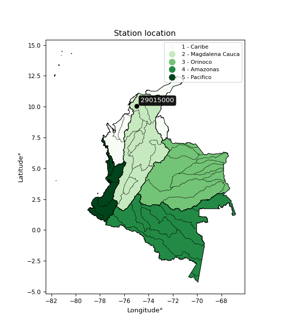</img>

</div>


## A. General information


### 1. General running parameters

• app_version: _v20260312_. • runtime: _2026-03-12 07:15:23.203550_. • Python version: _3.14.0_. • SciPy version: _1.16.3_. • Pandas version: _2.3.3_. • NumPy version: _2.3.5_. • Stations dataset (station_dataset_file): _dataset/pmax24h_in/automatic_colombia_2003_2025.csv_. • Stations catalog (station_catalog_file): _dataset/CNE.xls_. • Minimum year to eval til year_max (date_min): _1900_. • Maximum year to eval since year_min (date_max): _2025_. • Creates, save and include plots into reports (create_plot): _True_. • Plot only fit distributions with Δo > Δ (plot_only_fit): _True_. • Plot only simple graphs avoiding multiple CDFs and multiple Extreme values plots (plot_only_simple): _True_. • Eval low extreme values, if False, evaluates high extreme values (low_extreme): _False_. • Eval every SciPy distribution as logarithmic (pdist_logarithmic_on): _True_. • Standard deviation normalized (ddof): _1.0_. • Return periods to eval in years (Tr): _[2, 2.33, 5, 10, 15, 20, 25, 50, 75, 100, 200, 250, 500, 750, 1000]_. • Minimum data sample per station, 0 means any (minimum_sample): _5_. • Z-Score maximum threshold to adjust a value, 0 means disable (zscore_max): _3.5_. • Z-Score minimum threshold to adjust a value, 0 means disable (zscore_min): _-2.5_. • Avoid zeros, e.g. rain = 0 (avoid_zeros): _True_. • Avoid null values (avoid_nans): _True_. 

:file_folder:Table: [dataset.csv](../../dataset/pmax24h_in/automatic_colombia_2003_2025.csv)

> Delta Degrees of Freedom (DDOF): is a parameter used in the formulas for calculating variance and standard deviation. When ddof=0, the divisor is $N$ (the total number of observations) and this is used when your data set is the entire population. When ddof=1, the divisor is $N-1$ and this is used when your data set is a sample drawn from a larger population. Using $N-1$ provides an unbiased estimate of the population variance (known as Bessel´s correction).


### 2. Station info and location

|   id |   CODIGO | NOMBRE                    | CATEGORIA               | TECNOLOGIA                              | ESTADO   | FECHA_INSTALACION   |   FECHA_SUSPENSION |   ALTITUD |   LATITUD |   LONGITUD | DEPARTAMENTO   | MUNICIPIO   | AREA_OPERATIVA                              | ENTIDAD                                                     | AREA_HIDROGRAFICA   | ZONA_HIDROGRAFICA   | SUBZONA_HIDROGRAFICA                                |   CORRIENTE | Catalogo   |   Version |
|-----:|---------:|:--------------------------|:------------------------|:----------------------------------------|:---------|:--------------------|-------------------:|----------:|----------:|-----------:|:---------------|:------------|:--------------------------------------------|:------------------------------------------------------------|:--------------------|:--------------------|:----------------------------------------------------|------------:|:-----------|----------:|
|    0 | 29015000 | EL GUAMO - AUT [29015000] | Climatológica Ordinaria | Automática con Telemetría, Convencional | Activa   | 23/03/2004          |                nan |        75 |   10.0346 |   -74.9766 | Bolivar        | El Guamo    | Area Operativa 02 - Atlántico-Bolivar-Sucre | INSTITUTO DE HIDROLOGIA METEOROLOGIA Y ESTUDIOS AMBIENTALES | Magdalena Cauca     | Bajo Magdalena      | Directos al Bajo Magdalena entre El Plato y Calamar |         nan | CNE_IDEAM  |  20251226 |

<div align="center">

Dynamic map: [:earth_americas:Google](http://maps.google.com/maps?q=10.034607,-74.976638) [:earth_americas:OSM](https://www.openstreetmap.org/#map=18/10.034607/-74.976638&layers=P) [:earth_americas:Bing](https://www.bing.com/maps?cp=10.034607~-74.976638&lvl=18) [:earth_americas:Apple](https://maps.apple.com/frame?center=10.034607%2C-74.976638&span=0.003%2C0.006)

</div>


<div align="center">

```geojson
{
  "type": "Feature",
  "geometry": {
    "type": "Point", 
    "coordinates": [-74.976638, 10.034607]
  }, 
  "properties": {
    "Name": "29015000"
  }
}
```

</div>


### 3. Discrete values table and plot

<div align="center">

|               |            0 |           1 |           2 |          3 |          4 |           5 |           6 |           7 |           8 |
|:--------------|-------------:|------------:|------------:|-----------:|-----------:|------------:|------------:|------------:|------------:|
| Date          | 2017         | 2018        | 2019        | 2020       | 2021       | 2022        | 2023        | 2024        | 2025        |
| Value         |   58.63      |    7.54     |    7.68     |   10.33    |  448.89    |   89.91     |    0.36     |    1.1      |   25.2      |
| Value_initial |   58.63      |    7.54     |    7.68     |   10.33    |  448.89    |   89.91     |    0.36     |    1.1      |   25.2      |
| count         |    9         |    9        |    9        |    9       |    9       |    9        |    9        |    9        |    9        |
| mean          |   72.1822    |   72.1822   |   72.1822   |   72.1822  |   72.1822  |   72.1822   |   72.1822   |   72.1822   |   72.1822   |
| std           |  144.477     |  144.477    |  144.477    |  144.477   |  144.477   |  144.477    |  144.477    |  144.477    |  144.477    |
| zscore        |   -0.0938016 |   -0.447421 |   -0.446452 |   -0.42811 |    2.60738 |    0.122703 |   -0.497117 |   -0.491995 |   -0.325187 |


</div>


<div align="center">

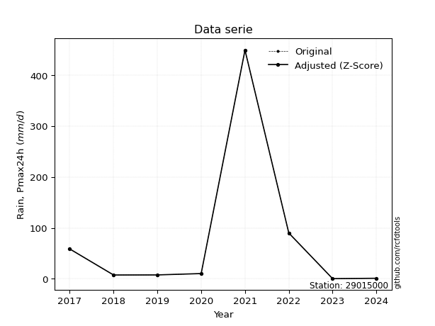</img>

</div>


> The initial value (value_initial) correspond to the initial obtained or null completed value, and value (value) is adjusted only when the initial value is outside the valid range (outlier) definite through the Z-Score value. If Z-Score is active, values out of range or outliers are replaced with the station mean value. A Z-Score (or standard score) measures how many standard deviations a data point is from the mean of a dataset, indicating its relative position; positive scores mean above the mean, negative mean below, and a score of zero is exactly at the mean, allowing for comparison of values from different distributions. It´s calculated using the formula $z=(x–μ)/σ$, where $x$ is the data point, $μ$ is the mean, and $σ$ is the standard deviation, helping identify outliers and understand probability.
>
> <sub>**Note**: In this study, "completing" (filling gaps in) and "extending" (forecasting or lengthening the historical record) rainfall data series are avoided for certain critical analyses because they introduce artificial bias and uncertainty, which can distort the statistics of rare events (extremes), alter day-to-day variability, and compromise the integrity and homogeneity of the original data. Some reasons against Completing/Extending rainfall data are: **Distortion of Extremes and Variability**: The primary issue is that most gap-filling or extension methods rely on averaging or regression with nearby stations, which inherently smooths the data. Rainfall is highly variable in space and time, with a large percentage of zero values and occasional large storms. Infilling methods often underestimate the highest values and overestimate the lowest (zero) values, which severely distorts analyses focused on flood frequency, drought severity, and intensity-duration-frequency (IDF) curves, **Loss of Data Homogeneity**: Infilled or extended data are synthetic estimates, not actual measurements. Combining these estimates with observed data can violate the assumption of data homogeneity, which requires that the data properties do not change over time. Inhomogeneity can lead to incorrect conclusions about long-term trends or changes in climate patterns, **Propagation of Errors**: Errors and biases from the original data (e.g., wind-induced undercatch, instrument errors, site changes) or the data used for imputation can propagate through the analysis, leading to unreliable hydrological models and inaccurate predictions, **Compromised Statistical Integrity**: For statistical analyses, especially those involving the frequency of events, using artificial data can introduce time bias or autocorrelation that doesn´t exist in reality, making it difficult to assess the true probability of events, **Difficulty in Validation**: It is difficult to accurately validate the quality of filled or extended data, especially for past periods where ground-truth measurements are unavailable. The reliability of imputation techniques heavily depends on the density of the surrounding station network and the complexity of the local topography.</sub>


### 4. Active continuous probability distributions from SciPy (80 of 104 available)

A Probability Density Function (PDF) describes the relative likelihood of a continuous random variable falling within a specific range, where the total area under its curve equals 1, and the area over any interval gives the actual probability for that range. Unlike discrete probabilities (like rolling a die), a PDF shows density, not direct probability for a single point (which is zero), with higher points indicating higher likelihood, often visualized as a bell curve for normal distributions.

A log of a probability density function (log-PDF) is simply the logarithm of the PDF´s value, denoted as $log(f(x))$, useful for converting multiplication of probabilities into addition, improving numerical stability with tiny numbers, and connecting to information theory concepts like entropy. Instead of dealing with very small probabilities (e.g., 0.000001), log-PDFs use negative numbers (e.g., $log(0.00001) ≈ -11.51$ that are easier for computers to handle, preventing underflow errors and simplifying complex calculations. In this study, each active probability distribution from SciPy is also evaluated in the $log$ form.

[scipy.stats](https://docs.scipy.org/doc/scipy/reference/stats.html) is a Python´s powerful submodule within the SciPy library for comprehensive statistical analysis, offering over 130 probability distributions (like Normal, Poisson, etc.), functions for descriptive stats (mean, variance), hypothesis testing (t-tests, chi-square), random variable generation, and statistical tests, making it essential for data science, modeling, and research. It provides tools to explore, model, and draw conclusions from data efficiently, working seamlessly with [NumPy](https://numpy.org/).

<div align="center">

|   id | p_dist           |   n_parameter | fit_method   | label                                                                       | active   | ref                                                                                                      |
|-----:|:-----------------|--------------:|:-------------|:----------------------------------------------------------------------------|:---------|:---------------------------------------------------------------------------------------------------------|
|    0 | alpha            |             3 | MLE          | Alpha                                                                       | True     | [:mortar_board:](https://docs.scipy.org/doc/scipy/reference/generated/scipy.stats.alpha.html)            |
|    1 | anglit           |             2 | MM           | Anglit                                                                      | True     | [:mortar_board:](https://docs.scipy.org/doc/scipy/reference/generated/scipy.stats.anglit.html)           |
|    2 | arcsine          |             2 | MM           | Arcsine                                                                     | True     | [:mortar_board:](https://docs.scipy.org/doc/scipy/reference/generated/scipy.stats.arcsine.html)          |
|    3 | argus            |             3 | MLE          | Argus                                                                       | True     | [:mortar_board:](https://docs.scipy.org/doc/scipy/reference/generated/scipy.stats.argus.html)            |
|    4 | beta             |             4 | MLE          | Beta                                                                        | True     | [:mortar_board:](https://docs.scipy.org/doc/scipy/reference/generated/scipy.stats.beta.html)             |
|    5 | betaprime        |             4 | MLE          | Beta prime                                                                  | True     | [:mortar_board:](https://docs.scipy.org/doc/scipy/reference/generated/scipy.stats.betaprime.html)        |
|    6 | bradford         |             3 | MLE          | Bradford                                                                    | True     | [:mortar_board:](https://docs.scipy.org/doc/scipy/reference/generated/scipy.stats.bradford.html)         |
|    7 | burr             |             4 | MLE          | Burr (Type III)                                                             | True     | [:mortar_board:](https://docs.scipy.org/doc/scipy/reference/generated/scipy.stats.burr.html)             |
|    8 | burr12           |             4 | MLE          | Burr (Type III) 12                                                          | True     | [:mortar_board:](https://docs.scipy.org/doc/scipy/reference/generated/scipy.stats.burr12.html)           |
|    9 | cosine           |             2 | MLE          | Cosine                                                                      | True     | [:mortar_board:](https://docs.scipy.org/doc/scipy/reference/generated/scipy.stats.cosine.html)           |
|   10 | crystalball      |             4 | MLE          | Crystalball                                                                 | True     | [:mortar_board:](https://docs.scipy.org/doc/scipy/reference/generated/scipy.stats.crystalball.html)      |
|   11 | dgamma           |             3 | MLE          | Double gamma                                                                | True     | [:mortar_board:](https://docs.scipy.org/doc/scipy/reference/generated/scipy.stats.dgamma.html)           |
|   12 | dweibull         |             3 | MLE          | Double Weibull                                                              | True     | [:mortar_board:](https://docs.scipy.org/doc/scipy/reference/generated/scipy.stats.dweibull.html)         |
|   13 | erlang           |             3 | MLE          | Erlang                                                                      | True     | [:mortar_board:](https://docs.scipy.org/doc/scipy/reference/generated/scipy.stats.erlang.html)           |
|   14 | exponnorm        |             3 | MLE          | Exponentially modified Normal                                               | True     | [:mortar_board:](https://docs.scipy.org/doc/scipy/reference/generated/scipy.stats.exponnorm.html)        |
|   15 | exponpow         |             3 | MLE          | Exponential power                                                           | True     | [:mortar_board:](https://docs.scipy.org/doc/scipy/reference/generated/scipy.stats.exponpow.html)         |
|   16 | exponweib        |             4 | MLE          | Exponentiated Weibull                                                       | True     | [:mortar_board:](https://docs.scipy.org/doc/scipy/reference/generated/scipy.stats.exponweib.html)        |
|   17 | f                |             4 | MLE          | F                                                                           | True     | [:mortar_board:](https://docs.scipy.org/doc/scipy/reference/generated/scipy.stats.f.html)                |
|   18 | fatiguelife      |             3 | MLE          | Fatigue-life (Birnbaum-Saunders)                                            | True     | [:mortar_board:](https://docs.scipy.org/doc/scipy/reference/generated/scipy.stats.fatiguelife.html)      |
|   19 | foldnorm         |             3 | MM           | Fold Normal                                                                 | True     | [:mortar_board:](https://docs.scipy.org/doc/scipy/reference/generated/scipy.stats.foldnorm.html)         |
|   20 | gamma            |             3 | MLE          | Gamma                                                                       | True     | [:mortar_board:](https://docs.scipy.org/doc/scipy/reference/generated/scipy.stats.gamma.html)            |
|   21 | gausshyper       |             6 | MLE          | Gauss hypergeometric                                                        | True     | [:mortar_board:](https://docs.scipy.org/doc/scipy/reference/generated/scipy.stats.gausshyper.html)       |
|   22 | genexpon         |             5 | MLE          | Generalized exponential                                                     | True     | [:mortar_board:](https://docs.scipy.org/doc/scipy/reference/generated/scipy.stats.genexpon.html)         |
|   23 | genextreme       |             3 | MLE          | Generalized exponential                                                     | True     | [:mortar_board:](https://docs.scipy.org/doc/scipy/reference/generated/scipy.stats.genextreme.html)       |
|   24 | gengamma         |             4 | MLE          | Generalized gamma                                                           | True     | [:mortar_board:](https://docs.scipy.org/doc/scipy/reference/generated/scipy.stats.gengamma.html)         |
|   25 | genhalflogistic  |             3 | MLE          | Generalized half-logistic                                                   | True     | [:mortar_board:](https://docs.scipy.org/doc/scipy/reference/generated/scipy.stats.genhalflogistic.html)  |
|   26 | genlogistic      |             3 | MLE          | Generalized logistic                                                        | True     | [:mortar_board:](https://docs.scipy.org/doc/scipy/reference/generated/scipy.stats.genlogistic.html)      |
|   27 | gennorm          |             3 | MLE          | Generalized Normal                                                          | True     | [:mortar_board:](https://docs.scipy.org/doc/scipy/reference/generated/scipy.stats.gennorm.html)          |
|   28 | genpareto        |             3 | MLE          | Generalized Pareto                                                          | True     | [:mortar_board:](https://docs.scipy.org/doc/scipy/reference/generated/scipy.stats.genpareto.html)        |
|   29 | gompertz         |             3 | MLE          | Gompertz (or truncated Gumbel)                                              | True     | [:mortar_board:](https://docs.scipy.org/doc/scipy/reference/generated/scipy.stats.gompertz.html)         |
|   30 | gumbel_l         |             2 | MM           | Gumbel Left Skew                                                            | True     | [:mortar_board:](https://docs.scipy.org/doc/scipy/reference/generated/scipy.stats.gumbel_l.html)         |
|   31 | gumbel_r         |             2 | MM           | Gumbel Right Skew                                                           | True     | [:mortar_board:](https://docs.scipy.org/doc/scipy/reference/generated/scipy.stats.gumbel_r.html)         |
|   32 | halfgennorm      |             3 | MLE          | Upper half of a generalized normal                                          | True     | [:mortar_board:](https://docs.scipy.org/doc/scipy/reference/generated/scipy.stats.halfgennorm.html)      |
|   33 | halflogistic     |             2 | MM           | Half-logistic                                                               | True     | [:mortar_board:](https://docs.scipy.org/doc/scipy/reference/generated/scipy.stats.halflogistic.html)     |
|   34 | halfnorm         |             2 | MM           | Half Normal                                                                 | True     | [:mortar_board:](https://docs.scipy.org/doc/scipy/reference/generated/scipy.stats.halfnorm.html)         |
|   35 | hypsecant        |             2 | MM           | hyperbolic secant                                                           | True     | [:mortar_board:](https://docs.scipy.org/doc/scipy/reference/generated/scipy.stats.hypsecant.html)        |
|   36 | invgamma         |             3 | MLE          | Inverted gamma                                                              | True     | [:mortar_board:](https://docs.scipy.org/doc/scipy/reference/generated/scipy.stats.invgamma.html)         |
|   37 | invgauss         |             3 | MLE          | Inverse Gaussian                                                            | True     | [:mortar_board:](https://docs.scipy.org/doc/scipy/reference/generated/scipy.stats.invgauss.html)         |
|   38 | invweibull       |             3 | MLE          | Inverted Weibull                                                            | True     | [:mortar_board:](https://docs.scipy.org/doc/scipy/reference/generated/scipy.stats.invweibull.html)       |
|   39 | johnsonsb        |             4 | MLE          | Johnson SB                                                                  | True     | [:mortar_board:](https://docs.scipy.org/doc/scipy/reference/generated/scipy.stats.johnsonsb.html)        |
|   40 | johnsonsu        |             4 | MLE          | Johnson Su                                                                  | True     | [:mortar_board:](https://docs.scipy.org/doc/scipy/reference/generated/scipy.stats.johnsonsu.html)        |
|   41 | kappa3           |             3 | MLE          | Kappa 3                                                                     | True     | [:mortar_board:](https://docs.scipy.org/doc/scipy/reference/generated/scipy.stats.kappa3.html)           |
|   42 | kappa4           |             4 | MLE          | Kappa 4                                                                     | True     | [:mortar_board:](https://docs.scipy.org/doc/scipy/reference/generated/scipy.stats.kappa4.html)           |
|   43 | ksone            |             3 | MLE          | Kolmogorov-Smirnov one-sided test statistic distribution                    | True     | [:mortar_board:](https://docs.scipy.org/doc/scipy/reference/generated/scipy.stats.ksone.html)            |
|   44 | kstwobign        |             2 | MLE          | Limiting distribution of scaled Kolmogorov-Smirnov two-sided test statistic | True     | [:mortar_board:](https://docs.scipy.org/doc/scipy/reference/generated/scipy.stats.kstwobign.html)        |
|   45 | laplace          |             2 | MM           | Laplace                                                                     | True     | [:mortar_board:](https://docs.scipy.org/doc/scipy/reference/generated/scipy.stats.laplace.html)          |
|   46 | levy_l           |             2 | MLE          | Left-skewed Levy                                                            | True     | [:mortar_board:](https://docs.scipy.org/doc/scipy/reference/generated/scipy.stats.levy_l.html)           |
|   47 | loggamma         |             3 | MLE          | Log gamma                                                                   | True     | [:mortar_board:](https://docs.scipy.org/doc/scipy/reference/generated/scipy.stats.loggamma.html)         |
|   48 | logistic         |             2 | MM           | Logistic (or Sech-squared)                                                  | True     | [:mortar_board:](https://docs.scipy.org/doc/scipy/reference/generated/scipy.stats.logistic.html)         |
|   49 | loglaplace       |             3 | MLE          | Log-Laplace                                                                 | True     | [:mortar_board:](https://docs.scipy.org/doc/scipy/reference/generated/scipy.stats.loglaplace.html)       |
|   50 | lomax            |             3 | MLE          | Lomax (Pareto of the second kind)                                           | True     | [:mortar_board:](https://docs.scipy.org/doc/scipy/reference/generated/scipy.stats.lomax.html)            |
|   51 | maxwell          |             2 | MM           | Maxwell                                                                     | True     | [:mortar_board:](https://docs.scipy.org/doc/scipy/reference/generated/scipy.stats.maxwell.html)          |
|   52 | mielke           |             4 | MLE          | Mielke Beta-Kappa / Dagum                                                   | True     | [:mortar_board:](https://docs.scipy.org/doc/scipy/reference/generated/scipy.stats.mielke.html)           |
|   53 | moyal            |             2 | MM           | Moyal                                                                       | True     | [:mortar_board:](https://docs.scipy.org/doc/scipy/reference/generated/scipy.stats.moyal.html)            |
|   54 | nakagami         |             3 | MLE          | Nakagami                                                                    | True     | [:mortar_board:](https://docs.scipy.org/doc/scipy/reference/generated/scipy.stats.nakagami.html)         |
|   55 | ncf              |             5 | MLE          | Non-central F distribution                                                  | True     | [:mortar_board:](https://docs.scipy.org/doc/scipy/reference/generated/scipy.stats.ncf.html)              |
|   56 | nct              |             4 | MLE          | Non-central Student’s t                                                     | True     | [:mortar_board:](https://docs.scipy.org/doc/scipy/reference/generated/scipy.stats.nct.html)              |
|   57 | norm             |             2 | MM           | Normal                                                                      | True     | [:mortar_board:](https://docs.scipy.org/doc/scipy/reference/generated/scipy.stats.norm.html)             |
|   58 | pearson3         |             3 | MM           | Pearson type III                                                            | True     | [:mortar_board:](https://docs.scipy.org/doc/scipy/reference/generated/scipy.stats.pearson3.html)         |
|   59 | powerlaw         |             3 | MLE          | Power-function                                                              | True     | [:mortar_board:](https://docs.scipy.org/doc/scipy/reference/generated/scipy.stats.powerlaw.html)         |
|   60 | rayleigh         |             2 | MM           | Rayleigh                                                                    | True     | [:mortar_board:](https://docs.scipy.org/doc/scipy/reference/generated/scipy.stats.rayleigh.html)         |
|   61 | rdist            |             3 | MLE          | R-distributed (symmetric beta)                                              | True     | [:mortar_board:](https://docs.scipy.org/doc/scipy/reference/generated/scipy.stats.rdist.html)            |
|   62 | rice             |             3 | MLE          | Rice                                                                        | True     | [:mortar_board:](https://docs.scipy.org/doc/scipy/reference/generated/scipy.stats.rice.html)             |
|   63 | semicircular     |             2 | MM           | Semicircular                                                                | True     | [:mortar_board:](https://docs.scipy.org/doc/scipy/reference/generated/scipy.stats.semicircular.html)     |
|   64 | skewnorm         |             3 | MLE          | Skew normal                                                                 | True     | [:mortar_board:](https://docs.scipy.org/doc/scipy/reference/generated/scipy.stats.skewnorm.html)         |
|   65 | t                |             3 | MLE          | Student’s t                                                                 | True     | [:mortar_board:](https://docs.scipy.org/doc/scipy/reference/generated/scipy.stats.t.html)                |
|   66 | trapezoid        |             4 | MLE          | Trapezoid                                                                   | True     | [:mortar_board:](https://docs.scipy.org/doc/scipy/reference/generated/scipy.stats.trapezoid.html)        |
|   67 | triang           |             3 | MLE          | Triangular                                                                  | True     | [:mortar_board:](https://docs.scipy.org/doc/scipy/reference/generated/scipy.stats.triang.html)           |
|   68 | truncexpon       |             3 | MLE          | Truncated exponential                                                       | True     | [:mortar_board:](https://docs.scipy.org/doc/scipy/reference/generated/scipy.stats.truncexpon.html)       |
|   69 | truncnorm        |             4 | MLE          | Truncated normal                                                            | True     | [:mortar_board:](https://docs.scipy.org/doc/scipy/reference/generated/scipy.stats.truncnorm.html)        |
|   70 | truncpareto      |             4 | MLE          | Upper truncated Pareto                                                      | True     | [:mortar_board:](https://docs.scipy.org/doc/scipy/reference/generated/scipy.stats.truncpareto.html)      |
|   71 | truncweibull_min |             5 | MLE          | Doubly truncated Weibull minimum                                            | True     | [:mortar_board:](https://docs.scipy.org/doc/scipy/reference/generated/scipy.stats.truncweibull_min.html) |
|   72 | tukeylambda      |             3 | MLE          | Tukey-Lamdba                                                                | True     | [:mortar_board:](https://docs.scipy.org/doc/scipy/reference/generated/scipy.stats.tukeylambda.html)      |
|   73 | uniform          |             2 | MLE          | Uniform                                                                     | True     | [:mortar_board:](https://docs.scipy.org/doc/scipy/reference/generated/scipy.stats.uniform.html)          |
|   74 | vonmises         |             3 | MLE          | Von Mises                                                                   | True     | [:mortar_board:](https://docs.scipy.org/doc/scipy/reference/generated/scipy.stats.vonmises.html)         |
|   75 | vonmises_line    |             3 | MLE          | Von Mises line                                                              | True     | [:mortar_board:](https://docs.scipy.org/doc/scipy/reference/generated/scipy.stats.vonmises_line.html)    |
|   76 | wald             |             2 | MM           | Wald                                                                        | True     | [:mortar_board:](https://docs.scipy.org/doc/scipy/reference/generated/scipy.stats.wald.html)             |
|   77 | weibull_max      |             3 | MLE          | Weibull maximum                                                             | True     | [:mortar_board:](https://docs.scipy.org/doc/scipy/reference/generated/scipy.stats.weibull_max.html)      |
|   78 | weibull_min      |             3 | MLE          | Weibull minimum                                                             | True     | [:mortar_board:](https://docs.scipy.org/doc/scipy/reference/generated/scipy.stats.weibull_min.html)      |
|   79 | wrapcauchy       |             3 | MLE          | Wrapped  Cauchy                                                             | True     | [:mortar_board:](https://docs.scipy.org/doc/scipy/reference/generated/scipy.stats.wrapcauchy.html)       |

</div>

> **n_parameter:** # arguments & localization & scale.
>
> **Fit methods:** (MLE) maximum likelihood, (MM) L-moments.
>
>**Inactive** (With the only purpose of prevent loops, zero divisions, infinite values, over high estimated values or horizontal trending for recurrence intervals estimations, the follow distributions were disabled.)**:** lognorm, norminvgauss, powernorm, powerlognorm, cauchy, halfcauchy, foldcauchy, skewcauchy, chi2, expon, fisk, genhyperbolic, geninvgauss, gibrat, kstwo, laplace_asymmetric, levy, levy_stable, ncx2, pareto, rel_breitwigner, recipinvgauss, studentized_range, loguniform, 


## B. Probability (PDF) vs. Empirical (EDF) distributions functions

A continuous probability distribution (CPD) describes probabilities for variables that can take any value within a range (like rain any time), unlike discrete variables with specific outcomes (like temperature). It uses a Probability Density Function (PDF), a curve where the total area under it equals 1, and the probability of the variable falling within an interval (a to b) is found by calculating the area under the curve between those points. A key feature is that the probability of hitting any single exact value is zero, so probabilities are always expressed for ranges, e.g., $P(a ≤ X ≤ b)$.

<div align="center">

Distributions parameters from station values
|     |   station | p_dist              |   n |              loc |          scale | shape                  | shape1                | shape2                 | shape3             |
|----:|----------:|:--------------------|----:|-----------------:|---------------:|:-----------------------|:----------------------|:-----------------------|:-------------------|
|   0 |  29015000 | alpha               |   9 |      0.00123173  |    1.0214      | 2.640390702523111e-08  |                       |                        |                    |
|   1 |  29015000 | anglit              |   9 |     72.1822      |  398.482       |                        |                       |                        |                    |
|   2 |  29015000 | arcsine             |   9 |   -120.454       |  385.273       |                        |                       |                        |                    |
|   3 |  29015000 | argus               |   9 |   -282.252       |  753.149       | 2.563458336486293e-07  |                       |                        |                    |
|   4 |  29015000 | beta                |   9 |    -37.4464      |  486.336       | 0.03489246153336152    | 0.24955035109252563   |                        |                    |
|   5 |  29015000 | betaprime           |   9 |      0.36        |   42.3427      | 0.3562134776712029     | 0.9498824175196773    |                        |                    |
|   6 |  29015000 | bradford            |   9 |      0.359992    |  448.53        | 2.5372297108280844     |                       |                        |                    |
|   7 |  29015000 | burr                |   9 |      0.36        |   14.366       | 1.0093677179015756     | 0.4938945354112147    |                        |                    |
|   8 |  29015000 | burr12              |   9 |      0.36        |   40.3257      | 0.6403983690030955     | 2.2508904074568536    |                        |                    |
|   9 |  29015000 | cosine              |   9 |    115.683       |  135.574       |                        |                       |                        |                    |
|  10 |  29015000 | crystalball         |   9 |     72.1822      |  136.215       | 6311.800559949601      | 3123.1514489535157    |                        |                    |
|  11 |  29015000 | dgamma              |   9 |      7.54        |  117.363       | 0.3662842690260296     |                       |                        |                    |
|  12 |  29015000 | dweibull            |   9 |      7.68        |  159.752       | 0.3105300362641183     |                       |                        |                    |
|  13 |  29015000 | erlang              |   9 |      0.36        |  422.471       | 0.20348441341987888    |                       |                        |                    |
|  14 |  29015000 | exponnorm           |   9 |      0.294486    |    0.0194903   | 3696.266158070248      |                       |                        |                    |
|  15 |  29015000 | exponpow            |   9 |      0.36        |  210.015       | 0.34518109624251825    |                       |                        |                    |
|  16 |  29015000 | exponweib           |   9 |      0.36        |   30.9585      | 1.4321536374863082     | 0.2878030896786292    |                        |                    |
|  17 |  29015000 | f                   |   9 |      0.36        |   22.6842      | 1.052257762543642      | 1.7812074659191057    |                        |                    |
|  18 |  29015000 | fatiguelife         |   9 |      0.146786    |    9.29954     | 3.482451401563247      |                       |                        |                    |
|  19 |  29015000 | foldnorm            |   9 |   -123.518       |  247.026       | 0.0008017645197855531  |                       |                        |                    |
|  20 |  29015000 | gamma               |   9 |      0.36        |  166.78        | 0.444054407771972      |                       |                        |                    |
|  21 |  29015000 | gausshyper          |   9 |      0.36        |  542.623       | 0.43974265680979097    | 1.0296122127546778    | 1.1883542723956224     | 1.6429376780970908 |
|  22 |  29015000 | genexpon            |   9 |      0.36        |  145.033       | 2.019307054400625      | 2.1611114859316825    | 3.8378078248634326e-11 |                    |
|  23 |  29015000 | genextreme          |   9 |      4.65358     |    9.32815     | -2.0125504794880533    |                       |                        |                    |
|  24 |  29015000 | gengamma            |   9 |      0.36        |    2.0331      | 2.038232708549395      | 0.31870805661932156   |                        |                    |
|  25 |  29015000 | genhalflogistic     |   9 |    -45.1599      |  517.407       | 1.0472764787918103     |                       |                        |                    |
|  26 |  29015000 | genlogistic         |   9 |   -426.112       |   58.2298      | 2337.2705882409946     |                       |                        |                    |
|  27 |  29015000 | gennorm             |   9 |      7.68        |    0.21951     | 0.2949900823294773     |                       |                        |                    |
|  28 |  29015000 | genpareto           |   9 |      0.36        |    9.57395     | 1.490275382073278      |                       |                        |                    |
|  29 |  29015000 | gompertz            |   9 |      0.359757    |    1.82393e+06 | 19994.876139943193     |                       |                        |                    |
|  30 |  29015000 | gumbel_l            |   9 |    133.486       |  106.206       |                        |                       |                        |                    |
|  31 |  29015000 | gumbel_r            |   9 |     10.8784      |  106.206       |                        |                       |                        |                    |
|  32 |  29015000 | halfgennorm         |   9 |      0.36        |    2.77007     | 0.3919377887131527     |                       |                        |                    |
|  33 |  29015000 | halflogistic        |   9 |    -89.2638      |  116.459       |                        |                       |                        |                    |
|  34 |  29015000 | halfnorm            |   9 |   -108.113       |  225.966       |                        |                       |                        |                    |
|  35 |  29015000 | hypsecant           |   9 |     72.1822      |   86.717       |                        |                       |                        |                    |
|  36 |  29015000 | invgamma            |   9 |     -1.04491     |    3.20629     | 0.5575757599597764     |                       |                        |                    |
|  37 |  29015000 | invgauss            |   9 |     -1.08364     |    6.36721     | 11.506779097542157     |                       |                        |                    |
|  38 |  29015000 | invweibull          |   9 |      0.0186048   |    4.63496     | 0.4968801339037215     |                       |                        |                    |
|  39 |  29015000 | johnsonsb           |   9 |      0.36        | 1209.89        | 2.1301005390046743     | 0.16003879857267794   |                        |                    |
|  40 |  29015000 | johnsonsu           |   9 |      0.36        |    6.79186e-12 | -2.3534153335751142    | 0.10131616877978555   |                        |                    |
|  41 |  29015000 | kappa3              |   9 |      0.36        |    6.69093     | 0.5354341529258797     |                       |                        |                    |
|  42 |  29015000 | kappa4              |   9 |    -42.4001      |  503.393       | 1.0929207563125867     | 1.024634512182967     |                        |                    |
|  43 |  29015000 | ksone               |   9 |    -44.493       |  538.236       | 1.0                    |                       |                        |                    |
|  44 |  29015000 | kstwobign           |   9 |   -236.419       |  367.069       |                        |                       |                        |                    |
|  45 |  29015000 | laplace             |   9 |     72.1822      |   96.3183      |                        |                       |                        |                    |
|  46 |  29015000 | levy_l              |   9 |    495.769       |  234.342       |                        |                       |                        |                    |
|  47 |  29015000 | loggamma            |   9 | -48552           | 6395.84        | 2003.4499411363868     |                       |                        |                    |
|  48 |  29015000 | logistic            |   9 |     72.1822      |   75.0991      |                        |                       |                        |                    |
|  49 |  29015000 | loglaplace          |   9 |     -0.0439611   |   10.374       | 0.615957120711865      |                       |                        |                    |
|  50 |  29015000 | lomax               |   9 |      0.36        |    6.42319     | 0.6709579597802715     |                       |                        |                    |
|  51 |  29015000 | maxwell             |   9 |   -250.589       |  202.267       |                        |                       |                        |                    |
|  52 |  29015000 | mielke              |   9 |      0.36        |   26.5629      | 0.4177805895414408     | 0.6825124405793048    |                        |                    |
|  53 |  29015000 | moyal               |   9 |     -5.71408     |   61.3182      |                        |                       |                        |                    |
|  54 |  29015000 | nakagami            |   9 |      0.36        |  250.467       | 0.15539161759898512    |                       |                        |                    |
|  55 |  29015000 | ncf                 |   9 |      0.00930778  |   18.4187      | 1.3304544532724354     | 1.9287817289706486    | 8.457661260518678e-10  |                    |
|  56 |  29015000 | nct                 |   9 |     -0.398143    |    0.0367368   | 0.366763138485757      | 54.73618756982425     |                        |                    |
|  57 |  29015000 | norm                |   9 |     72.1822      |  136.215       |                        |                       |                        |                    |
|  58 |  29015000 | pearson3            |   9 |     72.1822      |  136.215       | 2.279590333156421      |                       |                        |                    |
|  59 |  29015000 | powerlaw            |   9 |      0.36        |  448.53        | 0.13130055308535582    |                       |                        |                    |
|  60 |  29015000 | rayleigh            |   9 |   -188.404       |  207.918       |                        |                       |                        |                    |
|  61 |  29015000 | rdist               |   9 |    -48.8371      |  138.747       | 1.3021030260338158     |                       |                        |                    |
|  62 |  29015000 | rice                |   9 |   -110.309       |  161.024       | 0.000408415914602273   |                       |                        |                    |
|  63 |  29015000 | semicircular        |   9 |     72.1822      |  272.429       |                        |                       |                        |                    |
|  64 |  29015000 | skewnorm            |   9 |      0.359986    |  153.987       | 59517174.801483415     |                       |                        |                    |
|  65 |  29015000 | t                   |   9 |      7.6788      |    4.22011     | 0.46734664183066577    |                       |                        |                    |
|  66 |  29015000 | trapezoid           |   9 |    -46.7177      |  538.236       | 1.0                    | 1.0                   |                        |                    |
|  67 |  29015000 | triang              |   9 |      0.359939    |  496.382       | 5.9022433295806636e-08 |                       |                        |                    |
|  68 |  29015000 | truncexpon          |   9 |      0.359999    |  329.216       | 1.3624194588802534     |                       |                        |                    |
|  69 |  29015000 | truncnorm           |   9 |   -409.701       |  230.523       | 1.7788256331538315     | 5279.203701295887     |                        |                    |
|  70 |  29015000 | truncpareto         |   9 |     -6.05106     |    6.41106     | 0.44710361278812116    | 70.96194450885595     |                        |                    |
|  71 |  29015000 | truncweibull_min    |   9 |     -1.37926     |  283.934       | 0.01364452570771365    | 0.006125580575584683  | 1.5858237525922663     |                    |
|  72 |  29015000 | tukeylambda         |   9 |    -47.5855      |  167.119       | 1.2154494329110552     |                       |                        |                    |
|  73 |  29015000 | uniform             |   9 |      0.36        |  448.53        |                        |                       |                        |                    |
|  74 |  29015000 | vonmises            |   9 |      1.47132     |    1           | 1.2076690449014613     |                       |                        |                    |
|  75 |  29015000 | vonmises_line       |   9 |     18.6598      |   22.6796      | 1.1108918266414018     |                       |                        |                    |
|  76 |  29015000 | wald                |   9 |    -64.0325      |  136.215       |                        |                       |                        |                    |
|  77 |  29015000 | weibull_max         |   9 |    448.89        |    1.68178     | 0.19573571867362427    |                       |                        |                    |
|  78 |  29015000 | weibull_min         |   9 |      0.36        |  152.01        | 0.4461136196740867     |                       |                        |                    |
|  79 |  29015000 | wrapcauchy          |   9 |      0.359991    |   71.3973      | 0.8993409394790113     |                       |                        |                    |
|  80 |  29015000 | logalpha            |   9 |    -35.8009      |  703.252       | 18.380533488060344     |                       |                        |                    |
|  81 |  29015000 | loganglit           |   9 |      2.5968      |    6.05617     |                        |                       |                        |                    |
|  82 |  29015000 | logarcsine          |   9 |     -0.330939    |    5.85547     |                        |                       |                        |                    |
|  83 |  29015000 | logargus            |   9 |     -2.384       |    8.80208     | 2.5274709161202352e-05 |                       |                        |                    |
|  84 |  29015000 | logbeta             |   9 |     -1.54705     |    7.65383     | 0.8334003939178816     | 0.6305861490535223    |                        |                    |
|  85 |  29015000 | logbetaprime        |   9 |   -169.663       |   26.4559      | 51638.71590695009      | 7932.417729245597     |                        |                    |
|  86 |  29015000 | logbradford         |   9 |     -1.02168     |    7.1285      | 0.8994454176027649     |                       |                        |                    |
|  87 |  29015000 | logburr             |   9 |     -1.02165     |    6.63164     | 4.478229861626521      | 0.13015170917133492   |                        |                    |
|  88 |  29015000 | logburr12           |   9 |     -1.02165     |    2.13495     | 0.8999360119160215     | 0.9300066572121166    |                        |                    |
|  89 |  29015000 | logcosine           |   9 |      2.56388     |    1.75405     |                        |                       |                        |                    |
|  90 |  29015000 | logcrystalball      |   9 |      2.5968      |    2.0702      | 82.13386690256897      | 1090.6550989649822    |                        |                    |
|  91 |  29015000 | logdgamma           |   9 |      2.80759     |    0.890981    | 1.9009817928854167     |                       |                        |                    |
|  92 |  29015000 | logdweibull         |   9 |      2.79572     |    1.87511     | 1.443251262922138      |                       |                        |                    |
|  93 |  29015000 | logerlang           |   9 |    -48.5619      |    0.0847714   | 603.4384975505724      |                       |                        |                    |
|  94 |  29015000 | logexponnorm        |   9 |      2.59541     |    2.0702      | 0.0006737830529756065  |                       |                        |                    |
|  95 |  29015000 | logexponpow         |   9 |     -1.02165     |    1.89347     | 0.34700459367630265    |                       |                        |                    |
|  96 |  29015000 | logexponweib        |   9 |     -1.02165     |    1.58684     | 1.5517920257506228     | 0.3227058592306812    |                        |                    |
|  97 |  29015000 | logf                |   9 |     -1.02165     |    1.14336     | 1.1262696385329778     | 1.1290011589343985    |                        |                    |
|  98 |  29015000 | logfatiguelife      |   9 |   -277.252       |  279.845       | 0.007380866819723563   |                       |                        |                    |
|  99 |  29015000 | logfoldnorm         |   9 |    -13.2165      |    2.03854     | 7.759901452576706      |                       |                        |                    |
| 100 |  29015000 | loggamma            |   9 |    -47.5004      |    0.0865078   | 579.0301584674348      |                       |                        |                    |
| 101 |  29015000 | loggausshyper       |   9 |     -1.43933     |    7.54611     | 1.3615621036242034     | 0.9556214335028035    | 0.8074953833510015     | 1.115963180355391  |
| 102 |  29015000 | loggenexpon         |   9 |     -1.0378      |    0.156542    | 0.01561356592858959    | 4.714365145155703     | 0.0003791097262796189  |                    |
| 103 |  29015000 | loggenextreme       |   9 |      1.97716     |    2.15447     | 0.39197314585107673    |                       |                        |                    |
| 104 |  29015000 | loggengamma         |   9 |    -28.7835      |    0.903221    | 123.93377543941523     | 1.3580897021499672    |                        |                    |
| 105 |  29015000 | loggenhalflogistic  |   9 |     -1.78519     |    8.35942     | 1.0592310690769127     |                       |                        |                    |
| 106 |  29015000 | loggenlogistic      |   9 |      2.96221     |    1.12663     | 0.8362025038066578     |                       |                        |                    |
| 107 |  29015000 | loggennorm          |   9 |      2.54256     |    3.56424     | 2063667.2373604588     |                       |                        |                    |
| 108 |  29015000 | loggenpareto        |   9 |     -2.10044     |    9.40761     | -1.1462609930628482    |                       |                        |                    |
| 109 |  29015000 | loggompertz         |   9 |     -1.02165     |    2.66121     | 0.23947319252510968    |                       |                        |                    |
| 110 |  29015000 | loggumbel_l         |   9 |      3.52851     |    1.61413     |                        |                       |                        |                    |
| 111 |  29015000 | loggumbel_r         |   9 |      1.6651      |    1.61413     |                        |                       |                        |                    |
| 112 |  29015000 | loghalfgennorm      |   9 |     -1.02165     |    1.58273     | 0.6698397686485601     |                       |                        |                    |
| 113 |  29015000 | loghalflogistic     |   9 |      0.14312     |    1.76996     |                        |                       |                        |                    |
| 114 |  29015000 | loghalfnorm         |   9 |     -0.143308    |    3.43423     |                        |                       |                        |                    |
| 115 |  29015000 | loghypsecant        |   9 |      2.5968      |    1.31793     |                        |                       |                        |                    |
| 116 |  29015000 | loginvgamma         |   9 |    -29.5459      | 7422.03        | 232.14327713935666     |                       |                        |                    |
| 117 |  29015000 | loginvgauss         |   9 |    -11.9542      |  652.995       | 0.02225512577593545    |                       |                        |                    |
| 118 |  29015000 | loginvweibull       |   9 |     -2.16645e+08 |    2.16645e+08 | 107885027.85657153     |                       |                        |                    |
| 119 |  29015000 | logjohnsonsb        |   9 |     -1.02165     |    7.12843     | -0.09711798572072096   | 0.14670932299556116   |                        |                    |
| 120 |  29015000 | logjohnsonsu        |   9 |     24.2819      |   15.345       | 14.670523022304533     | 12.834902640336793    |                        |                    |
| 121 |  29015000 | logkappa3           |   9 |     -1.02165     |    7.11151     | 770.7526269013435      |                       |                        |                    |
| 122 |  29015000 | logkappa4           |   9 |     -1.7509      |    7.94484     | 1.1011157455529226     | 1.0093931430742338    |                        |                    |
| 123 |  29015000 | logksone            |   9 |     -1.73449     |    8.55411     | 1.0                    |                       |                        |                    |
| 124 |  29015000 | logkstwobign        |   9 |     -5.48719     |    9.24653     |                        |                       |                        |                    |
| 125 |  29015000 | loglaplace          |   9 |      2.5968      |    1.46386     |                        |                       |                        |                    |
| 126 |  29015000 | loglevy_l           |   9 |      6.47562     |    1.82842     |                        |                       |                        |                    |
| 127 |  29015000 | logloggamma         |   9 |    -33.1542      |   10.8177      | 27.743433469484174     |                       |                        |                    |
| 128 |  29015000 | loglogistic         |   9 |      2.5968      |    1.14136     |                        |                       |                        |                    |
| 129 |  29015000 | logloglaplace       |   9 |     -1.02165     |    1.68842     | 0.5389285131906953     |                       |                        |                    |
| 130 |  29015000 | loglomax            |   9 |     -1.02165     |    7.45457e+09 | 2072654038.410534      |                       |                        |                    |
| 131 |  29015000 | logmaxwell          |   9 |     -2.30871     |    3.07407     |                        |                       |                        |                    |
| 132 |  29015000 | logmielke           |   9 |     -2.61375e+08 |    2.61375e+08 | 4684160828.738266      | 138208070.55873868    |                        |                    |
| 133 |  29015000 | logmoyal            |   9 |      1.41293     |    0.931919    |                        |                       |                        |                    |
| 134 |  29015000 | lognakagami         |   9 |   -211.347       |  213.956       | 2661.456123332974      |                       |                        |                    |
| 135 |  29015000 | logncf              |   9 |     -1.02165     |    1.1017      | 1.0729321100360072     | 1.1754453316373787    | 1.0876975715016726     |                    |
| 136 |  29015000 | lognct              |   9 |   -126.234       |    2.05952     | 185215.92241256026     | 62.55328875736387     |                        |                    |
| 137 |  29015000 | lognorm             |   9 |      2.5968      |    2.0702      |                        |                       |                        |                    |
| 138 |  29015000 | logpearson3         |   9 |      2.5968      |    2.07021     | -0.12319368656199235   |                       |                        |                    |
| 139 |  29015000 | logpowerlaw         |   9 |     -1.02165     |    7.12843     | 0.20727317408517293    |                       |                        |                    |
| 140 |  29015000 | lograyleigh         |   9 |     -1.36362     |    3.15996     |                        |                       |                        |                    |
| 141 |  29015000 | logrdist            |   9 |     -0.742872    |    3.96972     | 1.081091497532376      |                       |                        |                    |
| 142 |  29015000 | logrice             |   9 |     -2.06256     |    2.32829     | 1.6719463300792858     |                       |                        |                    |
| 143 |  29015000 | logsemicircular     |   9 |      2.5968      |    4.14041     |                        |                       |                        |                    |
| 144 |  29015000 | logskewnorm         |   9 |      4.1957      |    2.61576     | -1.1838691351554553    |                       |                        |                    |
| 145 |  29015000 | logt                |   9 |      2.5968      |    2.0702      | 6236807795.020256      |                       |                        |                    |
| 146 |  29015000 | logtrapezoid        |   9 |     -1.82122     |    8.55411     | 1.0                    | 1.0                   |                        |                    |
| 147 |  29015000 | logtriang           |   9 |     -2.92713     |    9.03841     | 0.9995018595069529     |                       |                        |                    |
| 148 |  29015000 | logtruncexpon       |   9 |     -1.02241     |    8.73997     | 0.8156986830926802     |                       |                        |                    |
| 149 |  29015000 | logtruncnorm        |   9 |      1.30312     |    5.35966     | -0.4337868106215917    | 0.8962617875265768    |                        |                    |
| 150 |  29015000 | logtruncpareto      |   9 |     -1.0221      |    0.0004526   | 1.4356190063826742e-06 | 15751.33041485208     |                        |                    |
| 151 |  29015000 | logtruncweibull_min |   9 |     -1.13439     |    8.90781     | 1.1670204511488982     | 0.0009205286259215241 | 0.8129003158757767     |                    |
| 152 |  29015000 | logtukeylambda      |   9 |      1.10912     |    2.16153     | 1.014434686693634      |                       |                        |                    |
| 153 |  29015000 | loguniform          |   9 |     -1.02165     |    7.12843     |                        |                       |                        |                    |
| 154 |  29015000 | logvonmises         |   9 |     -2.83212     |    1           | 0.20685818357582486    |                       |                        |                    |
| 155 |  29015000 | logvonmises_line    |   9 |      3.13427     |    1.32287     | 0.8536260431785676     |                       |                        |                    |
| 156 |  29015000 | logwald             |   9 |      0.526612    |    2.0702      |                        |                       |                        |                    |
| 157 |  29015000 | logweibull_max      |   9 |      6.10678     |    1.27611     | 0.6236239564204592     |                       |                        |                    |
| 158 |  29015000 | logweibull_min      |   9 |     -3.71978     |    7.03813     | 3.455977553889107      |                       |                        |                    |
| 159 |  29015000 | logwrapcauchy       |   9 |     -1.02235     |    1.13585     | 3.902774014914842e-06  |                       |                        |                    |

</div>

> **loc** (Location parameter): This shifts the distribution along the x-axis. For many common distributions, like the normal (Gaussian) distribution, loc represents the mean $μ$. For others, like the uniform distribution, it might represent the minimum value, or for the beta distribution, the left end of the support interval.
>
> **scale** (Scale parameter): This determines the width or spread of the distribution. For the normal distribution, scale represents the standard deviation $σ$. For a uniform distribution, it defines the length of the interval (from $loc$ to $loc + scale$).
>
> **shape** (Shape parameters): Refers to parameters that define the specific form of a probability distribution, distinct from its location (loc) and scale (scale). These parameters are required arguments for most distribution functions. For example, a normal (Gaussian) distribution is fully defined by its location (mean) and scale (standard deviation), so it has no specific shape parameters beyond loc and scale. However, other distributions have intrinsic properties that need specification, as Gamma distribution that takes a shape parameter, often named $a$ or $alpha$.


### 0. Cumulative distribution values - CDF (160 evaluated)

Cumulative Distribution Function (CDF), denoted as $F$<sub>$X$</sub>$(x)$, is a function that gives the probability that a random variable $X$ will take a value less than or equal to a specific value, $x$ (i.e., $(P(X≥x)$. It essentially "accumulates" probabilities from a given point up to the far right (positive infinity), providing a complete picture of the distribution´s probabilities for both discrete (like rain) and continuous (like temperature) variables, helping to find probabilities over ranges or above certain values. Each station is evaluated separately ordering the $x$ values ascending, calculating the CDF and PDF values for the activated distributions and their logarithmic forms.

<div align="center">

CDF ordered by x ascending and calculating $log(f(x))$ separately
|   id |   Station |   date |      x |   count |    mean |     std |     zscore |   Value_initial |   station |   m |      alpha |   alpha_pdf |   anglit |   anglit_pdf |   arcsine |   arcsine_pdf |    argus |   argus_pdf |     beta |    beta_pdf |   betaprime |   betaprime_pdf |    bradford |   bradford_pdf |        burr |    burr_pdf |      burr12 |      burr12_pdf |   cosine |   cosine_pdf |   crystalball |   crystalball_pdf |   dgamma |   dgamma_pdf |   dweibull |   dweibull_pdf |      erlang |   erlang_pdf |   exponnorm |   exponnorm_pdf |    exponpow |   exponpow_pdf |   exponweib |   exponweib_pdf |           f |       f_pdf |   fatiguelife |   fatiguelife_pdf |   foldnorm |   foldnorm_pdf |       gamma |   gamma_pdf |   gausshyper |   gausshyper_pdf |    genexpon |   genexpon_pdf |   genextreme |   genextreme_pdf |    gengamma |    gengamma_pdf |   genhalflogistic |   genhalflogistic_pdf |   genlogistic |   genlogistic_pdf |   gennorm |   gennorm_pdf |   genpareto |   genpareto_pdf |    gompertz |   gompertz_pdf |   gumbel_l |   gumbel_l_pdf |   gumbel_r |   gumbel_r_pdf |   halfgennorm |   halfgennorm_pdf |   halflogistic |   halflogistic_pdf |   halfnorm |   halfnorm_pdf |   hypsecant |   hypsecant_pdf |   invgamma |   invgamma_pdf |   invgauss |   invgauss_pdf |   invweibull |   invweibull_pdf |   johnsonsb |   johnsonsb_pdf |   johnsonsu |   johnsonsu_pdf |      kappa3 |   kappa3_pdf |      kappa4 |   kappa4_pdf |     ksone |   ksone_pdf |   kstwobign |   kstwobign_pdf |   laplace |   laplace_pdf |   levy_l |   levy_l_pdf |   loggamma |   loggamma_pdf |   logistic |   logistic_pdf |   loglaplace |   loglaplace_pdf |       lomax |   lomax_pdf |   maxwell |   maxwell_pdf |      mielke |   mielke_pdf |    moyal |   moyal_pdf |    nakagami |   nakagami_pdf |       ncf |     ncf_pdf |       nct |     nct_pdf |     norm |    norm_pdf |   pearson3 |   pearson3_pdf |   powerlaw |   powerlaw_pdf |   rayleigh |   rayleigh_pdf |    rdist |    rdist_pdf |     rice |    rice_pdf |   semicircular |   semicircular_pdf |   skewnorm |   skewnorm_pdf |        t |       t_pdf |   trapezoid |   trapezoid_pdf |      triang |   triang_pdf |   truncexpon |   truncexpon_pdf |   truncnorm |   truncnorm_pdf |   truncpareto |   truncpareto_pdf |   truncweibull_min |   truncweibull_min_pdf |   tukeylambda |   tukeylambda_pdf |    uniform |   uniform_pdf |   vonmises |   vonmises_pdf |   vonmises_line |   vonmises_line_pdf |     wald |    wald_pdf |   weibull_max |   weibull_max_pdf |   weibull_min |   weibull_min_pdf |   wrapcauchy |   wrapcauchy_pdf |   logalpha |   logalpha_pdf |   loganglit |   loganglit_pdf |   logarcsine |   logarcsine_pdf |   logargus |   logargus_pdf |   logbeta |   logbeta_pdf |   logbetaprime |   logbetaprime_pdf |   logbradford |   logbradford_pdf |    logburr |    logburr_pdf |   logburr12 |   logburr12_pdf |   logcosine |   logcosine_pdf |   logcrystalball |   logcrystalball_pdf |   logdgamma |   logdgamma_pdf |   logdweibull |   logdweibull_pdf |   logerlang |   logerlang_pdf |   logexponnorm |   logexponnorm_pdf |   logexponpow |   logexponpow_pdf |   logexponweib |   logexponweib_pdf |        logf |    logf_pdf |   logfatiguelife |   logfatiguelife_pdf |   logfoldnorm |   logfoldnorm_pdf |   loggausshyper |   loggausshyper_pdf |   loggenexpon |   loggenexpon_pdf |   loggenextreme |   loggenextreme_pdf |   loggengamma |   loggengamma_pdf |   loggenhalflogistic |   loggenhalflogistic_pdf |   loggenlogistic |   loggenlogistic_pdf |   loggennorm |   loggennorm_pdf |   loggenpareto |   loggenpareto_pdf |   loggompertz |   loggompertz_pdf |   loggumbel_l |   loggumbel_l_pdf |   loggumbel_r |   loggumbel_r_pdf |   loghalfgennorm |   loghalfgennorm_pdf |   loghalflogistic |   loghalflogistic_pdf |   loghalfnorm |   loghalfnorm_pdf |   loghypsecant |   loghypsecant_pdf |   loginvgamma |   loginvgamma_pdf |   loginvgauss |   loginvgauss_pdf |   loginvweibull |   loginvweibull_pdf |   logjohnsonsb |   logjohnsonsb_pdf |   logjohnsonsu |   logjohnsonsu_pdf |   logkappa3 |   logkappa3_pdf |   logkappa4 |   logkappa4_pdf |   logksone |   logksone_pdf |   logkstwobign |   logkstwobign_pdf |   loglevy_l |   loglevy_l_pdf |   logloggamma |   logloggamma_pdf |   loglogistic |   loglogistic_pdf |   logloglaplace |   logloglaplace_pdf |    loglomax |   loglomax_pdf |   logmaxwell |   logmaxwell_pdf |   logmielke |   logmielke_pdf |    logmoyal |   logmoyal_pdf |   lognakagami |   lognakagami_pdf |      logncf |   logncf_pdf |    lognct |   lognct_pdf |   lognorm |   lognorm_pdf |   logpearson3 |   logpearson3_pdf |   logpowerlaw |   logpowerlaw_pdf |   lograyleigh |   lograyleigh_pdf |   logrdist |   logrdist_pdf |   logrice |   logrice_pdf |   logsemicircular |   logsemicircular_pdf |   logskewnorm |   logskewnorm_pdf |     logt |   logt_pdf |   logtrapezoid |   logtrapezoid_pdf |   logtriang |   logtriang_pdf |   logtruncexpon |   logtruncexpon_pdf |   logtruncnorm |   logtruncnorm_pdf |   logtruncpareto |   logtruncpareto_pdf |   logtruncweibull_min |   logtruncweibull_min_pdf |   logtukeylambda |   logtukeylambda_pdf |   loguniform |   loguniform_pdf |   logvonmises |   logvonmises_pdf |   logvonmises_line |   logvonmises_line_pdf |   logwald |   logwald_pdf |   logweibull_max |   logweibull_max_pdf |   logweibull_min |   logweibull_min_pdf |   logwrapcauchy |   logwrapcauchy_pdf |
|-----:|----------:|-------:|-------:|--------:|--------:|--------:|-----------:|----------------:|----------:|----:|-----------:|------------:|---------:|-------------:|----------:|--------------:|---------:|------------:|---------:|------------:|------------:|----------------:|------------:|---------------:|------------:|------------:|------------:|----------------:|---------:|-------------:|--------------:|------------------:|---------:|-------------:|-----------:|---------------:|------------:|-------------:|------------:|----------------:|------------:|---------------:|------------:|----------------:|------------:|------------:|--------------:|------------------:|-----------:|---------------:|------------:|------------:|-------------:|-----------------:|------------:|---------------:|-------------:|-----------------:|------------:|----------------:|------------------:|----------------------:|--------------:|------------------:|----------:|--------------:|------------:|----------------:|------------:|---------------:|-----------:|---------------:|-----------:|---------------:|--------------:|------------------:|---------------:|-------------------:|-----------:|---------------:|------------:|----------------:|-----------:|---------------:|-----------:|---------------:|-------------:|-----------------:|------------:|----------------:|------------:|----------------:|------------:|-------------:|------------:|-------------:|----------:|------------:|------------:|----------------:|----------:|--------------:|---------:|-------------:|-----------:|---------------:|-----------:|---------------:|-------------:|-----------------:|------------:|------------:|----------:|--------------:|------------:|-------------:|---------:|------------:|------------:|---------------:|----------:|------------:|----------:|------------:|---------:|------------:|-----------:|---------------:|-----------:|---------------:|-----------:|---------------:|---------:|-------------:|---------:|------------:|---------------:|-------------------:|-----------:|---------------:|---------:|------------:|------------:|----------------:|------------:|-------------:|-------------:|-----------------:|------------:|----------------:|--------------:|------------------:|-------------------:|-----------------------:|--------------:|------------------:|-----------:|--------------:|-----------:|---------------:|----------------:|--------------------:|---------:|------------:|--------------:|------------------:|--------------:|------------------:|-------------:|-----------------:|-----------:|---------------:|------------:|----------------:|-------------:|-----------------:|-----------:|---------------:|----------:|--------------:|---------------:|-------------------:|--------------:|------------------:|-----------:|---------------:|------------:|----------------:|------------:|----------------:|-----------------:|---------------------:|------------:|----------------:|--------------:|------------------:|------------:|----------------:|---------------:|-------------------:|--------------:|------------------:|---------------:|-------------------:|------------:|------------:|-----------------:|---------------------:|--------------:|------------------:|----------------:|--------------------:|--------------:|------------------:|----------------:|--------------------:|--------------:|------------------:|---------------------:|-------------------------:|-----------------:|---------------------:|-------------:|-----------------:|---------------:|-------------------:|--------------:|------------------:|--------------:|------------------:|--------------:|------------------:|-----------------:|---------------------:|------------------:|----------------------:|--------------:|------------------:|---------------:|-------------------:|--------------:|------------------:|--------------:|------------------:|----------------:|--------------------:|---------------:|-------------------:|---------------:|-------------------:|------------:|----------------:|------------:|----------------:|-----------:|---------------:|---------------:|-------------------:|------------:|----------------:|--------------:|------------------:|--------------:|------------------:|----------------:|--------------------:|------------:|---------------:|-------------:|-----------------:|------------:|----------------:|------------:|---------------:|--------------:|------------------:|------------:|-------------:|----------:|-------------:|----------:|--------------:|--------------:|------------------:|--------------:|------------------:|--------------:|------------------:|-----------:|---------------:|----------:|--------------:|------------------:|----------------------:|--------------:|------------------:|---------:|-----------:|---------------:|-------------------:|------------:|----------------:|----------------:|--------------------:|---------------:|-------------------:|-----------------:|---------------------:|----------------------:|--------------------------:|-----------------:|---------------------:|-------------:|-----------------:|--------------:|------------------:|-------------------:|-----------------------:|----------:|--------------:|-----------------:|---------------------:|-----------------:|---------------------:|----------------:|--------------------:|
|    0 |  29015000 |   2023 |   0.36 |       9 | 72.1822 | 144.477 | -0.497117  |            0.36 |  29015000 |   1 | 0.00441373 | 0.110021    | 0.323639 |   0.00234823 |  0.378385 |    0.00178079 | 0.203588 | 0.00138546  | 0.813797 | 0.000796476 | 2.14744e-06 |      1.378e+08  | 3.72067e-08 |     0.00447761 | 7.77395e-09 | 4.98674e+06 | 8.20484e-12 | 94654.2         | 0.244983 |  0.00194816  |      0.299002 |       0.00254868  | 0.301274 |  0.00969249  |   0.340599 |    0.00554698  | 0.000156833 |  5.74895e+11 | 0.000908966 |     0.0138629   | 3.86608e-07 |    2.40402e+09 | 4.84527e-08 |     3.59767e+08 | 3.81524e-10 | 3.61605e+06 |     0.0319444 |       0.326051    |   0.383964 |    0.00284833  | 7.03984e-09 | 5.63143e+07 |  6.35287e-09 |      5.13763e+07 | 6.92795e-12 |    0.0139231   |    0.0258679 |      0.137595    | 8.38824e-12 | 98160.5         |         0.046116  |            0.00106217 |      0.214154 |       0.00566574  |  0.2794   |   0.0136645   | 3.44133e-12 |      0.10445    | 2.66758e-06 |    0.0109625   |   0.248371 |    0.00202059  |   0.331507 |    0.00344631  |   2.20847e-14 |       0.10259     |       0.366858 |        0.00371554  |   0.368801 |    0.00314672  |    0.262184 |     0.00269299  |  0.0386889 |    0.0721435   |  0.0389355 |    0.0697162   |    0.0258674 |      0.137597    | 2.92439e-07 |     4.36961e+09 |   0.0118579 |     3.20576e+08 | 2.66424e-16 |  0.479948    | 4.15596e-05 |   0.00508347 | 0.0833333 |  0.00185792 |    0.200368 |     0.00417181  |  0.237207 |   0.00246274  | 0.508402 |  0.000437193 |  0.0388046 |      0.0424584 |   0.277606 |    0.00267035  |    0.0422136 |        0.0288373 | 1.35069e-12 | 0.104459    |  0.326769 |    0.00281244 | 5.48842e-08 |  2.06531e+08 | 0.341261 | 0.00393679  | 1.28177e-06 |    7.17607e+09 | 0.0540324 | 0.101194    | 0.0308495 | 0.151256    | 0.299002 | 0.00254868  |   0.383386 |    0.00518104  |  0.0032919 |    7.78633e+12 |   0.337757 |    0.0028917   | 0.637015 |   0.00287437 | 0.21036  | 0.00337034  |       0.334129 |         0.00225415 | 0          |    0.00518149  | 0.245327 | 0.0143799   |   0.0076504 |     0.000325012 | 1.86697e-07 |  0.00402915  |  5.45144e-09 |       0.00408291 | 3.97327e-07 |     0.00945171  |   8.33935e-09 |       0.081924    |         4.1628e-13 |            0.103308    |      0.667093 |        0.00350853 | 0          |    0.00222951 |   0.158504 |      0.194324  |        0.238312 |          0.0113513  | 0.340519 | 0.00671526  |     0.050569  |       6.58601e-05 |   5.95366e-09 |       4.78464e+07 |  3.70131e-07 |      0.0420619   |  0.0328901 |      0.0426847 |   0.0348987 |       0.060607  |     0        |         0        |  0.0357172 |      0.0521163 | 0.0718061 |      0.115558 |      0.0400057 |          0.0425953 |   5.31879e-06 |          0.196669 | 2.4972e-10 | 655494         | 3.84464e-15 |      15.5821    |   0.0330095 |       0.0493726 |         0.040243 |            0.041831  |   0.0316969 |       0.0295065 |     0.0307143 |         0.0323969 |   0.0388214 |       0.0424133 |       0.040243 |          0.0418311 |   2.96437e-06 |       4.63263e+09 |    1.15002e-08 |         2.5936e+07 | 9.50595e-10 | 2.41084e+06 |        0.0390789 |            0.041474  |     0.0377202 |         0.0402993 |       0.0262102 |           0.0838129 |    0.00161887 |         0.100755  |       0.0479881 |           0.0437639 |     0.0370828 |         0.0417462 |            0.0479953 |                0.0660669 |        0.0507473 |            0.0365995 |  2.93491e-06 |         0.140282 |       0.115684 |           0.108226 |   3.46227e-10 |         0.0899867 |     0.0579232 |         0.0348251 |     0.0050765 |         0.0166156 |      9.31715e-11 |            0.477664  |          0        |             0         |     0         |         0         |      0.0408231 |          0.0308902 |     0.0364224 |         0.0443074 |     0.0324669 |         0.0451215 |       0.0269854 |           0.0485449 |     0.00314005 |    12442.2         |       0.045554 |          0.0415172 | 1.73349e-15 |        0.139409 | 3.23985e-15 |        3.67639  |  0.0833333 |       0.116903 |      0.0261801 |          0.0561593 |    0.378581 |       0.0232614 |      0.045586 |         0.0415677 |     0.0402991 |         0.033885  |      1.3811e-09 |         3.35208e+06 | 1.20591e-11 |      0.278038  |    0.0185245 |        0.0416801 |    0.024118 |       0.044985  | 0.000222337 |     0.00173227 |     0.0400899 |         0.0418716 | 1.46816e-09 |  3.54712e+06 | 0.0402363 |    0.0418459 |  0.040243 |     0.041831  |     0.0437103 |         0.041786  |   0.000378996 |       3.53783e+11 |    0.00583851 |         0.0340469 |   0.476396 |      0.0847967 | 0.0251584 |     0.0491574 |         0.0263511 |             0.0747323 |     0.0459101 |         0.0413504 | 0.040243 |  0.0418311 |     0.00873696 |          0.0218542 |   0.0444671 |        0.046673 |     0.000154853 |           0.205152  |     2.5482e-05 |           0.140353 |      2.36853e-09 |          228.613     |             0.0106584 |                  0.115434 |      7.10543e-15 |             0.284726 |     0        |         0.140283 |      0.819553 |          0.14992  |        1.57875e-09 |              0.0430327 |  0        |     0         |        0.0537417 |            0.0137453 |        0.0357333 |            0.0449424 |      9.7854e-05 |            0.14012  |
|    1 |  29015000 |   2024 |   1.1  |       9 | 72.1822 | 144.477 | -0.491995  |            1.1  |  29015000 |   2 | 0.352584   | 0.438208    | 0.325378 |   0.0023515  |  0.379701 |    0.00177785 | 0.204615 | 0.0013885   | 0.814381 | 0.000782683 | 0.22951     |      0.108651   | 0.00330656  |     0.00445895 | 0.222519    | 0.142754    | 0.154263    |     0.118175    | 0.246426 |  0.00195297  |      0.300891 |       0.00255596  | 0.308718 |  0.0104498   |   0.344882 |    0.006045    | 0.299547    |  0.0822493   | 0.0111189   |     0.0137266   | 0.141823    |    0.0656848   | 0.169226    |     0.0790808   | 0.115139    | 0.0804244   |     0.210416  |       0.149661    |   0.38607  |    0.00284404  | 0.101691    | 0.0608348   |  0.0798678   |      0.0473722   | 0.0102502   |    0.0137804   |    0.127338  |      0.120582    | 0.156209    |     0.106442    |         0.0469027 |            0.00106384 |      0.218361 |       0.00570414  |  0.289959 |   0.0149079   | 0.0705444   |      0.0870541  | 0.00808211  |    0.0108739   |   0.24987  |    0.00203066  |   0.334058 |    0.00344871  |   0.0498754   |       0.0565229   |       0.369605 |        0.00370686  |   0.371127 |    0.00314176  |    0.264183 |     0.0027086   |  0.0975049 |    0.0820212   |  0.0955893 |    0.0790897   |    0.127338  |      0.120583    | 0.827928    |     0.0551871   |   0.614734  |     0.0523459   | 0.152138    |  0.130577    | 0.00280765  |   0.00343687 | 0.0847082 |  0.00185792 |    0.203462 |     0.00419144  |  0.239036 |   0.00248173  | 0.508726 |  0.000438019 |  0.114078  |      0.0959266 |   0.279587 |    0.00268203  |    0.0905379 |        0.061849  | 0.0705494   | 0.0870593   |  0.328851 |    0.00281622 | 0.212911    |  0.1106      | 0.344173 | 0.00393443  | 0.131566    |    0.0552546   | 0.112936  | 0.0662347   | 0.157046  | 0.155595    | 0.300891 | 0.00255596  |   0.387204 |    0.00513816  |  0.43117   |    0.0765038   |   0.339897 |    0.00289365  | 0.639143 |   0.00287875 | 0.212858 | 0.00338214  |       0.335798 |         0.00225588 | 0.00383436 |    0.00518143  | 0.256701 | 0.0164309   |   0.0078928 |     0.000330121 | 0.00297954  |  0.00402314  |  0.00301797  |       0.00407375 | 0.00697472  |     0.00939785  |   0.0559944   |       0.0699455   |         0.0637064  |            0.0724956   |      0.66969  |        0.00350969 | 0.00164983 |    0.00222951 |   0.362492 |      0.350486  |        0.246822 |          0.0116475  | 0.345469 | 0.00666283  |     0.0506178 |       6.60112e-05 |   0.0887707   |       0.0510671   |  0.0310278   |      0.0416646   |  0.112999  |      0.10462   |   0.132354  |       0.111911  |     0.173919 |         0.209242 |  0.116617  |      0.0921152 | 0.190792  |      0.101784 |      0.114907  |          0.0950936 |   0.205514    |          0.172376 | 0.354077   |      0.1847    | 0.338005    |       0.177701  |   0.11898   |       0.1055    |         0.11346  |            0.0928641 |   0.0869726 |       0.0757557 |     0.0919986 |         0.0832355 |   0.113982  |       0.0957674 |       0.11346  |          0.0928642 |   0.727302    |       0.1622      |    0.441576    |         0.122572   | 0.496268    | 0.154706    |        0.112235  |            0.09319   |     0.109375  |         0.0918639 |       0.144462  |           0.12029   |    0.147682   |         0.155351  |       0.120093  |           0.0880105 |     0.111921  |         0.0959645 |            0.127776  |                0.0772413 |        0.111799  |            0.0769394 |  0.5         |         0.140283 |       0.237854 |           0.110605 |   0.117409    |         0.120843  |     0.112369  |         0.065549  |     0.0710318 |         0.11638   |      0.339451    |            0.216398  |          0        |             0         |     0.0553944 |         0.231773  |      0.0947001 |          0.0707997 |     0.117088  |         0.103642  |     0.117594  |         0.110504  |       0.126025  |           0.129989  |     0.365409   |        0.0585654   |       0.115618 |          0.0873069 | 0.155715    |        0.139409 | 0.184013    |        0.149738 |  0.213909  |       0.116903 |      0.140708  |          0.145415  |    0.407575 |       0.029004  |      0.115749 |         0.0874398 |     0.100501  |         0.0792039 |      0.400187   |         0.193088    | 0.266962    |      0.203812  |    0.106222  |        0.116915  |    0.120775 |       0.130871  | 0.0425835   |     0.111089   |     0.113449  |         0.0930701 | 0.366644    |  0.148399    | 0.113487  |    0.0929093 |  0.11346  |     0.0928641 |     0.11507   |         0.0894202 |   0.681011    |       0.126374    |    0.101097   |         0.131336  |   0.571408 |      0.0863958 | 0.112787  |     0.108642  |         0.140261  |             0.122523  |     0.115394  |         0.0864456 | 0.11346  |  0.0928641 |     0.0501973  |          0.0523836 |   0.111879  |        0.074032 |     0.215263    |           0.18054   |     0.162892   |           0.150331 |      0.808255    |            0.0925969 |             0.173121  |                  0.15676  |      0.262994    |             0.234067 |     0.156691 |         0.140283 |      0.972535 |          0.128648 |        0.0532087   |              0.0573166 |  0        |     0         |        0.0721655 |            0.0196802 |        0.113495  |            0.0967436 |      0.156607   |            0.14012  |
|    2 |  29015000 |   2018 |   7.54 |       9 | 72.1822 | 144.477 | -0.447421  |            7.54 |  29015000 |   3 | 0.892227   | 0.0142086   | 0.34061  |   0.0023786  |  0.391073 |    0.00175409 | 0.213641 | 0.00141466  | 0.819079 | 0.000681634 | 0.491545    |      0.0209732  | 0.0315136   |     0.00430285 | 0.579913    | 0.0269048   | 0.474751    |     0.0262338   | 0.259136 |  0.00199379  |      0.31755  |       0.00261687  | 0.5      |  1.24141e+08 |   0.446861 |    0.111368    | 0.474424    |  0.0132567   | 0.095682    |     0.0125527   | 0.306446    |    0.0142021   | 0.351017    |     0.0142535   | 0.353229    | 0.0220802   |     0.473682  |       0.0155631   |   0.404263 |    0.00280593  | 0.275673    | 0.0165472   |  0.215409    |      0.0129572   | 0.0951334   |    0.0125985   |    0.455575  |      0.0236616   | 0.42859     |     0.0222195   |         0.0538012 |            0.00107862 |      0.25606  |       0.00598903  |  0.483566 |   0.0948989   | 0.395567    |      0.029813   | 0.0756956   |    0.0101328   |   0.263232 |    0.00211918  |   0.356318 |    0.0034621   |   0.27283     |       0.0240044   |       0.393229 |        0.00362949  |   0.391219 |    0.00309752  |    0.282062 |     0.0028434   |  0.428536  |    0.0290239   |  0.424583  |    0.0298223   |    0.455575  |      0.0236616   | 0.904993    |     0.00379004  |   0.699134  |     0.00491264  | 0.459981    |  0.021794    | 0.0222749   |   0.00283618 | 0.0966732 |  0.00185792 |    0.230959 |     0.00434162  |  0.255565 |   0.00265334  | 0.511571 |  0.000445321 |  0.397043  |      0.18664   |   0.297181 |    0.00278118  |    0.337218  |        0.230363  | 0.395576    | 0.0298123   |  0.347086 |    0.00284567 | 0.469241    |  0.0193714   | 0.369421 | 0.00390344  | 0.266591    |    0.011538    | 0.356496  | 0.0246984   | 0.521035  | 0.0219103   | 0.31755  | 0.00261687  |   0.419149 |    0.00478969  |  0.581069  |    0.010626    |   0.358579 |    0.00290731  | 0.657815 |   0.00292096 | 0.234953 | 0.00347722  |       0.350372 |         0.00227009 | 0.0371897  |    0.00517586  | 0.491307 | 0.062558    |   0.0101619 |     0.000374581 | 0.0287203   |  0.00397087  |  0.028998    |       0.00399483 | 0.0660075   |     0.00893796  |   0.335193    |       0.0276177   |         0.293928   |            0.0201705   |      0.692327 |        0.00352076 | 0.0160078  |    0.00222951 |   1.41912  |      0.370164  |        0.329749 |          0.0140256  | 0.386905 | 0.00620628  |     0.0510472 |       6.73514e-05 |   0.226007    |       0.0123204   |  0.241769    |      0.0221741   |  0.415418  |      0.191709  |   0.405369  |       0.162136  |     0.436901 |         0.110894 |  0.350951  |      0.147654  | 0.385517  |      0.103152 |      0.395946  |          0.186238  |   0.506333    |          0.142122 | 0.63244    |      0.117595  | 0.552704    |       0.0712555 |   0.402129  |       0.177148  |         0.390309 |            0.185376  |   0.376014  |       0.215633  |     0.378031  |         0.196734  |   0.396569  |       0.186488  |       0.390309 |          0.185376  |   0.894652    |       0.0460479   |    0.586169    |         0.0489142  | 0.662251    | 0.0498889   |        0.390644  |            0.186224  |     0.387593  |         0.187879  |       0.397379  |           0.138718  |    0.475436   |         0.168883  |       0.37526   |           0.172066  |     0.396117  |         0.187431  |            0.301047  |                0.105042  |        0.367795  |            0.190446  |  0.5         |         0.140283 |       0.455744 |           0.116188 |   0.400456    |         0.169206  |     0.324844  |         0.164305  |     0.448201  |         0.222836  |      0.625649    |            0.101483  |          0.485585 |             0.215883  |     0.471299  |         0.190514  |      0.364984  |          0.220119  |     0.414174  |         0.188868  |     0.42505   |         0.188539  |       0.451936  |           0.178742  |     0.44416    |        0.0332339   |       0.378499 |          0.180525  | 0.424066    |        0.139409 | 0.457739    |        0.137046 |  0.438937  |       0.116903 |      0.475119  |          0.173594  |    0.478225 |       0.0467202 |      0.379002 |         0.180731  |     0.376327  |         0.205636  |      0.635928   |         0.0645027   | 0.570768    |      0.119343  |    0.424067  |        0.190961  |    0.458782 |       0.186866  | 0.470339    |     0.238151   |     0.39056   |         0.18527   | 0.544588    |  0.0592281   | 0.390421  |    0.185393  |  0.390309 |     0.185376  |     0.383065  |         0.182271  |   0.838184    |       0.0571138   |    0.436371   |         0.191003  |   0.756373 |      0.11471   | 0.40832   |     0.184818  |         0.411634  |             0.15226   |     0.377015  |         0.18079   | 0.390309 |  0.185376  |     0.201669   |          0.104996  |   0.299763  |        0.121181 |     0.527178    |           0.144851  |     0.457814   |           0.152823 |      0.91189     |            0.0340098 |             0.473118  |                  0.150426 |      0.712971    |             0.233977 |     0.426724 |         0.140283 |      1.23963  |          0.162076 |        0.259325    |              0.178392  |  0.529223 |     0.297998  |        0.126636  |            0.0399342 |        0.390002  |            0.181542  |      0.426324   |            0.140118 |
|    3 |  29015000 |   2019 |   7.68 |       9 | 72.1822 | 144.477 | -0.446452  |            7.68 |  29015000 |   4 | 0.89418    | 0.0136997   | 0.340943 |   0.00237916 |  0.391318 |    0.00175361 | 0.213839 | 0.00141523  | 0.819175 | 0.000679755 | 0.494457    |      0.0206379  | 0.0321158   |     0.00429958 | 0.583643    | 0.0263876   | 0.478393    |     0.0257918   | 0.259415 |  0.00199465  |      0.317916 |       0.00261815  | 0.547734 |  0.124778    |   0.499997 |    4.75161e+08 | 0.476266    |  0.0130501   | 0.0974377   |     0.0125284   | 0.308421    |    0.0140129   | 0.352997    |     0.0140312   | 0.3563      | 0.0217842   |     0.475839  |       0.0152634   |   0.404656 |    0.00280508  | 0.277976    | 0.0163567   |  0.217213    |      0.0128114   | 0.0968955   |    0.012574    |    0.458854  |      0.023183    | 0.431676    |     0.0218669   |         0.0539522 |            0.00107894 |      0.256899 |       0.00599423  |  0.5      |   0.227705    | 0.399705    |      0.0293073  | 0.0771131   |    0.0101172   |   0.263529 |    0.00212112  |   0.356803 |    0.00346224  |   0.276172    |       0.0237409   |       0.393737 |        0.00362777  |   0.391652 |    0.00309654  |    0.28246  |     0.0028463   |  0.432561  |    0.0284719   |  0.42872   |    0.0292803   |    0.458854  |      0.0231829   | 0.905517    |     0.00370285  |   0.699815  |     0.00481376  | 0.463002    |  0.021371    | 0.0226716   |   0.00283156 | 0.0969333 |  0.00185792 |    0.231567 |     0.00434448  |  0.255937 |   0.0026572   | 0.511633 |  0.000445482 |  0.40048   |      0.187021  |   0.29757  |    0.00278329  |    0.341483  |        0.233276  | 0.399715    | 0.0293066   |  0.347484 |    0.00284625 | 0.471929    |  0.0190364   | 0.369967 | 0.00390257  | 0.268195    |    0.0113854   | 0.359932  | 0.0243839   | 0.524067  | 0.0214016   | 0.317916 | 0.00261815  |   0.419819 |    0.00478257  |  0.582544  |    0.0104492   |   0.358986 |    0.00290754  | 0.658224 |   0.00292197 | 0.23544  | 0.00347914  |       0.35069  |         0.00227038 | 0.0379143  |    0.00517564  | 0.500075 | 0.0626642   |   0.0102144 |     0.000375547 | 0.0292761   |  0.00396973  |  0.0295571   |       0.00399313 | 0.0672581   |     0.00892813  |   0.339031    |       0.0272111   |         0.29673    |            0.019859    |      0.69282  |        0.00352103 | 0.01632    |    0.00222951 |   1.47168  |      0.37928   |        0.331716 |          0.0140707  | 0.387773 | 0.00619644  |     0.0510566 |       6.7381e-05  |   0.227721    |       0.0121623   |  0.244845    |      0.0217692   |  0.418946  |      0.191885  |   0.408353  |       0.162323  |     0.43894  |         0.110754 |  0.353671  |      0.148064  | 0.387415  |      0.103236 |      0.399376  |          0.186644  |   0.508945    |          0.141884 | 0.6346     |      0.117192  | 0.55401     |       0.0707815 |   0.40539   |       0.177433  |         0.393723 |            0.185828  |   0.37998   |       0.215493  |     0.381648  |         0.196514  |   0.400004  |       0.186871  |       0.393724 |          0.185828  |   0.895495    |       0.0456124   |    0.587066    |         0.0486244  | 0.663165    | 0.0495124   |        0.394074  |            0.186667  |     0.391054  |         0.188356  |       0.399932  |           0.13881   |    0.47854    |         0.168578  |       0.378431  |           0.172612  |     0.399569  |         0.187804  |            0.302982  |                0.105381  |        0.371307  |            0.191312  |  0.5         |         0.140283 |       0.457882 |           0.116255 |   0.403572    |         0.169495  |     0.327878  |         0.165441  |     0.452296  |         0.222324  |      0.62751     |            0.100848  |          0.489546 |             0.214791  |     0.474798  |         0.18987   |      0.369045  |          0.221369  |     0.417651  |         0.189078  |     0.428519  |         0.188596  |       0.455221  |           0.178399  |     0.444771   |        0.0331906   |       0.381826 |          0.181108  | 0.426631    |        0.139409 | 0.460259    |        0.136976 |  0.441088  |       0.116903 |      0.478309  |          0.173171  |    0.479087 |       0.0469711 |      0.382332 |         0.181313  |     0.380117  |         0.206445  |      0.637109   |         0.0639069   | 0.572957    |      0.118734  |    0.42758   |        0.190968  |    0.462216 |       0.186484  | 0.47471     |     0.237016   |     0.393972  |         0.185715  | 0.545674    |  0.0588434   | 0.393836  |    0.185844  |  0.393723 |     0.185828  |     0.386423  |         0.182806  |   0.839232    |       0.0568415   |    0.439884   |         0.190845  |   0.758489 |      0.115378  | 0.411722  |     0.185048  |         0.414436  |             0.152354  |     0.380346  |         0.1814    | 0.393724 |  0.185828  |     0.203605   |          0.105499  |   0.301996  |        0.121632 |     0.52984     |           0.144547  |     0.460624   |           0.152752 |      0.912514    |            0.0338054 |             0.475884  |                  0.150267 |      0.717275    |             0.233992 |     0.429305 |         0.140283 |      1.24262  |          0.162687 |        0.262622    |              0.179969  |  0.534666 |     0.293745  |        0.127373  |            0.040235  |        0.393346  |            0.181972  |      0.428901   |            0.140118 |
|    4 |  29015000 |   2020 |  10.33 |       9 | 72.1822 | 144.477 | -0.42811   |           10.33 |  29015000 |   5 | 0.921226   | 0.0076018   | 0.347262 |   0.00238957 |  0.395953 |    0.00174477 | 0.217604 | 0.00142588  | 0.820931 | 0.000646245 | 0.5422      |      0.0158049  | 0.0434284   |     0.00423857 | 0.642918    | 0.0190037   | 0.537554    |     0.0193963   | 0.264722 |  0.0020109   |      0.324886 |       0.00264188  | 0.641967 |  0.0183161   |   0.622117 |    0.0123996   | 0.506637    |  0.0101393   | 0.130035    |     0.0120759   | 0.341638    |    0.0112883   | 0.385624    |     0.0108754   | 0.40775     | 0.0173735   |     0.510401  |       0.0112574   |   0.412068 |    0.00278898  | 0.317323    | 0.013558    |  0.248106    |      0.0106738   | 0.129609    |    0.0121185   |    0.510624  |      0.0165381   | 0.482327    |     0.0167945   |         0.0568196 |            0.00108511 |      0.272907 |       0.0060846   |  0.630645 |   0.0283182   | 0.466684    |      0.0218286  | 0.103538    |    0.00982755  |   0.269198 |    0.00215796  |   0.36598  |    0.00346378  |   0.333345    |       0.019664    |       0.403308 |        0.00359502  |   0.399834 |    0.00307777  |    0.290075 |     0.00290093  |  0.496559  |    0.0205203   |  0.494994  |    0.0214      |    0.510624  |      0.016538    | 0.913629    |     0.00254895  |   0.710611  |     0.00347509  | 0.511073    |  0.0154762   | 0.0300732   |   0.00275859 | 0.101857  |  0.00185792 |    0.243148 |     0.00439531  |  0.263076 |   0.00273132  | 0.512817 |  0.000448546 |  0.456626  |      0.191155  |   0.304998 |    0.0028226   |    0.418133  |        0.285638  | 0.466691    | 0.0218278   |  0.355041 |    0.00285652 | 0.515511    |  0.014284    | 0.380286 | 0.00388462  | 0.295221    |    0.00920061  | 0.417739  | 0.0195612   | 0.570774  | 0.0145942   | 0.324886 | 0.00264188  |   0.432317 |    0.00465097  |  0.606663  |    0.00798949  |   0.366697 |    0.00291139  | 0.665993 |   0.00294169 | 0.244706 | 0.00351416  |       0.356714 |         0.0022758  | 0.0516235  |    0.00517064  | 0.641704 | 0.03999     |   0.0112339 |     0.000393842 | 0.0397674   |  0.00394822  |  0.0400964   |       0.00396112 | 0.0906726   |     0.00874365  |   0.402431    |       0.0210787   |         0.342897   |            0.015367    |      0.702157 |        0.00352615 | 0.0222282  |    0.00222951 |   1.97946  |      0.0410457 |        0.370065 |          0.0148451  | 0.403948 | 0.00601143  |     0.0512359 |       6.79461e-05 |   0.256657    |       0.00986525  |  0.293582    |      0.0154186   |  0.476027  |      0.19256   |   0.456833  |       0.164504  |     0.471505 |         0.109159 |  0.398498  |      0.154247  | 0.418236  |      0.104766 |      0.455472  |          0.191197  |   0.550447    |          0.138156 | 0.668389   |      0.110805  | 0.573927    |       0.0637863 |   0.458534  |       0.1807    |         0.449693 |            0.191173  |   0.441674  |       0.193817  |     0.438229  |         0.181047  |   0.456112  |       0.19105   |       0.449693 |          0.191173  |   0.908046    |       0.0392666   |    0.60083     |         0.0443587  | 0.677005    | 0.0440374   |        0.450265  |            0.19182   |     0.447825  |         0.194024  |       0.441289  |           0.14019   |    0.527696   |         0.162818  |       0.430773  |           0.180115  |     0.455926  |         0.191789  |            0.335057  |                0.111102  |        0.429843  |            0.202806  |  0.5         |         0.140283 |       0.492509 |           0.117383 |   0.454422    |         0.173313  |     0.379612  |         0.183492  |     0.516694  |         0.211368  |      0.65596     |            0.0913093 |          0.550573 |             0.19686   |     0.5295    |         0.179069  |      0.437193  |          0.236836  |     0.473994  |         0.190411  |     0.484359  |         0.18753   |       0.50714   |           0.17147   |     0.454532   |        0.0327398   |       0.436734 |          0.188797  | 0.467956    |        0.139409 | 0.500703    |        0.13591  |  0.475741  |       0.116903 |      0.528531  |          0.16539   |    0.493643 |       0.0513416 |      0.437298 |         0.188977  |     0.442917  |         0.216181  |      0.654747   |         0.0554313   | 0.606743    |      0.10934   |    0.484017  |        0.18924   |    0.516414 |       0.178707  | 0.542043    |     0.21674    |     0.449891  |         0.190947  | 0.562253    |  0.0531719   | 0.449808  |    0.191172  |  0.449693 |     0.191173  |     0.441711  |         0.189642  |   0.85547     |       0.0528245   |    0.495916   |         0.186718  |   0.794565 |      0.129066  | 0.466951  |     0.187023  |         0.459781  |             0.15345   |     0.435404  |         0.189511  | 0.449693 |  0.191173  |     0.236079   |          0.113601  |   0.339128  |        0.128893 |     0.57197     |           0.139726  |     0.505711   |           0.151365 |      0.922079    |            0.0308204 |             0.520036  |                  0.147584 |      0.786681    |             0.234307 |     0.47089  |         0.140283 |      1.2923   |          0.172445 |        0.319611    |              0.203997  |  0.61248  |     0.233876  |        0.140063  |            0.0455213 |        0.448149  |            0.187252  |      0.470437   |            0.140118 |
|    5 |  29015000 |   2025 |  25.2  |       9 | 72.1822 | 144.477 | -0.325187  |           25.2  |  29015000 |   6 | 0.967668   | 0.00128239  | 0.383187 |   0.00244007 |  0.421576 |    0.00170384 | 0.239244 | 0.0014844   | 0.829441 | 0.00051058  | 0.688526    |      0.0063336  | 0.104072    |     0.00392596 | 0.798936    | 0.00585618  | 0.710025    |     0.00711865  | 0.29527  |  0.00209598  |      0.36508  |       0.00275964  | 0.769999 |  0.00501137  |   0.697766 |    0.00269669  | 0.606491    |  0.00473085  | 0.292283    |     0.00982375  | 0.458727    |    0.00580969  | 0.491312    |     0.00491645  | 0.577493    | 0.00771054  |     0.616526  |       0.00492445  |   0.452847 |    0.0026946   | 0.463437    | 0.00746564  |  0.364841    |      0.006078    | 0.292381    |    0.00985224  |    0.649666  |      0.00552891  | 0.639816    |     0.00696335  |         0.0732183 |            0.00112079 |      0.365672 |       0.00631624  |  0.811558 |   0.00598118  | 0.654171    |      0.00742243 | 0.238385    |    0.00834935  |   0.302843 |    0.002368    |   0.417342 |    0.00343383  |   0.535948    |       0.00966179  |       0.455355 |        0.00340315  |   0.444788 |    0.00296699  |    0.33541  |     0.0031908   |  0.666507  |    0.00654625  |  0.675774  |    0.00710763  |    0.649666  |      0.00552889  | 0.934674    |     0.000837273 |   0.741398  |     0.00131932  | 0.644404    |  0.0054389   | 0.0693286   |   0.00255471 | 0.129484  |  0.00185792 |    0.310038 |     0.00457121  |  0.306994 |   0.00318728  | 0.519619 |  0.000466404 |  0.624899  |      0.180642  |   0.348508 |    0.00302334  |    0.674875  |        0.222102  | 0.65417     | 0.00742206  |  0.397842 |    0.0028948  | 0.64503     |  0.00554845  | 0.437051 | 0.00373839  | 0.391998    |    0.00489796  | 0.606556  | 0.00836944  | 0.687735  | 0.00446976  | 0.36508  | 0.00275964  |   0.496519 |    0.00400869  |  0.683916  |    0.00361508  |   0.410053 |    0.002915    | 0.710715 |   0.00308294 | 0.298194 | 0.00366778  |       0.390757 |         0.00230181 | 0.128152   |    0.00511451  | 0.834127 | 0.00435458  |   0.0178536 |     0.000496501 | 0.0975801   |  0.00382752  |  0.0976878   |       0.00378618 | 0.213258    |     0.00775792  |   0.596148    |       0.00827748  |         0.490432   |            0.00677261  |      0.754841 |        0.00356201 | 0.0553809  |    0.00222951 |   4.11004  |      0.138987  |        0.602975 |          0.01527    | 0.485977 | 0.00504433  |     0.0522707 |       7.12683e-05 |   0.359618    |       0.00512585  |  0.406766    |      0.00361484  |  0.641042  |      0.172559  |   0.603284  |       0.16156   |     0.56904  |         0.111331 |  0.542585  |      0.167398  | 0.514506  |      0.111825 |      0.624321  |          0.181803  |   0.669026    |          0.128035 | 0.758701   |      0.0916139 | 0.623364    |       0.0482316 |   0.618888  |       0.175067  |         0.619565 |            0.183986  |   0.54823   |       0.184734  |     0.556468  |         0.177934  |   0.624361  |       0.180694  |       0.619565 |          0.183986  |   0.936537    |       0.0257801   |    0.63586     |         0.0348929  | 0.710655    | 0.0324063   |        0.620379  |            0.183868  |     0.620314  |         0.186731  |       0.567843  |           0.143459  |    0.66254    |         0.13808   |       0.595798  |           0.185349  |     0.6245    |         0.18068   |            0.442917  |                0.131752  |        0.61437   |            0.201343  |  0.5         |         0.140283 |       0.59893  |           0.121494 |   0.610327    |         0.173065  |     0.563749  |         0.224199  |     0.683851  |         0.160999  |      0.726756    |            0.0688124 |          0.701947 |             0.1433    |     0.673576  |         0.143546  |      0.646683  |          0.216329  |     0.638155  |         0.172786  |     0.643465  |         0.165125  |       0.646945  |           0.140301  |     0.484016   |        0.0340718   |       0.607988 |          0.189289  | 0.592281    |        0.139409 | 0.620691    |        0.133322 |  0.579994  |       0.116903 |      0.663108  |          0.135338  |    0.546867 |       0.0695277 |      0.608658 |         0.189334  |     0.634601  |         0.203163  |      0.695917   |         0.0385735   | 0.693103    |      0.085329  |    0.644288  |        0.16634   |    0.661069 |       0.1438    | 0.70553     |     0.150614   |     0.619438  |         0.183521  | 0.603645    |  0.0405863   | 0.619657  |    0.183938  |  0.619565 |     0.183986  |     0.612443  |         0.187331  |   0.898284    |       0.043825    |    0.651865   |         0.160045  |   1        | 957586         | 0.629809  |     0.173572  |         0.596498  |             0.151967  |     0.607688  |         0.190675  | 0.619565 |  0.183986  |     0.348257   |          0.137976  |   0.463814  |        0.150736 |     0.690431    |           0.126173  |     0.637952   |           0.144578 |      0.946454    |            0.0243517 |             0.647686  |                  0.138489 |      0.996835    |             0.240927 |     0.595993 |         0.140283 |      1.45665  |          0.192653 |        0.52195     |              0.236778  |  0.766237 |     0.124852  |        0.189892  |            0.0683117 |        0.615489  |            0.182837  |      0.595393   |            0.140118 |
|    6 |  29015000 |   2017 |  58.63 |       9 | 72.1822 | 144.477 | -0.0938016 |           58.63 |  29015000 |   7 | 0.9861     | 0.000237055 | 0.466017 |   0.00250372 |  0.477588 |    0.00165649 | 0.290961 | 0.00160763  | 0.84362  | 0.000359426 | 0.811094    |      0.00215863 | 0.225507    |     0.00336759 | 0.898017    | 0.0015036   | 0.841357    |     0.00219245  | 0.368007 |  0.00224545  |      0.460374 |       0.00291432  | 0.871581 |  0.0019226   |   0.752022 |    0.00105988  | 0.712154    |  0.0022163   | 0.55503     |     0.00617658  | 0.593847    |    0.0029382   | 0.598407    |     0.00218979  | 0.732206    | 0.00282166  |     0.727611  |       0.00236972  |   0.539098 |    0.00246113  | 0.638977    | 0.00380323  |  0.513338    |      0.00338074  | 0.555719    |    0.00618576  |    0.753184  |      0.00180985  | 0.779651    |     0.00258205  |         0.112116  |            0.00120798 |      0.567422 |       0.00552108  |  0.912646 |   0.00155485  | 0.787704    |      0.00220196 | 0.472074    |    0.00578759  |   0.38994  |    0.00283873  |   0.528414 |    0.00317366  |   0.737331    |       0.00378381  |       0.56146  |        0.00293994  |   0.539431 |    0.00268941  |    0.450455 |     0.0036263   |  0.783937  |    0.00195009  |  0.805141  |    0.00217762  |    0.753184  |      0.00180984  | 0.950791    |     0.000293833 |   0.76854   |     0.000529834 | 0.748189    |  0.00184726  | 0.151368    |   0.00238061 | 0.191594  |  0.00185792 |    0.462023 |     0.0044143   |  0.434374 |   0.00450977  | 0.535939 |  0.00051109  |  0.763741  |      0.145208  |   0.455008 |    0.00330198  |    0.817386  |        0.124749  | 0.787697    | 0.00220188  |  0.494555 |    0.00286547 | 0.754327    |  0.00199611  | 0.554019 | 0.00323162  | 0.510463    |    0.0027028   | 0.767943  | 0.00280523  | 0.770118  | 0.00142808  | 0.460374 | 0.00291432  |   0.611835 |    0.00296199  |  0.764931  |    0.00172363  |   0.506302 |    0.00282121  | 0.823167 |   0.00377585 | 0.423259 | 0.00375776  |       0.468344 |         0.00233393 | 0.294872   |    0.00482349  | 0.898948 | 0.000925127 |   0.0383093 |     0.000727293 | 0.220999    |  0.00355617  |  0.218046    |       0.00342059 | 0.439415    |     0.0058393   |   0.756781    |       0.00288895  |         0.63705    |            0.0030006   |      0.876113 |        0.00371761 | 0.129913   |    0.00222951 |   9.71614  |      0.30607   |        0.922335 |          0.00426029 | 0.625259 | 0.00340853  |     0.0547914 |       7.98102e-05 |   0.478981    |       0.00260064  |  0.461175    |      0.00073907  |  0.771215  |      0.133922  |   0.733954  |       0.14593   |     0.667997 |         0.125846 |  0.685815  |      0.169926  | 0.613464  |      0.123717 |      0.764311  |          0.146597  |   0.773555    |          0.119731 | 0.828052   |      0.0725292 | 0.659681    |       0.0383768 |   0.75732   |       0.149978  |         0.761836 |            0.149536  |   0.722969  |       0.193493  |     0.71821   |         0.182839  |   0.763297  |       0.145367  |       0.761837 |          0.149536  |   0.954703    |       0.0178138   |    0.662617    |         0.0288288  | 0.734868    | 0.0254108   |        0.76231   |            0.148927  |     0.764399  |         0.150958  |       0.690081  |           0.146061  |    0.76719    |         0.109436  |       0.745156  |           0.164359  |     0.763204  |         0.144911  |            0.564666  |                0.15796   |        0.766836  |            0.154824  |  0.5         |         0.140283 |       0.703691 |           0.126994 |   0.749375    |         0.152875  |     0.753324  |         0.213903  |     0.79834   |         0.111393  |      0.778099    |            0.0535829 |          0.803944 |             0.0999102 |     0.780261  |         0.109414  |      0.798983  |          0.142587  |     0.769223  |         0.135588  |     0.767855  |         0.128165  |       0.751264  |           0.106996  |     0.514928   |        0.0402175   |       0.756654 |          0.158423  | 0.709998    |        0.139409 | 0.732472    |        0.13153  |  0.678707  |       0.116903 |      0.76442   |          0.104829  |    0.616815 |       0.0989269 |      0.757295 |         0.158312  |     0.784456  |         0.148143  |      0.72422    |         0.0291829   | 0.757322    |      0.0674738 |    0.769865  |        0.129751  |    0.766883 |       0.10721   | 0.810171    |     0.0999047  |     0.761319  |         0.149126  | 0.634349    |  0.0326123   | 0.761879  |    0.149473  |  0.761836 |     0.149536  |     0.758753  |         0.155153  |   0.932679    |       0.0379586   |    0.772147   |         0.124017  |   1        |      0         | 0.763183  |     0.139874  |         0.72182   |             0.143678  |     0.757337  |         0.159185  | 0.761836 |  0.149536  |     0.474508   |          0.161056  |   0.599828  |        0.171419 |     0.791986    |           0.114553  |     0.756164   |           0.134944 |      0.965209    |            0.0203145 |             0.760697  |                  0.129109 |      1           |             0        |     0.714449 |         0.140283 |      1.61856  |          0.186335 |        0.707759    |              0.193233  |  0.847998 |     0.07417   |        0.262363  |            0.10755   |        0.758484  |            0.152216  |      0.71371    |            0.140119 |
|    7 |  29015000 |   2022 |  89.91 |       9 | 72.1822 | 144.477 |  0.122703  |           89.91 |  29015000 |   8 | 0.990936   | 0.00010081  | 0.54443  |   0.00249959 |  0.529335 |    0.00165943 | 0.3429   | 0.0017112   | 0.853695 | 0.000291545 | 0.8603      |      0.00114942 | 0.324402    |     0.00297207 | 0.930231    | 0.000705406 | 0.890065    |     0.00110604  | 0.439671 |  0.00232672  |      0.551774 |       0.00290408  | 0.916889 |  0.00108814  |   0.778381 |    0.000680953 | 0.76817     |  0.0014616   | 0.711755    |     0.0040011   | 0.669341    |    0.00200068  | 0.653124    |     0.00141375  | 0.797466    | 0.00154733  |     0.788062  |       0.0015891   |   0.612406 |    0.00222383  | 0.735003    | 0.00248284  |  0.602386    |      0.002419    | 0.71258     |    0.00400177  |    0.795184  |      0.00100736  | 0.840025    |     0.00144825  |         0.151306  |            0.00129951 |      0.718087 |       0.00408361  |  0.946053 |   0.000729807 | 0.837069    |      0.00113916 | 0.625334    |    0.00410748  |   0.48493  |    0.00321756  |   0.621795 |    0.00278179  |   0.824963    |       0.00206556  |       0.646498 |        0.00249891  |   0.619154 |    0.00240511  |    0.564624 |     0.00359529  |  0.828065  |    0.00103036  |  0.85459   |    0.00115739  |    0.795183  |      0.00100735  | 0.957804    |     0.000173683 |   0.781592  |     0.000333602 | 0.791328    |  0.00104079  | 0.224464    |   0.00229965 | 0.24971   |  0.00185792 |    0.591921 |     0.0038491   |  0.584055 |   0.00431845  | 0.552666 |  0.000559619 |  0.821025  |      0.122509  |   0.558742 |    0.00328299  |    0.86364   |        0.093151  | 0.83706     | 0.00113913  |  0.582048 |    0.00271036 | 0.801214    |  0.00113544  | 0.646574 | 0.00268554  | 0.582502    |    0.00198709  | 0.831236  | 0.00146133  | 0.803309  | 0.000798746 | 0.551774 | 0.00290408  |   0.693275 |    0.00228148  |  0.80933   |    0.00118666  |   0.591758 |    0.00262826  | 1        | 624.341      | 0.53839  | 0.00356451  |       0.541397 |         0.00233187 | 0.439124   |    0.0043754   | 0.919182 | 0.000458981 |   0.0644365 |     0.000943242 | 0.328265    |  0.00330227  |  0.320116    |       0.00311055 | 0.598599    |     0.00439178  |   0.824358    |       0.0016324   |         0.712597   |            0.00197266  |      1        |        0.00597841 | 0.199652   |    0.00222951 |  14.6727   |      0.333097  |        1        |          0.00173321 | 0.715332 | 0.00241952  |     0.0574342 |       8.94743e-05 |   0.546034    |       0.00178601  |  0.476764    |      0.000341243 |  0.82381   |      0.112102  |   0.793813  |       0.133605  |     0.725086 |         0.143012 |  0.757802  |      0.166127  | 0.668293  |      0.133337 |      0.822143  |          0.123657  |   0.823924    |          0.115923 | 0.856983   |      0.062839  | 0.675248    |       0.0345436 |   0.817632  |       0.13164   |         0.820888 |            0.126358  |   0.797804  |       0.155702  |     0.790596  |         0.154447  |   0.820654  |       0.12269   |       0.820888 |          0.126357  |   0.961671    |       0.0148837   |    0.674418    |         0.0264341  | 0.74515     | 0.0227648   |        0.821086  |            0.125702  |     0.823883  |         0.126962  |       0.752832  |           0.147504  |    0.810828   |         0.0947468 |       0.811533  |           0.145339  |     0.820355  |         0.122207  |            0.635719  |                0.174923  |        0.82665   |            0.124925  |  0.5         |         0.140283 |       0.758781 |           0.130873 |   0.811134    |         0.135282  |     0.83865   |         0.182347  |     0.841297  |         0.0900699 |      0.799668    |            0.0474583 |          0.842709 |             0.0818779 |     0.823536  |         0.0931859 |      0.852351  |          0.108057  |     0.822583  |         0.113957  |     0.818336  |         0.108016  |       0.79362   |           0.0913521 |     0.533411   |        0.0468363   |       0.819457 |          0.134772  | 0.769605    |        0.139409 | 0.788556    |        0.130838 |  0.728691  |       0.116903 |      0.806107  |          0.0903363 |    0.663818 |       0.122223  |      0.820036 |         0.1346    |     0.8411    |         0.117098  |      0.735945   |         0.0257781   | 0.784522    |      0.059911  |    0.821035  |        0.10962   |    0.809061 |       0.0903618 | 0.848552    |     0.0802729  |     0.82022   |         0.126073  | 0.64761     |  0.0295054   | 0.820904  |    0.1263    |  0.820888 |     0.126358  |     0.820178  |         0.131687  |   0.948394    |       0.0356087   |    0.821099   |         0.105033  |   1        |      0         | 0.818546  |     0.118898  |         0.781809  |             0.136574  |     0.820345  |         0.134964  | 0.820888 |  0.126358  |     0.545868   |          0.172742  |   0.675359  |        0.181892 |     0.839786    |           0.109084  |     0.812629   |           0.129085 |      0.97355     |            0.0187413 |             0.814862  |                  0.124249 |      1           |             0        |     0.774429 |         0.140283 |      1.69585  |          0.174607 |        0.78264     |              0.156641  |  0.876127 |     0.0581892 |        0.315038  |            0.141128  |        0.818942  |            0.130112  |      0.77362    |            0.140119 |
|    8 |  29015000 |   2021 | 448.89 |       9 | 72.1822 | 144.477 |  2.60738   |          448.89 |  29015000 |   9 | 0.998184   | 4.04444e-06 | 1        |   0          |  1        |    0          | 0.986181 | 0.000927945 | 0.999987 | 5.98758e+07 | 0.963289    |      7.3207e-05 | 1           |     0.00126585 | 0.985029    | 3.29323e-05 | 0.979931    |     5.31353e-05 | 0.991714 |  0.000263955 |      0.997159 |       6.39577e-05 | 0.998185 |  1.76325e-05 |   0.873061 |    0.000122479 | 0.951333    |  0.000173164 | 0.998024    |     2.74224e-05 | 0.930553    |    0.00025468  | 0.838804    |     0.000217268 | 0.941864    | 0.000108565 |     0.974613  |       0.000134307 |   0.979507 |    0.000220418 | 0.983109    | 0.000117803 |  0.963584    |      0.000449252 | 0.99806     |    2.70147e-05 |    0.902059  |      0.000102925 | 0.973837    |     8.74512e-05 |         1         |            0.0202967  |      0.999304 |       1.19468e-05 |  0.996242 |   1.83302e-05 | 0.942651    |      8.4584e-05 | 0.992684    |    8.02264e-05 |   1        |    6.31855e-10 |   0.983953 |    0.000149873 |   0.987321    |       6.63478e-05 |       0.980506 |        0.000165761 |   0.986298 |    0.000169231 |    0.991735 |     9.52974e-05 |  0.928784  |    8.78503e-05 |  0.964946  |    8.74729e-05 |    0.902058  |      0.000102925 | 0.979593    |     2.79262e-05 |   0.826602  |     5.78883e-05 | 0.902695    |  0.000107346 | 1           |   0.00480482 | 0.916667  |  0.00185792 |    0.998123 |     3.81885e-05 |  0.98999  |   0.000103921 | 0.974637 |  0.00156269  |  0.952053  |      0.0457976 |   0.993414 |    8.71249e-05 |    0.954539  |        0.0310554 | 0.942643    | 8.45885e-05 |  0.992475 |    0.00011935 | 0.92032     |  0.00010874  | 0.980412 | 0.000159695 | 0.906792    |    0.000405662 | 0.957859  | 8.63065e-05 | 0.890798  | 8.91433e-05 | 0.997159 | 6.39577e-05 |   0.975329 |    0.000168084 |  1         |    0.000292735 |   0.990882 |    0.000134419 | 1        |   0          | 0.997595 | 5.18757e-05 |       1        |         0          | 0.996418   |    7.44951e-05 | 0.963136 | 3.90465e-05 |   0.847872  |     0.00342155  | 0.990707    |  0.000388419 |  1           |       0.00104539 | 0.9974      |     4.47015e-05 |   1           |       0.000171706 |         1          |            0.000399984 |      1        |        0          | 1          |    0.00222951 |  71.8765   |      0.154843  |        1        |          0          | 0.974876 | 0.000145176 |     0.997695  |       7.92893e+09 |   0.802192    |       0.000318813 |  0.996959    |      0.042058    |  0.945151  |      0.0444479 |   0.95823   |       0.0660695 |     1        |         0        |  0.981685  |      0.0866636 | 1         |  56417.9      |      0.953784  |          0.045459  |   0.999995    |          0.103541 | 0.931595   |      0.0319783 | 0.721904    |       0.0244048 |   0.964844  |       0.0513471 |         0.955007 |            0.0457804 |   0.948404  |       0.0467723 |     0.948444  |         0.0510563 |   0.951939  |       0.0459107 |       0.955007 |          0.0457802 |   0.979244    |       0.00780264  |    0.711257    |         0.0199224  | 0.775751    | 0.0159567   |        0.954538  |            0.0456961 |     0.957197  |         0.0446574 |       1         |           0.696416  |    0.922954   |         0.0474861 |       0.97169   |           0.052084  |     0.951238  |         0.0459557 |            1         |                1.86646   |        0.951429  |            0.0408202 |  0.999997    |         0.140282 |       1        |           9.39966  |   0.961169    |         0.0508951 |     0.992844  |         0.021901  |     0.938177  |         0.0370919 |      0.861468    |            0.0308335 |          0.933467 |             0.0363396 |     0.931232  |         0.0443486 |      0.955685  |          0.0335158 |     0.946151  |         0.045093  |     0.937981  |         0.045754  |       0.901418  |           0.0465883 |     1          |        6.11672e+07 |       0.960713 |          0.0458228 | 0.99376     |        0.138288 | 0.998217    |        0.133602 |  0.916667  |       0.116903 |      0.913821  |          0.046734  |    0.974018 |       0.20195   |      0.96096  |         0.0456328 |     0.95586   |         0.0369659 |      0.769928   |         0.0173941   | 0.862203    |      0.0383128 |    0.942294  |        0.0458769 |    0.913291 |       0.0437428 | 0.935768    |     0.0343877  |     0.954334  |         0.0460051 | 0.687827    |  0.0212524   | 0.954974  |    0.0457768 |  0.955007 |     0.0457804 |     0.958864  |         0.045843  |   1           |       0.029077    |    0.938851   |         0.045748  |   1        |      0         | 0.948379  |     0.0470411 |         0.965165  |             0.0815558 |     0.960852  |         0.045206  | 0.955007 |  0.0457803 |     0.858968   |          0.216692  |   0.999502  |        0.221278 |     1           |           0.0907527 |     1          |           0.103192 |      0.999997    |            0.014514  |             1         |                  0.10614  |      1           |             0        |     1        |         0.140283 |      1.93728  |          0.131143 |        0.94292     |              0.0592253 |  0.939248 |     0.0255486 |        1         |       247692         |        0.957955  |            0.0468606 |      0.998929   |            0.14012  |


</div>

An Empirical Distribution Function (EDF) is a step-function estimate of a true cumulative distribution function (CDF) based on observed sample data, representing the proportion of data points less than or equal to a given value. It is calculated by ordering your data and jumping up by $1/n$ (where $n$ is sample size) at each unique data point, allowing analysis without assuming an underlying population distribution, and it gets closer to the true CDF as the sample size grows. For the empirical probability calculations, the parameter $m$ correspond to the order number which means the position of the $x$ values in an ascending order list.

The Kolmogorov-Smirnov (K-S) test is a non-parametric statistical test used to determine if a sample data set comes from a specific theoretical distribution (one-sample) or if two different samples come from the same underlying distribution (two-sample), by comparing their cumulative distribution functions (CDFs). It calculates the maximum vertical difference (D statistic) between these functions, with a small p-value indicating a significant difference and rejection of the null hypothesis (that the data/samples match).


### 1. EDF California (1923)

California´s estimates the true probability distribution of water-related data (like rainfall, streamflow) using observed samples, crucial for risk assessment.

<div align="center">


$P=m/n$


</div>


**1.1. Empirical values**

<div align="center">

|                | 0                  | 1                  | 2                  | 3                  | 4                  | 5                  | 6                  | 7                  | 8              |
|:---------------|:-------------------|:-------------------|:-------------------|:-------------------|:-------------------|:-------------------|:-------------------|:-------------------|:---------------|
| date           | 2023               | 2024               | 2018               | 2019               | 2020               | 2025               | 2017               | 2022               | 2021           |
| x              | 0.36               | 1.1                | 7.54               | 7.68               | 10.33              | 25.2               | 58.63              | 89.91              | 448.89         |
| m              | 1                  | 2                  | 3                  | 4                  | 5                  | 6                  | 7                  | 8                  | 9              |
| empirical_dist | edf_california     | edf_california     | edf_california     | edf_california     | edf_california     | edf_california     | edf_california     | edf_california     | edf_california |
| empirical      | 0.1111111111111111 | 0.2222222222222222 | 0.3333333333333333 | 0.4444444444444444 | 0.5555555555555556 | 0.6666666666666666 | 0.7777777777777778 | 0.8888888888888888 | 1.0            |
| empirical_tr   | 1.125              | 1.2857142857142856 | 1.4999999999999998 | 1.7999999999999998 | 2.25               | 2.9999999999999996 | 4.5                | 8.999999999999996  | inf            |

</div>


**1.2. Kolmogorov-Smirnov fit test (sorted by Δ)**


<div align="center">

|                | 0                   | 1                   | 2                   | 3                   | 4                   | 5                   | 6                   | 7                   | 8                   | 9                   | 10                  | 11                  | 12                  | 13                  | 14                  | 15                  | 16                  | 17                  | 18                  | 19                  | 20                  | 21                  | 22                  | 23                  | 24                  | 25                  | 26                  | 27                  | 28                  | 29                  | 30                  | 31                  | 32                  | 33                  | 34                  | 35                  | 36                  | 37                  | 38                  | 39                  | 40                  | 41                  | 42                  | 43                  | 44                  | 45                  | 46                  | 47                  | 48                  | 49                  | 50                  | 51                  | 52                  | 53                  | 54                  | 55                  | 56                  | 57                  | 58                  | 59                  | 60                  | 61                  | 62                  | 63                  | 64                  | 65                  | 66                  | 67                  | 68                  | 69                  | 70                  | 71                  | 72                  | 73                  | 74                  | 75                  | 76                  | 77                  | 78                  | 79                  | 80                  | 81                  | 82                  | 83                  | 84                  | 85                  | 86                  | 87                  | 88                  | 89                  | 90                  | 91                  | 92                  | 93                  | 94                  | 95                  | 96                  | 97                  | 98                  | 99                  | 100                 | 101                 | 102                 | 103                 | 104                 | 105                 | 106                 | 107                 | 108                 | 109                 | 110                 | 111                 | 112                 | 113                 | 114                 | 115                 | 116                 | 117                 | 118                 | 119                 | 120                 | 121                 | 122                 | 123                 | 124                 | 125                 | 126                 | 127                 | 128                 | 129                 | 130                 | 131                 | 132                 | 133                 | 134                 | 135                 | 136                 | 137                 | 138                 | 139                 | 140                 | 141                 | 142                 | 143                 | 144                 | 145                 | 146                 | 147                 | 148                 | 149                 | 150                 | 151                 | 152                 | 153                 | 154                 | 155                 | 156                 | 157                 | 158                 | 159                 |
|:---------------|:--------------------|:--------------------|:--------------------|:--------------------|:--------------------|:--------------------|:--------------------|:--------------------|:--------------------|:--------------------|:--------------------|:--------------------|:--------------------|:--------------------|:--------------------|:--------------------|:--------------------|:--------------------|:--------------------|:--------------------|:--------------------|:--------------------|:--------------------|:--------------------|:--------------------|:--------------------|:--------------------|:--------------------|:--------------------|:--------------------|:--------------------|:--------------------|:--------------------|:--------------------|:--------------------|:--------------------|:--------------------|:--------------------|:--------------------|:--------------------|:--------------------|:--------------------|:--------------------|:--------------------|:--------------------|:--------------------|:--------------------|:--------------------|:--------------------|:--------------------|:--------------------|:--------------------|:--------------------|:--------------------|:--------------------|:--------------------|:--------------------|:--------------------|:--------------------|:--------------------|:--------------------|:--------------------|:--------------------|:--------------------|:--------------------|:--------------------|:--------------------|:--------------------|:--------------------|:--------------------|:--------------------|:--------------------|:--------------------|:--------------------|:--------------------|:--------------------|:--------------------|:--------------------|:--------------------|:--------------------|:--------------------|:--------------------|:--------------------|:--------------------|:--------------------|:--------------------|:--------------------|:--------------------|:--------------------|:--------------------|:--------------------|:--------------------|:--------------------|:--------------------|:--------------------|:--------------------|:--------------------|:--------------------|:--------------------|:--------------------|:--------------------|:--------------------|:--------------------|:--------------------|:--------------------|:--------------------|:--------------------|:--------------------|:--------------------|:--------------------|:--------------------|:--------------------|:--------------------|:--------------------|:--------------------|:--------------------|:--------------------|:--------------------|:--------------------|:--------------------|:--------------------|:--------------------|:--------------------|:--------------------|:--------------------|:--------------------|:--------------------|:--------------------|:--------------------|:--------------------|:--------------------|:--------------------|:--------------------|:--------------------|:--------------------|:--------------------|:--------------------|:--------------------|:--------------------|:--------------------|:--------------------|:--------------------|:--------------------|:--------------------|:--------------------|:--------------------|:--------------------|:--------------------|:--------------------|:--------------------|:--------------------|:--------------------|:--------------------|:--------------------|:--------------------|:--------------------|:--------------------|:--------------------|:--------------------|:--------------------|
| station        | 29015000            | 29015000            | 29015000            | 29015000            | 29015000            | 29015000            | 29015000            | 29015000            | 29015000            | 29015000            | 29015000            | 29015000            | 29015000            | 29015000            | 29015000            | 29015000            | 29015000            | 29015000            | 29015000            | 29015000            | 29015000            | 29015000            | 29015000            | 29015000            | 29015000            | 29015000            | 29015000            | 29015000            | 29015000            | 29015000            | 29015000            | 29015000            | 29015000            | 29015000            | 29015000            | 29015000            | 29015000            | 29015000            | 29015000            | 29015000            | 29015000            | 29015000            | 29015000            | 29015000            | 29015000            | 29015000            | 29015000            | 29015000            | 29015000            | 29015000            | 29015000            | 29015000            | 29015000            | 29015000            | 29015000            | 29015000            | 29015000            | 29015000            | 29015000            | 29015000            | 29015000            | 29015000            | 29015000            | 29015000            | 29015000            | 29015000            | 29015000            | 29015000            | 29015000            | 29015000            | 29015000            | 29015000            | 29015000            | 29015000            | 29015000            | 29015000            | 29015000            | 29015000            | 29015000            | 29015000            | 29015000            | 29015000            | 29015000            | 29015000            | 29015000            | 29015000            | 29015000            | 29015000            | 29015000            | 29015000            | 29015000            | 29015000            | 29015000            | 29015000            | 29015000            | 29015000            | 29015000            | 29015000            | 29015000            | 29015000            | 29015000            | 29015000            | 29015000            | 29015000            | 29015000            | 29015000            | 29015000            | 29015000            | 29015000            | 29015000            | 29015000            | 29015000            | 29015000            | 29015000            | 29015000            | 29015000            | 29015000            | 29015000            | 29015000            | 29015000            | 29015000            | 29015000            | 29015000            | 29015000            | 29015000            | 29015000            | 29015000            | 29015000            | 29015000            | 29015000            | 29015000            | 29015000            | 29015000            | 29015000            | 29015000            | 29015000            | 29015000            | 29015000            | 29015000            | 29015000            | 29015000            | 29015000            | 29015000            | 29015000            | 29015000            | 29015000            | 29015000            | 29015000            | 29015000            | 29015000            | 29015000            | 29015000            | 29015000            | 29015000            | 29015000            | 29015000            | 29015000            | 29015000            | 29015000            | 29015000            |
| empirical_dist | edf_california      | edf_california      | edf_california      | edf_california      | edf_california      | edf_california      | edf_california      | edf_california      | edf_california      | edf_california      | edf_california      | edf_california      | edf_california      | edf_california      | edf_california      | edf_california      | edf_california      | edf_california      | edf_california      | edf_california      | edf_california      | edf_california      | edf_california      | edf_california      | edf_california      | edf_california      | edf_california      | edf_california      | edf_california      | edf_california      | edf_california      | edf_california      | edf_california      | edf_california      | edf_california      | edf_california      | edf_california      | edf_california      | edf_california      | edf_california      | edf_california      | edf_california      | edf_california      | edf_california      | edf_california      | edf_california      | edf_california      | edf_california      | edf_california      | edf_california      | edf_california      | edf_california      | edf_california      | edf_california      | edf_california      | edf_california      | edf_california      | edf_california      | edf_california      | edf_california      | edf_california      | edf_california      | edf_california      | edf_california      | edf_california      | edf_california      | edf_california      | edf_california      | edf_california      | edf_california      | edf_california      | edf_california      | edf_california      | edf_california      | edf_california      | edf_california      | edf_california      | edf_california      | edf_california      | edf_california      | edf_california      | edf_california      | edf_california      | edf_california      | edf_california      | edf_california      | edf_california      | edf_california      | edf_california      | edf_california      | edf_california      | edf_california      | edf_california      | edf_california      | edf_california      | edf_california      | edf_california      | edf_california      | edf_california      | edf_california      | edf_california      | edf_california      | edf_california      | edf_california      | edf_california      | edf_california      | edf_california      | edf_california      | edf_california      | edf_california      | edf_california      | edf_california      | edf_california      | edf_california      | edf_california      | edf_california      | edf_california      | edf_california      | edf_california      | edf_california      | edf_california      | edf_california      | edf_california      | edf_california      | edf_california      | edf_california      | edf_california      | edf_california      | edf_california      | edf_california      | edf_california      | edf_california      | edf_california      | edf_california      | edf_california      | edf_california      | edf_california      | edf_california      | edf_california      | edf_california      | edf_california      | edf_california      | edf_california      | edf_california      | edf_california      | edf_california      | edf_california      | edf_california      | edf_california      | edf_california      | edf_california      | edf_california      | edf_california      | edf_california      | edf_california      | edf_california      | edf_california      | edf_california      | edf_california      | edf_california      |
| p_dist         | loganglit           | logcosine           | loginvgauss         | loginvgamma         | logsemicircular     | logbetaprime        | loggamma            | loggamma            | logerlang           | logweibull_min      | lognct              | logexponnorm        | logt                | logcrystalball      | lognorm             | lognakagami         | logalpha            | logrice             | logfatiguelife      | loggengamma         | loggompertz         | gengamma            | logfoldnorm         | logpearson3         | loguniform          | logwrapcauchy       | logmaxwell          | logloggamma         | loginvweibull       | logjohnsonsu        | logkappa3           | logskewnorm         | lograyleigh         | loglogistic         | genextreme          | invweibull          | logkappa4           | logtruncnorm        | invgamma            | loggenextreme       | logmielke           | loggenlogistic      | invgauss            | kappa3              | loghypsecant        | loggenpareto        | logdweibull         | logdgamma           | mielke              | loggausshyper       | loglaplace          | loglaplace          | ncf                 | logtruncweibull_min | fatiguelife         | erlang              | burr12              | logkstwobign        | loggenexpon         | f                   | loggumbel_r         | lomax               | genpareto           | logargus            | betaprime           | logksone            | logarcsine          | truncpareto         | loghalfnorm         | t                   | gennorm             | logbradford         | loggumbel_l         | logmoyal            | vonmises_line       | nct                 | dgamma              | logtruncexpon       | truncweibull_min    | logtriang           | exponpow            | logbeta             | halfgennorm         | logwald             | loghalflogistic     | wald                | dweibull            | exponweib           | logvonmises_line    | loglomax            | gamma               | moyal               | burr                | powerlaw            | loggenhalflogistic  | halflogistic        | gumbel_r            | loglevy_l           | halfnorm            | pearson3            | foldnorm            | logburr12           | logexponweib        | loghalfgennorm      | rayleigh            | logburr             | genlogistic         | logloglaplace       | nakagami            | maxwell             | gausshyper          | logncf              | logf                | logistic            | hypsecant           | crystalball         | norm                | weibull_min         | logtrapezoid        | anglit              | semicircular        | logjohnsonsb        | kstwobign           | arcsine             | laplace             | rice                | logtukeylambda      | loggennorm          | johnsonsu           | levy_l              | gumbel_l            | wrapcauchy          | logrdist            | exponnorm           | genexpon            | cosine              | gompertz            | truncnorm           | logpowerlaw         | rdist               | skewnorm            | argus               | tukeylambda         | alpha               | logexponpow         | bradford            | truncexpon          | triang              | logweibull_max      | logtruncpareto      | johnsonsb           | ksone               | kappa4              | uniform             | beta                | genhalflogistic     | trapezoid           | weibull_max         | logvonmises         | vonmises            |
| delta          | 0.09872230278081884 | 0.10324256333390086 | 0.10462800927371546 | 0.10513381596799698 | 0.10707946468829377 | 0.1073151758004178  | 0.10814471506501404 | 0.10814471506501404 | 0.10823992667276303 | 0.10872680593600056 | 0.10873534963484471 | 0.10876218117424835 | 0.10876232971725526 | 0.10876240548261636 | 0.10876241052314511 | 0.10877303205619991 | 0.10922285051088482 | 0.10943520361923231 | 0.1099869330015058  | 0.11030160033225593 | 0.11111111076488403 | 0.11111111110272287 | 0.11284673626301872 | 0.11384406714957573 | 0.11446014345441735 | 0.11526907831962507 | 0.11600046372718954 | 0.11825803619519731 | 0.11860290305095034 | 0.11882176876939815 | 0.11928427895290172 | 0.1201513005747818  | 0.1211255976209621  | 0.12172134565860178 | 0.1222415615787712  | 0.12224202860968131 | 0.12440544720316205 | 0.12448027886125324 | 0.12471732116049221 | 0.12478235496526224 | 0.12544844698506574 | 0.12571259627191156 | 0.12663293190140262 | 0.12664743117024363 | 0.12752213027528678 | 0.1301075760084297  | 0.13022358106557938 | 0.1352496643972531  | 0.13590770114334716 | 0.13605698830852675 | 0.13742293241891412 | 0.13742293241891412 | 0.13781655870671444 | 0.1397850198986731  | 0.1403482335179313  | 0.14109087232887774 | 0.1414175955645875  | 0.14178607918485236 | 0.14210221131631445 | 0.14780550290794892 | 0.1511904108207035  | 0.15167280197517974 | 0.15167781399640268 | 0.15705767147840133 | 0.1582112212562214  | 0.16019826769349577 | 0.16380292974458033 | 0.16622780622324496 | 0.1668277812454618  | 0.1674602662038489  | 0.16828855170884943 | 0.1729996712279515  | 0.17594316030769158 | 0.1796387440040363  | 0.18549104640572922 | 0.18770161380297107 | 0.19016272815838237 | 0.19384488704745267 | 0.21265880899611772 | 0.21642748900534592 | 0.2195474904610668  | 0.22059549196283335 | 0.222210358174742   | 0.2222222222222222  | 0.2222222222222222  | 0.2294077821751485  | 0.2294880304430898  | 0.23576523070524713 | 0.23594484349147177 | 0.23743417571082398 | 0.23823253973987618 | 0.24231468280067137 | 0.24657922727479847 | 0.24773595626896133 | 0.2531694554282532  | 0.2557472490099078  | 0.26709430857495586 | 0.2674701325148113  | 0.26973529920999095 | 0.27227515701461613 | 0.27648325196594836 | 0.2780964001431585  | 0.28874333547432773 | 0.2923153228050765  | 0.29713104616776365 | 0.2991065585406711  | 0.30099478017007925 | 0.3025941806700237  | 0.30638707220547723 | 0.30684116875707634 | 0.30744908197341514 | 0.312172891685088   | 0.3289177143470721  | 0.33014679462139207 | 0.3312569963878583  | 0.3371144010026754  | 0.33711440400528825 | 0.3428549556896028  | 0.34302062349670837 | 0.3444593007877629  | 0.347491436084716   | 0.355478152704511   | 0.3566289082961816  | 0.35955428409090384 | 0.3596729094285822  | 0.3684724477898936  | 0.3796373471638527  | 0.38888888888888884 | 0.3925121802573851  | 0.3972913541210326  | 0.40395856366257965 | 0.4121246707351557  | 0.42303933764502993 | 0.42552089054520714 | 0.42594618319217203 | 0.4492180881477507  | 0.4520175098158894  | 0.4648829358353487  | 0.5048508430022616  | 0.5259037266640649  | 0.538514369332408   | 0.5459893287809965  | 0.5559817840793744  | 0.5588937256456361  | 0.5613188485601506  | 0.5644869346047501  | 0.5689788297631975  | 0.5690865744126219  | 0.5738506773737377  | 0.5860330545970001  | 0.6057057071600916  | 0.6391787245743502  | 0.6644250952055027  | 0.6892366917114425  | 0.7026855825997371  | 0.7375832270546622  | 0.8244524230534225  | 0.8314546462056851  | 0.9372836423243531  | 70.87652178133146   |
| deltao         | 0.41761268023100007 | 0.41761268023100007 | 0.41761268023100007 | 0.41761268023100007 | 0.41761268023100007 | 0.41761268023100007 | 0.41761268023100007 | 0.41761268023100007 | 0.41761268023100007 | 0.41761268023100007 | 0.41761268023100007 | 0.41761268023100007 | 0.41761268023100007 | 0.41761268023100007 | 0.41761268023100007 | 0.41761268023100007 | 0.41761268023100007 | 0.41761268023100007 | 0.41761268023100007 | 0.41761268023100007 | 0.41761268023100007 | 0.41761268023100007 | 0.41761268023100007 | 0.41761268023100007 | 0.41761268023100007 | 0.41761268023100007 | 0.41761268023100007 | 0.41761268023100007 | 0.41761268023100007 | 0.41761268023100007 | 0.41761268023100007 | 0.41761268023100007 | 0.41761268023100007 | 0.41761268023100007 | 0.41761268023100007 | 0.41761268023100007 | 0.41761268023100007 | 0.41761268023100007 | 0.41761268023100007 | 0.41761268023100007 | 0.41761268023100007 | 0.41761268023100007 | 0.41761268023100007 | 0.41761268023100007 | 0.41761268023100007 | 0.41761268023100007 | 0.41761268023100007 | 0.41761268023100007 | 0.41761268023100007 | 0.41761268023100007 | 0.41761268023100007 | 0.41761268023100007 | 0.41761268023100007 | 0.41761268023100007 | 0.41761268023100007 | 0.41761268023100007 | 0.41761268023100007 | 0.41761268023100007 | 0.41761268023100007 | 0.41761268023100007 | 0.41761268023100007 | 0.41761268023100007 | 0.41761268023100007 | 0.41761268023100007 | 0.41761268023100007 | 0.41761268023100007 | 0.41761268023100007 | 0.41761268023100007 | 0.41761268023100007 | 0.41761268023100007 | 0.41761268023100007 | 0.41761268023100007 | 0.41761268023100007 | 0.41761268023100007 | 0.41761268023100007 | 0.41761268023100007 | 0.41761268023100007 | 0.41761268023100007 | 0.41761268023100007 | 0.41761268023100007 | 0.41761268023100007 | 0.41761268023100007 | 0.41761268023100007 | 0.41761268023100007 | 0.41761268023100007 | 0.41761268023100007 | 0.41761268023100007 | 0.41761268023100007 | 0.41761268023100007 | 0.41761268023100007 | 0.41761268023100007 | 0.41761268023100007 | 0.41761268023100007 | 0.41761268023100007 | 0.41761268023100007 | 0.41761268023100007 | 0.41761268023100007 | 0.41761268023100007 | 0.41761268023100007 | 0.41761268023100007 | 0.41761268023100007 | 0.41761268023100007 | 0.41761268023100007 | 0.41761268023100007 | 0.41761268023100007 | 0.41761268023100007 | 0.41761268023100007 | 0.41761268023100007 | 0.41761268023100007 | 0.41761268023100007 | 0.41761268023100007 | 0.41761268023100007 | 0.41761268023100007 | 0.41761268023100007 | 0.41761268023100007 | 0.41761268023100007 | 0.41761268023100007 | 0.41761268023100007 | 0.41761268023100007 | 0.41761268023100007 | 0.41761268023100007 | 0.41761268023100007 | 0.41761268023100007 | 0.41761268023100007 | 0.41761268023100007 | 0.41761268023100007 | 0.41761268023100007 | 0.41761268023100007 | 0.41761268023100007 | 0.41761268023100007 | 0.41761268023100007 | 0.41761268023100007 | 0.41761268023100007 | 0.41761268023100007 | 0.41761268023100007 | 0.41761268023100007 | 0.41761268023100007 | 0.41761268023100007 | 0.41761268023100007 | 0.41761268023100007 | 0.41761268023100007 | 0.41761268023100007 | 0.41761268023100007 | 0.41761268023100007 | 0.41761268023100007 | 0.41761268023100007 | 0.41761268023100007 | 0.41761268023100007 | 0.41761268023100007 | 0.41761268023100007 | 0.41761268023100007 | 0.41761268023100007 | 0.41761268023100007 | 0.41761268023100007 | 0.41761268023100007 | 0.41761268023100007 | 0.41761268023100007 | 0.41761268023100007 | 0.41761268023100007 | 0.41761268023100007 |
| eval           | Δo > Δ              | Δo > Δ              | Δo > Δ              | Δo > Δ              | Δo > Δ              | Δo > Δ              | Δo > Δ              | Δo > Δ              | Δo > Δ              | Δo > Δ              | Δo > Δ              | Δo > Δ              | Δo > Δ              | Δo > Δ              | Δo > Δ              | Δo > Δ              | Δo > Δ              | Δo > Δ              | Δo > Δ              | Δo > Δ              | Δo > Δ              | Δo > Δ              | Δo > Δ              | Δo > Δ              | Δo > Δ              | Δo > Δ              | Δo > Δ              | Δo > Δ              | Δo > Δ              | Δo > Δ              | Δo > Δ              | Δo > Δ              | Δo > Δ              | Δo > Δ              | Δo > Δ              | Δo > Δ              | Δo > Δ              | Δo > Δ              | Δo > Δ              | Δo > Δ              | Δo > Δ              | Δo > Δ              | Δo > Δ              | Δo > Δ              | Δo > Δ              | Δo > Δ              | Δo > Δ              | Δo > Δ              | Δo > Δ              | Δo > Δ              | Δo > Δ              | Δo > Δ              | Δo > Δ              | Δo > Δ              | Δo > Δ              | Δo > Δ              | Δo > Δ              | Δo > Δ              | Δo > Δ              | Δo > Δ              | Δo > Δ              | Δo > Δ              | Δo > Δ              | Δo > Δ              | Δo > Δ              | Δo > Δ              | Δo > Δ              | Δo > Δ              | Δo > Δ              | Δo > Δ              | Δo > Δ              | Δo > Δ              | Δo > Δ              | Δo > Δ              | Δo > Δ              | Δo > Δ              | Δo > Δ              | Δo > Δ              | Δo > Δ              | Δo > Δ              | Δo > Δ              | Δo > Δ              | Δo > Δ              | Δo > Δ              | Δo > Δ              | Δo > Δ              | Δo > Δ              | Δo > Δ              | Δo > Δ              | Δo > Δ              | Δo > Δ              | Δo > Δ              | Δo > Δ              | Δo > Δ              | Δo > Δ              | Δo > Δ              | Δo > Δ              | Δo > Δ              | Δo > Δ              | Δo > Δ              | Δo > Δ              | Δo > Δ              | Δo > Δ              | Δo > Δ              | Δo > Δ              | Δo > Δ              | Δo > Δ              | Δo > Δ              | Δo > Δ              | Δo > Δ              | Δo > Δ              | Δo > Δ              | Δo > Δ              | Δo > Δ              | Δo > Δ              | Δo > Δ              | Δo > Δ              | Δo > Δ              | Δo > Δ              | Δo > Δ              | Δo > Δ              | Δo > Δ              | Δo > Δ              | Δo > Δ              | Δo > Δ              | Δo > Δ              | Δo > Δ              | Δo > Δ              | Δo > Δ              | Δo > Δ              | Δo > Δ              | Δo > Δ              | Δo <= Δ             | Δo <= Δ             | Δo <= Δ             | Δo <= Δ             | Δo <= Δ             | Δo <= Δ             | Δo <= Δ             | Δo <= Δ             | Δo <= Δ             | Δo <= Δ             | Δo <= Δ             | Δo <= Δ             | Δo <= Δ             | Δo <= Δ             | Δo <= Δ             | Δo <= Δ             | Δo <= Δ             | Δo <= Δ             | Δo <= Δ             | Δo <= Δ             | Δo <= Δ             | Δo <= Δ             | Δo <= Δ             | Δo <= Δ             | Δo <= Δ             | Δo <= Δ             | Δo <= Δ             | Δo <= Δ             |
| fit            | 1                   | 1                   | 1                   | 1                   | 1                   | 1                   | 1                   | 1                   | 1                   | 1                   | 1                   | 1                   | 1                   | 1                   | 1                   | 1                   | 1                   | 1                   | 1                   | 1                   | 1                   | 1                   | 1                   | 1                   | 1                   | 1                   | 1                   | 1                   | 1                   | 1                   | 1                   | 1                   | 1                   | 1                   | 1                   | 1                   | 1                   | 1                   | 1                   | 1                   | 1                   | 1                   | 1                   | 1                   | 1                   | 1                   | 1                   | 1                   | 1                   | 1                   | 1                   | 1                   | 1                   | 1                   | 1                   | 1                   | 1                   | 1                   | 1                   | 1                   | 1                   | 1                   | 1                   | 1                   | 1                   | 1                   | 1                   | 1                   | 1                   | 1                   | 1                   | 1                   | 1                   | 1                   | 1                   | 1                   | 1                   | 1                   | 1                   | 1                   | 1                   | 1                   | 1                   | 1                   | 1                   | 1                   | 1                   | 1                   | 1                   | 1                   | 1                   | 1                   | 1                   | 1                   | 1                   | 1                   | 1                   | 1                   | 1                   | 1                   | 1                   | 1                   | 1                   | 1                   | 1                   | 1                   | 1                   | 1                   | 1                   | 1                   | 1                   | 1                   | 1                   | 1                   | 1                   | 1                   | 1                   | 1                   | 1                   | 1                   | 1                   | 1                   | 1                   | 1                   | 1                   | 1                   | 1                   | 1                   | 1                   | 1                   | 1                   | 1                   | 0                   | 0                   | 0                   | 0                   | 0                   | 0                   | 0                   | 0                   | 0                   | 0                   | 0                   | 0                   | 0                   | 0                   | 0                   | 0                   | 0                   | 0                   | 0                   | 0                   | 0                   | 0                   | 0                   | 0                   | 0                   | 0                   | 0                   | 0                   |
| n              | 9                   | 9                   | 9                   | 9                   | 9                   | 9                   | 9                   | 9                   | 9                   | 9                   | 9                   | 9                   | 9                   | 9                   | 9                   | 9                   | 9                   | 9                   | 9                   | 9                   | 9                   | 9                   | 9                   | 9                   | 9                   | 9                   | 9                   | 9                   | 9                   | 9                   | 9                   | 9                   | 9                   | 9                   | 9                   | 9                   | 9                   | 9                   | 9                   | 9                   | 9                   | 9                   | 9                   | 9                   | 9                   | 9                   | 9                   | 9                   | 9                   | 9                   | 9                   | 9                   | 9                   | 9                   | 9                   | 9                   | 9                   | 9                   | 9                   | 9                   | 9                   | 9                   | 9                   | 9                   | 9                   | 9                   | 9                   | 9                   | 9                   | 9                   | 9                   | 9                   | 9                   | 9                   | 9                   | 9                   | 9                   | 9                   | 9                   | 9                   | 9                   | 9                   | 9                   | 9                   | 9                   | 9                   | 9                   | 9                   | 9                   | 9                   | 9                   | 9                   | 9                   | 9                   | 9                   | 9                   | 9                   | 9                   | 9                   | 9                   | 9                   | 9                   | 9                   | 9                   | 9                   | 9                   | 9                   | 9                   | 9                   | 9                   | 9                   | 9                   | 9                   | 9                   | 9                   | 9                   | 9                   | 9                   | 9                   | 9                   | 9                   | 9                   | 9                   | 9                   | 9                   | 9                   | 9                   | 9                   | 9                   | 9                   | 9                   | 9                   | 9                   | 9                   | 9                   | 9                   | 9                   | 9                   | 9                   | 9                   | 9                   | 9                   | 9                   | 9                   | 9                   | 9                   | 9                   | 9                   | 9                   | 9                   | 9                   | 9                   | 9                   | 9                   | 9                   | 9                   | 9                   | 9                   | 9                   | 9                   |
| best_fit       | 1                   | 0                   | 0                   | 0                   | 0                   | 0                   | 0                   | 0                   | 0                   | 0                   | 0                   | 0                   | 0                   | 0                   | 0                   | 0                   | 0                   | 0                   | 0                   | 0                   | 0                   | 0                   | 0                   | 0                   | 0                   | 0                   | 0                   | 0                   | 0                   | 0                   | 0                   | 0                   | 0                   | 0                   | 0                   | 0                   | 0                   | 0                   | 0                   | 0                   | 0                   | 0                   | 0                   | 0                   | 0                   | 0                   | 0                   | 0                   | 0                   | 0                   | 0                   | 0                   | 0                   | 0                   | 0                   | 0                   | 0                   | 0                   | 0                   | 0                   | 0                   | 0                   | 0                   | 0                   | 0                   | 0                   | 0                   | 0                   | 0                   | 0                   | 0                   | 0                   | 0                   | 0                   | 0                   | 0                   | 0                   | 0                   | 0                   | 0                   | 0                   | 0                   | 0                   | 0                   | 0                   | 0                   | 0                   | 0                   | 0                   | 0                   | 0                   | 0                   | 0                   | 0                   | 0                   | 0                   | 0                   | 0                   | 0                   | 0                   | 0                   | 0                   | 0                   | 0                   | 0                   | 0                   | 0                   | 0                   | 0                   | 0                   | 0                   | 0                   | 0                   | 0                   | 0                   | 0                   | 0                   | 0                   | 0                   | 0                   | 0                   | 0                   | 0                   | 0                   | 0                   | 0                   | 0                   | 0                   | 0                   | 0                   | 0                   | 0                   | 0                   | 0                   | 0                   | 0                   | 0                   | 0                   | 0                   | 0                   | 0                   | 0                   | 0                   | 0                   | 0                   | 0                   | 0                   | 0                   | 0                   | 0                   | 0                   | 0                   | 0                   | 0                   | 0                   | 0                   | 0                   | 0                   | 0                   | 0                   |
| best_fit_sort  | 1                   | 2                   | 3                   | 4                   | 5                   | 6                   | 7                   | 8                   | 9                   | 10                  | 11                  | 12                  | 13                  | 14                  | 15                  | 16                  | 17                  | 18                  | 19                  | 20                  | 21                  | 22                  | 23                  | 24                  | 25                  | 26                  | 27                  | 28                  | 29                  | 30                  | 31                  | 32                  | 33                  | 34                  | 35                  | 36                  | 37                  | 38                  | 39                  | 40                  | 41                  | 42                  | 43                  | 44                  | 45                  | 46                  | 47                  | 48                  | 49                  | 50                  | 51                  | 52                  | 53                  | 54                  | 55                  | 56                  | 57                  | 58                  | 59                  | 60                  | 61                  | 62                  | 63                  | 64                  | 65                  | 66                  | 67                  | 68                  | 69                  | 70                  | 71                  | 72                  | 73                  | 74                  | 75                  | 76                  | 77                  | 78                  | 79                  | 80                  | 81                  | 82                  | 83                  | 84                  | 85                  | 86                  | 87                  | 88                  | 89                  | 90                  | 91                  | 92                  | 93                  | 94                  | 95                  | 96                  | 97                  | 98                  | 99                  | 100                 | 101                 | 102                 | 103                 | 104                 | 105                 | 106                 | 107                 | 108                 | 109                 | 110                 | 111                 | 112                 | 113                 | 114                 | 115                 | 116                 | 117                 | 118                 | 119                 | 120                 | 121                 | 122                 | 123                 | 124                 | 125                 | 126                 | 127                 | 128                 | 129                 | 130                 | 131                 | 132                 | 133                 | 134                 | 135                 | 136                 | 137                 | 138                 | 139                 | 140                 | 141                 | 142                 | 143                 | 144                 | 145                 | 146                 | 147                 | 148                 | 149                 | 150                 | 151                 | 152                 | 153                 | 154                 | 155                 | 156                 | 157                 | 158                 | 159                 | 160                 |

</div>


**1.3. Best fit**

<div align="center">

|   id |   station | empirical_dist   | p_dist    |     delta |   deltao | eval   |   fit |   n |   best_fit |   best_fit_sort |
|-----:|----------:|:-----------------|:----------|----------:|---------:|:-------|------:|----:|-----------:|----------------:|
|    0 |  29015000 | edf_california   | loganglit | 0.0987223 | 0.417613 | Δo > Δ |     1 |   9 |          1 |               1 |

</div>


<div align="center">

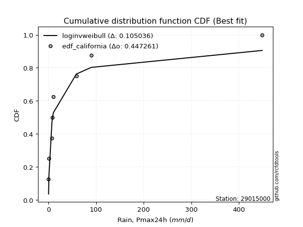</img>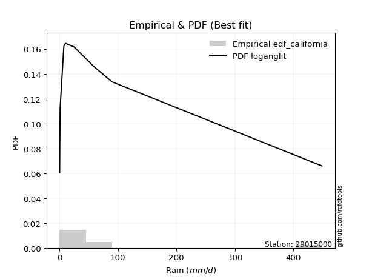</img>

</div>


### 2. EDF Hazen (1930)

Hazen method for plotting positions is a formula used to estimate the empirical cumulative probability distribution of flood events or other hydrological data. This formula often results in biased estimations, particularly when extrapolating to extreme events (high return periods).

<div align="center">


$P=(m-0.5)/n$


</div>


**2.1. Empirical values**

<div align="center">

|                | 0                   | 1                   | 2                  | 3                  | 4         | 5                  | 6                  | 7                  | 8                  |
|:---------------|:--------------------|:--------------------|:-------------------|:-------------------|:----------|:-------------------|:-------------------|:-------------------|:-------------------|
| date           | 2023                | 2024                | 2018               | 2019               | 2020      | 2025               | 2017               | 2022               | 2021               |
| x              | 0.36                | 1.1                 | 7.54               | 7.68               | 10.33     | 25.2               | 58.63              | 89.91              | 448.89             |
| m              | 1                   | 2                   | 3                  | 4                  | 5         | 6                  | 7                  | 8                  | 9                  |
| empirical_dist | edf_hazen           | edf_hazen           | edf_hazen          | edf_hazen          | edf_hazen | edf_hazen          | edf_hazen          | edf_hazen          | edf_hazen          |
| empirical      | 0.05555555555555555 | 0.16666666666666666 | 0.2777777777777778 | 0.3888888888888889 | 0.5       | 0.6111111111111112 | 0.7222222222222222 | 0.8333333333333334 | 0.9444444444444444 |
| empirical_tr   | 1.0588235294117647  | 1.2                 | 1.3846153846153846 | 1.6363636363636362 | 2.0       | 2.5714285714285716 | 3.5999999999999996 | 6.000000000000002  | 17.999999999999993 |

</div>


**2.2. Kolmogorov-Smirnov fit test (sorted by Δ)**


<div align="center">

|                | 0                   | 1                   | 2                   | 3                   | 4                   | 5                   | 6                   | 7                   | 8                   | 9                   | 10                  | 11                  | 12                  | 13                  | 14                  | 15                  | 16                  | 17                  | 18                  | 19                  | 20                  | 21                  | 22                  | 23                  | 24                  | 25                  | 26                  | 27                  | 28                  | 29                  | 30                  | 31                  | 32                  | 33                  | 34                  | 35                  | 36                  | 37                  | 38                  | 39                  | 40                  | 41                  | 42                  | 43                  | 44                  | 45                  | 46                  | 47                  | 48                  | 49                  | 50                  | 51                  | 52                  | 53                  | 54                  | 55                  | 56                  | 57                  | 58                  | 59                  | 60                  | 61                  | 62                  | 63                  | 64                  | 65                  | 66                  | 67                  | 68                  | 69                  | 70                  | 71                  | 72                  | 73                  | 74                  | 75                  | 76                  | 77                  | 78                  | 79                  | 80                  | 81                  | 82                  | 83                  | 84                  | 85                  | 86                  | 87                  | 88                  | 89                  | 90                  | 91                  | 92                  | 93                  | 94                  | 95                  | 96                  | 97                  | 98                  | 99                  | 100                 | 101                 | 102                 | 103                 | 104                 | 105                 | 106                 | 107                 | 108                 | 109                 | 110                 | 111                 | 112                 | 113                 | 114                 | 115                 | 116                 | 117                 | 118                 | 119                 | 120                 | 121                 | 122                 | 123                 | 124                 | 125                 | 126                 | 127                 | 128                 | 129                 | 130                 | 131                 | 132                 | 133                 | 134                 | 135                 | 136                 | 137                 | 138                 | 139                 | 140                 | 141                 | 142                 | 143                 | 144                 | 145                 | 146                 | 147                 | 148                 | 149                 | 150                 | 151                 | 152                 | 153                 | 154                 | 155                 | 156                 | 157                 | 158                 | 159                 |
|:---------------|:--------------------|:--------------------|:--------------------|:--------------------|:--------------------|:--------------------|:--------------------|:--------------------|:--------------------|:--------------------|:--------------------|:--------------------|:--------------------|:--------------------|:--------------------|:--------------------|:--------------------|:--------------------|:--------------------|:--------------------|:--------------------|:--------------------|:--------------------|:--------------------|:--------------------|:--------------------|:--------------------|:--------------------|:--------------------|:--------------------|:--------------------|:--------------------|:--------------------|:--------------------|:--------------------|:--------------------|:--------------------|:--------------------|:--------------------|:--------------------|:--------------------|:--------------------|:--------------------|:--------------------|:--------------------|:--------------------|:--------------------|:--------------------|:--------------------|:--------------------|:--------------------|:--------------------|:--------------------|:--------------------|:--------------------|:--------------------|:--------------------|:--------------------|:--------------------|:--------------------|:--------------------|:--------------------|:--------------------|:--------------------|:--------------------|:--------------------|:--------------------|:--------------------|:--------------------|:--------------------|:--------------------|:--------------------|:--------------------|:--------------------|:--------------------|:--------------------|:--------------------|:--------------------|:--------------------|:--------------------|:--------------------|:--------------------|:--------------------|:--------------------|:--------------------|:--------------------|:--------------------|:--------------------|:--------------------|:--------------------|:--------------------|:--------------------|:--------------------|:--------------------|:--------------------|:--------------------|:--------------------|:--------------------|:--------------------|:--------------------|:--------------------|:--------------------|:--------------------|:--------------------|:--------------------|:--------------------|:--------------------|:--------------------|:--------------------|:--------------------|:--------------------|:--------------------|:--------------------|:--------------------|:--------------------|:--------------------|:--------------------|:--------------------|:--------------------|:--------------------|:--------------------|:--------------------|:--------------------|:--------------------|:--------------------|:--------------------|:--------------------|:--------------------|:--------------------|:--------------------|:--------------------|:--------------------|:--------------------|:--------------------|:--------------------|:--------------------|:--------------------|:--------------------|:--------------------|:--------------------|:--------------------|:--------------------|:--------------------|:--------------------|:--------------------|:--------------------|:--------------------|:--------------------|:--------------------|:--------------------|:--------------------|:--------------------|:--------------------|:--------------------|:--------------------|:--------------------|:--------------------|:--------------------|:--------------------|:--------------------|
| station        | 29015000            | 29015000            | 29015000            | 29015000            | 29015000            | 29015000            | 29015000            | 29015000            | 29015000            | 29015000            | 29015000            | 29015000            | 29015000            | 29015000            | 29015000            | 29015000            | 29015000            | 29015000            | 29015000            | 29015000            | 29015000            | 29015000            | 29015000            | 29015000            | 29015000            | 29015000            | 29015000            | 29015000            | 29015000            | 29015000            | 29015000            | 29015000            | 29015000            | 29015000            | 29015000            | 29015000            | 29015000            | 29015000            | 29015000            | 29015000            | 29015000            | 29015000            | 29015000            | 29015000            | 29015000            | 29015000            | 29015000            | 29015000            | 29015000            | 29015000            | 29015000            | 29015000            | 29015000            | 29015000            | 29015000            | 29015000            | 29015000            | 29015000            | 29015000            | 29015000            | 29015000            | 29015000            | 29015000            | 29015000            | 29015000            | 29015000            | 29015000            | 29015000            | 29015000            | 29015000            | 29015000            | 29015000            | 29015000            | 29015000            | 29015000            | 29015000            | 29015000            | 29015000            | 29015000            | 29015000            | 29015000            | 29015000            | 29015000            | 29015000            | 29015000            | 29015000            | 29015000            | 29015000            | 29015000            | 29015000            | 29015000            | 29015000            | 29015000            | 29015000            | 29015000            | 29015000            | 29015000            | 29015000            | 29015000            | 29015000            | 29015000            | 29015000            | 29015000            | 29015000            | 29015000            | 29015000            | 29015000            | 29015000            | 29015000            | 29015000            | 29015000            | 29015000            | 29015000            | 29015000            | 29015000            | 29015000            | 29015000            | 29015000            | 29015000            | 29015000            | 29015000            | 29015000            | 29015000            | 29015000            | 29015000            | 29015000            | 29015000            | 29015000            | 29015000            | 29015000            | 29015000            | 29015000            | 29015000            | 29015000            | 29015000            | 29015000            | 29015000            | 29015000            | 29015000            | 29015000            | 29015000            | 29015000            | 29015000            | 29015000            | 29015000            | 29015000            | 29015000            | 29015000            | 29015000            | 29015000            | 29015000            | 29015000            | 29015000            | 29015000            | 29015000            | 29015000            | 29015000            | 29015000            | 29015000            | 29015000            |
| empirical_dist | edf_hazen           | edf_hazen           | edf_hazen           | edf_hazen           | edf_hazen           | edf_hazen           | edf_hazen           | edf_hazen           | edf_hazen           | edf_hazen           | edf_hazen           | edf_hazen           | edf_hazen           | edf_hazen           | edf_hazen           | edf_hazen           | edf_hazen           | edf_hazen           | edf_hazen           | edf_hazen           | edf_hazen           | edf_hazen           | edf_hazen           | edf_hazen           | edf_hazen           | edf_hazen           | edf_hazen           | edf_hazen           | edf_hazen           | edf_hazen           | edf_hazen           | edf_hazen           | edf_hazen           | edf_hazen           | edf_hazen           | edf_hazen           | edf_hazen           | edf_hazen           | edf_hazen           | edf_hazen           | edf_hazen           | edf_hazen           | edf_hazen           | edf_hazen           | edf_hazen           | edf_hazen           | edf_hazen           | edf_hazen           | edf_hazen           | edf_hazen           | edf_hazen           | edf_hazen           | edf_hazen           | edf_hazen           | edf_hazen           | edf_hazen           | edf_hazen           | edf_hazen           | edf_hazen           | edf_hazen           | edf_hazen           | edf_hazen           | edf_hazen           | edf_hazen           | edf_hazen           | edf_hazen           | edf_hazen           | edf_hazen           | edf_hazen           | edf_hazen           | edf_hazen           | edf_hazen           | edf_hazen           | edf_hazen           | edf_hazen           | edf_hazen           | edf_hazen           | edf_hazen           | edf_hazen           | edf_hazen           | edf_hazen           | edf_hazen           | edf_hazen           | edf_hazen           | edf_hazen           | edf_hazen           | edf_hazen           | edf_hazen           | edf_hazen           | edf_hazen           | edf_hazen           | edf_hazen           | edf_hazen           | edf_hazen           | edf_hazen           | edf_hazen           | edf_hazen           | edf_hazen           | edf_hazen           | edf_hazen           | edf_hazen           | edf_hazen           | edf_hazen           | edf_hazen           | edf_hazen           | edf_hazen           | edf_hazen           | edf_hazen           | edf_hazen           | edf_hazen           | edf_hazen           | edf_hazen           | edf_hazen           | edf_hazen           | edf_hazen           | edf_hazen           | edf_hazen           | edf_hazen           | edf_hazen           | edf_hazen           | edf_hazen           | edf_hazen           | edf_hazen           | edf_hazen           | edf_hazen           | edf_hazen           | edf_hazen           | edf_hazen           | edf_hazen           | edf_hazen           | edf_hazen           | edf_hazen           | edf_hazen           | edf_hazen           | edf_hazen           | edf_hazen           | edf_hazen           | edf_hazen           | edf_hazen           | edf_hazen           | edf_hazen           | edf_hazen           | edf_hazen           | edf_hazen           | edf_hazen           | edf_hazen           | edf_hazen           | edf_hazen           | edf_hazen           | edf_hazen           | edf_hazen           | edf_hazen           | edf_hazen           | edf_hazen           | edf_hazen           | edf_hazen           | edf_hazen           | edf_hazen           | edf_hazen           | edf_hazen           |
| p_dist         | ncf                 | loghypsecant        | loggenlogistic      | f                   | loglaplace          | loglaplace          | loggenextreme       | logdgamma           | loglogistic         | logskewnorm         | logdweibull         | logjohnsonsu        | logloggamma         | logargus            | logpearson3         | logfoldnorm         | truncpareto         | logweibull_min      | lognorm             | logcrystalball      | logt                | logexponnorm        | lognct              | lognakagami         | logfatiguelife      | genpareto           | lomax               | logbetaprime        | loggengamma         | logerlang           | loggamma            | loggamma            | loggausshyper       | loggumbel_l         | loggompertz         | logcosine           | loganglit           | logrice             | logsemicircular     | loginvgamma         | logalpha            | logkappa3           | logmaxwell          | invgauss            | loginvgauss         | logwrapcauchy       | loguniform          | invgamma            | gengamma            | truncweibull_min    | lograyleigh         | logarcsine          | logtriang           | logksone            | exponpow            | logbeta             | halfgennorm         | loggumbel_r         | loginvweibull       | genextreme          | invweibull          | loggenpareto        | logkappa4           | logtruncnorm        | exponweib           | logvonmises_line    | logmielke           | kappa3              | gamma               | mielke              | logmoyal            | loghalfnorm         | logtruncweibull_min | fatiguelife         | erlang              | burr12              | logkstwobign        | loggenhalflogistic  | loggenexpon         | vonmises_line       | loghalflogistic     | betaprime           | t                   | gennorm             | logbradford         | nct                 | genlogistic         | dgamma              | logtruncexpon       | nakagami            | logwald             | gausshyper          | logncf              | maxwell             | logistic            | logburr12           | hypsecant           | gumbel_r            | crystalball         | norm                | rayleigh            | wald                | dweibull            | moyal               | weibull_min         | logtrapezoid        | anglit              | semicircular        | loglomax            | logjohnsonsb        | kstwobign           | burr                | powerlaw            | laplace             | logexponweib        | halflogistic        | rice                | halfnorm            | arcsine             | loglevy_l           | pearson3            | foldnorm            | loggennorm          | loghalfgennorm      | gumbel_l            | logburr             | wrapcauchy          | logloglaplace       | exponnorm           | genexpon            | logf                | cosine              | gompertz            | truncnorm           | logtukeylambda      | johnsonsu           | levy_l              | logrdist            | skewnorm            | argus               | bradford            | truncexpon          | triang              | logweibull_max      | logpowerlaw         | rdist               | ksone               | kappa4              | tukeylambda         | alpha               | logexponpow         | uniform             | logtruncpareto      | johnsonsb           | genhalflogistic     | beta                | trapezoid           | weibull_max         | logvonmises         | vonmises            |
| delta          | 0.08226100315115886 | 0.08720592167181329 | 0.0900175240845637  | 0.09224994735239334 | 0.09516368837282796 | 0.09516368837282796 | 0.09748228962963812 | 0.09823600249238185 | 0.09854894221371396 | 0.09923674654956993 | 0.10025297952002787 | 0.10072138151268467 | 0.1012240849314982  | 0.10150211592284575 | 0.10528690045024663 | 0.10981535384353208 | 0.1106722506676894  | 0.11222441890892115 | 0.11253104248204104 | 0.11253105191471297 | 0.11253123941747567 | 0.11253161580074555 | 0.11264359810626079 | 0.11278183444397966 | 0.11286592418578639 | 0.11778880270509173 | 0.11779856893976404 | 0.11816859625154075 | 0.11833903491229875 | 0.11879162856007208 | 0.11926515410775657 | 0.11926515410775657 | 0.1196015009174034  | 0.120387604752136   | 0.12267851666583995 | 0.12435085930320694 | 0.1275909322482423  | 0.1305420007161251  | 0.1338557648881024  | 0.13639672196588232 | 0.13764006469380036 | 0.1462882669295778  | 0.14628917166844263 | 0.1468057102321148  | 0.14727243417237457 | 0.14854588111595407 | 0.14894645274806473 | 0.1507585266337419  | 0.15081261210785207 | 0.15710325344056214 | 0.15859327855394767 | 0.15912338697923906 | 0.16087193344979034 | 0.16115908099375764 | 0.16399193490551134 | 0.16503993640727788 | 0.16665480261918642 | 0.17042346096061345 | 0.17415845860650586 | 0.17779711713432672 | 0.17779758416523683 | 0.17796616798710452 | 0.17996100275871757 | 0.18003583441680876 | 0.18020967514969166 | 0.1803892879359162  | 0.18100400254062127 | 0.18220298672579915 | 0.1826769841843206  | 0.19146325669890268 | 0.1925609768700952  | 0.19352160516295058 | 0.19534057545422862 | 0.19590378907348682 | 0.19664642788443326 | 0.19697315112014302 | 0.1973416347404079  | 0.19761389987269773 | 0.19765776687186998 | 0.20011304562309606 | 0.20780703281200913 | 0.21376677681177692 | 0.22301582175940438 | 0.22384410726440498 | 0.22855522678350704 | 0.2432571693585266  | 0.24543922461452378 | 0.24571828371393792 | 0.2494004426030082  | 0.25083151664992176 | 0.25144532389254504 | 0.25189352641785956 | 0.2668103145712494  | 0.2712131500419477  | 0.2745912390658366  | 0.2749258219558085  | 0.27570144083230286 | 0.2759510982357499  | 0.28155884544711995 | 0.2815588484497328  | 0.28220101659367836 | 0.28496333773070404 | 0.2850435859986453  | 0.2857050949043475  | 0.2872994001340473  | 0.2874650679411529  | 0.2889037452322074  | 0.29193588052916053 | 0.2929897312663795  | 0.2999225971489555  | 0.30107335274062613 | 0.302134782830354   | 0.30329151182451686 | 0.30411735387302674 | 0.3083914057119024  | 0.31130280456546333 | 0.3129168922343381  | 0.3132451043927502  | 0.32282923810649133 | 0.3230256880703668  | 0.3278307125701717  | 0.32840807952204976 | 0.33333333333333337 | 0.347870878360632   | 0.3484030081070242  | 0.3546621140962266  | 0.3565691151796002  | 0.3581497362255792  | 0.36996533498965156 | 0.37039062763661645 | 0.38447326990262765 | 0.39366253259219525 | 0.3964619542603338  | 0.4093273802797931  | 0.43519290271940825 | 0.4480677358129407  | 0.45284690967658814 | 0.47859489320058546 | 0.48295881377685257 | 0.490433773225441   | 0.5089313790491945  | 0.513423274207642   | 0.5135310188570665  | 0.5182951218181823  | 0.560406398557817   | 0.5814592822196204  | 0.5836231690187947  | 0.6088695396499473  | 0.61153733963493    | 0.6144492812011917  | 0.616874404115706   | 0.6336811361558871  | 0.6415886101525556  | 0.6612612627156472  | 0.6820276714991067  | 0.7582411381552926  | 0.768896867497867   | 0.7758990906501296  | 0.9928391978799087  | 70.93207733688702   |
| deltao         | 0.41761268023100007 | 0.41761268023100007 | 0.41761268023100007 | 0.41761268023100007 | 0.41761268023100007 | 0.41761268023100007 | 0.41761268023100007 | 0.41761268023100007 | 0.41761268023100007 | 0.41761268023100007 | 0.41761268023100007 | 0.41761268023100007 | 0.41761268023100007 | 0.41761268023100007 | 0.41761268023100007 | 0.41761268023100007 | 0.41761268023100007 | 0.41761268023100007 | 0.41761268023100007 | 0.41761268023100007 | 0.41761268023100007 | 0.41761268023100007 | 0.41761268023100007 | 0.41761268023100007 | 0.41761268023100007 | 0.41761268023100007 | 0.41761268023100007 | 0.41761268023100007 | 0.41761268023100007 | 0.41761268023100007 | 0.41761268023100007 | 0.41761268023100007 | 0.41761268023100007 | 0.41761268023100007 | 0.41761268023100007 | 0.41761268023100007 | 0.41761268023100007 | 0.41761268023100007 | 0.41761268023100007 | 0.41761268023100007 | 0.41761268023100007 | 0.41761268023100007 | 0.41761268023100007 | 0.41761268023100007 | 0.41761268023100007 | 0.41761268023100007 | 0.41761268023100007 | 0.41761268023100007 | 0.41761268023100007 | 0.41761268023100007 | 0.41761268023100007 | 0.41761268023100007 | 0.41761268023100007 | 0.41761268023100007 | 0.41761268023100007 | 0.41761268023100007 | 0.41761268023100007 | 0.41761268023100007 | 0.41761268023100007 | 0.41761268023100007 | 0.41761268023100007 | 0.41761268023100007 | 0.41761268023100007 | 0.41761268023100007 | 0.41761268023100007 | 0.41761268023100007 | 0.41761268023100007 | 0.41761268023100007 | 0.41761268023100007 | 0.41761268023100007 | 0.41761268023100007 | 0.41761268023100007 | 0.41761268023100007 | 0.41761268023100007 | 0.41761268023100007 | 0.41761268023100007 | 0.41761268023100007 | 0.41761268023100007 | 0.41761268023100007 | 0.41761268023100007 | 0.41761268023100007 | 0.41761268023100007 | 0.41761268023100007 | 0.41761268023100007 | 0.41761268023100007 | 0.41761268023100007 | 0.41761268023100007 | 0.41761268023100007 | 0.41761268023100007 | 0.41761268023100007 | 0.41761268023100007 | 0.41761268023100007 | 0.41761268023100007 | 0.41761268023100007 | 0.41761268023100007 | 0.41761268023100007 | 0.41761268023100007 | 0.41761268023100007 | 0.41761268023100007 | 0.41761268023100007 | 0.41761268023100007 | 0.41761268023100007 | 0.41761268023100007 | 0.41761268023100007 | 0.41761268023100007 | 0.41761268023100007 | 0.41761268023100007 | 0.41761268023100007 | 0.41761268023100007 | 0.41761268023100007 | 0.41761268023100007 | 0.41761268023100007 | 0.41761268023100007 | 0.41761268023100007 | 0.41761268023100007 | 0.41761268023100007 | 0.41761268023100007 | 0.41761268023100007 | 0.41761268023100007 | 0.41761268023100007 | 0.41761268023100007 | 0.41761268023100007 | 0.41761268023100007 | 0.41761268023100007 | 0.41761268023100007 | 0.41761268023100007 | 0.41761268023100007 | 0.41761268023100007 | 0.41761268023100007 | 0.41761268023100007 | 0.41761268023100007 | 0.41761268023100007 | 0.41761268023100007 | 0.41761268023100007 | 0.41761268023100007 | 0.41761268023100007 | 0.41761268023100007 | 0.41761268023100007 | 0.41761268023100007 | 0.41761268023100007 | 0.41761268023100007 | 0.41761268023100007 | 0.41761268023100007 | 0.41761268023100007 | 0.41761268023100007 | 0.41761268023100007 | 0.41761268023100007 | 0.41761268023100007 | 0.41761268023100007 | 0.41761268023100007 | 0.41761268023100007 | 0.41761268023100007 | 0.41761268023100007 | 0.41761268023100007 | 0.41761268023100007 | 0.41761268023100007 | 0.41761268023100007 | 0.41761268023100007 | 0.41761268023100007 | 0.41761268023100007 |
| eval           | Δo > Δ              | Δo > Δ              | Δo > Δ              | Δo > Δ              | Δo > Δ              | Δo > Δ              | Δo > Δ              | Δo > Δ              | Δo > Δ              | Δo > Δ              | Δo > Δ              | Δo > Δ              | Δo > Δ              | Δo > Δ              | Δo > Δ              | Δo > Δ              | Δo > Δ              | Δo > Δ              | Δo > Δ              | Δo > Δ              | Δo > Δ              | Δo > Δ              | Δo > Δ              | Δo > Δ              | Δo > Δ              | Δo > Δ              | Δo > Δ              | Δo > Δ              | Δo > Δ              | Δo > Δ              | Δo > Δ              | Δo > Δ              | Δo > Δ              | Δo > Δ              | Δo > Δ              | Δo > Δ              | Δo > Δ              | Δo > Δ              | Δo > Δ              | Δo > Δ              | Δo > Δ              | Δo > Δ              | Δo > Δ              | Δo > Δ              | Δo > Δ              | Δo > Δ              | Δo > Δ              | Δo > Δ              | Δo > Δ              | Δo > Δ              | Δo > Δ              | Δo > Δ              | Δo > Δ              | Δo > Δ              | Δo > Δ              | Δo > Δ              | Δo > Δ              | Δo > Δ              | Δo > Δ              | Δo > Δ              | Δo > Δ              | Δo > Δ              | Δo > Δ              | Δo > Δ              | Δo > Δ              | Δo > Δ              | Δo > Δ              | Δo > Δ              | Δo > Δ              | Δo > Δ              | Δo > Δ              | Δo > Δ              | Δo > Δ              | Δo > Δ              | Δo > Δ              | Δo > Δ              | Δo > Δ              | Δo > Δ              | Δo > Δ              | Δo > Δ              | Δo > Δ              | Δo > Δ              | Δo > Δ              | Δo > Δ              | Δo > Δ              | Δo > Δ              | Δo > Δ              | Δo > Δ              | Δo > Δ              | Δo > Δ              | Δo > Δ              | Δo > Δ              | Δo > Δ              | Δo > Δ              | Δo > Δ              | Δo > Δ              | Δo > Δ              | Δo > Δ              | Δo > Δ              | Δo > Δ              | Δo > Δ              | Δo > Δ              | Δo > Δ              | Δo > Δ              | Δo > Δ              | Δo > Δ              | Δo > Δ              | Δo > Δ              | Δo > Δ              | Δo > Δ              | Δo > Δ              | Δo > Δ              | Δo > Δ              | Δo > Δ              | Δo > Δ              | Δo > Δ              | Δo > Δ              | Δo > Δ              | Δo > Δ              | Δo > Δ              | Δo > Δ              | Δo > Δ              | Δo > Δ              | Δo > Δ              | Δo > Δ              | Δo > Δ              | Δo > Δ              | Δo > Δ              | Δo > Δ              | Δo > Δ              | Δo > Δ              | Δo > Δ              | Δo > Δ              | Δo > Δ              | Δo <= Δ             | Δo <= Δ             | Δo <= Δ             | Δo <= Δ             | Δo <= Δ             | Δo <= Δ             | Δo <= Δ             | Δo <= Δ             | Δo <= Δ             | Δo <= Δ             | Δo <= Δ             | Δo <= Δ             | Δo <= Δ             | Δo <= Δ             | Δo <= Δ             | Δo <= Δ             | Δo <= Δ             | Δo <= Δ             | Δo <= Δ             | Δo <= Δ             | Δo <= Δ             | Δo <= Δ             | Δo <= Δ             | Δo <= Δ             | Δo <= Δ             | Δo <= Δ             |
| fit            | 1                   | 1                   | 1                   | 1                   | 1                   | 1                   | 1                   | 1                   | 1                   | 1                   | 1                   | 1                   | 1                   | 1                   | 1                   | 1                   | 1                   | 1                   | 1                   | 1                   | 1                   | 1                   | 1                   | 1                   | 1                   | 1                   | 1                   | 1                   | 1                   | 1                   | 1                   | 1                   | 1                   | 1                   | 1                   | 1                   | 1                   | 1                   | 1                   | 1                   | 1                   | 1                   | 1                   | 1                   | 1                   | 1                   | 1                   | 1                   | 1                   | 1                   | 1                   | 1                   | 1                   | 1                   | 1                   | 1                   | 1                   | 1                   | 1                   | 1                   | 1                   | 1                   | 1                   | 1                   | 1                   | 1                   | 1                   | 1                   | 1                   | 1                   | 1                   | 1                   | 1                   | 1                   | 1                   | 1                   | 1                   | 1                   | 1                   | 1                   | 1                   | 1                   | 1                   | 1                   | 1                   | 1                   | 1                   | 1                   | 1                   | 1                   | 1                   | 1                   | 1                   | 1                   | 1                   | 1                   | 1                   | 1                   | 1                   | 1                   | 1                   | 1                   | 1                   | 1                   | 1                   | 1                   | 1                   | 1                   | 1                   | 1                   | 1                   | 1                   | 1                   | 1                   | 1                   | 1                   | 1                   | 1                   | 1                   | 1                   | 1                   | 1                   | 1                   | 1                   | 1                   | 1                   | 1                   | 1                   | 1                   | 1                   | 1                   | 1                   | 1                   | 1                   | 0                   | 0                   | 0                   | 0                   | 0                   | 0                   | 0                   | 0                   | 0                   | 0                   | 0                   | 0                   | 0                   | 0                   | 0                   | 0                   | 0                   | 0                   | 0                   | 0                   | 0                   | 0                   | 0                   | 0                   | 0                   | 0                   |
| n              | 9                   | 9                   | 9                   | 9                   | 9                   | 9                   | 9                   | 9                   | 9                   | 9                   | 9                   | 9                   | 9                   | 9                   | 9                   | 9                   | 9                   | 9                   | 9                   | 9                   | 9                   | 9                   | 9                   | 9                   | 9                   | 9                   | 9                   | 9                   | 9                   | 9                   | 9                   | 9                   | 9                   | 9                   | 9                   | 9                   | 9                   | 9                   | 9                   | 9                   | 9                   | 9                   | 9                   | 9                   | 9                   | 9                   | 9                   | 9                   | 9                   | 9                   | 9                   | 9                   | 9                   | 9                   | 9                   | 9                   | 9                   | 9                   | 9                   | 9                   | 9                   | 9                   | 9                   | 9                   | 9                   | 9                   | 9                   | 9                   | 9                   | 9                   | 9                   | 9                   | 9                   | 9                   | 9                   | 9                   | 9                   | 9                   | 9                   | 9                   | 9                   | 9                   | 9                   | 9                   | 9                   | 9                   | 9                   | 9                   | 9                   | 9                   | 9                   | 9                   | 9                   | 9                   | 9                   | 9                   | 9                   | 9                   | 9                   | 9                   | 9                   | 9                   | 9                   | 9                   | 9                   | 9                   | 9                   | 9                   | 9                   | 9                   | 9                   | 9                   | 9                   | 9                   | 9                   | 9                   | 9                   | 9                   | 9                   | 9                   | 9                   | 9                   | 9                   | 9                   | 9                   | 9                   | 9                   | 9                   | 9                   | 9                   | 9                   | 9                   | 9                   | 9                   | 9                   | 9                   | 9                   | 9                   | 9                   | 9                   | 9                   | 9                   | 9                   | 9                   | 9                   | 9                   | 9                   | 9                   | 9                   | 9                   | 9                   | 9                   | 9                   | 9                   | 9                   | 9                   | 9                   | 9                   | 9                   | 9                   |
| best_fit       | 1                   | 0                   | 0                   | 0                   | 0                   | 0                   | 0                   | 0                   | 0                   | 0                   | 0                   | 0                   | 0                   | 0                   | 0                   | 0                   | 0                   | 0                   | 0                   | 0                   | 0                   | 0                   | 0                   | 0                   | 0                   | 0                   | 0                   | 0                   | 0                   | 0                   | 0                   | 0                   | 0                   | 0                   | 0                   | 0                   | 0                   | 0                   | 0                   | 0                   | 0                   | 0                   | 0                   | 0                   | 0                   | 0                   | 0                   | 0                   | 0                   | 0                   | 0                   | 0                   | 0                   | 0                   | 0                   | 0                   | 0                   | 0                   | 0                   | 0                   | 0                   | 0                   | 0                   | 0                   | 0                   | 0                   | 0                   | 0                   | 0                   | 0                   | 0                   | 0                   | 0                   | 0                   | 0                   | 0                   | 0                   | 0                   | 0                   | 0                   | 0                   | 0                   | 0                   | 0                   | 0                   | 0                   | 0                   | 0                   | 0                   | 0                   | 0                   | 0                   | 0                   | 0                   | 0                   | 0                   | 0                   | 0                   | 0                   | 0                   | 0                   | 0                   | 0                   | 0                   | 0                   | 0                   | 0                   | 0                   | 0                   | 0                   | 0                   | 0                   | 0                   | 0                   | 0                   | 0                   | 0                   | 0                   | 0                   | 0                   | 0                   | 0                   | 0                   | 0                   | 0                   | 0                   | 0                   | 0                   | 0                   | 0                   | 0                   | 0                   | 0                   | 0                   | 0                   | 0                   | 0                   | 0                   | 0                   | 0                   | 0                   | 0                   | 0                   | 0                   | 0                   | 0                   | 0                   | 0                   | 0                   | 0                   | 0                   | 0                   | 0                   | 0                   | 0                   | 0                   | 0                   | 0                   | 0                   | 0                   |
| best_fit_sort  | 1                   | 2                   | 3                   | 4                   | 5                   | 6                   | 7                   | 8                   | 9                   | 10                  | 11                  | 12                  | 13                  | 14                  | 15                  | 16                  | 17                  | 18                  | 19                  | 20                  | 21                  | 22                  | 23                  | 24                  | 25                  | 26                  | 27                  | 28                  | 29                  | 30                  | 31                  | 32                  | 33                  | 34                  | 35                  | 36                  | 37                  | 38                  | 39                  | 40                  | 41                  | 42                  | 43                  | 44                  | 45                  | 46                  | 47                  | 48                  | 49                  | 50                  | 51                  | 52                  | 53                  | 54                  | 55                  | 56                  | 57                  | 58                  | 59                  | 60                  | 61                  | 62                  | 63                  | 64                  | 65                  | 66                  | 67                  | 68                  | 69                  | 70                  | 71                  | 72                  | 73                  | 74                  | 75                  | 76                  | 77                  | 78                  | 79                  | 80                  | 81                  | 82                  | 83                  | 84                  | 85                  | 86                  | 87                  | 88                  | 89                  | 90                  | 91                  | 92                  | 93                  | 94                  | 95                  | 96                  | 97                  | 98                  | 99                  | 100                 | 101                 | 102                 | 103                 | 104                 | 105                 | 106                 | 107                 | 108                 | 109                 | 110                 | 111                 | 112                 | 113                 | 114                 | 115                 | 116                 | 117                 | 118                 | 119                 | 120                 | 121                 | 122                 | 123                 | 124                 | 125                 | 126                 | 127                 | 128                 | 129                 | 130                 | 131                 | 132                 | 133                 | 134                 | 135                 | 136                 | 137                 | 138                 | 139                 | 140                 | 141                 | 142                 | 143                 | 144                 | 145                 | 146                 | 147                 | 148                 | 149                 | 150                 | 151                 | 152                 | 153                 | 154                 | 155                 | 156                 | 157                 | 158                 | 159                 | 160                 |

</div>


**2.3. Best fit**

<div align="center">

|   id |   station | empirical_dist   | p_dist   |    delta |   deltao | eval   |   fit |   n |   best_fit |   best_fit_sort |
|-----:|----------:|:-----------------|:---------|---------:|---------:|:-------|------:|----:|-----------:|----------------:|
|    0 |  29015000 | edf_hazen        | ncf      | 0.082261 | 0.417613 | Δo > Δ |     1 |   9 |          1 |               1 |

</div>


<div align="center">

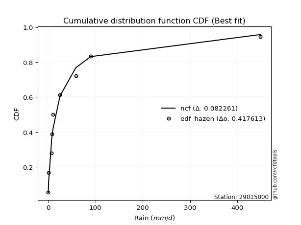</img>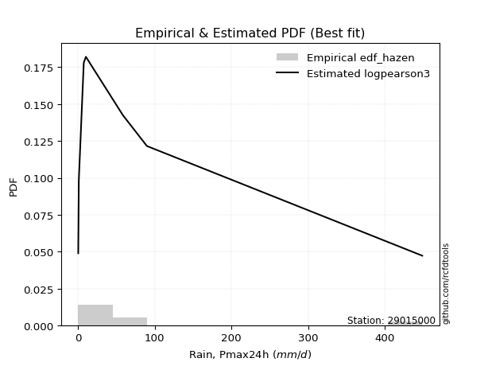</img>

</div>


### 3. EDF Weibull (1939)

Weibull plotting position formula is an empirical method used to estimate the non-exceedance probability or plotting position for a set of observed data, is often recommended or widely used in practice, particularly in flood frequency analysis.

<div align="center">


$P=m/(n+1)$


</div>


**3.1. Empirical values**

<div align="center">

|                | 0                  | 1           | 2                  | 3                  | 4           | 5           | 6                 | 7                 | 8                  |
|:---------------|:-------------------|:------------|:-------------------|:-------------------|:------------|:------------|:------------------|:------------------|:-------------------|
| date           | 2023               | 2024        | 2018               | 2019               | 2020        | 2025        | 2017              | 2022              | 2021               |
| x              | 0.36               | 1.1         | 7.54               | 7.68               | 10.33       | 25.2        | 58.63             | 89.91             | 448.89             |
| m              | 1                  | 2           | 3                  | 4                  | 5           | 6           | 7                 | 8                 | 9                  |
| empirical_dist | edf_weibull        | edf_weibull | edf_weibull        | edf_weibull        | edf_weibull | edf_weibull | edf_weibull       | edf_weibull       | edf_weibull        |
| empirical      | 0.1                | 0.2         | 0.3                | 0.4                | 0.5         | 0.6         | 0.7               | 0.8               | 0.9                |
| empirical_tr   | 1.1111111111111112 | 1.25        | 1.4285714285714286 | 1.6666666666666667 | 2.0         | 2.5         | 3.333333333333333 | 5.000000000000001 | 10.000000000000002 |

</div>


**3.2. Kolmogorov-Smirnov fit test (sorted by Δ)**


<div align="center">

|                | 0                   | 1                   | 2                   | 3                   | 4                   | 5                   | 6                   | 7                   | 8                   | 9                   | 10                  | 11                  | 12                  | 13                  | 14                  | 15                  | 16                  | 17                  | 18                  | 19                  | 20                  | 21                  | 22                  | 23                  | 24                  | 25                  | 26                  | 27                  | 28                  | 29                  | 30                  | 31                  | 32                  | 33                  | 34                  | 35                  | 36                  | 37                  | 38                  | 39                  | 40                  | 41                  | 42                  | 43                  | 44                  | 45                  | 46                  | 47                  | 48                  | 49                  | 50                  | 51                  | 52                  | 53                  | 54                  | 55                  | 56                  | 57                  | 58                  | 59                  | 60                  | 61                  | 62                  | 63                  | 64                  | 65                  | 66                  | 67                  | 68                  | 69                  | 70                  | 71                  | 72                  | 73                  | 74                  | 75                  | 76                  | 77                  | 78                  | 79                  | 80                  | 81                  | 82                  | 83                  | 84                  | 85                  | 86                  | 87                  | 88                  | 89                  | 90                  | 91                  | 92                  | 93                  | 94                  | 95                  | 96                  | 97                  | 98                  | 99                  | 100                 | 101                 | 102                 | 103                 | 104                 | 105                 | 106                 | 107                 | 108                 | 109                 | 110                 | 111                 | 112                 | 113                 | 114                 | 115                 | 116                 | 117                 | 118                 | 119                 | 120                 | 121                 | 122                 | 123                 | 124                 | 125                 | 126                 | 127                 | 128                 | 129                 | 130                 | 131                 | 132                 | 133                 | 134                 | 135                 | 136                 | 137                 | 138                 | 139                 | 140                 | 141                 | 142                 | 143                 | 144                 | 145                 | 146                 | 147                 | 148                 | 149                 | 150                 | 151                 | 152                 | 153                 | 154                 | 155                 | 156                 | 157                 | 158                 | 159                 |
|:---------------|:--------------------|:--------------------|:--------------------|:--------------------|:--------------------|:--------------------|:--------------------|:--------------------|:--------------------|:--------------------|:--------------------|:--------------------|:--------------------|:--------------------|:--------------------|:--------------------|:--------------------|:--------------------|:--------------------|:--------------------|:--------------------|:--------------------|:--------------------|:--------------------|:--------------------|:--------------------|:--------------------|:--------------------|:--------------------|:--------------------|:--------------------|:--------------------|:--------------------|:--------------------|:--------------------|:--------------------|:--------------------|:--------------------|:--------------------|:--------------------|:--------------------|:--------------------|:--------------------|:--------------------|:--------------------|:--------------------|:--------------------|:--------------------|:--------------------|:--------------------|:--------------------|:--------------------|:--------------------|:--------------------|:--------------------|:--------------------|:--------------------|:--------------------|:--------------------|:--------------------|:--------------------|:--------------------|:--------------------|:--------------------|:--------------------|:--------------------|:--------------------|:--------------------|:--------------------|:--------------------|:--------------------|:--------------------|:--------------------|:--------------------|:--------------------|:--------------------|:--------------------|:--------------------|:--------------------|:--------------------|:--------------------|:--------------------|:--------------------|:--------------------|:--------------------|:--------------------|:--------------------|:--------------------|:--------------------|:--------------------|:--------------------|:--------------------|:--------------------|:--------------------|:--------------------|:--------------------|:--------------------|:--------------------|:--------------------|:--------------------|:--------------------|:--------------------|:--------------------|:--------------------|:--------------------|:--------------------|:--------------------|:--------------------|:--------------------|:--------------------|:--------------------|:--------------------|:--------------------|:--------------------|:--------------------|:--------------------|:--------------------|:--------------------|:--------------------|:--------------------|:--------------------|:--------------------|:--------------------|:--------------------|:--------------------|:--------------------|:--------------------|:--------------------|:--------------------|:--------------------|:--------------------|:--------------------|:--------------------|:--------------------|:--------------------|:--------------------|:--------------------|:--------------------|:--------------------|:--------------------|:--------------------|:--------------------|:--------------------|:--------------------|:--------------------|:--------------------|:--------------------|:--------------------|:--------------------|:--------------------|:--------------------|:--------------------|:--------------------|:--------------------|:--------------------|:--------------------|:--------------------|:--------------------|:--------------------|:--------------------|
| station        | 29015000            | 29015000            | 29015000            | 29015000            | 29015000            | 29015000            | 29015000            | 29015000            | 29015000            | 29015000            | 29015000            | 29015000            | 29015000            | 29015000            | 29015000            | 29015000            | 29015000            | 29015000            | 29015000            | 29015000            | 29015000            | 29015000            | 29015000            | 29015000            | 29015000            | 29015000            | 29015000            | 29015000            | 29015000            | 29015000            | 29015000            | 29015000            | 29015000            | 29015000            | 29015000            | 29015000            | 29015000            | 29015000            | 29015000            | 29015000            | 29015000            | 29015000            | 29015000            | 29015000            | 29015000            | 29015000            | 29015000            | 29015000            | 29015000            | 29015000            | 29015000            | 29015000            | 29015000            | 29015000            | 29015000            | 29015000            | 29015000            | 29015000            | 29015000            | 29015000            | 29015000            | 29015000            | 29015000            | 29015000            | 29015000            | 29015000            | 29015000            | 29015000            | 29015000            | 29015000            | 29015000            | 29015000            | 29015000            | 29015000            | 29015000            | 29015000            | 29015000            | 29015000            | 29015000            | 29015000            | 29015000            | 29015000            | 29015000            | 29015000            | 29015000            | 29015000            | 29015000            | 29015000            | 29015000            | 29015000            | 29015000            | 29015000            | 29015000            | 29015000            | 29015000            | 29015000            | 29015000            | 29015000            | 29015000            | 29015000            | 29015000            | 29015000            | 29015000            | 29015000            | 29015000            | 29015000            | 29015000            | 29015000            | 29015000            | 29015000            | 29015000            | 29015000            | 29015000            | 29015000            | 29015000            | 29015000            | 29015000            | 29015000            | 29015000            | 29015000            | 29015000            | 29015000            | 29015000            | 29015000            | 29015000            | 29015000            | 29015000            | 29015000            | 29015000            | 29015000            | 29015000            | 29015000            | 29015000            | 29015000            | 29015000            | 29015000            | 29015000            | 29015000            | 29015000            | 29015000            | 29015000            | 29015000            | 29015000            | 29015000            | 29015000            | 29015000            | 29015000            | 29015000            | 29015000            | 29015000            | 29015000            | 29015000            | 29015000            | 29015000            | 29015000            | 29015000            | 29015000            | 29015000            | 29015000            | 29015000            |
| empirical_dist | edf_weibull         | edf_weibull         | edf_weibull         | edf_weibull         | edf_weibull         | edf_weibull         | edf_weibull         | edf_weibull         | edf_weibull         | edf_weibull         | edf_weibull         | edf_weibull         | edf_weibull         | edf_weibull         | edf_weibull         | edf_weibull         | edf_weibull         | edf_weibull         | edf_weibull         | edf_weibull         | edf_weibull         | edf_weibull         | edf_weibull         | edf_weibull         | edf_weibull         | edf_weibull         | edf_weibull         | edf_weibull         | edf_weibull         | edf_weibull         | edf_weibull         | edf_weibull         | edf_weibull         | edf_weibull         | edf_weibull         | edf_weibull         | edf_weibull         | edf_weibull         | edf_weibull         | edf_weibull         | edf_weibull         | edf_weibull         | edf_weibull         | edf_weibull         | edf_weibull         | edf_weibull         | edf_weibull         | edf_weibull         | edf_weibull         | edf_weibull         | edf_weibull         | edf_weibull         | edf_weibull         | edf_weibull         | edf_weibull         | edf_weibull         | edf_weibull         | edf_weibull         | edf_weibull         | edf_weibull         | edf_weibull         | edf_weibull         | edf_weibull         | edf_weibull         | edf_weibull         | edf_weibull         | edf_weibull         | edf_weibull         | edf_weibull         | edf_weibull         | edf_weibull         | edf_weibull         | edf_weibull         | edf_weibull         | edf_weibull         | edf_weibull         | edf_weibull         | edf_weibull         | edf_weibull         | edf_weibull         | edf_weibull         | edf_weibull         | edf_weibull         | edf_weibull         | edf_weibull         | edf_weibull         | edf_weibull         | edf_weibull         | edf_weibull         | edf_weibull         | edf_weibull         | edf_weibull         | edf_weibull         | edf_weibull         | edf_weibull         | edf_weibull         | edf_weibull         | edf_weibull         | edf_weibull         | edf_weibull         | edf_weibull         | edf_weibull         | edf_weibull         | edf_weibull         | edf_weibull         | edf_weibull         | edf_weibull         | edf_weibull         | edf_weibull         | edf_weibull         | edf_weibull         | edf_weibull         | edf_weibull         | edf_weibull         | edf_weibull         | edf_weibull         | edf_weibull         | edf_weibull         | edf_weibull         | edf_weibull         | edf_weibull         | edf_weibull         | edf_weibull         | edf_weibull         | edf_weibull         | edf_weibull         | edf_weibull         | edf_weibull         | edf_weibull         | edf_weibull         | edf_weibull         | edf_weibull         | edf_weibull         | edf_weibull         | edf_weibull         | edf_weibull         | edf_weibull         | edf_weibull         | edf_weibull         | edf_weibull         | edf_weibull         | edf_weibull         | edf_weibull         | edf_weibull         | edf_weibull         | edf_weibull         | edf_weibull         | edf_weibull         | edf_weibull         | edf_weibull         | edf_weibull         | edf_weibull         | edf_weibull         | edf_weibull         | edf_weibull         | edf_weibull         | edf_weibull         | edf_weibull         | edf_weibull         | edf_weibull         |
| p_dist         | loggenextreme       | logloggamma         | logjohnsonsu        | logskewnorm         | logpearson3         | ncf                 | loggenlogistic      | logweibull_min      | lognorm             | logcrystalball      | logt                | logexponnorm        | lognct              | lognakagami         | logfoldnorm         | logfatiguelife      | logbetaprime        | loggengamma         | logerlang           | loggamma            | loggamma            | loglogistic         | f                   | loggausshyper       | loggompertz         | logargus            | logcosine           | loghypsecant        | loganglit           | logdweibull         | logrice             | logsemicircular     | logdgamma           | loginvgamma         | logalpha            | loglaplace          | loglaplace          | loggumbel_l         | logkappa3           | logmaxwell          | invgauss            | loginvgauss         | logwrapcauchy       | loguniform          | invgamma            | gengamma            | lomax               | genpareto           | logbeta             | lograyleigh         | logarcsine          | logksone            | truncpareto         | exponweib           | loggumbel_r         | loginvweibull       | genextreme          | invweibull          | loggenpareto        | truncweibull_min    | logkappa4           | logtruncnorm        | exponpow            | logmielke           | kappa3              | logtriang           | loggenhalflogistic  | halfgennorm         | mielke              | logmoyal            | loghalfnorm         | logtruncweibull_min | fatiguelife         | erlang              | burr12              | logkstwobign        | loggenexpon         | logvonmises_line    | gamma               | betaprime           | loghalflogistic     | dgamma              | logbradford         | gennorm             | nakagami            | nct                 | vonmises_line       | maxwell             | logtruncexpon       | logwald             | gumbel_r            | t                   | genlogistic         | rayleigh            | wald                | dweibull            | moyal               | logncf              | crystalball         | norm                | logistic            | gausshyper          | logburr12           | weibull_min         | anglit              | semicircular        | logtrapezoid        | hypsecant           | logjohnsonsb        | halflogistic        | halfnorm            | loglomax            | arcsine             | loglevy_l           | burr                | powerlaw            | pearson3            | foldnorm            | logexponweib        | kstwobign           | laplace             | loggennorm          | rice                | gumbel_l            | wrapcauchy          | loghalfgennorm      | logburr             | logloglaplace       | cosine              | logf                | exponnorm           | genexpon            | gompertz            | levy_l              | truncnorm           | logtukeylambda      | johnsonsu           | logrdist            | argus               | skewnorm            | logweibull_max      | bradford            | truncexpon          | triang              | rdist               | logpowerlaw         | ksone               | tukeylambda         | kappa4              | alpha               | logexponpow         | uniform             | logtruncpareto      | johnsonsb           | genhalflogistic     | beta                | trapezoid           | weibull_max         | logvonmises         | vonmises            |
| delta          | 0.07990720294505893 | 0.08425100852937492 | 0.08438221071141061 | 0.08460558789523484 | 0.08492978886250611 | 0.08706432259855977 | 0.08820109076928383 | 0.09000219668669895 | 0.09030882025981884 | 0.09030882969249077 | 0.09030901719525347 | 0.09030939357852336 | 0.09042137588403859 | 0.09055961222175746 | 0.09062451404079652 | 0.0906437019635642  | 0.09594637402931855 | 0.09611681269007655 | 0.09656940633784988 | 0.09704293188553437 | 0.09704293188553437 | 0.09949912343637958 | 0.09999999961847585 | 0.10000000000002063 | 0.10045629444361776 | 0.10150211592284575 | 0.10212863708098474 | 0.10529990805306458 | 0.10536871002602011 | 0.10800135884335718 | 0.1083197784939029  | 0.11163354266588021 | 0.11302744217503093 | 0.11417449974366012 | 0.11541784247157816 | 0.11738591059505021 | 0.11738591059505021 | 0.120387604752136   | 0.1240660447073556  | 0.12406694944622043 | 0.1245834880098926  | 0.12505021195015237 | 0.12632365889373187 | 0.12672423052584253 | 0.1285363044115197  | 0.12859038988562987 | 0.12945057975295754 | 0.12945559177418048 | 0.13170660307394455 | 0.13637105633172547 | 0.13690116475701686 | 0.13893685877153544 | 0.14400558400102276 | 0.14687634181635834 | 0.14820123873839125 | 0.15193623638428366 | 0.15557489491210452 | 0.15557536194301463 | 0.15574394576488232 | 0.15710325344056214 | 0.15773878053649537 | 0.15781361219458656 | 0.15836182791922765 | 0.15878178031839907 | 0.15998076450357696 | 0.16087193344979034 | 0.16494340273141683 | 0.16665480261918642 | 0.16924103447668049 | 0.17033875464787301 | 0.17129938294072838 | 0.17311835323200642 | 0.17368156685126462 | 0.17442420566221106 | 0.17475092889792082 | 0.1751194125181857  | 0.17543554464964778 | 0.1803892879359162  | 0.1826769841843206  | 0.19154455458955472 | 0.2                 | 0.20127383926949347 | 0.20633300456128484 | 0.2126462290453428  | 0.21749818331658843 | 0.2210349471363044  | 0.22233526784531832 | 0.22676870559750326 | 0.227178220380786   | 0.22922310167032284 | 0.23150665379130544 | 0.23412693287051556 | 0.2343281135034126  | 0.23775657214923387 | 0.2405188932862596  | 0.2405991415542009  | 0.24126065045990305 | 0.24458809234902718 | 0.24822551211378663 | 0.24822551511639945 | 0.2514917965672361  | 0.25189352641785956 | 0.2527035997335863  | 0.253966066800714   | 0.2555704118988741  | 0.2586025471958272  | 0.2639208774120557  | 0.2645903297211917  | 0.2665892638156222  | 0.26685836012101893 | 0.2688006599483058  | 0.2707675090441573  | 0.27838479366204694 | 0.2785812436259224  | 0.2799125606081318  | 0.28106928960229466 | 0.2833862681257272  | 0.28396363507760536 | 0.2861691834896802  | 0.28996224162951495 | 0.29300624276191556 | 0.30000000000000004 | 0.3018057811232269  | 0.31506967477369086 | 0.3232357818462669  | 0.3256486561384098  | 0.3324398918740044  | 0.335927514003357   | 0.3603291992588619  | 0.36225104768040545 | 0.36996533498965156 | 0.37039062763661645 | 0.3964619542603338  | 0.40840246523214374 | 0.4093273802797931  | 0.41297068049718605 | 0.4147344024796073  | 0.45637267097836326 | 0.4571004398921077  | 0.4718477026657414  | 0.48496178848484894 | 0.49592766313988457 | 0.5023121630965308  | 0.5024199077459552  | 0.537014837775176   | 0.5381841763355948  | 0.5502898356854614  | 0.5670928951904856  | 0.575536206316614   | 0.5922270589789695  | 0.5946521818934838  | 0.6003478028225537  | 0.6118903932457125  | 0.6279279293823139  | 0.6486943381657734  | 0.7137966937108482  | 0.7355635341645337  | 0.7425657573167963  | 1.0372836423243532  | 70.97652178133146   |
| deltao         | 0.41761268023100007 | 0.41761268023100007 | 0.41761268023100007 | 0.41761268023100007 | 0.41761268023100007 | 0.41761268023100007 | 0.41761268023100007 | 0.41761268023100007 | 0.41761268023100007 | 0.41761268023100007 | 0.41761268023100007 | 0.41761268023100007 | 0.41761268023100007 | 0.41761268023100007 | 0.41761268023100007 | 0.41761268023100007 | 0.41761268023100007 | 0.41761268023100007 | 0.41761268023100007 | 0.41761268023100007 | 0.41761268023100007 | 0.41761268023100007 | 0.41761268023100007 | 0.41761268023100007 | 0.41761268023100007 | 0.41761268023100007 | 0.41761268023100007 | 0.41761268023100007 | 0.41761268023100007 | 0.41761268023100007 | 0.41761268023100007 | 0.41761268023100007 | 0.41761268023100007 | 0.41761268023100007 | 0.41761268023100007 | 0.41761268023100007 | 0.41761268023100007 | 0.41761268023100007 | 0.41761268023100007 | 0.41761268023100007 | 0.41761268023100007 | 0.41761268023100007 | 0.41761268023100007 | 0.41761268023100007 | 0.41761268023100007 | 0.41761268023100007 | 0.41761268023100007 | 0.41761268023100007 | 0.41761268023100007 | 0.41761268023100007 | 0.41761268023100007 | 0.41761268023100007 | 0.41761268023100007 | 0.41761268023100007 | 0.41761268023100007 | 0.41761268023100007 | 0.41761268023100007 | 0.41761268023100007 | 0.41761268023100007 | 0.41761268023100007 | 0.41761268023100007 | 0.41761268023100007 | 0.41761268023100007 | 0.41761268023100007 | 0.41761268023100007 | 0.41761268023100007 | 0.41761268023100007 | 0.41761268023100007 | 0.41761268023100007 | 0.41761268023100007 | 0.41761268023100007 | 0.41761268023100007 | 0.41761268023100007 | 0.41761268023100007 | 0.41761268023100007 | 0.41761268023100007 | 0.41761268023100007 | 0.41761268023100007 | 0.41761268023100007 | 0.41761268023100007 | 0.41761268023100007 | 0.41761268023100007 | 0.41761268023100007 | 0.41761268023100007 | 0.41761268023100007 | 0.41761268023100007 | 0.41761268023100007 | 0.41761268023100007 | 0.41761268023100007 | 0.41761268023100007 | 0.41761268023100007 | 0.41761268023100007 | 0.41761268023100007 | 0.41761268023100007 | 0.41761268023100007 | 0.41761268023100007 | 0.41761268023100007 | 0.41761268023100007 | 0.41761268023100007 | 0.41761268023100007 | 0.41761268023100007 | 0.41761268023100007 | 0.41761268023100007 | 0.41761268023100007 | 0.41761268023100007 | 0.41761268023100007 | 0.41761268023100007 | 0.41761268023100007 | 0.41761268023100007 | 0.41761268023100007 | 0.41761268023100007 | 0.41761268023100007 | 0.41761268023100007 | 0.41761268023100007 | 0.41761268023100007 | 0.41761268023100007 | 0.41761268023100007 | 0.41761268023100007 | 0.41761268023100007 | 0.41761268023100007 | 0.41761268023100007 | 0.41761268023100007 | 0.41761268023100007 | 0.41761268023100007 | 0.41761268023100007 | 0.41761268023100007 | 0.41761268023100007 | 0.41761268023100007 | 0.41761268023100007 | 0.41761268023100007 | 0.41761268023100007 | 0.41761268023100007 | 0.41761268023100007 | 0.41761268023100007 | 0.41761268023100007 | 0.41761268023100007 | 0.41761268023100007 | 0.41761268023100007 | 0.41761268023100007 | 0.41761268023100007 | 0.41761268023100007 | 0.41761268023100007 | 0.41761268023100007 | 0.41761268023100007 | 0.41761268023100007 | 0.41761268023100007 | 0.41761268023100007 | 0.41761268023100007 | 0.41761268023100007 | 0.41761268023100007 | 0.41761268023100007 | 0.41761268023100007 | 0.41761268023100007 | 0.41761268023100007 | 0.41761268023100007 | 0.41761268023100007 | 0.41761268023100007 | 0.41761268023100007 | 0.41761268023100007 | 0.41761268023100007 |
| eval           | Δo > Δ              | Δo > Δ              | Δo > Δ              | Δo > Δ              | Δo > Δ              | Δo > Δ              | Δo > Δ              | Δo > Δ              | Δo > Δ              | Δo > Δ              | Δo > Δ              | Δo > Δ              | Δo > Δ              | Δo > Δ              | Δo > Δ              | Δo > Δ              | Δo > Δ              | Δo > Δ              | Δo > Δ              | Δo > Δ              | Δo > Δ              | Δo > Δ              | Δo > Δ              | Δo > Δ              | Δo > Δ              | Δo > Δ              | Δo > Δ              | Δo > Δ              | Δo > Δ              | Δo > Δ              | Δo > Δ              | Δo > Δ              | Δo > Δ              | Δo > Δ              | Δo > Δ              | Δo > Δ              | Δo > Δ              | Δo > Δ              | Δo > Δ              | Δo > Δ              | Δo > Δ              | Δo > Δ              | Δo > Δ              | Δo > Δ              | Δo > Δ              | Δo > Δ              | Δo > Δ              | Δo > Δ              | Δo > Δ              | Δo > Δ              | Δo > Δ              | Δo > Δ              | Δo > Δ              | Δo > Δ              | Δo > Δ              | Δo > Δ              | Δo > Δ              | Δo > Δ              | Δo > Δ              | Δo > Δ              | Δo > Δ              | Δo > Δ              | Δo > Δ              | Δo > Δ              | Δo > Δ              | Δo > Δ              | Δo > Δ              | Δo > Δ              | Δo > Δ              | Δo > Δ              | Δo > Δ              | Δo > Δ              | Δo > Δ              | Δo > Δ              | Δo > Δ              | Δo > Δ              | Δo > Δ              | Δo > Δ              | Δo > Δ              | Δo > Δ              | Δo > Δ              | Δo > Δ              | Δo > Δ              | Δo > Δ              | Δo > Δ              | Δo > Δ              | Δo > Δ              | Δo > Δ              | Δo > Δ              | Δo > Δ              | Δo > Δ              | Δo > Δ              | Δo > Δ              | Δo > Δ              | Δo > Δ              | Δo > Δ              | Δo > Δ              | Δo > Δ              | Δo > Δ              | Δo > Δ              | Δo > Δ              | Δo > Δ              | Δo > Δ              | Δo > Δ              | Δo > Δ              | Δo > Δ              | Δo > Δ              | Δo > Δ              | Δo > Δ              | Δo > Δ              | Δo > Δ              | Δo > Δ              | Δo > Δ              | Δo > Δ              | Δo > Δ              | Δo > Δ              | Δo > Δ              | Δo > Δ              | Δo > Δ              | Δo > Δ              | Δo > Δ              | Δo > Δ              | Δo > Δ              | Δo > Δ              | Δo > Δ              | Δo > Δ              | Δo > Δ              | Δo > Δ              | Δo > Δ              | Δo > Δ              | Δo > Δ              | Δo > Δ              | Δo > Δ              | Δo > Δ              | Δo > Δ              | Δo > Δ              | Δo > Δ              | Δo <= Δ             | Δo <= Δ             | Δo <= Δ             | Δo <= Δ             | Δo <= Δ             | Δo <= Δ             | Δo <= Δ             | Δo <= Δ             | Δo <= Δ             | Δo <= Δ             | Δo <= Δ             | Δo <= Δ             | Δo <= Δ             | Δo <= Δ             | Δo <= Δ             | Δo <= Δ             | Δo <= Δ             | Δo <= Δ             | Δo <= Δ             | Δo <= Δ             | Δo <= Δ             | Δo <= Δ             | Δo <= Δ             |
| fit            | 1                   | 1                   | 1                   | 1                   | 1                   | 1                   | 1                   | 1                   | 1                   | 1                   | 1                   | 1                   | 1                   | 1                   | 1                   | 1                   | 1                   | 1                   | 1                   | 1                   | 1                   | 1                   | 1                   | 1                   | 1                   | 1                   | 1                   | 1                   | 1                   | 1                   | 1                   | 1                   | 1                   | 1                   | 1                   | 1                   | 1                   | 1                   | 1                   | 1                   | 1                   | 1                   | 1                   | 1                   | 1                   | 1                   | 1                   | 1                   | 1                   | 1                   | 1                   | 1                   | 1                   | 1                   | 1                   | 1                   | 1                   | 1                   | 1                   | 1                   | 1                   | 1                   | 1                   | 1                   | 1                   | 1                   | 1                   | 1                   | 1                   | 1                   | 1                   | 1                   | 1                   | 1                   | 1                   | 1                   | 1                   | 1                   | 1                   | 1                   | 1                   | 1                   | 1                   | 1                   | 1                   | 1                   | 1                   | 1                   | 1                   | 1                   | 1                   | 1                   | 1                   | 1                   | 1                   | 1                   | 1                   | 1                   | 1                   | 1                   | 1                   | 1                   | 1                   | 1                   | 1                   | 1                   | 1                   | 1                   | 1                   | 1                   | 1                   | 1                   | 1                   | 1                   | 1                   | 1                   | 1                   | 1                   | 1                   | 1                   | 1                   | 1                   | 1                   | 1                   | 1                   | 1                   | 1                   | 1                   | 1                   | 1                   | 1                   | 1                   | 1                   | 1                   | 1                   | 1                   | 1                   | 0                   | 0                   | 0                   | 0                   | 0                   | 0                   | 0                   | 0                   | 0                   | 0                   | 0                   | 0                   | 0                   | 0                   | 0                   | 0                   | 0                   | 0                   | 0                   | 0                   | 0                   | 0                   | 0                   |
| n              | 9                   | 9                   | 9                   | 9                   | 9                   | 9                   | 9                   | 9                   | 9                   | 9                   | 9                   | 9                   | 9                   | 9                   | 9                   | 9                   | 9                   | 9                   | 9                   | 9                   | 9                   | 9                   | 9                   | 9                   | 9                   | 9                   | 9                   | 9                   | 9                   | 9                   | 9                   | 9                   | 9                   | 9                   | 9                   | 9                   | 9                   | 9                   | 9                   | 9                   | 9                   | 9                   | 9                   | 9                   | 9                   | 9                   | 9                   | 9                   | 9                   | 9                   | 9                   | 9                   | 9                   | 9                   | 9                   | 9                   | 9                   | 9                   | 9                   | 9                   | 9                   | 9                   | 9                   | 9                   | 9                   | 9                   | 9                   | 9                   | 9                   | 9                   | 9                   | 9                   | 9                   | 9                   | 9                   | 9                   | 9                   | 9                   | 9                   | 9                   | 9                   | 9                   | 9                   | 9                   | 9                   | 9                   | 9                   | 9                   | 9                   | 9                   | 9                   | 9                   | 9                   | 9                   | 9                   | 9                   | 9                   | 9                   | 9                   | 9                   | 9                   | 9                   | 9                   | 9                   | 9                   | 9                   | 9                   | 9                   | 9                   | 9                   | 9                   | 9                   | 9                   | 9                   | 9                   | 9                   | 9                   | 9                   | 9                   | 9                   | 9                   | 9                   | 9                   | 9                   | 9                   | 9                   | 9                   | 9                   | 9                   | 9                   | 9                   | 9                   | 9                   | 9                   | 9                   | 9                   | 9                   | 9                   | 9                   | 9                   | 9                   | 9                   | 9                   | 9                   | 9                   | 9                   | 9                   | 9                   | 9                   | 9                   | 9                   | 9                   | 9                   | 9                   | 9                   | 9                   | 9                   | 9                   | 9                   | 9                   |
| best_fit       | 1                   | 0                   | 0                   | 0                   | 0                   | 0                   | 0                   | 0                   | 0                   | 0                   | 0                   | 0                   | 0                   | 0                   | 0                   | 0                   | 0                   | 0                   | 0                   | 0                   | 0                   | 0                   | 0                   | 0                   | 0                   | 0                   | 0                   | 0                   | 0                   | 0                   | 0                   | 0                   | 0                   | 0                   | 0                   | 0                   | 0                   | 0                   | 0                   | 0                   | 0                   | 0                   | 0                   | 0                   | 0                   | 0                   | 0                   | 0                   | 0                   | 0                   | 0                   | 0                   | 0                   | 0                   | 0                   | 0                   | 0                   | 0                   | 0                   | 0                   | 0                   | 0                   | 0                   | 0                   | 0                   | 0                   | 0                   | 0                   | 0                   | 0                   | 0                   | 0                   | 0                   | 0                   | 0                   | 0                   | 0                   | 0                   | 0                   | 0                   | 0                   | 0                   | 0                   | 0                   | 0                   | 0                   | 0                   | 0                   | 0                   | 0                   | 0                   | 0                   | 0                   | 0                   | 0                   | 0                   | 0                   | 0                   | 0                   | 0                   | 0                   | 0                   | 0                   | 0                   | 0                   | 0                   | 0                   | 0                   | 0                   | 0                   | 0                   | 0                   | 0                   | 0                   | 0                   | 0                   | 0                   | 0                   | 0                   | 0                   | 0                   | 0                   | 0                   | 0                   | 0                   | 0                   | 0                   | 0                   | 0                   | 0                   | 0                   | 0                   | 0                   | 0                   | 0                   | 0                   | 0                   | 0                   | 0                   | 0                   | 0                   | 0                   | 0                   | 0                   | 0                   | 0                   | 0                   | 0                   | 0                   | 0                   | 0                   | 0                   | 0                   | 0                   | 0                   | 0                   | 0                   | 0                   | 0                   | 0                   |
| best_fit_sort  | 1                   | 2                   | 3                   | 4                   | 5                   | 6                   | 7                   | 8                   | 9                   | 10                  | 11                  | 12                  | 13                  | 14                  | 15                  | 16                  | 17                  | 18                  | 19                  | 20                  | 21                  | 22                  | 23                  | 24                  | 25                  | 26                  | 27                  | 28                  | 29                  | 30                  | 31                  | 32                  | 33                  | 34                  | 35                  | 36                  | 37                  | 38                  | 39                  | 40                  | 41                  | 42                  | 43                  | 44                  | 45                  | 46                  | 47                  | 48                  | 49                  | 50                  | 51                  | 52                  | 53                  | 54                  | 55                  | 56                  | 57                  | 58                  | 59                  | 60                  | 61                  | 62                  | 63                  | 64                  | 65                  | 66                  | 67                  | 68                  | 69                  | 70                  | 71                  | 72                  | 73                  | 74                  | 75                  | 76                  | 77                  | 78                  | 79                  | 80                  | 81                  | 82                  | 83                  | 84                  | 85                  | 86                  | 87                  | 88                  | 89                  | 90                  | 91                  | 92                  | 93                  | 94                  | 95                  | 96                  | 97                  | 98                  | 99                  | 100                 | 101                 | 102                 | 103                 | 104                 | 105                 | 106                 | 107                 | 108                 | 109                 | 110                 | 111                 | 112                 | 113                 | 114                 | 115                 | 116                 | 117                 | 118                 | 119                 | 120                 | 121                 | 122                 | 123                 | 124                 | 125                 | 126                 | 127                 | 128                 | 129                 | 130                 | 131                 | 132                 | 133                 | 134                 | 135                 | 136                 | 137                 | 138                 | 139                 | 140                 | 141                 | 142                 | 143                 | 144                 | 145                 | 146                 | 147                 | 148                 | 149                 | 150                 | 151                 | 152                 | 153                 | 154                 | 155                 | 156                 | 157                 | 158                 | 159                 | 160                 |

</div>


**3.3. Best fit**

<div align="center">

|   id |   station | empirical_dist   | p_dist        |     delta |   deltao | eval   |   fit |   n |   best_fit |   best_fit_sort |
|-----:|----------:|:-----------------|:--------------|----------:|---------:|:-------|------:|----:|-----------:|----------------:|
|    0 |  29015000 | edf_weibull      | loggenextreme | 0.0799072 | 0.417613 | Δo > Δ |     1 |   9 |          1 |               1 |

</div>


<div align="center">

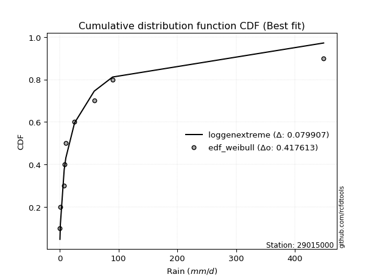</img></img>

</div>


### 4. EDF Beard (1943)

The Beard formula (or Beard´s plotting position formula) in hydrology is used to estimate the empirical non-exceedance probability _(P)_ of a flood event (or other extreme hydrological data point) within a given dataset.

<div align="center">


$P=(m-0.31)/(n+0.38)$


</div>


**4.1. Empirical values**

<div align="center">

|                | 0                   | 1                   | 2                  | 3                   | 4         | 5                  | 6                  | 7                  | 8                  |
|:---------------|:--------------------|:--------------------|:-------------------|:--------------------|:----------|:-------------------|:-------------------|:-------------------|:-------------------|
| date           | 2023                | 2024                | 2018               | 2019                | 2020      | 2025               | 2017               | 2022               | 2021               |
| x              | 0.36                | 1.1                 | 7.54               | 7.68                | 10.33     | 25.2               | 58.63              | 89.91              | 448.89             |
| m              | 1                   | 2                   | 3                  | 4                   | 5         | 6                  | 7                  | 8                  | 9                  |
| empirical_dist | edf_beard           | edf_beard           | edf_beard          | edf_beard           | edf_beard | edf_beard          | edf_beard          | edf_beard          | edf_beard          |
| empirical      | 0.07356076759061833 | 0.18017057569296374 | 0.2867803837953091 | 0.39339019189765456 | 0.5       | 0.6066098081023454 | 0.7132196162046908 | 0.8198294243070362 | 0.9264392324093815 |
| empirical_tr   | 1.0794016110471807  | 1.2197659297789336  | 1.4020926756352765 | 1.6485061511423549  | 2.0       | 2.542005420054201  | 3.486988847583642  | 5.550295857988164  | 13.5942028985507   |

</div>


**4.2. Kolmogorov-Smirnov fit test (sorted by Δ)**


<div align="center">

|                | 0                   | 1                   | 2                   | 3                   | 4                   | 5                   | 6                   | 7                   | 8                   | 9                   | 10                  | 11                  | 12                  | 13                  | 14                  | 15                  | 16                  | 17                  | 18                  | 19                  | 20                  | 21                  | 22                  | 23                  | 24                  | 25                  | 26                  | 27                  | 28                  | 29                  | 30                  | 31                  | 32                  | 33                  | 34                  | 35                  | 36                  | 37                  | 38                  | 39                  | 40                  | 41                  | 42                  | 43                  | 44                  | 45                  | 46                  | 47                  | 48                  | 49                  | 50                  | 51                  | 52                  | 53                  | 54                  | 55                  | 56                  | 57                  | 58                  | 59                  | 60                  | 61                  | 62                  | 63                  | 64                  | 65                  | 66                  | 67                  | 68                  | 69                  | 70                  | 71                  | 72                  | 73                  | 74                  | 75                  | 76                  | 77                  | 78                  | 79                  | 80                  | 81                  | 82                  | 83                  | 84                  | 85                  | 86                  | 87                  | 88                  | 89                  | 90                  | 91                  | 92                  | 93                  | 94                  | 95                  | 96                  | 97                  | 98                  | 99                  | 100                 | 101                 | 102                 | 103                 | 104                 | 105                 | 106                 | 107                 | 108                 | 109                 | 110                 | 111                 | 112                 | 113                 | 114                 | 115                 | 116                 | 117                 | 118                 | 119                 | 120                 | 121                 | 122                 | 123                 | 124                 | 125                 | 126                 | 127                 | 128                 | 129                 | 130                 | 131                 | 132                 | 133                 | 134                 | 135                 | 136                 | 137                 | 138                 | 139                 | 140                 | 141                 | 142                 | 143                 | 144                 | 145                 | 146                 | 147                 | 148                 | 149                 | 150                 | 151                 | 152                 | 153                 | 154                 | 155                 | 156                 | 157                 | 158                 | 159                 |
|:---------------|:--------------------|:--------------------|:--------------------|:--------------------|:--------------------|:--------------------|:--------------------|:--------------------|:--------------------|:--------------------|:--------------------|:--------------------|:--------------------|:--------------------|:--------------------|:--------------------|:--------------------|:--------------------|:--------------------|:--------------------|:--------------------|:--------------------|:--------------------|:--------------------|:--------------------|:--------------------|:--------------------|:--------------------|:--------------------|:--------------------|:--------------------|:--------------------|:--------------------|:--------------------|:--------------------|:--------------------|:--------------------|:--------------------|:--------------------|:--------------------|:--------------------|:--------------------|:--------------------|:--------------------|:--------------------|:--------------------|:--------------------|:--------------------|:--------------------|:--------------------|:--------------------|:--------------------|:--------------------|:--------------------|:--------------------|:--------------------|:--------------------|:--------------------|:--------------------|:--------------------|:--------------------|:--------------------|:--------------------|:--------------------|:--------------------|:--------------------|:--------------------|:--------------------|:--------------------|:--------------------|:--------------------|:--------------------|:--------------------|:--------------------|:--------------------|:--------------------|:--------------------|:--------------------|:--------------------|:--------------------|:--------------------|:--------------------|:--------------------|:--------------------|:--------------------|:--------------------|:--------------------|:--------------------|:--------------------|:--------------------|:--------------------|:--------------------|:--------------------|:--------------------|:--------------------|:--------------------|:--------------------|:--------------------|:--------------------|:--------------------|:--------------------|:--------------------|:--------------------|:--------------------|:--------------------|:--------------------|:--------------------|:--------------------|:--------------------|:--------------------|:--------------------|:--------------------|:--------------------|:--------------------|:--------------------|:--------------------|:--------------------|:--------------------|:--------------------|:--------------------|:--------------------|:--------------------|:--------------------|:--------------------|:--------------------|:--------------------|:--------------------|:--------------------|:--------------------|:--------------------|:--------------------|:--------------------|:--------------------|:--------------------|:--------------------|:--------------------|:--------------------|:--------------------|:--------------------|:--------------------|:--------------------|:--------------------|:--------------------|:--------------------|:--------------------|:--------------------|:--------------------|:--------------------|:--------------------|:--------------------|:--------------------|:--------------------|:--------------------|:--------------------|:--------------------|:--------------------|:--------------------|:--------------------|:--------------------|:--------------------|
| station        | 29015000            | 29015000            | 29015000            | 29015000            | 29015000            | 29015000            | 29015000            | 29015000            | 29015000            | 29015000            | 29015000            | 29015000            | 29015000            | 29015000            | 29015000            | 29015000            | 29015000            | 29015000            | 29015000            | 29015000            | 29015000            | 29015000            | 29015000            | 29015000            | 29015000            | 29015000            | 29015000            | 29015000            | 29015000            | 29015000            | 29015000            | 29015000            | 29015000            | 29015000            | 29015000            | 29015000            | 29015000            | 29015000            | 29015000            | 29015000            | 29015000            | 29015000            | 29015000            | 29015000            | 29015000            | 29015000            | 29015000            | 29015000            | 29015000            | 29015000            | 29015000            | 29015000            | 29015000            | 29015000            | 29015000            | 29015000            | 29015000            | 29015000            | 29015000            | 29015000            | 29015000            | 29015000            | 29015000            | 29015000            | 29015000            | 29015000            | 29015000            | 29015000            | 29015000            | 29015000            | 29015000            | 29015000            | 29015000            | 29015000            | 29015000            | 29015000            | 29015000            | 29015000            | 29015000            | 29015000            | 29015000            | 29015000            | 29015000            | 29015000            | 29015000            | 29015000            | 29015000            | 29015000            | 29015000            | 29015000            | 29015000            | 29015000            | 29015000            | 29015000            | 29015000            | 29015000            | 29015000            | 29015000            | 29015000            | 29015000            | 29015000            | 29015000            | 29015000            | 29015000            | 29015000            | 29015000            | 29015000            | 29015000            | 29015000            | 29015000            | 29015000            | 29015000            | 29015000            | 29015000            | 29015000            | 29015000            | 29015000            | 29015000            | 29015000            | 29015000            | 29015000            | 29015000            | 29015000            | 29015000            | 29015000            | 29015000            | 29015000            | 29015000            | 29015000            | 29015000            | 29015000            | 29015000            | 29015000            | 29015000            | 29015000            | 29015000            | 29015000            | 29015000            | 29015000            | 29015000            | 29015000            | 29015000            | 29015000            | 29015000            | 29015000            | 29015000            | 29015000            | 29015000            | 29015000            | 29015000            | 29015000            | 29015000            | 29015000            | 29015000            | 29015000            | 29015000            | 29015000            | 29015000            | 29015000            | 29015000            |
| empirical_dist | edf_beard           | edf_beard           | edf_beard           | edf_beard           | edf_beard           | edf_beard           | edf_beard           | edf_beard           | edf_beard           | edf_beard           | edf_beard           | edf_beard           | edf_beard           | edf_beard           | edf_beard           | edf_beard           | edf_beard           | edf_beard           | edf_beard           | edf_beard           | edf_beard           | edf_beard           | edf_beard           | edf_beard           | edf_beard           | edf_beard           | edf_beard           | edf_beard           | edf_beard           | edf_beard           | edf_beard           | edf_beard           | edf_beard           | edf_beard           | edf_beard           | edf_beard           | edf_beard           | edf_beard           | edf_beard           | edf_beard           | edf_beard           | edf_beard           | edf_beard           | edf_beard           | edf_beard           | edf_beard           | edf_beard           | edf_beard           | edf_beard           | edf_beard           | edf_beard           | edf_beard           | edf_beard           | edf_beard           | edf_beard           | edf_beard           | edf_beard           | edf_beard           | edf_beard           | edf_beard           | edf_beard           | edf_beard           | edf_beard           | edf_beard           | edf_beard           | edf_beard           | edf_beard           | edf_beard           | edf_beard           | edf_beard           | edf_beard           | edf_beard           | edf_beard           | edf_beard           | edf_beard           | edf_beard           | edf_beard           | edf_beard           | edf_beard           | edf_beard           | edf_beard           | edf_beard           | edf_beard           | edf_beard           | edf_beard           | edf_beard           | edf_beard           | edf_beard           | edf_beard           | edf_beard           | edf_beard           | edf_beard           | edf_beard           | edf_beard           | edf_beard           | edf_beard           | edf_beard           | edf_beard           | edf_beard           | edf_beard           | edf_beard           | edf_beard           | edf_beard           | edf_beard           | edf_beard           | edf_beard           | edf_beard           | edf_beard           | edf_beard           | edf_beard           | edf_beard           | edf_beard           | edf_beard           | edf_beard           | edf_beard           | edf_beard           | edf_beard           | edf_beard           | edf_beard           | edf_beard           | edf_beard           | edf_beard           | edf_beard           | edf_beard           | edf_beard           | edf_beard           | edf_beard           | edf_beard           | edf_beard           | edf_beard           | edf_beard           | edf_beard           | edf_beard           | edf_beard           | edf_beard           | edf_beard           | edf_beard           | edf_beard           | edf_beard           | edf_beard           | edf_beard           | edf_beard           | edf_beard           | edf_beard           | edf_beard           | edf_beard           | edf_beard           | edf_beard           | edf_beard           | edf_beard           | edf_beard           | edf_beard           | edf_beard           | edf_beard           | edf_beard           | edf_beard           | edf_beard           | edf_beard           | edf_beard           | edf_beard           |
| p_dist         | loggenlogistic      | ncf                 | loghypsecant        | loggenextreme       | loglogistic         | logskewnorm         | logdweibull         | logjohnsonsu        | logloggamma         | f                   | logdgamma           | logpearson3         | logfoldnorm         | logargus            | logweibull_min      | lognorm             | logcrystalball      | logt                | logexponnorm        | lognct              | lognakagami         | logfatiguelife      | loglaplace          | loglaplace          | logbetaprime        | loggengamma         | lomax               | genpareto           | logerlang           | loggamma            | loggamma            | loggausshyper       | loggompertz         | logcosine           | loganglit           | loggumbel_l         | logrice             | truncpareto         | logsemicircular     | loginvgamma         | logalpha            | logkappa3           | logmaxwell          | invgauss            | loginvgauss         | logwrapcauchy       | loguniform          | invgamma            | gengamma            | lograyleigh         | logarcsine          | logbeta             | logksone            | truncweibull_min    | exponpow            | logtriang           | loggumbel_r         | loginvweibull       | halfgennorm         | exponweib           | genextreme          | invweibull          | loggenpareto        | logkappa4           | logtruncnorm        | logmielke           | kappa3              | logvonmises_line    | mielke              | gamma               | logmoyal            | loggenhalflogistic  | loghalfnorm         | logtruncweibull_min | fatiguelife         | erlang              | burr12              | logkstwobign        | loggenexpon         | loghalflogistic     | betaprime           | gennorm             | vonmises_line       | logbradford         | t                   | dgamma              | nct                 | nakagami            | logtruncexpon       | genlogistic         | logwald             | gausshyper          | maxwell             | logncf              | gumbel_r            | logistic            | rayleigh            | logburr12           | wald                | dweibull            | moyal               | crystalball         | norm                | hypsecant           | weibull_min         | logtrapezoid        | anglit              | semicircular        | loglomax            | logjohnsonsb        | burr                | halflogistic        | powerlaw            | halfnorm            | kstwobign           | logexponweib        | laplace             | arcsine             | loglevy_l           | rice                | pearson3            | foldnorm            | loggennorm          | gumbel_l            | loghalfgennorm      | wrapcauchy          | logburr             | logloglaplace       | exponnorm           | genexpon            | logf                | cosine              | gompertz            | truncnorm           | logtukeylambda      | johnsonsu           | levy_l              | logrdist            | argus               | skewnorm            | bradford            | logweibull_max      | truncexpon          | triang              | logpowerlaw         | rdist               | ksone               | tukeylambda         | kappa4              | alpha               | logexponpow         | uniform             | logtruncpareto      | johnsonsb           | genhalflogistic     | beta                | trapezoid           | weibull_max         | logvonmises         | vonmises            |
| delta          | 0.08101491806703237 | 0.08226100315115886 | 0.08576358727835143 | 0.08847968361210679 | 0.08954633619618263 | 0.0902341405320386  | 0.09125037350249654 | 0.09171877549515334 | 0.09222147891396687 | 0.09224994735239334 | 0.09319801786799466 | 0.0962842944327153  | 0.10081274782600075 | 0.10150211592284575 | 0.10322181289138982 | 0.10352843646450971 | 0.10352844589718163 | 0.10352863339994434 | 0.10352900978321422 | 0.10364099208872946 | 0.10377922842644832 | 0.10386331816825506 | 0.1041662943903594  | 0.1041662943903594  | 0.10916599023400941 | 0.10933642889476741 | 0.10962115544592128 | 0.10962616746714422 | 0.10978902254254075 | 0.11026254809022523 | 0.11026254809022523 | 0.11059889489987207 | 0.11367591064830862 | 0.1153482532856756  | 0.11858832623071097 | 0.120387604752136   | 0.12153939469859376 | 0.12417615969398649 | 0.12485315887057108 | 0.12739411594835098 | 0.12863745867626902 | 0.13728566091204647 | 0.1372865656509113  | 0.13780310421458347 | 0.13826982815484323 | 0.13954327509842274 | 0.1399438467305334  | 0.14175592061621056 | 0.14181000609032074 | 0.14959067253641634 | 0.15012078096170772 | 0.1515360273809807  | 0.1521564749762263  | 0.15710325344056214 | 0.15836182791922765 | 0.16087193344979034 | 0.16142085494308211 | 0.16515585258897453 | 0.16665480261918642 | 0.1667057661233945  | 0.1687945111167954  | 0.1687949781477055  | 0.16896356196957318 | 0.17095839674118624 | 0.17103322839927743 | 0.17200139652308993 | 0.17320038070826782 | 0.1803892879359162  | 0.18246065068137135 | 0.1826769841843206  | 0.18355837085256388 | 0.18410999084640056 | 0.18451899914541925 | 0.18633796943669728 | 0.1869011830559555  | 0.18764382186690193 | 0.18797054510261169 | 0.18833902872287656 | 0.18865516085433864 | 0.1988044267944778  | 0.20476417079424558 | 0.2058388952293422  | 0.2091156516406275  | 0.2195526207659757  | 0.2275171247681701  | 0.22771307167887514 | 0.23425456334099526 | 0.2373276076236246  | 0.24039783658547687 | 0.24093792160575805 | 0.2424427178750137  | 0.25189352641785956 | 0.2532079380068849  | 0.25780770855371804 | 0.25794588620068715 | 0.26108733003953943 | 0.2641958045586156  | 0.26592321593827717 | 0.26695812569564126 | 0.26703837396358254 | 0.2676998828692847  | 0.2680549364208228  | 0.2680549394234356  | 0.27120013782353714 | 0.27379549110775014 | 0.27396115891485573 | 0.27539983620591024 | 0.27843197150286336 | 0.28398712524884817 | 0.28641868812265836 | 0.29313217681282266 | 0.29329759253040055 | 0.2942889058069855  | 0.29523989235768744 | 0.2965720497318604  | 0.29938879969437104 | 0.299616050864261   | 0.30482402607142856 | 0.305020476035304   | 0.3084155892255724  | 0.30982550053510893 | 0.310402867486987   | 0.31982942430703626 | 0.334899099080727   | 0.3388682723431007  | 0.34306520615330305 | 0.3456595080786953  | 0.3491471302080479  | 0.36996533498965156 | 0.37039062763661645 | 0.3754706638850963  | 0.3801586235658981  | 0.3964619542603338  | 0.4093273802797931  | 0.4261902967018769  | 0.43456382678664357 | 0.43484169764152536 | 0.4695922871830541  | 0.47692986419914385 | 0.47845751076808685 | 0.50253747124223    | 0.5047912127918851  | 0.5089219711988763  | 0.5090297158483008  | 0.5514037925402857  | 0.5634540701845576  | 0.5701192599924976  | 0.5935321275998672  | 0.5953656306236501  | 0.6054466751836604  | 0.6078717980981747  | 0.6201772271295899  | 0.6280847011262585  | 0.6477573536893502  | 0.6685237624728095  | 0.7402359261202298  | 0.7553929584715698  | 0.7623951816238325  | 1.0108444099149716  | 70.95008254892208   |
| deltao         | 0.41761268023100007 | 0.41761268023100007 | 0.41761268023100007 | 0.41761268023100007 | 0.41761268023100007 | 0.41761268023100007 | 0.41761268023100007 | 0.41761268023100007 | 0.41761268023100007 | 0.41761268023100007 | 0.41761268023100007 | 0.41761268023100007 | 0.41761268023100007 | 0.41761268023100007 | 0.41761268023100007 | 0.41761268023100007 | 0.41761268023100007 | 0.41761268023100007 | 0.41761268023100007 | 0.41761268023100007 | 0.41761268023100007 | 0.41761268023100007 | 0.41761268023100007 | 0.41761268023100007 | 0.41761268023100007 | 0.41761268023100007 | 0.41761268023100007 | 0.41761268023100007 | 0.41761268023100007 | 0.41761268023100007 | 0.41761268023100007 | 0.41761268023100007 | 0.41761268023100007 | 0.41761268023100007 | 0.41761268023100007 | 0.41761268023100007 | 0.41761268023100007 | 0.41761268023100007 | 0.41761268023100007 | 0.41761268023100007 | 0.41761268023100007 | 0.41761268023100007 | 0.41761268023100007 | 0.41761268023100007 | 0.41761268023100007 | 0.41761268023100007 | 0.41761268023100007 | 0.41761268023100007 | 0.41761268023100007 | 0.41761268023100007 | 0.41761268023100007 | 0.41761268023100007 | 0.41761268023100007 | 0.41761268023100007 | 0.41761268023100007 | 0.41761268023100007 | 0.41761268023100007 | 0.41761268023100007 | 0.41761268023100007 | 0.41761268023100007 | 0.41761268023100007 | 0.41761268023100007 | 0.41761268023100007 | 0.41761268023100007 | 0.41761268023100007 | 0.41761268023100007 | 0.41761268023100007 | 0.41761268023100007 | 0.41761268023100007 | 0.41761268023100007 | 0.41761268023100007 | 0.41761268023100007 | 0.41761268023100007 | 0.41761268023100007 | 0.41761268023100007 | 0.41761268023100007 | 0.41761268023100007 | 0.41761268023100007 | 0.41761268023100007 | 0.41761268023100007 | 0.41761268023100007 | 0.41761268023100007 | 0.41761268023100007 | 0.41761268023100007 | 0.41761268023100007 | 0.41761268023100007 | 0.41761268023100007 | 0.41761268023100007 | 0.41761268023100007 | 0.41761268023100007 | 0.41761268023100007 | 0.41761268023100007 | 0.41761268023100007 | 0.41761268023100007 | 0.41761268023100007 | 0.41761268023100007 | 0.41761268023100007 | 0.41761268023100007 | 0.41761268023100007 | 0.41761268023100007 | 0.41761268023100007 | 0.41761268023100007 | 0.41761268023100007 | 0.41761268023100007 | 0.41761268023100007 | 0.41761268023100007 | 0.41761268023100007 | 0.41761268023100007 | 0.41761268023100007 | 0.41761268023100007 | 0.41761268023100007 | 0.41761268023100007 | 0.41761268023100007 | 0.41761268023100007 | 0.41761268023100007 | 0.41761268023100007 | 0.41761268023100007 | 0.41761268023100007 | 0.41761268023100007 | 0.41761268023100007 | 0.41761268023100007 | 0.41761268023100007 | 0.41761268023100007 | 0.41761268023100007 | 0.41761268023100007 | 0.41761268023100007 | 0.41761268023100007 | 0.41761268023100007 | 0.41761268023100007 | 0.41761268023100007 | 0.41761268023100007 | 0.41761268023100007 | 0.41761268023100007 | 0.41761268023100007 | 0.41761268023100007 | 0.41761268023100007 | 0.41761268023100007 | 0.41761268023100007 | 0.41761268023100007 | 0.41761268023100007 | 0.41761268023100007 | 0.41761268023100007 | 0.41761268023100007 | 0.41761268023100007 | 0.41761268023100007 | 0.41761268023100007 | 0.41761268023100007 | 0.41761268023100007 | 0.41761268023100007 | 0.41761268023100007 | 0.41761268023100007 | 0.41761268023100007 | 0.41761268023100007 | 0.41761268023100007 | 0.41761268023100007 | 0.41761268023100007 | 0.41761268023100007 | 0.41761268023100007 | 0.41761268023100007 | 0.41761268023100007 |
| eval           | Δo > Δ              | Δo > Δ              | Δo > Δ              | Δo > Δ              | Δo > Δ              | Δo > Δ              | Δo > Δ              | Δo > Δ              | Δo > Δ              | Δo > Δ              | Δo > Δ              | Δo > Δ              | Δo > Δ              | Δo > Δ              | Δo > Δ              | Δo > Δ              | Δo > Δ              | Δo > Δ              | Δo > Δ              | Δo > Δ              | Δo > Δ              | Δo > Δ              | Δo > Δ              | Δo > Δ              | Δo > Δ              | Δo > Δ              | Δo > Δ              | Δo > Δ              | Δo > Δ              | Δo > Δ              | Δo > Δ              | Δo > Δ              | Δo > Δ              | Δo > Δ              | Δo > Δ              | Δo > Δ              | Δo > Δ              | Δo > Δ              | Δo > Δ              | Δo > Δ              | Δo > Δ              | Δo > Δ              | Δo > Δ              | Δo > Δ              | Δo > Δ              | Δo > Δ              | Δo > Δ              | Δo > Δ              | Δo > Δ              | Δo > Δ              | Δo > Δ              | Δo > Δ              | Δo > Δ              | Δo > Δ              | Δo > Δ              | Δo > Δ              | Δo > Δ              | Δo > Δ              | Δo > Δ              | Δo > Δ              | Δo > Δ              | Δo > Δ              | Δo > Δ              | Δo > Δ              | Δo > Δ              | Δo > Δ              | Δo > Δ              | Δo > Δ              | Δo > Δ              | Δo > Δ              | Δo > Δ              | Δo > Δ              | Δo > Δ              | Δo > Δ              | Δo > Δ              | Δo > Δ              | Δo > Δ              | Δo > Δ              | Δo > Δ              | Δo > Δ              | Δo > Δ              | Δo > Δ              | Δo > Δ              | Δo > Δ              | Δo > Δ              | Δo > Δ              | Δo > Δ              | Δo > Δ              | Δo > Δ              | Δo > Δ              | Δo > Δ              | Δo > Δ              | Δo > Δ              | Δo > Δ              | Δo > Δ              | Δo > Δ              | Δo > Δ              | Δo > Δ              | Δo > Δ              | Δo > Δ              | Δo > Δ              | Δo > Δ              | Δo > Δ              | Δo > Δ              | Δo > Δ              | Δo > Δ              | Δo > Δ              | Δo > Δ              | Δo > Δ              | Δo > Δ              | Δo > Δ              | Δo > Δ              | Δo > Δ              | Δo > Δ              | Δo > Δ              | Δo > Δ              | Δo > Δ              | Δo > Δ              | Δo > Δ              | Δo > Δ              | Δo > Δ              | Δo > Δ              | Δo > Δ              | Δo > Δ              | Δo > Δ              | Δo > Δ              | Δo > Δ              | Δo > Δ              | Δo > Δ              | Δo > Δ              | Δo > Δ              | Δo > Δ              | Δo > Δ              | Δo > Δ              | Δo <= Δ             | Δo <= Δ             | Δo <= Δ             | Δo <= Δ             | Δo <= Δ             | Δo <= Δ             | Δo <= Δ             | Δo <= Δ             | Δo <= Δ             | Δo <= Δ             | Δo <= Δ             | Δo <= Δ             | Δo <= Δ             | Δo <= Δ             | Δo <= Δ             | Δo <= Δ             | Δo <= Δ             | Δo <= Δ             | Δo <= Δ             | Δo <= Δ             | Δo <= Δ             | Δo <= Δ             | Δo <= Δ             | Δo <= Δ             | Δo <= Δ             | Δo <= Δ             |
| fit            | 1                   | 1                   | 1                   | 1                   | 1                   | 1                   | 1                   | 1                   | 1                   | 1                   | 1                   | 1                   | 1                   | 1                   | 1                   | 1                   | 1                   | 1                   | 1                   | 1                   | 1                   | 1                   | 1                   | 1                   | 1                   | 1                   | 1                   | 1                   | 1                   | 1                   | 1                   | 1                   | 1                   | 1                   | 1                   | 1                   | 1                   | 1                   | 1                   | 1                   | 1                   | 1                   | 1                   | 1                   | 1                   | 1                   | 1                   | 1                   | 1                   | 1                   | 1                   | 1                   | 1                   | 1                   | 1                   | 1                   | 1                   | 1                   | 1                   | 1                   | 1                   | 1                   | 1                   | 1                   | 1                   | 1                   | 1                   | 1                   | 1                   | 1                   | 1                   | 1                   | 1                   | 1                   | 1                   | 1                   | 1                   | 1                   | 1                   | 1                   | 1                   | 1                   | 1                   | 1                   | 1                   | 1                   | 1                   | 1                   | 1                   | 1                   | 1                   | 1                   | 1                   | 1                   | 1                   | 1                   | 1                   | 1                   | 1                   | 1                   | 1                   | 1                   | 1                   | 1                   | 1                   | 1                   | 1                   | 1                   | 1                   | 1                   | 1                   | 1                   | 1                   | 1                   | 1                   | 1                   | 1                   | 1                   | 1                   | 1                   | 1                   | 1                   | 1                   | 1                   | 1                   | 1                   | 1                   | 1                   | 1                   | 1                   | 1                   | 1                   | 1                   | 1                   | 0                   | 0                   | 0                   | 0                   | 0                   | 0                   | 0                   | 0                   | 0                   | 0                   | 0                   | 0                   | 0                   | 0                   | 0                   | 0                   | 0                   | 0                   | 0                   | 0                   | 0                   | 0                   | 0                   | 0                   | 0                   | 0                   |
| n              | 9                   | 9                   | 9                   | 9                   | 9                   | 9                   | 9                   | 9                   | 9                   | 9                   | 9                   | 9                   | 9                   | 9                   | 9                   | 9                   | 9                   | 9                   | 9                   | 9                   | 9                   | 9                   | 9                   | 9                   | 9                   | 9                   | 9                   | 9                   | 9                   | 9                   | 9                   | 9                   | 9                   | 9                   | 9                   | 9                   | 9                   | 9                   | 9                   | 9                   | 9                   | 9                   | 9                   | 9                   | 9                   | 9                   | 9                   | 9                   | 9                   | 9                   | 9                   | 9                   | 9                   | 9                   | 9                   | 9                   | 9                   | 9                   | 9                   | 9                   | 9                   | 9                   | 9                   | 9                   | 9                   | 9                   | 9                   | 9                   | 9                   | 9                   | 9                   | 9                   | 9                   | 9                   | 9                   | 9                   | 9                   | 9                   | 9                   | 9                   | 9                   | 9                   | 9                   | 9                   | 9                   | 9                   | 9                   | 9                   | 9                   | 9                   | 9                   | 9                   | 9                   | 9                   | 9                   | 9                   | 9                   | 9                   | 9                   | 9                   | 9                   | 9                   | 9                   | 9                   | 9                   | 9                   | 9                   | 9                   | 9                   | 9                   | 9                   | 9                   | 9                   | 9                   | 9                   | 9                   | 9                   | 9                   | 9                   | 9                   | 9                   | 9                   | 9                   | 9                   | 9                   | 9                   | 9                   | 9                   | 9                   | 9                   | 9                   | 9                   | 9                   | 9                   | 9                   | 9                   | 9                   | 9                   | 9                   | 9                   | 9                   | 9                   | 9                   | 9                   | 9                   | 9                   | 9                   | 9                   | 9                   | 9                   | 9                   | 9                   | 9                   | 9                   | 9                   | 9                   | 9                   | 9                   | 9                   | 9                   |
| best_fit       | 1                   | 0                   | 0                   | 0                   | 0                   | 0                   | 0                   | 0                   | 0                   | 0                   | 0                   | 0                   | 0                   | 0                   | 0                   | 0                   | 0                   | 0                   | 0                   | 0                   | 0                   | 0                   | 0                   | 0                   | 0                   | 0                   | 0                   | 0                   | 0                   | 0                   | 0                   | 0                   | 0                   | 0                   | 0                   | 0                   | 0                   | 0                   | 0                   | 0                   | 0                   | 0                   | 0                   | 0                   | 0                   | 0                   | 0                   | 0                   | 0                   | 0                   | 0                   | 0                   | 0                   | 0                   | 0                   | 0                   | 0                   | 0                   | 0                   | 0                   | 0                   | 0                   | 0                   | 0                   | 0                   | 0                   | 0                   | 0                   | 0                   | 0                   | 0                   | 0                   | 0                   | 0                   | 0                   | 0                   | 0                   | 0                   | 0                   | 0                   | 0                   | 0                   | 0                   | 0                   | 0                   | 0                   | 0                   | 0                   | 0                   | 0                   | 0                   | 0                   | 0                   | 0                   | 0                   | 0                   | 0                   | 0                   | 0                   | 0                   | 0                   | 0                   | 0                   | 0                   | 0                   | 0                   | 0                   | 0                   | 0                   | 0                   | 0                   | 0                   | 0                   | 0                   | 0                   | 0                   | 0                   | 0                   | 0                   | 0                   | 0                   | 0                   | 0                   | 0                   | 0                   | 0                   | 0                   | 0                   | 0                   | 0                   | 0                   | 0                   | 0                   | 0                   | 0                   | 0                   | 0                   | 0                   | 0                   | 0                   | 0                   | 0                   | 0                   | 0                   | 0                   | 0                   | 0                   | 0                   | 0                   | 0                   | 0                   | 0                   | 0                   | 0                   | 0                   | 0                   | 0                   | 0                   | 0                   | 0                   |
| best_fit_sort  | 1                   | 2                   | 3                   | 4                   | 5                   | 6                   | 7                   | 8                   | 9                   | 10                  | 11                  | 12                  | 13                  | 14                  | 15                  | 16                  | 17                  | 18                  | 19                  | 20                  | 21                  | 22                  | 23                  | 24                  | 25                  | 26                  | 27                  | 28                  | 29                  | 30                  | 31                  | 32                  | 33                  | 34                  | 35                  | 36                  | 37                  | 38                  | 39                  | 40                  | 41                  | 42                  | 43                  | 44                  | 45                  | 46                  | 47                  | 48                  | 49                  | 50                  | 51                  | 52                  | 53                  | 54                  | 55                  | 56                  | 57                  | 58                  | 59                  | 60                  | 61                  | 62                  | 63                  | 64                  | 65                  | 66                  | 67                  | 68                  | 69                  | 70                  | 71                  | 72                  | 73                  | 74                  | 75                  | 76                  | 77                  | 78                  | 79                  | 80                  | 81                  | 82                  | 83                  | 84                  | 85                  | 86                  | 87                  | 88                  | 89                  | 90                  | 91                  | 92                  | 93                  | 94                  | 95                  | 96                  | 97                  | 98                  | 99                  | 100                 | 101                 | 102                 | 103                 | 104                 | 105                 | 106                 | 107                 | 108                 | 109                 | 110                 | 111                 | 112                 | 113                 | 114                 | 115                 | 116                 | 117                 | 118                 | 119                 | 120                 | 121                 | 122                 | 123                 | 124                 | 125                 | 126                 | 127                 | 128                 | 129                 | 130                 | 131                 | 132                 | 133                 | 134                 | 135                 | 136                 | 137                 | 138                 | 139                 | 140                 | 141                 | 142                 | 143                 | 144                 | 145                 | 146                 | 147                 | 148                 | 149                 | 150                 | 151                 | 152                 | 153                 | 154                 | 155                 | 156                 | 157                 | 158                 | 159                 | 160                 |

</div>


**4.3. Best fit**

<div align="center">

|   id |   station | empirical_dist   | p_dist         |     delta |   deltao | eval   |   fit |   n |   best_fit |   best_fit_sort |
|-----:|----------:|:-----------------|:---------------|----------:|---------:|:-------|------:|----:|-----------:|----------------:|
|    0 |  29015000 | edf_beard        | loggenlogistic | 0.0810149 | 0.417613 | Δo > Δ |     1 |   9 |          1 |               1 |

</div>


<div align="center">

</img></img>

</div>


### 5. EDF Chegodayev (1955)

The Chegodayev formula is an empirical plotting position formula used in hydrological frequency analysis to estimate the exceedance probability or return period of a specific event from a set of observed data. It is primarily used for plotting observed data points on probability paper to fit a theoretical distribution, particularly for analyzing extreme events like maximum flood flows or rainfall intensities. The constant _b_ value in the generalized plotting position formula is 0.3.

<div align="center">


$P=(m-b)/(n+1-2b)$


</div>


**5.1. Empirical values**

<div align="center">

|                | 0                   | 1                   | 2                  | 3                   | 4              | 5                  | 6                  | 7                  | 8                  |
|:---------------|:--------------------|:--------------------|:-------------------|:--------------------|:---------------|:-------------------|:-------------------|:-------------------|:-------------------|
| date           | 2023                | 2024                | 2018               | 2019                | 2020           | 2025               | 2017               | 2022               | 2021               |
| x              | 0.36                | 1.1                 | 7.54               | 7.68                | 10.33          | 25.2               | 58.63              | 89.91              | 448.89             |
| m              | 1                   | 2                   | 3                  | 4                   | 5              | 6                  | 7                  | 8                  | 9                  |
| empirical_dist | edf_chegodayev      | edf_chegodayev      | edf_chegodayev     | edf_chegodayev      | edf_chegodayev | edf_chegodayev     | edf_chegodayev     | edf_chegodayev     | edf_chegodayev     |
| empirical      | 0.07446808510638298 | 0.18085106382978722 | 0.2872340425531915 | 0.39361702127659576 | 0.5            | 0.6063829787234043 | 0.7127659574468085 | 0.8191489361702128 | 0.9255319148936169 |
| empirical_tr   | 1.0804597701149425  | 1.2207792207792207  | 1.4029850746268657 | 1.6491228070175437  | 2.0            | 2.540540540540541  | 3.481481481481481  | 5.529411764705883  | 13.428571428571399 |

</div>


**5.2. Kolmogorov-Smirnov fit test (sorted by Δ)**


<div align="center">

|                | 0                   | 1                   | 2                   | 3                   | 4                   | 5                   | 6                   | 7                   | 8                   | 9                   | 10                  | 11                  | 12                  | 13                  | 14                  | 15                  | 16                  | 17                  | 18                  | 19                  | 20                  | 21                  | 22                  | 23                  | 24                  | 25                  | 26                  | 27                  | 28                  | 29                  | 30                  | 31                  | 32                  | 33                  | 34                  | 35                  | 36                  | 37                  | 38                  | 39                  | 40                  | 41                  | 42                  | 43                  | 44                  | 45                  | 46                  | 47                  | 48                  | 49                  | 50                  | 51                  | 52                  | 53                  | 54                  | 55                  | 56                  | 57                  | 58                  | 59                  | 60                  | 61                  | 62                  | 63                  | 64                  | 65                  | 66                  | 67                  | 68                  | 69                  | 70                  | 71                  | 72                  | 73                  | 74                  | 75                  | 76                  | 77                  | 78                  | 79                  | 80                  | 81                  | 82                  | 83                  | 84                  | 85                  | 86                  | 87                  | 88                  | 89                  | 90                  | 91                  | 92                  | 93                  | 94                  | 95                  | 96                  | 97                  | 98                  | 99                  | 100                 | 101                 | 102                 | 103                 | 104                 | 105                 | 106                 | 107                 | 108                 | 109                 | 110                 | 111                 | 112                 | 113                 | 114                 | 115                 | 116                 | 117                 | 118                 | 119                 | 120                 | 121                 | 122                 | 123                 | 124                 | 125                 | 126                 | 127                 | 128                 | 129                 | 130                 | 131                 | 132                 | 133                 | 134                 | 135                 | 136                 | 137                 | 138                 | 139                 | 140                 | 141                 | 142                 | 143                 | 144                 | 145                 | 146                 | 147                 | 148                 | 149                 | 150                 | 151                 | 152                 | 153                 | 154                 | 155                 | 156                 | 157                 | 158                 | 159                 |
|:---------------|:--------------------|:--------------------|:--------------------|:--------------------|:--------------------|:--------------------|:--------------------|:--------------------|:--------------------|:--------------------|:--------------------|:--------------------|:--------------------|:--------------------|:--------------------|:--------------------|:--------------------|:--------------------|:--------------------|:--------------------|:--------------------|:--------------------|:--------------------|:--------------------|:--------------------|:--------------------|:--------------------|:--------------------|:--------------------|:--------------------|:--------------------|:--------------------|:--------------------|:--------------------|:--------------------|:--------------------|:--------------------|:--------------------|:--------------------|:--------------------|:--------------------|:--------------------|:--------------------|:--------------------|:--------------------|:--------------------|:--------------------|:--------------------|:--------------------|:--------------------|:--------------------|:--------------------|:--------------------|:--------------------|:--------------------|:--------------------|:--------------------|:--------------------|:--------------------|:--------------------|:--------------------|:--------------------|:--------------------|:--------------------|:--------------------|:--------------------|:--------------------|:--------------------|:--------------------|:--------------------|:--------------------|:--------------------|:--------------------|:--------------------|:--------------------|:--------------------|:--------------------|:--------------------|:--------------------|:--------------------|:--------------------|:--------------------|:--------------------|:--------------------|:--------------------|:--------------------|:--------------------|:--------------------|:--------------------|:--------------------|:--------------------|:--------------------|:--------------------|:--------------------|:--------------------|:--------------------|:--------------------|:--------------------|:--------------------|:--------------------|:--------------------|:--------------------|:--------------------|:--------------------|:--------------------|:--------------------|:--------------------|:--------------------|:--------------------|:--------------------|:--------------------|:--------------------|:--------------------|:--------------------|:--------------------|:--------------------|:--------------------|:--------------------|:--------------------|:--------------------|:--------------------|:--------------------|:--------------------|:--------------------|:--------------------|:--------------------|:--------------------|:--------------------|:--------------------|:--------------------|:--------------------|:--------------------|:--------------------|:--------------------|:--------------------|:--------------------|:--------------------|:--------------------|:--------------------|:--------------------|:--------------------|:--------------------|:--------------------|:--------------------|:--------------------|:--------------------|:--------------------|:--------------------|:--------------------|:--------------------|:--------------------|:--------------------|:--------------------|:--------------------|:--------------------|:--------------------|:--------------------|:--------------------|:--------------------|:--------------------|
| station        | 29015000            | 29015000            | 29015000            | 29015000            | 29015000            | 29015000            | 29015000            | 29015000            | 29015000            | 29015000            | 29015000            | 29015000            | 29015000            | 29015000            | 29015000            | 29015000            | 29015000            | 29015000            | 29015000            | 29015000            | 29015000            | 29015000            | 29015000            | 29015000            | 29015000            | 29015000            | 29015000            | 29015000            | 29015000            | 29015000            | 29015000            | 29015000            | 29015000            | 29015000            | 29015000            | 29015000            | 29015000            | 29015000            | 29015000            | 29015000            | 29015000            | 29015000            | 29015000            | 29015000            | 29015000            | 29015000            | 29015000            | 29015000            | 29015000            | 29015000            | 29015000            | 29015000            | 29015000            | 29015000            | 29015000            | 29015000            | 29015000            | 29015000            | 29015000            | 29015000            | 29015000            | 29015000            | 29015000            | 29015000            | 29015000            | 29015000            | 29015000            | 29015000            | 29015000            | 29015000            | 29015000            | 29015000            | 29015000            | 29015000            | 29015000            | 29015000            | 29015000            | 29015000            | 29015000            | 29015000            | 29015000            | 29015000            | 29015000            | 29015000            | 29015000            | 29015000            | 29015000            | 29015000            | 29015000            | 29015000            | 29015000            | 29015000            | 29015000            | 29015000            | 29015000            | 29015000            | 29015000            | 29015000            | 29015000            | 29015000            | 29015000            | 29015000            | 29015000            | 29015000            | 29015000            | 29015000            | 29015000            | 29015000            | 29015000            | 29015000            | 29015000            | 29015000            | 29015000            | 29015000            | 29015000            | 29015000            | 29015000            | 29015000            | 29015000            | 29015000            | 29015000            | 29015000            | 29015000            | 29015000            | 29015000            | 29015000            | 29015000            | 29015000            | 29015000            | 29015000            | 29015000            | 29015000            | 29015000            | 29015000            | 29015000            | 29015000            | 29015000            | 29015000            | 29015000            | 29015000            | 29015000            | 29015000            | 29015000            | 29015000            | 29015000            | 29015000            | 29015000            | 29015000            | 29015000            | 29015000            | 29015000            | 29015000            | 29015000            | 29015000            | 29015000            | 29015000            | 29015000            | 29015000            | 29015000            | 29015000            |
| empirical_dist | edf_chegodayev      | edf_chegodayev      | edf_chegodayev      | edf_chegodayev      | edf_chegodayev      | edf_chegodayev      | edf_chegodayev      | edf_chegodayev      | edf_chegodayev      | edf_chegodayev      | edf_chegodayev      | edf_chegodayev      | edf_chegodayev      | edf_chegodayev      | edf_chegodayev      | edf_chegodayev      | edf_chegodayev      | edf_chegodayev      | edf_chegodayev      | edf_chegodayev      | edf_chegodayev      | edf_chegodayev      | edf_chegodayev      | edf_chegodayev      | edf_chegodayev      | edf_chegodayev      | edf_chegodayev      | edf_chegodayev      | edf_chegodayev      | edf_chegodayev      | edf_chegodayev      | edf_chegodayev      | edf_chegodayev      | edf_chegodayev      | edf_chegodayev      | edf_chegodayev      | edf_chegodayev      | edf_chegodayev      | edf_chegodayev      | edf_chegodayev      | edf_chegodayev      | edf_chegodayev      | edf_chegodayev      | edf_chegodayev      | edf_chegodayev      | edf_chegodayev      | edf_chegodayev      | edf_chegodayev      | edf_chegodayev      | edf_chegodayev      | edf_chegodayev      | edf_chegodayev      | edf_chegodayev      | edf_chegodayev      | edf_chegodayev      | edf_chegodayev      | edf_chegodayev      | edf_chegodayev      | edf_chegodayev      | edf_chegodayev      | edf_chegodayev      | edf_chegodayev      | edf_chegodayev      | edf_chegodayev      | edf_chegodayev      | edf_chegodayev      | edf_chegodayev      | edf_chegodayev      | edf_chegodayev      | edf_chegodayev      | edf_chegodayev      | edf_chegodayev      | edf_chegodayev      | edf_chegodayev      | edf_chegodayev      | edf_chegodayev      | edf_chegodayev      | edf_chegodayev      | edf_chegodayev      | edf_chegodayev      | edf_chegodayev      | edf_chegodayev      | edf_chegodayev      | edf_chegodayev      | edf_chegodayev      | edf_chegodayev      | edf_chegodayev      | edf_chegodayev      | edf_chegodayev      | edf_chegodayev      | edf_chegodayev      | edf_chegodayev      | edf_chegodayev      | edf_chegodayev      | edf_chegodayev      | edf_chegodayev      | edf_chegodayev      | edf_chegodayev      | edf_chegodayev      | edf_chegodayev      | edf_chegodayev      | edf_chegodayev      | edf_chegodayev      | edf_chegodayev      | edf_chegodayev      | edf_chegodayev      | edf_chegodayev      | edf_chegodayev      | edf_chegodayev      | edf_chegodayev      | edf_chegodayev      | edf_chegodayev      | edf_chegodayev      | edf_chegodayev      | edf_chegodayev      | edf_chegodayev      | edf_chegodayev      | edf_chegodayev      | edf_chegodayev      | edf_chegodayev      | edf_chegodayev      | edf_chegodayev      | edf_chegodayev      | edf_chegodayev      | edf_chegodayev      | edf_chegodayev      | edf_chegodayev      | edf_chegodayev      | edf_chegodayev      | edf_chegodayev      | edf_chegodayev      | edf_chegodayev      | edf_chegodayev      | edf_chegodayev      | edf_chegodayev      | edf_chegodayev      | edf_chegodayev      | edf_chegodayev      | edf_chegodayev      | edf_chegodayev      | edf_chegodayev      | edf_chegodayev      | edf_chegodayev      | edf_chegodayev      | edf_chegodayev      | edf_chegodayev      | edf_chegodayev      | edf_chegodayev      | edf_chegodayev      | edf_chegodayev      | edf_chegodayev      | edf_chegodayev      | edf_chegodayev      | edf_chegodayev      | edf_chegodayev      | edf_chegodayev      | edf_chegodayev      | edf_chegodayev      | edf_chegodayev      | edf_chegodayev      |
| p_dist         | loggenlogistic      | ncf                 | loghypsecant        | loggenextreme       | loglogistic         | logskewnorm         | logdweibull         | logjohnsonsu        | logloggamma         | f                   | logdgamma           | logpearson3         | logfoldnorm         | logargus            | logweibull_min      | lognorm             | logcrystalball      | logt                | logexponnorm        | lognct              | lognakagami         | logfatiguelife      | loglaplace          | loglaplace          | logbetaprime        | loggengamma         | logerlang           | loggamma            | loggamma            | loggausshyper       | lomax               | genpareto           | loggompertz         | logcosine           | loganglit           | loggumbel_l         | logrice             | logsemicircular     | truncpareto         | loginvgamma         | logalpha            | logkappa3           | logmaxwell          | invgauss            | loginvgauss         | logwrapcauchy       | loguniform          | invgamma            | gengamma            | lograyleigh         | logarcsine          | logbeta             | logksone            | truncweibull_min    | exponpow            | logtriang           | loggumbel_r         | loginvweibull       | exponweib           | halfgennorm         | genextreme          | invweibull          | loggenpareto        | logkappa4           | logtruncnorm        | logmielke           | kappa3              | logvonmises_line    | mielke              | gamma               | logmoyal            | loggenhalflogistic  | loghalfnorm         | logtruncweibull_min | fatiguelife         | erlang              | burr12              | logkstwobign        | loggenexpon         | loghalflogistic     | betaprime           | gennorm             | vonmises_line       | logbradford         | dgamma              | t                   | nct                 | nakagami            | logtruncexpon       | genlogistic         | logwald             | gausshyper          | maxwell             | gumbel_r            | logncf              | logistic            | rayleigh            | logburr12           | wald                | dweibull            | moyal               | crystalball         | norm                | hypsecant           | weibull_min         | logtrapezoid        | anglit              | semicircular        | loglomax            | logjohnsonsb        | halflogistic        | burr                | powerlaw            | halfnorm            | kstwobign           | logexponweib        | laplace             | arcsine             | loglevy_l           | rice                | pearson3            | foldnorm            | loggennorm          | gumbel_l            | loghalfgennorm      | wrapcauchy          | logburr             | logloglaplace       | exponnorm           | genexpon            | logf                | cosine              | gompertz            | truncnorm           | logtukeylambda      | johnsonsu           | levy_l              | logrdist            | argus               | skewnorm            | bradford            | logweibull_max      | truncexpon          | triang              | logpowerlaw         | rdist               | ksone               | tukeylambda         | kappa4              | alpha               | logexponpow         | uniform             | logtruncpareto      | johnsonsb           | genhalflogistic     | beta                | trapezoid           | weibull_max         | logvonmises         | vonmises            |
| delta          | 0.08056125930914998 | 0.08226100315115886 | 0.08621724603623371 | 0.0880260248542244  | 0.08909267743830024 | 0.0897804817741562  | 0.09079671474461415 | 0.09126511673727095 | 0.09176782015608448 | 0.09224994735239334 | 0.09387850600481813 | 0.09583063567483291 | 0.10035908906811836 | 0.10150211592284575 | 0.10276815413350743 | 0.10307477770662732 | 0.10307478713929924 | 0.10307497464206195 | 0.10307535102533183 | 0.10318733333084706 | 0.10332556966856593 | 0.10340965941037267 | 0.10461995314824168 | 0.10461995314824168 | 0.10871233147612702 | 0.10888277013688502 | 0.10933536378465836 | 0.10980888933234284 | 0.10980888933234284 | 0.11014523614198968 | 0.11030164358274476 | 0.1103066556039677  | 0.11322225189042623 | 0.11489459452779321 | 0.11813466747282858 | 0.120387604752136   | 0.12108573594071137 | 0.12439950011268869 | 0.12485664783080996 | 0.1269404571904686  | 0.12818379991838663 | 0.13683200215416408 | 0.1368329068930289  | 0.13734944545670108 | 0.13781616939696084 | 0.13908961634054035 | 0.139490187972651   | 0.14130226185832817 | 0.14135634733243835 | 0.14913701377853394 | 0.14966712220382533 | 0.1508555392441573  | 0.15170281621834392 | 0.15710325344056214 | 0.15836182791922765 | 0.16087193344979034 | 0.16096719618519972 | 0.16470219383109214 | 0.16602527798657107 | 0.16665480261918642 | 0.168340852358913   | 0.1683413193898231  | 0.1685099032116908  | 0.17050473798330384 | 0.17057956964139503 | 0.17154773776520754 | 0.17274672195038543 | 0.1803892879359162  | 0.18200699192348896 | 0.1826769841843206  | 0.1831047120946815  | 0.18342950270957714 | 0.18406534038753686 | 0.1858843106788149  | 0.1864475242980731  | 0.18719016310901954 | 0.1875168863447293  | 0.18788536996499416 | 0.18820150209645625 | 0.1983507680365954  | 0.2043105120363632  | 0.20517482494615003 | 0.2095693103985098  | 0.2190989620080933  | 0.2268057541631105  | 0.22774395414711124 | 0.23380090458311287 | 0.23664711948680117 | 0.23994417782759447 | 0.24071109222681691 | 0.2419890591171313  | 0.25189352641785956 | 0.2523006204911203  | 0.2570385686849225  | 0.25735404979583565 | 0.260406841902716   | 0.2632884870428509  | 0.2654695571803948  | 0.26605080817987664 | 0.2661310564478179  | 0.2667925653535201  | 0.26737444828399937 | 0.2673744512866122  | 0.270973308444596   | 0.2731150029709267  | 0.2732806707780323  | 0.2747193480690868  | 0.27775148336603994 | 0.2835334664909658  | 0.28573819998583494 | 0.29239027501463594 | 0.2926785180549403  | 0.29383524704910313 | 0.2943325748419228  | 0.29634522035291927 | 0.29893514093648865 | 0.2993892214853199  | 0.30391670855566394 | 0.3041131585195394  | 0.30818875984663124 | 0.30891818301934426 | 0.30949554997122236 | 0.3191489361702128  | 0.3342186109439036  | 0.3384146135852183  | 0.34238471801647963 | 0.3452058493208129  | 0.3486934714501655  | 0.36996533498965156 | 0.37039062763661645 | 0.3750170051272139  | 0.37947813542907466 | 0.3964619542603338  | 0.4093273802797931  | 0.4257366379439945  | 0.4338833386498201  | 0.43393438012576074 | 0.46913862842517173 | 0.47624937606232043 | 0.4782306813891457  | 0.5023106418632889  | 0.5041107246550617  | 0.5086951418199351  | 0.5088028864693597  | 0.5509501337824033  | 0.5625467526687931  | 0.5694387718556742  | 0.5926248100841025  | 0.5946851424868267  | 0.604993016425778   | 0.6074181393402923  | 0.6194967389927665  | 0.627404212989435   | 0.6470768655525266  | 0.6678432743359861  | 0.7393286086044653  | 0.7547124703347464  | 0.761714693487009   | 1.0117517274307364  | 70.95098986643785   |
| deltao         | 0.41761268023100007 | 0.41761268023100007 | 0.41761268023100007 | 0.41761268023100007 | 0.41761268023100007 | 0.41761268023100007 | 0.41761268023100007 | 0.41761268023100007 | 0.41761268023100007 | 0.41761268023100007 | 0.41761268023100007 | 0.41761268023100007 | 0.41761268023100007 | 0.41761268023100007 | 0.41761268023100007 | 0.41761268023100007 | 0.41761268023100007 | 0.41761268023100007 | 0.41761268023100007 | 0.41761268023100007 | 0.41761268023100007 | 0.41761268023100007 | 0.41761268023100007 | 0.41761268023100007 | 0.41761268023100007 | 0.41761268023100007 | 0.41761268023100007 | 0.41761268023100007 | 0.41761268023100007 | 0.41761268023100007 | 0.41761268023100007 | 0.41761268023100007 | 0.41761268023100007 | 0.41761268023100007 | 0.41761268023100007 | 0.41761268023100007 | 0.41761268023100007 | 0.41761268023100007 | 0.41761268023100007 | 0.41761268023100007 | 0.41761268023100007 | 0.41761268023100007 | 0.41761268023100007 | 0.41761268023100007 | 0.41761268023100007 | 0.41761268023100007 | 0.41761268023100007 | 0.41761268023100007 | 0.41761268023100007 | 0.41761268023100007 | 0.41761268023100007 | 0.41761268023100007 | 0.41761268023100007 | 0.41761268023100007 | 0.41761268023100007 | 0.41761268023100007 | 0.41761268023100007 | 0.41761268023100007 | 0.41761268023100007 | 0.41761268023100007 | 0.41761268023100007 | 0.41761268023100007 | 0.41761268023100007 | 0.41761268023100007 | 0.41761268023100007 | 0.41761268023100007 | 0.41761268023100007 | 0.41761268023100007 | 0.41761268023100007 | 0.41761268023100007 | 0.41761268023100007 | 0.41761268023100007 | 0.41761268023100007 | 0.41761268023100007 | 0.41761268023100007 | 0.41761268023100007 | 0.41761268023100007 | 0.41761268023100007 | 0.41761268023100007 | 0.41761268023100007 | 0.41761268023100007 | 0.41761268023100007 | 0.41761268023100007 | 0.41761268023100007 | 0.41761268023100007 | 0.41761268023100007 | 0.41761268023100007 | 0.41761268023100007 | 0.41761268023100007 | 0.41761268023100007 | 0.41761268023100007 | 0.41761268023100007 | 0.41761268023100007 | 0.41761268023100007 | 0.41761268023100007 | 0.41761268023100007 | 0.41761268023100007 | 0.41761268023100007 | 0.41761268023100007 | 0.41761268023100007 | 0.41761268023100007 | 0.41761268023100007 | 0.41761268023100007 | 0.41761268023100007 | 0.41761268023100007 | 0.41761268023100007 | 0.41761268023100007 | 0.41761268023100007 | 0.41761268023100007 | 0.41761268023100007 | 0.41761268023100007 | 0.41761268023100007 | 0.41761268023100007 | 0.41761268023100007 | 0.41761268023100007 | 0.41761268023100007 | 0.41761268023100007 | 0.41761268023100007 | 0.41761268023100007 | 0.41761268023100007 | 0.41761268023100007 | 0.41761268023100007 | 0.41761268023100007 | 0.41761268023100007 | 0.41761268023100007 | 0.41761268023100007 | 0.41761268023100007 | 0.41761268023100007 | 0.41761268023100007 | 0.41761268023100007 | 0.41761268023100007 | 0.41761268023100007 | 0.41761268023100007 | 0.41761268023100007 | 0.41761268023100007 | 0.41761268023100007 | 0.41761268023100007 | 0.41761268023100007 | 0.41761268023100007 | 0.41761268023100007 | 0.41761268023100007 | 0.41761268023100007 | 0.41761268023100007 | 0.41761268023100007 | 0.41761268023100007 | 0.41761268023100007 | 0.41761268023100007 | 0.41761268023100007 | 0.41761268023100007 | 0.41761268023100007 | 0.41761268023100007 | 0.41761268023100007 | 0.41761268023100007 | 0.41761268023100007 | 0.41761268023100007 | 0.41761268023100007 | 0.41761268023100007 | 0.41761268023100007 | 0.41761268023100007 | 0.41761268023100007 |
| eval           | Δo > Δ              | Δo > Δ              | Δo > Δ              | Δo > Δ              | Δo > Δ              | Δo > Δ              | Δo > Δ              | Δo > Δ              | Δo > Δ              | Δo > Δ              | Δo > Δ              | Δo > Δ              | Δo > Δ              | Δo > Δ              | Δo > Δ              | Δo > Δ              | Δo > Δ              | Δo > Δ              | Δo > Δ              | Δo > Δ              | Δo > Δ              | Δo > Δ              | Δo > Δ              | Δo > Δ              | Δo > Δ              | Δo > Δ              | Δo > Δ              | Δo > Δ              | Δo > Δ              | Δo > Δ              | Δo > Δ              | Δo > Δ              | Δo > Δ              | Δo > Δ              | Δo > Δ              | Δo > Δ              | Δo > Δ              | Δo > Δ              | Δo > Δ              | Δo > Δ              | Δo > Δ              | Δo > Δ              | Δo > Δ              | Δo > Δ              | Δo > Δ              | Δo > Δ              | Δo > Δ              | Δo > Δ              | Δo > Δ              | Δo > Δ              | Δo > Δ              | Δo > Δ              | Δo > Δ              | Δo > Δ              | Δo > Δ              | Δo > Δ              | Δo > Δ              | Δo > Δ              | Δo > Δ              | Δo > Δ              | Δo > Δ              | Δo > Δ              | Δo > Δ              | Δo > Δ              | Δo > Δ              | Δo > Δ              | Δo > Δ              | Δo > Δ              | Δo > Δ              | Δo > Δ              | Δo > Δ              | Δo > Δ              | Δo > Δ              | Δo > Δ              | Δo > Δ              | Δo > Δ              | Δo > Δ              | Δo > Δ              | Δo > Δ              | Δo > Δ              | Δo > Δ              | Δo > Δ              | Δo > Δ              | Δo > Δ              | Δo > Δ              | Δo > Δ              | Δo > Δ              | Δo > Δ              | Δo > Δ              | Δo > Δ              | Δo > Δ              | Δo > Δ              | Δo > Δ              | Δo > Δ              | Δo > Δ              | Δo > Δ              | Δo > Δ              | Δo > Δ              | Δo > Δ              | Δo > Δ              | Δo > Δ              | Δo > Δ              | Δo > Δ              | Δo > Δ              | Δo > Δ              | Δo > Δ              | Δo > Δ              | Δo > Δ              | Δo > Δ              | Δo > Δ              | Δo > Δ              | Δo > Δ              | Δo > Δ              | Δo > Δ              | Δo > Δ              | Δo > Δ              | Δo > Δ              | Δo > Δ              | Δo > Δ              | Δo > Δ              | Δo > Δ              | Δo > Δ              | Δo > Δ              | Δo > Δ              | Δo > Δ              | Δo > Δ              | Δo > Δ              | Δo > Δ              | Δo > Δ              | Δo > Δ              | Δo > Δ              | Δo > Δ              | Δo > Δ              | Δo > Δ              | Δo <= Δ             | Δo <= Δ             | Δo <= Δ             | Δo <= Δ             | Δo <= Δ             | Δo <= Δ             | Δo <= Δ             | Δo <= Δ             | Δo <= Δ             | Δo <= Δ             | Δo <= Δ             | Δo <= Δ             | Δo <= Δ             | Δo <= Δ             | Δo <= Δ             | Δo <= Δ             | Δo <= Δ             | Δo <= Δ             | Δo <= Δ             | Δo <= Δ             | Δo <= Δ             | Δo <= Δ             | Δo <= Δ             | Δo <= Δ             | Δo <= Δ             | Δo <= Δ             |
| fit            | 1                   | 1                   | 1                   | 1                   | 1                   | 1                   | 1                   | 1                   | 1                   | 1                   | 1                   | 1                   | 1                   | 1                   | 1                   | 1                   | 1                   | 1                   | 1                   | 1                   | 1                   | 1                   | 1                   | 1                   | 1                   | 1                   | 1                   | 1                   | 1                   | 1                   | 1                   | 1                   | 1                   | 1                   | 1                   | 1                   | 1                   | 1                   | 1                   | 1                   | 1                   | 1                   | 1                   | 1                   | 1                   | 1                   | 1                   | 1                   | 1                   | 1                   | 1                   | 1                   | 1                   | 1                   | 1                   | 1                   | 1                   | 1                   | 1                   | 1                   | 1                   | 1                   | 1                   | 1                   | 1                   | 1                   | 1                   | 1                   | 1                   | 1                   | 1                   | 1                   | 1                   | 1                   | 1                   | 1                   | 1                   | 1                   | 1                   | 1                   | 1                   | 1                   | 1                   | 1                   | 1                   | 1                   | 1                   | 1                   | 1                   | 1                   | 1                   | 1                   | 1                   | 1                   | 1                   | 1                   | 1                   | 1                   | 1                   | 1                   | 1                   | 1                   | 1                   | 1                   | 1                   | 1                   | 1                   | 1                   | 1                   | 1                   | 1                   | 1                   | 1                   | 1                   | 1                   | 1                   | 1                   | 1                   | 1                   | 1                   | 1                   | 1                   | 1                   | 1                   | 1                   | 1                   | 1                   | 1                   | 1                   | 1                   | 1                   | 1                   | 1                   | 1                   | 0                   | 0                   | 0                   | 0                   | 0                   | 0                   | 0                   | 0                   | 0                   | 0                   | 0                   | 0                   | 0                   | 0                   | 0                   | 0                   | 0                   | 0                   | 0                   | 0                   | 0                   | 0                   | 0                   | 0                   | 0                   | 0                   |
| n              | 9                   | 9                   | 9                   | 9                   | 9                   | 9                   | 9                   | 9                   | 9                   | 9                   | 9                   | 9                   | 9                   | 9                   | 9                   | 9                   | 9                   | 9                   | 9                   | 9                   | 9                   | 9                   | 9                   | 9                   | 9                   | 9                   | 9                   | 9                   | 9                   | 9                   | 9                   | 9                   | 9                   | 9                   | 9                   | 9                   | 9                   | 9                   | 9                   | 9                   | 9                   | 9                   | 9                   | 9                   | 9                   | 9                   | 9                   | 9                   | 9                   | 9                   | 9                   | 9                   | 9                   | 9                   | 9                   | 9                   | 9                   | 9                   | 9                   | 9                   | 9                   | 9                   | 9                   | 9                   | 9                   | 9                   | 9                   | 9                   | 9                   | 9                   | 9                   | 9                   | 9                   | 9                   | 9                   | 9                   | 9                   | 9                   | 9                   | 9                   | 9                   | 9                   | 9                   | 9                   | 9                   | 9                   | 9                   | 9                   | 9                   | 9                   | 9                   | 9                   | 9                   | 9                   | 9                   | 9                   | 9                   | 9                   | 9                   | 9                   | 9                   | 9                   | 9                   | 9                   | 9                   | 9                   | 9                   | 9                   | 9                   | 9                   | 9                   | 9                   | 9                   | 9                   | 9                   | 9                   | 9                   | 9                   | 9                   | 9                   | 9                   | 9                   | 9                   | 9                   | 9                   | 9                   | 9                   | 9                   | 9                   | 9                   | 9                   | 9                   | 9                   | 9                   | 9                   | 9                   | 9                   | 9                   | 9                   | 9                   | 9                   | 9                   | 9                   | 9                   | 9                   | 9                   | 9                   | 9                   | 9                   | 9                   | 9                   | 9                   | 9                   | 9                   | 9                   | 9                   | 9                   | 9                   | 9                   | 9                   |
| best_fit       | 1                   | 0                   | 0                   | 0                   | 0                   | 0                   | 0                   | 0                   | 0                   | 0                   | 0                   | 0                   | 0                   | 0                   | 0                   | 0                   | 0                   | 0                   | 0                   | 0                   | 0                   | 0                   | 0                   | 0                   | 0                   | 0                   | 0                   | 0                   | 0                   | 0                   | 0                   | 0                   | 0                   | 0                   | 0                   | 0                   | 0                   | 0                   | 0                   | 0                   | 0                   | 0                   | 0                   | 0                   | 0                   | 0                   | 0                   | 0                   | 0                   | 0                   | 0                   | 0                   | 0                   | 0                   | 0                   | 0                   | 0                   | 0                   | 0                   | 0                   | 0                   | 0                   | 0                   | 0                   | 0                   | 0                   | 0                   | 0                   | 0                   | 0                   | 0                   | 0                   | 0                   | 0                   | 0                   | 0                   | 0                   | 0                   | 0                   | 0                   | 0                   | 0                   | 0                   | 0                   | 0                   | 0                   | 0                   | 0                   | 0                   | 0                   | 0                   | 0                   | 0                   | 0                   | 0                   | 0                   | 0                   | 0                   | 0                   | 0                   | 0                   | 0                   | 0                   | 0                   | 0                   | 0                   | 0                   | 0                   | 0                   | 0                   | 0                   | 0                   | 0                   | 0                   | 0                   | 0                   | 0                   | 0                   | 0                   | 0                   | 0                   | 0                   | 0                   | 0                   | 0                   | 0                   | 0                   | 0                   | 0                   | 0                   | 0                   | 0                   | 0                   | 0                   | 0                   | 0                   | 0                   | 0                   | 0                   | 0                   | 0                   | 0                   | 0                   | 0                   | 0                   | 0                   | 0                   | 0                   | 0                   | 0                   | 0                   | 0                   | 0                   | 0                   | 0                   | 0                   | 0                   | 0                   | 0                   | 0                   |
| best_fit_sort  | 1                   | 2                   | 3                   | 4                   | 5                   | 6                   | 7                   | 8                   | 9                   | 10                  | 11                  | 12                  | 13                  | 14                  | 15                  | 16                  | 17                  | 18                  | 19                  | 20                  | 21                  | 22                  | 23                  | 24                  | 25                  | 26                  | 27                  | 28                  | 29                  | 30                  | 31                  | 32                  | 33                  | 34                  | 35                  | 36                  | 37                  | 38                  | 39                  | 40                  | 41                  | 42                  | 43                  | 44                  | 45                  | 46                  | 47                  | 48                  | 49                  | 50                  | 51                  | 52                  | 53                  | 54                  | 55                  | 56                  | 57                  | 58                  | 59                  | 60                  | 61                  | 62                  | 63                  | 64                  | 65                  | 66                  | 67                  | 68                  | 69                  | 70                  | 71                  | 72                  | 73                  | 74                  | 75                  | 76                  | 77                  | 78                  | 79                  | 80                  | 81                  | 82                  | 83                  | 84                  | 85                  | 86                  | 87                  | 88                  | 89                  | 90                  | 91                  | 92                  | 93                  | 94                  | 95                  | 96                  | 97                  | 98                  | 99                  | 100                 | 101                 | 102                 | 103                 | 104                 | 105                 | 106                 | 107                 | 108                 | 109                 | 110                 | 111                 | 112                 | 113                 | 114                 | 115                 | 116                 | 117                 | 118                 | 119                 | 120                 | 121                 | 122                 | 123                 | 124                 | 125                 | 126                 | 127                 | 128                 | 129                 | 130                 | 131                 | 132                 | 133                 | 134                 | 135                 | 136                 | 137                 | 138                 | 139                 | 140                 | 141                 | 142                 | 143                 | 144                 | 145                 | 146                 | 147                 | 148                 | 149                 | 150                 | 151                 | 152                 | 153                 | 154                 | 155                 | 156                 | 157                 | 158                 | 159                 | 160                 |

</div>


**5.3. Best fit**

<div align="center">

|   id |   station | empirical_dist   | p_dist         |     delta |   deltao | eval   |   fit |   n |   best_fit |   best_fit_sort |
|-----:|----------:|:-----------------|:---------------|----------:|---------:|:-------|------:|----:|-----------:|----------------:|
|    0 |  29015000 | edf_chegodayev   | loggenlogistic | 0.0805613 | 0.417613 | Δo > Δ |     1 |   9 |          1 |               1 |

</div>


<div align="center">

</img>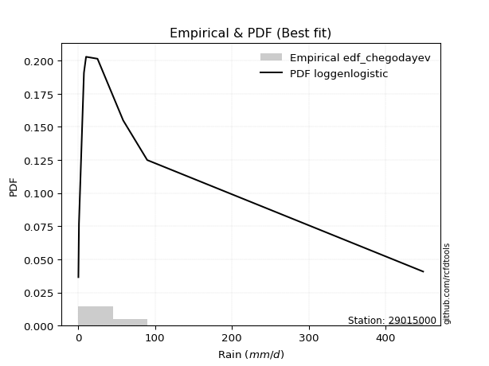</img>

</div>


### 6. EDF Blom (1958)

The Blom formula is a specific "plotting position" formula used in hydrology and statistical analysis to estimate the empirical cumulative probability (or non-exceedance probability) of a data series. It is particularly recommended for data that are approximately normally distributed. The constant _a_ is set to 0.375 (or 3/8).

<div align="center">


$P=(m-a)/(n+1-2a)$


</div>


**6.1. Empirical values**

<div align="center">

|                | 0                   | 1                   | 2                   | 3                  | 4        | 5                  | 6                  | 7                  | 8                  |
|:---------------|:--------------------|:--------------------|:--------------------|:-------------------|:---------|:-------------------|:-------------------|:-------------------|:-------------------|
| date           | 2023                | 2024                | 2018                | 2019               | 2020     | 2025               | 2017               | 2022               | 2021               |
| x              | 0.36                | 1.1                 | 7.54                | 7.68               | 10.33    | 25.2               | 58.63              | 89.91              | 448.89             |
| m              | 1                   | 2                   | 3                   | 4                  | 5        | 6                  | 7                  | 8                  | 9                  |
| empirical_dist | edf_blom            | edf_blom            | edf_blom            | edf_blom           | edf_blom | edf_blom           | edf_blom           | edf_blom           | edf_blom           |
| empirical      | 0.06756756756756757 | 0.17567567567567569 | 0.28378378378378377 | 0.3918918918918919 | 0.5      | 0.6081081081081081 | 0.7162162162162162 | 0.8243243243243243 | 0.9324324324324325 |
| empirical_tr   | 1.072463768115942   | 1.2131147540983607  | 1.3962264150943395  | 1.6444444444444444 | 2.0      | 2.5517241379310347 | 3.523809523809524  | 5.6923076923076925 | 14.800000000000006 |

</div>


**6.2. Kolmogorov-Smirnov fit test (sorted by Δ)**


<div align="center">

|                | 0                   | 1                   | 2                   | 3                   | 4                   | 5                   | 6                   | 7                   | 8                   | 9                   | 10                  | 11                  | 12                  | 13                  | 14                  | 15                  | 16                  | 17                  | 18                  | 19                  | 20                  | 21                  | 22                  | 23                  | 24                  | 25                  | 26                  | 27                  | 28                  | 29                  | 30                  | 31                  | 32                  | 33                  | 34                  | 35                  | 36                  | 37                  | 38                  | 39                  | 40                  | 41                  | 42                  | 43                  | 44                  | 45                  | 46                  | 47                  | 48                  | 49                  | 50                  | 51                  | 52                  | 53                  | 54                  | 55                  | 56                  | 57                  | 58                  | 59                  | 60                  | 61                  | 62                  | 63                  | 64                  | 65                  | 66                  | 67                  | 68                  | 69                  | 70                  | 71                  | 72                  | 73                  | 74                  | 75                  | 76                  | 77                  | 78                  | 79                  | 80                  | 81                  | 82                  | 83                  | 84                  | 85                  | 86                  | 87                  | 88                  | 89                  | 90                  | 91                  | 92                  | 93                  | 94                  | 95                  | 96                  | 97                  | 98                  | 99                  | 100                 | 101                 | 102                 | 103                 | 104                 | 105                 | 106                 | 107                 | 108                 | 109                 | 110                 | 111                 | 112                 | 113                 | 114                 | 115                 | 116                 | 117                 | 118                 | 119                 | 120                 | 121                 | 122                 | 123                 | 124                 | 125                 | 126                 | 127                 | 128                 | 129                 | 130                 | 131                 | 132                 | 133                 | 134                 | 135                 | 136                 | 137                 | 138                 | 139                 | 140                 | 141                 | 142                 | 143                 | 144                 | 145                 | 146                 | 147                 | 148                 | 149                 | 150                 | 151                 | 152                 | 153                 | 154                 | 155                 | 156                 | 157                 | 158                 | 159                 |
|:---------------|:--------------------|:--------------------|:--------------------|:--------------------|:--------------------|:--------------------|:--------------------|:--------------------|:--------------------|:--------------------|:--------------------|:--------------------|:--------------------|:--------------------|:--------------------|:--------------------|:--------------------|:--------------------|:--------------------|:--------------------|:--------------------|:--------------------|:--------------------|:--------------------|:--------------------|:--------------------|:--------------------|:--------------------|:--------------------|:--------------------|:--------------------|:--------------------|:--------------------|:--------------------|:--------------------|:--------------------|:--------------------|:--------------------|:--------------------|:--------------------|:--------------------|:--------------------|:--------------------|:--------------------|:--------------------|:--------------------|:--------------------|:--------------------|:--------------------|:--------------------|:--------------------|:--------------------|:--------------------|:--------------------|:--------------------|:--------------------|:--------------------|:--------------------|:--------------------|:--------------------|:--------------------|:--------------------|:--------------------|:--------------------|:--------------------|:--------------------|:--------------------|:--------------------|:--------------------|:--------------------|:--------------------|:--------------------|:--------------------|:--------------------|:--------------------|:--------------------|:--------------------|:--------------------|:--------------------|:--------------------|:--------------------|:--------------------|:--------------------|:--------------------|:--------------------|:--------------------|:--------------------|:--------------------|:--------------------|:--------------------|:--------------------|:--------------------|:--------------------|:--------------------|:--------------------|:--------------------|:--------------------|:--------------------|:--------------------|:--------------------|:--------------------|:--------------------|:--------------------|:--------------------|:--------------------|:--------------------|:--------------------|:--------------------|:--------------------|:--------------------|:--------------------|:--------------------|:--------------------|:--------------------|:--------------------|:--------------------|:--------------------|:--------------------|:--------------------|:--------------------|:--------------------|:--------------------|:--------------------|:--------------------|:--------------------|:--------------------|:--------------------|:--------------------|:--------------------|:--------------------|:--------------------|:--------------------|:--------------------|:--------------------|:--------------------|:--------------------|:--------------------|:--------------------|:--------------------|:--------------------|:--------------------|:--------------------|:--------------------|:--------------------|:--------------------|:--------------------|:--------------------|:--------------------|:--------------------|:--------------------|:--------------------|:--------------------|:--------------------|:--------------------|:--------------------|:--------------------|:--------------------|:--------------------|:--------------------|:--------------------|
| station        | 29015000            | 29015000            | 29015000            | 29015000            | 29015000            | 29015000            | 29015000            | 29015000            | 29015000            | 29015000            | 29015000            | 29015000            | 29015000            | 29015000            | 29015000            | 29015000            | 29015000            | 29015000            | 29015000            | 29015000            | 29015000            | 29015000            | 29015000            | 29015000            | 29015000            | 29015000            | 29015000            | 29015000            | 29015000            | 29015000            | 29015000            | 29015000            | 29015000            | 29015000            | 29015000            | 29015000            | 29015000            | 29015000            | 29015000            | 29015000            | 29015000            | 29015000            | 29015000            | 29015000            | 29015000            | 29015000            | 29015000            | 29015000            | 29015000            | 29015000            | 29015000            | 29015000            | 29015000            | 29015000            | 29015000            | 29015000            | 29015000            | 29015000            | 29015000            | 29015000            | 29015000            | 29015000            | 29015000            | 29015000            | 29015000            | 29015000            | 29015000            | 29015000            | 29015000            | 29015000            | 29015000            | 29015000            | 29015000            | 29015000            | 29015000            | 29015000            | 29015000            | 29015000            | 29015000            | 29015000            | 29015000            | 29015000            | 29015000            | 29015000            | 29015000            | 29015000            | 29015000            | 29015000            | 29015000            | 29015000            | 29015000            | 29015000            | 29015000            | 29015000            | 29015000            | 29015000            | 29015000            | 29015000            | 29015000            | 29015000            | 29015000            | 29015000            | 29015000            | 29015000            | 29015000            | 29015000            | 29015000            | 29015000            | 29015000            | 29015000            | 29015000            | 29015000            | 29015000            | 29015000            | 29015000            | 29015000            | 29015000            | 29015000            | 29015000            | 29015000            | 29015000            | 29015000            | 29015000            | 29015000            | 29015000            | 29015000            | 29015000            | 29015000            | 29015000            | 29015000            | 29015000            | 29015000            | 29015000            | 29015000            | 29015000            | 29015000            | 29015000            | 29015000            | 29015000            | 29015000            | 29015000            | 29015000            | 29015000            | 29015000            | 29015000            | 29015000            | 29015000            | 29015000            | 29015000            | 29015000            | 29015000            | 29015000            | 29015000            | 29015000            | 29015000            | 29015000            | 29015000            | 29015000            | 29015000            | 29015000            |
| empirical_dist | edf_blom            | edf_blom            | edf_blom            | edf_blom            | edf_blom            | edf_blom            | edf_blom            | edf_blom            | edf_blom            | edf_blom            | edf_blom            | edf_blom            | edf_blom            | edf_blom            | edf_blom            | edf_blom            | edf_blom            | edf_blom            | edf_blom            | edf_blom            | edf_blom            | edf_blom            | edf_blom            | edf_blom            | edf_blom            | edf_blom            | edf_blom            | edf_blom            | edf_blom            | edf_blom            | edf_blom            | edf_blom            | edf_blom            | edf_blom            | edf_blom            | edf_blom            | edf_blom            | edf_blom            | edf_blom            | edf_blom            | edf_blom            | edf_blom            | edf_blom            | edf_blom            | edf_blom            | edf_blom            | edf_blom            | edf_blom            | edf_blom            | edf_blom            | edf_blom            | edf_blom            | edf_blom            | edf_blom            | edf_blom            | edf_blom            | edf_blom            | edf_blom            | edf_blom            | edf_blom            | edf_blom            | edf_blom            | edf_blom            | edf_blom            | edf_blom            | edf_blom            | edf_blom            | edf_blom            | edf_blom            | edf_blom            | edf_blom            | edf_blom            | edf_blom            | edf_blom            | edf_blom            | edf_blom            | edf_blom            | edf_blom            | edf_blom            | edf_blom            | edf_blom            | edf_blom            | edf_blom            | edf_blom            | edf_blom            | edf_blom            | edf_blom            | edf_blom            | edf_blom            | edf_blom            | edf_blom            | edf_blom            | edf_blom            | edf_blom            | edf_blom            | edf_blom            | edf_blom            | edf_blom            | edf_blom            | edf_blom            | edf_blom            | edf_blom            | edf_blom            | edf_blom            | edf_blom            | edf_blom            | edf_blom            | edf_blom            | edf_blom            | edf_blom            | edf_blom            | edf_blom            | edf_blom            | edf_blom            | edf_blom            | edf_blom            | edf_blom            | edf_blom            | edf_blom            | edf_blom            | edf_blom            | edf_blom            | edf_blom            | edf_blom            | edf_blom            | edf_blom            | edf_blom            | edf_blom            | edf_blom            | edf_blom            | edf_blom            | edf_blom            | edf_blom            | edf_blom            | edf_blom            | edf_blom            | edf_blom            | edf_blom            | edf_blom            | edf_blom            | edf_blom            | edf_blom            | edf_blom            | edf_blom            | edf_blom            | edf_blom            | edf_blom            | edf_blom            | edf_blom            | edf_blom            | edf_blom            | edf_blom            | edf_blom            | edf_blom            | edf_blom            | edf_blom            | edf_blom            | edf_blom            | edf_blom            | edf_blom            |
| p_dist         | ncf                 | loghypsecant        | loggenlogistic      | loggenextreme       | logdgamma           | f                   | loglogistic         | logskewnorm         | logdweibull         | logjohnsonsu        | logloggamma         | logpearson3         | loglaplace          | loglaplace          | logargus            | logfoldnorm         | logweibull_min      | lognorm             | logcrystalball      | logt                | logexponnorm        | lognct              | lognakagami         | logfatiguelife      | genpareto           | lomax               | logbetaprime        | loggengamma         | logerlang           | loggamma            | loggamma            | loggausshyper       | loggompertz         | logcosine           | truncpareto         | loggumbel_l         | loganglit           | logrice             | logsemicircular     | loginvgamma         | logalpha            | logkappa3           | logmaxwell          | invgauss            | loginvgauss         | logwrapcauchy       | loguniform          | invgamma            | gengamma            | lograyleigh         | logarcsine          | logksone            | logbeta             | truncweibull_min    | exponpow            | logtriang           | loggumbel_r         | halfgennorm         | loginvweibull       | exponweib           | genextreme          | invweibull          | loggenpareto        | logkappa4           | logtruncnorm        | logmielke           | kappa3              | logvonmises_line    | gamma               | mielke              | logmoyal            | loghalfnorm         | loggenhalflogistic  | logtruncweibull_min | fatiguelife         | erlang              | burr12              | logkstwobign        | loggenexpon         | loghalflogistic     | vonmises_line       | betaprime           | gennorm             | logbradford         | t                   | dgamma              | nct                 | nakagami            | genlogistic         | logtruncexpon       | logwald             | gausshyper          | maxwell             | logncf              | gumbel_r            | logistic            | logburr12           | rayleigh            | crystalball         | norm                | hypsecant           | wald                | dweibull            | moyal               | weibull_min         | logtrapezoid        | anglit              | semicircular        | loglomax            | logjohnsonsb        | burr                | powerlaw            | kstwobign           | halflogistic        | laplace             | halfnorm            | logexponweib        | rice                | arcsine             | loglevy_l           | pearson3            | foldnorm            | loggennorm          | gumbel_l            | loghalfgennorm      | wrapcauchy          | logburr             | logloglaplace       | exponnorm           | genexpon            | logf                | cosine              | gompertz            | truncnorm           | logtukeylambda      | johnsonsu           | levy_l              | logrdist            | skewnorm            | argus               | bradford            | logweibull_max      | truncexpon          | triang              | logpowerlaw         | rdist               | ksone               | tukeylambda         | kappa4              | alpha               | logexponpow         | uniform             | logtruncpareto      | johnsonsb           | genhalflogistic     | beta                | trapezoid           | weibull_max         | logvonmises         | vonmises            |
| delta          | 0.08226100315115886 | 0.08276698726682596 | 0.08401151807855772 | 0.09147628362363214 | 0.09222999648637586 | 0.09224994735239334 | 0.09254293620770798 | 0.09323074054356395 | 0.09424697351402189 | 0.09471537550667869 | 0.09521807892549222 | 0.09928089444424065 | 0.10116969437883394 | 0.10116969437883394 | 0.10150211592284575 | 0.1038093478375261  | 0.10621841290291517 | 0.10652503647603506 | 0.10652504590870698 | 0.10652523341146969 | 0.10652560979473957 | 0.10663759210025481 | 0.10677582843797367 | 0.10685991817978041 | 0.11178279669908575 | 0.11179256293375806 | 0.11216259024553477 | 0.11233302890629276 | 0.1127856225540661  | 0.11325914810175058 | 0.11325914810175058 | 0.11359549491139742 | 0.11667251065983397 | 0.11834485329720096 | 0.11968125967669843 | 0.120387604752136   | 0.12158492624223632 | 0.12453599471011911 | 0.12784975888209643 | 0.13039071595987634 | 0.13163405868779438 | 0.14028226092357182 | 0.14028316566243665 | 0.14079970422610882 | 0.14126642816636859 | 0.1425398751099481  | 0.14294044674205875 | 0.14475252062773591 | 0.1448066061018461  | 0.1525872725479417  | 0.15311738097323307 | 0.15515307498775166 | 0.15603092739826885 | 0.15710325344056214 | 0.15836182791922765 | 0.16087193344979034 | 0.16441745495460747 | 0.16665480261918642 | 0.16815245260049988 | 0.17120066614068263 | 0.17179111112832074 | 0.17179157815923085 | 0.17196016198109854 | 0.1739549967527116  | 0.17402982841080278 | 0.17499799653461529 | 0.17619698071979317 | 0.1803892879359162  | 0.1826769841843206  | 0.1854572506928967  | 0.18655497086408923 | 0.1875155991569446  | 0.1886048908636887  | 0.18933456944822263 | 0.18989778306748084 | 0.19064042187842728 | 0.19096714511413704 | 0.1913356287344019  | 0.191651760865864   | 0.20180102680600315 | 0.20611905162910205 | 0.20776077080577093 | 0.21183209525239297 | 0.22254922077750106 | 0.22601882476240742 | 0.2337062717019259  | 0.2372511633525206  | 0.24182250764091273 | 0.24243622161152073 | 0.24339443659700222 | 0.24543931788653905 | 0.25189352641785956 | 0.2592011380299357  | 0.2608043085652434  | 0.26393908622373785 | 0.2655822300568276  | 0.2689198159498025  | 0.2701890045816663  | 0.2725498364381109  | 0.27254983944072375 | 0.2726984378292998  | 0.2729513257186921  | 0.27303157398663336 | 0.2736930828923355  | 0.2782903911250383  | 0.27845605893214387 | 0.2798947362231984  | 0.2829268715201515  | 0.2869837252603735  | 0.2909135881399465  | 0.296128776824348   | 0.2972855058185109  | 0.2980703497376231  | 0.29929079255345137 | 0.3011143508700237  | 0.30123309238073825 | 0.3023853997058964  | 0.30991388923133506 | 0.31081722609447937 | 0.31101367605835484 | 0.31581870055815964 | 0.3163960675100378  | 0.32432432432432434 | 0.33939399909801515 | 0.34186487235462604 | 0.3475601061705912  | 0.34865610809022063 | 0.35214373021957324 | 0.36996533498965156 | 0.37039062763661645 | 0.37846726389662166 | 0.3846535235831862  | 0.3964619542603338  | 0.4093273802797931  | 0.42918689671340227 | 0.43905872680393165 | 0.4408348976645762  | 0.4725888871945795  | 0.4799558107738495  | 0.481424764216432   | 0.5040357712479927  | 0.5092861128091732  | 0.510420271204639   | 0.5105280158540635  | 0.5544003925518111  | 0.5694472702076084  | 0.5746141600097857  | 0.599525327622918   | 0.5998605306409382  | 0.6084432751951857  | 0.6108683981097001  | 0.624672127146878   | 0.6325796011435466  | 0.6522522537066382  | 0.6730186624900977  | 0.7462291261432806  | 0.759887858488858   | 0.7668900816411206  | 1.0048512098919207  | 70.94408934889903   |
| deltao         | 0.41761268023100007 | 0.41761268023100007 | 0.41761268023100007 | 0.41761268023100007 | 0.41761268023100007 | 0.41761268023100007 | 0.41761268023100007 | 0.41761268023100007 | 0.41761268023100007 | 0.41761268023100007 | 0.41761268023100007 | 0.41761268023100007 | 0.41761268023100007 | 0.41761268023100007 | 0.41761268023100007 | 0.41761268023100007 | 0.41761268023100007 | 0.41761268023100007 | 0.41761268023100007 | 0.41761268023100007 | 0.41761268023100007 | 0.41761268023100007 | 0.41761268023100007 | 0.41761268023100007 | 0.41761268023100007 | 0.41761268023100007 | 0.41761268023100007 | 0.41761268023100007 | 0.41761268023100007 | 0.41761268023100007 | 0.41761268023100007 | 0.41761268023100007 | 0.41761268023100007 | 0.41761268023100007 | 0.41761268023100007 | 0.41761268023100007 | 0.41761268023100007 | 0.41761268023100007 | 0.41761268023100007 | 0.41761268023100007 | 0.41761268023100007 | 0.41761268023100007 | 0.41761268023100007 | 0.41761268023100007 | 0.41761268023100007 | 0.41761268023100007 | 0.41761268023100007 | 0.41761268023100007 | 0.41761268023100007 | 0.41761268023100007 | 0.41761268023100007 | 0.41761268023100007 | 0.41761268023100007 | 0.41761268023100007 | 0.41761268023100007 | 0.41761268023100007 | 0.41761268023100007 | 0.41761268023100007 | 0.41761268023100007 | 0.41761268023100007 | 0.41761268023100007 | 0.41761268023100007 | 0.41761268023100007 | 0.41761268023100007 | 0.41761268023100007 | 0.41761268023100007 | 0.41761268023100007 | 0.41761268023100007 | 0.41761268023100007 | 0.41761268023100007 | 0.41761268023100007 | 0.41761268023100007 | 0.41761268023100007 | 0.41761268023100007 | 0.41761268023100007 | 0.41761268023100007 | 0.41761268023100007 | 0.41761268023100007 | 0.41761268023100007 | 0.41761268023100007 | 0.41761268023100007 | 0.41761268023100007 | 0.41761268023100007 | 0.41761268023100007 | 0.41761268023100007 | 0.41761268023100007 | 0.41761268023100007 | 0.41761268023100007 | 0.41761268023100007 | 0.41761268023100007 | 0.41761268023100007 | 0.41761268023100007 | 0.41761268023100007 | 0.41761268023100007 | 0.41761268023100007 | 0.41761268023100007 | 0.41761268023100007 | 0.41761268023100007 | 0.41761268023100007 | 0.41761268023100007 | 0.41761268023100007 | 0.41761268023100007 | 0.41761268023100007 | 0.41761268023100007 | 0.41761268023100007 | 0.41761268023100007 | 0.41761268023100007 | 0.41761268023100007 | 0.41761268023100007 | 0.41761268023100007 | 0.41761268023100007 | 0.41761268023100007 | 0.41761268023100007 | 0.41761268023100007 | 0.41761268023100007 | 0.41761268023100007 | 0.41761268023100007 | 0.41761268023100007 | 0.41761268023100007 | 0.41761268023100007 | 0.41761268023100007 | 0.41761268023100007 | 0.41761268023100007 | 0.41761268023100007 | 0.41761268023100007 | 0.41761268023100007 | 0.41761268023100007 | 0.41761268023100007 | 0.41761268023100007 | 0.41761268023100007 | 0.41761268023100007 | 0.41761268023100007 | 0.41761268023100007 | 0.41761268023100007 | 0.41761268023100007 | 0.41761268023100007 | 0.41761268023100007 | 0.41761268023100007 | 0.41761268023100007 | 0.41761268023100007 | 0.41761268023100007 | 0.41761268023100007 | 0.41761268023100007 | 0.41761268023100007 | 0.41761268023100007 | 0.41761268023100007 | 0.41761268023100007 | 0.41761268023100007 | 0.41761268023100007 | 0.41761268023100007 | 0.41761268023100007 | 0.41761268023100007 | 0.41761268023100007 | 0.41761268023100007 | 0.41761268023100007 | 0.41761268023100007 | 0.41761268023100007 | 0.41761268023100007 | 0.41761268023100007 | 0.41761268023100007 |
| eval           | Δo > Δ              | Δo > Δ              | Δo > Δ              | Δo > Δ              | Δo > Δ              | Δo > Δ              | Δo > Δ              | Δo > Δ              | Δo > Δ              | Δo > Δ              | Δo > Δ              | Δo > Δ              | Δo > Δ              | Δo > Δ              | Δo > Δ              | Δo > Δ              | Δo > Δ              | Δo > Δ              | Δo > Δ              | Δo > Δ              | Δo > Δ              | Δo > Δ              | Δo > Δ              | Δo > Δ              | Δo > Δ              | Δo > Δ              | Δo > Δ              | Δo > Δ              | Δo > Δ              | Δo > Δ              | Δo > Δ              | Δo > Δ              | Δo > Δ              | Δo > Δ              | Δo > Δ              | Δo > Δ              | Δo > Δ              | Δo > Δ              | Δo > Δ              | Δo > Δ              | Δo > Δ              | Δo > Δ              | Δo > Δ              | Δo > Δ              | Δo > Δ              | Δo > Δ              | Δo > Δ              | Δo > Δ              | Δo > Δ              | Δo > Δ              | Δo > Δ              | Δo > Δ              | Δo > Δ              | Δo > Δ              | Δo > Δ              | Δo > Δ              | Δo > Δ              | Δo > Δ              | Δo > Δ              | Δo > Δ              | Δo > Δ              | Δo > Δ              | Δo > Δ              | Δo > Δ              | Δo > Δ              | Δo > Δ              | Δo > Δ              | Δo > Δ              | Δo > Δ              | Δo > Δ              | Δo > Δ              | Δo > Δ              | Δo > Δ              | Δo > Δ              | Δo > Δ              | Δo > Δ              | Δo > Δ              | Δo > Δ              | Δo > Δ              | Δo > Δ              | Δo > Δ              | Δo > Δ              | Δo > Δ              | Δo > Δ              | Δo > Δ              | Δo > Δ              | Δo > Δ              | Δo > Δ              | Δo > Δ              | Δo > Δ              | Δo > Δ              | Δo > Δ              | Δo > Δ              | Δo > Δ              | Δo > Δ              | Δo > Δ              | Δo > Δ              | Δo > Δ              | Δo > Δ              | Δo > Δ              | Δo > Δ              | Δo > Δ              | Δo > Δ              | Δo > Δ              | Δo > Δ              | Δo > Δ              | Δo > Δ              | Δo > Δ              | Δo > Δ              | Δo > Δ              | Δo > Δ              | Δo > Δ              | Δo > Δ              | Δo > Δ              | Δo > Δ              | Δo > Δ              | Δo > Δ              | Δo > Δ              | Δo > Δ              | Δo > Δ              | Δo > Δ              | Δo > Δ              | Δo > Δ              | Δo > Δ              | Δo > Δ              | Δo > Δ              | Δo > Δ              | Δo > Δ              | Δo > Δ              | Δo > Δ              | Δo > Δ              | Δo > Δ              | Δo > Δ              | Δo > Δ              | Δo <= Δ             | Δo <= Δ             | Δo <= Δ             | Δo <= Δ             | Δo <= Δ             | Δo <= Δ             | Δo <= Δ             | Δo <= Δ             | Δo <= Δ             | Δo <= Δ             | Δo <= Δ             | Δo <= Δ             | Δo <= Δ             | Δo <= Δ             | Δo <= Δ             | Δo <= Δ             | Δo <= Δ             | Δo <= Δ             | Δo <= Δ             | Δo <= Δ             | Δo <= Δ             | Δo <= Δ             | Δo <= Δ             | Δo <= Δ             | Δo <= Δ             | Δo <= Δ             |
| fit            | 1                   | 1                   | 1                   | 1                   | 1                   | 1                   | 1                   | 1                   | 1                   | 1                   | 1                   | 1                   | 1                   | 1                   | 1                   | 1                   | 1                   | 1                   | 1                   | 1                   | 1                   | 1                   | 1                   | 1                   | 1                   | 1                   | 1                   | 1                   | 1                   | 1                   | 1                   | 1                   | 1                   | 1                   | 1                   | 1                   | 1                   | 1                   | 1                   | 1                   | 1                   | 1                   | 1                   | 1                   | 1                   | 1                   | 1                   | 1                   | 1                   | 1                   | 1                   | 1                   | 1                   | 1                   | 1                   | 1                   | 1                   | 1                   | 1                   | 1                   | 1                   | 1                   | 1                   | 1                   | 1                   | 1                   | 1                   | 1                   | 1                   | 1                   | 1                   | 1                   | 1                   | 1                   | 1                   | 1                   | 1                   | 1                   | 1                   | 1                   | 1                   | 1                   | 1                   | 1                   | 1                   | 1                   | 1                   | 1                   | 1                   | 1                   | 1                   | 1                   | 1                   | 1                   | 1                   | 1                   | 1                   | 1                   | 1                   | 1                   | 1                   | 1                   | 1                   | 1                   | 1                   | 1                   | 1                   | 1                   | 1                   | 1                   | 1                   | 1                   | 1                   | 1                   | 1                   | 1                   | 1                   | 1                   | 1                   | 1                   | 1                   | 1                   | 1                   | 1                   | 1                   | 1                   | 1                   | 1                   | 1                   | 1                   | 1                   | 1                   | 1                   | 1                   | 0                   | 0                   | 0                   | 0                   | 0                   | 0                   | 0                   | 0                   | 0                   | 0                   | 0                   | 0                   | 0                   | 0                   | 0                   | 0                   | 0                   | 0                   | 0                   | 0                   | 0                   | 0                   | 0                   | 0                   | 0                   | 0                   |
| n              | 9                   | 9                   | 9                   | 9                   | 9                   | 9                   | 9                   | 9                   | 9                   | 9                   | 9                   | 9                   | 9                   | 9                   | 9                   | 9                   | 9                   | 9                   | 9                   | 9                   | 9                   | 9                   | 9                   | 9                   | 9                   | 9                   | 9                   | 9                   | 9                   | 9                   | 9                   | 9                   | 9                   | 9                   | 9                   | 9                   | 9                   | 9                   | 9                   | 9                   | 9                   | 9                   | 9                   | 9                   | 9                   | 9                   | 9                   | 9                   | 9                   | 9                   | 9                   | 9                   | 9                   | 9                   | 9                   | 9                   | 9                   | 9                   | 9                   | 9                   | 9                   | 9                   | 9                   | 9                   | 9                   | 9                   | 9                   | 9                   | 9                   | 9                   | 9                   | 9                   | 9                   | 9                   | 9                   | 9                   | 9                   | 9                   | 9                   | 9                   | 9                   | 9                   | 9                   | 9                   | 9                   | 9                   | 9                   | 9                   | 9                   | 9                   | 9                   | 9                   | 9                   | 9                   | 9                   | 9                   | 9                   | 9                   | 9                   | 9                   | 9                   | 9                   | 9                   | 9                   | 9                   | 9                   | 9                   | 9                   | 9                   | 9                   | 9                   | 9                   | 9                   | 9                   | 9                   | 9                   | 9                   | 9                   | 9                   | 9                   | 9                   | 9                   | 9                   | 9                   | 9                   | 9                   | 9                   | 9                   | 9                   | 9                   | 9                   | 9                   | 9                   | 9                   | 9                   | 9                   | 9                   | 9                   | 9                   | 9                   | 9                   | 9                   | 9                   | 9                   | 9                   | 9                   | 9                   | 9                   | 9                   | 9                   | 9                   | 9                   | 9                   | 9                   | 9                   | 9                   | 9                   | 9                   | 9                   | 9                   |
| best_fit       | 1                   | 0                   | 0                   | 0                   | 0                   | 0                   | 0                   | 0                   | 0                   | 0                   | 0                   | 0                   | 0                   | 0                   | 0                   | 0                   | 0                   | 0                   | 0                   | 0                   | 0                   | 0                   | 0                   | 0                   | 0                   | 0                   | 0                   | 0                   | 0                   | 0                   | 0                   | 0                   | 0                   | 0                   | 0                   | 0                   | 0                   | 0                   | 0                   | 0                   | 0                   | 0                   | 0                   | 0                   | 0                   | 0                   | 0                   | 0                   | 0                   | 0                   | 0                   | 0                   | 0                   | 0                   | 0                   | 0                   | 0                   | 0                   | 0                   | 0                   | 0                   | 0                   | 0                   | 0                   | 0                   | 0                   | 0                   | 0                   | 0                   | 0                   | 0                   | 0                   | 0                   | 0                   | 0                   | 0                   | 0                   | 0                   | 0                   | 0                   | 0                   | 0                   | 0                   | 0                   | 0                   | 0                   | 0                   | 0                   | 0                   | 0                   | 0                   | 0                   | 0                   | 0                   | 0                   | 0                   | 0                   | 0                   | 0                   | 0                   | 0                   | 0                   | 0                   | 0                   | 0                   | 0                   | 0                   | 0                   | 0                   | 0                   | 0                   | 0                   | 0                   | 0                   | 0                   | 0                   | 0                   | 0                   | 0                   | 0                   | 0                   | 0                   | 0                   | 0                   | 0                   | 0                   | 0                   | 0                   | 0                   | 0                   | 0                   | 0                   | 0                   | 0                   | 0                   | 0                   | 0                   | 0                   | 0                   | 0                   | 0                   | 0                   | 0                   | 0                   | 0                   | 0                   | 0                   | 0                   | 0                   | 0                   | 0                   | 0                   | 0                   | 0                   | 0                   | 0                   | 0                   | 0                   | 0                   | 0                   |
| best_fit_sort  | 1                   | 2                   | 3                   | 4                   | 5                   | 6                   | 7                   | 8                   | 9                   | 10                  | 11                  | 12                  | 13                  | 14                  | 15                  | 16                  | 17                  | 18                  | 19                  | 20                  | 21                  | 22                  | 23                  | 24                  | 25                  | 26                  | 27                  | 28                  | 29                  | 30                  | 31                  | 32                  | 33                  | 34                  | 35                  | 36                  | 37                  | 38                  | 39                  | 40                  | 41                  | 42                  | 43                  | 44                  | 45                  | 46                  | 47                  | 48                  | 49                  | 50                  | 51                  | 52                  | 53                  | 54                  | 55                  | 56                  | 57                  | 58                  | 59                  | 60                  | 61                  | 62                  | 63                  | 64                  | 65                  | 66                  | 67                  | 68                  | 69                  | 70                  | 71                  | 72                  | 73                  | 74                  | 75                  | 76                  | 77                  | 78                  | 79                  | 80                  | 81                  | 82                  | 83                  | 84                  | 85                  | 86                  | 87                  | 88                  | 89                  | 90                  | 91                  | 92                  | 93                  | 94                  | 95                  | 96                  | 97                  | 98                  | 99                  | 100                 | 101                 | 102                 | 103                 | 104                 | 105                 | 106                 | 107                 | 108                 | 109                 | 110                 | 111                 | 112                 | 113                 | 114                 | 115                 | 116                 | 117                 | 118                 | 119                 | 120                 | 121                 | 122                 | 123                 | 124                 | 125                 | 126                 | 127                 | 128                 | 129                 | 130                 | 131                 | 132                 | 133                 | 134                 | 135                 | 136                 | 137                 | 138                 | 139                 | 140                 | 141                 | 142                 | 143                 | 144                 | 145                 | 146                 | 147                 | 148                 | 149                 | 150                 | 151                 | 152                 | 153                 | 154                 | 155                 | 156                 | 157                 | 158                 | 159                 | 160                 |

</div>


**6.3. Best fit**

<div align="center">

|   id |   station | empirical_dist   | p_dist   |    delta |   deltao | eval   |   fit |   n |   best_fit |   best_fit_sort |
|-----:|----------:|:-----------------|:---------|---------:|---------:|:-------|------:|----:|-----------:|----------------:|
|    0 |  29015000 | edf_blom         | ncf      | 0.082261 | 0.417613 | Δo > Δ |     1 |   9 |          1 |               1 |

</div>


<div align="center">

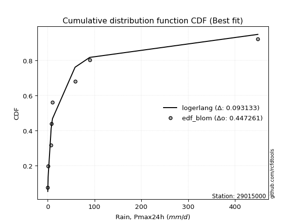</img>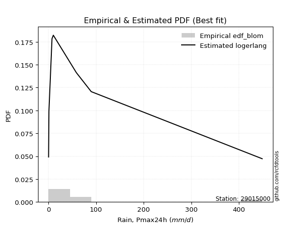</img>

</div>


### 7. EDF Tukey (1962)

In hydrology, the Tukey formula is used as a plotting position formula to estimate the empirical probability or frequency of a flood event (or other hydrological data). The formula parameter is given as _c=0.333_ (or 1/3).

<div align="center">


$P=(m-c)/(n+1-2c)$


</div>


**7.1. Empirical values**

<div align="center">

|                | 0                   | 1                   | 2                  | 3                   | 4         | 5                  | 6                  | 7                  | 8                  |
|:---------------|:--------------------|:--------------------|:-------------------|:--------------------|:----------|:-------------------|:-------------------|:-------------------|:-------------------|
| date           | 2023                | 2024                | 2018               | 2019                | 2020      | 2025               | 2017               | 2022               | 2021               |
| x              | 0.36                | 1.1                 | 7.54               | 7.68                | 10.33     | 25.2               | 58.63              | 89.91              | 448.89             |
| m              | 1                   | 2                   | 3                  | 4                   | 5         | 6                  | 7                  | 8                  | 9                  |
| empirical_dist | edf_tukey           | edf_tukey           | edf_tukey          | edf_tukey           | edf_tukey | edf_tukey          | edf_tukey          | edf_tukey          | edf_tukey          |
| empirical      | 0.07142857142857142 | 0.17857142857142858 | 0.2857142857142857 | 0.39285714285714285 | 0.5       | 0.6071428571428571 | 0.7142857142857143 | 0.8214285714285714 | 0.9285714285714286 |
| empirical_tr   | 1.0769230769230769  | 1.2173913043478262  | 1.4                | 1.6470588235294117  | 2.0       | 2.545454545454545  | 3.5                | 5.599999999999999  | 14.000000000000007 |

</div>


**7.2. Kolmogorov-Smirnov fit test (sorted by Δ)**


<div align="center">

|                | 0                   | 1                   | 2                   | 3                   | 4                   | 5                   | 6                   | 7                   | 8                   | 9                   | 10                  | 11                  | 12                  | 13                  | 14                  | 15                  | 16                  | 17                  | 18                  | 19                  | 20                  | 21                  | 22                  | 23                  | 24                  | 25                  | 26                  | 27                  | 28                  | 29                  | 30                  | 31                  | 32                  | 33                  | 34                  | 35                  | 36                  | 37                  | 38                  | 39                  | 40                  | 41                  | 42                  | 43                  | 44                  | 45                  | 46                  | 47                  | 48                  | 49                  | 50                  | 51                  | 52                  | 53                  | 54                  | 55                  | 56                  | 57                  | 58                  | 59                  | 60                  | 61                  | 62                  | 63                  | 64                  | 65                  | 66                  | 67                  | 68                  | 69                  | 70                  | 71                  | 72                  | 73                  | 74                  | 75                  | 76                  | 77                  | 78                  | 79                  | 80                  | 81                  | 82                  | 83                  | 84                  | 85                  | 86                  | 87                  | 88                  | 89                  | 90                  | 91                  | 92                  | 93                  | 94                  | 95                  | 96                  | 97                  | 98                  | 99                  | 100                 | 101                 | 102                 | 103                 | 104                 | 105                 | 106                 | 107                 | 108                 | 109                 | 110                 | 111                 | 112                 | 113                 | 114                 | 115                 | 116                 | 117                 | 118                 | 119                 | 120                 | 121                 | 122                 | 123                 | 124                 | 125                 | 126                 | 127                 | 128                 | 129                 | 130                 | 131                 | 132                 | 133                 | 134                 | 135                 | 136                 | 137                 | 138                 | 139                 | 140                 | 141                 | 142                 | 143                 | 144                 | 145                 | 146                 | 147                 | 148                 | 149                 | 150                 | 151                 | 152                 | 153                 | 154                 | 155                 | 156                 | 157                 | 158                 | 159                 |
|:---------------|:--------------------|:--------------------|:--------------------|:--------------------|:--------------------|:--------------------|:--------------------|:--------------------|:--------------------|:--------------------|:--------------------|:--------------------|:--------------------|:--------------------|:--------------------|:--------------------|:--------------------|:--------------------|:--------------------|:--------------------|:--------------------|:--------------------|:--------------------|:--------------------|:--------------------|:--------------------|:--------------------|:--------------------|:--------------------|:--------------------|:--------------------|:--------------------|:--------------------|:--------------------|:--------------------|:--------------------|:--------------------|:--------------------|:--------------------|:--------------------|:--------------------|:--------------------|:--------------------|:--------------------|:--------------------|:--------------------|:--------------------|:--------------------|:--------------------|:--------------------|:--------------------|:--------------------|:--------------------|:--------------------|:--------------------|:--------------------|:--------------------|:--------------------|:--------------------|:--------------------|:--------------------|:--------------------|:--------------------|:--------------------|:--------------------|:--------------------|:--------------------|:--------------------|:--------------------|:--------------------|:--------------------|:--------------------|:--------------------|:--------------------|:--------------------|:--------------------|:--------------------|:--------------------|:--------------------|:--------------------|:--------------------|:--------------------|:--------------------|:--------------------|:--------------------|:--------------------|:--------------------|:--------------------|:--------------------|:--------------------|:--------------------|:--------------------|:--------------------|:--------------------|:--------------------|:--------------------|:--------------------|:--------------------|:--------------------|:--------------------|:--------------------|:--------------------|:--------------------|:--------------------|:--------------------|:--------------------|:--------------------|:--------------------|:--------------------|:--------------------|:--------------------|:--------------------|:--------------------|:--------------------|:--------------------|:--------------------|:--------------------|:--------------------|:--------------------|:--------------------|:--------------------|:--------------------|:--------------------|:--------------------|:--------------------|:--------------------|:--------------------|:--------------------|:--------------------|:--------------------|:--------------------|:--------------------|:--------------------|:--------------------|:--------------------|:--------------------|:--------------------|:--------------------|:--------------------|:--------------------|:--------------------|:--------------------|:--------------------|:--------------------|:--------------------|:--------------------|:--------------------|:--------------------|:--------------------|:--------------------|:--------------------|:--------------------|:--------------------|:--------------------|:--------------------|:--------------------|:--------------------|:--------------------|:--------------------|:--------------------|
| station        | 29015000            | 29015000            | 29015000            | 29015000            | 29015000            | 29015000            | 29015000            | 29015000            | 29015000            | 29015000            | 29015000            | 29015000            | 29015000            | 29015000            | 29015000            | 29015000            | 29015000            | 29015000            | 29015000            | 29015000            | 29015000            | 29015000            | 29015000            | 29015000            | 29015000            | 29015000            | 29015000            | 29015000            | 29015000            | 29015000            | 29015000            | 29015000            | 29015000            | 29015000            | 29015000            | 29015000            | 29015000            | 29015000            | 29015000            | 29015000            | 29015000            | 29015000            | 29015000            | 29015000            | 29015000            | 29015000            | 29015000            | 29015000            | 29015000            | 29015000            | 29015000            | 29015000            | 29015000            | 29015000            | 29015000            | 29015000            | 29015000            | 29015000            | 29015000            | 29015000            | 29015000            | 29015000            | 29015000            | 29015000            | 29015000            | 29015000            | 29015000            | 29015000            | 29015000            | 29015000            | 29015000            | 29015000            | 29015000            | 29015000            | 29015000            | 29015000            | 29015000            | 29015000            | 29015000            | 29015000            | 29015000            | 29015000            | 29015000            | 29015000            | 29015000            | 29015000            | 29015000            | 29015000            | 29015000            | 29015000            | 29015000            | 29015000            | 29015000            | 29015000            | 29015000            | 29015000            | 29015000            | 29015000            | 29015000            | 29015000            | 29015000            | 29015000            | 29015000            | 29015000            | 29015000            | 29015000            | 29015000            | 29015000            | 29015000            | 29015000            | 29015000            | 29015000            | 29015000            | 29015000            | 29015000            | 29015000            | 29015000            | 29015000            | 29015000            | 29015000            | 29015000            | 29015000            | 29015000            | 29015000            | 29015000            | 29015000            | 29015000            | 29015000            | 29015000            | 29015000            | 29015000            | 29015000            | 29015000            | 29015000            | 29015000            | 29015000            | 29015000            | 29015000            | 29015000            | 29015000            | 29015000            | 29015000            | 29015000            | 29015000            | 29015000            | 29015000            | 29015000            | 29015000            | 29015000            | 29015000            | 29015000            | 29015000            | 29015000            | 29015000            | 29015000            | 29015000            | 29015000            | 29015000            | 29015000            | 29015000            |
| empirical_dist | edf_tukey           | edf_tukey           | edf_tukey           | edf_tukey           | edf_tukey           | edf_tukey           | edf_tukey           | edf_tukey           | edf_tukey           | edf_tukey           | edf_tukey           | edf_tukey           | edf_tukey           | edf_tukey           | edf_tukey           | edf_tukey           | edf_tukey           | edf_tukey           | edf_tukey           | edf_tukey           | edf_tukey           | edf_tukey           | edf_tukey           | edf_tukey           | edf_tukey           | edf_tukey           | edf_tukey           | edf_tukey           | edf_tukey           | edf_tukey           | edf_tukey           | edf_tukey           | edf_tukey           | edf_tukey           | edf_tukey           | edf_tukey           | edf_tukey           | edf_tukey           | edf_tukey           | edf_tukey           | edf_tukey           | edf_tukey           | edf_tukey           | edf_tukey           | edf_tukey           | edf_tukey           | edf_tukey           | edf_tukey           | edf_tukey           | edf_tukey           | edf_tukey           | edf_tukey           | edf_tukey           | edf_tukey           | edf_tukey           | edf_tukey           | edf_tukey           | edf_tukey           | edf_tukey           | edf_tukey           | edf_tukey           | edf_tukey           | edf_tukey           | edf_tukey           | edf_tukey           | edf_tukey           | edf_tukey           | edf_tukey           | edf_tukey           | edf_tukey           | edf_tukey           | edf_tukey           | edf_tukey           | edf_tukey           | edf_tukey           | edf_tukey           | edf_tukey           | edf_tukey           | edf_tukey           | edf_tukey           | edf_tukey           | edf_tukey           | edf_tukey           | edf_tukey           | edf_tukey           | edf_tukey           | edf_tukey           | edf_tukey           | edf_tukey           | edf_tukey           | edf_tukey           | edf_tukey           | edf_tukey           | edf_tukey           | edf_tukey           | edf_tukey           | edf_tukey           | edf_tukey           | edf_tukey           | edf_tukey           | edf_tukey           | edf_tukey           | edf_tukey           | edf_tukey           | edf_tukey           | edf_tukey           | edf_tukey           | edf_tukey           | edf_tukey           | edf_tukey           | edf_tukey           | edf_tukey           | edf_tukey           | edf_tukey           | edf_tukey           | edf_tukey           | edf_tukey           | edf_tukey           | edf_tukey           | edf_tukey           | edf_tukey           | edf_tukey           | edf_tukey           | edf_tukey           | edf_tukey           | edf_tukey           | edf_tukey           | edf_tukey           | edf_tukey           | edf_tukey           | edf_tukey           | edf_tukey           | edf_tukey           | edf_tukey           | edf_tukey           | edf_tukey           | edf_tukey           | edf_tukey           | edf_tukey           | edf_tukey           | edf_tukey           | edf_tukey           | edf_tukey           | edf_tukey           | edf_tukey           | edf_tukey           | edf_tukey           | edf_tukey           | edf_tukey           | edf_tukey           | edf_tukey           | edf_tukey           | edf_tukey           | edf_tukey           | edf_tukey           | edf_tukey           | edf_tukey           | edf_tukey           | edf_tukey           | edf_tukey           |
| p_dist         | loggenlogistic      | ncf                 | loghypsecant        | loggenextreme       | loglogistic         | logskewnorm         | logdgamma           | f                   | logdweibull         | logjohnsonsu        | logloggamma         | logpearson3         | logargus            | logfoldnorm         | loglaplace          | loglaplace          | logweibull_min      | lognorm             | logcrystalball      | logt                | logexponnorm        | lognct              | lognakagami         | logfatiguelife      | genpareto           | lomax               | logbetaprime        | loggengamma         | logerlang           | loggamma            | loggamma            | loggausshyper       | loggompertz         | logcosine           | loganglit           | loggumbel_l         | truncpareto         | logrice             | logsemicircular     | loginvgamma         | logalpha            | logkappa3           | logmaxwell          | invgauss            | loginvgauss         | logwrapcauchy       | loguniform          | invgamma            | gengamma            | lograyleigh         | logarcsine          | logbeta             | logksone            | truncweibull_min    | exponpow            | logtriang           | loggumbel_r         | loginvweibull       | halfgennorm         | exponweib           | genextreme          | invweibull          | loggenpareto        | logkappa4           | logtruncnorm        | logmielke           | kappa3              | logvonmises_line    | gamma               | mielke              | logmoyal            | loghalfnorm         | loggenhalflogistic  | logtruncweibull_min | fatiguelife         | erlang              | burr12              | logkstwobign        | loggenexpon         | loghalflogistic     | betaprime           | gennorm             | vonmises_line       | logbradford         | t                   | dgamma              | nct                 | nakagami            | logtruncexpon       | genlogistic         | logwald             | gausshyper          | maxwell             | logncf              | gumbel_r            | logistic            | rayleigh            | logburr12           | wald                | dweibull            | crystalball         | norm                | moyal               | hypsecant           | weibull_min         | logtrapezoid        | anglit              | semicircular        | loglomax            | logjohnsonsb        | burr                | powerlaw            | halflogistic        | kstwobign           | halfnorm            | laplace             | logexponweib        | arcsine             | loglevy_l           | rice                | pearson3            | foldnorm            | loggennorm          | gumbel_l            | loghalfgennorm      | wrapcauchy          | logburr             | logloglaplace       | exponnorm           | genexpon            | logf                | cosine              | gompertz            | truncnorm           | logtukeylambda      | johnsonsu           | levy_l              | logrdist            | argus               | skewnorm            | bradford            | logweibull_max      | truncexpon          | triang              | logpowerlaw         | rdist               | ksone               | tukeylambda         | kappa4              | alpha               | logexponpow         | uniform             | logtruncpareto      | johnsonsb           | genhalflogistic     | beta                | trapezoid           | weibull_max         | logvonmises         | vonmises            |
| delta          | 0.0820810161480558  | 0.08226100315115886 | 0.08469748919732789 | 0.08954578169313021 | 0.09061243427720606 | 0.09130023861306202 | 0.09159887074645949 | 0.09224994735239334 | 0.09231647158351997 | 0.09278487357617676 | 0.0932875769949903  | 0.09735039251373873 | 0.10150211592284575 | 0.10187884590702417 | 0.10310019630933587 | 0.10310019630933587 | 0.10428791097241324 | 0.10459453454553314 | 0.10459454397820506 | 0.10459473148096776 | 0.10459510786423765 | 0.10470709016975288 | 0.10484532650747175 | 0.10492941624927848 | 0.10985229476858382 | 0.10986206100325613 | 0.11023208831503284 | 0.11040252697579084 | 0.11085512062356417 | 0.11132864617124866 | 0.11132864617124866 | 0.1116649929808955  | 0.11474200872933205 | 0.11641435136669903 | 0.1196544243117344  | 0.120387604752136   | 0.12257701257245132 | 0.12260549277961719 | 0.1259192569515945  | 0.1284602140293744  | 0.12970355675729245 | 0.1383517589930699  | 0.13835266373193472 | 0.1388692022956069  | 0.13933592623586666 | 0.14060937317944616 | 0.14100994481155682 | 0.142822018697234   | 0.14287610417134416 | 0.15065677061743976 | 0.15118687904273115 | 0.1531351745025159  | 0.15322257305724973 | 0.15710325344056214 | 0.15836182791922765 | 0.16087193344979034 | 0.16248695302410554 | 0.16622195066999795 | 0.16665480261918642 | 0.1683049132449297  | 0.1698606091978188  | 0.16986107622872892 | 0.1700296600505966  | 0.17202449482220966 | 0.17209932648030085 | 0.17306749460411336 | 0.17426647878929125 | 0.1803892879359162  | 0.1826769841843206  | 0.18352674876239478 | 0.1846244689335873  | 0.18558509722644267 | 0.18570913796793576 | 0.1874040675177207  | 0.18796728113697891 | 0.18870991994792535 | 0.1890366431836351  | 0.18940512680389998 | 0.18972125893536207 | 0.19987052487550122 | 0.205830268875269   | 0.2079710913913891  | 0.20804955355960397 | 0.22061871884699913 | 0.22698407572765844 | 0.22984526784092205 | 0.23532066142201868 | 0.2389267547451598  | 0.2414639346665003  | 0.2414709706462697  | 0.24350881595603713 | 0.25189352641785956 | 0.25534013416893186 | 0.25887380663474147 | 0.260078082362734   | 0.2626864771610746  | 0.26632800072066243 | 0.2669893140193006  | 0.2690903218576882  | 0.2691705701256295  | 0.269654083542358   | 0.2696540865449708  | 0.26983207903133166 | 0.2717331868640488  | 0.27539463822928534 | 0.2755603060363909  | 0.27699898332744544 | 0.28003111862439856 | 0.2850532233298716  | 0.28801783524419355 | 0.2941982748938461  | 0.29535500388800895 | 0.2954297886924475  | 0.29710509877237207 | 0.2973720885197344  | 0.3001490999047727  | 0.30045489777539447 | 0.3069562222334755  | 0.307152672197351   | 0.30894863826608404 | 0.3119576966971558  | 0.31253506364903394 | 0.3214285714285714  | 0.3364982462022622  | 0.3399343704241241  | 0.34466435327483824 | 0.3467256061597187  | 0.3502132282890713  | 0.36996533498965156 | 0.37039062763661645 | 0.37653676196611974 | 0.3817577706874333  | 0.3964619542603338  | 0.4093273802797931  | 0.42725639478290034 | 0.4361629739081787  | 0.4369738938035723  | 0.47065838526407755 | 0.47852901132067904 | 0.4789905598085985  | 0.5030705202827417  | 0.5063903599134203  | 0.5094550202393879  | 0.5095627648888124  | 0.5524698906213091  | 0.5655862663466046  | 0.5717184071140328  | 0.5956643237619141  | 0.5969647777451853  | 0.6065127732646838  | 0.6089378961791981  | 0.6217763742511251  | 0.6296838482477937  | 0.6493565008108853  | 0.6701229095943447  | 0.7423681222822768  | 0.756992105593105   | 0.7639943287453677  | 1.0087122137529245  | 70.94795035276003   |
| deltao         | 0.41761268023100007 | 0.41761268023100007 | 0.41761268023100007 | 0.41761268023100007 | 0.41761268023100007 | 0.41761268023100007 | 0.41761268023100007 | 0.41761268023100007 | 0.41761268023100007 | 0.41761268023100007 | 0.41761268023100007 | 0.41761268023100007 | 0.41761268023100007 | 0.41761268023100007 | 0.41761268023100007 | 0.41761268023100007 | 0.41761268023100007 | 0.41761268023100007 | 0.41761268023100007 | 0.41761268023100007 | 0.41761268023100007 | 0.41761268023100007 | 0.41761268023100007 | 0.41761268023100007 | 0.41761268023100007 | 0.41761268023100007 | 0.41761268023100007 | 0.41761268023100007 | 0.41761268023100007 | 0.41761268023100007 | 0.41761268023100007 | 0.41761268023100007 | 0.41761268023100007 | 0.41761268023100007 | 0.41761268023100007 | 0.41761268023100007 | 0.41761268023100007 | 0.41761268023100007 | 0.41761268023100007 | 0.41761268023100007 | 0.41761268023100007 | 0.41761268023100007 | 0.41761268023100007 | 0.41761268023100007 | 0.41761268023100007 | 0.41761268023100007 | 0.41761268023100007 | 0.41761268023100007 | 0.41761268023100007 | 0.41761268023100007 | 0.41761268023100007 | 0.41761268023100007 | 0.41761268023100007 | 0.41761268023100007 | 0.41761268023100007 | 0.41761268023100007 | 0.41761268023100007 | 0.41761268023100007 | 0.41761268023100007 | 0.41761268023100007 | 0.41761268023100007 | 0.41761268023100007 | 0.41761268023100007 | 0.41761268023100007 | 0.41761268023100007 | 0.41761268023100007 | 0.41761268023100007 | 0.41761268023100007 | 0.41761268023100007 | 0.41761268023100007 | 0.41761268023100007 | 0.41761268023100007 | 0.41761268023100007 | 0.41761268023100007 | 0.41761268023100007 | 0.41761268023100007 | 0.41761268023100007 | 0.41761268023100007 | 0.41761268023100007 | 0.41761268023100007 | 0.41761268023100007 | 0.41761268023100007 | 0.41761268023100007 | 0.41761268023100007 | 0.41761268023100007 | 0.41761268023100007 | 0.41761268023100007 | 0.41761268023100007 | 0.41761268023100007 | 0.41761268023100007 | 0.41761268023100007 | 0.41761268023100007 | 0.41761268023100007 | 0.41761268023100007 | 0.41761268023100007 | 0.41761268023100007 | 0.41761268023100007 | 0.41761268023100007 | 0.41761268023100007 | 0.41761268023100007 | 0.41761268023100007 | 0.41761268023100007 | 0.41761268023100007 | 0.41761268023100007 | 0.41761268023100007 | 0.41761268023100007 | 0.41761268023100007 | 0.41761268023100007 | 0.41761268023100007 | 0.41761268023100007 | 0.41761268023100007 | 0.41761268023100007 | 0.41761268023100007 | 0.41761268023100007 | 0.41761268023100007 | 0.41761268023100007 | 0.41761268023100007 | 0.41761268023100007 | 0.41761268023100007 | 0.41761268023100007 | 0.41761268023100007 | 0.41761268023100007 | 0.41761268023100007 | 0.41761268023100007 | 0.41761268023100007 | 0.41761268023100007 | 0.41761268023100007 | 0.41761268023100007 | 0.41761268023100007 | 0.41761268023100007 | 0.41761268023100007 | 0.41761268023100007 | 0.41761268023100007 | 0.41761268023100007 | 0.41761268023100007 | 0.41761268023100007 | 0.41761268023100007 | 0.41761268023100007 | 0.41761268023100007 | 0.41761268023100007 | 0.41761268023100007 | 0.41761268023100007 | 0.41761268023100007 | 0.41761268023100007 | 0.41761268023100007 | 0.41761268023100007 | 0.41761268023100007 | 0.41761268023100007 | 0.41761268023100007 | 0.41761268023100007 | 0.41761268023100007 | 0.41761268023100007 | 0.41761268023100007 | 0.41761268023100007 | 0.41761268023100007 | 0.41761268023100007 | 0.41761268023100007 | 0.41761268023100007 | 0.41761268023100007 | 0.41761268023100007 |
| eval           | Δo > Δ              | Δo > Δ              | Δo > Δ              | Δo > Δ              | Δo > Δ              | Δo > Δ              | Δo > Δ              | Δo > Δ              | Δo > Δ              | Δo > Δ              | Δo > Δ              | Δo > Δ              | Δo > Δ              | Δo > Δ              | Δo > Δ              | Δo > Δ              | Δo > Δ              | Δo > Δ              | Δo > Δ              | Δo > Δ              | Δo > Δ              | Δo > Δ              | Δo > Δ              | Δo > Δ              | Δo > Δ              | Δo > Δ              | Δo > Δ              | Δo > Δ              | Δo > Δ              | Δo > Δ              | Δo > Δ              | Δo > Δ              | Δo > Δ              | Δo > Δ              | Δo > Δ              | Δo > Δ              | Δo > Δ              | Δo > Δ              | Δo > Δ              | Δo > Δ              | Δo > Δ              | Δo > Δ              | Δo > Δ              | Δo > Δ              | Δo > Δ              | Δo > Δ              | Δo > Δ              | Δo > Δ              | Δo > Δ              | Δo > Δ              | Δo > Δ              | Δo > Δ              | Δo > Δ              | Δo > Δ              | Δo > Δ              | Δo > Δ              | Δo > Δ              | Δo > Δ              | Δo > Δ              | Δo > Δ              | Δo > Δ              | Δo > Δ              | Δo > Δ              | Δo > Δ              | Δo > Δ              | Δo > Δ              | Δo > Δ              | Δo > Δ              | Δo > Δ              | Δo > Δ              | Δo > Δ              | Δo > Δ              | Δo > Δ              | Δo > Δ              | Δo > Δ              | Δo > Δ              | Δo > Δ              | Δo > Δ              | Δo > Δ              | Δo > Δ              | Δo > Δ              | Δo > Δ              | Δo > Δ              | Δo > Δ              | Δo > Δ              | Δo > Δ              | Δo > Δ              | Δo > Δ              | Δo > Δ              | Δo > Δ              | Δo > Δ              | Δo > Δ              | Δo > Δ              | Δo > Δ              | Δo > Δ              | Δo > Δ              | Δo > Δ              | Δo > Δ              | Δo > Δ              | Δo > Δ              | Δo > Δ              | Δo > Δ              | Δo > Δ              | Δo > Δ              | Δo > Δ              | Δo > Δ              | Δo > Δ              | Δo > Δ              | Δo > Δ              | Δo > Δ              | Δo > Δ              | Δo > Δ              | Δo > Δ              | Δo > Δ              | Δo > Δ              | Δo > Δ              | Δo > Δ              | Δo > Δ              | Δo > Δ              | Δo > Δ              | Δo > Δ              | Δo > Δ              | Δo > Δ              | Δo > Δ              | Δo > Δ              | Δo > Δ              | Δo > Δ              | Δo > Δ              | Δo > Δ              | Δo > Δ              | Δo > Δ              | Δo > Δ              | Δo > Δ              | Δo > Δ              | Δo <= Δ             | Δo <= Δ             | Δo <= Δ             | Δo <= Δ             | Δo <= Δ             | Δo <= Δ             | Δo <= Δ             | Δo <= Δ             | Δo <= Δ             | Δo <= Δ             | Δo <= Δ             | Δo <= Δ             | Δo <= Δ             | Δo <= Δ             | Δo <= Δ             | Δo <= Δ             | Δo <= Δ             | Δo <= Δ             | Δo <= Δ             | Δo <= Δ             | Δo <= Δ             | Δo <= Δ             | Δo <= Δ             | Δo <= Δ             | Δo <= Δ             | Δo <= Δ             |
| fit            | 1                   | 1                   | 1                   | 1                   | 1                   | 1                   | 1                   | 1                   | 1                   | 1                   | 1                   | 1                   | 1                   | 1                   | 1                   | 1                   | 1                   | 1                   | 1                   | 1                   | 1                   | 1                   | 1                   | 1                   | 1                   | 1                   | 1                   | 1                   | 1                   | 1                   | 1                   | 1                   | 1                   | 1                   | 1                   | 1                   | 1                   | 1                   | 1                   | 1                   | 1                   | 1                   | 1                   | 1                   | 1                   | 1                   | 1                   | 1                   | 1                   | 1                   | 1                   | 1                   | 1                   | 1                   | 1                   | 1                   | 1                   | 1                   | 1                   | 1                   | 1                   | 1                   | 1                   | 1                   | 1                   | 1                   | 1                   | 1                   | 1                   | 1                   | 1                   | 1                   | 1                   | 1                   | 1                   | 1                   | 1                   | 1                   | 1                   | 1                   | 1                   | 1                   | 1                   | 1                   | 1                   | 1                   | 1                   | 1                   | 1                   | 1                   | 1                   | 1                   | 1                   | 1                   | 1                   | 1                   | 1                   | 1                   | 1                   | 1                   | 1                   | 1                   | 1                   | 1                   | 1                   | 1                   | 1                   | 1                   | 1                   | 1                   | 1                   | 1                   | 1                   | 1                   | 1                   | 1                   | 1                   | 1                   | 1                   | 1                   | 1                   | 1                   | 1                   | 1                   | 1                   | 1                   | 1                   | 1                   | 1                   | 1                   | 1                   | 1                   | 1                   | 1                   | 0                   | 0                   | 0                   | 0                   | 0                   | 0                   | 0                   | 0                   | 0                   | 0                   | 0                   | 0                   | 0                   | 0                   | 0                   | 0                   | 0                   | 0                   | 0                   | 0                   | 0                   | 0                   | 0                   | 0                   | 0                   | 0                   |
| n              | 9                   | 9                   | 9                   | 9                   | 9                   | 9                   | 9                   | 9                   | 9                   | 9                   | 9                   | 9                   | 9                   | 9                   | 9                   | 9                   | 9                   | 9                   | 9                   | 9                   | 9                   | 9                   | 9                   | 9                   | 9                   | 9                   | 9                   | 9                   | 9                   | 9                   | 9                   | 9                   | 9                   | 9                   | 9                   | 9                   | 9                   | 9                   | 9                   | 9                   | 9                   | 9                   | 9                   | 9                   | 9                   | 9                   | 9                   | 9                   | 9                   | 9                   | 9                   | 9                   | 9                   | 9                   | 9                   | 9                   | 9                   | 9                   | 9                   | 9                   | 9                   | 9                   | 9                   | 9                   | 9                   | 9                   | 9                   | 9                   | 9                   | 9                   | 9                   | 9                   | 9                   | 9                   | 9                   | 9                   | 9                   | 9                   | 9                   | 9                   | 9                   | 9                   | 9                   | 9                   | 9                   | 9                   | 9                   | 9                   | 9                   | 9                   | 9                   | 9                   | 9                   | 9                   | 9                   | 9                   | 9                   | 9                   | 9                   | 9                   | 9                   | 9                   | 9                   | 9                   | 9                   | 9                   | 9                   | 9                   | 9                   | 9                   | 9                   | 9                   | 9                   | 9                   | 9                   | 9                   | 9                   | 9                   | 9                   | 9                   | 9                   | 9                   | 9                   | 9                   | 9                   | 9                   | 9                   | 9                   | 9                   | 9                   | 9                   | 9                   | 9                   | 9                   | 9                   | 9                   | 9                   | 9                   | 9                   | 9                   | 9                   | 9                   | 9                   | 9                   | 9                   | 9                   | 9                   | 9                   | 9                   | 9                   | 9                   | 9                   | 9                   | 9                   | 9                   | 9                   | 9                   | 9                   | 9                   | 9                   |
| best_fit       | 1                   | 0                   | 0                   | 0                   | 0                   | 0                   | 0                   | 0                   | 0                   | 0                   | 0                   | 0                   | 0                   | 0                   | 0                   | 0                   | 0                   | 0                   | 0                   | 0                   | 0                   | 0                   | 0                   | 0                   | 0                   | 0                   | 0                   | 0                   | 0                   | 0                   | 0                   | 0                   | 0                   | 0                   | 0                   | 0                   | 0                   | 0                   | 0                   | 0                   | 0                   | 0                   | 0                   | 0                   | 0                   | 0                   | 0                   | 0                   | 0                   | 0                   | 0                   | 0                   | 0                   | 0                   | 0                   | 0                   | 0                   | 0                   | 0                   | 0                   | 0                   | 0                   | 0                   | 0                   | 0                   | 0                   | 0                   | 0                   | 0                   | 0                   | 0                   | 0                   | 0                   | 0                   | 0                   | 0                   | 0                   | 0                   | 0                   | 0                   | 0                   | 0                   | 0                   | 0                   | 0                   | 0                   | 0                   | 0                   | 0                   | 0                   | 0                   | 0                   | 0                   | 0                   | 0                   | 0                   | 0                   | 0                   | 0                   | 0                   | 0                   | 0                   | 0                   | 0                   | 0                   | 0                   | 0                   | 0                   | 0                   | 0                   | 0                   | 0                   | 0                   | 0                   | 0                   | 0                   | 0                   | 0                   | 0                   | 0                   | 0                   | 0                   | 0                   | 0                   | 0                   | 0                   | 0                   | 0                   | 0                   | 0                   | 0                   | 0                   | 0                   | 0                   | 0                   | 0                   | 0                   | 0                   | 0                   | 0                   | 0                   | 0                   | 0                   | 0                   | 0                   | 0                   | 0                   | 0                   | 0                   | 0                   | 0                   | 0                   | 0                   | 0                   | 0                   | 0                   | 0                   | 0                   | 0                   | 0                   |
| best_fit_sort  | 1                   | 2                   | 3                   | 4                   | 5                   | 6                   | 7                   | 8                   | 9                   | 10                  | 11                  | 12                  | 13                  | 14                  | 15                  | 16                  | 17                  | 18                  | 19                  | 20                  | 21                  | 22                  | 23                  | 24                  | 25                  | 26                  | 27                  | 28                  | 29                  | 30                  | 31                  | 32                  | 33                  | 34                  | 35                  | 36                  | 37                  | 38                  | 39                  | 40                  | 41                  | 42                  | 43                  | 44                  | 45                  | 46                  | 47                  | 48                  | 49                  | 50                  | 51                  | 52                  | 53                  | 54                  | 55                  | 56                  | 57                  | 58                  | 59                  | 60                  | 61                  | 62                  | 63                  | 64                  | 65                  | 66                  | 67                  | 68                  | 69                  | 70                  | 71                  | 72                  | 73                  | 74                  | 75                  | 76                  | 77                  | 78                  | 79                  | 80                  | 81                  | 82                  | 83                  | 84                  | 85                  | 86                  | 87                  | 88                  | 89                  | 90                  | 91                  | 92                  | 93                  | 94                  | 95                  | 96                  | 97                  | 98                  | 99                  | 100                 | 101                 | 102                 | 103                 | 104                 | 105                 | 106                 | 107                 | 108                 | 109                 | 110                 | 111                 | 112                 | 113                 | 114                 | 115                 | 116                 | 117                 | 118                 | 119                 | 120                 | 121                 | 122                 | 123                 | 124                 | 125                 | 126                 | 127                 | 128                 | 129                 | 130                 | 131                 | 132                 | 133                 | 134                 | 135                 | 136                 | 137                 | 138                 | 139                 | 140                 | 141                 | 142                 | 143                 | 144                 | 145                 | 146                 | 147                 | 148                 | 149                 | 150                 | 151                 | 152                 | 153                 | 154                 | 155                 | 156                 | 157                 | 158                 | 159                 | 160                 |

</div>


**7.3. Best fit**

<div align="center">

|   id |   station | empirical_dist   | p_dist         |    delta |   deltao | eval   |   fit |   n |   best_fit |   best_fit_sort |
|-----:|----------:|:-----------------|:---------------|---------:|---------:|:-------|------:|----:|-----------:|----------------:|
|    0 |  29015000 | edf_tukey        | loggenlogistic | 0.082081 | 0.417613 | Δo > Δ |     1 |   9 |          1 |               1 |

</div>


<div align="center">

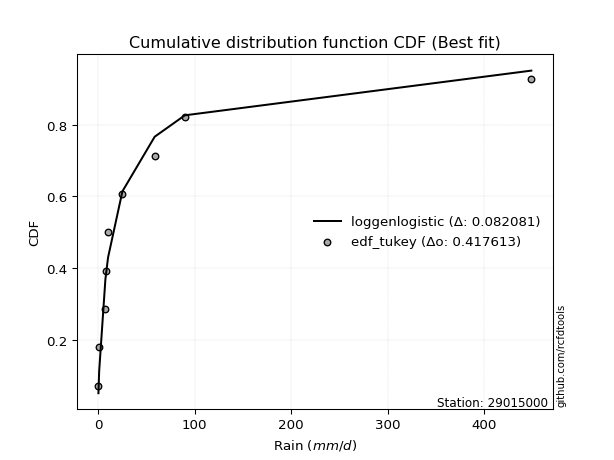</img>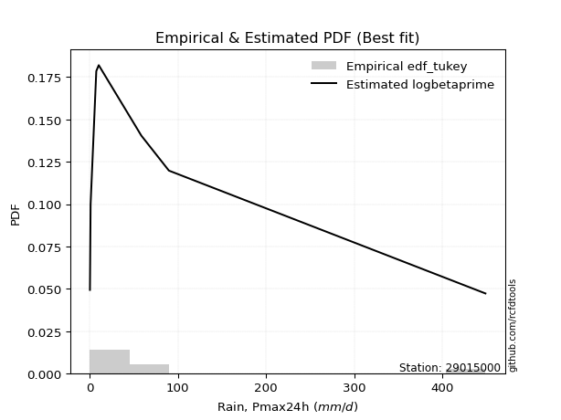</img>

</div>


### 8. EDF Gringorten (1963)

Gringorten plotting position formula is essential for estimating the probability and return periods of extreme events like floods and heavy rainfall. The constant _a=0.44_.

<div align="center">


$P=(m-a)/(n+1-2a)$


</div>


**8.1. Empirical values**

<div align="center">

|                | 0                    | 1                  | 2                   | 3                  | 4              | 5                  | 6                  | 7                  | 8                  |
|:---------------|:---------------------|:-------------------|:--------------------|:-------------------|:---------------|:-------------------|:-------------------|:-------------------|:-------------------|
| date           | 2023                 | 2024               | 2018                | 2019               | 2020           | 2025               | 2017               | 2022               | 2021               |
| x              | 0.36                 | 1.1                | 7.54                | 7.68               | 10.33          | 25.2               | 58.63              | 89.91              | 448.89             |
| m              | 1                    | 2                  | 3                   | 4                  | 5              | 6                  | 7                  | 8                  | 9                  |
| empirical_dist | edf_gringorten       | edf_gringorten     | edf_gringorten      | edf_gringorten     | edf_gringorten | edf_gringorten     | edf_gringorten     | edf_gringorten     | edf_gringorten     |
| empirical      | 0.061403508771929835 | 0.1710526315789474 | 0.28070175438596495 | 0.3903508771929825 | 0.5            | 0.6096491228070176 | 0.7192982456140351 | 0.8289473684210527 | 0.9385964912280703 |
| empirical_tr   | 1.0654205607476634   | 1.2063492063492063 | 1.3902439024390243  | 1.6402877697841727 | 2.0            | 2.561797752808989  | 3.5625             | 5.846153846153847  | 16.285714285714324 |

</div>


**8.2. Kolmogorov-Smirnov fit test (sorted by Δ)**


<div align="center">

|                | 0                   | 1                   | 2                   | 3                   | 4                   | 5                   | 6                   | 7                   | 8                   | 9                   | 10                  | 11                  | 12                  | 13                  | 14                  | 15                  | 16                  | 17                  | 18                  | 19                  | 20                  | 21                  | 22                  | 23                  | 24                  | 25                  | 26                  | 27                  | 28                  | 29                  | 30                  | 31                  | 32                  | 33                  | 34                  | 35                  | 36                  | 37                  | 38                  | 39                  | 40                  | 41                  | 42                  | 43                  | 44                  | 45                  | 46                  | 47                  | 48                  | 49                  | 50                  | 51                  | 52                  | 53                  | 54                  | 55                  | 56                  | 57                  | 58                  | 59                  | 60                  | 61                  | 62                  | 63                  | 64                  | 65                  | 66                  | 67                  | 68                  | 69                  | 70                  | 71                  | 72                  | 73                  | 74                  | 75                  | 76                  | 77                  | 78                  | 79                  | 80                  | 81                  | 82                  | 83                  | 84                  | 85                  | 86                  | 87                  | 88                  | 89                  | 90                  | 91                  | 92                  | 93                  | 94                  | 95                  | 96                  | 97                  | 98                  | 99                  | 100                 | 101                 | 102                 | 103                 | 104                 | 105                 | 106                 | 107                 | 108                 | 109                 | 110                 | 111                 | 112                 | 113                 | 114                 | 115                 | 116                 | 117                 | 118                 | 119                 | 120                 | 121                 | 122                 | 123                 | 124                 | 125                 | 126                 | 127                 | 128                 | 129                 | 130                 | 131                 | 132                 | 133                 | 134                 | 135                 | 136                 | 137                 | 138                 | 139                 | 140                 | 141                 | 142                 | 143                 | 144                 | 145                 | 146                 | 147                 | 148                 | 149                 | 150                 | 151                 | 152                 | 153                 | 154                 | 155                 | 156                 | 157                 | 158                 | 159                 |
|:---------------|:--------------------|:--------------------|:--------------------|:--------------------|:--------------------|:--------------------|:--------------------|:--------------------|:--------------------|:--------------------|:--------------------|:--------------------|:--------------------|:--------------------|:--------------------|:--------------------|:--------------------|:--------------------|:--------------------|:--------------------|:--------------------|:--------------------|:--------------------|:--------------------|:--------------------|:--------------------|:--------------------|:--------------------|:--------------------|:--------------------|:--------------------|:--------------------|:--------------------|:--------------------|:--------------------|:--------------------|:--------------------|:--------------------|:--------------------|:--------------------|:--------------------|:--------------------|:--------------------|:--------------------|:--------------------|:--------------------|:--------------------|:--------------------|:--------------------|:--------------------|:--------------------|:--------------------|:--------------------|:--------------------|:--------------------|:--------------------|:--------------------|:--------------------|:--------------------|:--------------------|:--------------------|:--------------------|:--------------------|:--------------------|:--------------------|:--------------------|:--------------------|:--------------------|:--------------------|:--------------------|:--------------------|:--------------------|:--------------------|:--------------------|:--------------------|:--------------------|:--------------------|:--------------------|:--------------------|:--------------------|:--------------------|:--------------------|:--------------------|:--------------------|:--------------------|:--------------------|:--------------------|:--------------------|:--------------------|:--------------------|:--------------------|:--------------------|:--------------------|:--------------------|:--------------------|:--------------------|:--------------------|:--------------------|:--------------------|:--------------------|:--------------------|:--------------------|:--------------------|:--------------------|:--------------------|:--------------------|:--------------------|:--------------------|:--------------------|:--------------------|:--------------------|:--------------------|:--------------------|:--------------------|:--------------------|:--------------------|:--------------------|:--------------------|:--------------------|:--------------------|:--------------------|:--------------------|:--------------------|:--------------------|:--------------------|:--------------------|:--------------------|:--------------------|:--------------------|:--------------------|:--------------------|:--------------------|:--------------------|:--------------------|:--------------------|:--------------------|:--------------------|:--------------------|:--------------------|:--------------------|:--------------------|:--------------------|:--------------------|:--------------------|:--------------------|:--------------------|:--------------------|:--------------------|:--------------------|:--------------------|:--------------------|:--------------------|:--------------------|:--------------------|:--------------------|:--------------------|:--------------------|:--------------------|:--------------------|:--------------------|
| station        | 29015000            | 29015000            | 29015000            | 29015000            | 29015000            | 29015000            | 29015000            | 29015000            | 29015000            | 29015000            | 29015000            | 29015000            | 29015000            | 29015000            | 29015000            | 29015000            | 29015000            | 29015000            | 29015000            | 29015000            | 29015000            | 29015000            | 29015000            | 29015000            | 29015000            | 29015000            | 29015000            | 29015000            | 29015000            | 29015000            | 29015000            | 29015000            | 29015000            | 29015000            | 29015000            | 29015000            | 29015000            | 29015000            | 29015000            | 29015000            | 29015000            | 29015000            | 29015000            | 29015000            | 29015000            | 29015000            | 29015000            | 29015000            | 29015000            | 29015000            | 29015000            | 29015000            | 29015000            | 29015000            | 29015000            | 29015000            | 29015000            | 29015000            | 29015000            | 29015000            | 29015000            | 29015000            | 29015000            | 29015000            | 29015000            | 29015000            | 29015000            | 29015000            | 29015000            | 29015000            | 29015000            | 29015000            | 29015000            | 29015000            | 29015000            | 29015000            | 29015000            | 29015000            | 29015000            | 29015000            | 29015000            | 29015000            | 29015000            | 29015000            | 29015000            | 29015000            | 29015000            | 29015000            | 29015000            | 29015000            | 29015000            | 29015000            | 29015000            | 29015000            | 29015000            | 29015000            | 29015000            | 29015000            | 29015000            | 29015000            | 29015000            | 29015000            | 29015000            | 29015000            | 29015000            | 29015000            | 29015000            | 29015000            | 29015000            | 29015000            | 29015000            | 29015000            | 29015000            | 29015000            | 29015000            | 29015000            | 29015000            | 29015000            | 29015000            | 29015000            | 29015000            | 29015000            | 29015000            | 29015000            | 29015000            | 29015000            | 29015000            | 29015000            | 29015000            | 29015000            | 29015000            | 29015000            | 29015000            | 29015000            | 29015000            | 29015000            | 29015000            | 29015000            | 29015000            | 29015000            | 29015000            | 29015000            | 29015000            | 29015000            | 29015000            | 29015000            | 29015000            | 29015000            | 29015000            | 29015000            | 29015000            | 29015000            | 29015000            | 29015000            | 29015000            | 29015000            | 29015000            | 29015000            | 29015000            | 29015000            |
| empirical_dist | edf_gringorten      | edf_gringorten      | edf_gringorten      | edf_gringorten      | edf_gringorten      | edf_gringorten      | edf_gringorten      | edf_gringorten      | edf_gringorten      | edf_gringorten      | edf_gringorten      | edf_gringorten      | edf_gringorten      | edf_gringorten      | edf_gringorten      | edf_gringorten      | edf_gringorten      | edf_gringorten      | edf_gringorten      | edf_gringorten      | edf_gringorten      | edf_gringorten      | edf_gringorten      | edf_gringorten      | edf_gringorten      | edf_gringorten      | edf_gringorten      | edf_gringorten      | edf_gringorten      | edf_gringorten      | edf_gringorten      | edf_gringorten      | edf_gringorten      | edf_gringorten      | edf_gringorten      | edf_gringorten      | edf_gringorten      | edf_gringorten      | edf_gringorten      | edf_gringorten      | edf_gringorten      | edf_gringorten      | edf_gringorten      | edf_gringorten      | edf_gringorten      | edf_gringorten      | edf_gringorten      | edf_gringorten      | edf_gringorten      | edf_gringorten      | edf_gringorten      | edf_gringorten      | edf_gringorten      | edf_gringorten      | edf_gringorten      | edf_gringorten      | edf_gringorten      | edf_gringorten      | edf_gringorten      | edf_gringorten      | edf_gringorten      | edf_gringorten      | edf_gringorten      | edf_gringorten      | edf_gringorten      | edf_gringorten      | edf_gringorten      | edf_gringorten      | edf_gringorten      | edf_gringorten      | edf_gringorten      | edf_gringorten      | edf_gringorten      | edf_gringorten      | edf_gringorten      | edf_gringorten      | edf_gringorten      | edf_gringorten      | edf_gringorten      | edf_gringorten      | edf_gringorten      | edf_gringorten      | edf_gringorten      | edf_gringorten      | edf_gringorten      | edf_gringorten      | edf_gringorten      | edf_gringorten      | edf_gringorten      | edf_gringorten      | edf_gringorten      | edf_gringorten      | edf_gringorten      | edf_gringorten      | edf_gringorten      | edf_gringorten      | edf_gringorten      | edf_gringorten      | edf_gringorten      | edf_gringorten      | edf_gringorten      | edf_gringorten      | edf_gringorten      | edf_gringorten      | edf_gringorten      | edf_gringorten      | edf_gringorten      | edf_gringorten      | edf_gringorten      | edf_gringorten      | edf_gringorten      | edf_gringorten      | edf_gringorten      | edf_gringorten      | edf_gringorten      | edf_gringorten      | edf_gringorten      | edf_gringorten      | edf_gringorten      | edf_gringorten      | edf_gringorten      | edf_gringorten      | edf_gringorten      | edf_gringorten      | edf_gringorten      | edf_gringorten      | edf_gringorten      | edf_gringorten      | edf_gringorten      | edf_gringorten      | edf_gringorten      | edf_gringorten      | edf_gringorten      | edf_gringorten      | edf_gringorten      | edf_gringorten      | edf_gringorten      | edf_gringorten      | edf_gringorten      | edf_gringorten      | edf_gringorten      | edf_gringorten      | edf_gringorten      | edf_gringorten      | edf_gringorten      | edf_gringorten      | edf_gringorten      | edf_gringorten      | edf_gringorten      | edf_gringorten      | edf_gringorten      | edf_gringorten      | edf_gringorten      | edf_gringorten      | edf_gringorten      | edf_gringorten      | edf_gringorten      | edf_gringorten      | edf_gringorten      | edf_gringorten      |
| p_dist         | ncf                 | loghypsecant        | loggenlogistic      | f                   | loggenextreme       | logdgamma           | loglogistic         | logskewnorm         | logdweibull         | logjohnsonsu        | loglaplace          | loglaplace          | logloggamma         | logargus            | logpearson3         | logfoldnorm         | logweibull_min      | lognorm             | logcrystalball      | logt                | logexponnorm        | lognct              | lognakagami         | logfatiguelife      | genpareto           | lomax               | truncpareto         | logbetaprime        | loggengamma         | logerlang           | loggamma            | loggamma            | loggausshyper       | loggompertz         | loggumbel_l         | logcosine           | loganglit           | logrice             | logsemicircular     | loginvgamma         | logalpha            | logkappa3           | logmaxwell          | invgauss            | loginvgauss         | logwrapcauchy       | loguniform          | invgamma            | gengamma            | lograyleigh         | logarcsine          | truncweibull_min    | logksone            | exponpow            | logbeta             | logtriang           | halfgennorm         | loggumbel_r         | loginvweibull       | genextreme          | invweibull          | loggenpareto        | exponweib           | logkappa4           | logtruncnorm        | logmielke           | kappa3              | logvonmises_line    | gamma               | mielke              | logmoyal            | loghalfnorm         | logtruncweibull_min | fatiguelife         | loggenhalflogistic  | erlang              | burr12              | logkstwobign        | loggenexpon         | vonmises_line       | loghalflogistic     | betaprime           | gennorm             | t                   | logbradford         | dgamma              | nct                 | genlogistic         | nakagami            | logtruncexpon       | logwald             | gausshyper          | logncf              | maxwell             | gumbel_r            | logistic            | logburr12           | hypsecant           | rayleigh            | crystalball         | norm                | wald                | dweibull            | moyal               | weibull_min         | logtrapezoid        | anglit              | semicircular        | loglomax            | logjohnsonsb        | burr                | kstwobign           | powerlaw            | laplace             | halflogistic        | logexponweib        | halfnorm            | rice                | arcsine             | loglevy_l           | pearson3            | foldnorm            | loggennorm          | gumbel_l            | loghalfgennorm      | logburr             | wrapcauchy          | logloglaplace       | exponnorm           | genexpon            | logf                | cosine              | gompertz            | truncnorm           | logtukeylambda      | johnsonsu           | levy_l              | logrdist            | skewnorm            | argus               | bradford            | truncexpon          | triang              | logweibull_max      | logpowerlaw         | rdist               | ksone               | kappa4              | tukeylambda         | alpha               | logexponpow         | uniform             | logtruncpareto      | johnsonsb           | genhalflogistic     | beta                | trapezoid           | weibull_max         | logvonmises         | vonmises            |
| delta          | 0.08226100315115886 | 0.08428194506362613 | 0.08709354747637654 | 0.09224994735239334 | 0.09455831302145096 | 0.09531202588419468 | 0.0956249656055268  | 0.09631276994138277 | 0.09732900291184071 | 0.09779740490449751 | 0.09808766498101507 | 0.09808766498101507 | 0.09830010832331104 | 0.10150211592284575 | 0.10236292384205947 | 0.10689137723534492 | 0.10930044230073399 | 0.10960706587385388 | 0.1096070753065258  | 0.10960726280928851 | 0.10960763919255839 | 0.10971962149807363 | 0.1098578578357925  | 0.10994194757759923 | 0.11486482609690457 | 0.11487459233157687 | 0.11505821557997015 | 0.11524461964335359 | 0.11541505830411158 | 0.11586765195188492 | 0.1163411774995694  | 0.1163411774995694  | 0.11667752430921624 | 0.11975454005765279 | 0.120387604752136   | 0.12142688269501978 | 0.12466695564005514 | 0.12761802410793793 | 0.13093178827991525 | 0.13347274535769516 | 0.1347160880856132  | 0.14336429032139064 | 0.14336519506025547 | 0.14388173362392764 | 0.1443484575641874  | 0.1456219045077669  | 0.14602247613987757 | 0.14783455002555473 | 0.1478886354996649  | 0.1556693019457605  | 0.1561994103710519  | 0.15710325344056214 | 0.15823510438557048 | 0.15960596999323062 | 0.16065397149499716 | 0.16087193344979034 | 0.16665480261918642 | 0.1674994843524263  | 0.1712344819983187  | 0.17487314052613956 | 0.17487360755704967 | 0.17504219137891736 | 0.17582371023741095 | 0.1770370261505304  | 0.1771118578086216  | 0.1780800259324341  | 0.179279010117612   | 0.1803892879359162  | 0.1826769841843206  | 0.18853928009071552 | 0.18963700026190805 | 0.19059762855476342 | 0.19241659884604145 | 0.19297981246529966 | 0.193227934960417   | 0.1937224512762461  | 0.19404917451195586 | 0.19441765813222073 | 0.19473379026368282 | 0.20303702223128317 | 0.20488305620382197 | 0.21084280020358975 | 0.2179961540480307  | 0.22447781006349798 | 0.22563125017531988 | 0.23987033049756362 | 0.24033319275033943 | 0.24397723631043017 | 0.24644555173764104 | 0.24647646599482104 | 0.24852134728435787 | 0.25189352641785956 | 0.2638863379630622  | 0.2653651968255734  | 0.2701031450193756  | 0.2702052741535559  | 0.27200184534762134 | 0.27423945252820925 | 0.27635306337730403 | 0.27717288053483924 | 0.27717288353745206 | 0.27911538451432977 | 0.27919563278227105 | 0.2798571416879732  | 0.2829134352217666  | 0.2830791030288722  | 0.2845177803199267  | 0.2875499156168798  | 0.29006575465819234 | 0.2955366322366748  | 0.29921080622216684 | 0.2996113644365325  | 0.3003675352163297  | 0.30265536556893313 | 0.30545485134908906 | 0.3054674291037152  | 0.30739715117637595 | 0.3114549039302445  | 0.31698128489011707 | 0.31717773485399253 | 0.3219827593537974  | 0.3225601263056755  | 0.32894736842105265 | 0.34401704319474347 | 0.34494690175244486 | 0.35173813748803945 | 0.3521831502673195  | 0.35522575961739206 | 0.36996533498965156 | 0.37039062763661645 | 0.3815492932944405  | 0.38927656767991453 | 0.3964619542603338  | 0.4093273802797931  | 0.4322689261112211  | 0.4436817709006599  | 0.44699895646021387 | 0.4756709165923983  | 0.48149682547275896 | 0.4860478083131603  | 0.5055767859469021  | 0.5119612859035484  | 0.5120690305529729  | 0.5139091569059016  | 0.5574824219496299  | 0.5756113290032462  | 0.579237204106514   | 0.6044835747376666  | 0.6056893864185557  | 0.6115253045930045  | 0.6139504275075189  | 0.6292951712436063  | 0.6372026452402748  | 0.6568752978033665  | 0.677641706586826   | 0.7523931849389184  | 0.7645109025855863  | 0.7715131257378489  | 0.9986871510962828  | 70.9379252901034    |
| deltao         | 0.41761268023100007 | 0.41761268023100007 | 0.41761268023100007 | 0.41761268023100007 | 0.41761268023100007 | 0.41761268023100007 | 0.41761268023100007 | 0.41761268023100007 | 0.41761268023100007 | 0.41761268023100007 | 0.41761268023100007 | 0.41761268023100007 | 0.41761268023100007 | 0.41761268023100007 | 0.41761268023100007 | 0.41761268023100007 | 0.41761268023100007 | 0.41761268023100007 | 0.41761268023100007 | 0.41761268023100007 | 0.41761268023100007 | 0.41761268023100007 | 0.41761268023100007 | 0.41761268023100007 | 0.41761268023100007 | 0.41761268023100007 | 0.41761268023100007 | 0.41761268023100007 | 0.41761268023100007 | 0.41761268023100007 | 0.41761268023100007 | 0.41761268023100007 | 0.41761268023100007 | 0.41761268023100007 | 0.41761268023100007 | 0.41761268023100007 | 0.41761268023100007 | 0.41761268023100007 | 0.41761268023100007 | 0.41761268023100007 | 0.41761268023100007 | 0.41761268023100007 | 0.41761268023100007 | 0.41761268023100007 | 0.41761268023100007 | 0.41761268023100007 | 0.41761268023100007 | 0.41761268023100007 | 0.41761268023100007 | 0.41761268023100007 | 0.41761268023100007 | 0.41761268023100007 | 0.41761268023100007 | 0.41761268023100007 | 0.41761268023100007 | 0.41761268023100007 | 0.41761268023100007 | 0.41761268023100007 | 0.41761268023100007 | 0.41761268023100007 | 0.41761268023100007 | 0.41761268023100007 | 0.41761268023100007 | 0.41761268023100007 | 0.41761268023100007 | 0.41761268023100007 | 0.41761268023100007 | 0.41761268023100007 | 0.41761268023100007 | 0.41761268023100007 | 0.41761268023100007 | 0.41761268023100007 | 0.41761268023100007 | 0.41761268023100007 | 0.41761268023100007 | 0.41761268023100007 | 0.41761268023100007 | 0.41761268023100007 | 0.41761268023100007 | 0.41761268023100007 | 0.41761268023100007 | 0.41761268023100007 | 0.41761268023100007 | 0.41761268023100007 | 0.41761268023100007 | 0.41761268023100007 | 0.41761268023100007 | 0.41761268023100007 | 0.41761268023100007 | 0.41761268023100007 | 0.41761268023100007 | 0.41761268023100007 | 0.41761268023100007 | 0.41761268023100007 | 0.41761268023100007 | 0.41761268023100007 | 0.41761268023100007 | 0.41761268023100007 | 0.41761268023100007 | 0.41761268023100007 | 0.41761268023100007 | 0.41761268023100007 | 0.41761268023100007 | 0.41761268023100007 | 0.41761268023100007 | 0.41761268023100007 | 0.41761268023100007 | 0.41761268023100007 | 0.41761268023100007 | 0.41761268023100007 | 0.41761268023100007 | 0.41761268023100007 | 0.41761268023100007 | 0.41761268023100007 | 0.41761268023100007 | 0.41761268023100007 | 0.41761268023100007 | 0.41761268023100007 | 0.41761268023100007 | 0.41761268023100007 | 0.41761268023100007 | 0.41761268023100007 | 0.41761268023100007 | 0.41761268023100007 | 0.41761268023100007 | 0.41761268023100007 | 0.41761268023100007 | 0.41761268023100007 | 0.41761268023100007 | 0.41761268023100007 | 0.41761268023100007 | 0.41761268023100007 | 0.41761268023100007 | 0.41761268023100007 | 0.41761268023100007 | 0.41761268023100007 | 0.41761268023100007 | 0.41761268023100007 | 0.41761268023100007 | 0.41761268023100007 | 0.41761268023100007 | 0.41761268023100007 | 0.41761268023100007 | 0.41761268023100007 | 0.41761268023100007 | 0.41761268023100007 | 0.41761268023100007 | 0.41761268023100007 | 0.41761268023100007 | 0.41761268023100007 | 0.41761268023100007 | 0.41761268023100007 | 0.41761268023100007 | 0.41761268023100007 | 0.41761268023100007 | 0.41761268023100007 | 0.41761268023100007 | 0.41761268023100007 | 0.41761268023100007 | 0.41761268023100007 |
| eval           | Δo > Δ              | Δo > Δ              | Δo > Δ              | Δo > Δ              | Δo > Δ              | Δo > Δ              | Δo > Δ              | Δo > Δ              | Δo > Δ              | Δo > Δ              | Δo > Δ              | Δo > Δ              | Δo > Δ              | Δo > Δ              | Δo > Δ              | Δo > Δ              | Δo > Δ              | Δo > Δ              | Δo > Δ              | Δo > Δ              | Δo > Δ              | Δo > Δ              | Δo > Δ              | Δo > Δ              | Δo > Δ              | Δo > Δ              | Δo > Δ              | Δo > Δ              | Δo > Δ              | Δo > Δ              | Δo > Δ              | Δo > Δ              | Δo > Δ              | Δo > Δ              | Δo > Δ              | Δo > Δ              | Δo > Δ              | Δo > Δ              | Δo > Δ              | Δo > Δ              | Δo > Δ              | Δo > Δ              | Δo > Δ              | Δo > Δ              | Δo > Δ              | Δo > Δ              | Δo > Δ              | Δo > Δ              | Δo > Δ              | Δo > Δ              | Δo > Δ              | Δo > Δ              | Δo > Δ              | Δo > Δ              | Δo > Δ              | Δo > Δ              | Δo > Δ              | Δo > Δ              | Δo > Δ              | Δo > Δ              | Δo > Δ              | Δo > Δ              | Δo > Δ              | Δo > Δ              | Δo > Δ              | Δo > Δ              | Δo > Δ              | Δo > Δ              | Δo > Δ              | Δo > Δ              | Δo > Δ              | Δo > Δ              | Δo > Δ              | Δo > Δ              | Δo > Δ              | Δo > Δ              | Δo > Δ              | Δo > Δ              | Δo > Δ              | Δo > Δ              | Δo > Δ              | Δo > Δ              | Δo > Δ              | Δo > Δ              | Δo > Δ              | Δo > Δ              | Δo > Δ              | Δo > Δ              | Δo > Δ              | Δo > Δ              | Δo > Δ              | Δo > Δ              | Δo > Δ              | Δo > Δ              | Δo > Δ              | Δo > Δ              | Δo > Δ              | Δo > Δ              | Δo > Δ              | Δo > Δ              | Δo > Δ              | Δo > Δ              | Δo > Δ              | Δo > Δ              | Δo > Δ              | Δo > Δ              | Δo > Δ              | Δo > Δ              | Δo > Δ              | Δo > Δ              | Δo > Δ              | Δo > Δ              | Δo > Δ              | Δo > Δ              | Δo > Δ              | Δo > Δ              | Δo > Δ              | Δo > Δ              | Δo > Δ              | Δo > Δ              | Δo > Δ              | Δo > Δ              | Δo > Δ              | Δo > Δ              | Δo > Δ              | Δo > Δ              | Δo > Δ              | Δo > Δ              | Δo > Δ              | Δo > Δ              | Δo > Δ              | Δo > Δ              | Δo > Δ              | Δo > Δ              | Δo <= Δ             | Δo <= Δ             | Δo <= Δ             | Δo <= Δ             | Δo <= Δ             | Δo <= Δ             | Δo <= Δ             | Δo <= Δ             | Δo <= Δ             | Δo <= Δ             | Δo <= Δ             | Δo <= Δ             | Δo <= Δ             | Δo <= Δ             | Δo <= Δ             | Δo <= Δ             | Δo <= Δ             | Δo <= Δ             | Δo <= Δ             | Δo <= Δ             | Δo <= Δ             | Δo <= Δ             | Δo <= Δ             | Δo <= Δ             | Δo <= Δ             | Δo <= Δ             |
| fit            | 1                   | 1                   | 1                   | 1                   | 1                   | 1                   | 1                   | 1                   | 1                   | 1                   | 1                   | 1                   | 1                   | 1                   | 1                   | 1                   | 1                   | 1                   | 1                   | 1                   | 1                   | 1                   | 1                   | 1                   | 1                   | 1                   | 1                   | 1                   | 1                   | 1                   | 1                   | 1                   | 1                   | 1                   | 1                   | 1                   | 1                   | 1                   | 1                   | 1                   | 1                   | 1                   | 1                   | 1                   | 1                   | 1                   | 1                   | 1                   | 1                   | 1                   | 1                   | 1                   | 1                   | 1                   | 1                   | 1                   | 1                   | 1                   | 1                   | 1                   | 1                   | 1                   | 1                   | 1                   | 1                   | 1                   | 1                   | 1                   | 1                   | 1                   | 1                   | 1                   | 1                   | 1                   | 1                   | 1                   | 1                   | 1                   | 1                   | 1                   | 1                   | 1                   | 1                   | 1                   | 1                   | 1                   | 1                   | 1                   | 1                   | 1                   | 1                   | 1                   | 1                   | 1                   | 1                   | 1                   | 1                   | 1                   | 1                   | 1                   | 1                   | 1                   | 1                   | 1                   | 1                   | 1                   | 1                   | 1                   | 1                   | 1                   | 1                   | 1                   | 1                   | 1                   | 1                   | 1                   | 1                   | 1                   | 1                   | 1                   | 1                   | 1                   | 1                   | 1                   | 1                   | 1                   | 1                   | 1                   | 1                   | 1                   | 1                   | 1                   | 1                   | 1                   | 0                   | 0                   | 0                   | 0                   | 0                   | 0                   | 0                   | 0                   | 0                   | 0                   | 0                   | 0                   | 0                   | 0                   | 0                   | 0                   | 0                   | 0                   | 0                   | 0                   | 0                   | 0                   | 0                   | 0                   | 0                   | 0                   |
| n              | 9                   | 9                   | 9                   | 9                   | 9                   | 9                   | 9                   | 9                   | 9                   | 9                   | 9                   | 9                   | 9                   | 9                   | 9                   | 9                   | 9                   | 9                   | 9                   | 9                   | 9                   | 9                   | 9                   | 9                   | 9                   | 9                   | 9                   | 9                   | 9                   | 9                   | 9                   | 9                   | 9                   | 9                   | 9                   | 9                   | 9                   | 9                   | 9                   | 9                   | 9                   | 9                   | 9                   | 9                   | 9                   | 9                   | 9                   | 9                   | 9                   | 9                   | 9                   | 9                   | 9                   | 9                   | 9                   | 9                   | 9                   | 9                   | 9                   | 9                   | 9                   | 9                   | 9                   | 9                   | 9                   | 9                   | 9                   | 9                   | 9                   | 9                   | 9                   | 9                   | 9                   | 9                   | 9                   | 9                   | 9                   | 9                   | 9                   | 9                   | 9                   | 9                   | 9                   | 9                   | 9                   | 9                   | 9                   | 9                   | 9                   | 9                   | 9                   | 9                   | 9                   | 9                   | 9                   | 9                   | 9                   | 9                   | 9                   | 9                   | 9                   | 9                   | 9                   | 9                   | 9                   | 9                   | 9                   | 9                   | 9                   | 9                   | 9                   | 9                   | 9                   | 9                   | 9                   | 9                   | 9                   | 9                   | 9                   | 9                   | 9                   | 9                   | 9                   | 9                   | 9                   | 9                   | 9                   | 9                   | 9                   | 9                   | 9                   | 9                   | 9                   | 9                   | 9                   | 9                   | 9                   | 9                   | 9                   | 9                   | 9                   | 9                   | 9                   | 9                   | 9                   | 9                   | 9                   | 9                   | 9                   | 9                   | 9                   | 9                   | 9                   | 9                   | 9                   | 9                   | 9                   | 9                   | 9                   | 9                   |
| best_fit       | 1                   | 0                   | 0                   | 0                   | 0                   | 0                   | 0                   | 0                   | 0                   | 0                   | 0                   | 0                   | 0                   | 0                   | 0                   | 0                   | 0                   | 0                   | 0                   | 0                   | 0                   | 0                   | 0                   | 0                   | 0                   | 0                   | 0                   | 0                   | 0                   | 0                   | 0                   | 0                   | 0                   | 0                   | 0                   | 0                   | 0                   | 0                   | 0                   | 0                   | 0                   | 0                   | 0                   | 0                   | 0                   | 0                   | 0                   | 0                   | 0                   | 0                   | 0                   | 0                   | 0                   | 0                   | 0                   | 0                   | 0                   | 0                   | 0                   | 0                   | 0                   | 0                   | 0                   | 0                   | 0                   | 0                   | 0                   | 0                   | 0                   | 0                   | 0                   | 0                   | 0                   | 0                   | 0                   | 0                   | 0                   | 0                   | 0                   | 0                   | 0                   | 0                   | 0                   | 0                   | 0                   | 0                   | 0                   | 0                   | 0                   | 0                   | 0                   | 0                   | 0                   | 0                   | 0                   | 0                   | 0                   | 0                   | 0                   | 0                   | 0                   | 0                   | 0                   | 0                   | 0                   | 0                   | 0                   | 0                   | 0                   | 0                   | 0                   | 0                   | 0                   | 0                   | 0                   | 0                   | 0                   | 0                   | 0                   | 0                   | 0                   | 0                   | 0                   | 0                   | 0                   | 0                   | 0                   | 0                   | 0                   | 0                   | 0                   | 0                   | 0                   | 0                   | 0                   | 0                   | 0                   | 0                   | 0                   | 0                   | 0                   | 0                   | 0                   | 0                   | 0                   | 0                   | 0                   | 0                   | 0                   | 0                   | 0                   | 0                   | 0                   | 0                   | 0                   | 0                   | 0                   | 0                   | 0                   | 0                   |
| best_fit_sort  | 1                   | 2                   | 3                   | 4                   | 5                   | 6                   | 7                   | 8                   | 9                   | 10                  | 11                  | 12                  | 13                  | 14                  | 15                  | 16                  | 17                  | 18                  | 19                  | 20                  | 21                  | 22                  | 23                  | 24                  | 25                  | 26                  | 27                  | 28                  | 29                  | 30                  | 31                  | 32                  | 33                  | 34                  | 35                  | 36                  | 37                  | 38                  | 39                  | 40                  | 41                  | 42                  | 43                  | 44                  | 45                  | 46                  | 47                  | 48                  | 49                  | 50                  | 51                  | 52                  | 53                  | 54                  | 55                  | 56                  | 57                  | 58                  | 59                  | 60                  | 61                  | 62                  | 63                  | 64                  | 65                  | 66                  | 67                  | 68                  | 69                  | 70                  | 71                  | 72                  | 73                  | 74                  | 75                  | 76                  | 77                  | 78                  | 79                  | 80                  | 81                  | 82                  | 83                  | 84                  | 85                  | 86                  | 87                  | 88                  | 89                  | 90                  | 91                  | 92                  | 93                  | 94                  | 95                  | 96                  | 97                  | 98                  | 99                  | 100                 | 101                 | 102                 | 103                 | 104                 | 105                 | 106                 | 107                 | 108                 | 109                 | 110                 | 111                 | 112                 | 113                 | 114                 | 115                 | 116                 | 117                 | 118                 | 119                 | 120                 | 121                 | 122                 | 123                 | 124                 | 125                 | 126                 | 127                 | 128                 | 129                 | 130                 | 131                 | 132                 | 133                 | 134                 | 135                 | 136                 | 137                 | 138                 | 139                 | 140                 | 141                 | 142                 | 143                 | 144                 | 145                 | 146                 | 147                 | 148                 | 149                 | 150                 | 151                 | 152                 | 153                 | 154                 | 155                 | 156                 | 157                 | 158                 | 159                 | 160                 |

</div>


**8.3. Best fit**

<div align="center">

|   id |   station | empirical_dist   | p_dist   |    delta |   deltao | eval   |   fit |   n |   best_fit |   best_fit_sort |
|-----:|----------:|:-----------------|:---------|---------:|---------:|:-------|------:|----:|-----------:|----------------:|
|    0 |  29015000 | edf_gringorten   | ncf      | 0.082261 | 0.417613 | Δo > Δ |     1 |   9 |          1 |               1 |

</div>


<div align="center">

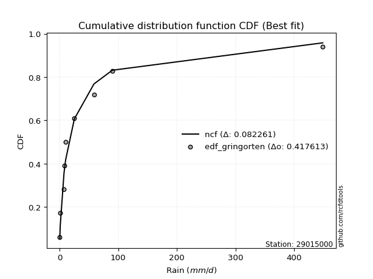</img>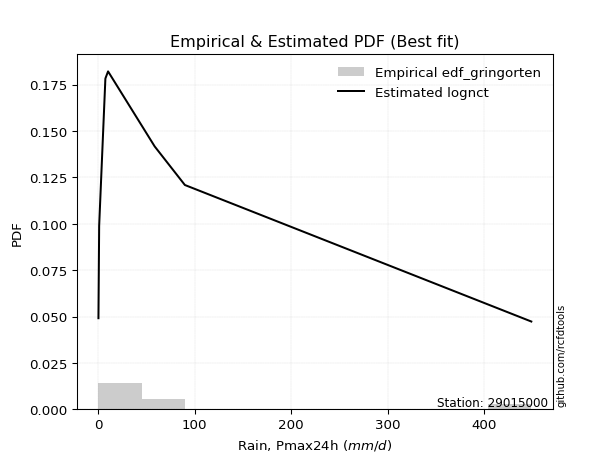</img>

</div>


### 9. EDF Filliben (1975)

The specific values of the constants (0.3175) (often denoted as $alpha$) and (0.365) are derived from a method proposed by James J. Filliben in a 1975 paper. This particular formula is the mean value of the $i$-th order statistic of the normal distribution and is considered a robust and effective plotting position formula for the normal probability plot correlation coefficient test for normality.

<div align="center">


$P=(m-0.3175)/(n+0.365)$


</div>


**9.1. Empirical values**

<div align="center">

|                | 0                   | 1                  | 2                   | 3                   | 4            | 5                  | 6                  | 7                  | 8                  |
|:---------------|:--------------------|:-------------------|:--------------------|:--------------------|:-------------|:-------------------|:-------------------|:-------------------|:-------------------|
| date           | 2023                | 2024               | 2018                | 2019                | 2020         | 2025               | 2017               | 2022               | 2021               |
| x              | 0.36                | 1.1                | 7.54                | 7.68                | 10.33        | 25.2               | 58.63              | 89.91              | 448.89             |
| m              | 1                   | 2                  | 3                   | 4                   | 5            | 6                  | 7                  | 8                  | 9                  |
| empirical_dist | edf_filliben        | edf_filliben       | edf_filliben        | edf_filliben        | edf_filliben | edf_filliben       | edf_filliben       | edf_filliben       | edf_filliben       |
| empirical      | 0.07287773625200214 | 0.1796583021890016 | 0.28643886812600106 | 0.39321943406300053 | 0.5          | 0.6067805659369995 | 0.7135611318739989 | 0.8203416978109984 | 0.9271222637479978 |
| empirical_tr   | 1.0786063921681543  | 1.219004230393752  | 1.401421623643846   | 1.6480422349318082  | 2.0          | 2.5431093007467753 | 3.491146318732526  | 5.566121842496286  | 13.721611721611705 |

</div>


**9.2. Kolmogorov-Smirnov fit test (sorted by Δ)**


<div align="center">

|                | 0                   | 1                   | 2                   | 3                   | 4                   | 5                   | 6                   | 7                   | 8                   | 9                   | 10                  | 11                  | 12                  | 13                  | 14                  | 15                  | 16                  | 17                  | 18                  | 19                  | 20                  | 21                  | 22                  | 23                  | 24                  | 25                  | 26                  | 27                  | 28                  | 29                  | 30                  | 31                  | 32                  | 33                  | 34                  | 35                  | 36                  | 37                  | 38                  | 39                  | 40                  | 41                  | 42                  | 43                  | 44                  | 45                  | 46                  | 47                  | 48                  | 49                  | 50                  | 51                  | 52                  | 53                  | 54                  | 55                  | 56                  | 57                  | 58                  | 59                  | 60                  | 61                  | 62                  | 63                  | 64                  | 65                  | 66                  | 67                  | 68                  | 69                  | 70                  | 71                  | 72                  | 73                  | 74                  | 75                  | 76                  | 77                  | 78                  | 79                  | 80                  | 81                  | 82                  | 83                  | 84                  | 85                  | 86                  | 87                  | 88                  | 89                  | 90                  | 91                  | 92                  | 93                  | 94                  | 95                  | 96                  | 97                  | 98                  | 99                  | 100                 | 101                 | 102                 | 103                 | 104                 | 105                 | 106                 | 107                 | 108                 | 109                 | 110                 | 111                 | 112                 | 113                 | 114                 | 115                 | 116                 | 117                 | 118                 | 119                 | 120                 | 121                 | 122                 | 123                 | 124                 | 125                 | 126                 | 127                 | 128                 | 129                 | 130                 | 131                 | 132                 | 133                 | 134                 | 135                 | 136                 | 137                 | 138                 | 139                 | 140                 | 141                 | 142                 | 143                 | 144                 | 145                 | 146                 | 147                 | 148                 | 149                 | 150                 | 151                 | 152                 | 153                 | 154                 | 155                 | 156                 | 157                 | 158                 | 159                 |
|:---------------|:--------------------|:--------------------|:--------------------|:--------------------|:--------------------|:--------------------|:--------------------|:--------------------|:--------------------|:--------------------|:--------------------|:--------------------|:--------------------|:--------------------|:--------------------|:--------------------|:--------------------|:--------------------|:--------------------|:--------------------|:--------------------|:--------------------|:--------------------|:--------------------|:--------------------|:--------------------|:--------------------|:--------------------|:--------------------|:--------------------|:--------------------|:--------------------|:--------------------|:--------------------|:--------------------|:--------------------|:--------------------|:--------------------|:--------------------|:--------------------|:--------------------|:--------------------|:--------------------|:--------------------|:--------------------|:--------------------|:--------------------|:--------------------|:--------------------|:--------------------|:--------------------|:--------------------|:--------------------|:--------------------|:--------------------|:--------------------|:--------------------|:--------------------|:--------------------|:--------------------|:--------------------|:--------------------|:--------------------|:--------------------|:--------------------|:--------------------|:--------------------|:--------------------|:--------------------|:--------------------|:--------------------|:--------------------|:--------------------|:--------------------|:--------------------|:--------------------|:--------------------|:--------------------|:--------------------|:--------------------|:--------------------|:--------------------|:--------------------|:--------------------|:--------------------|:--------------------|:--------------------|:--------------------|:--------------------|:--------------------|:--------------------|:--------------------|:--------------------|:--------------------|:--------------------|:--------------------|:--------------------|:--------------------|:--------------------|:--------------------|:--------------------|:--------------------|:--------------------|:--------------------|:--------------------|:--------------------|:--------------------|:--------------------|:--------------------|:--------------------|:--------------------|:--------------------|:--------------------|:--------------------|:--------------------|:--------------------|:--------------------|:--------------------|:--------------------|:--------------------|:--------------------|:--------------------|:--------------------|:--------------------|:--------------------|:--------------------|:--------------------|:--------------------|:--------------------|:--------------------|:--------------------|:--------------------|:--------------------|:--------------------|:--------------------|:--------------------|:--------------------|:--------------------|:--------------------|:--------------------|:--------------------|:--------------------|:--------------------|:--------------------|:--------------------|:--------------------|:--------------------|:--------------------|:--------------------|:--------------------|:--------------------|:--------------------|:--------------------|:--------------------|:--------------------|:--------------------|:--------------------|:--------------------|:--------------------|:--------------------|
| station        | 29015000            | 29015000            | 29015000            | 29015000            | 29015000            | 29015000            | 29015000            | 29015000            | 29015000            | 29015000            | 29015000            | 29015000            | 29015000            | 29015000            | 29015000            | 29015000            | 29015000            | 29015000            | 29015000            | 29015000            | 29015000            | 29015000            | 29015000            | 29015000            | 29015000            | 29015000            | 29015000            | 29015000            | 29015000            | 29015000            | 29015000            | 29015000            | 29015000            | 29015000            | 29015000            | 29015000            | 29015000            | 29015000            | 29015000            | 29015000            | 29015000            | 29015000            | 29015000            | 29015000            | 29015000            | 29015000            | 29015000            | 29015000            | 29015000            | 29015000            | 29015000            | 29015000            | 29015000            | 29015000            | 29015000            | 29015000            | 29015000            | 29015000            | 29015000            | 29015000            | 29015000            | 29015000            | 29015000            | 29015000            | 29015000            | 29015000            | 29015000            | 29015000            | 29015000            | 29015000            | 29015000            | 29015000            | 29015000            | 29015000            | 29015000            | 29015000            | 29015000            | 29015000            | 29015000            | 29015000            | 29015000            | 29015000            | 29015000            | 29015000            | 29015000            | 29015000            | 29015000            | 29015000            | 29015000            | 29015000            | 29015000            | 29015000            | 29015000            | 29015000            | 29015000            | 29015000            | 29015000            | 29015000            | 29015000            | 29015000            | 29015000            | 29015000            | 29015000            | 29015000            | 29015000            | 29015000            | 29015000            | 29015000            | 29015000            | 29015000            | 29015000            | 29015000            | 29015000            | 29015000            | 29015000            | 29015000            | 29015000            | 29015000            | 29015000            | 29015000            | 29015000            | 29015000            | 29015000            | 29015000            | 29015000            | 29015000            | 29015000            | 29015000            | 29015000            | 29015000            | 29015000            | 29015000            | 29015000            | 29015000            | 29015000            | 29015000            | 29015000            | 29015000            | 29015000            | 29015000            | 29015000            | 29015000            | 29015000            | 29015000            | 29015000            | 29015000            | 29015000            | 29015000            | 29015000            | 29015000            | 29015000            | 29015000            | 29015000            | 29015000            | 29015000            | 29015000            | 29015000            | 29015000            | 29015000            | 29015000            |
| empirical_dist | edf_filliben        | edf_filliben        | edf_filliben        | edf_filliben        | edf_filliben        | edf_filliben        | edf_filliben        | edf_filliben        | edf_filliben        | edf_filliben        | edf_filliben        | edf_filliben        | edf_filliben        | edf_filliben        | edf_filliben        | edf_filliben        | edf_filliben        | edf_filliben        | edf_filliben        | edf_filliben        | edf_filliben        | edf_filliben        | edf_filliben        | edf_filliben        | edf_filliben        | edf_filliben        | edf_filliben        | edf_filliben        | edf_filliben        | edf_filliben        | edf_filliben        | edf_filliben        | edf_filliben        | edf_filliben        | edf_filliben        | edf_filliben        | edf_filliben        | edf_filliben        | edf_filliben        | edf_filliben        | edf_filliben        | edf_filliben        | edf_filliben        | edf_filliben        | edf_filliben        | edf_filliben        | edf_filliben        | edf_filliben        | edf_filliben        | edf_filliben        | edf_filliben        | edf_filliben        | edf_filliben        | edf_filliben        | edf_filliben        | edf_filliben        | edf_filliben        | edf_filliben        | edf_filliben        | edf_filliben        | edf_filliben        | edf_filliben        | edf_filliben        | edf_filliben        | edf_filliben        | edf_filliben        | edf_filliben        | edf_filliben        | edf_filliben        | edf_filliben        | edf_filliben        | edf_filliben        | edf_filliben        | edf_filliben        | edf_filliben        | edf_filliben        | edf_filliben        | edf_filliben        | edf_filliben        | edf_filliben        | edf_filliben        | edf_filliben        | edf_filliben        | edf_filliben        | edf_filliben        | edf_filliben        | edf_filliben        | edf_filliben        | edf_filliben        | edf_filliben        | edf_filliben        | edf_filliben        | edf_filliben        | edf_filliben        | edf_filliben        | edf_filliben        | edf_filliben        | edf_filliben        | edf_filliben        | edf_filliben        | edf_filliben        | edf_filliben        | edf_filliben        | edf_filliben        | edf_filliben        | edf_filliben        | edf_filliben        | edf_filliben        | edf_filliben        | edf_filliben        | edf_filliben        | edf_filliben        | edf_filliben        | edf_filliben        | edf_filliben        | edf_filliben        | edf_filliben        | edf_filliben        | edf_filliben        | edf_filliben        | edf_filliben        | edf_filliben        | edf_filliben        | edf_filliben        | edf_filliben        | edf_filliben        | edf_filliben        | edf_filliben        | edf_filliben        | edf_filliben        | edf_filliben        | edf_filliben        | edf_filliben        | edf_filliben        | edf_filliben        | edf_filliben        | edf_filliben        | edf_filliben        | edf_filliben        | edf_filliben        | edf_filliben        | edf_filliben        | edf_filliben        | edf_filliben        | edf_filliben        | edf_filliben        | edf_filliben        | edf_filliben        | edf_filliben        | edf_filliben        | edf_filliben        | edf_filliben        | edf_filliben        | edf_filliben        | edf_filliben        | edf_filliben        | edf_filliben        | edf_filliben        | edf_filliben        | edf_filliben        |
| p_dist         | loggenlogistic      | ncf                 | loghypsecant        | loggenextreme       | loglogistic         | logskewnorm         | logdweibull         | logjohnsonsu        | f                   | logloggamma         | logdgamma           | logpearson3         | logfoldnorm         | logargus            | logweibull_min      | loglaplace          | loglaplace          | lognorm             | logcrystalball      | logt                | logexponnorm        | lognct              | lognakagami         | logfatiguelife      | genpareto           | lomax               | logbetaprime        | loggengamma         | logerlang           | loggamma            | loggamma            | loggausshyper       | loggompertz         | logcosine           | loganglit           | loggumbel_l         | logrice             | truncpareto         | logsemicircular     | loginvgamma         | logalpha            | logkappa3           | logmaxwell          | invgauss            | loginvgauss         | logwrapcauchy       | loguniform          | invgamma            | gengamma            | lograyleigh         | logarcsine          | logbeta             | logksone            | truncweibull_min    | exponpow            | logtriang           | loggumbel_r         | loginvweibull       | halfgennorm         | exponweib           | genextreme          | invweibull          | loggenpareto        | logkappa4           | logtruncnorm        | logmielke           | kappa3              | logvonmises_line    | gamma               | mielke              | logmoyal            | loggenhalflogistic  | loghalfnorm         | logtruncweibull_min | fatiguelife         | erlang              | burr12              | logkstwobign        | loggenexpon         | loghalflogistic     | betaprime           | gennorm             | vonmises_line       | logbradford         | t                   | dgamma              | nct                 | nakagami            | logtruncexpon       | genlogistic         | logwald             | gausshyper          | maxwell             | logncf              | gumbel_r            | logistic            | rayleigh            | logburr12           | wald                | dweibull            | moyal               | crystalball         | norm                | hypsecant           | weibull_min         | logtrapezoid        | anglit              | semicircular        | loglomax            | logjohnsonsb        | burr                | halflogistic        | powerlaw            | halfnorm            | kstwobign           | logexponweib        | laplace             | arcsine             | loglevy_l           | rice                | pearson3            | foldnorm            | loggennorm          | gumbel_l            | loghalfgennorm      | wrapcauchy          | logburr             | logloglaplace       | exponnorm           | genexpon            | logf                | cosine              | gompertz            | truncnorm           | logtukeylambda      | johnsonsu           | levy_l              | logrdist            | argus               | skewnorm            | bradford            | logweibull_max      | truncexpon          | triang              | logpowerlaw         | rdist               | ksone               | tukeylambda         | kappa4              | alpha               | logexponpow         | uniform             | logtruncpareto      | johnsonsb           | genhalflogistic     | beta                | trapezoid           | weibull_max         | logvonmises         | vonmises            |
| delta          | 0.08135643373634044 | 0.08226100315115886 | 0.08542207160904325 | 0.08882119928141485 | 0.0898878518654907  | 0.09057565620134667 | 0.09159188917180461 | 0.0920602911644614  | 0.09224994735239334 | 0.09256299458327494 | 0.09268574436403253 | 0.09662581010202337 | 0.10115426349530882 | 0.10150211592284575 | 0.10356332856069789 | 0.10382477872105123 | 0.10382477872105123 | 0.10386995213381778 | 0.1038699615664897  | 0.1038701490692524  | 0.10387052545252229 | 0.10398250775803752 | 0.10412074409575639 | 0.10420483383756313 | 0.10912771235686847 | 0.10913747859154077 | 0.10950750590331748 | 0.10967794456407548 | 0.11013053821184882 | 0.1106040637595333  | 0.1106040637595333  | 0.11094041056918014 | 0.11401742631761669 | 0.11568976895498367 | 0.11892984190001904 | 0.120387604752136   | 0.12188091036790183 | 0.12366388619002436 | 0.12519467453987915 | 0.12773563161765905 | 0.1289789743455771  | 0.13762717658135454 | 0.13762808132021936 | 0.13814461988389154 | 0.1386113438241513  | 0.1398847907677308  | 0.14028536239984146 | 0.14209743628551863 | 0.1421515217596288  | 0.1499321882057244  | 0.1504622966310158  | 0.15204830088494292 | 0.15249799064553438 | 0.15710325344056214 | 0.15836182791922765 | 0.16087193344979034 | 0.16176237061239018 | 0.1654973682582826  | 0.16665480261918642 | 0.1672180396273567  | 0.16913602678610345 | 0.16913649381701357 | 0.16930507763888125 | 0.1712999124104943  | 0.1713747440685855  | 0.172342912192398   | 0.1735418963775759  | 0.1803892879359162  | 0.1826769841843206  | 0.18280216635067942 | 0.18389988652187195 | 0.18462226435036277 | 0.18486051481472732 | 0.18667948510600535 | 0.18724269872526356 | 0.18798533753621    | 0.18831206077191975 | 0.18868054439218462 | 0.1889966765236467  | 0.19914594246378586 | 0.20510568646355365 | 0.2065219265679584  | 0.20877413597131933 | 0.21989413643528377 | 0.22734636693351606 | 0.22839610301749133 | 0.23459607901030333 | 0.2378398811275868  | 0.24073935225478493 | 0.2411086794404121  | 0.24278423354432177 | 0.25189352641785956 | 0.25389096934550115 | 0.2581492242230261  | 0.2586289175393033  | 0.26159960354350165 | 0.2648788358972317  | 0.26626473160758524 | 0.2676411570342575  | 0.2677214053021988  | 0.26838291420790095 | 0.268567209924785   | 0.2685672129273978  | 0.27137089565819117 | 0.27430776461171236 | 0.27447343241881794 | 0.27591210970987246 | 0.2789442450068256  | 0.28432864091815624 | 0.2869309616266206  | 0.29347369248213073 | 0.2939806238690168  | 0.2946304214762936  | 0.2959229236963037  | 0.29674280756651444 | 0.2997303153636791  | 0.29978680869891505 | 0.3055070574100448  | 0.30570350737392027 | 0.3085863470602264  | 0.31050853187372507 | 0.3110858988256032  | 0.3203416978109984  | 0.3354113725846892  | 0.33920978801240875 | 0.34357747965726526 | 0.34600102374800334 | 0.34948864587735595 | 0.36996533498965156 | 0.37039062763661645 | 0.3758121795544044  | 0.3806708970698603  | 0.3964619542603338  | 0.4093273802797931  | 0.426531812371185   | 0.4350761002906057  | 0.4355247289801416  | 0.4699338028523622  | 0.47744213770310606 | 0.4786282686027409  | 0.5027082290768841  | 0.5053034862958473  | 0.5090927290335303  | 0.5092004736829547  | 0.5517453082095938  | 0.5641371015231739  | 0.5706315334964598  | 0.5942151589384834  | 0.5958779041276123  | 0.6057881908529684  | 0.6082133137674828  | 0.6206895006335521  | 0.6285969746302207  | 0.6482696271933123  | 0.6690360359767717  | 0.7409189574588461  | 0.755905231975532   | 0.7629074551277947  | 1.0101613785763552  | 70.94939951758346   |
| deltao         | 0.41761268023100007 | 0.41761268023100007 | 0.41761268023100007 | 0.41761268023100007 | 0.41761268023100007 | 0.41761268023100007 | 0.41761268023100007 | 0.41761268023100007 | 0.41761268023100007 | 0.41761268023100007 | 0.41761268023100007 | 0.41761268023100007 | 0.41761268023100007 | 0.41761268023100007 | 0.41761268023100007 | 0.41761268023100007 | 0.41761268023100007 | 0.41761268023100007 | 0.41761268023100007 | 0.41761268023100007 | 0.41761268023100007 | 0.41761268023100007 | 0.41761268023100007 | 0.41761268023100007 | 0.41761268023100007 | 0.41761268023100007 | 0.41761268023100007 | 0.41761268023100007 | 0.41761268023100007 | 0.41761268023100007 | 0.41761268023100007 | 0.41761268023100007 | 0.41761268023100007 | 0.41761268023100007 | 0.41761268023100007 | 0.41761268023100007 | 0.41761268023100007 | 0.41761268023100007 | 0.41761268023100007 | 0.41761268023100007 | 0.41761268023100007 | 0.41761268023100007 | 0.41761268023100007 | 0.41761268023100007 | 0.41761268023100007 | 0.41761268023100007 | 0.41761268023100007 | 0.41761268023100007 | 0.41761268023100007 | 0.41761268023100007 | 0.41761268023100007 | 0.41761268023100007 | 0.41761268023100007 | 0.41761268023100007 | 0.41761268023100007 | 0.41761268023100007 | 0.41761268023100007 | 0.41761268023100007 | 0.41761268023100007 | 0.41761268023100007 | 0.41761268023100007 | 0.41761268023100007 | 0.41761268023100007 | 0.41761268023100007 | 0.41761268023100007 | 0.41761268023100007 | 0.41761268023100007 | 0.41761268023100007 | 0.41761268023100007 | 0.41761268023100007 | 0.41761268023100007 | 0.41761268023100007 | 0.41761268023100007 | 0.41761268023100007 | 0.41761268023100007 | 0.41761268023100007 | 0.41761268023100007 | 0.41761268023100007 | 0.41761268023100007 | 0.41761268023100007 | 0.41761268023100007 | 0.41761268023100007 | 0.41761268023100007 | 0.41761268023100007 | 0.41761268023100007 | 0.41761268023100007 | 0.41761268023100007 | 0.41761268023100007 | 0.41761268023100007 | 0.41761268023100007 | 0.41761268023100007 | 0.41761268023100007 | 0.41761268023100007 | 0.41761268023100007 | 0.41761268023100007 | 0.41761268023100007 | 0.41761268023100007 | 0.41761268023100007 | 0.41761268023100007 | 0.41761268023100007 | 0.41761268023100007 | 0.41761268023100007 | 0.41761268023100007 | 0.41761268023100007 | 0.41761268023100007 | 0.41761268023100007 | 0.41761268023100007 | 0.41761268023100007 | 0.41761268023100007 | 0.41761268023100007 | 0.41761268023100007 | 0.41761268023100007 | 0.41761268023100007 | 0.41761268023100007 | 0.41761268023100007 | 0.41761268023100007 | 0.41761268023100007 | 0.41761268023100007 | 0.41761268023100007 | 0.41761268023100007 | 0.41761268023100007 | 0.41761268023100007 | 0.41761268023100007 | 0.41761268023100007 | 0.41761268023100007 | 0.41761268023100007 | 0.41761268023100007 | 0.41761268023100007 | 0.41761268023100007 | 0.41761268023100007 | 0.41761268023100007 | 0.41761268023100007 | 0.41761268023100007 | 0.41761268023100007 | 0.41761268023100007 | 0.41761268023100007 | 0.41761268023100007 | 0.41761268023100007 | 0.41761268023100007 | 0.41761268023100007 | 0.41761268023100007 | 0.41761268023100007 | 0.41761268023100007 | 0.41761268023100007 | 0.41761268023100007 | 0.41761268023100007 | 0.41761268023100007 | 0.41761268023100007 | 0.41761268023100007 | 0.41761268023100007 | 0.41761268023100007 | 0.41761268023100007 | 0.41761268023100007 | 0.41761268023100007 | 0.41761268023100007 | 0.41761268023100007 | 0.41761268023100007 | 0.41761268023100007 | 0.41761268023100007 | 0.41761268023100007 |
| eval           | Δo > Δ              | Δo > Δ              | Δo > Δ              | Δo > Δ              | Δo > Δ              | Δo > Δ              | Δo > Δ              | Δo > Δ              | Δo > Δ              | Δo > Δ              | Δo > Δ              | Δo > Δ              | Δo > Δ              | Δo > Δ              | Δo > Δ              | Δo > Δ              | Δo > Δ              | Δo > Δ              | Δo > Δ              | Δo > Δ              | Δo > Δ              | Δo > Δ              | Δo > Δ              | Δo > Δ              | Δo > Δ              | Δo > Δ              | Δo > Δ              | Δo > Δ              | Δo > Δ              | Δo > Δ              | Δo > Δ              | Δo > Δ              | Δo > Δ              | Δo > Δ              | Δo > Δ              | Δo > Δ              | Δo > Δ              | Δo > Δ              | Δo > Δ              | Δo > Δ              | Δo > Δ              | Δo > Δ              | Δo > Δ              | Δo > Δ              | Δo > Δ              | Δo > Δ              | Δo > Δ              | Δo > Δ              | Δo > Δ              | Δo > Δ              | Δo > Δ              | Δo > Δ              | Δo > Δ              | Δo > Δ              | Δo > Δ              | Δo > Δ              | Δo > Δ              | Δo > Δ              | Δo > Δ              | Δo > Δ              | Δo > Δ              | Δo > Δ              | Δo > Δ              | Δo > Δ              | Δo > Δ              | Δo > Δ              | Δo > Δ              | Δo > Δ              | Δo > Δ              | Δo > Δ              | Δo > Δ              | Δo > Δ              | Δo > Δ              | Δo > Δ              | Δo > Δ              | Δo > Δ              | Δo > Δ              | Δo > Δ              | Δo > Δ              | Δo > Δ              | Δo > Δ              | Δo > Δ              | Δo > Δ              | Δo > Δ              | Δo > Δ              | Δo > Δ              | Δo > Δ              | Δo > Δ              | Δo > Δ              | Δo > Δ              | Δo > Δ              | Δo > Δ              | Δo > Δ              | Δo > Δ              | Δo > Δ              | Δo > Δ              | Δo > Δ              | Δo > Δ              | Δo > Δ              | Δo > Δ              | Δo > Δ              | Δo > Δ              | Δo > Δ              | Δo > Δ              | Δo > Δ              | Δo > Δ              | Δo > Δ              | Δo > Δ              | Δo > Δ              | Δo > Δ              | Δo > Δ              | Δo > Δ              | Δo > Δ              | Δo > Δ              | Δo > Δ              | Δo > Δ              | Δo > Δ              | Δo > Δ              | Δo > Δ              | Δo > Δ              | Δo > Δ              | Δo > Δ              | Δo > Δ              | Δo > Δ              | Δo > Δ              | Δo > Δ              | Δo > Δ              | Δo > Δ              | Δo > Δ              | Δo > Δ              | Δo > Δ              | Δo > Δ              | Δo > Δ              | Δo > Δ              | Δo <= Δ             | Δo <= Δ             | Δo <= Δ             | Δo <= Δ             | Δo <= Δ             | Δo <= Δ             | Δo <= Δ             | Δo <= Δ             | Δo <= Δ             | Δo <= Δ             | Δo <= Δ             | Δo <= Δ             | Δo <= Δ             | Δo <= Δ             | Δo <= Δ             | Δo <= Δ             | Δo <= Δ             | Δo <= Δ             | Δo <= Δ             | Δo <= Δ             | Δo <= Δ             | Δo <= Δ             | Δo <= Δ             | Δo <= Δ             | Δo <= Δ             | Δo <= Δ             |
| fit            | 1                   | 1                   | 1                   | 1                   | 1                   | 1                   | 1                   | 1                   | 1                   | 1                   | 1                   | 1                   | 1                   | 1                   | 1                   | 1                   | 1                   | 1                   | 1                   | 1                   | 1                   | 1                   | 1                   | 1                   | 1                   | 1                   | 1                   | 1                   | 1                   | 1                   | 1                   | 1                   | 1                   | 1                   | 1                   | 1                   | 1                   | 1                   | 1                   | 1                   | 1                   | 1                   | 1                   | 1                   | 1                   | 1                   | 1                   | 1                   | 1                   | 1                   | 1                   | 1                   | 1                   | 1                   | 1                   | 1                   | 1                   | 1                   | 1                   | 1                   | 1                   | 1                   | 1                   | 1                   | 1                   | 1                   | 1                   | 1                   | 1                   | 1                   | 1                   | 1                   | 1                   | 1                   | 1                   | 1                   | 1                   | 1                   | 1                   | 1                   | 1                   | 1                   | 1                   | 1                   | 1                   | 1                   | 1                   | 1                   | 1                   | 1                   | 1                   | 1                   | 1                   | 1                   | 1                   | 1                   | 1                   | 1                   | 1                   | 1                   | 1                   | 1                   | 1                   | 1                   | 1                   | 1                   | 1                   | 1                   | 1                   | 1                   | 1                   | 1                   | 1                   | 1                   | 1                   | 1                   | 1                   | 1                   | 1                   | 1                   | 1                   | 1                   | 1                   | 1                   | 1                   | 1                   | 1                   | 1                   | 1                   | 1                   | 1                   | 1                   | 1                   | 1                   | 0                   | 0                   | 0                   | 0                   | 0                   | 0                   | 0                   | 0                   | 0                   | 0                   | 0                   | 0                   | 0                   | 0                   | 0                   | 0                   | 0                   | 0                   | 0                   | 0                   | 0                   | 0                   | 0                   | 0                   | 0                   | 0                   |
| n              | 9                   | 9                   | 9                   | 9                   | 9                   | 9                   | 9                   | 9                   | 9                   | 9                   | 9                   | 9                   | 9                   | 9                   | 9                   | 9                   | 9                   | 9                   | 9                   | 9                   | 9                   | 9                   | 9                   | 9                   | 9                   | 9                   | 9                   | 9                   | 9                   | 9                   | 9                   | 9                   | 9                   | 9                   | 9                   | 9                   | 9                   | 9                   | 9                   | 9                   | 9                   | 9                   | 9                   | 9                   | 9                   | 9                   | 9                   | 9                   | 9                   | 9                   | 9                   | 9                   | 9                   | 9                   | 9                   | 9                   | 9                   | 9                   | 9                   | 9                   | 9                   | 9                   | 9                   | 9                   | 9                   | 9                   | 9                   | 9                   | 9                   | 9                   | 9                   | 9                   | 9                   | 9                   | 9                   | 9                   | 9                   | 9                   | 9                   | 9                   | 9                   | 9                   | 9                   | 9                   | 9                   | 9                   | 9                   | 9                   | 9                   | 9                   | 9                   | 9                   | 9                   | 9                   | 9                   | 9                   | 9                   | 9                   | 9                   | 9                   | 9                   | 9                   | 9                   | 9                   | 9                   | 9                   | 9                   | 9                   | 9                   | 9                   | 9                   | 9                   | 9                   | 9                   | 9                   | 9                   | 9                   | 9                   | 9                   | 9                   | 9                   | 9                   | 9                   | 9                   | 9                   | 9                   | 9                   | 9                   | 9                   | 9                   | 9                   | 9                   | 9                   | 9                   | 9                   | 9                   | 9                   | 9                   | 9                   | 9                   | 9                   | 9                   | 9                   | 9                   | 9                   | 9                   | 9                   | 9                   | 9                   | 9                   | 9                   | 9                   | 9                   | 9                   | 9                   | 9                   | 9                   | 9                   | 9                   | 9                   |
| best_fit       | 1                   | 0                   | 0                   | 0                   | 0                   | 0                   | 0                   | 0                   | 0                   | 0                   | 0                   | 0                   | 0                   | 0                   | 0                   | 0                   | 0                   | 0                   | 0                   | 0                   | 0                   | 0                   | 0                   | 0                   | 0                   | 0                   | 0                   | 0                   | 0                   | 0                   | 0                   | 0                   | 0                   | 0                   | 0                   | 0                   | 0                   | 0                   | 0                   | 0                   | 0                   | 0                   | 0                   | 0                   | 0                   | 0                   | 0                   | 0                   | 0                   | 0                   | 0                   | 0                   | 0                   | 0                   | 0                   | 0                   | 0                   | 0                   | 0                   | 0                   | 0                   | 0                   | 0                   | 0                   | 0                   | 0                   | 0                   | 0                   | 0                   | 0                   | 0                   | 0                   | 0                   | 0                   | 0                   | 0                   | 0                   | 0                   | 0                   | 0                   | 0                   | 0                   | 0                   | 0                   | 0                   | 0                   | 0                   | 0                   | 0                   | 0                   | 0                   | 0                   | 0                   | 0                   | 0                   | 0                   | 0                   | 0                   | 0                   | 0                   | 0                   | 0                   | 0                   | 0                   | 0                   | 0                   | 0                   | 0                   | 0                   | 0                   | 0                   | 0                   | 0                   | 0                   | 0                   | 0                   | 0                   | 0                   | 0                   | 0                   | 0                   | 0                   | 0                   | 0                   | 0                   | 0                   | 0                   | 0                   | 0                   | 0                   | 0                   | 0                   | 0                   | 0                   | 0                   | 0                   | 0                   | 0                   | 0                   | 0                   | 0                   | 0                   | 0                   | 0                   | 0                   | 0                   | 0                   | 0                   | 0                   | 0                   | 0                   | 0                   | 0                   | 0                   | 0                   | 0                   | 0                   | 0                   | 0                   | 0                   |
| best_fit_sort  | 1                   | 2                   | 3                   | 4                   | 5                   | 6                   | 7                   | 8                   | 9                   | 10                  | 11                  | 12                  | 13                  | 14                  | 15                  | 16                  | 17                  | 18                  | 19                  | 20                  | 21                  | 22                  | 23                  | 24                  | 25                  | 26                  | 27                  | 28                  | 29                  | 30                  | 31                  | 32                  | 33                  | 34                  | 35                  | 36                  | 37                  | 38                  | 39                  | 40                  | 41                  | 42                  | 43                  | 44                  | 45                  | 46                  | 47                  | 48                  | 49                  | 50                  | 51                  | 52                  | 53                  | 54                  | 55                  | 56                  | 57                  | 58                  | 59                  | 60                  | 61                  | 62                  | 63                  | 64                  | 65                  | 66                  | 67                  | 68                  | 69                  | 70                  | 71                  | 72                  | 73                  | 74                  | 75                  | 76                  | 77                  | 78                  | 79                  | 80                  | 81                  | 82                  | 83                  | 84                  | 85                  | 86                  | 87                  | 88                  | 89                  | 90                  | 91                  | 92                  | 93                  | 94                  | 95                  | 96                  | 97                  | 98                  | 99                  | 100                 | 101                 | 102                 | 103                 | 104                 | 105                 | 106                 | 107                 | 108                 | 109                 | 110                 | 111                 | 112                 | 113                 | 114                 | 115                 | 116                 | 117                 | 118                 | 119                 | 120                 | 121                 | 122                 | 123                 | 124                 | 125                 | 126                 | 127                 | 128                 | 129                 | 130                 | 131                 | 132                 | 133                 | 134                 | 135                 | 136                 | 137                 | 138                 | 139                 | 140                 | 141                 | 142                 | 143                 | 144                 | 145                 | 146                 | 147                 | 148                 | 149                 | 150                 | 151                 | 152                 | 153                 | 154                 | 155                 | 156                 | 157                 | 158                 | 159                 | 160                 |

</div>


**9.3. Best fit**

<div align="center">

|   id |   station | empirical_dist   | p_dist         |     delta |   deltao | eval   |   fit |   n |   best_fit |   best_fit_sort |
|-----:|----------:|:-----------------|:---------------|----------:|---------:|:-------|------:|----:|-----------:|----------------:|
|    0 |  29015000 | edf_filliben     | loggenlogistic | 0.0813564 | 0.417613 | Δo > Δ |     1 |   9 |          1 |               1 |

</div>


<div align="center">

</img>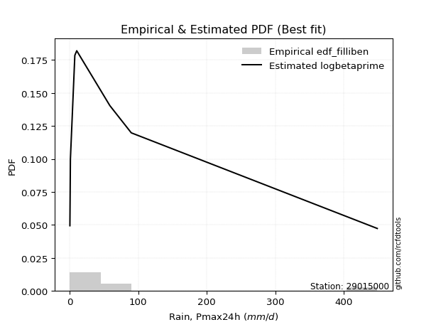</img>

</div>


### 10. EDF Jenkinson (1977)

The Jenkinson formula in hydrology is an empirical plotting position formula used to estimate the non-exceedance probability _(P)_ or return period _(T)_ of a given ordered observation within a sample. It is a widely used method in the frequency analysis of extreme events such as floods and rainfall, as it provides a distribution-free way to plot data. _a≈0.31_ and _b≈0.38_ are constants derived to approximate the median of the probability distribution for the given rank.

<div align="center">


$P=(m-a)/(n+b)$


</div>


**10.1. Empirical values**

<div align="center">

|                | 0                   | 1                   | 2                  | 3                   | 4             | 5                  | 6                  | 7                  | 8                  |
|:---------------|:--------------------|:--------------------|:-------------------|:--------------------|:--------------|:-------------------|:-------------------|:-------------------|:-------------------|
| date           | 2023                | 2024                | 2018               | 2019                | 2020          | 2025               | 2017               | 2022               | 2021               |
| x              | 0.36                | 1.1                 | 7.54               | 7.68                | 10.33         | 25.2               | 58.63              | 89.91              | 448.89             |
| m              | 1                   | 2                   | 3                  | 4                   | 5             | 6                  | 7                  | 8                  | 9                  |
| empirical_dist | edf_jenkinson       | edf_jenkinson       | edf_jenkinson      | edf_jenkinson       | edf_jenkinson | edf_jenkinson      | edf_jenkinson      | edf_jenkinson      | edf_jenkinson      |
| empirical      | 0.07356076759061833 | 0.18017057569296374 | 0.2867803837953091 | 0.39339019189765456 | 0.5           | 0.6066098081023454 | 0.7132196162046908 | 0.8198294243070362 | 0.9264392324093815 |
| empirical_tr   | 1.0794016110471807  | 1.2197659297789336  | 1.4020926756352765 | 1.6485061511423549  | 2.0           | 2.542005420054201  | 3.486988847583642  | 5.550295857988164  | 13.5942028985507   |

</div>


**10.2. Kolmogorov-Smirnov fit test (sorted by Δ)**


<div align="center">

|                | 0                   | 1                   | 2                   | 3                   | 4                   | 5                   | 6                   | 7                   | 8                   | 9                   | 10                  | 11                  | 12                  | 13                  | 14                  | 15                  | 16                  | 17                  | 18                  | 19                  | 20                  | 21                  | 22                  | 23                  | 24                  | 25                  | 26                  | 27                  | 28                  | 29                  | 30                  | 31                  | 32                  | 33                  | 34                  | 35                  | 36                  | 37                  | 38                  | 39                  | 40                  | 41                  | 42                  | 43                  | 44                  | 45                  | 46                  | 47                  | 48                  | 49                  | 50                  | 51                  | 52                  | 53                  | 54                  | 55                  | 56                  | 57                  | 58                  | 59                  | 60                  | 61                  | 62                  | 63                  | 64                  | 65                  | 66                  | 67                  | 68                  | 69                  | 70                  | 71                  | 72                  | 73                  | 74                  | 75                  | 76                  | 77                  | 78                  | 79                  | 80                  | 81                  | 82                  | 83                  | 84                  | 85                  | 86                  | 87                  | 88                  | 89                  | 90                  | 91                  | 92                  | 93                  | 94                  | 95                  | 96                  | 97                  | 98                  | 99                  | 100                 | 101                 | 102                 | 103                 | 104                 | 105                 | 106                 | 107                 | 108                 | 109                 | 110                 | 111                 | 112                 | 113                 | 114                 | 115                 | 116                 | 117                 | 118                 | 119                 | 120                 | 121                 | 122                 | 123                 | 124                 | 125                 | 126                 | 127                 | 128                 | 129                 | 130                 | 131                 | 132                 | 133                 | 134                 | 135                 | 136                 | 137                 | 138                 | 139                 | 140                 | 141                 | 142                 | 143                 | 144                 | 145                 | 146                 | 147                 | 148                 | 149                 | 150                 | 151                 | 152                 | 153                 | 154                 | 155                 | 156                 | 157                 | 158                 | 159                 |
|:---------------|:--------------------|:--------------------|:--------------------|:--------------------|:--------------------|:--------------------|:--------------------|:--------------------|:--------------------|:--------------------|:--------------------|:--------------------|:--------------------|:--------------------|:--------------------|:--------------------|:--------------------|:--------------------|:--------------------|:--------------------|:--------------------|:--------------------|:--------------------|:--------------------|:--------------------|:--------------------|:--------------------|:--------------------|:--------------------|:--------------------|:--------------------|:--------------------|:--------------------|:--------------------|:--------------------|:--------------------|:--------------------|:--------------------|:--------------------|:--------------------|:--------------------|:--------------------|:--------------------|:--------------------|:--------------------|:--------------------|:--------------------|:--------------------|:--------------------|:--------------------|:--------------------|:--------------------|:--------------------|:--------------------|:--------------------|:--------------------|:--------------------|:--------------------|:--------------------|:--------------------|:--------------------|:--------------------|:--------------------|:--------------------|:--------------------|:--------------------|:--------------------|:--------------------|:--------------------|:--------------------|:--------------------|:--------------------|:--------------------|:--------------------|:--------------------|:--------------------|:--------------------|:--------------------|:--------------------|:--------------------|:--------------------|:--------------------|:--------------------|:--------------------|:--------------------|:--------------------|:--------------------|:--------------------|:--------------------|:--------------------|:--------------------|:--------------------|:--------------------|:--------------------|:--------------------|:--------------------|:--------------------|:--------------------|:--------------------|:--------------------|:--------------------|:--------------------|:--------------------|:--------------------|:--------------------|:--------------------|:--------------------|:--------------------|:--------------------|:--------------------|:--------------------|:--------------------|:--------------------|:--------------------|:--------------------|:--------------------|:--------------------|:--------------------|:--------------------|:--------------------|:--------------------|:--------------------|:--------------------|:--------------------|:--------------------|:--------------------|:--------------------|:--------------------|:--------------------|:--------------------|:--------------------|:--------------------|:--------------------|:--------------------|:--------------------|:--------------------|:--------------------|:--------------------|:--------------------|:--------------------|:--------------------|:--------------------|:--------------------|:--------------------|:--------------------|:--------------------|:--------------------|:--------------------|:--------------------|:--------------------|:--------------------|:--------------------|:--------------------|:--------------------|:--------------------|:--------------------|:--------------------|:--------------------|:--------------------|:--------------------|
| station        | 29015000            | 29015000            | 29015000            | 29015000            | 29015000            | 29015000            | 29015000            | 29015000            | 29015000            | 29015000            | 29015000            | 29015000            | 29015000            | 29015000            | 29015000            | 29015000            | 29015000            | 29015000            | 29015000            | 29015000            | 29015000            | 29015000            | 29015000            | 29015000            | 29015000            | 29015000            | 29015000            | 29015000            | 29015000            | 29015000            | 29015000            | 29015000            | 29015000            | 29015000            | 29015000            | 29015000            | 29015000            | 29015000            | 29015000            | 29015000            | 29015000            | 29015000            | 29015000            | 29015000            | 29015000            | 29015000            | 29015000            | 29015000            | 29015000            | 29015000            | 29015000            | 29015000            | 29015000            | 29015000            | 29015000            | 29015000            | 29015000            | 29015000            | 29015000            | 29015000            | 29015000            | 29015000            | 29015000            | 29015000            | 29015000            | 29015000            | 29015000            | 29015000            | 29015000            | 29015000            | 29015000            | 29015000            | 29015000            | 29015000            | 29015000            | 29015000            | 29015000            | 29015000            | 29015000            | 29015000            | 29015000            | 29015000            | 29015000            | 29015000            | 29015000            | 29015000            | 29015000            | 29015000            | 29015000            | 29015000            | 29015000            | 29015000            | 29015000            | 29015000            | 29015000            | 29015000            | 29015000            | 29015000            | 29015000            | 29015000            | 29015000            | 29015000            | 29015000            | 29015000            | 29015000            | 29015000            | 29015000            | 29015000            | 29015000            | 29015000            | 29015000            | 29015000            | 29015000            | 29015000            | 29015000            | 29015000            | 29015000            | 29015000            | 29015000            | 29015000            | 29015000            | 29015000            | 29015000            | 29015000            | 29015000            | 29015000            | 29015000            | 29015000            | 29015000            | 29015000            | 29015000            | 29015000            | 29015000            | 29015000            | 29015000            | 29015000            | 29015000            | 29015000            | 29015000            | 29015000            | 29015000            | 29015000            | 29015000            | 29015000            | 29015000            | 29015000            | 29015000            | 29015000            | 29015000            | 29015000            | 29015000            | 29015000            | 29015000            | 29015000            | 29015000            | 29015000            | 29015000            | 29015000            | 29015000            | 29015000            |
| empirical_dist | edf_jenkinson       | edf_jenkinson       | edf_jenkinson       | edf_jenkinson       | edf_jenkinson       | edf_jenkinson       | edf_jenkinson       | edf_jenkinson       | edf_jenkinson       | edf_jenkinson       | edf_jenkinson       | edf_jenkinson       | edf_jenkinson       | edf_jenkinson       | edf_jenkinson       | edf_jenkinson       | edf_jenkinson       | edf_jenkinson       | edf_jenkinson       | edf_jenkinson       | edf_jenkinson       | edf_jenkinson       | edf_jenkinson       | edf_jenkinson       | edf_jenkinson       | edf_jenkinson       | edf_jenkinson       | edf_jenkinson       | edf_jenkinson       | edf_jenkinson       | edf_jenkinson       | edf_jenkinson       | edf_jenkinson       | edf_jenkinson       | edf_jenkinson       | edf_jenkinson       | edf_jenkinson       | edf_jenkinson       | edf_jenkinson       | edf_jenkinson       | edf_jenkinson       | edf_jenkinson       | edf_jenkinson       | edf_jenkinson       | edf_jenkinson       | edf_jenkinson       | edf_jenkinson       | edf_jenkinson       | edf_jenkinson       | edf_jenkinson       | edf_jenkinson       | edf_jenkinson       | edf_jenkinson       | edf_jenkinson       | edf_jenkinson       | edf_jenkinson       | edf_jenkinson       | edf_jenkinson       | edf_jenkinson       | edf_jenkinson       | edf_jenkinson       | edf_jenkinson       | edf_jenkinson       | edf_jenkinson       | edf_jenkinson       | edf_jenkinson       | edf_jenkinson       | edf_jenkinson       | edf_jenkinson       | edf_jenkinson       | edf_jenkinson       | edf_jenkinson       | edf_jenkinson       | edf_jenkinson       | edf_jenkinson       | edf_jenkinson       | edf_jenkinson       | edf_jenkinson       | edf_jenkinson       | edf_jenkinson       | edf_jenkinson       | edf_jenkinson       | edf_jenkinson       | edf_jenkinson       | edf_jenkinson       | edf_jenkinson       | edf_jenkinson       | edf_jenkinson       | edf_jenkinson       | edf_jenkinson       | edf_jenkinson       | edf_jenkinson       | edf_jenkinson       | edf_jenkinson       | edf_jenkinson       | edf_jenkinson       | edf_jenkinson       | edf_jenkinson       | edf_jenkinson       | edf_jenkinson       | edf_jenkinson       | edf_jenkinson       | edf_jenkinson       | edf_jenkinson       | edf_jenkinson       | edf_jenkinson       | edf_jenkinson       | edf_jenkinson       | edf_jenkinson       | edf_jenkinson       | edf_jenkinson       | edf_jenkinson       | edf_jenkinson       | edf_jenkinson       | edf_jenkinson       | edf_jenkinson       | edf_jenkinson       | edf_jenkinson       | edf_jenkinson       | edf_jenkinson       | edf_jenkinson       | edf_jenkinson       | edf_jenkinson       | edf_jenkinson       | edf_jenkinson       | edf_jenkinson       | edf_jenkinson       | edf_jenkinson       | edf_jenkinson       | edf_jenkinson       | edf_jenkinson       | edf_jenkinson       | edf_jenkinson       | edf_jenkinson       | edf_jenkinson       | edf_jenkinson       | edf_jenkinson       | edf_jenkinson       | edf_jenkinson       | edf_jenkinson       | edf_jenkinson       | edf_jenkinson       | edf_jenkinson       | edf_jenkinson       | edf_jenkinson       | edf_jenkinson       | edf_jenkinson       | edf_jenkinson       | edf_jenkinson       | edf_jenkinson       | edf_jenkinson       | edf_jenkinson       | edf_jenkinson       | edf_jenkinson       | edf_jenkinson       | edf_jenkinson       | edf_jenkinson       | edf_jenkinson       | edf_jenkinson       | edf_jenkinson       |
| p_dist         | loggenlogistic      | ncf                 | loghypsecant        | loggenextreme       | loglogistic         | logskewnorm         | logdweibull         | logjohnsonsu        | logloggamma         | f                   | logdgamma           | logpearson3         | logfoldnorm         | logargus            | logweibull_min      | lognorm             | logcrystalball      | logt                | logexponnorm        | lognct              | lognakagami         | logfatiguelife      | loglaplace          | loglaplace          | logbetaprime        | loggengamma         | lomax               | genpareto           | logerlang           | loggamma            | loggamma            | loggausshyper       | loggompertz         | logcosine           | loganglit           | loggumbel_l         | logrice             | truncpareto         | logsemicircular     | loginvgamma         | logalpha            | logkappa3           | logmaxwell          | invgauss            | loginvgauss         | logwrapcauchy       | loguniform          | invgamma            | gengamma            | lograyleigh         | logarcsine          | logbeta             | logksone            | truncweibull_min    | exponpow            | logtriang           | loggumbel_r         | loginvweibull       | halfgennorm         | exponweib           | genextreme          | invweibull          | loggenpareto        | logkappa4           | logtruncnorm        | logmielke           | kappa3              | logvonmises_line    | mielke              | gamma               | logmoyal            | loggenhalflogistic  | loghalfnorm         | logtruncweibull_min | fatiguelife         | erlang              | burr12              | logkstwobign        | loggenexpon         | loghalflogistic     | betaprime           | gennorm             | vonmises_line       | logbradford         | t                   | dgamma              | nct                 | nakagami            | logtruncexpon       | genlogistic         | logwald             | gausshyper          | maxwell             | logncf              | gumbel_r            | logistic            | rayleigh            | logburr12           | wald                | dweibull            | moyal               | crystalball         | norm                | hypsecant           | weibull_min         | logtrapezoid        | anglit              | semicircular        | loglomax            | logjohnsonsb        | burr                | halflogistic        | powerlaw            | halfnorm            | kstwobign           | logexponweib        | laplace             | arcsine             | loglevy_l           | rice                | pearson3            | foldnorm            | loggennorm          | gumbel_l            | loghalfgennorm      | wrapcauchy          | logburr             | logloglaplace       | exponnorm           | genexpon            | logf                | cosine              | gompertz            | truncnorm           | logtukeylambda      | johnsonsu           | levy_l              | logrdist            | argus               | skewnorm            | bradford            | logweibull_max      | truncexpon          | triang              | logpowerlaw         | rdist               | ksone               | tukeylambda         | kappa4              | alpha               | logexponpow         | uniform             | logtruncpareto      | johnsonsb           | genhalflogistic     | beta                | trapezoid           | weibull_max         | logvonmises         | vonmises            |
| delta          | 0.08101491806703237 | 0.08226100315115886 | 0.08576358727835143 | 0.08847968361210679 | 0.08954633619618263 | 0.0902341405320386  | 0.09125037350249654 | 0.09171877549515334 | 0.09222147891396687 | 0.09224994735239334 | 0.09319801786799466 | 0.0962842944327153  | 0.10081274782600075 | 0.10150211592284575 | 0.10322181289138982 | 0.10352843646450971 | 0.10352844589718163 | 0.10352863339994434 | 0.10352900978321422 | 0.10364099208872946 | 0.10377922842644832 | 0.10386331816825506 | 0.1041662943903594  | 0.1041662943903594  | 0.10916599023400941 | 0.10933642889476741 | 0.10962115544592128 | 0.10962616746714422 | 0.10978902254254075 | 0.11026254809022523 | 0.11026254809022523 | 0.11059889489987207 | 0.11367591064830862 | 0.1153482532856756  | 0.11858832623071097 | 0.120387604752136   | 0.12153939469859376 | 0.12417615969398649 | 0.12485315887057108 | 0.12739411594835098 | 0.12863745867626902 | 0.13728566091204647 | 0.1372865656509113  | 0.13780310421458347 | 0.13826982815484323 | 0.13954327509842274 | 0.1399438467305334  | 0.14175592061621056 | 0.14181000609032074 | 0.14959067253641634 | 0.15012078096170772 | 0.1515360273809807  | 0.1521564749762263  | 0.15710325344056214 | 0.15836182791922765 | 0.16087193344979034 | 0.16142085494308211 | 0.16515585258897453 | 0.16665480261918642 | 0.1667057661233945  | 0.1687945111167954  | 0.1687949781477055  | 0.16896356196957318 | 0.17095839674118624 | 0.17103322839927743 | 0.17200139652308993 | 0.17320038070826782 | 0.1803892879359162  | 0.18246065068137135 | 0.1826769841843206  | 0.18355837085256388 | 0.18410999084640056 | 0.18451899914541925 | 0.18633796943669728 | 0.1869011830559555  | 0.18764382186690193 | 0.18797054510261169 | 0.18833902872287656 | 0.18865516085433864 | 0.1988044267944778  | 0.20476417079424558 | 0.2058388952293422  | 0.2091156516406275  | 0.2195526207659757  | 0.2275171247681701  | 0.22771307167887514 | 0.23425456334099526 | 0.2373276076236246  | 0.24039783658547687 | 0.24093792160575805 | 0.2424427178750137  | 0.25189352641785956 | 0.2532079380068849  | 0.25780770855371804 | 0.25794588620068715 | 0.26108733003953943 | 0.2641958045586156  | 0.26592321593827717 | 0.26695812569564126 | 0.26703837396358254 | 0.2676998828692847  | 0.2680549364208228  | 0.2680549394234356  | 0.27120013782353714 | 0.27379549110775014 | 0.27396115891485573 | 0.27539983620591024 | 0.27843197150286336 | 0.28398712524884817 | 0.28641868812265836 | 0.29313217681282266 | 0.29329759253040055 | 0.2942889058069855  | 0.29523989235768744 | 0.2965720497318604  | 0.29938879969437104 | 0.299616050864261   | 0.30482402607142856 | 0.305020476035304   | 0.3084155892255724  | 0.30982550053510893 | 0.310402867486987   | 0.31982942430703626 | 0.334899099080727   | 0.3388682723431007  | 0.34306520615330305 | 0.3456595080786953  | 0.3491471302080479  | 0.36996533498965156 | 0.37039062763661645 | 0.3754706638850963  | 0.3801586235658981  | 0.3964619542603338  | 0.4093273802797931  | 0.4261902967018769  | 0.43456382678664357 | 0.43484169764152536 | 0.4695922871830541  | 0.47692986419914385 | 0.47845751076808685 | 0.50253747124223    | 0.5047912127918851  | 0.5089219711988763  | 0.5090297158483008  | 0.5514037925402857  | 0.5634540701845576  | 0.5701192599924976  | 0.5935321275998672  | 0.5953656306236501  | 0.6054466751836604  | 0.6078717980981747  | 0.6201772271295899  | 0.6280847011262585  | 0.6477573536893502  | 0.6685237624728095  | 0.7402359261202298  | 0.7553929584715698  | 0.7623951816238325  | 1.0108444099149716  | 70.95008254892208   |
| deltao         | 0.41761268023100007 | 0.41761268023100007 | 0.41761268023100007 | 0.41761268023100007 | 0.41761268023100007 | 0.41761268023100007 | 0.41761268023100007 | 0.41761268023100007 | 0.41761268023100007 | 0.41761268023100007 | 0.41761268023100007 | 0.41761268023100007 | 0.41761268023100007 | 0.41761268023100007 | 0.41761268023100007 | 0.41761268023100007 | 0.41761268023100007 | 0.41761268023100007 | 0.41761268023100007 | 0.41761268023100007 | 0.41761268023100007 | 0.41761268023100007 | 0.41761268023100007 | 0.41761268023100007 | 0.41761268023100007 | 0.41761268023100007 | 0.41761268023100007 | 0.41761268023100007 | 0.41761268023100007 | 0.41761268023100007 | 0.41761268023100007 | 0.41761268023100007 | 0.41761268023100007 | 0.41761268023100007 | 0.41761268023100007 | 0.41761268023100007 | 0.41761268023100007 | 0.41761268023100007 | 0.41761268023100007 | 0.41761268023100007 | 0.41761268023100007 | 0.41761268023100007 | 0.41761268023100007 | 0.41761268023100007 | 0.41761268023100007 | 0.41761268023100007 | 0.41761268023100007 | 0.41761268023100007 | 0.41761268023100007 | 0.41761268023100007 | 0.41761268023100007 | 0.41761268023100007 | 0.41761268023100007 | 0.41761268023100007 | 0.41761268023100007 | 0.41761268023100007 | 0.41761268023100007 | 0.41761268023100007 | 0.41761268023100007 | 0.41761268023100007 | 0.41761268023100007 | 0.41761268023100007 | 0.41761268023100007 | 0.41761268023100007 | 0.41761268023100007 | 0.41761268023100007 | 0.41761268023100007 | 0.41761268023100007 | 0.41761268023100007 | 0.41761268023100007 | 0.41761268023100007 | 0.41761268023100007 | 0.41761268023100007 | 0.41761268023100007 | 0.41761268023100007 | 0.41761268023100007 | 0.41761268023100007 | 0.41761268023100007 | 0.41761268023100007 | 0.41761268023100007 | 0.41761268023100007 | 0.41761268023100007 | 0.41761268023100007 | 0.41761268023100007 | 0.41761268023100007 | 0.41761268023100007 | 0.41761268023100007 | 0.41761268023100007 | 0.41761268023100007 | 0.41761268023100007 | 0.41761268023100007 | 0.41761268023100007 | 0.41761268023100007 | 0.41761268023100007 | 0.41761268023100007 | 0.41761268023100007 | 0.41761268023100007 | 0.41761268023100007 | 0.41761268023100007 | 0.41761268023100007 | 0.41761268023100007 | 0.41761268023100007 | 0.41761268023100007 | 0.41761268023100007 | 0.41761268023100007 | 0.41761268023100007 | 0.41761268023100007 | 0.41761268023100007 | 0.41761268023100007 | 0.41761268023100007 | 0.41761268023100007 | 0.41761268023100007 | 0.41761268023100007 | 0.41761268023100007 | 0.41761268023100007 | 0.41761268023100007 | 0.41761268023100007 | 0.41761268023100007 | 0.41761268023100007 | 0.41761268023100007 | 0.41761268023100007 | 0.41761268023100007 | 0.41761268023100007 | 0.41761268023100007 | 0.41761268023100007 | 0.41761268023100007 | 0.41761268023100007 | 0.41761268023100007 | 0.41761268023100007 | 0.41761268023100007 | 0.41761268023100007 | 0.41761268023100007 | 0.41761268023100007 | 0.41761268023100007 | 0.41761268023100007 | 0.41761268023100007 | 0.41761268023100007 | 0.41761268023100007 | 0.41761268023100007 | 0.41761268023100007 | 0.41761268023100007 | 0.41761268023100007 | 0.41761268023100007 | 0.41761268023100007 | 0.41761268023100007 | 0.41761268023100007 | 0.41761268023100007 | 0.41761268023100007 | 0.41761268023100007 | 0.41761268023100007 | 0.41761268023100007 | 0.41761268023100007 | 0.41761268023100007 | 0.41761268023100007 | 0.41761268023100007 | 0.41761268023100007 | 0.41761268023100007 | 0.41761268023100007 | 0.41761268023100007 | 0.41761268023100007 |
| eval           | Δo > Δ              | Δo > Δ              | Δo > Δ              | Δo > Δ              | Δo > Δ              | Δo > Δ              | Δo > Δ              | Δo > Δ              | Δo > Δ              | Δo > Δ              | Δo > Δ              | Δo > Δ              | Δo > Δ              | Δo > Δ              | Δo > Δ              | Δo > Δ              | Δo > Δ              | Δo > Δ              | Δo > Δ              | Δo > Δ              | Δo > Δ              | Δo > Δ              | Δo > Δ              | Δo > Δ              | Δo > Δ              | Δo > Δ              | Δo > Δ              | Δo > Δ              | Δo > Δ              | Δo > Δ              | Δo > Δ              | Δo > Δ              | Δo > Δ              | Δo > Δ              | Δo > Δ              | Δo > Δ              | Δo > Δ              | Δo > Δ              | Δo > Δ              | Δo > Δ              | Δo > Δ              | Δo > Δ              | Δo > Δ              | Δo > Δ              | Δo > Δ              | Δo > Δ              | Δo > Δ              | Δo > Δ              | Δo > Δ              | Δo > Δ              | Δo > Δ              | Δo > Δ              | Δo > Δ              | Δo > Δ              | Δo > Δ              | Δo > Δ              | Δo > Δ              | Δo > Δ              | Δo > Δ              | Δo > Δ              | Δo > Δ              | Δo > Δ              | Δo > Δ              | Δo > Δ              | Δo > Δ              | Δo > Δ              | Δo > Δ              | Δo > Δ              | Δo > Δ              | Δo > Δ              | Δo > Δ              | Δo > Δ              | Δo > Δ              | Δo > Δ              | Δo > Δ              | Δo > Δ              | Δo > Δ              | Δo > Δ              | Δo > Δ              | Δo > Δ              | Δo > Δ              | Δo > Δ              | Δo > Δ              | Δo > Δ              | Δo > Δ              | Δo > Δ              | Δo > Δ              | Δo > Δ              | Δo > Δ              | Δo > Δ              | Δo > Δ              | Δo > Δ              | Δo > Δ              | Δo > Δ              | Δo > Δ              | Δo > Δ              | Δo > Δ              | Δo > Δ              | Δo > Δ              | Δo > Δ              | Δo > Δ              | Δo > Δ              | Δo > Δ              | Δo > Δ              | Δo > Δ              | Δo > Δ              | Δo > Δ              | Δo > Δ              | Δo > Δ              | Δo > Δ              | Δo > Δ              | Δo > Δ              | Δo > Δ              | Δo > Δ              | Δo > Δ              | Δo > Δ              | Δo > Δ              | Δo > Δ              | Δo > Δ              | Δo > Δ              | Δo > Δ              | Δo > Δ              | Δo > Δ              | Δo > Δ              | Δo > Δ              | Δo > Δ              | Δo > Δ              | Δo > Δ              | Δo > Δ              | Δo > Δ              | Δo > Δ              | Δo > Δ              | Δo > Δ              | Δo > Δ              | Δo <= Δ             | Δo <= Δ             | Δo <= Δ             | Δo <= Δ             | Δo <= Δ             | Δo <= Δ             | Δo <= Δ             | Δo <= Δ             | Δo <= Δ             | Δo <= Δ             | Δo <= Δ             | Δo <= Δ             | Δo <= Δ             | Δo <= Δ             | Δo <= Δ             | Δo <= Δ             | Δo <= Δ             | Δo <= Δ             | Δo <= Δ             | Δo <= Δ             | Δo <= Δ             | Δo <= Δ             | Δo <= Δ             | Δo <= Δ             | Δo <= Δ             | Δo <= Δ             |
| fit            | 1                   | 1                   | 1                   | 1                   | 1                   | 1                   | 1                   | 1                   | 1                   | 1                   | 1                   | 1                   | 1                   | 1                   | 1                   | 1                   | 1                   | 1                   | 1                   | 1                   | 1                   | 1                   | 1                   | 1                   | 1                   | 1                   | 1                   | 1                   | 1                   | 1                   | 1                   | 1                   | 1                   | 1                   | 1                   | 1                   | 1                   | 1                   | 1                   | 1                   | 1                   | 1                   | 1                   | 1                   | 1                   | 1                   | 1                   | 1                   | 1                   | 1                   | 1                   | 1                   | 1                   | 1                   | 1                   | 1                   | 1                   | 1                   | 1                   | 1                   | 1                   | 1                   | 1                   | 1                   | 1                   | 1                   | 1                   | 1                   | 1                   | 1                   | 1                   | 1                   | 1                   | 1                   | 1                   | 1                   | 1                   | 1                   | 1                   | 1                   | 1                   | 1                   | 1                   | 1                   | 1                   | 1                   | 1                   | 1                   | 1                   | 1                   | 1                   | 1                   | 1                   | 1                   | 1                   | 1                   | 1                   | 1                   | 1                   | 1                   | 1                   | 1                   | 1                   | 1                   | 1                   | 1                   | 1                   | 1                   | 1                   | 1                   | 1                   | 1                   | 1                   | 1                   | 1                   | 1                   | 1                   | 1                   | 1                   | 1                   | 1                   | 1                   | 1                   | 1                   | 1                   | 1                   | 1                   | 1                   | 1                   | 1                   | 1                   | 1                   | 1                   | 1                   | 0                   | 0                   | 0                   | 0                   | 0                   | 0                   | 0                   | 0                   | 0                   | 0                   | 0                   | 0                   | 0                   | 0                   | 0                   | 0                   | 0                   | 0                   | 0                   | 0                   | 0                   | 0                   | 0                   | 0                   | 0                   | 0                   |
| n              | 9                   | 9                   | 9                   | 9                   | 9                   | 9                   | 9                   | 9                   | 9                   | 9                   | 9                   | 9                   | 9                   | 9                   | 9                   | 9                   | 9                   | 9                   | 9                   | 9                   | 9                   | 9                   | 9                   | 9                   | 9                   | 9                   | 9                   | 9                   | 9                   | 9                   | 9                   | 9                   | 9                   | 9                   | 9                   | 9                   | 9                   | 9                   | 9                   | 9                   | 9                   | 9                   | 9                   | 9                   | 9                   | 9                   | 9                   | 9                   | 9                   | 9                   | 9                   | 9                   | 9                   | 9                   | 9                   | 9                   | 9                   | 9                   | 9                   | 9                   | 9                   | 9                   | 9                   | 9                   | 9                   | 9                   | 9                   | 9                   | 9                   | 9                   | 9                   | 9                   | 9                   | 9                   | 9                   | 9                   | 9                   | 9                   | 9                   | 9                   | 9                   | 9                   | 9                   | 9                   | 9                   | 9                   | 9                   | 9                   | 9                   | 9                   | 9                   | 9                   | 9                   | 9                   | 9                   | 9                   | 9                   | 9                   | 9                   | 9                   | 9                   | 9                   | 9                   | 9                   | 9                   | 9                   | 9                   | 9                   | 9                   | 9                   | 9                   | 9                   | 9                   | 9                   | 9                   | 9                   | 9                   | 9                   | 9                   | 9                   | 9                   | 9                   | 9                   | 9                   | 9                   | 9                   | 9                   | 9                   | 9                   | 9                   | 9                   | 9                   | 9                   | 9                   | 9                   | 9                   | 9                   | 9                   | 9                   | 9                   | 9                   | 9                   | 9                   | 9                   | 9                   | 9                   | 9                   | 9                   | 9                   | 9                   | 9                   | 9                   | 9                   | 9                   | 9                   | 9                   | 9                   | 9                   | 9                   | 9                   |
| best_fit       | 1                   | 0                   | 0                   | 0                   | 0                   | 0                   | 0                   | 0                   | 0                   | 0                   | 0                   | 0                   | 0                   | 0                   | 0                   | 0                   | 0                   | 0                   | 0                   | 0                   | 0                   | 0                   | 0                   | 0                   | 0                   | 0                   | 0                   | 0                   | 0                   | 0                   | 0                   | 0                   | 0                   | 0                   | 0                   | 0                   | 0                   | 0                   | 0                   | 0                   | 0                   | 0                   | 0                   | 0                   | 0                   | 0                   | 0                   | 0                   | 0                   | 0                   | 0                   | 0                   | 0                   | 0                   | 0                   | 0                   | 0                   | 0                   | 0                   | 0                   | 0                   | 0                   | 0                   | 0                   | 0                   | 0                   | 0                   | 0                   | 0                   | 0                   | 0                   | 0                   | 0                   | 0                   | 0                   | 0                   | 0                   | 0                   | 0                   | 0                   | 0                   | 0                   | 0                   | 0                   | 0                   | 0                   | 0                   | 0                   | 0                   | 0                   | 0                   | 0                   | 0                   | 0                   | 0                   | 0                   | 0                   | 0                   | 0                   | 0                   | 0                   | 0                   | 0                   | 0                   | 0                   | 0                   | 0                   | 0                   | 0                   | 0                   | 0                   | 0                   | 0                   | 0                   | 0                   | 0                   | 0                   | 0                   | 0                   | 0                   | 0                   | 0                   | 0                   | 0                   | 0                   | 0                   | 0                   | 0                   | 0                   | 0                   | 0                   | 0                   | 0                   | 0                   | 0                   | 0                   | 0                   | 0                   | 0                   | 0                   | 0                   | 0                   | 0                   | 0                   | 0                   | 0                   | 0                   | 0                   | 0                   | 0                   | 0                   | 0                   | 0                   | 0                   | 0                   | 0                   | 0                   | 0                   | 0                   | 0                   |
| best_fit_sort  | 1                   | 2                   | 3                   | 4                   | 5                   | 6                   | 7                   | 8                   | 9                   | 10                  | 11                  | 12                  | 13                  | 14                  | 15                  | 16                  | 17                  | 18                  | 19                  | 20                  | 21                  | 22                  | 23                  | 24                  | 25                  | 26                  | 27                  | 28                  | 29                  | 30                  | 31                  | 32                  | 33                  | 34                  | 35                  | 36                  | 37                  | 38                  | 39                  | 40                  | 41                  | 42                  | 43                  | 44                  | 45                  | 46                  | 47                  | 48                  | 49                  | 50                  | 51                  | 52                  | 53                  | 54                  | 55                  | 56                  | 57                  | 58                  | 59                  | 60                  | 61                  | 62                  | 63                  | 64                  | 65                  | 66                  | 67                  | 68                  | 69                  | 70                  | 71                  | 72                  | 73                  | 74                  | 75                  | 76                  | 77                  | 78                  | 79                  | 80                  | 81                  | 82                  | 83                  | 84                  | 85                  | 86                  | 87                  | 88                  | 89                  | 90                  | 91                  | 92                  | 93                  | 94                  | 95                  | 96                  | 97                  | 98                  | 99                  | 100                 | 101                 | 102                 | 103                 | 104                 | 105                 | 106                 | 107                 | 108                 | 109                 | 110                 | 111                 | 112                 | 113                 | 114                 | 115                 | 116                 | 117                 | 118                 | 119                 | 120                 | 121                 | 122                 | 123                 | 124                 | 125                 | 126                 | 127                 | 128                 | 129                 | 130                 | 131                 | 132                 | 133                 | 134                 | 135                 | 136                 | 137                 | 138                 | 139                 | 140                 | 141                 | 142                 | 143                 | 144                 | 145                 | 146                 | 147                 | 148                 | 149                 | 150                 | 151                 | 152                 | 153                 | 154                 | 155                 | 156                 | 157                 | 158                 | 159                 | 160                 |

</div>


**10.3. Best fit**

<div align="center">

|   id |   station | empirical_dist   | p_dist         |     delta |   deltao | eval   |   fit |   n |   best_fit |   best_fit_sort |
|-----:|----------:|:-----------------|:---------------|----------:|---------:|:-------|------:|----:|-----------:|----------------:|
|    0 |  29015000 | edf_jenkinson    | loggenlogistic | 0.0810149 | 0.417613 | Δo > Δ |     1 |   9 |          1 |               1 |

</div>


<div align="center">

</img>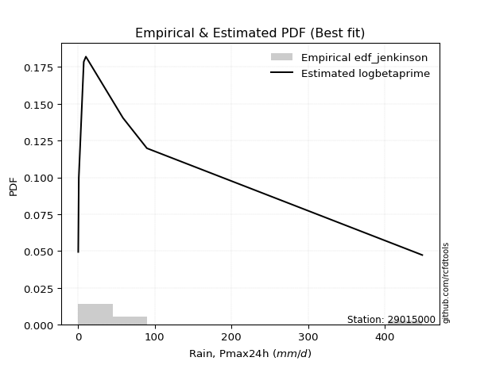</img>

</div>


### 11. EDF Cunnane (1978)

Cunnane´s work in statistical hydrology has focused on the performance and evaluation of different probability distributions (such as GEV, Gumbel, Lognormal) for flood frequency estimation. _b_ is a constant, typically set to 0.4.

<div align="center">


$P=(m-b)/(n+1-2b)$


</div>


**11.1. Empirical values**

<div align="center">

|                | 0                   | 1                  | 2                   | 3                  | 4           | 5                  | 6                 | 7                  | 8                  |
|:---------------|:--------------------|:-------------------|:--------------------|:-------------------|:------------|:-------------------|:------------------|:-------------------|:-------------------|
| date           | 2023                | 2024               | 2018                | 2019               | 2020        | 2025               | 2017              | 2022               | 2021               |
| x              | 0.36                | 1.1                | 7.54                | 7.68               | 10.33       | 25.2               | 58.63             | 89.91              | 448.89             |
| m              | 1                   | 2                  | 3                   | 4                  | 5           | 6                  | 7                 | 8                  | 9                  |
| empirical_dist | edf_cunnane         | edf_cunnane        | edf_cunnane         | edf_cunnane        | edf_cunnane | edf_cunnane        | edf_cunnane       | edf_cunnane        | edf_cunnane        |
| empirical      | 0.06521739130434782 | 0.1739130434782609 | 0.28260869565217395 | 0.391304347826087  | 0.5         | 0.6086956521739131 | 0.717391304347826 | 0.8260869565217391 | 0.9347826086956522 |
| empirical_tr   | 1.069767441860465   | 1.2105263157894737 | 1.393939393939394   | 1.6428571428571428 | 2.0         | 2.555555555555556  | 3.538461538461538 | 5.75               | 15.333333333333343 |

</div>


**11.2. Kolmogorov-Smirnov fit test (sorted by Δ)**


<div align="center">

|                | 0                   | 1                   | 2                   | 3                   | 4                   | 5                   | 6                   | 7                   | 8                   | 9                   | 10                  | 11                  | 12                  | 13                  | 14                  | 15                  | 16                  | 17                  | 18                  | 19                  | 20                  | 21                  | 22                  | 23                  | 24                  | 25                  | 26                  | 27                  | 28                  | 29                  | 30                  | 31                  | 32                  | 33                  | 34                  | 35                  | 36                  | 37                  | 38                  | 39                  | 40                  | 41                  | 42                  | 43                  | 44                  | 45                  | 46                  | 47                  | 48                  | 49                  | 50                  | 51                  | 52                  | 53                  | 54                  | 55                  | 56                  | 57                  | 58                  | 59                  | 60                  | 61                  | 62                  | 63                  | 64                  | 65                  | 66                  | 67                  | 68                  | 69                  | 70                  | 71                  | 72                  | 73                  | 74                  | 75                  | 76                  | 77                  | 78                  | 79                  | 80                  | 81                  | 82                  | 83                  | 84                  | 85                  | 86                  | 87                  | 88                  | 89                  | 90                  | 91                  | 92                  | 93                  | 94                  | 95                  | 96                  | 97                  | 98                  | 99                  | 100                 | 101                 | 102                 | 103                 | 104                 | 105                 | 106                 | 107                 | 108                 | 109                 | 110                 | 111                 | 112                 | 113                 | 114                 | 115                 | 116                 | 117                 | 118                 | 119                 | 120                 | 121                 | 122                 | 123                 | 124                 | 125                 | 126                 | 127                 | 128                 | 129                 | 130                 | 131                 | 132                 | 133                 | 134                 | 135                 | 136                 | 137                 | 138                 | 139                 | 140                 | 141                 | 142                 | 143                 | 144                 | 145                 | 146                 | 147                 | 148                 | 149                 | 150                 | 151                 | 152                 | 153                 | 154                 | 155                 | 156                 | 157                 | 158                 | 159                 |
|:---------------|:--------------------|:--------------------|:--------------------|:--------------------|:--------------------|:--------------------|:--------------------|:--------------------|:--------------------|:--------------------|:--------------------|:--------------------|:--------------------|:--------------------|:--------------------|:--------------------|:--------------------|:--------------------|:--------------------|:--------------------|:--------------------|:--------------------|:--------------------|:--------------------|:--------------------|:--------------------|:--------------------|:--------------------|:--------------------|:--------------------|:--------------------|:--------------------|:--------------------|:--------------------|:--------------------|:--------------------|:--------------------|:--------------------|:--------------------|:--------------------|:--------------------|:--------------------|:--------------------|:--------------------|:--------------------|:--------------------|:--------------------|:--------------------|:--------------------|:--------------------|:--------------------|:--------------------|:--------------------|:--------------------|:--------------------|:--------------------|:--------------------|:--------------------|:--------------------|:--------------------|:--------------------|:--------------------|:--------------------|:--------------------|:--------------------|:--------------------|:--------------------|:--------------------|:--------------------|:--------------------|:--------------------|:--------------------|:--------------------|:--------------------|:--------------------|:--------------------|:--------------------|:--------------------|:--------------------|:--------------------|:--------------------|:--------------------|:--------------------|:--------------------|:--------------------|:--------------------|:--------------------|:--------------------|:--------------------|:--------------------|:--------------------|:--------------------|:--------------------|:--------------------|:--------------------|:--------------------|:--------------------|:--------------------|:--------------------|:--------------------|:--------------------|:--------------------|:--------------------|:--------------------|:--------------------|:--------------------|:--------------------|:--------------------|:--------------------|:--------------------|:--------------------|:--------------------|:--------------------|:--------------------|:--------------------|:--------------------|:--------------------|:--------------------|:--------------------|:--------------------|:--------------------|:--------------------|:--------------------|:--------------------|:--------------------|:--------------------|:--------------------|:--------------------|:--------------------|:--------------------|:--------------------|:--------------------|:--------------------|:--------------------|:--------------------|:--------------------|:--------------------|:--------------------|:--------------------|:--------------------|:--------------------|:--------------------|:--------------------|:--------------------|:--------------------|:--------------------|:--------------------|:--------------------|:--------------------|:--------------------|:--------------------|:--------------------|:--------------------|:--------------------|:--------------------|:--------------------|:--------------------|:--------------------|:--------------------|:--------------------|
| station        | 29015000            | 29015000            | 29015000            | 29015000            | 29015000            | 29015000            | 29015000            | 29015000            | 29015000            | 29015000            | 29015000            | 29015000            | 29015000            | 29015000            | 29015000            | 29015000            | 29015000            | 29015000            | 29015000            | 29015000            | 29015000            | 29015000            | 29015000            | 29015000            | 29015000            | 29015000            | 29015000            | 29015000            | 29015000            | 29015000            | 29015000            | 29015000            | 29015000            | 29015000            | 29015000            | 29015000            | 29015000            | 29015000            | 29015000            | 29015000            | 29015000            | 29015000            | 29015000            | 29015000            | 29015000            | 29015000            | 29015000            | 29015000            | 29015000            | 29015000            | 29015000            | 29015000            | 29015000            | 29015000            | 29015000            | 29015000            | 29015000            | 29015000            | 29015000            | 29015000            | 29015000            | 29015000            | 29015000            | 29015000            | 29015000            | 29015000            | 29015000            | 29015000            | 29015000            | 29015000            | 29015000            | 29015000            | 29015000            | 29015000            | 29015000            | 29015000            | 29015000            | 29015000            | 29015000            | 29015000            | 29015000            | 29015000            | 29015000            | 29015000            | 29015000            | 29015000            | 29015000            | 29015000            | 29015000            | 29015000            | 29015000            | 29015000            | 29015000            | 29015000            | 29015000            | 29015000            | 29015000            | 29015000            | 29015000            | 29015000            | 29015000            | 29015000            | 29015000            | 29015000            | 29015000            | 29015000            | 29015000            | 29015000            | 29015000            | 29015000            | 29015000            | 29015000            | 29015000            | 29015000            | 29015000            | 29015000            | 29015000            | 29015000            | 29015000            | 29015000            | 29015000            | 29015000            | 29015000            | 29015000            | 29015000            | 29015000            | 29015000            | 29015000            | 29015000            | 29015000            | 29015000            | 29015000            | 29015000            | 29015000            | 29015000            | 29015000            | 29015000            | 29015000            | 29015000            | 29015000            | 29015000            | 29015000            | 29015000            | 29015000            | 29015000            | 29015000            | 29015000            | 29015000            | 29015000            | 29015000            | 29015000            | 29015000            | 29015000            | 29015000            | 29015000            | 29015000            | 29015000            | 29015000            | 29015000            | 29015000            |
| empirical_dist | edf_cunnane         | edf_cunnane         | edf_cunnane         | edf_cunnane         | edf_cunnane         | edf_cunnane         | edf_cunnane         | edf_cunnane         | edf_cunnane         | edf_cunnane         | edf_cunnane         | edf_cunnane         | edf_cunnane         | edf_cunnane         | edf_cunnane         | edf_cunnane         | edf_cunnane         | edf_cunnane         | edf_cunnane         | edf_cunnane         | edf_cunnane         | edf_cunnane         | edf_cunnane         | edf_cunnane         | edf_cunnane         | edf_cunnane         | edf_cunnane         | edf_cunnane         | edf_cunnane         | edf_cunnane         | edf_cunnane         | edf_cunnane         | edf_cunnane         | edf_cunnane         | edf_cunnane         | edf_cunnane         | edf_cunnane         | edf_cunnane         | edf_cunnane         | edf_cunnane         | edf_cunnane         | edf_cunnane         | edf_cunnane         | edf_cunnane         | edf_cunnane         | edf_cunnane         | edf_cunnane         | edf_cunnane         | edf_cunnane         | edf_cunnane         | edf_cunnane         | edf_cunnane         | edf_cunnane         | edf_cunnane         | edf_cunnane         | edf_cunnane         | edf_cunnane         | edf_cunnane         | edf_cunnane         | edf_cunnane         | edf_cunnane         | edf_cunnane         | edf_cunnane         | edf_cunnane         | edf_cunnane         | edf_cunnane         | edf_cunnane         | edf_cunnane         | edf_cunnane         | edf_cunnane         | edf_cunnane         | edf_cunnane         | edf_cunnane         | edf_cunnane         | edf_cunnane         | edf_cunnane         | edf_cunnane         | edf_cunnane         | edf_cunnane         | edf_cunnane         | edf_cunnane         | edf_cunnane         | edf_cunnane         | edf_cunnane         | edf_cunnane         | edf_cunnane         | edf_cunnane         | edf_cunnane         | edf_cunnane         | edf_cunnane         | edf_cunnane         | edf_cunnane         | edf_cunnane         | edf_cunnane         | edf_cunnane         | edf_cunnane         | edf_cunnane         | edf_cunnane         | edf_cunnane         | edf_cunnane         | edf_cunnane         | edf_cunnane         | edf_cunnane         | edf_cunnane         | edf_cunnane         | edf_cunnane         | edf_cunnane         | edf_cunnane         | edf_cunnane         | edf_cunnane         | edf_cunnane         | edf_cunnane         | edf_cunnane         | edf_cunnane         | edf_cunnane         | edf_cunnane         | edf_cunnane         | edf_cunnane         | edf_cunnane         | edf_cunnane         | edf_cunnane         | edf_cunnane         | edf_cunnane         | edf_cunnane         | edf_cunnane         | edf_cunnane         | edf_cunnane         | edf_cunnane         | edf_cunnane         | edf_cunnane         | edf_cunnane         | edf_cunnane         | edf_cunnane         | edf_cunnane         | edf_cunnane         | edf_cunnane         | edf_cunnane         | edf_cunnane         | edf_cunnane         | edf_cunnane         | edf_cunnane         | edf_cunnane         | edf_cunnane         | edf_cunnane         | edf_cunnane         | edf_cunnane         | edf_cunnane         | edf_cunnane         | edf_cunnane         | edf_cunnane         | edf_cunnane         | edf_cunnane         | edf_cunnane         | edf_cunnane         | edf_cunnane         | edf_cunnane         | edf_cunnane         | edf_cunnane         | edf_cunnane         | edf_cunnane         |
| p_dist         | ncf                 | loghypsecant        | loggenlogistic      | f                   | loggenextreme       | logdgamma           | loglogistic         | logskewnorm         | logdweibull         | logjohnsonsu        | logloggamma         | loglaplace          | loglaplace          | logpearson3         | logargus            | logfoldnorm         | logweibull_min      | lognorm             | logcrystalball      | logt                | logexponnorm        | lognct              | lognakagami         | logfatiguelife      | genpareto           | lomax               | logbetaprime        | loggengamma         | logerlang           | loggamma            | loggamma            | loggausshyper       | loggompertz         | truncpareto         | logcosine           | loggumbel_l         | loganglit           | logrice             | logsemicircular     | loginvgamma         | logalpha            | logkappa3           | logmaxwell          | invgauss            | loginvgauss         | logwrapcauchy       | loguniform          | invgamma            | gengamma            | lograyleigh         | logarcsine          | logksone            | truncweibull_min    | logbeta             | exponpow            | logtriang           | loggumbel_r         | halfgennorm         | loginvweibull       | exponweib           | genextreme          | invweibull          | loggenpareto        | logkappa4           | logtruncnorm        | logmielke           | kappa3              | logvonmises_line    | gamma               | mielke              | logmoyal            | loghalfnorm         | loggenhalflogistic  | logtruncweibull_min | fatiguelife         | erlang              | burr12              | logkstwobign        | loggenexpon         | loghalflogistic     | vonmises_line       | betaprime           | gennorm             | logbradford         | t                   | dgamma              | nct                 | genlogistic         | nakagami            | logtruncexpon       | logwald             | gausshyper          | maxwell             | logncf              | gumbel_r            | logistic            | logburr12           | rayleigh            | hypsecant           | crystalball         | norm                | wald                | dweibull            | moyal               | weibull_min         | logtrapezoid        | anglit              | semicircular        | loglomax            | logjohnsonsb        | burr                | powerlaw            | kstwobign           | halflogistic        | laplace             | logexponweib        | halfnorm            | rice                | arcsine             | loglevy_l           | pearson3            | foldnorm            | loggennorm          | gumbel_l            | loghalfgennorm      | wrapcauchy          | logburr             | logloglaplace       | exponnorm           | genexpon            | logf                | cosine              | gompertz            | truncnorm           | logtukeylambda      | johnsonsu           | levy_l              | logrdist            | skewnorm            | argus               | bradford            | truncexpon          | logweibull_max      | triang              | logpowerlaw         | rdist               | ksone               | kappa4              | tukeylambda         | alpha               | logexponpow         | uniform             | logtruncpareto      | johnsonsb           | genhalflogistic     | beta                | trapezoid           | weibull_max         | logvonmises         | vonmises            |
| delta          | 0.08226100315115886 | 0.08237500379741713 | 0.08518660621016755 | 0.09224994735239334 | 0.09265137175524196 | 0.09340508461798569 | 0.09371802433931781 | 0.09440582867517378 | 0.09542206164563172 | 0.09589046363828851 | 0.09639316705710205 | 0.09999460624722412 | 0.09999460624722412 | 0.10045598257585048 | 0.10150211592284575 | 0.10498443596913593 | 0.107393501034525   | 0.10770012460764489 | 0.10770013404031681 | 0.10770032154307951 | 0.1077006979263494  | 0.10781268023186463 | 0.1079509165695835  | 0.10803500631139024 | 0.11295788483069558 | 0.11296765106536788 | 0.11333767837714459 | 0.11350811703790259 | 0.11396071068567593 | 0.11443423623336041 | 0.11443423623336041 | 0.11477058304300725 | 0.1178475987914438  | 0.11791862747928364 | 0.11951994142881078 | 0.120387604752136   | 0.12276001437384615 | 0.12571108284172894 | 0.12902484701370626 | 0.13156580409148616 | 0.1328091468194042  | 0.14145734905518165 | 0.14145825379404647 | 0.14197479235771865 | 0.1424415162979784  | 0.1437149632415579  | 0.14411553487366857 | 0.14592760875934574 | 0.14598169423345592 | 0.1537623606795515  | 0.1542924691048429  | 0.15632816311936149 | 0.15710325344056214 | 0.15779355959568364 | 0.15836182791922765 | 0.16087193344979034 | 0.1655925430862173  | 0.16665480261918642 | 0.1693275407321097  | 0.17296329833809743 | 0.17296619925993056 | 0.17296666629084068 | 0.17313525011270836 | 0.1751300848843214  | 0.1752049165424126  | 0.1761730846662251  | 0.177372068851403   | 0.1803892879359162  | 0.1826769841843206  | 0.18663233882450653 | 0.18773005899569906 | 0.18869068728855443 | 0.1903675230611035  | 0.19050965757983246 | 0.19107287119909067 | 0.1918155100100371  | 0.19214223324574686 | 0.19251071686601173 | 0.19282684899747382 | 0.20297611493761297 | 0.20494396349749222 | 0.20893585893738076 | 0.2141822715156127  | 0.22372430890911088 | 0.22543128069660245 | 0.23605644796514563 | 0.23842625148413044 | 0.2430237656773257  | 0.24358513983832752 | 0.24456952472861204 | 0.24661440601814888 | 0.25189352641785956 | 0.2615513142931554  | 0.2619793966968532  | 0.2662892624869576  | 0.26734486225424237 | 0.27009490408141235 | 0.27253918084488604 | 0.2732859818951048  | 0.2743124686355257  | 0.27431247163813854 | 0.2753015019819118  | 0.27538175024985306 | 0.2760432591555552  | 0.2800530233224531  | 0.28021869112955866 | 0.2816573684206132  | 0.2846895037175663  | 0.28815881339198335 | 0.2926762203373613  | 0.29730386495595784 | 0.2984605939501207  | 0.29865789380342805 | 0.3016409688166711  | 0.30170189493582866 | 0.3035604878375062  | 0.30358326864395796 | 0.31050143329714003 | 0.3131674023576991  | 0.31336385232157454 | 0.3181688768213794  | 0.3187462437732575  | 0.32608695652173914 | 0.34115663129542995 | 0.34303996048623586 | 0.349322738368006   | 0.34983119622183045 | 0.35331881835118306 | 0.36996533498965156 | 0.37039062763661645 | 0.3796423520282315  | 0.386416155780601   | 0.3964619542603338  | 0.4093273802797931  | 0.4303619848450121  | 0.44082135900134645 | 0.4431850739277959  | 0.4737639753261893  | 0.4805433548396545  | 0.4831873964138468  | 0.5046233153137977  | 0.5110078152704439  | 0.511048745006588   | 0.5111155599198685  | 0.5555754806834209  | 0.5717974464708282  | 0.5763767922072005  | 0.601623162838353   | 0.6018755038861378  | 0.6096183633267955  | 0.6120434862413099  | 0.6264347593442928  | 0.6343422333409614  | 0.654014885904053   | 0.6747812946875125  | 0.7485793024065004  | 0.7616504906862728  | 0.7686527138385354  | 1.0025010336287008  | 70.9417391726358    |
| deltao         | 0.41761268023100007 | 0.41761268023100007 | 0.41761268023100007 | 0.41761268023100007 | 0.41761268023100007 | 0.41761268023100007 | 0.41761268023100007 | 0.41761268023100007 | 0.41761268023100007 | 0.41761268023100007 | 0.41761268023100007 | 0.41761268023100007 | 0.41761268023100007 | 0.41761268023100007 | 0.41761268023100007 | 0.41761268023100007 | 0.41761268023100007 | 0.41761268023100007 | 0.41761268023100007 | 0.41761268023100007 | 0.41761268023100007 | 0.41761268023100007 | 0.41761268023100007 | 0.41761268023100007 | 0.41761268023100007 | 0.41761268023100007 | 0.41761268023100007 | 0.41761268023100007 | 0.41761268023100007 | 0.41761268023100007 | 0.41761268023100007 | 0.41761268023100007 | 0.41761268023100007 | 0.41761268023100007 | 0.41761268023100007 | 0.41761268023100007 | 0.41761268023100007 | 0.41761268023100007 | 0.41761268023100007 | 0.41761268023100007 | 0.41761268023100007 | 0.41761268023100007 | 0.41761268023100007 | 0.41761268023100007 | 0.41761268023100007 | 0.41761268023100007 | 0.41761268023100007 | 0.41761268023100007 | 0.41761268023100007 | 0.41761268023100007 | 0.41761268023100007 | 0.41761268023100007 | 0.41761268023100007 | 0.41761268023100007 | 0.41761268023100007 | 0.41761268023100007 | 0.41761268023100007 | 0.41761268023100007 | 0.41761268023100007 | 0.41761268023100007 | 0.41761268023100007 | 0.41761268023100007 | 0.41761268023100007 | 0.41761268023100007 | 0.41761268023100007 | 0.41761268023100007 | 0.41761268023100007 | 0.41761268023100007 | 0.41761268023100007 | 0.41761268023100007 | 0.41761268023100007 | 0.41761268023100007 | 0.41761268023100007 | 0.41761268023100007 | 0.41761268023100007 | 0.41761268023100007 | 0.41761268023100007 | 0.41761268023100007 | 0.41761268023100007 | 0.41761268023100007 | 0.41761268023100007 | 0.41761268023100007 | 0.41761268023100007 | 0.41761268023100007 | 0.41761268023100007 | 0.41761268023100007 | 0.41761268023100007 | 0.41761268023100007 | 0.41761268023100007 | 0.41761268023100007 | 0.41761268023100007 | 0.41761268023100007 | 0.41761268023100007 | 0.41761268023100007 | 0.41761268023100007 | 0.41761268023100007 | 0.41761268023100007 | 0.41761268023100007 | 0.41761268023100007 | 0.41761268023100007 | 0.41761268023100007 | 0.41761268023100007 | 0.41761268023100007 | 0.41761268023100007 | 0.41761268023100007 | 0.41761268023100007 | 0.41761268023100007 | 0.41761268023100007 | 0.41761268023100007 | 0.41761268023100007 | 0.41761268023100007 | 0.41761268023100007 | 0.41761268023100007 | 0.41761268023100007 | 0.41761268023100007 | 0.41761268023100007 | 0.41761268023100007 | 0.41761268023100007 | 0.41761268023100007 | 0.41761268023100007 | 0.41761268023100007 | 0.41761268023100007 | 0.41761268023100007 | 0.41761268023100007 | 0.41761268023100007 | 0.41761268023100007 | 0.41761268023100007 | 0.41761268023100007 | 0.41761268023100007 | 0.41761268023100007 | 0.41761268023100007 | 0.41761268023100007 | 0.41761268023100007 | 0.41761268023100007 | 0.41761268023100007 | 0.41761268023100007 | 0.41761268023100007 | 0.41761268023100007 | 0.41761268023100007 | 0.41761268023100007 | 0.41761268023100007 | 0.41761268023100007 | 0.41761268023100007 | 0.41761268023100007 | 0.41761268023100007 | 0.41761268023100007 | 0.41761268023100007 | 0.41761268023100007 | 0.41761268023100007 | 0.41761268023100007 | 0.41761268023100007 | 0.41761268023100007 | 0.41761268023100007 | 0.41761268023100007 | 0.41761268023100007 | 0.41761268023100007 | 0.41761268023100007 | 0.41761268023100007 | 0.41761268023100007 | 0.41761268023100007 |
| eval           | Δo > Δ              | Δo > Δ              | Δo > Δ              | Δo > Δ              | Δo > Δ              | Δo > Δ              | Δo > Δ              | Δo > Δ              | Δo > Δ              | Δo > Δ              | Δo > Δ              | Δo > Δ              | Δo > Δ              | Δo > Δ              | Δo > Δ              | Δo > Δ              | Δo > Δ              | Δo > Δ              | Δo > Δ              | Δo > Δ              | Δo > Δ              | Δo > Δ              | Δo > Δ              | Δo > Δ              | Δo > Δ              | Δo > Δ              | Δo > Δ              | Δo > Δ              | Δo > Δ              | Δo > Δ              | Δo > Δ              | Δo > Δ              | Δo > Δ              | Δo > Δ              | Δo > Δ              | Δo > Δ              | Δo > Δ              | Δo > Δ              | Δo > Δ              | Δo > Δ              | Δo > Δ              | Δo > Δ              | Δo > Δ              | Δo > Δ              | Δo > Δ              | Δo > Δ              | Δo > Δ              | Δo > Δ              | Δo > Δ              | Δo > Δ              | Δo > Δ              | Δo > Δ              | Δo > Δ              | Δo > Δ              | Δo > Δ              | Δo > Δ              | Δo > Δ              | Δo > Δ              | Δo > Δ              | Δo > Δ              | Δo > Δ              | Δo > Δ              | Δo > Δ              | Δo > Δ              | Δo > Δ              | Δo > Δ              | Δo > Δ              | Δo > Δ              | Δo > Δ              | Δo > Δ              | Δo > Δ              | Δo > Δ              | Δo > Δ              | Δo > Δ              | Δo > Δ              | Δo > Δ              | Δo > Δ              | Δo > Δ              | Δo > Δ              | Δo > Δ              | Δo > Δ              | Δo > Δ              | Δo > Δ              | Δo > Δ              | Δo > Δ              | Δo > Δ              | Δo > Δ              | Δo > Δ              | Δo > Δ              | Δo > Δ              | Δo > Δ              | Δo > Δ              | Δo > Δ              | Δo > Δ              | Δo > Δ              | Δo > Δ              | Δo > Δ              | Δo > Δ              | Δo > Δ              | Δo > Δ              | Δo > Δ              | Δo > Δ              | Δo > Δ              | Δo > Δ              | Δo > Δ              | Δo > Δ              | Δo > Δ              | Δo > Δ              | Δo > Δ              | Δo > Δ              | Δo > Δ              | Δo > Δ              | Δo > Δ              | Δo > Δ              | Δo > Δ              | Δo > Δ              | Δo > Δ              | Δo > Δ              | Δo > Δ              | Δo > Δ              | Δo > Δ              | Δo > Δ              | Δo > Δ              | Δo > Δ              | Δo > Δ              | Δo > Δ              | Δo > Δ              | Δo > Δ              | Δo > Δ              | Δo > Δ              | Δo > Δ              | Δo > Δ              | Δo > Δ              | Δo > Δ              | Δo <= Δ             | Δo <= Δ             | Δo <= Δ             | Δo <= Δ             | Δo <= Δ             | Δo <= Δ             | Δo <= Δ             | Δo <= Δ             | Δo <= Δ             | Δo <= Δ             | Δo <= Δ             | Δo <= Δ             | Δo <= Δ             | Δo <= Δ             | Δo <= Δ             | Δo <= Δ             | Δo <= Δ             | Δo <= Δ             | Δo <= Δ             | Δo <= Δ             | Δo <= Δ             | Δo <= Δ             | Δo <= Δ             | Δo <= Δ             | Δo <= Δ             | Δo <= Δ             |
| fit            | 1                   | 1                   | 1                   | 1                   | 1                   | 1                   | 1                   | 1                   | 1                   | 1                   | 1                   | 1                   | 1                   | 1                   | 1                   | 1                   | 1                   | 1                   | 1                   | 1                   | 1                   | 1                   | 1                   | 1                   | 1                   | 1                   | 1                   | 1                   | 1                   | 1                   | 1                   | 1                   | 1                   | 1                   | 1                   | 1                   | 1                   | 1                   | 1                   | 1                   | 1                   | 1                   | 1                   | 1                   | 1                   | 1                   | 1                   | 1                   | 1                   | 1                   | 1                   | 1                   | 1                   | 1                   | 1                   | 1                   | 1                   | 1                   | 1                   | 1                   | 1                   | 1                   | 1                   | 1                   | 1                   | 1                   | 1                   | 1                   | 1                   | 1                   | 1                   | 1                   | 1                   | 1                   | 1                   | 1                   | 1                   | 1                   | 1                   | 1                   | 1                   | 1                   | 1                   | 1                   | 1                   | 1                   | 1                   | 1                   | 1                   | 1                   | 1                   | 1                   | 1                   | 1                   | 1                   | 1                   | 1                   | 1                   | 1                   | 1                   | 1                   | 1                   | 1                   | 1                   | 1                   | 1                   | 1                   | 1                   | 1                   | 1                   | 1                   | 1                   | 1                   | 1                   | 1                   | 1                   | 1                   | 1                   | 1                   | 1                   | 1                   | 1                   | 1                   | 1                   | 1                   | 1                   | 1                   | 1                   | 1                   | 1                   | 1                   | 1                   | 1                   | 1                   | 0                   | 0                   | 0                   | 0                   | 0                   | 0                   | 0                   | 0                   | 0                   | 0                   | 0                   | 0                   | 0                   | 0                   | 0                   | 0                   | 0                   | 0                   | 0                   | 0                   | 0                   | 0                   | 0                   | 0                   | 0                   | 0                   |
| n              | 9                   | 9                   | 9                   | 9                   | 9                   | 9                   | 9                   | 9                   | 9                   | 9                   | 9                   | 9                   | 9                   | 9                   | 9                   | 9                   | 9                   | 9                   | 9                   | 9                   | 9                   | 9                   | 9                   | 9                   | 9                   | 9                   | 9                   | 9                   | 9                   | 9                   | 9                   | 9                   | 9                   | 9                   | 9                   | 9                   | 9                   | 9                   | 9                   | 9                   | 9                   | 9                   | 9                   | 9                   | 9                   | 9                   | 9                   | 9                   | 9                   | 9                   | 9                   | 9                   | 9                   | 9                   | 9                   | 9                   | 9                   | 9                   | 9                   | 9                   | 9                   | 9                   | 9                   | 9                   | 9                   | 9                   | 9                   | 9                   | 9                   | 9                   | 9                   | 9                   | 9                   | 9                   | 9                   | 9                   | 9                   | 9                   | 9                   | 9                   | 9                   | 9                   | 9                   | 9                   | 9                   | 9                   | 9                   | 9                   | 9                   | 9                   | 9                   | 9                   | 9                   | 9                   | 9                   | 9                   | 9                   | 9                   | 9                   | 9                   | 9                   | 9                   | 9                   | 9                   | 9                   | 9                   | 9                   | 9                   | 9                   | 9                   | 9                   | 9                   | 9                   | 9                   | 9                   | 9                   | 9                   | 9                   | 9                   | 9                   | 9                   | 9                   | 9                   | 9                   | 9                   | 9                   | 9                   | 9                   | 9                   | 9                   | 9                   | 9                   | 9                   | 9                   | 9                   | 9                   | 9                   | 9                   | 9                   | 9                   | 9                   | 9                   | 9                   | 9                   | 9                   | 9                   | 9                   | 9                   | 9                   | 9                   | 9                   | 9                   | 9                   | 9                   | 9                   | 9                   | 9                   | 9                   | 9                   | 9                   |
| best_fit       | 1                   | 0                   | 0                   | 0                   | 0                   | 0                   | 0                   | 0                   | 0                   | 0                   | 0                   | 0                   | 0                   | 0                   | 0                   | 0                   | 0                   | 0                   | 0                   | 0                   | 0                   | 0                   | 0                   | 0                   | 0                   | 0                   | 0                   | 0                   | 0                   | 0                   | 0                   | 0                   | 0                   | 0                   | 0                   | 0                   | 0                   | 0                   | 0                   | 0                   | 0                   | 0                   | 0                   | 0                   | 0                   | 0                   | 0                   | 0                   | 0                   | 0                   | 0                   | 0                   | 0                   | 0                   | 0                   | 0                   | 0                   | 0                   | 0                   | 0                   | 0                   | 0                   | 0                   | 0                   | 0                   | 0                   | 0                   | 0                   | 0                   | 0                   | 0                   | 0                   | 0                   | 0                   | 0                   | 0                   | 0                   | 0                   | 0                   | 0                   | 0                   | 0                   | 0                   | 0                   | 0                   | 0                   | 0                   | 0                   | 0                   | 0                   | 0                   | 0                   | 0                   | 0                   | 0                   | 0                   | 0                   | 0                   | 0                   | 0                   | 0                   | 0                   | 0                   | 0                   | 0                   | 0                   | 0                   | 0                   | 0                   | 0                   | 0                   | 0                   | 0                   | 0                   | 0                   | 0                   | 0                   | 0                   | 0                   | 0                   | 0                   | 0                   | 0                   | 0                   | 0                   | 0                   | 0                   | 0                   | 0                   | 0                   | 0                   | 0                   | 0                   | 0                   | 0                   | 0                   | 0                   | 0                   | 0                   | 0                   | 0                   | 0                   | 0                   | 0                   | 0                   | 0                   | 0                   | 0                   | 0                   | 0                   | 0                   | 0                   | 0                   | 0                   | 0                   | 0                   | 0                   | 0                   | 0                   | 0                   |
| best_fit_sort  | 1                   | 2                   | 3                   | 4                   | 5                   | 6                   | 7                   | 8                   | 9                   | 10                  | 11                  | 12                  | 13                  | 14                  | 15                  | 16                  | 17                  | 18                  | 19                  | 20                  | 21                  | 22                  | 23                  | 24                  | 25                  | 26                  | 27                  | 28                  | 29                  | 30                  | 31                  | 32                  | 33                  | 34                  | 35                  | 36                  | 37                  | 38                  | 39                  | 40                  | 41                  | 42                  | 43                  | 44                  | 45                  | 46                  | 47                  | 48                  | 49                  | 50                  | 51                  | 52                  | 53                  | 54                  | 55                  | 56                  | 57                  | 58                  | 59                  | 60                  | 61                  | 62                  | 63                  | 64                  | 65                  | 66                  | 67                  | 68                  | 69                  | 70                  | 71                  | 72                  | 73                  | 74                  | 75                  | 76                  | 77                  | 78                  | 79                  | 80                  | 81                  | 82                  | 83                  | 84                  | 85                  | 86                  | 87                  | 88                  | 89                  | 90                  | 91                  | 92                  | 93                  | 94                  | 95                  | 96                  | 97                  | 98                  | 99                  | 100                 | 101                 | 102                 | 103                 | 104                 | 105                 | 106                 | 107                 | 108                 | 109                 | 110                 | 111                 | 112                 | 113                 | 114                 | 115                 | 116                 | 117                 | 118                 | 119                 | 120                 | 121                 | 122                 | 123                 | 124                 | 125                 | 126                 | 127                 | 128                 | 129                 | 130                 | 131                 | 132                 | 133                 | 134                 | 135                 | 136                 | 137                 | 138                 | 139                 | 140                 | 141                 | 142                 | 143                 | 144                 | 145                 | 146                 | 147                 | 148                 | 149                 | 150                 | 151                 | 152                 | 153                 | 154                 | 155                 | 156                 | 157                 | 158                 | 159                 | 160                 |

</div>


**11.3. Best fit**

<div align="center">

|   id |   station | empirical_dist   | p_dist   |    delta |   deltao | eval   |   fit |   n |   best_fit |   best_fit_sort |
|-----:|----------:|:-----------------|:---------|---------:|---------:|:-------|------:|----:|-----------:|----------------:|
|    0 |  29015000 | edf_cunnane      | ncf      | 0.082261 | 0.417613 | Δo > Δ |     1 |   9 |          1 |               1 |

</div>


<div align="center">

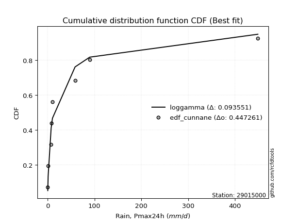</img></img>

</div>


### 12. EDF Adamowski (1981)

The Adamowski formula in hydrology refers to a specific plotting position formula used for estimating the non-parametric empirical distribution of hydrological events (like flood peaks) to calculate their return periods. This formula provides an alternative to traditional parametric methods (like the Gumbel or Log Pearson Type III distributions). 

<div align="center">


$P=(m-0.25)/(n+0.5)$


</div>


**12.1. Empirical values**

<div align="center">

|                | 0                   | 1                   | 2                  | 3                   | 4             | 5                  | 6                  | 7                  | 8                  |
|:---------------|:--------------------|:--------------------|:-------------------|:--------------------|:--------------|:-------------------|:-------------------|:-------------------|:-------------------|
| date           | 2023                | 2024                | 2018               | 2019                | 2020          | 2025               | 2017               | 2022               | 2021               |
| x              | 0.36                | 1.1                 | 7.54               | 7.68                | 10.33         | 25.2               | 58.63              | 89.91              | 448.89             |
| m              | 1                   | 2                   | 3                  | 4                   | 5             | 6                  | 7                  | 8                  | 9                  |
| empirical_dist | edf_adamowski       | edf_adamowski       | edf_adamowski      | edf_adamowski       | edf_adamowski | edf_adamowski      | edf_adamowski      | edf_adamowski      | edf_adamowski      |
| empirical      | 0.07894736842105263 | 0.18421052631578946 | 0.2894736842105263 | 0.39473684210526316 | 0.5           | 0.6052631578947368 | 0.7105263157894737 | 0.8157894736842105 | 0.9210526315789473 |
| empirical_tr   | 1.0857142857142856  | 1.2258064516129032  | 1.4074074074074074 | 1.6521739130434783  | 2.0           | 2.533333333333333  | 3.4545454545454546 | 5.428571428571428  | 12.666666666666663 |

</div>


**12.2. Kolmogorov-Smirnov fit test (sorted by Δ)**


<div align="center">

|                | 0                   | 1                   | 2                   | 3                   | 4                   | 5                   | 6                   | 7                   | 8                   | 9                   | 10                  | 11                  | 12                  | 13                  | 14                  | 15                  | 16                  | 17                  | 18                  | 19                  | 20                  | 21                  | 22                  | 23                  | 24                  | 25                  | 26                  | 27                  | 28                  | 29                  | 30                  | 31                  | 32                  | 33                  | 34                  | 35                  | 36                  | 37                  | 38                  | 39                  | 40                  | 41                  | 42                  | 43                  | 44                  | 45                  | 46                  | 47                  | 48                  | 49                  | 50                  | 51                  | 52                  | 53                  | 54                  | 55                  | 56                  | 57                  | 58                  | 59                  | 60                  | 61                  | 62                  | 63                  | 64                  | 65                  | 66                  | 67                  | 68                  | 69                  | 70                  | 71                  | 72                  | 73                  | 74                  | 75                  | 76                  | 77                  | 78                  | 79                  | 80                  | 81                  | 82                  | 83                  | 84                  | 85                  | 86                  | 87                  | 88                  | 89                  | 90                  | 91                  | 92                  | 93                  | 94                  | 95                  | 96                  | 97                  | 98                  | 99                  | 100                 | 101                 | 102                 | 103                 | 104                 | 105                 | 106                 | 107                 | 108                 | 109                 | 110                 | 111                 | 112                 | 113                 | 114                 | 115                 | 116                 | 117                 | 118                 | 119                 | 120                 | 121                 | 122                 | 123                 | 124                 | 125                 | 126                 | 127                 | 128                 | 129                 | 130                 | 131                 | 132                 | 133                 | 134                 | 135                 | 136                 | 137                 | 138                 | 139                 | 140                 | 141                 | 142                 | 143                 | 144                 | 145                 | 146                 | 147                 | 148                 | 149                 | 150                 | 151                 | 152                 | 153                 | 154                 | 155                 | 156                 | 157                 | 158                 | 159                 |
|:---------------|:--------------------|:--------------------|:--------------------|:--------------------|:--------------------|:--------------------|:--------------------|:--------------------|:--------------------|:--------------------|:--------------------|:--------------------|:--------------------|:--------------------|:--------------------|:--------------------|:--------------------|:--------------------|:--------------------|:--------------------|:--------------------|:--------------------|:--------------------|:--------------------|:--------------------|:--------------------|:--------------------|:--------------------|:--------------------|:--------------------|:--------------------|:--------------------|:--------------------|:--------------------|:--------------------|:--------------------|:--------------------|:--------------------|:--------------------|:--------------------|:--------------------|:--------------------|:--------------------|:--------------------|:--------------------|:--------------------|:--------------------|:--------------------|:--------------------|:--------------------|:--------------------|:--------------------|:--------------------|:--------------------|:--------------------|:--------------------|:--------------------|:--------------------|:--------------------|:--------------------|:--------------------|:--------------------|:--------------------|:--------------------|:--------------------|:--------------------|:--------------------|:--------------------|:--------------------|:--------------------|:--------------------|:--------------------|:--------------------|:--------------------|:--------------------|:--------------------|:--------------------|:--------------------|:--------------------|:--------------------|:--------------------|:--------------------|:--------------------|:--------------------|:--------------------|:--------------------|:--------------------|:--------------------|:--------------------|:--------------------|:--------------------|:--------------------|:--------------------|:--------------------|:--------------------|:--------------------|:--------------------|:--------------------|:--------------------|:--------------------|:--------------------|:--------------------|:--------------------|:--------------------|:--------------------|:--------------------|:--------------------|:--------------------|:--------------------|:--------------------|:--------------------|:--------------------|:--------------------|:--------------------|:--------------------|:--------------------|:--------------------|:--------------------|:--------------------|:--------------------|:--------------------|:--------------------|:--------------------|:--------------------|:--------------------|:--------------------|:--------------------|:--------------------|:--------------------|:--------------------|:--------------------|:--------------------|:--------------------|:--------------------|:--------------------|:--------------------|:--------------------|:--------------------|:--------------------|:--------------------|:--------------------|:--------------------|:--------------------|:--------------------|:--------------------|:--------------------|:--------------------|:--------------------|:--------------------|:--------------------|:--------------------|:--------------------|:--------------------|:--------------------|:--------------------|:--------------------|:--------------------|:--------------------|:--------------------|:--------------------|
| station        | 29015000            | 29015000            | 29015000            | 29015000            | 29015000            | 29015000            | 29015000            | 29015000            | 29015000            | 29015000            | 29015000            | 29015000            | 29015000            | 29015000            | 29015000            | 29015000            | 29015000            | 29015000            | 29015000            | 29015000            | 29015000            | 29015000            | 29015000            | 29015000            | 29015000            | 29015000            | 29015000            | 29015000            | 29015000            | 29015000            | 29015000            | 29015000            | 29015000            | 29015000            | 29015000            | 29015000            | 29015000            | 29015000            | 29015000            | 29015000            | 29015000            | 29015000            | 29015000            | 29015000            | 29015000            | 29015000            | 29015000            | 29015000            | 29015000            | 29015000            | 29015000            | 29015000            | 29015000            | 29015000            | 29015000            | 29015000            | 29015000            | 29015000            | 29015000            | 29015000            | 29015000            | 29015000            | 29015000            | 29015000            | 29015000            | 29015000            | 29015000            | 29015000            | 29015000            | 29015000            | 29015000            | 29015000            | 29015000            | 29015000            | 29015000            | 29015000            | 29015000            | 29015000            | 29015000            | 29015000            | 29015000            | 29015000            | 29015000            | 29015000            | 29015000            | 29015000            | 29015000            | 29015000            | 29015000            | 29015000            | 29015000            | 29015000            | 29015000            | 29015000            | 29015000            | 29015000            | 29015000            | 29015000            | 29015000            | 29015000            | 29015000            | 29015000            | 29015000            | 29015000            | 29015000            | 29015000            | 29015000            | 29015000            | 29015000            | 29015000            | 29015000            | 29015000            | 29015000            | 29015000            | 29015000            | 29015000            | 29015000            | 29015000            | 29015000            | 29015000            | 29015000            | 29015000            | 29015000            | 29015000            | 29015000            | 29015000            | 29015000            | 29015000            | 29015000            | 29015000            | 29015000            | 29015000            | 29015000            | 29015000            | 29015000            | 29015000            | 29015000            | 29015000            | 29015000            | 29015000            | 29015000            | 29015000            | 29015000            | 29015000            | 29015000            | 29015000            | 29015000            | 29015000            | 29015000            | 29015000            | 29015000            | 29015000            | 29015000            | 29015000            | 29015000            | 29015000            | 29015000            | 29015000            | 29015000            | 29015000            |
| empirical_dist | edf_adamowski       | edf_adamowski       | edf_adamowski       | edf_adamowski       | edf_adamowski       | edf_adamowski       | edf_adamowski       | edf_adamowski       | edf_adamowski       | edf_adamowski       | edf_adamowski       | edf_adamowski       | edf_adamowski       | edf_adamowski       | edf_adamowski       | edf_adamowski       | edf_adamowski       | edf_adamowski       | edf_adamowski       | edf_adamowski       | edf_adamowski       | edf_adamowski       | edf_adamowski       | edf_adamowski       | edf_adamowski       | edf_adamowski       | edf_adamowski       | edf_adamowski       | edf_adamowski       | edf_adamowski       | edf_adamowski       | edf_adamowski       | edf_adamowski       | edf_adamowski       | edf_adamowski       | edf_adamowski       | edf_adamowski       | edf_adamowski       | edf_adamowski       | edf_adamowski       | edf_adamowski       | edf_adamowski       | edf_adamowski       | edf_adamowski       | edf_adamowski       | edf_adamowski       | edf_adamowski       | edf_adamowski       | edf_adamowski       | edf_adamowski       | edf_adamowski       | edf_adamowski       | edf_adamowski       | edf_adamowski       | edf_adamowski       | edf_adamowski       | edf_adamowski       | edf_adamowski       | edf_adamowski       | edf_adamowski       | edf_adamowski       | edf_adamowski       | edf_adamowski       | edf_adamowski       | edf_adamowski       | edf_adamowski       | edf_adamowski       | edf_adamowski       | edf_adamowski       | edf_adamowski       | edf_adamowski       | edf_adamowski       | edf_adamowski       | edf_adamowski       | edf_adamowski       | edf_adamowski       | edf_adamowski       | edf_adamowski       | edf_adamowski       | edf_adamowski       | edf_adamowski       | edf_adamowski       | edf_adamowski       | edf_adamowski       | edf_adamowski       | edf_adamowski       | edf_adamowski       | edf_adamowski       | edf_adamowski       | edf_adamowski       | edf_adamowski       | edf_adamowski       | edf_adamowski       | edf_adamowski       | edf_adamowski       | edf_adamowski       | edf_adamowski       | edf_adamowski       | edf_adamowski       | edf_adamowski       | edf_adamowski       | edf_adamowski       | edf_adamowski       | edf_adamowski       | edf_adamowski       | edf_adamowski       | edf_adamowski       | edf_adamowski       | edf_adamowski       | edf_adamowski       | edf_adamowski       | edf_adamowski       | edf_adamowski       | edf_adamowski       | edf_adamowski       | edf_adamowski       | edf_adamowski       | edf_adamowski       | edf_adamowski       | edf_adamowski       | edf_adamowski       | edf_adamowski       | edf_adamowski       | edf_adamowski       | edf_adamowski       | edf_adamowski       | edf_adamowski       | edf_adamowski       | edf_adamowski       | edf_adamowski       | edf_adamowski       | edf_adamowski       | edf_adamowski       | edf_adamowski       | edf_adamowski       | edf_adamowski       | edf_adamowski       | edf_adamowski       | edf_adamowski       | edf_adamowski       | edf_adamowski       | edf_adamowski       | edf_adamowski       | edf_adamowski       | edf_adamowski       | edf_adamowski       | edf_adamowski       | edf_adamowski       | edf_adamowski       | edf_adamowski       | edf_adamowski       | edf_adamowski       | edf_adamowski       | edf_adamowski       | edf_adamowski       | edf_adamowski       | edf_adamowski       | edf_adamowski       | edf_adamowski       | edf_adamowski       |
| p_dist         | loggenlogistic      | ncf                 | loggenextreme       | loglogistic         | logskewnorm         | logjohnsonsu        | loghypsecant        | logloggamma         | logdweibull         | f                   | logpearson3         | logdgamma           | logfoldnorm         | logweibull_min      | lognorm             | logcrystalball      | logt                | logexponnorm        | lognct              | lognakagami         | logfatiguelife      | logargus            | logbetaprime        | loggengamma         | loglaplace          | loglaplace          | logerlang           | loggamma            | loggamma            | loggausshyper       | loggompertz         | logcosine           | lomax               | genpareto           | loganglit           | logrice             | loggumbel_l         | logsemicircular     | loginvgamma         | logalpha            | truncpareto         | logkappa3           | logmaxwell          | invgauss            | loginvgauss         | logwrapcauchy       | loguniform          | invgamma            | gengamma            | lograyleigh         | logarcsine          | logbeta             | logksone            | truncweibull_min    | exponpow            | loggumbel_r         | logtriang           | loginvweibull       | exponweib           | genextreme          | invweibull          | loggenpareto        | halfgennorm         | logkappa4           | logtruncnorm        | logmielke           | kappa3              | mielke              | loggenhalflogistic  | logvonmises_line    | logmoyal            | loghalfnorm         | gamma               | logtruncweibull_min | fatiguelife         | erlang              | burr12              | logkstwobign        | loggenexpon         | loghalflogistic     | betaprime           | gennorm             | vonmises_line       | logbradford         | dgamma              | t                   | nct                 | nakagami            | logtruncexpon       | genlogistic         | logwald             | maxwell             | gausshyper          | gumbel_r            | logncf              | logistic            | rayleigh            | wald                | dweibull            | moyal               | logburr12           | crystalball         | norm                | weibull_min         | hypsecant           | logtrapezoid        | anglit              | semicircular        | loglomax            | logjohnsonsb        | halflogistic        | halfnorm            | burr                | powerlaw            | kstwobign           | logexponweib        | laplace             | arcsine             | loglevy_l           | pearson3            | foldnorm            | rice                | loggennorm          | gumbel_l            | loghalfgennorm      | wrapcauchy          | logburr             | logloglaplace       | exponnorm           | genexpon            | logf                | cosine              | gompertz            | truncnorm           | logtukeylambda      | levy_l              | johnsonsu           | logrdist            | argus               | skewnorm            | logweibull_max      | bradford            | truncexpon          | triang              | logpowerlaw         | rdist               | ksone               | tukeylambda         | kappa4              | alpha               | logexponpow         | uniform             | logtruncpareto      | johnsonsb           | genhalflogistic     | beta                | trapezoid           | weibull_max         | logvonmises         | vonmises            |
| delta          | 0.07832161765181517 | 0.08226100315115886 | 0.08578638319688958 | 0.08685303578096543 | 0.0875408401168214  | 0.08902547507993613 | 0.08951043436885403 | 0.08952817849874967 | 0.09221188515914663 | 0.09224994735239334 | 0.0935909940174981  | 0.09723796849082038 | 0.09811944741078354 | 0.10052851247617262 | 0.1008351360492925  | 0.10083514548196443 | 0.10083533298472713 | 0.10083570936799702 | 0.10094769167351225 | 0.10108592801123112 | 0.10117001775303786 | 0.10150211592284575 | 0.10647268981879221 | 0.10664312847955021 | 0.1068595948055765  | 0.1068595948055765  | 0.10709572212732354 | 0.10756924767500803 | 0.10756924767500803 | 0.10790559448465487 | 0.11098261023309142 | 0.1126549528704584  | 0.113661106068747   | 0.11366611808996994 | 0.11589502581549377 | 0.11884609428337656 | 0.120387604752136   | 0.12215985845535388 | 0.12470081553313378 | 0.12594415826105182 | 0.1282161103168122  | 0.13459236049682927 | 0.1345932652356941  | 0.13510980379936627 | 0.13557652773962603 | 0.13684997468320553 | 0.1372505463153162  | 0.13906262020099336 | 0.13911670567510354 | 0.14689737212119913 | 0.14742748054649052 | 0.14749607675815501 | 0.1494631745610091  | 0.15710325344056214 | 0.15836182791922765 | 0.1587275545278649  | 0.16087193344979034 | 0.16246255217375732 | 0.1626658155005688  | 0.16610121070157818 | 0.1661016777324883  | 0.16627026155435598 | 0.16665480261918642 | 0.16826509632596903 | 0.16833992798406022 | 0.16930809610787273 | 0.17050708029305062 | 0.17976735026615415 | 0.18007004022357487 | 0.1803892879359162  | 0.18086507043734668 | 0.18182569873020205 | 0.1826769841843206  | 0.18364466902148008 | 0.18420788264073829 | 0.18495052145168472 | 0.18527724468739448 | 0.18564572830765935 | 0.18596186043912144 | 0.1961111263792606  | 0.20207087037902838 | 0.2062946457748175  | 0.2118089520558446  | 0.2168593203507585  | 0.22232647084844084 | 0.2288637749757787  | 0.23156126292577806 | 0.2332876570007989  | 0.23770453617025966 | 0.23959127139814945 | 0.2397494174597965  | 0.24782133717645063 | 0.25189352641785956 | 0.25255928537025285 | 0.25511440813850084 | 0.25704737941671374 | 0.2588092037281813  | 0.26157152486520696 | 0.26165177313314825 | 0.2623132820388504  | 0.26322991552305997 | 0.2640149857979971  | 0.2640149888006099  | 0.26975554048492445 | 0.26985348761592853 | 0.26992120829203003 | 0.27135988558308455 | 0.27439202088003767 | 0.28129382483363097 | 0.28237873749983267 | 0.28791099169996626 | 0.28985329152725314 | 0.29043887639760546 | 0.2915956053917683  | 0.2952253995242518  | 0.29669549927915384 | 0.2982694006566524  | 0.29943742524099426 | 0.2996338752048697  | 0.30443889970467464 | 0.3050162666565527  | 0.3070689390179638  | 0.3157894736842105  | 0.3308591484579013  | 0.3361749719278835  | 0.33902525553047735 | 0.3429662076634781  | 0.3464538297928307  | 0.36996533498965156 | 0.37039062763661645 | 0.3727773634698791  | 0.3761186729430724  | 0.3964619542603338  | 0.4093273802797931  | 0.4234969962866597  | 0.42945509681109106 | 0.4305238761638178  | 0.4668989867678369  | 0.47288991357631815 | 0.47711086056047824 | 0.5007512621690594  | 0.5011908210346214  | 0.5075753209912677  | 0.5076830656406921  | 0.5487104921250685  | 0.5580674693541233  | 0.5660793093696719  | 0.5881455267694329  | 0.5913256800008244  | 0.6027533747684432  | 0.6051784976829575  | 0.6161372765067642  | 0.6240447505034328  | 0.6437174030665244  | 0.6644838118499838  | 0.7348493252897955  | 0.7513530078487441  | 0.7583552310010068  | 1.0162310107454058  | 70.95546914975252   |
| deltao         | 0.41761268023100007 | 0.41761268023100007 | 0.41761268023100007 | 0.41761268023100007 | 0.41761268023100007 | 0.41761268023100007 | 0.41761268023100007 | 0.41761268023100007 | 0.41761268023100007 | 0.41761268023100007 | 0.41761268023100007 | 0.41761268023100007 | 0.41761268023100007 | 0.41761268023100007 | 0.41761268023100007 | 0.41761268023100007 | 0.41761268023100007 | 0.41761268023100007 | 0.41761268023100007 | 0.41761268023100007 | 0.41761268023100007 | 0.41761268023100007 | 0.41761268023100007 | 0.41761268023100007 | 0.41761268023100007 | 0.41761268023100007 | 0.41761268023100007 | 0.41761268023100007 | 0.41761268023100007 | 0.41761268023100007 | 0.41761268023100007 | 0.41761268023100007 | 0.41761268023100007 | 0.41761268023100007 | 0.41761268023100007 | 0.41761268023100007 | 0.41761268023100007 | 0.41761268023100007 | 0.41761268023100007 | 0.41761268023100007 | 0.41761268023100007 | 0.41761268023100007 | 0.41761268023100007 | 0.41761268023100007 | 0.41761268023100007 | 0.41761268023100007 | 0.41761268023100007 | 0.41761268023100007 | 0.41761268023100007 | 0.41761268023100007 | 0.41761268023100007 | 0.41761268023100007 | 0.41761268023100007 | 0.41761268023100007 | 0.41761268023100007 | 0.41761268023100007 | 0.41761268023100007 | 0.41761268023100007 | 0.41761268023100007 | 0.41761268023100007 | 0.41761268023100007 | 0.41761268023100007 | 0.41761268023100007 | 0.41761268023100007 | 0.41761268023100007 | 0.41761268023100007 | 0.41761268023100007 | 0.41761268023100007 | 0.41761268023100007 | 0.41761268023100007 | 0.41761268023100007 | 0.41761268023100007 | 0.41761268023100007 | 0.41761268023100007 | 0.41761268023100007 | 0.41761268023100007 | 0.41761268023100007 | 0.41761268023100007 | 0.41761268023100007 | 0.41761268023100007 | 0.41761268023100007 | 0.41761268023100007 | 0.41761268023100007 | 0.41761268023100007 | 0.41761268023100007 | 0.41761268023100007 | 0.41761268023100007 | 0.41761268023100007 | 0.41761268023100007 | 0.41761268023100007 | 0.41761268023100007 | 0.41761268023100007 | 0.41761268023100007 | 0.41761268023100007 | 0.41761268023100007 | 0.41761268023100007 | 0.41761268023100007 | 0.41761268023100007 | 0.41761268023100007 | 0.41761268023100007 | 0.41761268023100007 | 0.41761268023100007 | 0.41761268023100007 | 0.41761268023100007 | 0.41761268023100007 | 0.41761268023100007 | 0.41761268023100007 | 0.41761268023100007 | 0.41761268023100007 | 0.41761268023100007 | 0.41761268023100007 | 0.41761268023100007 | 0.41761268023100007 | 0.41761268023100007 | 0.41761268023100007 | 0.41761268023100007 | 0.41761268023100007 | 0.41761268023100007 | 0.41761268023100007 | 0.41761268023100007 | 0.41761268023100007 | 0.41761268023100007 | 0.41761268023100007 | 0.41761268023100007 | 0.41761268023100007 | 0.41761268023100007 | 0.41761268023100007 | 0.41761268023100007 | 0.41761268023100007 | 0.41761268023100007 | 0.41761268023100007 | 0.41761268023100007 | 0.41761268023100007 | 0.41761268023100007 | 0.41761268023100007 | 0.41761268023100007 | 0.41761268023100007 | 0.41761268023100007 | 0.41761268023100007 | 0.41761268023100007 | 0.41761268023100007 | 0.41761268023100007 | 0.41761268023100007 | 0.41761268023100007 | 0.41761268023100007 | 0.41761268023100007 | 0.41761268023100007 | 0.41761268023100007 | 0.41761268023100007 | 0.41761268023100007 | 0.41761268023100007 | 0.41761268023100007 | 0.41761268023100007 | 0.41761268023100007 | 0.41761268023100007 | 0.41761268023100007 | 0.41761268023100007 | 0.41761268023100007 | 0.41761268023100007 | 0.41761268023100007 |
| eval           | Δo > Δ              | Δo > Δ              | Δo > Δ              | Δo > Δ              | Δo > Δ              | Δo > Δ              | Δo > Δ              | Δo > Δ              | Δo > Δ              | Δo > Δ              | Δo > Δ              | Δo > Δ              | Δo > Δ              | Δo > Δ              | Δo > Δ              | Δo > Δ              | Δo > Δ              | Δo > Δ              | Δo > Δ              | Δo > Δ              | Δo > Δ              | Δo > Δ              | Δo > Δ              | Δo > Δ              | Δo > Δ              | Δo > Δ              | Δo > Δ              | Δo > Δ              | Δo > Δ              | Δo > Δ              | Δo > Δ              | Δo > Δ              | Δo > Δ              | Δo > Δ              | Δo > Δ              | Δo > Δ              | Δo > Δ              | Δo > Δ              | Δo > Δ              | Δo > Δ              | Δo > Δ              | Δo > Δ              | Δo > Δ              | Δo > Δ              | Δo > Δ              | Δo > Δ              | Δo > Δ              | Δo > Δ              | Δo > Δ              | Δo > Δ              | Δo > Δ              | Δo > Δ              | Δo > Δ              | Δo > Δ              | Δo > Δ              | Δo > Δ              | Δo > Δ              | Δo > Δ              | Δo > Δ              | Δo > Δ              | Δo > Δ              | Δo > Δ              | Δo > Δ              | Δo > Δ              | Δo > Δ              | Δo > Δ              | Δo > Δ              | Δo > Δ              | Δo > Δ              | Δo > Δ              | Δo > Δ              | Δo > Δ              | Δo > Δ              | Δo > Δ              | Δo > Δ              | Δo > Δ              | Δo > Δ              | Δo > Δ              | Δo > Δ              | Δo > Δ              | Δo > Δ              | Δo > Δ              | Δo > Δ              | Δo > Δ              | Δo > Δ              | Δo > Δ              | Δo > Δ              | Δo > Δ              | Δo > Δ              | Δo > Δ              | Δo > Δ              | Δo > Δ              | Δo > Δ              | Δo > Δ              | Δo > Δ              | Δo > Δ              | Δo > Δ              | Δo > Δ              | Δo > Δ              | Δo > Δ              | Δo > Δ              | Δo > Δ              | Δo > Δ              | Δo > Δ              | Δo > Δ              | Δo > Δ              | Δo > Δ              | Δo > Δ              | Δo > Δ              | Δo > Δ              | Δo > Δ              | Δo > Δ              | Δo > Δ              | Δo > Δ              | Δo > Δ              | Δo > Δ              | Δo > Δ              | Δo > Δ              | Δo > Δ              | Δo > Δ              | Δo > Δ              | Δo > Δ              | Δo > Δ              | Δo > Δ              | Δo > Δ              | Δo > Δ              | Δo > Δ              | Δo > Δ              | Δo > Δ              | Δo > Δ              | Δo > Δ              | Δo > Δ              | Δo > Δ              | Δo > Δ              | Δo <= Δ             | Δo <= Δ             | Δo <= Δ             | Δo <= Δ             | Δo <= Δ             | Δo <= Δ             | Δo <= Δ             | Δo <= Δ             | Δo <= Δ             | Δo <= Δ             | Δo <= Δ             | Δo <= Δ             | Δo <= Δ             | Δo <= Δ             | Δo <= Δ             | Δo <= Δ             | Δo <= Δ             | Δo <= Δ             | Δo <= Δ             | Δo <= Δ             | Δo <= Δ             | Δo <= Δ             | Δo <= Δ             | Δo <= Δ             | Δo <= Δ             | Δo <= Δ             |
| fit            | 1                   | 1                   | 1                   | 1                   | 1                   | 1                   | 1                   | 1                   | 1                   | 1                   | 1                   | 1                   | 1                   | 1                   | 1                   | 1                   | 1                   | 1                   | 1                   | 1                   | 1                   | 1                   | 1                   | 1                   | 1                   | 1                   | 1                   | 1                   | 1                   | 1                   | 1                   | 1                   | 1                   | 1                   | 1                   | 1                   | 1                   | 1                   | 1                   | 1                   | 1                   | 1                   | 1                   | 1                   | 1                   | 1                   | 1                   | 1                   | 1                   | 1                   | 1                   | 1                   | 1                   | 1                   | 1                   | 1                   | 1                   | 1                   | 1                   | 1                   | 1                   | 1                   | 1                   | 1                   | 1                   | 1                   | 1                   | 1                   | 1                   | 1                   | 1                   | 1                   | 1                   | 1                   | 1                   | 1                   | 1                   | 1                   | 1                   | 1                   | 1                   | 1                   | 1                   | 1                   | 1                   | 1                   | 1                   | 1                   | 1                   | 1                   | 1                   | 1                   | 1                   | 1                   | 1                   | 1                   | 1                   | 1                   | 1                   | 1                   | 1                   | 1                   | 1                   | 1                   | 1                   | 1                   | 1                   | 1                   | 1                   | 1                   | 1                   | 1                   | 1                   | 1                   | 1                   | 1                   | 1                   | 1                   | 1                   | 1                   | 1                   | 1                   | 1                   | 1                   | 1                   | 1                   | 1                   | 1                   | 1                   | 1                   | 1                   | 1                   | 1                   | 1                   | 0                   | 0                   | 0                   | 0                   | 0                   | 0                   | 0                   | 0                   | 0                   | 0                   | 0                   | 0                   | 0                   | 0                   | 0                   | 0                   | 0                   | 0                   | 0                   | 0                   | 0                   | 0                   | 0                   | 0                   | 0                   | 0                   |
| n              | 9                   | 9                   | 9                   | 9                   | 9                   | 9                   | 9                   | 9                   | 9                   | 9                   | 9                   | 9                   | 9                   | 9                   | 9                   | 9                   | 9                   | 9                   | 9                   | 9                   | 9                   | 9                   | 9                   | 9                   | 9                   | 9                   | 9                   | 9                   | 9                   | 9                   | 9                   | 9                   | 9                   | 9                   | 9                   | 9                   | 9                   | 9                   | 9                   | 9                   | 9                   | 9                   | 9                   | 9                   | 9                   | 9                   | 9                   | 9                   | 9                   | 9                   | 9                   | 9                   | 9                   | 9                   | 9                   | 9                   | 9                   | 9                   | 9                   | 9                   | 9                   | 9                   | 9                   | 9                   | 9                   | 9                   | 9                   | 9                   | 9                   | 9                   | 9                   | 9                   | 9                   | 9                   | 9                   | 9                   | 9                   | 9                   | 9                   | 9                   | 9                   | 9                   | 9                   | 9                   | 9                   | 9                   | 9                   | 9                   | 9                   | 9                   | 9                   | 9                   | 9                   | 9                   | 9                   | 9                   | 9                   | 9                   | 9                   | 9                   | 9                   | 9                   | 9                   | 9                   | 9                   | 9                   | 9                   | 9                   | 9                   | 9                   | 9                   | 9                   | 9                   | 9                   | 9                   | 9                   | 9                   | 9                   | 9                   | 9                   | 9                   | 9                   | 9                   | 9                   | 9                   | 9                   | 9                   | 9                   | 9                   | 9                   | 9                   | 9                   | 9                   | 9                   | 9                   | 9                   | 9                   | 9                   | 9                   | 9                   | 9                   | 9                   | 9                   | 9                   | 9                   | 9                   | 9                   | 9                   | 9                   | 9                   | 9                   | 9                   | 9                   | 9                   | 9                   | 9                   | 9                   | 9                   | 9                   | 9                   |
| best_fit       | 1                   | 0                   | 0                   | 0                   | 0                   | 0                   | 0                   | 0                   | 0                   | 0                   | 0                   | 0                   | 0                   | 0                   | 0                   | 0                   | 0                   | 0                   | 0                   | 0                   | 0                   | 0                   | 0                   | 0                   | 0                   | 0                   | 0                   | 0                   | 0                   | 0                   | 0                   | 0                   | 0                   | 0                   | 0                   | 0                   | 0                   | 0                   | 0                   | 0                   | 0                   | 0                   | 0                   | 0                   | 0                   | 0                   | 0                   | 0                   | 0                   | 0                   | 0                   | 0                   | 0                   | 0                   | 0                   | 0                   | 0                   | 0                   | 0                   | 0                   | 0                   | 0                   | 0                   | 0                   | 0                   | 0                   | 0                   | 0                   | 0                   | 0                   | 0                   | 0                   | 0                   | 0                   | 0                   | 0                   | 0                   | 0                   | 0                   | 0                   | 0                   | 0                   | 0                   | 0                   | 0                   | 0                   | 0                   | 0                   | 0                   | 0                   | 0                   | 0                   | 0                   | 0                   | 0                   | 0                   | 0                   | 0                   | 0                   | 0                   | 0                   | 0                   | 0                   | 0                   | 0                   | 0                   | 0                   | 0                   | 0                   | 0                   | 0                   | 0                   | 0                   | 0                   | 0                   | 0                   | 0                   | 0                   | 0                   | 0                   | 0                   | 0                   | 0                   | 0                   | 0                   | 0                   | 0                   | 0                   | 0                   | 0                   | 0                   | 0                   | 0                   | 0                   | 0                   | 0                   | 0                   | 0                   | 0                   | 0                   | 0                   | 0                   | 0                   | 0                   | 0                   | 0                   | 0                   | 0                   | 0                   | 0                   | 0                   | 0                   | 0                   | 0                   | 0                   | 0                   | 0                   | 0                   | 0                   | 0                   |
| best_fit_sort  | 1                   | 2                   | 3                   | 4                   | 5                   | 6                   | 7                   | 8                   | 9                   | 10                  | 11                  | 12                  | 13                  | 14                  | 15                  | 16                  | 17                  | 18                  | 19                  | 20                  | 21                  | 22                  | 23                  | 24                  | 25                  | 26                  | 27                  | 28                  | 29                  | 30                  | 31                  | 32                  | 33                  | 34                  | 35                  | 36                  | 37                  | 38                  | 39                  | 40                  | 41                  | 42                  | 43                  | 44                  | 45                  | 46                  | 47                  | 48                  | 49                  | 50                  | 51                  | 52                  | 53                  | 54                  | 55                  | 56                  | 57                  | 58                  | 59                  | 60                  | 61                  | 62                  | 63                  | 64                  | 65                  | 66                  | 67                  | 68                  | 69                  | 70                  | 71                  | 72                  | 73                  | 74                  | 75                  | 76                  | 77                  | 78                  | 79                  | 80                  | 81                  | 82                  | 83                  | 84                  | 85                  | 86                  | 87                  | 88                  | 89                  | 90                  | 91                  | 92                  | 93                  | 94                  | 95                  | 96                  | 97                  | 98                  | 99                  | 100                 | 101                 | 102                 | 103                 | 104                 | 105                 | 106                 | 107                 | 108                 | 109                 | 110                 | 111                 | 112                 | 113                 | 114                 | 115                 | 116                 | 117                 | 118                 | 119                 | 120                 | 121                 | 122                 | 123                 | 124                 | 125                 | 126                 | 127                 | 128                 | 129                 | 130                 | 131                 | 132                 | 133                 | 134                 | 135                 | 136                 | 137                 | 138                 | 139                 | 140                 | 141                 | 142                 | 143                 | 144                 | 145                 | 146                 | 147                 | 148                 | 149                 | 150                 | 151                 | 152                 | 153                 | 154                 | 155                 | 156                 | 157                 | 158                 | 159                 | 160                 |

</div>


**12.3. Best fit**

<div align="center">

|   id |   station | empirical_dist   | p_dist         |     delta |   deltao | eval   |   fit |   n |   best_fit |   best_fit_sort |
|-----:|----------:|:-----------------|:---------------|----------:|---------:|:-------|------:|----:|-----------:|----------------:|
|    0 |  29015000 | edf_adamowski    | loggenlogistic | 0.0783216 | 0.417613 | Δo > Δ |     1 |   9 |          1 |               1 |

</div>


<div align="center">

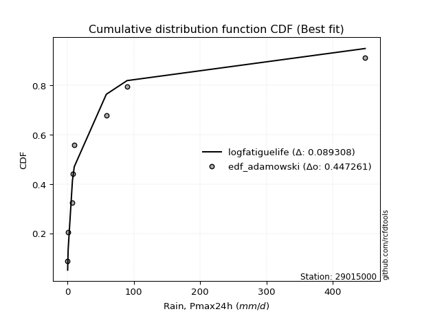</img></img>

</div>


## C. Best fit & Estimate extreme values for specific return periods - Tr

Best fit in probability distribution analysis means finding the theoretical distribution (like Normal, Poisson, Exponential, etc.) that most accurately mirrors your real-world data´s patterns (shape, center, spread) for better predictions, using methods like visual checks (Q-Q plots), goodness-of-fit tests (Kolmogorov-Smirnov, Chi-Squared), and information criteria (AIC) to score and select the simplest, most representative model.


### 1. Best fit (ordered by delta Δ)

:file_folder:Table: [bestfit_29015000.csv](table/bestfit_29015000.csv)

<div align="center">

|   id |   station | empirical_dist   | p_dist         |     delta |   deltao | eval   |   fit |   n |   best_fit |   best_fit_sort |
|-----:|----------:|:-----------------|:---------------|----------:|---------:|:-------|------:|----:|-----------:|----------------:|
|    0 |  29015000 | edf_adamowski    | loggenlogistic | 0.0783216 | 0.417613 | Δo > Δ |     1 |   9 |          1 |               1 |
|    1 |  29015000 | edf_weibull      | loggenextreme  | 0.0799072 | 0.417613 | Δo > Δ |     1 |   9 |          1 |               2 |
|    2 |  29015000 | edf_chegodayev   | loggenlogistic | 0.0805613 | 0.417613 | Δo > Δ |     1 |   9 |          1 |               3 |
|    3 |  29015000 | edf_jenkinson    | loggenlogistic | 0.0810149 | 0.417613 | Δo > Δ |     1 |   9 |          1 |               4 |
|    4 |  29015000 | edf_beard        | loggenlogistic | 0.0810149 | 0.417613 | Δo > Δ |     1 |   9 |          1 |               5 |
|    5 |  29015000 | edf_filliben     | loggenlogistic | 0.0813564 | 0.417613 | Δo > Δ |     1 |   9 |          1 |               6 |
|    6 |  29015000 | edf_tukey        | loggenlogistic | 0.082081  | 0.417613 | Δo > Δ |     1 |   9 |          1 |               7 |
|    7 |  29015000 | edf_cunnane      | ncf            | 0.082261  | 0.417613 | Δo > Δ |     1 |   9 |          1 |               8 |
|    8 |  29015000 | edf_blom         | ncf            | 0.082261  | 0.417613 | Δo > Δ |     1 |   9 |          1 |               9 |
|    9 |  29015000 | edf_gringorten   | ncf            | 0.082261  | 0.417613 | Δo > Δ |     1 |   9 |          1 |              10 |
|   10 |  29015000 | edf_hazen        | ncf            | 0.082261  | 0.417613 | Δo > Δ |     1 |   9 |          1 |              11 |
|   11 |  29015000 | edf_california   | loganglit      | 0.0987223 | 0.417613 | Δo > Δ |     1 |   9 |          1 |              12 |

</div>


### 2. Extreme values and % difference analysis

In hydrology, a return period (or recurrence interval $Tr$) is the statistical average time between extreme events like floods or droughts of a specific magnitude, indicating how rare an event is, with a 100-year flood, for example, having a 1% chance of occurring in any given year, not that it happens exactly every century. It is a key tool for infrastructure design (like bridges or dams) and risk assessment, calculated from historical data to determine the probability of future events, although it is important to remember it is statistical average, and events can cluster or be missed.

The extreme value porcentage difference is evaluated as $pdiff = 1 - (ETrBf / ETr) * 100$, where _ETrBf_ correspond to the bestfit extreme value for a specific recurrence interval and _ETr_ correspond to the extreme value for one of the most used PDFsused in hydrology.

> risk_rate: assuming the return period as the project useful life.

:file_folder:Table: [extreme_29015000.csv](table/extreme_29015000.csv), all PDFs.  
:file_folder:Table: [extremepdiff_29015000.csv](table/extremepdiff_29015000.csv), % difference between bestfit and most used PDFs in Hydrology.

<div align="center">

Extreme values table for only best fit PDFs
|   id |      tr |   prob_l |     prob_g |     alpha |   anglit |   arcsine |   argus |     beta |   betaprime |   bradford |       burr |     burr12 |   cosine |   crystalball |    dgamma |    dweibull |     erlang |   exponnorm |   exponpow |   exponweib |          f |   fatiguelife |   foldnorm |    gamma |   gausshyper |   genexpon |       genextreme |   gengamma |   genhalflogistic |   genlogistic |   gennorm |   genpareto |   gompertz |   gumbel_l |   gumbel_r |   halfgennorm |   halflogistic |   halfnorm |   hypsecant |    invgamma |   invgauss |       invweibull |   johnsonsb |        johnsonsu |           kappa3 |   kappa4 |   ksone |   kstwobign |   laplace |   levy_l |   loggamma |   logistic |   loglaplace |       lomax |   maxwell |      mielke |    moyal |   nakagami |        ncf |              nct |     norm |   pearson3 |   powerlaw |   rayleigh |    rdist |     rice |   semicircular |   skewnorm |            t |   trapezoid |   triang |   truncexpon |   truncnorm |   truncpareto |   truncweibull_min |   tukeylambda |   uniform |   vonmises |   vonmises_line |      wald |   weibull_max |   weibull_min |   wrapcauchy |   logalpha |   loganglit |   logarcsine |   logargus |   logbeta |   logbetaprime |   logbradford |          logburr |        logburr12 |   logcosine |   logcrystalball |   logdgamma |   logdweibull |   logerlang |   logexponnorm |      logexponpow |      logexponweib |            logf |   logfatiguelife |   logfoldnorm |   loggausshyper |   loggenexpon |   loggenextreme |   loggengamma |   loggenhalflogistic |   loggenlogistic |   loggennorm |   loggenpareto |   loggompertz |   loggumbel_l |   loggumbel_r |   loghalfgennorm |   loghalflogistic |   loghalfnorm |   loghypsecant |   loginvgamma |   loginvgauss |    loginvweibull |   logjohnsonsb |   logjohnsonsu |   logkappa3 |   logkappa4 |   logksone |   logkstwobign |   loglevy_l |   logloggamma |   loglogistic |   logloglaplace |         loglomax |   logmaxwell |        logmielke |         logmoyal |   lognakagami |         logncf |    lognct |   lognorm |   logpearson3 |   logpowerlaw |   lograyleigh |   logrdist |    logrice |   logsemicircular |   logskewnorm |      logt |   logtrapezoid |   logtriang |   logtruncexpon |   logtruncnorm |   logtruncpareto |   logtruncweibull_min |   logtukeylambda |   loguniform |   logvonmises |   logvonmises_line |          logwald |   logweibull_max |   logweibull_min |   logwrapcauchy |   station |   n |   risk_rate |
|-----:|--------:|---------:|-----------:|----------:|---------:|----------:|--------:|---------:|------------:|-----------:|-----------:|-----------:|---------:|--------------:|----------:|------------:|-----------:|------------:|-----------:|------------:|-----------:|--------------:|-----------:|---------:|-------------:|-----------:|-----------------:|-----------:|------------------:|--------------:|----------:|------------:|-----------:|-----------:|-----------:|--------------:|---------------:|-----------:|------------:|------------:|-----------:|-----------------:|------------:|-----------------:|-----------------:|---------:|--------:|------------:|----------:|---------:|-----------:|-----------:|-------------:|------------:|----------:|------------:|---------:|-----------:|-----------:|-----------------:|---------:|-----------:|-----------:|-----------:|---------:|---------:|---------------:|-----------:|-------------:|------------:|---------:|-------------:|------------:|--------------:|-------------------:|--------------:|----------:|-----------:|----------------:|----------:|--------------:|--------------:|-------------:|-----------:|------------:|-------------:|-----------:|----------:|---------------:|--------------:|-----------------:|-----------------:|------------:|-----------------:|------------:|--------------:|------------:|---------------:|-----------------:|------------------:|----------------:|-----------------:|--------------:|----------------:|--------------:|----------------:|--------------:|---------------------:|-----------------:|-------------:|---------------:|--------------:|--------------:|--------------:|-----------------:|------------------:|--------------:|---------------:|--------------:|--------------:|-----------------:|---------------:|---------------:|------------:|------------:|-----------:|---------------:|------------:|--------------:|--------------:|----------------:|-----------------:|-------------:|-----------------:|-----------------:|--------------:|---------------:|----------:|----------:|--------------:|--------------:|--------------:|-----------:|-----------:|------------------:|--------------:|----------:|---------------:|------------:|----------------:|---------------:|-----------------:|----------------------:|-----------------:|-------------:|--------------:|-------------------:|-----------------:|-----------------:|-----------------:|----------------:|----------:|----:|------------:|
|    0 |    2    | 0.5      | 0.5        |   1.51557 |  72.1822 |   72.1822 | 175.895 | -37.4464 |     7.95274 |    156.059 |    5.08976 |    8.56183 |  115.683 |       72.1822 |   7.54    |     7.68    |    9.69283 |     50.2298 |    33.1201 |     27.0254 |    16.9151 |       9.44633 |    43.099  |  30.4525 |      54.7823 |    50.1445 |      9.71019     |    11.4328 |           292.542 |       46.8953 |   7.68    |     11.9843 |    63.5874 |    94.5602 |    49.8043 |       21.7223 |        38.6791 |    44.2992 |     72.1822 |     10.4993 |    10.5669 |      9.71017     |    0.362006 |      0.401585    |      9.64117     |  214.316 | 224.625 |     67.3577 |   72.1822 | -19.3408 |    12.954  |    72.1822 |      13.4208 |     11.9839 |   60.5323 |      9.2984 |  42.5799 |    54.8488 |    15.3182 |      6.65284     |  72.1822 |    26.072  |    2.64619 |    56.4004 | -48.8371 |  79.2824 |        72.1822 |    104.223 |      7.6788  |     333.873 |  145.747 |      153.506 |      69.515 |       16.1071 |            26.651  |      -47.5855 |   224.625 |    1.47132 |         18.6598 |   28.027  |       448.631 |       67.2051 |      224.661 |    11.7025 |     13.4208 |      13.4207 |    19.4994 |   22.1171 |        13.0289 |       7.21204 |      2.71712     |     3.93085      |     12.986  |          13.4208 |     16.57   |       16.3743 |     12.9901 |        13.4207 |      0.485104    |      1.95532      |    1.12716      |          13.3712 |       13.4964 |         15.6633 |       8.73009 |         15.07   |       12.9926 |              38.1625 |          14.5063 |      12.7122 |        11.01   |       13.4155 |       18.8574 |       9.55153 |      2.7031      |            8.0657 |       8.78496 |        13.4208 |       11.8441 |       11.2308 |      9.91004     |        39.6861 |        14.3773 |     12.9994 |     10.2767 |    12.7122 |        8.71451 |     11.6644 |       14.3315 |       13.4208 |    1.94794      |      4.35508     |      11.243  |      9.43003     |      8.55833     |       13.4119 |   3.88518      |   13.4129 |   13.4208 |       14.0034 |      0.462976 |       10.5587 |   0.475746 |    12.3279 |           13.4208 |       14.4534 |   13.4208 |        68.5425 |     31.8934 |          6.2625 |        9.94778 |         0.380868 |               9.02381 |          3.03169 |      12.7122 |     0.0588878 |            22.9719 |      6.86023     |          220.915 |          13.6012 |         12.7565 |  29015000 |   9 |    0.75     |
|    1 |    2.33 | 0.570815 | 0.429185   |   1.80312 | 100.496  |  114.686  | 212.207 | -37.4449 |    12.2969  |    187.175 |    7.20969 |   12.1976  |  145.97  |       96.4898 |   7.95166 |     8.05615 |   18.5655  |     61.2321 |    51.2244 |     47.2826 |    24.3493 |      17.2938  |    71.7782 |  42.9356 |      77.6062 |    61.1127 |     14.8697      |    17.0672 |           321.935 |       59.2461 |   8.67376 |     16.5971 |    77.5181 |   115.708  |    72.328  |       29.0671 |        61.8371 |    70.5334 |     91.6356 |     14.8503 |    14.6889 |     14.8696      |    0.366118 |      0.602031    |     15.1507      |  247.301 | 262.74  |     84.5071 |   86.8921 | 120.839  |    18.7964 |    93.5989 |      16.783  |     16.5968 |   85.7862 |     15.0358 |  63.9015 |    84.1679 |    21.3031 |     10.3329      |  96.4898 |    45.5551 |    6.62953 |    82.0279 | -23.1218 |  99.1298 |       102.549  |    122.101 |      8.85271 |     359.932 |  171.551 |      182.351 |      83.764 |       22.3438 |            40.1601 |      -27.2114 |   256.388 |    1.65872 |         23.1212 |   43.9658 |       448.803 |      104.812  |      416.102 |    17.0288 |     20.6377 |      25.6048 |    29.8075 |   41.1747 |        18.884  |      11.9825  |      4.57321     |     9.84219      |     19.2158 |          19.4186 |     28.3083 |       27.2679 |     18.8512 |        19.4186 |      0.571419    |      5.59398      |    2.02049      |          19.3354 |       19.4181 |         25.7275 |      13.5327  |         22.0314 |       18.8403 |              60.9471 |          20.3644 |      12.7122 |        19.9708 |       20.0852 |       26.0056 |      13.4505  |      4.59549     |           11.4682 |      13.0887  |        18.0376 |       17.2878 |       16.5328 |     15.1715      |       174.458  |        20.7416 |     21.6039 |     17.3586 |    23.2971 |       13.4232  |     34.823  |       20.6709 |       18.5839 |    3.3869       |      7.54303     |      16.5033 |     14.1353      |     11.8337      |       19.4197 |  12.1883       |   19.408  |   19.4186 |       20.2288 |      0.579838 |       15.587  |   1.09248  |    18.0902 |           21.2919 |       20.8025 |   19.4186 |       103.712  |     49.3975 |         10.245  |       15.9427  |         0.402731 |              14.6301  |          4.10496 |      21.0598 |     0.0850302 |            31.0288 |      8.7406      |          271.013 |          19.7979 |         21.1457 |  29015000 |   9 |    0.729209 |
|    2 |    5    | 0.8      | 0.2        |   4.03287 | 200.394  |  228.029  | 328.684 | -13.7643 |    53.79    |    309.274 |   25.3826  |   43.5054  |  255.114 |      186.823  |  32.0582  |   128.234   |  114.655   |    116.241  |   186.464  |    307.737  |    91.5697 |      97.7447  |   193.059  | 121.113  |     213.78   |   115.955  |     94.8725      |    67.2524 |           399.412 |      112.9    |  23.3763  |     64.646  |   147.166  |   184.028  |   170.181  |       78.9496 |       166.622  |   181.475  |    169.667  |     67.8101 |    56.3366 |     94.8731      |    0.745553 |    168.848       |     98.7976      |  355.411 | 386.096 |    157.354  |  160.438  | 353.084  |    76.1916 |   176.292  |      51.322  |     64.6499 |  185.184  |     88.8494 | 162.665  |   265.399  |    71.9405 |     85.8932      | 186.823  |   148.362  |   82.3411  |   184.626  |  52.3174 | 178.588  |       206.18   |    197.703 |     19.3041  |     434.695 |  274.753 |      298.064 |     150.721 |       76.5162 |           146.94   |       37.8065 |   359.184 |    2.38987 |         40.5654 |  133.191  |       448.889 |      442.082  |      443.467 |    73.3893 |     94.1962 |     143.364  |   116.283  |  216.258  |        75.6667 |      73.2593  |     40.6724      | 46101.5          |     78.8729 |          76.6409 |     91.1927 |       95.6424 |     76.4238 |        76.6406 |      1.92959     | 359658            | 2670.88         |          76.4685 |       75.0464 |        123.624  |      80.381   |         83.1374 |       76.552  |             207.867  |          73.4706 |      12.7122 |       122.685  |       82.8983 |       73.453  |      59.5134  |     90.5423      |           56.3804 |      70.6564  |        59.0505 |       74.3431 |       76.3155 |     96.5055      |       443.606  |        78.1542 |    111.814  |     98.1322 |   165.471  |       84.1005  |    213.223  |       77.8253 |       65.305  | 3724.26         |    117.554       |      74.7546 |     81.4953      |     53.0889      |       76.9932 |   8.00021e+06  |   76.626  |   76.6409 |       77.5075 |      4.08554  |       74.1237 |  10.7699   |    77.2949 |          102.854  |       77.6935 |   76.6408 |       340.295  |    173.306  |         62.8961 |       81.573   |         1.00967  |              79.8258  |         10.9341  |     107.888  |     0.316517  |           100.811  |     33.921       |          400.059 |          78.0529 |        108.536  |  29015000 |   9 |    0.67232  |
|    3 |   10    | 0.9      | 0.1        |   8.12945 | 256.938  |  255.391  | 384.851 | 295.453  |   138.779   |    374.678 |   59.9751  |   99.7095  |  321.055 |      246.748  |  76.1081  |   747.285   |  260.377   |    166.176  |   351.983  |    910.629  |   231.444  |     203.548   |   282.804  | 205.546  |     332.267  |   165.739  |    429.514       |   151.323  |           426.266 |      156.599  |  51.3504  |    192.591  |   210.389  |   222.065  |   249.881  |      143.352  |       253.642  |   263.569  |    231.978  |    242.778  |   147.451  |    429.519       |    6.35648  |  12952.5         |    424.774       |  402.698 | 439.919 |    212.818  |  227.201  | 409.153  |   195.547  |   237.192  |     141.569  |    192.618  |  255.135  |    308.221  | 248.654  |   432.653  |   170.275  |    570.765       | 246.748  |   245.972  |  201.407   |   257.781  |  76.6864 | 235.243  |       259.354  |    253.647 |     59.7856  |     463.898 |  339.772 |      364.914 |     206.393 |      159.276  |           257.046  |       65.0109 |   404.037 |    2.95093 |         53.9594 |  227.88   |       448.89  |      986.204  |      446.504 |   205.903  |    222.457  |     217.291  |   224.182  |  351.369  |       191.481  |     176.152   |    198.586       |     5.33159e+12  |    185.116  |         190.543  |    212.417  |      222.123  |    196.105  |       190.542  |      8.49919     |      8.462e+14    |    4.21068e+13  |         191.081  |      183.998  |        240.09   |     290.823   |        181.007  |      197.586  |             316.678  |         185.727  |      12.7122 |       249.817  |      193.423  |      130.941  |     199.835   |   2013.75        |          211.593  |     246.039   |       152.231  |      205.382  |      228.996  |    435.521       |       448.625  |       182.931  |    229.098  |    211.412  |   389.245  |      340.07    |    330.238  |      182.065  |      164.784  |    1.21635e+14  |   1422.11        |     216.444  |    337.991       |    196.141       |      192.305  |   8.61766e+24  |  190.583  |  190.543  |      185.135  |     26.2102   |      225.326  |  19.7922   |   205.779  |          230.78   |      181.477  |  190.542  |       541.275  |    282.965  |        159.016  |      182.102   |         5.41919  |             182.549   |         16.7398  |     220.068  |     0.633666  |           244.213  |    143.04        |          433.636 |         188.546  |        221.573  |  29015000 |   9 |    0.651322 |
|    4 |   15    | 0.933333 | 0.0666667  |  12.2114  | 281.083  |  260.609  | 406.205 | 411.053  |   226.845   |    398.381 |   94.5122  |  151.488   |  351.092 |      276.652  | 107.167   |  1532.56    |  362.877   |    195.386  |   460.06   |   1503.32   |   380.933  |     272.551   |   329.507  | 258.42   |     387.807  |   194.86   |   1006.98        |   220.872  |           434.361 |      181.253  |  75.1154  |    357.453  |   247.371  |   239.292  |   294.847  |      189.667  |       302.887  |   306.29   |    267.538  |    505.698  |   237.153  |   1007           |   23.66     | 113079           |    953.503       |  418.35  | 457.861 |    242.262  |  266.254  | 426.091  |   314.311  |   270.373  |     256.295  |    357.521  |  291.025  |    598.927  | 298.558  |   524.122  |   270.678  |   1724.97        | 276.652  |   304.143  |  265.569   |   295.473  |  82.7823 | 264.434  |       280.091  |    282.76  |    131.847   |     473.268 |  368.577 |      390.597 |     237.121 |      214.746  |           309.587  |       73.7356 |   418.988 |    3.26651 |         61.3847 |  288.685  |       448.89  |     1418.46   |      447.354 |   351.538  |    321.082  |     235.228  |   287.728  |  394.574  |       305.03   |     239.015   |    474.309       |     5.10623e+21  |    273.036  |         300.172  |    337.529  |      344.632  |    315.148  |       300.171  |     22.33        |      2.16364e+23  |    6.07633e+28  |         302.118  |      287.854  |        297.984  |     565.901   |        256.322  |      318.86   |             359.189  |         306.801  |      12.7122 |       310.621  |      286.78   |      170.128  |     395.792   |  14363.3         |          447.243  |     470.958   |       261.346  |      346.247  |      406.791  |   1019.17        |       448.831  |       277.286  |    290.98   |    273.207  |   517.674  |      713.985   |    376.896  |      275.894  |      272.851  |    2.43316e+30  |   6113.19        |     373.457  |    753.498       |    418.754       |      303.793  |   6.39292e+50  |  300.311  |  300.172  |      284.164  |     59.651    |      399.575  |  22.4704   |   336.516  |          316.277  |      275.401  |  300.172  |       628.189  |    331.169  |        221.722  |      242.74    |        15.1925   |             244.207   |         19.2836  |     279.094  |     0.813439  |           384.273  |    360.412       |          441.088 |         289.987  |        281.081  |  29015000 |   9 |    0.644736 |
|    5 |   20    | 0.95     | 0.05       |  16.2898  | 295.286  |  262.447  | 417.925 | 436.427  |   316.663   |    410.613 |  128.961   |  199.915   |  369.564 |      296.235  | 130.791   |  2351.32    |  441.311   |    216.111  |   540.17   |   2060.28   |   536.864  |     323.609   |   360.644  | 297.062  |     419.99   |   215.522  |   1828.61        |   280.448  |           438.237 |      198.515  |  95.6389  |    552.043  |   273.609  |   250.014  |   326.331  |      226.484  |       337.39   |   334.773  |    292.625  |    849.26   |   320.763  |   1828.64        |   56.0131   | 467355           |   1673.26        |  426.128 | 466.831 |    262.097  |  293.963  | 434.765  |   429.534  |   293.307  |     390.51   |    552.168  |  314.845  |    944.628  | 333.901  |   585.904  |   372.382  |   3779.98        | 296.235  |   345.762  |  303.841   |   320.526  |  85.3191 | 283.837  |       291.592  |    302.17  |    237.503   |     477.89  |  385.748 |      404.232 |     258.204 |      253.062  |           339.738  |       77.9943 |   426.463 |    3.48317 |         66.3646 |  333.997  |       448.89  |     1778.61   |      447.764 |   502.817  |    398.442  |     241.891  |   329.968  |  413.641  |       414.127  |     279.104   |    880.055       |     2.11917e+31  |    346.747  |         404.231  |    464.707  |      462.967  |    430.613  |       404.229  |     45.6558      |      7.19044e+30  |    2.80454e+48  |         407.986  |      385.882  |        331.431  |     881.668   |        316.666  |      437.076  |             381.417  |         433.655  |      12.7122 |       344.469  |      367.435  |      200.239  |     638.669   |  61579.6         |          755.577  |     726.073   |       382.645  |      490.204  |      598.427  |   1848.34        |       448.868  |       363.025  |    327.932  |    310.557  |   596.999  |     1176.74    |    403.287  |      361.132  |      386.634  |    1.36074e+52  |  17203.9         |     536.365  |   1320.6         |    716.536       |      409.923  |   3.85311e+83  |  404.492  |  404.231  |      375.394  |     94.0714   |      584.736  |  23.5563   |   464.839  |          376.689  |      361.187  |  404.23   |       676.073  |    357.891  |        263.091  |      281.546   |        29.2237   |             283.362   |         20.6936  |     314.303  |     0.924027  |           507.743  |    717.592       |          444.024 |         383.057  |        316.584  |  29015000 |   9 |    0.641514 |
|    6 |   25    | 0.96     | 0.04       |  20.3667  | 304.912  |  263.3    | 425.484 | 443.733  |   407.746   |    418.076 |  163.336   |  245.774   |  382.518 |      310.651  | 149.838   |  3164.52    |  504.864   |    232.187  |   603.828  |   2582      |   697.735  |     364.168   |   383.812  | 327.57   |     441.009  |   231.549  |   2895.32        |   332.924  |           440.502 |      211.812  | 113.786   |    772.224  |   293.961  |   257.644  |   350.582  |      257.339  |       363.973  |   355.965  |    312.039  |   1268.73   |   397.97   |   2895.37        |  103.72     |      1.32831e+06 |   2576.44        |  430.771 | 472.214 |    276.954  |  315.456  | 440.209  |   540.981  |   310.851  |     541.371  |    772.42   |  332.529  |   1336.65   | 361.295  |   632.117  |   475.052  |   6946.1         | 310.651  |   378.208  |  329.035   |   339.14   |  86.648  | 298.253  |       299.054  |    316.612 |    378.163   |     480.644 |  397.466 |      412.692 |     274.179 |      280.833  |           359.213  |       80.5054 |   430.949 |    3.64327 |         69.9548 |  370.291  |       448.89  |     2089.33   |      448.006 |   656.977  |    461.209  |     245.046  |   360.441  |  423.839  |       518.883  |     306.561   |   1431.61        |     2.76681e+41  |    410.015  |         503.247  |    593.164  |      577.583  |    542.272  |       503.244  |     80.5645      |      4.73762e+37  |    2.11431e+72  |         509.068  |      478.796  |        353.022  |    1226.2     |        366.773  |      551.827  |             394.996  |         564.884  |      12.7122 |       365.68   |      438.801  |      224.86   |     923.301   | 196964           |         1131.72   |    1001.98    |       513.974  |      635.017  |      799.068  |   2923.6         |       448.879  |       442.008  |    352.319  |    335.35   |   650.315  |     1710.87    |    420.787  |      439.636  |      504.777  |    1.26623e+79  |  38386.2         |     701.746  |   2034.42        |   1086.56        |      511.128  |   4.97314e+122 |  503.646  |  503.247  |      460.282  |    125.519    |      775.927  |  24.0989   |   589.884  |          421.922  |      440.576  |  503.246  |       706.32   |    374.826  |        292.006  |      308.244   |        45.6572   |             310.142   |         21.587   |     337.525  |     0.998111  |           611.972  |   1245.75        |          445.51  |         469.311  |        340.004  |  29015000 |   9 |    0.639603 |
|    7 |   50    | 0.98     | 0.02       |  40.745   | 328.606  |  264.439  | 442.62  | 448.567  |   875.468   |    433.288 |  334.437   |  450.185   |  416.439 |      351.933  | 212.118   |  6900.66    |  714.422   |    282.122  |   807.664  |   4793.43   |  1552.74   |     494.263   |   451.151  | 424.744  |     487.659  |   281.334  |  11926.1         |   533.878  |           444.874 |      252.771  | 183.566   |   2180.48   |   357.179  |   278.357  |   425.288  |      366.25   |       445.878  |   417.563  |    372.233  |   4405.71   |   709.669  |  11926.4         |  463.678    |      2.64476e+07 |   9682.83        |  439.975 | 482.978 |    320.582  |  382.219  | 452.467  |  1051.12   |   364.454  |    1493.34   |   2181.23   |  383.814  |   3840.05   | 446.339  |   766.984  |   997.917  |  45976.6         | 351.933  |   479.737  |  384.924   |   393.174  |  88.7833 | 340.099  |       316.099  |    358.588 |   1640.37    |     486.109 |  426.543 |      430.294 |     321.899 |      350.959  |           401.565  |       85.3911 |   439.919 |    4.06003 |         78.8687 |  488.79   |       448.89  |     3234.72   |      448.486 |  1440.32   |    661.134  |     249.324  |   440.365  |  440.38   |       991.716  |     370.515   |   7017.03        |     1.80102e+97  |    635.909  |         942.449  |   1244.63   |     1108.53   |   1053.16   |       942.445  |    495.514       |      1.12324e+65  |    7.19619e+248 |         960.442  |      888.098  |        399.574  |    3200.21    |        535.286  |     1080.77   |             422.444  |        1265.31   |      12.7122 |       409.179  |      713.505  |      308.052  |    2873.66    |      8.70595e+06 |         3929.64   |    2555.22    |      1283.05   |     1351.18   |     1872.88   |  12005.1         |       448.889  |       771.431  |    406.669  |    390.887  |   771.656  |     5134.51    |    463.018  |      766.925  |     1140      |    2.64594e+287 | 464375           |    1529.99   |   7698.63        |   3957.12        |      961.877  | inf            |  943.632  |  942.449  |      820.991  |    231.543    |     1763.86   |  24.8892   |  1169.03   |          546.689  |      775.147  |  942.448  |       770.41   |    410.843  |        361.092  |      370.924   |       128.245    |             372.47    |         23.4857  |     389.245  |     1.16579   |           928.213  |   7543.64        |          447.793 |         832.398  |        392.168  |  29015000 |   9 |    0.63583  |
|    8 |   75    | 0.986667 | 0.0133333  |  61.1205  | 339.034  |  264.65   | 449.417 | 448.826  |  1356.38    |    438.445 |  504.705   |  629.362   |  432.638 |      374.083  | 250.236   | 10107.9     |  843.809   |    311.333  |   929.798  |   6575.24   |  2464.37   |     572.599   |   487.807  | 482.948  |     504.851  |   310.455  |  27154.7         |   680.38   |           446.273 |      276.578  | 234.564   |   3995.06   |   394.158  |   288.831  |   468.71   |      439.331  |       493.489  |   451.095  |    407.409  |   9119.9    |   942.144  |  27155.4         |  764.506    |      1.31654e+08 |  20849           |  443.004 | 486.567 |    344.585  |  421.273  | 457.505  |  1504.54   |   395.414  |    2703.53   |   3996.64   |  411.697  |   7047.16   | 496.071  |   840.462  |  1531      | 138887           | 374.083  |   539.549  |  405.302   |   422.57   |  89.3053 | 362.865  |       322.909  |    381.439 |   3895.38    |     487.918 |  439.425 |      436.376 |     348.611 |      379.889  |           416.759  |       86.9618 |   442.91  |    4.23206 |         82.3732 |  561.709  |       448.89  |     4034.9    |      448.645 |  2221.52   |    774.672  |     250.126  |   476.77   |  444.395  |      1405.61   |     394.886   |  19241.6         |     1.23889e+159 |    784.178  |        1319.66   |   1902.35   |     1590.68   |   1507.04   |      1319.65   |   1469.71        |      9.12727e+85  |  inf            |        1351      |     1237.16   |        415.975  |    5398.37    |        638.507  |     1554.5    |             431.556  |        2014.79   |      12.7122 |       423.512  |      914.319  |      361.208  |    5559.55    |      8.98274e+07 |         8102.37   |    4253.54    |      2189.91   |     2043.78   |     3002.1    |  27285.1         |       448.89   |      1035.87   |    426.589  |    411.289  |   816.94   |     9399.32    |    481.578  |     1029.52   |     1824.94   |  inf            |      1.9962e+06  |    2337.38   |  16683.6         |   8426.21        |     1350.71   | inf            | 1321.67   | 1319.66   |     1116.43   |    287.083    |     2757.35   |  25.0527   |  1689.04   |          606.297  |     1047.3    | 1319.65   |       792.884  |    423.514  |        388.029  |      395.018   |       189.617    |             396.218   |         24.1523  |     408.19   |     1.22799   |          1077.85   |  22849.7         |          448.32  |        1126.23   |        411.278  |  29015000 |   9 |    0.634587 |
|    9 |  100    | 0.99     | 0.01       |  81.4953  | 345.235  |  264.724  | 453.211 | 448.87   |  1846.01    |    441.04  |  674.432   |  793.212   |  442.791 |      389.065  | 277.87    | 12924.6     |  938.046   |    332.058  |  1017.26   |   8094.33   |  3414.82   |     628.961   |   512.779  | 524.736  |     513.825  |   331.118  |  48614           |   798.379  |           446.957 |      293.428  | 275.672   |   6136.86   |   420.394  |   295.682  |   499.443  |      495.476  |       527.188  |   473.937  |    432.362  |  15280      |  1128.5    |  48615.3         |  935.802    |      3.89843e+08 |  35852.7         |  444.506 | 488.361 |    361.032  |  448.982  | 460.449  |  1919.25   |   417.272  |    4119.3    |   6139.52   |  430.69   |  10811.7    | 531.354  |   890.469  |  2070.81   | 304309           | 389.065  |   582.14   |  415.839   |   442.597  |  89.5212 | 378.375  |       326.722  |    397.005 |   7202.65    |     488.82  |  447.104 |      439.461 |     367.078 |      395.64   |           424.57   |       87.7308 |   444.405 |    4.3237  |         84.2076 |  614.874  |       448.89  |     4662.56   |      448.724 |  2992.93   |    851.227  |     250.407  |   498.385  |  446.036  |      1780.45   |     407.708   |  41177.6         |     1.51838e+225 |    894.259  |        1657.09   |   2562.12   |     2039.85   |   1922.04   |      1657.08   |   3200.14        |      1.78085e+103 |  inf            |        1702.07   |     1548.11   |        424.29   |    7711.23    |        711.883  |     1989.96   |             436.066  |        2797.7    |      12.7122 |       430.493  |     1076.09   |      400.844  |    8869.26    |      4.94619e+08 |        13521.9    |    6018.97    |      3199.8    |     2713.39   |     4155.35   |  48784.8         |       448.89   |      1262.41   |    436.913  |    421.856  |   840.569  |    14223.8     |    492.77   |     1254.4    |     2544.03   |  inf            |      5.61775e+06 |    3119.51   |  28839.9         |  14405           |     1699.54   | inf            | 1659.95   | 1657.09   |     1372.74   |    320.338    |     3738.34   |  25.1134   |  2167.1    |          642.472  |     1282.66   | 1657.09   |       804.337  |    429.978  |        402.332  |      407.745   |       232.804    |             408.715   |         24.4918  |     418.005  |     1.26035   |          1163.08   |  51261.6         |          448.532 |        1378.98   |        421.179  |  29015000 |   9 |    0.633968 |
|   10 |  200    | 0.995    | 0.005      | 162.993   | 356.949  |  264.795  | 459.804 | 448.889  |  3859.52    |    444.953 | 1350.02    | 1362.43    |  463.435 |      423.048  | 346.064   | 21849.9     | 1171.91    |    381.993  |  1229.58   |  12754.3    |  7470.03   |     766.916   |   569.893  | 626.818  |     527.854  |   380.902  | 197151           |  1134.34   |           447.957 |      333.936  | 392.764   |  17252      |   483.607  |   310.573  |   573.326  |      645.719  |       608.203  |   526.182  |    492.475  |  52975.9    |  1644.63   | 197157           | 1139.92     |      4.57402e+09 | 131786           |  446.735 | 491.052 |    398.911  |  515.745  | 466.028  |  3342.75   |   469.705  |   11362.9    |  17261.1    |  474.141  |  30141.9    | 616.361  |  1004.57   |  4272.26   |      2.01414e+06 | 423.048  |   685.197  |  432.09    |   488.42   |  89.7759 | 413.864  |       333.37   |    432.608 |  31714.7     |     490.171 |  461.643 |      444.142 |     410.073 |      421.067  |           436.561  |       88.8553 |   446.647 |    4.46648 |         87.0338 |  747.303  |       448.89  |     6384.26   |      448.843 |  5975.84   |   1017.11   |     250.678  |   538.311  |  447.937  |      3048.17   |     427.78    | 309457           |   inf            |   1168.05   |        2777.47   |   5202.43   |     3633.63   |   3345.85   |      2777.45   |  21129.3         |      1.53231e+154 |  inf            |        2876.39   |     2574.38   |        436.805  |   17453.7     |        883.663  |     3495.98   |             442.706  |        6146.92   |      12.7122 |       440.483  |     1536.03   |      502.648  |   27261.7     |      3.54814e+10 |        46321      |   13315.4     |      7978.02   |     5215.98   |     8845.18   | 197234           |       448.89   |      1967.97   |    452.955  |    438.153  |   877.301  |    36933.3     |    514.692  |     1954.43   |     5644.21   |  inf            |      6.79604e+07 |    6037.92   | 107503           |  52432.6         |     2862.62   | inf            | 2783.6    | 2777.47   |     2185.7    |    378.591    |     7501.28   |  25.1759   |  3817.74   |          710.776  |     2026.98   | 2777.46   |       821.789  |    439.84   |        424.901  |      427.741   |       320.743    |             428.283   |         25.0084  |     433.172  |     1.31052   |          1305.23   | 383598           |          448.773 |        2169.89   |        436.479  |  29015000 |   9 |    0.633042 |
|   11 |  250    | 0.996    | 0.004      | 203.741   | 359.93   |  264.804  | 461.348 | 448.889  |  4888.94    |    445.738 | 1686.48    | 1615.15    |  469.094 |      433.433  | 368.425   | 25445.1     | 1248.95    |    398.069  |  1298.16   |  14590.7    |  9605.1    |     811.874   |   587.463  | 660.041  |     530.759  |   396.927  | 309224           |  1258.99   |           448.152 |      346.959  | 436.219   |  24060.6    |   503.957  |   314.954  |   597.079  |      698.673  |       634.248  |   542.254  |    511.826  |  79048.3    |  1829.27   | 309235           | 1165.59     |      9.70746e+09 | 200211           |  447.175 | 491.59  |    410.634  |  537.237  | 467.479  |  3963.36   |   486.538  |   15752.5    |  24073.9    |  487.517  |  41879.4    | 643.727  |  1039.58   |  5390.27   |      3.70102e+06 | 433.433  |   718.488  |  435.405   |   502.526  |  89.8148 | 424.788  |       334.929  |    443.561 |  51119       |     490.441 |  465.348 |      445.086 |     423.497 |      426.43   |           439      |       89.0744 |   447.096 |    4.49559 |         87.6065 |  791.113  |       448.89  |     7002.75   |      448.867 |  7414.31   |   1064.25   |     250.711  |   548.108  |  448.221  |      3593.98   |     431.919   | 630807           |   inf            |   1256.78   |        3252.33   |   6519.61   |     4350.46   |   3966.34   |      3252.32   |  38861.7         |      4.0828e+173  |  inf            |        3377.29   |     3007.26   |        439.294  |   22449.4     |        936.314  |     4156.76   |             444.003  |        7913.68   |      12.7122 |       442.366  |     1706.3    |      537.258  |   39113.8     |      1.47197e+11 |        68816.1    |   16999.7     |     10705.8    |     6388.18   |    11198.8    | 309048           |       448.89   |      2251.09   |    456.323  |    441.472  |   884.838  |    49620.9     |    520.556  |     2235.19   |     7289.72   |  inf            |      1.51637e+08 |    7398.98   | 164104           |  79474.5         |     3357.34   | inf            | 3260.02   | 3252.33   |     2516.99   |    391.608    |     9294.76   |  25.1841   |  4540.08   |          727.824  |     2329.88   | 3252.33   |       825.32   |    441.836  |        429.583  |      431.877   |       342.616    |             432.32    |         25.1127  |     436.271  |     1.32079   |          1335.83   | 746531           |          448.808 |        2488.3    |        439.606  |  29015000 |   9 |    0.632858 |
|   12 |  500    | 0.998    | 0.002      | 407.482   | 367.323  |  264.815  | 464.896 | 448.89   | 10172.1     |    447.312 | 3361.08    | 2714.69    |  484.154 |      464.23   | 438.905   | 39189.4     | 1492.66    |    448.004  |  1511.21   |  21493.1    | 20950.9    |     952.903   |   639.85   | 764.171  |     536.704  |   446.712  |      1.25022e+06 |  1701.53   |           448.533 |      387.379  | 590.48    |  67607.4    |   567.167  |   327.514  |   670.802  |      877.76   |       715.088  |   590.175  |    571.934  | 274028      |  2453      |      1.25027e+06 | 1199.07     |      9.04179e+10 | 732746           |  448.047 | 492.667 |    445.765  |  604      | 471.229  |  6580.68   |   538.743  |   43452.4    |  67650.9    |  527.43   | 116076      | 728.732  |  1143.66   | 11083.3    |      2.44961e+07 | 464.23   |   822.194  |  442.103   |   544.613  |  89.8772 | 457.383  |       338.52   |    476.217 | 225246       |     490.98  |  474.543 |      446.982 |     464.025 |      437.455  |           443.917  |       89.5038 |   447.993 |    4.55413 |         88.7566 |  930.418  |       448.89  |     9128.32   |      448.915 | 14232.2    |   1190.8    |     250.754  |   571.313  |  448.667  |      5864.1    |     440.327   |      7.23318e+06 |   inf            |   1527.15   |        5193.61   |  13064.7    |     7493.36   |   6581.91   |      5193.58   | 257696           |      2.2886e+244  |  inf            |        5439.4    |     4768.01   |        444.218  |   47605.5     |       1088.36   |     6963.28   |             446.541  |       17322.3    |      12.7122 |       445.931  |     2308.68   |      650.256  |  119932       |      1.40638e+13 |       235110      |   35215.7     |     26690.9    |    11752.7    |    22865.8    |      1.24567e+06 |       448.89   |      3342.09   |    463.751  |    448.162  |   900.106  |   120225       |    536.009  |     3316.48   |    16117.2    |  inf            |      1.83442e+09 |   13571.1    | 609908           | 289269           |     5387.67   | inf            | 5208.43   | 5193.61   |     3814.48   |    419.162    |    17621      |  25.1956   |  7594.44   |          768.649  |     3516.12   | 5193.6    |       832.42   |    445.852  |        439.118  |      440.287   |       391.692    |             440.519   |         25.3219  |     442.536  |     1.34158   |          1399.3    |      6.20184e+06 |          448.863 |        3718.38   |        445.925  |  29015000 |   9 |    0.632489 |
|   13 |  750    | 0.998667 | 0.00133333 | 611.222   | 370.596  |  264.817  | 466.321 | 448.89   | 15603       |    447.838 | 5027.53    | 3659.07    |  491.452 |      481.338  | 480.744   | 49233.2     | 1637.89    |    477.214  |  1635.53   |  26463      | 33047.5    |    1036.23    |   669.116  | 825.649  |     538.737  |   475.835  |      2.82925e+06 |  2001.53   |           448.657 |      411.009  | 695.046   | 123719      |   604.141  |   334.227  |   713.9    |      992.955  |       762.347  |   616.946  |    607.095  | 567040      |  2849.2    |      2.82937e+06 | 1205.12     |      3.12342e+11 |      1.56403e+06 |  448.334 | 493.025 |    465.501  |  643.054  | 473.008  |  8733.08   |   569.244  |   78665.8    | 123805      |  549.754  | 210526      | 778.457  |  1201.61   | 16887.3    |      7.39978e+07 | 481.338  |   883.039  |  444.355   |   568.147  |  89.8924 | 475.609  |       339.966  |    494.461 | 536338       |     491.159 |  478.617 |      447.617 |     486.972 |      441.22   |           445.569  |       89.6432 |   448.292 |    4.57371 |         89.1409 | 1013.94   |       448.89  |    10517.6    |      448.931 | 20615.5    |   1251.53   |     250.762  |   580.913  |  448.773  |      7702.52   |     443.168   |      3.60248e+07 |   inf            |   1678.37   |        6735.83   |  19548.8    |    10199.2    |   8731.74   |      6735.79   | 776628           |      4.21665e+293 |  inf            |        7090.57   |     6159.3    |        445.828  |   72507.8     |       1168.16   |     9289.42   |             447.36   |       27375      |      12.7122 |       447.028  |     2715.07   |      720.096  |  230889       |      2.22683e+14 |       482172      |   52897.7     |     45545      |    16581.5    |    34310      |      2.81388e+06 |       448.89   |      4153.49   |    466.852  |    450.402  |   905.254  |   197652       |    543.5    |     4120.12   |    25621.5    |  inf            |      7.88559e+09 |   19052.9    |      1.31391e+06 | 615896           |     7007.59   | inf            | 6756.99   | 6735.83   |     4796.86   |    428.821    |    25198.2    |  25.1979   | 10110.4    |          785.719  |     4415.38   | 6735.82   |       834.799  |    447.199  |        442.349  |      443.133   |       409.802    |             443.29    |         25.3918  |     444.644  |     1.34859   |          1421.14   |      2.20706e+07 |          448.876 |        4635.18   |        448.052  |  29015000 |   9 |    0.632366 |
|   14 | 1000    | 0.999    | 0.001      | 814.963   | 372.546  |  264.818  | 467.122 | 448.89   | 21132.1     |    448.101 | 6688.72    | 4513.97    |  496.056 |      493.117  | 510.662   | 57350.3     | 1741.97    |    497.939  |  1723.48   |  30451.1    | 45659.1    |    1095.66    |   689.328  | 869.488  |     539.768  |   496.496  |      5.04967e+06 |  2233.88   |           448.717 |      427.77   | 776.031   | 189949      |   630.375  |   338.745  |   744.471  |     1079.45   |       795.869  |   635.435  |    632.042  | 949926      |  3142.67   |      5.04989e+06 | 1207.26     |      7.33332e+11 |      2.67789e+06 |  448.476 | 493.205 |    479.173  |  670.763  | 474.126  | 10617.4    |   590.873  |  119861      | 190088      |  565.183  | 321101      | 813.737  |  1241.54   | 22764.5    |      1.62133e+08 | 493.117  |   926.28   |  445.485   |   584.411  |  89.8987 | 488.205  |       340.777  |    507.06  | 992595       |     491.249 |  481.045 |      447.935 |     502.938 |      443.12   |           446.397  |       89.7119 |   448.441 |    4.58351 |         89.3331 | 1074.02   |       448.89  |    11569.8    |      448.939 | 26700.7    |   1289.18   |     250.765  |   586.374  |  448.816  |      9296.17   |     444.596   |      1.23076e+08 |   inf            |   1781.38   |        8056.33   |  25983      |    12643.3    |  10613.2    |      8056.29   |      1.69452e+06 |    inf            |  inf            |        8511.59   |     7346.64   |        446.622  |   96990.3     |       1220.46   |    11336.1    |             447.762  |       37869.7    |      12.7122 |       447.551  |     3028.75   |      771.277  |  367441       |      1.64686e+15 |       802541      |   70059.7     |     66542.9    |    21065.1    |    45545.4    |      5.01582e+06 |       448.89   |      4819.68   |    468.747  |    451.523  |   907.839  |   278920       |    548.261  |     4779.63   |    35593.5    |  inf            |      2.21918e+10 |   24088      |      2.26458e+06 |      1.05287e+06 |     8398.45   | inf            | 8083.29   | 8056.33   |     5612.49   |    433.743    |    32263.8    |  25.1988   | 12313.8    |          795.475  |     5163.13   | 8056.32   |       835.991  |    447.873  |        443.974  |      444.564   |       419.215    |             444.683   |         25.4267  |     445.701  |     1.3521    |          1432.19   |      5.50016e+07 |          448.881 |        5388.61   |        449.119  |  29015000 |   9 |    0.632305 |


</div>


<div align="center">

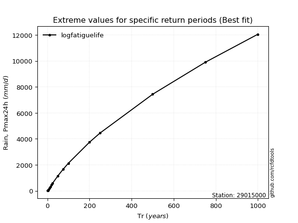</img>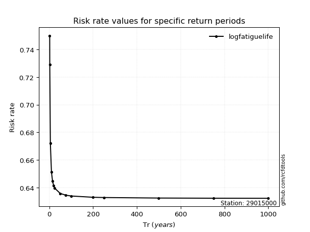</img>

</div>


<sub>**APP DISCLAIMER**: NO WARRANTY - This software is provided by [github.com/rcfdtools](https://github.com/rcfdtools) "as is", without any express or implied warranty, including warranties of merchantability, fitness for a particular purpose, or non-infringement. There is no guarantee that the software will be error-free or operate without interruption. LIMITATION OF LIABILITY - Neither the authors nor copyright holders will be liable for claims or damages arising from the software or its use. You are responsible for determining if the software is appropriate for your use and assume all associated risks, including errors, legal compliance, and data loss. NO PROFESSIONAL ADVICE - The software provides general information and does not offer professional advice. It should not replace consultation with professional advisors.</sub>