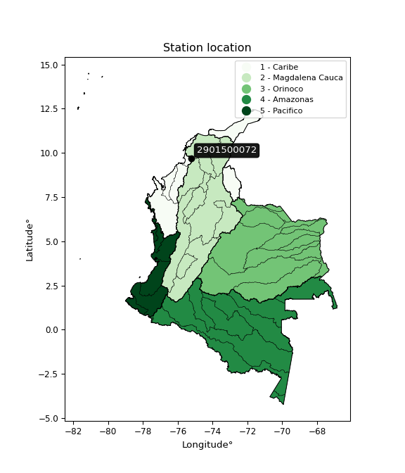

<div align="center">


</div>

# PMax24h Station (Rain): 2901500072

Maximum Precipitation in 24 hours (PMax24h) is the greatest amount of rainfall for a specific duration that is meteorologically possible for a given location, acting as a "worst-case" scenario for extreme storms, crucial for designing safety-critical infrastructure like bridges, river deviations, dams, spillways, and nuclear plants to prevent catastrophic failure. The PMax24h is related with the Probable Maximum Precipitation (PMP) and it is calculated by hydrologists using meteorological data to determine the upper limit of extreme rainfall, often leading to the Probable Maximum Flood (PMF) for flood control design, and is increasingly being studied for climate change impacts. Probable Maximum Precipitation (PMP) is the theoretical upper limit of rainfall, a deterministic estimate for extreme events, while probability distributions (like GEV, Gumbel) describe the likelihood and frequency of various precipitation amounts, including rare ones, showing how often events occur, with PMP representing the extreme end of these distributions, used for critical infrastructure design to ensure safety against the worst conceivable weather, unlike standard statistical forecasts which cover typical probabilities.

The most common probability distributions in hydrology, used for analyzing floods, rainfall, and streamflow, include the Normal, Log-Normal, Gumbel, Gamma (including Log-Pearson Type III), and Generalized Extreme Value (GEV) distributions, often chosen based on the data´s skewness and whether modeling extremes or general conditions, with Gumbel and GEV popular for extreme events like floods, while the Normal distribution serves as a baseline, though often requiring transformations for skewed hydrological data. These distributions help in designing water infrastructure, managing water resources, and forecasting hydrologic events.

> Hydrological data often isn´t perfectly normal (it´s skewed), so different distributions are needed for different applications, such as: **Flood Frequency Analysis**: Using Gumbel, GEV, or Log-Pearson Type III for predicting extreme flood magnitudes and their return periods, **Rainfall Analysis**: Normal for annual totals, but Log-Normal, Weibull, or GEV for intensity or extreme daily rainfall, **Streamflow Modeling**: Gamma and Log-Normal for maximum flows, GEV for minimum flows, and Kappa for daily flows.

<div align="center">

</img>

</div>


## A. General information


### 1. General running parameters

• app_version: _v20260225_. • runtime: _2026-02-28 16:54:07.457399_. • Python version: _3.14.0_. • SciPy version: _1.16.3_. • Pandas version: _2.3.3_. • NumPy version: _2.3.5_. • Stations dataset (station_dataset_file): _dataset/pmax24h_in/automatic_colombia_2003_2025.csv_. • Stations catalog (station_catalog_file): _dataset/CNE.xls_. • Minimum year to eval til year_max (date_min): _1900_. • Maximum year to eval since year_min (date_max): _2025_. • Creates, save and include plots into reports (create_plot): _False_. • Plot only fit distributions with Δo > Δ (plot_only_fit): _True_. • Plot only simple graphs avoiding multiple CDFs and multiple Extreme values plots (plot_only_simple): _False_. • Eval low extreme values, if False, evaluates high extreme values (low_extreme): _False_. • Eval every SciPy distribution as logarithmic (pdist_logarithmic_on): _True_. • Standard deviation normalized (ddof): _1.0_. • Return periods to eval in years (Tr): _[2, 2.33, 5, 10, 15, 20, 25, 50, 75, 100, 200, 250, 500, 750, 1000]_. • Minimum data sample per station, 0 means any (minimum_sample): _5_. • Z-Score maximum threshold to adjust a value, 0 means disable (zscore_max): _3.5_. • Z-Score minimum threshold to adjust a value, 0 means disable (zscore_min): _-2.5_. • Avoid zeros, e.g. rain = 0 (avoid_zeros): _True_. • Avoid null values (avoid_nans): _True_. 

:file_folder:Table: [dataset.csv](../../dataset/pmax24h_in/automatic_colombia_2003_2025.csv)

> Delta Degrees of Freedom (DDOF): is a parameter used in the formulas for calculating variance and standard deviation. When ddof=0, the divisor is $N$ (the total number of observations) and this is used when your data set is the entire population. When ddof=1, the divisor is $N-1$ and this is used when your data set is a sample drawn from a larger population. Using $N-1$ provides an unbiased estimate of the population variance (known as Bessel´s correction).


### 2. Station info and location

|   id |     CODIGO | NOMBRE                  | CATEGORIA               | TECNOLOGIA                | ESTADO   | FECHA_INSTALACION   |   FECHA_SUSPENSION |   ALTITUD |   LATITUD |   LONGITUD | DEPARTAMENTO   | MUNICIPIO            | AREA_OPERATIVA                              | ENTIDAD                                                     | AREA_HIDROGRAFICA   | ZONA_HIDROGRAFICA   | SUBZONA_HIDROGRAFICA                                |   CORRIENTE | Catalogo   |   Version |
|-----:|-----------:|:------------------------|:------------------------|:--------------------------|:---------|:--------------------|-------------------:|----------:|----------:|-----------:|:---------------|:---------------------|:--------------------------------------------|:------------------------------------------------------------|:--------------------|:--------------------|:----------------------------------------------------|------------:|:-----------|----------:|
|    0 | 2901500072 | HOBO - AUT [2901500072] | Climatológica Principal | Automática con Telemetría | Activa   | 27/12/2016          |                nan |       341 |   9.67251 |   -75.2365 | Bolivar        | El Carmén De Bolívar | Area Operativa 02 - Atlántico-Bolivar-Sucre | INSTITUTO DE HIDROLOGIA METEOROLOGIA Y ESTUDIOS AMBIENTALES | Magdalena Cauca     | Bajo Magdalena      | Directos al Bajo Magdalena entre El Plato y Calamar |         nan | CNE_IDEAM  |  20251226 |

<div align="center">

Dynamic map: [:earth_americas:Google](http://maps.google.com/maps?q=9.672506,-75.236517) [:earth_americas:OSM](https://www.openstreetmap.org/#map=18/9.672506/-75.236517&layers=P) [:earth_americas:Bing](https://www.bing.com/maps?cp=9.672506~-75.236517&lvl=18) [:earth_americas:Apple](https://maps.apple.com/frame?center=9.672506%2C-75.236517&span=0.003%2C0.006)

</div>


<div align="center">

```geojson
{
  "type": "Feature",
  "geometry": {
    "type": "Point", 
    "coordinates": [-75.236517, 9.672506]
  }, 
  "properties": {
    "Name": "2901500072"
  }
}
```

</div>


### 3. Discrete values table and plot

<div align="center">

|               |           0 |           1 |           2 |           3 |          4 |
|:--------------|------------:|------------:|------------:|------------:|-----------:|
| Date          | 2021        | 2022        | 2023        | 2024        | 2025       |
| Value         |    8        |    9.5      |    6.7      |    9.8      |   35.8     |
| Value_initial |    8        |    9.5      |    6.7      |    9.8      |   35.8     |
| count         |    5        |    5        |    5        |    5        |    5       |
| mean          |   13.96     |   13.96     |   13.96     |   13.96     |   13.96    |
| std           |   12.272    |   12.272    |   12.272    |   12.272    |   12.272   |
| zscore        |   -0.485657 |   -0.363428 |   -0.591589 |   -0.338982 |    1.77966 |


</div>


> The initial value (value_initial) correspond to the initial obtained or null completed value, and value (value) is adjusted only when the initial value is outside the valid range (outlier) definite through the Z-Score value. If Z-Score is active, values out of range or outliers are replaced with the station mean value. A Z-Score (or standard score) measures how many standard deviations a data point is from the mean of a dataset, indicating its relative position; positive scores mean above the mean, negative mean below, and a score of zero is exactly at the mean, allowing for comparison of values from different distributions. It´s calculated using the formula $z=(x–μ)/σ$, where $x$ is the data point, $μ$ is the mean, and $σ$ is the standard deviation, helping identify outliers and understand probability.
>
> <sub>**Note**: In this study, "completing" (filling gaps in) and "extending" (forecasting or lengthening the historical record) rainfall data series are avoided for certain critical analyses because they introduce artificial bias and uncertainty, which can distort the statistics of rare events (extremes), alter day-to-day variability, and compromise the integrity and homogeneity of the original data. Some reasons against Completing/Extending rainfall data are: **Distortion of Extremes and Variability**: The primary issue is that most gap-filling or extension methods rely on averaging or regression with nearby stations, which inherently smooths the data. Rainfall is highly variable in space and time, with a large percentage of zero values and occasional large storms. Infilling methods often underestimate the highest values and overestimate the lowest (zero) values, which severely distorts analyses focused on flood frequency, drought severity, and intensity-duration-frequency (IDF) curves, **Loss of Data Homogeneity**: Infilled or extended data are synthetic estimates, not actual measurements. Combining these estimates with observed data can violate the assumption of data homogeneity, which requires that the data properties do not change over time. Inhomogeneity can lead to incorrect conclusions about long-term trends or changes in climate patterns, **Propagation of Errors**: Errors and biases from the original data (e.g., wind-induced undercatch, instrument errors, site changes) or the data used for imputation can propagate through the analysis, leading to unreliable hydrological models and inaccurate predictions, **Compromised Statistical Integrity**: For statistical analyses, especially those involving the frequency of events, using artificial data can introduce time bias or autocorrelation that doesn´t exist in reality, making it difficult to assess the true probability of events, **Difficulty in Validation**: It is difficult to accurately validate the quality of filled or extended data, especially for past periods where ground-truth measurements are unavailable. The reliability of imputation techniques heavily depends on the density of the surrounding station network and the complexity of the local topography.</sub>


### 4. Active continuous probability distributions from SciPy (80 of 104 available)

A Probability Density Function (PDF) describes the relative likelihood of a continuous random variable falling within a specific range, where the total area under its curve equals 1, and the area over any interval gives the actual probability for that range. Unlike discrete probabilities (like rolling a die), a PDF shows density, not direct probability for a single point (which is zero), with higher points indicating higher likelihood, often visualized as a bell curve for normal distributions.

A log of a probability density function (log-PDF) is simply the logarithm of the PDF´s value, denoted as $log(f(x))$, useful for converting multiplication of probabilities into addition, improving numerical stability with tiny numbers, and connecting to information theory concepts like entropy. Instead of dealing with very small probabilities (e.g., 0.000001), log-PDFs use negative numbers (e.g., $log(0.00001) ≈ -11.51$ that are easier for computers to handle, preventing underflow errors and simplifying complex calculations. In this study, each active probability distribution from SciPy is also evaluated in the $log$ form.

[scipy.stats](https://docs.scipy.org/doc/scipy/reference/stats.html) is a Python´s powerful submodule within the SciPy library for comprehensive statistical analysis, offering over 130 probability distributions (like Normal, Poisson, etc.), functions for descriptive stats (mean, variance), hypothesis testing (t-tests, chi-square), random variable generation, and statistical tests, making it essential for data science, modeling, and research. It provides tools to explore, model, and draw conclusions from data efficiently, working seamlessly with [NumPy](https://numpy.org/).

<div align="center">

|   id | p_dist           |   n_parameter | fit_method   | label                                                                       | active   | ref                                                                                                      |
|-----:|:-----------------|--------------:|:-------------|:----------------------------------------------------------------------------|:---------|:---------------------------------------------------------------------------------------------------------|
|    0 | alpha            |             3 | MLE          | Alpha                                                                       | True     | [:mortar_board:](https://docs.scipy.org/doc/scipy/reference/generated/scipy.stats.alpha.html)            |
|    1 | anglit           |             2 | MM           | Anglit                                                                      | True     | [:mortar_board:](https://docs.scipy.org/doc/scipy/reference/generated/scipy.stats.anglit.html)           |
|    2 | arcsine          |             2 | MM           | Arcsine                                                                     | True     | [:mortar_board:](https://docs.scipy.org/doc/scipy/reference/generated/scipy.stats.arcsine.html)          |
|    3 | argus            |             3 | MLE          | Argus                                                                       | True     | [:mortar_board:](https://docs.scipy.org/doc/scipy/reference/generated/scipy.stats.argus.html)            |
|    4 | beta             |             4 | MLE          | Beta                                                                        | True     | [:mortar_board:](https://docs.scipy.org/doc/scipy/reference/generated/scipy.stats.beta.html)             |
|    5 | betaprime        |             4 | MLE          | Beta prime                                                                  | True     | [:mortar_board:](https://docs.scipy.org/doc/scipy/reference/generated/scipy.stats.betaprime.html)        |
|    6 | bradford         |             3 | MLE          | Bradford                                                                    | True     | [:mortar_board:](https://docs.scipy.org/doc/scipy/reference/generated/scipy.stats.bradford.html)         |
|    7 | burr             |             4 | MLE          | Burr (Type III)                                                             | True     | [:mortar_board:](https://docs.scipy.org/doc/scipy/reference/generated/scipy.stats.burr.html)             |
|    8 | burr12           |             4 | MLE          | Burr (Type III) 12                                                          | True     | [:mortar_board:](https://docs.scipy.org/doc/scipy/reference/generated/scipy.stats.burr12.html)           |
|    9 | cosine           |             2 | MLE          | Cosine                                                                      | True     | [:mortar_board:](https://docs.scipy.org/doc/scipy/reference/generated/scipy.stats.cosine.html)           |
|   10 | crystalball      |             4 | MLE          | Crystalball                                                                 | True     | [:mortar_board:](https://docs.scipy.org/doc/scipy/reference/generated/scipy.stats.crystalball.html)      |
|   11 | dgamma           |             3 | MLE          | Double gamma                                                                | True     | [:mortar_board:](https://docs.scipy.org/doc/scipy/reference/generated/scipy.stats.dgamma.html)           |
|   12 | dweibull         |             3 | MLE          | Double Weibull                                                              | True     | [:mortar_board:](https://docs.scipy.org/doc/scipy/reference/generated/scipy.stats.dweibull.html)         |
|   13 | erlang           |             3 | MLE          | Erlang                                                                      | True     | [:mortar_board:](https://docs.scipy.org/doc/scipy/reference/generated/scipy.stats.erlang.html)           |
|   14 | exponnorm        |             3 | MLE          | Exponentially modified Normal                                               | True     | [:mortar_board:](https://docs.scipy.org/doc/scipy/reference/generated/scipy.stats.exponnorm.html)        |
|   15 | exponpow         |             3 | MLE          | Exponential power                                                           | True     | [:mortar_board:](https://docs.scipy.org/doc/scipy/reference/generated/scipy.stats.exponpow.html)         |
|   16 | exponweib        |             4 | MLE          | Exponentiated Weibull                                                       | True     | [:mortar_board:](https://docs.scipy.org/doc/scipy/reference/generated/scipy.stats.exponweib.html)        |
|   17 | f                |             4 | MLE          | F                                                                           | True     | [:mortar_board:](https://docs.scipy.org/doc/scipy/reference/generated/scipy.stats.f.html)                |
|   18 | fatiguelife      |             3 | MLE          | Fatigue-life (Birnbaum-Saunders)                                            | True     | [:mortar_board:](https://docs.scipy.org/doc/scipy/reference/generated/scipy.stats.fatiguelife.html)      |
|   19 | foldnorm         |             3 | MM           | Fold Normal                                                                 | True     | [:mortar_board:](https://docs.scipy.org/doc/scipy/reference/generated/scipy.stats.foldnorm.html)         |
|   20 | gamma            |             3 | MLE          | Gamma                                                                       | True     | [:mortar_board:](https://docs.scipy.org/doc/scipy/reference/generated/scipy.stats.gamma.html)            |
|   21 | gausshyper       |             6 | MLE          | Gauss hypergeometric                                                        | True     | [:mortar_board:](https://docs.scipy.org/doc/scipy/reference/generated/scipy.stats.gausshyper.html)       |
|   22 | genexpon         |             5 | MLE          | Generalized exponential                                                     | True     | [:mortar_board:](https://docs.scipy.org/doc/scipy/reference/generated/scipy.stats.genexpon.html)         |
|   23 | genextreme       |             3 | MLE          | Generalized exponential                                                     | True     | [:mortar_board:](https://docs.scipy.org/doc/scipy/reference/generated/scipy.stats.genextreme.html)       |
|   24 | gengamma         |             4 | MLE          | Generalized gamma                                                           | True     | [:mortar_board:](https://docs.scipy.org/doc/scipy/reference/generated/scipy.stats.gengamma.html)         |
|   25 | genhalflogistic  |             3 | MLE          | Generalized half-logistic                                                   | True     | [:mortar_board:](https://docs.scipy.org/doc/scipy/reference/generated/scipy.stats.genhalflogistic.html)  |
|   26 | genlogistic      |             3 | MLE          | Generalized logistic                                                        | True     | [:mortar_board:](https://docs.scipy.org/doc/scipy/reference/generated/scipy.stats.genlogistic.html)      |
|   27 | gennorm          |             3 | MLE          | Generalized Normal                                                          | True     | [:mortar_board:](https://docs.scipy.org/doc/scipy/reference/generated/scipy.stats.gennorm.html)          |
|   28 | genpareto        |             3 | MLE          | Generalized Pareto                                                          | True     | [:mortar_board:](https://docs.scipy.org/doc/scipy/reference/generated/scipy.stats.genpareto.html)        |
|   29 | gompertz         |             3 | MLE          | Gompertz (or truncated Gumbel)                                              | True     | [:mortar_board:](https://docs.scipy.org/doc/scipy/reference/generated/scipy.stats.gompertz.html)         |
|   30 | gumbel_l         |             2 | MM           | Gumbel Left Skew                                                            | True     | [:mortar_board:](https://docs.scipy.org/doc/scipy/reference/generated/scipy.stats.gumbel_l.html)         |
|   31 | gumbel_r         |             2 | MM           | Gumbel Right Skew                                                           | True     | [:mortar_board:](https://docs.scipy.org/doc/scipy/reference/generated/scipy.stats.gumbel_r.html)         |
|   32 | halfgennorm      |             3 | MLE          | Upper half of a generalized normal                                          | True     | [:mortar_board:](https://docs.scipy.org/doc/scipy/reference/generated/scipy.stats.halfgennorm.html)      |
|   33 | halflogistic     |             2 | MM           | Half-logistic                                                               | True     | [:mortar_board:](https://docs.scipy.org/doc/scipy/reference/generated/scipy.stats.halflogistic.html)     |
|   34 | halfnorm         |             2 | MM           | Half Normal                                                                 | True     | [:mortar_board:](https://docs.scipy.org/doc/scipy/reference/generated/scipy.stats.halfnorm.html)         |
|   35 | hypsecant        |             2 | MM           | hyperbolic secant                                                           | True     | [:mortar_board:](https://docs.scipy.org/doc/scipy/reference/generated/scipy.stats.hypsecant.html)        |
|   36 | invgamma         |             3 | MLE          | Inverted gamma                                                              | True     | [:mortar_board:](https://docs.scipy.org/doc/scipy/reference/generated/scipy.stats.invgamma.html)         |
|   37 | invgauss         |             3 | MLE          | Inverse Gaussian                                                            | True     | [:mortar_board:](https://docs.scipy.org/doc/scipy/reference/generated/scipy.stats.invgauss.html)         |
|   38 | invweibull       |             3 | MLE          | Inverted Weibull                                                            | True     | [:mortar_board:](https://docs.scipy.org/doc/scipy/reference/generated/scipy.stats.invweibull.html)       |
|   39 | johnsonsb        |             4 | MLE          | Johnson SB                                                                  | True     | [:mortar_board:](https://docs.scipy.org/doc/scipy/reference/generated/scipy.stats.johnsonsb.html)        |
|   40 | johnsonsu        |             4 | MLE          | Johnson Su                                                                  | True     | [:mortar_board:](https://docs.scipy.org/doc/scipy/reference/generated/scipy.stats.johnsonsu.html)        |
|   41 | kappa3           |             3 | MLE          | Kappa 3                                                                     | True     | [:mortar_board:](https://docs.scipy.org/doc/scipy/reference/generated/scipy.stats.kappa3.html)           |
|   42 | kappa4           |             4 | MLE          | Kappa 4                                                                     | True     | [:mortar_board:](https://docs.scipy.org/doc/scipy/reference/generated/scipy.stats.kappa4.html)           |
|   43 | ksone            |             3 | MLE          | Kolmogorov-Smirnov one-sided test statistic distribution                    | True     | [:mortar_board:](https://docs.scipy.org/doc/scipy/reference/generated/scipy.stats.ksone.html)            |
|   44 | kstwobign        |             2 | MLE          | Limiting distribution of scaled Kolmogorov-Smirnov two-sided test statistic | True     | [:mortar_board:](https://docs.scipy.org/doc/scipy/reference/generated/scipy.stats.kstwobign.html)        |
|   45 | laplace          |             2 | MM           | Laplace                                                                     | True     | [:mortar_board:](https://docs.scipy.org/doc/scipy/reference/generated/scipy.stats.laplace.html)          |
|   46 | levy_l           |             2 | MLE          | Left-skewed Levy                                                            | True     | [:mortar_board:](https://docs.scipy.org/doc/scipy/reference/generated/scipy.stats.levy_l.html)           |
|   47 | loggamma         |             3 | MLE          | Log gamma                                                                   | True     | [:mortar_board:](https://docs.scipy.org/doc/scipy/reference/generated/scipy.stats.loggamma.html)         |
|   48 | logistic         |             2 | MM           | Logistic (or Sech-squared)                                                  | True     | [:mortar_board:](https://docs.scipy.org/doc/scipy/reference/generated/scipy.stats.logistic.html)         |
|   49 | loglaplace       |             3 | MLE          | Log-Laplace                                                                 | True     | [:mortar_board:](https://docs.scipy.org/doc/scipy/reference/generated/scipy.stats.loglaplace.html)       |
|   50 | lomax            |             3 | MLE          | Lomax (Pareto of the second kind)                                           | True     | [:mortar_board:](https://docs.scipy.org/doc/scipy/reference/generated/scipy.stats.lomax.html)            |
|   51 | maxwell          |             2 | MM           | Maxwell                                                                     | True     | [:mortar_board:](https://docs.scipy.org/doc/scipy/reference/generated/scipy.stats.maxwell.html)          |
|   52 | mielke           |             4 | MLE          | Mielke Beta-Kappa / Dagum                                                   | True     | [:mortar_board:](https://docs.scipy.org/doc/scipy/reference/generated/scipy.stats.mielke.html)           |
|   53 | moyal            |             2 | MM           | Moyal                                                                       | True     | [:mortar_board:](https://docs.scipy.org/doc/scipy/reference/generated/scipy.stats.moyal.html)            |
|   54 | nakagami         |             3 | MLE          | Nakagami                                                                    | True     | [:mortar_board:](https://docs.scipy.org/doc/scipy/reference/generated/scipy.stats.nakagami.html)         |
|   55 | ncf              |             5 | MLE          | Non-central F distribution                                                  | True     | [:mortar_board:](https://docs.scipy.org/doc/scipy/reference/generated/scipy.stats.ncf.html)              |
|   56 | nct              |             4 | MLE          | Non-central Student’s t                                                     | True     | [:mortar_board:](https://docs.scipy.org/doc/scipy/reference/generated/scipy.stats.nct.html)              |
|   57 | norm             |             2 | MM           | Normal                                                                      | True     | [:mortar_board:](https://docs.scipy.org/doc/scipy/reference/generated/scipy.stats.norm.html)             |
|   58 | pearson3         |             3 | MM           | Pearson type III                                                            | True     | [:mortar_board:](https://docs.scipy.org/doc/scipy/reference/generated/scipy.stats.pearson3.html)         |
|   59 | powerlaw         |             3 | MLE          | Power-function                                                              | True     | [:mortar_board:](https://docs.scipy.org/doc/scipy/reference/generated/scipy.stats.powerlaw.html)         |
|   60 | rayleigh         |             2 | MM           | Rayleigh                                                                    | True     | [:mortar_board:](https://docs.scipy.org/doc/scipy/reference/generated/scipy.stats.rayleigh.html)         |
|   61 | rdist            |             3 | MLE          | R-distributed (symmetric beta)                                              | True     | [:mortar_board:](https://docs.scipy.org/doc/scipy/reference/generated/scipy.stats.rdist.html)            |
|   62 | rice             |             3 | MLE          | Rice                                                                        | True     | [:mortar_board:](https://docs.scipy.org/doc/scipy/reference/generated/scipy.stats.rice.html)             |
|   63 | semicircular     |             2 | MM           | Semicircular                                                                | True     | [:mortar_board:](https://docs.scipy.org/doc/scipy/reference/generated/scipy.stats.semicircular.html)     |
|   64 | skewnorm         |             3 | MLE          | Skew normal                                                                 | True     | [:mortar_board:](https://docs.scipy.org/doc/scipy/reference/generated/scipy.stats.skewnorm.html)         |
|   65 | t                |             3 | MLE          | Student’s t                                                                 | True     | [:mortar_board:](https://docs.scipy.org/doc/scipy/reference/generated/scipy.stats.t.html)                |
|   66 | trapezoid        |             4 | MLE          | Trapezoid                                                                   | True     | [:mortar_board:](https://docs.scipy.org/doc/scipy/reference/generated/scipy.stats.trapezoid.html)        |
|   67 | triang           |             3 | MLE          | Triangular                                                                  | True     | [:mortar_board:](https://docs.scipy.org/doc/scipy/reference/generated/scipy.stats.triang.html)           |
|   68 | truncexpon       |             3 | MLE          | Truncated exponential                                                       | True     | [:mortar_board:](https://docs.scipy.org/doc/scipy/reference/generated/scipy.stats.truncexpon.html)       |
|   69 | truncnorm        |             4 | MLE          | Truncated normal                                                            | True     | [:mortar_board:](https://docs.scipy.org/doc/scipy/reference/generated/scipy.stats.truncnorm.html)        |
|   70 | truncpareto      |             4 | MLE          | Upper truncated Pareto                                                      | True     | [:mortar_board:](https://docs.scipy.org/doc/scipy/reference/generated/scipy.stats.truncpareto.html)      |
|   71 | truncweibull_min |             5 | MLE          | Doubly truncated Weibull minimum                                            | True     | [:mortar_board:](https://docs.scipy.org/doc/scipy/reference/generated/scipy.stats.truncweibull_min.html) |
|   72 | tukeylambda      |             3 | MLE          | Tukey-Lamdba                                                                | True     | [:mortar_board:](https://docs.scipy.org/doc/scipy/reference/generated/scipy.stats.tukeylambda.html)      |
|   73 | uniform          |             2 | MLE          | Uniform                                                                     | True     | [:mortar_board:](https://docs.scipy.org/doc/scipy/reference/generated/scipy.stats.uniform.html)          |
|   74 | vonmises         |             3 | MLE          | Von Mises                                                                   | True     | [:mortar_board:](https://docs.scipy.org/doc/scipy/reference/generated/scipy.stats.vonmises.html)         |
|   75 | vonmises_line    |             3 | MLE          | Von Mises line                                                              | True     | [:mortar_board:](https://docs.scipy.org/doc/scipy/reference/generated/scipy.stats.vonmises_line.html)    |
|   76 | wald             |             2 | MM           | Wald                                                                        | True     | [:mortar_board:](https://docs.scipy.org/doc/scipy/reference/generated/scipy.stats.wald.html)             |
|   77 | weibull_max      |             3 | MLE          | Weibull maximum                                                             | True     | [:mortar_board:](https://docs.scipy.org/doc/scipy/reference/generated/scipy.stats.weibull_max.html)      |
|   78 | weibull_min      |             3 | MLE          | Weibull minimum                                                             | True     | [:mortar_board:](https://docs.scipy.org/doc/scipy/reference/generated/scipy.stats.weibull_min.html)      |
|   79 | wrapcauchy       |             3 | MLE          | Wrapped  Cauchy                                                             | True     | [:mortar_board:](https://docs.scipy.org/doc/scipy/reference/generated/scipy.stats.wrapcauchy.html)       |

</div>

> **n_parameter:** # arguments & localization & scale.
>
> **Fit methods:** (MLE) maximum likelihood, (MM) L-moments.
>
>**Inactive** (With the only purpose of prevent loops, zero divisions, infinite values, over high estimated values or horizontal trending for recurrence intervals estimations, the follow distributions were disabled.)**:** lognorm, norminvgauss, powernorm, powerlognorm, cauchy, halfcauchy, foldcauchy, skewcauchy, chi2, expon, fisk, genhyperbolic, geninvgauss, gibrat, kstwo, laplace_asymmetric, levy, levy_stable, ncx2, pareto, rel_breitwigner, recipinvgauss, studentized_range, loguniform, 


## B. Probability (PDF) vs. Empirical (EDF) distributions functions

A continuous probability distribution (CPD) describes probabilities for variables that can take any value within a range (like rain any time), unlike discrete variables with specific outcomes (like temperature). It uses a Probability Density Function (PDF), a curve where the total area under it equals 1, and the probability of the variable falling within an interval (a to b) is found by calculating the area under the curve between those points. A key feature is that the probability of hitting any single exact value is zero, so probabilities are always expressed for ranges, e.g., $P(a ≤ X ≤ b)$.

<div align="center">

Distributions parameters from station values
|     |    station | p_dist              |   n |           loc |         scale | shape                  | shape1                 | shape2             | shape3             |
|----:|-----------:|:--------------------|----:|--------------:|--------------:|:-----------------------|:-----------------------|:-------------------|:-------------------|
|   0 | 2901500072 | alpha               |   5 |     5.53629   |   2.21089     | 2.6835904873927367e-08 |                        |                    |                    |
|   1 | 2901500072 | anglit              |   5 |    13.96      |  32.1105      |                        |                        |                    |                    |
|   2 | 2901500072 | arcsine             |   5 |    -1.56301   |  31.046       |                        |                        |                    |                    |
|   3 | 2901500072 | argus               |   5 |    -9.80104   |  47.9869      | 8.943688802863954e-07  |                        |                    |                    |
|   4 | 2901500072 | beta                |   5 |     4.0047    |  31.7953      | 0.014403771302213722   | 0.05332436308168688    |                    |                    |
|   5 | 2901500072 | betaprime           |   5 |    -0.118358  |   0.201098    | 195.09692678602727     | 3.9304337336303377     |                    |                    |
|   6 | 2901500072 | bradford            |   5 |     5.99169   |  29.8083      | 7.742737200730799      |                        |                    |                    |
|   7 | 2901500072 | burr                |   5 |     6.21341   |   0.000473713 | 0.8898069496944716     | 1400.0901087463262     |                    |                    |
|   8 | 2901500072 | burr12              |   5 |     5.01064   |   1.6606      | 225.62568402522908     | 0.004017155808749059   |                    |                    |
|   9 | 2901500072 | cosine              |   5 |    16.1103    |   9.44056     |                        |                        |                    |                    |
|  10 | 2901500072 | crystalball         |   5 |    13.96      |  10.9764      | 986.2775443430878      | 251.79528167737402     |                    |                    |
|  11 | 2901500072 | dgamma              |   5 |     6.7       |  13.6444      | 0.4638962448706164     |                        |                    |                    |
|  12 | 2901500072 | dweibull            |   5 |     9.5       |  10.9976      | 0.7866784502483521     |                        |                    |                    |
|  13 | 2901500072 | erlang              |   5 |     6.7       |  11.8147      | 0.38921484282647345    |                        |                    |                    |
|  14 | 2901500072 | exponnorm           |   5 |     6.69357   |   0.00185123  | 3900.0814077669083     |                        |                    |                    |
|  15 | 2901500072 | exponpow            |   5 |     6.7       |  20.2221      | 0.5117483358753363     |                        |                    |                    |
|  16 | 2901500072 | exponweib           |   5 |     6.7       |   1.66901     | 1.790466199620191      | 0.08137472194651332    |                    |                    |
|  17 | 2901500072 | f                   |   5 |     6.7       |   2.26618     | 0.6319317600882584     | 3.32463163690974       |                    |                    |
|  18 | 2901500072 | fatiguelife         |   5 |     6.7       |   2.68074e-05 | 576.5999474952991      |                        |                    |                    |
|  19 | 2901500072 | foldnorm            |   5 |    -1.37376   |  19.0288      | 0.006936512449055989   |                        |                    |                    |
|  20 | 2901500072 | gamma               |   5 |     6.7       |   7.96085     | 0.1313643495845802     |                        |                    |                    |
|  21 | 2901500072 | gausshyper          |   5 |     6.7       |  29.7213      | 0.3318878180266547     | 0.9199593320218173     | 1.0688285000509583 | 1.0861027592839099 |
|  22 | 2901500072 | genexpon            |   5 |     6.7       |   1.40408     | 0.19340873191964908    | 1.1701998126179375e-08 | 3.286593857472728  |                    |
|  23 | 2901500072 | genextreme          |   5 |     7.80944   |   1.84071     | -1.2170990999972902    |                        |                    |                    |
|  24 | 2901500072 | gengamma            |   5 |     6.7       |   1.97663     | 1.6759033977276991     | 0.5241891283656522     |                    |                    |
|  25 | 2901500072 | genhalflogistic     |   5 |     3.61667   |  34.6455      | 1.0765053537186544     |                        |                    |                    |
|  26 | 2901500072 | genlogistic         |   5 |   -36.6195    |   5.69241     | 3366.76890039291       |                        |                    |                    |
|  27 | 2901500072 | gennorm             |   5 |     8         |   0.14321     | 0.3730814692057973     |                        |                    |                    |
|  28 | 2901500072 | genpareto           |   5 |     6.7       |   2.06664     | 0.9896801332052798     |                        |                    |                    |
|  29 | 2901500072 | gompertz            |   5 |     6.7       |   1.79165e+06 | 268971.7034534623      |                        |                    |                    |
|  30 | 2901500072 | gumbel_l            |   5 |    18.9       |   8.5583      |                        |                        |                    |                    |
|  31 | 2901500072 | gumbel_r            |   5 |     9.02001   |   8.5583      |                        |                        |                    |                    |
|  32 | 2901500072 | halfgennorm         |   5 |     6.7       |   0.836532    | 0.48733577118304355    |                        |                    |                    |
|  33 | 2901500072 | halflogistic        |   5 |     0.950359  |   9.38447     |                        |                        |                    |                    |
|  34 | 2901500072 | halfnorm            |   5 |    -0.568515  |  18.2088      |                        |                        |                    |                    |
|  35 | 2901500072 | hypsecant           |   5 |    13.96      |   6.98782     |                        |                        |                    |                    |
|  36 | 2901500072 | invgamma            |   5 |     6.12584   |   1.57657     | 0.9073190877960986     |                        |                    |                    |
|  37 | 2901500072 | invgauss            |   5 |     6.33      |   1.52264     | 5.011093021935517      |                        |                    |                    |
|  38 | 2901500072 | invweibull          |   5 |     6.29708   |   1.51233     | 0.8216191087856366     |                        |                    |                    |
|  39 | 2901500072 | johnsonsb           |   5 |     6.7       |  90.8741      | 0.6742981884731198     | 0.0682729666340969     |                    |                    |
|  40 | 2901500072 | johnsonsu           |   5 |     6.69987   |   7.467e-13   | -7.101567197080733     | 0.25413996567371633    |                    |                    |
|  41 | 2901500072 | kappa3              |   5 |     6.7       |   0.407723    | 0.10044432682330875    |                        |                    |                    |
|  42 | 2901500072 | kappa4              |   5 |     3.71832   |  31.9604      | 1.1028343050795253     | 0.9893940046141874     |                    |                    |
|  43 | 2901500072 | ksone               |   5 |     3.79      |  34.92        | 1.0                    |                        |                    |                    |
|  44 | 2901500072 | kstwobign           |   5 |   -12.9362    |  31.4542      |                        |                        |                    |                    |
|  45 | 2901500072 | laplace             |   5 |    13.96      |   7.76152     |                        |                        |                    |                    |
|  46 | 2901500072 | levy_l              |   5 |    38.0576    |   8.64277     |                        |                        |                    |                    |
|  47 | 2901500072 | loggamma            |   5 | -3762.76      | 499.717       | 1915.9521123668524     |                        |                    |                    |
|  48 | 2901500072 | logistic            |   5 |    13.96      |   6.05163     |                        |                        |                    |                    |
|  49 | 2901500072 | loglaplace          |   5 |    -0.0435471 |   9.54355     | 2.667896354518734      |                        |                    |                    |
|  50 | 2901500072 | lomax               |   5 |     6.7       |   2.05821     | 1.005144292360076      |                        |                    |                    |
|  51 | 2901500072 | maxwell             |   5 |   -12.0496    |  16.2991      |                        |                        |                    |                    |
|  52 | 2901500072 | mielke              |   5 |     6.1846    |   0.00125828  | 653.9520940993493      | 0.9127520195173209     |                    |                    |
|  53 | 2901500072 | moyal               |   5 |     7.68296   |   4.94114     |                        |                        |                    |                    |
|  54 | 2901500072 | nakagami            |   5 |     6.7       |  16.901       | 0.13693799079504332    |                        |                    |                    |
|  55 | 2901500072 | ncf                 |   5 |    -0.100585  |   1.7625e-08  | 1.9938742201441338e-07 | 8.29860430997853       | 114.69733552591879 |                    |
|  56 | 2901500072 | nct                 |   5 |     0.812052  |   1.27539     | 2.4411565077079116     | 6.56457396337343       |                    |                    |
|  57 | 2901500072 | norm                |   5 |    13.96      |  10.9764      |                        |                        |                    |                    |
|  58 | 2901500072 | pearson3            |   5 |    13.96      |  10.9765      | 1.461226965181579      |                        |                    |                    |
|  59 | 2901500072 | powerlaw            |   5 |     6.7       |  29.1         | 0.10936868343869827    |                        |                    |                    |
|  60 | 2901500072 | rayleigh            |   5 |    -7.03858   |  16.7544      |                        |                        |                    |                    |
|  61 | 2901500072 | rdist               |   5 |     6.24168   |   3.55832     | 1.3853707447289616     |                        |                    |                    |
|  62 | 2901500072 | rice                |   5 |    -1.60209   |  13.4659      | 0.00025438379949550393 |                        |                    |                    |
|  63 | 2901500072 | semicircular        |   5 |    13.96      |  21.9529      |                        |                        |                    |                    |
|  64 | 2901500072 | skewnorm            |   5 |     6.69998   |  13.1596      | 3681227.795425281      |                        |                    |                    |
|  65 | 2901500072 | t                   |   5 |     9.09463   |   1.16254     | 0.7470015120551841     |                        |                    |                    |
|  66 | 2901500072 | trapezoid           |   5 |     3.79      |  34.92        | 1.0                    | 1.0                    |                    |                    |
|  67 | 2901500072 | triang              |   5 |   -13.1246    |  48.9247      | 0.999999854542193      |                        |                    |                    |
|  68 | 2901500072 | truncexpon          |   5 |    -2.41199   |  38.7696      | 0.9856164006333186     |                        |                    |                    |
|  69 | 2901500072 | truncnorm           |   5 |  -474.378     |  63.6939      | 7.552951277474902      | 35.930378449895684     |                    |                    |
|  70 | 2901500072 | truncpareto         |   5 |     4.6114    |   2.0886      | 1.0105362938028688     | 14.932802453413354     |                    |                    |
|  71 | 2901500072 | truncweibull_min    |   5 |     6.6533    |  23.4455      | 7.573536145442113e-08  | 0.0019912069556497483  | 1.2431710488037113 |                    |
|  72 | 2901500072 | tukeylambda         |   5 |     8.25002   |   4.20663     | 2.7139147931551246     |                        |                    |                    |
|  73 | 2901500072 | uniform             |   5 |     6.7       |  29.1         |                        |                        |                    |                    |
|  74 | 2901500072 | vonmises            |   5 |     3.13755   |   1           | 0.6205417176121693     |                        |                    |                    |
|  75 | 2901500072 | vonmises_line       |   5 |    10.642     |   8.00805     | 1.370050472590166      |                        |                    |                    |
|  76 | 2901500072 | wald                |   5 |     2.98355   |  10.9764      |                        |                        |                    |                    |
|  77 | 2901500072 | weibull_max         |   5 |    35.8       |   1.48093     | 0.3366374453201276     |                        |                    |                    |
|  78 | 2901500072 | weibull_min         |   5 |     6.7       |   6.68717     | 0.5032938539392324     |                        |                    |                    |
|  79 | 2901500072 | wrapcauchy          |   5 |     6.7       |   4.63142     | 0.8189442092123688     |                        |                    |                    |
|  80 | 2901500072 | logalpha            |   5 |     1.56749   |   1.1291      | 1.7911316411509373     |                        |                    |                    |
|  81 | 2901500072 | loganglit           |   5 |     2.41863   |   1.74174     |                        |                        |                    |                    |
|  82 | 2901500072 | logarcsine          |   5 |     1.57661   |   1.68405     |                        |                        |                    |                    |
|  83 | 2901500072 | logargus            |   5 |     1.12463   |   2.58246     | 3.0989314838677736e-05 |                        |                    |                    |
|  84 | 2901500072 | logbeta             |   5 |     1.8832    |   1.69474     | 0.08481606947499884    | 0.286249684640567      |                    |                    |
|  85 | 2901500072 | logbetaprime        |   5 |     1.75674   |   0.0079615   | 81.46913011645418      | 1.8516477826631648     |                    |                    |
|  86 | 2901500072 | logbradford         |   5 |     1.90211   |   1.67585     | 1.1424316146692424     |                        |                    |                    |
|  87 | 2901500072 | logburr             |   5 |     1.64516   |   0.00607719  | 1.8609741855354944     | 2936.0206871205082     |                    |                    |
|  88 | 2901500072 | logburr12           |   5 |     0.787281  |   1.10464     | 344.4723823969848      | 0.008812498188549789   |                    |                    |
|  89 | 2901500072 | logcosine           |   5 |     2.52403   |   0.509474    |                        |                        |                    |                    |
|  90 | 2901500072 | logcrystalball      |   5 |     2.41863   |   0.595386    | 117.66915473031403     | 143.11421738543586     |                    |                    |
|  91 | 2901500072 | logdgamma           |   5 |     2.25129   |   0.466342    | 0.676298848714948      |                        |                    |                    |
|  92 | 2901500072 | logdweibull         |   5 |     2.28238   |   0.47881     | 0.7235650149928069     |                        |                    |                    |
|  93 | 2901500072 | logerlang           |   5 |     1.90211   |   0.794404    | 0.4762523973766275     |                        |                    |                    |
|  94 | 2901500072 | logexponnorm        |   5 |     1.90167   |   0.000129959 | 3969.3399819476417     |                        |                    |                    |
|  95 | 2901500072 | logexponpow         |   5 |     1.90211   |   1.09019     | 0.3652763264456078     |                        |                    |                    |
|  96 | 2901500072 | logexponweib        |   5 |     1.90211   |   0.707846    | 0.9414968288644767     | 0.9659633189057935     |                    |                    |
|  97 | 2901500072 | logf                |   5 |     1.75396   |   0.351539    | 565.1548150853027      | 3.702818956415887      |                    |                    |
|  98 | 2901500072 | logfatiguelife      |   5 |     1.90211   |   1.87257e-07 | 1655.7407978763758     |                        |                    |                    |
|  99 | 2901500072 | logfoldnorm         |   5 |     1.51384   |   0.762659    | 1.0229366765142194     |                        |                    |                    |
| 100 | 2901500072 | loggamma            |   5 |     1.90211   |   0.46527     | 0.5465327342767947     |                        |                    |                    |
| 101 | 2901500072 | loggausshyper       |   5 |     1.90211   |   1.6836      | 0.7979929515393855     | 0.98804293453484       | 1.1385302270881672 | 1.079340017115853  |
| 102 | 2901500072 | loggenexpon         |   5 |     1.90211   |   0.884256    | 1.7126162815408783     | 2.3589098677706194e-07 | 1.1205578996947247 |                    |
| 103 | 2901500072 | loggenextreme       |   5 |     2.08322   |   0.232846    | -0.6043244450530689    |                        |                    |                    |
| 104 | 2901500072 | loggengamma         |   5 |     1.90211   |   0.997018    | 0.38860148199970823    | 1.2477037646526132     |                    |                    |
| 105 | 2901500072 | loggenhalflogistic  |   5 |     1.90081   |   1.73611     | 1.035160899559854      |                        |                    |                    |
| 106 | 2901500072 | loggenlogistic      |   5 |    -0.533246  |   0.352631    | 2143.9468734314337     |                        |                    |                    |
| 107 | 2901500072 | loggennorm          |   5 |     2.28238   |   0.00371798  | 0.3230138573567204     |                        |                    |                    |
| 108 | 2901500072 | loggenpareto        |   5 |    -0.0161806 |   6.43288     | -1.7898290928970382    |                        |                    |                    |
| 109 | 2901500072 | loggompertz         |   5 |     1.90211   |   1.71931e+10 | 33862259679.160393     |                        |                    |                    |
| 110 | 2901500072 | loggumbel_l         |   5 |     2.68659   |   0.464221    |                        |                        |                    |                    |
| 111 | 2901500072 | loggumbel_r         |   5 |     2.15068   |   0.464221    |                        |                        |                    |                    |
| 112 | 2901500072 | loghalfgennorm      |   5 |     1.90211   |   0.482619    | 0.9609921382083251     |                        |                    |                    |
| 113 | 2901500072 | loghalflogistic     |   5 |     1.71296   |   0.509035    |                        |                        |                    |                    |
| 114 | 2901500072 | loghalfnorm         |   5 |     1.63058   |   0.987685    |                        |                        |                    |                    |
| 115 | 2901500072 | loghypsecant        |   5 |     2.41863   |   0.379035    |                        |                        |                    |                    |
| 116 | 2901500072 | loginvgamma         |   5 |     1.75281   |   0.651794    | 1.8513791385178942     |                        |                    |                    |
| 117 | 2901500072 | loginvgauss         |   5 |     1.82339   |   0.37611     | 1.5826502738857986     |                        |                    |                    |
| 118 | 2901500072 | loginvweibull       |   5 |     1.69796   |   0.385253    | 1.6545272341881208     |                        |                    |                    |
| 119 | 2901500072 | logjohnsonsb        |   5 |     1.90211   |   4.10472     | 1.2905996000369693     | 0.08286465577316336    |                    |                    |
| 120 | 2901500072 | logjohnsonsu        |   5 |     1.90211   |   4.54287e-10 | -4.624195298974199     | 0.24398316486850852    |                    |                    |
| 121 | 2901500072 | logkappa3           |   5 |     1.9021    |   1.67585     | 128676.76667438753     |                        |                    |                    |
| 122 | 2901500072 | logkappa4           |   5 |     1.70021   |   1.94162     | 1.1162298578715457     | 1.0255491005644854     |                    |                    |
| 123 | 2901500072 | logksone            |   5 |     1.73452   |   2.01101     | 1.0                    |                        |                    |                    |
| 124 | 2901500072 | logkstwobign        |   5 |     0.843098  |   1.83203     |                        |                        |                    |                    |
| 125 | 2901500072 | loglaplace          |   5 |     2.41863   |   0.421002    |                        |                        |                    |                    |
| 126 | 2901500072 | loglevy_l           |   5 |     3.69688   |   0.455344    |                        |                        |                    |                    |
| 127 | 2901500072 | logloggamma         |   5 |  -192.995     |  26.0622      | 1804.649115239633      |                        |                    |                    |
| 128 | 2901500072 | loglogistic         |   5 |     2.41863   |   0.328254    |                        |                        |                    |                    |
| 129 | 2901500072 | logloglaplace       |   5 |     0.0271331 |   2.22416     | 6.831625934081471      |                        |                    |                    |
| 130 | 2901500072 | loglomax            |   5 |     1.90211   |  24.806       | 49.34885217463285      |                        |                    |                    |
| 131 | 2901500072 | logmaxwell          |   5 |     1.00782   |   0.884098    |                        |                        |                    |                    |
| 132 | 2901500072 | logmielke           |   5 |     1.70095   |   0.0202254   | 210.11178764573816     | 1.6482109565396716     |                    |                    |
| 133 | 2901500072 | logmoyal            |   5 |     2.07815   |   0.268018    |                        |                        |                    |                    |
| 134 | 2901500072 | lognakagami         |   5 |     1.90211   |   1.32209     | 0.10142576034431067    |                        |                    |                    |
| 135 | 2901500072 | logncf              |   5 |     1.75529   |   0.204656    | 214.742769511924       | 3.702947475882012      | 153.48733426922564 |                    |
| 136 | 2901500072 | lognct              |   5 |     1.35073   |   0.0028895   | 3.508536568868861      | 281.3154864611723      |                    |                    |
| 137 | 2901500072 | lognorm             |   5 |     2.41863   |   0.595387    |                        |                        |                    |                    |
| 138 | 2901500072 | logpearson3         |   5 |     2.41863   |   0.595387    | 1.3020892172218983     |                        |                    |                    |
| 139 | 2901500072 | logpowerlaw         |   5 |     1.90211   |   1.67584     | 0.11945248020438991    |                        |                    |                    |
| 140 | 2901500072 | lograyleigh         |   5 |     1.27962   |   0.908798    |                        |                        |                    |                    |
| 141 | 2901500072 | logrdist            |   5 |     2.80376   |   0.901651    | 1.0741096009896682     |                        |                    |                    |
| 142 | 2901500072 | logrice             |   5 |     1.53491   |   0.753476    | 0.0003551793082691983  |                        |                    |                    |
| 143 | 2901500072 | logsemicircular     |   5 |     2.41863   |   1.19077     |                        |                        |                    |                    |
| 144 | 2901500072 | logskewnorm         |   5 |     1.90211   |   0.788143    | 6200591.864995834      |                        |                    |                    |
| 145 | 2901500072 | logt                |   5 |     2.19278   |   0.158333    | 1.089791090134306      |                        |                    |                    |
| 146 | 2901500072 | logtrapezoid        |   5 |     1.73452   |   2.01101     | 1.0                    | 1.0                    |                    |                    |
| 147 | 2901500072 | logtriang           |   5 |     0.931657  |   2.64641     | 0.9999533792342097     |                        |                    |                    |
| 148 | 2901500072 | logtruncexpon       |   5 |     1.90211   |   1.61127     | 1.0400760181194713     |                        |                    |                    |
| 149 | 2901500072 | logtruncnorm        |   5 |    -1.7047    |   1.7669      | 2.0413181918315315     | 2.989809270203016      |                    |                    |
| 150 | 2901500072 | logtruncpareto      |   5 |     0.757679  |   1.14443     | 2.04142523531255       | 2.46436021189857       |                    |                    |
| 151 | 2901500072 | logtruncweibull_min |   5 |     1.89925   |   2.01664     | 0.7292352083914475     | 0.001419031971798457   | 0.8324247977309793 |                    |
| 152 | 2901500072 | logtukeylambda      |   5 |     2.73334   |   0.918857    | 1.0879076552235158     |                        |                    |                    |
| 153 | 2901500072 | loguniform          |   5 |     1.90211   |   1.67584     |                        |                        |                    |                    |
| 154 | 2901500072 | logvonmises         |   5 |     2.36796   |   1           | 3.459043930828446      |                        |                    |                    |
| 155 | 2901500072 | logvonmises_line    |   5 |     2.26627   |   0.417521    | 1.1001562078510236     |                        |                    |                    |
| 156 | 2901500072 | logwald             |   5 |     1.82325   |   0.595387    |                        |                        |                    |                    |
| 157 | 2901500072 | logweibull_max      |   5 |     3.57795   |   1.29708     | 0.8208864419101948     |                        |                    |                    |
| 158 | 2901500072 | logweibull_min      |   5 |     1.90211   |   0.686185    | 0.4810203057855117     |                        |                    |                    |
| 159 | 2901500072 | logwrapcauchy       |   5 |     1.90211   |   0.266718    | 0.5249999999999999     |                        |                    |                    |

</div>

> **loc** (Location parameter): This shifts the distribution along the x-axis. For many common distributions, like the normal (Gaussian) distribution, loc represents the mean $μ$. For others, like the uniform distribution, it might represent the minimum value, or for the beta distribution, the left end of the support interval.
>
> **scale** (Scale parameter): This determines the width or spread of the distribution. For the normal distribution, scale represents the standard deviation $σ$. For a uniform distribution, it defines the length of the interval (from $loc$ to $loc + scale$).
>
> **shape** (Shape parameters): Refers to parameters that define the specific form of a probability distribution, distinct from its location (loc) and scale (scale). These parameters are required arguments for most distribution functions. For example, a normal (Gaussian) distribution is fully defined by its location (mean) and scale (standard deviation), so it has no specific shape parameters beyond loc and scale. However, other distributions have intrinsic properties that need specification, as Gamma distribution that takes a shape parameter, often named $a$ or $alpha$.


### 0. Cumulative distribution values - CDF (160 evaluated)

Cumulative Distribution Function (CDF), denoted as $F$<sub>$X$</sub>$(x)$, is a function that gives the probability that a random variable $X$ will take a value less than or equal to a specific value, $x$ (i.e., $(P(X≥x)$. It essentially "accumulates" probabilities from a given point up to the far right (positive infinity), providing a complete picture of the distribution´s probabilities for both discrete (like rain) and continuous (like temperature) variables, helping to find probabilities over ranges or above certain values. Each station is evaluated separately ordering the $x$ values ascending, calculating the CDF and PDF values for the activated distributions and their logarithmic forms.

<div align="center">

CDF ordered by x ascending and calculating $log(f(x))$ separately
|   id |    Station |   date |    x |   count |   mean |    std |    zscore |   Value_initial |    station |   m |     alpha |   alpha_pdf |   anglit |   anglit_pdf |   arcsine |   arcsine_pdf |    argus |   argus_pdf |     beta |    beta_pdf |   betaprime |   betaprime_pdf |   bradford |   bradford_pdf |      burr |   burr_pdf |    burr12 |   burr12_pdf |   cosine |   cosine_pdf |   crystalball |   crystalball_pdf |   dgamma |   dgamma_pdf |   dweibull |   dweibull_pdf |      erlang |   erlang_pdf |   exponnorm |   exponnorm_pdf |    exponpow |   exponpow_pdf |   exponweib |   exponweib_pdf |           f |       f_pdf |   fatiguelife |   fatiguelife_pdf |   foldnorm |   foldnorm_pdf |      gamma |   gamma_pdf |   gausshyper |   gausshyper_pdf |   genexpon |   genexpon_pdf |   genextreme |   genextreme_pdf |    gengamma |   gengamma_pdf |   genhalflogistic |   genhalflogistic_pdf |   genlogistic |   genlogistic_pdf |   gennorm |   gennorm_pdf |   genpareto |   genpareto_pdf |    gompertz |   gompertz_pdf |   gumbel_l |   gumbel_l_pdf |   gumbel_r |   gumbel_r_pdf |   halfgennorm |   halfgennorm_pdf |   halflogistic |   halflogistic_pdf |   halfnorm |   halfnorm_pdf |   hypsecant |   hypsecant_pdf |   invgamma |   invgamma_pdf |   invgauss |   invgauss_pdf |   invweibull |   invweibull_pdf |   johnsonsb |   johnsonsb_pdf |   johnsonsu |   johnsonsu_pdf |   kappa3 |   kappa3_pdf |      kappa4 |   kappa4_pdf |     ksone |   ksone_pdf |   kstwobign |   kstwobign_pdf |   laplace |   laplace_pdf |   levy_l |   levy_l_pdf |    loggamma |   loggamma_pdf |   logistic |   logistic_pdf |   loglaplace |   loglaplace_pdf |       lomax |   lomax_pdf |   maxwell |   maxwell_pdf |   mielke |   mielke_pdf |    moyal |   moyal_pdf |    nakagami |   nakagami_pdf |      ncf |    ncf_pdf |      nct |    nct_pdf |     norm |   norm_pdf |   pearson3 |   pearson3_pdf |   powerlaw |   powerlaw_pdf |   rayleigh |   rayleigh_pdf |    rdist |   rdist_pdf |     rice |   rice_pdf |   semicircular |   semicircular_pdf |    skewnorm |   skewnorm_pdf |        t |       t_pdf |   trapezoid |   trapezoid_pdf |   triang |   triang_pdf |   truncexpon |   truncexpon_pdf |   truncnorm |   truncnorm_pdf |   truncpareto |   truncpareto_pdf |   truncweibull_min |   truncweibull_min_pdf |   tukeylambda |   tukeylambda_pdf |   uniform |   uniform_pdf |   vonmises |   vonmises_pdf |   vonmises_line |   vonmises_line_pdf |     wald |   wald_pdf |   weibull_max |   weibull_max_pdf |   weibull_min |   weibull_min_pdf |   wrapcauchy |   wrapcauchy_pdf |   logalpha |   logalpha_pdf |   loganglit |   loganglit_pdf |   logarcsine |   logarcsine_pdf |   logargus |   logargus_pdf |   logbeta |   logbeta_pdf |   logbetaprime |   logbetaprime_pdf |   logbradford |   logbradford_pdf |   logburr |   logburr_pdf |   logburr12 |   logburr12_pdf |   logcosine |   logcosine_pdf |   logcrystalball |   logcrystalball_pdf |   logdgamma |   logdgamma_pdf |   logdweibull |   logdweibull_pdf |   logerlang |   logerlang_pdf |   logexponnorm |   logexponnorm_pdf |   logexponpow |   logexponpow_pdf |   logexponweib |   logexponweib_pdf |      logf |   logf_pdf |   logfatiguelife |   logfatiguelife_pdf |   logfoldnorm |   logfoldnorm_pdf |   loggausshyper |   loggausshyper_pdf |   loggenexpon |   loggenexpon_pdf |   loggenextreme |   loggenextreme_pdf |   loggengamma |   loggengamma_pdf |   loggenhalflogistic |   loggenhalflogistic_pdf |   loggenlogistic |   loggenlogistic_pdf |   loggennorm |   loggennorm_pdf |   loggenpareto |   loggenpareto_pdf |   loggompertz |   loggompertz_pdf |   loggumbel_l |   loggumbel_l_pdf |   loggumbel_r |   loggumbel_r_pdf |   loghalfgennorm |   loghalfgennorm_pdf |   loghalflogistic |   loghalflogistic_pdf |   loghalfnorm |   loghalfnorm_pdf |   loghypsecant |   loghypsecant_pdf |   loginvgamma |   loginvgamma_pdf |   loginvgauss |   loginvgauss_pdf |   loginvweibull |   loginvweibull_pdf |   logjohnsonsb |   logjohnsonsb_pdf |   logjohnsonsu |   logjohnsonsu_pdf |   logkappa3 |   logkappa3_pdf |   logkappa4 |   logkappa4_pdf |   logksone |   logksone_pdf |   logkstwobign |   logkstwobign_pdf |   loglevy_l |   loglevy_l_pdf |   logloggamma |   logloggamma_pdf |   loglogistic |   loglogistic_pdf |   logloglaplace |   logloglaplace_pdf |    loglomax |   loglomax_pdf |   logmaxwell |   logmaxwell_pdf |   logmielke |   logmielke_pdf |   logmoyal |   logmoyal_pdf |   lognakagami |   lognakagami_pdf |    logncf |   logncf_pdf |    lognct |   lognct_pdf |   lognorm |   lognorm_pdf |   logpearson3 |   logpearson3_pdf |   logpowerlaw |   logpowerlaw_pdf |   lograyleigh |   lograyleigh_pdf |   logrdist |   logrdist_pdf |   logrice |   logrice_pdf |   logsemicircular |   logsemicircular_pdf |   logskewnorm |   logskewnorm_pdf |     logt |   logt_pdf |   logtrapezoid |   logtrapezoid_pdf |   logtriang |   logtriang_pdf |   logtruncexpon |   logtruncexpon_pdf |   logtruncnorm |   logtruncnorm_pdf |   logtruncpareto |   logtruncpareto_pdf |   logtruncweibull_min |   logtruncweibull_min_pdf |   logtukeylambda |   logtukeylambda_pdf |   loguniform |   loguniform_pdf |   logvonmises |   logvonmises_pdf |   logvonmises_line |   logvonmises_line_pdf |   logwald |   logwald_pdf |   logweibull_max |   logweibull_max_pdf |   logweibull_min |   logweibull_min_pdf |   logwrapcauchy |   logwrapcauchy_pdf |
|-----:|-----------:|-------:|-----:|--------:|-------:|-------:|----------:|----------------:|-----------:|----:|----------:|------------:|---------:|-------------:|----------:|--------------:|---------:|------------:|---------:|------------:|------------:|----------------:|-----------:|---------------:|----------:|-----------:|----------:|-------------:|---------:|-------------:|--------------:|------------------:|---------:|-------------:|-----------:|---------------:|------------:|-------------:|------------:|----------------:|------------:|---------------:|------------:|----------------:|------------:|------------:|--------------:|------------------:|-----------:|---------------:|-----------:|------------:|-------------:|-----------------:|-----------:|---------------:|-------------:|-----------------:|------------:|---------------:|------------------:|----------------------:|--------------:|------------------:|----------:|--------------:|------------:|----------------:|------------:|---------------:|-----------:|---------------:|-----------:|---------------:|--------------:|------------------:|---------------:|-------------------:|-----------:|---------------:|------------:|----------------:|-----------:|---------------:|-----------:|---------------:|-------------:|-----------------:|------------:|----------------:|------------:|----------------:|---------:|-------------:|------------:|-------------:|----------:|------------:|------------:|----------------:|----------:|--------------:|---------:|-------------:|------------:|---------------:|-----------:|---------------:|-------------:|-----------------:|------------:|------------:|----------:|--------------:|---------:|-------------:|---------:|------------:|------------:|---------------:|---------:|-----------:|---------:|-----------:|---------:|-----------:|-----------:|---------------:|-----------:|---------------:|-----------:|---------------:|---------:|------------:|---------:|-----------:|---------------:|-------------------:|------------:|---------------:|---------:|------------:|------------:|----------------:|---------:|-------------:|-------------:|-----------------:|------------:|----------------:|--------------:|------------------:|-------------------:|-----------------------:|--------------:|------------------:|----------:|--------------:|-----------:|---------------:|----------------:|--------------------:|---------:|-----------:|--------------:|------------------:|--------------:|------------------:|-------------:|-----------------:|-----------:|---------------:|------------:|----------------:|-------------:|-----------------:|-----------:|---------------:|----------:|--------------:|---------------:|-------------------:|--------------:|------------------:|----------:|--------------:|------------:|----------------:|------------:|----------------:|-----------------:|---------------------:|------------:|----------------:|--------------:|------------------:|------------:|----------------:|---------------:|-------------------:|--------------:|------------------:|---------------:|-------------------:|----------:|-----------:|-----------------:|---------------------:|--------------:|------------------:|----------------:|--------------------:|--------------:|------------------:|----------------:|--------------------:|--------------:|------------------:|---------------------:|-------------------------:|-----------------:|---------------------:|-------------:|-----------------:|---------------:|-------------------:|--------------:|------------------:|--------------:|------------------:|--------------:|------------------:|-----------------:|---------------------:|------------------:|----------------------:|--------------:|------------------:|---------------:|-------------------:|--------------:|------------------:|--------------:|------------------:|----------------:|--------------------:|---------------:|-------------------:|---------------:|-------------------:|------------:|----------------:|------------:|----------------:|-----------:|---------------:|---------------:|-------------------:|------------:|----------------:|--------------:|------------------:|--------------:|------------------:|----------------:|--------------------:|------------:|---------------:|-------------:|-----------------:|------------:|----------------:|-----------:|---------------:|--------------:|------------------:|----------:|-------------:|----------:|-------------:|----------:|--------------:|--------------:|------------------:|--------------:|------------------:|--------------:|------------------:|-----------:|---------------:|----------:|--------------:|------------------:|----------------------:|--------------:|------------------:|---------:|-----------:|---------------:|-------------------:|------------:|----------------:|----------------:|--------------------:|---------------:|-------------------:|-----------------:|---------------------:|----------------------:|--------------------------:|-----------------:|---------------------:|-------------:|-----------------:|--------------:|------------------:|-------------------:|-----------------------:|----------:|--------------:|-----------------:|---------------------:|-----------------:|---------------------:|----------------:|--------------------:|
|    0 | 2901500072 |   2023 |  6.7 |       5 |  13.96 | 12.272 | -0.591589 |             6.7 | 2901500072 |   1 | 0.0574517 |   0.214304  | 0.281532 |   0.0280124  |  0.345085 |     0.0231993 | 0.172014 |   0.0201865 | 0.761655 | 0.0044211   |    0.169942 |      0.0818756  |  0.0778908 |      0.101183  | 0.0537397 |  0.287008  | 0.0155224 |   0.517438   | 0.207706 |    0.0260127 |      0.254173 |        0.0292047  | 0.5      |  9.13723e+06 |   0.355572 |     0.0340541  | 5.96985e-07 |  2.61609e+08 |  0.00089085 |      0.138347   | 4.25761e-09 |    2.45314e+06 |  0.00565571 |     9.01511e+11 | 9.84211e-06 | 3.50129e+09 |     0.0622451 |       2.75595e+09 |   0.328639 |     0.0383203  | 0.00854171 | 1.26335e+12 |  3.90723e-06 |      1.46003e+09 | 4.4015e-09 |     0.137747   |    0.0515847 |       0.311823   | 2.17209e-14 |    21.484      |         0.0467425 |             0.0159262 |      0.188688 |        0.0552648  |  0.260405 |    0.0878491  | 2.26263e-10 |      0.483877   | 2.83355e-07 |     0.150125   |   0.213675 |    0.0220862   |   0.269447 |     0.0412872  |   2.52871e-15 |        0.569415   |       0.297102 |         0.0485765  |   0.310237 |     0.040463   |    0.216501 |      0.0286484  |  0.0535974 |     0.263042   |  0.0516967 |      0.339515  |    0.0515834 |       0.311832   |   0.0227643 |     4.15238e+12 |   0.0177076 |     85.5112     | 0        |  2.11948e+10 | 3.41274e-15 |    0.960795  | 0.0833333 |   0.0286369 |    0.1694   |       0.0459918 |  0.196218 |     0.0252808 | 0.400413 |   0.00581933 | 4.76115e-09 |    1.17189e+07 |   0.231533 |     0.0294012  |     0.1466   |         0.348218 | 5.62731e-10 |  0.488358   |  0.276391 |    0.0334259  |      nan |          nan | 0.269341 |  0.0484551  | 2.82655e-05 |    8.71585e+09 | 0.178732 | 0.0793719  | 0.143039 | 0.0930243  | 0.254173 | 0.0292047  |   0.28852  |     0.048312   |  0.0156219 |    1.92365e+12 |   0.285518 |     0.0349682  | 0.551139 |    0.111961 | 0.173084 | 0.0378597  |       0.293368 |         0.0273677  | 1.12177e-06 |     0.0606315  | 0.174023 | 0.04899     |  0.00694444 |      0.00477281 | 0.164193 |    0.0165646 |     0.334166 |        0.0325322 | 0.000183855 |      0.120572   |   2.37503e-16 |        0.517518   |        6.43595e-05 |             3.32646    |   1.13063e-06 |          0.237721 | 0         |     0.0343643 |    1.03339 |      0.0822235 |        0.308633 |          0.043525   | 0.206981 | 0.0966899  |     0.0655352 |       0.00206603  |   1.02172e-08 |       5.78968e+06 |  1.70121e-07 |        0.345234  |  0.0588475 |      1.1926    |    0.220527 |        0.476077 |     0.289787 |         0.478673 |   0.132827 |       0.333511 |  0.54411  |   2.45927     |      0.0560174 |          1.37726   |   1.53516e-06 |          0.894692 | 0.0631119 |     1.26231   |   0.0278323 |       2.53963   |    0.156217 |        0.419534 |         0.192821 |             0.459915 |    0.155596 |       0.416435  |      0.21447  |         0.345416  | 4.41851e-08 |     9.47705e+07 |    0.000856589 |           1.93623  |   1.85535e-06 |       3.05216e+09 |    7.94916e-15 |          32.5582   | 0.0560242 |  1.37721   |         0.038972 |          3.38268e+12 |      0.240924 |          0.620175 |     3.10897e-13 |         1117.81     |    1.8825e-09 |         1.93679   |       0.0572824 |           1.32756   |   2.90045e-08 |       6.33346e+07 |          0.000374517 |                 0.288224 |         0.116934 |            0.711316  |    0.0963432 |        0.229804  |       0.347073 |        0.217681    |   1.27261e-13 |         1.96952   |      0.168513 |          0.330537 |      0.181186 |          0.666725 |      5.42491e-08 |            2.0357    |          0.18368  |             0.949112  |      0.216621 |          0.777874 |       0.159523 |          0.403469  |     0.0560247 |         1.37722   |      0.052512 |         1.83324   |       0.0572826 |           1.32766   |      0.0349034 |         2.8771e+13 |     0.00194302 |       5370.3       | 4.26486e-06 |        0.596659 | 5.08999e-15 |       23.6789   |  0.0833333 |       0.497263 |       0.108059 |          0.65143   |    0.385522 |       0.0986217 |      0.201195 |          0.454932 |      0.17171  |         0.433279  |        0.155692 |           0.567276  | 3.94248e-12 |      1.9894    |     0.204359 |         0.553621 |   0.0573132 |        1.32778  |   0.164901 |      0.788073  |   0.000526226 |        4.8074e+11 | 0.0560225 |    1.3772    | 0.0782698 |    0.91114   |  0.192821 |      0.459915 |      0.186117 |         0.791478  |      0.012687 |       6.82517e+12 |      0.209097 |          0.596096 |   1.22e-09 |    6.54531e+06 |  0.111969 |     0.574365  |          0.232773 |              0.481711 |      0        |          1.01236  | 0.15079  |  0.468609  |     0.00694444 |          0.0828772 |    0.134478 |        0.277146 |     3.77069e-07 |            0.959872 |    1.60286e-05 |           1.46295  |      3.72881e-10 |             2.12009  |           3.15812e-09 |                  3.68373  |        0.0090573 |             0.655407 |     0        |         0.596716 |      0.206147 |         0.490875  |           0.223155 |              0.583183  | 0.0154417 |     0.811176  |         0.291108 |             0.175971 |      3.53993e-08 |          7.66863e+07 |        0        |            1.91577  |
|    1 | 2901500072 |   2021 |  8   |       5 |  13.96 | 12.272 | -0.485657 |             8   | 2901500072 |   2 | 0.369515  |   0.194294  | 0.318625 |   0.0290212  |  0.374565 |     0.0222078 | 0.19914  |   0.0215364 | 0.766455 | 0.00313213  |    0.280862 |      0.0864825  |  0.193616  |      0.0787292 | 0.398669  |  0.182537  | 0.413063  |   0.177959   | 0.24275  |    0.0278694 |      0.293572 |        0.0313637  | 0.684139 |  0.0615439   |   0.405851 |     0.0444051  | 0.462818    |  0.12795     |  0.165521   |      0.11558    | 0.242903    |    0.0935279   |  0.430609   |     0.0284172   | 0.580415    | 0.120679    |     0.648736  |       0.0544808   |   0.377703 |     0.0371387  | 0.823721   | 0.0720042   |  0.41696     |      0.102838    | 0.163954   |     0.115163   |    0.403694  |       0.176677   | 0.282069    |     0.138266   |         0.0678991 |             0.0166304 |      0.26521  |        0.0618237  |  0.5      |    0.856158   | 0.386788    |      0.182872   | 0.1773      |     0.123508   |   0.244079 |    0.0247152   |   0.324141 |     0.0426685  |   0.336103    |        0.164834   |       0.358881 |         0.0464173  |   0.362052 |     0.0392261  |    0.256471 |      0.0328582  |  0.387823  |     0.185044   |  0.410075  |      0.172715  |    0.403701  |       0.176678   |   0.649999  |     0.0197348   |   0.593932  |      0.0758107  | 0.42635  |  0.026914    | 0.0598477   |    0.0417338 | 0.120561  |   0.0286369 |    0.232544 |       0.0507529 |  0.231995 |     0.0298905 | 0.408199 |   0.00616406 | 0.584261    |    1.3984      |   0.271929 |     0.0327157  |     0.223392 |         0.53062  | 0.388652    |  0.182982   |  0.320763 |    0.0347603  |      nan |          nan | 0.332831 |  0.0489213  | 0.402406    |    0.084716    | 0.285734 | 0.0832825  | 0.272514 | 0.101757   | 0.293572 | 0.0313637  |   0.350597 |     0.0470303  |  0.7118    |    0.0598835   |   0.331575 |     0.0358096  | 0.701297 |    0.121394 | 0.224488 | 0.0410661  |       0.329311 |         0.0279102  | 0.078694    |     0.0603363  | 0.27896  | 0.129931    |  0.014535   |      0.006905   | 0.186433 |    0.0176508 |     0.375757 |        0.0314595 | 0.145433    |      0.103325   |   0.4137      |        0.195605   |        0.522318    |             0.115363   |   0.403252    |          0.381179 | 0.0446735 |     0.0343643 |    1.17898 |      0.158952  |        0.367967 |          0.0475658  | 0.325988 | 0.0852045  |     0.0683194 |       0.0022201   |   0.355022    |       0.109504    |  0.304624    |        0.116815  |  0.352213  |      1.63725   |    0.310143 |        0.531137 |     0.368026 |         0.413023 |   0.197873 |       0.399073 |  0.667666 |   0.31293     |      0.363472  |          1.58091   |   0.14978     |          0.798198 | 0.353217  |     1.57489   |   0.378722  |       1.45956   |    0.239199 |        0.513198 |         0.28444  |             0.569684 |    0.255959 |       0.766238  |      0.292147 |         0.559717  | 0.515491    |     1.18756     |    0.291515    |           1.37343  |   0.490246    |       0.905322    |    0.251635    |           1.12846  | 0.363478  |  1.58093   |         0.721646 |          0.55624     |      0.350412 |          0.613069 |     0.229737    |            0.966777 |    0.290687   |         1.37379   |       0.36188   |           1.59536   |   0.47224     |       1.18706     |          0.0543444   |                 0.32138  |         0.273022 |            1.00482   |    0.157642  |        0.521023  |       0.386626 |        0.228694    |   0.294792    |         1.38892   |      0.236919 |          0.444465 |      0.311656 |          0.7827   |      0.298878    |            1.38925   |          0.345192 |             0.865209  |      0.350504 |          0.728572 |       0.246973 |          0.588148  |     0.363482  |         1.58094   |      0.391821 |         1.48764   |       0.361888  |           1.59533   |      0.849411  |         0.114168   |     0.644881   |          0.512274  | 0.105812    |        0.596659 | 0.129794    |        0.656629 |  0.171515  |       0.497263 |       0.247409 |          0.884067  |    0.404294 |       0.113685  |      0.291194 |          0.556575 |      0.26244  |         0.589682  |        0.288661 |           0.960881  | 0.296391    |      1.38982   |     0.310605 |         0.636046 |   0.362014  |        1.59544  |   0.318473 |      0.902809  |   0.554707    |        0.633477   | 0.363475  |    1.58092   | 0.29112   |    1.32248   |  0.28444  |      0.569683 |      0.331786 |         0.826599  |      0.764683 |       0.515091    |      0.321094 |          0.657454 |   0.191745 |    0.599233    |  0.229828 |     0.738705  |          0.321142 |              0.512478 |      0.178023 |          0.987055 | 0.298155 |  1.36583   |     0.0294174  |          0.170576  |    0.188116 |        0.327789 |     0.161186    |            0.859836 |    0.234224    |           1.18595  |      0.302825    |             1.36794  |           0.2602      |                  1.01897  |        0.118166  |             0.598684 |     0.105818 |         0.596716 |      0.304624 |         0.61512   |           0.34434  |              0.774935  | 0.30054   |     1.62805   |         0.324391 |             0.200058 |      0.406424    |          0.839802    |        0.266356 |            0.962084 |
|    2 | 2901500072 |   2022 |  9.5 |       5 |  13.96 | 12.272 | -0.363428 |             9.5 | 2901500072 |   3 | 0.576993  |   0.0961045 | 0.362884 |   0.0299486  |  0.407237 |     0.0214083 | 0.232569 |   0.0230217 | 0.770553 | 0.00241099  |    0.406421 |      0.079495   |  0.298759  |      0.0626798 | 0.585838  |  0.084794  | 0.594005  |   0.0819678  | 0.286003 |    0.0297506 |      0.342252 |        0.0334655  | 0.754222 |  0.0365429   |   0.5      |    83.5974     | 0.603175    |  0.0705307   |  0.322066   |      0.0938974  | 0.35496     |    0.0616532   |  0.459364   |     0.0135662   | 0.704024    | 0.057727    |     0.71243   |       0.034126    |   0.432287 |     0.0356135  | 0.893309   | 0.0306256   |  0.531108    |      0.0585785   | 0.32002    |     0.0936654  |    0.582859  |       0.0807104  | 0.443066    |     0.0846471  |         0.0934924 |             0.0175059 |      0.360657 |        0.064604   |  0.756096 |    0.0775359  | 0.576581    |      0.087524   | 0.343184    |     0.0986048  |   0.283532 |    0.0279128   |   0.388501 |     0.0429188  |   0.52182     |        0.0939596  |       0.426426 |         0.0435912  |   0.419701 |     0.0376068  |    0.309374 |      0.0376248  |  0.57978   |     0.0876265  |  0.586091  |      0.0803491 |    0.582864  |       0.0807097  |   0.669617  |     0.00911531  |   0.667365  |      0.032973   | 0.453069 |  0.0123693   | 0.119972    |    0.0388305 | 0.163517  |   0.0286369 |    0.310996 |       0.05336   |  0.281457 |     0.0362631 | 0.41777  |   0.00660597 | 0.755889    |    0.710858    |   0.323662 |     0.0361729  |     0.336004 |         0.798105 | 0.578211    |  0.0872663  |  0.373693 |    0.0357064  |      nan |          nan | 0.405383 |  0.0475225  | 0.496329    |    0.0483871   | 0.406936 | 0.0770251  | 0.417823 | 0.0897778  | 0.342252 | 0.0334655  |   0.419413 |     0.0445898  |  0.774107  |    0.0302368   |   0.385655 |     0.0361951  | 0.916182 |    0.195058 | 0.288135 | 0.0435845  |       0.371558 |         0.0283946  | 0.168497    |     0.0592744  | 0.599791 | 0.225598    |  0.0267377  |      0.00936521 | 0.213849 |    0.0189041 |     0.422044 |        0.0302655 | 0.287373    |      0.0864225  |   0.616712    |        0.0936214  |        0.638605    |             0.0545753  |   0.924173    |          0.268426 | 0.0962199 |     0.0343643 |    1.52134 |      0.268923  |        0.441785 |          0.0505061  | 0.441608 | 0.0691411  |     0.0717966 |       0.00242054  |   0.475457    |       0.0608356   |  0.40165     |        0.0350269 |  0.576771  |      0.990239  |    0.404513 |        0.56357  |     0.436316 |         0.385724 |   0.271452 |       0.456037 |  0.708909 |   0.191958    |      0.576857  |          0.942335  |   0.280245    |          0.722668 | 0.571431  |     0.981713  |   0.574726  |       0.881816  |    0.333611 |        0.581078 |         0.38933  |             0.644106 |    0.5      |   58405.4       |      0.43543  |         1.40123   | 0.667888    |     0.67079     |    0.492249    |           0.984295 |   0.607154    |       0.524458    |    0.418732    |           0.838153 | 0.576863  |  0.942321  |         0.79524  |          0.335305    |      0.454372 |          0.594511 |     0.375988    |            0.758348 |    0.491503   |         0.984851  |       0.577327  |           0.948378  |   0.629752    |       0.717724    |          0.112751    |                 0.359457 |         0.450441 |            1.01855   |    0.351103  |        2.72439   |       0.42698  |        0.241323    |   0.497282    |         0.990114  |      0.323978 |          0.570164 |      0.447024 |          0.775316 |      0.500103    |            0.978366  |          0.484444 |             0.751731  |      0.470295 |          0.663067 |       0.363822 |          0.764104  |     0.576867  |         0.942318  |      0.585497 |         0.84423   |       0.577327  |           0.948327  |      0.862971  |         0.056893   |     0.704314   |          0.241341  | 0.208348    |        0.596659 | 0.238467    |        0.613647 |  0.25697   |       0.497263 |       0.404123 |          0.9115    |    0.425364 |       0.132316  |      0.393308 |          0.625499 |      0.375241 |         0.714189  |        0.5      |           1.53578   | 0.498334    |      0.984157  |     0.423059 |         0.663971 |   0.577391  |        0.947711 |   0.46908  |      0.82919   |   0.63613     |        0.36718    | 0.57686   |    0.942328  | 0.501799  |    1.08164   |  0.38933  |      0.644105 |      0.468818 |         0.756912  |      0.829147 |       0.283643    |      0.435362 |          0.664282 |   0.280714 |    0.461133    |  0.363633 |     0.802995  |          0.41083  |              0.529321 |      0.342269 |          0.917721 | 0.614693 |  1.80597   |     0.0660334  |          0.255563  |    0.248664 |        0.376867 |     0.301342    |            0.772851 |    0.417929    |           0.958402 |      0.498415    |             0.943225 |           0.410469    |                  0.762807 |        0.219917  |             0.587085 |     0.208364 |         0.596716 |      0.417846 |         0.693173  |           0.487072 |              0.862973  | 0.52765   |     1.04044   |         0.361071 |             0.227591 |      0.514493    |          0.483258    |        0.377281 |            0.430499 |
|    3 | 2901500072 |   2024 |  9.8 |       5 |  13.96 | 12.272 | -0.338982 |             9.8 | 2901500072 |   4 | 0.604084  |   0.0848291 | 0.371892 |   0.0301029  |  0.413641 |     0.0212842 | 0.239518 |   0.0233087 | 0.771262 | 0.00231292  |    0.429943 |      0.0772917  |  0.31719   |      0.0602244 | 0.609734  |  0.0748253 | 0.617124  |   0.0724582  | 0.294979 |    0.0300892 |      0.352346 |        0.0338266  | 0.764771 |  0.0338499   |   0.52856  |     0.0727106  | 0.623423    |  0.0646177   |  0.349658   |      0.0900757  | 0.372918    |    0.0581504   |  0.463236   |     0.0122941   | 0.720417    | 0.0517381   |     0.722324  |       0.0318914   |   0.442923 |     0.0352897  | 0.901935   | 0.0269974   |  0.548006    |      0.0542002   | 0.347547   |     0.0898736  |    0.605606  |       0.0712401  | 0.467484    |     0.0782842  |         0.0987717 |             0.0176898 |      0.380039 |        0.0645821  |  0.777462 |    0.0654748  | 0.601312    |      0.0776465  | 0.372109    |     0.0942624  |   0.292004 |    0.0285668   |   0.401362 |     0.0428122  |   0.548744    |        0.0857332  |       0.439414 |         0.042992   |   0.430931 |     0.0372606  |    0.320797 |      0.0385219  |  0.604485  |     0.0773834  |  0.608803  |      0.0713492 |    0.605611  |       0.0712394  |   0.672215  |     0.00823512  |   0.676708  |      0.0294409  | 0.456591 |  0.0111533   | 0.131564    |    0.0384592 | 0.172108  |   0.0286369 |    0.327034 |       0.0535427 |  0.292549 |     0.0376922 | 0.419766 |   0.00670067 | 0.776858    |    0.639682    |   0.334608 |     0.036791   |     0.361756 |         0.859275 | 0.602865    |  0.0773869  |  0.384422 |    0.0358189  |      nan |          nan | 0.419571 |  0.0470512  | 0.510307    |    0.0449018   | 0.429749 | 0.075033   | 0.444233 | 0.086265   | 0.352346 | 0.0338266  |   0.432704 |     0.044016   |  0.782772  |    0.0276164   |   0.396515 |     0.0362003  | 1        | 5819.56     | 0.301264 | 0.0439366  |       0.380089 |         0.0284739  | 0.186235    |     0.0589723  | 0.66092  | 0.181361    |  0.0296211  |      0.00985726 | 0.219558 |    0.0191548 |     0.431089 |        0.0300322 | 0.312842    |      0.0833839  |   0.643166    |        0.083056   |        0.654171    |             0.0493722  |   0.999991    |          0.237724 | 0.106529  |     0.0343643 |    1.6007  |      0.257824  |        0.456988 |          0.0508274  | 0.4619   | 0.0661574  |     0.0725292 |       0.00246392  |   0.492948    |       0.0559078   |  0.411261    |        0.0293048 |  0.606047  |      0.894614  |    0.422092 |        0.567125 |     0.448265 |         0.383078 |   0.285779 |       0.465529 |  0.714706 |   0.181271    |      0.604793  |          0.856295  |   0.302523    |          0.710505 | 0.600571  |     0.894213  |   0.601008  |       0.810116  |    0.351823 |        0.590297 |         0.409494 |             0.652738 |    0.586229 |       1.80221   |      0.5      |      8925.47      | 0.687887    |     0.616862    |    0.521947    |           0.926724 |   0.622864    |       0.487015    |    0.444149    |           0.797306 | 0.604799  |  0.856279  |         0.80529  |          0.311722    |      0.472781 |          0.589586 |     0.39915     |            0.732015 |    0.521219   |         0.927297  |       0.605417  |           0.860185  |   0.651252    |       0.666353    |          0.124045    |                 0.367086 |         0.481796 |            0.997541  |    0.5       |       19.8429    |       0.434522 |        0.243862    |   0.527142    |         0.931304  |      0.342065 |          0.593346 |      0.470958 |          0.763913 |      0.529588    |            0.919008  |          0.507468 |             0.729298  |      0.490704 |          0.649757 |       0.387965 |          0.788307  |     0.604803  |         0.856275  |      0.610568 |         0.770072  |       0.605416  |           0.860137  |      0.864665  |         0.052231   |     0.711462   |          0.2191    | 0.226899    |        0.596659 | 0.257465    |        0.608559 |  0.27243   |       0.497263 |       0.432299 |          0.900384  |    0.429538 |       0.13623   |      0.412884 |          0.633563 |      0.397695 |         0.72972   |        0.545239 |           1.37757   | 0.528       |      0.924817  |     0.443699 |         0.663514 |   0.60546   |        0        |   0.494493 |      0.80525   |   0.647154    |        0.342594   | 0.604796  |    0.856287  | 0.534463  |    1.01944   |  0.409494 |      0.652738 |      0.492066 |         0.738377  |      0.837638 |       0.26312     |      0.455961 |          0.660528 |   0.294838 |    0.447737    |  0.388636 |     0.804926  |          0.427315 |              0.531116 |      0.370546 |          0.90112  | 0.667119 |  1.56089   |     0.0742181  |          0.270939  |    0.260519 |        0.385746 |     0.32514     |            0.758082 |    0.447145    |           0.921235 |      0.526838    |             0.885936 |           0.433704    |                  0.732353 |        0.238149  |             0.585784 |     0.226916 |         0.596716 |      0.439521 |         0.70074   |           0.513914 |              0.862876  | 0.558671  |     0.956428  |         0.368232 |             0.233093 |      0.528965    |          0.448551    |        0.389928 |            0.384607 |
|    4 | 2901500072 |   2025 | 35.8 |       5 |  13.96 | 12.272 |  1.77966  |            35.8 | 2901500072 |   5 | 0.941763  |   0.0019209 | 0.988964 |   0.00650698 |  1        |     0         | 0.969806 |   0.0184995 | 0.969976 | 4.53539e+11 |    0.971726 |      0.00242684 |  1         |      0.0137027 | 0.927109  |  0.0021102 | 0.929108  |   0.00208691 | 0.970464 |    0.0085574 |      0.976689 |        0.00502077 | 0.982626 |  0.0015157   |   0.931348 |     0.00407735 | 0.981958    |  0.00182228  |  0.98225    |      0.00245841 | 0.903273    |    0.00683611  |  0.55104    |     0.00137495  | 0.965546    | 0.00153279  |     0.964614  |       0.00242068  |   0.94924  |     0.00622077 | 0.999021   | 0.000147282 |  0.994349    |      0.00848087  | 0.981838   |     0.00250171 |    0.916601  |       0.00222292 | 0.944836    |     0.00352347 |         1         |             0.785683  |      0.990003 |        0.00174747 |  0.991083 |    0.00067965 | 0.934907    |      0.00210888 | 0.987332    |     0.00190181 |   0.999257 |    0.000625716 |   0.957187 |     0.00489382 |   0.974516    |        0.00202554 |       0.95238  |         0.00495356 |   0.954208 |     0.00596224 |    0.972059 |      0.00399339 |  0.929476  |     0.00209686 |  0.942872  |      0.0024901 |    0.916601  |       0.00222289 |   0.733327  |     0.00113408  |   0.847933  |      0.00205487 | 0.53209  |  0.00112284  | 0.993504    |    0.029681  | 0.916667  |   0.0286369 |    0.983565 |       0.0032384 |  0.970014 |     0.0038634 | 0.949607 |   0.050987   | 0.9915      |    0.0201631   |   0.973634 |     0.00424204 |     0.968154 |         0.075643 | 0.93486     |  0.00210137 |  0.965182 |    0.00567194 |      nan |          nan | 0.953651 |  0.00468485 | 0.901266    |    0.00591263  | 0.971799 | 0.00247633 | 0.96524  | 0.00233993 | 0.976689 | 0.00502077 |   0.952451 |     0.00500067 |  1         |    0.00375837  |   0.961946 |     0.00580738 | 1        |    0        | 0.978876 | 0.00435705 |       0.999779 |         0.00293722 | 0.972986    |     0.00525851 | 0.970145 | 0.000834353 |  0.840278   |      0.052501   | 0.999999 |    0.0408792 |     1        |        0.0153581 | 0.973008    |      0.00344571 |   1           |        0.00225565 |        1           |             0.00533026 |   1           |          0        | 1         |     0.0343643 |    5.79182 |      0.17654   |        1        |          0.00330654 | 0.952781 | 0.00362626 |     0.999985  |       7.16594e+08 |   0.877075    |       0.00445653  |  0.999984    |        0.345234  |  0.924429  |      0.0543245 |    0.985718 |        0.136243 |     1        |         0        |   0.969549 |       0.344622 |  0.999994 |   9.72723e+09 |      0.932451  |          0.0602291 |   0.999998    |          0.417607 | 0.937377  |     0.0583672 |   0.939995  |       0.0652728 |    0.96907  |        0.163213 |         0.974242 |             0.100649 |    0.985778 |       0.0332351 |      0.935948 |         0.0735095 | 0.962849    |     0.0555327   |    0.961208    |           0.0752   |   0.891628    |       0.0890564   |    0.905232    |           0.125982 | 0.932446  |  0.0602284 |         0.964602 |          0.0420423   |      0.953767 |          0.127303 |     0.997475    |            0.32218  |    0.961061   |         0.0754175 |       0.929973  |           0.0594252 |   0.964839    |       0.0619663   |          1           |                 4.01214  |         0.981638 |            0.0515903 |    0.978157  |        0.0263451 |       1        |        1.70669e+06 |   0.963139    |         0.0725984 |      0.99891  |          0.016015 |      0.954841 |          0.095049 |      0.960335    |            0.0744997 |          0.95001  |             0.0957506 |      0.951351 |          0.115659 |       0.97013  |          0.0786891 |     0.932446  |         0.0602277 |      0.935988 |         0.0701054 |       0.929961  |           0.0594284 |      0.896138  |         0.0150753  |     0.821091   |          0.0380567 | 0.99991     |        0.596654 | 0.990758    |        0.581143 |  0.916667  |       0.497263 |       0.976803 |          0.0756051 |    0.94961  |       0.967761  |      0.971637 |          0.107437 |      0.971578 |         0.0841245 |        0.979534 |           0.0393765 | 0.960289    |      0.0740019 |     0.962445 |         0.111489 | nan         |      nan        |   0.95141  |      0.0905342 |   0.862407    |        0.0899867  | 0.932447  |    0.0602287 | 0.958257  |    0.0603058 |  0.974242 |      0.100649 |      0.951321 |         0.0989225 |      1        |       0.0712792   |      0.95915  |          0.113676 |   0.840178 |    0.688513    |  0.974678 |     0.0911257 |          0.997433 |              0.12208  |      0.966523 |          0.105576 | 0.969608 |  0.0236837 |     0.840278   |          0.911649  |    0.999953 |        0.75574  |     0.999997    |            0.339247 |    0.999995    |           0.134598 |      0.999998    |             0.136465 |           1           |                  0.275696 |        1         |             1.02957  |     1        |         0.596716 |      0.97711  |         0.0757103 |           1        |              0.0956579 | 0.951052  |     0.0696068 |         1        |           372.732    |      0.784869    |          0.0948786   |        1        |            1.91577  |


</div>

An Empirical Distribution Function (EDF) is a step-function estimate of a true cumulative distribution function (CDF) based on observed sample data, representing the proportion of data points less than or equal to a given value. It is calculated by ordering your data and jumping up by $1/n$ (where $n$ is sample size) at each unique data point, allowing analysis without assuming an underlying population distribution, and it gets closer to the true CDF as the sample size grows. For the empirical probability calculations, the parameter $m$ correspond to the order number which means the position of the $x$ values in an ascending order list.

The Kolmogorov-Smirnov (K-S) test is a non-parametric statistical test used to determine if a sample data set comes from a specific theoretical distribution (one-sample) or if two different samples come from the same underlying distribution (two-sample), by comparing their cumulative distribution functions (CDFs). It calculates the maximum vertical difference (D statistic) between these functions, with a small p-value indicating a significant difference and rejection of the null hypothesis (that the data/samples match).


### 1. EDF California (1923)

California´s estimates the true probability distribution of water-related data (like rainfall, streamflow) using observed samples, crucial for risk assessment.

<div align="center">


$P=m/n$


</div>


**1.1. Empirical values**

<div align="center">

|                | 0              | 1                  | 2              | 3                 | 4              |
|:---------------|:---------------|:-------------------|:---------------|:------------------|:---------------|
| date           | 2023           | 2021               | 2022           | 2024              | 2025           |
| x              | 6.7            | 8.0                | 9.5            | 9.8               | 35.8           |
| m              | 1              | 2                  | 3              | 4                 | 5              |
| empirical_dist | edf_california | edf_california     | edf_california | edf_california    | edf_california |
| empirical      | 0.2            | 0.4                | 0.6            | 0.8               | 1.0            |
| empirical_tr   | 1.25           | 1.6666666666666667 | 2.5            | 5.000000000000001 | inf            |

</div>


**1.2. Kolmogorov-Smirnov fit test (sorted by Δ)**


<div align="center">

|                | 0                   | 1                   | 2                  | 3                  | 4                   | 5                   | 6                   | 7                   | 8                   | 9                  | 10                  | 11                 | 12                  | 13                  | 14                  | 15                  | 16                  | 17                  | 18                 | 19                 | 20                  | 21                 | 22                  | 23                  | 24                  | 25                  | 26                  | 27                 | 28                 | 29                 | 30                 | 31                  | 32                  | 33                  | 34                  | 35                  | 36                  | 37                 | 38                  | 39                 | 40                  | 41                  | 42                 | 43                  | 44                  | 45                  | 46                 | 47                 | 48                  | 49                  | 50                  | 51                  | 52                  | 53                 | 54                  | 55                 | 56                 | 57                 | 58                 | 59                 | 60                 | 61                  | 62                  | 63                  | 64                  | 65                  | 66                 | 67                  | 68                 | 69                  | 70                 | 71                 | 72                 | 73                 | 74                 | 75                 | 76                 | 77                 | 78                  | 79                 | 80                 | 81                 | 82                  | 83                  | 84                  | 85                 | 86                 | 87                 | 88                 | 89                 | 90                  | 91                  | 92                  | 93                 | 94                  | 95                  | 96                  | 97                  | 98                  | 99                 | 100                | 101                | 102                 | 103                | 104                 | 105                | 106                | 107                 | 108                 | 109                | 110                 | 111                 | 112                 | 113                | 114                | 115                 | 116                | 117                | 118                | 119                 | 120                 | 121                | 122                | 123                | 124                | 125                 | 126                | 127                 | 128                 | 129                | 130                | 131                 | 132                 | 133                | 134                | 135                | 136                | 137                | 138                | 139                | 140                | 141                | 142                | 143                | 144                | 145                | 146                | 147                | 148                | 149                | 150                | 151                | 152                | 153                | 154                | 155                | 156                | 157                | 158                | 159                |
|:---------------|:--------------------|:--------------------|:-------------------|:-------------------|:--------------------|:--------------------|:--------------------|:--------------------|:--------------------|:-------------------|:--------------------|:-------------------|:--------------------|:--------------------|:--------------------|:--------------------|:--------------------|:--------------------|:-------------------|:-------------------|:--------------------|:-------------------|:--------------------|:--------------------|:--------------------|:--------------------|:--------------------|:-------------------|:-------------------|:-------------------|:-------------------|:--------------------|:--------------------|:--------------------|:--------------------|:--------------------|:--------------------|:-------------------|:--------------------|:-------------------|:--------------------|:--------------------|:-------------------|:--------------------|:--------------------|:--------------------|:-------------------|:-------------------|:--------------------|:--------------------|:--------------------|:--------------------|:--------------------|:-------------------|:--------------------|:-------------------|:-------------------|:-------------------|:-------------------|:-------------------|:-------------------|:--------------------|:--------------------|:--------------------|:--------------------|:--------------------|:-------------------|:--------------------|:-------------------|:--------------------|:-------------------|:-------------------|:-------------------|:-------------------|:-------------------|:-------------------|:-------------------|:-------------------|:--------------------|:-------------------|:-------------------|:-------------------|:--------------------|:--------------------|:--------------------|:-------------------|:-------------------|:-------------------|:-------------------|:-------------------|:--------------------|:--------------------|:--------------------|:-------------------|:--------------------|:--------------------|:--------------------|:--------------------|:--------------------|:-------------------|:-------------------|:-------------------|:--------------------|:-------------------|:--------------------|:-------------------|:-------------------|:--------------------|:--------------------|:-------------------|:--------------------|:--------------------|:--------------------|:-------------------|:-------------------|:--------------------|:-------------------|:-------------------|:-------------------|:--------------------|:--------------------|:-------------------|:-------------------|:-------------------|:-------------------|:--------------------|:-------------------|:--------------------|:--------------------|:-------------------|:-------------------|:--------------------|:--------------------|:-------------------|:-------------------|:-------------------|:-------------------|:-------------------|:-------------------|:-------------------|:-------------------|:-------------------|:-------------------|:-------------------|:-------------------|:-------------------|:-------------------|:-------------------|:-------------------|:-------------------|:-------------------|:-------------------|:-------------------|:-------------------|:-------------------|:-------------------|:-------------------|:-------------------|:-------------------|:-------------------|
| station        | 2901500072          | 2901500072          | 2901500072         | 2901500072         | 2901500072          | 2901500072          | 2901500072          | 2901500072          | 2901500072          | 2901500072         | 2901500072          | 2901500072         | 2901500072          | 2901500072          | 2901500072          | 2901500072          | 2901500072          | 2901500072          | 2901500072         | 2901500072         | 2901500072          | 2901500072         | 2901500072          | 2901500072          | 2901500072          | 2901500072          | 2901500072          | 2901500072         | 2901500072         | 2901500072         | 2901500072         | 2901500072          | 2901500072          | 2901500072          | 2901500072          | 2901500072          | 2901500072          | 2901500072         | 2901500072          | 2901500072         | 2901500072          | 2901500072          | 2901500072         | 2901500072          | 2901500072          | 2901500072          | 2901500072         | 2901500072         | 2901500072          | 2901500072          | 2901500072          | 2901500072          | 2901500072          | 2901500072         | 2901500072          | 2901500072         | 2901500072         | 2901500072         | 2901500072         | 2901500072         | 2901500072         | 2901500072          | 2901500072          | 2901500072          | 2901500072          | 2901500072          | 2901500072         | 2901500072          | 2901500072         | 2901500072          | 2901500072         | 2901500072         | 2901500072         | 2901500072         | 2901500072         | 2901500072         | 2901500072         | 2901500072         | 2901500072          | 2901500072         | 2901500072         | 2901500072         | 2901500072          | 2901500072          | 2901500072          | 2901500072         | 2901500072         | 2901500072         | 2901500072         | 2901500072         | 2901500072          | 2901500072          | 2901500072          | 2901500072         | 2901500072          | 2901500072          | 2901500072          | 2901500072          | 2901500072          | 2901500072         | 2901500072         | 2901500072         | 2901500072          | 2901500072         | 2901500072          | 2901500072         | 2901500072         | 2901500072          | 2901500072          | 2901500072         | 2901500072          | 2901500072          | 2901500072          | 2901500072         | 2901500072         | 2901500072          | 2901500072         | 2901500072         | 2901500072         | 2901500072          | 2901500072          | 2901500072         | 2901500072         | 2901500072         | 2901500072         | 2901500072          | 2901500072         | 2901500072          | 2901500072          | 2901500072         | 2901500072         | 2901500072          | 2901500072          | 2901500072         | 2901500072         | 2901500072         | 2901500072         | 2901500072         | 2901500072         | 2901500072         | 2901500072         | 2901500072         | 2901500072         | 2901500072         | 2901500072         | 2901500072         | 2901500072         | 2901500072         | 2901500072         | 2901500072         | 2901500072         | 2901500072         | 2901500072         | 2901500072         | 2901500072         | 2901500072         | 2901500072         | 2901500072         | 2901500072         | 2901500072         |
| empirical_dist | edf_california      | edf_california      | edf_california     | edf_california     | edf_california      | edf_california      | edf_california      | edf_california      | edf_california      | edf_california     | edf_california      | edf_california     | edf_california      | edf_california      | edf_california      | edf_california      | edf_california      | edf_california      | edf_california     | edf_california     | edf_california      | edf_california     | edf_california      | edf_california      | edf_california      | edf_california      | edf_california      | edf_california     | edf_california     | edf_california     | edf_california     | edf_california      | edf_california      | edf_california      | edf_california      | edf_california      | edf_california      | edf_california     | edf_california      | edf_california     | edf_california      | edf_california      | edf_california     | edf_california      | edf_california      | edf_california      | edf_california     | edf_california     | edf_california      | edf_california      | edf_california      | edf_california      | edf_california      | edf_california     | edf_california      | edf_california     | edf_california     | edf_california     | edf_california     | edf_california     | edf_california     | edf_california      | edf_california      | edf_california      | edf_california      | edf_california      | edf_california     | edf_california      | edf_california     | edf_california      | edf_california     | edf_california     | edf_california     | edf_california     | edf_california     | edf_california     | edf_california     | edf_california     | edf_california      | edf_california     | edf_california     | edf_california     | edf_california      | edf_california      | edf_california      | edf_california     | edf_california     | edf_california     | edf_california     | edf_california     | edf_california      | edf_california      | edf_california      | edf_california     | edf_california      | edf_california      | edf_california      | edf_california      | edf_california      | edf_california     | edf_california     | edf_california     | edf_california      | edf_california     | edf_california      | edf_california     | edf_california     | edf_california      | edf_california      | edf_california     | edf_california      | edf_california      | edf_california      | edf_california     | edf_california     | edf_california      | edf_california     | edf_california     | edf_california     | edf_california      | edf_california      | edf_california     | edf_california     | edf_california     | edf_california     | edf_california      | edf_california     | edf_california      | edf_california      | edf_california     | edf_california     | edf_california      | edf_california      | edf_california     | edf_california     | edf_california     | edf_california     | edf_california     | edf_california     | edf_california     | edf_california     | edf_california     | edf_california     | edf_california     | edf_california     | edf_california     | edf_california     | edf_california     | edf_california     | edf_california     | edf_california     | edf_california     | edf_california     | edf_california     | edf_california     | edf_california     | edf_california     | edf_california     | edf_california     | edf_california     |
| p_dist         | logt                | t                   | gennorm            | burr12             | loginvgauss         | burr                | invgauss            | johnsonsu           | logalpha            | invweibull         | genextreme          | logmielke          | loggenextreme       | loginvweibull       | loginvgamma         | logf                | logncf              | logbetaprime        | invgamma           | alpha              | logburr12           | logburr            | lognakagami         | truncweibull_min    | f                   | logexponpow         | erlang              | logerlang          | loggengamma        | loggamma           | loggamma           | lomax               | genpareto           | truncpareto         | logdgamma           | logwald             | logjohnsonsu        | fatiguelife        | halfgennorm         | gausshyper         | logloglaplace       | lognct              | johnsonsb          | loghalfgennorm      | logweibull_min      | dweibull            | loglomax           | loggompertz        | logtruncpareto      | logexponnorm        | loggenexpon         | logvonmises_line    | nakagami            | loghalflogistic    | dgamma              | logdweibull        | loggennorm         | logmoyal           | weibull_min        | logpearson3        | loghalfnorm        | powerlaw            | loggenlogistic      | logfatiguelife      | tukeylambda         | logfoldnorm         | loggumbel_r        | gengamma            | wald               | vonmises_line       | lograyleigh        | logbeta            | rdist              | logarcsine         | logtruncnorm       | nct                | logexponweib       | logmaxwell         | foldnorm            | logvonmises        | halflogistic       | logpowerlaw        | loggenpareto        | logtruncweibull_min | pearson3            | logkstwobign       | truncexpon         | halfnorm           | betaprime          | ncf                | loglevy_l           | logsemicircular     | loganglit           | levy_l             | moyal               | arcsine             | logloggamma         | wrapcauchy          | lognorm             | logcrystalball     | gumbel_r           | loggausshyper      | loglogistic         | rayleigh           | logwrapcauchy       | logrice            | loghypsecant       | maxwell             | semicircular        | genlogistic        | gamma               | exponpow            | gompertz            | anglit             | logskewnorm        | logweibull_max      | loglaplace         | loglaplace         | norm               | crystalball         | logcosine           | exponweib          | logjohnsonsb       | exponnorm          | genexpon           | loggumbel_l         | logistic           | kappa3              | kstwobign           | logtruncexpon      | hypsecant          | bradford            | truncnorm           | logbradford        | rice               | cosine             | logrdist           | laplace            | gumbel_l           | logargus           | logksone           | logtriang          | logkappa4          | argus              | beta               | logtukeylambda     | loguniform         | logkappa3          | triang             | skewnorm           | ksone              | kappa4             | loggenhalflogistic | uniform            | genhalflogistic    | logtrapezoid       | weibull_max        | trapezoid          | vonmises           | mielke             |
| delta          | 0.13288118966529572 | 0.13908031537051802 | 0.156096183696388  | 0.1844775624118191 | 0.18943244404753423 | 0.19026592552437238 | 0.19119686738212915 | 0.19393180818749278 | 0.19395348247984823 | 0.194388890121322  | 0.19439419247832113 | 0.1945397960757883 | 0.19458274298389344 | 0.19458445840822014 | 0.19519744642351777 | 0.19520106945905913 | 0.19520385771893178 | 0.19520689329899243 | 0.1955152757289127 | 0.1959160381171442 | 0.19899222984731857 | 0.1994288109813488 | 0.19947377407234815 | 0.19993564052859983 | 0.19999015789385097 | 0.19999814464937352 | 0.19999940301490293 | 0.1999999558148653 | 0.1999999709954841 | 0.1999999952388542 | 0.1999999952388542 | 0.19999999943726895 | 0.19999999977373747 | 0.19999999999999976 | 0.21377074286307418 | 0.24132871271428424 | 0.24488080829788028 | 0.2487358138425919 | 0.25125571622356335 | 0.2519940077417051 | 0.25476142530352686 | 0.26553688595830094 | 0.2666731678165417 | 0.27041169381629737 | 0.27103452369833536 | 0.27144013750909046 | 0.2719997442449512 | 0.2728584476248861 | 0.27316239875290893 | 0.27805250419711847 | 0.27878111256870386 | 0.28608568973344106 | 0.28969262501687654 | 0.2925320200110815 | 0.29999998250580495 | 0.2999999999890439 | 0.2999999999999119 | 0.3055066170061812 | 0.3070522840749855 | 0.3079344355458887 | 0.3092962446012848 | 0.31179967525261876 | 0.31820394480085823 | 0.32164615690480747 | 0.32417268964023693 | 0.32721940234199454 | 0.329041559809592  | 0.33251611708340223 | 0.3380995925524507 | 0.34301231714106806 | 0.3440394599697545 | 0.3441098119030695 | 0.3511385342704953 | 0.3517346992527385 | 0.3528545397085507 | 0.3557670241578148 | 0.3558507866293362 | 0.356301077108839  | 0.35707710620285193 | 0.3604792793761574 | 0.3605859144268529 | 0.3646825875860652 | 0.36547752060663263 | 0.36629592188166127 | 0.36729551133665583 | 0.367700727457738  | 0.3689108903868572 | 0.3690687665571867 | 0.3700574408764759 | 0.3702512520798396 | 0.37046160330409195 | 0.37268464321918654 | 0.37790848597771304 | 0.3802337929780226 | 0.38042925042630604 | 0.38635934927325577 | 0.38711599201453106 | 0.38873883536133336 | 0.39050565158053907 | 0.3905058279737823 | 0.3986381272185396 | 0.4008495520317494 | 0.40230546728936145 | 0.4034847832216357 | 0.41007180603123256 | 0.411364387012618  | 0.4120354143214512 | 0.41557763091790245 | 0.41991137883648355 | 0.4199609190440363 | 0.42372143896175085 | 0.42708160373453724 | 0.42789072657949273 | 0.428107937169238  | 0.4294540707328085 | 0.43176780552865346 | 0.4382435718419414 | 0.4382435718419414 | 0.4476535781972991 | 0.44765359689890694 | 0.44817672433929395 | 0.4489598003998021 | 0.4494109247858703 | 0.4503415888630149 | 0.4524525860546205 | 0.45793495367437675 | 0.4653922566144357 | 0.46790960842733553 | 0.47296581777793806 | 0.4748601322767297 | 0.4792033312166284 | 0.48281017222151457 | 0.48715829157344537 | 0.4974765690606416 | 0.4987358143752855 | 0.5050207144083311 | 0.5051623093852287 | 0.5074514482151742 | 0.507996129290746  | 0.5142208012024182 | 0.5275700663551541 | 0.5394814098190673 | 0.5425347887646796 | 0.5604815730666699 | 0.56165546953615   | 0.5618510857519496 | 0.5730840796261849 | 0.5731011978844309 | 0.5804419639512748 | 0.6137653380400594 | 0.6278923253150057 | 0.6684359847964064 | 0.6759548737068962 | 0.6934707903780069 | 0.7012282976220767 | 0.7257819312542649 | 0.7274707894182049 | 0.7703789483145242 | 4.791815042382588  | nan                |
| deltao         | 0.5865427407550001  | 0.5865427407550001  | 0.5865427407550001 | 0.5865427407550001 | 0.5865427407550001  | 0.5865427407550001  | 0.5865427407550001  | 0.5865427407550001  | 0.5865427407550001  | 0.5865427407550001 | 0.5865427407550001  | 0.5865427407550001 | 0.5865427407550001  | 0.5865427407550001  | 0.5865427407550001  | 0.5865427407550001  | 0.5865427407550001  | 0.5865427407550001  | 0.5865427407550001 | 0.5865427407550001 | 0.5865427407550001  | 0.5865427407550001 | 0.5865427407550001  | 0.5865427407550001  | 0.5865427407550001  | 0.5865427407550001  | 0.5865427407550001  | 0.5865427407550001 | 0.5865427407550001 | 0.5865427407550001 | 0.5865427407550001 | 0.5865427407550001  | 0.5865427407550001  | 0.5865427407550001  | 0.5865427407550001  | 0.5865427407550001  | 0.5865427407550001  | 0.5865427407550001 | 0.5865427407550001  | 0.5865427407550001 | 0.5865427407550001  | 0.5865427407550001  | 0.5865427407550001 | 0.5865427407550001  | 0.5865427407550001  | 0.5865427407550001  | 0.5865427407550001 | 0.5865427407550001 | 0.5865427407550001  | 0.5865427407550001  | 0.5865427407550001  | 0.5865427407550001  | 0.5865427407550001  | 0.5865427407550001 | 0.5865427407550001  | 0.5865427407550001 | 0.5865427407550001 | 0.5865427407550001 | 0.5865427407550001 | 0.5865427407550001 | 0.5865427407550001 | 0.5865427407550001  | 0.5865427407550001  | 0.5865427407550001  | 0.5865427407550001  | 0.5865427407550001  | 0.5865427407550001 | 0.5865427407550001  | 0.5865427407550001 | 0.5865427407550001  | 0.5865427407550001 | 0.5865427407550001 | 0.5865427407550001 | 0.5865427407550001 | 0.5865427407550001 | 0.5865427407550001 | 0.5865427407550001 | 0.5865427407550001 | 0.5865427407550001  | 0.5865427407550001 | 0.5865427407550001 | 0.5865427407550001 | 0.5865427407550001  | 0.5865427407550001  | 0.5865427407550001  | 0.5865427407550001 | 0.5865427407550001 | 0.5865427407550001 | 0.5865427407550001 | 0.5865427407550001 | 0.5865427407550001  | 0.5865427407550001  | 0.5865427407550001  | 0.5865427407550001 | 0.5865427407550001  | 0.5865427407550001  | 0.5865427407550001  | 0.5865427407550001  | 0.5865427407550001  | 0.5865427407550001 | 0.5865427407550001 | 0.5865427407550001 | 0.5865427407550001  | 0.5865427407550001 | 0.5865427407550001  | 0.5865427407550001 | 0.5865427407550001 | 0.5865427407550001  | 0.5865427407550001  | 0.5865427407550001 | 0.5865427407550001  | 0.5865427407550001  | 0.5865427407550001  | 0.5865427407550001 | 0.5865427407550001 | 0.5865427407550001  | 0.5865427407550001 | 0.5865427407550001 | 0.5865427407550001 | 0.5865427407550001  | 0.5865427407550001  | 0.5865427407550001 | 0.5865427407550001 | 0.5865427407550001 | 0.5865427407550001 | 0.5865427407550001  | 0.5865427407550001 | 0.5865427407550001  | 0.5865427407550001  | 0.5865427407550001 | 0.5865427407550001 | 0.5865427407550001  | 0.5865427407550001  | 0.5865427407550001 | 0.5865427407550001 | 0.5865427407550001 | 0.5865427407550001 | 0.5865427407550001 | 0.5865427407550001 | 0.5865427407550001 | 0.5865427407550001 | 0.5865427407550001 | 0.5865427407550001 | 0.5865427407550001 | 0.5865427407550001 | 0.5865427407550001 | 0.5865427407550001 | 0.5865427407550001 | 0.5865427407550001 | 0.5865427407550001 | 0.5865427407550001 | 0.5865427407550001 | 0.5865427407550001 | 0.5865427407550001 | 0.5865427407550001 | 0.5865427407550001 | 0.5865427407550001 | 0.5865427407550001 | 0.5865427407550001 | 0.5865427407550001 |
| eval           | Δo > Δ              | Δo > Δ              | Δo > Δ             | Δo > Δ             | Δo > Δ              | Δo > Δ              | Δo > Δ              | Δo > Δ              | Δo > Δ              | Δo > Δ             | Δo > Δ              | Δo > Δ             | Δo > Δ              | Δo > Δ              | Δo > Δ              | Δo > Δ              | Δo > Δ              | Δo > Δ              | Δo > Δ             | Δo > Δ             | Δo > Δ              | Δo > Δ             | Δo > Δ              | Δo > Δ              | Δo > Δ              | Δo > Δ              | Δo > Δ              | Δo > Δ             | Δo > Δ             | Δo > Δ             | Δo > Δ             | Δo > Δ              | Δo > Δ              | Δo > Δ              | Δo > Δ              | Δo > Δ              | Δo > Δ              | Δo > Δ             | Δo > Δ              | Δo > Δ             | Δo > Δ              | Δo > Δ              | Δo > Δ             | Δo > Δ              | Δo > Δ              | Δo > Δ              | Δo > Δ             | Δo > Δ             | Δo > Δ              | Δo > Δ              | Δo > Δ              | Δo > Δ              | Δo > Δ              | Δo > Δ             | Δo > Δ              | Δo > Δ             | Δo > Δ             | Δo > Δ             | Δo > Δ             | Δo > Δ             | Δo > Δ             | Δo > Δ              | Δo > Δ              | Δo > Δ              | Δo > Δ              | Δo > Δ              | Δo > Δ             | Δo > Δ              | Δo > Δ             | Δo > Δ              | Δo > Δ             | Δo > Δ             | Δo > Δ             | Δo > Δ             | Δo > Δ             | Δo > Δ             | Δo > Δ             | Δo > Δ             | Δo > Δ              | Δo > Δ             | Δo > Δ             | Δo > Δ             | Δo > Δ              | Δo > Δ              | Δo > Δ              | Δo > Δ             | Δo > Δ             | Δo > Δ             | Δo > Δ             | Δo > Δ             | Δo > Δ              | Δo > Δ              | Δo > Δ              | Δo > Δ             | Δo > Δ              | Δo > Δ              | Δo > Δ              | Δo > Δ              | Δo > Δ              | Δo > Δ             | Δo > Δ             | Δo > Δ             | Δo > Δ              | Δo > Δ             | Δo > Δ              | Δo > Δ             | Δo > Δ             | Δo > Δ              | Δo > Δ              | Δo > Δ             | Δo > Δ              | Δo > Δ              | Δo > Δ              | Δo > Δ             | Δo > Δ             | Δo > Δ              | Δo > Δ             | Δo > Δ             | Δo > Δ             | Δo > Δ              | Δo > Δ              | Δo > Δ             | Δo > Δ             | Δo > Δ             | Δo > Δ             | Δo > Δ              | Δo > Δ             | Δo > Δ              | Δo > Δ              | Δo > Δ             | Δo > Δ             | Δo > Δ              | Δo > Δ              | Δo > Δ             | Δo > Δ             | Δo > Δ             | Δo > Δ             | Δo > Δ             | Δo > Δ             | Δo > Δ             | Δo > Δ             | Δo > Δ             | Δo > Δ             | Δo > Δ             | Δo > Δ             | Δo > Δ             | Δo > Δ             | Δo > Δ             | Δo > Δ             | Δo <= Δ            | Δo <= Δ            | Δo <= Δ            | Δo <= Δ            | Δo <= Δ            | Δo <= Δ            | Δo <= Δ            | Δo <= Δ            | Δo <= Δ            | Δo <= Δ            | Δo <= Δ            |
| fit            | 1                   | 1                   | 1                  | 1                  | 1                   | 1                   | 1                   | 1                   | 1                   | 1                  | 1                   | 1                  | 1                   | 1                   | 1                   | 1                   | 1                   | 1                   | 1                  | 1                  | 1                   | 1                  | 1                   | 1                   | 1                   | 1                   | 1                   | 1                  | 1                  | 1                  | 1                  | 1                   | 1                   | 1                   | 1                   | 1                   | 1                   | 1                  | 1                   | 1                  | 1                   | 1                   | 1                  | 1                   | 1                   | 1                   | 1                  | 1                  | 1                   | 1                   | 1                   | 1                   | 1                   | 1                  | 1                   | 1                  | 1                  | 1                  | 1                  | 1                  | 1                  | 1                   | 1                   | 1                   | 1                   | 1                   | 1                  | 1                   | 1                  | 1                   | 1                  | 1                  | 1                  | 1                  | 1                  | 1                  | 1                  | 1                  | 1                   | 1                  | 1                  | 1                  | 1                   | 1                   | 1                   | 1                  | 1                  | 1                  | 1                  | 1                  | 1                   | 1                   | 1                   | 1                  | 1                   | 1                   | 1                   | 1                   | 1                   | 1                  | 1                  | 1                  | 1                   | 1                  | 1                   | 1                  | 1                  | 1                   | 1                   | 1                  | 1                   | 1                   | 1                   | 1                  | 1                  | 1                   | 1                  | 1                  | 1                  | 1                   | 1                   | 1                  | 1                  | 1                  | 1                  | 1                   | 1                  | 1                   | 1                   | 1                  | 1                  | 1                   | 1                   | 1                  | 1                  | 1                  | 1                  | 1                  | 1                  | 1                  | 1                  | 1                  | 1                  | 1                  | 1                  | 1                  | 1                  | 1                  | 1                  | 0                  | 0                  | 0                  | 0                  | 0                  | 0                  | 0                  | 0                  | 0                  | 0                  | 0                  |
| n              | 5                   | 5                   | 5                  | 5                  | 5                   | 5                   | 5                   | 5                   | 5                   | 5                  | 5                   | 5                  | 5                   | 5                   | 5                   | 5                   | 5                   | 5                   | 5                  | 5                  | 5                   | 5                  | 5                   | 5                   | 5                   | 5                   | 5                   | 5                  | 5                  | 5                  | 5                  | 5                   | 5                   | 5                   | 5                   | 5                   | 5                   | 5                  | 5                   | 5                  | 5                   | 5                   | 5                  | 5                   | 5                   | 5                   | 5                  | 5                  | 5                   | 5                   | 5                   | 5                   | 5                   | 5                  | 5                   | 5                  | 5                  | 5                  | 5                  | 5                  | 5                  | 5                   | 5                   | 5                   | 5                   | 5                   | 5                  | 5                   | 5                  | 5                   | 5                  | 5                  | 5                  | 5                  | 5                  | 5                  | 5                  | 5                  | 5                   | 5                  | 5                  | 5                  | 5                   | 5                   | 5                   | 5                  | 5                  | 5                  | 5                  | 5                  | 5                   | 5                   | 5                   | 5                  | 5                   | 5                   | 5                   | 5                   | 5                   | 5                  | 5                  | 5                  | 5                   | 5                  | 5                   | 5                  | 5                  | 5                   | 5                   | 5                  | 5                   | 5                   | 5                   | 5                  | 5                  | 5                   | 5                  | 5                  | 5                  | 5                   | 5                   | 5                  | 5                  | 5                  | 5                  | 5                   | 5                  | 5                   | 5                   | 5                  | 5                  | 5                   | 5                   | 5                  | 5                  | 5                  | 5                  | 5                  | 5                  | 5                  | 5                  | 5                  | 5                  | 5                  | 5                  | 5                  | 5                  | 5                  | 5                  | 5                  | 5                  | 5                  | 5                  | 5                  | 5                  | 5                  | 5                  | 5                  | 5                  | 5                  |
| best_fit       | 1                   | 0                   | 0                  | 0                  | 0                   | 0                   | 0                   | 0                   | 0                   | 0                  | 0                   | 0                  | 0                   | 0                   | 0                   | 0                   | 0                   | 0                   | 0                  | 0                  | 0                   | 0                  | 0                   | 0                   | 0                   | 0                   | 0                   | 0                  | 0                  | 0                  | 0                  | 0                   | 0                   | 0                   | 0                   | 0                   | 0                   | 0                  | 0                   | 0                  | 0                   | 0                   | 0                  | 0                   | 0                   | 0                   | 0                  | 0                  | 0                   | 0                   | 0                   | 0                   | 0                   | 0                  | 0                   | 0                  | 0                  | 0                  | 0                  | 0                  | 0                  | 0                   | 0                   | 0                   | 0                   | 0                   | 0                  | 0                   | 0                  | 0                   | 0                  | 0                  | 0                  | 0                  | 0                  | 0                  | 0                  | 0                  | 0                   | 0                  | 0                  | 0                  | 0                   | 0                   | 0                   | 0                  | 0                  | 0                  | 0                  | 0                  | 0                   | 0                   | 0                   | 0                  | 0                   | 0                   | 0                   | 0                   | 0                   | 0                  | 0                  | 0                  | 0                   | 0                  | 0                   | 0                  | 0                  | 0                   | 0                   | 0                  | 0                   | 0                   | 0                   | 0                  | 0                  | 0                   | 0                  | 0                  | 0                  | 0                   | 0                   | 0                  | 0                  | 0                  | 0                  | 0                   | 0                  | 0                   | 0                   | 0                  | 0                  | 0                   | 0                   | 0                  | 0                  | 0                  | 0                  | 0                  | 0                  | 0                  | 0                  | 0                  | 0                  | 0                  | 0                  | 0                  | 0                  | 0                  | 0                  | 0                  | 0                  | 0                  | 0                  | 0                  | 0                  | 0                  | 0                  | 0                  | 0                  | 0                  |
| best_fit_sort  | 1                   | 2                   | 3                  | 4                  | 5                   | 6                   | 7                   | 8                   | 9                   | 10                 | 11                  | 12                 | 13                  | 14                  | 15                  | 16                  | 17                  | 18                  | 19                 | 20                 | 21                  | 22                 | 23                  | 24                  | 25                  | 26                  | 27                  | 28                 | 29                 | 30                 | 31                 | 32                  | 33                  | 34                  | 35                  | 36                  | 37                  | 38                 | 39                  | 40                 | 41                  | 42                  | 43                 | 44                  | 45                  | 46                  | 47                 | 48                 | 49                  | 50                  | 51                  | 52                  | 53                  | 54                 | 55                  | 56                 | 57                 | 58                 | 59                 | 60                 | 61                 | 62                  | 63                  | 64                  | 65                  | 66                  | 67                 | 68                  | 69                 | 70                  | 71                 | 72                 | 73                 | 74                 | 75                 | 76                 | 77                 | 78                 | 79                  | 80                 | 81                 | 82                 | 83                  | 84                  | 85                  | 86                 | 87                 | 88                 | 89                 | 90                 | 91                  | 92                  | 93                  | 94                 | 95                  | 96                  | 97                  | 98                  | 99                  | 100                | 101                | 102                | 103                 | 104                | 105                 | 106                | 107                | 108                 | 109                 | 110                | 111                 | 112                 | 113                 | 114                | 115                | 116                 | 117                | 118                | 119                | 120                 | 121                 | 122                | 123                | 124                | 125                | 126                 | 127                | 128                 | 129                 | 130                | 131                | 132                 | 133                 | 134                | 135                | 136                | 137                | 138                | 139                | 140                | 141                | 142                | 143                | 144                | 145                | 146                | 147                | 148                | 149                | 150                | 151                | 152                | 153                | 154                | 155                | 156                | 157                | 158                | 159                | 160                |

</div>


**1.3. Best fit**

<div align="center">

|   id |    station | empirical_dist   | p_dist   |    delta |   deltao | eval   |   fit |   n |   best_fit |   best_fit_sort |
|-----:|-----------:|:-----------------|:---------|---------:|---------:|:-------|------:|----:|-----------:|----------------:|
|    0 | 2901500072 | edf_california   | logt     | 0.132881 | 0.586543 | Δo > Δ |     1 |   5 |          1 |               1 |

</div>


### 2. EDF Hazen (1930)

Hazen method for plotting positions is a formula used to estimate the empirical cumulative probability distribution of flood events or other hydrological data. This formula often results in biased estimations, particularly when extrapolating to extreme events (high return periods).

<div align="center">


$P=(m-0.5)/n$


</div>


**2.1. Empirical values**

<div align="center">

|                | 0                  | 1                  | 2         | 3                 | 4                  |
|:---------------|:-------------------|:-------------------|:----------|:------------------|:-------------------|
| date           | 2023               | 2021               | 2022      | 2024              | 2025               |
| x              | 6.7                | 8.0                | 9.5       | 9.8               | 35.8               |
| m              | 1                  | 2                  | 3         | 4                 | 5                  |
| empirical_dist | edf_hazen          | edf_hazen          | edf_hazen | edf_hazen         | edf_hazen          |
| empirical      | 0.1                | 0.3                | 0.5       | 0.7               | 0.9                |
| empirical_tr   | 1.1111111111111112 | 1.4285714285714286 | 2.0       | 3.333333333333333 | 10.000000000000002 |

</div>


**2.2. Kolmogorov-Smirnov fit test (sorted by Δ)**


<div align="center">

|                | 0                   | 1                   | 2                   | 3                   | 4                   | 5                   | 6                   | 7                  | 8                   | 9                   | 10                  | 11                  | 12                  | 13                 | 14                  | 15                  | 16                  | 17                  | 18                  | 19                 | 20                  | 21                  | 22                  | 23                  | 24                  | 25                  | 26                  | 27                  | 28                  | 29                  | 30                  | 31                  | 32                  | 33                  | 34                 | 35                  | 36                  | 37                  | 38                  | 39                  | 40                  | 41                  | 42                  | 43                 | 44                 | 45                  | 46                  | 47                 | 48                  | 49                  | 50                 | 51                  | 52                 | 53                  | 54                 | 55                  | 56                 | 57                 | 58                 | 59                 | 60                  | 61                 | 62                  | 63                 | 64                 | 65                  | 66                  | 67                 | 68                  | 69                  | 70                  | 71                  | 72                 | 73                 | 74                 | 75                 | 76                  | 77                  | 78                 | 79                  | 80                 | 81                 | 82                  | 83                 | 84                 | 85                  | 86                 | 87                 | 88                 | 89                 | 90                  | 91                 | 92                  | 93                  | 94                  | 95                 | 96                 | 97                  | 98                  | 99                  | 100                 | 101                 | 102                | 103                | 104                 | 105                | 106                | 107                | 108                 | 109                 | 110                 | 111                 | 112                | 113                 | 114                | 115                 | 116                 | 117                | 118                 | 119                 | 120                | 121                | 122                | 123                | 124                | 125                 | 126                 | 127                | 128                 | 129                 | 130                 | 131                | 132                | 133                | 134                | 135                 | 136                 | 137                | 138                 | 139                 | 140                | 141                 | 142                 | 143                | 144                 | 145                | 146                | 147                | 148                | 149                | 150                | 151                | 152                | 153                | 154                | 155                | 156                | 157                | 158                | 159                |
|:---------------|:--------------------|:--------------------|:--------------------|:--------------------|:--------------------|:--------------------|:--------------------|:-------------------|:--------------------|:--------------------|:--------------------|:--------------------|:--------------------|:-------------------|:--------------------|:--------------------|:--------------------|:--------------------|:--------------------|:-------------------|:--------------------|:--------------------|:--------------------|:--------------------|:--------------------|:--------------------|:--------------------|:--------------------|:--------------------|:--------------------|:--------------------|:--------------------|:--------------------|:--------------------|:-------------------|:--------------------|:--------------------|:--------------------|:--------------------|:--------------------|:--------------------|:--------------------|:--------------------|:-------------------|:-------------------|:--------------------|:--------------------|:-------------------|:--------------------|:--------------------|:-------------------|:--------------------|:-------------------|:--------------------|:-------------------|:--------------------|:-------------------|:-------------------|:-------------------|:-------------------|:--------------------|:-------------------|:--------------------|:-------------------|:-------------------|:--------------------|:--------------------|:-------------------|:--------------------|:--------------------|:--------------------|:--------------------|:-------------------|:-------------------|:-------------------|:-------------------|:--------------------|:--------------------|:-------------------|:--------------------|:-------------------|:-------------------|:--------------------|:-------------------|:-------------------|:--------------------|:-------------------|:-------------------|:-------------------|:-------------------|:--------------------|:-------------------|:--------------------|:--------------------|:--------------------|:-------------------|:-------------------|:--------------------|:--------------------|:--------------------|:--------------------|:--------------------|:-------------------|:-------------------|:--------------------|:-------------------|:-------------------|:-------------------|:--------------------|:--------------------|:--------------------|:--------------------|:-------------------|:--------------------|:-------------------|:--------------------|:--------------------|:-------------------|:--------------------|:--------------------|:-------------------|:-------------------|:-------------------|:-------------------|:-------------------|:--------------------|:--------------------|:-------------------|:--------------------|:--------------------|:--------------------|:-------------------|:-------------------|:-------------------|:-------------------|:--------------------|:--------------------|:-------------------|:--------------------|:--------------------|:-------------------|:--------------------|:--------------------|:-------------------|:--------------------|:-------------------|:-------------------|:-------------------|:-------------------|:-------------------|:-------------------|:-------------------|:-------------------|:-------------------|:-------------------|:-------------------|:-------------------|:-------------------|:-------------------|:-------------------|
| station        | 2901500072          | 2901500072          | 2901500072          | 2901500072          | 2901500072          | 2901500072          | 2901500072          | 2901500072         | 2901500072          | 2901500072          | 2901500072          | 2901500072          | 2901500072          | 2901500072         | 2901500072          | 2901500072          | 2901500072          | 2901500072          | 2901500072          | 2901500072         | 2901500072          | 2901500072          | 2901500072          | 2901500072          | 2901500072          | 2901500072          | 2901500072          | 2901500072          | 2901500072          | 2901500072          | 2901500072          | 2901500072          | 2901500072          | 2901500072          | 2901500072         | 2901500072          | 2901500072          | 2901500072          | 2901500072          | 2901500072          | 2901500072          | 2901500072          | 2901500072          | 2901500072         | 2901500072         | 2901500072          | 2901500072          | 2901500072         | 2901500072          | 2901500072          | 2901500072         | 2901500072          | 2901500072         | 2901500072          | 2901500072         | 2901500072          | 2901500072         | 2901500072         | 2901500072         | 2901500072         | 2901500072          | 2901500072         | 2901500072          | 2901500072         | 2901500072         | 2901500072          | 2901500072          | 2901500072         | 2901500072          | 2901500072          | 2901500072          | 2901500072          | 2901500072         | 2901500072         | 2901500072         | 2901500072         | 2901500072          | 2901500072          | 2901500072         | 2901500072          | 2901500072         | 2901500072         | 2901500072          | 2901500072         | 2901500072         | 2901500072          | 2901500072         | 2901500072         | 2901500072         | 2901500072         | 2901500072          | 2901500072         | 2901500072          | 2901500072          | 2901500072          | 2901500072         | 2901500072         | 2901500072          | 2901500072          | 2901500072          | 2901500072          | 2901500072          | 2901500072         | 2901500072         | 2901500072          | 2901500072         | 2901500072         | 2901500072         | 2901500072          | 2901500072          | 2901500072          | 2901500072          | 2901500072         | 2901500072          | 2901500072         | 2901500072          | 2901500072          | 2901500072         | 2901500072          | 2901500072          | 2901500072         | 2901500072         | 2901500072         | 2901500072         | 2901500072         | 2901500072          | 2901500072          | 2901500072         | 2901500072          | 2901500072          | 2901500072          | 2901500072         | 2901500072         | 2901500072         | 2901500072         | 2901500072          | 2901500072          | 2901500072         | 2901500072          | 2901500072          | 2901500072         | 2901500072          | 2901500072          | 2901500072         | 2901500072          | 2901500072         | 2901500072         | 2901500072         | 2901500072         | 2901500072         | 2901500072         | 2901500072         | 2901500072         | 2901500072         | 2901500072         | 2901500072         | 2901500072         | 2901500072         | 2901500072         | 2901500072         |
| empirical_dist | edf_hazen           | edf_hazen           | edf_hazen           | edf_hazen           | edf_hazen           | edf_hazen           | edf_hazen           | edf_hazen          | edf_hazen           | edf_hazen           | edf_hazen           | edf_hazen           | edf_hazen           | edf_hazen          | edf_hazen           | edf_hazen           | edf_hazen           | edf_hazen           | edf_hazen           | edf_hazen          | edf_hazen           | edf_hazen           | edf_hazen           | edf_hazen           | edf_hazen           | edf_hazen           | edf_hazen           | edf_hazen           | edf_hazen           | edf_hazen           | edf_hazen           | edf_hazen           | edf_hazen           | edf_hazen           | edf_hazen          | edf_hazen           | edf_hazen           | edf_hazen           | edf_hazen           | edf_hazen           | edf_hazen           | edf_hazen           | edf_hazen           | edf_hazen          | edf_hazen          | edf_hazen           | edf_hazen           | edf_hazen          | edf_hazen           | edf_hazen           | edf_hazen          | edf_hazen           | edf_hazen          | edf_hazen           | edf_hazen          | edf_hazen           | edf_hazen          | edf_hazen          | edf_hazen          | edf_hazen          | edf_hazen           | edf_hazen          | edf_hazen           | edf_hazen          | edf_hazen          | edf_hazen           | edf_hazen           | edf_hazen          | edf_hazen           | edf_hazen           | edf_hazen           | edf_hazen           | edf_hazen          | edf_hazen          | edf_hazen          | edf_hazen          | edf_hazen           | edf_hazen           | edf_hazen          | edf_hazen           | edf_hazen          | edf_hazen          | edf_hazen           | edf_hazen          | edf_hazen          | edf_hazen           | edf_hazen          | edf_hazen          | edf_hazen          | edf_hazen          | edf_hazen           | edf_hazen          | edf_hazen           | edf_hazen           | edf_hazen           | edf_hazen          | edf_hazen          | edf_hazen           | edf_hazen           | edf_hazen           | edf_hazen           | edf_hazen           | edf_hazen          | edf_hazen          | edf_hazen           | edf_hazen          | edf_hazen          | edf_hazen          | edf_hazen           | edf_hazen           | edf_hazen           | edf_hazen           | edf_hazen          | edf_hazen           | edf_hazen          | edf_hazen           | edf_hazen           | edf_hazen          | edf_hazen           | edf_hazen           | edf_hazen          | edf_hazen          | edf_hazen          | edf_hazen          | edf_hazen          | edf_hazen           | edf_hazen           | edf_hazen          | edf_hazen           | edf_hazen           | edf_hazen           | edf_hazen          | edf_hazen          | edf_hazen          | edf_hazen          | edf_hazen           | edf_hazen           | edf_hazen          | edf_hazen           | edf_hazen           | edf_hazen          | edf_hazen           | edf_hazen           | edf_hazen          | edf_hazen           | edf_hazen          | edf_hazen          | edf_hazen          | edf_hazen          | edf_hazen          | edf_hazen          | edf_hazen          | edf_hazen          | edf_hazen          | edf_hazen          | edf_hazen          | edf_hazen          | edf_hazen          | edf_hazen          | edf_hazen          |
| p_dist         | loginvgauss         | logalpha            | logmielke           | loggenextreme       | loginvweibull       | loginvgamma         | logf                | logncf             | logbetaprime        | invgamma            | alpha               | burr                | logburr12           | logburr            | t                   | lomax               | genpareto           | genextreme          | invweibull          | invgauss           | burr12              | logdgamma           | logt                | truncpareto         | logwald             | halfgennorm         | gausshyper          | logloglaplace       | erlang              | lognct              | loghalfgennorm      | logweibull_min      | loglomax            | loggengamma         | loggompertz        | logtruncpareto      | logexponnorm        | loggenexpon         | logvonmises_line    | nakagami            | logexponpow         | loghalflogistic     | logdweibull         | loggennorm         | logmoyal           | weibull_min         | logpearson3         | loghalfnorm        | logerlang           | loggenlogistic      | truncweibull_min   | logfoldnorm         | loggumbel_r        | gengamma            | wald               | vonmises_line       | lograyleigh        | logarcsine         | logtruncnorm       | lognakagami        | dweibull            | nct                | logexponweib        | gennorm            | logmaxwell         | foldnorm            | logvonmises         | halflogistic       | loggenpareto        | logtruncweibull_min | pearson3            | logkstwobign        | truncexpon         | halfnorm           | betaprime          | ncf                | logsemicircular     | loganglit           | f                  | moyal               | loggamma           | loggamma           | loglevy_l           | arcsine            | logloggamma        | wrapcauchy          | lognorm            | logcrystalball     | johnsonsu          | gumbel_r           | levy_l              | loggausshyper      | loglogistic         | rayleigh            | logwrapcauchy       | logrice            | loghypsecant       | maxwell             | semicircular        | genlogistic         | exponpow            | gompertz            | anglit             | logskewnorm        | logweibull_max      | loglaplace         | loglaplace         | logjohnsonsu       | norm                | crystalball         | logcosine           | fatiguelife         | exponweib          | johnsonsb           | exponnorm          | genexpon            | loggumbel_l         | logistic           | kappa3              | kstwobign           | logtruncexpon      | hypsecant          | bradford           | truncnorm          | logbradford        | rice                | dgamma              | cosine             | logrdist            | laplace             | gumbel_l            | powerlaw           | logargus           | logfatiguelife     | tukeylambda        | logksone            | logtriang           | logkappa4          | logbeta             | rdist               | argus              | logtukeylambda      | logpowerlaw         | loguniform         | logkappa3           | triang             | skewnorm           | gamma              | ksone              | logjohnsonsb       | kappa4             | loggenhalflogistic | uniform            | genhalflogistic    | logtrapezoid       | weibull_max        | beta               | trapezoid          | vonmises           | mielke             |
| delta          | 0.09182051984455575 | 0.09395348247984814 | 0.09453979607578822 | 0.09458274298389335 | 0.09458445840822005 | 0.09519744642351768 | 0.09520106945905904 | 0.0952038577189317 | 0.09520689329899235 | 0.09551527572891261 | 0.09591603811714411 | 0.09866855301295974 | 0.09899222984731848 | 0.0994288109813487 | 0.09979092386360344 | 0.09999999943726895 | 0.09999999977373747 | 0.10369445703244146 | 0.10370055547887636 | 0.1100753489084157 | 0.11306282136793072 | 0.11377074286307409 | 0.11469342685047779 | 0.11671190227595041 | 0.14132871271428415 | 0.15125571622356326 | 0.15199400774170502 | 0.15476142530352677 | 0.16281837145717343 | 0.16553688595830085 | 0.17041169381629728 | 0.17103452369833527 | 0.17199974424495112 | 0.17223972954505296 | 0.172858447624886  | 0.17316239875290884 | 0.17805250419711838 | 0.17878111256870377 | 0.18608568973344097 | 0.18969262501687645 | 0.19024612311025152 | 0.19253202001108138 | 0.19999999998904383 | 0.1999999999999118 | 0.2055066170061811 | 0.20705228407498544 | 0.20793443554588859 | 0.2092962446012847 | 0.21549105273766517 | 0.21820394480085814 | 0.2223184374633072 | 0.22721940234199445 | 0.2290415598095919 | 0.23251611708340214 | 0.2380995925524506 | 0.24301231714106797 | 0.2440394599697544 | 0.2517346992527384 | 0.2528545397085506 | 0.254707481409494  | 0.25557191288398706 | 0.2557670241578147 | 0.25585078662933614 | 0.256096183696388  | 0.2563010771088389 | 0.25707710620285185 | 0.26047927937615734 | 0.2605859144268528 | 0.26547752060663254 | 0.2662959218816612  | 0.26729551133665574 | 0.26770072745773793 | 0.2689108903868571 | 0.2690687665571866 | 0.2700574408764758 | 0.2702512520798395 | 0.27268464321918645 | 0.27790848597771295 | 0.2804145608860727 | 0.28042925042630595 | 0.2842606115960011 | 0.2842606115960011 | 0.28552156497882664 | 0.2863593492732557 | 0.287115992014531  | 0.28873883536133327 | 0.290505651580539  | 0.2905058279737822 | 0.2939318081874928 | 0.2986381272185395 | 0.30041345111374074 | 0.3008495520317493 | 0.30230546728936136 | 0.30348478322163563 | 0.31007180603123247 | 0.3113643870126179 | 0.3120354143214511 | 0.31557763091790236 | 0.31991137883648346 | 0.31996091904403623 | 0.32708160373453715 | 0.32789072657949264 | 0.3281079371692379 | 0.3294540707328084 | 0.33176780552865337 | 0.3382435718419413 | 0.3382435718419413 | 0.3448808082978803 | 0.34765357819729903 | 0.34765359689890685 | 0.34817672433929386 | 0.34873581384259195 | 0.3489598003998021 | 0.34999947047562247 | 0.3503415888630148 | 0.35245258605462043 | 0.35793495367437667 | 0.3653922566144356 | 0.36790960842733555 | 0.37296581777793797 | 0.3748601322767296 | 0.3792033312166283 | 0.3828101722215145 | 0.3871582915734453 | 0.3974765690606415 | 0.39873581437528544 | 0.39999998250580493 | 0.405020714408331  | 0.40516230938522857 | 0.40745144821517404 | 0.40799612929074597 | 0.4117996752526188 | 0.4142208012024181 | 0.4216461569048075 | 0.4241726896402369 | 0.42757006635515404 | 0.43948140981906725 | 0.4425347887646796 | 0.44410981190306953 | 0.45113853427049533 | 0.4604815730666698 | 0.46185108575194955 | 0.46468258758606523 | 0.4730840796261848 | 0.47310119788443084 | 0.4804419639512747 | 0.5137653380400593 | 0.5237214389617508 | 0.5278923253150056 | 0.5494109247858703 | 0.5684359847964063 | 0.5759548737068961 | 0.5934707903780068 | 0.6012282976220766 | 0.6257819312542648 | 0.6274707894182048 | 0.6616554695361501 | 0.6703789483145242 | 4.8918150423825875 | nan                |
| deltao         | 0.5865427407550001  | 0.5865427407550001  | 0.5865427407550001  | 0.5865427407550001  | 0.5865427407550001  | 0.5865427407550001  | 0.5865427407550001  | 0.5865427407550001 | 0.5865427407550001  | 0.5865427407550001  | 0.5865427407550001  | 0.5865427407550001  | 0.5865427407550001  | 0.5865427407550001 | 0.5865427407550001  | 0.5865427407550001  | 0.5865427407550001  | 0.5865427407550001  | 0.5865427407550001  | 0.5865427407550001 | 0.5865427407550001  | 0.5865427407550001  | 0.5865427407550001  | 0.5865427407550001  | 0.5865427407550001  | 0.5865427407550001  | 0.5865427407550001  | 0.5865427407550001  | 0.5865427407550001  | 0.5865427407550001  | 0.5865427407550001  | 0.5865427407550001  | 0.5865427407550001  | 0.5865427407550001  | 0.5865427407550001 | 0.5865427407550001  | 0.5865427407550001  | 0.5865427407550001  | 0.5865427407550001  | 0.5865427407550001  | 0.5865427407550001  | 0.5865427407550001  | 0.5865427407550001  | 0.5865427407550001 | 0.5865427407550001 | 0.5865427407550001  | 0.5865427407550001  | 0.5865427407550001 | 0.5865427407550001  | 0.5865427407550001  | 0.5865427407550001 | 0.5865427407550001  | 0.5865427407550001 | 0.5865427407550001  | 0.5865427407550001 | 0.5865427407550001  | 0.5865427407550001 | 0.5865427407550001 | 0.5865427407550001 | 0.5865427407550001 | 0.5865427407550001  | 0.5865427407550001 | 0.5865427407550001  | 0.5865427407550001 | 0.5865427407550001 | 0.5865427407550001  | 0.5865427407550001  | 0.5865427407550001 | 0.5865427407550001  | 0.5865427407550001  | 0.5865427407550001  | 0.5865427407550001  | 0.5865427407550001 | 0.5865427407550001 | 0.5865427407550001 | 0.5865427407550001 | 0.5865427407550001  | 0.5865427407550001  | 0.5865427407550001 | 0.5865427407550001  | 0.5865427407550001 | 0.5865427407550001 | 0.5865427407550001  | 0.5865427407550001 | 0.5865427407550001 | 0.5865427407550001  | 0.5865427407550001 | 0.5865427407550001 | 0.5865427407550001 | 0.5865427407550001 | 0.5865427407550001  | 0.5865427407550001 | 0.5865427407550001  | 0.5865427407550001  | 0.5865427407550001  | 0.5865427407550001 | 0.5865427407550001 | 0.5865427407550001  | 0.5865427407550001  | 0.5865427407550001  | 0.5865427407550001  | 0.5865427407550001  | 0.5865427407550001 | 0.5865427407550001 | 0.5865427407550001  | 0.5865427407550001 | 0.5865427407550001 | 0.5865427407550001 | 0.5865427407550001  | 0.5865427407550001  | 0.5865427407550001  | 0.5865427407550001  | 0.5865427407550001 | 0.5865427407550001  | 0.5865427407550001 | 0.5865427407550001  | 0.5865427407550001  | 0.5865427407550001 | 0.5865427407550001  | 0.5865427407550001  | 0.5865427407550001 | 0.5865427407550001 | 0.5865427407550001 | 0.5865427407550001 | 0.5865427407550001 | 0.5865427407550001  | 0.5865427407550001  | 0.5865427407550001 | 0.5865427407550001  | 0.5865427407550001  | 0.5865427407550001  | 0.5865427407550001 | 0.5865427407550001 | 0.5865427407550001 | 0.5865427407550001 | 0.5865427407550001  | 0.5865427407550001  | 0.5865427407550001 | 0.5865427407550001  | 0.5865427407550001  | 0.5865427407550001 | 0.5865427407550001  | 0.5865427407550001  | 0.5865427407550001 | 0.5865427407550001  | 0.5865427407550001 | 0.5865427407550001 | 0.5865427407550001 | 0.5865427407550001 | 0.5865427407550001 | 0.5865427407550001 | 0.5865427407550001 | 0.5865427407550001 | 0.5865427407550001 | 0.5865427407550001 | 0.5865427407550001 | 0.5865427407550001 | 0.5865427407550001 | 0.5865427407550001 | 0.5865427407550001 |
| eval           | Δo > Δ              | Δo > Δ              | Δo > Δ              | Δo > Δ              | Δo > Δ              | Δo > Δ              | Δo > Δ              | Δo > Δ             | Δo > Δ              | Δo > Δ              | Δo > Δ              | Δo > Δ              | Δo > Δ              | Δo > Δ             | Δo > Δ              | Δo > Δ              | Δo > Δ              | Δo > Δ              | Δo > Δ              | Δo > Δ             | Δo > Δ              | Δo > Δ              | Δo > Δ              | Δo > Δ              | Δo > Δ              | Δo > Δ              | Δo > Δ              | Δo > Δ              | Δo > Δ              | Δo > Δ              | Δo > Δ              | Δo > Δ              | Δo > Δ              | Δo > Δ              | Δo > Δ             | Δo > Δ              | Δo > Δ              | Δo > Δ              | Δo > Δ              | Δo > Δ              | Δo > Δ              | Δo > Δ              | Δo > Δ              | Δo > Δ             | Δo > Δ             | Δo > Δ              | Δo > Δ              | Δo > Δ             | Δo > Δ              | Δo > Δ              | Δo > Δ             | Δo > Δ              | Δo > Δ             | Δo > Δ              | Δo > Δ             | Δo > Δ              | Δo > Δ             | Δo > Δ             | Δo > Δ             | Δo > Δ             | Δo > Δ              | Δo > Δ             | Δo > Δ              | Δo > Δ             | Δo > Δ             | Δo > Δ              | Δo > Δ              | Δo > Δ             | Δo > Δ              | Δo > Δ              | Δo > Δ              | Δo > Δ              | Δo > Δ             | Δo > Δ             | Δo > Δ             | Δo > Δ             | Δo > Δ              | Δo > Δ              | Δo > Δ             | Δo > Δ              | Δo > Δ             | Δo > Δ             | Δo > Δ              | Δo > Δ             | Δo > Δ             | Δo > Δ              | Δo > Δ             | Δo > Δ             | Δo > Δ             | Δo > Δ             | Δo > Δ              | Δo > Δ             | Δo > Δ              | Δo > Δ              | Δo > Δ              | Δo > Δ             | Δo > Δ             | Δo > Δ              | Δo > Δ              | Δo > Δ              | Δo > Δ              | Δo > Δ              | Δo > Δ             | Δo > Δ             | Δo > Δ              | Δo > Δ             | Δo > Δ             | Δo > Δ             | Δo > Δ              | Δo > Δ              | Δo > Δ              | Δo > Δ              | Δo > Δ             | Δo > Δ              | Δo > Δ             | Δo > Δ              | Δo > Δ              | Δo > Δ             | Δo > Δ              | Δo > Δ              | Δo > Δ             | Δo > Δ             | Δo > Δ             | Δo > Δ             | Δo > Δ             | Δo > Δ              | Δo > Δ              | Δo > Δ             | Δo > Δ              | Δo > Δ              | Δo > Δ              | Δo > Δ             | Δo > Δ             | Δo > Δ             | Δo > Δ             | Δo > Δ              | Δo > Δ              | Δo > Δ             | Δo > Δ              | Δo > Δ              | Δo > Δ             | Δo > Δ              | Δo > Δ              | Δo > Δ             | Δo > Δ              | Δo > Δ             | Δo > Δ             | Δo > Δ             | Δo > Δ             | Δo > Δ             | Δo > Δ             | Δo > Δ             | Δo <= Δ            | Δo <= Δ            | Δo <= Δ            | Δo <= Δ            | Δo <= Δ            | Δo <= Δ            | Δo <= Δ            | Δo <= Δ            |
| fit            | 1                   | 1                   | 1                   | 1                   | 1                   | 1                   | 1                   | 1                  | 1                   | 1                   | 1                   | 1                   | 1                   | 1                  | 1                   | 1                   | 1                   | 1                   | 1                   | 1                  | 1                   | 1                   | 1                   | 1                   | 1                   | 1                   | 1                   | 1                   | 1                   | 1                   | 1                   | 1                   | 1                   | 1                   | 1                  | 1                   | 1                   | 1                   | 1                   | 1                   | 1                   | 1                   | 1                   | 1                  | 1                  | 1                   | 1                   | 1                  | 1                   | 1                   | 1                  | 1                   | 1                  | 1                   | 1                  | 1                   | 1                  | 1                  | 1                  | 1                  | 1                   | 1                  | 1                   | 1                  | 1                  | 1                   | 1                   | 1                  | 1                   | 1                   | 1                   | 1                   | 1                  | 1                  | 1                  | 1                  | 1                   | 1                   | 1                  | 1                   | 1                  | 1                  | 1                   | 1                  | 1                  | 1                   | 1                  | 1                  | 1                  | 1                  | 1                   | 1                  | 1                   | 1                   | 1                   | 1                  | 1                  | 1                   | 1                   | 1                   | 1                   | 1                   | 1                  | 1                  | 1                   | 1                  | 1                  | 1                  | 1                   | 1                   | 1                   | 1                   | 1                  | 1                   | 1                  | 1                   | 1                   | 1                  | 1                   | 1                   | 1                  | 1                  | 1                  | 1                  | 1                  | 1                   | 1                   | 1                  | 1                   | 1                   | 1                   | 1                  | 1                  | 1                  | 1                  | 1                   | 1                   | 1                  | 1                   | 1                   | 1                  | 1                   | 1                   | 1                  | 1                   | 1                  | 1                  | 1                  | 1                  | 1                  | 1                  | 1                  | 0                  | 0                  | 0                  | 0                  | 0                  | 0                  | 0                  | 0                  |
| n              | 5                   | 5                   | 5                   | 5                   | 5                   | 5                   | 5                   | 5                  | 5                   | 5                   | 5                   | 5                   | 5                   | 5                  | 5                   | 5                   | 5                   | 5                   | 5                   | 5                  | 5                   | 5                   | 5                   | 5                   | 5                   | 5                   | 5                   | 5                   | 5                   | 5                   | 5                   | 5                   | 5                   | 5                   | 5                  | 5                   | 5                   | 5                   | 5                   | 5                   | 5                   | 5                   | 5                   | 5                  | 5                  | 5                   | 5                   | 5                  | 5                   | 5                   | 5                  | 5                   | 5                  | 5                   | 5                  | 5                   | 5                  | 5                  | 5                  | 5                  | 5                   | 5                  | 5                   | 5                  | 5                  | 5                   | 5                   | 5                  | 5                   | 5                   | 5                   | 5                   | 5                  | 5                  | 5                  | 5                  | 5                   | 5                   | 5                  | 5                   | 5                  | 5                  | 5                   | 5                  | 5                  | 5                   | 5                  | 5                  | 5                  | 5                  | 5                   | 5                  | 5                   | 5                   | 5                   | 5                  | 5                  | 5                   | 5                   | 5                   | 5                   | 5                   | 5                  | 5                  | 5                   | 5                  | 5                  | 5                  | 5                   | 5                   | 5                   | 5                   | 5                  | 5                   | 5                  | 5                   | 5                   | 5                  | 5                   | 5                   | 5                  | 5                  | 5                  | 5                  | 5                  | 5                   | 5                   | 5                  | 5                   | 5                   | 5                   | 5                  | 5                  | 5                  | 5                  | 5                   | 5                   | 5                  | 5                   | 5                   | 5                  | 5                   | 5                   | 5                  | 5                   | 5                  | 5                  | 5                  | 5                  | 5                  | 5                  | 5                  | 5                  | 5                  | 5                  | 5                  | 5                  | 5                  | 5                  | 5                  |
| best_fit       | 1                   | 0                   | 0                   | 0                   | 0                   | 0                   | 0                   | 0                  | 0                   | 0                   | 0                   | 0                   | 0                   | 0                  | 0                   | 0                   | 0                   | 0                   | 0                   | 0                  | 0                   | 0                   | 0                   | 0                   | 0                   | 0                   | 0                   | 0                   | 0                   | 0                   | 0                   | 0                   | 0                   | 0                   | 0                  | 0                   | 0                   | 0                   | 0                   | 0                   | 0                   | 0                   | 0                   | 0                  | 0                  | 0                   | 0                   | 0                  | 0                   | 0                   | 0                  | 0                   | 0                  | 0                   | 0                  | 0                   | 0                  | 0                  | 0                  | 0                  | 0                   | 0                  | 0                   | 0                  | 0                  | 0                   | 0                   | 0                  | 0                   | 0                   | 0                   | 0                   | 0                  | 0                  | 0                  | 0                  | 0                   | 0                   | 0                  | 0                   | 0                  | 0                  | 0                   | 0                  | 0                  | 0                   | 0                  | 0                  | 0                  | 0                  | 0                   | 0                  | 0                   | 0                   | 0                   | 0                  | 0                  | 0                   | 0                   | 0                   | 0                   | 0                   | 0                  | 0                  | 0                   | 0                  | 0                  | 0                  | 0                   | 0                   | 0                   | 0                   | 0                  | 0                   | 0                  | 0                   | 0                   | 0                  | 0                   | 0                   | 0                  | 0                  | 0                  | 0                  | 0                  | 0                   | 0                   | 0                  | 0                   | 0                   | 0                   | 0                  | 0                  | 0                  | 0                  | 0                   | 0                   | 0                  | 0                   | 0                   | 0                  | 0                   | 0                   | 0                  | 0                   | 0                  | 0                  | 0                  | 0                  | 0                  | 0                  | 0                  | 0                  | 0                  | 0                  | 0                  | 0                  | 0                  | 0                  | 0                  |
| best_fit_sort  | 1                   | 2                   | 3                   | 4                   | 5                   | 6                   | 7                   | 8                  | 9                   | 10                  | 11                  | 12                  | 13                  | 14                 | 15                  | 16                  | 17                  | 18                  | 19                  | 20                 | 21                  | 22                  | 23                  | 24                  | 25                  | 26                  | 27                  | 28                  | 29                  | 30                  | 31                  | 32                  | 33                  | 34                  | 35                 | 36                  | 37                  | 38                  | 39                  | 40                  | 41                  | 42                  | 43                  | 44                 | 45                 | 46                  | 47                  | 48                 | 49                  | 50                  | 51                 | 52                  | 53                 | 54                  | 55                 | 56                  | 57                 | 58                 | 59                 | 60                 | 61                  | 62                 | 63                  | 64                 | 65                 | 66                  | 67                  | 68                 | 69                  | 70                  | 71                  | 72                  | 73                 | 74                 | 75                 | 76                 | 77                  | 78                  | 79                 | 80                  | 81                 | 82                 | 83                  | 84                 | 85                 | 86                  | 87                 | 88                 | 89                 | 90                 | 91                  | 92                 | 93                  | 94                  | 95                  | 96                 | 97                 | 98                  | 99                  | 100                 | 101                 | 102                 | 103                | 104                | 105                 | 106                | 107                | 108                | 109                 | 110                 | 111                 | 112                 | 113                | 114                 | 115                | 116                 | 117                 | 118                | 119                 | 120                 | 121                | 122                | 123                | 124                | 125                | 126                 | 127                 | 128                | 129                 | 130                 | 131                 | 132                | 133                | 134                | 135                | 136                 | 137                 | 138                | 139                 | 140                 | 141                | 142                 | 143                 | 144                | 145                 | 146                | 147                | 148                | 149                | 150                | 151                | 152                | 153                | 154                | 155                | 156                | 157                | 158                | 159                | 160                |

</div>


**2.3. Best fit**

<div align="center">

|   id |    station | empirical_dist   | p_dist      |     delta |   deltao | eval   |   fit |   n |   best_fit |   best_fit_sort |
|-----:|-----------:|:-----------------|:------------|----------:|---------:|:-------|------:|----:|-----------:|----------------:|
|    0 | 2901500072 | edf_hazen        | loginvgauss | 0.0918205 | 0.586543 | Δo > Δ |     1 |   5 |          1 |               1 |

</div>


### 3. EDF Weibull (1939)

Weibull plotting position formula is an empirical method used to estimate the non-exceedance probability or plotting position for a set of observed data, is often recommended or widely used in practice, particularly in flood frequency analysis.

<div align="center">


$P=m/(n+1)$


</div>


**3.1. Empirical values**

<div align="center">

|                | 0                   | 1                  | 2           | 3                  | 4                  |
|:---------------|:--------------------|:-------------------|:------------|:-------------------|:-------------------|
| date           | 2023                | 2021               | 2022        | 2024               | 2025               |
| x              | 6.7                 | 8.0                | 9.5         | 9.8                | 35.8               |
| m              | 1                   | 2                  | 3           | 4                  | 5                  |
| empirical_dist | edf_weibull         | edf_weibull        | edf_weibull | edf_weibull        | edf_weibull        |
| empirical      | 0.16666666666666666 | 0.3333333333333333 | 0.5         | 0.6666666666666666 | 0.8333333333333334 |
| empirical_tr   | 1.2                 | 1.4999999999999998 | 2.0         | 2.9999999999999996 | 6.000000000000002  |

</div>


**3.2. Kolmogorov-Smirnov fit test (sorted by Δ)**


<div align="center">

|                | 0                   | 1                   | 2                   | 3                   | 4                   | 5                   | 6                   | 7                   | 8                   | 9                   | 10                  | 11                  | 12                  | 13                 | 14                  | 15                  | 16                  | 17                  | 18                 | 19                  | 20                  | 21                  | 22                 | 23                  | 24                  | 25                  | 26                 | 27                  | 28                  | 29                  | 30                 | 31                  | 32                  | 33                  | 34                  | 35                 | 36                  | 37                  | 38                 | 39                  | 40                 | 41                  | 42                  | 43                 | 44                 | 45                  | 46                  | 47                  | 48                  | 49                  | 50                  | 51                  | 52                  | 53                  | 54                  | 55                  | 56                  | 57                  | 58                  | 59                  | 60                  | 61                 | 62                 | 63                 | 64                  | 65                 | 66                  | 67                  | 68                  | 69                  | 70                 | 71                 | 72                  | 73                 | 74                 | 75                  | 76                  | 77                  | 78                 | 79                  | 80                  | 81                  | 82                  | 83                  | 84                  | 85                  | 86                 | 87                  | 88                 | 89                 | 90                  | 91                  | 92                  | 93                 | 94                  | 95                 | 96                 | 97                  | 98                  | 99                  | 100                | 101                | 102                | 103                | 104                | 105                 | 106                | 107                | 108                | 109                | 110                | 111                | 112                 | 113                | 114                 | 115                | 116                | 117                 | 118                 | 119                 | 120                 | 121                | 122                 | 123                | 124                 | 125                 | 126                | 127                 | 128                 | 129                | 130                 | 131                | 132                 | 133                | 134                | 135                | 136                | 137                | 138                | 139                | 140                | 141                | 142                | 143                | 144                | 145                 | 146                | 147                 | 148                 | 149                | 150                | 151                | 152                | 153                | 154                | 155                | 156                | 157                | 158                | 159                |
|:---------------|:--------------------|:--------------------|:--------------------|:--------------------|:--------------------|:--------------------|:--------------------|:--------------------|:--------------------|:--------------------|:--------------------|:--------------------|:--------------------|:-------------------|:--------------------|:--------------------|:--------------------|:--------------------|:-------------------|:--------------------|:--------------------|:--------------------|:-------------------|:--------------------|:--------------------|:--------------------|:-------------------|:--------------------|:--------------------|:--------------------|:-------------------|:--------------------|:--------------------|:--------------------|:--------------------|:-------------------|:--------------------|:--------------------|:-------------------|:--------------------|:-------------------|:--------------------|:--------------------|:-------------------|:-------------------|:--------------------|:--------------------|:--------------------|:--------------------|:--------------------|:--------------------|:--------------------|:--------------------|:--------------------|:--------------------|:--------------------|:--------------------|:--------------------|:--------------------|:--------------------|:--------------------|:-------------------|:-------------------|:-------------------|:--------------------|:-------------------|:--------------------|:--------------------|:--------------------|:--------------------|:-------------------|:-------------------|:--------------------|:-------------------|:-------------------|:--------------------|:--------------------|:--------------------|:-------------------|:--------------------|:--------------------|:--------------------|:--------------------|:--------------------|:--------------------|:--------------------|:-------------------|:--------------------|:-------------------|:-------------------|:--------------------|:--------------------|:--------------------|:-------------------|:--------------------|:-------------------|:-------------------|:--------------------|:--------------------|:--------------------|:-------------------|:-------------------|:-------------------|:-------------------|:-------------------|:--------------------|:-------------------|:-------------------|:-------------------|:-------------------|:-------------------|:-------------------|:--------------------|:-------------------|:--------------------|:-------------------|:-------------------|:--------------------|:--------------------|:--------------------|:--------------------|:-------------------|:--------------------|:-------------------|:--------------------|:--------------------|:-------------------|:--------------------|:--------------------|:-------------------|:--------------------|:-------------------|:--------------------|:-------------------|:-------------------|:-------------------|:-------------------|:-------------------|:-------------------|:-------------------|:-------------------|:-------------------|:-------------------|:-------------------|:-------------------|:--------------------|:-------------------|:--------------------|:--------------------|:-------------------|:-------------------|:-------------------|:-------------------|:-------------------|:-------------------|:-------------------|:-------------------|:-------------------|:-------------------|:-------------------|
| station        | 2901500072          | 2901500072          | 2901500072          | 2901500072          | 2901500072          | 2901500072          | 2901500072          | 2901500072          | 2901500072          | 2901500072          | 2901500072          | 2901500072          | 2901500072          | 2901500072         | 2901500072          | 2901500072          | 2901500072          | 2901500072          | 2901500072         | 2901500072          | 2901500072          | 2901500072          | 2901500072         | 2901500072          | 2901500072          | 2901500072          | 2901500072         | 2901500072          | 2901500072          | 2901500072          | 2901500072         | 2901500072          | 2901500072          | 2901500072          | 2901500072          | 2901500072         | 2901500072          | 2901500072          | 2901500072         | 2901500072          | 2901500072         | 2901500072          | 2901500072          | 2901500072         | 2901500072         | 2901500072          | 2901500072          | 2901500072          | 2901500072          | 2901500072          | 2901500072          | 2901500072          | 2901500072          | 2901500072          | 2901500072          | 2901500072          | 2901500072          | 2901500072          | 2901500072          | 2901500072          | 2901500072          | 2901500072         | 2901500072         | 2901500072         | 2901500072          | 2901500072         | 2901500072          | 2901500072          | 2901500072          | 2901500072          | 2901500072         | 2901500072         | 2901500072          | 2901500072         | 2901500072         | 2901500072          | 2901500072          | 2901500072          | 2901500072         | 2901500072          | 2901500072          | 2901500072          | 2901500072          | 2901500072          | 2901500072          | 2901500072          | 2901500072         | 2901500072          | 2901500072         | 2901500072         | 2901500072          | 2901500072          | 2901500072          | 2901500072         | 2901500072          | 2901500072         | 2901500072         | 2901500072          | 2901500072          | 2901500072          | 2901500072         | 2901500072         | 2901500072         | 2901500072         | 2901500072         | 2901500072          | 2901500072         | 2901500072         | 2901500072         | 2901500072         | 2901500072         | 2901500072         | 2901500072          | 2901500072         | 2901500072          | 2901500072         | 2901500072         | 2901500072          | 2901500072          | 2901500072          | 2901500072          | 2901500072         | 2901500072          | 2901500072         | 2901500072          | 2901500072          | 2901500072         | 2901500072          | 2901500072          | 2901500072         | 2901500072          | 2901500072         | 2901500072          | 2901500072         | 2901500072         | 2901500072         | 2901500072         | 2901500072         | 2901500072         | 2901500072         | 2901500072         | 2901500072         | 2901500072         | 2901500072         | 2901500072         | 2901500072          | 2901500072         | 2901500072          | 2901500072          | 2901500072         | 2901500072         | 2901500072         | 2901500072         | 2901500072         | 2901500072         | 2901500072         | 2901500072         | 2901500072         | 2901500072         | 2901500072         |
| empirical_dist | edf_weibull         | edf_weibull         | edf_weibull         | edf_weibull         | edf_weibull         | edf_weibull         | edf_weibull         | edf_weibull         | edf_weibull         | edf_weibull         | edf_weibull         | edf_weibull         | edf_weibull         | edf_weibull        | edf_weibull         | edf_weibull         | edf_weibull         | edf_weibull         | edf_weibull        | edf_weibull         | edf_weibull         | edf_weibull         | edf_weibull        | edf_weibull         | edf_weibull         | edf_weibull         | edf_weibull        | edf_weibull         | edf_weibull         | edf_weibull         | edf_weibull        | edf_weibull         | edf_weibull         | edf_weibull         | edf_weibull         | edf_weibull        | edf_weibull         | edf_weibull         | edf_weibull        | edf_weibull         | edf_weibull        | edf_weibull         | edf_weibull         | edf_weibull        | edf_weibull        | edf_weibull         | edf_weibull         | edf_weibull         | edf_weibull         | edf_weibull         | edf_weibull         | edf_weibull         | edf_weibull         | edf_weibull         | edf_weibull         | edf_weibull         | edf_weibull         | edf_weibull         | edf_weibull         | edf_weibull         | edf_weibull         | edf_weibull        | edf_weibull        | edf_weibull        | edf_weibull         | edf_weibull        | edf_weibull         | edf_weibull         | edf_weibull         | edf_weibull         | edf_weibull        | edf_weibull        | edf_weibull         | edf_weibull        | edf_weibull        | edf_weibull         | edf_weibull         | edf_weibull         | edf_weibull        | edf_weibull         | edf_weibull         | edf_weibull         | edf_weibull         | edf_weibull         | edf_weibull         | edf_weibull         | edf_weibull        | edf_weibull         | edf_weibull        | edf_weibull        | edf_weibull         | edf_weibull         | edf_weibull         | edf_weibull        | edf_weibull         | edf_weibull        | edf_weibull        | edf_weibull         | edf_weibull         | edf_weibull         | edf_weibull        | edf_weibull        | edf_weibull        | edf_weibull        | edf_weibull        | edf_weibull         | edf_weibull        | edf_weibull        | edf_weibull        | edf_weibull        | edf_weibull        | edf_weibull        | edf_weibull         | edf_weibull        | edf_weibull         | edf_weibull        | edf_weibull        | edf_weibull         | edf_weibull         | edf_weibull         | edf_weibull         | edf_weibull        | edf_weibull         | edf_weibull        | edf_weibull         | edf_weibull         | edf_weibull        | edf_weibull         | edf_weibull         | edf_weibull        | edf_weibull         | edf_weibull        | edf_weibull         | edf_weibull        | edf_weibull        | edf_weibull        | edf_weibull        | edf_weibull        | edf_weibull        | edf_weibull        | edf_weibull        | edf_weibull        | edf_weibull        | edf_weibull        | edf_weibull        | edf_weibull         | edf_weibull        | edf_weibull         | edf_weibull         | edf_weibull        | edf_weibull        | edf_weibull        | edf_weibull        | edf_weibull        | edf_weibull        | edf_weibull        | edf_weibull        | edf_weibull        | edf_weibull        | edf_weibull        |
| p_dist         | logburr             | logalpha            | alpha               | logmielke           | loginvweibull       | loggenextreme       | loginvgamma         | logf                | logncf              | logbetaprime        | burr                | invgamma            | loginvgauss         | invgauss           | genextreme          | invweibull          | lognct              | logt                | t                  | logburr12           | logloglaplace       | burr12              | logwald            | logdgamma           | loghalflogistic     | logexponnorm        | nakagami           | gausshyper          | logexponpow         | erlang              | loghalfgennorm     | logweibull_min      | loggengamma         | logvonmises_line    | loggenexpon         | lomax              | logtruncpareto      | genpareto           | logdweibull        | loglomax            | loggompertz        | halfgennorm         | truncpareto         | logmoyal           | weibull_min        | logpearson3         | loggennorm          | loghalfnorm         | logerlang           | loggenlogistic      | dweibull            | truncweibull_min    | logfoldnorm         | loggumbel_r         | gengamma            | wald                | vonmises_line       | lograyleigh         | logarcsine          | logtruncnorm        | lognakagami         | nct                | logexponweib       | logmaxwell         | foldnorm            | logvonmises        | halflogistic        | loggenpareto        | logtruncweibull_min | pearson3            | logkstwobign       | truncexpon         | halfnorm            | betaprime          | ncf                | loglevy_l           | logsemicircular     | loganglit           | levy_l             | f                   | moyal               | arcsine             | logloggamma         | wrapcauchy          | loggamma            | loggamma            | gennorm            | lognorm             | logcrystalball     | johnsonsu          | gumbel_r            | loggausshyper       | loglogistic         | rayleigh           | logwrapcauchy       | logrice            | loghypsecant       | maxwell             | exponweib           | semicircular        | genlogistic        | exponpow           | gompertz           | anglit             | logskewnorm        | logweibull_max      | kappa3             | loglaplace         | loglaplace         | logjohnsonsu       | norm               | crystalball        | logcosine           | fatiguelife        | johnsonsb           | exponnorm          | genexpon           | loggumbel_l         | logistic            | kstwobign           | logtruncexpon       | hypsecant          | bradford            | dgamma             | truncnorm           | logbradford         | rice               | cosine              | logrdist            | laplace            | gumbel_l            | logbeta            | powerlaw            | logargus           | logfatiguelife     | logksone           | logtriang          | logkappa4          | rdist              | tukeylambda        | argus              | logtukeylambda     | logpowerlaw        | loguniform         | logkappa3          | triang              | skewnorm           | gamma               | ksone               | logjohnsonsb       | kappa4             | loggenhalflogistic | uniform            | genhalflogistic    | logtrapezoid       | weibull_max        | beta               | trapezoid          | vonmises           | mielke             |
| delta          | 0.10404344392062614 | 0.10781913190799722 | 0.10921491898729709 | 0.10935344009887984 | 0.10938409454616797 | 0.10938425397803958 | 0.11064199774359876 | 0.11064248724477649 | 0.11064412572843432 | 0.11064929591592254 | 0.11292700606561268 | 0.11306922096850117 | 0.11415462413446084 | 0.1149699944024187 | 0.11508192422245866 | 0.11508329988065033 | 0.13220355262496752 | 0.13627458513431268 | 0.1368116153641239 | 0.13883437697338302 | 0.14620026340034709 | 0.15114422907848574 | 0.1512249827994154 | 0.15244498300226883 | 0.15919868667774806 | 0.16581007809938045 | 0.1666384012001001 | 0.16666275943256728 | 0.16666481131604016 | 0.16666606968156958 | 0.1666666124175768 | 0.16666663126735243 | 0.16666663766215076 | 0.16666664629008532 | 0.16666666478416728 | 0.1666666661039356 | 0.16666666629378543 | 0.16666666644040412 | 0.1666666666557105 | 0.16666666666272417 | 0.1666666666665394 | 0.16666666666666413 | 0.16666666666666663 | 0.1721732836728478 | 0.1737189507416521 | 0.17460110221255526 | 0.17569172306721528 | 0.17596291126795138 | 0.18215771940433184 | 0.18487061146752481 | 0.18890524621732038 | 0.18898510412997388 | 0.19388606900866112 | 0.19570822647625857 | 0.19918278375006881 | 0.20476625921911729 | 0.20967898380773464 | 0.21070612663642108 | 0.21840136591940507 | 0.21952120637521727 | 0.22137414807616068 | 0.2224336908244814 | 0.2225174532960028 | 0.2229677437755056 | 0.22374377286951852 | 0.227145946042824  | 0.22725258109351948 | 0.23214418727329922 | 0.23296258854832785 | 0.23396217800332242 | 0.2343673941244046 | 0.2355775570535238 | 0.23573543322385326 | 0.2367241075431425 | 0.2369179187465062 | 0.23712826997075853 | 0.23935130988585313 | 0.24457515264437962 | 0.2469004596446892 | 0.24708122755273937 | 0.24709591709297263 | 0.25302601593992236 | 0.25378265868119765 | 0.25540550202799994 | 0.25588869707471285 | 0.25588869707471285 | 0.256096183696388  | 0.25717231824720566 | 0.2571724946404489 | 0.2605984748541595 | 0.26530479388520617 | 0.26751621869841596 | 0.26897213395602804 | 0.2701514498883023 | 0.27673847269789914 | 0.2780310536792846 | 0.2787020809881178 | 0.28224429758456904 | 0.28229313373313547 | 0.28657804550315014 | 0.2866275857107029 | 0.2937482704012038 | 0.2945573932461593 | 0.2947746038359046 | 0.2961207373994751 | 0.29843447219532004 | 0.3012429417606689 | 0.304910238508608  | 0.304910238508608  | 0.311547474964547  | 0.3143202448639657 | 0.3143202635655735 | 0.31484339100596054 | 0.3154024805092586 | 0.31666613714228914 | 0.3170082555296815 | 0.3191192527212871 | 0.32460162034104334 | 0.33205892328110226 | 0.33963248444460464 | 0.34152679894339627 | 0.345869997883295  | 0.34947683888818115 | 0.3508056246645305 | 0.35382495824011195 | 0.36414323572730817 | 0.3654024810419521 | 0.37168738107499766 | 0.37182897605189524 | 0.3741181148818407 | 0.37466279595741264 | 0.3774431452364029 | 0.37846634191928546 | 0.3808874678690848 | 0.3883128235714742 | 0.3942367330218207 | 0.4061480764857339 | 0.4092014554313463 | 0.4161817952983893 | 0.4241726896402369 | 0.4271482397333365 | 0.4285177524186162 | 0.4313492542527319 | 0.4397507462928515 | 0.4397678645510975 | 0.44710863061794137 | 0.4804320047067259 | 0.49038810562841756 | 0.49455899198167236 | 0.5160775914525371 | 0.535102651463073  | 0.5426215403735628 | 0.5601374570446734 | 0.5678949642887433 | 0.5924485979209315 | 0.5941374560848713 | 0.5949888028694834 | 0.6370456149811908 | 4.958481709049255  | nan                |
| deltao         | 0.5865427407550001  | 0.5865427407550001  | 0.5865427407550001  | 0.5865427407550001  | 0.5865427407550001  | 0.5865427407550001  | 0.5865427407550001  | 0.5865427407550001  | 0.5865427407550001  | 0.5865427407550001  | 0.5865427407550001  | 0.5865427407550001  | 0.5865427407550001  | 0.5865427407550001 | 0.5865427407550001  | 0.5865427407550001  | 0.5865427407550001  | 0.5865427407550001  | 0.5865427407550001 | 0.5865427407550001  | 0.5865427407550001  | 0.5865427407550001  | 0.5865427407550001 | 0.5865427407550001  | 0.5865427407550001  | 0.5865427407550001  | 0.5865427407550001 | 0.5865427407550001  | 0.5865427407550001  | 0.5865427407550001  | 0.5865427407550001 | 0.5865427407550001  | 0.5865427407550001  | 0.5865427407550001  | 0.5865427407550001  | 0.5865427407550001 | 0.5865427407550001  | 0.5865427407550001  | 0.5865427407550001 | 0.5865427407550001  | 0.5865427407550001 | 0.5865427407550001  | 0.5865427407550001  | 0.5865427407550001 | 0.5865427407550001 | 0.5865427407550001  | 0.5865427407550001  | 0.5865427407550001  | 0.5865427407550001  | 0.5865427407550001  | 0.5865427407550001  | 0.5865427407550001  | 0.5865427407550001  | 0.5865427407550001  | 0.5865427407550001  | 0.5865427407550001  | 0.5865427407550001  | 0.5865427407550001  | 0.5865427407550001  | 0.5865427407550001  | 0.5865427407550001  | 0.5865427407550001 | 0.5865427407550001 | 0.5865427407550001 | 0.5865427407550001  | 0.5865427407550001 | 0.5865427407550001  | 0.5865427407550001  | 0.5865427407550001  | 0.5865427407550001  | 0.5865427407550001 | 0.5865427407550001 | 0.5865427407550001  | 0.5865427407550001 | 0.5865427407550001 | 0.5865427407550001  | 0.5865427407550001  | 0.5865427407550001  | 0.5865427407550001 | 0.5865427407550001  | 0.5865427407550001  | 0.5865427407550001  | 0.5865427407550001  | 0.5865427407550001  | 0.5865427407550001  | 0.5865427407550001  | 0.5865427407550001 | 0.5865427407550001  | 0.5865427407550001 | 0.5865427407550001 | 0.5865427407550001  | 0.5865427407550001  | 0.5865427407550001  | 0.5865427407550001 | 0.5865427407550001  | 0.5865427407550001 | 0.5865427407550001 | 0.5865427407550001  | 0.5865427407550001  | 0.5865427407550001  | 0.5865427407550001 | 0.5865427407550001 | 0.5865427407550001 | 0.5865427407550001 | 0.5865427407550001 | 0.5865427407550001  | 0.5865427407550001 | 0.5865427407550001 | 0.5865427407550001 | 0.5865427407550001 | 0.5865427407550001 | 0.5865427407550001 | 0.5865427407550001  | 0.5865427407550001 | 0.5865427407550001  | 0.5865427407550001 | 0.5865427407550001 | 0.5865427407550001  | 0.5865427407550001  | 0.5865427407550001  | 0.5865427407550001  | 0.5865427407550001 | 0.5865427407550001  | 0.5865427407550001 | 0.5865427407550001  | 0.5865427407550001  | 0.5865427407550001 | 0.5865427407550001  | 0.5865427407550001  | 0.5865427407550001 | 0.5865427407550001  | 0.5865427407550001 | 0.5865427407550001  | 0.5865427407550001 | 0.5865427407550001 | 0.5865427407550001 | 0.5865427407550001 | 0.5865427407550001 | 0.5865427407550001 | 0.5865427407550001 | 0.5865427407550001 | 0.5865427407550001 | 0.5865427407550001 | 0.5865427407550001 | 0.5865427407550001 | 0.5865427407550001  | 0.5865427407550001 | 0.5865427407550001  | 0.5865427407550001  | 0.5865427407550001 | 0.5865427407550001 | 0.5865427407550001 | 0.5865427407550001 | 0.5865427407550001 | 0.5865427407550001 | 0.5865427407550001 | 0.5865427407550001 | 0.5865427407550001 | 0.5865427407550001 | 0.5865427407550001 |
| eval           | Δo > Δ              | Δo > Δ              | Δo > Δ              | Δo > Δ              | Δo > Δ              | Δo > Δ              | Δo > Δ              | Δo > Δ              | Δo > Δ              | Δo > Δ              | Δo > Δ              | Δo > Δ              | Δo > Δ              | Δo > Δ             | Δo > Δ              | Δo > Δ              | Δo > Δ              | Δo > Δ              | Δo > Δ             | Δo > Δ              | Δo > Δ              | Δo > Δ              | Δo > Δ             | Δo > Δ              | Δo > Δ              | Δo > Δ              | Δo > Δ             | Δo > Δ              | Δo > Δ              | Δo > Δ              | Δo > Δ             | Δo > Δ              | Δo > Δ              | Δo > Δ              | Δo > Δ              | Δo > Δ             | Δo > Δ              | Δo > Δ              | Δo > Δ             | Δo > Δ              | Δo > Δ             | Δo > Δ              | Δo > Δ              | Δo > Δ             | Δo > Δ             | Δo > Δ              | Δo > Δ              | Δo > Δ              | Δo > Δ              | Δo > Δ              | Δo > Δ              | Δo > Δ              | Δo > Δ              | Δo > Δ              | Δo > Δ              | Δo > Δ              | Δo > Δ              | Δo > Δ              | Δo > Δ              | Δo > Δ              | Δo > Δ              | Δo > Δ             | Δo > Δ             | Δo > Δ             | Δo > Δ              | Δo > Δ             | Δo > Δ              | Δo > Δ              | Δo > Δ              | Δo > Δ              | Δo > Δ             | Δo > Δ             | Δo > Δ              | Δo > Δ             | Δo > Δ             | Δo > Δ              | Δo > Δ              | Δo > Δ              | Δo > Δ             | Δo > Δ              | Δo > Δ              | Δo > Δ              | Δo > Δ              | Δo > Δ              | Δo > Δ              | Δo > Δ              | Δo > Δ             | Δo > Δ              | Δo > Δ             | Δo > Δ             | Δo > Δ              | Δo > Δ              | Δo > Δ              | Δo > Δ             | Δo > Δ              | Δo > Δ             | Δo > Δ             | Δo > Δ              | Δo > Δ              | Δo > Δ              | Δo > Δ             | Δo > Δ             | Δo > Δ             | Δo > Δ             | Δo > Δ             | Δo > Δ              | Δo > Δ             | Δo > Δ             | Δo > Δ             | Δo > Δ             | Δo > Δ             | Δo > Δ             | Δo > Δ              | Δo > Δ             | Δo > Δ              | Δo > Δ             | Δo > Δ             | Δo > Δ              | Δo > Δ              | Δo > Δ              | Δo > Δ              | Δo > Δ             | Δo > Δ              | Δo > Δ             | Δo > Δ              | Δo > Δ              | Δo > Δ             | Δo > Δ              | Δo > Δ              | Δo > Δ             | Δo > Δ              | Δo > Δ             | Δo > Δ              | Δo > Δ             | Δo > Δ             | Δo > Δ             | Δo > Δ             | Δo > Δ             | Δo > Δ             | Δo > Δ             | Δo > Δ             | Δo > Δ             | Δo > Δ             | Δo > Δ             | Δo > Δ             | Δo > Δ              | Δo > Δ             | Δo > Δ              | Δo > Δ              | Δo > Δ             | Δo > Δ             | Δo > Δ             | Δo > Δ             | Δo > Δ             | Δo <= Δ            | Δo <= Δ            | Δo <= Δ            | Δo <= Δ            | Δo <= Δ            | Δo <= Δ            |
| fit            | 1                   | 1                   | 1                   | 1                   | 1                   | 1                   | 1                   | 1                   | 1                   | 1                   | 1                   | 1                   | 1                   | 1                  | 1                   | 1                   | 1                   | 1                   | 1                  | 1                   | 1                   | 1                   | 1                  | 1                   | 1                   | 1                   | 1                  | 1                   | 1                   | 1                   | 1                  | 1                   | 1                   | 1                   | 1                   | 1                  | 1                   | 1                   | 1                  | 1                   | 1                  | 1                   | 1                   | 1                  | 1                  | 1                   | 1                   | 1                   | 1                   | 1                   | 1                   | 1                   | 1                   | 1                   | 1                   | 1                   | 1                   | 1                   | 1                   | 1                   | 1                   | 1                  | 1                  | 1                  | 1                   | 1                  | 1                   | 1                   | 1                   | 1                   | 1                  | 1                  | 1                   | 1                  | 1                  | 1                   | 1                   | 1                   | 1                  | 1                   | 1                   | 1                   | 1                   | 1                   | 1                   | 1                   | 1                  | 1                   | 1                  | 1                  | 1                   | 1                   | 1                   | 1                  | 1                   | 1                  | 1                  | 1                   | 1                   | 1                   | 1                  | 1                  | 1                  | 1                  | 1                  | 1                   | 1                  | 1                  | 1                  | 1                  | 1                  | 1                  | 1                   | 1                  | 1                   | 1                  | 1                  | 1                   | 1                   | 1                   | 1                   | 1                  | 1                   | 1                  | 1                   | 1                   | 1                  | 1                   | 1                   | 1                  | 1                   | 1                  | 1                   | 1                  | 1                  | 1                  | 1                  | 1                  | 1                  | 1                  | 1                  | 1                  | 1                  | 1                  | 1                  | 1                   | 1                  | 1                   | 1                   | 1                  | 1                  | 1                  | 1                  | 1                  | 0                  | 0                  | 0                  | 0                  | 0                  | 0                  |
| n              | 5                   | 5                   | 5                   | 5                   | 5                   | 5                   | 5                   | 5                   | 5                   | 5                   | 5                   | 5                   | 5                   | 5                  | 5                   | 5                   | 5                   | 5                   | 5                  | 5                   | 5                   | 5                   | 5                  | 5                   | 5                   | 5                   | 5                  | 5                   | 5                   | 5                   | 5                  | 5                   | 5                   | 5                   | 5                   | 5                  | 5                   | 5                   | 5                  | 5                   | 5                  | 5                   | 5                   | 5                  | 5                  | 5                   | 5                   | 5                   | 5                   | 5                   | 5                   | 5                   | 5                   | 5                   | 5                   | 5                   | 5                   | 5                   | 5                   | 5                   | 5                   | 5                  | 5                  | 5                  | 5                   | 5                  | 5                   | 5                   | 5                   | 5                   | 5                  | 5                  | 5                   | 5                  | 5                  | 5                   | 5                   | 5                   | 5                  | 5                   | 5                   | 5                   | 5                   | 5                   | 5                   | 5                   | 5                  | 5                   | 5                  | 5                  | 5                   | 5                   | 5                   | 5                  | 5                   | 5                  | 5                  | 5                   | 5                   | 5                   | 5                  | 5                  | 5                  | 5                  | 5                  | 5                   | 5                  | 5                  | 5                  | 5                  | 5                  | 5                  | 5                   | 5                  | 5                   | 5                  | 5                  | 5                   | 5                   | 5                   | 5                   | 5                  | 5                   | 5                  | 5                   | 5                   | 5                  | 5                   | 5                   | 5                  | 5                   | 5                  | 5                   | 5                  | 5                  | 5                  | 5                  | 5                  | 5                  | 5                  | 5                  | 5                  | 5                  | 5                  | 5                  | 5                   | 5                  | 5                   | 5                   | 5                  | 5                  | 5                  | 5                  | 5                  | 5                  | 5                  | 5                  | 5                  | 5                  | 5                  |
| best_fit       | 1                   | 0                   | 0                   | 0                   | 0                   | 0                   | 0                   | 0                   | 0                   | 0                   | 0                   | 0                   | 0                   | 0                  | 0                   | 0                   | 0                   | 0                   | 0                  | 0                   | 0                   | 0                   | 0                  | 0                   | 0                   | 0                   | 0                  | 0                   | 0                   | 0                   | 0                  | 0                   | 0                   | 0                   | 0                   | 0                  | 0                   | 0                   | 0                  | 0                   | 0                  | 0                   | 0                   | 0                  | 0                  | 0                   | 0                   | 0                   | 0                   | 0                   | 0                   | 0                   | 0                   | 0                   | 0                   | 0                   | 0                   | 0                   | 0                   | 0                   | 0                   | 0                  | 0                  | 0                  | 0                   | 0                  | 0                   | 0                   | 0                   | 0                   | 0                  | 0                  | 0                   | 0                  | 0                  | 0                   | 0                   | 0                   | 0                  | 0                   | 0                   | 0                   | 0                   | 0                   | 0                   | 0                   | 0                  | 0                   | 0                  | 0                  | 0                   | 0                   | 0                   | 0                  | 0                   | 0                  | 0                  | 0                   | 0                   | 0                   | 0                  | 0                  | 0                  | 0                  | 0                  | 0                   | 0                  | 0                  | 0                  | 0                  | 0                  | 0                  | 0                   | 0                  | 0                   | 0                  | 0                  | 0                   | 0                   | 0                   | 0                   | 0                  | 0                   | 0                  | 0                   | 0                   | 0                  | 0                   | 0                   | 0                  | 0                   | 0                  | 0                   | 0                  | 0                  | 0                  | 0                  | 0                  | 0                  | 0                  | 0                  | 0                  | 0                  | 0                  | 0                  | 0                   | 0                  | 0                   | 0                   | 0                  | 0                  | 0                  | 0                  | 0                  | 0                  | 0                  | 0                  | 0                  | 0                  | 0                  |
| best_fit_sort  | 1                   | 2                   | 3                   | 4                   | 5                   | 6                   | 7                   | 8                   | 9                   | 10                  | 11                  | 12                  | 13                  | 14                 | 15                  | 16                  | 17                  | 18                  | 19                 | 20                  | 21                  | 22                  | 23                 | 24                  | 25                  | 26                  | 27                 | 28                  | 29                  | 30                  | 31                 | 32                  | 33                  | 34                  | 35                  | 36                 | 37                  | 38                  | 39                 | 40                  | 41                 | 42                  | 43                  | 44                 | 45                 | 46                  | 47                  | 48                  | 49                  | 50                  | 51                  | 52                  | 53                  | 54                  | 55                  | 56                  | 57                  | 58                  | 59                  | 60                  | 61                  | 62                 | 63                 | 64                 | 65                  | 66                 | 67                  | 68                  | 69                  | 70                  | 71                 | 72                 | 73                  | 74                 | 75                 | 76                  | 77                  | 78                  | 79                 | 80                  | 81                  | 82                  | 83                  | 84                  | 85                  | 86                  | 87                 | 88                  | 89                 | 90                 | 91                  | 92                  | 93                  | 94                 | 95                  | 96                 | 97                 | 98                  | 99                  | 100                 | 101                | 102                | 103                | 104                | 105                | 106                 | 107                | 108                | 109                | 110                | 111                | 112                | 113                 | 114                | 115                 | 116                | 117                | 118                 | 119                 | 120                 | 121                 | 122                | 123                 | 124                | 125                 | 126                 | 127                | 128                 | 129                 | 130                | 131                 | 132                | 133                 | 134                | 135                | 136                | 137                | 138                | 139                | 140                | 141                | 142                | 143                | 144                | 145                | 146                 | 147                | 148                 | 149                 | 150                | 151                | 152                | 153                | 154                | 155                | 156                | 157                | 158                | 159                | 160                |

</div>


**3.3. Best fit**

<div align="center">

|   id |    station | empirical_dist   | p_dist   |    delta |   deltao | eval   |   fit |   n |   best_fit |   best_fit_sort |
|-----:|-----------:|:-----------------|:---------|---------:|---------:|:-------|------:|----:|-----------:|----------------:|
|    0 | 2901500072 | edf_weibull      | logburr  | 0.104043 | 0.586543 | Δo > Δ |     1 |   5 |          1 |               1 |

</div>


### 4. EDF Beard (1943)

The Beard formula (or Beard´s plotting position formula) in hydrology is used to estimate the empirical non-exceedance probability _(P)_ of a flood event (or other extreme hydrological data point) within a given dataset.

<div align="center">


$P=(m-0.31)/(n+0.38)$


</div>


**4.1. Empirical values**

<div align="center">

|                | 0                   | 1                  | 2         | 3                  | 4                  |
|:---------------|:--------------------|:-------------------|:----------|:-------------------|:-------------------|
| date           | 2023                | 2021               | 2022      | 2024               | 2025               |
| x              | 6.7                 | 8.0                | 9.5       | 9.8                | 35.8               |
| m              | 1                   | 2                  | 3         | 4                  | 5                  |
| empirical_dist | edf_beard           | edf_beard          | edf_beard | edf_beard          | edf_beard          |
| empirical      | 0.12825278810408922 | 0.3141263940520446 | 0.5       | 0.6858736059479554 | 0.8717472118959109 |
| empirical_tr   | 1.1471215351812367  | 1.4579945799457996 | 2.0       | 3.183431952662722  | 7.797101449275368  |

</div>


**4.2. Kolmogorov-Smirnov fit test (sorted by Δ)**


<div align="center">

|                | 0                   | 1                  | 2                   | 3                   | 4                   | 5                   | 6                   | 7                   | 8                   | 9                   | 10                  | 11                  | 12                 | 13                  | 14                  | 15                  | 16                  | 17                 | 18                 | 19                  | 20                  | 21                  | 22                  | 23                  | 24                  | 25                  | 26                 | 27                  | 28                 | 29                  | 30                  | 31                  | 32                 | 33                  | 34                  | 35                  | 36                  | 37                  | 38                  | 39                  | 40                 | 41                  | 42                 | 43                  | 44                 | 45                  | 46                  | 47                 | 48                  | 49                  | 50                  | 51                  | 52                  | 53                  | 54                 | 55                  | 56                  | 57                  | 58                  | 59                  | 60                  | 61                 | 62                 | 63                 | 64                  | 65                 | 66                  | 67                 | 68                  | 69                 | 70                 | 71                 | 72                  | 73                 | 74                 | 75                 | 76                  | 77                  | 78                 | 79                  | 80                  | 81                  | 82                  | 83                  | 84                  | 85                  | 86                  | 87                  | 88                 | 89                 | 90                 | 91                  | 92                  | 93                 | 94                  | 95                 | 96                 | 97                  | 98                  | 99                 | 100                 | 101                | 102                | 103                | 104                 | 105                 | 106                | 107                | 108                | 109                | 110                | 111                 | 112                | 113                 | 114                | 115                | 116                | 117                 | 118                 | 119                 | 120                | 121                | 122                 | 123                | 124                 | 125                 | 126                | 127                 | 128                 | 129                | 130                 | 131                 | 132                | 133                 | 134                | 135                 | 136                 | 137                | 138                | 139                | 140                | 141                 | 142                | 143                | 144                | 145                | 146                | 147                | 148                | 149                | 150                | 151                | 152                | 153                | 154                | 155                | 156                | 157                | 158                | 159                |
|:---------------|:--------------------|:-------------------|:--------------------|:--------------------|:--------------------|:--------------------|:--------------------|:--------------------|:--------------------|:--------------------|:--------------------|:--------------------|:-------------------|:--------------------|:--------------------|:--------------------|:--------------------|:-------------------|:-------------------|:--------------------|:--------------------|:--------------------|:--------------------|:--------------------|:--------------------|:--------------------|:-------------------|:--------------------|:-------------------|:--------------------|:--------------------|:--------------------|:-------------------|:--------------------|:--------------------|:--------------------|:--------------------|:--------------------|:--------------------|:--------------------|:-------------------|:--------------------|:-------------------|:--------------------|:-------------------|:--------------------|:--------------------|:-------------------|:--------------------|:--------------------|:--------------------|:--------------------|:--------------------|:--------------------|:-------------------|:--------------------|:--------------------|:--------------------|:--------------------|:--------------------|:--------------------|:-------------------|:-------------------|:-------------------|:--------------------|:-------------------|:--------------------|:-------------------|:--------------------|:-------------------|:-------------------|:-------------------|:--------------------|:-------------------|:-------------------|:-------------------|:--------------------|:--------------------|:-------------------|:--------------------|:--------------------|:--------------------|:--------------------|:--------------------|:--------------------|:--------------------|:--------------------|:--------------------|:-------------------|:-------------------|:-------------------|:--------------------|:--------------------|:-------------------|:--------------------|:-------------------|:-------------------|:--------------------|:--------------------|:-------------------|:--------------------|:-------------------|:-------------------|:-------------------|:--------------------|:--------------------|:-------------------|:-------------------|:-------------------|:-------------------|:-------------------|:--------------------|:-------------------|:--------------------|:-------------------|:-------------------|:-------------------|:--------------------|:--------------------|:--------------------|:-------------------|:-------------------|:--------------------|:-------------------|:--------------------|:--------------------|:-------------------|:--------------------|:--------------------|:-------------------|:--------------------|:--------------------|:-------------------|:--------------------|:-------------------|:--------------------|:--------------------|:-------------------|:-------------------|:-------------------|:-------------------|:--------------------|:-------------------|:-------------------|:-------------------|:-------------------|:-------------------|:-------------------|:-------------------|:-------------------|:-------------------|:-------------------|:-------------------|:-------------------|:-------------------|:-------------------|:-------------------|:-------------------|:-------------------|:-------------------|
| station        | 2901500072          | 2901500072         | 2901500072          | 2901500072          | 2901500072          | 2901500072          | 2901500072          | 2901500072          | 2901500072          | 2901500072          | 2901500072          | 2901500072          | 2901500072         | 2901500072          | 2901500072          | 2901500072          | 2901500072          | 2901500072         | 2901500072         | 2901500072          | 2901500072          | 2901500072          | 2901500072          | 2901500072          | 2901500072          | 2901500072          | 2901500072         | 2901500072          | 2901500072         | 2901500072          | 2901500072          | 2901500072          | 2901500072         | 2901500072          | 2901500072          | 2901500072          | 2901500072          | 2901500072          | 2901500072          | 2901500072          | 2901500072         | 2901500072          | 2901500072         | 2901500072          | 2901500072         | 2901500072          | 2901500072          | 2901500072         | 2901500072          | 2901500072          | 2901500072          | 2901500072          | 2901500072          | 2901500072          | 2901500072         | 2901500072          | 2901500072          | 2901500072          | 2901500072          | 2901500072          | 2901500072          | 2901500072         | 2901500072         | 2901500072         | 2901500072          | 2901500072         | 2901500072          | 2901500072         | 2901500072          | 2901500072         | 2901500072         | 2901500072         | 2901500072          | 2901500072         | 2901500072         | 2901500072         | 2901500072          | 2901500072          | 2901500072         | 2901500072          | 2901500072          | 2901500072          | 2901500072          | 2901500072          | 2901500072          | 2901500072          | 2901500072          | 2901500072          | 2901500072         | 2901500072         | 2901500072         | 2901500072          | 2901500072          | 2901500072         | 2901500072          | 2901500072         | 2901500072         | 2901500072          | 2901500072          | 2901500072         | 2901500072          | 2901500072         | 2901500072         | 2901500072         | 2901500072          | 2901500072          | 2901500072         | 2901500072         | 2901500072         | 2901500072         | 2901500072         | 2901500072          | 2901500072         | 2901500072          | 2901500072         | 2901500072         | 2901500072         | 2901500072          | 2901500072          | 2901500072          | 2901500072         | 2901500072         | 2901500072          | 2901500072         | 2901500072          | 2901500072          | 2901500072         | 2901500072          | 2901500072          | 2901500072         | 2901500072          | 2901500072          | 2901500072         | 2901500072          | 2901500072         | 2901500072          | 2901500072          | 2901500072         | 2901500072         | 2901500072         | 2901500072         | 2901500072          | 2901500072         | 2901500072         | 2901500072         | 2901500072         | 2901500072         | 2901500072         | 2901500072         | 2901500072         | 2901500072         | 2901500072         | 2901500072         | 2901500072         | 2901500072         | 2901500072         | 2901500072         | 2901500072         | 2901500072         | 2901500072         |
| empirical_dist | edf_beard           | edf_beard          | edf_beard           | edf_beard           | edf_beard           | edf_beard           | edf_beard           | edf_beard           | edf_beard           | edf_beard           | edf_beard           | edf_beard           | edf_beard          | edf_beard           | edf_beard           | edf_beard           | edf_beard           | edf_beard          | edf_beard          | edf_beard           | edf_beard           | edf_beard           | edf_beard           | edf_beard           | edf_beard           | edf_beard           | edf_beard          | edf_beard           | edf_beard          | edf_beard           | edf_beard           | edf_beard           | edf_beard          | edf_beard           | edf_beard           | edf_beard           | edf_beard           | edf_beard           | edf_beard           | edf_beard           | edf_beard          | edf_beard           | edf_beard          | edf_beard           | edf_beard          | edf_beard           | edf_beard           | edf_beard          | edf_beard           | edf_beard           | edf_beard           | edf_beard           | edf_beard           | edf_beard           | edf_beard          | edf_beard           | edf_beard           | edf_beard           | edf_beard           | edf_beard           | edf_beard           | edf_beard          | edf_beard          | edf_beard          | edf_beard           | edf_beard          | edf_beard           | edf_beard          | edf_beard           | edf_beard          | edf_beard          | edf_beard          | edf_beard           | edf_beard          | edf_beard          | edf_beard          | edf_beard           | edf_beard           | edf_beard          | edf_beard           | edf_beard           | edf_beard           | edf_beard           | edf_beard           | edf_beard           | edf_beard           | edf_beard           | edf_beard           | edf_beard          | edf_beard          | edf_beard          | edf_beard           | edf_beard           | edf_beard          | edf_beard           | edf_beard          | edf_beard          | edf_beard           | edf_beard           | edf_beard          | edf_beard           | edf_beard          | edf_beard          | edf_beard          | edf_beard           | edf_beard           | edf_beard          | edf_beard          | edf_beard          | edf_beard          | edf_beard          | edf_beard           | edf_beard          | edf_beard           | edf_beard          | edf_beard          | edf_beard          | edf_beard           | edf_beard           | edf_beard           | edf_beard          | edf_beard          | edf_beard           | edf_beard          | edf_beard           | edf_beard           | edf_beard          | edf_beard           | edf_beard           | edf_beard          | edf_beard           | edf_beard           | edf_beard          | edf_beard           | edf_beard          | edf_beard           | edf_beard           | edf_beard          | edf_beard          | edf_beard          | edf_beard          | edf_beard           | edf_beard          | edf_beard          | edf_beard          | edf_beard          | edf_beard          | edf_beard          | edf_beard          | edf_beard          | edf_beard          | edf_beard          | edf_beard          | edf_beard          | edf_beard          | edf_beard          | edf_beard          | edf_beard          | edf_beard          | edf_beard          |
| p_dist         | logalpha            | logmielke          | loggenextreme       | loginvweibull       | loginvgamma         | logf                | logncf              | logbetaprime        | invgamma            | alpha               | logburr             | loginvgauss         | burr               | genextreme          | invweibull          | invgauss            | t                   | logburr12          | burr12             | logdgamma           | logt                | logwald             | lomax               | genpareto           | truncpareto         | halfgennorm         | gausshyper         | logloglaplace       | erlang             | lognct              | loghalfgennorm      | logweibull_min      | loglomax           | loggengamma         | loggompertz         | logtruncpareto      | logexponnorm        | loggenexpon         | logvonmises_line    | nakagami            | logexponpow        | loghalflogistic     | logdweibull        | loggennorm          | logmoyal           | weibull_min         | logpearson3         | loghalfnorm        | logerlang           | loggenlogistic      | truncweibull_min    | logfoldnorm         | loggumbel_r         | gengamma            | wald               | dweibull            | vonmises_line       | lograyleigh         | logarcsine          | logtruncnorm        | lognakagami         | nct                | logexponweib       | logmaxwell         | foldnorm            | logvonmises        | halflogistic        | loggenpareto       | logtruncweibull_min | pearson3           | logkstwobign       | truncexpon         | halfnorm            | betaprime          | gennorm            | ncf                | loglevy_l           | logsemicircular     | loganglit          | f                   | moyal               | loggamma            | loggamma            | levy_l              | arcsine             | logloggamma         | wrapcauchy          | lognorm             | logcrystalball     | johnsonsu          | gumbel_r           | loggausshyper       | loglogistic         | rayleigh           | logwrapcauchy       | logrice            | loghypsecant       | maxwell             | semicircular        | genlogistic        | exponpow            | gompertz           | anglit             | logskewnorm        | logweibull_max      | exponweib           | loglaplace         | loglaplace         | logjohnsonsu       | norm               | crystalball        | logcosine           | fatiguelife        | johnsonsb           | exponnorm          | genexpon           | kappa3             | loggumbel_l         | logistic            | kstwobign           | logtruncexpon      | hypsecant          | bradford            | dgamma             | truncnorm           | logbradford         | rice               | cosine              | logrdist            | laplace            | gumbel_l            | powerlaw            | logargus           | logfatiguelife      | logksone           | logbeta             | rdist               | tukeylambda        | logtriang          | logkappa4          | argus              | logtukeylambda      | logpowerlaw        | loguniform         | logkappa3          | triang             | skewnorm           | gamma              | ksone              | logjohnsonsb       | kappa4             | loggenhalflogistic | uniform            | genhalflogistic    | logtrapezoid       | weibull_max        | beta               | trapezoid          | vonmises           | mielke             |
| delta          | 0.07982708842780362 | 0.0804134020237437 | 0.08045634893184883 | 0.08045806435617553 | 0.08107105237147316 | 0.08107467540701452 | 0.08107746366688717 | 0.08108049924694782 | 0.08138888167686809 | 0.08178964406509959 | 0.08530241692930418 | 0.08549711340740729 | 0.0858379162098516 | 0.08956806298039682 | 0.08957416142683172 | 0.09594895485637106 | 0.09979092386360344 | 0.1004204984108056 | 0.1127303505159083 | 0.11403110443969133 | 0.11469342685047779 | 0.12720231866223963 | 0.12825278754135816 | 0.12825278787782668 | 0.12825278810408913 | 0.13712932217151874 | 0.1378676136896605 | 0.14063503125148225 | 0.1486919774051288 | 0.15141049190625633 | 0.15628529976425276 | 0.15690812964629075 | 0.1578733501929066 | 0.15811333549300832 | 0.15873205357284148 | 0.15903600470086432 | 0.16392611014507386 | 0.16465471851665925 | 0.17195929568139645 | 0.17556623096483193 | 0.1761197290582069 | 0.17840562595903686 | 0.1858736059369993 | 0.18587360594786728 | 0.1913802229541366 | 0.19292589002294092 | 0.19380804149384406 | 0.1951698505492402 | 0.20136465868562053 | 0.20407755074881362 | 0.20819204341126257 | 0.21309300828994993 | 0.21491516575754738 | 0.21838972303135762 | 0.2239731985004061 | 0.22731912477989782 | 0.22888592308902345 | 0.22991306591770988 | 0.23760830520069387 | 0.23872814565650607 | 0.24058108735744937 | 0.2416406301057702 | 0.2417243925772916 | 0.2421746830567944 | 0.24295071215080732 | 0.2463528853241128 | 0.24645952037480828 | 0.251351126554588  | 0.25216952782961666 | 0.2531691172846112 | 0.2535743334056934 | 0.2547844963348126 | 0.25494237250514207 | 0.2559310468244313 | 0.256096183696388  | 0.256124858027795  | 0.25726877687473737 | 0.25855824916714193 | 0.2637820919256684 | 0.26628816683402806 | 0.26630285637426143 | 0.27013421754395645 | 0.27013421754395645 | 0.27216066300965147 | 0.27223295522121116 | 0.27298959796248645 | 0.27461244130928875 | 0.27637925752849446 | 0.2763794339217377 | 0.2798054141354482 | 0.284511733166495  | 0.28672315797970477 | 0.28817907323731684 | 0.2893583891695911 | 0.29594541197918794 | 0.2972379929605734 | 0.2979090202694066 | 0.30145123686585784 | 0.30578498478443894 | 0.3058345249919917 | 0.31295520968249263 | 0.3137643325274481 | 0.3139815431171934 | 0.3153276766807639 | 0.31764141147660885 | 0.32070701229571297 | 0.3241171777898968 | 0.3241171777898968 | 0.3307544142458357 | 0.3335271841452545 | 0.3335272028468623 | 0.33405033028724934 | 0.3346094197905473 | 0.33587307642357783 | 0.3362151948109703 | 0.3383261920025759 | 0.3396568203232464 | 0.34380855962233214 | 0.35126586256239106 | 0.35883942372589345 | 0.3607337382246851 | 0.3650769371645838 | 0.36868377816946996 | 0.3717471944017158 | 0.37303189752140076 | 0.38335017500859697 | 0.3846094203232409 | 0.39089432035628646 | 0.39103591533318405 | 0.3933250541631295 | 0.39386973523870145 | 0.39767328120057416 | 0.4000944071503736 | 0.40751976285276287 | 0.4134436723031095 | 0.41585702379898026 | 0.42288574616640606 | 0.4241726896402369 | 0.4253550157670227 | 0.4284083947126351 | 0.4463551790146253 | 0.44772469169990503 | 0.4505561935340206 | 0.4589576855741403 | 0.4589748038323863 | 0.4663155698992302 | 0.4996389439880147 | 0.5095950449097062 | 0.5137659312629612 | 0.5352845307338256 | 0.5543095907443618 | 0.5618284796548516 | 0.5793443963259622 | 0.5871019035700321 | 0.6116555372022203 | 0.6133443953661601 | 0.6334026814320608 | 0.6562525542624796 | 4.920067830486677  | nan                |
| deltao         | 0.5865427407550001  | 0.5865427407550001 | 0.5865427407550001  | 0.5865427407550001  | 0.5865427407550001  | 0.5865427407550001  | 0.5865427407550001  | 0.5865427407550001  | 0.5865427407550001  | 0.5865427407550001  | 0.5865427407550001  | 0.5865427407550001  | 0.5865427407550001 | 0.5865427407550001  | 0.5865427407550001  | 0.5865427407550001  | 0.5865427407550001  | 0.5865427407550001 | 0.5865427407550001 | 0.5865427407550001  | 0.5865427407550001  | 0.5865427407550001  | 0.5865427407550001  | 0.5865427407550001  | 0.5865427407550001  | 0.5865427407550001  | 0.5865427407550001 | 0.5865427407550001  | 0.5865427407550001 | 0.5865427407550001  | 0.5865427407550001  | 0.5865427407550001  | 0.5865427407550001 | 0.5865427407550001  | 0.5865427407550001  | 0.5865427407550001  | 0.5865427407550001  | 0.5865427407550001  | 0.5865427407550001  | 0.5865427407550001  | 0.5865427407550001 | 0.5865427407550001  | 0.5865427407550001 | 0.5865427407550001  | 0.5865427407550001 | 0.5865427407550001  | 0.5865427407550001  | 0.5865427407550001 | 0.5865427407550001  | 0.5865427407550001  | 0.5865427407550001  | 0.5865427407550001  | 0.5865427407550001  | 0.5865427407550001  | 0.5865427407550001 | 0.5865427407550001  | 0.5865427407550001  | 0.5865427407550001  | 0.5865427407550001  | 0.5865427407550001  | 0.5865427407550001  | 0.5865427407550001 | 0.5865427407550001 | 0.5865427407550001 | 0.5865427407550001  | 0.5865427407550001 | 0.5865427407550001  | 0.5865427407550001 | 0.5865427407550001  | 0.5865427407550001 | 0.5865427407550001 | 0.5865427407550001 | 0.5865427407550001  | 0.5865427407550001 | 0.5865427407550001 | 0.5865427407550001 | 0.5865427407550001  | 0.5865427407550001  | 0.5865427407550001 | 0.5865427407550001  | 0.5865427407550001  | 0.5865427407550001  | 0.5865427407550001  | 0.5865427407550001  | 0.5865427407550001  | 0.5865427407550001  | 0.5865427407550001  | 0.5865427407550001  | 0.5865427407550001 | 0.5865427407550001 | 0.5865427407550001 | 0.5865427407550001  | 0.5865427407550001  | 0.5865427407550001 | 0.5865427407550001  | 0.5865427407550001 | 0.5865427407550001 | 0.5865427407550001  | 0.5865427407550001  | 0.5865427407550001 | 0.5865427407550001  | 0.5865427407550001 | 0.5865427407550001 | 0.5865427407550001 | 0.5865427407550001  | 0.5865427407550001  | 0.5865427407550001 | 0.5865427407550001 | 0.5865427407550001 | 0.5865427407550001 | 0.5865427407550001 | 0.5865427407550001  | 0.5865427407550001 | 0.5865427407550001  | 0.5865427407550001 | 0.5865427407550001 | 0.5865427407550001 | 0.5865427407550001  | 0.5865427407550001  | 0.5865427407550001  | 0.5865427407550001 | 0.5865427407550001 | 0.5865427407550001  | 0.5865427407550001 | 0.5865427407550001  | 0.5865427407550001  | 0.5865427407550001 | 0.5865427407550001  | 0.5865427407550001  | 0.5865427407550001 | 0.5865427407550001  | 0.5865427407550001  | 0.5865427407550001 | 0.5865427407550001  | 0.5865427407550001 | 0.5865427407550001  | 0.5865427407550001  | 0.5865427407550001 | 0.5865427407550001 | 0.5865427407550001 | 0.5865427407550001 | 0.5865427407550001  | 0.5865427407550001 | 0.5865427407550001 | 0.5865427407550001 | 0.5865427407550001 | 0.5865427407550001 | 0.5865427407550001 | 0.5865427407550001 | 0.5865427407550001 | 0.5865427407550001 | 0.5865427407550001 | 0.5865427407550001 | 0.5865427407550001 | 0.5865427407550001 | 0.5865427407550001 | 0.5865427407550001 | 0.5865427407550001 | 0.5865427407550001 | 0.5865427407550001 |
| eval           | Δo > Δ              | Δo > Δ             | Δo > Δ              | Δo > Δ              | Δo > Δ              | Δo > Δ              | Δo > Δ              | Δo > Δ              | Δo > Δ              | Δo > Δ              | Δo > Δ              | Δo > Δ              | Δo > Δ             | Δo > Δ              | Δo > Δ              | Δo > Δ              | Δo > Δ              | Δo > Δ             | Δo > Δ             | Δo > Δ              | Δo > Δ              | Δo > Δ              | Δo > Δ              | Δo > Δ              | Δo > Δ              | Δo > Δ              | Δo > Δ             | Δo > Δ              | Δo > Δ             | Δo > Δ              | Δo > Δ              | Δo > Δ              | Δo > Δ             | Δo > Δ              | Δo > Δ              | Δo > Δ              | Δo > Δ              | Δo > Δ              | Δo > Δ              | Δo > Δ              | Δo > Δ             | Δo > Δ              | Δo > Δ             | Δo > Δ              | Δo > Δ             | Δo > Δ              | Δo > Δ              | Δo > Δ             | Δo > Δ              | Δo > Δ              | Δo > Δ              | Δo > Δ              | Δo > Δ              | Δo > Δ              | Δo > Δ             | Δo > Δ              | Δo > Δ              | Δo > Δ              | Δo > Δ              | Δo > Δ              | Δo > Δ              | Δo > Δ             | Δo > Δ             | Δo > Δ             | Δo > Δ              | Δo > Δ             | Δo > Δ              | Δo > Δ             | Δo > Δ              | Δo > Δ             | Δo > Δ             | Δo > Δ             | Δo > Δ              | Δo > Δ             | Δo > Δ             | Δo > Δ             | Δo > Δ              | Δo > Δ              | Δo > Δ             | Δo > Δ              | Δo > Δ              | Δo > Δ              | Δo > Δ              | Δo > Δ              | Δo > Δ              | Δo > Δ              | Δo > Δ              | Δo > Δ              | Δo > Δ             | Δo > Δ             | Δo > Δ             | Δo > Δ              | Δo > Δ              | Δo > Δ             | Δo > Δ              | Δo > Δ             | Δo > Δ             | Δo > Δ              | Δo > Δ              | Δo > Δ             | Δo > Δ              | Δo > Δ             | Δo > Δ             | Δo > Δ             | Δo > Δ              | Δo > Δ              | Δo > Δ             | Δo > Δ             | Δo > Δ             | Δo > Δ             | Δo > Δ             | Δo > Δ              | Δo > Δ             | Δo > Δ              | Δo > Δ             | Δo > Δ             | Δo > Δ             | Δo > Δ              | Δo > Δ              | Δo > Δ              | Δo > Δ             | Δo > Δ             | Δo > Δ              | Δo > Δ             | Δo > Δ              | Δo > Δ              | Δo > Δ             | Δo > Δ              | Δo > Δ              | Δo > Δ             | Δo > Δ              | Δo > Δ              | Δo > Δ             | Δo > Δ              | Δo > Δ             | Δo > Δ              | Δo > Δ              | Δo > Δ             | Δo > Δ             | Δo > Δ             | Δo > Δ             | Δo > Δ              | Δo > Δ             | Δo > Δ             | Δo > Δ             | Δo > Δ             | Δo > Δ             | Δo > Δ             | Δo > Δ             | Δo > Δ             | Δo > Δ             | Δo > Δ             | Δo > Δ             | Δo <= Δ            | Δo <= Δ            | Δo <= Δ            | Δo <= Δ            | Δo <= Δ            | Δo <= Δ            | Δo <= Δ            |
| fit            | 1                   | 1                  | 1                   | 1                   | 1                   | 1                   | 1                   | 1                   | 1                   | 1                   | 1                   | 1                   | 1                  | 1                   | 1                   | 1                   | 1                   | 1                  | 1                  | 1                   | 1                   | 1                   | 1                   | 1                   | 1                   | 1                   | 1                  | 1                   | 1                  | 1                   | 1                   | 1                   | 1                  | 1                   | 1                   | 1                   | 1                   | 1                   | 1                   | 1                   | 1                  | 1                   | 1                  | 1                   | 1                  | 1                   | 1                   | 1                  | 1                   | 1                   | 1                   | 1                   | 1                   | 1                   | 1                  | 1                   | 1                   | 1                   | 1                   | 1                   | 1                   | 1                  | 1                  | 1                  | 1                   | 1                  | 1                   | 1                  | 1                   | 1                  | 1                  | 1                  | 1                   | 1                  | 1                  | 1                  | 1                   | 1                   | 1                  | 1                   | 1                   | 1                   | 1                   | 1                   | 1                   | 1                   | 1                   | 1                   | 1                  | 1                  | 1                  | 1                   | 1                   | 1                  | 1                   | 1                  | 1                  | 1                   | 1                   | 1                  | 1                   | 1                  | 1                  | 1                  | 1                   | 1                   | 1                  | 1                  | 1                  | 1                  | 1                  | 1                   | 1                  | 1                   | 1                  | 1                  | 1                  | 1                   | 1                   | 1                   | 1                  | 1                  | 1                   | 1                  | 1                   | 1                   | 1                  | 1                   | 1                   | 1                  | 1                   | 1                   | 1                  | 1                   | 1                  | 1                   | 1                   | 1                  | 1                  | 1                  | 1                  | 1                   | 1                  | 1                  | 1                  | 1                  | 1                  | 1                  | 1                  | 1                  | 1                  | 1                  | 1                  | 0                  | 0                  | 0                  | 0                  | 0                  | 0                  | 0                  |
| n              | 5                   | 5                  | 5                   | 5                   | 5                   | 5                   | 5                   | 5                   | 5                   | 5                   | 5                   | 5                   | 5                  | 5                   | 5                   | 5                   | 5                   | 5                  | 5                  | 5                   | 5                   | 5                   | 5                   | 5                   | 5                   | 5                   | 5                  | 5                   | 5                  | 5                   | 5                   | 5                   | 5                  | 5                   | 5                   | 5                   | 5                   | 5                   | 5                   | 5                   | 5                  | 5                   | 5                  | 5                   | 5                  | 5                   | 5                   | 5                  | 5                   | 5                   | 5                   | 5                   | 5                   | 5                   | 5                  | 5                   | 5                   | 5                   | 5                   | 5                   | 5                   | 5                  | 5                  | 5                  | 5                   | 5                  | 5                   | 5                  | 5                   | 5                  | 5                  | 5                  | 5                   | 5                  | 5                  | 5                  | 5                   | 5                   | 5                  | 5                   | 5                   | 5                   | 5                   | 5                   | 5                   | 5                   | 5                   | 5                   | 5                  | 5                  | 5                  | 5                   | 5                   | 5                  | 5                   | 5                  | 5                  | 5                   | 5                   | 5                  | 5                   | 5                  | 5                  | 5                  | 5                   | 5                   | 5                  | 5                  | 5                  | 5                  | 5                  | 5                   | 5                  | 5                   | 5                  | 5                  | 5                  | 5                   | 5                   | 5                   | 5                  | 5                  | 5                   | 5                  | 5                   | 5                   | 5                  | 5                   | 5                   | 5                  | 5                   | 5                   | 5                  | 5                   | 5                  | 5                   | 5                   | 5                  | 5                  | 5                  | 5                  | 5                   | 5                  | 5                  | 5                  | 5                  | 5                  | 5                  | 5                  | 5                  | 5                  | 5                  | 5                  | 5                  | 5                  | 5                  | 5                  | 5                  | 5                  | 5                  |
| best_fit       | 1                   | 0                  | 0                   | 0                   | 0                   | 0                   | 0                   | 0                   | 0                   | 0                   | 0                   | 0                   | 0                  | 0                   | 0                   | 0                   | 0                   | 0                  | 0                  | 0                   | 0                   | 0                   | 0                   | 0                   | 0                   | 0                   | 0                  | 0                   | 0                  | 0                   | 0                   | 0                   | 0                  | 0                   | 0                   | 0                   | 0                   | 0                   | 0                   | 0                   | 0                  | 0                   | 0                  | 0                   | 0                  | 0                   | 0                   | 0                  | 0                   | 0                   | 0                   | 0                   | 0                   | 0                   | 0                  | 0                   | 0                   | 0                   | 0                   | 0                   | 0                   | 0                  | 0                  | 0                  | 0                   | 0                  | 0                   | 0                  | 0                   | 0                  | 0                  | 0                  | 0                   | 0                  | 0                  | 0                  | 0                   | 0                   | 0                  | 0                   | 0                   | 0                   | 0                   | 0                   | 0                   | 0                   | 0                   | 0                   | 0                  | 0                  | 0                  | 0                   | 0                   | 0                  | 0                   | 0                  | 0                  | 0                   | 0                   | 0                  | 0                   | 0                  | 0                  | 0                  | 0                   | 0                   | 0                  | 0                  | 0                  | 0                  | 0                  | 0                   | 0                  | 0                   | 0                  | 0                  | 0                  | 0                   | 0                   | 0                   | 0                  | 0                  | 0                   | 0                  | 0                   | 0                   | 0                  | 0                   | 0                   | 0                  | 0                   | 0                   | 0                  | 0                   | 0                  | 0                   | 0                   | 0                  | 0                  | 0                  | 0                  | 0                   | 0                  | 0                  | 0                  | 0                  | 0                  | 0                  | 0                  | 0                  | 0                  | 0                  | 0                  | 0                  | 0                  | 0                  | 0                  | 0                  | 0                  | 0                  |
| best_fit_sort  | 1                   | 2                  | 3                   | 4                   | 5                   | 6                   | 7                   | 8                   | 9                   | 10                  | 11                  | 12                  | 13                 | 14                  | 15                  | 16                  | 17                  | 18                 | 19                 | 20                  | 21                  | 22                  | 23                  | 24                  | 25                  | 26                  | 27                 | 28                  | 29                 | 30                  | 31                  | 32                  | 33                 | 34                  | 35                  | 36                  | 37                  | 38                  | 39                  | 40                  | 41                 | 42                  | 43                 | 44                  | 45                 | 46                  | 47                  | 48                 | 49                  | 50                  | 51                  | 52                  | 53                  | 54                  | 55                 | 56                  | 57                  | 58                  | 59                  | 60                  | 61                  | 62                 | 63                 | 64                 | 65                  | 66                 | 67                  | 68                 | 69                  | 70                 | 71                 | 72                 | 73                  | 74                 | 75                 | 76                 | 77                  | 78                  | 79                 | 80                  | 81                  | 82                  | 83                  | 84                  | 85                  | 86                  | 87                  | 88                  | 89                 | 90                 | 91                 | 92                  | 93                  | 94                 | 95                  | 96                 | 97                 | 98                  | 99                  | 100                | 101                 | 102                | 103                | 104                | 105                 | 106                 | 107                | 108                | 109                | 110                | 111                | 112                 | 113                | 114                 | 115                | 116                | 117                | 118                 | 119                 | 120                 | 121                | 122                | 123                 | 124                | 125                 | 126                 | 127                | 128                 | 129                 | 130                | 131                 | 132                 | 133                | 134                 | 135                | 136                 | 137                 | 138                | 139                | 140                | 141                | 142                 | 143                | 144                | 145                | 146                | 147                | 148                | 149                | 150                | 151                | 152                | 153                | 154                | 155                | 156                | 157                | 158                | 159                | 160                |

</div>


**4.3. Best fit**

<div align="center">

|   id |    station | empirical_dist   | p_dist   |     delta |   deltao | eval   |   fit |   n |   best_fit |   best_fit_sort |
|-----:|-----------:|:-----------------|:---------|----------:|---------:|:-------|------:|----:|-----------:|----------------:|
|    0 | 2901500072 | edf_beard        | logalpha | 0.0798271 | 0.586543 | Δo > Δ |     1 |   5 |          1 |               1 |

</div>


### 5. EDF Chegodayev (1955)

The Chegodayev formula is an empirical plotting position formula used in hydrological frequency analysis to estimate the exceedance probability or return period of a specific event from a set of observed data. It is primarily used for plotting observed data points on probability paper to fit a theoretical distribution, particularly for analyzing extreme events like maximum flood flows or rainfall intensities. The constant _b_ value in the generalized plotting position formula is 0.3.

<div align="center">


$P=(m-b)/(n+1-2b)$


</div>


**5.1. Empirical values**

<div align="center">

|                | 0                   | 1                   | 2              | 3                  | 4                  |
|:---------------|:--------------------|:--------------------|:---------------|:-------------------|:-------------------|
| date           | 2023                | 2021                | 2022           | 2024               | 2025               |
| x              | 6.7                 | 8.0                 | 9.5            | 9.8                | 35.8               |
| m              | 1                   | 2                   | 3              | 4                  | 5                  |
| empirical_dist | edf_chegodayev      | edf_chegodayev      | edf_chegodayev | edf_chegodayev     | edf_chegodayev     |
| empirical      | 0.12962962962962962 | 0.31481481481481477 | 0.5            | 0.6851851851851851 | 0.8703703703703703 |
| empirical_tr   | 1.148936170212766   | 1.4594594594594594  | 2.0            | 3.1764705882352935 | 7.714285714285713  |

</div>


**5.2. Kolmogorov-Smirnov fit test (sorted by Δ)**


<div align="center">

|                | 0                  | 1                   | 2                   | 3                   | 4                   | 5                  | 6                   | 7                   | 8                   | 9                   | 10                  | 11                  | 12                 | 13                  | 14                  | 15                  | 16                  | 17                 | 18                 | 19                  | 20                  | 21                  | 22                  | 23                  | 24                  | 25                  | 26                  | 27                  | 28                  | 29                 | 30                  | 31                  | 32                 | 33                  | 34                  | 35                 | 36                  | 37                  | 38                  | 39                 | 40                  | 41                  | 42                 | 43                  | 44                  | 45                 | 46                  | 47                  | 48                 | 49                 | 50                  | 51                 | 52                  | 53                 | 54                  | 55                  | 56                  | 57                  | 58                  | 59                  | 60                  | 61                  | 62                 | 63                 | 64                 | 65                 | 66                  | 67                 | 68                  | 69                 | 70                 | 71                 | 72                  | 73                 | 74                 | 75                  | 76                 | 77                 | 78                 | 79                 | 80                 | 81                 | 82                 | 83                  | 84                  | 85                  | 86                  | 87                  | 88                 | 89                  | 90                  | 91                  | 92                 | 93                 | 94                  | 95                 | 96                  | 97                 | 98                 | 99                 | 100                | 101                | 102                | 103                | 104                 | 105                 | 106                | 107                | 108                 | 109                | 110                | 111                | 112                 | 113                | 114                 | 115                | 116                | 117                 | 118                 | 119                 | 120                 | 121                 | 122                 | 123                 | 124                 | 125                 | 126                | 127                 | 128                 | 129                | 130                 | 131                | 132                | 133                | 134                | 135                 | 136                 | 137                | 138                | 139                | 140                | 141                | 142                 | 143                | 144                | 145                 | 146                | 147                | 148                | 149                | 150                | 151                | 152                | 153                | 154                | 155                | 156                | 157                | 158                | 159                |
|:---------------|:-------------------|:--------------------|:--------------------|:--------------------|:--------------------|:-------------------|:--------------------|:--------------------|:--------------------|:--------------------|:--------------------|:--------------------|:-------------------|:--------------------|:--------------------|:--------------------|:--------------------|:-------------------|:-------------------|:--------------------|:--------------------|:--------------------|:--------------------|:--------------------|:--------------------|:--------------------|:--------------------|:--------------------|:--------------------|:-------------------|:--------------------|:--------------------|:-------------------|:--------------------|:--------------------|:-------------------|:--------------------|:--------------------|:--------------------|:-------------------|:--------------------|:--------------------|:-------------------|:--------------------|:--------------------|:-------------------|:--------------------|:--------------------|:-------------------|:-------------------|:--------------------|:-------------------|:--------------------|:-------------------|:--------------------|:--------------------|:--------------------|:--------------------|:--------------------|:--------------------|:--------------------|:--------------------|:-------------------|:-------------------|:-------------------|:-------------------|:--------------------|:-------------------|:--------------------|:-------------------|:-------------------|:-------------------|:--------------------|:-------------------|:-------------------|:--------------------|:-------------------|:-------------------|:-------------------|:-------------------|:-------------------|:-------------------|:-------------------|:--------------------|:--------------------|:--------------------|:--------------------|:--------------------|:-------------------|:--------------------|:--------------------|:--------------------|:-------------------|:-------------------|:--------------------|:-------------------|:--------------------|:-------------------|:-------------------|:-------------------|:-------------------|:-------------------|:-------------------|:-------------------|:--------------------|:--------------------|:-------------------|:-------------------|:--------------------|:-------------------|:-------------------|:-------------------|:--------------------|:-------------------|:--------------------|:-------------------|:-------------------|:--------------------|:--------------------|:--------------------|:--------------------|:--------------------|:--------------------|:--------------------|:--------------------|:--------------------|:-------------------|:--------------------|:--------------------|:-------------------|:--------------------|:-------------------|:-------------------|:-------------------|:-------------------|:--------------------|:--------------------|:-------------------|:-------------------|:-------------------|:-------------------|:-------------------|:--------------------|:-------------------|:-------------------|:--------------------|:-------------------|:-------------------|:-------------------|:-------------------|:-------------------|:-------------------|:-------------------|:-------------------|:-------------------|:-------------------|:-------------------|:-------------------|:-------------------|:-------------------|
| station        | 2901500072         | 2901500072          | 2901500072          | 2901500072          | 2901500072          | 2901500072         | 2901500072          | 2901500072          | 2901500072          | 2901500072          | 2901500072          | 2901500072          | 2901500072         | 2901500072          | 2901500072          | 2901500072          | 2901500072          | 2901500072         | 2901500072         | 2901500072          | 2901500072          | 2901500072          | 2901500072          | 2901500072          | 2901500072          | 2901500072          | 2901500072          | 2901500072          | 2901500072          | 2901500072         | 2901500072          | 2901500072          | 2901500072         | 2901500072          | 2901500072          | 2901500072         | 2901500072          | 2901500072          | 2901500072          | 2901500072         | 2901500072          | 2901500072          | 2901500072         | 2901500072          | 2901500072          | 2901500072         | 2901500072          | 2901500072          | 2901500072         | 2901500072         | 2901500072          | 2901500072         | 2901500072          | 2901500072         | 2901500072          | 2901500072          | 2901500072          | 2901500072          | 2901500072          | 2901500072          | 2901500072          | 2901500072          | 2901500072         | 2901500072         | 2901500072         | 2901500072         | 2901500072          | 2901500072         | 2901500072          | 2901500072         | 2901500072         | 2901500072         | 2901500072          | 2901500072         | 2901500072         | 2901500072          | 2901500072         | 2901500072         | 2901500072         | 2901500072         | 2901500072         | 2901500072         | 2901500072         | 2901500072          | 2901500072          | 2901500072          | 2901500072          | 2901500072          | 2901500072         | 2901500072          | 2901500072          | 2901500072          | 2901500072         | 2901500072         | 2901500072          | 2901500072         | 2901500072          | 2901500072         | 2901500072         | 2901500072         | 2901500072         | 2901500072         | 2901500072         | 2901500072         | 2901500072          | 2901500072          | 2901500072         | 2901500072         | 2901500072          | 2901500072         | 2901500072         | 2901500072         | 2901500072          | 2901500072         | 2901500072          | 2901500072         | 2901500072         | 2901500072          | 2901500072          | 2901500072          | 2901500072          | 2901500072          | 2901500072          | 2901500072          | 2901500072          | 2901500072          | 2901500072         | 2901500072          | 2901500072          | 2901500072         | 2901500072          | 2901500072         | 2901500072         | 2901500072         | 2901500072         | 2901500072          | 2901500072          | 2901500072         | 2901500072         | 2901500072         | 2901500072         | 2901500072         | 2901500072          | 2901500072         | 2901500072         | 2901500072          | 2901500072         | 2901500072         | 2901500072         | 2901500072         | 2901500072         | 2901500072         | 2901500072         | 2901500072         | 2901500072         | 2901500072         | 2901500072         | 2901500072         | 2901500072         | 2901500072         |
| empirical_dist | edf_chegodayev     | edf_chegodayev      | edf_chegodayev      | edf_chegodayev      | edf_chegodayev      | edf_chegodayev     | edf_chegodayev      | edf_chegodayev      | edf_chegodayev      | edf_chegodayev      | edf_chegodayev      | edf_chegodayev      | edf_chegodayev     | edf_chegodayev      | edf_chegodayev      | edf_chegodayev      | edf_chegodayev      | edf_chegodayev     | edf_chegodayev     | edf_chegodayev      | edf_chegodayev      | edf_chegodayev      | edf_chegodayev      | edf_chegodayev      | edf_chegodayev      | edf_chegodayev      | edf_chegodayev      | edf_chegodayev      | edf_chegodayev      | edf_chegodayev     | edf_chegodayev      | edf_chegodayev      | edf_chegodayev     | edf_chegodayev      | edf_chegodayev      | edf_chegodayev     | edf_chegodayev      | edf_chegodayev      | edf_chegodayev      | edf_chegodayev     | edf_chegodayev      | edf_chegodayev      | edf_chegodayev     | edf_chegodayev      | edf_chegodayev      | edf_chegodayev     | edf_chegodayev      | edf_chegodayev      | edf_chegodayev     | edf_chegodayev     | edf_chegodayev      | edf_chegodayev     | edf_chegodayev      | edf_chegodayev     | edf_chegodayev      | edf_chegodayev      | edf_chegodayev      | edf_chegodayev      | edf_chegodayev      | edf_chegodayev      | edf_chegodayev      | edf_chegodayev      | edf_chegodayev     | edf_chegodayev     | edf_chegodayev     | edf_chegodayev     | edf_chegodayev      | edf_chegodayev     | edf_chegodayev      | edf_chegodayev     | edf_chegodayev     | edf_chegodayev     | edf_chegodayev      | edf_chegodayev     | edf_chegodayev     | edf_chegodayev      | edf_chegodayev     | edf_chegodayev     | edf_chegodayev     | edf_chegodayev     | edf_chegodayev     | edf_chegodayev     | edf_chegodayev     | edf_chegodayev      | edf_chegodayev      | edf_chegodayev      | edf_chegodayev      | edf_chegodayev      | edf_chegodayev     | edf_chegodayev      | edf_chegodayev      | edf_chegodayev      | edf_chegodayev     | edf_chegodayev     | edf_chegodayev      | edf_chegodayev     | edf_chegodayev      | edf_chegodayev     | edf_chegodayev     | edf_chegodayev     | edf_chegodayev     | edf_chegodayev     | edf_chegodayev     | edf_chegodayev     | edf_chegodayev      | edf_chegodayev      | edf_chegodayev     | edf_chegodayev     | edf_chegodayev      | edf_chegodayev     | edf_chegodayev     | edf_chegodayev     | edf_chegodayev      | edf_chegodayev     | edf_chegodayev      | edf_chegodayev     | edf_chegodayev     | edf_chegodayev      | edf_chegodayev      | edf_chegodayev      | edf_chegodayev      | edf_chegodayev      | edf_chegodayev      | edf_chegodayev      | edf_chegodayev      | edf_chegodayev      | edf_chegodayev     | edf_chegodayev      | edf_chegodayev      | edf_chegodayev     | edf_chegodayev      | edf_chegodayev     | edf_chegodayev     | edf_chegodayev     | edf_chegodayev     | edf_chegodayev      | edf_chegodayev      | edf_chegodayev     | edf_chegodayev     | edf_chegodayev     | edf_chegodayev     | edf_chegodayev     | edf_chegodayev      | edf_chegodayev     | edf_chegodayev     | edf_chegodayev      | edf_chegodayev     | edf_chegodayev     | edf_chegodayev     | edf_chegodayev     | edf_chegodayev     | edf_chegodayev     | edf_chegodayev     | edf_chegodayev     | edf_chegodayev     | edf_chegodayev     | edf_chegodayev     | edf_chegodayev     | edf_chegodayev     | edf_chegodayev     |
| p_dist         | logalpha           | logmielke           | loggenextreme       | loginvweibull       | loginvgamma         | logf               | logncf              | logbetaprime        | invgamma            | alpha               | logburr             | loginvgauss         | burr               | genextreme          | invweibull          | invgauss            | t                   | logburr12          | burr12             | logt                | logdgamma           | logwald             | lomax               | genpareto           | truncpareto         | halfgennorm         | gausshyper          | logloglaplace       | erlang              | lognct             | loghalfgennorm      | logweibull_min      | loglomax           | loggengamma         | loggompertz         | logtruncpareto     | logexponnorm        | loggenexpon         | logvonmises_line    | nakagami           | logexponpow         | loghalflogistic     | logdweibull        | loggennorm          | logmoyal            | weibull_min        | logpearson3         | loghalfnorm         | logerlang          | loggenlogistic     | truncweibull_min    | logfoldnorm        | loggumbel_r         | gengamma           | wald                | dweibull            | vonmises_line       | lograyleigh         | logarcsine          | logtruncnorm        | lognakagami         | nct                 | logexponweib       | logmaxwell         | foldnorm           | logvonmises        | halflogistic        | loggenpareto       | logtruncweibull_min | pearson3           | logkstwobign       | truncexpon         | halfnorm            | betaprime          | ncf                | loglevy_l           | gennorm            | logsemicircular    | loganglit          | f                  | moyal              | loggamma           | loggamma           | levy_l              | arcsine             | logloggamma         | wrapcauchy          | lognorm             | logcrystalball     | johnsonsu           | gumbel_r            | loggausshyper       | loglogistic        | rayleigh           | logwrapcauchy       | logrice            | loghypsecant        | maxwell            | semicircular       | genlogistic        | exponpow           | gompertz           | anglit             | logskewnorm        | logweibull_max      | exponweib           | loglaplace         | loglaplace         | logjohnsonsu        | norm               | crystalball        | logcosine          | fatiguelife         | johnsonsb          | exponnorm           | genexpon           | kappa3             | loggumbel_l         | logistic            | kstwobign           | logtruncexpon       | hypsecant           | bradford            | dgamma              | truncnorm           | logbradford         | rice               | cosine              | logrdist            | laplace            | gumbel_l            | powerlaw           | logargus           | logfatiguelife     | logksone           | logbeta             | rdist               | tukeylambda        | logtriang          | logkappa4          | argus              | logtukeylambda     | logpowerlaw         | loguniform         | logkappa3          | triang              | skewnorm           | gamma              | ksone              | logjohnsonsb       | kappa4             | loggenhalflogistic | uniform            | genhalflogistic    | logtrapezoid       | weibull_max        | beta               | trapezoid          | vonmises           | mielke             |
| delta          | 0.0791386676650333 | 0.07972498126097338 | 0.07976792816907852 | 0.07976964359340522 | 0.08038263160870285 | 0.0803862546442442 | 0.08038904290411686 | 0.08039207848417751 | 0.08070046091409777 | 0.08110122330232927 | 0.08461399616653387 | 0.08549711340740729 | 0.0858379162098516 | 0.08887964221762668 | 0.08888574066406157 | 0.09526053409360091 | 0.09979092386360344 | 0.101797339936346  | 0.1141071920414487 | 0.11469342685047779 | 0.11540794596523185 | 0.12651389789946932 | 0.12962962906689857 | 0.12962962940336709 | 0.12962962962962965 | 0.13644090140874843 | 0.13717919292689018 | 0.13994661048871193 | 0.14800355664235865 | 0.150722071143486  | 0.15559687900148245 | 0.15621970888352044 | 0.1571849294301363 | 0.15742491473023817 | 0.15804363281007117 | 0.158347583938094  | 0.16323768938230354 | 0.16396629775388893 | 0.17127087491862614 | 0.1748778102020616 | 0.17543130829543674 | 0.17771720519626655 | 0.185185185174229  | 0.18518518518509697 | 0.19069180219136628 | 0.1922374692601706 | 0.19311962073107375 | 0.19448142978646987 | 0.2006762379228504 | 0.2033891299860433 | 0.20750362264849243 | 0.2124045875271796 | 0.21422674499477706 | 0.2177013022685873 | 0.22328477773763578 | 0.22594228325435742 | 0.22819750232625313 | 0.22922464515493957 | 0.23691988443792356 | 0.23803972489373576 | 0.23989266659467923 | 0.24095220934299988 | 0.2410359718145213 | 0.2414862622940241 | 0.242262291388037  | 0.2456644645613425 | 0.24577109961203797 | 0.2506627057918177 | 0.25148110706684634 | 0.2524806965218409 | 0.2528859126429231 | 0.2540960755720423 | 0.25425395174237175 | 0.255242626061661  | 0.2554364372650247 | 0.25589193534919696 | 0.256096183696388  | 0.2578698284043716 | 0.2630936711628981 | 0.2655997460712579 | 0.2656144356114911 | 0.2694457967811863 | 0.2694457967811863 | 0.27078382148411106 | 0.27154453445844084 | 0.27230117719971614 | 0.27392402054651843 | 0.27569083676572415 | 0.2756910131589674 | 0.27911699337267804 | 0.28382331240372466 | 0.28603473721693445 | 0.2874906524745465 | 0.2886699684068208 | 0.29525699121641763 | 0.2965495721978031 | 0.29722059950663626 | 0.3007628161030875 | 0.3050965640216686 | 0.3051461042292214 | 0.3122667889197223 | 0.3130759117646778 | 0.3132931223544231 | 0.3146392559179936 | 0.31695299071383853 | 0.31933017077017245 | 0.3234287570271265 | 0.3234287570271265 | 0.33006599348306553 | 0.3328387633824842 | 0.332838782084092  | 0.333361909524479  | 0.33392099902777717 | 0.3351846556608077 | 0.33552677404819997 | 0.3376377712398056 | 0.3382799787977059 | 0.34312013885956183 | 0.35057744179962075 | 0.35815100296312313 | 0.36004531746191476 | 0.36438851640181347 | 0.36799535740669964 | 0.37037035287617537 | 0.37234347675863044 | 0.38266175424582666 | 0.3839209995604706 | 0.39020589959351615 | 0.39034749457041373 | 0.3926366334003592 | 0.39318131447593113 | 0.396984860437804  | 0.3994059863876033 | 0.4068313420899927 | 0.4127552515403392 | 0.41448018227343986 | 0.42150890464086566 | 0.4241726896402369 | 0.4246665950042524 | 0.4277199739498648 | 0.445666758251855  | 0.4470362709371347 | 0.44986777277125045 | 0.45826926481137   | 0.458286383069616  | 0.46562714913645986 | 0.4989505232252444 | 0.5089066241469361 | 0.5130775105001908 | 0.5345961099710556 | 0.5536211699815915 | 0.5611400588920813 | 0.5786559755631919 | 0.5864134828072618 | 0.61096711643945   | 0.6126559746033899 | 0.6320258399065204 | 0.6555641334997093 | 4.921444672012218  | nan                |
| deltao         | 0.5865427407550001 | 0.5865427407550001  | 0.5865427407550001  | 0.5865427407550001  | 0.5865427407550001  | 0.5865427407550001 | 0.5865427407550001  | 0.5865427407550001  | 0.5865427407550001  | 0.5865427407550001  | 0.5865427407550001  | 0.5865427407550001  | 0.5865427407550001 | 0.5865427407550001  | 0.5865427407550001  | 0.5865427407550001  | 0.5865427407550001  | 0.5865427407550001 | 0.5865427407550001 | 0.5865427407550001  | 0.5865427407550001  | 0.5865427407550001  | 0.5865427407550001  | 0.5865427407550001  | 0.5865427407550001  | 0.5865427407550001  | 0.5865427407550001  | 0.5865427407550001  | 0.5865427407550001  | 0.5865427407550001 | 0.5865427407550001  | 0.5865427407550001  | 0.5865427407550001 | 0.5865427407550001  | 0.5865427407550001  | 0.5865427407550001 | 0.5865427407550001  | 0.5865427407550001  | 0.5865427407550001  | 0.5865427407550001 | 0.5865427407550001  | 0.5865427407550001  | 0.5865427407550001 | 0.5865427407550001  | 0.5865427407550001  | 0.5865427407550001 | 0.5865427407550001  | 0.5865427407550001  | 0.5865427407550001 | 0.5865427407550001 | 0.5865427407550001  | 0.5865427407550001 | 0.5865427407550001  | 0.5865427407550001 | 0.5865427407550001  | 0.5865427407550001  | 0.5865427407550001  | 0.5865427407550001  | 0.5865427407550001  | 0.5865427407550001  | 0.5865427407550001  | 0.5865427407550001  | 0.5865427407550001 | 0.5865427407550001 | 0.5865427407550001 | 0.5865427407550001 | 0.5865427407550001  | 0.5865427407550001 | 0.5865427407550001  | 0.5865427407550001 | 0.5865427407550001 | 0.5865427407550001 | 0.5865427407550001  | 0.5865427407550001 | 0.5865427407550001 | 0.5865427407550001  | 0.5865427407550001 | 0.5865427407550001 | 0.5865427407550001 | 0.5865427407550001 | 0.5865427407550001 | 0.5865427407550001 | 0.5865427407550001 | 0.5865427407550001  | 0.5865427407550001  | 0.5865427407550001  | 0.5865427407550001  | 0.5865427407550001  | 0.5865427407550001 | 0.5865427407550001  | 0.5865427407550001  | 0.5865427407550001  | 0.5865427407550001 | 0.5865427407550001 | 0.5865427407550001  | 0.5865427407550001 | 0.5865427407550001  | 0.5865427407550001 | 0.5865427407550001 | 0.5865427407550001 | 0.5865427407550001 | 0.5865427407550001 | 0.5865427407550001 | 0.5865427407550001 | 0.5865427407550001  | 0.5865427407550001  | 0.5865427407550001 | 0.5865427407550001 | 0.5865427407550001  | 0.5865427407550001 | 0.5865427407550001 | 0.5865427407550001 | 0.5865427407550001  | 0.5865427407550001 | 0.5865427407550001  | 0.5865427407550001 | 0.5865427407550001 | 0.5865427407550001  | 0.5865427407550001  | 0.5865427407550001  | 0.5865427407550001  | 0.5865427407550001  | 0.5865427407550001  | 0.5865427407550001  | 0.5865427407550001  | 0.5865427407550001  | 0.5865427407550001 | 0.5865427407550001  | 0.5865427407550001  | 0.5865427407550001 | 0.5865427407550001  | 0.5865427407550001 | 0.5865427407550001 | 0.5865427407550001 | 0.5865427407550001 | 0.5865427407550001  | 0.5865427407550001  | 0.5865427407550001 | 0.5865427407550001 | 0.5865427407550001 | 0.5865427407550001 | 0.5865427407550001 | 0.5865427407550001  | 0.5865427407550001 | 0.5865427407550001 | 0.5865427407550001  | 0.5865427407550001 | 0.5865427407550001 | 0.5865427407550001 | 0.5865427407550001 | 0.5865427407550001 | 0.5865427407550001 | 0.5865427407550001 | 0.5865427407550001 | 0.5865427407550001 | 0.5865427407550001 | 0.5865427407550001 | 0.5865427407550001 | 0.5865427407550001 | 0.5865427407550001 |
| eval           | Δo > Δ             | Δo > Δ              | Δo > Δ              | Δo > Δ              | Δo > Δ              | Δo > Δ             | Δo > Δ              | Δo > Δ              | Δo > Δ              | Δo > Δ              | Δo > Δ              | Δo > Δ              | Δo > Δ             | Δo > Δ              | Δo > Δ              | Δo > Δ              | Δo > Δ              | Δo > Δ             | Δo > Δ             | Δo > Δ              | Δo > Δ              | Δo > Δ              | Δo > Δ              | Δo > Δ              | Δo > Δ              | Δo > Δ              | Δo > Δ              | Δo > Δ              | Δo > Δ              | Δo > Δ             | Δo > Δ              | Δo > Δ              | Δo > Δ             | Δo > Δ              | Δo > Δ              | Δo > Δ             | Δo > Δ              | Δo > Δ              | Δo > Δ              | Δo > Δ             | Δo > Δ              | Δo > Δ              | Δo > Δ             | Δo > Δ              | Δo > Δ              | Δo > Δ             | Δo > Δ              | Δo > Δ              | Δo > Δ             | Δo > Δ             | Δo > Δ              | Δo > Δ             | Δo > Δ              | Δo > Δ             | Δo > Δ              | Δo > Δ              | Δo > Δ              | Δo > Δ              | Δo > Δ              | Δo > Δ              | Δo > Δ              | Δo > Δ              | Δo > Δ             | Δo > Δ             | Δo > Δ             | Δo > Δ             | Δo > Δ              | Δo > Δ             | Δo > Δ              | Δo > Δ             | Δo > Δ             | Δo > Δ             | Δo > Δ              | Δo > Δ             | Δo > Δ             | Δo > Δ              | Δo > Δ             | Δo > Δ             | Δo > Δ             | Δo > Δ             | Δo > Δ             | Δo > Δ             | Δo > Δ             | Δo > Δ              | Δo > Δ              | Δo > Δ              | Δo > Δ              | Δo > Δ              | Δo > Δ             | Δo > Δ              | Δo > Δ              | Δo > Δ              | Δo > Δ             | Δo > Δ             | Δo > Δ              | Δo > Δ             | Δo > Δ              | Δo > Δ             | Δo > Δ             | Δo > Δ             | Δo > Δ             | Δo > Δ             | Δo > Δ             | Δo > Δ             | Δo > Δ              | Δo > Δ              | Δo > Δ             | Δo > Δ             | Δo > Δ              | Δo > Δ             | Δo > Δ             | Δo > Δ             | Δo > Δ              | Δo > Δ             | Δo > Δ              | Δo > Δ             | Δo > Δ             | Δo > Δ              | Δo > Δ              | Δo > Δ              | Δo > Δ              | Δo > Δ              | Δo > Δ              | Δo > Δ              | Δo > Δ              | Δo > Δ              | Δo > Δ             | Δo > Δ              | Δo > Δ              | Δo > Δ             | Δo > Δ              | Δo > Δ             | Δo > Δ             | Δo > Δ             | Δo > Δ             | Δo > Δ              | Δo > Δ              | Δo > Δ             | Δo > Δ             | Δo > Δ             | Δo > Δ             | Δo > Δ             | Δo > Δ              | Δo > Δ             | Δo > Δ             | Δo > Δ              | Δo > Δ             | Δo > Δ             | Δo > Δ             | Δo > Δ             | Δo > Δ             | Δo > Δ             | Δo > Δ             | Δo > Δ             | Δo <= Δ            | Δo <= Δ            | Δo <= Δ            | Δo <= Δ            | Δo <= Δ            | Δo <= Δ            |
| fit            | 1                  | 1                   | 1                   | 1                   | 1                   | 1                  | 1                   | 1                   | 1                   | 1                   | 1                   | 1                   | 1                  | 1                   | 1                   | 1                   | 1                   | 1                  | 1                  | 1                   | 1                   | 1                   | 1                   | 1                   | 1                   | 1                   | 1                   | 1                   | 1                   | 1                  | 1                   | 1                   | 1                  | 1                   | 1                   | 1                  | 1                   | 1                   | 1                   | 1                  | 1                   | 1                   | 1                  | 1                   | 1                   | 1                  | 1                   | 1                   | 1                  | 1                  | 1                   | 1                  | 1                   | 1                  | 1                   | 1                   | 1                   | 1                   | 1                   | 1                   | 1                   | 1                   | 1                  | 1                  | 1                  | 1                  | 1                   | 1                  | 1                   | 1                  | 1                  | 1                  | 1                   | 1                  | 1                  | 1                   | 1                  | 1                  | 1                  | 1                  | 1                  | 1                  | 1                  | 1                   | 1                   | 1                   | 1                   | 1                   | 1                  | 1                   | 1                   | 1                   | 1                  | 1                  | 1                   | 1                  | 1                   | 1                  | 1                  | 1                  | 1                  | 1                  | 1                  | 1                  | 1                   | 1                   | 1                  | 1                  | 1                   | 1                  | 1                  | 1                  | 1                   | 1                  | 1                   | 1                  | 1                  | 1                   | 1                   | 1                   | 1                   | 1                   | 1                   | 1                   | 1                   | 1                   | 1                  | 1                   | 1                   | 1                  | 1                   | 1                  | 1                  | 1                  | 1                  | 1                   | 1                   | 1                  | 1                  | 1                  | 1                  | 1                  | 1                   | 1                  | 1                  | 1                   | 1                  | 1                  | 1                  | 1                  | 1                  | 1                  | 1                  | 1                  | 0                  | 0                  | 0                  | 0                  | 0                  | 0                  |
| n              | 5                  | 5                   | 5                   | 5                   | 5                   | 5                  | 5                   | 5                   | 5                   | 5                   | 5                   | 5                   | 5                  | 5                   | 5                   | 5                   | 5                   | 5                  | 5                  | 5                   | 5                   | 5                   | 5                   | 5                   | 5                   | 5                   | 5                   | 5                   | 5                   | 5                  | 5                   | 5                   | 5                  | 5                   | 5                   | 5                  | 5                   | 5                   | 5                   | 5                  | 5                   | 5                   | 5                  | 5                   | 5                   | 5                  | 5                   | 5                   | 5                  | 5                  | 5                   | 5                  | 5                   | 5                  | 5                   | 5                   | 5                   | 5                   | 5                   | 5                   | 5                   | 5                   | 5                  | 5                  | 5                  | 5                  | 5                   | 5                  | 5                   | 5                  | 5                  | 5                  | 5                   | 5                  | 5                  | 5                   | 5                  | 5                  | 5                  | 5                  | 5                  | 5                  | 5                  | 5                   | 5                   | 5                   | 5                   | 5                   | 5                  | 5                   | 5                   | 5                   | 5                  | 5                  | 5                   | 5                  | 5                   | 5                  | 5                  | 5                  | 5                  | 5                  | 5                  | 5                  | 5                   | 5                   | 5                  | 5                  | 5                   | 5                  | 5                  | 5                  | 5                   | 5                  | 5                   | 5                  | 5                  | 5                   | 5                   | 5                   | 5                   | 5                   | 5                   | 5                   | 5                   | 5                   | 5                  | 5                   | 5                   | 5                  | 5                   | 5                  | 5                  | 5                  | 5                  | 5                   | 5                   | 5                  | 5                  | 5                  | 5                  | 5                  | 5                   | 5                  | 5                  | 5                   | 5                  | 5                  | 5                  | 5                  | 5                  | 5                  | 5                  | 5                  | 5                  | 5                  | 5                  | 5                  | 5                  | 5                  |
| best_fit       | 1                  | 0                   | 0                   | 0                   | 0                   | 0                  | 0                   | 0                   | 0                   | 0                   | 0                   | 0                   | 0                  | 0                   | 0                   | 0                   | 0                   | 0                  | 0                  | 0                   | 0                   | 0                   | 0                   | 0                   | 0                   | 0                   | 0                   | 0                   | 0                   | 0                  | 0                   | 0                   | 0                  | 0                   | 0                   | 0                  | 0                   | 0                   | 0                   | 0                  | 0                   | 0                   | 0                  | 0                   | 0                   | 0                  | 0                   | 0                   | 0                  | 0                  | 0                   | 0                  | 0                   | 0                  | 0                   | 0                   | 0                   | 0                   | 0                   | 0                   | 0                   | 0                   | 0                  | 0                  | 0                  | 0                  | 0                   | 0                  | 0                   | 0                  | 0                  | 0                  | 0                   | 0                  | 0                  | 0                   | 0                  | 0                  | 0                  | 0                  | 0                  | 0                  | 0                  | 0                   | 0                   | 0                   | 0                   | 0                   | 0                  | 0                   | 0                   | 0                   | 0                  | 0                  | 0                   | 0                  | 0                   | 0                  | 0                  | 0                  | 0                  | 0                  | 0                  | 0                  | 0                   | 0                   | 0                  | 0                  | 0                   | 0                  | 0                  | 0                  | 0                   | 0                  | 0                   | 0                  | 0                  | 0                   | 0                   | 0                   | 0                   | 0                   | 0                   | 0                   | 0                   | 0                   | 0                  | 0                   | 0                   | 0                  | 0                   | 0                  | 0                  | 0                  | 0                  | 0                   | 0                   | 0                  | 0                  | 0                  | 0                  | 0                  | 0                   | 0                  | 0                  | 0                   | 0                  | 0                  | 0                  | 0                  | 0                  | 0                  | 0                  | 0                  | 0                  | 0                  | 0                  | 0                  | 0                  | 0                  |
| best_fit_sort  | 1                  | 2                   | 3                   | 4                   | 5                   | 6                  | 7                   | 8                   | 9                   | 10                  | 11                  | 12                  | 13                 | 14                  | 15                  | 16                  | 17                  | 18                 | 19                 | 20                  | 21                  | 22                  | 23                  | 24                  | 25                  | 26                  | 27                  | 28                  | 29                  | 30                 | 31                  | 32                  | 33                 | 34                  | 35                  | 36                 | 37                  | 38                  | 39                  | 40                 | 41                  | 42                  | 43                 | 44                  | 45                  | 46                 | 47                  | 48                  | 49                 | 50                 | 51                  | 52                 | 53                  | 54                 | 55                  | 56                  | 57                  | 58                  | 59                  | 60                  | 61                  | 62                  | 63                 | 64                 | 65                 | 66                 | 67                  | 68                 | 69                  | 70                 | 71                 | 72                 | 73                  | 74                 | 75                 | 76                  | 77                 | 78                 | 79                 | 80                 | 81                 | 82                 | 83                 | 84                  | 85                  | 86                  | 87                  | 88                  | 89                 | 90                  | 91                  | 92                  | 93                 | 94                 | 95                  | 96                 | 97                  | 98                 | 99                 | 100                | 101                | 102                | 103                | 104                | 105                 | 106                 | 107                | 108                | 109                 | 110                | 111                | 112                | 113                 | 114                | 115                 | 116                | 117                | 118                 | 119                 | 120                 | 121                 | 122                 | 123                 | 124                 | 125                 | 126                 | 127                | 128                 | 129                 | 130                | 131                 | 132                | 133                | 134                | 135                | 136                 | 137                 | 138                | 139                | 140                | 141                | 142                | 143                 | 144                | 145                | 146                 | 147                | 148                | 149                | 150                | 151                | 152                | 153                | 154                | 155                | 156                | 157                | 158                | 159                | 160                |

</div>


**5.3. Best fit**

<div align="center">

|   id |    station | empirical_dist   | p_dist   |     delta |   deltao | eval   |   fit |   n |   best_fit |   best_fit_sort |
|-----:|-----------:|:-----------------|:---------|----------:|---------:|:-------|------:|----:|-----------:|----------------:|
|    0 | 2901500072 | edf_chegodayev   | logalpha | 0.0791387 | 0.586543 | Δo > Δ |     1 |   5 |          1 |               1 |

</div>


### 6. EDF Blom (1958)

The Blom formula is a specific "plotting position" formula used in hydrology and statistical analysis to estimate the empirical cumulative probability (or non-exceedance probability) of a data series. It is particularly recommended for data that are approximately normally distributed. The constant _a_ is set to 0.375 (or 3/8).

<div align="center">


$P=(m-a)/(n+1-2a)$


</div>


**6.1. Empirical values**

<div align="center">

|                | 0                   | 1                   | 2        | 3                  | 4                  |
|:---------------|:--------------------|:--------------------|:---------|:-------------------|:-------------------|
| date           | 2023                | 2021                | 2022     | 2024               | 2025               |
| x              | 6.7                 | 8.0                 | 9.5      | 9.8                | 35.8               |
| m              | 1                   | 2                   | 3        | 4                  | 5                  |
| empirical_dist | edf_blom            | edf_blom            | edf_blom | edf_blom           | edf_blom           |
| empirical      | 0.11904761904761904 | 0.30952380952380953 | 0.5      | 0.6904761904761905 | 0.8809523809523809 |
| empirical_tr   | 1.135135135135135   | 1.4482758620689655  | 2.0      | 3.230769230769231  | 8.399999999999999  |

</div>


**6.2. Kolmogorov-Smirnov fit test (sorted by Δ)**


<div align="center">

|                | 0                   | 1                   | 2                   | 3                   | 4                   | 5                  | 6                   | 7                  | 8                   | 9                   | 10                  | 11                  | 12                  | 13                  | 14                  | 15                  | 16                  | 17                  | 18                  | 19                  | 20                  | 21                  | 22                 | 23                  | 24                  | 25                  | 26                  | 27                  | 28                  | 29                  | 30                 | 31                  | 32                  | 33                 | 34                 | 35                  | 36                 | 37                  | 38                  | 39                  | 40                  | 41                 | 42                  | 43                  | 44                  | 45                  | 46                 | 47                  | 48                  | 49                  | 50                  | 51                  | 52                 | 53                  | 54                  | 55                  | 56                 | 57                 | 58                 | 59                 | 60                  | 61                  | 62                  | 63                  | 64                  | 65                  | 66                 | 67                  | 68                 | 69                  | 70                  | 71                  | 72                 | 73                 | 74                  | 75                  | 76                  | 77                  | 78                  | 79                  | 80                  | 81                  | 82                  | 83                 | 84                 | 85                 | 86                 | 87                 | 88                  | 89                  | 90                 | 91                 | 92                 | 93                  | 94                 | 95                  | 96                 | 97                 | 98                  | 99                  | 100                 | 101                 | 102                | 103                | 104                | 105                | 106                | 107                 | 108                 | 109                 | 110                 | 111                | 112                | 113                | 114                | 115                 | 116                | 117                 | 118                | 119                | 120                | 121                | 122                | 123                | 124                 | 125                | 126                 | 127                | 128                | 129                 | 130                | 131                 | 132                | 133                 | 134                 | 135                | 136                 | 137                 | 138                 | 139                | 140                | 141                 | 142                | 143                | 144                 | 145                | 146                | 147                | 148                | 149                | 150                | 151                | 152                | 153                | 154                | 155                | 156                | 157                | 158                | 159                |
|:---------------|:--------------------|:--------------------|:--------------------|:--------------------|:--------------------|:-------------------|:--------------------|:-------------------|:--------------------|:--------------------|:--------------------|:--------------------|:--------------------|:--------------------|:--------------------|:--------------------|:--------------------|:--------------------|:--------------------|:--------------------|:--------------------|:--------------------|:-------------------|:--------------------|:--------------------|:--------------------|:--------------------|:--------------------|:--------------------|:--------------------|:-------------------|:--------------------|:--------------------|:-------------------|:-------------------|:--------------------|:-------------------|:--------------------|:--------------------|:--------------------|:--------------------|:-------------------|:--------------------|:--------------------|:--------------------|:--------------------|:-------------------|:--------------------|:--------------------|:--------------------|:--------------------|:--------------------|:-------------------|:--------------------|:--------------------|:--------------------|:-------------------|:-------------------|:-------------------|:-------------------|:--------------------|:--------------------|:--------------------|:--------------------|:--------------------|:--------------------|:-------------------|:--------------------|:-------------------|:--------------------|:--------------------|:--------------------|:-------------------|:-------------------|:--------------------|:--------------------|:--------------------|:--------------------|:--------------------|:--------------------|:--------------------|:--------------------|:--------------------|:-------------------|:-------------------|:-------------------|:-------------------|:-------------------|:--------------------|:--------------------|:-------------------|:-------------------|:-------------------|:--------------------|:-------------------|:--------------------|:-------------------|:-------------------|:--------------------|:--------------------|:--------------------|:--------------------|:-------------------|:-------------------|:-------------------|:-------------------|:-------------------|:--------------------|:--------------------|:--------------------|:--------------------|:-------------------|:-------------------|:-------------------|:-------------------|:--------------------|:-------------------|:--------------------|:-------------------|:-------------------|:-------------------|:-------------------|:-------------------|:-------------------|:--------------------|:-------------------|:--------------------|:-------------------|:-------------------|:--------------------|:-------------------|:--------------------|:-------------------|:--------------------|:--------------------|:-------------------|:--------------------|:--------------------|:--------------------|:-------------------|:-------------------|:--------------------|:-------------------|:-------------------|:--------------------|:-------------------|:-------------------|:-------------------|:-------------------|:-------------------|:-------------------|:-------------------|:-------------------|:-------------------|:-------------------|:-------------------|:-------------------|:-------------------|:-------------------|:-------------------|
| station        | 2901500072          | 2901500072          | 2901500072          | 2901500072          | 2901500072          | 2901500072         | 2901500072          | 2901500072         | 2901500072          | 2901500072          | 2901500072          | 2901500072          | 2901500072          | 2901500072          | 2901500072          | 2901500072          | 2901500072          | 2901500072          | 2901500072          | 2901500072          | 2901500072          | 2901500072          | 2901500072         | 2901500072          | 2901500072          | 2901500072          | 2901500072          | 2901500072          | 2901500072          | 2901500072          | 2901500072         | 2901500072          | 2901500072          | 2901500072         | 2901500072         | 2901500072          | 2901500072         | 2901500072          | 2901500072          | 2901500072          | 2901500072          | 2901500072         | 2901500072          | 2901500072          | 2901500072          | 2901500072          | 2901500072         | 2901500072          | 2901500072          | 2901500072          | 2901500072          | 2901500072          | 2901500072         | 2901500072          | 2901500072          | 2901500072          | 2901500072         | 2901500072         | 2901500072         | 2901500072         | 2901500072          | 2901500072          | 2901500072          | 2901500072          | 2901500072          | 2901500072          | 2901500072         | 2901500072          | 2901500072         | 2901500072          | 2901500072          | 2901500072          | 2901500072         | 2901500072         | 2901500072          | 2901500072          | 2901500072          | 2901500072          | 2901500072          | 2901500072          | 2901500072          | 2901500072          | 2901500072          | 2901500072         | 2901500072         | 2901500072         | 2901500072         | 2901500072         | 2901500072          | 2901500072          | 2901500072         | 2901500072         | 2901500072         | 2901500072          | 2901500072         | 2901500072          | 2901500072         | 2901500072         | 2901500072          | 2901500072          | 2901500072          | 2901500072          | 2901500072         | 2901500072         | 2901500072         | 2901500072         | 2901500072         | 2901500072          | 2901500072          | 2901500072          | 2901500072          | 2901500072         | 2901500072         | 2901500072         | 2901500072         | 2901500072          | 2901500072         | 2901500072          | 2901500072         | 2901500072         | 2901500072         | 2901500072         | 2901500072         | 2901500072         | 2901500072          | 2901500072         | 2901500072          | 2901500072         | 2901500072         | 2901500072          | 2901500072         | 2901500072          | 2901500072         | 2901500072          | 2901500072          | 2901500072         | 2901500072          | 2901500072          | 2901500072          | 2901500072         | 2901500072         | 2901500072          | 2901500072         | 2901500072         | 2901500072          | 2901500072         | 2901500072         | 2901500072         | 2901500072         | 2901500072         | 2901500072         | 2901500072         | 2901500072         | 2901500072         | 2901500072         | 2901500072         | 2901500072         | 2901500072         | 2901500072         | 2901500072         |
| empirical_dist | edf_blom            | edf_blom            | edf_blom            | edf_blom            | edf_blom            | edf_blom           | edf_blom            | edf_blom           | edf_blom            | edf_blom            | edf_blom            | edf_blom            | edf_blom            | edf_blom            | edf_blom            | edf_blom            | edf_blom            | edf_blom            | edf_blom            | edf_blom            | edf_blom            | edf_blom            | edf_blom           | edf_blom            | edf_blom            | edf_blom            | edf_blom            | edf_blom            | edf_blom            | edf_blom            | edf_blom           | edf_blom            | edf_blom            | edf_blom           | edf_blom           | edf_blom            | edf_blom           | edf_blom            | edf_blom            | edf_blom            | edf_blom            | edf_blom           | edf_blom            | edf_blom            | edf_blom            | edf_blom            | edf_blom           | edf_blom            | edf_blom            | edf_blom            | edf_blom            | edf_blom            | edf_blom           | edf_blom            | edf_blom            | edf_blom            | edf_blom           | edf_blom           | edf_blom           | edf_blom           | edf_blom            | edf_blom            | edf_blom            | edf_blom            | edf_blom            | edf_blom            | edf_blom           | edf_blom            | edf_blom           | edf_blom            | edf_blom            | edf_blom            | edf_blom           | edf_blom           | edf_blom            | edf_blom            | edf_blom            | edf_blom            | edf_blom            | edf_blom            | edf_blom            | edf_blom            | edf_blom            | edf_blom           | edf_blom           | edf_blom           | edf_blom           | edf_blom           | edf_blom            | edf_blom            | edf_blom           | edf_blom           | edf_blom           | edf_blom            | edf_blom           | edf_blom            | edf_blom           | edf_blom           | edf_blom            | edf_blom            | edf_blom            | edf_blom            | edf_blom           | edf_blom           | edf_blom           | edf_blom           | edf_blom           | edf_blom            | edf_blom            | edf_blom            | edf_blom            | edf_blom           | edf_blom           | edf_blom           | edf_blom           | edf_blom            | edf_blom           | edf_blom            | edf_blom           | edf_blom           | edf_blom           | edf_blom           | edf_blom           | edf_blom           | edf_blom            | edf_blom           | edf_blom            | edf_blom           | edf_blom           | edf_blom            | edf_blom           | edf_blom            | edf_blom           | edf_blom            | edf_blom            | edf_blom           | edf_blom            | edf_blom            | edf_blom            | edf_blom           | edf_blom           | edf_blom            | edf_blom           | edf_blom           | edf_blom            | edf_blom           | edf_blom           | edf_blom           | edf_blom           | edf_blom           | edf_blom           | edf_blom           | edf_blom           | edf_blom           | edf_blom           | edf_blom           | edf_blom           | edf_blom           | edf_blom           | edf_blom           |
| p_dist         | logalpha            | logmielke           | loggenextreme       | loginvweibull       | loginvgauss         | loginvgamma        | logf                | logncf             | logbetaprime        | invgamma            | alpha               | burr                | logburr             | logburr12           | genextreme          | invweibull          | t                   | invgauss            | burr12              | logdgamma           | logt                | lomax               | genpareto          | truncpareto         | logwald             | halfgennorm         | gausshyper          | logloglaplace       | erlang              | lognct              | loghalfgennorm     | logweibull_min      | loglomax            | loggengamma        | loggompertz        | logtruncpareto      | logexponnorm       | loggenexpon         | logvonmises_line    | nakagami            | logexponpow         | loghalflogistic    | logdweibull         | loggennorm          | logmoyal            | weibull_min         | logpearson3        | loghalfnorm         | logerlang           | loggenlogistic      | truncweibull_min    | logfoldnorm         | loggumbel_r        | gengamma            | wald                | vonmises_line       | lograyleigh        | dweibull           | logarcsine         | logtruncnorm       | lognakagami         | nct                 | logexponweib        | logmaxwell          | foldnorm            | logvonmises         | halflogistic       | loggenpareto        | gennorm            | logtruncweibull_min | pearson3            | logkstwobign        | truncexpon         | halfnorm           | betaprime           | ncf                 | logsemicircular     | loglevy_l           | loganglit           | f                   | moyal               | loggamma            | loggamma            | arcsine            | logloggamma        | wrapcauchy         | lognorm            | logcrystalball     | levy_l              | johnsonsu           | gumbel_r           | loggausshyper      | loglogistic        | rayleigh            | logwrapcauchy      | logrice             | loghypsecant       | maxwell            | semicircular        | genlogistic         | exponpow            | gompertz            | anglit             | logskewnorm        | logweibull_max     | loglaplace         | loglaplace         | exponweib           | logjohnsonsu        | norm                | crystalball         | logcosine          | fatiguelife        | johnsonsb          | exponnorm          | genexpon            | loggumbel_l        | kappa3              | logistic           | kstwobign          | logtruncexpon      | hypsecant          | bradford           | truncnorm          | dgamma              | logbradford        | rice                | cosine             | logrdist           | laplace             | gumbel_l           | powerlaw            | logargus           | logfatiguelife      | logksone            | tukeylambda        | logbeta             | logtriang           | rdist               | logkappa4          | argus              | logtukeylambda      | logpowerlaw        | loguniform         | logkappa3           | triang             | skewnorm           | gamma              | ksone              | logjohnsonsb       | kappa4             | loggenhalflogistic | uniform            | genhalflogistic    | logtrapezoid       | weibull_max        | beta               | trapezoid          | vonmises           | mielke             |
| delta          | 0.08442967295603865 | 0.08501598655197873 | 0.08505893346008386 | 0.08506064888441056 | 0.08549711340740729 | 0.0856736368997082 | 0.08567725993524955 | 0.0856800481951222 | 0.08568308377518286 | 0.08599146620510312 | 0.08639222859333462 | 0.08914474348915019 | 0.08990500145753921 | 0.09121532935433542 | 0.09417064750863191 | 0.09417674595506681 | 0.09979092386360344 | 0.10055153938460615 | 0.10353901184412118 | 0.10482593538322127 | 0.11469342685047779 | 0.11904761848488798 | 0.1190476188213565 | 0.11904761904761907 | 0.13180490319047466 | 0.14173190669975377 | 0.14247019821789553 | 0.14523761577971728 | 0.15329456193336388 | 0.15601307643449136 | 0.1608878842924878 | 0.16151071417452578 | 0.16247593472114163 | 0.1627159200212434 | 0.1633346381010765 | 0.16363858922909935 | 0.1685286946733089 | 0.16925730304489428 | 0.17656188020963148 | 0.18016881549306696 | 0.18072231358644197 | 0.1830082104872719 | 0.19047619046523434 | 0.19047619047610231 | 0.19598280748237162 | 0.19752847455117595 | 0.1984106260220791 | 0.19977243507747522 | 0.20596724321385562 | 0.20868013527704865 | 0.21279462793949766 | 0.21769559281818496 | 0.2195177502857824 | 0.22299230755959265 | 0.22857578302864112 | 0.23348850761725848 | 0.2345156504459449 | 0.236524293836368  | 0.2422108897289289 | 0.2433307301847411 | 0.24518367188568446 | 0.24624321463400523 | 0.24632697710552665 | 0.24677726758502944 | 0.24755329667904236 | 0.25095546985234785 | 0.2510621049030433 | 0.25595371108282305 | 0.256096183696388  | 0.2567721123578517  | 0.25777170181284625 | 0.25817691793392844 | 0.2593870808630476 | 0.2595449570333771 | 0.26053363135266633 | 0.26072744255603003 | 0.26316083369537696 | 0.26647394593120755 | 0.26838467645390346 | 0.27089075136226315 | 0.27090544090249646 | 0.27473680207219153 | 0.27473680207219153 | 0.2768355397494462 | 0.2775921824907215 | 0.2792150258375238 | 0.2809818420567295 | 0.2809820184499727 | 0.28136583206612165 | 0.28440799866368327 | 0.28911431769473   | 0.2913257425079398 | 0.2927816577655519 | 0.29396097369782614 | 0.300547996507423  | 0.30184057748880844 | 0.3025116047976416 | 0.3060538213940929 | 0.31038756931267397 | 0.31043710952022674 | 0.31755779421072766 | 0.31836691705568315 | 0.3185841276454284 | 0.3199302612089989 | 0.3222439960048439 | 0.3287197623181318 | 0.3287197623181318 | 0.32991218135218303 | 0.33535699877407077 | 0.33812976867348954 | 0.33812978737509736 | 0.3386529148154844 | 0.3392120043187824 | 0.3404756609518129 | 0.3408177793392053 | 0.34292877653081094 | 0.3484111441505672 | 0.34886198937971646 | 0.3558684470906261 | 0.3634420082541285 | 0.3653363227529201 | 0.3696795216928188 | 0.373286362697705  | 0.3776344820496358 | 0.38095236345818595 | 0.387952759536832  | 0.38921200485147595 | 0.3954969048845215 | 0.3956384998614191 | 0.39792763869136455 | 0.3984723197669365 | 0.40227586572880925 | 0.4046969916786086 | 0.41212234738099796 | 0.41804625683134455 | 0.4241726896402369 | 0.42506219285545044 | 0.42995760029525776 | 0.43209091522287624 | 0.4330109792408701 | 0.4509577635428603 | 0.45232727622814006 | 0.4551587780622557 | 0.4635602701023753 | 0.46357738836062135 | 0.4709181544274652 | 0.5042415285162498 | 0.5141976294379413 | 0.5183685157911961 | 0.5398871152620608 | 0.5589121752725968 | 0.5664310641830866 | 0.5839469808541973 | 0.5917044880982671 | 0.6162581217304554 | 0.6179469798943953 | 0.642607850488531  | 0.6608551387907147 | 4.910862661430206  | nan                |
| deltao         | 0.5865427407550001  | 0.5865427407550001  | 0.5865427407550001  | 0.5865427407550001  | 0.5865427407550001  | 0.5865427407550001 | 0.5865427407550001  | 0.5865427407550001 | 0.5865427407550001  | 0.5865427407550001  | 0.5865427407550001  | 0.5865427407550001  | 0.5865427407550001  | 0.5865427407550001  | 0.5865427407550001  | 0.5865427407550001  | 0.5865427407550001  | 0.5865427407550001  | 0.5865427407550001  | 0.5865427407550001  | 0.5865427407550001  | 0.5865427407550001  | 0.5865427407550001 | 0.5865427407550001  | 0.5865427407550001  | 0.5865427407550001  | 0.5865427407550001  | 0.5865427407550001  | 0.5865427407550001  | 0.5865427407550001  | 0.5865427407550001 | 0.5865427407550001  | 0.5865427407550001  | 0.5865427407550001 | 0.5865427407550001 | 0.5865427407550001  | 0.5865427407550001 | 0.5865427407550001  | 0.5865427407550001  | 0.5865427407550001  | 0.5865427407550001  | 0.5865427407550001 | 0.5865427407550001  | 0.5865427407550001  | 0.5865427407550001  | 0.5865427407550001  | 0.5865427407550001 | 0.5865427407550001  | 0.5865427407550001  | 0.5865427407550001  | 0.5865427407550001  | 0.5865427407550001  | 0.5865427407550001 | 0.5865427407550001  | 0.5865427407550001  | 0.5865427407550001  | 0.5865427407550001 | 0.5865427407550001 | 0.5865427407550001 | 0.5865427407550001 | 0.5865427407550001  | 0.5865427407550001  | 0.5865427407550001  | 0.5865427407550001  | 0.5865427407550001  | 0.5865427407550001  | 0.5865427407550001 | 0.5865427407550001  | 0.5865427407550001 | 0.5865427407550001  | 0.5865427407550001  | 0.5865427407550001  | 0.5865427407550001 | 0.5865427407550001 | 0.5865427407550001  | 0.5865427407550001  | 0.5865427407550001  | 0.5865427407550001  | 0.5865427407550001  | 0.5865427407550001  | 0.5865427407550001  | 0.5865427407550001  | 0.5865427407550001  | 0.5865427407550001 | 0.5865427407550001 | 0.5865427407550001 | 0.5865427407550001 | 0.5865427407550001 | 0.5865427407550001  | 0.5865427407550001  | 0.5865427407550001 | 0.5865427407550001 | 0.5865427407550001 | 0.5865427407550001  | 0.5865427407550001 | 0.5865427407550001  | 0.5865427407550001 | 0.5865427407550001 | 0.5865427407550001  | 0.5865427407550001  | 0.5865427407550001  | 0.5865427407550001  | 0.5865427407550001 | 0.5865427407550001 | 0.5865427407550001 | 0.5865427407550001 | 0.5865427407550001 | 0.5865427407550001  | 0.5865427407550001  | 0.5865427407550001  | 0.5865427407550001  | 0.5865427407550001 | 0.5865427407550001 | 0.5865427407550001 | 0.5865427407550001 | 0.5865427407550001  | 0.5865427407550001 | 0.5865427407550001  | 0.5865427407550001 | 0.5865427407550001 | 0.5865427407550001 | 0.5865427407550001 | 0.5865427407550001 | 0.5865427407550001 | 0.5865427407550001  | 0.5865427407550001 | 0.5865427407550001  | 0.5865427407550001 | 0.5865427407550001 | 0.5865427407550001  | 0.5865427407550001 | 0.5865427407550001  | 0.5865427407550001 | 0.5865427407550001  | 0.5865427407550001  | 0.5865427407550001 | 0.5865427407550001  | 0.5865427407550001  | 0.5865427407550001  | 0.5865427407550001 | 0.5865427407550001 | 0.5865427407550001  | 0.5865427407550001 | 0.5865427407550001 | 0.5865427407550001  | 0.5865427407550001 | 0.5865427407550001 | 0.5865427407550001 | 0.5865427407550001 | 0.5865427407550001 | 0.5865427407550001 | 0.5865427407550001 | 0.5865427407550001 | 0.5865427407550001 | 0.5865427407550001 | 0.5865427407550001 | 0.5865427407550001 | 0.5865427407550001 | 0.5865427407550001 | 0.5865427407550001 |
| eval           | Δo > Δ              | Δo > Δ              | Δo > Δ              | Δo > Δ              | Δo > Δ              | Δo > Δ             | Δo > Δ              | Δo > Δ             | Δo > Δ              | Δo > Δ              | Δo > Δ              | Δo > Δ              | Δo > Δ              | Δo > Δ              | Δo > Δ              | Δo > Δ              | Δo > Δ              | Δo > Δ              | Δo > Δ              | Δo > Δ              | Δo > Δ              | Δo > Δ              | Δo > Δ             | Δo > Δ              | Δo > Δ              | Δo > Δ              | Δo > Δ              | Δo > Δ              | Δo > Δ              | Δo > Δ              | Δo > Δ             | Δo > Δ              | Δo > Δ              | Δo > Δ             | Δo > Δ             | Δo > Δ              | Δo > Δ             | Δo > Δ              | Δo > Δ              | Δo > Δ              | Δo > Δ              | Δo > Δ             | Δo > Δ              | Δo > Δ              | Δo > Δ              | Δo > Δ              | Δo > Δ             | Δo > Δ              | Δo > Δ              | Δo > Δ              | Δo > Δ              | Δo > Δ              | Δo > Δ             | Δo > Δ              | Δo > Δ              | Δo > Δ              | Δo > Δ             | Δo > Δ             | Δo > Δ             | Δo > Δ             | Δo > Δ              | Δo > Δ              | Δo > Δ              | Δo > Δ              | Δo > Δ              | Δo > Δ              | Δo > Δ             | Δo > Δ              | Δo > Δ             | Δo > Δ              | Δo > Δ              | Δo > Δ              | Δo > Δ             | Δo > Δ             | Δo > Δ              | Δo > Δ              | Δo > Δ              | Δo > Δ              | Δo > Δ              | Δo > Δ              | Δo > Δ              | Δo > Δ              | Δo > Δ              | Δo > Δ             | Δo > Δ             | Δo > Δ             | Δo > Δ             | Δo > Δ             | Δo > Δ              | Δo > Δ              | Δo > Δ             | Δo > Δ             | Δo > Δ             | Δo > Δ              | Δo > Δ             | Δo > Δ              | Δo > Δ             | Δo > Δ             | Δo > Δ              | Δo > Δ              | Δo > Δ              | Δo > Δ              | Δo > Δ             | Δo > Δ             | Δo > Δ             | Δo > Δ             | Δo > Δ             | Δo > Δ              | Δo > Δ              | Δo > Δ              | Δo > Δ              | Δo > Δ             | Δo > Δ             | Δo > Δ             | Δo > Δ             | Δo > Δ              | Δo > Δ             | Δo > Δ              | Δo > Δ             | Δo > Δ             | Δo > Δ             | Δo > Δ             | Δo > Δ             | Δo > Δ             | Δo > Δ              | Δo > Δ             | Δo > Δ              | Δo > Δ             | Δo > Δ             | Δo > Δ              | Δo > Δ             | Δo > Δ              | Δo > Δ             | Δo > Δ              | Δo > Δ              | Δo > Δ             | Δo > Δ              | Δo > Δ              | Δo > Δ              | Δo > Δ             | Δo > Δ             | Δo > Δ              | Δo > Δ             | Δo > Δ             | Δo > Δ              | Δo > Δ             | Δo > Δ             | Δo > Δ             | Δo > Δ             | Δo > Δ             | Δo > Δ             | Δo > Δ             | Δo > Δ             | Δo <= Δ            | Δo <= Δ            | Δo <= Δ            | Δo <= Δ            | Δo <= Δ            | Δo <= Δ            | Δo <= Δ            |
| fit            | 1                   | 1                   | 1                   | 1                   | 1                   | 1                  | 1                   | 1                  | 1                   | 1                   | 1                   | 1                   | 1                   | 1                   | 1                   | 1                   | 1                   | 1                   | 1                   | 1                   | 1                   | 1                   | 1                  | 1                   | 1                   | 1                   | 1                   | 1                   | 1                   | 1                   | 1                  | 1                   | 1                   | 1                  | 1                  | 1                   | 1                  | 1                   | 1                   | 1                   | 1                   | 1                  | 1                   | 1                   | 1                   | 1                   | 1                  | 1                   | 1                   | 1                   | 1                   | 1                   | 1                  | 1                   | 1                   | 1                   | 1                  | 1                  | 1                  | 1                  | 1                   | 1                   | 1                   | 1                   | 1                   | 1                   | 1                  | 1                   | 1                  | 1                   | 1                   | 1                   | 1                  | 1                  | 1                   | 1                   | 1                   | 1                   | 1                   | 1                   | 1                   | 1                   | 1                   | 1                  | 1                  | 1                  | 1                  | 1                  | 1                   | 1                   | 1                  | 1                  | 1                  | 1                   | 1                  | 1                   | 1                  | 1                  | 1                   | 1                   | 1                   | 1                   | 1                  | 1                  | 1                  | 1                  | 1                  | 1                   | 1                   | 1                   | 1                   | 1                  | 1                  | 1                  | 1                  | 1                   | 1                  | 1                   | 1                  | 1                  | 1                  | 1                  | 1                  | 1                  | 1                   | 1                  | 1                   | 1                  | 1                  | 1                   | 1                  | 1                   | 1                  | 1                   | 1                   | 1                  | 1                   | 1                   | 1                   | 1                  | 1                  | 1                   | 1                  | 1                  | 1                   | 1                  | 1                  | 1                  | 1                  | 1                  | 1                  | 1                  | 1                  | 0                  | 0                  | 0                  | 0                  | 0                  | 0                  | 0                  |
| n              | 5                   | 5                   | 5                   | 5                   | 5                   | 5                  | 5                   | 5                  | 5                   | 5                   | 5                   | 5                   | 5                   | 5                   | 5                   | 5                   | 5                   | 5                   | 5                   | 5                   | 5                   | 5                   | 5                  | 5                   | 5                   | 5                   | 5                   | 5                   | 5                   | 5                   | 5                  | 5                   | 5                   | 5                  | 5                  | 5                   | 5                  | 5                   | 5                   | 5                   | 5                   | 5                  | 5                   | 5                   | 5                   | 5                   | 5                  | 5                   | 5                   | 5                   | 5                   | 5                   | 5                  | 5                   | 5                   | 5                   | 5                  | 5                  | 5                  | 5                  | 5                   | 5                   | 5                   | 5                   | 5                   | 5                   | 5                  | 5                   | 5                  | 5                   | 5                   | 5                   | 5                  | 5                  | 5                   | 5                   | 5                   | 5                   | 5                   | 5                   | 5                   | 5                   | 5                   | 5                  | 5                  | 5                  | 5                  | 5                  | 5                   | 5                   | 5                  | 5                  | 5                  | 5                   | 5                  | 5                   | 5                  | 5                  | 5                   | 5                   | 5                   | 5                   | 5                  | 5                  | 5                  | 5                  | 5                  | 5                   | 5                   | 5                   | 5                   | 5                  | 5                  | 5                  | 5                  | 5                   | 5                  | 5                   | 5                  | 5                  | 5                  | 5                  | 5                  | 5                  | 5                   | 5                  | 5                   | 5                  | 5                  | 5                   | 5                  | 5                   | 5                  | 5                   | 5                   | 5                  | 5                   | 5                   | 5                   | 5                  | 5                  | 5                   | 5                  | 5                  | 5                   | 5                  | 5                  | 5                  | 5                  | 5                  | 5                  | 5                  | 5                  | 5                  | 5                  | 5                  | 5                  | 5                  | 5                  | 5                  |
| best_fit       | 1                   | 0                   | 0                   | 0                   | 0                   | 0                  | 0                   | 0                  | 0                   | 0                   | 0                   | 0                   | 0                   | 0                   | 0                   | 0                   | 0                   | 0                   | 0                   | 0                   | 0                   | 0                   | 0                  | 0                   | 0                   | 0                   | 0                   | 0                   | 0                   | 0                   | 0                  | 0                   | 0                   | 0                  | 0                  | 0                   | 0                  | 0                   | 0                   | 0                   | 0                   | 0                  | 0                   | 0                   | 0                   | 0                   | 0                  | 0                   | 0                   | 0                   | 0                   | 0                   | 0                  | 0                   | 0                   | 0                   | 0                  | 0                  | 0                  | 0                  | 0                   | 0                   | 0                   | 0                   | 0                   | 0                   | 0                  | 0                   | 0                  | 0                   | 0                   | 0                   | 0                  | 0                  | 0                   | 0                   | 0                   | 0                   | 0                   | 0                   | 0                   | 0                   | 0                   | 0                  | 0                  | 0                  | 0                  | 0                  | 0                   | 0                   | 0                  | 0                  | 0                  | 0                   | 0                  | 0                   | 0                  | 0                  | 0                   | 0                   | 0                   | 0                   | 0                  | 0                  | 0                  | 0                  | 0                  | 0                   | 0                   | 0                   | 0                   | 0                  | 0                  | 0                  | 0                  | 0                   | 0                  | 0                   | 0                  | 0                  | 0                  | 0                  | 0                  | 0                  | 0                   | 0                  | 0                   | 0                  | 0                  | 0                   | 0                  | 0                   | 0                  | 0                   | 0                   | 0                  | 0                   | 0                   | 0                   | 0                  | 0                  | 0                   | 0                  | 0                  | 0                   | 0                  | 0                  | 0                  | 0                  | 0                  | 0                  | 0                  | 0                  | 0                  | 0                  | 0                  | 0                  | 0                  | 0                  | 0                  |
| best_fit_sort  | 1                   | 2                   | 3                   | 4                   | 5                   | 6                  | 7                   | 8                  | 9                   | 10                  | 11                  | 12                  | 13                  | 14                  | 15                  | 16                  | 17                  | 18                  | 19                  | 20                  | 21                  | 22                  | 23                 | 24                  | 25                  | 26                  | 27                  | 28                  | 29                  | 30                  | 31                 | 32                  | 33                  | 34                 | 35                 | 36                  | 37                 | 38                  | 39                  | 40                  | 41                  | 42                 | 43                  | 44                  | 45                  | 46                  | 47                 | 48                  | 49                  | 50                  | 51                  | 52                  | 53                 | 54                  | 55                  | 56                  | 57                 | 58                 | 59                 | 60                 | 61                  | 62                  | 63                  | 64                  | 65                  | 66                  | 67                 | 68                  | 69                 | 70                  | 71                  | 72                  | 73                 | 74                 | 75                  | 76                  | 77                  | 78                  | 79                  | 80                  | 81                  | 82                  | 83                  | 84                 | 85                 | 86                 | 87                 | 88                 | 89                  | 90                  | 91                 | 92                 | 93                 | 94                  | 95                 | 96                  | 97                 | 98                 | 99                  | 100                 | 101                 | 102                 | 103                | 104                | 105                | 106                | 107                | 108                 | 109                 | 110                 | 111                 | 112                | 113                | 114                | 115                | 116                 | 117                | 118                 | 119                | 120                | 121                | 122                | 123                | 124                | 125                 | 126                | 127                 | 128                | 129                | 130                 | 131                | 132                 | 133                | 134                 | 135                 | 136                | 137                 | 138                 | 139                 | 140                | 141                | 142                 | 143                | 144                | 145                 | 146                | 147                | 148                | 149                | 150                | 151                | 152                | 153                | 154                | 155                | 156                | 157                | 158                | 159                | 160                |

</div>


**6.3. Best fit**

<div align="center">

|   id |    station | empirical_dist   | p_dist   |     delta |   deltao | eval   |   fit |   n |   best_fit |   best_fit_sort |
|-----:|-----------:|:-----------------|:---------|----------:|---------:|:-------|------:|----:|-----------:|----------------:|
|    0 | 2901500072 | edf_blom         | logalpha | 0.0844297 | 0.586543 | Δo > Δ |     1 |   5 |          1 |               1 |

</div>


### 7. EDF Tukey (1962)

In hydrology, the Tukey formula is used as a plotting position formula to estimate the empirical probability or frequency of a flood event (or other hydrological data). The formula parameter is given as _c=0.333_ (or 1/3).

<div align="center">


$P=(m-c)/(n+1-2c)$


</div>


**7.1. Empirical values**

<div align="center">

|                | 0                  | 1                  | 2         | 3         | 4         |
|:---------------|:-------------------|:-------------------|:----------|:----------|:----------|
| date           | 2023               | 2021               | 2022      | 2024      | 2025      |
| x              | 6.7                | 8.0                | 9.5       | 9.8       | 35.8      |
| m              | 1                  | 2                  | 3         | 4         | 5         |
| empirical_dist | edf_tukey          | edf_tukey          | edf_tukey | edf_tukey | edf_tukey |
| empirical      | 0.125              | 0.3125             | 0.5       | 0.6875    | 0.875     |
| empirical_tr   | 1.1428571428571428 | 1.4545454545454546 | 2.0       | 3.2       | 8.0       |

</div>


**7.2. Kolmogorov-Smirnov fit test (sorted by Δ)**


<div align="center">

|                | 0                   | 1                   | 2                  | 3                  | 4                   | 5                   | 6                   | 7                   | 8                   | 9                   | 10                  | 11                  | 12                  | 13                  | 14                  | 15                  | 16                  | 17                  | 18                  | 19                 | 20                  | 21                  | 22                  | 23                 | 24                 | 25                 | 26                  | 27                 | 28                  | 29                 | 30                  | 31                  | 32                  | 33                  | 34                  | 35                  | 36                  | 37                  | 38                  | 39                 | 40                 | 41                  | 42                  | 43                  | 44                  | 45                  | 46                  | 47                  | 48                  | 49                  | 50                 | 51                 | 52                  | 53                  | 54                  | 55                 | 56                  | 57                  | 58                  | 59                  | 60                 | 61                  | 62                  | 63                  | 64                 | 65                  | 66                  | 67                 | 68                  | 69                 | 70                 | 71                 | 72                  | 73                  | 74                  | 75                  | 76                 | 77                 | 78                 | 79                 | 80                 | 81                  | 82                  | 83                 | 84                 | 85                 | 86                 | 87                 | 88                  | 89                 | 90                  | 91                  | 92                 | 93                 | 94                 | 95                  | 96                  | 97                 | 98                 | 99                 | 100                | 101                | 102                 | 103                 | 104                | 105                | 106                 | 107                 | 108                | 109                | 110                | 111                | 112                 | 113                 | 114                 | 115                | 116                 | 117                | 118                 | 119                | 120                 | 121                 | 122                | 123                | 124                 | 125                 | 126                | 127                 | 128                | 129                | 130                | 131                | 132                 | 133                | 134                | 135                | 136                | 137                | 138                | 139                 | 140                 | 141                | 142                | 143                 | 144                | 145                 | 146                | 147                | 148                | 149                | 150                | 151                | 152                | 153                | 154                | 155                | 156                | 157                | 158                | 159                |
|:---------------|:--------------------|:--------------------|:-------------------|:-------------------|:--------------------|:--------------------|:--------------------|:--------------------|:--------------------|:--------------------|:--------------------|:--------------------|:--------------------|:--------------------|:--------------------|:--------------------|:--------------------|:--------------------|:--------------------|:-------------------|:--------------------|:--------------------|:--------------------|:-------------------|:-------------------|:-------------------|:--------------------|:-------------------|:--------------------|:-------------------|:--------------------|:--------------------|:--------------------|:--------------------|:--------------------|:--------------------|:--------------------|:--------------------|:--------------------|:-------------------|:-------------------|:--------------------|:--------------------|:--------------------|:--------------------|:--------------------|:--------------------|:--------------------|:--------------------|:--------------------|:-------------------|:-------------------|:--------------------|:--------------------|:--------------------|:-------------------|:--------------------|:--------------------|:--------------------|:--------------------|:-------------------|:--------------------|:--------------------|:--------------------|:-------------------|:--------------------|:--------------------|:-------------------|:--------------------|:-------------------|:-------------------|:-------------------|:--------------------|:--------------------|:--------------------|:--------------------|:-------------------|:-------------------|:-------------------|:-------------------|:-------------------|:--------------------|:--------------------|:-------------------|:-------------------|:-------------------|:-------------------|:-------------------|:--------------------|:-------------------|:--------------------|:--------------------|:-------------------|:-------------------|:-------------------|:--------------------|:--------------------|:-------------------|:-------------------|:-------------------|:-------------------|:-------------------|:--------------------|:--------------------|:-------------------|:-------------------|:--------------------|:--------------------|:-------------------|:-------------------|:-------------------|:-------------------|:--------------------|:--------------------|:--------------------|:-------------------|:--------------------|:-------------------|:--------------------|:-------------------|:--------------------|:--------------------|:-------------------|:-------------------|:--------------------|:--------------------|:-------------------|:--------------------|:-------------------|:-------------------|:-------------------|:-------------------|:--------------------|:-------------------|:-------------------|:-------------------|:-------------------|:-------------------|:-------------------|:--------------------|:--------------------|:-------------------|:-------------------|:--------------------|:-------------------|:--------------------|:-------------------|:-------------------|:-------------------|:-------------------|:-------------------|:-------------------|:-------------------|:-------------------|:-------------------|:-------------------|:-------------------|:-------------------|:-------------------|:-------------------|
| station        | 2901500072          | 2901500072          | 2901500072         | 2901500072         | 2901500072          | 2901500072          | 2901500072          | 2901500072          | 2901500072          | 2901500072          | 2901500072          | 2901500072          | 2901500072          | 2901500072          | 2901500072          | 2901500072          | 2901500072          | 2901500072          | 2901500072          | 2901500072         | 2901500072          | 2901500072          | 2901500072          | 2901500072         | 2901500072         | 2901500072         | 2901500072          | 2901500072         | 2901500072          | 2901500072         | 2901500072          | 2901500072          | 2901500072          | 2901500072          | 2901500072          | 2901500072          | 2901500072          | 2901500072          | 2901500072          | 2901500072         | 2901500072         | 2901500072          | 2901500072          | 2901500072          | 2901500072          | 2901500072          | 2901500072          | 2901500072          | 2901500072          | 2901500072          | 2901500072         | 2901500072         | 2901500072          | 2901500072          | 2901500072          | 2901500072         | 2901500072          | 2901500072          | 2901500072          | 2901500072          | 2901500072         | 2901500072          | 2901500072          | 2901500072          | 2901500072         | 2901500072          | 2901500072          | 2901500072         | 2901500072          | 2901500072         | 2901500072         | 2901500072         | 2901500072          | 2901500072          | 2901500072          | 2901500072          | 2901500072         | 2901500072         | 2901500072         | 2901500072         | 2901500072         | 2901500072          | 2901500072          | 2901500072         | 2901500072         | 2901500072         | 2901500072         | 2901500072         | 2901500072          | 2901500072         | 2901500072          | 2901500072          | 2901500072         | 2901500072         | 2901500072         | 2901500072          | 2901500072          | 2901500072         | 2901500072         | 2901500072         | 2901500072         | 2901500072         | 2901500072          | 2901500072          | 2901500072         | 2901500072         | 2901500072          | 2901500072          | 2901500072         | 2901500072         | 2901500072         | 2901500072         | 2901500072          | 2901500072          | 2901500072          | 2901500072         | 2901500072          | 2901500072         | 2901500072          | 2901500072         | 2901500072          | 2901500072          | 2901500072         | 2901500072         | 2901500072          | 2901500072          | 2901500072         | 2901500072          | 2901500072         | 2901500072         | 2901500072         | 2901500072         | 2901500072          | 2901500072         | 2901500072         | 2901500072         | 2901500072         | 2901500072         | 2901500072         | 2901500072          | 2901500072          | 2901500072         | 2901500072         | 2901500072          | 2901500072         | 2901500072          | 2901500072         | 2901500072         | 2901500072         | 2901500072         | 2901500072         | 2901500072         | 2901500072         | 2901500072         | 2901500072         | 2901500072         | 2901500072         | 2901500072         | 2901500072         | 2901500072         |
| empirical_dist | edf_tukey           | edf_tukey           | edf_tukey          | edf_tukey          | edf_tukey           | edf_tukey           | edf_tukey           | edf_tukey           | edf_tukey           | edf_tukey           | edf_tukey           | edf_tukey           | edf_tukey           | edf_tukey           | edf_tukey           | edf_tukey           | edf_tukey           | edf_tukey           | edf_tukey           | edf_tukey          | edf_tukey           | edf_tukey           | edf_tukey           | edf_tukey          | edf_tukey          | edf_tukey          | edf_tukey           | edf_tukey          | edf_tukey           | edf_tukey          | edf_tukey           | edf_tukey           | edf_tukey           | edf_tukey           | edf_tukey           | edf_tukey           | edf_tukey           | edf_tukey           | edf_tukey           | edf_tukey          | edf_tukey          | edf_tukey           | edf_tukey           | edf_tukey           | edf_tukey           | edf_tukey           | edf_tukey           | edf_tukey           | edf_tukey           | edf_tukey           | edf_tukey          | edf_tukey          | edf_tukey           | edf_tukey           | edf_tukey           | edf_tukey          | edf_tukey           | edf_tukey           | edf_tukey           | edf_tukey           | edf_tukey          | edf_tukey           | edf_tukey           | edf_tukey           | edf_tukey          | edf_tukey           | edf_tukey           | edf_tukey          | edf_tukey           | edf_tukey          | edf_tukey          | edf_tukey          | edf_tukey           | edf_tukey           | edf_tukey           | edf_tukey           | edf_tukey          | edf_tukey          | edf_tukey          | edf_tukey          | edf_tukey          | edf_tukey           | edf_tukey           | edf_tukey          | edf_tukey          | edf_tukey          | edf_tukey          | edf_tukey          | edf_tukey           | edf_tukey          | edf_tukey           | edf_tukey           | edf_tukey          | edf_tukey          | edf_tukey          | edf_tukey           | edf_tukey           | edf_tukey          | edf_tukey          | edf_tukey          | edf_tukey          | edf_tukey          | edf_tukey           | edf_tukey           | edf_tukey          | edf_tukey          | edf_tukey           | edf_tukey           | edf_tukey          | edf_tukey          | edf_tukey          | edf_tukey          | edf_tukey           | edf_tukey           | edf_tukey           | edf_tukey          | edf_tukey           | edf_tukey          | edf_tukey           | edf_tukey          | edf_tukey           | edf_tukey           | edf_tukey          | edf_tukey          | edf_tukey           | edf_tukey           | edf_tukey          | edf_tukey           | edf_tukey          | edf_tukey          | edf_tukey          | edf_tukey          | edf_tukey           | edf_tukey          | edf_tukey          | edf_tukey          | edf_tukey          | edf_tukey          | edf_tukey          | edf_tukey           | edf_tukey           | edf_tukey          | edf_tukey          | edf_tukey           | edf_tukey          | edf_tukey           | edf_tukey          | edf_tukey          | edf_tukey          | edf_tukey          | edf_tukey          | edf_tukey          | edf_tukey          | edf_tukey          | edf_tukey          | edf_tukey          | edf_tukey          | edf_tukey          | edf_tukey          | edf_tukey          |
| p_dist         | logalpha            | logmielke           | loggenextreme      | loginvweibull      | loginvgamma         | logf                | logncf              | logbetaprime        | invgamma            | alpha               | loginvgauss         | burr                | logburr             | genextreme          | invweibull          | logburr12           | invgauss            | t                   | burr12              | logdgamma          | logt                | lomax               | genpareto           | truncpareto        | logwald            | halfgennorm        | gausshyper          | logloglaplace      | erlang              | lognct             | loghalfgennorm      | logweibull_min      | loglomax            | loggengamma         | loggompertz         | logtruncpareto      | logexponnorm        | loggenexpon         | logvonmises_line    | nakagami           | logexponpow        | loghalflogistic     | logdweibull         | loggennorm          | logmoyal            | weibull_min         | logpearson3         | loghalfnorm         | logerlang           | loggenlogistic      | truncweibull_min   | logfoldnorm        | loggumbel_r         | gengamma            | wald                | vonmises_line      | dweibull            | lograyleigh         | logarcsine          | logtruncnorm        | lognakagami        | nct                 | logexponweib        | logmaxwell          | foldnorm           | logvonmises         | halflogistic        | loggenpareto       | logtruncweibull_min | pearson3           | logkstwobign       | gennorm            | truncexpon          | halfnorm            | betaprime           | ncf                 | logsemicircular    | loglevy_l          | loganglit          | f                  | moyal              | loggamma            | loggamma            | arcsine            | logloggamma        | levy_l             | wrapcauchy         | lognorm            | logcrystalball      | johnsonsu          | gumbel_r            | loggausshyper       | loglogistic        | rayleigh           | logwrapcauchy      | logrice             | loghypsecant        | maxwell            | semicircular       | genlogistic        | exponpow           | gompertz           | anglit              | logskewnorm         | logweibull_max     | exponweib          | loglaplace          | loglaplace          | logjohnsonsu       | norm               | crystalball        | logcosine          | fatiguelife         | johnsonsb           | exponnorm           | genexpon           | kappa3              | loggumbel_l        | logistic            | kstwobign          | logtruncexpon       | hypsecant           | bradford           | truncnorm          | dgamma              | logbradford         | rice               | cosine              | logrdist           | laplace            | gumbel_l           | powerlaw           | logargus            | logfatiguelife     | logksone           | logbeta            | tukeylambda        | rdist              | logtriang          | logkappa4           | argus               | logtukeylambda     | logpowerlaw        | loguniform          | logkappa3          | triang              | skewnorm           | gamma              | ksone              | logjohnsonsb       | kappa4             | loggenhalflogistic | uniform            | genhalflogistic    | logtrapezoid       | weibull_max        | beta               | trapezoid          | vonmises           | mielke             |
| delta          | 0.08145348247984818 | 0.08203979607578826 | 0.0820827429838934 | 0.0820844584082201 | 0.08269744642351773 | 0.08270106945905908 | 0.08270385771893174 | 0.08270689329899239 | 0.08301527572891265 | 0.08341603811714415 | 0.08549711340740729 | 0.08616855301295973 | 0.08692881098134875 | 0.09119445703244144 | 0.09120055547887634 | 0.09716771030671638 | 0.09757534890841568 | 0.09979092386360344 | 0.10947756241181908 | 0.1107783163356022 | 0.11469342685047779 | 0.12499999943726894 | 0.12499999977373746 | 0.125              | 0.1288287127142842 | 0.1387557162235633 | 0.13949400774170506 | 0.1422614253035268 | 0.15031837145717342 | 0.1530368859583009 | 0.15791169381629733 | 0.15853452369833532 | 0.15949974424495117 | 0.15973972954505294 | 0.16035844762488605 | 0.16066239875290889 | 0.16555250419711842 | 0.16628111256870381 | 0.17358568973344102 | 0.1771926250168765 | 0.1777461231102515 | 0.18003202001108143 | 0.18749999998904388 | 0.18749999999991185 | 0.19300661700618116 | 0.19455228407498548 | 0.19543443554588863 | 0.19679624460128475 | 0.20299105273766516 | 0.20570394480085819 | 0.2098184374633072 | 0.2147194023419945 | 0.21654155980959194 | 0.22001611708340219 | 0.22559959255245066 | 0.230512317141068  | 0.23057191288398704 | 0.23153945996975445 | 0.23923469925273844 | 0.24035453970855064 | 0.242207481409494  | 0.24326702415781476 | 0.24335078662933618 | 0.24380107710883897 | 0.2445771062028519 | 0.24797927937615738 | 0.24808591442685285 | 0.2529775206066326 | 0.2537959218816612  | 0.2547955113366558 | 0.255200727457738  | 0.256096183696388  | 0.25641089038685716 | 0.25656876655718663 | 0.25755744087647586 | 0.25775125207983957 | 0.2601846432191865 | 0.2605215649788266 | 0.265408485977713  | 0.2679145608860727 | 0.267929250426306  | 0.27176061159600107 | 0.27176061159600107 | 0.2738593492732557 | 0.274615992014531  | 0.2754134511137407 | 0.2762388353613333 | 0.278005651580539  | 0.27800582797378226 | 0.2814318081874928 | 0.28613812721853954 | 0.28834955203174933 | 0.2898054672893614 | 0.2909847832216357 | 0.2975718060312325 | 0.29886438701261797 | 0.29953541432145114 | 0.3030776309179024 | 0.3074113788364835 | 0.3074609190440363 | 0.3145816037345372 | 0.3153907265794927 | 0.31560793716923796 | 0.31695407073280846 | 0.3192678055286534 | 0.3239598003998021 | 0.32574357184194136 | 0.32574357184194136 | 0.3323808082978803 | 0.3351535781972991 | 0.3351535968989069 | 0.3356767243392939 | 0.33623581384259194 | 0.33749947047562245 | 0.33784158886301485 | 0.3399525860546205 | 0.34290960842733553 | 0.3454349536743767 | 0.35289225661443563 | 0.360465817777938  | 0.36236013227672964 | 0.36670333121662835 | 0.3703101722215145 | 0.3746582915734453 | 0.37499998250580496 | 0.38497656906064154 | 0.3862358143752855 | 0.39252071440833103 | 0.3926623093852286 | 0.3949514482151741 | 0.395496129290746  | 0.3992996752526188 | 0.40172080120241815 | 0.4091461569048075 | 0.4150700663551541 | 0.4191098119030695 | 0.4241726896402369 | 0.4261385342704953 | 0.4269814098190673 | 0.43003478876467965 | 0.44798157306666986 | 0.4493510857519496 | 0.4521825875860652 | 0.46058407962618486 | 0.4606011978844309 | 0.46794196395127474 | 0.5012653380400593 | 0.5112214389617509 | 0.5153923253150057 | 0.5369109247858703 | 0.5559359847964064 | 0.5634548737068962 | 0.5809707903780068 | 0.5887282976220767 | 0.6132819312542649 | 0.6149707894182048 | 0.63665546953615   | 0.6578789483145242 | 4.916815042382588  | nan                |
| deltao         | 0.5865427407550001  | 0.5865427407550001  | 0.5865427407550001 | 0.5865427407550001 | 0.5865427407550001  | 0.5865427407550001  | 0.5865427407550001  | 0.5865427407550001  | 0.5865427407550001  | 0.5865427407550001  | 0.5865427407550001  | 0.5865427407550001  | 0.5865427407550001  | 0.5865427407550001  | 0.5865427407550001  | 0.5865427407550001  | 0.5865427407550001  | 0.5865427407550001  | 0.5865427407550001  | 0.5865427407550001 | 0.5865427407550001  | 0.5865427407550001  | 0.5865427407550001  | 0.5865427407550001 | 0.5865427407550001 | 0.5865427407550001 | 0.5865427407550001  | 0.5865427407550001 | 0.5865427407550001  | 0.5865427407550001 | 0.5865427407550001  | 0.5865427407550001  | 0.5865427407550001  | 0.5865427407550001  | 0.5865427407550001  | 0.5865427407550001  | 0.5865427407550001  | 0.5865427407550001  | 0.5865427407550001  | 0.5865427407550001 | 0.5865427407550001 | 0.5865427407550001  | 0.5865427407550001  | 0.5865427407550001  | 0.5865427407550001  | 0.5865427407550001  | 0.5865427407550001  | 0.5865427407550001  | 0.5865427407550001  | 0.5865427407550001  | 0.5865427407550001 | 0.5865427407550001 | 0.5865427407550001  | 0.5865427407550001  | 0.5865427407550001  | 0.5865427407550001 | 0.5865427407550001  | 0.5865427407550001  | 0.5865427407550001  | 0.5865427407550001  | 0.5865427407550001 | 0.5865427407550001  | 0.5865427407550001  | 0.5865427407550001  | 0.5865427407550001 | 0.5865427407550001  | 0.5865427407550001  | 0.5865427407550001 | 0.5865427407550001  | 0.5865427407550001 | 0.5865427407550001 | 0.5865427407550001 | 0.5865427407550001  | 0.5865427407550001  | 0.5865427407550001  | 0.5865427407550001  | 0.5865427407550001 | 0.5865427407550001 | 0.5865427407550001 | 0.5865427407550001 | 0.5865427407550001 | 0.5865427407550001  | 0.5865427407550001  | 0.5865427407550001 | 0.5865427407550001 | 0.5865427407550001 | 0.5865427407550001 | 0.5865427407550001 | 0.5865427407550001  | 0.5865427407550001 | 0.5865427407550001  | 0.5865427407550001  | 0.5865427407550001 | 0.5865427407550001 | 0.5865427407550001 | 0.5865427407550001  | 0.5865427407550001  | 0.5865427407550001 | 0.5865427407550001 | 0.5865427407550001 | 0.5865427407550001 | 0.5865427407550001 | 0.5865427407550001  | 0.5865427407550001  | 0.5865427407550001 | 0.5865427407550001 | 0.5865427407550001  | 0.5865427407550001  | 0.5865427407550001 | 0.5865427407550001 | 0.5865427407550001 | 0.5865427407550001 | 0.5865427407550001  | 0.5865427407550001  | 0.5865427407550001  | 0.5865427407550001 | 0.5865427407550001  | 0.5865427407550001 | 0.5865427407550001  | 0.5865427407550001 | 0.5865427407550001  | 0.5865427407550001  | 0.5865427407550001 | 0.5865427407550001 | 0.5865427407550001  | 0.5865427407550001  | 0.5865427407550001 | 0.5865427407550001  | 0.5865427407550001 | 0.5865427407550001 | 0.5865427407550001 | 0.5865427407550001 | 0.5865427407550001  | 0.5865427407550001 | 0.5865427407550001 | 0.5865427407550001 | 0.5865427407550001 | 0.5865427407550001 | 0.5865427407550001 | 0.5865427407550001  | 0.5865427407550001  | 0.5865427407550001 | 0.5865427407550001 | 0.5865427407550001  | 0.5865427407550001 | 0.5865427407550001  | 0.5865427407550001 | 0.5865427407550001 | 0.5865427407550001 | 0.5865427407550001 | 0.5865427407550001 | 0.5865427407550001 | 0.5865427407550001 | 0.5865427407550001 | 0.5865427407550001 | 0.5865427407550001 | 0.5865427407550001 | 0.5865427407550001 | 0.5865427407550001 | 0.5865427407550001 |
| eval           | Δo > Δ              | Δo > Δ              | Δo > Δ             | Δo > Δ             | Δo > Δ              | Δo > Δ              | Δo > Δ              | Δo > Δ              | Δo > Δ              | Δo > Δ              | Δo > Δ              | Δo > Δ              | Δo > Δ              | Δo > Δ              | Δo > Δ              | Δo > Δ              | Δo > Δ              | Δo > Δ              | Δo > Δ              | Δo > Δ             | Δo > Δ              | Δo > Δ              | Δo > Δ              | Δo > Δ             | Δo > Δ             | Δo > Δ             | Δo > Δ              | Δo > Δ             | Δo > Δ              | Δo > Δ             | Δo > Δ              | Δo > Δ              | Δo > Δ              | Δo > Δ              | Δo > Δ              | Δo > Δ              | Δo > Δ              | Δo > Δ              | Δo > Δ              | Δo > Δ             | Δo > Δ             | Δo > Δ              | Δo > Δ              | Δo > Δ              | Δo > Δ              | Δo > Δ              | Δo > Δ              | Δo > Δ              | Δo > Δ              | Δo > Δ              | Δo > Δ             | Δo > Δ             | Δo > Δ              | Δo > Δ              | Δo > Δ              | Δo > Δ             | Δo > Δ              | Δo > Δ              | Δo > Δ              | Δo > Δ              | Δo > Δ             | Δo > Δ              | Δo > Δ              | Δo > Δ              | Δo > Δ             | Δo > Δ              | Δo > Δ              | Δo > Δ             | Δo > Δ              | Δo > Δ             | Δo > Δ             | Δo > Δ             | Δo > Δ              | Δo > Δ              | Δo > Δ              | Δo > Δ              | Δo > Δ             | Δo > Δ             | Δo > Δ             | Δo > Δ             | Δo > Δ             | Δo > Δ              | Δo > Δ              | Δo > Δ             | Δo > Δ             | Δo > Δ             | Δo > Δ             | Δo > Δ             | Δo > Δ              | Δo > Δ             | Δo > Δ              | Δo > Δ              | Δo > Δ             | Δo > Δ             | Δo > Δ             | Δo > Δ              | Δo > Δ              | Δo > Δ             | Δo > Δ             | Δo > Δ             | Δo > Δ             | Δo > Δ             | Δo > Δ              | Δo > Δ              | Δo > Δ             | Δo > Δ             | Δo > Δ              | Δo > Δ              | Δo > Δ             | Δo > Δ             | Δo > Δ             | Δo > Δ             | Δo > Δ              | Δo > Δ              | Δo > Δ              | Δo > Δ             | Δo > Δ              | Δo > Δ             | Δo > Δ              | Δo > Δ             | Δo > Δ              | Δo > Δ              | Δo > Δ             | Δo > Δ             | Δo > Δ              | Δo > Δ              | Δo > Δ             | Δo > Δ              | Δo > Δ             | Δo > Δ             | Δo > Δ             | Δo > Δ             | Δo > Δ              | Δo > Δ             | Δo > Δ             | Δo > Δ             | Δo > Δ             | Δo > Δ             | Δo > Δ             | Δo > Δ              | Δo > Δ              | Δo > Δ             | Δo > Δ             | Δo > Δ              | Δo > Δ             | Δo > Δ              | Δo > Δ             | Δo > Δ             | Δo > Δ             | Δo > Δ             | Δo > Δ             | Δo > Δ             | Δo > Δ             | Δo <= Δ            | Δo <= Δ            | Δo <= Δ            | Δo <= Δ            | Δo <= Δ            | Δo <= Δ            | Δo <= Δ            |
| fit            | 1                   | 1                   | 1                  | 1                  | 1                   | 1                   | 1                   | 1                   | 1                   | 1                   | 1                   | 1                   | 1                   | 1                   | 1                   | 1                   | 1                   | 1                   | 1                   | 1                  | 1                   | 1                   | 1                   | 1                  | 1                  | 1                  | 1                   | 1                  | 1                   | 1                  | 1                   | 1                   | 1                   | 1                   | 1                   | 1                   | 1                   | 1                   | 1                   | 1                  | 1                  | 1                   | 1                   | 1                   | 1                   | 1                   | 1                   | 1                   | 1                   | 1                   | 1                  | 1                  | 1                   | 1                   | 1                   | 1                  | 1                   | 1                   | 1                   | 1                   | 1                  | 1                   | 1                   | 1                   | 1                  | 1                   | 1                   | 1                  | 1                   | 1                  | 1                  | 1                  | 1                   | 1                   | 1                   | 1                   | 1                  | 1                  | 1                  | 1                  | 1                  | 1                   | 1                   | 1                  | 1                  | 1                  | 1                  | 1                  | 1                   | 1                  | 1                   | 1                   | 1                  | 1                  | 1                  | 1                   | 1                   | 1                  | 1                  | 1                  | 1                  | 1                  | 1                   | 1                   | 1                  | 1                  | 1                   | 1                   | 1                  | 1                  | 1                  | 1                  | 1                   | 1                   | 1                   | 1                  | 1                   | 1                  | 1                   | 1                  | 1                   | 1                   | 1                  | 1                  | 1                   | 1                   | 1                  | 1                   | 1                  | 1                  | 1                  | 1                  | 1                   | 1                  | 1                  | 1                  | 1                  | 1                  | 1                  | 1                   | 1                   | 1                  | 1                  | 1                   | 1                  | 1                   | 1                  | 1                  | 1                  | 1                  | 1                  | 1                  | 1                  | 0                  | 0                  | 0                  | 0                  | 0                  | 0                  | 0                  |
| n              | 5                   | 5                   | 5                  | 5                  | 5                   | 5                   | 5                   | 5                   | 5                   | 5                   | 5                   | 5                   | 5                   | 5                   | 5                   | 5                   | 5                   | 5                   | 5                   | 5                  | 5                   | 5                   | 5                   | 5                  | 5                  | 5                  | 5                   | 5                  | 5                   | 5                  | 5                   | 5                   | 5                   | 5                   | 5                   | 5                   | 5                   | 5                   | 5                   | 5                  | 5                  | 5                   | 5                   | 5                   | 5                   | 5                   | 5                   | 5                   | 5                   | 5                   | 5                  | 5                  | 5                   | 5                   | 5                   | 5                  | 5                   | 5                   | 5                   | 5                   | 5                  | 5                   | 5                   | 5                   | 5                  | 5                   | 5                   | 5                  | 5                   | 5                  | 5                  | 5                  | 5                   | 5                   | 5                   | 5                   | 5                  | 5                  | 5                  | 5                  | 5                  | 5                   | 5                   | 5                  | 5                  | 5                  | 5                  | 5                  | 5                   | 5                  | 5                   | 5                   | 5                  | 5                  | 5                  | 5                   | 5                   | 5                  | 5                  | 5                  | 5                  | 5                  | 5                   | 5                   | 5                  | 5                  | 5                   | 5                   | 5                  | 5                  | 5                  | 5                  | 5                   | 5                   | 5                   | 5                  | 5                   | 5                  | 5                   | 5                  | 5                   | 5                   | 5                  | 5                  | 5                   | 5                   | 5                  | 5                   | 5                  | 5                  | 5                  | 5                  | 5                   | 5                  | 5                  | 5                  | 5                  | 5                  | 5                  | 5                   | 5                   | 5                  | 5                  | 5                   | 5                  | 5                   | 5                  | 5                  | 5                  | 5                  | 5                  | 5                  | 5                  | 5                  | 5                  | 5                  | 5                  | 5                  | 5                  | 5                  |
| best_fit       | 1                   | 0                   | 0                  | 0                  | 0                   | 0                   | 0                   | 0                   | 0                   | 0                   | 0                   | 0                   | 0                   | 0                   | 0                   | 0                   | 0                   | 0                   | 0                   | 0                  | 0                   | 0                   | 0                   | 0                  | 0                  | 0                  | 0                   | 0                  | 0                   | 0                  | 0                   | 0                   | 0                   | 0                   | 0                   | 0                   | 0                   | 0                   | 0                   | 0                  | 0                  | 0                   | 0                   | 0                   | 0                   | 0                   | 0                   | 0                   | 0                   | 0                   | 0                  | 0                  | 0                   | 0                   | 0                   | 0                  | 0                   | 0                   | 0                   | 0                   | 0                  | 0                   | 0                   | 0                   | 0                  | 0                   | 0                   | 0                  | 0                   | 0                  | 0                  | 0                  | 0                   | 0                   | 0                   | 0                   | 0                  | 0                  | 0                  | 0                  | 0                  | 0                   | 0                   | 0                  | 0                  | 0                  | 0                  | 0                  | 0                   | 0                  | 0                   | 0                   | 0                  | 0                  | 0                  | 0                   | 0                   | 0                  | 0                  | 0                  | 0                  | 0                  | 0                   | 0                   | 0                  | 0                  | 0                   | 0                   | 0                  | 0                  | 0                  | 0                  | 0                   | 0                   | 0                   | 0                  | 0                   | 0                  | 0                   | 0                  | 0                   | 0                   | 0                  | 0                  | 0                   | 0                   | 0                  | 0                   | 0                  | 0                  | 0                  | 0                  | 0                   | 0                  | 0                  | 0                  | 0                  | 0                  | 0                  | 0                   | 0                   | 0                  | 0                  | 0                   | 0                  | 0                   | 0                  | 0                  | 0                  | 0                  | 0                  | 0                  | 0                  | 0                  | 0                  | 0                  | 0                  | 0                  | 0                  | 0                  |
| best_fit_sort  | 1                   | 2                   | 3                  | 4                  | 5                   | 6                   | 7                   | 8                   | 9                   | 10                  | 11                  | 12                  | 13                  | 14                  | 15                  | 16                  | 17                  | 18                  | 19                  | 20                 | 21                  | 22                  | 23                  | 24                 | 25                 | 26                 | 27                  | 28                 | 29                  | 30                 | 31                  | 32                  | 33                  | 34                  | 35                  | 36                  | 37                  | 38                  | 39                  | 40                 | 41                 | 42                  | 43                  | 44                  | 45                  | 46                  | 47                  | 48                  | 49                  | 50                  | 51                 | 52                 | 53                  | 54                  | 55                  | 56                 | 57                  | 58                  | 59                  | 60                  | 61                 | 62                  | 63                  | 64                  | 65                 | 66                  | 67                  | 68                 | 69                  | 70                 | 71                 | 72                 | 73                  | 74                  | 75                  | 76                  | 77                 | 78                 | 79                 | 80                 | 81                 | 82                  | 83                  | 84                 | 85                 | 86                 | 87                 | 88                 | 89                  | 90                 | 91                  | 92                  | 93                 | 94                 | 95                 | 96                  | 97                  | 98                 | 99                 | 100                | 101                | 102                | 103                 | 104                 | 105                | 106                | 107                 | 108                 | 109                | 110                | 111                | 112                | 113                 | 114                 | 115                 | 116                | 117                 | 118                | 119                 | 120                | 121                 | 122                 | 123                | 124                | 125                 | 126                 | 127                | 128                 | 129                | 130                | 131                | 132                | 133                 | 134                | 135                | 136                | 137                | 138                | 139                | 140                 | 141                 | 142                | 143                | 144                 | 145                | 146                 | 147                | 148                | 149                | 150                | 151                | 152                | 153                | 154                | 155                | 156                | 157                | 158                | 159                | 160                |

</div>


**7.3. Best fit**

<div align="center">

|   id |    station | empirical_dist   | p_dist   |     delta |   deltao | eval   |   fit |   n |   best_fit |   best_fit_sort |
|-----:|-----------:|:-----------------|:---------|----------:|---------:|:-------|------:|----:|-----------:|----------------:|
|    0 | 2901500072 | edf_tukey        | logalpha | 0.0814535 | 0.586543 | Δo > Δ |     1 |   5 |          1 |               1 |

</div>


### 8. EDF Gringorten (1963)

Gringorten plotting position formula is essential for estimating the probability and return periods of extreme events like floods and heavy rainfall. The constant _a=0.44_.

<div align="center">


$P=(m-a)/(n+1-2a)$


</div>


**8.1. Empirical values**

<div align="center">

|                | 0                   | 1                  | 2              | 3                 | 4                  |
|:---------------|:--------------------|:-------------------|:---------------|:------------------|:-------------------|
| date           | 2023                | 2021               | 2022           | 2024              | 2025               |
| x              | 6.7                 | 8.0                | 9.5            | 9.8               | 35.8               |
| m              | 1                   | 2                  | 3              | 4                 | 5                  |
| empirical_dist | edf_gringorten      | edf_gringorten     | edf_gringorten | edf_gringorten    | edf_gringorten     |
| empirical      | 0.10937500000000001 | 0.3046875          | 0.5            | 0.6953125         | 0.8906249999999999 |
| empirical_tr   | 1.1228070175438596  | 1.4382022471910112 | 2.0            | 3.282051282051282 | 9.142857142857133  |

</div>


**8.2. Kolmogorov-Smirnov fit test (sorted by Δ)**


<div align="center">

|                | 0                   | 1                   | 2                   | 3                  | 4                  | 5                   | 6                   | 7                   | 8                   | 9                   | 10                  | 11                  | 12                  | 13                  | 14                  | 15                  | 16                  | 17                  | 18                  | 19                  | 20                  | 21                  | 22                  | 23                  | 24                 | 25                 | 26                  | 27                 | 28                  | 29                 | 30                  | 31                  | 32                  | 33                  | 34                  | 35                  | 36                  | 37                  | 38                  | 39                 | 40                 | 41                  | 42                  | 43                  | 44                  | 45                  | 46                  | 47                  | 48                  | 49                  | 50                 | 51                 | 52                  | 53                  | 54                  | 55                 | 56                  | 57                  | 58                  | 59                  | 60                 | 61                  | 62                 | 63                  | 64                 | 65                 | 66                  | 67                 | 68                 | 69                  | 70                 | 71                 | 72                  | 73                  | 74                  | 75                  | 76                 | 77                 | 78                 | 79                 | 80                 | 81                  | 82                  | 83                 | 84                 | 85                 | 86                 | 87                  | 88                 | 89                 | 90                  | 91                  | 92                 | 93                 | 94                 | 95                  | 96                  | 97                 | 98                 | 99                 | 100                | 101                | 102                 | 103                 | 104                | 105                 | 106                 | 107                | 108                | 109                | 110                | 111                | 112                 | 113                 | 114                 | 115                | 116                | 117                | 118                 | 119                | 120                 | 121                 | 122                | 123                | 124                 | 125                 | 126                | 127                 | 128                | 129                | 130                | 131                | 132                 | 133                | 134                | 135                | 136                | 137                | 138                 | 139                | 140                 | 141                | 142                | 143                 | 144                | 145                 | 146                | 147                | 148                | 149                | 150                | 151                | 152                | 153                | 154                | 155                | 156                | 157                | 158                | 159                |
|:---------------|:--------------------|:--------------------|:--------------------|:-------------------|:-------------------|:--------------------|:--------------------|:--------------------|:--------------------|:--------------------|:--------------------|:--------------------|:--------------------|:--------------------|:--------------------|:--------------------|:--------------------|:--------------------|:--------------------|:--------------------|:--------------------|:--------------------|:--------------------|:--------------------|:-------------------|:-------------------|:--------------------|:-------------------|:--------------------|:-------------------|:--------------------|:--------------------|:--------------------|:--------------------|:--------------------|:--------------------|:--------------------|:--------------------|:--------------------|:-------------------|:-------------------|:--------------------|:--------------------|:--------------------|:--------------------|:--------------------|:--------------------|:--------------------|:--------------------|:--------------------|:-------------------|:-------------------|:--------------------|:--------------------|:--------------------|:-------------------|:--------------------|:--------------------|:--------------------|:--------------------|:-------------------|:--------------------|:-------------------|:--------------------|:-------------------|:-------------------|:--------------------|:-------------------|:-------------------|:--------------------|:-------------------|:-------------------|:--------------------|:--------------------|:--------------------|:--------------------|:-------------------|:-------------------|:-------------------|:-------------------|:-------------------|:--------------------|:--------------------|:-------------------|:-------------------|:-------------------|:-------------------|:--------------------|:-------------------|:-------------------|:--------------------|:--------------------|:-------------------|:-------------------|:-------------------|:--------------------|:--------------------|:-------------------|:-------------------|:-------------------|:-------------------|:-------------------|:--------------------|:--------------------|:-------------------|:--------------------|:--------------------|:-------------------|:-------------------|:-------------------|:-------------------|:-------------------|:--------------------|:--------------------|:--------------------|:-------------------|:-------------------|:-------------------|:--------------------|:-------------------|:--------------------|:--------------------|:-------------------|:-------------------|:--------------------|:--------------------|:-------------------|:--------------------|:-------------------|:-------------------|:-------------------|:-------------------|:--------------------|:-------------------|:-------------------|:-------------------|:-------------------|:-------------------|:--------------------|:-------------------|:--------------------|:-------------------|:-------------------|:--------------------|:-------------------|:--------------------|:-------------------|:-------------------|:-------------------|:-------------------|:-------------------|:-------------------|:-------------------|:-------------------|:-------------------|:-------------------|:-------------------|:-------------------|:-------------------|:-------------------|
| station        | 2901500072          | 2901500072          | 2901500072          | 2901500072         | 2901500072         | 2901500072          | 2901500072          | 2901500072          | 2901500072          | 2901500072          | 2901500072          | 2901500072          | 2901500072          | 2901500072          | 2901500072          | 2901500072          | 2901500072          | 2901500072          | 2901500072          | 2901500072          | 2901500072          | 2901500072          | 2901500072          | 2901500072          | 2901500072         | 2901500072         | 2901500072          | 2901500072         | 2901500072          | 2901500072         | 2901500072          | 2901500072          | 2901500072          | 2901500072          | 2901500072          | 2901500072          | 2901500072          | 2901500072          | 2901500072          | 2901500072         | 2901500072         | 2901500072          | 2901500072          | 2901500072          | 2901500072          | 2901500072          | 2901500072          | 2901500072          | 2901500072          | 2901500072          | 2901500072         | 2901500072         | 2901500072          | 2901500072          | 2901500072          | 2901500072         | 2901500072          | 2901500072          | 2901500072          | 2901500072          | 2901500072         | 2901500072          | 2901500072         | 2901500072          | 2901500072         | 2901500072         | 2901500072          | 2901500072         | 2901500072         | 2901500072          | 2901500072         | 2901500072         | 2901500072          | 2901500072          | 2901500072          | 2901500072          | 2901500072         | 2901500072         | 2901500072         | 2901500072         | 2901500072         | 2901500072          | 2901500072          | 2901500072         | 2901500072         | 2901500072         | 2901500072         | 2901500072          | 2901500072         | 2901500072         | 2901500072          | 2901500072          | 2901500072         | 2901500072         | 2901500072         | 2901500072          | 2901500072          | 2901500072         | 2901500072         | 2901500072         | 2901500072         | 2901500072         | 2901500072          | 2901500072          | 2901500072         | 2901500072          | 2901500072          | 2901500072         | 2901500072         | 2901500072         | 2901500072         | 2901500072         | 2901500072          | 2901500072          | 2901500072          | 2901500072         | 2901500072         | 2901500072         | 2901500072          | 2901500072         | 2901500072          | 2901500072          | 2901500072         | 2901500072         | 2901500072          | 2901500072          | 2901500072         | 2901500072          | 2901500072         | 2901500072         | 2901500072         | 2901500072         | 2901500072          | 2901500072         | 2901500072         | 2901500072         | 2901500072         | 2901500072         | 2901500072          | 2901500072         | 2901500072          | 2901500072         | 2901500072         | 2901500072          | 2901500072         | 2901500072          | 2901500072         | 2901500072         | 2901500072         | 2901500072         | 2901500072         | 2901500072         | 2901500072         | 2901500072         | 2901500072         | 2901500072         | 2901500072         | 2901500072         | 2901500072         | 2901500072         |
| empirical_dist | edf_gringorten      | edf_gringorten      | edf_gringorten      | edf_gringorten     | edf_gringorten     | edf_gringorten      | edf_gringorten      | edf_gringorten      | edf_gringorten      | edf_gringorten      | edf_gringorten      | edf_gringorten      | edf_gringorten      | edf_gringorten      | edf_gringorten      | edf_gringorten      | edf_gringorten      | edf_gringorten      | edf_gringorten      | edf_gringorten      | edf_gringorten      | edf_gringorten      | edf_gringorten      | edf_gringorten      | edf_gringorten     | edf_gringorten     | edf_gringorten      | edf_gringorten     | edf_gringorten      | edf_gringorten     | edf_gringorten      | edf_gringorten      | edf_gringorten      | edf_gringorten      | edf_gringorten      | edf_gringorten      | edf_gringorten      | edf_gringorten      | edf_gringorten      | edf_gringorten     | edf_gringorten     | edf_gringorten      | edf_gringorten      | edf_gringorten      | edf_gringorten      | edf_gringorten      | edf_gringorten      | edf_gringorten      | edf_gringorten      | edf_gringorten      | edf_gringorten     | edf_gringorten     | edf_gringorten      | edf_gringorten      | edf_gringorten      | edf_gringorten     | edf_gringorten      | edf_gringorten      | edf_gringorten      | edf_gringorten      | edf_gringorten     | edf_gringorten      | edf_gringorten     | edf_gringorten      | edf_gringorten     | edf_gringorten     | edf_gringorten      | edf_gringorten     | edf_gringorten     | edf_gringorten      | edf_gringorten     | edf_gringorten     | edf_gringorten      | edf_gringorten      | edf_gringorten      | edf_gringorten      | edf_gringorten     | edf_gringorten     | edf_gringorten     | edf_gringorten     | edf_gringorten     | edf_gringorten      | edf_gringorten      | edf_gringorten     | edf_gringorten     | edf_gringorten     | edf_gringorten     | edf_gringorten      | edf_gringorten     | edf_gringorten     | edf_gringorten      | edf_gringorten      | edf_gringorten     | edf_gringorten     | edf_gringorten     | edf_gringorten      | edf_gringorten      | edf_gringorten     | edf_gringorten     | edf_gringorten     | edf_gringorten     | edf_gringorten     | edf_gringorten      | edf_gringorten      | edf_gringorten     | edf_gringorten      | edf_gringorten      | edf_gringorten     | edf_gringorten     | edf_gringorten     | edf_gringorten     | edf_gringorten     | edf_gringorten      | edf_gringorten      | edf_gringorten      | edf_gringorten     | edf_gringorten     | edf_gringorten     | edf_gringorten      | edf_gringorten     | edf_gringorten      | edf_gringorten      | edf_gringorten     | edf_gringorten     | edf_gringorten      | edf_gringorten      | edf_gringorten     | edf_gringorten      | edf_gringorten     | edf_gringorten     | edf_gringorten     | edf_gringorten     | edf_gringorten      | edf_gringorten     | edf_gringorten     | edf_gringorten     | edf_gringorten     | edf_gringorten     | edf_gringorten      | edf_gringorten     | edf_gringorten      | edf_gringorten     | edf_gringorten     | edf_gringorten      | edf_gringorten     | edf_gringorten      | edf_gringorten     | edf_gringorten     | edf_gringorten     | edf_gringorten     | edf_gringorten     | edf_gringorten     | edf_gringorten     | edf_gringorten     | edf_gringorten     | edf_gringorten     | edf_gringorten     | edf_gringorten     | edf_gringorten     | edf_gringorten     |
| p_dist         | loginvgauss         | logalpha            | logmielke           | loggenextreme      | loginvweibull      | loginvgamma         | logf                | logncf              | logbetaprime        | invgamma            | alpha               | burr                | logburr12           | logburr             | genextreme          | invweibull          | t                   | invgauss            | burr12              | logdgamma           | lomax               | genpareto           | logt                | truncpareto         | logwald            | halfgennorm        | gausshyper          | logloglaplace      | erlang              | lognct             | loghalfgennorm      | logweibull_min      | loglomax            | loggengamma         | loggompertz         | logtruncpareto      | logexponnorm        | loggenexpon         | logvonmises_line    | nakagami           | logexponpow        | loghalflogistic     | logdweibull         | loggennorm          | logmoyal            | weibull_min         | logpearson3         | loghalfnorm         | logerlang           | loggenlogistic      | truncweibull_min   | logfoldnorm        | loggumbel_r         | gengamma            | wald                | vonmises_line      | lograyleigh         | dweibull            | logarcsine          | logtruncnorm        | lognakagami        | nct                 | logexponweib       | logmaxwell          | foldnorm           | logvonmises        | halflogistic        | gennorm            | loggenpareto       | logtruncweibull_min | pearson3           | logkstwobign       | truncexpon          | halfnorm            | betaprime           | ncf                 | logsemicircular    | loganglit          | f                  | moyal              | loglevy_l          | loggamma            | loggamma            | arcsine            | logloggamma        | wrapcauchy         | lognorm            | logcrystalball      | johnsonsu          | levy_l             | gumbel_r            | loggausshyper       | loglogistic        | rayleigh           | logwrapcauchy      | logrice             | loghypsecant        | maxwell            | semicircular       | genlogistic        | exponpow           | gompertz           | anglit              | logskewnorm         | logweibull_max     | loglaplace          | loglaplace          | exponweib          | logjohnsonsu       | norm               | crystalball        | logcosine          | fatiguelife         | johnsonsb           | exponnorm           | genexpon           | loggumbel_l        | kappa3             | logistic            | kstwobign          | logtruncexpon       | hypsecant           | bradford           | truncnorm          | dgamma              | logbradford         | rice               | cosine              | logrdist           | laplace            | gumbel_l           | powerlaw           | logargus            | logfatiguelife     | logksone           | tukeylambda        | logbeta            | logtriang          | logkappa4           | rdist              | argus               | logtukeylambda     | logpowerlaw        | loguniform          | logkappa3          | triang              | skewnorm           | gamma              | ksone              | logjohnsonsb       | kappa4             | loggenhalflogistic | uniform            | genhalflogistic    | logtrapezoid       | weibull_max        | beta               | trapezoid          | vonmises           | mielke             |
| delta          | 0.08713301984455574 | 0.08926598247984818 | 0.08985229607578826 | 0.0898952429838934 | 0.0898969584082201 | 0.09050994642351773 | 0.09051356945905908 | 0.09051635771893174 | 0.09051939329899239 | 0.09082777572891265 | 0.09122853811714415 | 0.09398105301295973 | 0.09430472984731852 | 0.09474131098134875 | 0.09900695703244144 | 0.09901305547887634 | 0.09979092386360344 | 0.10538784890841568 | 0.10837532136793071 | 0.10908324286307414 | 0.10937499943726896 | 0.10937499977373748 | 0.11469342685047779 | 0.11671190227595041 | 0.1366412127142842 | 0.1465682162235633 | 0.14730650774170506 | 0.1500739253035268 | 0.15813087145717342 | 0.1608493859583009 | 0.16572419381629733 | 0.16634702369833532 | 0.16731224424495117 | 0.16755222954505294 | 0.16817094762488605 | 0.16847489875290889 | 0.17336500419711842 | 0.17409361256870381 | 0.18139818973344102 | 0.1850051250168765 | 0.1855586231102515 | 0.18784452001108143 | 0.19531249998904388 | 0.19531249999991185 | 0.20081911700618116 | 0.20236478407498548 | 0.20324693554588863 | 0.20460874460128475 | 0.21080355273766516 | 0.21351644480085819 | 0.2176309374633072 | 0.2225319023419945 | 0.22435405980959194 | 0.22782861708340219 | 0.23341209255245066 | 0.238324817141068  | 0.23935195996975445 | 0.24619691288398704 | 0.24704719925273844 | 0.24816703970855064 | 0.250019981409494  | 0.25107952415781476 | 0.2511632866293362 | 0.25161357710883897 | 0.2523896062028519 | 0.2557917793761574 | 0.25589841442685285 | 0.256096183696388  | 0.2607900206066326 | 0.2616084218816612  | 0.2626080113366558 | 0.263013227457738  | 0.26422339038685716 | 0.26438126655718663 | 0.26536994087647586 | 0.26556375207983957 | 0.2679971432191865 | 0.273220985977713  | 0.2757270608860727 | 0.275741750426306  | 0.2761465649788266 | 0.27957311159600107 | 0.27957311159600107 | 0.2816718492732557 | 0.282428492014531  | 0.2840513353613333 | 0.285818151580539  | 0.28581832797378226 | 0.2892443081874928 | 0.2910384511137407 | 0.29395062721853954 | 0.29616205203174933 | 0.2976179672893614 | 0.2987972832216357 | 0.3053843060312325 | 0.30667688701261797 | 0.30734791432145114 | 0.3108901309179024 | 0.3152238788364835 | 0.3152734190440363 | 0.3223941037345372 | 0.3232032265794927 | 0.32342043716923796 | 0.32476657073280846 | 0.3270803055286534 | 0.33355607184194136 | 0.33355607184194136 | 0.339584800399802  | 0.3401933082978803 | 0.3429660781972991 | 0.3429660968989069 | 0.3434892243392939 | 0.34404831384259194 | 0.34531197047562245 | 0.34565408886301485 | 0.3477650860546205 | 0.3532474536743767 | 0.3585346084273354 | 0.36070475661443563 | 0.368278317777938  | 0.37017263227672964 | 0.37451583121662835 | 0.3781226722215145 | 0.3824707915734453 | 0.39062498250580496 | 0.39278906906064154 | 0.3940483143752855 | 0.40033321440833103 | 0.4004748093852286 | 0.4027639482151741 | 0.403308629290746  | 0.4071121752526188 | 0.40953330120241815 | 0.4169586569048075 | 0.4228825663551541 | 0.4241726896402369 | 0.4347348119030695 | 0.4347939098190673 | 0.43784728876467965 | 0.4417635342704953 | 0.45579407306666986 | 0.4571635857519496 | 0.4599950875860652 | 0.46839657962618486 | 0.4684136978844309 | 0.47575446395127474 | 0.5090778380400593 | 0.5190339389617509 | 0.5232048253150057 | 0.5447234247858703 | 0.5637484847964064 | 0.5712673737068962 | 0.5887832903780068 | 0.5965407976220767 | 0.6210944312542649 | 0.6227832894182048 | 0.65228046953615   | 0.6656914483145242 | 4.901190042382588  | nan                |
| deltao         | 0.5865427407550001  | 0.5865427407550001  | 0.5865427407550001  | 0.5865427407550001 | 0.5865427407550001 | 0.5865427407550001  | 0.5865427407550001  | 0.5865427407550001  | 0.5865427407550001  | 0.5865427407550001  | 0.5865427407550001  | 0.5865427407550001  | 0.5865427407550001  | 0.5865427407550001  | 0.5865427407550001  | 0.5865427407550001  | 0.5865427407550001  | 0.5865427407550001  | 0.5865427407550001  | 0.5865427407550001  | 0.5865427407550001  | 0.5865427407550001  | 0.5865427407550001  | 0.5865427407550001  | 0.5865427407550001 | 0.5865427407550001 | 0.5865427407550001  | 0.5865427407550001 | 0.5865427407550001  | 0.5865427407550001 | 0.5865427407550001  | 0.5865427407550001  | 0.5865427407550001  | 0.5865427407550001  | 0.5865427407550001  | 0.5865427407550001  | 0.5865427407550001  | 0.5865427407550001  | 0.5865427407550001  | 0.5865427407550001 | 0.5865427407550001 | 0.5865427407550001  | 0.5865427407550001  | 0.5865427407550001  | 0.5865427407550001  | 0.5865427407550001  | 0.5865427407550001  | 0.5865427407550001  | 0.5865427407550001  | 0.5865427407550001  | 0.5865427407550001 | 0.5865427407550001 | 0.5865427407550001  | 0.5865427407550001  | 0.5865427407550001  | 0.5865427407550001 | 0.5865427407550001  | 0.5865427407550001  | 0.5865427407550001  | 0.5865427407550001  | 0.5865427407550001 | 0.5865427407550001  | 0.5865427407550001 | 0.5865427407550001  | 0.5865427407550001 | 0.5865427407550001 | 0.5865427407550001  | 0.5865427407550001 | 0.5865427407550001 | 0.5865427407550001  | 0.5865427407550001 | 0.5865427407550001 | 0.5865427407550001  | 0.5865427407550001  | 0.5865427407550001  | 0.5865427407550001  | 0.5865427407550001 | 0.5865427407550001 | 0.5865427407550001 | 0.5865427407550001 | 0.5865427407550001 | 0.5865427407550001  | 0.5865427407550001  | 0.5865427407550001 | 0.5865427407550001 | 0.5865427407550001 | 0.5865427407550001 | 0.5865427407550001  | 0.5865427407550001 | 0.5865427407550001 | 0.5865427407550001  | 0.5865427407550001  | 0.5865427407550001 | 0.5865427407550001 | 0.5865427407550001 | 0.5865427407550001  | 0.5865427407550001  | 0.5865427407550001 | 0.5865427407550001 | 0.5865427407550001 | 0.5865427407550001 | 0.5865427407550001 | 0.5865427407550001  | 0.5865427407550001  | 0.5865427407550001 | 0.5865427407550001  | 0.5865427407550001  | 0.5865427407550001 | 0.5865427407550001 | 0.5865427407550001 | 0.5865427407550001 | 0.5865427407550001 | 0.5865427407550001  | 0.5865427407550001  | 0.5865427407550001  | 0.5865427407550001 | 0.5865427407550001 | 0.5865427407550001 | 0.5865427407550001  | 0.5865427407550001 | 0.5865427407550001  | 0.5865427407550001  | 0.5865427407550001 | 0.5865427407550001 | 0.5865427407550001  | 0.5865427407550001  | 0.5865427407550001 | 0.5865427407550001  | 0.5865427407550001 | 0.5865427407550001 | 0.5865427407550001 | 0.5865427407550001 | 0.5865427407550001  | 0.5865427407550001 | 0.5865427407550001 | 0.5865427407550001 | 0.5865427407550001 | 0.5865427407550001 | 0.5865427407550001  | 0.5865427407550001 | 0.5865427407550001  | 0.5865427407550001 | 0.5865427407550001 | 0.5865427407550001  | 0.5865427407550001 | 0.5865427407550001  | 0.5865427407550001 | 0.5865427407550001 | 0.5865427407550001 | 0.5865427407550001 | 0.5865427407550001 | 0.5865427407550001 | 0.5865427407550001 | 0.5865427407550001 | 0.5865427407550001 | 0.5865427407550001 | 0.5865427407550001 | 0.5865427407550001 | 0.5865427407550001 | 0.5865427407550001 |
| eval           | Δo > Δ              | Δo > Δ              | Δo > Δ              | Δo > Δ             | Δo > Δ             | Δo > Δ              | Δo > Δ              | Δo > Δ              | Δo > Δ              | Δo > Δ              | Δo > Δ              | Δo > Δ              | Δo > Δ              | Δo > Δ              | Δo > Δ              | Δo > Δ              | Δo > Δ              | Δo > Δ              | Δo > Δ              | Δo > Δ              | Δo > Δ              | Δo > Δ              | Δo > Δ              | Δo > Δ              | Δo > Δ             | Δo > Δ             | Δo > Δ              | Δo > Δ             | Δo > Δ              | Δo > Δ             | Δo > Δ              | Δo > Δ              | Δo > Δ              | Δo > Δ              | Δo > Δ              | Δo > Δ              | Δo > Δ              | Δo > Δ              | Δo > Δ              | Δo > Δ             | Δo > Δ             | Δo > Δ              | Δo > Δ              | Δo > Δ              | Δo > Δ              | Δo > Δ              | Δo > Δ              | Δo > Δ              | Δo > Δ              | Δo > Δ              | Δo > Δ             | Δo > Δ             | Δo > Δ              | Δo > Δ              | Δo > Δ              | Δo > Δ             | Δo > Δ              | Δo > Δ              | Δo > Δ              | Δo > Δ              | Δo > Δ             | Δo > Δ              | Δo > Δ             | Δo > Δ              | Δo > Δ             | Δo > Δ             | Δo > Δ              | Δo > Δ             | Δo > Δ             | Δo > Δ              | Δo > Δ             | Δo > Δ             | Δo > Δ              | Δo > Δ              | Δo > Δ              | Δo > Δ              | Δo > Δ             | Δo > Δ             | Δo > Δ             | Δo > Δ             | Δo > Δ             | Δo > Δ              | Δo > Δ              | Δo > Δ             | Δo > Δ             | Δo > Δ             | Δo > Δ             | Δo > Δ              | Δo > Δ             | Δo > Δ             | Δo > Δ              | Δo > Δ              | Δo > Δ             | Δo > Δ             | Δo > Δ             | Δo > Δ              | Δo > Δ              | Δo > Δ             | Δo > Δ             | Δo > Δ             | Δo > Δ             | Δo > Δ             | Δo > Δ              | Δo > Δ              | Δo > Δ             | Δo > Δ              | Δo > Δ              | Δo > Δ             | Δo > Δ             | Δo > Δ             | Δo > Δ             | Δo > Δ             | Δo > Δ              | Δo > Δ              | Δo > Δ              | Δo > Δ             | Δo > Δ             | Δo > Δ             | Δo > Δ              | Δo > Δ             | Δo > Δ              | Δo > Δ              | Δo > Δ             | Δo > Δ             | Δo > Δ              | Δo > Δ              | Δo > Δ             | Δo > Δ              | Δo > Δ             | Δo > Δ             | Δo > Δ             | Δo > Δ             | Δo > Δ              | Δo > Δ             | Δo > Δ             | Δo > Δ             | Δo > Δ             | Δo > Δ             | Δo > Δ              | Δo > Δ             | Δo > Δ              | Δo > Δ             | Δo > Δ             | Δo > Δ              | Δo > Δ             | Δo > Δ              | Δo > Δ             | Δo > Δ             | Δo > Δ             | Δo > Δ             | Δo > Δ             | Δo > Δ             | Δo <= Δ            | Δo <= Δ            | Δo <= Δ            | Δo <= Δ            | Δo <= Δ            | Δo <= Δ            | Δo <= Δ            | Δo <= Δ            |
| fit            | 1                   | 1                   | 1                   | 1                  | 1                  | 1                   | 1                   | 1                   | 1                   | 1                   | 1                   | 1                   | 1                   | 1                   | 1                   | 1                   | 1                   | 1                   | 1                   | 1                   | 1                   | 1                   | 1                   | 1                   | 1                  | 1                  | 1                   | 1                  | 1                   | 1                  | 1                   | 1                   | 1                   | 1                   | 1                   | 1                   | 1                   | 1                   | 1                   | 1                  | 1                  | 1                   | 1                   | 1                   | 1                   | 1                   | 1                   | 1                   | 1                   | 1                   | 1                  | 1                  | 1                   | 1                   | 1                   | 1                  | 1                   | 1                   | 1                   | 1                   | 1                  | 1                   | 1                  | 1                   | 1                  | 1                  | 1                   | 1                  | 1                  | 1                   | 1                  | 1                  | 1                   | 1                   | 1                   | 1                   | 1                  | 1                  | 1                  | 1                  | 1                  | 1                   | 1                   | 1                  | 1                  | 1                  | 1                  | 1                   | 1                  | 1                  | 1                   | 1                   | 1                  | 1                  | 1                  | 1                   | 1                   | 1                  | 1                  | 1                  | 1                  | 1                  | 1                   | 1                   | 1                  | 1                   | 1                   | 1                  | 1                  | 1                  | 1                  | 1                  | 1                   | 1                   | 1                   | 1                  | 1                  | 1                  | 1                   | 1                  | 1                   | 1                   | 1                  | 1                  | 1                   | 1                   | 1                  | 1                   | 1                  | 1                  | 1                  | 1                  | 1                   | 1                  | 1                  | 1                  | 1                  | 1                  | 1                   | 1                  | 1                   | 1                  | 1                  | 1                   | 1                  | 1                   | 1                  | 1                  | 1                  | 1                  | 1                  | 1                  | 0                  | 0                  | 0                  | 0                  | 0                  | 0                  | 0                  | 0                  |
| n              | 5                   | 5                   | 5                   | 5                  | 5                  | 5                   | 5                   | 5                   | 5                   | 5                   | 5                   | 5                   | 5                   | 5                   | 5                   | 5                   | 5                   | 5                   | 5                   | 5                   | 5                   | 5                   | 5                   | 5                   | 5                  | 5                  | 5                   | 5                  | 5                   | 5                  | 5                   | 5                   | 5                   | 5                   | 5                   | 5                   | 5                   | 5                   | 5                   | 5                  | 5                  | 5                   | 5                   | 5                   | 5                   | 5                   | 5                   | 5                   | 5                   | 5                   | 5                  | 5                  | 5                   | 5                   | 5                   | 5                  | 5                   | 5                   | 5                   | 5                   | 5                  | 5                   | 5                  | 5                   | 5                  | 5                  | 5                   | 5                  | 5                  | 5                   | 5                  | 5                  | 5                   | 5                   | 5                   | 5                   | 5                  | 5                  | 5                  | 5                  | 5                  | 5                   | 5                   | 5                  | 5                  | 5                  | 5                  | 5                   | 5                  | 5                  | 5                   | 5                   | 5                  | 5                  | 5                  | 5                   | 5                   | 5                  | 5                  | 5                  | 5                  | 5                  | 5                   | 5                   | 5                  | 5                   | 5                   | 5                  | 5                  | 5                  | 5                  | 5                  | 5                   | 5                   | 5                   | 5                  | 5                  | 5                  | 5                   | 5                  | 5                   | 5                   | 5                  | 5                  | 5                   | 5                   | 5                  | 5                   | 5                  | 5                  | 5                  | 5                  | 5                   | 5                  | 5                  | 5                  | 5                  | 5                  | 5                   | 5                  | 5                   | 5                  | 5                  | 5                   | 5                  | 5                   | 5                  | 5                  | 5                  | 5                  | 5                  | 5                  | 5                  | 5                  | 5                  | 5                  | 5                  | 5                  | 5                  | 5                  |
| best_fit       | 1                   | 0                   | 0                   | 0                  | 0                  | 0                   | 0                   | 0                   | 0                   | 0                   | 0                   | 0                   | 0                   | 0                   | 0                   | 0                   | 0                   | 0                   | 0                   | 0                   | 0                   | 0                   | 0                   | 0                   | 0                  | 0                  | 0                   | 0                  | 0                   | 0                  | 0                   | 0                   | 0                   | 0                   | 0                   | 0                   | 0                   | 0                   | 0                   | 0                  | 0                  | 0                   | 0                   | 0                   | 0                   | 0                   | 0                   | 0                   | 0                   | 0                   | 0                  | 0                  | 0                   | 0                   | 0                   | 0                  | 0                   | 0                   | 0                   | 0                   | 0                  | 0                   | 0                  | 0                   | 0                  | 0                  | 0                   | 0                  | 0                  | 0                   | 0                  | 0                  | 0                   | 0                   | 0                   | 0                   | 0                  | 0                  | 0                  | 0                  | 0                  | 0                   | 0                   | 0                  | 0                  | 0                  | 0                  | 0                   | 0                  | 0                  | 0                   | 0                   | 0                  | 0                  | 0                  | 0                   | 0                   | 0                  | 0                  | 0                  | 0                  | 0                  | 0                   | 0                   | 0                  | 0                   | 0                   | 0                  | 0                  | 0                  | 0                  | 0                  | 0                   | 0                   | 0                   | 0                  | 0                  | 0                  | 0                   | 0                  | 0                   | 0                   | 0                  | 0                  | 0                   | 0                   | 0                  | 0                   | 0                  | 0                  | 0                  | 0                  | 0                   | 0                  | 0                  | 0                  | 0                  | 0                  | 0                   | 0                  | 0                   | 0                  | 0                  | 0                   | 0                  | 0                   | 0                  | 0                  | 0                  | 0                  | 0                  | 0                  | 0                  | 0                  | 0                  | 0                  | 0                  | 0                  | 0                  | 0                  |
| best_fit_sort  | 1                   | 2                   | 3                   | 4                  | 5                  | 6                   | 7                   | 8                   | 9                   | 10                  | 11                  | 12                  | 13                  | 14                  | 15                  | 16                  | 17                  | 18                  | 19                  | 20                  | 21                  | 22                  | 23                  | 24                  | 25                 | 26                 | 27                  | 28                 | 29                  | 30                 | 31                  | 32                  | 33                  | 34                  | 35                  | 36                  | 37                  | 38                  | 39                  | 40                 | 41                 | 42                  | 43                  | 44                  | 45                  | 46                  | 47                  | 48                  | 49                  | 50                  | 51                 | 52                 | 53                  | 54                  | 55                  | 56                 | 57                  | 58                  | 59                  | 60                  | 61                 | 62                  | 63                 | 64                  | 65                 | 66                 | 67                  | 68                 | 69                 | 70                  | 71                 | 72                 | 73                  | 74                  | 75                  | 76                  | 77                 | 78                 | 79                 | 80                 | 81                 | 82                  | 83                  | 84                 | 85                 | 86                 | 87                 | 88                  | 89                 | 90                 | 91                  | 92                  | 93                 | 94                 | 95                 | 96                  | 97                  | 98                 | 99                 | 100                | 101                | 102                | 103                 | 104                 | 105                | 106                 | 107                 | 108                | 109                | 110                | 111                | 112                | 113                 | 114                 | 115                 | 116                | 117                | 118                | 119                 | 120                | 121                 | 122                 | 123                | 124                | 125                 | 126                 | 127                | 128                 | 129                | 130                | 131                | 132                | 133                 | 134                | 135                | 136                | 137                | 138                | 139                 | 140                | 141                 | 142                | 143                | 144                 | 145                | 146                 | 147                | 148                | 149                | 150                | 151                | 152                | 153                | 154                | 155                | 156                | 157                | 158                | 159                | 160                |

</div>


**8.3. Best fit**

<div align="center">

|   id |    station | empirical_dist   | p_dist      |    delta |   deltao | eval   |   fit |   n |   best_fit |   best_fit_sort |
|-----:|-----------:|:-----------------|:------------|---------:|---------:|:-------|------:|----:|-----------:|----------------:|
|    0 | 2901500072 | edf_gringorten   | loginvgauss | 0.087133 | 0.586543 | Δo > Δ |     1 |   5 |          1 |               1 |

</div>


### 9. EDF Filliben (1975)

The specific values of the constants (0.3175) (often denoted as $alpha$) and (0.365) are derived from a method proposed by James J. Filliben in a 1975 paper. This particular formula is the mean value of the $i$-th order statistic of the normal distribution and is considered a robust and effective plotting position formula for the normal probability plot correlation coefficient test for normality.

<div align="center">


$P=(m-0.3175)/(n+0.365)$


</div>


**9.1. Empirical values**

<div align="center">

|                | 0                   | 1                  | 2            | 3                  | 4                  |
|:---------------|:--------------------|:-------------------|:-------------|:-------------------|:-------------------|
| date           | 2023                | 2021               | 2022         | 2024               | 2025               |
| x              | 6.7                 | 8.0                | 9.5          | 9.8                | 35.8               |
| m              | 1                   | 2                  | 3            | 4                  | 5                  |
| empirical_dist | edf_filliben        | edf_filliben       | edf_filliben | edf_filliben       | edf_filliben       |
| empirical      | 0.12721342031686858 | 0.3136067101584343 | 0.5          | 0.6863932898415657 | 0.8727865796831314 |
| empirical_tr   | 1.1457554725040042  | 1.456890699253225  | 2.0          | 3.188707280832095  | 7.860805860805863  |

</div>


**9.2. Kolmogorov-Smirnov fit test (sorted by Δ)**


<div align="center">

|                | 0                   | 1                   | 2                   | 3                   | 4                  | 5                   | 6                   | 7                   | 8                   | 9                   | 10                  | 11                  | 12                 | 13                  | 14                  | 15                 | 16                  | 17                  | 18                  | 19                  | 20                  | 21                  | 22                  | 23                  | 24                  | 25                  | 26                  | 27                  | 28                  | 29                  | 30                 | 31                  | 32                  | 33                  | 34                  | 35                  | 36                 | 37                  | 38                  | 39                  | 40                  | 41                 | 42                  | 43                  | 44                  | 45                  | 46                 | 47                  | 48                  | 49                  | 50                  | 51                  | 52                 | 53                  | 54                  | 55                  | 56                  | 57                  | 58                 | 59                 | 60                  | 61                  | 62                  | 63                  | 64                  | 65                  | 66                  | 67                  | 68                  | 69                  | 70                  | 71                  | 72                 | 73                 | 74                  | 75                  | 76                  | 77                  | 78                  | 79                 | 80                  | 81                 | 82                 | 83                 | 84                  | 85                 | 86                 | 87                 | 88                  | 89                  | 90                 | 91                 | 92                 | 93                  | 94                 | 95                  | 96                 | 97                 | 98                 | 99                  | 100                 | 101                 | 102                 | 103                | 104                | 105                 | 106                | 107                | 108                | 109                 | 110                 | 111                | 112                 | 113                | 114                | 115                 | 116                | 117                | 118                | 119                | 120                | 121                | 122                | 123                 | 124                | 125                | 126                 | 127                | 128                | 129                 | 130                | 131                | 132                | 133                | 134                 | 135                 | 136                 | 137                | 138                 | 139                | 140                | 141                 | 142                 | 143                 | 144                 | 145                | 146                | 147                | 148                | 149                | 150                | 151                | 152                | 153                | 154                | 155                | 156                | 157                | 158                | 159                |
|:---------------|:--------------------|:--------------------|:--------------------|:--------------------|:-------------------|:--------------------|:--------------------|:--------------------|:--------------------|:--------------------|:--------------------|:--------------------|:-------------------|:--------------------|:--------------------|:-------------------|:--------------------|:--------------------|:--------------------|:--------------------|:--------------------|:--------------------|:--------------------|:--------------------|:--------------------|:--------------------|:--------------------|:--------------------|:--------------------|:--------------------|:-------------------|:--------------------|:--------------------|:--------------------|:--------------------|:--------------------|:-------------------|:--------------------|:--------------------|:--------------------|:--------------------|:-------------------|:--------------------|:--------------------|:--------------------|:--------------------|:-------------------|:--------------------|:--------------------|:--------------------|:--------------------|:--------------------|:-------------------|:--------------------|:--------------------|:--------------------|:--------------------|:--------------------|:-------------------|:-------------------|:--------------------|:--------------------|:--------------------|:--------------------|:--------------------|:--------------------|:--------------------|:--------------------|:--------------------|:--------------------|:--------------------|:--------------------|:-------------------|:-------------------|:--------------------|:--------------------|:--------------------|:--------------------|:--------------------|:-------------------|:--------------------|:-------------------|:-------------------|:-------------------|:--------------------|:-------------------|:-------------------|:-------------------|:--------------------|:--------------------|:-------------------|:-------------------|:-------------------|:--------------------|:-------------------|:--------------------|:-------------------|:-------------------|:-------------------|:--------------------|:--------------------|:--------------------|:--------------------|:-------------------|:-------------------|:--------------------|:-------------------|:-------------------|:-------------------|:--------------------|:--------------------|:-------------------|:--------------------|:-------------------|:-------------------|:--------------------|:-------------------|:-------------------|:-------------------|:-------------------|:-------------------|:-------------------|:-------------------|:--------------------|:-------------------|:-------------------|:--------------------|:-------------------|:-------------------|:--------------------|:-------------------|:-------------------|:-------------------|:-------------------|:--------------------|:--------------------|:--------------------|:-------------------|:--------------------|:-------------------|:-------------------|:--------------------|:--------------------|:--------------------|:--------------------|:-------------------|:-------------------|:-------------------|:-------------------|:-------------------|:-------------------|:-------------------|:-------------------|:-------------------|:-------------------|:-------------------|:-------------------|:-------------------|:-------------------|:-------------------|
| station        | 2901500072          | 2901500072          | 2901500072          | 2901500072          | 2901500072         | 2901500072          | 2901500072          | 2901500072          | 2901500072          | 2901500072          | 2901500072          | 2901500072          | 2901500072         | 2901500072          | 2901500072          | 2901500072         | 2901500072          | 2901500072          | 2901500072          | 2901500072          | 2901500072          | 2901500072          | 2901500072          | 2901500072          | 2901500072          | 2901500072          | 2901500072          | 2901500072          | 2901500072          | 2901500072          | 2901500072         | 2901500072          | 2901500072          | 2901500072          | 2901500072          | 2901500072          | 2901500072         | 2901500072          | 2901500072          | 2901500072          | 2901500072          | 2901500072         | 2901500072          | 2901500072          | 2901500072          | 2901500072          | 2901500072         | 2901500072          | 2901500072          | 2901500072          | 2901500072          | 2901500072          | 2901500072         | 2901500072          | 2901500072          | 2901500072          | 2901500072          | 2901500072          | 2901500072         | 2901500072         | 2901500072          | 2901500072          | 2901500072          | 2901500072          | 2901500072          | 2901500072          | 2901500072          | 2901500072          | 2901500072          | 2901500072          | 2901500072          | 2901500072          | 2901500072         | 2901500072         | 2901500072          | 2901500072          | 2901500072          | 2901500072          | 2901500072          | 2901500072         | 2901500072          | 2901500072         | 2901500072         | 2901500072         | 2901500072          | 2901500072         | 2901500072         | 2901500072         | 2901500072          | 2901500072          | 2901500072         | 2901500072         | 2901500072         | 2901500072          | 2901500072         | 2901500072          | 2901500072         | 2901500072         | 2901500072         | 2901500072          | 2901500072          | 2901500072          | 2901500072          | 2901500072         | 2901500072         | 2901500072          | 2901500072         | 2901500072         | 2901500072         | 2901500072          | 2901500072          | 2901500072         | 2901500072          | 2901500072         | 2901500072         | 2901500072          | 2901500072         | 2901500072         | 2901500072         | 2901500072         | 2901500072         | 2901500072         | 2901500072         | 2901500072          | 2901500072         | 2901500072         | 2901500072          | 2901500072         | 2901500072         | 2901500072          | 2901500072         | 2901500072         | 2901500072         | 2901500072         | 2901500072          | 2901500072          | 2901500072          | 2901500072         | 2901500072          | 2901500072         | 2901500072         | 2901500072          | 2901500072          | 2901500072          | 2901500072          | 2901500072         | 2901500072         | 2901500072         | 2901500072         | 2901500072         | 2901500072         | 2901500072         | 2901500072         | 2901500072         | 2901500072         | 2901500072         | 2901500072         | 2901500072         | 2901500072         | 2901500072         |
| empirical_dist | edf_filliben        | edf_filliben        | edf_filliben        | edf_filliben        | edf_filliben       | edf_filliben        | edf_filliben        | edf_filliben        | edf_filliben        | edf_filliben        | edf_filliben        | edf_filliben        | edf_filliben       | edf_filliben        | edf_filliben        | edf_filliben       | edf_filliben        | edf_filliben        | edf_filliben        | edf_filliben        | edf_filliben        | edf_filliben        | edf_filliben        | edf_filliben        | edf_filliben        | edf_filliben        | edf_filliben        | edf_filliben        | edf_filliben        | edf_filliben        | edf_filliben       | edf_filliben        | edf_filliben        | edf_filliben        | edf_filliben        | edf_filliben        | edf_filliben       | edf_filliben        | edf_filliben        | edf_filliben        | edf_filliben        | edf_filliben       | edf_filliben        | edf_filliben        | edf_filliben        | edf_filliben        | edf_filliben       | edf_filliben        | edf_filliben        | edf_filliben        | edf_filliben        | edf_filliben        | edf_filliben       | edf_filliben        | edf_filliben        | edf_filliben        | edf_filliben        | edf_filliben        | edf_filliben       | edf_filliben       | edf_filliben        | edf_filliben        | edf_filliben        | edf_filliben        | edf_filliben        | edf_filliben        | edf_filliben        | edf_filliben        | edf_filliben        | edf_filliben        | edf_filliben        | edf_filliben        | edf_filliben       | edf_filliben       | edf_filliben        | edf_filliben        | edf_filliben        | edf_filliben        | edf_filliben        | edf_filliben       | edf_filliben        | edf_filliben       | edf_filliben       | edf_filliben       | edf_filliben        | edf_filliben       | edf_filliben       | edf_filliben       | edf_filliben        | edf_filliben        | edf_filliben       | edf_filliben       | edf_filliben       | edf_filliben        | edf_filliben       | edf_filliben        | edf_filliben       | edf_filliben       | edf_filliben       | edf_filliben        | edf_filliben        | edf_filliben        | edf_filliben        | edf_filliben       | edf_filliben       | edf_filliben        | edf_filliben       | edf_filliben       | edf_filliben       | edf_filliben        | edf_filliben        | edf_filliben       | edf_filliben        | edf_filliben       | edf_filliben       | edf_filliben        | edf_filliben       | edf_filliben       | edf_filliben       | edf_filliben       | edf_filliben       | edf_filliben       | edf_filliben       | edf_filliben        | edf_filliben       | edf_filliben       | edf_filliben        | edf_filliben       | edf_filliben       | edf_filliben        | edf_filliben       | edf_filliben       | edf_filliben       | edf_filliben       | edf_filliben        | edf_filliben        | edf_filliben        | edf_filliben       | edf_filliben        | edf_filliben       | edf_filliben       | edf_filliben        | edf_filliben        | edf_filliben        | edf_filliben        | edf_filliben       | edf_filliben       | edf_filliben       | edf_filliben       | edf_filliben       | edf_filliben       | edf_filliben       | edf_filliben       | edf_filliben       | edf_filliben       | edf_filliben       | edf_filliben       | edf_filliben       | edf_filliben       | edf_filliben       |
| p_dist         | logalpha            | logmielke           | loggenextreme       | loginvweibull       | loginvgamma        | logf                | logncf              | logbetaprime        | invgamma            | alpha               | loginvgauss         | logburr             | burr               | genextreme          | invweibull          | invgauss           | logburr12           | t                   | burr12              | logdgamma           | logt                | lomax               | genpareto           | truncpareto         | logwald             | halfgennorm         | gausshyper          | logloglaplace       | erlang              | lognct              | loghalfgennorm     | logweibull_min      | loglomax            | loggengamma         | loggompertz         | logtruncpareto      | logexponnorm       | loggenexpon         | logvonmises_line    | nakagami            | logexponpow         | loghalflogistic    | logdweibull         | loggennorm          | logmoyal            | weibull_min         | logpearson3        | loghalfnorm         | logerlang           | loggenlogistic      | truncweibull_min    | logfoldnorm         | loggumbel_r        | gengamma            | wald                | dweibull            | vonmises_line       | lograyleigh         | logarcsine         | logtruncnorm       | lognakagami         | nct                 | logexponweib        | logmaxwell          | foldnorm            | logvonmises         | halflogistic        | loggenpareto        | logtruncweibull_min | pearson3            | logkstwobign        | truncexpon          | halfnorm           | gennorm            | betaprime           | ncf                 | loglevy_l           | logsemicircular     | loganglit           | f                  | moyal               | loggamma           | loggamma           | arcsine            | levy_l              | logloggamma        | wrapcauchy         | lognorm            | logcrystalball      | johnsonsu           | gumbel_r           | loggausshyper      | loglogistic        | rayleigh            | logwrapcauchy      | logrice             | loghypsecant       | maxwell            | semicircular       | genlogistic         | exponpow            | gompertz            | anglit              | logskewnorm        | logweibull_max     | exponweib           | loglaplace         | loglaplace         | logjohnsonsu       | norm                | crystalball         | logcosine          | fatiguelife         | johnsonsb          | exponnorm          | genexpon            | kappa3             | loggumbel_l        | logistic           | kstwobign          | logtruncexpon      | hypsecant          | bradford           | dgamma              | truncnorm          | logbradford        | rice                | cosine             | logrdist           | laplace             | gumbel_l           | powerlaw           | logargus           | logfatiguelife     | logksone            | logbeta             | rdist               | tukeylambda        | logtriang           | logkappa4          | argus              | logtukeylambda      | logpowerlaw         | loguniform          | logkappa3           | triang             | skewnorm           | gamma              | ksone              | logjohnsonsb       | kappa4             | loggenhalflogistic | uniform            | genhalflogistic    | logtrapezoid       | weibull_max        | beta               | trapezoid          | vonmises           | mielke             |
| delta          | 0.08034677232141385 | 0.08093308591735393 | 0.08097603282545907 | 0.08097774824978576 | 0.0815907362650834 | 0.08159435930062475 | 0.08159714756049741 | 0.08160018314055806 | 0.08190856557047832 | 0.08230932795870982 | 0.08549711340740729 | 0.08582210082291442 | 0.0858379162098516 | 0.09008774687400717 | 0.09009384532044207 | 0.0964686387499814 | 0.09938113062358496 | 0.09979092386360344 | 0.11169098272868766 | 0.11299173665247075 | 0.11469342685047779 | 0.12721341975413752 | 0.12721342009060604 | 0.12721342031686855 | 0.12772200255584987 | 0.13764900606512898 | 0.13838729758327073 | 0.14115471514509248 | 0.14921166129873914 | 0.15193017579986656 | 0.156804983657863  | 0.15742781353990098 | 0.15839303408651684 | 0.15863301938661867 | 0.15925173746645171 | 0.15955568859447455 | 0.1644457940386841 | 0.16517440241026948 | 0.17247897957500669 | 0.17608591485844216 | 0.17663941295181723 | 0.1789253098526471 | 0.18639328983060954 | 0.18639328984147752 | 0.19189990684774683 | 0.19344557391655115 | 0.1943277253874543 | 0.19568953444285042 | 0.20188434257923088 | 0.20459723464242385 | 0.20871172730487292 | 0.21361269218356016 | 0.2154348496511576 | 0.21890940692496785 | 0.22449288239401632 | 0.22835849256711846 | 0.22940560698263368 | 0.23043274981132011 | 0.2381279890943041 | 0.2392478295501163 | 0.24110077125105972 | 0.24216031399938043 | 0.24224407647090185 | 0.24269436695040464 | 0.24347039604441756 | 0.24687256921772305 | 0.24697920426841852 | 0.25187081044819826 | 0.2526892117232269  | 0.25368880117822146 | 0.25409401729930364 | 0.25530418022842283 | 0.2554620563987523 | 0.256096183696388  | 0.25645073071804153 | 0.25664454192140523 | 0.25830814466195806 | 0.25907793306075216 | 0.26430177581927866 | 0.2668078507276384 | 0.26682254026787167 | 0.2706539014375668 | 0.2706539014375668 | 0.2727526391148214 | 0.27320003079687216 | 0.2735092818560967 | 0.275132125202899  | 0.2768989414221047 | 0.27689911781534793 | 0.28032509802905853 | 0.2850314170601052 | 0.287242841873315  | 0.2886987571309271 | 0.28987807306320135 | 0.2964650958727982 | 0.29775767685418364 | 0.2984287041630168 | 0.3019709207594681 | 0.3063046686780492 | 0.30635420888560194 | 0.31347489357610286 | 0.31428401642105835 | 0.31450122701080363 | 0.3158473605743741 | 0.3181610953702191 | 0.32174638008293355 | 0.324636861683507  | 0.324636861683507  | 0.331274098139446  | 0.33404686803886474 | 0.33404688674047256 | 0.3345700141808596 | 0.33512910368415766 | 0.3363927603171882 | 0.3367348787045805 | 0.33884587589618614 | 0.340696188110467  | 0.3443282435159424 | 0.3517855464560013 | 0.3593591076195037 | 0.3612534221182953 | 0.365596621058194  | 0.3692034620630802 | 0.37278656218893635 | 0.373551581415011  | 0.3838698589022072 | 0.38512910421685115 | 0.3914140042498967 | 0.3915555992267943 | 0.39384473805673975 | 0.3943894191323117 | 0.3981929650941845 | 0.4006140910439838 | 0.4080394467463732 | 0.41396335619671976 | 0.41689639158620095 | 0.42392511395362675 | 0.4241726896402369 | 0.42587469966063296 | 0.4289280786062453 | 0.4468748629082355 | 0.44824437559351527 | 0.45107587742763094 | 0.45947736946775053 | 0.45949448772599655 | 0.4668352537928404 | 0.500158627881625  | 0.5101147288033165 | 0.5142856151565713 | 0.535804214627436  | 0.554829274637972  | 0.5623481635484618 | 0.5798640802195725 | 0.5876215874636423 | 0.6121752210958306 | 0.6138640792597705 | 0.6344420492192815 | 0.6567722381560899 | 4.9190284626994565 | nan                |
| deltao         | 0.5865427407550001  | 0.5865427407550001  | 0.5865427407550001  | 0.5865427407550001  | 0.5865427407550001 | 0.5865427407550001  | 0.5865427407550001  | 0.5865427407550001  | 0.5865427407550001  | 0.5865427407550001  | 0.5865427407550001  | 0.5865427407550001  | 0.5865427407550001 | 0.5865427407550001  | 0.5865427407550001  | 0.5865427407550001 | 0.5865427407550001  | 0.5865427407550001  | 0.5865427407550001  | 0.5865427407550001  | 0.5865427407550001  | 0.5865427407550001  | 0.5865427407550001  | 0.5865427407550001  | 0.5865427407550001  | 0.5865427407550001  | 0.5865427407550001  | 0.5865427407550001  | 0.5865427407550001  | 0.5865427407550001  | 0.5865427407550001 | 0.5865427407550001  | 0.5865427407550001  | 0.5865427407550001  | 0.5865427407550001  | 0.5865427407550001  | 0.5865427407550001 | 0.5865427407550001  | 0.5865427407550001  | 0.5865427407550001  | 0.5865427407550001  | 0.5865427407550001 | 0.5865427407550001  | 0.5865427407550001  | 0.5865427407550001  | 0.5865427407550001  | 0.5865427407550001 | 0.5865427407550001  | 0.5865427407550001  | 0.5865427407550001  | 0.5865427407550001  | 0.5865427407550001  | 0.5865427407550001 | 0.5865427407550001  | 0.5865427407550001  | 0.5865427407550001  | 0.5865427407550001  | 0.5865427407550001  | 0.5865427407550001 | 0.5865427407550001 | 0.5865427407550001  | 0.5865427407550001  | 0.5865427407550001  | 0.5865427407550001  | 0.5865427407550001  | 0.5865427407550001  | 0.5865427407550001  | 0.5865427407550001  | 0.5865427407550001  | 0.5865427407550001  | 0.5865427407550001  | 0.5865427407550001  | 0.5865427407550001 | 0.5865427407550001 | 0.5865427407550001  | 0.5865427407550001  | 0.5865427407550001  | 0.5865427407550001  | 0.5865427407550001  | 0.5865427407550001 | 0.5865427407550001  | 0.5865427407550001 | 0.5865427407550001 | 0.5865427407550001 | 0.5865427407550001  | 0.5865427407550001 | 0.5865427407550001 | 0.5865427407550001 | 0.5865427407550001  | 0.5865427407550001  | 0.5865427407550001 | 0.5865427407550001 | 0.5865427407550001 | 0.5865427407550001  | 0.5865427407550001 | 0.5865427407550001  | 0.5865427407550001 | 0.5865427407550001 | 0.5865427407550001 | 0.5865427407550001  | 0.5865427407550001  | 0.5865427407550001  | 0.5865427407550001  | 0.5865427407550001 | 0.5865427407550001 | 0.5865427407550001  | 0.5865427407550001 | 0.5865427407550001 | 0.5865427407550001 | 0.5865427407550001  | 0.5865427407550001  | 0.5865427407550001 | 0.5865427407550001  | 0.5865427407550001 | 0.5865427407550001 | 0.5865427407550001  | 0.5865427407550001 | 0.5865427407550001 | 0.5865427407550001 | 0.5865427407550001 | 0.5865427407550001 | 0.5865427407550001 | 0.5865427407550001 | 0.5865427407550001  | 0.5865427407550001 | 0.5865427407550001 | 0.5865427407550001  | 0.5865427407550001 | 0.5865427407550001 | 0.5865427407550001  | 0.5865427407550001 | 0.5865427407550001 | 0.5865427407550001 | 0.5865427407550001 | 0.5865427407550001  | 0.5865427407550001  | 0.5865427407550001  | 0.5865427407550001 | 0.5865427407550001  | 0.5865427407550001 | 0.5865427407550001 | 0.5865427407550001  | 0.5865427407550001  | 0.5865427407550001  | 0.5865427407550001  | 0.5865427407550001 | 0.5865427407550001 | 0.5865427407550001 | 0.5865427407550001 | 0.5865427407550001 | 0.5865427407550001 | 0.5865427407550001 | 0.5865427407550001 | 0.5865427407550001 | 0.5865427407550001 | 0.5865427407550001 | 0.5865427407550001 | 0.5865427407550001 | 0.5865427407550001 | 0.5865427407550001 |
| eval           | Δo > Δ              | Δo > Δ              | Δo > Δ              | Δo > Δ              | Δo > Δ             | Δo > Δ              | Δo > Δ              | Δo > Δ              | Δo > Δ              | Δo > Δ              | Δo > Δ              | Δo > Δ              | Δo > Δ             | Δo > Δ              | Δo > Δ              | Δo > Δ             | Δo > Δ              | Δo > Δ              | Δo > Δ              | Δo > Δ              | Δo > Δ              | Δo > Δ              | Δo > Δ              | Δo > Δ              | Δo > Δ              | Δo > Δ              | Δo > Δ              | Δo > Δ              | Δo > Δ              | Δo > Δ              | Δo > Δ             | Δo > Δ              | Δo > Δ              | Δo > Δ              | Δo > Δ              | Δo > Δ              | Δo > Δ             | Δo > Δ              | Δo > Δ              | Δo > Δ              | Δo > Δ              | Δo > Δ             | Δo > Δ              | Δo > Δ              | Δo > Δ              | Δo > Δ              | Δo > Δ             | Δo > Δ              | Δo > Δ              | Δo > Δ              | Δo > Δ              | Δo > Δ              | Δo > Δ             | Δo > Δ              | Δo > Δ              | Δo > Δ              | Δo > Δ              | Δo > Δ              | Δo > Δ             | Δo > Δ             | Δo > Δ              | Δo > Δ              | Δo > Δ              | Δo > Δ              | Δo > Δ              | Δo > Δ              | Δo > Δ              | Δo > Δ              | Δo > Δ              | Δo > Δ              | Δo > Δ              | Δo > Δ              | Δo > Δ             | Δo > Δ             | Δo > Δ              | Δo > Δ              | Δo > Δ              | Δo > Δ              | Δo > Δ              | Δo > Δ             | Δo > Δ              | Δo > Δ             | Δo > Δ             | Δo > Δ             | Δo > Δ              | Δo > Δ             | Δo > Δ             | Δo > Δ             | Δo > Δ              | Δo > Δ              | Δo > Δ             | Δo > Δ             | Δo > Δ             | Δo > Δ              | Δo > Δ             | Δo > Δ              | Δo > Δ             | Δo > Δ             | Δo > Δ             | Δo > Δ              | Δo > Δ              | Δo > Δ              | Δo > Δ              | Δo > Δ             | Δo > Δ             | Δo > Δ              | Δo > Δ             | Δo > Δ             | Δo > Δ             | Δo > Δ              | Δo > Δ              | Δo > Δ             | Δo > Δ              | Δo > Δ             | Δo > Δ             | Δo > Δ              | Δo > Δ             | Δo > Δ             | Δo > Δ             | Δo > Δ             | Δo > Δ             | Δo > Δ             | Δo > Δ             | Δo > Δ              | Δo > Δ             | Δo > Δ             | Δo > Δ              | Δo > Δ             | Δo > Δ             | Δo > Δ              | Δo > Δ             | Δo > Δ             | Δo > Δ             | Δo > Δ             | Δo > Δ              | Δo > Δ              | Δo > Δ              | Δo > Δ             | Δo > Δ              | Δo > Δ             | Δo > Δ             | Δo > Δ              | Δo > Δ              | Δo > Δ              | Δo > Δ              | Δo > Δ             | Δo > Δ             | Δo > Δ             | Δo > Δ             | Δo > Δ             | Δo > Δ             | Δo > Δ             | Δo > Δ             | Δo <= Δ            | Δo <= Δ            | Δo <= Δ            | Δo <= Δ            | Δo <= Δ            | Δo <= Δ            | Δo <= Δ            |
| fit            | 1                   | 1                   | 1                   | 1                   | 1                  | 1                   | 1                   | 1                   | 1                   | 1                   | 1                   | 1                   | 1                  | 1                   | 1                   | 1                  | 1                   | 1                   | 1                   | 1                   | 1                   | 1                   | 1                   | 1                   | 1                   | 1                   | 1                   | 1                   | 1                   | 1                   | 1                  | 1                   | 1                   | 1                   | 1                   | 1                   | 1                  | 1                   | 1                   | 1                   | 1                   | 1                  | 1                   | 1                   | 1                   | 1                   | 1                  | 1                   | 1                   | 1                   | 1                   | 1                   | 1                  | 1                   | 1                   | 1                   | 1                   | 1                   | 1                  | 1                  | 1                   | 1                   | 1                   | 1                   | 1                   | 1                   | 1                   | 1                   | 1                   | 1                   | 1                   | 1                   | 1                  | 1                  | 1                   | 1                   | 1                   | 1                   | 1                   | 1                  | 1                   | 1                  | 1                  | 1                  | 1                   | 1                  | 1                  | 1                  | 1                   | 1                   | 1                  | 1                  | 1                  | 1                   | 1                  | 1                   | 1                  | 1                  | 1                  | 1                   | 1                   | 1                   | 1                   | 1                  | 1                  | 1                   | 1                  | 1                  | 1                  | 1                   | 1                   | 1                  | 1                   | 1                  | 1                  | 1                   | 1                  | 1                  | 1                  | 1                  | 1                  | 1                  | 1                  | 1                   | 1                  | 1                  | 1                   | 1                  | 1                  | 1                   | 1                  | 1                  | 1                  | 1                  | 1                   | 1                   | 1                   | 1                  | 1                   | 1                  | 1                  | 1                   | 1                   | 1                   | 1                   | 1                  | 1                  | 1                  | 1                  | 1                  | 1                  | 1                  | 1                  | 0                  | 0                  | 0                  | 0                  | 0                  | 0                  | 0                  |
| n              | 5                   | 5                   | 5                   | 5                   | 5                  | 5                   | 5                   | 5                   | 5                   | 5                   | 5                   | 5                   | 5                  | 5                   | 5                   | 5                  | 5                   | 5                   | 5                   | 5                   | 5                   | 5                   | 5                   | 5                   | 5                   | 5                   | 5                   | 5                   | 5                   | 5                   | 5                  | 5                   | 5                   | 5                   | 5                   | 5                   | 5                  | 5                   | 5                   | 5                   | 5                   | 5                  | 5                   | 5                   | 5                   | 5                   | 5                  | 5                   | 5                   | 5                   | 5                   | 5                   | 5                  | 5                   | 5                   | 5                   | 5                   | 5                   | 5                  | 5                  | 5                   | 5                   | 5                   | 5                   | 5                   | 5                   | 5                   | 5                   | 5                   | 5                   | 5                   | 5                   | 5                  | 5                  | 5                   | 5                   | 5                   | 5                   | 5                   | 5                  | 5                   | 5                  | 5                  | 5                  | 5                   | 5                  | 5                  | 5                  | 5                   | 5                   | 5                  | 5                  | 5                  | 5                   | 5                  | 5                   | 5                  | 5                  | 5                  | 5                   | 5                   | 5                   | 5                   | 5                  | 5                  | 5                   | 5                  | 5                  | 5                  | 5                   | 5                   | 5                  | 5                   | 5                  | 5                  | 5                   | 5                  | 5                  | 5                  | 5                  | 5                  | 5                  | 5                  | 5                   | 5                  | 5                  | 5                   | 5                  | 5                  | 5                   | 5                  | 5                  | 5                  | 5                  | 5                   | 5                   | 5                   | 5                  | 5                   | 5                  | 5                  | 5                   | 5                   | 5                   | 5                   | 5                  | 5                  | 5                  | 5                  | 5                  | 5                  | 5                  | 5                  | 5                  | 5                  | 5                  | 5                  | 5                  | 5                  | 5                  |
| best_fit       | 1                   | 0                   | 0                   | 0                   | 0                  | 0                   | 0                   | 0                   | 0                   | 0                   | 0                   | 0                   | 0                  | 0                   | 0                   | 0                  | 0                   | 0                   | 0                   | 0                   | 0                   | 0                   | 0                   | 0                   | 0                   | 0                   | 0                   | 0                   | 0                   | 0                   | 0                  | 0                   | 0                   | 0                   | 0                   | 0                   | 0                  | 0                   | 0                   | 0                   | 0                   | 0                  | 0                   | 0                   | 0                   | 0                   | 0                  | 0                   | 0                   | 0                   | 0                   | 0                   | 0                  | 0                   | 0                   | 0                   | 0                   | 0                   | 0                  | 0                  | 0                   | 0                   | 0                   | 0                   | 0                   | 0                   | 0                   | 0                   | 0                   | 0                   | 0                   | 0                   | 0                  | 0                  | 0                   | 0                   | 0                   | 0                   | 0                   | 0                  | 0                   | 0                  | 0                  | 0                  | 0                   | 0                  | 0                  | 0                  | 0                   | 0                   | 0                  | 0                  | 0                  | 0                   | 0                  | 0                   | 0                  | 0                  | 0                  | 0                   | 0                   | 0                   | 0                   | 0                  | 0                  | 0                   | 0                  | 0                  | 0                  | 0                   | 0                   | 0                  | 0                   | 0                  | 0                  | 0                   | 0                  | 0                  | 0                  | 0                  | 0                  | 0                  | 0                  | 0                   | 0                  | 0                  | 0                   | 0                  | 0                  | 0                   | 0                  | 0                  | 0                  | 0                  | 0                   | 0                   | 0                   | 0                  | 0                   | 0                  | 0                  | 0                   | 0                   | 0                   | 0                   | 0                  | 0                  | 0                  | 0                  | 0                  | 0                  | 0                  | 0                  | 0                  | 0                  | 0                  | 0                  | 0                  | 0                  | 0                  |
| best_fit_sort  | 1                   | 2                   | 3                   | 4                   | 5                  | 6                   | 7                   | 8                   | 9                   | 10                  | 11                  | 12                  | 13                 | 14                  | 15                  | 16                 | 17                  | 18                  | 19                  | 20                  | 21                  | 22                  | 23                  | 24                  | 25                  | 26                  | 27                  | 28                  | 29                  | 30                  | 31                 | 32                  | 33                  | 34                  | 35                  | 36                  | 37                 | 38                  | 39                  | 40                  | 41                  | 42                 | 43                  | 44                  | 45                  | 46                  | 47                 | 48                  | 49                  | 50                  | 51                  | 52                  | 53                 | 54                  | 55                  | 56                  | 57                  | 58                  | 59                 | 60                 | 61                  | 62                  | 63                  | 64                  | 65                  | 66                  | 67                  | 68                  | 69                  | 70                  | 71                  | 72                  | 73                 | 74                 | 75                  | 76                  | 77                  | 78                  | 79                  | 80                 | 81                  | 82                 | 83                 | 84                 | 85                  | 86                 | 87                 | 88                 | 89                  | 90                  | 91                 | 92                 | 93                 | 94                  | 95                 | 96                  | 97                 | 98                 | 99                 | 100                 | 101                 | 102                 | 103                 | 104                | 105                | 106                 | 107                | 108                | 109                | 110                 | 111                 | 112                | 113                 | 114                | 115                | 116                 | 117                | 118                | 119                | 120                | 121                | 122                | 123                | 124                 | 125                | 126                | 127                 | 128                | 129                | 130                 | 131                | 132                | 133                | 134                | 135                 | 136                 | 137                 | 138                | 139                 | 140                | 141                | 142                 | 143                 | 144                 | 145                 | 146                | 147                | 148                | 149                | 150                | 151                | 152                | 153                | 154                | 155                | 156                | 157                | 158                | 159                | 160                |

</div>


**9.3. Best fit**

<div align="center">

|   id |    station | empirical_dist   | p_dist   |     delta |   deltao | eval   |   fit |   n |   best_fit |   best_fit_sort |
|-----:|-----------:|:-----------------|:---------|----------:|---------:|:-------|------:|----:|-----------:|----------------:|
|    0 | 2901500072 | edf_filliben     | logalpha | 0.0803468 | 0.586543 | Δo > Δ |     1 |   5 |          1 |               1 |

</div>


### 10. EDF Jenkinson (1977)

The Jenkinson formula in hydrology is an empirical plotting position formula used to estimate the non-exceedance probability _(P)_ or return period _(T)_ of a given ordered observation within a sample. It is a widely used method in the frequency analysis of extreme events such as floods and rainfall, as it provides a distribution-free way to plot data. _a≈0.31_ and _b≈0.38_ are constants derived to approximate the median of the probability distribution for the given rank.

<div align="center">


$P=(m-a)/(n+b)$


</div>


**10.1. Empirical values**

<div align="center">

|                | 0                   | 1                  | 2             | 3                  | 4                  |
|:---------------|:--------------------|:-------------------|:--------------|:-------------------|:-------------------|
| date           | 2023                | 2021               | 2022          | 2024               | 2025               |
| x              | 6.7                 | 8.0                | 9.5           | 9.8                | 35.8               |
| m              | 1                   | 2                  | 3             | 4                  | 5                  |
| empirical_dist | edf_jenkinson       | edf_jenkinson      | edf_jenkinson | edf_jenkinson      | edf_jenkinson      |
| empirical      | 0.12825278810408922 | 0.3141263940520446 | 0.5           | 0.6858736059479554 | 0.8717472118959109 |
| empirical_tr   | 1.1471215351812367  | 1.4579945799457996 | 2.0           | 3.183431952662722  | 7.797101449275368  |

</div>


**10.2. Kolmogorov-Smirnov fit test (sorted by Δ)**


<div align="center">

|                | 0                   | 1                  | 2                   | 3                   | 4                   | 5                   | 6                   | 7                   | 8                   | 9                   | 10                  | 11                  | 12                 | 13                  | 14                  | 15                  | 16                  | 17                 | 18                 | 19                  | 20                  | 21                  | 22                  | 23                  | 24                  | 25                  | 26                 | 27                  | 28                 | 29                  | 30                  | 31                  | 32                 | 33                  | 34                  | 35                  | 36                  | 37                  | 38                  | 39                  | 40                 | 41                  | 42                 | 43                  | 44                 | 45                  | 46                  | 47                 | 48                  | 49                  | 50                  | 51                  | 52                  | 53                  | 54                 | 55                  | 56                  | 57                  | 58                  | 59                  | 60                  | 61                 | 62                 | 63                 | 64                  | 65                 | 66                  | 67                 | 68                  | 69                 | 70                 | 71                 | 72                  | 73                 | 74                 | 75                 | 76                  | 77                  | 78                 | 79                  | 80                  | 81                  | 82                  | 83                  | 84                  | 85                  | 86                  | 87                  | 88                 | 89                 | 90                 | 91                  | 92                  | 93                 | 94                  | 95                 | 96                 | 97                  | 98                  | 99                 | 100                 | 101                | 102                | 103                | 104                 | 105                 | 106                | 107                | 108                | 109                | 110                | 111                 | 112                | 113                 | 114                | 115                | 116                | 117                 | 118                 | 119                 | 120                | 121                | 122                 | 123                | 124                 | 125                 | 126                | 127                 | 128                 | 129                | 130                 | 131                 | 132                | 133                 | 134                | 135                 | 136                 | 137                | 138                | 139                | 140                | 141                 | 142                | 143                | 144                | 145                | 146                | 147                | 148                | 149                | 150                | 151                | 152                | 153                | 154                | 155                | 156                | 157                | 158                | 159                |
|:---------------|:--------------------|:-------------------|:--------------------|:--------------------|:--------------------|:--------------------|:--------------------|:--------------------|:--------------------|:--------------------|:--------------------|:--------------------|:-------------------|:--------------------|:--------------------|:--------------------|:--------------------|:-------------------|:-------------------|:--------------------|:--------------------|:--------------------|:--------------------|:--------------------|:--------------------|:--------------------|:-------------------|:--------------------|:-------------------|:--------------------|:--------------------|:--------------------|:-------------------|:--------------------|:--------------------|:--------------------|:--------------------|:--------------------|:--------------------|:--------------------|:-------------------|:--------------------|:-------------------|:--------------------|:-------------------|:--------------------|:--------------------|:-------------------|:--------------------|:--------------------|:--------------------|:--------------------|:--------------------|:--------------------|:-------------------|:--------------------|:--------------------|:--------------------|:--------------------|:--------------------|:--------------------|:-------------------|:-------------------|:-------------------|:--------------------|:-------------------|:--------------------|:-------------------|:--------------------|:-------------------|:-------------------|:-------------------|:--------------------|:-------------------|:-------------------|:-------------------|:--------------------|:--------------------|:-------------------|:--------------------|:--------------------|:--------------------|:--------------------|:--------------------|:--------------------|:--------------------|:--------------------|:--------------------|:-------------------|:-------------------|:-------------------|:--------------------|:--------------------|:-------------------|:--------------------|:-------------------|:-------------------|:--------------------|:--------------------|:-------------------|:--------------------|:-------------------|:-------------------|:-------------------|:--------------------|:--------------------|:-------------------|:-------------------|:-------------------|:-------------------|:-------------------|:--------------------|:-------------------|:--------------------|:-------------------|:-------------------|:-------------------|:--------------------|:--------------------|:--------------------|:-------------------|:-------------------|:--------------------|:-------------------|:--------------------|:--------------------|:-------------------|:--------------------|:--------------------|:-------------------|:--------------------|:--------------------|:-------------------|:--------------------|:-------------------|:--------------------|:--------------------|:-------------------|:-------------------|:-------------------|:-------------------|:--------------------|:-------------------|:-------------------|:-------------------|:-------------------|:-------------------|:-------------------|:-------------------|:-------------------|:-------------------|:-------------------|:-------------------|:-------------------|:-------------------|:-------------------|:-------------------|:-------------------|:-------------------|:-------------------|
| station        | 2901500072          | 2901500072         | 2901500072          | 2901500072          | 2901500072          | 2901500072          | 2901500072          | 2901500072          | 2901500072          | 2901500072          | 2901500072          | 2901500072          | 2901500072         | 2901500072          | 2901500072          | 2901500072          | 2901500072          | 2901500072         | 2901500072         | 2901500072          | 2901500072          | 2901500072          | 2901500072          | 2901500072          | 2901500072          | 2901500072          | 2901500072         | 2901500072          | 2901500072         | 2901500072          | 2901500072          | 2901500072          | 2901500072         | 2901500072          | 2901500072          | 2901500072          | 2901500072          | 2901500072          | 2901500072          | 2901500072          | 2901500072         | 2901500072          | 2901500072         | 2901500072          | 2901500072         | 2901500072          | 2901500072          | 2901500072         | 2901500072          | 2901500072          | 2901500072          | 2901500072          | 2901500072          | 2901500072          | 2901500072         | 2901500072          | 2901500072          | 2901500072          | 2901500072          | 2901500072          | 2901500072          | 2901500072         | 2901500072         | 2901500072         | 2901500072          | 2901500072         | 2901500072          | 2901500072         | 2901500072          | 2901500072         | 2901500072         | 2901500072         | 2901500072          | 2901500072         | 2901500072         | 2901500072         | 2901500072          | 2901500072          | 2901500072         | 2901500072          | 2901500072          | 2901500072          | 2901500072          | 2901500072          | 2901500072          | 2901500072          | 2901500072          | 2901500072          | 2901500072         | 2901500072         | 2901500072         | 2901500072          | 2901500072          | 2901500072         | 2901500072          | 2901500072         | 2901500072         | 2901500072          | 2901500072          | 2901500072         | 2901500072          | 2901500072         | 2901500072         | 2901500072         | 2901500072          | 2901500072          | 2901500072         | 2901500072         | 2901500072         | 2901500072         | 2901500072         | 2901500072          | 2901500072         | 2901500072          | 2901500072         | 2901500072         | 2901500072         | 2901500072          | 2901500072          | 2901500072          | 2901500072         | 2901500072         | 2901500072          | 2901500072         | 2901500072          | 2901500072          | 2901500072         | 2901500072          | 2901500072          | 2901500072         | 2901500072          | 2901500072          | 2901500072         | 2901500072          | 2901500072         | 2901500072          | 2901500072          | 2901500072         | 2901500072         | 2901500072         | 2901500072         | 2901500072          | 2901500072         | 2901500072         | 2901500072         | 2901500072         | 2901500072         | 2901500072         | 2901500072         | 2901500072         | 2901500072         | 2901500072         | 2901500072         | 2901500072         | 2901500072         | 2901500072         | 2901500072         | 2901500072         | 2901500072         | 2901500072         |
| empirical_dist | edf_jenkinson       | edf_jenkinson      | edf_jenkinson       | edf_jenkinson       | edf_jenkinson       | edf_jenkinson       | edf_jenkinson       | edf_jenkinson       | edf_jenkinson       | edf_jenkinson       | edf_jenkinson       | edf_jenkinson       | edf_jenkinson      | edf_jenkinson       | edf_jenkinson       | edf_jenkinson       | edf_jenkinson       | edf_jenkinson      | edf_jenkinson      | edf_jenkinson       | edf_jenkinson       | edf_jenkinson       | edf_jenkinson       | edf_jenkinson       | edf_jenkinson       | edf_jenkinson       | edf_jenkinson      | edf_jenkinson       | edf_jenkinson      | edf_jenkinson       | edf_jenkinson       | edf_jenkinson       | edf_jenkinson      | edf_jenkinson       | edf_jenkinson       | edf_jenkinson       | edf_jenkinson       | edf_jenkinson       | edf_jenkinson       | edf_jenkinson       | edf_jenkinson      | edf_jenkinson       | edf_jenkinson      | edf_jenkinson       | edf_jenkinson      | edf_jenkinson       | edf_jenkinson       | edf_jenkinson      | edf_jenkinson       | edf_jenkinson       | edf_jenkinson       | edf_jenkinson       | edf_jenkinson       | edf_jenkinson       | edf_jenkinson      | edf_jenkinson       | edf_jenkinson       | edf_jenkinson       | edf_jenkinson       | edf_jenkinson       | edf_jenkinson       | edf_jenkinson      | edf_jenkinson      | edf_jenkinson      | edf_jenkinson       | edf_jenkinson      | edf_jenkinson       | edf_jenkinson      | edf_jenkinson       | edf_jenkinson      | edf_jenkinson      | edf_jenkinson      | edf_jenkinson       | edf_jenkinson      | edf_jenkinson      | edf_jenkinson      | edf_jenkinson       | edf_jenkinson       | edf_jenkinson      | edf_jenkinson       | edf_jenkinson       | edf_jenkinson       | edf_jenkinson       | edf_jenkinson       | edf_jenkinson       | edf_jenkinson       | edf_jenkinson       | edf_jenkinson       | edf_jenkinson      | edf_jenkinson      | edf_jenkinson      | edf_jenkinson       | edf_jenkinson       | edf_jenkinson      | edf_jenkinson       | edf_jenkinson      | edf_jenkinson      | edf_jenkinson       | edf_jenkinson       | edf_jenkinson      | edf_jenkinson       | edf_jenkinson      | edf_jenkinson      | edf_jenkinson      | edf_jenkinson       | edf_jenkinson       | edf_jenkinson      | edf_jenkinson      | edf_jenkinson      | edf_jenkinson      | edf_jenkinson      | edf_jenkinson       | edf_jenkinson      | edf_jenkinson       | edf_jenkinson      | edf_jenkinson      | edf_jenkinson      | edf_jenkinson       | edf_jenkinson       | edf_jenkinson       | edf_jenkinson      | edf_jenkinson      | edf_jenkinson       | edf_jenkinson      | edf_jenkinson       | edf_jenkinson       | edf_jenkinson      | edf_jenkinson       | edf_jenkinson       | edf_jenkinson      | edf_jenkinson       | edf_jenkinson       | edf_jenkinson      | edf_jenkinson       | edf_jenkinson      | edf_jenkinson       | edf_jenkinson       | edf_jenkinson      | edf_jenkinson      | edf_jenkinson      | edf_jenkinson      | edf_jenkinson       | edf_jenkinson      | edf_jenkinson      | edf_jenkinson      | edf_jenkinson      | edf_jenkinson      | edf_jenkinson      | edf_jenkinson      | edf_jenkinson      | edf_jenkinson      | edf_jenkinson      | edf_jenkinson      | edf_jenkinson      | edf_jenkinson      | edf_jenkinson      | edf_jenkinson      | edf_jenkinson      | edf_jenkinson      | edf_jenkinson      |
| p_dist         | logalpha            | logmielke          | loggenextreme       | loginvweibull       | loginvgamma         | logf                | logncf              | logbetaprime        | invgamma            | alpha               | logburr             | loginvgauss         | burr               | genextreme          | invweibull          | invgauss            | t                   | logburr12          | burr12             | logdgamma           | logt                | logwald             | lomax               | genpareto           | truncpareto         | halfgennorm         | gausshyper         | logloglaplace       | erlang             | lognct              | loghalfgennorm      | logweibull_min      | loglomax           | loggengamma         | loggompertz         | logtruncpareto      | logexponnorm        | loggenexpon         | logvonmises_line    | nakagami            | logexponpow        | loghalflogistic     | logdweibull        | loggennorm          | logmoyal           | weibull_min         | logpearson3         | loghalfnorm        | logerlang           | loggenlogistic      | truncweibull_min    | logfoldnorm         | loggumbel_r         | gengamma            | wald               | dweibull            | vonmises_line       | lograyleigh         | logarcsine          | logtruncnorm        | lognakagami         | nct                | logexponweib       | logmaxwell         | foldnorm            | logvonmises        | halflogistic        | loggenpareto       | logtruncweibull_min | pearson3           | logkstwobign       | truncexpon         | halfnorm            | betaprime          | gennorm            | ncf                | loglevy_l           | logsemicircular     | loganglit          | f                   | moyal               | loggamma            | loggamma            | levy_l              | arcsine             | logloggamma         | wrapcauchy          | lognorm             | logcrystalball     | johnsonsu          | gumbel_r           | loggausshyper       | loglogistic         | rayleigh           | logwrapcauchy       | logrice            | loghypsecant       | maxwell             | semicircular        | genlogistic        | exponpow            | gompertz           | anglit             | logskewnorm        | logweibull_max      | exponweib           | loglaplace         | loglaplace         | logjohnsonsu       | norm               | crystalball        | logcosine           | fatiguelife        | johnsonsb           | exponnorm          | genexpon           | kappa3             | loggumbel_l         | logistic            | kstwobign           | logtruncexpon      | hypsecant          | bradford            | dgamma             | truncnorm           | logbradford         | rice               | cosine              | logrdist            | laplace            | gumbel_l            | powerlaw            | logargus           | logfatiguelife      | logksone           | logbeta             | rdist               | tukeylambda        | logtriang          | logkappa4          | argus              | logtukeylambda      | logpowerlaw        | loguniform         | logkappa3          | triang             | skewnorm           | gamma              | ksone              | logjohnsonsb       | kappa4             | loggenhalflogistic | uniform            | genhalflogistic    | logtrapezoid       | weibull_max        | beta               | trapezoid          | vonmises           | mielke             |
| delta          | 0.07982708842780362 | 0.0804134020237437 | 0.08045634893184883 | 0.08045806435617553 | 0.08107105237147316 | 0.08107467540701452 | 0.08107746366688717 | 0.08108049924694782 | 0.08138888167686809 | 0.08178964406509959 | 0.08530241692930418 | 0.08549711340740729 | 0.0858379162098516 | 0.08956806298039682 | 0.08957416142683172 | 0.09594895485637106 | 0.09979092386360344 | 0.1004204984108056 | 0.1127303505159083 | 0.11403110443969133 | 0.11469342685047779 | 0.12720231866223963 | 0.12825278754135816 | 0.12825278787782668 | 0.12825278810408913 | 0.13712932217151874 | 0.1378676136896605 | 0.14063503125148225 | 0.1486919774051288 | 0.15141049190625633 | 0.15628529976425276 | 0.15690812964629075 | 0.1578733501929066 | 0.15811333549300832 | 0.15873205357284148 | 0.15903600470086432 | 0.16392611014507386 | 0.16465471851665925 | 0.17195929568139645 | 0.17556623096483193 | 0.1761197290582069 | 0.17840562595903686 | 0.1858736059369993 | 0.18587360594786728 | 0.1913802229541366 | 0.19292589002294092 | 0.19380804149384406 | 0.1951698505492402 | 0.20136465868562053 | 0.20407755074881362 | 0.20819204341126257 | 0.21309300828994993 | 0.21491516575754738 | 0.21838972303135762 | 0.2239731985004061 | 0.22731912477989782 | 0.22888592308902345 | 0.22991306591770988 | 0.23760830520069387 | 0.23872814565650607 | 0.24058108735744937 | 0.2416406301057702 | 0.2417243925772916 | 0.2421746830567944 | 0.24295071215080732 | 0.2463528853241128 | 0.24645952037480828 | 0.251351126554588  | 0.25216952782961666 | 0.2531691172846112 | 0.2535743334056934 | 0.2547844963348126 | 0.25494237250514207 | 0.2559310468244313 | 0.256096183696388  | 0.256124858027795  | 0.25726877687473737 | 0.25855824916714193 | 0.2637820919256684 | 0.26628816683402806 | 0.26630285637426143 | 0.27013421754395645 | 0.27013421754395645 | 0.27216066300965147 | 0.27223295522121116 | 0.27298959796248645 | 0.27461244130928875 | 0.27637925752849446 | 0.2763794339217377 | 0.2798054141354482 | 0.284511733166495  | 0.28672315797970477 | 0.28817907323731684 | 0.2893583891695911 | 0.29594541197918794 | 0.2972379929605734 | 0.2979090202694066 | 0.30145123686585784 | 0.30578498478443894 | 0.3058345249919917 | 0.31295520968249263 | 0.3137643325274481 | 0.3139815431171934 | 0.3153276766807639 | 0.31764141147660885 | 0.32070701229571297 | 0.3241171777898968 | 0.3241171777898968 | 0.3307544142458357 | 0.3335271841452545 | 0.3335272028468623 | 0.33405033028724934 | 0.3346094197905473 | 0.33587307642357783 | 0.3362151948109703 | 0.3383261920025759 | 0.3396568203232464 | 0.34380855962233214 | 0.35126586256239106 | 0.35883942372589345 | 0.3607337382246851 | 0.3650769371645838 | 0.36868377816946996 | 0.3717471944017158 | 0.37303189752140076 | 0.38335017500859697 | 0.3846094203232409 | 0.39089432035628646 | 0.39103591533318405 | 0.3933250541631295 | 0.39386973523870145 | 0.39767328120057416 | 0.4000944071503736 | 0.40751976285276287 | 0.4134436723031095 | 0.41585702379898026 | 0.42288574616640606 | 0.4241726896402369 | 0.4253550157670227 | 0.4284083947126351 | 0.4463551790146253 | 0.44772469169990503 | 0.4505561935340206 | 0.4589576855741403 | 0.4589748038323863 | 0.4663155698992302 | 0.4996389439880147 | 0.5095950449097062 | 0.5137659312629612 | 0.5352845307338256 | 0.5543095907443618 | 0.5618284796548516 | 0.5793443963259622 | 0.5871019035700321 | 0.6116555372022203 | 0.6133443953661601 | 0.6334026814320608 | 0.6562525542624796 | 4.920067830486677  | nan                |
| deltao         | 0.5865427407550001  | 0.5865427407550001 | 0.5865427407550001  | 0.5865427407550001  | 0.5865427407550001  | 0.5865427407550001  | 0.5865427407550001  | 0.5865427407550001  | 0.5865427407550001  | 0.5865427407550001  | 0.5865427407550001  | 0.5865427407550001  | 0.5865427407550001 | 0.5865427407550001  | 0.5865427407550001  | 0.5865427407550001  | 0.5865427407550001  | 0.5865427407550001 | 0.5865427407550001 | 0.5865427407550001  | 0.5865427407550001  | 0.5865427407550001  | 0.5865427407550001  | 0.5865427407550001  | 0.5865427407550001  | 0.5865427407550001  | 0.5865427407550001 | 0.5865427407550001  | 0.5865427407550001 | 0.5865427407550001  | 0.5865427407550001  | 0.5865427407550001  | 0.5865427407550001 | 0.5865427407550001  | 0.5865427407550001  | 0.5865427407550001  | 0.5865427407550001  | 0.5865427407550001  | 0.5865427407550001  | 0.5865427407550001  | 0.5865427407550001 | 0.5865427407550001  | 0.5865427407550001 | 0.5865427407550001  | 0.5865427407550001 | 0.5865427407550001  | 0.5865427407550001  | 0.5865427407550001 | 0.5865427407550001  | 0.5865427407550001  | 0.5865427407550001  | 0.5865427407550001  | 0.5865427407550001  | 0.5865427407550001  | 0.5865427407550001 | 0.5865427407550001  | 0.5865427407550001  | 0.5865427407550001  | 0.5865427407550001  | 0.5865427407550001  | 0.5865427407550001  | 0.5865427407550001 | 0.5865427407550001 | 0.5865427407550001 | 0.5865427407550001  | 0.5865427407550001 | 0.5865427407550001  | 0.5865427407550001 | 0.5865427407550001  | 0.5865427407550001 | 0.5865427407550001 | 0.5865427407550001 | 0.5865427407550001  | 0.5865427407550001 | 0.5865427407550001 | 0.5865427407550001 | 0.5865427407550001  | 0.5865427407550001  | 0.5865427407550001 | 0.5865427407550001  | 0.5865427407550001  | 0.5865427407550001  | 0.5865427407550001  | 0.5865427407550001  | 0.5865427407550001  | 0.5865427407550001  | 0.5865427407550001  | 0.5865427407550001  | 0.5865427407550001 | 0.5865427407550001 | 0.5865427407550001 | 0.5865427407550001  | 0.5865427407550001  | 0.5865427407550001 | 0.5865427407550001  | 0.5865427407550001 | 0.5865427407550001 | 0.5865427407550001  | 0.5865427407550001  | 0.5865427407550001 | 0.5865427407550001  | 0.5865427407550001 | 0.5865427407550001 | 0.5865427407550001 | 0.5865427407550001  | 0.5865427407550001  | 0.5865427407550001 | 0.5865427407550001 | 0.5865427407550001 | 0.5865427407550001 | 0.5865427407550001 | 0.5865427407550001  | 0.5865427407550001 | 0.5865427407550001  | 0.5865427407550001 | 0.5865427407550001 | 0.5865427407550001 | 0.5865427407550001  | 0.5865427407550001  | 0.5865427407550001  | 0.5865427407550001 | 0.5865427407550001 | 0.5865427407550001  | 0.5865427407550001 | 0.5865427407550001  | 0.5865427407550001  | 0.5865427407550001 | 0.5865427407550001  | 0.5865427407550001  | 0.5865427407550001 | 0.5865427407550001  | 0.5865427407550001  | 0.5865427407550001 | 0.5865427407550001  | 0.5865427407550001 | 0.5865427407550001  | 0.5865427407550001  | 0.5865427407550001 | 0.5865427407550001 | 0.5865427407550001 | 0.5865427407550001 | 0.5865427407550001  | 0.5865427407550001 | 0.5865427407550001 | 0.5865427407550001 | 0.5865427407550001 | 0.5865427407550001 | 0.5865427407550001 | 0.5865427407550001 | 0.5865427407550001 | 0.5865427407550001 | 0.5865427407550001 | 0.5865427407550001 | 0.5865427407550001 | 0.5865427407550001 | 0.5865427407550001 | 0.5865427407550001 | 0.5865427407550001 | 0.5865427407550001 | 0.5865427407550001 |
| eval           | Δo > Δ              | Δo > Δ             | Δo > Δ              | Δo > Δ              | Δo > Δ              | Δo > Δ              | Δo > Δ              | Δo > Δ              | Δo > Δ              | Δo > Δ              | Δo > Δ              | Δo > Δ              | Δo > Δ             | Δo > Δ              | Δo > Δ              | Δo > Δ              | Δo > Δ              | Δo > Δ             | Δo > Δ             | Δo > Δ              | Δo > Δ              | Δo > Δ              | Δo > Δ              | Δo > Δ              | Δo > Δ              | Δo > Δ              | Δo > Δ             | Δo > Δ              | Δo > Δ             | Δo > Δ              | Δo > Δ              | Δo > Δ              | Δo > Δ             | Δo > Δ              | Δo > Δ              | Δo > Δ              | Δo > Δ              | Δo > Δ              | Δo > Δ              | Δo > Δ              | Δo > Δ             | Δo > Δ              | Δo > Δ             | Δo > Δ              | Δo > Δ             | Δo > Δ              | Δo > Δ              | Δo > Δ             | Δo > Δ              | Δo > Δ              | Δo > Δ              | Δo > Δ              | Δo > Δ              | Δo > Δ              | Δo > Δ             | Δo > Δ              | Δo > Δ              | Δo > Δ              | Δo > Δ              | Δo > Δ              | Δo > Δ              | Δo > Δ             | Δo > Δ             | Δo > Δ             | Δo > Δ              | Δo > Δ             | Δo > Δ              | Δo > Δ             | Δo > Δ              | Δo > Δ             | Δo > Δ             | Δo > Δ             | Δo > Δ              | Δo > Δ             | Δo > Δ             | Δo > Δ             | Δo > Δ              | Δo > Δ              | Δo > Δ             | Δo > Δ              | Δo > Δ              | Δo > Δ              | Δo > Δ              | Δo > Δ              | Δo > Δ              | Δo > Δ              | Δo > Δ              | Δo > Δ              | Δo > Δ             | Δo > Δ             | Δo > Δ             | Δo > Δ              | Δo > Δ              | Δo > Δ             | Δo > Δ              | Δo > Δ             | Δo > Δ             | Δo > Δ              | Δo > Δ              | Δo > Δ             | Δo > Δ              | Δo > Δ             | Δo > Δ             | Δo > Δ             | Δo > Δ              | Δo > Δ              | Δo > Δ             | Δo > Δ             | Δo > Δ             | Δo > Δ             | Δo > Δ             | Δo > Δ              | Δo > Δ             | Δo > Δ              | Δo > Δ             | Δo > Δ             | Δo > Δ             | Δo > Δ              | Δo > Δ              | Δo > Δ              | Δo > Δ             | Δo > Δ             | Δo > Δ              | Δo > Δ             | Δo > Δ              | Δo > Δ              | Δo > Δ             | Δo > Δ              | Δo > Δ              | Δo > Δ             | Δo > Δ              | Δo > Δ              | Δo > Δ             | Δo > Δ              | Δo > Δ             | Δo > Δ              | Δo > Δ              | Δo > Δ             | Δo > Δ             | Δo > Δ             | Δo > Δ             | Δo > Δ              | Δo > Δ             | Δo > Δ             | Δo > Δ             | Δo > Δ             | Δo > Δ             | Δo > Δ             | Δo > Δ             | Δo > Δ             | Δo > Δ             | Δo > Δ             | Δo > Δ             | Δo <= Δ            | Δo <= Δ            | Δo <= Δ            | Δo <= Δ            | Δo <= Δ            | Δo <= Δ            | Δo <= Δ            |
| fit            | 1                   | 1                  | 1                   | 1                   | 1                   | 1                   | 1                   | 1                   | 1                   | 1                   | 1                   | 1                   | 1                  | 1                   | 1                   | 1                   | 1                   | 1                  | 1                  | 1                   | 1                   | 1                   | 1                   | 1                   | 1                   | 1                   | 1                  | 1                   | 1                  | 1                   | 1                   | 1                   | 1                  | 1                   | 1                   | 1                   | 1                   | 1                   | 1                   | 1                   | 1                  | 1                   | 1                  | 1                   | 1                  | 1                   | 1                   | 1                  | 1                   | 1                   | 1                   | 1                   | 1                   | 1                   | 1                  | 1                   | 1                   | 1                   | 1                   | 1                   | 1                   | 1                  | 1                  | 1                  | 1                   | 1                  | 1                   | 1                  | 1                   | 1                  | 1                  | 1                  | 1                   | 1                  | 1                  | 1                  | 1                   | 1                   | 1                  | 1                   | 1                   | 1                   | 1                   | 1                   | 1                   | 1                   | 1                   | 1                   | 1                  | 1                  | 1                  | 1                   | 1                   | 1                  | 1                   | 1                  | 1                  | 1                   | 1                   | 1                  | 1                   | 1                  | 1                  | 1                  | 1                   | 1                   | 1                  | 1                  | 1                  | 1                  | 1                  | 1                   | 1                  | 1                   | 1                  | 1                  | 1                  | 1                   | 1                   | 1                   | 1                  | 1                  | 1                   | 1                  | 1                   | 1                   | 1                  | 1                   | 1                   | 1                  | 1                   | 1                   | 1                  | 1                   | 1                  | 1                   | 1                   | 1                  | 1                  | 1                  | 1                  | 1                   | 1                  | 1                  | 1                  | 1                  | 1                  | 1                  | 1                  | 1                  | 1                  | 1                  | 1                  | 0                  | 0                  | 0                  | 0                  | 0                  | 0                  | 0                  |
| n              | 5                   | 5                  | 5                   | 5                   | 5                   | 5                   | 5                   | 5                   | 5                   | 5                   | 5                   | 5                   | 5                  | 5                   | 5                   | 5                   | 5                   | 5                  | 5                  | 5                   | 5                   | 5                   | 5                   | 5                   | 5                   | 5                   | 5                  | 5                   | 5                  | 5                   | 5                   | 5                   | 5                  | 5                   | 5                   | 5                   | 5                   | 5                   | 5                   | 5                   | 5                  | 5                   | 5                  | 5                   | 5                  | 5                   | 5                   | 5                  | 5                   | 5                   | 5                   | 5                   | 5                   | 5                   | 5                  | 5                   | 5                   | 5                   | 5                   | 5                   | 5                   | 5                  | 5                  | 5                  | 5                   | 5                  | 5                   | 5                  | 5                   | 5                  | 5                  | 5                  | 5                   | 5                  | 5                  | 5                  | 5                   | 5                   | 5                  | 5                   | 5                   | 5                   | 5                   | 5                   | 5                   | 5                   | 5                   | 5                   | 5                  | 5                  | 5                  | 5                   | 5                   | 5                  | 5                   | 5                  | 5                  | 5                   | 5                   | 5                  | 5                   | 5                  | 5                  | 5                  | 5                   | 5                   | 5                  | 5                  | 5                  | 5                  | 5                  | 5                   | 5                  | 5                   | 5                  | 5                  | 5                  | 5                   | 5                   | 5                   | 5                  | 5                  | 5                   | 5                  | 5                   | 5                   | 5                  | 5                   | 5                   | 5                  | 5                   | 5                   | 5                  | 5                   | 5                  | 5                   | 5                   | 5                  | 5                  | 5                  | 5                  | 5                   | 5                  | 5                  | 5                  | 5                  | 5                  | 5                  | 5                  | 5                  | 5                  | 5                  | 5                  | 5                  | 5                  | 5                  | 5                  | 5                  | 5                  | 5                  |
| best_fit       | 1                   | 0                  | 0                   | 0                   | 0                   | 0                   | 0                   | 0                   | 0                   | 0                   | 0                   | 0                   | 0                  | 0                   | 0                   | 0                   | 0                   | 0                  | 0                  | 0                   | 0                   | 0                   | 0                   | 0                   | 0                   | 0                   | 0                  | 0                   | 0                  | 0                   | 0                   | 0                   | 0                  | 0                   | 0                   | 0                   | 0                   | 0                   | 0                   | 0                   | 0                  | 0                   | 0                  | 0                   | 0                  | 0                   | 0                   | 0                  | 0                   | 0                   | 0                   | 0                   | 0                   | 0                   | 0                  | 0                   | 0                   | 0                   | 0                   | 0                   | 0                   | 0                  | 0                  | 0                  | 0                   | 0                  | 0                   | 0                  | 0                   | 0                  | 0                  | 0                  | 0                   | 0                  | 0                  | 0                  | 0                   | 0                   | 0                  | 0                   | 0                   | 0                   | 0                   | 0                   | 0                   | 0                   | 0                   | 0                   | 0                  | 0                  | 0                  | 0                   | 0                   | 0                  | 0                   | 0                  | 0                  | 0                   | 0                   | 0                  | 0                   | 0                  | 0                  | 0                  | 0                   | 0                   | 0                  | 0                  | 0                  | 0                  | 0                  | 0                   | 0                  | 0                   | 0                  | 0                  | 0                  | 0                   | 0                   | 0                   | 0                  | 0                  | 0                   | 0                  | 0                   | 0                   | 0                  | 0                   | 0                   | 0                  | 0                   | 0                   | 0                  | 0                   | 0                  | 0                   | 0                   | 0                  | 0                  | 0                  | 0                  | 0                   | 0                  | 0                  | 0                  | 0                  | 0                  | 0                  | 0                  | 0                  | 0                  | 0                  | 0                  | 0                  | 0                  | 0                  | 0                  | 0                  | 0                  | 0                  |
| best_fit_sort  | 1                   | 2                  | 3                   | 4                   | 5                   | 6                   | 7                   | 8                   | 9                   | 10                  | 11                  | 12                  | 13                 | 14                  | 15                  | 16                  | 17                  | 18                 | 19                 | 20                  | 21                  | 22                  | 23                  | 24                  | 25                  | 26                  | 27                 | 28                  | 29                 | 30                  | 31                  | 32                  | 33                 | 34                  | 35                  | 36                  | 37                  | 38                  | 39                  | 40                  | 41                 | 42                  | 43                 | 44                  | 45                 | 46                  | 47                  | 48                 | 49                  | 50                  | 51                  | 52                  | 53                  | 54                  | 55                 | 56                  | 57                  | 58                  | 59                  | 60                  | 61                  | 62                 | 63                 | 64                 | 65                  | 66                 | 67                  | 68                 | 69                  | 70                 | 71                 | 72                 | 73                  | 74                 | 75                 | 76                 | 77                  | 78                  | 79                 | 80                  | 81                  | 82                  | 83                  | 84                  | 85                  | 86                  | 87                  | 88                  | 89                 | 90                 | 91                 | 92                  | 93                  | 94                 | 95                  | 96                 | 97                 | 98                  | 99                  | 100                | 101                 | 102                | 103                | 104                | 105                 | 106                 | 107                | 108                | 109                | 110                | 111                | 112                 | 113                | 114                 | 115                | 116                | 117                | 118                 | 119                 | 120                 | 121                | 122                | 123                 | 124                | 125                 | 126                 | 127                | 128                 | 129                 | 130                | 131                 | 132                 | 133                | 134                 | 135                | 136                 | 137                 | 138                | 139                | 140                | 141                | 142                 | 143                | 144                | 145                | 146                | 147                | 148                | 149                | 150                | 151                | 152                | 153                | 154                | 155                | 156                | 157                | 158                | 159                | 160                |

</div>


**10.3. Best fit**

<div align="center">

|   id |    station | empirical_dist   | p_dist   |     delta |   deltao | eval   |   fit |   n |   best_fit |   best_fit_sort |
|-----:|-----------:|:-----------------|:---------|----------:|---------:|:-------|------:|----:|-----------:|----------------:|
|    0 | 2901500072 | edf_jenkinson    | logalpha | 0.0798271 | 0.586543 | Δo > Δ |     1 |   5 |          1 |               1 |

</div>


### 11. EDF Cunnane (1978)

Cunnane´s work in statistical hydrology has focused on the performance and evaluation of different probability distributions (such as GEV, Gumbel, Lognormal) for flood frequency estimation. _b_ is a constant, typically set to 0.4.

<div align="center">


$P=(m-b)/(n+1-2b)$


</div>


**11.1. Empirical values**

<div align="center">

|                | 0                   | 1                  | 2           | 3                  | 4                  |
|:---------------|:--------------------|:-------------------|:------------|:-------------------|:-------------------|
| date           | 2023                | 2021               | 2022        | 2024               | 2025               |
| x              | 6.7                 | 8.0                | 9.5         | 9.8                | 35.8               |
| m              | 1                   | 2                  | 3           | 4                  | 5                  |
| empirical_dist | edf_cunnane         | edf_cunnane        | edf_cunnane | edf_cunnane        | edf_cunnane        |
| empirical      | 0.11538461538461538 | 0.3076923076923077 | 0.5         | 0.6923076923076923 | 0.8846153846153845 |
| empirical_tr   | 1.1304347826086958  | 1.4444444444444444 | 2.0         | 3.25               | 8.666666666666655  |

</div>


**11.2. Kolmogorov-Smirnov fit test (sorted by Δ)**


<div align="center">

|                | 0                   | 1                   | 2                   | 3                   | 4                   | 5                   | 6                   | 7                   | 8                   | 9                   | 10                  | 11                  | 12                  | 13                  | 14                  | 15                  | 16                  | 17                  | 18                 | 19                  | 20                  | 21                  | 22                  | 23                  | 24                 | 25                 | 26                  | 27                 | 28                 | 29                  | 30                  | 31                 | 32                  | 33                  | 34                  | 35                  | 36                 | 37                 | 38                 | 39                  | 40                 | 41                  | 42                  | 43                  | 44                  | 45                  | 46                  | 47                  | 48                  | 49                  | 50                  | 51                  | 52                  | 53                  | 54                  | 55                 | 56                  | 57                  | 58                  | 59                  | 60                 | 61                  | 62                  | 63                  | 64                  | 65                  | 66                  | 67                 | 68                 | 69                  | 70                 | 71                  | 72                  | 73                 | 74                  | 75                  | 76                 | 77                  | 78                 | 79                 | 80                 | 81                  | 82                  | 83                 | 84                 | 85                 | 86                 | 87                  | 88                  | 89                 | 90                  | 91                 | 92                 | 93                  | 94                 | 95                  | 96                  | 97                 | 98                 | 99                  | 100                | 101                | 102                 | 103                 | 104                | 105                 | 106                 | 107                 | 108                | 109                 | 110                | 111                | 112                | 113                 | 114                 | 115                 | 116                | 117                | 118                | 119                | 120                 | 121                 | 122                | 123                | 124                | 125                 | 126                 | 127                | 128                | 129                | 130                | 131                 | 132                 | 133                | 134                | 135                | 136                 | 137                | 138                 | 139                 | 140                 | 141                | 142                | 143                 | 144                 | 145                 | 146                | 147                | 148                | 149                | 150                | 151                | 152                | 153                | 154                | 155                | 156                | 157                | 158                | 159                |
|:---------------|:--------------------|:--------------------|:--------------------|:--------------------|:--------------------|:--------------------|:--------------------|:--------------------|:--------------------|:--------------------|:--------------------|:--------------------|:--------------------|:--------------------|:--------------------|:--------------------|:--------------------|:--------------------|:-------------------|:--------------------|:--------------------|:--------------------|:--------------------|:--------------------|:-------------------|:-------------------|:--------------------|:-------------------|:-------------------|:--------------------|:--------------------|:-------------------|:--------------------|:--------------------|:--------------------|:--------------------|:-------------------|:-------------------|:-------------------|:--------------------|:-------------------|:--------------------|:--------------------|:--------------------|:--------------------|:--------------------|:--------------------|:--------------------|:--------------------|:--------------------|:--------------------|:--------------------|:--------------------|:--------------------|:--------------------|:-------------------|:--------------------|:--------------------|:--------------------|:--------------------|:-------------------|:--------------------|:--------------------|:--------------------|:--------------------|:--------------------|:--------------------|:-------------------|:-------------------|:--------------------|:-------------------|:--------------------|:--------------------|:-------------------|:--------------------|:--------------------|:-------------------|:--------------------|:-------------------|:-------------------|:-------------------|:--------------------|:--------------------|:-------------------|:-------------------|:-------------------|:-------------------|:--------------------|:--------------------|:-------------------|:--------------------|:-------------------|:-------------------|:--------------------|:-------------------|:--------------------|:--------------------|:-------------------|:-------------------|:--------------------|:-------------------|:-------------------|:--------------------|:--------------------|:-------------------|:--------------------|:--------------------|:--------------------|:-------------------|:--------------------|:-------------------|:-------------------|:-------------------|:--------------------|:--------------------|:--------------------|:-------------------|:-------------------|:-------------------|:-------------------|:--------------------|:--------------------|:-------------------|:-------------------|:-------------------|:--------------------|:--------------------|:-------------------|:-------------------|:-------------------|:-------------------|:--------------------|:--------------------|:-------------------|:-------------------|:-------------------|:--------------------|:-------------------|:--------------------|:--------------------|:--------------------|:-------------------|:-------------------|:--------------------|:--------------------|:--------------------|:-------------------|:-------------------|:-------------------|:-------------------|:-------------------|:-------------------|:-------------------|:-------------------|:-------------------|:-------------------|:-------------------|:-------------------|:-------------------|:-------------------|
| station        | 2901500072          | 2901500072          | 2901500072          | 2901500072          | 2901500072          | 2901500072          | 2901500072          | 2901500072          | 2901500072          | 2901500072          | 2901500072          | 2901500072          | 2901500072          | 2901500072          | 2901500072          | 2901500072          | 2901500072          | 2901500072          | 2901500072         | 2901500072          | 2901500072          | 2901500072          | 2901500072          | 2901500072          | 2901500072         | 2901500072         | 2901500072          | 2901500072         | 2901500072         | 2901500072          | 2901500072          | 2901500072         | 2901500072          | 2901500072          | 2901500072          | 2901500072          | 2901500072         | 2901500072         | 2901500072         | 2901500072          | 2901500072         | 2901500072          | 2901500072          | 2901500072          | 2901500072          | 2901500072          | 2901500072          | 2901500072          | 2901500072          | 2901500072          | 2901500072          | 2901500072          | 2901500072          | 2901500072          | 2901500072          | 2901500072         | 2901500072          | 2901500072          | 2901500072          | 2901500072          | 2901500072         | 2901500072          | 2901500072          | 2901500072          | 2901500072          | 2901500072          | 2901500072          | 2901500072         | 2901500072         | 2901500072          | 2901500072         | 2901500072          | 2901500072          | 2901500072         | 2901500072          | 2901500072          | 2901500072         | 2901500072          | 2901500072         | 2901500072         | 2901500072         | 2901500072          | 2901500072          | 2901500072         | 2901500072         | 2901500072         | 2901500072         | 2901500072          | 2901500072          | 2901500072         | 2901500072          | 2901500072         | 2901500072         | 2901500072          | 2901500072         | 2901500072          | 2901500072          | 2901500072         | 2901500072         | 2901500072          | 2901500072         | 2901500072         | 2901500072          | 2901500072          | 2901500072         | 2901500072          | 2901500072          | 2901500072          | 2901500072         | 2901500072          | 2901500072         | 2901500072         | 2901500072         | 2901500072          | 2901500072          | 2901500072          | 2901500072         | 2901500072         | 2901500072         | 2901500072         | 2901500072          | 2901500072          | 2901500072         | 2901500072         | 2901500072         | 2901500072          | 2901500072          | 2901500072         | 2901500072         | 2901500072         | 2901500072         | 2901500072          | 2901500072          | 2901500072         | 2901500072         | 2901500072         | 2901500072          | 2901500072         | 2901500072          | 2901500072          | 2901500072          | 2901500072         | 2901500072         | 2901500072          | 2901500072          | 2901500072          | 2901500072         | 2901500072         | 2901500072         | 2901500072         | 2901500072         | 2901500072         | 2901500072         | 2901500072         | 2901500072         | 2901500072         | 2901500072         | 2901500072         | 2901500072         | 2901500072         |
| empirical_dist | edf_cunnane         | edf_cunnane         | edf_cunnane         | edf_cunnane         | edf_cunnane         | edf_cunnane         | edf_cunnane         | edf_cunnane         | edf_cunnane         | edf_cunnane         | edf_cunnane         | edf_cunnane         | edf_cunnane         | edf_cunnane         | edf_cunnane         | edf_cunnane         | edf_cunnane         | edf_cunnane         | edf_cunnane        | edf_cunnane         | edf_cunnane         | edf_cunnane         | edf_cunnane         | edf_cunnane         | edf_cunnane        | edf_cunnane        | edf_cunnane         | edf_cunnane        | edf_cunnane        | edf_cunnane         | edf_cunnane         | edf_cunnane        | edf_cunnane         | edf_cunnane         | edf_cunnane         | edf_cunnane         | edf_cunnane        | edf_cunnane        | edf_cunnane        | edf_cunnane         | edf_cunnane        | edf_cunnane         | edf_cunnane         | edf_cunnane         | edf_cunnane         | edf_cunnane         | edf_cunnane         | edf_cunnane         | edf_cunnane         | edf_cunnane         | edf_cunnane         | edf_cunnane         | edf_cunnane         | edf_cunnane         | edf_cunnane         | edf_cunnane        | edf_cunnane         | edf_cunnane         | edf_cunnane         | edf_cunnane         | edf_cunnane        | edf_cunnane         | edf_cunnane         | edf_cunnane         | edf_cunnane         | edf_cunnane         | edf_cunnane         | edf_cunnane        | edf_cunnane        | edf_cunnane         | edf_cunnane        | edf_cunnane         | edf_cunnane         | edf_cunnane        | edf_cunnane         | edf_cunnane         | edf_cunnane        | edf_cunnane         | edf_cunnane        | edf_cunnane        | edf_cunnane        | edf_cunnane         | edf_cunnane         | edf_cunnane        | edf_cunnane        | edf_cunnane        | edf_cunnane        | edf_cunnane         | edf_cunnane         | edf_cunnane        | edf_cunnane         | edf_cunnane        | edf_cunnane        | edf_cunnane         | edf_cunnane        | edf_cunnane         | edf_cunnane         | edf_cunnane        | edf_cunnane        | edf_cunnane         | edf_cunnane        | edf_cunnane        | edf_cunnane         | edf_cunnane         | edf_cunnane        | edf_cunnane         | edf_cunnane         | edf_cunnane         | edf_cunnane        | edf_cunnane         | edf_cunnane        | edf_cunnane        | edf_cunnane        | edf_cunnane         | edf_cunnane         | edf_cunnane         | edf_cunnane        | edf_cunnane        | edf_cunnane        | edf_cunnane        | edf_cunnane         | edf_cunnane         | edf_cunnane        | edf_cunnane        | edf_cunnane        | edf_cunnane         | edf_cunnane         | edf_cunnane        | edf_cunnane        | edf_cunnane        | edf_cunnane        | edf_cunnane         | edf_cunnane         | edf_cunnane        | edf_cunnane        | edf_cunnane        | edf_cunnane         | edf_cunnane        | edf_cunnane         | edf_cunnane         | edf_cunnane         | edf_cunnane        | edf_cunnane        | edf_cunnane         | edf_cunnane         | edf_cunnane         | edf_cunnane        | edf_cunnane        | edf_cunnane        | edf_cunnane        | edf_cunnane        | edf_cunnane        | edf_cunnane        | edf_cunnane        | edf_cunnane        | edf_cunnane        | edf_cunnane        | edf_cunnane        | edf_cunnane        | edf_cunnane        |
| p_dist         | loginvgauss         | logalpha            | logmielke           | loggenextreme       | loginvweibull       | loginvgamma         | logf                | logncf              | logbetaprime        | invgamma            | alpha               | burr                | logburr12           | logburr             | genextreme          | invweibull          | t                   | invgauss            | burr12             | logdgamma           | logt                | lomax               | genpareto           | truncpareto         | logwald            | halfgennorm        | gausshyper          | logloglaplace      | erlang             | lognct              | loghalfgennorm      | logweibull_min     | loglomax            | loggengamma         | loggompertz         | logtruncpareto      | logexponnorm       | loggenexpon        | logvonmises_line   | nakagami            | logexponpow        | loghalflogistic     | logdweibull         | loggennorm          | logmoyal            | weibull_min         | logpearson3         | loghalfnorm         | logerlang           | loggenlogistic      | truncweibull_min    | logfoldnorm         | loggumbel_r         | gengamma            | wald                | vonmises_line      | lograyleigh         | dweibull            | logarcsine          | logtruncnorm        | lognakagami        | nct                 | logexponweib        | logmaxwell          | foldnorm            | logvonmises         | halflogistic        | gennorm            | loggenpareto       | logtruncweibull_min | pearson3           | logkstwobign        | truncexpon          | halfnorm           | betaprime           | ncf                 | logsemicircular    | loglevy_l           | loganglit          | f                  | moyal              | loggamma            | loggamma            | arcsine            | logloggamma        | wrapcauchy         | lognorm            | logcrystalball      | levy_l              | johnsonsu          | gumbel_r            | loggausshyper      | loglogistic        | rayleigh            | logwrapcauchy      | logrice             | loghypsecant        | maxwell            | semicircular       | genlogistic         | exponpow           | gompertz           | anglit              | logskewnorm         | logweibull_max     | loglaplace          | loglaplace          | exponweib           | logjohnsonsu       | norm                | crystalball        | logcosine          | fatiguelife        | johnsonsb           | exponnorm           | genexpon            | loggumbel_l        | kappa3             | logistic           | kstwobign          | logtruncexpon       | hypsecant           | bradford           | truncnorm          | dgamma             | logbradford         | rice                | cosine             | logrdist           | laplace            | gumbel_l           | powerlaw            | logargus            | logfatiguelife     | logksone           | tukeylambda        | logbeta             | logtriang          | logkappa4           | rdist               | argus               | logtukeylambda     | logpowerlaw        | loguniform          | logkappa3           | triang              | skewnorm           | gamma              | ksone              | logjohnsonsb       | kappa4             | loggenhalflogistic | uniform            | genhalflogistic    | logtrapezoid       | weibull_max        | beta               | trapezoid          | vonmises           | mielke             |
| delta          | 0.08549711340740729 | 0.08626117478754047 | 0.08684748838348055 | 0.08689043529158569 | 0.08689215071591239 | 0.08750513873121002 | 0.08750876176675138 | 0.08751155002662403 | 0.08751458560668468 | 0.08782296803660494 | 0.08822373042483644 | 0.09097624532065202 | 0.09129992215501082 | 0.09173650328904104 | 0.09600214934013374 | 0.09600824778656863 | 0.09979092386360344 | 0.10238304121610797 | 0.105370513675623  | 0.10607843517076643 | 0.11469342685047779 | 0.11538461482188432 | 0.11538461515835284 | 0.11671190227595041 | 0.1336364050219765 | 0.1435634085312556 | 0.14430170004939735 | 0.1470691176112191 | 0.1551260637648657 | 0.15784457826599319 | 0.16271938612398962 | 0.1633422160060276 | 0.16430743655264346 | 0.16454742185274523 | 0.16516613993257834 | 0.16547009106060118 | 0.1703601965048107 | 0.1710888048763961 | 0.1783933820411333 | 0.18200031732456878 | 0.1825538154179438 | 0.18483971231877372 | 0.19230769229673617 | 0.19230769230760414 | 0.19781430931387345 | 0.19935997638267777 | 0.20024212785358092 | 0.20160393690897704 | 0.20779874504535745 | 0.21051163710855048 | 0.21462612977099949 | 0.21952709464968678 | 0.22134925211728423 | 0.22482380939109448 | 0.23040728486014295 | 0.2353200094487603 | 0.23634715227744674 | 0.24018729749937168 | 0.24404239156043073 | 0.24516223201624293 | 0.2470151737171863 | 0.24807471646550705 | 0.24815847893702847 | 0.24860876941653126 | 0.24938479851054418 | 0.25278697168384967 | 0.25289360673454514 | 0.256096183696388  | 0.2577852129143249 | 0.2586036141893535  | 0.2596032036443481 | 0.26000841976543027 | 0.26121858269454945 | 0.2613764588648789 | 0.26236513318416815 | 0.26255894438753186 | 0.2649923355268788 | 0.27013694959421125 | 0.2702161782854053 | 0.272722253193765  | 0.2727369427339983 | 0.27656830390369336 | 0.27656830390369336 | 0.278667041580948  | 0.2794236843222233 | 0.2810465276690256 | 0.2828133438882313 | 0.28281352028147455 | 0.28502883572912535 | 0.2862395004951851 | 0.29094581952623183 | 0.2931572443394416 | 0.2946131595970537 | 0.29579247552932797 | 0.3023794983389248 | 0.30367207932031026 | 0.30434310662914343 | 0.3078853232255947 | 0.3122190711441758 | 0.31226861135172856 | 0.3193892960422295 | 0.320198418887185  | 0.32041562947693025 | 0.32176176304050075 | 0.3240754978363457 | 0.33055126414963365 | 0.33055126414963365 | 0.33357518501518657 | 0.3371885006055726 | 0.33996127050499136 | 0.3399612892065992 | 0.3404844166469862 | 0.3410435061502842 | 0.34230716278331474 | 0.34264928117070714 | 0.34476027836231277 | 0.350242645982069  | 0.35252499304272   | 0.3576999489221279 | 0.3652735100856303 | 0.36716782458442193 | 0.37151102352432064 | 0.3751178645292068 | 0.3794659838811376 | 0.3846153671211896 | 0.38978426136833383 | 0.39104350668297777 | 0.3973284067160233 | 0.3974700016929209 | 0.3997591405228664 | 0.4003038215984383 | 0.40410736756031107 | 0.40652849351011044 | 0.4139538492124998 | 0.4198777586628464 | 0.4241726896402369 | 0.42872519651845414 | 0.4317891021267596 | 0.43484248107237194 | 0.43575391888587994 | 0.45278926537436215 | 0.4541587780596419 | 0.4569902798937575 | 0.46539177193387715 | 0.46540889019212317 | 0.47274965625896703 | 0.5060730303477516 | 0.5160291312694432 | 0.520200017622698  | 0.5417186170935626 | 0.5607436771040987 | 0.5682625660145885 | 0.5857784826856991 | 0.593535989929769  | 0.6180896235619572 | 0.6197784817258971 | 0.6462708541515346 | 0.6626866406222165 | 4.907199657767204  | nan                |
| deltao         | 0.5865427407550001  | 0.5865427407550001  | 0.5865427407550001  | 0.5865427407550001  | 0.5865427407550001  | 0.5865427407550001  | 0.5865427407550001  | 0.5865427407550001  | 0.5865427407550001  | 0.5865427407550001  | 0.5865427407550001  | 0.5865427407550001  | 0.5865427407550001  | 0.5865427407550001  | 0.5865427407550001  | 0.5865427407550001  | 0.5865427407550001  | 0.5865427407550001  | 0.5865427407550001 | 0.5865427407550001  | 0.5865427407550001  | 0.5865427407550001  | 0.5865427407550001  | 0.5865427407550001  | 0.5865427407550001 | 0.5865427407550001 | 0.5865427407550001  | 0.5865427407550001 | 0.5865427407550001 | 0.5865427407550001  | 0.5865427407550001  | 0.5865427407550001 | 0.5865427407550001  | 0.5865427407550001  | 0.5865427407550001  | 0.5865427407550001  | 0.5865427407550001 | 0.5865427407550001 | 0.5865427407550001 | 0.5865427407550001  | 0.5865427407550001 | 0.5865427407550001  | 0.5865427407550001  | 0.5865427407550001  | 0.5865427407550001  | 0.5865427407550001  | 0.5865427407550001  | 0.5865427407550001  | 0.5865427407550001  | 0.5865427407550001  | 0.5865427407550001  | 0.5865427407550001  | 0.5865427407550001  | 0.5865427407550001  | 0.5865427407550001  | 0.5865427407550001 | 0.5865427407550001  | 0.5865427407550001  | 0.5865427407550001  | 0.5865427407550001  | 0.5865427407550001 | 0.5865427407550001  | 0.5865427407550001  | 0.5865427407550001  | 0.5865427407550001  | 0.5865427407550001  | 0.5865427407550001  | 0.5865427407550001 | 0.5865427407550001 | 0.5865427407550001  | 0.5865427407550001 | 0.5865427407550001  | 0.5865427407550001  | 0.5865427407550001 | 0.5865427407550001  | 0.5865427407550001  | 0.5865427407550001 | 0.5865427407550001  | 0.5865427407550001 | 0.5865427407550001 | 0.5865427407550001 | 0.5865427407550001  | 0.5865427407550001  | 0.5865427407550001 | 0.5865427407550001 | 0.5865427407550001 | 0.5865427407550001 | 0.5865427407550001  | 0.5865427407550001  | 0.5865427407550001 | 0.5865427407550001  | 0.5865427407550001 | 0.5865427407550001 | 0.5865427407550001  | 0.5865427407550001 | 0.5865427407550001  | 0.5865427407550001  | 0.5865427407550001 | 0.5865427407550001 | 0.5865427407550001  | 0.5865427407550001 | 0.5865427407550001 | 0.5865427407550001  | 0.5865427407550001  | 0.5865427407550001 | 0.5865427407550001  | 0.5865427407550001  | 0.5865427407550001  | 0.5865427407550001 | 0.5865427407550001  | 0.5865427407550001 | 0.5865427407550001 | 0.5865427407550001 | 0.5865427407550001  | 0.5865427407550001  | 0.5865427407550001  | 0.5865427407550001 | 0.5865427407550001 | 0.5865427407550001 | 0.5865427407550001 | 0.5865427407550001  | 0.5865427407550001  | 0.5865427407550001 | 0.5865427407550001 | 0.5865427407550001 | 0.5865427407550001  | 0.5865427407550001  | 0.5865427407550001 | 0.5865427407550001 | 0.5865427407550001 | 0.5865427407550001 | 0.5865427407550001  | 0.5865427407550001  | 0.5865427407550001 | 0.5865427407550001 | 0.5865427407550001 | 0.5865427407550001  | 0.5865427407550001 | 0.5865427407550001  | 0.5865427407550001  | 0.5865427407550001  | 0.5865427407550001 | 0.5865427407550001 | 0.5865427407550001  | 0.5865427407550001  | 0.5865427407550001  | 0.5865427407550001 | 0.5865427407550001 | 0.5865427407550001 | 0.5865427407550001 | 0.5865427407550001 | 0.5865427407550001 | 0.5865427407550001 | 0.5865427407550001 | 0.5865427407550001 | 0.5865427407550001 | 0.5865427407550001 | 0.5865427407550001 | 0.5865427407550001 | 0.5865427407550001 |
| eval           | Δo > Δ              | Δo > Δ              | Δo > Δ              | Δo > Δ              | Δo > Δ              | Δo > Δ              | Δo > Δ              | Δo > Δ              | Δo > Δ              | Δo > Δ              | Δo > Δ              | Δo > Δ              | Δo > Δ              | Δo > Δ              | Δo > Δ              | Δo > Δ              | Δo > Δ              | Δo > Δ              | Δo > Δ             | Δo > Δ              | Δo > Δ              | Δo > Δ              | Δo > Δ              | Δo > Δ              | Δo > Δ             | Δo > Δ             | Δo > Δ              | Δo > Δ             | Δo > Δ             | Δo > Δ              | Δo > Δ              | Δo > Δ             | Δo > Δ              | Δo > Δ              | Δo > Δ              | Δo > Δ              | Δo > Δ             | Δo > Δ             | Δo > Δ             | Δo > Δ              | Δo > Δ             | Δo > Δ              | Δo > Δ              | Δo > Δ              | Δo > Δ              | Δo > Δ              | Δo > Δ              | Δo > Δ              | Δo > Δ              | Δo > Δ              | Δo > Δ              | Δo > Δ              | Δo > Δ              | Δo > Δ              | Δo > Δ              | Δo > Δ             | Δo > Δ              | Δo > Δ              | Δo > Δ              | Δo > Δ              | Δo > Δ             | Δo > Δ              | Δo > Δ              | Δo > Δ              | Δo > Δ              | Δo > Δ              | Δo > Δ              | Δo > Δ             | Δo > Δ             | Δo > Δ              | Δo > Δ             | Δo > Δ              | Δo > Δ              | Δo > Δ             | Δo > Δ              | Δo > Δ              | Δo > Δ             | Δo > Δ              | Δo > Δ             | Δo > Δ             | Δo > Δ             | Δo > Δ              | Δo > Δ              | Δo > Δ             | Δo > Δ             | Δo > Δ             | Δo > Δ             | Δo > Δ              | Δo > Δ              | Δo > Δ             | Δo > Δ              | Δo > Δ             | Δo > Δ             | Δo > Δ              | Δo > Δ             | Δo > Δ              | Δo > Δ              | Δo > Δ             | Δo > Δ             | Δo > Δ              | Δo > Δ             | Δo > Δ             | Δo > Δ              | Δo > Δ              | Δo > Δ             | Δo > Δ              | Δo > Δ              | Δo > Δ              | Δo > Δ             | Δo > Δ              | Δo > Δ             | Δo > Δ             | Δo > Δ             | Δo > Δ              | Δo > Δ              | Δo > Δ              | Δo > Δ             | Δo > Δ             | Δo > Δ             | Δo > Δ             | Δo > Δ              | Δo > Δ              | Δo > Δ             | Δo > Δ             | Δo > Δ             | Δo > Δ              | Δo > Δ              | Δo > Δ             | Δo > Δ             | Δo > Δ             | Δo > Δ             | Δo > Δ              | Δo > Δ              | Δo > Δ             | Δo > Δ             | Δo > Δ             | Δo > Δ              | Δo > Δ             | Δo > Δ              | Δo > Δ              | Δo > Δ              | Δo > Δ             | Δo > Δ             | Δo > Δ              | Δo > Δ              | Δo > Δ              | Δo > Δ             | Δo > Δ             | Δo > Δ             | Δo > Δ             | Δo > Δ             | Δo > Δ             | Δo > Δ             | Δo <= Δ            | Δo <= Δ            | Δo <= Δ            | Δo <= Δ            | Δo <= Δ            | Δo <= Δ            | Δo <= Δ            |
| fit            | 1                   | 1                   | 1                   | 1                   | 1                   | 1                   | 1                   | 1                   | 1                   | 1                   | 1                   | 1                   | 1                   | 1                   | 1                   | 1                   | 1                   | 1                   | 1                  | 1                   | 1                   | 1                   | 1                   | 1                   | 1                  | 1                  | 1                   | 1                  | 1                  | 1                   | 1                   | 1                  | 1                   | 1                   | 1                   | 1                   | 1                  | 1                  | 1                  | 1                   | 1                  | 1                   | 1                   | 1                   | 1                   | 1                   | 1                   | 1                   | 1                   | 1                   | 1                   | 1                   | 1                   | 1                   | 1                   | 1                  | 1                   | 1                   | 1                   | 1                   | 1                  | 1                   | 1                   | 1                   | 1                   | 1                   | 1                   | 1                  | 1                  | 1                   | 1                  | 1                   | 1                   | 1                  | 1                   | 1                   | 1                  | 1                   | 1                  | 1                  | 1                  | 1                   | 1                   | 1                  | 1                  | 1                  | 1                  | 1                   | 1                   | 1                  | 1                   | 1                  | 1                  | 1                   | 1                  | 1                   | 1                   | 1                  | 1                  | 1                   | 1                  | 1                  | 1                   | 1                   | 1                  | 1                   | 1                   | 1                   | 1                  | 1                   | 1                  | 1                  | 1                  | 1                   | 1                   | 1                   | 1                  | 1                  | 1                  | 1                  | 1                   | 1                   | 1                  | 1                  | 1                  | 1                   | 1                   | 1                  | 1                  | 1                  | 1                  | 1                   | 1                   | 1                  | 1                  | 1                  | 1                   | 1                  | 1                   | 1                   | 1                   | 1                  | 1                  | 1                   | 1                   | 1                   | 1                  | 1                  | 1                  | 1                  | 1                  | 1                  | 1                  | 0                  | 0                  | 0                  | 0                  | 0                  | 0                  | 0                  |
| n              | 5                   | 5                   | 5                   | 5                   | 5                   | 5                   | 5                   | 5                   | 5                   | 5                   | 5                   | 5                   | 5                   | 5                   | 5                   | 5                   | 5                   | 5                   | 5                  | 5                   | 5                   | 5                   | 5                   | 5                   | 5                  | 5                  | 5                   | 5                  | 5                  | 5                   | 5                   | 5                  | 5                   | 5                   | 5                   | 5                   | 5                  | 5                  | 5                  | 5                   | 5                  | 5                   | 5                   | 5                   | 5                   | 5                   | 5                   | 5                   | 5                   | 5                   | 5                   | 5                   | 5                   | 5                   | 5                   | 5                  | 5                   | 5                   | 5                   | 5                   | 5                  | 5                   | 5                   | 5                   | 5                   | 5                   | 5                   | 5                  | 5                  | 5                   | 5                  | 5                   | 5                   | 5                  | 5                   | 5                   | 5                  | 5                   | 5                  | 5                  | 5                  | 5                   | 5                   | 5                  | 5                  | 5                  | 5                  | 5                   | 5                   | 5                  | 5                   | 5                  | 5                  | 5                   | 5                  | 5                   | 5                   | 5                  | 5                  | 5                   | 5                  | 5                  | 5                   | 5                   | 5                  | 5                   | 5                   | 5                   | 5                  | 5                   | 5                  | 5                  | 5                  | 5                   | 5                   | 5                   | 5                  | 5                  | 5                  | 5                  | 5                   | 5                   | 5                  | 5                  | 5                  | 5                   | 5                   | 5                  | 5                  | 5                  | 5                  | 5                   | 5                   | 5                  | 5                  | 5                  | 5                   | 5                  | 5                   | 5                   | 5                   | 5                  | 5                  | 5                   | 5                   | 5                   | 5                  | 5                  | 5                  | 5                  | 5                  | 5                  | 5                  | 5                  | 5                  | 5                  | 5                  | 5                  | 5                  | 5                  |
| best_fit       | 1                   | 0                   | 0                   | 0                   | 0                   | 0                   | 0                   | 0                   | 0                   | 0                   | 0                   | 0                   | 0                   | 0                   | 0                   | 0                   | 0                   | 0                   | 0                  | 0                   | 0                   | 0                   | 0                   | 0                   | 0                  | 0                  | 0                   | 0                  | 0                  | 0                   | 0                   | 0                  | 0                   | 0                   | 0                   | 0                   | 0                  | 0                  | 0                  | 0                   | 0                  | 0                   | 0                   | 0                   | 0                   | 0                   | 0                   | 0                   | 0                   | 0                   | 0                   | 0                   | 0                   | 0                   | 0                   | 0                  | 0                   | 0                   | 0                   | 0                   | 0                  | 0                   | 0                   | 0                   | 0                   | 0                   | 0                   | 0                  | 0                  | 0                   | 0                  | 0                   | 0                   | 0                  | 0                   | 0                   | 0                  | 0                   | 0                  | 0                  | 0                  | 0                   | 0                   | 0                  | 0                  | 0                  | 0                  | 0                   | 0                   | 0                  | 0                   | 0                  | 0                  | 0                   | 0                  | 0                   | 0                   | 0                  | 0                  | 0                   | 0                  | 0                  | 0                   | 0                   | 0                  | 0                   | 0                   | 0                   | 0                  | 0                   | 0                  | 0                  | 0                  | 0                   | 0                   | 0                   | 0                  | 0                  | 0                  | 0                  | 0                   | 0                   | 0                  | 0                  | 0                  | 0                   | 0                   | 0                  | 0                  | 0                  | 0                  | 0                   | 0                   | 0                  | 0                  | 0                  | 0                   | 0                  | 0                   | 0                   | 0                   | 0                  | 0                  | 0                   | 0                   | 0                   | 0                  | 0                  | 0                  | 0                  | 0                  | 0                  | 0                  | 0                  | 0                  | 0                  | 0                  | 0                  | 0                  | 0                  |
| best_fit_sort  | 1                   | 2                   | 3                   | 4                   | 5                   | 6                   | 7                   | 8                   | 9                   | 10                  | 11                  | 12                  | 13                  | 14                  | 15                  | 16                  | 17                  | 18                  | 19                 | 20                  | 21                  | 22                  | 23                  | 24                  | 25                 | 26                 | 27                  | 28                 | 29                 | 30                  | 31                  | 32                 | 33                  | 34                  | 35                  | 36                  | 37                 | 38                 | 39                 | 40                  | 41                 | 42                  | 43                  | 44                  | 45                  | 46                  | 47                  | 48                  | 49                  | 50                  | 51                  | 52                  | 53                  | 54                  | 55                  | 56                 | 57                  | 58                  | 59                  | 60                  | 61                 | 62                  | 63                  | 64                  | 65                  | 66                  | 67                  | 68                 | 69                 | 70                  | 71                 | 72                  | 73                  | 74                 | 75                  | 76                  | 77                 | 78                  | 79                 | 80                 | 81                 | 82                  | 83                  | 84                 | 85                 | 86                 | 87                 | 88                  | 89                  | 90                 | 91                  | 92                 | 93                 | 94                  | 95                 | 96                  | 97                  | 98                 | 99                 | 100                 | 101                | 102                | 103                 | 104                 | 105                | 106                 | 107                 | 108                 | 109                | 110                 | 111                | 112                | 113                | 114                 | 115                 | 116                 | 117                | 118                | 119                | 120                | 121                 | 122                 | 123                | 124                | 125                | 126                 | 127                 | 128                | 129                | 130                | 131                | 132                 | 133                 | 134                | 135                | 136                | 137                 | 138                | 139                 | 140                 | 141                 | 142                | 143                | 144                 | 145                 | 146                 | 147                | 148                | 149                | 150                | 151                | 152                | 153                | 154                | 155                | 156                | 157                | 158                | 159                | 160                |

</div>


**11.3. Best fit**

<div align="center">

|   id |    station | empirical_dist   | p_dist      |     delta |   deltao | eval   |   fit |   n |   best_fit |   best_fit_sort |
|-----:|-----------:|:-----------------|:------------|----------:|---------:|:-------|------:|----:|-----------:|----------------:|
|    0 | 2901500072 | edf_cunnane      | loginvgauss | 0.0854971 | 0.586543 | Δo > Δ |     1 |   5 |          1 |               1 |

</div>


### 12. EDF Adamowski (1981)

The Adamowski formula in hydrology refers to a specific plotting position formula used for estimating the non-parametric empirical distribution of hydrological events (like flood peaks) to calculate their return periods. This formula provides an alternative to traditional parametric methods (like the Gumbel or Log Pearson Type III distributions). 

<div align="center">


$P=(m-0.25)/(n+0.5)$


</div>


**12.1. Empirical values**

<div align="center">

|                | 0                   | 1                  | 2             | 3                  | 4                  |
|:---------------|:--------------------|:-------------------|:--------------|:-------------------|:-------------------|
| date           | 2023                | 2021               | 2022          | 2024               | 2025               |
| x              | 6.7                 | 8.0                | 9.5           | 9.8                | 35.8               |
| m              | 1                   | 2                  | 3             | 4                  | 5                  |
| empirical_dist | edf_adamowski       | edf_adamowski      | edf_adamowski | edf_adamowski      | edf_adamowski      |
| empirical      | 0.13636363636363635 | 0.3181818181818182 | 0.5           | 0.6818181818181818 | 0.8636363636363636 |
| empirical_tr   | 1.1578947368421053  | 1.4666666666666666 | 2.0           | 3.1428571428571423 | 7.333333333333334  |

</div>


**12.2. Kolmogorov-Smirnov fit test (sorted by Δ)**


<div align="center">

|                | 0                   | 1                   | 2                   | 3                   | 4                   | 5                   | 6                   | 7                   | 8                   | 9                   | 10                  | 11                  | 12                  | 13                  | 14                 | 15                 | 16                  | 17                  | 18                  | 19                  | 20                  | 21                  | 22                  | 23                 | 24                  | 25                  | 26                  | 27                  | 28                  | 29                  | 30                 | 31                  | 32                  | 33                  | 34                  | 35                  | 36                 | 37                  | 38                  | 39                  | 40                  | 41                 | 42                  | 43                  | 44                  | 45                  | 46                 | 47                  | 48                  | 49                  | 50                  | 51                  | 52                 | 53                  | 54                 | 55                  | 56                  | 57                  | 58                 | 59                 | 60                  | 61                  | 62                  | 63                  | 64                  | 65                  | 66                  | 67                  | 68                  | 69                  | 70                  | 71                 | 72                 | 73                  | 74                  | 75                  | 76                  | 77                 | 78                  | 79                 | 80                  | 81                  | 82                 | 83                 | 84                 | 85                 | 86                 | 87                 | 88                  | 89                  | 90                 | 91                 | 92                 | 93                  | 94                 | 95                  | 96                 | 97                 | 98                 | 99                  | 100                 | 101                 | 102                 | 103                | 104                 | 105                | 106                | 107                | 108                | 109                 | 110                 | 111                | 112                 | 113                | 114                | 115                | 116                 | 117                | 118                | 119                | 120                | 121                | 122                | 123                 | 124                | 125                | 126                 | 127                | 128                | 129                 | 130                | 131                | 132                | 133                | 134                 | 135                 | 136                | 137                 | 138                | 139                | 140                | 141                 | 142                 | 143                 | 144                 | 145                | 146                 | 147                | 148                | 149                | 150                | 151                | 152                | 153                | 154                | 155                | 156                | 157                | 158                | 159                |
|:---------------|:--------------------|:--------------------|:--------------------|:--------------------|:--------------------|:--------------------|:--------------------|:--------------------|:--------------------|:--------------------|:--------------------|:--------------------|:--------------------|:--------------------|:-------------------|:-------------------|:--------------------|:--------------------|:--------------------|:--------------------|:--------------------|:--------------------|:--------------------|:-------------------|:--------------------|:--------------------|:--------------------|:--------------------|:--------------------|:--------------------|:-------------------|:--------------------|:--------------------|:--------------------|:--------------------|:--------------------|:-------------------|:--------------------|:--------------------|:--------------------|:--------------------|:-------------------|:--------------------|:--------------------|:--------------------|:--------------------|:-------------------|:--------------------|:--------------------|:--------------------|:--------------------|:--------------------|:-------------------|:--------------------|:-------------------|:--------------------|:--------------------|:--------------------|:-------------------|:-------------------|:--------------------|:--------------------|:--------------------|:--------------------|:--------------------|:--------------------|:--------------------|:--------------------|:--------------------|:--------------------|:--------------------|:-------------------|:-------------------|:--------------------|:--------------------|:--------------------|:--------------------|:-------------------|:--------------------|:-------------------|:--------------------|:--------------------|:-------------------|:-------------------|:-------------------|:-------------------|:-------------------|:-------------------|:--------------------|:--------------------|:-------------------|:-------------------|:-------------------|:--------------------|:-------------------|:--------------------|:-------------------|:-------------------|:-------------------|:--------------------|:--------------------|:--------------------|:--------------------|:-------------------|:--------------------|:-------------------|:-------------------|:-------------------|:-------------------|:--------------------|:--------------------|:-------------------|:--------------------|:-------------------|:-------------------|:-------------------|:--------------------|:-------------------|:-------------------|:-------------------|:-------------------|:-------------------|:-------------------|:--------------------|:-------------------|:-------------------|:--------------------|:-------------------|:-------------------|:--------------------|:-------------------|:-------------------|:-------------------|:-------------------|:--------------------|:--------------------|:-------------------|:--------------------|:-------------------|:-------------------|:-------------------|:--------------------|:--------------------|:--------------------|:--------------------|:-------------------|:--------------------|:-------------------|:-------------------|:-------------------|:-------------------|:-------------------|:-------------------|:-------------------|:-------------------|:-------------------|:-------------------|:-------------------|:-------------------|:-------------------|
| station        | 2901500072          | 2901500072          | 2901500072          | 2901500072          | 2901500072          | 2901500072          | 2901500072          | 2901500072          | 2901500072          | 2901500072          | 2901500072          | 2901500072          | 2901500072          | 2901500072          | 2901500072         | 2901500072         | 2901500072          | 2901500072          | 2901500072          | 2901500072          | 2901500072          | 2901500072          | 2901500072          | 2901500072         | 2901500072          | 2901500072          | 2901500072          | 2901500072          | 2901500072          | 2901500072          | 2901500072         | 2901500072          | 2901500072          | 2901500072          | 2901500072          | 2901500072          | 2901500072         | 2901500072          | 2901500072          | 2901500072          | 2901500072          | 2901500072         | 2901500072          | 2901500072          | 2901500072          | 2901500072          | 2901500072         | 2901500072          | 2901500072          | 2901500072          | 2901500072          | 2901500072          | 2901500072         | 2901500072          | 2901500072         | 2901500072          | 2901500072          | 2901500072          | 2901500072         | 2901500072         | 2901500072          | 2901500072          | 2901500072          | 2901500072          | 2901500072          | 2901500072          | 2901500072          | 2901500072          | 2901500072          | 2901500072          | 2901500072          | 2901500072         | 2901500072         | 2901500072          | 2901500072          | 2901500072          | 2901500072          | 2901500072         | 2901500072          | 2901500072         | 2901500072          | 2901500072          | 2901500072         | 2901500072         | 2901500072         | 2901500072         | 2901500072         | 2901500072         | 2901500072          | 2901500072          | 2901500072         | 2901500072         | 2901500072         | 2901500072          | 2901500072         | 2901500072          | 2901500072         | 2901500072         | 2901500072         | 2901500072          | 2901500072          | 2901500072          | 2901500072          | 2901500072         | 2901500072          | 2901500072         | 2901500072         | 2901500072         | 2901500072         | 2901500072          | 2901500072          | 2901500072         | 2901500072          | 2901500072         | 2901500072         | 2901500072         | 2901500072          | 2901500072         | 2901500072         | 2901500072         | 2901500072         | 2901500072         | 2901500072         | 2901500072          | 2901500072         | 2901500072         | 2901500072          | 2901500072         | 2901500072         | 2901500072          | 2901500072         | 2901500072         | 2901500072         | 2901500072         | 2901500072          | 2901500072          | 2901500072         | 2901500072          | 2901500072         | 2901500072         | 2901500072         | 2901500072          | 2901500072          | 2901500072          | 2901500072          | 2901500072         | 2901500072          | 2901500072         | 2901500072         | 2901500072         | 2901500072         | 2901500072         | 2901500072         | 2901500072         | 2901500072         | 2901500072         | 2901500072         | 2901500072         | 2901500072         | 2901500072         |
| empirical_dist | edf_adamowski       | edf_adamowski       | edf_adamowski       | edf_adamowski       | edf_adamowski       | edf_adamowski       | edf_adamowski       | edf_adamowski       | edf_adamowski       | edf_adamowski       | edf_adamowski       | edf_adamowski       | edf_adamowski       | edf_adamowski       | edf_adamowski      | edf_adamowski      | edf_adamowski       | edf_adamowski       | edf_adamowski       | edf_adamowski       | edf_adamowski       | edf_adamowski       | edf_adamowski       | edf_adamowski      | edf_adamowski       | edf_adamowski       | edf_adamowski       | edf_adamowski       | edf_adamowski       | edf_adamowski       | edf_adamowski      | edf_adamowski       | edf_adamowski       | edf_adamowski       | edf_adamowski       | edf_adamowski       | edf_adamowski      | edf_adamowski       | edf_adamowski       | edf_adamowski       | edf_adamowski       | edf_adamowski      | edf_adamowski       | edf_adamowski       | edf_adamowski       | edf_adamowski       | edf_adamowski      | edf_adamowski       | edf_adamowski       | edf_adamowski       | edf_adamowski       | edf_adamowski       | edf_adamowski      | edf_adamowski       | edf_adamowski      | edf_adamowski       | edf_adamowski       | edf_adamowski       | edf_adamowski      | edf_adamowski      | edf_adamowski       | edf_adamowski       | edf_adamowski       | edf_adamowski       | edf_adamowski       | edf_adamowski       | edf_adamowski       | edf_adamowski       | edf_adamowski       | edf_adamowski       | edf_adamowski       | edf_adamowski      | edf_adamowski      | edf_adamowski       | edf_adamowski       | edf_adamowski       | edf_adamowski       | edf_adamowski      | edf_adamowski       | edf_adamowski      | edf_adamowski       | edf_adamowski       | edf_adamowski      | edf_adamowski      | edf_adamowski      | edf_adamowski      | edf_adamowski      | edf_adamowski      | edf_adamowski       | edf_adamowski       | edf_adamowski      | edf_adamowski      | edf_adamowski      | edf_adamowski       | edf_adamowski      | edf_adamowski       | edf_adamowski      | edf_adamowski      | edf_adamowski      | edf_adamowski       | edf_adamowski       | edf_adamowski       | edf_adamowski       | edf_adamowski      | edf_adamowski       | edf_adamowski      | edf_adamowski      | edf_adamowski      | edf_adamowski      | edf_adamowski       | edf_adamowski       | edf_adamowski      | edf_adamowski       | edf_adamowski      | edf_adamowski      | edf_adamowski      | edf_adamowski       | edf_adamowski      | edf_adamowski      | edf_adamowski      | edf_adamowski      | edf_adamowski      | edf_adamowski      | edf_adamowski       | edf_adamowski      | edf_adamowski      | edf_adamowski       | edf_adamowski      | edf_adamowski      | edf_adamowski       | edf_adamowski      | edf_adamowski      | edf_adamowski      | edf_adamowski      | edf_adamowski       | edf_adamowski       | edf_adamowski      | edf_adamowski       | edf_adamowski      | edf_adamowski      | edf_adamowski      | edf_adamowski       | edf_adamowski       | edf_adamowski       | edf_adamowski       | edf_adamowski      | edf_adamowski       | edf_adamowski      | edf_adamowski      | edf_adamowski      | edf_adamowski      | edf_adamowski      | edf_adamowski      | edf_adamowski      | edf_adamowski      | edf_adamowski      | edf_adamowski      | edf_adamowski      | edf_adamowski      | edf_adamowski      |
| p_dist         | logalpha            | alpha               | logmielke           | loginvweibull       | loggenextreme       | loginvgamma         | logf                | logncf              | logbetaprime        | logburr             | invgamma            | loginvgauss         | genextreme          | invweibull          | burr               | invgauss           | t                   | logburr12           | logt                | burr12              | logdgamma           | logwald             | gausshyper          | lomax              | genpareto           | halfgennorm         | truncpareto         | logloglaplace       | erlang              | lognct              | loghalfgennorm     | logweibull_min      | loglomax            | loggengamma         | loggompertz         | logtruncpareto      | logexponnorm       | loggenexpon         | logvonmises_line    | nakagami            | logexponpow         | loghalflogistic    | logdweibull         | loggennorm          | logmoyal            | weibull_min         | logpearson3        | loghalfnorm         | logerlang           | loggenlogistic      | truncweibull_min    | logfoldnorm         | loggumbel_r        | gengamma            | dweibull           | wald                | vonmises_line       | lograyleigh         | logarcsine         | logtruncnorm       | lognakagami         | nct                 | logexponweib        | logmaxwell          | foldnorm            | logvonmises         | halflogistic        | loggenpareto        | logtruncweibull_min | pearson3            | logkstwobign        | truncexpon         | halfnorm           | betaprime           | ncf                 | loglevy_l           | logsemicircular     | gennorm            | loganglit           | f                  | moyal               | levy_l              | loggamma           | loggamma           | arcsine            | logloggamma        | wrapcauchy         | lognorm            | logcrystalball      | johnsonsu           | gumbel_r           | loggausshyper      | loglogistic        | rayleigh            | logwrapcauchy      | logrice             | loghypsecant       | maxwell            | semicircular       | genlogistic         | exponpow            | gompertz            | anglit              | logskewnorm        | exponweib           | logweibull_max     | loglaplace         | loglaplace         | logjohnsonsu       | norm                | crystalball         | logcosine          | fatiguelife         | kappa3             | johnsonsb          | exponnorm          | genexpon            | loggumbel_l        | logistic           | kstwobign          | logtruncexpon      | hypsecant          | bradford           | dgamma              | truncnorm          | logbradford        | rice                | cosine             | logrdist           | laplace             | gumbel_l           | powerlaw           | logargus           | logfatiguelife     | logbeta             | logksone            | rdist              | logtriang           | tukeylambda        | logkappa4          | argus              | logtukeylambda      | logpowerlaw         | loguniform          | logkappa3           | triang             | skewnorm            | gamma              | ksone              | logjohnsonsb       | kappa4             | loggenhalflogistic | uniform            | genhalflogistic    | logtrapezoid       | weibull_max        | beta               | trapezoid          | vonmises           | mielke             |
| delta          | 0.07751610160496691 | 0.07891188868426678 | 0.07905040979584954 | 0.07908106424313767 | 0.07908122367500928 | 0.08033896744056845 | 0.08033945694174618 | 0.08034109542540402 | 0.08034626561289224 | 0.08124699279953052 | 0.08276619066547086 | 0.08549711340740729 | 0.08551263885062327 | 0.08551873729705817 | 0.0858379162098516 | 0.0918935307265975 | 0.10650858506109362 | 0.10853134667035273 | 0.11469342685047779 | 0.12084119877545543 | 0.12214195269923855 | 0.12314689453246597 | 0.13635972912953698 | 0.1363636358009053 | 0.13636363613737382 | 0.13636363636363383 | 0.13636363636363635 | 0.13657960712170858 | 0.14463655327535524 | 0.14735506777648266 | 0.1522298756344791 | 0.15285270551651708 | 0.15381792606313294 | 0.15405791136323477 | 0.15467662944306781 | 0.15498058057109065 | 0.1598706860153002 | 0.16059929438688558 | 0.16790387155162279 | 0.17151080683505826 | 0.17206430492843333 | 0.1743502018292632 | 0.18181818180722564 | 0.18181818181809362 | 0.18732479882436293 | 0.18887046589316725 | 0.1897526173640704 | 0.19111442641946652 | 0.19730923455584698 | 0.20002212661903995 | 0.20413661928148902 | 0.20903758416017626 | 0.2108597416277737 | 0.21433429890158395 | 0.2192082765203507 | 0.21991777437063242 | 0.22483049895924978 | 0.22585764178793621 | 0.2335528810709202 | 0.2346727215267324 | 0.23652566322767582 | 0.23758520597599653 | 0.23766896844751795 | 0.23811925892702074 | 0.23889528802103366 | 0.24229746119433915 | 0.24240409624503462 | 0.24729570242481436 | 0.248114103699843   | 0.24911369315483756 | 0.24951890927591974 | 0.2507290722050389 | 0.2508869483753684 | 0.25187562269465763 | 0.25206943389802133 | 0.25227978512227367 | 0.25450282503736826 | 0.256096183696388  | 0.25972666779589476 | 0.2622327427042545 | 0.26224743224448777 | 0.26404981475010436 | 0.2660787934141829 | 0.2660787934141829 | 0.2681775310914375 | 0.2689341738327128 | 0.2705570171795151 | 0.2723238333987208 | 0.27232400979196403 | 0.27574999000567463 | 0.2804563090367213 | 0.2826677338499311 | 0.2841236491075432 | 0.28530296503981745 | 0.2918899878494143 | 0.29318256883079974 | 0.2938535961396329 | 0.2973958127360842 | 0.3017295606546653 | 0.30177910086221804 | 0.30889978555271896 | 0.30970890839767445 | 0.30992611898741973 | 0.3112722525509902 | 0.31259616403616575 | 0.3135859873468352 | 0.3200617536601231 | 0.3200617536601231 | 0.3266989901160621 | 0.32947176001548084 | 0.32947177871708866 | 0.3299949061574757 | 0.33055399566077376 | 0.3315459720636992 | 0.3318176522938043 | 0.3321597706811966 | 0.33427076787280224 | 0.3397531354925585 | 0.3472104384326174 | 0.3547839995961198 | 0.3566783140949114 | 0.3610215130348101 | 0.3646283540396963 | 0.36595713981604566 | 0.3689764733916271 | 0.3792947508788233 | 0.38055399619346725 | 0.3868388962265128 | 0.3869804912034104 | 0.38926963003335585 | 0.3898143111089278 | 0.3936178570708006 | 0.3960389830205999 | 0.4034643387229893 | 0.40774617553943315 | 0.40938824817333586 | 0.4161817952983893 | 0.42129959163724906 | 0.4241726896402369 | 0.4243529705828614 | 0.4422997548848516 | 0.44366926757013136 | 0.44650076940424704 | 0.45490226144436663 | 0.45491937970261265 | 0.4622601457694565 | 0.49558351985824106 | 0.5055396207799328 | 0.5097105071331876 | 0.5312291066040522 | 0.5502541666145881 | 0.5577730555250779 | 0.5752889721961886 | 0.5830464794402584 | 0.6076001130724467 | 0.6092889712363865 | 0.6252918331725137 | 0.652197130132706  | 4.9281786787462245 | nan                |
| deltao         | 0.5865427407550001  | 0.5865427407550001  | 0.5865427407550001  | 0.5865427407550001  | 0.5865427407550001  | 0.5865427407550001  | 0.5865427407550001  | 0.5865427407550001  | 0.5865427407550001  | 0.5865427407550001  | 0.5865427407550001  | 0.5865427407550001  | 0.5865427407550001  | 0.5865427407550001  | 0.5865427407550001 | 0.5865427407550001 | 0.5865427407550001  | 0.5865427407550001  | 0.5865427407550001  | 0.5865427407550001  | 0.5865427407550001  | 0.5865427407550001  | 0.5865427407550001  | 0.5865427407550001 | 0.5865427407550001  | 0.5865427407550001  | 0.5865427407550001  | 0.5865427407550001  | 0.5865427407550001  | 0.5865427407550001  | 0.5865427407550001 | 0.5865427407550001  | 0.5865427407550001  | 0.5865427407550001  | 0.5865427407550001  | 0.5865427407550001  | 0.5865427407550001 | 0.5865427407550001  | 0.5865427407550001  | 0.5865427407550001  | 0.5865427407550001  | 0.5865427407550001 | 0.5865427407550001  | 0.5865427407550001  | 0.5865427407550001  | 0.5865427407550001  | 0.5865427407550001 | 0.5865427407550001  | 0.5865427407550001  | 0.5865427407550001  | 0.5865427407550001  | 0.5865427407550001  | 0.5865427407550001 | 0.5865427407550001  | 0.5865427407550001 | 0.5865427407550001  | 0.5865427407550001  | 0.5865427407550001  | 0.5865427407550001 | 0.5865427407550001 | 0.5865427407550001  | 0.5865427407550001  | 0.5865427407550001  | 0.5865427407550001  | 0.5865427407550001  | 0.5865427407550001  | 0.5865427407550001  | 0.5865427407550001  | 0.5865427407550001  | 0.5865427407550001  | 0.5865427407550001  | 0.5865427407550001 | 0.5865427407550001 | 0.5865427407550001  | 0.5865427407550001  | 0.5865427407550001  | 0.5865427407550001  | 0.5865427407550001 | 0.5865427407550001  | 0.5865427407550001 | 0.5865427407550001  | 0.5865427407550001  | 0.5865427407550001 | 0.5865427407550001 | 0.5865427407550001 | 0.5865427407550001 | 0.5865427407550001 | 0.5865427407550001 | 0.5865427407550001  | 0.5865427407550001  | 0.5865427407550001 | 0.5865427407550001 | 0.5865427407550001 | 0.5865427407550001  | 0.5865427407550001 | 0.5865427407550001  | 0.5865427407550001 | 0.5865427407550001 | 0.5865427407550001 | 0.5865427407550001  | 0.5865427407550001  | 0.5865427407550001  | 0.5865427407550001  | 0.5865427407550001 | 0.5865427407550001  | 0.5865427407550001 | 0.5865427407550001 | 0.5865427407550001 | 0.5865427407550001 | 0.5865427407550001  | 0.5865427407550001  | 0.5865427407550001 | 0.5865427407550001  | 0.5865427407550001 | 0.5865427407550001 | 0.5865427407550001 | 0.5865427407550001  | 0.5865427407550001 | 0.5865427407550001 | 0.5865427407550001 | 0.5865427407550001 | 0.5865427407550001 | 0.5865427407550001 | 0.5865427407550001  | 0.5865427407550001 | 0.5865427407550001 | 0.5865427407550001  | 0.5865427407550001 | 0.5865427407550001 | 0.5865427407550001  | 0.5865427407550001 | 0.5865427407550001 | 0.5865427407550001 | 0.5865427407550001 | 0.5865427407550001  | 0.5865427407550001  | 0.5865427407550001 | 0.5865427407550001  | 0.5865427407550001 | 0.5865427407550001 | 0.5865427407550001 | 0.5865427407550001  | 0.5865427407550001  | 0.5865427407550001  | 0.5865427407550001  | 0.5865427407550001 | 0.5865427407550001  | 0.5865427407550001 | 0.5865427407550001 | 0.5865427407550001 | 0.5865427407550001 | 0.5865427407550001 | 0.5865427407550001 | 0.5865427407550001 | 0.5865427407550001 | 0.5865427407550001 | 0.5865427407550001 | 0.5865427407550001 | 0.5865427407550001 | 0.5865427407550001 |
| eval           | Δo > Δ              | Δo > Δ              | Δo > Δ              | Δo > Δ              | Δo > Δ              | Δo > Δ              | Δo > Δ              | Δo > Δ              | Δo > Δ              | Δo > Δ              | Δo > Δ              | Δo > Δ              | Δo > Δ              | Δo > Δ              | Δo > Δ             | Δo > Δ             | Δo > Δ              | Δo > Δ              | Δo > Δ              | Δo > Δ              | Δo > Δ              | Δo > Δ              | Δo > Δ              | Δo > Δ             | Δo > Δ              | Δo > Δ              | Δo > Δ              | Δo > Δ              | Δo > Δ              | Δo > Δ              | Δo > Δ             | Δo > Δ              | Δo > Δ              | Δo > Δ              | Δo > Δ              | Δo > Δ              | Δo > Δ             | Δo > Δ              | Δo > Δ              | Δo > Δ              | Δo > Δ              | Δo > Δ             | Δo > Δ              | Δo > Δ              | Δo > Δ              | Δo > Δ              | Δo > Δ             | Δo > Δ              | Δo > Δ              | Δo > Δ              | Δo > Δ              | Δo > Δ              | Δo > Δ             | Δo > Δ              | Δo > Δ             | Δo > Δ              | Δo > Δ              | Δo > Δ              | Δo > Δ             | Δo > Δ             | Δo > Δ              | Δo > Δ              | Δo > Δ              | Δo > Δ              | Δo > Δ              | Δo > Δ              | Δo > Δ              | Δo > Δ              | Δo > Δ              | Δo > Δ              | Δo > Δ              | Δo > Δ             | Δo > Δ             | Δo > Δ              | Δo > Δ              | Δo > Δ              | Δo > Δ              | Δo > Δ             | Δo > Δ              | Δo > Δ             | Δo > Δ              | Δo > Δ              | Δo > Δ             | Δo > Δ             | Δo > Δ             | Δo > Δ             | Δo > Δ             | Δo > Δ             | Δo > Δ              | Δo > Δ              | Δo > Δ             | Δo > Δ             | Δo > Δ             | Δo > Δ              | Δo > Δ             | Δo > Δ              | Δo > Δ             | Δo > Δ             | Δo > Δ             | Δo > Δ              | Δo > Δ              | Δo > Δ              | Δo > Δ              | Δo > Δ             | Δo > Δ              | Δo > Δ             | Δo > Δ             | Δo > Δ             | Δo > Δ             | Δo > Δ              | Δo > Δ              | Δo > Δ             | Δo > Δ              | Δo > Δ             | Δo > Δ             | Δo > Δ             | Δo > Δ              | Δo > Δ             | Δo > Δ             | Δo > Δ             | Δo > Δ             | Δo > Δ             | Δo > Δ             | Δo > Δ              | Δo > Δ             | Δo > Δ             | Δo > Δ              | Δo > Δ             | Δo > Δ             | Δo > Δ              | Δo > Δ             | Δo > Δ             | Δo > Δ             | Δo > Δ             | Δo > Δ              | Δo > Δ              | Δo > Δ             | Δo > Δ              | Δo > Δ             | Δo > Δ             | Δo > Δ             | Δo > Δ              | Δo > Δ              | Δo > Δ              | Δo > Δ              | Δo > Δ             | Δo > Δ              | Δo > Δ             | Δo > Δ             | Δo > Δ             | Δo > Δ             | Δo > Δ             | Δo > Δ             | Δo > Δ             | Δo <= Δ            | Δo <= Δ            | Δo <= Δ            | Δo <= Δ            | Δo <= Δ            | Δo <= Δ            |
| fit            | 1                   | 1                   | 1                   | 1                   | 1                   | 1                   | 1                   | 1                   | 1                   | 1                   | 1                   | 1                   | 1                   | 1                   | 1                  | 1                  | 1                   | 1                   | 1                   | 1                   | 1                   | 1                   | 1                   | 1                  | 1                   | 1                   | 1                   | 1                   | 1                   | 1                   | 1                  | 1                   | 1                   | 1                   | 1                   | 1                   | 1                  | 1                   | 1                   | 1                   | 1                   | 1                  | 1                   | 1                   | 1                   | 1                   | 1                  | 1                   | 1                   | 1                   | 1                   | 1                   | 1                  | 1                   | 1                  | 1                   | 1                   | 1                   | 1                  | 1                  | 1                   | 1                   | 1                   | 1                   | 1                   | 1                   | 1                   | 1                   | 1                   | 1                   | 1                   | 1                  | 1                  | 1                   | 1                   | 1                   | 1                   | 1                  | 1                   | 1                  | 1                   | 1                   | 1                  | 1                  | 1                  | 1                  | 1                  | 1                  | 1                   | 1                   | 1                  | 1                  | 1                  | 1                   | 1                  | 1                   | 1                  | 1                  | 1                  | 1                   | 1                   | 1                   | 1                   | 1                  | 1                   | 1                  | 1                  | 1                  | 1                  | 1                   | 1                   | 1                  | 1                   | 1                  | 1                  | 1                  | 1                   | 1                  | 1                  | 1                  | 1                  | 1                  | 1                  | 1                   | 1                  | 1                  | 1                   | 1                  | 1                  | 1                   | 1                  | 1                  | 1                  | 1                  | 1                   | 1                   | 1                  | 1                   | 1                  | 1                  | 1                  | 1                   | 1                   | 1                   | 1                   | 1                  | 1                   | 1                  | 1                  | 1                  | 1                  | 1                  | 1                  | 1                  | 0                  | 0                  | 0                  | 0                  | 0                  | 0                  |
| n              | 5                   | 5                   | 5                   | 5                   | 5                   | 5                   | 5                   | 5                   | 5                   | 5                   | 5                   | 5                   | 5                   | 5                   | 5                  | 5                  | 5                   | 5                   | 5                   | 5                   | 5                   | 5                   | 5                   | 5                  | 5                   | 5                   | 5                   | 5                   | 5                   | 5                   | 5                  | 5                   | 5                   | 5                   | 5                   | 5                   | 5                  | 5                   | 5                   | 5                   | 5                   | 5                  | 5                   | 5                   | 5                   | 5                   | 5                  | 5                   | 5                   | 5                   | 5                   | 5                   | 5                  | 5                   | 5                  | 5                   | 5                   | 5                   | 5                  | 5                  | 5                   | 5                   | 5                   | 5                   | 5                   | 5                   | 5                   | 5                   | 5                   | 5                   | 5                   | 5                  | 5                  | 5                   | 5                   | 5                   | 5                   | 5                  | 5                   | 5                  | 5                   | 5                   | 5                  | 5                  | 5                  | 5                  | 5                  | 5                  | 5                   | 5                   | 5                  | 5                  | 5                  | 5                   | 5                  | 5                   | 5                  | 5                  | 5                  | 5                   | 5                   | 5                   | 5                   | 5                  | 5                   | 5                  | 5                  | 5                  | 5                  | 5                   | 5                   | 5                  | 5                   | 5                  | 5                  | 5                  | 5                   | 5                  | 5                  | 5                  | 5                  | 5                  | 5                  | 5                   | 5                  | 5                  | 5                   | 5                  | 5                  | 5                   | 5                  | 5                  | 5                  | 5                  | 5                   | 5                   | 5                  | 5                   | 5                  | 5                  | 5                  | 5                   | 5                   | 5                   | 5                   | 5                  | 5                   | 5                  | 5                  | 5                  | 5                  | 5                  | 5                  | 5                  | 5                  | 5                  | 5                  | 5                  | 5                  | 5                  |
| best_fit       | 1                   | 0                   | 0                   | 0                   | 0                   | 0                   | 0                   | 0                   | 0                   | 0                   | 0                   | 0                   | 0                   | 0                   | 0                  | 0                  | 0                   | 0                   | 0                   | 0                   | 0                   | 0                   | 0                   | 0                  | 0                   | 0                   | 0                   | 0                   | 0                   | 0                   | 0                  | 0                   | 0                   | 0                   | 0                   | 0                   | 0                  | 0                   | 0                   | 0                   | 0                   | 0                  | 0                   | 0                   | 0                   | 0                   | 0                  | 0                   | 0                   | 0                   | 0                   | 0                   | 0                  | 0                   | 0                  | 0                   | 0                   | 0                   | 0                  | 0                  | 0                   | 0                   | 0                   | 0                   | 0                   | 0                   | 0                   | 0                   | 0                   | 0                   | 0                   | 0                  | 0                  | 0                   | 0                   | 0                   | 0                   | 0                  | 0                   | 0                  | 0                   | 0                   | 0                  | 0                  | 0                  | 0                  | 0                  | 0                  | 0                   | 0                   | 0                  | 0                  | 0                  | 0                   | 0                  | 0                   | 0                  | 0                  | 0                  | 0                   | 0                   | 0                   | 0                   | 0                  | 0                   | 0                  | 0                  | 0                  | 0                  | 0                   | 0                   | 0                  | 0                   | 0                  | 0                  | 0                  | 0                   | 0                  | 0                  | 0                  | 0                  | 0                  | 0                  | 0                   | 0                  | 0                  | 0                   | 0                  | 0                  | 0                   | 0                  | 0                  | 0                  | 0                  | 0                   | 0                   | 0                  | 0                   | 0                  | 0                  | 0                  | 0                   | 0                   | 0                   | 0                   | 0                  | 0                   | 0                  | 0                  | 0                  | 0                  | 0                  | 0                  | 0                  | 0                  | 0                  | 0                  | 0                  | 0                  | 0                  |
| best_fit_sort  | 1                   | 2                   | 3                   | 4                   | 5                   | 6                   | 7                   | 8                   | 9                   | 10                  | 11                  | 12                  | 13                  | 14                  | 15                 | 16                 | 17                  | 18                  | 19                  | 20                  | 21                  | 22                  | 23                  | 24                 | 25                  | 26                  | 27                  | 28                  | 29                  | 30                  | 31                 | 32                  | 33                  | 34                  | 35                  | 36                  | 37                 | 38                  | 39                  | 40                  | 41                  | 42                 | 43                  | 44                  | 45                  | 46                  | 47                 | 48                  | 49                  | 50                  | 51                  | 52                  | 53                 | 54                  | 55                 | 56                  | 57                  | 58                  | 59                 | 60                 | 61                  | 62                  | 63                  | 64                  | 65                  | 66                  | 67                  | 68                  | 69                  | 70                  | 71                  | 72                 | 73                 | 74                  | 75                  | 76                  | 77                  | 78                 | 79                  | 80                 | 81                  | 82                  | 83                 | 84                 | 85                 | 86                 | 87                 | 88                 | 89                  | 90                  | 91                 | 92                 | 93                 | 94                  | 95                 | 96                  | 97                 | 98                 | 99                 | 100                 | 101                 | 102                 | 103                 | 104                | 105                 | 106                | 107                | 108                | 109                | 110                 | 111                 | 112                | 113                 | 114                | 115                | 116                | 117                 | 118                | 119                | 120                | 121                | 122                | 123                | 124                 | 125                | 126                | 127                 | 128                | 129                | 130                 | 131                | 132                | 133                | 134                | 135                 | 136                 | 137                | 138                 | 139                | 140                | 141                | 142                 | 143                 | 144                 | 145                 | 146                | 147                 | 148                | 149                | 150                | 151                | 152                | 153                | 154                | 155                | 156                | 157                | 158                | 159                | 160                |

</div>


**12.3. Best fit**

<div align="center">

|   id |    station | empirical_dist   | p_dist   |     delta |   deltao | eval   |   fit |   n |   best_fit |   best_fit_sort |
|-----:|-----------:|:-----------------|:---------|----------:|---------:|:-------|------:|----:|-----------:|----------------:|
|    0 | 2901500072 | edf_adamowski    | logalpha | 0.0775161 | 0.586543 | Δo > Δ |     1 |   5 |          1 |               1 |

</div>


## C. Best fit & Estimate extreme values for specific return periods - Tr

Best fit in probability distribution analysis means finding the theoretical distribution (like Normal, Poisson, Exponential, etc.) that most accurately mirrors your real-world data´s patterns (shape, center, spread) for better predictions, using methods like visual checks (Q-Q plots), goodness-of-fit tests (Kolmogorov-Smirnov, Chi-Squared), and information criteria (AIC) to score and select the simplest, most representative model.


### 1. Best fit (ordered by delta Δ)

:file_folder:Table: [bestfit_2901500072.csv](table/bestfit_2901500072.csv)

<div align="center">

|   id |    station | empirical_dist   | p_dist      |     delta |   deltao | eval   |   fit |   n |   best_fit |   best_fit_sort |
|-----:|-----------:|:-----------------|:------------|----------:|---------:|:-------|------:|----:|-----------:|----------------:|
|    0 | 2901500072 | edf_adamowski    | logalpha    | 0.0775161 | 0.586543 | Δo > Δ |     1 |   5 |          1 |               1 |
|    1 | 2901500072 | edf_chegodayev   | logalpha    | 0.0791387 | 0.586543 | Δo > Δ |     1 |   5 |          1 |               2 |
|    2 | 2901500072 | edf_jenkinson    | logalpha    | 0.0798271 | 0.586543 | Δo > Δ |     1 |   5 |          1 |               3 |
|    3 | 2901500072 | edf_beard        | logalpha    | 0.0798271 | 0.586543 | Δo > Δ |     1 |   5 |          1 |               4 |
|    4 | 2901500072 | edf_filliben     | logalpha    | 0.0803468 | 0.586543 | Δo > Δ |     1 |   5 |          1 |               5 |
|    5 | 2901500072 | edf_tukey        | logalpha    | 0.0814535 | 0.586543 | Δo > Δ |     1 |   5 |          1 |               6 |
|    6 | 2901500072 | edf_blom         | logalpha    | 0.0844297 | 0.586543 | Δo > Δ |     1 |   5 |          1 |               7 |
|    7 | 2901500072 | edf_cunnane      | loginvgauss | 0.0854971 | 0.586543 | Δo > Δ |     1 |   5 |          1 |               8 |
|    8 | 2901500072 | edf_gringorten   | loginvgauss | 0.087133  | 0.586543 | Δo > Δ |     1 |   5 |          1 |               9 |
|    9 | 2901500072 | edf_hazen        | loginvgauss | 0.0918205 | 0.586543 | Δo > Δ |     1 |   5 |          1 |              10 |
|   10 | 2901500072 | edf_weibull      | logburr     | 0.104043  | 0.586543 | Δo > Δ |     1 |   5 |          1 |              11 |
|   11 | 2901500072 | edf_california   | logt        | 0.132881  | 0.586543 | Δo > Δ |     1 |   5 |          1 |              12 |

</div>


### 2. Extreme values and % difference analysis

In hydrology, a return period (or recurrence interval $Tr$) is the statistical average time between extreme events like floods or droughts of a specific magnitude, indicating how rare an event is, with a 100-year flood, for example, having a 1% chance of occurring in any given year, not that it happens exactly every century. It is a key tool for infrastructure design (like bridges or dams) and risk assessment, calculated from historical data to determine the probability of future events, although it is important to remember it is statistical average, and events can cluster or be missed.

The extreme value porcentage difference is evaluated as $pdiff = 1 - (ETrBf / ETr) * 100$, where _ETrBf_ correspond to the bestfit extreme value for a specific recurrence interval and _ETr_ correspond to the extreme value for one of the most used PDFsused in hydrology.

> risk_rate: assuming the return period as the project useful life.

:file_folder:Table: [extreme_2901500072.csv](table/extreme_2901500072.csv), all PDFs.  
:file_folder:Table: [extremepdiff_2901500072.csv](table/extremepdiff_2901500072.csv), % difference between bestfit and most used PDFs in Hydrology.

<div align="center">

Extreme values table for only best fit PDFs
|   id |      tr |   prob_l |     prob_g |      alpha |   anglit |   arcsine |   argus |    beta |   betaprime |   bradford |       burr |    burr12 |   cosine |   crystalball |   dgamma |   dweibull |   erlang |   exponnorm |   exponpow |        exponweib |         f |   fatiguelife |   foldnorm |    gamma |   gausshyper |   genexpon |   genextreme |   gengamma |   genhalflogistic |   genlogistic |   gennorm |   genpareto |   gompertz |   gumbel_l |   gumbel_r |   halfgennorm |   halflogistic |   halfnorm |   hypsecant |   invgamma |   invgauss |   invweibull |   johnsonsb |   johnsonsu |        kappa3 |   kappa4 |   ksone |   kstwobign |   laplace |   levy_l |   loggamma |   logistic |   loglaplace |      lomax |   maxwell |     mielke |   moyal |   nakagami |     ncf |      nct |    norm |   pearson3 |   powerlaw |   rayleigh |   rdist |    rice |   semicircular |   skewnorm |          t |   trapezoid |   triang |   truncexpon |   truncnorm |   truncpareto |   truncweibull_min |   tukeylambda |   uniform |   vonmises |   vonmises_line |    wald |   weibull_max |   weibull_min |   wrapcauchy |         logalpha |   loganglit |   logarcsine |   logargus |   logbeta |    logbetaprime |   logbradford |         logburr |   logburr12 |   logcosine |   logcrystalball |   logdgamma |   logdweibull |   logerlang |   logexponnorm |   logexponpow |   logexponweib |            logf |   logfatiguelife |   logfoldnorm |   loggausshyper |   loggenexpon |    loggenextreme |   loggengamma |   loggenhalflogistic |   loggenlogistic |   loggennorm |   loggenpareto |   loggompertz |   loggumbel_l |   loggumbel_r |   loghalfgennorm |   loghalflogistic |   loghalfnorm |   loghypsecant |     loginvgamma |   loginvgauss |    loginvweibull |   logjohnsonsb |     logjohnsonsu |   logkappa3 |   logkappa4 |   logksone |   logkstwobign |   loglevy_l |   logloggamma |   loglogistic |   logloglaplace |   loglomax |   logmaxwell |        logmielke |   logmoyal |   lognakagami |          logncf |     lognct |   lognorm |   logpearson3 |   logpowerlaw |   lograyleigh |   logrdist |   logrice |   logsemicircular |   logskewnorm |            logt |   logtrapezoid |   logtriang |   logtruncexpon |   logtruncnorm |   logtruncpareto |   logtruncweibull_min |   logtukeylambda |   loguniform |   logvonmises |   logvonmises_line |   logwald |   logweibull_max |   logweibull_min |   logwrapcauchy |    station |   n |   risk_rate |
|-----:|--------:|---------:|-----------:|-----------:|---------:|----------:|--------:|--------:|------------:|-----------:|-----------:|----------:|---------:|--------------:|---------:|-----------:|---------:|------------:|-----------:|-----------------:|----------:|--------------:|-----------:|---------:|-------------:|-----------:|-------------:|-----------:|------------------:|--------------:|----------:|------------:|-----------:|-----------:|-----------:|--------------:|---------------:|-----------:|------------:|-----------:|-----------:|-------------:|------------:|------------:|--------------:|---------:|--------:|------------:|----------:|---------:|-----------:|-----------:|-------------:|-----------:|----------:|-----------:|--------:|-----------:|--------:|---------:|--------:|-----------:|-----------:|-----------:|--------:|--------:|---------------:|-----------:|-----------:|------------:|---------:|-------------:|------------:|--------------:|-------------------:|--------------:|----------:|-----------:|----------------:|--------:|--------------:|--------------:|-------------:|-----------------:|------------:|-------------:|-----------:|----------:|----------------:|--------------:|----------------:|------------:|------------:|-----------------:|------------:|--------------:|------------:|---------------:|--------------:|---------------:|----------------:|-----------------:|--------------:|----------------:|--------------:|-----------------:|--------------:|---------------------:|-----------------:|-------------:|---------------:|--------------:|--------------:|--------------:|-----------------:|------------------:|--------------:|---------------:|----------------:|--------------:|-----------------:|---------------:|-----------------:|------------:|------------:|-----------:|---------------:|------------:|--------------:|--------------:|----------------:|-----------:|-------------:|-----------------:|-----------:|--------------:|----------------:|-----------:|----------:|--------------:|--------------:|--------------:|-----------:|----------:|------------------:|--------------:|----------------:|---------------:|------------:|----------------:|---------------:|-----------------:|----------------------:|-----------------:|-------------:|--------------:|-------------------:|----------:|-----------------:|-----------------:|----------------:|-----------:|----:|------------:|
|    0 |    2    | 0.5      | 0.5        |    8.81416 |  13.96   |   13.96   | 19.3898 |  4.0047 |     10.7533 |    13.5251 |    8.66843 |   8.57837 |  16.1103 |       13.96   |  6.7     |     9.5    |  8.3151  |     11.698  |    12.4751 |     14.7258      |   7.4627  |       6.70003 |    11.4613 |  6.72536 |      9.00572 |    11.732  |      8.65967 |    10.2382 |           25.937  |       11.6984 |   8       |     8.75842 |    11.3171 |    15.7633 |    12.1567 |       9.27595 |        11.2603 |    11.7131 |     13.96   |    8.73705 |    8.62381 |      8.65961 |     6.70467 |     7.21018 |  17.7581      |  20.2475 | 21.25   |     13.0945 |   13.96   |  19.0598 |    7.58968 |    13.96   |      11.2305 |    8.74363 |   13.0212 |    8.70839 | 11.5746 |    9.57662 | 10.7831 |  10.4789 | 13.96   |    11.3878 |    6.75146 |    12.6883 | 6.24168 | 14.2528 |        13.96   |    15.576  |    9.09463 |     28.4822 |  21.4703 |      12.1653 |     12.4134 |       8.50765 |            7.81979 |       8.25002 |   21.25   |    3.13755 |         10.642  | 10.4019 |       35.3015 |       9.92832 |      21.25   |      8.865       |     11.2305 |      11.2305 |    14.8139 |   6.62078 |     8.83398     |       13.2278 |     8.89459     |     8.80456 |     12.4788 |          11.2305 |     9.5     |        9.8    |     7.8991  |        9.57568 |       8.0887  |        10.5552 |     8.83392     |          6.7     |       10.2663 |         11.3707 |       9.58302 |      8.83527     |       8.19785 |              20.907  |          9.98182 |       9.8    |        12.6607 |       9.52619 |       12.3845 |       10.184  |           9.499  |           9.70066 |       9.94191 |        11.2305 |     8.83389     |       8.69948 |      8.83524     |        6.7     |     6.96421      |     6.69995 |     14.8294 |    15.4874 |        10.5829 |     14.8202 |       11.2185 |       11.2305 |         9.5     |    9.51612 |      10.673  |      8.83446     |    9.86748 |       7.45095 |     8.83395     |    9.48424 |   11.2305 |       9.90636 |       6.73399 |       10.4819 |    16.5066 |   11.2691 |           11.2305 |       11.401  |     8.96009     |        23.4887 |     16.4926 |         12.5701 |        10.4018 |           9.516  |               10.7861 |          15.3842 |      15.4874 |       10.6756 |            9.64332 |   9.25936 |          15.6111 |      9.22935     |         15.4874 | 2901500072 |   5 |    0.75     |
|    1 |    2.33 | 0.570815 | 0.429185   |    9.43659 |  16.2416 |   17.385  | 21.7034 |  4.0047 |     11.8434 |    15.4143 |    9.32934 |   9.23313 |  18.2194 |       15.9188 |  6.85661 |    10.509  |  9.07147 |     12.8007 |    14.4703 |     54.35        |   7.92255 |       6.98387 |    13.6705 |  6.76985 |     10.2434  |    12.8407 |      9.35543 |    11.3785 |           27.8377 |       12.9057 |   8.17721 |     9.43501 |    12.3344 |    17.4674 |    13.9717 |      10.0677  |        13.1264 |    13.8271 |     15.5276 |    9.39988 |    9.31704 |      9.35536 |     6.76368 |     7.72975 | 104.357       |  22.3879 | 23.7229 |     14.5641 |   15.1453 |  24.2298 |    7.92514 |    15.6858 |      11.9763 |    9.4167  |   15.0562 |    9.36883 | 13.2927 |   11.3792  | 11.9005 |  11.4617 | 15.9188 |    13.2225 |    6.87276 |    14.7534 | 6.87535 | 15.9126 |        16.407  |    17.1038 |    9.37594 |     30.1729 |  23.8391 |      14.7563 |     13.6639 |       9.05465 |            8.4934  |       8.43238 |   23.3107 |    3.40226 |         12.0343 | 11.6863 |       35.5345 |      11.4951  |      31.9604 |      9.44359     |     12.71   |      13.5234 |    16.7781 |   6.79561 |     9.43988     |       14.8999 |     9.49405     |     9.45822 |     13.983  |          12.4894 |     9.72103 |       10.1559 |     8.42285 |       10.3606  |       8.91351 |        11.7625 |     9.43982     |          6.81043 |       11.63   |         12.7982 |      10.3693  |      9.43569     |       8.81729 |              23.1073 |         10.757   |       9.8947 |        16.234  |      10.2943  |       13.5839 |       11.2377 |          10.2717 |          10.734   |      11.1499  |        12.2272 |     9.43978     |       9.34035 |      9.43568     |        6.70004 |     7.26071      |     6.69995 |     16.8085 |    17.8578 |        11.5286 |     19.4602 |       12.5155 |       12.3326 |         9.98988 |   10.2878  |      11.9186 |      9.43502     |   10.8313  |       8.21838 |     9.43985     |   10.1695  |   12.4894 |      10.9636  |       6.80355 |       11.7244 |    19.9533 |   12.3658 |           12.8246 |       12.4934 |     9.28113     |        25.8908 |     18.7471 |         14.0723 |        11.3569 |          10.3256 |               12.0998 |          17.3875 |      17.4389 |       11.8027 |           10.4736  |   9.92743 |          18.8581 |     10.8767      |         21.6521 | 2901500072 |   5 |    0.729209 |
|    2 |    5    | 0.8      | 0.2        |   14.263   |  24.2916 |   26.5184 | 29.1247 | 28.1872 |     17.4067 |    23.9571 |   14.9902  |  14.8154  |  25.8195 |       23.198  | 10.988   |    19.3409 | 14.0969  |     18.3136 |    25.3388 |  19641.7         |  11.8927  |      13.0131  |    23.0132 |  7.7096  |     18.3643  |    18.384  |     15.6834  |    18.587  |           32.7774 |       18.1507 |  10.1786  |    14.8808  |    17.4206 |    22.9728 |    21.857  |      15.0175  |        21.5702 |    22.767  |     21.8156 |   14.9452  |   15.0522  |     15.6833  |    90.3605  |    20.6978  |   1.11471e+06 |  29.5208 | 31.726  |     20.8064 |   21.0718 |  32.7952 |   10.1849  |    22.3493 |      16.5171 |   14.8484  |   23.0659 |   14.9244  | 21.2513 |   23.6426  | 17.5478 |  16.8308 | 23.198  |    21.6023 |   10.4827  |    23.0209 | 8.76797 | 22.5574 |        24.7578 |    23.5647 |   11.0336  |     35.0234 |  30.6349 |      24.5723 |     19.8699 |      12.779   |           14.6979  |       9.07629 |   29.98   |    4.43108 |         17.4436 | 18.8762 |       35.7828 |      23.9141  |      35.1313 |     14.0527      |     19.669  |      22.1945 |    25.0145 |  18.2797  |    14.1698      |       22.9597 |    13.9937      |    14.3582  |     21.0731 |          18.5362 |    12.2878  |       14.9798 |    12.4529  |       15.362   |      17.7187  |        20.5051 |    14.1698      |          9.6382  |       18.9358 |         20.6043 |      15.3803  |     14.1787      |      13.2786  |              30.128  |         14.887   |      11.2424 |        29.2628 |      15.1694  |       18.3111 |       17.2357 |          15.251  |          16.9696  |      18.1078  |        17.197  |    14.1697      |      14.4832  |     14.1792      |        6.82254 |    22.6428       |     6.69995 |     25.3982 |    28.3133 |        16.5834 |     30.5583 |       18.7695 |       17.7022 |        13.0729  |   15.2481  |      18.4038 |     14.1854      |   16.6786  |      20.3826  |    14.1698      |   14.4924  |   18.5362 |      17.2298  |       8.67892 |       18.359  |    33.5851 |   17.9347 |           20.1727 |       18.3964 |    11.0359      |        34.2342 |     27.0754 |         21.6619 |        16.7429 |          15.4363 |               19.5415 |          25.7714 |      25.6048 |       17.2268 |           14.4668  |  14.6626  |          29.0582 |     42.4169      |         31.7925 | 2901500072 |   5 |    0.67232  |
|    3 |   10    | 0.9      | 0.1        |   23.1303  |  28.848  |   28.7233 | 32.7034 | 35.8    |     23.0548 |    29.2391 |   26.6131  |  26.0758  |  30.4113 |       28.0269 | 17.0532  |    29.638  | 19.751   |     23.3181 |    35.3286 | 683323           |  18.2714  |      21.3379  |    29.9266 |  9.72937 |     25.532   |    23.416  |     29.694   |    27.1049 |           34.4478 |       22.4226 |  13.4049  |    25.0034  |    22.0377 |    26.0379 |    28.2793 |      20.8409  |        28.5824 |    29.3823 |     26.8367 |   26.0498  |   24.5744  |     29.6937  |    97.5617  |    85.7409  |   2.07709e+09 |  32.7285 | 35.218  |     25.559  |   26.4517 |  34.8631 |   13.1606  |    27.2568 |      22.114  |   24.9828  |   28.7027 |   26.073   | 28.1804 |   35.587   | 23.2056 |  22.9209 | 28.0269 |    28.6104 |   17.8049  |    28.9159 | 9.41381 | 27.2953 |        29.0427 |    28.3456 |   14.3306  |     36.918  |  33.2894 |      29.7811 |     25.4389 |      17.5318  |           21.9659  |       9.41157 |   32.89   |    5.15107 |         21.5666 | 26.5065 |       35.7981 |      41.7697  |      35.5006 |     25.3088      |     25.1835 |      25.0143 |    30.3273 |  32.9947  |    24.0656      |       28.4284 |    22.9208      |    23.2382  |     26.999  |          24.0865 |    15.9625  |       24.6962 |    18.8394  |       21.9652  |      39.5026  |        34.3824 |    24.0665      |         15.5683  |       26.3976 |         26.7628 |      21.9985  |     24.5093      |      19.7031  |              33.0611 |         19.397   |      14.1146 |        33.7721 |      21.5681  |       21.6232 |       24.4186 |          21.9346 |          24.8233  |      25.9241  |        22.5807 |    24.0664      |      24.2966  |     24.5123      |       46.6434  | 10850.7          |     6.69995 |     30.4489 |    34.62   |        21.8723 |     34.0757 |       24.5305 |       23.1011 |        17.1525  |   21.9105  |      24.9858 |     24.5613      |   24.288   |      58.28    |    24.0663      |   20.7871  |   24.0865 |      24.9247  |      13.4074  |       25.2765 |    38.532  |   23.3792 |           25.451  |       24.4954 |    14.005       |        38.1808 |     31.2559 |         27.31   |        22.0174 |          21.0582 |               25.7327 |          30.4929 |      30.2763 |       22.384  |           18.5381  |  22.1798  |          32.9276 |    326.261       |         33.9248 | 2901500072 |   5 |    0.651322 |
|    4 |   15    | 0.933333 | 0.0666667  |   31.966   |  30.7936 |   29.1438 | 34.064  | 35.8    |     26.753  |    31.2701 |   39.0437  |  37.9598  |  32.5029 |       30.4366 | 21.0848  |    36.2952 | 23.3446  |     26.2455 |    41.0014 |      3.58517e+06 |  23.6103  |      26.7824  |    33.5243 | 11.3211  |     28.751   |    26.3595 |     45.4668  |    32.8969 |           34.9423 |       24.8327 |  15.9218  |    35.0714  |    24.7385 |    27.426  |    31.9028 |      24.8049  |        32.5507 |    32.8249 |     29.7022 |   37.7518  |   32.3803  |     45.4665  |    97.5736  |   194.204   |   1.43208e+11 |  33.8127 | 36.382  |     28.0822 |   29.5987 |  35.4878 |   15.4012  |    29.9306 |      26.2302 |   35.09    |   31.5948 |   37.8119  | 32.2018 |   42.1997  | 26.8772 |  27.2581 | 30.4366 |    32.5638 |   22.1856  |    31.9532 | 9.58396 | 29.7365 |        30.7137 |    30.8335 |   18.174   |     37.5259 |  34.1411 |      31.6855 |     28.6688 |      20.6553  |           25.6304  |       9.53437 |   33.86   |    5.47784 |         23.9103 | 31.4062 |       35.7995 |      55.1052  |      35.6041 |     43.0423      |     27.9866 |      25.5914 |    32.6311 |  35.0797  |    36.3339      |       30.6398 |    33.5118      |    32.5515  |     30.2252 |          27.4498 |    18.7661  |       34.5778 |    24.369   |       27.0752  |      65.8754  |        46.6814 |    36.3368      |         21.3029  |       31.1856 |         29.4469 |      27.1214  |     37.968       |      24.8566  |              34.0072 |         22.5204  |      17.0144 |        34.8038 |      26.4985  |       23.3142 |       29.7221 |          27.1734 |          30.7852  |      31.2465  |        26.3779 |    36.3366      |      34.5015  |     37.976       |      300.908   |     5.22695e+08  |     6.69995 |     32.3353 |    37.0202 |        25.3348 |     35.2159 |       28.0266 |       26.7067 |        20.3743  |   27.1504  |      29.2297 |     38.1197      |   30.2081  |     106.813   |    36.336       |   26.3715  |   27.4499 |      30.6257  |      17.1618  |       29.8035 |    39.6442 |   26.801  |           27.8655 |       28.4314 |    17.3918      |        39.5412 |     32.7295 |         29.7411 |        24.9293 |          24.2691 |               28.5318 |          32.217  |      32.0157 |       25.6611 |           21.2638  |  28.9323  |          34.0562 |   1549.75        |         34.5595 | 2901500072 |   5 |    0.644736 |
|    5 |   20    | 0.95     | 0.05       |   40.7939  |  31.9382 |   29.2919 | 34.8107 | 35.8    |     29.5881 |    32.3419 |   52.0239  | inf       |  33.7892 |       32.0147 | 24.0874  |    41.2494 | 25.9871  |     28.3226 |    44.927  |      1.02226e+07 |  28.3179  |      30.8135  |    35.9229 | 12.5916  |     30.5445  |    28.448  |     62.4852  |    37.3554 |           35.1765 |       26.5202 |  17.998   |    45.1043  |    26.6548 |    28.2901 |    34.4398 |      27.8611  |        35.331  |    35.1201 |     31.7237 |   49.8643  |   38.9485  |     62.4849  |    97.5741  |   336.835   |   2.7641e+12  |  34.3583 | 36.964  |     29.7818 |   31.8316 |  35.8077 |   17.2591  |    31.7787 |      29.6075 |   45.1797  |   33.5142 |   49.9487  | 35.0498 |   46.6803  | 29.6768 |  30.7667 | 32.0146 |    35.3217 |   24.9059  |    33.9721 | 9.65711 | 31.359  |        31.6405 |    32.4923 |   22.4672  |     37.8258 |  34.5612 |      32.6739 |     30.9483 |      22.8659  |           27.7794  |       9.59816 |   34.345  |    5.66191 |         25.5614 | 35.0576 |       35.7998 |      65.8577  |      35.654  |     71.5803      |     29.7792 |      25.7978 |    33.9693 |  35.5332  |    51.6215      |       31.8321 |    46.259       |    42.5539  |     32.3978 |          29.903  |    21.1022  |       44.6388 |    29.3951  |       31.4067  |      95.8187  |        58.0621 |    51.6279      |         26.8705  |       34.7883 |         30.9383 |      31.4645  |     55.5417      |      29.2997  |              34.4718 |         25.0021  |      19.9355 |        35.2013 |      30.666   |       24.4328 |       34.1071 |          31.6522 |          35.7962  |      35.3891  |        29.4347 |    51.6279      |      45.1162  |     55.5582      |      383.95    |     1.12934e+15  |     6.69995 |     33.3161 |    38.2821 |        27.9711 |     35.8144 |       30.5781 |       29.5227 |        23.1675  |   31.6458  |      32.437  |     55.8716      |   35.2545  |     161.734   |    51.6262      |   31.6848  |   29.903  |      35.3312  |      19.9436  |       33.2526 |    40.064  |   29.3481 |           29.3022 |       31.401  |    21.4066      |        40.23   |     33.4818 |         31.0912 |        26.8053 |          26.3376 |               30.1169 |          33.104  |      32.9225 |       28.147  |           23.3067  |  35.2693  |          34.5756 |   5525.76        |         34.8709 | 2901500072 |   5 |    0.641514 |
|    6 |   25    | 0.96     | 0.04       |   49.6187  |  32.7138 |   29.3606 | 35.2923 | 35.8    |     31.9206 |    33.0039 |   65.4259  | inf       |  34.6912 |       33.1763 | 26.4808  |    45.2108 | 28.0808  |     29.9337 |    47.9122 |      2.1708e+07  |  32.5941  |      34.0163  |    37.7076 | 13.6446  |     31.679   |    30.068  |     80.4861  |    41.0093 |           35.3123 |       27.82   |  19.7782  |    55.1109  |    28.1411 |    28.9049 |    36.394  |      30.3692  |        37.473  |    36.8278 |     33.2882 |   62.2924  |   44.6228  |     80.4859  |    97.5741  |   507.364   |   2.6984e+13  |  34.687  | 37.3132 |     31.0549 |   33.5635 |  36.0085 |   18.8744  |    33.1924 |      32.5238 |   55.2563  |   34.9392 |   62.3886  | 37.2573 |   50.0361  | 31.9711 |  33.7706 | 33.1763 |    37.4385 |   26.7351  |    35.472  | 9.69636 | 32.5646 |        32.2418 |    33.7264 |   27.1371  |     38.0045 |  34.8115 |      33.2793 |     32.7096 |      24.5131  |           29.1839  |       9.63724 |   34.636  |    5.77869 |         26.8214 | 37.9822 |       35.7999 |      74.9347  |      35.6836 |    117.664       |     31.0588 |      25.8942 |    34.8611 |  35.6772  |    70.5344      |       32.5773 |    61.5612      |    53.3469  |     34.014  |          31.8478 |    23.139   |       54.8918 |    34.0765  |       35.2382  |     128.767   |        68.809  |    70.5464      |         32.3142  |       37.706  |         31.8853 |      35.3067  |     78.2804      |      33.2716  |              34.7472 |         27.0985  |      22.8943 |        35.3973 |      34.3449  |       25.2615 |       37.921  |          35.64   |          40.2067  |      38.8238  |        32.0416 |    70.5466      |      56.1265  |     78.3103      |      399.802   |     6.00964e+22  |     6.69995 |     33.9157 |    39.0597 |        30.1241 |     36.1953 |       32.6015 |       31.8757 |        25.6924  |   35.6611  |      35.0436 |     78.8992      |   39.7389  |     220.975   |    70.5432      |   36.8785  |   31.8478 |      39.413   |      22.0397  |       36.0712 |    40.2676 |   31.3961 |           30.2737 |       33.81   |    26.2046      |        40.646  |     33.9382 |         31.9496 |        28.1218 |          27.7791 |               31.1355 |          33.6429 |      33.4789 |       30.1852 |           24.8953  |  41.3326  |          34.869  |  16299.4         |         35.0568 | 2901500072 |   5 |    0.639603 |
|    7 |   50    | 0.98     | 0.02       |   93.7289  |  34.6231 |   29.4524 | 36.3842 | 35.8    |     40.0065 |    34.3716 |  136.75    | inf       |  37.0532 |       36.5029 | 34.1926  |    58.1044 | 34.7821  |     34.9381 |    56.8502 |      1.72928e+08 |  50.2985  |      44.2923  |    42.8949 | 17.2181  |     34.0602  |    35.1    |    180.938   |    53.4258 |           35.5713 |       31.824  |  26.2821  |   104.89    |    32.7582 |    30.574  |    42.414  |      38.9177  |        44.0731 |    41.7915 |     38.1386 |  127.656   |   65.3159  |    180.938   |    97.5741  |  1656.55    |   2.99861e+16 |  35.3485 | 38.0116 |     34.7934 |   38.9434 |  36.4606 |   25.0465  |    37.5119 |      43.5447 |  105.512   |   39.0719 |  127.652   | 44.1103 |   59.84    | 39.8694 |  44.9797 | 36.5029 |    43.9125 |   30.8919  |    39.8261 | 9.76183 | 36.0641 |        33.6153 |    37.3137 |   54.7658  |     38.359  |  35.3083 |      34.5191 |     38.1432 |      28.9035  |           32.2794  |       9.7173  |   35.218  |    6.02409 |         30.3651 | 47.5311 |       35.8    |     107.229   |      35.742  |   1319.08        |     34.4479 |      26.0234 |    36.9709 |  35.7891  |   245.335       |       34.1385 |   191.87        |   120.898   |     38.6382 |          38.1455 |    30.9578  |      109.002  |    54.4971  |       50.3849  |     328.201   |       116.945  |   245.432       |         58.4051  |       47.4953 |         33.9034 |      50.4992  |    320.734       |      49.2225  |              35.2877 |         34.7272  |      38.5607 |        35.6831 |      48.8322  |       27.6552 |       52.5645 |          51.6085 |          57.5145  |      50.8192  |        41.6848 |   245.438       |     116.477   |    320.986       |      406.027   |     7.06946e+76  |     6.69995 |     35.1365 |    40.6627 |        37.4523 |     37.0677 |       39.1562 |       40.2915 |        36.2323  |   51.8622  |      43.8494 |    326.401       |   57.6305  |     551.817   |   245.406       |   62.7612  |   38.1456 |      54.9689  |      27.5827  |       45.6804 |    40.5564 |   38.187  |           32.6153 |       41.9133 |    68.8261      |        41.4845 |     34.8625 |         33.7862 |        31.353  |          31.251  |               33.3415 |          34.7302 |      34.62   |       37.2892 |           29.2992  |  69.3805  |          35.4018 | 803650           |         35.4278 | 2901500072 |   5 |    0.63583  |
|    8 |   75    | 0.986667 | 0.0133333  |  137.833   |  35.4634 |   29.4694 | 36.8172 | 35.8    |     45.4052 |    34.8409 |  212.886   | inf       |  38.1812 |       38.2878 | 38.8541  |    66.0161 | 38.8138  |     37.8656 |    61.8495 |      5.02226e+08 |  64.6885  |      50.4811  |    45.7187 | 19.4773  |     34.8736  |    38.0435 |    293.542   |    61.4217 |           35.6527 |       34.1514 |  30.7919  |   154.401   |    35.459  |    31.418  |    45.913  |      44.4436  |        47.9098 |    44.4935 |     40.9732 |  196.597   |   79.4045  |    293.544   |    97.5741  |  3135.17    |   1.76251e+18 |  35.5707 | 38.2444 |     36.8502 |   42.0904 |  36.6464 |   29.6388  |    40.0066 |      51.65   |  155.634   |   41.3188 |  196.289   | 48.1178 |   65.1834  | 45.1011 |  53.1269 | 38.2878 |    47.6415 |   32.439   |    42.1949 | 9.77874 | 37.9679 |        34.164  |    39.2665 |   87.6937  |     38.4764 |  35.4728 |      34.9414 |     41.2958 |      30.8347  |           33.4029  |       9.74458 |   35.412  |    6.10847 |         31.9742 | 53.4071 |       35.8    |     128.99    |      35.7614 |  14222.1         |     36.0544 |      26.0474 |    37.8426 |  35.7973  |   651.258       |       34.6808 |   466.001       |   214.356   |     41.0633 |          42.0234 |    36.8026  |      167.434  |    72.15    |       62.1066  |     571.218   |       159.762  |   651.654       |         83.4185  |       53.7611 |         34.6134 |      62.2593  |   1004.34        |      61.7347  |              35.4636 |         40.1128  |      55.9995 |        35.7434 |      59.9949  |       28.9507 |       63.5506 |          64.1535 |          70.8202  |      58.841   |        48.6131 |   651.681       |     184.389   |   1005.51        |      406.17    |     7.48234e+148 |     6.69995 |     35.5476 |    41.2115 |        42.2189 |     37.4323 |       43.193  |       46.1299 |        45.0516  |   64.7236  |      49.5329 |   1031.6         |   71.6238  |     909.409   |   651.546       |   89.9297  |   42.0234 |      66.5131  |      29.9589  |       51.9436 |    40.6148 |   42.4796 |           33.6007 |       47.1133 |   173.114       |        41.7659 |     35.174  |         34.4367 |        32.6667 |          32.6263 |               34.1312 |          35.0929 |      35.0089 |       42.1445 |           31.2269  |  95.4241  |          35.5575 |      1.15026e+07 |         35.5516 | 2901500072 |   5 |    0.634587 |
|    9 |  100    | 0.99     | 0.01       |  181.935   |  35.9631 |   29.4754 | 37.0589 | 35.8    |     49.5752 |    35.0781 |  292.312   | inf       |  38.8882 |       39.495  | 42.2139  |    71.7788 | 41.7147  |     39.9426 |    65.2986 |      1.01468e+09 |  77.2637  |      54.9341  |    47.6424 | 21.1403  |     35.279   |    40.132  |    414.809   |    67.4168 |           35.6921 |       35.7986 |  34.3179  |   203.739   |    37.3752 |    31.97   |    48.3895 |      48.5972  |        50.6252 |    46.3342 |     42.984  |  267.97    |   90.201   |    414.813   |    97.5741  |  4829.32    |   3.14776e+19 |  35.6823 | 38.3608 |     38.2595 |   44.3232 |  36.755  |   33.4338  |    41.768  |      58.3001 |  205.669   |   42.8492 |  267.206   | 50.9609 |   68.8197  | 49.1222 |  59.7694 | 39.495  |    50.2661 |   33.2451  |    43.8087 | 9.78596 | 39.265  |        34.4713 |    40.5968 |  124.621   |     38.535  |  35.5548 |      35.1543 |     43.5213 |      31.9209  |           33.9831  |       9.75833 |   35.509  |    6.15097 |         32.8674 | 57.6912 |       35.8    |     145.712   |      35.7711 | 151459           |     37.0449 |      26.0558 |    38.3381 |  35.799   |  1499.73        |       34.9563 |   993.334       |   337.964   |     42.6603 |          44.8673 |    41.6459  |      229.656  |    88.2336  |       72.0423  |     847.355   |       199.48   |  1500.94        |        107.809   |       58.4623 |         34.9751 |      72.2291  |   2720.23        |      72.4076  |              35.5504 |         44.422   |      75.3725 |        35.7661 |      69.4305  |       29.8307 |       72.6872 |          74.8946 |          82.0589  |      65.0193  |        54.215  |  1501.03        |     258.71    |   2724.35        |      406.187   |     1.56648e+233 |     6.69995 |     35.7533 |    41.4887 |        45.8305 |     37.6471 |       46.1535 |       50.7545 |        53.0064  |   75.8241  |      53.8203 |   2819.08        |   83.5668  |    1277.61    |  1500.61        |  119.024   |   44.8674 |      76.0351  |      31.2718  |       56.6955 |    40.6363 |   45.6773 |           34.1654 |       51.0206 |   424.193       |        41.9069 |     35.3304 |         34.7696 |        33.3807 |          33.3633 |               34.5369 |          35.2734 |      35.205  |       46.0007 |           32.2842  | 120.387   |          35.6294 |      9.02686e+07 |         35.6136 | 2901500072 |   5 |    0.633968 |
|   10 |  200    | 0.995    | 0.005      |  358.341   |  36.9071 |   29.4811 | 37.4791 | 35.8    |     60.9337 |    35.4371 |  631.463   | inf       |  40.3257 |       42.2335 | 50.4537  |    86.1293 | 48.8182  |     44.9471 |    73.2937 |      4.7525e+09  | 118.242   |      65.8342  |    52.042  | 25.3137  |     35.8765  |    45.164  |    958.913   |    82.9417 |           35.749  |       39.7586 |  43.961   |   400.028   |    41.9923 |    33.17   |    54.3432 |      59.3932  |        57.1536 |    50.5442 |     47.828  |  569.186   |  118.645   |    958.93    |    97.5741  | 12877.8     |   3.21334e+22 |  35.8505 | 38.5354 |     41.5054 |   49.7031 |  36.9607 |   44.8263  |    45.9931 |      78.0555 |  405.272   |   46.3506 |  565.53    | 57.811  |   77.114   | 59.9978 |  79.3427 | 42.2335 |    56.5288 |   34.4964  |    47.5013 | 9.79484 | 42.2328 |        35.007  |    43.6394 |  301.292   |     38.6226 |  35.6776 |      35.4758 |     48.8458 |      33.7311  |           34.8769  |       9.7791  |   35.6545 |    6.21497 |         34.2999 | 68.3625 |       35.8    |     190.371   |      35.7856 |      1.87996e+09 |     38.9911 |      26.064  |    39.2148 |  35.7999  | 20829           |       35.3749 | 10758.1         |  1229.81    |     46.1016 |          52.0522 |    56.2421  |      509.905  |   144.165   |      103.009   |    2190.61    |       341.289  | 20861.1         |        201.987   |       70.7092 |         35.5252 |     103.309   |  69841.1         |     105.878   |              35.6783 |         56.7723  |     173.299  |        35.7902 |      98.7176  |       31.8369 |      100.394  |         108.895  |         116.927   |      81.699   |        70.5068 | 20863.9         |     607.94    |  70036.7         |      406.193   |   inf            |    35.5066  |     36.0605 |    41.908  |        55.3683 |     38.0574 |       53.6316 |       63.8274 |        80.762   |  111.454   |      65.0772 |  74809.4         |  121.172   |    2772.91    | 20852.4         |  258.037   |   52.0523 |     104.52    |      33.4175  |       69.2683 |    40.6584 |   53.9286 |           35.1727 |       61.2186 | 13129.3         |        42.119  |     35.5658 |         35.2789 |        34.5342 |          34.537  |               35.1597 |          35.5416 |      35.5013 |       57.1985 |           33.9819  | 214.766   |          35.7268 |      2.33471e+10 |         35.7067 | 2901500072 |   5 |    0.633042 |
|   11 |  250    | 0.996    | 0.004      |  446.544   |  37.1473 |   29.4818 | 37.5774 | 35.8    |     65.0286 |    35.5093 |  810.128   | inf       |  40.7198 |       43.0703 | 53.143   |    90.8799 | 51.1345  |     46.5582 |    75.7778 |      7.51474e+09 | 135.517   |      69.3866  |    53.3955 | 26.6995  |     35.9927  |    46.784  |   1256.94    |    88.2605 |           35.7599 |       41.0316 |  47.4196  |   497.745   |    43.4786 |    33.5231 |    56.2572 |      63.1046  |        59.2524 |    51.8393 |     49.3873 |  726.409   |  128.458   |   1256.96    |    97.5741  | 17380.8     |   2.9796e+23  |  35.8843 | 38.5703 |     42.51   |   51.4351 |  37.0142 |   49.3015  |    47.3496 |      85.7439 |  504.858   |   47.4285 |  720.833   | 60.0162 |   79.6579  | 63.894  |  86.9106 | 43.0703 |    58.529  |   34.7529  |    48.6379 | 9.79626 | 43.1463 |        35.1327 |    44.5754 |  403.016   |     38.6401 |  35.7021 |      35.5404 |     50.5487 |      34.1225  |           35.0592  |       9.78327 |   35.6836 |    6.2278  |         34.5965 | 71.8929 |       35.8    |     206.06    |      35.7885 |      2.07973e+11 |     39.5026 |      26.0649 |    39.4229 |  35.8     | 61270.6         |       35.4594 | 28532.3         |  1992.69    |     47.0926 |          54.4695 |    61.9946  |      666.002  |   169.117   |      115.575   |    2971.31    |       405.928  | 61385.2         |        247.848   |       74.9413 |         35.6361 |     115.925   | 274415           |     119.503   |              35.7034 |         61.4309  |     235.054  |        35.7934 |     110.56    |       32.4525 |      111.378  |         122.886  |         131.026   |      87.6449  |        76.7299 | 61395.6         |     808.759   | 275345           |      406.193   |   inf            |    35.5662  |     36.1215 |    41.9924 |        58.7044 |     38.1649 |       56.1469 |       68.7008 |        93.3555  |  126.315   |      68.9953 | 298489           |  136.568   |    3516.07    | 61354           |  342.247   |   54.4695 |     115.667   |      33.8741  |       73.6734 |    40.6612 |   56.757  |           35.4133 |       64.7485 | 68842.4         |        42.1614 |     35.613  |         35.3821 |        34.778  |          34.7822 |               35.2863 |          35.5946 |      35.5608 |       61.5616 |           34.3365  | 260.094   |          35.7442 |      1.66995e+11 |         35.7253 | 2901500072 |   5 |    0.632858 |
|   12 |  500    | 0.998    | 0.002      |  887.554   |  37.743  |   29.4827 | 37.8034 | 35.8    |     79.3144 |    35.6544 | 1760.13    | inf       |  41.7685 |       45.552  | 61.5885  |   106.01   | 58.4051  |     51.5627 |    83.2359 |      2.82087e+10 | 206.683   |      80.5303  |    57.4311 | 31.1109  |     36.2186  |    51.816  |   2917.32    |   105.764  |           35.781  |       44.983  |  59.3012  |   983.848   |    48.0957 |    34.5352 |    62.1979 |      75.3609  |        65.7666 |    55.7009 |     54.231  | 1553.33    |  160.708   |   2917.4     |    97.5741  | 42299.5     |   2.99165e+26 |  35.9523 | 38.6402 |     45.5203 |   56.8149 |  37.1525 |   66.3876  |    51.5564 |     114.799  | 1001.53    |   50.6448 | 1535.07    | 66.8661 |   87.2179  | 77.3984 | 115.328  | 45.552  |    64.7004 |   35.2722  |    52.0294 | 9.79862 | 45.8721 |        35.422  |    47.3661 | 1005.4     |     38.6751 |  35.7511 |      35.67   |     55.8045 |      34.938   |           35.4272  |       9.79164 |   35.7418 |    6.25346 |         35.1959 | 83.1183 |       35.8    |     258.865   |      35.7943 |      3.39306e+21 |     40.7998 |      26.0662 |    39.9054 |  35.8     |     4.58132e+06 |       35.6293 |     1.40132e+06 | 11430.5     |     49.8346 |          62.3181 |    84.0317  |     1572.87   |   278.808   |      165.254   |    7617.37    |       696.82   |     4.59663e+06 |        470.922   |       89.0415 |         35.8583 |     165.807   |      7.73603e+07 |     173.397   |              35.7529 |         78.468   |     683.793  |        35.7981 |     157.197   |       34.2839 |      153.725  |         179.067  |         186.558   |     108.067   |        99.7854 |     4.59813e+06 |    2018.64    |      7.78271e+07 |      406.193   |   inf            |    35.6856  |     36.2425 |    42.1616 |        69.955  |     38.444  |       64.3108 |       86.3101 |       151.101   |  187.017   |      82.1459 |      9.02409e+07 |  198.022   |    7115.31    |     4.59247e+06 |  928.899   |   62.3182 |     158.005   |      34.8166  |       88.553  |    40.6652 |   66.1085 |           35.9735 |       76.5277 |     1.96171e+08 |        42.2464 |     35.7075 |         35.5902 |        35.2796 |          35.2837 |               35.5417 |          35.6993 |      35.6802 |       78.6208 |           35.0596  | 478.156   |          35.776  |      1.31935e+14 |         35.7626 | 2901500072 |   5 |    0.632489 |
|   13 |  750    | 0.998667 | 0.00133333 | 1328.56    |  38.0067 |   29.4829 | 37.8943 | 35.8    |     88.9025 |    35.7028 | 2773.6     | inf       |  42.2767 |       46.9306 | 66.584   |   115.107  | 62.7042  |     54.4901 |    87.4287 |      5.751e+10   | 264.349   |      87.1145  |    59.6856 | 33.7552  |     36.2906  |    54.7595 |   4776.56    |   116.685  |           35.7877 |       47.293  |  67.071   |  1467.33    |    50.7964 |    35.0761 |    65.6709 |      83.0388  |        69.5748 |    57.8582 |     57.0643 | 2425.55    |  180.671   |   4776.71    |    97.5741  | 69332.8     |   1.70068e+28 |  35.9751 | 38.6634 |     47.2115 |   59.962  |  37.2181 |   79.1046  |    54.0142 |     136.167  | 1496.88    |   52.4436 | 2391.01    | 70.873  |   91.4245  | 86.3942 | 136.083  | 46.9306 |    68.2848 |   35.4472  |    53.9258 | 9.79923 | 47.3963 |        35.5385 |    48.9252 | 1723.55    |     38.6867 |  35.7674 |      35.7133 |     58.8556 |      35.2199  |           35.551   |       9.79444 |   35.7612 |    6.26202 |         35.397  | 89.8488 |       35.8    |     292.606   |      35.7962 |      5.49619e+31 |     41.3877 |      26.0665 |    40.101  |  35.8     |     1.34847e+08 |       35.6861 |     2.9519e+07  |   inf       |     51.2203 |          67.1569 |   100.495   |     2652.28   |   374.446   |      203.699   |   13148.6     |       956.841  |     1.35471e+08 |        688.103   |       97.9912 |         35.9323 |     204.42    |      7.51557e+09 |     215.022   |              35.769  |         90.5398  |    1395.69   |        35.7991 |     193.131   |       35.3048 |      185.591  |         223.342  |         229.363   |     121.482   |       116.362  |     1.35534e+08 |    3508.23    |      7.57851e+09 |      406.193   |   inf            |    35.7255  |     36.2823 |    42.2182 |        77.1963 |     38.5771 |       69.3412 |       98.6188 |       205.024   |  235.878   |      90.5654 |      9.33357e+09 |  246.096   |   10527.2     |     1.35302e+08 | 1834.83    |   67.157  |     189.296   |      35.1398  |       98.1474 |    40.666  |   71.9941 |           36.2015 |       84.0177 |     3.99227e+11 |        42.2748 |     35.7391 |         35.66   |        35.4512 |          35.4543 |               35.6275 |          35.7337 |      35.7201 |       92.0006 |           35.3046  | 688.843   |          35.7854 |      9.70783e+15 |         35.7751 | 2901500072 |   5 |    0.632366 |
|   14 | 1000    | 0.999    | 0.001      | 1769.57    |  38.1639 |   29.4829 | 37.9453 | 35.8    |     96.3257 |    35.7271 | 3830.61    | inf       |  42.5973 |       47.8798 | 70.1495  |   121.666  | 65.7724  |     56.5672 |    90.3324 |      9.30732e+10 | 314.689   |      91.8112  |    61.2425 | 35.6558  |     36.3256  |    56.848  |   6777.93    |   124.735  |           35.791  |       48.9316 |  72.9606  |  1949.12    |    52.7127 |    35.4401 |    68.1344 |      88.7132  |        72.2761 |    59.348  |     59.0746 | 3328.53    |  195.27    |   6778.16    |    97.5741  | 97431.5     |   2.98729e+29 |  35.9865 | 38.6751 |     48.3831 |   62.1948 |  37.2594 |   89.6208  |    55.7571 |     153.699  | 1991.36    |   53.6869 | 3275.21    | 73.716  |   94.3224  | 93.326  | 153.04   | 47.8798 |    70.8177 |   35.535   |    55.2364 | 9.79949 | 48.4496 |        35.6039 |    50.0019 | 2528.97    |     38.6925 |  35.7756 |      35.7349 |     61.0101 |      35.3629  |           35.613   |       9.79584 |   35.7709 |    6.2663  |         35.4977 | 94.6903 |       35.8    |     317.821   |      35.7971 |      8.8864e+41  |     41.7421 |      26.0666 |    40.2112 |  35.8     |     2.42797e+09 |       35.7146 |     3.98274e+08 |   inf       |     52.1141 |          70.705  |   114.14    |     3875.13   |   462.046   |      236.287   |   19319.5     |      1198.78   |     2.44203e+09 |        901.864   |      104.671  |         35.9692 |     237.154   |      4.09542e+11 |     250.207   |              35.777  |        100.213   |    2413.88   |        35.7995 |     223.505   |       36.0089 |      212.124  |         261.322  |         265.557   |     131.707   |       129.768  |     2.44347e+09 |    5229.41    |      4.13855e+11 |      406.193   |   inf            |    35.7454  |     36.3021 |    42.2465 |        82.648  |     38.661  |       73.0284 |      108.397  |       257.47    |  278.43    |      96.8838 |      5.39004e+11 |  287.129   |   13785.2     |     2.43821e+09 | 3124.62    |   70.7051 |     215.037   |      35.3031  |      105.378  |    40.6663 |   76.3648 |           36.3302 |       89.6142 |     6.58192e+14 |        42.289  |     35.7549 |         35.695  |        35.5379 |          35.5402 |               35.6705 |          35.7507 |      35.7401 |      103.5    |           35.4277  | 895.717   |          35.7897 |      2.44871e+17 |         35.7813 | 2901500072 |   5 |    0.632305 |


</div>


<sub>**APP DISCLAIMER**: NO WARRANTY - This software is provided by [github.com/rcfdtools](https://github.com/rcfdtools) "as is", without any express or implied warranty, including warranties of merchantability, fitness for a particular purpose, or non-infringement. There is no guarantee that the software will be error-free or operate without interruption. LIMITATION OF LIABILITY - Neither the authors nor copyright holders will be liable for claims or damages arising from the software or its use. You are responsible for determining if the software is appropriate for your use and assume all associated risks, including errors, legal compliance, and data loss. NO PROFESSIONAL ADVICE - The software provides general information and does not offer professional advice. It should not replace consultation with professional advisors.</sub>