<div align="center">


</div>

# PMP Station (Rain, Pmax24h): 29015040

Probable Maximum Precipitation (PMP) is the greatest amount of rainfall for a specific duration that is meteorologically possible for a given location, acting as a "worst-case" scenario for extreme storms, crucial for designing safety-critical infrastructure like bridges, river deviations, dams, spillways, and nuclear plants to prevent catastrophic failure. PMP is calculated by hydrologists using meteorological data to determine the upper limit of extreme rainfall, often leading to the Probable Maximum Flood (PMF) for flood control design, and is increasingly being studied for climate change impacts. Probable Maximum Precipitation (PMP) is the theoretical upper limit of rainfall, a deterministic estimate for extreme events, while probability distributions (like GEV, Gumbel) describe the likelihood and frequency of various precipitation amounts, including rare ones, showing how often events occur, with PMP representing the extreme end of these distributions, used for critical infrastructure design to ensure safety against the worst conceivable weather, unlike standard statistical forecasts which cover typical probabilities.

The most common probability distributions in hydrology, used for analyzing floods, rainfall, and streamflow, include the Normal, Log-Normal, Gumbel, Gamma (including Log-Pearson Type III), and Generalized Extreme Value (GEV) distributions, often chosen based on the data´s skewness and whether modeling extremes or general conditions, with Gumbel and GEV popular for extreme events like floods, while the Normal distribution serves as a baseline, though often requiring transformations for skewed hydrological data. These distributions help in designing water infrastructure, managing water resources, and forecasting hydrologic events.

> Hydrological data often isn´t perfectly normal (it´s skewed), so different distributions are needed for different applications, such as: **Flood Frequency Analysis**: Using Gumbel, GEV, or Log-Pearson Type III for predicting extreme flood magnitudes and their return periods, **Rainfall Analysis**: Normal for annual totals, but Log-Normal, Weibull, or GEV for intensity or extreme daily rainfall, **Streamflow Modeling**: Gamma and Log-Normal for maximum flows, GEV for minimum flows, and Kappa for daily flows.

<div align="center">

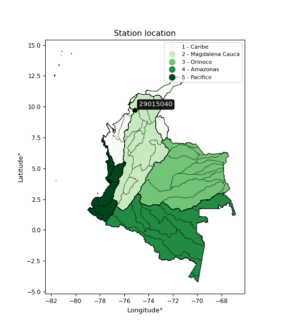</img>

</div>


## A. General information


### 1. General running parameters

• app_version: _v20260103_. • runtime: _2026-01-05 16:20:51.132608_. • Python version: _3.14.0_. • SciPy version: _1.16.3_. • Pandas version: _2.3.3_. • NumPy version: _2.3.5_. • Stations dataset (station_dataset_file): _dataset/pmax24h_in/automatic_colombia_2003_2024.csv_. • Stations catalog (station_catalog_file): _dataset/CNE.xls_. • Minimum year to eval til year_max (date_min): _1900_. • Maximum year to eval since year_min (date_max): _2024_. • Creates, save and include plots into reports (create_plot): _True_. • Plot only fit distributions with Δo > Δ (plot_only_fit): _True_. • Plot only simple graphs avoiding multiple CDFs and multiple Extreme values plots (plot_only_simple): _True_. • Eval low extreme values, if False, evaluates high extreme values (low_extreme): _False_. • Eval every SciPy distribution as logarithmic (pdist_logarithmic_on): _True_. • Standard deviation normalized (ddof): _1.0_. • Return periods to eval in years (Tr): _[2, 2.33, 5, 10, 15, 20, 25, 50, 75, 100, 200, 250, 500, 750, 1000]_. • Minimum data sample per station, 0 means any (minimum_sample): _5_. • Z-Score maximum threshold to adjust a value, 0 means disable (zscore_max): _3.5_. • Z-Score minimum threshold to adjust a value, 0 means disable (zscore_min): _-2.5_. • Avoid zeros, e.g. rain = 0 (avoid_zeros): _True_. • Avoid null values (avoid_nans): _True_. 

[:file_folder:Dataset file](../../dataset/pmax24h_in/automatic_colombia_2003_2024.csv)

> Delta Degrees of Freedom (DDOF): is a parameter used in the formulas for calculating variance and standard deviation. When ddof=0, the divisor is $N$ (the total number of observations) and this is used when your data set is the entire population. When ddof=1, the divisor is $N-1$ and this is used when your data set is a sample drawn from a larger population. Using $N-1$ provides an unbiased estimate of the population variance (known as Bessel´s correction).


### 2. Station info and location

|   id |   CODIGO | NOMBRE                              | CATEGORIA               | TECNOLOGIA                | ESTADO   | FECHA_INSTALACION   |   FECHA_SUSPENSION |   ALTITUD |   LATITUD |   LONGITUD | DEPARTAMENTO   | MUNICIPIO            | AREA_OPERATIVA                              | ENTIDAD                                                     | AREA_HIDROGRAFICA   | ZONA_HIDROGRAFICA   | SUBZONA_HIDROGRAFICA                                |   CORRIENTE | Catalogo   |   Version |
|-----:|---------:|:------------------------------------|:------------------------|:--------------------------|:---------|:--------------------|-------------------:|----------:|----------:|-----------:|:---------------|:---------------------|:--------------------------------------------|:------------------------------------------------------------|:--------------------|:--------------------|:----------------------------------------------------|------------:|:-----------|----------:|
|    0 | 29015040 | CARMEN DE BOLIVAR  - AUT [29015040] | Climatológica Principal | Automática con Telemetría | Activa   | 01/03/2004          |                nan |       152 |   9.71569 |   -75.1064 | Bolivar        | El Carmén De Bolívar | Area Operativa 02 - Atlántico-Bolivar-Sucre | INSTITUTO DE HIDROLOGIA METEOROLOGIA Y ESTUDIOS AMBIENTALES | Magdalena Cauca     | Bajo Magdalena      | Directos al Bajo Magdalena entre El Plato y Calamar |         nan | CNE_IDEAM  |  20251226 |

<div align="center">

Dynamic map: [:earth_americas:Google](http://maps.google.com/maps?q=9.71569,-75.106448) [:earth_americas:OSM](https://www.openstreetmap.org/#map=18/9.71569/-75.106448&layers=P) [:earth_americas:Bing](https://www.bing.com/maps?cp=9.71569~-75.106448&lvl=18) [:earth_americas:Apple](https://maps.apple.com/frame?center=9.71569%2C-75.106448&span=0.003%2C0.006)

</div>


<div align="center">

```geojson
{
  "type": "Feature",
  "geometry": {
    "type": "Point", 
    "coordinates": [-75.106448, 9.71569]
  }, 
  "properties": {
    "Name": "29015040"
  }
}
```

</div>


### 3. Discrete values table and plot

<div align="center">

|               |           0 |           1 |           2 |          3 |           4 |           5 |          6 |           7 |
|:--------------|------------:|------------:|------------:|-----------:|------------:|------------:|-----------:|------------:|
| Date          | 2017        | 2018        | 2019        | 2020       | 2021        | 2022        | 2023       | 2024        |
| Value         |   79.8      |   76.3      |   39.8      |  109.1     |   59.3      |   59.4      |   37.5     |   45.2      |
| Value_initial |   79.8      |   76.3      |   39.8      |  109.1     |   59.3      |   59.4      |   37.5     |   45.2      |
| count         |    8        |    8        |    8        |    8       |    8        |    8        |    8       |    8        |
| mean          |   63.3      |   63.3      |   63.3      |   63.3     |   63.3      |   63.3      |   63.3     |   63.3      |
| std           |   24.2475   |   24.2475   |   24.2475   |   24.2475  |   24.2475   |   24.2475   |   24.2475  |   24.2475   |
| zscore        |    0.680482 |    0.536137 |   -0.969171 |    1.88885 |   -0.164965 |   -0.160841 |   -1.06403 |   -0.746468 |


</div>


<div align="center">

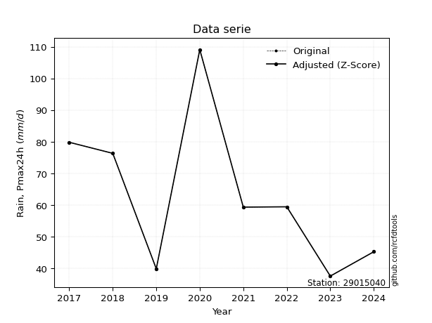</img>

</div>


> The initial value (value_initial) correspond to the initial obtained or null completed value, and value (value) is adjusted only when the initial value is outside the valid range (outlier) definite through the Z-Score value. If Z-Score is active, values out of range or outliers are replaced with the station mean value. A Z-Score (or standard score) measures how many standard deviations a data point is from the mean of a dataset, indicating its relative position; positive scores mean above the mean, negative mean below, and a score of zero is exactly at the mean, allowing for comparison of values from different distributions. It´s calculated using the formula $z=(x–μ)/σ$, where $x$ is the data point, $μ$ is the mean, and $σ$ is the standard deviation, helping identify outliers and understand probability.
>
> <sub>**Note**: In this study, "completing" (filling gaps in) and "extending" (forecasting or lengthening the historical record) rainfall data series are avoided for certain critical analyses because they introduce artificial bias and uncertainty, which can distort the statistics of rare events (extremes), alter day-to-day variability, and compromise the integrity and homogeneity of the original data. Some reasons against Completing/Extending rainfall data are: **Distortion of Extremes and Variability**: The primary issue is that most gap-filling or extension methods rely on averaging or regression with nearby stations, which inherently smooths the data. Rainfall is highly variable in space and time, with a large percentage of zero values and occasional large storms. Infilling methods often underestimate the highest values and overestimate the lowest (zero) values, which severely distorts analyses focused on flood frequency, drought severity, and intensity-duration-frequency (IDF) curves, **Loss of Data Homogeneity**: Infilled or extended data are synthetic estimates, not actual measurements. Combining these estimates with observed data can violate the assumption of data homogeneity, which requires that the data properties do not change over time. Inhomogeneity can lead to incorrect conclusions about long-term trends or changes in climate patterns, **Propagation of Errors**: Errors and biases from the original data (e.g., wind-induced undercatch, instrument errors, site changes) or the data used for imputation can propagate through the analysis, leading to unreliable hydrological models and inaccurate predictions, **Compromised Statistical Integrity**: For statistical analyses, especially those involving the frequency of events, using artificial data can introduce time bias or autocorrelation that doesn´t exist in reality, making it difficult to assess the true probability of events, **Difficulty in Validation**: It is difficult to accurately validate the quality of filled or extended data, especially for past periods where ground-truth measurements are unavailable. The reliability of imputation techniques heavily depends on the density of the surrounding station network and the complexity of the local topography.</sub>


### 4. Active continuous probability distributions from SciPy (44 of 104 available)

A Probability Density Function (PDF) describes the relative likelihood of a continuous random variable falling within a specific range, where the total area under its curve equals 1, and the area over any interval gives the actual probability for that range. Unlike discrete probabilities (like rolling a die), a PDF shows density, not direct probability for a single point (which is zero), with higher points indicating higher likelihood, often visualized as a bell curve for normal distributions.

A log of a probability density function (log-PDF) is simply the logarithm of the PDF´s value, denoted as $log(f(x))$, useful for converting multiplication of probabilities into addition, improving numerical stability with tiny numbers, and connecting to information theory concepts like entropy. Instead of dealing with very small probabilities (e.g., 0.000001), log-PDFs use negative numbers (e.g., $log(0.00001) ≈ -11.51$ that are easier for computers to handle, preventing underflow errors and simplifying complex calculations. In this study, each active probability distribution from SciPy is also evaluated in the $log$ form.

[scipy.stats](https://docs.scipy.org/doc/scipy/reference/stats.html) is a Python´s powerful submodule within the SciPy library for comprehensive statistical analysis, offering over 130 probability distributions (like Normal, Poisson), functions for descriptive stats (mean, variance), hypothesis testing (t-tests, chi-square), random variable generation, and statistical tests, making it essential for data science, modeling, and research. It provides tools to explore, model, and draw conclusions from data efficiently, working seamlessly with NumPy.

<div align="center">

|   id | p_dist             |   n_parameter | fit_method   | label                                                                       | active   | ref                                                                                                        |
|-----:|:-------------------|--------------:|:-------------|:----------------------------------------------------------------------------|:---------|:-----------------------------------------------------------------------------------------------------------|
|    0 | alpha              |             3 | MLE          | Alpha                                                                       | True     | [:mortar_board:](https://docs.scipy.org/doc/scipy/reference/generated/scipy.stats.alpha.html)              |
|    1 | betaprime          |             4 | MLE          | Beta prime                                                                  | True     | [:mortar_board:](https://docs.scipy.org/doc/scipy/reference/generated/scipy.stats.betaprime.html)          |
|    2 | chi2               |             3 | MLE          | Chi²                                                                        | True     | [:mortar_board:](https://docs.scipy.org/doc/scipy/reference/generated/scipy.stats.chi2.html)               |
|    3 | crystalball        |             4 | MLE          | Crystalball                                                                 | True     | [:mortar_board:](https://docs.scipy.org/doc/scipy/reference/generated/scipy.stats.crystalball.html)        |
|    4 | erlang             |             3 | MLE          | Erlang                                                                      | True     | [:mortar_board:](https://docs.scipy.org/doc/scipy/reference/generated/scipy.stats.erlang.html)             |
|    5 | expon              |             2 | MLE          | Exponential                                                                 | True     | [:mortar_board:](https://docs.scipy.org/doc/scipy/reference/generated/scipy.stats.expon.html)              |
|    6 | exponnorm          |             3 | MLE          | Exponentially modified Normal                                               | True     | [:mortar_board:](https://docs.scipy.org/doc/scipy/reference/generated/scipy.stats.exponnorm.html)          |
|    7 | f                  |             4 | MLE          | F                                                                           | True     | [:mortar_board:](https://docs.scipy.org/doc/scipy/reference/generated/scipy.stats.f.html)                  |
|    8 | fatiguelife        |             3 | MLE          | Fatigue-life (Birnbaum-Saunders)                                            | True     | [:mortar_board:](https://docs.scipy.org/doc/scipy/reference/generated/scipy.stats.fatiguelife.html)        |
|    9 | fisk               |             3 | MLE          | Fisk                                                                        | True     | [:mortar_board:](https://docs.scipy.org/doc/scipy/reference/generated/scipy.stats.fisk.html)               |
|   10 | gamma              |             3 | MLE          | Gamma                                                                       | True     | [:mortar_board:](https://docs.scipy.org/doc/scipy/reference/generated/scipy.stats.gamma.html)              |
|   11 | genexpon           |             5 | MLE          | Generalized exponential                                                     | True     | [:mortar_board:](https://docs.scipy.org/doc/scipy/reference/generated/scipy.stats.genexpon.html)           |
|   12 | genlogistic        |             3 | MLE          | Generalized logistic                                                        | True     | [:mortar_board:](https://docs.scipy.org/doc/scipy/reference/generated/scipy.stats.genlogistic.html)        |
|   13 | gibrat             |             2 | MM           | Gibrat                                                                      | True     | [:mortar_board:](https://docs.scipy.org/doc/scipy/reference/generated/scipy.stats.gibrat.html)             |
|   14 | gompertz           |             3 | MLE          | Gompertz (or truncated Gumbel)                                              | True     | [:mortar_board:](https://docs.scipy.org/doc/scipy/reference/generated/scipy.stats.gompertz.html)           |
|   15 | gumbel_l           |             2 | MM           | Gumbel Left Skew                                                            | True     | [:mortar_board:](https://docs.scipy.org/doc/scipy/reference/generated/scipy.stats.gumbel_l.html)           |
|   16 | gumbel_r           |             2 | MM           | Gumbel Right Skew                                                           | True     | [:mortar_board:](https://docs.scipy.org/doc/scipy/reference/generated/scipy.stats.gumbel_r.html)           |
|   17 | halflogistic       |             2 | MM           | Half-logistic                                                               | True     | [:mortar_board:](https://docs.scipy.org/doc/scipy/reference/generated/scipy.stats.halflogistic.html)       |
|   18 | halfnorm           |             2 | MM           | Half Normal                                                                 | True     | [:mortar_board:](https://docs.scipy.org/doc/scipy/reference/generated/scipy.stats.halfnorm.html)           |
|   19 | hypsecant          |             2 | MM           | hyperbolic secant                                                           | True     | [:mortar_board:](https://docs.scipy.org/doc/scipy/reference/generated/scipy.stats.hypsecant.html)          |
|   20 | invgamma           |             3 | MLE          | Inverted gamma                                                              | True     | [:mortar_board:](https://docs.scipy.org/doc/scipy/reference/generated/scipy.stats.invgamma.html)           |
|   21 | invgauss           |             3 | MLE          | Inverse Gaussian                                                            | True     | [:mortar_board:](https://docs.scipy.org/doc/scipy/reference/generated/scipy.stats.invgauss.html)           |
|   22 | invweibull         |             3 | MLE          | Inverted Weibull                                                            | True     | [:mortar_board:](https://docs.scipy.org/doc/scipy/reference/generated/scipy.stats.invweibull.html)         |
|   23 | johnsonsu          |             4 | MLE          | Johnson Su                                                                  | True     | [:mortar_board:](https://docs.scipy.org/doc/scipy/reference/generated/scipy.stats.johnsonsu.html)          |
|   24 | kstwobign          |             2 | MLE          | Limiting distribution of scaled Kolmogorov-Smirnov two-sided test statistic | True     | [:mortar_board:](https://docs.scipy.org/doc/scipy/reference/generated/scipy.stats.kstwobign.html)          |
|   25 | laplace            |             2 | MM           | Laplace                                                                     | True     | [:mortar_board:](https://docs.scipy.org/doc/scipy/reference/generated/scipy.stats.laplace.html)            |
|   26 | laplace_asymmetric |             3 | MLE          | Asymmetric Laplace                                                          | True     | [:mortar_board:](https://docs.scipy.org/doc/scipy/reference/generated/scipy.stats.laplace_asymmetric.html) |
|   27 | loggamma           |             3 | MLE          | Log gamma                                                                   | True     | [:mortar_board:](https://docs.scipy.org/doc/scipy/reference/generated/scipy.stats.loggamma.html)           |
|   28 | logistic           |             2 | MM           | Logistic (or Sech-squared)                                                  | True     | [:mortar_board:](https://docs.scipy.org/doc/scipy/reference/generated/scipy.stats.logistic.html)           |
|   29 | lognorm            |             3 | MLE          | Log Normal                                                                  | True     | [:mortar_board:](https://docs.scipy.org/doc/scipy/reference/generated/scipy.stats.lognorm.html)            |
|   30 | maxwell            |             2 | MM           | Maxwell                                                                     | True     | [:mortar_board:](https://docs.scipy.org/doc/scipy/reference/generated/scipy.stats.maxwell.html)            |
|   31 | mielke             |             4 | MLE          | Mielke Beta-Kappa / Dagum                                                   | True     | [:mortar_board:](https://docs.scipy.org/doc/scipy/reference/generated/scipy.stats.mielke.html)             |
|   32 | moyal              |             2 | MM           | Moyal                                                                       | True     | [:mortar_board:](https://docs.scipy.org/doc/scipy/reference/generated/scipy.stats.moyal.html)              |
|   33 | nakagami           |             3 | MLE          | Nakagami                                                                    | True     | [:mortar_board:](https://docs.scipy.org/doc/scipy/reference/generated/scipy.stats.nakagami.html)           |
|   34 | ncf                |             5 | MLE          | Non-central F distribution                                                  | True     | [:mortar_board:](https://docs.scipy.org/doc/scipy/reference/generated/scipy.stats.ncf.html)                |
|   35 | nct                |             4 | MLE          | Non-central Student’s t                                                     | True     | [:mortar_board:](https://docs.scipy.org/doc/scipy/reference/generated/scipy.stats.nct.html)                |
|   36 | norm               |             2 | MM           | Normal                                                                      | True     | [:mortar_board:](https://docs.scipy.org/doc/scipy/reference/generated/scipy.stats.norm.html)               |
|   37 | pearson3           |             3 | MM           | Pearson type III                                                            | True     | [:mortar_board:](https://docs.scipy.org/doc/scipy/reference/generated/scipy.stats.pearson3.html)           |
|   38 | rayleigh           |             2 | MM           | Rayleigh                                                                    | True     | [:mortar_board:](https://docs.scipy.org/doc/scipy/reference/generated/scipy.stats.rayleigh.html)           |
|   39 | rice               |             3 | MLE          | Rice                                                                        | True     | [:mortar_board:](https://docs.scipy.org/doc/scipy/reference/generated/scipy.stats.rice.html)               |
|   40 | t                  |             3 | MLE          | Student’s t                                                                 | True     | [:mortar_board:](https://docs.scipy.org/doc/scipy/reference/generated/scipy.stats.t.html)                  |
|   41 | truncnorm          |             4 | MLE          | Truncated normal                                                            | True     | [:mortar_board:](https://docs.scipy.org/doc/scipy/reference/generated/scipy.stats.truncnorm.html)          |
|   42 | wald               |             2 | MM           | Wald                                                                        | True     | [:mortar_board:](https://docs.scipy.org/doc/scipy/reference/generated/scipy.stats.wald.html)               |
|   43 | weibull_min        |             3 | MLE          | Weibull minimum                                                             | True     | [:mortar_board:](https://docs.scipy.org/doc/scipy/reference/generated/scipy.stats.weibull_min.html)        |

</div>

> **n_parameter:** # arguments & localization & scale.
>
> **Fit methods:** (MLE) maximum likelihood, (MM) L-moments.
>
>**Inactive** (With the only purpose of prevent loops, zero divisions, infinite values, over high estimated values or horizontal trending for recurrence intervals estimations, the follow distributions were disabled.)**:** foldnorm, gennorm, norminvgauss, powernorm, powerlognorm, skewnorm, genextreme, anglit, arcsine, argus, beta, bradford, burr, burr12, cauchy, cosine, halfcauchy, foldcauchy, skewcauchy, wrapcauchy, dgamma, gengamma, exponweib, exponpow, truncexpon, gausshyper, genhalflogistic, genhyperbolic, geninvgauss, halfgennorm, johnsonsb, kappa4, kappa3, ksone, kstwo, loglaplace, levy, levy_l, levy_stable, ncx2, pareto, genpareto, truncpareto, lomax, powerlaw, rdist, rel_breitwigner, recipinvgauss, semicircular, studentized_range, trapezoid, triang, truncweibull_min, tukeylambda, uniform, loguniform, vonmises, vonmises_line, weibull_max, dweibull, 


## B. Probability (PDF) vs. Empirical (EDF) distributions functions

A continuous probability distribution (CPD) describes probabilities for variables that can take any value within a range (like rain any time), unlike discrete variables with specific outcomes (like temperature). It uses a Probability Density Function (PDF), a curve where the total area under it equals 1, and the probability of the variable falling within an interval (a to b) is found by calculating the area under the curve between those points. A key feature is that the probability of hitting any single exact value is zero, so probabilities are always expressed for ranges, e.g., $P(a ≤ X ≤ b)$.

<div align="center">

Distributions parameters from station values
|    |   station | p_dist                |   n |             loc |          scale | shape                 | shape1             | shape2                 | shape3   |
|---:|----------:|:----------------------|----:|----------------:|---------------:|:----------------------|:-------------------|:-----------------------|:---------|
|  0 |  29015040 | alpha                 |   8 |   -17.6768      |  293.733       | 3.898317160256844     |                    |                        |          |
|  1 |  29015040 | betaprime             |   8 |    -0.918245    |    1.91465     | 278.6578674649327     | 9.298517999968933  |                        |          |
|  2 |  29015040 | chi2                  |   8 |    37.5         |   14.3543      | 0.9196203773572564    |                    |                        |          |
|  3 |  29015040 | crystalball           |   8 |    63.3         |   22.6815      | 11641.145409156376    | 616.5904820469882  |                        |          |
|  4 |  29015040 | erlang                |   8 |    37.5         |   17.9949      | 0.8181268532074817    |                    |                        |          |
|  5 |  29015040 | expon                 |   8 |    37.5         |   25.8         |                       |                    |                        |          |
|  6 |  29015040 | exponnorm             |   8 |    37.4766      |    0.00774222  | 3321.9293506627964    |                    |                        |          |
|  7 |  29015040 | f                     |   8 |    -1.51968     |   58.1745      | 346.29236220190256    | 19.309100658593316 |                        |          |
|  8 |  29015040 | fatiguelife           |   8 |    37.5         |    4.78197e-06 | 2110.8698145524177    |                    |                        |          |
|  9 |  29015040 | fisk                  |   8 |    37.5         |   12.4008      | 0.6209781510150214    |                    |                        |          |
| 10 |  29015040 | gamma                 |   8 |    37.5         |   20.7498      | 0.8722806918460929    |                    |                        |          |
| 11 |  29015040 | genexpon              |   8 |    37.4888      |    0.125046    | 0.004142522156650076  | 1.0103574537325684 | 3.7797696789913328e-06 |          |
| 12 |  29015040 | genlogistic           |   8 |   -68.0368      |   17.2268      | 1113.6202755905006    |                    |                        |          |
| 13 |  29015040 | gibrat                |   8 |    45.9969      |   10.4949      |                       |                    |                        |          |
| 14 |  29015040 | gompertz              |   8 |    37.5         |  137.292       | 4.751505391144321     |                    |                        |          |
| 15 |  29015040 | gumbel_l              |   8 |    73.5079      |   17.6847      |                       |                    |                        |          |
| 16 |  29015040 | gumbel_r              |   8 |    53.0921      |   17.6847      |                       |                    |                        |          |
| 17 |  29015040 | halflogistic          |   8 |    36.4172      |   19.3919      |                       |                    |                        |          |
| 18 |  29015040 | halfnorm              |   8 |    33.2786      |   37.6263      |                       |                    |                        |          |
| 19 |  29015040 | hypsecant             |   8 |    63.3         |   14.4395      |                       |                    |                        |          |
| 20 |  29015040 | invgamma              |   8 |    20.0154      |  123.613       | 3.770330135853579     |                    |                        |          |
| 21 |  29015040 | invgauss              |   8 |    31.2866      |   35.1911      | 0.9096999930608083    |                    |                        |          |
| 22 |  29015040 | invweibull            |   8 |    37.5         |    1.33374     | 0.0576325324803975    |                    |                        |          |
| 23 |  29015040 | johnsonsu             |   8 |    35.0182      |    0.0788795   | -5.5418527868005185   | 0.9072119046854072 |                        |          |
| 24 |  29015040 | kstwobign             |   8 |    -7.51698     |   81.2844      |                       |                    |                        |          |
| 25 |  29015040 | laplace               |   8 |    63.3         |   16.0382      |                       |                    |                        |          |
| 26 |  29015040 | laplace_asymmetric    |   8 |    59.3         |   17.5083      | 0.8923672818415168    |                    |                        |          |
| 27 |  29015040 | loggamma              |   8 | -8534.65        | 1111.73        | 2284.590234009411     |                    |                        |          |
| 28 |  29015040 | logistic              |   8 |    63.3         |   12.505       |                       |                    |                        |          |
| 29 |  29015040 | lognorm               |   8 |    37.5         |    0.227038    | 11.796554781269455    |                    |                        |          |
| 30 |  29015040 | maxwell               |   8 |     9.55439     |   33.6801      |                       |                    |                        |          |
| 31 |  29015040 | mielke                |   8 |   -11.844       |   15.9174      | 1149.2894763188847    | 4.113960695906453  |                        |          |
| 32 |  29015040 | moyal                 |   8 |    50.3293      |   10.2103      |                       |                    |                        |          |
| 33 |  29015040 | nakagami              |   8 |    37.5         |   34.4585      | 0.3157197905980713    |                    |                        |          |
| 34 |  29015040 | ncf                   |   8 |    -0.27147     |    2.81371e-05 | 1.927786407537842e-05 | 86.86293327598577  | 42.461160422930234     |          |
| 35 |  29015040 | nct                   |   8 |    -0.240121    |    0.529495    | 4.89139979746705      | 101.2559481316376  |                        |          |
| 36 |  29015040 | norm                  |   8 |    63.3         |   22.6815      |                       |                    |                        |          |
| 37 |  29015040 | pearson3              |   8 |    63.3         |   22.6815      | 0.7129884831075801    |                    |                        |          |
| 38 |  29015040 | rayleigh              |   8 |    19.909       |   34.621       |                       |                    |                        |          |
| 39 |  29015040 | rice                  |   8 |    25.35        |   31.2622      | 0.000484898774536242  |                    |                        |          |
| 40 |  29015040 | t                     |   8 |    63.3003      |   22.6815      | 48698600.686662614    |                    |                        |          |
| 41 |  29015040 | truncnorm             |   8 |    63.3         |   22.6815      | -1642.9744121580702   | 2297.7707972392623 |                        |          |
| 42 |  29015040 | wald                  |   8 |    40.6185      |   22.6815      |                       |                    |                        |          |
| 43 |  29015040 | weibull_min           |   8 |    37.5         |   23.0911      | 0.32554319436786383   |                    |                        |          |
| 44 |  29015040 | logalpha              |   8 |     0.461021    |   37.8909      | 10.546562101329197    |                    |                        |          |
| 45 |  29015040 | logbetaprime          |   8 |    -2.0919      |    6.53001     | 616.1625869589755     | 652.287306146949   |                        |          |
| 46 |  29015040 | logchi2               |   8 |     3.62434     |    1.31888     | 0.33950149315231487   |                    |                        |          |
| 47 |  29015040 | logcrystalball        |   8 |     4.08658     |    0.347486    | 165.36905422672635    | 461.35422491473435 |                        |          |
| 48 |  29015040 | logerlang             |   8 |     3.62433     |    0.408168    | 0.8947727712111053    |                    |                        |          |
| 49 |  29015040 | logexpon              |   8 |     3.62434     |    0.462243    |                       |                    |                        |          |
| 50 |  29015040 | logexponnorm          |   8 |     4.00524     |    0.337881    | 0.24074656834508834   |                    |                        |          |
| 51 |  29015040 | logf                  |   8 |     3.62434     |    0.418396    | 1.2123640963785123    | 8389.943601339037  |                        |          |
| 52 |  29015040 | logfatiguelife        |   8 |     3.38307     |    0.602324    | 0.5774379866055452    |                    |                        |          |
| 53 |  29015040 | logfisk               |   8 |     3.02857     |    1.01144     | 4.79986440495936      |                    |                        |          |
| 54 |  29015040 | loggamma              |   8 |     3.62434     |    0.383291    | 0.8152056026000067    |                    |                        |          |
| 55 |  29015040 | loggenexpon           |   8 |     3.62434     |    0.769202    | 1.3652086827866956    | 1.4683885690797647 | 0.5056483393419557     |          |
| 56 |  29015040 | loggenlogistic        |   8 |     1.99575     |    0.295562    | 666.9704826883894     |                    |                        |          |
| 57 |  29015040 | loggibrat             |   8 |     3.82149     |    0.160784    |                       |                    |                        |          |
| 58 |  29015040 | loggompertz           |   8 |     3.62434     |    0.79554     | 1.0350790108598233    |                    |                        |          |
| 59 |  29015040 | loggumbel_l           |   8 |     4.24297     |    0.270934    |                       |                    |                        |          |
| 60 |  29015040 | loggumbel_r           |   8 |     3.9302      |    0.270934    |                       |                    |                        |          |
| 61 |  29015040 | loghalflogistic       |   8 |     3.6747      |    0.29711     |                       |                    |                        |          |
| 62 |  29015040 | loghalfnorm           |   8 |     3.62666     |    0.576434    |                       |                    |                        |          |
| 63 |  29015040 | loghypsecant          |   8 |     4.08658     |    0.221217    |                       |                    |                        |          |
| 64 |  29015040 | loginvgamma           |   8 |    -0.822541    |  990.259       | 202.83533652990894    |                    |                        |          |
| 65 |  29015040 | loginvgauss           |   8 |     3.20411     |    4.63032     | 0.19058687715763353   |                    |                        |          |
| 66 |  29015040 | loginvweibull         |   8 |    -1.66149e+07 |    1.66149e+07 | 56188004.99145846     |                    |                        |          |
| 67 |  29015040 | logjohnsonsu          |   8 |     2.99448     |    0.0816946   | -9.844346424985794    | 3.0438469127623424 |                        |          |
| 68 |  29015040 | logkstwobign          |   8 |     2.89916     |    1.35639     |                       |                    |                        |          |
| 69 |  29015040 | loglaplace            |   8 |     4.08658     |    0.24571     |                       |                    |                        |          |
| 70 |  29015040 | loglaplace_asymmetric |   8 |     4.08261     |    0.286058    | 0.993021881871783     |                    |                        |          |
| 71 |  29015040 | logloggamma           |   8 |   -71.7593      |   10.991       | 993.3301195023796     |                    |                        |          |
| 72 |  29015040 | loglogistic           |   8 |     4.08658     |    0.191579    |                       |                    |                        |          |
| 73 |  29015040 | loglognorm            |   8 |     3.62434     |    0.0052713   | 11.411209092248612    |                    |                        |          |
| 74 |  29015040 | logmaxwell            |   8 |     3.26319     |    0.515988    |                       |                    |                        |          |
| 75 |  29015040 | logmielke             |   8 |  -545.058       |  548.236       | 26830.795152971274    | 1920.2160131882192 |                        |          |
| 76 |  29015040 | logmoyal              |   8 |     3.88787     |    0.156424    |                       |                    |                        |          |
| 77 |  29015040 | lognakagami           |   8 |     3.62434     |    0.518929    | 0.08778123856576742   |                    |                        |          |
| 78 |  29015040 | logncf                |   8 |     2.28791     |    0.860932    | 357.4896855624297     | 60.39761541500676  | 364.88040788118826     |          |
| 79 |  29015040 | lognct                |   8 |    -0.310671    |    0.1177      | 92.96262081769859     | 37.04691072572752  |                        |          |
| 80 |  29015040 | lognorm               |   8 |     4.08658     |    0.347486    |                       |                    |                        |          |
| 81 |  29015040 | logpearson3           |   8 |     4.08658     |    0.347486    | 0.2312580478204111    |                    |                        |          |
| 82 |  29015040 | lograyleigh           |   8 |     3.42182     |    0.530403    |                       |                    |                        |          |
| 83 |  29015040 | logrice               |   8 |     3.45298     |    0.450748    | 0.7551397500088617    |                    |                        |          |
| 84 |  29015040 | logt                  |   8 |     4.08658     |    0.347487    | 73148051955.19333     |                    |                        |          |
| 85 |  29015040 | logtruncnorm          |   8 |    -0.213972    |    1.45898     | 2.6308197355216585    | 4.894008044736685  |                        |          |
| 86 |  29015040 | logwald               |   8 |     3.73903     |    0.347548    |                       |                    |                        |          |
| 87 |  29015040 | logweibull_min        |   8 |     3.62434     |    0.413989    | 0.22414557345608216   |                    |                        |          |

</div>

> **loc** (Location parameter): This shifts the distribution along the x-axis. For many common distributions, like the normal (Gaussian) distribution, loc represents the mean $μ$. For others, like the uniform distribution, it might represent the minimum value, or for the beta distribution, the left end of the support interval.
>
> **scale** (Scale parameter): This determines the width or spread of the distribution. For the normal distribution, scale represents the standard deviation $σ$. For a uniform distribution, it defines the length of the interval (from $loc$ to $loc + scale$).
>
> **shape** (Shape parameters): Refers to parameters that define the specific form of a probability distribution, distinct from its location (loc) and scale (scale). These parameters are required arguments for most distribution functions. For example, a normal (Gaussian) distribution is fully defined by its location (mean) and scale (standard deviation), so it has no specific shape parameters beyond loc and scale. However, other distributions have intrinsic properties that need specification, as Gamma distribution that takes a shape parameter, often named $a$ or $alpha$.


### 0. Cumulative distribution values - CDF (88 evaluated)

Cumulative Distribution Function (CDF), denoted as $F$<sub>$X$</sub>$(x)$, is a function that gives the probability that a random variable $X$ will take a value less than or equal to a specific value, $x$ (i.e., $(P(X≥x)$. It essentially "accumulates" probabilities from a given point up to the far right (positive infinity), providing a complete picture of the distribution´s probabilities for both discrete (like rain) and continuous (like temperature) variables, helping to find probabilities over ranges or above certain values. Each station is evaluated separately ordering the $x$ values ascending, calculating the CDF and PDF values for the activated distributions and their logarithmic forms.

<div align="center">

CDF ordered by x ascending and calculating $log(f(x))$ separately
|   id |   Station |   date |     x |   count |   mean |     std |    zscore |   Value_initial |   station |   m |     alpha |   alpha_pdf |   betaprime |   betaprime_pdf |        chi2 |    chi2_pdf |   crystalball |   crystalball_pdf |      erlang |   erlang_pdf |     expon |   expon_pdf |   exponnorm |   exponnorm_pdf |         f |      f_pdf |   fatiguelife |   fatiguelife_pdf |        fisk |       fisk_pdf |       gamma |   gamma_pdf |    genexpon |   genexpon_pdf |   genlogistic |   genlogistic_pdf |   gibrat |   gibrat_pdf |    gompertz |   gompertz_pdf |   gumbel_l |   gumbel_l_pdf |   gumbel_r |   gumbel_r_pdf |   halflogistic |   halflogistic_pdf |   halfnorm |   halfnorm_pdf |   hypsecant |   hypsecant_pdf |   invgamma |   invgamma_pdf |   invgauss |   invgauss_pdf |   invweibull |   invweibull_pdf |   johnsonsu |   johnsonsu_pdf |   kstwobign |   kstwobign_pdf |   laplace |   laplace_pdf |   laplace_asymmetric |   laplace_asymmetric_pdf |    loggamma |   loggamma_pdf |   logistic |   logistic_pdf |   lognorm |   lognorm_pdf |   maxwell |   maxwell_pdf |   mielke |   mielke_pdf |     moyal |   moyal_pdf |    nakagami |   nakagami_pdf |      ncf |    ncf_pdf |       nct |    nct_pdf |     norm |   norm_pdf |   pearson3 |   pearson3_pdf |   rayleigh |   rayleigh_pdf |      rice |   rice_pdf |        t |      t_pdf |   truncnorm |   truncnorm_pdf |      wald |   wald_pdf |   weibull_min |   weibull_min_pdf |   logalpha |   logalpha_pdf |   logbetaprime |   logbetaprime_pdf |    logchi2 |   logchi2_pdf |   logcrystalball |   logcrystalball_pdf |   logerlang |   logerlang_pdf |   logexpon |   logexpon_pdf |   logexponnorm |   logexponnorm_pdf |        logf |   logf_pdf |   logfatiguelife |   logfatiguelife_pdf |   logfisk |   logfisk_pdf |   loggenexpon |   loggenexpon_pdf |   loggenlogistic |   loggenlogistic_pdf |   loggibrat |   loggibrat_pdf |   loggompertz |   loggompertz_pdf |   loggumbel_l |   loggumbel_l_pdf |   loggumbel_r |   loggumbel_r_pdf |   loghalflogistic |   loghalflogistic_pdf |   loghalfnorm |   loghalfnorm_pdf |   loghypsecant |   loghypsecant_pdf |   loginvgamma |   loginvgamma_pdf |   loginvgauss |   loginvgauss_pdf |   loginvweibull |   loginvweibull_pdf |   logjohnsonsu |   logjohnsonsu_pdf |   logkstwobign |   logkstwobign_pdf |   loglaplace |   loglaplace_pdf |   loglaplace_asymmetric |   loglaplace_asymmetric_pdf |   logloggamma |   logloggamma_pdf |   loglogistic |   loglogistic_pdf |   loglognorm |   loglognorm_pdf |   logmaxwell |   logmaxwell_pdf |   logmielke |   logmielke_pdf |   logmoyal |   logmoyal_pdf |   lognakagami |   lognakagami_pdf |    logncf |   logncf_pdf |    lognct |   lognct_pdf |   logpearson3 |   logpearson3_pdf |   lograyleigh |   lograyleigh_pdf |   logrice |   logrice_pdf |      logt |   logt_pdf |   logtruncnorm |   logtruncnorm_pdf |   logwald |   logwald_pdf |   logweibull_min |   logweibull_min_pdf |
|-----:|----------:|-------:|------:|--------:|-------:|--------:|----------:|----------------:|----------:|----:|----------:|------------:|------------:|----------------:|------------:|------------:|--------------:|------------------:|------------:|-------------:|----------:|------------:|------------:|----------------:|----------:|-----------:|--------------:|------------------:|------------:|---------------:|------------:|------------:|------------:|---------------:|--------------:|------------------:|---------:|-------------:|------------:|---------------:|-----------:|---------------:|-----------:|---------------:|---------------:|-------------------:|-----------:|---------------:|------------:|----------------:|-----------:|---------------:|-----------:|---------------:|-------------:|-----------------:|------------:|----------------:|------------:|----------------:|----------:|--------------:|---------------------:|-------------------------:|------------:|---------------:|-----------:|---------------:|----------:|--------------:|----------:|--------------:|---------:|-------------:|----------:|------------:|------------:|---------------:|---------:|-----------:|----------:|-----------:|---------:|-----------:|-----------:|---------------:|-----------:|---------------:|----------:|-----------:|---------:|-----------:|------------:|----------------:|----------:|-----------:|--------------:|------------------:|-----------:|---------------:|---------------:|-------------------:|-----------:|--------------:|-----------------:|---------------------:|------------:|----------------:|-----------:|---------------:|---------------:|-------------------:|------------:|-----------:|-----------------:|---------------------:|----------:|--------------:|--------------:|------------------:|-----------------:|---------------------:|------------:|----------------:|--------------:|------------------:|--------------:|------------------:|--------------:|------------------:|------------------:|----------------------:|--------------:|------------------:|---------------:|-------------------:|--------------:|------------------:|--------------:|------------------:|----------------:|--------------------:|---------------:|-------------------:|---------------:|-------------------:|-------------:|-----------------:|------------------------:|----------------------------:|--------------:|------------------:|--------------:|------------------:|-------------:|-----------------:|-------------:|-----------------:|------------:|----------------:|-----------:|---------------:|--------------:|------------------:|----------:|-------------:|----------:|-------------:|--------------:|------------------:|--------------:|------------------:|----------:|--------------:|----------:|-----------:|---------------:|-------------------:|----------:|--------------:|-----------------:|---------------------:|
|    0 |  29015040 |   2023 |  37.5 |       8 |   63.3 | 24.2475 | -1.06403  |            37.5 |  29015040 |   1 | 0.0770588 |  0.013942   |   0.0834102 |      0.0135582  | 7.52954e-08 | 4.87256e+06 |      0.127666 |        0.00921032 | 2.66999e-13 | 30.7426      | 0         |  0.0387597  |  0.00090928 |      0.0387974  | 0.0842409 | 0.0134568  |      0.03499  |       2.14141e+11 | 5.27318e-10 | 23042.4        | 3.39557e-14 |  4.16849    | 0.000372135 |     0.0331184  |     0.0880241 |        0.0124039  | 0        |   0          | 3.19682e-15 |     0.0346087  |   0.122375 |     0.00647802 |  0.0893729 |     0.0122043  |      0.0279126 |         0.0257639  |  0.0893297 |     0.0210725  |    0.105654 |      0.00718337 |  0.0634999 |     0.0171131  |  0.0477729 |     0.024285   |   0.00129809 |      6.99839e+10 |    0.037213 |      0.0296852  |   0.0810716 |      0.0126866  |  0.100078 |    0.00623998 |             0.109833 |               0.00702981 | 3.17378e-06 |      40.7062   |   0.112727 |     0.00799841 | 0.0917185 |      0.473934 |  0.124086 |    0.0115598  |      nan |          nan | 0.0608843 |   0.0126431 | 9.66981e-11 |  8593.29       | 0.102639 | 0.0114967  | 0.0744644 | 0.0147642  | 0.127666 | 0.00921032 |   0.111449 |     0.0118872  |   0.1211   |     0.0128988  | 0.0727419 | 0.0115275  | 0.127664 | 0.0092102  |    0.127666 |      0.00921032 | 0         | 0          |   8.91702e-06 |       4.08541e+08 |  0.0761234 |       0.54212  |      0.0879347 |           0.496386 | 0.00226682 |    8.6648e+11 |        0.0917183 |             0.473933 | 6.45446e-05 |        7.13601  |   0        |       2.16337  |      0.0910921 |           0.475918 | 0.000322989 | 195.689    |        0.0504829 |             0.825387 |  0.073068 |      0.545667 |   1.32384e-09 |          1.77484  |        0.0676912 |             0.615477 |    0        |        0        |   1.79085e-08 |          1.3011   |     0.0969206 |          0.339803 |     0.0454006 |          0.518167 |         0         |              0        |      0        |          0        |      0.0783789 |           0.350739 |     0.0847205 |          0.512908 |     0.0583315 |          0.695059 |       0.0675129 |            0.615405 |      0.0661978 |           0.61632  |      0.0626062 |           0.658878 |    0.0761995 |         0.31012  |               0.0989198 |                    0.348234 |     0.0942287 |          0.475021 |     0.0822018 |          0.393804 |    0.0041674 |      2.42518e+12 |    0.0788952 |         0.592963 |    0.070128 |        0.593935 |  0.0202426 |       0.399786 |    0.00191118 |       7.55552e+11 | 0.0720568 |     0.56806  | 0.0820895 |     0.518259 |     0.0859318 |          0.504868 |     0.0703003 |          0.669262 | 0.0529573 |      0.602202 | 0.0917184 |   0.473934 |    5.83918e-09 |           2.0169   | 0         |      0        |      0.000441116 |          2.22596e+11 |
|    1 |  29015040 |   2019 |  39.8 |       8 |   63.3 | 24.2475 | -0.969171 |            39.8 |  29015040 |   2 | 0.112735  |  0.0170156  |   0.117629  |      0.0161412  | 0.345016    | 0.0652732   |      0.150081 |        0.0102834  | 0.187489    |  0.0621193   | 0.0852892 |  0.0354539  |  0.086377   |      0.0355231  | 0.118165  | 0.0159893  |      0.628751 |       0.0269968   | 0.259945    |     0.0519391  | 0.146429    |  0.0523136  | 0.0743128   |     0.0311887  |     0.11923   |        0.0147053  | 0        |   0          | 0.0771333   |     0.0324788  |   0.138144 |     0.00724521 |  0.11998   |     0.0143859  |      0.0870026 |         0.0255888  |  0.137601  |     0.0208894  |    0.123475 |      0.00833837 |  0.108291  |     0.0215892  |  0.113113  |     0.0312819  |   0.379431   |      0.00921369  |    0.117186 |      0.0373159  |   0.11296   |      0.0149958  |  0.11551  |    0.00720218 |             0.127252 |               0.00814472 | 0.218658    |       2.74606  |   0.132475 |     0.00919036 | 0.12324   |      0.586559 |  0.152077 |    0.0127652  |      nan |          nan | 0.0939971 |   0.0160992 | 0.140458    |     0.03852    | 0.13104  | 0.0131857  | 0.112333  | 0.0180659  | 0.150081 | 0.0102834  |   0.140571 |     0.0134163  |   0.152145 |     0.0140702  | 0.101315  | 0.0132873  | 0.150078 | 0.0102833  |    0.150081 |      0.0102834  | 0         | 0          |   0.376217    |       0.041669    |  0.113062  |       0.699566 |      0.121122  |           0.619886 | 0.56508    |    1.58063    |        0.12324   |             0.586558 | 0.173829    |        2.41681  |   0.12083  |       1.90197  |      0.122775  |           0.589994 | 0.245135    |   2.36498  |        0.109954  |             1.14813  |  0.110722 |      0.721217 |   0.102232    |          1.65916  |        0.110537  |             0.822319 |    0        |        0        |   0.0772719   |          1.29384  |     0.119261  |          0.412825 |     0.0835508 |          0.765493 |         0.0154236 |              1.68248  |      0.079061 |          1.37737  |      0.102214  |           0.454152 |     0.119188  |          0.646232 |     0.107409  |          0.945651 |       0.110365  |            0.822585 |      0.108986  |           0.819001 |      0.108629  |           0.882092 |    0.0970878 |         0.395132 |               0.121981  |                    0.429416 |     0.125753  |          0.585525 |     0.108894  |          0.506506 |    0.584116  |      0.574212    |    0.118526  |         0.737206 |    0.111383 |        0.791643 |  0.0549174 |       0.775716 |    0.577397   |       1.70113     | 0.111047  |     0.741777 | 0.117042  |     0.657098 |     0.119762  |          0.63288  |     0.114889  |          0.824445 | 0.0941517 |      0.777732 | 0.12324   |   0.586558 |    0.113809    |           1.81012  | 0         |      0        |      0.476621    |          1.27599     |
|    2 |  29015040 |   2024 |  45.2 |       8 |   63.3 | 24.2475 | -0.746468 |            45.2 |  29015040 |   3 | 0.219701  |  0.0219821  |   0.217658  |      0.020432   | 0.568359    | 0.0281562   |      0.212433 |        0.0127925  | 0.443408    |  0.036937    | 0.258032  |  0.0287584  |  0.259402   |      0.0287956  | 0.217217  | 0.0202412  |      0.726129 |       0.0129986   | 0.426555    |     0.0197266  | 0.374161    |  0.0345597  | 0.231042    |     0.0269221  |     0.211226  |        0.0190512  | 0        |   0          | 0.239745    |     0.0278293  |   0.182705 |     0.00932409 |  0.209617  |     0.01852    |      0.222663  |         0.0245057  |  0.248633  |     0.0201674  |    0.177046 |      0.0116387  |  0.240572  |     0.0260661  |  0.285725  |     0.0304374  |   0.40499    |      0.00273992  |    0.307284 |      0.0313125  |   0.205744  |      0.0189917  |  0.161751 |    0.0100853  |             0.179791 |               0.0115075  | 0.482893    |       1.59509  |   0.190398 |     0.0123268  | 0.213948  |      0.838473 |  0.227782 |    0.0151566  |      nan |          nan | 0.198602  |   0.0219835 | 0.3002      |     0.0243245  | 0.211891 | 0.0165914  | 0.224839  | 0.0228403  | 0.212433 | 0.0127925  |   0.221483 |     0.0163774  |   0.234191 |     0.0161587  | 0.182563  | 0.0166026  | 0.21243  | 0.0127924  |    0.212433 |      0.0127925  | 0.0655556 | 0.0400536  |   0.503121    |       0.0146926   |  0.222465  |       1.00606  |      0.217139  |           0.885514 | 0.681425   |    0.582918   |        0.213948  |             0.838472 | 0.420696    |        1.56899  |   0.33237  |       1.44433  |      0.214096  |           0.844433 | 0.458634    |   1.25374  |        0.2761    |             1.37245  |  0.225885 |      1.07257  |   0.297055    |          1.40264  |        0.238631  |             1.1556   |    0        |        0        |   0.239576    |          1.25118  |     0.18381   |          0.611863 |     0.21181   |          1.21337  |         0.22559   |              1.59724  |      0.251009 |          1.3151   |      0.178426  |           0.764987 |     0.219556  |          0.924932 |     0.250893  |          1.25174  |       0.238516  |            1.15613  |      0.235931  |           1.14224  |      0.243337  |           1.18968  |    0.162947  |         0.663166 |               0.190902  |                    0.672044 |     0.216042  |          0.833138 |     0.191859  |          0.80932  |    0.62272   |      0.178271    |    0.229575  |         0.992189 |    0.235675 |        1.1321   |  0.201205  |       1.44028  |    0.705174   |       0.656014    | 0.226894  |     1.05843  | 0.219351  |     0.94305  |     0.217828  |          0.903237 |     0.236102  |          1.05701  | 0.21232   |      1.0556   | 0.213948  |   0.838472 |    0.319006    |           1.42848  | 0.0704841 |      2.6722   |      0.566812    |          0.434952    |
|    3 |  29015040 |   2021 |  59.3 |       8 |   63.3 | 24.2475 | -0.164965 |            59.3 |  29015040 |   4 | 0.532884  |  0.01971    |   0.515595  |      0.0194928  | 0.802185    | 0.00982033  |      0.430007 |        0.0173175  | 0.770983    |  0.0139626   | 0.570426  |  0.0166502  |  0.571956   |      0.016643   | 0.513648  | 0.0194902  |      0.84411  |       0.00554906  | 0.586697    |     0.0069072  | 0.703963    |  0.0153367  | 0.541889    |     0.0176158  |     0.503539  |        0.0200484  | 0.593715 |   0.0291573  | 0.558541    |     0.0179075  |   0.36097  |     0.0161812  |  0.494622  |     0.0196891  |      0.529904  |         0.0185439  |  0.510796  |     0.0166952  |    0.412929 |      0.0212248  |  0.56586   |     0.0181999  |  0.604674  |     0.0158059  |   0.426871   |      0.000960676 |    0.612142 |      0.0143123  |   0.491225  |      0.019494   |  0.389633 |    0.024294   |             0.443306 |               0.0283737  | 0.768058    |       0.665432 |   0.420707 |     0.0194893  | 0.495437  |      1.148    |  0.464407 |    0.0173626  |      nan |          nan | 0.519259  |   0.0204594 | 0.564338    |     0.01484    | 0.475193 | 0.0190948  | 0.539286  | 0.0192597  | 0.430007 | 0.0173175  |   0.475921 |     0.0182722  |   0.476526 |     0.0172033  | 0.44549   | 0.0192624  | 0.430003 | 0.0173174  |    0.430007 |      0.0173175  | 0.587343  | 0.0230903  |   0.62523     |       0.00549265  |  0.533495  |       1.14845  |      0.507272  |           1.1497   | 0.782368   |    0.249595   |        0.495437  |             1.148    | 0.717029    |        0.734018 |   0.628944 |       0.80273  |      0.497006  |           1.15011  | 0.6922      |   0.594067 |        0.602324  |             0.95763  |  0.549335 |      1.12737  |   0.606561    |          0.893648 |        0.564303  |             1.09194  |    0.686128 |        1.35836  |   0.553501    |          1.03349  |     0.424941  |          1.17435  |     0.565663  |          1.18955  |         0.595703  |              1.08569  |      0.571051 |          1.01235  |      0.494281  |           1.43867  |     0.517414  |          1.15524  |     0.579288  |          1.0425   |       0.564262  |            1.09195  |      0.559999  |           1.10023  |      0.568208  |           1.07609  |    0.491977  |         2.00227  |               0.496499  |                    1.74786  |     0.495834  |          1.14364  |     0.494814  |          1.3048   |    0.652211  |      0.070666    |    0.528664  |         1.1051   |    0.561572 |        1.11     |  0.591535  |       1.18506  |    0.821812   |       0.295609    | 0.543916  |     1.13334  | 0.52046   |     1.15513  |     0.510817  |          1.14825  |     0.539773  |          1.08099  | 0.525574  |      1.14027  | 0.495437  |   1.148    |    0.620829    |           0.840203 | 0.663506  |      1.16775  |      0.640499    |          0.179888    |
|    4 |  29015040 |   2022 |  59.4 |       8 |   63.3 | 24.2475 | -0.160841 |            59.4 |  29015040 |   5 | 0.534852  |  0.0196506  |   0.517542  |      0.0194465  | 0.803164    | 0.00976202  |      0.43174  |        0.0173308  | 0.772375    |  0.0138737   | 0.572088  |  0.0165857  |  0.573617   |      0.0165785  | 0.515595  | 0.0194452  |      0.844664 |       0.0055234   | 0.587386    |     0.00687226 | 0.705493    |  0.015254   | 0.543648    |     0.0175594  |     0.505542  |        0.0200117  | 0.596617 |   0.0288876  | 0.560328    |     0.017848   |   0.362591 |     0.0162317  |  0.496589  |     0.0196559  |      0.531755  |         0.0184932  |  0.512464  |     0.0166645  |    0.415053 |      0.0212641  |  0.567676  |     0.0181248  |  0.606251  |     0.0157298  |   0.426967   |      0.000956252 |    0.61357  |      0.0142384  |   0.493172  |      0.0194616  |  0.39207  |    0.0244459  |             0.446136 |               0.0282294  | 0.769176    |       0.662064 |   0.422657 |     0.0195137  | 0.497371  |      1.14806  |  0.466143 |    0.0173561  |      nan |          nan | 0.521302  |   0.0204007 | 0.56582     |     0.0147978  | 0.477102 | 0.0190785  | 0.541209  | 0.0191974  | 0.43174  | 0.0173308  |   0.477747 |     0.0182565  |   0.478246 |     0.0171903  | 0.447416  | 0.019252   | 0.431735 | 0.0173307  |    0.43174  |      0.0173308  | 0.589644  | 0.0229297  |   0.625778    |       0.00546771  |  0.535428  |       1.1469   |      0.509208  |           1.14927  | 0.782788   |    0.248677   |        0.497371  |             1.14806  | 0.718263    |        0.730712 |   0.630294 |       0.799809 |      0.498944  |           1.1501   | 0.693199    |   0.591763 |        0.603935  |             0.954372 |  0.551233 |      1.1247   |   0.608064    |          0.890846 |        0.56614   |             1.08927  |    0.688406 |        1.34542  |   0.555241    |          1.03164  |     0.426923  |          1.1776   |     0.567665  |          1.18636  |         0.597529  |              1.08202  |      0.572755 |          1.01     |      0.496706  |           1.43883  |     0.51936   |          1.15446  |     0.581043  |          1.03955  |       0.566099  |            1.08928  |      0.56185   |           1.09775  |      0.570019  |           1.07355  |    0.495363  |         2.01605  |               0.499435  |                    1.73766  |     0.497761  |          1.14374  |     0.497012  |          1.3049   |    0.65233   |      0.0703982   |    0.530525  |         1.10391  |    0.56344  |        1.10741  |  0.593528  |       1.18051  |    0.822309   |       0.294567    | 0.545824  |     1.13138  | 0.522406  |     1.15416  |     0.512751  |          1.14765  |     0.541593  |          1.07946  | 0.527494  |      1.13885  | 0.497371  |   1.14805  |    0.622242    |           0.83735  | 0.665467  |      1.15926  |      0.640801    |          0.179226    |
|    5 |  29015040 |   2018 |  76.3 |       8 |   63.3 | 24.2475 |  0.536137 |            76.3 |  29015040 |   6 | 0.780197  |  0.00984421 |   0.77158   |      0.0106911  | 0.910468    | 0.00397837  |      0.71673  |        0.0149247  | 0.917228    |  0.00488819  | 0.777733  |  0.008615   |  0.778983   |      0.0085935  | 0.770659  | 0.0107728  |      0.911401 |       0.00279114  | 0.670031    |     0.00353844 | 0.875788    |  0.00627976 | 0.769985    |     0.00979895 |     0.774302  |        0.011496   | 0.85551  |   0.00750358 | 0.788129    |     0.00972732 |   0.689953 |     0.0205305  |  0.763993  |     0.0116295  |      0.773241  |         0.0103677  |  0.747122  |     0.0110297  |    0.754233 |      0.0153791  |  0.783337  |     0.00846929 |  0.790646  |     0.00734717 |   0.438913   |      0.000536851 |    0.778268 |      0.00653624 |   0.761913  |      0.0120197  |  0.777696 |    0.0138609  |             0.765945 |               0.0119294  | 0.8863      |       0.317925 |   0.73877  |     0.015433   | 0.762372  |      0.889786 |  0.730583 |    0.0130573  |      nan |          nan | 0.779226  |   0.0105311 | 0.764621    |     0.00912416 | 0.752777 | 0.0127033  | 0.779483  | 0.00959972 | 0.71673  | 0.0149247  |   0.743924 |     0.0125026  |   0.734598 |     0.0124863  | 0.73501   | 0.0138145  | 0.716726 | 0.0149247  |    0.71673  |      0.0149247  | 0.824726  | 0.00803039 |   0.693966    |       0.00304032  |  0.777824  |       0.751914 |      0.767438  |           0.846337 | 0.832145   |    0.157653   |        0.762372  |             0.889787 | 0.852023    |        0.37799  |   0.784912 |       0.465314 |      0.763325  |           0.883847 | 0.807294    |   0.346962 |        0.787844  |             0.541492 |  0.773322 |      0.644202 |   0.784176    |          0.536765 |        0.78355   |             0.646529 |    0.87709  |        0.396426 |   0.775252    |          0.714144 |     0.754091  |          1.27322  |     0.798739  |          0.662498 |         0.804293  |              0.594246 |      0.780655 |          0.651015 |      0.799494  |           0.847617 |     0.773442  |          0.81637  |     0.785753  |          0.607412 |       0.783495  |            0.646479 |      0.783394  |           0.665258 |      0.787374  |           0.661213 |    0.817833  |         0.741391 |               0.790112  |                    0.728604 |     0.762681  |          0.892569 |     0.784987  |          0.881005 |    0.666295  |      0.0448768   |    0.77033   |         0.772009 |    0.785099 |        0.658196 |  0.810529  |       0.594119 |    0.881031   |       0.187108    | 0.78027   |     0.716712 | 0.773974  |     0.80152  |     0.768373  |          0.831937 |     0.772592  |          0.737894 | 0.772662  |      0.782521 | 0.762372  |   0.889787 |    0.786101    |           0.497668 | 0.848247  |      0.440936 |      0.676528    |          0.115203    |
|    6 |  29015040 |   2017 |  79.8 |       8 |   63.3 | 24.2475 |  0.680482 |            79.8 |  29015040 |   7 | 0.811949  |  0.00833723 |   0.806274  |      0.0091628  | 0.923278    | 0.00336122  |      0.76653  |        0.0134997  | 0.932657    |  0.00396147  | 0.80593   |  0.0075221  |  0.807103   |      0.00750013 | 0.805629  | 0.00923863 |      0.92058  |       0.0024624   | 0.681779    |     0.00318499 | 0.895904    |  0.00524683 | 0.802143    |     0.0085979  |     0.811584  |        0.00983449 | 0.878932 |   0.00595484 | 0.819952    |     0.0084797  |   0.760048 |     0.0193663  |  0.801829  |     0.0100139  |      0.807076  |         0.00898905 |  0.783693  |     0.00987404 |    0.80344  |      0.0127639  |  0.810736  |     0.00722278 |  0.814585  |     0.00636049 |   0.440711   |      0.000491993 |    0.799598 |      0.00567845 |   0.801251  |      0.0104752  |  0.821281 |    0.0111433  |             0.804185 |               0.00998031 | 0.899681    |       0.279636 |   0.789095 |     0.0133087  | 0.800393  |      0.804725 |  0.773937 |    0.0117074  |      nan |          nan | 0.813299  |   0.0089741 | 0.794911    |     0.00819578 | 0.794383 | 0.0110795  | 0.810527  | 0.00817458 | 0.76653  | 0.0134997  |   0.785084 |     0.0110217  |   0.776039 |     0.0111906  | 0.780586  | 0.0122243  | 0.766526 | 0.0134998  |    0.76653  |      0.0134997  | 0.850318  | 0.00664663 |   0.704126    |       0.00277306  |  0.809709  |       0.670281 |      0.803515  |           0.761958 | 0.83898    |    0.147313   |        0.800393  |             0.804726 | 0.868026    |        0.336481 |   0.804801 |       0.422287 |      0.801069  |           0.798397 | 0.82218     |   0.31739  |        0.81085   |             0.485297 |  0.800468 |      0.567474 |   0.807108    |          0.48644  |        0.810922  |             0.574936 |    0.893315 |        0.329624 |   0.8059      |          0.652528 |     0.808973  |          1.16713  |     0.826598  |          0.581006 |         0.829375  |              0.525289 |      0.808475 |          0.589891 |      0.834486  |           0.714937 |     0.808161  |          0.731671 |     0.811515  |          0.542211 |       0.810865  |            0.574904 |      0.811578  |           0.592285 |      0.815474  |           0.592503 |    0.848226  |         0.617694 |               0.820374  |                    0.623555 |     0.800836  |          0.807841 |     0.821871  |          0.764168 |    0.668244  |      0.0421137   |    0.803274  |         0.696962 |    0.812937 |        0.58406  |  0.835445  |       0.51847  |    0.889127   |       0.174126    | 0.810643  |     0.638276 | 0.808038  |     0.717457 |     0.80382   |          0.74837  |     0.804093  |          0.666911 | 0.806011  |      0.704588 | 0.800393  |   0.804725 |    0.807382    |           0.451972 | 0.866577  |      0.378384 |      0.681533    |          0.108158    |
|    7 |  29015040 |   2020 | 109.1 |       8 |   63.3 | 24.2475 |  1.88885  |           109.1 |  29015040 |   8 | 0.943151  |  0.00208816 |   0.951684  |      0.00224411 | 0.977608    | 0.000911555 |      0.97827  |        0.00228999 | 0.98775     |  0.000706562 | 0.937663  |  0.00241618 |  0.938261   |      0.00240053 | 0.952157  | 0.0022517  |      0.966608 |       0.000951634 | 0.748153    |     0.00163415 | 0.97592     |  0.00119524 | 0.950119    |     0.00252391 |     0.962608  |        0.00212945 | 0.963584 |   0.00126496 | 0.961333    |     0.00225431 |   0.999437 |     0.0002381  |  0.958746  |     0.00228394 |      0.95396   |         0.00231952 |  0.956108  |     0.00278405 |    0.973325 |      0.00184521 |  0.930738  |     0.00212696 |  0.926848  |     0.00217042 |   0.451633   |      0.000288965 |    0.902658 |      0.0021072  |   0.9674    |      0.00230151 |  0.971242 |    0.00179312 |             0.956017 |               0.00224173 | 0.957733    |       0.115992 |   0.974975 |     0.00195111 | 0.959336  |      0.251328 |  0.966981 |    0.00262379 |      nan |          nan | 0.955146  |   0.0021942 | 0.945981    |     0.00277953 | 0.966526 | 0.00228534 | 0.942081  | 0.00216623 | 0.97827  | 0.00228999 |   0.962886 |     0.00250143 |   0.96379  |     0.00269443 | 0.972357  | 0.00236878 | 0.97827  | 0.00229005 |    0.97827  |      0.00228999 | 0.953941  | 0.00170661 |   0.764353    |       0.00154864  |  0.944256  |       0.237944 |      0.954912  |           0.249132 | 0.876528   |    0.0981314  |        0.959336  |             0.251329 | 0.940302    |        0.150787 |   0.900769 |       0.214672 |      0.958638  |           0.250206 | 0.896882    |   0.176027 |        0.915981  |             0.21962  |  0.915962 |      0.22208  |   0.915349    |          0.231753 |        0.929828  |             0.228873 |    0.954421 |        0.10998  |   0.946463    |          0.266658 |     0.994755  |          0.101646 |     0.941727  |          0.20869  |         0.936946  |              0.205534 |      0.935488 |          0.250674 |      0.958866  |           0.185426 |     0.953269  |          0.242349 |     0.925841  |          0.227233 |       0.929779  |            0.228932 |      0.933522  |           0.23105  |      0.939318  |           0.23655  |    0.957497  |         0.172982 |               0.939344  |                    0.210563 |     0.960254  |          0.250376 |     0.95936   |          0.20351  |    0.679191  |      0.0293763   |    0.946668  |         0.256135 |    0.932592 |        0.226761 |  0.939066  |       0.194391 |    0.932417   |       0.108662    | 0.940018  |     0.235493 | 0.95085   |     0.242446 |     0.953128  |          0.249524 |     0.943221  |          0.256408 | 0.949581  |      0.251862 | 0.959336  |   0.251329 |    0.90952     |           0.224924 | 0.941691  |      0.145266 |      0.709645    |          0.0753644   |


</div>

An Empirical Distribution Function (EDF) is a step-function estimate of a true cumulative distribution function (CDF) based on observed sample data, representing the proportion of data points less than or equal to a given value. It is calculated by ordering your data and jumping up by $1/n$ (where $n$ is sample size) at each unique data point, allowing analysis without assuming an underlying population distribution, and it gets closer to the true CDF as the sample size grows. For the empirical probability calculations, the parameter $m$ correspond to the order number which means the position of the $x$ values in an ascending order list.

The Kolmogorov-Smirnov (K-S) test is a non-parametric statistical test used to determine if a sample data set comes from a specific theoretical distribution (one-sample) or if two different samples come from the same underlying distribution (two-sample), by comparing their cumulative distribution functions (CDFs). It calculates the maximum vertical difference (D statistic) between these functions, with a small p-value indicating a significant difference and rejection of the null hypothesis (that the data/samples match).


### 1. EDF California (1923)

California´s estimates the true probability distribution of water-related data (like rainfall, streamflow) using observed samples, crucial for risk assessment.

<div align="center">


$P=m/n$


</div>


**1.1. Empirical values**

<div align="center">

|                | 0                  | 1                  | 2              | 3              | 4                  | 5              | 6              | 7              |
|:---------------|:-------------------|:-------------------|:---------------|:---------------|:-------------------|:---------------|:---------------|:---------------|
| date           | 2023               | 2019               | 2024           | 2021           | 2022               | 2018           | 2017           | 2020           |
| x              | 37.5               | 39.8               | 45.2           | 59.3           | 59.4               | 76.3           | 79.8           | 109.1          |
| m              | 1                  | 2                  | 3              | 4              | 5                  | 6              | 7              | 8              |
| empirical_dist | edf_california     | edf_california     | edf_california | edf_california | edf_california     | edf_california | edf_california | edf_california |
| empirical      | 0.125              | 0.25               | 0.375          | 0.5            | 0.625              | 0.75           | 0.875          | 1.0            |
| empirical_tr   | 1.1428571428571428 | 1.3333333333333333 | 1.6            | 2.0            | 2.6666666666666665 | 4.0            | 8.0            | inf            |

</div>


**1.2. Kolmogorov-Smirnov fit test (sorted by Δ)**


<div align="center">

|                | 0                   | 1                   | 2                   | 3                  | 4                   | 5                   | 6                   | 7                   | 8                   | 9                  | 10                  | 11                  | 12                  | 13                  | 14                  | 15                 | 16                  | 17                  | 18                  | 19                  | 20                  | 21                  | 22                  | 23                 | 24                  | 25                  | 26                 | 27                  | 28                  | 29                 | 30                  | 31                  | 32                 | 33                  | 34                  | 35                  | 36                 | 37                  | 38                  | 39                  | 40                  | 41                  | 42                  | 43                 | 44                  | 45                  | 46                  | 47                  | 48                  | 49                  | 50                  | 51                  | 52                    | 53                  | 54                  | 55                  | 56                  | 57                  | 58                 | 59                  | 60                  | 61                 | 62                  | 63                 | 64                 | 65                  | 66                  | 67                  | 68                  | 69                  | 70                  | 71                 | 72                 | 73                  | 74                  | 75                 | 76                 | 77                 | 78                 | 79                  | 80                  | 81                  | 82                  | 83                 | 84                 | 85                 | 86                 | 87                 |
|:---------------|:--------------------|:--------------------|:--------------------|:-------------------|:--------------------|:--------------------|:--------------------|:--------------------|:--------------------|:-------------------|:--------------------|:--------------------|:--------------------|:--------------------|:--------------------|:-------------------|:--------------------|:--------------------|:--------------------|:--------------------|:--------------------|:--------------------|:--------------------|:-------------------|:--------------------|:--------------------|:-------------------|:--------------------|:--------------------|:-------------------|:--------------------|:--------------------|:-------------------|:--------------------|:--------------------|:--------------------|:-------------------|:--------------------|:--------------------|:--------------------|:--------------------|:--------------------|:--------------------|:-------------------|:--------------------|:--------------------|:--------------------|:--------------------|:--------------------|:--------------------|:--------------------|:--------------------|:----------------------|:--------------------|:--------------------|:--------------------|:--------------------|:--------------------|:-------------------|:--------------------|:--------------------|:-------------------|:--------------------|:-------------------|:-------------------|:--------------------|:--------------------|:--------------------|:--------------------|:--------------------|:--------------------|:-------------------|:-------------------|:--------------------|:--------------------|:-------------------|:-------------------|:-------------------|:-------------------|:--------------------|:--------------------|:--------------------|:--------------------|:-------------------|:-------------------|:-------------------|:-------------------|:-------------------|
| station        | 29015040            | 29015040            | 29015040            | 29015040           | 29015040            | 29015040            | 29015040            | 29015040            | 29015040            | 29015040           | 29015040            | 29015040            | 29015040            | 29015040            | 29015040            | 29015040           | 29015040            | 29015040            | 29015040            | 29015040            | 29015040            | 29015040            | 29015040            | 29015040           | 29015040            | 29015040            | 29015040           | 29015040            | 29015040            | 29015040           | 29015040            | 29015040            | 29015040           | 29015040            | 29015040            | 29015040            | 29015040           | 29015040            | 29015040            | 29015040            | 29015040            | 29015040            | 29015040            | 29015040           | 29015040            | 29015040            | 29015040            | 29015040            | 29015040            | 29015040            | 29015040            | 29015040            | 29015040              | 29015040            | 29015040            | 29015040            | 29015040            | 29015040            | 29015040           | 29015040            | 29015040            | 29015040           | 29015040            | 29015040           | 29015040           | 29015040            | 29015040            | 29015040            | 29015040            | 29015040            | 29015040            | 29015040           | 29015040           | 29015040            | 29015040            | 29015040           | 29015040           | 29015040           | 29015040           | 29015040            | 29015040            | 29015040            | 29015040            | 29015040           | 29015040           | 29015040           | 29015040           | 29015040           |
| empirical_dist | edf_california      | edf_california      | edf_california      | edf_california     | edf_california      | edf_california      | edf_california      | edf_california      | edf_california      | edf_california     | edf_california      | edf_california      | edf_california      | edf_california      | edf_california      | edf_california     | edf_california      | edf_california      | edf_california      | edf_california      | edf_california      | edf_california      | edf_california      | edf_california     | edf_california      | edf_california      | edf_california     | edf_california      | edf_california      | edf_california     | edf_california      | edf_california      | edf_california     | edf_california      | edf_california      | edf_california      | edf_california     | edf_california      | edf_california      | edf_california      | edf_california      | edf_california      | edf_california      | edf_california     | edf_california      | edf_california      | edf_california      | edf_california      | edf_california      | edf_california      | edf_california      | edf_california      | edf_california        | edf_california      | edf_california      | edf_california      | edf_california      | edf_california      | edf_california     | edf_california      | edf_california      | edf_california     | edf_california      | edf_california     | edf_california     | edf_california      | edf_california      | edf_california      | edf_california      | edf_california      | edf_california      | edf_california     | edf_california     | edf_california      | edf_california      | edf_california     | edf_california     | edf_california     | edf_california     | edf_california      | edf_california      | edf_california      | edf_california      | edf_california     | edf_california     | edf_california     | edf_california     | edf_california     |
| p_dist         | nakagami            | halfnorm            | logexpon            | johnsonsu          | logtruncnorm        | invgauss            | lograyleigh         | logmielke           | loggenlogistic      | loginvweibull      | logfatiguelife      | logjohnsonsu        | logkstwobign        | invgamma            | loginvgauss         | logmaxwell         | rayleigh            | loggenexpon         | logncf              | logfisk             | nct                 | logalpha            | pearson3            | alpha              | loginvgamma         | lognct              | logpearson3        | betaprime           | f                   | logbetaprime       | maxwell             | logloggamma         | logexponnorm       | lognorm             | lognorm             | logt                | logcrystalball     | logrice             | halflogistic        | ncf                 | exponnorm           | genlogistic         | expon               | gumbel_r           | loggumbel_r         | kstwobign           | loghalfnorm         | loggompertz         | gompertz            | genexpon            | moyal               | loglogistic         | loglaplace_asymmetric | logf                | rice                | truncnorm           | crystalball         | norm                | t                  | logmoyal            | laplace_asymmetric  | loghypsecant       | loggumbel_l         | logistic           | gamma              | hypsecant           | loglaplace          | logerlang           | laplace             | loghalflogistic     | weibull_min         | fisk               | gumbel_l           | loggamma            | loggamma            | erlang             | logweibull_min     | chi2               | logwald            | wald                | logchi2             | lognakagami         | loglognorm          | gibrat             | loggibrat          | fatiguelife        | invweibull         | mielke             |
| delta          | 0.12499999990330188 | 0.12636696690786245 | 0.12917049446870738 | 0.1328140948745139 | 0.13619134232184688 | 0.13688745896200788 | 0.13889750956090693 | 0.13932540056551307 | 0.13946284687259758 | 0.1396348921820083 | 0.14004644957181106 | 0.14101445994140155 | 0.14137115956474972 | 0.14170905675507206 | 0.14259111828250295 | 0.1454249070751226 | 0.14675390515154052 | 0.14776813146262013 | 0.14810637689932196 | 0.14911458075034903 | 0.15016067923394194 | 0.15253454384133353 | 0.15351746715490253 | 0.1552994674655723 | 0.15544371236486507 | 0.15564890601925765 | 0.1571723278346432 | 0.15734204759727885 | 0.15778337135576334 | 0.1578606980772683 | 0.15885716547926415 | 0.15895840889780805 | 0.1609035894058774 | 0.16105228549668976 | 0.16105228549668976 | 0.16105238767966912 | 0.1610524985628511 | 0.16268048628140588 | 0.16299744822151055 | 0.16310859132430475 | 0.16362301809964352 | 0.16377416720058344 | 0.16471083880014098 | 0.1653826041344272 | 0.16644919866723495 | 0.16925587666390746 | 0.17093904763202938 | 0.17272812959631506 | 0.17286670110942243 | 0.17568715978648036 | 0.17639779867058447 | 0.18314115142949913 | 0.18409823385434174   | 0.19219966141305456 | 0.19243698587907493 | 0.19326014985242124 | 0.19326015414383357 | 0.19326015575495759 | 0.1932646722068535 | 0.19508260373619263 | 0.19520911041605182 | 0.1965740880940387 | 0.19807715377869872 | 0.2023431597931638 | 0.2039630412547646 | 0.20994656365435976 | 0.21205345715050428 | 0.21702897887091788 | 0.23293046680624252 | 0.23457637726343356 | 0.23564679999836147 | 0.2518472671415837 | 0.2624093945497977 | 0.26805804003780165 | 0.26805804003780165 | 0.2709828005020195 | 0.2903547838970957 | 0.3021848008561926 | 0.3045159376394764 | 0.30944439771426474 | 0.31508014200290146 | 0.33017438464666204 | 0.33411603760348985 | 0.375              | 0.375              | 0.378751133665133  | 0.5483672098289261 | nan                |
| deltao         | 0.4472608134160001  | 0.4472608134160001  | 0.4472608134160001  | 0.4472608134160001 | 0.4472608134160001  | 0.4472608134160001  | 0.4472608134160001  | 0.4472608134160001  | 0.4472608134160001  | 0.4472608134160001 | 0.4472608134160001  | 0.4472608134160001  | 0.4472608134160001  | 0.4472608134160001  | 0.4472608134160001  | 0.4472608134160001 | 0.4472608134160001  | 0.4472608134160001  | 0.4472608134160001  | 0.4472608134160001  | 0.4472608134160001  | 0.4472608134160001  | 0.4472608134160001  | 0.4472608134160001 | 0.4472608134160001  | 0.4472608134160001  | 0.4472608134160001 | 0.4472608134160001  | 0.4472608134160001  | 0.4472608134160001 | 0.4472608134160001  | 0.4472608134160001  | 0.4472608134160001 | 0.4472608134160001  | 0.4472608134160001  | 0.4472608134160001  | 0.4472608134160001 | 0.4472608134160001  | 0.4472608134160001  | 0.4472608134160001  | 0.4472608134160001  | 0.4472608134160001  | 0.4472608134160001  | 0.4472608134160001 | 0.4472608134160001  | 0.4472608134160001  | 0.4472608134160001  | 0.4472608134160001  | 0.4472608134160001  | 0.4472608134160001  | 0.4472608134160001  | 0.4472608134160001  | 0.4472608134160001    | 0.4472608134160001  | 0.4472608134160001  | 0.4472608134160001  | 0.4472608134160001  | 0.4472608134160001  | 0.4472608134160001 | 0.4472608134160001  | 0.4472608134160001  | 0.4472608134160001 | 0.4472608134160001  | 0.4472608134160001 | 0.4472608134160001 | 0.4472608134160001  | 0.4472608134160001  | 0.4472608134160001  | 0.4472608134160001  | 0.4472608134160001  | 0.4472608134160001  | 0.4472608134160001 | 0.4472608134160001 | 0.4472608134160001  | 0.4472608134160001  | 0.4472608134160001 | 0.4472608134160001 | 0.4472608134160001 | 0.4472608134160001 | 0.4472608134160001  | 0.4472608134160001  | 0.4472608134160001  | 0.4472608134160001  | 0.4472608134160001 | 0.4472608134160001 | 0.4472608134160001 | 0.4472608134160001 | 0.4472608134160001 |
| eval           | Δo > Δ              | Δo > Δ              | Δo > Δ              | Δo > Δ             | Δo > Δ              | Δo > Δ              | Δo > Δ              | Δo > Δ              | Δo > Δ              | Δo > Δ             | Δo > Δ              | Δo > Δ              | Δo > Δ              | Δo > Δ              | Δo > Δ              | Δo > Δ             | Δo > Δ              | Δo > Δ              | Δo > Δ              | Δo > Δ              | Δo > Δ              | Δo > Δ              | Δo > Δ              | Δo > Δ             | Δo > Δ              | Δo > Δ              | Δo > Δ             | Δo > Δ              | Δo > Δ              | Δo > Δ             | Δo > Δ              | Δo > Δ              | Δo > Δ             | Δo > Δ              | Δo > Δ              | Δo > Δ              | Δo > Δ             | Δo > Δ              | Δo > Δ              | Δo > Δ              | Δo > Δ              | Δo > Δ              | Δo > Δ              | Δo > Δ             | Δo > Δ              | Δo > Δ              | Δo > Δ              | Δo > Δ              | Δo > Δ              | Δo > Δ              | Δo > Δ              | Δo > Δ              | Δo > Δ                | Δo > Δ              | Δo > Δ              | Δo > Δ              | Δo > Δ              | Δo > Δ              | Δo > Δ             | Δo > Δ              | Δo > Δ              | Δo > Δ             | Δo > Δ              | Δo > Δ             | Δo > Δ             | Δo > Δ              | Δo > Δ              | Δo > Δ              | Δo > Δ              | Δo > Δ              | Δo > Δ              | Δo > Δ             | Δo > Δ             | Δo > Δ              | Δo > Δ              | Δo > Δ             | Δo > Δ             | Δo > Δ             | Δo > Δ             | Δo > Δ              | Δo > Δ              | Δo > Δ              | Δo > Δ              | Δo > Δ             | Δo > Δ             | Δo > Δ             | Δo <= Δ            | Δo <= Δ            |
| fit            | 1                   | 1                   | 1                   | 1                  | 1                   | 1                   | 1                   | 1                   | 1                   | 1                  | 1                   | 1                   | 1                   | 1                   | 1                   | 1                  | 1                   | 1                   | 1                   | 1                   | 1                   | 1                   | 1                   | 1                  | 1                   | 1                   | 1                  | 1                   | 1                   | 1                  | 1                   | 1                   | 1                  | 1                   | 1                   | 1                   | 1                  | 1                   | 1                   | 1                   | 1                   | 1                   | 1                   | 1                  | 1                   | 1                   | 1                   | 1                   | 1                   | 1                   | 1                   | 1                   | 1                     | 1                   | 1                   | 1                   | 1                   | 1                   | 1                  | 1                   | 1                   | 1                  | 1                   | 1                  | 1                  | 1                   | 1                   | 1                   | 1                   | 1                   | 1                   | 1                  | 1                  | 1                   | 1                   | 1                  | 1                  | 1                  | 1                  | 1                   | 1                   | 1                   | 1                   | 1                  | 1                  | 1                  | 0                  | 0                  |
| n              | 8                   | 8                   | 8                   | 8                  | 8                   | 8                   | 8                   | 8                   | 8                   | 8                  | 8                   | 8                   | 8                   | 8                   | 8                   | 8                  | 8                   | 8                   | 8                   | 8                   | 8                   | 8                   | 8                   | 8                  | 8                   | 8                   | 8                  | 8                   | 8                   | 8                  | 8                   | 8                   | 8                  | 8                   | 8                   | 8                   | 8                  | 8                   | 8                   | 8                   | 8                   | 8                   | 8                   | 8                  | 8                   | 8                   | 8                   | 8                   | 8                   | 8                   | 8                   | 8                   | 8                     | 8                   | 8                   | 8                   | 8                   | 8                   | 8                  | 8                   | 8                   | 8                  | 8                   | 8                  | 8                  | 8                   | 8                   | 8                   | 8                   | 8                   | 8                   | 8                  | 8                  | 8                   | 8                   | 8                  | 8                  | 8                  | 8                  | 8                   | 8                   | 8                   | 8                   | 8                  | 8                  | 8                  | 8                  | 8                  |
| best_fit       | 1                   | 0                   | 0                   | 0                  | 0                   | 0                   | 0                   | 0                   | 0                   | 0                  | 0                   | 0                   | 0                   | 0                   | 0                   | 0                  | 0                   | 0                   | 0                   | 0                   | 0                   | 0                   | 0                   | 0                  | 0                   | 0                   | 0                  | 0                   | 0                   | 0                  | 0                   | 0                   | 0                  | 0                   | 0                   | 0                   | 0                  | 0                   | 0                   | 0                   | 0                   | 0                   | 0                   | 0                  | 0                   | 0                   | 0                   | 0                   | 0                   | 0                   | 0                   | 0                   | 0                     | 0                   | 0                   | 0                   | 0                   | 0                   | 0                  | 0                   | 0                   | 0                  | 0                   | 0                  | 0                  | 0                   | 0                   | 0                   | 0                   | 0                   | 0                   | 0                  | 0                  | 0                   | 0                   | 0                  | 0                  | 0                  | 0                  | 0                   | 0                   | 0                   | 0                   | 0                  | 0                  | 0                  | 0                  | 0                  |
| best_fit_sort  | 1                   | 2                   | 3                   | 4                  | 5                   | 6                   | 7                   | 8                   | 9                   | 10                 | 11                  | 12                  | 13                  | 14                  | 15                  | 16                 | 17                  | 18                  | 19                  | 20                  | 21                  | 22                  | 23                  | 24                 | 25                  | 26                  | 27                 | 28                  | 29                  | 30                 | 31                  | 32                  | 33                 | 34                  | 35                  | 36                  | 37                 | 38                  | 39                  | 40                  | 41                  | 42                  | 43                  | 44                 | 45                  | 46                  | 47                  | 48                  | 49                  | 50                  | 51                  | 52                  | 53                    | 54                  | 55                  | 56                  | 57                  | 58                  | 59                 | 60                  | 61                  | 62                 | 63                  | 64                 | 65                 | 66                  | 67                  | 68                  | 69                  | 70                  | 71                  | 72                 | 73                 | 74                  | 75                  | 76                 | 77                 | 78                 | 79                 | 80                  | 81                  | 82                  | 83                  | 84                 | 85                 | 86                 | 87                 | 88                 |

</div>


**1.3. Best fit**

<div align="center">

|   id |   station | empirical_dist   | p_dist   |   delta |   deltao | eval   |   fit |   n |   best_fit |   best_fit_sort |
|-----:|----------:|:-----------------|:---------|--------:|---------:|:-------|------:|----:|-----------:|----------------:|
|    0 |  29015040 | edf_california   | nakagami |   0.125 | 0.447261 | Δo > Δ |     1 |   8 |          1 |               1 |

</div>


<div align="center">

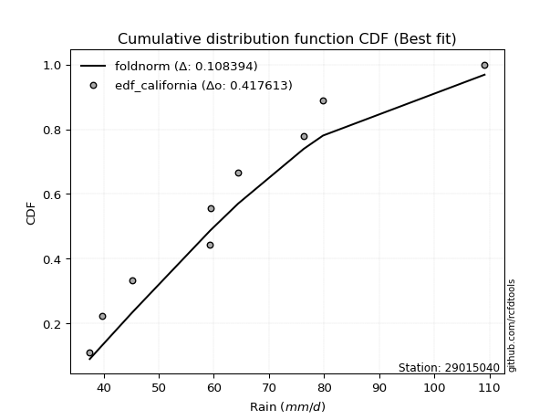</img>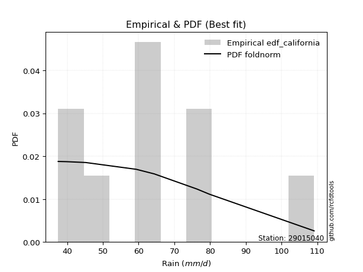</img>

</div>


### 2. EDF Hazen (1930)

Hazen method for plotting positions is a formula used to estimate the empirical cumulative probability distribution of flood events or other hydrological data. This formula often results in biased estimations, particularly when extrapolating to extreme events (high return periods).

<div align="center">


$P=(m-0.5)/n$


</div>


**2.1. Empirical values**

<div align="center">

|                | 0                  | 1                  | 2                  | 3                  | 4                  | 5         | 6                 | 7         |
|:---------------|:-------------------|:-------------------|:-------------------|:-------------------|:-------------------|:----------|:------------------|:----------|
| date           | 2023               | 2019               | 2024               | 2021               | 2022               | 2018      | 2017              | 2020      |
| x              | 37.5               | 39.8               | 45.2               | 59.3               | 59.4               | 76.3      | 79.8              | 109.1     |
| m              | 1                  | 2                  | 3                  | 4                  | 5                  | 6         | 7                 | 8         |
| empirical_dist | edf_hazen          | edf_hazen          | edf_hazen          | edf_hazen          | edf_hazen          | edf_hazen | edf_hazen         | edf_hazen |
| empirical      | 0.0625             | 0.1875             | 0.3125             | 0.4375             | 0.5625             | 0.6875    | 0.8125            | 0.9375    |
| empirical_tr   | 1.0666666666666667 | 1.2307692307692308 | 1.4545454545454546 | 1.7777777777777777 | 2.2857142857142856 | 3.2       | 5.333333333333333 | 16.0      |

</div>


**2.2. Kolmogorov-Smirnov fit test (sorted by Δ)**


<div align="center">

|                | 0                   | 1                   | 2                   | 3                   | 4                   | 5                   | 6                   | 7                   | 8                   | 9                  | 10                  | 11                  | 12                  | 13                  | 14                 | 15                  | 16                  | 17                  | 18                  | 19                  | 20                  | 21                  | 22                  | 23                  | 24                  | 25                  | 26                  | 27                  | 28                  | 29                  | 30                  | 31                 | 32                  | 33                  | 34                    | 35                  | 36                  | 37                 | 38                  | 39                  | 40                  | 41                  | 42                  | 43                  | 44                  | 45                  | 46                  | 47                 | 48                  | 49                 | 50                  | 51                 | 52                  | 53                  | 54                 | 55                  | 56                  | 57                  | 58                  | 59                 | 60                  | 61                  | 62                  | 63                  | 64                 | 65                  | 66                  | 67                 | 68                  | 69                  | 70                  | 71                  | 72                  | 73                 | 74                 | 75                 | 76                 | 77                 | 78                  | 79                  | 80                 | 81                 | 82                  | 83                  | 84                  | 85                 | 86                  | 87                 |
|:---------------|:--------------------|:--------------------|:--------------------|:--------------------|:--------------------|:--------------------|:--------------------|:--------------------|:--------------------|:-------------------|:--------------------|:--------------------|:--------------------|:--------------------|:-------------------|:--------------------|:--------------------|:--------------------|:--------------------|:--------------------|:--------------------|:--------------------|:--------------------|:--------------------|:--------------------|:--------------------|:--------------------|:--------------------|:--------------------|:--------------------|:--------------------|:-------------------|:--------------------|:--------------------|:----------------------|:--------------------|:--------------------|:-------------------|:--------------------|:--------------------|:--------------------|:--------------------|:--------------------|:--------------------|:--------------------|:--------------------|:--------------------|:-------------------|:--------------------|:-------------------|:--------------------|:-------------------|:--------------------|:--------------------|:-------------------|:--------------------|:--------------------|:--------------------|:--------------------|:-------------------|:--------------------|:--------------------|:--------------------|:--------------------|:-------------------|:--------------------|:--------------------|:-------------------|:--------------------|:--------------------|:--------------------|:--------------------|:--------------------|:-------------------|:-------------------|:-------------------|:-------------------|:-------------------|:--------------------|:--------------------|:-------------------|:-------------------|:--------------------|:--------------------|:--------------------|:-------------------|:--------------------|:-------------------|
| station        | 29015040            | 29015040            | 29015040            | 29015040            | 29015040            | 29015040            | 29015040            | 29015040            | 29015040            | 29015040           | 29015040            | 29015040            | 29015040            | 29015040            | 29015040           | 29015040            | 29015040            | 29015040            | 29015040            | 29015040            | 29015040            | 29015040            | 29015040            | 29015040            | 29015040            | 29015040            | 29015040            | 29015040            | 29015040            | 29015040            | 29015040            | 29015040           | 29015040            | 29015040            | 29015040              | 29015040            | 29015040            | 29015040           | 29015040            | 29015040            | 29015040            | 29015040            | 29015040            | 29015040            | 29015040            | 29015040            | 29015040            | 29015040           | 29015040            | 29015040           | 29015040            | 29015040           | 29015040            | 29015040            | 29015040           | 29015040            | 29015040            | 29015040            | 29015040            | 29015040           | 29015040            | 29015040            | 29015040            | 29015040            | 29015040           | 29015040            | 29015040            | 29015040           | 29015040            | 29015040            | 29015040            | 29015040            | 29015040            | 29015040           | 29015040           | 29015040           | 29015040           | 29015040           | 29015040            | 29015040            | 29015040           | 29015040           | 29015040            | 29015040            | 29015040            | 29015040           | 29015040            | 29015040           |
| empirical_dist | edf_hazen           | edf_hazen           | edf_hazen           | edf_hazen           | edf_hazen           | edf_hazen           | edf_hazen           | edf_hazen           | edf_hazen           | edf_hazen          | edf_hazen           | edf_hazen           | edf_hazen           | edf_hazen           | edf_hazen          | edf_hazen           | edf_hazen           | edf_hazen           | edf_hazen           | edf_hazen           | edf_hazen           | edf_hazen           | edf_hazen           | edf_hazen           | edf_hazen           | edf_hazen           | edf_hazen           | edf_hazen           | edf_hazen           | edf_hazen           | edf_hazen           | edf_hazen          | edf_hazen           | edf_hazen           | edf_hazen             | edf_hazen           | edf_hazen           | edf_hazen          | edf_hazen           | edf_hazen           | edf_hazen           | edf_hazen           | edf_hazen           | edf_hazen           | edf_hazen           | edf_hazen           | edf_hazen           | edf_hazen          | edf_hazen           | edf_hazen          | edf_hazen           | edf_hazen          | edf_hazen           | edf_hazen           | edf_hazen          | edf_hazen           | edf_hazen           | edf_hazen           | edf_hazen           | edf_hazen          | edf_hazen           | edf_hazen           | edf_hazen           | edf_hazen           | edf_hazen          | edf_hazen           | edf_hazen           | edf_hazen          | edf_hazen           | edf_hazen           | edf_hazen           | edf_hazen           | edf_hazen           | edf_hazen          | edf_hazen          | edf_hazen          | edf_hazen          | edf_hazen          | edf_hazen           | edf_hazen           | edf_hazen          | edf_hazen          | edf_hazen           | edf_hazen           | edf_hazen           | edf_hazen          | edf_hazen           | edf_hazen          |
| p_dist         | halfnorm            | rayleigh            | pearson3            | logmaxwell          | loginvgamma         | lognct              | logpearson3         | betaprime           | f                   | logbetaprime       | alpha               | logalpha            | maxwell             | logloggamma         | logexponnorm       | lognorm             | lognorm             | logt                | logcrystalball      | logrice             | halflogistic        | ncf                 | genlogistic         | nct                 | lograyleigh         | gumbel_r            | logncf              | kstwobign           | logfisk             | genexpon            | moyal               | loggompertz        | loglogistic         | gompertz            | loglaplace_asymmetric | logjohnsonsu        | logmielke           | loginvweibull      | loggenlogistic      | nakagami            | loggumbel_r         | invgamma            | rice                | logkstwobign        | truncnorm           | crystalball         | norm                | t                  | laplace_asymmetric  | expon              | loghalfnorm         | loghypsecant       | exponnorm           | loggumbel_l         | logistic           | loginvgauss         | hypsecant           | loglaplace          | logmoyal            | logfatiguelife     | invgauss            | loggenexpon         | laplace             | loghalflogistic     | johnsonsu          | logtruncnorm        | fisk                | weibull_min        | logexpon            | gumbel_l            | logwald             | wald                | logf                | gamma              | logerlang          | logweibull_min     | gibrat             | loggibrat          | loggamma            | loggamma            | erlang             | chi2               | logchi2             | lognakagami         | loglognorm          | fatiguelife        | invweibull          | mielke             |
| delta          | 0.07329623711224575 | 0.08425390515154052 | 0.09101746715490253 | 0.09116369283672665 | 0.09294371236486507 | 0.09314890601925765 | 0.09467232783464319 | 0.09484204759727885 | 0.09528337135576334 | 0.0953606980772683 | 0.09538441523073438 | 0.09599451274379278 | 0.09635716547926415 | 0.09645840889780805 | 0.0984035894058774 | 0.09855228549668976 | 0.09855228549668976 | 0.09855238767966912 | 0.09855249856285109 | 0.10018048628140588 | 0.10049744822151055 | 0.10060859132430475 | 0.10127416720058344 | 0.10178623320171143 | 0.10227275518614143 | 0.10288260413442721 | 0.10641593388844683 | 0.10675587666390746 | 0.11183525332327982 | 0.11318715978648035 | 0.11389779867058447 | 0.1160012163218409 | 0.12064115142949913 | 0.12104053550486227 | 0.12159823385434174   | 0.12249869566886895 | 0.12407167194245505 | 0.1267618719593666 | 0.12680262858705926 | 0.12683781159423857 | 0.12816320672818438 | 0.12836013110140887 | 0.12993698587907493 | 0.13070760257126168 | 0.13076014985242124 | 0.13076015414383357 | 0.13076015575495759 | 0.1307646722068535 | 0.13270911041605182 | 0.1329259919565835 | 0.13355097309599928 | 0.1340740880940387 | 0.13445556200751674 | 0.13557715377869872 | 0.1398431597931638 | 0.14178849889676148 | 0.14744656365435976 | 0.14955345715050428 | 0.15403470442833767 | 0.1648240956467496 | 0.16717445655542085 | 0.16906108929197772 | 0.17043046680624252 | 0.17207637726343356 | 0.1746422091390365 | 0.18332870399930612 | 0.18934726714158367 | 0.1906210612662903 | 0.19144384994901498 | 0.19990939454979773 | 0.24201593763947635 | 0.24694439771426474 | 0.25469966141305456 | 0.2664630412547646 | 0.2795289788709179 | 0.2891212106735661 | 0.3125             | 0.3125             | 0.33055804003780165 | 0.33055804003780165 | 0.3334828005020195 | 0.3646848008561926 | 0.37758014200290146 | 0.39267438464666204 | 0.39661603760348985 | 0.441251133665133  | 0.48586720982892606 | nan                |
| deltao         | 0.4472608134160001  | 0.4472608134160001  | 0.4472608134160001  | 0.4472608134160001  | 0.4472608134160001  | 0.4472608134160001  | 0.4472608134160001  | 0.4472608134160001  | 0.4472608134160001  | 0.4472608134160001 | 0.4472608134160001  | 0.4472608134160001  | 0.4472608134160001  | 0.4472608134160001  | 0.4472608134160001 | 0.4472608134160001  | 0.4472608134160001  | 0.4472608134160001  | 0.4472608134160001  | 0.4472608134160001  | 0.4472608134160001  | 0.4472608134160001  | 0.4472608134160001  | 0.4472608134160001  | 0.4472608134160001  | 0.4472608134160001  | 0.4472608134160001  | 0.4472608134160001  | 0.4472608134160001  | 0.4472608134160001  | 0.4472608134160001  | 0.4472608134160001 | 0.4472608134160001  | 0.4472608134160001  | 0.4472608134160001    | 0.4472608134160001  | 0.4472608134160001  | 0.4472608134160001 | 0.4472608134160001  | 0.4472608134160001  | 0.4472608134160001  | 0.4472608134160001  | 0.4472608134160001  | 0.4472608134160001  | 0.4472608134160001  | 0.4472608134160001  | 0.4472608134160001  | 0.4472608134160001 | 0.4472608134160001  | 0.4472608134160001 | 0.4472608134160001  | 0.4472608134160001 | 0.4472608134160001  | 0.4472608134160001  | 0.4472608134160001 | 0.4472608134160001  | 0.4472608134160001  | 0.4472608134160001  | 0.4472608134160001  | 0.4472608134160001 | 0.4472608134160001  | 0.4472608134160001  | 0.4472608134160001  | 0.4472608134160001  | 0.4472608134160001 | 0.4472608134160001  | 0.4472608134160001  | 0.4472608134160001 | 0.4472608134160001  | 0.4472608134160001  | 0.4472608134160001  | 0.4472608134160001  | 0.4472608134160001  | 0.4472608134160001 | 0.4472608134160001 | 0.4472608134160001 | 0.4472608134160001 | 0.4472608134160001 | 0.4472608134160001  | 0.4472608134160001  | 0.4472608134160001 | 0.4472608134160001 | 0.4472608134160001  | 0.4472608134160001  | 0.4472608134160001  | 0.4472608134160001 | 0.4472608134160001  | 0.4472608134160001 |
| eval           | Δo > Δ              | Δo > Δ              | Δo > Δ              | Δo > Δ              | Δo > Δ              | Δo > Δ              | Δo > Δ              | Δo > Δ              | Δo > Δ              | Δo > Δ             | Δo > Δ              | Δo > Δ              | Δo > Δ              | Δo > Δ              | Δo > Δ             | Δo > Δ              | Δo > Δ              | Δo > Δ              | Δo > Δ              | Δo > Δ              | Δo > Δ              | Δo > Δ              | Δo > Δ              | Δo > Δ              | Δo > Δ              | Δo > Δ              | Δo > Δ              | Δo > Δ              | Δo > Δ              | Δo > Δ              | Δo > Δ              | Δo > Δ             | Δo > Δ              | Δo > Δ              | Δo > Δ                | Δo > Δ              | Δo > Δ              | Δo > Δ             | Δo > Δ              | Δo > Δ              | Δo > Δ              | Δo > Δ              | Δo > Δ              | Δo > Δ              | Δo > Δ              | Δo > Δ              | Δo > Δ              | Δo > Δ             | Δo > Δ              | Δo > Δ             | Δo > Δ              | Δo > Δ             | Δo > Δ              | Δo > Δ              | Δo > Δ             | Δo > Δ              | Δo > Δ              | Δo > Δ              | Δo > Δ              | Δo > Δ             | Δo > Δ              | Δo > Δ              | Δo > Δ              | Δo > Δ              | Δo > Δ             | Δo > Δ              | Δo > Δ              | Δo > Δ             | Δo > Δ              | Δo > Δ              | Δo > Δ              | Δo > Δ              | Δo > Δ              | Δo > Δ             | Δo > Δ             | Δo > Δ             | Δo > Δ             | Δo > Δ             | Δo > Δ              | Δo > Δ              | Δo > Δ             | Δo > Δ             | Δo > Δ              | Δo > Δ              | Δo > Δ              | Δo > Δ             | Δo <= Δ             | Δo <= Δ            |
| fit            | 1                   | 1                   | 1                   | 1                   | 1                   | 1                   | 1                   | 1                   | 1                   | 1                  | 1                   | 1                   | 1                   | 1                   | 1                  | 1                   | 1                   | 1                   | 1                   | 1                   | 1                   | 1                   | 1                   | 1                   | 1                   | 1                   | 1                   | 1                   | 1                   | 1                   | 1                   | 1                  | 1                   | 1                   | 1                     | 1                   | 1                   | 1                  | 1                   | 1                   | 1                   | 1                   | 1                   | 1                   | 1                   | 1                   | 1                   | 1                  | 1                   | 1                  | 1                   | 1                  | 1                   | 1                   | 1                  | 1                   | 1                   | 1                   | 1                   | 1                  | 1                   | 1                   | 1                   | 1                   | 1                  | 1                   | 1                   | 1                  | 1                   | 1                   | 1                   | 1                   | 1                   | 1                  | 1                  | 1                  | 1                  | 1                  | 1                   | 1                   | 1                  | 1                  | 1                   | 1                   | 1                   | 1                  | 0                   | 0                  |
| n              | 8                   | 8                   | 8                   | 8                   | 8                   | 8                   | 8                   | 8                   | 8                   | 8                  | 8                   | 8                   | 8                   | 8                   | 8                  | 8                   | 8                   | 8                   | 8                   | 8                   | 8                   | 8                   | 8                   | 8                   | 8                   | 8                   | 8                   | 8                   | 8                   | 8                   | 8                   | 8                  | 8                   | 8                   | 8                     | 8                   | 8                   | 8                  | 8                   | 8                   | 8                   | 8                   | 8                   | 8                   | 8                   | 8                   | 8                   | 8                  | 8                   | 8                  | 8                   | 8                  | 8                   | 8                   | 8                  | 8                   | 8                   | 8                   | 8                   | 8                  | 8                   | 8                   | 8                   | 8                   | 8                  | 8                   | 8                   | 8                  | 8                   | 8                   | 8                   | 8                   | 8                   | 8                  | 8                  | 8                  | 8                  | 8                  | 8                   | 8                   | 8                  | 8                  | 8                   | 8                   | 8                   | 8                  | 8                   | 8                  |
| best_fit       | 1                   | 0                   | 0                   | 0                   | 0                   | 0                   | 0                   | 0                   | 0                   | 0                  | 0                   | 0                   | 0                   | 0                   | 0                  | 0                   | 0                   | 0                   | 0                   | 0                   | 0                   | 0                   | 0                   | 0                   | 0                   | 0                   | 0                   | 0                   | 0                   | 0                   | 0                   | 0                  | 0                   | 0                   | 0                     | 0                   | 0                   | 0                  | 0                   | 0                   | 0                   | 0                   | 0                   | 0                   | 0                   | 0                   | 0                   | 0                  | 0                   | 0                  | 0                   | 0                  | 0                   | 0                   | 0                  | 0                   | 0                   | 0                   | 0                   | 0                  | 0                   | 0                   | 0                   | 0                   | 0                  | 0                   | 0                   | 0                  | 0                   | 0                   | 0                   | 0                   | 0                   | 0                  | 0                  | 0                  | 0                  | 0                  | 0                   | 0                   | 0                  | 0                  | 0                   | 0                   | 0                   | 0                  | 0                   | 0                  |
| best_fit_sort  | 1                   | 2                   | 3                   | 4                   | 5                   | 6                   | 7                   | 8                   | 9                   | 10                 | 11                  | 12                  | 13                  | 14                  | 15                 | 16                  | 17                  | 18                  | 19                  | 20                  | 21                  | 22                  | 23                  | 24                  | 25                  | 26                  | 27                  | 28                  | 29                  | 30                  | 31                  | 32                 | 33                  | 34                  | 35                    | 36                  | 37                  | 38                 | 39                  | 40                  | 41                  | 42                  | 43                  | 44                  | 45                  | 46                  | 47                  | 48                 | 49                  | 50                 | 51                  | 52                 | 53                  | 54                  | 55                 | 56                  | 57                  | 58                  | 59                  | 60                 | 61                  | 62                  | 63                  | 64                  | 65                 | 66                  | 67                  | 68                 | 69                  | 70                  | 71                  | 72                  | 73                  | 74                 | 75                 | 76                 | 77                 | 78                 | 79                  | 80                  | 81                 | 82                 | 83                  | 84                  | 85                  | 86                 | 87                  | 88                 |

</div>


**2.3. Best fit**

<div align="center">

|   id |   station | empirical_dist   | p_dist   |     delta |   deltao | eval   |   fit |   n |   best_fit |   best_fit_sort |
|-----:|----------:|:-----------------|:---------|----------:|---------:|:-------|------:|----:|-----------:|----------------:|
|    0 |  29015040 | edf_hazen        | halfnorm | 0.0732962 | 0.447261 | Δo > Δ |     1 |   8 |          1 |               1 |

</div>


<div align="center">

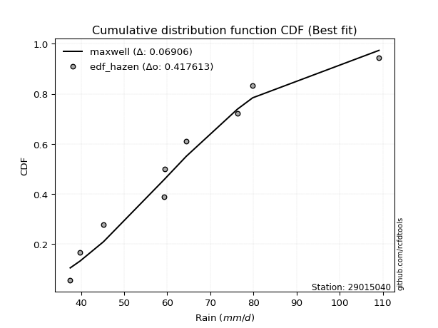</img>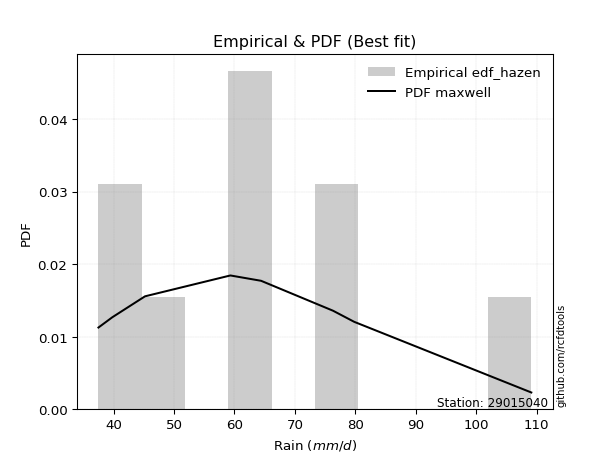</img>

</div>


### 3. EDF Weibull (1939)

Weibull plotting position formula is an empirical method used to estimate the non-exceedance probability or plotting position for a set of observed data, is often recommended or widely used in practice, particularly in flood frequency analysis.

<div align="center">


$P=m/(n+1)$


</div>


**3.1. Empirical values**

<div align="center">

|                | 0                  | 1                  | 2                  | 3                  | 4                  | 5                  | 6                  | 7                  |
|:---------------|:-------------------|:-------------------|:-------------------|:-------------------|:-------------------|:-------------------|:-------------------|:-------------------|
| date           | 2023               | 2019               | 2024               | 2021               | 2022               | 2018               | 2017               | 2020               |
| x              | 37.5               | 39.8               | 45.2               | 59.3               | 59.4               | 76.3               | 79.8               | 109.1              |
| m              | 1                  | 2                  | 3                  | 4                  | 5                  | 6                  | 7                  | 8                  |
| empirical_dist | edf_weibull        | edf_weibull        | edf_weibull        | edf_weibull        | edf_weibull        | edf_weibull        | edf_weibull        | edf_weibull        |
| empirical      | 0.1111111111111111 | 0.2222222222222222 | 0.3333333333333333 | 0.4444444444444444 | 0.5555555555555556 | 0.6666666666666666 | 0.7777777777777778 | 0.8888888888888888 |
| empirical_tr   | 1.125              | 1.2857142857142856 | 1.4999999999999998 | 1.7999999999999998 | 2.25               | 2.9999999999999996 | 4.5                | 8.999999999999996  |

</div>


**3.2. Kolmogorov-Smirnov fit test (sorted by Δ)**


<div align="center">

|                | 0                   | 1                  | 2                   | 3                  | 4                   | 5                   | 6                   | 7                   | 8                   | 9                   | 10                  | 11                  | 12                  | 13                 | 14                  | 15                  | 16                  | 17                 | 18                  | 19                  | 20                  | 21                  | 22                  | 23                  | 24                 | 25                  | 26                  | 27                  | 28                  | 29                  | 30                  | 31                  | 32                  | 33                  | 34                  | 35                  | 36                  | 37                  | 38                  | 39                 | 40                  | 41                  | 42                  | 43                 | 44                  | 45                  | 46                 | 47                    | 48                 | 49                 | 50                  | 51                  | 52                  | 53                 | 54                  | 55                  | 56                  | 57                  | 58                  | 59                  | 60                 | 61                  | 62                  | 63                 | 64                  | 65                 | 66                 | 67                  | 68                 | 69                  | 70                  | 71                 | 72                 | 73                  | 74                  | 75                  | 76                  | 77                  | 78                 | 79                 | 80                 | 81                  | 82                 | 83                  | 84                 | 85                 | 86                 | 87                 |
|:---------------|:--------------------|:-------------------|:--------------------|:-------------------|:--------------------|:--------------------|:--------------------|:--------------------|:--------------------|:--------------------|:--------------------|:--------------------|:--------------------|:-------------------|:--------------------|:--------------------|:--------------------|:-------------------|:--------------------|:--------------------|:--------------------|:--------------------|:--------------------|:--------------------|:-------------------|:--------------------|:--------------------|:--------------------|:--------------------|:--------------------|:--------------------|:--------------------|:--------------------|:--------------------|:--------------------|:--------------------|:--------------------|:--------------------|:--------------------|:-------------------|:--------------------|:--------------------|:--------------------|:-------------------|:--------------------|:--------------------|:-------------------|:----------------------|:-------------------|:-------------------|:--------------------|:--------------------|:--------------------|:-------------------|:--------------------|:--------------------|:--------------------|:--------------------|:--------------------|:--------------------|:-------------------|:--------------------|:--------------------|:-------------------|:--------------------|:-------------------|:-------------------|:--------------------|:-------------------|:--------------------|:--------------------|:-------------------|:-------------------|:--------------------|:--------------------|:--------------------|:--------------------|:--------------------|:-------------------|:-------------------|:-------------------|:--------------------|:-------------------|:--------------------|:-------------------|:-------------------|:-------------------|:-------------------|
| station        | 29015040            | 29015040           | 29015040            | 29015040           | 29015040            | 29015040            | 29015040            | 29015040            | 29015040            | 29015040            | 29015040            | 29015040            | 29015040            | 29015040           | 29015040            | 29015040            | 29015040            | 29015040           | 29015040            | 29015040            | 29015040            | 29015040            | 29015040            | 29015040            | 29015040           | 29015040            | 29015040            | 29015040            | 29015040            | 29015040            | 29015040            | 29015040            | 29015040            | 29015040            | 29015040            | 29015040            | 29015040            | 29015040            | 29015040            | 29015040           | 29015040            | 29015040            | 29015040            | 29015040           | 29015040            | 29015040            | 29015040           | 29015040              | 29015040           | 29015040           | 29015040            | 29015040            | 29015040            | 29015040           | 29015040            | 29015040            | 29015040            | 29015040            | 29015040            | 29015040            | 29015040           | 29015040            | 29015040            | 29015040           | 29015040            | 29015040           | 29015040           | 29015040            | 29015040           | 29015040            | 29015040            | 29015040           | 29015040           | 29015040            | 29015040            | 29015040            | 29015040            | 29015040            | 29015040           | 29015040           | 29015040           | 29015040            | 29015040           | 29015040            | 29015040           | 29015040           | 29015040           | 29015040           |
| empirical_dist | edf_weibull         | edf_weibull        | edf_weibull         | edf_weibull        | edf_weibull         | edf_weibull         | edf_weibull         | edf_weibull         | edf_weibull         | edf_weibull         | edf_weibull         | edf_weibull         | edf_weibull         | edf_weibull        | edf_weibull         | edf_weibull         | edf_weibull         | edf_weibull        | edf_weibull         | edf_weibull         | edf_weibull         | edf_weibull         | edf_weibull         | edf_weibull         | edf_weibull        | edf_weibull         | edf_weibull         | edf_weibull         | edf_weibull         | edf_weibull         | edf_weibull         | edf_weibull         | edf_weibull         | edf_weibull         | edf_weibull         | edf_weibull         | edf_weibull         | edf_weibull         | edf_weibull         | edf_weibull        | edf_weibull         | edf_weibull         | edf_weibull         | edf_weibull        | edf_weibull         | edf_weibull         | edf_weibull        | edf_weibull           | edf_weibull        | edf_weibull        | edf_weibull         | edf_weibull         | edf_weibull         | edf_weibull        | edf_weibull         | edf_weibull         | edf_weibull         | edf_weibull         | edf_weibull         | edf_weibull         | edf_weibull        | edf_weibull         | edf_weibull         | edf_weibull        | edf_weibull         | edf_weibull        | edf_weibull        | edf_weibull         | edf_weibull        | edf_weibull         | edf_weibull         | edf_weibull        | edf_weibull        | edf_weibull         | edf_weibull         | edf_weibull         | edf_weibull         | edf_weibull         | edf_weibull        | edf_weibull        | edf_weibull        | edf_weibull         | edf_weibull        | edf_weibull         | edf_weibull        | edf_weibull        | edf_weibull        | edf_weibull        |
| p_dist         | halfnorm            | rayleigh           | logmaxwell          | maxwell            | lograyleigh         | logalpha            | logfisk             | pearson3            | nct                 | logncf              | alpha               | loginvgamma         | lognct              | logpearson3        | betaprime           | f                   | logbetaprime        | logjohnsonsu       | logloggamma         | logmielke           | logexponnorm        | lognorm             | lognorm             | logt                | logcrystalball     | loginvweibull       | loggenlogistic      | nakagami            | invgamma            | ncf                 | genlogistic         | gumbel_r            | logkstwobign        | truncnorm           | crystalball         | norm                | t                   | kstwobign           | logrice             | moyal              | loginvgauss         | halflogistic        | exponnorm           | expon              | loggumbel_r         | loglogistic         | fisk               | loglaplace_asymmetric | logistic           | loghalfnorm        | loggompertz         | gompertz            | genexpon            | loggumbel_l        | rice                | laplace_asymmetric  | loghypsecant        | hypsecant           | logfatiguelife      | invgauss            | loggenexpon        | logmoyal            | johnsonsu           | loglaplace         | laplace             | logtruncnorm       | weibull_min        | logexpon            | gumbel_l           | loghalflogistic     | logf                | logweibull_min     | gamma              | logwald             | wald                | logerlang           | loggamma            | loggamma            | erlang             | loggibrat          | gibrat             | logchi2             | chi2               | loglognorm          | lognakagami        | fatiguelife        | invweibull         | mielke             |
| delta          | 0.08470030024119576 | 0.0991421675093675 | 0.10375824040845591 | 0.1055516902515132 | 0.10733331667859944 | 0.11115771911722161 | 0.11150002714180418 | 0.11185080048823584 | 0.11281654053463719 | 0.11360287484879084 | 0.11363280079890561 | 0.11377704569819838 | 0.11398223935259097 | 0.1155056611679765 | 0.11567538093061216 | 0.11611670468909666 | 0.11619403141060161 | 0.1167276101121889 | 0.11729174223114136 | 0.11843227097257891 | 0.11923692273921072 | 0.11938561883002308 | 0.11938561883002308 | 0.11938572101300243 | 0.1193858318961844 | 0.11981742751492219 | 0.11985818414261484 | 0.11989336714979415 | 0.12141568665696445 | 0.12144192465763806 | 0.12210750053391675 | 0.12371593746776052 | 0.12376315812681726 | 0.12381570540797682 | 0.12381570969938915 | 0.12381571131051317 | 0.12382022776240909 | 0.12758920999724077 | 0.12807057154203072 | 0.1347311320039178 | 0.13484405445231706 | 0.13521967044373276 | 0.13584524032186573 | 0.1369330610223632 | 0.13867142088945716 | 0.14147448476283245 | 0.1422522730165151 | 0.14243156718767505   | 0.142935240666267  | 0.1431612698542516 | 0.14495035181853727 | 0.14508892333164464 | 0.14790938200870257 | 0.1495236515657337 | 0.15077031921240824 | 0.15354244374938514 | 0.15490742142737202 | 0.15628739710817124 | 0.15787965120230518 | 0.16023001211097643 | 0.1621166448475333 | 0.16730482595841484 | 0.16769776469459208 | 0.1703867904838376 | 0.17158283288198697 | 0.1763842595548617 | 0.1807860058100037 | 0.18449940550457056 | 0.1929649501053533 | 0.20679859948565577 | 0.24775521696861014 | 0.2543989884513439 | 0.2595185968103202 | 0.26284927097280963 | 0.26777773104759806 | 0.27258453442647346 | 0.32361359559335723 | 0.32361359559335723 | 0.3265383560575751 | 0.3333333333333333 | 0.3333333333333333 | 0.34809202890217855 | 0.3577403564117482 | 0.36189381538126764 | 0.377367849979923  | 0.4065289114429108 | 0.4372560987178149 | nan                |
| deltao         | 0.4472608134160001  | 0.4472608134160001 | 0.4472608134160001  | 0.4472608134160001 | 0.4472608134160001  | 0.4472608134160001  | 0.4472608134160001  | 0.4472608134160001  | 0.4472608134160001  | 0.4472608134160001  | 0.4472608134160001  | 0.4472608134160001  | 0.4472608134160001  | 0.4472608134160001 | 0.4472608134160001  | 0.4472608134160001  | 0.4472608134160001  | 0.4472608134160001 | 0.4472608134160001  | 0.4472608134160001  | 0.4472608134160001  | 0.4472608134160001  | 0.4472608134160001  | 0.4472608134160001  | 0.4472608134160001 | 0.4472608134160001  | 0.4472608134160001  | 0.4472608134160001  | 0.4472608134160001  | 0.4472608134160001  | 0.4472608134160001  | 0.4472608134160001  | 0.4472608134160001  | 0.4472608134160001  | 0.4472608134160001  | 0.4472608134160001  | 0.4472608134160001  | 0.4472608134160001  | 0.4472608134160001  | 0.4472608134160001 | 0.4472608134160001  | 0.4472608134160001  | 0.4472608134160001  | 0.4472608134160001 | 0.4472608134160001  | 0.4472608134160001  | 0.4472608134160001 | 0.4472608134160001    | 0.4472608134160001 | 0.4472608134160001 | 0.4472608134160001  | 0.4472608134160001  | 0.4472608134160001  | 0.4472608134160001 | 0.4472608134160001  | 0.4472608134160001  | 0.4472608134160001  | 0.4472608134160001  | 0.4472608134160001  | 0.4472608134160001  | 0.4472608134160001 | 0.4472608134160001  | 0.4472608134160001  | 0.4472608134160001 | 0.4472608134160001  | 0.4472608134160001 | 0.4472608134160001 | 0.4472608134160001  | 0.4472608134160001 | 0.4472608134160001  | 0.4472608134160001  | 0.4472608134160001 | 0.4472608134160001 | 0.4472608134160001  | 0.4472608134160001  | 0.4472608134160001  | 0.4472608134160001  | 0.4472608134160001  | 0.4472608134160001 | 0.4472608134160001 | 0.4472608134160001 | 0.4472608134160001  | 0.4472608134160001 | 0.4472608134160001  | 0.4472608134160001 | 0.4472608134160001 | 0.4472608134160001 | 0.4472608134160001 |
| eval           | Δo > Δ              | Δo > Δ             | Δo > Δ              | Δo > Δ             | Δo > Δ              | Δo > Δ              | Δo > Δ              | Δo > Δ              | Δo > Δ              | Δo > Δ              | Δo > Δ              | Δo > Δ              | Δo > Δ              | Δo > Δ             | Δo > Δ              | Δo > Δ              | Δo > Δ              | Δo > Δ             | Δo > Δ              | Δo > Δ              | Δo > Δ              | Δo > Δ              | Δo > Δ              | Δo > Δ              | Δo > Δ             | Δo > Δ              | Δo > Δ              | Δo > Δ              | Δo > Δ              | Δo > Δ              | Δo > Δ              | Δo > Δ              | Δo > Δ              | Δo > Δ              | Δo > Δ              | Δo > Δ              | Δo > Δ              | Δo > Δ              | Δo > Δ              | Δo > Δ             | Δo > Δ              | Δo > Δ              | Δo > Δ              | Δo > Δ             | Δo > Δ              | Δo > Δ              | Δo > Δ             | Δo > Δ                | Δo > Δ             | Δo > Δ             | Δo > Δ              | Δo > Δ              | Δo > Δ              | Δo > Δ             | Δo > Δ              | Δo > Δ              | Δo > Δ              | Δo > Δ              | Δo > Δ              | Δo > Δ              | Δo > Δ             | Δo > Δ              | Δo > Δ              | Δo > Δ             | Δo > Δ              | Δo > Δ             | Δo > Δ             | Δo > Δ              | Δo > Δ             | Δo > Δ              | Δo > Δ              | Δo > Δ             | Δo > Δ             | Δo > Δ              | Δo > Δ              | Δo > Δ              | Δo > Δ              | Δo > Δ              | Δo > Δ             | Δo > Δ             | Δo > Δ             | Δo > Δ              | Δo > Δ             | Δo > Δ              | Δo > Δ             | Δo > Δ             | Δo > Δ             | Δo <= Δ            |
| fit            | 1                   | 1                  | 1                   | 1                  | 1                   | 1                   | 1                   | 1                   | 1                   | 1                   | 1                   | 1                   | 1                   | 1                  | 1                   | 1                   | 1                   | 1                  | 1                   | 1                   | 1                   | 1                   | 1                   | 1                   | 1                  | 1                   | 1                   | 1                   | 1                   | 1                   | 1                   | 1                   | 1                   | 1                   | 1                   | 1                   | 1                   | 1                   | 1                   | 1                  | 1                   | 1                   | 1                   | 1                  | 1                   | 1                   | 1                  | 1                     | 1                  | 1                  | 1                   | 1                   | 1                   | 1                  | 1                   | 1                   | 1                   | 1                   | 1                   | 1                   | 1                  | 1                   | 1                   | 1                  | 1                   | 1                  | 1                  | 1                   | 1                  | 1                   | 1                   | 1                  | 1                  | 1                   | 1                   | 1                   | 1                   | 1                   | 1                  | 1                  | 1                  | 1                   | 1                  | 1                   | 1                  | 1                  | 1                  | 0                  |
| n              | 8                   | 8                  | 8                   | 8                  | 8                   | 8                   | 8                   | 8                   | 8                   | 8                   | 8                   | 8                   | 8                   | 8                  | 8                   | 8                   | 8                   | 8                  | 8                   | 8                   | 8                   | 8                   | 8                   | 8                   | 8                  | 8                   | 8                   | 8                   | 8                   | 8                   | 8                   | 8                   | 8                   | 8                   | 8                   | 8                   | 8                   | 8                   | 8                   | 8                  | 8                   | 8                   | 8                   | 8                  | 8                   | 8                   | 8                  | 8                     | 8                  | 8                  | 8                   | 8                   | 8                   | 8                  | 8                   | 8                   | 8                   | 8                   | 8                   | 8                   | 8                  | 8                   | 8                   | 8                  | 8                   | 8                  | 8                  | 8                   | 8                  | 8                   | 8                   | 8                  | 8                  | 8                   | 8                   | 8                   | 8                   | 8                   | 8                  | 8                  | 8                  | 8                   | 8                  | 8                   | 8                  | 8                  | 8                  | 8                  |
| best_fit       | 1                   | 0                  | 0                   | 0                  | 0                   | 0                   | 0                   | 0                   | 0                   | 0                   | 0                   | 0                   | 0                   | 0                  | 0                   | 0                   | 0                   | 0                  | 0                   | 0                   | 0                   | 0                   | 0                   | 0                   | 0                  | 0                   | 0                   | 0                   | 0                   | 0                   | 0                   | 0                   | 0                   | 0                   | 0                   | 0                   | 0                   | 0                   | 0                   | 0                  | 0                   | 0                   | 0                   | 0                  | 0                   | 0                   | 0                  | 0                     | 0                  | 0                  | 0                   | 0                   | 0                   | 0                  | 0                   | 0                   | 0                   | 0                   | 0                   | 0                   | 0                  | 0                   | 0                   | 0                  | 0                   | 0                  | 0                  | 0                   | 0                  | 0                   | 0                   | 0                  | 0                  | 0                   | 0                   | 0                   | 0                   | 0                   | 0                  | 0                  | 0                  | 0                   | 0                  | 0                   | 0                  | 0                  | 0                  | 0                  |
| best_fit_sort  | 1                   | 2                  | 3                   | 4                  | 5                   | 6                   | 7                   | 8                   | 9                   | 10                  | 11                  | 12                  | 13                  | 14                 | 15                  | 16                  | 17                  | 18                 | 19                  | 20                  | 21                  | 22                  | 23                  | 24                  | 25                 | 26                  | 27                  | 28                  | 29                  | 30                  | 31                  | 32                  | 33                  | 34                  | 35                  | 36                  | 37                  | 38                  | 39                  | 40                 | 41                  | 42                  | 43                  | 44                 | 45                  | 46                  | 47                 | 48                    | 49                 | 50                 | 51                  | 52                  | 53                  | 54                 | 55                  | 56                  | 57                  | 58                  | 59                  | 60                  | 61                 | 62                  | 63                  | 64                 | 65                  | 66                 | 67                 | 68                  | 69                 | 70                  | 71                  | 72                 | 73                 | 74                  | 75                  | 76                  | 77                  | 78                  | 79                 | 80                 | 81                 | 82                  | 83                 | 84                  | 85                 | 86                 | 87                 | 88                 |

</div>


**3.3. Best fit**

<div align="center">

|   id |   station | empirical_dist   | p_dist   |     delta |   deltao | eval   |   fit |   n |   best_fit |   best_fit_sort |
|-----:|----------:|:-----------------|:---------|----------:|---------:|:-------|------:|----:|-----------:|----------------:|
|    0 |  29015040 | edf_weibull      | halfnorm | 0.0847003 | 0.447261 | Δo > Δ |     1 |   8 |          1 |               1 |

</div>


<div align="center">

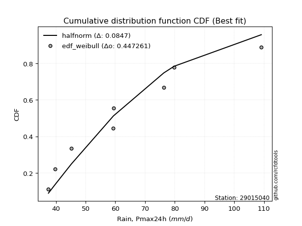</img>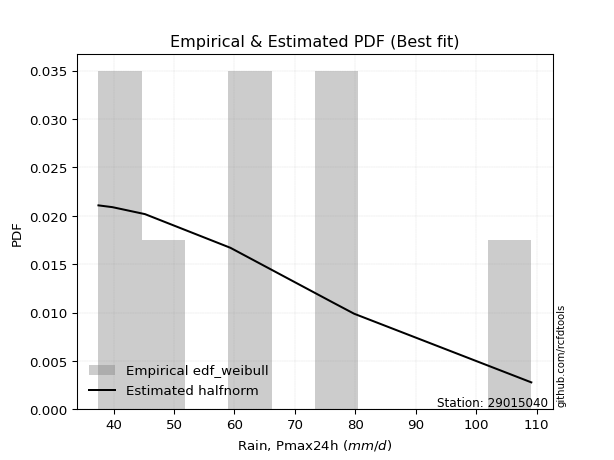</img>

</div>


### 4. EDF Beard (1943)

The Beard formula (or Beard´s plotting position formula) in hydrology is used to estimate the empirical non-exceedance probability _(P)_ of a flood event (or other extreme hydrological data point) within a given dataset.

<div align="center">


$P=(m-0.31)/(n+0.38)$


</div>


**4.1. Empirical values**

<div align="center">

|                | 0                   | 1                   | 2                  | 3                   | 4                  | 5                  | 6                  | 7                  |
|:---------------|:--------------------|:--------------------|:-------------------|:--------------------|:-------------------|:-------------------|:-------------------|:-------------------|
| date           | 2023                | 2019                | 2024               | 2021                | 2022               | 2018               | 2017               | 2020               |
| x              | 37.5                | 39.8                | 45.2               | 59.3                | 59.4               | 76.3               | 79.8               | 109.1              |
| m              | 1                   | 2                   | 3                  | 4                   | 5                  | 6                  | 7                  | 8                  |
| empirical_dist | edf_beard           | edf_beard           | edf_beard          | edf_beard           | edf_beard          | edf_beard          | edf_beard          | edf_beard          |
| empirical      | 0.08233890214797135 | 0.20167064439140808 | 0.3210023866348448 | 0.44033412887828155 | 0.5596658711217184 | 0.6789976133651551 | 0.7983293556085919 | 0.9176610978520287 |
| empirical_tr   | 1.0897269180754225  | 1.2526158445440956  | 1.4727592267135323 | 1.7867803837953091  | 2.2710027100271004 | 3.115241635687732  | 4.958579881656804  | 12.144927536231886 |

</div>


**4.2. Kolmogorov-Smirnov fit test (sorted by Δ)**


<div align="center">

|                | 0                   | 1                  | 2                   | 3                   | 4                   | 5                   | 6                   | 7                   | 8                   | 9                   | 10                  | 11                 | 12                  | 13                  | 14                  | 15                  | 16                  | 17                  | 18                  | 19                  | 20                  | 21                 | 22                 | 23                  | 24                  | 25                  | 26                  | 27                  | 28                  | 29                 | 30                 | 31                  | 32                  | 33                  | 34                  | 35                  | 36                  | 37                  | 38                  | 39                  | 40                  | 41                  | 42                  | 43                  | 44                 | 45                  | 46                  | 47                    | 48                  | 49                 | 50                 | 51                 | 52                  | 53                  | 54                  | 55                  | 56                  | 57                  | 58                 | 59                  | 60                 | 61                  | 62                  | 63                  | 64                  | 65                  | 66                  | 67                  | 68                  | 69                  | 70                 | 71                 | 72                  | 73                  | 74                 | 75                 | 76                 | 77                 | 78                 | 79                 | 80                  | 81                  | 82                 | 83                  | 84                  | 85                  | 86                 | 87                 |
|:---------------|:--------------------|:-------------------|:--------------------|:--------------------|:--------------------|:--------------------|:--------------------|:--------------------|:--------------------|:--------------------|:--------------------|:-------------------|:--------------------|:--------------------|:--------------------|:--------------------|:--------------------|:--------------------|:--------------------|:--------------------|:--------------------|:-------------------|:-------------------|:--------------------|:--------------------|:--------------------|:--------------------|:--------------------|:--------------------|:-------------------|:-------------------|:--------------------|:--------------------|:--------------------|:--------------------|:--------------------|:--------------------|:--------------------|:--------------------|:--------------------|:--------------------|:--------------------|:--------------------|:--------------------|:-------------------|:--------------------|:--------------------|:----------------------|:--------------------|:-------------------|:-------------------|:-------------------|:--------------------|:--------------------|:--------------------|:--------------------|:--------------------|:--------------------|:-------------------|:--------------------|:-------------------|:--------------------|:--------------------|:--------------------|:--------------------|:--------------------|:--------------------|:--------------------|:--------------------|:--------------------|:-------------------|:-------------------|:--------------------|:--------------------|:-------------------|:-------------------|:-------------------|:-------------------|:-------------------|:-------------------|:--------------------|:--------------------|:-------------------|:--------------------|:--------------------|:--------------------|:-------------------|:-------------------|
| station        | 29015040            | 29015040           | 29015040            | 29015040            | 29015040            | 29015040            | 29015040            | 29015040            | 29015040            | 29015040            | 29015040            | 29015040           | 29015040            | 29015040            | 29015040            | 29015040            | 29015040            | 29015040            | 29015040            | 29015040            | 29015040            | 29015040           | 29015040           | 29015040            | 29015040            | 29015040            | 29015040            | 29015040            | 29015040            | 29015040           | 29015040           | 29015040            | 29015040            | 29015040            | 29015040            | 29015040            | 29015040            | 29015040            | 29015040            | 29015040            | 29015040            | 29015040            | 29015040            | 29015040            | 29015040           | 29015040            | 29015040            | 29015040              | 29015040            | 29015040           | 29015040           | 29015040           | 29015040            | 29015040            | 29015040            | 29015040            | 29015040            | 29015040            | 29015040           | 29015040            | 29015040           | 29015040            | 29015040            | 29015040            | 29015040            | 29015040            | 29015040            | 29015040            | 29015040            | 29015040            | 29015040           | 29015040           | 29015040            | 29015040            | 29015040           | 29015040           | 29015040           | 29015040           | 29015040           | 29015040           | 29015040            | 29015040            | 29015040           | 29015040            | 29015040            | 29015040            | 29015040           | 29015040           |
| empirical_dist | edf_beard           | edf_beard          | edf_beard           | edf_beard           | edf_beard           | edf_beard           | edf_beard           | edf_beard           | edf_beard           | edf_beard           | edf_beard           | edf_beard          | edf_beard           | edf_beard           | edf_beard           | edf_beard           | edf_beard           | edf_beard           | edf_beard           | edf_beard           | edf_beard           | edf_beard          | edf_beard          | edf_beard           | edf_beard           | edf_beard           | edf_beard           | edf_beard           | edf_beard           | edf_beard          | edf_beard          | edf_beard           | edf_beard           | edf_beard           | edf_beard           | edf_beard           | edf_beard           | edf_beard           | edf_beard           | edf_beard           | edf_beard           | edf_beard           | edf_beard           | edf_beard           | edf_beard          | edf_beard           | edf_beard           | edf_beard             | edf_beard           | edf_beard          | edf_beard          | edf_beard          | edf_beard           | edf_beard           | edf_beard           | edf_beard           | edf_beard           | edf_beard           | edf_beard          | edf_beard           | edf_beard          | edf_beard           | edf_beard           | edf_beard           | edf_beard           | edf_beard           | edf_beard           | edf_beard           | edf_beard           | edf_beard           | edf_beard          | edf_beard          | edf_beard           | edf_beard           | edf_beard          | edf_beard          | edf_beard          | edf_beard          | edf_beard          | edf_beard          | edf_beard           | edf_beard           | edf_beard          | edf_beard           | edf_beard           | edf_beard           | edf_beard          | edf_beard          |
| p_dist         | halfnorm            | rayleigh           | logmaxwell          | maxwell             | logalpha            | lograyleigh         | pearson3            | nct                 | alpha               | loginvgamma         | lognct              | logpearson3        | betaprime           | logncf              | f                   | logbetaprime        | logloggamma         | logexponnorm        | lognorm             | lognorm             | logt                | logcrystalball     | logrice            | logfisk             | ncf                 | genlogistic         | gumbel_r            | halflogistic        | kstwobign           | logjohnsonsu       | logmielke          | moyal               | loginvweibull       | loggenlogistic      | nakagami            | loggompertz         | gompertz            | loggumbel_r         | invgamma            | genexpon            | logkstwobign        | truncnorm           | crystalball         | norm                | t                  | loglogistic         | expon               | loglaplace_asymmetric | loghalfnorm         | exponnorm          | logistic           | loggumbel_l        | rice                | loginvgauss         | laplace_asymmetric  | loghypsecant        | hypsecant           | logmoyal            | loglaplace         | logfatiguelife      | invgauss           | loggenexpon         | laplace             | fisk                | johnsonsu           | logtruncnorm        | weibull_min         | loghalflogistic     | logexpon            | gumbel_l            | logwald            | logf               | wald                | gamma               | logweibull_min     | logerlang          | gibrat             | loggibrat          | loggamma           | loggamma           | erlang              | chi2                | logchi2            | loglognorm          | lognakagami         | fatiguelife         | invweibull         | mielke             |
| delta          | 0.07236935354270727 | 0.086811220810879  | 0.09142729370996741 | 0.09352303660098255 | 0.09882677241873317 | 0.09943862630785988 | 0.09951985378974734 | 0.10048559383614875 | 0.10130185410041712 | 0.10144609899970988 | 0.10165129265410247 | 0.103174714469488  | 0.10334443423212367 | 0.10358180501016528 | 0.10378575799060816 | 0.10386308471211311 | 0.10496079553265286 | 0.10690597604072222 | 0.10705467213153458 | 0.10705467213153458 | 0.10705477431451393 | 0.1070548851976959 | 0.1086828729162507 | 0.10900112444499827 | 0.10911097795914956 | 0.10977655383542825 | 0.11138499076927202 | 0.11466809261291863 | 0.11525826329875227 | 0.1196645667905874 | 0.1212375430641735 | 0.12240018530542929 | 0.12392774308108506 | 0.12396849970877771 | 0.12400368271595702 | 0.12439877398772313 | 0.12453734550083052 | 0.12532907784990283 | 0.12552600222312732 | 0.12735780417788845 | 0.12787347369298013 | 0.12792602097413963 | 0.12792602526555197 | 0.12792602687667598 | 0.1279305433285719 | 0.12914353806434395 | 0.13009186307830195 | 0.13010062048918655   | 0.13071684421771773 | 0.1316214331292352 | 0.1370090309148822 | 0.1371927048672452 | 0.13843937251391975 | 0.13895437001847993 | 0.14121149705089664 | 0.14257647472888352 | 0.14461243477607816 | 0.15120057555005612 | 0.1580558437853491 | 0.16198996676846805 | 0.1643403276771393 | 0.16622696041369617 | 0.16759633792796091 | 0.16950836499361233 | 0.17180808026075495 | 0.18049457512102457 | 0.18489632137616657 | 0.18624702165484164 | 0.18860972107073343 | 0.19707526567151612 | 0.2505183242743212 | 0.251865532534773  | 0.25544678434910956 | 0.26362891237648306 | 0.274950566282158  | 0.2766948499926363 | 0.3210023866348448 | 0.3210023866348448 | 0.3277239111595201 | 0.3277239111595201 | 0.33064867162373796 | 0.36185067197791104 | 0.3634094976114934 | 0.38244539321208176 | 0.38417199801181723 | 0.42708048927372494 | 0.4660283076809547 | nan                |
| deltao         | 0.4472608134160001  | 0.4472608134160001 | 0.4472608134160001  | 0.4472608134160001  | 0.4472608134160001  | 0.4472608134160001  | 0.4472608134160001  | 0.4472608134160001  | 0.4472608134160001  | 0.4472608134160001  | 0.4472608134160001  | 0.4472608134160001 | 0.4472608134160001  | 0.4472608134160001  | 0.4472608134160001  | 0.4472608134160001  | 0.4472608134160001  | 0.4472608134160001  | 0.4472608134160001  | 0.4472608134160001  | 0.4472608134160001  | 0.4472608134160001 | 0.4472608134160001 | 0.4472608134160001  | 0.4472608134160001  | 0.4472608134160001  | 0.4472608134160001  | 0.4472608134160001  | 0.4472608134160001  | 0.4472608134160001 | 0.4472608134160001 | 0.4472608134160001  | 0.4472608134160001  | 0.4472608134160001  | 0.4472608134160001  | 0.4472608134160001  | 0.4472608134160001  | 0.4472608134160001  | 0.4472608134160001  | 0.4472608134160001  | 0.4472608134160001  | 0.4472608134160001  | 0.4472608134160001  | 0.4472608134160001  | 0.4472608134160001 | 0.4472608134160001  | 0.4472608134160001  | 0.4472608134160001    | 0.4472608134160001  | 0.4472608134160001 | 0.4472608134160001 | 0.4472608134160001 | 0.4472608134160001  | 0.4472608134160001  | 0.4472608134160001  | 0.4472608134160001  | 0.4472608134160001  | 0.4472608134160001  | 0.4472608134160001 | 0.4472608134160001  | 0.4472608134160001 | 0.4472608134160001  | 0.4472608134160001  | 0.4472608134160001  | 0.4472608134160001  | 0.4472608134160001  | 0.4472608134160001  | 0.4472608134160001  | 0.4472608134160001  | 0.4472608134160001  | 0.4472608134160001 | 0.4472608134160001 | 0.4472608134160001  | 0.4472608134160001  | 0.4472608134160001 | 0.4472608134160001 | 0.4472608134160001 | 0.4472608134160001 | 0.4472608134160001 | 0.4472608134160001 | 0.4472608134160001  | 0.4472608134160001  | 0.4472608134160001 | 0.4472608134160001  | 0.4472608134160001  | 0.4472608134160001  | 0.4472608134160001 | 0.4472608134160001 |
| eval           | Δo > Δ              | Δo > Δ             | Δo > Δ              | Δo > Δ              | Δo > Δ              | Δo > Δ              | Δo > Δ              | Δo > Δ              | Δo > Δ              | Δo > Δ              | Δo > Δ              | Δo > Δ             | Δo > Δ              | Δo > Δ              | Δo > Δ              | Δo > Δ              | Δo > Δ              | Δo > Δ              | Δo > Δ              | Δo > Δ              | Δo > Δ              | Δo > Δ             | Δo > Δ             | Δo > Δ              | Δo > Δ              | Δo > Δ              | Δo > Δ              | Δo > Δ              | Δo > Δ              | Δo > Δ             | Δo > Δ             | Δo > Δ              | Δo > Δ              | Δo > Δ              | Δo > Δ              | Δo > Δ              | Δo > Δ              | Δo > Δ              | Δo > Δ              | Δo > Δ              | Δo > Δ              | Δo > Δ              | Δo > Δ              | Δo > Δ              | Δo > Δ             | Δo > Δ              | Δo > Δ              | Δo > Δ                | Δo > Δ              | Δo > Δ             | Δo > Δ             | Δo > Δ             | Δo > Δ              | Δo > Δ              | Δo > Δ              | Δo > Δ              | Δo > Δ              | Δo > Δ              | Δo > Δ             | Δo > Δ              | Δo > Δ             | Δo > Δ              | Δo > Δ              | Δo > Δ              | Δo > Δ              | Δo > Δ              | Δo > Δ              | Δo > Δ              | Δo > Δ              | Δo > Δ              | Δo > Δ             | Δo > Δ             | Δo > Δ              | Δo > Δ              | Δo > Δ             | Δo > Δ             | Δo > Δ             | Δo > Δ             | Δo > Δ             | Δo > Δ             | Δo > Δ              | Δo > Δ              | Δo > Δ             | Δo > Δ              | Δo > Δ              | Δo > Δ              | Δo <= Δ            | Δo <= Δ            |
| fit            | 1                   | 1                  | 1                   | 1                   | 1                   | 1                   | 1                   | 1                   | 1                   | 1                   | 1                   | 1                  | 1                   | 1                   | 1                   | 1                   | 1                   | 1                   | 1                   | 1                   | 1                   | 1                  | 1                  | 1                   | 1                   | 1                   | 1                   | 1                   | 1                   | 1                  | 1                  | 1                   | 1                   | 1                   | 1                   | 1                   | 1                   | 1                   | 1                   | 1                   | 1                   | 1                   | 1                   | 1                   | 1                  | 1                   | 1                   | 1                     | 1                   | 1                  | 1                  | 1                  | 1                   | 1                   | 1                   | 1                   | 1                   | 1                   | 1                  | 1                   | 1                  | 1                   | 1                   | 1                   | 1                   | 1                   | 1                   | 1                   | 1                   | 1                   | 1                  | 1                  | 1                   | 1                   | 1                  | 1                  | 1                  | 1                  | 1                  | 1                  | 1                   | 1                   | 1                  | 1                   | 1                   | 1                   | 0                  | 0                  |
| n              | 8                   | 8                  | 8                   | 8                   | 8                   | 8                   | 8                   | 8                   | 8                   | 8                   | 8                   | 8                  | 8                   | 8                   | 8                   | 8                   | 8                   | 8                   | 8                   | 8                   | 8                   | 8                  | 8                  | 8                   | 8                   | 8                   | 8                   | 8                   | 8                   | 8                  | 8                  | 8                   | 8                   | 8                   | 8                   | 8                   | 8                   | 8                   | 8                   | 8                   | 8                   | 8                   | 8                   | 8                   | 8                  | 8                   | 8                   | 8                     | 8                   | 8                  | 8                  | 8                  | 8                   | 8                   | 8                   | 8                   | 8                   | 8                   | 8                  | 8                   | 8                  | 8                   | 8                   | 8                   | 8                   | 8                   | 8                   | 8                   | 8                   | 8                   | 8                  | 8                  | 8                   | 8                   | 8                  | 8                  | 8                  | 8                  | 8                  | 8                  | 8                   | 8                   | 8                  | 8                   | 8                   | 8                   | 8                  | 8                  |
| best_fit       | 1                   | 0                  | 0                   | 0                   | 0                   | 0                   | 0                   | 0                   | 0                   | 0                   | 0                   | 0                  | 0                   | 0                   | 0                   | 0                   | 0                   | 0                   | 0                   | 0                   | 0                   | 0                  | 0                  | 0                   | 0                   | 0                   | 0                   | 0                   | 0                   | 0                  | 0                  | 0                   | 0                   | 0                   | 0                   | 0                   | 0                   | 0                   | 0                   | 0                   | 0                   | 0                   | 0                   | 0                   | 0                  | 0                   | 0                   | 0                     | 0                   | 0                  | 0                  | 0                  | 0                   | 0                   | 0                   | 0                   | 0                   | 0                   | 0                  | 0                   | 0                  | 0                   | 0                   | 0                   | 0                   | 0                   | 0                   | 0                   | 0                   | 0                   | 0                  | 0                  | 0                   | 0                   | 0                  | 0                  | 0                  | 0                  | 0                  | 0                  | 0                   | 0                   | 0                  | 0                   | 0                   | 0                   | 0                  | 0                  |
| best_fit_sort  | 1                   | 2                  | 3                   | 4                   | 5                   | 6                   | 7                   | 8                   | 9                   | 10                  | 11                  | 12                 | 13                  | 14                  | 15                  | 16                  | 17                  | 18                  | 19                  | 20                  | 21                  | 22                 | 23                 | 24                  | 25                  | 26                  | 27                  | 28                  | 29                  | 30                 | 31                 | 32                  | 33                  | 34                  | 35                  | 36                  | 37                  | 38                  | 39                  | 40                  | 41                  | 42                  | 43                  | 44                  | 45                 | 46                  | 47                  | 48                    | 49                  | 50                 | 51                 | 52                 | 53                  | 54                  | 55                  | 56                  | 57                  | 58                  | 59                 | 60                  | 61                 | 62                  | 63                  | 64                  | 65                  | 66                  | 67                  | 68                  | 69                  | 70                  | 71                 | 72                 | 73                  | 74                  | 75                 | 76                 | 77                 | 78                 | 79                 | 80                 | 81                  | 82                  | 83                 | 84                  | 85                  | 86                  | 87                 | 88                 |

</div>


**4.3. Best fit**

<div align="center">

|   id |   station | empirical_dist   | p_dist   |     delta |   deltao | eval   |   fit |   n |   best_fit |   best_fit_sort |
|-----:|----------:|:-----------------|:---------|----------:|---------:|:-------|------:|----:|-----------:|----------------:|
|    0 |  29015040 | edf_beard        | halfnorm | 0.0723694 | 0.447261 | Δo > Δ |     1 |   8 |          1 |               1 |

</div>


<div align="center">

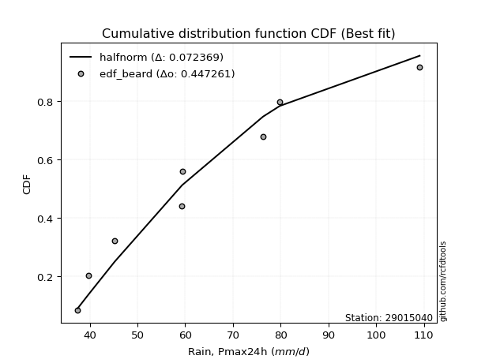</img>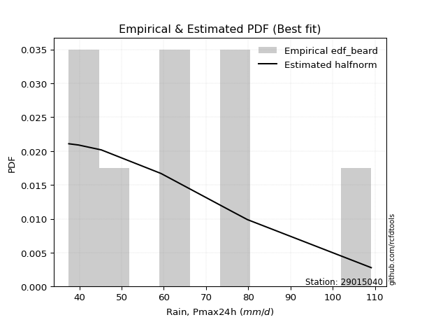</img>

</div>


### 5. EDF Chegodayev (1955)

The Chegodayev formula is an empirical plotting position formula used in hydrological frequency analysis to estimate the exceedance probability or return period of a specific event from a set of observed data. It is primarily used for plotting observed data points on probability paper to fit a theoretical distribution, particularly for analyzing extreme events like maximum flood flows or rainfall intensities. The constant _b_ value in the generalized plotting position formula is 0.3.

<div align="center">


$P=(m-b)/(n+1-2b)$


</div>


**5.1. Empirical values**

<div align="center">

|                | 0                   | 1                   | 2                   | 3                   | 4                  | 5                  | 6                  | 7                  |
|:---------------|:--------------------|:--------------------|:--------------------|:--------------------|:-------------------|:-------------------|:-------------------|:-------------------|
| date           | 2023                | 2019                | 2024                | 2021                | 2022               | 2018               | 2017               | 2020               |
| x              | 37.5                | 39.8                | 45.2                | 59.3                | 59.4               | 76.3               | 79.8               | 109.1              |
| m              | 1                   | 2                   | 3                   | 4                   | 5                  | 6                  | 7                  | 8                  |
| empirical_dist | edf_chegodayev      | edf_chegodayev      | edf_chegodayev      | edf_chegodayev      | edf_chegodayev     | edf_chegodayev     | edf_chegodayev     | edf_chegodayev     |
| empirical      | 0.08333333333333333 | 0.20238095238095236 | 0.32142857142857145 | 0.44047619047619047 | 0.5595238095238095 | 0.6785714285714286 | 0.7976190476190476 | 0.9166666666666666 |
| empirical_tr   | 1.090909090909091   | 1.253731343283582   | 1.4736842105263157  | 1.7872340425531914  | 2.27027027027027   | 3.1111111111111116 | 4.941176470588234  | 11.999999999999995 |

</div>


**5.2. Kolmogorov-Smirnov fit test (sorted by Δ)**


<div align="center">

|                | 0                  | 1                   | 2                   | 3                   | 4                   | 5                   | 6                   | 7                   | 8                   | 9                   | 10                 | 11                  | 12                  | 13                 | 14                 | 15                  | 16                 | 17                  | 18                  | 19                  | 20                  | 21                  | 22                  | 23                  | 24                 | 25                  | 26                  | 27                 | 28                  | 29                  | 30                  | 31                  | 32                  | 33                 | 34                 | 35                 | 36                 | 37                 | 38                 | 39                  | 40                  | 41                 | 42                  | 43                  | 44                 | 45                  | 46                  | 47                    | 48                  | 49                  | 50                  | 51                  | 52                  | 53                  | 54                  | 55                  | 56                 | 57                 | 58                  | 59                  | 60                  | 61                  | 62                  | 63                 | 64                  | 65                  | 66                  | 67                 | 68                 | 69                  | 70                  | 71                 | 72                 | 73                  | 74                 | 75                 | 76                  | 77                  | 78                 | 79                 | 80                  | 81                 | 82                  | 83                 | 84                 | 85                 | 86                 | 87                 |
|:---------------|:-------------------|:--------------------|:--------------------|:--------------------|:--------------------|:--------------------|:--------------------|:--------------------|:--------------------|:--------------------|:-------------------|:--------------------|:--------------------|:-------------------|:-------------------|:--------------------|:-------------------|:--------------------|:--------------------|:--------------------|:--------------------|:--------------------|:--------------------|:--------------------|:-------------------|:--------------------|:--------------------|:-------------------|:--------------------|:--------------------|:--------------------|:--------------------|:--------------------|:-------------------|:-------------------|:-------------------|:-------------------|:-------------------|:-------------------|:--------------------|:--------------------|:-------------------|:--------------------|:--------------------|:-------------------|:--------------------|:--------------------|:----------------------|:--------------------|:--------------------|:--------------------|:--------------------|:--------------------|:--------------------|:--------------------|:--------------------|:-------------------|:-------------------|:--------------------|:--------------------|:--------------------|:--------------------|:--------------------|:-------------------|:--------------------|:--------------------|:--------------------|:-------------------|:-------------------|:--------------------|:--------------------|:-------------------|:-------------------|:--------------------|:-------------------|:-------------------|:--------------------|:--------------------|:-------------------|:-------------------|:--------------------|:-------------------|:--------------------|:-------------------|:-------------------|:-------------------|:-------------------|:-------------------|
| station        | 29015040           | 29015040            | 29015040            | 29015040            | 29015040            | 29015040            | 29015040            | 29015040            | 29015040            | 29015040            | 29015040           | 29015040            | 29015040            | 29015040           | 29015040           | 29015040            | 29015040           | 29015040            | 29015040            | 29015040            | 29015040            | 29015040            | 29015040            | 29015040            | 29015040           | 29015040            | 29015040            | 29015040           | 29015040            | 29015040            | 29015040            | 29015040            | 29015040            | 29015040           | 29015040           | 29015040           | 29015040           | 29015040           | 29015040           | 29015040            | 29015040            | 29015040           | 29015040            | 29015040            | 29015040           | 29015040            | 29015040            | 29015040              | 29015040            | 29015040            | 29015040            | 29015040            | 29015040            | 29015040            | 29015040            | 29015040            | 29015040           | 29015040           | 29015040            | 29015040            | 29015040            | 29015040            | 29015040            | 29015040           | 29015040            | 29015040            | 29015040            | 29015040           | 29015040           | 29015040            | 29015040            | 29015040           | 29015040           | 29015040            | 29015040           | 29015040           | 29015040            | 29015040            | 29015040           | 29015040           | 29015040            | 29015040           | 29015040            | 29015040           | 29015040           | 29015040           | 29015040           | 29015040           |
| empirical_dist | edf_chegodayev     | edf_chegodayev      | edf_chegodayev      | edf_chegodayev      | edf_chegodayev      | edf_chegodayev      | edf_chegodayev      | edf_chegodayev      | edf_chegodayev      | edf_chegodayev      | edf_chegodayev     | edf_chegodayev      | edf_chegodayev      | edf_chegodayev     | edf_chegodayev     | edf_chegodayev      | edf_chegodayev     | edf_chegodayev      | edf_chegodayev      | edf_chegodayev      | edf_chegodayev      | edf_chegodayev      | edf_chegodayev      | edf_chegodayev      | edf_chegodayev     | edf_chegodayev      | edf_chegodayev      | edf_chegodayev     | edf_chegodayev      | edf_chegodayev      | edf_chegodayev      | edf_chegodayev      | edf_chegodayev      | edf_chegodayev     | edf_chegodayev     | edf_chegodayev     | edf_chegodayev     | edf_chegodayev     | edf_chegodayev     | edf_chegodayev      | edf_chegodayev      | edf_chegodayev     | edf_chegodayev      | edf_chegodayev      | edf_chegodayev     | edf_chegodayev      | edf_chegodayev      | edf_chegodayev        | edf_chegodayev      | edf_chegodayev      | edf_chegodayev      | edf_chegodayev      | edf_chegodayev      | edf_chegodayev      | edf_chegodayev      | edf_chegodayev      | edf_chegodayev     | edf_chegodayev     | edf_chegodayev      | edf_chegodayev      | edf_chegodayev      | edf_chegodayev      | edf_chegodayev      | edf_chegodayev     | edf_chegodayev      | edf_chegodayev      | edf_chegodayev      | edf_chegodayev     | edf_chegodayev     | edf_chegodayev      | edf_chegodayev      | edf_chegodayev     | edf_chegodayev     | edf_chegodayev      | edf_chegodayev     | edf_chegodayev     | edf_chegodayev      | edf_chegodayev      | edf_chegodayev     | edf_chegodayev     | edf_chegodayev      | edf_chegodayev     | edf_chegodayev      | edf_chegodayev     | edf_chegodayev     | edf_chegodayev     | edf_chegodayev     | edf_chegodayev     |
| p_dist         | halfnorm           | rayleigh            | logmaxwell          | maxwell             | logalpha            | lograyleigh         | pearson3            | nct                 | alpha               | loginvgamma         | lognct             | logncf              | logpearson3         | betaprime          | f                  | logbetaprime        | logloggamma        | logexponnorm        | lognorm             | lognorm             | logt                | logcrystalball      | logfisk             | logrice             | ncf                | genlogistic         | gumbel_r            | halflogistic       | kstwobign           | logjohnsonsu        | logmielke           | moyal               | loginvweibull       | loggenlogistic     | nakagami           | loggompertz        | loggumbel_r        | gompertz           | invgamma           | logkstwobign        | truncnorm           | crystalball        | norm                | t                   | genexpon           | loglogistic         | expon               | loglaplace_asymmetric | loghalfnorm         | exponnorm           | logistic            | loggumbel_l         | loginvgauss         | rice                | laplace_asymmetric  | loghypsecant        | hypsecant          | logmoyal           | loglaplace          | logfatiguelife      | invgauss            | loggenexpon         | laplace             | fisk               | johnsonsu           | logtruncnorm        | weibull_min         | loghalflogistic    | logexpon           | gumbel_l            | logwald             | logf               | wald               | gamma               | logweibull_min     | logerlang          | gibrat              | loggibrat           | loggamma           | loggamma           | erlang              | chi2               | logchi2             | loglognorm         | lognakagami        | fatiguelife        | invweibull         | mielke             |
| delta          | 0.0727955383364339 | 0.08723740560460563 | 0.09185347850369405 | 0.09364692834675134 | 0.09925295721245964 | 0.09929656470995096 | 0.09994603858347398 | 0.10091177862987522 | 0.10172803889414375 | 0.10187228379343652 | 0.1020774774478291 | 0.10343974341225637 | 0.10360089926321464 | 0.1037706190258503 | 0.1042119427843348 | 0.10428926950583975 | 0.1053869803263795 | 0.10733216083444885 | 0.10748085692526121 | 0.10748085692526121 | 0.10748095910824057 | 0.10748106999142254 | 0.10885906284708935 | 0.10910905770997734 | 0.1095371627528762 | 0.11020273862915489 | 0.11181117556299866 | 0.1153784006024629 | 0.11568444809247891 | 0.11952250519267849 | 0.12109548146626459 | 0.12282637009915592 | 0.12378568148317615 | 0.1238264381108688 | 0.1238616211180481 | 0.1251090819772674 | 0.1251870162519939 | 0.1252476534903748 | 0.1253839406252184 | 0.12773141209507122 | 0.12778395937623077 | 0.1277839636676431 | 0.12778396527876712 | 0.12778848173066304 | 0.1280681121674327 | 0.12956972285807059 | 0.12994980148039303 | 0.1305268052829132    | 0.13057478261980882 | 0.13147937153132627 | 0.13686696931697334 | 0.13761888966097183 | 0.13881230842057102 | 0.13886555730764638 | 0.14163768184462328 | 0.14300265952261015 | 0.1444703731781693 | 0.1510585139521472 | 0.15848202857907573 | 0.16184790517055914 | 0.16419826607923038 | 0.16608489881578725 | 0.16745427633005205 | 0.1685139338082503 | 0.17166601866284603 | 0.18035251352311565 | 0.18475425977825766 | 0.1869573296443859 | 0.1884676594728245 | 0.19693320407360726 | 0.25094450906804777 | 0.2517234709368641 | 0.2558729691428362 | 0.26348685077857414 | 0.2742402582926138 | 0.2765527883947274 | 0.32142857142857145 | 0.32142857142857145 | 0.3275818495616112 | 0.3275818495616112 | 0.33050661002582904 | 0.3617086103800021 | 0.36269918962194914 | 0.3817350852225375 | 0.3837458132180906 | 0.4263701812841807 | 0.4650338764955927 | nan                |
| deltao         | 0.4472608134160001 | 0.4472608134160001  | 0.4472608134160001  | 0.4472608134160001  | 0.4472608134160001  | 0.4472608134160001  | 0.4472608134160001  | 0.4472608134160001  | 0.4472608134160001  | 0.4472608134160001  | 0.4472608134160001 | 0.4472608134160001  | 0.4472608134160001  | 0.4472608134160001 | 0.4472608134160001 | 0.4472608134160001  | 0.4472608134160001 | 0.4472608134160001  | 0.4472608134160001  | 0.4472608134160001  | 0.4472608134160001  | 0.4472608134160001  | 0.4472608134160001  | 0.4472608134160001  | 0.4472608134160001 | 0.4472608134160001  | 0.4472608134160001  | 0.4472608134160001 | 0.4472608134160001  | 0.4472608134160001  | 0.4472608134160001  | 0.4472608134160001  | 0.4472608134160001  | 0.4472608134160001 | 0.4472608134160001 | 0.4472608134160001 | 0.4472608134160001 | 0.4472608134160001 | 0.4472608134160001 | 0.4472608134160001  | 0.4472608134160001  | 0.4472608134160001 | 0.4472608134160001  | 0.4472608134160001  | 0.4472608134160001 | 0.4472608134160001  | 0.4472608134160001  | 0.4472608134160001    | 0.4472608134160001  | 0.4472608134160001  | 0.4472608134160001  | 0.4472608134160001  | 0.4472608134160001  | 0.4472608134160001  | 0.4472608134160001  | 0.4472608134160001  | 0.4472608134160001 | 0.4472608134160001 | 0.4472608134160001  | 0.4472608134160001  | 0.4472608134160001  | 0.4472608134160001  | 0.4472608134160001  | 0.4472608134160001 | 0.4472608134160001  | 0.4472608134160001  | 0.4472608134160001  | 0.4472608134160001 | 0.4472608134160001 | 0.4472608134160001  | 0.4472608134160001  | 0.4472608134160001 | 0.4472608134160001 | 0.4472608134160001  | 0.4472608134160001 | 0.4472608134160001 | 0.4472608134160001  | 0.4472608134160001  | 0.4472608134160001 | 0.4472608134160001 | 0.4472608134160001  | 0.4472608134160001 | 0.4472608134160001  | 0.4472608134160001 | 0.4472608134160001 | 0.4472608134160001 | 0.4472608134160001 | 0.4472608134160001 |
| eval           | Δo > Δ             | Δo > Δ              | Δo > Δ              | Δo > Δ              | Δo > Δ              | Δo > Δ              | Δo > Δ              | Δo > Δ              | Δo > Δ              | Δo > Δ              | Δo > Δ             | Δo > Δ              | Δo > Δ              | Δo > Δ             | Δo > Δ             | Δo > Δ              | Δo > Δ             | Δo > Δ              | Δo > Δ              | Δo > Δ              | Δo > Δ              | Δo > Δ              | Δo > Δ              | Δo > Δ              | Δo > Δ             | Δo > Δ              | Δo > Δ              | Δo > Δ             | Δo > Δ              | Δo > Δ              | Δo > Δ              | Δo > Δ              | Δo > Δ              | Δo > Δ             | Δo > Δ             | Δo > Δ             | Δo > Δ             | Δo > Δ             | Δo > Δ             | Δo > Δ              | Δo > Δ              | Δo > Δ             | Δo > Δ              | Δo > Δ              | Δo > Δ             | Δo > Δ              | Δo > Δ              | Δo > Δ                | Δo > Δ              | Δo > Δ              | Δo > Δ              | Δo > Δ              | Δo > Δ              | Δo > Δ              | Δo > Δ              | Δo > Δ              | Δo > Δ             | Δo > Δ             | Δo > Δ              | Δo > Δ              | Δo > Δ              | Δo > Δ              | Δo > Δ              | Δo > Δ             | Δo > Δ              | Δo > Δ              | Δo > Δ              | Δo > Δ             | Δo > Δ             | Δo > Δ              | Δo > Δ              | Δo > Δ             | Δo > Δ             | Δo > Δ              | Δo > Δ             | Δo > Δ             | Δo > Δ              | Δo > Δ              | Δo > Δ             | Δo > Δ             | Δo > Δ              | Δo > Δ             | Δo > Δ              | Δo > Δ             | Δo > Δ             | Δo > Δ             | Δo <= Δ            | Δo <= Δ            |
| fit            | 1                  | 1                   | 1                   | 1                   | 1                   | 1                   | 1                   | 1                   | 1                   | 1                   | 1                  | 1                   | 1                   | 1                  | 1                  | 1                   | 1                  | 1                   | 1                   | 1                   | 1                   | 1                   | 1                   | 1                   | 1                  | 1                   | 1                   | 1                  | 1                   | 1                   | 1                   | 1                   | 1                   | 1                  | 1                  | 1                  | 1                  | 1                  | 1                  | 1                   | 1                   | 1                  | 1                   | 1                   | 1                  | 1                   | 1                   | 1                     | 1                   | 1                   | 1                   | 1                   | 1                   | 1                   | 1                   | 1                   | 1                  | 1                  | 1                   | 1                   | 1                   | 1                   | 1                   | 1                  | 1                   | 1                   | 1                   | 1                  | 1                  | 1                   | 1                   | 1                  | 1                  | 1                   | 1                  | 1                  | 1                   | 1                   | 1                  | 1                  | 1                   | 1                  | 1                   | 1                  | 1                  | 1                  | 0                  | 0                  |
| n              | 8                  | 8                   | 8                   | 8                   | 8                   | 8                   | 8                   | 8                   | 8                   | 8                   | 8                  | 8                   | 8                   | 8                  | 8                  | 8                   | 8                  | 8                   | 8                   | 8                   | 8                   | 8                   | 8                   | 8                   | 8                  | 8                   | 8                   | 8                  | 8                   | 8                   | 8                   | 8                   | 8                   | 8                  | 8                  | 8                  | 8                  | 8                  | 8                  | 8                   | 8                   | 8                  | 8                   | 8                   | 8                  | 8                   | 8                   | 8                     | 8                   | 8                   | 8                   | 8                   | 8                   | 8                   | 8                   | 8                   | 8                  | 8                  | 8                   | 8                   | 8                   | 8                   | 8                   | 8                  | 8                   | 8                   | 8                   | 8                  | 8                  | 8                   | 8                   | 8                  | 8                  | 8                   | 8                  | 8                  | 8                   | 8                   | 8                  | 8                  | 8                   | 8                  | 8                   | 8                  | 8                  | 8                  | 8                  | 8                  |
| best_fit       | 1                  | 0                   | 0                   | 0                   | 0                   | 0                   | 0                   | 0                   | 0                   | 0                   | 0                  | 0                   | 0                   | 0                  | 0                  | 0                   | 0                  | 0                   | 0                   | 0                   | 0                   | 0                   | 0                   | 0                   | 0                  | 0                   | 0                   | 0                  | 0                   | 0                   | 0                   | 0                   | 0                   | 0                  | 0                  | 0                  | 0                  | 0                  | 0                  | 0                   | 0                   | 0                  | 0                   | 0                   | 0                  | 0                   | 0                   | 0                     | 0                   | 0                   | 0                   | 0                   | 0                   | 0                   | 0                   | 0                   | 0                  | 0                  | 0                   | 0                   | 0                   | 0                   | 0                   | 0                  | 0                   | 0                   | 0                   | 0                  | 0                  | 0                   | 0                   | 0                  | 0                  | 0                   | 0                  | 0                  | 0                   | 0                   | 0                  | 0                  | 0                   | 0                  | 0                   | 0                  | 0                  | 0                  | 0                  | 0                  |
| best_fit_sort  | 1                  | 2                   | 3                   | 4                   | 5                   | 6                   | 7                   | 8                   | 9                   | 10                  | 11                 | 12                  | 13                  | 14                 | 15                 | 16                  | 17                 | 18                  | 19                  | 20                  | 21                  | 22                  | 23                  | 24                  | 25                 | 26                  | 27                  | 28                 | 29                  | 30                  | 31                  | 32                  | 33                  | 34                 | 35                 | 36                 | 37                 | 38                 | 39                 | 40                  | 41                  | 42                 | 43                  | 44                  | 45                 | 46                  | 47                  | 48                    | 49                  | 50                  | 51                  | 52                  | 53                  | 54                  | 55                  | 56                  | 57                 | 58                 | 59                  | 60                  | 61                  | 62                  | 63                  | 64                 | 65                  | 66                  | 67                  | 68                 | 69                 | 70                  | 71                  | 72                 | 73                 | 74                  | 75                 | 76                 | 77                  | 78                  | 79                 | 80                 | 81                  | 82                 | 83                  | 84                 | 85                 | 86                 | 87                 | 88                 |

</div>


**5.3. Best fit**

<div align="center">

|   id |   station | empirical_dist   | p_dist   |     delta |   deltao | eval   |   fit |   n |   best_fit |   best_fit_sort |
|-----:|----------:|:-----------------|:---------|----------:|---------:|:-------|------:|----:|-----------:|----------------:|
|    0 |  29015040 | edf_chegodayev   | halfnorm | 0.0727955 | 0.447261 | Δo > Δ |     1 |   8 |          1 |               1 |

</div>


<div align="center">

</img>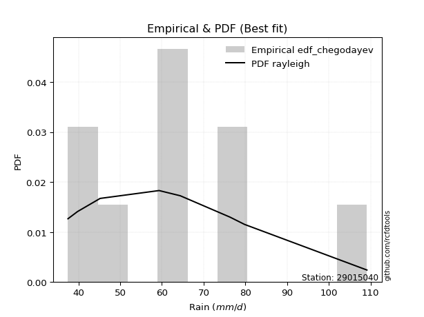</img>

</div>


### 6. EDF Blom (1958)

The Blom formula is a specific "plotting position" formula used in hydrology and statistical analysis to estimate the empirical cumulative probability (or non-exceedance probability) of a data series. It is particularly recommended for data that are approximately normally distributed. The constant _a_ is set to 0.375 (or 3/8).

<div align="center">


$P=(m-a)/(n+1-2a)$


</div>


**6.1. Empirical values**

<div align="center">

|                | 0                   | 1                   | 2                  | 3                  | 4                  | 5                  | 6                 | 7                  |
|:---------------|:--------------------|:--------------------|:-------------------|:-------------------|:-------------------|:-------------------|:------------------|:-------------------|
| date           | 2023                | 2019                | 2024               | 2021               | 2022               | 2018               | 2017              | 2020               |
| x              | 37.5                | 39.8                | 45.2               | 59.3               | 59.4               | 76.3               | 79.8              | 109.1              |
| m              | 1                   | 2                   | 3                  | 4                  | 5                  | 6                  | 7                 | 8                  |
| empirical_dist | edf_blom            | edf_blom            | edf_blom           | edf_blom           | edf_blom           | edf_blom           | edf_blom          | edf_blom           |
| empirical      | 0.07575757575757576 | 0.19696969696969696 | 0.3181818181818182 | 0.4393939393939394 | 0.5606060606060606 | 0.6818181818181818 | 0.803030303030303 | 0.9242424242424242 |
| empirical_tr   | 1.0819672131147542  | 1.2452830188679247  | 1.4666666666666666 | 1.783783783783784  | 2.275862068965517  | 3.1428571428571423 | 5.076923076923076 | 13.199999999999992 |

</div>


**6.2. Kolmogorov-Smirnov fit test (sorted by Δ)**


<div align="center">

|                | 0                   | 1                   | 2                   | 3                  | 4                   | 5                  | 6                   | 7                   | 8                   | 9                   | 10                  | 11                  | 12                  | 13                  | 14                  | 15                  | 16                  | 17                  | 18                  | 19                 | 20                  | 21                  | 22                  | 23                  | 24                  | 25                  | 26                  | 27                  | 28                  | 29                  | 30                  | 31                 | 32                  | 33                  | 34                  | 35                  | 36                  | 37                  | 38                  | 39                 | 40                  | 41                    | 42                 | 43                 | 44                  | 45                  | 46                  | 47                 | 48                 | 49                  | 50                  | 51                 | 52                  | 53                 | 54                  | 55                 | 56                  | 57                  | 58                  | 59                 | 60                  | 61                  | 62                  | 63                 | 64                  | 65                  | 66                  | 67                  | 68                  | 69                  | 70                  | 71                 | 72                  | 73                 | 74                 | 75                  | 76                 | 77                 | 78                  | 79                  | 80                 | 81                 | 82                 | 83                  | 84                 | 85                  | 86                  | 87                 |
|:---------------|:--------------------|:--------------------|:--------------------|:-------------------|:--------------------|:-------------------|:--------------------|:--------------------|:--------------------|:--------------------|:--------------------|:--------------------|:--------------------|:--------------------|:--------------------|:--------------------|:--------------------|:--------------------|:--------------------|:-------------------|:--------------------|:--------------------|:--------------------|:--------------------|:--------------------|:--------------------|:--------------------|:--------------------|:--------------------|:--------------------|:--------------------|:-------------------|:--------------------|:--------------------|:--------------------|:--------------------|:--------------------|:--------------------|:--------------------|:-------------------|:--------------------|:----------------------|:-------------------|:-------------------|:--------------------|:--------------------|:--------------------|:-------------------|:-------------------|:--------------------|:--------------------|:-------------------|:--------------------|:-------------------|:--------------------|:-------------------|:--------------------|:--------------------|:--------------------|:-------------------|:--------------------|:--------------------|:--------------------|:-------------------|:--------------------|:--------------------|:--------------------|:--------------------|:--------------------|:--------------------|:--------------------|:-------------------|:--------------------|:-------------------|:-------------------|:--------------------|:-------------------|:-------------------|:--------------------|:--------------------|:-------------------|:-------------------|:-------------------|:--------------------|:-------------------|:--------------------|:--------------------|:-------------------|
| station        | 29015040            | 29015040            | 29015040            | 29015040           | 29015040            | 29015040           | 29015040            | 29015040            | 29015040            | 29015040            | 29015040            | 29015040            | 29015040            | 29015040            | 29015040            | 29015040            | 29015040            | 29015040            | 29015040            | 29015040           | 29015040            | 29015040            | 29015040            | 29015040            | 29015040            | 29015040            | 29015040            | 29015040            | 29015040            | 29015040            | 29015040            | 29015040           | 29015040            | 29015040            | 29015040            | 29015040            | 29015040            | 29015040            | 29015040            | 29015040           | 29015040            | 29015040              | 29015040           | 29015040           | 29015040            | 29015040            | 29015040            | 29015040           | 29015040           | 29015040            | 29015040            | 29015040           | 29015040            | 29015040           | 29015040            | 29015040           | 29015040            | 29015040            | 29015040            | 29015040           | 29015040            | 29015040            | 29015040            | 29015040           | 29015040            | 29015040            | 29015040            | 29015040            | 29015040            | 29015040            | 29015040            | 29015040           | 29015040            | 29015040           | 29015040           | 29015040            | 29015040           | 29015040           | 29015040            | 29015040            | 29015040           | 29015040           | 29015040           | 29015040            | 29015040           | 29015040            | 29015040            | 29015040           |
| empirical_dist | edf_blom            | edf_blom            | edf_blom            | edf_blom           | edf_blom            | edf_blom           | edf_blom            | edf_blom            | edf_blom            | edf_blom            | edf_blom            | edf_blom            | edf_blom            | edf_blom            | edf_blom            | edf_blom            | edf_blom            | edf_blom            | edf_blom            | edf_blom           | edf_blom            | edf_blom            | edf_blom            | edf_blom            | edf_blom            | edf_blom            | edf_blom            | edf_blom            | edf_blom            | edf_blom            | edf_blom            | edf_blom           | edf_blom            | edf_blom            | edf_blom            | edf_blom            | edf_blom            | edf_blom            | edf_blom            | edf_blom           | edf_blom            | edf_blom              | edf_blom           | edf_blom           | edf_blom            | edf_blom            | edf_blom            | edf_blom           | edf_blom           | edf_blom            | edf_blom            | edf_blom           | edf_blom            | edf_blom           | edf_blom            | edf_blom           | edf_blom            | edf_blom            | edf_blom            | edf_blom           | edf_blom            | edf_blom            | edf_blom            | edf_blom           | edf_blom            | edf_blom            | edf_blom            | edf_blom            | edf_blom            | edf_blom            | edf_blom            | edf_blom           | edf_blom            | edf_blom           | edf_blom           | edf_blom            | edf_blom           | edf_blom           | edf_blom            | edf_blom            | edf_blom           | edf_blom           | edf_blom           | edf_blom            | edf_blom           | edf_blom            | edf_blom            | edf_blom           |
| p_dist         | halfnorm            | rayleigh            | logmaxwell          | maxwell            | logalpha            | pearson3           | alpha               | loginvgamma         | lognct              | nct                 | logpearson3         | lograyleigh         | betaprime           | f                   | logbetaprime        | logloggamma         | logexponnorm        | lognorm             | lognorm             | logt               | logcrystalball      | logncf              | logrice             | ncf                 | genlogistic         | gumbel_r            | logfisk             | halflogistic        | kstwobign           | moyal               | loggompertz         | gompertz           | logjohnsonsu        | logmielke           | genexpon            | loginvweibull       | loggenlogistic      | nakagami            | loggumbel_r         | loglogistic        | invgamma            | loglaplace_asymmetric | logkstwobign       | truncnorm          | crystalball         | norm                | t                   | expon              | loghalfnorm        | exponnorm           | loggumbel_l         | rice               | logistic            | laplace_asymmetric | loghypsecant        | loginvgauss        | hypsecant           | logmoyal            | loglaplace          | logfatiguelife     | invgauss            | loggenexpon         | laplace             | johnsonsu          | fisk                | logtruncnorm        | loghalflogistic     | weibull_min         | logexpon            | gumbel_l            | logwald             | wald               | logf                | gamma              | logerlang          | logweibull_min      | gibrat             | loggibrat          | loggamma            | loggamma            | erlang             | chi2               | logchi2            | lognakagami         | loglognorm         | fatiguelife         | invweibull          | mielke             |
| delta          | 0.07140229771830636 | 0.08399065235785236 | 0.08926975344278726 | 0.0944632260853247 | 0.09600620396570647 | 0.0966992853367207 | 0.09848128564739048 | 0.09862553054668324 | 0.09883072420107583 | 0.09989229380777204 | 0.10035414601646137 | 0.10037881579220204 | 0.10052386577909703 | 0.10096518953758152 | 0.10104251625908647 | 0.10214022707962622 | 0.10408540758769558 | 0.10423410367850794 | 0.10423410367850794 | 0.1042342058614873 | 0.10423431674466926 | 0.10452199449450744 | 0.10586230446322406 | 0.10629040950612292 | 0.10695598538240161 | 0.10856442231624538 | 0.10994131392934042 | 0.10996714519120751 | 0.11243769484572563 | 0.11957961685240265 | 0.11969782656601201 | 0.1198363980791194 | 0.12060475627492956 | 0.12217773254851566 | 0.12265685675617731 | 0.12486793256542722 | 0.12490868919311987 | 0.12494387220029918 | 0.12626926733424498 | 0.1263229696113173 | 0.12646619170746948 | 0.1272800520361599    | 0.1288136631773223 | 0.1288662104584818 | 0.12886621474989413 | 0.12886621636101814 | 0.12887073281291406 | 0.1310320525626441 | 0.1316570337020599 | 0.13256162261357735 | 0.13437213641421855 | 0.1356188040608931 | 0.13794922039922436 | 0.13839092859787   | 0.13975590627585688 | 0.1398945595028221 | 0.14555262426042032 | 0.15214076503439827 | 0.15523527533232245 | 0.1629301562528102 | 0.16528051716148146 | 0.16716714989803833 | 0.16853652741230307 | 0.1727482697450971 | 0.17608969138400787 | 0.18143476460536673 | 0.18154607423313052 | 0.18583651086050873 | 0.18954991055507558 | 0.19801545515585828 | 0.24769775582129452 | 0.2526262158960829 | 0.25280572201911516 | 0.2645691018608252 | 0.2776350394769785 | 0.27965151370386915 | 0.3181818181818182 | 0.3181818181818182 | 0.32866410064386226 | 0.32866410064386226 | 0.3315888611080801 | 0.3627908614622532 | 0.3681104450332045 | 0.38699256646484387 | 0.3871463406337929 | 0.43178143669543606 | 0.47260963407135026 | nan                |
| deltao         | 0.4472608134160001  | 0.4472608134160001  | 0.4472608134160001  | 0.4472608134160001 | 0.4472608134160001  | 0.4472608134160001 | 0.4472608134160001  | 0.4472608134160001  | 0.4472608134160001  | 0.4472608134160001  | 0.4472608134160001  | 0.4472608134160001  | 0.4472608134160001  | 0.4472608134160001  | 0.4472608134160001  | 0.4472608134160001  | 0.4472608134160001  | 0.4472608134160001  | 0.4472608134160001  | 0.4472608134160001 | 0.4472608134160001  | 0.4472608134160001  | 0.4472608134160001  | 0.4472608134160001  | 0.4472608134160001  | 0.4472608134160001  | 0.4472608134160001  | 0.4472608134160001  | 0.4472608134160001  | 0.4472608134160001  | 0.4472608134160001  | 0.4472608134160001 | 0.4472608134160001  | 0.4472608134160001  | 0.4472608134160001  | 0.4472608134160001  | 0.4472608134160001  | 0.4472608134160001  | 0.4472608134160001  | 0.4472608134160001 | 0.4472608134160001  | 0.4472608134160001    | 0.4472608134160001 | 0.4472608134160001 | 0.4472608134160001  | 0.4472608134160001  | 0.4472608134160001  | 0.4472608134160001 | 0.4472608134160001 | 0.4472608134160001  | 0.4472608134160001  | 0.4472608134160001 | 0.4472608134160001  | 0.4472608134160001 | 0.4472608134160001  | 0.4472608134160001 | 0.4472608134160001  | 0.4472608134160001  | 0.4472608134160001  | 0.4472608134160001 | 0.4472608134160001  | 0.4472608134160001  | 0.4472608134160001  | 0.4472608134160001 | 0.4472608134160001  | 0.4472608134160001  | 0.4472608134160001  | 0.4472608134160001  | 0.4472608134160001  | 0.4472608134160001  | 0.4472608134160001  | 0.4472608134160001 | 0.4472608134160001  | 0.4472608134160001 | 0.4472608134160001 | 0.4472608134160001  | 0.4472608134160001 | 0.4472608134160001 | 0.4472608134160001  | 0.4472608134160001  | 0.4472608134160001 | 0.4472608134160001 | 0.4472608134160001 | 0.4472608134160001  | 0.4472608134160001 | 0.4472608134160001  | 0.4472608134160001  | 0.4472608134160001 |
| eval           | Δo > Δ              | Δo > Δ              | Δo > Δ              | Δo > Δ             | Δo > Δ              | Δo > Δ             | Δo > Δ              | Δo > Δ              | Δo > Δ              | Δo > Δ              | Δo > Δ              | Δo > Δ              | Δo > Δ              | Δo > Δ              | Δo > Δ              | Δo > Δ              | Δo > Δ              | Δo > Δ              | Δo > Δ              | Δo > Δ             | Δo > Δ              | Δo > Δ              | Δo > Δ              | Δo > Δ              | Δo > Δ              | Δo > Δ              | Δo > Δ              | Δo > Δ              | Δo > Δ              | Δo > Δ              | Δo > Δ              | Δo > Δ             | Δo > Δ              | Δo > Δ              | Δo > Δ              | Δo > Δ              | Δo > Δ              | Δo > Δ              | Δo > Δ              | Δo > Δ             | Δo > Δ              | Δo > Δ                | Δo > Δ             | Δo > Δ             | Δo > Δ              | Δo > Δ              | Δo > Δ              | Δo > Δ             | Δo > Δ             | Δo > Δ              | Δo > Δ              | Δo > Δ             | Δo > Δ              | Δo > Δ             | Δo > Δ              | Δo > Δ             | Δo > Δ              | Δo > Δ              | Δo > Δ              | Δo > Δ             | Δo > Δ              | Δo > Δ              | Δo > Δ              | Δo > Δ             | Δo > Δ              | Δo > Δ              | Δo > Δ              | Δo > Δ              | Δo > Δ              | Δo > Δ              | Δo > Δ              | Δo > Δ             | Δo > Δ              | Δo > Δ             | Δo > Δ             | Δo > Δ              | Δo > Δ             | Δo > Δ             | Δo > Δ              | Δo > Δ              | Δo > Δ             | Δo > Δ             | Δo > Δ             | Δo > Δ              | Δo > Δ             | Δo > Δ              | Δo <= Δ             | Δo <= Δ            |
| fit            | 1                   | 1                   | 1                   | 1                  | 1                   | 1                  | 1                   | 1                   | 1                   | 1                   | 1                   | 1                   | 1                   | 1                   | 1                   | 1                   | 1                   | 1                   | 1                   | 1                  | 1                   | 1                   | 1                   | 1                   | 1                   | 1                   | 1                   | 1                   | 1                   | 1                   | 1                   | 1                  | 1                   | 1                   | 1                   | 1                   | 1                   | 1                   | 1                   | 1                  | 1                   | 1                     | 1                  | 1                  | 1                   | 1                   | 1                   | 1                  | 1                  | 1                   | 1                   | 1                  | 1                   | 1                  | 1                   | 1                  | 1                   | 1                   | 1                   | 1                  | 1                   | 1                   | 1                   | 1                  | 1                   | 1                   | 1                   | 1                   | 1                   | 1                   | 1                   | 1                  | 1                   | 1                  | 1                  | 1                   | 1                  | 1                  | 1                   | 1                   | 1                  | 1                  | 1                  | 1                   | 1                  | 1                   | 0                   | 0                  |
| n              | 8                   | 8                   | 8                   | 8                  | 8                   | 8                  | 8                   | 8                   | 8                   | 8                   | 8                   | 8                   | 8                   | 8                   | 8                   | 8                   | 8                   | 8                   | 8                   | 8                  | 8                   | 8                   | 8                   | 8                   | 8                   | 8                   | 8                   | 8                   | 8                   | 8                   | 8                   | 8                  | 8                   | 8                   | 8                   | 8                   | 8                   | 8                   | 8                   | 8                  | 8                   | 8                     | 8                  | 8                  | 8                   | 8                   | 8                   | 8                  | 8                  | 8                   | 8                   | 8                  | 8                   | 8                  | 8                   | 8                  | 8                   | 8                   | 8                   | 8                  | 8                   | 8                   | 8                   | 8                  | 8                   | 8                   | 8                   | 8                   | 8                   | 8                   | 8                   | 8                  | 8                   | 8                  | 8                  | 8                   | 8                  | 8                  | 8                   | 8                   | 8                  | 8                  | 8                  | 8                   | 8                  | 8                   | 8                   | 8                  |
| best_fit       | 1                   | 0                   | 0                   | 0                  | 0                   | 0                  | 0                   | 0                   | 0                   | 0                   | 0                   | 0                   | 0                   | 0                   | 0                   | 0                   | 0                   | 0                   | 0                   | 0                  | 0                   | 0                   | 0                   | 0                   | 0                   | 0                   | 0                   | 0                   | 0                   | 0                   | 0                   | 0                  | 0                   | 0                   | 0                   | 0                   | 0                   | 0                   | 0                   | 0                  | 0                   | 0                     | 0                  | 0                  | 0                   | 0                   | 0                   | 0                  | 0                  | 0                   | 0                   | 0                  | 0                   | 0                  | 0                   | 0                  | 0                   | 0                   | 0                   | 0                  | 0                   | 0                   | 0                   | 0                  | 0                   | 0                   | 0                   | 0                   | 0                   | 0                   | 0                   | 0                  | 0                   | 0                  | 0                  | 0                   | 0                  | 0                  | 0                   | 0                   | 0                  | 0                  | 0                  | 0                   | 0                  | 0                   | 0                   | 0                  |
| best_fit_sort  | 1                   | 2                   | 3                   | 4                  | 5                   | 6                  | 7                   | 8                   | 9                   | 10                  | 11                  | 12                  | 13                  | 14                  | 15                  | 16                  | 17                  | 18                  | 19                  | 20                 | 21                  | 22                  | 23                  | 24                  | 25                  | 26                  | 27                  | 28                  | 29                  | 30                  | 31                  | 32                 | 33                  | 34                  | 35                  | 36                  | 37                  | 38                  | 39                  | 40                 | 41                  | 42                    | 43                 | 44                 | 45                  | 46                  | 47                  | 48                 | 49                 | 50                  | 51                  | 52                 | 53                  | 54                 | 55                  | 56                 | 57                  | 58                  | 59                  | 60                 | 61                  | 62                  | 63                  | 64                 | 65                  | 66                  | 67                  | 68                  | 69                  | 70                  | 71                  | 72                 | 73                  | 74                 | 75                 | 76                  | 77                 | 78                 | 79                  | 80                  | 81                 | 82                 | 83                 | 84                  | 85                 | 86                  | 87                  | 88                 |

</div>


**6.3. Best fit**

<div align="center">

|   id |   station | empirical_dist   | p_dist   |     delta |   deltao | eval   |   fit |   n |   best_fit |   best_fit_sort |
|-----:|----------:|:-----------------|:---------|----------:|---------:|:-------|------:|----:|-----------:|----------------:|
|    0 |  29015040 | edf_blom         | halfnorm | 0.0714023 | 0.447261 | Δo > Δ |     1 |   8 |          1 |               1 |

</div>


<div align="center">

</img></img>

</div>


### 7. EDF Tukey (1962)

In hydrology, the Tukey formula is used as a plotting position formula to estimate the empirical probability or frequency of a flood event (or other hydrological data). The formula parameter is given as _c=0.333_ (or 1/3).

<div align="center">


$P=(m-c)/(n+1-2c)$


</div>


**7.1. Empirical values**

<div align="center">

|                | 0                  | 1         | 2                  | 3                  | 4                 | 5                  | 6                 | 7                  |
|:---------------|:-------------------|:----------|:-------------------|:-------------------|:------------------|:-------------------|:------------------|:-------------------|
| date           | 2023               | 2019      | 2024               | 2021               | 2022              | 2018               | 2017              | 2020               |
| x              | 37.5               | 39.8      | 45.2               | 59.3               | 59.4              | 76.3               | 79.8              | 109.1              |
| m              | 1                  | 2         | 3                  | 4                  | 5                 | 6                  | 7                 | 8                  |
| empirical_dist | edf_tukey          | edf_tukey | edf_tukey          | edf_tukey          | edf_tukey         | edf_tukey          | edf_tukey         | edf_tukey          |
| empirical      | 0.08               | 0.2       | 0.32               | 0.44               | 0.56              | 0.68               | 0.8               | 0.92               |
| empirical_tr   | 1.0869565217391304 | 1.25      | 1.4705882352941178 | 1.7857142857142856 | 2.272727272727273 | 3.1250000000000004 | 5.000000000000001 | 12.500000000000007 |

</div>


**7.2. Kolmogorov-Smirnov fit test (sorted by Δ)**


<div align="center">

|                | 0                   | 1                   | 2                  | 3                  | 4                   | 5                   | 6                   | 7                   | 8                  | 9                   | 10                  | 11                 | 12                  | 13                  | 14                 | 15                  | 16                  | 17                  | 18                  | 19                  | 20                  | 21                 | 22                  | 23                  | 24                  | 25                  | 26                  | 27                  | 28                  | 29                  | 30                  | 31                  | 32                  | 33                  | 34                  | 35                  | 36                  | 37                  | 38                  | 39                  | 40                  | 41                  | 42                 | 43                  | 44                  | 45                  | 46                    | 47                 | 48                  | 49                  | 50                  | 51                  | 52                  | 53                  | 54                  | 55                 | 56                  | 57                  | 58                  | 59                 | 60                  | 61                  | 62                  | 63                  | 64                 | 65                  | 66                  | 67                  | 68                  | 69                  | 70                  | 71                  | 72                  | 73                 | 74                 | 75                 | 76                 | 77                 | 78                  | 79                  | 80                 | 81                 | 82                  | 83                  | 84                  | 85                 | 86                 | 87                 |
|:---------------|:--------------------|:--------------------|:-------------------|:-------------------|:--------------------|:--------------------|:--------------------|:--------------------|:-------------------|:--------------------|:--------------------|:-------------------|:--------------------|:--------------------|:-------------------|:--------------------|:--------------------|:--------------------|:--------------------|:--------------------|:--------------------|:-------------------|:--------------------|:--------------------|:--------------------|:--------------------|:--------------------|:--------------------|:--------------------|:--------------------|:--------------------|:--------------------|:--------------------|:--------------------|:--------------------|:--------------------|:--------------------|:--------------------|:--------------------|:--------------------|:--------------------|:--------------------|:-------------------|:--------------------|:--------------------|:--------------------|:----------------------|:-------------------|:--------------------|:--------------------|:--------------------|:--------------------|:--------------------|:--------------------|:--------------------|:-------------------|:--------------------|:--------------------|:--------------------|:-------------------|:--------------------|:--------------------|:--------------------|:--------------------|:-------------------|:--------------------|:--------------------|:--------------------|:--------------------|:--------------------|:--------------------|:--------------------|:--------------------|:-------------------|:-------------------|:-------------------|:-------------------|:-------------------|:--------------------|:--------------------|:-------------------|:-------------------|:--------------------|:--------------------|:--------------------|:-------------------|:-------------------|:-------------------|
| station        | 29015040            | 29015040            | 29015040           | 29015040           | 29015040            | 29015040            | 29015040            | 29015040            | 29015040           | 29015040            | 29015040            | 29015040           | 29015040            | 29015040            | 29015040           | 29015040            | 29015040            | 29015040            | 29015040            | 29015040            | 29015040            | 29015040           | 29015040            | 29015040            | 29015040            | 29015040            | 29015040            | 29015040            | 29015040            | 29015040            | 29015040            | 29015040            | 29015040            | 29015040            | 29015040            | 29015040            | 29015040            | 29015040            | 29015040            | 29015040            | 29015040            | 29015040            | 29015040           | 29015040            | 29015040            | 29015040            | 29015040              | 29015040           | 29015040            | 29015040            | 29015040            | 29015040            | 29015040            | 29015040            | 29015040            | 29015040           | 29015040            | 29015040            | 29015040            | 29015040           | 29015040            | 29015040            | 29015040            | 29015040            | 29015040           | 29015040            | 29015040            | 29015040            | 29015040            | 29015040            | 29015040            | 29015040            | 29015040            | 29015040           | 29015040           | 29015040           | 29015040           | 29015040           | 29015040            | 29015040            | 29015040           | 29015040           | 29015040            | 29015040            | 29015040            | 29015040           | 29015040           | 29015040           |
| empirical_dist | edf_tukey           | edf_tukey           | edf_tukey          | edf_tukey          | edf_tukey           | edf_tukey           | edf_tukey           | edf_tukey           | edf_tukey          | edf_tukey           | edf_tukey           | edf_tukey          | edf_tukey           | edf_tukey           | edf_tukey          | edf_tukey           | edf_tukey           | edf_tukey           | edf_tukey           | edf_tukey           | edf_tukey           | edf_tukey          | edf_tukey           | edf_tukey           | edf_tukey           | edf_tukey           | edf_tukey           | edf_tukey           | edf_tukey           | edf_tukey           | edf_tukey           | edf_tukey           | edf_tukey           | edf_tukey           | edf_tukey           | edf_tukey           | edf_tukey           | edf_tukey           | edf_tukey           | edf_tukey           | edf_tukey           | edf_tukey           | edf_tukey          | edf_tukey           | edf_tukey           | edf_tukey           | edf_tukey             | edf_tukey          | edf_tukey           | edf_tukey           | edf_tukey           | edf_tukey           | edf_tukey           | edf_tukey           | edf_tukey           | edf_tukey          | edf_tukey           | edf_tukey           | edf_tukey           | edf_tukey          | edf_tukey           | edf_tukey           | edf_tukey           | edf_tukey           | edf_tukey          | edf_tukey           | edf_tukey           | edf_tukey           | edf_tukey           | edf_tukey           | edf_tukey           | edf_tukey           | edf_tukey           | edf_tukey          | edf_tukey          | edf_tukey          | edf_tukey          | edf_tukey          | edf_tukey           | edf_tukey           | edf_tukey          | edf_tukey          | edf_tukey           | edf_tukey           | edf_tukey           | edf_tukey          | edf_tukey          | edf_tukey          |
| p_dist         | halfnorm            | rayleigh            | logmaxwell         | maxwell            | logalpha            | pearson3            | nct                 | lograyleigh         | alpha              | loginvgamma         | lognct              | logpearson3        | betaprime           | f                   | logbetaprime       | logncf              | logloggamma         | logexponnorm        | lognorm             | lognorm             | logt                | logcrystalball     | logrice             | ncf                 | genlogistic         | logfisk             | gumbel_r            | halflogistic        | kstwobign           | logjohnsonsu        | moyal               | logmielke           | loggompertz         | gompertz            | loginvweibull       | loggenlogistic      | nakagami            | loggumbel_r         | genexpon            | invgamma            | loglogistic         | logkstwobign        | truncnorm          | crystalball         | norm                | t                   | loglaplace_asymmetric | expon              | loghalfnorm         | exponnorm           | loggumbel_l         | logistic            | rice                | loginvgauss         | laplace_asymmetric  | loghypsecant       | hypsecant           | logmoyal            | loglaplace          | logfatiguelife     | invgauss            | loggenexpon         | laplace             | fisk                | johnsonsu          | logtruncnorm        | loghalflogistic     | weibull_min         | logexpon            | gumbel_l            | logwald             | logf                | wald                | gamma              | logweibull_min     | logerlang          | gibrat             | loggibrat          | loggamma            | loggamma            | erlang             | chi2               | logchi2             | loglognorm          | lognakagami         | fatiguelife        | invweibull         | mielke             |
| delta          | 0.07136696690786246 | 0.08580883417603419 | 0.0904249070751226 | 0.0938571654792642 | 0.09782438578388819 | 0.09851746715490253 | 0.09948320720130377 | 0.09977275518614143 | 0.1002994674655723 | 0.10044371236486507 | 0.10064890601925766 | 0.1021723278346432 | 0.10234204759727886 | 0.10278337135576335 | 0.1028606980772683 | 0.10391593388844683 | 0.10395840889780805 | 0.10590358940587741 | 0.10605228549668977 | 0.10605228549668977 | 0.10605238767966912 | 0.1060524985628511 | 0.10768048628140589 | 0.10810859132430475 | 0.10877416720058344 | 0.10933525332327981 | 0.11038260413442721 | 0.11299744822151056 | 0.11425587666390746 | 0.11999869566886895 | 0.12139779867058448 | 0.12157167194245505 | 0.12272812959631506 | 0.12286670110942245 | 0.12426187195936661 | 0.12430262858705926 | 0.12433781159423857 | 0.12566320672818437 | 0.12568715978648037 | 0.12586013110140887 | 0.12814115142949914 | 0.12820760257126168 | 0.1282601498524213 | 0.12826015414383363 | 0.12826015575495764 | 0.12826467220685356 | 0.12909823385434174   | 0.1304259919565835 | 0.13105097309599928 | 0.13195556200751674 | 0.13619031823240038 | 0.13734315979316386 | 0.13743698587907494 | 0.13928849889676148 | 0.14020911041605183 | 0.1415740880940387 | 0.14494656365435982 | 0.15153470442833766 | 0.15705345715050428 | 0.1623240956467496 | 0.16467445655542085 | 0.16656108929197772 | 0.16793046680624257 | 0.17184726714158371 | 0.1721422091390365 | 0.18082870399930612 | 0.18457637726343357 | 0.18523045025444812 | 0.18894384994901497 | 0.19740939454979778 | 0.24951593763947635 | 0.25219966141305455 | 0.25444439771426475 | 0.2639630412547646 | 0.2766212106735661 | 0.2770289788709179 | 0.32               | 0.32               | 0.32805804003780165 | 0.32805804003780165 | 0.3309828005020195 | 0.3621848008561926 | 0.36508014200290145 | 0.38411603760348983 | 0.38517438464666204 | 0.428751133665133  | 0.4683672098289261 | nan                |
| deltao         | 0.4472608134160001  | 0.4472608134160001  | 0.4472608134160001 | 0.4472608134160001 | 0.4472608134160001  | 0.4472608134160001  | 0.4472608134160001  | 0.4472608134160001  | 0.4472608134160001 | 0.4472608134160001  | 0.4472608134160001  | 0.4472608134160001 | 0.4472608134160001  | 0.4472608134160001  | 0.4472608134160001 | 0.4472608134160001  | 0.4472608134160001  | 0.4472608134160001  | 0.4472608134160001  | 0.4472608134160001  | 0.4472608134160001  | 0.4472608134160001 | 0.4472608134160001  | 0.4472608134160001  | 0.4472608134160001  | 0.4472608134160001  | 0.4472608134160001  | 0.4472608134160001  | 0.4472608134160001  | 0.4472608134160001  | 0.4472608134160001  | 0.4472608134160001  | 0.4472608134160001  | 0.4472608134160001  | 0.4472608134160001  | 0.4472608134160001  | 0.4472608134160001  | 0.4472608134160001  | 0.4472608134160001  | 0.4472608134160001  | 0.4472608134160001  | 0.4472608134160001  | 0.4472608134160001 | 0.4472608134160001  | 0.4472608134160001  | 0.4472608134160001  | 0.4472608134160001    | 0.4472608134160001 | 0.4472608134160001  | 0.4472608134160001  | 0.4472608134160001  | 0.4472608134160001  | 0.4472608134160001  | 0.4472608134160001  | 0.4472608134160001  | 0.4472608134160001 | 0.4472608134160001  | 0.4472608134160001  | 0.4472608134160001  | 0.4472608134160001 | 0.4472608134160001  | 0.4472608134160001  | 0.4472608134160001  | 0.4472608134160001  | 0.4472608134160001 | 0.4472608134160001  | 0.4472608134160001  | 0.4472608134160001  | 0.4472608134160001  | 0.4472608134160001  | 0.4472608134160001  | 0.4472608134160001  | 0.4472608134160001  | 0.4472608134160001 | 0.4472608134160001 | 0.4472608134160001 | 0.4472608134160001 | 0.4472608134160001 | 0.4472608134160001  | 0.4472608134160001  | 0.4472608134160001 | 0.4472608134160001 | 0.4472608134160001  | 0.4472608134160001  | 0.4472608134160001  | 0.4472608134160001 | 0.4472608134160001 | 0.4472608134160001 |
| eval           | Δo > Δ              | Δo > Δ              | Δo > Δ             | Δo > Δ             | Δo > Δ              | Δo > Δ              | Δo > Δ              | Δo > Δ              | Δo > Δ             | Δo > Δ              | Δo > Δ              | Δo > Δ             | Δo > Δ              | Δo > Δ              | Δo > Δ             | Δo > Δ              | Δo > Δ              | Δo > Δ              | Δo > Δ              | Δo > Δ              | Δo > Δ              | Δo > Δ             | Δo > Δ              | Δo > Δ              | Δo > Δ              | Δo > Δ              | Δo > Δ              | Δo > Δ              | Δo > Δ              | Δo > Δ              | Δo > Δ              | Δo > Δ              | Δo > Δ              | Δo > Δ              | Δo > Δ              | Δo > Δ              | Δo > Δ              | Δo > Δ              | Δo > Δ              | Δo > Δ              | Δo > Δ              | Δo > Δ              | Δo > Δ             | Δo > Δ              | Δo > Δ              | Δo > Δ              | Δo > Δ                | Δo > Δ             | Δo > Δ              | Δo > Δ              | Δo > Δ              | Δo > Δ              | Δo > Δ              | Δo > Δ              | Δo > Δ              | Δo > Δ             | Δo > Δ              | Δo > Δ              | Δo > Δ              | Δo > Δ             | Δo > Δ              | Δo > Δ              | Δo > Δ              | Δo > Δ              | Δo > Δ             | Δo > Δ              | Δo > Δ              | Δo > Δ              | Δo > Δ              | Δo > Δ              | Δo > Δ              | Δo > Δ              | Δo > Δ              | Δo > Δ             | Δo > Δ             | Δo > Δ             | Δo > Δ             | Δo > Δ             | Δo > Δ              | Δo > Δ              | Δo > Δ             | Δo > Δ             | Δo > Δ              | Δo > Δ              | Δo > Δ              | Δo > Δ             | Δo <= Δ            | Δo <= Δ            |
| fit            | 1                   | 1                   | 1                  | 1                  | 1                   | 1                   | 1                   | 1                   | 1                  | 1                   | 1                   | 1                  | 1                   | 1                   | 1                  | 1                   | 1                   | 1                   | 1                   | 1                   | 1                   | 1                  | 1                   | 1                   | 1                   | 1                   | 1                   | 1                   | 1                   | 1                   | 1                   | 1                   | 1                   | 1                   | 1                   | 1                   | 1                   | 1                   | 1                   | 1                   | 1                   | 1                   | 1                  | 1                   | 1                   | 1                   | 1                     | 1                  | 1                   | 1                   | 1                   | 1                   | 1                   | 1                   | 1                   | 1                  | 1                   | 1                   | 1                   | 1                  | 1                   | 1                   | 1                   | 1                   | 1                  | 1                   | 1                   | 1                   | 1                   | 1                   | 1                   | 1                   | 1                   | 1                  | 1                  | 1                  | 1                  | 1                  | 1                   | 1                   | 1                  | 1                  | 1                   | 1                   | 1                   | 1                  | 0                  | 0                  |
| n              | 8                   | 8                   | 8                  | 8                  | 8                   | 8                   | 8                   | 8                   | 8                  | 8                   | 8                   | 8                  | 8                   | 8                   | 8                  | 8                   | 8                   | 8                   | 8                   | 8                   | 8                   | 8                  | 8                   | 8                   | 8                   | 8                   | 8                   | 8                   | 8                   | 8                   | 8                   | 8                   | 8                   | 8                   | 8                   | 8                   | 8                   | 8                   | 8                   | 8                   | 8                   | 8                   | 8                  | 8                   | 8                   | 8                   | 8                     | 8                  | 8                   | 8                   | 8                   | 8                   | 8                   | 8                   | 8                   | 8                  | 8                   | 8                   | 8                   | 8                  | 8                   | 8                   | 8                   | 8                   | 8                  | 8                   | 8                   | 8                   | 8                   | 8                   | 8                   | 8                   | 8                   | 8                  | 8                  | 8                  | 8                  | 8                  | 8                   | 8                   | 8                  | 8                  | 8                   | 8                   | 8                   | 8                  | 8                  | 8                  |
| best_fit       | 1                   | 0                   | 0                  | 0                  | 0                   | 0                   | 0                   | 0                   | 0                  | 0                   | 0                   | 0                  | 0                   | 0                   | 0                  | 0                   | 0                   | 0                   | 0                   | 0                   | 0                   | 0                  | 0                   | 0                   | 0                   | 0                   | 0                   | 0                   | 0                   | 0                   | 0                   | 0                   | 0                   | 0                   | 0                   | 0                   | 0                   | 0                   | 0                   | 0                   | 0                   | 0                   | 0                  | 0                   | 0                   | 0                   | 0                     | 0                  | 0                   | 0                   | 0                   | 0                   | 0                   | 0                   | 0                   | 0                  | 0                   | 0                   | 0                   | 0                  | 0                   | 0                   | 0                   | 0                   | 0                  | 0                   | 0                   | 0                   | 0                   | 0                   | 0                   | 0                   | 0                   | 0                  | 0                  | 0                  | 0                  | 0                  | 0                   | 0                   | 0                  | 0                  | 0                   | 0                   | 0                   | 0                  | 0                  | 0                  |
| best_fit_sort  | 1                   | 2                   | 3                  | 4                  | 5                   | 6                   | 7                   | 8                   | 9                  | 10                  | 11                  | 12                 | 13                  | 14                  | 15                 | 16                  | 17                  | 18                  | 19                  | 20                  | 21                  | 22                 | 23                  | 24                  | 25                  | 26                  | 27                  | 28                  | 29                  | 30                  | 31                  | 32                  | 33                  | 34                  | 35                  | 36                  | 37                  | 38                  | 39                  | 40                  | 41                  | 42                  | 43                 | 44                  | 45                  | 46                  | 47                    | 48                 | 49                  | 50                  | 51                  | 52                  | 53                  | 54                  | 55                  | 56                 | 57                  | 58                  | 59                  | 60                 | 61                  | 62                  | 63                  | 64                  | 65                 | 66                  | 67                  | 68                  | 69                  | 70                  | 71                  | 72                  | 73                  | 74                 | 75                 | 76                 | 77                 | 78                 | 79                  | 80                  | 81                 | 82                 | 83                  | 84                  | 85                  | 86                 | 87                 | 88                 |

</div>


**7.3. Best fit**

<div align="center">

|   id |   station | empirical_dist   | p_dist   |    delta |   deltao | eval   |   fit |   n |   best_fit |   best_fit_sort |
|-----:|----------:|:-----------------|:---------|---------:|---------:|:-------|------:|----:|-----------:|----------------:|
|    0 |  29015040 | edf_tukey        | halfnorm | 0.071367 | 0.447261 | Δo > Δ |     1 |   8 |          1 |               1 |

</div>


<div align="center">

</img></img>

</div>


### 8. EDF Gringorten (1963)

Gringorten plotting position formula is essential for estimating the probability and return periods of extreme events like floods and heavy rainfall. The constant _a=0.44_.

<div align="center">


$P=(m-a)/(n+1-2a)$


</div>


**8.1. Empirical values**

<div align="center">

|                | 0                   | 1                   | 2                  | 3                  | 4                  | 5                  | 6                  | 7                  |
|:---------------|:--------------------|:--------------------|:-------------------|:-------------------|:-------------------|:-------------------|:-------------------|:-------------------|
| date           | 2023                | 2019                | 2024               | 2021               | 2022               | 2018               | 2017               | 2020               |
| x              | 37.5                | 39.8                | 45.2               | 59.3               | 59.4               | 76.3               | 79.8               | 109.1              |
| m              | 1                   | 2                   | 3                  | 4                  | 5                  | 6                  | 7                  | 8                  |
| empirical_dist | edf_gringorten      | edf_gringorten      | edf_gringorten     | edf_gringorten     | edf_gringorten     | edf_gringorten     | edf_gringorten     | edf_gringorten     |
| empirical      | 0.06896551724137932 | 0.19211822660098524 | 0.3152709359605912 | 0.4384236453201971 | 0.5615763546798029 | 0.6847290640394089 | 0.8078817733990148 | 0.9310344827586208 |
| empirical_tr   | 1.0740740740740742  | 1.2378048780487805  | 1.460431654676259  | 1.780701754385965  | 2.2808988764044944 | 3.1718750000000004 | 5.205128205128205  | 14.500000000000018 |

</div>


**8.2. Kolmogorov-Smirnov fit test (sorted by Δ)**


<div align="center">

|                | 0                   | 1                   | 2                   | 3                   | 4                   | 5                   | 6                   | 7                   | 8                   | 9                   | 10                  | 11                  | 12                  | 13                  | 14                  | 15                  | 16                  | 17                  | 18                  | 19                  | 20                  | 21                  | 22                  | 23                  | 24                  | 25                  | 26                 | 27                  | 28                 | 29                  | 30                  | 31                  | 32                  | 33                  | 34                  | 35                  | 36                    | 37                 | 38                  | 39                  | 40                  | 41                  | 42                  | 43                  | 44                 | 45                  | 46                  | 47                  | 48                  | 49                  | 50                  | 51                  | 52                  | 53                 | 54                  | 55                  | 56                 | 57                  | 58                  | 59                  | 60                  | 61                 | 62                  | 63                  | 64                 | 65                 | 66                  | 67                 | 68                  | 69                  | 70                  | 71                  | 72                  | 73                 | 74                  | 75                 | 76                 | 77                 | 78                  | 79                  | 80                 | 81                 | 82                  | 83                  | 84                  | 85                 | 86                  | 87                 |
|:---------------|:--------------------|:--------------------|:--------------------|:--------------------|:--------------------|:--------------------|:--------------------|:--------------------|:--------------------|:--------------------|:--------------------|:--------------------|:--------------------|:--------------------|:--------------------|:--------------------|:--------------------|:--------------------|:--------------------|:--------------------|:--------------------|:--------------------|:--------------------|:--------------------|:--------------------|:--------------------|:-------------------|:--------------------|:-------------------|:--------------------|:--------------------|:--------------------|:--------------------|:--------------------|:--------------------|:--------------------|:----------------------|:-------------------|:--------------------|:--------------------|:--------------------|:--------------------|:--------------------|:--------------------|:-------------------|:--------------------|:--------------------|:--------------------|:--------------------|:--------------------|:--------------------|:--------------------|:--------------------|:-------------------|:--------------------|:--------------------|:-------------------|:--------------------|:--------------------|:--------------------|:--------------------|:-------------------|:--------------------|:--------------------|:-------------------|:-------------------|:--------------------|:-------------------|:--------------------|:--------------------|:--------------------|:--------------------|:--------------------|:-------------------|:--------------------|:-------------------|:-------------------|:-------------------|:--------------------|:--------------------|:-------------------|:-------------------|:--------------------|:--------------------|:--------------------|:-------------------|:--------------------|:-------------------|
| station        | 29015040            | 29015040            | 29015040            | 29015040            | 29015040            | 29015040            | 29015040            | 29015040            | 29015040            | 29015040            | 29015040            | 29015040            | 29015040            | 29015040            | 29015040            | 29015040            | 29015040            | 29015040            | 29015040            | 29015040            | 29015040            | 29015040            | 29015040            | 29015040            | 29015040            | 29015040            | 29015040           | 29015040            | 29015040           | 29015040            | 29015040            | 29015040            | 29015040            | 29015040            | 29015040            | 29015040            | 29015040              | 29015040           | 29015040            | 29015040            | 29015040            | 29015040            | 29015040            | 29015040            | 29015040           | 29015040            | 29015040            | 29015040            | 29015040            | 29015040            | 29015040            | 29015040            | 29015040            | 29015040           | 29015040            | 29015040            | 29015040           | 29015040            | 29015040            | 29015040            | 29015040            | 29015040           | 29015040            | 29015040            | 29015040           | 29015040           | 29015040            | 29015040           | 29015040            | 29015040            | 29015040            | 29015040            | 29015040            | 29015040           | 29015040            | 29015040           | 29015040           | 29015040           | 29015040            | 29015040            | 29015040           | 29015040           | 29015040            | 29015040            | 29015040            | 29015040           | 29015040            | 29015040           |
| empirical_dist | edf_gringorten      | edf_gringorten      | edf_gringorten      | edf_gringorten      | edf_gringorten      | edf_gringorten      | edf_gringorten      | edf_gringorten      | edf_gringorten      | edf_gringorten      | edf_gringorten      | edf_gringorten      | edf_gringorten      | edf_gringorten      | edf_gringorten      | edf_gringorten      | edf_gringorten      | edf_gringorten      | edf_gringorten      | edf_gringorten      | edf_gringorten      | edf_gringorten      | edf_gringorten      | edf_gringorten      | edf_gringorten      | edf_gringorten      | edf_gringorten     | edf_gringorten      | edf_gringorten     | edf_gringorten      | edf_gringorten      | edf_gringorten      | edf_gringorten      | edf_gringorten      | edf_gringorten      | edf_gringorten      | edf_gringorten        | edf_gringorten     | edf_gringorten      | edf_gringorten      | edf_gringorten      | edf_gringorten      | edf_gringorten      | edf_gringorten      | edf_gringorten     | edf_gringorten      | edf_gringorten      | edf_gringorten      | edf_gringorten      | edf_gringorten      | edf_gringorten      | edf_gringorten      | edf_gringorten      | edf_gringorten     | edf_gringorten      | edf_gringorten      | edf_gringorten     | edf_gringorten      | edf_gringorten      | edf_gringorten      | edf_gringorten      | edf_gringorten     | edf_gringorten      | edf_gringorten      | edf_gringorten     | edf_gringorten     | edf_gringorten      | edf_gringorten     | edf_gringorten      | edf_gringorten      | edf_gringorten      | edf_gringorten      | edf_gringorten      | edf_gringorten     | edf_gringorten      | edf_gringorten     | edf_gringorten     | edf_gringorten     | edf_gringorten      | edf_gringorten      | edf_gringorten     | edf_gringorten     | edf_gringorten      | edf_gringorten      | edf_gringorten      | edf_gringorten     | edf_gringorten      | edf_gringorten     |
| p_dist         | halfnorm            | rayleigh            | logmaxwell          | pearson3            | logalpha            | maxwell             | alpha               | loginvgamma         | lognct              | logpearson3         | betaprime           | f                   | logbetaprime        | logloggamma         | nct                 | logexponnorm        | lognorm             | lognorm             | logt                | logcrystalball      | lograyleigh         | logrice             | ncf                 | genlogistic         | halflogistic        | logncf              | gumbel_r           | kstwobign           | logfisk            | loggompertz         | moyal               | genexpon            | gompertz            | logjohnsonsu        | logmielke           | loglogistic         | loglaplace_asymmetric | loginvweibull      | loggenlogistic      | nakagami            | loggumbel_r         | invgamma            | logkstwobign        | truncnorm           | crystalball        | norm                | t                   | expon               | loghalfnorm         | rice                | exponnorm           | loggumbel_l         | laplace_asymmetric  | loghypsecant       | logistic            | loginvgauss         | hypsecant          | loglaplace          | logmoyal            | logfatiguelife      | invgauss            | loggenexpon        | laplace             | johnsonsu           | loghalflogistic    | logtruncnorm       | fisk                | weibull_min        | logexpon            | gumbel_l            | logwald             | wald                | logf                | gamma              | logerlang           | logweibull_min     | gibrat             | loggibrat          | loggamma            | loggamma            | erlang             | chi2               | logchi2             | lognakagami         | loglognorm          | fatiguelife        | invweibull          | mielke             |
| delta          | 0.07237259179204864 | 0.08333025983134346 | 0.09024004751652953 | 0.09378840311549372 | 0.09507086742359566 | 0.09543352015906709 | 0.09557040342616349 | 0.09571464832545626 | 0.09591984197984885 | 0.09744326379523438 | 0.09761298355787004 | 0.09805430731635453 | 0.09813163403785949 | 0.09922934485839924 | 0.10086258788151431 | 0.10117452536646859 | 0.10132322145728095 | 0.10132322145728095 | 0.10132332364026031 | 0.10132343452344228 | 0.10134910986594431 | 0.10295142224199708 | 0.10337952728489594 | 0.10404510316117463 | 0.10511567482249579 | 0.10549228856824971 | 0.1056535400950184 | 0.10952681262449865 | 0.1109116080030827 | 0.11507757100164379 | 0.11666873463117566 | 0.11780538638746559 | 0.12011689018466515 | 0.12157505034867183 | 0.12314802662225793 | 0.12341208739009032 | 0.12436916981493293   | 0.1258382266391695 | 0.12587898326686214 | 0.12591416627404145 | 0.12723956140798726 | 0.12743648578121175 | 0.12978395725106456 | 0.12983650453222417 | 0.1298365088236365 | 0.12983651043476052 | 0.12984102688665644 | 0.13200234663638638 | 0.13262732777580216 | 0.13270792183966612 | 0.13353191668731962 | 0.13465350845850166 | 0.13548004637664302 | 0.1368450240546299 | 0.13891951447296674 | 0.14086485357656436 | 0.1465229183341627 | 0.15232439311109547 | 0.15311105910814055 | 0.16390045032655248 | 0.16625081123522373 | 0.1681374439717806 | 0.16950682148604546 | 0.17371856381883938 | 0.1766946038644188 | 0.182405058679109  | 0.18288174990020445 | 0.1878501253056991 | 0.19052020462881786 | 0.19898574922960066 | 0.24478687360006754 | 0.24971533367485593 | 0.25377601609285744 | 0.2655393959345675 | 0.27860533355072076 | 0.2845029840725809 | 0.3152709359605912 | 0.3152709359605912 | 0.32963439471760453 | 0.32963439471760453 | 0.3325591551818224 | 0.3637611555359955 | 0.37296191540191626 | 0.38990344868607085 | 0.39199781100250464 | 0.4366329070641478 | 0.47940169258754683 | nan                |
| deltao         | 0.4472608134160001  | 0.4472608134160001  | 0.4472608134160001  | 0.4472608134160001  | 0.4472608134160001  | 0.4472608134160001  | 0.4472608134160001  | 0.4472608134160001  | 0.4472608134160001  | 0.4472608134160001  | 0.4472608134160001  | 0.4472608134160001  | 0.4472608134160001  | 0.4472608134160001  | 0.4472608134160001  | 0.4472608134160001  | 0.4472608134160001  | 0.4472608134160001  | 0.4472608134160001  | 0.4472608134160001  | 0.4472608134160001  | 0.4472608134160001  | 0.4472608134160001  | 0.4472608134160001  | 0.4472608134160001  | 0.4472608134160001  | 0.4472608134160001 | 0.4472608134160001  | 0.4472608134160001 | 0.4472608134160001  | 0.4472608134160001  | 0.4472608134160001  | 0.4472608134160001  | 0.4472608134160001  | 0.4472608134160001  | 0.4472608134160001  | 0.4472608134160001    | 0.4472608134160001 | 0.4472608134160001  | 0.4472608134160001  | 0.4472608134160001  | 0.4472608134160001  | 0.4472608134160001  | 0.4472608134160001  | 0.4472608134160001 | 0.4472608134160001  | 0.4472608134160001  | 0.4472608134160001  | 0.4472608134160001  | 0.4472608134160001  | 0.4472608134160001  | 0.4472608134160001  | 0.4472608134160001  | 0.4472608134160001 | 0.4472608134160001  | 0.4472608134160001  | 0.4472608134160001 | 0.4472608134160001  | 0.4472608134160001  | 0.4472608134160001  | 0.4472608134160001  | 0.4472608134160001 | 0.4472608134160001  | 0.4472608134160001  | 0.4472608134160001 | 0.4472608134160001 | 0.4472608134160001  | 0.4472608134160001 | 0.4472608134160001  | 0.4472608134160001  | 0.4472608134160001  | 0.4472608134160001  | 0.4472608134160001  | 0.4472608134160001 | 0.4472608134160001  | 0.4472608134160001 | 0.4472608134160001 | 0.4472608134160001 | 0.4472608134160001  | 0.4472608134160001  | 0.4472608134160001 | 0.4472608134160001 | 0.4472608134160001  | 0.4472608134160001  | 0.4472608134160001  | 0.4472608134160001 | 0.4472608134160001  | 0.4472608134160001 |
| eval           | Δo > Δ              | Δo > Δ              | Δo > Δ              | Δo > Δ              | Δo > Δ              | Δo > Δ              | Δo > Δ              | Δo > Δ              | Δo > Δ              | Δo > Δ              | Δo > Δ              | Δo > Δ              | Δo > Δ              | Δo > Δ              | Δo > Δ              | Δo > Δ              | Δo > Δ              | Δo > Δ              | Δo > Δ              | Δo > Δ              | Δo > Δ              | Δo > Δ              | Δo > Δ              | Δo > Δ              | Δo > Δ              | Δo > Δ              | Δo > Δ             | Δo > Δ              | Δo > Δ             | Δo > Δ              | Δo > Δ              | Δo > Δ              | Δo > Δ              | Δo > Δ              | Δo > Δ              | Δo > Δ              | Δo > Δ                | Δo > Δ             | Δo > Δ              | Δo > Δ              | Δo > Δ              | Δo > Δ              | Δo > Δ              | Δo > Δ              | Δo > Δ             | Δo > Δ              | Δo > Δ              | Δo > Δ              | Δo > Δ              | Δo > Δ              | Δo > Δ              | Δo > Δ              | Δo > Δ              | Δo > Δ             | Δo > Δ              | Δo > Δ              | Δo > Δ             | Δo > Δ              | Δo > Δ              | Δo > Δ              | Δo > Δ              | Δo > Δ             | Δo > Δ              | Δo > Δ              | Δo > Δ             | Δo > Δ             | Δo > Δ              | Δo > Δ             | Δo > Δ              | Δo > Δ              | Δo > Δ              | Δo > Δ              | Δo > Δ              | Δo > Δ             | Δo > Δ              | Δo > Δ             | Δo > Δ             | Δo > Δ             | Δo > Δ              | Δo > Δ              | Δo > Δ             | Δo > Δ             | Δo > Δ              | Δo > Δ              | Δo > Δ              | Δo > Δ             | Δo <= Δ             | Δo <= Δ            |
| fit            | 1                   | 1                   | 1                   | 1                   | 1                   | 1                   | 1                   | 1                   | 1                   | 1                   | 1                   | 1                   | 1                   | 1                   | 1                   | 1                   | 1                   | 1                   | 1                   | 1                   | 1                   | 1                   | 1                   | 1                   | 1                   | 1                   | 1                  | 1                   | 1                  | 1                   | 1                   | 1                   | 1                   | 1                   | 1                   | 1                   | 1                     | 1                  | 1                   | 1                   | 1                   | 1                   | 1                   | 1                   | 1                  | 1                   | 1                   | 1                   | 1                   | 1                   | 1                   | 1                   | 1                   | 1                  | 1                   | 1                   | 1                  | 1                   | 1                   | 1                   | 1                   | 1                  | 1                   | 1                   | 1                  | 1                  | 1                   | 1                  | 1                   | 1                   | 1                   | 1                   | 1                   | 1                  | 1                   | 1                  | 1                  | 1                  | 1                   | 1                   | 1                  | 1                  | 1                   | 1                   | 1                   | 1                  | 0                   | 0                  |
| n              | 8                   | 8                   | 8                   | 8                   | 8                   | 8                   | 8                   | 8                   | 8                   | 8                   | 8                   | 8                   | 8                   | 8                   | 8                   | 8                   | 8                   | 8                   | 8                   | 8                   | 8                   | 8                   | 8                   | 8                   | 8                   | 8                   | 8                  | 8                   | 8                  | 8                   | 8                   | 8                   | 8                   | 8                   | 8                   | 8                   | 8                     | 8                  | 8                   | 8                   | 8                   | 8                   | 8                   | 8                   | 8                  | 8                   | 8                   | 8                   | 8                   | 8                   | 8                   | 8                   | 8                   | 8                  | 8                   | 8                   | 8                  | 8                   | 8                   | 8                   | 8                   | 8                  | 8                   | 8                   | 8                  | 8                  | 8                   | 8                  | 8                   | 8                   | 8                   | 8                   | 8                   | 8                  | 8                   | 8                  | 8                  | 8                  | 8                   | 8                   | 8                  | 8                  | 8                   | 8                   | 8                   | 8                  | 8                   | 8                  |
| best_fit       | 1                   | 0                   | 0                   | 0                   | 0                   | 0                   | 0                   | 0                   | 0                   | 0                   | 0                   | 0                   | 0                   | 0                   | 0                   | 0                   | 0                   | 0                   | 0                   | 0                   | 0                   | 0                   | 0                   | 0                   | 0                   | 0                   | 0                  | 0                   | 0                  | 0                   | 0                   | 0                   | 0                   | 0                   | 0                   | 0                   | 0                     | 0                  | 0                   | 0                   | 0                   | 0                   | 0                   | 0                   | 0                  | 0                   | 0                   | 0                   | 0                   | 0                   | 0                   | 0                   | 0                   | 0                  | 0                   | 0                   | 0                  | 0                   | 0                   | 0                   | 0                   | 0                  | 0                   | 0                   | 0                  | 0                  | 0                   | 0                  | 0                   | 0                   | 0                   | 0                   | 0                   | 0                  | 0                   | 0                  | 0                  | 0                  | 0                   | 0                   | 0                  | 0                  | 0                   | 0                   | 0                   | 0                  | 0                   | 0                  |
| best_fit_sort  | 1                   | 2                   | 3                   | 4                   | 5                   | 6                   | 7                   | 8                   | 9                   | 10                  | 11                  | 12                  | 13                  | 14                  | 15                  | 16                  | 17                  | 18                  | 19                  | 20                  | 21                  | 22                  | 23                  | 24                  | 25                  | 26                  | 27                 | 28                  | 29                 | 30                  | 31                  | 32                  | 33                  | 34                  | 35                  | 36                  | 37                    | 38                 | 39                  | 40                  | 41                  | 42                  | 43                  | 44                  | 45                 | 46                  | 47                  | 48                  | 49                  | 50                  | 51                  | 52                  | 53                  | 54                 | 55                  | 56                  | 57                 | 58                  | 59                  | 60                  | 61                  | 62                 | 63                  | 64                  | 65                 | 66                 | 67                  | 68                 | 69                  | 70                  | 71                  | 72                  | 73                  | 74                 | 75                  | 76                 | 77                 | 78                 | 79                  | 80                  | 81                 | 82                 | 83                  | 84                  | 85                  | 86                 | 87                  | 88                 |

</div>


**8.3. Best fit**

<div align="center">

|   id |   station | empirical_dist   | p_dist   |     delta |   deltao | eval   |   fit |   n |   best_fit |   best_fit_sort |
|-----:|----------:|:-----------------|:---------|----------:|---------:|:-------|------:|----:|-----------:|----------------:|
|    0 |  29015040 | edf_gringorten   | halfnorm | 0.0723726 | 0.447261 | Δo > Δ |     1 |   8 |          1 |               1 |

</div>


<div align="center">

</img>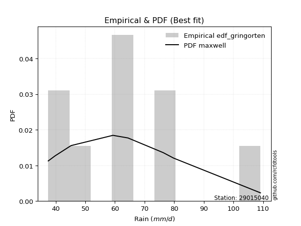</img>

</div>


### 9. EDF Filliben (1975)

The specific values of the constants (0.3175) (often denoted as $alpha$) and (0.365) are derived from a method proposed by James J. Filliben in a 1975 paper. This particular formula is the mean value of the $i$-th order statistic of the normal distribution and is considered a robust and effective plotting position formula for the normal probability plot correlation coefficient test for normality.

<div align="center">


$P=(m-0.3175)/(n+0.365)$


</div>


**9.1. Empirical values**

<div align="center">

|                | 0                  | 1                   | 2                  | 3                   | 4                  | 5                  | 6                  | 7                  |
|:---------------|:-------------------|:--------------------|:-------------------|:--------------------|:-------------------|:-------------------|:-------------------|:-------------------|
| date           | 2023               | 2019                | 2024               | 2021                | 2022               | 2018               | 2017               | 2020               |
| x              | 37.5               | 39.8                | 45.2               | 59.3                | 59.4               | 76.3               | 79.8               | 109.1              |
| m              | 1                  | 2                   | 3                  | 4                   | 5                  | 6                  | 7                  | 8                  |
| empirical_dist | edf_filliben       | edf_filliben        | edf_filliben       | edf_filliben        | edf_filliben       | edf_filliben       | edf_filliben       | edf_filliben       |
| empirical      | 0.0815899581589958 | 0.20113568439928273 | 0.3206814106395696 | 0.44022713687985654 | 0.5597728631201434 | 0.6793185893604303 | 0.7988643156007172 | 0.9184100418410042 |
| empirical_tr   | 1.0888382687927107 | 1.2517770295548074  | 1.4720633523977125 | 1.7864388681260008  | 2.271554650373387  | 3.118359739049394  | 4.971768202080237  | 12.256410256410254 |

</div>


**9.2. Kolmogorov-Smirnov fit test (sorted by Δ)**


<div align="center">

|                | 0                   | 1                  | 2                   | 3                   | 4                   | 5                   | 6                   | 7                  | 8                   | 9                   | 10                  | 11                  | 12                  | 13                  | 14                  | 15                 | 16                  | 17                  | 18                  | 19                  | 20                  | 21                  | 22                 | 23                  | 24                  | 25                  | 26                  | 27                  | 28                  | 29                  | 30                  | 31                  | 32                  | 33                  | 34                  | 35                  | 36                  | 37                  | 38                  | 39                  | 40                  | 41                  | 42                  | 43                 | 44                 | 45                  | 46                    | 47                  | 48                  | 49                 | 50                 | 51                 | 52                  | 53                  | 54                  | 55                  | 56                  | 57                  | 58                 | 59                  | 60                 | 61                  | 62                  | 63                  | 64                  | 65                  | 66                  | 67                  | 68                  | 69                  | 70                  | 71                 | 72                  | 73                  | 74                  | 75                  | 76                 | 77                 | 78                 | 79                 | 80                  | 81                  | 82                 | 83                 | 84                 | 85                  | 86                 | 87                 |
|:---------------|:--------------------|:-------------------|:--------------------|:--------------------|:--------------------|:--------------------|:--------------------|:-------------------|:--------------------|:--------------------|:--------------------|:--------------------|:--------------------|:--------------------|:--------------------|:-------------------|:--------------------|:--------------------|:--------------------|:--------------------|:--------------------|:--------------------|:-------------------|:--------------------|:--------------------|:--------------------|:--------------------|:--------------------|:--------------------|:--------------------|:--------------------|:--------------------|:--------------------|:--------------------|:--------------------|:--------------------|:--------------------|:--------------------|:--------------------|:--------------------|:--------------------|:--------------------|:--------------------|:-------------------|:-------------------|:--------------------|:----------------------|:--------------------|:--------------------|:-------------------|:-------------------|:-------------------|:--------------------|:--------------------|:--------------------|:--------------------|:--------------------|:--------------------|:-------------------|:--------------------|:-------------------|:--------------------|:--------------------|:--------------------|:--------------------|:--------------------|:--------------------|:--------------------|:--------------------|:--------------------|:--------------------|:-------------------|:--------------------|:--------------------|:--------------------|:--------------------|:-------------------|:-------------------|:-------------------|:-------------------|:--------------------|:--------------------|:-------------------|:-------------------|:-------------------|:--------------------|:-------------------|:-------------------|
| station        | 29015040            | 29015040           | 29015040            | 29015040            | 29015040            | 29015040            | 29015040            | 29015040           | 29015040            | 29015040            | 29015040            | 29015040            | 29015040            | 29015040            | 29015040            | 29015040           | 29015040            | 29015040            | 29015040            | 29015040            | 29015040            | 29015040            | 29015040           | 29015040            | 29015040            | 29015040            | 29015040            | 29015040            | 29015040            | 29015040            | 29015040            | 29015040            | 29015040            | 29015040            | 29015040            | 29015040            | 29015040            | 29015040            | 29015040            | 29015040            | 29015040            | 29015040            | 29015040            | 29015040           | 29015040           | 29015040            | 29015040              | 29015040            | 29015040            | 29015040           | 29015040           | 29015040           | 29015040            | 29015040            | 29015040            | 29015040            | 29015040            | 29015040            | 29015040           | 29015040            | 29015040           | 29015040            | 29015040            | 29015040            | 29015040            | 29015040            | 29015040            | 29015040            | 29015040            | 29015040            | 29015040            | 29015040           | 29015040            | 29015040            | 29015040            | 29015040            | 29015040           | 29015040           | 29015040           | 29015040           | 29015040            | 29015040            | 29015040           | 29015040           | 29015040           | 29015040            | 29015040           | 29015040           |
| empirical_dist | edf_filliben        | edf_filliben       | edf_filliben        | edf_filliben        | edf_filliben        | edf_filliben        | edf_filliben        | edf_filliben       | edf_filliben        | edf_filliben        | edf_filliben        | edf_filliben        | edf_filliben        | edf_filliben        | edf_filliben        | edf_filliben       | edf_filliben        | edf_filliben        | edf_filliben        | edf_filliben        | edf_filliben        | edf_filliben        | edf_filliben       | edf_filliben        | edf_filliben        | edf_filliben        | edf_filliben        | edf_filliben        | edf_filliben        | edf_filliben        | edf_filliben        | edf_filliben        | edf_filliben        | edf_filliben        | edf_filliben        | edf_filliben        | edf_filliben        | edf_filliben        | edf_filliben        | edf_filliben        | edf_filliben        | edf_filliben        | edf_filliben        | edf_filliben       | edf_filliben       | edf_filliben        | edf_filliben          | edf_filliben        | edf_filliben        | edf_filliben       | edf_filliben       | edf_filliben       | edf_filliben        | edf_filliben        | edf_filliben        | edf_filliben        | edf_filliben        | edf_filliben        | edf_filliben       | edf_filliben        | edf_filliben       | edf_filliben        | edf_filliben        | edf_filliben        | edf_filliben        | edf_filliben        | edf_filliben        | edf_filliben        | edf_filliben        | edf_filliben        | edf_filliben        | edf_filliben       | edf_filliben        | edf_filliben        | edf_filliben        | edf_filliben        | edf_filliben       | edf_filliben       | edf_filliben       | edf_filliben       | edf_filliben        | edf_filliben        | edf_filliben       | edf_filliben       | edf_filliben       | edf_filliben        | edf_filliben       | edf_filliben       |
| p_dist         | halfnorm            | rayleigh           | logmaxwell          | maxwell             | logalpha            | pearson3            | lograyleigh         | nct                | alpha               | loginvgamma         | lognct              | logpearson3         | betaprime           | f                   | logbetaprime        | logncf             | logloggamma         | logexponnorm        | lognorm             | lognorm             | logt                | logcrystalball      | logrice            | ncf                 | logfisk             | genlogistic         | gumbel_r            | halflogistic        | kstwobign           | logjohnsonsu        | logmielke           | moyal               | loggompertz         | gompertz            | loginvweibull       | loggenlogistic      | nakagami            | loggumbel_r         | invgamma            | genexpon            | logkstwobign        | truncnorm           | crystalball         | norm               | t                  | loglogistic         | loglaplace_asymmetric | expon               | loghalfnorm         | exponnorm          | loggumbel_l        | logistic           | rice                | loginvgauss         | laplace_asymmetric  | loghypsecant        | hypsecant           | logmoyal            | loglaplace         | logfatiguelife      | invgauss           | loggenexpon         | laplace             | fisk                | johnsonsu           | logtruncnorm        | weibull_min         | loghalflogistic     | logexpon            | gumbel_l            | logwald             | logf               | wald                | gamma               | logweibull_min      | logerlang           | gibrat             | loggibrat          | loggamma           | loggamma           | erlang              | chi2                | logchi2            | loglognorm         | lognakagami        | fatiguelife         | invweibull         | mielke             |
| delta          | 0.07204837754743207 | 0.0864902448156038 | 0.09110631771469221 | 0.09363002859940756 | 0.09850579642345791 | 0.09919887779447215 | 0.09954561830628489 | 0.1001646178408735 | 0.10098087810514192 | 0.10112512300443469 | 0.10133031665882727 | 0.10285373847421281 | 0.10302345823684847 | 0.10346478199533296 | 0.10354210871683792 | 0.1036887970085903 | 0.10463981953737767 | 0.10658500004544702 | 0.10673369613625938 | 0.10673369613625938 | 0.10673379831923874 | 0.10673390920242071 | 0.1083618969209755 | 0.10879000196387437 | 0.10910811644342328 | 0.10945557784015306 | 0.11106401477399683 | 0.11413313262079328 | 0.11493728730347708 | 0.11977155878901241 | 0.12134453506259851 | 0.12207920931015409 | 0.12386381399559777 | 0.12400238550870517 | 0.12403473507951007 | 0.12407549170720272 | 0.12411067471438203 | 0.12543606984832784 | 0.12563299422155233 | 0.12682284418576306 | 0.12798046569140514 | 0.12803301297256464 | 0.12803301726397698 | 0.128033018875101  | 0.1280375353269969 | 0.12882256206906875 | 0.12977964449391136   | 0.13019885507672696 | 0.13082383621614274 | 0.1317284251276602 | 0.13687172887197   | 0.1371160229133072 | 0.13811839651864455 | 0.13906136201690494 | 0.14089052105562144 | 0.14225549873360832 | 0.14471942677450317 | 0.15130756754848113 | 0.1577348677900739 | 0.16209695876689306 | 0.1644473196755643 | 0.16633395241212118 | 0.16770332992638592 | 0.17025730898258784 | 0.17191507225917996 | 0.18060156711944958 | 0.18500331337459158 | 0.18571206166271628 | 0.18871671306915844 | 0.19718225766994113 | 0.25019734827904594 | 0.251972524533198  | 0.25512580835383436 | 0.26373590437490807 | 0.27548552627428335 | 0.27680184199106134 | 0.3206814106395696 | 0.3206814106395696 | 0.3278309031579451 | 0.3278309031579451 | 0.33075566362216297 | 0.36195766397633605 | 0.3639444576036187 | 0.3829803532042071 | 0.3844929740070924 | 0.42761544926585027 | 0.4667772516699302 | nan                |
| deltao         | 0.4472608134160001  | 0.4472608134160001 | 0.4472608134160001  | 0.4472608134160001  | 0.4472608134160001  | 0.4472608134160001  | 0.4472608134160001  | 0.4472608134160001 | 0.4472608134160001  | 0.4472608134160001  | 0.4472608134160001  | 0.4472608134160001  | 0.4472608134160001  | 0.4472608134160001  | 0.4472608134160001  | 0.4472608134160001 | 0.4472608134160001  | 0.4472608134160001  | 0.4472608134160001  | 0.4472608134160001  | 0.4472608134160001  | 0.4472608134160001  | 0.4472608134160001 | 0.4472608134160001  | 0.4472608134160001  | 0.4472608134160001  | 0.4472608134160001  | 0.4472608134160001  | 0.4472608134160001  | 0.4472608134160001  | 0.4472608134160001  | 0.4472608134160001  | 0.4472608134160001  | 0.4472608134160001  | 0.4472608134160001  | 0.4472608134160001  | 0.4472608134160001  | 0.4472608134160001  | 0.4472608134160001  | 0.4472608134160001  | 0.4472608134160001  | 0.4472608134160001  | 0.4472608134160001  | 0.4472608134160001 | 0.4472608134160001 | 0.4472608134160001  | 0.4472608134160001    | 0.4472608134160001  | 0.4472608134160001  | 0.4472608134160001 | 0.4472608134160001 | 0.4472608134160001 | 0.4472608134160001  | 0.4472608134160001  | 0.4472608134160001  | 0.4472608134160001  | 0.4472608134160001  | 0.4472608134160001  | 0.4472608134160001 | 0.4472608134160001  | 0.4472608134160001 | 0.4472608134160001  | 0.4472608134160001  | 0.4472608134160001  | 0.4472608134160001  | 0.4472608134160001  | 0.4472608134160001  | 0.4472608134160001  | 0.4472608134160001  | 0.4472608134160001  | 0.4472608134160001  | 0.4472608134160001 | 0.4472608134160001  | 0.4472608134160001  | 0.4472608134160001  | 0.4472608134160001  | 0.4472608134160001 | 0.4472608134160001 | 0.4472608134160001 | 0.4472608134160001 | 0.4472608134160001  | 0.4472608134160001  | 0.4472608134160001 | 0.4472608134160001 | 0.4472608134160001 | 0.4472608134160001  | 0.4472608134160001 | 0.4472608134160001 |
| eval           | Δo > Δ              | Δo > Δ             | Δo > Δ              | Δo > Δ              | Δo > Δ              | Δo > Δ              | Δo > Δ              | Δo > Δ             | Δo > Δ              | Δo > Δ              | Δo > Δ              | Δo > Δ              | Δo > Δ              | Δo > Δ              | Δo > Δ              | Δo > Δ             | Δo > Δ              | Δo > Δ              | Δo > Δ              | Δo > Δ              | Δo > Δ              | Δo > Δ              | Δo > Δ             | Δo > Δ              | Δo > Δ              | Δo > Δ              | Δo > Δ              | Δo > Δ              | Δo > Δ              | Δo > Δ              | Δo > Δ              | Δo > Δ              | Δo > Δ              | Δo > Δ              | Δo > Δ              | Δo > Δ              | Δo > Δ              | Δo > Δ              | Δo > Δ              | Δo > Δ              | Δo > Δ              | Δo > Δ              | Δo > Δ              | Δo > Δ             | Δo > Δ             | Δo > Δ              | Δo > Δ                | Δo > Δ              | Δo > Δ              | Δo > Δ             | Δo > Δ             | Δo > Δ             | Δo > Δ              | Δo > Δ              | Δo > Δ              | Δo > Δ              | Δo > Δ              | Δo > Δ              | Δo > Δ             | Δo > Δ              | Δo > Δ             | Δo > Δ              | Δo > Δ              | Δo > Δ              | Δo > Δ              | Δo > Δ              | Δo > Δ              | Δo > Δ              | Δo > Δ              | Δo > Δ              | Δo > Δ              | Δo > Δ             | Δo > Δ              | Δo > Δ              | Δo > Δ              | Δo > Δ              | Δo > Δ             | Δo > Δ             | Δo > Δ             | Δo > Δ             | Δo > Δ              | Δo > Δ              | Δo > Δ             | Δo > Δ             | Δo > Δ             | Δo > Δ              | Δo <= Δ            | Δo <= Δ            |
| fit            | 1                   | 1                  | 1                   | 1                   | 1                   | 1                   | 1                   | 1                  | 1                   | 1                   | 1                   | 1                   | 1                   | 1                   | 1                   | 1                  | 1                   | 1                   | 1                   | 1                   | 1                   | 1                   | 1                  | 1                   | 1                   | 1                   | 1                   | 1                   | 1                   | 1                   | 1                   | 1                   | 1                   | 1                   | 1                   | 1                   | 1                   | 1                   | 1                   | 1                   | 1                   | 1                   | 1                   | 1                  | 1                  | 1                   | 1                     | 1                   | 1                   | 1                  | 1                  | 1                  | 1                   | 1                   | 1                   | 1                   | 1                   | 1                   | 1                  | 1                   | 1                  | 1                   | 1                   | 1                   | 1                   | 1                   | 1                   | 1                   | 1                   | 1                   | 1                   | 1                  | 1                   | 1                   | 1                   | 1                   | 1                  | 1                  | 1                  | 1                  | 1                   | 1                   | 1                  | 1                  | 1                  | 1                   | 0                  | 0                  |
| n              | 8                   | 8                  | 8                   | 8                   | 8                   | 8                   | 8                   | 8                  | 8                   | 8                   | 8                   | 8                   | 8                   | 8                   | 8                   | 8                  | 8                   | 8                   | 8                   | 8                   | 8                   | 8                   | 8                  | 8                   | 8                   | 8                   | 8                   | 8                   | 8                   | 8                   | 8                   | 8                   | 8                   | 8                   | 8                   | 8                   | 8                   | 8                   | 8                   | 8                   | 8                   | 8                   | 8                   | 8                  | 8                  | 8                   | 8                     | 8                   | 8                   | 8                  | 8                  | 8                  | 8                   | 8                   | 8                   | 8                   | 8                   | 8                   | 8                  | 8                   | 8                  | 8                   | 8                   | 8                   | 8                   | 8                   | 8                   | 8                   | 8                   | 8                   | 8                   | 8                  | 8                   | 8                   | 8                   | 8                   | 8                  | 8                  | 8                  | 8                  | 8                   | 8                   | 8                  | 8                  | 8                  | 8                   | 8                  | 8                  |
| best_fit       | 1                   | 0                  | 0                   | 0                   | 0                   | 0                   | 0                   | 0                  | 0                   | 0                   | 0                   | 0                   | 0                   | 0                   | 0                   | 0                  | 0                   | 0                   | 0                   | 0                   | 0                   | 0                   | 0                  | 0                   | 0                   | 0                   | 0                   | 0                   | 0                   | 0                   | 0                   | 0                   | 0                   | 0                   | 0                   | 0                   | 0                   | 0                   | 0                   | 0                   | 0                   | 0                   | 0                   | 0                  | 0                  | 0                   | 0                     | 0                   | 0                   | 0                  | 0                  | 0                  | 0                   | 0                   | 0                   | 0                   | 0                   | 0                   | 0                  | 0                   | 0                  | 0                   | 0                   | 0                   | 0                   | 0                   | 0                   | 0                   | 0                   | 0                   | 0                   | 0                  | 0                   | 0                   | 0                   | 0                   | 0                  | 0                  | 0                  | 0                  | 0                   | 0                   | 0                  | 0                  | 0                  | 0                   | 0                  | 0                  |
| best_fit_sort  | 1                   | 2                  | 3                   | 4                   | 5                   | 6                   | 7                   | 8                  | 9                   | 10                  | 11                  | 12                  | 13                  | 14                  | 15                  | 16                 | 17                  | 18                  | 19                  | 20                  | 21                  | 22                  | 23                 | 24                  | 25                  | 26                  | 27                  | 28                  | 29                  | 30                  | 31                  | 32                  | 33                  | 34                  | 35                  | 36                  | 37                  | 38                  | 39                  | 40                  | 41                  | 42                  | 43                  | 44                 | 45                 | 46                  | 47                    | 48                  | 49                  | 50                 | 51                 | 52                 | 53                  | 54                  | 55                  | 56                  | 57                  | 58                  | 59                 | 60                  | 61                 | 62                  | 63                  | 64                  | 65                  | 66                  | 67                  | 68                  | 69                  | 70                  | 71                  | 72                 | 73                  | 74                  | 75                  | 76                  | 77                 | 78                 | 79                 | 80                 | 81                  | 82                  | 83                 | 84                 | 85                 | 86                  | 87                 | 88                 |

</div>


**9.3. Best fit**

<div align="center">

|   id |   station | empirical_dist   | p_dist   |     delta |   deltao | eval   |   fit |   n |   best_fit |   best_fit_sort |
|-----:|----------:|:-----------------|:---------|----------:|---------:|:-------|------:|----:|-----------:|----------------:|
|    0 |  29015040 | edf_filliben     | halfnorm | 0.0720484 | 0.447261 | Δo > Δ |     1 |   8 |          1 |               1 |

</div>


<div align="center">

</img>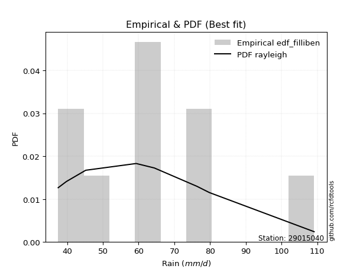</img>

</div>


### 10. EDF Jenkinson (1977)

The Jenkinson formula in hydrology is an empirical plotting position formula used to estimate the non-exceedance probability _(P)_ or return period _(T)_ of a given ordered observation within a sample. It is a widely used method in the frequency analysis of extreme events such as floods and rainfall, as it provides a distribution-free way to plot data. _a≈0.31_ and _b≈0.38_ are constants derived to approximate the median of the probability distribution for the given rank.

<div align="center">


$P=(m-a)/(n+b)$


</div>


**10.1. Empirical values**

<div align="center">

|                | 0                   | 1                   | 2                  | 3                   | 4                  | 5                  | 6                  | 7                  |
|:---------------|:--------------------|:--------------------|:-------------------|:--------------------|:-------------------|:-------------------|:-------------------|:-------------------|
| date           | 2023                | 2019                | 2024               | 2021                | 2022               | 2018               | 2017               | 2020               |
| x              | 37.5                | 39.8                | 45.2               | 59.3                | 59.4               | 76.3               | 79.8               | 109.1              |
| m              | 1                   | 2                   | 3                  | 4                   | 5                  | 6                  | 7                  | 8                  |
| empirical_dist | edf_jenkinson       | edf_jenkinson       | edf_jenkinson      | edf_jenkinson       | edf_jenkinson      | edf_jenkinson      | edf_jenkinson      | edf_jenkinson      |
| empirical      | 0.08233890214797135 | 0.20167064439140808 | 0.3210023866348448 | 0.44033412887828155 | 0.5596658711217184 | 0.6789976133651551 | 0.7983293556085919 | 0.9176610978520287 |
| empirical_tr   | 1.0897269180754225  | 1.2526158445440956  | 1.4727592267135323 | 1.7867803837953091  | 2.2710027100271004 | 3.115241635687732  | 4.958579881656804  | 12.144927536231886 |

</div>


**10.2. Kolmogorov-Smirnov fit test (sorted by Δ)**


<div align="center">

|                | 0                   | 1                  | 2                   | 3                   | 4                   | 5                   | 6                   | 7                   | 8                   | 9                   | 10                  | 11                 | 12                  | 13                  | 14                  | 15                  | 16                  | 17                  | 18                  | 19                  | 20                  | 21                 | 22                 | 23                  | 24                  | 25                  | 26                  | 27                  | 28                  | 29                 | 30                 | 31                  | 32                  | 33                  | 34                  | 35                  | 36                  | 37                  | 38                  | 39                  | 40                  | 41                  | 42                  | 43                  | 44                 | 45                  | 46                  | 47                    | 48                  | 49                 | 50                 | 51                 | 52                  | 53                  | 54                  | 55                  | 56                  | 57                  | 58                 | 59                  | 60                 | 61                  | 62                  | 63                  | 64                  | 65                  | 66                  | 67                  | 68                  | 69                  | 70                 | 71                 | 72                  | 73                  | 74                 | 75                 | 76                 | 77                 | 78                 | 79                 | 80                  | 81                  | 82                 | 83                  | 84                  | 85                  | 86                 | 87                 |
|:---------------|:--------------------|:-------------------|:--------------------|:--------------------|:--------------------|:--------------------|:--------------------|:--------------------|:--------------------|:--------------------|:--------------------|:-------------------|:--------------------|:--------------------|:--------------------|:--------------------|:--------------------|:--------------------|:--------------------|:--------------------|:--------------------|:-------------------|:-------------------|:--------------------|:--------------------|:--------------------|:--------------------|:--------------------|:--------------------|:-------------------|:-------------------|:--------------------|:--------------------|:--------------------|:--------------------|:--------------------|:--------------------|:--------------------|:--------------------|:--------------------|:--------------------|:--------------------|:--------------------|:--------------------|:-------------------|:--------------------|:--------------------|:----------------------|:--------------------|:-------------------|:-------------------|:-------------------|:--------------------|:--------------------|:--------------------|:--------------------|:--------------------|:--------------------|:-------------------|:--------------------|:-------------------|:--------------------|:--------------------|:--------------------|:--------------------|:--------------------|:--------------------|:--------------------|:--------------------|:--------------------|:-------------------|:-------------------|:--------------------|:--------------------|:-------------------|:-------------------|:-------------------|:-------------------|:-------------------|:-------------------|:--------------------|:--------------------|:-------------------|:--------------------|:--------------------|:--------------------|:-------------------|:-------------------|
| station        | 29015040            | 29015040           | 29015040            | 29015040            | 29015040            | 29015040            | 29015040            | 29015040            | 29015040            | 29015040            | 29015040            | 29015040           | 29015040            | 29015040            | 29015040            | 29015040            | 29015040            | 29015040            | 29015040            | 29015040            | 29015040            | 29015040           | 29015040           | 29015040            | 29015040            | 29015040            | 29015040            | 29015040            | 29015040            | 29015040           | 29015040           | 29015040            | 29015040            | 29015040            | 29015040            | 29015040            | 29015040            | 29015040            | 29015040            | 29015040            | 29015040            | 29015040            | 29015040            | 29015040            | 29015040           | 29015040            | 29015040            | 29015040              | 29015040            | 29015040           | 29015040           | 29015040           | 29015040            | 29015040            | 29015040            | 29015040            | 29015040            | 29015040            | 29015040           | 29015040            | 29015040           | 29015040            | 29015040            | 29015040            | 29015040            | 29015040            | 29015040            | 29015040            | 29015040            | 29015040            | 29015040           | 29015040           | 29015040            | 29015040            | 29015040           | 29015040           | 29015040           | 29015040           | 29015040           | 29015040           | 29015040            | 29015040            | 29015040           | 29015040            | 29015040            | 29015040            | 29015040           | 29015040           |
| empirical_dist | edf_jenkinson       | edf_jenkinson      | edf_jenkinson       | edf_jenkinson       | edf_jenkinson       | edf_jenkinson       | edf_jenkinson       | edf_jenkinson       | edf_jenkinson       | edf_jenkinson       | edf_jenkinson       | edf_jenkinson      | edf_jenkinson       | edf_jenkinson       | edf_jenkinson       | edf_jenkinson       | edf_jenkinson       | edf_jenkinson       | edf_jenkinson       | edf_jenkinson       | edf_jenkinson       | edf_jenkinson      | edf_jenkinson      | edf_jenkinson       | edf_jenkinson       | edf_jenkinson       | edf_jenkinson       | edf_jenkinson       | edf_jenkinson       | edf_jenkinson      | edf_jenkinson      | edf_jenkinson       | edf_jenkinson       | edf_jenkinson       | edf_jenkinson       | edf_jenkinson       | edf_jenkinson       | edf_jenkinson       | edf_jenkinson       | edf_jenkinson       | edf_jenkinson       | edf_jenkinson       | edf_jenkinson       | edf_jenkinson       | edf_jenkinson      | edf_jenkinson       | edf_jenkinson       | edf_jenkinson         | edf_jenkinson       | edf_jenkinson      | edf_jenkinson      | edf_jenkinson      | edf_jenkinson       | edf_jenkinson       | edf_jenkinson       | edf_jenkinson       | edf_jenkinson       | edf_jenkinson       | edf_jenkinson      | edf_jenkinson       | edf_jenkinson      | edf_jenkinson       | edf_jenkinson       | edf_jenkinson       | edf_jenkinson       | edf_jenkinson       | edf_jenkinson       | edf_jenkinson       | edf_jenkinson       | edf_jenkinson       | edf_jenkinson      | edf_jenkinson      | edf_jenkinson       | edf_jenkinson       | edf_jenkinson      | edf_jenkinson      | edf_jenkinson      | edf_jenkinson      | edf_jenkinson      | edf_jenkinson      | edf_jenkinson       | edf_jenkinson       | edf_jenkinson      | edf_jenkinson       | edf_jenkinson       | edf_jenkinson       | edf_jenkinson      | edf_jenkinson      |
| p_dist         | halfnorm            | rayleigh           | logmaxwell          | maxwell             | logalpha            | lograyleigh         | pearson3            | nct                 | alpha               | loginvgamma         | lognct              | logpearson3        | betaprime           | logncf              | f                   | logbetaprime        | logloggamma         | logexponnorm        | lognorm             | lognorm             | logt                | logcrystalball     | logrice            | logfisk             | ncf                 | genlogistic         | gumbel_r            | halflogistic        | kstwobign           | logjohnsonsu       | logmielke          | moyal               | loginvweibull       | loggenlogistic      | nakagami            | loggompertz         | gompertz            | loggumbel_r         | invgamma            | genexpon            | logkstwobign        | truncnorm           | crystalball         | norm                | t                  | loglogistic         | expon               | loglaplace_asymmetric | loghalfnorm         | exponnorm          | logistic           | loggumbel_l        | rice                | loginvgauss         | laplace_asymmetric  | loghypsecant        | hypsecant           | logmoyal            | loglaplace         | logfatiguelife      | invgauss           | loggenexpon         | laplace             | fisk                | johnsonsu           | logtruncnorm        | weibull_min         | loghalflogistic     | logexpon            | gumbel_l            | logwald            | logf               | wald                | gamma               | logweibull_min     | logerlang          | gibrat             | loggibrat          | loggamma           | loggamma           | erlang              | chi2                | logchi2            | loglognorm          | lognakagami         | fatiguelife         | invweibull         | mielke             |
| delta          | 0.07236935354270727 | 0.086811220810879  | 0.09142729370996741 | 0.09352303660098255 | 0.09882677241873317 | 0.09943862630785988 | 0.09951985378974734 | 0.10048559383614875 | 0.10130185410041712 | 0.10144609899970988 | 0.10165129265410247 | 0.103174714469488  | 0.10334443423212367 | 0.10358180501016528 | 0.10378575799060816 | 0.10386308471211311 | 0.10496079553265286 | 0.10690597604072222 | 0.10705467213153458 | 0.10705467213153458 | 0.10705477431451393 | 0.1070548851976959 | 0.1086828729162507 | 0.10900112444499827 | 0.10911097795914956 | 0.10977655383542825 | 0.11138499076927202 | 0.11466809261291863 | 0.11525826329875227 | 0.1196645667905874 | 0.1212375430641735 | 0.12240018530542929 | 0.12392774308108506 | 0.12396849970877771 | 0.12400368271595702 | 0.12439877398772313 | 0.12453734550083052 | 0.12532907784990283 | 0.12552600222312732 | 0.12735780417788845 | 0.12787347369298013 | 0.12792602097413963 | 0.12792602526555197 | 0.12792602687667598 | 0.1279305433285719 | 0.12914353806434395 | 0.13009186307830195 | 0.13010062048918655   | 0.13071684421771773 | 0.1316214331292352 | 0.1370090309148822 | 0.1371927048672452 | 0.13843937251391975 | 0.13895437001847993 | 0.14121149705089664 | 0.14257647472888352 | 0.14461243477607816 | 0.15120057555005612 | 0.1580558437853491 | 0.16198996676846805 | 0.1643403276771393 | 0.16622696041369617 | 0.16759633792796091 | 0.16950836499361233 | 0.17180808026075495 | 0.18049457512102457 | 0.18489632137616657 | 0.18624702165484164 | 0.18860972107073343 | 0.19707526567151612 | 0.2505183242743212 | 0.251865532534773  | 0.25544678434910956 | 0.26362891237648306 | 0.274950566282158  | 0.2766948499926363 | 0.3210023866348448 | 0.3210023866348448 | 0.3277239111595201 | 0.3277239111595201 | 0.33064867162373796 | 0.36185067197791104 | 0.3634094976114934 | 0.38244539321208176 | 0.38417199801181723 | 0.42708048927372494 | 0.4660283076809547 | nan                |
| deltao         | 0.4472608134160001  | 0.4472608134160001 | 0.4472608134160001  | 0.4472608134160001  | 0.4472608134160001  | 0.4472608134160001  | 0.4472608134160001  | 0.4472608134160001  | 0.4472608134160001  | 0.4472608134160001  | 0.4472608134160001  | 0.4472608134160001 | 0.4472608134160001  | 0.4472608134160001  | 0.4472608134160001  | 0.4472608134160001  | 0.4472608134160001  | 0.4472608134160001  | 0.4472608134160001  | 0.4472608134160001  | 0.4472608134160001  | 0.4472608134160001 | 0.4472608134160001 | 0.4472608134160001  | 0.4472608134160001  | 0.4472608134160001  | 0.4472608134160001  | 0.4472608134160001  | 0.4472608134160001  | 0.4472608134160001 | 0.4472608134160001 | 0.4472608134160001  | 0.4472608134160001  | 0.4472608134160001  | 0.4472608134160001  | 0.4472608134160001  | 0.4472608134160001  | 0.4472608134160001  | 0.4472608134160001  | 0.4472608134160001  | 0.4472608134160001  | 0.4472608134160001  | 0.4472608134160001  | 0.4472608134160001  | 0.4472608134160001 | 0.4472608134160001  | 0.4472608134160001  | 0.4472608134160001    | 0.4472608134160001  | 0.4472608134160001 | 0.4472608134160001 | 0.4472608134160001 | 0.4472608134160001  | 0.4472608134160001  | 0.4472608134160001  | 0.4472608134160001  | 0.4472608134160001  | 0.4472608134160001  | 0.4472608134160001 | 0.4472608134160001  | 0.4472608134160001 | 0.4472608134160001  | 0.4472608134160001  | 0.4472608134160001  | 0.4472608134160001  | 0.4472608134160001  | 0.4472608134160001  | 0.4472608134160001  | 0.4472608134160001  | 0.4472608134160001  | 0.4472608134160001 | 0.4472608134160001 | 0.4472608134160001  | 0.4472608134160001  | 0.4472608134160001 | 0.4472608134160001 | 0.4472608134160001 | 0.4472608134160001 | 0.4472608134160001 | 0.4472608134160001 | 0.4472608134160001  | 0.4472608134160001  | 0.4472608134160001 | 0.4472608134160001  | 0.4472608134160001  | 0.4472608134160001  | 0.4472608134160001 | 0.4472608134160001 |
| eval           | Δo > Δ              | Δo > Δ             | Δo > Δ              | Δo > Δ              | Δo > Δ              | Δo > Δ              | Δo > Δ              | Δo > Δ              | Δo > Δ              | Δo > Δ              | Δo > Δ              | Δo > Δ             | Δo > Δ              | Δo > Δ              | Δo > Δ              | Δo > Δ              | Δo > Δ              | Δo > Δ              | Δo > Δ              | Δo > Δ              | Δo > Δ              | Δo > Δ             | Δo > Δ             | Δo > Δ              | Δo > Δ              | Δo > Δ              | Δo > Δ              | Δo > Δ              | Δo > Δ              | Δo > Δ             | Δo > Δ             | Δo > Δ              | Δo > Δ              | Δo > Δ              | Δo > Δ              | Δo > Δ              | Δo > Δ              | Δo > Δ              | Δo > Δ              | Δo > Δ              | Δo > Δ              | Δo > Δ              | Δo > Δ              | Δo > Δ              | Δo > Δ             | Δo > Δ              | Δo > Δ              | Δo > Δ                | Δo > Δ              | Δo > Δ             | Δo > Δ             | Δo > Δ             | Δo > Δ              | Δo > Δ              | Δo > Δ              | Δo > Δ              | Δo > Δ              | Δo > Δ              | Δo > Δ             | Δo > Δ              | Δo > Δ             | Δo > Δ              | Δo > Δ              | Δo > Δ              | Δo > Δ              | Δo > Δ              | Δo > Δ              | Δo > Δ              | Δo > Δ              | Δo > Δ              | Δo > Δ             | Δo > Δ             | Δo > Δ              | Δo > Δ              | Δo > Δ             | Δo > Δ             | Δo > Δ             | Δo > Δ             | Δo > Δ             | Δo > Δ             | Δo > Δ              | Δo > Δ              | Δo > Δ             | Δo > Δ              | Δo > Δ              | Δo > Δ              | Δo <= Δ            | Δo <= Δ            |
| fit            | 1                   | 1                  | 1                   | 1                   | 1                   | 1                   | 1                   | 1                   | 1                   | 1                   | 1                   | 1                  | 1                   | 1                   | 1                   | 1                   | 1                   | 1                   | 1                   | 1                   | 1                   | 1                  | 1                  | 1                   | 1                   | 1                   | 1                   | 1                   | 1                   | 1                  | 1                  | 1                   | 1                   | 1                   | 1                   | 1                   | 1                   | 1                   | 1                   | 1                   | 1                   | 1                   | 1                   | 1                   | 1                  | 1                   | 1                   | 1                     | 1                   | 1                  | 1                  | 1                  | 1                   | 1                   | 1                   | 1                   | 1                   | 1                   | 1                  | 1                   | 1                  | 1                   | 1                   | 1                   | 1                   | 1                   | 1                   | 1                   | 1                   | 1                   | 1                  | 1                  | 1                   | 1                   | 1                  | 1                  | 1                  | 1                  | 1                  | 1                  | 1                   | 1                   | 1                  | 1                   | 1                   | 1                   | 0                  | 0                  |
| n              | 8                   | 8                  | 8                   | 8                   | 8                   | 8                   | 8                   | 8                   | 8                   | 8                   | 8                   | 8                  | 8                   | 8                   | 8                   | 8                   | 8                   | 8                   | 8                   | 8                   | 8                   | 8                  | 8                  | 8                   | 8                   | 8                   | 8                   | 8                   | 8                   | 8                  | 8                  | 8                   | 8                   | 8                   | 8                   | 8                   | 8                   | 8                   | 8                   | 8                   | 8                   | 8                   | 8                   | 8                   | 8                  | 8                   | 8                   | 8                     | 8                   | 8                  | 8                  | 8                  | 8                   | 8                   | 8                   | 8                   | 8                   | 8                   | 8                  | 8                   | 8                  | 8                   | 8                   | 8                   | 8                   | 8                   | 8                   | 8                   | 8                   | 8                   | 8                  | 8                  | 8                   | 8                   | 8                  | 8                  | 8                  | 8                  | 8                  | 8                  | 8                   | 8                   | 8                  | 8                   | 8                   | 8                   | 8                  | 8                  |
| best_fit       | 1                   | 0                  | 0                   | 0                   | 0                   | 0                   | 0                   | 0                   | 0                   | 0                   | 0                   | 0                  | 0                   | 0                   | 0                   | 0                   | 0                   | 0                   | 0                   | 0                   | 0                   | 0                  | 0                  | 0                   | 0                   | 0                   | 0                   | 0                   | 0                   | 0                  | 0                  | 0                   | 0                   | 0                   | 0                   | 0                   | 0                   | 0                   | 0                   | 0                   | 0                   | 0                   | 0                   | 0                   | 0                  | 0                   | 0                   | 0                     | 0                   | 0                  | 0                  | 0                  | 0                   | 0                   | 0                   | 0                   | 0                   | 0                   | 0                  | 0                   | 0                  | 0                   | 0                   | 0                   | 0                   | 0                   | 0                   | 0                   | 0                   | 0                   | 0                  | 0                  | 0                   | 0                   | 0                  | 0                  | 0                  | 0                  | 0                  | 0                  | 0                   | 0                   | 0                  | 0                   | 0                   | 0                   | 0                  | 0                  |
| best_fit_sort  | 1                   | 2                  | 3                   | 4                   | 5                   | 6                   | 7                   | 8                   | 9                   | 10                  | 11                  | 12                 | 13                  | 14                  | 15                  | 16                  | 17                  | 18                  | 19                  | 20                  | 21                  | 22                 | 23                 | 24                  | 25                  | 26                  | 27                  | 28                  | 29                  | 30                 | 31                 | 32                  | 33                  | 34                  | 35                  | 36                  | 37                  | 38                  | 39                  | 40                  | 41                  | 42                  | 43                  | 44                  | 45                 | 46                  | 47                  | 48                    | 49                  | 50                 | 51                 | 52                 | 53                  | 54                  | 55                  | 56                  | 57                  | 58                  | 59                 | 60                  | 61                 | 62                  | 63                  | 64                  | 65                  | 66                  | 67                  | 68                  | 69                  | 70                  | 71                 | 72                 | 73                  | 74                  | 75                 | 76                 | 77                 | 78                 | 79                 | 80                 | 81                  | 82                  | 83                 | 84                  | 85                  | 86                  | 87                 | 88                 |

</div>


**10.3. Best fit**

<div align="center">

|   id |   station | empirical_dist   | p_dist   |     delta |   deltao | eval   |   fit |   n |   best_fit |   best_fit_sort |
|-----:|----------:|:-----------------|:---------|----------:|---------:|:-------|------:|----:|-----------:|----------------:|
|    0 |  29015040 | edf_jenkinson    | halfnorm | 0.0723694 | 0.447261 | Δo > Δ |     1 |   8 |          1 |               1 |

</div>


<div align="center">

</img>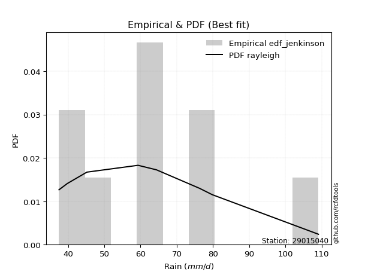</img>

</div>


### 11. EDF Cunnane (1978)

Cunnane´s work in statistical hydrology has focused on the performance and evaluation of different probability distributions (such as GEV, Gumbel, Lognormal) for flood frequency estimation. _b_ is a constant, typically set to 0.4.

<div align="center">


$P=(m-b)/(n+1-2b)$


</div>


**11.1. Empirical values**

<div align="center">

|                | 0                   | 1                   | 2                  | 3                  | 4                  | 5                  | 6                  | 7                  |
|:---------------|:--------------------|:--------------------|:-------------------|:-------------------|:-------------------|:-------------------|:-------------------|:-------------------|
| date           | 2023                | 2019                | 2024               | 2021               | 2022               | 2018               | 2017               | 2020               |
| x              | 37.5                | 39.8                | 45.2               | 59.3               | 59.4               | 76.3               | 79.8               | 109.1              |
| m              | 1                   | 2                   | 3                  | 4                  | 5                  | 6                  | 7                  | 8                  |
| empirical_dist | edf_cunnane         | edf_cunnane         | edf_cunnane        | edf_cunnane        | edf_cunnane        | edf_cunnane        | edf_cunnane        | edf_cunnane        |
| empirical      | 0.07317073170731708 | 0.19512195121951223 | 0.3170731707317074 | 0.4390243902439025 | 0.5609756097560976 | 0.6829268292682927 | 0.8048780487804879 | 0.926829268292683  |
| empirical_tr   | 1.0789473684210527  | 1.2424242424242424  | 1.4642857142857144 | 1.782608695652174  | 2.277777777777778  | 3.153846153846154  | 5.125000000000001  | 13.666666666666675 |

</div>


**11.2. Kolmogorov-Smirnov fit test (sorted by Δ)**


<div align="center">

|                | 0                   | 1                   | 2                   | 3                   | 4                  | 5                  | 6                   | 7                   | 8                   | 9                   | 10                  | 11                  | 12                  | 13                  | 14                  | 15                  | 16                  | 17                  | 18                  | 19                 | 20                  | 21                  | 22                  | 23                  | 24                  | 25                  | 26                  | 27                  | 28                  | 29                  | 30                  | 31                  | 32                  | 33                  | 34                  | 35                 | 36                  | 37                  | 38                  | 39                    | 40                  | 41                  | 42                 | 43                  | 44                 | 45                 | 46                  | 47                 | 48                  | 49                  | 50                  | 51                 | 52                 | 53                  | 54                  | 55                 | 56                  | 57                  | 58                  | 59                 | 60                  | 61                  | 62                  | 63                 | 64                  | 65                  | 66                  | 67                  | 68                  | 69                  | 70                  | 71                 | 72                  | 73                 | 74                 | 75                  | 76                 | 77                 | 78                  | 79                  | 80                 | 81                 | 82                 | 83                  | 84                 | 85                  | 86                  | 87                 |
|:---------------|:--------------------|:--------------------|:--------------------|:--------------------|:-------------------|:-------------------|:--------------------|:--------------------|:--------------------|:--------------------|:--------------------|:--------------------|:--------------------|:--------------------|:--------------------|:--------------------|:--------------------|:--------------------|:--------------------|:-------------------|:--------------------|:--------------------|:--------------------|:--------------------|:--------------------|:--------------------|:--------------------|:--------------------|:--------------------|:--------------------|:--------------------|:--------------------|:--------------------|:--------------------|:--------------------|:-------------------|:--------------------|:--------------------|:--------------------|:----------------------|:--------------------|:--------------------|:-------------------|:--------------------|:-------------------|:-------------------|:--------------------|:-------------------|:--------------------|:--------------------|:--------------------|:-------------------|:-------------------|:--------------------|:--------------------|:-------------------|:--------------------|:--------------------|:--------------------|:-------------------|:--------------------|:--------------------|:--------------------|:-------------------|:--------------------|:--------------------|:--------------------|:--------------------|:--------------------|:--------------------|:--------------------|:-------------------|:--------------------|:-------------------|:-------------------|:--------------------|:-------------------|:-------------------|:--------------------|:--------------------|:-------------------|:-------------------|:-------------------|:--------------------|:-------------------|:--------------------|:--------------------|:-------------------|
| station        | 29015040            | 29015040            | 29015040            | 29015040            | 29015040           | 29015040           | 29015040            | 29015040            | 29015040            | 29015040            | 29015040            | 29015040            | 29015040            | 29015040            | 29015040            | 29015040            | 29015040            | 29015040            | 29015040            | 29015040           | 29015040            | 29015040            | 29015040            | 29015040            | 29015040            | 29015040            | 29015040            | 29015040            | 29015040            | 29015040            | 29015040            | 29015040            | 29015040            | 29015040            | 29015040            | 29015040           | 29015040            | 29015040            | 29015040            | 29015040              | 29015040            | 29015040            | 29015040           | 29015040            | 29015040           | 29015040           | 29015040            | 29015040           | 29015040            | 29015040            | 29015040            | 29015040           | 29015040           | 29015040            | 29015040            | 29015040           | 29015040            | 29015040            | 29015040            | 29015040           | 29015040            | 29015040            | 29015040            | 29015040           | 29015040            | 29015040            | 29015040            | 29015040            | 29015040            | 29015040            | 29015040            | 29015040           | 29015040            | 29015040           | 29015040           | 29015040            | 29015040           | 29015040           | 29015040            | 29015040            | 29015040           | 29015040           | 29015040           | 29015040            | 29015040           | 29015040            | 29015040            | 29015040           |
| empirical_dist | edf_cunnane         | edf_cunnane         | edf_cunnane         | edf_cunnane         | edf_cunnane        | edf_cunnane        | edf_cunnane         | edf_cunnane         | edf_cunnane         | edf_cunnane         | edf_cunnane         | edf_cunnane         | edf_cunnane         | edf_cunnane         | edf_cunnane         | edf_cunnane         | edf_cunnane         | edf_cunnane         | edf_cunnane         | edf_cunnane        | edf_cunnane         | edf_cunnane         | edf_cunnane         | edf_cunnane         | edf_cunnane         | edf_cunnane         | edf_cunnane         | edf_cunnane         | edf_cunnane         | edf_cunnane         | edf_cunnane         | edf_cunnane         | edf_cunnane         | edf_cunnane         | edf_cunnane         | edf_cunnane        | edf_cunnane         | edf_cunnane         | edf_cunnane         | edf_cunnane           | edf_cunnane         | edf_cunnane         | edf_cunnane        | edf_cunnane         | edf_cunnane        | edf_cunnane        | edf_cunnane         | edf_cunnane        | edf_cunnane         | edf_cunnane         | edf_cunnane         | edf_cunnane        | edf_cunnane        | edf_cunnane         | edf_cunnane         | edf_cunnane        | edf_cunnane         | edf_cunnane         | edf_cunnane         | edf_cunnane        | edf_cunnane         | edf_cunnane         | edf_cunnane         | edf_cunnane        | edf_cunnane         | edf_cunnane         | edf_cunnane         | edf_cunnane         | edf_cunnane         | edf_cunnane         | edf_cunnane         | edf_cunnane        | edf_cunnane         | edf_cunnane        | edf_cunnane        | edf_cunnane         | edf_cunnane        | edf_cunnane        | edf_cunnane         | edf_cunnane         | edf_cunnane        | edf_cunnane        | edf_cunnane        | edf_cunnane         | edf_cunnane        | edf_cunnane         | edf_cunnane         | edf_cunnane        |
| p_dist         | halfnorm            | rayleigh            | logmaxwell          | maxwell             | logalpha           | pearson3           | alpha               | loginvgamma         | lognct              | logpearson3         | betaprime           | f                   | logbetaprime        | nct                 | lograyleigh         | logloggamma         | logexponnorm        | lognorm             | lognorm             | logt               | logcrystalball      | logrice             | logncf              | ncf                 | genlogistic         | gumbel_r            | halflogistic        | logfisk             | kstwobign           | loggompertz         | moyal               | gompertz            | genexpon            | logjohnsonsu        | logmielke           | loglogistic        | loginvweibull       | loggenlogistic      | nakagami            | loglaplace_asymmetric | loggumbel_r         | invgamma            | logkstwobign       | truncnorm           | crystalball        | norm               | t                   | expon              | loghalfnorm         | exponnorm           | loggumbel_l         | rice               | laplace_asymmetric | logistic            | loghypsecant        | loginvgauss        | hypsecant           | logmoyal            | loglaplace          | logfatiguelife     | invgauss            | loggenexpon         | laplace             | johnsonsu          | fisk                | loghalflogistic     | logtruncnorm        | weibull_min         | logexpon            | gumbel_l            | logwald             | wald               | logf                | gamma              | logerlang          | logweibull_min      | gibrat             | loggibrat          | loggamma            | loggamma            | erlang             | chi2               | logchi2            | lognakagami         | loglognorm         | fatiguelife         | invweibull          | mielke             |
| delta          | 0.07177184686834326 | 0.08288200490774156 | 0.08963930259282415 | 0.09483277523536177 | 0.0948975565155955 | 0.0955906378866099 | 0.09737263819727968 | 0.09751688309657244 | 0.09772207675096503 | 0.09924549856635057 | 0.09941521832898623 | 0.09985654208747072 | 0.09993386880897567 | 0.10026184295780893 | 0.10074836494223893 | 0.10103157962951542 | 0.10297676013758478 | 0.10312545622839714 | 0.10312545622839714 | 0.1031255584113765 | 0.10312566929455846 | 0.10475365701311326 | 0.10489154364454434 | 0.10518176205601212 | 0.10584733793229081 | 0.10745577486613458 | 0.10811939944102278 | 0.11031086307937732 | 0.11132904739561483 | 0.11785008081582728 | 0.11847096940229185 | 0.11951614526095977 | 0.12080911100599258 | 0.12097430542496646 | 0.12254728169855256 | 0.1252143221612065 | 0.12523748171546412 | 0.12527823834315677 | 0.12531342135033607 | 0.1261714045860491    | 0.12663881648428188 | 0.12683574085750637 | 0.1291832123273592 | 0.12923575960851885 | 0.1292357638999312 | 0.1292357655110552 | 0.12924028196295112 | 0.131401601712681  | 0.13202658285209679 | 0.13293117176361424 | 0.13405276353479634 | 0.1345101566107823 | 0.1372822811477592 | 0.13831876954926142 | 0.13864725882574608 | 0.140264108652859  | 0.14592217341045738 | 0.15251031418443517 | 0.15412662788221165 | 0.1632997054028471 | 0.16565006631151835 | 0.16753669904807522 | 0.16890607656234014 | 0.173117818895134  | 0.17867653543426665 | 0.17969832848294578 | 0.18180431375540362 | 0.18620606001054563 | 0.18991945970511248 | 0.19838500430589534 | 0.24658910837118372 | 0.2515175684459721 | 0.25317527116915206 | 0.2649386510108621 | 0.2780045886270154 | 0.28149925945405385 | 0.3170731707317074 | 0.3170731707317074 | 0.32903364979389915 | 0.32903364979389915 | 0.331958410258117  | 0.3631604106122901 | 0.3699581907833892 | 0.38810121391495467 | 0.3889940863839776 | 0.43362918244562076 | 0.47519647812160903 | nan                |
| deltao         | 0.4472608134160001  | 0.4472608134160001  | 0.4472608134160001  | 0.4472608134160001  | 0.4472608134160001 | 0.4472608134160001 | 0.4472608134160001  | 0.4472608134160001  | 0.4472608134160001  | 0.4472608134160001  | 0.4472608134160001  | 0.4472608134160001  | 0.4472608134160001  | 0.4472608134160001  | 0.4472608134160001  | 0.4472608134160001  | 0.4472608134160001  | 0.4472608134160001  | 0.4472608134160001  | 0.4472608134160001 | 0.4472608134160001  | 0.4472608134160001  | 0.4472608134160001  | 0.4472608134160001  | 0.4472608134160001  | 0.4472608134160001  | 0.4472608134160001  | 0.4472608134160001  | 0.4472608134160001  | 0.4472608134160001  | 0.4472608134160001  | 0.4472608134160001  | 0.4472608134160001  | 0.4472608134160001  | 0.4472608134160001  | 0.4472608134160001 | 0.4472608134160001  | 0.4472608134160001  | 0.4472608134160001  | 0.4472608134160001    | 0.4472608134160001  | 0.4472608134160001  | 0.4472608134160001 | 0.4472608134160001  | 0.4472608134160001 | 0.4472608134160001 | 0.4472608134160001  | 0.4472608134160001 | 0.4472608134160001  | 0.4472608134160001  | 0.4472608134160001  | 0.4472608134160001 | 0.4472608134160001 | 0.4472608134160001  | 0.4472608134160001  | 0.4472608134160001 | 0.4472608134160001  | 0.4472608134160001  | 0.4472608134160001  | 0.4472608134160001 | 0.4472608134160001  | 0.4472608134160001  | 0.4472608134160001  | 0.4472608134160001 | 0.4472608134160001  | 0.4472608134160001  | 0.4472608134160001  | 0.4472608134160001  | 0.4472608134160001  | 0.4472608134160001  | 0.4472608134160001  | 0.4472608134160001 | 0.4472608134160001  | 0.4472608134160001 | 0.4472608134160001 | 0.4472608134160001  | 0.4472608134160001 | 0.4472608134160001 | 0.4472608134160001  | 0.4472608134160001  | 0.4472608134160001 | 0.4472608134160001 | 0.4472608134160001 | 0.4472608134160001  | 0.4472608134160001 | 0.4472608134160001  | 0.4472608134160001  | 0.4472608134160001 |
| eval           | Δo > Δ              | Δo > Δ              | Δo > Δ              | Δo > Δ              | Δo > Δ             | Δo > Δ             | Δo > Δ              | Δo > Δ              | Δo > Δ              | Δo > Δ              | Δo > Δ              | Δo > Δ              | Δo > Δ              | Δo > Δ              | Δo > Δ              | Δo > Δ              | Δo > Δ              | Δo > Δ              | Δo > Δ              | Δo > Δ             | Δo > Δ              | Δo > Δ              | Δo > Δ              | Δo > Δ              | Δo > Δ              | Δo > Δ              | Δo > Δ              | Δo > Δ              | Δo > Δ              | Δo > Δ              | Δo > Δ              | Δo > Δ              | Δo > Δ              | Δo > Δ              | Δo > Δ              | Δo > Δ             | Δo > Δ              | Δo > Δ              | Δo > Δ              | Δo > Δ                | Δo > Δ              | Δo > Δ              | Δo > Δ             | Δo > Δ              | Δo > Δ             | Δo > Δ             | Δo > Δ              | Δo > Δ             | Δo > Δ              | Δo > Δ              | Δo > Δ              | Δo > Δ             | Δo > Δ             | Δo > Δ              | Δo > Δ              | Δo > Δ             | Δo > Δ              | Δo > Δ              | Δo > Δ              | Δo > Δ             | Δo > Δ              | Δo > Δ              | Δo > Δ              | Δo > Δ             | Δo > Δ              | Δo > Δ              | Δo > Δ              | Δo > Δ              | Δo > Δ              | Δo > Δ              | Δo > Δ              | Δo > Δ             | Δo > Δ              | Δo > Δ             | Δo > Δ             | Δo > Δ              | Δo > Δ             | Δo > Δ             | Δo > Δ              | Δo > Δ              | Δo > Δ             | Δo > Δ             | Δo > Δ             | Δo > Δ              | Δo > Δ             | Δo > Δ              | Δo <= Δ             | Δo <= Δ            |
| fit            | 1                   | 1                   | 1                   | 1                   | 1                  | 1                  | 1                   | 1                   | 1                   | 1                   | 1                   | 1                   | 1                   | 1                   | 1                   | 1                   | 1                   | 1                   | 1                   | 1                  | 1                   | 1                   | 1                   | 1                   | 1                   | 1                   | 1                   | 1                   | 1                   | 1                   | 1                   | 1                   | 1                   | 1                   | 1                   | 1                  | 1                   | 1                   | 1                   | 1                     | 1                   | 1                   | 1                  | 1                   | 1                  | 1                  | 1                   | 1                  | 1                   | 1                   | 1                   | 1                  | 1                  | 1                   | 1                   | 1                  | 1                   | 1                   | 1                   | 1                  | 1                   | 1                   | 1                   | 1                  | 1                   | 1                   | 1                   | 1                   | 1                   | 1                   | 1                   | 1                  | 1                   | 1                  | 1                  | 1                   | 1                  | 1                  | 1                   | 1                   | 1                  | 1                  | 1                  | 1                   | 1                  | 1                   | 0                   | 0                  |
| n              | 8                   | 8                   | 8                   | 8                   | 8                  | 8                  | 8                   | 8                   | 8                   | 8                   | 8                   | 8                   | 8                   | 8                   | 8                   | 8                   | 8                   | 8                   | 8                   | 8                  | 8                   | 8                   | 8                   | 8                   | 8                   | 8                   | 8                   | 8                   | 8                   | 8                   | 8                   | 8                   | 8                   | 8                   | 8                   | 8                  | 8                   | 8                   | 8                   | 8                     | 8                   | 8                   | 8                  | 8                   | 8                  | 8                  | 8                   | 8                  | 8                   | 8                   | 8                   | 8                  | 8                  | 8                   | 8                   | 8                  | 8                   | 8                   | 8                   | 8                  | 8                   | 8                   | 8                   | 8                  | 8                   | 8                   | 8                   | 8                   | 8                   | 8                   | 8                   | 8                  | 8                   | 8                  | 8                  | 8                   | 8                  | 8                  | 8                   | 8                   | 8                  | 8                  | 8                  | 8                   | 8                  | 8                   | 8                   | 8                  |
| best_fit       | 1                   | 0                   | 0                   | 0                   | 0                  | 0                  | 0                   | 0                   | 0                   | 0                   | 0                   | 0                   | 0                   | 0                   | 0                   | 0                   | 0                   | 0                   | 0                   | 0                  | 0                   | 0                   | 0                   | 0                   | 0                   | 0                   | 0                   | 0                   | 0                   | 0                   | 0                   | 0                   | 0                   | 0                   | 0                   | 0                  | 0                   | 0                   | 0                   | 0                     | 0                   | 0                   | 0                  | 0                   | 0                  | 0                  | 0                   | 0                  | 0                   | 0                   | 0                   | 0                  | 0                  | 0                   | 0                   | 0                  | 0                   | 0                   | 0                   | 0                  | 0                   | 0                   | 0                   | 0                  | 0                   | 0                   | 0                   | 0                   | 0                   | 0                   | 0                   | 0                  | 0                   | 0                  | 0                  | 0                   | 0                  | 0                  | 0                   | 0                   | 0                  | 0                  | 0                  | 0                   | 0                  | 0                   | 0                   | 0                  |
| best_fit_sort  | 1                   | 2                   | 3                   | 4                   | 5                  | 6                  | 7                   | 8                   | 9                   | 10                  | 11                  | 12                  | 13                  | 14                  | 15                  | 16                  | 17                  | 18                  | 19                  | 20                 | 21                  | 22                  | 23                  | 24                  | 25                  | 26                  | 27                  | 28                  | 29                  | 30                  | 31                  | 32                  | 33                  | 34                  | 35                  | 36                 | 37                  | 38                  | 39                  | 40                    | 41                  | 42                  | 43                 | 44                  | 45                 | 46                 | 47                  | 48                 | 49                  | 50                  | 51                  | 52                 | 53                 | 54                  | 55                  | 56                 | 57                  | 58                  | 59                  | 60                 | 61                  | 62                  | 63                  | 64                 | 65                  | 66                  | 67                  | 68                  | 69                  | 70                  | 71                  | 72                 | 73                  | 74                 | 75                 | 76                  | 77                 | 78                 | 79                  | 80                  | 81                 | 82                 | 83                 | 84                  | 85                 | 86                  | 87                  | 88                 |

</div>


**11.3. Best fit**

<div align="center">

|   id |   station | empirical_dist   | p_dist   |     delta |   deltao | eval   |   fit |   n |   best_fit |   best_fit_sort |
|-----:|----------:|:-----------------|:---------|----------:|---------:|:-------|------:|----:|-----------:|----------------:|
|    0 |  29015040 | edf_cunnane      | halfnorm | 0.0717718 | 0.447261 | Δo > Δ |     1 |   8 |          1 |               1 |

</div>


<div align="center">

</img>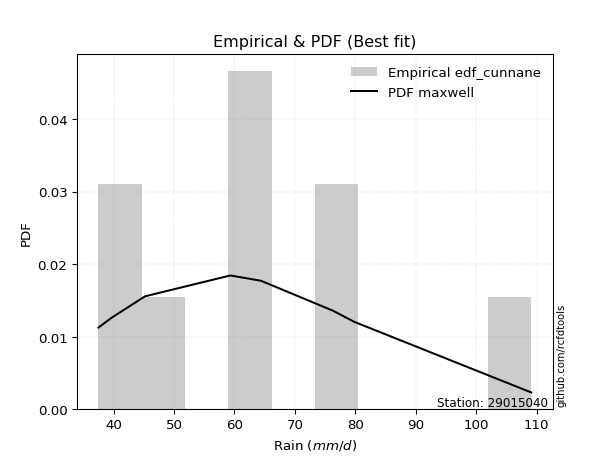</img>

</div>


### 12. EDF Adamowski (1981)

The Adamowski formula in hydrology refers to a specific plotting position formula used for estimating the non-parametric empirical distribution of hydrological events (like flood peaks) to calculate their return periods. This formula provides an alternative to traditional parametric methods (like the Gumbel or Log Pearson Type III distributions). 

<div align="center">


$P=(m-0.25)/(n+0.5)$


</div>


**12.1. Empirical values**

<div align="center">

|                | 0                   | 1                   | 2                  | 3                  | 4                  | 5                  | 6                  | 7                  |
|:---------------|:--------------------|:--------------------|:-------------------|:-------------------|:-------------------|:-------------------|:-------------------|:-------------------|
| date           | 2023                | 2019                | 2024               | 2021               | 2022               | 2018               | 2017               | 2020               |
| x              | 37.5                | 39.8                | 45.2               | 59.3               | 59.4               | 76.3               | 79.8               | 109.1              |
| m              | 1                   | 2                   | 3                  | 4                  | 5                  | 6                  | 7                  | 8                  |
| empirical_dist | edf_adamowski       | edf_adamowski       | edf_adamowski      | edf_adamowski      | edf_adamowski      | edf_adamowski      | edf_adamowski      | edf_adamowski      |
| empirical      | 0.08823529411764706 | 0.20588235294117646 | 0.3235294117647059 | 0.4411764705882353 | 0.5588235294117647 | 0.6764705882352942 | 0.7941176470588235 | 0.9117647058823529 |
| empirical_tr   | 1.096774193548387   | 1.259259259259259   | 1.4782608695652173 | 1.7894736842105263 | 2.2666666666666666 | 3.0909090909090913 | 4.857142857142856  | 11.33333333333333  |

</div>


**12.2. Kolmogorov-Smirnov fit test (sorted by Δ)**


<div align="center">

|                | 0                   | 1                   | 2                  | 3                   | 4                   | 5                   | 6                   | 7                   | 8                   | 9                  | 10                  | 11                  | 12                  | 13                  | 14                  | 15                 | 16                  | 17                  | 18                 | 19                  | 20                  | 21                  | 22                  | 23                  | 24                  | 25                  | 26                 | 27                  | 28                  | 29                  | 30                  | 31                  | 32                  | 33                  | 34                 | 35                  | 36                  | 37                 | 38                  | 39                 | 40                 | 41                  | 42                  | 43                 | 44                  | 45                 | 46                  | 47                  | 48                  | 49                    | 50                  | 51                 | 52                  | 53                  | 54                  | 55                 | 56                  | 57                 | 58                  | 59                  | 60                  | 61                 | 62                  | 63                  | 64                  | 65                  | 66                  | 67                 | 68                  | 69                  | 70                 | 71                 | 72                  | 73                  | 74                  | 75                 | 76                 | 77                 | 78                  | 79                  | 80                 | 81                 | 82                 | 83                 | 84                  | 85                  | 86                 | 87                 |
|:---------------|:--------------------|:--------------------|:-------------------|:--------------------|:--------------------|:--------------------|:--------------------|:--------------------|:--------------------|:-------------------|:--------------------|:--------------------|:--------------------|:--------------------|:--------------------|:-------------------|:--------------------|:--------------------|:-------------------|:--------------------|:--------------------|:--------------------|:--------------------|:--------------------|:--------------------|:--------------------|:-------------------|:--------------------|:--------------------|:--------------------|:--------------------|:--------------------|:--------------------|:--------------------|:-------------------|:--------------------|:--------------------|:-------------------|:--------------------|:-------------------|:-------------------|:--------------------|:--------------------|:-------------------|:--------------------|:-------------------|:--------------------|:--------------------|:--------------------|:----------------------|:--------------------|:-------------------|:--------------------|:--------------------|:--------------------|:-------------------|:--------------------|:-------------------|:--------------------|:--------------------|:--------------------|:-------------------|:--------------------|:--------------------|:--------------------|:--------------------|:--------------------|:-------------------|:--------------------|:--------------------|:-------------------|:-------------------|:--------------------|:--------------------|:--------------------|:-------------------|:-------------------|:-------------------|:--------------------|:--------------------|:-------------------|:-------------------|:-------------------|:-------------------|:--------------------|:--------------------|:-------------------|:-------------------|
| station        | 29015040            | 29015040            | 29015040           | 29015040            | 29015040            | 29015040            | 29015040            | 29015040            | 29015040            | 29015040           | 29015040            | 29015040            | 29015040            | 29015040            | 29015040            | 29015040           | 29015040            | 29015040            | 29015040           | 29015040            | 29015040            | 29015040            | 29015040            | 29015040            | 29015040            | 29015040            | 29015040           | 29015040            | 29015040            | 29015040            | 29015040            | 29015040            | 29015040            | 29015040            | 29015040           | 29015040            | 29015040            | 29015040           | 29015040            | 29015040           | 29015040           | 29015040            | 29015040            | 29015040           | 29015040            | 29015040           | 29015040            | 29015040            | 29015040            | 29015040              | 29015040            | 29015040           | 29015040            | 29015040            | 29015040            | 29015040           | 29015040            | 29015040           | 29015040            | 29015040            | 29015040            | 29015040           | 29015040            | 29015040            | 29015040            | 29015040            | 29015040            | 29015040           | 29015040            | 29015040            | 29015040           | 29015040           | 29015040            | 29015040            | 29015040            | 29015040           | 29015040           | 29015040           | 29015040            | 29015040            | 29015040           | 29015040           | 29015040           | 29015040           | 29015040            | 29015040            | 29015040           | 29015040           |
| empirical_dist | edf_adamowski       | edf_adamowski       | edf_adamowski      | edf_adamowski       | edf_adamowski       | edf_adamowski       | edf_adamowski       | edf_adamowski       | edf_adamowski       | edf_adamowski      | edf_adamowski       | edf_adamowski       | edf_adamowski       | edf_adamowski       | edf_adamowski       | edf_adamowski      | edf_adamowski       | edf_adamowski       | edf_adamowski      | edf_adamowski       | edf_adamowski       | edf_adamowski       | edf_adamowski       | edf_adamowski       | edf_adamowski       | edf_adamowski       | edf_adamowski      | edf_adamowski       | edf_adamowski       | edf_adamowski       | edf_adamowski       | edf_adamowski       | edf_adamowski       | edf_adamowski       | edf_adamowski      | edf_adamowski       | edf_adamowski       | edf_adamowski      | edf_adamowski       | edf_adamowski      | edf_adamowski      | edf_adamowski       | edf_adamowski       | edf_adamowski      | edf_adamowski       | edf_adamowski      | edf_adamowski       | edf_adamowski       | edf_adamowski       | edf_adamowski         | edf_adamowski       | edf_adamowski      | edf_adamowski       | edf_adamowski       | edf_adamowski       | edf_adamowski      | edf_adamowski       | edf_adamowski      | edf_adamowski       | edf_adamowski       | edf_adamowski       | edf_adamowski      | edf_adamowski       | edf_adamowski       | edf_adamowski       | edf_adamowski       | edf_adamowski       | edf_adamowski      | edf_adamowski       | edf_adamowski       | edf_adamowski      | edf_adamowski      | edf_adamowski       | edf_adamowski       | edf_adamowski       | edf_adamowski      | edf_adamowski      | edf_adamowski      | edf_adamowski       | edf_adamowski       | edf_adamowski      | edf_adamowski      | edf_adamowski      | edf_adamowski      | edf_adamowski       | edf_adamowski       | edf_adamowski      | edf_adamowski      |
| p_dist         | halfnorm            | rayleigh            | logmaxwell         | maxwell             | lograyleigh         | logalpha            | pearson3            | nct                 | logncf              | alpha              | loginvgamma         | lognct              | logpearson3         | betaprime           | f                   | logbetaprime       | logloggamma         | logfisk             | logexponnorm       | lognorm             | lognorm             | logt                | logcrystalball      | ncf                 | logrice             | genlogistic         | gumbel_r           | kstwobign           | logjohnsonsu        | halflogistic        | logmielke           | loginvweibull       | loggenlogistic      | nakagami            | loggumbel_r        | invgamma            | moyal               | logkstwobign       | truncnorm           | crystalball        | norm               | t                   | loggompertz         | gompertz           | expon               | loghalfnorm        | exponnorm           | genexpon            | loglogistic         | loglaplace_asymmetric | logistic            | loginvgauss        | loggumbel_l         | rice                | laplace_asymmetric  | loghypsecant       | hypsecant           | logmoyal           | loglaplace          | logfatiguelife      | invgauss            | fisk               | loggenexpon         | laplace             | johnsonsu           | logtruncnorm        | weibull_min         | logexpon           | loghalflogistic     | gumbel_l            | logf               | logwald            | wald                | gamma               | logweibull_min      | logerlang          | gibrat             | loggibrat          | loggamma            | loggamma            | erlang             | logchi2            | chi2               | loglognorm         | lognakagami         | fatiguelife         | invweibull         | mielke             |
| delta          | 0.07489637867256835 | 0.08933824594074008 | 0.0939543188398285 | 0.09574776868288579 | 0.09859628459790615 | 0.10135379754859408 | 0.10204687891960842 | 0.10301261896600966 | 0.10379895328016331 | 0.1038288792302782 | 0.10397312412957097 | 0.10417831778396355 | 0.10570173959934909 | 0.10587145936198475 | 0.10631278312046924 | 0.1063901098419742 | 0.10748782066251394 | 0.10815878273504453 | 0.1094330011705833 | 0.10958169726139566 | 0.10958169726139566 | 0.10958179944437502 | 0.10958191032755699 | 0.11163800308901065 | 0.11173070226098496 | 0.11230357896528934 | 0.1139120158991331 | 0.11778528842861336 | 0.11882222508063367 | 0.11887980116268701 | 0.12039520135421977 | 0.12308540137113133 | 0.12312615799882398 | 0.12316134100600329 | 0.1244867361399491 | 0.12468366051317359 | 0.12492721043529037 | 0.1270311319830264 | 0.12708367926418596 | 0.1270836835555983 | 0.1270836851667223 | 0.12708820161861822 | 0.12861048253749152 | 0.1287490540505989 | 0.12924952136834822 | 0.129874502507764  | 0.13077909141928146 | 0.13156951272765682 | 0.13167056319420503 | 0.13262764561904763   | 0.13616668920492853 | 0.1381120283085262 | 0.13971972999710627 | 0.14096639764378083 | 0.14373852218075772 | 0.1451034998587446 | 0.14648347553954383 | 0.1509649566773691 | 0.16058286891521018 | 0.16114762505851432 | 0.16349798596718557 | 0.1636119730239366 | 0.16538461870374244 | 0.16675399621800724 | 0.17096573855080122 | 0.17965223341107084 | 0.18405397966621284 | 0.1877673793607797 | 0.19045873020461002 | 0.19623292396156244 | 0.2510231908248193 | 0.2530453494041822 | 0.25797380947897064 | 0.26278657066652933 | 0.27073885773238965 | 0.2758525082826826 | 0.3235294117647059 | 0.3235294117647059 | 0.32688156944956637 | 0.32688156944956637 | 0.3298063299137842 | 0.359197789061725  | 0.3610083302679573 | 0.3782336846623134 | 0.38164497288195615 | 0.42286878072395656 | 0.460131915711279  | nan                |
| deltao         | 0.4472608134160001  | 0.4472608134160001  | 0.4472608134160001 | 0.4472608134160001  | 0.4472608134160001  | 0.4472608134160001  | 0.4472608134160001  | 0.4472608134160001  | 0.4472608134160001  | 0.4472608134160001 | 0.4472608134160001  | 0.4472608134160001  | 0.4472608134160001  | 0.4472608134160001  | 0.4472608134160001  | 0.4472608134160001 | 0.4472608134160001  | 0.4472608134160001  | 0.4472608134160001 | 0.4472608134160001  | 0.4472608134160001  | 0.4472608134160001  | 0.4472608134160001  | 0.4472608134160001  | 0.4472608134160001  | 0.4472608134160001  | 0.4472608134160001 | 0.4472608134160001  | 0.4472608134160001  | 0.4472608134160001  | 0.4472608134160001  | 0.4472608134160001  | 0.4472608134160001  | 0.4472608134160001  | 0.4472608134160001 | 0.4472608134160001  | 0.4472608134160001  | 0.4472608134160001 | 0.4472608134160001  | 0.4472608134160001 | 0.4472608134160001 | 0.4472608134160001  | 0.4472608134160001  | 0.4472608134160001 | 0.4472608134160001  | 0.4472608134160001 | 0.4472608134160001  | 0.4472608134160001  | 0.4472608134160001  | 0.4472608134160001    | 0.4472608134160001  | 0.4472608134160001 | 0.4472608134160001  | 0.4472608134160001  | 0.4472608134160001  | 0.4472608134160001 | 0.4472608134160001  | 0.4472608134160001 | 0.4472608134160001  | 0.4472608134160001  | 0.4472608134160001  | 0.4472608134160001 | 0.4472608134160001  | 0.4472608134160001  | 0.4472608134160001  | 0.4472608134160001  | 0.4472608134160001  | 0.4472608134160001 | 0.4472608134160001  | 0.4472608134160001  | 0.4472608134160001 | 0.4472608134160001 | 0.4472608134160001  | 0.4472608134160001  | 0.4472608134160001  | 0.4472608134160001 | 0.4472608134160001 | 0.4472608134160001 | 0.4472608134160001  | 0.4472608134160001  | 0.4472608134160001 | 0.4472608134160001 | 0.4472608134160001 | 0.4472608134160001 | 0.4472608134160001  | 0.4472608134160001  | 0.4472608134160001 | 0.4472608134160001 |
| eval           | Δo > Δ              | Δo > Δ              | Δo > Δ             | Δo > Δ              | Δo > Δ              | Δo > Δ              | Δo > Δ              | Δo > Δ              | Δo > Δ              | Δo > Δ             | Δo > Δ              | Δo > Δ              | Δo > Δ              | Δo > Δ              | Δo > Δ              | Δo > Δ             | Δo > Δ              | Δo > Δ              | Δo > Δ             | Δo > Δ              | Δo > Δ              | Δo > Δ              | Δo > Δ              | Δo > Δ              | Δo > Δ              | Δo > Δ              | Δo > Δ             | Δo > Δ              | Δo > Δ              | Δo > Δ              | Δo > Δ              | Δo > Δ              | Δo > Δ              | Δo > Δ              | Δo > Δ             | Δo > Δ              | Δo > Δ              | Δo > Δ             | Δo > Δ              | Δo > Δ             | Δo > Δ             | Δo > Δ              | Δo > Δ              | Δo > Δ             | Δo > Δ              | Δo > Δ             | Δo > Δ              | Δo > Δ              | Δo > Δ              | Δo > Δ                | Δo > Δ              | Δo > Δ             | Δo > Δ              | Δo > Δ              | Δo > Δ              | Δo > Δ             | Δo > Δ              | Δo > Δ             | Δo > Δ              | Δo > Δ              | Δo > Δ              | Δo > Δ             | Δo > Δ              | Δo > Δ              | Δo > Δ              | Δo > Δ              | Δo > Δ              | Δo > Δ             | Δo > Δ              | Δo > Δ              | Δo > Δ             | Δo > Δ             | Δo > Δ              | Δo > Δ              | Δo > Δ              | Δo > Δ             | Δo > Δ             | Δo > Δ             | Δo > Δ              | Δo > Δ              | Δo > Δ             | Δo > Δ             | Δo > Δ             | Δo > Δ             | Δo > Δ              | Δo > Δ              | Δo <= Δ            | Δo <= Δ            |
| fit            | 1                   | 1                   | 1                  | 1                   | 1                   | 1                   | 1                   | 1                   | 1                   | 1                  | 1                   | 1                   | 1                   | 1                   | 1                   | 1                  | 1                   | 1                   | 1                  | 1                   | 1                   | 1                   | 1                   | 1                   | 1                   | 1                   | 1                  | 1                   | 1                   | 1                   | 1                   | 1                   | 1                   | 1                   | 1                  | 1                   | 1                   | 1                  | 1                   | 1                  | 1                  | 1                   | 1                   | 1                  | 1                   | 1                  | 1                   | 1                   | 1                   | 1                     | 1                   | 1                  | 1                   | 1                   | 1                   | 1                  | 1                   | 1                  | 1                   | 1                   | 1                   | 1                  | 1                   | 1                   | 1                   | 1                   | 1                   | 1                  | 1                   | 1                   | 1                  | 1                  | 1                   | 1                   | 1                   | 1                  | 1                  | 1                  | 1                   | 1                   | 1                  | 1                  | 1                  | 1                  | 1                   | 1                   | 0                  | 0                  |
| n              | 8                   | 8                   | 8                  | 8                   | 8                   | 8                   | 8                   | 8                   | 8                   | 8                  | 8                   | 8                   | 8                   | 8                   | 8                   | 8                  | 8                   | 8                   | 8                  | 8                   | 8                   | 8                   | 8                   | 8                   | 8                   | 8                   | 8                  | 8                   | 8                   | 8                   | 8                   | 8                   | 8                   | 8                   | 8                  | 8                   | 8                   | 8                  | 8                   | 8                  | 8                  | 8                   | 8                   | 8                  | 8                   | 8                  | 8                   | 8                   | 8                   | 8                     | 8                   | 8                  | 8                   | 8                   | 8                   | 8                  | 8                   | 8                  | 8                   | 8                   | 8                   | 8                  | 8                   | 8                   | 8                   | 8                   | 8                   | 8                  | 8                   | 8                   | 8                  | 8                  | 8                   | 8                   | 8                   | 8                  | 8                  | 8                  | 8                   | 8                   | 8                  | 8                  | 8                  | 8                  | 8                   | 8                   | 8                  | 8                  |
| best_fit       | 1                   | 0                   | 0                  | 0                   | 0                   | 0                   | 0                   | 0                   | 0                   | 0                  | 0                   | 0                   | 0                   | 0                   | 0                   | 0                  | 0                   | 0                   | 0                  | 0                   | 0                   | 0                   | 0                   | 0                   | 0                   | 0                   | 0                  | 0                   | 0                   | 0                   | 0                   | 0                   | 0                   | 0                   | 0                  | 0                   | 0                   | 0                  | 0                   | 0                  | 0                  | 0                   | 0                   | 0                  | 0                   | 0                  | 0                   | 0                   | 0                   | 0                     | 0                   | 0                  | 0                   | 0                   | 0                   | 0                  | 0                   | 0                  | 0                   | 0                   | 0                   | 0                  | 0                   | 0                   | 0                   | 0                   | 0                   | 0                  | 0                   | 0                   | 0                  | 0                  | 0                   | 0                   | 0                   | 0                  | 0                  | 0                  | 0                   | 0                   | 0                  | 0                  | 0                  | 0                  | 0                   | 0                   | 0                  | 0                  |
| best_fit_sort  | 1                   | 2                   | 3                  | 4                   | 5                   | 6                   | 7                   | 8                   | 9                   | 10                 | 11                  | 12                  | 13                  | 14                  | 15                  | 16                 | 17                  | 18                  | 19                 | 20                  | 21                  | 22                  | 23                  | 24                  | 25                  | 26                  | 27                 | 28                  | 29                  | 30                  | 31                  | 32                  | 33                  | 34                  | 35                 | 36                  | 37                  | 38                 | 39                  | 40                 | 41                 | 42                  | 43                  | 44                 | 45                  | 46                 | 47                  | 48                  | 49                  | 50                    | 51                  | 52                 | 53                  | 54                  | 55                  | 56                 | 57                  | 58                 | 59                  | 60                  | 61                  | 62                 | 63                  | 64                  | 65                  | 66                  | 67                  | 68                 | 69                  | 70                  | 71                 | 72                 | 73                  | 74                  | 75                  | 76                 | 77                 | 78                 | 79                  | 80                  | 81                 | 82                 | 83                 | 84                 | 85                  | 86                  | 87                 | 88                 |

</div>


**12.3. Best fit**

<div align="center">

|   id |   station | empirical_dist   | p_dist   |     delta |   deltao | eval   |   fit |   n |   best_fit |   best_fit_sort |
|-----:|----------:|:-----------------|:---------|----------:|---------:|:-------|------:|----:|-----------:|----------------:|
|    0 |  29015040 | edf_adamowski    | halfnorm | 0.0748964 | 0.447261 | Δo > Δ |     1 |   8 |          1 |               1 |

</div>


<div align="center">

</img></img>

</div>


## C. Best fit & Estimate extreme values for specific return periods - Tr

Best fit in probability distribution analysis means finding the theoretical distribution (like Normal, Poisson, Exponential) that most accurately mirrors your real-world data´s patterns (shape, center, spread) for better predictions, using methods like visual checks (Q-Q plots), goodness-of-fit tests (Kolmogorov-Smirnov, Chi-Squared), and information criteria (AIC) to score and select the simplest, most representative model.


### 1. Best fit (ordered by delta Δ)

<div align="center">

|   id |   station | empirical_dist   | p_dist   |     delta |   deltao | eval   |   fit |   n |   best_fit |   best_fit_sort |
|-----:|----------:|:-----------------|:---------|----------:|---------:|:-------|------:|----:|-----------:|----------------:|
|    0 |  29015040 | edf_tukey        | halfnorm | 0.071367  | 0.447261 | Δo > Δ |     1 |   8 |          1 |               1 |
|    1 |  29015040 | edf_blom         | halfnorm | 0.0714023 | 0.447261 | Δo > Δ |     1 |   8 |          1 |               2 |
|    2 |  29015040 | edf_cunnane      | halfnorm | 0.0717718 | 0.447261 | Δo > Δ |     1 |   8 |          1 |               3 |
|    3 |  29015040 | edf_filliben     | halfnorm | 0.0720484 | 0.447261 | Δo > Δ |     1 |   8 |          1 |               4 |
|    4 |  29015040 | edf_jenkinson    | halfnorm | 0.0723694 | 0.447261 | Δo > Δ |     1 |   8 |          1 |               5 |
|    5 |  29015040 | edf_beard        | halfnorm | 0.0723694 | 0.447261 | Δo > Δ |     1 |   8 |          1 |               6 |
|    6 |  29015040 | edf_gringorten   | halfnorm | 0.0723726 | 0.447261 | Δo > Δ |     1 |   8 |          1 |               7 |
|    7 |  29015040 | edf_chegodayev   | halfnorm | 0.0727955 | 0.447261 | Δo > Δ |     1 |   8 |          1 |               8 |
|    8 |  29015040 | edf_hazen        | halfnorm | 0.0732962 | 0.447261 | Δo > Δ |     1 |   8 |          1 |               9 |
|    9 |  29015040 | edf_adamowski    | halfnorm | 0.0748964 | 0.447261 | Δo > Δ |     1 |   8 |          1 |              10 |
|   10 |  29015040 | edf_weibull      | halfnorm | 0.0847003 | 0.447261 | Δo > Δ |     1 |   8 |          1 |              11 |
|   11 |  29015040 | edf_california   | nakagami | 0.125     | 0.447261 | Δo > Δ |     1 |   8 |          1 |              12 |

</div>

:file_folder:Tables: [bestfit_29015040.csv](table/bestfit_29015040.csv) | [extreme_29015040.csv](table/extreme_29015040.csv)


### 2. Extreme values

In hydrology, a return period (or recurrence interval $Tr$) is the statistical average time between extreme events like floods or droughts of a specific magnitude, indicating how rare an event is, with a 100-year flood, for example, having a 1% chance of occurring in any given year, not that it happens exactly every century. It is a key tool for infrastructure design (like bridges or dams) and risk assessment, calculated from historical data to determine the probability of future events, although it is important to remember it is statistical average, and events can cluster or be missed.

> risk_rate: assuming the return period as the project useful life.

|   id |      tr |   prob_l |     prob_g |    alpha |   betaprime |     chi2 |   crystalball |   erlang |    expon |   exponnorm |        f |   fatiguelife |        fisk |    gamma |   genexpon |   genlogistic |   gibrat |   gompertz |   gumbel_l |   gumbel_r |   halflogistic |   halfnorm |   hypsecant |   invgamma |   invgauss |      invweibull |   johnsonsu |   kstwobign |   laplace |   laplace_asymmetric |   loggamma |   logistic |   lognorm |   maxwell |   mielke |    moyal |   nakagami |      ncf |      nct |     norm |   pearson3 |   rayleigh |     rice |        t |   truncnorm |     wald |   weibull_min |   logalpha |   logbetaprime |          logchi2 |   logcrystalball |   logerlang |   logexpon |   logexponnorm |      logf |   logfatiguelife |   logfisk |   loggenexpon |   loggenlogistic |   loggibrat |   loggompertz |   loggumbel_l |   loggumbel_r |   loghalflogistic |   loghalfnorm |   loghypsecant |   loginvgamma |   loginvgauss |   loginvweibull |   logjohnsonsu |   logkstwobign |   loglaplace |   loglaplace_asymmetric |   logloggamma |   loglogistic |   loglognorm |   logmaxwell |   logmielke |   logmoyal |   lognakagami |   logncf |   lognct |   logpearson3 |   lograyleigh |   logrice |     logt |   logtruncnorm |   logwald |   logweibull_min |   station |   n |   risk_rate |
|-----:|--------:|---------:|-----------:|---------:|------------:|---------:|--------------:|---------:|---------:|------------:|---------:|--------------:|------------:|---------:|-----------:|--------------:|---------:|-----------:|-----------:|-----------:|---------------:|-----------:|------------:|-----------:|-----------:|----------------:|------------:|------------:|----------:|---------------------:|-----------:|-----------:|----------:|----------:|---------:|---------:|-----------:|---------:|---------:|---------:|-----------:|-----------:|---------:|---------:|------------:|---------:|--------------:|-----------:|---------------:|-----------------:|-----------------:|------------:|-----------:|---------------:|----------:|-----------------:|----------:|--------------:|-----------------:|------------:|--------------:|--------------:|--------------:|------------------:|--------------:|---------------:|--------------:|--------------:|----------------:|---------------:|---------------:|-------------:|------------------------:|--------------:|--------------:|-------------:|-------------:|------------:|-----------:|--------------:|---------:|---------:|--------------:|--------------:|----------:|---------:|---------------:|----------:|-----------------:|----------:|----:|------------:|
|    0 |    2    | 0.5      | 0.5        |  57.6706 |     58.5073 |  43.0541 |       63.3    |  46.8313 |  55.3832 |     55.3037 |  58.6052 |       37.5    |     49.9008 |  49.3312 |    57.0079 |       59.1238 |  56.4917 |    56.1954 |    67.0262 |    59.5738 |        57.7213 |    58.6571 |     63.3    |    55.9206 |    53.561  |   808.327       |     52.7557 |     59.7519 |   63.3    |              61.4073 |    45.697  |    63.3    |   59.5362 |   61.3601 |  56.5528 |  58.3708 |    55.2158 |  60.6071 |  57.3223 |  63.3    |    60.626  |    60.6721 |  62.1585 |  63.3003 |     63.3    |  55.9476 |       44.9902 |    57.6128 |        58.9264 |     38.5905      |          59.5362 |     47.7442 |    51.6631 |        59.4546 |   46.8109 |          53.8064 |   56.8273 |       53.2313 |          56.0301 |     53.639  |       56.3819 |       63.0337 |       56.2326 |           54.6588 |       55.4485 |        59.5362 |       58.4152 |       55.1867 |         56.0322 |        56.25   |        55.794  |      59.5362 |                 59.4193 |       59.5164 |       59.5362 |   37.6982    |      57.7928 |     56.2032 |    55.2058 |       38.4959 |  57.0845 |  58.2629 |       58.7447 |       57.1868 |   57.9947 |  59.5362 |        52.2584 |   53.1925 |    40.6515       |  29015040 |   8 |    0.75     |
|    1 |    2.33 | 0.570815 | 0.429185   |  61.2849 |     62.2404 |  45.2877 |       67.3475 |  49.2001 |  59.3234 |     59.2316 |  62.3458 |       38.1785 |     57.1288 |  52.1994 |    60.9872 |       62.7782 |  58.5421 |    59.9934 |    70.5476 |    63.3243 |        61.5774 |    63.0255 |     66.5392 |    59.5738 |    57.2619 | 30591.5         |     56.6115 |     63.5495 |   65.7494 |              64.4037 |    48.0551 |    66.8662 |   63.3448 |   65.5652 |  60.1752 |  61.9212 |    59.7392 |  64.4646 |  60.9833 |  67.3475 |    64.6588 |    64.9394 |  66.0118 |  67.3478 |     67.3475 |  58.6016 |       51.3081 |    61.2878 |        62.7053 |     39.9485      |          63.3448 |     50.5701 |    55.442  |        63.2538 |   50.2414 |          57.4399 |   60.457  |       57.0551 |          59.6563 |     55.3506 |       60.311  |       66.5277 |       59.5583 |           57.9853 |       59.2862 |        62.5652 |       62.141  |       58.8232 |         59.6586 |        59.8898 |        59.4441 |      61.8127 |                 62.0918 |       63.3347 |       62.8794 |   39.0457    |      61.6386 |     59.7988 |    58.2917 |       39.6504 |  60.743  |  61.9789 |       62.5194 |       61.0504 |   61.7407 |  63.3448 |        56.0578 |   55.4003 |    45.628        |  29015040 |   8 |    0.729209 |
|    2 |    5    | 0.8      | 0.2        |  78.4137 |     79.1256 |  59.079  |       82.3892 |  61.5291 |  79.0235 |     78.8699 |  79.1989 |       52.5926 |    153.107  |  66.9255 |    79.5519 |       78.6527 |  70.3463 |    77.5502 |    81.9238 |    79.6181 |        79.0255 |    81.4986 |     79.5325 |    78.3615 |    77.6081 |     2.67908e+11 |     79.8709 |     79.6808 |   77.9957 |              79.385  |    62.4544 |    80.6356 |   79.7611 |   82.1162 |  78.2666 |  78.3665 |    80.427  |  80.3124 |  78.5491 |  82.3892 |    81.1898 |    82.0233 |  81.4382 |  82.3895 |     82.3892 |  73.4588 |      137.11   |    78.6737 |        79.4348 |     64.012       |          79.7611 |     67.8342 |    78.9087 |        79.6934 |   74.745  |          78.0819 |   79.7342 |       78.6607 |          78.3347 |     66.3227 |       79.0884 |       79.1943 |       76.4457 |           75.756  |       78.6797 |        76.3456 |       78.9272 |       78.1668 |         78.342  |        78.2934 |        77.8061 |      74.5691 |                 77.368  |       79.7176 |       77.6467 |    3.218e+35 |      79.4282 |     78.1017 |    74.9939 |       55.3784 |  78.5085 |  78.9235 |       79.3963 |       79.3152 |   79.1291 |  79.7611 |        78.5293 |   69.5636 |  1192.82         |  29015040 |   8 |    0.67232  |
|    3 |   10    | 0.9      | 0.1        |  94.5628 |     93.6745 |  73.8252 |       92.3675 |  73.1047 |  96.9067 |     96.6971 |  93.6434 |       72.4947 |    464.202  |  80.5968 |    94.866  |       91.581  |  83.8018 |    91.7505 |    88.2575 |    92.8892 |        93.5153 |    95.1683 |     89.9081 |    97.6375 |    98.7836 |     1.21029e+17 |    107.861  |     91.9628 |   89.1125 |              92.9847 |    79.8913 |    90.7762 |   92.9355 |   93.7639 |  96.3038 |  92.6848 |    96.4883 |  92.2753 |  95.0635 |  92.3675 |    93.5446 |    94.2045 |  92.4376 |  92.3678 |     92.3675 |  89.2257 |      336.791  |    94.6983 |        93.3849 |    143.991       |          92.9355 |     88.9928 |   108.711  |        92.9766 |  111.082  |         102.062  |  102.228  |      102.613  |          97.7892 |     81.5058 |       95.1785 |       87.2641 |       93.6812 |           94.5873 |       97.009  |        89.4989 |       93.2875 |       98.8914 |         97.8061 |        96.8558 |        95.504  |      88.4147 |                 94.4667 |       92.779  |       90.6972 |  inf         |      94.9451 |     96.9288 |    93.3883 |       85.2202 |  95.4766 |  93.6846 |       93.6552 |       95.5882 |   94.2219 |  92.9355 |       104.781  |   88.574  |     1.00017e+09  |  29015040 |   8 |    0.651322 |
|    4 |   15    | 0.933333 | 0.0666667  | 104.835  |    102.221  |  83.0255 |       97.3469 |  79.9717 | 107.368  |    107.125  | 102.1    |       85.511  |    906.72   |  88.6695 |   103.286  |       98.8748 |  93.0828 |    99.4235 |    91.1259 |   100.377  |       101.715  |   102.282  |     95.8293 |   110.349  |   112.248  |     1.87646e+20 |    127.804  |     98.483  |   95.6155 |             100.94   |    92.4601 |    96.3013 |  100.303  |   99.7402 | 108.029  | 100.994  |   104.941  |  98.7245 | 105.379  |  97.3469 |   100.137  |   100.481  |  98.105  |  97.3472 |     97.3469 |  99.3505 |      530.077  |   104.58   |       101.39   |    260.821       |         100.303  |    104.436  |   131.121  |       100.445  |  141.322  |         119.184  |  119.264  |      118.946  |         110.826  |     93.9592 |      104.268  |       91.1844 |      105.068  |          107.249  |      108.179  |        97.9974 |      101.675  |      112.95   |        110.85   |       109.011  |       106.482  |      97.677  |                106.171  |      100.05   |       98.7086 |  inf         |     104.049  |    109.459  |   106.067  |      110.029  | 106.19   | 102.418  |      101.906  |      105.236  |  103.016  | 100.303  |       123.197  |  103.439  |     7.68572e+16  |  29015040 |   8 |    0.644736 |
|    5 |   20    | 0.95     | 0.05       | 112.645  |    108.363  |  89.7391 |      100.608  |  84.8748 | 114.79   |    114.524  | 108.164  |       95.148  |   1458.86   |  94.4215 |   109.053  |      103.982  | 100.363  |   104.619  |    92.9113 |   105.619  |       107.46   |   107.025  |    100.006  |   120.136  |   122.234  |     3.21521e+22 |    143.738  |    102.875  |  100.229  |             106.584  |   102.628  |   100.12   |  105.441  |  103.706  | 116.986  | 106.88   |   110.593  | 103.132  | 113.076  | 100.608  |   104.611  |   104.652  | 101.872  | 100.608  |    100.608  | 106.896  |      709.177  |   111.9    |       107.06   |    413.847       |         105.441  |    117.039  |   149.769  |       105.673  |  168.138  |         133.007  |  133.818  |      131.724  |         120.975  |    105.046  |      110.594  |       93.713  |      113.855  |          117.118  |      116.332  |       104.474  |      107.68   |      123.96   |        121.006  |       118.346  |       114.579  |     104.831  |                115.344  |      105.109  |      104.656  |  inf         |     110.567  |    119.177  |   116.075  |      131.236  | 114.239  | 108.721  |      107.777  |      112.181  |  109.282  | 105.441  |       137.811  |  116.116  |     3.95902e+25  |  29015040 |   8 |    0.641514 |
|    6 |   25    | 0.96     | 0.04       | 119.059  |    113.187  |  95.0348 |      103.008  |  88.6927 | 120.547  |    120.263  | 112.921  |      102.805  |   2108.06   |  98.8947 |   113.418  |      107.915  | 106.432  |   108.517  |    94.1818 |   109.657  |       111.887  |   110.553  |    103.239  |   128.213  |   130.208  |     1.68996e+24 |    157.19   |    106.165  |  103.808  |             110.962  |   111.315  |   103.041  |  109.39   |  106.651  | 124.339  | 111.441  |   114.804  | 106.474  | 119.29   | 103.008  |   107.985  |   107.752  | 104.671  | 103.008  |    103.008  | 112.939  |      875.037  |   117.78   |       111.466  |    603.478       |         109.39   |    127.876  |   166.042  |       109.704  |  192.663  |         144.81   |  146.884  |      142.378  |         129.421  |    115.282  |      115.438  |       95.555  |      121.121  |          125.336  |      122.794  |       109.778  |      112.383  |      133.159  |        129.459  |       126.044  |       121.045  |     110.74   |                123.002  |      108.99   |      109.446  |  inf         |     115.669  |    127.244  |   124.477  |      149.902  | 120.77   | 113.687  |      112.356  |      117.637  |  114.17   | 109.39   |       150.103  |  127.383  |     4.72929e+34  |  29015040 |   8 |    0.639603 |
|    7 |   50    | 0.98     | 0.02       | 141.481  |    128.6    | 111.882  |      109.882  | 100.618  | 138.43   |    138.09   | 128.081  |      127.372  |   6572.97   | 112.842  |   126.438  |      120.033  | 127.826  |   119.966  |    97.6308 |   122.097  |       125.525  |   120.81   |    113.262  |   156.368  |   156.132  |     3.37626e+29 |    205.646  |    115.826  |  114.925  |             124.562  |   143.477  |   111.967  |  121.539  |  115.191  | 149.735  | 125.602  |   127.056  | 116.521  | 140.142  | 109.882  |   118.025  |   116.749  | 112.795  | 109.882  |    109.882  | 132.671  |     1562.17   |   137.352  |       125.283  |   2121.76        |         121.539  |    168.507  |   228.754  |       122.165  |  295.934  |         188.553  |  201.153  |      180.118  |         159.33   |    159.995  |      130.168  |      100.74   |      146.55   |          154.463  |      143.687  |       127.998  |      127.332  |      165.947  |        159.391  |       152.882  |       142.22   |     131.301  |                150.186  |      120.887  |      125.484  |  inf         |     131.837  |    155.678  |   154.635  |      221.622  | 142.9    | 129.636  |      126.792  |      135.022  |  129.555  | 121.539  |       194.177  |  172.353  |     3.87416e+80  |  29015040 |   8 |    0.63583  |
|    8 |   75    | 0.986667 | 0.0133333  | 156.816  |    137.974  | 121.961  |      113.57   | 107.632  | 148.891  |    148.519  | 137.275  |      142.167  |  12731.2    | 121.03   |   133.716  |      127.076  | 142.276  |   126.246  |    99.3748 |   129.327  |       133.453  |   126.394  |    119.12   |   175.286  |   172.018  |     4.06745e+32 |    239.143  |    121.142  |  121.428  |             132.517  |   166.578  |   117.122  |  128.604  |  119.834  | 166.618  | 133.883  |   133.726  | 122.217  | 153.571  | 113.57   |   123.647  |   121.644  | 117.215  | 113.571  |    113.57   | 144.813  |     2101.64   |   149.85   |       133.5    |   4643.91        |         128.604  |    198.117  |   275.908  |       129.462  |  381.746  |         220.049  |  246.692  |      205.886  |         179.795  |    199.639  |      138.586  |      103.468  |      163.716  |          174.412  |      156.519  |       140.016  |      136.367  |      188.544  |        179.874  |       170.961  |       155.411  |     145.056  |                168.793  |      127.781  |      135.796  |  inf         |     141.556  |    175.037  |   175.551  |      274.425  | 157.324  | 139.396  |      135.434  |      145.537  |  138.733  | 128.604  |       224.541  |  207.596  |     1.80793e+124 |  29015040 |   8 |    0.634587 |
|    9 |  100    | 0.99     | 0.01       | 168.967  |    144.809  | 129.193  |      116.065  | 112.622  | 156.313  |    155.917  | 143.966  |      152.813  |  20321.1    | 126.851  |   138.745  |      132.061  | 153.469  |   130.533  |   100.516  |   134.444  |       139.064  |   130.197  |    123.274  |   189.957  |   183.576  |     6.16391e+34 |    265.452  |    124.783  |  126.042  |             138.162  |   185.245  |   120.762  |  133.614  |  122.996  | 179.623  | 139.758  |   138.269  | 126.196  | 163.72   | 116.065  |   127.543  |   124.979  | 120.226  | 116.065  |    116.065  | 153.665  |     2553.99   |   159.254  |       139.407  |   8235.01        |         133.614  |    222.268  |   315.15   |       134.659  |  457.924  |         245.556  |  288.054  |      226.047  |         195.848  |    236.986  |      144.48   |      105.292  |      177.068  |          190.07   |      165.911  |       149.218  |      142.928  |      206.352  |        195.943  |       185.024  |       165.149  |     155.681  |                183.378  |      132.657  |      143.583  |  inf         |     148.583  |    190.177  |   192.085  |      317.384  | 168.313  | 146.539  |      141.67   |      153.165  |  145.336  | 133.614  |       248.352  |  237.756  |     1.47396e+165 |  29015040 |   8 |    0.633968 |
|   10 |  200    | 0.995    | 0.005      | 203.873  |    161.971  | 146.85   |      121.724  | 124.684  | 174.197  |    173.745  | 160.729  |      178.872  |  62473.5    | 140.906  |   150.445  |      144.045  | 183.923  |   140.345  |   102.995  |   146.747  |       152.554  |   138.897  |    133.284  |   230.144  |   212.296  |     1.07666e+40 |    338.391  |    133.172  |  137.159  |             151.761  |   239.476  |   129.493  |  145.715  |  130.231  | 214.898  | 153.913  |   148.65   | 135.621  | 190.537  | 121.724  |   136.663  |   132.609  | 127.116  | 121.724  |    121.724  | 175.716  |     3908.68   |   183.97   |       153.948  |  34336.7         |         145.715  |    293.399  |   434.176  |       147.297  |  712.505  |         319.939  |  435.13   |      281.916  |         240.556  |    377.872  |      158.436  |      109.369  |      213.794  |          233.71   |      189.563  |       173.948  |      159.306  |      256.278  |        240.695  |       223.798  |       189.961  |     184.587  |                223.905  |      144.398  |      164.132  |  inf         |     166      |    232.156  |   238.602  |      442.099  | 197.716  | 164.572  |      157.102  |      172.159  |  161.592  | 145.715  |       314.146  |  333.329  |     2.34737e+307 |  29015040 |   8 |    0.633042 |
|   11 |  250    | 0.996    | 0.004      | 217.254  |    167.722  | 152.593  |      123.453  | 128.577  | 179.954  |    179.484  | 166.334  |      187.365  |  89614.8    | 145.439  |   154.096  |      147.898  | 194.85   |   143.36   |   103.725  |   150.702  |       156.891  |   141.573  |    136.506  |   244.706  |   221.779  |     5.21647e+41 |    364.988  |    135.768  |  140.738  |             156.139  |   260.171  |   132.296  |  149.626  |  132.459  | 227.566  | 158.469  |   151.841  | 138.616  | 199.951  | 123.453  |   139.529  |   134.958  | 129.237  | 123.453  |    123.453  | 183.011  |     4431.67   |   192.613  |       158.732  |  55037.3         |         149.627  |    320.873  |   481.351  |       151.41   |  822.267  |         348.428  |  503.364  |      302.353  |         256.995  |    446.731  |      162.861  |      110.598  |      227.149  |          249.767  |      197.497  |       182.751  |      164.764  |      274.749  |        257.151  |       237.951  |       198.37   |     194.99   |                238.77   |      148.182  |      171.334  |  inf         |     171.762  |    247.532  |   255.854  |      489.333  | 208.163  | 170.644  |      162.203  |      178.466  |  166.937  | 149.627  |       338.013  |  372.752  |   inf            |  29015040 |   8 |    0.632858 |
|   12 |  500    | 0.998    | 0.002      | 268.14   |    186.356  | 170.588  |      128.581  | 140.697  | 197.837  |    197.311  | 184.455  |      214.006  | 274428      | 159.54   |   165.116  |      159.856  | 232.612  |   152.324  |   105.816  |   162.978  |       170.352  |   149.552  |    146.515  |   295.772  |   251.887  |     8.87557e+46 |    458.376  |    143.547  |  151.854  |             169.739  |   336.761  |   140.988  |  161.856  |  139.105  | 271.57   | 172.624  |   161.348  | 147.827  | 231.925  | 128.581  |   148.247  |   141.966  | 135.565  | 128.581  |    128.581  | 206.207  |     6356.43   |   221.892  |       173.947  | 245749           |         161.856  |    423.872  |   663.148  |       164.361  | 1286.42   |         454.314  |  827.883  |      374.668  |         315.519  |    796.709  |      176.416  |      114.199  |      274.15   |          306.975  |      223.178  |       213.036  |      182.351  |      340.958  |        315.742  |       288.07   |       225.868  |     231.195  |                291.539  |      159.979  |      195.741  |  inf         |     190.172  |    302.06   |   317.811  |      661.318  | 244.127  | 190.417  |      178.499  |      198.694  |  183.911  | 161.856  |       420.843  |  531.841  |   inf            |  29015040 |   8 |    0.632489 |
|   13 |  750    | 0.998667 | 0.00133333 | 306.74   |    197.834  | 181.208  |      131.43   | 147.804  | 208.298  |    207.739  | 195.59   |      229.747  | 527761      | 167.802  |   171.354  |      166.846  | 257.586  |   157.309  |   106.934  |   170.154  |       178.221  |   154.01   |    152.37   |   330.253  |   269.912  |     1.01421e+50 |    521.238  |    147.917  |  158.357  |             177.694  |   391.766  |   146.067  |  169.076  |  142.822  | 300.951  | 180.904  |   166.653  | 153.166  | 252.739  | 131.43   |   153.233  |   145.885  | 139.104  | 131.43   |    131.43   | 220.115  |     7710.43   |   240.921  |       183.114  | 600698           |         169.076  |    498.938  |   799.848  |       172.077  | 1673.96   |         530.749  | 1146.78   |      423.967  |         355.725  |   1168.06   |      184.221  |      116.171  |      306.01   |          346.309  |      238.952  |       233.028  |      193.111  |      386.813  |        355.997  |       322.362  |       242.955  |     255.415  |                327.66   |      166.92   |      211.579  |  inf         |     201.316  |    339.352  |   360.793  |      781.719  | 267.939  | 202.668  |      188.368  |      210.988  |  194.114  | 169.076  |       475.252  |  658.164  |   inf            |  29015040 |   8 |    0.632366 |
|   14 | 1000    | 0.999    | 0.001      | 339.599  |    206.254  | 188.779  |      133.391  | 152.852  | 215.72   |    215.138  | 203.745  |      240.975  | 839181      | 173.669  |   175.695  |      171.805  | 276.697  |   160.739  |   107.686  |   175.245  |       183.803  |   157.089  |    156.524  |   357.05   |   282.867  |     1.49704e+52 |    569.864  |    150.945  |  162.971  |             183.338  |   436.219  |   149.669  |  174.234  |  145.391  | 323.621  | 186.778  |   170.314  | 156.937  | 268.55   | 133.391  |   156.724  |   148.593  | 141.549  | 133.391  |    133.391  | 230.119  |     8781.49   |   255.374  |       189.745  |      1.14063e+06 |         174.234  |    560.176  |   913.607  |       177.623  | 2019.04   |         592.731  | 1470.09   |      462.5    |         387.314  |   1565.38   |      189.708  |      117.518  |      330.831  |          377.23   |      250.492  |       248.34   |      200.97   |      423.033  |        387.625  |       349.273  |       255.545  |     274.123  |                355.971  |      171.868  |      223.581  |  inf         |     209.398  |    368.569  |   394.771  |      877.065  | 286.235  | 211.689  |      195.531  |      219.926  |  201.481  | 174.234  |       516.251  |  767.201  |   inf            |  29015040 |   8 |    0.632305 |

<div align="center">

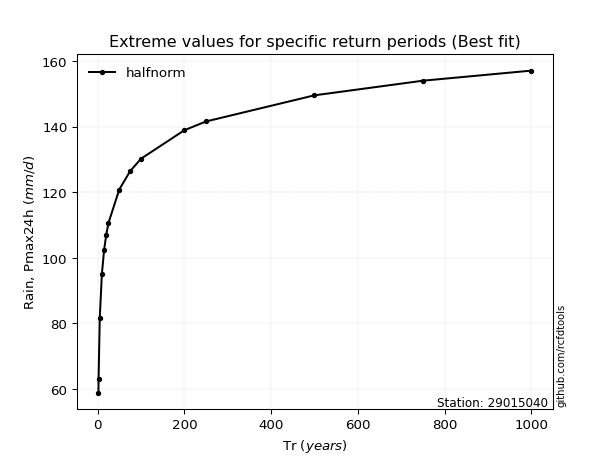</img>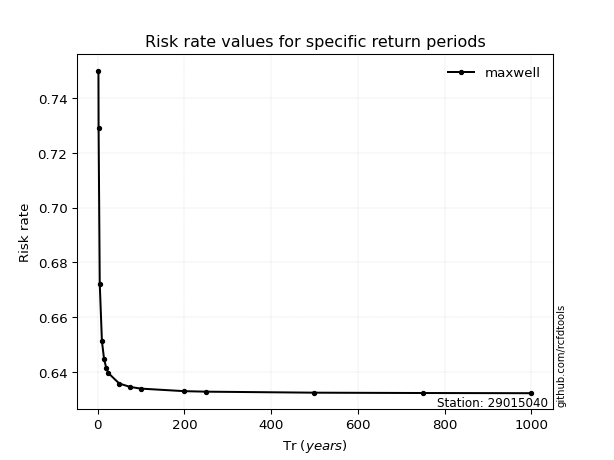</img>

</div>


<sub>**APP DISCLAIMER**: NO WARRANTY - This software is provided by [github.com/rcfdtools](https://github.com/rcfdtools) "as is", without any express or implied warranty, including warranties of merchantability, fitness for a particular purpose, or non-infringement. There is no guarantee that the software will be error-free or operate without interruption. LIMITATION OF LIABILITY - Neither the authors nor copyright holders will be liable for claims or damages arising from the software or its use. You are responsible for determining if the software is appropriate for your use and assume all associated risks, including errors, legal compliance, and data loss. NO PROFESSIONAL ADVICE - The software provides general information and does not offer professional advice. It should not replace consultation with professional advisors.</sub>